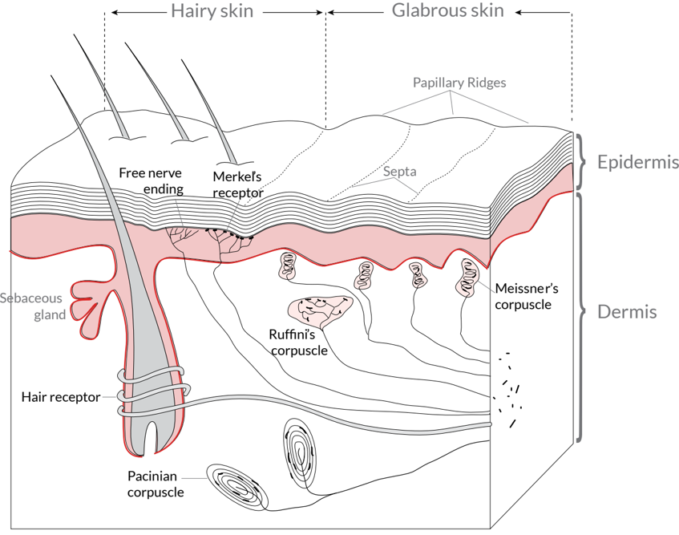
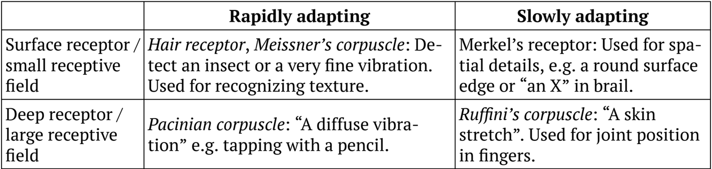
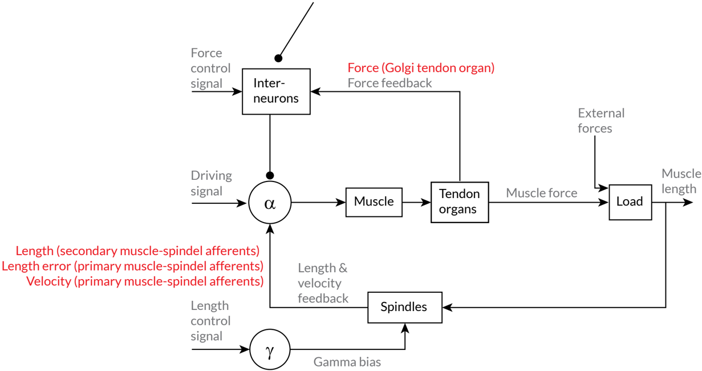

# somatosensory

*Diekstrak: 21 June 2026, 22:52*

---

---
## 📄 Halaman 1

### Anatomy of the Somatosensory System

FROM WIKIBOOKS 1

Our somatosensory system consists of sensors in the skin and sensors in our muscles, tendons, and joints. The receptors in the skin, the so called cutaneous receptors, tell us about temperature ( thermoreceptors ), pressure and surface  texture  ( mechano  receptors ),  and  pain  ( nociceptors ). The receptors in muscles and joints provide information about muscle length, muscle tension, and joint angles.

### Cutaneous receptors

Sensory information from Meissner corpuscles and rapidly adapting afferents leads to adjustment of grip force when objects  are  lifted.  These  afferents  respond  with  a  brief burst of action potentials when objects move a small distance  during  the  early  stages  of  lifting.  In  response  to This is a sample document to showcase page-based formatting. It contains a chapter from a Wikibook called Sensory Systems. None of the content has been changed in this article, but some content has been removed.

---
**🖼️ Gambar/Diagram**

> **Deskripsi Visual:** Diagram ini menampilkan struktur anatomi lapisan kulit, yang dibagi menjadi kulit berambut (hairy skin) dan kulit licin (glabrous skin). Secara keseluruhan, gambar ini memvisualisasikan lapisan epidermis dan dermis beserta berbagai reseptor sensorik yang terdapat di dalamnya. Elemen utama yang digambarkan meliputi folikel rambut, kelenjar sebasea, serta jenis-jenis corpuscle sensorik seperti Meissner's, Pacinian, Ruffini's, dan Merkel's, yang semuanya terhubung dengan ujung saraf bebas. Label penting yang terlihat mencakup nama-nama struktur anatomi seperti Papillary Ridges, Septa, dan lapisan kulit itu sendiri. Informasi kunci yang dapat diambil adalah pemahaman mengenai bagaimana berbagai reseptor sensorik tersebar di dalam lapisan kulit untuk mendeteksi rangsangan lingkungan.

 

---
## 📄 Halaman 2

### From Wikibooks

---
**🖼️ Gambar/Diagram**

> **Deskripsi Visual:** Ilustrasi ini menampilkan detail anatomi dan neurologis dari refleks tendon lutut (refleks panggul) serta komponen pengatur panjang otot di dalamnya. Di sisi kiri, terlihat gambaran jaringan otot dan saraf yang mengarah ke area panggul. Bagian tengah menunjukkan "pembesaran otot spindle", yang berisi serabut otot utama (ekstrafus) dan serabut otot intrafus. Terdapat beberapa saluran saraf yang saling terhubung, termasuk neuron motorik gamma-s (γ-s), neuron motorik gamma-d (γ-d), serta serabut aferen II dan Ia. Label-label ini menjelaskan bagaimana sinyal saraf mengontrol kontraksi otot untuk menjaga keseimbangan dan posisi tubuh.

rapidly adapting afferent activity, muscle force increases reflexively until the gripped object no longer moves. Such a rapid response to a tactile stimulus is a clear indication of the role played by somatosensory neurons in motor activity.

The slowly adapting Merkel's receptors are responsible for form and texture perception. As would be expected for receptors  mediating  form  perception,  Merkel's  receptors are present at high density in the digits and around the mouth (50/mm² of skin surface), at lower density in other glabrous surfaces, and at very low density in hairy skin. This  innervations  density  shrinks  progressively  with  the passage of time so that by the age of 50, the density in human digits is reduced to 10/mm². Unlike rapidly adapting axons, slowly adapting fibers respond not only to the initial indentation of skin, but also to sustained indentation up to several seconds in duration.

Activation of the rapidly adapting Pacinian corpuscles gives  a  feeling  of  vibration,  while  the  slowly  adapting Ruffini  corpuscles respond  to  the  lataral  movement  or stretching of skin.

### Nociceptors

Nociceptors  have  free  nerve  endings.  Functionally,  skin nociceptors  are  either  high-threshold  mechanoreceptors or polymodal receptors .  Polymodal receptors respond not only to intense mechanical stimuli, but also to heat and to noxious chemicals. These receptors respond to minute punctures of the epithelium, with a response magnitude that depends on the degree of tissue deformation. They also respond to temperatures in the range of 40-60°C, and change their response rates as a linear function of warming (in contrast with the saturating responses displayed by non-noxious thermoreceptors at high temperatures).

 

---
## 📄 Halaman 3

---
**📊 Tabel**

Tabel ini membandingkan dua jenis reseptor sensitivitas sentuhan pada kulit berdasarkan kecepatan adaptasinya. Di sisi kiri, reseptor yang beradaptasi cepat mencakup penerima di permukaan seperti reseptor rambut dan korpuskel Meissner yang mendeteksi getaran halus atau tekstur, serta korpuskel Pacinian di dalam kulit yang merespons getaran difus. Sebaliknya, di sisi kanan, reseptor yang beradaptasi lambat meliputi reseptor Merkel yang mendeteksi detail spasial seperti tepi objek atau pola Braille, serta korpuskel Ruffini yang berfungsi sebagai pegas kulit untuk mendeteksi peregangan dan posisi sendi jari.

Pain signals can be separated into individual components,  corresponding  to  different  types  of  nerve  fibers used for transmitting these signals. The rapidly transmitted  signal,  which  often  has  high  spatial  resolution,  is called fi rst pain or cutaneous pricking pain . It is well localized and easily tolerated. The much slower, highly affective component is called second pain or burning pain ; it is poorly  localized  and  poorly  tolerated.  The  third  or deep pain , arising from viscera, musculature and joints, is also poorly  localized,  can  be  chronic  and  is  often  associated with referred pain.

### Muscle Spindles

Scattered throughout virtually every striated muscle in the body are long, thin, stretch receptors called muscle spindles. They are quite simple in principle, consisting of a few small muscle fibers with a capsule surrounding the middle third of the fibers. These fibers are called intrafusal fibers , in contrast to the ordinary extrafusal fibers . The ends of the intrafusal fibers are attached to extrafusal fibers, so whenever the muscle is stretched, the intrafusal fibers are also stretched. The central region of each intrafusal fiber has Notice how figure captions and sidenotes are shown in the outside margin (on the left or right, depending on whether the page is left or right). Also, figures are floated to the top/ bottom of the page. Wide content, like the table and Figure 3, intrude into the outside margins.

 

---
## 📄 Halaman 4

### From Wikibooks

---
**🖼️ Gambar/Diagram**

> **Deskripsi Visual:** Diagram ini menggambarkan mekanisme kontrol motorik dan umpan balik dalam sistem saraf yang mengatur aktivitas otot. Terlihat elemen utama seperti neuron intermedier (inter-neurons), unit motorik alfa (α), dan gamma (γ), serta reseptor seperti organ Golgi tendon dan spindle otot. Relasi antar elemen menunjukkan bagaimana sinyal kontrol dari otak diolah untuk menggerakkan otot, sementara umpan balik dari panjang, kecepatan, dan gaya otot (melalui spindle dan organ Golgi tendon) terus-menerus dimonitor untuk menyesuaikan aktivitas otot terhadap beban eksternal. Informasi kunci yang dapat diambil adalah pentingnya mekanisme umpan balik sensorik untuk kontrol postur dan pergerakan yang presisi.

few myofilaments and is non-contractile, but it does have one or more sensory endings applied to it. When the muscle is stretched, the central part of the intrafusal fiber is stretched and each sensory ending fires impulses.

Muscle spindles also receive a motor innervation. The large motor neurons that supply extrafusal muscle fibers are called alpha motor neurons , while the smaller ones supplying  the  contractile  portions  of  intrafusal  fibers  are called gamma neurons .  Gamma motor neurons can regulate the sensitivity of the muscle spindle so that this sensitivity can be maintained at any given muscle length.

### Joint receptors

The joint  receptors  are  low-threshold  mechanoreceptors and have been divided into four groups. They signal different characteristics of joint function (position, movements, direction and speed of movements). The free receptors or type 4 joint receptors are nociceptors.

For more examples of how to use HTML and CSS for paper-based publishing, see css4.pub.