# Bahasa Indonesia BS KLS X Rev

*Diekstrak: 12 May 2026, 07:11*

---

---
## 📄 Halaman 1

KEMENTERIAN PENDIDIKAN, KEBUDAYAAN, RISET, DAN TEKNOLOGI REPUBLIK INDONESIA 2023

### BAHASA INDONESIA BAHASA INDONESIA

Edisi Revisi

Fadillah Tri Aulia Sei Indra Gumilar Alvian Kurniawan

 

---
## 📄 Halaman 2

Hak Cipta pada Kementerian Pendidikan, Kebudayaan, Riset, dan Teknologi Republik Indonesia. Dilindungi Undang-Undang.

Penaian: Buku  ini  disiapkan  oleh  Pemerintah  dalam  rangka  pemenuhan  kebutuhan  buku  pendidikan  yang  bermutu, murah, dan merata sesuai dengan amanat dalam UU No. 3 Tahun 2017. Buku ini disusun dan ditelaah oleh berbagai pihak di bawah koordinasi Kementerian Pendidikan, Kebudayaan, Riset, dan Teknologi. Buku ini merupakan dokumen hidup  yang  senantiasa  diperbaiki,  diperbarui,  dan  dimutakhirkan  sesuai  dengan  dinamika  kebutuhan  dan  perubahan zaman. Masukan dari berbagai kalangan yang dialamatkan kepada penulis atau melalui alamat surel buku@kemdikbud. go.id diharapkan dapat meningkatkan kualitas buku ini.

Bahasa Indonesia untuk SMA/MA/SMK/MAK Kelas X (Edisi Revisi)

### Penulis

Fadillah Tri Aulia Sei Indra Gumilar Alvian Kurniawan

### Penelaah

Maman Suryaman Priscila Fitriasih Limbong

### Penyelia/Penyelaras

Supriyatno Lenny Puspita Ekawaty Faiz Alian Ilmi

### Kontributor

Nina Sugestina Nur Anif

### Ilustrator

Khairin Nisa

R. Habibullah Ahmad Ramdhan Haidin

### Editor

Muhammad Kodim

### Editor Visual

Is Yuniarto Nafawi

### Desainer

Agung Widodo

### Penerbit

Kementerian Pendidikan, Kebudayaan, Riset, dan Teknologi

### Dikeluarkan oleh:

Pusat Perbukuan

Kompleks Kemendikbudristek Jalan RS. Fatmawati, Cipete, Jakarta Selatan https://buku.kemdikbud.go.id

### Edisi Revisi, 2023

ISBN 978-623-118-375-0 (no.jil.lengkap PDF) ISBN 978-623-118-376-7 (jil.1 PDF)

Isi buku ini menggunakan huruf Noto Serif dan Noto Sans 11/15 pt, Steve Matteson. xvi, 304 hlm.: 17,6 x 25 cm.

 

---
## 📄 Halaman 3

### Kata Pengantar

Pusat  Perbukuan;  Badan  Standar,  Kurikulum,  dan  Asesmen  Pendidikan; Kementerian  Pendidikan,  Kebudayaan,  Riset,  dan  Teknologi  memiliki  tugas dan fungsi mengembangkan buku pendidikan pada satuan Pendidikan Anak Usia Dini, Pendidikan Dasar, dan Pendidikan Menengah, termasuk Pendidikan Khusus.  Buku  berkaitan  erat  dengan  kurikulum.  Buku  yang  dikembangkan saat ini mengacu pada kurikulum yang berlaku, yaitu Kurikulum Merdeka.

Salah satu bentuk dukungan terhadap implementasi Kurikulum Merdeka di satuan pendidikan ialah mengembangkan buku teks utama yang terdiri atas buku siswa dan panduan guru.  Buku ini merupakan sumber belajar utama dalam pembelajaran bagi peserta didik dan menjadi salah satu referensi atau inspirasi  bagi  guru  dalam  merancang  dan  mengembangkan  pembelajaran sesuai  karakteristik,  potensi,  dan  kebutuhan  peserta  didik.  Keberadaan buku teks utama ini diharapkan menjadi fondasi dalam membentuk  Proil Pelajar  Pancasila  yang  beriman,  bertakwa  kepada  Tuhan  Yang  Maha  Esa, dan berakhlak mulia; berkebinekaan global; berjiwa gotong royong; mandiri; kritis, dan kreatif.

Buku teks utama, sebagai salah satu sarana membangun dan meningkatkan budaya literasi masyarakat Indonesia, perlu mendapatkan perhatian khusus.  Pemerintah  perlu  menyiapkan  buku  teks  utama  yang  mengikuti perkembangan zaman untuk semua mata pelajaran wajib dan mata pelajaran peminatan, termasuk Pendidikan Khusus. Sehubungan dengan hal itu, Pusat Perbukuan  merevisi  dan  menerbitkan  buku-buku  teks  utama  berdasarkan Capaian Pembelajaran dalam Kurikulum Merdeka.

Kami  mengucapkan  terima  kasih  kepada  semua  pihak  yang  telah berkolaborasi  dalam  upaya  menghadirkan  buku  teks  utama  ini.  Kami berharap  buku  ini  dapat  menjadi  landasan  dalam  memperkuat  ketahanan budaya bangsa, membentuk mentalitas maju, modern, dan berkarakter bagi seluruh generasi penerus. Semoga buku teks utama ini dapat menjadi tonggak perubahan  yang  menginspirasi,  membimbing,  dan  mengangkat  kualitas pendidikan kita ke puncak keunggulan.

Jakarta, Desember 2023 Kepala Pusat Perbukuan,

Supriyatno, S.Pd., M.A.

 

---
## 📄 Halaman 4

### Salam literasi!

Selamat datang di kelas X. Kalian telah berhasil melewati jenjang SMP dan kini bersiap menapaki tahapan selanjutnya. Di bangku SMA ini, kalian akan mendapatkan teman, lingkungan belajar, dan materi belajar baru.

Buku ini akan mengajak kalian mengeksplorasi ragam bacaan dari berbagai tema yang ada di sekitar kalian. Selain itu, buku ini juga menyajikan beragam aktivitas  dan  ruang  bagi  kalian  untuk  berlatih  sekaligus  mengekspresikan kreativitas  dalam  pembelajaran  bahasa  Indonesia.  Semoga  ragam  bacaan, materi,  kegiatan,  dan  latihan  yang  tersaji  dalam  buku  ini  dapat  membuat kalian lebih memahami, terampil, dan mencintai bahasa Indonesia.

Selamat menikmati tantangan dan pengalaman dunia belajar yang baru! Semoga petualangan belajar kalian di kelas X menyenangkan.

Jakarta, Desember 2023

Tim Penulis

### Prakata

 

---
## 📄 Halaman 5

### Daftar Isi

 

---
## 📄 Halaman 6

Potongan

 

---
## 📄 Halaman 7

Kreatif

 

---
## 📄 Halaman 9

### BAB I

### Daftar Gambar

 

---
## 📄 Halaman 10

### BAB V

 

---
## 📄 Halaman 11

### BAB I

### Daftar Tabel

 

---
## 📄 Halaman 15

### Ada Apa dalam Buku Ini?

Di dalam buku ini kalian akan menemukan gambar-gambar sebagai penanda kegiatan pemelajaran yang akan dilakukan. Cermati gambar-gambar berikut ini beserta artinya!

Tujuan Belajar

Membaca dan Memirsa

Menyimak

Menulis

Berbicara, Berdiskusi, dan Mempresentasikan

Gambar ini menunjukkan tujuan pembelajaran dan materi pokok yang akan kalian pelajari.

Gambar ini menunjukkan saatnya kalian membaca dan memirsa dengan saksama.

Gambar ini menunjukkan saatnya kalian mendengarkan dengan saksama.

Gambar ini menunjukkan saatnya kalian mewujudkan ide ke dalam tulisan.

Gambar ini menunjukkan saatnya kalian berbicara dan menyampaikan pendapat dengan beragam cara.

 

---
## 📄 Halaman 16

### Kupas Teori

### Kreativitas

Jurnal Membaca

Releksi

Gambar ini menunjukkan kegiatan meningkatkan pengetahuan dan keterampilan berbahasa Indonesia yang baik dan benar.

Gambar ini menunjukkan saatnya kalian mengerjakan sebuah proyek atau suatu karya.

Gambar ini menunjukkan saatnya kalian membaca buku dan sumber bacaan lain, lalu mencatatnya pada jurnal.

Gambar ini menunjukkan saatnya kalian mengingat kembali materi pembelajaran dan mereleksi cara kalian mempelajarinya.

 

---
## 📄 Halaman 17

---
**🖼️ Gambar/Diagram**

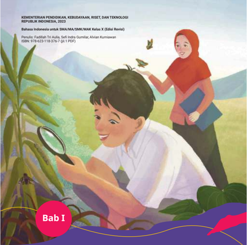

> **Deskripsi Visual:** Gambar ini adalah ilustrasi. Secara keseluruhan, ilustrasi ini menampilkan dua karakter anak—seorang laki-laki dan seorang perempuan—dalam aktivitas belajar atau eksplorasi alam. Laki-laki di depan, berpakaian putih, sedang memegang kaca pembesar dan memperhatikan tanaman atau serangga kecil di sekitarnya, menunjukkan minat terhadap alam atau ilmu pengetahuan. Perempuan di belakangnya, mengenakan hijab merah dan membawa buku, tampak mengamati atau mendukung aktivitas anak laki-laki. Latar belakangnya adalah taman atau area alam terbuka dengan tanaman hijau dan beberapa kupu-kupu yang terbang, menciptakan suasana edukatif dan menyenangkan. Elemen utama adalah interaksi antara dua karakter yang menunjukkan kolaborasi belajar, dengan laki-laki sebagai subjek utama yang mengamati secara aktif dan perempuan sebagai pendamping atau guru. Relasi antara mereka menunjukkan pembelajaran bersama atau pengajaran yang interaktif. Teks penting yang terlihat termasuk judul bab “Bab I” di lingkaran merah di bagian bawah, serta teks di atas gambar yang menyebutkan bahwa ini adalah buku pelajaran Bahasa Indonesia untuk SMA/MA/SMK/MAK Kelas X (Edisi Revisi) dari Kementerian Pendidikan, Kebudayaan, Riset, dan Teknologi Republik Indonesia 2023, dengan penulis Fadillah Tri Aulia, Sefi Indra Gumilar, dan Alvin Kurniawan, serta ISBN 978-623-118-376-7 (gi.1 PDF). Informasi kunci yang dapat diambil pembaca adalah bahwa gambar ini menggambarkan konteks pembelajaran bahasa Indonesia yang berbasis aktivitas eksplorasi alam, menekankan pendekatan interaktif dan keterlibatan siswa dalam kegiatan belajar yang menyenangkan dan relevan dengan lingkungan sekitar.

### MENGUNGKAP FAKTA ALAM SECARA OBJEKTIF

Mengapa laporan harus disampaikan secara objektif?

 

---
## 📄 Halaman 18

Setelah mempelajari materi Bab I, kalian  diharapkan  mampu  menyajikan fakta  berdasarkan  hasil  observasi  ke dalam  laporan  hasil observasi  yang objektif  dengan  menggunakan  sumber informasi lain yang mendukung.

### Peta Konsep

---
**🖼️ Gambar/Diagram**

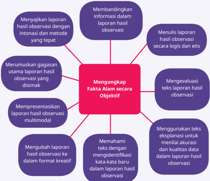

> **Deskripsi Visual:** Gambar ini merupakan diagram, khususnya diagram mind map atau diagram hubungan, yang menggambarkan proses pengolahan laporan hasil observasi dalam konteks pengumpulan fakta alam secara objektif. Secara keseluruhan, diagram ini menunjukkan bahwa “Mengungkap Fakta Alam secara Objektif” adalah inti atau titik pusat dari proses tersebut, dengan delapan elemen pendukung yang saling terhubung melalui garis, masing-masing merepresentasikan langkah atau aktivitas penting dalam pengolahan data observasi. Elemen utama adalah kotak merah di tengah yang berisi judul utama, dan delapan kotak ungu di sekelilingnya yang masing-masing berisi teks deskriptif tentang langkah-langkah seperti membandingkan informasi, menulis laporan secara logis, mengevaluasi teks, memahami teks dengan mengidentifikasi kata-kata baru, dan lain-lain. Teks penting yang terlihat termasuk frasa seperti “Mengungkap Fakta Alam secara Objektif”, “Membandingkan informasi dalam laporan hasil observasi”, “Menulis laporan hasil observasi secara logis dan etis”, dan “Menggunakan teks eksplorasi untuk menilai akurasi dan kualitas data”. Informasi kunci yang dapat diambil pembaca adalah bahwa proses pengolahan laporan hasil observasi melibatkan berbagai tahap sistematis, mulai dari analisis data, penulisan laporan, evaluasi, hingga presentasi, semuanya bertujuan untuk memastikan fakta alam diungkapkan secara objektif dan akurat. Diagram ini memberikan panduan visual yang jelas tentang struktur dan alur kerja dalam pengolahan data observasi.

### Kata Kunci

- observasi
- fakta
- opini
- eksplanasi
- akurasi

 

---
## 📄 Halaman 19

Gambar 1.1 Observatorium Bosscha merupakan observatorium astronomi terbesar di Indonesia. Sumber: Azmie Kasmy/ Wikimedia Commons (2010)

Perhatikan gambar di atas. Observatorium Bosscha merupakan salah satu tempat yang dapat digunakan untuk meneliti  dan  melihat  berbagai  fenomena  dan  objek  yang ada di langit. Berbagai teropong yang ada di Observatorium Bosscha dibutuhkan oleh para peneliti untuk mendapatkan data yang tepat.

Pernahkah kalian berkunjung ke sebuah tempat yang menarik?  Tuliskan  pada  tabel  berikut  hal  apa  saja  yang kalian dapatkan dari kelima indra kalian di tempat itu, lalu diskusikan dengan teman kalian.

---
**📊 Tabel**

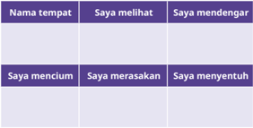

Tabel ini berfokus pada perbandingan empat jenis sikap atau perilaku yang mungkin diperlihatkan seseorang dalam konteks interaksi sosial, dengan fokus pada dua aspek: apa yang diinginkan atau diharapkan oleh seseorang (dalam kolom “Saya melihat”) dan apa yang sebenarnya terjadi atau diakui oleh seseorang (dalam kolom “Saya mendengar”). Topik utama tabel ini adalah pemahaman tentang ketidaksesuaian antara persepsi pribadi dan pengamatan orang lain, yang sering muncul dalam situasi sosial. Kolom pertama, “Nama tempat,” tampaknya berfungsi sebagai label atau kategori untuk konteks tertentu, namun dalam gambar ini tidak ada data yang terisi, sehingga tampak kosong. Kolom kedua, “Saya melihat,” mencerminkan bagaimana seseorang memandang atau menganggap situasi, misalnya “Saya mencium” yang mungkin menunjukkan keinginan atau tindakan yang diinginkan. Kolom ketiga, “Saya mendengar,” menunjukkan bagaimana orang lain mengalami atau mengartikan situasi tersebut, seperti “Saya merasakan” yang bisa berarti pengalaman subjektif yang berbeda. Kolom keempat, “Saya menyentuh,” mungkin menggambarkan interaksi fisik atau pengalaman langsung yang berbeda dari yang diharapkan. Pola penting yang terlihat adalah adanya ketidaksesuaian antara apa yang diinginkan atau diharapkan (melihat) dan apa yang sebenarnya terjadi atau dirasakan (mendengar), yang menunjukkan bahwa persepsi dan pengalaman sosial seringkali tidak selaras, dan ini bisa menjadi dasar untuk memahami dinamika komunikasi dan emosi dalam hubungan manusia.

 

---
## 📄 Halaman 20

Pada  bab  ini,  kalian  akan  mempelajari  bagaimana  menyusun  laporan hasil observasi yang objektif. Laporan hasil observasi merupakan teks yang mengungkapkan fakta-fakta. Fakta tersebut didapatkan melalui proses pengamatan.

Sebagai jenis teks faktual, laporan hasil observasi harus bersifat objektif. Artinya, informasi yang  diberikan sesuai dengan  data  yang  diperoleh selama observasi. Oleh karena itu, laporan hasil observasi yang kalian tulis harus dipastikan hanya berisi informasi yang kalian peroleh dari lapangan berdasarkan apa yang kalian lihat, dengar, cium, sentuh, dan rasakan.

Agar  dapat  mengungkapkan  fakta  alam  secara  objektif  dalam  bentuk teks laporan hasil observasi, kalian akan belajar membandingkan informasi yang  didapat  dan  mengidentiikasi  informasi  faktual  dalam  teks.  Selain  itu , kalian juga akan belajar menggunakan kaidah kebahasaan dalam teks laporan hasil observasi serta menulis dan menampilkan laporan hasil observasi yang objektif.

### A.  Membandingkan Informasi yang Akurat dalam Laporan Hasil Observasi

Menyimak

Membandingkan informasi berupa gagasan yang akurat dari menyimak laporan  hasil  observasi  dalam  bentuk  monolog.  Merumuskan  gagasan utama berdasarkan teks monolog laporan hasil observasi yang disimak.

Kalian akan membandingkan informasi dan merumuskan gagasan berdasarkan  teks  laporan  hasil  observasi  yang  disimak.  Teks  laporan  hasil observasi  yang  akan  kalian  simak  berjudul  'Belalang  Anggrek'.  Sebelum menyimak, perhatikan tabel dan panduan berikut ini.

 

---
## 📄 Halaman 21

### Kegiatan 1

- Bentuklah kelompok yang terdiri atas 5-6 orang.
- Tentukan pembagian tugas setiap anggota. Setiap anggota kelompok bertugas membacakan satu paragraf teks 'Belalang Anggrek' secara bergiliran.
- Sebelum menyimak, tentukan apakah pernyataan pada tabel benar atau salah.
- Simak teks yang dibacakan dengan saksama.

---
**📊 Tabel**

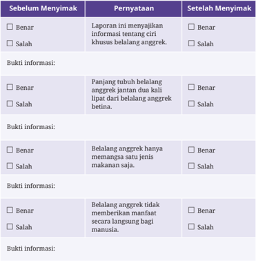

Tabel ini membahas perubahan persepsi atau pemahaman tentang belalang anggrek sebelum dan sesudah seseorang menyimak informasi tertentu, dengan fokus pada poin-poin kunci yang mungkin terkait dengan perilaku atau ciri khas hewan ini. Topik utama tabel adalah perubahan pemahaman tentang belalang anggrek setelah mendapatkan informasi baru. Tabel terdiri dari tiga kolom utama: “Sebelum Menyimak”, “Pernyataan”, dan “Setelah Menyimak”. Di setiap kolom, terdapat dua pilihan jawaban, “Benar” atau “Salah”, yang menunjukkan sikap awal dan akhir terhadap pernyataan tertentu, serta kolom “Bukti informasi” yang menggambarkan sumber atau alasan yang mendukung pernyataan tersebut. Pola penting yang terlihat adalah bahwa sebagian besar pernyataan awal dianggap salah, namun setelah menyimak informasi, pernyataan tersebut berubah menjadi benar, menunjukkan bahwa informasi yang diberikan berhasil mengubah persepsi atau pemahaman. Misalnya, pernyataan bahwa belalang anggrek hanya memangsa satu jenis makanan saja dianggap salah sebelumnya, namun setelah menyimak, dianggap benar, menunjukkan bahwa informasi tersebut memberikan pengetahuan baru tentang kebiasaan makan belalang anggrek. Hal ini menggambarkan bagaimana pengetahuan dapat mengubah cara kita memandang sesuatu, terutama ketika informasi yang diberikan lebih akurat atau lebih mendalam.

 

---
## 📄 Halaman 22

### Belalang Anggrek

Teman-teman, kali ini saya akan menyampaikan laporan hasil observasi yang telah saya lakukan beberapa waktu lalu. Objek yang diobservasi adalah  belalang  anggrek.  Pertama-tama  saya  akan  menyampaikan informasi  umum  terkait  belalang  anggrek.  Belalang  anggrek  atau Hymenopus  coronatus adalah  salah  satu  jenis  belalang  sentadu  atau belalang sembah yang hidup di Indonesia dan kawasan Asia Tenggara lainnya. Seperti namanya, belalang ini memiliki bentuk dan warna yang menyerupai bunga anggrek.

Selanjutnya, saya akan menjelaskan ciri khas belalang anggrek yang terdiri atas bagian tubuh, bentuk tubuh, makanan, dan daur hidupnya. Bagian tubuh belalang anggrek terdiri atas kepala, toraks, dan abdomen. Pada bagian kepala terdapat mata majemuk, mulut, dan dua buah antena seperti benang. Seperti jenis belalang sentadu lainnya, kepala belalang anggrek  bisa  berputar  360°.  Pada  bagian  toraks  terdapat  tiga  pasang kaki.  Kaki  depan  belalang  anggrek  yang  panjang  dan  kuat  dilengkapi dengan  duri  dan  capit.  Belalang  anggrek  memiliki  dua  pasang  sayap yang  menutupi  bagian  abdomennya.  Sayap  depan  berfungsi  untuk melindungi sayap belakang sehingga teksturnya lebih keras.

---
**🖼️ Gambar/Diagram**

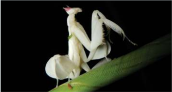

> **Deskripsi Visual:** Gambar ini adalah foto.  
1. Secara keseluruhan, gambar menampilkan seekor kumbang mantis (mantis religiosa) berwarna putih yang sedang berada di atas daun hijau, dengan latar belakang hitam yang kontras. Kumbang mantis ini tampak dalam posisi berdiri, dengan kaki depannya yang panjang dan ramping terangkat, menunjukkan postur siap menyerang atau berjaga-jaga.  
2. Elemen utama adalah tubuh kumbang mantis yang terlihat sangat detail, termasuk kaki depan yang berbentuk seperti cangkang, sayap yang terlipat, dan kepala dengan antena. Relasi antar elemen menunjukkan bahwa kumbang mantis ini sedang berada di atas daun, menunjukkan habitat alami dan postur yang khas untuk menyembunyikan diri atau menyerang.  
3. Tidak ada teks, angka, atau label yang terlihat dalam gambar ini.  
4. Informasi kunci yang dapat diambil pembaca adalah bahwa gambar ini menunjukkan kumbang mantis dalam kondisi alami, menekankan bentuk fisiknya yang unik dan warna putih yang kontras dengan latar belakang hitam, serta menunjukkan bahwa kumbang mantis memiliki kaki depan yang panjang dan ramping, yang merupakan ciri khasnya untuk menyerang atau berjaga-jaga.

Ukuran tubuh belalang anggrek berbeda antara jantan dan betina. Panjang  tubuh  belalang  anggrek  jantan  sekitar  2,5-3  cm,  sedangkan

 

---
## 📄 Halaman 23

betina  6-7  cm.  Tubuh  mereka  berwarna  putih  dengan  aksen  merah muda lembut atau cerah. Beberapa belalang bahkan berwarna benarbenar putih atau merah jambu. Namun, belalang anggrek bisa mengubah warna  tubuhnya  dalam  hitungan  sehari,  bergantung  pada  kondisi lingkungan, seperti kelembapan dan kondisi cahaya.

Belalang  anggrek  merupakan  predator polifagus atau  pemakan beberapa jenis mangsa. Mereka memangsa serangga lain yang bertubuh lebih kecil, seperti jangkrik, capung, lebah, dan lalat. Belalang anggrek menggunakan bentuk dan warna tubuhnya untuk menarik perhatian mangsa.  Saat  mangsa  mendekat,  mereka  akan  menggunakan  kaki depannya untuk menangkap mangsa. Belalang sembah hanya memangsa hewan yang masih hidup.

Belalang anggrek merupakan hewan yang mengalami metamorfosis tidak sempurna. Fase hidupnya terdiri dari telur, nimfa, dan dewas a. Belalang betina dapat bertelur sampai  300 butir. Telur tersebut diletakkan  dalam  sarang  berbentuk  buih  putih  yang  disebut ooteka . Ooteka lama-lama akan mengeras dan melindungi telur-telur dari panas dan  hujan.  Telur-telur  tersebut  membutuhkan  waktu  sekitar  enam minggu  untuk  menetas.  Saat  menetas,  nimfa  belalang  sembah  sudah menyerupai belalang anggrek dewasa. Itulah mengapa belalang anggrek disebut mengalami metamorfosis tidak sempurna.

Sebagai  penutup,  saya  akan  menyampaikan  manfaat  belalang anggrek.  Belalang  anggrek  berguna  bagi  manusia  untuk  membasmi hama  berupa  serangga.  Selain  itu,  karena  keindahannya,  belalang anggrek juga dijadikan peliharaan.

Demikian laporan hasil observasi saya. Terima kasih atas perhatian teman-teman semua.

(Disarikan dari Toemon, 2017 dan Bates, 2016)

Setelah kalian menyimak teks laporan hasil observasi di atas, lihat kembali tabel prediksi yang telah kalian isi di awal. Setelah itu, ikuti petunjuk berikut ini.

- Bandingkan  prediksi  kalian  dengan  informasi  yang  didapatkan  setelah menyimak!

 

---
## 📄 Halaman 24

- Tulislah  bukti  informasi  yang  mendukung  kebenaran  atau  kesalahan pernyataan tersebut!
- Bandingkan jawaban kalian dengan jawaban teman-teman kalian!
Apakah prediksi kalian tepat? Informasi atau pengetahuan awal kalian terhadap  suatu  teks  akan  sangat  membantu  dalam  membuat  prediksi  dan mengecek  kebenaran  informasi  sebuah  teks.  Ketepatan  dan  kebenaran informasi yang disampaikan merupakan ciri khas laporan hasil observasi.

### Kegiatan 2

Selain  dari  sifat  informasi  yang  disampaikan,  laporan  hasil  observasi juga memiliki ciri khas pada struktur teksnya. Untuk lebih memahami struktur teks laporan hasil observasi, analisislah laporan hasil observasi berjudul  'Belalang  Anggrek' di  atas.  Jika  kalian  cermati,  pembaca laporan membagi laporannya ke dalam tiga penjelasan pokok. Apa saja ketiga penjelasan pokok tersebut?

1.

2.

3

Secara  umum,  teks  laporan  hasil  observasi  disusun  dengan  struktur berikut.

### 1. Pernyataan  umum  atau  klasiikasi

Bagian  ini  berisi  pembuka  atau  pengantar  mengenai  hal  yang  akan disampaikan, hal umum tentang objek yang akan dikaji, dan menjelaskan secara garis besar pemahaman tentang hal tersebut.

Contoh: jika objek observasi adalah binatang, hal-hal yang dapat dibahas pada bagian ini, yakni nama ilmiah, klasiikasi umum binatang (serangga, mamalia, unggas, dll.), dan tempat hidup secara umum.

 

---
## 📄 Halaman 25

### 2. Deskripsi bagian

Bagian ini berisi penjelasan detail mengenai objek atau bagian-bagian dari objek. Contoh: jika objek observasi adalah binatang, hal-hal yang dapat dibahas pada bagian ini,  yakni  bagian  tubuh,  pola  makan,  daur  hidup, habitat, kebiasaan unik, dan lain-lain.

### 3. Deskripsi manfaat atau kesimpulan

Bagian ini menjelaskan manfaat dari objek yang diobservasi, baik bagi manusia maupun alam secara umum.

Agar lebih jelas, pelajarilah struktur teks laporan hasil observasi 'Belalang Anggrek' berikut!

---
**📊 Tabel**

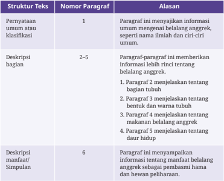

Tabel ini menjelaskan struktur teks berdasarkan jumlah paragraf dan fungsi masing-masing paragraf dalam menyampaikan informasi, dengan fokus pada tiga jenis struktur teks: pernyataan umum atau klasifikasi, deskripsi bagian, dan deskripsi manfaat/simpulan. Topik utama tabel adalah bagaimana teks disusun secara logis untuk menyampaikan informasi secara sistematis, mulai dari paragraf pembuka yang memberi gambaran umum, hingga paragraf-paragraf berikutnya yang secara bertahap menjelaskan detail, dan akhirnya paragraf penutup yang menyimpulkan atau menyampaikan manfaat. Kolom pertama menyebutkan jenis struktur teks, kolom kedua menunjukkan jumlah paragraf yang digunakan, dan kolom ketiga menjelaskan fungsi atau isi setiap paragraf. Pola penting yang terlihat adalah adanya urutan logis: paragraf pertama menyajikan informasi umum atau klasifikasi, paragraf kedua hingga kelima secara bertahap memperdalam penjelasan dengan fokus pada bagian tubuh, bentuk, dan fungsi, serta paragraf keenam menyimpulkan dengan menekankan manfaat atau kesimpulan akhir. Struktur ini membantu pembaca memahami informasi secara bertahap dan menyeluruh.

Sekarang,  simaklah  laporan  hasil  observasi  berjudul  'Sungai  Sa'ua'. Setelah  itu,  identiikasilah  bagian-bagian  teks  laporan  hasil  observas i  tersebut menggunakan tabel seperti pada contoh sebelumnya.

 

---
## 📄 Halaman 26

### Sungai Sa'ua

Sungai Sa'ua terletak di wilayah Kabupaten Nias Selatan, Sumatra Utara. Sungai Sa'ua  melewati  beberapa  kampung. Sungai ini mengalir dari mata air pegunungan utara di Mazino dan bermuara ke Selatan di Desa Bawodobara dan Ganowo Saua, Kecamatan Telukdalam. Di sepanjang sungai terdapat deretan rumah-rumah penduduk.

Air  Sungai  Sa'ua  berwarna  kecokelatan  dan  keruh.  Sungai  Sa'ua tercemar  akibat    pembuangan  sampah,  penambangan  pasir  ataupun batu yang dilakukan oleh   masyarakat.  Selain itu, kegiatan mandi dan mencuci  pakaian  penduduk  di  sepanjang  tepi  sungai  menyebabkan banyaknya limbah kimia yang terbuang ke Sungai Sa'ua.

Meskipun kotor, sebagian besar penduduk masih mencari ikan di Sungai Sa'ua. Alat tangkap yang sering digunakan oleh warga setempat adalah jaring, jala, dan pancing. Namun, terdapat beberapa warga yang menggunakan zat-zat kimia berbahaya untuk   menangkap ikan.

Di  Sungai  Sa'ua    masih    terdapat  beberapa  jenis  ikan  air  tawar yang  hidup.  Untuk  memastikan  keakuratan  data  maka  dilakukan penangkapan  ikan  air  tawar  secara  langsung.  Selama  penangkapan, ikan yang   berhasil   dikumpulkan berjumlah lima puluh delapan ekor, yang terdiri tujuh jenis spesies ikan air tawar.

Dari  proses  pengukuran  temperatur  air  di  beberapa  titik  sungai, diperoleh informasi bahwa temperatur air sungai cenderung mengalami luktuasi  pada  kisaran  23  °C  sampai  26  °C.  Dari  hasil  pengamatan didapatkan bahwa salah satu penyebab  luktuasi  ini  adalah  rusaknya ekosistem  yang  ada  di  sekitar  sungai  akibat  penambangan  pasir  dan kerikil  yang  berlebihan.  Selain  itu,  pembukaan  lahan  pertanian  di sepanjang  pinggir  sungai  membuat  sinar  matahari  dengan  leluasa masuk ke dalam dasar sungai.

Dari  hasil  observasi  di  atas,  dapat  disimpulkan  bahwa  di  Sungai Sa'ua  masih  terdapat  beberapa  jenis  ikan.  Hal  ini  menjadi  indikator bahwa ekosistem pada Sungai Sa'ua masih berfungsi normal. Namun, tanda-tanda  kemunduran  tampak  pada  luktuasi  yang  terjadi  pada temperatur air sungai sehingga kewaspadaan perlu ditingkatkan dengan mengembalikan fungsi dan kondisi ekosistem yang terdapat di dalam ataupun di sekitar Sungai Sa'ua.

(Sumber: Ziraluo, 2020, dengan penyesuaian)

 

---
## 📄 Halaman 27

### Tabel 1.4 Isian Hasil Analisis Struktur Teks Laporan Hasil Observasi (LHO)

---
**📊 Tabel**

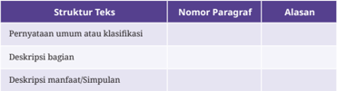

Tabel ini membahas struktur teks berdasarkan jenis paragraf dan alasan penggunaannya, dengan topik utama yang menjelaskan bagaimana teks dapat disusun secara sistematis untuk menyampaikan informasi secara efektif. Kolom pertama menyebutkan jenis struktur teks, seperti pernyataan umum atau klasifikasi, deskripsi bagian, dan deskripsi manfaat atau sifat. Kolom kedua menunjukkan jumlah paragraf yang sesuai dengan struktur tersebut, yang dalam hal ini tidak disebutkan secara eksplisit, namun secara implisit mengindikasikan bahwa setiap struktur teks memiliki jumlah paragraf tertentu yang sesuai. Kolom ketiga memberikan alasan mengapa struktur tersebut digunakan, yang pada dasarnya menunjukkan tujuan atau fungsi teks tersebut. Pola penting yang terlihat adalah bahwa setiap struktur teks memiliki tujuan khusus: struktur pernyataan umum atau klasifikasi digunakan untuk memberikan gambaran awal atau kategori, deskripsi bagian untuk menjelaskan komponen atau elemen tertentu, dan deskripsi manfaat atau sifat untuk menyoroti nilai atau karakteristik suatu benda atau konsep. Dengan demikian, tabel ini membantu pembaca memahami bagaimana teks dapat disusun secara logis dan fungsional sesuai dengan tujuan komunikasi yang ingin dicapai.

### B.  Mengidentiikasi Makna Kata dan Informasi Faktual dalam Laporan Hasil Observasi dan Sumber Lainnya yang Mendukung

Membaca dan Memirsa

Mengevaluasi teks laporan hasil observasi yang dibaca untuk menemukan informasi  baik  tersurat  maupun  tersirat  secara  kritis.  Menggunakan sumber lain  berupa  teks  eksplanasi  untuk  menilai  akurasi  dan  kualitas data dalam teks laporan hasil observasi serta membandingkan isi teks. Memahami informasi dalam teks  melalui  identiikasi  kata-kata  baru  yang digunakan  dalam  konteks  topik  sains/sosial  tertentu  dalam  teks  laporan hasil observasi.

### Kegiatan 1

Pada kegiatan ini, kalian akan membaca laporan hasil observasi berjudul 'Kunang-Kunang'. Untuk melakukkan itu, perhatikan dan ikuti langkahlangkah berikut.

### Sebelum membaca

- Tuliskan judul teks yang akan kalian baca.

 

---
## 📄 Halaman 28

- Tuliskan pertanyaan Adiksimba ( apa, di mana, kapan, siapa, mengapa, dan bagaimana ) yang muncul saat kalian membaca judul teks.

### Setelah membaca

- Tukarlah pertanyaan yang kalian buat dengan teman yang lain.
- Jawablah pertanyaan yang kalian dapatkan.
- Tuliskan informasi penting dari jawaban tersebut.
- Buatlah ringkasan dari setiap paragraf.

### Kunang-Kunang

Kunang-kunang merupakan jenis serangga yang dapat mengeluarkan cahaya  yang  jelas  terlihat  saat  malam  hari.  Cahaya  ini  dihasilkan dari  'sinar  dingin'  yang  tidak  mengandung  ultraviolet  ataupun  sinar inframerah.  Terdapat  lebih  dari  2000  spesies  kunang-kunang  yang tersebar di daerah tropis di dunia.

Kunang-kunang hidup di tempat-tempat lembab, seperti rawa-rawa, hutan  bakau,  dan  daerah  yang  dipenuhi  pepohonan.  Kunang-kunang juga ditemukan pada daerah perkuburan yang tanahnya relatif gembur dan  tidak  banyak  terganggu  oleh  aktivitas  manusia.  Kunang-kunang bertelur  saat  hari  gelap.  Telur-telurnya  yang  berjumlah  antara  100 hingga 500 butir diletakkan di tanah, ranting, rumput, tempat berlumut, atau di bawah dedaunan.

Pada  umumnya,  kunang-kunang  akan  keluar  pada  malam  hari, tetapi ada juga kunang-kunang yang beraktivitas di siang hari. Mereka yang  keluar  siang  hari  ini  umumnya  ditemukan  tidak  mengeluarkan cahaya.

Berdasarkan hasil pengamatan, tubuh kunang-kunang betina lebih besar  dibandingkan  kunang-kunang  jantan.  Tubuh  kunang-kunang terdiri atas tiga bagian: kepala, thorax, dan perut (abdomen). Kunangkunang  memiliki  dua  pasang  sayap.  Sepasang  sayap  penutup  yang bertekstur keras melindungi sayap di bawahnya sekaligus melindungi tubuh kunang-kunang. Panjang badannya sekitar 2 cm. Hampir seluruh

 

---
## 📄 Halaman 29

bagian tubuh kunang-kunang berwarna gelap dan berwarna titik merah pada bagian penutup kepala. Warna kuning pada bagian penutup sayap, bermata majemuk, dan berkaki enam.

Makanan  kunang-kunang  adalah  cairan  tumbuhan,  siput-siputan kecil, serangga, atau cacing. Bahkan, kunang-kunang memangsa jenisnya sendiri.  Makanan  bagi  hewan  penting  untuk  pertumbuhan.  Dengan makanan, pertumbuhan akan maksimal. Asupan yang maksimal dapat memberikan kebugaran bagi makhluk hidup.

Cahaya  yang  dikeluarkan  oleh  kunang-kunang  tidak  berbahaya, malah  tidak  mengandung  ultraviolet  dan  inframerah.  Cahaya  ini dipergunakan kunang-kunang untuk memberi  peringatan kepada pemangsa  bahwa  kunang-kunang  tidak  enak  dimakan  dan  untuk menarik pasangannya. Keahlian mempertontonkan cahaya tidak hanya dimiliki oleh kunang-kunang dewasa, tetapi juga larva. Kunang-kunang betina  sengaja  berkelap-kelip  untuk  mengundang  pejantan.  Setelah pejantan mendekat, sang betina memangsanya. Kunang-kunang jantan lebih sedikit bercahaya dibandingkan dengan kunang-kunang betina.

Kunang-kunang merupakan penanda kesehatan sebuah ekosistem (bioindikator) sehingga dapat membantu manusia untuk menilai apakah sebuah daerah masih bersih dan alami atau sudah tercemar. Kunangkunang juga membantu petani dalam proses penyerbukan dan sebagai pembasmi hama alami.

(Sumber: Umairti dan Sukana, 2016)

### Kegiatan 2

Dalam menyajikan data yang akurat, kalian dapat menggunakan sumber lain  sebagai  pembanding terhadap hasil observasi kalian di lapangan. Kali ini, kalian akan menggunakan sebuah teks eksplanasi sebagai bahan pembanding informasi pada teks laporan observasi berjudul 'KunangKunang'.  Teks  eksplanasi  merupakan  teks  yang  menjelaskan  proses bagaimana dan mengapa suatu fenomena, baik fenomena alam maupun fenomena  sosial,  terjadi.  Bacalah  teks  eksplanasi  yang  menjelaskan fenomena terancam punahnya kunang-kunang di bawah ini.

 

---
## 📄 Halaman 30

### Kunang-Kunang yang Perlahan Menghilang

Penelitian yang diterbitkan dalam jurnal Bioscience  menyatakan kunang-kunang menghadapi ancaman kepunahan. Ada beberapa faktor penyebab serangga ini terancam punah.

Penyebab  pertama  kepunahan  kunang-kunang  adalah  hilangnya habitat hidup kunang-kunang. Kunang-kunang menderita karena habitat  yang  menjadi  tempat  untuk  menyelesaikan  siklus  hidupnya telah menghilang. Misalnya, kunang-kunang Malaysia ( Pteroptyx tener ),  yang terkenal karena panjangnya, harus kehilangan habitatnya untuk berkembang biak di kawasan bakau karena di konversi menjadi perkebunan sawit dan pertanian budidaya.

Dalam penelitian lain juga disebutkan bahwa polusi cahaya menjadi penyebab kedua terbesar punahnya kunang-kunang. Penggunaan cahaya buatan pada malam hari, yang makin marak seabad terakhir, adalah  ancaman  paling  serius  kedua  bagi  kunang-kunang.  Banyak kunang-kunang mengandalkan bioluminescence ,  reaksi  kimia  didalam tubuh mereka yang memungkinkan untuk menyala saat menemukan dan menarik pasangan. Banyaknya cahaya buatan dapat mengganggu fase ini.

Penelitian  juga  mencatat,  tingkat  kecerahan  dibumi  mengalami peningkatan  sebesar  23  persen.  Selain  itu,  Avalon  Owens,  seorang kandidat PhD dalam biologi di Universitas Tufts, menyampaikan bahwa polusi cahaya benar-benar mengacaukan ritual kawin kunang-kunang yang berdampak kepada regenerasi kunang-kunang.

Penggunaan insektisida juga berperan dalam penurunan populasi kunang-kunang. Profesor biologi dari Universitas Sussex, Dave Goulson mengatakan  hilangnya  habitat  menjadi  faktor  paling  utama  yang mendorong  kepunahan  kunang-kunang,  sedangkan  pestisida  adalah faktor sekunder yang tidak bisa di kesampingkan.

Selain tiga faktor itu, pariwisata juga memicu kepunahan kunangkunang. Di Jepang, Taiwan, dan Malaysia, misalnya, meningkatnya angka wisatawan  yang  mencapai  200  ribu  pengunjung  membuat  populasi kunang-kunang menurun. Di Thailand, peneliti juga mengatakan bahwa lalu lintas perahu motor di sepanjang sungai bakau telah menumbangkan

 

---
## 📄 Halaman 31

pohon dan mengikis tepi sungai serta menghancurkan habitat kunangkunang. Sementara itu, spesies yang tidak dapat terbang di injak-injak oleh wisatawan di Carolina Utara dan Nanacampila di Meksiko.

(Sumber:

CNN Indonesia , 2020)

Bandingkanlah informasi yang terdapat pada teks laporan hasil observasi 'Kunang-Kunang'  dengan  informasi  pada  teks  eksplanasi  'Kunang-Kunang yang Perlahan Menghilang'. Gunakan pengatur grais berikut untuk membandingkan  informasi  pada  kedua  teks  tersebut.  Perhatikan  contoh pengisian yang terdapat pada tabel ini.

---
**📊 Tabel**

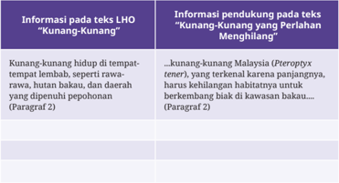

Topik utama tabel ini adalah perbedaan antara informasi yang diberikan dalam teks LHO (Laporan Hasil Observasi) dan informasi pendukung yang diberikan oleh pihak yang berwenang, khususnya mengenai “kunang-kunang” yang ditemukan di Malaysia. Kolom pertama menjelaskan bahwa dalam teks LHO, “kunang-kunang” dianggap sebagai hewan yang hidup di tempat-tempat lembab, seperti rawa-rawa, hutan bakau, dan daerah yang dipenuhi pepohonan, seperti yang disebutkan dalam paragraf kedua. Kolom kedua, yang berisi informasi pendukung dari pihak yang berwenang, menyatakan bahwa “kunang-kunang Malaysia” (Pteropix tener) merupakan spesies yang terkendala karena panjangnya, sehingga tidak bisa bergerak bebas di kawasan bakau, dan ini merupakan alasan utama mengapa spesies ini tidak bisa beradaptasi dengan baik di lingkungan tersebut. Dari kedua kolom ini, pola penting yang terlihat adalah bahwa teks LHO memberikan deskripsi umum tentang habitat, sementara informasi pendukung menyoroti masalah spesifik terkait biologis dan adaptasi spesies tersebut, menunjukkan bahwa informasi yang diberikan oleh pihak berwenang lebih fokus pada tantangan ekologis yang mungkin menghambat keberadaan spesies tersebut di lingkungan alami.

### Kegiatan 3

Salah  satu  ciri  bahasa  yang  digunakan  dalam  laporan  hasil  observasi adalah bahasa ilmiah. Sebab, laporan hasil observasi termasuk dalam teks ilmiah.

Untuk  memahami  arti  kata  ilmiah  yang  jarang  dijumpai  dalam percakapan sehari-hari, kita dapat menggunakan cara berikut.

 

---
## 📄 Halaman 32

- Makna  atau  arti  kata  sering  kali  dijelaskan  secara  langsung  atau tersurat dalam teks.

### Contoh:

Belalang  anggrek  merupakan  predator polifagus atau  pemakan beberapa jenis mangsa.

- Makna atau arti kata dapat ditemukan dari penjelasan secara tidak langsung dalam teks.

### Contoh:

Tonggeret termasuk hewan herbivora. Tonggeret dewasa mengisap sari  makanan  dari  batang  pohon  menggunakan  mulutnya  yang seperti  jarum.  Saat  masih  berbentuk  nimfa,  tonggeret  mengisap cairan dari akar pohon untuk bertahan hidup.

Dari  teks  tersebut,  kita  dapat  menyimpulkan  bahwa  herbivora berarti hewan yang memakan tumbuhan atau bagian tumbuhan.

- Makna atau arti kata dapat ditemukan melalui petunjuk visual yang terdapat dalam teks.

### Contoh:

---
**🖼️ Gambar/Diagram**

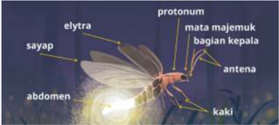

> **Deskripsi Visual:** Gambar ini merupakan ilustrasi. Ilustrasi ini menampilkan struktur tubuh serangga, khususnya seekor nyamuk (atau serangga mirip nyamuk seperti *Diptera*), dengan label yang menunjukkan bagian-bagian tubuhnya secara jelas. Elemen utama yang ditampilkan adalah tubuh serangga yang dibagi menjadi tiga bagian utama: kepala, toraks, dan abdomen, dengan bagian-bagian seperti mata majemuk, antena, sayap, elytra, kaki, dan proton (yang kemungkinan besar merujuk pada proton di dalam sel atau mungkin merupakan kesalahan penulisan untuk “proton” sebagai bagian tubuh, tetapi dalam konteks ini lebih mungkin merujuk pada “proton” sebagai bagian tubuh seperti “proton” atau “proton” sebagai bagian tubuh seperti “proton” — namun secara kontekstual, “proton” kemungkinan besar merupakan kesalahan dan seharusnya “proton” atau “proton” — namun dalam konteks ini, “proton” kemungkinan besar merupakan kesalahan dan seharusnya “proton” atau “proton” — namun secara kontekstual, “proton” kemungkinan besar merupakan kesalahan dan seharusnya “proton” atau “proton” — namun secara kontekstual, “proton” kemungkinan besar merupakan kesalahan dan seharusnya “proton” atau “proton” — namun secara kontekstual, “proton” kemungkinan besar merupakan kesalahan dan seharusnya “proton” atau “proton” — namun secara kontekstual, “proton” kemungkinan besar merupakan kesalahan dan seharusnya “proton” atau “proton” — namun secara kontekstual, “proton” kemungkinan besar merupakan kesalahan dan seharusnya “proton” atau “proton” — namun secara kontekstual, “proton” kemungkinan besar merupakan kesalahan dan seharusnya “proton” atau “proton” — namun secara kontekstual, “proton” kemungkinan besar merupakan kesalahan dan seharusnya “proton

Sumber: Nisa/Kemendikbudristek (2023)

Dari gambar di atas dapat disimpulkan bahwa elytra adalah sayap atas yang menutupi sayap bagian bawah.

- Kalian juga dapat menggunakan kamus, ensiklopedia, atau tesaurus baik dalam bentuk cetak maupun daring untuk mencari makna atau arti kata.

 

---
## 📄 Halaman 33

### Contoh:

Sumber: Badan Pengembangan dan Pembinaan Bahasa/Kemendikbudristek (2023)

Gambar  di  atas  merupakan  tangkapan  layar  laman  Kamus  Besar Bahasa  Indonesia  Daring  saat  kalian  mencari  arti  kata  abdomen. Laman tersebut dapat diakses melalui tautan https://kbbi.kemdikbud. go.id.

---
**🖼️ Gambar/Diagram**

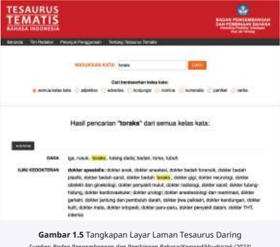

> **Deskripsi Visual:** Gambar ini merupakan ilustrasi. Secara keseluruhan, ilustrasi ini menampilkan gambaran visual dari struktur lapisan lasan (layer) dalam tesaurus daring, yang merupakan bagian dari konsep pengelolaan data atau sistem informasi. Elemen utama terdiri dari tiga lapisan berbentuk persegi panjang yang disusun secara vertikal, masing-masing dengan warna berbeda (hijau, biru, dan merah) yang mewakili lapisan berbeda dalam sistem tesaurus daring. Lapisan paling atas (hijau) mewakili lapisan data, lapisan tengah (biru) mewakili lapisan struktur, dan lapisan paling bawah (merah) mewakili lapisan aplikasi atau pengguna. Relasi antar lapisan menunjukkan hierarki dan interaksi fungsional antar komponen sistem. Teks penting yang terlihat di bawah ilustrasi menyebutkan “Gambar 1.5 Tangkapan Layar Laman Tesaurus Daring”, yang menunjukkan bahwa gambar ini adalah tangkapan layar dari antarmuka web. Label penting lainnya termasuk judul buku “TESAURUS TEMATIS” dan subjudul “Sistem Informasi dan Teknologi Informasi”. Informasi kunci yang dapat diambil pembaca adalah bahwa tesaurus daring terdiri dari tiga lapisan utama yang saling terhubung secara hierarkis, yang membantu dalam pengelolaan dan penyimpanan data tematik secara digital.

Sumber: Badan Pengembangan dan Pembinaan Bahasa/Kemendikbudristek (2023)

 

---
## 📄 Halaman 34

Adapun  gambar  di  atas  merupakan  tangkapan  layar  saat  kalian mencari arti kata abdomen dari berbagai kelas kata melalui tesaurus daring yang tersedia di http://tesaurus.kemdikbud.go.id/tematis/.

Sekarang, carilah makna istilah-istilah berikut dengan menggunakan cara-cara di atas, lalu buatlah kalimat lain dengan kata tersebut!

- Toraks
- Bioindikator
- Bioluminesence
- Habitat
- Membran
- Nocturnal
- Ooteka
- Populasi
- Predator
- Pronotum

### C.  Menggunakan Kaidah Kebahasaan dalam Laporan Hasil Observasi

### Kupas Teori

Menggunakan kaidah-kaidah bahasa yang digunakan dalam menyusun laporan hasil observasi

### Kalimat Deinisi dan Kalimat Deskripsi

### Kalimat Deinisi

Kalimat deinisi merupakan kalimat yang menjelaskan suatu hal, baik benda hidup  maupun  benda  mati,  secara  umum.  Umumnya,  penggunaan  kalimat deinisi  dalam  teks  laporan  merujuk  pada  istilah  teknis  atau  ilmiah yang berkaitan  dengan  bidang  tertentu.  Hal  tersebut  dapat  membantu  pembaca memahami istilah teknis atau ilmiah yang muncul dalam teks. Kalimat d einisi biasanya menggunakan kopula, seperti kata adalah dan merupakan .

 

---
## 📄 Halaman 35

### Contoh:

- Belalang anggrek ( Hymenopus Coronatus ) adalah salah satu jenis belalang sentadu atau belalang sembah yang hidup di Indonesia dan kawasan Asia Tenggara lainnya.
- Belalang anggrek merupakan predator polifagus atau pemakan beberapa jenis mangsa.
Dalam penggunaanya, kata adalah dan merupakan memiliki perbedaan. Kata adalah digunakan untuk menjelaskan pengertian yang mutlak, sedangkan kata merupakan menjelaskan pengertian yang bisa mengacu pada satu pengertian atau lebih yang bersifat tidak mutlak.

### Kalimat Deskripsi

Kalimat  deskripsi  digunakan  untuk  menggambarkan  sifat  atau  ciri  yang khusus  atau spesiik dari suatu  benda.  Kalian  dapat  menggunakan  kalimat deskripsi saat menjelaskan sifat sebuah benda kepada pembaca berdasarkan apa  yang  indra  kalian  rasakan  sehingga  pembaca  seolah-olah  melihat  atau merasakannya sendiri.

### Contoh:

- Tubuh mereka berwarna putih dengan aksen merah muda lembut atau cerah.
- Sayap depan berfungsi melindungi sayap belakang sehingga teksturnya lebih keras.
Selain  menggambarkan  sifat  atau  ciri  khusus  suatu  objek,  kalimat deskripsi  juga  dapat  menjelaskan  sebuah  aktivitas  yang  dilakukan  objek tersebut. Kalimat ini menggunakan kata kerja material atau kata kerja yang menunjukkan tindakan suatu benda, binatang, manusia, atau peristiwa.

### Contoh:

- Rongga itu memperkuat suara yang dihasilkan oleh getaran tymbal .
- Saat  bertelur  tonggeret  betina  menempelkan  telur-telurnya  di  cabang atau batang pohon dan rerumputan.

 

---
## 📄 Halaman 36

### Latihan

Carilah kalimat deinisi dan deskripsi pada teks 'Kunang-Kunang' dan 'Kunang-Kunang yang Perlahan Menghilang'!

### Imbuhan di-

Sering kali penulisan imbuhan didisalahartikan dengan kata depan di . Untuk membedakan mana yang merupakan imbuhan dan mana yang merupakan kata depan, kalian dapat mempelajarinya dari tabel berikut.

---
**📊 Tabel**

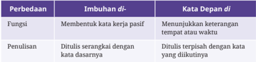

Tabel ini menjelaskan perbedaan antara dua jenis kata dalam bahasa Indonesia, yaitu imbuhan dan kata depan, dengan fokus pada fungsi, proses penulisan, dan cara penggunaannya. Topik utama tabel adalah perbedaan struktural dan fungsional antara imbuhan dan kata depan. Kolom pertama menyebutkan “Perbedaan”, yang menggambarkan kategori perbedaan yang dibahas; kolom kedua, “Imbuhan di”, menjelaskan bagaimana imbuhan berperan dalam membentuk kata kerja pasif, menunjukkan bahwa imbuhan berfungsi sebagai elemen yang menambah makna atau struktur kata; dan kolom ketiga, “Kata Depan di”, menjelaskan bahwa kata depan digunakan untuk menunjukkan keterangan tempat atau waktu, serta berfungsi sebagai elemen yang ditulis terpisah dari kata yang diikuti. Pola penting yang terlihat adalah bahwa imbuhan terikat erat dengan kata dasar dan membentuk kata baru secara internal, sementara kata depan bekerja secara eksternal, dipisahkan dari kata dasar dan berfungsi sebagai penunjuk konteks seperti tempat atau waktu. Perbedaan ini menunjukkan bahwa imbuhan berperan dalam transformasi makna kata, sedangkan kata depan berperan dalam memberi informasi tambahan tanpa mengubah struktur kata dasar.

Sekarang, carilah kesalahan penulisan kata berimbuhan dipada teks 'KunangKunang yang Perlahan Menghilang'.

### Penulisan Kutipan Tidak Langsung dan Sumber Rujukannya

Sebagai teks yang bersifat ilmiah, laporan hasil observasi harus menyajikan data yang akurat. Salah satu cara untuk menyajikan data yang akurat sebagai pendukung  hasil  observasi,  kalian  dapat  menggunakan  sumber  lain  baik berupa buku atau artikel cetak maupun sumber digital. Perhatikan kutipan teks berikut.

- Kunang-kunang betina ada yang mempunyai sayap dan tidak mempunyai sayap sehingga tidak selalu terbang. (Borror & White, 1970: 37)

 

---
## 📄 Halaman 37

- Essig  (1958:  78)  menyatakan  bahwa  spesies  kunang-kunang  sering ditemukan  di  daerah  dengan  kelembapan  tinggi  dan  hangat,  seperti kolam, sungai, payau, lembah, parit, dan padang rumput.
Kedua kalimat tersebut merupakan kutipan tidak langsung yang digunakan oleh  penulis.  Kutipan  tidak  langsung  adalah  penggunaan  pendapat  seorang penulis atau tokoh berupa intisari atau ikhtisar dari pendapat tersebut. Untuk membuat  kutipan  tidak  langsung,  kita  harus  memahami  terlebih  dahulu informasi yang akan dikutip. Setelah itu, tulislah inti dari informasi tersebut dengan menggunakan bahasa sendiri. Kalian juga dapat mengubah struktur kalimatnya menjadi kalimat pasif atau sebaliknya.

Kutipan tidak langsung yang dituliskan dalam teks dapat menggunakan dua  format  pada  contoh  kalimat  di  atas.  Kalimat  pertama  mencantumkan sumber  kutipan  dalam  tanda  kurung  pada  akhir  kalimat  berupa  nama belakang pengarang, tahun penerbitan, dan nomor halaman sumber kutipan. Kutipan tersebut diambil dari tulisan karya Borror dan White tahun 1970 pada halaman 37.

Kalimat kedua mencantumkan nama belakang penulis sumber kutipan di luar tanda kurung dan mencantumkan tahun serta nomor halaman kutipan dalam  tanda  kurung.  Kutipan  tersebut  merupakan  pernyataan  dari  karya yang ditulis Essig tahun 1958 pada halaman 78.

Semua sumber kutipan harus dicantumkan pada daftar  pustaka  untuk menghindari plagiarisme atau pengambilan karya orang lain tanpa izin. Jika dituliskan  dalam  daftar  pustaka,  sumber  kutipan  tersebut  ditulis  sebagai berikut:

Borror, Donal J. dan Richard E White. 1970. Peterson Field Guides: Insects . Boston: Houghton Milin.

Essig, EO. 1958. College Entomology . 5th ed. New York: MacMillan.

Penulisan  daftar  pustaka  mencantumkan  nama  penulis,  tahun  terbit, judul buku, kota penerbit, dan nama penerbit secara berurutan. Jika kalian mengutip sumber dari internet, sumber tersebut dapat ditulis seperti contoh berikut.

 

---
## 📄 Halaman 38

### Sumber berupa karya ilmiah

Wijayanti, Anik.  2020.  'Kajian  Habitat  dan  Aktivitas  Kemunculan Kunang- Kunang dengan Observasi Cuaca Skala Mikro di Kawasan Situ  Gunung,  Kabupaten  Sukabumi'.  Skripsi  pada  Departemen Geoisika dan Meteorologi FMIPA  IPB. <https://repository.ipb.ac .id/ bitstream/handle/123456789/75574/G15awi.pdf>.    Diakses  pada  1 Juli 2020.

### Sumber berupa artikel

Trim,  Bambang. 2014. 'Harga Sebuah  Impian  Menulis'. Manistebu , 11 April 2014, dilihat 16 September 2023. <http://manistebu .wordpress. com/2014/04/11/harga-sebuah-impian-menulis>.

Tanggal  pengaksesan  penting  untuk  dicantumkan.  Sebab,  sumber  dari internet  bersifat  dinamis  sehingga  sewaktu-waktu  dapat  menghilang  atau berubah.

Format penulisan kutipan dan daftar pustaka yang disampaikan atas  menggunakan  format  Chicago  Manual  Style  (CMS)  edisi  ke-17.  Selain CMS,  terdapat  banyak  jenis  format  penulisan  kutipan  dan  daftar  pustaka yang digunakan di seluruh dunia, antara lain, APA (American Psychological Association) dan  MLA  (Modern  Language  Association).  Setiap  lembaga biasanya menentukan jenis format yang digunakan, termasuk dalam kegiatan lomba karya tulis ilmiah. Jika kalian akan mengirimkan karya tulis ilmiah, perhatikan aturan yang ditetapkan oleh panitia secara saksama.

### Latihan

Ubahlah informasi berikut menjadi kutipan tidak langsung. Setelah itu, tuliskan sumber kutipan tersebut sesuai dengan aturan!

di

 

---
## 📄 Halaman 39

### Contoh

Orang Mollo tak akan menebang pohon madu karena diibaratkan sebagai kulit dan rambut, apalagi madu yang dihasilkannya memberikan banyak manfaat. Lebih jauh, orang Mollo memperlakukan pohon madu dengan penghargaan  yang  sangat  tinggi.  Mereka  mengibaratkan  lebah  madu sebagai  Feotany  atau  anak  perempuan  raja.

### Sumber informasi:

Buku berjudul Mollo, Pembangunan dan Perubahan Iklim: Usaha Rakyat Memulihkan  Alam  Rusak karya  Siti  Maemunah  yang  diterbitkan  oleh Penerbit  Buku  Kompas  pada  tahun  2015.  Informasi  tersebut  muncul  di halaman 70.

### Hasil kutipan:

Orang  Mollo  menganggap  pohon  madu  seperti  kulit  dan  rambut  yang sangat berharga. Mereka juga menganggap lebah madu sebagai putri raja atau Feotany. (Maemunah, 2015: 70)

### Soal 1

Semut rangrang bukan sembarang semut. Mereka unik dan berbeda dari jenis  semut  lainnya.  Manusia  telah  menggunakan  jasa  mereka  dalam perkebunan berabad-abad yang lalu. Tercatat, sekitar tahun 300 Masehi di  Canton  (Cina),  semut  ini  digunakan  untuk  mengusir  hama  pada tanaman  jeruk.  Orang  mengambil  sarang-sarang  semut  ini  dari  hutan, memperjualbelikannya, lalu  meletakkannya  di  pohon-pohon  jeruk  jenis unggul. Teknik yang sama tetap dilakukan sampai abad ke-12 dan masih diterapkan di selatan Cina sampai saat ini.

### Sumber informasi:

Buku engenal Serangga di Sekitar Kita karya S. Djoewari yang diterbitkan oleh Alprin pada tahun 2020. Informasi tersebut terdapat pada halaman 58.

 

---
## 📄 Halaman 40

### Hasil kutipan:

### Soal 2

Pengetahuan rendah yang dimiliki oleh petani apel tentang penggunaan pestisida  yang  dilakukan  secara  intensif  memberikan  peluang  mereka untuk  bertindak  atau  berperilaku  tidak  baik  terhadap  lingkungannya. Kurangnya pengetahuan mereka tentang serangga polinator yang berfungsi membantu penyerbukan, menyebabkan banyak serangga yang disemprot dengan  pestisida.  Kurangnya  pengetahuan  petani  apel  tentang  manfaat tumbuhan  penutup  tanah  tertentu  yang  merupakan  habitat  serangga polinator, membuat mereka menyiangi semua tumbuhan penutup tanah dan menjadikannya makanan ternak.

### Sumber informasi:

Buku Serangga  Polinator karya  Budi  Purwantiningsih  yang  diterbitkan oleh  Universitas  Brawijaya  Press  pada  tahun  2014.  Informasi  tersebut terdapat pada halaman 101 s.d. 102.

### Hasil kutipan:

### D.  Menulis Laporan Hasil Observasi yang Objektif

Menulis

Menulis gagasan dalam bentuk laporan hasil observasi secara logis dan etis

 

---
## 📄 Halaman 41

Sekarang,  saatnya  kalian  menulis  laporan  hasil  observasi.  Sebelum  itu, kalian harus melakukan observasi. Agar kegiatan observasi berjalan lancar, perhatikan panduan berikut.

- Tentukan objek apa yang akan diobservasi. Objek tersebut harus menarik dan dikuasai. Memilih objek yang ada di sekitar kalian dapat membantu dalam pengamatan.
- Tentukan  hal  apa  saja  yang  akan  diamati  dari  objek  tersebut  sebagai panduan  pengamatan.  Kalian  dapat  melihat  contoh  perincian  tersebut pada  saat mengidentiikasi  struktur  laporan  hasil  observasi  'Belalang Anggrek' dan 'Sungai Sa'ua'.
- Lakukan  observasi  dengan  menggunakan  panduan  pengamatan  yang telah dibuat. Carilah informasi seakurat mungkin.  Jika perlu dan memungkinkan,  ambillah  gambar  objek  observasi  kalian  atau  bawa beberapa sampel objek tersebut. Jika memiliki kamera atau alat perekam video, kalian juga dapat mendokumentasikan kegiatan observasi dalam bentuk foto dan/atau video.
- Susunlah  kerangka  laporan  sesuai  dengan  sistematika  umum  sebuah teks  laporan  observasi,  meliputi  deinisi  umum,  deskripsi  per bagian,  dan deskripsi manfaat.

 

---
## 📄 Halaman 42

- Kembangkan kerangka yang telah disusun menjadi suatu teks yang padu. Pada tahap ini, kalian harus memperhatikan kaidah-kaidah kebahasaan yang menjadi karakteristik laporan hasil observasi yang telah dipelajari pada bagian sebelumnya.
- Periksa  kembali  laporan  kalian.  Kalian  dapat  menggunakan  instrumen berikut untuk memeriksa apakah laporan hasil penelitiannya sudah tepat atau belum.

---
**📊 Tabel**

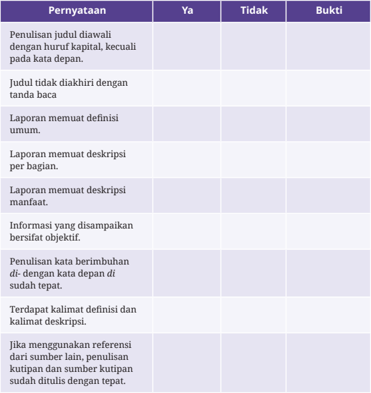

Tabel ini berfokus pada kriteria penilaian laporan penelitian atau laporan penelitian yang berkaitan dengan penulisan judul dan isi laporan, khususnya dalam konteks penelitian yang melibatkan keuangan atau keuangan perusahaan. Topik utamanya adalah apakah laporan tersebut memenuhi standar penulisan yang baik, dengan mempertimbangkan kejelasan, keakuratan, dan kepatuhan terhadap format yang ditentukan. Tabel ini memiliki tiga kolom utama: “Pernyataan”, “Ya”, dan “Tidak”, serta kolom “Bukti” yang digunakan untuk menunjukkan bukti atau contoh konkret dari setiap pernyataan. Dalam tabel ini, pernyataan-pernyataan yang diuji mencakup apakah judul diawali dengan huruf kapital, apakah judul tidak diakhiri dengan kata baca, apakah laporan memuat definisi umum, apakah laporan memuat deskripsi per bagian, apakah laporan memuat deskripsi manfaat, apakah informasi yang disampaikan bersifat objektif, apakah penulisan kata berimbuhan di- dengan kata depan di sudah tepat, apakah terdapat kalimat definisi dan kalimat deskripsi, serta apakah referensi yang digunakan berasal dari sumber lain dan telah dikutip dengan tepat. Pola penting yang terlihat adalah bahwa setiap pernyataan diuji secara kategoris, dan kolom “Bukti” menunjukkan bahwa penilaian ini bersifat objektif dan dapat diukur, sehingga memungkinkan peneliti atau pembuat laporan untuk memperbaiki kualitas laporan mereka berdasarkan kriteria yang jelas dan terstruktur.

 

---
## 📄 Halaman 43

### E. Menyajikan Laporan Hasil Observasi dalam Bentuk Buku Tempel

Kreativitas

Mengubah laporan hasil observasi ke dalam format kreatif yang dapat diterbitkan di media cetak maupun elektronik

### Membuat Buku Tempel ( Scrapbook )

Agar  laporan  hasil  observasi  lebih  menarik  untuk  dibaca,  kalian  dapat membuatnya  dalam  bentuk  buku  tempel  atau scrapbook .  Buku  tempel merupakan seni kerajinan menata atau menempel berbagai gambar, foto, dan tulisan  di  atas  lembaran-lembaran  kertas  secara  menarik.  Selain  membuat laporan lebih  menarik  untuk  dibaca,  penyajian  dalam  bentuk  buku  tempel juga  akan  membuat  laporan  kalian  menjadi  semacam  memorabilia  atau sesuatu yang patut dikenang.

---
**🖼️ Gambar/Diagram**

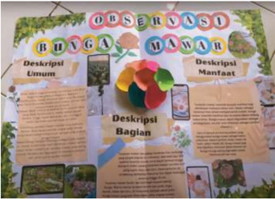

> **Deskripsi Visual:** Gambar ini adalah ilustrasi dekoratif yang menggambarkan sebuah poster pembelajaran tentang “Observasi Bunga Mawar”. Poster ini dirancang secara visual dengan elemen grafis, gambar ilustratif, dan teks yang terstruktur untuk memperkenalkan bunga mawar dari berbagai sudut pandang. Secara keseluruhan, poster ini menampilkan tiga bagian utama: “Deskripsi Umum”, “Deskripsi Bagian”, dan “Deskripsi Mantap” (mungkin maksudnya “Deskripsi Mantap” atau “Deskripsi Manfaat” — terlihat dari konteks). Setiap bagian memiliki teks penjelasan, gambar ilustratif kecil, dan elemen dekoratif seperti bunga mawar berwarna-warni di tengah, serta latar belakang hijau yang menyerupai tanaman. Label penting yang terlihat adalah judul besar “OBSERVASI BUNGA MAWAR” di atas, dan subjudul “Deskripsi Umum”, “Deskripsi Bagian”, dan “Deskripsi Mantap” yang membagi isi poster. Informasi kunci yang dapat diambil pembaca adalah bahwa poster ini bertujuan untuk memperkenalkan bunga mawar secara menyeluruh — dari ciri-ciri umum, struktur bagian-bagiannya, hingga manfaat atau penggunaannya — dengan pendekatan visual yang menarik dan terstruktur. Gambar ini tidak berisi data numerik, grafik, atau diagram, sehingga tidak dapat dianggap sebagai grafik atau diagram, dan tidak berisi QR code atau elemen interaktif lainnya.

 

---
## 📄 Halaman 44

Untuk membuat buku tempel, peralatan yang kalian butuhkan adalah buku tulis atau buku gambar sebagai media dasar. Kalian juga dapat membuatnya dari  kertas  karton  atau  kardus.  Tempelkan  foto-foto  hasil  observasi  kalian di media dasar tersebut dan beri keterangan secukupnya. Kalian juga dapat menempel  foto-foto  saat  observasi,  seperti  tiket,  daun,  bunga,  atau  bendabenda lain yang berkaitan dengan objek observasi kalian.

Selesai dibuat, kalian dapat memublikasikan buku tempel tersebut dengan mengirimkannya  ke  penerbit.  Cara  lain  adalah  memublikasikannya  secara digital di media sosial, blog, atau situs web sekolah kalian. Selain itu, kalian juga dapat mengunggah cara pembuatan buku tempel kalian dalam bentuk video ke berbagai kanal digital.

### Selamat berkreasi!

### F. Mempresentasikan Laporan Hasil Observasi

Berbicara, Berdiskusi, dan Mempresentasikan

Mempresentasikan  laporan  hasil  observasi  multimodal.  Menyesuaikan intonasi dan metode presentasi dengan perhatian atau minat pendengarnya saat menyajikan laporan hasil observasi.

Pada  kegiatan  sebelumnya,  kalian  sudah  membuat  sebuah  laporan  hasil observasi. Kali ini, kalian akan diminta untuk mempresentasikannya. Namun, sebelum  melakukan  presentasi,  kalian  sebaiknya  mengetahui  hal-hal  yang harus  diperhatikan  dalam  presentasi.  Salah  satu  hal  yang  penting  saat melakukan presentasi adalah mengatur intonasi. Penggunaan intonasi yang tepat akan menjadikan presentasi kalian lebih menarik.

Intonasi  adalah  lagu  kalimat  atau  tinggi  rendahnya  suatu  nada  pada kalimat  yang  memberikan  penekanan  pada  kata-kata  tertentu.  Intonasi berbicara ketika presentasi penting diperhatikan. Jelas tidaknya kalimat yang diucapkan  sangat  berpengaruh  kepada  audiensi  dalam  pemahaman  pesan yang mereka terima.

 

---
## 📄 Halaman 45

### Cara mengatur intonasi saat presentasi

- Gunakan suara lantang untuk menegaskan suatu hal yang penting dan harus diingat oleh audiensi.
- Gunakan tempo berbicara yang lambat untuk menyampaikan sebuah poin penting pada presentasi. Sebaliknya, gunakan tempo berbicara yang  cepat  untuk  menyampaikan  suatu  hal  yang  tidak  penting, seperti cerita atau hanya sekadar basa-basi kepada audiensi.
- Tinggikan suara kalian ketika menyapa audiensi pada awal presentasi. Sebaliknya, rendahkan suara kalian saat menjelaskan isi presentasi. Namun, kalian harus mengatur suara kalian agar tidak terlalu  rendah  hingga  tidak  dapat  didengar  oleh  audiensi.  Jangan pula terlalu tinggi hingga mengganggu pendengaran audiensi.
- Gunakan  perasaan  atau  emosi  sesuai  dengan  kalimat  yang  kalian ucapkan.
(Disarikan  dari  Dwi  J.,  2019  dan  Dunar,  2017)

Sekarang, presentasikan hasil diskusi  kalian  dengan  menggunakan intonasi yang tepat.

### G.  Uji Kompetensi

Sumber: Aulia/Kemendikbudristek (2023)

Bacalah teks dan infograik berikut untuk menjawab soal nomor 1 s.d. 5!

### Tabebuya

Tabebuya atau Tabebuia adalah tanaman asli hutan hujan Amazon, wilayah tropis Meksiko, serta benua Amerika bagian tengah dan selatan. Ada banyak  jenis  tabebuya  salah  satunya adalah Handroanthus chrysotrichus . Handroanthus chrysotrichus merupakan tanaman khas Brasil bagian selatan

 

---
## 📄 Halaman 46

Sumber: Nauval/Tirto.id (2018)

dan timur yang tumbuh di seluruh  daerah  tersebut  serta sebagian wilayah Argentina. Handroanthus chrysotrichus meru  pakan pohon nasional Brasil sehingga ditanam sebagai tanaman hias kota-kota di negara itu.

Handroanthus chrysotrichus dapat  hidup  di  bawah  terpaan sinar  matahari,  tanah  lembab, dan lingkungan yang cukup kering. Namun, ia mesti seringsering  disiram  air  jika  musim panas atau kemarau tiba. Tinggi Handroanthus chrysotrichus bisa mencapai 12 meter dengan batang yang kokoh berikut kulitnya yang keras dan pecahpecah.  Akar  pohonnya  bersifat tunggang dan tumbuh ke dalam. Daun  tanaman  ini  berbentuk menjari dengan warna hijau keabu-abuan. Apabila mekar, bunga Handroanthus chrysotrichus berwarna kuning atau kemerah-merahan.

Warna bunga tabebuya yang cerah ketika mekar  membuat tumbuhan  ini  dijadikan  tanaman  hias  untuk  mempercantik  jalan, teras, dan sebagainya di beberapa kota di Indonesia. Selain itu, bunga tabebuya dapat digunakan untuk bahan dasar obat-obatan. Kandungan naphtoquinone bila  diproses  dengan  tepat  dapat  menjadi  salah  satu media yang efektif dalam mengobati penyakit malaria. Bunga tabebuya juga dapat digunakan sebagai imun booster agar manusia tidak mudah terserang penyakit.

(Sumber: Khalika, 2018 dan Humas, 2023)

 

---
## 📄 Halaman 47

setiap

- Pilihlah  pernyataan  yang  tepat  mengenai  tanaman  tabebuya  menurut informasi  di  atas!  Berikan  tanda  centang  (√)  pada  pilihan  jawaban  benar. Jawaban benar lebih dari satu.
- Informasi  berikut  yang  perlu  ditambahkan  dari  artikel  di  atas  agar informasi yang disajikan lebih akurat adalah ….
- nama tanaman tabebuya di berbagai negara
- jenis tabebuya yang ditanam di Surabaya
- nama peneliti yang menyatakan manfaat tabebuya
- alasan penanaman tabebuya di berbagai kota
- lokasi penanaman tabebuya di Kota Surabaya
- Berdasarkan informasi pada teks di atas, naphtoquinone adalah ….
- media tanam tabebuya
- kandungan bunga tabebuya
- jenis penyakit malaria
- penyakit pada tanaman tabebuya
- jenis bunga tabebuya
- Perhatikan  pernyataan  mengenai  ciri-ciri  tanaman  tabebuya  berikut. Berilah tanda centang (√) pada pilihan Benar atau Salah untuk pernyataan berdasarkan isi teks.

 

---
## 📄 Halaman 48

---
**📊 Tabel**

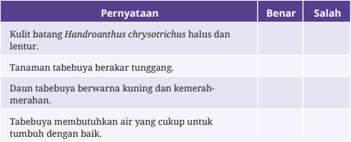

Tabel ini membahas ciri-ciri tanaman yang termasuk dalam kelompok tanaman berbunga, khususnya yang berhubungan dengan jenis tanaman yang dikenal sebagai tanaman berbunga dengan daun dan bunga yang memiliki ciri khas tertentu. Topik utama tabel ini adalah pernyataan tentang ciri-ciri tanaman yang mungkin digunakan untuk mengidentifikasi atau membedakan tanaman tertentu. Tabel ini memiliki dua kolom utama, yaitu “Benar” dan “Salah”, yang menunjukkan apakah pernyataan yang diberikan merupakan ciri yang benar atau salah untuk tanaman tersebut. Dalam tabel ini, terdapat empat pernyataan yang diuji: pertama, kulit batang tanaman Handroanthus chrysorchis halus dan lentur; kedua, tanaman ini berbentuk tumbuhan berdaun yang berbentuk tabung; ketiga, daunnya berwarna kuning dan kemerah-merahan; dan keempat, tanaman ini membentuk bunga yang cukup besar dan berwarna cerah. Dari pernyataan-pernyataan tersebut, dapat dilihat bahwa ciri-ciri yang disebutkan menggambarkan tanaman yang memiliki struktur dan warna yang khas, namun tidak ada indikasi bahwa semua pernyataan tersebut benar secara mutlak, karena tabel ini digunakan untuk menguji pengetahuan tentang ciri-ciri tanaman tersebut.

- Sebutkan manfaat tanaman tabebuya bagi kesehatan!
……………………..……………………..……………………..……………………..………………

……………………..……………………..……………………..……………………..………………

……………………..……………………..……………………..……………………..………………

Bacalah teks berikut untuk menjawab soal nomor 6 s.d. 8!

### Taman Nasional Lorentz

Taman  Nasional  Lorentz  di  Papua  yang  didirikan  pada  1997 ditetapkan  menjadi  taman  nasional  terbesar  di  Asia  Tenggara  oleh UNESCO. Badan PBB itu sudah menetapkan Taman Nasional Lorentz di Papua sebagai Situs Warisan Dunia UNESCO pada 1999.

Taman Nasional Lorentz di Papua ditetapkan menjadi taman nasional terbesar di Asia Tenggara oleh UNESCO didasarkan pada luas areanya, yakni 2.505.600 ha sesuai dengan surat penunjukan Menteri Kehutanan dan  Perkebunan  Nomor  154/Kpts-II/1997. Tak sampai  disitu saja, organisasi nonpemerintah internasional lainnya, WWF, menetapkan Taman Nasional Lorentz di Papua sebagai kawasan konservasi terluas dan terlengkap ekosistemnya di Asia Pasiik.

 

---
## 📄 Halaman 49

---
**🖼️ Gambar/Diagram**

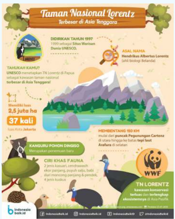

> **Deskripsi Visual:** Gambar ini adalah ilustrasi informatif yang menggambarkan Taman Nasional Lorentz, terbesar di Asia Tenggara. Secara keseluruhan, ilustrasi ini menyajikan informasi geografis, ekologis, dan sejarah taman nasional tersebut dengan gaya visual yang menarik, menggabungkan pemandangan alam, hewan, dan elemen grafis seperti ikon dan teks. Elemen utama termasuk pemandangan pegunungan dan hutan tropis, berbagai spesies fauna seperti kanguru pohon dingin, ciri khas fauna, dan burung-burung khas, serta simbol organisasi seperti UNESCO dan WWF. Relasi antar elemen menunjukkan koneksi antara lokasi geografis, keanekaragaman hayati, dan pengakuan internasional. Teks penting mencakup tahun pendirian (1999), status UNESCO, luas taman (2,5 juta hektar), jarak dari kota (150 km), dan jumlah spesies fauna. Informasi kunci yang dapat diambil pembaca adalah bahwa Taman Nasional Lorentz merupakan area konservasi penting di Papua, memiliki keanekaragaman hayati tinggi, dan telah mendapat pengakuan global melalui status UNESCO serta dukungan dari WWF. Ilustrasi ini dirancang untuk memperkenalkan taman nasional ini secara menyeluruh dan menarik bagi pembaca, khususnya siswa atau pembaca yang mempelajari ekologi atau geografi Indonesia.

Sumber: Putra/indonesiabaik.id (2018)

Ditinjau dari aspek keragaman ekosistem, Taman Nasional Lorentz mencakup seluruh tipe ekosistem utama yang ada di Papua, mulai dari ekosistem  perairan  laut,  ekosistem  pesisir,  ekosistem  hutan  pantai, ekosistem  hutan  rawa  air  payau,  ekosistem  hutan  rawa  air  tawar,

 

---
## 📄 Halaman 50

ekosistem hutan dataran rendah, ekosistem hutan pegunungan rendah, ekosistem  hutan  pegunungan  tinggi,  ekosistem  sub  alpin  ( Tree  Line ), ekosistem alpin dan ekosistem pegunungan salju abadi.

Berbagai spesies dari kawasan Taman Nasional Lorentz memberikan kontribusi terhadap kekayaan keanekaragaman hayati Papua. Terdapat 1.200  tumbuhan  berbunga,  123  spesies  mamalia,  411  spesies  burung, dan  150  spesies  reptil  dan  amibi.  Selain  itu  Taman  Nasional  Lorentz juga merupakan Daerah Burung Endemik atau Endemic Bird Area (EBA) dengan 45 spesies burung sebaran terbatas dan sembilan spesies burung endemik. Terdapat daerah isolasi alamiah bagi penyebaran jenis burung dan hewan lainnya di deretan Pegunungan Sudirman.

Terdapat pula beberapa keunikan di Taman Nasional Lorentz, yaitu adanya gletser di Puncak Jaya dan sungai yang menghilang beberapa kilometer ke dalam tanah di Lembah Baliem. Taman Nasional Lorentz memiliki 34 tipe vegetasi, di antaranya hutan tepi sungai, hutan sagu, hutan rawa, dan padang rumput. Di wilayah ini juga terdapat persediaan mineral dan pertambangan berskala besar.

Jenis-jenis  tumbuhan  di  Taman  Nasional  Lorentz  antara  lain adalah nipah dan bakau. Sedangkan dari jenis-jenis satwa yang sudah diidentiikasi  di  Taman  Nasional  Lorentz  ada  beberapa  contoh  jenis burung yang menjadi ciri khas adalah dua jenis kasuari, cendrawasih ekor panjang, dan puyuh salju. Satwa mamalia yang ada di sini antara lain  babi  duri  moncong  panjang  dan  moncong  pendek,  empat  jenis kuskus, walabi, kucing hutan, dan kanguru pohon.

(Sumber: Finaka, 2018)

- Nama Taman Nasional Lorentz diambil dari nama….
- ilmuwan di UNESCO
- relawan WWF
- ilmuwan Biologi
- Menteri Kehutanan dan Perkebunan
- tokoh adat Papua

 

---
## 📄 Halaman 51

- Pilihlah pernyataan yang tepat mengenai Taman Nasional Lorentz menurut informasi di atas! Berikan tanda centang (√) pada pilihan jawaban benar. Jawaban benar lebih dari satu.
- □ Pegunungan Sudirman merupakan salah satu daerah yang termasuk Kawasan Taman Nasional Lorentz.
- □ Nipah,  bakau,  dan  walabi  merupakan  kekayaan  tumbuhan  yang terdapat di Taman Nasional Lorentz.
- Tentukan kalimat mana yang merupakan kalimat tidak baku!
- Taman Nasional Lorentz di Papua yang didirikan pada 1997 ditetapkan menjadi taman nasional terbesar di Asia Tenggara oleh UNESCO.
- Tak  sampai  disitu  saja,  organisasi  nonpemerintah  internasional lainnya,  WWF,  menetapkan  Taman  Nasional  Lorentz  di  Papua  sebagai kawasan  konservasi  terluas  dan  terlengkap  ekosistemnya  di  Asia Pasiik.
- Ditinjau  dari  aspek  keragaman  ekosistem,  Taman  Nasional  Lorentz mencakup seluruh tipe ekosistem utama yang ada di Papua.
- Terdapat daerah isolasi alamiah bagi penyebaran jenis burung dan hewan lainnya di deretan Pegunungan Sudirman.
- Sedangkan dari jenis-jenis satwa yang sudah diidentiikasi di Taman Nasional Lorentz ada beberapa contoh jenis burung yang menjadi ciri khas.
- Tentukan kalimat yang merupakan kalimat deinisi!
- Taman Nasional Lorentz memiliki 34 tipe vegetasi.
- Taman  Nasional  Lorentz  berkontribusi  terhadap  keanekaragaman hayati Papua.

 

---
## 📄 Halaman 52

- Kanguru pohon dingiso merupakan penemuan satwa baru.
- Luas Taman Nasional Lorentz membentang 150 km.
- Contoh jenis burung yang menjadi ciri khas adalah dua jenis kasuari.
- Teks di atas diambil dari sebuah artikel berjudul 'Taman Nasional Lorentz: Terbesar di Asia Tenggara' yang ditulis oleh Andrean W. Finaka pada tahun 2018. Artikel tersebut terdapat pada laman https://indonesiabaik.id/ infograis/taman-nasional-lorentz-terbesar-di-asia-tenggara  yang  diakses pada 16 November 2023. Tulislah daftar pustaka berdasarkan data di atas!
…….…………….…………….…………….…………….…………….…………….…………….…..

…….…………….…………….…………….…………….…………….…………….…………….…..

### H. Pengayaan

Jika  telah  menguasai  minimal  70%  dari  total  materi  bab  ini,  kalian  dapat melakukan kegiatan pengayaan sebagai berikut.

- Mencari  video  atau  sumber  informasi  lain  di  internet  tentang  objek observasi sesuai dengan karakteristik lingkungan sekolah. Peserta didik pun dapat membandingkan informasi pada buku teks dengan informasi dari  sumber  lain  yang  tepercaya  (sumber  dari  laman  pemerintah  atau organisasi yang kredibel).
- Membuat  peta  konsep  berdasarkan  laporan  hasil  observasi  lain  yang disimak atau dibaca.
- Mempresentasikan  teks  laporan  hasil observasi di kelas lain atau mengundang pihak lain, seperti orang tua atau guru mata pelajaran selain Bahasa Indonesia.

### I. Jurnal Membaca

Mengidentiikasi fakta dan opini dalam novel

 

---
## 📄 Halaman 53

Beberapa novel di bawah ini menceritakan tentang perjalanan tokoh ke suatu tempat.  Laporan  hasil  observasi  kalian  dapat  saja  diubah  menjadi  cerita seperti yang ada di novel-novel berikut:

- Perjalanan ke Atap Dunia karya Daniel Mahendra
- The Naked Traveller karya Trinity
- 5 cm karya Donny Dhirgantoro
- Rengganis: Altitude 3088 karya Azzura Dayana
Meskipun novel tergolong ke dalam cerita iksi, beberapa hal dalam cerita dapat juga bersifat faktual.  Hal  yang  bersifat  faktual  dalam  novel  biasanya muncul saat cerita diangkat dari sebuah peristiwa sejarah atau mengambil latar yang berkaitan dengan sebuah tempat yang benar-benar ada.

### J. Releksi

Releksi

Mereleksikan apa saja yang telah dipelajari dan bagian-bagian mana saja yang belum terlalu dikuasai agar dapat menemukan solusinya

Selamat!  Kalian  sudah  mempelajari  Bab  I.  Tentu  banyak  hal  yang  sudah dipelajari. Tandai kegiatan yang sudah kalian lakukan atau pengetahuan yang telah kalian kuasai dengan tanda centang.

 

---
## 📄 Halaman 54

---
**📊 Tabel**

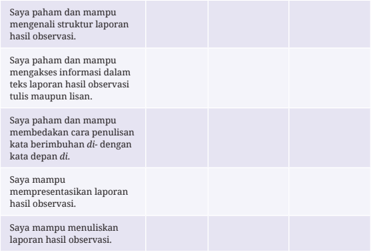

Topik utama tabel ini adalah kemampuan siswa dalam menangani proses pengumpulan dan penyajian data hasil observasi, yang merupakan bagian penting dari kegiatan ilmiah atau penelitian sederhana. Tabel ini menggambarkan tingkat penguasaan siswa dari yang paling dasar hingga yang paling kompleks, dengan kolom pertama menyatakan tingkat kemampuan yang ingin dicapai, sementara kolom kedua berfungsi sebagai indikator atau deskripsi spesifik dari setiap tingkat tersebut. Data atau pola penting yang terlihat adalah adanya peningkatan kemampuan secara bertahap: mulai dari hanya memahami struktur laporan, kemudian mampu menyusun informasi hasil observasi dalam bentuk teks, hingga mampu mengembangkan cara penulisan laporan berdasarkan hasil observasi, serta akhirnya mampu menyajikan laporan secara visual atau presentasi, dan menulis laporan hasil observasi secara lengkap. Ini menunjukkan bahwa proses pembelajaran mengarah pada pengembangan keterampilan dari konsep dasar hingga aplikasi praktis yang lebih kompleks.

Hitunglah persentase penguasaan materi kalian dengan rumus berikut:

### (Jumlah materi yang kalian kuasai/jumlah seluruh materi) x 100

- Jika  materi di atas sudah dikuasai minimal 70%, kalian dapat meminta aktivitas pengayaan kepada guru.
- Jika  materi  yang  dikuasai  di  bawah  70%,  kalian  bisa  mendiskusikan kegiatan remedial dengan guru.

 

---
## 📄 Halaman 55

---
**🖼️ Gambar/Diagram**

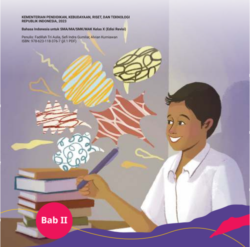

> **Deskripsi Visual:** Gambar ini adalah ilustrasi. Secara keseluruhan, ilustrasi ini menampilkan seorang siswa laki-laki muda yang sedang belajar atau mengikuti pelajaran, duduk di depan tumpukan buku-buku pelajaran, sambil memegang pensil dan menatap ke arah kiri dengan ekspresi antusias. Di atas kepala siswa, terdapat beberapa bentuk abstrak berwarna-warni yang menggambarkan ide atau konsep, seperti otak, jaringan saraf, atau pola geometris, yang secara simbolis menyiratkan proses pemikiran, kreativitas, atau penalaran. Elemen utama adalah siswa sebagai pusat aktivitas belajar, buku-buku sebagai simbol pengetahuan, dan bentuk-bentuk abstrak sebagai representasi konsep atau ide yang sedang dipelajari. Relasi antara elemen ini menunjukkan bahwa siswa aktif memahami atau mengembangkan ide melalui studi. Teks penting yang terlihat termasuk label “Bab II” di lingkaran merah di bagian bawah kiri, serta teks di bagian atas yang menyebutkan nama penerbit (Kementerian Pendidikan, Kebudayaan, Riset, dan Teknologi Republik Indonesia 2023), bahasa yang digunakan (Bahasa Indonesia untuk SMA/MA/SMK/MAK Kelas X), penulis (Fadliah Tri Aulia, Seif Indra Gumilar, Avian Kurniawan), dan ISBN (978-623-118-376-7). Informasi kunci yang dapat diambil pembaca adalah bahwa ini adalah halaman pembuka Bab II dari buku pelajaran kelas X untuk program studi SMA/MA/SMK/MAK dalam Bahasa Indonesia, yang dirancang untuk memperkuat pemahaman siswa melalui visualisasi konsep belajar yang dinamis dan kreatif.

### MENGUNGKAPKAN KRITIK LEWAT HUMOR

Bagaimana menyampaikan kritik secara santun dan bertanggung jawab?

 

---
## 📄 Halaman 56

Setelah mempelajari materi Bab II, kalian diharapkan mampu mengevaluasi  pesan,  menentukan  struktur, dan  menginterpretasi  informasi  yang terdapat  pada  teks  anekdot  sebagai salah  satu  cara  dalam  menyampaikan kritik serta membuat  teks  eksposisi berdasarkan hasil penelitian untuk menyampaikan fakta yang terjadi sebagai  bahan  untuk  menyampaikan kritik sosial.

- kritik
- lawakan tunggal
- eksposisi
- anekdot
- komik potongan

---
**🖼️ Gambar/Diagram**

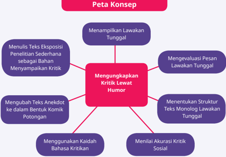

> **Deskripsi Visual:** Gambar ini merupakan diagram. Secara keseluruhan, diagram ini menampilkan “Peta Konsep” yang menjelaskan proses mengungkapkan kritik lewat humor, dengan pusat konsep utama yang dihubungkan ke berbagai langkah atau elemen pendukung. Elemen utama adalah kotak merah di tengah yang berisi “Mengungkapkan Kritik Lewat Humor”, yang terhubung dengan enam kotak ungu melalui garis, masing-masing merepresentasikan langkah atau aktivitas: “Menampilkan Lawakan Tunggal”, “Mengevaluasi Pesan Lawakan Tunggal”, “Menentukan Struktur Teks Monolog Lawakan Tunggal”, “Menilai Akurasi Kritik Sosial”, “Menggunakan Kaidah Bahasa Kritik”, dan “Mengubah Teks Anekdot ke dalam Bentuk Komik Potongan”. Teks penting yang terlihat termasuk judul “Peta Konsep” di atas diagram, serta teks-teks di dalam kotak-kotak ungu yang menjelaskan setiap langkah. Informasi kunci yang dapat diambil pembaca adalah bahwa mengungkapkan kritik lewat humor melibatkan proses sistematis yang mencakup analisis, evaluasi, struktur teks, akurasi sosial, dan transformasi gaya bahasa, serta memanfaatkan eksposisi penelitian dan bentuk humor seperti komik. Diagram ini dirancang untuk membantu pembaca memahami alur dan komponen penting dalam menyampaikan kritik melalui humor secara struktural dan analitis.

 

---
## 📄 Halaman 57

SEBELUM ULANGAN.

Ah,gont. Alv aloegae baei iRc

bem brlar aru

SETELAH

Alv gg bel e

ULANGAN....

Adok,ea c 46.

mdsl bamng. y.

Rayenye bte bakal yt

Hehehe.

---
**🖼️ Gambar/Diagram**

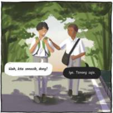

> **Deskripsi Visual:** Gambar ini merupakan ilustrasi. Secara keseluruhan, ilustrasi ini menampilkan dua orang muda yang berdiri di luar ruangan, tampaknya sedang berbicara di bawah pohon. Keduanya mengenakan pakaian santai dan membawa tas selempang, menunjukkan suasana santai atau mungkin sedang beraktivitas bersama. Elemen utama adalah dua karakter yang berinteraksi secara visual, dengan ekspresi wajah dan postur tubuh yang menunjukkan percakapan. Relasi antara mereka adalah interaksi sosial langsung, di mana satu karakter (kiri) tampak meminta izin atau mengajukan pertanyaan, sementara karakter lain (kanan) memberikan jawaban. Teks penting yang terlihat adalah dialog dalam balon percakapan: “Sihh, kita smoots, dong?” (kiri) dan “Iya, Tengang saja.” (kanan). Label atau angka tidak terlihat. Informasi kunci yang dapat diambil pembaca adalah bahwa gambar ini menggambarkan interaksi sosial yang santai, mungkin dalam konteks kehidupan sehari-hari atau pendidikan, dengan nuansa humor atau keakraban antara dua orang. Ilustrasi ini digunakan untuk menggambarkan situasi sosial atau emosional dalam konteks buku pelajaran, mungkin untuk membantu pemahaman konsep sosial, komunikasi, atau hubungan interpersonal.

Pernahkah kalian membaca cerita bergambar yang menampilkan  alur  cerita  kehidupan  seperti  ilustrasi  di atas? Apakah isi cerita tersebut relevan dengan kehidupan nyata ataukah imajinasi penulis belaka? Adakah pesan yang ingin disampaikan penulis dari cerita bergambar tersebut? Cerita bergambar tersebut dikenal dengan sebutan komik oleh para pembacanya. Adapun orang yang membuatnya disebut komikus.

Pada  era seperti saat ini,  banyak  peristiwa  yang dapat  kita  nilai  baik  atau  buruknya.  Apabila  peristiwa tersebut  kurang  sesuai  dengan  nilai  positif  yang  berlaku dalam kehidupan, kita dapat menyampaikan sebuah

 

---
## 📄 Halaman 58

kritikan. Kritikan tidak harus selalu diucapkan secara langsung. Kalian dapat menyampaikannya melalui berbagai cara. Pada pembelajaran kali ini, kalian akan mempelajari cara menyampaikan kritikan yang dikemas secara jenaka atau lucu. Beberapa di antaranya, kalian dapat menyampaikan kritik melalui teks anekdot, komik, dan lawakan tunggal.

Bacalah teks anekdot berikut dengan saksama!

### Jika Aku Jadi Orang Kaya

Pagi  itu,  Pak  Awan  masuk  ke  dalam  kelas  untuk  mengajar.  Seperti biasanya,  dengan  menggunakan  kaca  mata  tebal  dan  rambut  jambul pendeknya  yang  sedikit  bergelombang,  ia  berdiri  sambil  menyapa siswa-siswinya. Setelah memastikan kondisi siswa di kelas siap untuk menerima materi, Pak Awan pun mulai membukanya dengan sebuah pertanyaan,

'Anak-anak,  jika  kalian  nanti  menjadi  orang  kaya,  punya  banyak uang,  lalu  memiliki  lahan  perkebunan  yang  luas,  kira-kira  apa  yang akan kalian lakukan?'

'Saya akan memaksimalkan lahan kebun saya itu dengan menanami berbagai macam pohon, seperti sawit, karet, tembakau, dan sejenisnya,' jawab Alvin dari meja barisan kedua.

'Kalau saya akan saya  tanami  beragam  tanaman  karet  dan mempekerjakan banyak petani agar mereka sejahtera,' tambah Kurnia dengan penuh semangat.

Pak Awan terkagum-kagum dengan dua jawaban tersebut. Ia pun merespons  jawaban  siswa-siswinya  tadi  dengan  nada  bicara  yang positif.  Tiba-tiba  perhatiannya  teralihkan  pada  sudut  belakang  kelas. Ia  menemui  salah  seorang  siswanya,  Iyan,  yang  sedari  tadi  kurang memberikan respons positif terhadap jawaban-jawaban dari temannya itu.

'Iyan, coba menurut pendapatmu bagaimana? Apa yang akan kamu lakukan jika kamu menjadi orang kaya raya, uangmu banyak, kebunmu luas?' tanya Pak Awan penasaran.

'Kalau saya punya banyak uang, saya akan membeli banyak mesin penebang,' jawab Iyan dengan suara lantang.

 

---
## 📄 Halaman 59

'Lho, mengapa kamu ingin beli mesin penebang?' tanya Pak Awan.

'Supaya saya bisa menebang berbagai macam tumbuhan yang ada di  kebun  saya  sehingga  bisa  mendirikan  berbagai  macam  bangunan, seperti pusat perbelanjaan, apartemen, restoran, dan sejenisnya. Bukannya itu yang sering dilakukan para pejabat dan konglomerat di luar sana?' kata Iyan meneruskan penjelasannya.

'Tapi itukan malah akan menghabiskan lahan hijau negeri ini, Yan?'

'Menurut saya tidak juga, Pak. Kan masih ada Alvin dan Kurnia yang masih mau membuka lahan perkebunan jika mereka sukses nanti.'

Pak Awan, 'Hemmmmmmmmm!!!'

(Sumber: Kurniawan, 2023)

Setelah  membaca  contoh  anekdot  di  atas,  dapat  kalian  pahami  bahwa anekdot merupakan tulisan berbentuk narasi yang di dalamnya mengandung serangkaian  peristiwa  lucu,  menarik,  dan  mengesankan  serta  mengandung maksud  berupa  kritikan.  Pada  umumnya,  topik  dalam  anekdot  bersumber dari peristiwa nyata yang terjadi dalam kehidupan. Tidak sedikit teks anekdot yang menampilkan nama-nama tokoh terkenal.

Tujuan  dibuatnya  anekdot  adalah  untuk  menghibur  pembaca.  Teks  ini juga dibuat untuk menyampaikan kritik atau sindiran halus berdasarkan fakta yang sering terjadi dalam kehidupan sosial masyarakat. Selain itu, anekdot ditulis untuk menyampaikan nilai-nilai atau pelajaran yang dapat dijadikan pesan moral bagi pembaca.

Untuk  lebih  memahaminya,  carilah  beberapa  pengertian  anekdot  dari beberapa  sumber!  Tuliskan  pengertian  anekdot  dan  sumbernya  pada  tabel berikut! Setelah itu, tuliskan kesimpulan dengan kalimat pemahaman kalian sendiri!

 

---
## 📄 Halaman 60

.........................................................

Berdasarkan beberapa pengertian tersebut, dapat disimpulkan bahwa anekdot adalah

……………………………………………………………………………………………………..................…...

……………………………………………………………………………………………………..................……

### A.  Mengevaluasi Pesan dari Menyimak Teks Monolog Lawakan Tunggal

Menyimak

Mengevaluasi gagasan dan pesan yang disampaikan dalam teks monolog lawakan tunggal secara kritis dan relektif

### Kegiatan 1

Anekdot tidak semata berbentuk visual yang isinya hanya dapat kalian lihat  atau  baca menggunakan indra penglihatan. Ada pula yang dapat kalian  dengarkan  isi  ceritanya  melalui  indra  pendengaran.  Anekdot yang  dapat  didengarkan  isinya  disebut  anekdot  aural.  Kalian  dapat menemukan  anekdot  aural  melalui  radio  atau  media  rekam  suara lainnya.

Kali  ini,  kalian  akan  menyimak  anekdot  aural  berbentuk  lawakan tunggal ( stand up comedy ). Lawakan tunggal atau komedi tunggal merupakan penyajian lawakan yang dilakukan seorang diri di atas panggung. Lawakan ini dilakukan seseorang yang disebut komika. Melalui lawakan tunggal, seorang komika  berusaha  mengungkapkan  ketidaksetujuan  terhadap  sesuatu,  baik berupa  kritik  sosial  yang  berdasarkan  penelitian  maupun  kegelisahan  diri. Karena itu, lawakan tunggal disebut juga komedi cerdas yang menyampaikan pesan bagi para pendengarnya.

 

---
## 📄 Halaman 61

Sekarang, simaklah dengan saksama lawakan tunggal berjudul 'Liburan Kuli Bangunan' yang akan dibacakan teman kalian. Setelah itu, berdiskusilah untuk menjawab soal/pertanyaan pada tabel berikut!

---
**📊 Tabel**

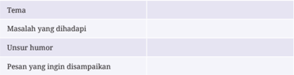

Tabel ini berfokus pada topik humor sebagai alat komunikasi atau bentuk ekspresi yang digunakan untuk menghadapi masalah tertentu. Dalam tabel, terdapat tiga elemen utama yang saling terkait: pertama, masalah yang dihadapi, yang dalam konteks ini adalah tantangan atau situasi yang memerlukan penanganan; kedua, unsur humor yang digunakan sebagai alat untuk menghadapi masalah tersebut, menunjukkan bahwa humor bukan hanya hiburan, tetapi juga strategi untuk mengatasi tekanan atau ketidaknyamanan; dan ketiga, pesan yang ingin disampaikan, yang menunjukkan bahwa humor memiliki tujuan komunikatif — misalnya, untuk mengurangi ketegangan, menghibur, atau menyampaikan makna tanpa langsung menyakiti atau memicu konflik. Pola penting yang terlihat adalah bahwa humor digunakan secara sengaja untuk menghadapi masalah, bukan sekadar sebagai hiburan, dan tujuannya adalah untuk menyampaikan pesan yang lebih efektif atau lebih mudah diterima oleh audiens.

### Diskusi lanjutan

- Apakah pesan dalam teks tersampaikan dengan jelas?
- Apakah masalah sosial yang diangkat relevan dengan kehidupan masyarakat?
- Hal apa yang perlu ditambahkan agar teks ini dapat lebih baik dalam menyampaikan pesan sosial?

### Liburan Kuli Bangunan

Asalamualaikum warahmatullah wabarakatuh. Perkenalkan, saya Didi. Di sini adakah kuli bangunan? Wah, berarti saya satu-satunya ya di sini? Ngomong-ngomong  soal  liburan,  buat  kebanyakan  orang,  liburan  itu obat stres, tapi buat saya malah bikin stres. Datang liburan orang-orang sibuk nyiapin rencana mau liburan ke mana. Saya malah sibuk nyari alasan.

Anak saya minta liburan, 'Pak, ingin ke Dufan.' 'Nak, Jakarta banjir.'

'Ya udah Pak, ke Tangkuban Perahu.' 'Nak, perahunya bocor.'

'Ah bilang aja, Bapak gak punya uang.' 'Cerdas!'

Anak saya itu memang jarang liburan. Saya bawa ke tempat kerja saja, menurut dia itu tamasya. Dari pagi sampai sore, dia anteng nyusun lego pakai batu bata. Kalau orang lain nyusun lego jadi robot, anak saya jadi pos ronda.

Pulang ke rumah ditanya sama istri saya, 'Gimana, Nak, seru main sama Bapak?'

'Mantap, Mah! Pokoknya udah gede aku mau jadi kuli bangunan.'

 

---
## 📄 Halaman 62

'Hei, masa perempuan jadi kuli bangunan.'

'Gak apa-apa, Mah, emansipasi!'

Ya, anak saya itu memang jarang liburan, jadi dia itu norak.

Kemarin saya ajak ia mandi bola, eh dianya bawa handuk.

Istri  saya  langsung  ngomong,  'Nak,  mandi  bola  gak  usah  bawa handuk, kan udah disediain.'

Tapi bukan cuma anak saya, saya juga jarang liburan. Satu-satunya liburan saya ya di acara ini. Buat saya, kompetisi ini liburan. Gimana enggak? Saya dapat pergi ke Jakarta, tidur di hotel, kasurnya empuk, kalau saya tidur langsung terbayang hal indah. Gak seperti di rumah. Kalau di rumah, saya ketika tidur, langsung terbayang cicilan. Tapi, garagara itu saya sering diprotes sama anak saya. Dia bilang gini,

'Bapak curang! Tidur di hotel, makan nasi kotak, tiap hari naik lift.'

'Nak, kan Bapak di sana kerja.'

'Apa, Pak? Kerja? Katanya Jakarta banjir.'

Anak saya itu sering protes karena dia itu ingin banget ke Jakarta, ingin tahu Dufan. Kalau anak yang lain, ingin tahu Dufan, lantas dibawa ke Dufan. Namun, kalau anak saya ingin tahu Dufan, saya bawa dia ke warnet. 'Tuh Nak, Dufan, Dufan itu.'

Tapi saya jadi tahu walaupun dari warnet, ternyata banyak wahana di Dufan itu, salah satunya rumah miring. Rumah miring, ini kalau mandor saya tahu, dibongkar ini. Saya aja masang bata miring dimarahin. Ini orang dengan sadar tanpa pengaruh apa pun malah ngebangun rumah miring. Ini anak proyek mana yang bikin? Bikin malu komunitas.

Saya Didi. Terima kasih.

(Sumber: Didi, Stand Up Kompas TV, 2017, dengan pengubahan seperlunya)

Kalian dapat menyimak langsung teks anekdot di atas dengan memindai kode QR atau melalui tautan di bawah.

https://buku.kemdikbud.go.id/s/didikomedi

Sumber: Stand Up Kompas TV/YouTube (2017)

 

---
## 📄 Halaman 63

### B.  Menentukan Struktur Teks dari Menyimak Monolog Lawakan Tunggal dan/atau Anekdot

### Kegiatan 1

Suatu teks memiliki struktur pembangunnya masing-masing, demikian dengan anekdot. Anekdot disusun berdasarkan urutan penyajian yang kronologis. Urutan tersebut tidak boleh ditukar posisinya agar memiliki kesatuan pola penyajian yang runtut.

Pada  materi  kali  ini,  dengarkan  pembacaan  teks  anekdot  yang dilakukan teman atau guru kalian di depan kelas. Setelah itu, tentukan struktur anekdot tersebut secara tepat. Untuk  membantu  dalam menentukan struktur anekdot, kalian harus memahami terlebih dahulu penjelasan berikut.

Menurut Kosasih (2019), teks anekdot memiliki struktur yang terdiri atas abstraksi, orientasi, krisis, reaksi, dan koda.

- Abstraksi merupakan bagian awal cerita yang berfungsi sebagai gambaran umum isi anekdot. Struktur ini tidak selalu ada di setiap teks anekdot.
- Orientasi  merupakan  bagian  pembuka  cerita  yang  biasanya  terdapat perkenalan tokoh atau latar kejadian. Pada bagian ini, cerita awal akan menjadikan konlik/permasalahan.
- Krisis merupakan bagian yang menjadi inti cerita. Pada bagian inilah akan menimbulkan reaksi. Istilah kritis sering juga dikenal dengan komplikasi.
- Reaksi  merupakan  bagian  cerita  yang  berisi  tanggapan  terhadap  krisis yang  terdapat  pada  bagian  sebelumnya.  Biasanya  bagian  ini  sering menimbulkan sesuatu yang tidak terduga. Istilah reaksi sering juga dikenal dengan resolusi.
- Koda  merupakan  bagian  akhir  cerita  yang  menandai  bahwa  peristiwa sudah  selesai.  Biasanya  dalam  koda  dimuat  komentar  atau  sikap  dari sebuah reaksi. Keberadaan koda bersifat opsional, bisa ada bisa tidak ada.
Simaklah pembacaan anekdot yang dilakukan dua teman kalian di depan kelas! Selanjutnya, identiikasilah struktur teks anekdot tersebut secara garis

 

---
## 📄 Halaman 64

besarnya saja! Jangan lupa kemukakan alasan yang logis terhadap jawaban isi teks yang kalian tuliskan pada tabel berikut

---
**📊 Tabel**

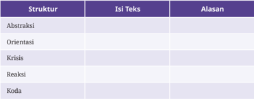

Tabel ini menggambarkan struktur dasar dari sebuah teks, yang biasanya digunakan dalam analisis teks atau penulisan esai, dengan fokus pada urutan logis dan makna yang muncul dari setiap bagian. Topik utamanya adalah bagaimana sebuah teks disusun secara sistematis, mulai dari pembuka hingga penutup, dengan masing-masing bagian memiliki peran khusus. Kolom pertama, “Struktur,” menunjukkan bagian-bagian teks yang berurutan, yaitu Abstraksi, Orientasi, Krisis, Reaksi, dan Koda. Kolom kedua, “Isi Teks,” yang sebenarnya kosong dalam tabel ini, menunjukkan bahwa isi masing-masing bagian belum diisi, sehingga tabel ini berfungsi sebagai kerangka atau template untuk membangun teks. Kolom ketiga, “Alasan,” juga kosong, namun secara implisit mengindikasikan bahwa setiap struktur memiliki alasan atau tujuan tertentu dalam konteks teks tersebut. Pola penting yang terlihat adalah bahwa struktur ini mengikuti alur logis yang umum dalam penulisan: mulai dari menyampaikan ide awal (Abstraksi), mengarahkan pembaca ke poin utama (Orientasi), memperkenalkan konflik atau tantangan (Krisis), menangani atau merespons tantangan tersebut (Reaksi), dan akhirnya menutup dengan kesimpulan atau penegasan (Koda). Tabel ini dirancang untuk membantu pembaca memahami bagaimana teks disusun secara efektif dan berurutan, serta memberi ruang untuk mengisi isi dan alasan sesuai konteks yang diinginkan.

### Temanku yang Malas

Di  salah  satu  sudut  ruangan  kantor,  tampak  tiga  karyawan  sedang berbincang serius. Mereka duduk melingkar sambil santap makan siang saat jam istirahat kerja.

Alvi :

'Aku tuh heran sama kamu, Cha.'

Ocha  :

'Kenapa heran sama aku?'

Alvi :

'Masalahnya,  kamu  itu  kalau  ada  tugas  buat  laporan  atau apapun selalu saja lama buatnya.'

Joko :

'Betul tuh, kalaupun selesai, selalu saja berantakan.'

Alvi :

'Benar sekali, gara-gara kamu aku sering dimintai tolong Pak Feri, pimpinan kita, untuk mengetik ulang laporan dari awal.'

Ocha  :

'Ah, tidak usah ngeluh. Kan kita ini berteman. Sudah sewajarnya sesama teman saling membantu.'

Joko :

'Masalahnya,  karyawan  yang  lain  juga  ikut  membicarakan kamu. Kata mereka, kapan sih kamu itu kalau ada panggilan tugas  dari  pimpinan  langsung  cepat  tanggap  dan  tidak  buat kesalahan terus?'

Alvi

: 'Iya, nih. Aku juga pernah ditanya karyawan di ruang sebelah tentang hal itu. Bagaimana kalau kami terus-terusan ditanyai

mereka?'

 

---
## 📄 Halaman 65

Ocha  :

'Tenang  saja,  kalian  jangan  pusing!  Jawab  saja  sejujurnya bahwa kalian pernah lihat aku cepat tanggap saat dipanggil pimpinan dan tidak salah menyelesaikan tugas darinya.'

Joko :

'Memang kapan?'

Ocha  :

'Minggu lalu, waktu Pak Feri memanggilku untuk mengambil dan menghitung isi amplop bulanan yang ku terima di setiap awal bulan.'

Mendengar  jawaban  itu,  Alvi  dan  Joko  sontak  tertawa  terbahakbahak. Seketika itu juga suasana yang tadinya serius berubah cair dan ceria.  Jawaban  spontan  Ocha  itu  apa  adanya  dan  tidak  dibuat-buat. Mereka menganggap jawaban Ocha kali ini benar-benar cerminan dari kehidupan sebagian masyarakat saat ini.

(Sumber: Kurniawan/Kemendikbudristek, 2023)

### C.  Menilai Akurasi Kritik Sosial yang Disampaikan dengan Membandingkan Beberapa Isi Teks

Membaca dan Memirsa

Membandingkan informasi untuk mengungkapkan gagasan dan perasaan simpati, peduli, empati, dan/atau pendapat pro/kontra dari teks visual yang dipirsa

Sebuah kritikan dapat dikembangkan melalui berbagai sumber, antara lain, dari sumber berbentuk komik, berita, dan artikel. Ada beberapa sumber yang membahas  topik  yang  sama.  Meskipun  topik  yang  dibahasnya  sama,  pola penyajian ataupun isi informasi bisa jadi berbeda.

Dengan membandingkan beberapa informasi dari sumber yang berbeda, kalian diharapkan dapat memperoleh informasi yang lebih akurat dan  bertanggung  jawab  saat  menyampaikan  kritik.  Selain  itu,  kalian  juga diharapkan  menguasai  lebih  detail  topik  yang  akan  kalian  jadikan  bahan untuk membuat kritikan.

 

---
## 📄 Halaman 66

Selama  membandingkan  informasi  dari  berbagai  sumber,  kalian  juga dapat mengklasiikasikan  informasi  berupa  gagasan  yang  bersifat  simpati, peduli, empati, dan pro/kontra. Untuk lebih jelasnya, perhatikan penjelasan berikut ini!

- Simpati  merupakan  keikutsertaan  dalam  merasakan  perasaan,  baik berupa  rasa  senang,  sedih,  dan  sebagainya.  Misalnya,  seseorang  yang menyatakan dirinya turut berbelasungkawa atas musibah kematian yang dialami salah seorang warga di desa sebelah.
- Empati merupakan keadaan mental seseorang yang melibatkan dirinya sama-sama  merasakan  sesuatu  yang  dialami  orang  lain. Misalnya, Dimas tersenyum bangga sambil menyalami sahabat baiknya, Dian, saat sahabatnya tersebut diumumkan sebagai juara umum.
- Peduli merupakan rasa memperhatikan seseorang dengan diikuti tindakan pro-aktif terhadap kondisi atau keadaan sekitar. Misalnya, Angga menjenguk Heni di rumah sakit, setelah satu minggu temannya tersebut diopname karena sakit malaria.
- Pro  merupakan  sikap  seseorang  yang  setuju  atau  memihak  pendapat atau hal yang dikerjakan seseorang. Misalnya, Era mengacungkan jempol setelah mendengar jawaban Ayu saat diskusi.
- Kontra merupakan keadaan seseorang yang tidak setuju atau menentang pendapat atau hal yang dilakukan seseorang. Misalnya, Roro mengangkat tangannya  lalu  berbicara  bahwa  usulan  yang  disampaikan  Elvi  ketika rapat tadi tadi sulit untuk dilaksanakan.
Untuk  menga  sah kemampuan  kalian  dalam  me  ni  lai informasi sebagai bahan me  m  buat kritikan, perhatikan isi komik dan dua berita berikut ini dengan saksama!

 

---
## 📄 Halaman 67

### PONSELMENCANDU

---
**🖼️ Gambar/Diagram**

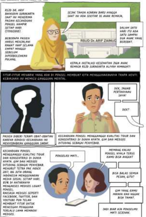

> **Deskripsi Visual:** Gambar ini merupakan ilustrasi. Secara keseluruhan, ilustrasi ini menggambarkan proses dan dampak dari keputusan Dr. Arief Zaini untuk menghentikan penggunaan produk yang mengandung bahan kimia berbahaya, yang berdampak pada kesehatan masyarakat dan lingkungan. Elemen utama terdiri dari tiga karakter: Dr. Arief Zaini (seorang pria dengan kacamata dan jas, mewakili tokoh ilmiah/peneliti), seorang pria muda (mewakili konsumen atau pihak yang terpengaruh), dan seorang wanita muda (mewakili masyarakat umum atau pihak yang terdampak). Relasi antar elemen menunjukkan alur: Dr. Zaini mengambil keputusan berdasarkan riset, lalu menginformasikan ke publik, yang menyebabkan perubahan perilaku konsumen dan dampak positif terhadap kesehatan. Teks penting mencakup nama “Dr. Arief Zaini”, frasa “Kepala Institusi Kesehatan”, “Penggunaan bahan kimia berbahaya”, “Dampak pada kesehatan”, dan “Kecemasan masyarakat”. Informasi kunci yang dapat diambil pembaca adalah bahwa keputusan ilmiah berbasis data dapat mengubah perilaku masyarakat dan melindungi kesehatan publik, serta menunjukkan pentingnya keterlibatan ilmuwan dalam isu sosial dan lingkungan.

RRPSSAAR TEEN PAADW TAP BSN

Sumber: Nisa/Kemendikbudristek (2023)

Bandingkanlah  informasi  pada  ko  mik  'Ponsel  Mencandu'  dengan  dua berita  berikut!  Perhatikan  dengan  saksama  apakah  terdapat  perbedaaan informasi yang di  sampaikan sumber berikut dengan informasi pada komik?

 

---
## 📄 Halaman 68

### Berita 1

### Pasien Lupa Orang Tua karena Kecanduan Ponsel

Kamis, 17 Oktober 2019

Selain  di  Bandung  Barat,  Rumah  Sakit  Jiwa  Daerah  (RSJD)  dr.  Arif Zainudin Surakarta juga menerima pasien kecanduan ponsel. Tahun ini, jumlah  pasien  tersebut  makin  meningkat.  Kepala  Instalasi  Kesehatan Jiwa Anak Remaja RSJD dr. Arif Zainudin Surakarta, Aliyah Himawati, mengatakan  fenomena  tersebut  sudah  terjadi  sejak  tiga  tahun  lalu. Namun, belakangan fenomena tersebut makin marak.

'Tiga tahun lalu ada, tapi sedikit. Sejak tahun ajaran baru ini ada sekitar 35 anak remaja. Sehari ada 1-2 anak yang berobat,' kata Aliyah, Kamis (17/10/2019).

Kondisi  gangguan  kejiwaan  mereka  berbeda-beda.  Pasien  dengan kondisi  yang  sangat  parah  bahkan  tidak  mengakui  dan  menganiaya orang tuanya.

'Orang tuanya tidak dianggap. Dia bilang kalau dia itu turun dari langit. Isi pikirannya itu yang ada di gim itu, bahasanya bahasa di gim itu,' ujarnya.

Kebanyakan pasien tersebut kecanduan gim ekstrem. Mereka tidak mau makan hingga tidak mau sekolah. Kalaupun sekolah, mereka ingin segera pulang untuk bermain gim.

'Ada yang niat ke sekolah itu untuk main gim. Karena di sekolah ada  wii  gratis.  Sedangkan  di  rumah  sudah  diputus  orang  tuanya,'  kata Aliyah.

Penanganan pasien kecanduan ponsel ini dilakukan sesuai dengan gejalanya.  Pertama,  pasien  harus  mengakui  jika  dirinya  kecanduan ponsel. Setelah itu, pasien diberi obat.

'Kondisi  kecanduan  ini  membuat  cairan  otak  atau  kerja  saraf tidak seimbang. Langkah farmakoterapi atau pemberian obat ini yang paling cepat bisa menyeimbangkan,' ujar dia. Kemudian, pasien akan menjalani terapi perilaku. Secara berangsur, dosis obat juga diturunkan.

'Untuk pasien rawat jalan, kita evaluasi dua minggu sekali. Mereka kita beri kontrak kegiatan. Sehari ngapain saja. Sehari pegang ponsel itu hanya dua jam,' katanya.

 

---
## 📄 Halaman 69

Sebagai  langkah  pencegahan,  dia  mengimbau  kepada  orang  tua agar menjauhkan ponsel dari anak sejak dini. Saat ini banyak orang tua yang mengenalkan ponsel terlalu dini.

(Sumber: Bayu Ardi Isnanto/Detik Health, 2019)

### Berita 2

### Pasien Anak Kecanduan Ponsel Bertambah di RS Jiwa Solo

Kamis, 17 Oktober 2019

Rumah Sakit Jiwa Daerah (RSJD) dr. Arif Zainudin, Solo, Jawa Tengah, mencatat adanya kenaikan signiikan jumlah pasien kecanduan ponsel. Dalam tiga bulan terakhir bahkan sudah ada 35 pasien kecanduan ponsel yang berobat ke RSJD Solo.

Kepala  Instalasi  Kesehatan  Jiwa  Anak  dan  Remaja  RSJD  dr.  Arif Zainudin, Aliyah Himawati, mengatakan dulu pasien kecanduan ponsel baru ada satu orang dalam sepekan. Sekarang, dalam satu hari bisa satu sampai dua pasien. Semuanya merupakan anak-anak usia sekolah.

'Ini kan tahun ajaran baru, baru mid semester itu sudah kira-kira ada 35 anak bahkan sampai rawat inap. Yang rawat inap kemarin ada dua anak, sekarang sudah pulang,' kata Aliyah kepada wartawan, Kamis (17/10).

Pasien yang rawat inap tersebut terdiri dari satu siswa SMP dan satu siswa SMA. Adapun pasien rawat jalan paling kecil usianya 10 tahun. Puluhan pasien tersebut berasal dari Solo dan sekitarnya.

Dia menyebutkan, ciri-ciri anak kecanduan ponsel biasanya orang tuanya sudah tahu si anak pegang ponsel terus. Selanjutnya, anak sudah tidak  bisa  melakukan  fungsi  tugasnya  sebagai  anak  sekolah  seperti membolos  sekolah,  tidak  mau  sekolah,  tidak  mau  belajar.  Selain  itu, anak mengalami gangguan emosi dan kesulitan tidur.

Menurutnya, dalam menangani pasien kecanduan ponsel disesuaikan dengan gejala yang muncul. Gejala bisa berbeda pada setiap anak. Misalnya, gangguan emosi dan sulit tidur diatasi terlebih dahulu.

 

---
## 📄 Halaman 70

'Ada  beberapa  langkah  yang  kami  lakukan  untuk  mengatasi gangguan emosi itu, salah satunya dengan obat farmakoterapi. Setelah itu, langsung masuk ke terapi perilaku,' ungkapnya.

Pada  awalnya,  terkadang  anak  merasa  tidak  kecanduan  ponsel dan merasa baik-baik saja. Langkah pertama sebelum masuk ke terapi perilaku, lanjutnya, anak harus mengakui kalau kecanduan ponsel.

Aliyah menyatakan, proses terapi tersebut dilakukan secara berkelanjutan. Untuk farmakoterapi paling tidak dua pekan agar pasien lebih  stabil.  Sepekan  pertama  sudah  bisa  mulai  terapi  perilaku  dan berlanjut paling tidak enam bulan.

'Ada  daftar  kontrak  apa  yang  harus  dilakukan  pasien?  Misalnya, untuk  anak  yang  masih  sekolah  jam  belajar  sepulang  sekolah  harus ngapain, kalau dulu pegang ponsel setiap waktu sekarang harus dibatasi. Pegang ponsel hanya boleh jam tertentu maksimal satu hari hanya dua jam, apa pun alasannya,' tegasnya.

Aliyah  menambahkan,  orang  tua  perlu  melakukan  upaya  dan memberi contoh untuk mencegah agar anak tidak kecanduan ponsel. Meskipun  begitu,  praktiknya  agak  susah  karena  tugas-tugas  sekolah terkadang memakai gawai.

Cara mencegahnya dengan menggunakan gawai hanya untuk tugastugas sekolah. Kemudian, pada jam-jam tertentu harusnya di keluarga tidak pegang ponsel semua. 'Kalau orang tua pegang ponsel, anaknya tidak boleh, ya sama saja,' ujarnya.

(Sumber: Binti Sholikhah/Republika, 2019)

Setelah  kalian  membaca  komik  dan  dua  berita  tersebut,  bentuklah kelompok yang terdiri atas 4-5 orang, lalu jawablah pertanyaan/soal berikut ini!

- Tuliskan  dua  persamaan  informasi  yang  diperoleh  dari  tiga  sumber tersebut!
- Apakah terdapat perbedaan informasi dari tiga sumber tersebut? Jika ada, tuliskan perbedaan informasi itu!

 

---
## 📄 Halaman 71

Setelah  kalian  mendiskusikan  jawabannya,  klasiikasikanlah  kalimatkalimat pada ketiga sumber tersebut berdasarkan kalimat yang mengandung unsur simpati, peduli, empati, dan pro/kontra menggunakan tabel berikut!

---
**📊 Tabel**

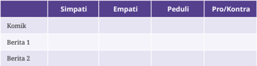

Tabel ini bertujuan untuk membantu siswa memahami bagaimana mereka merespons dua cerita berbeda dengan tiga jenis emosi atau sikap yang berbeda: simpati, empati, dan peduli, serta menilai apakah mereka bersikap pro atau kontra terhadap isi cerita tersebut. Topik utama tabel ini adalah reaksi emosional dan sikap terhadap dua cerita yang mungkin berbeda dalam isi atau tema, yang memungkinkan siswa untuk mengidentifikasi bagaimana mereka merespons cerita tersebut secara emosional dan moral. Kolom-kolom yang ada mencakup emosi atau sikap yang diukur, yaitu simpati (merasa bersama atau mengerti perasaan tokoh), empati (mengerti dan merasakan perasaan orang lain dari sudut pandang mereka), peduli (mengambil tindakan atau memperhatikan kebutuhan tokoh), serta pro/ kontra (menilai apakah mereka mendukung atau menolak isi cerita). Data atau pola penting yang terlihat adalah bahwa tabel ini masih kosong, artinya siswa diminta untuk mengisi tabel ini setelah membaca dua cerita, sehingga mereka dapat mengamati perbedaan reaksi emosional dan sikap mereka terhadap cerita-cerita tersebut, yang merupakan bagian penting dari pengembangan keterampilan membaca dan memahami emosi serta nilai-nilai moral.

### Diskusi lanjutan

- Apakah isu yang diangkat pada komik sudah sesuai dengan sumber yang diberikan?
- Hal  apakah  yang  perlu  ditambahkan  pada  komik  agar  kritik  yang disampaikan lebih bermakna?

### D.  Menggunakan Kaidah Bahasa untuk Menyampaikan Kritik

Kupas Teori

Menggunakan  kaidah-kaidah  bahasa  yang  umum  digunakan  dalam menyampaikan kritik

Pada  materi  ini,  kalian  akan  diajak  untuk  menyampaikan  kritikan  dengan memperhatikan  kaidah  kebahasaan  yang  umum  digunakan  masyarakat. Untuk membantu kalian mencapai tujuan pembelajaran tersebut, baca dan gunakanlah beberapa kaidah kebahasaan berikut untuk membuat kritikan.

Pada umumnya, ciri kebahasaan yang dipergunakan saat menyampaikan kritikan  ialah  menggunakan  pertanyaan  retoris,  majas  sindiran,  dan  kata kerja material.

 

---
## 📄 Halaman 72

### 1. Pertanyaan Retoris

Apakah kalian pernah mendapatkan pertanyaan yang sudah jelas jawabannya? Itulah yang dinamakan pertanyaan retoris. Pertanyaan retoris bisa dijawab oleh penanya itu sendiri. Pertanyaan ini diberikan untuk menyindir, memberi nasihat, dukungan, atau pesan terhadap orang lain secara halus.

### Contoh:

Siapa yang tidak ingin bahagia? Menurutmu, apakah kamu tidak pernah berdosa? Apakah setiap orang berhak berbuat baik?

Perhatikanlah beberapa pertanyaan berikut! Tandai dengan menggunakan tanda centang (√) pada kalimat yang merupakan pertanyaan retoris!

- □ Apa cukup membeli pakai daun?
- □ Siapa, sih, yang mau miskin selamanya?

### 2. Majas Sindiran

Majas  sindiran  merupakan  kelompok  gaya  bahasa  yang  mengungkapkan maksud atau gagasan dengan cara menyindir. Tujuannya adalah meningkatkan kesan dan makna kata terhadap pembaca. Sebelum membahas lebih lanjut mengenai majas sindiran, perhatikan dialog berikut ini dengan saksama!

 

---
## 📄 Halaman 73

### Korupsi Kecil

Orlin

:  'Ah, membosankan. Kebanyakan berita isinya tentang korupsi. Mau jadi apa negeri ini?'

Andreas  :  'Memang siapa saja yang korupsi?'

Orlin

:  'Siapa  lagi  kalau  bukan  para  pejabat?  Padahal  mereka sudah punya banyak uang, tetapi masih saja korupsi. Dasar serakah!'

Andreas :  'Memangnya kamu tidak pernah korupsi?'

Orlin

:  'Tidak mungkinlah saya korupsi. Orang miskin seperti saya, memangnya apa yang bisa saya korupsi?'

Andreas  :  'Iya, saya percaya, pasti kamu tidak pernah korupsi meskipun itu korupsi kecil.'

Orlin

:  'Memang ada korupsi kecil?'

Andreas :  'Apakah kamu lupa? Kemarin di kantin aku melihat kamu makan empat kue, tapi hanya bayar tiga kue saja.'

Orlin

:  'Ah, itu hanya masalah kecil, lagian cuma lima ratus rupiah.'

Andreas  :  'Katanya tidak ada korupsi kecil.'

Orlin

:  'haha, kamu bisa saja.'

(Sumber: Aulia/Kemendikbudristek, 2023)

Berdasarkan naskah dialog di atas, majas sindiran berbentuk ironi dan sinisme lebih diterima untuk digunakan dalam teks anekdot. Hal itu terjadi karena kritik sosial yang disampaikan dalam teks anekdot bersifat santun.

Perlu  kalian  ketahui,  majas  sindiran  memiliki  tiga  macam,  yaitu  ironi, sinisme, dan sarkasme. Simak penjelasannya berikut ini.

### a. Ironi

Ironi  adalah  gaya  bahasa  yang  melukiskan  suatu  maksud  dengan mengatakan  kebalikan  dari  keadaan  yang  sebenarnya  dengan  maksud menyindir.

 

---
## 📄 Halaman 74

Contoh: Harga  kedelai  murah  sekali,  sampai    pabrik  tahu  dan tempe tutup karenanya.

Pada dialog sebelumnya, perhatikan ketika Andreas berkata kepada Orlin, 'Iya, saya percaya. Pasti kamu tidak pernah korupsi meskipun itu korupsi kecil.'  Dalam  percakapan  tersebut  Andreas  berusaha  menyampaikan kritikan secara kebalikan kepada Orlin.

### b. Sinisme

Sinisme adalah gaya bahasa berupa ejekan atau sindiran menggunakan kata-kata kasar yang disampaikan secara langsung dengan setulus hati.

Contoh: Untuk  apa  punya  banyak  uang  jika  makan  saja  harus diatur timbangannya? Biar sewa, yang penting keren.

Pada dialog sebelumnya, perhatikan ketika Andreas berkata kepada Orlin, 'Apakah kamu lupa? Kemarin di kantin aku melihat kamu makan empat kue, tapi hanya bayar tiga kue saja.' Dalam percakapan tersebut Andreas berusaha menyampaikan kritikan secara kasar kepada Orlin.

### c. Sarkasme

Majas sarkasme merupakan gaya sindiran yang paling keras di antara tiga majas sindiran yang ada. Majas ini secara terang-terangan menyinggung, menyindir,  atau  menyerang  seseorang  atau  sesuatu  secara  langsung, bahkan menggunakan kata-kata yang kasar.

Contoh: Sudah  tahu  tidak  punya  uang,  masih  saja  ingin  pergi liburan. Jangan mimpi!

### 3. Kata Kerja Material

Teks  anekdot  banyak  menggunakan  kata  kerja  material,  yakni  kata  yang menunjukkan suatu aktivitas. Hal ini terkait dengan tindakan para tokoh dan alur yang membentuk rangkaian peristiwa ataupun kegiatan.

 

---
## 📄 Halaman 75

Contoh: Tatkala melintasi jembatan kecil itu, tiba-tiba orang suku Kluet melihat seekor ikan lele di antara bekas orang Seumeukruep. Karena kaget, dia langsung berteriak, 'Itu!!!' Anak suku Aceh langsung  melompat  ke  dalam  kolam  bekas  dari  orang  yang mencari ikan tersebut.

Setelah  kalian  mempelajari  kaidah  kebahasaan  untuk  menyampaikan kritikan,  cobalah  lengkapi  dialog  rumpang  berikut  dengan  menggunakan kalimat  tanya  retoris,  majas  sinisme,  dan  kata  kerja  material  berdasarkan ilustrasi cerita berikut ini!

Ada  seorang  siswi  ketahuan  membawa  catatan  kecil  yang  sengaja  ia sembunyikan dalam kantong baju seragamnya saat ujian atau yang dikenal dengan istilah ngepek. Saat ditanya gurunya tentang alasannya melakukan hal tersebut, ia pun menjawab karena banyak pejabat yang ia saksikan di televisi juga sering membawa teks saat berpidato.

### Ketahuan Ngepek

Saat sedang ujian, seorang siswi bernama Manda ketahuan membawa kertas jawaban oleh gurunya.

Bu Pura  :  …………………………………………………

Manda

:  'Mohon maaf, Bu. Ini kertas salinan yang ada di buku paket.'

Bu Pura  :  …………………………………………………

Manda

:  'Saya mau jadi pejabat, Bu.'

Bu Pura  :  'Bagaimana bisa kamu jadi pejabat, kalau ujian saja kamu ngepek seperti ini?'

Manda

:  …………………………………………………

(Sumber:  Kurniawan/Kemendikbudristek,  2023)

 

---
## 📄 Halaman 76

### E. Menulis Teks Eksposisi Hasil Penelitian Sederhana sebagai Bahan untuk Menyampaikan Kritik Sosial

### Menulis

Menulis teks eksposisi hasil penelitian  sederhana  sebagai  sumber penyampaian kritik sosial yang akurat

Selain anekdot, ada beberapa jenis teks yang dapat dijadikan sebagai media kritikan.  Salah  satu  media  kritikan  itu  dapat  melalui  teks  eksposisi.  Teks eksposisi adalah suatu tulisan yang berisi informasi yang dilengkapi dengan gagasan, perasaan, dan pengetahuan dari penulis.

Teks eksposisi memiliki beragam jenis, salah satunya teks eksposisi laporan. Secara deinisi, teks ini dapat diartikan sebagai tulisan yang dikembang kan melalui data temuan pada sebuah peristiwa, yang kemudian ditambah dengan gagasan penulis sebagai penguatnya.

Untuk  menghasilkan  sebuah  teks  eksposisi  laporan,  kalian  akan  diajak melakukan penelitian sederhana. Penelitian ini menggunakan metode survei yang biasanya dilakukan untuk mendapatkan data sebelum melakukan kritik. Untuk  mempermudah  kalian  dalam  menyusun  teks  eksposisi,  perhatikan langkah-langkah berikut ini!

- Tentukan topik yang berhubungan dengan fenomena sosial. Topik yang dipilih sebaiknya dekat dengan kehidupan sehari-hari kalian, contohnya kebiasaan  membaca  di  sekolah.  Selain  itu,  kalian  dapat  memilih  topik yang sesuai dengan ketertarikan kalian.
- Tentukan objek yang akan menjadi responden atau sumber data penelitian kalian. Kalian dapat memilih teman, keluarga, atau orang lain di sekitar kalian  sebagai  responden  sesuai  dengan  topik  yang  diangkat.  Semakin banyak responden penelitian, semakin valid penelitian kalian.
- Tentukan cara pengambilan data. Kalian dapat melakukan survei dengan cara menyebarkan angket isian atau melalui wawancara.
- Rumuskan hal-hal yang ingin kalian ketahui dari topik yang dipilih dalam bentuk  pertanyaan.  Contoh:  Berapa  jam  yang  kalian  habiskan  untuk

 

---
## 📄 Halaman 77

membaca buku dalam sepekan? Buku apa saja yang kalian baca? Hal apa saja yang jadi pertimbangan kalian dalam memilih buku bacaan?

- Kumpulkan data sesuai dengan cara pengambilan data yang telah dipilih!
- Olahlah  data  yang  telah  didapat!  Kalian  dapat  mengolah  data  dengan menggunakan persentase. Misalnya, berapa persen yang menjawab A, B, atau C?
- Sajikan data kalian dalam bentuk teks eksposisi laporan. Teks disajikan dengan struktur sebagai berikut.
- Pernyataan pendapat
Tuliskan pendapat kalian terhadap topik yang akan dibahas! Sampaikan pula pendapat kalian mengenai alasan pemilihan topik sehingga penting untuk dibahas!

### b. Argumen/hasil penelitian

Sampaikan  hasil  penelitian  kalian  dengan  jelas!  Kalian  juga  dapat menampilkan  tabel, graik, atau diagram untuk menunjukkan  data  yang diperoleh.

### c. Penegasan ulang/simpulan

Sampaikan simpulan atau penegasan pendapat kalian terhadap hasil yang sudah dibahas.

Gunakan format berikut untuk merancang penelitian sederhana kalian.

---
**📊 Tabel**

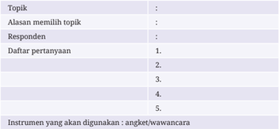

Tabel ini merupakan bagian dari desain instrumen penelitian atau kuesioner yang disusun untuk memahami suatu topik tertentu, dengan fokus pada satu responden saja. Topik utama yang dibahas dalam tabel ini adalah sesuatu yang belum disebutkan secara eksplisit, namun jelas bahwa tujuannya adalah untuk mengumpulkan data melalui pertanyaan yang dirancang secara sistematis. Kolom-kolom yang terdapat dalam tabel mencakup “Topik”, “Alasan memilih topik”, “Responden”, “Daftar pertanyaan”, dan “Instrumen yang akan digunakan”. Dari tabel ini, terlihat bahwa peneliti memilih satu responden sebagai subjek utama, dan menggunakan angket atau wawancara sebagai alat pengumpulan data. Daftar pertanyaan yang disediakan hanya berupa nomor-nomor tanpa isi, yang menunjukkan bahwa pertanyaan-pertanyaan tersebut belum diisi atau masih dalam tahap pengembangan. Hal ini menunjukkan bahwa tabel ini merupakan bagian awal dari proses penelitian, sebelum pertanyaan-pertanyaan tersebut diisi atau diberikan kepada responden.

 

---
## 📄 Halaman 78

Hasil penelitian:

Simpulan:

Selain menggunakan tulisan berbentuk eksposisi laporan, kalian juga dapat menyajikan kritik melalui gambar dalam bentuk infograik seperti contoh berikut ini.

---
**🖼️ Gambar/Diagram**

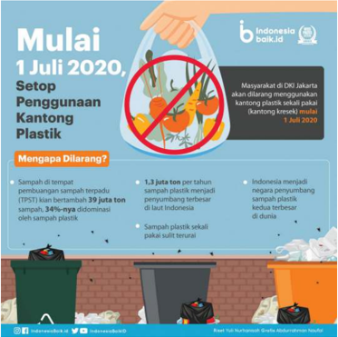

> **Deskripsi Visual:** Gambar ini merupakan ilustrasi informatif yang dirancang untuk menyampaikan pesan tentang penghentian penggunaan kantong plastik di Jakarta. Secara keseluruhan, ilustrasi ini menunjukkan perubahan kebijakan pemerintah yang efektif untuk mengurangi sampah plastik, dengan visual yang menarik dan penuh makna. Elemen utama meliputi tangan yang menarik kantong plastik berisi sayuran, yang diberi tanda larangan (lingkaran merah dengan garis), simbolis menyatakan penyerahan kantong plastik. Di bawahnya, terdapat ilustrasi tiga tong sampah — dua tong hijau dan satu tong oranye — yang menggambarkan sistem pengelolaan sampah yang lebih baik. Relasi antar elemen ini menunjukkan transisi dari penggunaan plastik ke pengelolaan sampah yang lebih berkelanjutan. Teks penting mencakup tanggal “1 Juli 2020” sebagai titik awal kebijakan, serta angka “1,3 juta ton per tahun” yang menunjukkan volume sampah plastik yang dihasilkan. Label lain seperti “Masyarakat di DKI Jakarta akan dilarang menggunakan kantong plastik sekali pakai (bambu kertas) mulai 1 Juli 2020” dan “Indonesia menjaga negara penyumbang negara penyumbang plastik terbesar di dunia” memberikan konteks nasional dan lokal. Informasi kunci yang dapat diambil pembaca adalah bahwa kebijakan ini merupakan langkah konkret untuk mengurangi sampah plastik, dengan target pengurangan sampah plastik sebesar 34% yang dihasilkan oleh TPST, serta menunjukkan bahwa Indonesia berkomitmen untuk menjadi negara penyumbang plastik terbesar di dunia. Ilustrasi ini dirancang untuk memperkuat kesadaran publik dan mengajak masyarakat untuk berperilaku lebih berkelanjutan.

Gambar 2.3 Infograik Efek Penggunaan Plastik

Sumber: Abdurrahman Naufal/IndonesiaBaik.id (2020

 

---
## 📄 Halaman 79

 

---
## 📄 Halaman 80

### F. Mengubah Teks Anekdot ke dalam Bentuk Komik Potongan ( Comic Strip )

### Kreativitas

Menulis teks anekdot dengan informasi yang akurat dan merujuk pada sumber-sumber informasi yang valid dalam bentuk media kreatif

Selain dalam bentuk tulisan atau lisan, anekdot juga dapat disampaikan melalui grais atau gambar, salah satunya melalui komik. Pada bagian sebelumnya, kalian  sudah  melihat  beberapa  contoh  komik  yang  memuat  unsur  humor sekaligus kritik.

Ada berbagai jenis komik, salah satu yang sering digunakan adalah komik potongan atau comic strip . Komik ini biasanya terdiri atas empat panel (dapat kurang atau lebih),  bukan  berbentuk  buku.  Panel  adalah  satu  bingkai  atau kotak pada komik yang berisi satu adegan saja.

Ikuti langkah-langkah berikut untuk membuat komik potongan.

- Tentukan cerita yang akan kalian tuangkan dalam komik. Pada kegiatan sebelumnya, kalian sudah membuat teks anekdot. Kalian dapat menggunakan cerita tersebut sebagai sumber cerita komik.
- Ubahlah cerita yang kalian miliki ke dalam naskah komik. Karena panel yang akan digunakan terbatas, kalian harus memilih adegan-adegan inti dalam  cerita  tersebut.  Berikut  ini  merupakan  format  skenario  naskah komik yang diambil dari contoh cerita di atas.

### Belum Buat PR

Pagi itu, seperti biasanya Ari sudah berada di dalam kelas. Sebagai siswa SMA,  ia  sering  mendapat  hukuman  dari  gurunya  karena  sering  lupa membuat PR. Sama halnya dengan hari ini, ia pun lupa membuat PR.

'Waduh,  saya  baru  ingat  kalau  hari  ini  ada  PR,'  kata  Ari  sambil memegang dahinya. Tiba-tiba terlintas di benaknya untuk menanyakan PR kepada si Abi.

 

---
## 📄 Halaman 81

'Bi, apakah kamu sudah mengerjakan PR?'

- 'PR? Nah belum nih' jawab Abi dengan santai.
Mengetahui Abi belum membuat PR, akhirnya Ari pun menjadi lega karena dia tidak sendirian lagi jika dihukum oleh guru nanti.

(Sumber: Kurniawan/Kemendikbudristek, 2023)

---
**📊 Tabel**

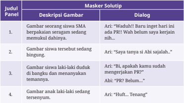

Tabel ini membahas interaksi antara seorang anak laki-laki dan seorang ibu dalam situasi di mana anak sedang mengalami kebingungan atau kelelahan saat memakai masker, yang kemudian dijawab dengan cara yang berbeda-beda oleh ibunya. Topik utama tabel adalah bagaimana orang tua, khususnya ibu, memberikan respons emosional dan praktis terhadap perilaku anak yang mengalami kesulitan saat memakai masker, dengan tujuan membantu anak merasa nyaman dan tidak bingung. Kolom-kolom yang ada mencakup “Judul Panel”, “Deskripsi Gambar”, dan “Dialog”, yang masing-masing menjelaskan konteks visual, deskripsi adegan, dan percakapan antara ibu dan anak. Dalam panel pertama, ibu menunjukkan kelebihan empati dengan mengatakan bahwa anak tidak perlu khawatir karena masker tidak akan membuatnya terasa seperti sedang mengalami sesuatu yang tidak nyaman. Di panel kedua, ibu memberikan penjelasan yang lebih langsung dan santai, dengan mengatakan bahwa anak tidak perlu khawatir karena masker tidak akan membuatnya terasa seperti sedang mengalami sesuatu yang tidak nyaman. Di panel ketiga, ibu memberikan penjelasan yang lebih teknis dan langsung, dengan mengatakan bahwa anak tidak perlu khawatir karena masker tidak akan membuatnya terasa seperti sedang mengalami sesuatu yang tidak nyaman. Di panel keempat, ibu memberikan penjelasan yang lebih langsung dan santai, dengan mengatakan bahwa anak tidak perlu khawatir karena masker tidak akan membuatnya terasa seperti sedang mengalami sesuatu yang tidak nyaman. Pola penting yang terlihat adalah bahwa ibu secara konsisten menunjukkan kelebihan empati dan kelebihan kelebihan empati, dengan cara yang berbeda-beda, untuk membantu anak merasa nyaman dan tidak bingung saat memakai masker.

- Buatlah  sketsa  gambar!  Kalian  dapat  menggambar  sendiri  komik  yang kalian buat. Kalian juga dapat menggunakan foto-foto yang gerakannya disesuaikan dengan rencana naskah yang dibuat.
- Setelah yakin dengan sketsa yang sudah dibuat, kalian dapat menebalkan dan mewarnai sketsa itu hingga menjadi komik yang utuh.
- Setelah  kalian  mempelajari  langkah-langkah  tersebut,  sekarang  carilah sebuah anekdot dari suatu sumber! Setelah itu, ubahlah menjadi sebuah  komik  potongan!  Kalian bisa  berlatih  memperagakan  atau mengekspresikan dialog tokoh tersebut di depan kelas!

 

---
## 📄 Halaman 82

---
**🖼️ Gambar/Diagram**

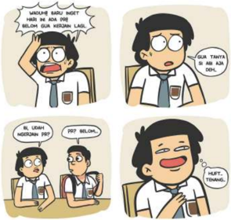

> **Deskripsi Visual:** Gambar ini merupakan ilustrasi. Secara keseluruhan, ilustrasi ini menggambarkan interaksi komunikatif antara dua siswa di kelas, yang menunjukkan perubahan emosi dan sikap dari kebingungan menjadi kegembiraan setelah mendapat respons yang diharapkan. Elemen utama adalah dua karakter siswa dengan ekspresi wajah yang berubah seiring waktu: karakter pertama awalnya terlihat bingung dan marah karena merasa tidak dihargai (dalam percakapan “WALAU KAU KUAT, HARI INI ADA BILONG GUNA KERJAN LAGI”), lalu berubah menjadi terkesan dan senang setelah mendapat respons “POT, BEMOL, PEP” dan “HAFT, TIDAK TIDAK” yang menunjukkan bahwa dia telah memperoleh pengertian atau penjelasan yang diinginkannya. Teks penting yang terlihat meliputi: “WALAU KAU KUAT, HARI INI ADA BILONG GUNA KERJAN LAGI.” (ekspresi marah), “SUDAH TAHU, SI ANA ANA OH.” (respon awal), “POT, BEMOL, PEP.” (respon yang diharapkan), dan “HAFT, TIDAK TIDAK.” (respon akhir yang menunjukkan kepuasan). Informasi kunci yang dapat diambil pembaca adalah bahwa ilustrasi ini menggambarkan bagaimana komunikasi yang tidak tepat dapat menyebabkan ketidaknyamanan, namun dengan respons yang tepat, emosi dapat berubah menjadi positif, menunjukkan pentingnya komunikasi yang efektif dan empati dalam lingkungan sekolah.

### G.  Menampilkan Lawakan Tunggal secara Santun

### Berbicara, Berdiskusi, dan Mempresentasikan

Menampilkan lawakan tunggal ( stand up comedy ) sebagai sarana menyampaikan kritik terhadap fenomena yang terjadi. Penyampaian kritik tersebut tetap harus memperhatikan kesantunan dalam berbicara maupun bersikap.

Kali ini, kalian akan membuat naskah lawakan tunggal. Sebelum membuatnya, pahamilah  beberapa  istilah  yang  terdapat  dalam  naskah  lawakan  tunggal berikut.

 

---
## 📄 Halaman 83

### 1. Set up

Set up merupakan bagian tidak lucu yang berperan sebagai pengantar lelucon yang  disampaikan.  Bagian  ini  biasanya  berisi  informasi. Set  up berfungsi seperti krisis pada teks anekdot.

### Contoh:

Anak saya itu memang jarang liburan.

### 2. Punch

Punch atau punchline merupakan bagian yang mengandung unsur humor dan seharusnya mengundang tawa penonton. Pada bagian ini, komika menyajikan kejutan atau reaksi terhadap set up yang diberikan. Punch disebut juga sebagai pembelok pikiran penonton karena berisi sesuatu yang di luar kewajaran atas set up yang diberikan. Punch berfungsi seperti reaksi pada teks anekdot.

### Contoh:

Saya bawa ke tempat kerja saja, menurut dia itu tamasya. Dari pagi sampai sore dia anteng nyusun lego, pakai batu bata. Kalau orang lain nyusun lego, anak-anak, ya jadi robot, anak saya jadi pos ronda.

### 3. Bit

Sepasang kesatuan set  up dan punch yang membahas satu subtema disebut dengan bit . Sebuah naskah terdiri atas beberapa bit yang saling berkaitan. Bit merupakan bagian kecil dari naskah lawakan tunggal.

### Contoh:

Anak  saya  itu  memang  jarang  liburan.  Saya  bawa  ke  tempat  kerja  saja, menurut dia itu tamasya. Dari pagi sampai sore dia anteng nyusun lego, pakai batu bata. Kalau orang lain nyusun lego, anak-anak, ya jadi robot, anak saya jadi pos ronda.

### 4. Rule of three

Rule of three merupakan sebuah cara untuk mengundang tawa penonton. Rule of three digunakan melalui penyampaian tiga hal atau contoh sesuatu. Contoh

 

---
## 📄 Halaman 84

ketiga berupa hal lucu atau punch . Contoh ketiga berisi hal yang tidak terduga, tetapi tetap masih berkaitan dengan contoh sebelumnya.

### Contoh:

Dia bilang gini, 'Bapak curang. Tidur di hotel, makan nasi kotak, tiap hari naik lift.'

Setelah  memahami  istilah-istilah  atau  bagian  dalam  sebuah  naskah lawakan tunggal, buatlah naskah lawakan tunggal bertema fenomena sosial yang terjadi di sekitar kalian. Kalian dapat menggunakan tabel berikut untuk membantu dalam membuat naskah.

---
**📊 Tabel**

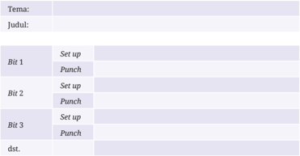

Tabel ini menggambarkan proses atau urutan tindakan yang mungkin terjadi dalam sebuah sistem atau prosedur, kemungkinan besar terkait dengan pengaturan atau pelaksanaan suatu tugas yang melibatkan dua tahap utama, yaitu “Set up” dan “Punch”, yang diulang secara berurutan dalam tiga bagian atau “Bit” yang berbeda, serta diakhiri dengan “dst.” yang berarti “dan sebagainya”, menunjukkan bahwa pola ini bisa berlanjut. Topik utama tabel ini adalah urutan tindakan standar yang mungkin digunakan dalam prosedur teknis atau operasional, seperti pengaturan mesin atau sistem yang memerlukan pengaturan awal dan pemberian tanda atau pencatatan. Kolom pertama menyediakan label untuk setiap tahap, sementara kolom kedua menunjukkan dua tindakan yang selalu muncul dalam urutan tertentu — “Set up” diikuti oleh “Punch” — yang menunjukkan bahwa setiap “Bit” mengikuti pola yang sama, yaitu pengaturan diikuti oleh pemberian tanda atau pencatatan. Pola ini menunjukkan keberlanjutan dan konsistensi dalam prosedur, yang sangat penting untuk memastikan keakuratan dan efisiensi dalam pelaksanaan tugas.

Sebelum  ditampilkan,  mintalah  pendapat  orang  lain  terhadap  naskah yang  sudah  kalian  tulis.  Gunakan  pertanyaan  berikut  untuk  memeriksa apakah naskah tersebut sudah tepat atau belum.

- Apakah  tema  yang  diangkat  faktual  dan  tidak  menyinggung  SARA, diskriminasi gender, disabilitas, dan kekerasan?
- Apakah isi naskah sudah sesuai dengan tema?
- Apakah terdapat kritik yang disampaikan dalam naskah?
- Apakah kritik disampaikan secara santun dan tidak menyinggung suku, agama,  ras,  dan  antargolongan  atau  menampilkan  kekerasan,  sadistis, pornoaksi, bias gender, disabilitas, dan ujaran kebencian?

 

---
## 📄 Halaman 85

- Apakah terdapat unsur humor dalam naskah?
- Apakah humor disampaikan secara menarik dan santun? Apakah humor yang disampaikan tidak menyinggung suku, agama, ras, dan antargolongan atau menampilkan kekerasan, sadistis, pornoaksi, bias gender, disabilitas, dan ujaran kebencian?
Kuasailah naskah yang telah ditulis sehingga kalian dapat menyampaikannya tanpa harus melihatnya. Bacalah berulang-ulang sambil becermin  agar  kalian  dapat  menguasai  naskah  serta  melihat  ketepatan ekspresi atau gerak tubuh.

Adapun hal yang perlu diperhatikan saat kalian menampilkan lawakan tunggal adalah kesantunan dalam berbahasa. Meskipun anekdot atau lawakan tunggal  mengandung  unsur  kritik,  kritik  yang  disampaikan  harus  santun tanpa menggunakan kata-kata kasar. Penggunaan kata 'maaf' atau 'permisi' tidak  dilarang  dalam  menyampaikan  lawakan  tunggal,  terlebih  saat  akan mengkritik orang yang ada di depan kita. Selain itu, kritik yang disampaikan harus berdasarkan fakta yang valid agar dapat lebih diterima oleh pihak yang dikritik atau audiensi.

Kesantunan dalam berpakaian dan bersikap pun harus diperhatikan saat kalian ingin menampilkan lawakan tunggal. Gunakanlah pakaian yang sopan, tetapi tetap nyaman. Tampilkan gestur atau gerak tubuh yang tidak membuat orang lain memikirkan sesuatu yang kurang baik.

### H.  Uji Kompetensi

Perhatikan teks anekdot berikut ini untuk menjawab soal nomor 1 dan 2!

### Indah pada Waktunya

Seorang  guru  Bimbingan  Konseling  memanggil  Dedi,  salah  seorang siswa kelas X yang diketahui sering melakukan pelanggaran di sekolah. Kala itu, mereka berdua sedang berada di dalam ruang BK.

'Dedi, ibu mendapatkan laporan bahwa kamu jarang membuat PR dan sering tidur di kelas, benarkah itu?' tanya guru BK dengan nada bersahabat. Mendengar pertanyaan itu, Dedi justru menjawab dengan

 

---
## 📄 Halaman 86

sangat  santai.  Ia  mengakui  bahwa  yang  dikatakan  guru  BK  memang benar adanya.

Mendengar respons muridnya yang cenderung tidak menunjukkan penyesalan sama sekali, lantas sang guru pun kembali bertanya kepada Dodi,

'Nak, bukannya kamu selepas SMA ini ingin jadi polisi?'

'Kok ibu tahu?' tanya Dedi penasaran.

Ibu guru mulai mengambil ponsel miliknya dari dalam tas, kemudian ia tampak membuka akun Facebook pribadinya. Tidak lama berselang, ia  menunjukkan sebuah tulisan status Facebook yang bertuliskan, 'Akan indah pada waktunya, pasti jadi polisi'.

'Status  ini  kamu  kan  yang  membuatnya?'  sambil  menunjukkan tulisan tersebut ke Dedi. Wajah Dedi kemudian menjadi merah seketika.

(Sumber: Kurniawan/Kemendikbudristek, 2023)

### 1. Sindiran yang terkandung dalam anekdot tersebut adalah ….

- Kebiasaan seorang pelajar yang ingin sukses di kemudian hari, tetapi malas untuk belajar.
- Kelakuan seorang pelajar yang selalu mencari alasan dari kesalahan yang dilakukannya.
- Kebiasaan  seorang  pelajar  yang  suka  membuat  masalah  di  sekolah dan tidak takut ditegur guru.
- Kelakuan  seorang  pelajar  saat  ini  yang  selalu  berkeinginan  untuk dituruti semua kemauannya.
- Kebiasaan seorang pelajar yang sudah kecanduan bermain Facebook dan tidak bisa dihentikan.
- Berdasarkan  anekdot  tersebut,  gambaran  dampak  negatif  yang  terjadi apabila terlalu sering melanggar aturan sekolah adalah ….
- Akan  terbiasa  melakukan  kesalahan  dan  kurang  peduli  terhadap teguran dari pihak sekolah.

 

---
## 📄 Halaman 87

- Akan selalu melawan kehendak guru ataupun orang tua di rumah.
- Akan  selalu  membuat  alasan  yang  tidak  masuk  akal  agar  terbebas dari berbagai hukuman.
- Akan menjadi pribadi yang tidak peka terhadap lingkungan sekitar dan perkembangan zaman.
- Akan  menuliskan  semua  keluhan  yang  dialaminya  melalui  akun media sosial pribadi miliknya.
- Pasangkanlah  penggalan  naskah  yang  berada  di  sebelah  kiri  dengan bagian lawakan tunggal yang berada di sebelah kanan!

---
**🖼️ Gambar/Diagram**

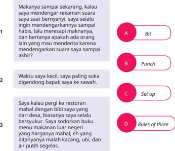

> **Deskripsi Visual:** Gambar ini merupakan ilustrasi. Secara keseluruhan, gambar ini menampilkan tiga bagian teks yang disusun secara vertikal, masing-masing diberi nomor (1, 2, 3) dan diiringi oleh empat pilihan jawaban (A, B, C, D) yang ditempatkan di sisi kanan dalam bentuk lingkaran berwarna merah muda. Setiap pilihan jawaban memiliki label yang berisi istilah dalam bahasa Inggris: “Bit”, “Punch”, “Set up”, dan “Rules of three”. Teks di sebelah kiri masing-masing nomor berisi kalimat-kalimat dalam bahasa Indonesia yang tampaknya menggambarkan situasi atau cerita, kemungkinan sebagai bagian dari soal pilihan ganda atau latihan pemahaman teks. Relasi antara elemen adalah bahwa setiap nomor teks (1, 2, 3) berhubungan dengan satu pilihan jawaban (A, B, C, D) yang mungkin merupakan jawaban yang tepat untuk teks tersebut. Teks penting yang terlihat meliputi nomor urut (1, 2, 3), label pilihan jawaban (A, B, C, D), dan istilah dalam bahasa Inggris. Informasi kunci yang dapat diambil pembaca adalah bahwa gambar ini merupakan soal pilihan ganda yang menguji pemahaman konteks atau istilah tertentu dalam teks, dengan pilihan jawaban yang disajikan secara visual di samping teks. Pembaca diminta untuk memilih jawaban yang paling tepat berdasarkan isi teks yang diberikan.

 

---
## 📄 Halaman 88

- Pasangkanlah  penggalan  cerita  yang  berada  di  sebelah  kiri  dengan struktur anekdot yang berada di sebelah kanan!
1

Karena patuh terhadap sang ibu, akhirnya anak tersebut memilih untuk batal ikut lomba balap sepeda.

- 2 Ingin Ikut Balap Sepeda
'Bu, saya izin ikut lomba balap sepeda,' kata sang anak dengan suara pelan.

- 3 'Baiklah, ibu doakan kamu menang ya! Tapi pesan ibu, saat lomba kamu jangan ngebut-ngebut ya, takut kamu jatuh!'
- 4
Seorang anak yang sangat patuh terhadap ibunya sedang meminta izin untuk mengikuti lomba balap sepeda. Dengan perlengkapan yang sudah komplet, ia pun mendekati sang ibu.

 

---
## 📄 Halaman 89

### Perhatikan komik potongan berikut untuk menjawab soal nomor 5 dan 6.

---
**🖼️ Gambar/Diagram**

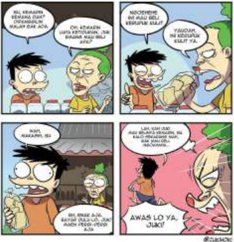

> **Deskripsi Visual:** Gambar ini merupakan ilustrasi komik yang menggambarkan percakapan antara tiga karakter dalam situasi yang tampaknya menggambarkan konflik atau ketidakpuasan terkait keputusan atau tindakan yang diambil oleh salah satu karakter. Ilustrasi ini terdiri dari empat panel, masing-masing menunjukkan perubahan ekspresi dan dinamika interaksi antar karakter. Panel pertama menunjukkan dua karakter yang tampak marah atau kecewa, dengan salah satu karakter mengatakan “KITA BUKAN BISA BERTINDAK SEPERTI INI!” dan “KITA BUKAN BISA BERTINDAK SEPERTI INI!” — menunjukkan ketidaksetujuan. Panel kedua menunjukkan karakter ketiga yang tampak sedang menghakimi atau mengeluarkan pernyataan yang mengganggu, dengan teks “KAMU BUKAN BISA BERTINDAK SEPERTI INI!” dan “KAMU BUKAN BISA BERTINDAK SEPERTI INI!” — menunjukkan bahwa dia sedang menghakimi atau menghakimi. Panel ketiga menunjukkan karakter pertama yang tampak marah dan menunjukkan tanda-tanda kekecewaan, dengan teks “KAMU BUKAN BISA BERTINDAK SEPERTI INI!” dan “KAMU BUKAN BISA BERTINDAK SEPERTI INI!” — menunjukkan bahwa dia sedang menghakimi atau menghakimi. Panel keempat menunjukkan karakter ketiga yang tampak marah dan menunjukkan tanda-tanda kekecewaan, dengan teks “AWAS LO YA, JANGAN!” — menunjukkan bahwa dia sedang menghakimi atau menghakimi. Informasi kunci yang dapat diambil pembaca adalah bahwa ilustrasi ini menggambarkan konflik antar karakter yang terkait dengan tindakan atau keputusan yang diambil oleh salah satu karakter, dan bahwa karakter tersebut tampak marah atau kecewa terhadap tindakan atau keputusan tersebut.

Sumber: Si Juki/Facebook (2021)

- Pada komik potongan tersebut, terdapat dialog tokoh Juki yang mengucapkan, 'Lah, kan Juki  mau  belinya  kemarin,  Bu.  Kalo  sekarang mah gak mau beli.'
Cermati kembali ucapan tersebut, lalu tentukanlah prediksi maksud dialog tersebut dengan memberikan tanda centang (√) pada salah satu kolom, 'mungkin' atau 'tidak mungkin', di bawah ini!

---
**📊 Tabel**

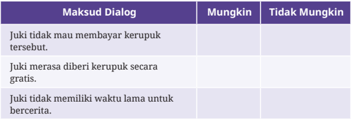

Tabel ini membahas tentang bagaimana seseorang dapat menunjukkan sikap yang tidak menghargai atau tidak peduli terhadap orang lain dalam konteks dialog, khususnya ketika ada situasi yang melibatkan kebutuhan atau kepentingan pribadi. Topik utama tabel ini adalah “Maksud Dialog” yang menggambarkan tindakan atau sikap yang tidak etis atau tidak sopan dalam berinteraksi sosial. Kolom pertama menyajikan tiga contoh dialog yang menunjukkan sikap tidak menghargai, seperti menolak membayar kekurangan, menawarkan kekurangan secara gratis tanpa alasan, dan menolak memberikan waktu untuk berbicara. Kolom kedua dan ketiga, yaitu “Mungkin” dan “Tidak Mungkin”, menunjukkan kemungkinan atau keberadaan sikap tersebut dalam konteks sosial yang sehat. Dari data yang terlihat, dapat disimpulkan bahwa tindakan-tindakan tersebut cenderung tidak dianggap sebagai perilaku yang tepat dalam interaksi sosial, karena mereka menunjukkan ketidakpedulian terhadap kebutuhan atau hak orang lain, sehingga kemungkinan besar tidak akan diterima dalam lingkungan sosial yang baik.

 

---
## 📄 Halaman 90

- Mana sajakah  dari  dialog  berikut  ini  yang  menggambarkan  penolakan (kontra)  penulis  terhadap  kebiasaan  masyarakat  berdasarkan  komik potongan  tersebut?  Berikan  tanda  centang  (√)  pada  kolom  sebelah  kiri !
Oh, kemarin ketiduran, Juk. Emang mau beli apa?

Yaudah, ini kerupuk kulit ya!

Bu, kemarin ke mana dah? Dipanggil malah gak ada?

Eh, enak aja. Bayar dulu lo, Juk! Maen pergi-pergi aja

Lah, kan Juki mau belanjanya kemarin, Bu. Kalo sekarang mah, gak mau beli.

### Bacalah teks lawakan tunggal berikut dengan saksama!

Pokoknya seberat apa pun makanannya, belum mau makan kalau belum makan nasi. Bahkan makan lontong saja yang sama-sama dibuat dari beras, mungkin karena kuahnya terlalu banyak, dicampur dengan nasi. Tapi untungnya saya belum pernah lihat ada orang makan nasi lauknya nasi goreng.

(Dikutip dengan perubahan seperlunya dari artikel '4 Contoh Teks Stand Up Comedy Kritik Berbagai Segi Kehidupan', Rctiplus.com, 2023)

- Kata kerja (verba) material yang terdapat pada penggalan naskah lawakan tunggal tersebut  yaitu … dan ….

### Bacalah teks lawakan tunggal berikut dengan saksama!

Semenjak adanya Facebook tuh orang-orang jadi suka update status. Apa-apa update status. Mau tidur update status, mau jalan-jalan update status,  mau update status, update status.  Menurut gue , Facebook ini

 

---
## 📄 Halaman 91

mendorong orang untuk membagikan hal-hal yang kurang penting gitu. Sampe-sampe waktu lapar pun, sempat-sempatnya update status, 'Duh, lapar nih, pengen makan.' Eh, semua orang juga tahu kali kalau lapar tuh pengen makan. Lagian emangnya kalau kamu update status seperti itu, kamu akan kenyang? Tidak, kan?

(Sumber: Jevi Adhi Nugraha/Merdeka.com, 2023, dengan pengubahan seperlunya)

- Kalimat  yang  menunjukkan  sikap  simpati  dari  teks  lawakan  tunggal tersebut adalah ….

### Bacalah teks anekdot di bawah ini dengan saksama!

### Sampah dan Pelayar

Saat istirahat jam pertama, Sri  melihat  Edi  membuang  sampah sembarangan.  Sebagai  ketua  kelas,  Sri  merasa  wajib  mengingatkan rekan sekelasnya itu.

'Edi, kamu jangan buang sampah sembarangan?' tegur Sri dengan lembut.

'Ah, teman-teman yang lain juga buang sampah sembarangan kok,' jawab Edi.

'Tapi  kamu  tidak  harus  ikut-ikutan  hal  yang  buruk  dari  temanteman yang lain. Apalagi kamu kan bercita-cita sebagai seorang pelayar. Jadi, kamu harus menjaga kebersihan!'

'Justru karena saya bercita-cita jadi pelayar, saya jadi buang sampah sembarangan'.

'Maksud kamu apa?' tanya Sri.

'Lha, kalau banyak sampah berserakan bisa menyebabkan banjir, lalu  kalau  banjir,  saya  akan  buat  perahu  kecil  dan  menawarkan  jasa untuk orang-orang yang butuh bantuan menyeberang,' jawab Edi sambi tersenyum.

'Dasar kamu! Pokoknya kita harus menjaga kebersihan lingkungan sekitar kita!' ajak Sri dengan nada kesal.

(Sumber: Kurniawan/Kemendikbudristek, 2023)

 

---
## 📄 Halaman 92

- Rancanglah sebuah komik potongan dari naskah anekdot tersebut!

### Cermati infograik berikut dengan saksama!

---
**🖼️ Gambar/Diagram**

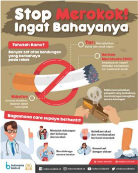

> **Deskripsi Visual:** Gambar ini merupakan ilustrasi edukatif yang bertujuan menyampaikan pesan kampanye anti merokok. Secara keseluruhan, ilustrasi ini menampilkan visualisasi grafis yang menggambarkan bahaya merokok, cara menghentikan kebiasaan tersebut, dan langkah-langkah yang harus diambil. Elemen utama meliputi simbol larangan merokok (tangan memegang rokok yang diberi tanda larang), ilustrasi tangan memegang rokok yang terbakar, dan gambar orang yang menghentikan merokok dengan bantuan dokter. Relasi antar elemen menunjukkan bahwa merokok berbahaya, dan penghentian merokok dapat dilakukan dengan dukungan medis dan komitmen pribadi. Teks penting seperti “Stop Merokok! Ingat Bahayanya”, “Tahukah Kamu?”, “Cara Supaya Bermanfaat”, dan “Karbon Monoksida (CO)” memberikan informasi kunci. Informasi kunci yang dapat diambil pembaca adalah bahwa merokok berbahaya bagi kesehatan, menghasilkan karbon monoksida yang berbahaya, dan penghentian merokok dapat dilakukan dengan dukungan profesional dan komitmen pribadi. Ilustrasi ini juga menunjukkan bahwa penghentian merokok memerlukan pendekatan holistik, termasuk konsultasi dokter dan perubahan gaya hidup.

Sumber: Septian Agam/IndonesiaBaik.id (2018)

- Buatlah  sebuah  bahan  kritikan  dalam  bentuk  eksposisi  berdasarkan infograik  di  atas!

### I. Pengayaan

Jika  telah  menguasai  minimal  70%  dari  total  materi  bab  ini,  kalian  dapat melakukan kegiatan pengayaan sebagai berikut.

- Mencari tulisan atau rekaman tentang kritikan dari berbagai sumber yang kredibel, seperti koran, majalah, video YouTube, dan sumber lainnya.

 

---
## 📄 Halaman 93

- Menulis  sebuah  teks  kritikan,  baik  berupa  anekdot,  eksposisi,  maupun komik potongan, yang disesuaikan dengan minat kalian masing-masing. Karya tersebut ditik dengan menggunakan kertas HVS, jenis huruf Times New Roman, ukuran 12pt, dan spasi 1,5 lines.
- Hasil karya dikumpulkan menjadi satu sebagai sebuah kliping.
- Hasil  kliping  tersebut  dapat  dipublikasikan  melalui  media  sosial  atau kanal digital lainnya dan hasil cetaknya dikumpulkan ke perpustakaan.

### J. Jurnal Membaca

Jurnal Membaca

Mengidentiikasi  hubungan  latar  belakang  penulis  terhadap  isi  cerita sebuah novel

Latar belakang penulis memengaruhi tulisan yang dibuatnya, termasuk novel. Latar  belakang  penulis  yang  dapat  memengaruhi  cerita  dapat  berupa  latar belakang budaya, pendidikan, ekonomi, atau sosial. Contohnya, pengaruh latar belakang pendidikan, hobi, dan pekerjaan Donny Dhirgantoro dapat kita lihat pada karyanya berjudul 5  cm .  Novel  tersebut  mengungkapkan unsur-unsur yang sangat berkaitan dengan penulis, seperti munculnya pengalaman penulis yang pernah mengikuti demo saat masih mahasiswa dan dimunculkan dalam kegiatan yang dilakukan tokoh. Pada novel tersebut juga dimunculkan hobi yang dilakukan penulis ternyata dilakukan juga oleh tokoh lain pada novel.

Menulis cerita yang sesuai dengan latar belakang penulis sangat membantu dalam  membuat  cerita  lebih  realistis.  Penulis  akan  dapat  menggambarkan atau menyampaikan cerita dengan lebih menjiwai.

Sekarang, identiikasilah hubungan antara latar belakang penulis dan isi novel yang kalian baca. Sebelum itu, kalian harus membaca referensi terkait penulis agar dapat memahami latar belakangnya.

Kalian dapat menggunakan novel-novel berikut untuk dianalisis. Kalian pun  dapat  menggunakan  novel  lain  untuk  dibaca,  baik  dari  perpustakaan maupun sumber lainnya.

 

---
## 📄 Halaman 94

- Kubah karya Ahmad Zamzuri;
- Gadis Pantai karya Pramoedya Ananta Toer;
- Pertemuan Dua Hati karya N.H. Dini; dan
- Lembata karya F. Rahardi.
Gunakanlah  bagan  berikut  untuk  mengidentiikasi  kemunculan  latar belakang penulis dalam novel!

Identitas buku (penulis, tahun terbit, judul, penerbit, dan jumlah halaman)

### K.  Releksi

Releksi

Mereleksikan apa saja yang telah dipelajari dan bagian-bagian mana saja yang belum terlalu dikuasai agar dapat menemukan solusinya

Latar belakang pengarang yang muncul (budaya, sosial, pendidikan, dll.)

Kutipan dalam novel yang menggambarkan latar belakang penulis

 

---
## 📄 Halaman 95

Selamat! Kalian sudah mempelajari Bab II. Tentu banyak hal yang sudah kalian pelajari. Tandai kegiatan yang sudah kalian lakukan atau pengetahuan yang telah kalian kuasai dengan tanda centang, ya!

---
**📊 Tabel**

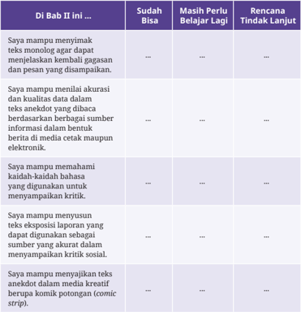

Tabel ini membahas bagaimana perilaku mampu dalam menangani informasi dan kritik terhadap media, terutama dalam konteks yang berhubungan dengan kepercayaan dan kualitas informasi, serta bagaimana mereka menanggapi kritik sosial. Topik utamanya adalah perbedaan dalam sikap dan respons mampu terhadap berbagai jenis media dan konten, terutama ketika ada kritik atau eksposisi. Kolom-kolom yang ada mencakup “Di Babi II ini...” yang berisi pernyataan tentang perilaku mampu, “Sudah Bisa” yang menunjukkan tingkat kebiasaan atau kemampuan dalam menangani situasi tersebut, dan “Masih Perlu Belajar Lagi” yang menunjukkan bahwa mampu belum sepenuhnya menguasai aspek tertentu. Kolom terakhir, “Rencana Tindak Lanjut,” menunjukkan bahwa mampu belum memiliki rencana spesifik untuk memperbaiki atau mengembangkan kemampuan mereka. Dari data yang terlihat, terlihat bahwa mampu cenderung lebih percaya pada kualitas dan kebenaran informasi, lebih mudah menerima kritik, dan lebih sering menanggapi eksposisi media, namun mereka masih perlu belajar untuk lebih memahami konteks kritik sosial dan mengelola reaksi terhadap media yang kreatif seperti komik potongan. Pola ini menunjukkan bahwa mampu memiliki dasar yang cukup kuat dalam menangani informasi, namun masih membutuhkan peningkatan dalam aspek kritis dan reflektif terhadap media.

 

---
## 📄 Halaman 96

---
**📊 Tabel**

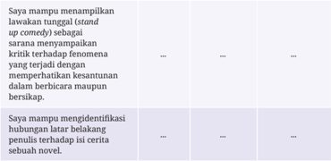

Tabel ini membahas kemampuan seseorang dalam menangani dan memahami elemen-elemen khusus dari sebuah cerita, khususnya dalam konteks humor dan narasi. Topik utamanya adalah kemampuan membaca dan memahami cerita, dengan fokus pada dua aspek: kemampuan menampilkan atau mengembangkan komedi dalam bentuk cerita, serta kemampuan mengidentifikasi hubungan antara elemen-elemen cerita yang mungkin tersembunyi atau tidak langsung terlihat. Kolom pertama menjelaskan bahwa seseorang mampu menampilkan lawakan tunggal dalam bentuk cerita komedi, yang menunjukkan kemampuan untuk menghadirkan fenomena yang menarik dan menghibur dalam bentuk narasi. Kolom kedua, yang berisi data yang tidak terbaca, menunjukkan bahwa seseorang juga mampu mengidentifikasi hubungan antara elemen-elemen cerita yang mungkin tersembunyi, seperti hubungan antara latar belakang dan isi cerita, yang menunjukkan pemahaman mendalam terhadap struktur cerita. Pola penting yang terlihat adalah bahwa kemampuan ini tidak hanya terbatas pada keterampilan menyampaikan humor, tetapi juga pada kemampuan memahami dan menghubungkan elemen-elemen cerita secara holistik, yang merupakan indikator kualitas pemahaman naratif yang lebih tinggi.

Hitunglah persentase penguasaan materi kalian dengan rumus berikut:

### (Jumlah materi yang kalian kuasai/jumlah seluruh materi) x 100

- Jika  materi di atas sudah dikuasai minimal 70%, kalian dapat meminta aktivitas pengayaan kepada guru.
- Jika materi yang dikuasai masih di bawah 70%, kalian dapat mendiskusikan kegiatan remedial dengan guru.

 

---
## 📄 Halaman 97

---
**🖼️ Gambar/Diagram**

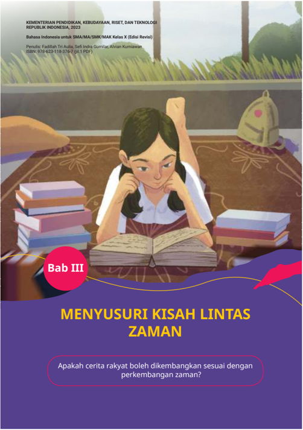

> **Deskripsi Visual:** Gambar ini adalah ilustrasi.  
1. Secara keseluruhan, gambar menampilkan seorang siswa perempuan sedang duduk di meja belajar, membaca buku dengan ekspresi fokus, di tengah tumpukan buku dan tas sekolah, menggambarkan suasana belajar atau pengembangan keterampilan membaca. Latar belakang menunjukkan ruang kelas atau ruang belajar dengan dekorasi alam, menciptakan suasana yang nyaman dan mendukung pembelajaran.  
2. Elemen utama adalah siswa yang menjadi pusat gambar, dengan tangan menopang dagu dan mata terfokus pada buku, menunjukkan keterlibatan aktif dalam membaca. Di sebelahnya, tumpukan buku dan tas sekolah menunjukkan konteks pendidikan. Latar belakang dengan tanaman dan lantai berkarpet menambah nuansa lingkungan belajar yang tenang.  
3. Teks penting yang terlihat: “Bab III” dalam lingkaran merah, judul bab “MENYUSURI KISAH LINTAS ZAMAN” dalam huruf besar kuning, dan pertanyaan “Apakah cerita rakyat boleh dikembangkan sesuai dengan perkembangan zaman?” dalam kotak berwarna putih. Di bagian atas, terdapat informasi penerbit: “KEMENTERIAN PENDIDIKAN, KEBUDAYAAN, Riset, dan Teknologi REPUBLIK INDONESIA, 2023”, “Bahasa Indonesia untuk SMA/MA/SMK/MAK Kelas X (Edisi Revisi)”, dan “Penerbit: Fadillah Tri Aulia, Sei Indra Gumilar, Ahyani Kurniawan” serta “ISBN 978-623-118-376-7 (11 PDF)”.  
4. Informasi kunci yang dapat diambil pembaca: Buku ini adalah buku pelajaran Bahasa Indonesia untuk siswa SMA/MA/SMK/MAK Kelas X, Edisi Revisi 2023, yang membahas Bab III tentang “Menyusuri Kisah Lintas Zaman”, dengan fokus

 

---
## 📄 Halaman 98

### Kata Kunci

Setelah  mempelajari  materi  Bab  III, kalian diharapkan mampu mengidentiikasi karakteristik hikayat nilai-nilai yang terkandung dalam hikayat serta menggunakan nilai-nilai yang terkandung dalam hikayat untuk membuat cerita pendek.

- hikayat
- cerpen
- iksi
- nilai

### Peta Konsep

---
**🖼️ Gambar/Diagram**

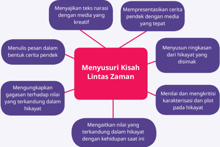

> **Deskripsi Visual:** Gambar ini merupakan diagram. Secara keseluruhan, diagram ini menggambarkan proses atau komponen penting dalam “Menyusuri Kisah Lintas Zaman” — sebuah topik yang kemungkinan besar terkait dengan pembelajaran sejarah, sastra, atau keterampilan analisis teks. Diagram ini berbentuk struktur berbentuk pusat (central node) dengan enam elemen yang mengelilinginya, masing-masing terhubung dengan garis merah ke pusat, menunjukkan hubungan sebab-akibat atau komponen pendukung. Elemen utama adalah kotak merah di tengah yang berisi judul “Menyusuri Kisah Lintas Zaman”, dan enam kotak ungu di sekelilingnya yang masing-masing menjelaskan fungsi atau langkah dalam proses tersebut. Relasi antara elemen adalah hubungan kausal atau pendukung: setiap elemen ungu adalah bagian dari proses menyusuri kisah lintas zaman. Teks penting yang terlihat meliputi: “Menyusuri Kisah Lintas Zaman” sebagai inti, serta enam poin seperti “Menyajikan teks narasi dengan media yang kreatif”, “Mempresentasikan cerita pendek dengan media yang tepat”, “Menyusun ringkasan dari hikayat yang disimak”, “Menilai dan mengkritisi karakterisasi dan plot pada hikayat”, “Mengungkapkan gagasan terhadap nilai yang terkandung dalam hikayat”, dan “Mengaitkan nilai yang terkandung dalam hikayat dengan kehidupan saat ini”. Informasi kunci yang dapat diambil pembaca adalah bahwa proses menyusuri kisah lintas zaman melibatkan analisis, presentasi, sintesis, dan kritik terhadap teks hikayat, serta menghubungkannya dengan nilai-nilai dan konteks kehidupan modern. Diagram ini dirancang untuk membantu siswa memahami langkah-langkah sistematis dalam memahami dan menginterpretasikan cerita lintas zaman secara kritis dan kreatif.

dan

 

---
## 📄 Halaman 99

Sumber: Kadi Hassan/ Wikimedia Commons (2009)

Tahukah kalian, apa itu hikayat? Sebelum kalian mempelajari lebih lanjut tentang hikayat, ketahui terlebih dahulu apa yang dimaksud dengan hikayat dari berbagai sumber berikut ini.

Kata hikayat diturunkan dari kata bahasa Arab 'haka' yang berarti menceritakan, menirukan, mewartakan, menyerupai, berkata, meneruskan, dan melukiskan. (Baried dkk., 1985: 9)

 

---
## 📄 Halaman 100

Sastra hikayat adalah sastra lama yang ditulis dalam bahasa Melayu. Sebagian besar kandungan ceritanya berkisar pada kehidupan istana. Unsur  rekaan  merupakan  ciri  yang  menonjol  dan  pada  lazimnya mencakup bentuk prosa yang panjang. (Baried dkk., 1985: 9)

Hikayat  adalah  karya  sastra  lama  Melayu  berbentuk  prosa  yang berisi cerita, undang-undang, dan silsilah bersifat rekaan, keagamaan, historis, biograis, atau gabungan sifat-sifat itu. Sastra ini dibac a untuk  pelipur  lara,  pembangkit  semangat  juang,  atau  sekadar  untuk meramaikan pesta. (Kamus Besar Bahasa Indonesia Daring Edisi VI)

Apakah sekarang kalian sudah tahu apa itu hikayat? Tuliskan rangkuman pemahaman  kalian  tentang  pengertian  hikayat  dari  sumber-sumber  yang kalian dapatkan.

Hikayat adalah …

### A.  Mengidentiikasi Ide dan Makna Kata dalam Teks Hikayat

Menyimak

Menyusun ringkasan dari menyimak teks hikayat dalam bentuk monolog

### Kegiatan 1

Pada  kegiatan  ini,  kalian  akan  menyusun  ringkasan  hikayat  secara berkelompok. Sebelum itu, simaklah hikayat berjudul 'Hikayat Sa-ijaan dan  Ikan  Todak'  yang  akan  dibacakan  secara  bergiliran  dalam  satu kelompok.  Agar  dapat  menyimak  dengan  baik,  perhatikan  langkahlangkah di bawah ini!

- Pusatkan perhatian pada teks hikayat yang dibacakan oleh teman kalian.

 

---
## 📄 Halaman 101

- Saat  menyimak, kalian dapat menggunakan tabel Adiksimba (apa, di  mana,  kapan,  siapa,  mengapa,  dan  bagaimana)  berikut  untuk mengidentiikasi  hal-hal  penting  dalam  cerita.

---
**📊 Tabel**

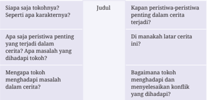

Tabel ini membahas tentang bagaimana tokoh dalam cerita dapat berperan dalam menyelesaikan atau memperburuk konflik, dengan fokus pada aspek perspektif dan peran tokoh yang positif. Topik utama tabel adalah “Tokoh Positif dalam Cerita” dan mengeksplorasi bagaimana tokoh tersebut berkontribusi terhadap cerita, serta dampaknya terhadap pembaca. Kolom pertama bertanya apakah tokoh tersebut memiliki karakteristik yang menarik, kolom kedua menjelaskan bahwa tokoh positif ini penting karena mampu mengatasi masalah dalam cerita, dan kolom ketiga menanyakan bagaimana tokoh ini berkontribusi dalam menyelesaikan konflik yang muncul. Pola penting yang terlihat adalah bahwa tokoh positif bukan hanya karakter yang menarik secara individu, tetapi juga menjadi pendorong utama dalam perjalanan cerita, membantu mengatasi tantangan dan menyelesaikan konflik, sehingga memberikan dampak signifikan pada alur cerita dan pengalaman pembaca.

Gunakanlah hasil identiikasi kalian pada Tabel 3.1 untuk membuat ringkasan cerita. Ringkasan cerita yang dibuat terdiri minimal 200 kata.

.........................................................................................................................................

.........................................................................................................................................

### Hikayat Sa-ijaan dan Ikan Todak

Menurut  sahibul  hikayat,  sebermula  ada  seorang  Datu  yang  sakti mandraguna sedang bertapa di tengah laut. Namanya Datu Mabrur. Ia bertapa di antara Selat Laut dan Selat Makassar.

Siang-malam ia bersemadi di batu karang, di antara percikan buih, debur ombak, angin, gelombang, dan badai topan. Ia memohon kepada Sang Pencipta agar diberi sebuah pulau. Pulau itu akan menjadi tempat bermukim bagi anak-cucu dan keturunannya kelak.

Hatta, ketika laut tenang, seekor ikan besar tiba-tiba muncul dari permukaan  laut  dan  terbang  menyerangnya.  Tanpa  beringsut  dari

 

---
## 📄 Halaman 102

tempat duduk maupun membuka mata, Datu Mabrur menepis serangan mendadak itu.

Ikan itu terpelanting dan jatuh di karang. Setelah jatuh ke air, ikan itu  menyerang  lagi.  Demikian  berulang-ulang.  Di  sekeliling  karang, ribuan ikan lain mengepung, memperlihatkan gigi mereka yang panjang dan tajam, seakan prajurit siap tempur. Pada serangannya yang terakhir, ikan itu terpelanting jatuh persis saat Datu Mabrur membuka matanya.

'Hai, ikan! Apa maksudmu mengganggu semadiku? Ikan apa kamu?'

'Aku  ikan todak,  Raja  Ikan  Todak  yang  menguasai  perairan ini.  Semadimu  membuat  lautan  bergelora.  Kami  terusik  dan  aku memutuskan untuk menyerangmu. Tapi,  engkau  memang  sakti,  Datu Mabrur. Aku takluk,' katanya, megap-megap. Matanya berkedip-kedip menahan sakit. Tubuhnya terjepit di sela-sela karang tajam.

'Jadi,  itu  rakyatmu?'  Datu  Mabrur  menunjuk  ribuan  ikan  yang mengepung karang.

'Ya, Datu. Tapi, sebelum menyerangmu tadi, kami telah bersepakat. Kalau  aku  kalah,  kami  akan  menyerah  dan  mematuhi  apa  pun perintahmu.'

'Datu, tolonglah aku. Obati luka-lukaku dan kembalikanlah aku ke laut. Kalau terlalu lama di darat, aku bisa mati. Atas nama rakyatku, aku berjanji akan mengabdi padamu, bila engkau menolongku...' Raja Ikan Todak  mengiba-iba.  Seolah  sulit  bernapas,  insangnya  membuka  dan menutup.

'Baiklah,' Datu Mabrur berdiri. 'Sebagai sesama makhluk ciptaanNya, aku akan menolongmu.'

'Apa  pun  permintaanmu,  kami  akan  memenuhinya.  Datu  ingin istana bawah laut yang terbuat dari emas dan permata, dilayani ikan duyung  dan  gurita?  Ingin  berkeliling  dunia,  bersama  ikan  paus  dan lumba-lumba?'

'Tidak.  Aku  tak  punya  keinginan  pribadi,  tapi  untuk  masa  depan anak-cucuku nanti....' Lalu, Datu Mabrur menceritakan maksud pertapaannya selama ini.

'Akan kukerahkan rakyatku, seluruh penghuni lautan dan samudera. Sebelum matahari terbit esok pagi, impianmu akan terwujud. Aku bersumpah!' jawab Raja Ikan Todak.

 

---
## 📄 Halaman 103

Datu Mabrur tak dapat membayangkan, bagaimana Raja Ikan Todak akan  memenuhi  sumpahnya  itu.  'Baiklah.  Tapi  kita  harus  membuat perjanjian. Sejak sekarang kita harus sa-ijaan, seiring sejalan. Seia sekata, sampai ke anak-cucu kita. Kita harus rakat mufakat, bantu membantu, bahu membahu. Setuju?'

'Setuju, Datu...,' sahut Raja Ikan Todak yang tergolek lemah.

Ia sangat membutuhkan air.

Mendengar jawaban itu, Datu Mabrur tersenyum. Dengan hati-hati, dilepaskannya tubuh Raja Ikan Todak dari jepitan karang, lalu diusapnya lembut.

Ajaib!  Dalam sekejap, darah dan luka di sekujur tubuh Raja Ikan Todak itu mengering! Kulitnya licin kembali seperti semula, seakan tak pernah luka.  Ikan  itu  menggerak-gerakkan  sirip  dan  ekornya  dengan gembira.

Dengan lembut dan penuh kasih sayang, Datu Mabrur mengangkat Raja Ikan Todak itu dan mengembalikannya ke laut. Ribuan ikan yang tadi  mengepung  karang,  kini  berenang  mengerumuninya,  melompatlompat bersuka ria.

'Sa-ijaan!'  seru  Raja  Ikan  Todak  sambil  melompat  di  permukaan laut.

'Sa-ijaan!' sahut Datu Mabrur.

Sebelum tengah malam, sebelum batas waktu pertapaannya berakhir, Datu Mabrur dikejutkan oleh suara gemuruh yang datang dari dasar laut. Gemuruh perlahan, tapi pasti. Gemuruh suara itu terdengar bersamaan  dengan  timbulnya  sebuah  daratan,  dari  dasar  laut!  Kian lama, permukaan daratan itu kian tampak. Naik dan terus naik! Lalu, seluruhnya timbul ke permukaan!

Di  bawah  permukaan  air,  ternyata  jutaan  ikan  dari  berbagai jenis  mendorong dan memunculkan daratan baru itu dari dasar laut. Sambil mendorong, mereka serempak berteriak, 'Sa-ijaan! Sa-ijaan! Saijaaan...!'

Datu Mabrur tercengang di karang pertapaannya. Raja Ikan Todak telah memenuhi sumpahnya!

Bersamaan dengan terbitnya matahari pagi, daratan itu telah timbul sepenuhnya.  Berupa  sebuah  pulau.  Lengkap  dengan  ngarai,  lembah,

 

---
## 📄 Halaman 104

perbukitan, dan pegunungan. Tanahnya tampak subur. Pulau kecil yang makmur.

Datu  Mabrur  senang  dan  gembira.  Impiannya  tentang  pulau yang akan menjadi tempat tinggal bagi anak-cucu dan keturunannya, telah  menjadi  kenyataan.  Permohonannya  telah  dikabulkan.  Dengan memanjatkan puji dan syukur kepada Sang Pencipta, ia menamakannya Pulau Halimun.

Alkisah,  Pulau  Halimun  kemudian  disebut  Pulau  Laut.  Sebab,  ia timbul  dari  dasar  laut  dan  dikelilingi  laut.  Sebagai  hikmahnya,  kata Sa-ijaan  dan  ikan  todak  dijadikan  slogan  dan  lambang  Pemerintah Kabupaten Kotabaru.

(Diadaptasi dari TV Anak Indonesia/YouTube)

### Kegiatan 2

Setelah menyimak  'Hikayat Sa-ijaan dan Ikan Todak', jawablah pertanyaan berikut. Kalian dapat meminta teman untuk membacakan hikayat tersebut sekali lagi agar mendapatkan pemahaman yang lebih baik.

- Berdasarkan  penggalan  cerita  pada  'Hikayat  Sa-ijaan  dan  Ikan Todak' tersebut, sifat Datu Mabrur apakah yang hendak disampaikan penulis kepada pembaca?
- Siang-malam ia bersemadi di batu karang, di antara percikan buih, debur ombak, angin, gelombang, dan badai topan.
- Bagaimana  perasaan  Ikan  Todak  saat  muncul  ke  permukaan  dan memperkenalkan dirinya kepada Datu Mabrur?
- Apakah kalian setuju dengan sikap Raja Ikan Todak yang menyerang Datu Mabrur?
Alasan:

 

---
## 📄 Halaman 105

- Tentukan apakah pernyataan berikut ini benar atau salah.

---
**📊 Tabel**

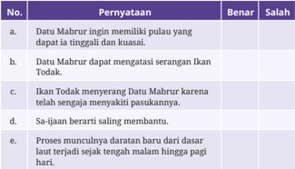

Tabel ini membahas tentang poin-poin penting yang berkaitan dengan proses dan peran Ikan Todak dalam kehidupan masyarakat, khususnya dalam konteks keberlanjutan dan keberagaman budaya. Topik utamanya adalah hubungan antara Ikan Todak, keberlanjutan sumber daya laut, dan praktik tradisional yang berkelanjutan. Kolom pertama, yang berjudul “No.”, menunjukkan nomor urut setiap pernyataan untuk memudahkan pengidentifikasian. Kolom kedua, “Pernyataan”, berisi pernyataan yang menggambarkan aspek-aspek tertentu dari Ikan Todak, seperti keterkaitan dengan kegiatan masyarakat, kemampuan untuk menggantikan Ikan Todak, dan proses penangkapan yang berkelanjutan. Kolom ketiga, “Benar / Salah”, menunjukkan apakah pernyataan tersebut benar atau salah, yang membantu dalam mengevaluasi pemahaman tentang Ikan Todak dan perannya dalam ekosistem laut serta budaya lokal. Dari data yang terlihat, dapat dilihat bahwa pernyataan tentang Ikan Todak sebagai pemasok makanan yang berkelanjutan dan dapat menggantikan Ikan Todak secara berkelanjutan dianggap benar, sementara pernyataan bahwa Ikan Todak menyebabkan penurunan populasi Ikan Todak dianggap salah, menunjukkan bahwa Ikan Todak tidak berperan sebagai penyebab penurunan populasi, melainkan sebagai bagian dari ekosistem yang seimbang. Selain itu, pernyataan tentang proses penangkapan yang berkelanjutan juga menunjukkan bahwa praktik penangkapan yang berkelanjutan adalah penting untuk menjaga keseimbangan ekosistem laut.

- Bagaimana  hubungan  pesan  moral  yang  disampaikan  dengan kondisi masyarakat pada saat ini?

### B.  Menganalisis Karakterisasi, Plot, dan Nilai pada Hikayat dan Cerpen

Membaca dan Memirsa

Membaca  untuk  menilai  dan  mengkritisi  karakterisasi  dan  plot  pada hikayat dan cerpen serta mengaitkannya dengan nilai-nilai kehidupan yang berlaku pada masa lalu dan sekarang serta menginterpretasi informasi untuk mengungkapkan gagasan terhadap nilai yang terkandung dalam teks narasi

Pada kegiatan kali ini, kalian akan membaca teks 'Hikayat si Miskin' untuk mengidentiikasi karakterisasi dan plot pada hikayat. Gunakan tabel di bawah ini untuk mengidentiikasi hal tersebut.

 

---
## 📄 Halaman 106

---
**📊 Tabel**

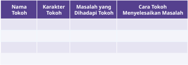

Tabel ini dirancang untuk membantu siswa memahami bagaimana karakter tokoh dalam cerita atau narasi dapat menghadapi masalah tertentu dan menyelesaikannya, sehingga memperlihatkan perkembangan atau nilai-nilai moral yang terkandung di dalamnya. Topik utama tabel ini adalah “Perkembangan Tokoh dalam Menyelesaikan Masalah”, yang menyoroti hubungan antara sifat karakter tokoh, tantangan yang dihadapinya, dan cara yang digunakan untuk mengatasinya. Kolom pertama, “Nama Tokoh”, digunakan untuk menuliskan identitas tokoh yang akan dibahas. Kolom kedua, “Karakter Tokoh”, menjelaskan sifat atau kepribadian tokoh tersebut, seperti jujur, sabar, atau berani, yang memengaruhi cara ia berinteraksi dengan masalah. Kolom ketiga, “Masalah yang Dihadapi Tokoh”, menggambarkan tantangan atau konflik yang dihadapi tokoh, bisa berupa emosional, sosial, atau moral. Kolom keempat, “Cara Tokoh Menyelesaikan Masalah”, menunjukkan bagaimana tokoh tersebut mengatasi masalah tersebut, baik melalui tindakan, keputusan, atau pertumbuhan karakter. Tidak ada data yang terisi dalam tabel ini saat ini, sehingga siswa dapat mengisi tabel ini sendiri sebagai bagian dari aktivitas belajar untuk menganalisis cerita atau narasi yang telah dibaca. Pola penting yang terlihat dari struktur tabel ini adalah fokus pada hubungan sebab-akibat antara karakter tokoh dan cara ia menyelesaikan masalah, yang membantu siswa memahami bagaimana sifat dan tindakan tokoh memengaruhi hasil akhir cerita.

### Bagan Identiikasi Plot Cerita

---
**🖼️ Gambar/Diagram**

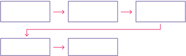

> **Deskripsi Visual:** Gambar ini merupakan diagram. Secara keseluruhan, diagram ini menggambarkan proses atau alur urutan yang terdiri dari empat kotak berisi elemen yang saling terhubung dengan panah, menunjukkan hubungan sebab-akibat atau langkah-langkah berurutan. Elemen utama adalah empat kotak persegi kosong yang dihubungkan oleh panah: tiga panah horizontal menunjukkan urutan linear dari kiri ke kanan, dan satu panah merah muda dari kotak pertama ke kotak keempat yang berada di bawahnya, menunjukkan cabang atau proses alternatif/penyimpangan. Tidak ada teks, angka, atau label yang terlihat, sehingga tidak ada informasi spesifik yang dapat diambil dari teks atau angka. Informasi kunci yang dapat diambil pembaca adalah bahwa diagram ini menggambarkan alur proses yang terstruktur, mungkin untuk menggambarkan urutan langkah, tahap, atau proses logis dengan kemungkinan cabang atau penyimpangan dari titik awal. Karena tidak ada teks atau label, pembaca harus mengandalkan konteks buku pelajaran untuk memahami makna spesifik dari setiap kotak.

Uraikan  plot  cerita  dalam  teks  'Hikayat  si  Miskin'  secara  kronologis dengan mengisikan kata-kata ke dalam setiap kotak pada bagan di atas. Kalian dapat menambahkan kotak jika dirasa perlu.

### Hikayat si Miskin

Asalnya raja kayangan dan jadi demikian karena disumpahi oleh Batara Indera. Terlantar di negeri Antah Berantah dan keduanya sangat dibenci orang.  Setiap  kali  mereka  mengemis  di  pasar  dan  kampung,  mereka dipukuli dan diusir hingga ke hutan. Oleh yang demikian, tinggallah dua suami-isteri itu di hutan memakan batang kayu dan buah-buahan.

Hatta  beberapa  lamanya  maka  isteri  si  Miskin  itu  pun  hamillah tiga  bulan  lamanya.  Maka  isterinya  menangis  hendak  makan  buah mempelam yang ada di dalam taman raja itu. Maka suaminya itu pun terketukkan hatinya tatkala ia di Keinderaan menjadi raja tiada ia mau beranak.  Maka  sekarang  telah  mudhorot.  Maka  baharulah  hendak

 

---
## 📄 Halaman 107

beranak seraya berkata kepada isterinya, 'Ayo, hai Adinda. Tuan hendak membunuh kakandalah rupanya ini. Tiadakah tuan tahu akan hal kita yang sudah lalu itu? Jangankan hendak meminta barang suatu, hampir kepada kampung orang tiada boleh.'

Setelah didengar oleh isterinya kata suaminya demikian itu, maka makinlah  sangat  ia  menangis.  Maka  kata  suaminya,  'Diamlah  tuan, jangan  menangis!  Berilah  kakanda  pergi  mencaharikan  tuan  buah mempelam itu, jikalau dapat oleh kakanda akan buah mempelam itu kakanda berikan pada tuan.'

Maka isterinya itu pun diamlah. Maka suaminya itu pun pergilah ke  pasar  mencahari  buah  mempelam  itu.  Setelah  sampai  di  orang berjualan buah mempelam, maka si Miskin itu pun berhentilah di sana. Hendak pun dimintanya takut ia akan dipalu orang. Maka kata orang yang berjualan buah mempelam, 'Hai miskin. Apa kehendakmu?'

Maka sahut si Miskin, 'Jikalau ada belas dan kasihan serta rahim tuan akan hamba orang miskin hamba ini minta diberikan yang sudah terbuang itu. Hamba hendak memohonkan buah mempelam tuan yang sudah busuk itu barang sebiji sahaja tuan.'

Maka terlalu belas hati sekalian orang pasar itu yang mendengar kata si Miskin. Seperti hancurlah rasa hatinya. Maka ada yang memberi buah  mempelam,  ada  yang  memberikan  nasi,  ada  yang  memberikan kain baju, ada yang memberikan buah-buahan. Maka si Miskin itu pun heranlah akan dirinya oleh sebab diberi orang pasar itu berbagai-bagai jenis pemberian. Adapun akan dahulunya jangankan diberinya barang suatu hampir pun tiada boleh. Habislah dilemparnya dengan kayu dan batu. Setelah sudah ia berpikir dalam hatinya demikian itu, maka ia pun kembalilah ke dalam hutan mendapatkan isterinya.

Maka  katanya,  'Inilah  Tuan,  buah  mempelam  dan  segala  buahbuahan dan makan-makanan dan kain baju. Ia pun menceriterakan hal ihwalnya tatkala ia di pasar itu. Maka isterinya pun menangis tiada mau makan jikalau bukan buah mempelam yang di dalam taman raja itu. 'Biarlah aku mati sekali.'

Maka terlalulah sebal hati suaminya itu melihatkan akan kelakuan isterinya itu seperti orang yang hendak mati. Rupanya tiadalah berdaya lagi.  Maka  suaminya  itu  pun  pergilah  menghadap  Maharaja  Indera Dewa itu. Maka baginda itu pun sedang ramai dihadap oleh segala rajaraja. Maka si Miskin datanglah. Lalu masuk ke dalam sekali.

 

---
## 📄 Halaman 108

Maka titah baginda, 'Hai Miskin, apa kehendakmu?'

Maka sahut si Miskin, 'Ada juga tuanku.' Lalu sujud kepalanya lalu diletakkannya ke tanah, 'Ampun Tuanku, beribu-ribu ampun tuanku. Jikalau ada karenanya Syah Alam akan patuhlah hamba orang yang hina ini  hendaklah  memohonkan buah mempelam Syah Alam yang sudah gugur ke bumi itu barangkali Tuanku.'

Maka titah baginda, 'Hendak engkau buatkan apa buah mempelam itu?'

Maka sembah si Miskin, 'Hendak dimakan, Tuanku.'

Maka titah baginda, 'Ambilkanlah barang setangkai berikan kepada si Miskin ini'.

Maka diambilkan oranglah  diberikan  kepada  si  Miskin  itu.  Maka diambillah oleh si Miskin itu seraya menyembah kepada baginda itu. Lalu keluar ia berjalan kembali. Setelah itu, maka baginda pun berangkatlah masuk ke dalam istananya. Maka segala raja-raja dan menteri hulubalang rakyat sekalian itu pun masing-masing pulang ke rumahnya. Maka si Miskin pun sampailah kepada tempatnya. Setelah dilihat oleh isterinya akan suaminya datang itu membawa buah mempelam setangkai. Maka ia tertawa-tawa. Seraya disambutnya lalu dimakannya.

Maka adalah antaranya tiga bulan lamanya. Maka ia pun menangis pula hendak makan nangka yang di dalam taman raja itu juga. Demikian juga si Miskin mendapat nangka di kebun raja itu untuk isterinya yang mengidam itu

Adapun selama isterinya si Miskin hamil maka banyaklah makanmakanan dan kain baju dan beras padi dan segala perkakas-perkakas itu diberi orang kepadanya.

Dan pada ketika yang baik dan' saat yang sempurna, pada malam empat belas hari bulan, maka bulan itu pun sedang terang-tumerang, maka pada ketika itu isteri si Miskin itu pun beranaklah seorang anak lelaki terlalu amat baik parasnya dan elok rupanya. Anak itu dinamakan Marakarmah, artinya anak di dalam kesukaran.

Hatta,  maka  dengan  takdir  Allah  Swt.  menganugerahi  kepada hambanya.  Maka  si  Miskin  pun  menggalilah  tanah  hendak  berbuat tempatnya  tiga  beranak  itu.  Maka  digalinyalah  tanah  itu  hendak mendirikan tiang teratak itu. Maka tergalilah kepada sebuah telaju yang besar berisi emas terlalu banyak. Maka isterinya pun datanglah melihat

 

---
## 📄 Halaman 109

akan emas itu. Seraya berkata kepada suaminya, 'Adapun akan emas ini sampai kepada anak cucu kita sekalipun tiada habis dibuat belanja.'

Ia menjadi kaya dan menempah barang-barang keperluannya: kendi, lampit,  utar-utar,  pelana  kuda,  keris,  dan  sebagainya.  Sekembalinya dari  menempah  barang-barang  itu  dia  mandi  berlimau,  menimang anaknya,  dan  berseru,  'Jikalau  sungguh-sungguh  anak  dewa-dewa hendak menerangkan muka ayahanda ini, jadiIah negeri di dalam hutan ini sebuah negeri yang lengkap dengan kota, parit dan istananya serta dengan  menteri,  hulubalang,  rakyat  sekalian,  dan  segala  raja-raja  di bawah baginda, betapa adat segala raja-raja yang besar!'

Kabul  permintaan  itu  dan  si  Miskin  menjadi  raja  bertukar  nama Maharaja Indera Angkasa dan isterinya bertukar nama Ratna Dewi dan negeri itu dinamakan Puspa Sari. Tiada berapa lama puteri Nila Kesuma pula lahir.

Maharaja  Indera  Angkasa  hendak  mencari  nujum  untuk  melihat tuah kedua orang anaknya itu. Saat hal ini terdengar raja Negeri Antah Berantah, mufakatIah dia dengan sekalian ahli nujum, katanya, 'Jikalau engkau  dipanggil  si  Miskin  itu,  katakan  anaknya  itu  celaka,  karena si  Miskin  itu  terlalu  arif  bijaksana.  Sedang  lagi  baru  saja  ia  menjadi raja,  maka segala saudagar-saudagar di dalam negeri kita disuruhnya membawa kaus dan payung dan sebagainya, istimewa ia kekal di atas kerajaan. TahuIah engkau sekalian akan halnya tatkala ia lagi di dalam negeri kita dahulu.'

Maka  itu,  saat  ahli  nujum  itu  mempersembahkan  ramalannya dikatakannya  bahwa,  'selagi  hidup  anakanda  dua  bersaudara  itu, niscaya duli yang dipertuan tiada kekal di atas takhta kerajaan, sebab kedua anakanda itu terlalu sangat besar celakanya'.

Maka  dari  itu,  kedua  anaknya  itu  pun  dibuang  ke  luar  negeri walaupun ibunya menahan dan mengatakan bahwa anaknya itu sejak ada keduanya itu membawa tuah kepada kedua ibu-bapa itu. Namun demikian,  Maharaja  Indera  mengusir  juga  anaknya  itu  dan  ibunya membekalkan Marakarmah sebuah cincin, sebiji kemala dan tujuh biji ketupat. Tiga hari selepas Marakarmah meninggalkan Puspa Sari negeri itu  pun  terbakar.  InsyafIah  Si  Miskin  bahwa  orang-orang  dengki  dan busuk hati kepada dirinya.

Kedua beradik itu mengembara di dalam hutan. Semasa Marakarmah  hendak  pergi  meminta  api,  ditinggalkannya  adiknya

 

---
## 📄 Halaman 110

itu  berdiri  memegang  burung  di  bawah  pohon  kayu  ara.  Namun, Marakarmah disangka pencuri, lalu dipukul dan dicampakkan ke Iaut. Marakarmah terdampar di pangkalan raksasa, di situ ia bertemu seorang puteri bernama Cahaya Khairani yang ditawan oleh raksasa itu. Puteri itu  diselamatkannya.  Kemudian,  keduanya  diselamatkan  oleh  sebuah kapal. Namun, karena nakhoda kapal itu menyukai isteri Marakarmah, Marakarmah dicampakkan ke Iaut. Dia ditelan oleh ikan nun dan ikan nun itu mengikuti kapal itu.

Ikan  nun  itu  terdampar  di  pangkalan  Nenek  Kebayan  sedangkan kapal itu berlabuh di pangkalan raja. Dalam pada itu adik Marakarmah telah  kawin  dengan  anak  raja  negeri  itu  saat  anak  raja  itu  menemui adiknya itu saat berburu waktu itu.

Ikan nun yang terdampar di pangkalan Nenek Kebayan itu dibelah oleh Nenek Kebayan dengan daun padi dan keluarlah Marakarmah. Dari Nenek Kebayan Marakarmah tahu bahwa ia berada di negeri Pelanggam Cahaya dan nama raja negeri itu Maharaja Puspa Indera, dan anak raja itu bernama Mengindera Sari. Isterinya seorang puteri yang ditemuinya dalam hutan di bawah pohon beringin masa ia pergi berburu.

Juga dari Nenek Kebayan Marakarmah tahu bahwa sebuah kapal sedang berlabuh di pangkalan negeri itu dan nakhoda kapal itu sahabat raja  Puspa  Indera,  dan  juga  isteri  nakhoda  itu  terlalu  elok  rupanya. Setelah  mendengar  kabar  itu  Marakarmah  merencanakan  kepada Nenek Kebayan untuk berjual bunga di kapal itu dan dia sendirilah yang merangkai bunga itu.

Nenek Kebayan pergi ke kapal menjual bunga dan bila dia kembali ke  rumah  diceritakan  kapada  Marakarmah  bahwa  isteri  nakhoda  itu senantiasa  berkelahi  dengan  suaminya.  Nakhoda  dan  isterinya  amat suka  akan  bunga  dan  Nenek  Kebayan  berjanji  hendak  mengajarnya merangkai  bunga.  Akan  tetapi,  apa  halnya  karena  dia  sendiri  tidak pandai .merangkai bunga.

Marakarmah berencana mengantar seekor  lalat  hijau  dan  Nenek Kebayan hendakIah memasukkan bunga-bunga itu di mana pun lalat itu  hinggap.  Dalam  bunga  yang  banyak  itu  yang  hendak  dibawa  oleh Nenek Kebayan itu, diambil sekuntum oleh Marakarmah dan ditulisnya pada kelopak bunga itu suatu surat memberitahu bahwa surat itu dari Marakarmah  dan  menyampaikan  bila  dia  (Cahaya  Khairani)  naik  ke istana puteri Mayang Mengurai itu janganlah lagi turun ke kapal dan

 

---
## 📄 Halaman 111

minta  perlindungan  dan  minta  bicara  kapada  tuan  puteri  itu.  Dalam karangan bunga itu dimasukkan juga cincinnya.

Di  kapal,  setelah  mengajar  tuan  puteri  itu  merangkai  bunga  lalu Nenek  Kebayan  memberikan  karangan  bunga  dari  Marakarmah  itu, dan demi dilihat oleh Cahaya Khairani cincin dan dibacanya tulisan itu maka tahulah dia bahwa suaminya masih ada dan dia hendak mengikut Nenek Kebayan pulang, tetapi tidak jadi dia mengikut.

Cahaya  Khairani  pun  membayar  harga  bunga  itu  dengan  sehelai kainnya  dan  barang-barang  serta  makanan  pun  diberikan  bersama. Maharaja  Puspa  Indera  mengharapkan  orang-orangnya  menjemput isteri nakhoda. Saat Cahaya Khairani bertemu dengan Mayang Mengurai itu maka ia pun menangis lalu mengatakan bahwa rupa puteri itu sama dengan rupa suaminya. Lalu diceritakan dirinya dari mula hingga akhir dan tahulah puteri Mayang Mengurai bahwa abangnya masih hidup.

Hal ini sampai kepada Mengindera Sari lalu diperintahkan segala rakyat datang ke istana dan meminta puteri Cahaya Khairani mengenal suaminya. Marakarmah tiada pergi ke istana, dia ada di rumah Nenek Kebayan.  Nenek  Kebayan  diperintahkan  menjemput  Marakarmah. Dalam  pada  itu  Marakarmah  mencita  kemala  hikmat  dan  turunlah kuda sembarani dengan pakaian lengkap serta punggawa, orang mudamuda empat puluh orang. Saat Nenek Kebayan sampai ke rumahnya dia  terperanjat  melihat  Marakarmah  berlengkap  itu  dan  mereka  pun pergilah berjalan menuju istana.

(Sumber:

Bunga Rampai Melayu Kuno , 1952, dengan penyesuaian)

Setelah  kalian  membaca  cerita  dan  mengisi  tabel  di  atas,  jawablah pertanyaan berikut ini.

- Apakah penggambaran karakter setiap tokoh memiliki porsi yang sama di  dalam  cerita?  Jika  tidak,  tokoh  mana  yang  mendapatkan  porsi  lebih banyak? Jelaskan alasanmu!
- Adakah keterkaitan antara karakter tokoh dan cara mereka menyelesaikan masalah? Mengapa?
- Apa yang akan terjadi jika si Miskin tidak jujur menyampaikan kepada istrinya  bahwa  mempelam  yang  didapatnya  kali  pertama  berasal  dari pasar? Apakah hal tersebut akan sangat memengaruhi cerita?

 

---
## 📄 Halaman 112

- Apakah kalian setuju dengan sikap istri si Miskin yang menolak mempelam yang dibawa suaminya dari pasar? Mengapa?

### Kegiatan 1

Kali ini, kalian akan belajar membandingkan karakterisasi dan plot pada hikayat dan cerpen. Sebelum itu, bacalah cerpen 'Tarian Pena' berikut. Setelah itu, bandingkanlah karakterisasi dan plot antara cerita 'Hikayat Sa-ijaan dan Ikan Todak', 'Hikayat si Miskin', dan cerpen 'Tarian Pena'. Gunakan pertanyaan-pertanyaan berikut sebagai pemantik.

- Bagaimana latar belakang tokoh memengaruhi cerita?
- Sudut pandang apa yang digunakan oleh penulis dalam menyampaikan cerita?
- Bagaimana alur dibangun dalam cerita?

### Tarian Pena

### Virginia C.C. Pomantow

Di bawah terik matahari aku menyusuri jalan kampung yang tampak tak berpenghuni. Samar-samar nyanyian tonggeret terdengar di sampingku. Bagai melodi yang tak tertata, sekali lagi aku mendengarnya. Sesampai dalam 'istana tuaku', terlihat seorang perempuan tua yang menyambutku dengan hangat. Nasi yang berselimut lauk-pauk tersedia dengan manis di meja makan. Setelah itu, aku masuk ke dalam ruang yang mengetahui setiap gerak-gerikku. Aku mulai memegang pena dan menggoreskannya  di  atas  lembaran  putih.  Kutuang  semua  rasa  yang bergejolak dalam hatiku.

Tiba-tiba langit mulai gelap. Kuterlelap dalam buaian dingin yang kalap, bermimpi seorang pangeran gagah datang dengan kereta emas menjemputku dan merangkulku.

Pagi  cerah  menanti sosok pelajar dari ibu pertiwi. Aku berdiri di lantai  dua  sekolah  menanti  kawan  yang  menyapa  dengan  senyuman. Kutatap pohon dan tanaman yang asri dan tersusun pula dengan rapi. Angin menyambar wajahku.

 

---
## 📄 Halaman 113

'Fuuuuuuuuuu….'

Seketika  aku  merasa  tersengat  dan  memiliki  semangat  yang  tak kunjung pudar. Di halaman sekolah para siswa bermain basket dengan lihai dan sebagian siswi berbincang-bincang dengan santai. Aku senang sekali  menuangkan  semua  yang  kulihat  dalam  sebuah  tulisan,  baik itu puisi maupun diari, hanya dengan kata yang mudah dipahami dan makna yang tersirat dengan sentuhan rasa kasih. Sungguh, aku tak ingin orang banyak mengetahui apa yang tersirat dalam catatanku.

Waktu berjalan begitu cepat menyongsong matahari yang mengingini senja. Besi kuning mulai menjerit. 'Teng, teng, teng.' Waktunya pulang ke 'istanaku'.

Seperti biasa, setibaku di istana tuaku, perempuan tua menyambutku dengan hangat. Terlihat nasi yang berselendangkan laukpauk, membekaskan lezat pada lidahku. Tak tahu mengapa, saat itu aku mengucapkan terima kasih pada perempuan tua itu. Aku pun masuk ke  dalam  ruang  yang  mengetahui  gerak-gerikku  dengan  mengajak pena menari di atas lembaran putih. Kali ini, terpikirkan olehku sosok perempuan tua yang selalu terbayang di benakku.

Susunan kalimat pun sudah selesai.

'Aryo!' teriakku kepada lelaki yang belum pernah kudapati. Ketika aku membuka mata, Aryo sudah berada di depanku.

Seketika pipiku mulai memerah dan bibirku menjadi sedikit kaku.

'Apakah  ini  mimpi.  Ini  masih  terlalu  dini.  Lagi  pula,  aku  masih terlalu muda!' teriakku dalam hati.

Air dingin pun jatuh membasahi wajahku. Perlahan aku membuka mata dan mendapati ibuku memegang gayung air dari kamar mandi.

'Ibu, mengapa Ibu menyiram air ke wajahku?' tanyaku.

'Kamu  tidur  seperti  kerbau,'  canda  ibu.  Keesokan  harinya,  pagipagi  buta,  perempuan  tua  menyodorkan  susu  yang  berbalut  sediri kopi. Terasa lengkap akhir pekan ini. Kuintip dia dari balik lembaran kain yang tergantung di bawah ventilasi, dia di sana. Perempuan tua itu  duduk di sebuah kayu berlapis kapuk yang membatu. Aku sedikit tersenyum manis.

'Hemmm….' Wajahnya tampak di bawah naungan yang diharapkan selalu terjadi dan berharap waktu terus begini.

 

---
## 📄 Halaman 114

'Ibu  telah  meninggal,'  kata  seseorang  yang  menyapaku  dengan tepukan di bahu kanan. Aku terdiam dan tak dapat berbuat apa pun, selain menangis bak orang gila.

'Aaah…. Hee…. Tidak! Tidak! Ibuku tidak akan meninggalkanku,' jeritan keras yang tak pernah kuteriakkan sepanjang hidupku.

Seketika  aku  tersadar  dari  lamunku.  'Uhh,  untung  saja  itu  hanya sebuah khayalan baru yang terlintas di kepalaku,' kesalku.

Pada  sore  hari  menjelang  bulan  naik  perlahan  menggantikan surya, perempuan itu pulang dengan letihnya. Wajah lesu, tangan yang lemas, dan kaki yang perlahan membeku. Kulihat dari seberang utara ruang tamu. Aku melangkahkan kaki dengan pasti dan memeluk tubuh perempuan tua itu, walau peluhnya pun menempel di bajuku.

'Bu, maafkan aku. Aku tidak akan membuatmu kesal dan capek,' tangisku yang tersedu dalam sesal.

'Eh, ada apa, sih, kamu ini tiba-tiba memeluk Ibu. Minta maaf pula. Tumben-tumbenan,' kata ibu dengan bingung.

Kemudian,  aku  pergi  ke  ruang  yang  mengetahui  gerak-gerikku. Kuhanyut dalam renungan pada malam sepi ini, merasakan dua hati yang saling melukai, antara sesal dan sedih. Dua rasa yang sejenis, tetapi memiliki  arti  masing-masing  yang  sangat  mendalam.  Sekali  lagi  aku menorehkan pena di hadapan lembaran kertas putih. Lilin kecil yang memercikkan api jingga menemaniku saat itu. Bersama itu, aku berdiam diri sambil menulis sebuah kisahku hari itu. Perlahan aku memejamkan mata dan bunyi rekaman lama terdengar.

Aku  terbangun  dan  keluar  dari  ruang  yang  mengetahui  gerakgerikku.  Aku  terkejut  melihat  banyak  orang  mengerumuni  kamar perempuan  tua  itu.  Kupandangi  arah  kamar  perempuan  tua  itu. Lututku terjatuh perlahan menghampiri lantai. Aku tak dapat berbicara, tanganku dingin bak es yang keluar dari freezer.

'Ibu!' teriakku sekuat tenaga sambil meratapi malangnya nasibku. Perempuan  tua  tak  dapat  mengatakan  apa  pun,  hanya  terdiam, membeku, dan tergeletak, tinggal menunggu untuk dikebumikan. Aku hanya menangis, menangis tak karuan.

Sekarang hari-hariku dipenuhi sesal yang tak berarti. Berangkat ke sekolah dengan seragam kumuh, tidak pula membuat sarapan karena malas dan resah, serta serintih harapan tak dapat kuadu. Masa tersulit

 

---
## 📄 Halaman 115

pun kualami. Merajut asa tanpa sosok ibu di sisiku. Rindu tak terbalaskan. Bak pungguk merindukan bulan.

'Ibu,  aku  rindu.  Aku  ingin  Ibu  masih  bersamaku.  Aku  tak  ingin semua ini terjadi. Aku lelah dengan semua kejadian ini!' jeritku kepada perempuan tua itu.

'Tamat. Sekarang sudah larut malam. Sebaiknya cepat tidur. Selamat malam, Putriku,' kata ibuku sambil mencium keningku.

'Selamat malam juga, Ibu,' jawabku sambil menarik selimut mungil dan  terlelap  pada  malam  itu  dengan  embusan  angin  yang  menyapa dengan dingin.

(Sumber: Di Sini Rinduku Tuntas; Antologi Cerita Pendek Bengkel Sastra , Balai Bahasa Sulawesi Utara, 2019)

### Bandingkanlah  hasil  analisis  kalian  dengan  pembahasan  berikut  agar dapat memahami perbedaan hikayat dengan cerpen!

Meskipun hikayat dan cerpen sama-sama cerita naratif berupa iksi, ada perbedaan antara keduanya. Hal itu terjadi karena perbedaan kondisi sosial dan budaya pada saat cerita dibuat. Hikayat yang dibuat pada masa kerajaan tidak  dapat  lepas  dari  nuansa  istana,  baik  pada  tokohnya  maupun setting cerita.

Tokoh pada hikayat cenderung berlatar belakang keluarga kerajaan atau orang-orang  di  sekitarnya.  Keluarga  kerajaan  dikenal  dengan  orang-orang yang sakti hingga sering diceritakan dapat melakukan hal-hal yang melampaui kewajaran. Bahkan, para tokoh tidak hanya diambil dari kerajaan yang ada di bumi, tetapi juga kerajaan kayangan. Perbedaan kasta di setiap golongan masyarakat muncul sangat jelas pada cerita. Hal ini sangat berbeda dengan cerpen yang lebih variatif mengambil tokoh dalam cerita.

Tokoh dan latar kerajaan tersebut sangat berpengaruh pada konlik yang muncul dalam cerita. Konlik yang biasa muncul tidak lepas dari perselisihan antarkerajaan  dan  golongan.  Penyelesaian  konlik  pun  tidak  jauh  dari peperangan dan penggunaan kekuatan ajaib yang berakhir bahagia.

Sebagai cerita yang lebih panjang dibandingkan cerpen, hikayat memiliki alur lebih kompleks. Hikayat biasanya menggunakan alur berbingkai. Maksud

 

---
## 📄 Halaman 116

alur  berbingkai  adalah  di  dalam  cerita  ada  cerita  lain.  Pada  teks  'Hikayat Bayan  Bijaksana',  di  samping  menceritakan  percakapan  antara  Bayan  dan Istri Zainab, terdapat pula cerita lain. Contohnya, cerita tentang anak cerpelai, seperti yang terdapat pada kutipan hikayat berikut.

Antara cerita bayan itu ialah mengenai seekor bayan yang mempunyai tiga  ekor  anak  yang  masih  kecil.  Ibu  bayan  itu  menasihatkan  anakanaknya supaya jangan berkawan dengan anak cerpelai yang tinggal berhampiran. Ibu bayan telah bercerita kepada anak-anaknya tentang seekor anak kera yang bersahabat dengan seorang anak saudagar.

Alur  yang  digunakan  pada  hikayat  adalah  alur  maju.  Berbeda  dengan cerpen  yang  memiliki  alur  lebih  variatif.  Sudut  pandang  penceritaan  pun berbeda  antara  hikayat  dan  cerpen.  Hikayat  menggunakan  sudut  pandang orang ketiga, orang yang menceritakan. Adapun cerpen menggunakan sudut pandang yang beragam. Sekarang, buatlah kesimpulan mengenai perbedaan karakterisasi  tokoh  dan  plot  pada  hikayat  dan  cerpen  berdasarkan  hasil analisis kalian dengan penjelasan di atas.

### Kegiatan 2

Sebagai  bagian  dari  cerita rakyat,  hikayat  tentu tidak lepas dari kehidupan masyarakat. Melalui kehidupan yang diangkat dalam cerita, hikayat menyajikan tidak hanya hiburan, tetapi juga nilai-nilai kebaikan yang dapat diambil hikmahnya oleh pembaca. Nilai-nilai tersebut dapat kita lihat dari pola tingkah laku, pola berpikir, dan sikap tokoh dalam cerita, baik yang dideskripsikan dalam cerita maupun dinarasikan dalam ucapan-ucapan tokoh.

Nilai-nilai yang terkandung dalam karya sastra, termasuk hikayat, terdiri atas nilai pendidikan, religius, moral, dan sosial.

 

---
## 📄 Halaman 117

- Nilai pendidikan adalah nilai yang berkaitan dengan semangat atau kemauan seseorang untuk terus belajar secara sadar.
- Nilai  religius  merupakan  nilai  yang  mengikat  manusia  dengan pencipta alam dan seisinya.
- Nilai  moral  merupakan  suatu  penggambaran  tentang  nilai-nilai kebenaran,  kejujuran,  dan  ajaran  kebaikan  tertentu  yang  bersifat praktis.
- Nilai sosial berkaitan erat antara hubungan individu dan individu lainnya dalam satu kelompok.
Untuk lebih jelasnya, pelajarilah contoh analisis nilai yang terdapat pada cerita 'Hikayat Sa-ijaan dan Ikan Todak' berikut ini.

Analisislah  nilai-nilai  yang  terkandung  dalam  teks  'Hikayat  si  Miskin' seperti contoh di atas!

 

---
## 📄 Halaman 118

Memahami  kaidah-kaidah  bahasa  yang  digunakan  dalam  hikayat  dan cerpen

### Konjungsi Waktu

Sebagai teks yang menggambarkan sebuah alur cerita, hikayat dan cerpen tidak dapat lepas dari penggunaan konjungsi urutan waktu. Konjungsi urutan waktu digunakan  untuk  menyatakan  urutan  sebuah  kejadian  berdasarkan  waktu terjadinya,  baik  sebelum,  saat,  maupun  setelahnya.  Hikayat  menggunakan konjungsi urutan waktu berupa kata-kata arkais. Perhatikan tabel berikut ini.

---
**📊 Tabel**

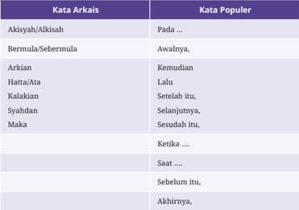

Tabel ini menjelaskan perbedaan antara kata arkais (kata-kata yang berasal dari zaman dulu atau digunakan dalam bahasa klasik) dan kata populer (kata-kata yang digunakan secara umum sekarang dalam bahasa sehari-hari) di dalam bahasa Indonesia. Topik utama tabel ini adalah perubahan kata dari bentuk kuno ke bentuk modern, yang menunjukkan evolusi bahasa seiring waktu. Kolom pertama menyajikan kata arkais, sementara kolom kedua menunjukkan bentuk atau pengganti kata populer yang digunakan sekarang. Dari data yang terlihat, terlihat bahwa kata-kata seperti “Akisya/Alkisah” berubah menjadi “Pada...”, “Bermula/Sebermula” menjadi “Awalnya”, dan “Arkian” menjadi “Kemudian”. Kata-kata yang menggambarkan waktu seperti “Hatta/Ata” dan “Kalakian” berubah menjadi “Lalu” dan “Setelah itu”, sementara “Syahdan” dan “Maka” berubah menjadi “Selanjutnya” dan “Sesudah itu”. Kata-kata yang menggambarkan waktu atau keadaan seperti “Ketika...”, “Saat...”, dan “Sebelum itu, Akhirnya” juga menunjukkan perubahan dari bentuk kuno ke bentuk yang lebih modern dan umum digunakan. Pola yang terlihat jelas adalah penggantian kata kuno dengan kata yang lebih sederhana, lebih dekat dengan kehidupan sehari-hari, dan lebih mudah dipahami oleh pembaca modern.

Pemilihan konjungsi sangat menentukan koherensi atau kepaduan makna antarkalimat ataupun antarparagraf dalam cerita. Perhatikan kutipan cerpen berikut ini.

 

---
## 📄 Halaman 119

Aku  mulai  jengah  mendengar  isakannya.  Lalu,  kutolehkan  kepala  ke belakang  dan  di  sanalah  ia  masih  menahan  isak  tangis.  Laki-laki  itu mencoba  menenangkan  dengan  menepuk-nepuk  pundaknya.  Saat itulah aku tersentak, wanita itu membutuhkan tempat. Wanita itu tidak seharusnya berdiri di tengah desakan manusia. Wanita itu sedang hamil besar. Dia sedang hamil besar.

(Dikutip dari 'Kursi Bus' dalam Rahasia Simfonia: Antologi Cerpen Bengkel Bahasa dan Sastra Indonesia bagi Siswa SLTA Kabupaten Bantul , 2016)

Bandingkan jika dua konjungsi urutan waktu pada cerita tersebut diubah seperti berikut.

Aku  mulai  jengah  mendengar  isakannya.  Sebelumnya,  kutolehkan kepala ke belakang dan di sanalah ia masih menahan isak tangis. Lakilaki  itu  mencoba  menenangkan  dengan  menepuk-nepuk  pundaknya. Pada saat aku tersentak, wanita itu membutuhkan tempat. Wanita itu tidak seharusnya berdiri di tengah desakan manusia. Wanita itu sedang hamil besar. Dia sedang hamil besar.

(Dikutip dari 'Kursi Bus' dalam Rahasia Simfonia: Antologi Cerpen Bengkel Bahasa dan Sastra Indonesia bagi Siswa SLTA Kabupaten Bantul , 2016)

Penggunaan konjungsi  urutan  waktu  yang  tidak  tepat  akan  mengubah  logika alur cerita dan koherensi sebuah paragraf. Hal lain yang perlu diperhatikan dari penggunaan konjungsi waktu adalah frekuensinya. Jangan terlalu banyak menggunakan  konjungsi  urutan  waktu  pada  satu  paragraf.  Penggunaan kata  berkategori  yang  sama  secara  berulang-ulang  memperlihatkan  bahwa pengarang kurang kreatif dan membosankan pembaca. Bandingkanlah dua penggalan cerita berikut.

Jam lima pagi saya bangun. Sesudah itu saya ke kamar mandi, lalu saya mandi.  Sesudah  itu  saya  berpakaian.  Sesudah  berpakaian  lalu  saya makan  pagi.  Kemudian,  saya  menyiapkan  buku-buku  sekolah  saya. Sesudah itu saya pamit ayah dan ibu, lalu saya berangkat ke sekolah. (Keraf, 1994: 79)

 

---
## 📄 Halaman 120

Hari masih pukul lima pagi. Udara masih terasa segar dan nyaman, keadaan sekitar pun masih sunyi-senyap. Tanpa menghiraukan kesunyian pagi itu, saya pergi menuju kamar mandi. Siraman air yang sejuk dan dingin mengagetkan saya, tetapi hanya sekejap. Segera mengeringkan tubuh dan berpakaian merupakan pilihan yang tepat untuk mengusir rasa dingin itu. Sepiring sarapan semakin menghangatkan tubuh saya. Buku-buku  sekolah  sudah  menunggu  untuk  disiapkan  sebelum  saya berpamitan kepada ayah dan ibu untuk berangkat ke sekolah. (Keraf, 1994: 80, dengan penyesuaian)

### Majas

Majas  atau  gaya  bahasa  sangat  erat  kaitannya  dengan  cerita  iksi.  Majas digunakan untuk menambahkan  keindahan cara penyampaian cerita. Beberapa majas yang sering digunakan baik dalam hikayat maupun cerpen adalah sebagai berikut:

### Antonomasia

Antonomasia adalah majas yang menyebut seseorang berdasarkan ciri atau sifatnya yang menonjol.

### Contoh:

- Hatta  beberapa  lamanya  maka  isteri  si  Miskin  itupun  hamillah tiga bulan lamanya.
- Tak tahu mengapa, saat itu aku mengucapkan terima kasih pada perempuan tua itu.

### Personiikasi

Personiikasi  adalah  majas  yang  menyatakan  benda  mati  maupun  benda hidup yang bukan manusia (hewan/tumbuhan) sebagai sesuatu yang seolaholah bersifat dan berlaku layaknya manusia.

 

---
## 📄 Halaman 121

### Contoh:

- Samar-samar nyanyian jangkrik terdengar di sampingku.
- Angin menyambar wajahku.

### Simile

Majas simile adalah majas yang membandingkan suatu hal dengan hal lainnya secara eksplisit menggunakan kata penghubung atau kata pembanding. Kata penghubung atau kata pembanding yang biasa digunakan, antara lain, seperti, laksana, bak, dan bagaikan .

### Contoh:

- 'Kamu tidur seperti kerbau,' canda ibu.
- Mereka selalu bertengkar bak kucing dan anjing.

### Metafora

Metafora adalah majas yang menggunakan kata atau kelompok kata untuk mewakili  hal  lain  yang  bukan  sebenarnya,  mulai  dari  bandingan  benda isik, sifat, ide, hingga perbuatan lain. Metafora tidak menggunakan penghubung atau kata pembanding seperti simile.

### Contoh:

- Seperti biasa, setibaku di istana tuaku, perempuan tua menyambutku dengan hangat.
- Ia adalah tulang punggung keluarga.

### Hiperbola

Hiperbola  adalah  gaya  bahasa  yang  mengandung  pernyataan  dengan  cara melebih-lebihkan sesuatu dari yang sebenarnya.

kata

 

---
## 📄 Halaman 122

### Contoh:

- Seraya berkata kepada suaminya, 'Adapun akan emas ini sampai kepada anak cucu kita sekalipun tiada habis dibuat belanja.'
- Aku tak dapat berbicara, tanganku dingin bak es yang keluar dari freezer .
Ubahlah kutipan teks 'Hikayat si Miskin' ini menjadi bahasa cerpen yang lebih populer. Gunakanlah konjungsi urutan waktu dan berbagai majas untuk mengembangkannya.

Asalnya raja kayangan dan jadi demikian karena disumpahi oleh Batara Indera. Terlantar di negeri antah-berantah dan keduanya sangat dibenci orang.  Setiap  kali  mengemis  di  pasar  dan  kampung,  mereka  dipukuli dan diusir hingga ke hutan. Oleh yang demikian, tinggallah dua suamiistri itu di hutan memakan batang kayu dan buah-buahan.

Hatta  beberapa  lamanya  maka  istri  si  Miskin  itu  pun  hamillah tiga  bulan  lamanya.  Maka  istrinya  menangis  hendak  makan  buah mempelam yang ada di dalam taman raja itu. Maka suaminya itu pun terketukkan hatinya tatkala ia di keinderaan menjadi raja tiada ia mau beranak.  Maka  sekarang  telah  mudharat.  Maka  baharulah  hendak beranak seraya berkata kepada istrinya, 'Ayo, hai Adinda. Tuan hendak membunuh kakandalah rupanya ini. Tiadakah tuan tahu akan hal kita yang sudah lalu itu? Jangankan hendak meminta barang suatu, hampir kepada kampung orang tiada boleh.'

(Sumber:

Bunga Rampai Melayu Kuno , 1952, dengan penyesuaian)

### C.  Menulis Cerpen Berdasarkan Nilai dalam Hikayat

Menulis

Menulis  pesan  tertulis  untuk  berbagai  tujuan  secara  logis,  kritis,  dan kreatif dalam bentuk teks iksi

 

---
## 📄 Halaman 123

Pada bagian sebelumnya, kalian sudah menganalisis nilai-nilai yang terkandung dalam cerita 'Hikayat si Miskin'. Sekarang, gunakanlah nilai-nilai yang kalian temukan untuk menulis cerpen.

Agar  mudah  dalam  menulis  cerita,  kalian  dapat  memulainya  dengan membuat  kerangka  cerita  menggunakan  peta  konsep.  Peta  konsep  adalah gambar  yang  digunakan  untuk  menjelaskan  hubungan  beberapa  hal  atau konsep secara lebih ringkas dan menarik.

---
**🖼️ Gambar/Diagram**

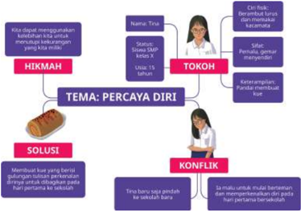

> **Deskripsi Visual:** Gambar ini merupakan diagram. Secara keseluruhan, diagram ini menggambarkan proses atau struktur masalah percaya diri (percaya diri) dalam konteks pendidikan, dengan fokus pada konflik yang dialami seorang siswa bernama Tris (status Siswa SMP kelas X) dan solusi yang dapat diterapkan. Elemen utama meliputi: “Tema: Percaya Diri” sebagai inti, yang terhubung dengan tiga elemen utama — “Hikmah” (dari pengalaman atau refleksi), “Tokoh” (siswa Tris dan konteks sosial), dan “Konflik” (masalah yang dihadapi). “Solusi” dihubungkan dengan “Hikmah” dan “Konflik” sebagai langkah penyelesaian. Relasi antar elemen menunjukkan bahwa hikmah dan tokoh membantu mengidentifikasi konflik, dan solusi diperoleh dari pemahaman hikmah tersebut. Teks penting meliputi nama “Tris”, status “Siswa SMP kelas X”, label “Hikmah”, “Tokoh”, “Konflik”, dan “Solusi”, serta kutipan seperti “Tina baru saja gendut ke sekolah” dan “Saya mulai merasa tidak percaya diri”. Informasi kunci yang dapat diambil pembaca adalah bahwa masalah percaya diri bisa diatasi melalui refleksi pribadi (hikmah), pemahaman konteks sosial (tokoh), dan solusi yang berbasis pengalaman, serta bahwa konflik percaya diri sering muncul dalam lingkungan sekolah dan bisa diatasi dengan pendekatan yang tepat.

Sumber: Nisa/Kemendikbudristek (2021)

Adapun langkah-langkah penulisannya adalah sebagai berikut.

- Siapkan kertas kosong, spidol, atau pensil aneka warna.
- Tuiskan topik utama dari cerpen yang akan kalian buat di tengah-tengah kertas, misalnya persahabatan. Lingkarilah kata kunci itu.
- Gambarlah cabang utama terkait topik tersebut. Misalnya, tentang tokoh, konlik atau masalah yang dihadapi tokoh, dan cara tokoh menyelesaikan masalah.

 

---
## 📄 Halaman 124

- Buatlah  cabang-cabang  lainnya  menggunakan  warna  berbeda.  Cabangcabang itu diisi oleh kata-kata kunci yang berhubungan dengan cabang utama.
- Gunakan  warna  yang  menarik  pada  gambar  atau  simbol-simbol  yang mencerminkan pengalaman dan imajinasi kalian berkaitan dengan topiktopik itu.
- Gambarlah garis lengkung untuk menghubungkan kata kunci yang masih berkaitan dengan kata kunci dari cabang lainnya. Tambahkanlah simbol yang menggambarkan keterkaitan antarkata kunci itu.
- Perhatikan  kembali  kelengkapan  pengalaman  dan  imajinasi  kalian. Apakah seluruhnya sudah tersampaikan?
- Jika  sudah  lengkap,  nomorilah  kata-kata  kunci  sesuai  dengan  urutan yang akan kalian susun di dalam cerpen. Coretlah kata-kata kunci yang dianggap tidak penting untuk dikembangkan. Misalnya, kata kunci yang terlalu menyimpang dari topik utama atau terlalu biasa kalau dijadikan bahan cerpen.
- Kembangkan kata-kata kunci tersebut menjadi sebuah cerpen yang utuh. Kalian juga tetap dapat menambahkan peristiwa dan imajinasi lain di luar kerangka yang tersedia, sepanjang tidak mengganggu topik utama yang telah dibangun sebelumnya.
Lakukan  penilaian  diri  terhadap  cerpen  yang  telah  kalian  tulis. Gunakanlah tabel berikut ini untuk menilainya.

---
**📊 Tabel**

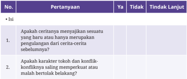

Tabel ini berfokus pada penilaian pemahaman siswa terhadap elemen cerita, khususnya mengenai keterkaitan antara cerita baru dan cerita lama, serta peran karakter dan konflik dalam cerita. Topik utamanya adalah evaluasi kognitif terhadap struktur dan isi cerita, dengan dua pertanyaan yang dirancang untuk menguji apakah siswa mampu mengenali bahwa cerita baru sering kali mengambil elemen dari cerita sebelumnya, serta apakah karakter dalam cerita tersebut memiliki konflik yang saling memperkuat atau saling bertentangan. Kolom-kolom yang ada mencakup nomor pertanyaan, pertanyaan itu sendiri, dan tiga opsi jawaban: “Ya”, “Tidak”, dan “Tindak Lanjut”, yang menunjukkan bahwa tabel ini digunakan untuk mengidentifikasi tingkat pemahaman siswa dan menentukan langkah selanjutnya dalam pembelajaran. Pola penting yang terlihat adalah bahwa pertanyaan pertama mengevaluasi keterkaitan antara cerita baru dan lama, sementara pertanyaan kedua mengevaluasi dinamika konflik karakter, yang merupakan dua aspek penting dalam analisis cerita. Tindak lanjut yang disediakan menunjukkan bahwa tabel ini dirancang untuk memfasilitasi intervensi pembelajaran yang personal dan berbasis hasil.

 

---
## 📄 Halaman 125

---
**📊 Tabel**

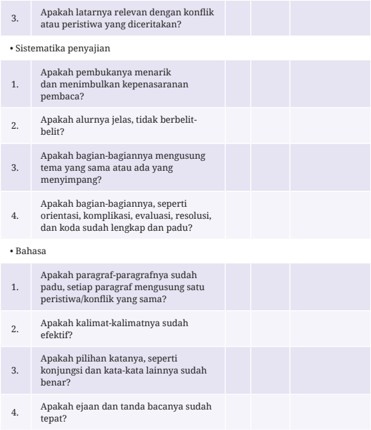

Tabel ini berfokus pada penilaian kualitas tulisan laporan atau esai yang menghadapi konflik atau peristiwa tertentu, dengan dua bagian utama: sistematisasi penyajian dan bahasa. Bagian pertama, sistematisasi penyajian, mengevaluasi apakah penulis mampu menyusun laporan dengan jelas, mengikuti struktur logis, dan mempertahankan fokus pada tema utama tanpa kehilangan arah atau mengalami kesulitan dalam penyusunan. Penulis juga diuji apakah laporan tersebut memiliki alur yang jelas dan tidak berbelit-belit, serta apakah bagian-bagian yang dibahas memiliki orientasi, kompleksitas, evaluasi, dan resolusi yang terstruktur dan padu. Bagian kedua, bahasa, mengevaluasi kualitas bahasa tulisan, seperti apakah paragraf-paragrafnya sudah padu dan setiap paragraf mengungkapkan satu peristiwa atau konflik yang sama, apakah kalimat-kalimatnya sudah efektif, apakah penggunaan kata-kata lainnya sudah benar dan tidak ada konjungsi yang salah, serta apakah ejaan dan tanda baca sudah tepat. Secara keseluruhan, tabel ini menunjukkan bahwa penilaian tidak hanya melihat isi, tetapi juga struktur dan keakuratan bahasa, yang merupakan elemen penting dalam menyampaikan ide secara jelas dan persuasif.

### D.  Membuat Media Presentasi Berupa Video Gerak Henti

Kreativitas

Menyajikan teks narasi dalam bentuk monolog berbantuan media secara runtut dan kreatif

 

---
## 📄 Halaman 126

### Membuat Video Gerak Henti

Video  gerak  henti  adalah  salah  satu  teknik  animasi  di  mana  gambar diambil  bingkai  demi  bingkai  dengan  objek  isik  yang  dipindahkan. Objek  tersebut  digerakkan  sedikit  demi  sedikit  pada  setiap  bingkai ( frame ) yang akan difoto. Ikuti langkah-langkah berikut untuk membuat video gerak henti dari cerita pendek kalian.

- Buatlah papan cerita ( storyboard )  sederhana dengan memuat alur kejadian yang akan difoto dan narasi yang akan direkam untuk setiap adegannya. Perhatikan contoh papan cerita berikut ini.

### Tarian Pena

---
**📊 Tabel**

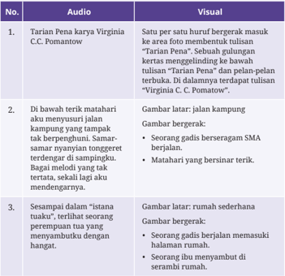

Tabel ini membahas tiga contoh audiovisual yang menggambarkan bagaimana elemen visual mendukung atau memperkuat isi audio dalam sebuah karya sastra, khususnya dalam konteks puisi atau cerpen yang berjudul “Tarian Karya Virginia C.C. Pomaton”. Topik utamanya adalah hubungan antara audio (teks atau narasi) dan visual (gambar atau deskripsi visual) dalam menyampaikan makna atau suasana. Kolom pertama menyajikan nomor urut setiap contoh, kolom kedua berisi isi audio, dan kolom ketiga menjelaskan visual yang sesuai. Dalam contoh pertama, audio menggambarkan tarian yang bergerak di atas foto, sementara visual menunjukkan suasana yang sama dengan latar belakang foto dan tarian yang terlihat. Contoh kedua menunjukkan bahwa audio menggambarkan suasana jalan kampung yang ramai dan penuh suara, yang disesuaikan dengan visual gambar latar jalan kampung yang dipenuhi orang-orang dan seorang gadis bersejarah SMA. Contoh ketiga menggambarkan suasana ruang yang sederhana dan hangat, yang disesuaikan dengan visual gambar latar ruang yang sederhana dan orang-orang yang berjalan memasuki ruangan. Pola penting yang terlihat adalah bahwa visual selalu dirancang untuk memperkuat atau menggambarkan suasana yang dijelaskan dalam audio, sehingga membantu pembaca atau pendengar memahami konteks dan nuansa lebih dalam.

 

---
## 📄 Halaman 127

- Gambar  latar  adalah  gambar  yang  tidak  perlu  digerakkan  pada  satu adegan. Gambar bergerak adalah gambar yang harus digerakkan secara perlahan pada setiap kali pengambilan gambar agar cerita tampak hidup.
- Siapkan  objek  yang  akan  difoto.  Kalian  dapat  menggunakan  gambar, potongan huruf, atau boneka.
- Sebagai contoh, pada bagian pertama papan cerita di atas, kalian harus menyiapkan  potongan  huruf  yang  merangkai  frasa  'Tarian  Pena'  dan sebuah gulungan kertas yang bertuliskan 'Virginia C. C.  Pomatow'. Pada bagian  kedua,  kalian  harus  menyiapkan  gambar  pemandangan  jalan di  sebuah  desa,  anak  perempuan  berseragam  SMA,  dan  matahari  yang bersinar terik.
- Siapkan kamera yang akan digunakan untuk mengambil gambar. Kalian dapat menggunakan kamera telepon pintar atau kamera lainnya.
- Foto  satu  per  satu  adegan.  Buatlah  adegan  transisi  agar  gerakan  pada video nanti lebih halus.
- Rekamlah narasi video menggunakan alat perekam dari telepon pintar kalian.
- Rangkailah satu per satu foto yang telah diambil sehingga menjadi cerita yang  utuh  menggunakan  aplikasi  pengolah  video  dari  komputer  atau telepon pintar kalian. Tambahkan rekaman suara kalian. Cocokkan antara suara narasi dengan adegan.

### Selamat berkreasi!

(Sumber: Purves, 2010, dengan penyesuaian)

Kalian dapat memindai kode QR di samping atau menggunakan tautan di bawah untuk melihat contoh cerita yang disajikan dalam video gerak henti.

https://buku.kemdikbud.go.id/s/gerakhenti

Sumber: Majalah Bobo/YouTube (2018)

Bab III

 

---
## 📄 Halaman 128

### E. Mempresentasikan Cerita Pendek dengan Media yang Tepat

### Berbicara, Berdiskusi, dan Mempresentasikan

Mempresentasikan  cerita  pendek  dengan  menggunakan  media  yang tepat sesuai dengan perhatian dan minat pendengarnya

Sekarang  saatnya  kalian  mempresentasikan  cerpen  yang  sudah  dikemas dalam bentuk video gerak henti tersebut. Sebelum kalian menampilkannya di kelas, jangan lupa untuk menyampaikan salam, memperkenalkan diri, dan menyampaikan informasi terkait cerita kalian. Informasi yang disampaikan terdiri atas judul, tokoh, dan sinopsis cerita.

Setelah kalian menampilkan video, sampaikanlah nilai moral dari cerita tersebut. Akhirnya, tutuplah dengan salam penutup.

Jika tidak dapat membuat video gerak henti, kalian dapat mempresentasikan  cerpen  yang  dibuat  dalam  bentuk  drama,  monolog,  panggung  boneka, wayang, atau media kreatif lainnya yang dapat menarik perhatian dan minat audiensi.

### F. Uji Kompetensi

Bacalah penggalan hikayat berikut untuk menjawab soal nomor 1 s.d. 5!

### Hikayat Maharaja Bikrama Sakti

Alkisah maka inilah suatu hikayat daripada cerita, ada seorang raja di negeri  Maha  Khairan  Langkawi  bernama  Maharaja  Bikrama,  terlalu sakti dan bangsawan daripada manusia terlalu amat besar kerajaannya baginda itu. Adapun istrinya raja itu bernama tuan putri Sinar Bulan anak  raja  di  negeri  Indra  Juita.  Syahdan  maka  ia  pun  namanya  tuan putri itu Indra Juita.

Maka ia pun ada berputra dua orang dan yang tua laki-laki bernama Raja Johan Syah terlalu amat baik parasnya dan budi pekertinya kepada

 

---
## 📄 Halaman 129

segala raja-raja, segala perdana menteri, hulubalang dan rakyat sekalian dengan tegur sopannya serta dengan segala dayang-dayangnya. Maka sekaliannya  pun  kasih  akan  dia.  Adapun  yang  muda  itu  perempuan bernama tuan puteri  Ratna  Komala  terlalu  amat  baik  parasnya  serta dengan  arif  bijaksananya,  barang  pekerjaannya  dan  permainannya yang  tiada  dapat  dikerjakannya  oleh  orang  lain,  maka  ia  pun  dapat mengerjakannya. Maka terlalu kasih sayangnya ayahanda baginda dua laki isteri akan anakanda baginda kedua bersaudara itu adalah laksana orang yang menenteng minyak yang penuh. Sebermula maka beberapa lamanya  anak  raja-raja  yang  datang  meminang  wan  puteri  Ratna Komala itu, maka tiadalah diterimanya oleh baginda karena anakanda itu lagi kecil.

Hatta  beberapa  lamanya  maka  Maharaja  Bikrama  Sakti  itupun sakitlah dan beberapa daripada dukun dan tabib dipanggilnya datang mengobati baginda itu. Maka beberapa lamanya dan antaranya baginda sakit  itu  maka  ia  pun  matilah.  Maka  gemuruhlah  bumi  segala  ratap orang yang di dalam istana itu tabuh larangan pun dibawa oranglah.

Maka berkampunglah segala isi negeri Khairan Langkawi itu kecil dan besar, tua dan muda, hina dan dena sekalian karena orang hendak mengerjakan  Maharaja  Syah  itu.  Maka  mayat  baginda  itupun  diarak oranglah ke kubur betapa adat daripada segala raja-raja yang besar mati itu demikianlah diperbuatnya. Setelah sudah baginda dikuburkan maka beberapa emas dan perak dinugerahkan oleh Maharaja lohan Syah itu kepada segala fakir dan miskin demikian pula kain, baju, segala pakaian dan segala makanan.

Setelah  ada  beberapa  antaranya  tiga  bulan  lamanya  maka  isteri baginda tuan puteri Sinar Bulan itupun sakitlah pula. Setelah beberapa lamanya sakit maka tuan puteri itupun matilah. Maka ia pun gemuruhlah bunyi ratap di dalam istana.

Maka  anakanda  tuan  puteri  Ratna  Komala  itupun  menangislah katanya  'Wah,  Bundaku  bencilah  sangat  rupanya  Bundaku  kepada Anakanda maka Anakanda Bunda tinggalkan selaku ini. Apatah jadinya Anakanda  sepeninggal  Bundaku  karena  Anakanda  tiadalah  pernah bercerai dengan Bunda. Sudahlah Ayahanda meninggalkan Anakanda, akan  sekarang  ini  Bunda  pula  meninggalkan.'  Maka  berbagi-bagilah ratap bunyi tangis tuan puteri itu.

Maka ia  pun  pingsanlah  dan  tiada  sadarkan  dirinya  lagi.  Setelah dilihat oleh Kakanda baginda akan hal Adinda itu tiada sadarkan dirinya itu maka Maharaja Johan Syah itupun segeralah datang mendapatkan

 

---
## 📄 Halaman 130

Adinda  baginda  tuan  puteri  itu  seraya  katanya,  'Sudahlah  Ayahanda dan  Bunda  baginda  meninggalkan  kita  kedua  ini,  janganlah  Adinda pula  meninggalkan Kakanda. Apatah jadinya Kakanda jikalau Adinda pula hendak meninggalkan Kakanda ini.' Maka ia berkata-kata sambil menyapu air matanya. Maka lalu disapunya dengan air mawar kepada muka saudaranya itu.

Maka tuan puteri pun ingatlah ia daripada pingsannya itu. Maka ia pun menangislah pula terlalu sangat. Maka Maharaja Johan Syah itu pun sabil hatinya melihat kelakuan saudaranya itu demikian. Maka lalu dipeluknya  kaki  Bundanya  seraya  katanya,  'Wah,  Bundaku,  lihatlah kelakuan Anakanda kedua ini seperti ayam yang kematian induknya, sampai hati Bunda meninggalkan Anakanda kedua ini.'

Maka  gemuruhlah  bunyi  tangis  orang  yang  di  dalam  istana  itu seperti batu rubuh bunyinya. Setelah demikian maka berbunyilah nobat antara ada dengan tiada merawankan hati segala yang mendengarkan dia.

Setelah  demikian  maka  mayat  permaisuri  itu  pun  dimandikan oranglah. Setelah sudah selengkapnya maka dinaikkan oranglah ke atas usungan talu diarak oranglah pergi ke kuburannya itu lalu ditanamkan oranglah dekat Baginda.

(Sumber: Jumsari, 1989)

- Nilai sosial yang terdapat pada hikayat di atas adalah ….
- Kita harus mandiri meskipun memiliki kekuasaan.
- Kita harus pasrah atas takdir yang diberikan Tuhan.
- Anak gadis tidak boleh dinikahkan jika masih kecil.
- Seorang kakak harus lebih kuat dari adiknya.
- Kita harus peduli kepada fakir miskin.
- Maka gemuruhlah bumi segala ratap orang yang di dalam istana itu tabuh larangan pun dibawa oranglah.
Majas yang terdapat pada kalimat di atas adalah ….

- antonomasia
- personiikasi

 

---
## 📄 Halaman 131

- simile
- hiperbola
- metafora
- Maka  terlalu  kasih  sayangnya  ayahanda  baginda  dua  laki  isteri  akan anakanda  baginda  kedua  bersaudara  itu  adalah  laksana  orang  yang menenteng minyak yang penuh.
Majas yang terdapat pada kalimat di atas adalah ….

- antonomasia
- personiikasi
- simile
- hiperbola
- metafora
- ... laksana orang yang menenteng minyak yang penuh.
Jelaskan makna dari penggalan kalimat di atas!

……………………..……………………..……………………..……………………..………………

……………………..……………………..……………………..……………………..………………

- A.  Puteri Indra Juita wafat.
- Maharaja Bikrama Sakti wafat.
- Puteri Ratna Komala pingsan.
- Raja Johan Syah bersedekah kepada fakir miskin.
Susunan alur yang tepat sesuai dengan alur hikayat di atas adalah ….

- b-a-c-d
- b-c-a-d
- b-d-a-c
- b-a-d-c
- b-d-c-a

 

---
## 📄 Halaman 132

### Bacalah teks berikut untuk menjawab soal nomor 6 s.d. 10!

### Hikayat Panca Logam

Alkissah  maka  tersebut  perkataan  ada  suatu  raja  pada  bukit  Panca Logam bernama Maharaja Wirandana Giri. Adapun baginda itu terlalu besar  kerajaannya  pada  zaman  itu,  tiada  siapa  ada  yang  menyamai kebesarannya.  Karena  itu  terlalu  sakti  serta  gagah  beraninya  dan kulitnya daripada tembaga dan uratnya itu pun kawat dan tulangnya besi. Demikianlah yang diceriterakan oleh  orang  yang  empunya ceritera  itu.  Maka  beberapa  raja-raja  dewa,  mambang,  dan  raksasa yang takluk kepadanya. Dan segala binatang di hutan itu pun dapatlah diperintahnya.  Demikianlah  kebesarannya  baginda  itu.  Dan  lagi  ada patih seorang hulubalangnya terlalu amat gagah beraninya dan saktinya. Pertama, Raja Gardana Lela, ialah yang memerintahkannya segala dewa mambang. Kedua, Raja Wirangga Danu dan ialah yang memerintahkan segala  binatang.  Dan  yang  ketiga  bernama  Raja  Lindu  Singara,  dan yang  keempat  bernama  Raja  Lindu  Kuwaca.  Adapun  keduanya  itu memerintahkan segala rakyat raksasa.

Maka  pada  suatu  hari  Raja  Wirandana  Giri  dihadap  oleh  segala raja-raja  dan  menteri  hulubalang  sekalian  serta  orang  besar-besar dan orang yang ternama. Maka ketika itu Raja Wirandana Giri itu pun bertitah kepada hulubalang yang keempat itu, demikian titahnya, 'Hai saudaraku  keempat,  pada  esok  hari  pagi-pagi  segeralah  saudaraku himpunkan  segala  raja-raja  dan  rakyat  sekalian  serta  dengan  segala kelengkapan, seperti gajah, kuda, dan lain-lainnya karena aku hendak pergi  ke  Gunung  Mayarupa  mendapatkan  guruku  Ajar  Perbami: Lengkara, karena telah lama sudah yang aku tiada pergi mendapatkan baginda itu.' Maka keempat hulubalang itu pun segera menyembah lalu pergi memerintahkan kepada segala raja-raja.

Setelah sudah maka baginda pun segera berangkat masuk keempatnya.  Adapun  segala  yang  menghadap  itu  pun  masing-masing kembali pulang ke rumahnya. Maka setelah keesokan harinya, dari pagipagi itu maka Raja Gardana Lela itu pun menghimpunkan segala dewadewa mambang akan berlengkap segala kenaikan gajah, kuda serta alat senjata dan tunggul panji-panji.

Adapun segala raksasa itu pun masing-masing dengan kelengkapannya.  Maka  setelah  sudah  mustaid  sekaliannya  itu,  maka Gardana Lela itu pun berdatang sembah kepada Raja Wirandana Giri,

 

---
## 📄 Halaman 133

demikian  sembahnya,  'Ya  Tuanku  yang  Dipertuan,  Adapun  titah  duli Sialam itu telah hadirlah sudah, hanya menantikan Sialam jua.'

Setelah  Raja  Wirandana  Giri  mendengar  sembah  Gardana  Lela itu maka ia pun segera berangkat serta memakai pakaian yang indahindah dan kenaikannya garuda berkepalakan buta. Adapun namanya garuda itu Paksi Denawa. Maka setelah itu Raja Wirandana Giri itu pun diiringkan  oleh  segala  raja-raja  dan  Menteri  hulubalang  serta  rakyat sekalian.  Adapun  yang  berjalan  dahulu  itu  Raja  Gardana  Lela  serta empat puluh menteri hulubalang daripada Dewa Mambang. Dan yang di  kanan  baginda  itu  Raja  Lindu  Singara  serta  empat  puluh  menteri hulubalangnya  dari  para  raksasa.  Dan  di  kiri  baginda  itu  Raja  Lindu Kuwaca serta  Menteri  hulubalang.  Dan  yang  di  belakang  baginda  itu Raja  Wirangga  Danu  serta  menteri  hulubalang.  Maka  masing-masing dengan kelengkapannya.

Adapun segala rakyat dewa mambang itu berjalan di udara seperti burung  berkawan-kawan.  Dan  segala  rakyat  raksasa  itu  berjalan  di bumi.  Maka  segala  tunggul  panji-panji  itu  pun  berkibar-kibaranlah. Maka segala bunyi-bunyian pun dipalu oleh orang terlalu ramai. Adapun baginda berjalan itu sambil ia bermain-main karena adatnya baginda itu setahun sekali ia pergi mendapatkan gurunya itu.

(Sumber: Nikmah dan Putri Minerva, 1988)

### 6. Pasangkanlah tokoh berikut dengan tugasnya yang tepat berdasarkan isi teks!

- Raja Gardena Lela
- memerintah para panji
- Raja Wirangga Danu
- memerintah binatang
- Raja Lindu Singara
- memerintah raksasa
- Maharaja Wirandana Giri
- memerintah para raja dewa, mambang, dan raksasa
- Memerintah para dewa

 

---
## 📄 Halaman 134

- Nilai pendidikan yang terdapat pada penggalan hikayat di atas adalah ….
- Setiap  orang  hendaknya  memiliki  tugas  dan  keahliannya  masing- masing.
- jangan pernah melupakan guru meskipun kita sudah menjadi orang yang berhasil.
- Semua akan lebih mudah dilakukan jika kita punya kekuasaan.
- Saat bertamu sebaiknya mengenakan pakaian yang terbaik.
- Kita harus mematuhi perintah pemimpin kita.
- Tentukan  kalimat  manakah  yang  mengandung  majas.  Berilah  tanda centang  (√)  pada  setiap  pilihan  jawaban  benar!  Jawaban  benar  lebih  dari satu.
- Ubahlah  paragraf  berikut  menjadi  paragraf  dengan  bahasa  yang  lebih populer!
Setelah Raja Wirandana Giri mendengar sembah Gardana Lela itu maka ia  pun  segera  berangkat  serta  memakai  pakaian  yang  indah-indah  dan kenaikannya  garuda  berkepalakan  buta.  Adapun  namanya  garuda  itu Paksi Denawa. Maka setelah itu Raja Wirandana Giri itu pun diiringkan oleh  segala  raja-raja  dan  Menteri  hulubalang  serta  rakyat  sekalian. Adapun yang berjalan dahulu itu Raja Gardana Lela serta empat puluh menteri hulubalang daripada Dewa Mambang. Dan yang di kanan baginda itu  Raja  Lindu  Singara  serta  empat  puluh  menteri  hulubalangnya  dari para raksasa. Dan di kiri baginda itu Raja Lindu Kuwaca serta Menteri hulubalang. Dan yang di belakang baginda itu Raja Wirangga Danu serta menteri hulubalang. Maka masing-masing dengan kelengkapannya.

 

---
## 📄 Halaman 135

- Buatlah sebuah cerita pendek yang terinspirasi dari nilai yang terdapat pada Hikayat Panca Logam!

### G. Pengayaan

Bagi kalian yang telah menguasai minimal 70% dari total materi bab ini dapat melakukan kegiatan pengayaan sebagai berikut.

- Membaca  teks  hikayat yang berkaitan dengan  daerah kalian dan mendiskusikannya.
- Mengalihwahanakan  teks  hikayat  menjadi  media  yang  lebih  kekinian, seperti  komik,  drama,  atau  ilm  pendek.

### H.  Jurnal Membaca

Menerbitkan resensi buku cerita iksi di media cetak maupun digital

Pada  jurnal  membaca  kali  ini,  kalian  akan  diajak  membuat  resensi  buku, khususnya hikayat dan/atau kumpulan cerpen. Resensi adalah suatu tulisan atau ulasan mengenai nilai sebuah hasil karya atau buku. Resensi ditulis untuk menyampaikan kepada para pembaca apakah hasil karya atau buku tersebut patut mendapat sambutan dari masyarakat atau tidak.

Adapun hal-hal yang termuat dalam sebuah resensi adalah sebagai berikut.

### 1. Latar belakang

Pada bagian ini, kalian harus menyampaikan tujuan penulis menuliskan karya atau buku tersebut. Kalian dapat memperoleh informasi tersebut pada  bagian  prakata  penulis.  Hal  ini  perlu  disampaikan  untuk  menilai apakah tujuan tersebut dapat tercapai melalui karyanya atau tidak.

Pada bagian ini, kalian juga dapat menjelaskan tema dan deskripsi buku. Deskripsi buku mencakup identitas buku, seperti nama dan latar belakang penulis, nama penerbit, jumlah halaman, dan tahun terbit.

 

---
## 📄 Halaman 136

### 2. Macam atau jenis buku

Sampaikanlah jenis buku yang kalian tulis resensinya. Dengan menyampaikan jenis buku yang diresensi, akan memudahkan pembaca untuk membandingkan buku tersebut dengan buku sejenis yang sudah ada.

### 3. Keunggulan dan kekurangan buku

Sampaikanlah keunggulan buku yang dibaca. Pertama, kalian dapat mulai dari sampul bukunya. Sampul buku penting disampaikan karena itulah yang pertama kali dilihat pembaca. Selanjutnya, kalian dapat membahas isi  buku  tersebut,  dimulai  dari  tema  yang  diangkat.  Apakah tema buku menyajikan  hal  baru  atau  sudah  umum,  hanya  saja  dilihat  dari  sudut pandang lain. Setelah itu, kalian dapat membahas karakter yang muncul dalam  cerita.  Apakah  karakter  tersebut  memiliki  ciri  khas  yang  kuat sehingga dapat alur cerita dengan baik ataukah terjebak pada stereotip yang ada.

Pembahasan penting selanjutnya adalah mengenai plot atau alur cerita. Apakah alurnya membuat kalian penasaran untuk terus membaca cerita sampai habis atau alurnya mudah ditebak. Selain itu, apakah bahasa yang digunakan sudah tepat dengan jenis buku dan target pembaca sehingga enak dibaca atau tidak. Kerapian struktur kalimat atau paragraf juga ejaan penting  untuk  dibahas  pada  bagian  ini.  Terakhir,  bahaslah  nilai  moral cerita yang kalian dapatkan dari buku tersebut. Sajikanlah pembahasanpembahasan  tersebut  dengan  menyertakan  kutipan-kutipan  dari  buku agar pembaca lebih yakin dengan penilaian kalian.

### 4. Kesimpulan

Sampaikanlah  kesimpulan  akhir  kalian  terhadap  buku  yang  dibaca. Gunakanlah kata-kata persuasif yang dapat menarik pembaca untuk ikut membaca buku tersebut.

Kalian  dapat  membaca  buku  antologi  cerpen  yang  ditulis  oleh  satu pengarang  atau  hikayat  yang  ada  di  perpustakaan  sekolah  atau  di  sekitar kalian. Kalian juga dapat menggunakan buku-buku elektronik berikut:

- Hikayat Aladin (http://repositori.kemdikbud.go.id/id/eprint/1873)
- Hikayat Banjar dan Kotaringin (http://repositori.kemdikbud.go.id/13617)

 

---
## 📄 Halaman 137

- Hikayat Panji Kuda Semirang (http://repositori.kemdikbud.go.id/1893)
- Hikayat Sariman Budi (http://repositori.kemdikbud.go.id/8330)
- Hikayat Negeri Johor (http://repositori.kemdikbud.go.id/1890)
Kalian dapat mengirimkan resensi yang telah dibuat ke berbagai media cetak dan daring.

### I. Releksi

Releksi

Mereleksikan apa saja yang telah dipelajari dan bagian-bagian mana saja yang belum terlalu dikuasai agar dapat menemukan solusinya

Selamat!  Kalian  sudah  mempelajari  Bab  III.  Tentu  banyak  hal  yang  sudah kalian pelajari. Tandai kegiatan yang sudah kalian lakukan atau pengetahuan yang telah kalian kuasai dengan tanda centang, ya!

---
**📊 Tabel**

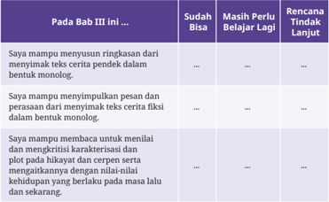

Tabel ini berfokus pada kemampuan siswa dalam memahami dan menganalisis teks cerita pendek, khususnya dalam konteks Bab III buku pelajaran, yang menyoroti kemampuan membaca dan mengevaluasi cerita. Topik utama tabel adalah kemampuan siswa dalam mengekstrak inti cerita, memahami struktur cerita, serta menilai karakter dan plot cerita secara kritis. Tabel ini memiliki tiga kolom utama: “Sudah Bisa”, “Masih Perlu Belajar Lagi”, dan “Rencana Tindak Lanjut”, yang menunjukkan tingkat penguasaan siswa terhadap tiga aspek keterampilan tersebut. Dari data yang terlihat, siswa tampaknya sudah mampu menyusun ringkasan cerita pendek dan menyimpulkan pesan serta perasaan dari cerita fiksi dalam bentuk monolog, namun masih perlu belajar lebih lanjut dalam menilai dan mengkritisi karakter serta plot cerita, karena masih terlihat bahwa siswa belum mampu mengevaluasi cerita secara mendalam atau mengidentifikasi nilai-nilai yang terkandung di dalamnya. Rencana tindak lanjut yang disarankan menunjukkan bahwa guru atau pembimbing perlu memberikan pendekatan yang lebih mendalam untuk membantu siswa memahami elemen-elemen cerita secara kritis, sehingga mereka dapat mengembangkan kemampuan analisis dan interpretasi cerita secara lebih matang.

 

---
## 📄 Halaman 138

---
**📊 Tabel**

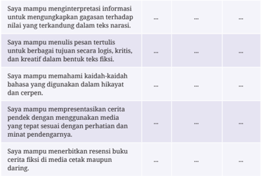

Topik utama tabel ini adalah kemampuan seseorang dalam memahami dan menginterpretasikan teks fiksi, khususnya dalam konteks media cetak, dengan fokus pada kemampuan membaca, memahami, dan menyampaikan isi teks secara kritis dan kreatif. Tabel ini terdiri dari dua kolom: kolom pertama menjelaskan kemampuan yang dimiliki, sementara kolom kedua menunjukkan tingkat keberhasilan atau penguasaan tersebut, yang dinyatakan dengan tiga titik (…), menandakan bahwa kemampuan ini belum sepenuhnya tercapai atau masih dalam tahap pengembangan. Data atau pola penting yang terlihat adalah bahwa semua kemampuan yang diuraikan—mulai dari memahami informasi teks, menulis dengan gaya naratif, menguasai bahasa dalam konteks kritik, hingga menyusun resensi buku—semuanya menunjukkan bahwa pembaca atau penulis masih perlu memperkuat kemampuan mereka, karena belum ada indikasi bahwa semua kemampuan tersebut telah tercapai secara penuh. Tabel ini secara implisit menggambarkan bahwa pembelajaran atau pengembangan keterampilan membaca dan menulis fiksi masih dalam proses, dan perlu dilakukan secara bertahap untuk mencapai penguasaan yang optimal.

Hitunglah persentase penguasaan materi kalian dengan rumus berikut:

### (Jumlah materi yang kalian kuasai/jumlah seluruh materi) x 100

- Jika  materi di atas sudah dikuasai minimal 70%, kalian dapat meminta aktivitas pengayaan kepada guru.
- Jika materi yang dikuasai masih di bawah 70%, kalian dapat mendiskusikan kegiatan remedial dengan guru.

 

---
## 📄 Halaman 139

---
**🖼️ Gambar/Diagram**

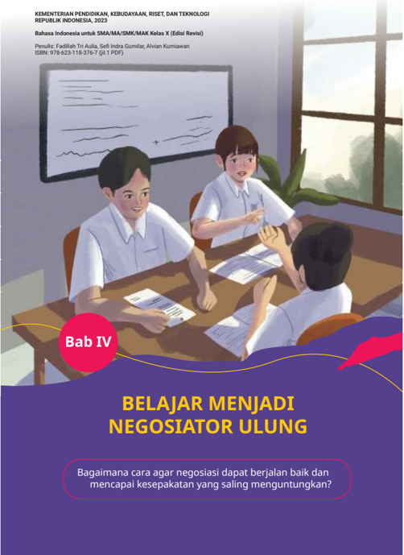

> **Deskripsi Visual:** Gambar ini adalah ilustrasi. Secara keseluruhan, ilustrasi ini menampilkan tiga siswa berpakaian seragam sekolah sedang berdiskusi atau berdiskusi kelompok di meja kelas, dengan latar belakang papan tulis dan jendela. Elemen utama adalah siswa yang terlibat dalam interaksi sosial—dua siswa duduk menghadap satu sama lain, sementara siswa ketiga duduk di depan mereka, tampak sedang menyampaikan atau mendengarkan. Relasi antar elemen menunjukkan dinamika kolaborasi dan komunikasi, yang sesuai dengan tema “Belajar Menjadi Negosiator Ulung”. Teks penting yang terlihat meliputi: “Bab IV” di lingkaran merah, judul besar “BELAJAR MENJADI NEGOSIATOR ULUNG”, dan pertanyaan di bawahnya: “Bagaimana cara agar negosiasi dapat berjalan baik dan mencapai kesepakatan yang saling menguntungkan?”. Informasi kunci yang dapat diambil pembaca adalah bahwa bab ini membahas keterampilan negosiasi dalam konteks pendidikan, dengan fokus pada interaksi kolaboratif dan pencapaian kesepakatan yang saling menguntungkan, serta bahwa ini adalah bagian dari buku pelajaran untuk siswa kelas X.

 

---
## 📄 Halaman 140

Setelah  mempelajari  materi  Bab  IV, kalian diharapkan mampu mengidentiikasi informasi, menemukan informasi  pada  sumber  pendukung, memahami isi teks, menulis teks, dan mempresentasikan teks negosiasi dengan baik.

- diksi
- rima
- tipograi
- pembacaan puisi
- resensi

---
**🖼️ Gambar/Diagram**

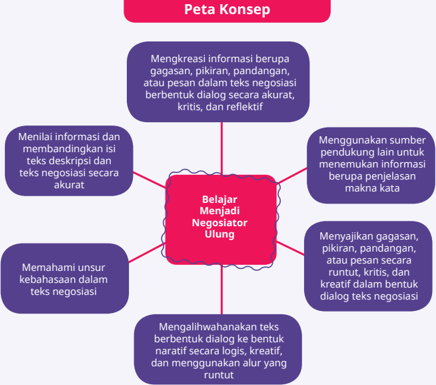

> **Deskripsi Visual:** Gambar ini merupakan diagram. Secara keseluruhan, diagram ini menampilkan “Peta Konsep” yang menggambarkan konsep inti “Belajar Menjadi Negosiator Ulung” sebagai pusat, dengan enam elemen pendukung yang mengelilinginya, masing-masing menjelaskan kompetensi atau langkah yang diperlukan untuk mencapai tujuan tersebut. Elemen utama adalah kotak pusat berwarna merah dengan teks “Belajar Menjadi Negosiator Ulung”, yang dihubungkan oleh garis ke enam kotak berwarna ungu di sekelilingnya, masing-masing berisi deskripsi tugas atau keterampilan yang mendukung. Relasi antar elemen menunjukkan bahwa semua kompetensi tersebut saling terkait dan berkontribusi pada pencapaian tujuan utama. Teks penting yang terlihat meliputi judul “Peta Konsep” di atas diagram, dan teks dalam kotak-kotak seperti “Mengkreasai informasi berupa gagasan, pikiran, pandangan, atau pesan dalam teks negosiasi berbentuk dialog secara akurat, kritis, dan reflektif”, “Menggunakan sumber pendukung lain untuk menemukan informasi pendukung yang relevan”, dan “Mengalihwahankan teks berbentuk dialog ke bentuk naratif secara logis, kreatif, dan menggunakan alur yang runtut”. Informasi kunci yang dapat diambil pembaca adalah bahwa pembelajaran menjadi negosiator ulung melibatkan keterampilan analisis, kreativitas, refleksi, penggunaan sumber, dan kemampuan menyusun teks secara logis dan kreatif — semuanya saling terkait dan berfungsi untuk membangun kemampuan negosiasi yang efektif.

 

---
## 📄 Halaman 141

Sumber: Falaq Lazuardi/ Unsplash (2020)

Untuk  menguji  pemahaman  awal  kalian  tentang  teks negosiasi, isilah tabel berikut dengan tanda centang sesuai dengan peristiwa yang pernah kalian alami.

---
**📊 Tabel**

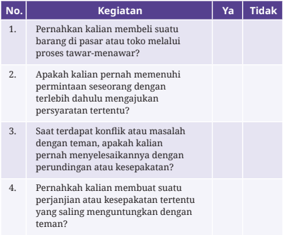

Tabel ini berfokus pada mengevaluasi perilaku kalian dalam memenuhi kewajiban hukum dan etika sosial terkait dengan penggunaan barang atau layanan yang melibatkan proses tawar-menawar, serta menilai apakah kalian telah memperhatikan aturan dan kebijakan yang berlaku. Topik utamanya adalah perilaku kalian dalam situasi yang memerlukan kepatuhan terhadap aturan, baik secara hukum maupun sosial. Tabel ini memiliki dua kolom utama, yaitu “Ya” dan “Tidak”, yang digunakan untuk mengindikasikan apakah kalian telah melakukan sesuatu atau belum. Dalam kolom pertama, kalian diminta untuk memeriksa apakah kalian pernah membeli barang atau jasa yang melalui proses tawar-menawar, kemudian apakah kalian pernah memenuhi permintaan pihak lain untuk mengajukan persyaratan tertentu, apakah kalian pernah menghadapi konflik atau masalah dengan teman yang terkait dengan kepatuhan terhadap aturan, dan apakah kalian pernah membuat suatu perjanjian atau kesepakatan tertentu yang saling menguntungkan dengan pihak lain. Pola penting yang terlihat adalah bahwa tabel ini dirancang untuk mengukur tingkat kesadaran dan kepatuhan kalian terhadap aturan sosial dan hukum dalam konteks interaksi sehari-hari, serta menunjukkan bahwa kalian diminta untuk mempertimbangkan konsekuensi dari tindakan kalian dalam situasi yang melibatkan kepercayaan, keadilan, dan kepatuhan.

(√)

 

---
## 📄 Halaman 142

Jika  pernah melakukan semua hal tersebut, tanpa disadari kalian telah melakukan  kegiatan  negosiasi.  Pada  bab  ini,  kalian  akan  mendalami  teks negosiasi  melalui  kegiatan  menyimak,  membaca,  memirsa,  menulis,  dan mempresentasikan teks negosiasi.

Negosiasi pada dasarnya adalah kegiatan berunding atau tawar-menawar untuk mencapai kesepakatan/persetujuan bersama antara dua atau beberapa pihak  (orang/kelompok/organisasi).  Kesepakatan  tersebut  didapat  setelah mengatasi  berbagai  perbedaan  atau  perselisihan  para  pihak.  Untuk  lebih memahaminya,  cermati  dengan  saksama  dialog  tawar-menawar  antara pembeli  dan  penjual  di  bawah  ini.  Kalian  juga  dapat  memeragakannya  di depan kelas. Setelah itu, diskusikanlah dengan teman kalian untuk menjawab beberapa pertanyaan setelahnya.

### Membeli Baju Olahraga

Pembeli  :  'Halo, saya tertarik dengan baju olahraga yang Anda jual di

situs web Anda. Apakah masih tersedia?'

Penjual :  'Halo! Ya, baju olahraga tersebut masih tersedia. Apa yang

bisa saya bantu?'

Pembeli  :  'Saya suka desainnya, tapi saya ingin tahu harga dan pilihan warna yang lain.'

Penjual :  'Harga  baju  olahraganya  adalah  Rp350.000,00.  Kami  juga memiliki beberapa pilihan warna: biru, merah, dan hitam. Apakah ada warna tertentu yang diinginkan?'

Pembeli  :  'Biru kayaknya bagus. Apakah saya bisa menawar atau ada diskon untuk produk tersebut?'

Penjual :  'Hmmm, boleh. Anda menawar di harga berapa?'

Pembeli  :  'Kalau saya tawar Rp300.000,00 bagaimana?'

Penjual :  'Mohon maaf, untuk harga Rp300.000,00 belum bisa. Kami sebetulnya    tidak  banyak  mengambil  keuntungan  karena

harga sudah sesuai harga grosir.'

Pembeli  :  'Kalau saya naikkan menjadi Rp320.000,00, bagaimana?'

Penjual :  'Begini saja! Kebetulan ini pembelian pertama di awal bulan. Saya  akan  memberikan  diskon  spesial.  Bagaimana  dengan

harga Rp330.000,00? Diskon Rp20.000,00.'

 

---
## 📄 Halaman 143

Pembeli  :  'Ehmm.  Itu  terdengar  baik.  Namun,  apakah  Anda  bisa

memberikan ongkos pengiriman gratis? Saya berada di luar kota.'

Penjual :  'Tentu,  jika  Anda  setuju  dengan  harga  Rp330.000,00,  saya akan memberikan biaya pengiriman gratis. Dengan catatan, pengiriman akan menggunakan layanan standar.'

Pembeli  :  'Oke,  saya  setuju  dengan  harga  dan  pengiriman  standar. Bagaimana saya bisa melakukan pembayaran?'

Penjual :  'Anda  bisa  membayar  melalui  transfer  bank  atau  dompet digital. Kami akan mengirimkan detail pembayaran kepada Anda setelah kami mendapatkan alamat pengiriman.'

Pembeli  :  'Saya akan menggunakan dompet digital. Silakan kirimkan detail pembayaran, saya akan segera mentransfer uangnya.'

Penjual :  'Baik,  saya  akan  segera  mengirimkan  detail  pembayaran. Terima kasih atas pembeliannya, kami akan segera mengurus pengiriman baju olahraga Anda.'

Pembeli  :  'Terima kasih banyak, saya berharap baju olahraganya akan sampai dengan baik. Sampai jumpa!'

Penjual :  'Sampai jumpa, semoga Anda menikmati baju olahraga baru Anda!  Jika  Anda  memiliki  pertanyaan  lebih  lanjut,  jangan

ragu untuk menghubungi kami.'

(Sumber: Gumilar/Kemendikbudristek, 2023)

Setelah mencermati teks di atas, jawablah beberapa pertanyaan berikut.

- Berdasarkan  teks  tersebut,  apakah  terdapat  kegiatan  tawar-menawar antara kedua belah pihak? Jelaskan dan tunjukkan buktinya!
- Jelaskan siapakah kedua belah pihak yang terdapat dalam teks tersebut?
- Apa kepentingan atau permintaan pihak pembeli?
- Apa kepentingan atau penawaran pihak penjual?
- Sekalipun  pada  awalnya  terdapat  perbedaan  atau  ketidaksepakatan antara  kedua  belah  pihak,  tetapi  akhirnya  keduanya  bersepakat.  Apa kesepakatan yang dicapai oleh kedua belah pihak? Jelaskan!

 

---
## 📄 Halaman 144

Sekarang, telusurilah pengertian/deinisi negosiasi dari berbagai sumber! Kalian juga dapat merumuskan deinisi negosiasi berdasarkan pemahaman kalian sendiri!

Tulislah deinisi negosiasi menurut beberapa sumber pada tabel di bawah ini!

---
**📊 Tabel**

Tabel ini membahas tentang definisi dalam konteks bahasa Indonesia, khususnya membedakan antara definisi nominal dan definisi formal, dengan sumber-sumber yang digunakan untuk mendukung penjelasan tersebut. Topik utama tabel adalah cara menyusun dan mengidentifikasi definisi dalam bahasa Indonesia, dengan fokus pada sumber yang digunakan untuk mendukung setiap jenis definisi. Kolom pertama menyebut jenis definisi, yaitu definisi nominal dan definisi formal, yang masing-masing memiliki makna dan fungsi berbeda dalam konteks bahasa. Kolom kedua menunjukkan sumber yang digunakan, di mana definisi nominal didukung oleh Kamus KBBI (Kamus Besar Bahasa Indonesia), yang merupakan sumber yang paling umum dan tepercaya untuk definisi kata dalam bahasa Indonesia. Sedangkan definisi formal menggunakan Ahli/pakar, yang menunjukkan bahwa definisi formal lebih bersifat akademik atau spesifik, sering kali dihasilkan oleh para ahli dalam bidang tertentu. Pola penting yang terlihat adalah bahwa definisi nominal bersifat umum dan mudah diakses melalui kamus, sementara definisi formal lebih mendalam dan bergantung pada keahlian atau pengetahuan spesifik dari para ahli, menunjukkan perbedaan dalam kedalaman dan sumber pengetahuan yang digunakan.

### Deinisi personal

Tulislah deinisi negosiasi berdasarkan rumusan kalian sendiri pada bagian bawah ini!

.........................................................................................................................................................

.........................................................................................................................................................

### A.  Menyimak Kritis Teks Negosiasi

### Menyimak

Mengkreasi informasi berupa gagasan, pikiran, pandangan, atau pesan dalam teks negosiasi berbentuk dialog secara akurat, kritis, dan relektif

### Kegiatan 1

Kesepakatan  antara  kedua  belah  pihak  merupakan  tujuan  negosiasi. Kedua  belah  pihak  harus  dapat  saling  menerima  dan  mengambil jalan  tengah  atau  solusi  yang  ditawarkan  serta  tidak  bersikeras  pada

 

---
## 📄 Halaman 145

kepentingan masing-masing. Untuk mencapai kesepakatan, diperlukan cara dan teknik yang tepat agar kedua belah pihak dapat saling menerima penawaran. Untuk lebih memahami proses kesepakatan antara kedua belah  pihak,  cermati  contoh  teks  negosiasi  di  bawah  ini.  Mintalah salah satu teman kalian untuk membacakannya dan simaklah dengan saksama!

### Membeli Laptop Baru

Rudi  :

'Yah, Rudi dengar Ayah baru membelikan ponsel baru ya untuk Wati,' Rudi bertanya.

Ayah  :

'Iya,  Rud,  kenapa?  Jangan  bilang kamu juga mau, ponsel kamu kan masih bagus,' Ayah menjawab sembari menaikkan alisnya.

Rudi  :

'Nggak kok, Yah. Iya, ponsel Rudi masih bagus kok, tapi…'

Ayah  :

'Wah, gawat nih kalau ada tapinya,' potong Ayah.

Rudi  :

'Lebih  gawat  Rudi,  Yah.  Belakangan,  tugas  kuliah  semakin banyak dan membutuhkan banyak aplikasi untuk menyelesaikannya, sementara laptop Rudi lambat, Yah,' Rudi meneruskan pembicaraannya.

Ayah  :

'Jangan bilang kamu mau minta dibelikan laptop baru.'

Rudi  :

'Iya,  Yah.  Karena  tugas  Rudi  selalu  terhambat.  Lagi  pula, laptop  ini  memang  sudah  cukup  berumur,  dari  Rudi  kelas 11  SMA.  Padahal,  program  studi  Rudi  membutuhkan  laptop yang lebih cepat, Yah. Rudi kan belajar desain. Aplikasi 3D itu membutuhkan daya komputasi tinggi, Yah.'

Ayah  :

'Wah,  kamu  ini  memang  bisa  saja,  tapi  kan  ayah  baru membelikan  ponsel  untuk  adikmu.  Uang  ayah  nanti  habis, Rud.'

Rudi  :

'Pembelian laptop baru tidak harus hari ini kok. Tetapi, Ayah bisa mulai buat rencana anggarannya dari sekarang. Ayah bisa mulai sisihkan dari pengeluaran per bulan.'

 

---
## 📄 Halaman 146

Ayah  :

'Wah, kamu pintar juga ya.'

Rudi  :

'Iya dong. Oh ya, untuk membantu, Ayah juga bisa memakai tabungan Rudi kok.'

Ayah  :

'Oh ya? Ayah coba pikir-pikir dulu ya.'

Rudi  :

'Coba  Ayah  pertimbangkan,  suatu  nanti  mungkin  Wati  juga akan meminta laptop baru pelajaran TIK. Kebutuhan laptop untuk pelajaran TIK tidak seberat belajar desain. Jadi, kalau Ayah membelikan laptop baru untuk Rudi, laptop yang ini bisa diberikan ke Wati kan, Yah. Jadi, Ayah tidak usah membelikan Wati laptop lagi untuk pelajaran TIK.'

Ayah  :

'Ya, sudah kalau begitu. Ayah akan belikan, tapi…'

Rudi  :

'Janji, Yah. Rudi akan belajar dengan sungguh-sungguh,' jawab Rudi memotong perkataan Ayah.

Ayah  :

'Kamu itu… bukan itu maksud Ayah. Kamu kan sudah duduk di  perguruan  tinggi.  Itu  sih  sudah  menjadi  kewajiban  kamu sendiri untuk sadar akan pentingnya belajar dengan sungguh- sungguh.'

Rudi  :

'Oh iya, Yah. Hehe.. kalau begitu apa, Yah?'

Ayah  :

'Tapi nanti ya, Ayah anggarkan untuk menabung dulu mulai gajian bulan depan dan kamu harus tepati janji mau mengajari Wati untuk menggunakan laptop.'

Rudi  :

'Siap,  Pak!'  jawab  Rudi sambil sedikit bercanda.

(Sumber : Gamal Thabroni/Serupa.id, 2020, dengan pengubahan)

Beberapa  pertanyaan  berikut  ini  didasarkan  pada  isi  teks  di  atas. Bentuklah  kelompok  yang  terdiri  atas  4-5  orang.  Berdiskusilah  untuk menjawab beberapa pertanyaan di bawah ini! Selanjutnya, susunlah jawaban hasil  diskusi  kelompok  menjadi  sebuah  bahan  presentasi  untuk  disajikan di  depan  kelas.  Mintalah  masukan  dan  saran  dari  kelompok  lain  atas  hasil jawaban kelompok kalian!

- Siapakah kedua belah pihak yang terlibat dan apa kepentingan masingmasing pihak dalam teks tersebut?
- Siapa  yang  mengajukan  permintaan  dalam  teks  tersebut?  Jelaskan  apa alasannya!

 

---
## 📄 Halaman 147

- Menurut kalian, apakah permintaan tersebut disampaikan dengan alasanalasan yang tepat? Jelaskan!
- Jika kalian berposisi sebagai pihak yang mengajukan  permintaan dalam teks tersebut, apa saja alasan yang bisa kalian tambahkan untuk menguatkan permintaan kalian?
- Menurut  kalian,  apakah  bahasa  yang  digunakan  saat  menyampaikan permintaan dalam teks tersebut sudah cukup baik dan santun? Jelaskan alasannya!
- Pada  akhirnya,  apakah  permintaan  tersebut  dikabulkan?  Jelaskan  apa alasannya!
- Apakah ada persyaratan tertentu agar permintaan tersebut dikabulkan? Jelaskan!
- Apakah akhirnya terjadi kesepakatan antara kedua belah pihak? Jelaskan apa saja kesepakatannya!
- Menurut kalian, apakah kesepakatan yang terjadi menguntungkan kedua pihak? Jelaskan apa saja keuntungan bagi keduanya!
- Menurut pendapat kalian, apa saja yang perlu diperhatikan agar kedua belah pihak dapat mencapai kesepakatan? Jelaskan!

### Kegiatan 2

Kedua belah pihak yang bernegosiasi tidak selalu mencapai kesepakatan. Kadang, negosiasi menemui jalan buntu atau batal dilaksanakan. Karena itu,  dalam  negosiasi  seringkali  juga  melibatkan  pihak  ketiga  sebagai penengah  sekaligus  untuk  memuluskan  jalannya  negosiasi.  Pihak  penengah atau perantara dianggap pihak netral yang tidak memiliki kepentingan apa  pun,  tetapi  diminta  bantuannya  untuk  terlibat  agar  kedua  belah pihak dapat menemukan solusi terbaik yang dapat diterima semua pihak.

Memang, tidak mudah mencapai suatu kesepakatan atau persetujuan kedua  belah  pihak.  Ada  berbagai  faktor  yang  menentukan  sukses tidaknya  suatu  negosiasi.  Untuk  lebih  memahaminya,  cermati  dengan saksama teks berikut!

 

---
## 📄 Halaman 148

### Latihan Pentas Musik

Pak Joko :  'Selamat siang, Pak Ade.'

Pak Ade  :  'Oh, Pak Joko rupanya. Selamat siang juga, Pak.'

- Pak Joko :  'Saya  amati  putra  Pak  Ade  dan  teman-temannya  sering latihan musik di rumah ya?'
- Pak Ade  :  'Oh, iya nih, Pak. Maklum sebentar lagi putra saya mau ikut pentas musik di sekolahnya, Pak.'
- Pak Joko :  'Oh, ya. Sebelumnya saya minta maaf nih, Pak Ade. Sebagai tetangga,  saya  harus  menyampaikan  hal  ini  karena  sudah beberapa  hari  saya  dan  keluarga  merasa  terganggu.  Jujur saja,  suara yang ditimbulkan oleh latihan musik putra Pak Ade dan teman-temannya terlalu berisik. Saya dan keluarga jadi  sulit  istirahat.  Apalagi  istri  saya  sekarang  kan  sedang punya anak bayi.'
- Pak Ade  :  'Wah, begitu ya. Maaf, saya tidak tahu jika suaranya terdengar sampai rumah Pak Joko. Tapi mau bagaimana lagi ya. Kalau tidak latihan, kasihan juga sama anak saya.'
- Pak Joko :  'Iya,  tapi  apa  tidak  bisa  diatur  agar  suaranya  tidak  terlalu keras dan hanya dibunyikan pada waktu tertentu saja?'
- Pak Ade  :  'Mohon pengertiannya, Pak. Ini hanya sementara. Mungkin hanya sampai minggu depan. Saya juga tidak ingin mengecewakan anak saya yang  akan  tampil  pentas  musik minggu depan.'
- Pak Joko :  'Kalau  memang  Pak  Ade  bersikeras,  terpaksa  saya  harus menyampaikan hal ini pada Pak RT. Nah, itu Pak RT kebetulan lewat. Saya akan mengajaknya ke sini.'
(Pak Joko menghampiri Pak RT dan menyampaikan keluhannya. Pak RT pun mendatangi Pak Ade)

Pak RT :  'Selamat siang, Pak Ade.'

Pak Ade  :  'Selamat siang juga, Pak.'

- Pak RT :  'Saya  mendengar keluhan Pak Joko tentang putra Pak Ade dan teman-temannya yang bermain musik dan mengganggu waktu istirahat tetangga sekitar. Apakah kita bisa mencari solusi terbaik atas masalah ini, Pak?'

 

---
## 📄 Halaman 149

Pak Ade  :  'Iya,  Pak  RT.  Saya  akui,  putra  saya  dan  teman-temannya sering  bermain musik di rumah, tapi itu hanya sementara sampai  minggu  depan  mereka  pentas  musik,  Pak.  Mohon pengertiannya.'

Pak Joko :  'Tidak  bisa,  Pak  Ade.  Saya  sudah  cukup  bersabar  selama beberapa hari terganggu. Suara putra Pak Ade dan temantemannya yang bermain musik terlalu bising sehingga saya sulit  untuk  tidur  siang.  Selain  itu,  kebetulan  juga  saya  kan lagi punya anak bayi sekarang. Kasihan juga bayi saya sering menangis karena ada musik yang keras.'

Pak RT :  'Mohon bersabar, Bapak-Bapak. Jangan emosi dulu ya. Begini saja, kebetulan RT kita memiliki fasilitas ruang musik tidak jauh dari sini yang mungkin bisa digunakan untuk latihan putra Pak Ade dan teman-temannya. Tempatnya cukup layak dan memiliki peredam suara. Dengan demikian, putra Pak Ade  dan  teman-temannya  masih  bisa  latihan  musik  dan Pak Joko beserta keluarga tidak lagi terganggu. Bagaimana, Bapak-Bapak?'

Pak Ade  :  'Oh,  begitu.  Kalau  memang  ada  tempat  lain  yang  cocok, dekat, dan bisa digunakan, saya sih tidak keberatan, Pak.'

Pak Joko :  'Oh, syukurlah kalau begitu. Kalau memang bisa latihan di tempat lain, saya dan keluarga bisa tenang.'

Pak RT :  'Syukurlah,  kalau  Pak  Ade  dan  Pak  Joko  bisa  menerima. Nanti  Pak  Ade  silakan    minta  putra  Pak  Ade  dan  temantemannya tuk memindahkan alat-alat musiknya. Saya akan menyiapkan dulu tempatnya.'

Pak Ade  :  'Baik. Pak RT. Segera saya laksanakan. Terima kasih banyak atas bantuan Bapak.'

Pak Joko :  'Saya juga terima kasih Pak RT atas solusinya. Terima kasih juga Pak Ade atas pengertiannya.'

Pak Ade  :  'Iya,  Pak  Joko.  Saya  juga  mohon  maaf  ya,  sudah  membuat keluarga Pak Joko tidak nyaman.'

Pak RT :  'Baiklah, kalau begitu saya pamit dulu ya, Bapak-Bapak.'

Pak Ade dan Pak Joko: 'Ya, Pak. Silakan.'

(Sumber: Gumilar/Kemendikbudristek, 2023)

 

---
## 📄 Halaman 150

Berdasarkan teks di atas dapat diketahui beberapa faktor yang menentukan keberhasilan  suatu  negosiasi.  Diskusikanlah  beberapa  perilaku  atau  sikap yang mencerminkan faktor penentu keberhasilan negosiasi sesuai teks di atas. Tulislah hasil diskusi kalian pada tabel berikut.

### B.  Menilai Informasi dan Membandingkan Isi Teks

Membaca dan Memirsa

Menilai informasi dan membandingkan isi teks deskripsi dan teks negosiasi secara akurat

 

---
## 📄 Halaman 151

### Kegiatan 1

Teks negosiasi dapat ditampilkan dalam berbagai bentuk. Kalian dapat menemukan negosiasi dalam bentuk dialog berupa percakapan langsung antara  dua  pihak.  Ada  pula  teks  narasi  yang  merupakan  gabungan antara dialog dan narasi. Selain itu, kalian juga dapat menemukan teks negosiasi berbentuk surat, misalnya surat penawaran.

Untuk lebih memahami teks negosiasi berbentuk surat penawaran, cermati dengan  saksama  contoh deskripsi perusahaan  dan  surat penawaran  di  bawah  ini!  Bandingkan  informasi  dalam  kedua  teks tersebut!  Selanjutnya,  lakukan  diskusi  kelompok  untuk  menjawab beberapa pertanyaan di bawahnya!

### Teks 1: Deskripsi Perusahaan

Kebutuhan masyarakat akan produk alat tulis kantor yang berkualitas, terjamin, dan memiliki harga yang kompetitif menjadi latar belakang hadirnya  perusahaan  kami,  PT  Rajin  Sukses  Kreatif,  yang  bergerak dalam bidang pengadaan alat tulis kantor. Tepatnya pada 20 April 2000, PT Rajin Sukses Kreatif didirikan di Bandung. Kantor pusat kami berada di  Jalan  Soekarno  Hatta,  Bandung,  Jawa  Barat.  Pada  awalnya,  kami hanya  memiliki  dua  pabrik  produksi  dan  tiga  cabang  pemasaran  di Bandung dan Jakarta. Kini, setelah berkiprah selama lebih dari 20 tahun, perusahaan kami telah berkembang menjadi lima pabrik produksi dan lebih dari 20 cabang pemasaran di hampir setiap kota besar di Indonesia. Saat ini, perusahaan kami didukung oleh peralatan produksi canggih, tenaga  kerja  profesional,  manajemen  yang  kuat,  dan  pengawasan kualitas produk yang terjaga.

Kepuasan konsumen menjadi prioritas kami. Produk alat tulis kantor yang kami hasilkan memiliki jaminan kualitas yang tepercaya dengan standar  mutu  internasional,  aman,  dan  harga  yang  bersaing.  Sebagai bukti kepuasan konsumen, banyak lembaga, instansi, perusahaan, dan konsumen swasta lainnya yang bekerja sama dan menjadi pelanggan produk  kami.  Selain  itu,  perusahaan  kami  juga  selalu  berinovasi menghadirkan  produk-produk  terbaru  dan  beragam  melalui  hasil riset dan survei mengenai produk-produk yang diinginkan konsumen.

 

---
## 📄 Halaman 152

Hal ini didukung juga dengan visi dan misi perusahaan, yaitu menjadi perusahaan  yang  maju  di  tingkat  nasional  dan  internasional  dengan berorientasi pada kepuasan konsumen.

### Teks 2: Surat Penawaran Perusahaan

Nomor

: 077/P-20/2023

Lampiran

: Satu lembar

Hal

: Penawaran

Yth. PT Tekun Sabar Mandiri Jln. Semangat No. 3, Bandung

### Dengan hormat,

Kami ingin memperkenalkan  perusahaan kami PT Rajin Sukses Kreatif  yang  bergerak  dalam  bidang  distributor  peralatan  kantor. Perlu diketahui bahwa perusahaan kami telah melakukan kerja sama pengadaan alat-alat kantor dengan beberapa perusahaan, lembaga, dan institusi terkemuka.

Oleh  karena  itu,  kami  bermaksud  menyampaikan  tawaran  kerja sama dengan PT Tekun Sabar Mandiri dalam hal penyediaan alat-alat kelengkapan  kantor  dengan  harga  yang  bersaing.  Untuk  lebih  jelas, kami  lampirkan  brosur  produk  kami  yang  telah  memenuhi  standar kualitas internasional sebagai bahan pertimbangan. Kami sangat bangga sekiranya PT Tekun Sabar Mandiri dapat menjalin kerja sama yang baik dengan perusahaan kami.

Demikian  surat  penawaran  ini  kami  sampaikan,  atas  perhatian  dan kerja sama yang baik kami ucapkan terima kasih.

Hormat kami,

Sales PT Rajin Sukses Kreatif

Cipto Wibisono

### PT RAJIN SUKSES KREATIF

Jalan Selamat Sentosa, Bandung, Jawa Barat Telepon: 022-1234567, Fax: 022-234567 Email: rajinsukseskreatif@gmail.com Website: www.rajinsukseskreatif.com

Bandung, 24 Januari 2023

 

---
## 📄 Halaman 153

Setelah  mencermati  teks  deskripsi  perusahaan  dan  surat  penawaran di  atas,  bentuklah  kelompok  yang  terdiri  atas  4-5  orang.  Selanjutnya, berdiskusilah untuk menjawab beberapa pertanyaan berikut.

- Menurut  kalian,  apa  saja  perbedaan  kedua  teks  di  atas  berdasarkan bentuk dan jenisnya!
- Menurut kalian, apakah perbedaan kedua teks di atas berdasarkan tujuan penulisannya?
- Pada teks  satu  dan  teks  dua  terdapat  frasa harga  kompetitif dan harga bersaing . Jelaskan apa maksud dari kedua frasa tersebut!
- Apa saja perbedaan informasi tentang perusahaan yang terdapat dalam teks satu dan teks dua? Jelaskan!
- Apa saja persamaan informasi tentang perusahaan yang terdapat dalam teks satu dan teks dua? Jelaskan!
- Sebagai sebuah deskripsi perusahaan, apakah teks tersebut sudah sesuai dan lengkap? Apabila belum lengkap, tuliskan saran perbaikannya!
- Sebagai  sebuah  deskripsi  perusahaan,  apakah  kalimat-kalimat  dalam teks tersebut sudah efektif, jelas, dan mudah dipahami?  Apabila belum, tuliskan saran perbaikannya!
- Sebagai sebuah surat penawaran, apakah bahasa surat tersebut sudah baik dan santun? Apabila belum baik dan santun, tuliskan saran perbaikannya!
- Sebagai  sebuah  surat  penawaran,  apakah  isi  dan  alasan  dalam  surat tersebut  sudah  tepat  dan  menarik?  Apabila  belum  tepat  dan  menarik, tuliskan saran perbaikannya!
- Setujukah kalian jika surat penawaran tersebut termasuk teks negosiasi? Jelaskan alasannya!

### Kegiatan 2

Teks negosiasi memiliki struktur sendiri. Struktur teks negoasiasi terdiri atas  orientasi,  pengajuan,  penawaran,  dan  persetujuan.  Berikut  ini contoh bagian-bagian struktur teks negosiasi.

 

---
## 📄 Halaman 154

### Orientasi

Penjual  : 'Selamat datang di toko kami! Silakan duduk!'

Pembeli : 'Terima kasih.'

Penjual  : 'Ada yang bisa saya bantu, Mas?

### Pengajuan

Pembeli : 'Saya bermaksud membeli baru.'

handphone

Penjual  : 'Tentu, Mas. Mau cari

handphone merek apa?'

Pembeli : 'Saya masih mencari yang cocok, Pak. Apa

merek yang populer saat ini?'

Penjual  : 'Semua bergantung kebutuhan, Mas. Tapi saat ini, handphone merek Teknotop dan Sonitel banyak diminati.'

Pembeli : 'Saya perlu handphone yang resolusi kameranya tinggi, koneksi internet cepat, dan baterai tahan lama untuk mendukung pekerjaan saya.'

Penjual : 'Tentu, Mas. Handphone seri terbaru dari Teknotop mungkin bisa memenuhi kebutuhan tersebut. Handphone Teknotop terbaru ini dilengkapi dengan kamera 20 MP, dukungan 5G untuk koneksi internet super cepat, dan baterai berkapasitas 5000 mAh. Layarnya juga AMOLED 6,5 inci untuk pengalaman visual yang luar biasa.'

Pembeli : 'Saya boleh lihat handphone nya?'

Penjual  : 'Ini, Mas, silakan dicek dulu.'

### Penawaran

Pembeli  : 'Untuk harganya berapa, Pak?'

Penjual   : 'Harganya Rp6.000.000,00, Mas.'

Pembeli  : 'Apa tidak ada diskon atau bonus lainnya, Pak?'

 

---
## 📄 Halaman 155

Penjual  : 'Ehm, khusus untuk Mas dan pembelian hari ini ada promo diskon tambahan 5%. Jadi, Mas bisa dapatkan handphone tersebut dengan harga Rp5.700.000,00 dan bonus kartu memori 128 GB sebagai tambahan penyimpanan.'

Pembeli : 'Apakah ada kemungkinan mendapatkan harga lebih murah lagi atau bonus tambahan lainnya?'

Penjual  : 'Ehm, saya sudah memberikan penawaran terbaik. Dengan diskon dan bonus segitu, ini sudah merupakan penawaran yang sangat menguntungkan.'

Persetujuan

Pembeli : 'Baiklah, saya setuju dengan Rp5.700.000,00, termasuk diskon dan bonusnya.'

Penjual  : 'Oke. Saya akan buatkan nota pembelian. Silakan tanda tangan di sini. Handphone ini juga dilengkapi dengan garansi satu tahun. Jadi, Mas bisa tenang jika ada masalah nantinya.'

Pembeli : 'Oh ya, ini uangnya.'

Penjual  : 'Terima kasih.'

Pembeli : 'Saya pakai langsung saja handphone

-nya, Pak.'

Penjual : 'Oh ya, silakan. Semoga handphone -nya sesuai kebutuhan dan jangan ragu untuk datang kembali jika ada yang perlu ditanyakan.'

(Sumber: Gumilar/Kemendikbudristek, 2023)

Setelah  mencermati  struktur  teks  negosiasi  di  atas,  diskusikan  dengan teman kalian untuk menjawab beberapa pertanyaan berikut ini.

 

---
## 📄 Halaman 156

- Bagian orientasi dalam struktur teks negosiasi berisi tentang apa? Jelaskan dan tuliskan contohnya!
............................................................................................................................................

- Bagian  pengajuan  dalam  struktur  teks  negosiasi  berisi  tentang  apa? Jelaskan dan tuliskan contohnya!
............................................................................................................................................

- Bagian  penawaran  dalam  struktur  teks  negosiasi  berisi  tentang  apa? Jelaskan dan tuliskan contohnya!
............................................................................................................................................

- Bagian  persetujuan  dalam  struktur  teks  negosiasi  berisi  tentang  apa? Jelaskan dan tuliskan contohnya!
............................................................................................................................................

- Apa  kesepakatan  yang  terjadi  antara  kedua  belah  pihak  dalam  teks tersebut?
............................................................................................................................................

### C.  Menemukan Informasi pada Sumber Pendukung

Membaca dan Memirsa

Menemukan  informasi  berupa  penjelasan  makna  kata  dari  sumber pendukung lain, seperti kamus, ensiklopedia, dan tesaurus

Saat ini, kalian dapat menemukan berbagai informasi dengan mudah secara daring  ( online ).  Begitu  pula  jika  ada  kata-kata  yang  tidak  kalian  pahami, dapat  dicari  penjelasannya  melalui  berbagai  sumber  pendukung,  seperti kamus, ensiklopedia, dan tesaurus yang dapat diakses secara daring. Untuk kamus  daring,  kalian  dapat  menggunakan  Kamus  Besar  Bahasa  Indonesia (KBBI) Daring yang dikembangkan dan dikelola oleh Badan Pengembangan dan  Pembinaan  Bahasa,  Kementerian  Pendidikan,  Kebudayaan,  Riset,  dan Teknologi  (Kemendikbudristek).  Laman  resmi  KBBI  Daring  dapat  diakses melalui tautan atau kode QR di bawah ini.

 

---
## 📄 Halaman 157

Pindai kode QR di samping untuk mengunjungi laman resmi KBBI Daring atau akses tautan berikut.

https://kbbi.kemdikbud.go.id

Kini saatnya kalian berlatih! Baca kembali teks negosiasi 'Membeli Laptop Baru'  pada  pembelajaran  sebelumnya.  Setelah  itu,  pilihlah  beberapa  kata tertentu yang ingin kalian cari penjelasannya. Telusuri makna kata tersebut menggunakan KBBI Daring. Tuliskan kata dan makna hasil penelusuran pada tabel berikut.

---
**📊 Tabel**

Topik utama tabel ini adalah jenis perangkat elektronik yang dianggap sebagai hasil telusur dari KBBI Darin, yang merupakan sebuah referensi bahasa Indonesia yang menggambarkan makna kata-kata dalam konteks kehidupan sehari-hari. Tabel ini terdiri dari tiga kolom: No., Kata, dan Makna Hasil Telusur dari KBBI Darin. Kolom pertama berisi nomor urut untuk mengidentifikasi setiap entri, kolom kedua menyajikan kata yang dimaksud, dan kolom ketiga menjelaskan makna atau definisi kata tersebut sesuai dengan konteks yang diberikan oleh KBBI Darin. Data penting yang terlihat adalah bahwa kata pertama, “Laptop”, diberikan makna sebagai komputer pribadi yang agak kecil, dapat dibawa dan dipakai untuk berbagai keperluan, termasuk menulis, menggambar, atau mengakses internet, serta sering digunakan untuk menulis atau mengerjakan tugas dengan baterai yang dapat digunakan untuk waktu lama. Kolom lainnya masih kosong, menunjukkan bahwa tabel ini sedang dalam proses pengisian atau hanya menampilkan satu contoh sebagai ilustrasi. Tabel ini bertujuan untuk membantu pembaca memahami makna kata-kata dalam konteks penggunaan sehari-hari, terutama dalam konteks teknologi dan aplikasi.

Adapun  tesaurus  merupakan  kumpulan  daftar  kata  atau  ungkapan yang bertalian makna. Dengan kata lain, tesaurus merupakan sebuah buku kumpulan sinonim. Tesaurus kini tidak hanya dapat ditemukan secara cetak, tetapi  juga  secara  daring  ( online ).  Tesaurus  tematis  bahasa  Indonesia  dapat diakses melalui tautan atau kode QR di bawah ini.

Pindai kode QR di samping untuk mengunjungi laman Tesaurus Tematis daring  atau akses tautan berikut.

http://tesaurus.kemdikbud.go.id/tematis/

 

---
## 📄 Halaman 158

Untuk latihan selanjutnya, baca kembali teks negosiasi 'Latihan Pentas Musik' pada pembelajaran sebelumnya. Setelah itu,  pilihlah  beberapa  kata tertentu  yang  ingin  kalian  cari  sinonimnya.  Telusuri  makna  kata  tersebut menggunakan Tesaurus Tematis. Tuliskan kata dan makna hasil penelusuran pada table berikut.

---
**📊 Tabel**

Tabel ini berfokus pada penjelasan makna hasil telusur dari kata-kata yang terkait dengan seni musik, khususnya dalam konteks tesaarus tematis, yang merupakan metode pembelajaran bahasa yang menghubungkan kata dengan makna atau konsep yang lebih luas. Topik utama tabel adalah pengertian kata “Musik” dan “Pentas” dalam konteks seni pertunjukan, dengan kolom pertama menunjukkan nomor urut, kolom kedua menyajikan kata-kata yang akan dijelaskan, dan kolom ketiga memberikan penjelasan makna hasil telusur dari kata tersebut. Dalam kolom kedua, kata “Musik” telah dijelaskan secara lengkap, mencakup elemen-elemen seperti irama, kidung, lagu, melodi, nyanian, dan senandung, serta menyebutkan bahwa musik juga melibatkan tembem dan melodi, yang menunjukkan bahwa musik bukan hanya tentang suara, tetapi juga tentang struktur dan ekspresi. Kolom ketiga untuk kata “Pentas” masih kosong, menandakan bahwa penjelasan tersebut akan diisi di sesi berikutnya, mungkin untuk menggambarkan makna pentas sebagai ruang atau kesempatan untuk tampil atau pertunjukan. Pola penting yang terlihat adalah bahwa tabel ini dirancang untuk membangun pemahaman yang lebih mendalam tentang kata-kata dalam konteks seni, dengan memperlihatkan bagaimana kata-kata dasar dapat dihubungkan dengan konsep-konsep yang lebih kompleks dan beragam.

Selain menggunakan kamus dan tesaurus, kalian juga bisa menggunakan sumber  pendukung  ensiklopedia  untuk  mencari  informasi  atau  penjelasan makna kata tertentu. Kalian bisa menemukan  ensiklopedia cetak di perpustakaan sekolah atau ensiklopedia daring. Salah satu ensiklopedia daring yang banyak digunakan saat ini adalah Wikipedia.

Pindai kode QR di samping untuk mengunjungi laman Wikipedia bahasa Indonesia atau akses tautan berikut.

https://id.wikipedia.org/wiki/Halaman_Utama

Sepola dengan latihan sebelumnya, baca kembali teks surat penawaran pada pembelajaran sebelumnya. Setelah itu, pilihlah beberapa kata tertentu yang ingin kalian cari penjelasannya. Telusuri makna kata tersebut menggunakan Wikipedia. Tuliskan kata dan makna hasil penelusuran pada tabel berikut.

 

---
## 📄 Halaman 159

### D.  Memahami Unsur Kebahasaan dalam Teks Negosiasi

Kupas Teori

Memahami unsur kebahasaan dalam teks negosiasi

Setiap teks memiliki ciri kebahasaannya sendiri. Beberapa unsur kebahasaan yang terdapat dalam teks negosiasi adalah sebagai berikut.

### 1. Pronomina/kata ganti

Pronomina merupakan kata ganti orang. Kata ini sering digunakan dalam teks negosiasi berbentuk dialog. Berikut contoh pronomina.

Penjual : 'Selamat pagi. Mau cari pakaian jenis apa, Bu?'

Pembeli:  'Saya  mencari  pakaian  seragam  untuk  anak  sekolah.  Apakah ada?'

 

---
## 📄 Halaman 160

### 2. Kalimat langsung

Dalam teks berbentuk dialog, hampir seluruh teks negosiasi berbentuk kalimat  langsung,  yaitu  kalimat  yang  langsung  disampaikan  penutur melalui dialog. Umumnya, kalimat langsung ditandai dengan tanda kutip. Berikut contohnya.

Pembeli: 'Permisi, di sini jual tas juga?'

Penjual: 'Iya, silakan bisa dipilih-pilih dulu.'

Pembeli: 'Untuk tas ransel yang ini berapa ya?'

### 3. Kalimat deklaratif dan interogatif

Kalimat pernyataan yang menyatakan suatu informasi atau berita dikenal dengan  kalimat deklaratif. Adapun kalimat interogatif merupakan kalimat yang  digunakan  untuk  menanyakan  sesuatu.  Berikut  contoh  kalimat deklaratif dan interogatif dalam teks negosiasi.

Pembeli : 'Pak, saya mau mencari sayur bayam ada?'

Penjual : 'Tentu ada, Bu, silakan. Bayamnya baru datang dari Bandung, Bu.'

### 4. Kalimat persuasif

Kalimat persuasif merupakan kalimat yang bertujuan untuk membujuk, menarik perhatian, atau memengaruhi. Berikut contoh kalimat persuasif dalam teks negosiasi.

Pembeli: 'Harga mangga ini kok mahal sekali, Bang?'

Penjual:  'Ini  mangga  kualitas  terbaik,  Bu.  Harganya  jadi  sedikit  mahal. Mangga ini baunya harum, rasanya sangat manis, dagingnya tebal dan lembut. Saya jamin Ibu tidak akan kecewa jika membelinya.'

### 5. Tuturan pasangan

Tuturan pasangan merupakan bentuk tanya jawab antara pembicara dan lawan bicara. Dalam hal ini, tuturan pasangan merupakan bentuk respons atau tanggapan terhadap tuturan yang disampaikan pembicara. Adapun tuturan pasangan yang sering ditemui dalam teks negosiasi adalah sebagai berikut.

 

---
## 📄 Halaman 161

- Mengucapkan salam - membalas salam
- Bertanya - menjawab atau tidak menjawab
- Meminta tolong - memenuhi atau menolak permintaan tolong
- Meminta - memenuhi atau menolak permintaan
- Menawarkan - menerima atau menolak tawaran
- Mengusulkan - menerima atau menolak usulan

### Latihan

Bentuklah kelompok yang terdiri atas 4-5 orang. Baca dengan saksama teks  negosiasi  di  bawah  ini.  Identiikasi  dan  tuliskan  unsur-unsur kebahasaannya.  Unsur  kebahasaan  tersebut  mencakup  pronomina, kalimat langsung, kalimat deklaratif, kalimat interogatif, kalimat persuasif, dan tuturan pasangan. Kerjakan secara berkelompok!

### Membeli Tas

Suatu  sore  yang  cerah,  seorang  mahasiswa  bernama  Irfan  sedang berjalan-jalan  dengan  tujuan  membeli  tas  baru  untuk  menemani aktivitas perkuliahannya sehari-hari. Tas lama yang dimilikinya sudah rusak parah. Irfan memutuskan untuk mampir ke toko tas yang terkenal di daerah tersebut.

Sesampainya di toko, Irfan langsung melihat koleksi tas yang tertata rapi di rak. Salah satu tas menarik perhatiannya. Desainnya sederhana dan kapasitasnya cukup besar. Irfan menghubungi penjual untuk  lebih jelasnya.

Irfan:  'Selamat  sore,  Pak.  Saya  sedang  mencari  tas  baru.  Apakah Bapak punya tas untuk perkuliahan?'

Penjual: 'Selamat sore. Tentu saja! Ada beragam tas di sini, Mas bisa pilih. Kita punya berbagai model tas, dari yang sederhana hingga model dengan banyak kantong.  Silakan! Mungkin ada salah satu yang cocok?'

Irfan:  'Saya  tertarik  dengan  tas  yang  itu,  Pak!'  ucap  Irfan  sambil menunjuk tas yang ia sukai.

 

---
## 📄 Halaman 162

Penjual: 'Oh, tas itu cukup populer. Harganya Rp350.000,00.'

Irfan:  'Hmm,  bolehkah  saya  melihat  lebih  detail?  Apakah  ada kemungkinan harganya bisa lebih murah?'

Penjual: 'Tentu saja. Silakan lihat lebih dekat. Harga yang tertera sebenarnya cukup terjangkau untuk kualitas seperti itu.'

Irfan  mulai memeriksa tas itu dengan lebih detail. Setelah beberapa saat, Irfan bermaksud menawar harganya.

Irfan: 'Pak, bolehkah saya menawar harga tasnya? Bagaimana kalau Rp300.000,00?

Penjual: ``Maaf, harga ini sudah sangat terjangkau, saya tidak bisa memberikan diskon banyak, maksimal paling 10%. Jadi, saya hanya bisa memberi harga Rp315.000,00. Bagaimana?'

Irfan  :  'Oke  ,  saya  setuju  Rp315.000,00.  Untuk  pembayarannya  di mana, Pak?'

Penjual:  'Pembayaran  bisa  langsung  ke  kasir.  Kami  menerima pembayaran dengan uang tunai atau kartu kredit.'

Irfan membayar tas pilihannya, menerima kuitansi, dan meninggalkan  toko  dengan  senyum  puas  di  wajahnya.  Tas  baru  ini diharapkan dapat menjadi teman setia Irfan dalam perkuliahan semester depan.

(Sumber: Gumilar/Kemendikbudristek, 2023)

Berdasarkan teks negosiasi di atas, tuliskan unsur kebahasaan teks pada tabel di bawah ini!

### 1. Pronomina

 

---
## 📄 Halaman 163

### 2. Kalimat langsung

---
**📊 Tabel**

Tabel ini berisi daftar kalimat langsung yang muncul dalam sebuah teks, yang dirancang untuk membantu pembaca memahami bagaimana suatu pernyataan atau ucapan disampaikan secara langsung oleh karakter dalam teks, tanpa perlu diubah atau diterjemahkan menjadi bahasa yang lebih formal atau indirek. Topik utama tabel ini adalah penggunaan kalimat langsung dalam konteks naratif atau dialog teks, yang penting untuk menganalisis bagaimana penulis menyampaikan pikiran atau perasaan karakter secara langsung. Kolom pertama, yang berjudul “No.”, digunakan untuk memberi nomor urut pada setiap kalimat langsung yang akan disajikan, sementara kolom kedua, “Kalimat Langsung dalam Teks”, siap untuk mengisi isi kalimat tersebut. Data atau pola penting yang terlihat adalah bahwa tabel ini masih kosong, menunjukkan bahwa ini adalah bagian dari buku pelajaran yang akan diisi oleh siswa atau pengguna untuk latihan atau analisis teks. Karena belum ada isi, tabel ini berfungsi sebagai kerangka atau template untuk memperdalam pemahaman tentang struktur kalimat langsung dalam teks naratif.

### 3, Kalimat deklaratif dan interogatif

### 4. Kalimat persuasif

 

---
## 📄 Halaman 164

### 5. Tuturan pasangan

---
**📊 Tabel**

Tabel ini membahas tentang contoh kalimat dalam bahasa Indonesia yang digunakan untuk menanyakan atau meminta informasi lebih lanjut, khususnya dalam konteks interaksi verbal yang memerlukan penjelasan lebih detail. Topik utamanya adalah cara seseorang menanyakan kejelasan atau meminta informasi tambahan dalam percakapan. Kolom pertama menunjukkan nomor urut, kolom kedua menyatakan jenis kalimat yang digunakan, dan kolom ketiga berisi contoh kalimat tersebut. Dalam contoh pertama, terlihat bahwa seseorang mengungkapkan keinginan untuk mendapatkan detail lebih lanjut dengan mengatakan “Hmm, bolehkah saya melihat lebih detail?” atau “Tentu saja. Silakan lihat lebih dekat.” Ini menunjukkan bahwa kalimat-kalimat tersebut digunakan untuk meminta penjelasan lebih mendalam atau meminta untuk melihat sesuatu secara lebih dekat. Kolom-kolom lainnya masih kosong, menunjukkan bahwa tabel ini mungkin sedang dalam proses pengisian atau hanya menampilkan satu contoh sebagai awal. Pola yang terlihat adalah penggunaan bahasa yang sopan dan mengundang, dengan tujuan memperjelas atau memperluas pemahaman penerima.

### E. Menulis Teks Negosiasi Berbentuk Naratif

Menulis

Mengalihwahanakan teks berbentuk dialog ke bentuk naratif secara logis, kreatif, dan menggunakan alur yang runtut

### Kegiatan 1

Teks  negosiasi  tidak  hanya  berbentuk  dialog  atau  percakapan.  Kalian juga bisa menemukan teks negosiasi berbentuk naratif (cerita). Untuk lebih  memahaminya,  cermati  perbedaan  bentuk  dua  kutipan  teks  di bawah ini!

### Teks 1

Siang itu Pak Amir tampak mendatangi kantor Bank Makmur Sentosa. Ia bermaksud mengajukan pinjaman untuk keperluan pengembangan usaha ternak ayam yang sedang dirintisnya. Setelah mengambil nomor antrean,  Pak  Amir  langsung  menuju  pegawai  bank  yang  menangani pengajuan pinjaman nasabah.

'Selamat  siang,  Pak.  Apakah  ada  yang  bisa  saya  bantu?'  tanya pegawai bank itu dengan ramah dan senyum.

 

---
## 📄 Halaman 165

'Selamat siang. Begini, Bu, saya ingin mengajukan pinjaman modal untuk  keperluan  usaha  ternak  ayam  saya.  Adapun  modal  yang  saya butuhkan sebesar Rp50.000.000,00,' ucap Pak Amir.

'Baik, Pak, nanti saya coba bantu. Tapi untuk pinjaman sebesar itu, apakah Bapak punya jaminan?'

'Untuk  jaminannya,  saya  sekarang  hanya  memiliki  dua  buah kendaraan sepeda motor, Bu.'

'Oh,  mohon  maaf,  Pak.  Pinjaman  yang  Bapak  ajukan  terlalu besar  jika  hanya  menjaminkan  dua  buah  sepeda  motor.  Berdasarkan ketentuan bank kami, pinjaman yang dapat diberikan untuk jaminan tersebut hanya maksimal dua puluh juta rupiah saja, Pak.'

'Apa tidak bisa lebih dari itu, Bu? Saya sudah lama menjadi nasabah di bank ini,' kata Pak Amir beralasan.

'Tidak bisa, Pak. Sementara modal yang diberikan senilai itu dulu. Jika Bapak rutin dan lancar membayar angsurannya selama satu tahun, baru bisa kami tambah hingga Rp35.000.000,00 dengan revisi pengajuan pinjaman baru, Pak.'

'Baiklah, kalau memang sudah begitu ketentuannya.'

'Jika Bapak setuju, ini daftar persyaratannya. Silakan lengkapi dulu. Besok Bapak bisa menemui saya kembali untuk memprosesnya.'

'Baik, Bu. Saya coba urus dulu berkasnya. Terima kasih,' ujar Pak Amir sambil pamit pergi.

'Sama-sama, Pak.'

Pak Amir pun pergi meninggalkan kantor bank tersebut. Ia bergegas pulang untuk menyiapkan berkas-berkas yang diperlukan sesuai daftar persyaratan pinjaman.

(Sumber: Cerdas Cergas Berbahasa dan Bersastra Indonesia untuk SMA/SMK Kelas X , 2021)

### Teks 2

Aldi :

'Selamat pagi, Lis.'

Lisna  :

'Selamat pagi juga, Al.'

Aldi :

'Ehmm, Lis. Hari ini aku ada tugas menyusun makalah dari

 

---
## 📄 Halaman 166

Pak  Agus.  Apakah  aku  bisa  meminjam  laptopmu  siang  ini? Nanti aku ke rumahmu ya.'

Lisna :

'Duh,  gimana  ya?  Aku  juga  sudah  janji  mau  menonton  ilm 'Laskar Pelangi'  dengan adikku siang ini.'

Aldi :

'Tolonglah,  Lis.  Laptopku  masih  diservis.  Tugas  makalahku harus dikumpulkan besok.'

Lisna :

'Tapi aku sudah janji dan aku juga tidak ingin mengecewakan adikku, Al.'

Aldi :

'Oh, baiklah. Tapi jika kamu bersedia, nanti aku coba carikan dulu  ilm    'Melukis  Pantai'  dalam  bentuk  VCD.  Kamu  bisa menontonnya lewat VCD Player dan aku bisa tetap mengerjakan makalah di laptopmu. Bagaimana?'

Lisna :

'Ide  yang  bagus  tuh.  Oke,  kamu  cari  dulu  VCD  ilm  'Laskar Pelangi' ya. Nanti kabari aku. Siang ini aku tunggu di rumah.'

Aldi :

'Siiip. Aku coba cari sekarang juga. Sampai ketemu nanti siang, Lis.'

Lisna  :

'Oke. Sampai ketemu. Jangan lupa VCD-nya ya.'

Lisna :

'Siap, Bos!'

(Sumber:

Cerdas Cergas Berbahasa dan Bersastra Indonesia untuk SMA/SMK Kelas X , 2021)

Berdasarkan  kedua  teks  di  atas,  bentuklah  kelompok,  lalu  diskusikan apa saja perbedaan keduanya. Tulislah perbedaan yang kalian temukan pada bentuk kedua teks tersebut pada tabel berikut!

---
**📊 Tabel**

Tabel ini berfokus pada perbandingan antara dua jenis teks, yaitu Teks 1 dan Teks 2, yang berhubungan dengan ketersediaan prolog dalam sebuah gambar atau situasi awal. Topik utamanya adalah bagaimana teks dapat memperkenalkan atau menggambarkan situasi awal sebelum narasi utama dimulai. Kolom pertama, yang diberi label “No.”, berfungsi sebagai penomoran untuk memudahkan pengidentifikasian baris, sementara kolom kedua dan ketiga, “Teks 1” dan “Teks 2”, masing-masing menunjukkan apakah teks tersebut memiliki prolog atau tidak. Dalam kolom “Teks 1”, terdapat indikasi bahwa teks ini memiliki prolog yang berupa gambaran situasi awal, yang berarti pembaca dapat langsung memahami konteks awal sebelum narasi utama dimulai. Sebaliknya, kolom “Teks 2” menunjukkan bahwa teks ini tidak memiliki prolog, sehingga pembaca harus mengandalkan informasi lain, seperti judul, pembuka, atau konten langsung, untuk memahami situasi awal. Pola penting yang terlihat adalah perbedaan struktural antara kedua teks tersebut: Teks 1 secara eksplisit memperkenalkan situasi awal melalui prolog, sedangkan Teks 2 tidak melakukannya, yang menunjukkan bahwa kedua teks ini mungkin memiliki pendekatan berbeda dalam menyampaikan informasi awal kepada pembaca.

 

---
## 📄 Halaman 167

Apakah kalian sudah memahami kedua bentuk teks tersebut? Jika sudah, kalian  dapat  berlatih  menyusun  sebuah  teks  negosiasi  berbentuk  narasi. Untuk itu, cermati teks di bawah ini, kemudian ubahlah menjadi bentuk teks narasi yang lengkap dan utuh dengan memperhatikan kaidah penulisan dan tanda baca yang benar!

Dalam suatu rapat OSIS SMA, pengurus sedang membahas penentuan jenis kegiatan untuk peringatan ulang tahun sekolah. Seluruh perwakilan kelas  dan  pengurus  OSIS  hadir  pada  kesempatan  tersebut.  Kegiatan rapat  dibuka  oleh  ketua  OSIS.  Ia  menyampaikan  tujuan  rapat  adalah untuk  menentukan  jenis  kegiatan  yang  diadakan  pada  peringatan ulang tahun sekolah nanti. Untuk itu, ketua OSIS meminta usulan dan pendapat seluruh perwakilan kelas atau pengurus OSIS. Pada saat itu, Rico dan teman-temannya mengajukan usul untuk mengadakan pentas seni  musik.  Namun,  Siti  dan  beberapa  temannya  tidak  setuju.  Siti mengusulkan kegiatan pertandingan olahraga antarsekolah. Kedua belah pihak saling memberikan pendapat dan alasan masing-masing. Fadli mencoba menengahi. Ia mengusulkan agar sebelum peringatan ulang tahun sekolah, OSIS mengadakan pertandingan olahraga antarsekolah. Pada saat pemberian hadiah juara pertandingan dan puncak hari ulang tahun  sekolah,  OSIS  merayakannya  dengan  pentas  seni  musik  agar lebih  meriah.  Usul  tersebut  disetujui  Rico  dan  Siti.  Akhirnya,  seluruh perwakilan  kelas  dan  pengurus  OSIS  sepakat  mengadakan  kegiatan pertandingan olahraga dan pentas seni musik pada momen ulang tahun sekolah kali ini. Ketua OSIS pun menutup rapat dan meminta masingmasing pengurus bidang terkait mempersiapkan kegiatan tersebut.

### Kegiatan 2

Kegiatan menulis memiliki beberapa tahapan. Begitu pula menulis teks negosiasi, ada beberapa tahapan yang harus dilakukan. Berikut langkahlangkah menulis teks negosiasi yang perlu kalian ketahui dan ikuti.

 

---
## 📄 Halaman 168

### 1. Memilih tema/topik

Pilihlah tema yang paling menarik. Pilihan tema didasarkan pada pengalaman atau pengamatan kalian di lingkungan sekitar. Sebelum itu, buatlah nominasi tema atau topik teks negosiasi pada table berikut.

### 2. Menentukan pihak yang terlibat

Langkah  selanjutnya,  tentukan  pihak  yang  terlibat  dalam  teks  negosiasi berdasarkan tema yang dipilih. Berikut isian yang dapat dijadikan acuan.

---
**📊 Tabel**

Tabel ini berisi daftar nama-nama tema teks negosiasi yang sering muncul dalam konteks pembelajaran, disertai dengan pihak-pihak yang terlibat dalam setiap tema tersebut, yang menunjukkan dinamika interaksi sosial dalam proses negosiasi. Topik utama tabel ini adalah tentang bagaimana berbagai isu dalam negosiasi diatur oleh pihak-pihak tertentu, dengan fokus pada kebutuhan dan peran masing-masing pihak. Kolom pertama menyajikan nomor urut untuk mengidentifikasi setiap tema, kolom kedua berisi nama tema teks negosiasi, dan kolom ketiga menjelaskan siapa saja yang terlibat dalam tema tersebut. Dari data yang terlihat, terdapat pola bahwa pihak yang terlibat sering kali terkait dengan kebutuhan atau kepentingan spesifik, seperti penawaran barang yang melibatkan penjual dan pembeli, tujuan tempat rekreasi yang melibatkan peserta didik dan guru, serta penentuan lokasi kemah pramuka yang melibatkan anggota dan pembina pramuka. Ini menunjukkan bahwa dalam setiap negosiasi, pihak-pihak yang terlibat memiliki peran dan kebutuhan yang berbeda, yang harus dipertimbangkan untuk mencapai kesepakatan yang adil dan efektif.

### 3. Menentukan perbedaan kepentingan antara dua pihak

Tujuan negosiasi adalah mencari kesepakatan atau persetujuan antara dua pihak.  Karena  itu,  perbedaan  antara  keduanya  harus  kalian  munculkan terlebih  dahulu  sebelum  menentukan  kesepakatan.  Rumuskan  perbedaan tersebut menggunakan tabel berikut.

 

---
## 📄 Halaman 169

### 4. Menentukan kesepakatan antara dua belah pihak

Dalam  teks negosiasi, perbedaan pandangan  antara dua pihak dapat diselesaikan  dengan  adanya  kesepakatan  yang  menguntungkan  keduanya. Pada  tahap  ini,  kalian  harus  bisa  menawarkan  sebuah  kesepakatan  untuk mengakhiri perbedaan. Contoh bentuk kesepakatan atas perbedaan tersebut dapat dicermati pada tabel berikut.

---
**📊 Tabel**

Tabel ini membahas topik utama tentang pihak-pihak yang terlibat dalam proses negosiasi, khususnya dalam konteks penentuan tema teks negosiasi yang berkaitan dengan tawar-menawar barang, tujuan tempat rekreasi, dan penentuan lokasi kemah pramuka. Tabel ini terdiri dari dua kolom utama: kolom pertama menyebutkan nominasi tema teks negosiasi, sedangkan kolom kedua menjelaskan pihak yang terlibat dalam setiap tema tersebut. Dalam tabel, terlihat bahwa pihak yang terlibat dalam tawar-menawar barang adalah pihak yang berada di posisi penjual dan pembeli, sedangkan dalam tujuan tempat rekreasi, pihak yang terlibat adalah peserta rekreasi dan guru yang bertindak sebagai penentu. Untuk penentuan lokasi kemah pramuka, pihak yang terlibat adalah anggota dan pembina pramuka, yang bersama-sama memilih lokasi berdasarkan alasan tertentu. Tabel ini menunjukkan bahwa setiap tema negosiasi memiliki pihak-pihak yang berbeda-beda, yang masing-masing memiliki peran dan kepentingan tertentu dalam proses negosiasi tersebut.

 

---
## 📄 Halaman 170

### 5. Menyusun kerangka teks

Penyusunan kerangka berfungsi sebagai dasar untuk mengembangkan teks secara lengkap dan utuh. Kerangka teks negosiasi harus disesuaikan dengan kelengkapan  struktur  teks.  Kalian  dapat  menggunakan  tabel  berikut  untuk membantu dalam menyusun kerangka teks.

---
**📊 Tabel**

Tabel ini berisi struktur dasar dari sebuah ide pokok, yang merupakan bagian penting dalam penyusunan teks atau presentasi, dengan fokus pada empat elemen utama: Orientasi, Pengajuan, Penawaran, Persetujuan, dan Penutup. Topik utama tabel ini adalah bagaimana sebuah ide pokok atau argumen harus disusun secara logis dan terstruktur agar efektif dalam menyampaikan pesan. Kolom pertama, “Struktur,” menjelaskan posisi atau tahap dalam penyusunan teks, sedangkan kolom kedua, “Ide Pokok,” menunjukkan bahwa setiap struktur tersebut masih dalam tahap yang belum diisi atau belum ditentukan, ditandai dengan tiga tanda bintang (***). Ini menunjukkan bahwa tabel ini berfungsi sebagai kerangka atau template yang siap diisi oleh pembaca atau penulis, yang akan mengembangkan setiap bagian sesuai dengan konteks atau topik yang ingin disampaikan. Pola penting yang terlihat adalah bahwa semua elemen struktural ini masih kosong, mengindikasikan bahwa tabel ini bersifat panduan atau awal dari proses penyusunan teks, bukan hasil akhir yang sudah lengkap.

### 1. Mengembangkan kerangka menjadi teks utuh

Pada tahap ini, kalian dapat mengembangkan kerangka menjadi sebuah tulisan yang utuh. Kalian dapat mulai menyusun kata demi kata, kalimat demi kalimat, paragraf demi paragraf, hingga membentuk suatu kesatuan dan  tulisan  utuh.  Dalam  hal  ini,  perhatikan  baik-baik  pilihan  kata, struktur kalimat, hubungan antarkalimat, kepaduan antarparagraf, dan kesatuan  gagasan  dalam  paragraf.  Hal  tersebut  penting  diperhatikan untuk meminimalkan koreksi kesalahan pada tahap selanjutnya.

### 2. Merevisi kembali hasil tulisan utuh

Sebelum dipublikasikan, hasil tulisan yang dikembangkan perlu ditelaah kembali untuk mendapatkan sebuah tulisan yang sempurna dan menarik. Ada  baiknya  tulisan  dibaca  oleh  orang  lain  untuk  mendapatkan  sudut pandang  yang  berbeda  dan  lebih  teliti.  Revisi  atau  perbaikan  tulisan mencakup  diksi  (pilihan  kata),  penulisan  tanda  baca,  penulisan  kata serapan, struktur kalimat, paragraf, dan sebagainya. Berikut contoh daftar periksa untuk teks negosiasi karya kalian.

 

---
## 📄 Halaman 171

---
**📊 Tabel**

Tabel ini berfokus pada mengidentifikasi berbagai jenis kesalahan penulisan yang mungkin terjadi dalam sebuah teks, dengan membedakan apakah kesalahan tersebut terjadi atau tidak, serta menyebutkan bagian tertentu dari teks yang direvisi. Topik utamanya adalah evaluasi kualitas penulisan, khususnya dalam konteks perbaikan struktur dan gaya bahasa. Kolom pertama menyebutkan jenis kesalahan, seperti kesalahan huruf besar dan huruf kecil, kesalahan tanda baca, atau struktur kalimat yang tidak tepat. Kolom kedua menunjukkan apakah kesalahan tersebut terjadi (“Ya”) atau tidak (“Tidak”), sementara kolom ketiga menyebutkan bagian teks yang perlu diperbaiki, seperti “kata”, “paragraf”, atau “struktur negosiasi”. Dari data yang terlihat, semua kesalahan yang disebutkan dalam tabel memiliki indikator “Ya” di kolom kedua, yang berarti bahwa semua jenis kesalahan tersebut dianggap sebagai masalah yang perlu diperbaiki. Ini menunjukkan bahwa buku pelajaran ini menekankan pentingnya memeriksa dan memperbaiki berbagai aspek penulisan secara menyeluruh, mulai dari format huruf hingga struktur paragraf dan konteks negosiasi, dengan tujuan meningkatkan kualitas dan kejelasan teks.

### 3. Publikasikan

Setelah melalui proses edit dan revisi, publikasikan tulisan kalian. Publikasi dapat  dilakukan  melalui  media  sosial,  majalah  dinding  sekolah,  tabloid sekolah, atau blog pribadi. Agar lebih menarik, lengkapi tulisan kalian dengan gambar, foto, video, infograik, atau peta pikiran.

 

---
## 📄 Halaman 172

### F. Mempresentasikan Teks Negosiasi

### Berbicara, Berdiskusi, dan Mempresentasikan

Menyajikan gagasan, pikiran, pandangan, atau pesan secara runtut, kritis, dan kreatif dalam bentuk dialog teks negosiasi

Setelah mampu  memahami  dan  menulis  teks  negosiasi, kalian dapat mempresentasikan hasilnya. Untuk metode presentasi, kalian dapat menggunakan model bermain peran ( role playing ).  Sebelum itu, persiapkan naskah  atau  teks  negosiasi  yang  telah  ditulis.  Adapun  langkah-langkah bermain peran adalah sebagai berikut.

### 1. Mendeskripsikan skenario peristiwa

Pada tahap pertama, kalian perlu memberi penjelasan terhadap tahapan peristiwa yang terdapat pada teks negosiasi. Urutan kejadian pada naskah teks negosiasi perlu direncanakan dengan baik.

### 2. Mempelajari karakter peran

Karakter  peran  dalam  teks  negosiasi  tidak  serumit  pementasan  drama. Dalam hal ini, kalian hanya perlu berposisi dan tampil sebaik mungkin sebagai pihak-pihak yang terlibat dalam teks negosiasi tersebut.

### 3. Menentukan pemeran

Pilih  pemeran  sesuai  jumlah  pihak  yang  terlibat  dalam  naskah  teks negosiasi. Beberapa teman kalian dapat terlibat sebagai pemeran pembantu.

### 4. Menata panggung/latar dan peralatan pendukung

Penataan panggung atau latar untuk bermain peran disesuaikan dengan naskah teks negosiasi. Misalnya, latar di kelas maka perlu disiapkan meja dan kursi sebagai peralatan pendukung atau alat peraga.

 

---
## 📄 Halaman 173

### 5. Berlatih

Latihan diperlukan untuk meminimalisir kesalahan dalam pelaksanaan bermain  peran.  Latihan  dapat  dilakukan  beberapa  kali  dengan  teman kelompok untuk membiasakan menghafal naskah, menghilangkan demam panggung, dan melancarkan pengucapan.

### 6. Melakukan pemeranan

Pada tahap ini, kalian diharuskan tampil sesuai naskah teks negosiasi yang kalian susun. Upayakan tampil dengan maksimal dan sebaik mungkin.

### 7. Diskusi dan evaluasi

Kegiatan  diskusi  berupaya  untuk  memberi  penilaian  terhadap  kualitas pemeranan serta memberikan saran masukan untuk perbaikan penampilan selanjutnya.

Untuk lebih memahaminya, saksikan video teks negosiasi dalam bentuk bermain peran oleh peserta didik SMA yang dapat kalian saksikan melalui tautan atau kode QR berikut.

Pindai kode QR di samping untuk menyaksikan video contoh presentasi bermain peran teks negosiasi atau akses tautan berikut.

https://buku.kemdikbud.go.id/s/bivneg

Sumber: Kadek Yoga/YouTube (2019)

### G.  Uji Kompetensi

- Kalimat berikut yang merupakan teks negosiasi bagian orientasi adalah ….
- 'Mari kita diskusikan pengembangan produk baru kita.'
- 'Selamat datang di ruang pertemuan kita.'
- 'Saya ingin membahas penawaran harga terbaru.'
- 'Pertemuan kali ini sangat penting.'
- 'Apakah Anda sudah menyiapkan pertanyaan untuk diskusi ini?'

 

---
## 📄 Halaman 174

- Kalimat yang termasuk dalam ungkapan persuasif dalam teks negosiasi ialah ….
- Perusahaan kami memiliki pengalaman yang luas dalam industri ini.
- Produk ini memiliki itur-itur canggih yang tidak dimiliki oleh pesaing kami.
- Harga normalnya memang sedikit lebih tinggi, tetapi saya yakin Anda akan puas dengan kualitasnya.
- Saat ini, kami sedang mengadakan promo diskon besar-besaran. Ini kesempatan  bagus  untuk  mendapatkan  produk  berkualitas  dengan harga terbaik.
- Maaf, tetapi kami tidak bisa memberikan potongan harga lebih lanjut.
- Di antara pernyataan di bawah ini, tentukan pernyataan-pernyataan yang tepat tentang negosiasi! Jawaban yang benar dapat lebih dari satu!
- o Negosiasi  ialah  proses  komunikasi  untuk  mencapai  kesepakatan dalam perbedaan pendapat.
- o Negosiasi merupakan proses memenangkan  perselisihan tanpa memperhatikan pihak lain.
- o Negosiasi  meliputi  kegiatan  perundingan  tanpa  memperhitungkan kepentingan bersama.
- o Negosias bertujuan untuk mencapai kesepakatan yang saling menguntungkan.
- o Negosiasi adalah pendekatan pasif tanpa mempertimbangkan perbedaan pendapat.
- Di antara kalimat di bawah ini, tentukan pernyataan yang tepat tentang ciri teks negosiasi! Jawaban yang benar dapat lebih dari satu!
- o Mengandung bahasa emosional dan menghindari upaya persuasif.
- o Menggunakan bahasa persuasif, argumentatif, dan usaha mencapai solusi terbaik.
- o Merupakan penolakan terhadap argumen pihak lain tanpa pertimbangan.

 

---
## 📄 Halaman 175

- o Struktur teks negosiasi terdiri atas orientasi, pengajuan, penawaran, dan persetujuan.
- o Menggunakan bahasa formal dan menghindari argumentasi.

### 5. Pasangkanlah unsur kebahasaaan teks negosiasi dengan contohnya yang sesuai pada tabel di bawah ini!

---
**📊 Tabel**

Tabel ini membahas konsep-konsep dasar dalam komunikasi, khususnya mengenai jenis kalimat yang digunakan dalam berbagai situasi, dengan membandingkan antara “Usur Kebahasaan” (yaitu jenis kalimat yang dimaksudkan) dan “Jawaban” (yaitu contoh respons yang sesuai). Topik utama tabel ini adalah penggunaan kalimat dalam konteks komunikasi sehari-hari, dengan fokus pada perbedaan antara kalimat yang mengganti, merupakan, interogatif, dan persuasif. Kolom pertama menyajikan jenis kalimat yang dimaksudkan, sementara kolom kedua memberikan contoh jawaban yang sesuai. Data penting yang terlihat adalah bahwa kalimat yang mengganti merupakan kalimat yang digunakan untuk menggantikan kata atau frasa tertentu, seperti dalam contoh “Saya bermain di kursi yang sudah disediakan!” yang menunjukkan penggantian kata “kursi” dengan “kursi yang sudah disediakan”. Kalimat yang merupakan digunakan untuk menyatakan bahwa sesuatu adalah sesuatu tertentu, seperti “Saya bermain di kursi yang sudah disediakan!” yang menunjukkan bahwa sesuatu adalah sesuatu tertentu. Kalimat interogatif digunakan untuk menanyakan sesuatu, seperti “Apakah pinjaman kami sudah disetujui?” yang menunjukkan bahwa ada pertanyaan yang ingin diajukan. Kalimat persuasif digunakan untuk meminta atau mengajak seseorang melakukan sesuatu, seperti “Harga sepatau itu sudah, Mas. Tidak bisa ditawar lagi.” yang menunjukkan bahwa ada permintaan atau ajakan untuk melakukan sesuatu. Selain itu, tabel juga menunjukkan bahwa kalimat yang merupakan dapat digunakan untuk menyatakan bahwa sesuatu adalah sesuatu tertentu, seperti “Jangan ragu untuk membeli produk kami. Produk kami terjamin kualitasnya dan memiliki banyak manfaat bagi kebersihan dan kecantikan.” yang menunjukkan bahwa ada pernyataan yang ingin disampaikan. Dengan demikian, tabel ini memberikan gambaran yang jelas tentang bagaimana kalimat

### Perhatikan kutipan teks negosiasi berikut untuk menjawab soal nomor 6 dan 7!

- Karyawan:   Pak, kami juga paham kondisi perusahaan. Namun, biaya hidup terus  naik  dan  kami  merasa  sulit  untuk  memenuhi  kebutuhan sehari-hari.
- Pengusaha:  Bagaimana jika kita sama-sama mencari solusi terbaik? Misalnya, peningkatan bonus kinerja atau fasilitas tambahan.
- Karyawan:   Tentu saja, Pak. Kami juga ingin perusahaan maju dan sejahtera. Kami  akan  berusaha  semaksimal  mungkin  untuk  memberikan kontribusi positif bagi perusahaan.
Pengusaha:  Saya mengerti bahwa kalian menginginkan kenaikan upah, tetapi kita perlu mempertimbangkan situasi keuangan perusahaan.

 

---
## 📄 Halaman 176

- Karyawan: Itu bisa menjadi alternatif, tetapi kami masih berharap ada peningkatan upah yang dapat memberikan kepastian jangka panjang.
- Pengusaha: Baiklah, saya akan mempertimbangkan usulan kalian. Namun, saya  juga  berharap  kalian  dapat  meningkatkan  kualitas  dan  kuantitas kerja agar perusahaan dapat berkembang dan bersaing di pasar.
- Urutan dialog yang tepat untuk kutipan teks negosiasi di atas adalah …
- Berilah  tanda  centang  (√)  pada  pilihan  Benar  atau  Salah  untuk  setiap pernyataan dalam tabel sesuai dengan kutipan teks negosiasi di atas!

---
**📊 Tabel**

Tabel ini membahas tentang pernyataan-pernyataan yang berkaitan dengan konsep penyesuaian gaji dalam konteks ekonomi, dengan tujuan untuk mengidentifikasi mana yang benar dan mana yang salah. Topik utama tabel adalah “Penyesuaian Gaji” atau “Adjustment of Wages”, yang merupakan bagian penting dalam studi ekonomi kerja dan kebijakan upah. Tabel ini memiliki dua kolom utama: “Benar” dan “Salah”, yang menunjukkan apakah pernyataan yang disebutkan dalam baris pertama adalah benar atau salah. Dalam tabel ini, terlihat bahwa pernyataan A menyatakan bahwa topik negosiasi tersebut adalah peningkatan bonus dan fasilitas tambahan, yang merupakan pernyataan salah karena penyesuaian gaji lebih fokus pada perubahan upah dasar, bukan bonus atau fasilitas tambahan. Pernyataan B menyatakan bahwa penyesuaian gaji dilakukan karena pengusaha menghadapi hasil yang tidak menentu, yang merupakan pernyataan benar karena penyesuaian gaji sering dilakukan sebagai respons terhadap fluktuasi ekonomi atau kondisi pasar. Pernyataan C menyatakan bahwa tangan karyawan terhadap penyesuaian gaji tidak berubah dengan membuat alternatif, yang merupakan pernyataan salah karena karyawan biasanya memiliki keinginan untuk menyesuaikan upah mereka dengan kondisi pasar atau perubahan ekonomi. Pernyataan D menyatakan bahwa umumnya karyawan sebagai alternatif penyesuaian gaji adalah dengan menuntut tambahan gaji lebih besar, yang merupakan pernyataan salah karena karyawan biasanya tidak menuntut tambahan gaji lebih besar, melainkan menuntut penyesuaian gaji yang sesuai dengan kondisi pasar. Pernyataan E menyatakan bahwa penyesuaian bersikap menolak terhadap seluruh tuntutan yang diajukan karyawan, yang merupakan pernyataan salah karena penyesuaian gaji biasanya dilakukan dengan mempertimbangkan tuntutan karyawan, bukan menolaknya sepenuhnya. Dari tabel ini, dapat disimp

### Soal uraian singkat

### Cermati percakapan berikut untuk menjawab soal nomor 8 dan 9!

Amin  : 'Hai, apa kabar? Apakah kamu tertarik dengan pekerjaan ini?'

Bella

: 'Halo! Kabar baik. Tentu, saya tertarik. Apakah saya bisa mendapatkan informasi lebih detail?'

Amin  : 'Pekerjaan ini menawarkan gaji yang kompetitif dan waktu kerja yang leksibel. Bagaimana menurutmu?'

 

---
## 📄 Halaman 177

Bella

: 'Gaji yang kompetitif sangat menarik. Apakah ada tunjangan lainnya?'

Amin  : 'Tentu, kami menyediakan tunjangan kesehatan dan bonus tahunan untuk  kinerja  terbaik.  Bagaimana,  apakah  kamu  tertarik  untuk melanjutkan proses seleksi?'

Bella : 'Iya, saya tertarik. Bagaimana langkah selanjutnya?'

- Dialog tersebut termasuk ke dalam struktur teks negosiasi bagian ....
- Jelaskan apa yang dimaksud dengan gaji yang kompetitif dan waktu kerja yang leksibel dalam teks tersebut!

### Bacalah dengan cermat teks negosiasi berbentuk dialog berikut!

Andi

:   Selamat pagi semua! Apa kabar?

Atin dan Rudi  :   Selamat pagi. Kabar baik.

Andi

:  Ehm, kayaknya sudah lama kita tidak berkumpul bersama seperti  ini.  Apa  ada  yang  punya  ide  atau  rencana  untuk kegiatan refreshing kita akhir pekan ini?

Atin

:  Sebenarnya, aku memiliki ide. Bagaimana jika kita mengadakan piknik di taman kota pada akhir pekan ini? Kita bisa membawa bekal dan bermain bersama di sana.

Rudi

:  Bagus, ide pikniknya menarik. Saya setuju! Saya bisa menyiapkan beberapa makanan ringan untuk dibawa dan kita  bisa  bermain  permainan  bola  kecil  seperti  kasti  atau bola voli.

Andi

:  Baiklah, saya juga sepakat dengan ide piknik di taman kota.

Atin

:  Oke,  sepertinya  kita  sudah  setuju  untuk  piknik  di  taman akhir pekan ini. Jika ada yang memiliki ide lain atau saran, silakan sampaikan.

Rudi

:  Sepertinya sudah cukup jelas.

Atin

:  Baiklah, saya akan mencoba menyiapkan perlengkapannya. Terima  kasih,  semoga  rencana  kita  berjalan  lancar  akhir pekan nanti!

 

---
## 📄 Halaman 178

### 10.  Ubahlah teks tersebut menjadi teks negosiasi berbentuk narasi!

…………………………………………………………………………………………………………...

…………………………………………………………………………………………………………...

### H. Pengayaan

Bagi kalian yang telah menguasai minimal 70% dari total materi bab ini dapat melakukan kegiatan pengayaan sebagai berikut.

### 1. Pembuatan teks negosiasi lain

Kalian dapat merancang teks negosiasi nyata yang berkaitan dengan kehidupan sehari-hari, seperti negosiasi harga produk tertentu atau persetujuan/ kesepakatan  antara  dua  belah  pihak.  Dalam  penyusunannya,  kalian  harus mempertimbangkan  sejumlah  elemen,  seperti  tujuan,  strategi,  dan  bahasa yang efektif.

### 2. Analisis dialog negosiasi terkenal

Kalian dapat mencari dialog negosiasi dari peristiwa sejarah atau ilm terkenal, seperti Negosiasi Konferensi Meja Bundar atau dialog dalam ilm The Social Network .  Kalian  dapat  menganalisis  dialog  tersebut  untuk  mengidentiikasi strategi yang digunakan dan menilai keberhasilan atau kegagalan negosiasi dalam kasus tersebut.

### 3. Simulasi dan bermain peran

Untuk  kegiatan  kelompok,  kalian  dapat  merancang  atau  menyusun  sebuah simulasi  negosiasi  berdasarkan  situasi  atau  tujuan  tertentu.  Masing-masing anggota kelompok dapat mengambil peran tertentu dalam simulasi tersebut. Kalian harus mengikuti skenario yang telah ditetapkan dan berusaha mencapai kesepakatan dengan bermain peran.

 

---
## 📄 Halaman 179

### I. Jurnal Membaca

Belajar menjadi negosiator ulung

Beberapa  buku  di  bawah  ini  menarik  dibaca  untuk  memperluas  wawasan dan pengetahuan. Kalian dapat belajar menjadi negosiator ulung yang sukses dalam  bidangnya  masing-masing.  Berikut  beberapa  judul  buku  yang  dapat menjadi referensi.

- Cara Lihai Menjadi Negosiator Ulung karya Richard A.L. dan James G. P.
- Rahasia Sukses Seorang Negosiator Ulung karya Roger Dawson
- Menjadi Negosiator Ulung karya Roger J. Volkema
- Negosiasi Itu Ada Ilmunya karya Mahardika Wirastama
- Sukses Memengaruhi dan Negosiasi Ala Jack Ma karya Laura Pohan
Selain judul buku di atas, kalian juga dapat menggunakan aplikasi pencari untuk  mendapatkan  berbagai  buku  elektronik  ( ebook )  bertema  negosiasi dengan kata kunci ebook negosiasi pdf .  Berikut beberapa tautan buku elektronik yang dapat kalian akses dan unduh.

---
**📊 Tabel**

Tabel ini menyajikan tiga judul buku pelajaran yang berfokus pada keterampilan negosiasi dan strategi dalam konteks bisnis atau profesional, dengan masing-masing judul disertai tautan akses ke sumbernya. Topik utama tabel adalah “Buku Pelajaran Negosiasi”, yang menyoroti pendekatan praktis dan efektif untuk menguasai proses negosiasi. Kolom pertama menunjukkan nomor urut setiap buku, kolom kedua menyajikan judul buku beserta deskripsi singkatnya, dan kolom ketiga menyediakan tautan langsung ke sumber digital masing-masing buku. Dari data yang terlihat, semua buku memiliki struktur yang serupa, yaitu berfokus pada pengembangan keterampilan negosiasi, dengan judul pertama menekankan efektivitas dan panduan praktis, judul kedua menyoroti keterampilan negosiasi menang dalam situasi berbeda, dan judul ketiga membahas strategi untuk menang dalam negosiasi dengan pendekatan yang lebih terstruktur. Pola yang terlihat adalah konsistensi dalam fokus pada pengembangan keterampilan negosiasi, dengan variasi dalam pendekatan—dari praktis hingga strategis—yang semuanya diakses melalui tautan yang sama, menunjukkan bahwa sumber-sumber ini tersedia secara digital dan mudah diakses.

 

---
## 📄 Halaman 180

Kalian juga dapat membaca buku bertema negosiasi lainnya yang kalian miliki  atau  pinjam  dari  perpustakaan.  Buatlah  sebuah laporan buku dalam bentuk  infograik,  analisis  tulang  ikan  ( ishbone ),  atau  peta  pikiran. Adapun unsur-unsur laporan hasil membaca adalah sebagai berikut.

---
**📊 Tabel**

Tabel ini berjudul “Identitas Buku” dan bertujuan untuk menyajikan informasi dasar tentang sebuah buku pelajaran dengan cara yang terstruktur dan mudah dibaca. Topik utama tabel ini adalah identitas buku, yang mencakup elemen-elemen penting yang biasanya ditemukan di sampul atau halaman depan buku. Kolom-kolom yang ada mencakup Judul Buku, Penulis, Penerbit, Tahun Terbit, Cetakan ke, dan Tebal Halaman, masing-masing memberikan detail spesifik tentang buku tersebut. Dalam tabel ini, tidak ada data yang terisi, yang menunjukkan bahwa ini adalah template atau formulir kosong yang siap diisi oleh pengguna. Pola penting yang terlihat adalah bahwa semua elemen ini disusun secara vertikal dan rapi, dengan tanda titik (:) sebagai pemisah antara label dan nilai, yang memungkinkan pengguna untuk dengan mudah mengisi setiap bagian sesuai kebutuhan. Tabel ini dirancang untuk memudahkan pengelolaan atau dokumentasi informasi buku secara sistematis, tanpa memerlukan penjelasan tambahan.

---
**📊 Tabel**

Tabel ini berisi panduan atau struktur untuk menulis ringkasan buku, yang merupakan bagian penting dalam proses pembelajaran atau analisis teks. Topik utamanya adalah cara menyusun ringkasan buku secara sistematis, dengan fokus pada poin-poin kunci yang harus disertakan. Kolom pertama, bernama “No”, menunjukkan urutan atau nomor urut setiap bagian dalam ringkasan. Kolom kedua, “Hal”, menggambarkan isi atau topik yang akan dibahas dalam setiap bagian, seperti ringkasan isi buku, hal unik atau menarik, manfaat buku, kekurangan dan kelebihan, kritik dan saran, serta simpulan. Kolom ketiga, “Deskripsi”, yang seharusnya berisi penjelasan lebih lanjut atau contoh untuk setiap bagian, saat ini masih kosong, menunjukkan bahwa tabel ini bersifat template atau panduan yang belum diisi. Pola penting yang terlihat adalah bahwa tabel ini dirancang untuk membantu pembaca atau siswa menyusun ringkasan buku secara komprehensif, mulai dari pemaparan awal hingga penilaian akhir, dengan mempertimbangkan aspek kualitatif dan kuantitatif dari buku tersebut.

Hasil jurnal membaca yang telah kalian isi bisa dipublikasikan di papan mading sekolah atau media sosial agar dapat bermanfaat untuk orang lain.

 

---
## 📄 Halaman 181

### J. Releksi

Mereleksikan apa saja yang telah dipelajari dan bagian-bagian mana saja yang belum terlalu dikuasai agar dapat menemukan solusinya

Selamat!  Kalian  sudah  mempelajari  Bab  IV.  Tentu  banyak  hal  yang  sudah dipelajari. Tandai kegiatan yang sudah kalian lakukan atau pengetahuan yang telah kalian kuasai dengan tanda centang.

---
**📊 Tabel**

Tabel ini berfokus pada keterampilan yang harus dikuasai oleh siswa dalam Bab IV, khususnya dalam konteks memahami dan menerapkan prinsip negosiasi secara efektif. Topik utamanya adalah kemampuan siswa untuk menganalisis, mengevaluasi, dan menyelesaikan proses negosiasi dengan cara yang kritis dan reflektif. Tabel ini dibagi menjadi tiga kolom: “Sudah Bisa”, “Masih Perlu Belajar Lagi”, dan “Rencana Tindak Lanjut”, yang menunjukkan tingkat penguasaan siswa terhadap setiap keterampilan. Dari data yang terlihat, siswa tampaknya sudah mampu memahami konsep dasar negosiasi seperti pengertian, manfaat, dan ciri-ciri negosiasi, serta mampu menilai informasi dan membandingkan teks deskriptif dengan teks negosiasi secara akurat. Namun, masih ada beberapa aspek yang perlu ditingkatkan, seperti kemampuan menemukan informasi berupa penjelasan yang lebih mendalam dari sumber pendukung, serta memahami aspek kebahasaan dalam teks negosiasi. Selain itu, siswa juga masih perlu memperkuat kemampuan menyajikan gagasan secara kreatif dan efektif, baik dalam bentuk dialog maupun presentasi. Kolom “Rencana Tindak Lanjut” menunjukkan bahwa siswa perlu mengembangkan kemampuan ini melalui latihan, refleksi, dan penggunaan sumber belajar tambahan, menandakan bahwa proses pembelajaran ini masih dalam tahap perkembangan dan perlu dilakukan secara berkelanjutan.

 

---
## 📄 Halaman 182

Hitunglah persentase penguasaan materi kalian dengan rumus berikut:

### (Jumlah materi yang kalian kuasai/jumlah seluruh materi) x 100

- Jika  materi di atas sudah dikuasai minimal 70%, kalian dapat meminta aktivitas pengayaan kepada guru.
- Jika materi yang dikuasai masih di bawah 70%, kalian dapat mendiskusikan kegiatan remedial dengan guru.

 

---
## 📄 Halaman 183

KEMENTERIAN PENDIDIKAN, KEBUDAYAAN, RISET, DAN TEKNOLOGI REPUBLIK INDONESIA, 2023

Bahasa Indonesia untuk SMA/MA/SMK/MAK Kelas X (Edisi Revisi)

Penulis: Fadillah Tri Aulia, Sei Indra Gumilar, Alvian Kurniawan ISBN: 978-623-118-376-7 (jil.1 PDF)

---
**🖼️ Gambar/Diagram**

> **Deskripsi Visual:** Gambar ini adalah ilustrasi. Secara keseluruhan, ilustrasi ini menggambarkan seorang siswa perempuan sedang membaca buku dengan ekspresi fokus, sementara di atas kepalanya muncul bayangan atau imajinasi dari sekelompok orang—yang tampaknya merupakan tokoh-tokoh sejarah atau figur penting—yang terhubung dengan garis-garis energi atau ide. Elemen utama adalah siswa di depan sebagai pusat perhatian, dan kelompok tokoh di atasnya yang mewakili pengaruh atau inspirasi dari buku yang dibaca. Relasi antara elemen menunjukkan bahwa pembaca (siswa) terhubung secara mental atau emosional dengan tokoh-tokoh tersebut melalui proses belajar atau imajinasi. Teks penting yang terlihat adalah “Bab V” di dalam lingkaran merah di sudut kiri bawah, menunjukkan bahwa gambar ini merupakan ilustrasi untuk bab kelima dari buku pelajaran. Informasi kunci yang dapat diambil pembaca adalah bahwa bab ini mungkin membahas tentang pengaruh sejarah, tokoh penting, atau nilai-nilai yang diambil dari bacaan, dengan fokus pada bagaimana pembaca terhubung secara emosional atau intelektual dengan konten tersebut. Ilustrasi ini dirancang untuk memperkuat konsep belajar melalui imajinasi dan koneksi dengan tokoh sejarah.

### MEMETIK KETELADANAN DARI BIOGRAFI TOKOH INSPIRATIF

Apa manfaat dan hikmah yang bisa kita dapatkan dari biograi seorang tokoh?

 

---
## 📄 Halaman 184

Setelah  mempelajari  materi  Bab  V, peserta didik diharapkan mampu memahami  pengertian dan karakteristik biograi, menyimak pembacaan biograi dengan kritis relektif,  membaca  untuk  menganalisis biograi, menulis biograi dengan  logis dan  kreatif,  serta  mempresentasikan teks biograi dengan metode yang tepat.

- biograi
- rekon
- keteladanan
dan

- ide pokok
- kebahasaan

### Peta Konsep

---
**🖼️ Gambar/Diagram**

> **Deskripsi Visual:** Gambar ini merupakan diagram. Secara keseluruhan, diagram ini menggambarkan proses atau langkah-langkah dalam memetik keteladanan dari biografi tokoh inspiratif, dengan pusat utama yang menunjukkan tujuan utama dan cabang-cabang yang menjelaskan komponen-komponen pendukung. Elemen utama adalah kotak merah di tengah yang berisi “Memetik Keteladanan dari Biografi Tokoh Inspiratif”, yang terhubung dengan enam kotak ungu di sekelilingnya melalui garis merah, masing-masing merepresentasikan langkah atau keterampilan yang diperlukan: mempresentasikan teks biografi, menafsirkan ide pokok dan penelusuran, memahami unsur kebahasaan, menulis teks biografi, menginterpretasikan isi teks rekonstruksi, dan menelaah tanda baca serta kata serapan. Teks penting yang terlihat termasuk judul pusat dan enam label cabang. Informasi kunci yang dapat diambil pembaca adalah bahwa pembelajaran ini berfokus pada analisis dan penulisan biografi tokoh inspiratif, melalui tahapan yang sistematis, mulai dari memahami teks hingga menulis hasilnya, dengan menekankan pentingnya interpretasi, penafsiran, dan penerapan kebahasaan.

---
**📊 Tabel**

Topik utama tabel ini adalah proses pemahaman dan pemecahan teks biografi tokoh inspiratif, yang dirancang untuk membantu pembaca menguasai isi, struktur, dan makna teks biografi secara menyeluruh. Tabel ini menggambarkan enam langkah kunci yang saling terhubung, mulai dari mempresentasikan teks biografi, menafsirkan ide pokok dan penelusuran, hingga memahami unsur kebahasaan. Langkah pertama adalah mempresentasikan teks biografi, yang menjadi titik awal untuk memahami konten. Selanjutnya, pembaca diminta untuk menafsirkan ide pokok dan penelusuran, yang menunjukkan bagaimana teks menyampaikan pesan utama. Langkah ketiga melibatkan menulis teks biografi, yang mengajak pembaca untuk mengembangkan keterampilan menyusun teks sendiri. Di sisi lain, pembaca juga belajar menelaah tanda baca dan kata serapan dalam teks biografi, serta menginterpretasikan isi teks rekonstruksi atau teks biografi lainnya. Terakhir, pembaca diajak memahami unsur kebahasaan teks biografi, yang menekankan pentingnya penguasaan bahasa dalam menyampaikan makna. Pola penting yang terlihat adalah bahwa semua langkah ini saling mendukung dan membentuk siklus pembelajaran yang holistik, mulai dari memahami teks hingga mengaplikasikannya dalam penulisan dan analisis.

 

---
## 📄 Halaman 185

---
**🖼️ Gambar/Diagram**

> **Deskripsi Visual:** Gambar ini merupakan ilustrasi. Secara keseluruhan, gambar ini menampilkan kumpulan foto hitam-putih dan warna (termasuk satu ilustrasi warna) dari delapan tokoh pahlawan nasional Indonesia, disusun seperti foto-foto yang ditempel pada kertas dengan latar belakang kertas bergaris dan tekstur kertas tua, memberikan kesan arsip atau dokumentasi sejarah. Elemen utama adalah foto-foto tokoh yang disusun secara acak, dengan beberapa foto diikat dengan pita kertas, menciptakan tampilan visual yang seperti koleksi pribadi atau eksibisi. Relasi antar elemen adalah visualisasi identitas pahlawan nasional melalui potret, menunjukkan keberagaman latar belakang dan peran mereka dalam sejarah nasional. Teks penting yang terlihat adalah judul “Pahlawan Nasional” di bagian atas, ditulis dengan gaya tulisan tangan elegan. Tidak ada angka atau label spesifik lain yang terlihat. Informasi kunci yang dapat diambil pembaca adalah bahwa gambar ini bertujuan untuk mengenang dan menghargai para pahlawan nasional Indonesia, dengan menampilkan wajah-wajah mereka secara visual sebagai simbol kebangsaan dan perjuangan. Ilustrasi ini juga menggambarkan keberagaman sosial dan budaya dalam konteks sejarah perjuangan nasional.

Apakah kalian mengenal sosok-sosok yang terdapat pada gambar di atas? Siapa mereka; apa saja jasa mereka bagi bangsa  Indonesia;  dan  bagaimana  kisah  hidup  mereka? Mereka  adalah  para  pahlawan  nasional  yang  memiliki jasa  besar  bagi  bangsa  Indonesia.  Jika  belum  banyak mengenal mereka, kalian dapat mulai mengenal beberapa di antaranya dalam pembelajaran kali ini.

 

---
## 📄 Halaman 186

Dengan  mempelajari  kisah  hidup  mereka,  kalian  akan  menemukan banyak  hal  positif  sekaligus  bermanfaat.  Karena  itu,  kisah  hidup  mereka penting  untuk  diketahui  dan  disebarluaskan  ke  banyak  orang.  Beberapa  di antaranya telah ditulis dan dibukukan. Buku atau tulisan yang berisi riwayat atau kisah hidup seseorang disebut biograi.

Pada  bab  ini,  kalian  akan  belajar  nilai-nilai  positif  dari  kisah  hidup beberapa  sosok  inspiratif  melalui  teks  biograi.  Hal  ini  bertuju an  agar  kalian mendapat inspirasi, motivasi, pelajaran hidup yang bermanfaat, serta hal-hal positif lainnya.

Sebelum mepelajari tentang buku biograi, kalian harus dapat memahami terlebih dahulu pengertian biograi. Kata biograi secara hariah berakar dari bahasa Yunani, yaitu kata bios yang bermakna hidup dan kata graphein yang berarti  tulis.  Jadi,  biograi  adalah  sebuah  tulisan  yang  isinya  me maparkan tentang kisah kehidupan seseorang yang ditulis orang lain.

Pada umumnya, buku biograi berisi tulisan yang memaparkan riwayat kehidupan  seseorang  berdasarkan  fakta,  data,  dan  peristiwa  atau  kejadian yang  dialami.  Bahasa  yang  digunakan  dalam  biograi  harus  lugas,  jelas,  dan tidak bertele-tele agar tidak menimbulkan pemahaman yang berbeda dan bias pada pembaca.

Isi  buku  biograi  tidak  sekadar  menyajikan  biodata,  daftar  nama,  data kelahiran,  dan  informasi  diri  lainnya.  Lebih  kompleks  dari  itu,  biograi juga  dapat  berisi  pandangan,  sikap,  perasaan,  pemikiran,  hingga  peristiwa atau  kejadian  yang  dialami  tokoh.  Tentu  tidak  semua  aspek  atau  peristiwa diceritakan,  hanya  hal  yang  dinilai  penting  atau  menarik  untuk  diketahui dan bermanfaat bagi pembaca. Oleh karena itu, tokoh atau sosok dalam buku biograi bukanlah tokoh atau sosok biasa, melainkan orang yang berpengaruh, berjasa, sukses, dan sebagainya. Hal ini bertujuan agar melalui buku biograi kalian mendapat inspirasi, pelajaran hidup, dan motivasi setelah membacanya.

Untuk memahami pengertian biograi lebih lanjut, bentuklah kelompo k yang  terdiri  atas  4-5  orang.  Bacalah  biograi  berikut,  lalu  tuliskan  p emahaman kalian tentang biograi pada tabel berikut! Setelah itu, simpulkanlah d engan kalimat parafrasa!

 

---
## 📄 Halaman 187

---
**📊 Tabel**

Tabel ini berfokus pada penjelasan tentang biografi, khususnya mengenai definisi dan fungsi biografi, dengan contoh pendapat dari seorang penulis bernama Vyan Aziz. Topik utama tabel adalah pengertian biografi, yang dijelaskan melalui pendapat individu dan ruang untuk penambahan pendapat lainnya. Kolom pertama menyajikan nomor urut, kolom kedua mencantumkan nama pendapat, dan kolom ketiga berisi isi pengertian biografi yang diberikan. Dalam tabel ini, hanya satu pendapat yang terisi, yaitu dari Vyan Aziz, yang menyatakan bahwa biografi adalah tulisan yang menggambarkan riwayat hidup seseorang, ditulis oleh orang lain, dan bertujuan untuk memberikan informasi serta menginspirasi pembaca. Kolom-kolom lainnya masih kosong, menunjukkan bahwa tabel ini siap untuk diisi oleh siswa atau pembaca lain untuk menyampaikan pendapat mereka sendiri. Di bagian bawah tabel, terdapat pernyataan yang mengundang pembaca untuk menyimpulkan sendiri berdasarkan berbagai pengertian yang telah disajikan, yang menunjukkan bahwa tabel ini dirancang untuk membangkitkan diskusi dan pemahaman aktif tentang konsep biografi.

Sebuah biograi memiliki ciri  atau  karakteristik  tersendiri.  Untuk  lebih memahaminya, bacalah dengan saksama contoh teks biograi tokoh pahlawan R.A. Kartini berikut. Selanjutnya, diskusikan dalam kelompok untuk menjawab pertanyaan-pertanyaan di bawahnya!

---
**🖼️ Gambar/Diagram**

> **Deskripsi Visual:** Gambar ini adalah foto.  
1. Secara keseluruhan, gambar menampilkan potret seorang perempuan muda dengan rambut diikat ke belakang, mengenakan pakaian tradisional dengan hiasan leher dan lengan, serta memandang ke arah kamera dengan ekspresi tenang.  
2. Elemen utama adalah wajah dan tubuh atas perempuan, dengan fokus pada ekspresi wajah, rambut, dan pakaian. Relasi antar elemen menunjukkan bahwa pakaian dan penataan rambut merupakan bagian dari identitas budaya atau gaya tertentu, sementara ekspresi wajah mencerminkan kepercayaan diri atau ketenangan.  
3. Tidak ada teks, angka, atau label yang terlihat dalam gambar ini.  
4. Informasi kunci yang dapat diambil pembaca adalah bahwa gambar ini mewakili seorang perempuan dari budaya tertentu, kemungkinan besar dari era lama, yang mengenakan pakaian tradisional dan memiliki penampilan yang mencerminkan keanggunan atau kehormatan sosial. Gambar ini mungkin digunakan untuk menggambarkan sejarah, budaya, atau sosok penting dalam konteks buku pelajaran.

### Sisi Lain Kartini

Kartini  lahir  di  Jepara  pada  tanggal  21  April  1879  dari pasangan Raden Mas Sosroningrat dan Mas Ajeng Ngasirah. Terlahir  di  lingkungan  keluarga  priyayi  dan  bangsawan, Kartini pun berhak menambah  kan gelar Raden Ajeng (R.A.) di depan namanya.

Pada  tahun  1885,  Kartini  menempuh  pendidikan  di sekolah  dasar  Eropa  atau  Europesche  Lagere  School  (ELS).

Gambar 5.2 R.A. Kartini

Sumber: Tropenmuseum/Wikimedia Commons (2022)

 

---
## 📄 Halaman 188

Padahal, tradisi kaum bangsawan pada masa itu melarang keras putriputrinya  ke  luar  rumah,  apalagi  datang  ke  sekolah  setiap  hari  untuk belajar bersama anak laki-laki.

Hari-hari  Kartini  bersama  adik-adiknya  dipenuhi  kegiatan,  mulai membaca Al-Qur'an,  belajar  bahasa  Jawa,  hingga  berlatih  menyulam dan  menjahit.  Hari  Minggu,  ia  terbebas  dari  kegiatan  belajar.  Waktu libur ini dimanfaatkan Kartini untuk mengajari adik-adiknya memasak resep-resep  masakan  Jawa  dan  Eropa.  Makanan  mereka  disukai  oleh semua anggota keluarga.

Kartini  muda  sudah  bisa  menyeleksi  dan  mengkritik  buku-buku yang dibacanya. Ia sangat menikmati bacaan-bacaan yang penuh dengan pengetahuan.  Buku-buku  tersebut  akan  dibacanya  dan  dibuatkan catatan kecil yang berisi tema-tema penting. Isi buku catatan mencakup perilaku yang baik, pandangan hidup yang bisa dijadikan contoh, serta jiwa dan pikiran besar yang nantinya akan dipelajarinya kembali.

Berita tentang keinginan Kartini melanjutkan pendidikan menjadi bahan pembicaraan di Hindia Belanda dan di Belanda karena kunjungan Van Kol ke Jepara diberitakan dalam surat kabar De Loco-Motief tanggal 25 April 1902. Wartawan Stoll memuat secara jelas materi pembicaraan Van  Kol  dengan  Kartini  tentang  usaha  memajukan  kaum  perempuan dan keinginannya belajar ke negeri Belanda.

Kartini  pernah  mengirimkan  surat  kepada  pemerintah  untuk membuka  sekolah  yang  ditujukan  kepada  anak-anak  gadis.  Sekolah ini menekankan pada pembinaan budi pekerti dan karakter anak. Juni 1903,  kegiatan  persekolahan  dimulai  dengan  mengambil  tempat  di pendopo Kabupaten Pengelolaan sesuai dengan gagasan yang ada dalam dirinya. Murid-murid sekolah umumnya anak-anak priyayi yang ada di kota Jepara.

Pada  tanggal  8  November  1903,  Kartini  menikah  dengan  Bupati Rembang, Raden Adipati Djojo Adiningrat. Pernikahan dilaksanakan di Jepara secara sederhana dan dihadiri kerabat dekat kedua mempelai. Pada  tahun  yang  sama,  aktivitas  keseharian  Kartini  mulai  terhambat setelah mengandung anak pertamanya. Kondisi isiknya mulai menurun sehingga beberapa kali menderita sakit. Pada 13 September 1903, Kartini melahirkan  anak  laki-laki  dengan  selamat.  Usai  melahirkan,  kondisi Kartini tampak sehat dan bugar. Tanpa sebab yang jelas, tiba-tiba tubuh

 

---
## 📄 Halaman 189

Kartini  melemah.  Dokter  pun  tidak  bisa  mengembalikan  kesehatan tubuhnya. Pada 17 September 1903, Kartini wafat dalam usia yang masih sangat muda, yaitu 25 tahun.

(Sumber: Marihandono dkk., Sisi Lain Kartini , 2016)

Setelah  membaca  teks  biograi  R.A.  Kartini  di  atas,  jawablah  beberapa pertanyaan berikut dalam bentuk ulasan!

- Apa saja yang diceritakan dalam biograi tersebut? Jelaskan berdasarkan isi yang diceritakannya!
- Menurut kalian, apa tujuan dan manfaat ditulisnya biograi tersebut?
- Isi biograi tersebut ditulis berdasarkan fakta ataukah imajinasi? Jelaskan alasannya!
Selain memiliki ciri tertentu, biograi juga memiliki beberapa karakteristik. Untuk  mengetahui  karakteristik  teks  biograi,  berdiskusilah  kembali  untuk menjawab beberapa pertanyaan berikut dalam bentuk ulasan!

- Menurut kalian, apakah isi biograi untuk tokoh atau sosok tersebut sudah tepat dan lengkap? Jelaskan alasannya!
- Menurut kalian, apakah bahasa yang digunakan dalam biograi tersebut sudah tepat? Jelaskan alasannya!
- Menurut  kalian,  apakah  sisi  yang  diceritakan  dalam  biograi  tersebut merupakan sisi keseluruhan dari sang tokoh? Jelaskan alasannya!
- Coba  kalian  rangkum  menjadi  satu  tulisan  ringkas  terkait  dengan karakteristik  biograi  berdasarkan  jawaban-jawaban  sebelumnya!

### A.  Menafsirkan Ide Pokok dan Ide Penjelas dari Teks Biograi

Menyimak

Menafsirkan  informasi  berupa  ide  pokok  serta  ide  penjelas  dari  teks biograi berbentuk monolog secara akurat dan kritis

 

---
## 📄 Halaman 190

### Kegiatan 1

Pada kegiatan ini,  kalian  akan  belajar  memahami  informasi  dalam  biograi melalui kegiatan menyimak. Sebelum itu, kalian perlu memperhatikan beberapa hal dalam kegiatan menyimak teks berikut ini.

- Siapkan  indra  pendengaran  kalian  dan  fokuskan  perhatian  pada suara  yang  dihasilkan  dari  proses  pembacaan  nyaring  melalui kegiatan menyimak.
- Siapkan alat tulis dan catatlah hal-hal penting atau informasi rinci!
- Pahami hal-hal umum atau pokok informasi dari teks yang disimak!
- Siapkan beberapa  pertanyaan  prediksi  yang  jawabannya  bisa ditemukan dalam teks!
- Setelah selesai menyimak, tuliskan pendapat atau komentar kalian terhadap tokoh dalam teks biograi tersebut!
- Berilah  tanggapan berupa kelebihan atau kekurangan teks biograi tersebut dari sisi penyajiannya atau pemaparan isi teks!
Setelah  memahami  hal-hal  di  atas,  berikut  ini  merupakan  teks biograi  salah satu tokoh  inspiratif  lainnya,  yakni  Ki  Hajar  Dewantara yang  dikenal  juga  sebagai  Bapak  Pendidikan  Indonesia.  Kalian  dapat menyimaknya melalui rekaman di YouTube atau siniar ( podcast ).

Pindai kode QR di samping untuk menyimak rekaman Biograi Bapak Pendidikan Indonesia, Ki Hadjar Dewantara, atau kunjungi laman berikut.

https://buku.kemdikbud.go.id/s/b5bp

Sumber: KompasTV/YouTube

Kalian juga dapat menyimak melalui pembacaan teks biograi oleh salah satu teman di kelas. Di bawah ini adalah versi teks tulis biograi Ki Hadjar Dewantara. Mintalah salah satu teman untuk membacakannya secara nyaring. Simaklah  dengan  saksama  pembacaan  tersebut.  Sesudah  itu,  jawablah beberapa  pertanyaan  setelahnya  dan  bahaslah  isinya  dengan  membentuk kelompok kecil antara 2-4 orang.

 

---
## 📄 Halaman 191

### Biograi Ki Hajar Dewantara: Pemikiran dan Perjuangannya

---
**🖼️ Gambar/Diagram**

> **Deskripsi Visual:** Gambar ini adalah ilustrasi. Secara keseluruhan, gambar menampilkan potret wajah seorang pria tua dengan ekspresi serius, mengenakan topi hitam (peci), kacamata, dan kemeja putih dengan dasi. Ilustrasi ini memiliki gaya lukisan yang detail, dengan garis-garis yang menonjolkan tekstur kulit, mata, dan pakaian, serta warna yang cukup kontras untuk menonjolkan fitur wajah. Elemen utama adalah wajah pria tersebut, yang menjadi fokus utama, dengan topi dan kacamata sebagai elemen identifikasi visual yang menunjukkan status atau profesi. Relasi antar elemen adalah bahwa topi dan kacamata memperkuat identitas sosial atau profesional pria tersebut, sementara ekspresi wajah dan pakaian menunjukkan kesan formal dan berpengalaman. Tidak ada teks, angka, atau label yang terlihat secara eksplisit dalam gambar ini. Informasi kunci yang dapat diambil pembaca adalah bahwa gambar ini mewakili seorang tokoh penting, kemungkinan besar seorang pejabat atau figur publik, yang dikenal dengan penampilan formal dan khas, serta mungkin berhubungan dengan konteks sejarah atau politik. Ilustrasi ini dirancang untuk menggambarkan kepribadian atau peran sosial tokoh tersebut secara visual, bukan untuk menyampaikan data numerik atau proses teknis.

Nama  Ki  Hadjar  Dewantara  bukanlah  nama pemberian  orang  tuanya  sejak lahir.  Nama aslinya ialah Raden Mas Soewardi Soerjaningrat, lahir di  Yogyakarta pada 2 Mei 1889. Ia dibesarkan di lingkungan keluarga keraton Yogyakarta. Saat berusia 40 tahun menurut hitungan Tahun Caka, barulah  ia  berganti  nama  menjadi  Ki  Hadjar Dewantara. Semenjak itu, Ki Hadjar Dewantara tidak  lagi  menggunakan  gelar  kebangsawanan dan nama pemberian orang tuanya agar dapat bebas  dekat  dengan  rakyat,  baik  secara  isik maupun hatinya.

Setelah menamatkan Sekolah Dasar di Europeesche  Lagere  School  (ELS),  Ki  Hadjar Dewantara melanjutkan ke STOVIA (School tot Opleiding voor Inlandsche Artsen).  Namun, ia  tidak  menyelesaikan  pendidikannya  di  sekolah  ini  karena  kondisi kesehatannya tidak mengizinkan.

Ki Hadjar Dewantara kemudian serius menggeluti dunia jurnalistik. Ia  berkiprah di beberapa surat kabar dan majalah, seperti Sediotomo, Midden Java, De Expres, Oetoesan Hindia, Kaoem Moeda, Tjahaja Timoer, dan Poesara yang  melontarkan  kritik  sosial-politik  kaum  Bumiputra kepada penjajah. Pada masanya, Ki Hadjar Dewantara dikenal sebagai penulis andal. Tulisannya komunikatif, halus, mengena, tetapi keras.

Saat terjadi kebuntuan proses perolehan status hukum Idische Partij, muncullah brosur berjudul Als ik eens Nederlander was (Andaikata aku seorang Belanda). Brosur yang ditulis Ki Hadjar Dewantara itu beredar di masyarakat. Isi tulisannya merupakan ungkapan hati seandainya ia adalah orang Belanda, ia akan memprotes gagasan peringatan 100 tahun kemerdekaan Belanda di wilayah koloni.

Pada  tanggal  28  Juli  1913,  Ki  Hadjar  Dewantara  menerbitkan tulisan selanjutnya berjudul Een voor allen, mar ook allen voor een (Satu untuk Semua, tetapi juga Semua untuk Satu). Tulisan ini berisi tentang penegasan  dirinya  bahwa  tulisan  sebelumnya  merupakan  releksi apa yang dipikirkannya selama ini. Ia yakin bahwa semua penduduk Bumiputra  memiliki  perasaan  dan  pemikiran  yang  sama  dengan  dia.

 

---
## 📄 Halaman 192

Tulisan keduanya ini menambah runcing hubungan antara Komite di Bandung dan pemerintah kolonial.

Melihat  kenyataan  bahwa  tulisan  kedua  itu  benar-benar  telah menghina  pemerintah  kolonial  Belanda,  pada  tanggal  30  Juli  1913, Ki  Hadjar  Dewantara  ditangkap  polisi  di  rumahnya  dan  langsung ditahan.  Beberapa  saat  kemudian,  ia  diasingkan  ke  Bangka,  tetapi  ia meminta agar diizinkan untuk tinggal di negeri Belanda sebagai tempat pengasingannya bersama rekan-rekan seperjuangannya, yaitu Douwes Dekker  dan  Cipto  Mangoenkoesoemo.  Kesempatan  itu  dipergunakan untuk  mendalami  masalah  pendidikan  dan  pengajaran  sehingga  ia berhasil memperoleh Europeesche Akte.

Ki Hadjar Dewantara akhirnya kembali ke tanah air pada tahun 1918. Di tanah air, ia makin mencurahkan perhatiannya di bidang pendidikan sebagai  bagian  dari  alat  perjuangan  meraih  kemerdekaan.  Bersama rekan-rekan seperjuangannya, ia mendirikan sebuah perguruan yang bercorak  nasional  yang  diberi  nama  Nationaal  Onderwijs  Instituut Taman  Siswa  (Perguruan  Nasional  Taman  Siswa)  pada  tanggal  3  Juli 1922.

Taman Siswa  merupakan  lembaga  pendidikan  yang  memberikan kesempatan  bagi  para  pribumi  jelata  untuk  dapat  memperoleh  hak pendidikan seperti halnya para priyayi maupun orang-orang Belanda. Perguruan ini sangat menekankan pendidikan rasa kebangsaan kepada peserta  didik  agar  mereka  mencintai  bangsa  dan  tanah  air  serta berjuang untuk memperoleh kemerdekaan. Ki Hadjar Dewantara juga menciptakan istilah  yang  kemudian  sangat  terkenal,  yaitu ing  ngarsa sung  tulada (di  muka  memberi  contoh), ing  madya  mangun  karsa (di tengah  membangun  cita-cita), tut  wuri  handayani (mengikuti  dan mendukungnya).

Pada  tanggal  26  April  1959,  Ki  Hadjar  Dewantara  meninggal dunia  dan  dimakamkan  di  Yogyakarta.  Untuk  mengenang  jasa-jasa dan  melestarikan  nilai-nilai  semangat  perjuangannya,  para  penerus perguruan  Taman  Siswa  mendirikan  Museum  Dewantara  Kirti  Griya, Yogyakarta. Selain itu, tanggal dan kelahirannya, 2 Mei, dijadikan sebagai hari Pendidikan Nasional. Bahkan, pada 28 November 1959, Ki Hadjar Dewantara ditetapkan sebagai Pahlawan Pergerakan Nasional melalui Surat Keputusan Presiden RI No. 305 Tahun 1959.

(Sumber: Wiryopranoto dkk., Ki Hadjar Dewantara: Pemikiran dan Perjuangannya , 2017 dengan pengubahan seperlunya)

 

---
## 📄 Halaman 193

Setelah menyimak teks biograi tersebut, jawablah pertanyaan-pertanyaan berikut.

- Ki Hadjar Dewantara tidak lagi menggunakan gelar kebangsawanan dan nama pemberian orang tuanya agar dapat bebas  dekat  dengan  rakyat, baik  secara  isik  maupun  hatinya.  Jelaskan  apa  yang  dimaksud dapat bebas dekat dengan rakyat, baik secara isik maupun hatinya dalam teks tersebut!
- Ki Hadjar Dewantara dikenal sebagai penulis andal. Apa saja bukti-bukti yang menunjukkan dia sebagai penulis andal dalam teks tersebut?
- Jelaskan apa pentingnya Perguruan Nasional Taman Siswa yang dibentuk Ki Hadjar Dewantara bagi pribumi?
- Menurut kalian, apakah hukuman pengasingan yang diberikan Pemerintah Belanda kepada Ki Hadjar Dewantara sudah sesuai dengan kesalahan yang dilakukannya? Jelaskan alasannya!
- Jelaskan  maksud  ajaran  Ki  Hadjar  Dewantara,  yaitu ing  ngarsa  sung tulada,  ing  madya  mangun  karsa ,  dan tut  wuri  handayani berdasarkan pemahaman kalian sendiri!
- Menurut kalian, apa saja hal-hal yang mendasari penunjukan Ki Hadjar Dewantara sebagai Bapak Pendidikan Nasional? Jelaskan!
- Menurut penilaian kalian, apa saja informasi penting tentang tokoh yang belum terdapat dalam teks tersebut?
- Menurut kalian, apa saja kelebihan dan kekurangan teks biograi tersebut? Jelaskan!
- Tuliskan beberapa saran dan masukan agar teks biograi tersebut menjadi lebih baik!
- Berdasarkan  pengetahuan  kalian  tentang  tokoh  Ki  Hadjar  Dewantara, tulislah  sebuah  karangan  singkat  berjudul  'Seandainya  Aku  adalah  Ki Hadjar Dewantara'!
Berdasarkan jawaban hasil diskusi dari pertanyaan-pertanyaan di atas, kalian dapat menuliskan kembali informasi atau hal-hal penting tentang Ki Hadjar Dewantara dalam bentuk tulisan yang berbeda dari teks yang telah disajikan  dalam  buku  ini.  Setelah  itu,  presentasikan  di  depan  kelas,  lalu

 

---
## 📄 Halaman 194

bandingkan  dengan  hasil  jawaban  kelompok  lain.  Diskusikanlah  kembali untuk saling mengapresiasi dan memperbaiki kekurangannya!

### Kegiatan 2

Untuk  memahami  sebuah  teks  biograi,  kalian  perlu  memperhatikan ide pokok dan ide penjelas di dalamnya. Ide pokok merupakan sebuah gagasan yang menjadi pokok atau inti pengembangan suatu paragraf. Oleh karena itu, bentuk kalimatnya bersifat umum. Untuk menjabarkan ide pokok tersebut, diperlukan beberapa topik yang lebih rinci/khusus, yang disebut dengan ide penjelas.

Letak ide pokok umumnya mengikuti keberadaan kalimat utama, yaitu bisa pada awal paragraf (deduktif), pada akhir paragraf (induktif), pada tengah  paragraf  (ineratif),  atau  awal  dan  akhir  paragraf  (campuran). Berikut ini contoh letak ide pokok pada paragraf deduktif dan induktif.

### 1. Ide pokok pada paragraf deduktif

Aman  Datuk  Madjoindo  lebih  dikenal  sebagai  penulis  cerita  anak-anak. Ketenarannya  sebagai  penulis  cerita  anak  disebabkan  profesinya  sebagai pengasuh  rubrik  cerita  anak-anak  di  majalah  Panji  Pustaka.  Di  majalah mingguan itu, ia sering memublikasikan cerita anak. Sudah tidak terhitung jumlah cerita anak yang telah ditulisnya selama bekerja di majalah tersebut.

- Ide pokok: Aman Datuk Madjoindo penulis cerita anak.
- Kalimat  utama:  Aman  Datuk  Madjoindo  lebih  dikenal  dengan  penulis cerita anak-anak.
- Ide penjelas:
- -Ketenarannya karena mengasuh rubrik cerita di Panji Pustaka.
- -Ia sering memublikasikan cerita anak.
- -Tidak terhitung jumlah cerita anak yang ditulisnya.

 

---
## 📄 Halaman 195

### 2. Ide pokok pada paragraf induktif

Kartini  saat  itu  menganggap  wanita  pribumi  banyak  yang  tidak  memiliki pendidikan  layak  sehingga  tidak  mengenal  baca  tulis.  Mereka  juga  sering mendapat perlakuan diskriminasi jenis kelamin. Selain itu, wanita pribumi juga kerap tidak mendapatkan persamaan hak, kebebasan berpendapat, dan kesetaraan  hukum.  Itulah  beberapa  alasan  Kartini  yang  bercita-cita  ingin memajukan wanita Indonesia.

- Ide penjelas:
- -Kartini menganggap wanita pribumi tidak memiliki pendidikan.
- -Mereka mendapat perlakuan diskriminasi.
- -Wanita pribumi tidak mendapat persamaan hak, kebebasan berpendapat, dan kesetaraan hukum.
- Kalimat  utama:  Itulah  beberapa  alasan  Kartini  yang  bercita-cita  ingin memajukan wanita Indonesia.
- Ide pokok: Alasan Kartini ingin memajukan wanita Indonesia.
Setelah memahami penjelasan tersebut, kalian dapat berlatih menemukan ide pokok dan ide penjelas dalam teks biograi melalui kegiatan m enyimak. Guru atau salah satu teman sekelompok dapat membacakan teks biograi Ki Hadjar Dewantara: Pemikiran dan Perjuangannya di  atas!  Pahami  dan  catat informasi penting di dalamnya! Tentukan ide pokok dan ide penjelas dalam teks tersebut! Hasil kegiatan tersebut dapat didiskusikan dalam kelompok dan dipresentasikan di depan kelas.

---
**📊 Tabel**

Tabel ini dirancang untuk membantu pembaca memahami struktur esai atau tulisan lisan dengan cara memisahkan ide utama dari penjelasannya, sehingga memudahkan penyusunan argumen yang logis dan terorganisir. Topik utama tabel ini adalah penyusunan paragraf berdasarkan ide pokok dan ide penjelas, yang merupakan bagian penting dalam menulis teks yang jelas dan berstruktur. Tabel ini memiliki tiga kolom: kolom pertama berisi nama paragraf (dari 1 hingga 4), kolom kedua menyediakan ruang untuk menuliskan ide pokok yang menjadi inti dari setiap paragraf, dan kolom ketiga digunakan untuk menuliskan ide penjelas yang mendukung atau memperjelas ide pokok tersebut. Data atau pola penting yang terlihat adalah bahwa setiap paragraf harus memiliki ide pokok yang jelas dan disertai dengan penjelasan yang relevan, sehingga pembaca dapat melihat bagaimana ide utama dihubungkan dengan detail atau bukti yang mendukungnya. Tabel ini mengajarkan bahwa struktur esai atau tulisan harus memiliki alur logis, di mana setiap bagian memiliki peran spesifik dalam menyampaikan pesan secara menyeluruh.

 

---
## 📄 Halaman 196

Apakah kalian dapat menentukan ide pokok dan ide penjelas dalam teks biograi tersebut dengan baik? Jika masih kesulitan, kalian dapat berdi skusi dengan teman dan guru untuk menemukan jawaban yang tepat.

Untuk  meningkatkan  pemahaman,  kalian  dapat  menggunakan  mesin pencari  di  internet  untuk  menemukan  biograi  tokoh  inspiratif  lainn y .  Dengan begitu,  kalian  dapat  berlatih  menemukan  ide  pokok  dan  ide  penjelas  teks biograi tersebut. Sebagai salah satu rujukan, kalian dapat menyimak ta yangan video 'Mengenang Buya Hamka: Ulama, Politisi, Pujangga & Pejuang'.

Pindai kode QR di samping untuk memirsa video 'Mengenang Buya Hamka: Ulama, Politisi, Pujangga & Pejuang'. atau kunjungi laman berikut.

https://buku.kemdikbud.go.id/s/bab5buya

Sumber: KOMPASTV/YouTube (2021)

### B.  Menginterpretasi Isi Teks Rekon dan/atau Biograi untuk Menemukan Gagasan, Pikiran, dan Pesan

Membaca dan Memirsa

Menginterpretasi  isi  teks  rekon  dan/atau  biograi  untuk  menemukan gagasan, pikiran, dan pesan yang tersurat dan tersirat

 

---
## 📄 Halaman 197

### Kegiatan 1

Inspirasi, motivasi, dan pelajaran hidup dari tokoh tidak hanya bisa kalian dapatkan dari teks berbentuk biograi, tetapi juga dari teks rekon. T eks rekon merupakan jenis teks yang menceritakan kembali suatu kronologi peristiwa tertentu berdasarkan pengalaman yang dialami di masa lalu dengan tujuan untuk memberi informasi atau menghibur pembaca.

Pada  aktivitas  kali  ini,  kalian  diminta  untuk  membaca  tulisan tentang  Pierre  Tendean  secara  bergilir  dalam  kelompok.  Bentuklah kelompok yang terdiri atas 4-5 orang. Setelah itu, diskusikanlah untuk menemukan gagasan, pikiran, dan pesan yang tersurat maupun tersirat pada tokoh tersebut dengan cara menjawab pertanyaan-pertanyaan di bawahnya.

### PIERRE TENDEAN

Pierre Andries Tendean dilahirkan di rumah  sakit CBZ (sekarang R.S. Cipto Mangunkusumo) Jakarta pada tanggal 21 Februari  1939.  Ayahnya,  dr.  A.L.  Tendean, yang  kala itu bekerja di  rumah  sakit tersebut, berasal dari Minahasa, Sulawesi Utara. lbunya seorang keturunan BelandaPrancis. Karena darah Prancis yang mengalir  dalam  dirinya  itulah,  ia  diberi nama Prancis 'Pierre'.

Saat umur enam tahun, Pierre memasuki  Sekolah  Dasar  di  Magelang sekitar tahun 1945/1946. Saat itu, sekolahsekolah belum  dapat berjalan  dengan teratur. Baik tenaga guru maupun peralatan  sekolah  masih  sangat  minim. Meskipun  demikian,  Pierre  tidak  pernah absen kelas.

 

---
## 📄 Halaman 198

Pada tahun 1951, ia ikut ayahnya pindah ke Semarang. Ketika itu, Pierre duduk di bangku kelas VI. Tahun berikutnya, ia masuk ke SMP Negeri 1 Semarang. Di SMP inilah bakat Pierre dalam bidang ilmu pasti dan alam mulai tampak. Dari kelas II ia dinaikkan ke kelas III bagian B.

Pierre  kemudian  melanjutkan  pendidikannya  ke  SMA  bagian  B Negeri (sekarang SMA Negeri 1) Semarang pada tahun 1955. Ketika di SMA ini, seluruh keluarganya ikut bangga terhadap nilai-nilai rapornya. Pierre  juga  memperoleh  nilai  bagus  dalam  pelajaran  Bahasa  Inggris dan Bahasa Jerman. Pada tahun 1958, Pierre diterima sebagai Taruna Akademi Militer Nasional.

Untuk memenuhi keinginan orang tua Pierre, Jenderal  Purnawirawan A.H. Nasution yang kala itu sudah kenal baik dengan keluarga dr. A.L. Tendean menganjurkan Pierre memilih jurusan teknik. Pertimbangan Jenderal Nasution ini dapat diterima oleh Pierre maupun orang tuanya. Pierre pun memasuki Akademi Militer Jurusan Teknik (AKMIL JURTEK) yang  kemudian  berubah  nama  menjadi  ATEKAD  (Akademi  Teknik Angkatan Darat) pada tahun 1962.

Selama menempuh pendidikan di AKMIL sebagai seorang taruna, Pierre selalu memperlihatkan disiplin tinggi. Karena itu, ia disenangi oleh junior dan seniornya serta mendapat pujian dari pembina-pembinanya. Ia seorang yang berbakat menjadi pemimpin yang bijaksana. Pierre pun dipilih sebagai Wakil Ketua Senat Korp Taruna oleh teman-temannya. Ketika  memimpin  Parade  Taruna  di  setiap  perayaan,  Pierre  selalu menarik perhatian khalayak ramai. Ia memang seorang yang simpatik. Kawan-kawannya  atau  orang-orang  yang  pernah  bergaul  dengan  dia selalu  menaruh  simpati  kepadanya.  Rasa  simpati  mereka  ini  timbul bukan  semata-mata  karena  bentuk  lahiriahnya,  melainkan  karena tingkah lakunya, sopan santunnya, serta sikapnya yang humoristis.

Setelah  melalui  berbagai  proses  pendidikan,  Pierre  berulang  kali mendapatkan tugas yang mengharuskan dia berpindah-pindah. Sejak 15  April  1965,  Letda  Pierre  Tendean  dinaikkan  pangkatnya  menjadi Lettu dan ditugaskan sebagai Ajudan Menko Hankam KASAB, Jenderal Nasution. Selama menjadi ajudan, Nasution melihat bakat kepemimpinan Lettu Pierre yang menonjol. Suatu saat pada tahun 1965, banyak anak pembesar  termasuk  anak-anak  Perwira  Tinggi  ABRI  suka  melakukan kebut-kebutan  di  Jalan  Teuku  Umar  sehingga  pihak  polisi  kewalahan menghadapinya. Melihat hal itu, tanpa sepengetahuan Jenderal Nasution, Lettu Pierre mengambil inisiatif untuk menghentikan kebiasaan anak-

 

---
## 📄 Halaman 199

anak  yang  membahayakan  keselamatan  jiwa  itu.  Ia  menyetop  mobilmobil yang mengebut dan memerintahkan pengemudi-pengemudinya memarkir kendaraannya di halaman rumah Jenderal Nasution.

Anak-anak  (pemuda-pemuda)  yang ngebut itu  oleh  Lettu  Pierre, kemudian dibariskan di tempat yang panas di halaman rumah Jenderal Nasution. Setelah itu, ia menelepon orang tua mereka dan mengatakan bahwa anak-anak tersebut baru akan dilepaskan apabila dijemput oleh orang tuanya.

Saat pemberontakan PKI kedua terjadi pada tanggal 1 Oktober 1965 di bawah pimpinan D.N. Aidit, PKI mencetuskan Gerakan 30 September atau  yang  dikenal  dengan  G  30  S/PKI.  Mereka  melakukan  penculikan dan pembunuhan terhadap sejumlah pimpinan Angkatan Darat, salah satunya  Jenderal  Nasution,  yang  mereka  anggap  sebagai  penghalang utama bagi cita-cita mereka menegakkan Negara Komunis di Indonesia. Dengan menghancurkan pimpinan Angkatan Darat ini, PKI bermaksud menguasai Angkatan Darat.

Ketika  terjadi  percobaan  penculikan  dan  pembunuhan  terhadap Jenderal  A.H.  Nasution  oleh  gerombolan  Gerakan  30  September/PKI pada  tanggal  1  Oktober  1965,  sebenarnya  Lettu  Pierre  tidak  sedang menjalankan piket sebagai ajudan. Mendengar bunyi tembakan, Pierre segera  mengambil jaket  dan  senjatanya,  kemudian  keluar.  Akibatnya, ia  ditangkap  dan  dibawa  oleh  gerombolan  penculik  karena  disangka Jenderal  Nasution.  Tindakan  spontan  Lettu  Pierre  Tendean  sebagai ajudan  itu  secara  tidak  langsung  telah  menyelamatkan  jiwa  Menko Hankam  KASAB,  Jenderal  A.H.  Nasution.  Selamatnya  Jenderal  A.H. Nasution dari usaha pembunuhan itu juga menjadi salah satu penyebab kegagalan PKI merebut kekuasaan negara.

(Sumber: Masykuri, Buku Biograi Pierre Tendean , 1983, dengan pengubahan seperlunya)

Untuk menguji pemahaman kalian dalam menginterpretasi isi teks 'Pierre Tendean' dari hasil membaca, jawablah beberapa pertanyaan berikut! Tulis jawaban di buku latihan kalian! Diskusikan dengan teman sekelompok, lalu presentasikan di depan kelas!

- Jelaskan  mengapa  kisah  Pierre  Tendean  dianggap  sebagai  suatu  kisah yang inspiratif!

 

---
## 📄 Halaman 200

- Jelaskan  apa  yang  dimaksud  'Ia  seorang  yang  simpatik'  dalam  teks  di atas!
- Jelaskan  dengan  kalimat  pemahaman  kalian  maksud  alasan  Pierre memberhentikan mobil-mobil yang sering mengebut tanpa sepengetahuan Nasution!
- Menurut  kalian,  apa  yang  mendasari  Pierre  Tendean  rela  ditangkap saat  insiden  penculikan  meskipun  sebenarnya  ia  bukanlah  target  dari penculikan itu?
- Jelaskan apa saja bukti bahwa Pierre Tendean sebagai sosok yang berani dan tangguh!
- Anak-anak (pemuda-pemuda) yang ngebut itu oleh Lettu Pierre, kemudian dibariskan  di  tempat  yang  panas  di  halaman  rumah  Jenderal  Nasution. Menurut pendapat kalian, apakah hal itu sudah tepat? Jelaskan alasannya!
- Pierre Tendean seorang yang berbakat menjadi pemimpin yang bijaksana . Menurut  pemahaman  kalian,  cerminan  bijaksana  yang  bagaimanakah yang terpancar dari Pierre Tendean?
- Menurut pendapat kalian, bagaimana watak atau karakter Pierre Tendean berdasarkan isi teks tersebut?
- Apa saja pesan atau amanat yang terkandung dalam teks di atas?
- Apakah kalian setuju dengan pemikiran dan sikap Pierre Tendean dalam teks di atas? Jelaskan alasannya!
Selain teks rekon di atas, kalian juga dapat berlatih menginterpretasi teks untuk menemukan gagasan, pemikiran, dan pesan terkait tokoh Mohammad Hatta dalam bentuk kegiatan memirsa video.

Pindai kode QR di samping untuk memirsa video 'Bung Hatta: Pribadi yang Sederhana' atau kunjungi laman berikut.

https://www.youtube.com/watch?v=dOLnHL36etY

Sumber: KOMPASTV/YouTube (2018)

 

---
## 📄 Halaman 201

### Kegiatan 2

Untuk memahami sebuah teks, kalian perlu mendalami struktur atau bagian-bagiannya. Teks biograi dan teks rekon berisi kisah hidup seseorang  berbentuk  cerita  yang  disajikan  secara  kronologis  sesuai urutan waktu. Struktur teks biograi dan teks rekon terdiri atas a bagian,  yaitu  orientasi,  masalah  atau  peristiwa/kejadian  penting,  dan reorientasi. Penjelasannya sebagai berikut.

tig umumnya

- Orientasi merupakan  pengenalan tokoh atau gambaran  awal mengenai identitas tokoh atau sosok biograi. Orientasi berisi nama, tempat dan tanggal lahir, latar belakang keluarga, serta riwayat pendidikan.
- Masalah atau peristiwa/kejadian penting berupa paparan suatu  cerita  yang  berisi  berbagai  kejadian/peristiwa  saat  tokoh mengalami masalah, memecahkan masalah, proses karier, peristiwa menyenangkan,  menegangkan,  menyedihkan,  atau  mengesankan hingga akhirnya mengantarkannya mencapai mimpi, cita-cita, dan kesuksesan.
- Reorientasi merupakan bagian penutup atau simpulan. Bagian ini berisi  pandangan,  ulasan,  atau  pemikiran  penulis  secara  pribadi atas  biograi  tokoh  yang  dikisahkan.  Reorientasi  ini  bersifat  pilihan semata. Jadi, boleh ada boleh tidak ada.
Berikut ini merupakan contoh struktur teks biograi Ki Hadjar Dewantara. Cermatilah dengan saksama!

---
**📊 Tabel**

Topik utama tabel ini adalah struktur teks dalam konteks penulisan, khususnya mengenai orientasi teks yang digunakan dalam buku pelajaran. Tabel ini menjelaskan bahwa struktur teks yang dimaksud adalah orientasi yang berisi pengenalan ke Hadirat Dewantara secara umum, seperti tempat dan tanggal lahir, latar belakang keluarga, serta riwayat pendidikan. Kolom pertama menyebutkan “Struktur Teks” yang berisi “Orientasi”, kolom kedua menyebutkan “Nomor Paragraf” yang berisi “1–2”, dan kolom ketiga menyebutkan “Alasan” yang menjelaskan bahwa orientasi ini digunakan untuk memberikan informasi awal tentang latar belakang penulis atau tokoh yang dibahas. Pola penting yang terlihat adalah bahwa orientasi ini biasanya muncul dalam paragraf pertama atau kedua, dan berfungsi sebagai pembuka yang memberikan konteks dasar bagi pembaca untuk memahami latar belakang atau identitas subjek yang akan dibahas lebih lanjut dalam teks.

 

---
## 📄 Halaman 202

---
**📊 Tabel**

Topik utama tabel ini adalah perbandingan antara dua jenis peristiwa penting dalam sejarah Indonesia, yaitu “Masalah atau peristiwa/kejadian penting” dan “Reorientasi”, dengan fokus pada konteks dan dampaknya. Kolom pertama menyebutkan kategori peristiwa penting yang terjadi dalam rentang tahun 1930–1950, yang berhubungan dengan peristiwa penting yang terjadi di Indonesia, seperti peristiwa-peristiwa yang terjadi di kota-kota besar atau di wilayah tertentu. Kolom kedua menjelaskan bahwa peristiwa-peristiwa ini memiliki dampak besar terhadap kehidupan masyarakat, terutama dalam hal politik dan sosial, serta mempengaruhi kebijakan pemerintah. Kolom ketiga menyatakan bahwa tidak ada reorientasi yang terjadi dalam konteks ini, artinya tidak ada perubahan besar dalam arah atau fokus kebijakan atau kebijakan yang diambil oleh pemerintah setelah peristiwa tersebut. Dari data yang terlihat, dapat disimpulkan bahwa peristiwa-peristiwa penting tersebut memiliki dampak langsung dan signifikan terhadap kehidupan masyarakat, namun tidak mengakibatkan perubahan besar dalam arah kebijakan pemerintah.

Untuk menambah pemahaman kalian, bacalah dengan saksama biograi 'Affandi (Maestro Seni Lukis Indonesia)'. Telaahlah strukturnya sesuai dengan struktur teks biograi (orientasi, masalah/peristiwa penting, dan r eorientasi). Diskusikan  dengan  teman  sekelompok  kalian,  lalu  presentasikan  di  depan kelas!

### Afandi  (Maestro  Seni  Lukis  Indonesia)

---
**🖼️ Gambar/Diagram**

> **Deskripsi Visual:** Gambar ini adalah foto. Secara keseluruhan, gambar menampilkan seorang lansia dengan rambut putih dan janggut, sedang menghisap rokok. Ia mengenakan baju berwarna hijau muda, dan ekspresi wajahnya tampak tenang atau sedang fokus pada tindakan menghisap rokok. Elemen utama adalah wajah dan tangan yang memegang rokok, dengan fokus pada detail wajah yang menunjukkan usia lanjut dan tanda-tanda penuaan seperti kerutan dan kulit yang kering. Tidak ada teks, angka, atau label yang terlihat di dalam gambar. Informasi kunci yang dapat diambil pembaca adalah bahwa gambar ini menggambarkan seorang lansia dalam kegiatan menghisap rokok, yang bisa menjadi simbol atau ilustrasi tentang perilaku atau kebiasaan tertentu, mungkin dalam konteks kesehatan, kesejahteraan, atau sosial.

Affandi Koesoma lahir di Cirebon pada tanggal 18  Mei  1907  dari  pasangan  R.  Koesoemah dan Ladjem. Ayah Affandi yang bekerja sebagai  juru  peta  pabrik  gula  di  Cilenduk sangat ingin melihat Affandi menjadi dokter. Namun, jalan Affandi ternyata berbeda. Sejak  kecil,  ia  sudah  senang  menggambar. Media gambarnya pun apa saja. Alatnya juga sekenanya.  Ia  sering  menggambar  di  tanah ataupun tembok dengan kapur, arang, atau krayon.

Affandi pernah mengalami wabah penyakit  cacar.  Bahkan,  empat  saudaranya meninggal akibat wabah ini. Bersama enam

anaknya,  Affandi  pernah  dibaringkan  ayahnya  di  atas  daun  pisang supaya  panasnya  turun.  Affandi  memang  selamat,  tetapi  bekasnya masih terlihat di wajahnya.

Riwayat  pendidikan  pernah  ia  lalui  di  HIS  (SD  berbahasa  JawaBelanda  untuk  anak-anak  pribumi)  di  Indramayu.  Setelah  itu,  ia  ikut dengan  kakaknya,  Saboer,  untuk  sekolah  di  MULO  (setingkat  SMP). Untuk memenuhi harapan ayahnya, Affandi masuk ke AMS-B di Batavia.

 

---
## 📄 Halaman 203

Namun,  ia  putus  di  tengah  jalan  karena  memilih  untuk  menekuni bakatnya sebagai pelukis.

Jenjang  karier  Affandi  tidak  serta  merta  dalam  satu  bidang  saja. Meskipun ia tergila-gila pada lukisan, Affandi sempat menjadi guru di HIS dan Taman Siswa di Jakarta. Kedua sekolah ini memberikan warna baru yang penting dalam hidupnya. Di HIS, ia bertemu dengan Maryati, murid yang kemudian dinikahinya; sedangkan di Taman Siswa, Affandi mendapatkan  kesempatan  untuk  belajar  melukis  di  Shanti  Niketan, India.

Di  India,  Affandi  mendapat  kejutan.  Bukannya  diterima  untuk belajar,  ia  justru  dinilai  lebih  pantas  menjadi  pengajar.  Namun,  ia menolak.  Uang  beasiswanya  digunakan  untuk  berkeliling  India  dan melukis.  Selama  berkarya  di  India,  subjek  gambarnya  merangkum kemiskinan  yang  ada  di  negara  itu.  Beberapa  lukisannya  kemudian menjadi koleksi Museum Madras dan Museum Tagore.

India juga memberikan sesuatu yang baru bagi Affandi. Di negeri ini,  ia  menemukan  teknik  'pelototan',  yaitu  melukis  tanpa  memakai kuas.  Affandi  hanya  memelototkan  cat  dari  tube  dan  menggunakan tangan serta jarinya untuk melukis. Teknik baru itu semakin menambah cita rasa ekspresionisnya.

Pasca  tahun  1934  setelah  kelahiran  Kartika,  anak  pertamanya, kehidupannya menjadi sulit. Sebagai seorang suami dan ayah, Affandi harus  memberi  nafkah  keluarganya.  Saat  itu  lukisannya  belum  bisa digunakan untuk menopang kebutuhan keluarga. Ia kemudian menjadi tukang  poster  di  bioskop  Elite,  Bandung.  Meskipun  ia  sudah  menjadi tukang  poster,  Affandi  terus  melukis.  Muncul  harapan  ketika  orang mulai tertarik membeli hasil karyanya.

Waktu itu  di  Kebun  Raya  Bandung  diadakan  bazar  dan  pameran lukisan. Salah satu lukisan Affandi dibeli oleh Sjafei Soemardja, lulusan Sekolah Tinggi Lukis Amsterdam, Belanda. Affandi sendiri malah heran mengapa Sjafei mau membeli lukisannya. Sjafei hanya menjawab, 'Di dalamnya saya melihat masa depan. Teruslah melukis, jangan berhenti, dan jangan berputus asa.'

Affandi  terus  menuai  keberuntungan.  Pada  zaman  pendudukan Jepang,  eksistensinya  sebagai  pelukis  mulai  mendapat  pengakuan. Affandi  mengadakan  pameran  kali  pertama  di  Jakarta,  tepatnya  di Gedung Putera. Pameran ini sukses besar dan menjadi momen penting buatnya saat masyarakat mengakui bahwa telah lahir pelukis besar.

 

---
## 📄 Halaman 204

Pada  zaman  Jepang,  Affandi  sempat  menggunakan  lukisannya sebagai media kritik. Tahun 1944, Jepang memesan sebuah poster kepada pendatang baru yang sedang naik daun ini. Temanya untuk menggiatkan keberangkatan  Romusha.  Namun,  Affandi  malah  membuat  patung yang  menggambarkan  penderitaan  akibat  Romusha  dan  'Tiga  Orang Pengemis' sebagai gambaran kekejaman Jepang. Ketika Jepang kalah, Affandi dan keluarganya pindah ke Yogyakarta. Ia mendirikan Seniman Masyarakat.  Pada  tahun  1946,  1ahir  lukisan  Affandi  yang  bersejarah dengan judul 'Merdeka atau Mati'. Lukisan tersebut melukiskan Laskar Rakyat yang sedang rapat di malam hari.

Sumber: DatBot/Wikimedia Commons (2017)

Pada masa perjuangan kemerdekaan,  Affandi  juga  pernah berkolaborasi dengan Chairil Anwar  (yang membikin  teksnya) dalam  poster  perjuangan,  'Boeng, Ajo Boeng'. Poster patriotik ini melukiskan seorang lelaki mengacungkan kedua tangannya ke  atas  untuk  memutuskan  rantai yang membelenggunya. Latar belakangnya bendera merah putih.

Perjalanannya berkeliling

India membuat namanya melambung di lingkup internasional. Setelah  menuntaskan  perjalanan  keliling  India,  ia  melanglang  buana menebarkan pesonanya yang unik.

Saat mengadakan pameran di Eropa, Sir Herbert Read memujinya sebagai satu-satunya pelukis yang membawa angin baru setelah usainya Perang  Dunia  II.  Setahun  tinggal  di  London,  Affandi  menuju  Brussel, Paris, dan Roma. Di Venesia, ia mendapat penghargaan Bienale sehingga berhak mengadakan pameran di Messina. Padahal, tidak semua pelukis boleh memamerkan karyanya di sana.

Pada  tahun  1954,  ia  pulang  ke  Indonesia.  Meski  sempat  ditolak masuk akademi seni rupa, perjuangannya telah menorehkan namanya dalam komunitas terhormat. Pemegang gelar doctor honoris causa dari Universitas Singapura dan anggota seumur hidup Akademi Jakarta ini, meninggal pada tahun 1989.

(Sumber: Aning, Biograi Singkat Seratus Tokoh yang Paling Berpengaruh dalam Sejarah Indonesia di Abad 20 , 2005)

 

---
## 📄 Halaman 205

Setelah  membacanya,  telaahlah  struktur  teks  biograi  tersebut  sesuai  isian tabel berikut.

### C.  Menelaah Penggunaan Tanda Baca dan Kata Serapan dalam Teks Biograi

Membaca dan Memirsa

Menelaah penggunaan tanda baca dan kata serapan dalam teks biograi dengan menggunakan pendukung sumber lain

Penggunaan tanda baca sangat penting dalam suatu teks. Lantas, apakah kalian sudah memahami kaidah penggunaan tanda baca dalam bahasa Indonesia? Secara lengkap, kaidah penggunaan tanda baca terdapat dalam EYD (Ejaan Bahasa Indonesia yang Disempurnakan) edisi V. EYD V tidak hanya menyajikan kaidah penggunaan tanda baca, tetapi juga pemakaian huruf, penulisan kata, dan penulisan unsur serapan.

EYD  V  diterbitkan  oleh  Badan  Pengembangan  dan  Pembinaan  Bahasa, Kementerian Pendidikan, Kebudayaan, Riset, dan Teknologi. Saat ini, EYD V dapat kalian temukan dalam versi cetak maupun daring ( online ).

Pindai kode QR di samping untuk membuka EYD V daring atau kunjungi laman berikut.

https://ejaan.kemdikbud.go.id/

 

---
## 📄 Halaman 206

Adapun berkas EYD  versi surat edaran dapat kalian unduh di situs web resmi Badan Pengembangan dan Pembinaan Bahasa.

Pindai kode QR di samping untuk mengunduh berkas PDF EYD V atau kunjungi laman berikut.

https://badanbahasa.kemdikbud.go.id/produk-detail/3685/ejaan-yangdisempurnakan-eyd

Setelah mencermati kaidah tanda baca, pemakaian huruf, penulisan kata, dan penulisan unsur serapan dalam EYD V, kalian dapat berlatih menganalisis teks berdasarkan kaidah-kaidah tersebut. Berikut ini adalah beberapa contoh analisis  penggunaan  tanda  baca  dalam  teks  biograi  'Ki  Hadjar  Dewantara: Pemikiran dan Perjuangannya'.

- Nama  Ki  Hadjar  Dewantara  bukanlah  nama  pemberian  orang  tuanya sejak lahir.
Kalimat tersebut menggunakan tanda titik di akhir kalimat. Hal tersebut sudah tepat karena kaidah EYD V menyatakan bahwa tanda titik digunakan sebagai tanda akhir kalimat.

- Semenjak  itu,  Ki  Hadjar  Dewantara  tidak  lagi  menggunakan  gelar kebangsawanan di depan namanya.
Penggunaan tanda koma dalam kalimat tersebut sesuai  dengan  kaidah karena  menurut  EYD  V,  tanda  koma  dipakai  di  belakang  kata  atau ungkapan penghubung antarkalimat, seperti oleh karena itu, jadi, dengan demikian, sehubungan dengan itu, dan meskipun demikian. Pada kalimat tersebut,  terdapat  kata  penghubung  antarkalimat sementara  itu yang kemudian diikuti dengan tanda koma.

- Ki  Hadjar  Dewantara  kemudian  serius  menggeluti  dunia  jurnalistik.  Ia berkiprah di beberapa surat kabar dan majalah, seperti Sediotomo, Midden Java,  De  Expres,  Oetoesan  Hindia,  Kaoem  Moeda,  Tjahaja  Timoer, dan Poesara yang  melontarkan kritik sosial-politik kaum Bumiputra kepada penjajah.
Tanda koma juga digunakan dalam kalimat tersebut sebagai pemisah di antara unsur-unsur dalam suatu pemerincian atau pembilangan. Selain itu,  terdapat  penggunaan  huruf  miring  untuk  penggunaan  nama  surat kabar dalam kalimat tersebut.

 

---
## 📄 Halaman 207

- Setelah menamatkan Sekolah Dasar di Europeesche Lagere School (ELS), Ki Hadjar Dewantara melanjutkan ke STOVIA (School tot Opleiding voor Inlandsche  Artsen).  Namun,  ia  tidak  menyelesaikan  pendidikannya  di sekolah ini karena kondisi kesehatannya tidak mengizinkan.
Dalam kalimat tersebut terdapat tanda kurung yang berfungsi mengapit tambahan keterangan atau penjelasan.

- Tulisan 'Seandainya Aku Seorang Belanda' dimuat dalam surat kabar de Expres milik dr. Douwes Dekker.
Pada kalimat di atas terdapat dua tanda baca, yaitu tanda petik dan tanda titik. Tanda petik pada kalimat tersebut digunakan untuk mengapit judul sebuah tulisan dari Ki Hadjar Dewantara. Sebagaimana tertera dalam EYD V bahwa tanda petik digunakan untuk mengapit judul sajak, lagu, ilm, sinetron, artikel, naskah, atau bab buku yang dipakai dalam kalimat. Selain itu, kalimat tersebut juga mengandung tanda titik. Tanda titik tertera pada dua tempat. Pertama sebagai pemisah untuk gelar dokter yang disingkat dan tanda titik sebagai akhir kalimat.

Dalam  teks  biograi  tersebut,  selain  tanda  baca,  kalian  juga  dapat menemukan  beberapa  kata  serapan  yang  berasal  dari  bahasa  asing  atau daerah. Berikut ini beberapa contoh kata serapan.

---
**📊 Tabel**

Tabel ini membahas pola penulisan kata dalam bahasa Indonesia yang berhubungan dengan konsonan tertentu, khususnya dalam konteks kata-kata yang memiliki makna terkait komunikasi, patriotisme, stabilitas, sosialisasi, dan organisasi. Topik utamanya adalah perubahan bentuk kata dalam bahasa Inggris dan Indonesia yang terkait dengan konsonan tertentu, seperti ‘c’, ‘k’, ‘s’, ‘t’, dan ‘d’, serta bagaimana konsonan tersebut berubah atau tetap dalam bentuk kata dalam kedua bahasa. Kolom pertama menunjukkan nomor urut, kolom kedua menyebutkan kata dalam bahasa Indonesia, kolom ketiga menyediakan ekuivalen kata dalam bahasa Inggris, dan kolom keempat menjelaskan aturan penulisan atau kaidah penulisan yang berlaku. Pola penting yang terlihat adalah bahwa beberapa kata dalam bahasa Indonesia mengalami perubahan konsonan tertentu, seperti ‘c’ menjadi ‘k’ atau ‘s’ menjadi ‘t’, dan ada juga perubahan akhiran atau penambahan suku kata, seperti ‘-ive’ menjadi ‘-an’ atau ‘-asi’ menjadi ‘-asi’ dalam bentuk kata yang berbeda. Selain itu, beberapa kata dalam bahasa Inggris memiliki bentuk yang berbeda dalam bahasa Indonesia, seperti ‘patriotic’ menjadi ‘patriotik’ atau ‘organization’ menjadi ‘organisasi’, yang menunjukkan bahwa struktur kata dalam bahasa Indonesia sering kali berbeda dari bahasa Inggris, terutama dalam hal konsonan dan akhiran kata.

 

---
## 📄 Halaman 208

---
**📊 Tabel**

Tabel ini berisi daftar kata-kata dalam bahasa Indonesia dan Inggris yang merupakan bentuk kata yang sering digunakan dalam konteks akademik atau kehidupan sehari-hari, disertai dengan penjelasan tentang asal kata atau perubahan bentuknya. Topik utama tabel ini adalah “kata-kata dalam bahasa Indonesia yang memiliki ekuivalen dalam bahasa Inggris, beserta penjelasan tentang asal kata dan perubahan bentuknya”. Kolom pertama menunjukkan kata dalam bahasa Indonesia, kolom kedua menunjukkan translasi atau ekuivalen dalam bahasa Inggris, dan kolom ketiga memberikan penjelasan tentang asal kata atau perubahan bentuknya, seperti “dari kata asli” atau “dengan penambahan konsonan” atau “dengan perubahan akhiran”. Dari data yang terlihat, pola yang dominan adalah kata-kata yang berasal dari kata asli dalam bahasa Indonesia, dengan beberapa kata yang mengalami perubahan bentuk atau penambahan konsonan untuk menciptakan bentuk baru, seperti “kolonial” yang berasal dari “colonial”, dan “laminasi” yang berasal dari “lamination” dengan penambahan akhiran “-asi” yang merupakan bentuk bahasa Indonesia. Selain itu, ada juga kata yang disebut “dise rap seluruhnya”, yang menunjukkan bahwa kata tersebut mungkin merupakan bentuk yang telah diubah secara lengkap atau tidak memiliki bentuk asli yang sama. Keseluruhan tabel ini memberikan gambaran tentang bagaimana kata-kata dalam bahasa Indonesia terbentuk dan bagaimana mereka berhubungan dengan bahasa Inggris, serta menunjukkan pola perubahan bentuk yang umum terjadi dalam bahasa Indonesia.

Pada kegiatan kali ini, kalian diminta membaca teks biograi Mohammad Hatta. Di dalam teks tersebut, kalian akan menemukan beberapa tanda baca dan kata serapan yang belum sesuai kaidah penulisan yang benar. Perbaikilah teks tersebut sesuai fungsi dan kaidah tanda baca serta aturan penulisan kata serapan yang benar.

### Biograi Mohammad Hatta

Mohammad  Hatta  Lahir  pada  12  Agustus 1902 di Bukittinggi. Nama Mohammad Hatta berasal dari Muhammad Athar yang diambil dari  nama  lengkap  seorang  tokoh  Muslim, yaitu (Ahmad Ibn) Muhammad (Ibn Abd AlKarim Ibn)  Athaillah  Al-Sakandari,  pengarang kitab Al-Hikmah. Orang-orang di Bukittinggi biasa memanggil Mohammad Hatta dengan nama  Athar.  Hatta  menyelesaikan  sekolah Europese  Lagere  School,  ELS  pada  tahun 1916  selanjutnya  tahun  1919  Hatta  lulus dari Meer Uitgebreid Lagere Onderwijs: MULO di Padang. Sekolah berikutnya adalah Prins Hendrik School, dan lulus

tahun 1921. Hatta mengikuti kuliah di Handels Hoogere School (HHS) di Rotterdam Belanda, pada jurusan jurusan economy kenegaraan. Hatta menyelesaikan kuliahnya tahun 1932, dengan gelar sarjana economy. Pengalaman berorganisasi Bung Hatta dimulai dengan menjadi anggota club sepak bola Swallow semasa sekolah MULO di Padang, dan kemudian

 

---
## 📄 Halaman 209

menjadi bendahara. Pada akhir tahun 1917, Bung Hatta dipilih sebagai bendahara Jong Sumatranen Bond (JSB) Padang.

Awal perpolitikan Hatta dimulai saat dia sekolah di Belanda. Hatta bergabung dan aktif dalam organisasi Indische Vereniging (Perkumpulan Hindia),  yang  sebenarnya  adalah  organisasi  social,  tetapi  kemudian berubah menjadi organisasi politic. Hal ini terutama karena pengaruh Ki Hadjar Dewantara, Douwes Dekker, dan Cipto Mangunkusumo pada tahun 1913 ketika mereka tidak diperbolehkan bergerak di Indonesia. Pada tahun 1924 Indische Vereeniging berganti nama menjadi Indonesische Vereeniging atau Perhimpunan Indonesia (PI). Nama Hatta semakin dikenal oleh para mahasiswa Indonesia di Belanda, saat beliau diangkat  sebagai  bendahara  PI.  Karena  berpengalaman  memimpin majalah, maka beliau diserahi tugas memimpin majalah Hindia Poetra, yang diterbitkan oleh perkumpulan tersebut. Hindia Poetra kemudian berganti  nama  menjadi  Indonesia  Merdeka.  Pada  saat  Hatta  dipilih menjadi Ketua PI, dia menyampaikan pidato inaugurasi yang berjudul Economische Wereldbouw en Machtstegenstellingen, Struktur Ekonomi Dunia  dan  Pertentangan  Kekuasaan.  Setelah  di  bawah  pimpinan Hatta  banyak  memperlihatkan  perubahan.  Perhimpunan  ini  banyak memperhatikan perkembangan pergerakan nasional di Indonesia.

Pada tanggal 23 September 1927 Hatta bersama Ali SastroamidjojoNazir Datuk Pamuntjak-Abdul Madjid Djojoadhiningrat; ditangkap oleh penguasa  Belanda  Mereka  dituduh  menjadi  anggota  partai  terlarang dan  menghasut  untuk  menentang  kerajaan  Belanda.  Semua  tuduhan tersebut  ditolak  dalam  pembelaannya  yang  ia  beri  judul  'Indonesia Vrij' (Indonesia Merdeka). Setelah Hatta ditahan beberapa bulan, pada tanggal  22  Maret  1928  Hatta  dan  ketiga  anggotanya  dibebaskan  oleh pengadilan karena semua tuduhannya tidak dapat dibuktikan. Setelah selama 11 tahun belajar di Belanda, akhirnya pada tanggal 5 Juli 1932 Hatta tiba di Indonesia. Setelah beberapa hari beristirahat, Hatta mulai memfokuskan dirinya untuk memimpin PNI Baru. Telah terbukti banyak cabang-cabang PNI Baru yang berdiri di berbagai kota. Tetapi tak lama kemudian,  Hatta  dan  beberapa  anggotanya  dari  PNI  Baru  termasuk Sjahrir,  ditahan,  mulanya  di  Penjara  Glodok,  kemudian  dibuang  ke Digul. Satu tahun Hatta tinggal di Boven Digul, kemudian pada tahun 1936 Hatta dipindahkan ke tempat pembuangan di Banda Neira.

Setelah  pecah  Perang  Pasiik  (Desember  1941)  Hatta  dan  Sjahrir dipindahkan  ke  Sukabumi.  Setelah  bebas  dari  masa  hukuman,  Hatta kemudian  juga  aktif  di  berbagai  organisasi  tanah  air.  Tepat  setahun

 

---
## 📄 Halaman 210

meletusnya  Perang  Asia  Timur  Raya,  sebuah  Rapat  umum  diadakan di Lapangan Ikada, Jakarta 8 Desember 1942. Hatta diminta berpidato. Hatta berkata; Bagi pemuda Indonesia, ia lebih suka melihat Indonesia tenggelam  ke  dasar  laut  dari  pada  mempunyainya  sebagai      jajahan orang   kembali.

Kemudian  pada  8  Maret  1943  Empat  Serangkai  seperti  Soekarno Hatta Ki Hadjar Dewantara dan KH Mas Mansur mendirikan Poetera; Poesat Tenaga Rakyat. Poetera sendiri menjaga cita-cita kemerdekaan Indonesia sebagai tujuan pokok bangsa. Poetra juga berusaha mengubah system  pendidikan  warisan  menjadi  sistem  yang  lebih  cocok  untuk Indonesia.  Poetera  sedikit  banyak  berhasil  menggalang  persatuan sebagai bangsa, juga meningkatkan kemampuan rakyat.

Hatta kemudian banyak terlibat pembentukan Badan Penyelidikan Usaha-usaha Persiapan Kemerdekaan Indonesia (BPUPKI) yang dibuka pada  28  Mei  1945.  Badan  ini  menyusun  rancangan  Undang-Undang Dasar  yang  dapat  selesai  pada  Juli  1945.  Selain  di  BPUPKI  Hatta  juga mengikuti  pembentukan  Panitia  Persiapan  Kemerdekaan  Indonesia (PPKI) yang dibentuk pada awal Agustus 1945. Pada sepuluh pagi tanggal 17 Agustus 1945, akhirnya Proklamasi Kemerdekaan dikumandangkan dan esok harinya dilakukan Pengesahan UUD (1945) yang dihadiri oleh Panitia Persiapan Kemerdekaan. Keterlibatan dirinya dalam organisasiorganisasi tersebut akhirnya ikut mengantarkan dirinya sebagai proklamator kemerdekaan RI bersama Soekarno. Hatta diangkat secara acclamation sebagai wakil presiden pertama RI.Sorotan Soekarno dan Hatta  muncul  dalam  peristiwa  19  Desember  1948,  ketika  ibukota  RI di  Yogyakarta  diserang  Belanda  dan  akhirnya  Yogyakarta.  Commision Tiga Negara tidak dapat mencegah Belanda untuk menawan Soekarno dan  Hatta.  Akhirnya  pada  1946,  Hatta  memimpin  delegasi  Indonesia dalam  perundingan  Konferensi  Meja  Bundar  (KMB)  di  Den  Haag, Belanda. Hasil perundingan tersebut Belanda mengakui kedaulatan RI. Berdirilah  Republik  Indonesia  Serikat  (RIS)  yang  dipimpin  oleh  Hatta sebagai  perdana  menterinya.  Dalam  kurun  waktu  antara  29  Januari 1949  hingga  Desember  1949,  ia  merangkap  jabatannya  sebagai  wakil presiden, perdana menteri, dan sekaligus menjadi menteri pertahanan RIS. Dalam kurun waktu Desember 1949 hingga Agustus 1950, Hatta juga merangkap sebagai menteri luar negeri (menlu) RIS.

Hatta wafat pada tanggal 14 Maret 1980 pada pukul 18.56 di Rumah Sakit  Cipto  Mangunkusumo  Jakarta  setelah  sebelas  hari  ia  dirawat di sana. Setelah wafat,  Pemerintah  memberikan  gelar  Pahlawan

 

---
## 📄 Halaman 211

Proklamator kepada Bung Hatta pada 23 Oktober 1986 bersama dengan mendiang Bung Karno. Pada 7 November 2012, Bung Hatta secara resmi bersama dengan Bung Karno ditetapkan oleh Presiden Susilo Bambang Yudhoyono sebagai Pahlawan Nasional.

(Sumber: Zulfa/Muskitnas.net, 2020, dengan pengubahan)

Berikut ini  beberapa kalimat yang memiliki kesalahan penulisan tanda baca. Tulislah kalimat perbaikan dan alasannya atau dasar kaidah penulisan tanda bacanya!

- Hatta  menyelesaikan  sekolah  Europese  Lagere  School,  ELS  pada  tahun 1916  selanjutnya  tahun  1919  Hatta  lulus  dari  Meer  Uitgebreid  Lagere Onderwijs: MULO di Padang.
Kalimat perbaikan: .......................................................................................................

- Pada saat Hatta dipilih menjadi Ketua PI, dia  menyampaikan pidato inagurasy yang berjudul Economische Wereldbouw en Machtstegenstellingen, Struktur Ekonomi Dunia dan Pertentangan Kekuasaan.
Kalimat perbaikan: .......................................................................................................

- Hatta berkata; Bagi pemuda Indonesia, ia lebih suka melihat Indonesia tenggelam ke dasar laut dari pada mempunyainya sebagai jajahan orang kembali.
Kalimat perbaikan: .......................................................................................................

- Kemudian pada 8 Maret 1943 Empat Serangkai seperti Soekarno Hatta Ki Hadjar Dewantara dan KH Mas Mansur mendirikan Poetera; Pusat Tenaga Rakyat.
Kalimat perbaikan: .......................................................................................................

- Pada  tanggal  23  September  1927  Hatta  bersama  Ali  Sastroamidjojo- Nazir  Datuk  Pamuntjak-Abdul  Madjid  Djojoadhiningrat;  ditangkap  oleh penguasa Belanda
Kalimat perbaikan: .......................................................................................................

 

---
## 📄 Halaman 212

Dalam teks biograi tersebut juga terdapat beberapa kesalahan penulisan kata serapan. Tulislah perbaikan kata-kata tersebut dan jelaskan dasar kaidah penulisannya.

---
**📊 Tabel**

Tabel ini bertujuan untuk membantu pembaca memahami bagaimana menulis kata yang benar dalam konteks tertentu, khususnya dalam konteks bahasa Inggris, dengan fokus pada perbaikan kata yang salah atau tidak tepat. Topik utamanya adalah “Perbaikan Kata yang Benar” dalam teks, yang disusun berdasarkan kata-kata yang muncul dalam teks asli. Tabel ini memiliki tiga kolom utama: kolom pertama menunjukkan nomor urut, kolom kedua menyajikan kata yang muncul dalam teks asli, kolom ketiga menunjukkan kata yang benar yang perlu diganti, dan kolom keempat memberikan kaidah penulisan yang relevan untuk memastikan penggunaan kata tersebut tepat. Dalam tabel ini, beberapa kata seperti “club”, “commission”, “conference”, “politic”, dan “economy” telah diberikan sebagai contoh, dengan tanda “***” menunjukkan bahwa perbaikan kata dan kaidah penulisan belum diisi, menandakan bahwa pembaca diminta untuk melengkapi bagian tersebut. Pola penting yang terlihat adalah bahwa tabel ini dirancang untuk memperkuat pemahaman tentang ejaan, penggunaan kata yang tepat, dan aturan penulisan dalam bahasa Inggris, dengan mengajak pembaca untuk mengidentifikasi dan memperbaiki kesalahan secara aktif.

### D.  Memahami Unsur Kebahasaan Teks Biograi

Kupas Teori

Memahami aspek kebahasaan dalam teks biograi

Setiap  teks  memiliki  ciri  kebahasaannya  masing-masing.  Sebagai  teks  yang menceritakan  kisah hidup seseorang, teks biograi memiliki  unsur-u nsur kebahasaan yang sering terdapat di dalamnya. Beberapa unsur kebahasaan yang terdapat dalam teks biograi adalah sebagai berikut.

 

---
## 📄 Halaman 213

### 1. Kata ganti (pronomina)

Kata ganti dipakai untuk mengacu pada kata benda (nomina) lain. Kata ini sering  digunakan  untuk  menggantikan  nomina  yang  sudah  diketahui  agar tidak  disebutkan  berulang-ulang.  Kata  ganti  biasanya  terletak  pada  subjek atau  objek.  Terdapat  berbagai  jenis  kata  ganti,  tetapi  dalam  teks  biog rai  yang sering digunakan adalah kata ganti orang (pronomina persona). Berikut ini merupakan jenis kata ganti orang.

Pada  umumnya,  biograi  sering  menggunakan  kata  ganti  orang  ketiga tunggal seperti yang tertera pada contoh tabel di atas. Pada biograi Mohammad Hatta, kata ia digunakan untuk menggantikan nama tokoh tersebut.

### 2. Kata kerja material

Kata yang  menunjukkan  aktivitas  yang  sedang  dilakukan  subjek  atau menunjukkan  adanya  tindakan    isik.  Contohnya,  kata membentuk dan bekerja terdapat dalam kalimat berikut.

Ki  Hadjar  Dewantara membentuk Komite  Bumipoetra.  Ia bekerja sebagai wartawan di beberapa surat kabar.

### 3. Kata sifat (adjektiva)

Kata sifat umumnya berupa kata yang menjelaskan atau membuat kata benda atau  kata  ganti  orang  yang  lebih  spesiik.  Kata  sifat  dapat  menerangkan kuantitas, kecukupan, urutan, kualitas, ataupun penekanan suatu kata. Contoh penggunaan kata sifat tampak pada kata yang ditulis miring dalam kalimat berikut.

 

---
## 📄 Halaman 214

Ki Hadjar Dewantara dikenal sebagai penulis andal

Tulisan-tulisannya sangat komunikatif, tajam, dan patriotik

### 4. Kata kerja pasif

Kata kerja pasif berupa kata kerja yang subjeknya dikenai suatu pekerjaan. Umumnya kata kerja yang memiliki imbuhan -di atau -ter . Contoh penggunaan kata  kerja  pasif  tampak  pada  kata dibesarkan dan dipercaya pada  contoh kalimat berikut.

Ia dibesarkan di lingkungan keluarga keraton Yogyakarta.

Ki  Hadjar  Dewantara dipercaya Presiden  Soekarno  untuk  menjadi menteri.

### 5. Kata kerja aktivitas mental

Kata kerja aktivitas mental ini merupakan jenis kata kerja yang mengutarakan suatu  respons  atau  reaksi  individu  terhadap  sebuah  sikap,  kondisi,  atau pengalaman tertentu. Contoh penggunaan kata kerja pasif tampak pada kata mencurahkan dan menghendaki pada contoh kalimat berikut.

Ki Hadjar Dewantara makin mencurahkan perhatiannya pada bidang pendidikan.

Mereka menghendaki dibuang ke negeri Belanda.

### 6. Kata-kata penanda urutan waktu

Kata-kata penanda urutan waktu ini terdiri atas kata hubung (konjungsi), kata depan (preposisi), dan kata benda (nomina) yang berkenaan dengan urutan waktu (kronologis).  Contoh  penggunaannya tampak pada beberapa kalimat berikut.

Pada masanya , Ki Hadjar Dewantara dikenal sebagai penulis andal. Akhirnya , mereka diizinkan ke negeri Belanda sejak Agustus 1913.

. .

 

---
## 📄 Halaman 215

Kegiatan menulisnya ini terus berlangsung hingga zaman Pendudukan Jepang .

Setelah kemerdekaan Indonesia berhasil direbut dari tangan penjajah.

### Latihan

Untuk latihan, bentuklah kelompok yang terdiri atas 4-5 orang. Bacalah kembali  teks  biograi  Mohammad  Hatta.  Setelah  itu,  identiikasi  dan tuliskan unsur-unsur kebahasaannya. Unsur kebahasaan tersebut mencakup kata ganti orang (pronomina), kata kerja material, kata sifat (adjektiva), kata kerja pasif, kata kerja aktivitas mental, dan kata penanda urutan waktu. Kerjakan dan diskusikan latihan tersebut melalui kerja kelompok.

Unsur  kebahasaan  teks  biograi  tersebut  dapat  kalian  tuliskan  dalam isian tabel di bawah ini!

### 1. Kata Ganti/Pronomina

### 2. Kata Kerja Material

 

---
## 📄 Halaman 216

### 3. Kata Sifat

### 4. Kata Kerja Pasif

### 5. Kata Kerja Aktivitas Mental

### 6. Kata Penanda Urutan Waktu

 

---
## 📄 Halaman 217

### E. Menulis Teks Biograi secara Logis dan Kreatif

Menulis teks biograi untuk berbagai tujuan secara logis dan kreatif

### Kegiatan 1

Untuk  mengasah  kemampuan  menulis  biograi,  kalian  dapat  belajar dengan mengembangkan tulisan biograi berdasarkan bentuk informasi lain. Salah satu contohnya adalah menulis biograi berbentuk infograik. Berikut ini merupakan contoh teks biograi yang disusun dan disampaikan dalam  bentuk  infograik.  Cermati  dengan  saksama  dan  bandingkan pengubahan informasi dari bentuk infograik ke bentuk paparan!

### Hasil Pengembangan Infograik Menjadi Teks Biograi Singkat

### Raden Ajeng Kartini

Raden Ajeng Kartini merupakan sosok pahlawan wanita yang lahir di Mayong, Jawa Tengah pada tanggal 21 April 1879. Karena lahir dari salah satu keluarga bangsawan Jawa, Kartini pun diberikan gelar Raden Ajeng (R.A). Ia bersekolaah di ELS (Europese Lagere School) untuk mempelajari bahasa Belanda.

Saat usianya 12 tahun, R.A. Kartini harus memasuki masa pingitan. Masa  pingitan  ini  merupakan  tradisi  masyarakat  Jawa  pada  masa lampau,  maksudnya  seorang  wanita  yang  cukup  umur  harus  tinggal sepanjang hari di rumahnya masing-masing. Dalam masa pingitan itulah, R.A. Kartini menghabiskan waktu untuk membaca. Ia banyak membaca buku  dan  surat  kabar  berbahasa  Belanda.  Dengan  banyak  membaca, pemikiran  Kartini  pun  semakin  luas.  Kartini  mulai  membandingkan keadaan wanita barat dan wanita Indonesia. R.A. Kartini mulai tertarik untuk  mengubah  dan  berusaha  memajukan  status  sosial  perempuan pribumi. Di sinilah akar pemikiran R.A. Kartini untuk memperjuangkan emansipasi wanita.

 

---
## 📄 Halaman 218

### BIOGRAFI R.A.KARTINI

### 1879

### 1891

### 1903

### 1911

---
**🖼️ Gambar/Diagram**

> **Deskripsi Visual:** Gambar ini adalah foto. Secara keseluruhan, gambar menampilkan potret seorang perempuan dengan latar belakang berwarna hijau muda yang lembut, tampak seperti foto lama atau diproses dengan efek vintage. Elemen utama adalah wajah perempuan yang dilihat dari depan, dengan rambut pendek dan penampilan formal, serta ekspresi netral. Relasi antar elemen terletak pada fokus pada wajah sebagai subjek utama, dengan latar belakang yang tidak mengganggu agar perhatian tetap pada subjek. Tidak ada teks, angka, atau label yang terlihat pada gambar. Informasi kunci yang dapat diambil pembaca adalah bahwa gambar ini mungkin digunakan untuk menggambarkan sosok penting dalam konteks sejarah, budaya, atau sosial, namun tanpa teks tambahan, identitas atau konteks spesifik tidak dapat ditentukan. Foto ini berfungsi sebagai representasi visual, bukan sebagai diagram, grafik, ilustrasi, atau rumus.

- Kartini lahir di Mayong.Jepara. Jawa Tengah.
- Keturunan salah satu bangsawanJawa.
- Mendapat pendidikan yang baik di ELS (EuropeseLagere Schooll.
- Berusia 12 tahun.
- Harus menjalani masa pingit umumnya perempuan mudaJawa.
- Kartini menjalani pingitan dengan banyak membaca buku, koran, majalah, dan berkirim surat.
- Pemikirannya semakin luas.
- Berinisiatif tuk memajukan status sosial perempuan pribuml.
- Bertekad memperjuangkan emansipasi wanita saatitu
- Kartini dijodohkan dengan Bupati Rembang.KRM Adipati Ario Singgih.
- Pernikahannya menghasilkan satu keturunan,
- Kartini meninggal tak lama setelah melahirkar.
- Seorang pria Belandamengumpulkan surat-surat RA.Kartini.
- TerbitbukuHabisGelap Terbitlah Terang"berdasatkan surat-suratKartini,
- Sejak itu gagasan RA.Kartini tersebar luas.
- Berdirirya sekolah wanita olehYayasan Kartini di Semarang.
Gbr 5.8 Infograik R.A. Kartini

Sumber: Ahmad & Haidin/Kemendikbudristek (2021)

Pada tahun 1903, R.A. Kartini menikah dengan Bupati Rembang bernama K.R.M.  Adipati  Ario  Singgih. Setelah beberapa tahun menikah, ia memiliki anak laki-laki. Namun, tak lama setelah melahirkan, R.A. Kartini meninggal dunia, tepatnya pada 21 April 1879.

Setelah R.A. Kartini meninggal, seorang pria Belanda mulai mengumpulkan surat-surat yang pernah ditulis  Kartini  kepada  temantemannya di Belanda. Dari situ kemudian disusunlah buku yang berjudul Door Duisternis tot  Licht.  Buku  itu  kemudian diterjemahkan  dengan  judul Habis  Gelap  Terbitlah  Terang yang  terbit  pada  tahun  1911. Melalui tulisan itu, pemikiran dan gagasan emansipasi wanita dikenal banyak orang. Lantas, untuk  menghormati perjuangan R.A. Kartini, didirikanlah  sebuah  sekolah wanita di bawah naungan Yayasan Kartini di Semarang.

Sumber: (Dikembangkan dari infograik oleh Kurniawan/Kemendikbudristek, 2023)

 

---
## 📄 Halaman 219

Untuk berlatih lebih mendalam, cermati contoh infograik salah seorang penulis  sekaligus  sastrawan  terkenal  Nusantara,  Sapardi  Djoko  Damono. Susunlah  teks  biograi  singkat  berdasarkan  infograik  berikut!

---
**🖼️ Gambar/Diagram**

> **Deskripsi Visual:** Gambar ini adalah ilustrasi.  
Secara keseluruhan, ilustrasi ini menampilkan halaman konten dari buku pelajaran yang berisi profil senarai kisah sejarah atau biografi seorang tokoh bernama Djoko Damono, dengan fokus pada karier, pencapaian, dan kontribusi musikalisasi serta penerbitan karya-karya seni. Ilustrasi ini menggambarkan Djoko Damono dalam pose berpakaian formal, dengan latar belakang berupa peta atau peta abstrak yang menunjukkan perjalanan waktu dan lokasi penting dalam hidupnya.  

Elemen utama adalah gambar tokoh Djoko Damono di bagian tengah, dengan teks yang disusun secara kronologis di sekitarnya, membagi periode hidupnya menjadi tiga bagian: 1940–1973, 1974–1999, dan 1999–2020. Relasi antara elemen ini adalah bahwa teks di sekeliling gambar menjelaskan peristiwa penting dalam hidup Djoko Damono sesuai dengan waktu, sementara gambar tokoh menjadi pusat visual yang menghubungkan semua informasi tersebut.  

Teks, angka, dan label penting yang terlihat meliputi:  
- Judul “Senarai Kisah Sapardi Djoko Damono” di bagian atas.  
- Tanggal-tanggal penting: “20 Maret 1940”, “1964–1973”, “1974”, “1978–2003”, “1999–2020”.  
- Nama-nama karya dan penghargaan: “Majalah Pusat Seni”, “Merah Cultural Award”, “Anugerah Puisi Puitis”, “Anugerah Puisi Puitis”, “Anugerah Puisi Puitis”, “Anugerah Puisi Puitis”, “Anugerah Puisi Puitis”, “Anugerah Puisi Puitis”, “Anugerah Puisi Puitis”, “Anugerah Puisi Puitis”, “Anugerah Puisi Puit

 

---
## 📄 Halaman 220

### Kegiatan 2

Setelah memahami secara keseluruhan teks biograi, kalian diharapkan mampu menulis teks biograi dalam bentuk narasi sederhana berkisar 700  hingga  1.500  kata  melalui  penelitian  sederhana.  Kalian  dapat melakukannya  dengan  cara  mengutip  atau  mencantumkan  sumber rujukan  yang  jelas.  Sebelum  melakukan  itu,  pahami  terlebih  dahulu langkah-langkah  menulis  teks  biograi  berikut  ini.

### 1. Memilih tokoh atau sosok

Pemilihan tokoh atau sosok menjadi penting. Tokoh yang dipilih tentu bukan tokoh atau sosok yang biasa saja. Tokoh yang dipilih harus memiliki kisah hidup menarik, inspiratif, dan bermanfaat. Untuk itu, kalian dapat terlebih dahulu membuat daftar  nominasinya.  Diskusikan  dengan  teman  sekelompok.  Pilih salah satu tokoh yang dirasa paling tepat sesuai dengan hasil diskusi. Kalian juga  dapat  memilih  tokoh  inspiratif  dari  daerah  kalian  sendiri.  Contohnya, beberapa tokoh pahlawan nasional dapat menjadi pilihan. Lanjutkan bagian yang kosong dengan nama tokoh inspiratif pilihan kalian sendiri.

---
**📊 Tabel**

Tabel ini berisi daftar nama-nama nominasi tokoh biografi yang mungkin dipilih untuk pembahasan dalam buku pelajaran, dengan fokus pada tokoh-tokoh yang memiliki kontribusi signifikan dalam sejarah atau budaya. Topik utama tabel adalah pilihan tokoh biografi yang akan dibahas, dan terdiri dari dua kolom utama: kolom pertama menunjukkan nomor urut (No.) untuk mengidentifikasi setiap nominasi, sementara kolom kedua berisi nama tokoh biografi yang diusulkan. Data yang terlihat menunjukkan bahwa nomor 1 telah diisi dengan nama “Jenderal Soedirman”, yang merupakan tokoh penting dalam sejarah Indonesia, sementara nomor 2 hingga 5 masih kosong, menandakan bahwa nominasi lainnya belum ditentukan atau masih dalam proses pengisian. Pola ini menunjukkan bahwa tabel ini digunakan sebagai daftar awal yang akan diisi secara bertahap, mungkin dalam konteks pembelajaran atau pemilihan tokoh untuk studi biografi.

 

---
## 📄 Halaman 221

### 2. Menentukan teknik pencarian data

Kalian perlu menentukan teknik pencarian data untuk memastikan cara yang digunakan efektif dan eisien. Teknik yang dapat digunakan, misalnya melalui wawancara, telaah dokumen, pengumpulan video, foto, dan hasil rekaman. Kalian  dapat  menentukan  lebih  dari  satu  teknik  untuk  mendapatkan  hasil yang lebih komprehensif. Lakukan perencanaan agar kegiatan pencarian data dapat lebih terarah. Untuk membantu pencarian, kalian dapat mengisi tabel berikut.

### 3. Mencari data tentang tokoh

Setelah menentukan teknik yang tepat, kalian dapat mulai untuk melakukan pencarian data tokoh. Pencarian data tokoh mencakup berbagai hal tentang kehidupan  tokoh.  Kalian  dapat  memulai  dengan  identitas  lengkap,  seperti nama lengkap atau nama yang dikenal umum, kelahiran, identitas orang tua, tempat  kelahiran,  pendidikan,  pekerjaan,  dan  prestasi.  Selanjutnya,  kalian dapat mencari peristiwa, kejadian, pemikiran, sikap, atau pandangan tokoh secara lebih rinci. Buatlah daftar cek informasi atau hal-hal yang ingin atau telah kalian dapatkan. Jangan lupa tuliskan pula sumber informasi didapatkan dari  mana.  Perhatikan  kaidah  penulisan  rujukan  atau  referensi  sumber informasi. Untuk membantu pencarian data tokoh, kalian dapat mengisi tabel berikut.

 

---
## 📄 Halaman 222

### 4. Memilah data yang relevan tentang tokoh

Sebelum  ke  langkah  selanjutnya,  kalian  perlu  memilah-milah  data  yang sudah dikumpulkan. Petakan menjadi sebuah alur yang jelas dan menarik. Tidak  semua  data  yang  ditemukan  dapat  digunakan  untuk  bahan  menulis biograi.  Cari  data  yang  benar-benar  penting,  menunjukkan  keunggulan  atau keistimewaan tokoh, dan bermanfaat bagi pembaca.

### 5. Menyusun kerangka tulisan

Langkah selanjutnya adalah menyusun kerangka teks biograi yang akan kalian tulis. Kerangka dapat mencakup hal-hal yang akan dibahas. Strukturnya terdiri atas bagian orientasi, masalah/peristiwa penting, dan reorientasi. Lebih rinci kalian dapat menuliskan ide pokok dan ide penjelas masing-masing paragraf. Kalian dapat menyusun perencanaan biograi pada tabel berikut.

 

---
## 📄 Halaman 223

---
**📊 Tabel**

Tabel ini berfokus pada struktur analisis masalah dalam konteks pendidikan, khususnya mengenai orientasi, masalah atau peristiwa penting, dan reorientasi yang mungkin terjadi dalam proses pembelajaran atau pengembangan pendidikan. Topik utamanya adalah bagaimana ide pokok dan ide penjelasan muncul dari orientasi awal, yang dalam hal ini adalah “riwayat kelahiran, pendidikan, dan tokoh” — menunjukkan bahwa pemahaman tentang latar belakang sosial dan pendidikan menjadi fondasi awal. Kolom pertama, “Struktur,” menggambarkan tiga tahap utama: Orientasi, Masalah/peristiwa penting, dan Reorientasi. Kolom kedua, “Ide Pokok,” menunjukkan bahwa ide utama yang diangkat adalah tentang riwayat kelahiran, pendidikan, dan tokoh, yang kemudian menjadi titik awal untuk memahami konteks lebih dalam. Kolom ketiga, “Ide Penjelasan,” menjelaskan bahwa ide ini diperdalam melalui penjelasan yang didapat dari sumber-sumber seperti sekolah dan lingkungan sosial, yang menunjukkan bahwa pemahaman tidak hanya berasal dari satu sumber tetapi dari pengalaman dan pengamatan yang terkait. Data atau pola penting yang terlihat adalah bahwa struktur ini mengikuti pola logis: mulai dari orientasi awal, melalui identifikasi masalah atau peristiwa penting, hingga reorientasi yang mungkin terjadi setelah pemahaman lebih dalam. Ini menunjukkan bahwa analisis pendidikan atau sosial tidak hanya berfokus pada fakta, tetapi juga pada proses refleksi dan perubahan pandangan yang terjadi seiring waktu.

### 6. Mengembangkan kerangka menjadi bentuk biograi

Pada  tahap  ini,  kalian  dapat  mengembangkan  kerangka  menjadi  sebuah tulisan  yang  utuh.  Kalian  dapat  memulainya  dengan  menyusun  kata  demi kata,  kalimat  demi  kalimat,  paragraf  demi  paragraf,  hingga  membentuk suatu kesatuan dan tulisan utuh. Dalam hal ini, perhatikan baik-baik pilihan kata, struktur kalimat, hubungan antarkalimat, kepaduan antarparagraf, dan kesatuan gagasan dalam paragraf. Hal tersebut penting untuk meminimalisasi kesalahan pada tahap selanjutnya.

### 7. Merevisi kembali hasil tulisan utuh

Sebelum  dipublikasikan,  hasil  tulisan  yang  dikembangkan  perlu  ditelaah kembali untuk mendapatkan sebuah tulisan yang sempurna dan menarik. Ada baiknya tulisan  dibaca  oleh  orang  lain  untuk  mendapatkan  sudut  pandang

 

---
## 📄 Halaman 224

yang berbeda. Revisi atau perbaikan tulisan mencakup beberapa hal, yaitu diksi  (pilihan  kata),  penulisan  tanda  baca,  penulisan  kata  serapan,  struktur kalimat,  paragraf,  dan  sebagainya.  Berikut  ini  contoh  daftar  periksa  untuk mengecek  hasil  tulisan  biograi  kalian.

---
**📊 Tabel**

Tabel ini membahas berbagai perihal yang berkaitan dengan kesalahan penulisan dalam bahasa Indonesia, khususnya yang terkait dengan struktur dan gaya penulisan teks, serta menunjukkan apakah perihal tersebut dapat terjadi atau tidak, serta bagian mana dari direvisi yang relevan. Topik utama tabel ini adalah identifikasi dan klasifikasi kesalahan penulisan yang umum terjadi dalam teks, dengan fokus pada aspek struktural seperti penulisan huruf, tanda baca, kata, kalimat, paragraf, dan struktur biografi. Kolom pertama menyebutkan jenis perihal yang mungkin terjadi, kolom kedua menunjukkan apakah perihal tersebut “Ya” (terjadi) atau “Tidak” (tidak terjadi), dan kolom ketiga mengidentifikasi “Bagian yang Direvisi” — yaitu bagian teks mana yang perlu diperbaiki. Dari data yang terlihat, semua perihal yang disebutkan dalam tabel menunjukkan bahwa kesalahan tersebut dapat terjadi, dan setiap kesalahan memiliki bagian spesifik yang perlu direvisi, mulai dari tingkat huruf hingga struktur biografi. Pola pentingnya adalah bahwa kesalahan-kesalahan ini bersifat teknis dan struktural, dan perlu diperbaiki secara sistematis untuk memastikan teks terlihat benar dan profesional.

### 8. Publikasikan

Setelah melalui proses edit dan revisi, publikasikanlah tulisan kalian. Publikasi dapat  dilakukan  melalui  majalah  dinding  sekolah,  tabloid  sekolah,  blog sekolah, atau media sosial. Agar lebih menarik, lengkapi tulisan kalian dengan foto, gambar, ilustrasi video, infograik, atau peta pikiran.

 

---
## 📄 Halaman 225

### F. Mempresentasikan Teks Biograi

Berbicara, Berdiskusi, dan Mempresentasikan

Mempresentasikan teks biograi secara runtut, logis, dan kreatif

Setelah kalian mampu menulis dan memublikasikan biograi dalam bentuk narasi  sederhana  di  media  sosial,  kalian  dapat  mempresentasikan  hasil publikasi  di  depan  kelas  kepada  teman-teman  dan  guru.  Sebelum  itu, perhatikan dan cermati beberapa hal berikut agar kalian dapat tampil secara maksimal.

### 1. Kuasai dan pahami materi dengan baik

Hal  ini  adalah  dasar  untuk  membawakan  presentasi  yang  baik.  Untuk meningkatkan  pemahaman  kalian,  bacalah  materi  secara  berulang-ulang atau lakukan simulasi tanya jawab terkait materi yang akan dipresentasikan. Kalian juga dapat menyusun naskah presentasi jika diperlukan. Tulis apa saja hal-hal  yang perlu disampaikan. Tidak perlu bertele-tele. Cukup sampaikan materi dengan cara singkat dan lugas. Pahami secara mendalam materi yang telah ditulis. Jika perlu, dihafalkan.

### 2. Buat media pendukung presentasi yang menarik

Presentasi yang baik tentu tidak hanya mengandalkan kekuatan suara atau pembicaraan. Dalam hal ini, presentasi kalian memerlukan media lain yang dapat memperjelas pesan atau informasi yang kalian sampaikan. Media yang dapat digunakan, yakni PowerPoint, poster, video, gambar, alat peraga, dan sebagainya.  Penyusunan  media  harus  dibuat  semenarik  mungkin  dengan desain yang tepat, teks sesuai, warna yang pas, serta bentuknya cocok.

### 3. Kenali tempat presentasi, alat pendukung, dan audiensi

Cara presentasi kalian juga dapat disesuaikan dengan lokasi dan audiensi yang akan menyaksikan. Alat apa saja yang diperlukan sehingga dapat membantu kalian  saat  presentasi.  Hal-hal  yang  telah  disiapkan  sebelumnya  tidak  ada

 

---
## 📄 Halaman 226

artinya jika tempat kalian presentasi tidak mendukung. Begitu pula dengan alat, jika di kelas kalian tidak ada proyektor, tidak perlu menggunakan media PowerPoint.  Mengenali  pemirsa  atau  orang-orang  yang  akan  menyaksikan presentasi kalian juga cukup penting. Presentasi hanya di depan teman-teman sekelas tentu berbeda dengan presentasi di depan kepala sekolah dan dewan guru.

### 4. Lakukan simulasi presentasi

Simulasi merupakan latihan sebelum kalian tampil presentasi. Hal ini sangat bermanfaat sebagai sarana latihan kalian secara mental dan untuk melihat penggunaan waktu yang diperlukan saat presentasi. Makin banyak melakukan simulasi, kalian akan menjadi makin terbiasa, terlatih, dan dapat mengelola waktu dengan baik.

### 5. Perhatikan kontak mata

Tatap  semua  yang  hadir  secara  bergantian.  Lakukan  kontak  mata  secara langsung untuk meningkatkan keberanian. Jika timbul rasa malu atau grogi, kalian  dapat  alihkan  sejenak  pandangan  ke  bagian  tubuh  yang  lain.  Untuk latihan, kalian dapat mencoba presentasi di depan teman sekelompok.

### 6. Perhatikan gerak tubuh dan ekspresi

Presentasi yang baik tidak hanya membacakan teks yang ada pada tampilan salindia, tetapi juga mampu menyampaikan pesan secara komunikatif. Gerak tubuh dan ekspresi cukup penting agar presentasi kalian tidak monoton dan membosankan. Lakukan gerak tubuh dan ekspresi sewajarnya sesuai dengan suasana dan isi teks. Posisi dan sikap tubuh usahakan santai dan tidak kaku. Tidak perlu berdiam diri di satu tempat, kalian dapat bergerak atau berjalanjalan sedikit jika dianggap perlu.

### 7. Pengaturan suara

Atur suara kalian agar jelas didengar. Pengaturan jeda, intonasi, tekanan, lafal, dan irama juga perlu diperhatikan kesesuaiannya. Hal ini dapat mendukung daya tarik presentasi kalian. Usahakan pengucapan kata dan kalimat dilafalkan dengan jelas dan tidak terburu-buru.

 

---
## 📄 Halaman 227

### 8. Perhatikan pakaian yang digunakan

Pakailah  pakaian  yang  sopan  dan  serasi.  Hal  ini  akan  berpengaruh  pada kewibawaan. Saat presentasi, kalian tentu akan menjadi pusat perhatian. Oleh karena itu, sebaiknya kalian memperhatikan penampilan, khususnya pakaian yang  digunakan.  Penampilan  busana  yang  baik  juga  merupakan  bentuk penghargaan kepada pemirsa yang melihat presentasi kalian.

Sebagai sarana untuk menilai presentasi, kalian dapat mengisi tabel berikut. Lakukan simulasi presentasi. Jangan lupa, kalian juga bisa merekam presentasi teman kalian sebagai dokumentasi jika sewaktu-waktu diperlukan.

---
**📊 Tabel**

Tabel ini berisi kriteria penilaian untuk tiga aspek utama dalam pengelolaan dan penyajian materi pelajaran, yaitu Sistematis, Kejelasan, dan Penampilan, yang digunakan untuk mengevaluasi kualitas buku pelajaran. Setiap aspek memiliki dua kategori penilaian: Baik dan Cukup, serta kolom khusus untuk menyatakan apakah kriteria tersebut memenuhi standar (Kurang) atau tidak, dan kolom Saran/Masukan untuk memberikan rekomendasi perbaikan. Topik utama tabel ini adalah penilaian kualitas buku pelajaran berdasarkan struktur, kejelasan penyampaian, dan kesan visual. Dalam kolom Sistematis, ditekankan pentingnya kejelasan pembagian isi dan penutup, yang menunjukkan bahwa buku harus memiliki struktur logis dan terorganisir. Untuk Kejelasan, fokusnya pada penggunaan materi, kejelasan suara dan intonasi (yang mungkin merujuk pada penjelasan atau pembacaan), serta ketepatan bahasa, menunjukkan bahwa penjelasan harus jelas dan akurat. Sedangkan Penampilan menekankan kesesuaian pakaian (mungkin merujuk pada desain sampul atau gaya visual), ketepatan sikap tubuh (mungkin mengacu pada ilustrasi atau gambar), serta ketepatan ekspresi dan tatapan mata, yang menunjukkan bahwa penampilan visual buku harus menarik dan profesional. Pola penting yang terlihat adalah bahwa semua aspek ini harus terpenuhi secara konsisten untuk mencapai kualitas tinggi, dan jika ada kekurangan, maka diperlukan saran konkret untuk perbaikan.

 

---
## 📄 Halaman 228

---
**📊 Tabel**

Topik utama tabel ini adalah “Penggunaan Media”, yang menggambarkan aspek-aspek penting dalam cara media digunakan untuk menyampaikan informasi atau pesan. Kolom pertama menyatakan judul topik, yaitu “Penggunaan Media”, sedangkan kolom kedua berisi poin-poin kunci yang menjelaskan bagaimana media digunakan secara efektif. Data atau pola penting yang terlihat adalah bahwa penggunaan media harus memperhatikan kemampuan media untuk menguasai konten, ketepatan materi yang disampaikan, serta ketepatan pemilihan media yang sesuai dengan tujuan dan konteks penggunaan. Ini menunjukkan bahwa efektivitas penggunaan media bergantung pada kualitas konten, akurasi penyampaian, dan kecocokan media dengan kebutuhan yang ingin dicapai.

### G.  Uji Kompetensi

Bacalah  teks  biograi  berikut  dengan  saksama  untuk  menjawab  soal nomor 1 s.d. 10!

### Wage Rudolf Soepartman

Wage  Rudolf  Soepratman  merupakan  seorang guru, violis, wartawan, sekaligus komposer Hindia  Belanda  yang  dilahirkan  di  Jatinegara pada tanggal 9 Maret 1903. Pendidikannya dimulai  pada  tahun  1907  di  Taman  KanakKanak di Frobelschool Jakarta. Selepas Taman Kanak-Kanak, ia melanjutkan pendidikannya ke  Tweede  Inlandscheschool  (Sekolah  Angka Dua)  dan  selesai  pada  tahun  1917.  Dua  tahun setelahnya,    W.R.  Soepratman  lulus  ujian Klein Ambtenaar  Examen (KAE, ujian  untuk  calon pegawai  rendahan).  Pendidikannya  kemudian berlanjut ke Normaalschool (Sekolah Pendidikan Guru).

---
**🖼️ Gambar/Diagram**

> **Deskripsi Visual:** Gambar ini adalah foto. Secara keseluruhan, gambar menampilkan potret seorang pria muda dengan gaya pakaian dan penampilan khas era lama, termasuk topi dan kacamata, yang menunjukkan kesan formal atau akademik. Elemen utama adalah wajah dan tubuh atas pria tersebut, dengan latar belakang yang gelap dan tidak terlalu jelas, menyorot subjek utama. Relasi antar elemen terlihat dari pencahayaan yang menyorot wajah, menciptakan kontras dengan latar belakang, sehingga menekankan identitas dan ekspresi subjek. Tidak ada teks, angka, atau label yang terlihat secara eksplisit dalam gambar. Informasi kunci yang dapat diambil pembaca adalah bahwa gambar ini mewakili seorang tokoh yang mungkin terkait dengan sejarah, pendidikan, atau bidang akademik tertentu, dengan penampilan yang mencerminkan gaya atau periode tertentu dalam sejarah Indonesia. Foto ini kemungkinan besar digunakan untuk menggambarkan sosok penting dalam konteks buku pelajaran sejarah atau pendidikan.

Sumber: Husayn Saladin/Wikimedia

Karirnya dalam bidang musik tidak lepas dari peran kakak iparnya, W.M. Van Eldick. Ia diberikan hadiah oleh kakak iparnya sebuah biola saat  ulang  tahunnya  yang  ke-17.  Bersama  Van  Eldik  tersebutlah,  ia mendirikan grup jazz band bernama Black and White . Kepandaian W.R. Soepratman dalam bermusik digunakannya untuk menciptakan lagulagu perjuangan yang salah satu di antaranya adalah Indonesia Raya. [….]

 

---
## 📄 Halaman 229

Puncak  karier  W.R.  Soepratman  terjadi  saat  kepindahannya  dari Makassar  ke  Bandung.  Ia  memulai  karier  sebagai  jurnalistik  dengan menjadi wartawan di surat kabar Kaoem Moeda pada tahun 1924.  Ia kemudian pindah ke Jakarta dan menjadi wartawan pada Surat Kabar Sin Po pada tahun 1925. Sejak itu, ia aktif menghadiri rapat-rapat organisasi pemuda dan partai politik yang diadakan di Gedung Pertemuan Batavia. Sejak  saat  itulah  W.R.  Soepratman  berkenalan  dengan  tokoh-tokoh pergerakan.

Dalam pelaksanaan kongres Pemuda II, tanggal 27-28 Oktober 1928, W.R.  Soepratman  ikut  terlibat  dalam  menciptakan  lagu  kebangsaan negara  Republik  Indonesia.  Saat  itulah,  untuk  kali  pertama  lagu Indonesia  Raya  diperdengarkan  dengan  iringan  gesekan  biolanya  di depan seluruh peserta kongres sebelum dibacakannya Putusan Kongres Pemuda yang dikenal sebagai Sumpah Pemuda.

Setelah Kongres Pemuda II, kehidupan W.R. Soepratman tidak lagi tenang karena dimata-matai oleh polisi Belanda. Penyebabnya adalah kata 'Merdeka, Merdeka' pada lagu karangannya itu. Pada tahun 1930, Pemerintah  Hindia  Belanda  melarang  rakyat  Indonesia  menyanyikan lagu Indonesia Raya di depan umum.

Tahun 1933-1937, ia pindah dari Jakarta ke Cimahi, lalu ke Pemalang. Hingga bulan April 1937, ia dibawa kakaknya, Ny. Rukiyem Supratiyah, ke  Surabaya  dalam  keadaan  sakit.  Kedatangan  W.R.  Soepratman  di Surabaya  segera  diketahui  teman-teman  seperjuangannya.  Mereka datang menjenguknya yang masih lemah setelah sakit.

Tanggal tanggal 7 Agustus 1938, W.R. Soepratman ditangkap Belanda di studio Radio NIROM (Nederlandsch Indische Radio Omroep) di Jalan Embong Malang Surabaya, lantaran lagunya yang berjudul 'Matahari Terbit' dinyanyikan pandu-pandu KBI (Kepanduan Bangsa Indonesia) di radio tersebut dan dianggap wujud simpati terhadap Kekaisaran Jepang. Ia  sempat  ditahan,  kemudian  dilepaskan  setelah  Belanda  tidak  dapat menemukan bukti-bukti bahwa dirinya bersimpati kepada Jepang.

Kondisi kesehatannya pun makin menurun. Pada 17 Agustus 1938 (Rabu  Wage),  W.R.  Soepratman  meninggal  dunia  di  Jalan  Mangga  21 Tambak  Sari,  Surabaya  karena  gangguan  jantung  yang  dideritanya. Almarhum dimakamkan di Pemakaman Umum Kapasan, Jalan Tambak Segaran Wetan, Surabaya.

(Sumber: Kemendikbud.go.id, 2020, dengan pengubahan seperlunya)

 

---
## 📄 Halaman 230

- Ide pokok paragraf keempat dari penggalan biograi tersebut adalah ….
- Proses penciptaan lagu Indonesia Raya yang dikarang W.R. Soepratman.
- Keterlibatan W.R. Soepratman sebagai pencipta lagu dalam Kongres Pemuda II.
- Iringan gesekan biola dalam Kongres Pemuda II sebelum dibacakan keputusan.
- Latar belakang diciptakannya lagu Indonesia Raya oleh W.R. Soepratman.
- Sejarah terjadinya peristiwa Sumpah Pemuda dalam Kongres Pemuda II.
- Berikut ini kalimat yang berisi prediksi logis yang terjadi terkait biograi tersebut adalah …
- Apabila W.R. Soepratman tidak aktif dalam organisasi kepemudaan dan politik,  ia  tidak  akan  mengalami  sakit  yang  akan  membuatnya meninggal.
- Apabila  lagu  'Matahari  Terbit'  tidak  diciptakan  W.R.  Soepratman, Belanda  akan  tetap  melakukan  penahanan  terhadap  dirinya  yang memberontak.
- Apabila  ditemukan  bukti-bukti  bahwa  W.R.  Soepratman  berempati dengan Jepang, Belanda akan memberikan hukuman yang lebih berat kepadanya.
- Apabila  kakak  W.R.  Soepratman  tidak  membawanya  pindah  ke Surabaya saat itu, ia tidak akan mengalami sakit yang parah dan akan segera pulih.
- Apabila W.R. Soepratman tidak pindah ke Jakarta saat itu, pemerintah Belanda  akan  memasukkannya  ke  dalam  penjara  karena  dianggap empati dengan Jepang.
- Berikan tanda centang (√) pada kotak sebelah kiri berdasarkan perubahan-perubahan apa saja yang terjadi pada W.R. Soepratman setelah kepindahannya dari Bandung ke Jakarta!

 

---
## 📄 Halaman 231

- Berikan tanda centang (√) pada kotak sebelah kiri berdasarkan pernyataan mana saja yang tidak sesuai berdasarkan teks biograi tersebut!
- Berdasarkan teks biograi tersebut, pasangkanlah penggalan kolom paragraf yang berada di sebelah kiri dengan kolom struktur biogr ai yang berada di sebelah kanan dengan memberikan tanda panah!
Paragraf 1

Paragraf 2

Reorientasi

Paragraf 3

Paragraf 4

Orientasi

Paragraf 5

Paragraf 6

Peristiwa penting

Paragraf 7

Paragraf 8

 

---
## 📄 Halaman 232

- Berdasarkan paragraf pertama dari teks biograi tersebut, identiikasilah ciri  kebahasaan yang terdapat di dalamnya dengan cara memasangkan antara  kolom  kalimat  yang  berada  di  sebelah  kiri  dengan  kolom  ciri kebahasaan  yang  berada  di  sebelah  kanan  dengan  memberikan  tanda panah pada bagian yang dianggap ada!
Kalimat 1

Kata ganti

Kalimat 2

Kata kerja material

Kalimat 3

Kata kerja pasif

Kalimat 4

Kata kerja mental

Penanda waktu

- Kata serapan pada paragraf ke-2 yang tulisannya tidak baku adalah ….
- Kalimat kohesif yang sesuai untuk melanjutkan paragraf kedua adalah ….
- Berdasarkan biograi tersebut, bagaimana pendapatmu tentang pengaruh W.R. Soepratman bagi Belanda?
Jawab: ..............................................................................................................................

- Berdasarkan  biograi  tersebut,  menurut  pendapatmu  apakah  alasan penulis memunculkan kata 'Merdeka, Merdeka' pada paragraf kelima?
Jawab: ..............................................................................................................................

### H.  Pengayaan

Jika  telah  menguasai  minimal  70%  dari  total  materi  bab  ini,  kalian  dapat melakukan kegiatan pengayaan berikut.

- Mencari  tulisan  tentang  riwayat  tokoh  yang  dianggap  inspiratif  dari berbagai sumber yang kredibel, seperti buku elektronik/cetak, majalah, video YouTube, dan sumber lainnya.

 

---
## 📄 Halaman 233

- Menuliskan sebuah biograi baru dalam bentuk narasi singkat berkisar antara 5-10 halaman menggunakan kertas HVS, jenis huruf Times New Roman, ukuran 12pt, dan spasi 1,5 lines.
- Hasil karya dikumpulkan menjadi satu sebagai sebuah kliping.
- Hasil  kliping  tersebut  dapat  dipublikasikan  melalui  media  sosial  atau kanal digital lainnya dan hasil cetaknya dikumpulkan ke perpustakaan.

### I. Jurnal Membaca

Menggali keteladanan dan inspirasi dari berbagai buku biograi

Beberapa judul buku biograi pahlawan di bawah ini menarik dibaca untuk memperluas wawasan dan pengetahuan. Selain itu, beberapa biograi berikut dapat menjadi bahan pelajaran yang bermanfaat. Kalian dapat belajar dari kisah riwayat hidup para tokoh pahlawan berikut untuk menggali keteladanan, inspirasi, dan motivasi untuk kehidupan kalian pada masa mendatang.

- Soekarno: Sebuah Biograi karya Adji Nugroho, S.IP
- Soedirman: Seorang Panglima, Seorang Martir karya Tim Buku Tempo
- H. O. S. Tjokroaminoto: Teladan Perjuangan, Kepemimpinan, dan Kesederhanaan karya Anom Whani Wicaksana
- Dewi  Sartika:  Lentera  Pendidikan  Bumi  Parahyangan karya  Museum Kebangkitan Nasional
- Laksamana Malahayati karya M.A. Maya Ananda
Tidak  hanya  buku  biograi  pahlawan  perjuangan  yang  dapat  menjadi sumber  inspirasi,  motivasi,  dan  pelajaran  hidup  kalian.  Beberapa  tokoh Indonesia masa kini yang berprestasi dan berjasa untuk bangsa juga sering dianggap sebagai pahlawan dalam konteks masa sekarang.

Kalian  juga  dapat  membaca  biograi  lainnya,  baik  hasil  unduhan  dari sumber internet maupun meminjam di perpustakaan. Carilah keistimewaan, keteladanan, dan inspirasi yang dapat kalian petik dari biograi tokoh ter sebut.

 

---
## 📄 Halaman 234

Buatlah  sebuah  laporan  buku  dalam  bentuk  infograik,  analisis  tulang ikan ( ishbone ), atau peta pikiran. Berikut contoh isian tabelnya.

### Identitas Buku

Judul Buku :

Penulis :

Penerbit :

Tahun Terbit :

Cetakan ke :

Tebal Halaman :

---
**📊 Tabel**

Tabel ini membahas tentang nilai-nilai atau prinsip yang dianggap penting dalam kehidupan sehari-hari, khususnya dalam konteks moral atau spiritual, dengan fokus pada bagaimana seseorang dapat mengembangkan kehidupan yang bermakna dan bermanfaat bagi diri sendiri serta masyarakat. Topik utama tabel adalah “Keistimewaan Tokoh”, yang menggambarkan ciri khas atau keunggulan seorang tokoh yang dihormati. Kolom pertama berjudul “Keistimewaan Tokoh”, yang menjelaskan ciri khusus atau keistimewaan tokoh tersebut, sementara kolom kedua berjudul “Hal yang dapat ditekankan”, yang menjelaskan hal-hal yang bisa dipelajari atau diambil dari tokoh tersebut. Dalam tabel ini, terlihat bahwa tokoh yang dihormati memiliki keistimewaan dalam hal inspirasi hidup, yang menunjukkan bahwa mereka mampu memberi motivasi dan keberkahan kepada orang lain. Selain itu, tokoh tersebut juga memiliki keistimewaan dalam hal keberlanjutan atau ketahanan, yang menunjukkan bahwa mereka tetap berpegang pada nilai-nilai penting yang mereka percayai. Terakhir, tokoh tersebut juga memiliki keistimewaan dalam hal kontribusi atau jasa yang diberikan kepada bangsa, yang menunjukkan bahwa mereka tidak hanya berfokus pada diri sendiri, tetapi juga berkontribusi secara nyata bagi masyarakat. Pola yang terlihat adalah bahwa setiap tokoh yang dihormati memiliki ciri khas yang mendorong orang lain untuk belajar, berpegang pada nilai-nilai penting, dan berkontribusi bagi kebaikan bersama.

Hasil  jurnal  membaca  yang  telah  kalian  isi  bisa  dipublikasikan  di  mading sekolah atau media sosial agar dapat bermanfaat untuk orang lain.

### J. Releksi

Mereleksikan hal-hal yang telah dipelajari dan bagian-bagian mana saja yang belum terlalu dikuasai agar dapat menemukan solusinya

 

---
## 📄 Halaman 235

Selamat!  Kalian  sudah  mempelajari  Bab  V.  Tentu  banyak  hal  yang  sudah dipelajari. Tandai kegiatan yang sudah kalian lakukan atau pengetahuan yang telah kalian kuasai dengan tanda centang.

---
**📊 Tabel**

Tabel ini berisi kriteria penilaian kemampuan siswa dalam memahami dan menganalisis teks biografi, yang disusun berdasarkan tingkat penguasaan yang diperlukan untuk setiap bab dalam buku pelajaran. Topik utama tabel adalah kemampuan siswa dalam memahami, menganalisis, dan menyajikan teks biografi secara kritis dan kreatif. Kolom-kolom yang ada mencakup tiga kategori penilaian: “Sudah Bisa”, “Masih Perlu Belajar Lagi”, dan “Rencana Tindak Lanjut”, yang menunjukkan tingkat pencapaian siswa terhadap setiap kompetensi. Data yang terlihat menunjukkan bahwa siswa yang sudah bisa memahami teks biografi secara menyeluruh, mampu menganalisis isi dan struktur teks, serta mampu menyusun teks biografi dengan logika dan kreativitas. Sementara siswa yang masih perlu belajar lagi belum mampu mengidentifikasi elemen kunci atau menyusun teks secara kreatif. Kolom “Rencana Tindak Lanjut” menunjukkan bahwa siswa yang belum mencapai standar perlu diberi bimbingan lebih lanjut untuk memperkuat kemampuan analisis dan penyusunan teks biografi. Pola yang terlihat adalah adanya peningkatan kemampuan dari yang paling dasar (memahami isi) ke yang lebih kompleks (menyusun teks secara kreatif), dengan penilaian yang terstruktur dan berorientasi pada pengembangan keterampilan siswa secara bertahap.

Hitunglah persentase penguasaan materi kalian dengan rumus berikut:

(Jumlah materi yang kalian kuasai/jumlah seluruh materi) x 100

 

---
## 📄 Halaman 236

- Jika  materi di atas sudah dikuasai minimal 70%, kalian dapat meminta aktivitas pengayaan kepada guru.
- Jika materi yang dikuasai masih di bawah 70%, kalian dapat mendiskusikan kegiatan remedial dengan guru.

 

---
## 📄 Halaman 237

KEMENTERIAN PENDIDIKAN, KEBUDAYAAN, RISET, DAN TEKNOLOGI REPUBLIK INDONESIA, 2023

Bahasa Indonesia untuk SMA/MA/SMK/MAK Kelas X (Edisi Revisi)

Penulis: Fadillah Tri Aulia, Sei Indra Gumilar, Alvian Kurniawan ISBN: 978-623-118-376-7 (jil.1 PDF)

Bab VI

### BERKARYA DAN BEREKSPRESI MELALUI PUISI

Bagaimana penulis puisi dapat menggunakan kata-kata dan bahasa untuk menciptakan karya yang memikat dan bermakna?

 

---
## 📄 Halaman 238

### Tujuan Belajar

Setelah mempelajari materi Bab VI,  kalian  diharapkan  mampu  memahami, menganalisis, menilai, menanggapi, dan membacakan puisi dengan baik.

### Kata Kunci

- diksi
- rima
- tipograi
- pembacaan puisi
- resensi

---
**🖼️ Gambar/Diagram**

> **Deskripsi Visual:** Gambar ini merupakan diagram, khususnya peta konsep, yang menggambarkan proses berpikir kritis dalam membaca puisi. Secara keseluruhan, diagram ini menunjukkan bahwa inti dari pembacaan puisi adalah “Berkarya dan Berkespresi Melalui Puisi”, yang menjadi titik pusat dari enam langkah atau aktivitas yang saling terhubung. Elemen utama adalah kotak pusat berwarna merah dengan teks “Berkarya dan Berkespresi Melalui Puisi”, dari mana keluar enam garis yang mengarah ke kotak-kotak berwarna ungu di sekelilingnya, masing-masing merepresentasikan langkah atau aspek penting: mengidentifikasi diki dalam teks yang dibacakan, menulis tema dan suasana dalam puisi untuk menemukan makna, menginterpretasi pendapat pro/ kontra dalam teks, menyimpulkan pengertian dan karakteristik puisi, menulis gagasan, pikiran, atau pesan dalam bentuk resensi buku antologi puisi secara logis dan kritis, serta mengungkapkan kepedulian secara kreatif dalam bentuk pembacaan puisi melalui penghayatan, ekspresi, gestur, suara, dan metode yang sesuai. Teks penting yang terlihat termasuk judul “Peta Konsep” di atas diagram, dan teks di setiap kotak yang menjelaskan langkah-langkah tersebut. Informasi kunci yang dapat diambil pembaca adalah bahwa pembacaan puisi bukan hanya tentang memahami teks, tetapi juga tentang menginterpretasikan, menyimpulkan, menulis resensi, dan berkespresi secara kreatif melalui berbagai metode, sehingga mengembangkan kemampuan berpikir kritis dan ekspresi pribadi.

 

---
## 📄 Halaman 239

---
**🖼️ Gambar/Diagram**

> **Deskripsi Visual:** Gambar ini merupakan foto komposit yang menampilkan lima potret individu, masing-masing dalam kotak terpisah. Secara keseluruhan, gambar ini menampilkan wajah-wajah dari lima tokoh berbeda, yang tampaknya merupakan tokoh penting dalam konteks sejarah atau sosial, mungkin terkait dengan perjuangan kemerdekaan atau pergerakan sosial di Indonesia. Elemen utama adalah foto-foto tersebut, yang disusun secara grid (2 baris dan 3 kolom, dengan satu kolom kosong di tengah atas), dan masing-masing foto menunjukkan ekspresi dan pakaian yang mencerminkan era atau status mereka. Relasi antar elemen adalah visual, yaitu mereka disajikan bersama untuk menunjukkan kumpulan tokoh penting, tanpa hubungan fungsional atau hierarkis yang eksplisit. Teks yang terlihat termasuk logo “Austri Aid” di latar belakang foto atas kiri, dan tulisan “Supp” di bagian atas kiri, yang mungkin merujuk pada sponsor atau program. Tidak ada angka atau label lain yang jelas terbaca. Informasi kunci yang dapat diambil pembaca adalah bahwa gambar ini menggambarkan kelompok tokoh yang mewakili berbagai periode atau bidang, mungkin untuk menggambarkan perjalanan sejarah atau perjuangan nasional, dengan kombinasi foto warna dan hitam putih yang menunjukkan variasi waktu atau konteks. Gambar ini tidak berfungsi sebagai diagram, grafik, atau ilustrasi teknis, tetapi sebagai representasi visual untuk tujuan edukatif atau dokumenter.

Gambar ini adalah foto komposit.

Untuk menguji pemahaman awal kalian pada pembelajaran kali  ini,  jawablah  beberapa  pertanyaan  pada  tabel  6.1  di bawah ini.

---
**📊 Tabel**

Tabel ini membahas tentang cara mengidentifikasi dan memilih foto yang sesuai untuk keperluan tertentu, khususnya dalam konteks pengumpulan foto yang telah dikategorikan berdasarkan kualitas atau relevansi. Topik utamanya adalah proses seleksi foto yang tepat untuk keperluan tertentu, seperti dalam proyek atau tugas akademik. Kolom pertama menunjukkan nomor urut pertanyaan, sementara kolom kedua berisi pertanyaan-pertanyaan yang membantu pengguna mempertimbangkan kualitas, relevansi, dan kecocokan foto yang akan dikumpulkan. Data atau pola penting yang terlihat adalah bahwa setiap pertanyaan mengarah pada evaluasi kualitas foto, seperti apakah foto tersebut sudah cukup jelas, apakah subjeknya terlihat jelas, dan apakah foto tersebut sesuai dengan tujuan pengumpulan. Pertanyaan-pertanyaan ini membantu pengguna memastikan bahwa foto yang dipilih tidak hanya terlihat bagus, tetapi juga relevan dan memenuhi kriteria yang telah ditentukan sebelumnya.

 

---
## 📄 Halaman 240

Sosok-sosok dalam kumpulan foto di atas adalah para penyair terkemuka di Indonesia. Mereka adalah para penulis puisi terbaik yang telah menghasilkan banyak karya berkualitas. Beberapa puisi mereka menarik untuk dipelajari dan dikaji.

Pada bab ini, kalian akan mempelajari lebih dalam tentang puisi melalui kegiatan  menelaah  struktur  puisi,  menilai  efektivitas  unsur-unsur  puisi,  menulis tanggapan terhadap antologi puisi, serta membacakan puisi dengan intonasi dan  metode  yang  sesuai.  Melalui  berbagai  kegiatan  pembelajaran  tersebut, kalian  diharapkan  dapat  menghasilkan  suatu  karya  dan  mengungkapkan ekspresi melalui media puisi.

Puisi merupakan salah satu karya sastra selain prosa dan drama. Sebagai sebuah  karya  sastra,  puisi  digunakan  seseorang  untuk  mengungkapkan pikiran, gagasan, dan perasaannya dalam bentuk kata-kata yang indah. Katakata dalam puisi cenderung bersifat kiasan dan disampaikan dengan teknik iguratif untuk menciptakan suasana-suasana yang  mampu  menggugah imajinasi,  perasaan,  dan  keindahan  bagi  pembacanya.  Dalam  puisi,  katakata  dipilih  sedemikian  rupa  agar  dapat  memunculkan  efek  tertentu  dan menampung makna yang  menggambarkan  pikiran,  gagasan,  dan  perasaan penyair.  Pemilihan  kata  atau  diksi  juga  harus  mempertimbangkan  irama, rima,  larik,  bait,  dan  tipograi  puisi.  Karena  itu,  unsur  bahasa  dalam  pu isi dianggap lebih padat jika dibandingkan dengan karya sastra lainnya.

Untuk lebih memahami pengertian puisi, kalian dapat mencermati dan membandingkan dua teks berikut.

### Pada Suatu Hari Nanti

Karya Sapardi Djoko Damono

Pada suatu hari nanti, Jasadku tak akan ada lagi, Tapi dalam bait-bait sajak ini, Kau tak akan kurelakan sendiri.

Pada suatu hari nanti,

Suaraku tak terdengar lagi, Tapi di antara larik-larik sajak ini. Kau akan tetap kusiasati,

---
**🖼️ Gambar/Diagram**

> **Deskripsi Visual:** Gambar ini adalah foto. Secara keseluruhan, gambar menampilkan seorang pria dewasa berusia lanjut, mengenakan kacamata, kemeja putih, dan jas cokelat, sedang berdiri di depan mikrofon dan membaca dari sebuah buku atau dokumen yang dipegangnya. Pria tersebut tampak sedang memberikan pidato, presentasi, atau membaca teks di depan audiens, dengan latar belakang gelap yang menyorot subjek utama. Elemen utama adalah pria tersebut, mikrofon di depannya, dan buku yang ia pegang — elemen-elemen ini saling berhubungan secara fungsional: mikrofon untuk menyampaikan suara, buku sebagai sumber teks yang dibaca, dan pria sebagai pembicara. Tidak ada teks, angka, atau label yang terbaca secara jelas dalam gambar, kecuali mungkin nama atau judul yang tersembunyi di halaman buku, yang tidak terlihat. Informasi kunci yang dapat diambil pembaca adalah bahwa gambar ini menggambarkan seorang pembicara atau penulis sedang menyampaikan materi secara formal, mungkin dalam konteks akademik, literatur, atau presentasi publik. Gambar ini secara visual menunjukkan kegiatan komunikasi formal dan intelektual.

 

---
## 📄 Halaman 241

Pada suatu hari nanti, Impianku pun tak dikenal lagi, Namun di sela-sela huruf sajak ini, Kau tak akan letih-letihnya kucari.

(Sumber: Antologi Hujan Bulan Juni , 1994)

### Setelah Dibawa ke Ruangan Besar

### Karya Wildan Pradisyta Putra

……

Ibu mengatakan, sayang sekali padaku setiap waktu. Katanya, aku anak paling ganteng sedunia. Berkulit putih, berambut lurus, dan calon pilot yang menerbangkan pesawat yang amat besar. Tapi, kenapa setiap hari  ia  meninggalkanku  dan  menitipkanku  di  tempat  ini.  Walaupun tempat ini  lebih  indah  daripada  rumahku,  tapi  akan  lebih  indah  jika bersama ibu saja, bukan bersama Mbak Ratih.

Ibuku bekerja di bank. Kata ibu, ia bekerja untuk membelikanku mainan  yang  banyak,  permen,  dan  cokelat  kesukaanku.  Aku  senang sekali mendengar itu.

Dulu, aku sempat dititipkan di rumah kakek dan nenek di kampung. Yang jaraknya jauh sekali dan berjam-jam kalau naik bus. Tapi, aku tak ingin bersama kakek dan nenek, aku tetap ingin bersama ibu.

Jadi, kukeluarkan teriakan dan air mata selama dua hari berturutturut. Akhirnya, usahaku berhasil, ibu menjemputku lagi. Dan membawaku kembali ke kota.

Ayahku sudah tak pernah kelihatan lagi. Suatu ketika, aku sangat kangen dengan ayahku. Di ruang tamu rumah kakek dan nenek, kami berkumpul.

'Ibu, di mana ayah?' tanyaku.

'Ayah pergi bekerja jauh sekali,' jawab ibu.

'Bekerja ke mana kok ayah tidak pulang, Bu?' tanyaku lagi.

'Ayahmu bekerja ke negeri yang jauh, pulangnya lama sayang,' kata nenek.

 

---
## 📄 Halaman 242

'Ayah ingin membangunkan kita rumah yang terbuat dari permen dan cokelat sayang, sambung ibu, Mari kita doakan ayah semoga ayah selalu bahagia di sana!' kata ibu sambil mengusap-usap kepalaku.

Aku hanya mengangguk-angguk. Dan tak mau bertanya lagi kepada mereka. Sebab, aku tidak ingin melihat kakek, nenek, dan ibu menangis. Aku heran, kenapa orang yang bekerja harus ditangisi? Mungkin mereka kangen sama seperti rasa kangenku pada ayah. Kenapa orang dewasa juga suka menangis sama sepertiku?

Yang jelas, ketika ayah pergi, ibu tak pernah berhenti bekerja. Tak ada hari libur bagi ibu. Aku heran, apa ayah tidak pernah memberikan uang kepada ibu? Lalu, uang siapa yang digunakan ibu untuk membeli cokelat dan mainanku setiap hari? Apa ayah jahat? Tapi, tidak mungkin ah, ayah orang baik dan menyayangi kami. Ayah tidak mungkin menelantarkan kami. Dan membiarkan ibu membiayai hidupku sendirian.

......

(Sumber : Wildan Pradisyta Putra/Republika, 1 Juli 2020)

Setelah mencermati kedua teks di atas, tuliskan perbedaan keduanya pada tabel di bawah ini.

---
**📊 Tabel**

Tabel ini membahas perbedaan antara dua jenis teks, yaitu teks 1 dan teks 2, berdasarkan empat kriteria utama: struktur, bentuk, bahasa, dan makna. Topik utama tabel ini adalah perbandingan ciri-ciri teks fiksi dan teks non-fiksi, atau lebih tepatnya, teks yang bersifat deskriptif dan teks yang bersifat naratif atau dialog. Kolom pertama menyebutkan nomor urut dan perihal yang diperbandingkan, kolom kedua menjelaskan ciri teks 1, dan kolom ketiga menjelaskan ciri teks 2. Dari data yang terlihat, teks 1 cenderung memiliki struktur yang lebih formal dan terstruktur, seperti deskripsi fisik atau objek, serta menggunakan bahasa yang lebih kaku dan implisit, sementara teks 2 lebih dinamis, mengandung unsur alur, dialog, dan bahasa yang lebih santai dan langsung. Pola yang jelas adalah teks 1 lebih cocok untuk tujuan informatif atau deskriptif, sedangkan teks 2 lebih cocok untuk cerita atau interaksi manusia, menunjukkan perbedaan fungsi dan gaya penulisan antara dua jenis teks tersebut.

 

---
## 📄 Halaman 243

Untuk  mempertajam  sekaligus  menguji  pemahaman  kalian,  jawablah pertanyaan-pertanyaan berikut!

- Berdasarkan tabel perbedaan di atas, teks manakah yang disebut sebagai teks puisi? Jelaskan alasan dan buktinya!
............................................................................................................................................

...........................................................................................................................................

...........................................................................................................................................

- Berdasarkan  pemahaman  kalian  sendiri,  apa  yang  dimaksud  dengan puisi? Jelaskan beserta ciri-cirinya!
............................................................................................................................................

...........................................................................................................................................

...........................................................................................................................................

- Bandingkan pengertian puisi yang telah kalian rumuskan dengan beberapa sumber lainnya. Kalian bisa mencari berbagai deinisi/pengertian puis i dari buku-buku di perpustakaan atau melalui beberapa tautan di bawah ini.
- https://kbbi.kemdikbud.go.id/entri/puisi
- https://id.wikipedia.org/wiki/Puisi#cite_note-1
Tuliskan pengertian puisi tersebut dan sumbernya pada tabel berikut!

 

---
## 📄 Halaman 244

### A.  Mengidentiikasi Diksi dalam Teks Puisi yang Dibacakan

Menyimak

Mengidentiikasi diksi dalam teks puisi yang dibacakan dengan kritis dan relektif

### Kegiatan 1

Apakah kalian dapat memahami teks 1 (puisi 'Pada Suatu Hari Nanti' karya  Sapardi  Djoko  Damono)  di  atas?  Untuk  memahami  suatu  puisi, kalian harus menelaah makna pilihan kata yang terdapat di dalamnya. Pilihan  kata  yang  tepat  dan  sesuai  untuk  mengungkapkan  gagasan, pikiran, dan perasaan penulisnya disebut diksi. Diksi bertujuan untuk memunculkan  efek  dan  makna  tertentu.  Untuk  diksi,  penyair  sering menggunakan  gaya  bahasa  (majas),  pengimajian,  kata  konkret,  dan kata  bermakna  konotatif  untuk  mendukung  makna  puisi  yang  ingin disampaikan. Berikut penjelasan mengenai hal tersebut.

### 1. Majas (Gaya Bahasa)

Majas  atau  gaya  bahasa  merupakan  bahasa  kiasan  yang  digunakan  untuk menampilkan efek tertentu bagi pembacanya. Untuk lebih memahami majas dalam puisi, kalian dapat berlatih menganalisis majas dalam pembacaan teks puisi karya Amir Hamzah. Mintalah satu per satu teman kalian membacakan teks puisi di bawah ini!

### Padamu Jua

Karya Amir Hamzah

Habis kikis Segala cintaku hilang terbang Pulang kembali aku padamu Seperti dahulu

 

---
## 📄 Halaman 245

Sekarang, berlatihlah menelaah majas dalam puisi karya Amir Hamzah di atas pada isian tabel berikut. Lakukan secara berkelompok!

Kaulah kandil kemerlap Pelita jendela di malam gelap Melambai pulang perlahan Sabar, setia selalu

Satu kekasihku Aku manusia Rindu rasa Rindu rupa

Di mana engkau Rupa tiada Suara sayup Hanya kata merangkai hati

Engkau cemburu Engkau ganas Mangsa aku dalam cakarmu Bertukar tangkap dengan lepas

Nanar aku, gila sasar Sayang berulang padamu jua Engkau pelik menarik ingin Serupa dara di balik tirai

Kasihmu sunyi Menunggu seorang diri Lalu waktu-bukan giliranku Mati hari-bukan kawanku …

(Sumber: Amir Hamzah, 2008)

 

---
## 📄 Halaman 246

---
**📊 Tabel**

Tabel ini membahas jenis-jenis teks dalam puisi dan alasan masing-masing jenis tersebut digunakan dalam karya sastra. Topik utamanya adalah penggunaan teknik atau gaya bahasa dalam puisi, khususnya untuk mengekspresikan emosi, ide, atau gambaran yang lebih mendalam. Tabel terdiri dari tiga kolom utama: nomor urut, jenis majas (teknik bahasa), dan alasan penggunaannya. Dalam kolom pertama, terdapat satu jenis majas yang disebut “Kasihmu sunyi” yang menggambarkan perasaan pribadi yang mendalam, di mana penulis menggunakan kata-kata yang menunjukkan keheningan dan keputusasaan, serta menggambarkan perasaan yang sulit diungkapkan. Kolom kedua menunjukkan jenis majas lainnya, seperti “Simile/perumpamaan”, yang digunakan untuk membandingkan dua hal dengan cara yang menarik dan menggambarkan perasaan atau fenomena secara lebih mudah dipahami, seperti “bagai, seperti, seumpama, laksana, dll.” Kolom ketiga menjelaskan alasan penggunaan masing-masing jenis majas, yang menunjukkan bahwa masing-masing teknik digunakan untuk memperkuat makna, memperjelas perasaan, atau membuat puisi lebih hidup dan menarik bagi pembaca. Tabel ini menunjukkan bahwa penulis puisi sering menggunakan majas untuk menyampaikan emosi atau ide secara lebih efektif dan artistik.

### 2. Pengimajian (Citraan)

Pengimajian  atau  citraan  merupakan  kata  atau  susunan  kata  yang  dapat menimbulkan efek khayalan atau imajinasi pada diri pembacanya sehingga seolah-olah  ikut  merasakan,  mendengar,  melihat,  meraba,  dan  mengecap sesuatu yang diungkapkan dalam puisi. Ada beberapa jenis citraan berdasarkan efek  imajinasi  yang  ditimbulkan  pada  pembaca,  yaitu  citraan  penglihatan, citraan pendengaran, citraan perabaan, citraan pengecapan, citraan penciuman,  dan  citraan  gerak  (Pradopo,  2012:  80).  Untuk  memahaminya, bacalah dengan saksama kutipan puisi yang tersedia pada tabel 6.5, kemudian tentukan jenis citraan dan efeknya bagi pembaca!

 

---
## 📄 Halaman 247

---
**📊 Tabel**

Tabel ini mempresentasikan empat kutipan puisi dari berbagai penulis Indonesia, yang disusun berdasarkan topik utama tentang kehidupan, perasaan, dan pengalaman manusia dalam konteks kehidupan sehari-hari. Kolom pertama menunjukkan nomor urut kutipan, kolom kedua menyajikan isi kutipan puisi itu sendiri, kolom ketiga mencantumkan nama penulis dan sumber kutipan, serta kolom keempat menggambarkan jenis citra yang digunakan dalam puisi tersebut, sementara kolom kelima menunjukkan efek baginya bagi pembaca. Dari data yang terlihat, terlihat bahwa puisi-puisi ini menggunakan citra yang sangat personal dan emosional, seperti “kebun hujan” yang menggambarkan keindahan dan kelembutan alam, “asmarandana” yang menunjukkan keinginan dan rasa cinta yang terasa dalam kehidupan sehari-hari, “pemandangan senjakala” yang menggambarkan kehidupan yang berlangsung dalam waktu dan ruang yang terbatas, serta “di sisimu” yang menunjukkan kebutuhan akan kehadiran dan dukungan. Efek bagi pembaca tampaknya sangat mendalam, karena setiap kutipan mengundang pembaca untuk merasakan emosi, mengingatkan akan keindahan kehidupan, atau merasakan kehilangan dan kebutuhan akan kehadiran orang lain. Pola yang terlihat adalah penggunaan bahasa yang sederhana namun penuh makna, serta penggunaan citra yang sangat personal dan emosional untuk menyampaikan pesan yang mendalam tentang kehidupan manusia.

 

---
## 📄 Halaman 248

---
**📊 Tabel**

Tabel ini menggambarkan tiga puisi karya penulis Indonesia yang terkait dengan tema alam, kehidupan, dan perasaan manusia, disusun dalam konteks antologi yang relevan. Topik utama tabel adalah pilihan puisi-puisi yang menggambarkan keindahan alam dan kehidupan sehari-hari, dengan fokus pada penggunaan bahasa yang puitis dan penuh makna. Kolom pertama menyajikan judul puisi, kolom kedua menyediakan isi puisi dalam bentuk kutipan langsung, dan kolom ketiga mencantumkan sumber atau antologi asalnya. Dari data yang terlihat, terdapat pola bahwa puisi-puisi ini menggambarkan suasana alam yang tenang dan penuh makna, seperti “Diponegoro” yang menggambarkan kehidupan yang sederhana namun penuh makna, “Pembicaraan” yang menggambarkan kehidupan yang penuh makna dan keindahan alam, serta “Kebun Hujan” yang menggambarkan keindahan alam yang penuh makna dan kehidupan yang penuh makna. Semua puisi ini menggambarkan kehidupan yang penuh makna dan keindahan alam, serta menggambarkan kehidupan yang penuh makna dan keindahan alam.

 

---
## 📄 Halaman 249

---
**📊 Tabel**

Tabel ini menggambarkan tiga contoh kutipan puisi dari buku-buku antologi yang membahas tema demonstrasi dan keberanian dalam menghadapi kekuasaan, dengan fokus pada penggunaan suara dan kata-kata sebagai alat ekspresi politik. Topik utama tabel adalah “Kata-kata sebagai alat demonstrasi dan perlawanan”, yang menunjukkan bagaimana puisi digunakan untuk menyampaikan pesan politik dan sosial. Kolom pertama berisi judul atau konteks kutipan, kolom kedua menyajikan isi kutipan puisi itu sendiri, dan kolom ketiga menyediakan sumber kutipan, termasuk nama penulis dan judul antologi serta tahun penerbitan. Data penting yang terlihat adalah bagaimana puisi-puisi ini menggunakan bahasa yang kuat dan penuh emosi — seperti “Di tengah jalan terdengar lolongan bersahutan” yang menunjukkan kekuatan kolektif, atau “aku melihat diam tak seorang saja” yang menunjukkan ketegangan dan ketidakpuasan. Pola yang muncul adalah penggunaan bahasa yang sederhana namun penuh makna, dengan fokus pada kekuatan suara, keberanian, dan keputusan untuk berbicara meski dalam situasi yang berat. Semua kutipan ini menggambarkan bagaimana puisi bisa menjadi alat untuk menyampaikan keinginan politik dan sosial, bahkan dalam konteks yang paling berat dan berisiko.

### 3. Kata Konkret

Kata konkret adalah kata yang rujukannya lebih mudah ditangkap oleh indra. Konkret dapat berarti nyata, berwujud, atau benar-benar ada. Berikut contoh

 

---
## 📄 Halaman 250

analisis  kata  konkret  dalam  puisi  'Hujan  Bulan  Juni'  karya  Sapardi  Djoko Damono.

### Hujan Bulan Juni

Karya Sapardi Djoko Damono

Tak ada yang lebih tabah Dari hujan bulan Juni Dirahasiakannya rintik rindunya Kepada pohon berbunga itu

Tak ada yang lebih bijak Dari hujan bulan Juni Dihapuskannya jejak-jejak kakinya Yang ragu-ragu di jalan itu

Tak ada yang lebih arif Dari hujan bulan Juni Dibiarkannya yang tak terucapkan diserap akar pohon bunga itu

(Sumber: Sapardi Djoko Darmono, Antologi Hujan Bulan Juni , 1994)

Terdapat beberapa kata/frasa pada puisi di atas yang dapat digolongkan sebagai kata konkret, di antaranya hujan, jalan, dan pohon bunga . Kata hujan dapat mengonkretkan maksud penulis untuk manusia yang selalu jatuh atau menangis.  Hal  ini  dibuktikan  dengan  larik  selanjutnya  yang  menyebutkan bahwa  hujan  sangat  tabah  karena  menyembunyikan  rasa  rindunya  pada pohon yang berbunga.

Kata jalan juga  dapat  digolongkan  sebagai  kata  konkret  karena  dapat diartikan  sebagai  kehidupan  atau  kisah  hidup.  Hal  ini  tampak  pada  larik dihapuskan jejak-jejak kakinya/yang ragu-ragu di jalan itu . Ungkapan ini dapat bermakna seseorang yang melupakan kisah masa lalunya.

Adapun  frasa pohon  bunga dapat  mengonkretkan  wujud  atau  sosok seseorang atau sesuatu yang dirindu atau dinginkan. Kata bunga juga dapat dimaknai sebagai seseorang yang cantik atau perempuan yang diharapkan.

 

---
## 📄 Halaman 251

Untuk lebih memahami kata konkret, bentuklah kelompok yang terdiri atas 4-5 orang. Mintalah salah satu anggota kelompok kalian untuk membacakan teks puisi 'Cintaku Jauh di Pulau' karya Chairil Anwar di bawah ini. Setelah itu, diskusikanlah kata konkret dan makna yang terdapat dalam puisi tersebut.

### Cintaku Jauh di Pulau

Karya Chairil Anwar

Cintaku jauh di pulau Gadis manis, sekarang iseng sendiri

Perahu melancar, bulan memancar di leher kukalungkan ole-ole buat si pacar angin membantu, laut terang, tapi terasa aku tidak 'kan sampai padanya

Di air yang tenang, di angin mendayu di perasaan penghabisan segala melaju Ajal bertakhta, sambil berkata: 'Tujukan perahu ke pangkuanku saja.'

Amboi! Jalan sudah bertahun kutempuh! Perahu yang bersama 'kan merapuh Mengapa Ajal memanggil dulu Sebelum sempat berpeluk dengan cintaku?!

Manisku jauh di pulau, kalau 'ku mati, dia mati iseng sendiri.

(Sumber: Chairil Anwar, Antologi Deru Campur Debu , 1993)

Tulislah kata-kata konkret yang kalian temukan dalam puisi Chairil Anwar di atas, lalu jelaskan maknanya!

---
**🖼️ Gambar/Diagram**

> **Deskripsi Visual:** Gambar ini adalah foto. Secara keseluruhan, gambar menampilkan potret seorang pria muda dengan ekspresi serius, berpakaian sederhana, dan memiliki rambut pendek yang teratur. Elemen utama adalah wajah dan bagian atas tubuh pria tersebut, dengan fokus pada fitur wajah seperti mata, hidung, dan bibir, serta tekstur kulit dan janggut tipis. Relasi antar elemen terletak pada komposisi potret yang menyorot wajah sebagai pusat perhatian, dengan latar belakang yang samar untuk tidak mengganggu fokus. Tidak ada teks, angka, atau label yang terlihat pada gambar. Informasi kunci yang dapat diambil pembaca adalah bahwa gambar ini merupakan foto historis atau dokumenter dari seorang pria muda, yang mungkin digunakan untuk konteks sejarah, biografi, atau studi sosial, namun tanpa teks tambahan, identitas atau konteks spesifiknya tidak dapat ditentukan.

 

---
## 📄 Halaman 252

### 4. Kata Bermakna Konotatif

Kata  bermakna  konotatif  merupakan  kata-kata  yang  berasosiasi.  Asosiasi merupakan keterkaitan makna kata dengan hal lain di luar bahasa. Dalam hal ini, makna konotatif timbul sebagai akibat asosiasi perasaan pembaca terhadap kata yang dibaca, diucapkan, atau didengar. Pada kata konotatif, makna telah mengalami penambahan atau pergeseran dari makna asalnya. Berikut contoh kata bermakna konotatif dalam puisi 'Candra' karya Sanusi Pane.

### CANDRA

Karya Sanusi Pane

Badan yang kuning-muda sebagai kencana, berdiri lurus di atas rata bercaya, Dewa Candra ke luar dari istananya, Termenung menuju Barat jauh di sana. Panji berkibar di tangan kanan, tangan kiri Memimpin kuda yang bernapaskan nyala; Begitu dewa melalui cakrawala, Menabur-naburkan perak ke bawah sini.

Bisikan malam bertiup seluruh bumi, Sebagai lagu-merawan buluh perindu, Gemetar-beralun rasa meninggikan sunyi,

Bumi bermimpi dan ia mengeluh di dalam Mimpinya, karena ingin bertambah rindu Karena rindu dipeluk Sayang Ratu Malam.

(Sumber: Antologi

Madah Kelana , 2019)

---
**🖼️ Gambar/Diagram**

> **Deskripsi Visual:** Gambar ini adalah foto. Secara keseluruhan, gambar menampilkan potret seorang pria dewasa dengan ekspresi serius, menghadap ke arah kamera. Elemen utama adalah wajah dan bagian atas tubuh pria tersebut, dengan rambut pendek dan berkilau, serta pakaian berwarna terang yang tampak seperti kemeja putih. Relasi antar elemen terlihat dari fokus pada wajah, yang menunjukkan ekspresi dan detail fitur wajah seperti mata, hidung, dan bibir, serta pencahayaan yang menyorot sisi wajahnya. Tidak ada teks, angka, atau label yang terlihat dalam gambar. Informasi kunci yang dapat diambil pembaca adalah bahwa gambar ini merupakan potret pribadi, mungkin untuk tujuan dokumenter, sejarah, atau biografi, namun tanpa konteks tambahan, tidak dapat ditentukan identitas atau konteks spesifik pria tersebut.

 

---
## 📄 Halaman 253

Dalam  puisi  'Candra'  di  atas,  terdapat  larik /kuda  yang  bernapaskan nyala/ . Kata nyala umumnya mengikuti kata api atau sebagai penjelas kata api. Kata nyala juga dapat diartikan sebagai hidup, bertenaga, ataupun berkobar. Dalam hal ini, baris /napas kuda yang menyala/ sebenarnya bermakna sosok kuda yang memiliki semangat berkobar atau kuda yang kuat bertenaga.

Larik  berikutnya  yang  mengandung  konotasi  adalah /Waktu  berhenti di  tempat  ini/Tidak  berombak,  diam  semata/ .  Dalam  puisi  tersebut,  waktu dikatakan  tidak  berombak  atau  dalam  keadaan  tenang.  Kata-kata  tersebut tidak menunjukkan makna sebenarnya, tetapi bermakna tidak ada gangguan, damai, dan tenteram.

### Kegiatan 2

Untuk  memperdalam  pemahaman,  kalian  dapat  berlatih  menelaah majas,  pengimajian,  kata  konkret,  dan  kata  bermakna  konotatif  yang terdapat dalam puisi 'Nelayan Tersesat' karya Dorothea Rosa Herliany. Mintalah salah satu teman untuk membacakan puisi tersebut. Dengarkan dengan saksama larik-lariknya. Catatlah larik-larik yang menurut kalian mengandung  majas,  pengimajian,  kata  konkret,  dan  kata  bermakna konotatif.

### NELAYAN TERSESAT

Karya Dorothea Rosa Herliany

'sampanku tersesat di sebuah negeri terbuka,' jerit seorang nelayan kecil dan papa. 'di manamana pintu. siapa pun bebas memasukinya.' (ikanikan merubung dan ternganga).

nelayan kecil itu bagai telah terbebas dari sebuah lorong tertutup dan gelap. dindingdinding memantulkan sakit dan nestapa.

'berkatalah, dan mereka akan mendengar,' ia berkata. 'bukalah mulutmu, dan tangantangan

---
**🖼️ Gambar/Diagram**

> **Deskripsi Visual:** Gambar ini adalah foto. Secara keseluruhan, gambar menampilkan potret seorang perempuan dengan rambut hitam panjang, tersenyum, dan mengenakan pakaian berwarna terang dengan aksesori leher berupa kalung. Elemen utama adalah wajah dan ekspresi perempuan tersebut, dengan latar belakang hijau yang tampak seperti tumbuhan atau tanaman, menunjukkan bahwa foto diambil di luar ruangan. Tidak ada teks, angka, atau label yang terlihat secara eksplisit dalam gambar. Informasi kunci yang dapat diambil pembaca adalah bahwa gambar ini merupakan foto portret, mungkin digunakan untuk ilustrasi profil, contoh manusia, atau representasi sosial dalam konteks buku pelajaran. Karena gambar ini merupakan foto portret dan tidak berisi data statistik, diagram, atau elemen grafis lainnya, maka tidak ada interpretasi numerik atau relasi data yang dapat diambil.

Pembinaan Bahasa

 

---
## 📄 Halaman 254

tergapai menyalammu.' (ikanikan merubung dan ternganga).

'sampanku tersesat di sebuah negeri terbuka. mereka akan mendengar harapan dengan tegursapa. untuk apa kail, sebab banyak mulut yang sedia menjadi wakil untuk membunuh rasalapar kita.' (ikanikan merubung dan ternganga).

seorang nelayan kecil dan papa. matanya tak cukup tajam untuk merabaraba. hatinya terlalu teduh buat keisengan tegursapa. dadanya terlalu terbuka buat harapanharapan.

kebisuan dindingdinding langit yang dingin mendesis dan meronta. derita terkibas sayapsayap emasnya.

(Sumber: Dorothea Rosa Herliany, Antologi Nikah Ilalang , 1992)

Setelah  mendengarkan  pembacaan puisi  dengan  saksama,  kini  saatnya kalian berlatih. Telaahlah puisi karya Dorothea Rosa Herliany di atas dengan mengisi tabel berikut.

### 1. Majas (Gaya Bahasa)

---
**📊 Tabel**

Tabel ini berfungsi sebagai daftar kategori makanan yang disajikan dalam sebuah buku pelajaran, kemungkinan besar untuk membantu siswa memahami jenis-jenis makanan yang ada di dalam sebuah lari atau acara tertentu. Topik utama tabel ini adalah “Jenis Makanan” yang dibagi berdasarkan “Lari”, yang mungkin merujuk pada lari dalam konteks olahraga atau kegiatan fisik. Tabel ini memiliki tiga kolom: pertama, kolom “No.” yang berfungsi sebagai nomor urut untuk setiap jenis makanan; kedua, kolom “Jenis Majas” yang seharusnya menggambarkan jenis makanan yang tersedia, namun dalam gambar ini masih kosong; dan ketiga, kolom “Lari” yang mungkin menunjukkan lari atau jenis lari yang sesuai dengan makanan tersebut, tetapi juga masih kosong. Tidak ada data atau pola yang terlihat karena seluruh sel dalam tabel masih berisi tanda “***” yang menandakan bahwa informasi tersebut belum diisi atau belum tersedia. Dengan demikian, tabel ini berfungsi sebagai template atau kerangka untuk memasukkan informasi lebih lanjut nanti, dan belum memuat konten nyata saat ini.

 

---
## 📄 Halaman 255

### 2. Pengimajian (Citraan)

### 3. Kata Konkret

---
**📊 Tabel**

Tabel ini berfungsi sebagai struktur pengelompokan untuk memahami konsep-konsep tertentu yang mungkin terkait dengan klasifikasi atau hierarki dalam suatu bidang studi, seperti ilmu sosial, biologi, atau pendidikan. Topik utamanya adalah pengelompokan berdasarkan tiga dimensi penting: jenis konkret, larik, dan makna. Kolom pertama, “Jenis Konkret,” kemungkinan besar menggambarkan kategori atau bentuk spesifik yang dianalisis, seperti objek, fenomena, atau entitas nyata. Kolom kedua, “Larik,” mungkin menunjukkan tingkat atau urutan dalam struktur hierarkis, misalnya tingkat pertama, kedua, atau ketiga, yang membantu mengorganisir informasi secara bertingkat. Kolom ketiga, “Makna,” berfungsi sebagai penjelasan atau interpretasi dari setiap entri, menjelaskan apa yang dimaksud dengan jenis konkret tersebut dalam konteks tertentu. Data atau pola penting yang terlihat adalah bahwa semua baris masih kosong, menunjukkan bahwa tabel ini bersifat template atau belum diisi, dan siap untuk digunakan dalam pembelajaran atau analisis yang akan datang. Dengan demikian, tabel ini berfungsi sebagai kerangka awal untuk membangun pemahaman yang lebih mendalam tentang hubungan antara kategori konkret, struktur hierarkis, dan makna yang terkait.

### 4. Kata Konotatif

 

---
## 📄 Halaman 256

### B.  Menginterpretasi Pendapat Pro/Kontra dalam Teks Diskusi dan Menilai Efektivitas Diksi, Rima, dan Tipograi dalam Teks Puisi

Membaca dan Memirsa

Menginterpretasi  pendapat  pro/kontra  dalam  teks  diskusi  dan  menilai efektivitas pemilihan kata/diksi, pengaturan rima, dan tampilan tipograi dalam mendukung makna

### Kegiatan 1

Pada kegiatan  ini,  kalian  diharapkan  dapat  memahami,  menganalisis, dan  menjelaskan  sudut  pandang  yang  mendukung  atau  menentang suatu pendapat atau topik tertentu yang dibahas dalam sebuah diskusi. Dalam  teks  diskusi,  berbagai  pendapat  pro  (mendukung)  dan  kontra (menentang) seringkali disajikan untuk memberikan gambaran lengkap  mengenai  suatu  permasalahan.  Menginterpretasi  pendapat pro  melibatkan  pemahaman  terhadap  argumen  yang  mendukung suatu  ide  atau  tindakan,  dengan  menyajikan  fakta,  data,  atau  alasan yang  mendukungnya.  Di  sisi  lain,  menginterpretasi  pendapat  kontra melibatkan  pemahaman terhadap argumen yang menentang ide atau tindakan  tersebut,  dengan  mencermati  logika,  bukti,  atau  pandangan yang digunakan.

dalam

Sebelum  kalian belajar menilai puisi,  perlu  dipahami  bahwa pemilihan kata/diksi, pengaturan rima, dan tampilan tipograi suatu puisi juga menimbulkan pro dan kontra. Sebagian pembaca puisi menilai  penggunaan  diksi,  rima,  dan  tipograi  dapat  meningkatkan keindahan  puisi,  sementara  sebagian  lain  menganggapnya  sebagai pembatasan kreativitas. Saat melakukan penilaian puisi, kalian juga  mungkin  bisa  bersilang  pendapat  dengan  teman  kalian  tentang penggunaan elemen-elemen tersebut dalam suatu puisi.

Untuk lebih jelas, cermati teks diskusi tentang pro/kontra pemilihan kata/diksi, pengaturan rima, dan tampilan tipograi dalam puisi berikut.

 

---
## 📄 Halaman 257

### Diksi, Rima, dan Tipograi dalam Puisi:  Merangkai Keindahan atau Membatasi Kreativitas?

Sebagai  bentuk  seni  tulis  yang  memiliki  kedalaman  makna,  puisi menjadi medan ekspresi bagi penyair untuk mengekspresikan perasaan  dan  pemikiran  mereka.  Namun,  seiring  berjalannya  waktu, perdebatan  seputar  penggunaan  diksi,  rima,  dan  tipograi  dalam  puisi semakin memunculkan  pertanyaan  relevan. Beberapa melihatnya sebagai langkah menuju keindahan yang lebih tinggi, sementara yang lain berpendapat bahwa elemen-elemen ini bisa menjadi kungkungan kreativitas.

Dalam penggunaan diksi, banyak yang beranggapan bahwa pengaturan  pemilihan  kata  yang  tepat  dapat  memperkaya  ekspresi puisi. Kata-kata yang dipilih dengan cermat dapat menangkap nuansa perasaan  dan  memberikan  kedalaman  makna,  mendorong  pembaca untuk merenung dan mencerna setiap kata. Selain diksi, pengaturan rima dalam puisi  juga  dianggap  dapat  menciptakan  keselarasan  dan  ritme yang memukau, menambah keindahan pada puisi, dan memudahkan pembaca  mengingatnya.  Unsur  puisi  lainnya  selain  diksi  dan  rima, yaitu tipograi atau tata wajah puisi. Beberapa pihak menggangap tipograi  sebagai  elemen  visual  penting  dalam  puisi.  Tipograi  d ianggap memberikan dimensi visual tertentu pada puisi. Pemilihan jenis huruf, ukuran teks, dan tata letak dapat menciptakan pengalaman membaca yang unik dan menarik.

Beberapa

Meskipun  demikian, ada juga  pandangan  bahwa  pengaturan diksi, rima, dan tipograi dapat menghambat kreativitas. pihak  menyatakan  bahwa  terlalu  banyak  aturan  tentang  diksi  dapat merugikan kreativitas. Pembatasan ini mungkin menghambat penyair untuk  mengeksplorasi  bahasa  dengan  cara  yang  lebih  bebas  dan  tak terduga  sehingga  membuat  puisi  terasa  kaku  dan  terikat  oleh  aturan yang kaku.

Begitu pula dengan pengaturan rima, ada yang beranggapan bahwa keterikatan pada pola rima tertentu bisa menghambat keaslian makna. Penyair  mungkin  terpaksa  memilih  kata  hanya  untuk  memenuhi kebutuhan rima, mengorbankan makna sejati yang ingin disampaikan dan membuat puisi terasa terikat oleh tradisi, bahkan terkadang terasa kuno atau terbatas dalam ekspresinya. Selain itu, tipograi yang terlal u eksperimental  bisa  mengalihkan  perhatian  dari  substansi  puisi.  Puisi seharusnya  bukan  hanya  tentang  penampilan  visual,  melainkan  juga

 

---
## 📄 Halaman 258

tentang  kedalaman  makna.  Selain  itu,  tipograi  yang  rumit  mungkin tidak praktis untuk penerbitan massa, menimbulkan tantangan produksi yang mungkin sulit diatasi.

Dalam keseluruhan pembahasan ini, pertanyaan mendasar adalah apakah  penggunaan  diksi,  rima,  dan  tipograi  dalam  puisi  merangkai keindahan atau justru membentuk kungkungan kreativitas. Ini menjadi tanggung jawab dan pilihan masing-masing penyair, dan terus menjadi bagian dari diskusi yang mendalam dalam dunia sastra yang dinamis.

(Sumber: Gumilar/Kemendikbudristek, 2023)

Setelah membaca dengan saksama teks di atas, bentuklah kelompok yang terdiri atas 4-5 orang. Lakukan diskusi untuk menjawab beberapa pertanyaan di bawah ini!

- Teks di atas termasuk dalam jenis teks apa? Jelaskan alasannya!
- Apa  yang  menjadi  pokok  persoalan  yang  dibahas  dalam  teks  tersebut? Jelaskan!
- Mengapa hal tersebut menjadi polemik atau kontroversi? Jelaskan!
- Jelaskan  alasan-alasan  mengapa  beberapa  pihak  bersikap  mendukung/ pro dalam teks tersebut!
- Jelaskan  alasan-alasan  mengapa  beberapa  pihak  bersikap  menentang/ kontra dalam teks tersebut!
- Tulislah ide pokok masing-masing paragraf dalam teks tersebut!
- Susunlah ringkasan berdasarkan isi teks di atas dengan kata-kata sendiri!
- Tuliskan  komentar  atau  pendapat  kalian  terhadap  permasalahan  yang dibahas dalam teks tersebut!
- Tuliskan lima kata baru yang kalian temukan dalam teks, lalu jelaskan makna  kata-kata  tersebut  berdasarkan  Kamus  Besar  Bahasa  Indonesia (KBBI)!
- Analisislah teks tersebut dalam format berikut!

 

---
## 📄 Halaman 259

### Kegiatan 2

Penggunaan diksi, rima, dan tipograi dalam puisi sangat penting dalam mendukung  makna  dan  amanat  yang  ingin  disampaikan  penyair. Ketiganya  akan  memengaruhi  makna  yang  disampaikan  dalam  puisi. Untuk lebih memahaminya, cermati puisi berjudul 'Tapi' karya Soetardji Calzoum Bachri di bawah ini!

### Karya Soetardji Calzoum Bachri

aku bawakan bunga padamu tapi kau bilang masih aku bawakan resah padamu tapi kau bilang hanya aku bawakan darahku padamu tapi kau bilang cuma aku bawakan mimpiku padamu tapi kau bilang meski aku bawakan dukaku padamu tapi kau bilang tapi aku bawakan mayatku padamu tapi kau bilang hampir aku bawakan arwahku padamu tapi kau bilang kalau tanpa apa aku datang padamu wah!

(Sumber: Bachri, 1981)

Setelah membaca dengan saksama puisi 'Tapi' karya Soetardji Calzoum Bachri di atas, jawablah beberapa pertanyaan berikut.

---
**🖼️ Gambar/Diagram**

> **Deskripsi Visual:** Gambar ini adalah foto. Secara keseluruhan, gambar menampilkan seorang pria dewasa sedang berbicara atau bernyanyi di depan mikrofon, tampaknya dalam acara publik atau pertunjukan. Elemen utama termasuk wajah pria yang mengenakan topi jerami, kacamata, dan syal kotak-kotak, serta mikrofon yang ditempatkan di depannya. Pria ini mengenakan jaket biru dan tampak sedang berbicara atau menyanyi dengan ekspresi yang terlibat. Di belakangnya terlihat dinding kayu vertikal, yang memberi kesan ruang luar atau ruang terbuka. Tidak ada teks, angka, atau label yang terlihat secara eksplisit dalam gambar. Informasi kunci yang dapat diambil pembaca adalah bahwa gambar ini menangkap momen seseorang yang sedang berkomunikasi secara langsung dengan audiens, mungkin dalam konteks musik, pidato, atau acara budaya. Gambar ini tidak berisi data statistik, diagram, atau ilustrasi teknis, sehingga fokusnya adalah pada representasi visual manusia dalam konteks sosial atau artistik.

 

---
## 📄 Halaman 260

- Puisi di atas menggunakan kata ganti orang pertama aku dan kata ganti orang  kedua kau .  Menurut  kalian,  apa  maksud  dan  efek  penggunaan kedua kata ganti tersebut?
- Apakah penggunaan kata ganti aku dan kau tersebut sudah tepat? Apa alasannya!
- Kalimat aku bawakan ... padamu dan tapi kau bilang ... diulang beberapa kali. Menurut kalian, apa maksud dan efek pengulangan kalimat tersebut?
- Apakah pengulangan kalimat aku bawakan ... padamu dan tapi kau bilang ... tersebut sudah tepat? Apa alasannya!
- Dalam puisi tersebut terdapat beberapa kata konkret: bunga, resah, darah, mimpi, duka, dan arwah. Jelaskan maksud dan makna kata-kata tersebut!
- Apakah penggunaan kata konkret bunga, resah, darah, mimpi, duka, dan arwah dalam puisi tersebut sudah tepat? Apa alasannya!
- Majas apa saja yang terkandung dalam puisi tersebut? Jelaskan makna dan efeknya bagi pembaca!
- Tampilan tata wajah (tipograi) baris/larik pertama berbeda dengan baris/ larik kedua yang diatur menjorok ke dalam. Menurut kalian, apa maksud dan efek tampilan tata wajah puisi tersebut?
- Puisi di atas banyak mengandung bunyi vokal a , i , dan u . Selain itu, bunyi akhir (rima) baris/larik ganjil selalu berakhiran -mu . Menurut kalian, apa maksud dan efek pengaturan bunyi tersebut?
- Berdasarkan telaah diksi, rima, dan tipograi, jelaskan makna dan amanat yang terkandung dalam puisi tersebut!
Setelah  menjawab  pertanyaan-pertanyaan  di  atas,  nilailah  keefektifan pemilihan kata/diksi, pengaturan rima, dan tampilan tipograi dalam mendukung makna puisi tersebut. Gunakan tabel berikut untuk menilainya.

 

---
## 📄 Halaman 261

---
**🖼️ Gambar/Diagram**

> **Deskripsi Visual:** Gambar ini merupakan diagram, khususnya dalam bentuk tabel yang menggambarkan struktur atau komponen dari sebuah topik, kemungkinan besar terkait dengan pembelajaran bahasa atau penulisan. Secara keseluruhan, gambar ini menampilkan daftar poin-poin yang merupakan elemen-elemen penting dalam sebuah teks atau esai, disusun secara berurutan dari nomor 2 hingga 7, diikuti oleh bagian “Simbulan” yang berfungsi sebagai penutup atau kesimpulan. Elemen utama adalah baris-baris tabel yang berisi judul-judul kategori seperti “Pengulangan kata tertentu”, “Penggunaan kata konkret”, “Penggunaan majas”, “Tampilan tipografi”, dan “Penggunaan bunyi vokal”, yang semuanya berhubungan dengan aspek-aspek teknis dalam penulisan atau penerapan bahasa. Setiap baris memiliki kolom kosong di sebelah kanan, yang menunjukkan bahwa ini adalah struktur untuk diisi atau diberi penjelasan lebih lanjut. Teks penting yang terlihat adalah angka urutan (2, 3, 4, 5, 6, 7) dan label “Simbulan” di baris terakhir. Informasi kunci yang dapat diambil pembaca adalah bahwa gambar ini menyajikan daftar kriteria atau elemen yang perlu diperhatikan dalam penulisan teks, dan bahwa “Simbulan” berfungsi sebagai bagian penutup yang menggambarkan kesimpulan atau ringkasan dari semua poin yang telah disebutkan. Diagram ini bersifat informatif dan pedagogis, dirancang untuk membantu pembaca memahami struktur atau komponen penting dalam penulisan teks secara sistematis.

Sekarang,  bacalah  dengan  saksama  puisi  berjudul  'Dua  Wanita'  karya Toeti Heraty di bawah ini. Sesudah itu, telaahlah dengan memberikan penilaian terkait kesesuaian diksi, majas, rima, dan tipograi dalam puisi ters ebut.

### DUA WANITA

Karya Toeti Heraty silakan-silakan masuk senyum ringan dan berat isyarat

- ada topeng di dinding belakang rumah ini rumah terbuka, terbuka hatiku lihatlah segala kembang-kembang di meja
- telpon berdering, putuskan saja luas nyaman, kita dapat berdamai di sini dekat anak-anak yang bermain di lantai tanggalkan senjata perlengkapan hidup
- keriuhan kota di luar pagar di sini luas, nyaman dengan hidangan di meja dan saling terbuka dimulai pertaruhan kata hidupmu, hidupku, warna meriah dalam
corak kelabu dan endapan-endapan lambayung-hitam dikibaskan dari baju dan kabut wangi meliputi adegan lingkaran berwarna meluncur, berputar antara

---
**🖼️ Gambar/Diagram**

> **Deskripsi Visual:** Gambar ini adalah foto. Secara keseluruhan, gambar menampilkan seorang perempuan lanjut usia dengan rambut hitam yang diperbungkus, mengenakan pakaian tradisional berwarna gelap dengan motif khas, serta kalung yang terlihat elegan. Ia tersenyum lembut dan tampak berada dalam suasana acara formal atau seminar, dengan latar belakang spanduk berwarna putih yang memuat teks “Support” dan “Australia-Aid” di bagian kanan atas. Elemen utama adalah wajah dan postur perempuan tersebut, yang secara visual menjadi fokus utama, dengan latar belakang teks yang memberi konteks kegiatan atau organisasi yang terkait. Teks penting yang terlihat adalah “Support” dan “Australia-Aid”, yang menunjukkan bahwa gambar ini kemungkinan besar menggambarkan seorang tokoh yang terlibat dalam program atau kegiatan dukungan dari Australia. Informasi kunci yang dapat diambil pembaca adalah bahwa gambar ini menggambarkan seorang perempuan yang mewakili atau terlibat dalam program dukungan internasional dari Australia, dan kemungkinan besar merupakan tokoh penting dalam konteks sosial, pendidikan, atau pengembangan masyarakat.

 

---
## 📄 Halaman 262

cetusan, ungkapan, renungan terpapar di meja, antara cangkir, kunci mobil dan rencana yang tak jadi dilaksanakan

- keriuhan kota di luar pagar rencana-rencana yang harus dikejar sejam, sehari, nukilan hidup
yang diperas sebentar ... ah, sandiwara ini pun sudah terlalu lama, bila dua wanita bicara.

(Sumber: Antologi Sajak-Sajak 33 , 1973)

Untuk  membantu  kalian  dalam  menganalisis  puisi  di  atas,  isilah  tabel berikut, lalu jawablah pertanyaan setelahnya!

### 1. Diksi

Tulislah  pilihan  kata  apa  saja  yang  memiliki  maksud  atau  makna  tertentu dalam puisi di atas!

Berdasarkan penilaian kalian, apakah pilihan kata dalam puisi tersebut sudah tepat dan sesuai dengan makna puisi?

…………………………………………………………………………………………………………………

………………………………………………………………………………………………………………….

 

---
## 📄 Halaman 263

### 2. Majas (gaya bahasa)

Tuliskan majas apa saja yang terdapat dalam puisi di atas dan apa efek atau kesan yang ditimbulkannya!

Berdasarkan penilaian kalian, apakah penggunaan majas dalam puisi tersebut sudah tepat dan sesuai?

…………………………………………………………………………………………………………………

………………………………………………………………………………………………………………….

### 3. Tipograi (perwajahan puisi)

Jelaskan bagaimana bentuk tata wajah puisi di atas!

Berdasarkan  penilaian  kalian,  apakah  tipograi  dalam  puisi  tersebut  sudah tepat dan sesuai?

 

---
## 📄 Halaman 264

### 4. Rima

Jelaskan bagaimana pengaturan rima puisi di atas!

Berdasarkan penilaian kalian, apakah pengaturan rima puisi tersebut sudah tepat dan sesuai?

…………………………………………………………………………………………………………………

………………………………………………………………………………………………………………….

### 5. Kesimpulan

Berdasarkan analisis kalian, apakah diksi, majas, rima, dan tipograi dalam puisi tersebut sudah sesuai serta mendukung makna dan amanat yang ingin disampaikan penulisnya?

### C.  Menilai Tema dan Suasana dalam Teks Puisi

Membaca dan Memirsa

Menilai tema dan suasana untuk menemukan makna yang tersurat dan tersirat dalam teks puisi

 

---
## 📄 Halaman 265

### Kegiatan 1

Untuk memahami tema dan suasana dalam puisi, cermati puisi berikut dengan saksama, kemudian jawablah beberapa pertanyaan setelahnya.

### Tuhan, Kita Begitu Dekat

---
**🖼️ Gambar/Diagram**

> **Deskripsi Visual:** Gambar ini adalah foto. Secara keseluruhan, gambar menampilkan seorang pria tua yang sedang berbicara atau membaca dari sebuah kertas, kemungkinan dalam konteks presentasi, pidato, atau acara formal. Elemen utama adalah wajah dan tubuh pria tersebut, yang mengenakan kemeja kotak-kotak, serta kertas yang ia pegang di tangan. Relasi antara elemen: pria berada di depan mikrofon, menunjukkan bahwa ia sedang berbicara kepada audiens, dan kertasnya mungkin berisi materi yang dibacanya. Tidak ada teks, angka, atau label yang terlihat secara jelas dalam gambar. Informasi kunci yang dapat diambil pembaca adalah bahwa gambar ini menggambarkan seorang individu yang sedang berbicara secara publik, mungkin dalam konteks pendidikan, seminar, atau acara sosial, dengan fokus pada ekspresi dan tindakan berbicara.

Tuhan, Kita begitu dekat Sebagai api dengan panas Aku panas dalam apimu

Tuhan, Kita begitu dekat Seperti kain dengan kapas Aku kapas dalam kainmu

Tuhan, Kita begitu dekat Seperti angin dan arahnya

Kita begitu dekat

Dalam gelap kini aku nyala dalam lampu padammu

(Sumber: Antologi Anak Laut, Anak Angin , 1981)

Berdasarkan  puisi  di  atas,  pilihlah  salah  satu  jawaban  dan  sampaikan alasan atau penjelasannya!

 

---
## 📄 Halaman 266

Bukti/alasan jawaban: ................................................................................................................

...........................................................................................................................................................

- Hal yang kamu rasakan setelah membaca puisi tersebut adalah ...
- rasa resah gelisah
- rasa rindu dan syahdu
- rasa sedih dan perih
- rasa tenang dan khidmat
Bukti/alasan jawaban: ................................................................................................................

...........................................................................................................................................................

- Apa kesan yang timbul setelah membaca puisi tersebut?
- Kehangatan dan kedekatan dengan Tuhan
- Kesendirian dan kegelapan
- Keterikatan seperti elemen alam
- Ketidakpastian dan kebingungan
Bukti/alasan jawaban: ................................................................................................................

...........................................................................................................................................................

- Bagaimana puisi ini menggambarkan hubungan dengan Tuhan?
- Sebagai hubungan yang dingin dan jauh
- Sebagai hubungan yang erat dan penuh cinta
- Sebagai hubungan yang penuh konlik
- Sebagai hubungan yang ambigu dan tidak jelas
Bukti/alasan jawaban: ................................................................................................................

...........................................................................................................................................................

- Apa pesan yang ingin disampaikan oleh penulis melalui puisi ini?
- Kedalaman hubungan dengan Tuhan
- Ketergantungan pada elemen alam
- Kekuatan spiritual dalam kegelapan
- Ketidakpastian dalam hubungan dengan Tuhan
Bukti/alasan jawaban: ................................................................................................................

...........................................................................................................................................................

Berdasarkan pertanyaan-pertanyaan di atas, apakah kalian sudah mendapat gambaran mengenai tema dan suasana dalam puisi?

Puisi ditulis penyair berdasarkan gagasan pokok atau ide dasar tertentu. Ide atau gagasan pokok tersebut disebut tema. Tema puisi merupakan inti dari

 

---
## 📄 Halaman 267

makna yang ingin disampaikan penyair. Untuk memahaminya, kalian harus melakukan  pembacaan  mendalam  karena  tema  pada  umumnya  bersifat implisit atau tersirat. Sekalipun demikian, tema puisi dapat ditelusuri dengan mengenali  kata-kata  tertentu  di  dalam  puisi.  Berdasarkan  tema  tertentu, penyair  menyusun  kata-kata  hingga  membentuk  puisi  yang  utuh.  Dengan demikian, susunan kata-kata akan sangat bergantung pada tema yang dipilih penyair.

Beberapa tema yang sering dipilih dalam puisi, antara lain, ketuhanan, patriotisme, kemanusiaan, kritik sosial, keindahan alam, percintaan, persahabatan, dan pendidikan. Contohnya, puisi Abdul Hadi W. M. berjudul 'Tuhan,  Kita  Begitu  Dekat'  di  atas  mengandung  ide  dasar  atau  bertema ketuhanan. Hal ini tergambar dari penggunaan kata-kata dalam bait Tuhanku/ Kita  begitu  dekat/Sebagai  api  dengan  panas/Aku  panas  dalam  apimu/ .  Bait tersebut menggambarkan perasaan dekat aku dengan Tuhan seperti api dan panasnya.

Tema  yang  dipilih  penyair  juga  dapat  memengaruhi  suasana  puisi. Suasana  adalah  hal  yang  dirasakan  dalam  jiwa  pembaca  setelah  membaca puisi,  misalnya  gembira,  bahagia,  sedih,  haru,  bimbang,  sepi,  pasrah,  dan sebagainya.  Suasana  juga  berkaitan  dengan  efek  yang  ditimbulkan  puisi terhadap  keadaan  batin  atau  perasaan  pembaca.  Contohnya,  puisi  'Tuhan, Kita  Begitu  Dekat'  karya  Abdul  Hadi  W.  M.  di  atas  bertema  ketuhanan.  Di dalamnya  terdapat  ungkapan  kedekatan  aku  dan  Tuhan  dalam  analogi / Sebagai api dengan panas/aku panas dalam apimu/Sebagai api dengan panas/ Aku panas dalam apimu/Kita begitu dekat/Seperti angin dan arahnya/ . Melalui itu, pembaca dapat merasakan suasana khidmat, tenang, dekat, dan merasa erat dengan Tuhan.

Untuk lebih memahaminya, cermati puisi 'Gadis Peminta-Minta' karya Toto  S.  Bachtiar  berikut,  kemudian  tentukan  tema  serta  suasana  yang terkandung di dalamnya!

### Gadis Peminta-Minta

Karya Toto S. Bachtiar

Setiap kita bertemu, gadis kecil berkaleng kecil Senyummu terlalu kekal untuk kenal duka

 

---
## 📄 Halaman 268

---
**🖼️ Gambar/Diagram**

> **Deskripsi Visual:** Gambar ini adalah foto. Secara keseluruhan, gambar menampilkan seorang pria dewasa dengan rambut pendek, mengenakan kemeja putih berkerah, berdiri di latar belakang yang tampak seperti vegetasi alami atau pepohonan. Elemen utama adalah wajah dan tubuh pria tersebut, dengan ekspresi wajah yang tenang dan pandangan mata yang menatap ke depan. Relasi antar elemen terlihat dari posisi subjek yang berada di tengah gambar, dengan latar belakang yang tidak terlalu terang sehingga fokus tetap pada subjek. Tidak ada teks, angka, atau label yang terlihat pada gambar. Informasi kunci yang dapat diambil pembaca adalah bahwa gambar ini merupakan potret pribadi, kemungkinan besar untuk tujuan dokumenter atau biografi, namun tanpa teks tambahan, tidak dapat ditentukan konteks spesifiknya (misalnya nama, jabatan, atau periode). Gambar ini berfungsi sebagai representasi visual pribadi, mungkin untuk mengenalkan tokoh dalam konteks sejarah, budaya, atau biografi dalam buku pelajaran.

Tengadah padaku, pada bulan merah jambu Tapi kotaku jadi hilang, tanpa jiwa

Ingin aku ikut, gadis kecil berkaleng kecil Pulang ke bawah jembatan yang melulur sosok Hidup dari kehidupan angan-angan yang gemerlapan Gembira dari kemayaan riang

Duniamu yang lebih tinggi dari menara katedral Melintas-lintas di atas air kotor, tapi yang begitu kauhafal

Jiwa begitu murni, terlalu murni Untuk bisa membagi dukaku

Kalau kau mati, gadis kecil berkaleng kecil Bulan di atas itu, tak ada yang punya Dan kotaku. ah kotaku Hidupnya tak lagi punya tanda

(Sumber: Antologi Puisi Suara , 1977)

Setelah  membaca  dengan  saksama  puisi  'Gadis  Peminta-Minta'  karya Toto  S.  Bachtiar  di  atas,  bentuklah  kelompok  yang  terdiri  atas  4-5  orang. Diskusikanlah  makna  puisi  tersebut.  Selanjutnya,  masing-masing  kelompok menyusun sebuah presentasi hasil diskusi. Presentasi mencakup beberapa hal berikut!

- Perasaan yang ingin diungkapkan penyair
- Nada dan suasana yang terkandung
- Makna dan amanat yang ingin disampaikan penyair
- Pengalaman atau kesan yang dirasakan saat bertemu dengan gadis kecil peminta-minta di jalanan
- Penjelasan tema teks puisi
Lakukanlah presentasi secara bergantian di depan kelas. Seluruh peserta didik dapat memberikan komentar atau tanggapan serta masukan.

 

---
## 📄 Halaman 269

### D.  Menyajikan Musikalisasi Puisi secara Kreatif

Mengalihwahanakan puisi dalam bentuk musikalisasi puisi sesuai makna dan perasaan yang terkandung di dalam teks puisi secara kreatif

Pernahkah  kalian  mendengar  lirik  lagu  yang  berasal  dari  puisi?  Apakah kalian juga pernah mendengar puisi yang dinyanyikan menjadi sebuah lagu? Jika  pernah  mendengarnya, hal tersebut dikenal dengan musikalisasi puisi. Musikalisasi puisi merupakan upaya kolaborasi antara teks puisi dan musik. Dalam hal ini, teks puisi tidak hanya dibaca, tetapi juga dipadukan dengan instrumen musikal. Pemaduan musik dengan teks puisi terdiri atas beberapa jenis.  Ada  yang  hanya  berupa  pembacaan  puisi  dengan  iringan  musik,  ada yang menjadikan puisi sebagai lirik atau syair lagu dengan iringan musik, dan ada pula yang berbentuk drama musikalisasi puisi.

Untuk  menampilkan  musikalisasi  puisi,  kalian  perlu  mempersiapkan beberapa hal berikut ini.

### 1. Pemilihan puisi

Tidak semua puisi cocok untuk musikalisasi puisi. Puisi tersebut sebaiknya tidak terlalu pendek, tetapi juga tidak terlalu panjang. Pilih puisi dari berbagai karya penyair atau sastrawan terbaik Indonesia yang telah teruji kualitas dan orisinalitasnya.  Puisi  yang  dipilih  pun  sebaiknya  puisi  yang  sederhana  dan mudah dipahami. Untuk keperluan itu, kalian dapat menuliskan judul puisi yang dinominasikan pada tabel di bawah ini.

 

---
## 📄 Halaman 270

### 2. Pemahaman makna puisi

Untuk  dapat  mewujudkan  musikalisasi  yang  baik,  kalian  perlu  memahami secara mendalam makna dan isi puisinya. Hal ini dimaksudkan agar irama dan nada yang diciptakan dapat sesuai atau serasi dengan teks puisinya. Kalian sedapat mungkin memahami puisi tersebut tidak hanya secara isik, te tapi juga  secara  batin,  seperti  nada  dan  suasana,  tema,  amanat,  serta  perasaan yang terkandung di dalamnya.

### 3. Penentuan alat dan jenis musik

Penentuan  alat  dan  jenis  musik  yang  akan  digunakan  juga  cukup  penting karena  menentukan  harmonisasi  musikalisasi  yang  akan  ditampilkan.  Hal ini perlu mempertimbangkan aspek nada dan suasana puisi. Umumnya, alat musik yang digunakan adalah alat musik yang bernada lembut, seperti gitar, biola, piano, harmonika, dan sebagainya.

### 4. Penentuan nada dan irama

Penentuan  nada  dan  irama  untuk  musikalisasi  bukanlah  hal  mudah.  Hal pertama yang dilakukan adalah dengan membuat notasinya terlebih dahulu. Tentukan  nada  dasarnya,  sesuaikan  dengan  tempo  serta  pola  ketukannya. Selanjutnya, aransemen dengan menggunakan alat musik yang paling sesuai karakteristiknya.

### 5. Berlatih sebelum tampil

Untuk  penyempurnaan  penampilan,  kalian  harus  berlatih  terlebih  dahulu sebelum  tampil  mempublikasikan  musikalisasi  puisi  yang  telah  dibuat. Dalam  proses  penampilan  pun,  aspek  vokal,  artikulasi,  penghayatan,  dan ekspresi  sangat  penting  diperhatikan.  Untuk  proses  publikasi,  kalian  dapat menampilkan musikalisasi melalui media sosial, baik melalui akun pribadi maupun kelompok.

Ada banyak contoh musikalisasi puisi yang telah dibuat oleh teman kalian dan dipublikasikan di media sosial. Karya mereka dapat menjadi perbandingan dan  referensi  kalian.  Ada  pula  berbagai  musikalisasi  karya  tokoh  terkenal

 

---
## 📄 Halaman 271

yang dapat kalian jadikan rujukan, seperti musikalisasi karya Bimbo, Ebiet G. Ade, Uly S. Rusadi, Banda Neira, dan Ari Reda. Untuk menambah pemahaman kalian, saksikan tayangan video cara memusikalisasi puisi dengan memindai kode QR atau mengunjungi laman berikut.

Pindai kode QR di samping untuk memirsa video 'Bincang Sastra tentang Musikalisasi Puisi' atau kunjungi laman berikut.

https://buku.kemdikbud.go.id/s/bab6puisi

Sekarang,  bentuklah  kelompok  yang  terdiri  atas  4-5  orang.  Pilihlah satu puisi yang sesuai. Baca dengan saksama dan pahami secara mendalam maknanya. Tentukan alat dan jenis musiknya. Buat atau ciptakan musikalisasi puisi kalian sendiri. Selanjutnya, publikasikan hasilnya di media sosial kalian masing-masing. Selamat berkarya dan berkreasi!

Kalian  juga  dapat  meminta  teman  untuk  memberikan  saran/komentar dan penilaian atas karya musikalisasi kalian. Gunakan tabel penilaian berikut ini.

 

---
## 📄 Halaman 272

### Saran/Masukan/Apresiasi:

............................................................................................................................................................

............................................................................................................................................................

### E. Menulis Resensi Buku Antologi Puisi secara Logis dan Kritis

### Menulis

Menulis gagasan pikiran atau pesan dalam bentuk resensi buku antologi puisi secara logis dan kritis

### Kegiatan 1

Setelah  membaca  buku  antologi  puisi  secara  mendalam,  kalian  dapat menyampaikan tanggapan terhadap buku tersebut dalam bentuk resensi buku.  Resensi  berisi  ulasan  suatu  buku.  Unsur-unsurnya  mencakup judul,  identitas  buku,  pendahuluan  (orientasi),  sinopsis  (gambaran singkat isi buku), analisis, dan evaluasi (kelebihan dan kekurangan, kritik atau  saran/masukan).  Pilihlah  sebuah  antologi  puisi  yang  bisa  kalian dapatkan  dari  perpustakaan  sekolah  atau  mengunduh  dari  sumber internet!  Tulislah  sebuah  tanggapan  dalam  bentuk  resensi  terhadap antologi  puisi  yang  kalian  pilih  tersebut!  Berikut  ini  langkah-langkah menyusun resensi buku.

### 1. Tentukan antologi puisi yang akan diresensi!

Pemilihan antologi puisi harus dipertimbangkan dengan cermat. Ada baiknya antologi  puisi  yang  diresensi  adalah  kumpulan  puisi  yang  menarik  dan berkualitas.  Selain  itu,  buku  yang  diresensi  sebaiknya  antologi  puisi  yang belum  pernah  diresensi  sebelumnya  atau  terbitan  terbaru  agar  memiliki nilai kebaruan pada pembacanya. Berikut ini beberapa tautan buku antologi kumpulan  puisi  terbitan  Kementerian  Pendidikan,  Kebudayaan,  Riset,  dan Teknologi (Kemendikbudristek) yang dapat kalian unduh dan jadikan rujukan.

 

---
## 📄 Halaman 273

---
**📊 Tabel**

Tabel ini menyajikan daftar lima karya antologi puisi yang telah diterbitkan atau dihasilkan oleh para penulis dan editor, masing-masing dengan judul, nama penulis/editor, serta tautan ke repositori digital yang menyimpan karya tersebut. Topik utama tabel ini adalah pengembangan dan penerbitan antologi puisi di Indonesia, khususnya yang terkait dengan konteks pendidikan, seperti karya-karya yang dibuat untuk siswa atau sekolah. Kolom pertama menunjukkan nomor urut, kolom kedua menyebutkan judul antologi puisi, kolom ketiga menyebutkan nama penulis atau editor, dan kolom keempat menyediakan tautan ke repositori online untuk mengakses karya tersebut. Dari data yang terlihat, dapat dilihat bahwa semua karya ini berasal dari berbagai penulis dan editor, dengan fokus pada tema-tema seperti kehidupan remaja, kota, dan kehidupan sosial di Indonesia, serta banyak yang terkait dengan sekolah atau pendidikan. Selain itu, semua karya ini tersedia secara digital melalui repositori yang sama, menunjukkan upaya untuk memperluas aksesibilitas karya sastra muda di Indonesia.

Diskusikanlah dengan teman kalian untuk memilih beberapa nominasi antologi  puisi  yang  akan  diresensi.  Tuliskan  hasil  pilihan  kalian  pada  tabel berikut.

---
**📊 Tabel**

Tabel ini menyajikan informasi tentang nominasi judul antologi puisi yang diterbitkan dalam buku pelajaran, dengan fokus pada satu karya yang telah disebutkan. Topik utama tabel adalah penghargaan atau nominasi untuk sebuah antologi puisi, yang menunjukkan bahwa karya ini telah dipertimbangkan dalam konteks pilihan atau pengakuan literatur. Tabel memiliki dua kolom utama: kolom pertama berisi nomor urut dan judul antologi, sedangkan kolom kedua mencantumkan nama penulis atau penyair yang terlibat. Dalam kasus ini, nomor satu menunjukkan antologi berjudul “Celana” yang ditulis oleh Joko Pinurbo, sementara data untuk nomor dua dan seterusnya tidak tersedia atau belum diisi. Pola penting yang terlihat adalah bahwa hanya satu judul dan satu penulis yang telah diidentifikasi, yang menunjukkan bahwa tabel ini mungkin hanya menampilkan satu nominasi dari sejumlah yang mungkin, atau bahwa data untuk nominasi lainnya belum tersedia. Informasi ini memberikan gambaran awal tentang karya puisi yang diakui dalam konteks pendidikan atau literatur formal.

 

---
## 📄 Halaman 274

### 2. Bacalah dengan saksama baik secara umum maupun secara rinci!

Pembacaan terhadap buku antologi tersebut dapat dilakukan secara umum maupun rinci. Untuk hal yang umum, kalian dapat membaca daftar isi, kata pengantar, sampul depan dan belakang, serta bagian-bagian lainnya dalam buku secara sekilas. Adapun untuk pembacaan rinci, kalian harus membaca keseluruhan  isi  buku  satu  per  satu.  Melalui  tahap  pembacaan  ini,  kalian diharapkan dapat memahami secara umum keseluruhan isi buku.

### 3. Pahami dan kaji secara mendalam isi buku antologi puisi tersebut.

Pada  tahap  ini,  kalian  perlu  melakukan  kajian  secara  mendetail  terhadap isi  buku.    Kajian  antologi  puisi  dapat  dilakukan  melalui  analisis  terhadap unsur  bentuk  dan  unsur  makna.  Dalam  kajian  unsur  bentuk,  kalian  dapat mengungkapkan  diksi,  tipograi,  majas,  kata  konkret,  pengimajian,  dan  rima. Adapun terkait unsur makna, kalian dapat memaparkan bagian tema, nada suasana, amanat, dan perasaan yang terkandung dalam antologi puisi tersebut.

### 4. Tulislah informasi-informasi penting yang terdapat dalam buku sebagai bahan dasar penulisan resensi!

Hal-hal  yang  dapat  kalian  tulis  sebagai  dasar  penyusunan  resensi  adalah sebagai berikut.

### a. Menuliskan hal umum tentang buku

Bagian penting dalam tahap ini adalah menulis identitas buku. Identitas buku mencakup judul buku antologi, penulis, penerbit, cetakan ke, tempat terbit, tahun terbit, jumlah halaman, dan harga. Gunakan table di bawah ini untuk menuliskannya.

---
**📊 Tabel**

Tabel ini berfungsi sebagai template atau formulir yang digunakan untuk mengisi informasi dasar tentang sebuah buku pelajaran, dengan tujuan memudahkan pengguna untuk mencatat atau menyusun detail penting sebelum atau saat mempublikasikan buku tersebut. Topik utama tabel ini adalah “data buku pelajaran”, yang mencakup elemen-elemen esensial yang harus diketahui oleh pihak yang bertanggung jawab, seperti penerbit, judul, dan cara cetak. Kolom-kolom yang ada dalam tabel ini adalah “Judul buku”, “Penulis”, “Penerbit”, dan “Cetakan ke”, yang masing-masing berfungsi untuk menampung informasi spesifik terkait identitas dan versi buku tersebut. Data atau pola penting yang terlihat dari tabel ini adalah bahwa semua kolom masih kosong, menunjukkan bahwa tabel ini belum diisi, dan kemungkinan besar digunakan sebagai alat pengingat atau panduan untuk mengisi informasi yang relevan sebelum buku tersebut dipublikasikan atau disebarkan. Karena semua bidang masih kosong, tidak ada pola atau data yang dapat dianalisis, namun struktur tabel ini menunjukkan bahwa pengguna diharapkan untuk mengisi setiap kolom dengan informasi yang akurat dan lengkap.

 

---
## 📄 Halaman 275

Kalian  juga  dapat  menuliskan  pendapat  atau  penilaian  secara  umum terhadap isi buku tersebut.

### b. Membuat judul resensi

Pemilihan judul resensi sangat penting diperhatikan. Buatlah judul yang menarik, singkat, padat, dan jelas serta mudah dipahami. Diskusikanlah dengan  teman  kalian  untuk  memilih  beberapa  nominasi  judul  resensi. Tuliskan hasil pilihan kalian pada tabel berikut.

---
**📊 Tabel**

Tabel ini berisi daftar nominasi judul resensi yang akan diusulkan untuk diberikan penghargaan, dengan struktur yang sederhana dan jelas. Topik utama tabel ini adalah pengenalan atau pencatatan judul-judul buku yang telah dipilih untuk diresensi, mungkin dalam konteks kompetisi atau kegiatan penilaian karya tulis. Tabel memiliki satu kolom utama yang berjudul “Nomor” dan satu kolom lain yang berjudul “Nominasi Judul Resensi”, yang menunjukkan bahwa setiap nomor diikuti oleh judul resensi yang akan dinominasikan. Data yang terlihat dalam tabel adalah empat baris kosong, masing-masing dengan tanda “……” yang menandakan bahwa judul-judul resensi belum diisi atau masih menunggu pengisian. Pola penting yang terlihat adalah bahwa tabel ini bersifat template atau daftar awal yang siap untuk diisi, menunjukkan bahwa proses penilaian atau penghargaan masih dalam tahap awal, dan bahwa setiap nominasi akan diberi nomor urut secara berurutan untuk memudahkan pengelolaan dan identifikasi.

### c. Membuat ringkasan/ikhtisar

Untuk membuat ringkasan/ikhtisar buku antologi, kalian perlu memahami pemetaan  atau  gambaran  umum  isi  buku  antologi  tersebut.  Selain  itu, kalian  harus  membaca  keseluruhan  isinya.  Perhatikan  juga  pemilahan bab  dalam  buku  tersebut,  apakah  buku  tersebut  dipilah  berdasarkan tema  tertentu.  Hal  ini  penting  karena  ringkasan/ikhtisar  buku  dapat memberikan gambaran yang jelas bagi pembaca.

 

---
## 📄 Halaman 276

### Tabel 6.22 Isian Ringkasan  Antologi Puisi

### Ringkasan/Ikhtisar Buku Antologi yang Dibaca

...............

### d. Menuliskan hal-hal yang unik, menarik, dan berkesan

Kalian perlu menuliskan hal-hal unik dan menarik yang terdapat dalam buku tersebut.  Hal-hal  yang  unik  dan  menarik  dapat  menjadi  paparan kelebihan  buku  tersebut.  Tulis  juga  kesan-kesan  setelah  membacanya. Apa saja hal-hal istimewa dalam buku tersebut yang tidak dimiliki oleh buku lainnya.

### Tabel 6.23 Isian Hal Unik, Menarik, dan Berkesan dari  Antologi Puisi

### Hal yang Unik, Menarik, dan Berkesan

...............

### e. Menuliskan manfaat buku

Setelah  membaca  dengan  saksama  keseluruh  isi  buku,  kalian  perlu merumuskan manfaat atau kegunaan buku tersebut, khususnya sasaran  pembacanya.  Apakah  buku  tersebut  sesuai  dan  bermanfaat bagi anak, remaja, atau dewasa? Untuk membantu hal itu, kalian dapat menuliskannya pada tabel berikut.

### Tabel 6.24 Isian Manfaat/Kegunaan Antologi Puisi

### Manfaat Buku

...............

### f. Menuliskan kekurangan dan kelebihan

Cermati apa saja kelemahan atau kekurangan buku tersebut. Kalian dapat membandingkannya dengan buku-buku antologi lain yang sejenis atau karya sebelumnya. Paparkan pula kelebihan atau keunggulan yang dimiliki

 

---
## 📄 Halaman 277

buku  antologi  puisi  tersebut  agar  penilaian  kalian  tampak  berimbang. Berikut beberapa hal yang dapat menjadi pertimbangan dalam menelaah kekurangan dan kelebihan buku antologi.

- Tampilan  buku:  aspek  isik  dan  penyajian,  seperti  desain  sampul, kualitas kertas, tata letak, dan ilustrasi dapat memengaruhi daya tarik dan  pengalaman  pembaca.  Tuliskan,  misalnya,  apakah  sampulnya menarik dan ilustrasinya sesuai.
- Kualitas puisi: penilaian mutu puisi mencakup banyak aspek unsur puisi, seperti penggunaan bahasa, diksi, tema, suasana, amanat, dan lain-lain.  Tuliskan  apakah  diksi  dalam  antologi  puisi  tersebut  telah sesuai dan apakah majas yang digunakan sudah tepat.
- Inovasi: hal baru apa yang dapat kalian temukan dalam antologi puisi tersebut yang tidak terdapat pada antologi puisi lainnya.
- Penggunaan bahasa dan gaya penulisan: apakah penggunaan bahasa dalam antologi puisi tersebut menarik dan apakah gaya penulisannya sudah tepat?
- Pesan  dan  makna  puisi:  apakah  puisi  dalam  antologi  tersebut mengandung  pesan  yang  menyentuh  dan  apakah  puisi  tersebut memiliki makna yang mendalam.
- Konteks dan tema: apakah tema yang diangkat dalam puisi tersebut menarik dan apakah permasalahan yang dibahas dalam puisi tersebut penting dan relevan dengan isu di masyarakat.
Kalian dapat mencatat kekurangan dan kelebihan buku antologi yang dibaca pada tabel berikut.

### g. Menuliskan kritik dan saran

Berdasarkan penilaian kelebihan dan kekurangan yang diberikan, kalian dapat menyampaikan kritik terhadap keseluruhan isi buku tersebut. Kritik

 

---
## 📄 Halaman 278

dapat berupa penilaian atau pendapat pribadi yang mengungkapkan halhal yang dapat diperbaiki dari suatu karya. Untuk itu, kalian juga dapat menyampaikan saran perbaikan agar karya penulis buku tersebut dapat lebih  baik.  Kritik  dan  saran  atas  buku  antologi  yang  kalian  baca  dapat dituliskan pada tabel berikut.

### h. Menuliskan simpulan atau penutup

Bagian  simpulan  atau  penutup  merupakan  bagian  akhir  dari  tulisan tanggapan yang kalian susun. Oleh karena itu, cermati kembali bagianbagian yang telah kalian tulis pada tahap sebelumnya. Rangkailah beberapa paparan atau penjelasan singkat yang menggambarkan keseluruhan isi buku. Berikan penegasan ulang atas apa yang kalian sampaikan sebagai penutup. Berdasarkan berbagai hal tersebut, berikan rekomendasi berupa penilaan apakah buku antologi tersebut layak dibaca atau tidak serta anjuran untuk siapa buku ini ditujukan. Kalian dapat susun bagian simpulan atau penutup pada tabel berikut.

### 5. Susun dan kembangkan data atau informasi penting di atas menjadi resensi yang utuh!

Setelah tahapan-tahapan di atas kalian lewati dengan baik, susunlah sebuah kerangka dan rangkailah bagian-bagian tersebut menjadi satu kesatuan yang utuh hingga membentuk tulisan resensi.

 

---
## 📄 Halaman 279

### 6. Lakukan revisi tulisan jika ada kesalahan atau kekeliruan!

Hasil tulisan yang telah disusun perlu ditelaah kembali untuk mendapatkan sebuah  tulisan  yang  sempurna  dan  menarik.  Ada  baiknya  kalian  meminta orang  lain  membaca  tulisan  resensi  tersebut  untuk  mendapatkan  sudut pandang yang berbeda dan lebih teliti. Revisi atau perbaikan tulisan mencakup beberapa hal, yaitu ketepatan kata, penggunaan tanda baca, penulisan kata serapan, struktur kalimat, paragraf, dan sebagainya. Berikut ini contoh daftar periksa untuk mengecek hasil tulisan resensi kalian.

---
**📊 Tabel**

⚠️ Gagal dianalisis (CUDA error).

 

---
## 📄 Halaman 280

### F. Menyajikan Pembacaan Puisi dengan Ekspresif dan Kreatif

### Berbicara, Berdiskusi, dan Mempresentasikan

Mengungkapkan kepedulian secara kreatif dalam bentuk pembacaan puisi melalui penghayatan, ekspresi, gestur, suara, dan metode yang sesuai

### Kegiatan 1

Membaca puisi untuk diri sendiri tentu berbeda dengan membacakan puisi untuk orang lain. Membaca puisi untuk diri sendiri dapat dilakukan dengan cara membaca hening dalam hati. Cara membaca ini bertujuan untuk memahami dan mengkaji puisi lebih dalam. Adapun membacakan puisi  untuk  orang  lain  merupakan  upaya  menyampaikan  makna  dan perasaan  yang  terkandung  dalam  puisi.  Oleh  karena  itu,  pembacaan puisi  harus  terlebih  dahulu  memperhatikan makna dan maksud puisi yang sebenarnya.

Pemahaman  dan  penghayatan  terhadap  makna  puisi  akan  memengaruhi bagaimana  kalian  menampilkan  ekspresi  wajah,  sikap,  dan  gerak  tubuh. Setelah  mampu  memahami  dan  menghayati  makna  puisi,  kalian  dapat menentukan metode dan teknik pembacaan yang sesuai. Metode dan teknik pembacaan puisi mencakup pengaturan ekspresi/mimik wajah, gerak tubuh (gestur), dan aspek suara (jeda, lafal, intonasi, dan tekanan). Berikut beberapa hal yang harus kalian perhatikan dalam pembacaan puisi.

### 1. Ekspresi/mimik wajah

Ekspresi atau mimik wajah merupakan bentuk dan pengaturan tampilan wajah sesuai isi dan nada puisi yang dibacakan. Ekspresi wajah yang ditampilkan saat membacakan puisi tentu harus sesuai dengan makna yang terkandung dalam puisi tersebut. Contohnya, puisi yang bermakna sedih tentu harus diwujudkan dengan ekspresi wajah yang tampak sedih.

 

---
## 📄 Halaman 281

### 2. Gerak tubuh/gestur

Gerak  tubuh  merupakan  bagaimana  bagian-bagian  tubuh  bergeser  atau bergerak sesuai dengan penjiwaan dan pemaknaan terhadap isi puisi yang dibaca. Gerak tubuh meliputi gerakan seluruh anggota tubuh: kaki, tangan, badan, hingga kepala.

### 3. Lafal/artikulasi

Lafal merupakan kejelasan dalam pengucapan setiap kata dan huruf. Setiap vokal  atau  konsonan  yang  terdapat  pada  setiap  kata  dalam  puisi  yang dibacakan harus jelas dan tepat.

### 4. Tekanan

Tekanan  terkait  pemberian  nada  khusus  pada  suatu  kata,  misalnya  keras atau  lunaknya  suara  dalam  mengucapkan  suatu  kata.  Pada  kata-kata  yang ingin  kalian  tegaskan  maknanya dapat diucapkan dengan nada lebih keras dibandingkan dengan kata lainnya.

### 5. Jeda dan tempo

Jeda  merupakan  pemberhentian  singkat/sesaat  pada  suatu  kata  atau  baris dalam pembacaan puisi. Pengaturan jeda yang baik dapat memudahkan untuk memahami makna puisi yang dibacakan. Karena itu, pengaturan jeda setiap kata,  baris,  dan  bait  dalam  pembacaan  puisi  penting  diperhatikan  dengan cermat.  Contohnya,  kalian  sebaiknya  tidak  memotong  kalimat  di  bagian susunan  kata  yang  memiliki  satu  pengertian.  Hal  tersebut  akan  membuat makna puisi yang dibacakan menjadi bias dan janggal di pendengar. Selain jeda, penghentian cepat lambatnya tempo juga memengaruhi isi suatu kalimat. Tempo  memberikan  alunan  irama  pembacaan  puisi.  Kalimat-kalimat  puisi yang dialunkan akan terasa merdu apabila pemberian temponya diperhatikan dengan baik.

### 6. Intonasi

Intonasi merupakan tinggi rendahnya nada pada kalimat atau naik turunnya lagu kalimat. Pengaturan intonasi juga dapat menghasilkan jenis kalimat yang berbeda.

 

---
## 📄 Halaman 282

Untuk membantu dalam proses pembacaan puisi, kalian dapat melakukan penandaan  pengaturan  bunyi  suara  atas  puisi  yang  akan  kalian  bacakan. Penandaan  ini  menggunakan  tanda  baca  yang  disisipkan  pada  teks  puisi. Lebih  jelasnya,  perhatikan  ragam  tanda  pengaturan  suara  beserta  contoh penggunaannya di bawah ini.

---
**📊 Tabel**

⚠️ Gagal dianalisis (CUDA error).

Sekarang,  saatnya  kalian  berlatih  menggunakan  ragam  tanda  di  atas. Berikan tanda pengaturan suara pada puisi karya W.S. Rendra berikut sesuai cara pembacaan puisi yang kalian rencanakan.

 

---
## 📄 Halaman 283

Seonggok jagung di kamar dan seorang pemuda

yang kurang sekolahan. Memandang jagung itu, sang pemuda melihat ladang; ia melihat petani; ia melihat panen; dan suatu hari subuh, para wanita dengan gendongan pergi ke pasar   .. Dan ia juga melihat suatu pagi hari di dekat sumur gadis-gadis bercanda sambil menumbuk jagung menjadi maisena. Sedang di dalam dapur tungku-tungku menyala. Di dalam udara murni tercium kuwe jagung Seonggok jagung di kamar dan seorang pemuda. Ia siap menggarap jagung Ia melihat kemungkinan otak dan tangan siap bekerja Tetapi ini: Seonggok jagung di kamar dan seorang pemuda tamat SLA Tak ada uang, tak dapat menjadi mahasiswa. Hanya ada seonggok jagung di kamarnya. Ia memandang jagung itu dan ia melihat dirinya terlunta-lunta. Ia melihat dirinya ditendang dari diskotik.

### Sajak Seonggok Jagung

Karya W.S. Rendra

---
**🖼️ Gambar/Diagram**

> **Deskripsi Visual:** Gambar ini adalah foto. Secara keseluruhan, gambar menampilkan seorang pria dewasa dengan rambut hitam dan wajah yang menunjukkan ekspresi ramah atau senyum lembut, mengenakan kemeja berwarna biru dan ungu dengan motif atau gradasi warna. Latar belakangnya tampak seperti ruang luar atau area dengan struktur kayu, mungkin teras atau panggung, dengan pencahayaan alami yang memberi kesan hangat. Elemen utama adalah wajah dan tubuh atas pria tersebut, yang menjadi fokus utama gambar, dengan latar belakang yang agak kabur untuk menonjolkan subjek. Tidak ada teks, angka, atau label yang terlihat secara eksplisit dalam gambar. Informasi kunci yang dapat diambil pembaca adalah bahwa gambar ini menggambarkan seorang individu dalam konteks visual yang tampak santai dan ramah, mungkin untuk tujuan profil, portret, atau ilustrasi konteks sosial dalam buku pelajaran. Karena gambar ini adalah foto portret dan tidak berisi elemen grafis, diagram, atau ilustrasi teknis, maka tidak ada data numerik atau teks yang dapat diinterpretasikan secara struktural.

Sumber: Lontar Foundation/Wikimedia Commons (1990)

 

---
## 📄 Halaman 284

Ia melihat sepasang sepatu kenes di balik etalase.

Ia melihat saingannya naik sepeda motor. Ia melihat nomor-nomor lotre. Ia melihat dirinya sendiri miskin dan gagal. Seonggok jagung di kamar tidak menyangkut pada akal, tidak akan menolongnya. Seonggok jagung di kamar tak akan menolong seorang pemuda yang pandangan hidupnya berasal dari buku, dan tidak dari kehidupan. Yang tidak terlatih dalam metode, dan hanya penuh hafalan kesimpulan, yang hanya terlatih sebagai pemakai, tetapi kurang latihan bebas berkarya. Pendidikan telah memisahkannya dari kehidupan. Aku bertanya: Apakah gunanya pendidikan bila hanya akan membuat seseorang menjadi asing di tengah kenyataan persoalannya? Apakah gunanya pendidikan bila hanya mendorong seseorang menjadi layang-layang di ibukota kikuk pulang ke daerahnya? Apakah gunanya seseorang belajar ilsafat, sastra, teknologi, ilmu kedokteran, atau apa saja, bila pada akhirnya, ketika ia pulang ke daerahnya, lalu berkata: Di sini aku merasa asing dan sepi!

(Sumber: Antologi Potret Pembangunan dalam Puisi , 1996)

 

---
## 📄 Halaman 285

### Kegiatan 2

Pada  dasarnya,  tidak  ada  batasan  gaya  atau  cara  membacakan  puisi. Gaya  atau  cara  pembacaan  puisi  bergantung  pada  penafsiran  makna dan pilihan masing-masing. Namun, perlu kalian ketahui, ada beberapa gaya yang sering ditampilkan dalam pembacaan puisi. Apa saja? Simak penjelasannya di bawah ini.

### 1. Pembacaan tekstual

Cara pembacaan ini memiliki ciri membawa teks puisi di tangan. Pembaca sesekali masih melihat teks puisi secara langsung. Cara pembacaan puisi ini dapat divariasikan dengan berbagai gaya atau gerak tubuh, misalnya dengan berdiri, duduk, bergerak-gerak, dan sebagainya.

Adapun langkah-langkah pembacaan puisi secara tekstual adalah sebagai berikut.

- Berdirilah  dengan  tenang  dan  percaya  diri  di  tempat  pembacaan  puisi yang sudah disediakan.
- Hadapkan  tubuh  ke  penonton.  Selanjutnya,  arahkan  pandangan  ke sekeliling. Bila perlu, berikanlah salam kepada hadirin dengan hormat.
- Bacalah  terlebih  dahulu  judul  dan  nama  penulisnya  dengan  suara  dan nada yang jelas dan tepat.
- Berhentilah beberapa saat untuk mengatur napas. Mulailah pembacaan puisi itu baris demi baris dan bait demi bait.
- Selama pembacaan puisi, fokuskan perhatian kepada puisi itu sendiri dan tidak perlu memedulikan hiruk-pikuk suara atau bunyi lain dari penonton.
- Ketika pembacaan puisi selesai, berhentilah beberapa saat. Tetap bersikap tenang, hembuskan napas perlahan, lalu lakukan gerakan menghormat kepada penonton.
- Setelah itu, tinggalkan tempat pembacaan puisi dengan sikap yang tenang dan wajar serta tidak perlu tergesa-gesa.

 

---
## 📄 Halaman 286

### 2. Pembacaan deklamasi

Berbeda  dengan  pembacaan  tekstual,  pembacaan  puisi  secara  deklamasi dilakukan tanpa memegang naskah. Karena itu, teks puisi harus dihafalkan terlebih dahulu. Pembaca lebih bebas bergerak karena tidak terikat dengan teks  secara  visual,  tetapi  harus  mampu  menampilkan  penghayatan  lebih baik dibandingkan dengan membawa teks. Ekspresi, suara, dan gerak tubuh menjadi hal utama.

### 3. Pembacaan teatrikal

Dalam pembacaan teatrikal, pembaca dituntut menampilkan ekspresi, penghayatan,  dan  penjiwaan  penuh  terhadap  isi  puisi  yang  dibacakannya. Pembaca dapat menampilkan puisi melalui berbagai alat bantu dan media pendukung, misalnya kostum, aksesoris, musik, latar, setting panggung, dan sebagainya.

Kalian bebas memilih gaya pembacaan puisi yang akan digunakan. Namun, pilihan  itu  sebaiknya  didasarkan  beberapa  hal,  di  antaranya  kesiapan  diri, kecocokan dengan puisi, situasi kondisi, dan ketersediaan sarana pendukung.

Apa  pun  gaya  pembacaan  puisi  yang  dipilih,  sebaiknya  kalian  berlatih berulang-ulang  untuk  mencapai  hasil  maksimal.  Kegiatan  latihan  dapat dilakukan  dengan  beberapa  cara.  Misalnya,  membacakan  puisi  di  depan cermin, membaca puisi dengan menggunakan rekaman video, dan membaca puisi di depan teman atau anggota keluarga.

Untuk menambah pengalaman pembacaan puisi, kalian dapat mencermati video  penampilan  beberapa  peserta  lomba  baca  puisi  di  YouTube.  Selain itu,  kalian  juga  dapat  mencermati  berbagai  tips  dan  contoh  penampilan pembacaan puisi dengan memindai kode QR atau melalui tautan di bawah ini.

Pindai kode QR di samping untuk memirsa video 'Cara Membaca Puisi' atau kunjungi laman berikut.

https://buku.kemdikbud.go.id/s/mjppp3

Sumber: Ruang Sastra Indonesia/YouTube (2019)

 

---
## 📄 Halaman 287

Untuk  melatih  kemampuan  kalian,  cermati  puisi  berjudul  'Membaca Tanda-Tanda'  karya  Tauik  Ismail  di  bawah  ini.  Lakukan  pembacaan  puisi tersebut dengan teman. Jangan lupa, perhatikan aspek penjiwaan, ekspresi, gerak tubuh, lafal, tekanan, jeda, intonasi, dan irama saat membacakan puisi. Untuk dokumentasi dan publikasi, kalian dapat merekam pembacaan puisi tersebut dan mengunggahnya ke media sosial. Setelah itu, lakukan kegiatan saling menilai pembacaan puisi dengan teman.

### Membaca Tanda-Tanda

Karya Tauiq Ismail

Ada sesuatu yang rasanya mulai lepas dari tangan dan meluncur lewat sela-sela jari kita

Ada sesuatu yang mulanya tidak begitu jelas tapi kita kini mulai merindukannya

Kita saksikan udara abu-abu warnanya Kita saksikan air  danau  yang  semakin  surut jadinya

Burung-burung kecil tak lagi berkicau pergi hari

Hutan kehilangan ranting Ranting kehilangan daun Daun kehilangan dahan Dahan kehilangan hutan

Kita  saksikan  zat  asam  didesak  asam  arang  dan karbon dioksid itu menggilas paru-paru

Kita saksikan Gunung membawa abu Abu membawa batu Batu membawa lindu Lindu membawa longsor Longsor membawa air Air membawa banjir Banjir air mata

---
**🖼️ Gambar/Diagram**

> **Deskripsi Visual:** Gambar ini adalah foto. Secara keseluruhan, foto menampilkan seorang pria berpakaian tradisional Indonesia, mengenakan kemeja batik dan topi songkok, sedang berdiri di depan podium atau panggung, tampak sedang berbicara atau memberikan pidato. Di belakangnya terdapat spanduk dengan tulisan “HIB” dan “2016”, serta logo atau tulisan “HORIS” di bagian atas. Di sisi kiri foto terlihat sebuah stand papan tulis atau alat musik (mungkin piano atau keyboard) dan sebuah piala kecil di atas meja. Pria tersebut memegang selembar kertas atau dokumen, menunjukkan bahwa ia sedang menyampaikan materi atau pidato. Teks penting yang terlihat termasuk “HIB 2016” dan “HORIS”, yang kemungkinan besar merujuk pada acara atau kompetisi tahunan. Informasi kunci yang dapat diambil pembaca adalah bahwa gambar ini menggambarkan momen pidato atau presentasi dalam acara HIB 2016 yang diselenggarakan oleh organisasi atau lembaga bernama HORIS, dengan peserta utama yang mengenakan pakaian tradisional dan tampak serius dalam menyampaikan materi.

 

---
## 📄 Halaman 288

Kita telah saksikan seribu tanda-tanda Bisakah kita membaca tanda-tanda?

### Allah

Kami telah membaca gempa Kami telah disapu banjir Kami telah dihalau api dan hama Kami telah dihujani api dan batu Allah

Ampunilah dosa-dosa kami

Beri kami kearifan membaca tanda-tanda

Karena ada sesuatu yang rasanya mulai lepas dari tangan akan meluncur lewat sela-sela jari

Karena ada sesuatu yang mulanya tak begitu jelas tapi kini kami mulai merindukannya

(Sumber: Antologi Tirani dan Benteng , 1993)

Setelah kalian mengunggahnya ke media sosial, isilah tabel berikut.

Untuk penilaian pembacaan puisi, gunakan tabel penilaian berikut.

 

---
## 📄 Halaman 289

### G.  Uji Kompetensi

Bacalah teks puisi berikut dengan saksama untuk menjawab soal nomor 1 dan 2! Pilih salah satu jawaban yang tepat!

Di tepi malam yang gelap, bintang-bintang bertanya, Kisah apa yang terpatri dalam detak hati malam ini? Bunyikan seruling, wahai malam yang sepi, Agar kita bisa mendengar rahasia yang tersimpan.

- Tema utama puisi di atas adalah .…
- keindahan alam malam
- kesepian malam yang menyelubungi bintang-bintang
- pertanyaan-pertanyaan yang menggoda
- hubungan antara musik dan malam
- rahasia yang tersembunyi di malam hari
- Larik baris pertama, 'Di tepi malam yang gelap, bintang-bintang bertanya,' dapat dianggap sebagai metafora untuk ….
- pemandangan malam yang sepi
- keingintahuan bintang-bintang
- keheningan malam

 

---
## 📄 Halaman 290

- pertanyaan dari langit
- detak hati malam
- Jelaskan apa yang dimaksud dengan 'detak hati malam' dalam larik kedua pada puisi tersebut!
…………………………………………………………………………………………………………..

…………………………………………………………………………………………………………..

- Jelaskan pesan yang ingin disampaikan penyair dalam puisi tersebut!
…………………………………………………………………………………………………………..

…………………………………………………………………………………………………………..

### Soal benar salah

- Tabel berikut ini merupakan perbedaan dan persamaan puisi dan cerpen. Berilah  tanda  centang  (√)  pada  kolom  pilihan  Benar  atau  Salah  untuk setiap pernyataan dalam tabel.
- Tabel berikut ini merupakan beberapa pernyataan tentang puisi. Berilah tanda  centang  (√)  pada  kolom  pilihan  Benar  atau  Salah  untuk  setiap pernyataan dalam tabel!

 

---
## 📄 Halaman 291

---
**📊 Tabel**

Tabel ini membahas tentang berbagai aspek dari puisi, khususnya fokus pada definisi, fungsi, dan ciri khas puisi dalam konteks sastra. Topik utamanya adalah penjelasan tentang apa itu puisi, bagaimana puisi berbeda dari bentuk sastra lainnya, serta elemen-elemen penting yang membuat puisi unik. Kolom-kolom yang ada mencakup “Pernyataan” yang menjelaskan konsep, “Benar” yang menunjukkan apakah pernyataan tersebut benar atau tidak, dan “Salah” yang memberi tahu jika pernyataan tersebut salah. Dalam tabel ini, terlihat bahwa puisi adalah bentuk sastra yang memadukan kata-kata dengan imajinasi dan emosi, bukan hanya sekadar cerita atau penjelasan. Puisi juga memiliki kekuatan untuk menyampaikan perasaan dan ide secara visual atau metaforis, serta sering kali mengandung rima dan irama yang memperkuat makna. Selain itu, puisi tidak selalu harus berisi tentang kehidupan nyata, tetapi bisa juga menggambarkan dunia yang abstrak atau imajinatif. Terakhir, puisi sering kali menggunakan bahasa yang penuh dengan metafora dan simbolisme untuk menyampaikan makna yang lebih dalam, bukan hanya sekadar menyampaikan informasi. Pola penting yang terlihat adalah bahwa puisi memiliki karakteristik unik yang membedakannya dari bentuk sastra lain, seperti cerita atau esai, dan lebih menekankan pada emosi, imajinasi, dan keindahan bahasa.

### Bacalah puisi berikut dengan saksama untuk menjawab soal nomor 6!

Langit biru memayungi dunia,

Bunga-bunga mekar di hamparan hijau.

Angin berbisik pelan di telinga,

Menyampaikan rahasia alam yang abadi

- Berdasarkan  penggalan  puisi  di  atas,  pasangkanlah  bagian  pernyataan dengan jawaban yang sesuai pada tabel berikut!

---
**📊 Tabel**

Tabel ini berfokus pada mengidentifikasi jenis pernyataan atau bentuk bahasa dalam teks, khususnya yang berkaitan dengan penggunaan kata atau frasa tertentu dalam konteks puisi atau sastra. Topik utamanya adalah analisis pernyataan yang mengandung makna metaforis, personifikasi, atau penggunaan warna dalam puisi. Kolom pertama, yang berjudul “Pernyataan”, menyajikan kalimat atau frasa yang perlu dianalisis, sementara kolom kedua, “Jawaban”, menunjukkan jenis pernyataan atau bentuk bahasa yang tepat yang sesuai dengan pernyataan tersebut. Dari data yang terlihat, terdapat pola bahwa pernyataan yang mengandung kata “menggambarkan” atau “menggambarkan” sering kali mengarah pada penggunaan metafora, sementara pernyataan yang menyebut “menggambarkan” atau “menggambarkan” sering kali mengarah pada penggunaan personifikasi. Selain itu, pernyataan yang menyebut “menggambarkan” atau “menggambarkan” sering kali mengarah pada penggunaan warna dalam puisi. Dengan demikian, tabel ini membantu pembaca memahami bagaimana kata-kata tertentu dalam puisi dapat digunakan untuk menciptakan makna yang lebih dalam atau lebih kaya, baik secara metaforis, personifikasi, maupun melalui penggunaan warna.

 

---
## 📄 Halaman 292

- Pasangkanlah  bagian  unsur-unsur  puisi  dengan  contohnya  yang  sesuai pada tabel di bawah ini!
- Di antara pernyataan di bawah ini, tentukan pernyataan-pernyataan yang tepat tentang pembacaan puisi! Jawaban yang tepat dapat lebih dari satu!
- o Pembacaan puisi harus menyesuaikan gaya, tema, dan suasana puisi dengan pilihan kata, intonasi, rima, irama, majas, dan tipograi yang digunakan oleh penyair.

---
**📊 Tabel**

Tabel ini berfokus pada klasifikasi jenis puisi berdasarkan ciri khasnya, dengan membandingkan pernyataan tentang ciri puisi di satu sisi dengan jawaban yang menjelaskan contoh atau penjelasan yang sesuai di sisi lain. Topik utama tabel adalah analisis dan identifikasi elemen-elemen khas dalam puisi, khususnya yang berkaitan dengan penggunaan metafora, penggunaan citra puncian, rima, dan tipografi. Kolom pertama, “Pernyataan,” menggambarkan deskripsi umum jenis puisi yang dimaksud, seperti puisi yang menggunakan metafora, puisi yang mengandung citra puncian, puisi dengan rima, dan puisi dengan tipografi tertentu. Kolom kedua, “Jawaban,” menyediakan contoh atau penjelasan yang sesuai untuk setiap pernyataan, seperti penggunaan kata-kata seperti “kata yang tak sempat dikupas kaya” untuk metafora, atau “kepada api yang menjadikannya abu” untuk citra puncian. Pola penting yang terlihat adalah bahwa setiap pernyataan di kolom pertama memiliki jawaban yang secara eksplisit menggambarkan ciri khas puisi tersebut, dengan contoh yang relevan dan beragam, mencakup penggunaan bahasa yang puitis, emosi, dan elemen visual seperti warna atau bentuk. Tabel ini dirancang untuk membantu pembaca memahami dan mengidentifikasi jenis puisi berdasarkan ciri-cirinya secara sistematis.

 

---
## 📄 Halaman 293

- o Pembacaan  puisi  adalah  cara  untuk  meniru  bagaimana  penyair membaca  puisinya  sehingga  pembaca  tidak  perlu  menambahkan penafsiran sendiri.
- o Pembacaan puisi harus memperhatikan pelafalan, artikulasi, ekspresi, mimik, gerak tubuh, mental, pernapasan, dan makna puisi agar bisa membaca dengan baik dan benar.
- o Pembacaan puisi tidak memerlukan pemahaman mendalam terhadap makna kata-kata; yang penting hanya membaca dengan lancar.
- o Pembacaan puisi tidak memberikan pengalaman estetik dan edukatif bagi  pembaca  dan  pendengar,  hanya  untuk  hiburan  sesaat  pengisi waktu luang.
- Di antara pernyataan di bawah ini, tentukan pernyataan-pernyataan yang tepat  tentang  menulis  resensi  buku  antologi  puisi!  Jawaban  yang  tepat dapat lebih dari satu!
- o Dalam menulis resensi  buku  antologi  puisi,  tidak  perlu  memahami tema atau gaya penyair karena pembacaan subjektif lebih penting.
- o Dalam  menulis  resensi,  kita  perlu  mengidentiikasi  kekuatan  dan kelemahan  masing-masing  puisi  dalam  antologi.  Berikan  komentar yang konstruktif mengenai apa yang berhasil dan di mana mungkin ada ruang untuk perbaikan.
- o Analisis terhadap diksi dan penggunaan kata tidak perlu mendalam karena puisi bersifat subjektif dan setiap pembaca dapat memberikan penafsiran yang berbeda.
- o Pada penulisan resensi, sangat penting untuk membagikan pengalaman  pribadi  dan  kesan  emosional  kita  ketika  membaca antologi tersebut, tetapi pastikan untuk memisahkan antara respons pribadi dan evaluasi kritis.
- o Tulis  resensi  dengan  gaya  penulisan  yang  sesuai  dan  pastikan memiliki struktur yang jelas, dimulai dari pengantar, analisis, hingga kesimpulan.  Gunakan  bahasa  yang  mudah  dipahami  oleh  sasaran pembaca.

 

---
## 📄 Halaman 294

### H. Pengayaan

Jika  telah  melampaui  standar  kompetensi  dalam  pembelajaran  membaca puisi, kalian dapat melakukan kegiatan pengayaan sebagai berikut.

- Analisis  puisi  lanjutan  untuk  menelusuri  elemen-elemen,  seperti  gaya bahasa, tema, dan struktur puisi secara lebih rinci.
- Penciptaan puisi orisinal dengan mengaplikasikan teknik-teknik yang telah dipelajari, mendorong kreativitas dalam menyusun dan menyampaikan makna melalui puisi.
- Kolaborasi seni visual atau musik dalam pemahaman puisi dengan cara mencoba membuat ilustrasi,  lukisan,  atau  musik  yang  terinspirasi  dari puisi tertentu.
- Partisipasi dalam kompetisi puisi tingkat lokal atau nasional, memberikan pengalaman baru dan meningkatkan rasa percaya diri serta keterampilan publik.
- Peluncuran puisi publik di lingkungan sekolah atau masyarakat lokal, di mana kalian dapat membacakan puisi favorit atau karya orisinal di depan audiens  untuk  meningkatkan  keterampilan  berbicara  dan  pengalaman panggung.
- Penerapan  teknologi  untuk  memperdalam  pemahaman  puisi,  seperti analisis digital atau pembuatan video puisi, memberikan kalian kesempatan  untuk  menyajikan  interpretasi  dan  analisis  puisi  secara kreatif.
- Studi pembanding antara puisi dengan genre sastra lain atau membandingkan  gaya  penyair  berbeda,  membantu  kalian  memahami konteks sastra lebih luas.
- Ikut  terlibat  dalam  kegiatan  penciptaan  puisi  dengan  penyair  atau profesional sastra lokal bagi kalian yang memiliki minat khusus dalam menciptakan puisi.
Kegiatan pengayaan ini bertujuan untuk memberikan tantangan tambahan kepada  kalian  yang  telah  mencapai  tingkat  kompetensi  tinggi,  mendorong kreativitas kalian, dan membantu kalian terus berkembang dalam memahami dan mengekspresikan sastra.

 

---
## 📄 Halaman 295

### I. Jurnal Membaca

Mengapresiasi antologi puisi penyair terbaik Indonesia

Beberapa buku antologi puisi di bawah ini menarik dibaca untuk memperdalam pemahaman  kalian  terhadap  karya-karya  sastrawan  Indonesia.  Selain  itu, berbagai karya sastra tersebut dapat memperkaya pengalaman estetis kalian jika suatu saat nanti menulis buku puisi. Kalian juga dapat melakukan apresiasi buku antologi yang kalian baca dengan membuat laporan membaca buku dan menggambarkan isi buku tersebut dalam bentuk publikasi. Adapun beberapa buku antologi puisi yang dapat menjadi referensi adalah sebagai berikut.

- Kini Aku sudah Menjadi Batu karya Isbedy Stiawan ZS.
- Teman-temanku dari Atap Bahasa karya Afrizal Malna
- Kawitan karya Ni Made Purnamasari
- Perahu Badik karya Aspar Paturusi
- Nostalgi-Transendensi karya Toeti Heraty
Kalian juga dapat membaca antologi puisi lainnya, baik hasil unduhan dari sumber internet maupun meminjam dari perpustakaan. Setelah itu, buatlah sebuah laporan buku dalam bentuk infograik, analisis tulang ikan ( ishbone ), atau peta pikiran. Berikut contoh tabel isiannya.

### Identitas Buku

Judul Buku :

Penulis :

Penerbit :

Tahun Terbit :

Cetakan ke :

Tebal Halaman :

 

---
## 📄 Halaman 296

---
**📊 Tabel**

Tabel ini berisi daftar poin-poin penting yang merupakan bagian dari konsep dasar dalam pengelolaan atau penanganan suatu hal, kemungkinan besar terkait dengan aspek administratif, sosial, atau kebijakan publik, seperti dalam konteks pelayanan publik atau pengelolaan kegiatan. Topik utama tabel ini adalah “Perihal” yang berhubungan dengan berbagai aspek penting dalam proses atau kegiatan tertentu. Kolom-kolom yang ada mencakup nomor urut, perihal, dan deskripsi, namun deskripsi dalam tabel ini kosong atau tidak terisi, sehingga tidak ada informasi tambahan yang bisa ditarik dari kolom tersebut. Data atau pola penting yang terlihat adalah bahwa tabel ini menyajikan enam poin utama yang tampaknya berurutan secara logis, mulai dari “Ringkasan/ikhtisar buku” yang mungkin berfungsi sebagai pembuka, hingga “Simpulan” yang berfungsi sebagai penutup. Poin-poin ini mencakup hal-hal seperti penggunaan atau pemanfaatan, kebutuhan dasar seperti kekurangan dan kelebihan, serta kriteria atau standar yang relevan. Karena deskripsi tidak terisi, tabel ini berfungsi sebagai kerangka atau struktur yang siap untuk diisi dengan penjelasan lebih lanjut, menunjukkan bahwa ini adalah bagian dari materi pembelajaran yang masih dalam tahap pengembangan atau belum selesai.

Hasil jurnal membaca yang telah kalian isi bisa dipublikasikan di papan mading sekolah atau media sosial agar dapat bermanfaat bagi orang lain.

### J. Releksi

Releksi

Mereleksikan hal-hal yang telah dipelajari dan bagian-bagian mana saja yang belum terlalu dikuasai agar dapat menemukan solusinya

Selamat!  Kalian  sudah  mempelajari  Bab  VI.  Tentu  banyak  hal  yang  sudah dipelajari. Tandai kegiatan yang sudah kalian lakukan atau pengetahuan yang telah kalian kuasai dengan tanda centang (√), ya.

---
**📊 Tabel**

Tabel ini membahas bagaimana seseorang merespons keadaan di mana mereka merasa tidak puas dengan sesuatu yang mereka miliki, khususnya dalam konteks kebutuhan atau keinginan yang belum terpenuhi. Topik utamanya adalah reaksi terhadap kepuasan atau ketidakpuasan terhadap sesuatu yang dimiliki, dengan fokus pada tindakan yang mungkin diambil. Tabel ini memiliki tiga kolom utama: pertama, “Di Bawah Ini...” yang menjelaskan situasi yang dialami, kedua, “Sudah Bisa” yang menunjukkan tingkat kepuasan atau kemampuan untuk menangani situasi tersebut, dan ketiga, “Rencana Tidak Lanjut” yang menggambarkan tindakan yang mungkin diambil jika situasi tersebut tidak bisa diubah atau diperbaiki. Dalam tabel ini, terlihat bahwa seseorang yang merasa tidak puas dengan sesuatu yang dimilikinya cenderung memahami dan mampu mengelola keadaan tersebut, namun tidak ada tindakan spesifik yang diambil karena mereka tidak merasa perlu untuk mengubahnya. Hal ini menunjukkan bahwa ketidakpuasan yang dialami tidak selalu menghasilkan tindakan, terutama jika individu merasa bahwa situasi tersebut sudah cukup atau tidak perlu diubah.

 

---
## 📄 Halaman 297

---
**📊 Tabel**

Tabel ini berfokus pada keterampilan membaca puisi, khususnya dalam konteks memahami dan menilai karya sastra Indonesia, dengan menyoroti kemampuan siswa dalam mengidentifikasi tema, struktur, dan makna puisi. Topik utama tabel adalah kemampuan siswa dalam mengevaluasi puisi secara kritis, termasuk memahami konten, mengidentifikasi elemen struktural, serta menganalisis makna yang terkandung dalam puisi. Kolom-kolom dalam tabel mencakup tiga aspek utama: “Saya paham dan mampu menilai efektivitas pemilihan kata, penggunaan majas, dan tampilan tipografi dalam mendukung penyampaian amanah puisi,” “Saya paham dan mampu mengidentifikasi tema dan suasana melalui pemahaman terhadap struktur dan hubungan bagian-bagian pada teks puisi,” serta “Saya paham dan mampu memusatkan analisis antologi puisi secara kreatif yang memuat interpretasi, analisis, maupun kritik dalam bentuk resensi buku.” Selain itu, terdapat kolom yang menunjukkan bahwa siswa juga mampu membaca puisi dengan penghayatan, ekspresi, gestur, suara, dan metode yang sesuai. Pola penting yang terlihat adalah bahwa kemampuan ini tidak hanya terbatas pada pemahaman teknis, tetapi juga melibatkan interpretasi kreatif, kritik, dan ekspresi pribadi, menunjukkan bahwa pembaca puisi diharapkan menjadi aktor yang aktif dalam menafsirkan dan menilai karya sastra, bukan hanya konsumen.

Hitunglah persentase penguasaan materi kalian dengan rumus berikut:

### (Jumlah materi yang kalian kuasai/jumlah seluruh materi) x 100

- Jika  materi di atas sudah dikuasai minimal 70%, kalian dapat meminta aktivitas pengayaan kepada guru.
- Jika  materi  yang  kalian  kuasai  masih  di  bawah  70%,  kalian  dapat mendiskusikan kegiatan remedial dengan guru.

 

---
## 📄 Halaman 298

### Glosarium

anekdot

:  teks berbentuk cerita yang di dalamnya mengandung humor sekaligus kritik

antologi

:  suatu kumpulan karya dari seseorang atau kumpulan karya dari beberapa orang yang dijadikan satu

antonomasia

: majas yang menyebut seseorang berdasarkan ciri atau sifatnya yang menonjol

apresiasi

:  penghargaan atau penilaian terhadap karya seni atau karya sastra

artikulasi

:  terkait lafal atau pengucapan kata atau bunyi huruf tertentu

bait

:  satu kesatuan dalam puisi yang terdiri atas beberapa baris, seperti pantun yang terdiri atas empat baris

biograi

:  tulisan tentang kehidupan seseorang yang ditulis oleh orang lain

bit

:  kesatuan set up dan punch yang membahas satu subtema. Dalam sebuah naskah terdiri dari beberapa bit yang saling berkaitan.

citraan

:  susunan kata yang menimbulkan efek seakan-akan pembaca ikut mencium bau sesuatu

penciuman

citraan penglihatan

:  susunan kata yang mampu memberi rangsangan kepada indra penglihatan sehingga hal-hal yang tidak terlihat menjadi seolah-olah terlihat

citraan

:  kata atau susunan kata yang dapat menimbulkan efek khayalan atau imajinasi pada diri pembaca sehingga seolah-olah ikut merasa, mendengar, melihat, meraba, dan mengecap sesuatu yang diungkapkan dalam puisi

daring

:  akronim atau kependekan dari kata dalam jaringan sebagai padanan kata online ; terhubung dengan jaringan komputer atau internet

deduktif

:  pengambilan kesimpulan atau metode pemikiran dengan diawali hal-hal yang bersifat umum ke hal-hal yang bersifat khusus

deklamasi

:  pembacaan puisi/sajak yang umumnya dilakukan dengan ekspresif, tetapi tanpa membawa naskah puisi/sajaknya

dialog

:  bentuk percakapan antara dua orang atau lebih

diksi

:  pilihan kata yang tepat dan selaras (dalam penggunaannya) untuk mengungkapkan gagasan sehingga diperoleh efek tertentu (seperti yang diharapkan)

diskusi

:  kegiatan bertukar pikiran, pendapat, atau gagasan tentang suatu hal atau masalah tertentu dengan harapan mendapatkan solusi, kejelasan, atau jalan keluar terbaik

efektif

:  upaya yang berdampak; membawa hasil, memiliki efek tertentu, tepat guna

 

---
## 📄 Halaman 299

eisien

:  melakukan sesuatu hal dengan sesuai, tepat, dan cermat tidak membuang waktu, tenaga, dan biaya

ensiklopedia

:  karya rujukan yang berisi keterangan atau uraian tentang berbagai hal dalam bidang ilmu pengetahuan yang biasanya disusun menurut abjad atau tema

fakta

:  hal (keadaan, peristiwa) yang merupakan kenyataan; sesuatu yang benar-benar ada atau terjadi

gestur

:  merupakan bagaimana bagian-bagian tubuh bergeser atau bergerak sesuai dengan penjiwaan dan pemaknaan terhadap isi puisi yang dibaca

hikayat

:  karya sastra lama Melayu berbentuk prosa yang berisi cerita, undang-undang, dan silsilah bersifat rekaan, keagamaan, historis, biograis, atau gabungan sifat-sifat itu, dibaca untuk pelipur lara, pembangkit semangat juang, atau sekadar untuk meramaikan pesta

hiperbola

:  gaya bahasa yang mengandung pernyataan dengan cara melebih- lebihkan sesuatu dari apa yang sebenarnya

ide pokok

:  sebuah topik yang menjadi pokok pengembangan paragraf

induktif

:  kebalikan dari deduktif; pengambilan kesimpulan secara umum berdasarkan atau diawali dengan hal-hal yang khusus atau spesiik

infograik

:  bentuk informasi yang disampaikan dalam tampilan gambar atau secara grais/visual

inspiratif

:  memberikan ilham atau mendatangkan inspirasi, ide, atau petunjuk dan dorongan semangat

intonasi

:  tinggi rendahnya nada pada kalimat atau naik turunnya lagu kalimat

ironi

:  gaya bahasa yang melukiskan suatu maksud dengan mengatakan kebalikan dari keadaan yang sebenarnya dengan maksud menyindir

jeda

:  pemberhentian sejenak atau istirahat sebentar dalam suatu kegiatan tertentu

kalimat

:  kalimat yang memberikan penjelasan umum tentang suatu benda hal aktivitas dan lain-lain

deinisi

kalimat

:  kalimat pernyataan atau kalimat yang menyatakan suatu informasi atau berita

deklaratif

kalimat

:  kalimat yang menggambarkan sifat-sifat atau ciri-ciri khusus dari suatu benda. Sifat-sifat tersebut merujuk pada hal khusus yang dapat ditangkap oleh panca indra misalnya berupa ukuran, seperti besar kecil, tinggi rendah.

deskripsi

kalimat

:  kalimat yang menanyakan sesuatu atau kalimat yang berbentuk pertanyaan

interogratif

kalimat langsung

:  bentuk kalimat yang diapit tanda petik ('...') sebagai kalimat yang diucapkan secara langsung dalam suatu dialog atau percakapan

kalimat

:  kalimat yang berisi bujukan, imbauan, atau rayuan agar mengikuti apa yang sampaikan

persuasif

 

---
## 📄 Halaman 300

kamus

:  buku yang memuat kumpulan istilah atau nama yang disusun menurut abjad beserta penjelasan tentang makna dan pemakaiannya

kata arkais

:  kata yang sudah tidak lazim digunakan pada saat ini

kata kerja

:  jenis kata kerja yang mengutarakan suatu respons atau reaksi pada individu kepada sebuah sikap, kondisi, atau pengalaman tertentu

aktivitas

mental

kata kerja

:  kata kerja yang subjeknya dikenai suatu pekerjaan. Umumnya kata kerja yang memiliki imbuhan -di atau -ter .

pasif

kata konkret

:  kata yang rujukannya lebih mudah ditangkap oleh indra. Konkret dapat berarti nyata, berwujud, atau benar-benar ada.

kata konotatif

:  kata-kata yang berasosiasi atau kata yang memiliki hubungan makna kata dengan hal lain di luar bahasa yang muncul sebagai akibat asosiasi perasaan kita terhadap kata yang diucapkan atau didengar

kesimpulan

:  pemaknaan kembali terhadap uraian yang telah dibuatnya pada bagian pembahasan

kreatif

:  mempunyai atau memiliki kemampuan untuk berkreasi menciptakan sesuatu

kritik

:  penilaian atau pendapat pribadi yang mengungkapkan hal-hal yang dapat diperbaiki dari suatu hal.

kritis

:  suatu sikap atau perbuatan tidak lekas percaya dengan berusaha menemukan kesalahan atau kekeliruan melalui suatu analisis yang cermat dan tajam

kronologis

:  susunan kejadian atau peristiwa sesuai urutan waktu

lafal

:  kejelasan dalam pengucapan setiap kata dan huruf

laman

:  halaman dari situs web yang dapat diakses melalui sarana internet atau jejaring komputer

larik

:  deret atau baris dalam puisi/sajak

lawakan

:  lawakan yang dibawakan di atas panggung seorang diri, biasanya di depan pemirsa langsung, dengan cara bermonolog mengenai sesuatu topik

tunggal

logis

:  sejalan dengan logika berpikir akal sehat atau sesuai dengan nalar pikiran

luring

:  akronim atau kependekan dari kata luar jaringan sebagai padanan kata oline ; lawan kata dari daring; tidak terhubung ke jaringan komputer atau internet

majas

:  bahasa kiasan yang digunakan untuk menampilkan efek tertentu bagi pembacanya

majas sindiran

:  kelompok majas yang mengungkapkan maksud atau gagasan dengan cara menyindir guna meningkatkan kesan dan makna kata terhadap pembaca

 

---
## 📄 Halaman 301

makalah

:  karya tulis yang membahas suatu persoalan dengan pemecahan masalah berdasarkan hasil membaca atau hasil pengamatan lapangan

media sosial

:  suatu aplikasi atau laman yang digunakan untuk berinteraksi, berbagi, atau berhubungan secara sosial antarpenggunanya

metafora

:  majas yang menggunakan kata pembanding untuk mewakili hal lain atau bukan yang sebenarnya mulai dari bandingan benda isik, sifat, ide, atau perbuatan lain

mimik wajah

:  bentuk dan pengaturan tampilan wajah sesuai isi dan nada puisi yang dibacakan

motivasi

:  kekuatan yang muncul pada diri, baik disadari maupun tidak, untuk melakukan suatu tindakan atau perbuatan dengan tujuan tertentu

musikalisasi

:  upaya kolaborasi antara teks puisi dan musik; perpaduan antara teks puisi dengan instrumen musikal

naratif

:  berbentuk narasi atau berisi paparan suatu cerita, kisah, atau rangkaian kejadian

negosiasi

:  kegiatan atau proses penyelesaian suatu masalah, persoalan, atau jual beli dengan jalan perundingan atau kesepakatan antara kedua belah pihak untuk mencapai persetujuan atau penyelesaian yang saling menguntungkan

negosiator

:  penegosiasi atau pihak yang melakukan kegiatan negosiasi

nilai moral

:  suatu penggambaran tentang nilai-nilai kebenaran, kejujuran, dan ajaran kebaikan tertentu yang bersifat praktis

nilai

:  nilai yang berkaitan dengan semangat atau kemauan seseorang untuk terus belajar secara sadar

pendidikan

nilai religius

:  nilai yang mengikat manusia dengan Pencipta alam dan seisinya

nominasi

:  calon, usulan, atau bakal

opini

:  pendapat; pikiran; pendirian seseorang terhadap sesuatu dan bersifat subjektif

personiikasi

:  majas yang menyatakan benda mati sebagai sesuatu yang seolah-

olah hidup layaknya manusia

pronomina

:  kata ganti atau kata yang umumnya digunakan untuk menggantikan orang atau benda, misalnya aku, kau, dia, beliau, dll.

publikasi

:  kegiatan mengumumkan atau membuat khalayak tahu

referensi

:  sumber rujukan atau acuan; berkenaan dengan buku atau sumber pengetahuan

releksi

:  pantulan, cerminan, atau gambaran diri

resensi

:  ulasan, pertimbangan, atau tulisan yang berisi gambaran, penjelasan, dan penilaian baik-buruk suatu karya tertentu

revisi

:  perbaikan atau proses peninjauan kembali dengan tujuan untuk diperbaiki.

rima

:  pengaturan bunyi akhir di setiap baris/larik puisi

 

---
## 📄 Halaman 302

rule of three

:  pemberian tiga contoh sesuatu, tetapi contoh yang ketiga berupa hal yang lucu atau punch

sarkasme

:  majas yang secara terang-terangan menyinggung, menyindir, atau menyerang seseorang atau sesuatu secara langsung bahkan menggunakan kata-kata yang kasar

sastra hikayat

:  sastra lama yang ditulis dalam bahasa Melayu, sebagian besar kandungan ceritanya berkisar dalam kehidupan istana, unsur rekaan merupakan ciri yang menonjol dan pada lazimnya mencakup bentuk prosa yang panjang

set up

:  bagian yang tidak lucu dari sebuah bit. Pada teks anekdot, set up berfungsi sama dengan krisis.

simile

:  majas yang membandingkan suatu hal dengan hal lainnya menggunakan kata penghubung atau kata pembanding

simulasi

:  latihan yang dilakukan sebelum penampilan yang sesungguhnya

sinisme

:  gaya bahasa berupa ejekan atau sindiran menggunakan kata-kata kasar yang disampaikan secara langsung dengan setulus hati

sinonim

:  kata-kata yang maknanya sama atau mirip dengan yang lain sekalipun bentuknya beda

struktur

:  cara penyusunan berdasarkan pola tertentu; pengaturan unsur- unsur atau bagian-bagian sesuatu

surat

:  suatu hal berisi pesan, informasi, atau hal penting lainnya yang ditulis oleh seseorang, organisasi, atau lembaga dan ditujukan kepada pihak lain

tautan

:  padanan kata link ; bisa berarti berhubungan dengan yang lain

tekanan

:  pemberian nada khusus pada suatu kata, misalnya keras atau lunaknya suara dalam mengucapkan suatu kata

tesaurus

:  kumpulan daftar kata atau ungkapan yang bertalian makna

tipograi

:  cara menata tampilan wajah atau bentuk puisi untuk menciptakan kesan atau makna tertentu

tuturan pasangan

:  tuturan yang berbentuk tanya jawab antara pembicara dan lawan bicara atau bentuk saling respons antara pembicara dan lawan bicara

unduh

:  tindakan mengambil ile atau berkas tertentu dari jejaring internet atau suatu laman tertentu; padanan dari kata download

unggah

:  tindakan mengirim ile atau berkas tertentu ke suatu tujuan melalui sarana jejaring internet; padanan dari kata upload

visual

:  tampak atau terlihat melalui indra penglihatan (mata)

wawancara

:  kegiatan tanya jawab dengan seseorang sebagai sumber informasi/narasumber mengenai suatu hal dengan maksud untuk mendapatkan suatu keterangan, penjelasan, atau informasi yang akan digunakan untuk tujuan tertentu

 

---
## 📄 Halaman 303

### Daftar Pustaka

- Agusta, Leon. 2012. Gendang Pengembara . Jakarta: Pustaka Eidos.
- Ahmad, Ismail. 1952. Bunga Rampai Melayu Kuno . Malaka: Penerbitan Abbas Bandong.
- Aning S., Floriberta.  2005. 100 Tokoh yang Mengubah Indonesia . Yogyakarta: Narasi.
- Anwar,  Chairil.  1993a. Aku  Ini  Binatang  Jalang (Cetakan  VI).  Jakarta:  PT  Gramedia Pustaka Utama.
- ____. 1993b. Deru Campur Debu . Jakarta: PT Dian Rakyat.
- Bachri, Soetardji Calzoum. 1981. O, Amuk, Kapak . Jakarta: Sinar Harapan.
- Bachtiar, Toto S. 1977. Suara . Jakarta: Balai Pustaka.
- Baried, St. Baroroh, dkk. 1985. Memahami Hikayat dalam Sastra Indonesia .  Jakarta: Pusat Pembinaan dan Pengembangan Bahasa Departemen Pendidikan dan Kebudayaan.
- Bates, Mary. 2016. 'Praying Mantis Looks Like a Flower-And Now We Know Why'. Nationalgeographic , 9 Desember 2016, dilihat Agustus 2020. https://www. nationalgeographic.com/animals/article/orchid-mantises-evolution-insects.
- CNN  Indonesia.  2020.  'Habitat  Hilang,  Kunang-kunang  di  Ambang'. Cnnindonesia , 8 Februari 2020, dilihat September 2020. https://www.cnnindonesia.com/ teknologi/20200204163021-199-471585/habitat-hilang-kunang-kunang-di-ambangkepunahan.
- Dahana,  Radhar  Panca.  1994. Lalu  Waktu:  Sajak  dalam  Tiga  Kumpulan  (1985-1994) . Jakarta: Pustaka Firdaus.
- Damono, Sapardi Djoko. 1994. Hujan Bulan Juni . Jakarta: PT Grasindo.
- Dunar, Hilbram. 2017. My Public Speaking . Jakarta: Gramedia.
- Dwi  J.,  Yoga.  'Pentingnya  Intonasi,  Volume,  dan  Speed  and  Pause'. Publicspeaking , 4 Desember 2019, dilihat Agustus 2020. https://publicspeaking.sv.ugm. ac.id/2019/12/04/pentingnya-intonasi-volume-dan-speed-and-pause/.
Tenggar

- Finaka, Andrean W. 2018. 'Taman Nasional Lorentz: Terbesar di Asia a'. Indonesiabaik , dilihat 16 November 2023. https://indonesiabaik.id/infograis/ taman-nasional-lorentz-terbesar-di-asia-tenggara.
- Fitri,  Zulfa  Nurdina.  2020.  'History  Today:  Hari  Lahir  Bung  Hatta'. Muskitnas ,  12 Agustus 2020, dilihat 15 Desember 2023. https://muskitnas.net/2020/08/12/historytoday-hari-lahir-bung-hatta/.
- Hamzah, Amir. 2008. Nyanyi Sunyi . Jakarta: Dian Rakyat.
- Herman  RN.  2018.  'Hakikat  Bahasa,  Aceh  vs  Jamee  dan  Kluet'  dalam Dari  Pantun sampai Literasi: Kumpulan Kolom Bahasa dan Sastra . Irawan Syahdi. Banda Aceh: Balai Bahasa Aceh.

 

---
## 📄 Halaman 304

- Humas. 2023. 'Dosen UMM: Selain Indah, Ini Manfaat Tabebuya yang Tidak banyak Orang Tahu'. Umm ,  9  November  2023,  dilihat  18  November  2023.  https://www. umm.ac.id/id/berita/dosen-umm-selain-indah-ini-manfaat-tabebuya-yang-tidakbanyak-orang-tahu.html#:~:text=%E2%80%9CBunga%20tabebuya%20juga%20 dapat%20digunakan,tabebuya%20lainnya%2C%E2%80%9D%20tambah%20 Untung.
- Imron, D. Zawawi. 2000. Bantalku Ombak Selimutku Angin .  Yogyakarta: Gama Media.
- Ismail, Tauiq. 1993. Tirani dan Benteng . Jakarta: Yayasan Ananda.
- Jusuf, Jumsari. 1989. Hikayat Maharaja Bikrama Sakti . Jakarta: Departeman Pendidikan dan Kebudayaan.
- Keraf, Gorys. 1994. Komposisi . Jakarta: Nusa Indah.
- ____. 2010. Diksi dan Gaya Bahasa . Jakarta: PT. Gramedia Pustaka Utama.
- Khalika,  Nindias  Nur.  2018.  'Mengenal  Tabebuya,  Pohon  Pemanis  Jalanan  Kota Surabaya'. Tirto ,  30  November  2018,  dilihat  18  November  2023.  https://tirto.id/ mengenal-tabebuya-pohon-pemanis-jalanan-kota-surabaya-daBH.
- Marihandono,  Djoko,  dkk.  2016. Sisi  Lain  Kartini .  Jakarta:  Museum  Kebangkitan Nasional, Kementerian Pendidikan dan Kebudayaan Republik Indonesia.
- Masykuri.  1983. Pierre  Tendean .  Jakarta:  Departemen  Pendidikan  dan  Kebudayaan Direktorat Sejarah dan Nilai Tradisional Proyek Inventarisasi dan Dokumentasi Sejarah Nasional.
- Mohamad, Goenawan. 1992. Asmaradana .  Jakarta: PT Gramedia Widiasarana Indonesia.
- Muthari, Abdul Hadi W. 1981. Anak Laut Anak Angin . Jakarta: H (Jusuf Panigoro).
- Nikmah  dan  Putri  Minerva.  1988. Hikayat  Panca  Logam  I .  Jakarta:  Departemen Pendidikan dan Kebudayaan.
- Pinurbo,  Joko.  2007. Celana  Pacar  Kecilku  di  Bawah  Kibaran  Sarung .  Jakarta:  PT Gramedia Pustaka Utama.
- Pomantow, Virginia C. C. 2019. 'Tarian Pena' dalam Di Sini Rinduku Tuntas; Antologi Cerita Pendek Bengkel Sastra 2019 . Sulawesi Utara:  Balai Bahasa Sulawesi Utara.
- Pradopo, Rachmat Djoko. 2012. Pengkajian Puisi . Yogyakarta: Gadjah Mada University Press.
- Purves, Barry. 2010. Basic Animation-04: Stop-motion . Switzerland: An AVA Book.
- Puspitasari, Arum. 2016. 'Kursi Bus' dalam Rahasia Simfonia: Antologi Cerpen Bengkel Bahasa dan Sastra Indonesia bagi Siswa SLTA Kabupaten Bantul . Yogyakarta: Balai Bahasa Daerah Istimewa Yogyakarta.
- Rendra. 1996. Potret Pembangunan dalam Puisi . Jakarta: PT Dunia Pustaka Jaya.
- ____. 2008. Blues untuk Bonnie . Jakarta: PT Dunia Pustaka Jaya.
- Sastrowardojo, Subagio. 1982. Daerah Perbatasan . Jakarta: PN Balai Pustaka.
- Sihaloholistick. 2014. 'Puisi-Puisi Sanusi Pane'. Jendelasastra , 15 Februari 2014, dilihat 19 Januari 2022. https://www.jendelasastra.com/dapur-sastra/dapur-jendelasastra/lain-lain/puisi-puisi-sanusi-pane.

 

---
## 📄 Halaman 305

- Tim  Pengkajian  Museum  Sumpah  Pemuda.  2020.  'Mengulik  Biograi  Sang  Pencipta Lagu Indonesia Raya, Wage Rudolf Soepratman'. Museumsumpahmenuda , 9 Maret 2020,  dilihat 15 Desember 2023. https://museumsumpahpemuda.kemdikbud.go.id/ mengulik-biograi-sang-pencipta-lagu-indonesia-raya-wage-rudolf-soepratman/.
- Toemon,  Sylvana.  2017.  'Belalang  Sembah  Serangga  Karnivora'. Bobo ,  23  Agustus 2017,  dilihat  Agustus  2020.  https://bobo.grid.id/read/08677287/belalang-sembahserangga-karnivora.
- Ucu, Karta Raharja. 2020. 'Setelah Dibawa ke Ruangan Besar'. Republika ,  1 Juli 2020, dilihat 13 Januari 2022. https://www.republika.co.id/berita/qcseoo 282/setelahdibawa-ke-ruangan-besar.
- Umiarti,  Tristia  Apni  dan  Made  Sukana.  2016. Kunang-Kunang (Firely): Serangga Bercahaya, Petualangan Eksotis Malam  Hari . Bali: Universitas Udayana. https://repositori.unud.ac.id/protected/storage/upload/penelitianSimdos/ e9cbae56fc248b2bc20447ef9fb40202.pdf.
- Utomo, Yunanto Wiji. 2013. 'Belalang Anggrek Spesies Jahat yang Berlagak Malaikat'. Kompas , 3 Desember  2013, dilihat Agustus 2020. https://sains.kompas.com/ read/2013/12/03/1739049/Belalang.Anggrek.Spesies.Jahat.yang.Berlagak.Malaikat.
- Wiryopranoto, Suhartono, dkk. 2017. Ki Hadjar Dewantara: Pemikiran dan Perjuangannya . Jakarta: Museum Kebangkitan Nasional, Kementerian Pendidikan dan Kebudayaan Republik Indonesia.
- Ziraluo, Yan P. Basman. 2020. 'Biodiversitas Ikan Air Tawar Sebagai Indikator Kesehatan Sungai Sa'ua'. Jurnal Education and Development 8, no. 3. https://www.neliti.com/ publications/561787/biodiversitas-ikan-air-tawar-sebagai-indikator-kesehatansungai-saua.

 

---
## 📄 Halaman 306

### Bab I

- Gambar 1.1 : diunduh dari https://commons.wikimedia.org/wiki/File:Bosscha_001.JPG pada 11 Desember 2023
- Gambar 1.2 : diunduh dari https://commons.wikimedia.org/wiki/File:Belalang_ Sembah_Anggrek.jpg pada 11 Desember 2023
- Gambar 1.3 : digambar dari aslinya yang termuat di Cerdas Cergas Berbahasa dan Bersastra Indonesia Kelas X, 2021, Jakarta: Kemendikbudristek
- Gambar 1.4 : ditangkap dari https://kbbi.kemdikbud.go.id/entri/toraks pada 6 Desember 2023
- Gambar 1.5 : ditangkap dari https://tesaurus.kemdikbud.go.id/tematis/lema/toraks pada 6 Desember 2023
- Gambar 1.6 : ditangkap dari https://www.youtube.com/watch?v=UBE4cyv7KZQ pada 15 Oktober 2023
- Gambar 1.8 : diunduh dari https://tirto.id/mengenal-tabebuya-pohon-pemanis-jalanankota-surabaya-daBH pada 2 Desember 2023
- Gambar 1.9 : diunduh dari https://indonesiabaik.id/infograis/taman-nasional-lorentzterbesar-di-asia-tenggara pada 2 Desember 2023

### Bab II

- Gambar 2.3: diunduh dari https://indonesiabaik.id/infograis/mulai-1-juli-2020-setoppenggunaan-kantong-plastik pada 3 Desember 2023
- Gambar 2.4 : diunduh dari https://tirto.id/bullying-dan-penindasan-di-media-sosialbVZj pada 3 Desember 2023
- Gambar 2.5 : diunduh dari https://www.instagram.com/p/Biy6ywbhhUx/ pada 10 Desember 2023
- Gambar 2.6 : diunduh dari https://www.facebook.com/JukiHoki/photos/a.33203043683 4447/4301239843246800/?type=3 pada 5 Desember 2023
- Gambar 2.7 : diunduh dari https://indonesiabaik.id/infograis/cara-untuk-tidakmerokok pada 4 Desember 2023

### Bab III

- Gambar 3.1 : diunduh dari https://commons.wikimedia.org/w/index. php?title=File:Hikayat_Bayan_Budiman.djvu&page=2 pada 12 Desember 2023

### Bab IV

- Gambar 4.1 : diunduh dari https://unsplash.com/photos/man-in-black-and-white-plaiddress-shirt-holding-white-plastic-bag-laiA0BlQt8A pada 12 Desember 2023

### Daftar Sumber Gambar

 

---
## 📄 Halaman 307

### Bab V

- Gambar 5.2 : diunduh dari https://commons.wikimedia.org/wiki/File:COLLECTIE_ TROPENMUSEUM_Portret_van_Raden_Ajeng_Kartini_TMnr_10018776.jpg pada 7 Desember 2023
- Gambar 5.3 : diunduh dari https://edukasi.kompas.com/image/2017/05/02/13433871/ siapa.dan.apa.ajaran.ki.hadjar.dewantara.?page=1 pada 7 Desember 2023
- Gambar 5.4 : diunduh dari https://commons.wikimedia.org/wiki/File:Tendean.jpg pada 9 Desember 2023
- Gambar 5.5 : diunduh dari https://id.wikipedia.org/wiki/Berkas:Affandi.jpg pada 13 Desember 2023
- Gambar 5.6 : diunduh dari https://en.wikipedia.org/wiki/File:Affandi_%27Wisdom_of_ the_East%27,_fresco_mural.jpg pada 13 Desember 2023
- Gambar 5.7 : diunduh dari https://commons.wikimedia.org/wiki/File:VP_Hatta.jpg pada 10 Desember 2023.
- Gambar 5.9 : diunduh dari https://tirto.id/pengaruh-sapardi-djoko-damono-dalamsejarah-kesusasteraan-indonesia-eLmw pada 13 Desember 2023
- Gambar 5.10 : diunduh dari https://commons.wikimedia.org/wiki/File:Wage_Rudolf_ Supratman.jpg pada 13 Desember 2023

### Bab VI

- Gambar 6.2 : diunduh dari https://www.kompas.com/tren/image/2020/12/19/133100965/ indonesia-berduka--7-tokoh-yang-berpulang-pada-2020?page=3 pada 11 Desember 2023
- Gambar 6.3 : diunduh dari https://commons.wikimedia.org/wiki/File:Amir_Hamzah_ portrait.JPG pada 7 Desember 2023
- Gambar 6.4 : diunduh dari https://opac.perpusnas.go.id/uploaded_iles/sampul_koleksi/ original/Monograf/347672.jpg?rnd=1148701293 pada 12 Desember 2023
- Gambar 6.5 : diunduh dari https://www.detik.com/sulsel/berita/d-6693684/proilchairil-anwar-sosok-di-balik-peringatan-hari-puisi-nasional pada 13 Desember 2023
- Gambar 6.6 : diunduh dari https://commons.wikimedia.org/wiki/File:Sanusi_Pane_ Kesusastraan_Modern_Indonesia_p12.jpg pada 2 Desember 2023
- Gambar 6.7 : diunduh dari https://ensiklopedia.kemdikbud.go.id/sastra/artikel/ Dorothea_Rosa_Herliany pada 3 Desember 2023
- Gambar 6.8 : diunduh dari https://commons.wikimedia.org/wiki/File:Sutardji_ Calzoum_Bachri.png pada 3 Desember 2023
- Gambar 6.9 : diunduh dari https://commons.wikimedia.org/wiki/File:Toeti_Heraty_ at_the_International_Conference_on_Feminism,_2016-09-24_01.jpg pada 5 Desember 2023
- Gambar 6.10 : diunduh dari https://muhammadiyah.or.id/penuh-arti-pendiri-immsekaligus-penyair-besar-indonesia-abdul-hadi-wm-bacakan-puisi-doa/ pada 5 Desember 2023

 

---
## 📄 Halaman 308

- Gambar 6.11 : diunduh dari https://ensiklopedia.kemdikbud.go.id/sastra/artikel/Toto_ Sudarto_Bachtiar pada 6 Desember 2023
- Gambar 6.12 : diunduh dari https://commons.wikimedia.org/wiki/File:Rendra,_ Indonesia_Literary_Pioneers,_00.40.jpg pada 7 Desember 2023
- Gambar 6.13 : diunduh dari https://commons.wikimedia.org/wiki/File:Tauiq_Ismail_ dalam_acara_50_Tahun_Majalah_Horison;_26_Juli_2016.jpg pada 8 Desember 2023

 

---
## 📄 Halaman 309

### A

abad, 23, 188

Aceh, 59

Adji Nugroho, 217

Afrizal Malna, 279

Ahmad Zamzuri, 78, 257

akurat, 4, 79, 166, 173, 219

alam, 1, 4, 9, 23

alur, 58, 96, 102

analisis, 9, 11, 48, 99, 101, 162

anekdot, 40, 42, 43, 44, 45, 47, 64

anom Whani Wicaksana, 217

antologi, 99, 103, 120, 222, 224, 225, 229, 231, 232, 233, 234, 235, 236, 238, 246, 249, 252, 256, 257, 260

apresiasi, 273, 279

Asia Tenggara, 6, 19, 32, 35, 36

Aspar Paturusi, 279

Azzura Dayana, 37

### B

berbicara, 28, 29, 50, 66, 80

### C

cerita, 29, 37, 41, 47, 59, 64, 77, 90

cerpen, 82, 89, 96, 99, 100, 102

Chairil Anwar, 188, 232, 235

citraan, 230, 231, 238

### Indeks

### D

daring, 16, 17, 18, 83, 121

deskripsi,  9,  11,  18,  19,  25,  66,  119,  134, 164, 247

diksi, 124, 154, 208, 222, 228

diskusi, 29, 45, 50, 55, 157

### E

ejaan, 109, 189

ensiklopedia, 16, 140, 165

evaluasi, 40, 52, 72, 109, 157, 256

### F

fakta, 1, 2, 4

### H

Hamid Awaludin, 197

hikayat, 82, 83, 84, 85, 88, 89, 90, 96, 99,

101, 106, 112, 116

### I

ide penjelas, 173, 178, 179

ide pokok, 154, 168, 173, 178

infograik, 30, 33, 62

informasi, 2, 4, 5, 6, 9, 11, 15, 21, 23, 49, 55, 64, 134, 140

inspirasi, 119, 170, 181, 217

instrumen, 26, 61, 253

internet, 21, 36, 63, 138, 206, 279

intonasi, 2, 28, 29, 210

 

---
## 📄 Halaman 310

### J

jeda, 210, 264

Joko Pinurbo, 231, 232, 257

jurnal, 14, 36, 76, 77, 119, 163, 164, 186, 217

### K

kaidah, 17, 49, 175, 178 Kartini, 158, 159, 160, 165, 183, 184 kreativitas, 23, 57, 104, 223, 236, 238 kritis, 121, 238

### L

lafal, 245, 255

laman, 15, 16, 131, 133, 134

laporan, 4, 5, 8, 10, 17, 21, 22, 23, 25, 33, 254

lawakan, 40, 41, 43, 59, 60

### M

makna, 10, 14, 76, 132, 133, 135, 207, 218, 222, 229, 236

Maya Ananda, 197

media, 46, 104, 106, 171, 191, 192, 254

membaca, 10, 33, 45, 69, 83, 111, 126, 131, 151, 152, 166, 173, 197, 199, 223, 231, 245, 252, 258, 259

memirsa, 10, 83, 126, 131, 166, 173, 223, 231

menulis, 19, 21, 53, 57, 69, 101, 139, 145, 183, 238

Mohammad  Hatta,  163,  169,  175,  178, 179, 180, 181, 182

museum, 163, 171, 197

musikalisasi, 236, 237, 238

### N

nilai, 73, 83, 95, 101, 108, 110, 169

### O

observasi, 2, 4, 8, 10, 17, 19, 21, 22, 23, 25

### P

pahlawan, 157, 163, 177

plot, 83, 84

poster, 172

presentasi, 104, 191, 192, 235

pronomina, 135, 138, 180

puisi,  205,  207,  208,  210,  211,  212,  218, 221, 222, 223, 224, 226, 227, 229, 230, 231, 233, 234, 235, 236, 237, 238, 239, 241, 242, 243, 245, 246, 250, 252, 255

### R

reorientasi, 170, 173, 188

### S

Sanusi Pane, 218, 219

Sapardi  Djoko  Damono,  184,  205,  208, 216

Situ Gunung, 19

struktur, 8, 10, 22, 43, 45, 145, 146, 170, 172, 176, 177, 188, 190, 196, 207, 225

### T

tanggapan, 43

teks, 4, 8, 10, 12, 13, 33, 40, 41, 43, 45, 52, 53, 57, 76, 83, 95, 121, 125, 126, 127, 128, 135, 138, 139, 140, 141, 143, 144, 145, 146, 160, 161, 165, 166, 167, 170, 172, 173, 175, 178, 180, 181, 182, 183, 186, 190, 192, 207, 208, 211, 223, 224, 225, 231

tema, 41, 60, 143, 144, 163, 231, 234, 257

### V

video, 104

 

---
## 📄 Halaman 311

### Proil Penulis

Nama Lengkap :

Fadillah Tri Aulia, S.Pd.

Email :

fadillah.tri.aulia@gmail.com

Akun Facebook :

Fadillah Tri Aulia

Alamat Kantor :

Jl. Pahlawan Kp. Legokkadu Desa Cipelah

Kec. Rancabali Kab. Bandung Jawa Barat

Bidang Keahlian  :

Pembelajaran Bahasa

### Riwayat Pekerjaan (10 Tahun Terakhir):

- Guru SMPIT Al-Ukhuwah Boarding School Pagaden Subang (2009-2015)
- Guru SDIT Al-Furqon Sukajadi Kab. Subang (2015-2017)
- Kepala SDIT Al-Furqon Sukajadi Kab. Subang (2017-2019)
- Guru SMPN 3 Rancabali Kab. Bandung (2019-sekarang)

### Riwayat Pendidikan Tinggi dan Tahun Belajar:

- S1-Fakultas Pendidikan Bahasa dan Seni UPI 2004

### Judul Buku dan Tahun Terbit (10 tahun terakhir):

- Buku Saku Benahi Literasi Melalui Pembelajaran dan Asesmen , Direktorat SMP Kemendikbudristek (2023)
- Inklusi Kesadaran Pajak untuk Sekolah Menengah Pertama: Panduan Guru dan Orang Tua , Direktorat Jenderal Pajak Kementerian Keuangan RI (2022)
- Inspirasi Pembelajaran yang Menguatkan Literasi pada Mata Pelajaran Bahasa Indonesia untuk Jenjang SMP , Direktorat SMP Kemendikbudristek (2021)

### Judul Penelitian dan Tahun Terbit (10 tahun terakhir):

- Peran Sekolah Sebagai Pusat Literasi Lingkungan melalui Program Bank Sampah (2017)
- Peningkatan Berpikir Kritis Peserta Didik melalui Diskusi Dilema dalam Pembelajaran Materi Teks Narasi (2019)

### Buku  yang  Pernah  ditelaah,  direviu,  dibuat  ilustrasi  dan/atau  dinilai  (10  tahun terakhir):

- Kita  Harus  Menjaga  Diri  (2019)

### Informasi  Lain  dari  Penulis:

- Penulis naskah terpilih Sayembara Penulisan Cerita Anak Berbahasa Daerah untuk Bahan Penerjemahan Balai Bahasa Jawa Barat (2023)
- Penulis Cerita Praktik Baik Platform Merdeka Mengajar Kemendikbudristek (2023)

 

---
## 📄 Halaman 312

### Proil Penulis

Jln. Cikedung-Terisi, Kec. Terisi,

Nama Lengkap :

Sei Indra Gumilar, M.Pd.

Email :

sei.indra@gmail.com

Akun Facebook :

sei indra gumilar

Instansi :

SMP Negeri 3 Terisi

Alamat Kantor :

Kab. Indramayu

Bidang Keahlian  :

Pembelajaran Bahasa Indonesia

### Riwayat Pekerjaan (10 Tahun Terakhir):

- 2013-2023 Guru Bahasa Indonesia SMP Negeri 3 Terisi, Indramayu
- 2009-2013 Guru Bahasa Indonesia SMP Negeri 2 Bongas, Indramayu
- 2007-2009 Guru Bahasa Indonesia SMA Unggulan Da'i An Nur Losarang, Indramayu
- 2006-2007 Guru Bahasa Indonesia SMA Darussalam Kandanghaur, Indramayu

### Riwayat Pendidikan Tinggi dan Tahun Belajar:

- 2014-2016: Pascasarjana, Universitas Pendidikan Indonesia, Pend. Bahasa Indonesia
- 2001-2006: FPBS, UPI, Jurusan Pend. Bahasa dan Sastra Indonesia

### Judul Buku dan Tahun Terbit (10 tahun terakhir):

- Antologi Bersama Cerpen dan Puisi Sebatas Kisah Tanpa Lilin dan 18 Cerpen Lainnya , Penerbit Arkea (2016)

### Judul Penelitian dan Tahun Terbit (10 tahun terakhir):

- Pengembangan Modul Menulis Teks Diskusi Berbasis Strategi Metakognitif Untuk Siswa SMP Kelas VIII (2016)

### Buku  yang  Pernah  ditelaah,  direviu,  dibuat  ilustrasi  dan/atau  dinilai  (10  tahun terakhir):

- Tidak ada

### Informasi Lain dari Penulis:

- Fasilitator Program Guru Penggerak (PGP) Angkatan 8 (2023)
- Guru Penggerak (GP) Rekognisi Angkatan 8 (2023)
- Pengajar Praktik (PP) Program Guru Penggerak (PGP) Angkatan 4 (2022)
- Ketua MGMP Bahasa Indonesia SMP, Kab. Indramayu (2018-2023)
- Guru Inti Bahasa Indonesia, PKP Berbasis Zonasi, Kab. Indramayu (2019)

 

---
## 📄 Halaman 313

### Proil Penulis

Nama Lengkap :

Alvian Kurniawan, M.Pd., Gr.

Email :

alviankurniawan85@gmail.com

Akun Instagram :

al_vyan_aziz_kurniawan

Alamat Kantor :

Jalan Angkatan 45 Desa Prabumenang, Kecamatan Penukal Utara, Kabupaten Penukal Abab Lematang Ilir (PALI), Sumatra Selatan 31317

Bidang Keahlian  :

Pembelajaran Bahasa

### Riwayat Pekerjaan (10 Tahun Terakhir):

- Guru di SMA Negeri 2 Penukal Utara, PALI, Sumatra Selatan (2019-sekarang)
- Dosen di Universitas Indo Global Mandiri, Palembang (2018)
- Tentor di Bimbingan Belajar Matrik, Palembang (2018-sekarang)
- Guru di SMA/SMK Bina Sriwijaya Indonesia Palembang (2014-2018)
- Guru di SMA Sumsel Jaya Palembang (2013-2018)

### Riwayat Pendidikan Tinggi dan Tahun Belajar:

PPG : PPG Daljab Prodi Bahasa Indonesia di LPTK Universitas Sriwijaya (2020)

S-2

:   Magister Pendidikan Bahasa (BKU Bahasa Indonesia) di Universitas Sriwijaya (2015-2017)

S-1

:  FKIP Prodi Pendidikan Bahasa dan Sastra Indonesia di Universitas PGRI Palembang (2008-2012)

### Judul Buku dan Tahun Terbit (10 tahun terakhir):

- Buku Antologi Guru Limited Edition oleh Forum Indonesia Menulis (2021)
- Buku Teks Bahasa Indonesia untuk Kelas XII SMA/SMK/MA Gemilang (Gemar  Mencari Ilmu bagi Pemenang) Penerbit CV Citrabooks Indonesia (2020)
- Buku Teks Pelengkap Berlatih Memproduksi Berita Televisi (2017)

### Judul Penelitian dan Tahun Terbit (10 tahun terakhir):

- Peningkatan Kemampuan Menulis Editorial Melalui Pendekatan Genre   pada Siswa Kelas XII MIPA di SMA Negeri 2 Penukal Utara (2020)
- Pengembangan Buku Teks Pelengkap Berlatih Memproduksi Berita Televisi untuk Peserta Didik Kelas XI MIPA di SMA Bina Sriwijaya Indonesia Palembang (2017)
- Sikap Siswa Kelas XI MIPA SMA Bina Sriwijaya Indonesia terhadap Bahasa dan Sastra Indonesia (2017)
- Analisis Gaya Bahasa dan Persajakan Syair Lagu-lagu Afgan pada Album Confession No. 1 (2012)

 

---
## 📄 Halaman 314

### Proil Penelaah

Nama Lengkap :

Maman Suryaman

Email :

maman_suryaman@uny.ac.id

Instansi :

Universitas Negeri Yogyakarta

Alamat Instansi :

Jalan Kolombo No. 1, Yogyakarta

Bidang Keahlian  :

Pendidikan Bahasa Indonesia

### Riwayat Pekerjaan (10 Tahun Terakhir):

- Dosen pada FBS UNY (1992-sekarang)
- Ketua Jurusan Pendidikan Bahasa dan Sastra Indonesia FBS UNY (2011-2015)
- Wakil Dekan Bidang Akademik dan Kerja Sama FBS UNY (2015-2019 dan 2020-2022)
- Penyusun Naskah Akademik dan Draf RUU Sistem Perbukuan Nasional (2010-2015)
- Penelaah Buku Pelajaran Bahasa Indonesia SD s.d. SMA (2005-sekarang)

### Riwayat Pendidikan Tinggi dan Tahun Belajar:

- Pendidikan Bahasa dan Sastra Indonesia S1 IKIP Bandung 1991
- Pendidikan Bahasa S2 IKIP Bandung 1997
- Pendidikan Bahasa S3 UPI 2001

### Judul Buku dan Tahun Terbit (10 tahun terakhir):

- Panduan Penyusunan Perangkat Asesmen Berpikir Aras Tinggi Mata Pelajaran Bahasa Indonesia (2022)
- Membaca Bahasa Indonesia II untuk BIPA (2020)
- Ensiklopedia Pendidikan Indonesia (2020)

### Judul Penelitian dan Tahun Terbit (5 Tahun Terakhir):

- Ecofeminist Pedagogy in Literary Learning to Cultivate Environmental Ethics Awareness (Jurnal Internasional Bereputasi Q2 2023)
- Exploration of Language Learning Media: Implications for Students (Nasional Terakreditasi 2023)
- Learner Feedback to The Initial Teacher Educator's EAP Teaching: A Relective Study (2022)
- Redeining Language and Literature Learning in the Transformation Era (Jurnal Internasional Bereputasi Q2 2021)

### International Visiting Scientist (5 Tahun Terakhir):

- Pembicara Utama pada Invitation to 2023 China-ASEAN Language and Culture Forum at 2023 China-ASEAN Education Cooperation Week (Guizhou-China 2023)
- Profesor Tamu pada Aichi University of Education (Japan 2023)

 

---
## 📄 Halaman 315

### Proil Penelaah

Nama Lengkap :

Dr. Priscila Fitriasih Limbong, S.S., M.Hum.

Email :

priscila.itriasih@ui.ac.id

Instansi :

Universitas Indonesia

Alamat Instansi :

Kampus Baru Depok, Jawa Barat

Bidang Keahlian  :

Bahasa dan Sastra Indonesia

### Riwayat Pekerjaan (10 Tahun Terakhir):

- 1996-sekarang : Pengajar tetap FIB UI
- 1996-sekarang : Pengajar luar biasa IKJ
- 2018-sekarang : Pengajar luar biasa Sekolah Tinggi Intelejen Negara

### Riwayat Pendidikan Tinggi dan Tahun Belajar:

- Sarjana Sastra 1995 (FS UI)
- Magister 2005 (Program Pascasarjana UI)
- Doktor 2017 (Program Pascasarjana Departemen Ilmu Susatra FIB UI)

### Judul Buku dan Tahun Terbit (10 tahun terakhir):

- Transliterasi Naskah Arsip-Arsip Sultan Ternate penerbit Perpustakaan Nasional Republik Indonesia (2018)
- Transliterasi Naskah Al-Juzu Ar-Rabi Koleksi Museum Mulawarman bersama Eries Septiani (2018)
- Katalog Naskah Arsip Sultan Ternate Koleksi Perpustakaan Nasional Republik Indonesia (2019)
- Cerita dari Betawi Sebuah Saduran  (2020)
- Alih Aksara Hukum Kanun Malaka (2022)
- Naskah Klasik dalam Berbagai Pendekatan  (2023)

### Judul Penelitian dan Tahun Terbit (10 tahun terakhir):

- The Relationship Between Structure and Power in Nineteenth Century of UndangUndang Ternate (2018)
- Relasi Kuasa Yang Terdapat Pada Metafor Arsip-Arsip Sultan Ternate (2019)
- Penelitian Naskah Klasik: Idealis atau Pragmatis? (2020)
- Colonial Law As A Form Of Uniication Of Law In The Manuscript Of Surat Perjanjian Sultan Ternate Limbong, P.F. Dissecting History and Problematizing the Past in Indonesia , (2021), pp. 353-364
- Novel Rahasia Salinem Karya Brilliant Yotenega  dan Wisnu Suryaning Adji: Perspektif  Gastrocriticism (2022) https://jurnal.unej.ac.id/index.php/SEMIOTIKA/ article/view/32514

 

---
## 📄 Halaman 316

### Proil Ilustrator

Nama Lengkap :

Khairin Nisa

Email :

nisaart12@gmail.com

Instansi :

freelance

Alamat Instansi :

Semarang

Bidang Keahlian  :

Ilustrator

### Riwayat Pekerjaan (10 Tahun Terakhir):

- Guru privat (2020-2022)
- Freelance ilustrator (2021-sekarang)

### Riwayat Pendidikan Tinggi dan Tahun Belajar:

- S1 Teknik Fisika 2016-2020

### Judul Buku dan Tahun Terbit (10 tahun terakhir):

Kesatria Penjaga (akan terbit 2024)

### Judul Penelitian dan Tahun Terbit (10 tahun terakhir):

Tidak ada

### Informasi Lain dari Ilustrator:

Instagram bykhairinn

 

---
## 📄 Halaman 317

### Proil Ilustrator

Nama Lengkap :

Ramdhan Haidin

Email :

ujul.ramdhan@gmail.com

Instansi :

PT Inkubator Penulis Indonesia

Alamat Instansi :

Komp. Ruko Maya Indah No. 5-H, Kec. Senen, Jakarta Pusat

Bidang Keahlian  :

Ilustrasi

### Judul Buku yang pernah didesain (10 tahun terakhir):

- Graphic Guide - Selamatkan Uang Kita, Panduan Pengawasan APBD oleh Masyarakat (2014)
- INDONESIAMPUN, Gado-Gado Integritas: Bagaimana mau berantas korupsi, kalau... (2013)

### Proil Ilustrator

Nama Lengkap :

R. Habibullah Ahmad

Email :

rhabibullahahmad@gmail.com

Instansi :

PT Inkubator Penulis Indonesia

Alamat Instansi :

Komp. Ruko Maya Indah No. 5-H, Kec. Senen, Jakarta Pusat

Bidang Keahlian  :

Ilustrasi

### Riwayat Pendidikan Tinggi dan Tahun Belajar:

STIMART 'AMNI' Semarang 2014

 

---
## 📄 Halaman 318

### Proil Editor

Nama Lengkap :

Muhammad Kodim

Email :

mh.kodim@gmail.com

Instansi :

Maskod Communication

Alamat Instansi :

Gedung Oice 8, Level 18-A, SCBD, Jakarta

Bidang Keahlian  :

Editing, writing, visual communication, media campaign

### Riwayat Pekerjaan (10 Tahun Terakhir):

- Founder & CEO Maskod Communication (PT Maskod Komunika Indonesia, sebuah perusahaan konsultan yang bergerak di bidang media relation dan digital communication), 2013-sekarang
- Jurnalis Tabloid Prioritas (Media Group), 2011-2013
- Redaktur Pelaksana (Redpel) Majalah Intrepreneur, 2009-2011
- Pemimpin Redaksi (Pemred) Buletin DEPORT on Minority Issues, 2008-2009
- Kepala Bidang Advokasi Agama dan Kebudayaan DESANTARA Foundation, 20072009
- Penulis Skenario Sinetron dan Film Televisi (FTV), 2006-2007

### Riwayat Pendidikan Tinggi dan Tahun Belajar:

S1 UIN Sunan Ampel Surabaya, 1999-2005

### Judul Buku yang Pernah Disunting (10 tahun terakhir):

- Buku Siswa Pendidikan Pancasila untuk SMA/MA/SMK/MAK Kelas XI , Kemendikbudristek, 2023
- Buku Panduan Guru Pendidikan Pancasila untuk SMA/MA/SMK/MAK Kelas XI , Kemendikbudristek, 2023
- Buku Siswa Cakap Berbahasa dan Bersastra Indonesia untuk SMA Kelas XI , Kemendikbudristek, 2021
- Buku Panduan Guru Cakap Berbahasa dan Bersastra Indonesia untuk SMA Kelas XI , Kemendikbudristek, 2021
- Buku Siswa Pendidikan Pancasila dan Kewarganegaraan untuk SMA/SMK Kelas X , Kemendikbudristek, 2021
- Buku Panduan Guru Pendidikan Pancasila dan Kewarganegaraan untuk SMA/SMK Kelas X , Kemendikbudristek, 2021
- Buku Siswa Pendidikan Pancasila dan Kewarganegaraan untuk SMA/SMK Kelas XI , Kemendikbudristek, 2021
- Buku Panduan Guru Pendidikan Pancasila dan Kewarganegaraan untuk SMA/SMK Kelas XI , Kemendikbudristek, 2021
- Buku Siswa Pendidikan Pancasila dan Kewarganegaraan untuk SMA/SMK Kelas XII , Kemendikbudristek, 2021

 

---
## 📄 Halaman 319

### Proil Editor Visual

Nama Lengkap :

Is Yuniarto Nafawi

Email :

isyuniarto@gmail.com

Instansi :

Wind Rider Studio

Alamat Instansi :

Krukah Selatan no 73, Surabaya

Bidang Keahlian  :

Illustrasi, desain dan komik

### Riwayat Pekerjaan (10 Tahun Terakhir):

- Illustrator dan komikus
- Dosen honorer di Universitas Kristen Petra, Universitas Ciputra, iSTTS.
- General Manager Bumilangit Comic Media

### Riwayat Pendidikan Tinggi dan Tahun Belajar:

S1 jurusan Desain Komunikasi Visual, Universitas Kristen Petra. 1999-2003

### Judul Buku dan Tahun Terbit (10 Tahun Terakhir):

- Grand Legend Ramayana - Reon Comics, 2013
- Garudayana Saga vol 1-3 - CAB Publishing, 2014
- Garudayana Saga vol 4-6 - CAB Publishing, 2015
- Garudayana Saga Japan edition - Digital Catapult, 2015
- Grand Legend Ramayana Japan edition - Digital Catapult, 2016
- Garudayana Saga format scroll - Ciayo Comics, 2018
- Gundala Son of Lightning - Line Webtoon2., 2019
- Grand Legend Ramayana vol 5 - Reon Comics, 2020
- Grand Legend Ramayana vol 6 - Reon Comics, 2022
- Grand Legend Ramayana vol 7 - Reon Comics, 2023

### Judul Penelitian dan Tahun Terbit (10 tahun terakhir):

Tidak ada

### Informasi Lain dari Editor:

Is Yuniarto adalah ilustrator dan komikus asal Surabaya, mengawali debut dengan pada tahun 2005 dengan buku komik berjudul 'Wind Rider' yang masuk dalam 3 nominasi Komikasia Award 2005 di kategori: Best Cover, Best Character, Best Comic.

Is Yuniarto mendapat kesempatan bekerjasama dengan pihak Disney untuk membuat desain wayang kulit tokoh-tokoh Marvel Avengers dan memberikannya langsung sebagai cindera mata perwakilan Indonesia kepada sutradara dan aktor-aktor Avengers pada saat event launching ilm Avengers Ininity War pada tahun 2018 di Marina Bay Sand Singapura.

 

---
## 📄 Halaman 320

### Proil Desainer

Nama Lengkap :

Agung Widodo

Email :

gung.visualegory@gmail.com

Instansi :

Venomedia Creative

Alamat Instansi :

Jalan Elang 4 RT 02 RW 05 Desa Gajah,

Demak 59581

Bidang Keahlian  :

Desainer grais

### Riwayat Pekerjaan:

Desainer Grais di Venomedia Creative

### Judul Buku yang Pernah Didesain (10 tahun terakhir):

- Pendidikan Agama Islam dan Budi Pekerti Kelas III SD/MI , Gramedia, 2023
- Pendidikan Agama Islam dan Budi Pekerti Kelas IV SD/MI , Gramedia, 2023
- Sosiologi untuk SMA/MA Kelas XII , Kemendikbudristek, 2022
- Pendidikan Agama Islam dan Budi Pekerti Kelas IV SD , Kemendikbudristek, 2021
- Pendidikan Agama Islam dan Budi Pekerti Kelas IV SD/MI , Bintang, 2020
- Pendidikan Agama Islam dan Budi Pekerti Kelas V SD/MI , Bintang, 2020
- Pendidikan Agama Islam dan Budi Pekerti Kelas VI SD/MI , Bintang, 2020
- Pendidikan Agama Islam dan Budi Pekerti Kelas IV SD/MI , Kemenag, 2019
- Pendidikan Agama Islam dan Budi Pekerti Kelas V SD/MI , Kemenag, 2019
- Pendidikan Agama Islam dan Budi Pekerti Kelas VI SD/MI , Kemenag, 2019

---

*📊 Statistik: 123 visual berhasil, 44 dilewati | Durasi: 61m 47s*