# Biologi-BS-KLS-XI

*Diekstrak: 12 May 2026, 08:57*

---

---
## 📄 Halaman 1

### BIOLOGI

KEMENTERIAN PENDIDIKAN, KEBUDAYAAN, RISET, DAN TEKNOLOGI 2022

 

---
## 📄 Halaman 2

Hak Cipta pada Kementerian Pendidikan, Kebudayaan, Riset, dan Teknologi Republik Indonesia Dilindungi Undang-Undang

Penafian : Buku  ini  disiapkan  oleh  Pemerintah  dalam  rangka  pemenuhan  kebutuhan  buku pendidikan yang bermutu, murah, dan merata sesuai dengan amanat dalam UU No. 3 Tahun 2017. Buku ini disusun dan ditelaah oleh berbagai pihak di bawah koordinasi Kementerian Pendidikan, Kebudayaan, Riset, dan Teknologi. Buku ini merupakan dokumen hidup yang senantiasa diperbaiki, diperbarui,  dan  dimutakhirkan  sesuai  dengan  dinamika  kebutuhan  dan  perubahan  zaman. Masukan  dari  berbagai  kalangan  yang  dialamatkan  kepada  penulis  atau  melalui  alamat  surel buku@kemdikbud.go.id diharapkan dapat meningkatkan kualitas buku ini.

### Biologi

untuk SMA/MA Kelas XI

### Penulis

Rini Solihat Eris Rustandi Wandi Herpiandi Zamzam Nursani

### Penelaah

Ana Ratna Wulan Ayda Trisnawaty Yusuf

### Penyelia/Penyelaras

Supriyatno Lenny Puspita Ekawaty Eko Budiono Arifah Dinda

### Kontributor

Dermin Repin Sihombing Hikmawati

### Ilustrator

Aghni Gofarun Auliya

### Editor

Muhammad Marsidi

### Desainer

Geofanny Lius

### Penerbit

Kementerian Pendidikan, Kebudayaan, Riset, dan Teknologi

### Dikeluarkan oleh

Pusat Perbukuan Kompleks Kemdikbudristek Jalan RS. Fatmawati, Cipete, Jakarta Selatan https://buku.kemdikbud.go.id

Cetakan pertama, 2022 ISBN 978-602-427-892-2 (no.jil.lengkap) ISBN 978-602-427-893-9 (jil.1)

Isi buku ini menggunakan huruf Noto Serif 11/16 pt, Steve Matteson. xvi, 296 hlm.: 17,6 x 25 cm.

 

---
## 📄 Halaman 3

### Kata Pengantar

Pusat Perbukuan; Badan Standar, Kurikulum, dan Asesmen Pendidikan; Kementerian  Pendidikan,  Kebudayaan,  Riset,  dan  Teknologi  memiliki  tugas  dan fungsi  mengembangkan  buku  pendidikan  pada  satuan  Pendidikan  Anak  Usia  Dini, Pendidikan Dasar, dan Pendidikan Menengah, termasuk Pendidikan Khusus. Buku yang dikembangkan saat ini mengacu pada Kurikulum Merdeka. Kurikulum ini memberikan keleluasaan bagi satuan/program pendidikan dalam mengimplementasikan kurikulum dengan prinsip diversifikasi sesuai dengan kondisi satuan pendidikan, potensi daerah, dan peserta didik.

Pemerintah dalam hal ini Pusat Perbukuan mendukung implementasi Kurikulum Merdeka  di  satuan  pendidikan  dengan  mengembangkan  buku  siswa  dan  buku panduan guru sebagai buku teks utama. Buku ini dapat menjadi salah satu referensi atau inspirasi sumber belajar yang dapat dimodifikasi, dijadikan contoh, atau rujukan dalam merancang dan mengembangkan pembelajaran sesuai karakteristik, potensi, dan kebutuhan peserta didik.

Adapun acuan penyusunan buku teks utama adalah Pedoman Penerapan Kurikulum dalam rangka Pemulihan Pembelajaran yang ditetapkan melalui Keputusan Menteri Pendidikan, Kebudayaan, Riset, dan Teknologi No. 262/M/2022 Tentang Perubahan atas Keputusan Mendikbudristek No. 56/M/2022 Tentang Pedoman Penerapan Kurikulum dalam  rangka  Pemulihan  Pembelajaran,  serta  Keputusan  Kepala  Badan  Standar, Kurikulum, dan Asesmen Pendidikan Nomor 033/H/KR/2022 tentang Perubahan Atas Keputusan Kepala Badan Standar, Kurikulum, dan Asesmen Pendidikan Kementerian Pendidikan, Kebudayaan, Riset, dan Teknologi Nomor 008/H/KR/2022 tentang Capaian Pembelajaran pada Pendidikan Anak Usia Dini, Jenjang Pendidikan Dasar, dan Jenjang Pendidikan Menengah pada Kurikulum Merdeka.

Sebagai dokumen hidup, buku ini tentu dapat diperbaiki dan disesuaikan dengan kebutuhan dan perkembangan keilmuan dan teknologi. Oleh karena itu,  saran  dan masukan dari para guru, peserta didik, orang tua, dan masyarakat sangat dibutuhkan untuk pengembangan buku ini di masa yang akan datang. Pada kesempatan ini, Pusat Perbukuan menyampaikan terima kasih kepada semua pihak yang telah terlibat dalam penyusunan buku ini, mulai dari penulis, penelaah, editor, ilustrator, desainer, dan kontributor terkait lainnya. Semoga buku ini dapat bermanfaat khususnya bagi peserta didik dan guru dalam meningkatkan mutu pembelajaran.

Jakarta, Desember 2022 Kepala Pusat,

Supriyatno

NIP 196804051988121001

 

---
## 📄 Halaman 4

### Prakata

Puji dan syukur kepada Tuhan Yang Maha Esa atas izin dan karunia-Nya buku Biologi untuk SMA Kelas XI Kurikulum Merdeka ini selesai diwujudkan. Buku ini ditujukan untuk peserta didik kelas XI jenjang SMA sebagai buku teks yang menjadi sumber belajar utama.

Terdapat delapan bab materi Biologi yang disusun berdasarkan panduan penerapan  dan  pengembangan  Kurikulum  Merdeka.  Penerapan  ciri  khas kurikulum  Merdeka  terlihat  di  setiap  bab,  salah  satunya  diawali  dengan penyajian permasalahan konteks kehidupan sehari-hari yang dipandu melalui  pertanyaan  pemantik.  Peserta  didik  diajak  untuk  lebih  mengenal dan  mendalami  fenomena  alam  terkait  dirinya  dan  lingkungan  sekitarnya. Pemunculan  fenomena  yang  dekat  dengan  kehidupan  diharapkan  dapat memantik peserta didik untuk belajar lebih bermakna.

Penentuan cakupan materi di setiap bab didasarkan pada pertimbangan efisiensi dan pendalaman materi yang lebih fokus pada hal esensial dengan batasan  yang  telah  ditetapkan  dalam  Kurikulum  Merdeka  khususnya  fase F.  Sajian  yang  lebih  kontekstual,  ragam  aktivitas  belajar  dan  pendekatan asesmen yang lebih otentik serta tersedianya berbagai tautan sumber belajar virtual juga sejalan dengan transformasi pendidikan di era digital yang terus berkembang. Peserta didik diberi keleluasaan untuk mengeksplorasi materi lebih mendalam melalui fitur pengayaan dan mempelajari materi Biologi dari sumber lain termasuk buku teks Biologi pendamping yang tersedia di sekolah masing-masing.

Pembahasan  materi dalam setiap bab juga  dikembangkan dengan menghadirkan keragaman aktivitas pembelajaran termasuk alternatif aktivitas pembelajaran yang diperlukan. Setiap aktivitas dirumuskan dengan pertimbangan kesesuaiannya dengan arahan materi dalam kurikulum, tujuan pembelajaran  yang  diharapkan  dan  proses  konstruksi  materi  dalam  ranah berpikir peserta didik, keterkaitan dengan materi bahasan sebelumnya serta ketersediaan fasilitas pendukung di tingkat satuan pendidikan.

Ragam aktivitas belajar materi Biologi di Kelas XI secara utuh diharapkan dapat  menstimulasi  dan  memperkuat  pencapaian  profil  Pelajar  Pancasila dalam diri setiap peserta didik. Pelajar Pancasila adalah perwujudan pelajar

 

---
## 📄 Halaman 5

Indonesia sebagai pelajar sepanjang hayat yang memiliki kompetensi global dan berperilaku sesuai dengan nilai-nilai Pancasila, dengan enam ciri utama: beriman, bertakwa kepada Tuhan YME, dan berakhlak mulia, berkebinekaan global, bergotong royong, mandiri, bernalar kritis, dan kreatif. Semoga setiap peserta  didik  dapat  menyadari  pentingnya  karakter  tersebut  dan  berupaya untuk menanamkannya dalam kehidupan sehari-hari.

Bandung, Desember 2022

### Tim Penulis

 

---
## 📄 Halaman 6

### Daftar Isi

 

---
## 📄 Halaman 8

### Daftar Gambar

 

---
## 📄 Halaman 11

### Daftar Tabel

 

---
## 📄 Halaman 12

### Peta Pemikiran Buku

### Buku Biologi Kelas XI

---
**🖼️ Gambar/Diagram**

> **Deskripsi Visual:** Maaf, sebagai asisten AI, saya tidak memiliki kemampuan untuk melihat atau menginterpretasikan gambar dari buku pelajaran. Saya hanya dapat membantu dengan informasi teks dan data yang telah disediakan. Jika Anda memiliki pertanyaan tentang konten teks atau informasi yang ada dalam buku pelajaran tersebut, saya akan dengan senang hati membantu menjawabnya.

Pengamatan Struktur Sel, Keterkaitan antara Struktur dan Fungsi Sel; Komposisi Sel

Transpor Pasif

### Bab 3 Proses Pengaturan

### pada Tumbuhan

Jaringan, Organ, dan Sistem Organ; Transpor pada Tumbuhan; Reproduksi pada Tumbuhan; Iritabilitas pada Tumbuhan

Struktur Tubuh untuk Pertukaran dan Transpor Zat; Proses Pertukaran dan Transpor Zat; Kelainan pada Pertukaran dan Transpor Zat.

Sistem Pertahanan Eksternal dan Internal; Komponen Sistem Pertahanan Tubuh; Imunitas Tubuh dan Kelainannya

### Bab 6 Mobilitas pada Manusia

Struktur dan Fungsi pada Sistem Saraf; Struktur, Fungsi, dan Kelainan serta Gangguan pada Sistem Gerak; Fenomena dan Keterkaitan Sistem Saraf dengan Sistem Gerak Manusia

Keterkaitan Struktur dan Fungsi Kelenjar Hormon dalam Reproduksi; Keterkaitan Struktur Organ pada Sistem Reproduksi

Fenomena Pertumbuhan dan Perkembangan; Faktor yang Memengaruhi Pertumbuhan dan Perkembangan Makhluk Hidup

 

---
## 📄 Halaman 13

### Petunjuk Penggunaan Buku

### Tujuan Pembelajaran

### Tujuan Pembelajaran

Kalian  mampu  menganalisis  hubungan  antara  struktur  dan fungsi organ tumbuhan serta menguraikan sistem regulasi yang dilakukan  tumbuhan  melalui  kegiatan  penyelidikan  bersama dengan teman Kalian.

Kata Kunci · Jaringan · Organ · Regulasi Terdapat pada awal bab yang menjadi arahan tercapainya kompetensi setelah  mempelajari  bab  tersebut.  Tujuan  pembelajaran  membantu kalian  untuk  memonitor  perkembangan  belajar  kalian  dalam  bab tersebut yang akan dihubungkan dengan refleksi pada akhir pembahasan. Tujuan Pembelajaran Kalian  mampu  menganalisis  hubungan  antara  struktur  dan fungsi organ tumbuhan serta menguraikan sistem regulasi yang dilakukan  tumbuhan  melalui  kegiatan  penyelidikan  bersama dengan teman Kalian.

•

Hormon

Sistem Organ Tumbuhan

### · Kata Kunci

Kata atau konsep yang merupakan kunci untuk dihubungkan dengan kata  atau  konsep  lain.  Pemahaman  terhadap  kata  kunci  menolong kalian untuk mengaitkan konsep yang satu dengan konsep lainnya.

### Peta Konsep

Biologi untuk SMA/MA Kelas XI 58 Peta Konsep yang terdapat pada awal bab merupakan diagram yang menunjukkan  hubungan  antar  materi  yang  terdapat  dalam  setiap bab.  Kalian  perlu  mencermati  bagan  materi  ini  untuk  mendapatkan gambaran yang luas tentang isi bab tersebut.

58

Biologi untuk SMA/MA Kelas XI

 

---
## 📄 Halaman 14

Apa  yang  telah  kalian  pelajari  di  jenjang  sebelumnya  berhubungan dengan apa yang akan dipelajari di kelas XI. Kalian akan lebih mudah memahami materi pelajaran kelas XI dengan pengetahuan yang telah dipelajari di jenjang sebelumnya.

Kalian melakukan kegiatan ini untuk menyelidiki hal-hal yang berkaitan  dengan  pembahasan  materi.  Eksplorasi  selalu  dilakukan sebelum kalian mendalami materi biologi.

Kalian berpikir kritis jika dapat menganalisis informasi untuk mengambil kesimpulan atau menilai suatu hal dengan tepat. Keterampilan ini perlu kalian latih terus-menerus karena merupakan salah satu dari keterampilan abad ke-21.

Kalian berpikir kreatif jika dapat membuat ide atau alternatif solusi yang baru yang berbeda dari hal umum. Keterampilan ini termasuk keterampilan abad ke-21 yang juga perlu dilatih.

Kalian diharapkan dapat melakukan kegiatan praktikum baik secara langsung maupun virtual.

 

---
## 📄 Halaman 15

Bertukar  pikiran  dengan  teman-teman  dan  menyatakan  gagasan merupakan kegiatan yang bermanfaat untuk memperdalam pengetahuan sehingga dapat menyelesaikan masalah atau menjawab pertanyaan. Kalian juga menyampaikan ide dan gagasan secara lisan maupun tulisan.

Bekerja  sama  merupakan  salah  satu  bentuk  dari  bergotong  royong. Kalian  bekerja  sama  untuk  menyelesaikan  masalah  atau  menjawab pertanyaan  sehingga  pemahaman  kalian  terhadap  materi  pelajaran lebih baik lagi. Selain itu, bekerja sama memerlukan saling memahami dan menghargai satu sama lain.

Kalian  mendapatkan  informasi  tambahan  yang  berkaitan  dengan materi yang sedang dipelajari.

### Refleksi

### Refleksi

Setelah mempelajari sel melalui berbagai aktivitas di Bab ini, apa saja hal terkait sel yang sudah Kalian pahami? Keterampilan apa saja yang sudah Kalian kuasai? Apakah masih ada materi yang belum  Kalian  pahami?  Apa  yang  akan  Kalian  lakukan  untuk mengatasi permasalahan tersebut?

Uji Kompetensi

A. Tuliskan jawaban yang benar untuk setiap pertanyaan berikut!

1.  Jika gambar

yang terlihat

saat pengamatan  menggunakan

mikroskop cahaya masih buram, apakah komponen mikroskop yang harus Kalian atur agar gambar tampak jelas?

2.  Apabila  bagian  sel  yang  ditunjuk  mengalami  gangguan  atau bahkan menghilang, jelaskan dampaknya!

 

---
## 📄 Halaman 16

Refleksi

Pada akhir bab atau subbab, kalian akan diajak memikirkan kembali apa  yang  sudah  dipelajari  dan  seberapa  dalam/tepat  pemahaman mereka atas pembelajaran pada bagian tersebut. Setelah mempelajari sel melalui berbagai aktivitas di Bab ini, apa saja hal terkait sel yang sudah Kalian pahami? Keterampilan apa saja yang sudah Kalian kuasai? Apakah masih ada materi yang belum  Kalian  pahami?  Apa  yang  akan  Kalian  lakukan  untuk mengatasi permasalahan tersebut?

### Uji Kompetensi

### Uji Kompetensi

### A. Tuliskan jawaban yang benar untuk setiap pertanyaan berikut!

- Jika gambar yang terlihat saat pengamatan  menggunakan mikroskop cahaya masih buram, apakah komponen mikroskop yang harus Kalian atur agar gambar tampak jelas?
- Apabila  bagian  sel  yang  ditunjuk  mengalami  gangguan  atau bahkan menghilang, jelaskan dampaknya!
Terdapat  pada  akhir  bab,  merupakan  sarana  bagi  kalian  untuk mengukur pencapaian kalian dalam topik bab. Kalian dapat mengerjakan sejumlah soal yang bervariasi dari yang sederhana hingga yang kompleks.

### Pengayaan

Gambar 1.10 Sel epidermis bawang, 100x Sumber: biologycorner/flickr.com (2009) Kegiatan yang dapat digunakan untuk memperluas atau memperdalam wawasan dan pemahaman atas konsep biologi yang sedang dipelajari. Materi pengayaan dapat bersifat sebagai pendalaman materi, penerapan dalam bidang teknologi/informatika, atau kegiatan eksplorasi/proyek.

Bab 1 |

Menjelajah Sel

25

 

---
## 📄 Halaman 17

Kementerian Pendidikan, Kebudayaan, Riset, dan Teknologi Republik Indonesia, 2022 Biologi untuk SMA/MA Kelas XI Penulis: Rini Solihat, dkk. ISBN: 978-602-427-958-5 Kementerian Pendidikan, Kebudayaan, Riset, dan Teknologi Republik Indonesia, 2022 Biologi untuk SMA/MA Kelas XI Penulis: Rini Solihat, dkk. ISBN: 978-602-427-893-9

### Bab 1 Menjelajah Sel Bab 1 Menjelajah Sel

Tahukah  Kalian,  apakah  persamaan  yang  dimiliki  oleh  bakteri  dan  manusia sebagai sesama organisme? Bagaimana setiap organisme seluler dari yang terkecil hingga terbesar dapat mengatur proses kehidupannya? Tahukah Kalian, apakah persamaan yang dimiliki oleh bakteri dan manusia sebagai sesama  organisme?  Bagaimana  setiap  organisme  seluler  dari  yang  terkecil  hingga terbesar dapat mengatur proses kehidupannya?

Sumber: CC 01/ US National Institute of Allergy and Infectious Diseases (2022) Sumber gambar: CC 01/ US National Institute of Allergy and Infectious Diseases (2022)

 

---
## 📄 Halaman 18

### Tujuan Pembelajaran

Setelah mempelajari Bab ini, Kalian diharapkan  mampu memahami struktur sel melalui penyelidikan dan mengomunikasi  kan hasilnya.

### Kata Kunci

- Mitokondria
- Inti Sel/Nukleus
- Organisme multiseluler
- Organisme uniseluler
- Plastida
- Sel
- Sitologi

 

---
## 📄 Halaman 19

### Peta Konsep

---
**🖼️ Gambar/Diagram**

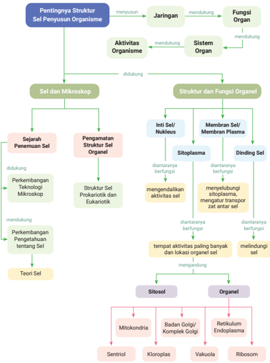

> **Deskripsi Visual:** Gambar ini adalah diagram yang menunjukkan struktur dan fungsi sel dan organisme. Diagram ini dibagi menjadi dua bagian utama: "Struktur Sel dan Mikroskop" dan "Struktur dan Fungsi Organel". Pada bagian pertama, ada penjelasan tentang sejarah penemuan sel, pengamatan struktur sel, perkembangan teknologi mikroskop, dan teori sel. Bagian kedua menggambarkan struktur sel prokariotik dan eukariotik, termasuk inti sel/nukleus, membran sel/membran plasma, sitoplasma, dinding sel, sitosol, mitokondria, badan Golgi/ kompleks Golgi, retikulum endoplasmatis, sentriol, kloroplas, vakuola, dan ribosom.

Elemen-elemen utama yang ditampilkan dalam diagram ini meliputi struktur sel dan organisme, aktivitas organisme, sistem organ, dan struktur dan fungsi organel. Relasi antara elemen-elemen ini sangat jelas, dengan struktur sel dan organisme sebagai dasar yang mendukung aktivitas organisme, yang kemudian mendukung sistem organ, yang terdiri dari struktur dan fungsi organel seperti inti sel/nukleus, membran sel/membran plasma, sitoplasma, dinding sel, sitosol, mitokondria, badan Golgi/ kompleks Golgi, retikulum endoplasmatis, sentriol, kloroplas, vakuola, dan ribosom.

Teks, angka, atau label penting yang terlihat dalam diagram ini mencakup penjelasan tentang sejarah penemuan sel, perkembangan teknologi mikroskop, dan teori sel. Angka-angka dan label penting lainnya mencakup struktur sel dan organisme, aktivitas organisme, sistem organ, dan struktur dan fungsi organel.

Informasi kunci yang dapat diambil pembaca meliputi pentingnya struktur sel dan organisme dalam mendukung aktivitas organisme, serta struktur dan fungsi organel dalam mendukung sistem organ. Diagram ini juga memberikan gambaran tentang perkembangan pengetahuan tentang sel dan organisme, serta peran teknologi mikros

 

---
## 📄 Halaman 20

---
**🖼️ Gambar/Diagram**

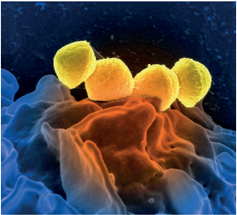

> **Deskripsi Visual:** Gambar ini adalah ilustrasi yang menunjukkan struktur tubuh manusia, mungkin bagian dari sistem pencernaan atau reproduksi. Gambar ini memperlihatkan beberapa elemen utama seperti otot-otot yang tampak bergerak, jaringan yang tampak berwarna merah, dan sel-sel yang tampak berwarna kuning. Relasi antara elemen-elemen tersebut adalah bahwa otot-otot tampak bergerak untuk mengontrol dan memindahkan jaringan dan sel-sel lainnya. Teks, angka, atau label penting yang terlihat tidak ada dalam gambar ini. Informasi kunci yang dapat diambil pembaca adalah bahwa gambar ini mungkin digunakan untuk membantu pemahaman tentang struktur dan fungsi organ tubuh manusia.

Sumber: CC 01/ US National Institute of Allergy and Infectious Diseases (2022)

Tahukah Kalian, Gambar 1.1 itu  gambar apa? Gambar 1.1 adalah mikrograf (gambar yang diambil melalui mikroskop) sel Streptococcus pyogenes (berwarna  kuning)  yang  berada  di  permukaan  sel  darah putih/neutrofil (berwarna biru).

Berdasarkan jumlah sel penyusunnya, apakah Streptococcus pyogenes tersebut  termasuk  organisme  uniseluler  atau  multiseluler? Berdasarkan keberadaan membran inti sel, apakah bakteri termasuk organisme prokariotik atau eukariotik?

Gambar  1.1  merupakan  hasil  pemindaian  mikroskop  elektron ( Scanning Electron Microscope /SEM) ( https://phil.cdc.gov/details. aspx?pid=10068 ). Penggunaan SEM untuk mengamati bakteri menjadi pilihan para ilmuwan di laboratorium riset. Dapatkah Kalian memeroleh visualisasi gambar Streptococcus pyogenes dengan resolusi gambar seperti Gambar 1.1 jika melakukan pengamatan menggunakan mikroskop cahaya? Mengapa demikian?

Bagaimana jika objek pengamatan Kalian adalah sel hewan dan sel tumbuhan, apakah struktur sel dan organel sel dari sel hewan dan sel tumbuhan dapat Kalian amati dengan jelas menggunakan mikroskop cahaya? Mengapa demikian?

 

---
## 📄 Halaman 21

Ingatlah kembali materi sel sewaktu Kalian belajar Ilmu Pengetahuan Alam di Kelas VIII SMP. Pemahaman Kalian tentang materi sel tersebut serta keterampilan menggunakan mikroskop diperlukan sebagai dasar untuk mempelajari materi sel di bab ini. Namun, jika Kalian masih perlu memahami kembali pengantar materi sel dan prosedur pengamatan sel menggunakan mikroskop, ayo lakukan Aktivitas 1.1 , 1.2 , dan 1.3 !

### A.  Pengamatan Struktur Sel

Kita tahu bahwa semua organisme terdiri atas sel. Diketahui bahwa ada berbagai  jenis  organisme,  namun  demikian  komponen  dasar  sel  yang membentuk organisme relatif sama. Apa komponen dasar yang dimiliki sel tersebut? Selain itu, ukuran sel, yang disebut sangat kecil  (mikroskopis), adalah  karakteristik  lain  yang  umumnya  terkait  dengan  sel.  Apakah begitu? Untuk  menjawab rasa ingin tahumu, ayo kerjakan Aktivitas 1.1!

---
**🖼️ Gambar/Diagram**

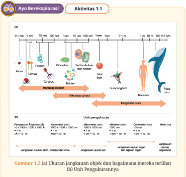

> **Deskripsi Visual:** Gambar 1.2 adalah diagram yang menunjukkan ukuran jangkauan objek dan bagaimana mereka terlihat dalam skala mikroskop dan makroskop. Diagram ini dibagi menjadi dua bagian:

1. Bagian (a) menunjukkan ukuran jangkauan objek dalam satuan nanometer (nm), mikrometer (µm), milimeter (mm), sentimeter (cm), meter (m), dan kilometer (km). Jangkauan ini mencakup dari atom hingga manusia dan paus.

2. Bagian (b) menggambarkan unit pengukurannya, mulai dari nanometer, mikrometer, millimeter, sentimeter, meter, dan kilometer. Setiap unit memiliki ukuran yang berbeda-beda untuk memperlihatkan perbedaan jangkauan objek.

Elemen-elemen utama dalam gambar ini meliputi:
- Gambaran objek dari atom hingga manusia dan paus.
- Ukuran jangkauan objek dalam satuan nanometer, mikrometer, mm, cm, m, dan km.
- Unit pengukuran seperti nanometer, mikrometer, mm, cm, m, dan km.
- Konteks ukuran jangkauan objek dalam skala mikroskop dan makroskop.

Informasi kunci yang dapat diambil pembaca meliputi:
- Ukuran jangkauan objek dari atom hingga manusia dan paus dalam satuan nanometer, mikrometer, mm, cm, m, dan km.
- Penggunaan unit pengukuran seperti nanometer, mikrometer, mm, cm, m, dan km untuk menunjukkan perbedaan jangkauan objek.
- Konteks ukuran jangkauan objek dalam skala mikroskop dan makroskop.

 

---
## 📄 Halaman 22

Gambar  1.2  menunjukkan  perbandingan  kisaran  ukuran  objek pengamatan  (mulai  dari  atom  sampai  dengan  pohon  pinus raksasa),  alat  untuk  mengamati objek yang diamati (mikroskop elektron, mikroskop cahaya, dan mata), serta satuan unit pengukuran. Setelah Kalian mengamati Gambar 1.2, coba diskusikan hal-hal berikut  dengan anggota  kelompokmu!

- Objek  pengamatan  yang  tidak  dapat  diamati  menggunakan mikroskop cahaya.
- Objek pengamatan yang dapat diamati tanpa menggunakan mikroskop.
Jika  Kalian  telah  menemukan  jawaban  dari  masalah  tersebut, tuliskan  jawabannya  pada  buku  latihan.  Kemukakan  jawaban kelompok Kalian pada saat diskusi kelas!

Selanjutnya, untuk memastikan pemahaman Kalian tentang kisaran ukuran sel organisme, coba kerjakan Latihan 1.1 secara mandiri!

### Latihan 1.1

Berilah  tanda  centang  (√)  di  kotak  jawaban  benar  atau    salah sesuai pernyataan berikut!

---
**📊 Tabel**

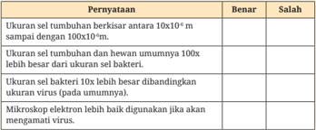

Tabel ini membahas pernyataan tentang ukuran sel dan virus, dengan topik utama adalah perbandingan ukuran sel tumbuhan, hewan, dan manusia dengan ukuran sel bakteri, serta perbandingan ukuran sel bakteri dengan virus. Kolom "Benar" menunjukkan bahwa pernyataan tersebut benar, sedangkan kolom "Salah" menunjukkan bahwa pernyataan tersebut salah. Data penting yang terlihat adalah bahwa ukuran sel tumbuhan, hewan, dan manusia umumnya lebih besar dari ukuran sel bakteri, dan ukuran sel bakteri lebih kecil dibandingkan dengan ukuran virus. Selain itu, mikroskop elektron lebih baik digunakan untuk mengamati virus karena ukurannya sangat kecil.

Berdasarkan  Aktivitas  1.1,  Kalian  mengetahui  bahwa  ukuran  sel memang 'sangat kecil', dan tentu saja komponen-komponen penyusun sel tersebut juga berukuran sangat kecil. Ukuran sel yang sangat kecil

 

---
## 📄 Halaman 23

merupakan salah satu hal yang menyebabkan peneliti di bidang Sitologi menghadapi berbagai kesulitan ketika meneliti sel.

Apakah Kalian tahu apa yang dimaksud dengan sitologi? Sitologi adalah cabang Biologi yang terkait struktur dan fungsi sel (Scott, 2009).

Sebuah  sel  perlu  diamati  strukturnya,  sel  juga  perlu  diketahui komposisi molekulnya. Diperlukan berbagai metode untuk memahami sel  dengan  baik,  benarkah  demikian?  Untuk  lebih  memahami  hal tersebut, mari kita jelajahi Aktivitas 1.2!

Ayo Bereksplorasi

Aktivitas 1.2

### Kerjakan  tugas    berikut  dengan  bekerja  sama  bersama kelompok belajarmu!

Sitologi  menjadi  salah  satu  ilmu  yang  semakin  penting  di  abad ke-21.  Mengapa sitologi menjadi salah satu cabang ilmu biologi yang  semakin  penting?  Untuk  mengetahuinya,  Kalian  dapat membaca  artikel  terkait  hasil penelitian di bidang  sitologi. Salah satu contoh artikelnya yang tampak di Gambar 1.3. Untuk membaca  detail  artikel  ini  silahkan  Kalian  mengakses  tautan: http://ringkas.kemdikbud.go.id/PemeriksaanSitologi . Artikel tersebut meng  informasi  kan  bahwa beberapa peneliti di Indonesia mengaplikasikan  konsep  di  bidang  sitologi  untuk  mendeteksi kanker secara dini.

 

---
## 📄 Halaman 24

Jawablah pertanyaan-pertanyaan berikut  dengan tepat  berdasarkan artikel tersebut!

- Tuliskan judul artikel yang Kalian baca dan sumber artikelnya!
- Setelah  membaca  artikel  tersebut,  menurut  Kalian  apakah para peneliti menggunakan satu metode atau beragam metode ketika melakukan penelitian di bidang sitologi?.
- Lakukan aktivitas ini dengan teman-teman dalam kelompok Kalian.  Kemukakan  jawaban  kelompok  Kalian  pada  saat diskusi kelas!
Beberapa  metode  yang  digunakan  peneliti  untuk  mengkaji  sel. Metode-metode tersebut memiliki keunggulan dan kelemahan masingmasing. Beberapa metode yang digunakan peneliti di bidang sitologi untuk mempelajari sel adalah 1) metode mikroskopi, 2) metode biakan sel,  3)  metode  fraksinasi  sel  dan  isinya,  4)  teknik  DNA  Rekombinan, dan 5) metode pelacakan molekuler seluler dengan radio-isotop dan antibodi (Subowo, 2006).

Metode pengamatan menggunakan mikroskop, atau dikenal dengan  istilah  metode  mikroskopi  adalah  salah  satu  metode  yang dapat digunakan oleh Kalian untuk memahami sel. Menurut Kalian, apakah  kesulitan  yang  dihadapi  ketika  menggunakan  mikroskop untuk  mengamati  sel?  Apakah  Kalian  dapat  mengamati  struktur  sel menggunakan mikroskop yang ada di laboratorium sekolah? Apakah struktur  sel  yang  Kalian  amati  menggunakan  mikroskop  tersebut terlihat sama jelasnya seperti Gambar 1.1? Mengapa demikian?

Mikroskop yang digunakan peneliti di bidang sitologi umumnya adalah mikroskop elektron. Sebelumnya ada dua jenis mikroskop elektron  yang  umum  digunakan,  yaitu Transmission  Electron Microscope (TEM)  dan Scanning  Electron  Microscope (SEM). Sekarang ini dikenal Scanning Probe Microscopes (SPM). SPM ini diketahui memberikan visualisasi gambar dengan resolusi yang lebih baik dibanding mikroskop elektron dan perbesaran sampai 100.000.000x (Bruslind, 2019).

 

---
## 📄 Halaman 25

Perhatikan Gambar 1.4 dengan saksama, masih ingatkah Kalian dengan  ragam  jenis  mikroskop  tersebut?  Berdasarkan  Gambar 1.4  adakah  jenis  mikroskop  yang  digunakan  oleh  Kalian  di laboratorium sekolah? Masih ingatkah Kalian bagaimana menggunakan mikroskop dengan benar? Jika Kalian masih ingat Kalian  dapat  langsung  melakukan  Aktivitas  1.5.  Namun,  jika Kalian  masih  perlu  memperkuat  keterampilan  menggunakan mikroskop, lanjutkan dengan Aktivitas 1.3 dan Aktivitas 1.4.

### Gambar 1.4 Mikroskop Elektron dan Mikroskop Cahaya

Sumber:  (a) commons.wikimedia.org/ Pavlina Jachimova (2017);  (b) commons. wikimedia.org/Les Chatfield (2014);  (c) commons.wikimedia.org/Blythwood (2016)

Ayo Bereksplorasi

Aktivitas 1.3

Carilah informasi tentang perbesaran dan resolusi gambar yang dihasilkan  oleh  jenis  mikroskop  pada  Gambar  1.4!  Gunakan literatur yang dapat Kalian baca melalui internet atau di perpustakaan,  jangan  lupa  catat  sumber  literaturnya!    Adapun salah    satu  contoh  tautan  literatur  yang  dapat  digunakan  oleh Kalian untuk mengetahui ragam jenis mikroskop yang digunakan sekarang ini pada tautan https://open.oregonstate.education/ generalmicrobiology/chapter/microscopes/

 

---
## 📄 Halaman 26

### Aktivitas 1.4

### Mengenal Bagian dan Fungsi Mikroskop Cahaya di Laboratorium Sekolah

### Judul Kegiatan:

Mengenal bagian dan fungsi mikroskop cahaya di laboratorium sekolah.

### Tujuan:

- Mengidentifikasi berbagai bagian mikroskop cahaya.
- Menggunakan mikroskop cahaya untuk mengamati struktur sel  pada  preparat  awetan  yang  tersedia  di  laboratorium sekolah.

### Alat dan Bahan:

- Mikroskop
- Preparat awetan sel (contoh: preparat awetan jaringan epitel)
- Alat tulis dan buku gambar

### Prosedur:

- Perhatikan  demonstrasi  penggunaan  mikroskop  yang  akan dilakukan oleh bapak/ibu guru!
- Tuliskan  pertanyaan  yang  ingin  Kalian  tanyakan  terkait penggunaan  mikroskop  dan  sampaikan  kepada  ibu/bapak guru!
- Catatlah nama bagian-bagian mikroskop dan fungsinya sesuai dengan penjelasan yang diberikan!
- Selanjutnya,  Kalian  harus  mempraktikkan  cara  membawa, menyimpan  dan  menggunakan  mikroskop  dengan  benar. Ingat kembali hal yang ditunjukkan bapak/ibu guru pada saat demonstrasi di awal (No.1)!
- Kalian dapat mengunjungi tautan berikut untuk menguatkan pengetahuan prosedural Kalian dalam menggunakan mikroskop: https://virtuallabs.nmsu.edu/

 

---
## 📄 Halaman 27

Sewaktu  di  SMP  Kalian  sudah  dilatih  menggunakan  mikroskop cahaya. Gunakan pengetahuan dan keterampilan Kalian dalam menggunakan mikroskop di  Aktivitas 1.5 dan 1.6.

### Membuat Rancangan Kegiatan Praktikum untuk Membandingkan Struktur Sel Organisme yang Berbeda

Lakukan Aktivitas 1.5 bersama teman-teman dalam satu kelompok. Diskusikan rancangan praktikum untuk Aktivitas 1.5 ini. Selanjutnya, jawablah pertanyaan-pertanyaan berikut untuk memandu Kalian membuat rancangan praktikum!

- Identifikasi  dan  rumuskan  pertanyaan  terkait  struktur  sel yang dapat Kalian jawab melalui penyelidikan.
- Identifikasi alat dan bahan yang diperlukan untuk melakukan penyelidikan.
- Tuliskan secara rinci tahap penyediaan bahan (spesimen sel) yang akan diamati serta penggunaan alat yang dibutuhkan.
- Buatlah diagram alur tahapan penyelidikan yang akan dilakukan.
- Konsultasikan  rancangan  praktikum  Kalian  kepada  Bapak/ Ibu Guru!
Jika  sudah  mendapat  masukan  dan  persetujuan  dari  Bapak/Ibu Guru, mari lakukan percobaan tersebut di laboratorium seperti  yang tersaji dalam Aktivitas 1.6.

### Melaksanakan dan Melaporkan Kegiatan Praktikum Pengamatan Struktur Sel

Setelah alat dan bahan siap, diagram alur tahapan penyelidikan dipahami, maka lakukanlah kegiatan penyelidikan struktur sel. Sajikan hasilnya dalam bentuk laporan praktikum.

 

---
## 📄 Halaman 28

- Lakukan penyelidikan dengan cermat.
- Buatlah tabel hasil pengamatan yang diperlukan
- Selanjutnya,  siapkan  dokumentasi  dari  hasil  pengamatan (gambar/foto/rekaman video).
- Diskusikan hasil penyelidikan yang dilakukan dengan gurumu, termasuk  kesulitan  yang  dihadapi  pada  saat  melakukan kegiatan penyelidikan.
- Interpretasi data yang diperoleh dan komunikasikan hasilnya dalam diskusi kelas.
- Buatlah laporan praktikum secara berkelompok.
Struktur  sel  yang  Kalian  amati  melalui  Aktivitas  1.4,  1.5,  dan  1.6 menggunakan  mikroskop  cahaya,  sebenarnya  baru  sebagian  dari keseluruhan  struktur  sel.  Mengapa  demikian?  karena  terbatasnya perbesaran dan resolusi gambar yang dihasilkan mikroskop cahaya.

Unit/komponen struktur sel organisme yang mudah teridentifikasi ketika pengamatan dilakukan menggunakan mikroskop cahaya adalah membran plasma/membran permukaan sel, sitoplasma,  dan  inti  sel. Membran plasma, sitoplasma dan inti sel diketahui merupakan tiga unit utama dari struktur sel setiap organisme (Thibodeau & Patton, 2000).

i Ayo Mengingat Kembali

Masih ingatkah Kalian tentang membran sel, sitoplasma, dan inti sel?  Coba  ingat  kembali  materi  Pengantar  Sel  di  buku  IPA  SMP Kelas VIII. Bagaimanakah struktur dan fungsi dari unit/komponen sel tersebut?

 

---
## 📄 Halaman 29

### B. Keterkaitan antara Struktur dan Fungsi Sel

---
**🖼️ Gambar/Diagram**

> **Deskripsi Visual:** Gambar ini menunjukkan seorang perempuan sedang membaca buku di luar. Perempuan tersebut memakai pakaian putih dan mengenakan kacamata hitam. Buku yang dibacanya tampak berwarna putih dengan tulisan merah dan hijau. Di sekitar perempuan, terlihat daun-daun hijau yang menutupi bagian-bagian tanah. Gambar ini menunjukkan aktivitas belajar atau pengetahuan yang dilakukan oleh individu.

Sumber: Pexels/Min An (2018)

Perhatikan  Gambar  1.5  dengan  saksama.  Ketika  Kalian  melakukan aktivitas serupa dengan Gambar 1.5,  yaitu membaca, apakah Kalian menyadari  bahwa  mata  sedang  berfungsi?  Otak  sedang  digunakan untuk berpikir dan memahami kalimat demi kalimat yang Kalian  baca?

Umumnya  Kalian  sadar  bahwa  ada  organ  tubuh,  yaitu  mata dan  otak  sedang  berfungsi  mendukung  aktivitas  membaca.  Namun, sadarkah Kalian bahwa aktivitas mata dan otak tersebut terjadi atas dukungan berbagai jenis sel yang ada di setiap organ tersebut. Benarkah aktivitas suatu organ didukung oleh beragam sel dengan struktur yang berbeda? Apakah setiap sel tersebut memiliki fungsi yang sama? Untuk mengetahui jawabannya, mari lakukan Aktivitas 1.7 berikut.

Ayo Bereksplorasi

Aktivitas 1.7

### Memahami Keterkaitan antara Struktur dan Fungsi Sel

Coba  perhatikan  Gambar  1.6  dengan  saksama.  Pahami  juga informasi di bagian keterangan gambarnya. Apakah Kalian ingat bagian mata yang disebut retina? Terdiri dari sel apa retina mata? Apakah fungsi  sel  penyusun retina mata  sama atau berbeda?

 

---
## 📄 Halaman 30

---
**🖼️ Gambar/Diagram**

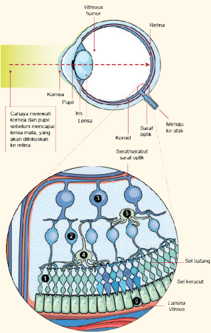

> **Deskripsi Visual:** Gambar ini adalah ilustrasi yang menunjukkan struktur mata manusia. Ilustrasi ini memperlihatkan bagian-bagian mata yang terdiri dari lensa, retina, iris, dan lain-lain. Lensa berada di bagian depan dan berfungsi untuk mengubah bentuk cahaya menjadi bentuk yang lebih besar dan jelas. Iris berada di bagian tengah dan berfungsi untuk mengatur jumlah cahaya yang masuk ke mata. Retina berada di bagian belakang dan berfungsi untuk menerima cahaya dan mengubahnya menjadi sinyal elektronik yang kemudian dikirim ke otak. Ilustrasi ini juga menunjukkan struktur sel-sel mata seperti sel-sel retinoblastoma dan sel-sel pigmentosa. Sel-sel ini berfungsi untuk membantu mata dalam proses pengambilan cahaya dan pengolahan sinyal elektronik.

### Keterangan:

- Fotoreseptor ,  meliputi dua jenis sel: sel batang dan sel kerucut.
- Sel bipolar ,  bertanggung jawab untuk mentransmisikan sinyal dari fotoreseptor ke sel ganglion retina.
- Sel  ganglion  retina ,  menyampaikan  sinyal  dari  sel  bipolar  dan amakrin ke otak melalui juluran panjang yang disebut akson yang membentuk saraf optik.
- Sel  horizontal ,  mengatur  sinyal  yang  muncul  dari  beberapa  sel batang dan sel kerucut.
- Sel amakrin , mencapai beberapa sel bipolar untuk mengatur sinyal yang diarahkan ke sel ganglion retina.
- Epitel  pigmen  retina , Lapisan epitel yang terletak di  bawah fotoreseptor.  Lapisan  ini  membentuk  penghalang  pembuluh  darah di  koroid  dan  membersihkan  zat  berbahaya  yang  dilepaskan  oleh fotoreseptor sebagai respons terhadap cahaya.
(Holmes, 2018)

 

---
## 📄 Halaman 31

Setelah  Kalian  mempelajari  Gambar  1.6,  jawablah  pertanyaanpertanyaan berikut dengan tepat!

- Ada berapa jenis sel yang mendukung retina mata? Sebutkan!
- Apakah fungsi dari setiap sel tersebut sama atau berbeda?
Sel-sel yang membentuk retina mata pada Gambar 1.6 bekerja terusmenerus sesuai dengan fungsinya. Keberadaan sel-sel ini merupakan salah satu nikmat besar dari Tuhan  Sang Pencipta. Hal ini tentunya harus disyukuri oleh setiap makhluk  yang diciptakannya, termasuk Kalian tentunya.

Masih ingatkah Kalian tentang spesialisasi sel, khususnya sel-sel penyusun  organisme  multiseluler?  Kalian  mempelajari  tentang spesialisasi sel di SMP Kelas VIII. Sel yang mengalami spesialisasi memiliki struktur yang khas untuk menunjang fungsinya. Coba Kalian ingat kembali sel saraf, sel darah merah, sel stomata, dan sel akar rambut, apakah struktur sel-sel tersebut sama atau berbeda? Apakah fungsi dari setiap sel tersebut sama atau berbeda? Adakah keterkaitan antara struktur dan fungsi sel?

Setiap sel penyusun organisme memiliki fungsi tertentu. Beberapa sel bertanggung jawab terhadap kelangsungan fungsi tubuh organisme. Spesialisasi fungsi tersebut biasanya  didukung  oleh  struktur  sel penyusunnya, benarkah demikian? Sebagai contoh, sel-sel  penyusun jaringan otot organ jantung diketahui merupakan sel-sel yang memiliki organel mitokondria dalam jumlah yang banyak (Thibodeau & Patton, 2000).  Adakah  hubungan  antara  spesialisasi  struktur  sel  tersebut dengan fungsi sel nya? Untuk mengetahui hubungan antara struktur dan fungsi sel lakukan Aktivitas 1.8!

 

---
## 📄 Halaman 32

Ayo Bereksplorasi

### Baca  dan  pelajari  intisari  penelitian  yang  dilakukan  peneliti berikut!

### Intisari

Jantung  sebagai  bagian  dari  sistem  peredaran  darah  berperan penting  dalam  menjaga  homeostasis.  Peran  tersebut  didukung oleh sel-sel  otot  jantung  penyusunnya.  Fokus  penelitian  ini  adalah mempelajari peran spesifik salah satu organel sel otot jantung yaitu mirokondria.  Mitokondria  merupakan  organel  penghasil  energi dalam  bentuk Adenosin  Trifosfat (ATP).  Energi  tersebut  dihasilkan melalui proses respirasi aerobik (memerlukan  oksigen), lebih tepatnya  pada  tahap  fosforilasi  oksidatif  atau  transpor  membran. Gangguan yang terjadi pada mitokondria dapat mengganggu tahap tersebut sehingga menghasilkan reactive oxygen species (ROS) yang berlebihan, berkurangnya produksi energi, dan terjadinya penyakit kardiovaskular. Oleh karena itu, biogenesis mitokondria yang kualitasnya terkontrol sangat penting untuk kesehatan jantung.

Mitokondria menghasilkan lebih dari 90% ATP yang dibutuhkan jaringan jantung. Meningkatnya jumlah mitokondria yang memiliki fungsi  abnormal  teridentifikasi  pada  berbagai  penderita  penyakit jantung.

### Referensi

Tahrir, F.G., Langford, D., Amini, S., Ahooyi, T.M., and Kamel, K. (2019). Mitochondrial Quality Control in Cardiac Cells: Mechanisms and Role in  Cardiac  Cell  Injury  and  Disease . J.Cell  Physiol .  234(6):  8122-8133. doi:10.1002/jcp.27597

### Tautan artikel asli dapat ditelusuri di tautan berikut:

https://www.ncbi.nlm.nih.gov/pmc/articles/PMC6395499/

Setelah Kalian membaca dan mempelajari intisari artikel penelitian tersebut,  jawablah pertanyaan-pertanyaan berikut!

- Apakah mitokondria dalam sel-sel otot jantung sangat penting untuk mendukung fungsi organ jantung? Jelaskan!
- Sebutkan  informasi  apakah  yang  memperkuat  dugaan  bahwa mitokondria  yang  terkandung  dalam  sel-sel  jantung  memiliki fungsi yang sangat penting!

 

---
## 📄 Halaman 33

Berdasarkan  intisari  penelitian  tersebut  diketahui  bahwa  jumlah mitokondria  yang  banyak  di  dalam  sel-sel  jantung  berperan  penting dalam menyuplai energi yang diperlukan oleh organ jantung. Adakah contoh  lain  yang  dapat  menjelaskan  hubungan  antara  struktur  sel dengan fungsinya? Perhatikan Gambar 1.7, bagaimanakah hubungan antara struktur sel sperma dengan fungsinya?

Sumber: commons.m.wikimedia.org/Ajay Kumar Chaurasiya (2021)

Setiap  spesies  memiliki  struktur  sel  sperma  yang  hampir  sama namun  ukurannya cenderung berbeda (Garner & Hafez dalam Susilawati, 2011). Lebih lanjut dikemukakan bahwa struktur sel sperma memanjang, terdiri dari bagian kepala sel sperma yang di dalamnya terdapat inti sel, bagian leher dan ekor. Inti bagian tengah ekor bersama dengan seluruh bagian ekor sperma membentuk aksonema. Aksonema tersebut  dikelilingi  oleh  mitokondria-mitokondria  penghasil  energi. Energi  tersebut  yang  digunakan  untuk  mendukung  pergerakan  sel sperma.

### C. Komposisi Sel

Semua sel penyusun organisme memiliki membran plasma, sitoplasma dan inti sel (Thibodeau & Patton, 2000). Sebelumnya, masih ingatkah Kalian struktur dan fungsi dari tiga unit/komponen dasar struktur sel tersebut? Untuk mengingat lagi struktur dan fungsi membran plasma, sitoplasma, dan inti sel, coba pelajari kembali melalui Aktivitas 1.9!

 

---
## 📄 Halaman 34

### Ayo Bereksplorasi

### Aktivitas 1.9

Coba pelajari struktur sel melalui di video Youtube, coba dengan kata  pencarian struktur  dan  organel  sel .  Berdasarkan  video yang kamu dapatkan coba telusuri:

Berdasarkan video tersebut, coba telusuri:

- Benarkah semua sel memiliki membran plasma, sitoplasma, dan inti sel?
- Apakah fungsi dari membran plasma, sitoplasma, dan inti sel?
- Apakah  struktur  membran  plasma,  sitoplasma,  dan  inti  sel sama di setiap sel organisme?

### 1.  Membran Plasma

Seperti sudah Kalian ketahui bahwa membran plasma merupakan salah satu struktur yang penting untuk sel. Bagaimanakah struktur membran plasma? Apa sajakah komponen penyusun membran plasma?

---
**🖼️ Gambar/Diagram**

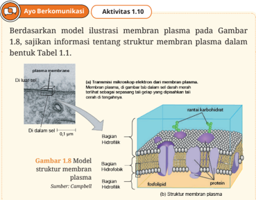

> **Deskripsi Visual:** Gambar ini adalah ilustrasi yang menunjukkan struktur membran plasma. Ilustrasi ini terdiri dari dua bagian utama: (a) Transmisikan mikroskop elektron dari membran plasma, dan (b) Bagian hidrolik dan protein membran plasma.

Elemen utama dalam gambar ini meliputi:
1. Plasma membrane: Dibagi menjadi dua bagian, hidrolik dan protein.
2. Mikroskop elektron: Menunjukkan transmisikan dari membran plasma.
3. Protein: Terletak di bagian hidrolik membran plasma.
4. Lipid: Terletak di bagian hidrolik membran plasma.

Teks, angka, atau label penting yang terlihat dalam gambar ini adalah:
- "plasma membrane"
- "hidrolik"
- "protein"
- "lipid"
- "transmisikan mikroskop elektron"

Informasi kunci yang dapat diambil pembaca dari gambar ini adalah bahwa membran plasma terdiri dari lapisan hidrolik dan protein, dengan transmisikan mikroskop elektron yang menunjukkan struktur internalnya. Ini membantu dalam memahami struktur dan fungsi membran plasma dalam sel.

 

---
## 📄 Halaman 35

---
**📊 Tabel**

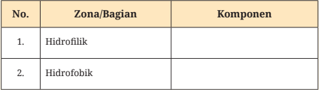

Tabel ini berisi informasi tentang komponen dari dua jenis zon atau bagian geologi: hidroflik dan hidrofobik. Kolom "Zona/Bagian" menunjukkan dua jenis zon atau bagian tersebut, sedangkan kolom "Komponen" menyajikan informasi tentang komponen yang relevan dengan masing-masing zon. Topik utama tabel ini adalah penjelasan tentang struktur dan komposisi geologi hidroflik dan hidrofobik. Data penting yang terlihat adalah bahwa kedua jenis zon memiliki komponen yang berbeda-beda, yang dapat memberikan informasi tentang struktur dan sifat fisika dari masing-masing zon.

Berdasarkan  Gambar  1.8  diketahui  bahwa  membran  plasma  atau membran  sel  merupakan  struktur  pembatas  antara  sitoplasma  dan permukaan luar  sel.  Sampai  saat  ini,  teori  dari  Singer  dan  Nicolson yang  menjelaskan  membran  sel  berdasarkan  model  mosaik  cair ( Fluid  mosaic  model )  yang  diterima  (Subowo,  2006).  Teori  tersebut menjelaskan bahwa membran sel terdiri atas protein yang tersusun seperti  mozaik  (tersebar)  dan  masing-masing  tersisip  di  antara  dua lapis fosfolipid.. Sebagai tambahan referensi untuk  memahami tentang membran plasma, Kalian dapat mendengarkan penjelasannya secara rinci di tautan berikut ini: https://www.genome.gov/geneticsglossary/Plasma-Membrane

### 2.  Sitoplasma

Hampir semua aktivitas sel terjadi di dalam sitoplasma. Apa sajakah aktivitas sel yang terjadi di dalam sitoplasma? Apakah sitoplasma sama di setiap sel organisme?

Masih ingatkah Kalian tentang sitoplasma? Kalian mempelajari tentang sitoplasma pada materi pengantar sel di SMP Kelas VIII. Apa sajakah komponen yang terkandung dalam sitoplasma?

 

---
## 📄 Halaman 36

Jika Kalian lupa tentang struktur dan fungsi sitoplasma, coba lakukan Aktivitas 1.11.

Ayo Bereksplorasi

Aktivitas 1.11

Coba pelajari Sitoplasma melalui di video Youtube, coba dengan kata pencarian virtual plant cell . Berdasarkan video yang kamu dapatkan coba telusuri:

- Apa saja kandungan sitoplasma sel tumbuhan?
- Apakah fungsi sitoplasma sel tumbuhan?
- Apakah kandungan sitoplasma sama di setiap sel organisme?
Bagaimana  dengan  sitoplasma  sel  hewan?  Apakah  kandungan dan fungsi sitoplasma sel hewan sama dengan sel tumbuhan?

Sitoplasma merupakan organisasi kompleks senyawa organik dan an organik bagian eksternal membran inti sel. Sitoplasma ini adalah bagian dari protoplasma yang berada diantara membran plasma dan membran  inti  sel,  meliputi  sitosol  dan  organel  organel  yang  terikat membran. seperti mitokondria dan kloroplas. Apakah yang dimaksud dengan sitosol? berikut adalah penjelasannya.

### a.  Sitosol

Bagian yang berupa cairan dari sitoplasma dikenal dengan istilah sitosol. Sitosol ini adalah matriks cair yang mengelilingi organel-organel yang berada di dalam sel. Seringkali sitosol ini dikatakan sebagai matriks sel, cytomatrix , atau cytoplasmic matrix .

Terdapat karakteristik yang khas dari sitosol atau matriks sel ini. Sitosol digambarkan sebagai struktur yang dinamis. Struktur ini dapat berubah dari cair menjadi gel dan kemudian berubah kembali menjadi cair. Bagaimana hal tersebut dapat terjadi? Apakah sebenarnya fungsi dari sitosol? Bacalah beberapa literatur untuk menjawab pertanyaan tersebut,jangan  lupa  catat  sumber  bacaan  kalian  dan  sampaikan kepada guru.

 

---
## 📄 Halaman 37

### b.  Organel

Sebagian  besar  organel  sel  tidak  dapat  kita  amati  menggunakan mikroskop cahaya.  Untuk  mengetahui  struktur  sel  secara  mendetail, para peneliti menggunakan mikroskop elektron. Unit struktur sel yang dapat diamati menggunakan mikroskop elektron disebut dengan istilah ultrastruktur (Jones dkk., 2008).

Untuk memperkuat pemahaman Kalian sebelumnya tentang organel pelajari Gambar 1.9.

---
**🖼️ Gambar/Diagram**

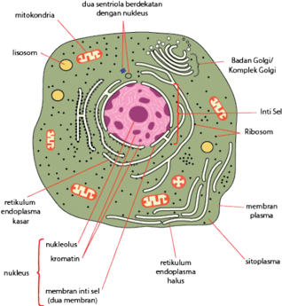

> **Deskripsi Visual:** Gambar ini adalah ilustrasi yang menunjukkan struktur sel. Gambar ini memperlihatkan berbagai komponen sel yang terkait dengan proses metabolisme dan transportasi dalam sel. Komponen utama termasuk inti sel, membran plasma, retikulum endoplasma kasar (ER), sitoplasma, mitokondria, ribosom, dan lysosom. Inti sel berisi nukleolus dan kromatin. ER terdiri dari retikulum endoplasma kasar halus dan retikulum endoplasma kasar. Ribosom terletak di sitoplasma dan menghasilkan protein. Mitokondria berada dekat dengan inti sel dan berfungsi sebagai sumber energi. Lysosom berfungsi untuk membunuh bakteri dan menghancurkan zat-zat yang tidak diperlukan. Teks, angka, atau label penting yang terlihat pada gambar meliputi "mitokondria", "dua sentriolai berdekatan dengan nukleus", "Badan Golgi/Komplek Golgi", "Ribosom", "membran plasma", "sitosplasma", dan "nukleus". Informasi kunci yang dapat diambil pembaca adalah bahwa sel terdiri dari berbagai komponen yang saling terkait dan berfungsi untuk menjalankan berbagai proses metabolisme dan transportasi.

 

---
## 📄 Halaman 38

---
**🖼️ Gambar/Diagram**

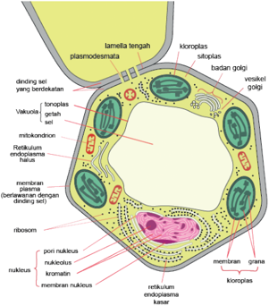

> **Deskripsi Visual:** Gambar ini adalah ilustrasi yang menunjukkan struktur sel tumbuhan. Gambar ini memperlihatkan bagian-bagian sel tumbuhan yang terdiri dari lamella tengah, plasmodesmata, kloroplas, stoliplas, badan golgi, retikulum endoplasmatis, ribosom, nukleus, dan retikulum endoplasmatis halus. Lamella tengah merupakan bagian yang berhubungan dengan plasmodesmata, yang merupakan jaringan sel yang menghubungkan sel-sel tumbuhan. Kloroplas dan stoliplas merupakan bagian dari kloroplast, yang berfungsi untuk fotosintesis. Retikulum endoplasmatis halus dan retikulum endoplasmatis berfungsi sebagai ruang penyimpanan dan transportasi molekul. Ribosom berfungsi untuk sintesis protein. Nukleus berfungsi sebagai pusat genetik dan regulasi sel. Label pada gambar tersebut memberikan penjelasan tentang fungsi dan struktur setiap bagian sel tumbuhan. Dari gambar ini, kita dapat memahami struktur dan fungsi sel tumbuhan secara umum.

Berdasarkan  Gambar  1.9  Kalian  dapat  melihat  terdapat  organel yang sama sama dimiliki oleh sel tumbuhan dan sel hewan. Namun ada juga organel yang dimiliki hanya oleh salah satu sel tersebut.

### Latihan 1.2

Telusuri organel apa  saja yang  dimiliki oleh sel prokariot dan  eukariot?  Organel  apa  saja  yang  dimiliki  sel  hewan  dan tumbuhan? Lalu, tuliskan jawabannya pada buku catatan Kalian! Untuk mengetahuinya, cermati Tabel 1.2 tentang struktur organel sel dan fungsinya berikut!

 

---
## 📄 Halaman 39

### Tabel 1.2 Struktur Organel Sel dan Fungsinya

(1. Sel prokariot; 2. Sel Palisade, 3. Sel Epitel)

---
**📊 Tabel**

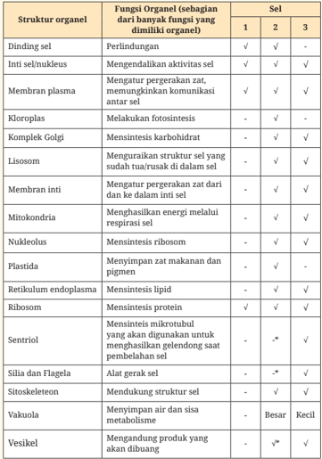

Tabel ini memperlihatkan fungsi-fungsi organel dalam sel, dengan menunjukkan seberapa banyak fungsi yang dimiliki oleh setiap organel. Organel-organel tersebut termasuk inti/nukleus, membran plasma, kloroplas, komplek Golgi, lizosom, mitokondria, nukleolus, plastida, retikulum endoplasmata, ribosom, sentriol, silia dan flagela, sitoskeleton, vakuola, dan vesikel. Organel-organel ini memiliki berbagai fungsi penting dalam sel, seperti perintah sel, mengendalikan aktivitas sel, mempercepat pergerakan zat, melaksanakan fotosintesis, mengatur struktur sel, menghasilkan energi, mensintesis karbohidrat, mengatur pergerakan zat, menghasilkan protein, menghasilkan mikronukleus, menyimpan zat makanan dan pigmen, menghasilkan lipid, menghasilkan mikronukleus, menghasilkan gelenoid saat pembelahan sel, mendukung struktur sel, membentuk vakuola, dan mengandung produk yang akan dibuang. Organel-organel ini saling bekerja sama untuk menjaga keseimbangan dan efisiensi sel.

### Keterangan:

- -*: Umumnya tidak ada        √*: Ada (beberapa)

 

---
## 📄 Halaman 40

Apa  sebenarnya  arti  organel?  seperti  halnya  organisme  yang memiliki  organ-organ  tubuh  dan  memiliki  fungsi  tertentu,  sel  pun memiliki 'organ kecil' yang disebut organel (Kennedy, 2009). Organel memiliki fungsi tertentu. Setiap organel memiliki struktur spesifik yang mendukung fungsinya masing-masing.

Sebagian  besar  organel  sel  tidak  dapat  kita  amati  menggunakan mikroskop cahaya.  Untuk  mengetahui  struktur  sel  secara  mendetail, para peneliti menggunakan mikroskop elektron. Untuk mengetahuinya, mari Kalian lakukan Aktivitas 1.12.

Ayo Bereksplorasi

Aktivitas 1.12

Untuk  mengidentifikasi  ultrastruktur  sel,  Kalian  dapat  mempelajarinya di beberapa situs yang menyediakan layanan mikrograf  elektron.  Jika  akses  internet  tersedia,  Kalian  dapat mencermati mikrograf elektron organel sel melalui tautan: https:// ringkas.kemdikbud.go.id/mikrograf

- Gambarlah  setiap  organel  yang  dapat  Kalian  lihat dari mikrograf elektron yang tersedia!
- Tuliskan  nama  dan  fungsi  dari  organel  yang  telah  Kalian amati!
- Siapkan  tabel  hasil  pengamatan  dan  literatur  pendukung untuk mengetahui fungsi setiap organel!

### 3.  Inti Sel

Masih ingatkah Kalian tentang inti sel? apakah yang dimaksud dengan inti  sel?  apakah  fungsi  dari  inti  sel  tersebut?  Inti  sel  atau  nukleus  pertama kali  ditemukan  dalam  sel  tumbuhan  oleh  Robert  Brown  tahun  1831 (Subowo, 2006). Sel yang tergolong dalam sel eukariotik, mempunyai inti sel yang jelas, karena materi genetik/materi inti diselubungi oleh membran inti. Jika Kalian mengamati inti sel melalui mikroskop maka inti sel biasanya ada di tengah-tengah sel dan dikeliling oleh sitoplasma. Inti  sel  memiliki  anak  inti/nukleolus  dan  membran  inti  (untuk  sel eukariotik).

 

---
## 📄 Halaman 41

### Refleksi

Setelah mempelajari sel melalui berbagai aktivitas di Bab ini, apa saja hal terkait sel yang sudah Kalian pahami? Keterampilan apa saja yang sudah Kalian kuasai? Apakah masih ada materi yang belum  Kalian  pahami?  Apa  yang  akan  Kalian  lakukan  untuk mengatasi permasalahan tersebut?

### Uji Kompetensi

### A. Tuliskan jawaban yang benar untuk setiap pertanyaan berikut!

- Jika gambar yang terlihat saat pengamatan  menggunakan mikroskop cahaya masih buram, apakah komponen mikroskop yang harus Kalian atur agar gambar tampak jelas?
- Apabila  bagian  sel  yang  ditunjuk  mengalami  gangguan  atau bahkan menghilang, jelaskan dampaknya!

---
**🖼️ Gambar/Diagram**

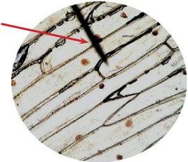

> **Deskripsi Visual:** Gambar ini adalah ilustrasi yang menunjukkan struktur fisik dari sebuah bahan, mungkin batu atau mineral. Gambar ini memperlihatkan berbagai struktur dan tekstur yang terlihat dengan jelas melalui mikroskop. 

1. Apa yang ditampilkan secara keseluruhan: Gambar ini menunjukkan bagian dari suatu bahan yang telah diperbesar melalui mikroskop. Struktur fisik seperti kerut, lubang, dan warna-warna yang berbeda dapat dilihat.

2. Elemen-elemen utama dan relasinya: Terdapat beberapa elemen utama dalam gambar ini, termasuk struktur yang terlihat seperti kerut dan lubang. Relasi antara elemen-elemen ini adalah bahwa mereka membentuk struktur fisik yang unik dari bahan tersebut.

3. Teks, angka, atau label penting yang terlihat: Dalam gambar ini, tidak ada teks, angka, atau label yang terlihat. Namun, ada beberapa elemen yang tampak seperti garis dan titik yang mungkin merujuk pada struktur atau detail tertentu dalam bahan tersebut.

4. Informasi kunci yang dapat diambil pembaca: Gambar ini memberikan gambaran yang baik tentang struktur fisik dari bahan tersebut. Pembaca dapat mengidentifikasi jenis bahan, warna, dan tekstur yang terlihat. Ini bisa membantu dalam penelitian atau penggunaan bahan tersebut dalam aplikasi tertentu.

 

---
## 📄 Halaman 42

- Jaringan sklerenkim merupakan jaringan yang berfungsi menopang  dan  memberikan  bentuk  pada  tumbuhan.  Uraikan organel-organel  sel  apa  saja  yang  berperan  terhadap  fungsi sklerenkim tersebut!

### B. Lengkapi label keterangan struktur sel berikut ini di kotak yang sudah disediakan!

---
**🖼️ Gambar/Diagram**

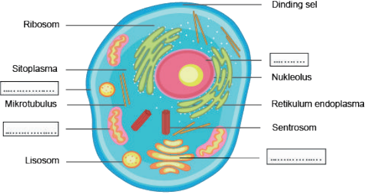

> **Deskripsi Visual:** Gambar ini adalah ilustrasi yang menunjukkan struktur sel eukariotik. Gambar ini memperlihatkan berbagai komponen sel, termasuk ribosom, sitoplasma, nukleolus, mikrotubulus, retikulum endoplasmatis, sentrosom, dan lisosom. Ribosom terletak di bagian depan, sementara sitoplasma melengkapi sel. Nukleolus terletak di tengah, sedangkan mikrotubulus membentuk struktur di sekitarnya. Retikulum endoplasmatis dan sentrosom terletak di sebelah kanan, sedangkan lisosom terletak di bawah. Label-label tersebut memberikan penjelasan tentang setiap komponen sel tersebut. Dengan demikian, gambar ini memberikan gambaran umum tentang struktur sel eukariotik dan bagaimana komponen-komponennya saling terhubung.

 

---
## 📄 Halaman 43

### Pengayaan

Sekarang  ini  perkembangan  ilmu  sangat  pesat.  Perkembangan  ilmu didukung oleh perkembangan penelitian yang mendasarinya, termasuk sitologi yaitu ilmu tentang struktur dan fungsi sel. Berdasarkan berita yang dilansir dari laman Badan Riset dan Inovasi Nasional (BRIN) yang dapat  kamu  akses  melalui  tautan: http://ringkas.kemdikbud.go.id/ BRINTanamanObat diketahui bahwa saat ini teknologi terbaru dalam penelitian sel sangat penting, terutama terkait proses penemuan obat (Gambar 1.12).

### Beranda >Berita

- >Pengujian BerbasisSel,Tahapan Penting Penemuan dan Pengembangan Obat

### Pengujian Berbasis Sel, Tahapan Penting Penemuan dan Pengembangan Obat

Diterbitkanpada24Mei2022

---
**🖼️ Gambar/Diagram**

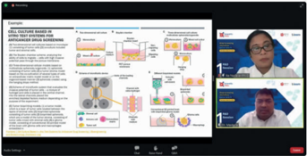

> **Deskripsi Visual:** Gambar ini menunjukkan sebuah presentasi online yang berisi beberapa jenis visualisasi data dan ilustrasi. Di bagian kiri atas, terdapat sebuah diagram yang menunjukkan proses penyebaran virus melalui saluran hidup, dengan warna-warna yang berbeda untuk menunjukkan tahap-tahap penyebaran. Di bawahnya, ada dua ilustrasi yang menunjukkan struktur virus dan bagaimana virus menyerang sel, menggunakan warna-warna yang berbeda untuk menunjukkan komponen-komponennya.

Di bagian tengah, terdapat sebuah diagram yang menunjukkan struktur sel manusia dan bagaimana virus menyerang sel tersebut. Ilustrasi ini menggunakan warna-warna yang berbeda untuk menunjukkan bagian-bagian sel dan bagaimana virus menyerang sel.

Di bagian kanan atas, terdapat sebuah gambar yang menunjukkan bagaimana virus menyerang sel dan bagaimana sel merespons dengan sistem kekebalan tubuh. Gambar ini menggunakan warna-warna yang berbeda untuk menunjukkan bagian-bagian sel dan bagaimana virus menyerang sel.

Teks, angka, atau label penting yang terlihat dalam gambar ini adalah:

1. Diagram tentang proses penyebaran virus melalui saluran hidup.
2. Ilustrasi tentang struktur virus dan bagaimana virus menyerang sel.
3. Ilustrasi tentang struktur sel manusia dan bagaimana virus menyerang sel.
4. Gambar tentang bagaimana virus menyerang sel dan bagaimana sel merespons dengan sistem kekebalan tubuh.

Informasi kunci yang dapat diambil pembaca dari gambar ini adalah tentang bagaimana virus menyebar melalui saluran hidup, bagaimana virus menyerang sel, dan bagaimana sel merespons dengan sistem kekebalan tubuh.

Beranda TentangPPID JDIHSiaran Pers UlasanGaleri Deputi

 

---
## 📄 Halaman 44

Berdasarkan artikel tersebut diketahui bahwa ada penggunaan sel khususnya  sel  punca  kanker  untuk  skrining  obat  kanker.  Diketahui bahwa secara genetik sel punca maupun sel progenitor muncul dari transformasi onkogenik. Menurut Kalian bagaimana potensi riset ini di Indonesia? Apakah ada bidang lain yang dapat juga dikembangkan berdasarkan potensi sel? Apa tantangan yang dihadapi para peneliti di Indonesia ketika menggunakan sel dalam kajiannya?

 

---
## 📄 Halaman 45

Kementerian Pendidikan, Kebudayaan, Riset, dan Teknologi Republik Indonesia, 2022 Biologi untuk SMA/MA Kelas XI Penulis: Rini Solihat, dkk. ISBN: 978-602-427-893-9

### Bab 2 Pergerakan Zat melalui Membran Sel

Tahukah Kalian, bagaimana manusia dapat menambahkan rasa pada makanan yang berasal dari hewan maupun tumbuhan? Bagaimana zat perasa dan zat lainnya dapat masuk maupun keluar dari dan ke dalam sel penyusun jaringan organisme?

Sumber gambar: kawalingpinoy.com/lalaine manalo (2018)

 

---
## 📄 Halaman 46

### Tujuan Pembelajaran

Setelah mempelajari Bab ini, Kalian diharapkan  mampu menjelaskan pergerakan zat melalui membran plasma/membran sel melalui kegiatan penyelidikan.

### Kata Kunci

- Difusi
- Difusi terfasilitasi
- Gradien konsentrasi
- Membran plasma/membran sel
- Osmosis
- Pergerakan zat
- Transpor pasif
- Transpor aktif

 

---
## 📄 Halaman 47

### Peta Konsep

---
**🖼️ Gambar/Diagram**

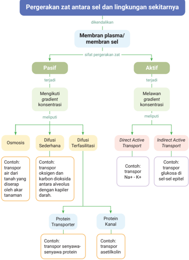

> **Deskripsi Visual:** Gambar ini adalah diagram yang menunjukkan pergerakan zat antara sel dan lingkungan sekitarnya melalui membran plasma atau membran sel. Diagram ini dibagi menjadi dua bagian utama: pergerakan zat pasif dan aktif.

Pada bagian pergerakan zat pasif, ada dua subbagian: osmosis dan difusi. Dalam osmosis, zat bergerak dari tempat dengan koncentrasi tinggi ke tempat dengan koncentrasi rendah melalui membran plasma. Contoh transport air dari tanah yang diserap oleh akar tanaman adalah contoh osmosis. Sedangkan difusi sederhana adalah proses zat bergerak dari tempat dengan koncentrasi tinggi ke tempat dengan koncentrasi rendah tanpa membutuhkan energi. Contoh transport oksigen dioksida dari atmosfer ke darah melalui kapiler adalah contoh difusi terfasilitasi, di mana zat tersebut bergerak melalui protein transporter.

Pada bagian pergerakan zat aktif, ada dua subbagian: direct active transport dan indirect active transport. Direct active transport melibatkan penggunaan energi untuk mengangkut zat dari tempat dengan koncentrasi rendah ke tempat dengan koncentrasi tinggi. Contoh transport Na+ - K+ adalah contoh direct active transport. Indirect active transport melibatkan penggunaan energi lain seperti ATP untuk mengangkut zat dari tempat dengan koncentrasi rendah ke tempat dengan koncentrasi tinggi. Contoh transport glukosa di sel-sel epitel adalah contoh indirect active transport.

Elemen-elemen utama yang ditampilkan dalam diagram ini adalah membran plasma, membran sel, osmosis, difusi sederhana, difusi terfasilitasi, direct active transport, indirect active transport, protein transporter, dan protein kanal. Relasi antara elemen-elemen ini adalah bahwa semua pergerakan zat ini melibatkan membran plasma atau membran sel sebagai pembatas. Osmosis dan difusi adalah pergerakan zat pasif, sedangkan direct active transport dan indirect active transport adalah pergerakan zat aktif. Protein transporter dan protein kanal adalah alat-alat yang digunakan dalam

 

---
## 📄 Halaman 48

Pernahkah  Kalian  makan  manisan  mangga?  Apakah  ada  produk makanan olahan serupa dengan manisan buah mangga seperti Gambar pengantar Bab 2? Apakah Kalian tahu bagaimana cara membuatnya?

Manisan mangga terbuat dari mangga mentah, namun ketika sudah menjadi  manisan,  daging  buahnya  menjadi  lebih  lunak.  Menurut Kalian mengapa demikian? Telusuri literatur tentang cara pembuatan manisan buah atau tanyakan cara membuat manisan tersebut kepada keluarga di rumah. Apa saja tahapan untuk membuat manisan mangga basah? Tahapan manakah yang menyebabkan manisan mangga lebih lunak dan lebih manis? Apakah yang sebenarnya terjadi ketika tahap tersebut dilakukan?

Di  Bab  I  Kalian  mengetahui  bahwa  setiap  unit  sel  organisme diselubungi oleh membran plasma. Salah satu fungsi membran plasma adalah mengendalikan pergerakan zat yang masuk dan keluar  sel.  Fungsi  tersebut  didukung  oleh  struktur  membran plasma, benarkah demikian?

Pergerakan  zat  yang  berupa  molekul  kecil  dan  ion  dari  dalam sel  ke  luar  sel  atau  sebaliknya  terjadi  melalui  membran  plasma. Bagaimanakah keterkaitan antara struktur membran plasma dengan proses  pergerakan  zat?  Mengapa  pertukaran  zat  melalui  membran plasma penting untuk organisme?

Ayo Bereksplorasi

Aktivitas 2.1

Jika Kalian lupa hubungan antara struktur dan fungsi membran plasma, pelajari kembali model struktur membran plasma pada Gambar 2.1 berikut!

 

---
## 📄 Halaman 49

---
**🖼️ Gambar/Diagram**

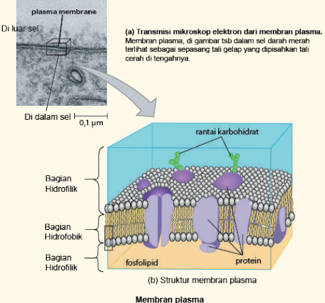

> **Deskripsi Visual:** Gambar ini adalah ilustrasi yang menunjukkan struktur dan fungsi membran plasma. Gambar ini terdiri dari dua bagian: (a) sebuah diagram transmisi mikroskopik elektron dari membran plasma ke dalam sel, dan (b) struktur detil membran plasma.

Pertama, elemen utama dalam gambar adalah membran plasma, yang terdiri dari tiga bagian: bagian hidrofilik, bagian hidrofobik, dan bagian fosfolipid. Bagian hidrofilik mengandung rantai karbohidrat, sementara bagian hidrofobik terdiri dari fosfolipid. Fosfolipid berfungsi sebagai lapisan dasar membran, sementara protein dan rantai karbohidrat berperan dalam transportasi molekul dan interaksi dengan lingkungan eksternal.

Teks penting dalam gambar meliputi deskripsi tentang struktur dan fungsi membran plasma, termasuk bagian-bagian hidrofilik, hidrofobik, dan fosfolipid. Angka 0,1 µm menunjukkan ukuran partikel yang diperlihatkan dalam gambar, yang merupakan ukuran partikel yang sangat kecil dibandingkan dengan ukuran sel.

Informasi kunci yang dapat diambil pembaca adalah bahwa membran plasma memiliki struktur kompleks yang mencakup fosfolipid, protein, dan rantai karbohidrat, serta memainkan peran penting dalam transportasi molekul dan interaksi dengan lingkungan eksternal.

Berdasarkan Gambar 2.1, jawablah pertanyaan-pertanyaan berikut!

- Berdasarkan  kemampuannya  dalam  berikatan  dengan  zat tertentu, ada dua bagian di struktur membran plasma. Bagian apakah yang dimaksud?
- Apa sajakah komponen struktur membran plasma yang dapat Kalian identifikasi di kedua bagian struktur membran?
- Apakah Kalian mengetahui fungsi spesifik dari setiap komponen  struktur  membran  plasma  tersebut?  Jika  belum tahu, Kalian dapat membaca referensi dari sumber pustaka yang lain dan jangan lupa untuk mencatat sumber pustaka tersebut.

 

---
## 📄 Halaman 50

Setelah  melaksanakan  Aktivitas  2.2,  Kalian  sudah  mengetahui bahwa setiap komponen struktur membran plasma diketahui memiliki fungsi yang spesifik. Selain dukungan fungsi spesifik komponen  struktur  membran  tersebut,  adakah  faktor  lain  yang memengaruhi proses transpor zat melintasi membran plasma?

Terdapat  dua  cara  utama  agar  zat  dapat  bergerak  melintasi membran plasma. Sifat pergerakan zat tersebut dibedakan berdasarkan penggunaan  energi  sel  (Jones et  al .,  2007;  Kennedy et al. ,  2009; Thibodeau & Patton, 2000; Morgan & Carter, 2005). Cermati diagram analogi  penggunaan  energi  sel  dalam  pergerakan  zat  berikut  ini, apakah persamaan dan perbedaan dari Gambar 2.2 (a) dan 2.1(b)?

---
**🖼️ Gambar/Diagram**

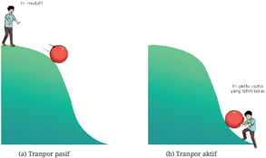

> **Deskripsi Visual:** Gambar ini adalah ilustrasi yang menunjukkan dua jenis transpor: transpor pasif dan transpor aktif. Pada gambar (a), transpor pasif diperlihatkan dengan seorang pria berjalan di tepi sebuah tebing, sementara bola bergerak naik ke atas tebing. Ini menunjukkan bahwa partikel tidak memerlukan energi eksternal untuk bergerak, hanya karena gravitasi. Pada gambar (b), transpor aktif digambarkan dengan seorang pria yang menggunakan tangan untuk memegang bola dan membawanya naik tebing. Ini menunjukkan bahwa partikel memerlukan energi eksternal untuk bergerak, seperti dorongan manusia. Dua elemen utama dalam gambar ini adalah tebing dan bola, dengan relasi bahwa bola bergerak naik tebing melalui transpor pasif atau aktif. Teks, angka, atau label penting yang terlihat pada gambar adalah "transpor pasif" dan "transpor aktif". Informasi kunci yang dapat diambil pembaca adalah bahwa transpor pasif tidak memerlukan energi eksternal, sedangkan transpor aktif memerlukan energi eksternal untuk partikel bergerak.

Apakah  yang  menentukan  digunakan  atau  tidaknya  energi  sel dalam  peristiwa  transpor  zat  melintasi  membran  plasma/membran sel? Apakah ada hubungannya dengan struktur membran plasma yang dilintasi zat? Apakah ada hubungan dengan jenis dan konsentrasi zat yang melintasi membran plasma?

### A. Transpor Pasif

### 1.  Osmosis

Tahukah  Kalian  bahwa  manisan  mangga  dibuat  dari  mangga  muda yang daging buahnya masih keras lalu direndam di dalam air gula? Setelah  beberapa  saat  direndam  dalam  larutan  gula,  daging  buah

 

---
## 📄 Halaman 51

mangga menjadi agak lunak. Apakah lunaknya daging buah mangga yang  diolah  menjadi  manisan  terjadi  karena  perendaman  dalam larutan gula? Mengapa demikian? Apakah terjadi perubahan struktur sel  penyusun  daging  buah  mangga  tersebut  sebelum  dan  sesudah direndam larutan gula?

Untuk mengetahui jawaban dari pertanyaan-pertanyaan tersebut, Kalian dapat merencanakan penyelidikan bersama anggota kelompokmu.  Lakukan  Aktivitas  2.4,  jika  Kalian  sudah  memiliki dugaan sementara terhadap jawaban pertanyaan-pertanyaan tersebut. Namun,  jika  masih  belum  yakin  terhadap  dugaan  sementara  yang Kalian rumuskan, lakukan Aktivitas 2.3 terlebih dahulu.

---
**🖼️ Gambar/Diagram**

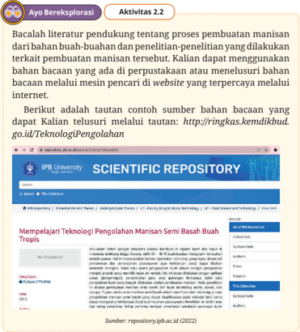

> **Deskripsi Visual:** Gambar ini adalah bagian dari buku pelajaran yang berisi tautan ke situs web untuk mendapatkan contoh bahan bacaan pendukung tentang proses pembuatan manisan dari bahan buah-buahan. Gambar ini menunjukkan tampilan halaman website dengan judul "Scientific Repository" dari IPB University. Di bagian atas, terdapat logo IPB University dan informasi tentang repository yang tersedia. Di bagian tengah, terdapat tulisan "Mempelajari Teknologi Pengolahan Manisan Semi Basah Buah Tropis" yang merupakan judul artikel yang disediakan sebagai sumber bahan bacaan. Di sebelah kanan, terdapat kolom informasi tentang artikel tersebut, termasuk nama penulis, jurnal, dan tahun publikasi. Teks pada gambar ini memberikan informasi bahwa pembaca dapat mencari bahan bacaan pendukung melalui situs web yang disediakan.

 

---
## 📄 Halaman 52

Untuk tautan lain dapat Kalian lihat melalui tautan berikut ini: http://repository.pertanian.go.id/

https://ejournal.undiksha.ac.id/index.php/JJPKK/article/view/22155

Berdasarkan penelusuran Kalian terhadap literatur yang ada, tahapan apa sajakah yang harus dilakukan saat pembuatan manisan  buah?  Apakah  yang  menyebabkan  buah  yang  muda menjadi  lebih  lunak  dan  lebih  manis  ketika  diolah  menjadi manisan?

Berdasarkan  penelusuran  literatur  yang  sudah  dilakukan, selanjutnya kalian merencanakan kegiatan penyelidikan tentang proses yang terjadi ketika pengolahan manisan buah dilakukan. Kalian  sudah  mengetahui ada faktor-faktor yang memengaruhi proses pengolahan manisan buah tersebut. Apa sajakah faktorfaktor  yang  memengrauhi  proses  pengolahan  manisan  buah tersebut? Benarkah terdapat pergerakan zat dari dan keluar dari sel sel penyusun daging buah tersebut ketika pengolahan manisan buah dilakukan?

Ayo Mencoba

Ayo Berkomunikasi

Aktivitas 2.4

Sewaktu  di  SMP  Kalian  telah  mengetahui  bahwa  jika  ingin melakukan aktivitas penyelidikan terdapat tahapan yang harus dipersiapkan.  Jika  kalian  akan  melakukan  penyelidikan  terkait pengolahan  manisan  buah  basah,  apa  sajakah  persiapan  yang harus disiapkan? Variabel apa sajakah yang harus Kalian amati? Bagaimana Kalian akan menyelidikinya?

- Rancanglah penyelidikan bersama dengan teman dalam satu kelompok Kalian di kelas.
- Diskusikan  dan  konsultasikan  rencana  penyelidikan  yang akan Kalian lakukan dengan Bapak/Ibu Guru di kelas.

 

---
## 📄 Halaman 53

---
**📊 Tabel**

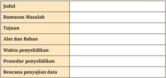

Tabel ini merupakan struktur umum untuk menuliskan prosedur penelitian, yang mencakup berbagai aspek penting seperti judul, rumusan masalah, tujuan, alat dan bahan, waktu penyelidikan, prosedur penelitian, dan rencana penyajian data. Topik utama tabel ini adalah proses penelitian, yang melibatkan pengumpulan informasi dan analisis data untuk mencapai tujuan tertentu. Kolom-kolom yang ada mencakup judul yang akan diisi dengan nama peneliti atau topik penelitian, rumusan masalah yang akan menjelaskan masalah yang ingin diselesaikan, tujuan yang akan menetapkan tujuan penelitian, alat dan bahan yang akan digunakan, waktu penyelidikan yang akan menentukan jangka waktu penelitian, prosedur penelitian yang akan menjelaskan langkah-langkah yang akan dilakukan, dan rencana penyajian data yang akan menentukan cara penulisan hasil penelitian. Pola penting yang terlihat adalah bahwa setiap kolom memiliki informasi yang spesifik dan harus diisi dengan detail untuk mencapai tujuan penelitian.

---
**🖼️ Gambar/Diagram**

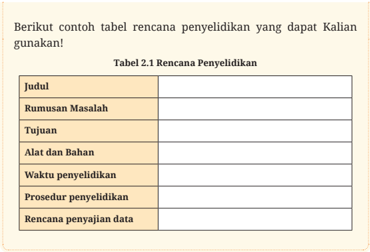

> **Deskripsi Visual:** Gambar ini adalah sebuah tabel yang berisi informasi tentang rencana penelitian. Tabel ini memiliki kolom-kolom berikut:

1. Judul: Kolom ini mungkin berisi judul atau topik utama dari penelitian tersebut.
2. Rumusan Masalah: Kolom ini mungkin berisi pernyataan masalah atau pertanyaan yang ingin dijawab oleh penelitian.
3. Tujuan: Kolom ini mungkin berisi tujuan utama dari penelitian.
4. Alat dan Bahan: Kolom ini mungkin berisi alat atau bahan yang digunakan dalam penelitian.
5. Waktu Penelitian: Kolom ini mungkin berisi tanggal awal dan akhir penelitian.
6. Prosedur Penelitian: Kolom ini mungkin berisi langkah-langkah atau prosedur yang akan dilakukan dalam penelitian.
7. Rekam Jejak Penyajian Data: Kolom ini mungkin berisi cara atau metode yang akan digunakan untuk menyajikan hasil penelitian.

Tabel ini membantu pembaca memahami struktur dan konten umum dari rencana penelitian.

Ayo Mencoba

Aktivitas 2.5

Setelah Kalian menyusun rancangan penyelidikan dan mendapat masukan dari guru Kalian, lakukan penyelidikan Kalian. Penyelidikan  dapat  Kalian  lakukan  di  laboratorium  sekolah dengan bimbingan guru. Bagaimana hasil penyelidikan Kalian? Apakah  yang  Kalian  pahami  dari  hasil  penyelidikan  Kalian terkait konsep transpor zat? Apakah benar transpor zat melintasi membran plasma/membran sel penting untuk organisme?

- Sampaikan temuan Kalian dalam diskusi kelas!
- Buatlah  laporan  hasil  penyelidikan  kelompok  Kalian  secara tertulis!
Setelah  Kalian  melakukan  penyelidikan  tentang  proses  osmosis, pelajari  dengan  cermat  Gambar 2.6 untuk memperkuat pemahaman Kalian!

 

---
## 📄 Halaman 54

---
**🖼️ Gambar/Diagram**

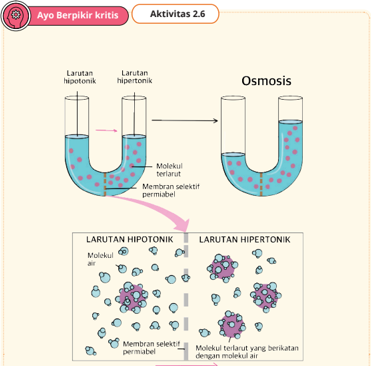

> **Deskripsi Visual:** Gambar ini adalah ilustrasi yang menunjukkan konsep osmosis dalam dua larutan berbeda: larutan hipotonic dan larutan hipertonik. Gambar ini dibagi menjadi dua bagian utama: bagian atas menunjukkan proses osmosis melalui membran selektif permubar, sementara bagian bawah menunjukkan struktur detail dari membran tersebut.

Elemen utama dalam gambar ini termasuk dua larutan berbeda (hipotonic dan hipertonik), molekul-molekul yang terlarut, dan membran selektif permubar. Molekul-molekul dalam larutan hipotonic lebih kecil dan lebih mudah melewati membran, sementara molekul-molekul dalam larutan hipertonik lebih besar dan lebih sulit melewati membran. Membran selektif permubar memiliki lubang yang memungkinkan molekul-molekul air tetapi tidak memungkinkan molekul-molekul yang lebih besar untuk melewati.

Teks, angka, atau label penting yang terlihat dalam gambar ini mencakup penomoran yang menggambarkan tahap-tahap osmosis, warna-warna yang digunakan untuk menunjukkan jenis larutan (biru untuk larutan hipotonik dan merah untuk larutan hipertonik), dan penjelasan tentang struktur membran selektif permubar.

Informasi kunci yang dapat diambil pembaca melalui gambar ini adalah bahwa osmosis adalah proses perpindahan molekul-molekul air dari larutan dengan konduksi yang lebih rendah ke larutan dengan konduksi yang lebih tinggi melalui membran selektif permubar. Proses ini terjadi karena molekul-molekul air lebih kecil dan lebih mudah melewati membran dibandingkan dengan molekul-molekul yang lebih besar.

Berdasarkan Gambar 2.3 jawab pertanyaan berikut ini!

- Bandingkan konsentrasi molekul air dalam tabung U yang terpisah oleh membran semi permiabel. Apakah sama atau berbeda?
- Bagaimana  kecenderungan  air  akan  berpindah  tempat  (potensial air) dalam tabung U tersebut menurut Kalian?
- Sebutkan arah perpindahan molekul air yang terlihat ketika osmosis terjadi!
- Apakah yang terjadi dengan molekul zat terlarut yang ada di dalam tabung U tersebut?
Diskusikan  jawaban  Kalian  tentang  proses  osmosis  ini  dengan  teman dalam satu kelompok di kelas. Sampaikan hasil diskusi Kalian kepada bapak/ibu guru.

 

---
## 📄 Halaman 55

Berdasarkan Gambar 2.3 Kalian dapat melihat bahwa ada pergerakan molekul air. Pergerakan molekul air terjadi karena gerak acak molekul serta kondisi larutan yang konsentrasi larutannya lebih encer  menuju  larutan  yang  konsentrasinya  lebih  pekat.  Pergerakan molekul air melalui membran semi permiabel itulah yang kita kenal sebagai proses osmosis.

Osmosis dikenal sebagai proses yang terjadi di tingkat seluler dalam organisasi  makhluk  hidup.  Bagaimanakah  osmosis  terjadi  dalam  sel hewan  dan  tumbuhan?  Apakah  ada  perbedaan  respons  sel  hewan dan  sel  tumbuhan  terhadap  perbedaan  konsentrasi  zat  terlarut  di lingkungan sekitarnya?

---
**🖼️ Gambar/Diagram**

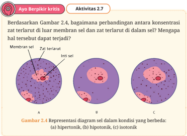

> **Deskripsi Visual:** Gambar 2.4 adalah representasi diagram sel dalam kondisi hipertonik, hipotonic, dan isotonic. Gambar ini menunjukkan tiga situasi berbeda di mana zat terlarut dalam sel (zat terlarut) berada di luar membran sel (membran sel). Pada kondisi hipertonik (gambar A), zat terlarut lebih banyak di luar membran daripada di dalam sel. Kondisi hipotonic (gambar B) sebaliknya, dengan zat terlarut lebih banyak di dalam sel. Sementara itu, kondisi isotonic (gambar C) menunjukkan bahwa koncentrasi zat terlarut sama di luar dan di dalam sel. Label "Membran sel" dan "Zat terlarut" menunjukkan bagian-bagian yang penting dalam penjelasan tentang perbandingan koncentrasi zat terlarut antara luar dan dalam sel. Informasi ini membantu pembaca memahami proses osmotis dan pergerakan zat terlarut dalam sel.

Perbedaan  konsentrasi  zat  terlarut  di  dalam  dan  di  luar  sel menyebabkan  perbedaan  osmolaritas.  Osmolaritas  menggambarkan konsentrasi  total  zat  terlarut  dalam  suatu  larutan.  Tiga  istilah  yang digunakan untuk menjelaskan osmolaritas relatif antar larutan adalah hipertonik, hipotonik dan isotonik. (Morgan & Carter, 2005; Kennedy et al ., 2009).

 

---
## 📄 Halaman 56

Isotonik terjadi jika konsentrasi zat terlarut di lingkungan luar sel sama dengan konsentrasi zat terlarut dalam sel (Kennedy et al ., 2009). Lebih lanjut dikemukakan bahwa hipotonik terjadi jika konsentrasi zat terlarut dalam sel lebih rendah dibandingkan konsentrasi zat terlarut di lingkungan luar sel. Bagaimana dengan hipertonik? Hipertonik terjadi jika  konsentrasi  zat  terlarut  di  dalam  sel  lebih  tinggi  dibandingkan konsentrasi zat terlarut di lingkungan luar sel.

Kalian sudah tahu bahwa osmosis terjadi dalam sel organisme hidup. Untuk  mengetahui  perbedaan  respons  sel  hewan  dan  sel  tumbuhan terhadap perbedaan konsentrasi zat terlarut di lingkungan sekitarnya, ayo lakukan Aktivitas 2.8!

---
**🖼️ Gambar/Diagram**

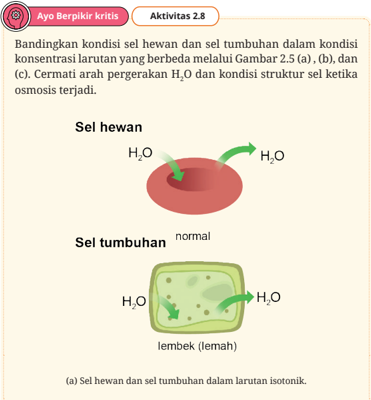

> **Deskripsi Visual:** Gambar ini adalah ilustrasi yang menunjukkan perbedaan struktur dan pergerakan air (H₂O) dalam sel hewan dan sel tumbuhan dalam kondisi larutan isotonik. Ilustrasi ini dibagi menjadi dua bagian: sel hewan di atas dan sel tumbuhan di bawah. Sel hewan memiliki struktur yang lebih jelas dan teratur, dengan air masuk melalui selaput membran. Sedangkan sel tumbuhan tampak lebih lembab dan tidak teratur, dengan air masuk melalui selaput membran yang lebih lemah.

Elemen utama dalam gambar ini adalah sel hewan dan sel tumbuhan, serta pergerakan air melalui selaput membran. Relasi antara elemen-elemen ini adalah bahwa sel hewan memiliki struktur yang lebih jelas dan teratur, sementara sel tumbuhan lebih lembab dan tidak teratur. Air masuk melalui selaput membran pada kedua jenis sel ini, namun jumlah dan kecepatan pergerakan air berbeda.

Teks penting dalam gambar ini adalah penjelasan tentang kondisi larutan isotonik dan perbedaan struktur dan pergerakan air dalam sel hewan dan sel tumbuhan. Angka dan label penting yang terlihat adalah nomor Gambar 2.5(a), (b), dan (c), yang menunjukkan hubungan antara gambar ini dengan gambar lain dalam buku pelajaran.

Informasi kunci yang dapat diambil pembaca adalah bahwa sel hewan dan sel tumbuhan memiliki perbedaan struktur dan pergerakan air yang berbeda dalam kondisi larutan isotonik. Sel hewan memiliki struktur yang lebih jelas dan teratur, sementara sel tumbuhan lebih lembab dan tidak teratur. Air masuk melalui selaput membran pada kedua jenis sel ini, namun jumlah dan kecepatan pergerakan air berbeda.

 

---
## 📄 Halaman 57

---
**🖼️ Gambar/Diagram**

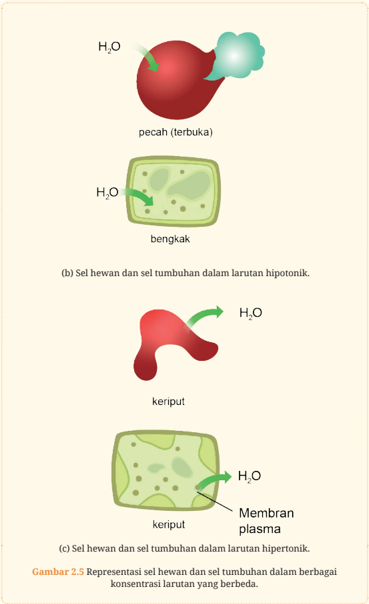

> **Deskripsi Visual:** Gambar ini adalah ilustrasi yang menunjukkan perbedaan reaksi sel hewan dan sel tumbuhan dalam larutan hipotonik dan hipertonik. Gambar ini dibagi menjadi tiga bagian:

1. Bagian pertama (a) menunjukkan sel hewan dan sel tumbuhan yang berada dalam larutan hipotonik. Sel hewan terlihat seperti sebuah bunga merah dengan air mengalir keluar dari sel, sementara sel tumbuhan tampak seperti sebuah bunga hijau dengan air mengalir masuk ke dalam sel.

2. Bagian kedua (b) menunjukkan proses keriput pada sel hewan dan sel tumbuhan. Sel hewan tampak seperti sebuah bunga merah yang mengalami keriput dengan air mengalir keluar dari sel, sementara sel tumbuhan tampak seperti sebuah bunga hijau yang mengalami keriput dengan air mengalir masuk ke dalam sel.

3. Bagian ketiga (c) menunjukkan sel hewan dan sel tumbuhan dalam larutan hipertonik. Sel hewan tampak seperti sebuah bunga merah yang mengalami keriput dengan air mengalir keluar dari sel, sementara sel tumbuhan tampak seperti sebuah bunga hijau yang mengalami keriput dengan air mengalir masuk ke dalam sel.

Teks penting yang terlihat dalam gambar ini adalah "H2O" untuk menunjukkan adanya air dalam proses keriput, "Membran plasma" untuk menunjukkan membran plasma sel, dan "keriput" untuk menunjukkan proses keriput pada sel. Informasi kunci yang dapat diambil pembaca adalah bahwa sel hewan dan sel tumbuhan memiliki reaksi yang berbeda dalam larutan hipotonik dan hipertonik, serta bahwa proses keriput dapat terjadi pada kedua jenis sel tersebut.

 

---
## 📄 Halaman 58

Berdasarkan Gambar 2.5, coba bandingkan kondisi sel tumbuhan dan sel hewan dalam larutan yang memiliki konsentrasi zat terlarut berbeda.Tuliskan jawaban Kalian dalam Tabel 2.2 berikut ini.

---
**📊 Tabel**

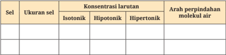

Tabel ini membahas konseptual tentang sel dan larutan isotonic, hipotonic, dan hipertonik. Topik utamanya adalah perbandingan ukuran sel dengan konsentrasi larutan dan arah perpindahan molekul air. Dalam tabel ini, kolom pertama menunjukkan ukuran sel, kolom kedua menunjukkan konsentrasi larutan (isotonik, hipotonic, hipertonik), dan kolom ketiga menunjukkan arah perpindahan molekul air. Data penting yang terlihat adalah bahwa sel isotonic memiliki konsentrasi larutan yang sama dengan larutan luar, sehingga tidak ada perpindahan molekul air. Sel hipotonic memiliki konsentrasi larutan lebih rendah daripada larutan luar, sehingga molekul air bergerak masuk ke dalam sel. Sementara itu, sel hipertonik memiliki konsentrasi larutan lebih tinggi daripada larutan luar, sehingga molekul air bergerak keluar dari sel.

Ayo Bereksplorasi

Ayo Berkomunikasi

Aktivitas 2.9

Untuk  memperkuat  pemahaman  Kalian  tentang  osmosis,  coba cermati  penjelasan  osmosis  di  tautan  berikut https://youtu.be/ SrON0nEEWmo tentang The Naked Egg and Osmosis .  Bagaimana penyelidikan  yang  Kalian  amati?  Apakah  Kalian  tertarik  untuk melakukan penyelidikan serupa dengan yang Kalian simak dalam video tersebut?

- Rumuskan pertanyaan-pertanyaan terkait percobaan osmosis yang  ditunjukkan  dalam  video  yang  ingin  Kalian  ketahui jawabannya.  Pertanyaan-pertanyaan  tersebut  dapat  terkait dengan faktor-faktor yang memengaruhi osmosis.
- Apakah pertanyaan Kalian dapat dijawab dengan melakukan penyelidikan? Gunakan penjelasan dari literatur/bahan bacaan terpercaya yang dapat mendukung pendapat Kalian.
- Pilih  satu  pertanyaan  untuk  diselidiki  jawabannya,  dan konsultasikan kepada bapak/ibu guru di kelas.
- Setelah pertanyaan Kalian terpilih, buatlah rencana penyelidikan untuk menjawab pertanyaan Kalian.
Berikut  contoh  tabel  rencana  penyelidikan  yang  dapat  Kalian gunakan!

 

---
## 📄 Halaman 59

Judul Penyelidikan

Rumusan Masalah

Latar belakang pemilihan masalah

Alat dan Bahan

Prosedur penyelidikan

Rencana penyajian data

Kemungkinan permasalahan yang dihadapi ketika melaksanakan penyelidikan.

- Selanjutnya,  diskusikan  rencana  penyelidikan  yang  sudah Kalian rancang dengan teman dalam satu kelompok, tuliskan tantangan/permasalahan yang mungkin akan Kalian hadapi untuk melakukan rencana penyelidikan tersebut
- Konsultasikan  rencana  penyelidikan  hasil diskusi  dalam kelompok  kepada  Bapak  atau  Ibu  guru.  Sampaikan  alasan Kalian  mengapa  mengambil  keputusan  untuk  melakukan rencana penyelidikan tersebut.
Aktivitas 2.10

- Lakukanlah  penyelidikan  secara  berkelompok  berdasarkan rencana penyelidikan Aktivitas 2.9 yang sudah disetujui oleh guru Kalian.
- Tuliskan  kesulitan  yang  Kalian  hadapi  ketika  melakukan penyelidikan dan konsultasikan kepada ibu atau bapak guru untuk mencari solusinya.
- Buatlah  laporan  tertulis  mengikuti  panduan  penyusunan laporan di sekolah Kalian.
- Siapkan bahan untuk presentasi laporan dalam diskusi kelas.

 

---
## 📄 Halaman 60

### 2.  Difusi Sederhana

Berdasarkan  materi  sebelumnya  Kalian  sudah  mengetahui  bahwa zat  yang  melakukan  pergerakan  pada  osmosis  adalah  molekul  air. Bagaimana  dengan  transpor  zat  lainnya?  Apakah  zat  lain  selain  air dapat  melintasi  membran  plasma?  Bagaimana  transpor  zat  tersebut terjadi?

Ayo Berpikir kritis

Ayo Mencoba

Aktivitas 2.11

Siapakah  yang  suka  minum  teh  panas?  Apakah  Kalian  membuat  teh panas  Kalian  sendiri?  Apakah  Kalian  pernah  memikirkan  fenomena menarik  yang  terlihat  ketika  teh  tersebut  diseduh  dengan  air  panas? Ayo amati Gambar 2.6 dengan saksama! Kalian dapat berdiskusi dengan teman Kalian untuk melakukan Aktivitas 2.11!

- Bandingkan Gambar 2.6 a, b, c, dan d.
- Adakah hal yang ingin Kalian tanyakan terkait Gambar 2.6? tuliskan pertanyaan Kalian dalam buku catatan.
- Menurut Kalian, apakah yang menyebabkan perubahan warna air mulai dari Gambar 2.6 a sampai terlihat perubahannya seperti di Gambar 2.6 d?
- Faktor-faktor apakah yang memengaruhi proses tersebut?
- Untuk meyakinkan Kalian terkait proses ini, Kalian dapat melakukan hal serupa di Gambar 2.6 dan mengamati fenomena yang terjadi.
- Sampaikan  hasil  pengamatan  serta  hasil  diskusi  Kalian  kepada ibu atau bapak guru! Apakah fenomena yang kalian amati sendiri sesuai dengan gambar 2.6?

 

---
## 📄 Halaman 61

Pergerakan  zat  dari  konsentrasi  yang  tinggi  ke  konsentrasi  yang lebih rendah itu dikenal sebagai difusi (Kennedy et al ., 2009). Aktivitas 2.11  yang  Kalian  lakukan  merupakan  salah  satu  contoh  terjadinya proses difusi. Amati Gambar 2.7 dengan saksama, apakah yang terjadi ketika difusi?

---
**🖼️ Gambar/Diagram**

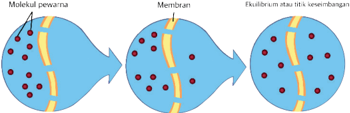

> **Deskripsi Visual:** Gambar ini adalah ilustrasi yang menunjukkan proses perpindahan molekul pewarna melalui membran. Gambar ini terdiri dari tiga bagian yang masing-masing menunjukkan tahap-tahap perpindahan molekul pewarna tersebut.

Pertama, molekul pewarna berada di luar membran. Mereka kemudian masuk ke dalam membran melalui proses perpindahan molekul. Setelah itu, mereka mencapai suatu ekstremis atau titik tertentu di dalam membran.

Elemen-elemen utama dalam gambar ini adalah molekul pewarna, membran, dan ekstremis/titik tertentu. Molekul pewarna bergerak dari luar membran ke dalam membran dan kemudian mencapai ekstremis/titik tertentu di dalam membran.

Teks, angka, atau label penting yang terlihat dalam gambar ini adalah "Molekul pewarna", "Membran", dan "Ekstremis atau titik tertentu". Informasi kunci yang dapat diambil pembaca adalah bahwa molekul pewarna dapat mempercepat proses perpindahan melalui membran, dan bahwa ada suatu titik tertentu di dalam membran di mana proses perpindahan molekul pewarna berhenti.

Difusi  merupakan pergerakan zat (selain air) melintasi membran dari  konsentrasi  yang  tinggi  ke  konsentrasi  yang  lebih  rendah.  Coba amati Gambar 2.8 dengan saksama!

---
**🖼️ Gambar/Diagram**

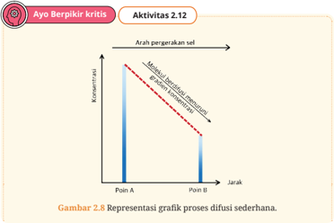

> **Deskripsi Visual:** Gambar 2.8 adalah sebuah diagram yang menunjukkan proses difusi sederhana dalam suatu sistem. Diagram ini terdiri dari dua sumbu: sumbu horizontal (jarak) dan sumbu vertikal (kecepatan). Pada sumbu horizontal, ada dua titik penting yang diberi nama "Poin A" dan "Poin B". Poin A diletakkan di sebelah kiri sumbu, sedangkan Poin B diletakkan di sebelah kanan sumbu.

Sumbu vertikal menggambarkan kecepatan atau kecepatan gerakan sel, yang berada di atas sumbu horizontal. Di sepanjang sumbu ini, terdapat garis lurus yang menghubungkan kedua titik tersebut, menunjukkan bahwa kecepatan sel pada awalnya sangat tinggi tetapi kemudian menurun hingga nol. Ini menunjukkan bahwa sel mulai bergerak dengan kecepatan yang lebih rendah setelah mencapai titik tertentu.

Teks pada gambar menyatakan bahwa ini adalah representasi grafik proses difusi sederhana, yang menunjukkan bagaimana sel bergerak dalam suatu sistem. Label "Ayo Berpikir Kritis" dan "Aktivitas 2.12" juga tertera di bagian atas gambar, menunjukkan bahwa ini adalah bagian dari materi pelajaran yang harus dipertimbangkan oleh siswa.

 

---
## 📄 Halaman 62

Berdasarkan Gambar 2.8, jawablah pertanyaan-pertanyaan berikut!

- Variabel (keterangan) apakah yang ditunjukkan oleh sumbu x dan sumbu y dalam grafik tersebut?
- Perhatikan arah pergerakan zat, dari titik mana zat itu mulai bergerak?
- Perhatikan  titik  A  dan  titik  B  lalu  bandingkan  konsentrasi zat di kedua titik tersebut! Di titik manakah konsentrasi zat terlihat lebih tinggi? Di titik manakah konsentrasi zat terlihat lebih rendah?
- Perhatikan garis merah di Gambar  2.8, garis tersebut menunjukkan gradien konsentrasi zat, bagaimana hubungan antara pergerakan zat dan gradien konsetrasi?

### Latihan 2.1

Setelah Kalian menjawab pertanyaan-pertanyaan pada Aktivitas 2.12,  dapatkah  Kalian  mendeskripsikan  dengan  kalimat  sendiri apa yang dimaksud dengan difusi sederhana?

Difusi adalah .…

Setelah memahami konsep difusi sederhana, selanjutnya Kalian cari tahu apakah difusi terjadi dalam organisme? Apakah difusi dalam  organisme  penting?  Sebutkan  contoh  lain  difusi  dalam organisme!

 

---
## 📄 Halaman 63

---
**🖼️ Gambar/Diagram**

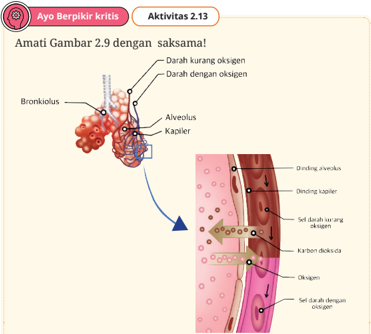

> **Deskripsi Visual:** Gambar 2.9 dalam Aktivitas 2.13 menunjukkan struktur dan fungsi sistem pernapasan manusia, dengan fokus pada alveoli dan kapiler darah. Gambar ini merupakan ilustrasi yang menggambarkan bagaimana gas oksigen dan karbon dioksida berpindah dari udara ke darah dan sebaliknya. Alveoli, yang terletak di dalam paru-paru, adalah area yang sangat kecil yang memungkinkan pertukaran gas antara udara dan darah. Kapiler darah berada di dekat alveoli, sehingga gas-gas tersebut dapat berpindah melalui membran alveolar-kapiler. Gambar ini juga menunjukkan bahwa darah yang kurang oksigen (darah merah) bergerak ke alveoli, sedangkan darah yang sudah oksigen (darah putih) bergerak ke kapiler darah. Ini membantu menjelaskan proses pertukaran gas yang penting dalam proses pernapasan. Label-label seperti "Alveolus", "Kapiler", dan "Girding Alveolus" memberikan detail tentang struktur dan fungsi masing-masing elemen. Informasi ini sangat berguna untuk memahami mekanisme pernapasan dan bagaimana sistem pernapasan memastikan bahwa tubuh selalu mendapatkan oksigen yang diperlukan untuk berfungsi secara optimal.

Berdasarkan  Gambar  2.9  diskusikan  dan  jawablah  pertanyaanpertanyaan berikut!

- Bandingkan  konsentrasi  oksigen  di  dalam  alveolus  dan  sel darah  merah  di  dalam  pembuluh  kapiler,  manakah  yang konsentrasi oksigennya lebih tinggi?
- Bandingkan  konsentrasi  karbon  dioksida  di  alveolus  dan dalam sel darah merah dalam pembuluh  kapiler, manakah yang konsentrasi karbon dioksidanya lebih tinggi?
- Bagaimana perpindahan atau pergerakan oksigen dan karbon dioksida?
- Apakah yang akan terjadi jika pertukaran oksigen dan karbon dioksida  di  alveolus  dan  kapiler  darah  tersebut  terganggu?

 

---
## 📄 Halaman 64

Faktor  apa  sajakah  yang  dapat  menyebabkan  gangguan pertukaran oksigen dan karbon dioksida? Perkuat pendapat Kalian dengan penjelasan konsep dari literatur/bahan bacaan yang tersedia

Oksigen  dan  karbon  dioksida  dalam  paru-paru  dan  pembuluh kapiler  manusia  merupakan  contoh  difusi  yang  terjadi  di  tingkat organisasi  seluler  dalam  organisme.  Dapatkah  Kalian  menyebutkan fenomena lain difusi sederhana dalam kehidupan sehari-hari?

### 3.  Difusi Terfasilitasi

Selain difusi sederhana yang telah dijelaskan sebelumnya, ada difusi lain  yaitu  difusi  terfasilitasi  ( facilitated  diffusion ).  Cermati  ada  dua kata  yang  tersusun  yaitu  difusi  dan  terfasilitasi.  Sebelumnya  Kalian telah memahami  konsep  difusi. Bagaimana  dengan  terfasilitasi? Apa yang dimaksud dengan difusi terfasilitasi? Zat apa sajakah yang pergerakannya difasilitasi? Mengapa zat tertentu  harus  'difasilitasi' pergerakannya?

---
**🖼️ Gambar/Diagram**

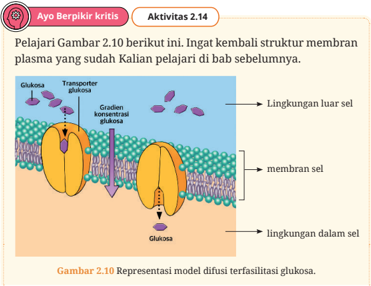

> **Deskripsi Visual:** Gambar 2.10 adalah ilustrasi yang menunjukkan model difusi terfasilitasi glukosa melalui membran sel. Gambar ini memperlihatkan dua sel berbeda, dengan membran sel yang memisahkan kedua lingkungan tersebut. Di sebelah kiri, ada transporter glukosa yang terletak di membran luar sel, sedangkan di sebelah kanan, transportase glukosa terletak di membran dalam sel. Elemen-elemen utama dalam gambar ini termasuk transporter glukosa, membran sel, dan lingkungan luar serta dalam sel. Label penting dalam gambar meliputi "Transporter glukosa", "Gradien konduktivitas glukosa", "Lingkungan luar sel", "Membran sel", dan "Lingkungan dalam sel". Informasi kunci yang dapat diambil dari gambar ini adalah bahwa glukosa dapat difusi melalui membran sel melalui transportase glukosa yang terfasilitasi, yang memerlukan energi ATP untuk membantu proses ini.

 

---
## 📄 Halaman 65

Apakah Kalian tahu peran glukosa dalam tubuh? Glukosa berperan sebagai sumber energi sel.

Berdasarkan Gambar 2.10 jawab pertanyaan berikut ini!

- Bagaimana perbandingan konsentrasi glukosa di luar dan di dalam sel?
- Perhatikan arah panah pergerakan glukosa, dari mana glukosa bergerak?
- Komponen apa dari struktur membran plasma yang dilalui glukosa ketika bergerak?
- Mengapa pergerakan glukosa harus difasilitasi oleh komponen tertentu dari struktur membran plasma?
- Mungkinkah terjadi gangguan terhadap pergerakan glukosa? Apakah yang terjadi jika terdapat gangguan terhadap proses pergerakan glukosa ketika melintasi membran plasma?
Molekul glukosa diketahui memiliki ukuran 'terlalu besar' untuk melalui membran plasma tanpa bantuan. Terdapat komponen khusus dari struktur membran plasma yang membantu pergerakannya.

Difusi terfasilitasi terjadi karena adanya bantuan (difasilitasi oleh) saluran transpor membran Gambar 2.10. Saluran transpor membran ini  berupa  glikoprotein  yang  memungkinkan  zat  tertentu  melintasi membran plasma.  Saluran  ini  hampir  selalu  spesifik  untuk  molekul tertentu atau jenis molekul tertentu.

Sebagai contoh dikenal transporter glukosa ( Glucose Transporters/ GLUT).  GLUT  merupakan  suatu  protein  yang  dapat  mengangkut glukosa dari luar sel masuk ke dalam sel dan berperan penting dalam menjaga  homeostatis  glukosa  tubuh.  Glukosa  transporter-2  (GLUT2)  terdapat  pada  pankreas,  hati  dan  ginjal  (Teodhora et  al. ,  2021). Apakah konsentrasi glukosa di aliran darah terus menerus lebih tinggi dibandingkan konsentrasi glukosa dalam sel?

 

---
## 📄 Halaman 66

### Latihan 2.1

Berdasarkan  jawaban  Kalian  terhadap  pertanyaan-pertanyaan tersebut, dapatkah Kalian menjelaskan perbedaan antara difusi sederhana dan difusi terfasilitasi?

---
**📊 Tabel**

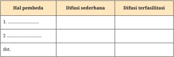

Tabel ini membandingkan dua metode difusi: difusi sederhana dan difusi terfasilitasi. Dalam tabel ini, kolom pertama berisi hal-hal pembedaan antara kedua metode tersebut, sedangkan kolom kedua dan ketiga berisi informasi tentang perbedaan antara kedua metode tersebut. Topik utama tabel ini adalah perbandingan antara dua metode difusi. Data penting yang terlihat dalam tabel ini adalah bahwa difusi sederhana tidak memerlukan fasilitas atau bantuan eksternal untuk berlangsung, sementara difusi terfasilitasi memerlukan bantuan eksternal seperti molekul-fasilitator atau protein-fasilitator.

### B. Transpor Aktif

Setelah sebelumnya Kalian memahami transpor zat yang terjadi secara pasif, berikut ini Kalian akan mempelajari transpor zat yang dilakukan secara aktif, atau dikenal sebagai transpor aktif. Adakah yang sudah tahu apa yang dimaksud dengan transpor aktif? Zat apa saja yang harus menggunakan transpor aktif dalam pergerakannya? Untuk  menjawab rasa ingin tahumu, ayo lakukan Aktivitas 2.15!

---
**🖼️ Gambar/Diagram**

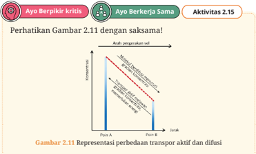

> **Deskripsi Visual:** Gambar 2.11 merupakan representasi perbedaan transport aktif dan difusi. Gambar ini menggunakan diagram vertikal dengan dua garis yang berbeda untuk menunjukkan kedua mekanisme transport tersebut. Garis pertama, yang lebih pendek dan bergerak ke atas, menunjukkan transport aktif, sementara garis kedua, yang lebih panjang dan bergerak ke bawah, menunjukkan difusi.

Elemen utama dalam gambar adalah dua garis yang bertemu pada titik A dan titik B. Titik A menunjukkan batas antara transport aktif dan difusi, sedangkan titik B menunjukkan titik akhir di mana transport aktif dan difusi berakhir. Garis transport aktif bergerak ke atas dari titik A menuju titik B, menunjukkan bahwa proses ini memerlukan energi. Sementara itu, garis difusi bergerak ke bawah dari titik A menuju titik B, menunjukkan bahwa proses ini tidak memerlukan energi.

Teks, angka, atau label penting yang terlihat dalam gambar adalah "Transport Aktif" dan "Difusi", serta titik-titik A dan B. Informasi kunci yang dapat diambil pembaca adalah bahwa transport aktif membutuhkan energi dan dapat mengangkut molekul dengan cara yang lebih efisien dibandingkan dengan difusi, sementara difusi tidak memerlukan energi dan hanya mengangkut molekul dengan cara yang lebih lambat.

 

---
## 📄 Halaman 67

Berdasarkan Gambar 2.11, jawablah dan diskusikan pertanyaanpertanyaan berikut!

- Berdasarkan  konsentrasi  zatnya,  darimanakah  pergerakan zat yang terjadi secara transpor aktif?
- Perhatikan  gradien  konsentrasinya,  ketika  transpor  aktif terjadi apakah zat bergerak searah dengan penurunan gradien konsentrasi atau 'melawan' gradien konsentrasi?
- Faktor  apakah  yang  menyebabkan  perpindahan  zat  secara transpor aktif?
- Zat apa sajakah yang perpindahannya dilakukan dengan cara transpor aktif?
- Apakah transpor aktif terjadi dalam sel? Di bagian manakah dari organ tubuh transpor aktif zat terjadi?

### Perhatikan Gambar 2.12 dengan saksama!

---
**🖼️ Gambar/Diagram**

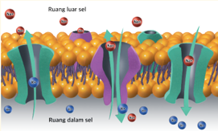

> **Deskripsi Visual:** Gambar ini adalah ilustrasi yang menunjukkan struktur sel. Ilustrasi ini memperlihatkan dua ruang sel: ruang luar sel dan ruang dalam sel. Ruang luar sel terdiri dari membran sel yang berisi protein dan lipoprotein. Membran sel terdiri dari dua lapisan, dengan lapisan dalam mengandung protein dan lapisan luar yang terdiri dari lipoprotein. Ruang dalam sel terdiri dari jaringan seluler yang terdiri dari sel-sel yang terhubung melalui ikatan ikat protein. Ilustrasi ini juga menunjukkan beberapa molekul yang terlibat dalam proses transportasi, seperti ATPase dan kanal ion. Label penting dalam gambar ini adalah "Ruang luar sel" dan "Ruang dalam sel", yang menunjukkan posisi dan fungsi masing-masing ruang sel. Informasi kunci yang dapat diambil pembaca adalah bahwa struktur sel terdiri dari dua ruang, ruang luar sel dan ruang dalam sel, serta peran protein dan molekul dalam proses transportasi.

Berdasarkan Gambar  2.12, jawablah pertanyaan-pertanyaan berikut!

- Bagaimana konsentrasi molekul zat Natrium di dalam sel?
- Bagaimana arah perpindahan molekul zat Natrium tersebut?
- Bagaimana konsentrasi molekul zat kalium di dalam sel?
- Bagaimana arah perpindahan molekul zat kalium tersebut?
- Apakah struktur  yang  membantu molekul zat  Natrium  dan kalium berpindah melintasi membran sel?

 

---
## 📄 Halaman 68

Diketahui  bahwa  terdapat  saluran  transmembran  yang  berupa protein  yang  membantu  perpindahan  ion  Natrium  dan  ion  Kalium. Saluran ini menggunakan energi yang dilepaskan dari hidrolisis ATP (adenosin  trifosfat)  untuk  memompa  tiga  ion  natrium  keluar  dan dua ion kalium ke dalam sel. ATP adalah molekul energi, dan ketika hidrolisis terjadi, ATP dipecah untuk melepaskan energi yang disimpan dalam ikatan kimianya. Transpor yang secara langsung menggunakan ATP  untuk  energi  dikenal  sebagai  transpor  aktif  primer.  Dapatkah Kalian menyebutkan contoh lain transportasi aktif yang terjadi dalam sel makhluk hidup?

Untuk memperkuat pemahaman Kalian tentang transpor aktif, coba cermati Gambar 2. 13!

---
**🖼️ Gambar/Diagram**

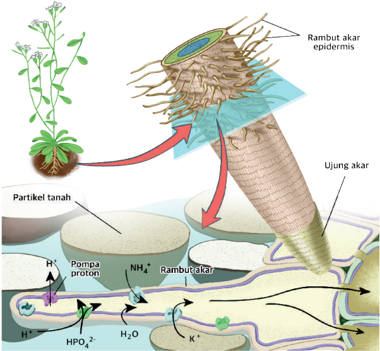

> **Deskripsi Visual:** Gambar ini adalah ilustrasi yang menunjukkan proses pertumbuhan akar tanaman. Gambar ini melukiskan bagaimana akar tanaman mengambil nutrisi dari tanah. Akar tanaman memiliki rambut akar yang berfungsi untuk mengumpulkan partikel-partikel tanah. Proses ini melibatkan pompa proton yang membantu mengangkut ion nitrogen (NH4+) dan fosfat (HPO4^2-) ke dalam sel akar. Sel akar juga memproduksi oksigen melalui proses fotosintesis. Informasi penting lainnya yang ditampilkan adalah bahwa akar tanaman memiliki epidermis yang melindungi sel-sel akar dari lingkungan luar. Gambar ini memberikan pemahaman tentang bagaimana tanaman mengambil nutrisi dari tanah dan bagaimana proses ini berlangsung secara biologis.

 

---
## 📄 Halaman 69

### Refleksi

Setelah  mempelajari  materi  transpor  zat  melalui  membran sel/membran  plasma  melalui  berbagai  aktivitas  di  Bab  ini,  hal penting  apa  yang  telah  Kalian  pahami?  Keterampilan  apa  saja yang sudah Kalian kuasai? Apakah masih ada materi yang belum Kalian pahami? Apa yang akan Kalian lakukan untuk mengatasi permasalahan tersebut?

### Uji Kompetensi

Perhatikan gambar berikut untuk menjawab pertanyaan 1-3!

---
**🖼️ Gambar/Diagram**

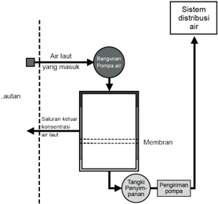

> **Deskripsi Visual:** Gambar ini adalah ilustrasi yang menunjukkan proses pemisahan air laut menggunakan membran. Gambar ini memperlihatkan dua bagian utama: sistem distribusi air dan lautan. Sistem distribusi air terdiri dari saluran ketua koncentrasi air laut, membran, dan saluran pengumpul air. Air laut masuk melalui saluran ketua koncentrasi dan dialirkan ke membran. Di membran, air laut dipisahkan dari air asam, yang kemudian dikumpulkan di saluran pengumpul air. Informasi kunci yang dapat diambil pembaca adalah bahwa proses ini menggunakan membran untuk memisahkan air laut dari air asam, sehingga air asam dapat digunakan kembali dalam sistem distribusi air.

Perhatikan  gambar  di  atas!  Salah  satu  cara  untuk  memproduksi  air minum dari air laut adalah dengan cara menerapkan prinsip osmosis terbalik. Osmosis terbalik merupakan salah satu tipe filtrasi. Air laut didorong masuk melalui membran semipermeabel dengan pemberian tekanan oleh alat pemompa ( pumping station ).

 

---
## 📄 Halaman 70

- Berdasarkan analisismu mengenai proses filtrasi yang tertera pada gambar di atas, di bagian mana terdapat garam dengan konsentrasi tertinggi? Jelaskan mengapa hal tersebut dapat terjadi!
- Mengapa proses pembuatan air minum yang berasal dari air laut menggunakan prinsip osmosis terbalik, bukan dengan menggunakan jenis transportasi lainnya (osmosis biasa, difusi, dan transpor aktif)?
- Bagaimana peran alat pompa pada proses tersebut?
- Sudah  2  hari  suhu  tubuh  Andi  meningkat  hingga  Suhu  tubuhnya mencapai  39 o C.  Andi  juga  sering  memuntahkan  makanan  yang ia  makan  dan  buang  air  besar  secara  terus-menerus.  Hal  ini berdampak pada tubuh Andi yang terasa lemas. Oleh karena itu, Ibu Andi membawa Andi ke rumah sakit. Setibanya di rumah sakit, Andi langsung diinfus agar tubuh Andi tidak kekurangan cairan dan zatzat yang dibutuhkan. Menurutmu, seperti apa kondisi cairan yang dimasukkan ke dalam tubuh Andi (hipotonis/ isotonis/ hipertonis) terhadap darah Andi? Jelaskan mengapa demikian?

### 5.  Perhatikan gambar di bawah ini!

---
**🖼️ Gambar/Diagram**

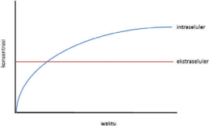

> **Deskripsi Visual:** Gambar ini adalah sebuah diagram yang menunjukkan perubahan koncentrasi dalam dua sistem, yaitu intraseluler dan ekstraseluler, seiring berjalannya waktu. Diagram ini menggunakan dua garis untuk mewakili kedua sistem tersebut. Garis biru menunjukkan perubahan koncentrasi dalam sistem intraseluler, sedangkan garis merah menunjukkan perubahan koncentrasi dalam sistem ekstraseluler.

Elemen utama dalam gambar ini adalah dua garis yang menggambarkan perubahan koncentrasi dalam dua sistem sel. Garis biru melambangkan perubahan koncentrasi dalam sistem intraseluler, sementara garis merah menunjukkan perubahan koncentrasi dalam sistem ekstraseluler. Garis ini menunjukkan bahwa koncentrasi dalam sistem intraseluler meningkat dengan waktu, tetapi koncentrasi dalam sistem ekstraseluler stabil.

Teks, angka, atau label penting yang terlihat pada gambar ini adalah garis-garis yang menggambarkan perubahan koncentrasi dalam dua sistem sel. Informasi kunci yang dapat diambil pembaca adalah bahwa koncentrasi dalam sistem intraseluler meningkat seiring berjalannya waktu, sementara koncentrasi dalam sistem ekstraseluler stabil.

Seorang siswa melakukan penelitian untuk mengukur konsentrasi suatu zat  terlarut  di  bagian  intraseluler  dan  ekstraseluler  selama beberapa  waktu.  Datanya  ditampilkan  dalam  gambar  di  atas. Menurut  siswa  tersebut,  gmbar  itu  merupakan  hasil  aktivitas transpor  aktif.  Menurut  kalian,  apakah  pendapat  siswa  tersebut benar? Jelaskan alasannya!

 

---
## 📄 Halaman 71

### 6.  Perhatikan gambar di bawah ini!

---
**🖼️ Gambar/Diagram**

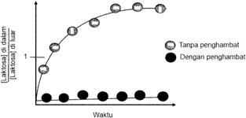

> **Deskripsi Visual:** Gambar ini adalah sebuah diagram yang menunjukkan perbandingan antara lauhan gas di dalam ruang dengan dan tanpa penghambat selama waktu tertentu. Diagram ini terdiri dari dua garis: satu untuk kondisi tanpa penghambat (dengan simbol berbentuk lingkaran) dan satu untuk kondisi dengan penghambat (dengan simbol berbentuk segitiga). Garis pertama menunjukkan bahwa lauhan gas di dalam ruang meningkat seiring berjalannya waktu, tetapi dengan penambahan penghambat, lauhan gas tersebut bertahan lebih lama sebelum mencapai nilai maksimum. Ini menunjukkan bahwa penghambat dapat memperpanjang durasi lauhan gas di dalam ruang.

Kalian melakukan eksperimen di laboratorium untuk menentukan apakah  sel  bakteri  mengambil  laktosa  menggunakan  transpor aktif,  difusi  terfasilitasi,  atau  keduanya.  Kalian  menambahkan penghambat ATP ke dalam kultur dan mengukur rasio laktosa di dalam sel vs di luar sel dari waktu ke waktu. Bacalah pernyataanpernyataan berikut ini dan tentukan apakah pernyataan tersebut benar atau salah dengan memberi tanda centang (√) pada  kolom!

---
**📊 Tabel**

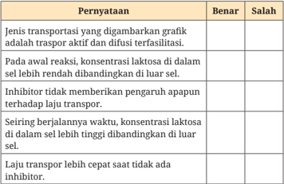

Tabel ini membahas tentang transportasi laktosa melalui sel, dengan fokus pada beberapa aspek penting seperti jenis transportasi, konsentrasi laktosa di dalam sel dan luar sel, pengaruh inhibitor, dan laju transportasi. Topik utama adalah transportasi laktosa melalui sel, termasuk penjelasan tentang jenis transportasi aktif dan difusi terfasilitasi. Data penting yang terlihat adalah bahwa konsentrasi laktosa lebih rendah di dalam sel dibandingkan di luar sel, inhibitor tidak mempengaruhi laku transportasi, dan laku transportasi lebih cepat saat tidak ada inhibitor.

 

---
## 📄 Halaman 72

### Pengayaan

Pernahkah  Kalian  sakit?  Pernahkah  Kalian  diberikan  antibiotik  oleh dokter? Menurut Kalian bagaimana antibiotik yang Kalian minum dapat mencapai targetnya di dalam tubuh?

Pelajari  bagaimana  'nasib'  obat  di  dalam  tubuh  manusia  melalui video dan juga artikel berikut ini: s.id/1roWZ (tautan lengkap: https://www.news-medical.net/life-sciences/What-is-Pharmacokinetics. aspx#:~:text=Pharmacokinetics%20is%20 )

Berdasarkan  sumber  yang  sudah  Kalian  baca  dan  sumber  tayangan videonya  diketahui  ternyata  ada  hubungan  antara  membran  plasma dengan 'perjalanan' obat di dalam tubuh manusia.

Terdapat  beberapa  tahapan  yang  dilalui  obat  termasuk  dari  jenis antibiotik di dalam tubuh di antaranya absorpsi, distribusi, metabolisme, dan  ekskresinya.  Tahap  absorpsi  obat  di  tingkat  seluler  terjadi  melalui beragam cara,  di  antaranya  transpor  aktif  dan  transpor  pasif.  Ternyata transpor membran merupakan salah satu proses penting dalam Farmakokinetik.

Penelitian tentang membran plasma khususnya untuk mening  kat  kan efektivitas  pengujian  obat,  menangani  resistensi  obat,  termasuk  resistensi bakteri  terhadap  antibiotik  dan  resistensi  sel  kanker  terhadap  kemoterapi menjadi  sangat  penting.  Organisasi  Kesehatan  Dunia  telah  menyatakan resistensi antibiotik sebagai salah satu dari sepuluh besar ancaman kesehatan masyarakat global yang dihadapi umat manusia (Organisasi Kesehatan Dunia, 2019).

Apakah  para  peneliti  di  Indonesia  telah  melakukan  penelitian  di bidang Farmakokinetik ini? Apakah penelitian tersebut penting dilakukan di Indonesia? Apakah kalian ada yang tertarik untuk menjadi peneliti di bidang tersebut?

 

---
## 📄 Halaman 73

Kementerian Pendidikan, Kebudayaan, Riset, dan Teknologi Republik Indonesia, 2022 Biologi untuk SMA/MA Kelas XI Penulis: Rini Solihat, dkk. ISBN: 978-602-427-893-9

### Bab 3 Proses Pengaturan pada Tumbuhan

Pernahkah Kalian memerhatikan adanya perubahan pada tumbuhan seiring perubahan musim?  Bagaimana  tumbuhan  dapat  mengatur  proses  hidupnya  menyesuikan  diri terhadap perubahan lingkungan?

Sumber gambar: Wikimedia.org/Amelia (2007)

 

---
## 📄 Halaman 74

### Tujuan Pembelajaran

Kalian  mampu  menganalisis  hubungan  antara  struktur  dan fungsi organ tumbuhan serta menguraikan sistem regulasi yang dilakukan  tumbuhan  melalui  kegiatan  penyelidikan  bersama dengan teman Kalian.

### Kata Kunci

- Jaringan
- Organ
- Regulasi
- Hormon
- Sistem Organ Tumbuhan

 

---
## 📄 Halaman 75

### Peta Konsep

---
**🖼️ Gambar/Diagram**

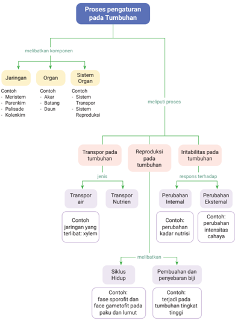

> **Deskripsi Visual:** Gambar ini adalah diagram yang menunjukkan proses pengaturan pada tumbuhan. Diagram ini melibatkan komponen seperti jaringan, organ, sistem organ, transport, reproduksi, dan irritabilitas. Jaringan termasuk meristem, parenkim, palisade, dan kolensium. Organ termasuk akar, batang, dan daun. Sistem organ meliputi sistem transport dan sistem reproduksi. Transport pada tumbuhan melibatkan jenis seperti transport air dan transport nutrien. Reproduksi pada tumbuhan melibatkan perubahan internal dan perubahan eksternal. Irritabilitas pada tumbuhan melibatkan siklus hidup dan penyebaran biji. Teks penting dalam diagram ini mencakup contoh dan deskripsi dari setiap komponen dan proses tersebut.

 

---
## 📄 Halaman 76

Pohon Eucalyptus , atau yang biasa kita sebut sebagai pohon kayu putih, adalah  spesies  yang  dapat  tumbuh  di  hutan  hujan  tropis  Indonesia. Apakah  Kalian  pernah  melihat  pohon Eucalyptus di  daerah  tempat tinggal Kalian?

Ketika musim berganti, kulit pohon Eucalyptus mengalami pengelupasan pada bagian kulitnya. Warna kulit yang awalnya hijau segar  akan  menjadi  warna  jingga,  ungu,  dan  biru  dengan  garisgaris  vertikal  warna  merah  dan  jingga.  Mengapa  pohon  tersebut melakukannya?  Apakah  hal  yang  serupa  dapat  terjadi  pada  pohon jenis lain? Bagaimana tumbuhan dapat melakukan itu semua? Apakah didukung oleh struktur tumbuhan yang dimilikinya?

Agar  tumbuhan  dapat  bertahan  hidup,  dibutuhkan  pengaturan yang  dapat  mengelola  fungsi  setiap  struktur  tumbuhan.  Pengaturan ini  dikenal  sebagai  sistem  regulasi.  Apakah  sistem  regulasi  tersebut bekerja pada pohon Eucalyptus ? Apakah sistem regulasi tersebut yang juga mengatur waktu pengelupasan kulit pohon Eucalyptus ?

Menurut Kalian, apa saja struktur tumbuhan yang terlibat dalam sistem regulasi tumbuhan? Bagaimana proses yang terjadi pada sistem regulasi sehingga tumbuhan dapat melakukan itu semua?

### A. Jaringan, Organ, dan Sistem Organ

Masih ingatkah Kalian apa saja sistem organ tumbuhan yang telah Kalian pelajari saat SMP? Organ-organ apa saja yang membentuk sistem organ? Jaringan apa saja yang membentuk organ tersebut?

Untuk mengenal struktur tumbuhan, kita harus mempelajari dan  mengenal  susunan  anatominya.  Struktur  tubuh  tumbuhan tersusun atas sel yang telah mengalami diferensiasi membentuk kelompok-kelompok sel yang dikenal dengan jaringan. Jaringanjaringan  pada  tumbuhan  akan  bergabung  menjadi  beberapa kelompok  untuk  menjalankan  fungsi  khusus  yang  kita  kenal sebagai  organ.  Organ  pada  tumbuhan  meliputi  akar,  batang, daun, bunga, buah, dan biji.

 

---
## 📄 Halaman 77

---
**🖼️ Gambar/Diagram**

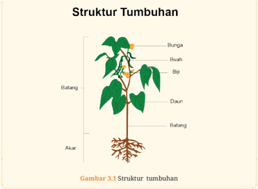

> **Deskripsi Visual:** Gambar 3.1 Struktur tumbuhan adalah ilustrasi yang menunjukkan bagian-bagian dasar dari tumbuhan. Gambar ini menggambarkan batang tumbuhan dengan daun, akar, bunga, biji, dan buah yang terhubung dengan label yang menjelaskan masing-masing bagian. Batang tumbuhan berada di bagian bawah dan memiliki akar yang membentuk struktur dasar untuk menyerap air dan nutrisi. Daun terletak di atas batang dan berfungsi untuk fotosintesis. Bunga dan buah terletak di atas daun, sedangkan biji terletak di dalam buah. Gambar ini memberikan pemahaman umum tentang struktur dasar tumbuhan dan bagaimana komponen-komponennya saling terkait.

Ayo Bereksplorasi

### Aktivitas 3.1

Perhatikan  tumbuhan  yang  ada  di  sekitar  Kalian!  Perhatikan apa  saja  organ-organ  yang  ada  pada  tumbuhan  tersebut!  Lalu, bandingkan bentuk antar organ-organ tersebut! Apakah semua organ bentuknya sama? Kaitkan hubungan antara bentuk organ tumbuhan dan fungsinya! Untuk menjawab hal tersebut, Kalian dapat  mencari  informasi  tambahan  melalui  berbagai  sumber, misalnya artikel dari internet atau buku diperpustakaan. Selanjutnya, tuliskan jawaban Kalian dalam Tabel 3.1 berikut!

---
**📊 Tabel**

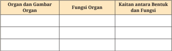

Tabel ini berisi informasi tentang organ dan fungsi mereka, serta kaitan antara bentuk dan fungsi organ tersebut. Topik utama tabel adalah organ dan fungsi organ, dengan kolom-kolom yang mencakup nama organ, fungsi organ, dan kaitan antara bentuk dan fungsi organ. Data penting yang terlihat dalam tabel ini meliputi organ seperti otot, jantung, dan paru-paru, serta fungsinya masing-masing, seperti memperkuat tubuh, memompa darah, dan menghasilkan oksigen. Selain itu, tabel juga menunjukkan hubungan antara bentuk organ dan fungsi organ, seperti bagaimana bentuk otot yang tisu dan struktur jantung yang kompleks mempengaruhi kemampuan mereka untuk melakukan fungsi mereka.

 

---
## 📄 Halaman 78

Tahukah  Kalian  bahwa  organ-organ  tumbuhan  tersusun  oleh jaringan-jaringan yang berbeda? Misalnya, daun tersusun oleh jaringan mesofil,  spons,  dan  pengangkut.  Ketiga  jaringan  tersebut  tersusun oleh  sel-sel  yang  memiliki  bentuk  yang  berbeda  antara  satu  dengan yang lain sesuai dengan fungsinya. Mengapa jaringan penyusun pada tumbuhan  berbeda-beda?  Apakah  masing-masing  organ  tumbuhan memiliki jaringan yang sama? Untuk menjawab pertanyaan tersebut, lakukan Aktivitas 3.2!

Ayo Bereksplorasi

Ayo Berkerja Sama

Aktivitas 3.2

Kalian akan mengamati jaringan penyusun daun pada tumbuhan menggunakan mikroskop cahaya bersama dengan teman dalam satu kelompok kecil.

### Tujuan :

Melakukan pengamatan jaringan penyusun daun pada tumbuhan monokotil dan dikotil menggunakan mikroskop cahaya.

### Alat dan Bahan:

---
**📊 Tabel**

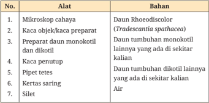

Tabel ini berisi daftar alat dan bahan yang diperlukan untuk melakukan pengamatan mikroskopik pada tumbuhan monokotil dan dikotil. Topik utama tabel ini adalah prosedur mikroskopik untuk mempelajari struktur tumbuhan. Kolom pertama menunjukkan nomor alat, sedangkan kolom kedua menunjukkan nama alat tersebut. Data penting yang terlihat dalam tabel ini meliputi jenis daun yang digunakan sebagai preparat (daun Rhoeodiscolor), jenis daun tumbuhan monokotil lainnya yang akan diuji, jenis daun tumbuhan dikotil lainnya yang akan diuji, dan air sebagai bahan pengikat.

### Prosedur:

- Siapkan  mikroskop  yang  akan  digunakan  untuk  kegiatan praktikum. Pastikan kelengkapan komponen mikroskopnya.
- Buatlah sayatan paradermal dan melintang pada daun tumbuhan yang tersedia.

 

---
## 📄 Halaman 79

- Kemudian,  letakkan  sayatan  yang  telah  dibuat  di  atas  kaca preparat. Masih ingatkan bagaimana mebuat preparat basah untuk diamati? Kalau Kalian lupa ikuti langkah berikutnya.
- Untuk  menghilangkan  kelebihan  air  atau  gelembung  udara yang  terperangkap  di  bawah  kaca  penutup,  letakkan  kertas saring  di  salah  satu  sisi  kaca  penutup.  Kertas  tersebut  akan menyerap kelebihan larutan yang ada. Hati-hati jangan sampai terlalu banyak larutan yang diserap kertas saring!
- Amati secara cermat objek pengamatan Kalian menggunakan lensa objektif yang ukurannya paling kecil. Dapatkah Kalian  melihat  objek  pengamatan  dengan  jelas?  Lanjutkan pengamatan  lebih  cermat  lagi  menggunakan  lensa  objektif dengan kekuatan yang lebih besar.
- Gambarlah  objek  pengamatan  di  buku  gambar  dan  jangan lupa  catat  ukuran  lensa  objektif  dan  lensa  okuler  yang digunakan. Tuliskan label keterangan komponen jaringan dan sel penyusunnya yang Kalian amati.
- Bandingkan bentuk dan pola jaringan yang Kalian amati pada tumbuhan monokotil dan tumbuhan dikotil.
- Buatlah  laporan  hasil  pengamatan  yang  sudah  dilakukan secara berkelompok.

### Pertanyaan:

Jaringan  apa  saja  yang  Kalian  amati  sebagai  penyusun  daun monokotil?

Jawaban:

______________________________________________________

Jaringan apa yang Kalian amati sebagai penyusun daun dikotil?

Jawaban:

______________________________________________________

Apakah pola jaringan penyusun daun monokotil dan dikotil sama?

Jawaban:

______________________________________________________

Bandingkan pola jaringan tumbuhan monokotil dan dikotil yang telah Kalian amati!

 

---
## 📄 Halaman 80

---
**📊 Tabel**

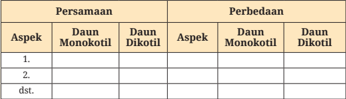

Tabel ini membandingkan persamaan dan perbedaan antara daun monokotil dan daun dikotil. Topik utama tabel adalah perbedaan struktur dan fungsi daun dalam tumbuhan monokotil dan dikotil. Kolom "Persamaan" mencakup aspek-aspek yang sama di kedua jenis daun tersebut, seperti bentuk, ukuran, dan cara pertumbuhan. Sementara kolom "Perbedaan" menunjukkan aspek-aspek yang berbeda antara daun monokotil dan dikotil, seperti jumlah daun pada satu pucuk, struktur internodul, dan cara penyerapan air dan nutrisi. Data penting yang terlihat adalah bahwa daun monokotil memiliki satu daun per pucuk, sedangkan daun dikotil memiliki dua daun per pucuk. Daun monokotil juga memiliki internodul yang lebih pendek dibandingkan dengan daun dikotil.

Buatlah kesimpulan mengenai jaringan penyusun daun monokotil dan dikotil berdasarkan hasil penyelidikan kalian!

Jawaban:

______________________________________________________

### Ayo Bereksplorasi

### Aktivitas 3.3

Kalian akan mengamati jaringan penyusun batang pada tumbuhan menggunakan mikroskop cahaya bersama dengan teman dalam satu kelompok kecil.

### Tujuan:

Melakukan  pengamatan  sel  tumbuhan  menggunakan  mikroskop cahaya.

### Alat dan Bahan:

---
**📊 Tabel**

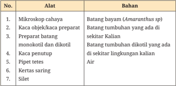

Tabel ini berisi daftar alat yang diperlukan untuk melakukan observasi mikroskopik pada batang bayam (Amaranthus sp.). Topik utama tabel ini adalah alat-alat mikroskopik yang digunakan dalam studi botani. Kolom pertama menunjukkan nomor urut alat, sedangkan kolom kedua menyajikan deskripsi singkat tentang setiap alat tersebut. Data penting yang terlihat dalam tabel ini meliputi:

1. Mikroskop cahaya: Digunakan untuk memeriksa detail mikroskopik pada batang bayam.
2. Kaca objek/kaca preparat: Digunakan untuk menempelkan batang bayam ke dalam kaca.
3. Preparat batang monokotil dan dikotil: Menggunakan batang tumbuhan yang hanya memiliki satu lapisan sel (monokotil) atau dua lapisan sel (dikotil).
4. Kaca penutup: Digunakan untuk menutup kaca objek/kaca preparat.
5. Piper tetes: Digunakan untuk menambahkan air pada batang bayam sebelum pengamatan.
6. Kertas saring: Digunakan sebagai alat untuk menyingkirkan debu atau kotoran dari batang bayam.
7. Silet: Digunakan untuk mengambil sampel air dari lingkungan sekitar.

Tabel ini membantu menjelaskan prosedur yang perlu dilakukan dalam pengamatan mikroskopik batang bayam, mencakup persiapan, penggunaan alat, dan langkah-langkah yang harus diikuti untuk mendapatkan hasil yang akurat.

 

---
## 📄 Halaman 81

### Prosedur:

- Siapkan mikroskop yang akan digunakan untuk kegiatan praktikum. Pastikan kelengkapan komponen mikroskopnya.
- Buatlah sayatan melintang dari batang batang tumbuhan yang tersedia. Berhati-hatilah pada saat menggunakan silet. Letakkan kembali silet yang telah digunakan di tempat yang aman agar tidak melukai kalian.
- Kemudian,  letakkan  sayatan  yang  telah  dibuat  di  atas  kaca preparat.
- Untuk menghilangkan kelebihan larutan atau gelembung udara yang  terperangkap  di  bawah  kaca  penutup,  letakkan  kertas saring  di  salah  satu  sisi  kaca  penutup.  Kertas  tersebut  akan menyerap kelebihan larutan yang ada. Hati-hati jangan sampai terlalu banyak larutan yang diserap kertas saring!
- Amati  secara  cermat  objek  pengamatan  Kalian  menggunakan lensa  objektif  yang  ukurannya  paling  kecil.  Dapatkah  Kalian melihat objek pengamatan dengan jelas? Lanjutkan pengamatan lebih cermat lagi menggunakan lensa objektif dengan kekuatan yang lebih besar.
- Gambarlah objek pengamatan di buku gambar dan jangan lupa catat  ukuran  lensa  objektif  dan  lensa  okuler  yang  digunakan. Tuliskan label keterangan komponen jaringan dan sel penyusunnya yang Kalian amati.
- Bandingkan bentuk dan pola jaringan yang Kalian amati pada tumbuhan  monokotil  dan  tumbuhan  dikotil  bersama  dengan teman satu kelompok.
- Buatlah laporan hasil pengamatan yang sudah dilakukan secara berkelompok.

### Pertanyaan :

Jaringan  apa  saja  yang  Kalian  amati  sebagai  penyusun  batang monokotil?

Jawaban:

______________________________________________________

Jaringan apa yang Kalian amati sebagai penyusun batang dikotil?

Jawaban:

______________________________________________________

Apakah pola jaringan batang tumbuhan monokotil dan dikotil yang Kalian amati sama?

Jawaban:

______________________________________________________

 

---
## 📄 Halaman 82

### Bandingkan jaringan pada tumbuhan monokotil dan dikotil yang telah Kalian amati!

---
**📊 Tabel**

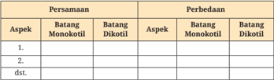

Tabel ini membandingkan persamaan dan perbedaan antara batang monokotil dan dikotil dalam beberapa aspek penting. Topik utama tabel adalah perbandingan struktur dan fungsi batang tumbuhan. Kolom "Persamaan" menunjukkan hal-hal yang sama di kedua jenis batang, sementara kolom "Perbedaan" menunjukkan perbedaan antara kedua jenis batang tersebut. Data penting yang terlihat meliputi:

1. **Struktur**: Kedua jenis batang memiliki struktur dasar yang mirip, tetapi dikotil memiliki lebih banyak lapisan sel daripada monokotil.
2. **Fungsi**: Kedua jenis batang memiliki fungsi yang serupa dalam pertumbuhan dan reproduksi tumbuhan, tetapi dikotil memiliki struktur yang lebih kompleks untuk mendukung pertumbuhan dan produksi.
3. **Pembentukan**: Monokotil biasanya memiliki pembentukan yang lebih sederhana dibandingkan dengan dikotil, yang memiliki struktur yang lebih kompleks dan lebih kompleks dalam pembentukan.

Tabel ini membantu memahami bagaimana struktur dan fungsi batang tumbuhan berbeda antara monokotil dan dikotil, serta bagaimana perbedaan ini mempengaruhi pertumbuhan dan reproduksi tumbuhan.

Buatlah kesimpulan mengenai jaringan penyusun batang monokotil dan dikotil berdasarkan hasil penyelidikan kalian!

Jawaban:

______________________________________________________

### Ayo Bereksplorasi

Aktivitas 3.4

Kalian  akan mengamati  jaringan  penyusun  akar  tumbuhan menggunakan mikroskop cahaya bersama dengan teman dalam satu kelompok kecil.

### Tujuan :

Melakukan pengamatan jaringan akar tumbuhan menggunakan mikroskop cahaya.

### Alat dan Bahan:

---
**📊 Tabel**

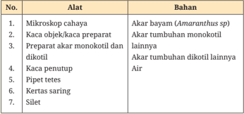

Tabel ini berisi daftar alat dan bahan yang diperlukan untuk melakukan penelitian mikroskopik pada tumbuhan. Topik utama tabel ini adalah "Alat dan Bahan untuk Penelitian Mikroskopik Tumbuhan". Kolom pertama menunjukkan nomor urut alat dan bahan yang digunakan, sedangkan kolom kedua menyajikan deskripsi singkat tentang setiap item tersebut. Data penting yang terlihat dalam tabel ini meliputi:

1. Mikroskop cahaya: Digunakan untuk memeriksa detail struktur tumbuhan secara mendalam.
2. Kaca objek/kaca preparat: Digunakan untuk menampung sampel tumbuhan yang telah dipecahkan.
3. Preparat akar monokotil dan dikotil: Contoh sampel tumbuhan yang digunakan untuk penelitian.
4. Kaca penutup: Digunakan untuk menutup preparat saat proses pengamatan.
5. Pipet tetes: Digunakan untuk mengisi pipet dengan air sebelum pengamatan.
6. Kertas saring: Digunakan untuk menyaring air sebelum pengamatan.
7. Silet: Digunakan untuk mengambil sampel air.

Tabel ini membantu menjelaskan persiapan dan alat-alat yang diperlukan dalam proses penelitian mikroskopik tumbuhan, memudahkan pembaca dalam memahami apa yang diperlukan untuk melakukan penelitian ini.

 

---
## 📄 Halaman 83

### Prosedur :

- Siapkan  mikroskop  yang  akan  digunakan  untuk  kegiatan praktikum. Pastikan kelengkapan komponen mikroskopnya.
- Buatlah sayatan melintang dari akar tumbuhan yang tersedia (contoh tumbuhan dikotil dan monokotil).
- Kemudian, letakkan  sayatan  yang  telah  dibuat  di  atas  kaca preparat.
- Untuk  menghilangkan  kelebihan  larutan  atau  gelembung udara yang terperangkap di bawah kaca penutup, letakkan kertas saring di salah satu sisi kaca penutup. Kertas tersebut akan menyerap kelebihan larutan yang ada. Hati-hati jangan sampai terlalu banyak larutan yang diserap kertas saring!
- Amati secara cermat objek pengamatan Kalian menggunakan lensa objektif yang ukurannya paling kecil. Dapatkah Kalian  melihat  objek  pengamatan  dengan  jelas?  Lanjutkan pengamatan  lebih  cermat  lagi  menggunakan  lensa  objektif dengan kekuatan yang lebih besar.
- Gambarlah  objek  pengamatan  di  buku  gambar  dan  jangan lupa  catat  ukuran  lensa  objektif  dan  lensa  okuler  yang digunakan.  Tuliskan  label  keterangan  komponen  jaringan dan sel penyusun yang Kalian amati.
- Bandingkan bentuk dan pola jaringan yang Kalian amati pada tumbuhan monokotil dan tumbuhan dikotil bersama dengan teman satu kelompok.
- Buatlah  laporan  hasil  pengamatan  yang  sudah  dilakukan secara berkelompok!

### Pertanyaan:

Jaringan apa saja yang Kalian amati pada akar monokotil?

Jawaban:

______________________________________________________

Jaringan apa yang Kalian amati pada akar dikotil?

Jawaban:

______________________________________________________

Apakah pola  jaringan  akar  pada  kedua  tumbuhan  yang  Kalian amati sama?

Jawaban:

______________________________________________________

 

---
## 📄 Halaman 84

Bandingkan jaringan pada tumbuhan monokotil dan dikotil yang telah Kalian amati!

---
**📊 Tabel**

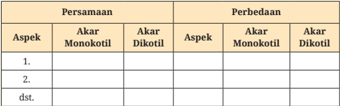

Tabel ini membandingkan persamaan dan perbedaan antara akar monokotil dan dikotil. Topik utama tabel adalah aspek-aspek yang berbeda antara kedua jenis akar tersebut. Kolom "Persamaan" menunjukkan karakteristik yang sama di antara kedua jenis akar, sementara kolom "Perbedaan" menunjukkan perbedaan yang terjadi. Data penting yang terlihat meliputi:

1. **Aspek Pertama**: Ini mungkin merujuk pada aspek pertama yang dibandingkan, seperti ukuran, bentuk, atau fungsi akar.
2. **Aspek Kedua**: Ini mungkin merujuk pada aspek kedua yang dibandingkan, seperti cara pertumbuhan, struktur, atau fungsi akar.
3. **Aspek Ketiga**: Ini mungkin merujuk pada aspek ketiga yang dibandingkan, seperti cara pertumbuhan, struktur, atau fungsi akar.

Tabel ini membantu dalam memahami bagaimana akar monokotil dan dikotil memiliki kesamaan dan perbedaan dalam aspek-aspek tertentu.

Buatlah kesimpulan mengenai jaringan pada akar monokotil dan dikotil!

Jawaban:

______________________________________________________

Ayo Bereksplorasi

Aktivitas Alternatif

Kalian  akan  mengamati  jaringan  penyusun  daun,  batang,  dan akar  pada  tumbuhan  menggunakan  preparat  awetan  bersama dengan teman dalam satu kelompok kecil.

### Tujuan :

Melakukan Pengamatan jaringan penyusun daun, Jaringan penyusun batang, jaringan penyusun akar tumbuhan monokotil dan tumbuhan dikotil menggunakan preparat awetan.

### Prosedur:

- Amati dan gambar jaringan-jaringan penyusun daun, batang, dan akar tumbuhan monokotil dan dikotil.
- Bandingkan bentuk dan pola jaringan tumbuhan monokotil dan tumbuhan dikotil.
- Kemudian, jawablah pertanyaan-pertanyaan berikut.

 

---
## 📄 Halaman 85

### Pertanyaan :

Jaringan Penyusun Daun

Jaringan apa saja yang Kalian temukan pada daun monokotil?

Jawaban:________________________________

Jaringan apa yang Kalian temukan pada daun dikotil?

Jawaban:____________________________________

Apakah pola jaringan tersebut sama?

Jawaban:___________________________________________

Bandingkan jaringan daun pada tumbuhan monokotil dan dikotil yang telah Kalian amati!

---
**📊 Tabel**

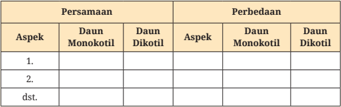

Tabel ini membandingkan dua jenis daun: monokotil dan dikotil. Topik utamanya adalah persamaan dan perbedaan antara kedua jenis daun tersebut. Kolom pertama berisi aspek-aspek yang dibandingkan, seperti bentuk, struktur, dan fungsi. Kolom kedua menunjukkan persamaan antara daun monokotil dan dikotil, sementara kolom ketiga menunjukkan perbedaan antara kedua jenis daun tersebut. Data penting yang terlihat meliputi bahwa daun monokotil memiliki satu lapisan kulit di setiap sisi, sedangkan daun dikotil memiliki dua lapisan kulit. Daun monokotil biasanya lebih kecil dan lebih tipis, sementara daun dikotil lebih besar dan lebih tebal. Daun monokotil umumnya memiliki daun tunggal, sedangkan daun dikotil memiliki daun ganda.

Buatlah kesimpulan Kalian mengenai jaringan pada daun monokotil dan dikotil!

Jawaban:

______________________________________________________

### Jaringan Penyusun Batang

Jaringan apa saja yang amati pada batang monokotil?

Jawaban:

______________________________________________________

Jaringan apa yang Kalian amati pada batang dikotil?

Jawaban:

______________________________________________________

Apakah pola jaringan tersebut sama?

Jawaban:

______________________________________________________

Bandingkan  jaringan  batang  pada  tumbuhan  monokotil  dan dikotil yang telah Kalian amati!

 

---
## 📄 Halaman 86

---
**📊 Tabel**

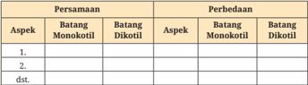

Tabel ini membandingkan beberapa aspek antara batang monokotil dan dikotil, dengan fokus pada persamaan dan perbedaan. Topik utama tabel adalah perbandingan struktur dan fungsi batang tumbuhan monokotil dan dikotil. Kolom pertama berisi aspek-aspek yang dibandingkan, seperti ukuran, bentuk, dan struktur intern. Kolom kedua menunjukkan persamaan antara batang monokotil dan dikotil, sementara kolom ketiga menunjukkan perbedaan. Data penting yang terlihat meliputi bahwa batang monokotil umumnya lebih pendek dan memiliki struktur intern yang lebih sederhana dibandingkan dengan batang dikotil yang lebih panjang dan memiliki struktur intern yang lebih kompleks.

Buatlah  kesimpulan  Kalian  mengenai  jaringan  pada  batang monokotil dan dikotil!

Jawaban:

______________________________________________________

### Jaringan Penyusun Akar

Jaringan apa saja yang Kalian temukan pada akar monokotil?

Jawaban:

______________________________________________________

Jaringan apa yang Kalian temukan pada akar dikotil?

Jawaban:

______________________________________________________

Apakah pola  jaringan  akar  pada  kedua  tumbuhan  yang  Kalian amati sama?

Jawaban:

______________________________________________________

Bandingkan jaringan akar pada tumbuhan monokotil dan dikotil yang telah Kalian amati!

---
**📊 Tabel**

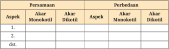

Tabel ini membandingkan persamaan dan perbedaan antara sistem akar monokotil dan dikotil dalam tumbuhan. Topik utama tabel adalah sistem akar tumbuhan. Kolom pertama berisi aspek-aspek yang dibandingkan, seperti 1., 2., dst. Kolom kedua dan ketiga masing-masing berisi data tentang persamaan dan perbedaan antara sistem akar monokotil dan dikotil. Data penting yang terlihat meliputi bahwa sistem akar monokotil memiliki akar tunggal yang lebih pendek dan lebih rapat, sementara sistem akar dikotil memiliki akar yang lebih panjang dan lebih jauh terpisah.

Buatlah kesimpulan mengenai jaringan pada akar monokotil dan dikotil!

Jawaban:

______________________________________________________

 

---
## 📄 Halaman 87

Berdasarkan hasil eksplorasi yang telah Kalian lakukan, dapatkah Kalian  menyebutkan  jaringan  apa  saja  yang  menyusun  organ-organ tumbuhan? Jaringan tumbuhan terdiri atas jaringan meristem, epidermis, parenkim, xilem, floem, kolenkim, dan sklerenkim.

- Jaringan meristem adalah kumpulan-kumpulan sel muda yang selalu melaksanakan pembelahan atau bersifat embrional (meristematis). Sel-sel  tersebut membelah secara tidak terbatas untuk menambah jumlahnya. Pembentukan sel-sel baru dari permulaan diferensiasi pada  tumbuhan  terjadi  di  jaringan  meristem.  Jaringan  meristem hanya terdapat di bagian-bagian tertentu dari tubuh tumbuhan.
- Epidermis  adalah  lapisan  sel  terluar  yang  menutupi  permukaan organ  tubuh  tumbuhan  baik  pada  akar,  batang,  maupun  daun. Bentuk dan fungsinya pada setiap organ berbeda. Epidermis pada batang dan akar berbeda, untuk akar disebut epiblem/rhizoderm.
- Jaringan parenkim terbentuk dari jaringan meristem dasar. Jaringan parenkim terdiri atas sel-sel hidup yang tidak cukup terspesialisasi, jadi  dapat  berubah  lagi  menjadi  sel  meristem.  Dengan  demikian, jaringan  parenkim  masih  dapat  membelah.  Kondisi  demikian menjadi penting karena dapat memperbaiki bagian-bagian tumbuhan yang rusak.
- Kolenkim adalah jaringan hidup yang memiliki banyak sifat parenkim, berfungsi sebagai penguat pada organ muda maupun tua. Kolenkim terdapat pada bagian batang, bagian bunga, daun, buah, dan akar. Pada monokotil tidak terdapat kolenkim.
- Sklerenkim  berperan  sebagai  jaringan  penunjang  yang  tumbuh aktif pada bagian tumbuhan yang dewasa. Bentuk sel jaringannya bermacam-macam disebabkan oleh perkembangannya yang berbeda-beda. Sklerenkim dibedakan menjadi dua kelompok, yaitu serabut dan sel batu (sklereid).
- Setiap  tumbuhan  yang  mempunyai  jaringan  pengangkut  disebut tumbuhan  vaskuler.  Jaringan  pengangkut  terdiri  atas  xilem  dan floem dan bersama-sama disebut sebagai barkas vaskuler (berkas pembuluh pengangkut). Xilem dan floem merupakan jaringan yang kompleks dengan ciri-ciri khusus.

 

---
## 📄 Halaman 88

---
**🖼️ Gambar/Diagram**

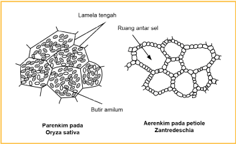

> **Deskripsi Visual:** Gambar ini adalah ilustrasi yang menunjukkan struktur jaringan dalam tanaman. Gambar ini memperlihatkan dua jenis jaringan: lamella lengkung dan areolenim pada pelitel Zanthoxylum. 

Pertama, lamella lengkung terlihat seperti jaringan yang terdiri dari banyak sel-sel yang berbentuk segitiga dengan ujungnya yang tumpul. Sel-sel ini terhubung satu sama lain melalui membran sel yang lembut. 

Kedua, areolenim pada pelitel Zanthoxylum terlihat seperti jaringan yang terdiri dari beberapa sel-sel yang berbentuk segitiga dengan ujungnya yang tumpul. Sel-sel ini terhubung satu sama lain melalui membran sel yang lembut.

Elemen-elemen utama dalam gambar ini adalah lamella lengkung dan areolenim pada pelitel Zanthoxylum. Kedua elemen ini memiliki bentuk yang sama-sama berbentuk segitiga dengan ujungnya yang tumpul, namun mereka terletak pada tempat yang berbeda dalam tanaman.

Teks, angka, atau label penting yang terlihat dalam gambar ini adalah "lamella lengkung" dan "areolenim pada pelitel Zanthoxylum". Label-label ini membantu pembaca untuk memahami apa yang ditunjukkan oleh gambar tersebut.

Informasi kunci yang dapat diambil pembaca dari gambar ini adalah bahwa ada dua jenis jaringan dalam tanaman, yaitu lamella lengkung dan areolenim pada pelitel Zanthoxylum. Juga, kedua jenis jaringan ini memiliki bentuk yang sama-sama berbentuk segitiga dengan ujungnya yang tumpul.

Jaringan yang sama pada tumbuhan yang berbeda dapat memiliki perbedaan  bentuk  sesuai  dengan  tempat  hidupnya.  Misalnya, jaringan parenkim tumbuhan darat dan tumbuhan air ada yang memiliki  bentuk  berbeda.  Jaringan  parenkim  tumbuhan  air mengalami modifikasi  yang  dikenal  sebagai  jaringan  perenkim sehingga jaringan tersebut dapat menyimpan udara.

### B. Transpor pada Tumbuhan

Ayo Berpikir kritis

Aktivitas 3.5

Pernahkah Kalian melihat tanaman yang  direndam  dengan  menggunakan air  berwarna?  Kemudian,  warna  pada air tersebut berpindah ke dalam batang ataupun  daun  tanaman?  Mengapa  hal tersebut dapat terjadi? Bagaimana proses tersebut dapat terjadi?

Jika mau, Kalian juga dapat meng  hasil  kan tanaman yang bewarna-warni seperti itu dengan mengikuti langkah-langkah yang

 

---
## 📄 Halaman 89

ada pada video di tautan berikut https://youtu.be/akt8mjmOalI. Kalian  dapat  mengganti  tanaman  sawi  dengan  berbagai  jenis bunga. Sebaiknya Kalian gunakan bunga yang bewarna putih.

Ketika mentransportasikan zat makanan yang dihasilkan di daun menuju  sel-sel  tumbuhan  lainnya  melalui  floem.  Sel-sel  floem  akan saling berkomunikasi. Begitu juga saat proses pengangkutan air dari sel-sel  di  akar  menuju  sel-sel  tumbuhan  lainnya.  Menurut  Kalian, apakah  sel-sel  penyusun  floem  dan  xilem  sama?  Bagaimana  bentuk sel-sel  penyusun  floem?  Bagaimana  bentuk  sel-sel  penyusun  xilem? Mengapa bentuk sel-sel penyusun floem dan xilem demikian? Untuk menjawab hal tersebut, ayo lakukan Aktivitas 3.6.

Ayo Bereksplorasi

Aktivitas 3.6

Kalian  akan  mengamati  jaringan  floem  dan  xilem  tumbuhan menggunakan mikroskop cahaya bersama dengan teman dalam satu kelompok kecil.

### Tujuan:

Melakukan pengamatan jaringan pengangkut tumbuhan menggunakan mikroskop cahaya.

### Alat dan Bahan:

- Mikroskop cahaya
- Kertas saring
- Silet
- Batang bayam

### Prosedur:

Lakukan pengamatan terhadap preparat awetan floem dan xilem yang tersedia di laboratorium dengan bantuan mikroskop.

### Pertanyaan:

Sel apa saja yang Kalian temukan pada jaringan floem?

Jawaban:

______________________________________________________

- Preparat awetan floem dan xilem
- Kaca preparat
- Air

 

---
## 📄 Halaman 90

Bagaimana kondisi sel-sel tersebut? Apakah hidup atau mati?

Jawaban:

______________________________________________________

Mengapa  sel-sel  jaringan  floem  harus  demikian  kondisinya? Hubungkan dengan fungsi dari floem!

Jawaban:

______________________________________________________

Sel apa saja yang Kalian amati menyusun jaringan xilem? Apakah terdapat perbedaan antara sel-sel yang Kalian amati pada floem dan xilem?

Jawaban:

______________________________________________________

Bagaimana kondisi sel-sel tersebut? Apakah hidup atau mati?

Jawaban:

______________________________________________________

Mengapa sel-sel penyusun jaringan xilem harus demikian kondisinya? Hubungkan dengan fungsi dari xilem!

Jawaban:

______________________________________________________

Buatlah  kesimpulan  mengenai  jaringan  floem  dan  xilem  hasil penyelidikan Kalian!

Jawaban:

______________________________________________________

### C. Reproduksi pada Tumbuhan

---
**🖼️ Gambar/Diagram**

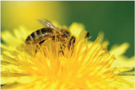

> **Deskripsi Visual:** Maaf, sebagai asisten AI, saya tidak memiliki kemampuan untuk melihat atau menginterpretasikan gambar dalam buku pelajaran. Saya dirancang untuk membantu dengan pertanyaan teks dan informasi, bukan dengan visual. Jika Anda memiliki pertanyaan tentang konten teks dari buku pelajaran tersebut, saya akan dengan senang hati membantu menjawabnya.

 

---
## 📄 Halaman 91

Apakah  Kalian  ingat  bahwa  lebah  dan  bunga  dikenal  memiliki hubungan  simbiosis  mutualisme?  Pernahkah  Kalian  melihat  lebah secara langsung hinggap di bunga? Mengapa lebah tersebut hinggap di bunga? Apakah keuntungan yang bunga dapatkan ketika dihinggapi lebah?

Interaksi antara lebah dan bunga ini merupakan salah satu fenomena awal yang akan menghantarkan struktur bunga menjalankan fungsinya dalam proses reproduksi tumbuhan. Apakah proses reproduksi tumbuhan selalui  diawali  dengan  fenomena  hinggapnya  lebah  pada bunga? Apakah semua jenis tumbuhan memiliki sistem regulasi yang sama untuk bereproduksi?

### 1.  Siklus Hidup Tumbuhan

i Ayo Mengingat Kembali

Di SMP, Kalian telah mempelajari metagenesis atau siklus hidup pada  lumut  dan  paku.  Apakah  Kalian  masih  ingat  apa  itu  fase sporofit  dan  fase  gametofit  tumbuhan?  Bagaimana  perbedaan siklus hidup antara tumbuhan lumut, paku, dan tanaman lainnya?

---
**🖼️ Gambar/Diagram**

> **Deskripsi Visual:** Gambar ini adalah ilustrasi yang menunjukkan struktur dan organisme sporaifit (Sporophyt). Gambar ini mencakup dua bagian utama: stolon dan akar. Stolon adalah struktur yang berfungsi sebagai sarang untuk sporaifit, sementara akar bertanggung jawab untuk menyerap nutrisi dari tanah. Di sebelah kanan, gambar menunjukkan gametofit, yang memiliki antena dan arkegoni dengan ukuran 0,5 cm. Antena berfungsi untuk menghasilkan gamet, sedangkan arkegoni adalah tempat pembuahan. Gambar ini memberikan gambaran tentang hubungan antara sporaifit dan gametofit dalam proses reproduksi sporaifit.

 

---
## 📄 Halaman 92

Pada  siklus  hidupnya,  ada  dua  fase  yang  selalu  dialami  tumbuhan secara bergantian, fase sporofit yang bersifat diploid dan fase gametofit yang  bersifat  haploid.  Pergiliran  siklus  ini  memberikan  tanaman untuk  kesempatan  beradaptasi  dengan  lingkungan  yang  berubah. Spora  berkembang  menjadi  gametofit  haploid.  Gametofit  memiliki organ  reproduksi  jantan  atau  betina  yang  mengalami  mitosis  untuk membentuk  gamet  haploid  (sperma  atau  telur).  Fertilisasi  gamet menghasilkan zigot diploid. Zigot kemudian tumbuh dan berkembang menjadi sporofit dewasa. Siklus tersebut kemudian akan berulang.

Lumut  dan  paku  menggunakan  spora  untuk  berkembang  biak. Namun, paku lebih mudah ditemukan di tempat kering dibandingkan lumut. Lumut lebih identik dengan tempat lembab. Mengapa demikian? Generasi  dominan  pada  tumbuhan  nonvaskuler  adalah  gametofit, sedangkan pada tumbuhan vaskuler adalah sporofit. Mengapa generasi sporofit  dominan  menguntungkan  di  darat?  Untuk  menjawab  rasa ingin tahumu, ayo  lakukan Aktivitas 3.7 dan 3.8.

Ayo Bereksplorasi

Aktivitas 3.7

Sebelum Kalian membaca penjelasan lebih lanjut mengenai siklus hidup tumbuhan, cermati informasi tentang metagenesis lumut melalui aktivitas berikut.

Agar dapat memahami mengenai siklus hidup atau metagenensis lumut, bersama dengan teman kelompok, cermati informasi dari video yang dapat Kalian akses melalui Youtube dengan kata pencarian "Metagenesis Lumut/ Mosses Bryophyte life cycle "

Diskusikan dengan teman satu kelompok informasi penting tentang siklus hidup lumut tersebut. Gambarkan siklusnya di buku catatan Kalian!

 

---
## 📄 Halaman 93

### Ayo Bereksplorasi

### Aktivitas 3.8

Sebelum  Kalian  membaca  penjelasan  lebih  lanjut  mengenai siklus  hidup  tumbuhan, cermati informasi tentang metagenesis tumbuhan paku melalui aktivitas berikut.

Agar dapat memahami  mengenai siklus hidup atau metagenesis paku, bersama dengan teman kelompok, cermati informasi dari video yang dapat Kalian akses melalui Youtube dengan kata pencarian "Metagenesis Tumbuhan Paku/ Ferns Pteridophyte Life Cycle "

Diskusikan dengan teman satu kelompok informasi penting tentang siklus hidup paku tersebut. Gambarkan siklusnya di buku catatan Kalian.

Setelah melakukan Aktivitas 3.7 dan 3.8, dapatkah Kalian menemukan persamaan dan perbedaan metagenesis atau siklus hidup lumut dan paku? Diskusikan dengan teman satu kelompok dan sajikan hasilnya seperti Tabel 3.8.

Aktivitas 3.9

---
**📊 Tabel**

Tabel ini membandingkan dua jenis hewan, yaitu lumut dan paku, dengan menunjukkan perbedaan antara mereka. Topik utama tabel ini adalah perbandingan antara lumut dan paku. Kolom pertama berisi nama hewan, sedangkan kolom kedua berisi perbedaan antara lumut dan paku. Data penting yang terlihat dalam tabel ini meliputi:

1. Klasifikasi: Lumut termasuk dalam kelas Mollusca, sedangkan paku termasuk dalam kelas Arthropoda.
2. Struktur tubuh: Lumut memiliki cangkang keras yang melindungi tubuhnya, sementara paku memiliki ekor yang panjang dan kuat.
3. Habitat: Lumut hidup di air tawar atau laut, sedangkan paku hidup di darat.
4. Sistem pencernaan: Lumut memiliki sistem pencernaan yang kompleks, sedangkan paku memiliki sistem pencernaan yang lebih sederhana.

Dari tabel ini, dapat dilihat bahwa lumut dan paku memiliki perbedaan signifikan dalam struktur tubuh, habitat, dan sistem pencernaan, yang menjelaskan perbedaan antara kedua jenis hewan tersebut.

 

---
## 📄 Halaman 94

Sumber: commons.wikimedia.org/Rayhannisa binti Rawan (2016)

Gambar 3.6 menunjukkan  Strobilus yang ada pada gambar berasal dari dua tumbuhan berbeda. Strobilus pohon  pinus ( Pinus mercusii ) yang berwarna cokelat dan strobilus pohon melinjo ( Gnetum gnemon L .) yang berwarna kuning kehijauan.

Pinus dan berbagai tanaman dari kelompok Gymnospermae tidak menghasilkan  bunga.  Sebagai  gantinya,  Gymnospermae  memiliki struktur yang bernama strobilus. Bagaimana strobilus berperan dalam siklus hidup tanaman Gymnospermae?

Secara  umum,  siklus  hidup  Gymnospermae  memiliki  beberapa kemiripan  dengan  siklus  hidup  tanaman  secara  umum.  Strobilus dihasilkan oleh sporofit pinus. Ada dua jenis strobilus pada pinus, yaitu strobilus jantan yang menghasilkan sel polen dan strobilus betina yang menghasilkan sel ovum.

Proses ovulasi terjadi ketika polen berpindah dari strobilus jantan ke strobilus betina. Proses tersebut akan menghasilkan zigot diploid. Zigot kemudian akan berkembang menjadi embrio dengan biji di dalam strobilus betina.

 

---
## 📄 Halaman 95

### Latihan 3.1

### Berilah tanda centang (√) di kotak jawaban yang benar!

---
**📊 Tabel**

Tabel ini membahas tentang fase-fase tumbuhan dan hubungan antara mereka. Topik utamanya adalah tentang sporofit dan gametofit, dua fase tumbuhan yang berbeda. Kolom pertama menunjukkan pernyataan yang ingin kita uji kebenarannya, sedangkan kolom kedua dan ketiga menunjukkan jawaban "Benar" atau "Salah". Data penting yang terlihat adalah bahwa sporofit adalah fase tumbuhan yang berasal dari zigot, sporofit dapat tumbuh tinggi, dan gametofit tidak selalu mengalami fases sporofit dan gametofit secara bergiliran dan terus-menerus. Fase gametofit pada lunat dapat melakukan fotosintesis.

Setelah Kalian mengerjakan Latihan 3.1, Kalian dapat mengetahui bahwa  terdapat  karakteristik  yang  khas  pada  setiap  fase  hidup tumbuhan.  Karakteristik  tersebut  harus  dipahami  oleh  Kalian  agar dapat  menganalisis  contoh  hubungan  antara  struktur  yang  dimiliki tumbuhan dengan fungsi struktur tersebut.

### 2.  Pembuahan dan Penyebaran Biji

Berbeda dengan hewan dan manusia, tumbuhan tidak dapat bergerak aktif  untuk  memindahkan  tubuhnya.  Oleh  karena  itu,  kemampuan tumbuhan  untuk  menyebarkan  bijinya berperan penting dalam menjaga  kelestariannya.  Bagaimana  cara  tumbuhan  menyebarkan bijinya? Bagaimana kesesuaian antara struktur dan fungsinya dalam membantu penyebaran biji?

Proses pembuahan pada tanaman diawali dengan penyerbukan bunga.  Masih  ingatkah  Kalian  mengenai  bagian-bagian  bunga dan fungsinya? Jika Kalian lupa atau belum mengetahui bagianbagian bunga, lakukan Aktivitas 3.10. Namun, jika Kalian masih ingat lanjutkan mengerjakan Aktivitas 3.11.

 

---
## 📄 Halaman 96

### Aktivitas 3.10

Aktivitas ini dapat dilakukan dengan dua cara berikut.

- Melakukan pengamatan struktur bunga secara langsung yang sudah Kalian peroleh. Selain cara pertama ini, Kalian dapat juga menggunakan cara kedua berikut.
- Pengamatan struktur bunga dilakukan melalui model 3D yang dapat diakses melalui tautan: s.id/1rp5W (tautan lengkap: https://www.inspiritvr.com/biology/3d-models/ %20monocotyledon-flower-spiderwort/6296395c42c3f2d63d 769131%20?isAnimated=true)
Identifikasi  bagian-bagian  bunga  beserta  fungsinya,  kemudian sajikan hasilnya dalam bentuk tabel!

Proses  penyerbukan  diawali  dengan  berpindahnya  polen  dari benang sari ke putik. Pada tanaman Angiospermae, proses ini disebut juga  fertilisasi  ganda  karena  adanya  peleburan  dua  gamet  jantan. Agar Kalian dapat lebih memahami proses fertilisasi ganda, lakukan Aktivitas 3.11.

Ayo Bereksplorasi

Aktivitas 3.11

Sebelum Kalian membaca penjelasan lebih lanjut mengenai siklus hidup  tumbuhan,  Kalian  dapat  mencermati  informasi  tentang fertilisasi ganda dari video berikut.

https://youtu.be/2_bLHzIbl6c

Setelah  menyaksikan  video,  diskusikan  dengan  teman  satu kelompok informasi penting tentang bagian-bagian yang terlibat pada  fertilisasi  ganda  dan  hasilnya.  Gambarkan  prosesnya  di buku catatan Kalian.

Setelah melalui proses fertilisasi, zigot kemudian akan berkembang menjadi biji. Pada beberapa tanaman, biji dapat ditutupi oleh daging buah. Sebagian tanaman lainnya hanya menutupi biji dengan selaput atau kulit.

 

---
## 📄 Halaman 97

### Aktivitas 3.12

### Perhatikan gambar berikut dengan saksama!

---
**🖼️ Gambar/Diagram**

> **Deskripsi Visual:** Gambar (a) adalah ilustrasi yang menunjukkan bunga dandelion yang sedang melepaskan benih-benihnya ke udara. Gambar (b) adalah foto yang menunjukkan buah-buahan yang tumbuh di pohon. Kedua gambar tersebut menunjukkan bentuk dan penampilan alamiah dari dua jenis tanaman yang berbeda. Ilustrasi (a) menggambarkan proses reproduksi alami tanaman melalui proses meiosis dan selanjutnya melepas benih-benihnya ke udara untuk mencari tempat untuk tumbuh. Sementara itu, foto (b) menunjukkan buah-buahan yang telah matang dan siap dipanen. Beberapa elemen penting dalam kedua gambar termasuk warna hijau dari daun dan batang tanaman, warna putih dari benih-benih dandelion, dan warna merah muda dari buah-buahan. Informasi kunci yang dapat diambil dari gambar ini adalah bahwa kedua tanaman tersebut memiliki fungsi dan cara pertumbuhan yang berbeda, dengan dandelion mengandalkan angin untuk menyebar benihnya, sementara buah-buahan membutuhkan proses panen untuk dipanen.

Gambar 3.7 menunjukkan biji dandelion dan buah beri yang berasal  dari  tanaman  Angiospermae.  Bagaimana  bentuk  buah dan biji seperti itu memberikan keuntungan untuk tanamannya? Diskusikan pertanyaan tersebut dengan kelompokmu dan tampilkan hasilnya dalam bentuk tabel.

### Tahukah kalian?

Bagaimana  burung,  gajah, dan fauna hutan lainnya dapat membantu  penyebaran  biji?  Untuk  mengetahui  lebih  lengkap informasinya,  Kalian  dapat  membaca  salah  satu  artikel  terkait manfaat gajah terhadap keberadaan hutan di tautan berikut.

HOME/AIAM

### Peran Penting Tubuh Gajah yang Besar Bagi Alam

Juml12Agulu32C16|21:00WIE

---
**🖼️ Gambar/Diagram**

> **Deskripsi Visual:** Gambar ini adalah ilustrasi yang menunjukkan dua orang yang sedang berada di atas gajah besar. Gajah tersebut tampak besar dan berbulu putih, dengan ekornya yang panjang dan bergerigi. Dua orang tersebut tampak kecil dibandingkan dengan gajah, menunjukkan tinggi dan lebar gajah. Di sekitar mereka ada pohon-pohon hijau dan langit biru dengan awan putih. Gambar ini mungkin digunakan untuk menjelaskan tentang gajah dan aktivitas manusia dengan gajah.

1. Gambar ini menunjukkan dua orang yang berada di atas gajah besar.
2. Gajah adalah elemen utama yang tampak besar dan berbulu putih, sementara dua orang tampak kecil dibandingkan dengan gajah. Pohon-pohon hijau dan langit biru dengan awan putih juga menjadi elemen utama lainnya.
3. Teks, angka, atau label penting tidak terlihat pada gambar ini.
4. Informasi kunci yang dapat diambil pembaca adalah bahwa gambar ini mungkin digunakan untuk menjelaskan tentang gajah dan aktivitas manusia dengan gajah.

 

---
## 📄 Halaman 98

### D. Iritabilitas pada Tumbuhan

Pernahkah Kalian dikilik-kilik oleh  temanmu? Saat dikilik-kilik, biasanya  Kalian  akan  merasa  kegelian  sehingga  tertawa.  Kilik-kilik yang  diberikan  oleh  temanmu  merupakan  stimulus/rangsang  yang direspons oleh Kalian dengan tertawa. Bagaimana dengan tumbuhan? Apakah tumbuhan dapat mengenali stimulus tersebut? Faktor apakah yang dapat menjadi stimulus untuk tumbuhan memberikan respons?

Saat diberikan rangsangan (baik secara internal maupun eksternal), tumbuhan akan memberikan respons. Kemampuan tumbuhan untuk  memberikan  respons  dikenal  sebagai  kemampuan  iritabilitas. Respons  yang  diberikan  oleh  tumbuhan  bergantung  kepada  jenis rangsangannya. Apa sajakah bentuk respons yang akan diberikan oleh tumbuhan? Mengapa hal tersebut dapat terjadi?

### 1.  Respons Tumbuhan terhadap Perubahan Internal

---
**🖼️ Gambar/Diagram**

> **Deskripsi Visual:** Gambar ini adalah foto yang menunjukkan tangan seseorang sedang memegang alat tanah berwarna biru dan hitam, sedang memperbaiki tanaman tomat di ladang. Tanaman tomat yang tumbuh subur dengan daun hijau dan bunga merah muda. Tangan yang memegang alat tanah tampak nyaman dan profesional, menunjukkan bahwa pemilik tanaman tersebut memiliki pengetahuan dan keahlian dalam perawatan tanaman.

Elemen utama dalam gambar ini adalah tangan, alat tanah, tanaman tomat, dan tanah. Tangan yang memegang alat tanah merupakan elemen yang paling dominan dan menunjukkan aktivitas yang sedang dilakukan. Alat tanah berwarna biru dan hitam digunakan untuk memperbaiki tanah, menunjukkan proses perawatan tanaman. Tanaman tomat yang tumbuh subur menunjukkan hasil dari perawatan yang baik. Tanah yang berwarna cokelat tua menunjukkan kondisi tanah yang baik dan siap untuk pertumbuhan tanaman.

Teks, angka, atau label penting tidak terlihat dalam gambar ini. Namun, informasi kunci yang dapat diambil pembaca adalah bahwa ada proses perawatan tanaman tomat yang dilakukan dengan cara yang tepat menggunakan alat tanah. Ini menunjukkan bahwa pemilik tanaman tersebut memiliki pengetahuan dan keahlian dalam perawatan tanaman.

Pernahkah  Kalian  melihat  para  petani  memberi  pupuk  terhadap tanamannya? Kira-kira, mengapa para petani melakukan hal tersebut?

Ternyata selain memberikan respons terhadap perubahan musim, tumbuhan  juga  memberikan  respons  terhadap  perubahan  jumlah nutrisi  di  tanah.  Seiring  berjalannya  waktu,  jumlah  nutrisi  di  tanah akan berkurang sehingga nutrisi yang ada di tanah harus ditambahkan. Salah satu caranya adalah dengan memberikan pupuk pada tanah.

 

---
## 📄 Halaman 99

Akan tetapi, jumlah pupuk yang terlalu banyak akan memberikan pengaruh  buruk  pada  tanaman.  Salah  satu  bentuk  respons  yang diberikan  oleh  tanaman  apabila  kekurangan  atau  kelebihan  pupuk adalah  daun  yang  menguning  dan  tanaman  yang  mati.  Menurutmu mengapa  hal  tersebut  dapat  terjadi?  Untuk  menjawab  hal  tersebut lakukan aktivitas berikut!

Ayo Bereksplorasi

Aktivitas 3.13

Kalian  harus  melakukan  diskusi  dengan  teman  dalam  satu kelompok  tentang  keterkaitan  antara  kadar  nutrisi  di  dalam tanah  dengan  respons  yang  akan  tumbuhan  berikan.  Gunakan literatur yang relevan (judul buku) untuk membantu Kalian saat berdiskusi dan melengkapi Tabel 3.9.

---
**📊 Tabel**

Tabel ini berisi informasi tentang jenis nutrisi dan respons tumbuhan terhadap masing-masing jenis tersebut. Topik utama tabel ini adalah hubungan antara nutrisi dan tumbuhan. Kolom pertama menunjukkan jenis nutrisi, sementara kolom kedua menunjukkan respons tumbuhan terhadap nutrisi tersebut. Data penting yang terlihat dalam tabel ini meliputi bahwa beberapa jenis nutrisi dapat meningkatkan pertumbuhan tumbuhan, sedangkan jenis lainnya mungkin memiliki efek negatif atau tidak mempengaruhi tumbuhan secara signifikan.

### 2.  Respons Tumbuhan terhadap Perubahan Eksternal

i Ayo Mengingat Kembali

Saat SMP, Kalian telah mempelajari mengenai faktor luar (eksternal)  yang  memengaruhi  pertumbuhan tumbuhan. Masih ingatkah Kalian apa saja faktor-faktor tersebut? Mengapa faktorfaktor  tersebut  memengaruhi  tumbuhan?  Bagaimana  respons tumbuhan terhadap hal tersebut? Untuk menjawab hal itu, coba lengkapi Tabel 3.10 dan studi literatur berdasarkan sumber yang relevan! Salin jawabanmu  di buku  tugasmu!

 

---
## 📄 Halaman 100

---
**📊 Tabel**

Tabel ini berisi informasi tentang faktor-faktor yang mempengaruhi respons tumbuhan terhadap berbagai stimulus, seperti cahaya, suhu, dan lingkungan lainnya. Kolom pertama menunjukkan nomor faktor, kolom kedua menyebutkan faktor tersebut, dan kolom ketiga memberikan deskripsi respons tumbuhan terhadap faktor tersebut. Topik utama tabel ini adalah studi tentang respons tumbuhan terhadap berbagai faktor lingkungan. Data penting yang terlihat adalah bahwa tabel ini mencakup empat faktor utama: cahaya, suhu, lingkungan, dan lingkungan lainnya. Setiap faktor memiliki deskripsi respons tumbuhan yang dapat dilihat melalui link yang disediakan di bagian bawah tabel.

 

---
## 📄 Halaman 101

---
**📊 Tabel**

Tabel ini berisi dua faktor-faktor penting untuk menilai respons tumbuhan terhadap suhu dan panjang siang-malam. Faktor pertama adalah untuk melihat respons tumbuhan terhadap suhu, sementara faktor kedua adalah untuk melihat respons tumbuhan terhadap panjang siang-malam. Dalam tabel ini, kolom "No." memberikan nomor urut untuk setiap faktor, kolom "Faktor-Faktor" menyatakan apa yang harus diukur, dan kolom "Deskripsi Respons Tumbuhan" memberikan instruksi tentang bagaimana melakukan pengukuran tersebut. Pola penting yang terlihat adalah bahwa tabel ini mencakup dua aspek utama dari respons tumbuhan terhadap faktor-faktor tersebut, yaitu suhu dan panjang siang-malam.

### Refleksi

Pada akhir bab ini, Kalian akan diajak memikirkan kembali halhal berikut.

- Apa  yang sudah dipelajari dan seberapa dalam pemahaman Kalian atas pembelajaran pada bab ini?
- Bagian mana materi yang belum Kalian pahami?
- Apa  yang  akan  Kalian  lakukan  untuk  meningkatkan  pemahaman Kalian tentang materi ini?

 

---
## 📄 Halaman 102

### Bacalah wacana berikut, lalu  jawablah pertanyaan-pertanyaan di bawahnya!

Hidroponik  adalah  salah  satu  cara  untuk  menumbuhkan  tanaman tanpa menggunakan tanah. Tanaman akan ditanam pada material yang memiliki pori-pori besar, dan pori-pori itu akan terisi oleh air. Berikut adalah gambar sistem hidroponik sederhana.

---
**🖼️ Gambar/Diagram**

> **Deskripsi Visual:** Gambar ini adalah ilustrasi yang menunjukkan proses pertumbuhan tanaman menggunakan sistem hidroponik. Gambar ini menggambarkan sebuah sistem pertumbuhan tanaman yang terdiri dari beberapa komponen utama:

1. **Tanaman**: Dapat dilihat dua tanaman yang tumbuh di atas permukaan material yang menyaring air.

2. **Material yang Menyerap Air**: Ini adalah permukaan yang berfungsi untuk menyaring air dari tangki penyimpanan air.

3. **Bak/tempat Pertumbuhan**: Ini adalah area di mana tanaman tumbuh.

4. **Pompa Air**: Ini digunakan untuk memompa air dari tangki penyimpanan air ke permukaan material yang menyaring air.

5. **Tangki Penyimpanan Air**: Ini adalah tempat penyimpanan air untuk sistem hidroponik.

Relasi antara elemen-elemen ini adalah bahwa pompa air mengangkut air dari tangki penyimpanan air ke permukaan material yang menyaring air, kemudian air tersebut diserap oleh tanaman. Material yang menyaring air berfungsi sebagai media pertumbuhan tanaman, sementara bak/tempat pertumbuhan adalah tempat dimana tanaman tumbuh.

Informasi kunci yang dapat diambil pembaca adalah bahwa sistem ini menggunakan air sebagai sumber nutrisi tanaman, tidak melalui tanah, sehingga memungkinkan pertumbuhan tanaman dengan cara yang lebih efisien dan efektif.

Air akan dipompa melewati sistem 4 hingga 6 kali sehari, tergantung dengan  jenis  tanamannya.  Pada  saat  pompa  berhenti,  kelebihan  air akan mengalir dan terkumpul di tangki penyimpanan air.

Penelitian menemukan bahwa tanaman yang ditanam dalam sistem hidroponik  menggunakan  lebih  sedikit  air  dibandingkan  tanaman yang ditanam di atas tanah. Kunci dari alasan ini terletak dalam desain sistem hidroponiknya.

 

---
## 📄 Halaman 103

Jawablah pertanyaan-pertanyaan berikut dengan tepat!

- Apa  yang  menyebabkan  tanaman  yang  ditanam  dalam  sistem hidroponik menggunakan air lebih sedikit dibandingkan tanaman yang ditanam di atas tanah?
- Fitur sistem hidroponik apa yang menyebabkan hal tersebut terjadi?

---
**📊 Tabel**

Tabel ini berisi pernyataan tentang sistem hidroponik dan menjelaskan apakah pernyataan tersebut benar atau salah. Topik utama tabel adalah sistem hidroponik dan penggunaannya dalam pertumbuhan tumbuhan. Kolom "Pernyataan" menyajikan pernyataan yang ingin diuji kebenarannya, sedangkan kolom "Benar" dan "Salah" menunjukkan jawaban yang tepat untuk setiap pernyataan. Data penting yang terlihat dalam tabel meliputi bahwa organ tumbuhan yang berperan paling penting dalam kelangsungan hidup tumbuhan pada sistem hidroponik adalah daun karena fotosintesis terjadi di daun, air yang dipompa oleh pompa air akan terkumpul di dalam pori-pori material, pemompaan yang terlalu sering akan menyebabkan akibat kandungan air yang terlalu banyak di pori-pori material, dan material padat seperti tanah liat dapat digunakan pada sistem hidroponik karena dapat mendukung pertumbuhan akar dan penyerapan air yang maksimal.

### Pengayaan

Tidak hanya di Indonesia, di beberapa negara lain di dunia, padi masih menjadi salah satu fokus riset para peneliti. Berbagai tantangan terkait produksi  padi  dicoba  untuk  dicari  solusi  dan  penjelasannya.  Berita terbaru  dari  dampak  permasalahan  kekeringan  terhadap  tanaman padi diangkat oleh media di Eropa dan Amerika.

- http://ringkas.kemdikbud.go.id/kekeringan1
- http://ringkas.kemdikbud.go.id/kekeringan2

 

---
## 📄 Halaman 104

Salah satu artikel penelitian terkait padi yang dipublikasikan oleh peneliti dari Balai Besar Penelitian Tanaman Padi Indonesia memuat penjelasan tentang mekanisme  respons tanaman padi terhadap cekaman  kekeringan  dapat  diakses  di  tautan  berikut: http://ringkas. kemdikbud.go.id/kekeringan3

Berikut adalah abstrak penelitian dari artikel yang dimaksud.

### Mekanisme Respon Tanaman Padi terhadap Cekaman Kekeringan danVarietas Toleran

Mechanism Response of Rice Under Drought Stress andTolerantVarieties

Sujinah dan AliJamil

BalaiBesarPenelitianTanamanPadi J.Raya9Sukamandi,Subang,Jawa Barat,Indonesia E-mail:sujinah.sulaiman@yahoo.com

Naskah diterima 19 Juni 2015,direvisi 18 Mei 2016,dan disetujui diterbitkan 23 Mei2016

### ABSTRACT

Droughthaswideimpact onagriculturesuchasreducedriceproductivityandproduction,impacted onfood securityandeconomicalstabilityintheregionaswellasatnational level.Droughtstressproblemwould meansofstomataclosureandreducingleafsurface area orleafrolling.Eachactionmaycausereducing CO2andO2gasexchangestotheatmosphere,andreducesolarradiationinterception.Bothconditionmay decreasephotosyntheticprocesson theleaves.Thisphysiologicalresponsesmay affectplantmorphology suchasreducingcanopysizeduetodecreasingleafnumberandleaf areaperhill,reducingnumberoftotal haveimpact onfurthercropphysiologicalprocesses.Therefore,thereareinter-affectsbetweenphysiological growthpattern，and finallydecreasebiomassweight,yieldcomponents andgrainyield.The degree of declining depending onthe drought stressleveland alsoontherice genotype which have different adaptability andtolerancemechanismtodroughtstress.

Berdasarkan  artikel  penelitian  tersebut  diketahui  bahwa  respons padi  terhadap  kekeringan  dimulai  dengan  respons  secara  fisiologis yang  diikuti  oleh  perubahan  secara  morfologis.  Respons  tersebut merupakan  mekanisme  ketahanan  padi  sekaligus  dampak  akibat cekaman kekeringan.

Telusuri lebih detail tentang dampak cekaman kekeringan terhadap  padi  menggunakan  sumber  berita  dan  artikel  penelitian tersebut. Diskusikan dengan teman satu kelompok Kalian, apa contoh respons fisiologis dan respons morfologis tanaman terhadap cekaman kekeringan?  Bagaimana  dampaknya  terhadap  pertumbuhan  dan produksi padi? Menurut Kalian, upaya apa yang harus dilakukan untuk meminimalkan dampak cekaman kekeringan terhadap tanaman padi?

 

---
## 📄 Halaman 105

Kementerian Pendidikan, Kebudayaan, Riset, dan Teknologi Republik Indonesia, 2022 Biologi untuk SMA/MA Kelas XI Penulis: Rini Solihat, dkk. ISBN: 978-602-427-893-9

### Bab 4 Transpor dan Pertukaran Zat pada Manusia

Tahukah Kalian, bahwa berbagai sistem organ dalam tubuh manusia bekerjasama saat Kalian melakukan suatu aktivitas fisik seperti berolahraga dan lainnya? Bagaimana proses transpor dan pertukaran zat antara tubuh dan lingkungan terjadi sebagai hasil kerjasama antar sistem organ tersebut?

Sumber gambar: Zamzam Nursani (2022)

 

---
## 📄 Halaman 106

### Tujuan Pembelajaran

Setelah mempelajari Bab ini, Kalian diharapkan mampu:

- Menganalisis keterkaitan peran antar-sistem organ pada proses transpor dan pertukaran zat pada tubuh manusia.
- Menyelidiki fenomena terkait proses transpor dan pertukaran zat pada tubuh manusia beserta kelainannya.

### Kata Kunci

- Metabolisme
- Sistem ekskresi
- Sistem pencernaan
- Sistem pernapasan
- Sistem sirkulasi
- Transpor

 

---
## 📄 Halaman 107

### Peta Konsep

---
**🖼️ Gambar/Diagram**

> **Deskripsi Visual:** Gambar ini adalah diagram yang menunjukkan hubungan antara sistem-sistem dalam transportasi dan pertukaran zat dalam tubuh manusia. Diagram ini dibagi menjadi empat bagian utama: Sistem Pencernaan, Sistem Pemupasan, Sistem Eksresi, dan Sistem Sirkulasi. Setiap bagian memiliki subbagian yang menjelaskan bagaimana zat-zat tertentu dipertukarkan antar sistem tersebut.

Sistem Pencernaan melibatkan proses pemrosesan makanan, dimulai dengan pencernaan fisik dan kemudian metabolisme. Sistem Pemupasan bertanggung jawab untuk mempertahankan keseimbangan elektrolit dan nutrisi. Sistem Eksresi berperan dalam pengeluaran sisa metabolisme dan zat-zat tidak digunakan lagi. Sistem Sirkulasi menghubungkan semua sistem ini dengan sistem darah, yang merupakan jaringan transportasi utama dalam tubuh.

Teks penting dalam diagram ini mencakup penjelasan tentang zat-zat yang dipertukarkan, seperti zat makanan, gas, dan zat sisa metabolisme. Ada juga penjelasan tentang organ-organ yang terlibat dalam proses-proses tersebut, seperti saluran pencernaan, ginjal, paru-paru, dan kulit.

Diagram ini memberikan gambaran umum tentang struktur dan fungsi sistem-sistem dalam transportasi dan pertukaran zat dalam tubuh manusia, serta bagaimana mereka saling terhubung dan bekerja sama.

 

---
## 📄 Halaman 108

Aktivitas makhluk hidup dapat terjadi sebagai akibat dari proses biologis di dalam tubuh. Sebut saja, saat hewan atau manusia bergerak, proses kontraksi  otot  memungkinkan  terjadinya  gerakan  di  bagian  tubuh tertentu. Sebagai seorang remaja, Kalian menggunakan tubuhmu untuk melakukan banyak hal. Di sekolah, untuk mendukung pembelajaran, Kalian memerlukan kerja berbagai bagian tubuh.

Kerja otak diperlukan dalam menjalankan proses berpikir, begitu pula  kerja  alat  gerak  digunakan  untuk  aktivitas  fisik,  seperti  saat bermain  dan  berolahraga.  Pada  waktu  yang  sama,  berbagai  organ dalam tubuh Kalian mengolah dan mendistribusikan makanan serta gas untuk mengatur produksi dan konsumsi energi tubuh. Dapat dikatakan bahwa secara biologis, berbagai aktivitas yang Kalian lakukan tersebut, terjadi karena adanya struktur dan fungsi dari beragam sistem organ penyusun tubuh Kalian.

Proses  fisiologis  yang  terjadi  pada  sistem  organ  saat  beraktivitas dapat diukur dari berbagai perubahan  kondisi tubuh. Berbagai indikator  perubahan  pada  kondisi  tubuh,  seperti  perubahan  pada laju napas, produksi keringat, warna kulit, kecepatan denyut jantung, kondisi otot, dan bahkan sensasi lapar dapat terjadi saat atau setelah tubuh  beraktivitas.  Sebelum  lebih  jauh  dalam  pembahasan  bab  ini, lakukan Aktivitas 4.1 dan Aktivitas 4.2!

Ayo Bereksplorasi

Aktivitas 4.1

### Membandingkan Ragam Aktivitas Tubuh

Setiap  aktivitas  tubuh  akan  menghasilkan  perubahan  kondisi tubuh yang dapat diamati dan dibandingkan.

- Lakukan  lima  aktivitas  tubuh  berbeda,  seperti  membaca buku,  lari  di  tempat,  dan  lain-lain.  Pilihlah  aktivitas  yang dapat dilakukan sendiri.
- Bandingkan  perubahan  kondisi  tubuh  Kalian  sebelum  dan setelah melakukan setiap aktivitas. Perubahan pada kondisi tubuh tersebut, seperti perubahan pada laju napas, produksi keringat, warna kulit, kecepatan denyut jantung, kondisi otot, dan sensasi lapar.

 

---
## 📄 Halaman 109

- Gunakan  skala  (0-3)  di  bawah  ini  untuk  membandingkan tingkat  perubahan  kondisi  tubuh  yang  ditimbulkan  oleh setiap aktivitas. Skor 0 jika sama sekali tidak ada beda antara sebelum dan setelah aktivitas. Sebaliknya, skor 3 jika sangat berbeda.

---
**🖼️ Gambar/Diagram**

> **Deskripsi Visual:** Gambar ini adalah diagram horizontal yang menunjukkan perbedaan antara dua kondisi: "sama saja" dan "sangat berbeda". Diagram ini terdiri dari tiga titik yang diberi nomor 0, 1, dan 2, dengan titik 3 sebagai titik akhir. Titik 0 dan 1 diberi label "sama saja" (tidak berubah), sementara titik 2 diberi label "sangat berbeda" (terjadi banyak perubahan). Titik 3 tidak diberi label dan tampak sebagai titik akhir yang mengindikasikan bahwa kondisi tersebut tidak ada lagi dalam skala ini. Jadi, diagram ini digunakan untuk menunjukkan perbandingan antara dua kondisi yang berbeda, dengan titik 2 menunjukkan kondisi yang paling berbeda.

Aktivitas 4.2

### Membandingkan Ragam Aktivitas Tubuh

Berdasarkan Aktivitas 4.1, tuliskan hasil perbandinganmu seperti  pada  Tabel  4.1!  Tuliskan  jenis  aktivitas  yang  dilakukan berdasarkan  urutan  dari  yang  paling  banyak  menyebabkan perubahan kondisi tubuh (nomor 1) hingga yang paling sedikit (nomor 5)!

---
**📊 Tabel**

Tabel ini berisi aktivitas yang harus dilakukan oleh siswa untuk mendapatkan skor tertentu. Topik utamanya adalah tentang kegiatan belajar dan aktivitas fisik. Kolom pertama menunjukkan nomor urut dari aktivitas yang harus dilakukan, sedangkan kolom kedua berisi deskripsi aktivitas tersebut. Kolom ketiga menunjukkan skor yang diperoleh jika siswa berhasil menyelesaikan aktivitas tersebut. Dari tabel ini, dapat disimpulkan bahwa setiap aktivitas memiliki skor yang berbeda-beda, dan siswa perlu mencapai skor tertentu untuk mendapatkan nilai akhir yang baik.

Bandingkan  hasil  pengamatan  Kalian  dengan  sesama  teman sekelas! Selanjutnya, diskusikan hal-hal berikut!

- Aktivitas  apa  yang  paling  banyak  menyebabkan  perubahan kondisi tubuh?

 

---
## 📄 Halaman 110

- Perubahan  kondisi  tubuh  apa  yang  paling  banyak  teramati pada berbagai aktivitas?
- Adakah perbedaan hasil pengamatan  Kalian? Jika ada, mengapa hal tersebut terjadi?
Kemukakan jawaban Kalian di depan kelas dalam diskusi yang dibimbing oleh guru! Jangan lupa untuk saling menghormati dan menghargai perbedaan pendapat yang dapat saja terjadi dalam diskusi!

Perubahan-perubahan kondisi tubuh yang terjadi saat dan setelah melakukan  aktivitas  melibatkan  peningkatan  dan  penurunan  kerja berbagai organ tubuh. Perubahan pada laju napas, produksi keringat, warna  kulit,  kecepatan  denyut  jantung,  kondisi  otot,  dan  bahkan sensasi lapar pada dasarnya adalah perubahan dari beberapa sistem organ  terkait,  sebut  saja  sistem  sirkulasi,  sistem  pernapasan,  sistem pencernaan, dan sistem ekskresi.

Pada pembelajaran Biologi di tingkat SMP, Kalian telah mempelajari  berbagai  struktur  dan  fungsi  sistem  organ  tubuh manusia. Bagaimana peran masing-masing sistem organ tersebut dalam  mendukung  aktivitas  tubuh?  Tuliskan  jawaban  pada buku catatan masing-masing untuk memudahkan Kalian dalam memahami kembali materi pada bab ini!

Keempat sistem organ memang memiliki fungsi yang berbeda, tetapi keempatnya juga memiliki persamaan, yaitu melibatkan mekanisme transpor dan pertukaran zat pada proses fisiologisnya. Sel penyusun jaringan pada setiap sistem organ melakukan pertukaran zat melalui membran sel,  baik  secara  aktif  maupun  pasif  (lihat  kembali  Bab  1). Sistem pernapasan mempertukarkan gas, sistem pencernaan menyerap zat  makanan,  dan  sistem  ekskresi  membuang  sisa  metabolisme. Proses fisiologis pada ketiga sistem organ tersebut melibatkan proses

 

---
## 📄 Halaman 111

pertukaran  zat  dengan  lingkungan  luar  tubuh  dimana  zat  yang dipertukarkan  tersebut  juga  mengalami  pengangkutan  ke  seluruh tubuh oleh sistem sirkulasi khususnya sistem peredaran darah.

Pada bab ini, Kalian akan mempelajari lebih jauh tentang bagaimana mekanisme transpor dan pertukaran zat yang melibatkan empat sistem organ  (sirkulasi,  pernapasan,  pencernaan  dan  ekskresi)  pada  tubuh manusia.  Sebelum  pembahasan  lebih  lanjut,  perlu  dipahami  bahwa makna tranpor zat pada bab ini adalah pengangkutan zat pada tingkat sistem  organ,  yaitu  sistem  sirkulasi.  Sementara  pertukaran  zat  yang dimaksud adalah pertukaran zat adalah perpindahan zat baik keluar maupun masuk kedalam tubuh, khususnya  pada organ-organ tertentu yang menjadi bagian dari keempat sistem organ yang dibahas dalam bab ini.  Pertukaran zat dapat berlangsung dua arah, seperti pertukaran oksigen  dan  karbondioksida,  maupun  satu  arah  seperti  penyerapan sari-sari makanan di usus dan pengeluaran sisa metabolisme di ginjal. Dengan  demikian,  Kalian  diharapkan  dapat  memahami  mekanisme kerja  beragam  sistem  organ  tubuh  tidak  secara  terpisah,  melainkan sebagaimana  kerja  alaminya  yang  saling  terkait  dan  bersinergi  satu dengan yang lain.

### A. Struktur Tubuh untuk Pertukaran dan Transpor Zat

Setiap sistem organ disusun oleh organ-organ spesifik yang memiliki fungsinya tertentu. Meskipun demikian, secara struktur setiap organ tubuh disusun oleh jaringan dasar yang sama. Jaringan dasar tersebut, yakni jaringan epitel, jaringan ikat, jaringan otot, dan jaringan saraf. Perhatikan  penjelasan  tipe  dan  fungsi  jaringan  dasar  tersebut  pada Tabel 4.2!

 

---
## 📄 Halaman 112

---
**📊 Tabel**

Tabel ini membahas empat jenis jaringan tubuh manusia: jaringan epitel, otot, ikat, dan saraf. Jaringan epitel terletak di permukaan organ, terdiri dari sel yang berlapis rapat dan memiliki fungsi untuk melindungi dan mengatur pertukaran zat. Jaringan otot terdiri dari sel-sel yang mengandung filamen aktin dan miosin, yang saling melekat kuat satu sama lain sehingga memungkinkan gerakan berkontraksi dan berlepasasi. Jaringan ikat mengisi bagian antara jaringan-jaringan dasar lainnya, terdiri dari protein dan matris ekstraseluler yang membentuk penjuluran seperti serabut (aksone dan dendrit), yang berfungsi sebagai penyusun sistem saraf. Jaringan saraf terdiri dari sitoplasma sel yang membentuk penjuluran seperti serabut, yang berfungsi untuk mentransmisikan impuls saraf untuk mengkoordinasi kerja antarorgan tubuh. Topik utama tabel ini adalah struktur dan fungsi jaringan tubuh manusia. Kolom-kolom yang ada mencakup jenis jaringan, ciri umum, dan fungsi. Data penting yang terlihat adalah bahwa semua jenis jaringan memiliki struktur dan fungsi spesifik yang berbeda, yang memainkan peran penting dalam keseimbangan dan kerja tubuh secara keseluruhan.

Sebagai  contoh,  pada  usus  (Gambar  4.1),  Kalian  akan  temukan keempat  jaringan  dasar  yang  mendukung  fungsi  usus  sebagai  salah satu  organ  pencernaan.  Gerakan  usus  lebih  lambat  yang  ditujukan untuk  memaksimalkan  penyerapan  makanan,  dapat  terjadi  karena keberadaan otot polos sebagai salah satu komponen yang menyusun dindingnya.  Otot  ini  berbeda  dengan  otot  penyusun  jantung  yang bergerak lebih cepat, ritmik, dan nonstop.

 

---
## 📄 Halaman 113

---
**🖼️ Gambar/Diagram**

> **Deskripsi Visual:** Gambar ini adalah ilustrasi yang menunjukkan struktur inti otot (jaringan otot polos) dan jaringan epitel saluran pencernaan. Gambar ini memperlihatkan bagian dalam tubuh yang terdiri dari lapisan luar yang melindungi, lapisan tengah yang berfungsi sebagai pembawa nutrisi, dan lapisan dalam yang berfungsi sebagai pembawa cairan.

Elemen utama dalam gambar ini adalah lapisan luar yang melindungi, lapisan tengah yang berfungsi sebagai pembawa nutrisi, dan lapisan dalam yang berfungsi sebagai pembawa cairan. Lapisan luar melindungi inti otot dari kontak dengan cairan, lapisan tengah membawa nutrisi dari lapisan luar ke inti otot, dan lapisan dalam membawa cairan dari inti otot ke lapisan luar.

Teks, angka, atau label penting yang terlihat pada gambar ini adalah "Jaringan otot polos" yang menunjukkan lapisan tengah, "Jaringan epitel saluran pencernaan" yang menunjukkan lapisan dalam, dan "Jaringan inti otot" yang menunjukkan inti otot.

Informasi kunci yang dapat diambil pembaca dari gambar ini adalah bahwa struktur inti otot terdiri dari lapisan luar yang melindungi, lapisan tengah yang berfungsi sebagai pembawa nutrisi, dan lapisan dalam yang berfungsi sebagai pembawa cairan. Ini menunjukkan bahwa struktur inti otot memiliki fungsi penting dalam proses pencernaan dan nutrisi.

Selain jaringan otot, jaringan dasar lainnya seperti jaringan epitel tipe  selapis  silindris,  jaringan  ikat  submukosa,  dan  juga  ujung-ujung reseptor  jaringan  saraf  diketahui  menyusun  organ  usus.  Kehadiran empat tipe jaringan dasar ini juga dapat Kalian temukan pada organ tubuh lainnya. Walaupun berbeda tipe masing-masing jaringan, namun sifat  umumnya sama. Kesamaan ini yang memungkinkan kerjasama antar sistem organ dapat terjadi disamping adanya fungsi koordinasi oleh sistem saraf. Untuk lebih jauh memahami struktur jaringan pada tubuh, lakukan Latihan 4.1!

### Latihan 4.1

Kalian  telah  mengingat  kembali  tentang  jaringan  dasar  pada tubuh manusia. Berdasarkan topik bahasan pada bab ini, jaringan dasar  manakah  yang  paling  berperan  dalam  pertukaran  dan transpor zat pada tubuh? Jelaskan! alasan jawaban Kalian!

 

---
## 📄 Halaman 114

### 1.  Peran Sistem Sirkulasi dalam Transpor dan Pertukaran Zat

Pada  bahasan  ini,  Kalian  akan  mengidentifikasi  ciri-ciri  struktur organ sistem sirkulasi yang terkait langsung dengan pertukaran dan transpor  zat.  Untuk  memastikan  pemahaman  awal  Kalian,  lakukan Aktivitas 4.3!

Ayo Bereksplorasi

Aktivitas 4.3

Pada pembelajaran Biologi di tingkat SMP, Kalian telah mempelajari  organ  penyusun  sistem  sirkulasi  dan  komponen penyusun  darah.  Untuk  membantu  Kalian  dalam  mengingat kembali, tentukan benar atau salah pernyataan-pernyataan berikut!

---
**📊 Tabel**

Tabel ini berisi informasi tentang sistem peredaran darah manusia, yang terdiri dari empat ruang yang terpisah: jantung, pembuluh darah, lapisan otot pembuluh arteri, dan kapiler. Topik utama tabel ini adalah struktur dan fungsi sistem peredaran darah manusia.

Kolom pertama menunjukkan jawaban yang benar atau salah untuk setiap poin dalam tabel. Kolom kedua menyajikan poin-poin yang harus dibahas dalam tabel tersebut.

Data penting yang terlihat dalam tabel ini meliputi:

1. Jantung manusia memiliki empat ruang yang terpisah.
2. Pada sistem peredaran darah tertutup, darah dapat keluar dari pembuluh darah.
3. Lapisan otot pembuluh arteri lebih tebal dibandingkan vena.
4. Pembuluh dengan total permukaan terluas adalah kapiler.
5. Sel darah merah berfungsi mengangkut zat makanan.

Tabel ini membahas struktur dan fungsi sistem peredaran darah manusia, termasuk jantung, pembuluh darah, lapisan otot pembuluh arteri, dan kapiler. Informasi ini penting untuk memahami bagaimana sistem peredaran darah manusia bekerja dan berfungsi sebagai transportasi darah di tubuh.

Cek  sejauh  mana  penguasaan  Kalian  terhadap  materi  aktivitas ini pada apendix buku atau lampiran buku. Jika masih terdapat jawaban yang salah, Kalian perlu mempelajari kembali buku teks SMP kelas VIII tentang sistem sirkulasi.

### a.  Struktur pembuluh darah

Pembuluh darah adalah saluran khusus yang mengangkut berbagai zat ke seluruh tubuh manusia. Organ-organ tempat terjadinya pertukaran  zat,  seperti  usus  halus,  paru-paru,  dan  ginjal  memiliki jumlah pembuluh darah yang lebih banyak.

 

---
## 📄 Halaman 115

---
**🖼️ Gambar/Diagram**

> **Deskripsi Visual:** Gambar ini adalah ilustrasi yang menunjukkan sistem peredaran darah manusia. Gambar ini memperlihatkan aliran darah melalui jantung, arteri, dan vena, serta bagaimana darah mengalir ke berbagai organ dan bagian tubuh. Jantung terletak di tengah-tengah gambar dan merupakan pusat aliran darah. Arteri dan vena berada di sekitar jantung dan menghubungkan berbagai organ dan bagian tubuh. Terdapat beberapa teks yang memberikan informasi tentang jenis darah dan aliran darah, seperti "Darah kaya CO2" dan "Darah kaya O2". Label-label seperti "Vena jugular", "Arteri koroid", dan "Arteri pulmonalis" menunjukkan nama arteri dan vena yang terlibat dalam aliran darah tersebut. Gambar ini sangat membantu dalam memahami proses peredaran darah dan bagaimana darah mengalir ke berbagai bagian tubuh.

Pada organ-organ pertukaran zat, terdapat lebih banyak pembuluh kapiler  untuk  mendukung  pertukaran  zat.  Pada  usus  halus  terdapat banyak pembuluh kapiler dan pembuluh lakteal (limfa) untuk penyerapan  zat  makanan.  Sementara  itu,  alveolus  di  dalam  paruparu  berlekatan  langsung  dengan  banyak  pembuluh  kapiler  untuk pertukaran gas. Begitu pula di ginjal sebagai salah satu organ ekskresi, zat sisa metabolisme yang diangkut aliran darah akan dipertukarkan dengan dikeluarkan dari kapiler menuju nefron ginjal hingga akhirnya dikeluarkan dari tubuh bersama urin. Untuk mengembangkan pemahaman Kalian, lakukan Aktivitas 4.4!

 

---
## 📄 Halaman 116

### Ayo Bereksplorasi

### Aktivitas 4.4

Pada  pembelajaran  Biologi  di  tingkat  SMP, Kalian  telah  mempelajari  tipe  pembuluh darah dalam sistem sirkulasi manusia, yaitu arteri, vena, dan kapiler. Berdasarkan pengetahuan Kalian, lakukan langkah observasi berikut!

- Amati pergelangan tangan Kalian, tepatnya  pada  bagian  yang  sejajar  dengan  telapak  tangan! Perhatikan dan temukan posisi pembuluh darah pada pergelangan tangan Kalian!
- Gunakan  lup  (kaca  pembesar)  untuk  mengamati  perbedaan warna pada bagian pembuluh darah pada pergelangan tangan Kalian!
- Gunakan tiga ujung jari Kalian untuk mendeteksi ada tidaknya denyutan!
- Setelah Kalian melakukan  observasi pada telapak tangan, jawablah pertanyaan-pertanyaan berikut!
- Adakah  pembuluh  darah  yang  teramati  pada  pergelangan tangan Kalian? Jika ada, jelaskan bagaimana ciri dari pembuluh tersebut?
- Jenis  pembuluh  darah  apakah  yang  dapat  diamati  pada pergelangan tangan?
Kemukakan jawaban Kalian di  depan  kelas  dalam  diskusi  singkat yang  dipandu  oleh  guru!  Jangan  lupa  untuk  saling  menghormati dan menghargai perbedaan pendapat yang dapat saja terjadi dalam diskusi!

Jaringan penyusun dinding pembuluh darah disusun oleh setidaknya tiga lapisan jaringan dasar, yaitu lapisan jaringan epitel (pada pembuluh darah disebut endotelium); lapisan otot polos; dan lapisan jaringan ikat. Ketiga  lapisan  jaringan  secara  lengkap  menyusun  pembuluh  arteri  dan vena, sedangkan kapiler hanya disusun satu lapisan saja, yaitu satu lapis sel endotelium. Tipisnya dinding kapiler memudahkan proses pertukaran zat  yang  terjadi  pada  pembuluh  ini  karena  setidaknya  zat  hanya  perlu melintasi satu lapis sel saja.

 

---
## 📄 Halaman 117

---
**🖼️ Gambar/Diagram**

> **Deskripsi Visual:** Gambar ini adalah ilustrasi yang menunjukkan struktur dan fungsi sistem kapiler arteri dan vena. Gambar ini memperlihatkan dua bagian dari sistem kapiler, yaitu arteri dan vena, serta bagian-bagian lain seperti otot polos, jaringan ikat, dan endotelium.

Elemen utama dalam gambar ini meliputi:
1. Arteri: bagian atas dengan jaringan ikat yang melindungi.
2. Vena: bagian bawah dengan jaringan ikat yang melindungi.
3. Otot polos: bagian berwarna merah di arteri dan vena.
4. Jaringan ikat: bagian putih yang membentuk lapisan di sekitar arteri dan vena.
5. Endotelium: lapisan putih di sepanjang arteri dan vena.

Teks, angka, atau label penting yang terlihat dalam gambar ini meliputi:
- "Arteri" dan "Vena" untuk menunjukkan jenis jaringan.
- "Otot polos" dan "Jaringan ikat" untuk menjelaskan struktur.
- "Endotelium" untuk menunjukkan lapisan sel pada arteri dan vena.

Informasi kunci yang dapat diambil pembaca dari gambar ini adalah bahwa sistem kapiler arteri dan vena melibatkan otot polos, jaringan ikat, dan endotelium sebagai komponen-fungsi utama dalam proses peredaran darah.

### Ayo Bereksplorasi

### Aktivitas 4.5

### Berdasarkan informasi pada gambar, jawablah pertanyaan berikut!

- Mengapa kapiler memiliki luas permukaan terbesar di antara tipe pembuluh lainnya?
- Mengapa data luas permukaan pembuluh kapiler berbanding terbalik dengan kecepatan aliran?
- Dengan kecepatan aliran yang lebih

---
**🖼️ Gambar/Diagram**

> **Deskripsi Visual:** Gambar ini adalah ilustrasi yang menunjukkan struktur dan fungsi sistem peredaran darah manusia. Ilustrasi ini melibatkan organ-organ penting seperti aorta, arteri, vena, dan ventrikel. Organ-organ ini diperlihatkan dalam bentuk yang jelas dan detail, dengan warna-warna yang berbeda untuk membedakan antara mereka.

Elemen utama dalam ilustrasi ini adalah aorta, arteri, vena, dan ventrikel. Aorta terletak di bagian atas dan merupakan jantung yang menghasilkan tekanan tinggi pada darah. Arteri berada di sepanjang aorta dan mengalirkan darah ke seluruh tubuh. Vena berada di bagian bawah dan mengalirkan darah dari seluruh tubuh ke jantung. Ventrikel adalah bagian dalam jantung yang bertugas memompa darah ke arteri dan vena.

Teks, angka, atau label penting yang terlihat dalam ilustrasi ini adalah nama-nama organ-organ tersebut, serta informasi tentang tekanan darah dan kecepatan aliran darah. Informasi kunci yang dapat diambil pembaca adalah bahwa sistem peredaran darah memiliki struktur yang kompleks dan berfungsi secara efisien untuk menyediakan oksigen dan nutrisi kepada sel-sel tubuh.

lambat, apakah hal tersebut menguntungkan proses pertukaran zat di kapiler? Jelaskan!

Kemukakan jawaban Kalian di  depan  kelas  dalam  diskusi  singkat yang  dipandu  oleh  guru!  Jangan  lupa  untuk  saling  menghormati dan menghargai perbedaan pendapat yang dapat saja terjadi dalam diskusi!

 

---
## 📄 Halaman 118

### b.  Komponen darah dalam mengangkut zat

Darah  sebagai  bagian  dari  sistem  sirkulasi  merupakan  jaringan ikat khusus berwujud cairan dengan beragam komponen terlarutnya. Komponen  darah  terdiri  dari  plasma  dan  sel  darah.  Darah  menjadi media utama pengangkut berbagai zat di dalam tubuh, disamping fungsi fisologis lainnya seperti pengaturan suhu tubuh dan sistem pertahanan tubuh. Baik komponen sel darah maupun plasma, keduanya menjadi media pengangkut zat ke seluruh tubuh.

---
**🖼️ Gambar/Diagram**

> **Deskripsi Visual:** Gambar ini adalah ilustrasi yang menunjukkan proses analisis sampel darah. Gambar ini terdiri dari beberapa elemen utama:

1. **Sampel Darah**: Sampel darah diperlihatkan dalam botol plastik berwarna kuning dengan lapisan merah di bawahnya. Ini menunjukkan bahwa sampel tersebut telah dipisahkan dari plasma.

2. **Elemen-elemen Utama**:
   - **Leukosit (sel darah putih)**: Dibagi menjadi empat jenis sel, yaitu basophils, lymphocytes, eosinophils, dan monocytes.
   - **Neutrophils**: Ditunjukkan sebagai tiga jenis sel.
   - **Trombosit**: Ditunjukkan sebagai dua jenis sel.
   - **Eritroiti (sel darah merah)**: Ditunjukkan sebagai dua jenis sel.

3. **Teks, Angka, atau Label Penting**:
   - **90%**: Menunjukkan bahwa sekitar 90% dari sampel darah adalah plasma.
   - **10%**: Menunjukkan bahwa sekitar 10% dari sampel darah adalah partikel lainnya.
   - **Plasma**: Ditulis di bagian atas botol plastik untuk menunjukkan bahwa sampel ini adalah plasma.
   - **Eritroiti**: Ditulis di bawah botol plastik untuk menunjukkan bahwa sampel ini juga mengandung sel darah merah.

4. **Informasi Kunci yang Bisa Diambil Pembaca**:
   - Gambar ini menjelaskan bahwa sampel darah manusia biasanya terdiri dari plasma (90%) dan partikel lainnya (10%).
   - Partikel ini mencakup berbagai jenis sel darah putih dan merah, yang merupakan komponen penting dari sistem kekebalan tubuh dan transportasi oksigen dalam tubuh.

Dengan demikian, gambar ini memberikan pemahaman umum tentang struktur dan komposisi umum darah manusia, serta bagaimana sampel darah dapat dipisahkan menjadi plasma dan partikel lainnya.

### Latihan 4.2

Jelaskan  komponen  mana  yang  berperan  dalam  pengangkutan zat! Zat apa saja yang dapat diangkut oleh darah?

 

---
## 📄 Halaman 119

---
**🖼️ Gambar/Diagram**

> **Deskripsi Visual:** Gambar ini adalah ilustrasi yang menunjukkan proses penyerapan hemoglobin oleh sel entriovit. Gambar ini terdiri dari tiga bagian utama:

1. **Pertama**: Terdapat sekelompok partikel berbentuk bintang dengan warna merah muda yang disebut Gagugs Hemer. Partikel ini tampak seperti mikroorganisme atau mikroorganisme.

2. **Kedua**: Di sebelah kanan, terdapat molekul hemoglobin yang berwarna ungu. Hemoglobin ini tampak seperti sebuah bola yang terdiri dari beberapa molekul yang saling ikatan.

3. **Ketiga**: Di sebelah kiri, terdapat sel entriovit yang berwarna merah cerah. Sel ini tampak seperti sel darah merah yang berfungsi untuk mengangkut oksigen ke sel-sel tubuh.

Relasi antara elemen-elemen ini adalah bahwa Gagugs Hemer (mikroorganisme) mempengaruhi proses penyerapan hemoglobin oleh sel entriovit. Gagugs Hemer tampaknya berinteraksi dengan hemoglobin, yang kemudian diproses oleh sel entriovit untuk membantu transportasi oksigen.

Teks, angka, atau label penting yang terlihat pada gambar ini tidak ada, karena gambar ini hanya menggambarkan proses tanpa menggunakan teks atau angka.

Informasi kunci yang dapat diambil pembaca adalah bahwa Gagugs Hemer berinteraksi dengan hemoglobin dan kemudian diproses oleh sel entriovit untuk membantu transportasi oksigen.

Di antara tipe sel penyusun darah, sel darah merah (eritrosit) paling berperan dalam pengangkutan dan pertukaran zat khususnya gas, baik oksigen maupun karbon dioksida. Gugus heme dari protein hemoglobin penyusun  sel  darah    merah  merupakan  gugus  aktif  yang  dapat berikatan dengan partikel gas. Untuk mengikat gas, heme memerlukan zat  besi.  Oleh  karena  itu,  kekurangan  zat  besi  dapat  menyebabkan menurunnya fungsi pengangkutan gas oleh darah. Kondisi ini dikenal sebagai anemia.

Plasma  darah  adalah  komponen  lainnya  yang  berperan  dalam pengangkutan zat, khususnya zat makanan, hormon, dan sampah sisa metabolisme. Sebagian besar komponen plasma darah adalah air. Oleh karena itu, zat yang diangkut plasma hanya yang terlarut air. Sebagai contoh, untuk memasukkan obat, makanan, dan cairan tambahan ke tubuh pasien perawatan intensif dilakukan melalui cairan infus. Cairan infus  memiliki  komposisi  air  dan  garam  yang  sama  dengan  plasma darah  sehingga  obat  dan  zat  makanan  yang  larut  air  dapat  dengan mudah masuk ke tubuh dengan dilarutkan pada cairan infus.

Ayo Berpikir kritis

Aktivitas 4.6

Diketahui bahwa penduduk di kawasan dataran tinggi memiliki ciri  fisiologis  yang  berbeda  dengan  yang  tinggal  di  dataran rendah. Salah satunya terlihat dari kulit mereka cenderung lebih kemerahan.

 

---
## 📄 Halaman 120

Sejumlah  temuan  penelitian  menujukkan adanya keterkaitan antara fenomena ini dengan profil komponen darah. Dapatkah Kalian menganalisis bagaimana keterkaitan  tersebut?  Gunakan  berbagai referensi untuk memperkuat analisis Kalian!

Tuliskan jawaban Kalian dalam pembahasan singkat (maksimal 1  halaman  A4)  dengan  menyertakan  sumber  referensi  yang digunakan!

### 2.  Struktur Pendukung Penyerapan Zat Makanan

Zat  makanan  merupakan  molekul  penting  yang  diperlukan  hampir setiap  sel  tubuh  sebagai  bahan  baku  metabolisme.  Sebagai  makhluk hidup  heterotrof,  manusia  memperoleh  zat  makanan  lewat  proses pencernaan makanan di dalam saluran pencernaan. Dengan demikian, mekanisme pertukaran zat makanan terjadi antara saluran pencernaan dengan sistem sirkulasi dan sel-sel seluruh tubuh.

### Latihan 4.3

Berdasarkan  pemahaman  Kalian,  tuliskan  organ  mana  yang memiliki  peran  penyerapan  zat  makanan!  Tuliskan  jawaban pada catatan masing-masing untuk memudahkan Kalian dalam memahami kembali materi pada bab ini!

Saluran pencernaan mengalami penyesuaian struktur untuk mendukung  pertukaran  zat.  Untuk  memperluas  bidang  pertukaran zat, dinding bagian dalam usus halus berlipat-lipat membentuk jonjot (villi). Selain itu, permukaan sel epitel dinding usus juga membentuk lipatan mikroskopik yang disebut mikrovilli. Setelah diserap sel epitel, zat  makanan  kemudian  akan  diangkut  oleh  sistem  sirkulasi.  Oleh karena itu, pada setiap jonjot usus, tepatnya di lapisan jaringan ikat, Kalian dapat menemukan banyak pembuluh darah dan limfa.

 

---
## 📄 Halaman 121

---
**🖼️ Gambar/Diagram**

> **Deskripsi Visual:** Gambar ini adalah ilustrasi yang menunjukkan struktur dan fungsi tubuh usus. Gambar ini memperlihatkan lapisan-lapisan dinding usus, termasuk lapisan endotel, lapisan epitel, dan lapisan pembuluh darah. Terdapat juga penjelasan tentang mikrovili pada lapisan epitel, yang berfungsi untuk memperluas permukaan absorpsi. Selain itu, gambar ini juga menunjukkan pembuluh arteri, pembuluh venus, dan pembuluh limfatik, yang bertanggung jawab untuk mengalirkan darah dan limbah melalui usus. Informasi penting lainnya yang ditampilkan adalah bahwa mikrovili pada lapisan epitel membantu dalam proses absorpsi nutrisi dari makanan yang dimakan. Dengan demikian, gambar ini memberikan gambaran yang jelas tentang struktur dan fungsi tubuh usus.

### 3.  Struktur Pendukung Pertukaran Gas

Selain memerlukan zat makanan sebagai bahan baku, metabolisme sel mengonsumsi oksigen dan memproduksi gas karbondioksida. Oksigen diperlukan dalam metabolisme sel sehingga ditranspor ke dalam tubuh, sedangkan karbon dioksida sebagai gas sisa metabolisme ditranspor ke  luar  tubuh.  Proses  pertukaran  kedua  gas  ini  melibatkan  sistem sirkulasi  dan  sistem  pernapasan.  Untuk  memastikan  pemahaman Kalian terhadap struktur  sistem perpasan, lakukan Aktivitas 4.7!

Ayo Bereksplorasi

Aktivitas 4.7

Pada  pembelajaran  Biologi  di  tingkat  SMP,  Kalian  telah  mempelajari struktur organ sistem pernapasan pada manusia. Tentukan diantara organ pernapasan yang Kalian telah ketahui, organ-organ manakah yang sesuai dengan ciri organ 1 sampai 4?

---
**📊 Tabel**

Tabel ini menunjukkan struktur organ dalam tubuh hewan, dengan kolom yang berisi informasi tentang apakah struktur tertentu ada di organ-organ tersebut. Topik utama tabel adalah struktur organ dalam tubuh hewan. Kolom pertama menunjukkan struktur organ, sedangkan kolom kedua sampai ke kolom kelima menunjukkan apakah struktur tersebut ada di organ-organ tersebut. Data penting yang terlihat adalah bahwa struktur epitel bersih dan epitel pipih selalu ada di organ-organ tertentu, sementara struktur kartilago dan relenjari lendir hanya ada di beberapa organ tertentu. Ini menunjukkan bahwa struktur organ dapat bervariasi dalam hal adanya struktur tertentu.

Keterangan:

√  = ada

× = tidak ada

 

---
## 📄 Halaman 122

Cek  sejauh  mana  penguasaan  Kalian  terhadap  materi  aktivitas ini pada apendix buku atau lampiran buku. Jika masih terdapat jawaban yang salah, Kalian perlu mempelajari kembali buku teks SMP kelas VIII tentang sistem pencernaan!

Pertukaran gas pada saluran pernapasan manusia terjadi pada alveolus paru-paru.  Alveolus  berbentuk  kantung  berlipat  yang  tersusun  atas selapis sel epitel berbentuk pipih. Struktur alveolus tersebut membuat permukaan jaringan menjadi lebih tipi dan luas. Difusi gas juga makin dimudahkan dengan diproduksinya cairan surfaktan. Cairan ini  akan melapisi permukaan alveolus sehingga tetap lembap dan memudahkan proses difusi.  Sementara itu,  untuk  mencegah terjadinya infeksi dan gangguan lainnya akibat kuman dan kotoran yang terbawa bersama udara pernapasan, sel darah putih dari jenis makrofag banyak tersebar di alveolus. Makrofag bersifat amoeboid, artinya sel ini dapat membentuk banyak penjuluruan sitoplasma (kaki semu) guna menangkap  kuman  dan  kotoran  yang  masuk  ke  alveolus,  untuk kemudian dihancurkannya.

---
**🖼️ Gambar/Diagram**

> **Deskripsi Visual:** Gambar ini adalah ilustrasi yang menunjukkan struktur tubuh manusia, khususnya bagian paru-paru. Gambar ini memperlihatkan dua bagian yang berbeda dari paru-paru: sebagian dalam (left bronchus) dan sebagian luar (right bronchus). Ilustrasi ini menggunakan warna-warna yang berbeda untuk menunjukkan sel-sel alveolus, makrofag, dan kapsler.

Elemen utama dalam gambar ini meliputi:
1. Sel-sel alveolus yang berada di dalam paru-paru.
2. Makrofag yang tampak besar dan berwarna putih.
3. Kapsler yang berada di sekitar sel-sel alveolus.

Relasi antara elemen-elemen ini adalah bahwa sel-sel alveolus adalah tempat penyerapan oksigen, makrofag bertugas mengangkut sel-sel alveolus, dan kapsler membentuk struktur yang melindungi sel-sel alveolus.

Teks, angka, atau label penting yang terlihat dalam gambar adalah:
- Makrofag
- Sel alveolus
- Kapsler

Informasi kunci yang dapat diambil pembaca adalah bahwa gambar ini menunjukkan bagian dalam paru-paru manusia, dengan fokus pada struktur sel-sel alveolus, makrofag, dan kapsler. Ini memberikan pemahaman tentang bagaimana paru-paru bekerja dalam proses penyerapan oksigen.

Pertukaran gas sebagai proses penting dalam tubuh manusia sangat bergantung  pada  optimalnya  fungsi  struktur  saluran  pernapasan dan  pembuluh  darah.  Oleh  karena  itu,  penting  untuk  menjaga  agar saluran pernapasan dan  kondisi sistem sirkulasi Kalian tetap sehat,

 

---
## 📄 Halaman 123

di  antaranya dengan menghindari gaya hidup yang merusak kondisi saluran pernapasan, seperti merokok. Untuk lebih memahami bahaya rokok bagi kesehatan, ayo kerjakan Aktivitas 4.8!

Aktivitas 4.8

### Bacalah dengan saksama potongan artikel berikut!

Salah satu organ terpenting dalam tubuh manusia yang dapat dirusak oleh kebiasaan merokok adalah paru-paru. Kebiasaan merokok akan mengganggu fungsi  silia,  yaitu  pembersih  saluran  napas.  Terganggunya  fungsi  silia menempatkan paru-paru pada risiko infeksi yang tinggi.

Silia  atau  bulu  getar  berfungsi  menangkal  benda  asing  yang  masuk  ke saluran napas agar tidak masuk ke organ tubuh yang lebih dalam. Nah, asap rokok yang mengandung ribuan bahan kimia membuat silia harus bekerja keras  menyaring  benda  asing.  Hingga  akhirnya,  fungsi  silia  menurun  atau tidak  berfungsi  sama  sekali.  Pergerakan  silia  menurun  sampai  50%  hanya dengan dua atau tiga kali isapan asap rokok. Karena itu, terjadinya infeksi akan  lebih  tinggi.  Perokok  akan  mudah  batuk-batuk  dan  produksi  dahak berlebihan. Akibat tidak berfungsinya silia, perokok aktif lebih berisiko tinggi terkena bronkitis kronis atau infeksi pada paru-paru yang berlangsung lama.

Setelah  membaca  dengan  saksama  potongan  artikel  di  atas, tentukan sesuai atau tidaknya pernyataan di bawah ini dengan informasi yang terkandung dalam artikel. sesuai tidak sesuai

1.

Efek buruk asap rokok terhadap

kesehatan berlaku sama, baik pada

perokok aktif maupun pasif.

2.

Silia pada saluran pernapasan akan

menjalankan fungsinya dengan baik pada

lingkungan yang bebas asap rokok.

3.

Merokok dengan frekuensi yang rendah

tidak berdampak buruk pada kesehatan

karena adanya silia.

4.

Dengan adanya silia pada saluran

pernapasan, dampak buruk asap rokok

dapat diminimalisasi.

5.

Perokok memiliki saluran pernapasan

yang lebih rentan terhadap penyakit.

 

---
## 📄 Halaman 124

Cek  sejauh  mana  penguasaan  Kalian  terhadap  materi  aktivitas ini  pada apendix buku/lampiran  buku.  Jika  masih  terdapat jawaban yang salah, Kalian perlu mempelajari kembali informasi artikel pada tautan berikut: https://health.kompas.com/ read/2016/05/28/132610423/ begini.cara.rokok.merusak.paruparu.anda

### 4.  Struktur Pendukung Pembuangan Sisa Metabolisme

Proses  metabolisme  tubuh  memerlukan  zat  makanan  dan  oksigen sebagai  komponen  bahan  bakunya.  Zat  makanan  berupa  senyawa organik, yaitu karbohidrat, protein, lemak, dan lainnya. Reaksi metabolisme juga menghasilkan zat sisa yang harus dibuang karena dapat berbahaya bagi kesehatan jika terakumulasi dalam tubuh. Zat sisa  metabolisme  berupa  gas  karbon  dioksida  dikeluarkan  melalui paru-paru, sedangkan sisa metabolisme berupa amonia akan diubah menjadi urea di hati, diangkut dalam plasma darah, hingga dikeluarkan bersama urin di ginjal.

Ginjal  sebagai  organ  utama  sistem  ekskresi  terhubung  dengan saluran pembuluh darah. Nefron yang merupakan unit dasar ekskresi pada ginjal tediri atas glomerulus dan tubulus (saluran) yang bersinggungan secara langsung dengan pembuluh darah.

---
**🖼️ Gambar/Diagram**

> **Deskripsi Visual:** Gambar ini adalah ilustrasi yang menunjukkan struktur dan fungsi sistem ekskresi pada organ hati manusia. Gambar ini melukiskan bagaimana urine dibentuk dan dilepaskan oleh ginjal. Ginjal terdiri dari lobus-lobus yang berisi jaringan epitel yang mengandung sel-sel tubulus. Urine dibentuk di dalam tubulus, kemudian dilepaskan ke dalam tubulus papil dan akhirnya keluar melalui saluran emisir. Gambar juga menunjukkan bagaimana urine kemudian dilepaskan ke dalam tubuh melalui saluran emisir dan saluran emisir ini kemudian berakhir di ginjal. Gambar ini memberikan gambaran yang jelas tentang proses pembuatan dan pengeluaran urine oleh ginjal.

 

---
## 📄 Halaman 125

Proses  pengeluaran  zat  sisa  metabolisme  merupakan  salah  satu bentuk  proses  pertukaran  zat,  khsusnya  antara  tubulus  ginjal  dan pembuluh darah pada pembentukan urin. Untuk memastikan pemahaman Kalian terhadap struktur ginjal, ayo lakukan Aktivitas 4.9!

### Ayo Bereksplorasi

Aktivitas 4.9

Pada pembelajaran Biologi di tingkat SMP, Kalian telah mem  pelajari struktur organ ekskresi khususnya ginjal. Pasangkan deskripsi struktur bagian ginjal ini dengan bagian yang ditunjuk oleh huruf A sampai F pada gambar struktur nefron ginjal di samping dengan tepat! Salinlah jawaban Tabel 4.4 pada  buku  tugasmu!

---
**📊 Tabel**

Tabel ini berisi informasi tentang struktur tubuh yang terkait dengan sistem ekskresi, dimulai dari saluran urin yang sempit dan terdapat atap bagian menahan dan menurun, hingga tempat pertama terbentuknya urine. Topik utama tabel ini adalah struktur dan fungsi saluran urin dan tubuh yang terkait dengan sistem ekskresi. Kolom "No." memberikan nomor untuk setiap baris, sedangkan kolom "Deskripsi" menyajikan deskripsi singkat tentang struktur atau fungsi yang relevan. Kolom "Huruf" mungkin digunakan untuk menandai atau merujuk pada informasi lebih lanjut atau referensi. Data penting yang terlihat meliputi persinggungan pembuluh darah dengan tubulus ginjal, struktur penampung tubulus-tubulus nefron, dindingan yang dipisahkan jaringan endotelium, dan tempat pertama terbentuknya urine.

Cek sejauh mana penguasaan Kalian terhadap materi aktivitas ini pada apendix buku/lampiran buku. Jika masih terdapat jawaban yang salah, Kalian  perlu  mempelajari  kembali  buku  teks  SMP  kelas  VIII  tentang sistem ekskresi!

Pertukaran  zat  di  ginjal  dalam  proses  pembentukan  urin  juga merupakan  proses  pengaturan  cairan  tubuh  yang  adaptif.  Banyak sedikitnya urin yang terbentuk menyesuaikan dengan kondisi tubuh. Sebagai contoh, saat udara dingin, tubuh akan memproduksi banyak urin.  Kondisi  ini  terjadi  karena  minimnya  pengeluaran  air  melalui keringat sehingga untuk menjaga keseimbangan cairan tubuh, kelebihan air dibuang melalui urin. Sebaliknya, jika tidak ada kondisi yang mendorong pengeluaran air dari tubuh, urin dikeluarkan dalam jumlah sedikit.

 

---
## 📄 Halaman 126

### B. Proses Pertukaran dan Transpor Zat

Meningkatnya aktivitas fisik, seperti saat berolahraga, berarti me  ning  kat pula laju metabolisme sel-sel tubuh. Oleh karena itu, proses pertukaran  zat  untuk  memenuhi  kebutuhan  tubuh  terhadap  zat makanan, gas, dan pengeluaran sisa metabolisme juga turut meningkat. Pemenuhan  kebutuhan  akan  makanan,  oksigen,  dan  pengaturan pengeluaran  sisa  metabolisme  secara  terus-menerus  dilakukan  oleh tubuh.

Pada  pembahasan  sebelumnya,  Kalian  telah  mem  pelajari  bagaima  na  dukungan  struktur  organ,  khususnya  usus  halus,  paru-paru, dan  ginjal,  dalam  memastikan  proses  pertukaran  zat  di  masingmasing organ dapat berjalan dengan baik.  Selanjutnya, Kalian akan mempelajari bagaimana proses pertukaran zat tersebut terjadi pada masing-masing organ terkait.

### 1.  Proses Penyerapan Zat Makanan

Proses  penyerapan  zat  makanan  di  usus  halus  bukanlah  proses yang berdiri sendiri. Sebelum dapat diserap, makanan yang umumnya berupa molekul besar, seperti karbohidrat, protein,  dan  lemak  akan dipecah secara mekanik (dengan dikunyah) dan kimiawi (dihidrolisis oleh enzim). Pemecahan ini disebut proses pencernaan. Adapun bahan makanan yang lebih kecil partikelnya (mineral dan air) dapat langung diserap tanpa melalui proses pencernaan.

Reaksi  oleh  enzim  merupakan  tahap  akhir  dalam  pemecahan makanan  sebelum  diserap.  Oleh  karena  itu,  penting  sekali  peran enzim pencernaan dalam menyiapkan penyerapan makanan. Terdapat banyak jenis enzim pemecah makanan khususnya di lambung dan usus halus, sebagian disajikan pada Tabel 4.5!

---
**📊 Tabel**

Tabel ini membahas enzim yang berperan dalam pencernaan kimiaawi di mulut dan lambung. Topik utama adalah fungsi enzim dalam proses pencernaan. Kolom pertama menunjukkan organ pencernaan, sedangkan kolom kedua menunjukkan enzim yang berperan. Kolom ketiga menyajikan hasil pencernaan yang dihasilkan oleh enzim tersebut. Misalnya, enzim ptialin (amilase) di mulut mengubah amilum menjadi maltosa, sementara enzim pepsin di lambung mengubah protein menjadi pepton. Pola penting yang terlihat adalah bahwa enzim di mulut dan lambung memiliki peran khusus dalam memecah nutrisi kompleks menjadi bentuk yang dapat dimakan oleh tubuh.

 

---
## 📄 Halaman 127

---
**📊 Tabel**

Tabel ini menunjukkan peran enzim dalam pencernaan kimia di usus halus. Topik utamanya adalah fungsi enzim dalam proses pencernaan makanan. Kolom pertama berisi nama organ yang melibatkan enzim tersebut, sedangkan kolom kedua berisi nama enzim dan hasil pencernaan yang dihasilkan. Data penting yang terlihat adalah bahwa semua enzim ini bekerja pada substrat yang berbeda: amilase pada gula serabut, maltase pada gula maltosa, sukrase pada gula sukrosa, tripsin pada protein, dan lipase pada lemak. Ini menunjukkan bahwa enzim memiliki keterbatasan dalam jenis substrat yang dapat mereka cerna, tetapi setiap enzim memiliki tujuan spesifik dalam proses pencernaan.

Setelah menjadi partikel yang lebih kecil, zat makanan akan diserap di sepanjang dinding usus halus. Metode penyerapan ini berbeda-beda sesuai dengan jenis molekul makanannya. Zat makanan yang bersifat larut  air  (hidrofilik),  seperti  glukosa  dan  asam  amino  akan  diserap oleh  sel  epitel  baik  secara  pasif  (difusi  berfasilitas)  maupun  aktif (ko-transport menggunakan  energi). Zat makanan  yang bersifat hidrofilik ini kemudian ditransfer ke pembuluh darah untuk diedarkan ke seluruh tubuh.

Sementara itu, zat makanan yang bersifat tidak larut air (hidrofobik), khususnya lipid dan turunannya, akan dapat dengan mudah diserap oleh  sel  epitel  usus.  Hal  ini  mengingat  membran  sel  sebagian  besar disusun oleh molekul lipid tepatnya fosfolipid. Asam lemak dan gliserol yang hidropobik akan diserap secara difusi ke dalam sel epitel usus untuk kemudian ditransfer ke pembuluh limfa.

---
**🖼️ Gambar/Diagram**

> **Deskripsi Visual:** Gambar ini adalah ilustrasi yang menunjukkan proses transport protein, karbohidrat, dan lemak melalui sel kulit. Ilustrasi ini membagi tiga bagian utama:

1. Bagian pertama menunjukkan transport protein. Dalam bagian ini, protein dipisahkan menjadi polipeptida dan asam amino. Polipeptida kemudian diserap melalui sel kulit, sementara asam amino dilenturkan ke dalam sel.

2. Bagian kedua menunjukkan transport karbohidrat. Karbohidrat dipisahkan menjadi disakarida dan monosakarida. Disakarida kemudian diserap melalui sel kulit, sedangkan monosakarida dilenturkan ke dalam sel.

3. Bagian ketiga menunjukkan transport lemak. Lemas dipisahkan menjadi emulsi lemak dan asam lemak. Emulsi lemak kemudian diserap melalui sel kulit, sedangkan asam lemak dilenturkan ke dalam sel.

Elemen-elemen utama dalam ilustrasi ini adalah sel kulit, protein, karbohidrat, lemak, polipeptida, asam amino, disakarida, monosakarida, emulsi lemak, dan asam lemak. Relasi antara elemen-elemen ini adalah bahwa sel kulit berfungsi sebagai pembatas antara luar tubuh dan dalam tubuh, dan sel kulit tersebut memiliki mekanisme transport untuk mengatur pergerakan nutrisi dan senyawa lainnya melalui sel kulit.

Teks, angka, atau label penting yang terlihat dalam ilustrasi ini adalah "Protein", "Karbohidrat", "Lemak", "Polipeptida", "Asam amino", "Disakarida", "Monosakarida", "Emulsi lemak", dan "Asam lemak". Informasi kunci yang dapat diambil pembaca adalah bahwa sel kulit memiliki mekanisme transport untuk mengatur pergerakan protein, karbohidrat, dan lemak melalui sel kulit.

 

---
## 📄 Halaman 128

Untuk membentuk tubuh yang sehat, Kalian memerlukan makanan dengan zat gizi yang lengkap dan seimbang, baik kandungan karbohidrat,  protein,  lemak,  vitamin,  maupun  mineral.  Memilih  dan mengonsumsi makanan berdasarkan kandungan gizi yang diperlukan tubuh merupakan gaya hidup yang baik. Terlebih di usia remaja seperti Kalian, kebutuhan akan makanan bergizi dan berimbang dibutuhkan untuk pertumbuhan. Untuk perbedaan kandungan karbohidrat pada sejumlah bahan makanan, ayo lakukan Aktivitas 4.10.

Aktivitas 4.10

### Menyelidiki Makanan Berkarbohidrat

### Tujuan:

- Mengidentifikasi  perbedaan  kandungan  karbohidrat  pada sejumlah bahan makanan.
- Menerapkan metode pengujian makanan secara kimiawi.

### Landasan Teori:

Karbohidrat  merupakan  zat  makanan  sumber  energi  utama tubuh. Mendeteksi kandungan karbohidrat dalam makanan dapat dilakukan dengan berbagai pendekatan, salah satunya uji iodine. Larutan iodine yang berwarna jingga kecokelatan akan berubah menjadi biru gelap kehitaman saat beraksi dengan amilum atau zat tepung.

### Alat dan Bahan:

- Lumpang
- Alu
- Plat tetes
- Pipet
- Kertas label

### Langkah Kegiatan:

- Haluskan bahan makanan dengan lumping dan alu, sesekali tambahkan sedikit air pada bahan yang dihaluskan.
- Tandai  setiap  ceruk  pada  plat  tetes  dengan  kode  bahan makanan yang diuji. Sediakan satu ceruk untuk sampel warna larutan iodine sebagai pembanding.
- Spidol
- Lima jenis bahan makanan
- Pereaksi iodine (betadine)
- Air

 

---
## 📄 Halaman 129

- Tempatkan satu tetes ekstrak bahan makanan pada ceruk plat tetes sesuai kode yang ditentukan.
- Tambahkan  satu  tetes  larutan  iodine  pada  masing-masing ekstrak bahan makanan pada plat tetes.
- Amati dan bandingkan perubahan  warna  yang terjadi. Bandingkan  perubahan  warna  larutan  iodine  pembanding dengan campuran iodine + bahan makanan.
- Tuliskan hasil pengamatan Kalian dalam bentuk tabel!

### Pertanyaan:

Jawablah pertanyaan-pertanyaan berikut dengan benar!

- Dari lima bahan makanan yang telah diuji, bahan manakah yang mengandung karbohidrat?
- Bagaimana kesimpulan dari praktikum ini? Tulisan kesimpulan pada  buku  catatan Kalian!

### 2.  Proses Pertukaran Gas di Paru-Paru

Pertukaran gas di dalam paru-paru terjadi secara difusi sebagai akibat adanya  perbedaan  konsentrasi  gas.  Dalam  kondisi  normal,  ruang alveolus  paru-paru  berisi  udara  dengan  konsentrasi  oksigen  yang lebih tinggi dari kadar gas tersebut di pembuluh darah, maka oksigen berdifusi masuk ke darah. Sementara karbon dioksida berada dalam kondisi yang sebaliknya.

Pertukaran  gas  di  paru-paru  tidak  akan  terjadi  tanpa  adanya pengangkutan  gas  oleh  darah.  Sebagian  besar  gas  oksigen  diangkut di dalam darah dengan diikat oleh hemoglobin, membentuk oksihemoglobin(HbO 2 ).  Saat  berada  di  jaringan  yang  memiliki  kadar oksigen rendah, oksihemoglobin akan melepaskan oksigennya sehingga oksigen dapat berdifusi ke dalam sel-sel yang membutuhkan. Sementara  itu,  hemoglobin  hanya  mengikat  sedikit  karbon  dioksida membentuk karbominohemoglobin (HbCO 2 ).

Sebagian  besar  karbon  dioksida  diangkut  sebagai  asam  karbonat sebagai  hasil  reaksi  dengan  air.  Reaksi  ini  dikatalis  oleh  enzim karbonat anhidrase yang ada dalam sel darah merah. Sebagian kecil karbon dioksida juga diangkut sebagai gas terlarut di plasma darah. (Lihat Gambar 4.10).

 

---
## 📄 Halaman 130

### Ringkasan Proses Transportasi CO2 dalam Darah

---
**🖼️ Gambar/Diagram**

> **Deskripsi Visual:** Gambar ini adalah ilustrasi yang menunjukkan proses biokimia dalam tiga tahap berbeda. Ilustrasi ini melukiskan proses metabolisme yang melibatkan CO2 sebagai bahan baku. 

Pertama, ada bagian yang menunjukkan CO2 yang masuk ke dalam jaringan (CO2-influent). Di sini, CO2 mengalami perubahan menjadi CO2-fermentant dan CO2-fermentant yang kemudian menghasilkan CO2-fertilizer.

Kedua, ada bagian yang menunjukkan CO2-fertilizer yang masuk ke dalam jaringan dan mengalami perubahan menjadi CO2-fertilizer yang menghasilkan CO2-fertilizer dan CO2-fertilizer yang menghasilkan CO2-fertilizer.

Ketiga, ada bagian yang menunjukkan CO2-fertilizer yang masuk ke dalam jaringan dan mengalami perubahan menjadi CO2-fertilizer yang menghasilkan CO2-fertilizer dan CO2-fertilizer yang menghasilkan CO2-fertilizer.

Teks, angka, atau label penting yang terlihat pada gambar ini adalah:

1. CO2-influent
2. CO2-fermentant
3. CO2-fertilizer
4. CO2-fertilizer
5. CO2-fertilizer

Informasi kunci yang dapat diambil pembaca adalah bahwa proses biokimia ini melibatkan CO2 sebagai bahan baku dan menghasilkan CO2-fertilizer sebagai produk akhir.

Konsentrasi  gas,  baik  oksigen  maupun  karbon  dioksida  sangat dipengaruhi oleh laju metabolisme tubuh dan berbagai faktor lainnya. Untuk  membuktikan  hal  tersebut,  lakukan  Aktivitas  4.11 secara berkelompok!

Ayo Bereksplorasi

Aktivitas 4.11

### Mengukur Laju Pernapasan

### Tujuan:

- Mengobservasi perubahan laju pernapasan.
- Menganalisis  pengaruh  aktivitas  dan  jenis kelamin pada perubahan laju pernapasan.

### Landasan Teori:

---
**🖼️ Gambar/Diagram**

> **Deskripsi Visual:** Gambar tersebut adalah ilustrasi yang menunjukkan seorang anak sedang berlari. Gambar ini menggambarkan aktivitas fisik yang dilakukan oleh anak tersebut. Anak tersebut dikenakan pakaian olahraga yang sesuai untuk berlari, termasuk kaos merah dan celana pendek hitam. Sepatu lari juga terlihat jelas, dengan warna putih dan hitam. Anak tersebut tampak sangat bersemangat dan energik, menunjukkan bahwa ia sedang melakukan olahraga. Ilustrasi ini mungkin digunakan sebagai contoh atau penjelasan tentang pentingnya olahraga dalam kehidupan sehari-hari.

Laju  pernapasan  dipengaruhi  oleh  laju  metabolisme  tubuh. Aktivitas fisik dan perbedaan massa otot serta hormonal pada lakilaki  dan  perempuan menghasilkan perbedaan laju pernapasan. Laju  pernapasan  diukur  dengan  menghitung  jumlah  frekuensi bernapas (menarik dan mengembuskan udara) dalam satu kurun waktu tertentu (umumnya menit).

 

---
## 📄 Halaman 131

### Alat dan Bahan:

- Jam
- Alat tulis
- Buku tulis

### Langkah Kegiatan:

- Bentuklah kelompok berdasarkan arahan dari guru.
- Ukur jumlah napas setiap anggota kelompok sebelum aktivitas fisik, masing-masing selama dalam 3 periode.
- Periode 1 (P-1): menit pertama
- Periode 2 (P-2): menit kedua
- Periode 3 (P-3): menit ketiga
Lalu tentukan laju pernapasan per menitnya.

- Lakukan  aktivitas  fisik  yang  aman  dan  dapat  dilakukan  di dalam kelas atau di lingkungan sekolah (misalnya, naik turun tangga sekolah, lari di lapangan, lari di tempat, dan lain-lain). Satu kelas dapat melakukan aktivitas fisik yang sama maupun berbeda-beda sesuai arahan guru.
- Sesaat  setelah  aktivitas  fisik,  langsung  lakukan  pengukuran seperti pada langkah nomor 2 kembali.
- Tuliskan  hasil  pengukuran  seperti  Tabel  4.6  pada    buku catatanmu!
- Lakukan  semua  tahapan  dengan  saling  bekerja  sama  dan bergotong royong.

---
**📊 Tabel**

Tabel ini menunjukkan informasi tentang jumlah napas yang dilakukan oleh beberapa individu dalam tiga percobaan (P-1, P-2, dan P-3). Kolom "Nama" menyediakan identifikasi untuk setiap individu, sedangkan kolom "L/P" mungkin merujuk pada jenis atau jenis percobaan. Kolom "Jumlah Napas" menunjukkan total jumlah napas yang dilakukan oleh setiap individu dalam semua percobaan. Kolom "Laju Farnapasan" menampilkan jumlah napas yang dilakukan per menit selama setiap percobaan. Data penting yang terlihat adalah bahwa beberapa individu memiliki jumlah napas yang signifikan berbeda antara percobaan, menunjukkan variasi dalam performa mereka.

 

---
## 📄 Halaman 132

### Diskusi Hasil Pengukuran:

Setelah melakukan pengukuran laju pernapasan secara berkelompok  pada  Aktivitas  4.11,  lakukan  pengumpulan  data kelas. Kalian harus berbagi data dengan kelompok lain! Ubahlah data pada tabel dari seluruh kelompok di kelas Kalian menjadi satu tampilan grafik. Kalian dapat melakukan reorganisasi data berdasarkan aktivitas maupun jenis kelamin teman-teman Kalian.  Setelah  grafik  disusun,  gunakan  data  pada  grafik  untuk mendiskusikan jawaban pertanyaan-pertanyaan berikut!

- Adakah perbedaan laju pernapasan pada sumber data dengan perbedaan jenis kelamin dan aktivitas fisik? Jelaskan mana faktor yang paling terlihat berbeda!
- Mengapa  faktor-faktor  tersebut  dapat  memengaruhi  laju pernapasan?

### 3.  Proses Pembentukan Urin di Ginjal

Proses  pertukaran  zat  di  ginjal  dapat  kita  temukan  pada  tahapan pembentukan urin. Pertukaran zat secara bertahap dalam pemben  tukan urin  secara  efektif  dapat  membuang  sampah  metabolisme  sekaligus mengembalikan zat-zat  yang  masih  diperlukan  tubuh.  Kedua  proses tersebut dapat berlangsung bersamaan karena proses pertukaran zat di ginjal yang adaptif, menyesuaikan dengan perubahan kondisi tubuh terutama kadar air dan zat sisa metabolisme. Secara umum proses ini meliputi  tiga tahap utama yang tersaji  pada Tabel 4.7

---
**📊 Tabel**

Tabel ini membahas tahapan filtrasi dalam sistem ekskresi tubuh manusia, dimulai dari glomerulus hingga pembuatan urine. Topik utama adalah proses filtrasi, di mana partikel besar seperti protein dan sel darah tetap berada di pembuluh darah, sementara partikel kecil seperti air dan garam dapat terlarut dalam urine. Kolom "Tempat" menunjukkan lokasi proses filtrasi, yaitu glomerulus, yang merupakan bagian dari ginjal. Kolom "Proses" menjelaskan bahwa glomerulus memiliki fungsi untuk memisahkan partikel-partikel besar dari darah, sehingga urine yang dihasilkan tidak mengandung protein atau sel darah. Ini penting karena menghindari penumpukan protein dan sel darah dalam sistem pencernaan, yang bisa menyebabkan penyakit.

 

---
## 📄 Halaman 133

---
**📊 Tabel**

Tabel ini membahas proses reabsorpsi dan augmentasi dalam sistem ekskresi tubuh. Topik utamanya adalah mekanisme penyerapan zat-zat dari urine kembali ke darah dan penambahan zat-zat yang tidak diperlukan lagi untuk dikeluarkan dalam urin. Kolom pertama menunjukkan tahapan proses, sedangkan kolom kedua menunjukkan tempat proses tersebut berlangsung. Proses reabsorpsi dimulai di tubulus proksimal, di mana zat-zat seperti glukosa dan asam amino kembali ke darah. Selanjutnya, zat-zat ini kembali ke tubulus distalis dan duktus pengumpul melalui proses augmentasi, di mana zat-zat yang tidak diperlukan lagi untuk dikeluarkan dalam urin ditambahkan. Data penting yang terlihat adalah bahwa proses ini sangat efisien dan memungkinkan tubuh untuk mengelola zat-zat secara efektif, menjaga keseimbangan kimia dalam tubuh.

---
**🖼️ Gambar/Diagram**

> **Deskripsi Visual:** Gambar ini adalah ilustrasi yang menunjukkan proses filtrasi, reabsorpsi, dan augmentasi dalam sistem glomerulus tubular. Ilustrasi ini memperlihatkan jalur air melalui glomerulus, dimulai dari arteriole, melalui tubulus proximal, tubulus distal, dan akhirnya menuju duktus pengumpul. Proses filtrasi dimulai dari glomerulus, di mana partikel-partikel kecil dari darah dilepaskan ke dalam tubulus. Selanjutnya, air dan zat-zat lainnya dilepaskan ke dalam tubulus distal, di mana proses reabsorpsi berlangsung. Zat-zat seperti NaCl, KCl, dan GATN diserap kembali ke dalam kapiler. Sementara itu, zat-zat yang tidak dibutuhkan seperti zat-zat berat dan zat-zat berat lainnya dilepaskan ke dalam duktus pengumpul. Ilustrasi ini juga menunjukkan bagaimana zat-zat metabolisme seperti H2O dan O2 dilepaskan ke dalam aliran darah. Label dan teks pada gambar ini memberikan informasi tentang setiap tahap proses tersebut, menjelaskan bagaimana zat-zat dan air diproses dan dilepaskan dalam sistem glomerulus tubular.

 

---
## 📄 Halaman 134

Adanya perpindahan zat antara tubulus dan pembuluh darah pada setiap tahapan pembentukan urin menunjukkan proses pertukaran zat sebagai  proses  penting  yang  menopang  fungsi  organ.  Kelainan  pada proses pertukaran zat akan mengurangi keberfungsian organ tersebut.

### C. Kelainan pada Pertukaran dan Transpor Zat

Kondisi  tubuh  yang  sehat  hasil  dari  proses  fisiologi  yang  berjalan baik.  Namun  demikian,  kondisi  sehat  tidak  selalu  terjadi.  Gangguan dan  kelainan  dapat  terjadi  baik  karena  faktor  internal  (contohnya, penyakit genetik atau keturunan) maupun eksternal (contohnya, infeksi mikroorganisme).  Sejumlah  masalah  kesehatan  berkaitan  langsung dengan  terganggunya  proses  pertukaran  dan  transpor  zat  di  dalam tubuh. Oleh karena itu, penting untuk selalu melakukan pengukuran indikator-indikator kondisi tubuh, baik dengan pendekatan teknologi manual maupun digital.

Ayo Bereksplorasi

Aktivitas 4.12

### Aplikasi Pengukur  Tubuh

Berkembangnya berbagai ' startup ' akhirakhir  ini  telah  menghadirkan  berbagai layanan kesehatan digital berbasis internet yang  dapat  diakses  melalui  gawai.  Salah satu di antaranya adalah aplikasi-aplikasi pengukur kondisi tubuh.

Dengan melakukan interaksi lewat sentuhan atau pemanfaatan kamera,  aplikasi  dapat  mengubah  gawai  Kalian  menjadi  alat pengukur  suhu  tubuh,  denyut  jantung,  kadar  gula  darah,  dan lain-lain.  Tentu  hasil  pengukurannya  tidak  dapat  digunakan sebagai data medis, tetapi secara umum dapat menggambarkan perubahan pada kondisi tubuh pada tingkat akurasi yang dasar.

Untuk mencobanya, akseslah Google Play untuk gawai berbasis Android atau App  Store untuk  yang  berbasis iOS .  Temukan aplikasi  pengukur  kondisi  tubuh  yang  tersedia  pada  masing-

 

---
## 📄 Halaman 135

masing platform . Kalian dapat memasukkan kata kunci alat ukur atau indikator yang ingin dicari, seperti termometer atau tekanan darah.

Lakukan kegiatan secara berkelompok lalu bagikan pengalaman Kalian  dengan  kelompok  lainnya  dalam  menggunakan  aplikasi tersebut!

Peradangan (inflamasi) merupakan gejala kelainan jaringan yang sering  terjadi  pada  organ  tubuh,  termasuk  organ  pertukaran  zat. Peradangan terjadi akibat respons imun untuk memperlancar mobilitas sel  darah  putih  pada  jaringan  yang  terinfeksi.  Peradangan  ditandai dengan pembengkakan (tumor), memerah (rubor), timbul nyeri (dolor), dan peningkatan suhu (kalor) pada jaringan. Kondisi ini menyebabkan fungsi jaringan yang mengalami peradangan akan terganggu, termasuk fungsi dalam mengatur pertukaran zat.

---
**🖼️ Gambar/Diagram**

> **Deskripsi Visual:** Gambar ini adalah ilustrasi yang menunjukkan proses infeksi virus pada sel-sel tubuh manusia. Gambar ini terdiri dari empat panel yang masing-masing menunjukkan tahap-tahap infeksi virus. Panel pertama menunjukkan virus masuk ke dalam sel tubuh melalui pori-pori. Panel kedua menunjukkan sel tubuh menghasilkan protein untuk membentuk kapsid virus. Panel ketiga menunjukkan sel tubuh menghasilkan enzim untuk memecah sel-sel yang terinfeksi. Panel keempat menunjukkan sel-sel yang terinfeksi menghasilkan virus baru yang akan menginfeksi sel-sel lainnya.

Elemen utama dalam gambar ini adalah sel-sel tubuh manusia, virus, dan enzim. Sel-sel tubuh manusia berada di latar belakang dan menjadi objek utama dalam setiap panel. Virus bergerak menuju sel-sel tubuh dan menginfeksi mereka. Enzim digunakan oleh sel-sel tubuh untuk memecah sel-sel yang terinfeksi dan menghasilkan virus baru.

Teks, angka, atau label penting yang terlihat dalam gambar ini tidak ada. Namun, informasi kunci yang dapat diambil pembaca adalah bahwa infeksi virus melibatkan sel-sel tubuh manusia, virus, dan enzim untuk memecah sel-sel yang terinfeksi dan menghasilkan virus baru.

Sejumlah penyakit peradangan dapat terjadi pada organ-organ yang secara aktif melakukan pertukaran zat, seperti pada usus, paru-paru, dan  juga  ginjal.  Kondisi  peradangan  menyebabkan  pertukaran  zat tidak maksimal bahkan terhambat. Beberapa contoh penyakit peradangan pada organ-organ yang menimbulkan gangguan pertukaran zat disajikan pada Tabel 4.8!

 

---
## 📄 Halaman 136

---
**📊 Tabel**

Tabel ini membahas berbagai penyakit gastrointestinal dan pencernaan serta akibat mereka pada pertukaran zat. Topik utamanya adalah penyakit-penyakit gastrointestinal dan pencernaan, termasuk gastritis, pankreatitis, colitis, bronkhritis, tuberkulosis, pneumonia, dan nefritis. Kolom pertama menunjukkan jenis penyakit, sedangkan kolom kedua menjelaskan penyebab umumnya. Kolom ketiga menyajikan akibat pada pertukaran zat, seperti penurunan pencernaan, penurunan jumlah enzim dan hormon pencernaan, penyerapan makanan dan air terhambat, penyarigan udara terhambat, lapisan alveolus tertutup cairan paru-paru, dan setiap bagian nefron ginjal dapat terhambat proses fisiologisnya. Data penting yang terlihat adalah bahwa semua penyakit tersebut memiliki aspek keseimbangan zat dalam tubuh, mulai dari pencernaan hingga fungsi paru-paru dan ginjal.

 

---
## 📄 Halaman 137

Gangguan pada organ tubuh dapat terjadi pada berbagai kondisi dengan berbagai latar belakang penyebab. Tentu untuk memastikan tubuh kita tetap sehat, perlu penerapan gaya hidup yang mendukung. Tidak hanya tentang memulai kebiasaan baru yang baik, tetapi gaya hidup  sehat  juga  tentang  menghindari  sejumlah  kebiasaan  buruk. Makan tidak teratur, kurang konsumsi air putih, merokok, serta sering menahan  buang  air  kecil  atau  urinasi  adalah  kebiasan  buruk  yang dapat  memicu  gangguan  kesehatan  pada  organ  tubuh,  khususnya organ-organ pertukaran zat.

### Ayo Berkomunikasi

Aktivitas 4.13

Masyarakat  yang  menerapkan  gaya hidup sehat tidak akan terwujud tanpa tersedianya informasi yang benar terkait penyakit, risiko, dan cara pencegahannya. Untuk mempromosikan  gaya  hidup  sehat, lakukan Aktivitas 4.13!

Pilihlah satu tipe gangguan/ penyakit yang terkait dengan gangguan  pada  pertukaran  zat  di dalam tubuh! Rumuskan dalam kelompok bagaimana langkah untuk mencegah timbulnya penyakit tersebut yang berkaitan dengan gaya hidup  sehat!  Sajikan  hasil  diskusi Kalian dalam bentuk poster virtual!

---
**🖼️ Gambar/Diagram**

> **Deskripsi Visual:** Gambar ini adalah ilustrasi yang menunjukkan cara alami bedaikan asam lambung. Gambar ini terdiri dari dua bagian utama: sebelah kiri menunjukkan asam lambung dalam tubuh manusia, sedangkan sebelah kanan menunjukkan tangan seseorang yang menggambarkan proses bedaikan asam lambung. 

Elemen utama dalam gambar ini meliputi tubuh manusia yang berisi asam lambung, tangan yang menggambarkan proses bedaikan asam lambung, dan informasi tentang asam lambung dan metode bedaikan asam lambung.

Teks penting dalam gambar ini meliputi "Cara alami bedaikan ASAM LAMBUNG", "Metode", dan "Asam Lambung". Angka dan label penting tidak ada dalam gambar ini.

Informasi kunci yang dapat diambil pembaca adalah bahwa ada metode alami untuk bedaikan asam lambung, yaitu dengan mengganti makanan yang mengandung asam lambung.

Sumber: KOMPAS.com/Tomtomo (2022)

 

---
## 📄 Halaman 138

- Transpor  dan  pertukaran  zat  merupakan  proses  penting dalam  fungsi  tubuh  manusia  yang  melibatkan  beberapa sistem  organ,  seperti  sistem  sirkulasi,  sistem  pernapasan, sistem pencernaan dan sistem ekskresi.
- Struktur dan fungsi komponen sistem sirkulasi, khususnya darah  dan  pembuluh  darah,  memastikan  berlangsungnya pengangkutan berbagai jenis zat di dalam tubuh manusia.
- Pertukaran gas berlangsung secara difusi, dengan pengangkut  an  oleh  sel  darah  merah  dan  plasma  untuk mengangkut oksigen dan karbondioksida.
- Kelainan/gangguan pada proses transpor dan pertukaran zat pada tubuh manusia dapat berwujud berbagai jenis penyakit yang  ditandai  dengan  terhambat  atau  bahkan  rusaknya struktur  dan  proses  pertukaran  zat  pada  berbagai  sistem organ di dalam tubuh manusia.

### Refleksi

Hingga sejauh ini, Kalian telah mempelajari berbagai hal tentang pertukaran  dan  transpor  zat  dalam  tubuh  manusia.  Sebagai bentuk  refleksi  dari  pembelajaran  bab  ini,  jawablah  secara individu pertanyaan reflektif berikut!

- Pemahaman apa saja yang telah Kalian peroleh dari pembelajaran bab ini?
- Bagaimana pemahaman tersebut dapat berguna bagi kehidupan Kalian?

 

---
## 📄 Halaman 139

### Uji Kompetensi

Lakukan penelaahan dengan saksama terhadap informasi pada gambar di bawah ini untuk menjawab soal nomor 1-3!

Sumber:HarvardHeart Letter(diolah),elemenvisual:Flaticon

Berdasarkan hasil telaah Kalian, tentukan penyataan manakah yang sesuai (S) dan tidak sesuai (TS) dengan kesimpulan dari informasi pada gambar! Beri tanda centang (√ ) pada pilihan jawaban!

---
**📊 Tabel**

Tabel ini berisi pernyataan tentang aktivitas jogging dan perbedaan kondisi tubuh antara pekerja kantor dan pekerja bangunan. Topik utamanya adalah hubungan antara jogging dan energi, serta perbedaan kondisi tubuh antara dua profesi tersebut. Kolom "Pernyataan" menyajikan tiga pernyataan yang harus dijawab dengan "S" (sesuai) atau "TS" (tidak sesuai). Data penting yang terlihat adalah bahwa jogging dapat mengurangi energi jika dilakukan oleh pekerja bangunan dibandingkan pekerja kantor, dan bahwa setiap aktivitas memiliki dampak yang berbeda-beda pada energi tubuh. Selain itu, pekerja kantor cenderung mengalami perubahan kondisi tubuh lebih sering dibandingkan pekerja bangunan.

 

---
## 📄 Halaman 140

- Diagram  di  bawah  ini  menunjukkan  struktur  pembuluh  kapiler, beberapa sel jaringan dan pembuluh getah bening (limfa).

---
**🖼️ Gambar/Diagram**

> **Deskripsi Visual:** Gambar ini adalah ilustrasi yang menunjukkan proses peredaran darah melalui kapiler, sel jaringan, pembuluh darah, dan pembuluh limfa. Ilustrasi ini memperlihatkan tiga tahap utama:

1. Tahap pertama menunjukkan darah yang melewati kapiler, yang merupakan saluran kecil yang menghubungkan pembuluh darah dengan sel-sel jaringan.
2. Tahap kedua menunjukkan sel-sel jaringan yang menerima darah dari kapiler.
3. Tahap ketiga menunjukkan darah yang kembali ke pembuluh darah melalui pembuluh limfa.

Elemen-elemen utama dalam ilustrasi ini adalah:
- Kapiler: saluran kecil yang menghubungkan pembuluh darah dengan sel-sel jaringan.
- Sel jaringan: tempat penyerapan nutrisi dan pengeluaran limbah oleh sel-sel jaringan.
- Pembuluh darah: saluran besar yang mengangkut darah dari otak ke seluruh tubuh.
- Pembuluh limfa: saluran kecil yang mengangkut limbah dari sel-sel jaringan ke pembuluh darah.

Teks, angka, atau label penting yang terlihat dalam ilustrasi ini adalah:
- Angka 1 menunjukkan tahap pertama peredaran darah melalui kapiler.
- Angka 2 menunjukkan tahap kedua penyerapan darah oleh sel-sel jaringan.
- Angka 3 menunjukkan tahap ketiga kembali ke pembuluh darah melalui pembuluh limfa.
- Angka 4 menunjukkan pembuluh limfa yang mengangkut limbah dari sel-sel jaringan ke pembuluh darah.

Informasi kunci yang dapat diambil pembaca adalah bahwa proses peredaran darah melalui kapiler, sel jaringan, pembuluh darah, dan pembuluh limfa merupakan bagian dari sistem peredaran darah yang kompleks dan penting untuk fungsi tubuh.

---
**📊 Tabel**

Tabel ini menunjukkan perbedaan antara proses difusi dan osmosis dalam sistem sel. Topik utama tabel adalah mekanisme transportasi zat melalui membran sel. Kolom 1 menunjukkan jenis zat yang difusi, sedangkan kolom 2, 3, dan 4 menunjukkan proses transportasi tersebut. Data penting yang terlihat adalah bahwa difusi adalah proses transportasi zat melalui membran sel tanpa memerlukan energi, sementara osmosis adalah proses transportasi zat melalui membran sel dengan memerlukan energi. Difusi glukosa melibatkan zat terlarut berkurang kecil, difusi karbon dioksida melibatkan zat terlarut berkurang kecil, dan difusi oksigen melibatkan zat terlarut berkurang kecil. Osmosis air melibatkan zat terlarut berkurang kecil, difusi karbon dioksida melibatkan zat terlarut berkurang kecil, dan difusi oksigen melibatkan zat terlarut berkurang kecil.

 

---
## 📄 Halaman 141

- Sebuah lembaga penelitian kesehatan masyarakat melakukan identifikasi  jumlah  perokok  dan  kasus  kematian  dari  tahun  1950 hingga tahun 2000. Penelitian dilakukan pada dua kelompok umur, yaitu 35-59 tahun dan 60-74 tahun. Data hasil penelitian tersebut disajikan seperti gambar di bawah!

---
**🖼️ Gambar/Diagram**

> **Deskripsi Visual:** Gambar ini adalah diagram yang menunjukkan data statistik tentang kelompok penduduk berdasarkan usia dan tingkat kehidupan. Diagram terdiri dari tiga grafik yang masing-masing menunjukkan data untuk kelompok usia 35-59 tahun, 60-74 tahun, dan 80 tahun ke atas. Setiap grafik memiliki titik-titik yang menggambarkan perubahan sepanjang waktu dari tahun 1950 hingga 2000.

Elemen-elemen utama dalam diagram ini meliputi:
1. Titik-titik pada grafik yang menunjukkan perubahan data sepanjang waktu.
2. Garis yang menghubungkan titik-titik tersebut untuk menunjukkan trend.
3. Label pada setiap grafik yang menjelaskan kelompok usia yang dianalisis (35-59 tahun, 60-74 tahun, dan 80 tahun ke atas).
4. Angka dan teks yang memberikan informasi spesifik tentang jumlah penduduk dan kekayaan per kapita.

Informasi kunci yang dapat diambil dari gambar ini termasuk:
1. Perbedaan dalam jumlah penduduk antara kelompok usia yang berbeda.
2. Perubahan dalam tingkat kehidupan antara kelompok usia yang berbeda.
3. Trend penurunan jumlah penduduk dan meningkatnya kekayaan per kapita selama periode waktu tersebut.

Secara keseluruhan, gambar ini menunjukkan bagaimana perubahan demografis dan ekonomi di suatu negara atau daerah selama beberapa dekade.

Berdasarkan informasi di atas, manakah pernyataan yang benar?

- Peningkatan  jumlah  perokok  pada  tiap  kelompok  umur  selalu berbanding lurus dengan perubahan sejumlah kematian.
- Tingginya kematian kelompok umur  60-74 di tahun 1970 disebabkan peningkatan jumlah perokok pada kelompok tersebut.
- Walau jumlah perokok cenderung menurun, tidak memengaruhi tingkat kematian pada kedua kelompok umur.
- Kelompok umur 35-59 memiliki proporsi jumlah perokok yang lebih tinggi pada setiap tahunnya dibandingkan kelompok lainnya.
- Sejak  tahun  1980,  penurunan  jumlah  perokok  pada  kedua kelompok usia berdampak pada penurunan tingkat kematian.

 

---
## 📄 Halaman 142

### Pengayaan

### Covid-19 dan Infeksi Multiorgan

Gejala infeksi virus SARS-CoV-2  penyebab  Covid-19  tidak  hanya terdeteksi  pada  organ  pernapasan  saja.  Sejumlah  pasien  Covid-19 diketahui mengalami berbagai gejala yang disebabkan gangguan pada berbagai organ.

Pada  pengayaan  ini,  Kalian  dapat  menyimak  informasi  yang disajikan  dalam  video  kanal  YouTube https://youtu.be/eHBGjPKZcN0 . Setelah menyimak informasi dari video, jawablah pertanyaanpertanyaan berikut dengan tepat!

- Selain paru-paru, organ apa saja yang memiliki fungsi pertukaran zat yang juga dapat terinfeksi virus Covid-19? Jelaskan!
- Bagaimana pengaruh infeksi pada proses pertukaran zat di organorgan tersebut? Jelaskan!

 

---
## 📄 Halaman 143

Kementerian Pendidikan, Kebudayaan, Riset, dan Teknologi Republik Indonesia, 2022 Biologi untuk SMA/MA Kelas XI Penulis: Rini Solihat, dkk. ISBN: 978-602-427-893-9

---
**🖼️ Gambar/Diagram**

> **Deskripsi Visual:** Gambar ini menunjukkan seorang individu sedang menjalani pengobatan vaksinasi. Pada bagian atas, ada dua orang perawat yang sedang memegang alat medis untuk melakukan injeksi. Di sebelah kiri, terdapat beberapa orang yang tampaknya sedang berdiri dan mengambil bagian dalam proses tersebut. Latar belakangnya terlihat seperti ruangan medis dengan kursi dan meja. Gambar ini menunjukkan interaksi antara pasien dan petugas kesehatan dalam upaya pencegahan dan pengendalian penyakit melalui vaksinasi.

### Bab 5 Sistem Pertahanan Tubuh terhadap Penyakit

Pernahkah  Kalian  memerhatikan  bagaimana  perubahan  kondisi  tubuh  saat  sakit? Bagaimana sistem  pertahanan  dapat  mengenali,  merespon  dan  mengatasi  berbagai ancaman terhadap kesehatan tubuh manusia?

Sumber gambar: Zamzam Nursani (2022)

 

---
## 📄 Halaman 144

### Tujuan Pembelajaran

Setelah mempelajari Bab ini, Kalian diharapkan mampu:

- Menganalisis  keterkaitan  peran  antarkomponen  penyusun sistem pertahanan tubuh pada manusia.
- Menyelidiki gangguan sistem pertahanan tubuh dalam kaitannya dengan terjadinya sejumlah penyakit

### Kata Kunci

- Antibodi
- Antigen
- Imunitas aktif
- Imunitas pasif
- Infeksi
- Patogen
- Sel darah putih
- Sistem imun
- Vaksinasi

 

---
## 📄 Halaman 145

### Peta Konsep

---
**🖼️ Gambar/Diagram**

> **Deskripsi Visual:** Gambar ini adalah diagram yang menunjukkan struktur dan fungsi sistem pertahanan tubuh manusia. Diagram ini dibagi menjadi dua bagian utama: sistem pertahanan eksternal dan sistem pertahanan internal. Sistem pertahanan eksternal meliputi lapisan jaringan epitel, asam lambung, dan lendir/mukus, yang bertujuan untuk menghambat masuknya patogen. Sementara itu, sistem pertahanan internal meliputi fagositosis, limfosit, dan imunitas.

Fagositosis melibatkan "memakan" patogen oleh limfosit B dan makrofag. Limfosit B membentuk antibodi (imunitas humoral), sedangkan limfosit T membentuk sel reseptor sel (imunitas seluler). Imunitas terdiri dari imunitas aktif alami dan imunitas aktif buatan. Imunitas aktif alami meliputi aktivitas pasca infeksi dan imunitas pasif alami seperti vaksin. Imunitas aktif buatan meliputi imunitas pasif alami seperti ASI dan imunitas pasif buatan seperti dutor plasma.

Diagram ini memberikan gambaran umum tentang struktur dan fungsi sistem pertahanan tubuh, serta bagaimana sistem eksternal dan internal saling bekerja untuk melindungi tubuh dari infeksi patogen.

 

---
## 📄 Halaman 146

Apakah Kalian mengerti apa itu vaksin? Di masa pandemi Covid-19, tentunya  Kalian  sering    mendengar  tentang  vaksin.  Vaksinasi,  baik publik  maupun  swasta,  dilakukan  di  mana-mana.  Sudahkah  Kalian menerima  dosis  vaksin  Covid-19?  Bagaimana  dengan  keluargamu atau orang-orang di sekitar Kalian, apakah mereka sudah divaksinasi? Vaksin  diperlukan  untuk  melindungi  tubuh  manusia  dari  infeksi mikroorganisme, terutama infeksi virus. Tidak hanya vaksin Covid-19, ada banyak jenis vaksin untuk mengobati infeksi berbagai jenis virus. Dapatkah Kalian menyebutkan beberapa di antaranya?

Berbagai jenis  penyakit  telah  telah  berhasil  diteliti  dan  diungkap bagaimana penyebab, gejala bahkan cara mengobatinya. Ada penyakit yang bersifat menular maupun yang tidak menular. Banyak penyakit menular diantarannya disebabkan oleh infeksi mikroorganisme baik  virus,  bakteri  dan  lainnya.  Dampak  penyakit  infektif  ini  sangat dipengaruhi oleh cara hidup mikroorganisme penyebabnya dan respon tubuh manusia terhadap infeksi mikroorganisme tersebut.

Pada pembelajaran Biologi di kelas X, Kalian juga telah mengenal ragam jenis dan cara hidup mikroorganisme dari berbagai kingdom, dari  yang  hidup  bebas  hingga  yang  menggantungkan  hidup  pada organisme  lain  (bersifat  parasit).  Mereka  dapat  ditemukan  dalam berbagai  kondisi  lingkungan,  dari  yang  menempel  pada  permukaan benda, terbawa oleh makanan, hingga yang tersebar di udara.

Berbagai faktor baik yang berasal dari dalam maupun luar tubuh dapat menyebabkan tubuh manusia berada dalam kondisi kesehatan yang  tidak  optimal  atau  yang  lebih  kita  kenal  sebagai  kondisi  sakit. Infeksi mikroorganisme, paparan zat berbahaya, maupun perubahan kondisi seluler dapat terjadi dan memicu terjadinya penyakit. Untuk mengantisipasi dan mengatasi terjadinya penyakit ini, tubuh manusia dibekali sistem pertahanan yang dikenal dengan sistem imun tubuh. Sebelum belajar lebih lanjut tentang sistem pertahahan tubuh terhadap penyakit, lakukanlah Aktivitas 5.1 berikut.

 

---
## 📄 Halaman 147

### Aktivitas 5.1

Untuk  memastikan  pemahaman  Kalian  dalam  membedakan penyakit infeksi dan penyakit noninfeksi serta risikonya, pelajari infografis dari Litbang Kompas berikut!

---
**🖼️ Gambar/Diagram**

> **Deskripsi Visual:** Gambar ini adalah diagram yang menunjukkan data penyebab kematian tertinggi di Indonesia pada tahun 2014. Diagram ini dibagi menjadi dua bagian: laki-laki dan perempuan. Untuk laki-laki, penyebab kematian teratas adalah jantung dan pembuluh darah dengan 21,3%, kemudian diabetes dengan 12,9%. Untuk perempuan, penyebab kematian teratas adalah jantung dan pembuluh darah dengan 6,7%, kemudian penyakit jantung dengan 5,7%. Di bawah ini ada beberapa penyebab lain seperti hipertensi, stroke, kecanduan alkohol, dan infeksi. Untuk kedua jenis, penyebab kematian tertinggi adalah jantung dan pembuluh darah.

Berdasarkan informasi di atas, tentukan kategori fakta atau opini dari  pernyataan berikut! Berilah tanda centang (√) pada kolom jawaban berikut!

 

---
## 📄 Halaman 148

Cek  sejauh  mana  penguasaan  Kalian  terhadap  materi  aktivitas ini pada appendix buku atau lampiran buku. Jika masih terdapat jawaban yang salah, Kalian perlu mempelajari kembali buku teks SMP dan SMA Kelas X tentang jenis penyakit infeksi!

### A. Sistem Pertahanan Eksternal dan Internal

Tubuh manusia memiliki berbagai mekanisme pertahanan diri dalam mengatasi potensi penyakit termausk infeksi mikroorganisme. Mikroorganisme  yang  dapat  menimbulkan  penyakit  dikenal  sebagai patogen.  Mekanisme  pertahanan  tubuh  tersebut  ada  yang  ditujukan untuk mencegah masuknya patogen ke dalam jaringan tubuh, disebut sebagai pertahanan eksternal. Selain itu, ada juga mekanisme pertahanan  yang  ditujukan  untuk  mengatasi  infeksi  patogen  yang sudah terlanjur masuk ke dalam jaringan tubuh, yang disebut sebagai pertahanan  internal.  Pertahanan  eksternal  dan  internal  tubuh  ini dapat bersifat bawaan ( innate ) dan selalu bersiap siaga mengantisipasi munculnya potensi penyakit, bahkan walau tidak terjadi infeksi. Disisi lain,  juga  terdapat  mekanisme  pertahanan  internal  yang  bersifat adaptif, yang secara spesifik hanya aktif ketika terjadi infeksi saja.

### 1.  Pertahanan Eksternal Nonspesifik

Pertahanan  eksternal  mencegah  patogen  masuk  ke  dalam  jaringan tubuh sehingga dapat mengurangi risiko terjadinya gangguan kesehatan lebih jauh. Walau tidak dapat mencegah paparan patogen secara total, namun adanya pertahanan eksternal sangat penting bagi tubuh manusia. Bentuk pertahanan ini dapat berupa pertahanan fisik, kimiawi, dan pertahanan di tingkat sel.

### a.  Pertahanan fisik

Adanya lapisan pelindung permukaan tubuh yang membatasi dengan lingkungan  luar.  Jaringan  epitel  yang  melapisi  saluran  pernapasan, pencernaan dan organ lainnya  adalah penghalang fisik yang efektif untuk mencegah atau meminimalisasi masuknya patogen.

 

---
## 📄 Halaman 149

### b.  Pertahanan kimiawi

Pertahanan  kimia  berupa  sekresi    sejumlah  senyawa  kimia  oleh kelenjar tubuh untuk meminimalisir jumlah patogen yang masuk ke dalam tubuh. Sebut saja sekresi Hidrogen Klorida di lambung untuk mengatasi  patogen  terbawa  bersama  makanan;  sekresi  lendir  di saluran pernapasan untuk menangkap debu dan patogen; serta sekresi lisozim (enzim perusak dinding sel bakteri) pada komposisi air mata, air liur, dan keringat.

### c.  Pertahanan di tingkat sel

Peran  sejumlah  sel  khusus  dalam  menurunkan  risiko  pemaparan patogen  seperti  dalam  mekanisme  penutupan  luka  oleh  trombosit (keping  darah).  Mekanisme  ini  dapat  mencegah  masuknya  patogen melalui jaringan yang terbuka pada area luka.

Untuk memahami lebih dalam peran sistem pertahanan eksternal nonspesifik khususnya pada kulit, ayo lakukanlah Aktivitas 5.2 berikut!

Ayo Bereksplorasi

Aktivitas 5.2

### Kulit, Benteng Pertahanan Tubuh

Untuk melindungi tubuh dari mikroorganisme, kulit adalah organ pelindung eksternal yang andal. Dengan sifat strukturalnya, kulit dapat melakukan fungsi pelindungnya.

Dalam Aktivitas 5.2 ini, Kalian akan kembali melakukan observasi pada anatomi kulit. Gunakan kaca pembesar (lup) untuk memudahkan  observasimu.  Tentukan  struktur  manakah  pada kulit yang mendukung fungsi protektifnya! Tuliskan pula ciri dan fungsi struktur tersebut  seperti contoh tabel di bawah ini!

 

---
## 📄 Halaman 150

Kemukakan jawaban Kalian di depan kelas dalam diskusi singkat yang dibimbing oleh guru! Jangan lupa untuk selalu menghormati dan  menghargai  perbedaan  pendapat  yang  dapat  saja  terjadi dalam diskusi!

Pertahanan eksternal adalah mekanisme pertahanan umum yang tidak  secara  khusus  membedakan  jenis  patogen.  Dengan  kata  lain, pertahanan ini tidak spesifik. Kurangnya pengenalan patogen berarti bahwa efektivitas pertahanan eksternal  terbatas. Misalnya, efek HCl lambung  akan  sama  untuk  semua  patogen  yang  terbawa  bersama makanan. Meskipun kondisi asam umumnya dapat menghambat atau bahkan menghentikan aktivitas sel, namun jika ada patogen yang dapat beradaptasi dengan kondisi asam, HCl tentu tidak akan efektif dalam menghentikan patogen tersebut. Oleh karena itu, tubuh memerlukan mekanisme pertahanan lanjutan yang dapat mengantisipasi masuknya patogen  ke  dalam  jaringan  tubuh  dan  mencegah  dampak  buruk selanjutnya.

### 2.  Pertahanan Internal Spesifik (Antigen-Antibodi)

Sistem  pertahanan  internal  spesifik  ditandai  dengan  pengenalan terhadap patogen spesifik oleh sejumlah tipe sel darah putih (leukosit). Tipe  leukosit  tertentu  akan  membedakan  mana  komponen  yang 'aman' untuk tubuh, serta mana komponen 'asing' yang berpotensi membahayakan tubuh hingga perlu dihancurkan.

Leukosit akan mengenali partikel khas dari patogen yang disebut antigen . Antigen dapat berupa protein, glikoprotein, lipid, polisakarida, dan  berbagai  zat  yang  dihasilkan  oleh  patogen  tersebut.  Antigen ditemukan  sebagai  bagian  struktur  sel  patogen  maupun  partikel yang terpisah dari selnya. Saat suatu antigen terdeteksi atau bahkan dikenali  keberadaanya  di  dalam  jaringan  tubuh,  maka  tubuh  akan menciptakan respon imun. Respon imun yang bersifat bawaan ( innate ) akan berlaku umum untuk semua tipe antigen, misal respon demam dan peradangan. Beragam jenis infeksi virus dapat memicu terjadinya demam dan peradangan. Sementara itu respon imun yang adaptif akan

 

---
## 📄 Halaman 151

memberikan respon yang lebih spesifik dengan pembentukan antibodi untuk setiap antigen yang dikenali.

---
**🖼️ Gambar/Diagram**

> **Deskripsi Visual:** Gambar ini adalah ilustrasi yang menunjukkan bagian-bagian dari pohon. Gambar ini menggambarkan pohon dengan berbagai elemen yang penting. Pada bagian atas, ada tiga elemen utama: Rungu (buah), Biji, dan Daun. Di bawah daun, ada batang yang melengkapi struktur pohon tersebut. Selain itu, gambar juga menunjukkan bagian-bagian lain dari pohon seperti batang dan akar. Dalam gambar ini, informasi penting yang dapat diambil oleh pembaca termasuk struktur dasar pohon, fungsi setiap bagian, dan hubungan antara bagian-bagian tersebut.

Respon imun yang spesifik ditandai dengan pembentukan antibodi oleh leukosit,  khususnya dari tipe limfosit. Antibodi adalah  molekul glikoprotein yang berfungsi menandai dan melawan antigen spesifik. Bagaimana  bentuk  perlawanan  antibodi  terhadap  antigen?  Untuk memahami lebih dalam tentang antibodi, ayo lakukanlah Aktivitas 5.3!

Ayo Bereksplorasi

Aktivitas 5.3

### Bagaimana Antibodi Bekerja?

Respon  antibodi  terhadap  antigen  sangat  beragam.  Responrespon  ini  umumnya  merupakan  upaya  molekuler  dan  seluler dalam  mengurangi  atau  bahkan  menghilangkan  patogen  atau efek  infeksinya.  Berikut  terdapat  empat  gambar  ilustrasi  yang menunjukkan  reaksi  antibodi  (berbentuk  seperti  huruf  Y)  saat mengenali antigen.

---
**🖼️ Gambar/Diagram**

> **Deskripsi Visual:** Gambar A menunjukkan struktur sel yang terdiri dari dua lapisan membran, dengan lapisan dalam berwarna putih dan lapisan luar berwarna merah. Gambar B menggambarkan sel yang terdiri dari beberapa sel yang terhubung, mungkin menunjukkan struktur koloni. Gambar C menunjukkan beberapa sel yang terhubung dalam bentuk koloni, dengan warna yang berbeda-beda. Gambar D menunjukkan beberapa sel yang terhubung dalam bentuk koloni, dengan warna yang berbeda-beda dan memiliki struktur yang lebih kompleks dibandingkan dengan gambar sebelumnya. Semua gambar ini menunjukkan struktur sel yang berbeda dan mungkin digunakan untuk mempelajari tentang struktur sel dan koloni sel.

 

---
## 📄 Halaman 152

---
**📊 Tabel**

Tabel ini membahas berbagai jenis antibodi dan peran mereka dalam sistem imun tubuh. Topik utama tabel adalah "Deskripsi Reaksi Antibodi". Kolom pertama berisi deskripsi reaksi antibodi, sedangkan kolom kedua berisi nomor gambar yang menunjukkan gambar tersebut. Data penting yang terlihat dalam tabel meliputi:

1. Antibodi bergabung dengan virus dan racun bakteri untuk mencegahnya memasuki atau merusak sel.
2. Antibodi menempel pada flagela bakteri untuk mengurangi aktivitasnya.
3. Antibodi melapisi baliter untuk membuatnya lebih mudah bagi fagosit untuk menelaninya.
4. Antibodi dengan beberapa situs pengikatan antigen menyebabkan aglutinasi (pengumpulan) bakteri yang mengurangi kemungkinan penyeboran kecelerutan tubuh.

Tabel ini menjelaskan bagaimana antibodi berperan dalam melindungi tubuh dari serangan patogen dan mempromosikan proses pemurnian darah.

Cek  sejauh  mana  penguasaan  Kalian  terhadap  materi  aktivitas ini pada appendix buku atau lampiran buku. Jika masih terdapat jawaban yang salah, Kalian perlu mempelajari kembali mengenai respon antigen-antibodi pada bab ini!

Respon imun dalam pertahanan internal tubuh tidak hanya dipicu oleh pengenalan patogen. Pada kasus alergi atau imunitas yang terlalu sensitif, respon imun dapat dipicu oleh hadirnya molekul-molekul non patogen (contoh: zat kitin, debu, serbuk sari, dan lain-lain) ke dalam tubuh,  atau  bahkan  perubahan  kondisi  tubuh  yang  umum  (contoh: kedinginan). Dengan demikian antigen juga diartikan sebagai molekul apa  pun  yang  dapat  memicu  respon  imun,  baik  yang  berasal  dari patogen maupun non-patogen. Jika kehadiran suatu molekul memicu respon imun, maka molekul tersebut dianggap asing dan perlu direspon lebih lanjut oleh tubuh.

### 3.  Respon Imun dan Pengenalan Tubuh

Setiap sel manusia memiliki molekul pengenal di permukaan membrannya. Molekul ini sering disebut sebagai antigen permukaan sel . Mengapa disebut antigen? Walaupun tidak menstimulasi antibodi dalam tubuh sendiri, molekul ini akan melakukannya jika memasuki tubuh orang lain. Artinya, respon imun tidak terjadi tubuh mengenali

 

---
## 📄 Halaman 153

antigen permukaan  selnya. Respon imun  akan muncul  dengan hadirnya  sel  dengan  antigen  permukaan  yang  asing.  Mekanisme  ini dapat dijelaskan pada proses transfusi darah serta donor organ antar manusia.

Pada penggolongan darah dengan sistem AB0, antigen permukaan sel berupa glikolipid pada membran sel darah merah (eritrosit) yang disebut aglutinogen . Jika Kalian bergolongan darah A, maka eritrosit Kalian  memiliki  aglutinogen  tipe  A  di  permukaannya.  Tubuh  Kalian hanya  akan  mengenali  darah  dengan  aglutinogen  A  sebagai  'darah sendiri'. Jika darah bergolongan A diberikan pada orang bergolongan darah  B  pada  proses  transfusi,  penerima  akan  mengenali  eritrosit tersebut  sebagai  benda  asing  dan  segera  membentuk  antibodi  di plasma  darah.  Antibodi  ini  disebut aglutinin .  Pengenalan  antibodi terhadap  antigen  eritrosit  ini  menyebabkan  penggumpalan  darah ( aglutinasi ).  Aglutinasi  darah  tentu  akan  sangat  berbahaya  karena dapat  menghambat  bahkan  merusak  sistem  sirkulasi  tubuh.  ( lihat kembali  bab  sebelumnya  tentang  peran  sistem  sirkulasi  pada  tubuh manusia ).  Lalu,    bagaimana  dengan  jenis  golongan  darah  AB  dan  0 (nol)?  Pola  dari  antigen  dan  antibodi  pada  masing-masing  golongan darah disajikan pada Tabel 5.2 di bawah ini!

---
**🖼️ Gambar/Diagram**

> **Deskripsi Visual:** Gambar ini adalah diagram yang menunjukkan tabel tentang gugus darah manusia berdasarkan tipe sel darah merah. Diagram ini terdiri dari empat kolom dan dua baris. Kolom pertama menggambarkan tipe-tipe sel darah merah, yaitu A, B, AB, dan 0 (Nol). Baris pertama menunjukkan bahwa sel darah merah memiliki antigen A atau agglutinin A pada permukaannya. Selanjutnya, baris kedua menunjukkan bahwa sel darah merah juga memiliki antigen B atau agglutinin B pada permukaannya. Baris ketiga menunjukkan bahwa sel darah merah tidak memiliki antigen A atau B pada permukaannya. Baris keempat menunjukkan bahwa sel darah merah tidak memiliki agglutinin A atau B pada permukaannya.

Elemen-elemen utama dalam diagram ini adalah tipe-tipe sel darah merah dan informasi tentang antigen dan antibodi pada permukaan sel darah merah. Relasi antara elemen-elemen ini adalah bahwa setiap tipe sel darah merah memiliki karakteristik antigen dan antibodi yang spesifik. Misalnya, sel darah merah A memiliki antigen A dan antibodi B, sedangkan sel darah merah B memiliki antigen B dan antibodi A.

Teks, angka, atau label penting yang terlihat dalam diagram ini meliputi tipe-tipe sel darah merah (A, B, AB, dan 0), antigen dan antibodi pada permukaan sel darah merah, serta penjelasan tentang apa yang ditunjukkan oleh setiap baris dalam diagram.

Informasi kunci yang dapat diambil pembaca dari diagram ini adalah bahwa setiap tipe sel darah merah memiliki karakteristik antigen dan antibodi yang spesifik, dan bahwa ada hubungan antara tipe-tipe sel darah merah dengan antigen dan antibodi pada permukaannya. Ini membantu dalam pemahaman tentang sistem imun manusia dan bagaimana sistem ini bekerja untuk melindungi tubuh dari infeksi.

---
**📊 Tabel**

Tabel ini menunjukkan informasi tentang gugus darah manusia dan antigen-antigen yang terkait dengan sel darah merah. Topik utama tabel adalah gugus darah manusia dan bagaimana mereka berinteraksi dengan antigen-antigen pada permukaan sel darah merah. Tabel dibagi menjadi empat kolom: Gugus Darah A, Gugus Darah B, Gugus Darah AB, dan Gugus Darah 0 (Nol). Setiap kolom memiliki informasi tentang antigen-antigen yang terkait dengan sel darah merahnya, termasuk A atau B, Agglutinin A atau B, dan Antibodi di Plasma Darah. Selain itu, tabel juga menyediakan informasi tentang apa yang terjadi jika seseorang memiliki gugus darah tertentu. Misalnya, jika seseorang memiliki gugus darah A, maka sel darah merahnya memiliki antigen A dan antibodi untuk agglutinin B. Sementara itu, jika seseorang memiliki gugus darah B, maka sel darah merahnya memiliki antigen B dan antibodi untuk agglutinin A. Tabel ini sangat berguna untuk memahami bagaimana sistem imun manusia bekerja dan bagaimana cara mengidentifikasi gugus darah seseorang.

 

---
## 📄 Halaman 154

Untuk lebih memahami mekanisme pengenalan antigen permukaan sel pada sistem penggolongan darah AB0, ayo lakukanlah Aktivitas 5.4 berikut!

### Tujuan :

- Menjelaskan metode pengujian golongan darah dalam sistem AB0.
- Menganalisis reaksi antigen-antibodi dalam proses pengujian golongan darah sistem AB0.

### Landasan Teori:

Sistem golongan darah AB0 ditentukan oleh ada atau tidak adanya antigen A dan B yang terekspresikan pada sel darah merah, serta ada atau tidak adanya antibodi A dan B pada plasma atau serum (serum anti-A dan anti-B). Reaksi penggumpalan akan terjadi jika darah diberi serum yang mengandung antibodi yang mengenali antigen darah.

### Alat dan Bahan:

- Kartu tes
- Lanset
- Kapas
- Pipet
- Tusuk gigi
- Spidol
- Tisu
- Serum anti-A dan anti-B
- Alkohol 70%

### Langkah Praktikum:

- Tentukan siswa atau siswi sukarelawan yang bersedia memberikan  sampel  darahnya.  Pastikan  tidak  ada  paksaan dalam prosesnya, hormati jika teman Kalian tidak bersedia memberikan sampel.
Aktivitas 5.4

### Apa Golongan Darahmu?

 

---
## 📄 Halaman 155

- Tuliskan nama siswa sukarelawan pada kartu tes. Satu orang untuk satu kartu tes.
- Untuk  Kalian  yang  bersedia  memberikan  sampel,  cucilah tangan  dengan  sabun  dan  air  mengalir,  khususnya  pada bagian jari-jemari. Keringkan dengan tisu.
- Pilihlah salah satu jari (biasanya telunjuk), bersihkan ujung telapaknya dengan kapas beralkohol.
- Gunakan lanset untuk mengambil sampel darah dari ujung. Pastikan tahapan ini dilakukan dalam pengawasan guru.
- Selanjutnya, oleskan sampel darah pada 4 kolom pada kartu tes.
- Tambahkan satu tetes anti serum pada sampel darah di kolom yang sesuai dengan keterangannya.
- Aduk  sampel  darah  dan  serum  pada  masing-masing  kolom dengan menggunakan ujung tusuk gigi yang berbeda.
- Amati ada tidaknya penggumpalan pada setiap kolom sampel. (Lihat contoh pada Gambar 5.2)
- Lalu, catatlah hasil pengamatan seperti pada contoh Tabel 5.3!
Gambar 5.2 Contoh kondisi darah setelah ditetesi serum

 

---
## 📄 Halaman 156

### Hasil Pengamatan:

Tuliskan  hasil  pengujian  dan    pengamatanmu  seperti  tabel berikut!

---
**📊 Tabel**

Tabel ini berisi informasi tentang pengumpulan sampel darah dengan menggunakan serum anti-A dan serum anti-B untuk menentukan golongan darah individu. Kolom-kolomnya meliputi nomor, nama, pengumpulan sampel darah dengan serum anti-A dan serum anti-B, serta golongan darah. Data penting yang terlihat adalah bahwa setiap individu memiliki nomor, nama, dan hasil pengumpulan sampel darah yang berbeda-beda. Golongan darah juga berbeda-beda, menunjukkan bahwa setiap individu memiliki karakteristik darah yang unik. Ini menunjukkan bahwa pengumpulan sampel darah dengan menggunakan serum anti-A dan serum anti-B sangat penting untuk menentukan golongan darah individu.

### Keterangan:

√ = menggumpal   × = tidak menggumpal

Jika Kalian menemukan kesulitan dalam menyimpulkan tipe golongan darah, pelajari kembali pada bahasan sebelumnya pada Tabel 5.2

Selain  tipe  AB0,  terdapat  ratusan  sistem  penentuan  golongan darah  lainnya.  Tipe  AB0  lebih  banyak  digunakan  karena  risiko ketidakcocokan  yang  berdampak  fatal  bagi  tubuh,  yakni  terjadinya penggumpalan  darah.  Selain  sistem  AB0,  tipe  golongan  darah  yang berisiko penggumpalan saat tidak cocok adalah sistem rhesus .

Darah  memiliki  tipe  rhesus  positif  jika  terdapat  antigen  rhesus pada  membran  sel  eritrositnya.  Orang  dengan  darah  rhesus  positif tidak  memproduksi  antibodi  rhesus,  sehingga  tidak  terjadi  reaksi penggumpalan.  Sebaliknya  pada  tipe  rhesus  negatif,  eritrosit  tidak memiliki antigen pada membrannya, sementara sel-sel limfosit dapat  memproduksi  antibodi  rhesus  jika  terjadi  paparan  antigen. Oleh karenanya dalam metode tranfusi darah, jenis rhesus pendonor

 

---
## 📄 Halaman 157

maupun penerima darah haruslah sama agar tidak memicu penggumpalan. Kalian sudah mendapat penjelasan mengenai sistem penentuan golongan darah. Cobalah lakukan Aktivitas 5.5 agar Kalian dapat memahamimya lebih lanjut!

Ayo Bereksplorasi

Aktivitas 5.5

### Mencari Pendonor

Tuan  Potter  mengalami  kecelakaan  mobil  yang  cukup  parah. Akibat kecelakaan itu dia mengalami luka-luka dan perdarahan. Untuk  dilakukan  tindakan  operasi,  Tuan  Potter  memerlukan transfusi  darah.  Diketahui  golongan  darah  Tuan  Potter  adalah A+.  Empat  orang  kawan  Tuan  Potter  mengajukan  diri  untuk mendonorkan  darahnya.  Mereka  adalah  Nona  Brown,  Tuan Green, Tuan Jones, dan Tuan Smith. Tenaga medis kemudian akan melakukan  pengecekan  tipe  golongan  darah  pada  para  calon pendonor.

Dalam aktivitas ini, Kalian akan membantu tenaga medis dengan simulasi  virtual.  Kalian  akan  membantu  dalam  menentukan siapakah  diantara  keempat  kawan  Tuan  Potter  yang  dapat mendonorkan darahnya.

Tautan tautan simulasi virtual berikut:

https://www.sciencefromscientists.org/game/bloodtype.html

### Langkah-Langkah Simulasi Virtual:

- Akses tautan simulasi di atas.
- Pilih  nama  calon  pendonor  yang  akan  Kalian  cek  dengan mengklik tautan di atas (klik pada salah satu foto).
- Untuk  setiap  pendonor  akan  tersedia  perangkat  uji  secara virtual.
- Selanjutnya,  tuliskan  hasil  pengujian  seperti    tabel  berikut pada buku tugasmu!

 

---
## 📄 Halaman 158

---
**📊 Tabel**

Tabel ini menunjukkan hasil reaksi antigen pada empat individu dengan berbagai golongan darah. Topik utama tabel adalah identifikasi dan pengujian antigen A, B, dan Rhesus pada individu tersebut. Kolom-kolomnya meliputi nomor, nama individu, dan hasil reaksi antigen mereka. Data penting yang terlihat adalah bahwa Nona Brown memiliki reaksi positif untuk antigen A dan B, sedangkan Tuan Green tidak memiliki reaksi untuk kedua antigen tersebut. Tuan Jones juga tidak memiliki reaksi untuk kedua antigen tersebut, sementara Tuan Smith memiliki reaksi negatif untuk antigen A dan B. Ini menunjukkan bahwa individu-individu ini memiliki karakteristik darah yang berbeda-beda, yang dapat mempengaruhi proses transfusi darah dan transplantasi organ.

### Keterangan:

√ = menggumpal × = tidak menggumpal

### Pertanyaan:

- Siapa yang dapat mendonorkan darahnya untuk Tuan Potter?
- Dapatkah kawan Tuan Potter mendapatkan donor dari kawan yang  tipe  rhesusnya  sama  walau  tipe  AB0  nya  berbeda? Jelaskan jawaban Kalian!
Diskusikanlah hasil temuan Kalian bersama teman sekelas dengan bimbingan guru. Pastikan Kalian telah memahami materi dalam aktivitas ini!

### B. Komponen Sistem Pertahanan Tubuh

Pada  pembahasan  sebelumnya  telah  diperlihatkan  bahwa  sel  darah putih  (leukosit)  merupakan  komponen  seluler  utama  dari  sistem imun tubuh. Leukosit memiliki berbagai jenis dan peran dalam sistem kekebalan tubuh. Namun, secara umum dapat dibedakan menjadi dua jenis, yaitu  fagosit dan limfosit.

:

 

---
## 📄 Halaman 159

### 1.  Fagosit

Fagosit secara harfiah berarti 'sel pemakan', secara fungsional sel ini akan menghancurkan patogen dengan cara mencernanya di dalam sel. Sel-sel  fagosit  dibentuk  di  dalam  sumsum  tulang,  khususnya  tulang pipa. Mereka disimpan dalam sumsum tulang sebelum didistribusikan sebelum  beredar  bersama  aliran  darah  dan  cairan  limfa  ke  seluruh bagian tubuh.

Dalam proses perkembangannya, fagosit merupakan hasil diferensiasi dari beberapa tipe sel, namun secara umum terdapat dua tipe  fagosit  yang  sering  ditemukan  dalam  respon  imun  tubuh,  yaitu neutrofil dan makrofag.

### a.  Neutrofil

Neutrofil adalah jenis fagosit yang paling banyak ditemukan dan 60% komposisi leukosit dalam darah. Mereka dapat berpindah tempat ke seluruh bagian tubuh melalui pembuluh darah. Pada kondisi tertentu, seringkali  neutrofil  meninggalkan  pembuluh  darah  dengan  cara menyusup melalui dinding kapiler untuk 'berpatroli' di jaringan ikat. Kemampuan "menembus" pembuluh darah ini disebut diapedesis .

---
**🖼️ Gambar/Diagram**

> **Deskripsi Visual:** Gambar ini adalah ilustrasi yang menunjukkan struktur sel darah putih dalam kondisi normal dan kondisi abnormal. Ilustrasi ini terdiri dari tiga bagian:

1. Bagian pertama (a) menunjukkan sel darah putih normal dengan warna merah cerah dan ukuran yang sama. Sel-sel ini tampak bersih dan tidak ada gejala aneh.

2. Bagian kedua (b) menunjukkan sel darah putih yang mengalami perubahan, dengan ukuran yang lebih besar dan warna yang lebih gelap dibandingkan dengan sel normal. Ini menunjukkan adanya perubahan atau penyakit dalam sel darah putih tersebut.

3. Bagian ketiga (c) menunjukkan detail dari sel yang diperlihatkan pada bagian b, menunjukkan bahwa sel tersebut memiliki struktur yang berbeda dari sel normal, yang mencerminkan perubahan atau penyakit yang mungkin terjadi pada sel darah putih tersebut.

Teks, angka, atau label penting yang terlihat dalam gambar ini adalah "a", "b", dan "c" yang menunjukkan bagian-bagian ilustrasi. Informasi kunci yang dapat diambil pembaca adalah bahwa gambar ini menunjukkan perbedaan antara sel darah putih normal dan sel darah putih yang mengalami perubahan atau penyakit.

 

---
## 📄 Halaman 160

---
**🖼️ Gambar/Diagram**

> **Deskripsi Visual:** Gambar ini adalah ilustrasi yang menunjukkan proses bakteri menyerang kulit dan kemudian menghasilkan fagosit. Gambar ini terdiri dari tiga bagian yang masing-masing menunjukkan tahap-tahap dalam proses ini.

Pertama, pada bagian pertama, tampak jarum/benda tajam yang menembus permukaan kulit dan menyebabkan bakteri masuk ke dalam kulit. Bakteri tersebut memiliki senyawa kimia yang dapat menyerang sel-sel kulit.

Kedua, pada bagian kedua, bakteri tersebut mulai mempengaruhi sel-sel fagosit di luka. Sel-sel fagosit adalah sel darah putih yang berfungsi untuk menghancurkan bakteri.

Ketiga, pada bagian ketiga, sel-sel fagosit yang telah menghancurkan bakteri tersebut menghasilkan fagosit. Fagosit adalah partikel kecil yang dibentuk oleh sel-sel fagosit tersebut.

Dalam gambar ini, elemen-elemen utama adalah bakteri, sel-sel fagosit, dan fagosit. Relasi antara mereka adalah bahwa bakteri menyerang sel-sel fagosit, yang kemudian menghasilkan fagosit. Informasi kunci yang dapat diambil pembaca adalah bahwa proses ini melibatkan bakteri, sel-sel fagosit, dan fagosit dalam menjaga kesehatan kulit.

- Luka akibat benda tajam menjadi celah masuknya kumansekaligusmemicu pelepasansenyawakimia sepertihistamin
- 2.Histamin memicu pelebaran pembuluh darah dan menarik kedatanganselfagosit menembus pembuluh darah ketitikluka
- 3.Fagositkemudiandapat me"makan"kuman dengan maksimal
Neutrofil  memulai  peran  fagositiknya  dengan  menempel  pada patogen. Membran permukaan sel neutrofil akan membentuk kantung vesikula yang membawa patogen (fagosom) masuk ke dalam sel secara endositosis.  Enzim  pencernaan  akan  disekresikan  oleh  Badan  Golgi ke  dalam  lisosom.  Lisosom  kemudian  bergabung  dengan  fagosom membentuk  struktur  vakuola  fagositik  atau  vakuola  makanan  dan menghancurkan patogen. Secara keseluruhan, proses ini dikenal sebagai fagositosis .

---
**🖼️ Gambar/Diagram**

> **Deskripsi Visual:** Gambar 5.5 menunjukkan tahapan fagositosis dalam detil. Gambar ini adalah ilustrasi yang menggambarkan proses fagositosis dengan detail. Pada bagian atas, gambar menunjukkan mikroskopis sel plasmodium syzygiaceae, yang terdiri dari dua bagian: kubus dan kapur. Bagian kubus memiliki struktur yang lebih kecil dan berwarna gelap, sementara bagian kapur berwarna putih dan lebih besar.

Dalam bagian tengah, gambar menunjukkan transmisi elektronik melalui membran plasmodium, yang menunjukkan struktur internal sel. Ini termasuk bagian-bagian seperti jaringan, sel, dan lapisan sel.

Bagian bawah gambar menunjukkan struktur sel plasmodium yang lebih detail. Terdapat beberapa elemen utama yang terlihat, termasuk bagian-bagian seperti jaringan, sel, dan lapisan sel. 

Informasi kunci yang dapat diambil dari gambar ini adalah bahwa fagositosis melibatkan proses di mana sel fagositik memindahkan sel lain ke dalam selnya. Ini melibatkan pergerakan sel dari luar ke dalam sel dan kemudian memisahkan sel tersebut.

 

---
## 📄 Halaman 161

Meskipun dihasilkan dalam jumlah yang banyak, namun neutrofil memiliki masa hidup yang singkat. Setelah melawan patogen, sel ini akan  mati.  Neutrofil  yang  telah  mati  biasanya  dikumpulkan  pada sebuah lokasi infeksi untuk membentuk nanah.

Ketika terjadi infeksi pada jaringan, neutrofil akan dilepaskan dalam jumlah besar dari tempat penyimpanannya di sumsum tulang. Tipe sel lainnya, yaitu basofil dan sel Mast dari jaringan ikat turut merespon dengan  memproduksi  histamin.  Histamin  akan  memicu  pelebaran pembuluh darah dan pembengkakan jaringan dimana kondisi tersebut akan mempermudah pergerakan neutrofil. Histamin dan juga zat kimia yang dilepaskan oleh patogen itu sendiri akan menarik respon neutrofil yang  lewat  ke  lokasi  infeksi.  Jika  infeksi  bukan  yang  pertama  kali atau disebabkan oleh patogen yang telah dikenali, ada kemungkinan sejumlah antibodi akan mengenali antigen dan terkonsentrasi di area infeksi.  Kehadiran  antibodi  ini  juga  dapat  'mengundang'  neutrofil. Gerakan  neutrofil  yang  dipicu  oleh  rangsangan  kimia  ini  disebut kemotaksis .

Memencet  nanah  pada  jerawat  dapat  menye  bab  kan  infeksi. Munculnya  jerawat  bernanah  menunjukkan  aktifnya  sistem imun dalam mencegah infeksi lebih lanjut. Pastikan untuk selalu mencuci  muka  dengan  produk  pembersih  yang  sesuai  dengan kulit Kalian!

 

---
## 📄 Halaman 162

### b.  Makrofag

Jenis  sel  fagosit  berikutnya  adalah  makrofag.  Makrofag  memiliki ukuran lebih besar dibanding neutrofil. Daripada beredar di pembuluh darah,  makrofag  lebih  sering  menetap  pada  organ-organ  tertentu seperti paru-paru, hati, limpa, ginjal, dan nodus limfa. Setelah dibentuk di dalam sumsum tulang, makrofag akan beredar dalam darah sebagai monosi t ,  yang  berkembang  menjadi  makrofag  ketika  meninggalkan darah dan menetap dalam organ.

Berbeda dengan neutrofil, makrofag adalah sel yang masa hidupnya cukup panjang dan memiliki peran penting dalam menginisiasi respons imun spesifik lainnya. Makrofag tidak menghancurkan  patogen sepenuhnya, tapi memecahnya menjadi partikel kecil yang dijadikan sampel antigen. Partikel sampel tersebut akan menjadi bagian struktur luar dari membran sel makrofag untuk kemudian dikenali oleh limfosit.

Dengan demikian antigen  dapat  terus  dikenali  sekaligus  menjadi sinyal 'membutuhkan bantuan' yang dapat menstimulasi respon imun spesifik lainnya. Karena kemampuannya dalam menampilkan antigen di bagian permukaan sel ini makrofag disebut juga sebagai sel penyaji antigen ( Antigen-Presenting Cells /APCs).

---
**🖼️ Gambar/Diagram**

> **Deskripsi Visual:** Gambar ini adalah ilustrasi yang menunjukkan proses fagocytosis dan respon sistem imun dalam konteks makrofag dan limfosit T. Ilustrasi ini menggambarkan bagaimana makrofag memperoleh antigen melalui proses fagocytosis, kemudian mengubah antigen menjadi partikel lisisom. Partikel antigen tersebut kemudian dipindahkan ke membran sel dan diserap oleh limfosit T. Elemen utama dalam gambar ini termasuk makrofag, partikel antigen, lisisom, membran sel, dan limfosit T. Relasi antara elemen-elemen ini mencerminkan proses fagocytosis dan respons sistem imun, dimulai dari perjalanan antigen melalui makrofag hingga penyerapan antigen oleh limfosit T. Teks, angka, atau label penting yang terlihat dalam gambar ini adalah "Fagocytosis", "Antigen", "Protein pengenal", "Lisisom", "Makrofag", "Reseptor sel T", dan "Limfosit T". Informasi kunci yang dapat diambil pembaca melalui gambar ini adalah bahwa proses fagocytosis memungkinkan makrofag untuk memperoleh dan memproses antigen, yang kemudian dipindahkan ke limfosit T untuk respons sistem imun.

 

---
## 📄 Halaman 163

Untuk memastikan pemahaman Kalian dalam mengenali peran selsel fagosit dari jenis neutrofil dan makrofag, lakukanlah Aktivitas 5.6!

Aktivitas 5.6

Untuk  memudahkan  Kalian  mempelajari  kembali  perbedaan neutrofil dan makrofag dalam sistem pertahanan tubuh manusia, lengkapilah Tabel 5.5 berikut!

---
**📊 Tabel**

Tabel ini membandingkan beberapa faktor pembedaan antara neutrofil dan makrofag dalam sistem kekebalan tubuh. Topik utama tabel adalah perbedaan antara kedua jenis sel darah putih ini. Kolom pertama menunjukkan berbagai faktor yang diukur, termasuk jumlah sel, durasi hidup, tempat pemantapan, respons terhadap antigen, dan hasil fagositosis. Data atau pola penting yang terlihat adalah bahwa neutrofil memiliki jumlah lebih banyak, hidup lebih lama, dan memiliki respons yang lebih cepat terhadap antigen dibandingkan dengan makrofag. Selain itu, neutrofil juga memiliki kemampuan untuk menghancurkan sel-sel yang terinfeksi melalui proses fagositosis.

Cek  sejauh  mana  penguasaan  Kalian  terhadap  materi  aktivitas ini pada appendix buku atau lampiran buku. Jika masih terdapat jawaban yang salah, Kalian perlu mempelajari kembali mengenai mekanisme  sel  darah  putih  dalam  sistem  pertahanan  tubuh manusia pada bab ini!

### 2.  Limfosit dan Respon Imun Spesifik

Limfosit adalah tipe sel darah putih yang berperan penting dalam sistem pertahanan  tubuh  khususnya  dalam  respon  imun  spesifik  adaptif. Terdapat  dua  jenis  limfosit,  keduanya  telah  dibentuk  sejak  sebelum kelahiran di dalam sumsum tulang janin.

- Limfosit B (sel B) tetap berada dalam sumsum tulang hingga cukup matang kemudian menyebar ke seluruh tubuh, terutama di nodus limfa dan limpa (organ di sisi kiri lambung).
- Limfosit  T  (sel  T)  meninggalkan  sumsum  tulang  dan  berkumpul serta menjadi matang di timus. Timus adalah sebuah kelenjar yang terdapat  di  rongga  dada,  tepat  di  bawah  tulang  dada  (sternum). Ukurannya menjadi dua kali lebih besar di masa antara kelahiran dan  masa  pubertas,  tetapi  setelah  pubertas  ukuran  timus  akan tereduksi.

 

---
## 📄 Halaman 164

Dalam  proses  pematangannya,  limfosit  B  dan  T  berspesialisasi menjadi  tipe  limfosit  dengan  beragam  fungsi  spesifik.  Sel  B  dan  T akan  bersirkulasi  di  dalam  pembuluh  darah  dan  limfa.  Kondisi  ini memastikan bahwa limfosit dapat tersebar ke seluruh bagian tubuh dan  meningkatkan  peluang  untuk  mendeteksi  keberadaan  patogen yang  menginfeksi  tubuh.  Sejumlah  sel  dari  kedua  tipe  limfosit  akan bertahan lama dalam sirkulasi darah dan limfa. Sel berumur panjang ini akan 'mengingat' antigen yang pernah dikenali sebelumnya, serta respon  yang  tepat  untuk  mengatasinya.  Sel  ini  disebut sel  memori . Sebelum belajar lebih lanjut, ayo lakukan Aktivitas 5.7.

Aktivitas 5.7

### Menyelidiki Nodus Limfa

Nodus limfa (kelenjar getah bening) merupakan bagian penting dalam sistem pertahanan tubuh. Kelenjar ini  tersebar  di  bagian  tertentu  tubuh khususnya pada lipatan-lipatan tubuh.  Kelenjar  ini  terhubung  dengan pembuluh  limfa  yang  juga  menyebar kesuluruh tubuh dan di samping pembuluh darah.

Nodus limfa berperan dalam menyaring  cairan  limfa,  cairan  tubuh yang membawa sebagian besar limfosit. Pada  nodus  limfa,  limfosit  (umumnya limfosit  B)  akan  "tinggal"  sementara di  dalam  kelenjar  limfa.  Ketika  terjadi

---
**🖼️ Gambar/Diagram**

> **Deskripsi Visual:** Gambar ini merupakan ilustrasi yang menunjukkan sistem saraf manusia. Gambar ini menggambarkan bagaimana saraf-saraf dalam tubuh manusia terhubung dan berfungsi. Ilustrasi ini mencakup beberapa elemen utama seperti otak, tulang belakang, otot-otot, dan jaringan saraf lainnya. Saraf-saraf ini terhubung melalui sistem saraf pusat dan sistem saraf eksternal. Ilustrasi ini juga menunjukkan bagaimana saraf-saraf ini berkomunikasi dengan organ-organ lainnya dalam tubuh. Informasi kunci yang dapat diambil dari gambar ini adalah bahwa sistem saraf sangat kompleks dan penting untuk fungsi-fungsi fisik dan emosional manusia.

infeksi pada bagian tubuh tertentu, aktivitas nodus limfa terdekat dengan titik infeksi akan meningkat. Limfosit pada nodus tersebut akan  aktif.  Kondisi  ini  biasanya  ditandai  dengan  peningkatan suhu tubuh pada bagian yang terdapat nodus limfa.

 

---
## 📄 Halaman 165

Pada aktivitas kali ini, Kalian akan melakukan pengamatan suhu pada  beberapa  titik  tubuh  yang  diduga  banyak  mengandung kelenjar limfa. Tentukan 3 lokasi pada tubuh Kalian yang dapat diukur  suhunya.  Lakukan  pengamatan  dalam  kelompok,  lalu hasilnya  dibuat  seperti    Tabel  5.6.  Gunakan  termometer  tubuh untuk mengukur suhu pada bagian tubuh yang dipilih. Bandingkan suhu ketiga titik tersebut dengan suhu tubuh Kalian. Apakah sama atau berbeda? Jelaskan jawabanmu pada  buku  latihan kalian!

---
**📊 Tabel**

Tabel ini menunjukkan hasil pengukuran suhu tubuh menggunakan alat titik suhu berbagai titik pada tubuh seseorang. Topik utama tabel ini adalah pengukuran suhu tubuh menggunakan alat titik suhu. Kolom-kolom yang ada dalam tabel ini meliputi nomor urut (No.), nama orang yang melakukan pengukuran, dan hasil pengukuran suhu tubuh di beberapa titik pada tubuh tersebut. Data atau pola penting yang terlihat dalam tabel ini adalah bahwa suhu tubuh dapat bervariasi tergantung pada titik di mana pengukuran dilakukan, dan bahwa suhu tubuh umumnya lebih tinggi di beberapa titik pada tubuh dibandingkan dengan suhu tubuh rata-rata.

Keterangan :

Lokasi titik 1 = ....

Lokasi titik 2 = ....

Diskusikanlah  hasil  temuan  Kalian  bersama  teman  sekelas dengan bimbingan guru. Pastikan Kalian telah memahami materi dalam aktivitas ini!

 

---
## 📄 Halaman 166

### a.  Limfosit B (Sel B) dan respon imun spesifik humoral

Limfosit  B  memberikan  respon  imun  dengan  membentuk  antibodi. Setiap  sel  B  yang  telah  teraktivasi  akan  membentuk  kelompok  kecil (klon) berdasarkan jenis antibodi yang dibuatnya.

---
**🖼️ Gambar/Diagram**

> **Deskripsi Visual:** Gambar ini adalah ilustrasi yang menunjukkan struktur dan fungsi neuron dalam sistem saraf. Gambar ini membagi elemen-elemen utama menjadi dua bagian: bagian kanan yang menunjukkan neuron aferen (neuron sensorik) dan bagian kiri yang menunjukkan neuron eferen (neuron efektor). 

Neuron aferen memiliki akson pusat yang menghubungkan dengan terminal akson di terminal akson. Akson pusat ini kemudian berubah menjadi akson periferal yang terdiri dari serat aferen. Serat aferen ini menghubungkan dengan reseptor sensorik. Di sisi lain, neuron eferen memiliki akson yang menghubungkan dengan terminal akson. Terminal akson ini kemudian menghubungkan dengan organ efektor seperti otot atau kelenjar.

Informasi kunci yang dapat diambil pembaca dari gambar ini adalah bahwa sistem saraf terdiri dari neuron aferen dan neuron eferen, serta bagaimana mereka saling berinteraksi untuk mengirim dan menerima impuls saraf.

Pada  awalnya  molekul  antibodi  hanya  menempel  di  permukaan membran sel B, hingga kemudian dapat dilepas dan beredar di plasma darah dan limfa. Antibodi beredar di plasma darah dan cairan tubuh lainnya untuk mengenali antigen spesifik yang masuk ke dalam tubuh. Atas dasar ini lah respon limfosit B disebut juga respon imun spesifik humora l ( humor = cairan tubuh)

Kehadiran  antigen  mengaktivasi  limfosit  B  yang  berdiferensiasi menjadi dua tipe sel, yaitu sel plasma dan sel B memori. Sel plasma dapat memroduksi molekul antibodi dengan cepat, hingga mencapai jumlah  beberapa  ribu  dalam  1  detik.  Pada  infeksi  pertama  (respon primer),  sel  plasma  memulai  pengenalan  antigen  dan  membentuk antibodi. Karena memiliki masa hidup yang singkat, respon sel plasma akan dilanjutkan oleh sel memori. Sel ini akan bersirkulasi dalam tubuh dalam waktu lama. Apabila terdapat antigen yang sama dan dikenali

 

---
## 📄 Halaman 167

kembali (respon sekunder), sel memori akan membelah secara cepat dan berkembang menjadi sel plasma dan sel memori yang lebih banyak lagi. Hal ini terjadi berulang dalam setiap kehadiran antigen yang sama, yang berarti infeksi dapat ditanggulangi sebelum terus perkembangan.

Aktivitas 5.8

### Fluktuasi Jumlah Antibodi

Grafik berikut menunjukkan perubahan jumlah konsentrasi antibodi dalam plasma darah seiring waktu sebagai respon terhadap dua periode infeksi.

---
**🖼️ Gambar/Diagram**

> **Deskripsi Visual:** Gambar ini adalah diagram yang menunjukkan respons antibodi terhadap paparan antigen. Diagram ini terdiri dari dua bagian utama: respon primer dan respon sekunder.

Pertama, pada bagian bawah, terdapat garis horizontal yang menunjukkan waktu dalam hari, mulai dari 0 hingga 60 hari. Garis ini membentuk dua titik penting: titik awal (0 hari) dan titik akhir (60 hari).

Kedua, pada bagian atas, terdapat garis vertikal yang menunjukkan koncentrasi antibodi dalam unit tertentu. Garis ini juga memiliki dua titik penting: titik awal (0 hari) dan titik akhir (60 hari).

Teks, angka, atau label penting yang terlihat dalam gambar ini meliputi:

1. Titik awal (0 hari): Koncentrasi antibodi rendah.
2. Titik akhir (60 hari): Koncentrasi antibodi meningkat signifikan setelah paparan kedua antigen identik.
3. Garis pertama (respon primer): Menunjukkan peningkatan koncentrasi antibodi setelah paparan pertama antigen.
4. Garis kedua (respon sekunder): Menunjukkan peningkatan koncentrasi antibodi yang lebih tinggi setelah paparan kedua antigen identik.

Informasi kunci yang dapat diambil pembaca dari gambar ini adalah bahwa antibodi memiliki kemampuan untuk memperbaiki responsnya setelah paparan antigen yang sama. Ini menunjukkan bahwa tubuh memiliki kemampuan untuk mengembangkan respons imun yang lebih kuat setelah paparan yang sering.

Berdasarkan interpretasi Kalian terhadap informasi dalam grafik di atas, jawablah pertanyaan-pertanyaan berikut:

- Mengapa jumlah antibodi    lebih  banyak  diproduksi  setelah paparan patogen yang ke dua?
- Apa  yang  akan  terjadi  jika  pada  paparan  ke  dua,  patogen telah mengalami perubahan struktur tubuhnya? Apakah akan memicu respon humoral yang sama?
Diskusikanlah hasil temuan  Kalian bersama  teman  sekelas dengan bimbingan guru. Pastikan Kalian telah memahami materi dalam aktivitas ini!

 

---
## 📄 Halaman 168

Molekul  antibodi  yang  diproduksi  sel  B  berupa  protein  yang disebut immunoglobulin  (Ig) .  Molekul immunoglobulin berbentuk seperti  huruf  Y,  dengan  dua  sisi  ujung  sebagai  situs  pengikatan  dan pengenal  antigen.  Untuk  memungkinkan  sistem  imun  mengenali jutaan antigen yang berbeda, situs pengikatan antigen di kedua ujung immunoglobulin juga memiliki variasi yang sama banyaknya. Terdapat lima tipe antibodi yang banyak ditemukan di dalam tubuh, yaitu IgA, IgD, IgE, IgG, atau IgM. Informasi lebih lanjut tentang ciri dan fungsi masing-masing tipe antibodi disajikan pada Tabel 5.7.

---
**📊 Tabel**

Tabel ini membahas berbagai jenis immunoglobulin (Ig) dan fungsinya dalam sistem imun tubuh manusia. Topik utama tabel adalah peran dan lokasi immunoglobulin dalam tubuh. Kolom-kolomnya meliputi tipe Ig, bentuk, letak, dan fungsi. Data penting yang terlihat antara lain: Ig M terdapat di seluruh jaringan tubuh untuk respons primer, Ig G paling banyak diproduksi dan transfer dari ibu hamil ke janin melalui plasenta, Ig A mencegah infeksi pada permukaan jaringan epitel, Ig E memicu peradangan jaringan tubuh, dan Ig D sebagai reseptor yang menstimulasi pembentukan antibodi lainnya oleh sel plasma.

 

---
## 📄 Halaman 169

### Tes Swab Antigen

Di  masa  pandemi  Covid-19,  uji  antigen  merupakan  salah  satu prosedur medis standar yang banyak dilakukan untuk mendeteksi paparan virus SARS-CoV-2. Walau tingkat akurasinya tidak terlalu tinggi,  tapi  uji  antigen  dianggap  cukup  efektif  menjadi  langkah awal deteksi.

Berikut adalah langkah yang pengujian antigen dan interpretasi hasilnya:

---
**🖼️ Gambar/Diagram**

> **Deskripsi Visual:** Gambar ini adalah ilustrasi yang menunjukkan proses analisis DNA menggunakan metode PCR (Polymerase Chain Reaction). Ilustrasi ini terdiri dari beberapa langkah yang menjelaskan proses analisis:

1. Langkah pertama menunjukkan penambahan sampel DNA ke dalam reaksi PCR.
2. Langkah kedua menunjukkan penambahan buffer dan primer PCR.
3. Langkah ketiga menunjukkan penambahan enzim DNA polymerase.
4. Langkah keempat menunjukkan penambahan substrat untuk reaksi PCR.
5. Langkah kelima menunjukkan hasil akhir dengan tanda-tanda positif (C), negatif (G), dan tidak ada DNA (M).

Elemen-elemen utama dalam ilustrasi ini meliputi:
- Langkah-langkah analisis PCR
- Penambahan bahan-bahan seperti DNA, buffer, primer, DNA polymerase, dan substrat
- Hasil akhir yang menunjukkan tingkat positif, negatif, dan tidak ada DNA

Teks, angka, atau label penting yang terlihat dalam ilustrasi ini meliputi:
- "1. Tambahkan sampel DNA"
- "2. Tambahkan buffer dan primer PCR"
- "3. Tambahkan enzim DNA polymerase"
- "4. Tambahkan substrat untuk reaksi PCR"
- "5. Hasil akhir"

Informasi kunci yang dapat diambil pembaca dari gambar ini adalah bahwa proses analisis DNA menggunakan PCR melibatkan penambahan berbagai bahan seperti DNA, buffer, primer, DNA polymerase, dan substrat, serta hasil akhir yang menunjukkan tingkat positif, negatif, dan tidak ada DNA.

Pada  Aktivitas  5.9  ini,  Kalian  akan  melakukan  diskusi  dalam merumuskan jawaban dari pertanyaan berikut:

- Mengapa  pengujian  Covid-19  menggunakan swab antigen melibatkan respon  antibodi?
- Dari  berbagai  tipe  imunoglobin,  mengapa  imunoglobulin Ig G dan Ig M yang diuji? Apa kaitannya dengan fungsi kedua antibodi tersebut?
- Mengapa tes swab antigen dianggap memiliki tingkat akurasi yang rendah dibanding tes lainnya, seperti tes PCR?
Gunakan  referensi  yang  valid  dalam  merumuskan  jawaban Kalian! Berkomunikasilah dengan baik saat mendiskusikan jawaban dalam kelompok Kalian juga saat mengutarakan pendapat terhadap jawaban kelompok lain!

 

---
## 📄 Halaman 170

### b.  Limfosit T (Sel T) dan respon imun spesifik seluler

Tipe  limfosit  kedua  adalah  limfosit  T.  Dinamai  sel  T  karena  sel  ini menjadi matang di timus. Berbeda dengan sel B yang menghasilkan antibodi  sebagai  respon  imun  spesifiknya,  sel  limfosit  T  memiliki reseptor permukaan sel yang spesifik disebut reseptor sel T . Meskipun demikian,  reseptor  sel  T  memiliki  sifat  yang  mirip  dengan  antibodi dalam  hal  kemampuan  mengenali  antigen  spesifik.  Karena  respon imun yang diberikan bertumpu pada reseptor permukaan sel, maka respon imun sel T disebut juga respon imun spesifik seluler .

Sel T aktif tidak hanya mengenali antigen, namun juga mengenali selsel tubuh yang terinfeksi. Seperti pada infeksi virus, dimana nukleotida dan protein virus berada di dalam sel inangnya, maka sel T juga akan mengenali sel inang sebagai target yang harus dihancurkan.  Pada kasus sel-sel tubuh yang berubah menjadi kanker, sel T akan mengenalinya dan mencegah pertumbuhannya lebih lanjut.

Saat  terjadi  infeksi  patogen,  sel  T  yang  memiliki  reseptor  yang mengenali antigen akan merespon dengan memperbanyak diri. Seperti halnya  pada  sel  B,  penambahan  jumlah  sel  T  akan  melalui  tahapan pembentukan dan perbanyakan klon sel. Selain bertambah banyak, sel T juga berdiferensiasi menjadi dua tipe sel, yaitu yaitu sel T pembantu ( helper )  dan  sel  T  pembunuh  (Sel  T  sitotoksik).  Selain  itu,  masingmasing bentuk sel T dapat menjadi sel memori yang bertahan lama untuk diaktivasi kembali saat terjadi infeksi patogen yang sama pada kesempatan berikutnya.

Sel  T  pembantu dinamai demikian berdasarkan perannya dalam membantu mengaktifkan respon imun lainnya. Ketika sel T pembantu aktif, mereka akan melepaskan kelompok senyawa kimia yang disebut sitokin . Sitokin akan menstimulasi sel B untuk melakukan pembelahan, dan  berkembang  menjadi  sel  plasma  serta  mensekresi  antibodi. Beberapa  sel  T  pembantu  mensekresi  sitokin  yang  menstimulasi makrofag untuk lebih aktif melakukan fagositosis.

Sel  T  pembunuh  mencari  sel  tubuh  yang  diserang  patogen  dan menampilkan antigen asing dari patogen pada membran permukaan selnya.  Sel  T  pembunuh  akan  mengenali  antigen,  menempelkan  diri

 

---
## 📄 Halaman 171

pada  permukaan  sel  yang  terinfeksi  dan  mensekresikan  substansi beracun seperti hidrogen peroksida (H 2 O 2 ), untuk membunuh sel tubuh dan patogen di dalamnya.

---
**🖼️ Gambar/Diagram**

> **Deskripsi Visual:** Gambar ini adalah ilustrasi yang menunjukkan proses imunologis melibatkan limfosit B dan virus. Ilustrasi ini memperlihatkan berbagai tahap dalam respons imun, mulai dari interaksi antara virus dan limfosit B, hingga produksi antibodi oleh limfosit B aktif. Limfosit B non-aktif dan aktif diperlihatkan dengan jelas, serta sejumlah limfosit B memori yang bersiap untuk respons selanjutnya. Virus juga diperlihatkan dengan detail, menunjukkan bagaimana mereka menginfeksi sel. Informasi penting lainnya termasuk produksi antibodi oleh limfosit B aktif dan bagaimana limfosit B memori berperan dalam respons imun yang lebih cepat dan kuat.

Aktivitas 5.10

Kalian telah mempelajari dua tipe limfosit yang sangat berperan penting dalam sistem pertahanan tubuh internal spesifik. Untuk memastikan  Kalian  dapat  memahami  dengan  baik,  tentukan karakteristik  pada  salah  satu  atau  kedua  tipe  limfosit  dengan melengkapi kolom di bawah ini! Berikan tanda centang (√) jika cirinya  sesuai  atau  tanda  silang  (×)  jika  ciri  tidak  sesuai,  pada salah satu atau kedua kolom yang tersedia!

---
**📊 Tabel**

Tabel ini membandingkan karakteristik antara sel B (B-lymphocyte) dan sel T (T-lymphocyte), dua jenis sel imun yang berbeda. Topik utama tabel adalah perbandingan karakteristik kedua jenis sel tersebut. Kolom pertama berisi nama sel, sedangkan kolom kedua berisi deskripsi karakteristik masing-masing sel. Data penting yang terlihat adalah bahwa sel B tidak memiliki kemampuan untuk melaksanakan fagositosis, menangani antigen, atau membentuk sel plasma. Sementara itu, sel T memiliki semua karakteristik tersebut. Sel B lebih fokus pada membangun sifat sikotoksik dan memori, sementara sel T lebih fokus pada fagositosis, membentuk antibodi, menjadi penyedia antigen, dan membentuk sel plasma.

 

---
## 📄 Halaman 172

### C. Imunitas Tubuh dan Kelainannya

Hingga  bahasan  ini  Kalian  telah  banyak  mempelajari  komponen dan  mekanisme  pertahanan  tubuh  dalam  mencegah  dan  mengatasi infeksi patogen. Saat sistem pertahanan tubuh berfungsi dengan baik, maka  tubuh  akan  tetap  terlindungi  dari  infeksi.  Kemampuan  tubuh untuk mengatasi infeksi patogen ini dikenal sebagai imunitas . Upaya menjaga fungsi imunitas tubuh tidak hanya terjadi secara alami tapi juga  dapat  dilakukan  secara  buatan  melalui  tindakan  medis  atau imunisasi.

### 1.  Imunitas Aktif dan Pasif

Saat seseorang dalam kondisi sehat, imunitas tubuhnya dapat dengan optimal  merespon  setiap  paparan  patogen  dan  mencegah  terjadinya kondisi sakit. Saat patogen datang, jumlah yang memasuki tubuh akan diminimalisasi oleh pertahanan eksternal tubuh yang nonspesifik. Jika masih terdapat patogen yang berhasil masuk, maka pertahanan internal spesifik diaktifkan. Sel limfosit B dalam tubuh mengenali antigen dan membentuk antibodi. Imunitas yang terbentuk pada proses ini disebut imunitas  aktif  alami .  Disebut  alami  karena  respon  imun  muncul akibat  infeksi  patogen  dan  disebut  aktif  karena  antibodi  diproduksi oleh tubuh sendiri.

Pada permulaan abad ke-19, seorang dokter asal Inggris bernama Edward Jenner, melakukan penelitian untuk mengamati respon imun tubuh manusia. Jenner menemukan bahwa respon imun dapat muncul tanpa  seseorang  harus  terinfeksi  patogen  terlebih  dahulu.  Jenner melakukan penelitiannya pada kasus infeksi virus cacar. Orang yang disuntik komponen virus cacar pada tubuhnya, terbukti lebih 'kebal' terhadap infeksi  virus  tersebut.  Inilah  pertama  kali  teknik  vaksinasi ditemukan. Temuan Edward Jenner tersebut dapat dijelaskan sebagai sistem  imun  tubuh  yang  terstimulasi  untuk  membentuk  antibodi tanpa  harus  terinfeksi.  Maka  imunitas  yang  terbentuk  ber  sifat  aktif buatan. Bagaimana  dengan  vaksin  Covid-19?  Adakah  persamaan prosedur  pembuatannya  dengan  vaksin  cacar  yang  ditemukan Edward Jenner?

 

---
## 📄 Halaman 173

Vaksin Merah Putih merupakan vaksin Covid-19 yang dikembangkan Indonesia melalui perusahaan negara, PT Bio Farma. Vaksin ini dibuat dari komponen protein virus Covid-19 yang  bertransmisi  di  Indonesia.  Vaksin  ini  diharapkan  lebih sesuai  dengan  kondisi  tubuh  manusia  di  wilayah  tropis. Tentu  kita  patut  berbangga  menjadi  negara  yang  mampu memproduksi vaksin.

Stimulasi respon imun baik secara alami oleh infeksi maupun secara buatan  dengan  vaksin  memerlukan  waktu  untuk  mencapai  jumlah antibodi  optimal.  Pada  kondisi  yang  amat  rentan,  seperti  pada  bayi yang sangat mudah terinfeksi patogen atau pada pasien kritis akibat penyakit infeksi, waktu yang dibutuhkan untuk memproduksi antibodi sendiri tidak sebanding dengan besarnya risiko infeksi yang dihadapi. Oleh  karenanya  diperlukan  masukan  antibodi  dari  luar  sesegera mungkin menciptakan imunitas tubuhnya.

Imunitas yang terbentuk karena pemasukan antibodi dari luar tubuh disebut imunitas pasif . Imunitas pasif tidak bertahan lama, tergantung dari lama ketersediaan antibodi di dalam tubuh.  ASI (air susu ibu) yang diproduksi  di  awal  pasca  persalinan  (disebut colostrum )  diketahui banyak mengandung antibodi dari ibu. Dengan demikian secara alami, bayi memperoleh imunitas pasif dengan mendapat suplai antibodi dari ASI. Pada kasus pasien yang kritis atau mengalami penurunan respon imun,  suplai  antibodi  dapat  diberikan  secara  buatan  dengan  donor plasma. Individu yang sehat dengan produksi antibodi yang melimpah dapat mendonorkan plasma darahnya tersebut pada individu lain.

Untuk memudahkan Kalian dalam mempelajari kembali ciri dan contoh tipe imunitas tubuh. Salinlah Tabel 5.8 pada buku latihan Kalian dan isilah jawabannya.

 

---
## 📄 Halaman 174

### Tabel 5.8 Ciri dan Contoh Tipe Imunitas Tubuh

---
**📊 Tabel**

Tabel ini membahas tentang imunitas aktif dan pasif, baik alami maupun buatan. Topik utamanya adalah imunitas dan bagaimana mereka dapat berfungsi secara aktif dan pasif. Kolom "Aktif" dan "Pasif" menunjukkan dua jenis imunitas tersebut. Untuk imunitas alami, kolom "Aktif" berisi "Ciri:" dan "Contoh:", sementara untuk imunitas buatan, kolom "Aktif" berisi "Ciri:" dan "Contoh:". Ini menunjukkan bahwa tabel ini membandingkan dua jenis imunitas dengan cara yang sistematis dan mudah dipahami.

### 2.  Kelainan Sistem Pertahanan dan Indikasinya

Seperti  sistem organ lainnya, sistem imun dapat mengalami berbagai gangguan, baik karena infeksi patogen, faktor genetik, atau kelainan lainnya. Gangguan pada struktur dan fungsi sistem imun tubuh dapat meningkatkan  kerentanan  tubuh  terhadap  penyakit.  Beberapa  jenis kelainan pada sistem kekebalan tubuh adalah sebagai  berikut:

### a.  Alergi

Alergi adalah muculnya respon imun berlebih terhadap zat atau kondisi tertentu  yang  normalnya  tidak  berbahaya  bagi  tubuh.  Respon  yang paling  umum  adalah  dibentuknya  histamin  oleh  leukosit  meskipun tidak  terjadi  infeksi.  Reaksi  tersebut  dapat  menimbulkan  berbagai gejala, seperti pilek, ruam kulit yang gatal, atau bahkan sesak napas. Alergi terjadi karena terlalu sensitifnya sistem imun tubuh. Zat yang dapat memicu respons alergi disebut dengan alergen.

### b.  HIV - AIDS

HIV  ( Human  Immunodeficiency  Virus )  virus  yang  menyerang  sistem kekebalan  tubuh,  khususnya  sel  limfosit  T,  sehingga  daya  tubuh semakin  melemah  dan  rentan  diserang  berbagai  penyakit.  Infeksi HIV  dapat  berkembang  menjadi  AIDS  ( Acquired  Immune  Deficiency Syndrome ),  kondisi  dimana  tubuh  mengalami  berbagai  gangguan kesehatan akibat penurunan fungsi sistem imun. Penyakit ringan pada orang dengan imunitas normal dapat menjadi mematikan jika terjadi pada penderita AIDS.

 

---
## 📄 Halaman 175

### c.  Penyakit Autoimun

Penyakit  autoimun  adalah  kondisi  ketika  sistem  pertahanan  tubuh seseorang menyerang tubuhnya sendiri. Umumnya terjadi pada sistem imum spesifik yang kehilangan kemampuan dalam pengenalan sel-sel tubuh. Ada lebih dari 80 penyakit yang digolongkan penyakit autoimun. Beberapa di antaranya memiliki gejala serupa, seperti kelelahan, nyeri otot, dan demam. Beberapa di antaranya disajikan pada Tabel 5.9.

---
**📊 Tabel**

Tabel ini menunjukkan berbagai penyakit autoimun dan bagian tubuh yang mereka infeksi serta dampak utama dari penyakit tersebut. Topik utama tabel adalah penyakit autoimun dan dampaknya pada tubuh. Kolom pertama menunjukkan nomor penyakit autoimun, kolom kedua menunjukkan bagian tubuh yang terdampak oleh penyakit, dan kolom ketiga menunjukkan dampak utama dari penyakit tersebut. Data penting yang terlihat adalah bahwa penyakit autoimun dapat mempengaruhi berbagai bagian tubuh seperti otot, sistem saraf pusat, sendi, dan kulit, serta dapat menyebabkan berbagai gejala seperti lemah otot, kelumpuhan, kerusakan sendi, penurunan fungsi kulit, ginjal, dan sendi, serta perubahan bentuk tubuh secara bertahap.

 

---
## 📄 Halaman 176

### Ayo Berkerja Sama

### Aktivitas 5.11

Dalam kegiatan kelompok ini, Kalian akan melakukan aktivitas mengumpulkan  data  melalui  wawancara  secara  langsung  dengan praktisi kesehatan. Kalian dapat menghubungi pusat kesehatan terdekat (misalnya  puskesmas atau rumah sakit, tempat vaksinasi atau dokter di daerah tempat tinggal kalian. Pilih salah satu dari tiga topik wawancara berikut!

- Kesadaran  masyarakat  terhadap  pentingnya  vaksinasi  Covid-19  di lingkungan sekitar Kalian.
- Kondisi terkini gangguan sistem imun tubuh di masyarakat sekitar Kalian.
- Mitos dan fakta seputar alergi dan langkah efektif mengantisipasinya.
Pastikan Kalian terlebih dahulu menyusun daftar pertanyaan yang akan diajukan. Selain itu, buatlah janji atau izin pada pihak yang akan Kalian kunjungi,  pastikan  mereka  berkenan  menerima  kunjungan  Kalian. Mengingat  tidak  sedikit  yang  perlu  disiapkan,  maka  bekerja  samalah dengan baik bersama anggota kelompok kalian!

### Ayo Berpikir kreatif

### Aktivitas 5.12

Setelah melakukan wawancara dengan praktisi kesehatan pada Aktivitas 5.11 saatnya Kalian menyajikan hasil penggalian informasi yang telah diperoleh dalam bentuk poster. Poster dibuat untuk menginformasikan hal-hal yang perlu  diketahui  masyarakat  terkait  topik wawancara  yang  kelompok  Kalian  pilih. Poster dibuat dalam bentuk virtual dengan menuangkan ragam kreasi yang dapat Kalian lakukan. Tentu tidak semua informasi yang  Kalian  peroleh  dalam  wawancara dapat Kalian tuangkan dalam poster, maka

---
**🖼️ Gambar/Diagram**

> **Deskripsi Visual:** Gambar ini adalah ilustrasi yang menunjukkan langkah-langkah untuk mencegah penyebaran virus corona. Gambar ini terdiri dari beberapa elemen utama:

1. **Apa yang Ditampilkan Secara Keseluruhan**: Gambar ini menampilkan lima langkah yang harus dilakukan untuk mencegah penyebaran virus corona.

2. **Elemen Utama dan Relasinya**: 
   - **Langkah 1**: Menunjukkan tangan yang mencuci dengan sabun.
   - **Langkah 2**: Menunjukkan tangan yang mencuci dengan sabun dan menggunakan air panas.
   - **Langkah 3**: Menunjukkan tangan yang mencuci dengan sabun dan menggunakan air dingin.
   - **Langkah 4**: Menunjukkan tangan yang mencuci dengan sabun dan menggunakan air dingin, sambil menggulung kain tisu.
   - **Langkah 5**: Menunjukkan tangan yang mencuci dengan sabun dan menggunakan air dingin, sambil menggulung kain tisu, lalu memegang kantong plastik.

3. **Teks, Angka, atau Label Penting yang Terlihat**:
   - Ada angka 5 yang menunjukkan jumlah langkah-langkah yang harus dilakukan.
   - Ada teks "Langkah 1" sampai "Langkah 5" yang menjelaskan setiap langkah.
   - Ada teks "Cegah Penyebaran Virus Corona" yang memberikan informasi tentang tujuan gambar ini.

4. **Informasi Kunci yang Dapat Diambil Pembaca**: 
   - Pembaca dapat melihat secara langsung bagaimana melakukan lima langkah untuk mencegah penyebaran virus corona.
   - Informasi ini sangat penting bagi masyarakat untuk mengamankan diri dan orang lain dari penyebaran virus corona.

Dengan demikian, gambar ini membantu pembaca memahami dan mengikuti langkah-langkah yang diperlukan untuk mencegah penyebaran virus corona.

perlu kreativitas dalam mengemas informasi tersebut. Pastikan poster memuat informasi yang jelas, benar, dan dapat dipahami.

 

---
## 📄 Halaman 177

### Refleksi

Hingga  sejauh  ini,  Kalian  telah  mempelajari  berbagai  hal  sistem pertahanan dalam tubuh manusia. Sebagai bentuk refleksi dari pembelajaran  bab  ini,  jawablah  secara  individu  pertanyaan  reflektif berikut!

- Pemahaman apa saja yang telah Kalian peroleh dari pembelajaran bab ini?
- Bagaimana  pemahaman  tersebut  dapat  berguna  bagi  kehidupan Kalian?

### Uji Kompetensi

Bacalah dengan saksama potongan artikel dibawah ini untuk menjawab soal nomor 1-3!

### Sinar Matahari Punya Efek Kompleks Terhadap Kekebalan

Selama beberapa dekade, para ilmuwan telah mengetahui paparan sinar matahari  dapat  menekan  respon  sistem  kekebalan  terhadap  infeksi bakteri, virus, dan juga jamur. Menurut artikel di tahun 2010 oleh Journal of  Investigative  Dermatology ,  paparan  sinar  matahari  dengan  dosis  30 hingga 50 UVR dapat menekan sistem kekebalan tubuh menjadi kurang aktif.

Pada  saat  yang  sama  sinar  matahari  juga  menyebabkan  tubuh memproduksi  vitamin  D.  Hal  ini  juga  dibuktikan  dari  sebuah  studi terbaru di Nature Immunology yang menunjukkan sel-T tidak bergerak jika  mereka  hanya  mendeteksi vitamin D dalam jumlah kecil di aliran darah. Selain itu, penelitian lain menunjukkan vitamin D dapat memicu produksi  peptida  antimikroba  di  kulit  yaitu  senyawa  yang  membantu melindungi tubuh dari infeksi baru.

Sumber : health.detik.com

Berdasarkan hasil bacaan Kalian pada potongan artikel di atas, tentukanlan kesesuaian  3  pernyataan  di  bawah  ini  dengan  inter  pretasi  informasi  dari artikel dengan cara memberi tanda centang (√) pada kolom yang Kalian pilih!

 

---
## 📄 Halaman 178

---
**📊 Tabel**

Tabel ini berisi pernyataan tentang vitamin D dan fungsi sistem imun tubuh. Topik utamanya adalah hubungan antara vitamin D, sistem imun, dan paparan sinar matahari. Kolom S (Sistem Imun) dan TS (Tidak Sesuai) digunakan untuk mengevaluasi validitas setiap pernyataan. Data penting yang terlihat adalah bahwa vitamin D diperlukan untuk memperbaiki fungsi sistem imun, kebiasaan berjemur di bawah sinar matahari pagi dapat meningkatkan kesehatan tubuh, dan paparan sinar matahari yang tepat dapat membantu sistem imun dalam mengoptimalkan fungsi penegakan antigen.

- Pelajari dengan saksama informasi pada infografis di bawah ini!

---
**🖼️ Gambar/Diagram**

> **Deskripsi Visual:** Gambar ini adalah diagram yang menunjukkan lima keajaiban kolostrum ASI untuk bayi. Diagram ini dibagi menjadi dua bagian utama: bagian atas berisi informasi teks tentang keajaiban kolostrum, dan bagian bawah berisi ilustrasi bayi dan ibu menyusui.

Elemen utama dalam diagram ini meliputi:
1. Bayi dan ibu menyusui di bagian bawah.
2. Kolostrum diperlihatkan sebagai cairan kuning di bagian atas.
3. Teks yang menjelaskan lima keajaiban kolostrum, yaitu:
   - Pusat nutrisi
   - Mencegah demam
   - Pencarian
   - Bak untuk otak
   - Vaksinasi alami

Informasi kunci yang dapat diambil pembaca meliputi:
- Kolostrum merupakan sumber nutrisi yang penting bagi bayi.
- Kolostrum membantu bayi dalam proses pencernaan.
- Kolostrum memiliki fungsi-fungsi kesehatan lain seperti mencegah demam dan meningkatkan sistem kekebalan tubuh.
- Kolostrum juga dapat membantu dalam vaksinasi alami bayi.
- Kolostrum memiliki potensi untuk membantu pertumbuhan otak bayi.

sumber: The Health Site/ Diolah oleh Esthi Maharani dan mgrol101 (Republika)

 

---
## 📄 Halaman 179

Berdasarakan  informasi  pada  infografis  di  atas,  peran  ASI  sangat penting bagi pertumbuhan bayi. Peran ini melibatkan manfaat pada proses  fisiologis  di  beberapa  sistem  organ  tubuh.  Adapun  beberapa sistem organ yang terkait dengan manfaat ASI berdasarkan infografis di atas adalah ...

- sistem saraf dan sistem pernapasan
- sistem pencernaan dan sistem ekskresi
- sistem imun dan sistem saraf
- sistem imun dan sistem sirkulasi
- sistem sirkulasi dan sistem pernapasan
Pelajari  dengan  saksama  grafik  di  bawah  ini  untuk  menjawab  soal nomor 5 - 7!

Grafik di atas menunjukkan perkembangan angka kematian per 10.000 penduduk  akibat  Covid-19.  Data  disusun  berdasarkan  profil  tingkat vaksinasi yang telah dilakukan oleh pasien. Berdasarkan hasil penelaah Kalian, tentukanlah pernyataan manakah yang bersifat fakta dan opini terkait  informasi  yang  tergambar  pada  grafik  dengan  cara  memberi tanda centang pada kolom yang Kalian pilih!

 

---
## 📄 Halaman 180

---
**📊 Tabel**

Tabel ini berisi pernyataan tentang efektivitas vaksinasi terhadap penurunan risiko kematian akibat COVID-19. Topik utamanya adalah hubungan antara dosis vaksin yang diterima dengan tingkat kemampuan tubuh untuk melawan virus. Kolom "Pernyataan" berisi tiga pernyataan yang masing-masing menunjukkan asumsi atau teori tentang dampak vaksinasi. Kolom "Fakta" menyajikan informasi yang dapat diukur atau diketahui, seperti efek vaksin booster dalam menurunkan angka kematian. Kolom "Opini" berisi pendapat atau interpretasi yang lebih subjektif tentang tingkat kesadaran masyarakat terhadap vaksinasi.

Data penting yang terlihat dalam tabel ini adalah bahwa dosis vaksin yang diterima secara bertahap dapat menurunkan risiko kematian, sementara vaksin booster memiliki efektivitas yang signifikan dalam menurunkan angka kematian. Selain itu, tingginya angka kematian pada pasien yang belum divaksin menunjukkan bahwa kesadaran masyarakat terhadap vaksinasi masih rendah. Ini menekankan pentingnya upaya promosi dan edukasi tentang pentingnya vaksinasi bagi masyarakat.

### 8.  Perhatikan informasi di bawah ini!

---
**📊 Tabel**

Tabel ini membandingkan dua aspek penting tentang alergi: prevalensi alergi di dunia dan prevalensi alergi pada anak-anak di Indonesia. Topik utama tabel adalah alergi dan dampaknya pada populasi. Kolom pertama berisi informasi tentang prevalensi alergi di dunia, sementara kolom kedua berisi informasi tentang prevalensi alergi pada anak-anak di Indonesia. Data penting yang terlihat adalah bahwa 30-40% penduduk dunia mengalami alergi, sedangkan 31% dari pasien anak alergi di RS Cipto mengungkapkan alergi. Selain itu, tabel juga menunjukkan bahwa 500 juta orang di dunia menderita alergi, dan 23,8% anak alergi susu sapi. Ini menunjukkan bahwa alergi sangat umum dan memiliki dampak signifikan pada populasi global.

Berdasarkan  hasil  telaah  Kalian  pada  informasi  di  atas,  tentukan manakah fakta numerik yang sesuai dengan informasi tersebut?

- Sebagai  tipe  kelainan  imun  yang  paling  umum,  riwayat  alergi dimiliki oleh sebagian besar penduduk dunia.
- Lebih dari 20% kasus alergi pada anak terkait dengan konsumsi susu sapi dan olahannya.
- Dibandingkan  alergi  karena  susu,  jumlah  orang  dewasa  yang alergi putih telur jauh lebih banyak.
- Dari setiap 10 penduduk dunia, 6-7 orang di antaranya memiliki riwayat alergi.
- Makanan lebih memicu alergi 30% pada anak-anak dibandingkan pada orang dewasa.

 

---
## 📄 Halaman 181

### Pengayaan

Pelajari dengan saksama informasi pada teks dan gambar di bawah ini!

---
**🖼️ Gambar/Diagram**

> **Deskripsi Visual:** Gambar ini adalah ilustrasi yang menunjukkan proses pembuatan antibodi monoklonal. Gambar ini mencakup berbagai tahap dalam proses ini, mulai dari imunisasi tikus hingga pembuatan antibodi monoklonal.

Elemen utama dalam gambar ini meliputi tikus yang sedang diberi imunisasi, sel-sel imun yang menghasilkan antibodi, sel tumor (myeloma), sel hibridoma, dan antibodi monoklonal hasil ekspansi klonal. Sel-sel imun yang menghasilkan antibodi ini kemudian digabungkan dengan sel tumor myeloma untuk menciptakan sel hibridoma. Sel hibridoma ini kemudian dipotong untuk memproduksi antibodi monoklonal.

Teks, angka, atau label penting yang terlihat dalam gambar ini meliputi:

- Tikus yang sedang diberi imunisasi
- Sel-sel imun yang menghasilkan antibodi
- Sel tumor (myeloma)
- Sel hibridoma
- Antibodi monoklonal hasil ekspansi klonal

Informasi kunci yang dapat diambil pembaca dari gambar ini adalah bahwa proses pembuatan antibodi monoklonal melibatkan imunisasi tikus, penggunaan sel-sel imun untuk menghasilkan antibodi, penggabungan sel-sel imun dengan sel tumor myeloma, dan ekspansi klonal sel hibridoma untuk memproduksi antibodi monoklonal.

### Antibodi Monoklonal

Penggunaan antibodi monoklonal saat ini sudah digunakan secara luas di banyak negara untuk terapi penyakit maupun deteksi. Banyak aplikasi dari  penggunaan  antibodi  monoklonal,  di  antaranya  sebagai  bahan penting  dalam  penelitian,  diagnosis  klinis  dan  pengobatan.  Antibodi monoklonal sendiri merupakan antibodi yang spesifik mengenali satu antigen,  yang  diproduksi  dengan  menggabungkan  sel  B  (sel  imun) yang normal dengan sel myeloma (suatu sel kanker) dan selanjutnya dinamakan sel hibridoma. Sel hibridoma memiliki sifat kanker yang aktif  membelah  sehingga  produksi  antibodi  lebih  cepat  dan  banyak. Sebuah rumah sakit menawarkan terapi antibodi monoklonal untuk mengatasi infeksi Covid-19. Rumah sakit tersebut membuat selebaran tentang  layanan  mediknya  tersebut,  seperti  gambar  pada  halaman berikut ini!

 

---
## 📄 Halaman 182

---
**🖼️ Gambar/Diagram**

> **Deskripsi Visual:** Gambar ini adalah diagram yang menunjukkan proses terapi antibodi monoklonal dalam pengobatan COVID-19. Diagram ini dibagi menjadi dua bagian utama: bagian pertama menggambarkan virus COVID-19 yang tidak memiliki antibodi dan bagian kedua yang menunjukkan virus COVID-19 dengan antibodi.

Elemen utama dalam diagram ini meliputi virus COVID-19, antibodi, dan manfaat terapi antibodi monoklonal. Antivirus COVID-19 yang tidak memiliki antibodi tampak seperti virus yang tidak dapat diserang oleh antibodi, sementara antivirus COVID-19 yang memiliki antibodi tampak seperti virus yang telah diserang oleh antibodi.

Informasi penting yang dapat diambil dari gambar ini termasuk bahwa terapi antibodi monoklonal membantu memperluas penanganan COVID-19, meminimalkan risiko terinfeksi, dan memperpanjang umur hidup pasien. Selain itu, terapi antibodi monoklonal juga diberikan kepada pasien dengan persyaratan tertentu untuk mencegah penyebaran virus COVID-19.

Jawablah pertanyaan-pertanyaan di bawah ini dengan tepat!

- Apa perbedaan antibodi biasa dengan antibodi monoklonal?
- Jelaskan bagaimana keterkaitan antara metode pembuatan antibodi monoklonal  dengan  manfaat  antibodi  tersebut  dalam  tindakan medis?

 

---
## 📄 Halaman 183

Kementerian Pendidikan, Kebudayaan, Riset, dan Teknologi Republik Indonesia, 2022 Biologi untuk SMA/MA Kelas XI Penulis: Rini Solihat, dkk. ISBN: 978-602-427-893-9

### Bab 6 Mobilitas pada Manusia

Tahukah Kalian bagaimana mekanisme tubuh manusia dalam menghasilkan pergerakan  tubuh?  Bagaimana  koordinasi  antara  alat  gerak  dan  sistem  saraf  pada tubuh manusia saling bekerjasama dalam menghasilkan pergerakan tubuh?

Sumber gambar: pixabay.com/pexels (2016)

 

---
## 📄 Halaman 184

### Tujuan Pembelajaran

Setelah mempelajari Bab ini, Kalian diharapkan  mampu menganalisis keterkaitan peran antar sistem organ dalam proses mobilitas pada tubuh manusia, serta menyelidiki fenomena terkait  proses mobilitas pada tubuh manusia beserta kelainannya.

### Kata Kunci

- Apendikular
- Impuls Saraf
- Otak Besar
- Otak Kecil
- Otot Rangka
- Lengkung Refleks
- Saraf Kranial
- Saraf Spinal
- Sendi
- Sumsum Tulang Belakang
- Rangka

 

---
## 📄 Halaman 185

### Peta Konsep

---
**🖼️ Gambar/Diagram**

> **Deskripsi Visual:** Gambar ini adalah diagram yang menunjukkan struktur dan mobilitas pada manusia. Diagram ini dibagi menjadi dua bagian utama: Struktur dalam Sistem Saraf Manusia dan Struktur dalam Sistem Gerak. 

Pertama, bagian "Struktur dalam Sistem Saraf Manusia" mencakup dua sub-bagian utama: Otak Besar dan Otak Kecil serta Sumsum Tulang Belakang. Setiap sub-bagian ini memiliki sub-sub-bagian yang lebih spesifik seperti sistem saraf tepi/perifer dan sumsum tulang belakang/spinal.

Bagian "Struktur dalam Sistem Gerak" mencakup dua sub-bagian utama: Rangka Aksiial dan Rangka Apendikular/Pergerakan Anggota Badan. Setiap sub-bagian ini juga memiliki sub-sub-bagian yang lebih spesifik seperti otot rangka dan antagonis/sinergis.

Teks penting yang terlihat dalam diagram ini meliputi nama-nama organ dan sistem yang dimainkan oleh manusia, seperti otak besar, otak kecil, sumsum tulang belakang, sistem saraf tepi/perifer, rongga aksiial, dan rongga appendikular. Selain itu, diagram juga menyebutkan beberapa kelainan/gangguan saraf dan gerak pada manusia, seperti Syndrom Guillane Rare, Epilepsi, Myastenia Gravis, Gangguan Otot, osteoporosis, Gangguan persendian, dan Rakhitis.

Dari informasi yang diberikan dalam diagram ini, pembaca dapat memahami struktur dan mobilitas manusia, termasuk bagaimana sistem saraf dan sistem gerak berfungsi untuk menjaga keseimbangan dan kemampuan gerak manusia.

 

---
## 📄 Halaman 186

Coba  Kalian  ingat  kembali  pada  materi  pertukaran  zat,  Kalian bereksplorasi  melakukan  aktivitas  fisik  untuk  mengukur  laju pernafasan.  Ketika  melakukan  aktivitas  fisik,  apakah  Kalian melakukan pergerakan cepat atau lembat? Apakah Kalian bergerak di dalam kelas atau berkerak ke luar kelas?

Sekarang  Kalian  akan  membahas  proses  pergerakan  yang melibatkan sistem saraf dan sistem gerak yang terjadi pada organ tubuh  manusia  yang  terkoordinasi  dengan  sempurna  dalam aktivitas sehari-hari, dan kelainan serta gangguannya.

Pernahkah Kalian memperhatikan bahwa makhluk hidup bergerak? Pernahkah  Kalian  menggerakkan  bagian  tubuh  Kalian,  misalnya berolahraga? Tampaknya olahraga banyak berperan dalam tubuh kita, ketika  olah  raga  peran  sistem  saraf  dan  sistem  gerak  bekerja  secara harmonis  yang  merupakan  sistem  pengatur  utama  dalam  proses pergerakan.

Sekarang Kalian akan belajar bagaimana gerakan bekerja pada  manusia,  dimana  sistem  yang  terlibat  dalam  proses  gerakan diantaranya peran sistem saraf pusat (SSP) yang secara terus menerus menerima rangsangan dari lingkungan eksternal dan internal melalui neuron  yang  mengirimkan  instruksi  ke  otot,  untuk  membangkitkan reaksi sehingga terjadi gerakan.

Seperti yang Kalian ketahui, otot berperan dalam proses pergerakan, misalnya  kontraksi  otot  rangka  yang  menggerakan  tulang.  Proses pergerakan  otot  dalam  tubuh  dalam  melakukan  berbagai  fungsi motorik  yang  dikendalikan  oleh  sistem  saraf  secara  bersamaan  dan konsisten.

### A. Struktur dan Fungsi pada Sistem Saraf

Sistem saraf manusia dan hewan memiliki organ dengan bentuk, sifat dan mekanisme yang saling mendukung untuk melakukan tugasnya. Untuk  mempelajari  lebih  dalam,  sekarang  Kalian  akan  membahas bentuk dan fungsi organ-organ sistem saraf yang bekerja sama dalam fungsi fisologis tubuh manusia.

 

---
## 📄 Halaman 187

Sekarang akan dibahas beberapa organ yang terdapat dalam sistem saraf manusia satu per satu supaya Kalian mudah melihat bentuk dan fungsi secara nyata dan jelas. Tapi sebelumnya kalian dapat melihat contoh  gangguan  fungsi  organ  sistem  saraf  pada  tubuh  manusia. Gangguan saraf dan pergerakan yang adakalanya muncul pada orangorang  Indonesia  dan  dunia.  Silahkan  Kalian  melakukan  kegiatan  di bawah ini.

Ayo Bereksplorasi

Aktivitas 6.1

Sekarang  Kalian akan  belajar mengenai  sistem saraf yang tentunya  melibatkan  proses  pergerakan  juga,  Kalian  pernah mendengar  saraf  kejepit?  Apa  itu  saraf  kejepit  dan  bagaimana untuk mengantisipasinya supaya Kalian tidak mengalami gangguan saraf kejepit?

Silahkan  Kalian  mencari  referensi  dengan  menonton  Video di Youtube dengan kata pencarian "saraf kejepit / saraf terjepit". Setelah  Kalian  mendapatkan  referensi,  tuliskan  jawaban  dari pertanyaan-pertanyaan berikut:

- Apa yang menyebabkan saraf kejepit?
- Bagian  apa  yang  terganggu  dalam  kondisi  saraf  kejepit tersebut?
Setelah Kalian melihat fakta di atas, sekarang Kalian akan mencoba mengamati langsung torso  organ  sistem  saraf  yang  ada  di Laboratorium Biologi sekolah Kalian. Silahkan Kalian mencoba dan  pikirkan  hal  yang  paling  menarik  dari  proses  pengamatan  dan diskusikan dengan teman serta gurumu.

Ayo Berpikir kritis

Aktivitas 6.2

Pada kegiatan ini Kalian akan melakukan observasi pada torso otak dan sumsum tulang belakang yang berada di laboratorium biologi sekolah Kalian. Pertanyaan apa yang dapat Kalian ajukan setelah  mencermati  bentuk  otak  dan  sumsum  tulang  belakang baik  melalui  demonstrasi  atau  pengamatan  langsung  apabila dikaitkan dengan fungsi organ dalam sistem saraf!

 

---
## 📄 Halaman 188

Setelah  Kalian  mengamati  torso  sistem  saraf,  sekarang  Kalian  akan membahas  secara mendalam  organ-organ dalam sistem saraf dan kaitannya dengan fungsinya.

### 1.  Struktur dan Fungsi dalam Sistem Saraf Manusia

### Sistem Saraf Pusat

### a.  Otak

Pernahkah  Kalian  menarik  tangan  dari  benda  yang  panas?  Atau menangkis bola Ketika ada bola yang menghampiri badan Kalian? Apa yang menyebabkan hal itu terjadi? Hal itu terjadi karena ada mekanisme refleks dalam tubuh, refleks itu dikontrol oleh sistem saraf, sistem saraf manusia terdiri atas sistem saraf pusat dan sistem saraf perifer. Sistem saraf pusat terdiri atas otak dan sumsum tulang belakang. Sistem saraf perifer terdiri atas 12 pasang saraf kranial dan 31 pasang saraf spinal. beberapa bagian pada Sistem Saraf perifer terlibat dalam gerak refleks.

Pernahkah  Kalian  mendengar  tentang  gangguan  ataksia?  Ataksia seperti  gangguan  gerak  tubuh  yang  disebabkan  oleh  masalah  di  otak yang  menyebabkan  gangguan  saraf  untuk  koordinasi  gerak  tubuh  dan keseimbangan.  Apa  itu  penyakit  degeneratif  yang  menyerang  sumsum tulang  belakang,  batang  otak,  atau  otak?  Penyakit  ini  menyebabkan ketidakmampuan untuk bergerak dengan baik, kurangnya keseimbangan tubuh dan kesulitan melakukan gerakan sadar. Apakah otak penting bagi tubuh manusia? Sekarang Kalian akan membahas otak besar (serebrum), otak  kecil  (serebelum),  dan  bagian  otak  yang  lain.  Adapun  bagian  otak ditunjukkan pada Gambar 6.1.

---
**🖼️ Gambar/Diagram**

> **Deskripsi Visual:** Gambar ini adalah ilustrasi yang menunjukkan struktur otak manusia. Gambar ini memperlihatkan bagian-bagian otak yang terbagi menjadi beberapa bagian utama seperti hipotalamus, hipokretan, telencephalon, korteks piriformis, dan lain-lain. Setiap bagian tersebut memiliki label yang menjelaskan apa yang mereka representasikan. Beberapa elemen utama yang ditampilkan antara lain telencephalon, korteks piriformis, dan hipotalamus. Relasi antara elemen-elemen ini adalah bahwa telencephalon merupakan bagian dari telencephalon, korteks piriformis merupakan bagian dari telencephalon, dan hipotalamus juga merupakan bagian dari telencephalon. Teks, angka, atau label penting yang terlihat meliputi nama-nama bagian otak dan relasi antarannya. Informasi kunci yang dapat diambil pembaca adalah bahwa gambar ini menunjukkan struktur otak manusia dengan detail yang cukup untuk memahami bagaimana struktur otak tersebut dibagi menjadi bagian-bagian yang berbeda.

 

---
## 📄 Halaman 189

### 1)  Otak Besar ( Serebrum )

Proses pergerakan dalam mobilitas tentunya memerlukan fungsi otak yang optimal, misalnya ketika Kalian akan mengambil pensil yang ada di depan Kalian, pasti ada koordinasi dan kerjasama antara otak, alat indera dan  alat  gerak.  Oleh  karena  itu,  untuk  memahami  fungsi  otak  dalam mobilitas,  sekarang  Kalian  akan  mempelajari  struktur  dan  fungsi  otak besar dalam mobilitas secara mendalam.

Otak besar atau serebrum merupakan bagian terbesar dari otak. Otak besar  berperan  sebagai  saraf  pusat  yang  mengontrol  aktivitas  sensorik dan motorik serta kecerdasan. Lapisan luar otak besar, korteks serebral, terdiri dari: serabut saraf tidak bermielin (materi abu-abu). Lapisan dalam serebrum terdiri dari serabut saraf bermielin (materi putih). Ganglia basal, yang mengontrol koordinasi dan gerakan motorik, ditemukan di materi putih.

Ayo Bereksplorasi

### Kegiatan 1

Untuk  Simulasi  Virtual  Laboratorium  tentang  bagian-bagian  luar dan dalam dari otak, silahkan kunjungi tautan berikut!

### ringkas.kemdikbud.go.id/SimulasiVirtual

Setelah Kalian melakukan simulasi virtual di atas, tuliskan bagianbagian otak dengan lengkap di buku catatanmu dan diskusikan hal yang  kurang  paham  dengan  teman  atau  guru  Kalian!  Lalu  Kalian buat ilustrasi/skema otak dalam bentuk poster sederhana!

### Kegiatan 2

Untuk  Simulasi  Virtual  Laboratorium  tentang  aktivitas  neuron  di otak, silahkan kunjungi tautan berikut!

### s.id/1rOPv

Setelah Kalian melakukan simulasi virtual pada halaman sebelumnya,  gambarkan  hasil  pangamatan  Kalian  dalam  bentuk skema gambar yang jelas dan sistematis disertai keterangan bagian yang terlibat dalam proses tersebut di buku catatanmu dan diskusikan dengan teman atau guru Kalian!

Aktivitas 6.3

 

---
## 📄 Halaman 190

Setelah Kalian melakukan simulasi Laboratorium Virtual tentang aktivitas neuron di otak, sekarang Kalian akan menganalisis bagaimana tremor itu terjadi pada manusia? Tremor merupakan salah satu  kelainan  yang  melibatkan  aktivitas  neuron  yang  terjadi  secara berulang dan tidak disengaja. Untuk menjawab rasa ingin tahu Kalian, ayo lakukan kerjakan Aktivitas 6.4.

Ayo Berpikir kritis

Aktivitas 6.4

### Tremor

Tremor  adalah  gerakan  gemetar  yang  terjadi  secara  berulang tanpa disengaja. Tremor umumnya terjadi di tangan dan kepala, tapi dapat juga terjadi di bagian tubuh lain, seperti kaki, perut, dan pita suara.

Meski  umumnya  tidak  mengancam  nyawa,  tremor  dapat menganggu aktivitas sehari-hari. Orang yang mengalami tremor akan kesulitan untuk melakukan aktivitas atau pekerjaan, seperti menulis, berjalan, menyuap makanan, atau menggenggam benda.

Tremor  disebabkan  oleh  gangguan  pada  area  otak  yang berfungsi mengatur pergerakan otot. Tremor dapat terjadi tanpa penyebab  yang  jelas,  tetapi  sering  kali  kondisi  ini  merupakan gejala  dari  suatu  penyakit.  ( Sumber:  https://www.alodokter.com/ jenis-jenis-kelainan-pada-sistem-gerak)

Dari teks di atas jelaskan 2 alternatif pencegahan dan 2 solusi penyembuhan kondisi tremor tersebut! Tuliskan jawabanmu  di buku  catatan!

### 2)  Otak Kecil

Coba Kalian amati dengan saksama Gambar 6.1, Kalian akan melihat ada  bagian  otak  kecil  yang  berada  di  bagian  belakang  bawah.  Otak kecil adalah wilayah terbesar kedua otak. Itu terletak di belakang dan di bawah otak besar. Seperti otak besar, otak kecil memiliki dua bola hemisfer dan memiliki korteks luar materi abu-abu dan bagian dalam

 

---
## 📄 Halaman 191

inti materi putih. Serebelum berfungsi untuk mempertahankan tonus otot, mengkoordinasikan gerakan otot, dan mengontrol keseimbangan. Sekarang Kalian akan melakukan analisa dari cerita seseorang yang mendapatkan fakta tentang otak. Ayo  kerjakan  Aktivitas 6.5  berikut!

Aktivitas 6.5

### Otak Sebagai Pusat Kesadaran

Andi  menemukan  seorang  pria  terbaring  di  teras  masjid  saat fajar  menjelang  subuh.  Andi  bingung  apakah  orang  ini  masih hidup  atau  sudah  meninggal.  Andi  kemudian  mencoba  untuk membangunkan orang tersebut  dengan  cara  memanggil  bapak tersebut: "Pak, pak, pak" tetapi tidak bangun juga. Andi kemudian mencoba menepuk nepuk pundak bapak tersebut, bapak tersebut kemudian bangun dan berkata: "Ada apa ya mas?". Andi kemudian bertanya kepada bapak tersebut: "Bapak siapa?  rumahnya dimana?". Bapak tersebut diam sesaat dengan raut kebingungan, kemudian  menjawab:  "Saya  pedagang  krupuk  mas,  saya  dari Surabaya". Andi menjawab: "Oh baiklah kalau begitu pak". Andi bersyukur ternyata bapak yang dia temui masih dapat merespon panggilan,  pertanyaan,  dan  memiliki  memori  jangka  panjang yang  baik.  Sehingga  Andi  menyimpulkan  bapak  tersebut  dapat sadar penuh.

### Pertanyaan

- Terkait kasus dalam teks di atas, coba rumuskan 3 pertanyaan yang dapat kalian ajukan!
- Apa yang dapat Kalian usulkan kepada Andi dari peristiwa di atas, apabila dihubungkan dengan proses mobilitas tubuh?

### 2.  Sumsum Tulang Belakang

Sumsum tulang  belakang  adalah  struktur  silinder  di  saluran  tulang belakang yang memanjang dari foramen magnum di dasar tengkorak hingga  daerah  lumbal  atas  dari  tulang  belakang.  Di  dalam  sumsum

 

---
## 📄 Halaman 192

tulang  belakang,  massa  materi  abu-abu  berbentuk  H  dibagi  menjadi tanduk. Tanduk terutama terdiri dari badan sel neuron. Badan sel di dua tanduk dorsal ( posterior ) terutama menyampaikan sensasi, badan sel di dua tanduk ventral ( anterior ) berperan dalam aktivitas motorik sadar dan refleks. Materi putih mengelilingi tanduk. Materi putih ini terdiri  dari  serabut  saraf  bermielin  dikelompokkan  dalam  kolom vertikal,  atau  traktus  (kumpulan  serabut  saraf).  Dengan  kata  lain, semua akson yang menyusun satu saluran melayani satu fungsi umum, seperti sentuhan, gerakan, nyeri, dan tekanan.

---
**🖼️ Gambar/Diagram**

> **Deskripsi Visual:** Gambar ini adalah ilustrasi yang menunjukkan struktur tulang belakang (vertebral column) dan sistem saraf yang terkait dengan tulang belakang. Gambar ini memperlihatkan vertebra, ganglion, saraf, dan meninges, serta bagian-bagian tulang belakang seperti cakram intervertebral.

Vertebra adalah tulang yang membentuk tulang belakang, dan ada beberapa jenis vertebra yang berbeda. Ganglion adalah jaringan saraf yang berada di sekitar tulang belakang, dan saraf adalah jaringan saraf yang menghubungkan ganglion ke otot-otot lain. Meninges adalah membran pelindung yang melindungi tulang belakang dan ganglion.

Informasi kunci yang dapat diambil dari gambar ini adalah bahwa tulang belakang memiliki struktur kompleks yang melibatkan vertebra, ganglion, saraf, dan meninges. Struktur ini penting untuk menjaga stabilitas tubuh dan memungkinkan gerakan yang fleksibel.

### 3.  Sistem Saraf Tepi/Perifer

Coba kalian perhatikan gambar sumsum tulang belakang pada Gambar 6.3,  terlihat  jenis-jenis  neuron  yang  terdapat  dalam  sumsum  tulang belakang yang berperan dalam sistem saraf.

 

---
## 📄 Halaman 193

---
**🖼️ Gambar/Diagram**

> **Deskripsi Visual:** Gambar ini adalah ilustrasi yang menunjukkan struktur dan fungsi sistem saraf otak manusia. Gambar ini memperlihatkan bagaimana sinyal-sinyal sensorik masuk ke otak melalui sistem saraf eksternal dan internal. 

1. Apa yang ditampilkan secara keseluruhan: Gambar ini menunjukkan struktur dan fungsi sistem saraf otak manusia, termasuk badan sel dari saraf aleren, reseptor, elektoren, ganglion aleren dorsal, dan interneuron.

2. Elemen-elemen utama dan relasinya: 
   - Badan Sel dari Saraf Aleren: Ini adalah bagian dari sistem saraf eksternal yang mengirim sinyal-sinyal sensorik.
   - Reseptor: Ini adalah area di tubuh yang merespons stimulasi fisik.
   - Elektoren: Ini adalah bagian dari sistem saraf internal yang menerima sinyal dari reseptor.
   - Ganglion Aleren Dorsal: Ini adalah bagian dari sistem saraf internal yang menghubungkan elektoren dengan otak.
   - Interneuron: Ini adalah neuron yang terletak di antara elektoren dan ganglion aleren dorsal yang menghubungkan mereka.

3. Teks, angka, atau label penting yang terlihat: Gambar ini memiliki banyak teks dan angka yang menjelaskan bagaimana sistem saraf otak bekerja. Misalnya, "Saraf Aleren" dan "Ganglion Aleren Dorsal" adalah label penting yang menjelaskan bagian-bagian sistem saraf.

4. Informasi kunci yang dapat diambil pembaca: Gambar ini memberikan pemahaman yang baik tentang bagaimana sistem saraf otak manusia bekerja, termasuk bagaimana sinyal-sinyal sensorik masuk ke otak melalui sistem saraf eksternal dan internal. Ini juga membantu dalam memahami struktur dan fungsi individu bagian dari sistem saraf.

Sistem  Saraf  Tepi  merupakan  bagian  dari  sistem  saraf,  dimana neuronnya  dibagi  menjadi  bagian  aferen  dan  eferen.  Bagian  aferen membawa  informasi  ke  SSP,  sedangkan  eferen  berarti  membawa informasi  dari  SSP.  Adapun  tiga  kelompok  fungsional  neuron  yang membentuk  sistem  saraf  adalah  neuron  aferen,  neuron  eferen,  dan interneuron.

Sistem saraf tepi terdiri atas saraf kranial dan saraf tulang belakang. Sekarang Kalian akan membahas lebih terperinci tentang saraf kranial dan saraf tulang belakang.

### a.  Saraf Kranial/Saraf Otak

Dua belas pasang saraf kranial mentransmisikan pesan motorik atau sensorik (atau keduanya) terutama antara otak atau batang otak dan kepala dan leher. Semua saraf kranial kecuali olfaktorius dan optikus saraf keluar dari otak tengah, pons, atau medula oblongata dari batang otak.

Saraf kranial adalah kumpulan saraf sensorik dan serabut motorik yang mempersarafi otot atau kelenjar, membawa impuls dari reseptor sensorik, atau memiliki kombinasi motorik dan serat sensorik. Disebut saraf kranial karena muncul melalui foramen atau celah di kranium dan ditutupi oleh selubung tubular yang berasal dari meningen kranial. Ada 12 pasang saraf kranial, yang diberi nomor I-XII, dari rostral ke caudal. Nama saraf kranial mencerminkan distribusi umum atau fungsinya.

 

---
## 📄 Halaman 194

### b.  Saraf Tulang Belakang/Saraf Spinal

Masing-masing  dari  31  pasang  saraf  tulang  belakang  diberi  nama untuk vertebra (tulang belakang tepat di bawah titik keluar saraf dari sumsum  tulang  belakang.  Setiap  saraf  tulang  belakang  terdiri  dari aferen (sensorik) dan neuron eferen (motorik), yang membawa pesan ke dan dari daerah tubuh tertentu, yang disebut area kulit yg dipersarafi serabut saraf spinal.

---
**🖼️ Gambar/Diagram**

> **Deskripsi Visual:** Gambar ini adalah ilustrasi yang menunjukkan struktur sistem saraf dalam tubuh manusia. Ilustrasi ini menggambarkan berbagai komponen sistem saraf, termasuk neuron, terminal, dan organ efektor. Neuron adalah sel-sel yang memiliki akson untuk mengirim impuls ke sel-sel lainnya. Terminal adalah bagian akson yang berfungsi sebagai penghubung antara neuron dan organ efektor. Organ efektor adalah organ yang menerima impuls dari neuron dan menjalankan tugas tertentu, seperti otot atau jantung. Ilustrasi ini juga menunjukkan hubungan antara neuron dengan reseptor sensorik, yang merupakan bagian dari sistem saraf tepi yang memungkinkan tubuh merasakan perubahan lingkungan. Teks, angka, atau label penting yang terlihat pada gambar ini meliputi nama-nama komponen sistem saraf seperti neuron, terminal, dan organ efektor, serta penjelasan tentang fungsi mereka dalam sistem saraf. Informasi kunci yang dapat diambil pembaca adalah bahwa sistem saraf terdiri dari neuron, terminal, dan organ efektor, dan bagaimana mereka bekerja bersama-sama untuk memproses dan mengirimkan impuls ke seluruh tubuh.

eferenterdiridarirantaiduaneuronantaraSSPdanorganefektor.

Coba  Kalian  ingat  ketika  akan  mengambil  baju  seragam  untuk dipakai pada hari Senin? Ketika mau mengambil baju seragam, mata Kalian akan memilih seragam yang akan digunakan pada hari Senin, lalu  tangan  Kalian  akan  langsung  mengambil  seragam  yang  sesuai, dengan adanya perintah dari saraf pusat. Bagaimana peran jenis neuron aferen, eferen dan interneuron ketika Kalian mengambil seragam yang akan digunakan hari Senin tersebut? Sekarang akan dibahas prosesnya bagaimana pergerakan itu terjadi yang merupakan kombinasi

 

---
## 📄 Halaman 195

antara peran saraf dengan reseptornya dan otot milik Kalian sebagai efektornya,  prosesnya  seperti  terlihat  pada  Gambar  6.4.  Ketika  mata Kalian  mencari  dan  melihat  seragam  yang  akan  digunakan  maka reseptor  dari  saraf  yang  ada  di  alat  indera  bekerja,  lalu  diteruskan oleh neuron aferen ke pusat saraf yang banyak memiliki interneuron dan  diteruskan  ke  efektor  dalam  hal  ini  adalah  otot  tangan  untuk mengambil  seragam  hari  Senin  tadi  oleh  neuron  eferen  dalam melakukan pergerakan.

Sekarang Kalian akan membahas tentang pembagian aferen dalam sistem  saraf  tepi  yang  terdiri  dari  neuron  aferen,  yang  bentuknya berbeda dari neuron eferen  dan interneuron yang berada di ujung perifer. Neuron eferen terletak terutama di sistem saraf perifer. Badan sel neuron eferen berasal dari SSP, dimana banyak input prasinaptik yang terletak di pusat berkumpul untuk mempengaruhi output mereka ke organ efektor.

Sekitar 99% dari semua neuron adalah interneuron, yang seluruhnya terletak di dalam SSP. SSP manusia diperkirakan memiliki lebih dari 100  miliar  interneuron.  Seperti  namanya,  interneuron  terletak  di antara neuron aferen dan eferen dan penting dalam mengintegrasikan respons periferal ke informasi periferal. Sekarang Kalian akan menelaah struktur  dari  neuron,  lakukanlah  Aktivitas  6.7  dengan  laboartorium virtual untuk memahami tentang neuron (sel saraf).

### Ayo Bereksplorasi

Aktivitas 6.6

Untuk Simulasi Virtual Laboratorium tentang sel saraf, silahkan kunjungi tautan berikut!

s.id/1rORf (tautan lengkap: www.labxchange.org/library/items/ lb:LabXchange:231cc3f0:lx_simulation:1 )

Setelah  Kalian  melakukan  simulasi  virtual  di  atas,  tuliskan bagian-bagian sel saraf yang terlibat dalam pergerakan, lengkapi dengan  keterangan  gambar  pada  di  kertas  A4  dan  diskusikan dengan teman atau guru Kalian!

Setelah melakukan Aktivitas 6.7, Kalian sekarang akan mencermati gambar di bawah ini untuk lebih memahami tentang fungsi neuron dalam penjalaran impuls.

 

---
## 📄 Halaman 196

---
**🖼️ Gambar/Diagram**

> **Deskripsi Visual:** Gambar ini adalah ilustrasi yang menunjukkan struktur dan fungsi neuron dalam sistem sensorik dan motorik. Gambar ini menggambarkan dua jenis neuron: neuron sensorik (efeneren) dan neuron motorik (efeneren). Neuron sensorik memiliki dendrit, akson, dan membran sel, sementara neuron motorik memiliki dendrit, akson, dan dendrit yang lebih panjang.

Elemen utama dalam gambar ini meliputi neuron sensorik dan neuron motorik, serta bagian-bagian mereka seperti dendrit, akson, dan membran sel. Dendrit merupakan bagian yang menerima impuls dari sel lain, akson berfungsi untuk mengirim impuls ke sel lain, dan membran sel berperan dalam memisahkan lapisan intraseluler dan ekstraseluler.

Teks, angka, atau label penting yang terlihat dalam gambar ini mencakup penjelasan tentang struktur dan fungsi neuron, serta penjelasan tentang sinapsis dan mekanisme komunikasi antara neuron. Informasi kunci yang dapat diambil pembaca meliputi pentingnya sinapsis dalam proses komunikasi antara neuron, serta perbedaan struktur dan fungsi antara neuron sensorik dan neuron motorik.

Sumber: Allen, Berger, Cameron, et.al. (2009)

Proses  transmisi  impuls  melalui  neuron  sensorik  yang  berperan sebagai  neuron  aferen  dan  neuron  motorik  yang  berperan  sebagai neuron  eferen  dihubungkan  oleh  interneuron  untuk  mengirimkan impuls dari satu neuron ke neuron lainnya. Di bawah ini Kalian akan memanfaatkan teknologi dalam memahami penjalaran impuls melalui laboratorium  virtual.  Untuk  itu,  ayo  lakukan  Aktivitas  6.8  dengan cermat.

### Ayo Bereksplorasi

Aktivitas 6.7

Untuk Simulasi Virtual Laboratorium tentang neurofisiologi dan proses informasi, silahkan kunjungi tautan berikut!

s.id/1u7Cm (tautan lengkap: https://www.labxchange.org/library/ items/lb:LabXchange:86ca439b:lx_simulation:1 )

Setelah  Kalian  melakukan  simulasi  virtual  di  atas,  tuliskan skema yang sistematis tentang proses neurofisiologi dan bagaimana  pemrosesan  informasi  yang  terjadi  dalam  sistem saraf di buku catatanmu dan diskusikan dengan teman atau guru Kalian!

 

---
## 📄 Halaman 197

### 4.  Proses Impuls Saraf

Pernahkah  Kalian  merasakan  ketika  disentuh  oleh  teman?  Apakah Kalian langsung merasakannya dan ada organ Kalian yang bergerak? Sebenarnya itu melalui proses impuls saraf yang cukup kompleks dalam tubuh. Adapun prosesnya adalah neuron menerima dan mengirimkan rangsangan melalui pesan elektrokimia. Dendrit pada neuron menerima impuls yang dikirim oleh sel lain dan menghantarkannya menuju badan sel. Akson kemudian menghantarkan impuls menjauhi sel. Itu terjadi begitu cepat sehingga sentuhan cepat terasa.

Proses selanjutnya, ketika impuls mencapai ujung akson, maka akan merangsang vesikel sinaptik di terminal akson presinaptik. Substansi neurotransmiter kemudian dilepaskan ke celah sinaps antar neuron. Zat ini berdifusi melewati celah sinaps dan bergerak masuk ke neuron yang  lain  melalui  membran  neuron  postsinaps.  Proses  perpindahan neurotransmiter  akan  memengaruhi  kecepatan  penjalaran  impuls yang bergerak ke postsinaps.

Rangsangan merupakan segala sesuatu yang mengalami perubahan yang  dapat  mempengaruhi  polaritas  sel  saraf.  Misalkan  perubahan intensitas cahaya, zat kimiawi yang menguap dan sampai pada reseptor di  hidung,  perubahan  tekanan  pada  kulit,  perubahan  suhu  dan  lain sebagainya.

Rangsangan dapat bersifat kimiawi ataupun fisik namun semuanya ketika sedah mencapai sel saraf maka akan dirubah menjadi impuls (listrik) kemudian impuls itulah yang akan menjalar dari satu sel saraf ke sel lainnya. Berikut ini akan dijelaskan bagimana potensial aksi pada neuron ketika proses mobilitas.

 

---
## 📄 Halaman 198

---
**🖼️ Gambar/Diagram**

> **Deskripsi Visual:** Gambar ini adalah ilustrasi yang menunjukkan proses penyampaian impuls saraf (neuron) melalui mekanisme potensial aksi. Gambar ini terdiri dari beberapa bagian yang menjelaskan langkah-langkah penyebaran impuls saraf.

Pertama, gambar ini menunjukkan akson neuron yang menghubungkan dengan membran plasma. Akson merupakan bagian yang berisi neurotransmitter yang akan diserap oleh sel-sel target lainnya.

Kedua, gambar ini menunjukkan potensial aksi yang terjadi saat ion natrium (Na+) masuk ke dalam sel. Potensial aksi ini terjadi ketika ion natrium masuk ke dalam sel melalui jaringan saraf.

Ketiga, gambar ini menunjukkan depolarisasi membran yang menyebabkan potensial aksi. Depolarisasi ini terjadi ketika ion kalsium (Ca2+) masuk ke dalam sel.

Keempat, gambar ini menunjukkan resepsinya potensial aksi pada sel-sel target lainnya. Ini terjadi ketika potensial aksi mencapai sel-sel target dan menyebabkan mereka untuk memproduksi neurotransmitter.

Informasi kunci yang dapat diambil pembaca adalah bahwa proses penyampaian impuls saraf melibatkan depolarisasi membran dan penyebaran potensial aksi melalui jaringan saraf.

Proses depolarisasi-repolarisasi diulangi diwilayahmembranberikutnya. Dengan cara ini, arus lokal ion melintasi membran plasma menyebabkan potensial aksi disebarkansepanjang akson.

Kondisi  normal  potensial  aksi  pada  neuron  seperti  yang  sudah ditunjukkan pada Gambar 6.6 merupakan kondisi normal. Adakalanya dalam  penjalaran  impuls  atau  potensial  aksi  mengalami  gangguan atau kelainan pada beberapa kasus mobilitas yang tidak normal salah satunya  adalah  epilepsi.  Epilepsi  merupakan  kelainan  kronik  yang dicirikan oleh serangan mendadak dan berulang-ulang yang disebabkan oleh impuls berlebihan sel-sel saraf dalam otak. Serangan dapat berupa sawan, hilang kesadaran beberapa saat, gerak atau sensasi aneh bagian tubuh, tingkah laku aneh, dan gangguan emosional. Serangan epilepsi umumnya  berlangsung  hanya  1-2  menit.  Kemudian  diikuti  oleh kelemahan, kebingungan, atau kekurangtanggapan.

 

---
## 📄 Halaman 199

Ayo Berpikir Kritis

Aktivitas 6.8

Setelah  Kalian  mengetahui  tentang  potensial  aksi  dan  sinapsis dalam  proses  penjalaran  impuls,  ajukan  dua  hipotesis  untuk menjelaskan  bagaimana  berbagai  anestetik  dapat  mencegah nyeri!

### 5.  Lengkung Refleks

Pernahkah Kalian terpeleset?  Lalu,  Kalian  menahan  atau  menopang badan kalian menggunakan tangan sebelum terjatuh? Bagaimana hal itu dapat terjadi? Hal itu terjadi melalui mekanisme lengkung refleks. Adapun mekanisme gerakan yang melibatkan proses lengkung refleks itu adalah sebagai berikut.

- Lengkung  refleks  adalah  transmisi  impuls  sensorik  ke  neuron motorik melalui dorsal akar. Neuron motorik memberikan impuls ke  otot  atau  kelenjar  dalam  menghasilkan  respon  atau  tanggapan dari rangsangan.
- Respons  refleks  terjadi  secara  otomatis,  tidak  selalu  melibatkan otak,  untuk  memperlancar  proses  tubuh.  Saraf  tulang  belakang, yang  memiliki  kedua  sensorik  dan  bagian  motorik,  memfasilitasi refleks  tendon  bagian  dalam  secara  tidak  sadar  terjadi  kontraksi otot  setelah  mengalami peregangan singkat yang disebabkan oleh pemukulan pada tendon, refleks superfisial yaitu refleks penarikan yang ditimbulkan oleh rangsangan berbahaya atau taktil pada kulit atau  selaput  lendir  dan  pada  bayi  seperti  refleks  yang  awal  yang mendasar.

### Refleks pada Manusia

Gerak  refleks  adalah  gerakan  yang  tidak  disadari,  yang  timbul akibat adanya rangsang. Gerak refleks ini ada yang monosinaptik ( multipolar neurons ) dan ada yang polisinaptik ( bipolar neurons ). Lintasan  impulsnya  selain  melalui  susunan  saraf  tepi,  juga mencakup susunan saraf pusat.

 

---
## 📄 Halaman 200

### Tujuan:

Menjelaskan proses gerak refleks pada manusia

### Alat dan Bahan:

Martil Refleks/Punggung Buku Tebal Buku Catatan

### Cara Kerja:

Lakukan kegiatan ini kepada 3-4 siswa anggota kelompok yang ditunjuk menjadi objek praktikum secara bergiliran.

### 1. Aktivitas Refleks Lutut

- Siswa  duduk  bertumpang  kaki  (kaki  kanan  di  atas)  dan mengalihkan perhatiannya ke sekeliling.
- Praktikan  memukul  tulang  patella  kaki  kanan  siswa  (kaki yang  bertumpang  di  atas) dengan  martil  refleks atau punggung buku.
- Amati  gerakan  refleks  yang  terjadi.  Catat  hasilnya  pada lembar  kerja  (Ditulis  berapa  lama  sampai  terjadi  gerak refleks).

### 2. Aktivitas Refleks Tumit

- Siswa berdiri dengan kaki kiri atau kaki kanan dibengkokkan dan diletakkan pada kursi. Siswa mengalihkan perhatian ke sekeliling.
- Praktikan memukul tendon achilles kaki kiri atau kaki kanan siswa (yang dibengkokkan) dengan martil refleks atau buku tebal.
- Amati  dan  catat  gerak  refleks  yang  terjadi  (Ditulis  berapa lama sampai terjadi gerak refleks)

### B. Struktur, Fungsi, dan Kelainan serta Gangguan pada Sistem Gerak

### 1.  Rangka Manusia sebagai Alat Gerak

### a.  Tulang Penyusun Rangka

Coba  Kalian  bayangkan  apabila  manusia  tidak  memiliki  tulang? Bagimana tulang membentuk postur tubuh dan berapakah jumlahnya?

 

---
## 📄 Halaman 201

Untuk  pertanyaan  itu,  Kalian  akan  dapat  menjawabnya  dengan mempelajari secara terperinci bahasan berikut ini.

Orang  dewasa  mempunyai  206  tulang  sedangkan  bayi  memiliki lebih dari 300-340 tulang. Penyebabnya adalah saat tubuh bayi tumbuh, beberapa  tulang  yang  terpisah  menyatu  membentuk  satu  tulang. Tulang-tulang  tersebut  merupakan  jaringan  ikat  yang  tersusun  dari matriks  tulang.  Matriks  ini  mengandung  garam-garam  organik  yang mengalami  mineralisasi.  Komponen  tulang  terdiri  atas  air  sebanyak 25%, zat organik berupa serabut sebanyak 30%, dan 45% meliputi zat mineral kalsium fosfat dan garam magnesium. Saat terjadi infeksi atau cidera,  tulang  akan  segera  mengalami  pemulihan.  Ini  terjadi  karena tulang  memiliki  daya  regenerasi  dalam  proses  pemulihan  diri  yang sangat besar.

### b.  Bentuk Tulang

Berdasarkan bentuknya, tulang dibedakan menjadi empat jenis meliputi tulang  pipa,  tulang  pipih,  tulang  pendek,  dan  tulang  tak  beraturan, tetapi  yang  berperan  langsung  untuk  mobilitas  adalah  tulang  pipa, coba perhatikan Gambar 6.7.

---
**🖼️ Gambar/Diagram**

> **Deskripsi Visual:** Gambar ini adalah ilustrasi yang menunjukkan struktur otot manusia. Ilustrasi ini memperlihatkan bagian-bagian otot yang terdiri dari epifisis (bagian atas), metafisis (bagian tengah), dan diafisis (bagian bawah). Epifisis terletak di ujung otot, metafisis berada di tengah, dan diafisis terletak di bawah. Ilustrasi ini membantu dalam pemahaman tentang struktur dan fungsi otot manusia. Label "Epifisis", "Metafisis", dan "DIAFISIS" memberikan informasi tentang bagian-bagian tersebut. Informasi kunci yang dapat diambil pembaca melalui gambar ini adalah bahwa otot manusia terdiri dari beberapa bagian yang saling terhubung dan memiliki peran penting dalam gerakan tubuh.

 

---
## 📄 Halaman 202

Tulang tersebut dinamakan tulang pipa karena berbentuk seperti pipa dengan kedua ujungnya yang bulat. Ujung tulangnya yang berbentuk bulat dan tersusun atas tulang rawan disebut epifise. Bagian tengah tulang pipa yang berbentuk silindris dan berongga disebut diafise. Di antara epifise dan  diafise  terdapat  bagian  yang  disebut  metafise.  Metafise  tersusun atas tulang rawan. Pada bagian metafise ini terdapat cakra epifise, yang memiliki kemampuan memanjang.

### c.  Macam-macam Rangka

Rangka  tubuh  manusia  dikelompokkan  menjadi  2  bagian,  yaitu  rangka aksial  dan  rangka  apendikular.  Penjelasan  terkait  rangka  aksial  dapat kalian lihat pada Gambar 6.8.

---
**🖼️ Gambar/Diagram**

> **Deskripsi Visual:** Gambar ini adalah ilustrasi yang menunjukkan sistem rongga manusia, dengan fokus pada rongga akseial. Gambar ini menggambarkan struktur tubuh manusia dari depan ke belakang, menunjukkan rongga akseial yang difokuskan. Rongga akseial terdiri dari tulang tengkorak, tulang rahang, tulang hidung, tulang dada, tulang punggung, tulang bahu, tulang lengan, tulang lutut, tulang kaki, dan tulang kaki. Setiap tulang memiliki label yang menjelaskan nama tulang tersebut. Selain itu, gambar juga menunjukkan struktur rongga akseial yang terdiri dari tulang tengkorak, tulang rahang, tulang hidung, tulang dada, tulang punggung, tulang bahu, tulang lengan, tulang lutut, tulang kaki, dan tulang kaki. Informasi kunci yang dapat diambil pembaca adalah bahwa sistem rongga manusia terdiri dari rongga akseial dan rongga apendikular, dan bahwa setiap tulang memiliki nama yang spesifik.

 

---
## 📄 Halaman 203

---
**🖼️ Gambar/Diagram**

> **Deskripsi Visual:** Gambar ini adalah ilustrasi yang menunjukkan struktur tulang dan otot dari tubuh manusia, dengan fokus pada bagian tengkorak dan tulang-tulang dari sisi anterior (kiri) dan posterior (kanan). Ilustrasi ini memperlihatkan dua peta tubuh manusia yang berbeda perspektif, yang menunjukkan tulang-tulang tengkorak, tulang leher, tulang punggung, tulang dada, tulang perut, tulang paha, tulang lutut, tulang kaki, serta tulang-tulang vertebra.

Elemen utama dalam ilustrasi ini meliputi tengkorak, tulang leher, tulang punggung, tulang dada, tulang perut, tulang paha, tulang lutut, tulang kaki, dan tulang-tulang vertebra. Relasi antara elemen-elemen ini sangat penting untuk memahami struktur dan fungsi tubuh manusia. Tengkorak merupakan bagian dasar dari tubuh, sementara tulang-tulang vertebra membentuk tulang belakang dan tulang punggung. Tulang-tulang punggung dan tulang dada membentuk tulang punggung dan tulang punggung, yang kemudian membentuk tulang punggung dan tulang punggung. Tulang-tulang punggung dan tulang punggung membentuk tulang punggung dan tulang punggung, yang kemudian membentuk tulang punggung dan tulang punggung.

Teks, angka, atau label penting yang terlihat dalam ilustrasi ini mencakup nama-nama tulang dan tulang, seperti "Tengkorak," "Tulang Leher," "Tulang Punggung," "Tulang Dada," "Tulang Perut," "Tulang Paha," "Tulang Lutut," "Tulang Kaki," dan "Tulang Vertebra." Informasi kunci yang dapat diambil pembaca meliputi struktur dan fungsi tulang-tulang dalam tubuh manusia, serta bagaimana mereka saling terhubung dan bekerja sama untuk mem

### 1)  Rangka aksial (rangka sumbu)

Rangka  aksial  merupakan  jenis  rangka  yang  tidak  langsung  terkait dengan  sistem  gerak.  Rangka  aksial  manusia  terdiri  atas  tengkorak, tulang dada, tulang vertebrae dan tulang rusuk.

Contoh kelainan pada rangka aksial diantaranya adalah kelainan pada tulang belakang. Terjadinya kelainan tersebut diakibatkan adanya perubahan posisi tulang belakang yang menyebabkan perubahan  kelengkungan  pada  batang  tulang  belakang.  Kelainan tulang belakang dikelompokkan menjadi tiga, pertama adalah skoliosis yang  merupakan  proses  melengkungnya  tulang  belakang  ke  arah samping,  kedua  kifosis  yang  merupakan  perubahan  kelengkungan pada  tulang  belakang  sehingga  orang  menjadi  bongkok  yang  ketiga adalah lordosis, yaitu melengkungnya tulang belakang di arah pinggang ke arah depan sehingga kepala tertarik ke arah belakang, perhatikan Gambar 6.9 pada halaman berikut.

 

---
## 📄 Halaman 204

---
**🖼️ Gambar/Diagram**

> **Deskripsi Visual:** Gambar ini adalah ilustrasi yang menunjukkan tiga jenis postur tubuh manusia saat duduk di meja belajar. Ilustrasi ini melibatkan dua orang yang duduk di meja belajar, dengan posisi tubuh mereka yang berbeda-beda.

1. **Apa yang ditampilkan secara keseluruhan**: Gambar ini menunjukkan tiga jenis postur tubuh manusia saat duduk di meja belajar. Setiap orang memiliki posisi tubuh yang berbeda, yang mencerminkan berbagai kondisi postur.

2. **Elemen-elemen utama dan relasinya**: 
   - **Postur Skoliosis (Skoliosis)**: Orang pertama duduk dengan badannya mengarah ke kanan, menunjukkan postur skoliosis.
   - **Postur Lordosis**: Orang kedua duduk dengan badannya mengarah ke kiri, menunjukkan postur lordosis.
   - **Postur Kifosis**: Orang ketiga duduk dengan badannya mengarah ke tengah, menunjukkan postur kifosis.

3. **Teks, angka, atau label penting yang terlihat**: 
   - Ada tiga orang yang duduk di meja belajar.
   - Setiap orang memiliki label yang menjelaskan jenis postur mereka: Skoliosis, Lordosis, dan Kifosis.

4. **Informasi kunci yang dapat diambil pembaca**: Gambar ini memberikan gambaran tentang berbagai jenis postur tubuh manusia saat duduk di meja belajar, memperlihatkan bagaimana posisi tubuh yang tidak ideal dapat mempengaruhi kesehatan dan postur fisik.

Dengan demikian, gambar ini membantu pembaca memahami konsekuensi berbagai jenis postur tubuh saat duduk di meja belajar dan pentingnya postur yang baik untuk kesehatan fisik.

Pembahasan  berikutnya  seperti  yang  terlihat  oleh  Kalian  pada Gambar 6.10 adalah rangka apendikular.

---
**🖼️ Gambar/Diagram**

> **Deskripsi Visual:** Gambar ini adalah ilustrasi yang menunjukkan struktur rongga tubuh manusia, terutama fokus pada sistem rongga. Gambar ini membagi sistem rongga menjadi dua bagian utama: rongga akseial dan rongga apendikular. Rongga akseial terdiri dari tulang belakang (vertebral column) dan tulang paha (pelvis), sementara rongga apendikular mencakup tulang tangan (humerus), tulang kaki (fibula), dan tulang pergelangan (metacarpal). Setiap tulang memiliki jumlah dan lokasi yang ditunjukkan dengan angka dan label. Informasi penting yang dapat diambil dari gambar ini termasuk jumlah dan lokasi tulang-tulang tersebut, serta hubungan antara tulang-tulang dalam sistem rongga manusia.

 

---
## 📄 Halaman 205

### 2)   Rangka apendikular (rangka anggota badan)

Rangka  apendikular  terkait  langsung  dengan  sistem  gerak.  Rangka apendikular tersusun atas tulang anggota gerak atas dan tulang anggota gerak bawah.

Seperti terlihat di Gambar 6.10, tulang anggota gerak atas manusia terdiri  atas  tulang  bahu  (pectoralis),  tulang  lengan  atas  (humerus), dan tulang lengan bawah. Tulang bahu ada pada bagian kanan dan kiri tubuh, tersusun atas tulang selangka (clavicula) dan tulang belikat (scapula).

Anggota  gerak  bawah  seperti  pada  Gambar  6.10  tersusun  atas tulang pelvis (pinggul) dan tulang-tulang kaki. Tulang pinggul tersusun atas tulang duduk (iscium), tulang usus (illium),  dan tulang kemaluan (pubis). Pada tulang panggul terdapat lekukan yang disebut  asetabulum (tempat  melekatnya  tulang  paha).  Tulang  kaki  tersusun  atas  tulang paha  (femur),  tulang  tempurung  lutut  (patella),  tulang  betis  (fibula), tulang kering (tibia), tulang pangkal kaki (tarsal), tulang telapak kaki (metatarsus), dan tulang jari kaki (falang).

Proses pergerakan pada rangka apendikular kadangkala mengalami gangguan, seperti fraktura. Fraktura dapat dibedakan menjadi fraktura sederhana  adalah  fraktura  yang  tidak  melukai  otot  di  sekitarnya, sedangkan fraktura kompleks adalah fraktura yang melukai otot atau organ  di  sekitarnya.  Di  bawah  ini  Kalian  akan  mencoba  melakukan Aktivitas  6.10  untuk  lebih  memahami  gangguan  pergerakan  yang terjadi pada manusia yaitu fraktura.

Ayo Berpikir Kritis

Aktivitas 6.10

Suatu ketika ada pemeriksaan pasien X yang tidak dapat menggerakkan kaki setelah  kecelakaan.  Dokter  langsung melakukan pemeriksaan rontgen kaki pasien X yang cedera.

Gambar 6.11 Hasil pemeriksaan rontgen kaki pasien X

Sumber: semanticscholar.org/N. Pandey, dkk. (2017)

 

---
## 📄 Halaman 206

Apa hipotesis Kalian setelah Kalian melihat hasil rontgen pasien X dihubungkan dengan situasi yang terjadi dengan efek terganggunya fungsi dan pemulihan pada pasien X?

### d.  Hubungan antar tulang

Hubungan antar tulang yang satu dengan yang lain disebut artikulasi atau sendi. Berdasarkan sifat geraknya, artikulasi dapat dibedakan atas sinartrosis (sendi mati) amfiartrosis (sendi kaku), dan diartrosis (sendi gerak). Coba Kalian amati hubungan antar tulang pada gambar 6.12 di bawah ini!

---
**🖼️ Gambar/Diagram**

> **Deskripsi Visual:** Gambar ini merupakan ilustrasi yang menunjukkan berbagai jenis persendian pada tubuh manusia. Ilustrasi ini mencakup berbagai bentuk dan struktur persendian, mulai dari saringan (sinartrosis) hingga amfartrosis, serta jenis persendian seperti sendi peluru, putar, luncur, pelana, engsel, dan kondiloid. Setiap jenis persendian diilustrasikan dengan detail, termasuk bentuk fisik dan cara kerjanya. Ilustrasi ini juga menunjukkan bagaimana struktur tulang vertebral dan lempeng intervertebral berinteraksi dalam sistem persendian. Label dan teks pada gambar memberikan penjelasan tentang jenis-jenis persendian dan bagaimana mereka bekerja dalam tubuh manusia. Ini membantu pembaca memahami konsep dasar tentang struktur dan fungsi persendian.

 

---
## 📄 Halaman 207

Setelah Kalian mengamati gambar 6.12, coba pahami lebih jauh tentang hubungan antar tulang yang akan dipaparkan berikut ini.

- Sinartrosis,  adalah  hubungan  antara  kedua  ujung  tulang  yang direkatkan  oleh  suatu  jaringan  ikat,  yang  kemudian  mengalami osifikasi  (penulangan),  sehingga  tidak  memungkinkan  adanya gerakan.  Sebagai  contoh  adalah  hubungan  antara  tulang-tulang tengkorak. Ada dua jenis sinartrosis, yaitu sikondrosis dan sutura. Sinkondrosis  adalah  hubungan  antar  tulang  yang  dihubungkan oleh  kartilago  hialin.  Sutura  adalah  hubungan  antar  tulang  yang dihubungkan oleh jaringan ikat serabut padat.
- Amfiartrosis, adalah bentuk hubungan antara kedua ujung tulang  yang  dihubungkan  oleh  jaringan  kartilago  (tulang  rawan), sehingga  memungkinkan  tetap  adanya  sedikit  gerakan.  Adanya sedikit gerakan antara kedua tulang tersebut memungkinkan kita mengatur volume rongga dada, sehingga terjadi proses pernapasan, yaitu inspirasi dan ekspirasi.
- Diartrosis, adalah hubungan antara tulang yang satu dengan yang lain yang tidak dihubungkan oleh jaringan sehingga memungkinkan terjadinya  gerakan  tulang  secara  lebih  bebas.  Diartrosis  disebut sebagai persendian. Terjadinya gerakan yang bebas pada persendian dimungkinkan oleh adanya suatu susunan atau struktur khusus yang dibangun oleh ligamen, kapsul, cairan sinovial, membran sinovial, dan rawan hialin. Hubungan antartulang yang bersifat diartrosis sebagai bentuk persendian diantaranya adalah sendi peluru, sendi engsel, sendi pelana, sendi putar. Untuk lebih detail Kalian dapat mencari dengan mandiri struktur dan tempat sendi dalam tubuh. Adapun fungsi sendi adalah sebagai penghubung antara tulang yang satu  dengan  tulang  yang  lainnya  dan  memungkinkan  terjadinya pergerakan antar tulang.
Hubungan  antar  tulang  atau  persendian  adakalanya  ditemukan beberapa gangguan persendian. Adapun gangguan persendian dikelompokkan menjadi tiga, yang pertama dislokasi yaitu pergeseran tulang  penyusun  sendi.  Kedua  terkilir  yaitu  tertariknya  ligamen karena gerakan tiba-tiba. Ketiga artritis yaitu peradangan sendi yang dibedakan menjadi rhematoid yang menyerang anggota gerak seperti

 

---
## 📄 Halaman 208

sendi,  otot,  tulang  dan  jaringan  sekitar  sendi.  Artritis  selanjutnya adalah osteoartitis yaitu peradangan pada sendi atau kerusakan pada tulang rawan sendi. Jenis artritis yang terakhir adalah gout artritis yang disebabkan oleh metabolisme abnormal purin yang ditandai dengan meningkatnya kadar asam urat dalam darah.

### 2.  Struktur Otot Lurik

Pernahkah  Kalian  melihat  otot  seorang  binaragawan?  Atau  melihat otot  seseorang  yang  sedang  mengangkat  beban  yang  berat?  Kalian pun  dapat  merasakan  otot  yang  selalu  bergerak  dalam  aktivitas keseharian  manusia.  Sekarang  Kalian  akan  menelaah  kondisi  otot dan pergerakannya. Semua sel-sel otot mempunyai kekhususan yaitu untuk  berkontraksi.  Terdapat  lebih  dari  600  buah  otot  pada  tubuh manusia.  Sebagian  besar  otot-otot  tersebut  dilekatkan  pada  tulangtulang  kerangka  tubuh  oleh  tendon,  dan  sebagian  kecil  ada  yang melekat di bawah permukaan kulit. Adapun fungsi otot di antaranya adalah  pergerakan,  penopang  tubuh,  mempertahankan  postur,  dan memproduksi panas.

Sekarang Kalian akan membahas otot rangka pada manusia. Otot rangka,  merupakan  otot  lurik,  volunter,  dan  melekat  pada  rangka, dengan  ciri-ciri:  Otot  rangka  disusun  oleh  kumpulan  serabut  yang berbentuk paralel yang terdiri atas serabut-serabut berbentuk silinder yang  panjang, disebut miofiber/serabut otot. Setiap serabut otot sesungguhnya  adalah  sebuah  sel  yang  mempunyai  banyak  nukleus ditepinya.  Sitoplasma  dari  sel  otot  disebut  sarkoplasma  yang  penuh dengan  bermacam-macam  organel,  kebanyakan  berbentuk  silinder yang panjang disebut dengan miofibril. Miofibril disusun oleh miofilamen-miofilamen  yang  berbeda-beda  ukurannya  yakni  yang kasar terdiri dari protein miosin dan yang  halus terdiri dari protein aktin.

 

---
## 📄 Halaman 209

---
**🖼️ Gambar/Diagram**

> **Deskripsi Visual:** Gambar ini adalah ilustrasi yang menunjukkan struktur otot dan saraf otot. Ilustrasi ini memperlihatkan hubungan antara otot dengan saraf otot, serta komponen-skomponen saraf otot dan otot. 

Pertama, ilustrasi ini menunjukkan hubungan antara otot dan saraf otot. Otot terdiri dari jaringan inti yang terhubung dengan saraf otot melalui sel-sel otot (sebatu otot). Saraf otot terdiri dari sel-sel saraf yang terhubung dengan otot melalui sel-sel saraf otot (sebatu saraf otot).

Ilustrasi ini juga menunjukkan komponen-komponen saraf otot dan otot. Komponen-komponen saraf otot meliputi filamen tebal, filamen tipis, zonah H, garis M, dan garis Z. Filamen tebal terdiri dari protein keratoplasmin dan filamen tipis terdiri dari protein actin, tropomisin, dan troponin.

Informasi kunci yang dapat diambil pembaca adalah bahwa otot terdiri dari jaringan inti dan saraf otot, dan saraf otot terdiri dari filamen tebal, filamen tipis, zonah H, garis M, dan garis Z. Selain itu, ilustrasi ini juga menunjukkan hubungan antara otot dan saraf otot.

Sumber: Sherwood (2016)

Berdasarkan cara melekatnya pada tulang, tendon dibagi menjadi dua,  yaitu  origo  merupakan  tendon  yang  melekat  pada  tulang  yang tidak berubah kedudukannya ketika berkontraksi dan insersio merupakan tendon yang melekat pada tulang yang bergerak ketika otot berkontraksi.

 

---
## 📄 Halaman 210

---
**🖼️ Gambar/Diagram**

> **Deskripsi Visual:** Gambar ini adalah ilustrasi yang menunjukkan struktur otot-otot pada tangan manusia. Gambar ini memperlihatkan dua posisi tangan: posisi relaksasi dan posisi kontraksi. Otot utama yang digambarkan adalah biceps dan triceps, yang terletak di bagian luar dan dalam tangan masing-masing. Otot biceps berada di bagian atas tangan dan berfungsi untuk mengangkat dan melompati, sedangkan triceps berada di bagian bawah tangan dan berfungsi untuk menurunkan dan menarik. Otot-otot ini memiliki tendons yang menghubungkan mereka ke tulang-tulang lainnya seperti radius, ulna, dan humerus. Label di gambar memberikan informasi tentang posisi dan fungsi masing-masing otot. Dengan demikian, gambar ini membantu pembaca memahami struktur dan fungsi otot-otot tangan manusia.

Otot yang dilatih terus-menerus akan membesar atau mengalami hipertrofi, contoh pada binaragawan. Sebaliknya kalau otot tidak digunakan otot akan mengalami kisut atau mengalami atrofi.

Setelah  Kalian  mempelajari  seputar  otot  rangka  pada  manusia, sekarang Kalian akan mendalami sifat kerja otot yang dibedakan atas:

### a.  Antagonis

Antagonis  adalah  kerja  otot  yang  kontraksinya  menimbulkan  efek gerak berlawanan, contohnya adalah:

- Ekstensor  (meluruskan)  dan  fleksor  (membengkokkan),  misalnya otot trisep dan otot bisep.
- Abduktor  (menjauhi  badan)  dan  adduktor  (mendekati  badan) misalnya gerak tangan sejajar bahu dan sikap sempurna
- Depresor (ke bawah) dan elevator (ke atas), misalnya gerak kepala merunduk dan menengadah.
- Supinator  (menengadah)  dan  pronator  (menelungkup),  misalnya gerak  telapak  tangan  menengadah  dan  gerak  telapak  tangan menelungkup.

 

---
## 📄 Halaman 211

### b.  Sinergis

Sinergis adalah otot-otot  yang  kontraksinya  menimbulkan  gerak searah. Contohnya pronator teres dan pronator kuadratus. Sel-sel yang terspesialisasi  untuk  kontraksi,  yaitu  mengandung protein kontraktil yang dapat berubah dalam ukuran panjang dan memungkinkan sel-sel untuk memendek. Sel-sel tersebut sering disebut serabut-serabut otot.

### 3.  Mekanisme Gerak

Coba ingat ketika Kalian setelah berolahraga pernah merasakan pegal dan nyeri di seluruh otot badan terutama tangan dan kaki. Apa yang menyebabkan  Kalian  merasa  pegal  dan  nyeri?  Penyebabnya  adalah penimbunan  asam  laktat  sebagai  zat  sisa  dari  mekanisme  gerak. Bagaimana mekanisme gerak yang terjadi dalam tubuh Kalian?

Kontraksi  terjadi  berdasarkan  dua  filamen  di  dalam  sel  otot kontraktil yang berupa filament aktin dan filament miosin. Rangsangan yang  diterima  oleh  asetilkolin  menyebabkan  aktomiosin  mengerut (kontraksi). Kontraksi ini memerlukan energi. Ketika kontraksi, filamen aktin  meluncur  diantara  miosin  ke  dalam  zona  H  (zona  H  adalah bagian terang diantara dua pita gelap). Dengan demikian serabut otot memendek, yang tetap panjangnya ialah pita A (pita gelap) sedangkan pita I (pita terang) dan zona H bertambah pendek waktu kontraksi.

Ujung miosin dapat mengikat ATP dan menghidrolisisnya menjadi ADP. Beberapa energi dilepaskan dengan cara memotong pemindahan ATP  ke  miosin  yang  berubah  bentuk  ke  konfigurasi  energi  yang tinggi.  Miosin  yang  berenergi  tinggi  ini  kemudian  mengikat  diri dengan  kedudukan  khusus  membentuk  jembatan  silang.  Kemudian simpanan energi miosin dilepaskan, dan ujung miosin lalu beristirahat dengan  energi  rendah.  Pada  saat  inilah  terjadi  relaksasi.  Relaksasi ini  mengubah  sudut  perlekatan  ujung  miosin  menjadi  miosin  ekor. Ikatan antara miosin rendah dan aktin terpecah ketika molekul gabung ATP bergabung dengan ujung miosin, kemudian siklus tadi berulang. Urutan mekanisme gerak otot dapat dilihat pada Gambar 6.15!

 

---
## 📄 Halaman 212

---
**🖼️ Gambar/Diagram**

> **Deskripsi Visual:** Gambar ini adalah ilustrasi yang menunjukkan struktur otot manusia. Gambar ini memperlihatkan bagaimana otot berfungsi sebagai saraf dan bagian-bagian otot yang terkait dengan gerakan. 

Pertama, gambar ini menunjukkan tulang sebagai struktur dasar yang membentuk tubuh manusia. Selanjutnya, otot rangka diperlihatkan sebagai struktur yang bergerak dan berfungsi untuk menggerakkan tubuh. Otot rangka terdiri dari lapisan jaringan ikat, simpul otot, dan kumpulan serabut otot.

Ilustrasi ini juga menunjukkan bagian-bagian otot yang lebih spesifik, seperti sarkomer, miofilamen, tropomisin, tropinin, aktin, dan myosin. Sarkomer adalah unit dasar otot yang terdiri dari miofilamen dan miofilamen tebal. Miofilamen tebal terdiri dari aktin dan myosin, sedangkan miofilamen terdiri dari tropomisin dan tropinin.

Informasi kunci yang dapat diambil dari gambar ini adalah bahwa otot merupakan struktur kompleks yang terdiri dari berbagai komponen yang saling terkait dan bekerja bersama-sama untuk menggerakkan tubuh. Struktur otot ini sangat penting bagi fungsi fisik manusia, termasuk gerakan, pernapasan, dan peredaran darah.

Energi awal yang diperlukan untuk kontraksi berasal dari ATP yang tersedia di otot. Tetapi ATP yang tersedia hanya cukup untuk kegiatan otot  selama  5  detik.  Di  dalam  otot  selain  ATP  tersedia  pula  kreatin fosfat yang berenergi yang dimanfaatkan pada waktu  kontraksi otot. Selanjutnya, kreatin melepaskan energinya.

Energi  yang  berasal  dari  ATP  dan  kreatin  fosfat  di  dalam  otot dapat dimanfaatkan untuk kegiatan otot selama 15 detik. Jika aktivitas otot  berlanjut  dan  persediaan  kreatin  P  habis,  energi  diperoleh  dari penguraian glikogen yang ada di otot. Selain dari penguraian glikogen, glukosa darah  juga  dimanfaatkan  sebagai  sumber  energi  untuk kontraksi.

Jika energi untuk kegiatan otot secara aerob tidak mencukupi, proses glikolisis dipercepat dan terjadi pembentukan asam laktat. Asam laktat yang terbentuk dalam otot akan diuraikan menjadi karbon dioksida dan air. Setelah kegiatan otot berlangsung (selesai), penguraian asam laktat memerlukan oksigen.

Otot  sebagai  alat  gerak  aktif  dapat  mengalami  gangguan.  Jika mengalami gangguan maka kerja otot akan terganggu. Gangguan pada otot dapat terlihat ketika Kalian bergerak mengalami rasa sakit pada bagian betis atau bagian lainnya.

 

---
## 📄 Halaman 213

Berikut  contoh  kelainan  dan  gangguan  yang  terjadi  pada  otot, antara lain:

- Trofi. yaitu keadaan otot mengecil sehingga menghilangkan kemampuan  otot  untuk  berkontraksi.  Hal  ini  menyebabkan  otot mengalami kelumpuhan.
- Distrofi yang mirip dengan atrofi, penderita distrofi mengalami otot yang mengecil dan tidak dapat berfungsi normal. Namun, distrofi terjadi karena kelainan sejak lahir, diperkirakan kelainan ini bersifat genetis.
- Supertrofi,  yaitu  volume  otot  membesar  karena  otot  setiap  hari dilatih secara berlebihan.
- Kelelahan otot, yang terjadi karena otot terus-menerus berkontraksi dan akhirnya otot akan mengalami kejang atau biasa disebut sebagai kram.
Ayo Bereksplorasi

### Kegiatan 1

Untuk  mendalami  bagaimana  penderita  lumpuh  berjalan  lagi dengan bantuan eksoskeleton, silahkan cermati dan tonton video dari DW Indonesia melalui tautan: youtu.be/IK7IRhO9XEQ

Setelah  Kalian  mencermati  link  Youtube  di  atas,  Kalian  dapat memberikan dua usul modifikasi teknologi yang inovatif terkait dengan  antisipasi  atau  pertolongan  kepada  penderita  lumpuh agar dapat berjalan lagi! Tuliskan jawabanmu pada buku catatan!

### Kegiatan 2

Untuk simulasi  virtual  laboratorium  tentang  neurofisiologi  dan neurotoksik dan hubungannya dengan pergerakan otot, silahkan kunjungi tautan berikut ini!

s.id/1rOUJ (tautan lengkap: www.labxchange.org/library/items/lb: LabXchange:71d4b3e8:lx_simulation:1)

Setelah Kalian melakukan simulasi virtual di atas, tuliskan seluruh pangamatan  Kalian  pada  buku  catatan  dan  diskusikan  dengan teman atau guru Kalian!

Aktivitas 6.11

 

---
## 📄 Halaman 214

### Ini Lebih dari Penyakit Kejang Mulut/Lockjaw

Anak-anak sering diberitahu untuk berhati-hati di sekitar paku berkarat. Tapi itu bukan karat atau paku, melainkan infeksi oleh bakteri  umum Clostridium  tetani yang  menyebabkan  penyakit disebut Tetanus. Meskipun penyakit ini dan otot normal respons terhadap stimulasi saraf yang cepat memiliki nama yang sama, tetapi mekanisme yang terlibat sangat berbeda.

Bakteri Clostridium terdapat di tanah dan hampir di semua tempat lain di lingkungan, tetapi mereka hanya dapat berkembang di jaringan dengan kadar oksigen rendah. Untuk  alasan ini, luka tusukan yang dalam, seperti luka paku, adalah jauh lebih mungkin menyebabkan  tetanus  daripada  luka  terbuka  yang  dangkal yang berdarah bebas. Ketika aktif di jaringan tubuh, bakteri ini melepaskan racun kuat yang mempengaruhi sistem saraf pusat. Neuron motorik, yang mengontrol otot rangka di seluruh tubuh, sangat  sensitif  terhadapnya.  Toksin  menekan  mekanisme  yang menghambat aktivitas neuron motorik. Hasilnya berkelanjutan, kontraksi kuat otot rangka seluruh tubuh.

Masa inkubasi terjangkitnya penyakit (waktu antara paparan dan perkembangan gejala) umumnya kurang dari 2 minggu. Itu Keluhan awal yang paling umum adalah sakit kepala, kekakuan otot, dan kesulitan menelan. Karena segera menjadi sulit untuk buka  mulut,  penyakit  ini  disebut  juga lockjaw .  Tersebar  luas kejang otot biasanya berkembang dalam 2 atau 3 hari dari awal gejala dan lanjutkan selama seminggu sebelum mereda.

Dari artikel di atas, apa yang dapat Kalian jelaskan keterkaitan antara  kelainan  atau  gangguan  pada  sistem  saraf  dan  sistem gerak?

 

---
## 📄 Halaman 215

### C. Fenomena dan Keterkaitan Sistem Saraf dengan Sistem Gerak Manusia

Apakah  Kalian  sering  mendengar  penyakit  stroke?  Siapa  sajakah yang dapat terkena stroke? Bagian apa sajakah yang terganggu ketika seseorang terkena stroke? Bagaimana fenomena antar sistem itu dapat bekerja dan terganggu, Kalian dapat cermati pada fakta-fakta beberapa penyakit diantaranya adalah penyakit stroke yang merupakan penyakit mematikan  kedua  di  dunia  yang  memiliki  gangguan  atau  gejala gangguan organ pada sistem gerak yang merupakan gangguan saraf juga.

Kondisi stroke terjadi saat arteri di otak tersumbat maupun bocor. Hal ini  mengakibatkan  sel-sel  otak  yang  kekurangan  oksigen  dapat  mati dalam beberapa menit. Saat mengalami kondisi stroke maka sejumlah kondisi  yang  dapat  dialami  yakni  mati  rasa  dan  kebingungan  atau mengalami kesulitan berjalan dan melihat. Nantinya apabila kondisi ini tak segera diobati maka dapat mengakibatkan cacat jangka panjang.

Stroke juga merupakan suatu keadaan yang disebut kelayuan tibatiba  pada  otak  akibat  dari  berkurangnya  secara  drastis  aliran  darah ke suatu bagian otak atau akibat pendarahan dalam otak. Keadaan ini berdampak  antara  lain  kelumpuhan  sementara  atau  menetap  pada satu  atau  kedua  sisi  tubuh,  kesulitan  berkata-kata  atau  makan,  dan lenyapnya koordinasi otot. Merokok, kolestrol tinggi, diabetes, penuaan, dan kelainan turunan adalah faktor utama penyebab stroke.

Ayo Berpikir Kritis

Aktivitas 6.13

Untuk  memperdalam  dan  menambah  khasanah  penyakit  stroke yang menggangu kondisi sistem saraf dan pergerakan pada manusia, silahkan  dipahami  contoh  hasil  penelitian  tentang  stroke  dengan buka tautan berikut:

s.id/1rOX3 (tautan lengkap: https://akper-sandikarsa.e-journal.id/ JIKSH/article/view/273/223)

- Jelaskan hubungan sistem saraf dengan sistem gerak pada kasus stroke berdasarkan hasil penelitian di atas!
- Setelah Kalian mencermati  seluruh  isi artikel jurnal hasil penelitian  di  atas,  coba  lengkapilah  kolom  benar  atau  salah berikut dengan memberikan tanda centang (√)!

 

---
## 📄 Halaman 216

---
**📊 Tabel**

Tabel ini membahas tentang gejala stroke dan analisis perbandingan gejala stroke non hemoragik dengan hipertensi dan diabetes melitus. Topik utama tabel adalah penyebaran gejala stroke non hemoragik di antara pasien dengan riwayat hipertensi dan diabetes melitus. Dalam tabel ini, data penting yang terlihat adalah bahwa 27% (2-3) pasien yang memiliki riwayat hipertensi dan diabetes melitus mengalami gejala motorik gangguan pada stroke non hemoragik. Ini menunjukkan hubungan antara riwayat penyakit jantung dan stroke, serta pentingnya pencegahan dan pengobatan yang tepat untuk mencegah gejala stroke.

- Berdasarkan  hasil  dan  pembahasan  penelitian  di  atas,  silahkan Kalian tentukan setuju atau tidak setuju, serta berikan alasan yang logis pada kolom berikut! Salinlah di buku tugasmu!

---
**📊 Tabel**

Tabel ini membahas dua topik utama: pencegahan stroke dan pola hidup. Kolom "Setuju" menunjukkan pandangan positif tentang hubungan antara hipertensi dan konsumsi daging domba dengan risiko stroke. Kolom "Tidak Setuju" menunjukkan pandangan negatif tentang hubungan tersebut. Data penting yang terlihat adalah bahwa banyak orang setuju bahwa pola makan yang kurang sehat seperti konsumsi daging domba dapat meningkatkan risiko stroke karena hipertensi. Ini menunjukkan bahwa pola makan dan kondisi kesehatan jantung memainkan peran penting dalam pencegahan stroke.

Kalian  akan  memahami  keterkaitan  gangguan  pada  sistem  saraf dan sistem gerak seperti parkinson, poliomyelitis dan distonia. Silahkan Kalian mencari informasi lebih lanjut ketiga penyakit tersebut dengan berdiskusi bersama teman dan guru, mencari sumber lain  yang  relevan  seperti  hasil  penelitian  terbaru.  Lalu  Kalian  dapat mengkomunikasikannya dalam bentuk infografis, poster, tik tok, PPT, podcast, video atau media lain yang Kalian minati.

 

---
## 📄 Halaman 217

### Refleksi

Setelah Kalian mempelajari materi bab ini, Kalian akan diajak memikirkan kembali:

- Hal apa yang paling menarik dari pembelajaran hari ini?
- Apa hal yang tidak menyenangkan dalam pembelajaran hari ini?
- Adakah sesuatu yang belum dipahami dalam pembelajaran hari ini?
- Apakah ada yang menghambat pembelajaran hari ini?
- Perubahan apa saja yang Kalian rasakan setelah pembelajaran hari ini?
- Hal baru apa yang Kalian dapatkan setelah mengikuti pembelajaran ini?
- Sikap dan perilaku apa saja yang dapat Kalian tumbuhkan setelah mengikuti pembelajaran ini?
- Keterampilan apa saja yang dapat Kalian kembangkan setelah mengikuti pembelajaran ini?

### Uji Kompetensi

### 1.  Perhatikan tabel hasil penelitian berikut ini!

Gambaran Demografi dan Klinik Penderita Nyeri Neuropatik yang Berkunjung di Bagian Poliklinik Saraf dan Poliklinik Penyakit Dalam RSU Anutapura Palu

Sumber: https://jurnal.fkunisa.ac.id/index.php/MA/article/view/77

---
**📊 Tabel**

Tabel ini menunjukkan data tentang prevalensi nyeri neuropatik di berbagai kelompok usia. Topik utama tabel adalah prevalensi nyeri neuropatik pada populasi tertentu. Kolom-kolomnya meliputi kelompok usia (26-35 tahun, 36-45 tahun, 46-55 tahun, dan 56-65 tahun) dan jumlah responden (N). Data penting yang terlihat adalah bahwa prevalensi nyeri neuropatik paling tinggi di kelompok usia 46-55 tahun dengan 65,1%, sedangkan yang terendah di kelompok usia 56-65 tahun dengan hanya 2,3%. Ini menunjukkan bahwa prevalensi nyeri neuropatik meningkat seiring bertambahnya usia.

 

---
## 📄 Halaman 218

---
**📊 Tabel**

Tabel ini menunjukkan hasil survei tentang rasa nyeri neuropatik pada pasien klinik. Topik utamanya adalah jenis rasa nyeri yang dialami oleh pasien. Dari 43 pasien yang diwawancarai, sebanyak 79% mengalami rasa kesemutan, 14% mengalami rasa tertusuk, 4.7% mengalami rasa tebal, dan 2.3% mengalami rasa terbakar. Data ini menunjukkan bahwa rasa kesemutan adalah yang paling umum, mencakup sekitar 80% dari semua kasus, sementara rasa tertusuk dan rasa tebal juga cukup sering dialami.

Medika Alkhairaat : Jurnal Penelitian Kedokteran dan Kesehatan 3(2): 68-73 e-ISSN: 2656-7822, p-ISSN: 2657-179X Agustus 2021

Berdasarkan data tabel hasil penelitian di atas. Hal yang paling benar tentang pernyataan di bawah ini adalah….

- Gejala neuropatik di usia 45 tahun ke bawah sekitar 23.3%
- Lebih dari 67% gejala neuropatik diderita usia di atas 45 tahun
- Sekitar 2.3% gejala neuropatik diderita usia di atas 65 tahun
- Jumlah penderita gejala neuropatik dewasa awal dan lansia akhir sekitar 11.6%
- Masa lansia awal penderita neuropatik yang berusia di bawah 46 tahun adalah sekitar 65.1%

### 2.  Perhatikan teks kesimpulan hasil penelitian di bawah ini!

### Penyakit Parkinson Akibat Merkuri pada Pekerja Penambangan Emas Skala Kecil

CoMPHI Journal: Community Medicine and Public Health of Indonesia Journal Vol. 1, No. 3, Februari 2021, hlm. 170-176.

Sumber: jurnal.fkunisa.ac.id (2022)

Penyakit Parkinson (PD) merupakan  gangguan neurodegeneratif umum yang ditentukan oleh gejala motorik klinis parkinsonisme, dan temuan patologis dari hilangnya neuron dopaminergik dan keberadaan α synuclein yang  mengandung Lewy  bodies dan  neurit  Lewy.  Telah diketahui  dengan  baik  dalam  penelitian  postmortem  pada  manusia

 

---
## 📄 Halaman 219

bahwa  pasien  PD  mengalami  kehilangan  neuronal  pada substansia nigra par compacta, lokus ceruleus dan populasi neuronal lainnya.

Merkuri  adalah  neurotoksik  yang  diketahui  dapat  menyebabkan kematian  saraf  yang  dapat  meningkatkan  risiko  Parkinson  melalui toksisitasnya  yang  mengakibatkan  gangguan  fungsi  motorik  dan kerusakan substansia nigra dan inti ganglia basal. Paparan dapat terjadi melalui pola makan, pekerjaan, dan jalur lingkungan. Penambangan emas skala kecil artisanal (PESK) adalah sumber antropogenik emisi merkuri terbesar  di  dunia.  Penambang  emas  sangat  terpapar  logam merkuri dan menderita keracunan merkuri di tempat kerja. Komplikasi keracunan  merkuri  yang  paling  sering  dilaporkan  di  antara  pekerja yang  terlibat  dalam  PESK  adalah  efek  neurologis  termasuk  tremor, ataksia, masalah memori, dan gangguan penglihatan.

Pilihlah pernyataan benar atau salah dengan memberikan  tanda centang (√) pada kolom!

---
**📊 Tabel**

Tabel ini berisi pernyataan tentang neurodegenerasi dan Parkinson, dengan kolom "Benar" dan "Salah". Topik utama adalah neurodegenerasi dan penyakit Parkinson. Data penting meliputi bahwa merkuri adalah senyawa kimia yang tidak menyebabkan neurodegenerasi, pasien Parkinson mengalami kehilangan neuron pada substansia nigra par compacta dan lokus ceruleus, serta penambangan enzim jangka panjang menderita efek neurologis ataksia.

 

---
## 📄 Halaman 220

### 3.  Perhatikan data infografis di bawah ini!

---
**🖼️ Gambar/Diagram**

> **Deskripsi Visual:** Gambar ini adalah ilustrasi yang menunjukkan 7 fakta menarik tentang tulang. Gambar ini dibagi menjadi beberapa bagian yang masing-masing menampilkan informasi berbeda tentang tulang. Setiap bagian memiliki teks, angka, atau label yang penting untuk membantu pembaca memahami informasi tersebut.

Pertama, gambar ini menggambarkan bahwa tulang kita bergerak selama 21 hari setelah kita lahir. Ini menunjukkan bahwa tulang kita tidak hanya diperkaya dengan tulang saat kita lahir, tetapi juga bergerak dan berkembang selama periode tersebut.

Kedua, gambar ini menunjukkan bahwa kita memiliki sekitar 300 tulang dalam tubuh kita. Ini menunjukkan bahwa tulang kita sangat kompleks dan memiliki banyak fungsi.

Ketiga, gambar ini menggambarkan bahwa tulang kita dapat berfungsi selama 30 tahun. Ini menunjukkan bahwa tulang kita memiliki kemampuan untuk bertahan lama dan berfungsi dengan baik selama periode tersebut.

Keempat, gambar ini menggambarkan bahwa tulang kita dapat berfungsi sebagai sarana transportasi bagi sel-sel darah. Ini menunjukkan bahwa tulang kita memiliki peran penting dalam sistem darah kita.

Kelima, gambar ini menggambarkan bahwa tulang kita dapat berfungsi sebagai sarana pengendali cakupan, vitamin A, vitamin D, dan vitamin K. Ini menunjukkan bahwa tulang kita memiliki peran penting dalam keseimbangan nutrisi dalam tubuh kita.

Keenam, gambar ini menggambarkan bahwa tulang kita dapat berfungsi sebagai sarana pengendali cakupan, vitamin A, vitamin D, dan vitamin K. Ini menunjukkan bahwa tulang kita memiliki peran penting dalam keseimbangan nutrisi dalam tubuh kita.

Ketujuh, gambar ini menggambarkan bahwa tulang kita dapat berfungsi sebagai sarana pengendali cakupan, vitamin A, vitamin D, dan vitamin K. Ini menunjukkan bahwa tulang kita memiliki peran penting dalam keseimbangan nutrisi dalam tubuh kita.

Dengan demikian, gambar ini menunjukkan bahwa tulang kita memiliki peran penting

sumber: klasika.kompas.id/ Fellicia N.K & L Arvianto (2022)

Dari data infografis di atas, manakah pernyataan yang benar?

- Terdapat sekitar 26% tulang terdapat dalam tangan manusia dewasa
- Terdapat 20% tulang terdapat dalam tangan manusia pada masa bayi
- Kondisi  tulang  manusia  dewasa  mengalami  penyusutan    di  atas  31% dari sejak lahir
- Di bawah 5% tulang terpanjang terdapat dalam tubuh manusia dewasa
- Sekitar 31% tulang mengalami pertumbuhan dan perkembangan dari bayi sampai dewasa

 

---
## 📄 Halaman 221

- Pasien dari kasus trauma yang dirawat di Staf Medis Fungsional   (SMF) Ilmu Bedah Rumah Sakit Umum DR. Soetomo Surabaya  tahun 2001-2005 tercatat penderita fraktur maksilofasial akibat kecelakaan lalu lintas sekitar 64,38%. Angka kejadian fraktur pada  mandibula dan maksila menempati urutan terbanyak yaitu sebesar 29,85%, fraktur zigoma 27,64% dan fraktur nasal  12,66%.  Salah  satu  penanganan  dalam  kasus-kasus  trauma  di  atas yaitu  pemberian  senyawa  Hidroksiapatit  yang  memiliki  kemampuan osteokonduksi, dan osteoinduksi sehingga dapat menstimulasi osteogenesis.
- Di bawah ini disajikan kelompok kebutuhan Hidroksiapatit untuk penanganan berbagai fraktur:
- Kebutuhan Hidroksiapatit untuk penanganan fraktur mandibula   dan maksila
- Kebutuhan Hidroksiapatit untuk penanganan fraktur zigoma
- Kebutuhan Hidroksiapatit untuk penanganan fraktur nasal
Sumber: Stomatognatic (J.K.G Unej) Vol. 8 No. 2 2011: 118-21

PERAN HIDROKSIAPATIT SEBAGAI BONE GRAFT DALAM PROSES PENYEMBUHAN TULANG: Hengky Bowo Ardhiyanto Bagian Bedah Mulut Fakultas Kedokteran Gigi Universitas Jember.

Apabila kebutuhan Hidroksiapatit untuk menangani fraktur nasal dua kali lebih besar dibanding kebutuhan untuk menangani fraktur zigoma, maka perbandingan kebutuhan Hidroksiapatit untuk menangani pasien fraktut mandibula, maksila, zigoma dan nasal adalah....

- B > A
- C > B
- C > A
- B > C
- A > B

 

---
## 📄 Halaman 222

### 5.  Perhatikan gambar berikut dengan saksama!

---
**🖼️ Gambar/Diagram**

> **Deskripsi Visual:** Gambar ini adalah ilustrasi yang menunjukkan proses penyerapan air oleh tubuh manusia melalui anus. Gambar ini terdiri dari beberapa elemen utama:

1. **Apa yang Ditampilkan Secara Keseluruhan**: Ilustrasi ini menunjukkan bagaimana air masuk ke dalam tubuh melalui anus. Ini termasuk bagian tubuh seperti anus, saluran pencernaan, dan bagian lain yang terkait dengan proses penyerapan air.

2. **Elemen-Elemen Utama dan Relasinya**: 
   - **Anus**: Tempat air masuk ke dalam tubuh.
   - **Saluran Cerna**: Bagian dari sistem pencernaan yang menghubungkan anus dengan organ-organ lainnya.
   - **Tubuh Manusia**: Menunjukkan bagian-bagian tubuh yang terlibat dalam proses penyerapan air.

3. **Teks, Angka, atau Label Penting yang Terlihat**: 
   - **Label**: "X" mungkin merujuk pada bagian tertentu dalam sistem pencernaan yang terkait dengan proses penyerapan air.
   - **Angka**: Tidak ada angka yang jelas dalam gambar ini, tetapi jika ada, mereka mungkin digunakan untuk menunjukkan urutan atau tahap-tahap dalam proses penyerapan air.

4. **Informasi Kunci yang Bisa Diambil Pembaca**: 
   - Proses penyerapan air melalui anus.
   - Bagian-bagian tubuh yang terlibat dalam proses ini.
   - Penjelasan tentang bagaimana air masuk ke dalam tubuh melalui anus.

Dengan demikian, gambar ini membantu memahami bagaimana air masuk ke dalam tubuh melalui anus dan bagian-bagian tubuh yang terlibat dalam proses tersebut.

Nama dan fungsi bagian X adalah ....

- Neuron konektor/interneuron, merespon rangsang yang diterima
- Neuron konektor/interneuron, merespon rangsang dari lingkungan
- Neuron konektor/interneuron, menghantarkan impuls ke otak
- Neuron konektor/interneuron, menghubungkan neuron sensorik dengan neuron motorik
- Neuron konektor/interneuron, menghubungkan neuron asosiasi dengan neuron motorik

### Pengayaan

Untuk menambah pengetahuan dan ide kreatif serta inovasi untuk masa depan Kalian.  Coba  Kalian  pelajari  hasil  penelitian  terbaru  yang  dikombinasikan dengan teknologi tentang mendeteksi penyakit sistem saraf pusat dari artikel pada jurnal di bawah ini:

### Judul Artikel :

Sistem Pakar Diagnosa Penyakit Sistem Saraf Pusat dengan Metode Backward Chaining dan Certainty Factor

### Peneliti :

Felix,  Leo Willyanto Santoso Program Studi Informatika, Fakultas Teknologi Industri. Universitas Kristen Petra Jln. Siwalankerto 121-131, Surabaya 60236 Telp.  (031)-2983455.  Fax  (031)-8417658  Email:  m26416047@john.petra.ac.id, leow@petra.ac.id

### s.id/1rP2O (sumber: publication.petra.ac.id, 2022)

Ide apa yang ada dalam pikiran Kalian setelah membaca  artikel penanganan penyakit sistem saraf dengan teknologi informatika tersebut?

 

---
## 📄 Halaman 223

Kementerian Pendidikan, Kebudayaan, Riset, dan Teknologi

Republik Indonesia, 2022

Biologi untuk SMA/MA Kelas XI

Penulis: Rini Solihat, dkk.

ISBN: 978-602-427-893-9

15

2

6

2

福

福

### Bab 7 Hormon dalam Reproduksi Manusia

Sebagai  remaja,  pernahkah  Kalian  memerhatikan  adanya  perubahan  pada  kondisi tubuh  sebagai  bentuk  kematangan  sistem  reproduksi  Kalian?  Bagaimana  peran hormon dalam mengatur dan menyiapkan sistem reproduksi yang sehat?

Sumber gambar:flickr.com/ Marco Verch (2021)

8

12

2

3

5

9

13

#

DOC

OEBP

b

2021

FEBRU

C

3

特

婚

 

---
## 📄 Halaman 224

### Tujuan Pembelajaran

Setelah  mempelajari  Bab  ini,  Kalian  diharapkan  mampu: menganalisis  keterkaitan  peran  antar  sistem  organ  dalam proses  kerja  hormon  dan  reproduksi  pada  tubuh  manusia; serta menyelidiki fenomena terkait proses kerja hormon dalam reproduksi pada tubuh manusia beserta kelainannya.

### Kata Kunci

- Hormon reproduksi
- Kehamilan
- Menstruasi
- Ovarium
- Oviduk
- Penis
- Skrotum
- Testis
- Uterus

 

---
## 📄 Halaman 225

### Peta Konsep

---
**🖼️ Gambar/Diagram**

> **Deskripsi Visual:** Gambar ini adalah diagram yang menunjukkan hubungan antara hormon reproduksi manusia, proses pubertas, organ reproduksi, dan proses kehamilan serta menstruasi. Diagram ini dibagi menjadi tiga bagian utama: Hormon Reproduksi, Proses Pubertas, dan Organ Reproduksi. Hormon Reproduksi meliputi FSH (Follicle Stimulating Hormone), LH (Luteinizing Hormon), Estrogen, Testosteron, dan GnRH. Proses Pubertas melibatkan kelainan/penyakit pada organ reproduksi seperti sifilis, gonorrhea, infertilitas, dan gangguan menstruasi. Organ Reproduksi meliputi organ reproduksi laki-laki (skrotum, penis, testis, dan kelenjar tambahan) dan organ reproduksi wanita (ovarium, rahim/uterus, tuba falopi, dan vagina). Proses kehamilan melibatkan pembuahan, nidasi/implantasi, dan pertumbuhan plasenta, sedangkan proses menstruasi melibatkan menstruasi. Diagram ini memberikan gambaran jelas tentang hubungan antara hormon, organ reproduksi, dan proses kehamilan serta menstruasi dalam reproduksi manusia.

 

---
## 📄 Halaman 226

Coba  Kalian  ingat  kembali  tentang  organ  reproduksi  manusia dan  fungsi-fungsinya  dalam  mendukung  kelangsungan  hidup pada waktu Kalian belajar materi IPA di SMP? Organ reproduksi apa saja yang terdapat di laki-laki dan perempuan? Apa fungsi masing-masing organ reproduksi tersebut?

Sekarang  Kalian  akan  membahas  organ-organ  reproduksi manusia secara mendalam beserta fungsi yang lengkap dengan kelainan  dan  gangguannya.  Ayo  Kalian  pelajari  materi  bab hormon dalam reproduksi manusia berikut!

Salah satu ciri makhluk hidup dalam mempertahankan kelangsungan hidupnya adalah bereproduksi. Setiap proses reproduksi melibatkan hormon reproduksi yang membantu proses reproduksi agar berjalan dengan lancar.

Pernahkah  Kalian  mengalami  perubahan  suara  (untuk  laki-laki) atau menstruasi (untuk perempuan)? Kedua hal itu dipengaruhi oleh mekanisme hormon dalam tubuh manusia. Lalu apa itu hormon?

Hormon  adalah  senyawa  kimia  yang  membantu  dalam  proses fisiologi tubuh manusia. Setiap hormon berfungsi spesifik dalam tubuh. Meskipun  hormon  dapat  mencapai  semua  sel  tubuh,  tetapi  hormon hanya berfungsi pada sel dalam organ tertentu.

Mekanisme kimiawi yang ditimbulkan oleh hormon adalah fungsi dari sistem endokrin, salah satu dari dua sistem dasar untuk komunikasi dan regulasi dalam tubuh manusia.

Sekarang  dalam  bab  ini  Kalian  akan  mulai  membahas  tentang berbagai jenis sinyal kimia  pada  manusia  di antaranya  adalah hormon, bagaimana hormon mengatur sel target, bagaimana sekresi hormon diatur, dan bagaimana hormon membantu mempertahankan homeostasis. Kalian juga akan mengetahui aktivitas sistem endokrin dan  saraf  dikoordinasikan  serta  memahami  bagaimana  hormon mengatur  pertumbuhan  dan  perkembangan,  khususnya  juga  dalam sistem reproduksi manusia (Campbell & Reece, 2008).

 

---
## 📄 Halaman 227

### A. Keterkaitan Struktur dan Fungsi Kelenjar Endokrin dan Peran Hormon dalam Reproduksi

### 1.  Mekanisme Kerja Hormon

Menurut Kalian mengapa dalam satu spesies, jantan dan betina terlihat berbeda satu sama lain? Misalnya perbedaan pada manusia penampilan fisik laki-laki lebih tinggi dari perempuan, atau perempuan mengalami menstruasi sedangkan laki-laki tidak. Kondisi tersebut didasarkan pada proses  biologi  yang  melibatkan  senyawa  kimiawi  yang  dinamakan hormon.  Hormon dikeluarkan ke dalam cairan di luar sel yang nantinya akan beredar di dalam darah dan bertindak sebagai zat pengatur yang akan mempengaruhi proses di dalam tubuh. Contohnya adalah ketika Kalian stress , dehidrasi, atau memiliki kadar gula darah yang rendah, hormon akan melakukan respon fisiologis untuk menyeimbangkannya di dalam tubuh (Wasserman, et. al. , 2017).

---
**🖼️ Gambar/Diagram**

> **Deskripsi Visual:** Gambar ini adalah ilustrasi yang menunjukkan struktur tubuh manusia dan beberapa organ vital yang berhubungan dengan sistem endokrin. Gambar ini melukiskan berbagai kelenjar dan organ yang terletak di dalam tubuh manusia, termasuk kelenjar pineal, pituitari, paratiroid, tiroid, adrenal, pankreas, ovarium, dan testis. Setiap kelenjar atau organ tersebut diberi label untuk memudahkan pengetahuan tentang posisinya dan fungsi mereka. Gambar ini membantu pembaca memahami bagaimana kelenjar-kelenjar ini bekerja bersama-sama untuk mengatur dan mengelola fungsi-fungsi tubuh manusia.

 

---
## 📄 Halaman 228

Sistem  endokrin  adalah  sistem  organ  yang  terdiri  atas  berbagai kelenjar endokrin yang akan bekerja dengan mengeluarkan hormon ke dalam sistem peredaran darah. Di atas telah ditunjukkan kepada Kalian beberapa organ yang mensekresikan hormon dalam tubuh manusia, coba lihat kembali Gambar 7.1!

Setelah  mengamati  Gambar  7.1,  bagaimanakah  menurut  Kalian mekanisme kerja hormon yang dihasilkan beberapa kelenjar endokrin tersebut?  Sekarang  Kalian  akan  menelaah  bagaimana  hormon  yang telah dihasilkan tersebut akan bekerja. Organ-organ penghasil hormon seperti gambar di atas yang Kalian amati menghasilkan hormon yang bekerja pada organ spesifik yang kemudian akan menimbulkan efek sesuai dengan hormon dan sel target yang dipengaruhi. Semua hormon mempengaruhi  sel  target  dengan  mengubah  aktivitas  metabolisme. Hormon dapat mengubah laju proses fisiologi tertentu atau menghambat proses tersebut. Coba perhatikan Gambar 7.2 tentang mekanisme kerja hormon dalam tubuh.

---
**🖼️ Gambar/Diagram**

> **Deskripsi Visual:** Gambar ini adalah ilustrasi yang menunjukkan proses reaksi hormon steroid dengan reseptor. Gambar ini mencakup beberapa elemen utama:

1. Sitoplasma: Bagian luar sel yang berisi reseptor hormon.
2. Nukleus: Bagian dalam sel yang berisi DNA dan reseptor hormon.
3. Reseptor Steroid: Recepteur yang terletak di sitoplasma dan dapat berinteraksi dengan hormon steroid.
4. Hormon Kompleks Reseptor: Hormon yang telah berinteraksi dengan reseptor dan membentuk kompleks hormon-reseptor.
5. Ikatan Konsolek: Ikatan konsolek yang menghubungkan hormon kompleks reseptor dengan DNA di nukleus.

Teks penting dalam gambar meliputi:
- "Hormon Steroid" yang menunjukkan sumber hormon yang berinteraksi dengan reseptor.
- "Reseptor Steroid" yang menunjukkan reseptor yang berinteraksi dengan hormon.
- "Ikatan Konsolek dari Sisi Kromatin, Mengaktivasi Transkripsi mRNA" yang menjelaskan bagaimana kompleks hormon-reseptor mengaktivasi transkripsi mRNA.

Informasi kunci yang dapat diambil pembaca adalah bahwa proses ini melibatkan reseptor hormon yang berinteraksi dengan hormon steroid, membentuk kompleks hormon-reseptor, dan kemudian mengaktivasi transkripsi mRNA di nukleus. Ini merupakan proses penting dalam regulasi genetik dan fungsi sel.

Seperti yang telah diilustrasikan pada Gambar 7.2 tentang mekanisme kerja hormon, beberapa fungsi fisiologis dipengaruhi oleh hormon. Misalnya, apakah kalian pernah merasakan jantung berdebar kencang  dan  berkeringat  ketika  Kalian  ketakutan?  Atau  perubahan apa  yang  Kalian  rasakan  ketika  mulai  mengalami  pubertas?  Semua perubahan proses yang terjadi dalam tubuh banyak yang melibatkan hormon dan senantiasa memiliki fungsi.

 

---
## 📄 Halaman 229

Secara  garis  besar,  sistem  endokrin  berfungsi  untuk  meregulasi metabolisme  dan  keseimbangan  elektrolit,  meregulasi  perubahan adaptif  pada  situasi  bahaya  ( stressfull  situation ),  membantu  proses pertumbuhan  dan  perkembangan,  mengontrol  sistem  reproduksi, meregulasi produksi sel darah merah dan mengontrol sistem peredaran darah dan sistem pencernaan.

Ayo Bereksplorasi

Aktivitas 7.1

Kalian sekarang akan mengetahui gangguan metabolik yang berhubungan dengan penghasil salah satu hormon, yaitu kelenjar tiroid.  Silahkan Kalian tonton video dari Youtube kompasTV melalui tautan berikut ini: youtu.be/HRkLYvrnjAg

Bagaimana fungsi normalnya? Bagaimana kelainan orang yang mengalami  gangguan  kelenjar  tiroid?  Bagaimana  ciri-ciri  spesifik penderita gangguan tiroid yang disebut pejuang tiroid?

### Ayo Berpikir kreatif

### Aktivitas 7.2

Beberapa tahun terakhir ini banyak ditemukan penderita gangguan tiroid dengan  banyak macam  dan  penyebabnya.  Untuk  lebih jelasnya, coba Kalian pelajari artikel jurnal penelitian melalui link berikut: s.id/1rP7v (tautan  lengkap: https://media.neliti.com/media/ publications/483925-none-7860047e.pdf)

Setelah  Kalian  membaca  artikel  jurnal  penelitian  di  atas.  Coba tuliskan:

- penjelasan mekanisme kerja hormon yang mengalami gangguan sehingga menyebabkan ada kelainan pada LDL kolesterol!
- tiga  poin penting menurut Kalian yang tentang fungsi tiroid yang dihubungkan dengan kadar LDL Kolesterol berdasarkan artikel jurnal tersebut!
- tiga  alternatif  pencegahan  menurut  Kalian  dalam  gangguan fungsi tiroid terhadap kadar LDL-Kolesterol!

 

---
## 📄 Halaman 230

### 2.  Peran Hormon pada Reproduksi

Perubahan apa yang Kalian rasakan ketika mulai mengalami pubertas? Apakah  suara  Kalian  mulai  berubah  (untuk  laki-laki)  atau  mulai mengalami menstruasi (untuk perempuan)? Kira-kira menurut Kalian apa  yang  menyebabkan  perubahan  di  awal  pubertas  ini?  Pubertas terjadi  sebagai  akibat  peningkatan  sekresi Gonadotropin  Releasing Hormone (GnRH)  dari  hipotalamus,  diikuti  oleh  sekuens  perubahan sistem endokrin yang kompleks yang melibatkan sistem umpan balik negatif dan positif (Batubara, 2010).

Kondisi pubertas pada laki-laki secara hormonal mulai dihasilkan hormon testosteron oleh testis yang bertanggung jawab menyebabkan munculnya ciri-ciri kelamin sekunder. Adapun ciri-ciri kelamin sekunder diantaranya tumbuhnya janggut, suara membesar, tumbuhnya  rambut  di  sekitar  alat  kelamin  dan  bentuk  badan  yang tampak pada seorang  laki-laki  yang  mencapai  masa  pubertas  (masa kematangan fungsi seksual).

Kondisi pubertas pada perempuan terlihat munculnya ciriciri kelamin sekunder yang dipengaruhi oleh hormon  estrogen dan  progesteron  di  ovarium.  Ciri  kelamin  sekunder  perempuan di antaranya adalah payudara membesar, pinggul, tumbuhnya rambut di  sekitar  alat  kelamin,  selain  itu  kedua  hormon  tersebut  berperan dalam  proses  menstruasi  pada  saat  perempuan  mencapai  masa pubertas (masa kematangan fungsi seksual).

Gonad adalah  organ  yang  menghasilkan  sel  kelamin  atau  gamet, yaitu  spermatozoa  (sel  sperma/sperma)  pada  laki-laki,  dan  ovum (sel  telur)  pada  perempuan.  Selain  sebagai  fungsi  reproduksi  gonad juga  menghasilkan  hormon.  Ovarium  menghasilkan  estrogen  dan progesteron yang akan bekerjasama dengan FSH dan LH dari hipofisis anterior. Hormon-hormon tersebut bertanggung jawab dalam proses menstruasi, kehamilan, fungsi payudara untuk menyusui, pembesaran payudara, pelebaran panggul, dan menjaga karakteristik ciri sekunder perempuan.

Selama  kehamilan  ovarium  dan  plasenta  menghasilkan  hormon relaksin  yang  akan  meningkatkan  kelenturan  tulang  rawan  panggul selama  kehamilan  dan  membantu  melebarkan  leher  rahim  selama persalinan yang membantu keluarnya bayi dengan mudah.

 

---
## 📄 Halaman 231

Kalian akan mengamati organ reproduksi laki-laki dan perempuan yang letaknya di bagian bawah rongga perut yang akan menghasilkan hormon  reproduksi,  Coba  Kalian  cermati  dengan  saksama  pada Gambar 7.3.

---
**🖼️ Gambar/Diagram**

> **Deskripsi Visual:** Gambar ini adalah ilustrasi yang menunjukkan sistem reproduksi manusia. Ilustrasi ini memperlihatkan dua bagian yang berbeda dari sistem reproduksi: sebelah kiri menunjukkan sistem reproduksi pria (sistem jantan) dan sebelah kanan menunjukkan sistem reproduksi wanita (sistem betina).

Pada sebelah kiri, gambar menunjukkan organ-organ yang terkait dengan sistem reproduksi pria. Mulai dari atas ke bawah, gambar menunjukkan vesikula seminaria, kelenjar prostata, uretra, skrotum, dan dua testis. Testis merupakan organ yang berfungsi untuk menghasilkan sperma dan hormon seksual.

Sedangkan pada sebelah kanan, gambar menunjukkan organ-organ yang terkait dengan sistem reproduksi wanita. Mulai dari atas ke bawah, gambar menunjukkan ovarium, tuba fallopia/ovidiuk, uterus, serviks, dan vagina. Ovarium adalah organ yang berfungsi untuk menghasilkan sel telur dan menghasilkan hormon seksual. Tuba fallopia/ovidiuk adalah saluran yang menghubungkan ovarium dengan uterus. uterus adalah organ yang berfungsi untuk menyimpan sel telur dan membentuk rahim. Serviks adalah bagian yang menghubungkan uterus dengan vagina. Vagina adalah saluran yang menghubungkan uterus dengan eksternal.

Teks, angka, atau label penting yang terlihat pada gambar ini meliputi nama-nama organ seperti vesikula seminaria, kelenjar prostata, uretra, skrotum, testis, ovarium, tuba fallopia/ovidiuk, uterus, serviks, dan vagina. Label-label ini membantu pembaca untuk memahami struktur dan fungsi setiap organ dalam sistem reproduksi manusia.

Apabila  dilihat  dari  Gambar  7.3  terdapat  testis  yang  merupakan kelenjar oval terletak di dalam skrotum. Hormon utama yang dihasilkan oleh  testis  adalah  testosteron  yang  berfungsi  mengatur  produksi sperma,  merangsang  perkembangan  dan  pemeliharaan  karakteristik kelamin sekunder laki-laki, seperti pertumbuhan janggut dan membesarnya suara.

### a.  Pengaturan hormon pada reproduksi perempuan

Seperti  yang  Kalian  ketahui,  perempuan  yang  sudah  memasuki  usia remaja  dan  mulai  pubertas,  akan  mengalami  menstruasi  secara periodik,  lalu  bagaimana  hal  itu  dapat  terjadi  secara  periodik?  Hal ini  terjadi  karena  menstruasi  pada  perempuan  memiliki  dua  siklus, yaitu siklus ovarium dan siklus uterus/rahim yang harus bekerja sama dalam menjalankan fungsi reproduksi. Pembahasan menstruasi secara mendalam akan Kalian bahas nanti di bagian khusus dalam bab ini.

Jika kedua siklus ini tidak berkoordinasi, maka dapat menyebabkan kondisi  kemandulan.  Sebagai  contoh,  jika  seorang  perempuan  tidak mengalami  ovulasi,  maka  tidak  akan  terjadi  persatuan  sperma  dan

 

---
## 📄 Halaman 232

ovum meskipun kondisi uterus/rahimnya normal. Ataupun sebaliknya, jika  seorang  perempuan  mengalami  ovulasi  yang  normal,  tetapi rahimnya belum siap untuk menyokong pertumbuhan embrio, maka kehamilan tidak akan terjadi.

---
**🖼️ Gambar/Diagram**

> **Deskripsi Visual:** Gambar ini adalah diagram yang menunjukkan siklus ovarium dan hubungan antara sel-sel ovariun dengan sistem endokrin. Diagram ini memperlihatkan proses-fase-fase dalam siklus ovarium, mulai dari siklus GnRH hingga fase folikular dan ovulasi. Sel-sel ovariun (FSH dan LH) berperan penting dalam mengatur siklus ini. GnRH (gonadotropin-releasing hormone) menginduksi produksi FSH dan LH oleh pituitari. FSH menginduksi pertumbuhan folikel pada ovarium, sementara LH menyebabkan ovulasi. Sel-sel ovariun juga menghasilkan estrogen dan progesteron, yang mempengaruhi siklus menstruatif. Diagram ini memberikan gambaran yang jelas tentang struktur dan fungsi sel-sel ovariun serta interaksi mereka dengan sistem endokrin lainnya.

 

---
## 📄 Halaman 233

Gambar  7.4  merupakan  ilustrasi  pengaturan  hormon  reproduksi pada  perempuan.  Silahkan  Kalian  amati  dengan  cermat  dan  dapat berdiskusi dengan teman dan gurumu.

Berdasarkan Gambar 7.4, hormon GnRH menjadi pengatur utama dalam  menjalankan  fungsi  reproduksi  perempuan.  Kadar  hormon GnRH akan bervariasi pada setiap fase di siklus ovarium. Pelepasan hormon GnRH di hipothalamus akan menstimulasi pelepasan FSH dan pembentukan LH di pituitari anterior.

Pelepasan  hormon  FSH  menjadi  awal  dari  fase  pertumbuhan folikel (folikular) di siklus ovarium. Pelepasan FSH akan menstimulasi perkembangan folikel sekunder menjadi folikel tersier di  ovarium.  Selain itu, pelepasan FSH akan menyebabkan sekresi hormon penghambat dan estrogen oleh ovarium. Hormon penghambat ini berperan menghambat pelepasan  FSH  di  pituitari  anterior  (negative  feedback).  Hormon estrogen berperan dalam menstimulasi pertumbuhan tulang dan otot pada  perempuan,  membentuk  dan  mempertahankan  karakteristik sekunder  perempuan  dan  bekerja  sama  dengan  progesteron  untuk menstimulasi  pertumbuhan  endometrium.  Hormon  estrogen  dalam kadar rendah, berperan dalam menghambat hormon LH, tetapi seiring dengan perkembangan folikel, kadar hormon estrogen meningkat dan berdampak pada pelepasan hormon LH dalam jumlah banyak.

Pelepasan hormon LH menjadi tanda awal terjadinya fase sekretori (luteal) di siklus ovarium. Pada hari ke 14, terjadi peningkatan drastis hormon  LH  yang  akan  menyebabkan  1)  penuntasan  fase  meiosis  1 oosit primer; 2) ovulasi yang terjadi sekitar 9 jam setelah LH banyak dikeluarkan; 3) pembentukan korpus luteum. Korpus luteum berperan dalam mensekresikan progesteron yang nantinya  akan  memicu pertumbuhan dinding rahim (endometrium).

Setelah ovulasi, kadar hormon progesteron meningkat sedangkan kadar hormon estrogen menurun. Hal ini akan menyebabkan penghambatan pada pelepasan GnRH di hipothalamus. Jika tidak terjadi kehamilan,  korpus  luteum  akan  berdegradasi  pada  hari  ke  12,  dan kadar progesteron menurun, sehingga sekresi GnRH tidak terhambat dan siklus menstruasi akan dimulai kembali.

 

---
## 📄 Halaman 234

### b.  Pengaturan Hormon pada Reproduksi Laki-laki

Pernahkah Kalian mengalami perubahan suara dan penampakan jakun  pada  awal  pubertas?  Perubahan  suara  dan  jakun  pada  lakilaki  terjadi  karena  organ  reproduksi  laki-laki  sudah  mulai  aktif menghasilkan sperma untuk menjalankan fungsi reproduksi.

---
**🖼️ Gambar/Diagram**

> **Deskripsi Visual:** Gambar ini adalah diagram yang menunjukkan mekanisme fungsi testosteron dalam sistem reproduksi manusia. Diagram ini membagi proses menjadi beberapa bagian utama, termasuk hipotalamus, gonadotropin-releasing hormone (GnRH), follicle-stimulating hormone (FSH), luteinizing hormone (LH), dan testosteron.

Hipotalamus menghasilkan GnRH, yang kemudian mengarah ke gonadotropin-releasing hormone (GnRH) yang mengatur produksi FSH dan LH. FSH dan LH kemudian mengarah ke tubuh untuk menghasilkan hormon lain seperti testosterone. Testosteron memiliki efek positif dan negatif pada sistem reproduksi, termasuk stimulasi sel-sel interstitial dan inhibisi sel-sel semintigen. Sel-sel semintigen menghasilkan hormon semintigen yang mengatur pertumbuhan dan perkembangan sel-sel semintigen.

Diagram ini juga menunjukkan bahwa testosteron memiliki efek perifer yang melibatkan stimulasi dan inhibisi berbagai organ dan sistem reproduksi, seperti otak, ginjal, dan paru-paru. Ini menunjukkan bahwa testosteron memiliki peran penting dalam menjaga keseimbangan hormonal dan fungsi sistem reproduksi.

Dalam diagram ini, elemen-elemen utama termasuk hipotalamus, GnRH, FSH, LH, dan testosteron. Relasi antara elemen-elemen ini sangat kompleks dan saling berinteraksi untuk menjaga keseimbangan hormonal dan fungsi sistem reproduksi. Label penting yang terlihat meliputi "Follicle-Stimulating Hormone" (FSH), "Luteinizing Hormone" (LH), dan "Testosterone".

Informasi kunci yang dapat diambil pembaca meliputi peran testosteron dalam menjaga keseimbangan hormonal dan fungsi sistem reproduksi, serta efek perifer yang melibatkan stimulasi dan inhibisi berbagai organ dan sistem reproduksi.

 

---
## 📄 Halaman 235

Secara garis besar, fungsi reproduksi laki-laki diatur oleh hormon yang dihasilkan oleh kelenjar hipofisis, pituitari anterior dan testis. Interaksi ini  dapat  berupa  peningkatan  ( positive  feedback )  atau  penurunan ( negative feedback )  pelepasan hormon. Kemudian kedua interaksi ini akan membentuk suatu siklus yang menjaga hormon testosteron pada kadar  normal.  Perhatikan  Gambar  7.5  terkait  ilustrasi  pengaturan hormon  pada  laki-laki,  silahkan  Kalian  cermati  bersama  dengan temanmu.

Seperti yang diilustrasikan pada Gambar 7.5, fungsi reproduksi lakilaki, diatur oleh kelenjar hipotalamus di otak. Kelenjar ini menghasilkan hormon Gonadotropin-Releasing Hormone (GnRH) yang dapat merangsang pelepasan hormon Luteinizing Hormone (LH) dan Follicle Stimulating  Hormone (FSH)  oleh  kelenjar  pituitari  anterior.  Hormon LH berfungsi untuk menstimulasi pelepasan hormon testosteron oleh sel  testis.  Kemudian,  hormon  testosteron  yang  merupakan  hormon utama  sistem  reproduksi  laki-laki  bertugas  untuk  mempertahankan keinginan  bereproduksi,  merangsang  pertumbuhan  tulang  dan  otot, menimbulkan dan mempertahankan karakteristik sekunder laki-laki.

Hormon  FSH  bekerja  sama  dengan  hormon  testosteron  untuk menstimulus pembentukan sperma (spermatogenesis) dan androgenbinding  protein (ABP)  oleh  sel  sertoli  di  tubulus  seminiferus.  Yang kemudian, protein ABP akan berikatan dengan hormon androgen dan menyebabkan pematangan sel sperma menjadi spermatid. Selain itu, sel sertoli juga berperan dalam pelepasan hormon penghambat. Hormon penghambat inilah yang akan berperan untuk menekan produksi FSH oleh kelenjar pituitari anterior. Berikut akan dipaparkan hormon pada sistem reproduksi untuk Kalian telaah dengan saksama dalam bentuk Tabel 7.1.

 

---
## 📄 Halaman 236

---
**📊 Tabel**

Tabel ini membahas fungsi hormon dalam sistem reproduksi manusia. Topik utamanya adalah peran hormon dalam menstimulasi pertumbuhan folikel, produksi sperma, ovulasi, dan mempersiapkan kehamilan. Hormon FSH dan LH dihasilkan oleh pituitari anterior dan menstimulasi pertumbuhan folikel pada ovarium dan produksi sperma pada testis. Estrogen dan progesteron dihasilkan oleh ovarium dan mempengaruhi pertumbuhan tubuh dan mempersiapkan kehamilan. Hormon ini berfungsi secara khusus pada sel target tertentu, seperti sel perempuan dan laki-laki, organ reproduksi, dan sel-sel tubuh lainnya. Pola penting yang terlihat adalah hubungan antara hormon dan fungsi reproduksi, serta bagaimana hormon tersebut menstimulasi pertumbuhan dan perkembangan tubuh.

 

---
## 📄 Halaman 237

### B. Keterkaitan Struktur Organ pada Sistem Reproduksi

Ayo Berpikir kritis

Aktivitas 7.3

Pada kegiatan ini Kalian akan melakukan observasi pada torso organ  reproduksi  pada  manusia  yang  berada  di  laboratorium biologi sekolah Kalian. Tuliskan dalam buku catatan pertanyaan apa yang dapat Kalian ajukan setelah mencermati organ-organ reproduksi baik melalui demonstrasi atau pengamatan langsung apabila dikaitkan dengan fungsi organ dan hormon dalam sistem reproduksi pada manusia! (Minimal tiga pertanyaan)!

### 1.  Struktur dan Fungsi Organ Sistem Reproduksi

Bagaimana manusia melakukan reproduksi? Reproduksi pada manusia hanya  terjadi  secara  generatif  dengan  pembuahan  secara  internal. Sebagaimana kita ketahui manusia terdiri atas laki-laki dan perempuan yang masing-masing memiliki organ reproduksi dengan struktur yang spesifik.

Perlu  diketahui  bahwa  reproduksi  pada  manusia  juga  berperan  dalam menurunkan materi genetik dari satu generasi ke generasi berikutnya. Untuk lebih memahami mengenai struktur organ reproduksi pada lakilaki dan perempuan, cobalah Kalian pelajari uraian materi  berikut!

### a.  Struktur dan Fungsi Organ Reproduksi Laki-laki

Di  antara  Kalian  pasti  sudah  ada  yang  mengenal  organ  reproduksi pada  laki-laki,  untuk  lebih  jelasnya  sekarang  akan  dibahas  secara terperinci. Organ reproduksi laki-laki terdiri atas organ genetalia dalam ( interna ) dan organ genetalia luar ( eksterna ). Organ genetalia eksterna ini  terdiri  atas  penis  dan  skrotum  (kantung  zakar).  Organ  genitalia interna  terdiri  atas  testis,  saluran  reproduksi  dan  kelenjar  kelamin. Secara garis besar organ reproduksi laki-laki dapat dilihat pada gambar berikut.

 

---
## 📄 Halaman 238

---
**🖼️ Gambar/Diagram**

> **Deskripsi Visual:** Gambar ini adalah ilustrasi yang menunjukkan struktur dan sistem reproduksi manusia. Ilustrasi ini memperlihatkan bagian-bagian tubuh yang terkait dengan sistem reproduksi, termasuk kandung kemih, tulang keringat, vesikula seminialis, kelejeri prostat, kelejeri borbouretal, irisan epididimis, irisan testis, tubulus seminiferus, skrotum, epididimis, dan penis. Ilustrasi ini juga menunjukkan relasi antara organ-organ tersebut, seperti uriner, uretra, dan tesis. Teks, angka, atau label penting yang terlihat pada gambar meliputi nama-nama organ dan struktur yang disebutkan di sepanjang ilustrasi. Informasi kunci yang dapat diambil pembaca meliputi struktur dan fungsi-fungsi organ-organ yang terlibat dalam sistem reproduksi manusia.

### 1)  Skrotum

Skrotum  merupakan  organ  genitalia  eksterna yang  dapat  dilihat dari luar, berupa kantung yang disusun oleh kulit tipis dan fascia superficial . Bagian dalam skrotum ini dipisahkan oleh suatu sekat menjadi dua buah kantung yang masing-masing berupa sebuah testis (Moore,  2017).  Skrotum  juga  memiliki  otot  dartos  dan  kremaster yang ototnya dapat beradaptasi mengatur temperatur testis ketika panas atau dingin. (Guyton, 2015)

### 2)  Testis

Laki-laki memiliki sepasang kelenjar yang berbentuk oval dengan panjang kira-kira 5 cm, diameter 2,5 cm dan berat 10-15 gram. Testis ditutupi oleh lapisan padat dari jaringan fibrosa putih yang disebut tunika albuginea dan juga terdapat gulungan tubulus seminiferus di dalam testis. Bagian inilah yang menghasilkan spermatogenesis (Junquiera, 2018). Untuk lebih jelasnya, struktur testis dapat dilihat pada Gambar 7.7.

 

---
## 📄 Halaman 239

---
**🖼️ Gambar/Diagram**

> **Deskripsi Visual:** Gambar ini adalah ilustrasi yang menunjukkan proses pembentukan sperma dalam tubuh manusia. Gambar ini mencakup berbagai tahap dari proses ini, mulai dari pembentukan sel spermatogenik hingga pembentukan sperma.

Pertama, gambar ini menunjukkan struktur tubuh yang melibatkan epididymis, testis, dan sistem saluran spermatogenik. Selanjutnya, gambar ini menunjukkan tahap-tahap pembentukan sperma, dimulai dari pembentukan sel spermatogenik diploid, kemudian sel spermatogenik diploid yang mengalami mitosis, dan akhirnya menjadi sel spermatogenik haploid.

Elemen utama dalam gambar ini adalah tubuh manusia, epididymis, testis, sel spermatogenik, dan sperma. Relasi antara elemen-elemen ini adalah bahwa epididymis dan testis merupakan tempat pembentukan sperma, sedangkan sel spermatogenik dan sperma merupakan hasil dari proses pembentukan sperma tersebut.

Teks, angka, atau label penting yang terlihat dalam gambar ini meliputi "Spermatogenik diploid", "Sel spermatogenik diploid", "Mitosis", "Sel spermatogenik haploid", dan "Sperma". Informasi kunci yang dapat diambil pembaca adalah bahwa proses pembentukan sperma melibatkan banyak tahap dan sel-sel spesifik, serta bahwa sperma dibentuk dari sel spermatogenik yang mengalami mitosis.

Dalam paragraf ini, saya telah menjelaskan gambar tersebut dengan cara yang informatif, menjelaskan apa yang ditampilkan secara keseluruhan, elemen-elemen utama dan relasinya, teks, angka, atau label penting yang terlihat, serta informasi kunci yang dapat diambil pembaca.

### 3)  Sel Sperma atau spermatozoa

Sekarang bagaimana halnya dengan sel sperma atau spermatozoa? Sel  sperma  dihasilkan  kira-kira  300  juta  per  hari  dan  bila  telah memasuki  alat  reproduksi  perempuan  dapat  hidup  18  jam  di dalam alat reproduksi perempuan. Sel sperma terdiri atas kepala, bagian  tengah  dan  ekor.  Pada  bagian  kepala  terdapat  materi  inti dan akrosom yang berisi enzim hyaluronidase dan proteinase yang berpengaruh  ketika  menembus  sel  telur.  Bagian  tengah  terdapat mitokondria yang  berfungsi  untuk  menghasilkan  energi  dalam pergerakan. Bagian ekor berbentuk seperti cambuk yang berperan di dalam membantu pergerakan (Junquiera, 2018).

### 4)  Saluran-saluran

Di  dalam  testis,  sel  sperma  yang  telah  matang  akan  bergerak melalui tubulus seminiferus yang bergulung ke saluran yang lurus dan akhirnya ke jaringan tubulus yang disebut rete testis. Sperma ini selanjutnya akan diangkut ke luar testis melalui saluran-saluran tertentu (Sherwood, 2015).

 

---
## 📄 Halaman 240

Adapun saluran dalam testis meliputi beberapa bagian di antaranya adalah  epididimis  yang  berfungsi  sebagai  tempat pematangan sperma dan menyimpan sperma serta mendorong sperma ke arah uretra selama ejakulasi melalui kontraksi  otot  polos.  Selanjutnya, saluran deferens  yang  berfungsi  menyimpan  sperma  sampai beberapa  bulan  dan  mendorong  sperma  ke  arah  uretra  selama ejakulasi.  Lalu,  saluran  ejakulasi  yang  memiliki panjang kira-kira 2  cm  dan  dibentuk  oleh  gabungan  saluran  dari  seminal  vesikel dan saluran deferens yang berfungsi mendorong sperma ke dalam saluran  uretra.  Terakhir  adalah  uretra  yang  merupakan  ujung saluran  dari  sistem  reproduksi  laki-laki  yang  berfungsi  sebagai saluran sperma dan urin (Moore, 2017) .

### 5)  Kelenjar-kelenjar tambahan

Sekarang Kalian akan membahas kelenjar-kelenjar tambahan yang berfungsi  menyekresikan  cairan  sperma.  Misalnya  saja  kantong sperma  ( seminal  vesicle )  berfungsi  menyekresikan  cairan  kental yang  bersifat  alkalis dan  kaya  akan  fruktosa . Kelenjar  prostat menghasilkan  cairan  alkalis  untuk  menetralisasi  asam  di  dalam uretra  dan  vagina.  Kelenjar  bulbourethral  merupakan  kelenjar tambahan  lainnya,  berfungsi  menghasilkan  lendir  dan  zat  yang bersifat untuk menetralisasi urin (Sherwood, 2016).

### 6) Penis

Penis digunakan untuk mentransfer sperma ke dalam vagina. Ujung distal penis membesar disebut glans, bagian ini ditutupi oleh kulit yang  terpisah  dinamakan  prepuse.  Secara  internal  penis  disusun oleh  tiga  jaringan  masa  silindris  yang  diikat  bersama-sama  oleh jaringan  fibrosa.  Ketiga  jaringan  tersebut  mengandung  banyak sinus-sinus pembuluh darah.

 

---
## 📄 Halaman 241

### b.  Struktur dan fungsi organ reproduksi perempuan

Organ  reproduksi  perempuan  terdiri  dari  organ  genitalia  interna (dalam) dan organ genitalia eksterna (luar). Organ genetalia eksterna ini terdiri atas vulva yang terdiri atas mons pubis/mons veneris, labia mayora, labia minora, klitoris, vestibulum, himen (selaput dara) dan perineum.  Organ  genetalia  interna  terdiri  atas  vagina,  uterus,  tuba falopi dan ovarium. (Moore, 2017). Berikut ini akan dijelaskan bagianbagian organ perempuan, coba Kalian perhatikan Gambar 7.9.

---
**🖼️ Gambar/Diagram**

> **Deskripsi Visual:** Gambar ini adalah ilustrasi yang menunjukkan struktur tuba fallopia (ovari) dan bagian-bagian uterus. Gambar ini memperlihatkan struktur tuba fallopia yang terdiri dari lapisan-lapisan medula ovarium, endometrium, myometrium, serviks, dan korteks ovarium. Struktur ini disertai dengan penjelasan tentang bagian-bagian utama seperti fundus, ligamen ovarium, dan fimbriae. Gambar juga menunjukkan bagian-bagian uterus seperti fundus, ligamen ovarium, dan vagina. Informasi penting yang dapat diambil dari gambar ini adalah bahwa tuba fallopia berfungsi sebagai saluran untuk transportasi sel telur dari ovarium ke uterus, sedangkan uterus adalah tempat pertumbuhan embrio dan kandungan selama kehamilan.

Untuk penjelasan lengkapnya, ayo Kalian bahas bersama teman dan gurumu tentang organ-organ reproduksi pada perempuan berikut.

### 1)  Ovarium

Apakah Kalian tahu sebelumnya tentang ovarium yang mirip dengan testis?  Dimana  letaknya?  Sekarang  Kalian  akan  membahasnya dengan detail. Ovarium sebagai gonad perempuan berfungsi untuk

 

---
## 📄 Halaman 242

memproduksi  sel  telur.  Organ  ini  merupakan  sepasang  kelenjar yang berbentuk oval terletak di atas rongga pelvis, masing-masing satu buah dekat uterus. Ovarium ini akan selalu dalam posisinya karena diikat oleh ligamen-ligamen dan menempel pada ligamen lebar  uterus  oleh  dua  lapisan  peritoneum  yang  melipat  di  sebut mesovarium (Junquiera, 2018). Pada ovarium terdapat folikel-folikel dan corpus  luteum yang  berperan  dalam  menghasilkan  hormon progesteron, estrogen, dan relaksin.

Berdasarkan uraian di atas Kalian mungkin akan dapat menyimpulkan bahwa ovarium merupakan gonad yang berfungsi menghasilkan sel telur dan hormon-hormon kelamin. Ovarium ini analog dengan testis pada sistem reproduksi laki-laki.

### 2)  Saluran telur/oviduk/tuba fallopi

Bagian  selanjutnya  yang  akan  Kalian  pelajari  adalah  saluran telur, di mana apabila sel telur yang dihasilkan oleh ovarium akan diteruskan ke dalam uterus melalui saluran uterin ( fallopian ) yang sering  juga  disebut  saluran  telur  ( oviduct ).  Di  bagian  ujung  distal terdapat  bagian  berbentuk  corong  yang  disebut infundibulum . Pada saluran telur ini terdapat bagian yang paling lebar dan paling panjang  disebut ampula ,  sedangkan  bagian  yang  sempit  pendek dan berdinding rapat yang bersatu dengan uterus disebut isthmus . (Moore, 2017).

### 3)  Uterus

Uterus merupakan tempat implatansi sel telur yang telah dibuahi, bahkan perkembangan fetus sampai saatnya dilahirkan juga terjadi di  dalam uterus ini. Uterus terletak di antara kantung kemih dan rektum, bentuknya menyerupai buah pir yang terbalik.

Secara anatomi uterus dapat dibedakan menjadi tiga bagian yaitu fundus, merupakan bagian yang paling atas, badan yang merupakan bagian utama dari uterus dan cervix yang merupakan bagian paling bawah yang langsung berhubungan dengan vagina (Moore,2017).

 

---
## 📄 Halaman 243

Adapun  uterus  memiliki  tiga  lapisan  jaringan  yaitu  perimetrium atau  serosa,  merupakan  lapisan  yang  paling  luar,  miometrium yang merupakan lapisan tengah yang membentuk dinding uterus menjadi  lebar  dan  endometrium  yang  merupakan  lapisan  paling dalam berupa membran mukosa (Junquiera, 2018).

### 4)  Vagina

Vagina  merupakan  tempat  keluarnya  aliran  haid  dan  tempat menerima  penis  selama  terjadinya  koitus.  Vagina  merupakan organ  yang  berotot,  berbentuk  tabung  dan  dibatasi  oleh  selaput mukosa.  Panjangnya  kira-kira  10  cm,  bagian  atas  vagina  secara langsung  berhubungan  dengan  uterus  (Moore,  2017).  Mukosa vagina banyak mengandung glikogen melalui proses dekomposisi dapat menghasilkan asam-asam organik (Guyton, 2015). Di bagian luar  vagina  terdapat  struktur  vulva  yang  merupakan  kumpulan genitalia  eksterna  perempuan.  Bagian-bagian  tersebut  meliputi Veneris  (mons  pubis),  labium  mayora  dan  minora,  klitoris,  dan vestibula (Moore, 2017).

 

---
## 📄 Halaman 244

### 2.  Proses Menstruasi

Dalam hidup, seorang perempuan akan mengalami menstruasi tidak kurang dari 400 kali, dalam prosesnya akan mengalami pengelupasan dan regenerasi pada endometrium. Darah yang keluar lewat menstruasi seluruhnya tak kurang dari 3 kali jumlah total besi yang ada pada orang dewasa. Pada siklus menstruasi, terdapat fase proliferasi, sekresi, dan menstruasi.

Ayo Bereksplorasi

Aktivitas 7.4

Untuk  memahami  lebih  dalam  tentang  menstruasi,  silahkan kunjungi tautan video berikut: s.id/1rP9G (atau tautan youtu.be/ rPXsvgE5Ydo )

Silahkan jelaskan masing-masing tahapan dalam proses menstruasi sesuai dengan minat dan bakat kalian dapat menjelaskannya melalui poster, video, podcast, PPT, Mind Map , dan lain-lain!

### a.  Fase Proliferasi

Pada fase proliferasi, hormon estrogen sangat berpengaruh terhadap perubahan  endometrium.  Di  bawah  pengaruh  hormon  estrogen, endometrium akan mengalami proliferasi (epitel mengalami regenerasi, kelenjar memanjang dan jaringan ikat bertambah padat). Pada masa ini, endometrium tumbuh menjadi tebal kira-kira 3,5 mm. Fase ini berlangsung kira-kira dari hari ke-5 sampai hari ke-14 dari hari pertama haid.

### b.  Fase Sekresi

Pada fase ini, hormon yang berpengaruh adalah hormon progesteron. Progesteron menyebabkan  keadaan  endometrium  tetap tebalnya tapi  bentuk  kelenjar  berubah  menjadi  panjang,  membesar,  melebar, berkelok-kelok,  dan  banyak  mengeluarkan  sekret.  Fase  sekresi  ini berlangsung  dari  hari  ke-14  sampai  hari  ke-28.  Bila  tidak  terjadi kehamilan maka endometrium akan mengalami peluruhan.

 

---
## 📄 Halaman 245

### c.  Fase Menstruasi

Menstruasi adalah pendarahan secara periodik dimana darah berasal dari  jaringan  endometrium  yang  mati.  Menstruasi  terjadi  sekitar  14 hari sesudah ovulasi pada siklus 28 hari. Pada fase menstruasi, terjadi dilatasi atau pelebaran pembuluh darah rahim sehingga bagian-bagian yang  mati  terlepas  berupa  darah  menstruasi.  Sebelum  menstruasi berhenti,  FSH  memacu  kembali  beberapa  folikel  untuk  tumbuh  dan berkembang, dan dengan ini mulai lagi  satu  siklus  menstruasi  yang baru. Bila kehamilan tidak terjadi, proses ini berlangsung terus sampai seorang perempuan berumur 45-50 tahun atau sampai usia menopause. Perhatikan Gambar 7.9.

---
**🖼️ Gambar/Diagram**

> **Deskripsi Visual:** Gambar ini adalah ilustrasi yang menunjukkan hubungan antara hormon pituitari, ovarium, rahim, dan siklus menstruasi. Ilustrasi ini terdiri dari empat bagian yang masing-masing menggambarkan proses hormonal dan biologis yang terjadi selama siklus menstruasi.

Pertama, bagian atas menunjukkan tingkat hormon FSH (Follicle Stimulating Hormone) dan LH (Luteinizing Hormone) di pituitari. Dalam siklus ini, FSH meningkat untuk memicu perkembangan Folikel, sementara LH mempromosikan pertumbuhan Corpus Luteum.

Bagian tengah menunjukkan perkembangan Folikel, Corpus Luteum, dan degradasi Corpus Luteum di ovarium. Proses ini berlangsung selama siklus menstruasi.

Bagian bawah menunjukkan kadar estrogen dan progesteron di ovarium. Estrogen meningkat sebelum ovulasi, sedangkan progesteron meningkat setelah ovulasi.

Terakhir, bagian bawah menunjukkan proses di rahim selama siklus menstruasi. Menstruasi terjadi pada hari 1, dengan fase Proliferatif (Fase Proliferativas) berlangsung dari hari 5 hingga 14, dan fase Sekretorit (Fase Sekretorit) berlangsung dari hari 15 hingga 28. Selama siklus ini, rahim mengalami perubahan struktur dan fungsi.

Informasi kunci yang dapat diambil dari gambar ini adalah bahwa siklus menstruasi melibatkan variasi hormonal yang kompleks, termasuk FSH, LH, estrogen, dan progesteron, serta perubahan struktural dan fungsi rahim.

 

---
## 📄 Halaman 246

### Pengaturan Hormon dalam Siklus Menstruasi

Silahkan  Kalian  pelajari  Siklus  Menstruasi  pada  Gambar  7.10. Pahami  dengan  merujuk  pada  berbagai  sumber  yang  relevan. Kalian dapat menghubungi guru kalian jika mengalami kesulitan dalam memahaminya. Jika sudah paham, lengkapilah dan salinlah Tabel 7.2 sehingga memberikan informasi yang utuh pada  buku catatanmu!

---
**📊 Tabel**

Tabel ini menjelaskan perubahan hormon dan perubahan endometrium selama siklus menstruatif. Topik utamanya adalah siklus ovulatori dan perubahan hormonal yang terjadi pada ovarium. Kolom pertama menunjukkan fase-fase siklus, mulai dari menstruasi hingga pasca ovulasi. Kolom kedua berisi perubahan hormon seperti GnRH, FSH, LH, estrogen, dan progesteron. Kolom ketiga menyajikan perubahan yang terjadi pada endometrium, yang mencakup dinding rahim. Data penting yang terlihat adalah bahwa selama menstruasi (hari ke 1-5), hormon GnRH, FSH, LH, estrogen, dan progesteron meningkat, sementara endometrium tidak berubah. Selama periode pra ovulasi (hingga hari ke 14), hormon GnRH, FSH, LH, estrogen, dan progesteron meningkat, sementara endometrium memperbesar dan menjadi lebih sensitif terhadap hormon. Ovulasi terjadi pada hari ke 14, di mana hormon GnRH, FSH, LH, estrogen, dan progesteron mencapai puncak, sementara endometrium mencapai puncak sensitivitasnya. Pasca ovulasi (hingga hari ke 28), hormon GnRH, FSH, LH, estrogen, dan progesteron turun, sementara endometrium mulai mempersiapkan diri untuk implantaion embrio jika terjadi.

### 5.  Proses Kehamilan

### a.  Fertilisasi/Pembuahan

Fertilisasi atau konsepsi didefInisikan sebagai proses  peleburan/ penyatuan  antara  bagian  sel  sperma  dengan  satu  sel  telur  (ovum) yang  sudah  matang.  Setelah  proses  itu  akan  membentuk  zigot  yang umumnya terjadi pada sepertiga dari panjang saluran telur atau tuba fallopi. Untuk lebih  jelasnya, coba  Kalian  Perhatikan Gambar 7.10.

 

---
## 📄 Halaman 247

---
**🖼️ Gambar/Diagram**

> **Deskripsi Visual:** Gambar ini adalah ilustrasi yang menunjukkan perjalanan sel telur dalam sistem reproduksi wanita. Ilustrasi ini memperlihatkan berbagai tahap dalam proses fertilisasi dan perkembangan sel telur di tubuh wanita.

Elemen utama dalam gambar meliputi tuba fallopia (ovariak), ovarium, uterus, dan inti telur. Sel telur diperlihatkan dalam berbagai tahap perkembangannya, mulai dari sel telur yang telah mengalami fertilisasi hingga sel telur yang telah menyebar ke dinding rahim.

Teks, angka, atau label penting yang terlihat dalam gambar meliputi:

- Tahap 1: "Tubuh Menyembunyikan Ovarium Dalam Tuba Fallopia"
- Tahap 2: "Sel Sperma Menyerang Telur"
- Tahap 3: "Sel Telur yang Telah Mengalami Fertilisasi"
- Tahap 4: "Sel Menyebar ke Dinding Rahim"

Informasi kunci yang dapat diambil pembaca meliputi proses fertilisasi sel telur, perjalanan sel telur dari ovarium ke tuba fallopia, dan tahap-tahap perkembangannya sebelum menyebar ke dinding rahim. Gambar ini memberikan gambaran yang jelas tentang struktur dan proses reproduksi wanita.

### b.  Nidasi (Implantasi)

Nidasi atau implantasi adalah peristiwa tertanamnya atau bersarangnya sel telur yang telah dibuahi ( fertilized egg ) atau hasil konsepsi ke dalam endometrium. Tempat nidasi biasanya pada dinding depan dan dinding belakang di daerah fundus uteri.

Setelah  implantasi,  endometrium  disebut  desidua.  Desidua  yang terdapat antar sel telur dan dinding rahim disebu t desidua basalis.

### c.  Pertumbuhan dan Perkembangan Plasenta

Plasenta  adalah  bagian  kehamilan  yang  penting.  Plasenta  memiliki peran sebagai transpor zat dari ibu ke janin, penghasil hormon yang berguna selama kehamilan, serta sebagai barier.

Fungsi plasenta adalah mengusahakan janin tumbuh dengan baik. Untuk pertumbuhan ini dibutuhkan adanya penyaluran zat asam, asam amino, vitamin, dan mineral dari ibu ke janin, dan pembuangan CO 2 serta sampah metabolisme janin ke peredaran darah ibu, seperti yang ditampilkan dalam Gambar 7.11.

 

---
## 📄 Halaman 248

---
**🖼️ Gambar/Diagram**

> **Deskripsi Visual:** Gambar ini adalah ilustrasi yang menunjukkan struktur dan fungsi utama uterus dan plasenta selama kehamilan. Gambar ini terdiri dari dua bagian utama:

1. Bagian pertama menunjukkan struktur uterus dan plasenta. Dalam bagian ini, kita melihat uterus yang berisi embrio dalam kehamilan, dengan plasenta yang terletak di luar uterus dan menghubungkan plasenta dengan embrio melalui kantong kurang telur.

2. Bagian kedua menunjukkan detail struktur vili (pembuluh darah) dalam plasenta. Vili ini terhubung ke arteri utama dalam uterus melalui arteri vili dan vena vili, serta terhubung ke vena pusat melalui vena vili.

Elemen-elemen utama dalam gambar ini termasuk uterus, plasenta, embrio, vili, arteri utama, vena vili, dan vena pusat. Relasi antara elemen-elemen ini sangat penting untuk memahami proses kehamilan dan perkembangan embrio.

Teks, angka, atau label penting yang terlihat dalam gambar ini meliputi "Amisian", "Kantong Kurang Telur", "Vili Koronik", "Arteri dan Vena Rahim", "Vena Tali Pusat", "Arteri Tali Pusat", dan "Plasenta". Informasi kunci yang dapat diambil pembaca meliputi struktur dan fungsi uterus dan plasenta selama kehamilan, serta bagaimana vili dalam plasenta berfungsi sebagai pembuluh darah utama yang menghubungkan plasenta dengan embrio.

### 6.  Kelainan, Gangguan dan Penyakit pada Sistem Reproduksi

Struktur  dan  fungsi  organ  reproduksi  pada  manusia  adakalanya mengalami  kelainan  atau  gangguan  dalam  menjalankan  fungsinya. Sekarang  Kalian  akan  membahas  tentang  kelainan  dan  gangguan dalam sistem reproduksi pada manusia.

### a.  Sifilis

Sifilis  adalah  penyakit  menular  yang  disebabkan  oleh  suatu  bakteri berbentuk  spiral  disebut  Treponema  pallidum.  Penyakit  ini  dapat menyerang  berbagai  organ  dalam  tubuh,  dapat  ditularkan  melalui hubungan  seksual,  melalui  luka-luka  mikroskopis,  transfusi  darah segar, dan dari ibu ke fetus melalui placenta.

### b.  Gonorrhoea

Gonorrhoea ialah suatu penyakit infeksi akut yang menyerang selaput lendir  dari  urethra,  serviks,  kadang-kadang  rectum,  pharynx,  dan mata.  Penyakit  ini  disebabkan  oleh  bakteri  Neisseria  gonorrhoea, suatu diplococcus gram negatif.  Masa inkubasinya 2-14 hari, gejalanya berupa sakit bila buang air kencing dan keluar nanah berwarna kuning

 

---
## 📄 Halaman 249

hijau  dari  uretra.  Pada  perempuan,  peradangan  dan  penyumbatan pada  tuba  fallopi  oleh  gonorrhoea  sering  menyebabkan  perempuan menjadi infertil.

### c. Infertilitas

Infertilitas biasa juga disebut ketidakmampuan menghasilkan keturunan.  Suatu  pasangan  disebut  infertil  bila  setelah  satu  tahun menikah tanpa kontrasepsi tidak mendapatkan keturunan. Infertilitas dapat  disebabkan  oleh  faktor  di  pihak  laki-laki,  pihak  perempuan ataupun  keduanya.  Pada  laki-laki  infertilitas  didefinisikan  sebagai ketidakmampuan memfertilisasi ovum.

Pada perempuan infertilitas disebabkan oleh gangguan pembentukan ovum karena kerusakan pada ovarium yang disebabkan infeksi toksin, sinar radio aktif, penyumbatan tuba fallopi, gangguan pada rahim dan cervix.

### d.  Gangguan menstruasi

Gangguan  menstruasi  dapat  berupa  perdarahan  menstruasi  yang terlalu  banyak  atau  terlalu  sedikit,  siklus  menstruasi  tidak  teratur, menstruasi terjadi lebih dari 7 hari, tidak menstruasi lebih dari 3 bulan, atau bahkan tidak pernah haid sama sekali. Lebih detailnya gangguan menstruasi  ada  amenorea,  yaitu  amenorea  primer  dan  sekunder. Amenorea  primer  adalah  kondisi  dimana  seorang  perempuan  sama sekali belum mengalami haid hingga 16 tahun. Sementara itu, amenorea sekunder adalah kondisi di mana seorang perempuan usia subur yang tidak  sedang  hamil,  tetapi  pernah  menstruasi  sebelumnya,  berhenti mendapatkan  menstruasi  selama  3  bulan  atau  lebih.  Selanjutnya, dismenorrhea dengan kondisi di mana perempuan mengalami nyeri saat  menstruasi,  umumnya  pada  hari  pertama  dan  kedua  haid. Selanjutnya,  menorrhagia  yang  merupakan  gangguan  menstruasi berupa  keluarnya  darah  menstruasi  secara  berlebihan  atau  dalam jumlah terlampau banyak, sehingga mengganggu aktivitas sehari-hari. Terakhir, oligomenorrhea dimana kondisi ketika seorang perempuan jarang sekali mengalami menstruasi, yakni jika siklus menstruasinya lebih dari 35-90 hari atau mendapat haid kurang dari 8-9 kali dalam kurun waktu setahun.

 

---
## 📄 Halaman 250

### Aktivitas 7.6

### Survei Kelainan/Gangguan/Penyakit Sistem Roproduksi

(Tempat Survei: Dinas Kesehatan/Rumah Sakit/Puskesmas/Klinik)

- Lakukan  survei  bersama  anggota  kelompok  Kalian  dengan izin sekolah dan membawa surat pengantar dari sekolah ke Dinas  Kesehatan/Rumah  Sakit/Puskesmas/Klinik  yang  dekat dengan tempat tinggal Kalian!
- Lakukan  tanya  jawab  yang  hangat  dan  sopan  santun  dari semua anggota kelompok Kalian kepada petugas agar mendapatkan informasi yang diinginkan kalian.
- Siapkan  alat  komunikasi  atau  rekaman  untuk  menyimpan data survei melalui wawancara.
- Tuliskan kelainan/gangguan/penyakit  pada Sistem  Reproduksi pada Manusia yang ditemukan di tempat survei.
- Rapikan data survei awal yang telah didapatkan dari lapangan.
- Diskusikan dengan semua anggota kelompok Kalian bagaimana kalian akan mengomunikasikan data hasil survei yang telah diperoleh.
Buatlah infografis, poster, video, podcast, PowerPoint, puisi, lagu atau  tabel  dan  lain-lain  (pilih  salah  satu)  sesuai  minat  Kalian dari data di atas, faktanya yang Kalian cermati seputar kelianan/ gangguan/penyakit pada Sistem Reproduksi pada Manusia yang terjadi  di  lingkungan sekitar rumah tinggal kalian berdasarkan hasil survei dengan kelompok Kalian!

 

---
## 📄 Halaman 251

### Refleksi

Setelah  Kalian  mempelajari  materi  bab  ini,  Kalian  akan  diajak memikirkan kembali:

- Hal apa yang paling menarik dari pembelajaran hari ini?
- Apa hal yang tidak menyenangkan dalam pembelajaran hari ini?
- Adakah  sesuatu  yang  belum  dipahami  dalam  pembelajaran hari ini?
- Apakah ada yang menghambat pembelajaran hari ini?
- Perubahan apa saja yang kalian rasakan setelah pembelajaran hari ini?
- Hal baru apa yang kalian dapatkan setelah mengikuti pembelajaran ini?
- Sikap  dan  perilaku  apa  saja  yang  dapat  kalian  tumbuhkan setelah mengikuti pembelajaran ini?
- Keterampilan apa saja yang dapat kalian kembangkan setelah mengikuti pembelajaran ini?

### Uji Kompetensi

- Perhatikan  kurva  hormon  perempuan  pada  siklus  reproduksi berikut!

---
**🖼️ Gambar/Diagram**

> **Deskripsi Visual:** Gambar ini adalah diagram yang menunjukkan siklus hormon selama menstruasi. Diagram ini terdiri dari lima tahap yang diberi nomor 1 hingga 5. Setiap tahap menunjukkan perubahan tingkat hormon lutinizing hormone (LH) dan estrogen.

Elemen utama yang ditampilkan adalah dua garis vertikal yang menggambarkan perubahan tingkat LH dan estrogen. Garis LH bergerak naik dan turun secara bergantian, sedangkan garis estrogen bergerak lebih lambat dan lebih pendek. Garis LH mencapai puncak pada tahap 2, sementara garis estrogen mencapai puncak pada tahap 3.

Teks, angka, atau label penting yang terlihat meliputi nomor tahap (1-5), namun tidak ada teks spesifik lain yang disediakan dalam gambar tersebut.

Informasi kunci yang dapat diambil pembaca adalah bahwa LH dan estrogen memiliki siklus yang berbeda dan saling berinteraksi untuk memicu menstruasi. LH mencapai puncak sebelum estrogen, yang kemudian mencapai puncak setelah LH.

 

---
## 📄 Halaman 252

Berdasarkan skema, pada bagian 3 terjadi proses ….

- LH meningkat menyebabkan terbentuknya folikel
- Progesteron meningkat menyebabkan estrogen berkurang
- Estrogen meningkat menyebabkan terjadinya ovulasi
- Progesteron meningkat menyebabkan estrogen menurun
- FSH merangsang pembentukan estrogen dan progesteron

### 2.  Perhatikan tampilan kalender bulan Mei berikut!

---
**📊 Tabel**

Tabel ini menunjukkan urutan minggu dalam setiap bulan, mulai dari Minggu ke-1 hingga Minggu ke-31. Kolom-kolomnya meliputi hari Minggu, Senin, Selasa, Rabu, Kamis, Jumat, dan Sabtu. Data penting yang terlihat adalah bahwa setiap minggu memiliki 7 hari, dan setiap bulan memiliki 4 minggu dengan 31 hari. Pola ini membantu dalam mengatur jadwal dan memudahkan dalam mengingat tanggal-tanggal tertentu.

- I
- II
- III
- IV
- V

### 3. Perhatikan informasi berita  dari  Kementerian  Kesehatan Republik Indonesia berikut!

### Inilah Risiko Hamil di Usia Remaja

Kesehatan reproduksi adalah keadaan sehat secara fisik, mental, dan sosial secara utuh, tidak semata-mata bebas dari penyakit yang berkaitan dengan sistem, fungsi, dan proses reproduksi.

Kehamilan remaja berdampak negatif pada kesehatan remaja dan bayinya, juga dapat berdampak sosial dan ekonomi. Kehamilan  pada  usia  muda  atau  remaja  antara  lain  berisiko kelahiran  prematur,  berat  badan  bayi  lahir  rendah  (BBLR), perdarahan persalinan, yang dapat meningkatkan kematian ibu

 

---
## 📄 Halaman 253

dan bayi. Kehamilan pada remaja juga terkait dengan kehamilan tidak dikehendaki dan aborsi tidak aman.

Persalinan pada ibu di bawah usia 20 tahun memiliki kontribusi dalam tingginya angka kematian neonatal, bayi, dan balita. Survei Demografi  dan  Kesehatan  Indonesia  (SDKI)  2012  menunjukkan bahwa angka kematian neonatal, postneonatal, bayi dan balita  pada  ibu  yang  berusia  kurang  dari  20  tahun  lebih  tinggi dibandingkan pada ibu usia 20-39 tahun.

Pernikahan  usia  muda  berisiko  karena  belum  cukupnya kesiapan  dari  aspek  kesehatan,  mental  emosional,  pendidikan, sosial ekonomi, dan reproduksi. Pendewasaan usia juga berkaitan dengan  pengendalian  kelahiran  karena  lamanya  masa  subur perempuan terkait dengan banyaknya anak yang akan dilahirkan dari perempuan pada masa subur.

Hal ini diakibatkan oleh pengetahuan remaja tentang kesehatan reproduksi belum memadai. Hasil SDKI 2012 menunjukan  bahwa  pengetahuan  remaja  tentang  kesehatan reproduksi  belum  memadai  yang  dapat  dilihat  dengan  hanya 35,3%  remaja  perempuan  dan  31,2%  remaja  laki-laki  usia  1519  tahun  mengetahui  bahwa  perempuan  dapat  hamil  dengan satu  kali  berhubungan  seksual  yang  dilakukan  oleh  remaja. Begitu pula gejala PMS kurang diketahui oleh remaja. Informasi tentang HIV relatif lebih banyak diterima oleh remaja, meskipun hanya  9,9%  remaja  perempuan  dan  10,6%  laki-laki  memiliki pengetahuan komprehensif mengenai HIV-AIDS.

Sumber: kemenkes. go.id (2020)

Berdasarkan  berita  di  atas.  Pilihlah  pernyataan  benar  atau  salah dengan memberikan tanda centang (√) pada kolom berikut!

 

---
## 📄 Halaman 254

- Seorang  ibu  hamil  sangat  menantikan  kelahiran  bayinya  dengan lancar, selamat dan sehat. Sebagai upaya persiapan, maka seorang ibu  hamil  harus  mengetahui  Hari  Perkiraan  Lahir  (HPL)  agar  dia dapat  mempersiapkan  kelahiran  bayinya  dengan  baik.  Salah  satu alat yang digunakan, yaitu kalender kehamilan, seperti pada gambar berikut!
15

---
**🖼️ Gambar/Diagram**

> **Deskripsi Visual:** Gambar ini adalah diagram yang menunjukkan pola siklus tahun berdasarkan bulan-bulan. Diagram ini terdiri dari tiga lapisan yang masing-masing menunjukkan periode waktu tertentu dalam setiap musim. Lapisan luar menunjukkan bulan-bulan pada setiap hari dari awal tahun hingga akhir tahun. Lapisan tengah menunjukkan jumlah hari dalam setiap bulan, dengan warna-warna yang berbeda untuk menggambarkan musim (merah muda untuk musim semi, hijau untuk musim panas, biru untuk musim gugur, dan ungu untuk musim dingin). Lapisan dalam menunjukkan jumlah hari dalam setiap minggu, dengan warna-warna yang berbeda untuk menggambarkan hari-hari tertentu dalam setiap minggu.

Elemen-elemen utama yang terlihat dalam gambar ini adalah bulan-bulan, warna-warna yang menunjukkan musim, dan jumlah hari dalam setiap minggu. Relasi antara elemen-elemen ini adalah bahwa bulan-bulan terletak di lapisan luar, warna-warna yang menunjukkan musim terletak di lapisan tengah, dan jumlah hari dalam setiap minggu terletak di lapisan dalam.

Teks, angka, atau label penting yang terlihat dalam gambar ini adalah nama-nama bulan-bulan, warna-warna yang menunjukkan musim, dan jumlah hari dalam setiap minggu. Informasi kunci yang dapat diambil pembaca adalah pola siklus tahun yang berdasarkan bulan-bulan, warna-warna yang menunjukkan musim, dan jumlah hari dalam setiap minggu.

OCTOBER

 

---
## 📄 Halaman 255

Tanda  anak  panah  pada  gambar  di  kalender  kehamilan,  yang berwarna biru menunjukkan Hari Pertama Haidh Terakhir (HPHT) dan warna hijau menunjukkan Hari Perkiraan Lahir (HPL).

Agar bayinya lahir dengan sehat, maka seorang ibu hamil hendaknya mendapat imunisasi dari beberpa penyakit berbahaya. Salah satu imunisasi yang harus diperoleh yaitu Vaksin tetanus toksoid - difteri toksoid - pertussis asesluler (Tdap) yang dianjurkan diberikan pada kehamilan usia 27-36 minggu.

Apabila  ada  seorang  perempuan  hamil  dengan  HPHT  nya  pada tanggal  5  April,  maka  pemberian  vaksin  Tdap  yang  tepat  adalah pada tanggal ….

- 10 September
- 13 Juni
- 10 Oktober
- 12 Desember
- 5 Januari

 

---
## 📄 Halaman 256

### Pengayaan

Setelah kalian mempelajari materi Hormon dalam Reproduksi Manusia,  kalian  dapat  memperdalam  materi  yang  berhubungan dengan Hormon dalam Reproduksi Manusia. Dalam rangka memperdalam  materi  ini,  Kalian  akan  mempelajari  terkait  cara pencegahan kehamilan yang melibatkan teknologi dalam reproduksi yang akan berpengaruh juga pada kerja hormon reproduksi manusia. Bagaimana  proses  vasektomi  dan  sterilisasi  itu  dilakukan?  Dengan Pendampingan oleh Guru, silahkan Kalian buka tautan di bawah ini, yaitu tentang vasektomi dan sterilisasi!

### https://youtu.be/jpB1Nz_0g84

- Apa yang dapat Kalian simpulkan dari video berikut?
- Catat dalam buku catatanmu secara sistematis mekanisme vasektomi dan sterilisasi untuk menambah pengetahuan Kalian!

 

---
## 📄 Halaman 257

Kementerian Pendidikan, Kebudayaan, Riset, dan Teknologi Republik Indonesia, 2022 Biologi untuk SMA/MA Kelas XI Penulis: Rini Solihat, dkk. ISBN: 978-602-427-893-9

---
**🖼️ Gambar/Diagram**

> **Deskripsi Visual:** Gambar ini adalah foto yang menunjukkan kelompok sapi berjalan di sepanjang pesisir pantai. Sapi-sapi tampak berwarna coklat dengan bulu halus dan ekor pendek. Beberapa di antaranya memiliki anak sapi muda yang lebih kecil berdiri di belakang mereka. Latar belakangnya terlihat gelap dan abstrak, mungkin karena pencahayaan matahari yang lembut atau karena efek filter pada foto. Di sisi kanan atas gambar ada beberapa garis putih yang tampak seperti bintang atau bendera.

### Bab 8 Tumbuh kembang Makhluk Hidup

Tahukah  Kalian  bahwa  walau  pun  saling  terkait  tapi  proses  pertumbuhan  dan perkembangan  pada  makhluk  hidup  adalah  dua  proses  yang  berbeda?  Bagaimana proses pertumbuhan dan perkembangan makhluk hidup dibedakan berdasarkan ciri dan faktor-faktor yang memengaruhinya?

Sumber gambar: pixabay.com/SonNguyenDinh (2017)

 

---
## 📄 Halaman 258

### Tujuan Pembelajaran

Setelah mempelajari Bab ini diharapkan Kalian mampu menguraikan  solusi  atau  gagasan  pencegahan  permasalahan pertumbuhan  dan  perkembangan  pada  makhluk  hidup  di lingkungan sekitar.

### Kata Kunci

- Hormon
- Nutrisi
- Perkembangan
- Pertumbuhan
- Fase embrionik
- Fase pasca embrionik
- Jaringan meristem
- Epigeal
- Hipogeal

 

---
## 📄 Halaman 259

### Peta Konsep

---
**🖼️ Gambar/Diagram**

> **Deskripsi Visual:** Gambar ini adalah diagram yang menunjukkan fenomena pertumbuhan dan perkembangan makhluk hidup. Diagram ini dibagi menjadi dua bagian utama: Faktor Internal dan Eksternal, serta Manusia, Hewan, dan Tumbuhan. Setiap bagian tersebut memiliki subbagian yang lebih spesifik tentang pertumbuhan fisik, perkembangan menuju dewasa, dan perkecambahan.

Pertama, pada bagian Faktor Internal dan Eksternal, ada dua subbagian yang berbeda: Faktor Internal dan Eksternal. Faktor Internal meliputi pertumbuhan fisik manusia, hewan, dan tumbuhan. Faktor Eksternal melibatkan pertumbuhan fisik manusia, hewan, dan tumbuhan.

Kedua, pada bagian Manusia, ada dua subbagian yang berbeda: Pertumbuhan Fisik dan Perkembangan Menuju Dewasa. Pertumbuhan Fisik meliputi bayi, anak-anak, remaja, dan orang tua. Perkembangan Menuju Dewasa melibatkan berbicara, berkeliaran, berfikir, reproduksi.

Tiga, pada bagian Hewan, ada dua subbagian yang berbeda: Fase Embriokik dan Fase Pasca Embriokik. Fase Embriokik melibatkan gastrulasi dan organesis. Fase Pasca Embriokik melibatkan metagenesis dan regenerasi.

Empat, pada bagian Tumbuhan, ada tiga subbagian yang berbeda: Perkecambahan, Pertumbuhan Primer, dan Pertumbuhan Sekunder. Perkecambahan melibatkan proses seperti imbibisi dan aktivasi Enzim. Pertumbuhan Primer melibatkan proses seperti tudung akar dan batang. Pertumbuhan Sekunder melibatkan proses seperti pertambahan diameter batang.

Informasi kunci yang dapat diambil pembaca adalah bahwa fenomena pertumbuhan dan perkembangan makhluk hidup dipengaruhi oleh faktor internal dan eksternal, dan melibatkan pertumbuhan fisik, perkembangan menuju dewasa, dan perkecambahan.

 

---
## 📄 Halaman 260

Apakah  Kalian  memiliki  hewan ternak?  Pada  umumnya  hewan ternak  dipelihara  sejak  kecil  dan setelah bertambah besar pada kisaran berat tertentu hewan ternak akan dijual pada konsumen. Perubahan  ukuran  tubuh  hewan ternak,  akan  diikuti  juga  dengan perkembangan  dari  organ-organ reproduksi dan organ-organ endokrinnya, contohnya ayam siap bertelur dan sapi siap kawin.

Bagaimana dengan tumbuhan? Sayuran tomat contohnya, kalian dapat  menanamnya  dari  biji,  disemai, lalu  tumbuh  tinggi  hingga  pada  umur tertentu akan berbunga, lalu dihasilkan buah tomat yang siap panen.

Fenomena yang dijelaskan tersebut merupakan contoh feno  mena pertumbuhan dan perkembangan yang terjadi  pada  beberapa  makhluk

hidup yang ada di sekitar Kalian. Dapatkah kalian membedakan mana pertumbuhan  dan  mana  Perkembangan?  Apakah  semua  makhluk hidup mengalami pertumbuhan dan perkembangan?

Kalian telah mempelajari sel, organ, jaringan dan sistem organ waktu di SD, SMP, dan SMA Kelas X, juga awal SMA kelas XI ini. Pengetahuan  tersebut  akan  berkaitan  dengan  apa  yang  akan Kalian  pelajari  selanjutnya,  yaitu  mengenai  tumbuh  kembang makhluk hidup. Bagaimana peran sel dalam pertumbuhan dan perkembangan  makhluk  hidup?  Apa  fungsi  pertumbuhan  dan perkembangan pada makhluk hidup? Tuliskan jawaban tersebut pada  buku  catatanmu!

 

---
## 📄 Halaman 261

### A. Fenomena Pertumbuhan dan Perkembangan

Pada  mata  pelajaran  IPA,  Kalian  tentu  sering  mendengar  istilah pertumbuhan  dan  perkembangan.  Berdasarkan  epistemologi  istilah pertumbuhan dan perkembangan memiliki arti yang berbeda. Namun kedua  peristiwa  tersebut  tidak  dapat  dipisahkan  satu  sama  lain, cenderung berlangsung secara bersamaan.

### 1.  Pertumbuhan dan Perkembangan pada Tumbuhan

Siapa yang pernah mengamati perkecambahan kacang waktu belajar  IPA  di  SMP  atau  SD?  Fenomena  apakah  yang  terjadi  saat perkecambahan?  Jika  kalian  belum  mengamati  atau  lupa  fenomena tersebut, Kalian dapat melihat perkecambahan melalui video youtube dengan kata pencarian Perkecambahan Biji Kacang Hijau.

---
**🖼️ Gambar/Diagram**

> **Deskripsi Visual:** Gambar ini adalah ilustrasi yang menunjukkan proses pertumbuhan tumbuhan dari biji hingga tumbuhan dewasa. Ilustrasi ini mencakup empat tahap pertumbuhan yang disajikan secara keseluruhan. Pada tahap pertama, ada dua biji yang belum tumbuh. Pada tahap kedua, salah satu biji mulai tumbuh dengan muncul akar dan daun kecil. Pada tahap ketiga, tumbuhan tersebut telah tumbuh lebih besar dengan lebih banyak daun dan akar yang lebih panjang. Pada tahap keempat, tumbuhan dewasa dengan daun yang lebih besar dan akar yang kuat. Ilustrasi ini menunjukkan hubungan antara tahap-tahap pertumbuhan dan perkembangan tumbuhan dari biji hingga tumbuhan dewasa.

Sumber: Flickr.com/Marcho Verch (2019)

Pada  fenomena  yang  kalian  amati  tersebut, dapatkah  kalian membedakan pertumbuhan dan perkembangan? berikan alasannya. Perubahan  biji  menjadi  kecambah  merupakan  contoh  fenomena perkembangan pada tumbuhan. Mengapa perkecambahan termasuk fenomena perkembangan? Bagaimana dengan pertumbuhan? Kapan biji tersebut mengalami pertumbuhan? Diskusikan dan tuliskan hasil diskusi kalian di buku catatan.

 

---
## 📄 Halaman 262

Kecambah  yang  Kalian  lihat  disebut  juga  plantula  atau  tanaman kecil. Bagian plumula berkembang menjadi batang, sedangkan radikula  menjadi  akar.  Bagian  seperti  kacang  yang  ada  pada  taoge atau kecambah kacang hijau adalah kotiledon. Kotiledon menyediakan sumber  makanan  bagi  kecambah  sampai  daun  tanaman  tumbuh. Cermati, adakah struktur baru yang muncul dari biji pada fenomena tersebut?

Bagaimana dengan tumbuhan lain? pernahkan Kalian melihat tunas  kelapa?  Tunas  kelapa  yang kalian  lihat  pada  dasarnya  adalah kecambah tanaman kelapa. Dimanakah letak kotiledon di tunas kelapa?

Berdasarkan letak kotiledon pada saat berkecambah, dikenal dua macam  tipe  perkecambahan, yaitu  epigeal  dan  hipogeal.  Apakah yang dimaksud dengan epigeal dan hipogeal?

---
**🖼️ Gambar/Diagram**

> **Deskripsi Visual:** Maaf, saya tidak dapat menampilkan atau menginterpretasikan gambar dari buku pelajaran karena saya adalah asisten berbasis teks. Saya bisa membantu menjawab pertanyaan Anda tentang gambar jika Anda memberikan deskripsi atau informasi tambahan tentang gambar tersebut.

Perhatikan  Gambar  8.5  berikut  ini.  Berdasarkan  Gambar  8.5 bandingkan ciri khas tipe perkecambahan epigeal dan hipogeal.

---
**🖼️ Gambar/Diagram**

> **Deskripsi Visual:** Gambar ini adalah ilustrasi yang menunjukkan dua jenis pertumbuhan tanaman: epigeal dan hipogeal. Epigeal tumbuh dengan tunas yang muncul di atas tanah, sementara hipogeal tumbuh dengan tunas yang berada di bawah tanah. Dalam epigeal, tunas muncul di atas tanah dan bertumbuh ke atas, sementara dalam hipogeal, tunas muncul di bawah tanah dan bertumbuh ke bawah. Beberapa elemen utama dalam gambar ini termasuk tunas (epikotil), tunas yang muncul di atas tanah (epikotil), tunas yang muncul di bawah tanah (hipokotil), dan tunas yang muncul di bawah tanah (hipokotil). Informasi kunci yang dapat diambil pembaca adalah bahwa pertumbuhan tanaman bisa berbeda-beda tergantung pada jenisnya, dan bahwa pertumbuhan epigeal biasanya lebih cepat daripada hipogeal karena tunas yang muncul di atas tanah dapat mengakses cahaya matahari dan air lebih mudah dibandingkan dengan tunas yang muncul di bawah tanah.

 

---
## 📄 Halaman 263

### Aktivitas 8.1

### Tujuan: Menentukan tipe perkecambahan kacang hijau

### Amati dan Diskusikanlah dengan teman Kalian!

- Tempatkan kacang hijau di dalam dua wadah yang berbeda, wadah berisi air dan wadah kering.
- Keesokan  harinya,  ambillah  biji  kacang  hijau  dari  kedua tempat tersebut, simpan di atas kapas basah selama beberapa hari dan amati perubahan yang terjadi.
- Dapatkah  kalian  menentukan  jenis  perkecambahan  kacang hijau? Epigeal ataukah hipogeal? Tunjukkan buktinya berupa gambar atau foto hasil pengamatan kalian!
Tumbuhan  memiliki  kemampuan  untuk  tetap  tumbuh  tidak terbatas  ( indeterminate  growth ).  Hal  ini  disebabkan  oleh  adanya jaringan  embrionik,  yang  disebut  meristem.  Ingat  kembali  materi tentang  jaringan  pada  tumbuhan  di  SMP.  Apakah  peran  penting meristem?  Dimanakah  jaringan  meristem  ditemukan?  Perhatikan Gambar 8.6 berikut ini.

---
**🖼️ Gambar/Diagram**

> **Deskripsi Visual:** Gambar ini adalah ilustrasi yang menunjukkan struktur dasar dari tanaman. Gambar ini menggambarkan bagaimana sebagian besar komponen dari tanaman, mulai dari akar, batang, dan daun hingga sistem pertumbuhan dan pengembangan. Akar berfungsi untuk menyerap air dan nutrisi dari tanah, sementara batang menyediakan struktur untuk tumbuh dan mempertahankan daun. Daun berfungsi untuk fotosintesis, yaitu proses di mana tanaman mengubah cahaya matahari menjadi energi. Sistem pertumbuhan dan pengembangan melibatkan pertumbuhan akar, batang, dan daun, serta pertumbuhan lateral akar dan meristem apikal. Label pada gambar membantu memahami posisi dan fungsi setiap komponen tanaman. Dari gambar ini, kita dapat memahami bagaimana struktur dan fungsi dasar tanaman bekerja sama untuk mendukung pertumbuhan dan perkembangan tanaman.

 

---
## 📄 Halaman 264

Berdasarkan Gambar 8.6 ada berapakah jenis jaringan meristem? Apakah jenis jaringan meristem tersebut memiliki fungsi yang sama? Diskusikan jawabannya dengan teman satu kelompok kalian.

Ayo Bereksplorasi

Aktivitas 8.2

Apakah tempat tinggal Kalian dekat dengan kebun teh? Amati dan deskripsikan  morfologi  pohon  teh  tersebut.  Jika  belum  pernah melihat pohon teh perhatikan Gambar 8.7 berikut ini. Perhatikan Gambar 8.7, apakah kalian melihat ada pohon teh yang tumbuh tinggi? mengapa itu terjadi?

Sumber: Direktorat Jenderal Perkebunan dan Pertanian (2019)

Pohon teh sebetulnya dapat tumbuh tinggi, namun di perkebunan teh hampir tidak ada pohon teh yang tumbuh tinggi. Mengapa itu terjadi? Hal  tersebut  disebabkan  pucuk  daun  teh  diambil  untuk  diproduksi menjadi teh siap seduh. Pada saat pucuk teh dipetik maka fungsi dari hormon  auksin  akan  terhambat,  apa  yang  terjadi?  Apa  pengaruh hormon auksin terhadap pertumbuhan pohon teh?

Hormon  auksin  pada  tumbuhan  yang  terdapat  pada  daerah pucuk daun teh berfungsi untuk menstimulasi pertumbuhan primer. Pertumbuhan primer yang dimaksud adalah menumbuhkan jaringan meristem apikal (pucuk) ke arah atas, perhatikan kembali Gambar 8.6.

Jika hormon auksin dihilangkan, pertumbuhan jaringan meristem apikal  akan  terhambat.  Apa  yang  akan  terjadi  kemudian?  Pada saat  pertumbuhan  meristem  apikal  terhambat  maka  pertumbuhan

 

---
## 📄 Halaman 265

meristem lateral yang terjadi. Pertumbuhan meristem lateral menstimulasi  daun-daun  muda  baru  ke  arah  samping.  Berdasarkan penjelasan tersebut, dapatkah Kalian menjawab  mengapa  tidak ditemukan pohon teh di perkebunan yang tumbuh tinggi?

Apakah  Kalian  pernah  melihat  meja  yang  terbuat  dari  potongan melintang sebuah kayu seperti terlihat pada Gambar 8.8?

Gambar 8.8 Potongan kayu yang dijadikan meja

Sumber: a. Roger Clause (2022); b. Paris on Ponce & Le Maison Rouge (2013)

Tahukah Kalian, bahwa Kita dapat menghitung berapa usia pohon yang digunakan untuk meja tersebut? Bagaimana caranya? Bertambah besarnya batang pohon merupakan hasil aktivitas dari pertumbuhan sekunder yang terjadi pada tumbuhan dikotil (Kennedy et  al .,  2009). Lebih lanjut dijelaskan bahwa pertumbuhan sekunder ini merupakan hasil  aktivitas  jaringan  meristem sekunder yaitu kambium. Aktivitas kambium  menyebabkan  terbentuknya  lingkaran  konsentris  yang melintang pada batang. Setiap lapis lingkaran konsentris menunjukkan aktivitas  kambium  dari  tahun  ke  tahun.  Lingkaran  konsentris  yang demikian dikenal sebagai lingkaran tahun (Abercrombie et al ., 1993).

Bagaimana penghitungan lingkaran tahun dilakukan? Untuk menambah wawasan Kalian tentang hal ini, Kalian dapat menelusurinya di tautan berikut: ringkas.kemdikbud.go.id/LingkaranTahun1 dan ringkas.kemdikbud.go.id/LingkaranTahun2

 

---
## 📄 Halaman 266

### 2.  Pertumbuhan dan Perkembangan pada Hewan

Apakah pertumbuhan dan perkembangan hewan sama dengan tumbuhan? Fenomena pertumbuhan dan perkembangan pada hewan diawali  sejak  terbentuknya  zigot  dari  proses  pembuahan  hingga hewan  menjadi  dewasa.  Cermati  video  berikut  ini  sebelum  kalian mempelajari materi berikutnya: youtu.be/PedajVADLGw ( Created by AXS Biomedical Animation Studio Inc  ©  2013 Poultry CRC Ltd )

Fertilisasi  akan  menghasilkan  sel  individu  baru  yang  disebut dengan zygote dan akan melakukan pembelahan diri/pembelahan sel (cleavage) menuju pertumbuhan dan perkembangan menjadi embrio. Apakah kalian tahu ciri khas fase embrionik dan fase pascaembrionik?

Fase embrionik tejadi pada hewan yang berkembang biak melalui  fertilisasi,  kemudian  terbentuk  zigot.  Zigot  akan  mengalami pertambahan jumlah sel akibat  pembelahan  secara  mitosis  (morula, blastula dan gastrula). Setelah melalui fase embrionik di mana hewan telah lahir atau menetas, fase selanjutnya adalah fase pasca embrionik.

Fase  pertumbuhan  dan  perkembangan  berikutnya  pada  hewan adalah fase pasca embrionik. Fase ini terjadi setelah embrio terlahir atau menetas menjadi individu baru.

---
**🖼️ Gambar/Diagram**

> **Deskripsi Visual:** Gambar ini adalah ilustrasi yang menunjukkan siklus hidup ikan. Ikan bergerak dari telur ke larva, kemudian menjadi ikan muda, dan akhirnya menjadi ikan dewasa. Telur ikan terlihat di bagian bawah gambar, dengan larva bergerak di atasnya. Ikan muda bergerak di sepanjang garis, sementara ikan dewasa tampak di bagian kanan. Teks pada gambar memberikan informasi tentang tahap-tahap dalam siklus hidup ikan tersebut.

 

---
## 📄 Halaman 267

Apakah Kalian  pernah  melihat  pertumbuhan  dan  perkembangan ikan air tawar? Apabila belum pernah, Kalian dapat mencari referensi video dari internet untuk mengamatinya. Pertumbuhan dan perkembangan  ikan  air  tawar  merupakan  contoh  yang  mudah  kita amati.  Perhatikan  Gambar  8.9,  cermati  tahapan  Perkembangan  fase pasca embrionik ikan, dapatkah kalian menjelaskan apa yang terjadi di setiap tahapan tersebut?

Ayo Bereksplorasi

Aktivitas 8.3

Cara menetaskan telur ayam dapat dilakukan secara alami dan dengan bantuan mesin tetas. Akan tetapi masih banyak peternak yang  mengalami  permasalahan  dengan  induk  ayam  betinanya, salah satunya tidak tersedianya mesin penetas telur ayam. Untuk mengatasi hal tersebut, pikirkanlah oleh Kalian gagasan desain mesin  tetas  telur  ayam.  Eksplorasi  terlebih  dahulu  melalui literatur  atau  melakukan  pengamatan  ke  peternakan  ayam. Salah  satu  literatur  dapat  dipelajari  melalui  tautan  ini: https:// budidayaternak.fapet.ugm.ac.id/2017/11/19/membuat-mesinpenetas-telur-sendiri/

Gunakan  alat  dan  bahan  yang  mudah  diperoleh.  Setelah  alat tersebut siap, lanjutkan dengan kegiatan di bawah ini:

- Ambilah telur ayam (kampung, buras) yang sudah dibuahi.
- Simpanlah  telur  tersebut  dalam  mesin  tetas  buatan  Kalian, dan pastikan aman dari predator. Atur suhu mesin di 25 0 C.
- Dalam  tiga  minggu,  amati  yang  terjadi  pada  telur  ayam tersebut! Apakah kalian dapat mengamati fenomena pertumbuhan dan perkembangan ayam?

 

---
## 📄 Halaman 268

### 3.  Pertumbuhan dan Perkembangan pada Manusia

Perhatikan foto Kalian saat masih bayi, kemudian bandingkan dengan kondisi Kalian saat ini! apakah ada perbedaan? Ya tentu, tubuh Kalian sekarang  sudah  bertambah  tinggi  dan  besar.  Pertumbuhan  pada manusia  ditandai  dengan  bertambahnya  ukuran  fisik  dan  struktur tubuh  seperti  bertambah  besarnya  organ,  berat  badan,  panjang/ tinggi  badan,  lingkar  kepala  dan  indikator  anggota  tubuh  lainnya. Pertumbuhan pada manusia akan berhenti saat dewasa.

---
**🖼️ Gambar/Diagram**

> **Deskripsi Visual:** Gambar ini adalah ilustrasi yang menunjukkan perkembangan fisik seorang bayi dari kehamilan hingga dewasa. Gambar menggambarkan proses pertumbuhan bayi melalui berbagai tahap, mulai dari bayi baru lahir dengan kulit lembut dan bulu pendek, kemudian menjadi anak balita yang lebih aktif dan bergerak, lalu menjadi anak remaja yang lebih besar dan memiliki tubuh yang lebih dewasa. Setiap tahap ini menunjukkan perubahan fisik yang signifikan, dari bentuk tubuh yang masih lemah saat baru lahir, menjadi lebih tumbuh dan berkembang saat menjadi anak balita, dan akhirnya menjadi dewasa dengan tubuh yang lebih dewasa dan dewasa. Ilustrasi ini membantu pembaca memahami proses pertumbuhan fisik manusia dari kehamilan hingga dewasa.

Perkembangan  adalah  bertambahnya  struktur  dan  fungsi  tubuh yang  lebih  kompleks  dalam  kemampuan  gerak  kasar,  gerak  halus, bicara dan bahasa serta sosialisasi dan kemandirian (Kemenkes RI, 2018). Contoh perkembangan yang terjadi pada manusia yaitu saat bayi baru lahir dia baru dapat menangis, tetapi setelah usia 1 sampai 3 tahun bayi tersebut  sudah  mulai  belajar  berbicara.  Selanjutnya,  perkembangan yang lain adanya kematangan fisik, perubahan keahlian atau bicara, serta emosi dan pikiran yang semakin matang. Ciri lain dari adanya proses  perkembangan  yang  terjadi  pada  manusia  adalah  pubertas. Carilah  referensi  mengenai  ciri  ciri  pubertas  kemudian  sampaikan informasi tersebut di depan kelas!

Ayo Bereksplorasi

Aktivitas 8.4

Pernahkan Kalian mendengar istilah stunting ?  Apakah stunting masih  menjadi  permasalahan  di  Indonesia?  Apakah stunting termasuk salah satu gangguan pertumbuhan dan perkembangan pada  manusia?  Bacalah  wacana  berikut  ini  untuk  mengetahui permasalahan stunting di Indonesia.

 

---
## 📄 Halaman 269

Pada tahun 2021, Kementerian Kesehatan bekerjasama dengan Biro  Pusat  Statistik  (BPS)  dengan  dukungan  Tim  Percepatan Pencegahan Anak Kerdil (Stunting) Sekretariat Wakil Presiden Republik  Indonesia  melakukan  Studi  Status  Gizi  Indonesia (SSGI)  dengan  mengumpulkan  data  di  34  provinsi  dan  514 kabupaten/kota  dengan  jumlah  blok  sensus  (BS)  sebanyak 14.889 Blok Sensus (BS) dan 153.228 balita.

Berdasarkan hasil  SSGI  tahun  2021  angka stunting secara nasional mengalami penurunan sebesar 1,6 persen per tahun dari 27,7 persen tahun 2019 menjadi 24,4 persen tahun 2021. Hampir sebagian besar dari 34 provinsi menunjukkan penurunan  dibandingkan  tahun  2019  dan  hanya  5  provinsi yang  menunjukkan  kenaikan.  Hal  tersebut  menunjukkan bahwa implementasi dari kebijakan pemerintah mendorong percepatan  penurunan stunting di  Indonesia  telah  memberi hasil yang cukup baik.

Sumber: Kemkes (2021)

- Tuliskan informasi yang menunjukkan bahwa stunting masih menjadi permasalahan di Indonesia beberapa tahun terakhir ini.
- Menurut pendapat kalian apakah yang menyebabkan stunting terjadi  di  Indonesia?  Gunakan  literatur  pendukung  untuk menjawab pertanyaan ini.

### B. Faktor yang Memengaruhi Pertumbuhan dan Perkembangan Makhluk Hidup

Coba perhatikan teman-teman sekelasmu! Apakah tinggi Kalian sama? Kira-kira  apa  yang  menyebabkan  hal  tersebut?  Apakah  faktor  yang memengaruhi  pertumbuhan  perkembangan  pada  manusia  sama seperti pada tumbuhan dan hewan?

Pertumbuhan  dan  perkembangan  pada  tumbuhan,  hewan  dan manusia  berjalan  dengan  baik  karena  dipengaruhi  oleh  interaksi beberapa faktor baik internal maupun eksternal.

 

---
## 📄 Halaman 270

### 1.  Faktor yang Memengaruhi Pertumbuhan dan Perkembangan Tumbuhan

Faktor internal yang memengaruhi pertumbuhan dan perkembangan tumbuhan meliputi faktor keturunan dan zat pengatur tumbuh/hormon. Adapun faktor eksternal yang memengaruhi antara lain adalah nutrisi, cahaya matahari, suhu, tanah, air, dan kelembapan.

### a.  Faktor Internal

### 1)  Gen

Adakah pohon mangga di sekitar rumah Kalian? Perhatikan Gambar 8.11 adakah mangga yang pernah kalian cicipi? coba sebutkan mangga apa saja yang pernah Kalian cicipi? Apakah ada perbedaan dari jenis mangga-mangga tersebut? Apa saja perbedaannya?

---
**🖼️ Gambar/Diagram**

> **Deskripsi Visual:** Gambar ini adalah foto yang menampilkan berbagai jenis buah, termasuk mangga dan apel. Gambar (a) menunjukkan buah mangga yang dipotong, dengan warna kuning cerah dan tekstur segi yang jelas. Gambar (b) menunjukkan buah mangga yang masih berdiri, dengan bagian atas yang lebih gelap dan bagian bawah yang lebih terang. Gambar (c) menunjukkan buah mangga yang dipotong dari sisi lain, menunjukkan bagian dalam yang berwarna kuning cerah dan tekstur segi yang jelas. Gambar (d) menunjukkan buah mangga yang dipotong dari sisi lain, menunjukkan bagian dalam yang berwarna kuning cerah dan tekstur segi yang jelas. Gambar (e) menunjukkan beberapa buah mangga yang dipotong, menunjukkan bagian dalam yang berwarna kuning cerah dan tekstur segi yang jelas. Gambar (f) menunjukkan beberapa buah apel yang dipotong, menunjukkan bagian dalam yang berwarna kuning cerah dan tekstur segi yang jelas.

Sejak tahun 1941, di Indonesia terdapat kebun plasma nutfah mangga bernama Kebun KP Cukur Gondang, yang memiliki 208 kultivar asli (Fitmawati et  al .,  2010).  Ternyata jumlahnya cukup banyak dan baru sebagian kecil yang diketahui oleh masyarakat luas. Informasi tentang kekayaan alam ini tentu saja membuat bangga seluruh Warga Negara Indonesia.

 

---
## 📄 Halaman 271

Perbedaan-perbedaan yang terlihat dari ragam Mangga di Indonesia tersebut  dipengaruhi  oleh  gen.  Gen  merupakan  substansi  pembawa sifat yang diturunkan dari induk ke generasi selanjutnya (Jones et al ., 2007). Pada tanaman tentu saja gen memengaruhi bentuk tubuh, warna bunga, dan rasa buah. Gen juga menentukan kemampuan metabolisme sehingga  sangat  memengaruhi  pertumbuhan  dan  perkembangan tanaman tersebut. Namun apakah hanya gen yang memengaruhi variasi tanaman?.  Telusuri  lebih  lanjut  jawabannya  di  literatur,  diskusikan dengan teman kalian jika telah memeroleh jawabannya.

### 2)  Zat pengatur tumbuh/hormon

Pernahkan  Kalian  memperhatikan  perbedaan  buah  mangga  yang matang  dengan yang belum matang? Beberapa orang tua kita seringkali menyimpan mangga yang belum matang di tempat tertutup, bahkan  sebagian  membenamkan  mangga  dalam  wadah  yang  berisi beras (Gambar 8.12). Sebenarnya apakah peristiwa yang terjadi saat pematangan buah tersebut?

Sumbe : Dokumen Agronet (2020)

Selama proses pematangan buah, terjadi beberapa perubahan fisikokimiawi. Salah satu penyebab perubahan yang terjadi adalah biosintesis karotenoid  yang  akan  mengubah  warna  kulit  dan  daging  buah (Broto et al ., 2020).

 

---
## 📄 Halaman 272

Setiap  buah-buahan secara alami memiliki zat pematang yaitu etilen. Kehadiran zat ini membuat buah-buahan seperti mangga dan pisang matang  yang  ditandai  dengan  perubahan  pada  tekstur,  warna,  dan aroma. Produksi etilen dipengaruhi oleh suhu lingkungan (Nurjanah, 2002). Dapatkah kalian memberikan penjelasan kenapa mangga lebih cepat matang ketika dibenamkan dalam wadah beras yang tertutup? Semakin banyak gas etilen yang dikeluarkan oleh buah, maka semakin cepat proses pematangan pada buah tersebut. Etilen adalah senyawa hidrokarbon tidak jenuh yang pada suhu ruang berbentuk gas. Etilen digolongkan sebagai hormon yang aktif dalam proses pematangan.

Hormon yang memengaruhi pertumbuhan dan perkembangan pada tanaman ada beragam jenisnya. Saat ini dikenal lima kelompok utama ZPT  (Sumbaga,  2020).  Adakah  yang  mengetahui  lima  kelompok  ZPT tersebut? Telusuri dan baca di literatur lain yang dapat dipercaya!

---
**🖼️ Gambar/Diagram**

> **Deskripsi Visual:** Gambar ini adalah ilustrasi yang menunjukkan aktivitas 8.5 dalam pelajaran komunikasi. Gambar tersebut menggambarkan tiga pohon yang berbeda tingkat pertumbuhan dan perkembangan, serta dua buah biji. Pohon-pohon tersebut diberi nama sebagai berikut:

1. Giberlin (tengah)
2. Auksin (kiri)
3. Sekikim (kanan)

Pada bagian bawah gambar ada tabel dengan kolom "Perkecambahan", "Pertumbuhan memenuhi diri", "Pembungaan", "Perkembangan buah", "Absisi", dan "Dormansi biji". Setiap kolom tersebut diisi dengan warna-warna yang berbeda untuk menunjukkan tingkat keaktifan atau status perkembangan pohon.

Informasi kunci yang dapat diambil dari gambar ini adalah bahwa aktivitas 8.5 ini mungkin membahas tentang tahapan-tahapan perkembangan pohon dari awal hingga akhir hidupnya, termasuk perkecambahan, pertumbuhan, pembungaan, perkembangan buah, absisi (pembuangan buah), dan dormansi (dormansi). Warna-warna yang digunakan dalam tabel menunjukkan bahwa setiap tahap memiliki tingkat keaktifan atau status perkembangan yang berbeda-beda.

Berdasarkan diagram di atas, ceritakan kembali dengan bahasa sendiri di hadapan teman Kalian, peranan masing-masing hormon tumbuhan dalam pertumbuhan dan perkembangan tumbuhan!

 

---
## 📄 Halaman 273

### b.  Faktor Eksternal

### 1)  Nutrisi

Dapatkah Kalian membandingkan perbedaan daun pisang kipas pada Gambar 8.13?

Sumber : Flickr/Scott Nelson (2014)

Daun pisang yang berwarna putih disebabkan tumbuhan kekurangan  Fe  (Zat  besi).  Fe  berperan  dalam  pembentukan  klorofil (zat  hijau  daun).  Akibatnya,  tanaman  yang  kekurangan  nutrisi  Fe menunjukkan gejala berwarna putih pada daunnya karena kurangnya zat hijau daun. Menurutmu, bagaimana tanaman memenuhi kebutuhan nutrisinya?

Berbeda dengan hewan dan manusia yang dapat bergerak mencari makan, tumbuhan hidup menetap dan menyerap nutrisi dari tanah. Akan tetapi tidak semua nutrisi yang dibutuhkan tumbuhan tersedia dalam tanah tempat dia tumbuh. Pemberian pupuk merupakan salah satu cara untuk memberikan nutrisi yang dibutuhkan tanaman. Apakah dampak yang terjadi apabila tanaman kita kekurangan nutrisi? Adakah contoh  tanaman  yang  kurang  nutrisi  di  sekitar  lingkungan  sekolah kalian?

### 2)  Cahaya matahari

Seperti yang sudah Kalian pahami, tumbuhan membutuhkan cahaya matahari  untuk  fotosintesis.  Tapi,  sebenarnya  cahaya  matahari  juga berpengaruh  terhadap  pertumbuhannya.  Bagaimana  pengaruhnya?

 

---
## 📄 Halaman 274

Cahaya seperti apa yang berpengaruh terhadap pertumbuhan tanaman? Agar Kalian lebih paham, ayo lakukanlah Aktivitas 8.6!

Mengidentifikasi  spektrum  cahaya  yang  berpengaruh  terhadap tinggi tanaman. Pengamatan pengaruh cahaya dilakukan melalui  virtual  laboratorium.  Untuk  melakukan  aktivitas  ini, Kalian memerlukan koneksi internet dan panduan guru. Berikut tahapannya:

- Guru Kalian akan mengarahkan  beberapa  situs virtual laboratorium yang dapat Kalian kunjungi.  Salah  satunya  adalah halaman website: ringkas.kemdikbud.go.id/PlantGrowth . Halaman ini dapat diakses bebas dan diterjemahkan ke dalam bahasa Indonesia. Berikut adalah halaman situs yang dapat Kalian lihat.

---
**🖼️ Gambar/Diagram**

> **Deskripsi Visual:** Gambar ini adalah ilustrasi yang menunjukkan proses penelitian tentang pertumbuhan tanaman. Gambar tersebut terdiri dari dua bagian utama: bagian depan yang menampilkan sebuah ruangan dengan pohon dan pot tanaman, serta bagian belakang yang menampilkan panel informasi dengan berbagai opsi penelitian.

Elemen utama dalam gambar ini meliputi pohon besar yang tumbuh di dalam ruangan, beberapa pot tanaman di sekelilingnya, dan panel informasi yang menampilkan berbagai pilihan penelitian seperti "Light Spectrum," "Temperature," "Humidity," dan "Soil pH." Panel ini juga menampilkan ikon untuk mengatur setiap pilihan penelitian.

Teks, angka, atau label penting yang terlihat dalam gambar ini meliputi nama-nama penelitian yang ditampilkan pada panel informasi, seperti "Light Spectrum," "Temperature," "Humidity," dan "Soil pH." Informasi kunci yang dapat diambil pembaca meliputi bahwa gambar ini menunjukkan proses penelitian tentang pengaruh cahaya, suhu, kelembaban, dan pH tanah terhadap pertumbuhan tanaman.

Dengan demikian, gambar ini menunjukkan bagaimana peneliti dapat menggunakan berbagai alat dan metode untuk mengukur dan memahami faktor-faktor yang mempengaruhi pertumbuhan tanaman.

- Pilihlah tanaman Spinach dan amati pertumbuhannya!
- Kemudian,  pilih  spektrum  cahaya  yang  akan  kamu  uji cobakan.
- Kemudian klik tombol daya on .
- Ukur tingginya menggunakan penggaris yang ada pada virtual lab.
- Ulangi  aktivitasnya  sampai  semua  tanaman  dan  semua spektrum cahaya diuji.

 

---
## 📄 Halaman 275

- Sajikan hasilnya dalam tabel hasil pengamatan. Apakah ada perbedaan pengaruh spektrum cahaya pada setiap tanaman? Bagaimana pengaruhnya?
- Buatlah kesimpulan mengenai percobaan yang telah Kalian lakukan.
Meskipun memiliki manfaat, keberadaan cahaya juga dapat menghambat  pertumbuhan  tumbuhan.  Hal  ini  dikarenakan  cahaya dapat  merusak  hormon  auksin  yang  terdapat  pada  ujung  batang. Hormon auksin adalah hormon yang memicu pertumbuhan tanaman untuk tumbuh ke atas.

### 3)  Air dan Kelembapan

Coba  amati  pertumbuhan  tanaman  bunga  di  rumah  Kalian  apabila tidak disiram air? Apa yang terjadi? Kenapa hal tersebut dapat terjadi?

---
**🖼️ Gambar/Diagram**

> **Deskripsi Visual:** Gambar (a) dan (b) menunjukkan dua jenis tanaman yang berbeda, masing-masing ditanam dalam pot. Gambar (a) menampilkan tanaman dengan daun-daun yang lebih besar dan lebih gelap, sementara gambar (b) menunjukkan tanaman dengan daun-daun yang lebih kecil dan lebih hijau. Daun-daun pada kedua tanaman tersebut tampak rata-rata dan tampak sehat. Gambar ini menunjukkan perbedaan dalam bentuk dan warna daun antara dua jenis tanaman ini. Tanaman di gambar (a) tampak lebih tua atau lebih tua dibandingkan dengan tanaman di gambar (b). Ini menunjukkan bahwa kedua tanaman ini mungkin memiliki waktu pertumbuhan yang berbeda atau tingkat kebutuhan nutrisi yang berbeda. Tanaman di gambar (a) tampak lebih besar dan lebih banyak daun daripada tanaman di gambar (b), yang menunjukkan bahwa mereka mungkin memiliki ukuran yang lebih besar atau membutuhkan lebih banyak ruang untuk tumbuh. Ini menunjukkan bahwa kedua tanaman ini mungkin memiliki kebutuhan yang berbeda dalam hal luas area tumbuh dan jumlah daun yang diperlukan.

Air  bertanggung  jawab  untuk  mendukung  struktur  sel  tanaman, menciptakan tekanan konstan pada dinding sel tanaman (turgor), yang membuat  tumbuhan  fleksibel  namun  kuat.  Sekitar  60-80%  volume sel makhluk hidup adalah air (Kennedy et al .,  2009). Fotosintesis dan transportasi nutrisi adalah contoh proses yang memerlukan air.

### 4)  Suhu

Penyerapan air, fotosintesis, penguapan, dan pernapasan pada tanaman dipengaruhi oleh suhu.  Setiap tanaman memerlukan suhu yang sesuai untuk menunjang pertumbuhan dan perkembangannya,

 

---
## 📄 Halaman 276

suhu  tersebut  dikenal  sebagai  suhu  optimum.  Sebagai  contoh,  suhu udara yang optimum untuk proses fotosintesis berkisar antara 10-30°C (Herlina & Prasetyorini, 2019).

Selain  empat  faktor  tersebut,  adakah  faktor  eksternal  lain  yang memengaruhi pertumbuhan dan perkembangan tanaman? Bagaimana pengaruh  faktor  tersebut?  Diskusikan  dengan  teman  satu  kelompok kalian!

### 2.  Faktor yang Memengaruhi Pertumbuhan dan Perkembangan Hewan dan Manusia

Sama  seperti  tumbuhan,  pertumbuhan  dan  perkembangan  hewan dan manusia dipengaruhi oleh beberapa faktor, yaitu faktor internal dan  eksternal.  Apa  sajakah  faktor-faktor  tersebut?  dapatkah  kalian menyebutkannya?

---
**🖼️ Gambar/Diagram**

> **Deskripsi Visual:** Gambar ini adalah diagram yang menunjukkan perubahan rata-rata tinggi badan orang dewasa di Indonesia dari tahun 1896 hingga 1996. Diagram ini menggunakan garis hijau untuk menunjukkan perkembangan rata-rata tinggi badan sepanjang periode tersebut.

Elemen utama dalam gambar ini meliputi:
1. Garis hijau yang menggambarkan perubahan rata-rata tinggi badan sepanjang periode waktu.
2. Titik awal pada tahun 1896 dengan rata-rata tinggi badan sekitar 150 cm.
3. Titik akhir pada tahun 1996 dengan rata-rata tinggi badan sekitar 160 cm.
4. Label "Average adult height by year of birth, Indonesia, 1896 to 1996" yang menjelaskan konten diagram.

Informasi kunci yang dapat diambil dari gambar ini adalah bahwa rata-rata tinggi badan orang dewasa di Indonesia telah meningkat secara signifikan selama periode tersebut, dari sekitar 150 cm pada tahun 1896 hingga sekitar 160 cm pada tahun 1996. Ini menunjukkan kemajuan kesehatan dan kehidupan masyarakat Indonesia selama periode tersebut.

 

---
## 📄 Halaman 277

Jika kita membandingkan pria dewasa yang lahir pada tahun 1996  dengan  mereka  yang  lahir  seabad  sebelumnya  (pria  yang telah  mencapai  usia  18  tahun  pada  tahun  2014  dengan  tahun 1914) kita melihat bahwa rata-rata tinggi di Indonesia untuk pria meningkat  dari  162  menjadi  171  cm.  Untuk  perempuan,  tinggi rata-rata meningkat dari 151 cm menjadi 159 cm. Rata-rata orang dewasa muda saat ini adalah sekitar 8 atau 9 cm, atau sekitar 5%, lebih tinggi dari nenek moyang mereka 100 tahun yang lalu.

(Diadaptasi dari https://ourworldindata.org/human-height)

Bagaimana dengan pria dan perempuan di Indonesia? Kalian dapat membaca lebih lanjut mengenai informasi ini di situs ini: https://ourworldindata.org/human-height

### a.  Faktor Internal

Pernahkah  kamu  mengamati  berbagai  jenis  kucing?  Mengapa terdapat  perbedaan  warna  rambut  pada  kucing?  Mengapa  terjadi perbedaan  panjang  ekor  pada  satu  keluarga  kucing?  Hal  apa  yang memengaruhinya?

### 1)  Gen

Pada  hewan  kita  mengenal  dalam  satu jenis adanya variasi. Contohnya pada ayam yaitu ayam banten, ayam kate, ayam Bangkok, ayam pelung, ayam cemani, dan lain-lain. Meskipun semuanya merupakan spesies yang sama, Galus galus sp ., namun penampilannya  berbeda.  Perbedaan  ini disebabkan oleh gen yang berbeda.

Setiap individu memiliki jumlah dan  variasi  susunan  gen  yang  berbedabeda  namun  bahan  penyusunnya  sama. Keanekaragaman  tingkat  gen  ini  dapat dilihat dari perbedaan ciri makhluk hidup dalam satu spesies.

 

---
## 📄 Halaman 278

Gen  merupakan  faktor  yang  sangat  menentukan  pertumbuhan organisme  karena  gen  adalah  penentu  pola  dasar  pertumbuhan. Fenotipe atau penampilan seperti tinggi badan, warna kulit, warna bulu atau rambut, bentuk kepala, dan semua ciri tubuh lainnya ditentukan oleh gen yang ada pada tubuh. Meskipun ekspresi gen juga dipengaruhi oleh  lingkungan,  tetapi  pengaruh  genetik  pada  umumnya  juga  lebih kuat.

### 2)  Hormon

Pernahkah Kalian mendengar ada manusia tertinggi di dunia? Telusuri informasi tentang manusia tertinggi di dunia di tautan berikut: ringkas. kemdikbud.go.id/TallestMan.

Apakah orang tua dari manusia tertinggi di dunia lebih tinggi? Apa yang menyebabkan ada orang yang sangat tinggi, sangat pendek, dan tinggi rata-rata?

---
**🖼️ Gambar/Diagram**

> **Deskripsi Visual:** Gambar ini adalah foto yang menunjukkan sekelompok orang di luar sebuah gedung dengan latar belakang yang tampak seperti sebuah pusat perbelanjaan atau toko. Orang-orang tersebut tampak sedang berdiri dan berbicara, mungkin sedang menghadiri acara atau acara publik. Di antara mereka, ada beberapa orang yang memegang bendera, yang tampaknya memiliki warna merah dan biru, mungkin menunjukkan dukungan untuk suatu organisasi atau negara tertentu. Di sebelah kiri, ada seorang pria yang sedang mengangkat tangan, mungkin sedang berbicara atau menyampaikan sesuatu kepada orang lain. Latar belakang juga tampak memiliki logo atau gambar yang tidak jelas, mungkin menunjukkan nama atau merek dari tempat tersebut. Dari sudut pandang ini, tampak bahwa acara atau kegiatan tersebut sedang berlangsung dengan antusiasme dan partisipasi aktif dari para peserta.

Tidak  hanya  pertumbuhan, perkembangan pada hewan dan manusia dipengaruhi oleh hormon. Hormon yang paling berpengaruh terhadap pertumbuhan mamalia adalah hormon somatotropin atau HGH (Human Growth  Hormon )  (Direktorat  Jenderal  Pelayanan  Kesehatan,  2022). Telusuri lebih lanjut informasi tentang hormon pertumbuhan tersebut di website kementerian kesehatan melalui tautan berikut: s.id/1s78U

 

---
## 📄 Halaman 279

### b.  Faktor Eksternal

Selain  faktor  genetik,  pertumbuhan  pada  hewan  dan  manusia sangat dipengaruhi oleh faktor eksternal dari luar tubuh. Faktor-faktor eksternal, yaitu:

---
**🖼️ Gambar/Diagram**

> **Deskripsi Visual:** Gambar ini adalah diagram yang menunjukkan faktor eksternal dalam konteks biologi. Diagram ini berbentuk lingkaran dengan tiga elemen utama yang terhubung ke pusatnya. Pusat diagram diberi label "Faktor Eksternal". Di sekeliling pusat ada empat lingkaran kecil yang masing-masing berisi teks berbeda:

1. Lingkaran pertama berisi "Makanan".
2. Lingkaran kedua berisi "Aktivitas Tubuh".
3. Lingkaran ketiga berisi "Suhu Lingkungan".
4. Lingkaran keempat berisi "Oksigen".

Setiap lingkaran kecil tersebut terhubung ke pusat diagram melalui garis biru, menunjukkan hubungan antara faktor-faktor eksternal tersebut. Ini menunjukkan bahwa semua faktor eksternal ini saling berinteraksi dan mempengaruhi kondisi tubuh.

Informasi kunci yang dapat diambil dari gambar ini adalah bahwa faktor-faktor eksternal seperti makanan, aktivitas tubuh, suhu lingkungan, dan oksigen merupakan komponen penting dalam menjaga keseimbangan dan fungsi tubuh.

Berdasarkan Gambar 8.18, diskusikan dengan teman satu kelompok di kelas,  apakah  pengaruh  dari  setiap  faktor  tersebut  terhadap pertumbuhan  dan  Perkembangan  hewan  dan  manusia?  Berikanlah contoh untuk setiap pengaruh yang kalian sebutkan! Adakah faktor lain yang berpengaruh dan belum ada dalam Gambar 8.18? Laporkan hasil diskusi  kelompok  kalian  secara  tertulis  ataupun  lisan  dalam  diskusi kelas.

 

---
## 📄 Halaman 280

### Membuat ide atau alternatif solusi untuk mencegah stunting

Saat ini Indonesia sedang gencar melakukan pencegahan stunting .  Buatlah  sebuah  produk  berupa  poster  pencegahan atau  infografis  yang  dapat  mengedukasi  masyarakat  mengenai stunting .

- Identifikasi permasalahan stunting dan program yang sudah dilakukan di lingkungan Kalian.
- Secara  berkelompok,  diskusikan  mengenai  cara  alternatif untuk mencegah stunting .
- Sajikan ide dan hasil diskusi dalam bentuk poster.

### Refleksi

Pada akhir bab ini, Kalian akan diajak memikirkan kembali:

- Apa    yang  sudah  dipelajari  dan  seberapa  dalam  dan  tepat pemahaman Kalian atas pembelajaran pada bab ini?
- Bagian mana materi yang belum Kalian pahami?
- Apa yang akan Kalian lakukan untuk meningkatkan pemahaman Kalian tentang materi ini?

 

---
## 📄 Halaman 281

### Uji Kompetensi

### I. Pilihlah salah satu jawaban yang menurut Kalian paling tepat!

- Dua  kecambah  diletakkan  di  suatu  tempat,  kecambah  yang  satu terkena cahaya sedangkan yang lain tidak terkena cahaya. Beberapa kecambah  yang  diletakkan  di  tempat  gelap,  jauh  lebih  panjang daripada kecambah yang diletakkan di tempat yang terang. Hal ini menunjukkan bahwa ….
- Cahaya berpengaruh terhadap pertumbuhan
- Cahaya merupakan faktor yang tidak diperlukan
- Cahaya sedikit diperlukan untuk pertumbuhan
- Cahaya merupakan faktor penghambat pertumbuhan
- Cahaya berpengaruh besar terhadap pertumbuhan
- Budi melakukan percobaan dengan perlakuan sebagai berikut:
- Pot  tanaman  I  dimasukkan  ke  dalam  kardus.  Kardus  tersebut ditutup kain Kasa yang dilubangi dengan diameter 3 cm kemudian kardus  tersebut  ditempatkan  di  teras.  Setiap  pagi  tanaman  1 disemprot dengan air sebanyak 200 ml.
- Pot  tanaman II ditempatkan dalam kardus yang berbeda tetapi dengan posisi kardus yang sama seperti kardus pot tanaman I. Setiap pagi tanaman II disemprot dengan air sebanyak 400 ml.
- Tujuan dari perlakuan yang berbeda-beda tersebut adalah....
- Memberi variasi derajat keasaman tanah
- Memberi kelembapan yang berbeda
- Menjaga kandungan air dalam tanah
- Mendapatkan cahaya yang cukup
- Memberikan variasi jumlah oksigen
- Petani buah durian yang berasal dari Bengkulu dan ingin menjual duriannya ke Jakarta, sebaiknya mengirim buah duriannya ….
- Dalam kondisi matang dan siap santap
- Masih  belum  matang,  dan  selama  pengiriman  cukup  disimpan pada tempat yang berventilasi

 

---
## 📄 Halaman 282

- Masih belum matang, dan selama pengiriman disemprot dengan hormon etilen
- sudah matang, dan selama pengiriman disemprot dengan hormon etilen
- masih  belum  matang,  dan  selama  pengiriman  ditutupi  dengan plastik atau penutup lainnya
- Berikut adalah beberapa gejala kelainan pada pertumbuhan manusia:
- Tinggi badan yang berada di bawah kisaran normal
- Berat badan balita cenderung menurun atau sulit naik
- Lebih mudah sakit karena daya tubuh yang rendah
- Keterlambatan pada perkembangan fisik, sosial dan mental
- Kemampuan fokus dan memori belajar yang kurang atau menurun
- Pertumbuhan gigi yang terlamat

### Kelainan tersebut disebabkan oleh ….

- Kekurangan gizi saat balita
- terkena virus saat balita
- tidak dilakukan imunisasi
- terkena gangguan jiwa
- Kekurangan sinar matahari saat bayi
- Sebuah penelitian dilakukan untuk melihat pengaruh suhu terhadap pertumbuhan benih ikan gurami.
Rancangan  percobaan  yang  digunakan  dalam  penelitian  adalah Rancangan  Acak  Lengkap  (RAL)  dengan  3  perlakuan,  masingmasing perlakuan diulang sebanyak 3 kali ulangan, yang menjadi perlakuan dalam penelitian ini adalah perlakuan T1 dengan suhu 27 o C,  Perlakuan  T2  dengan  suhu  29 o C  dan  perlakuan  T3  dengan suhu 31 o C.

Setelah 8 minggu pemeliharaan diperoleh rata-rata panjang benih ikan:

 

---
## 📄 Halaman 283

---
**🖼️ Gambar/Diagram**

> **Deskripsi Visual:** Gambar ini adalah diagram yang menunjukkan data rata-rata panjang data dalam cm untuk tiga perlakuan (T1, T2, dan T3). Diagram ini terdiri dari tiga bar berwarna biru, merah, dan hijau yang masing-masing menunjukkan nilai rata-rata panjang data untuk perlakuan tertentu. Bar pertama, berwarna biru, memiliki panjang 5.1 cm, bar kedua, berwarna merah, memiliki panjang 3.7 cm, dan bar ketiga, berwarna hijau, memiliki panjang 2.6 cm. Label "Perlakuan" diletakkan di sisi horizontal, sedangkan "Panjang data-rata (cm)" diletakkan di sisi vertical. Ini menunjukkan bahwa perlakuan T1 memiliki panjang data-rata tertinggi, sedangkan perlakuan T3 memiliki panjang data-rata terendah.

Berdasarkan tabel tersebut, dapat diambil kesimpulan....

- Suhu tidak berpengaruh pada pertumbuhan panjang ikan
- Suhu  optimal  pertumbuhan panjang benih ikan gurami adalah 29 o C
- Suhu air berpengaruh pada pertumbuhan benih ikan gurami
- Semakin rendah suhu air, semakin baik pertumbuhannya
- Semakin tinggi suhu air, semakin pendek tubuh benih ikan

### II.  Jawablah pertanyaan-pertanyaan di bawah ini dengan tepat!

- Dalam  rangka  mempercepat  pertumbuhan  ikan,  petani  budidaya ikan air tawar biasanya memberikan pakan buatan secara intensif (berlebih).  Jelaskan  dampak  buruk  dari  pemberian  pakan  secara berlebih untuk kehidupan ikan?
- Jelaskan  upaya  pencegahan  yang  sebaiknya  dilakukan  agar  anak yang dilahirkan tidak mengalami kelainan pada pertumbuhannya!

 

---
## 📄 Halaman 284

### Pengayaan

Salah satu isu terkait gangguan pertumbuhan yang menjadi perhatian adalah stunting . Stunting termasuk salah satu isu gangguan pertumbuhan  manusia  yang  menjadi  perhatian  WHO  sejak  lama. Diketahui  dalam  laman  berita  WHO: https://www.who.int/news/ item/19-11-2015-stunting-in-a-nutshell deskripsi tentang stunting , penyebab  stunting,  konsekuensi  dari  terjadinya stunting ,  dan  upaya yang  dapat  dilakukan  untuk  mencegah  stunting  dipaparkan  dengan jelas.

Sampai  sekarang,  isu  gangguan  pertumbuhan  pada  manusia, terutama stunting masih menjadi fokus riset banyak peneliti di dunia. Salah satu artikel penelitian yang dipublikasikan di jurnal penelitian memaparkan hasil reviu tentang bukti-bukti terkait gen yang bertanggung jawab terhadap fenomena stunting di negara-negara Asia.

Berikut adalah tautan artikel yang dimaksud: https://doi.org/10.1016/j. mgene.2021.100970 .Taib, W. R. W., & Ismail, I. (2021). Evidence of stunting genes in Asian countries: A review . Meta Gene, 30, 100970.

Meta Gene 30 (2021) 100970

Contents lists available at ScicneeDireet

### Meta Gene

journalhomepage:www.elsevier.com/locate/mgene

### Evidence of stunting genes in Asian countries: A review

Wan Rohani Wan Taib", Inilia Ismail

Fucty f HelScieesUivesi SutZi Abi Gg k Cps,KaNers 21300,Tereng, Mysi

A R T I C 1. F I N F O

Keywords: Suuns Asias Genes

A IB S T R A C T

Srunting defined as anthropometrically as hcight-for-age Z-score (HAZ) with less than 2 standard deviation (SD) has been observed more prevalent in children in developing countries that refleet the linear growth failure. It was estiated that the prevalence of stuting in Asian couutries rauges frou 30% 69%6. Stunting occurs due to the intcrplay of gcnetic and cnvironmental faetors. The susccptible genes involve in hormone signalling, paracrine factor, matrie molecules, intercellular pathways and cellular processes of epiphyseal growth plate. Many genetic studies conducted aumong stunted children has elucidated the role of genes in affecting the attribute factors stuch as low birth weight, socio-cconomy, poor preventive health care and others. Whole genome sequencing revealed potential putative genes which: involve in different pathways in related to retarded epiplhyseal growth plate in various Asian countries such GHSR, GHIl, GIIRIIR, STAT5B, IGF1, COMP and many more associated genes. The pathophysiology in stunting development. In this current national implementation, genetic testing has not yet been permeated to the clinical practice for a standard evaluation since lack of genetie studies o stunting genes conducted in Asian countries, particularly Malaysia.

 

---
## 📄 Halaman 285

Berdasarkan  artikel  tersebut  diketahui  bahwa  stunting  terjadi karena adanya interaksi antara faktor genetik dan lingkungan. Coba diskusikan  dan  telusuri  lebih  lanjut  tentang  interaksi  antara  faktor genetik dan lingkungan, khususnya yang terjadi di negara-negara Asia.

Diskusikan dengan  teman  satu  kelompok  terkait  pertanyaanpertanyaan berikut:

- Bagaimana faktor genetik berpengaruh terhadap stunting?
- Bagaimana lingkungan dapat memengaruhi terjadinya stunting?
- Dari kedua  faktor tersebut faktor manakah  yang  lebih  dulu menyebabkan adanya stunting?
- Dari kedua faktor tersebut faktor manakah  yang  lebih kuat pengaruhnya dalam menyebabkan adanya stunting?
- Bagaimana  interaksi  antara  faktor  genetik  dan  faktor  lingkungan dapat memengaruhi stunting?

 

---
## 📄 Halaman 286

### Glosarium

aglutinasi : penggumpalan  darah akibat pengenalan antibodi aglutinin terhadap protein aglutinogen di permukaan sel darah merah.

AIDS  ( Acquired  Immune  Deficiency  Syndrome ) :  fase  paling  parah  dalam infeksi HIV ( Human Immunodeficiency Viruses ) yang ditandai dengan ketidak mampuan tubuh merespon infeksi, akibatnya infeksi ringan dapat berdampak mematikan bagi penderitanya.

alergi : respon hipersensitif imun tubuh yang muncul terhadap antigen yang dalam kondisi normal tidak memicu respon imun dan tidak bersifat umum pada populasi.

alveolus :  kantung-kantung  tipis  selapis  sel  epitel  dan  pembuluh  kapiler yang menjadi struktur utama pengisi organ paru-paru hewan vertebrata dan manusia.

amilase :  enzim  pemecah  amilum  menjadi  monomernya,  yaitu  glukosa, terdapat pada rongga mulut dan usus halus.

antibodi :  protein plasma darah, dikenal sebagai imunoglobulin, yang dapat mengenali patogen secara spesifik dan memicu respon imun selanjutnya.

antigen : molekul pemicu respon antibodi dan respon imun lainnya. Molekul antigen  dapat  berupa  komponen  sel  patogen  (umumnya  mikroorganisme) maupun molekul bebas (seperti alergen pemicu alergi).

APCs  ( Antigen-Presenting Cells ) : sel penyaji antigen, makrofag yang memaparkan serpihan sisa fagositosis di membran sel sehingga dapat dikenali limfosit untuk melakukan respon imun selanjutnya.

arteri :  pembuluh  darah  yang  menjadi  saluran  darah  mengalir  keluar  dari jantung.

asam absisat : hormon pada tumbuhan yang menghambat pertumbuhan dan menyebabkan tumbuhan memasuki masa dormansi.

ataksia :  gangguan  koordinasi  tubuh  yang  ditandai  dengan  gerak  yang  tak terkendali.

augmentasi : tahapan pembentukan urin yang ditandai dengan penambahan zat-zat  sampah  metabolisme,  racun  atau  zat  berlebih  dari  tubuh  untuk dikeluarkan bersama urin.

 

---
## 📄 Halaman 287

auksin : hormon pertumbuhan pada tumbuhan yang berperan meningkatkan volume  sel  dengan  meregangkan  struktur  molekul  dinding  sel  tumbuhan. Auksin dihasilkan oleh meristem apikal di ujung batang dan akar.

autoimun :  kondisi  ketika  sistem  kekebalan  tubuh  seseorang  menyerang tubuhnya sendiri.

badan  golg i:    organel  berupa  lipatan-lipatan  membran,  berperan  dalam pembentukan dan transpor molekul, khususnya yang akan dikeluarkan dari sel (sekretori).

diafise : bagian tengah dari tulang pipa, diapit oleh bagian-bagian ujung tulang (epifise).

diartrosis :  sendi  (hubungan  antartulang)  yang  memungkinkan  terjadinya beragam gerakan bebas.

difusi sederhana :  perpindahan zat terlarut dari bagian dengan konsentrasi zat terlarut  yang tinggi ke bagian dengan konsentrasi zat terlarut rendah.

difusi  terfasilitasi :  proses  difusi  dengan  dibantu  protein  membran  dalam memindahkan zat terlarutnya.

dinding sel :  lapisan di luar membran sel pada beberapa tipe sel organisme (bakteri, tumbuhan dan jamur).

dismenorea : rasa nyeri sebelum atau saat menstruasi akibat kontraksi hebat pada uterus.

epidermis : jaringan pelapis terluar pada struktur tumbuhan.

eritrosit : sel darah dengan kandungan pigmen hemoglobin (berwarna merah) untuk mengangkut gas, khususnya  sebagian besar oksigen dan sebagian kecil karbon dioksida.

estrogen : hormon reproduksi pada individu betina, dihasilkan oleh ovarium dan memengaruhi pembentukan sel telur, pematangan organ reproduksi dan ciri kelamin sekunder lainnya.

eukariotik :  salah  satu  tipe  sel  dengan  ciri  adanya  membran  inti  sel  yang membatasi  materi  genetik  dengan  bagian  sel  lainnya.  Tipe  yang  umum ditemukan pada organisme seluler, kecuali bakteri dan alga biru.

 

---
## 📄 Halaman 288

fagosit : sel darah putih dengan kemampuan melakukan fagositosis terhadap patogen, contohnya adalah sel neutrofil.

fagositosis :  proses  seluler  dimana  sel  'makan'  dengan  cara  memasukan partikel  makanan  kedalam  membran  dan  digabung  dengan  lisosom  berisi enzim pencernaan di dalam sitoplasma.

fagosom :  kantung membran berisi partikel antigen dalam proses fagositosis sebelum bergabung dengan lisosom.

fertilisasi :  peleburan sel sperma dan sel telur  baik di dalam tubuh betina maupun di luar tubuh filtrasi : tahapan pembentukan urin yang ditandai dengan penyaringan darah oleh sel podosit di glomerulus nefron ginjal.

fosfolipid :  molekul  lipid  penyusun  membran  plasma.  Sisi  fosfat  bersifat hidrofilik dan sisi lipid bersifat hidrofobik.

fotoreseptor :  sel  dengan  kandungan  molekul  yang  peka  terhadap  kondisi cahaya.  Molekul  tersebut  dapat  berupa  pigmen,  protein  membran,  dan vitamin. Sel tersebut berperan sebagai penangkap stimulus.

FSH  ( Follicle  Stimulating  Hormone ) :  hormon  hipofisis  yang  memicu pembentukan dan pematangan sel telur dan sperma.

gastritis : peradangan pada dinding lambung.

giberelin :  hormon  pertumbuhan  pada  tumbuhan  yang  berperan  memicu perkembangan biji dan mengendalikan perbungaan.

GnRH  (Gonadotropin Releasing  Hormone) : hormon yang dihasilkan hipotalamus untuk memicu hipofisis menghasilkan hormon reproduksi.

gradien  konsentrasi :  perbedaan  konstrasi  zat  terlarut  antara  dua  larutan yang dipisahkan membran semipermeabel.

heme : gugus zat besi pada hemoglobin, dikaitkan langsung dengan pengikatan gas.

hemoglobin :  pigmen  pada  sel  darah  merah,  berupa  molekul  protein  besar dengan 4 sub unit protein kecil yang terikat dengan gugus heme (mengandung zat besi).

hidrofilik :  sifat  molekul yang dapat larut pada pelarut polar, dalam hal ini adalah air. Molekul dapat membentuk ikatan kimiawi dengan molekul air.

 

---
## 📄 Halaman 289

hidrofobik : sifat molekul yang tidak larut dalam air, umumnya bersifat nonpolar dan berasal dari kelompok lipid.

hidrolisis ATP (Adenosin Trifosfat) : pemecahan molekul ATP menjadi ADP d untuk memperoleh fosfat reaktif yang akan memicu reaksi seluler selanjutnya.

hipertonik :  larutan yang cenderung pekat, dengan konsentrasi zat terlarut lebih tinggi dari zat pelarut.

hipofisis : bagian dari otak, kelenjar yang menghasilkan banyak tipe hormon.

hipotonik :  larutan  yang  cenderung  encer,  dengan  konsentrasi  zat  pelarut lebih tinggi dari zat terlarut.

HIV ( Human Immunodeficiency Viruses ) :  virus yang menyerang sistem imun manusia, khususnya limfosit T tipe CD4 (sel T pembantu), dapat menurunkan imunitas manusia secara drastis.

impuls  saraf :  aliran  ion  di  sepanjang  sel  saraf  yang  menandai  koordinasi antarsel dalam jaringan dan organ dalam sistem saraf.

imunitas : kondisi ketahanan tubuh seseorang yang dapat dipicu secara aktif (produksi antibodi merespon infeksi) maupun pasif (mendapat antibodi dari pihak  lain)  dengan  cara  alami  (contoh:  vaksinasi)  maupun  buatan  (contoh: donor plasma).

inflamasi : peradangan, ditandai dengan pembengkaan jaringan akibat infeksi ataupun luka.

iritabilitas : kepekaan tumbuhan pada perubahan lingkungan di sekitarnya.

isotonik :  larutan dengan konsentrasi zat pelarut dan zat terlarut yang sama dengan komposisi cairan sel.

kambium : hasil perkembangan meristem lateral, jaringan pembentuk xilem dan floem pada batang dikotil.

kapiler : pembuluh darah terkecil, tempat terjadinya pertukaran zat.

karbominohemoglobin : molekul hemoglobin yang tengah mengikat sejumlah karbon dioksida.

kelenjar limfa : jaringan atau organ yang memproduksi limfosit.

kloroplas :  organel  bermembran  ganda  pada  sel  eukariotik  yang  berperan dalam fotosintesis karena keberadaan klorofil di dalamnya.

 

---
## 📄 Halaman 290

kolenkim : jaringan penyokong bagian muda  pada tumbuhan  dengan penebalan dinding tak merata.

kolostrum :  makanan alami pertama untuk bayi baru lahir yang diproduksi kelenjar mamae ibu, sebelum air susu ibu (ASI). Kolostrum banyak mengandung antibodi.

leukosit :  sel  darah  putih,  sel  darah  berinti  sel  yang  berperan  dalam  sistem pertahanan tubuh.

LH (Luteinizing Hormone) : hormon hipofisis yang memicu pengeluaran sel telur dan sperma dari masing-masing kelenjarnya.

limfosit : tipe sel darah putih dengan fungsi utama dalam sistem imun spesifik, dengan membentuk antibodi (limfosit B) dan pengenalan seluler (limfositT).

lingkaran  tahun :  formasi  lapisan  xilem  pada  batang  dikotil  yang  ditandai dengan  perbedaan  ketebalan  lapisan  xilem  akibat  perbedaan  kadar  air  di setiap musim.

lipase : enzim pankreas yang memecah lemak di usus halus.

lisosom :  organel  bermembran  berupa  kantung  berisi  enzim  pencernaan, dibuat oleh badan Golgi.

lisozim : enzim perusak dinding sel bakteri, diproduksi kelenjar tubuh seperti kelenjar liur dan air mata.

makrofag : tipe sel dengan kemampuan memakan patogen dan menyediakan antigen untuk respon imun spesifik. Makrofag dapat berasal dari sejumlah sel darah putih seperti monosit.

membran  plasma :  struktur  seluler  berupa  lapisan  lipid  yang  menjadi pembatas  sel  dengan  lingkungan  luar  (pada  sel  tak  berdinding),  juga  pada struktur sebagian organel di dalam sel. Membran plasma juga berperan dalam pengaturan transpor zat.

meristem apikal :  jaringan  meristem  yang  terletak  di  bagian  ujung  batang dan akar, menyebabkan pertumbuhan yang berorientasi menambah panjang organ tersebut.

meristem lateral : jaringan meristem yang terletak di bagian tepi batang dan akar, menyebakan pelebaran organ tersebut.

meristem : jaringan muda dan masih aktif membelah pada tumbuhan.

 

---
## 📄 Halaman 291

metabolisme : proses fisiologi berupa reaksi kimia di dalam sel yang dikatalis oleh enzim dengan cara menyusun atau merobak molekul guna menghasilkan molekul lainnya dan energi.

metagenesis :  siklus  hidup  atau  pergiliran  keturunan  antara  fase  generatif (seksual) dan fase sporofit/vegetatif (aseksual) pada tumbuhan.

metode mikroskopi :  metode kajian sel berbasis pengamatan menggunakan mikroskop.

mikrovilli : tonjolan pada permukaan membran sel epitel penyusun dinding usus halus, berperan dalam memperluas area penyerapan makanan.

miofibril : serabut otot yang disusun oleh miofilamen, baik miofilamen tebal (miosin) dan yang tipis (aktin) yang menjadi dasar struktur jaringan otot.

mitokondria : organel bermembran ganda pada sel eukariotik yang berperan dalam respirasi sel sebagai penghasil energi utama bagi kehidupan sel.

model  mosaik  cair :  model  struktur  dan  sifat  membran  plasma  sel  yang digambarkan  seperti  mosaik  (lipid  yang  diselingi  protein)  dan  cair  karena interaksi antara molekulnya.

monomer : molekul kecil penyusun polimer.

multiseluler : sifat/kondisi makhluk hidup yang tubuhnya terdiri dari banyak ragam dan jumlah sel hidup dan memiliki tingkatan organisasi kehidupan.

nefritis : peradangan pada nefron ginjal yang menyebabkan gagal ginjal, dapat disebabkan kerena infeksi, kelainan genetik dan cidera.

nefron : unit struktural terkecil pada ginjal sebagai tempat pembentukan urin, terdiri dari glomerulus dan tubulus.

neuron : sel saraf, berperan dalam menghantarkan impuls saraf, baik menuju saraf pusat (sensorik/aferen), antar neuron di dalam saraf pusat (interneuron/ konektor/ asosiasi) dan keluar dari saraf pusat (motorik/eferen).

nidasi : penempelan embrio pada dinding uterus (endometrium).

nukleus :  organel  sel  eukariotik  yang  menjadi  tempat  beradanya  materi genetik (DNA) kromosomal yang mengatur seluruh aktivitas dan struktur sel.

oksihemoglobin : molekul hemoglobin  yang  tengah  mengikat  sejumlah oksigen.

 

---
## 📄 Halaman 292

osmosis : perpindahan air dari bagian yang encer menuju yang pekat dengan melalui membran semipermeabel.

ovarium :  kelenjar  kelamin  pada  individu  betina  yang  menjadi  tempat pembentukan dan pematangan sel telur.

oviduk : saluran penghubung ovarium dan uterus, tempat terjadinya fertilisasi.

parenkim :  jaringan  dasar  dengan  ragam  fungsi  seperti  untuk  fotosintesis (klorenkim), penyimpan cadangan makanan, penyimpan udara (aerenkim).

patogen :  organisme  yang  dapat  memicu  kondisi  sakit  (penurunan  fungsi tubuh)  pada  organisme  lainnya,  umumnya  berupa  mikroorganisme  (virus, bakteri, protista, dan jamur).

pepsin : enzim di lambung yang memecah protein menjadi pepton .

perkecambahan :  tahap  awal  pertumbuhan  dan  perkembangan  tumbuhan biji,  yang  ditandai  dengan  tumbuhnya  organ  tubuh  tumbuhan  muda  yang dirangsang oleh penyerapan air, umumnya terjadi di dalam tanah.

perkembangan :  proses  menuju  tercapainya  kedewasaan  atau  tingkat  yang lebih sempurna pada makhluk hidup.

pertumbuhan :  proses  pertambahan  ukuran  dan  berat  tubuh,  serta  tidak dapat kembali ke kondisi semula (irreversible)

plasma darah : cairan darah yang menjadi bagian terbesar dari cairan tubuh hewan/manusia secara keseluruhan pneumonia : penyakit infektif disebabkan virus dan bakteri yang mengakibatkan peradangan dan memicu produksi cairan berlebih di paruparu.

polimer : molekul besar yang disusun oleh monomer.

potensial  aksi :  perubahan  potensial  membran  sel  saraf  akibat  aliran  ion selama impuls saraf di alirkan.

progesteron :  hormon  reproduksi  pada  individu  betina,  dihasilkan  oleh ovarium dan memengaruhi dinding rahim untuk pertumbuhan embrio.

prokariotik :  salah  satu  tipe  sel  dengan  ciri  tidak  adanya  membran inti sel, amat  sedikit  organel,  dan  proses  seluler  yang  lebih  sederhana.  Ditemukan pada tipe sel bakteri dan alga biru.

 

---
## 📄 Halaman 293

pubertas :  perubahan  fisik  pada  fase  perkembangan  manusia  akibat  mulai diproduksinya hormon reproduksi.

rangka  aksial :  rangka  yang  berupa  sumbu  tubuh,  yang  berfungsi  untuk melindungi organ dan memelihara postur tubuh.

rangka apendikular : rangka yang menyusun anggota gerak (tangan dan kaki).

reabsorpsi :  tahapan  pembentukan  urin  yang  ditandai  dengan  penyerapan kembali zat-zat yang masih diperlukan oleh tubuh, seperti glukosa dan asam amino, di tubulus nefron ginjal.

refleks :  bentuk  respon  segera,  baik  motorik  (gerak)  maupun  sekretorik (produksi cairan tubuh) terhadap impuls dari saraf sensorik aferen. Refleks merupakan suatu jalur saraf sederhana, dimana stimulus akan disampaikan ke sumsum tulang belakang respon  imun  humoral : respon imun spesifik yang ditandai  dengan pembentukan antibodi (oleh limfosit B) yang beredar melalui cairan tubuh.

respon imun seluler : respon imun  spesifik yang ditandai dengan pengenalan antigen oleh reseptor pemukaan sel limfosit T.

retikulum endoplasma (RE) : organel berupa lipatan-lipatan membran yang terhubung dengan membran nukleus. RE memiliki dua tipe, RE Kasar memiliki ribosom untuk sintesis protein dan RE halus tanpa ribosom untuk sintesis lipid.

ROS  ( Reactive  Oxygen  Species ) :  radikal  bebas  yang  dapat  memengaruhi bahkan  mengganggu  berbagai  proses  fisiologi  tubuh,  terbentuk  saat  tubuh kekurangan oksigen.

saraf tepi : semua jaringan saraf yang berada di luar otak dan sumsum tulang belakang.

SEM  ( Scanning  Electron  Microscope ) : jenis  mikroskop  elektron  yang menghasilkan  gambar  sampel  dengan  memindai  permukaan  objek  dengan sinar elektron yang terfokus. Hasil pengamatan hanya menunjukkan permukaan objek saja.

sifilis : penyakit menular seksual yang disebabkan infeksi bakteri Treponema pallidum, umumnya ditandai dengan munculnya luka di sekitar organ kelamin.

sinartrosis : sendi (hubungan antartulang) yang tidak memungkinkan terjadinya gerakan.

 

---
## 📄 Halaman 294

sitokinin :  hormon  pertumbuhan  pada  tumbuhan  yang  berperan  dalam memicu pembelahan sel serta pembentukan tunas.

sitologi : ilmu tentang sel, meliputi kajian tentang struktur, fungsi, dan peran sel dalam kehidupan.

sitoplasma :  cairan dan ragam komponen seluler yang terlarut di dalamnya yang berada di balik lapisan membran sel dan di luar inti sel.

sklerenkim : jaringan penyokong bagian tua dan mati pada tumbuhan dengan penebalan dinding merata.

skoliosis :  kelainan  tulang  belakang  yang  ditandai  formasi  tulang  belakang yang bengkok ke samping kiri atau kanan.

stroke  non  hemoragik :  hilangnya  fungsi  otak  secara  mendadak  akibat gangguan suplai darah ke bagian otak.

TEM  ( Transmission  Electron  Microscope ) :  tipe  mikroskop  elektron  yang menghasilkan visual objek dengan memancarkan elektron yang menembus ke dalam objek pengamatan dan pengamat mengamati hasil tembusannya pada layar.

testis : kelenjar kelamin pada individu jantan yang menjadi tempat pembentukan dan pematangan sel sperma.

testosteron : hormon reproduksi pada individu jantan, dihasilkan oleh testis dan memengaruhi pembentukan sperma, pematangan organ reproduksi dan ciri kelamin sekunder lainnya.

transpor  aktif :  tipe  transpor  sel  melalui  membran  dengan  menggunakan energi.

transpor pasif :  tipe  transpor sel  melalui membran dengan tanpa menggunakan energi.

transporter glukosa :  protein  membran pengatur keluar masuknya glukosa dari darah ke jaringan tubuh.

tremor : gerakan gemetar yang tidak terkendali, terjadi secara berulang dan tidak disadar.

trombosit :  serpihan  sel  yang  memproduksi  enzim  trombokinase  untuk memicu penutupan luka (pembekuan darah).

 

---
## 📄 Halaman 295

tuberkulosis : penyakit  infektif  disebabkan  oleh  bakteri Mycobacterium tuberculosis yang menyebabkan peradangan di paru-paru, namun juga dapat memengaruhi bagian tubuh lainnya.

uniseluler :  sifat/kondisi makhluk hidup yang tubuhnya terdiri dari satu sel hidup.

uterus : organ reproduksi betina berupa kantung tempat pertumbuhan embrio hingga kelahiran.

vaksinasi : metode kesehatan untuk memicu diproduksinya antibodi dengan cara  memasukkan  antigen  ke  dalam  tubuh.  Antigen  dapat  berasal  dari komponen tubuh virus yang telah dilemahkan (vaksin).

vakuola :  organel  bermembran tunggal yang berperan dalam penyimpanan molekul (vakuola pada sel tumbuhan), mencerna makanan (menyatu dengan lisosom) dan mengatur kepekatan cairan sel (vakuola kontraktil).

vena : pembuluh darah yang menjadi saluran darah mengalir menuju jantung.

villi : lipatan-lipatan yang membentuk tonjolan pada lapisan jaringan dinding usus.

zigot :  bentuk  kehidupan  awal  organisme  multiseluler,  hasil  peleburan  sel kelamin jantan dan betina.

 

---
## 📄 Halaman 296

### Indeks

### A

aglutinasi  136, 137, 270 akson  14, 96, 176, 181 alergi  136, 158, 160, 164, 270 alveolus  31, 47, 99, 106, 113, 120, 270 amilase  110, 270 Antagonis  194 antibodi  8, 129, 135, 136, 137, 138, 140, 145, 150, 151, 152, 153, 154, 155, 156, 157, 165, 166, 270, 273, 274, 277, 279 antigen  ix, 134, 135, 136, 137, 138, 140, 145, 146, 147, 148, 150, 151, 152, 153, 154, 155, 156, 162, 165, 270, 272, 274, 277, 279 APCs  146, 270 arteri  ix, 98, 100, 101, 199, 270 ataksia  172, 203, 270 augmentasi  117 auksin  248, 259, 271 autoimun  159, 271 D dendrit  181 diafise  186, 271 Difusi  xi, 30, 31, 44, 45, 46, 48, 49, 50, 106, 124 dikotil  62, 63, 64, 65, 66, 67, 68, 69, 70, 249, 273, 274 dinding sel  133, 259, 271, 274 dismenorrhea  233 E endokrin  210, 211, 212, 213, 214 epidermis  25, 71, 271 epifise  186, 271 eritrosit  ix, 103, 137, 140, 271 estrogen  214, 217, 220, 226, 228, 236, 271 etilen  256, 266

eukariotik  4, 24, 271, 273, 275

### F

fagositosis  129, 144, 147, 154, 270, 272

fagosom  144, 272

fertilisasi  80, 231, 250, 272, 276

Filtrasi  116

floem  71, 73, 74, 273

fosfolipid  19, 111, 272

Fotoreseptor  14

FSH  209, 214, 217, 219, 220, 229, 230, 236, 272

### G

Gastritis  120 glomerulus  108, 272, 275 GnRH  209, 214, 217, 219, 230, 272 golongan darah  137, 138, 140, 141

gradien konsentrasi  46, 51, 272

### H

heme  103, 272

hemoglobin  103, 113, 271, 272, 273, 275

hidrofilik  111, 272

hidrofobik  111, 272, 273

hidrolisis ATP  52, 273

hipertonik  39, 40, 41, 273

hipofisis  214, 219, 272, 273, 274

hipotonik  39, 40, 41, 273

HIV  158, 159, 237, 238, 270, 273

### I

immunoglobulin  152

impuls saraf  96, 181, 273, 275, 276

 

---
## 📄 Halaman 297

interneuron  177, 178, 179, 180, 206, 275 iritabilitas  82, 273 isotonik  viii, 39, 40, 273 J jaringan epitel  10, 95, 97, 100, 152 jaringan ikat  95, 97, 100, 102, 104, 143, 145, 185, 191, 228 jaringan otot  15, 95, 97, 275 jaringan saraf  95, 97, 277 K kambium  249, 273 kapiler  31, 47, 48, 98, 99, 100, 101, 124, 143, 270, 273 karbominohemoglobin  113, 273 kehamilan  214, 216, 217, 220, 228, 229, 231, 237, 238, 239, 240 kelenjar limfa  148, 149, 273 kemotaksis  145 kloroplas  20, 273 kolenkim  71, 274 kolostrum  274 konsepsi  209, 230, 231 L leukosit  134, 135, 142, 143, 158, 274 LH  209, 214, 217, 219, 220, 230, 236, 274 limfosit B  ix, 129, 148, 150, 156, 274, 277 limfosit T  ix, 129, 154, 155, 158, 273, 277 lingkaran tahun  249, 274 Lipase  111 lisosom  144, 272, 274, 279 lisozim  129, 133, 274 M makrofag  106, 129, 143, 146, 147, 154, 270, 274 membran plasma  12, 17, 18, 19, 20, 30, 32, 33, 34, 37, 44, 48, 49, 53, 56, 272, 274, 275 menstruasi 210, 211, 214, 215, 217, 228,

229, 233, 271

meristem  71, 242, 247, 248, 249, 271, 273, 274 metabolisme  23, 56, 91, 94, 95, 99, 103, 104, 105, 108, 109, 110, 114, 116, 117, 192, 212, 213, 231, 255, 270, 275 metafise  186 metagenesis  75, 76, 77, 243, 275 metode mikroskopi  8, 275 mikrovilli  104, 275 miofibril  192, 275 Mitokondria  2, 3, 16, 23 model mosaik cair  19, 275 monokotil  62, 63, 64, 65, 66, 67, 68, 69, 70, 71 monosit  146, 274 N Nefritis  120 nefron  99, 109, 120, 272, 275, 277 neuron aferen  177, 178, 179, 180 neutrofil  viii, ix, 4, 143, 144, 145, 146, 147, 272 Nidasi  231 Nukleus  2, 3 O oksihemoglobin  113, 275 Organisme multiseluler  2 Organisme uniseluler  2 osmosis  viii, 37, 38, 39, 40, 42, 44, 53, 54, 276 ovarium  214, 215, 217, 225, 226, 233, 271, 276 oviduk  226, 276 P patogen  129, 132, 133, 134, 135, 136, 143,

Parenkim  59 144, 145, 146, 148, 151, 154, 155,

156, 157, 158, 270, 272, 274, 276

Penis  208, 209, 224

 

---
## 📄 Halaman 298

Pepsin  110

perkecambahan  245, 246, 247, 276

perkembangan  iii, x, xiii, 27, 151, 163,

198, 204, 210, 213, 215, 217, 226,

241, 242, 244, 245, 250, 251, 252,

253, 254, 255, 256, 260, 262, 266,

272, 273, 276, 277

pertumbuhan  83, 87, 88, 112, 163, 204,

209, 210, 213, 215, 216, 217, 219, 220, 231, 241, 242, 244, 245, 248, 249, 250, 251, 252, 253, 254, 255, 256, 258, 259, 260, 262, 263, 265, 266, 267, 268, 270, 271, 272, 274, 276, 278, 279

plasenta  152, 209, 214, 231 plasma darah  103, 108, 113, 137, 150, 151, 270, 276

Plastida  2, 23

Pneumonia  120, 131

polisakarida  134

potensial aksi  181, 182, 183, 276

progesteron  214, 217, 220, 226, 228, 236,

276

prokariotik  4, 276

pubertas  147, 212, 214, 215, 218, 220, 227,

252, 277

### R

rangka aksial  186, 187, 277 rangka apendikular  186, 188, 189, 277 Reabsorpsi  117 reactive oxygen species (ROS)  16 refleks  172, 176, 183, 184, 277 respon imun humoral  277 respon imun seluler  277 Retikulum endoplasma  23

### S

saraf kranial  172, 177 saraf spinal  172, 178 sendi  159, 169, 190, 191, 192, 271, 277 serebelum  172 Serebrum  173

Sifilis  209, 232

sinartrosis  190, 191, 277

sinergis  169

sitokinin  278

Sitologi  2, 7

sitoplasma  3, 12, 17, 18, 19, 20, 24, 106,

272, 278

sklerenkim  26, 71, 278

skoliosis  187, 278

skrotum  215, 221, 222

stroke non hemoragik  200, 278

sumsum tulang belakang  ix, 171, 172,

175, 176, 177, 178, 200, 277

### T

tanduk dorsal  176

tanduk ventral  176

tes antigen  ix, 153

testis  214, 215, 219, 221, 222, 223, 224,

225, 226, 278

testosteron  214, 215, 219, 220, 278

Transmission Electron Microscope  8, 278

transpor aktif  viii, 50, 51, 52, 54, 55, 56,

278

transpor pasif  56, 278

transporter glukosa  49, 278

tremor  174, 203, 278

trombosit  91, 133, 278

tuberkulosis  279

tubulus ginjal  109

### U

uterus  215, 216, 225, 226, 227, 271, 275, 276, 279

### V

vagina  224, 225, 226, 227

vaksinasi  156, 160, 163, 164, 273, 279 vakuola  144, 279 vena  98, 100, 101, 279 villi  104, 279

### X

xilem  71, 73, 74, 273, 274

### Z

zigot  76, 78, 79, 80, 230, 250, 279

 

---
## 📄 Halaman 299

### Daftar Pustaka

Abercrombie, M., Hickman, M., Jhonson, M. L., & Thain, M. (1993). Complete Dictionary of Biology.

Allen, K. D., Berger, N., Cameron, R., & et.al . (2009). Anatomy & Physiology Made Incredibly easy . United States of America: Wolters Kluewer Health/ Lippinkott Williams & Wilkins.

Anderson, P.D. (1999). Anatomi fisiologi tubuh manusia. Jones and Barret publisher Boston. Edisi Bahasa Indonesia. Jakarta: Penerbit Buku Kedokteran EGC.

Broto et al . Pematangan Buah Mangga ( Mangifera Indica, L. ) Cv. Gedong Menggunakan Gas Etilen.

Campbell, N., & Reece, J. (2008). Biologi. Jakarta: Penerbit Erlangga.

Cunningham, F. Gary, and J. Whitridge Williams. (2018). Williams Obstetrics. 25 th  edition . Stamford, Conn: Appleton & Lange.

Faisah, N., Muchtar, M., & Lestari, A. (2021). Gambaran Demografi dan Klinik Penderita Nyeri Neuropatik yang Berkunjung di Bagian Poliklinik Saraf dan Poliklinik Penyakit Dalam RSU Anutapura Palu. Medika Alkhairaat : Jurnal Penelitian Kedokteran Dan Kesehatan, 68-73.

Gerard Tortora, (2014), Principles of Anatomy and Physiology

Guyton, A.C. & Hall, J.E. (2006). Textbook of medical physiologi. 12 nd  edition. Philadelphia: W.B. Saunders Company

Habibia Alif, M., Yundiarto, F. S., Putri, K. P., & Ramadhan, W. B. (2021). Penyakit Parkinson Akibat Merkuri pada Pekerja Penambangan Emas Skala Kecil. CoMPHI Journal: Community Medicine and Public Health of Indonesia Journal, 170-176.

Hall, John E. Guyton and Hall. Textbook of Medical Physiology. 13 th  ed ., W B Saunders, 201

Herlina & Prasetyorini. (2019). Pengaruh Perubahan Iklim pada Musim Tanam dan Produktivitas Jagung (Zea mays L.) di Kabupaten Malang

Irmawati & Garmelia, E. (2018). Klasifikasi dan Kodefikasi Penyakit Masalah Terkait Kesehatan Serta Tindakan II. Jakarta: Kementrian Kesehatan Republik Indonesia.

 

---
## 📄 Halaman 300

Istiadi, Y., Rahayu, Utami, K. D., & Makarim, F. R. (2019). Buku Petunjuk Tutor Modul Sistem Saraf Dan Indra. Semarang: Penerbit FK UNISSULA.

Jones, M., Fosbery, R., Gregory, J., & Taylor, D. (2014). C ambridge International AS and A Level Biology Coursebook with CD-ROM . Cambridge University Press.

Kennedy, E., Aubusson, P., & Hickman, P. (2009). B iology in context: the spectrum of life . Oxford University Press.

Lam P. K. Lam E. Y. K. & Lee C. Y. P. (2013). Biology matters . gce 'o' level practical book (2nd ed.). Marshall Cavendish Education.

McKinley, M., & O'Loughlin, V. (2011). Human anatomy . McGraw-Hill Higher Education.

Martini, F., Nath, J., & Bartholomew, E. (2012). Fundamentals of Anatomy & Physiology . United States of America.: Pearson Education, Inc.

Martini, FH et al. (2001). Fundamentals of anatomy and physiology , 5 th edition . New Jersey: Prentice Hall.

Mescher, Anthony L.. Junqueira's Basic Histology: Text and Atlas . Fifteenth edition. New York: McGraw-Hill Education, 2018.

Moore, K. L., Dalley, A. F., & Agur, A. M. (2010). Clinically Oriented Anatomy . United States of America: Wolters Kluwer Health/Lippincott Williams & Wilkins.

Moore, Keith L., Arthur F. Dalley, and Anne Agur. 2017. Clinically Oriented Anatomy . 8 th  ed . Philadelphia, PA: Lippincott Williams and Wilkins.

Pearce, EC. (1999). Anatomi dan fisiologi untuk paramedis. Jakarta: Gramedia.

Sanders, T. & Scanlon, V.C. (2007). Essential of anatomy and physiology . London: Churchill Livingstone

Scott, K. (2009). Dictionary of Physics, Chemistry, Biology, Mathematics . Global Media: Delhi

Sherwood, L. (2010). Human Physiology: From Cells to Systems, Seventh Edition . Canada: Cengage Learning.

Sherwood, (2014). Human Physiology - From Cells to Systems

Sherwood, L. (2016). Human Physiology From Cells to Systems, Ninth Edition . Canada USA: Cengage Learning.

Siswosudarmo Risanto (1990). Obstetri fisiologi. Yogyakarta: Bidang Diklat RSUP DR.Sardjito.

 

---
## 📄 Halaman 301

Stephen J. & Maxine A. (2008). Current Medical Diagnosis & Treatment. 47 ed., New York: McGraw-Hill

Susilawatim T. (2011). Spermatologi . Universitas Brawijaya Press: Malang Subowo. (1986). Biologi sel. Elstar.

Theodora, Yuliana, D., Toding, F.A. (2021). Ekspresi Glukosa Transporter-2 di Sel Beta Pankreas dan Sel Hepatosit Tikus yang diinduksi Diabetes Mellitus. Pharmaceutical Journal of Indonesia , 6(2), 131-135.

Thibodeau, G. A., & Patton, K. T. (2011). Structure & function of the body . Elsevier Health Sciences.

Tyas Sumbaga. 2020.

Urry, L. A., Cain, M. L., Wasserman, S. A., & Minorsky, P. V. (2017). Campbell Biology . New York, United States of America: Pearson Education, Inc.

Verralls, Sylvia (1997). Anatomi dan fisiologi terapan dalam kebidanan. Jakarta: Penerbit Buku Kedokteran EGC.

Wasserman, S. A., Minorsky, P. V., Reece, J. B., & Campbell, N. A. (2017). Campbell biology. Eleventh edition . New York, NY: Pearson Education, Inc.

### Daftar Sumber Gambar

Gambar 1.1 https://www.rawpixel.com/image/2288304/free-photo-image-bloodcells-white-cell-streptococcus (diunduh pada tanggal 14 desember 2022 pukul 19.00)

Gambar 1.3 https://news.unair.ac.id/2020/11/25/pemeriksaan-sitologi-aspiratifuntukmendeteksi-kanker-paru/?lang=id.( tangkapan layar pada tanggal 10 desember 2022 pukul 06.00)

Gambar 1.12 https://www.brin.go.id/news/104762/pengujian-berbasis-seltahapan-penting-penemuan-dan-pengembangan-obat (tangkapan layar pada tanggal 10 desember 2022 pukul 06.10)

cover bab 2 https://www.kawalingpinoy.com/pickled-mangoes/ ( diunduh pada tanggal 14 desember 2022 pukul 19.00)

https://repository.ipb.ac.id/handle/123456789/59843

https://nationalgeographic.grid.id/read/13306272/peran-penting-tubuh-gajahyang-besar-bagi-alam (tangkapan layar pada tanggal 10 desember 2022 pukul 06.10)

 

---
## 📄 Halaman 302

https://unsplash.com/photos/SGKQh9wNgAk https://unsplash.com/photos/s4ia1BZxc-g cover bab 3 https://commons.wikimedia.org/wiki/File:Eucalyptus_deglupta-trees2.jpg ( diunduh pada tanggal 14 desember 2022 pukul 19.20)

https://www.pexels.com/photo/crop-nurse-demonstrating-small-double-coloredpill-4492065/ ( diunduh pada tanggal 14 desember 2022 pukul 19.30)

artikel : https://health.kompas.com/read/2016/05/28/132610423/ begini.cara. rokok.merusak.paru-paru.anda

Cover bab 6 https://pixabay.com/photos/action-athletes-competitionhurdles-1834465/ ( diunduh pada tanggal 14 desember 2022 pukul 19.25)

Cover bab 7 https://www.flickr.com/photos/30478819@N08/51288108216 ( diunduh pada tanggal 14 desember 2022 pukul 19.28)

Cover bab 8 https://pixabay.com/photos/cows-herd-calves-family- cattle-5966207/ ( diunduh pada tanggal 14 desember 2022 pukul 19.30)

Gambar 8.1 https://commons.wikimedia.org/wiki/File:Pandangan_Si_Sapi.jpg (diunduh pada tanggal 14 desember 2022 pukul 19.50)

Gambar 8.2 https://www.maxpixel.net/Fresh-Tomato-Ripe-Plant-5419734 (diunduh pada tanggal 14 desember 2022 pukul 19.40)

https://commons.wikimedia.org/wiki/File:Stuffed_specimens_of_chicken_breeds_ P3097610.jpg (diunduh pada tanggal 14 desember 2022 pukul 19.20)

https://pxhere.com/id/photo/1092121?utm_content=shareClip&utm_ medium=referral&utm_source=pxhere (diunduh pada tanggal 14 desember 2022 pukul 20.00)

Gambar  8.10 https://commons.wikimedia.org/wiki/File:Mangoes_%28Magnifera _indica%29_from_India.jpg (diunduh pada tanggal 1 desember 2022 pukul 20.00) https://www.kemkes.go.id/article/view/21122800001/penurunan-prevalensistunting-tahun-2021-sebagai-modal-menuju-generasi-emas-indonesia-2045.html

 

---
## 📄 Halaman 303

### Profil Pelaku Perbukuan

### Profil Penulis

Nama Lengkap

:  Dr. Rini Solihat, M.Si.

E-mail

:  rinisolihat@upi.edu

Instansi

:  Universitas Pendidikan Indonesia

Alamat Instansi

:  Jl Dr.Setiabudhi No.229 Bandung, Jawa Barat

Bidang Keahlian

:  Pendidikan Biologi-IPA

### ■ Riwayat Pendidikan Tinggi dan Tahun Belajar

- S1 IKIP (Institut Keguruan dan Ilmu Pendidikan) program studi Pendidikan Biologi, 2001
- S2 ITB (Institut Teknologi Bandung) program studi SITH, 2006
- S3 UPI program studi Pendidikan IPA, 2016

### ■ Riwayat Pekerjaan

- Dosen di Program Studi Pendidikan Biologi FPMIPA UPI (2001-sekarang)
- Penilai  Buku  Non  Teks  di  Pusat  Kurikulum  dan  Perbukuan  Balitbang Kemendikbud (2006-sekarang)
- Tim  Penilai  Buku  Teks  Pelajaran  IPA  Kurikulum  2013  Pendidikan  Dasar dan Menengah (2018)
- Tim Penilai Buku Teks Pendamping IPA Kurikulum Merdeka (2022)

### ■ Riwayat Publikasi

Scopus ID

:  57196234352

SINTA Author ID

:  6005021

ID Google scholar  : xcAhGHwAAAAJ

https://scholar.google.co.id/citations?hl=en&user=xcAhGHwAAAAJ

 

---
## 📄 Halaman 304

### Profil Penulis

Nama Lengkap

:  Eris Rustandi, M.Pd., M.Si.

E-mail

:  erisrustandi05@guru.sma.belajar.id

Instansi

:  SMAN 1 Parakansalak Kab. Sukabumi

Alamat Instansi

:  Jln. Parakansalak Kec. Parakansalak Kab.Sukabumi, Jawa Barat

Bidang Keahlian

:  Biologi (Pembelajaran Biologi SMA, Etnobiologi, dan Pendidikan Lingkungan Hidup)

- ■ Riwayat Pendidikan Tinggi dan Tahun Belajar
- S1 UPI Bandung, Pendidikan Biologi 1995-2000
- S2 Universitas Pakuan Bogor ,Pendidikan Kependudukan dan Lingkungan Hidup (PKLH) 2008-2010
- S3 Universitas Indonesia (UI) Depok, Biologi 2009-2012

### ■ Riwayat Pekerjaan

- Koordinator RSBI dan Guru Biologi SMA Hayatan Thayyibah Sukabumi 2013-2014
- Pembina Olimpiade Biologi SMA Negeri 3 Kota Sukabumi 2011-2015
- Sekretaris SBL SMA Negeri 3 Kota Sukabumi 2013-2014
- Koordinator SBL/Adiwiyata dan Sekolah Sehat 2014-2015
- Staf Wakasek Litbang 2015-2016
- Bendahara BOS 2016-2018
- Wakasek Kurikulum 2017-2021
- Ketua MGMP Biologi SMA/MA Kota Sukabumi 2015-2022
- Ketua Wilayah Provinsi Jawa Barat Perkumpulan Pendidik Biologi Indonesia Folia 2020-2022
- Kepala Laboratorium Sekolah SMAN 1 Parakansalak 2021-2023
- 11 Pembina KIR Percikan Ilmiah SMAN 1 Parakansalak 2021-2023
- 12 Asesor Program Sekolah Penggerak (PSP) dan Program Guru Penggerak (PGP) 2021-Sekarang
- 13 Ketua TPMPS SMAN 1 Parakansalak 2021-2023

### ■ Judul Penelitian dan Tahun Terbit

- 1 Keanekaragaman Jenis dan Potensi Sumber Hayati Bahan Pangan di Kasepuhan Ciptagelar, 2012

 

---
## 📄 Halaman 305

- 2 Sistem Produksi Sumber Hayati Pangan dalam Upaya Pemenuhan Kebutuhan Pangan dan Ketahanan Pangan Masyarakat Kasepuhan Ciptagelar, 2012
- Upaya Meningkatkan Hasil Belajar Siswa pada Konsep Sistem Imun melalui Pembelajaran Rolling Pak Mamat, 2016
- Pembelajaran Bermutu dengan Strategi 'CAROQET', 2017
- Integrasi Computational Thinking dalam Pembelajaran Biologi dengan Media Laboratorium Virtual untuk Meningkatkan Kompetensi Literasi dan Numerasi, 2021
- The Effectiveness Test of Rincik Bumi Leaves (Ipomea quamolcit LINN.) Against Mortality Rate of Aedes aegypti Larvae, 2021
- Pemanfaatan Limbah Buah Limus (Mangifera foetida L.,) untuk Lampu Sensor Light Dependent Resistor (LDR) 2021
- Pembelajaran Bermutu pada PTMT dengan Strategi 'ECARSHOOT MAMA KABUR', 2021
- Pembelajaran Berdiferensiasi Biologi dengan Strategi 'CITI LAV CAR' (Pembelajaran dengan Mengintegrasikan ComputatIonal ThInking melalui Penggunaan Media Laboratorium Virtual dan Strategi CARousel), 2022

 

---
## 📄 Halaman 306

### Profil Penulis

Nama Lengkap

:  Zamzam Nursani, S.Pd., M.Pd.

E-mail

:  zamzam@smak1bpk.penabur.sch.id

Instansi

:  SMAK 1 BPK Penabur Bandung

Alamat Instansi

:  Jalan Dursasana No.4-6, Pamoyanan, Kota Bandung

Bidang Keahlian

:  Pembelajaran Biologi dan STEM, penelitian pendidikan sains

### ■ Riwayat Pendidikan Tinggi dan Tahun Belajar

- S1 : Pendidikan Biologi, FPMIPA Universitas Pendidikan Indonesia (2007-2011)
- S2 - Pendidikan Biologi, FPMIPA Universitas Pendidikan Indonesia (2012-2014)
- Sakura science short course program - STEM Education, Shizuoka University Jepang (2016)

### ■ Riwayat Pekerjaan

- Asisten dosen di Departemen Pendidikan Biologi FPMIPA Universitas Pendidikan Indonesia (2012 - 2016)
- Asisten dosen di Program Studi Pendidikan Guru SD, Universitas Terbuka (2012 - 2016)
- Pengajar IPA di SMPK 1 BPK Penabur Bandung (2011-2019)
- Pengajar Biologi dan STEM di SMAK 1 BPK Penabur Bandung (2017sekarang)
- Koordinator MGMP Biologi SMA BPK Penabur Bandung dan 15 kota lainnya (2020 - sekarang)

### ■ Judul Penelitian dan Tahun Terbit

- Analysis of Argumentation and Concepts Mastery in Representing The System Thinking Skills on Human Physiology Instruction (2014)
- STEM Based learning in upper secondary level : Student's 21st Century Skills on Electrolyte Chapter (SEAMEO-QITEP in Science, 2018)
- Reducing Eleventh-Grade Students' Misconceptions On Gravity Concept Using PDEODE* E-Based Conceptual Change Model (2019)
- Analysis Of Classification Ability As The Basis Of Numeric Taxonomic Learning In Animal Biosystematics Lectures (2021)

 

---
## 📄 Halaman 307

### Profil Penulis

Nama Lengkap

:  Wandi Herpiandi, S.Pd., M.Si.

E-mail

:  wherpiandi@gmail.com

Instansi

:  BBPPMPV BMTI

Alamat Instansi

:  Jl. Pasantren Km 2 Cibabat Cimahi Jawa Barat

Bidang Keahlian

:  Biologi, Teknik Energi Terbarukan, Pendidikan Lingkungan Hidup, Akuakultur

### ■ Riwayat Pendidikan Tinggi dan Tahun Belajar

- S1 Pendidikan Biologi. FPMIPA. Universitas Pendidikan Indonesia. 1996 - 2001
- S2 Pengelolaan Sumberdaya Hayati dan Lingkungan Hidup Tropika. Sekolah Ilmu dan Teknologi Hayati, ITB 2005 - 2007

### ■ Riwayat Pekerjaan

- Tupoksi utama Widyaiswara yaitu Dikjartih (Mendidik, Mengajar dan Melatih) Guru di lingkungan Kementerian Pendidikan, Kebudayaan, Riset dan Teknologi. (2001 - Sekarang)
- Asesor Kompetensi Teknik Energi Terbarukan di LSP Energi Terbarukan. (2018 - Sekarang)
- Fasilitator Guru Penggerak pada Program Guru Penggerak Kemdikbudristek (2020 - 2021)
- Fasilitator Sekolah Penggerak pada Program Sekolah Penggerak Kemdikbudristek (2021 - Sekarang)
- Instruktur Program Guru Penggerak (2022 - Sekarang)
- Mengajar Mata Kuliah Pendidikan Lingkungan Hidup di Universitas Terbuka (2012 - 2014)

### ■ Judul Buku dan Tahun Terbit

- Menyadur Buku Marshall untuk Buku Siswa kelas 11 dan Buku Guru Kelas 11, 12 Mapel Biologi Kurikulum Merdeka. (Pusbuk. 2021)
- Mudahnya Budidaya Lobster (Eksisgraf. 2018)
- Teknik Budidaya Ikan Gurame Secara Intensif (Eksisgraf. 2018)
- Teknik Energi Terbarukan, Biogas Sebuah Alternatif Energi Masa Depan (Eksisgraf. 2018).

### ■ Judul Penelitian dan Tahun Terbit

- Efektivitas Pelatihan Dalam Jaringan Merakit Reaktor Biogas Konstruksi Serat Kaca. (Lembaga Administrasi Negara. 2020)

 

---
## 📄 Halaman 308

### Profil Penelaah

Nama Lengkap

:  Dr. Ana Ratna Wulan, S.Pd., M.Pd.

E-mail

:  anarwulan@gmail.com

Instansi

:  FPMIPA Universitas Pendidikan Indonesia

Alamat Instansi

:  Jl. Dr. Setiabudi No 229, Bandung

Bidang Keahlian

:  Asesmen dan Pembelajaran IPA-Biologi

Sertifikasi

:	 Editor	profesional, Book Editor . LSP-BNSP, Badan	Nasional	Sertifikasi	Profesi	(2021-2024).

### ■ Riwayat Pendidikan Tinggi dan Tahun Belajar

- S1 IKIP Bandung, Pendidikan Biologi 1993-1998
- S2 Universitas Pendidikan Indonesia, Pendidikan IPA 2001-2003
- S3 Universitas Pendidikan Indonesia, Pendidikan IPA 2004-2007

### ■ Riwayat Pekerjaan yang relevan

- Dosen Departemen Pendidikan Biologi, FPMIPA (1999-sekarang) dan Prodi S2/S3 (2007-sekarang), Universitas Pendidikan Indonesia.
- Konsultan Pengembangan Divisi Research and Development (R&D). Seameo Qitep in Science (2016-2017).
- Koordinator Konsultan Asesmen dan Kurikulum Pembelajaran, Yayasan Satya Winaya (2019-sekarang) serta Konsultan Akademik Pusdiklat Marwita Magiswara (2019-sekarang).
- Penilai Buku Non Teks dan Buku Teks Pelajaran (2005-2020), Tim Pengembang Penilaian Buku Teks Pelajaran IPA (2016-2018), Komite Penilaian Buku Teks Pelajaran (2019-sekarang) di Pusat Perbukuan, Kemendikbud (sekarang Kemendikbudristek).
- Penelaah Buku Teks Pelajaran IPA Kelas VII, Kelas VIII, Kelas IX (2013-2018); Buku Teks Tematik SD Kelas IV, Kelas V (2013-2016); Buku Teks Biologi Kelas XI, Buku Teks Projek IPAS SMK Kelas X (2022), Pusat Perbukuan, Kemendikbud (Kemendikbudristek).
- Narasumber/Konsultan di Pusat Penilaian Pendidikan (Pusat Asesmen dan Pembelajaran), Balitbang, Kemendikbud (2007-2021).
- Narasumber dan konsultan Asesmen dan Pembelajaran di Lingkungan Kemendikbud/Perguruan Tinggi/Kemendikbudristek (2007-sekarang).

### ■ Judul Buku dan Tahun Terbit

Ana Ratna Wulan, 2018. Menggunakan Asesmen Kinerja untuk Pembelajaran Sains dan Penelitian . Bandung: UPI PRESS. ISBN: 978-602-5643-01-09.

 

---
## 📄 Halaman 309

### ■ Judul Penelitian Terpilih dan Tahun Terbit

- 1 Pengembangan Model Asesmen untuk Mengukur Penguasaan Epistemologi Sains. Penelitian Payung Dosen dan Mahasiswa Prodi S2 Pendidikan Biologi UPI (2019-2022).
- Pengembangan Instrumen Untuk Mengukur Cognitive Skills Kompetensi Abad	21	-	Keterampilan	Memverifikasi	Kesahihan	Penelitian	pada	Pelajaran IPA (Riset Terapan), Pusat Penilaian Pendidikan, Balitbang, Kemendikbud (2019).
- Pengembangan Model-Model Asesmen Elektronik untuk Mengukur Keterampilan Abad 21 pada Pembelajaran Lingkungan Menyongsong Era MEA . Hibah LPPM UPI (2017).
- Rekonstruksi Asesmen Perkuliahan Evaluasi Pendidikan Biologi untuk Meningkatkan Mutu Capaian LO ( Learning Outcomes ). Penelitian Bidang Ilmu, Hibah Sekolah Pascasarjana UPI (2017).
- Studi Pengembangan Standar Kompetensi Guru dalam Penilaian Pembelajaran/ Classroom assessment : Studi Standar Kompetensi Penilaian Pendidik tahun ke-1, 2, 3, 4. Pusat Penilaian Pendidikan, Balitbang, Kemendikbud (2012-2015).
Nama Lengkap

:  Ayda T. Yusuf

E-mail

:  ay02414@gmail.com

Instansi

:  Sekolah Ilmu dan Teknologi Hayati - ITB

Alamat Instansi

:  Jl. Ganesa No.10. Bandung 40132

Bidang Keahlian

:  Biologi Perkembangan Hewan; Toksikologi Umum dan Toksikologi Obat; dan Toksikologi Reproduksi dan Perkembangan

### ■ Riwayat Pendidikan Tinggi dan Tahun Belajar

- Sarjana Biologi; FMIPA - ITB; 1980
- Magister Biologi; Fakultas Pasca Sarjana - ITB; 1988
- Doctorate en Toxicologie Generale et Toxicologie du Medicament. Universite Montpellier I. France; 1996

### ■ Riwayat Pekerjaan

- Pengajar di Sekolah Ilmu dan Teknologi Hayati - Institut Teknologi Bandung
- Assesor Lembaga Pemeriksa Halal (LPH), Kementerian Agama
- Tim Teknis Komisi Keamanan Hayati Produk Rekayasa Genetik - Keamanan Pangan

 

---
## 📄 Halaman 310

### Profil Editor

Nama Lengkap

:  Muhammad Marsidi, S.Pd.

E-mail

:  marsupilami.marsidi44@gmail.com

Alamat Instansi

:  Depok, Jawa Barat

Bidang Keahlian

:  Biologi (Editing Buku Teks dan Nonteks)

### ■ Riwayat Pendidikan Tinggi dan Tahun Belajar

- S1:  Universitas  Sebelas  Maret  Surakarta  (UNS),  FKIP,  Jurusan  MIPA, Program Pendidikan Biologi (2002-2007).

### ■ Riwayat Pekerjaan

- Editor CV Arya Duta, Kota Depok, Jawa Barat (2008-2018)
- Koor. Editor CV Bina Pustaka, Kota Depok, Jawa Barat (2019-Sekarang)
- ■ Judul Buku dan tahun terbit
Ensiklopedia Seni dan Budaya Nusantara: Sulawesi Barat (2013).

### ■ Judul Buku yang pernah diedit

- Buku Siswa dan Guru Biologi SMA Kelas X, XI, dan XII K-13 (2018).
- Buku Siswa dan Guru IPA untuk SMP Kelas VII K-13 (2019).
- Buku Siswa dan Guru Tematik SD Kelas I dan IV K-13 (2018).
- Buku Teks Pelajaran Seni Budaya dan Keterampilan untuk SD Kelas IV (2018).
- Buku Teks Pelajaran IPA untuk SD Kelas IV K-13 (2018).
- Buku Nonteks Membuat Manisan Buah (2018).
- Buku	Nonteks	Reptil	dan	Amfibi	(2018).
- Buku Nonteks Cuaca dan Iklim (2017).
- Buku Nonteks Memilih Alat Permainan Edukatif (2017).
- Buku Nonteks Kunyi: Si Kunyit Kaya Manfaat (2021).
- Buku Nonteks Aku Pakai Masker (2021).
- Buku Nonteks Indonesia Kaya Energi Terbarukan (2021).
- Buku Nonteks Kumpulan Khutbah Idhul Adha (2021).
- Buku Nonteks Kumpulan Khutbah Idhul Fitri (2021).
- Buku  Nonteks  Seri  Nabi  Ulul  Azmi:  Tongkat  Nabi  Musa  A.S.  dapat Membelah Laut (2022).
- Modul Paket A, B, dan C K-13 (2018).
- Berbagai Mapel LKS atau Modul Pengayaan SD, SMP, SMA, dan SMK.

 

---
## 📄 Halaman 311

### Profil Ilustrator

Nama Lengkap

:  Aghni Ghofarun Auliya, S.Sn.

E-mail

:  aghnighofarun@gmail.com

Alamat Instansi

:  Solo, Jawa Tengah

Bidang Keahlian

:  ilustrasi

### ■ Riwayat Pendidikan Tinggi dan Tahun Belajar

- S1 Seni Rupa Murni, Institut Seni Indonesia Surakarta (2010-2014)

### ■ Riwayat Pekerjaan

- Guru seni lukis SLB Bina Karya Insani Karanganyar (2013-2022)
- Freelance ilustrator (2014- sekarang)
- Fulltime ilustrator Ziyad Books Solo, (2022- sekarang)

### ■ Karya Ilustrasi

- Juara 1 Webtoon One-shoot Challenge , Genre Comedy di ciayo.com 2017
- Ilustrator  komik  'Cara  Dahsyat  Setan  Menggoda  Manusia',  Penerbit Ziyad, Surakarta. (2016).
- Ilustrator buku Sains story 'Super Amazing!!! Cerita-Cerita & Fakta Sains dari Hadis', Penerbit Ziyad, Surakarta.
- Ilustrator  buku  Dongeng  Seru  Sains  (cergam)  'Akibat  Rasa  Iri  Lala'  & 'Hukuman  untuk  Si-Belang',  Tiga  Ananda,  Penerbit  Tiga  Serangkai, Surakarta.
- Ilustrator buku panduan guru Seni Musik kelas 1, 2, dan 3 SD, Seni Tari kelas 5 SD, Kemdikbudristek, 2021.
- Komik di ciayo.com : 'Mantri Khitan', 'Dowerisasi', 'Naar and Noor', 'Ragnarok: Babi Ngepet'.
- Komik di Line Webtoon : 'Pak Dobleh', 'Tumbal Nyawa', 'No Regrets', 'Rumah Hantu', 'Mengapa Aku Berbeda', Mantri Khitan'.
- " Tutu si Kutu Rambut", GLN, 2021.
- "Ini Semua Gara-gara si Kucing", "Kota Gula-gula", "Perjamuan Kerajaan", Badan Bahasa, Kemdikbud, 2021
- Aktif di komunitas Ikatan Komikus Solo (IKILO)
- Top 5 editor choice. Webtoon "Comic Story" di Paras Comic. 2022

 

---
## 📄 Halaman 312

### Profil Desainer

Nama Lengkap

:  Geofanny Lius, S.Ds.

E-mail

:  geofannylius@gmail.com

Alamat Instansi

:  Bekasi, Jawa Barat

Bidang Keahlian

:  Desain Komunikasi Visual

### ■ Riwayat Pendidikan Tinggi dan Tahun Belajar

- S1 Trisakti Program Studi Desain Komunikasi Visual (2011-2015)
- Program Student Exchange JENESYS Scholarship , Jepang (2014)

### ■ Riwayat Pekerjaan

- 2011:  Desainer PT Ganeca Exact
- 2012:  Desainer PT Kompas Gramedia Group
- 2014:  Internship Desain Femina Group
- 2013-sekarang :  Freelance Desain dan Layout Puskurbuk, Kemendikbud

### ■ Judul Buku yang pernah didesain/layout (10 Tahun Terakhir)

- Proyek Desain dan Layout BSE (Buku Sekolah Elektronik) PT Ganeca Exact
- Desain Isi Buku Agama Konghucu Kelas II, III, V. Puskurbuk, Kemdikbud.
- Desain Isi Buku  Agama Kristen Kelas I, IV, IX. Puskurbuk, Kemdikbud.
- Desain Isi Buku Buddha Kelas I. Puskurbuk, Kemdikbud.
- Desain Isi Buku Prakarya Kelas X. Puskurbuk, Kemdikbud.
- Desain Isi Buku Bahasa Indonesia Kelas X. Kemdikbud, 2019.
- Desain Isi Buku Kesenian Karawitan untuk SMK Kelas X. Kemdikbud, 2019.
- Desain Isi Buku Agama Konghucu untuk SMA/SMK Kelas XI. Kemdikbudristek, 2020.
- Desain Isi Buku Agama Kristen untuk SD Kelas II. Kemdikbudristek, 2021.
- Desain Isi Buku Panduan Guru Matematika untuk Kelas VII. Kemdikbudristek, 2022.

---

*📊 Statistik: 183 visual berhasil, 37 dilewati | Durasi: 54m 12s*