# Biologi BS KLS XII Rev

*Diekstrak: 12 May 2026, 09:51*

---

---
## 📄 Halaman 1

### BIOLOGI

KEMENTERIAN PENDIDIKAN, KEBUDAYAAN, RISET, DAN TEKNOLOGI 2022

SMA/MA KELAS XII

 

---
## 📄 Halaman 2

### Hak Cipta pada Kementerian Pendidikan, Kebudayaan, Riset, dan Teknologi Republik Indonesia

Dilindungi Undang-Undang

Penafian: Buku ini disiapkan oleh Pemerintah dalam rangka pemenuhan kebutuhan buku pendidikan yang bermutu, murah, dan merata sesuai dengan amanat dalam UU No. 3 Tahun 2017. Buku ini disusun dan ditelaah oleh berbagai pihak  di  bawah  koordinasi  Kementerian  Pendidikan,  Kebudayaan,  Riset,  dan  Teknologi.  Buku  ini  merupakan dokumen hidup yang senantiasa diperbaiki, diperbarui, dan dimutakhirkan sesuai dengan dinamika kebutuhan dan perubahan zaman. Masukan dari berbagai kalangan yang dialamatkan kepada penulis atau melalui alamat surel buku@kemdikbud.go.id diharapkan dapat meningkatkan kualitas buku ini.

### Biologi untuk SMA/MA Kelas XII

### Penulis

Shilviani Dewi Amalia Shari Rani Elisa Purba

Remigius Gunawan Susilowarno

### Penelaah

Endang Semiarti

Widi Purwianingsih

### Penyelia/Penyelaras

Supriyatno Lenny Puspita Ekawaty Eko Budiono Arifah Dinda Lestari

### Kontributor

Budi Rahayu Rika Maulida Sari

### Kontributor Ahli

Prof. dr. Gunadi, Ph.D

### Ilustrator

Hasbi Yusuf

### Editor

Dwi Pajar Ratriningsih Arifah Dinda Lestari

### Desainer

Sona Purwana

### Penerbit

Kementerian Pendidikan, Kebudayaan, Riset, dan Teknologi

### Dikeluarkan oleh:

Pusat Perbukuan

Kompleks Kemdikbudristek Jalan RS. Fatmawati, Cipete, Jakarta Selatan https://buku.kemdikbud.go.id

Cetakan pertama, 2022 ISBN  978-602-427-892-2 (no.jil.lengkap) 978-602-427-958-5 (jil.2)

Isi buku ini menggunakan huruf Noto Serif (Production Type/Principal design) 10 pts. x, 254 hlm.: 176 mm x 250 mm.

 

---
## 📄 Halaman 3

### Kata Pengantar

Pusat Perbukuan; Badan Standar, Kurikulum, dan Asesmen Pendidikan; Kementerian Pendidikan, Kebudayaan, Riset, dan Teknologi memiliki tugas dan fungsi mengembangkan buku pendidikan pada satuan Pendidikan Anak Usia Dini, Pendidikan Dasar, dan Pendidikan Menengah. Buku yang dikembangkan saat ini mengacu pada Kurikulum  Merdeka,  dimana  kurikulum  ini  memberikan  keleluasaan  bagi  satuan/ program pendidikan dalam mengembangkan potensi dan karakteristik yang dimiliki oleh peserta didik. Pemerintah dalam hal ini Pusat Perbukuan mendukung implementasi Kurikulum  Merdeka  di  satuan  pendidikan  Pendidikan  Anak  Usia  Dini,  Pendidikan Dasar, dan Pendidikan Menengah dengan mengembangkan Buku Teks Utama.

Buku teks utama merupakan salah satu sumber belajar utama untuk digunakan pada satuan pendidikan. Adapun acuan penyusunan buku teks utama adalah Pedoman Penerapan Kurikulum dalam rangka Pemulihan Pembelajaran yang ditetapkan melalui Keputusan Menteri Pendidikan, Kebudayaan, Riset, dan Teknologi Nomor 56/M/2022 Tanggal  10  Februari  2022,  serta  Capaian  Pembelajaran  pada  Pendidikan  Anak  Usia Dini, Jenjang Pendidikan Dasar, dan Jenjang Pendidikan Menengah pada Kurikulum Merdeka yang ditetapkan melalui Keputusan Kepala Badan Standar, Kurikulum, dan Asesmen Pendidikan Nomor 033/H/KR/2022 Tanggal 7 Juni 2022. Sajian buku dirancang dalam  bentuk  berbagai  aktivitas  pembelajaran  untuk  mencapai  kompetensi  dalam Capaian Pembelajaran tersebut. Buku ini digunakan pada satuan pendidikan pelaksana implementasi Kurikulum Merdeka.

Sebagai dokumen hidup, buku ini tentu dapat diperbaiki dan disesuaikan dengan kebutuhan serta perkembangan keilmuan dan teknologi. Oleh karena itu, saran dan masukan dari para guru, peserta didik, orang tua, dan masyarakat sangat dibutuhkan untuk pengembangan buku ini di masa yang akan datang. Pada kesempatan ini, Pusat Perbukuan menyampaikan terima kasih kepada semua pihak yang telah terlibat dalam penyusunan buku ini, mulai dari penulis, penelaah, editor, ilustrator, desainer, dan kontributor terkait lainnya. Semoga buku ini dapat bermanfaat khususnya bagi peserta didik dan guru dalam meningkatkan mutu pembelajaran.

Jakarta, Desember 2022 Kepala Pusat,

Supriyatno NIP 196804051988121001

 

---
## 📄 Halaman 4

### Prakata

Puji dan syukur kepada Tuhan Yang Maha Esa atas izin dan karuniaNya, buku Biologi kelas XII ini dapat diselesaikan. Buku ini digunakan oleh peserta didik kelas XII jenjang SMA sebagai buku teks yang        menjadi sumber belajar utama.

Buku ini terdiri atas empat bab. Pada setiap bab diawali dengan konteks atau  tema  yang  mudah  ditemukan  di  lingkungan  sekitar  peserta  didik  dan berkaitan dengan materi sains yang akan dibahas. Peserta didik diajak untuk memiliki kesadaran sebagai warga negara global yang bertanggung jawab untuk merespon isu-isu global. Peserta didik dapat berkontribusi menyelesaikan isuisu global yang sedang terjadi. Misalnya, pandemi Covid-19 dikaitkan dengan subtansi gen, metabolisme, evolusi, dan pemanfaatan bioteknologi yang dapat dilakukan dari rumah masing-masing. Pembahasan konsep materi pada buku ini  disesuaikan  dengan  Capaian  Pembelajaran  Fase  F.  Selain  itu,  berbagai aktivitas disajikan sebagai penerapan konsep materi.

Keunggulan buku ini, yaitu isinya yang disesuaikan dengan perkembangan ilmu  pengetahuan  dan  teknologi  terkini,  mengangkat  isu  global,  melatih berpikir tingkat tinggi, sajian soal-soal dengan pendekatan PISA, dan aktivitas proyek  kolaborasi  yang  mengarah  pada  kontribusi  tercapainya  agenda pembangunan berkelanjutan PBB 2030. Selain itu, sistematika penulisannya yang  terperinci  diharapkan  peserta  didik  mengalami  proses  pembelajaran yang menyenangkan dan bermakna dalam konsep merdeka belajar.

Akhir kata,  penulis  berharap  semoga  buku  ini  dapat  memberikan  kontribusi nyata bagi kemajuan pendidikan di Indonesia. Penulis menantikan masukan dari pembaca untuk penyempurnaan isi buku di masa yang akan datang.

Jakarta, Juni 2022

Tim Penulis

 

---
## 📄 Halaman 5

### Daftar Isi

 

---
## 📄 Halaman 6

### Daftar Tabel

### Daftar Gambar

 

---
## 📄 Halaman 9

### Petunjuk Penggunaan Buku

Pada  hakikatnya,  Biologi  mempelajari  makhluk  hidup  dan  variasi  bioproses  yang  terjadi  serta aplikasi teknologi untuk menghasilkan barang dan jasa. Melalui pembelajaran Biologi, kalian dilatih memecahkan masalah kehidupan sehari-hari guna menunjang pembangunan yang berkelanjutan melalui keterampilan  proses.

Buku ini dirancang dengan berbagai aktivitas belajar yang akan mengasah kreativitas, berpikir kritis, mengembangkan  keterampilan  proses, bekerja sama, dan berkomunikasi  untuk  memecahkan masalah kehidupan sehari-hari untuk menunjang pembangunan yang berkelanjutan.

### 1 Kover bab

### Berisi:

- /cid12195 gambar yang berkaitan dengan materi pada bab tersebut,
- /cid12195 pertanyaan pemantik.

### 2 Tujuan Pembelajaran

Berisi tujuan yang diharapkan tercapai, dimiliki, atau dikuasai setelah kalian mengikuti kegiatan pembelajaran setiap bab

3

### Kata Kunci

enzim, metabolisme, respirasi seluler, fotosintesis, fotorespirasi.

### Tujuan Pembelajaran

Pada bab ini, kalian akan diajak untuk dapat:

- mendeskripsikan struktur dan fungsi enzim.
- menjelaskan mekanisme kerja enzim.
- menganalisis faktor-faktor yang memengaruhi kerja enzim.
- menganalisis perbedaan anabolisme dan katabolisme.
- menganalisis tahap-tahap respirasi aerobik.
- menjelaskan proses fermentasi alkohol dan asam laktat.
7.

menganalisis tahap-tahap reaksi terang dan gelap pada fotosintesis.

- menganalisis faktor-faktor yang memengaruhi  fotosintesis pada tumbuhan.
dan fotorespirasi

### 3 Kata Kunci

Berisi kata-kata yang akan kalian dalami pada uraian materi di setiap bab.

### 4 Peta Materi

Berisi diagram alur materi pada setiap KD sehingga akan membantu kalian mengetahui hubungan antarkonsep yang dipelajari dalam bab tersebut.

### 5 Apersepsi

Berisi kejadian dalam kehidupan sehari-hari yang berkaitan dengan materi pada bab tersebut dan ditampilkan di awal bab.

---
**🖼️ Gambar/Diagram**

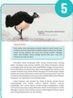

> **Deskripsi Visual:** Maaf, saya tidak dapat menampilkan atau mengakses gambar dari buku pelajaran tersebut karena saya adalah asisten berbasis teks. Namun, jika Anda bisa memberikan deskripsi singkat tentang gambar tersebut, saya akan dengan senang hati membantu Anda menganalisis dan menjelaskan elemen-elemen yang ada dalam gambar tersebut.

---
**🖼️ Gambar/Diagram**

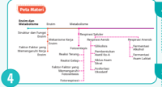

> **Deskripsi Visual:** Gambar ini adalah diagram yang menunjukkan struktur organisasi suatu perusahaan atau instansi. Diagram ini terdiri dari beberapa elemen utama:

1. **Apa yang Ditampilkan Secara Keseluruhan**: Gambar ini menunjukkan struktur organisasi sebuah lembaga, mungkin bank atau perusahaan, dengan berbagai departemen dan jabatan yang terorganisir dalam struktur hierarkis.

2. **Elemen-Elemen Utama dan Relasinya**: 
   - **Departemen** (seperti "Pendukung", "Operasional", "Pemasaran", dll.) terletak di bagian bawah dan dikelompokkan menjadi sub-sektor.
   - **Jabatan** (seperti "Direksi", "Manajer", "Karyawan", dll.) terletak di atas departemen dan masing-masing jabatan memiliki posisi yang jelas dalam struktur organisasi.
   - **Relasi** antara departemen dan jabatan melalui garis lurus yang menghubungkan mereka, menunjukkan hubungan kerja dan tanggung jawab.

3. **Teks, Angka, atau Label Penting yang Terlihat**: 
   - Ada beberapa teks yang memberikan deskripsi tentang setiap departemen dan jabatan, seperti "Pendukung", "Operasional", "Pemasaran", dll.
   - Angka-angka tidak terlihat dalam gambar ini, tetapi jika ada, mungkin digunakan untuk mengidentifikasi posisi tertentu dalam struktur organisasi.

4. **Informasi Kunci yang Bisa Diambil Pembaca**: 
   - Struktur organisasi yang dibuat menunjukkan bahwa setiap departemen memiliki tujuan dan tanggung jawab spesifik.
   - Diagram ini membantu dalam memahami hubungan antara departemen dan jabatan dalam organisasi.
   - Informasi ini penting bagi individu yang ingin memahami struktur organisasi dan bagaimana pekerjaan mereka terkait dengan departemen lainnya.

Dengan demikian, gambar ini merupakan alat yang efektif untuk memvisualisasikan struktur organisasi dan hubungan antar departemen dan jabatan dalam suatu lembaga.

### 6 Aktivitas

Berisi berbagai bentuk kegiatan yang dapat kalian lakukan, seperti pemerolehan dan penelaahan informasi dari artikel, pengamatan sederhana di lingkungan sekitar, menyimak video, dan praktikum sederhana.

2

 

---
## 📄 Halaman 10

### 7 Refleksi

Pada kegiatan ini, kalian diajak berpikir secara mendalam terkait materi yang sudah dipelajari dan mengidentifikasi kekurangannya, manfaat, serta sikap setelah mempelajari  materi tersebut.

### 8 Uji Kompetensi

Pada akhir bab, disajikan berbagai pertanyaan tentang materi pada bab tersebut. Pertanyaanpertanyaan yang dimunculkan dalam berbagai bentuk dan tidak hanya untuk mengases pengetahuan tetapi juga keterampilan proses kalian serta melatih untuk terbiasa dengan soal AKM.

### REFLEKSI

Untuk	meninjau	ulang	keseluruhan	proses	pembelajaran,	lakukan	refleksi dengan menjawab pertanyaan-pertanyaan berikut.

- Apa sajakah yang sudah kalian kuasai pada pembelajaran ini?
- Apa sajakah yang belum kalian kuasai pada pembelajaran ini?
- Apakah yang menyebabkan kalian belum menguasai bagian tertentu pada pembelajaran ini?
- Upaya apa yang akan kalian  lakukan  sebagai  tindak  lanjut  terhadap materi yang sudah kalian kuasai?
- Upaya yang akan kalian dilakukan untuk mengatasi bagian yang belum dikuasai pada pembelajaran ini?

### UJI KOMPETENSI

### Pilihlah salah satu jawaban yang paling benar!

1.

Pernyataan mengenai enzim berikut yang tidak tepat, yaitu ….

- Enzim adalah protein yang berfungsi sebagai katalis.
- Enzim bersifat spesifik terhadap substratnya.
- Enzim menyediakan energi aktivasi untuk reaksi kimia.
- Enzim dipengaruhi oleh faktor lingkungan.
- Enzim dapat digunakan berkali-kali.
- Holoenzim tersusun atas struktur ….
- apoenzim dan inhibitor nonkompetitif
- koenzim dan gugus prostetik
c.

apoenzim dan koenzim d.

e.

gugus prostetik dan kofaktor apoenzim dan inhibitor kompetitif

Berikut ini yang merupakan koenzim adalah ….

a.

Mn c.

NAD

e.  Cu b.

Zn d.

Fe

Pada inhibisi kompetitif, inhibitor memiliki kemiripan struktural dengan ….

a.

b.

c.

sisi aktif substrat

koenzim

d

e

.

.

kofaktor apoenzim

3.

4.

8

 

---
## 📄 Halaman 11

KEMENTERIAN PENDIDIKAN, KEBUDAYAAN, RISET, DAN TEKNOLOGI REPUBLIK INDONESIA, 2022

Biologi untuk SMA Kelas XII

Penulis

Shilviani Dewi, dkk.

ISBN

978-602-427-958-5 (jil.2)

### Enzim dan Metabolisme

BAB 1 Enzim dan Metabolisme 1 Bagaimanakah struktur dan fungsi enzim serta perannya dalam metabolisme pada makhluk hidup?

 

---
## 📄 Halaman 12

### Tujuan Pembelajaran

Pada bab ini, kalian akan diajak untuk dapat:

- mendeskripsikan struktur dan fungsi enzim.
- menjelaskan mekanisme kerja enzim.
- menganalisis faktor-faktor yang memengaruhi kerja enzim.
- menganalisis perbedaan anabolisme dan katabolisme.
- menganalisis tahap-tahap respirasi aerobik.
- menjelaskan proses fermentasi alkohol dan asam laktat.
- menganalisis tahap-tahap reaksi terang dan gelap pada fotosintesis.
- menganalisis faktor-faktor yang memengaruhi  fotosintesis dan fotorespirasi pada tumbuhan.

### Kata Kunci

enzim, metabolisme, respirasi seluler, fotosintesis, fotorespirasi.

### Peta Materi

---
**🖼️ Gambar/Diagram**

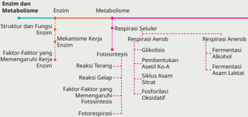

> **Deskripsi Visual:** Gambar ini adalah diagram yang menunjukkan hubungan antara enzim dan metabolisme. Diagram ini dibagi menjadi dua bagian utama: struktur dan fungsi enzim, serta mekanisme kerja enzim.

Pertama, bagian pertama menunjukkan struktur dan fungsi enzim. Enzim memiliki struktur yang kompleks dengan berbagai domain dan fungsi yang spesifik. Faktor-faktor yang mempengaruhi kerja enzim meliputi faktor-faktor yang mempengaruhi fotosintesis, reaksi tergantung, dan faktor-faktor yang mempengaruhi fotosintesis.

Bagian kedua menunjukkan mekanisme kerja enzim. Mekanisme kerja enzim melibatkan beberapa tahap, termasuk respiroseri seluler, respirasi aerob, glikolisis, fosforilasi, siklur, asam laktat, dan fermentasi anerobik. Setiap tahap ini memiliki peran yang penting dalam proses metabolisme.

Teks, angka, atau label penting yang terlihat dalam diagram ini mencakup nama-nama enzim, fungsi mereka, dan tahap-tahap dalam proses metabolisme. Informasi kunci yang dapat diambil pembaca adalah bahwa enzim adalah komponen penting dalam proses metabolisme dan bahwa ada banyak tahap dalam proses tersebut.

 

---
## 📄 Halaman 13

### Ayo Mengingat Kembali

Ingatkah  kalian  ketika  mempelajari  materi  sistem  pencernaan  pada kelas sebelumnya? Fungsi utama sistem pencernaan, yaitu mengubah molekul  besar  yang  tidak  larut  air  menjadi  molekul  kecil  yang  larut air.  Pengubahan  molekul  ini  memerlukan  pencernaan  mekanik  oleh gigi  dan  kimiawi  oleh  enzim.  Pada  organ-organ  tertentu  yang  terkait dengan sistem pencernaan terdapat enzim dengan fungsi tertentu. Coba tuliskan kembali enzim-enzim yang terdapat pada saluran pencernaan beserta fungsinya.

Perhatikan  gambar  di  bawah  ini.  Gambar  tersebut  menunjukkan  tiga kondisi manusia, yaitu lemas dan mengantuk, makan, serta beraktivitas.

Sumber: Bayu/Kemendikbudristek (2022)

Ketika lapar, kalian akan merasakan lemas dan mudah mengantuk karena kekurangan energi. Oleh karena itu, kalian perlu makan, salah satunya dengan makan  nasi.  Nasi  dihasilkan  dari  beras  hasil  fotosintesis  tumbuhan  padi. Seperti  kalian  ketahui  bahwa  proses  fotosintesis  yang  menghasilkan  beras pada tanaman padi membutuhkan energi dari cahaya matahari. Fotosintesis merupakan  salah  satu  contoh  proses  anabolisme  (pembentukan)  dalam metabolisme.

Tiga puluh menit hingga satu jam setelah makan, kalian akan mempunyai tenaga  sehingga  rasa  lemas  dan  kantuk  hilang.  Mengapa  demikian?  Ketika kalian makan, zat makanan akan dicerna dan diserap, lalu diedarkan ke selsel tubuh. Di dalam sel, zat makanan akan dipecah untuk menghasilkan energi

 

---
## 📄 Halaman 14

melalui peristiwa respirasi. Energi akan digunakan untuk melakukan aktivitas kehidupan. Proses sel menghasilkan energi melalui respirasi merupakan salah satu contoh peristiwa katabolisme (penguraian) dalam metabolisme.

Berdasarkan uraian di atas, fotosintesis yang membutuhkan energi dan respirasi yang menghasilkan energi merupakan proses metabolisme. Proses respirasi dan fotosintesis berlangsung secara bertahap melalui reaksi kimia yang  terjadi  di  dalam  sel  hidup.  Kecepatan  setiap  tahapan  reaksi  kimia dipengaruhi zat atau katalisator yang disebut enzim. Enzim merupakan bagian yang tidak terpisahkan dari reaksi-reaksi dalam metabolisme.

### A.  Enzim

Ketika mengunyah nasi, nasi yang semula terasa tawar, lama-kelamaan terasa manis. Perubahan apa yang terjadi dan apa yang menyebabkan perubahan rasa tersebut? Saat mengunyah nasi, amilum yang berasa tawar dipecah oleh enzim amilase menjadi maltosa yang berasa manis. Apa itu enzim? Bagaimana struktur enzim? Dan, bagaimana sifat-sifat enzim? Untuk menjawab pertanyaan tersebut, lakukan aktivitas berikut.

### AKTIVITAS 1.1

### Bereksplorasi untuk Mengenal Enzim

- Buatlah kelompok beranggotakan 3 - 4 orang.
- Perhatikan gambar berikut.

---
**🖼️ Gambar/Diagram**

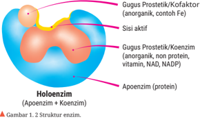

> **Deskripsi Visual:** Gambar ini adalah ilustrasi yang menunjukkan struktur enzim. Gambar ini menggambarkan bagaimana enzim terdiri dari dua komponen utama: apoenzim (protein) dan koenzim (anorganik, protein, vitamin, NAD, NADP). Sisi aktif enzim terletak di bagian depan, sedangkan sisi pasif terletak di belakang. Koenzim berada di dalam apoenzim, sementara apoenzim terletak di luar koenzim. Ini menunjukkan bahwa koenzim adalah bagian penting dari enzim, membantu dalam proses reaksi kimia yang disebutkan dalam buku tersebut.

 

---
## 📄 Halaman 15

- Jawablah pertanyaan-pertanyaan berikut dengan berdiskusi.
- Temukan dua komponen utama penyusun enzim!
- Temukan dua macam penyusun gugus prostetik pada enzim!
- Senyawa apakah yang menyusun bagian apoenzim?
- Apakah sisi aktif dan bagian manakah dari enzim yang memiliki sisi aktif?
- Senyawa  apa  yang  menyusun  gugus  prostetik  yang  disebut dengan koenzim?
- Senyawa  apa  yang  menyusun  gugus  prostetik  yang  disebut dengan kofaktor?
- Lakukan  studi  literatur  menggunakan  sumber  literasi  digital terpercaya mengenai fungsi koenzim dan kofaktor pada kerja enzim!
- Tulis hasil diskusi kalian dalam bentuk laporan dan presentasikan di depan kelas.

### Struktur dan Sifat-sifat Enzim

Berdasarkan hasil eksplorasi pada Aktivitas 1.1, kalian telah menemukan bahwa  umumnya  enzim  tersusun  atas  apoenzim  dan  gugus  prostetik. Apoenzim tersusun atas senyawa protein. Bagian apoenzim memiliki sisi aktif yang berfungsi sebagai tempat melekatnya substrat.

Terdapat  dua  macam  gugus  prostetik,  yaitu  koenzim  dan  kofaktor. Koenzim dan kofaktor merupakan bagian yang membantu kerja apoenzim. Koenzim tersusun atas molekul organik nonprotein yang tidak melekat erat pada bagian protein enzim, misalnya vitamin, NAD, NADP, dan Koenzim A. Adapun kofaktor tersusun atas molekul anorganik yang umumnya logam, misalnya Cu, Fe, Mn, Zn, Ca, K, dan Co.

Apoenzim  (protein)  yang  telah  mengikat  gugus  prostetik  (kofaktor atau koenzim) membentuk holoenzim, enzim aktif yang dapat mengkatalis suatu  reaksi.  Setelah  memahami  struktur  penyusun  enzim,  selanjutnya kalian akan belajar sifat-sifat enzim sebagai berikut.

### a. Enzim merupakan protein

Enzim mempunyai sifat seperti protein, yaitu bekerja pada kisaran suhu  dan  pH  tertentu.  Enzim  tidak  dapat  bekerja  pada  kisaran

 

---
## 📄 Halaman 16

suhu  rendah  karena  ikatan  polipeptida  protein  penyusun  enzim mengalami pelipatan atau koagulasi, sedangkan pada kisaran suhu tinggi  menyebabkan  ikatan  polipeptidanya  mengalami  denaturasi atau  terputus  sehingga  protein  rusak  dan  tidak  berfungsi.  Enzim juga dapat rusak pada pH rendah (asam) karena gugus amina pada asam amino penyusun protein mengalami ionisasi, sedangkan pada pH tinggi (basa) gugus karboksilnya mengalami ionisasi. Kondisi ini menyebabkan protein rusak dan tidak berfungsi.

### b. Enzim menurunkan energi aktivasi

Ketika kompleks enzim-substrat terbentuk, enzim menurunkan energi aktivasi substratnya. Energi aktivasi adalah energi yang dibutuhkan agar  reaksi  kimia  dapat  dimulai.  Penurunan  energi  aktivasi  pada reaksi menggunakan enzim	tergambar	pada	grafik	berikut.

---
**🖼️ Gambar/Diagram**

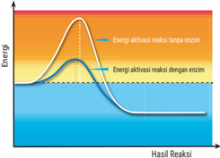

> **Deskripsi Visual:** Gambar ini adalah ilustrasi yang menunjukkan proses reaksi kimia dengan adanya enzim. Gambar ini menggambarkan energi aktivasi reaksi tanpa enzim dan dengan enzim. Dalam gambar tersebut, energi aktivasi reaksi tanpa enzim berada di atas energi aktivasi reaksi dengan enzim. Ini menunjukkan bahwa enzim mempercepat reaksi karena mereka memperpendek jarak antara energi aktivasi reaksi dan energi akhir reaksi. Label "Energia Aktivasi Reaksi Tanpa Enzim" dan "Energia Aktivasi Reaksi Dengan Enzim" menunjukkan perbedaan energi yang diperlukan untuk melalui tahap ini. Hasil reaksi yang ditunjukkan oleh garis putih menunjukkan bahwa dengan adanya enzim, reaksi dapat segera mencapai hasil akhir dengan energi yang lebih rendah. Ini menunjukkan bahwa enzim mempercepat reaksi dan mengurangi energi yang diperlukan untuk melalui tahap ini.

### c. Bekerja	secara	spesifik	(

- one enzyme one substrate )
Enzim hanya dapat bekerja pada substrat tertentu. Contohnya, enzim amilase  hanya  bekerja  pada  substrat  amilum  dan  memecahnya menjadi  maltosa.  Enzim  amilase  tidak  bisa  bekerja  lagi  untuk mengubah maltosa menjadi glukosa dan juga tidak bisa mengkatalisis balik mengubah maltosa menjadi amilum.

### d. Enzim dipengaruhi oleh faktor lingkungan

- Faktor  yang  memengaruhi  kerja  enzim,  yaitu  suhu,  pH,  aktivator
(pengaktif), inhibitor (penghambat), dan konsentrasi substrat.

 

---
## 📄 Halaman 17

Ketika belajar struktur dan fungsi sel di kelas XI, kalian telah mempelajari bahwa fungsi  organel  peroksisom  untuk  menghasilkan  enzim  katalase. Enzim  katalase  dapat  menguraikan  hidrogen  peroksida  (H 2 O 2 ),  produk sampingan  respirasi  aerob  yang  dihasilkan  mitokondria  menjadi  H 2 O dan O 2 .  Lalu, bagaimana cara enzim katalase dalam menguraikan H 2 O 2 ? Cermati gambar berikut!

---
**🖼️ Gambar/Diagram**

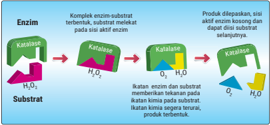

> **Deskripsi Visual:** Gambar ini adalah ilustrasi yang menunjukkan mekanisme reaksi enzim-substrat. Ilustrasi ini menggunakan warna-warna yang berbeda untuk menunjukkan perubahan struktur dan reaksi kimia. Dalam gambar tersebut, kita melihat sebuah molekul enzim yang berinteraksi dengan substrat. Enzim memiliki aktivitas katalitik yang memungkinkan molekul substrat untuk mengalami reaksi kimia. Proses ini melibatkan molekul H2O2 sebagai katalis. Setelah reaksi selesai, produk disimpan dan tidak ikut serta dalam proses kinesis selanjutnya. Gambar ini membantu dalam memahami bagaimana enzim bekerja dalam proses metabolisme生物化学.

Berdasarkan  Gambar  1.4  terlihat  bahwa  substrat  berupa  H 2 O 2 dan enzim katalase bereaksi membentuk komplek (gabungan) H 2 O 2 -  enzim katalase . Selanjutnya, enzim katalase menguraikan H 2 O 2 menjadi H 2 O dan O 2. Setelah selesai, enzim terbentuk kembali seperti semula dan dihasilkan produk berupa H 2 O dan O 2.

Agar kalian lebih memahami cara enzim bekerja, pelajari beberapa teori cara kerja enzim berikut.

### a. Teori lock and key (gembok dan anak kunci)

Untuk mengetahui cara kerja enzim berdasarkan teori gembok dan anak kunci, cermati Gambar 1.5 berikut!

---
**🖼️ Gambar/Diagram**

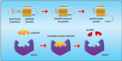

> **Deskripsi Visual:** Gambar ini adalah ilustrasi yang menunjukkan proses sintesis protein menggunakan enzim ribozim. Berikut deskripsi lengkapnya:

1. Gambar ini menampilkan proses sintesis protein menggunakan enzim ribozim, yang melibatkan berbagai tahap sintesis RNA dan DNA.

2. Elemen utama dalam gambar meliputi:
   - Enzim ribozim (disebut sebagai "ribozim" dalam gambar)
   - RNA primer (disebut sebagai "primer RNA" dalam gambar)
   - DNA template (disebut sebagai "template DNA" dalam gambar)
   - Produk sintesis protein (disebut sebagai "protein" dalam gambar)

3. Relasi antara elemen-elemen tersebut adalah:
   - Ribozim mengikat primer RNA dan DNA template.
   - Ribozim kemudian mengganti primer RNA dengan DNA template.
   - Proses ini menghasilkan produk sintesis protein.

4. Teks, angka, atau label penting yang terlihat dalam gambar meliputi:
   - Nama-nama enzim, primer RNA, DNA template, dan produk sintesis protein.
   - Angka yang menunjukkan tahapan-tahapan dalam proses sintesis.

5. Informasi kunci yang dapat diambil pembaca meliputi:
   - Ribozim berfungsi sebagai enzim untuk sintesis protein.
   - Proses ini melibatkan penggunaan primer RNA dan DNA template.
   - Hasil akhir dari proses ini adalah protein yang dibuat oleh ribozim.

Dengan demikian, gambar ini memberikan gambaran jelas tentang bagaimana enzim ribozim bekerja untuk menghasilkan protein, menunjukkan hubungan antara enzim, primer RNA, DNA template, dan produk sintesis protein dalam proses ini.

Sumber: Biology Brain/biologybrain.com (2022)

 

---
## 📄 Halaman 18

### b. Teori induced fit (induksi pas)

Teori ini mirip dengan teori gembok dan anak kunci, namun dengan menambahkan penemuan baru bahwa enzim dan substrat tidak kaku seperti gembok dan anak kunci. Sisi aktif pada enzim	bersifat	fleksibel sehingga dapat mengikat substrat dengan tepat. Hal ini menyebabkan kerja  enzim  sebagai katalisator	 menjadi	 lebih	 efisien.	 Perhatikan Gambar 1.6 berikut!

---
**🖼️ Gambar/Diagram**

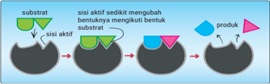

> **Deskripsi Visual:** Gambar ini adalah ilustrasi yang menunjukkan proses reaksi kimia antara substrat dan sisi aktif sedikit. Ilustrasi ini menggambarkan bagaimana substrat (dengan bentuk hijau) berinteraksi dengan sisi aktif sedikit (dengan bentuk hijau dan biru), yang kemudian mengubah bentuk substrat menjadi bentuk produk (dengan bentuk biru). Sisi aktif sedikit memiliki dua bentuk: satu yang mengikuti bentuk substrat dan satu yang tidak. Setelah proses ini selesai, hasilnya adalah produk (dengan bentuk biru) yang tampak lebih besar dan berbeda bentuk daripada substrat asli.

Elemen utama dalam gambar ini adalah substrat, sisi aktif sedikit, dan produk. Substrat berada di sisi kiri dan didefinisikan oleh bentuk hijau. Sisi aktif sedikit berada di tengah dan terdiri dari dua bentuk: satu yang mengikuti bentuk substrat dan satu yang tidak. Produk berada di sisi kanan dan didefinisikan oleh bentuk biru. Relasi antara elemen-elemen ini adalah bahwa substrat bereaksi dengan sisi aktif sedikit untuk menghasilkan produk.

Teks, angka, atau label penting yang terlihat dalam gambar ini adalah "substrat", "sisi aktif sedikit", dan "produk". Informasi kunci yang dapat diambil pembaca melalui gambar ini adalah bahwa reaksi ini melibatkan interaksi antara substrat dan sisi aktif sedikit untuk menghasilkan produk yang berbeda bentuk daripada substrat asli.

Sumber: TimVickers-Fvasconcellos/commons.wikimedia.com (2006)

Setelah  mempelajari  mekanisme  kerja  enzim,  kalian  diharapkan mampu  menggunakan teknologi untuk menunjukkan pemahaman mengenai teori mekanisme kerja enzim dengan melakukan aktivitas berikut.

### AKTIVITAS 1.2

### Memahami Teori Gembok dan Kunci dengan Teknologi

- Bentuk kelompok yang terdiri atas 3 - 4 orang.
- Cari informasi mengenai video stop motion melalui literasi digital.
- Buat  video stop  motion untuk  menunjukkan  pemahaman  kalian mengenai teori gembok dan kunci serta induksi pas.
- Lengkapi video dengan narasi yang sesuai.
- Unggah video kalian ke media sosial, seperti Youtube atau Facebook.

### Faktor yang Memengaruhi Kerja Enzim

Pernahkah  kalian  mengamati  perubahan  saat  telur  digoreng?  Ketika digoreng, putih telur memadat dan berubah warna. Putih telur tersusun atas albumin yang merupakan salah satu jenis protein. Perubahan yang

 

---
## 📄 Halaman 19

terjadi ketika telur digoreng menunjukkan protein dipengaruhi suhu yang merupakan salah satu faktor lingkungan.

Begitu juga dengan enzim yang dipengaruhi faktor lingkungan. Faktor apa sajakah yang memengaruhi kerja enzim? Lakukan aktivitas berikut.

### AKTIVITAS 1.3

### Pengaruh pH dan Suhu terhadap Kerja Enzim

### Alat:

- mortar dan alu
- kertas saring
- gelas ukur
- 6 buah tabung reaksi
- kertas pH
- termometer

### Bahan:

- 1 buah hati ayam
- 50 ml akuades
- 10 tetes larutan HCl atau air perasan jeruk nipis
- 10 tetes larutan NaOH atau serbuk soda kue
- 50 ml hidrogen peroksida (H 2 O 2 )
- 1 gram serbuk es batu
- 10 ml air mendidih

### Langkah percobaan:

- Bentuk kelompok yang terdiri atas 4 - 5 orang.
- Siapkan alat dan bahan yang diperlukan.
- Ikuti langkah percobaan berikut.
- Perlakuan pH pada kerja enzim katalase
- Haluskan  hati  ayam  yang  dicampur  akuades  menggunakan mortar dan alu.
- Saring campuran di atas ke dalam gelas ukur.
- Siapkan  3  buah  tabung  reaksi  yang  ditandai  dengan  huruf A, B, dan C.
- Tuang  ekstrak  hati  ayam  hingga  ketinggian  1  cm  pada  tiap tabung reaksi.
- Tambahkan 10 tetes larutan HCl (air perasan jeruk nipis) pada tabung A dan ukur pHnya dengan kertas pH.

 

---
## 📄 Halaman 20

- Tambahkan  10  tetes  larutan  NaOH  (serbuk  soda  kue)  pada tabung B dan ukur pHnya dengan kertas pH.
- Tambahkan masing-masing 10 tetes larutan H 2 O 2 pada tabung A, B, dan C. Lalu, amati ketiga tabung tersebut.
- Tulis hasil pengamatan kalian pada tabel berikut.
- Jawablah  pertanyaan  berikut dengan  berdiskusi  bersama kelompok kalian.
- Mengapa  pada  tabung  A  tidak  muncul  gelembung  dan nyala api?
- Mengapa  pada  tabung  B  tidak  muncul  gelembung  dan nyala api?
- Mengapa pada tabung C muncul gelembung dan nyala api?
- Hasil reaksi apakah yang ditunjukkan dengan munculnya gelembung pada tabung C?
- Senyawa  apakah  yang  ditunjukkan  dengan  munculnya nyala api?
- Kesimpulan  apa  yang  dapat  dirumuskan  terkait  dengan pengaruh pH pada kerja enzim katalase?

---
**📊 Tabel**

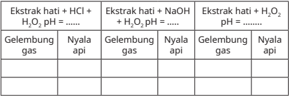

Tabel ini menunjukkan hasil eksperimen dengan menggunakan gelembung gas sebagai alat pengukur. Topik utamanya adalah perbandingan reaksi antara ekstrak hati, nyalai api, dan air dengan asam hidroksida (HCl) dan basa hidroksida (NaOH). Dalam setiap baris, kita melihat reaksi antara ekstrak hati dengan HCl, H2O, dan NaOH, serta reaksi antara nyalai api dengan HCl, H2O, dan NaOH. Data penting yang terlihat adalah bahwa reaksi antara ekstrak hati dengan HCl dan NaOH menghasilkan gas, sedangkan reaksi dengan H2O tidak menghasilkan gas. Sementara itu, reaksi antara nyalai api dengan HCl dan NaOH juga menghasilkan gas, tetapi reaksi dengan H2O tidak menghasilkan gas. Ini menunjukkan bahwa reaksi antara ekstrak hati dan nyalai api dengan asam dan basa memiliki karakteristik yang berbeda.

### b. Perlakuan suhu pada kerja enzim katalase

- Haluskan  hati  ayam  yang  dicampur  akuades  menggunakan mortar dan alu.
- Saring campuran di atas ke dalam gelas ukur.
- Siapkan  3  buah  tabung  reaksi  yang  ditandai  dengan  huruf D, E, dan F.
- Tuang  ekstrak  hati  ayam  hingga  ketinggian  1  cm  pada  tiap tabung reaksi.
- Tambahkan 1 gram serbuk es batu pada tabung D dan ukur suhunya dengan termometer.
- Tambahkan  10  ml  air  mendidih  pada  tabung  E  dan  ukur suhunya dengan termometer.
- Tambahkan masing-masing 10 tetes H 2 O 2 pada tabung D, E, dan F. Lalu, amati ketiga tabung tersebut.
- Tulis hasil pengamatan kalian pada tabel berikut.

 

---
## 📄 Halaman 21

---
**📊 Tabel**

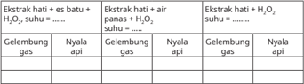

Tabel ini menunjukkan perbandingan antara gelembung gas dan nyala api dalam proses ekstraksi hati dengan menggunakan bahan baku suhu. Topik utama tabel ini adalah hubungan antara gelembung gas dan nyala api dalam proses ekstraksi hati. Kolom-kolomnya meliputi gelembung gas, nyala api, dan suhu. Data penting yang terlihat adalah bahwa gelembung gas dan nyala api muncul bersamaan saat suhu mencapai batas tertentu, yang menunjukkan bahwa proses ekstraksi hati memerlukan suhu tertentu untuk berjalan dengan efektif. Ini menunjukkan bahwa suhu adalah faktor kunci dalam proses ekstraksi hati.

### 9) Jawablah pertanyaan berikut dengan berdiskusi.

- Mengapa  pada  tabung  D  tidak  muncul  gelembung  dan nyala api?
- Mengapa  pada  tabung  E  tidak  muncul  gelembung  dan nyala api?
- Mengapa pada tabung F muncul gelembung dan nyala api?
- Hasil reaksi apakah yang ditunjukkan dengan munculnya gelembung pada tabung F?
- Gas apakah yang ditunjukkan dengan munculnya nyala api?
- Kesimpulan  apa  yang  dapat  dirumuskan  terkait  dengan pengaruh suhu pada kerja enzim katalase?
Tulis laporan hasil percobaan kalian dan presentasikan di depan kelas.

Berdasarkan  hasil  eksperimen,  pH  dan  suhu  terbukti  berpengaruh pada kerja enzim katalase. Kerja enzim mempunyai kisaran pH tertentu. Perhatikan	grafik	berikut!

---
**🖼️ Gambar/Diagram**

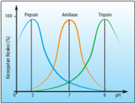

> **Deskripsi Visual:** Gambar ini adalah diagram yang menunjukkan perbandingan ketahanan antibakteri dari tiga jenis bakteri: Peptin, Aminolase, dan Topisain. Diagram ini berbentuk tridimensi dengan titik-titik yang mewakili perbandingan ketahanan antibakteri untuk setiap jenis bakteri pada berbagai ukuran partikel (dalam mikrometer). Titik-titik tersebut dinyatakan dalam bentuk lingkaran dengan warna-warna yang berbeda, yaitu merah untuk Peptin, biru untuk Aminolase, dan hijau untuk Topisain.

Elemen utama dalam diagram ini adalah tiga jenis bakteri dan ukuran partikel yang mereka hadapi. Relasi antara kedua elemen ini adalah bahwa semakin besar partikel yang diamati, semakin tinggi perbandingan ketahanan antibakteri yang ditunjukkan oleh lingkaran. Ini menunjukkan bahwa ketahanan antibakteri meningkat seiring dengan peningkatan ukuran partikel.

Teks, angka, atau label penting yang terlihat dalam diagram ini meliputi nama-nama tiga jenis bakteri (Peptin, Aminolase, dan Topisain) serta skala ukuran partikel yang diberikan dalam mikrometer. Angka-angka ini digunakan untuk mengindikasikan perbandingan ketahanan antibakteri yang ditunjukkan oleh lingkaran.

Informasi kunci yang dapat diambil pembaca dari gambar ini adalah bahwa ketahanan antibakteri dari tiga jenis bakteri tersebut berbeda-beda dan tergantung pada ukuran partikel yang diamati. Peptin memiliki ketahanan antibakteri yang paling baik pada partikel yang lebih kecil, sedangkan Topisain memiliki ketahanan antibakteri yang paling baik pada partikel yang lebih besar.

Pada	grafik	di	atas,	pepsin	bekerja	optimum	pada	pH	asam,	sedangkan amilase bekerja pada pH normal dan tripsin optimum bekerja pada pH basa.  Hal  ini  menunjukkan  bahwa  pH  berpengaruh  pada  kerja  enzim. Selain pH dan suhu ada faktor lain yang memengaruhi kerja enzim. Untuk mengetahui faktor tersebut, lakukan kegiatan berikut!

 

---
## 📄 Halaman 22

### AKTIVITAS 1.4

### Mengetahui Pengaruh Konsentrasi Enzim terhadap Kecepatan Reaksi

- Bentuk kelompok yang terdiri atas 3 - 4 orang.
- Perhatikan  tabel  perbedaan  konsentrasi  enzim  katalase  pada jumlah volume oksigen pada waktu yang berbeda berikut.
- Buat	 grafik	 yang	 menunjukkan	 volume	 gas	 yang	 dihasilkan	 oleh enzim dengan konsentrasi berbeda-beda.
- Buat kesimpulan hubungan antara perbedaan konsentrasi enzim pada kecepatan reaksi.
Berdasarkan  hasil  percobaan  di  atas,  terbukti  bahwa  perbedaan konsentrasi  enzim  menyebabkan  perbedaan  kecepatan  reaksi  pada rentang  waktu  yang  berbeda.  Lalu,  bagaimana  pengaruh  konsentrasi substrat	pada	kecepatan	reaksi?	Perhatikan	grafik	berikut!

---
**🖼️ Gambar/Diagram**

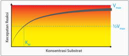

> **Deskripsi Visual:** Gambar ini adalah sebuah diagram yang menunjukkan hubungan antara koncentrasi substrat dengan kecepatan reaksi (V). Diagram ini berbentuk parabola yang melambangkan bahwa kecepatan reaksi naik seiring peningkatan koncentrasi substrat sampai mencapai puncak maksimum (V_max) pada titik tertentu. Setelah itu, kecepatan reaksi mulai menurun karena adanya efek satuan substrat (Michaelis-Menten constant, K_m). Dalam diagram ini, V_max dinyatakan sebagai kecepatan maksimum yang dapat dicapai oleh reaksi, sedangkan K_m adalah koncentrasi substrat yang memungkinkan kecepatan reaksi mencapai setengah dari V_max. Label "K_m" menunjukkan titik di mana kecepatan reaksi mencapai setengah dari V_max, sedangkan "V_max" menunjukkan kecepatan maksimum yang dapat dicapai.

Berdasarkan	 grafik	 di	 atas,	 perbedaan	 konsentrasi	 substrat	 dapat meningkatkan  kecepatan  reaksi  sampai  batas  tertentu,  di  mana  jika perbandingan  antara  substrat  dan  enzim  sebanding  maka  kecepatan reaksinya menjadi konstan.

 

---
## 📄 Halaman 23

Kerja  enzim  juga  dipengaruhi  oleh  inhibitor  atau  zat  penghambat. Perhatikan gambar berikut!

---
**🖼️ Gambar/Diagram**

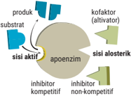

> **Deskripsi Visual:** Gambar ini adalah ilustrasi yang menunjukkan struktur dan fungsi dari enzim. Ilustrasi ini memperlihatkan dua sisi enzim, yaitu sisi aktif dan sisi alosterik. Sisi aktif berada di bagian tengah ilustrasi dan merupakan tempat reaksi kimia yang terjadi. Sisi alosterik terletak di sisi luar ilustrasi dan memiliki peran sebagai kofaktor (aktivator) atau inhibitor.

Elemen utama dalam ilustrasi ini meliputi enzim, substrat, apoenzim, kofaktor (aktivator), dan inhibitor. Enzim dan substrat terhubung melalui ikatan ganda, menunjukkan bahwa enzim mempengaruhi reaksi kimia dengan substrat. Kofaktor (aktivator) berfungsi untuk meningkatkan aktivitas enzim, sedangkan inhibitor menghambat aktivitas enzim.

Teks, angka, atau label penting yang terlihat dalam ilustrasi ini adalah "produk", "substrat", "sisi aktif", "sisi alosterik", "apoenzim", "kofaktor (aktivator)", dan "inhibitor". Informasi kunci yang dapat diambil pembaca adalah bahwa enzim memainkan peran penting dalam reaksi kimia, dan adanya kofaktor atau inhibitor dapat mempengaruhi aktivitas enzim tersebut.

Berdasarkan gambar di atas, ada dua macam inhibitor enzim, yaitu inhibitor  kompetitif  dan  inhibitor  nonkompetitif.  Inhibitor  kompetitif adalah inhibitor yang mempunyai bentuk permukaan dan ukuran sama dengan sisi aktif sehingga dapat melekat kuat dan menghalangi substrat menempel pada sisi aktif enzim sehingga kerja enzim terhambat. Inhibitor kompetitif dapat dihilangkan dengan menambah konsentrasi substrat.

Adapun inhibitor nonkompetitif adalah inhibitor yang terikat pada sisi alosterik enzim (sisi tidak aktif pada enzim). Inhibitor ini mengakibatkan sisi aktif enzim dapat berubah sehingga substrat tidak dapat menempel dan berikatan dengan sisi aktif enzim. Inhibitor ini tidak dapat dihilangkan walaupun dengan menambahkan konsentrasi substrat.

Lalu, bagaimana inhibitor kompetitif bekerja di dalam sel makhluk hidup? Perhatikan gambar berikut!

 

---
## 📄 Halaman 24

Pada  gambar  di  atas  terlihat  mekanisme  kerja  inhibitor  kompetitif digunakan untuk membunuh bakteri oleh antibiotik penisilin. Penisilin sangat  mirip  dengan  substrat  enzim  transpeptidase  yang  mengkatalisis pembentukan dinding sel bakteri. Kemiripan ini menyebabkan sisi aktif enzim transpeptidase melekat dan berikatan dengan penisilin. Akibatnya, dinding sel bakteri gagal terbentuk dan bakteri mati.

### B.  Metabolisme

Pada bagian ini, kalian akan diajak untuk mempelajari mengenai metabolisme. Apa  saja  jenis  metabolisme?  Dan  bagaimana  prosesnya?  Simak  uraiannya sebagai berikut!

### Anabolisme dan Katabolisme

Bagaimana jika tidak ada tumbuhan di muka bumi? Akankah makanan tersedia  bagi  makhluk  hidup  lain  tanpa  adanya  tumbuhan? Tumbuhan merupakan makhluk hidup yang berperan menyediakan bahan makanan bagi  makhluk  hidup  lain  berupa  bahan  organik.  Bagaimanakah  proses pembentukan bahan makanan pada tumbuhan? Bagaimanakah makanan dipecah  untuk  menghasilkan  energi?  Untuk  menjawab  pertanyaanpertanyaan tersebut, lakukan aktivitas berikut.

### AKTIVITAS 1.5

### Menganalisis Proses Pembentukan dan Pemecahan Senyawa Organik Hasil Fotosintesis

- Bentuk kelompok yang terdiri atas 3 - 4 orang.
- Perhatian reaksi kimia berikut.

``

``

``

- Jawablah pertanyaan berikut dengan berdiskusi.
- Apakah kalian masih ingat reaksi kimia pada bagian (a)? Reaksi apakah itu?
- Apakah jenis energi yang dibutuhkan pada reaksi (a)?
- Jelaskan perubahan jenis senyawa yang terjadi pada reaksi (a)!

 

---
## 📄 Halaman 25

- Apakah kalian masih ingat reaksi kimia pada bagian (b)? Reaksi apakah itu?
- Apakah jenis energi yang dihasilkan pada reaksi (b)?
- Jelaskan perubahan jenis senyawa yang terjadi pada reaksi (b)!
- Sajikan hasil diskusi kalian dalam bentuk PowerPoint dan presentasikan di depan kelas!
Berdasarkan hasil aktivitas di atas, pada reaksi (a) terjadi pembentukan senyawa organik glukosa (C 6 H 12 O 6 ) dari senyawa anorganik 6CO 2 dan  6H 2 O yang membutuhkan energi cahaya berupa foton. Proses ini disebut fotosintesis, salah satu contoh anabolisme. Anabolisme disebut juga  asimilasi  atau  sintesis,  yaitu  rangkaian  proses  reaksi  kimia  yang berkaitan  dengan  proses  penyusunan  molekul/senyawa  kompleks  dari molekul/senyawa sederhana atau penyusunan zat dari senyawa/molekul sederhana menjadi senyawa kompleks dengan bantuan enzim.

Proses  anabolisme  memerlukan  energi,  baik  energi  panas,  cahaya, atau energi kimia. Anabolisme yang menggunakan energi cahaya disebut fotosintesis,  sedangkan  anabolisme  yang  menggunakan  energi  kimia disebut kemosintesis. Reaksi fotosintesis dan kemosintesis membutuhkan energi sehingga disebut reaksi endergonik.

Pada reaksi (b) terjadi pemecahan senyawa organik glukosa (C 6 H 12 O 6 ) menjadi  senyawa  anorganik  6  CO 2 dan  6  H 2 O  dengan  menghasilkan energi  kimia  berupa  ATP  ( Adenosine  Triphosphate ).  Proses  reaksi  ini disebut respirasi, salah satu contoh katabolisme. Katabolisme disebut juga desimilasi,  yaitu  rangkaian  reaksi  kimia  yang  berkaitan  dengan  proses pembongkaran, penguraian atau pemecahan molekul/senyawa kompleks menjadi molekul/senyawa yang lebih sederhana dengan bantuan enzim. Penguraian  senyawa  ini  menghasilkan  atau  melepaskan  energi  berupa molekul  ATP  sehingga  disebut  reaksi  eksergonik.  Selanjutnya,  molekul ATP tersebut digunakan organisme untuk beraktivitas.

Katabolisme  mempunyai  dua  fungsi,  yaitu  menyediakan  bahan baku untuk sintesis molekul lain dan menyediakan energi kimia untuk melakukan  aktivitas  sel.  Reaksi  yang  umum  terjadi  pada  katabolisme berupa  reaksi  oksidasi.  Reaksi  kimia  yang  terjadi  pada  katabolisme membebaskan sejumlah energi dan disimpan dalam bentuk ATP.

 

---
## 📄 Halaman 26

Reaksi anabolisme dan katabolisme merupakan reaksi metabolisme pada makhluk hidup. Jadi, metabolisme merupakan keseluruhan reaksi kimia dalam sel makhluk hidup yang dibantu enzim beserta konsekuensi perubahan energi yang menyertainya.

Untuk  mengukur  tingkat  pemahaman  kalian  mengenai  anabolisme dan katabolisme, lakukan aktivitas berikut.

### AKTIVITAS 1.6

### Mengukur Tingkat Pemahaman Mengenai Anabolisme dan Katabolisme

- Tentukan  macam-macam  variabel  pembeda  antara  anabolisme dengan katabolisme.
- Tulis perbedaan anabolisme dan katabolisme berdasarkan variabel pembeda pada tabel berikut.
- Presentasikan  tabel  perbedaan  anabolisme  dan  katabolisme  di depan kelas.

---
**📊 Tabel**

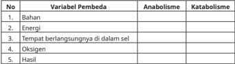

Tabel ini membandingkan variabel pembedaan antara anabolisme dan katabolisme dalam metabolisme sel. Topik utama tabel adalah perbedaan antara proses pembentukan (anabolisme) dan penghancuran (katabolisme). Kolom pertama menunjukkan nomor urut untuk setiap variabel. Variabel pembedaan termasuk bahan, energi, tempat berlangsungnya di dalam sel, oksigen, dan hasil. Dari data yang terlihat, anabolisme melibatkan pembentukan molekul baru dari bahan dasar, menggunakan energi, berlangsung di sel, memerlukan oksigen, dan menghasilkan molekul baru. Sementara itu, katabolisme melibatkan penghancuran molekul yang sudah ada, menghasilkan energi, berlangsung di sel, tidak memerlukan oksigen, dan menghasilkan energi.

### Respirasi Seluler

Masih  ingatkah  kalian  organel  mitokondria  di  dalam  sel  eukariotik? Apakah  fungsi  mitokondria  bagi  sel?  Dan  seberapa  penting  fungsi mitokondria bagi sel?

Mitokondria  berfungsi  sebagai  penyedia  energi  (ATP)  bagi  seluruh aktivitas  hidup  sel.  Mitokondria  mampu  menyediakan  energi  melalui aktivitas respirasi. Untuk memahami  reaksi kimia sel, perhatikan gambar berikut.

 

---
## 📄 Halaman 27

---
**🖼️ Gambar/Diagram**

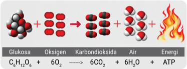

> **Deskripsi Visual:** Gambar ini adalah ilustrasi yang menunjukkan reaksi kimia antara glukosa dengan oksigen untuk menghasilkan karbon dioksida, air, dan ATP. Ilustrasi ini menggunakan molekul-molekul glukosa dan oksigen yang digambarkan dengan warna merah dan putih, sementara hasil reaksi seperti karbon dioksida dan air diperlihatkan dengan warna biru dan putih. Teks pada gambar menyatakan bahwa glukosa (C₆H₁₂O₆) bereaksi dengan oksigen (6O₂) untuk menghasilkan karbon dioksida (6CO₂), air (6H₂O), dan ATP. Ini menunjukkan bahwa reaksi ini memerlukan energi untuk berlangsung. Label "Glukosa" dan "Oksigen" menunjukkan komponen utama reaksi, sedangkan "Karbondioksida", "Air", dan "Energi" menunjukkan hasil akhir dan faktor yang mempengaruhi reaksi tersebut. Gambar ini memberikan gambaran visual tentang proses metabolisme glukosa dalam tubuh, yang merupakan bagian penting dari proses energi dalam organisme hidup.

Pada gambar di atas terlihat bahan dasar respirasi berupa glukosa. Glukosa (molekul organik kompleks) dioksidasi oleh oksigen akan terpecah menghasilkan ATP dengan hasil samping berupa CO 2 dan H 2 O (molekul anorganik sederhana).

Tujuan utama respirasi untuk menghasilkan energi (ATP). Respirasi dapat melalui reaksi oksidasi yang diperantarai oksigen sehingga disebut respirasi aerob. Jika respirasi  tidak  menggunakan  oksigen  disebut, respirasi  anaerob.  Selain  respirasi  anaerob,  pembentukan  ATP  tanpa oksigen dapat juga terjadi melalui fermentasi.

Energi kimia hasil respirasi berbentuk senyawa kimia yang disebut ATP. Berikut struktur ATP dan bagaimana energi di dalam molekul ATP dilepaskan.

---
**🖼️ Gambar/Diagram**

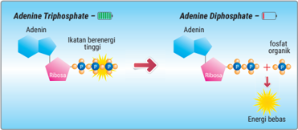

> **Deskripsi Visual:** Gambar ini adalah ilustrasi yang menunjukkan proses reaksi metabolisme adenin trifosfat (ATP) menjadi adenin difosfat (ADP). Ilustrasi ini melibatkan dua tahap utama:

1. Tahap awal, ATP memiliki ikatan energi tinggi yang diperkuat oleh fosfat organik.
2. Di tahap kedua, ATP melepaskan fosfat organik dan menghasilkan ADP dengan energi bebas.

Elemen utama dalam ilustrasi ini adalah:
- ATP dengan ikatan energi tinggi
- Fosfat organik
- ADP dengan energi bebas

Teks penting dalam ilustrasi ini adalah "Adenine Triphosphate" untuk ATP dan "Adenine Diphosphate" untuk ADP. Angka 1 menunjukkan tahap awal reaksi, sementara angka 2 menunjukkan tahap akhir reaksi.

Informasi kunci yang dapat diambil pembaca adalah bahwa ATP adalah molekul energi dalam sel dan dapat berubah menjadi ADP dengan pengurangan fosfat organik, yang merupakan sumber energi bagi sel.

 

---
## 📄 Halaman 28

Pada gambar 1.12, terlihat proses pelepasan energi bebas dari energi kimia  yang  berupa  ATP.  ATP  yang  mempunyai  gugus  fosfat  berenergi tinggi melepaskan satu ikatan fosfat untuk melepaskan energi bebas yang dapat digunakan untuk aktivitas sel. Setelah ATP melepaskan satu ikatan fosfat, ATP berubah menjadi ADP ( Adenosine Diphospha te).

### a.   Tahapan Respirasi Aerob

Umumnya,  respirasi  aerob  menggunakan  substrat  glukosa.  Glukosa mempunyai rantai karbon 6 (C 6 )  akan dipecah menjadi karbon dioksida yang memiliki 1 atom karbon (C 1 ) dan air (H 2 O). Secara sederhana, reaksi kimia respirasi aerob ditulis sebagai berikut.

``

Meskipun reaksinya terlihat sederhana, proses pemecahan glukosa (C 6 ) menjadi CO 2 (C 1 ) berlangsung secara bertahap. Perhatikan gambar berikut.

---
**🖼️ Gambar/Diagram**

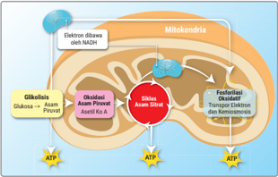

> **Deskripsi Visual:** Gambar ini adalah ilustrasi yang menunjukkan siklus asam sitrat dalam mitokondria. Gambar ini memperlihatkan struktur umum mitokondria dengan bagian-bagian utama seperti jaringan jaringan, membran luar, dan membran dalam. Ilustrasi ini juga menunjukkan siklus asam sitrat yang melibatkan reaksi-fosforilasi, transport elektron, dan ATP produksi.

Elemen utama dalam gambar ini adalah mitokondria, siklus asam sitrat, ATP, dan elektron. Mitokondria dilihat sebagai struktur berbentuk oval dengan jaringan-jaringan berwarna biru dan putih. Siklus asam sitrat terletak di dalam mitokondria dan melibatkan beberapa reaksi yang ditandai dengan warna-warna berbeda. ATP dilihat sebagai ikatan energi berwarna biru dan putih, sedangkan elektron dilihat sebagai ikatan energi berwarna biru.

Teks, angka, atau label penting yang terlihat dalam gambar ini adalah "Siklus Asam Sitrat", "Mitokondria", "ATP", dan "Elektron". Informasi kunci yang dapat diambil pembaca adalah bahwa siklus asam sitrat adalah proses metabolisme yang melibatkan fosforilasi, transport elektron, dan produksi ATP dalam mitokondria.

Tahapan  respirasi  aerob  ada  empat,  yaitu  glikolisis  berlangsung di  sitosol  sitoplasma,  dekarboksilasi  oksidatif  (oksidasi  asam  piruvat) berlangsung  di  matriks  mitokondria,  siklus  Krebs  (siklus  asam  sitrat) berlangsung di matriks mitokondria, dan transpor elektron berlangsung di  membran  krista  mitokondria.  Bagaimanakah  urutan  reaksi  kimia

 

---
## 📄 Halaman 29

pada masing-masing tahap dalam respirasi aerob? Marilah kita pelajari satu persatu.

### 1) Glikolisis

Apa itu glikolisis? Apakah bahan dasarnya? Bagaimana tahap-tahapannya dan apa hasilnya? Lakukan aktivitas berikut.

### AKTIVITAS 1.7

### Menganalisis Tahapan Glikolisis

- Bentuklah kelompok yang terdiri atas 3 - 4 orang.
- Perhatian tahapan reaksi kimia berikut.

---
**🖼️ Gambar/Diagram**

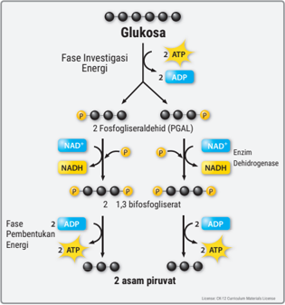

> **Deskripsi Visual:** Gambar ini adalah ilustrasi yang menunjukkan proses metabolisme glukosa dalam metabolisme energi. Ilustrasi ini memperlihatkan dua fase utama: fase investigasi energi dan fase pembentukan energi. 

Pada fase investigasi energi, glukosa diterapkan pada fosfogliceralsehidr (PGAL) untuk menghasilkan ATP dan ADP. Proses ini melibatkan enzim dehidrogenase yang mengubah NAD+ menjadi NADH.

Di fase pembentukan energi, asam piruvat dibentuk dari PGAL. Proses ini menghasilkan ATP dan ADP lagi. Ini menunjukkan bahwa glukosa dapat digunakan untuk menghasilkan energi melalui dua cara berbeda.

Teks, angka, atau label penting yang terlihat dalam gambar termasuk:
- "Glukosa" di bagian atas.
- "Fase Investigasi Energi" dan "Fase Pembentukan Energi" di bagian bawah.
- Angka 2 ATP, 2 ADP, dan 2 asam piruvat yang muncul di setiap tahap.
- NAD+ dan NADH yang terkait dengan proses dehidrogenase.

Informasi kunci yang dapat diambil pembaca adalah bahwa glukosa dapat digunakan untuk menghasilkan energi melalui dua cara berbeda, yaitu melalui PGAL untuk ATP dan melalui pembentukan asam piruvat untuk ATP.

Gambar 1. 14 Glikolisis.

Sumber: CK-12 Foundation (2020)

 

---
## 📄 Halaman 30

- Jawablah pertanyaan-pertanyaan berikut dengan berdiskusi.
- Apakah substrat yang digunakan pada glikolisis?
- Ada berapa tahapan utama pada glikolisis?
- Apa yang terjadi pada tahap investasi energi dan berapa jumlah energi yang digunakan?
- Apa yang terjadi pada tahap pembentukan energi dan berapa jumlah energi yang dihasilkan?
- Berapa jumlah energi (ATP) bersih yang dihasilkan pada reaksi glikolisis?
- Enzim apa yang mengkatalisis pembentukan NADH pada reaksi glikolisis?
- Senyawa apa sajakah yang dihasilkan pada reaksi glikolisis?
h.

Berdasarkan Gambar 1.14, coba rumuskan pengertian glikolisis!

- Sajikan jawaban kalian dalam bentuk PowerPoint dan presentasikan di depan kelas.
Setelah  melakukan  Aktivitas  1.7,  kalian  telah  mengetahui  bahwa substrat atau bahan  dalam  glikolisis berupa  glukosa (C 6 ).  Adapun tahapannya ada dua, yaitu tahapan investasi energi membutuhkan 2 ATP dan tahapan pembentukan energi dihasilkan 4 ATP. Artinya, ATP bersih yang  dihasilkan  pada  glikolisis  sebanyak  2  ATP.  Adapun  hasil  utama glikolisis berupa 2 asam piruvat (2C 3 ) dan hasil sampingnya berupa 2 ATP dan 2 NADH.

NADH merupakan koenzim yang terbentuk dari NAD +  ( Nicotinamide Adenine  Dinucleotide )  yang  mengikat  elektron  berenergi  tinggi  (e - )  dan satu  proton  (H + )  dari  hasil  reaksi  pembongkaran  ikatan  kimia  antara karbon dengan hidrogen pada senyawa 2 PGAL ( Phospho Gliseraldehid ). Pembentukan NADH dikatalisis oleh enzim dehidrogenase. Secara sederhana, glikolisis dapat digambarkan dalam bagan berikut.

---
**🖼️ Gambar/Diagram**

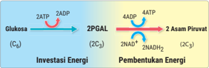

> **Deskripsi Visual:** Gambar ini adalah ilustrasi yang menunjukkan proses metabolisme glukosa dalam sel. Ilustrasi ini mencakup dua tahap utama: investasi energi dan pembentukan energi.

Pertama, tahap investasi energi melibatkan ATP (adenosin trifosfat) untuk mengubah glukosa menjadi 2PGAL (2-gulosa-1-fosfat). Proses ini membutuhkan 2ATP dan menghasilkan 2ADP (adenosin diphosfat).

Kedua, tahap pembentukan energi melibatkan 2ADP untuk mengubah 2PGAL menjadi asam piruvat. Proses ini membutuhkan 4ATP dan menghasilkan 4ADP.

Ilustrasi ini menunjukkan bahwa setiap tahap memerlukan ATP sebagai investasi energi dan menghasilkan energi dalam bentuk ADP. Ini menunjukkan hubungan antara ATP dan ADP dalam proses metabolisme glukosa.

 

---
## 📄 Halaman 31

Berdasarkan Gambar 1.15, dapat dirumuskan bahwa glikolisis adalah peristiwa  pemecahan  satu  molekul  glukosa  (6  atom  C)  menjadi  2  asam piruvat (3 atom C) yang berlangsung di sitosol sitoplasma dalam kondisi anaerob (tanpa oksigen) dengan hasil sampingan berupa 2 molekul NADH dan 2 molekul ATP.

### 2) Dekarboksilasi oksidatif

Selanjutnya, dua molekul asam piruvat (2C 3 ),  hasil utama glikolisis akan memasuki tahap dekarboksilasi oksidatif. Apa itu dekarboksilasi oksidatif? Apakah bahannya? Bagaimana tahapannya dan apa hasilnya? Lakukan aktivitas berikut.

### AKTIVITAS 1.8

### Menganalisis Tahapan Dekarboksilasi Oksidatif

- Bentuk kelompok yang terdiri atas 3 - 4 orang.
- Perhatikan gambar berikut!
- Jawablah pertanyaan-pertanyaan berikut dengan berdiskusi.
- Apakah  substrat  yang  digunakan  pada  reaksi  dekarboksilasi oksidatif?
- Ada berapa tahapan utama pada reaksi dekarboksilasi oksidatif?
- Apa yang terjadi pada tahap pelepasan gugus karboksil dan apa hasilnya?
- Apa yang terjadi pada tahapan penambahan KoA dan apa hasilnya?

---
**🖼️ Gambar/Diagram**

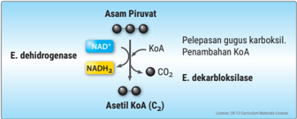

> **Deskripsi Visual:** Gambar ini adalah ilustrasi yang menunjukkan proses metabolisme asam piruvat dalam E. coli (Escherichia coli). Gambar ini memperlihatkan dua tahap utama dalam proses ini:

1. Pertama, ada asam piruvat yang diterima oleh enzim dehidrogenase. Enzim ini mengubah asam piruvat menjadi NADH dan CO2. Proses ini melibatkan pelepasan gugus karboksilik dan penambahan koenzim A (KoA).

2. Kedua, hasil dari reaksi pertama, yaitu NADH, kemudian diteruskan ke enzim dekarboksilase. Enzim ini mengubah NADH menjadi asetil KoA (C2), yang merupakan produk akhir dari proses ini.

Elemen-elemen utama dalam gambar ini adalah asam piruvat, NADH, CO2, enzim dehidrogenase, enzim dekarboksilase, dan KoA. Relasi antara elemen-elemen ini sangat jelas, dengan asam piruvat sebagai bahan awal, NADH sebagai hasil dari reaksi pertama, dan asetil KoA sebagai hasil akhir dari reaksi kedua.

Teks, angka, atau label penting yang terlihat dalam gambar ini adalah "Asam Piruvat", "NAD+", "NADH", "CO2", "KoA", "E. dehidrogenase", "E. dekarboksilase", dan "Asetil KoA (C2)". Informasi kunci yang dapat diambil pembaca melalui gambar ini adalah bahwa asam piruvat melalui proses dehidrogenase dan dekarboksilase menghasilkan asetil KoA, yang merupakan bagian penting dari metabolisme glukosa dalam E. coli.

Sumber: CK-12 Foundation (2020)

 

---
## 📄 Halaman 32

- Enzim apakah yang mengkatalisis pembentukan CO 2 dan NADH pada reaksi dekarboksilasi oksidatif?
- Senyawa apa sajakah yang dihasilkan pada reaksi dekarboksilasi oksidatif?
- Berdasarkan Gambar 1.16, coba rumuskan pengertian dekarboksilasi oksidatif!
- Sajikan jawaban kalian dalam bentuk PowerPoint dan presentasikan di depan kelas.
Setelah  melakukan  Aktivitas  1.8,  kalian  telah  menemukan  bahwa substrat atau bahan dalam dekarboksilasi oksidatif berupa 2 asam piruvat (2C 3 ).  Adapun  tahapannya  ada  dua.  Pertama,  tahap  pelepasan  gugus karboksil dari asam piruvat yang menghasilkan 2CO 2 dan hasil sampingan 2NADH.  Pembentukan  2CO 2 dikatalisis  oleh  enzim  dekarboksilase  dan pembentukan 2NADH dikatalisis enzim dehidrogenase.

Kedua, penambahan 2KoA pada 2 asam piruvat yang telah kehilangan gugus karboksilnya sehingga terbentuk 2 asetil KoA (2C 2 ).  Secara sederhana, dekarboksilasi oksidatif dapat digambarkan dalam bagan berikut.

---
**🖼️ Gambar/Diagram**

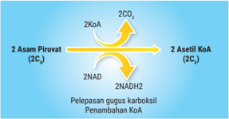

> **Deskripsi Visual:** Gambar ini adalah ilustrasi yang menunjukkan proses metabolisme karbohidrat dalam otot. Ilustrasi ini menggambarkan dua molekul asam piruvat yang berinteraksi dengan dua molekul asam karbonat (CO2) untuk menghasilkan dua molekul asetil-KoA. Proses ini melibatkan penurunan gugus karboksilik dan penambahan KoA. Elemen utama dalam ilustrasi ini adalah asam piruvat, asam karbonat, asetil-KoA, NADH, dan NAD+. Relasi antara elemen-elemen ini adalah bahwa asam piruvat bereaksi dengan asam karbonat untuk menghasilkan asetil-KoA, sementara NADH dan NAD+ berperan dalam proses tersebut. Informasi kunci yang dapat diambil pembaca adalah bahwa proses ini merupakan bagian dari proses metabolisme karbohidrat dalam otot dan melibatkan interaksi antara asam piruvat dan asam karbonat untuk menghasilkan energi dalam bentuk ATP.

Berdasarkan bagan di atas, dapat dirumuskan bahwa dekarboksilasi oksidatif adalah peristiwa pelepasan gugus karboksil dari asam piruvat (2C 3 )  dan  penambahan molekul KoA sehingga menghasilkan Asetil KoA (2C 2 )  dalam  suasana  aerob  yang  berlangsung  di  matriks  mitokondria dengan hasil samping berupa 2CO 2 dan 2NADH.

 

---
## 📄 Halaman 33

### 3) Siklus Krebs atau siklus asam sitrat

Selanjutnya, dua molekul Asetil KoA (2C 2 ), hasil utama dekarboksilasi akan memasuki tahap siklus Krebs. Apa itu siklus Krebs? Apakah bahannya? Bagaimana tahapannya dan apa hasilnya? Lakukan aktivitas berikut.

### AKTIVITAS 1.9

### Menganalisis Tahapan Siklus Krebs

- Bentuk kelompok yang terdiri atas 3 - 4 orang.
- Perhatian gambar berikut.
- Jawablah pertanyaan-pertanyaan berikut dengan berdiskusi.
- Apakah substrat yang digunakan pada reaksi siklus Krebs?
- Senyawa apa yang mengikat 2 asetil KoA pada saat memasuki siklus Krebs?
- Ada berapa tahapan utama reaksi pada siklus Krebs?
- Pada tahapan mana sajakah H 2 O ditambahkan?
- Pada tahapan manakah ATP dihasilkan?
- Pada tahapan mana sajakah NADH dihasilkan?
- Pada tahapan mana sajakah FADH 2 dihasilkan?
- Enzim apakah yang mengkatalisis pembentukan asam sitrat?

---
**🖼️ Gambar/Diagram**

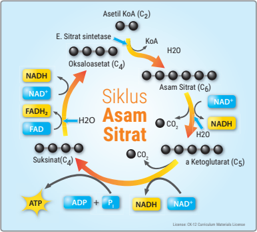

> **Deskripsi Visual:** Gambar ini adalah ilustrasi yang menunjukkan siklus asam sitrat (citric acid cycle), yang merupakan bagian dari metabolisme glukosa dalam sel. Ilustrasi ini menggambarkan proses metabolisme yang melibatkan reaksi-fotoksikositik yang menghasilkan energi dalam bentuk ATP.

Elemen utama dalam gambar ini meliputi:
1. Asam sitrat (C₄) yang berada di tengah-tengah.
2. Enzim E. Sitrat sintase yang berfungsi untuk mengubah asam sitrat menjadi oxalacetat.
3. Oksalacetat (C₂) yang kemudian mengalami reaksi dengan asam sitrat untuk menghasilkan asam sitrat.
4. Sukinatan (C₃) yang terbentuk dari reaksi antara asam sitrat dan oksalacetat.
5. Teks "Siklus Asam Sitrat" yang menjelaskan bahwa gambar ini menunjukkan siklus asam sitrat.
6. Angka 20 dan 25 yang mungkin merujuk pada jumlah atom karbon dalam molekul-molekul tersebut.
7. Teks "Licensia 2018 © Cambridge University Press" yang menunjukkan sumber dan hak cipta gambar ini.

Informasi kunci yang dapat diambil pembaca meliputi:
- Siklus asam sitrat adalah proses metabolisme yang melibatkan reaksi-fotoksikositik yang menghasilkan energi dalam bentuk ATP.
- Proses ini melibatkan reaksi antara asam sitrat, oksalacetat, sukinitan, dan asam sitrat lainnya.
- Gambar ini juga menunjukkan peran enzim E. Sitrat sintase dalam proses ini.

Sumber: CK-12 Foundation (2020)

 

---
## 📄 Halaman 34

- Senyawa apa sajakah yang dihasilkan pada siklus Krebs?
- Berdasarkan Gambar 1.18, coba rumuskan pengertian siklus Krebs!
- Sajikan jawaban kalian dalam bentuk PowerPoint dan presentasikan di depan kelas.
Setelah  melakukan  Aktivitas  1.9,  kalian  telah    menemukan  bahwa substrat  atau  bahan  dalam  siklus  Krebs  berupa  2  asetil  KoA  (2C 2 )  yang terjadi dalam 5 tahapan utama, yaitu:

- Pengikatan  2  asetil  KoA  oleh  2  oksaloasetat  dengan  penambahan 2H 2 O  untuk  membentuk  2  asam  sitrat  yang  dikatalisis  oleh  enzim sitrat sintase.
- Pelepasan  satu  ikatan  karbon  pada  masing-masing  asam  sitrat setelah penambahan 2H 2 O	untuk	membentuk	2α	ketoglutarat	dengan melepaskan  2CO 2 dan  2NADH.  Pembentukan  2CO 2 dikatalisis  oleh enzim  dekarboksilase  dan  pembentukan  2NADH  dikatalisis  enzim dehidrogenase.
- Pelepasan	 satu	 ikatan	 karbon	 pada	 masing-masing	 2α	 ketoglutarat untuk membentuk 2 suksinat dengan melepaskan 2CO 2 dan 2ATP serta 2NADH dan pembentukan 2NADH dikatalisis enzim dehidrogenase .
- Perubahan 2 suksinat menjadi 2 malat setelah mengalami penambahan 2H 2 O  dengan  menghasilkan  FADH 2 .  Pembentukan  FADH 2 dikatalisis

 

---
## 📄 Halaman 35

enzim  dehidrogenase.  FADH 2 merupakan  koenzim  (FAD +  atau Flavo Adenine Dinucleotide) yang  mengikat  elektron  berenergi  tinggi  (H 2+ ) dan  satu  proton  (e - )  dari  hasil  reaksi  pembongkaran  ikatan  kimia antara karbon dengan hidrogen pada 2 suksinat.

- Perubahan 2 malat menjadi 2 oksaloasetat melalui reaksi isomerase yang menghasilkan 2NADH. Pembentukan 2NADH dikatalisis enzim dehidrogenase.
Berdasarkan  bagan  di  atas,  dapat  dirumuskan  bahwa  siklus  Krebs adalah peristiwa pemecahan 2 asetil KoA (2C 2 ) untuk menghasilkan 4CO 2 (4C 1 )  dalam  suasana  anaerob  yang  berlangsung  di  matrik  mitokondria dengan hasil sampingan berupa 2ATP, 6NADH, dan 2FADH 2 .

### 4) Fosforilasi oksidatif: transpor elektron dan kemiosmosis

Transpor  elektron  merupakan  tahap  terakhir  dalam  respirasi  aerob. Sebelumnya, pada tahap glikolisis dihasilkan 2 NADH, pada dekarboksilasi oksidatif dihasilkan 2NADH dan pada siklus Krebs dihasilkan 6NADH dan 2FADH 2 . Dengan demikian, jumlah keseluruhan dari ketiga tahap tersebut dihasilkan 10NADH dan 2FADH 2 . Selain itu, dihasilkan energi sebanyak 2 ATP pada glikolisis dan 2 ATP pada siklus Krebs. Dengan demikian, baru dihasilkan 4 ATP.

Selanjutnya, 10 NADH dan 2 FADH 2 akan menjadi bahan utama dalam transpor  elektron  yang  berlangsung  di  membran  krista  mitokondria dalam suasana aerob untuk dikonversi menjadi ATP. Agar kalian dapat memahami  apakah  transpor elektron dan berapakah energi yang dihasilkan, lakukan aktivitas berikut.

 

---
## 📄 Halaman 36

### AKTIVITAS 1.10

### Menganalisis Tahapan Transpor Elektron

- Bentuk kelompok yang terdiri atas 3 - 4 orang.
- Perhatian gambar berikut!
- Jawablah pertanyaan-pertanyaan berikut dengan berdiskusi.
- Penyusun  utama  rantai  transpor  elektron  berupa  kompleks protein  I,  II,  III,  dan  IV  pada  membran  krista  mitokondria. Tanda panah berwarna emas pada Gambar 1.19 menunjukkan jalur  transpor  elektron.  Kompleks  protein  nomor  berapakah yang pertama menerima elektron dari NADH?
- Kompleks protein nomor berapa sajakah yang dilalui elektron yang berasal dari NADH?
- Kompleks protein nomor berapakah yang pertama menerima elektron dari FADH 2 ?

---
**🖼️ Gambar/Diagram**

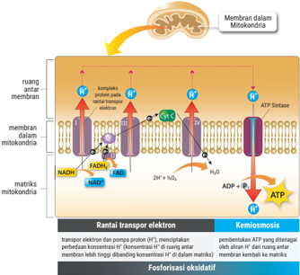

> **Deskripsi Visual:** Gambar ini adalah ilustrasi yang menunjukkan proses fosforilasi oksidatif dalam mitokondria. Gambar ini memperlihatkan struktur internal mitokondria, termasuk membran luar dan dalam, ruang antara membran, dan matris mitokondria. Ilustrasi ini juga menunjukkan kompleks ATP sintase, yang berfungsi untuk menghasilkan ATP melalui kemiomiosis.

Elemen utama dalam gambar ini meliputi:
1. Mitokondria dengan struktur internal yang jelas.
2. Membran luar dan dalam mitokondria.
3. Ruang antara membran mitokondria.
4. Kompleks ATP sintase.
5. Matris mitokondria.
6. Proses transpor elektron melalui NADH dan FADH2.
7. Transpor proton dan pompa proton (H+).
8. ATP sintase yang mengkonversi ADP dan ATP.

Teks, angka, atau label penting yang terlihat dalam gambar ini meliputi:
- "Membran dalam Mitokondria".
- "ruang antara membran".
- "membran luar dalam mitokondria".
- "matris mitokondria".
- "kompleks protein ATP sintase".
- "NADH".
- "FADH2".
- "ATP sintase".

Informasi kunci yang dapat diambil pembaca meliputi:
- Proses fosforilasi oksidatif dalam mitokondria.
- Struktur internal mitokondria, termasuk membran luar dan dalam, serta matris mitokondria.
- Proses transpor elektron melalui NADH dan FADH2.
- Transpor proton dan pompa proton (H+).
- ATP sintase yang mengkonversi ADP menjadi ATP.

 

---
## 📄 Halaman 37

- Kompleks protein nomor berapa sajakah yang dilalui elektron yang berasal dari FADH 2 ?
- Bagaimanakah NADH dan FADH 2 dikonversi menjadi ATP?
- Berapakah ATP yang dihasilkan dari konversi NADH dan FADH 2 ?
- Berapakah  NADH  dan  FADH 2 yang  dihasilkan  pada  proses respirasi aerob?
- Berapakah total ATP yang dihasilkan pada transpor elektron?
- Pada  Gambar  1.19,  elektron  yang  sudah  ditranspor  hingga mencapai kompleks protein IV akan diberikan pada O 2 sebagai akseptor  elektron  terakhir.  Zat  apakah  yang  akan  terbentuk dari proses tersebut?
- Berdasarkan Gambar 1.19, coba rumuskan pengertian transpor elektron!
- Sajikan jawaban kalian dalam bentuk PowerPoint dan presentasikan di depan kelas.
Setelah  melakukan  Aktivitas  1.10,  kalian  telah  menemukan  bahwa 10 NADH dan 2 FADH 2 dikonversi menjadi ATP. Di mana setiap 1 molekul NADH akan dikonversi menjadi 3 ATP dengan menghasilkan 1 molekul air. Sementara itu, setiap 1 molekul FADH 2 akan dikonversi menjadi 2 ATP dengan menghasilkan 1 molekul air.

Konversi energi diawali dari pemecahan ikatan hidrogen NADH dan FADH 2 .  Pelepasan  ikatan  hidrogen  ini  akan  diikuti  pemancaran  energi yang akan dikonversi menjadi ATP melalui kemiosmosis pada membran krista mitokondria.

Kemiosmosis terjadi karena H +  yang kaya energi dari hasil pemecahan dari NADH 2 dan FADH 2 terus dipompa menuju ruang antarmembran yang menyebabkan  konsentrasi  H +   dalam  ruang  antarmembran  meningkat. Selanjutnya, H + berpindah menuruni gradien konsentrasinya dari ruang  antarmembran  kembali  lagi  ke  matriks.  Perpindahan  ini  hanya dapat  melalui  ATP  sintase  pada  membran  krista  mitokondria.  Aliran H +   melepaskan  energi  bagi  ATP  sintase  untuk  melakukan  fosforilasi (penambahan gugus fosfat) pada ADP sehingga menghasilkan ATP.

Secara  sederhana,  berikut  konversi  energi  dalam  bentuk  ATP  dari 10NADH 2 dan 2FADH 2 .

 

---
## 📄 Halaman 38

Selanjutnya,  24H +   mendonorkan  elektronnya  ke  oksigen  sehingga terbentuk senyawa 12H 2 O. Pada kondisi ini, H +  sebagai donor elektron dan oksigen sebagai resipien elektron terakhir pada respirasi aerob.

Dengan demikian, tahap transpor elektron dengan bahan 10NADH 2 dan  2FADH 2 menghasilkan  34  ATP  dan  12H 2 O.  Dengan  mengacu  hasil analisis  di  atas,  dapat  dirumuskan  bahwa  transpor  elektron  adalah peristiwa konversi energi dari 10NADH 2 dan 2FADH 2 yang berlangsung di membran krista mitokondria dalam suasana aerob dengan hasil utama 34 ATP dan hasil sampingan berupa 12H 2 O.

Berdasarkan  uraian  dari keempat  tahap  respirasi aerob dapat disimpulkan  bahwa  selama  proses  tersebut  dihasilkan  38  ATP  dengan rincian sebagai berikut.

---
**📊 Tabel**

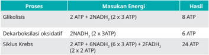

Tabel ini menunjukkan proses metabolisme glukosa dalam tubuh manusia, dengan fokus pada energi yang dihasilkan dan hasil akhir dari setiap proses. Topik utama tabel adalah proses-proses metabolisme glukosa yang melibatkan transduksi energi. Kolom pertama berisi nama proses, sedangkan kolom kedua berisi masukan energi dan kolom ketiga berisi hasil. Dari data yang diberikan, kita dapat melihat bahwa glikolisis adalah proses yang paling efisien dalam menghasilkan energi, dengan menghasilkan 8 ATP dan 2 NADH. Proses dekarboksilasi oksidatif menghasilkan 6 ATP dan 2 NADH, sementara siklus Krebs menghasilkan 24 ATP dan 6 FADH2. Pola penting yang terlihat adalah bahwa siklus Krebs adalah proses yang paling efisien dalam menghasilkan energi, dengan menghasilkan banyak ATP dibandingkan dengan glikolisis dan dekarboksilasi oksidatif.

Jumlah Energi yang dihasilkan

### AKTIVITAS 1.11

### Mengukur Tingkat Pemahaman tentang Tahapan Respirasi Aerob

- Tentukan macam-macam  variabel pembeda antara glikolisis, dekarboksilasi oksidatif, siklus Krebs dan transpor elektron.
- Buat tabel seperti di bawah ini. Kemudian, tulis perbedaan antara glikolisis, dekarboksilasi oksidatif, siklus Krebs,  dan  transpor elektron berdasarkan variabel pembedanya masing-masing.
38 ATP

 

---
## 📄 Halaman 39

---
**📊 Tabel**

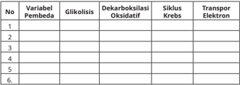

Tabel ini menunjukkan hubungan antara berbagai variabel pembedaan dalam proses metabolisme sel. Variabel pembedaan ini meliputi glikolisis, dekarboksilasi oksidatif, siklus Krebs, dan transport elektron. Setiap variabel memiliki beberapa kolom yang berisi informasi tentang bagaimana variabel tersebut berinteraksi dengan proses-proses tersebut. Misalnya, dalam kolom glikolisis, informasi tentang bagaimana glikolisis mempengaruhi proses lain dapat ditemukan. Topik utama tabel ini adalah hubungan antara variabel pembedaan dalam metabolisme sel dan bagaimana mereka berinteraksi satu sama lain. Data atau pola penting yang terlihat adalah bahwa semua variabel pembedaan memiliki hubungan dengan proses-proses metabolisme sel, dan setiap variabel memiliki dampak yang berbeda pada setiap proses.

- Presentasikan tabel kalian di depan kelas.

### b. Fermentasi

Pernahkan  kalian  melihat  proses  pembuatan  tape  dan  roti?  Proses pembuatan tape atau roti melibatkan proses fermentasi. Apakah yang  sudah  kalian  pahami  tentang  fermentasi?  Bagaimanakah  tahaptahap  fermentasi?  Apakah  produk  fermentasi  yang  diperlukan  dalam pembuatan  tape  dan  roti?  Agar  dapat  memahami  fermentasi,  lakukan aktivitas berikut.

### AKTIVITAS 1.12

### Menganalisis Tahapan Fermentasi

- Bentuk kelompok yang terdiri atas 3 - 4 orang.
- Perhatian gambar berikut.
1

KIMIA

REAKSI

- Jawablah pertanyaan-pertanyaan berikut dengan berdiskusi.
- Apakah  substrat  yang  digunakan  untuk  kedua  reaksi  kimia pada Gambar 1.20?
2

KIMIA

REAKSI

---
**🖼️ Gambar/Diagram**

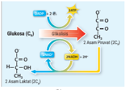

> **Deskripsi Visual:** Gambar ini adalah ilustrasi yang menunjukkan proses metabolisme glukosa dalam tubuh. Ilustrasi ini menggambarkan bagaimana glukosa (C6H12O6) diubah menjadi asam laktat (C3H6O3) melalui dua tahap utama. Pertama, glukosa diterjemahkan menjadi 2-aminomalonat (C2H5NO2), yang kemudian diubah menjadi asam laktat melalui reaksi oksidasi dan reduksi. Ilustrasi ini juga menunjukkan ikatan glikosid (C-O-C) yang terbentuk pada tahap pertama dan dipisahkan pada tahap kedua. Teks, angka, atau label penting yang terlihat dalam gambar termasuk nama molekul glukosa, asam laktat, 2-aminomalonat, dan ikatan glikosid. Informasi kunci yang dapat diambil pembaca adalah bahwa glukosa dapat diubah menjadi asam laktat melalui proses metabolisme yang kompleks.

(b)

 

---
## 📄 Halaman 40

- Apakah kedua reaksi kimia pada Gambar 1.20 melalui tahap glikolisis?
- Setelah  tahap  glikolisis,  apakah  tahapan  selanjutnya  pada gambar  (a)?  Mengapa  tahap  ini  terjadi  dan  berbeda  dengan respirasi aerob?
- Setelah  tahap  glikolisis,  apakah  tahapan  selanjutnya  pada gambar  (b)?  Mengapa  tahap  ini  terjadi  dan  berbeda  dengan respirasi aerob?
- Bagaimanakah hasil akhir reaksi kimia pada gambar (a)?
- Bagaimanakah hasil akhir reaksi kimia pada gambar (b)?
- Temukan perbedaan antara reaksi kimia gambar (a) dan (b)!
- Apakah nama jenis fermentasi pada gambar (a)?
- Apakah nama jenis fermentasi pada gambar (b)?
- Berdasarkan reaksi kimia pada Gambar 1.20, coba rumuskan pengertian fermentasi!
- Sajikan jawaban kalian dalam bentuk PowerPoint dan presentasikan di depan kelas.
Setelah  melakukan  Aktivitas  1.12,  kalian  menemukan  bahwa  ada dua  macam  fermentasi,  yaitu  fermentasi  alkohol  dan  asam  laktat. Substrat kedua fermentasi tersebut berupa glukosa. Pada tahap pertama fermentasi  alkohol  dan  asam  laktat,  glukosa  akan  mengalami  glikolisis yang menghasilkan 2 asam piruvat, 2 ATP, dan 2NADH.

Tahap  kedua  fermentasi  alkohol,  yaitu  dekarboksilasi  nonoksidatif. Hal  ini  terjadi  karena  tidak  tersedianya  oksigen  pada  membran  krista mitokondria.  Dekarboksilasi  nonoksidatif  merupakan  reaksi  reduksi 2  asam  piruvat  (2C 3 )  oleh  2NADH menjadi  2  etil  alkohol  atau  2  etanol (2C 2 )  dengan  hasil  sampingan  berupa  2CO 2 .  Gas  karbon  dioksida  inilah yang  berfungsi  mengembangkan  adonan  roti.  Konsekuensi  dari  proses ini  hanya  dihasilkan  2  ATP,  lebih  sedikit  dibandingkan  respirasi  aerob. Berdasarkan hasil akhirnya yang berupa senyawa alkohol maka disebut dengan fermentasi alkohol.

Adapun tahap kedua fermentasi asam laktat juga dalam kondisi tanpa oksigen. Pada tahap ini terjadi reduksi 2 asam piruvat (2C 3 ) oleh 2 NADH menjadi  2  asam  laktat  (2C 3 )  sehingga  tidak  ada  pelepasan  2CO 2 .  Oleh karena hasil akhirnya berupa senyawa asam laktat maka disebut dengan

 

---
## 📄 Halaman 41

fermentasi asam laktat. Fermentasi asam laktat terjadi pada sel-sel otot ketika ketersediaan oksigen sedikit.

Berdasarkan  uraian  di  atas  dapat  disimpulkan  bahwa  fermentasi alkohol adalah pemecahan molekul organik (glukosa) yang berlangsung secara anaerob dengan menghasilkan 2 etanol, 2 ATP, dan 2CO 2 . Adapun fermentasi asam laktat adalah pemecahan molekul organik (glukosa) yang berlangsung secara anaerob dengan menghasilkan 2 asam laktat dan 2 ATP.

Secara sederhana, rangkaian tahapan fermentasi alkohol dan asam laktat digambarkan pada bagan berikut.

- Fermentasi alkohol : C 6 H 12 O 6 2C 2 H 5 OH + 2CO 2 + 2ATP
- Fermentasi asam laktat: C 6 H 12 O 6 2C 3 H 6 O 3 + 2ATP

---
**🖼️ Gambar/Diagram**

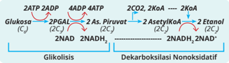

> **Deskripsi Visual:** Gambar ini adalah ilustrasi yang menunjukkan proses glikolisis dan dekarboksilasi nonoksidatif dalam metabolisme glukosa. Ilustrasi ini mencakup dua bagian utama: glikolisis dan dekarboksilasi nonoksidatif.

Pertama, glikolisis melibatkan reaksi-fase dengan ATP dan ADP sebagai elemen utama. Proses ini melibatkan 2ATP menjadi 2ADP, 4ATP menjadi 2G6PDH, dan 4ADP menjadi 2G6PDH. Ini menunjukkan bahwa ATP digunakan untuk mengubah substrat glukosa menjadi produk yang lebih sederhana.

Kedua, dekarboksilasi nonoksidatif melibatkan 2C2O2 menjadi 2AsetylCoA, 2AsetylCoA menjadi 2Etanol, dan 2NADH menjadi 2NAD+. Ini menunjukkan bahwa substrat yang lebih sederhana tersebut diubah menjadi etanol dan NAD+ yang dapat digunakan dalam proses selanjutnya.

Teks, angka, atau label penting yang terlihat pada gambar ini adalah "Glikolisis" dan "Dekarboksilasi Nonoksidatif", yang menunjukkan bagaimana proses-proses tersebut berhubungan satu sama lain. Angka-angka seperti 2ATP menjadi 2ADP, 4ATP menjadi 2G6PDH, 4ADP menjadi 2G6PDH, 2C2O2 menjadi 2AsetylCoA, 2AsetylCoA menjadi 2Etanol, dan 2NADH menjadi 2NAD+ menunjukkan jumlah molekul yang terlibat dalam setiap reaksi.

Informasi kunci yang dapat diambil pembaca adalah bahwa glikolisis adalah proses yang memerlukan ATP untuk mengubah glukosa menjadi produk yang lebih sederhana, sedangkan dekarboksilasi nonoksidatif adalah proses yang tidak memerlukan oksidasi untuk mengubah substrat menjadi etanol dan NAD+.

---
**🖼️ Gambar/Diagram**

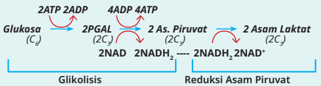

> **Deskripsi Visual:** Gambar ini adalah ilustrasi yang menunjukkan proses glikolisis dan reduksi asam piruvat dalam metabolisme glukosa. Ilustrasi ini memperlihatkan sejumlah reaksi kimia yang terlibat dalam proses ini, dengan menggunakan simbol-simbol kimia seperti ATP, ADP, PPGAL, Asam Piruvat, dan NADH.

1. **Apa yang ditampilkan secara keseluruhan**: Gambar ini menunjukkan dua tahap utama dari proses glikolisis: tahap pertama yang melibatkan transduksi glukosa menjadi asam piruvat, dan tahap kedua yang melibatkan reduksi asam piruvat menjadi asam lactat.

2. **Elemen-elemen utama dan relasinya**: 
   - **Tahap Pertama (Glikolisis)**: Glukosa masuk ke dalam proses glikolisis dan diperkarakan menjadi dua molekul asam piruvat. Proses ini melibatkan empat reaksi kimia yang menghasilkan 4 ATP.
   - **Tahap Kedua (Reduksi Asam Piruvat)**: Asam piruvat kemudian diperkarakan menjadi asam lactat, yang merupakan hasil akhir dari proses ini. Proses ini melibatkan reduksi asam piruvat menjadi 2NADH, yang kemudian digunakan untuk menghasilkan energi melalui ATP.

3. **Teks, angka, atau label penting yang terlihat**: 
   - **Teks Penting**: "Glikolisis" dan "Reduksi Asam Piruvat" yang menunjukkan dua tahap utama dari proses ini.
   - **Angka Penting**: Angka-angka seperti 4ATP, 4ADP, 2C2, 2C2, 2NADH, dan 2NADH' yang menunjukkan jumlah molekul ATP, ADP, asam piruvat, dan NADH yang terlibat dalam proses ini.

4. **Informasi kunci yang dapat diambil pembaca**: Gambar ini memberikan gambaran umum tentang bagaimana glukosa diubah menjadi asam lactat dalam proses glikolisis dan redu

Berdasarkan  bagan  fermentasi  di  atas,  kalian  memahami  bahwa fermentasi terjadi karena ketidaktersediaan O 2 sehingga hasil energinya rendah.

Setelah  mempelajari  tahapan  respirasi  aerob  dan  anaerob,  ukur tingkat pemahaman kalian dengan melakukan aktivitas berikut.

 

---
## 📄 Halaman 42

### AKTIVITAS 1.13

### Mengukur Tingkat Pemahaman tentang Respirasi Aerob dan Anaerob

- Tentukan macam-macam variabel pembeda antara respirasi aerob dengan anaerob!
- Buat tabel seperti di bawah ini. Kemudian, tulis perbedaan antara respirasi aerob dengan anaerob berdasarkan variabel pembedanya masing-masing.
- Presentasikan tabel kalian di depan kelas.

---
**📊 Tabel**

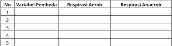

Tabel ini menunjukkan hasil analisis variabel pembelajaran pada dua jenis respiroasi: aerobik dan anaerobik. Variabel pembelajaran tersebut meliputi empat variabel yang diperhitungkan dalam setiap jenis respiroasi. Data yang terdapat dalam tabel ini menunjukkan bahwa semua variabel memiliki nilai yang sama untuk kedua jenis respiroasi, yaitu 100%. Ini menunjukkan bahwa tidak ada perbedaan signifikan antara variabel pembelajaran pada kedua jenis respiroasi tersebut.

### Fotosintesis

Ketika belajar struktur dan fungsi sel di kelas XI, kalian telah mempelajari organel kloroplas. Masih ingatkah kalian bagaimana struktur kloroplas? Struktur kloroplas terdiri atas dua bagian utama, yaitu grana dan stroma. Perhatikan gambar berikut.

---
**🖼️ Gambar/Diagram**

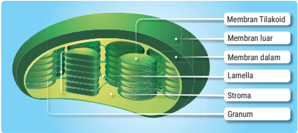

> **Deskripsi Visual:** Gambar ini adalah ilustrasi yang menunjukkan struktur jaringan sel mitochondri. Gambar ini memperlihatkan berbagai komponen utama jaringan sel mitokondri, termasuk membran tilakoid, membran luar, membran dalam, lamella, stroma, dan granum. Setiap komponen memiliki peran spesifik dalam proses metabolisme energi dalam sel. Membran tilakoid membentuk lapisan eksternal, memungkinkan transport ion dan molekul. Membran luar dan dalam membentuk lapisan inti mitokondri, sementara lamella dan stroma berfungsi sebagai ruang untuk reaksi-fotoksidasi dan respirasi oksigen. Granum, yang terletak di bagian dalam, berisi enzim-enzim yang penting untuk proses tersebut. Label pada gambar memberikan penjelasan tentang setiap komponen, menjadikannya instruksi visual yang efektif untuk memahami struktur dan fungsi mitokondri.

Grana	terbungkus	oleh	membran	tilakoid	dan	mengandung	klorofil. Macam	klorofil	 di	 dalam	 kloroplas,	 yaitu	 klorofil	 a,	 b,	 dan	 karotenoid.

 

---
## 📄 Halaman 43

Klorofil	 a	 (C 55 H 72 O 5 N 4 Mg)  berperan  menyerap  terutama  cahaya  merah, biru,	dan	ungu.	Klorofil	b	(C 55 H 70 O 5 N 4 Mg) berperan menyerap cahaya biru dan oranye. Adapun karotenoid merupakan pigmen kuning oranye yang menyerap cahaya biru-hijau.

Pada  membran  tilakoid  terdapat  penangkap  cahaya  yang  disebut fotosistem. Ada dua pusat reaksi, yaitu fotosistem I (FS I) dan fotosistem II (FS	II).	Pada	FS	I	mengandung	klorofil	a	dan	karotenoid	sehingga	mampu menyerap energi cahaya maksimum pada panjang gelombang 700 nm (P 700).	Adapun	pada	FS	II	mengandung	klorofil	a	dan	klorofil	b	(P	680)	yang efektif menyerap cahaya dengan panjang gelombang 680 nm.

Berdasarkan analisis struktur fungsi kloroplas di atas terlihat bagian grana terjadi reaksi fotosintesis yang membutuhkan energi cahaya (foton) karena	memiliki	pigmen	klorofil	dan	pigmen	lainnya.	Adapun	di	stroma tidak  membutuhkan  cahaya.  Reaksi  fotosintesis  yang  membutuhkan cahaya di grana disebut reaksi terang. Dan reaksi fotosintesis yang tidak membutuhkan cahaya di stroma disebut reaksi gelap. Berikut bagan reaksi terang dan reaksi gelap.

---
**🖼️ Gambar/Diagram**

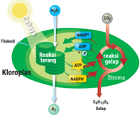

> **Deskripsi Visual:** Gambar ini adalah ilustrasi yang menunjukkan proses fotosintesis dalam sel tumbuhan. Ilustrasi ini memperlihatkan struktur sel tumbuhan dengan fokus pada kloroplas, organel yang berfungsi dalam fotosintesis. Kloroplas terdiri dari lapisan luar (plastid) dan lapisan dalam (cytoplasm). 

Elemen utama dalam ilustrasi meliputi:
1. Kloroplas: organel yang berfungsi dalam fotosintesis.
2. Plastid: lapisan luar kloroplas yang berisi pigmen hijau.
3. Cytoplasm: lapisan dalam kloroplas yang berisi jaringan seluler lainnya.
4. Reaksi terang: proses fotosintesis yang memerlukan cahaya.
5. Reaksi gelap: proses fotosintesis yang tidak memerlukan cahaya.

Teks, angka, atau label penting yang terlihat dalam ilustrasi meliputi:
- "Reaksi terang" dan "Reaksi gelap": merujuk pada dua tahap fotosintesis.
- "ATP", "NADPH", dan "RIBOSOM": komponen-fungsi dalam proses fotosintesis.
- "C₃", "Glycolipid", dan "Glycerol": hasil fotosintesis yang dihasilkan.

Informasi kunci yang dapat diambil pembaca meliputi:
- Proses fotosintesis melibatkan dua tahap: reaksi terang dan reaksi gelap.
- Kloroplas merupakan organel yang berfungsi dalam fotosintesis.
- Proses fotosintesis memerlukan energi cahaya dan air untuk menghasilkan glukosa dan oksigen.

### a. Reaksi terang

Untuk  memahami  apa  itu  reaksi  terang,  bagaimana  tahapannya,  dan apakah hasil reaksinya, lakukan aktivitas berikut.

 

---
## 📄 Halaman 44

### AKTIVITAS 1.14

### Menganalisis mengenai Reaksi Terang

- Bentuk kelompok yang terdiri atas 3 - 4 orang.
- Perhatian gambar reaksi terang nonsiklik berikut.
- Jawablah pertanyaan-pertanyaan berikut dengan berdiskusi.
- Apa bahan utama yang digunakan untuk reaksi terang?
- Apakah jenis energi yang digunakan untuk reaksi terang?
- Ada berapakah tahapan utama pada reaksi terang nonsiklik?
- Apakah	yang	terjadi	pada	tahap	aktivasi	klorofil?
- Apakah yang terjadi pada tahap fotofosforilasi nonsiklik?
- Apakah yang terjadi pada tahapan fotolisis?
- Apakah hasil akhir pada reaksi terang?
- Apakah tujuan reaksi terang?
- Berdasarkan analisis kalian, coba rumuskan pengertian reaksi terang.
- Sajikan jawaban kalian dalam bentuk PowerPoint dan presentasikan di depan kelas.

---
**🖼️ Gambar/Diagram**

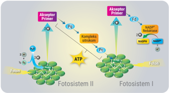

> **Deskripsi Visual:** Gambar ini adalah ilustrasi yang menunjukkan proses fotosintesis dalam tiga fotosistem: Fotosistem I, Fotosistem II, dan Fotosistem III. Ilustrasi ini memperlihatkan dua kompleks stroma yang terhubung oleh ATP, yang merupakan hasil dari fotosintesis. Kompleks stroma ini terdiri dari beberapa elemen utama:

1. Fotosistem I dan Fotosistem II, yang berfungsi sebagai pengakap dan penghasil energi.
2. Fotosistem III, yang berfungsi sebagai penghasil energi dan juga sebagai penyimpanan energi.
3. ATP, yang merupakan hasil dari fotosintesis.

Ilustrasi ini menunjukkan bahwa fotosintesis melibatkan proses yang kompleks dan interaktif antara semua fotosistem. Proses ini melibatkan penyerapan sinar matahari, pembentukan energi, dan penyimpanan energi dalam bentuk ATP. Ilustrasi ini sangat informatif untuk membantu pembaca memahami proses fotosintesis dengan lebih baik.

Setelah melakukan Aktivitas 1.14, kalian menemukan bahwa bahan utama dalam reaksi terang berupa H 2 O. Adapun energi yang dibutuhkan berupa  foton.  Reaksi  terang  fotosintesis  berlangsung  dalam  beberapa tahap. Perhatikan proses reaksi terang pada Gambar 1.23 berikut.

 

---
## 📄 Halaman 45

---
**🖼️ Gambar/Diagram**

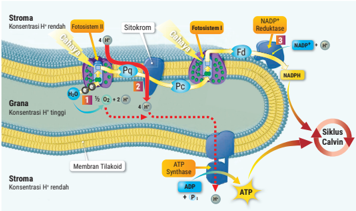

> **Deskripsi Visual:** Gambar ini adalah ilustrasi yang menunjukkan proses fotosintesis dalam sel tumbuhan. Gambar ini melukiskan struktur sel tumbuhan dengan fokus pada proses fotosintesis. 

Elemen utama dalam gambar ini meliputi sel tumbuhan, membran tilakoid, stroma, sitokrom, ATP, NADP+, dan siklus Calvin. Sel tumbuhan terbagi menjadi dua bagian utama: stroma (konsentrasi H+ rendah) dan membran tilakoid (konsentrasi H+ tinggi). Sitokrom berada di dalam membran tilakoid dan berfungsi untuk mengonversi elektron dari NADH ke NADP+. ATP dan NADP+ dibutuhkan untuk proses fotosintesis.

Teks, angka, atau label penting yang terlihat dalam gambar ini meliputi "ATP Synthesis", "Siklus Calvin", "NADPH", dan "NADP+". Informasi kunci yang dapat diambil dari gambar ini adalah bahwa fotosintesis melibatkan konversi energi cahaya menjadi energi kimia dalam bentuk ATP dan NADP+, serta bahwa ada perbedaan konsentrasi H+ antara stroma dan membran tilakoid yang memainkan peran penting dalam proses ini.

Berikut empat tahap dalam reaksi terang fotosintesis.

### 1) Aktivasi	klorofil

Tahap	awal	fotosintesis	dimulai	ketika	klorofil	dari	FS	II	(P680)	menerima energi cahaya berupa foton. Energi ini digunakan untuk menambah energi bagi  elektron  pada  FS  II,  elektron  kaya  energi  tereksitasi  (dikeluarkan) dan berpindah-pindah melalui akseptor-akseptor elektron untuk dimanfaatkan energinya.

### 2) Fotolisis

Karena FS II telah kehilangan elektronnya, elektron tersebut digantikan oleh  elektron  yang  berasal  dari  fotolisis  air.  Fotolisis  adalah  peristiwa pemecahan H 2 O menggunakan foton menjadi . Oksigen yang dihasilkan pada fotosintesis merupakan produk fotolisis air.

### 3) Fotofosforilasi nonsiklik

Elektron  pada  FS  II  yang  tereksitasi  berpindah  menuju  FS  I  melalui rantai transpor elektron yang tersusun atas plastokuinon (Pq), kompleks sitokrom,  dan  protein  yang  disebut  plastosianin  (Pc).  Ketika  elektron

 

---
## 📄 Halaman 46

melalui sitokrom, energinya digunakan untuk membentuk ATP. Energi dari elektron  digunakan  oleh  sitokrom  untuk  memindahkan  H +   dari  stroma ke  ruang  tilakoid sehingga  konsentrasi  H +   di  ruang  tilakoid  meningkat. Peningkatan konsentrasi H +  memicu kemiosmosis, yaitu perpindahan H + menuruni  gradien  konsentrasinya  kembali  ke  stroma.  Perpindahan  ini hanya dapat terjadi melalui ATP sintase. Ketika H +  melalui ATP sintase, energinya digunakan untuk menambahkan  gugus  fosfat ada ADP membentuk ATP.

Selanjutnya,  elektron  akan  menuju  dan  masuk  ke  FS  I  (P700). Terserapnya foton oleh FS I  menyebabkan elektron tersebut tereksitasi kembali dan diterima akseptor feredoksin. Kemudian, elektron ditransfer ke  NADP +   yang  juga  mengikat  H +   membentuk  NADPH  ( Nicotin  Adenin Dinukleotida  Phosfat  Hidrogen ).  Proses  pembentukan  NADPH  dikatalis oleh  enzim  NADP+  reduktase.  Lintasan  elektron  berenergi  tinggi  yang berasal  dari  FS  II  dan  menuju  ke  FS  I  dan  berakhir  di  NADPH  disebut fotofosforilasi nonsiklik.

### 4) Fotofosforilasi siklik

Untuk memahami tahapan dalam fotofosforilasi siklik, lakukan kegiatan berikut.

### AKTIVITAS 1.15

### Menganalisis Mengenai Fosforilasi Siklik

- Lakukan kegiatan ini dengan teman sebangku kalian.
- Amati gambar berikut.

---
**🖼️ Gambar/Diagram**

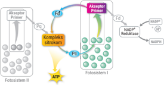

> **Deskripsi Visual:** Gambar ini adalah ilustrasi yang menunjukkan proses fotosintesis dalam tumbuhan. Ilustrasi ini menggambarkan dua fotosistem: Fotosistem I dan Fotosistem II. Fotosistem I memiliki satu kompleks silika aktif yang berinteraksi dengan NADP+ untuk menghasilkan ATP. Fotosistem II memiliki dua kompleks silika aktif yang berinteraksi dengan FADH2 untuk menghasilkan ATP. Proses ini melibatkan penggunaan energi matahari untuk mempercepat fotosintesis. Ilustrasi ini membantu dalam memahami mekanisme fotosintesis dan bagaimana energi matahari digunakan untuk menghasilkan ATP.

 

---
## 📄 Halaman 47

- Jawablah pertanyaan-pertanyaan berikut.
- Tuliskan akseptor-akseptor elektron yang menerima elektron dari FS I pada fotofosforilasi siklik?
- Apakah produk yang dihasilkan dalam fotofosforilasi siklik?
- Apa perbedaan fotofosforilasi siklik dan nonsiklik? Jelaskan!
- Berdasarkan analisis  kalian,  coba  simpulkan  apa  yang  dimaksud dengan fotofosforilasi siklik.
- Buat tabel perbedaan antara fotofosforilasi nonsiklik dan siklik!
Setelah  melakukan  Aktivitas  1.15,  kalian  telah  memahami  bahwa elektron  yang  telah  memasuki  FS  I  dapat  memiliki  jalur  siklik  ketika elektron  tersebut  diberikan  ke  sitokrom  oleh  feredoksin  bukan  pada NADP + . Oleh karena itu, NADPH tidak dihasilkan pada fotofosforilasi siklik. Ketika elektron melalui sitokrom, energinya digunakan untuk membentuk ATP melalui kemiosmosis. Selanjutnya, elektron tersebut berpindah ke Pc untuk dikembalikan ke FS. Elektron tersebut akan tereksitasi kembali oleh foton dan akan memiliki siklus yang sama.

Berdasarkan  4  tahapan  reaksi  terang  di  atas  terlihat  bahwa  ATP dihasilkan pada  saat fotofosforilasi siklik, sedangkan  fotofosforilasi nonsiklik  menghasilkan  ATP  dan  NADPH.  Hasil  sampingan  fotosintesis berupa  O 2 dihasilkan  pada  saat  fotolisis.  Selain  itu,  pada  reaksi  terang terjadi transformasi energi cahaya (foton) menjadi energi kimia berupa ATP dan NADPH yang akan dijadikan sumber energi untuk reaksi gelap. Berdasarkan hal tersebut dapat merumuskan bahwa tujuan reaksi terang untuk menyediakan energi yang akan digunakan pada tahap fotosintesis reaksi gelap.

Berdasarkan  Aktivitas  1.14  dan  1.15  dapat  dirumuskan  pengertian reaksi terang adalah proses transformasi energi cahaya (foton) menjadi energi  kimia  yang  digunakan  pada  reaksi  gelap.  Reaksi  terang  dapat terjadi melalui fotofosforilasi nonsiklik dan siklik.

### b. Reaksi Gelap

Untuk memahami lebih dalam apa itu reaksi gelap, bagaimana tahapannya, dan apa hasil reaksinya, lakukan aktivitas berikut.

 

---
## 📄 Halaman 48

### AKTIVITAS 1.16

### Menganalisis Mengenai Reaksi Gelap

- Bentuklah kelompok yang terdiri atas 3 - 4 orang.
- Perhatikan gambar berikut.
- Jawablah pertanyaan-pertanyaan berikut dengan berdiskusi.
- Apakah bahan utama yang digunakan pada reaksi gelap?
- Senyawa	apakah	yang	berfungsi	untuk	memfiksasi	CO 2 ?
- Ada berapakah tahapan utama pada reaksi terang?
- Apakah	yang	terjadi	pada	tahapan	fiksasi	CO 2 ?
- Apakah yang terjadi pada tahapan reduksi?
- Apakah yang terjadi pada tahapan sintesis?
- Apakah yang terjadi pada tahapan regenerasi?
- Pada tahapan mana ATP dimanfaatkan?
- Pada tahapan mana NADPH dimanfaatkan?
- Apakah hasil akhir reaksi gelap?
- Apakah tujuan reaksi gelap?
- Berdasarkan  analisis  yang  telah  kalian  lakukan,  coba  rumuskan pengertian reaksi gelap!
- Sajikan jawaban kalian dalam bentuk PowerPoint dan presentasikan di depan kelas.

---
**🖼️ Gambar/Diagram**

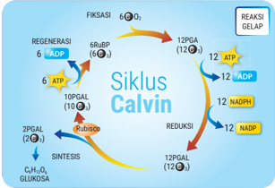

> **Deskripsi Visual:** Gambar ini adalah ilustrasi yang menunjukkan siklus Calvin dalam proses fotosintesis. Siklus ini melibatkan berbagai reaksi yang terkait dengan sintesis glukosa dari CO2. Ilustrasi ini memperlihatkan:

1. Siklus Calvin melibatkan berbagai reaksi fotosintesis, mulai dari regenerasi ATP dan ADP hingga reaksi gelap yang menghasilkan glukosa.

2. Elemen utama termasuk siklus Calvin, ATP, ADP, NADPH, CO2, dan glukosa. Relasi antara elemen ini melibatkan proses regenerasi ATP dan ADP, reaksi gelap yang menghasilkan glukosa, dan reaksi reduksi yang menggunakan NADPH untuk mengubah CO2 menjadi glukosa.

3. Teks, angka, atau label penting yang terlihat mencakup nama-nama reaksi seperti "REGENERASI", "REAKSI GELAP", "SINTESIS", "REDUKSI", dan "FIKSASI". Angka-angka digunakan untuk menunjukkan jumlah molekul yang terlibat dalam setiap reaksi.

4. Informasi kunci yang dapat diambil pembaca meliputi peran ATP dan ADP dalam siklus Calvin, pentingnya reaksi gelap dalam menghasilkan glukosa, serta peran NADPH dalam reaksi reduksi.

Dengan demikian, gambar ini memberikan gambaran umum tentang siklus Calvin dan bagaimana proses fotosintesis berlangsung dalam tiga tahap: regenerasi energi, reaksi gelap, dan reaksi reduksi.

 

---
## 📄 Halaman 49

Setelah melakukan Aktivitas 1.16, kalian menemukan bahwa bahan utama untuk membentuk 1 molekul glukosa dalam reaksi gelap berupa 6CO 2 .	 Adapun	 senyawa	 fiksator	 6CO 2 berupa  gula  berkarbon  lima  yang disebut ribulose bifosfat (RuBP). Energi yang dibutuhkan berupa 18 ATP dan 12 NADPH yang berasal dari reaksi terang. Reaksi gelap fotosintesis yang	di	stroma	berlangsung	dalam	beberapa	tahap,	yaitu	fiksasi, reduksi, sintesis, dan regenerasi. Berikut 4 tahap reaksi terang.

### 1) Fiksasi karbon

Pada	fase	fiksasi	karbon, enzim RuBP karboksilase-oksigenase atau disebut rubisco mengkatalis pengikatan molekul 6 CO 2 (6C 1 )  pada 6 RuBP (6C 5 ). Proses ini menghasilkan molekul berkarbon tiga yang tidak stabil, yaitu asam fosfogliserat (12PGA).

### 2) Reduksi

Pada fase ini, 12 PGA direduksi oleh 2NADH 2 dan ATP menjadi 12 PGAL ( phospho gliseraladehid ).

### 3) Sintesis

Senyawa 12 PGAL pada fase ini akan terpecah menjadi 2 PGAL dan 10 PGAL. 2PGAL (2C 3 ) akan berikatan membentuk senyawa C 6 H 12 O 6 (C 6 ). Oleh karena tahapan ini terjadi pembentukkan glukosa maka disebut tahapan sintesis.

### 4) Regenerasi

Pada fase ini, 10 PGAL (10C 3 ) akan berubah bentuk menjadi 6RuBP (6C 5 ) lagi dengan bantuan ATP sehingga tahapannya disebut regenerasi.

Berdasarkan  analisis  di  atas  dapat  dirumuskan  pengertian  reaksi gelap adalah proses sintesis glukosa dengan bantuan energi kimia yang berlangsung	di	stroma	dalam	empat	tahap	reaksi,	yaitu	fiksasi, reduksi, sintesis  dan  regenerasi.  Setelah  selesai  mempelajari  reaksi  terang  dan reaksi  gelap  fotosintesis,  uji  pemahaman  kalian  dengan  melakukan aktivitas berikut.

 

---
## 📄 Halaman 50

### AKTIVITAS 1.17

### Mengukur  Pemahaman  mengenai  Reaksi  Terang  dan  Gelap  pada Fotosintesis

- Tentukan  macam-macam variabel pembeda antara reaksi  terang dan gelap.
- Tulis  perbedaan  antara  reaksi  terang  dan  gelap  berdasarkan variabel pembedanya masing-masing pada tabel berikut.
- Presentasikan tabel kalian di depan kelas!

---
**📊 Tabel**

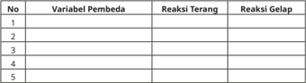

Tabel ini menunjukkan reaksi terang dan reaksi gelap terhadap berbagai variabel pembedaan. Topik utamanya adalah hubungan antara variabel pembedaan dengan reaksi terang dan reaksi gelap. Kolom pertama menunjukkan nomor variabel pembedaan, mulai dari 1 hingga 5. Kolom kedua dan ketiga masing-masing menunjukkan reaksi terang dan reaksi gelap untuk setiap variabel pembedaan. Data atau pola penting yang terlihat adalah bahwa reaksi terang dan reaksi gelap dapat bervariasi tergantung pada jenis variabel pembedaan. Variabel pembedaan 2 memiliki reaksi terang yang paling tinggi dan reaksi gelap yang paling rendah, sedangkan variabel pembedaan 3 memiliki reaksi terang yang paling rendah dan reaksi gelap yang paling tinggi. Ini menunjukkan bahwa reaksi terang dan reaksi gelap tidak selalu sama untuk semua jenis variabel pembedaan.

### c.   Faktor-Faktor yang Memengaruhi Fotosintesis

Proses  berlangsungnya  fotosintesis  dipengaruhi  oleh  beberapa  faktor. Faktor apa sajakah yang memengaruhi kecepatan fotosintesis? Lakukan aktivitas berikut.

### AKTIVITAS 1.18

### Mengetahui Faktor yang Memengaruhi Fotosintesis

### Tujuan:

- mengetahui  pengaruh  intensitas  cahaya,  konsentrasi  CO 2 ,  dan perbedaan suhu terhadap kecepatan fotosintesis.
- membuktikan bahwa fotosintesis menghasilkan amilum.

### Alat dan bahan:

- gelas kimia
- ember
- corong kaca
- neraca
- tabung reaksi
- s top watch
- kawat penyangga
- pemanas
- 5.
- benang
- pinset

 

---
## 📄 Halaman 51

- cawan petri
- es batu
- plastik
- alumunium foil
- penggaris
- daun keladi/daun ketela pohon
- NaHCO
- 3
- alkohol
- hidrila/ Chara sp.
- larutan lugol/iodin

### Langkah percobaan:

- Bentuk kelompok yang terdiri atas 3 - 4 orang.
- Siapkan alat dan bahan untuk percobaan.
- Tentukan permasalahan dalam percobaan.
- Apakah perbedaan intensitas cahaya berpengaruh pada kecepatan fotosintesis?
- …………………………………………………………………
c.

…………………………………………………………………

d.

………………………………………………………………….

- Tulis hipotesis berdasarkan permasalahan dalam percobaan.
- Buat perangkat percobaan dengan mengikuti langkah berikut.
- Timbang Hydrilla / Chara sp. seberat 3 gram. Lalu, ikat menjadi satu pada bagian batang menggunakan benang.
- Masukkan Hydrilla / Chara sp. ke dalam mulut corong kaca dan benang ikatan dimasukkan ke dalam leher corong kaca.
- Masukkan corong kaca berisi Hydrilla/ Chara sp. ke dalam gelas kimia dengan posisi mulut corong kaca di bagian bawah.
- Masukkan perangkat gelas kimia berisi corong kaca ke dalam ember yang berisi air penuh.
- Tanpa  mengeluarkan  perangkat  percobaan dari dalam ember, tutup leher corong kaca dengan tabung reaksi.
- Masih  di  dalam  air,  tahan  posisi  corong kaca agar menggantung dalam gelas kimia dengan kawat penyangga. Keluarkan perangkat tersebut dari ember dan letakkan di atas meja.
- ………………………………………………………………..
- …………………………………………………………………
c.

…………………………………………………………………

- …………………………………………………………………

---
**🖼️ Gambar/Diagram**

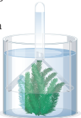

> **Deskripsi Visual:** Gambar ini adalah ilustrasi yang menunjukkan proses fotosintesis pada tumbuhan. Gambar ini menggambarkan tumbuhan hijau yang ditempatkan di dalam sebuah wadah air. Di atas tumbuhan, ada sebuah pipet yang mengeluarkan gas ke atmosfer. Ilustrasi ini menunjukkan bahwa proses fotosintesis memerlukan sinar matahari, air, dan karbon dioksida untuk menghasilkan oksigen dan glukosa. Ini adalah proses yang sangat penting bagi kehidupan di Bumi karena menghasilkan oksigen yang dibutuhkan oleh hewan dan makhluk hidup lainnya.

 

---
## 📄 Halaman 52

### Pengaruh Cahaya pada Fotosintesis

- Buatlah 3 perangkat percobaan dan beri label A, B, dan C.
- Berikan perlakuan pada perangkat A dengan meletakkan dalam ruang gelap, perangkat B di tempat teduh, dan perangkat C di tempat yang terik cahaya.
- Hitung jumlah gelembung udara yang muncul setiap 3 menit dengan 3 kali pengulangan.
- Tulis hasil pengamatan pada tabel berikut!

---
**📊 Tabel**

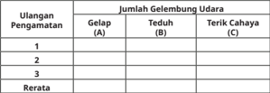

Tabel ini menunjukkan data tentang jumlah gelembung udara yang dilihat oleh pengamat dalam berbagai kondisi pencahayaan: gelap, teduh, dan terik cahaya. Topik utama tabel adalah hubungan antara jumlah gelembung udara dengan kondisi pencahayaan. Kolom A menunjukkan jumlah gelembung udara yang dilihat dalam satu kali pengamatan, kolom B menunjukkan jumlah gelembung udara yang dilihat dalam dua kali pengamatan, kolom C menunjukkan jumlah gelembung udara yang dilihat dalam tiga kali pengamatan, dan kolom D menunjukkan rata-rata jumlah gelembung udara yang dilihat selama beberapa kali pengamatan. Data penting yang terlihat adalah bahwa jumlah gelembung udara biasanya lebih banyak di kondisi terik cahaya dibandingkan dengan kondisi gelap dan teduh.

### e. Lalu, jawablah pertanyaan berikut!

- Bagaimanakah jumlah gelembung udara di tempat gelap dan teduh dibandingkan di tempat terik cahaya?
- Apakah proses yang dilakukan tumbuhan sehingga gelembung gas muncul pada perangkat percobaan?
- Berdasarkan  hasil  percobaan,  kesimpulan  apakah  yang kalian dapatkan?

### Pengaruh Konsentrasi CO 2 pada Fotosintesis

- Buat 3 perangkat percobaan dan beri label C, D, dan E.
- Berikan perlakuan dengan menambahkan NaHCO 3 pada perangkat D sebanyak 2 gram dan pada perangkat E sebanyak 4 gram hingga larut di dalam air. Adapun untuk perangkat C tidak ditambahkan NaHCO 3 .
- Letakkan  3  perangkat  percobaan  tersebut  di  tempat  yang terik cahaya.
- Hitung jumlah gelembung udara yang muncul setiap 3 menit dengan 3 kali pengulangan.
- Tulis hasil pengamatan pada tabel berikut.

 

---
## 📄 Halaman 53

---
**📊 Tabel**

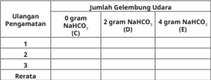

Tabel ini menunjukkan hasil pengamatan berulang terhadap jumlah gelembung udara yang dihasilkan oleh larutan NaHCO₃ dengan berbagai jumlah NaHCO₃ dalam percobaan. Topik utama tabel adalah hubungan antara jumlah NaHCO₃ dan jumlah gelembung udara yang dihasilkan. Kolom-kolom yang ada meliputi pengamatan ulang (0 gram NaHCO₃, 2 gram NaHCO₃, dan 4 gram NaHCO₃), jumlah gelembung udara, dan rata-rata. Data penting yang terlihat adalah bahwa semakin banyak NaHCO₃ yang digunakan, semakin banyak gelembung udara yang dihasilkan, dan rata-rata jumlah gelembung udara meningkat seiring penambahan NaHCO₃. Ini menunjukkan bahwa NaHCO₃ mempengaruhi jumlah gelembung udara yang dihasilkan dalam percobaan tersebut.

### f. Lalu, jawablah pertanyaan berikut!

- Bagaimanakah jumlah gelembung udara pada perangkat percobaan D dan E dibandingkan dengan  perangkat percobaan C?
- Bagaimanakah jumlah gelembung gas yang muncul pada perangkat percobaan D dan E?
- Apakah tujuan penambahan NaHCO 3 pada perangkat D dan E?
- Berdasarkan hasil percobaan, kesimpulan apa yang kalian dapatkan?

### Pengaruh Suhu pada Fotosintesis

- Buat 3 perangkat percobaan dan beri label F, G, dan H.
- Rendam perangkat F di dalam baskom berisi es batu hingga suhunya  kurang  lebih  10 0 C,  biarkan  perangkat  G  pada  suhu kamar,  dan  panaskan  perangkat  H  hingga  suhunya  kurang lebih 70 0 C.
- Hitung jumlah gelembung udara yang muncul setiap 3 menit dengan 3 kali pengulangan.
- Tulis hasil pengamatan pada tabel berikut!
- Lalu, jawablah pertanyaan berikut!

---
**📊 Tabel**

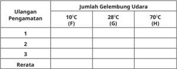

Tabel ini menunjukkan data pengamatan tentang jumlah gelenbang udara di tiga kondisi suhu berbeda: 10°C (F), 28°C (G), dan 70°C (H). Kolom pertama berisi nomor pengamatan, sedangkan kolom kedua sampai ketiga berisi jumlah gelenbang udara untuk masing-masing suhu. Dari data ini, dapat dilihat bahwa jumlah gelenbang udara meningkat dengan naiknya suhu, terutama di suhu 28°C dan 70°C. Ini menunjukkan hubungan antara suhu dan aktivitas partikel udara, yang bisa menjadi fokus penelitian dalam bidang meteorologi atau klimatologi.

 

---
## 📄 Halaman 54

- Bagaimanakah jumlah gelembung udara pada perangkat percobaan F dan H dibandingkan dengan perangkat G?
- Apakah  tujuan  mengkondisikan  perangkat  pada  suhu rendah dan suhu tinggi?
- Berdasarkan hasil percobaan, kesimpulan apa yang kalian dapatkan?

### Pengujian Oksigen

- Ambil  tabung  reaksi  yang  sudah  terdapat  ruang  udaranya pada perangkat B dengan memasukkan tangan ke perangkat dan gunakan ibu jari untuk menutup mulut tabung. Lakukan dengan hati-hati.
- Ukur panjang kolom udara pada ujung tabung reaksi dengan benang dan penggaris.
- Siapkan  lidi  membara.  Lalu,  balik  tabung  dan  angkat  keluar dari  gelas  beker.  Buka  ibu  jari  yang  menutup  mulut  tabung. Lalu, masukkan lidi membara ke arah mulut tabung.
- Amati apa yang terjadi dan catatlah hasilnya pada tabel berikut.

### e. Jawablah pertanyaan berikut!

- Mengapa bara api pada lidi ketika dimasukkan pada ruang udara di dalam tabung reaksi menjadi menyala?
- Berdasarkan hasil percobaan, kesimpulan apa yang kalian dapatkan?

### Pembuktian Amilum Hasil Fotosintesis

- Pilih satu helai daun keladi/daun ketela pohon. Lalu, bungkus sebagian daun dengan alumunium foil.
- Biarkan terkena cahaya matahari selama 4 hari.
- Ambil daun keladi/daun ketela pohon.
- Rebus daun dalam alkohol menggunakan gelas kimia ukuran kecil di atas penangas air sampai warna hijau menghilang.
- Angkat  daun  yang  sudah  pucat  dengan  pinset  dan  letakkan dalam cawan petri yang berisi larutan lugol/iodin.
- Amati perbedaan  warna  yang  terjadi antara daun  yang dibungkus alumunium foil dan yang tidak dibungkus.

 

---
## 📄 Halaman 55

---
**🖼️ Gambar/Diagram**

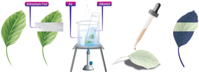

> **Deskripsi Visual:** Gambar ini adalah ilustrasi yang menunjukkan proses pengamatan tumbuhan. Gambar tersebut terdiri dari empat bagian yang masing-masing menunjukkan tahap-tahap dari proses pengamatan ini:

1. Bagian pertama menunjukkan daun tumbuhan dengan jelas, termasuk bagian atas dan bawah daun serta jaringan-jaringan yang ada.

2. Bagian kedua menunjukkan proses pengisian air ke dalam daun menggunakan pipet, yang merupakan langkah awal dalam proses pengamatan ini.

3. Bagian ketiga menunjukkan daun yang telah diproses, dengan warna hijau yang lebih gelap dibandingkan dengan daun sebelumnya, yang menunjukkan hasil dari proses pengisian air tersebut.

4. Bagian keempat menunjukkan hasil akhir dari proses pengamatan ini, yaitu daun yang telah berubah warna menjadi hijau gelap.

Elemen-elemen utama dalam gambar ini adalah daun tumbuhan, pipet, dan hasil pengamatan. Pipet digunakan untuk mengisi air ke dalam daun, sedangkan hasil pengamatan menunjukkan perubahan warna daun setelah proses tersebut.

Teks, angka, atau label penting yang terlihat dalam gambar ini adalah "daun", "pipet", dan "hasil pengamatan". Informasi kunci yang dapat diambil pembaca adalah bahwa proses pengisian air ke dalam daun dapat menyebabkan perubahan warna daun menjadi hijau gelap.

Gambar 1.28 Alur percobaan pembuktian amilum hasil fotosintesis.

### g. Catat hasil pengamatan kalian pada tabel berikut.

### h. Jawablah pertanyaan berikut!

- Mengapa  daun  yang  dibungkus  alumunium  foil  tidak berubah warna menjadi berwarna biru kehitaman setelah dimasukkan dalam larutan iodine?
- Mengapa daun yang tidak dibungkus alumunium foil berubah warna  menjadi biru kehitaman setelah dimasukkan dalam larutan iodine?
- Apakah yang menyebabkan  warna  daun yang tidak dibungkus  alumunium  foil  berubah  warna  menjadi  biru kehitaman?
- Berdasarkan  hasil percobaan,  apa yang  dapat kalian simpulkan?
Setelah melakukan Aktivitas 1.18, kalian menemukan gejala terjadinya  fotosintesis  ditandai  dengan  munculnya  gelembung  udara yang menunjukkan dihasilkannya O 2 .  Hal  ini  dibuktikan  ketika  O 2 hasil fotosintesis dapat menyebabkan bara pada lidi menjadi nyala api. Adapun pengaruh  faktor  cahaya,  CO 2 ,  dan  suhu  pada  kecepatan  fotosintesis diuraikan sebagai berikut.

### 1.

Perbedaan intensitas cahaya Perbedaan perlakuan intensitas cahaya terbukti mempercepat fotosintesis, di mana di tempat gelap tidak dihasilkan O 2 sedangkan di

 

---
## 📄 Halaman 56

tempat teduh dan terik cahaya banyak dihasilkan O 2 . Di tempat gelap tidak  ada  foton  yang  diserap  untuk  berlangsungnya  reaksi  terang yang menghasilkan O 2 dalam bentuk gelembung udara.

### 2. Perbedaan konsentrasi CO 2

Penambahan konsentrasi CO 2 dilakukan dengan penambahan NaHCO 3 . Di mana NaHCO 3 di dalam air akan terurai menjadi NaOH dan CO 2. Penambahan volume CO 2 terbukti  dapat  meningkatkan  jumlah gelembung O 2 sebagai indikasi ada peningkatan aktivitas fotosintesis.

### 3. Perbedaan suhu

Perbedaan suhu juga terbukti berpengaruh pada kecepatan fotosintesis,  di  mana  pada  suhu  rendah  dan  tinggi  tidak  terjadi fotosintesis. Pada suhu rendah dan tinggi akan dapat merusak sistem enzim pada reaksi terang sehingga tidak dapat berlangsung dan tidak menghasilkan O 2 .

Selain itu, pembuktian jika fotosintesis menghasilkan amilum terbukti bagian daun yang terkena cahaya dan melakukan fotosintesis ketika diuji dengan iodin menjadi berwarna biru kehitaman. Hal ini membuktikan bahwa fotosintesis menghasilkan amilum.

Untuk	 membuktikan	 bahwa	 dalam	 fotosintesis	 diperlukan	 klorofil, cahaya matahari, dan menghasilkan oksigen dilakukan dengan percobaan Engelmann. Perhatikan gambar berikut!

---
**🖼️ Gambar/Diagram**

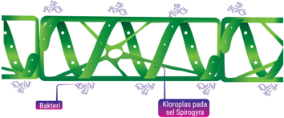

> **Deskripsi Visual:** Gambar ini adalah ilustrasi yang menunjukkan struktur sel Sporangiophora dengan detail spesifik. Gambar ini memperlihatkan struktur sel yang terdiri dari beberapa bagian utama: bakteri yang terletak di sepanjang sisi kanan dan kiri, serta klonoplasma pada sel Sporangiophora yang terlihat seperti jaring-jaring hijau berwarna cerah. Bakteri tampak kecil dan bergerigi, sedangkan klonoplasma tampak lebih besar dan memiliki bentuk yang lebih rata dan bergerigi. Label "Bakteri" dan "Klonoplasma pada sel Sporangiophora" memberikan penjelasan tentang komponen-komponen tersebut. Informasi ini membantu pembaca memahami struktur dan komposisi sel Sporangiophora.

Gambar 1.29 Percobaan Engelmann.

Pada gambar di atas terlihat kloroplas yang disinari akan melakukan fotosintesis dan menghasilkan O 2 . Ketersediaan O 2 menyebabkan populasi bakteri aerob akan mendekat ke arah kloroplas spiral. Dengan

 

---
## 📄 Halaman 57

demikian,	terbukti	bahwa	fotosintesis	membutuhkan	cahaya,	klorofil,	dan menghasilkan O 2 .

### d.   Fotorespirasi

Cuaca panas dan kering menyebabkan sebagian stomata pada tumbuhan C3 tertutup sehingga jumlah CO 2 yang masuk ke dalam daun menurun. Di  sisi  lain,  enzim  rubisco  juga  memiliki  kemampuan  untuk  mengikat O 2 .  Ketika  konsentrasi  CO 2 pada  rongga  udara  daun  menurun  dan  O 2 meningkat, rubisco memasukkan O 2 pada siklus Calvin menggantikan CO 2 .

Produk reaksi di atas segera terurai menghasilkan senyawa berkarbon dua. Senyawa tersebut meninggalkan kloroplas dan diubah menjadi CO 2 oleh  peroksisom  dan  mitokondria.  Peristiwa  ini  disebut  fotorespirasi karena  terjadi  pada  kondisi  terang  ( photo ),  menggunakan  oksigen,  dan menghasilkan CO 2 seperti respirasi.

Fotorespirasi  berbeda  dengan  respirasi  karena  tidak  menghasilkan ATP dan berbeda dengan fotosintesis karena tidak menghasilkan gula.  Dengan  kata  lain,  fotorespirasi  merugikan  karena  menyebabkan menurunnya hasil fotosintesis.

### e. Tumbuhan C 3 , C 4 , dan CAM

Pada  sebagian  besar  tumbuhan,  siklus  Calvin  diawali  dengan  reaksi pengikatan CO 2 pada  senyawa  RuBP  menggunakan  enzim  rubisco. Tumbuhan tersebut disebut tumbuhan C3 karena molekul organik yang pertama kali terbentuk  memiliki tiga karbon, yaitu PGA (C3). Contohnya, tanaman padi, gandum, dan kedelai.

Tumbuhan	C4	diberi	nama	demikian	karena	pada	fiksasi	CO 2 untuk yang	pertama	di	mesofil	menghasilkan	asam	oksaloasetat	(C4).	Adapun fiksasi	 kedua	 di	 seludang	 berkas	 pengangkut	 yang	 	 menghasilkan	 PGA (C3). Contohnya, tanaman tebu dan jagung.

Pada  tumbuhan  kaktus  dan  nanas,  stomata  terbuka  pada  malam hari dan menutup pada siang hari. Menutupnya stomata pada siang hari mencegah  tumbuhan  kehilangan  terlalu  banyak  air  tetapi  hal  ini  juga menghalangi  masuknya  CO 2 ke  dalam  daun.  Pada  malam  hari,  ketika stomata  terbuka,  tumbuhan  ini  mengambil  CO 2 dan  menyimpannya dalam  bentuk  senyawa  asam  organik.  Fiksasi  karbon  dengan  cara  ini disebut crassulacean  acid  metabolism (CAM). Sel-sel	 mesofil tumbuhan

 

---
## 📄 Halaman 58

CAM menyimpan senyawa asam organik yang dibuat pada malam hari di dalam vakuola.  Pada siang hari, ketika reaksi terang menyuplai ATP dan NADPH untuk siklus Calvin, CO 2 dilepaskan dari senyawa asam organik yang dibentuk pada malam sebelumnya untuk membentuk gula.

Secara singkat, berikut perbandingan antara tumbuhan C 3 , C 4 , dan CAM.

---
**🖼️ Gambar/Diagram**

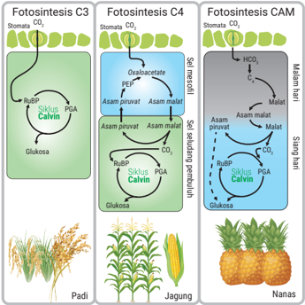

> **Deskripsi Visual:** Gambar ini adalah ilustrasi yang menunjukkan tiga jenis fotosintesis: C3, C4, dan CAM. Setiap jenis fotosintesis memiliki struktur stomata yang berbeda dan mekanisme pengambilan CO2 yang berbeda pula.

Pada fotosintesis C3, CO2 masuk melalui stomata dan disimpan dalam asam piruvat yang kemudian digunakan dalam siklus Calvin untuk menghasilkan glukosa. Padi adalah contoh tanaman yang menggunakan fotosintesis C3.

Fotosintesis C4 menggunakan mekanisme yang sama seperti C3 tetapi dengan beberapa perbedaan. CO2 masuk melalui stomata dan disimpan dalam asam oxalacetat, yang kemudian digunakan dalam siklus Calvin untuk menghasilkan glukosa. Jagung adalah contoh tanaman yang menggunakan fotosintesis C4.

Fotosintesis CAM menggunakan mekanisme yang mirip dengan C4 tetapi dengan beberapa perbedaan. CO2 masuk melalui stomata dan disimpan dalam asam malat, yang kemudian digunakan dalam siklus Calvin untuk menghasilkan glukosa. Nanas adalah contoh tanaman yang menggunakan fotosintesis CAM.

Teks, angka, atau label penting yang terlihat pada gambar ini adalah nama-nama tanaman (padi, jagung, dan nenas) yang menunjukkan jenis fotosintesis mereka. Label "Stomata" menunjukkan bagian stomata di mana CO2 masuk ke dalam sel-sel tumbuhan. Label "Siklus Calvin" menunjukkan proses fotosintesis yang memproses CO2 menjadi glukosa. Label "SubP" menunjukkan asam piruvat yang digunakan dalam siklus Calvin. Label "PGA" menunjukkan asam piruvat yang digunakan dalam siklus Calvin. Label "Asam piruvat" menunjukkan asam piruvat yang digunakan dalam siklus Calvin. Label "Asam malat" menunjukkan asam malat yang digunakan dalam siklus Calvin. Label "HCO3-" menunjukkan asam karbonat yang digunakan dalam siklus Calvin. Label "Glukosa" menunjukkan glukosa yang dihasilkan dalam fotosintesis.

Informasi kunci yang dapat diambil pembaca adalah bahwa fotosintesis C3

### f. Kemosintesis

Beberapa	 bakteri	 yang	 tidak	 berklorofil	 mampu	 mensintesis	 glukosa dengan sumber energi yang bersumber dari peristiwa oksidasi molekul anorganik. Proses semacam ini disebut kemosintesis. Kemiosmosis dapat dilakukan oleh bakteri kemosintetik.

 

---
## 📄 Halaman 59

- Bakteri besi dari genus Ferrobacillus yang mengoksidasi Fe 2+  menjadi Fe 3+  untuk menghasilkan energi. Reaksinya sebagai berikut.

``

Selanjutnya,  energi  yang  dihasilkan  digunakan  untuk  mensintesis glukosa dengan reaksi sebagai berikut.

``

- Bakteri nitrifikasi, yaitu Nitrosomonas dan Nitrosococcus yang mengoksidasi  amoniak  menjadi  asam  nitrit  untuk  menghasilkan energi. Reaksinya sebagai berikut.

``

Selanjutnya,  energi  yang  dihasilkan  digunakan  untuk  mensintesis glukosa dengan reaksi sebagai berikut.

``

- Bakteri  belerang  dari  genus Thiobacillus yang  mengoksidasi  H 2 S menjadi sulfur untuk menghasilkan energi. Reaksinya sebagai berikut.

``

Selanjutnya,  energi  yang  dihasilkan  digunakan  untuk  mensintesis glukosa dengan reaksi sebagai berikut.

``

 

---
## 📄 Halaman 60

### REFLEKSI

Untuk	meninjau	ulang	keseluruhan	proses	pembelajaran,	lakukan	refleksi dengan menjawab pertanyaan-pertanyaan berikut.

- Apa sajakah yang sudah kalian kuasai pada pembelajaran ini?
- Apa sajakah yang belum kalian kuasai pada pembelajaran ini?
- Apakah yang menyebabkan kalian belum menguasai bagian tertentu pada pembelajaran ini?
- Upaya apa yang akan kalian  lakukan  sebagai  tindak  lanjut  terhadap materi yang sudah kalian kuasai?
- Upaya yang akan kalian dilakukan untuk mengatasi bagian yang belum dikuasai pada pembelajaran ini?

### UJI KOMPETENSI

### Pilihlah salah satu jawaban yang paling benar!

- Pernyataan mengenai enzim berikut yang tidak tepat, yaitu ….
- a.
- Enzim adalah protein yang berfungsi sebagai katalis.
- Enzim bersifat spesifik terhadap substratnya.
- Enzim menyediakan energi aktivasi untuk reaksi kimia.
- Enzim dipengaruhi oleh faktor lingkungan.
- Enzim dapat digunakan berkali-kali.
- Holoenzim tersusun atas struktur ….
- apoenzim dan inhibitor nonkompetitif
- koenzim dan gugus prostetik
- apoenzim dan koenzim
- gugus prostetik dan kofaktor
- apoenzim dan inhibitor kompetitif
- Berikut ini yang merupakan koenzim adalah ….
- Mn
- Zn
- NAD
- Fe
- Pada inhibisi kompetitif, inhibitor memiliki kemiripan struktural dengan ….
- sisi aktif
- substrat
- koenzim
- kofaktor
- apoenzim
- Cu

 

---
## 📄 Halaman 61

- Berikut ini yang paling tepat mengenai kompleks enzim-substrat, yaitu ….
- bersifat sementara
- merupakan ikatan kovalen
- menyebabkan perubahan permanen pada enzim
- enzim dan substrat tidak mengalami perubahan
- ikatan yang terbentuk merupakan ikatan nonkomplemen
- Sekelompok peserta didik melakukan eksperimen menggunakan enzim katalase dan diperoleh hasil yang tampak pada tabel berikut!

### Keterangan:

- -tidak ada
- sedikit
- ++   sedang
- +++  banyak
Kesimpulan yang paling tepat berdasarkan data di atas, yaitu ….

- kerja enzim katalase tidak dipengaruhi suhu
- semua enzim bekerja optimal pada suhu rendah
- semakin tinggi suhu, semakin optimal kerja enzim
- kerja enzim katalase paling optimal pada suhu normal
- kerja enzim katalase paling optimal pada suhu rendah
- Respirasi aerob merupakan serangkaian reaksi kimia yang dilakukan sel untuk menghasilkan energi (ATP). Berikut tahap-tahap respirasi aerob.
- siklus asam sitrat
- fosforilasi oksidatif
- glikolisis
- dekarboksilasi oksidatif
Tahap-tahap yang berfungsi menghasilkan NADH, yaitu ….

- 1, 2, dan 3
- 1 dan 3
- 2 dan 4
- 4 saja
- Berdasarkan tahap-tahap respirasi aerob pada soal nomor 7, tahap yang menghasilkan produk samping berupa CO 2, yaitu ….
- 1, 2, dan 3
- 1 dan 4
- 2 dan 3
- 4 saja
- Perhatikan pernyataan-pernyataan mengenai glikolisis berikut.
- Glikolisis membutuhkan 2 ATP.
- Glikolisis menghasilkan 2 asam piruvat.
- Energi bersih yang dihasilkan pada glikolisis sebanyak 2 ATP.
- Glikolisis hanya dapat terjadi jika oksigen tersedia.
- 1, 2, 3, dan 4
- 1, 3, dan 4

 

---
## 📄 Halaman 62

Pernyataan yang benar mengenai glikolisis, yaitu ….

- 1, 2, dan 3
- 1 dan 3
- 2 dan 4
- 4 saja

### 10. Perhatikan bagan dekarboksilasi oksidatif berikut.

### X, Y, dan Z yang dimaksud adalah ….

---
**📊 Tabel**

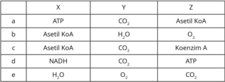

Tabel ini menunjukkan berbagai reaksi kimia yang melibatkan asetil-KoA (asetil koenzim A), ATP (adenosin trifosfat), CO2 (karbon dioksida), H2O (air), dan O2 (oksigen). Topik utama tabel adalah metabolisme molekul asetil-KoA dan bagaimana reaksi ini terkait dengan energi dan molekul lainnya. Kolom X menggambarkan asetil-KoA, kolom Y menggambarkan produk reaksi, dan kolom Z menggambarkan reaksi yang terjadi. Data penting yang terlihat adalah bahwa asetil-KoA dapat bereaksi dengan ATP untuk menghasilkan CO2 dan H2O, atau dengan O2 untuk menghasilkan ATP dan CO2. Ini menunjukkan bahwa asetil-KoA memiliki kemampuan untuk berfungsi sebagai sumber energi dalam proses metabolisme.

### 11. Perhatikan pernyataan berikut.

- Oksigen diperlukan dalam siklus asam sitrat.
- Diperlukan 2 kali siklus asam sitrat untuk satu molekul glukosa.
- Dihasilkan total 2CO 2 pada siklus asam sitrat yang menggunakan 2 Asetil KoA.
- Dihasilkan 6NADH, 2FADH 2 , dan 2 ATP pada siklus asam sitrat yang berasal dari 1 molekul glukosa.
Pernyataan yang tepat mengenai siklus asam sitrat, yaitu ….

- 1, 2, dan 3
- 2 dan 4
- 1 dan 3
- 4 saja
- Perhatikan pernyataan berikut.
- Terdapat 10NADH dan 2FADH 2 yang dikonversi menjadi ATP.
- Konversi NADH menghasilkan lebih banyak ATP dibanding FADH 2 .
- ATP sintase merupakan enzim yang berfungsi sebagai katalisator pembentukan ATP.
- Oksigen diperlukan sebagai penerima elektron terakhir.
- 1, 2, 3, dan 4
- 1, 2, 3, dan 4

 

---
## 📄 Halaman 63

Pernyataan yang tepat mengenai fosforilasi oksidatif, yaitu ….

- 1, 2, dan 3
- 2 dan 4
- 1, 2, 3, dan 4
- 1 dan 3
- 4 saja
13. Produk fermentasi alkohol yang diperlukan untuk mengembangkan adonan roti, yaitu ….

- O2
- CO2
- asam laktat
- etanol
- NADH
- Perhatikan pernyataan berikut.
- Hanya menghasilkan NADPH
- Menggunakan fotosistem I dan II
- Menggunakan cahaya hijau
- Menghasilkan ATP dan NADPH
Pernyataan yang benar mengenai reaksi terang nonsiklik,yaitu ….

- 1, 2, dan 3
- 2 dan 4
- Semua benar
- 1 dan 3
- 4 saja
- Karbon dioksida yang diperlukan untuk membentuk 1 molekul glukosa pada reaksi terang, yaitu ….
- 2
- 4
- 6
- 3
- 5
- Tahap pembentukan RuBP pada siklus gelap terjadi pada fase ….
- fiksasi
- sintesis
- oksidasi
- reduksi
- regenerasi
17. Pada tahun 1883, Engelmann melakukan eksperimen dengan menyinari alga berbentuk filamen dengan cahaya tampak yang dilewatkan prisma. Hasil percobaan Engelmann tampak pada gambar berikut.

---
**🖼️ Gambar/Diagram**

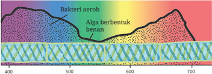

> **Deskripsi Visual:** Gambar ini adalah ilustrasi yang menunjukkan proses fotosintesis di laut. Gambar ini memperlihatkan berbagai jenis organisme biologis yang hidup di bawah permukaan laut, mulai dari bakteri aerob hingga alga berbentuk benang. Ilustrasi ini mencakup sejumlah elemen penting:

1. **Apa yang Ditampilkan Secara Keseluruhan**: Gambar ini menggambarkan berbagai organisme biologis yang hidup di bawah permukaan laut, termasuk bakteri aerob, alga berbentuk benang, dan organisme lainnya yang berada di berbagai kedalaman laut.

2. **Elemen-Elemen Utama dan Relasinya**: 
   - **Bakteri Aerob**: Dapat dilihat pada bagian atas gambar, berada di permukaan air laut.
   - **Alga Berbentuk Benang**: Terletak di bagian tengah dan bawah gambar, menunjukkan bahwa alga ini hidup di kedalaman lebih dalam dibandingkan dengan bakteri aerob.
   - **Organisme Lainnya**: Ada beberapa organisme lain yang terlihat di berbagai kedalaman laut, menunjukkan bahwa ada banyak jenis organisme hidup di bawah permukaan laut.

3. **Teks, Angka, atau Label Penting yang Terlihat**: 
   - **Angka**: Ada beberapa angka yang menunjukkan kedalaman laut, mulai dari 400 meter hingga 700 meter.
   - **Label**: Terdapat label "Bakteri aerob" dan "Alga berbentuk benang", yang menjelaskan jenis-jenis organisme tersebut.

4. **Informasi Kunci yang Bisa Diambil Pembaca**: Gambar ini memberikan gambaran tentang berbagai jenis organisme biologis yang hidup di bawah permukaan laut, serta kedalaman tempat mereka hidup. Ini menunjukkan bahwa ada kehidupan biologis yang sangat luas di bawah laut, bahkan di kedalaman yang sangat dalam.

Dengan demikian, gambar ini memberikan informasi yang penting tentang kehidupan biologis di bawah laut, menunjukkan bahwa ada banyak jenis organisme yang hidup

Perhatikan kesimpulan dari percobaan Engelmann berikut.

 

---
## 📄 Halaman 64

- Fotosintesis membutuhkan klorofil dan menghasilkan oksigen
- Fotosintesis menghasilkan zat makanan berupa amilum
- Cahaya warna merah dan biru-ungu efektif untuk fotosintesis
- Konsentrasi CO2 mempengaruhi laju fotosintesis.
Kesimpulan yang tidak tepat berdasarkan gambar di atas, yaitu….

- 1, 2, dan 3
- 1 dan 3
- 2 dan 4
- 4 saja
Almunium Foil

- Semua benar
Alkohol

Air

- Sekelompok siswa melakukan percobaan dengan langkah berikut.
- Bagian tengah daun ditutup menggunakan aluminium foil selama 4 hari.
- Daun direbus dengan alkohol dalam penangas air hingga kehilangan klorofilnya.
- Daun dimasukkan ke dalam larutan iodin.
- Bagian daun yang ditutup aluminium foil tidak berubah biru kehitaman seperti tampak pada gambar di samping ini.

### Berikut kesimpulan dari percobaan di atas.

- Fotosintesis menghasilkan amilum.
- Fotosintesis menghasilkan oksigen.
- Fotosintesis memerlukan cahaya.
- Fotosintesis memerlukan air.
Kesimpulan yang tepat dari percobaan, yaitu ….

- 1, 2, dan 3
- 1 dan 3
- 2 dan 4
- 4 saja
- Siswa menyusun perangkat percobaan seperti tampak pada gambar berikut.

---
**🖼️ Gambar/Diagram**

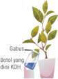

> **Deskripsi Visual:** Gambar ini adalah ilustrasi yang menunjukkan proses penggunaan KCl (kalium hidroksida) pada tanaman. Gambar ini mencakup beberapa elemen penting:

1. **Apa yang Ditampilkan Secara Keseluruhan**: Gambar ini menunjukkan proses penggunaan KCl pada tanaman. Ada dua bagian utama: bagian atas menunjukkan tanaman dengan daun yang tampak sehat, dan bagian bawah menunjukkan reaksi kimia antara KCl dan air.

2. **Elemen-Elemen Utama dan Relasinya**: 
   - **Tanaman**: Di bagian atas, ada tanaman dengan daun yang tampak sehat.
   - **KCl**: Dibagian bawah, ada larutan KCl dalam air.
   - **Reaksi Kimia**: Proses penggunaan KCl pada tanaman melibatkan larutan KCl yang mengalami perubahan kimia.

3. **Teks, Angka, atau Label Penting yang Terlihat**: 
   - **Label**: "Gambut" dan "Boluat yang disisi KCl" ditempatkan di bagian atas dan bawah gambar masing-masing, masing-masing menunjukkan bagian tanaman dan reaksi kimia.

4. **Informasi Kunci yang Bisa Diambil Pembaca**: 
   - Gambar ini memberikan gambaran tentang bagaimana KCl digunakan dalam praktik pertanian untuk memperbaiki tanah atau tanaman.
   - Ini juga menunjukkan bagaimana reaksi kimia antara KCl dan air dapat membantu tanaman tumbuh lebih baik.

Dengan demikian, gambar ini sangat informatif dan membantu pembaca memahami proses penggunaan KCl dalam pertanian dan bagaimana reaksi kimia tersebut dapat membantu tumbuhnya tanaman.

Setelah dibiarkan 3 hari, daun yang sebagian dimasukkan ke dalam botol berisi KOH dipetik, dihilangkan klorofilnya, lalu diuji dengan larutan iodin. Hasil uji iodin ditunjukkan oleh gambar di samping.

- semua benar

 

---
## 📄 Halaman 65

Berikut kesimpulan dari percobaan di atas.

- Fotosintesis menghasilkan oksigen.
- Fotosintesis membutuhkan karbon dioksida.
- Fotosintesis membutuhkan air.
- Fotosintesis menghasilkan amilum.
Kesimpulan yang tepat dari percobaan, yaitu ….

- 1, 2, dan 3
- 1 dan 3
- 2 dan 4
- 4 saja
- Tuti menyusun alat eksperimen seperti tampak pada gambar berikut. Dia mengulangi penelitian yang sama beberapa kali. Di mana pada tiap pengulangan, jarak antara sumber cahaya dan tumbuhan dibedakan.

---
**🖼️ Gambar/Diagram**

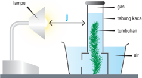

> **Deskripsi Visual:** Gambar ini adalah ilustrasi yang menunjukkan proses fotosintesis pada tumbuhan. Gambar ini mencakup beberapa elemen utama:

1. Lampu: Ini digunakan sebagai sumber cahaya untuk proses fotosintesis.
2. Tabung Kaca: Tabung ini berisi gas (mungkin CO2) dan air untuk menampung hasil fotosintesis.
3. Tumbuhan: Tumbuhan ini diletakkan di dalam tabung kaca untuk memungkinkan fotosintesis.
4. Air: Air ditempatkan di bawah tabung kaca untuk mendukung proses fotosintesis.

Teks, angka, atau label penting yang terlihat dalam gambar meliputi:
- "lampu" untuk lampu yang digunakan sebagai sumber cahaya
- "tabung kaca" untuk tabung yang berisi gas dan air
- "tumbuhan" untuk tumbuhan yang ditanam di dalam tabung

Informasi kunci yang dapat diambil pembaca meliputi:
- Proses fotosintesis dimulai dengan penyerapan CO2 oleh tumbuhan
- Cahaya matahari merupakan faktor kunci dalam proses ini
- Hasil fotosintesis adalah oksigen dan glukosa
- Proses ini memerlukan air dan CO2 sebagai bahan baku

Hasil eksperimen ditunjukkan oleh grafik berikut.

Volume gas (cm 3 )

Kesimpulan yang sesuai dengan eksperimen di atas, yaitu …..

- Semakin tinggi konsentrasi air semakin cepat laju fotosintesis.
- Laju fotosintesis meningkat ketika konsentrasi CO 2 menurun.
- Tumbuhan akan berfotosintesis jika cukup cahaya.
- Laju fotosintesis meningkat ketika intensitas cahaya meningkat.
- Semakin jauh jarak cahaya dari tumbuhan, semakin cepat fotosintesis terjadi.
- semua benar

 

---
## 📄 Halaman 66

### Mengubah Energi yang Dihasilkan Tumbuhan menjadi Listrik

Kini, peneliti sedang terus mengembangkan cara menghasilkan listrik dalam skala kecil dari energi yang dihasilkan oleh fotosintesis. Pada kenyataannya, tumbuhan  menghasilkan  energi  lebih  besar  dari  yang  mereka  butuhkan dan  mereka  mengeluarkan  energi  berlebih  tersebut.  Energi  berlebih  inilah yang  dikumpulkan,  lalu  diubah  menjadi  listrik.  Meskipun  tumbuhan  tidak menghasilkan listrik  dalam  satuan  megawatt,  namun  potensi  yang  dimiliki tidak dapat kita pandang sebelah mata. Para peneliti di Universitas Wageningen pertama kali mematenkan listrik bertenaga tumbuhan pada tahun 2007. Kini, hak paten ini dimiliki oleh perusahaan milik Belanda yang bernama Plant-E, yang terus mengembangkan penelitiannya.

Bagaimanakah energi fotosintesis digunakan untuk menghasilkan listrik? Seperti yang kalian telah pelajari, tumbuhan menyerap energi sinar matahari, lalu mereaksikannya dengan air dan karbon dioksida sehingga terbentuklah gula. Menariknya, tumbuhan menghasilkan gula lebih banyak dari yang mereka butuhkan,  hampir  setengah  dari  gula  yang  dihasilkan  menyebar  di  tanah. Di dalam tanah, gula tersebut diuraikan oleh bakteri dengan menghasilkan proton dan elektron sebagai produk sampingan.

Ide yang dimiliki Plant-e, yaitu memasukkan konduktor ke dalam tanah untuk mengumpulkan elektron, lalu mengubahnya menjadi listrik. Perusahaan tersebut  mengklaim  bahwa  proses  ini  tidak  mengganggu  pertumbuhan tanaman. Selain itu, energi yang dihasilkan dapat terus diperbaharui. Satusatunya  masalah,  yaitu  proses  ini  tidak  dapat  terjadi  ketika  tanah  turut membeku selama musim dingin.

Berapakah  energi  listrik  yang  dapat  dihasilkan  tumbuhan?  Plant-E mengklaim bahwa tiap meter persegi kebun menghasilkan 28 KWH per tahun. Berdasarkan  perhitungan  ini,  untuk  memenuhi  kebutuhan  listrik  sebuah rumah berukuran 150 meter persegi diperlukan beberapa ribu meter persegi kebun. Meskipun tidak praktis, namun masih sangat banyak orang yang tinggal di dalam rumah yang berukuran jauh lebih kecil. Selain itu, terdapat 1,4 juta jiwa  tidak  memiliki  akses  listrik  dan  sebagian  besar  dari  mereka  bekerja sebagai petani.

 

---
## 📄 Halaman 67

Selain itu, Plant-e telah memperhitungkan potensi hutan mangrove, delta sungai, dan sawah yang dapat menghasilkan listrik skala kecil, misalnya untuk Wi-Fi hotspots , pengisi daya ponsel, dan lampu sebagai penerangan di malam hari bagi warga miskin. Bagi warga perkotaan, Plant-E tengah menguji sistem atap hijau, di mana listrik yang dihasilkan oleh tiap 15 meter persegi atap hijau tersebut cukup untuk mengisi daya sebuah ponsel.

Setelah membaca uraian di atas, jawablah pertanyaan-pertanyaan berikut.

- Menurut  kalian,  apakah  pemanfaatan  fotosintesis  untuk  menghasilkan energi dapat diaplikasikan di Indonesia? Jelaskan!
- Apakah  kelebihan  Indonesia  dibanding  Belanda  yang  menyebabkan produksi listrik dari fotosintesis di Indonesia dapat lebih dioptimalkan.
- Lakukan  studi  literatur  lanjutan,  lalu  buktikan  bahwa  buah  yang  juga merupakan hasil fotosintesis dapat menghasilkan listrik!

 

---
## 📄 Halaman 68

Bukanlah spesies yang paling kuat atau paling cerdas yang mampu survive, tapi mereka yang paling mampu beradaptasi terhadap perubahan.

--Charles Darwin

 

---
## 📄 Halaman 69

KEMENTERIAN PENDIDIKAN, KEBUDAYAAN, RISET, DAN TEKNOLOGI REPUBLIK INDONESIA, 2022

Biologi untuk SMA Kelas XII

Penulis

Shilviani Dewi, dkk.

ISBN

978-602-427-958-5 (jil.2)

### Genetik dan Pewarisan Sifat

Apakah materi genetik itu? Bagaimana pewarisan sifat terjadi?

BAB 2 Genetik dan Pewarisan Sifat

59

 

---
## 📄 Halaman 70

### Tujuan Pembelajaran

Setelah mempelajari bab ini, kalian diharapkan dapat:

- menjelaskan komposisi dan struktur DNA, gen, serta kromosom.
- mengkorelasikan  peran  antara  DNA,  gen,  dan  kromosom  dalam  pewa­ risan sifat.
- menjelaskan tahap­tahap sintesis protein.
- membandingkan tahap­tahap mitosis dan meiosis.
- menganalisis peran mitosis dan meiosis.
- menganalisis pentingnya produksi sel­sel yang identik secara genetik.
- menganalisis pola­pola pewarisan sifat pada makhluk hidup.
- menerapkan  konsep  penyimpangan  semu  hukum  Mendel  pada  beberapa kasus soal.
- menghitung hasil persilangan sampai mendapatkan perbandingan fenotip dan genotipnya.
- menjelaskan peristiwa mutasi dan sebab­sebab terjadi  nya mutasi.

### Kata Kunci

DNA, gen, kromosom, mitosis, meiosis, hereditas, hukum Mendel.

### Peta Materi

---
**🖼️ Gambar/Diagram**

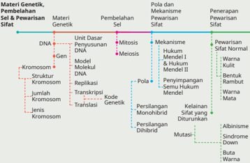

> **Deskripsi Visual:** Gambar ini adalah diagram yang menunjukkan hubungan antara materi genetik, pembelahan sel, pola dan mekanisme perwajahan sifat, serta penerapan perawatan sifat. Diagram ini dibagi menjadi empat kolom, masing-masing menunjukkan aspek berbeda dari teori genetika.

Kolom pertama berisi materi genetik, termasuk DNA, gen, kromosom, struktur molekul, dan jenis kromosom. Kolom kedua menjelaskan pembelahan sel melalui mitosis dan meiosis. Kolom ketiga menunjukkan pola dan mekanisme perwajahan sifat, seperti persilangan monohibrid dan persilangan dihibrid. Kolom keempat menggambarkan penerapan perawatan sifat normal, termasuk warna kulit, bentuk tubuh, kelainan yang diturunkan, dan mutasi.

Elemen-elemen utama dalam diagram ini adalah materi genetik, pembelahan sel, pola dan mekanisme perwajahan sifat, dan penerapan perawatan sifat. Relasi antara elemen-elemen ini sangat krusial dalam memahami konsep genetika. Teks, angka, atau label penting yang terlihat mencakup nama-nama genetik, pola perwajahan sifat, dan informasi tentang perawatan sifat.

Informasi kunci yang dapat diambil pembaca meliputi hubungan antara materi genetik, pembelahan sel, pola perwajahan sifat, dan penerapan perawatan sifat. Diagram ini membantu pembaca untuk memahami bagaimana genetika bekerja dan bagaimana hal ini dapat dipengaruhi oleh faktor-faktor tertentu.

 

---
## 📄 Halaman 71

Coba  perhatikan  gambar  di  bawah  ini.  Gambar  tersebut  menunjukkan terjadinya pewarisan sifat dari dua induk kepada keturunannya.

---
**🖼️ Gambar/Diagram**

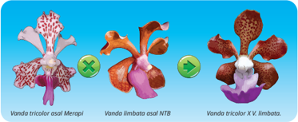

> **Deskripsi Visual:** Gambar ini adalah ilustrasi yang menunjukkan tiga jenis bunga Vanda, yaitu Vanda tricolor asli Merapi, Vanda limbata asli NTB, dan Vanda tricolor XV. limbata. Ilustrasi ini memperlihatkan bentuk dan warna bunga-bunga tersebut dengan detail, menjelaskan perbedaan antara mereka.

1. **Apa yang ditampilkan secara keseluruhan**: Gambar ini menggambarkan tiga jenis bunga Vanda yang berbeda, masing-masing dengan bentuk dan warna yang unik. Setiap bunga diberi label untuk membedakannya.

2. **Elemen-elemen utama dan relasinya**: Ilustrasi ini terdiri dari tiga elemen utama: Vanda tricolor asli Merapi, Vanda limbata asli NTB, dan Vanda tricolor XV. limbata. Setiap elemen memiliki bentuk dan warna yang berbeda, yang menunjukkan perbedaan spesies dan varietas.

3. **Teks, angka, atau label penting yang terlihat**: Gambar ini tidak memiliki teks atau angka yang jelas, tetapi setiap bunga diberi label untuk membedakannya. Label tersebut mungkin berisi nama spesies atau varietas bunga tersebut.

4. **Informasi kunci yang dapat diambil pembaca**: Pembaca dapat memahami bahwa gambar ini menunjukkan tiga jenis bunga Vanda dengan bentuk dan warna yang berbeda. Informasi ini dapat digunakan untuk belajar tentang variasi dan spesies dalam flora tropis.

Pada gambar tersebut, terlihat induk jantan bunga anggrek Vanda limbata memiliki  sifat  berwarna  merah  kecoklatan  dengan  bibir  lebar  berwarna ungu dan induk betina bunga anggrek Vanda tricolor memiliki sifat berwarna putih  totol-totol  cokelat  keunguan  dengan  bibir  panjang  berwarna  merah keunguan. Persilangan antara bunga jantan dan betina tersebut menghasilkan keturunan yang memiliki campuran sifat dari kedua induknya, yaitu memiliki bunga  berwarna  cokelat  totol-totol  putih  dengan  bibir  panjang  berwarna ungu. Hal tersebut menunjukkan bahwa sifat induk dapat diwariskan kepada keturunannya.

### A.  Materi Genetik

Setiap  makhluk  hidup  memiliki  materi  genetik  yang  akan  diwariskan kepada  keturunannya.  Secara  umum,  keseluruhan  materi  genetik  akan menentukan karakteristik makhluk hidup. Untuk memahami mengenai materi genetik, lakukan aktivitas berikut.

 

---
## 📄 Halaman 72

### AKTIVITAS 2.1

### Mengenal Materi Genetik melalui Penelusuran Video

- Bentuk kelompok terdiri atas 3 - 4 orang.
- Lakukan penelusuran video melalui sumber literatur terpercaya di Youtube dengan kata kunci pencarian DNA, gen, dan kromosom.
- Jawablah pertanyaan berikut dengan berdiskusi.
- Apakah  kalian  tahu mengenai  materi  genetik  DNA,  gen, dan kromosom?
- Bagaimana struktur atau bentuk DNA, gen, dan kromosom?
- Apa fungsi DNA, gen, dan kromosom?
- Buatlah kesimpulan berdasarkan hasil diskusi kalian.
- Kumpulkan jawaban kalian kepada guru.

### DNA dan Gen

Berdasarkan  Gambar  2.1,  kalian  dapat  amati bersama  bahwa  ada  sifat-sifat  yang  terlihat secara  langsung,  seperti  warna  bunga,  bentuk bunga, bentuk bibir bunga, warna bibir bunga, dan  karakteristik  lain  yang  tampak.  Sifat  yang tampak  atau  dapat  diamati  disebut fenotip. Fenotip ditentukan oleh kekhasan struktur gen  yang  disebut  genotip.  Jadi,  genotip  akan menentukan fenotipnya. Lalu, apakah yang dimaksud dengan gen?

Gen  adalah  segmen  DNA  yang  merupakan rangkaian  nukleotida  dengan  urutan  tertentu. Apa  itu  nukleotida?  Coba,  perhatikan  Gambar 2.2.  Nukleotida  merupakan  satuan  dasar  yang terdiri  atas  gula  yang  disebut deoksiribosa, gugus fosfat, dan basa yang  mengandung nitrogen. Adapun basa yang mengandung nitrogen di dalam DNA ada empat macam, yaitu adenin (A), sitosin (C), guanin (G), dan timin (T).

---
**🖼️ Gambar/Diagram**

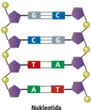

> **Deskripsi Visual:** Gambar ini merupakan ilustrasi yang menunjukkan struktur molekuler DNA (Deoxyribonucleic Acid). Ilustrasi ini menggambarkan dua heliks DNA yang saling berhadapan, dengan pola heliks yang mirip seperti helix pada helix. Setiap heliks terdiri dari berbagai jenis nukleotida yang berurutan dalam rangkaian yang disebut sebagai "kaitan" atau "kaitan" dalam ilustrasi.

Elemen utama dalam gambar ini adalah dua heliks DNA yang saling berhadapan. Heliks tersebut terdiri dari berbagai jenis nukleotida yang berurutan dalam rangkaian yang disebut sebagai "kaitan" atau "kaitan". Nukleotida-nukleotida ini terhubung oleh ikatan fosfat, yang membentuk rangkaian yang disebut sebagai "kaitan" atau "kaitan".

Teks, angka, atau label penting yang terlihat dalam gambar ini meliputi:

1. Nukleotida: Membuat upaya untuk menunjukkan struktur molekuler DNA.
2. Ikatan fosfat: Menunjukkan hubungan antara nukleotida-nukleotida dalam rangkaian.
3. Heliks: Menunjukkan bentuk struktur molekuler DNA.

Informasi kunci yang dapat diambil pembaca meliputi:

1. Struktur molekuler DNA terdiri dari dua heliks yang saling berhadapan.
2. Heliks ini terdiri dari berbagai jenis nukleotida yang berurutan dalam rangkaian.
3. Hubungan antara nukleotida-nukleotida dalam rangkaian disebabkan oleh ikatan fosfat.

Nukleotida

 

---
## 📄 Halaman 73

DNA yang mengekspresikan sifat tertentu, mengkode pembentukan suatu polipeptida yang nantinya akan membentuk protein. Protein inilah yang menjalankan fungsi gen dalam pewarisan sifat. Keterkaitan antara DNA, gen, dan protein dalam pembentukan sifat (fenotip tertentu) dikenal dengan istilah dogma sentral. Perhatikan gambar berikut.

---
**🖼️ Gambar/Diagram**

> **Deskripsi Visual:** Gambar ini adalah ilustrasi yang menunjukkan proses genetik dalam sel manusia. Ilustrasi ini melukiskan proses replikasi DNA, transkripsi, dan translasi. 

Pertama, replikasi DNA melibatkan dua proses utama: transkripsi dan translasi. Transkripsi melibatkan DNA menjadi RNA (mRNA), sedangkan translasi mengubah mRNA menjadi protein.

Ilustrasi ini juga menunjukkan bagaimana DNA berperan dalam replikasi, dimana DNA dipotong menjadi dua heliks yang kemudian dipotong lagi untuk menciptakan dua heliks baru. Ini merupakan proses yang sangat penting dalam pertumbuhan dan perkembangan sel.

Elemen utama dalam ilustrasi ini adalah DNA, RNA, dan protein. DNA diperlihatkan sebagai heliks berwarna biru, RNA diperlihatkan sebagai heliks berwarna merah, dan protein diperlihatkan sebagai ikon-ikon berwarna hijau dan merah.

Teks penting dalam ilustrasi ini adalah "DNA", "replikasi", "transkripsi", "reverse transcription", "mRNA", "translasi", dan "Protein". Informasi kunci yang dapat diambil dari gambar ini adalah bahwa DNA adalah dasar utama dalam pertumbuhan dan perkembangan sel, dan bagaimana DNA, RNA, dan protein saling berkaitan dalam proses tersebut.

Begitu  pentingnya  peran  DNA  dalam  menentukan  sifat  sehingga satu  saja  nukleotida  yang  berubah  dapat  memengaruhi  perubahan sifat  dari  suatu  individu.  Misalnya,  perubahan  sitosin  menjadi  guanin pada  manusia  dapat  mengubah  fenotip  rambut  lurus  menjadi  keriting. Peristiwa ini dikenal sebagai single nucleotide polymorphism .  Perhatikan gambar berikut.

---
**🖼️ Gambar/Diagram**

> **Deskripsi Visual:** Gambar ini adalah ilustrasi yang menunjukkan berbagai jenis orang yang berdiri di depan sebuah papan tulis dengan tanda "AATGGT". Gambar ini mungkin digunakan untuk menggambarkan berbagai karakteristik atau jenis individu dalam konteks biologi atau psikologi. Setiap orang memiliki penampilan yang berbeda, mulai dari rambut panjang hingga pendek, warna kulit, dan pakaian yang berbeda. Papan tulis di belakang mereka menunjukkan tanda "AATGGT", yang mungkin merujuk pada genetika atau pola genetik tertentu. Ini menunjukkan bahwa gambar ini mungkin digunakan untuk membahas topik tentang genetika atau pola genetik dalam konteks sosial atau psikologis.

 

---
## 📄 Halaman 74

Basa-basa  yang  mengandung  nitrogen,  gula deoksiribosa, dan gugus fosfat dapat bergabung membentuk empat molekul nukleotida berbeda seperti yang ditunjukkan gambar berikut.

Sejumlah  nukeotida  dapat  digabungkan membentuk rantai panjang yang disebut polinukleotida. Perhatikan gambar 2.6!

Setiap gen tersusun atas rangkaian nukleotida dengan urutan tertentu. Perbedaan urutan nukleotida (basa-basa) antara satu dengan  lainnya  menyebabkan  gen  bersifat spesifik, gen yang satu berbeda dengan gen  yang  lain.  Coba,  kalian  amati  Gambar 2.7.  Molekul  DNA  tersusun  atas  dua  rantai polinukleotida  antiparalel.  Molekul  tersebut disebut  antiparalel  maksudnya  rantai  DNA yang merentang dari 5' ke 3' akan berpasangan dengan rantai DNA yang merentang dari 3' ke 5'. Basa-basa di satu rantai berikatan dengan basabasa  di  rantai  seberang  atau  komplemennya, sesuai aturan perpasangan basa sehingga menyusun apa yang disebut rantai double helix . Molekul DNA dengan dua rantai ( double helix ) tersebut, umum ditemukan dalam nukleus sel eukariotik.  Molekul  DNA  yang  direntangkan menyerupai  tangga  dengan  anak  tangganya berupa basa komplementer. Adapun  pada bakteriofage  (virus  pemakan  bakteri),  DNA hanya berupa satu untai atau tunggal.

---
**🖼️ Gambar/Diagram**

> **Deskripsi Visual:** Gambar ini adalah ilustrasi yang menunjukkan sebuah struktur molekuler, mungkin DNA atau RNA, dengan berbagai jenis nitrogen basa. Struktur ini terdiri dari beberapa elemen utama yang saling terhubung melalui ikatan gugus karbon (C-C). Nitrogen basa yang terlihat adalah adenin (A), timin (T), asam guanin (G), dan asam cytosin (C). Ada juga deskripsi singkat tentang "Basa Nitrogen" dan "Deskripsi bosa", yang mungkin merujuk pada jenis nitrogen basa tersebut. Informasi penting lainnya yang ditampilkan adalah bahwa ada ikatan gugus karbon antara basa-basa tersebut. Ini menunjukkan hubungan antara basa-basa dalam molekul tersebut dan bagaimana mereka terhubung satu sama lain. Label "A", "T", "C", dan "G" menunjukkan jenis basa yang ada dalam molekul tersebut. Dari informasi ini, pembaca dapat memahami struktur dan komposisi molekul tersebut.

---
**🖼️ Gambar/Diagram**

> **Deskripsi Visual:** Gambar ini adalah ilustrasi yang menunjukkan struktur DNA. Ilustrasi ini memperlihatkan dua heliks berlapis-lapis yang saling menggantung, yang merupakan bentuk dasar dari DNA. Setiap heliks terdiri dari dua lapisan yang saling menggantung, dengan molekul-molekul nitrogen fosforil (DNA) yang terhubung melalui ikatan hidrogen. Molekul-molekul ini terdiri dari tiga jenis atom utama: adenin, guanin, dan timin.

Adenin dan guanin terletak pada satu heliks, sedangkan timin terletak pada heliks lainnya. Adenin dan timin memiliki struktur yang mirip tetapi berlawanan, sementara guanin dan timin juga memiliki struktur yang mirip tetapi berlawanan. Ini menunjukkan bahwa DNA memiliki struktur yang sangat spesifik dan stabil.

Ilustrasi ini juga menunjukkan bahwa setiap heliks memiliki panjang sekitar 6 nanometer, yang menunjukkan ukuran molekul DNA. Selain itu, ilustrasi ini juga menunjukkan bahwa DNA memiliki dua lapisan yang saling menggantung, yang menunjukkan bahwa DNA memiliki struktur yang sangat kompleks dan spesifik.

Informasi kunci yang dapat diambil pembaca dari gambar ini adalah bahwa DNA memiliki struktur yang sangat spesifik dan stabil, dengan molekul-molekul yang terhubung melalui ikatan hidrogen. Selain itu, ilustrasi ini juga menunjukkan bahwa DNA memiliki dua lapisan yang saling menggantung, yang menunjukkan bahwa DNA memiliki struktur yang sangat kompleks dan spesifik.

 

---
## 📄 Halaman 75

---
**🖼️ Gambar/Diagram**

> **Deskripsi Visual:** Gambar ini adalah ilustrasi yang menunjukkan dialog antara beberapa karakter kartun yang berperan sebagai pasangan. Ilustrasi ini menggambarkan situasi di mana karakter A mengatakan bahwa dia tidak bersemangat dengan pasangannya, sedangkan karakter B menunjukkan kekecewaan karena pasangannya cocok dengan A. Karakter C, yang tampaknya adalah pasangan B, bertanya apakah pasangan mereka cocok dengan A. Karakter D, yang tampaknya adalah pasangan A, mengatakan bahwa pasangannya cocok dengan A. Elemen-elemen utama dalam gambar ini adalah karakter-karakter kartun yang berinteraksi dan teks yang memberikan konteks tentang situasi mereka. Teks penting dalam gambar ini meliputi pernyataan-penyataan yang ditekankan oleh karakter-karakter tersebut, seperti "Aku maksimalkan bersemangatmu" dan "Aku pasangan yang cocok untuk A". Informasi kunci yang dapat diambil dari gambar ini adalah bahwa hubungan pasangan bisa menjadi kompleks dan membutuhkan komunikasi yang baik antara kedua pihak.

Aturan  perpasangan  basa,  yaitu  adenin  (A)  selalu  berpasangan  dengan timin (T) dan sitosin (C) selalu berpasangan dengan guanin (G). Oleh sebab itu,  adenin  dan  timin  disebut  basa  komplementer,  begitu  juga  dengan sitosin dan guanin. Basa-basa komplementer tersebut dihubungkan oleh ikatan hidrogen.

---
**🖼️ Gambar/Diagram**

> **Deskripsi Visual:** Gambar ini adalah ilustrasi yang menunjukkan struktur molekul DNA. Molekul DNA terdiri dari berbagai nukleotida yang disatukan oleh ikatan hidrogen. Setiap nukleotida terdiri dari satu deoksiribosa, satu basa nitrogen (G, C, A, T), dan satu fosfat. Dua sisi molekul DNA saling berhubungan melalui ikatan hidrogen antara basa nitrogen. Ilustrasi ini menunjukkan bagaimana nukleotida-nukleotida tersebut disatukan untuk membentuk struktur molekul DNA. Label "Nukleotida" menunjukkan bahwa gambar ini menggambarkan nukleotida, yang merupakan unit dasar dalam struktur DNA. Label "Ikatan Hidrogen" menunjukkan bahwa ikatan hidrogen adalah elemen penting dalam struktur DNA. Label "deoksiribosa" menunjukkan bahwa deoksiribosa adalah salah satu komponen utama nukleotida. Label "basa nitrogen" menunjukkan bahwa basa nitrogen adalah komponen lain dari nukleotida. Label "fosfat" menunjukkan bahwa fosfat juga merupakan komponen dari nukleotida. Gambar ini memberikan gambaran tentang struktur dan komponen dasar DNA, yang sangat penting dalam pemahaman biologi molekuler.

 

---
## 📄 Halaman 76

### AKTIVITAS 2.2

### Membuat Model Molekul DNA

### Tujuan:

Mengetahui struktur molekul DNA.

### Alat:

- gunting
- penggaris
- wadah
- cutter
- pulpen/spidol

### Bahan:

- koran
- gabus/ styrofoam
- cat akrilik dan kuas
- lem kayu
- double tape
- lidi

### Langkah percobaan:

- Gunting koran menjadi 4 bagian.
- Linting koran tersebut dan tempel dengan double tape agar lintingan tidak terbuka kembali.
- Ambil lintingan terpanjang dan masukkan lidi ke dalam lintingan tersebut.  Buat  6  lintingan  kertas  koran.  Lintingan  akan  menjadi pondasi DNA dan basa nitrogennya.
- Ukur  lintingan  kertas  koran  sepanjang  8  cm  dan  gunting.  Lalu, tandai bagian basa nitrogen dan ikatannya.
- Beri  warna  pada  basa  nitrogen,  misal  merah  untuk  adenin,  biru untuk timin, hijau untuk sitosin, orange untuk guanin, dan warna putih untuk ikatan hydrogen.
- Beri warna pada pondasi DNA, misal warna kuning.
- Potong gabus atau styrofoam berbentuk kubus.
- Tancapkan  pondasi  rantai  DNA  pada styrofoam dan  tempelkan basa nitrogen pada rantai DNA. Buat menjadi bentuk anak tangga yang memutar.
- Buat bola-bola kecil  sebagai  gula  deoksiribosa  menggunakan bubur kertas. Caranya, sobek kertas koran, lalu tambahkan air dan

 

---
## 📄 Halaman 77

- hancurkan  hingga  menjadi  bubur.  Selanjutnya,  tambahkan  lem kayu pada bubur kertas dan buat bola-bola kecil. Lalu, keringkan bola-bola tersebut. Setelah kering, beri warna untuk membedakan tiap jenis gula deoksiribosa.
- Tempelkan fosfat dan deoksiribosa pada rantai DNA.
- Tampilkan  model  DNA  yang  sudah  kalian  buat,  lalu  jelaskan mengenai bentuk dan unit dasar penyusun DNA di depan kelas.

### Model Molekul DNA oleh Watson dan Crick

Kalian  telah  mengetahui  bahwa  DNA  memiliki  struktur  heliks  ganda ( double helix ).  Selain itu, DNA mengandung nukleotida yang terdiri atas deoksiribosa, gugus fosfat, dan pasangan basa yang mengandung nitrogen seperti yang telah dijelaskan sebelumnya.

Penemuan fenomenal mengenai struktur DNA oleh James Watson dan Francis Crick pada tahun 1953, membuat mereka mendapatkan hadiah Nobel dalam Fisiologi atau Kedokteran pada tahun 1962 untuk temuan penting ini. Artikel riset mereka yang berjudul A Structure for Deoxyribose Nucleic Acid dalam jurnal ilmiah Nature telah membuka jalan bagi banyak kemajuan di bidang rekayasa genetika yang kita lihat saat ini.

---
**🖼️ Gambar/Diagram**

> **Deskripsi Visual:** Gambar ini merupakan ilustrasi yang menunjukkan dua orang pria dalam sebuah ruangan yang tampak seperti laboratorium. Pria di sebelah kiri sedang berdiri dengan posisi yang lebih teguh, sementara pria di sebelah kanan sedang berdiri dengan posisi yang lebih santai. Kedua pria tersebut mengenakan pakaian formal, yaitu jas dan baju setelan.

Dalam ruangan tersebut, terdapat struktur molekuler yang tampak seperti DNA atau protein. Struktur ini terlihat kompleks dan memiliki banyak garis dan titik yang saling terhubung. Struktur ini tampak seperti sebuah struktur yang besar dan memanjang, mungkin menunjukkan struktur molekular yang kompleks.

Teks, angka, atau label penting tidak terlihat dalam gambar ini. Namun, informasi kunci yang dapat diambil pembaca adalah bahwa gambar ini mungkin digunakan untuk menjelaskan konsep tentang struktur molekular, terutama DNA atau protein, dalam konteks pembelajaran biologi atau kimia.

 

---
## 📄 Halaman 78

### AKTIVITAS 2.3

### Ayo Berpikir Kritis

Kalian pasti sudah banyak mendengar mengenai metode pemeriksaan PCR,  terkait  dengan  pandemi  Covid-19  akhir-akhir  ini.  Pada  metode pemeriksaan PCR yang dilakukan secara in vitro, ada tahap di mana DNA dikopi	atau	diamplifikasi	menjadi	banyak.	Coba,	lakukan	studi	literatur melalui sumber yang terpercaya untuk menjawab pertanyaan berikut.

- Bagaimana mekanisme pemeriksaan PCR?
- Apakah  proses  pengopian  DNA  pada  metode  PCR  sama  dengan proses replikasi yang terjadi di dalam sel?
Tulis jawaban kalian dalam bentuk laporan sederhana dan presentasikan di depan kelas.

### Replikasi DNA

Setelah  melakukan  Aktivitas  2.3,  Kalian  telah  mengetahui  bahwa  DNA dapat digandakan melalui metode PCR. Di dalam tubuh pun, DNA melalui proses  penggandaan  yang  dinamakan  replikasi.  Jadi replikasi  DNA adalah suatu tahapan penggandaan DNA yang terjadi pada saat sebelum pembelahan sel,  yaitu  pada  tahap  interfase.  Replikasi  dilakukan  dalam upaya  membentuk DNA yang sama pada sel anakan hasil pembelahan sel.  Dalam  proses  replikasi  DNA  memerlukan  beberapa  komponen, seperti enzim helikase, DNA polimerase, dan enzim ligase. Enzim helikase berfungsi  sebagai  pembuka double  helix DNA.  Enzim  DNA  polimerase akan  membentuk  DNA  baru  sebagai  suatu  polimer,  dari  satu  rantai tunggal DNA lama yang dijadikan cetakan menjadi dua untai DNA baru double  helix .  Adapun  enzim  ligase  berperan  dalam  melekatkan  setiap fragmen  Okazaki  yang  merupakan  rantai  pasangan  semula  yang  tidak berhubungan menjadi satu rantai yang utuh.

Replikasi  diawali  dengan  sintesis  RNA  primer.  Dengan  kata  lain, rantai  DNA  baru  (DNA  'anak')  disintesis  dari  arah  5' → 3',  sedangkan DNA polimerase bergerak pada DNA 'induk' dengan arah 3' → 5'.  Kalian dapat melihat video animasi dengan kata kunci replikasi DNA pada kanal Youtube untuk memahami proses replikasi DNA.

Ada beberapa model replikasi DNA. Coba, kalian perhatikan Gambar 2.11. Berikut beberapa model replikasi DNA menurut para ahli.

 

---
## 📄 Halaman 79

### a. Teori konservatif

Pita  DNA  rangkap  heliks  tidak  berpisah,  tetapi  langsung  menjadi cetakan bagi pita DNA baru. Akhirnya, terbentuk dua pita rangkap heliks yang sama seperti asalnya.

### b. Teori semikonservatif

Pita DNA rangkap heliks memisahkan diri menjadi dua pita tunggal yang berperan sebagai pola cetakan. Setiap pita lama membentuk pita baru pasangannya. Dan akhirnya, terbentuk dua pita rangkap heliks yang sama seperti asalnya.

### c. Teori dispersive

Pita  DNA  heliks  rangkap  terputus-putus  atas  beberapa  potongan. Setiap potongan berpola sebagai pola cetakan dan membentuk DNA baru  pasangannya.  Akhirnya,  terbentuk  pita  rangkap  heliks  yang sama seperti asalnya.

---
**🖼️ Gambar/Diagram**

> **Deskripsi Visual:** Gambar ini adalah ilustrasi yang menunjukkan struktur DNA. Ilustrasi ini menggambarkan dua replikasi DNA dalam proses pembelahan sel. Dua heliks DNA biru dan merah muda saling berhadapan, menunjukkan dua replikasi yang sama. Setiap heliks DNA biru dan merah muda memiliki tiga sekuensi DNA yang berbeda, menunjukkan bahwa setiap replikasi DNA berbeda-beda. Ini menunjukkan bahwa setiap replikasi DNA adalah replikasi yang unik dan tidak sama dengan replikasi lainnya.

### Pengaturan atau Pengemasan DNA di Dalam Sel?

Bagaimanakah DNA sepanjang kurang lebih 2 meter dapat masuk ke dalam sel  yang sangat kecil? Untaian DNA di dalam sel sangat panjang. Untuk dapat  dikemas  dalam  inti  sel  yang  kecil,  diperlukan  suatu  mekanisme tertentu.  Mekanisme  tersebut  dimulai  dari  untai  DNA  dipintal  dalam suatu  protein  yang  dinamakan  protein  histon.  Protein  histon  mengikat

 

---
## 📄 Halaman 80

DNA menjadi suatu unit yang disebut nukleosom. Nukleosom satu dengan yang  lain  akan  bergabung  membentuk  benang  yang  lebih  padat  dan terpintal  menjadi  lipatan-lipatan  yang  disebut  solenoid.  Solenoid  satu dengan  yang  lain  bergabung  membentuk  benang  yang  dikenal  dengan benang kromatin. Benang-benang kromatin memadat membentuk lengan kromatid.  Selanjutnya,  lengan  kromatid  akan  berpasangan  membentuk kromosom.

---
**🖼️ Gambar/Diagram**

> **Deskripsi Visual:** Gambar ini adalah ilustrasi yang menunjukkan proses pembentukan kromatin dari DNA. Gambar ini terdiri dari beberapa elemen utama:

1. **DNA**: Dapat dilihat sebagai sebuah garis lurus yang melintang, menggambarkan struktur DNA.

2. **Nukleosom**: Ini adalah bentuk kecil dari DNA yang terhubung dengan protein histone. Nukleosom tampak seperti bola berlapis-lapis yang terbentuk dari DNA dan histone.

3. **Bengang kromatin**: Ini adalah bentuk yang lebih besar dari nukleosom, tampak seperti benang yang terbuat dari nukleosom-nukleosom yang terhubung.

4. **Kromosom**: Ini adalah bentuk yang paling besar dan terstruktur, tampak seperti benang yang sangat tebal yang terbuat dari banyak kromatin.

Teks, angka, atau label penting yang terlihat pada gambar termasuk:
- Nama-nama struktur seperti DNA, nukleosom, benang kromatin, dan kromosom.
- Penggambaran struktur dan hubungan antara struktur-struktur tersebut.

Informasi kunci yang dapat diambil pembaca melalui gambar ini adalah bahwa DNA dipilih oleh protein histone untuk membentuk nukleosom, yang kemudian menjadi benang kromatin, dan akhirnya menjadi kromosom. Proses ini merupakan bagian penting dari mekanisme penyimpanan dan pengiriman genetik dalam sel.

### Kromosom

Pada Aktivitas 2.1, kalian telah melakukan penelusuran video mengenai struktur DNA, gen, dan kromosom. Tentunya, kalian sudah mengetahui sedikit gambaran mengenai struktur kromosom. Kromosom adalah suatu struktur makromolekul yang tersusun atas asam nukleat (DNA/RNA) dan protein. Kromosom merupakan bagian penting dari inti sel yang berfungsi sebagai pembawa sifat pada keturunan.

Apakah kalian pernah melihat kromosom secara langsung? Biasanya, kromosom  berukuran  sangat  kecil  dan  untuk  melihatnya  diperlukan mikroskop elektron.  Namun,  ada  kromosom  yang  dapat  dilihat  dengan mikroskop cahaya yang dikenal dengan kromosom raksasa atau kromosom politen. Biasanya, kromosom ini ditemukan pada Drosophilla melanogaster, Chironomus sp.,  dan  hewan  lain  yang  termasuk  ordo  Diptera.  Pada  sel yang sedang tidak membelah, kromosom ini berupa benang-benang tipis yang dikenal dengan kromatin. Coba, kalian lihat bentuk kromosom D. melanogaster melalui Aktivitas 2.4.

 

---
## 📄 Halaman 81

### AKTIVITAS 2.4

### Pengamatan Bentuk Kromosom Lalat Buah ( D. melanogaster )

### Tujuan:

Mengetahui bentuk kromosom D. melanogaster.

### Alat:

- cawan petri
- gelas penutup ( cover glass )
- gelas benda (object glass)
- jarum

### Bahan:

- akuades
- D. melanogaster

### Langkah percobaan:

- Bentuk kelompok yang terdiri atas 4 - 5 orang.
- Ambil beberapa ekor D. melanogaster dengan cara berikut.
- siapkan botol selai beserta tutupnya dan kantong plastik besar.
- pergi ke tempat di mana terdapat tempat sampah.
- kembangkan  kantong  plastik  besar  dengan  mulut  plastik terbuka  lebar.  Lalu,  pegang  bagian  pangkalnya  dan  arahkan mulut  plastik  ke  tempat  sampah  yang  terbuka.  Buat  kejutan dengan memukul atau mengguncang-guncangkan tempat sampah sehingga lalat buah terperangkap di dalam plastik.
- masukkan  lalat  buah  yang  ter  perangkap di  dalam  plastik  ke  da  lam  botol  selai berisi  buah  pisang.  Berikut  contoh gambar lalat buah D. melanogaster.
- Letakkan lalat buah di cawan petri yang berisi air suling (akuades).
- Ambil lalat buah dan letakkan pada gelas objek ( object glass).

---
**🖼️ Gambar/Diagram**

> **Deskripsi Visual:** Gambar 2.13 dari buku pelajaran ini adalah ilustrasi yang menunjukkan spesies Drosophila melanogaster. Gambar ini menggambarkan serangga kecil dengan bulu-bulu berwarna putih dan hitam, serta mata besar berwarna biru. Serangga tersebut tampak sedang berdiri dengan posisi tubuh yang rata. Ilustrasi ini menunjukkan detail fisik spesies tersebut, termasuk bentuk tubuh, warna bulu, dan struktur mata.

Elemen-elemen utama dalam gambar ini meliputi:
1. Serangga Drosophila melanogaster yang menjadi subjek utama.
2. Bulu-bulu berwarna putih dan hitam yang membentuk pola pada tubuh serangga.
3. Mata berwarna biru yang besar dan bergerigi.
4. Tubuh serangga yang berdiri rata.

Teks, angka, atau label penting yang terlihat dalam gambar ini adalah:
- Nama spesies "Drosophila melanogaster" yang diberikan di bagian atas gambar.
- Angka 2.13 yang menunjukkan bahwa gambar ini merupakan bagian dari bab atau subbab tertentu dalam buku pelajaran.

Informasi kunci yang dapat diambil pembaca dari gambar ini adalah bahwa gambar ini menunjukkan spesies Drosophila melanogaster, yang merupakan serangga kecil yang umum digunakan dalam penelitian genetika dan biologi. Gambar ini memberikan gambaran visual tentang bentuk fisik dan struktur tubuh spesies tersebut, yang sangat berguna untuk pemahaman tentang karakteristik spesies ini.

D.

- Tusuk bagian anterior (depan) dan posterior (belakang) menggunakan jarum, lalu tarik secara berlawanan.
- Pisahkan lalat buah dengan kelenjar ludahnya, lalu tutup dengan gelas penutup ( cover glass ).
- Amati di bawah mikroskop dan gambarlah hasil pengamatan kalian.
- Diskusikan hasil pengamatan kalian bersama teman satu kelompok.
- Buat laporan percobaan pengamatan kromosom D. melanogaster.
- mikroskop
- pinset
- botol selai
- kantong plastik besar
- 1 buah pisang
- tisu

 

---
## 📄 Halaman 82

Setelah  mengamati  kromosom D.  melanogaster , kalian  menjadi semakin paham mengenai bentuk kromosom. Mengapa kromosom lalat buah dikatakan kromosom raksasa? Hal ini dikarenakan kromosom ini terbentuk melalui penggandaan DNA (replikasi) berulang hingga 10 kali tanpa pembelahan sel.

Bentuk kromosom sebagai materi genetik hanya dimiliki kelompok makhluk hidup eukariotik. Materi genetik pada makhluk hidup, seperti virus dan bakteri tidak ditemukan dalam bentuk kromosom tetapi berupa asam nukleat  murni,  yaitu  DNA  atau  RNA.  Pada  eukariotik,  kromosom terdapat  di  dalam  inti  sel  (nukleus)  yang  dilingkupi  membran  inti. Pada prokariotik, materi genetik terdapat di dalam sel tanpa dilingkupi membran inti yang dikenal dengan nukleoid.

### Bagian Kromosom

Bagian utama kromosom eukariotik, yaitu DNA yang merupakan rangkaian nukleotida yang dikemas oleh suatu protein yang disebut protein histon. Rangkaian nukleotida tertentu akan membentuk gen tertentu pula. Gen tertentu  akan  menyandi  protein  tertentu.  Jadi,  kromosom  merupakan totalitas gen di dalam sel yang membawa semua faktor keturunan untuk kehidupan sel. Kromosom memiliki bagian berupa lengan dan sentromer. Satuan  dasar  kromatin  yang  melingkar  disebut  nukleosom.  Nukleosom terdiri atas sebuah loop tunggal bahan DNA yang melilit protein histon.

---
**🖼️ Gambar/Diagram**

> **Deskripsi Visual:** Gambar ini adalah ilustrasi yang menunjukkan struktur kromosom dalam sel. Ilustrasi ini memperlihatkan beberapa elemen utama yang terkait dengan kromosom:

1. **Kromatid**: Ini adalah dua benang kromatin yang saling terhubung, yang merupakan bagian dari kromosom.

2. **Benang Kromatin**: Ini adalah bentuk non-struktur DNA yang terlihat seperti benang.

3. **DNA Helix Ganda**: Ini adalah bentuk struktur DNA yang terlihat seperti heliks ganda.

4. **Nukleosom**: Ini adalah unit dasar kromosom yang terdiri dari DNA helix ganda dan protein.

5. **Sentriomer**: Ini adalah struktur yang terletak di tengah kromosom dan berfungsi sebagai pusat sentriomer.

6. **Inti Sel**: Ini adalah bagian inti sel yang berisi DNA.

7. **Kromosom**: Ini adalah struktur yang terdiri dari kromatid dan sentriomer.

Teks, angka, atau label penting yang terlihat dalam gambar termasuk "Struktur Kromosom", "Gambar 2.14 Struktur kromosom yang mempertahankan tel基因 (kromatid) dan sentriomer". Informasi kunci yang dapat diambil pembaca melalui gambar ini adalah tentang struktur kromosom, bagaimana kromatid dan sentriomer terhubung, serta bagaimana nukleosom dan DNA helix ganda berfungsi dalam struktur kromosom. Gambar ini memberikan pemahaman visual tentang bagaimana kromosom terbentuk dan berfungsi dalam sel.

 

---
## 📄 Halaman 83

Lengan  kromosom  disebut  kromatid  yang  merupakan  bagian  dari badan  kromosom  itu  sendiri.  Bagian  sentromer  berperan  dalam  tahap pembelahan sel, yaitu sebagai tempat melekatnya benang-benang spindel.  Apa  itu  benang  spindel?  Benang  spindel  adalah  bagian  yang menghubungkan sentriol pada saat pembelahan sel dan untuk menarik kromosom menuju kutub yang berlawanan pada saat pembelahan sel.

---
**🖼️ Gambar/Diagram**

> **Deskripsi Visual:** Gambar ini adalah ilustrasi yang menunjukkan bagian-bagian sel seluler, khususnya bagian-bagian yang terkait dengan proses pembelahan sel (mitosis). Gambar ini menggambarkan sentromer, benang spindel, dan lengan (kromatid), yang merupakan elemen-elemen utama yang terkait dengan proses pembelahan sel.

Sentromer adalah titik di mana benang spindel berhubungan dengan kromosom. Benang spindel adalah struktur yang terdiri dari protein dan asam nukleat yang memainkan peran penting dalam proses pembelahan sel. Lengan (kromatid) adalah dua replika dari satu kromosom yang terbentuk setelah pembelahan sel.

Teks, angka, atau label penting yang terlihat pada gambar ini adalah "Lengan", "Sentromer", dan "Benang Spindel". Informasi kunci yang dapat diambil pembaca melalui gambar ini adalah bahwa sentromer adalah titik di mana benang spindel berhubungan dengan kromosom, dan bahwa benang spindel terdiri dari dua replika dari satu kromosom (lengan).

Dalam konteks pembelajaran, gambar ini membantu pembaca untuk memahami bagaimana struktur dan fungsi sentromer, benang spindel, dan lengan dalam proses pembelahan sel. Ini juga membantu dalam memahami bagaimana kromosom bergabung dengan benang spindel untuk memulai proses pembelahan sel.

Berdasarkan letak sentromernya, kromosom dapat dibedakan menjadi beberapa bentuk, yaitu telosentrik, akrosentrik, submetasentrik, dan metasentrik. Perhatikan gambar berikut.

---
**🖼️ Gambar/Diagram**

> **Deskripsi Visual:** Gambar ini adalah ilustrasi yang menunjukkan empat jenis telomere, yaitu Telosentrik, Akrosentrik, Submetasentrik, dan Metasentrik. Setiap telomere diilustrasikan dengan warna berbeda untuk membedakannya. 

1. Gambar ini menunjukkan empat telomere berbeda bentuk dan ukuran. 
2. Elemen utama yang ditampilkan adalah telomere dengan sentromer dan lenangan. Sentromer diberi warna merah, sementara lenangan diberi warna biru dan kuning. 
3. Teks, angka, atau label penting yang terlihat adalah "Telosentrik", "Akrosentrik", "Submetasentrik", dan "Metasentrik" yang masing-masing menunjukkan jenis telomere tersebut. 
4. Informasi kunci yang dapat diambil pembaca adalah bahwa gambar ini menunjukkan empat jenis telomere dengan sentromer dan lenangan yang berbeda bentuk dan ukuran. 

Dengan demikian, gambar ini memberikan gambaran umum tentang struktur telomere dan bagaimana mereka berbeda-beda dalam hal bentuk dan ukuran.

### Struktur Kromosom pada Inti Eukariot

Berdasarkan  aktivitas  penelusuran  video  mengenai  DNA,  gen,  dan kromosom, serta pengamatan bentuk kromosom D. melanogaster, kalian sudah  melihat  bentuk  kromosom  secara  langsung.  Dapat  dikatakan

 

---
## 📄 Halaman 84

bahwa kromosom terdiri atas satu atau dua kromatid yang masing-masing tersusun atas benang-benang kromatin.

Kromosom berasal dari kata chrome yang artinya berwarna dan soma artinya badan atau tubuh. Istilah tersebut dapat diartikan sebagai badan yang  dapat  menyerap  warna.  Apa  maksud  dari  badan  yang  menyerap warna? Apakah kromosom dapat menyerap warna?

Ternyata, studi mengenai kromosom memperlihatkan adanya pita-pita pada suatu kromosom sebagai akibat perbedaan intensitas penyerapan warna pada berbagai wilayahnya. Wilayah yang menyerap warna lebih pekat  disebut  heterokromatin,  sedangkan  yang  berwarna  lebih  terang disebut  eukromatin.  Heterokromatin  merupakan  wilayah  dengan  DNA yang berpilin sangat kompak atau padat sehingga berwarna lebih pekat, sedangkan wilayah DNA yang berpilin lebih longgar merupakan wilayah eukromatin. Pada wilayah heterokromatin, terdapat gen-gen yang tidak aktif berekspresi, sedangkan gen-gen yang aktif berekspresi terdapat pada wilayah eukromatin.

---
**🖼️ Gambar/Diagram**

> **Deskripsi Visual:** Gambar ini adalah ilustrasi yang menunjukkan struktur sel dan bagian-bagian DNA dalam sel eukariotik. Gambar ini memperlihatkan sel dengan jaringan selulosa (Sel) yang melindungi DNA. Selanjutnya, ada dua jenis DNA yang ditunjukkan: Eukromatin dan Heterokromatin. Eukromatin terlihat lebih luas dan berwarna gelap, sementara Heterokromatin terlihat lebih sempit dan berwarna lebih terang. Kromosom, yang merupakan bentuk DNA yang lebih besar dan terorganisir, juga ditunjukkan di sebelah kanan gambar. Label "Kromosom" dan "DNA" menjelaskan bagaimana kromosom dan DNA terkait dalam struktur sel. Informasi ini membantu pembaca memahami bagaimana DNA disimpan dan dikelola dalam sel eukariotik.

Secara  sederhana,  kromosom  dapat  diibaratkan  sebagai  asosiasi DNA  dan  protein  histon  yang  memperlihatkan  bentuk  yang  serupa dengan untaian manik-manik. Dalam keadaan sel sedang giat melakukan metabolisme, kromosom eukariotik tidak tampak. Namun, benang-benang

 

---
## 📄 Halaman 85

kromatinlah  yang  tampak.  Biasanya,  kromosom  diambil  pada  jaringan yang sedang aktif membelah. Misalnya, jaringan yang terdapat di ujung batang, ujung akar, lingkaran kambium, kelenjar, epitel, dan tulang.

Komponen  protein  penyusun  kromosom  eukariotik,  yaitu  protein histon  dan  nonhiston.  Protein  histon  adalah  protein  bersifat  basa  yang banyak mengandung asam amino arginin dan lisin. Terdapat lima macam protein histon, yaitu H1, H2A, H2B, H3, dan H4. Protein histon memiliki struktur  primer  yang  stabil  dan  terpelihara  selama  evolusi.  Protein  ini penting dalam mempertahankan integritas fungsi dan struktur kromatin. Adapun protein  nonhiston  adalah  protein  yang  bersifat  asam.  Separuh dari protein ini merupakan enzim-enzim dan faktor-faktor yang berperan dalam replikasi DNA dan RNA transkripsi.

### AKTIVITAS 2.5

### Jumlah Kromosom pada Makhluk Hidup

- Buat kelompok yang terdiri atas 4 - 5 orang.
- Coba  lakukan  studi  literatur  melalui  internet  untuk  menjawab pertanyaan berikut.
- Apakah  jumlah  kromosom  ada  hubungannya  dengan  besar kecilnya makhluk hidup?
- Apakah  jumlah  kromosom  yang  sama  antarmakhluk  hidup dapat menunjukkan hubungan kekerabatannya?
- Diskusikan hasil penelusuran kalian. Mintalah bantuan guru jika ada permasalahan yang belum dipahami.

### 10.  Jumlah Kromosom

Berdasarkan Aktivitas 2.5, kalian sudah mengetahui bahwa setiap jenis organisme memiliki jumlah kromosom tetap dan dalam bentuk yang saling berpasangan. Kromosom yang saling berpasangan ini disebut kromosom homolog. Kromosom homolog memiliki ukuran, bentuk, dan jumlah gen yang  sama.  Jumlah  kromosom  spesies  eukariotik  beranekaragam  baik hewan maupun tumbuhan, diploid maupun monoploid/haploid.

Haploid  adalah  kondisi  pada  suatu  individu  yang  tidak  memiliki pasangan  kromosom  dikarenakan  hanya  mempunyai  genom  tunggal. Kromosom haploid dapat digandakan dan akan menghasilkan individu

 

---
## 📄 Halaman 86

homozigot baru. Sel haploid terdapat pada gamet yang dapat menghasilkan sifat diploid. Hal ini dikarenakan sel gamet betina yang sudah dibuahi sel jantan akan melebur dan berkembang menjadi zigot yang bersifat diploid. Diploid merupakan kondisi berlawanan dari haploid, di mana pada diploid terdapat  dua  kromosom  homolog  dalam  satu  set  (2n).  Kondisi  diploid ditemukan pada sel-sel tubuh/sel somatik. Selain haploid dan diploid, ada kondisi lain, yaitu triploid (3n) dan poliploid (memiliki banyak kromosom).

### AKTIVITAS 2.6

### Menyusun Kariotip

- Perbanyaklah dengan mengopi atau menggambar sendiri kromosom-kromosom penyusun kariotip suatu individu di bawah ini.
- Gunting masing-masing kromosom pada gambar di sebelah kiri.
- Susun kromosom-kromosom berpasangan pada gambar di sebelah kanan. Mulai dari kromosom terbesar dengan nomor terendah.
- Susun  pasangan  kromosom  tersebut  menjadi  empat  baris.  Baris pertama nomor 1-5, baris kedua nomor 6 - 12, baris ketiga nomor 13 18, dan baris terakhir kromosom nomor 19 dan kromosom kelamin.
- Setelah selesai, tentukan jenis kelamin apa yang ditunjukkan oleh kromosom tersebut.

---
**🖼️ Gambar/Diagram**

> **Deskripsi Visual:** Gambar 2.188 adalah ilustrasi yang menunjukkan kariotip, yang merupakan representasi genetik dari sel manusia. Gambar ini memperlihatkan 22 pasang kromosom, yang dikelompokkan menjadi 23 pasang, termasuk pasang X dan Y yang berbeda. Setiap pasang kromosom memiliki nomor yang berbeda dan bentuk yang berbeda pula. Pasangan kromosom pertama hingga ke-22 memiliki bentuk yang lebih panjang dan lebar dibandingkan dengan pasangan kromosom terakhir, yaitu pasangan X dan Y. Label "Gambar 2.188" dan "Kariotip" menunjukkan bahwa gambar ini adalah bagian dari buku pelajaran yang membahas tentang kromosom manusia. Informasi ini penting untuk memahami struktur dan fungsi kromosom dalam pembentukan sel dan perkembangan organisme.

 

---
## 📄 Halaman 87

Dari hasil Aktivitas 2.6, kalian dapat melihat kariotip dari individu yang menunjukkan  adanya  kromosom  autosom  dan  gonosom.  Kromosom autosom disebut juga kromosom tubuh dan kromosom gonosom disebut juga kromosom seks. Istilah kromosom tubuh dan kromosom seks lebih sering  menyebabkan  miskonsepsi.  Kromosom  tubuh  dianggap  hanya berada di sel tubuh dan kromosom seks hanya berada di sel seks/kelamin. Sebenarnya, kromosom tubuh dan kromosom seks terletak di semua bagian sel individu baik sel tubuh maupun sel kelamin. Kedua kromosom tersebut mengekspresikan sifat-sifat yang terkait ciri fenotip baik morfologi, sifat, maupun ekspresi kelamin.

Berdasarkan  dogma  sentral  yang  telah  dibahas  sebelumnya,  dapat diketahui  bahwa  gen  sangat  penting  dalam  pembentukan  protein  yang dapat menentukan sifat. Bagaimana urutan aktivasi gen dalam membentuk protein? Gen yang merupakan bagian dari DNA akan membentuk molekul perantara yang disebut ribonucleic acid (RNA).

### 12.  RNA (r ibonucleic acid )

RNA  atau  asam  ribonukleat  merupakan polinukleotida seperti halnya DNA. Namun,  RNA  hanya  terdiri atas satu rantai ( single stranded ). Gula pentosa yang menyusun RNA berupa gula ribose. Basa nitrogen pada RNA sedikit berbeda dibandingkan DNA. Jika  pada  DNA  basa pirimidin  berupa  timin  (T)  maka  pada RNA basa pirimidin timin (T) digantikan dengan urasil (U). Umumnya, RNA terletak di dalam inti sel, sitoplasma, dan ribosom. Jenis  dan  jumlah  RNA  dapat  berubah bergantung aktivitas sintesis protein.

---
**🖼️ Gambar/Diagram**

> **Deskripsi Visual:** Gambar ini adalah ilustrasi yang menunjukkan struktur DNA dan RNA. Ilustrasi ini memperlihatkan dua jenis molekul, DNA dan RNA, yang berada dalam bentuk heliks. Molekul ini terdiri dari berbagai jenis nitrogen dan fosfor, dengan warna-warna yang berbeda untuk menunjukkan jenis nitrogen tersebut. Adenin (A), guanin (G), cytosin (C), dan uracil (U) merupakan jenis nitrogen yang terdapat pada DNA dan RNA masing-masing. Juga ada informasi tentang panjang molekul, yaitu 2nm untuk DNA dan 3.4nm untuk RNA. Label "5' 3'" menunjukkan arah polimerase yang menghasilkan RNA. Ini adalah ilustrasi yang sangat baik untuk membantu memahami struktur dan komponen molekul DNA dan RNA.

 

---
## 📄 Halaman 88

Ada  tiga  jenis  RNA,  yaitu messenger RNA  (mRNA)  atau  RNA  duta (dRNA), transfer/transport RNA (tRNA), dan ribosom RNA (rRNA).

- Messenger RNA (mRNA) berfungsi membawa pesan informasi genetik dari  DNA  di  inti  sel  ke  ribosom  di  sitoplasma.  Pesan  yang  dibawa berupa  triplet  basa  nitrogen  yang  ada  pada  mRNA  yang  disebut kodon.  Kodon  pada  mRNA  merupakan  komplemen  dari  kodogen, yaitu urutan basa-basa nitrogen/nukleotida pada DNA yang dipakai sebagai  pola  cetakan.  Pembentukan  mRNA  hanya  terjadi  saat  akan dilakukan sintesis protein. Jika proses sintesis protein selesai, mRNA akan segera dihancurkan kembali.
- Transfer RNA (tRNA) atau RNA pemindah berfungsi mengenali kodon dan menerjemahkan menjadi asam amino di ribosom. tRNA dibuat di  inti  sel  dan  dibawa  ke  sitoplasma.  Pada  bagian  tRNA  terdapat basa-basa nitrogen yang saling berpasangan dan ada pula basa-basa nitrogen yang tidak saling berpasangan. Akibatnya, tRNA berbentuk seperti  daun  semangi.  Di  mana  bagian  yang  tidak  berpasangan membentuk struktur membulat. Ada tiga urutan basa yang terdapat di ujung lengan tRNA yang akan cocok dengan kodon yang terdapat di  mRNA,  urutan  basa  tersebut  dikenal  sebagai  antikodon.  Sebagai contoh, jika kodon dalam mRNA mempunyai urutan ACC UAU GGA maka antikodon yang sesuai pada tRNA urutannya UGG AUA CCU.
- Ribosom  RNA  (rRNA)  dibuat  di  inti  sel  dan  akan  ditempatkan  ke ribosom.  rRNA  berfungsi  sebagai  tempat  sintesis  protein.  Ribosom terdiri  atas  2  subunit,  yaitu  subunit  kecil  yang  berperan  mengikat mRNA dan subunit besar yang berperan mengikat tRNA yang sesuai.

---
**🖼️ Gambar/Diagram**

> **Deskripsi Visual:** Gambar ini adalah ilustrasi yang menunjukkan proses translaksi dalam protein sintesis. Ilustrasi ini mencakup dua bagian utama: bagian dekstopik (kanan) yang menunjukkan struktur tRNA dan bagian dekstopik (kiri) yang menunjukkan proses translaksi.

Elemen utama dalam ilustrasi ini meliputi:
1. Teks dan angka: Teks dan angka digunakan untuk menjelaskan fungsi-fungsi dan aspek-aspek dalam translaksi.
2. Gambaran: Gambaran ini menggunakan warna-warna dan bentuk-bentuk yang berbeda untuk menunjukkan struktur dan proses-proses dalam translaksi.

Informasi kunci yang dapat diambil pembaca meliputi:
- Struktur tRNA dan bagian-bagian pentingnya seperti amino asid, anticodon, dan rep.
- Proses translaksi yang melibatkan ribosom, mRNA, dan tRNA.
- Fungsi-fungsi utama seperti pengenalan kode genetik oleh tRNA, pengikatan amino asid oleh tRNA, dan pembentukan polipeptida.

Ilustrasi ini memberikan gambaran yang jelas tentang proses translaksi dalam protein sintesis, termasuk struktur tRNA dan bagian-bagian pentingnya, serta fungsi-fungsinya dalam proses tersebut.

 

---
## 📄 Halaman 89

### 13.  Genotip dan Keterkaitannya dengan Sifat

Sifat fenotip ditentukan oleh interaksi sifat gen dominan dan resesif. Gen dominan diberi simbol huruf kapital, sedangkan gen resesif diberi simbol huruf kecil. Gen dominan selalu muncul sebagai sifat yang tampak, sedangkan  gen  resesif  hanya  bisa  muncul  sebagai  sifat  yang  tampak apabila berpasangan dengan gen resesif pasangannya. Jadi, genotip AA atau Aa akan muncul sebagai fenotip A. Adapun gen a hanya akan muncul sebagai fenotip a, apabila genotipnya aa. Organisme yang mempunyai dua gen yang sama pada satu lokus (AA atau aa) disebut homozigot, sedangkan yang mempunyai pasangan gen alternatif (Aa) disebut heterozigot. Contoh organisme  homozigot  memiliki  batang  tinggi  dengan  genotip  (AA), sedangkan  organisme  heterozigotnya  memiliki  genotip  (Aa)  walaupun fenotipnya batang tinggi. Gen yang terdapat pada lokus yang sama pada kromosom  homolog,  tetapi  sifatnya  berlawanan  atau  gen  alternatif  (A atau a) disebut alel.

### AKTIVITAS 2.7

### Identifikasi Forensik dengan Teknologi Genetika

- Bentuk kelompok yang terdiri atas 4 - 5 orang.
- Simak dengan saksama uraian berikut! Ada suatu kasus pembunuhan yang terjadi di sebuah rumah. Pelaku meninggalkan  jejak  berupa  bercak  darah  dan  puntung  rokok yang terdapat sel epitel bibir tertinggal di sana. Polisi melakukan identifikasi	forensik	untuk	mencari	sang	pelaku	dengan	menerapkan teknologi DNA. Ternyata, metode forensik tersebut menggunakan prinsip	genetika	untuk	mengidentifikasi	pelaku	dengan	kesamaan struktur DNA pelaku dan bukti yang berada di lokasi.
- Jelaskan bagaimana prinsip pemeriksaan foreksik dengan menerapkan  teknologi  DNA  seperti  pada  kasus  di  atas!  Lakukan eksplorasi melalui studi literatur mengenai hal tersebut.
- Diskusikan  dengan  teman  sekelompok.  Lalu,  tukarkan  informasi dari hasil diskusi kalian dengan kelompok lain.

 

---
## 📄 Halaman 90

Aktivitas	2.7	menunjukkan	bahwa	para	ahli	forensik	menggunakan	profil DNA  untuk  menentukan  apakah  sampel  dari  tersangka  cocok  dengan sampel yang terdapat di lokasi kejadian. Dengan membandingkan DNA tersangka  di  tempat  kejadian  perkara  dengan  DNA  anggota  keluarga terdekat tersangka, seperti ayah atau saudara kandungnya maka identifikasi	forensik	dapat	dilacak.

Sidik  DNA  berupa  garis-garis  seperti barcode di  kemasan  makanan atau minuman yang berkisar antara 30 sampai 100 sekuens (urutan basa nukleotida) rantai kode genetik. Apa itu kode genetik? Kode genetik adalah kode-kode  yang  menentukan  macam  protein  yang  akan  dibuat.  Kode genetik ditentukan oleh urutan tiga basa nitrogen atau kode triplet berupa urutan kodon pada mRNA. Urutan kodon ini akan menyandikan urutan asam  amino  yang  akan  dibentuk  menjadi  polipeptida  yang  kemudian akan menjadi protein.

Umumnya, jumlah asam amino yang ada sebanyak 20 jenis, sedangkan jumlah  kemungkinan  kode  triplet  yang  disusun  oleh  4  macam  basa nitrogen  sebanyak  43  =  64  buah  maka  kemungkinan  satu  asam  amino memiliki lebih dari satu kodon. Ciri khas suatu protein ditentukan oleh jumlah, macam, dan urutan asam amino yang membangunnya.

---
**📊 Tabel**

Tabel ini menunjukkan struktur genetik DNA dan RNA, dengan fokus pada basis pertama (U, C, A, G) dan kedua (U, C, A, G). Kolom pertama berisi basis pertama, sedangkan kolom kedua berisi basis kedua. Data dalam tabel ini menunjukkan pola penambahan basis ketiga untuk setiap kombinasi basis pertama dan kedua. Misalnya, UUU diikuti oleh Ser, UUA diikuti oleh Leu, dan lain-lain. Ini membantu dalam pemahaman tentang bagaimana pola basa ini mempengaruhi sintesis protein dalam sel-sel生物.

 

---
## 📄 Halaman 91

Biasanya, kode triplet ditulis dengan mengatur tiga huruf alfabet A, U, G, dan C yang masing-masing mewakili adenin, urasil, guanin, dan sitosin. Tabel kode genetik dibaca dari sisi kiri dasar triplet sebagai yang pertama, lalu  dilanjutkan  ke  bagian  kedua  dan  ketiga.  Misal,  kodon  UUU  pada RNA sesuai dengan asam amino fenilalanin (Phe) di sudut kanan bawah. Terdapat tiga kodon, yaitu UAG, UAA, dan UGA yang tidak mengkode asam amino  apapun  sehingga  disebut  stop  kodon,  yang  akan  melepas  rantai polipeptida atau menghentikan pembentukan asam amino ketika sintesis protein, ibaratnya seperti tanda titik pada akhir kalimat. Pada Tabel 2.1 ini, kalian dapat melihat juga start kodon, yaitu AUG (Met) yang berfungsi menandai awal proses dari sintesis protein.

### B.  Sintesis Protein

Apakah kalian pernah merasa lesu, gelisah, moody, dan galau? Tahukah kalian bahwa  keadaan  tersebut  merupakan  ciri  orang  yang  kekurangan  protein. Protein  sendiri  merupakan  senyawa  organik  yang  berperan  penting  dalam struktur  dan  fungsi  sel  makhluk  hidup.  Saat  pembentukan  protein,  asam amino yang membentuk polipeptida akan melipat dan membentuk struktur khusus hingga akhirnya terbentuk protein.

Sintesis  protein  merupakan  suatu  proses  yang  kompleks,  termasuk  di dalamnya penerjemahan kode-kode RNA menjadi polipeptida. Sintesis protein melibatkan komponen DNA, RNA, asam amino, dan protein. Hubungan antara komponen yang terlibat dalam proses sintesis protein dikenal sebagai dogma sentral biologi, seperti yang telah dijelaskan sebelumnya.

Di  dalam  sel,  DNA  ditemukan  di  nukleus,  mitokondria,  dan  kloroplas (misalnya,  pada  tumbuhan).  Proses  sintesis  protein  berlangsung  di  ribosom yang terletak di sitoplasma. Oleh karena DNA terletak pada suatu organel yang  dibatasi  membran  inti  maka  DNA  tidak  dapat  bergerak  keluar  dari kompartmen tersebut. Oleh sebab itu, dibutuhkan fasilitator  berupa  mRNA sebagai pembawa pesan untuk diterjemahkan di ribosom untuk pembentukan protein. Peristiwa pembacaan pesan genetik dari DNA menjadi mRNA disebut transkripsi. Selanjutnya, pesan genetik berupa kodon yang dibawa oleh mRNA diterjemahkan di ribosom menjadi urutan asam amino yang akan membentuk polipeptida,  peristiwa  ini  disebut  translasi.  Secara  keseluruhan  proses  ini disebut sebagai sintesis protein. Coba, kalian perhatikan gambar 2.21 berikut!

 

---
## 📄 Halaman 92

### Sintesis Protein

---
**🖼️ Gambar/Diagram**

> **Deskripsi Visual:** Gambar ini adalah ilustrasi yang menunjukkan proses transkripsi dan translasi dalam metabolisme selular. Gambar ini memperlihatkan struktur dan fungsi-fungsi utama sel, termasuk sitoplasma, nukleus, ribosom, dan DNA.

Elemen utama dalam gambar meliputi:
1. Sitoplasma: Tempat banyak reaksi kimia berlangsung.
2. Nukleus: Tempat DNA berada dan menghasilkan RNA.
3. Ribosom: Tempat protein diproduksi.
4. DNA: Struktur dasar untuk menyimpan informasi genetik.
5. RNA: Membawa informasi dari DNA ke ribosom.
6. Ribosom: Tempat protein diproduksi.

Relasi antara elemen-elemen tersebut adalah:
- DNA di nukleus menghasilkan RNA.
- RNA kemudian membawa informasi kepada ribosom.
- Ribosom menggabungkan asam amino untuk membentuk polipeptida atau protein.

Teks, angka, atau label penting yang terlihat termasuk:
- Angka 1 menunjukkan transkripsi.
- Angka 2 menunjukkan ribosom sub-unit besar dan sub-unit kecil.
- Angka 3 menunjukkan translasi.
- Label "DNA", "RNA", "mRNA", dan "Protein" menjelaskan jenis molekul yang dipertimbangkan.

Informasi kunci yang dapat diambil pembaca adalah bahwa proses transkripsi dan translasi merupakan dua tahap penting dalam sintesis protein, dimulai dari DNA hingga protein yang dihasilkan.

 

---
## 📄 Halaman 93

Proses transkripsi terjadi di dalam nukleus. Tahap awal transkripsi, yaitu RNA polimerase akan memisahkan untaian DNA menjadi dua dengan cara bergerak dari daerah terminator ke daerah promoter. Ketika RNA polimerase sampai di promoter, terjadi proses inisiasi. Selanjutnya, RNA polimerase akan berjalan menuju terminator dan membentuk mRNA. Ketika RNA polimerase dan mRNA sampai di terminator maka proses transkripsi selesai. Proses akhir dari transkripsi ini disebut terminasi.

Setelah  transkripsi  selesai,  selanjutnya  akan  masuk  ke  tahap  translasi. Proses  translasi  terjadi  di  sitoplasma.  Untuk  dapat  mensintesis  protein yang berada di ribosom dibutuhkan fasilitator untuk membawa pesan hasil transkripsi dan membawanya ke ribosom. DNA tidak dapat bergerak sendiri menuju  ke  ribosom.  Oleh  karena  itu,  ketika  mRNA  terbentuk  di  proses transkripsi maka mRNA atau messenger RNA atau RNA 'pembawa pesan' bisa membawa kode hasil salinan DNA ke ribosom. mRNA sendiri berisi kumpulan dari kodon-kodon DNA.

Ada tiga proses dalam tahap translasi, yaitu sebagai berikut.

- Tahap inisiasi, yaitu tahap di mana kodon pertama mRNA bertemu dengan ribosom dan disebut kodon pemula ( start codon ). Start codon memiiliki kode AUG.
- Tahap  elongasi,  yaitu  tahap  di  mana  kodon  yang  dibawa  mRNA  akan diterjemahkan menjadi asam amino. Setelah itu, asam-asam amino akan digabungkan oleh tRNA yang akan membawa asam amino untuk disusun membentuk rantai polipeptida atau protein.
- Tahap  terminasi,  yaitu  tahap  terakhir  di  mana  proses  sintesis  akan berakhir setelah sampai pada kodon stop ( stop codon ). Ada tiga jenis kodon stop, yaitu UAA, UAG, dan UGA.
Untuk  lebih  mudah  memahami  proses  sintesis  protein,  kalian  dapat melihat video Youtube dengan kata kunci from DNA to protein, sintesis protein, atau dogma sentral biologi. Selain itu, coba lakukan aktivitas berikut untuk menambah pemahaman kalian mengenai sintesis protein.

 

---
## 📄 Halaman 94

### AKTIVITAS 2.8

### Memahami Sintesis Protein dengan Bermain Peran

- Buat kelompok yang terdiri atas 7 - 8 orang.
- Bagilah  peran  kepada  setiap  anggota  kelompok.  Misalnya,  siswa bernama	Steven	menjadi	mRNA,	Mike	menjadi	tRNA,	Afifa	menjadi ribosom, Lia menjadi asam amino, dan anggota kelompok lainnya sesuai kebutuhan peran.
- Buat  properti-properti  yang  dapat  mendukung  peran  masing-masing.
- Lakukan simulasi proses sintesis protein dengan satu orang anggota kelompok menjadi narator cerita dan teman lainnya memperagakan proses sintesis protein.

### C.  Pembelahan Sel

---
**🖼️ Gambar/Diagram**

> **Deskripsi Visual:** Gambar ini adalah ilustrasi yang menunjukkan siklus kehidupan octopus. Ilustrasi ini menggambarkan proses pertumbuhan dan perkembangan octopus dari telur hingga dewasa. Elemen utama yang ditampilkan meliputi telur, larva, dan octopus dewasa. Telur berwarna putih dengan lubang di tengah, kemudian berkembang menjadi larva dengan tubuh lebih besar dan berwarna cokelat. Larva kemudian tumbuh menjadi octopus dewasa dengan ekor panjang dan berwarna abu-abu. Teks "octopus life cycle" (siklus kehidupan octopus) memberikan informasi tentang topik yang ditampilkan. Ilustrasi ini membantu pembaca memahami proses pertumbuhan dan perkembangan octopus dari awal hingga akhir hayatnya.

Mimic octopus merupakan gurita cerdas yang dapat menyamar saat diserang. Mimic  octopus atau  biasa  disebut  gurita  penyamar  dapat  bertelur  sampai sekitar 100 butir. Umumnya, telur-telur tersebut akan menetas setelah dierami induknya.  Setelah  menetas,  telur  akan  menjadi  anak  gurita  yang  mirip induknya. Kemudian, anak gurita akan berubah menjadi gurita dewasa.

Bagaimana perubahan telur menjadi anak gurita dan tumbuh menjadi gurita  dewasa?  Perubahan  ini  pasti  melibatkan  proses  pembelahan  sel. Bagaimana terjadinya proses pembelahan sel pada makhluk hidup? Pembelahan sel  pada  makhluk  hidup  dapat  terjadi  melalui  dua  cara,  yaitu mitosis dan meiosis. Untuk memahami proses mitosis, lakukan aktivitas berikut.

 

---
## 📄 Halaman 95

### AKTIVITAS 2.9

### Pengamatan Mitosis pada Akar Bawang Bombai

### Tujuan:

Mengetahui tahap-tahap pembelahan mitosis pada akar bawang bombai.

### Alat:

- mikroskop
- gelas arloji
- silet
- kaca objek
- pinset
- lampu spirtus
- kaca penutup
- wadah plastik

### Bahan

- bawang bombai
- larutan aceto orcein 2%/aceto karmin
- larutan HCl 1 M

### Langkah percobaan:

- Tumbuhkan bawang bombai selama empat hari pada wadah plastik berisi pasir yang dibasahi air.
- Amati pertumbuhan bawang bombai. Dalam beberapa hari akan tumbuh akar yang akan digunakan sebagai sampel percobaan.
- Pilih akar muda yang sedang aktif tumbuh dan potong 1 cm dari ujung. Lalu, letakkan pada gelas arloji.
- Beri larutan HCl 1 M dan biarkan potongan akar terendam beberapa menit hingga menjadi lunak.
- Ambil potongan akar yang sudah direndam HCl dan potong dengan silet hingga menjadi potongan-potongan kecil.
- Letakkan potongan akar bawang pada kaca objek yang telah ditetesi aceto orcein 2%. Lalu, tutup dengan kaca penutup.
- Panaskan di atas lampu spirtus, namun jangan sampai mendidih.
- Tekan kaca penutup hingga akar bawang menyebar dan menjadi tipis.
- Amati di bawah mikroskop dengan perbesaran rendah terlebih dahulu.
- Gambar hasil pengamatan kalian dan bandingkan dengan literatur. lalu buatlah laporan.
- Buat laporan dan  presentasikan hasil pengamatan  kalian  di dalam kelas.

 

---
## 📄 Halaman 96

Pada Aktivitas 2.9, kalian telah melihat langsung proses mitosis yang terjadi pada  sel  tumbuhan.  Kalian  telah  mengamati  sel-sel  hasil  pembelahan dengan posisi kromosom yang berbeda-beda. Perbedaan posisi kromosom dapat menunjukkan tahapan-tahapan dalam pembelahan mitosis.

Mitosis merupakan pembelahan sel yang menghasilkan set kromosom dalam jumlah yang sama dengan sel induk. Dengan demikian, sel anakan yang  dihasilkan  identik  secara  genetik  dengan  induknya,  baik  jumlah maupun sifat kromosomnya. Contoh sel yang mengalami proses mitosis selain pada sel akar bawang, yaitu sel kulit dan sel darah.

Pembelahan  mitosis  terjadi  dalam  beberapa  tahap.  Coba  kalian perhatikan Gambar 2.23 mengenai tahap pembelahan mitosis berikut.

---
**🖼️ Gambar/Diagram**

> **Deskripsi Visual:** Gambar ini adalah ilustrasi yang menunjukkan tahap-tahap mitosis dalam proses pembelahan sel. Ilustrasi ini memperlihatkan berbagai fase mitosis dengan penjelasan singkat tentang setiap fase. Fase-fase ini meliputi Prophase, Metaphase, Anaphase, dan Telophase. Setiap fase ditandai dengan gambar yang menjelaskan bagaimana proses tersebut berlangsung. Misalnya, pada Prophase, kromosom membelah diri menjadi dua, sedangkan pada Telophase, kromosom kembali bergabung untuk membentuk telomere. Ilustrasi ini juga menunjukkan bagaimana sentromer membelah diri dan kromosom mengambil posisi baru di telomere. Label dan teks pada gambar memberikan penjelasan tentang fungsi dan peran setiap fase dalam proses mitosis.

Gambar 2.23 Tahap pembelahan mitosis.

 

---
## 📄 Halaman 97

Hampir  bersamaan  dengan  telofase,  terjadi  juga  tahap  sitokinesis. Dengan  terbentuknya  dua  buah  inti  baru  maka  di  bagian  tengah  sel terbentuk  dinding  baru.  Dan  berlangsunglah  tahap  sitokinesis  atau pembelahan	sitoplasma	dan	dibentuk	oleh	mikrofilamen	dan	mengalami pelekukan ke dalam.

---
**🖼️ Gambar/Diagram**

> **Deskripsi Visual:** Gambar ini adalah ilustrasi yang menunjukkan struktur sel dalam tubuh manusia. Ilustrasi ini memperlihatkan empat jenis sel yang berbeda, masing-masing dengan struktur dan warna yang berbeda. Sel pertama memiliki jaringan telur putih dan merah, yang merupakan sel selulat. Sel kedua memiliki jaringan telur biru dan merah, yang merupakan sel selulat yang lebih besar. Sel ketiga memiliki jaringan telur biru dan merah, yang merupakan sel selulat yang lebih kecil. Sel keempat memiliki jaringan telur biru dan merah, yang merupakan sel selulat yang paling kecil. Ilustrasi ini membantu pembaca memahami bagaimana struktur sel berbeda dalam tubuh manusia.

Selanjutnya, apa yang terjadi dengan sel anakan hasil pembelahan? Sel-sel anakan ini akan terus-menerus menghasilkan sel anakan berikutnya sehingga  dari  proses  ini  terjadilah  pertumbuhan  dan  perkembangan dari suatu individu. Di samping untuk pertumbuhan dan perkembangan individu, hasil pembelahan mitosis dapat digunakan juga untuk mengganti sel-sel mati dan rusak.

### AKTIVITAS 2.10

### Siklus Sel

- Bentuklah kelompok yang terdiri atas 3 - 4 orang.
- 2.
- Baca teks di bawah ini dengan cermat.
- Sesekali,  hasil  pembelahan  sel  dapat  mengalami  masalah,  tidak sesuai dengan kebutuhan. Pada keadaan ini, sel melakukan ' quality control '  sendiri.  Apabila  tidak  sesuai,  sel  rusak  harus  dimatikan sendiri  dan  dibuang.  Sel-sel  rusak  ini  akan  membunuh  dirinya sendiri. Setiap waktu, ada saja kesalahan dalam pembelahan sel di tubuh kita. Namun, kita tidak pernah menyadarinya karena tubuh sudah mempunyai program yang secara otomatis berjalan.
- Namun,  bagaimana  jika  suatu  saat  program  'bunuh  diri  sel' gagal?  Dalam  keadaan  ini,  sel-sel  yang  salah  dalam  pembelahan sel  tidak terdeteksi sehingga tidak musnah. Sebaliknya, sel-sel ini berkembang biak dengan mempertahankan kesalahannya.
- Coba jelaskan bagaimana jika terjadi kasus seperti di atas? Apa yang terjadi pada tubuh kita? Diskusikan bersama kelompok kalian.
- Coba cari satu contoh kasus melalui literatur ilmiah dan presentasikan di depan kelas.

 

---
## 📄 Halaman 98

Setelah melakukan Aktivitas 2.10, kalian tahu bahwa tubuh memiliki proses pembelahan sel yang berjalan secara otomatis. Begitu pula jika ada sel yang rusak maka tubuh secara otomatis akan mengeliminasinya. Jika proses eliminasi tidak terjadi maka akan menimbulkan suatu gangguan terhadap individu, misalnya berupa penyakit.

Proses  yang  terjadi  antara  satu  pembelahan  sel  dan  pembelahan  sel berikutnya disebut dengan siklus sel .  Siklus  sel  terdiri  atas  tiga  tahap,  yaitu:

- interfase, yaitu tahap persiapan untuk proses berikutnya.
- mitosis, yaitu pembelahan inti atau kariokinesis.
- pembelahan sel, yaitu pembelahan sitoplasma atau sitokinesis.

---
**🖼️ Gambar/Diagram**

> **Deskripsi Visual:** Gambar ini adalah ilustrasi yang menunjukkan siklus sel (cell cycle) dalam konteks biologi. Siklus sel melibatkan empat fase utama: G1, S, G2, dan M. G1 fase berada di bagian atas, S fase berada di tengah, G2 fase berada di bagian bawah, dan M fase berada di bagian bawah dan di sebelah kanan. G1 fase dikelilingi oleh berbagai elemen seperti sintese RNA, protein, dan DNA, serta perubahan dalam struktur sel. S fase menunjukkan replikasi DNA. G2 fase menunjukkan persiapan mitosis, termasuk pembentukan telomere dan telomerase. M fase menunjukkan proses mitosis dan cytokinesis. Teks, angka, atau label penting yang terlihat pada gambar meliputi nama-nama fase-fase (G1, S, G2, M), serta penjelasan tentang peran dan proses dalam siklus sel. Gambar ini memberikan gambaran umum tentang struktur dan fungsi siklus sel dalam konteks biologi.

Sebagian  besar  waktu  siklus  sel  dihabiskan  dalam  tahap  interfase. Interfase sering dikatakan sebagai tahap ketika sel beristirahat. Pada tahap ini,  sel  tidak  melakukan pembelahan. Namun, hal ini tidak sepenuhnya benar.  Hal  ini  dikarenakan  pada  fase  ini  terjadi  proses  penimbunan energi  dengan  menyerap  energi  dan  membangun  protoplasma  untuk mempersiapkan proses pembelahan sel.

 

---
## 📄 Halaman 99

Pada  tahap  interfase,  sentriol  pada  sel  hewan  akan  membelah. Selama  interfase,  kromosom  tampak  seperti  untaian  benang  tipis  yang disebut kromatin. Sebelum sel membelah, masing-masing untai kromatin bereplikasi  atau  menduplikasi  diri  menghasilkan  dua  untai  kromatin identik yang berada pada satu titik yang disebut sentromer.

---
**🖼️ Gambar/Diagram**

> **Deskripsi Visual:** Gambar ini adalah ilustrasi yang menunjukkan dua jenis sel. Sel pertama tampak seperti sel tubuh manusia dengan jaringan yang terlihat jelas, sedangkan sel kedua tampak lebih kecil dan memiliki struktur yang berbeda. Ilustrasi ini mungkin digunakan untuk membantu pembaca memahami perbedaan antara sel-sel tubuh manusia dan sel-sel lainnya. Teks, angka, atau label penting tidak terlihat pada gambar ini karena ia hanya berupa ilustrasi. Informasi kunci yang dapat diambil pembaca adalah bahwa gambar ini menunjukkan dua jenis sel yang berbeda, yang bisa membantu dalam pemahaman tentang struktur dan fungsi sel-sel tubuh manusia.

Gambar 2.26 Interfase.

Setelah melalui tahap interfase, selanjutnya siklus sel menuju ke tahap kariokinesis.  Pada  tahap  ini,  terjadi  pembelahan  inti  sel  yang  meliputi profase, metafase, anafase, telophase, dan sitokinesis. Tahapan tersebut sama seperti tahapan pada fase mitosis.

### AKTIVITAS 2.11

### Sel Gamet dan Sel Tubuh

Semua makhluk hidup tidak ada yang abadi. Pada akhirnya, semua  makhluk  hidup  akan  mati.  Untuk  dapat  mempertahankan keberlangsungan jenisnya sehingga tidak punah maka makhluk hidup melakukan reproduksi dengan menghasilkan makhluk hidup baru yang mirip dengan induknya.

Untuk dapat lebih memahami bagaimana reproduksi seksual terjadi, coba jawab pertanyaan berikut!

- Apa itu sel gamet?
- Apa perbedaan sel gamet dan sel tubuh?
- Bagaimana pembelahan sel pada organisme untuk menghasilkan sel gamet?
Coba  cari  jawaban  dari  pertanyaan  di  atas  melalui  studi  literatur terpercaya. Lalu, presentasikan jawaban kalian di depan kelas!

 

---
## 📄 Halaman 100

Setelah  melakukan  Aktivitas  2.11,  kalian  sudah  mengetahui  bahwa salah  satu  jenis  pembelahan  sel  pada  organisme  yang  bereproduksi secara seksual, yaitu meiosis. Meiosis merupakan  pembelahan  sel yang  menghasilkan  empat  sel  anak  dengan  masing-masing  sel  anakan memiliki setengah dari jumlah kromosom sel induk. Meiosis terjadi saat pembentukan gamet-gamet saja. Pembelahan ini berlangsung dalam dua tahap,  yaitu meiosis I dan meiosis II.

---
**🖼️ Gambar/Diagram**

> **Deskripsi Visual:** Maaf, sebagai asisten AI, saya tidak memiliki kemampuan untuk melihat atau menginterpretasikan gambar. Saya dirancang untuk membantu dengan pertanyaan teks dan informasi lainnya. Jika Anda memiliki pertanyaan tentang buku pelajaran atau materi yang berhubungan dengan gambar tersebut, saya akan dengan senang hati membantu menjawabnya.

### Interfase

Tahapan yang terjadi sebelum pembelahan sel yaitu seluruh kebutuhan yang diperlukan pada pembelahan sel dipersiapkan. Tahap ini dibagi menjadi 3 yaitu fase G1 (gap pertama), fase S (sintesis), fase G2 (gap kedua). Nukleus dan nucleolus terlihat jelas, kromosom pada sel tidak terlihat karena masih dalam bentuk kromatin.

### Profase I

Pada tahap profase I, kromatin menebal dan berubah menjadi kromosom. Kromosom tersebut terdiri dari 2 kromatid. Kromosom tersebut kemudian saling berpasangan dengan homolognya. Pasangan kromosom homolog pada posisi ini disebut sinapsis. Karena posisinya yang saling berdekatan antara dua kromatin memungkinkan terjadinya pindah silang. Selanjutnya membran inti mulai menghilang.

### Metafase I

Pada tahap metaphase I, kromosom homolog mulai bersusun sedemikian rupa di bagian tengah atau ekuator dengan posisi berpasangan. Serat spindel menempel pada dua sentromer di masing-masing kromosom homolog.

### Anafase I

Pada anafase I, masing-masing kromosom homolog akan bergerak menuju kutub yang berlawanan akibat adanya tarikan dari benang gelendong. Dengan terpisahnya kedua kromosom homolog ini, maka pada tahap selanjutnya yaitu telophase I, jumlah kromosom telah menjadi setengah dari kromosom induk.

 

---
## 📄 Halaman 101

Interkinesis

### Telofase I dan Sitokinesis

Pada tahap telophase I ini, membrane inti mulai terbentuk kembali dan terjadi proses sitokinesis dimana sitoplasma dari satu sel membelah menjadi dua sel anak dengan kromosom haploid atau setengah dari kromosom induk (n).

### Interkinesis

### Profase II Metafase II

### Profase II Metafase II

Profase II ini, sentrosom membelah menjadi 2 sentriol yang akan bergerak ke kutub yang berlawanan. Selanjutnya, kromosom akan mulai memendek dan menebal diikuti dengan menghilangnya membran inti sel. Pada tahap ini mulai terbentuk benang-benang spindel. Pada tahap metafase II, kromosom mulai tersusun rapi pada bidang ekuator. Dengan susunan seperti pada metaphase mitosis. Mulai tersusun benang-benang spindel yang salah satu ujungnya melekat pada sentromer, ujung lainnya melekat pada kutub yang berlawanan.

Profase II ini, sentrosom membelah menjadi 2 sentriol yang akan bergerak ke kutub yang berlawanan. Selanjutnya, kromosom akan mulai memendek dan menebal diikuti dengan menghilangnya membran inti sel. Pada tahap ini mulai terbentuk benang-benang spindel. Pada tahap metafase II, kromosom mulai tersusun rapi pada bidang ekuator. Dengan susunan seperti pada metaphase mitosis. Mulai tersusun benang-benang spindel yang salah satu ujungnya melekat pada sentromer, ujung lainnya melekat pada kutub yang berlawanan.

 

---
## 📄 Halaman 102

Telofase II

dan Sitokinesis

Fase akhir disebut dengan telofase II.

Benang-benang spindel menghilang dan membran inti mulai terlihat.

---
**🖼️ Gambar/Diagram**

> **Deskripsi Visual:** Gambar ini adalah ilustrasi yang menunjukkan tahapan mitosis dan meiosis II dalam proses reproduksi sel. Ilustrasi ini memperlihatkan dua fase utama: anafase II dan telofase II serta sitokinesis. 

Pada anafase II, kromatid yang telah dipisahkan menjadi dua bagian terlihat dengan jelas. Kromatid ini ditarik ke arah telomere dan bergerak menuju telomere lainnya. Ini menunjukkan bahwa kromatid telah dibagi menjadi dua bagian yang sama.

Telofase II dan sitokinesis merupakan fase akhir mitosis. Di sini, benang-benang spindle menghilang dan inti sel terpisah menjadi dua inti yang baru. Ini menunjukkan bahwa proses mitosis selesai dan setiap inti memiliki jumlah kromosom yang sama seperti induknya.

Elemen-elemen utama dalam gambar ini meliputi kromatid, spindle, telomere, dan inti sel. Relasi antara elemen-elemen ini sangat penting untuk memahami proses mitosis dan meiosis. Kromatid yang terpisah dan bergerak ke arah telomere lainnya menunjukkan bahwa proses anafase II telah berjalan dengan baik. Sementara itu, telomere yang terpisah dan inti sel yang terpisah menunjukkan bahwa proses telofase II dan sitokinesis telah berjalan dengan baik.

Teks, angka, atau label penting yang terlihat dalam gambar ini adalah "Anafase II", "Telofase II dan Sitokinesis", dan "Gambu 2.27". Informasi kunci yang dapat diambil pembaca adalah bahwa mitosis dan meiosis II melibatkan pemisahan kromatid, pembagian spindle, dan pembentukan inti sel yang baru.

Dengan demikian, gambar ini memberikan gambaran yang jelas tentang tahapan-tahapan mitosis dan meiosis II, termasuk proses pemisahan kromatid, pembagian spindle, dan pembentukan inti sel yang baru. Ini membantu pembaca memahami proses reproduksi sel secara lebih mendalam.

### Gametogenesis

Setelah mempelajari meiosis, kalian sudah mengetahui bahwa pada proses meiosis terjadi pembentukan gamet atau gametogenesis. Gametogenesis merupakan proses pembentukan dan perkembangan sel germinal diploid (2n)  menjadi  sel  kelamin  (ovum  dan  spermatozoa)  haploid  (n).  Proses pembentukan  ovum  disebut  oogenesis.  Adapun  proses  pembentukan spermatozoa disebut spermatogenesis.

 

---
## 📄 Halaman 103

---
**🖼️ Gambar/Diagram**

> **Deskripsi Visual:** Gambar 2.28 Proses spermatogenesis adalah ilustrasi yang menunjukkan proses pembentukan sel sperma dalam tubuh manusia. Gambar ini memperlihatkan struktur tubuh testis dan bagian-bagian yang terlibat dalam pembentukan sperma. Elemen utama dalam gambar meliputi sel-sel testis, tubulus seminiferus, sel spermatogonium, sel spermatocyte, dan sel spermatid. Sel sperma diproduksi melalui proses spermatogenesis, dimulai dari sel spermatogonium yang kemudian berkembang menjadi sel spermatocyte, dan akhirnya menjadi sel spermatid. Sel sperma yang telah matang akan keluar melalui lumen tubulus seminiferus. Teks, angka, atau label penting yang terlihat dalam gambar meliputi jumlah sel spermatid (n), jumlah sel spermatocyte (2n), dan jumlah sel spermatogonium (4n). Informasi kunci yang dapat diambil pembaca meliputi tahapan-tahapan dalam proses spermatogenesis dan struktur tubuh testis yang terlibat dalam pembentukan sperma.

Coba, kalian perhatikan Gambar 2.28. Spermatogenesis adalah proses di  mana  sel-sel  germinal  primer  jantan  mengalami  pembelahan  dan menghasilkan sejumlah sel  yang  disebut  spermatogonium. Selanjutnya, spermatogonium (diploid/2n) berdiferensiasi menjadi spermatosit primer yang  masih  bersifat  diploid  (2n).  Setiap  spermatosit  primer  (2n)  akan membelah  menjadi  dua  spermatosit  sekunder  yang  bersifat  haploid (n)  melalai  meiosis  I.  Kemudian,  masing-masing  spermatosit  sekunder membelah  menjadi  2  spermatid  (n)  melalui  meiosis  II.  Selanjutnya, spermatid  berkembang  menjadi  spermatozoa  matang  haploid  (n)  dan dikenal sebagai sel sperma.

---
**🖼️ Gambar/Diagram**

> **Deskripsi Visual:** Gambar ini adalah ilustrasi yang menunjukkan proses oogenesis, yaitu pembentukan sel telur (ovum) dalam ovarium. Gambar ini melukiskan tahap-tahap oogenesis mulai dari oogonium, melalui pemeliharaan mitosis, hingga ovulasi.

Elemen utama dalam gambar meliputi ovarium, oogonium, oosit primer, oosit sekunder, folikel sekunder, folikel Graaf, badan polar, dan ovum. Oogonium merupakan sel induk yang bergerak ke ovarium. Selanjutnya, oogonium melewati pemeliharaan mitosis untuk menjadi oosit primer. Oosit primer kemudian mengalami meiosis I dan II untuk menghasilkan dua sel telur (ovum) dan dua sel badan polar. Sel telur yang matang akan keluar dari ovarium dalam proses ovulasi.

Teks, angka, atau label penting yang terlihat dalam gambar meliputi "Oogonium", "Pembelahan mitosis", "Oosit primer", "Meiosis I", "Meiosis II", "Badan polar", "Oosit sekunder", "Ovulasi", dan "Ovum". Informasi kunci yang dapat diambil dari gambar ini adalah bahwa oogenesis melibatkan dua tahap meiosis, yang menghasilkan dua sel telur dan dua sel badan polar, serta ovulasi sebagai tahap akhir di mana sel telur matang keluar dari ovarium.

 

---
## 📄 Halaman 104

Coba, kalian perhatikan Gambar 2.29. Gambar tersebut menunjukkan proses  oogenesis.  Oogenesis adalah  proses  pembentukan  sel  telur.  Sel induk telur yang dikenal dengan oogonium (2n) menjadi besar sebelum membelah  secara  meiosis.  Sel  ini  disebut  oosit  primer  (2n).  Berbeda dengan spermatogenesis, sel oosit primer jauh lebih besar dibandingkan spermatosit  primer  karena  mengandung  komponen  sitoplasmik  lebih banyak.  Oosit  primer  membelah  menjadi  dua  oosit  sekunder  melalui meiosis  I.  Satu  oosit  sekunder  (n)  akan  melakukan  meiosis  II  dan menghasilkan  satu  sel  telur  fungsional  dan  satu  badan  kutub  yang berdegenerasi.  Satu  sel  oosit  sekunder  lain  yang  berukuran  lebih  kecil yang disebut  badan  kutub  pertama  akan  mengalami  degenerasi  (mati). Dengan demikian, oogenesis menghasilkan empat sel haploid (n), di mana hanya ada satu sel fungsional dan tiga lainnya berdegenerasi.

### AKTIVITAS 2.12

### Membedakan Mitosis dan Meiosis

- Buatlah kelompok yang terdiri atas 4 - 5 orang untuk bekerja sama menyusun gambar sel dalam proses mitosis dan meiosis, layaknya menyusun suatu puzzle.
- Susun  gambar  sel  tersebut  sesuai  dengan  tahapan  mitosis  dan meiosis yang benar.
- Presentasikan di depan kelas mengenai tahapan serta perbedaan mitosis dan meiosis menggunakan gambar yang telah kalian susun.
- Perhatikan pula saat kelompok lain sedang melakukan presentasi. Coba utarakan pendapat kalian mengenai pekerjaan teman kelompok lain tersebut.

### D.  Pewarisan Sifat

Berdasarkan  aktivitas  sebelumnya,  tentunya  kalian  sudah  memahami  mengenai proses  mitosis  dan  meiosis.  Kalian  juga  sudah  memahami  bahwa  proses gametogenenis mendasari pewarisan sifat dari induk kepada keturunannya. Oleh karena itu, tidak menutup kemungkinan anak dapat menyerupai orang tuanya.  Pada  subbab  ini,  kalian  akan  mempelajari  pewarisan  sifat.  Sebagai pendahuluan, coba kalian lakukan aktivitas berikut.

 

---
## 📄 Halaman 105

### AKTIVITAS 2.13

### Mencocokkan Kemiripan Orang Tua dan Anak

- Bawa foto ayah dan ibu kalian ke sekolah.
- Tukar foto yang dibawa dengan teman sebangku kalian.
- Amati foto tersebut dengan saksama.
- Berdasarkan pengamatan yang dilakukan, isilah tabel di bawah ini.
- Berikan  kesimpulan  mengenai  kemiripan  teman  kalian  dengan orang  tuanya.  Tentukan  apakah  teman  kalian  lebih  mirip  ayah atau ibunya.
- Jawablah pertanyaan berikut.
- Mengapa anak menyerupai orang tuanya?
- Apa yang menjadikan anak mirip dengan orang tuanya?

---
**📊 Tabel**

Tabel ini menunjukkan informasi tentang fenotipe fisik dari ayah, ibu, dan anak (teman kalian). Topik utamanya adalah fenotipe fisik, termasuk rambut, warna kulit, warna mata, bentuk mata, bentuk hidung, dan telinga. Kolom-kolomnya mencakup fenotipe ayah, ibu, dan anak. Data penting yang terlihat adalah bahwa rambut ayah berombak, ibu tidak memiliki informasi, dan anak memiliki rambut lurus. Warna kulit ayah tidak diketahui, ibu tidak memiliki informasi, dan anak memiliki kulit gelap. Warna mata ayah tidak diketahui, ibu tidak memiliki informasi, dan anak memiliki mata biru. Bentuk mata ayah tidak diketahui, ibu tidak memiliki informasi, dan anak memiliki mata bulat. Bentuk hidung ayah tidak diketahui, ibu tidak memiliki informasi, dan anak memiliki hidung pendek. Telinga ayah tidak diketahui, ibu tidak memiliki informasi, dan anak memiliki telinga menempel.

Dari  Aktivitas  2.13,  kalian  mengetahui  bahwa  bentuk/jenis  rambut, warna mata, bentuk mata, bentuk hidung, bentuk telinga, dan warna kulit merupakan sejumlah sifat atau ciri yang  dapat  diwariskan  dari  orang tua  kepada  anak.  Sifat-sifat  tersebut  merupakan  sifat  warisan  karena dapat diwariskan dari satu generasi ke generasi berikutnya. Coba, kalian amati Gambar 2.30 di bawah ini. Dari foto keluarga tersebut, kalian dapat melihat  adanya  ciri  atau  sifat  yang  diturunkan  dari  orang  tua  kepada anak-anaknya.

 

---
## 📄 Halaman 106

---
**🖼️ Gambar/Diagram**

> **Deskripsi Visual:** Gambar ini adalah foto yang menampilkan empat orang yang duduk bersama-sama di sebuah kursi berwarna putih. Mereka tampak senang dan terlibat dalam diskusi. Pria pertama berdiri di sebelah kiri, mengenakan jaket hitam dengan lengan panjang dan kemeja putih. Pria kedua duduk di tengah, juga mengenakan jaket hitam dan kemeja putih. Pria ketiga duduk di sebelah kanan, mengenakan jaket hitam dan celana putih. Wanita berada di belakang mereka, duduk di kursi yang sama, mengenakan jaket biru dengan desain batik dan rok berwarna putih. Semua orang tampak serasi dalam pakaian mereka, menunjukkan bahwa mereka mungkin memiliki hubungan atau peran yang saling berhubungan.

Elemen-elemen utama dalam gambar ini adalah empat orang yang duduk bersama-sama. Relasi antara mereka adalah teman atau rekan kerja yang saling berkomunikasi. Teks, angka, atau label penting tidak ada dalam gambar ini. Informasi kunci yang dapat diambil pembaca adalah bahwa mereka sedang berbicara atau merumuskan sesuatu bersama-sama, menunjukkan bahwa mereka mungkin memiliki tujuan atau proyek yang sama.

Pewarisan sifat dipelajari dalam ilmu genetika. Para ilmuwan yang mempelajari pewarisan sifat disebut ahli genetika. Gregor Johann Mendel dianggap  sebagai  peletak  dasar  ilmu  genetika  atau  dikenal  sebagai Bapak Genetika. Semasa hidupnya, beliau senang melakukan percobaan di  kebunnya  untuk  menyelidiki  bagaimana  sifat-sifat  tanaman  induk diturunkan kepada keturunannya.

Eksperimen Mendel dimulai pada saat beliau berada di Biara Brunn, didorong oleh keingintahuannya tentang suatu ciri tumbuhan diturunkan dari induk ke keturunannya. Mendel sangat memperhitungkan sifat atau karakter  dari  keturunan  dan  keturunan  tersebut  diteliti  sebagai  satu kelompok. Mendel juga memisahkan berbagai macam ciri dan meneliti satu jenis ciri saja pada waktu tertentu, tidak memusatkan perhatian pada tumbuhan secara keseluruhan. Dalam eksperimennya, Mendel memilih tumbuhan  kacang  polong.  Mendel  melakukan  penyilangan  terhadap kacang  polong.  Dari  percobaan  tersebut,  Mendel  melahirkan  hukum pewarisan sifat, yaitu:

 

---
## 📄 Halaman 107

- Hukum Mendel I atau hukum pemisahan ( segregation ). Pada hukum ini, gen yang merupakan pasangan alel yang terletak pada lokus yang sama di kromosom homolog mengalami pemisahan secara bebas saat pembentukan gamet.
- Hukum Mendel II atau hukum berpasangan secara bebas ( independent assortment ) . Pada  hukum  ini,  gen  di  dalam  gamet  mengalami penggabungan secara bebas saat pembentukan individu baru.

### 1.  Persilangan Monohibrid

Persilangan  monohibrid  adalah  persilangan  dengan  satu  sifat  beda. Dengan  kata  lain,  kita  hanya  memerhatikan  satu  sifat  saja  dari  setiap individu, seperti warna bunga (ungu, putih, dan sebagainya) atau bentuk buah (bulat, keriput, dan sebagainya).

Hukum Mendel I ditemukan berdasarkan persilangan monohibrid, di mana pada saat pembentukan gamet kedua (G2), gen di dalam alel yang sebelumnya berpasangan akan mengalami pemisahan secara bebas dalam sel anakan yang berbentuk gamet.

Mendel melakukan persilangan monohibrid dengan satu sifat beda yang menunjukkan sifat dominansi yang muncul secara penuh. Persilangan pada kasus dominan penuh akan terjadi apabila sifat gen yang satu lebih kuat dibandingkan dengan sifat gen yang lain. Sifat gen yang lebih kuat tersebut dapat menutupi sifat gen yang lemah. Gen yang memiliki sifat kuat disebut gen dominan dan gen yang memiliki sifat lemah disebut gen resesif. Perlu kalian ingat, fenotip merupakan sifat yang tampak dan dapat diamati secara langsung.

---
**🖼️ Gambar/Diagram**

> **Deskripsi Visual:** Gambar ini adalah diagram yang menunjukkan hubungan antara generasi F1 dan F2 dalam proses evolusi tumbuhan induk. Diagram ini terdiri dari dua kolom utama: kolom "Sifat Tumbuhan Induk" dan "Generasi F1 (sifat yang muncul dominan)". Kolom pertama membandingkan tumbuhan yang memiliki biji bulat dengan tumbuhan yang memiliki biji keriput. Kolom kedua menunjukkan hasil generasi F1, dengan jumlah biji bulat dan keriput yang muncul.

Elemen utama dalam diagram ini adalah rasio dominan terhadap resepsi pada generasi F2. Rasio ini diperlihatkan sebagai 2.96:1, yang berarti untuk setiap dua biji bulat yang muncul, ada satu biji keriput yang muncul. Ini menunjukkan bahwa genetika tumbuhan ini menghasilkan lebih banyak biji bulat dibandingkan biji keriput.

Teks, angka, atau label penting yang terlihat dalam diagram ini meliputi:
- Judul: "Diagram Sifat Tumbuhan Induk"
- Subjudul: "Generasi F1 (sifat yang muncul dominan)"
- Kolom: "Biji bulat x biji keriput"
- Angka: 5474 biji bulat dan 1850 biji keriput
- Rasio: 2.96:1

Informasi kunci yang dapat diambil pembaca adalah bahwa genetika tumbuhan ini menghasilkan lebih banyak biji bulat dibandingkan biji keriput, dengan rasio 2.96:1. Ini menunjukkan bahwa genetika tumbuhan ini mendorong lebih banyak biji bulat dibandingkan biji keriput dalam generasi F2.

 

---
## 📄 Halaman 108

---
**🖼️ Gambar/Diagram**

> **Deskripsi Visual:** Gambar ini adalah diagram yang menunjukkan hasil persilangan antara berbagai spesies tanaman. Diagram ini terdiri dari beberapa baris, masing-masing menunjukkan hasil persilangan antara dua spesies tanaman. Setiap baris memiliki tiga elemen utama: gambar tanaman, teks yang memberikan informasi tentang hasil persilangan, dan angka yang menunjukkan rasio hasil persilangan.

Pertama, gambar menunjukkan hasil persilangan antara biji kuning dan biji hijau. Dari hasil persilangan ini, semua biji keluar kuning dengan rasio 6022 kuning : 2001 hijau. Kedua, gambar menunjukkan hasil persilangan antara bunga ungu dan bunga putih. Dari hasil persilangan ini, semua bunga keluar ungu dengan rasio 705 ungu : 224 putih. Ketiga, gambar menunjukkan hasil persilangan antara polong gembung dan polong kisut. Dari hasil persilangan ini, semua polong keluar gembung dengan rasio 882 gembung : 299 kisut. Keempat, gambar menunjukkan hasil persilangan antara polong hijau dan polong kuning. Dari hasil persilangan ini, semua polong keluar hijau dengan rasio 428 hijau : 152 kuning. Kelima, gambar menunjukkan hasil persilangan antara bunga aksiial dan bunga terminal. Dari hasil persilangan ini, semua bunga keluar aksiial dengan rasio 651 aksiial : 207 terminal. Kesembilan, gambar menunjukkan hasil persilangan antara batang panjang dan batang pendek. Dari hasil persilangan ini, semua batang keluar panjang dengan rasio 787 panjang : 277 pendek.

Dari gambar ini, kita dapat melihat bahwa hasil persilangan antara spesies tanaman dapat menghasilkan berbagai warna dan bentuk, dan rasio hasil persilangan dapat bervariasi tergantung pada spesies yang dipersilangkan.

Berdasarkan persilangan pada tabel di atas, kalian dapat mengetahui perbandingan  fenotip  dan  genotip  dari  percobaan  monohibrid  yang dilakukan  Mendel.  Jika  kalian  perhatikan,  keturunan  pertama  dari persilangan bunga berwarna ungu (PP) dan bunga berwarna putih (pp) didapatkan  keturunan  semuanya  memiliki  bunga  berwarna  ungu  (Pp). Persilangan monohibrid tersebut menunjukkan pada F1 dengan genotip Pp  di  mana  karakter  p  (resesif)  tertutupi  oleh  karakter  P  dominan yang  berwarna  ungu.  Untuk  hasil  F2,  kalian  dapat  mengetahui  bahwa didapatkan hasil perbandingan fenoti sebesar 3:1.

 

---
## 📄 Halaman 109

Pada persilangan monohibrid sebelumnya, kalian hanya memerhatikan satu sifat beda. Pada persilangan dihibrid, kalian akan memerhatikan dua sifat beda atau lebih. Misalkan, warna buah dan bentuk buah atau bentuk bibir bunga dan warna bunga.

Hukum Mendel II ditemukan berdasarkan persilangan dihibrid, karena ketika  pembentukan  F2,  gen  di  dalam  gamet  yang  semula  mengalami pemisahan akan bergabung secara bebas.  Contoh  persilangan  dihibrid, yaitu persilangan antara biji bulat kuning (BBKK) dengan biji kisut hijau (bbkk). Biji berbentuk bulat (B) dominan terhadap biji berbentuk kisut (b) dan biji warna kuning (K) dominan terhadap biji warna hijau (k). Pada persilangan  tersebut  dihasilkan  F1  yang  semuanya  berbiji  bulat  dan berwarna kuning. Kemudian, Mendel menyilangkan sesama tanaman F1. Perhatikan persilangan tanaman sesama F1 berikut.

---
**🖼️ Gambar/Diagram**

> **Deskripsi Visual:** Gambar ini adalah diagram yang menunjukkan hasil dari perkalian genetik dua pasangan genetik dengan warna bulu berwarna kuning. Gambar ini terdiri dari tiga kolom dan dua baris, masing-masing menunjukkan kombinasi genetik dari dua pasangan genetik. Kolom pertama menunjukkan kombinasi genetik dari pasangan P2, kolom kedua menunjukkan kombinasi genetik dari pasangan F2, dan baris menunjukkan hasil perkalian genetik dari kedua pasangan tersebut.

Elemen utama dalam gambar ini adalah kombinasi genetik dari dua pasangan genetik. Relasi antara elemen-elemen ini adalah bahwa setiap kombinasi genetik pada kolom P2 akan menghasilkan satu atau lebih kombinasi genetik pada baris F2 melalui perkalian genetik. Misalnya, jika kombinasi genetik dari pasangan P2 adalah BK, maka hasil perkalian genetiknya akan menghasilkan kombinasi genetik BK, Bk, Bk, bk, bk, bk, bk, bk, bk, bk, bk, bk, bk, bk, bk, bk, bk, bk, bk, bk, bk, bk, bk, bk, bk, bk, bk, bk, bk, bk, bk, bk, bk, bk, bk, bk, bk, bk, bk, bk, bk, bk, bk, bk, bk, bk, bk, bk, bk, bk, bk, bk, bk, bk, bk, bk, bk, bk, bk, bk, bk, bk, bk, bk, bk, bk, bk, bk, bk, bk, bk, bk, bk, bk, bk, bk, bk, bk, bk, bk, bk, bk, bk, bk, bk, bk, bk, bk, bk, bk, bk, bk, bk, bk, bk, bk, bk, bk, bk, bk, bk, bk, bk, bk, bk, bk, bk, bk, bk, bk, bk, bk, bk, bk, bk, bk, bk, bk, bk, bk, bk, bk, bk, bk, bk, bk, bk, bk, bk, bk, bk, bk, bk, bk, bk, bk,

Dari  persilangan  tanaman  sesama  F1  dihasilkan  tanaman  F2  yang memiliki  empat  kombinasi  fenotip,  yaitu  berbiji  bulat  kuning,  bulat hijau, keriput kuning, dan keriput hijau dengan perbandingan 9 : 3 : 3 : 1. Kombinasi hasil F2 tersebut menunjukkan adanya pengelompokkan dua pasang gen secara bebas yang dikenal dengan hukum Mendel II.

Untuk mempermudah perhitungan hasil persilangan genetik, kalian dapat  menggunakan  metode  Punnett  atau  dikenal  dengan  metode  segi empat Punnet. Metode Punnet adalah cara cepat dan bermanfaat untuk merangkum  dan  berlatih  melacak  persilangan  genetik.  Berikut  contoh

 

---
## 📄 Halaman 110

metode Punnett untuk menentukan persilangan sesama antara tumbuhan dengan buah bulat (Bb).

Setelah mempelajari mengenai persilangan monohibrid, dihibrid, dan metode  Punnett,  sekarang  coba  kalian  terapkan  konsep  tersebut  untuk menjawab pertanyaan pada kegiatan berikut di aktivitas 2.14.

### AKTIVITAS 2.14

### Ayo Berlatih

- Jawablah pertanyaan-pertanyaan berikut.
- Seorang siswa melakukan percobaan monohibrid terhadap 20 tumbuhan kacang ercis untuk menguji teori Mendel. Namun, siswa  tersebut  tidak  memperoleh  rasio  3  :  1  seperti  yang diharapkan pada generasi F2.
- Mengapa rasio tersebut tidak tercapai? Berikan alasannya! Untuk menjawab hal tersebut, kalian dapat melakukan percobaan menggunakan kancing genetika.
- Seorang  petani  manggis  melakukan  persilangan  tanaman manggis berbuah manis (Aa) dengan tanaman manggis berbuah asam (aa).
- Berapa rasio kemungkinan munculnya tanaman manggis buah manis dari persilangan tersebut?
- Tanaman berbatang tinggi dan berbuah manis (TTMM) disilangkan dengan tanaman berbatang pendek dan berbuah asam (ttmm).
- Berapa  persen  tanaman  berbatang  tinggi  dan  berbuah  asam serta berbatang pendek dan berbuah manis apabila persilangan sampai F2?
- Setelah mendapatkan jawabannya, coba cocokkan jawaban kalian dengan teman sebangku kalian. Apabila ada jawaban yang berbeda, kalian dapat berdiskusi bersama.

 

---
## 📄 Halaman 111

### AKTIVITAS 2.15

### Sifat Resesif dan Dominan

Organisme  yang  memiliki  sifat  dominan  tidak  lebih  sehat  atau  kuat daripada organisme yang memiliki sifat resesif dan sebaliknya. Carilah fakta-fakta  mengenai  berbagai  penyakit  mematikan  tertentu  pada manusia yang melibatkan sifat resesif dan dominan. Pilih satu penyakit dan  buat  makalah  mengenai  penyakit  tersebut  kaitannya  dengan sifat  resesif  dan  dominan.  Lalu,  presentasikan  makalah  tersebut  di depan kelas.

### Uji Silang

Setelah melakukan Aktivitas 2.15, kalian sudah tahu mengenai sifat resesif dan  dominan.  Genotip  organisme  yang  menunjukkan  sifat  dominan dapat ditentukan dengan cara menyilangkan organisme induk homozigot dominan  dengan  organisme  induk  homozigot  resesif.  Cara  tersebut dikenal sebagai uji silang.

Mari  kita  coba  menyilangkan  bunga  mawar  merah  (MM)  dengan mawar putih (mm) di mana M bersifat dominan penuh. Persilangan untuk menentukan  genotip  keturunan  pertamanya  100%  merah  heterozigot (Mm) ditunjukkan pada persilangan berikut.

---
**🖼️ Gambar/Diagram**

> **Deskripsi Visual:** Gambar ini adalah ilustrasi yang menunjukkan hubungan genetik antara fenotipe dan genotipe dalam dua kondisi genetik: homozigot dominan dan homozigot resefis. Ilustrasi ini memperlihatkan dua jenis genotipe (MM dan mm) yang menghasilkan dua jenis fenotipe (induk dan resefis). Gambar ini juga menunjukkan bagaimana gamet (M dan m) dihasilkan dari genotipe tersebut, serta bagaimana mereka menghasilkan fenotipe induk dan resefis melalui proses pemilihan genetik. Informasi penting lainnya yang ditampilkan adalah bahwa fenotipe induk dan resefis hanya dapat dihasilkan oleh genotipe MM dan mm, masing-masing.

 

---
## 📄 Halaman 112

Bila organisme heterozigot disilangkan maka  setengah jumlah total  keturunan  akan  menunjukkan  sifat  dominan.  Sisanya  lagi  akan menunjukkan sifat resesif. Perhatikan persilangan berikut.

---
**🖼️ Gambar/Diagram**

> **Deskripsi Visual:** Gambar ini adalah ilustrasi yang menunjukkan hubungan genetik antara fenotipe induk dan heterozigot resesif dalam sistem Mendel. Ilustrasi ini menggambarkan dua individu heterozigot yang memiliki gen Mm (heterozigot induk) dan mm (heterozigot resesif). Fenotipe induk untuk gen Mm adalah bunga merah muda, sedangkan fenotipe resesif adalah bunga putih. Gambar ini juga menunjukkan struktur genetik mereka, dengan dua jenis gamet yang dihasilkan oleh heterozigot induk (M dan m) dan heterozigot resesif (m). Ini menunjukkan bahwa ketika heterozigot induk berinteraksi, mereka akan menghasilkan dua jenis gamet, yaitu M dan m, yang kemudian akan menghasilkan dua jenis fenotipe, yaitu bunga merah muda dan bunga putih. Ini menunjukkan bahwa fenotipe induk dapat berubah menjadi fenotipe resesif jika individu tersebut memiliki gen resesif.

### Penyimpangan Semu Hukum Mendel

Penyimpangan semu hukum Mendel merupakan bentuk persilangan yang menghasilkan rasio fenotip yang berbeda dengan dasar hukum Mendel. Mengapa disebut dengan penyimpangan semu? Hal tersebut dikarenakan hukum  Mendel  masih  berlaku  dalam  pola  pewarisan  tersebut,  namun terdapat sedikit perbedaan akibat sifat gen-gen yang unik. Ada beberapa macam  penyimpangan  semu  hukum  Mendel.  Coba,  kalian  lakukan Aktivitas  2.16  sebagai  permulaan  dalam  mempelajari  penyimpangan semu hukum Mendel.

### AKTIVITAS 2.16

### Ayo Bereksplorasi

- Buat kelompok yang terdiri atas 5 orang.
- Amati  jari  anggota  kelompok  kalian  untuk  melihat  ada  tidaknya rambut di bagian jari.
- Coba cari tahu, apa penyebab munculnya fenotip tersebut melalui sumber terpercaya.
- Diskusikan dalam kelompok kalian dan persentasikan di depan kelas.

 

---
## 📄 Halaman 113

### a.   Alel majemuk

Setelah  melakukan  Aktivitas  2.16,  ternyata  ada  gen  yang  bertugas menentukan genotip sifat rambut jari yang dipengaruhi oleh alel majemuk atau  alel  ganda.  Selain  itu,  golongan  darah  manusia  juga  merupakan contoh sifat dengan alel majemuk.

Alel majemuk adalah istilah untuk gen yang memiliki lebih dari dua alel. Misalnya, pada penggolongan darah AB0. Ada empat golongan darah AB0 dalam populasi manusia, yaitu golongan darah A, B, AB, dan 0. Sejauh ini, kita mengasumsikan bahwa hanya ada dua alel yang mungkin untuk suatu sifat  tertentu.  Ternyata,  dalam  suatu  populasi  dimungkinkan  ada sifat yang ditentukan oleh lebih dari dua alel. Alel untuk golongan darah A, B, dan 0 disimbolkan secara berturut-turut dengan I A , I B , dan I O . I A  dan I B  dominan terhadap I O , namun I A  dan I B  menunjukkan kodominansi. Apa itu kodominansi?

---
**📊 Tabel**

Tabel ini menunjukkan hubungan antara golongan darah dan genotip dalam sistem ABO. Topik utama tabel ini adalah hubungan antara genotip dan golongan darah. Kolom pertama berisi nama golongan darah, sedangkan kolom kedua berisi genotip yang mewakili genetika darah. Data penting yang terlihat adalah bahwa genotip P^P atau P^M menunjukkan golongan darah A, genotip P^P atau P^C menunjukkan golongan darah B, genotip P^A menunjukkan golongan darah AB, dan genotip F^O menunjukkan golongan darah O. Ini menunjukkan bahwa setiap golongan darah memiliki genotip spesifik yang berbeda.

### b.   Kodominansi

Pada Tabel 2.5, kalian dapat melihat contoh kodominansi pada golongan darah  AB  dengan  genotipe  I A I B .  Pada  golongan  darah  AB,  genotipnya menunjukkan bahwa tidak ada salah satu alel yang lebih dominan antara I A I B   sehingga fenotipnya muncul sebagai golongan darah AB. Jadi, dapat dikatakan bahwa kodominansi terjadi ketika dua alel yang mengendalikan satu sifat sama-sama terekspresikan pada organisme.

### c.   Atavisme

Atavisme  adalah  interaksi  antargen  berbeda  alel  yang  menghasilkan keturunan dengan fenotip yang berbeda dari induknya. Salah satu contoh persilangan kasus atavisme yang terkenal, yaitu kasus jengger ayam.

 

---
## 📄 Halaman 114

---
**🖼️ Gambar/Diagram**

> **Deskripsi Visual:** Gambar ini adalah ilustrasi yang menunjukkan hasil perkawinan genetik antara dua varietas ayam dengan karakteristik fisik berbeda. Ilustrasi ini melibatkan tiga generasi ayam: F1, F2, dan F3. Pada F1 generasi, ada dua varietas ayam dengan karakteristik fisik berbeda: ayam dengan corak warna kulit seperti walnut (RrPp) dan ayam dengan corak warna kulit seperti rose (rrPP). Pada F2 generasi, ada empat varietas ayam dengan kombinasi genetik yang berbeda, yang mencakup genotipe RP (walnut), Rp (walnut), rP (walnut), dan rp (rose). Informasi ini membantu dalam memahami bagaimana pola genetik dapat menghasilkan berbagai karakteristik fisik pada后代后代后代后代后代后代后代后代后代后代后代后代后代后代后代后代后代后代后代后代后代后代后代后代后代后代后代后代后代后代后代后代后代后代后代后代后代后代后代后代后代后代后代后代后代后代后代后代后代后代后代后代后代后代后代后代后代后代后代后代后代后代后代后代后代后代后代后代后代后代后代后代后代后代后代后代后代后代后代后代后代后代后代后代后代后代后代后代后代后代后代后代后代后代后代后代后代后代后代后代后代后代后代后代后代后代后代后代后代后代后代后代后代后代后代后代后代后代后代后代后代后代后代后代后代后代后代后代后代后代后代后代后代后代后代后代后代后代后代后代后代后代后代后代后代后代后代后代后代后代后代后代后代后代后代后代后代后代后代后代后代后代后代后代后代后代后代后代后代后代后代后代后代后代后代后代后代后代后代后代后代后代后代后代后代后代后代后代后代后代后代后代后代后代后代后代后代后代后代后代后代后代后代后代后代后代后代后代后代后代后代后代后代后代后代后代后代后代后代后代后代后代后代后代后代后代后代后代后代后代后代后代后代后代后代后代后代后代后代后代后代后代后代后代后代后代后代后代后代后代后代后代后代后代后代后代后代后代后代后代后代后代后代后代后代后代后代后代后代后代后代后代后代后代后代后代后代后代后代后代后代后代后代后代后代后代后代后代后代后代后代后代后代后代后代后代后代后代后代后代后代后代后代后代后代后代后代后代后代后代后代后代

Bentuk jengger ayam dipengaruhi oleh dua gen berbeda alel, yaitu gen R mengatur jengger untuk bentuk rose, gen P untuk fenotip pea, gen R dan gen P jika bertemu membentuk fenotip walnut. Jika gen r bertemu p menimbulkan fenotip single. Berdasarkan hasil persilangan pada gambar di atas, diperoleh rasio fenotip 9 Walnut : 3 Rose : 3 Pea : 1 single.  Dengan adanya  interaksi  antara  dua  gen  dominan  dan  gen  resesif  seluruhnya akan menghasilkan variasi fenotip baru, yaitu pea. Gen dominan R yang berinteraksi dengan gen dominan P akan menghasilkan bentuk jengger pea. Perbedaan bentuk jengger ayam ini yang dinamakan atavisme.

### d.   Kriptomeri

Kriptomeri adalah peristiwa tersembunyinya suatu gen dominan jika tidak berpasangan dengan gen dominan dari alel lainnya. Ketika gen dominan berdiri sendiri maka sifatnya akan tersembunyi ( kriptos ).  Warna bunga Linaria maroccana dipengaruhi oleh 4 gen, yaitu A = terbentuk pigmen antosianin, a = tidak terbentuk pigmen antosianin, B = protoplasma basa, dan b = protoplasma asam. Salah satu contoh kasus kriptomeri terdapat

 

---
## 📄 Halaman 115

pada  persilangan  bunga Linaria  maroccana .  Antosianin  merupakan pigmen  akan  memicu  pembentukan  warna  pada  bunga,  warna  yang timbul juga dipengaruhi oleh tingkat keasaman (pH) protoplasma sel. Jika protoplasma  bersifat  basa  (dipengaruhi  oleh  gen  B)  maka  warna  yang muncul  ungu,  sedangkan  jika  protoplasma  bersifat  asam  (dipengaruhi gen b) maka akan muncul warna merah. Dari persilangan bunga Linaria maroccana di bawah ini, kalian dapat melihat bahwa F2 yang dihasilkan dari persilangan kriptomeri memiliki rasio fenotip 9 : 3 : 4.

---
**🖼️ Gambar/Diagram**

> **Deskripsi Visual:** Gambar ini adalah ilustrasi yang menunjukkan hasil perkawinan genetik dalam konteks genetika mendelik. Ilustrasi ini memperlihatkan proses perkawinan antara dua individu dengan fenotipe merah (AAbb) dan putih (aaBB), yang menghasilkan generasi F₁ dengan fenotipe ungu (AaBb). Setelah itu, generasi F₁ menghasilkan generasi F₂ dengan berbagai kombinasi genotip dan fenotip. Ilustrasi ini menggunakan warna dan simbol untuk menunjukkan perbedaan genotip dan fenotip, serta menunjukkan bagaimana hasil perkawinan tersebut berubah dari generasi ke generasi berikutnya. Label dan teks pada gambar memberikan informasi tentang jenis genotip dan fenotip yang muncul dalam setiap generasi.

### e.   Polimeri

Polimeri adalah kondisi di mana terdapat banyak gen yang tidak se-alel, namun memengaruhi sifat yang sama. Ada beberapa ciri yang menandakan adanya polimeri, yaitu semakin banyak gen yang bersifat dominan maka sifatnya semakin kuat dan hasil persilangan polimeri rasio fenotip pada F2-nya, yaitu 15 : 1. Perhatikan contoh persilangan polimeri berikut!

 

---
## 📄 Halaman 116

---
**🖼️ Gambar/Diagram**

> **Deskripsi Visual:** Gambar ini adalah ilustrasi yang menunjukkan proses perkembangan genetik dalam suatu populasi tanaman dengan dua genotipe yang berbeda: merah (M) dan putih (m). Ilustrasi ini menggambarkan bagaimana fenotipe (warna daun) muncul dari kombinasi genotipe (M atau m) dalam generasi pertama (P), generasi kedua (F₁), dan generasi ketiga (F₂).

Elemen utama dalam ilustrasi ini meliputi:
1. Fenotipe: Merah dan Putih.
2. Genotipe: M dan m.
3. Gamet: M dan m.
4. Generasi: P, F₁, dan F₂.

Relasi antara elemen-elemen tersebut adalah bahwa fenotipe merah dan putih ditentukan oleh genotipe M dan m, dan gamet M dan m. Proses perkembangan genetik ini terjadi melalui perkawinan (P x P), yang menghasilkan generasi kedua (F₁) dengan genotipe M_m dan m_M, serta gamet M_m dan m_M. Dari generasi kedua ini, perkawinan lagi menghasilkan generasi ketiga (F₂) dengan genotipe M_m, m_M, M_m, dan m_m, serta gamet M_m, m_M, M_m, dan m_m.

Informasi kunci yang dapat diambil dari ilustrasi ini adalah bahwa ada dua genotipe yang berbeda (M dan m) yang dapat menghasilkan dua fenotipe yang berbeda (merah dan putih) dalam populasi tanaman tersebut. Proses perkembangan genetik ini dapat dilihat dari perubahan genotipe dan fenotipe dari generasi ke generasi.

### f. Epistasis - Hipostasis

Epistasis-hipostasis merupakan peristiwa ketika gen yang bersifat dominan akan menutupi pengaruh gen dominan lain yang bukan alelnya. Gen yang menutupi disebut dengan epistasis dan gen yang ditutupi disebut hipostasis. Salah satu contoh kasus epistasis-hipostasis pada persilangan labu, yaitu pembentukan warna kulit labu ( Cucurbita pepo ).  Perhatikan contoh persilangan epistasis-hipostasis pada gambar berikut!

 

---
## 📄 Halaman 117

---
**🖼️ Gambar/Diagram**

> **Deskripsi Visual:** Gambar ini adalah ilustrasi yang menunjukkan proses perkembangan genetik dalam tanaman labu putih, labu kuning, dan labu hijau. Ilustrasi ini menggambarkan dua pasangan genetik (P1 dan P2) yang berinteraksi untuk menghasilkan tiga varietas tanaman labu yang berbeda. Jaringan pertama (G1) menunjukkan bahwa gen Pk (labu kuning) tidak dapat menghasilkan gen K (labu hijau), sedangkan G2 menunjukkan bahwa gen Pk (labu kuning) dapat menghasilkan gen K (labu hijau). Tabel F2 menunjukkan hasil persilangan antara P1 dan P2, dengan rasio fenotip yang ditunjukkan sebagai 12:3:1. Ini menunjukkan bahwa ada dua varietas labu putih (PpKk dan ppKK), satu varietas labu kuning (PpKk), dan satu varietas labu hijau (ppKK). Informasi ini sangat penting untuk memahami bagaimana genetika bekerja dalam pertumbuhan dan perkembangan tanaman.

Diketahui  bahwa  gen  P  dominan  terhadap  gen  p  dan  gen  K dominan  terhadap  gen  k.  Gen  P  menyebabkan  labu  berwarna  putih, gen  K  menyebabkan  labu  berwarna  kuning,  sementara  gen  p  dan  k menyebabkan labu berwarna hijau. Pada F1, gen P dan K berada bersama dan keduanya dominan, namun sifat yang muncul adalah warna putih. Hal ini menandakan bahwa gen P bersifat epistasis (menutupi) terhadap gen K, gen K bersifat hipostasis (ditutupi) oleh gen P.

### g.   Komplementer

Penyimpangan  semu  hukum  Mendel  komplementer  adalah  interaksi antara  dua  gen  dominan  berbeda  alel  yang  saling  melengkapi  untuk memunculkan fenotip tertentu. Apabila salah satu gen tidak muncul maka sifat yang dimaksud tidak akan muncul. Salah satu contoh komplementer dapat ditemukan pada persilangan bunga Lathyrus odoratus yang memiliki

 

---
## 📄 Halaman 118

gen C = membentuk pigmen warna, c = tidak membentuk pigmen warna, P = membentuk enzim pengaktif, dan p = tidak membentuk enzim pengaktif.

Pada tumbuhan Lathyrus odoratus, warna bunga ungu hanya muncul jika tumbuhan memiliki gen C dan gen P, yang berarti warna bunga ungu akan  muncul  tumbuhan  membentuk  pigmen  warna  yang  dipengaruhi oleh gen C dan membentuk enzim pengaktif yang dipengaruhi oleh gen P. Misalkan dilakukan persilangan antara bunga Lathyrus odoratus yang berwarna putih dengan yang berwarna putih pula. Maka akan diperoleh keturunan dan rasio seperti di bawah ini.

---
**🖼️ Gambar/Diagram**

> **Deskripsi Visual:** Gambar ini adalah ilustrasi yang menunjukkan hasil perkawinan (crossing) antara dua individu dengan genotipe CP dan cp. Gambar ini menggunakan warna-warna berbeda untuk menunjukkan fenotipe-fenotipe yang mungkin terjadi pada generasi F1. Fenotipe CP dan cp muncul sebagai dua kelompok yang berbeda, dengan CP menghasilkan gamet CP dan Cp, sedangkan cp menghasilkan gamet cp. Fenotipe Ungu muncul sebagai hasil persilangan CP x cp, yang menghasilkan genotipe Ungu dengan kombinasi CP dan cp. Fenotipe CcPp muncul sebagai hasil persilangan CP x CP, yang menghasilkan genotipe CcPp dengan kombinasi CP dan Cp. Gambar ini juga menunjukkan bahwa ada beberapa fenotipe yang mungkin tidak muncul dalam generasi F1, seperti Ccpp dan ccpp, yang merupakan hasil persilangan cp x cp. Ini menunjukkan bahwa ada variasi genetik yang mungkin terjadi dalam perkawinan.

Berdasarkan persilangan di atas, diperoleh F2 dengan warna bunga berwarna ungu dengan pigmen warna dan enzim pengaktif (C-P-), bunga berwarna putih dengan pigmen warna dan tanpa enzim pengaktif (C-pp), bunga berwarna putih tanpa pigmen warna dan ada enzim pengaktif (ccP), bunga berwarna putih tanpa pigmen warna dan tanpa enzim pengaktif (ccpp), hasil F2 dari persilangan tersebut menghasilkan fenotip 12 : 7.

 

---
## 📄 Halaman 119

### AKTIVITAS 2.17

### Penyimpangan Semu Hukum Mendel

- Bentuk kelompok yang terdiri atas 3 - 4 orang.
- Telusurilah jurnal-jurnal penelitian yang berkaitan dengan penyimpangan semu hukum Mendel.
- Buktikan melalui jurnal-jurnal penelitian tersebut bahwa peristiwa atavisme, kriptomeri, polimeri, epistasis-hipostasis, dan komplementer merupakan penyimpangan semu hukum Mendel.
- Buat kumpulan jurnal penelitian dan ringkasan dari keseluruhan jurnal yang kalian temukan.

### Penentuan Jenis Kelamin

Sebagian besar makhluk hidup dibedakan menjadi dua berdasarkan jenis kelaminnya, yaitu jantan atau laki-laki dan betina atau perempuan. Apa yang  menyebabkan  makhluk  hidup  dapat  berjenis  kelamin  tersebut? Seperti yang dijelaskan sebelumnya pada materi kromosom, hal ini karena faktor genetik yang ditentukan oleh kromosom gonosom.

Organisme dengan jenis kelamin terpisah, kromosom gonosom yang menentukan jenis kelamin organisme mungkin berbeda pada jantan dan betina. Misalnya pada manusia, laki-laki memiliki satu kromosom X dan satu kromosom Y dalam setiap sel tubuh normal. Adapun pada perempuan memiliki sepasang kromosom X dalam setiap sel tubuh normal.

---
**🖼️ Gambar/Diagram**

> **Deskripsi Visual:** Gambar ini adalah ilustrasi yang menunjukkan proses fertilisasi dalam reproduksi manusia. Gambar ini menggambarkan bagaimana sperma mengandung satu buah kromosom X atau Y, sedangkan ovum mengandung satu buah kromosom X. Jika ovum dibuahi oleh sperma yang mengandung kromosom X, maka zygot akan mengandung kromosom XX dan menjadi kelamin wanita. Jika ovum dibuahi oleh sperma yang mengandung kromosom Y, maka zygot akan mengandung kromosom XY dan menjadi kelamin laki-laki. Ini menunjukkan bahwa jenis kelamin manusia ditentukan oleh jenis kromosom yang diterima dari sperma.

 

---
## 📄 Halaman 120

Sel manusia mengandung 23 pasang kromosom yang terdiri atas 22 pasang kromosom autosom dan sepasang kromosom seks. Gambar di atas menunjukkan sel telur hanya mengandung satu kromosom X, sedangkan laki-laki  menghasilkan  dua  jenis  sperma  yang  satu  mengandung  satu kromosom X dan kromosom Y. Contoh lain penentuan jenis kelamin yang sama dengan manusia terjadi pada lalat buah ( D. melanogaster ).

Ada  beberapa  tipe  penentuan  jenis  kelamin.  Tahukah  kalian,  ada yang unik dengan tipe penentuan jenis kelamin pada belalang. Belalang betina  memiliki  kromosom  kelamin  terdiri  atas  sepasang  kromosom X  dan  belalang  jantan  memiliki  kromosom  kelamin  terdiri  atas  satu kromosom X dan tidak memiliki kromosom Y. Coba, kalian temukan tipe penentuan jenis kelamin yang lain dengan melakukan aktivitas berikut.

### AKTIVITAS 2.18

### Penentuan Jenis Kelamin pada Lebah Madu

- Bentuklah kelompok yang terdiri atas 3 - 4 orang.
- Bacalah teks berikut.
- Apakah  kalian  tahu  penentuan  jenis  kelamin  pada  lebah  madu sangat  unik.  Setelah  melakukan  perkawinan,  lebah  jantan  akan mati.  Setelah  kawin,  seekor  lebah  ratu  dapat  menghasilkan  telur sebanyak kurang lebih 2.000 butir per hari. Apabila telur terbuahi oleh sperma yang tersimpan dalam ovarium lebah ratu maka akan menghasilkan  individu  baru  yang  memiliki  jenis  kelamin  yang sama dengan ratu, yaitu betina. Adapun jika telur tidak terbuahi oleh sperma yang tersimpan dalam ovarium lebah ratu maka akan menghasilkan individu berjenis kelamin jantan.
- Apa  tipe  penentuan  jenis  kelamin  pada  lebah  madu?  Mengapa demikian?
- Coba cari jawaban dari pertanyaan di atas melalui sumber referensi yang terpercaya di internet.
- Buat kesimpulan dari jawaban kalian, lalu kumpulkan  dan diserahkan kepada guru.

 

---
## 📄 Halaman 121

### Mutasi dan Penyakit Keturunan

Sebelum  mempelajari  mutasi  dan  penyakit  keturunan,  coba  kalian lakukan kegiatan berikut.

### AKTIVITAS 2.19

### Ayo Berpikir Kritis

Ada suatu kasus di mana seseorang berjenis kelamin laki-laki memiliki testis  yang  tidak  berkembang  ( Testicular  dysgenesis )  sehingga  tidak dapat menghasilkan sperma. Namun, laki-laki tersebut memiliki payudara yang tumbuh.

Coba,  kalian  cari  tahu  apakah  penyebab  hal  tersebut?  Apakah  dapat diobati? Diskusikan bersama dengan teman kelompok kalian. Kemudian, presentasikan hasil kalian di depan kelas.

Setelah melakukan Aktivitas 2.19, kalian menjadi sadar bahwa mutasi tidak	 hanya	 terjadi	 di	 film-film.	 Namun,	 mutasi	 juga	 dapat	 terjadi	 di sekeliling kita. Seseorang yang memperlihatkan perubahan sifat (fenotip) akibat mutasi disebut mutan.

Pewarisan gen diturunkan dari satu generasi ke generasi berikutnya. Sebelum sel membelah, kromosom direplikasi dan gen-gen yang dibawanya disalin sama persis. Oleh karena itu, pewarisan sifat bergantung kepada replikasi yang akurat. Kesalahan mungkin terjadi saat proses replikasi. Bila kesalahan	tersebut	tidak	diperbaiki,	gen	kemungkinan	akan	termodifikasi atau kromosom mungkin berubah. Peristiwa inilah yang disebut mutasi. Jadi, mutasi adalah perubahan acak mendadak pada struktur gen atau jumlah kromosom.

Mutasi  juga  dapat  menyebabkan  keanekaragaman  dalam  suatu spesies. Mutasi  gen menghasilkan  variasi  di  antara  individu,  sebab mutasi gen menyebabkan timbulnya alel-alel baru. Jika mutasi terjadi saat produksi gamet, perubahan genetik yang dihasilkan dapat diwariskan ke keturunan. Mutasi yang terjadi pada sel tubuh selain pada gamet disebut mutasi  somatik .  Mutasi  somatik  tidak  bisa  diwariskan  dari  induk  ke keturunannya.

 

---
## 📄 Halaman 122

Mutasi  dapat  menyebabkan  penyakit  keturunan.  Penyakit  ini  tidak dapat  dicegah  keberadaanya  karena  disebabkan  oleh  kelainan  genetik yang diwariskan dari orang tua kepada keturunannya. Berikut beberapa contoh penyakit keturunan.

### a.   Albinisme

Albinisme adalah  penyakit  keturunan  yang  disebabkan  oleh  adanya mutasi gen resesif. Individu yang memiliki alel albinisme homozigot inilah yang  disebut  albino.  Albinisme  ditandai  dengan  tidak  adanya  pigmen pada kulit, rambut, dan mata. Individu dengan kondisi albino memiliki kulit putih pucat kemerahan dan rambut putih. Individu dengan kondisi ini  memiliki  kulit  yang  sangat  sensitif.  Kulit  mereka  mudah  terbakar oleh sinar matahari. Iris mata albinisme berwarna merah karena tidak mengandung pigmen sehingga yang terlihat hanya pembuluh darahnya.

### b.   Sindrom Down

Sindrom  Down  merupakan  penyakit  keturunan yang  terjadi  karena  mutasi  jumlah  kromosom. Seperti  yang  kalian  ketahui,  jumlah  normal kromosom  manusia  sebanyak  46.  Namun, pada sebagian orang ada yang memiliki satu kromosom  tambahan  di dalam selsel tubuh mereka sehingga terdapat 47 kromosom. Kasus inilah yang dikenal sebagai sindrom  Down.  Sindrom  Down  disebabkan gagalnya  pembelahan  sel  gamet  pada  proses meiosis I  dan  II  sehingga  menyebabkan kelebihan  kromosom  21  sel  gamet. Sindrom Down merupakan penyebab  genetik  disabilitas intelektual yang jarang sekali diturunkan. Sindrom Down  ini dapat terlihat  dari  perawakan yang muncul, seperti hidung pesek, mata sipit, telinga kecil, lidah besar, dan perawakan tubuh yang pendek. Gambar 2.39  Anak dengan sindrom Down.

---
**🖼️ Gambar/Diagram**

> **Deskripsi Visual:** Gambar ini adalah ilustrasi yang menunjukkan wajah seorang pria dengan sindrom Down. Ilustrasi ini mungkin digunakan sebagai contoh atau penjelasan tentang sindrom Down dalam buku pelajaran. Wajah pria tersebut tampak tenang dengan mata berwarna cokelat dan rambut pendek. Ilustrasi ini mungkin digunakan untuk membantu pembaca memahami karakteristik fisik dan tampilan fisik seseorang dengan sindrom Down.

 

---
## 📄 Halaman 123

### c.   Buta warna

Buta warna adalah suatu kondisi di mana manusia tidak dapat melihat warna tertentu, atau tidak dapat membedakan warna tertentu. Penyakit keturunan ini disebabkan adanya mutasi pada kromosom X. Seseorang akan mengalami buta warna, jika memiliki kromosom X dengan gen buta warna (X c ).

Seorang  pria  hanya  memiliki  1  kromosom  X,  sehingga  pasti  akan mengalami buta warna apabila memiliki gen buta warna (X c ).  Berbeda dengan wanita yang memiliki 2 kromosom X. Jika seorang wanita memiliki 1 kromosom X dengan gen buta warna atau memiliki genotip X C X c  maka wanita tersebut hanya menjadi pembawa ( carrier) . Namun, jika memiliki 2 kromosom X dengan gen buta warna atau memiliki genotip X c X c  maka wanita menjadi penderita buta warna. Wanita carrier tampak normal dan dapat melihat warna seperti biasa. Namun, wanita tersebut kemungkinan akan mewariskan penyebab buta warna ke anaknya.

### EPIGENETIK

Apakah kalian pernah melihat kembar identik? Mereka terlihat mirip sekali secara fisik	 namun	 mungkin	 salah	 satu	 diantara mereka ada yang menderita penyakit ginjal kronik (CKD), sedangkan yang satunya lagi tidak. Apakah yang menyebabkan hal tersebut?

Dalam beberapa kasus, kembar identik dapat mengidap penyakit genetik, sementara kembar lain tidak, meskipun genom mereka identik. Kembar identik memiliki perbedaan dalam kerentanan terhadap suatu penyakit. Variasi epigenetik dapat menjelaskan hal ini.

Jadi apakah epigenetik itu? Epigenetik adalah ilmu yang mempelajari faktor eksternal dan lingkungan yang mengaktifkan atau menonaktifkan gen sehingga gen dapat terekpresi atau tidak terekspresi, aktif atau tidaknya suatu  gen  dapat  menentukan  sifat  yang  muncul  pada  suatu  individu melalui gen yang terekspresikan (ekspresi gen). Epigenetik juga dikenal sebagai perubahan dalam regulasi ekspresi gen yang dapat diturunkan

 

---
## 📄 Halaman 124

tanpa  mengubah urutan DNA, hal ini  pertama  kali  diperkenalkan  oleh Conrad Waddington.

Masih  ingat  apa  itu  kromatin,  eukromatin,  heterokromatin  dan nukleosom?  Mari  kita  sedikit  mengulas  kembali.  Polimer  DNA  yang disebut kromatin terdiri dari DNA yang mengelilingi 'bantalan benang' protein  yang  disebut  protein  histon,  yang  berperan  dalam  menyokong seluruh genom materi genetik dalam sel eukariot. Nukleosom merupakan unit dasar kromatin, terdiri dari oktamer berisikan dua histon (H2A, H2B, H3, dan H4, terbungkus di dalam 147 bp DNA).

Nukleosom  dipisahkan  oleh  DNA  linker  dengan  panjang  20  hingga 50  bp.  Oleh  karena  itu,  posisi  genom  dan  perubahan  nukleosom  dapat mempengaruhi  kemampuan  protein  untuk  berikatan  dengan  sekuens target  DNA.  Eukromatin  memiliki  konformasi  yang  lebih  longgar  yang memungkinkan  transkripsi  aktif,  sedangkan  heterokromatin  memiliki kromatin yang terbungkus ketat, terutama mengandung gen tidak aktif. Modifikasi	 kromatin	 atau	 histon	 adalah	 beberapa	 kondisi	 yang	 dapat mempengaruhi proses epigenetik (gambar 2.41).

---
**🖼️ Gambar/Diagram**

> **Deskripsi Visual:** Gambar ini adalah ilustrasi yang menunjukkan struktur dan fungsi virus dan sel manusia. Ilustrasi ini terbagi menjadi dua bagian utama: A dan B.

Pada bagian A, ilustrasi ini menunjukkan struktur virus dan sel manusia. Virus terdiri dari kapsom (envelop) yang berisi genoma RNA dan kapsid. Kapsom terdiri dari protein yang membentuk kapsid. Sel manusia terdiri dari membran sel, jaringan, dan organ-organ vital seperti otak, hati, dan ginjal.

Pada bagian B, ilustrasi ini menunjukkan interaksi antara virus dengan sel manusia. Virus menginfeksi sel manusia melalui membran sel dan mengubah molekul pada sel menjadi molekul yang membantu virus untuk memproduksi lebih banyak virus. Ini mencakup pengubahan molekul seperti KIT dan ATN2.

Teks, angka, atau label penting yang terlihat dalam gambar ini adalah "virus", "sel manusia", "membran sel", "molekul", dan "interaksi antara virus dan sel manusia". Informasi kunci yang dapat diambil pembaca adalah bahwa virus dapat menginfeksi sel manusia dan mengubah molekul pada sel tersebut menjadi molekul yang membantu virus untuk memproduksi lebih banyak virus.

### Gambar 2.41 Nukleosom.

Unit dasar fungsional kromatin adalah nukleosom (Panel A), tersusun atas oktamer histon dikelilingi DNA. Oktamer dipisahkan oleh DNA linker. Oktamer histon dibentuk oleh histon tetramer H3:H4 dan dua dimer H2A: H2B. Ekor histon terdiri	dari	empat	histon	inti	yang	dipengaruhi	oleh	modifikasi	post-translasi	(Panel	B).	Hal	ini	meliputi	metilasi	(Me), asetilasi (Ac), fosforilasi (Ph), ubiquilasi (Ub) dan isomerisasi prolin (Iso), yang terjadi pada tempat asam amino yang spesifik,	seperti	K4	dan	K9	pada	ekor	histon	H3.	Asam	amino	histon	yang	sama	juga	mengalami	modifikasi	post	translasi yang berbeda. Dikutip dari Dawson MA, Tony Kouzarides T, Huntly BJP. Targeting epigenetic readers in cancer. N Engl J Med 2012;367:647-57.

 

---
## 📄 Halaman 125

Meskipun semua sel di dalam tubuh mempunyai urutan DNA yang identik, namun setiap sel mempunyai fenotipe dan pola ekspresi gen yang berbeda. Misalnya, perubahan kromatin di jantung dapat mempengaruhi ekspresi  gen  yang  berupa  'epigenetik'  dan  menetap  walaupun  terjadi pembelahan sel.

Epigenetik  mengatur  kromatin  di  dalam  genom.  Oleh  karena  itu, epigenetik menghasilkan pola indeks yang diturunkan pada pembelahan sel,  yang  menghasilkan  'memori'  seluler,  yang  merupakan  ekstensi informasi  yang  berasal  dari  kode  genetik  (DNA).  Akibatnya,  epigenetik dapat	 didefinisikan	 sebagai	 perubahan	 dalam	 transkripsi	 gen	 melalui perubahan  kromatin  tanpa  adanya  perubahan  urutan  DNA.  Proses epigenetik  menyebabkan  perubahan  ekspresi  gen  biasanya  melalui metilasi	DNA,	modifikasi	kromatin/histon,	dan	non-coding	RNA.

Misalnya  pada  proses  perkembangan  sel  telur  yang  dibuahi  dapat dimulai  dengan  satu  genom  tunggal,  yang  menghasilkan  sejumlah 'epigenom'  yang  berbeda  pada  lebih  dari  200  jenis  sel  (Gambar  2.42). Variasi program ini dikenal sebagai 'kode epigenetik', yang mempengaruhi kondisi kromatin selama pembelahan dan perkembangan sel.

---
**🖼️ Gambar/Diagram**

> **Deskripsi Visual:** Gambar ini adalah ilustrasi yang menunjukkan struktur dan fungsi DNA dalam sel. Ilustrasi ini membagi DNA menjadi dua bagian utama: genom dan epigenom. Genom ditunjukkan sebagai struktur berbentuk heliks dengan informasi yang tersimpan dalam bentuk gen, yang kemudian dipertukarkan melalui proses transkripsi. Epigenom, pada sisi lain, menunjukkan struktur kromatin yang mengandung DNA dan protein, yang membantu dalam penyimpanan dan pengambilan informasi.

Elemen utama dalam ilustrasi ini meliputi genom, epigenom, kromatin, dan zonin. Genom dilihat sebagai struktur berbentuk heliks, sedangkan epigenom menunjukkan struktur kromatin. Zonin, yang merupakan komponen dari epigenom, tampaknya memiliki peran dalam proses transkripsi.

Teks, angka, atau label penting yang terlihat dalam ilustrasi ini meliputi "1 genom", "informasi yang tersimpan", "informasi yang tenagisan", "epigenom", dan "zona A". Informasi kunci yang dapat diambil dari gambar ini adalah bahwa genom dan epigenom saling terhubung dan berfungsi bersama-sama untuk menyimpan dan mengambil informasi genetik dalam sel.

Komposisi kromatin pada seluruh genom bergantung pada tipe sel, dan respon terhadap signal internal dan eksternal. (Panel	 bawah)	 Divertifikasi	 genom	 pada	 organisme	 multiseluler	 selama	 perkembangan	 dan	 diferensiasi	 dari	 satu stem  cell  (embrio  yang  telah  dibuahi)  menjadi  sel  terdiferensiasi.  Pengembalian  diferensiasi  (de-deferensiasi)  atau transdiferensiasi (garis biru) memerlukan reprogramming epigenom sel. Dikutip dari Allis CD, Jenuwen T, Reinberg D. Overview and concepts. In: Allis CD eds., EpigeneticsCold Spring Harbour Laboratory Press 2007, p. 23-61.

 

---
## 📄 Halaman 126

Waddington menggambarkan perubahan fenotipe dari sel ke sel selama perkembangan  organisme  multiseluler  sebagai  ' epigenetic  landscape '. Namun, spektrum sel dari stem cell ke sel yang mengalami diferensiasi memiliki	 urutan	 DNA	 yang	 sama,	 tetapi	 profil	 gen	 yang	 diekspresikan sangat	berbeda.	Regulasi	epigenetik	terhadap	stem	cell	meliputi	modifikasi DNA,	modifikasi	ekor	histon	setelah	translasi, remodelling nukleosom , dan long noncoding RNA.	Pemahaman	terbaru	tentang	modifikasi	histon	pada remodeling kromatin, juga dikenal sebagai kode histon, telah menunjukkan banyak	hubungan	epigenetik	yang	kompleks.	Modifikasi	DNA	atau	histon terdiri	dari	enzim	yang	mengkatalisis	modifikasi.	Proses	epigenetik	yang menyebabkan  perubahan  ekspresi  gen  biasanya  melibatkan  proses metilasi	DNA,	modifikasi	kromatin/histon,	dan	non-coding	RNA.

### a.   Metilasi DNA

Meskipun hampir semua sel dalam suatu organisme mengandung informasi genetik yang sama, tidak semua gen diekspresikan secara bersamaan oleh semua jenis sel. Dalam pengertian yang lebih luas, mekanisme epigenetik memediasi	profil	ekspresi	gen	yang	beragam	di	berbagai	sel	dan	jaringan pada organisme multiseluler.

Sekarang ini, kita akan membahas mekanisme epigenetik utama yang melibatkan	modifikasi	kimia	langsung	pada	DNA,	yang	dikenal	sebagai metilasi  DNA.  Metilasi  DNA  telah  ditemukan  pada  mamalia  sejak  DNA pertama	kali	diidentifikasi	sebagai	materi	genetik.	Avery	dan	rekannya, 1944; McCarty dan Avery, 1946). Meskipun banyak peneliti mengusulkan bahwa metilasi DNA mungkin mengatur ekspresi gen, baru pada tahun 1980-an beberapa studi menunjukkan bahwa metilasi DNA terlibat dalam regulasi gen dan diferensiasi sel. (Holliday and Pugh, 1975; Compere and Palmiter, 1981). Sekarang ini sudah diakui dengan baik bahwa metilasi DNA bersama dengan pengatur lainnya, adalah faktor epigenetik utama yang mempengaruhi aktivitas gen.

Jadi,  apakah  yang  dimaksud  dengan  metilasi  DNA?  Metilasi  DNA adalah	modifikasi	epigenetik	yang	berkarakteristik	baik	yang	memainkan peran kunci dalam regulasi gen. Ini melibatkan penambahan kovalen dari gugus  metil  pada  karbon  posisi  ke-5  dari  cincin  sitosin  dari  suatu  gen, misalnya  pada  mamalia.  Metilasi  dalam  daerah  promoter  gen  penekan tumor menyebabkan gen tersebut tidak aktif, dan metilasi dalam gen itu sendiri dapat memicu peristiwa mutasi.

 

---
## 📄 Halaman 127

Metilasi sering terjadi pada histon H3 (13) dan H4 pada residu lisin (K) dan arginin (A) tertentu, merupakan salah satu metode penting untuk modifikasi	protein	histon.	Metilasi	lisin	histon	dapat	menyebabkan	aktivasi dan juga dapat menyebabkan penghambatan, biasanya tergantung pada situasi  di  mana  ia  berada.  Misalnya,  H3K9,  H3K27,  dan  H4K20  dikenal sebagai penanda 'inaktivasi' yang penting, yaitu tanda repressor, karena hubungan antara metilasi ini dan pembentukan heterokromatin. Namun, metilasi  H3K4  dan  H3K36  dianggap  sebagai  tanda  'aktivasi'.  Asetilasi, yang dalam banyak kasus terjadi pada residu lisin konservatif di terminal N,	 juga	 merupakan	 cara	 penting	 untuk	 memodifikasi	 protein	 histon, misalnya, asetilasi residu lisin 9 dan 14 dari histon H3 serta lisin 5, 8, 12, dan 16 dari histon H4. Kedua asetilasi tersebut terkait dengan aktivasi atau pembukaan kromatin. Sebaliknya, deasetilasi residu lisin menyebabkan kompresi	kromatin	dan	inaktivasi	transkripsi	gen.	Modifikasi	histon	yang berbeda  dapat  saling  mempengaruhi  dan  dapat  berinteraksi  dengan metilasi DNA.

Sekelompok  metiltransferase  DNA  (Dnmts)  mengkatalisis  metilasi DNA,  mentransfer  kelompok  metil  dari  S-adenosil  metionin  (SAM)  ke karbon  kelima  residu  sitosin  pada  5mC  (Gambar  1).  Dnmt1  berfungsi selama replikasi DNA untuk menyalin pola metilasi DNA dari untai DNA induk ke untai DNA anak yang baru disintesis. Sebaliknya, Dnmt3a dan Dnmt3b memiliki kemampuan untuk membentuk pola metilasi baru pada DNA	yang	tidak	dimodifikasi,	yang	disebut	Dnmt	de	novo	(Gambar	2.43). Ketiga Dnmts berkontribusi pada pengembangan embrio. Ekspresi Dnmt sangat berkurang saat sel mencapai diferensiasi terminal. Ini tampaknya menunjukkan pola metilasi DNA yang stabil pada sel postmitotik.

 

---
## 📄 Halaman 128

---
**🖼️ Gambar/Diagram**

> **Deskripsi Visual:** Gambar ini adalah ilustrasi yang menunjukkan proses mutasi DNA. Ilustrasi ini memperlihatkan dua jenis mutasi: deleti dan inserti. 

Pertama, pada bagian A, kita melihat contoh deleti. Dalam contoh ini, sebuah sekuensi DNA yang normal (A) berubah menjadi sekuensi dengan hilang beberapa sekuens (B). Ini menunjukkan bahwa DNA telah mengalami penghilangan sekuens tertentu.

Kedua, pada bagian B, kita melihat contoh inserti. Ia menunjukkan sekuensi DNA yang normal (A) berubah menjadi sekuensi dengan penambahan sekuens (B). Ini menunjukkan bahwa DNA telah mengalami penambahan sekuens tertentu.

Ilustrasi ini juga menunjukkan bagaimana mutasi dapat mempengaruhi struktur dan fungsi DNA. Misalnya, deleti dapat menyebabkan hilangnya informasi genetik yang penting, sementara inserti dapat menambahkan informasi genetik yang tidak diperlukan.

Teks, angka, atau label penting yang terlihat dalam gambar ini adalah sekuensi DNA yang ditunjukkan dalam format teks dan angka. Informasi kunci yang dapat diambil pembaca adalah bahwa mutasi dapat mempengaruhi struktur dan fungsi DNA, dan bahwa deleti dan inserti adalah dua jenis mutasi yang berbeda.

Sebuah  kelompok  dari  DNA  metiltransferase  (Dnmts)  mengkatalisis  transfer  kelompok  metil  dari  S-adenil  metionin  (SAM)  ke karbon kelima dari residu sitosin untuk membentuk 5-metil sitosin. (5mC). (a) Dnmt3a dan Dnmt3b adalah Dnmts 'de novo' yang mentransfer kelompok metil (merah) ke DNA telanjang. (b) Dnmt1 adalah Dnmt pemeliharaan yang menjaga pola metilasi DNA selama replikasi. Ketika DNA mengalami replikasi semikonservatif, untai DNA induk mempertahankan pola metilasi DNA yang asli. (abu). Dnmt1 berasosiasi ketika replikasi dan dengan tepat mereplikasi pola metilasi DNA yang asli dengan menambahkan grup metil (merah) pada untai anak yang baru terbentuk. (biru)'

### b. Modifikasi	Kromatin

Histon adalah unsur pembentuk nukleosom, dengan struktur berbentuk oktamer  yang  membungkus  DNA  pada  sel  eukariot.  Struktur  yang terbentuk	dikenal	sebagai	kromatin.	Histon	mudah	mengalami	modifikasi melalui proses dikenal sebagai posttranslational modification (PTM). Dua kelompok mengubah struktur kromatin yaitu molekul kimia kecil (asetilasi, fosforilasi,  dan  metilasi)  dan  peptida  yang  lebih  besar  (ubikuitilasi  dan sumoilasi).

Mekanisme perubahan histone posttranslational (HPTM) yang memengaruhi  kromatin  dapat  berupa  represi  atau  transkripsi  gen. Terdapat tiga model seperti di bawah ini (Gambar 2.44). Model pertama menunjukkan  histon  yang  mengalami  perubahan  yang  mempengaruhi struktur  kromatin,  dan  model  kedua  dapat  menghambat  ikatan  faktor terhadap kromatin, dan model ketiga menciptakan tempat ikatan untuk protein tertentu.

 

---
## 📄 Halaman 129

---
**🖼️ Gambar/Diagram**

> **Deskripsi Visual:** Gambar ini adalah ilustrasi yang menunjukkan dua model perubahan struktur kromatin. Model pertama menunjukkan perubahan struktur kromatin dengan menunjukkan modifikasi (mod) pada ikatan protein (CF) yang mengikat kromatin. Model kedua menunjukkan penghambatan pengikatan faktor (CF) pada struktur kromatin. Elemen utama dalam gambar ini adalah ikatan protein (CF) yang mengikat kromatin dan modifikasi pada ikatan tersebut. Relasi antara elemen-elemen ini adalah bahwa modifikasi pada ikatan protein mengubah struktur kromatin, sedangkan penghambatan pengikatan faktor menyebabkan penghambatan pengikatan pada struktur kromatin. Teks, angka, atau label penting yang terlihat dalam gambar ini adalah modifikasi pada ikatan protein dan penghambatan pengikatan faktor. Informasi kunci yang dapat diambil pembaca adalah bahwa modifikasi pada ikatan protein dan penghambatan pengikatan faktor dapat menyebabkan perubahan struktur kromatin.

### Gambar 2.44

Model    menunjukan  bagaimana histone  posttranslational  modification berpengaruh  terhadap  kromatin. Dikutip  dari Kouzarides T, Berger SL. Chromatin modifications and their mechanism of action. In : Allis CD eds., Epigenetics. Cold Spring Harbour Laboratory Press 2007, p. 191-209.

### c. Non-Coding RNA

Kumpulan DNA (genome) seseorang dapat memiliki daerah RNA coding dan  non-coding.  RNA  coding  berfungsi  untuk  menghasilkan  protein sedangkan RNA non-coding adalah RNA yang tidak dapat diterjemahkan menjadi protein.  RNA  non-coding  berfungsi  untuk  mengontrol  ekspresi genetik dengan cara menempel pada daerah RNA coding.

RNA non-coding, RNA yang tidak dapat diterjemahkan menjadi protein, dapat dibagi menjadi dua kategori. Kategori pertama terdiri dari RNA noncoding  rantai  pendek  seperti  short  interfering  RNA  (siRNA),  microRNA (miRNA), dan piwi-interacting RNA (piRNA) dan RNA non-coding panjang (seperti  lncRNA).    Keempat  non  coding  RNA  ini  dapat  berperan  dalam menghambat  proses  translasi  dengan  cara  mendegradasi  mRNA  atau memodifikasi	protein	histon	untuk	mengaktifkan	atau	menonaktifkan	gen. Dalam beberapa tahun  terakhir,  banyak  penelitian  telah  menunjukkan bahwa	 RNA	 non-coding	 berperan	 penting	 dalam	 modifikasi	 epigenetik dan dapat mengontrol ekspresi pada tingkat gen dan kromosom untuk mengendalikan diferensiasi sel.

 

---
## 📄 Halaman 130

Setelah  mempelajari  mengenai  epigenetik,  coba  kalian  lakukan kegiatan berikut.

### AKTIVITAS 2.20

### Ayo berpikir kritis

Akibat  perubahan  metilasi,  efek  epigenetik  serupa  juga  terjadi  pada manusia.  Selama  musim  dingin  1944-1945  menjelang  akhir  Perang Dunia II, pekerja kereta api di Belanda melakukan pemogokan untuk mencoba mencegah Nazi mengirimkan lebih banyak tentara. Sebaliknya, Nazi menghentikan semua pasokan makanan. Selama 'Musim Dingin Belanda Dilanda Kelaparan', lebih dari 20.000 orang meninggal. Para dokter  kemudian  menemukan  bahwa  keturunan  pada  wanita  hamil muda saat itu banyak yang mengalami masalah kesehatan saat dewasa, seperti obesitas, kadar trigliserida dan kolesterol yang tinggi, diabetes tipe 2, dan skizofrenia. Jika dibandingkan dengan saudara mereka yang berada  dalam  kandungan  dengan  kondisi  makanan  tersedia  dengan mudah,  memiliki  tingkat  kematian  10%  lebih  tinggi  setelah  usia  68 tahun. Sebuah kolaborasi antara laboratorium di Belanda dan Amerika Serikat pada tahun 2018 membandingkan orang dewasa tersebut. Para peneliti  menyimpulkan  bahwa  perbedaan  antara  saudara  kandung dalam metilasi DNA dari gen-gen tertentu menyebabkan kondisi medis jangka panjang yang merugikan.

Coba,  kalian  cari  tahu  apakah  penyebab  hal  tersebut?  Diskusikan bersama  dengan  teman  kelompok  kalian.  Kemudian,  presentasikan hasil diskusi kalian di depan kelas.

 

---
## 📄 Halaman 131

### UJI KOMPETENSI

### Pilihlah salah satu jawaban dengan cara memberi tanda silang pada huruf a, b, c, d, dan e

- Promoter adalah segmen DNA yang berfungsi sebagai …
- tempat protein represor berikatan sehinga transkripsi tidak terjadi
- tempat protein represor berikatan sehingga transkripsi dapat terjadi
- tempat awal terbentuknya proses replikasi DNA
- tempat awal RNA polimerase berikatan untuk proses translasi
- tempat awal RNA polimerase berikatan untuk proses transkripsi
- Genom adalah …
- kumpulan molekul DNA yang tersimpan secara sistematis di dalam sel
- kumpulan molekul RNA yang tersimpan secara sistematis di dalam sel
- materi genetika di dalam suatu individu atau spesies, bersifat berubah­ ubah sesuai umur individu tersebut
- materi genetika di dalam suatu individu atau spesies, bersifat tetap tidak dipengaruhi waktu
- total informasi genetika yang dimiliki oleh suatu individu dan tersimpan di dalam kromosom
- Kodon 5' ACA 3' ; 5' ACU 3' dan 5' ACC 3' dapat dikenali oleh antikodon...
- 5' IGC 3'
- Perhatikan gambar berikut ini.
- a.
- 5' IGU 3'                  d.   5' UGU 3'
- 5' GGU 3'
- 5' UGI 3'
Pada gambar di atas, rantai bertanda (*) adalah

- Promoter
- Fragmen Okazaki
- Lagging strand
- Template
- Leading strand

 

---
## 📄 Halaman 132

- Salah satu perbedaan antara DNA dan RNA adalah ….
- DNA: Menterjemahkan kode genetik; RNA: Menyusun kode genetik
- DNA: Membentuk kodon; RNA: Membentuk kodogen
- DNA: Mengandung basa urasil; RNA:Tidak mengandung basa urasil
- DNA: Arsitek sintesa protein; RNA: Pelaksana sintesa protein
- DNA: Berupa rantai tunggal; RNA: Berupa rantai ganda
- RNA ada 3 macam, yaitu r­RNA, m­RNA, dan t­RNA. Ketiganya mempunyai komponen penyusun yang sama, tetapi fungsinya berbeda. Fungsi m­RNA adalah ….
- melakukan translasi dengan membawa pesan dari DNA
- membantu DNA membentuk DNA baru di dalam inti sel
- membawa pesan dari DNA dan disampaikan ke ribosom
- menterjemahkan maksud r­RNA untuk dibuat rangkaian polinukleotida
- menggabung­gabungkan asam amino dari t­RNA untuk dirangkai menjadi protein
- Selama berlangsungnya tahap translasi pada sintesis protein terjadi peristiwa…
- Duplikasi rantai DNA
- Membukanya rantai DNA
- Pencetakan mRNA oleh DNA
- Berikut ini bukan merupakan proses yang terjadi pada sintesis protein adalah ....
- RNAd keluar dari inti sel menuju ribosom
- RNAd dibentuk oleh DNA di dalam sitoplasma
- RNAt membawa asam amino menuju ribosom
- DNA merancang sintesis protein
- Di dalam ribosom terdapat RNAr
- Perhatikan diagram sintesis protein berikut!
- Pengenalan daerah gen DNA
- Penerjemahan mRNA oleh tRNA

---
**🖼️ Gambar/Diagram**

> **Deskripsi Visual:** Gambar ini adalah ilustrasi yang menunjukkan proses translasi dalam biologi molekuler. Ilustrasi ini memperlihatkan ribosom sebagai pusat translasi, dengan asam amino (A) dan RNA/DNA (B) yang berinteraksi untuk membentuk protein. Ribosom menempel pada asam amino dan RNA/DNA, yang merupakan kode genetik, untuk menghasilkan polipeptida. Teks dan angka penting dalam ilustrasi ini mencakup asam amino, ribosom, dan kode genetik yang digunakan dalam proses ini. Informasi kunci yang dapat diambil dari gambar ini adalah bahwa ribosom adalah enzim yang memainkan peran penting dalam sintesis protein, dan kode genetik yang diterjemahkan menjadi polipeptida melalui proses translasi.

 

---
## 📄 Halaman 133

Metafase yang melekat pada sentromer.

Nukleolus dan membran inti menghilang. Akhir profase

terbentuklah benang spindel.

Tahap-Tahap Mitosis

Profase

Pada fase ini, pasangan kromatid bergerak ke bagian tengah inti sel di

Pada diagram tersebut A, B, dan C berturut­turut adalah …. sepanjang bidang ekuator dengan sentromer melekat pada benang

- RNA duTA, RNA transfer, dan protein benang spindel. Anafase
- DNA, RNA transfer, dan polipeptida Tahap-Tahap Mitosis
- RNA transfer, RNA duta, dan RNA ribosom Proses ini didahului dengan membelahnya sentromer. Profase Metafase
- Kodogen, kodon, dan anticodon Benang-benang spindel memendek
- Kodogen, RNA ribosom, dan asam amino dan menarik kromatid hingga setiap kromatid memisahkan diri dari
sentromer dan masing-masing

Memasuki profase benang kromatin yang telah berduplikasi pada fase

interfase, mengalami kondensasi, kromosom menggulung pada protein

histon membentuk kromosom.

Kromosom memadat, memendek dan menjadi lebih tebal. Tiap kromosom

terdiri atas 2 kromatid yang identik yang melekat pada sentromer.

Memasuki profase benang kromatin

Nukleolus dan membran inti yang telah berduplikasi pada fase

menghilang. Akhir profase interfase, mengalami kondensasi,

terbentuklah benang spindel.

kromosom menggulung pada protein histon membentuk kromosom.

Kromosom memadat, memendek dan

Pada fase ini, pasangan kromatid bergerak ke bagian tengah inti sel di

10. Perhatikan gambar tahapan­tahapan mitosis berikut. bergerak sebagai kromosom anakan menjadi lebih tebal. Tiap kromosom

---
**🖼️ Gambar/Diagram**

> **Deskripsi Visual:** Gambar ini adalah ilustrasi yang menunjukkan proses pembelahan sel selular. Gambar pertama menunjukkan proses meiosis I, di mana dua telomere berwarna biru dan merah sedang bergerak menuju telomere warna hijau. Gambar kedua menunjukkan proses meiosis II, dengan telomere berwarna biru dan merah yang sedang bergerak menuju telomere warna hijau. Gambar ketiga menunjukkan proses mitosis, dengan telomere berwarna biru dan merah yang bergerak ke telomere warna hijau. Gambar keempat menunjukkan proses mitosis pada sel yang telah membelah menjadi dua sel anak. Elemen-elemen utama dalam gambar ini adalah telomere berwarna biru dan merah, telomere warna hijau, dan telomere yang bergerak menuju telomere warna hijau. Teks, angka, atau label penting yang terlihat tidak ada dalam gambar ini. Informasi kunci yang dapat diambil pembaca adalah bahwa gambar ini menunjukkan proses pembelahan sel selular melalui meiosis dan mitosis, serta bagaimana telomere bergerak menuju telomere warna hijau dalam setiap proses tersebut.

terdiri atas 2 kromatid yang identik sepanjang bidang ekuator dengan

sentromer melekat pada benang benang spindel.

yang melekat pada sentromer.

Nukleolus dan membran inti

Memasuki profase benang kromatin yang telah berduplikasi pada fase

interfase, mengalami kondensasi, menghilang. Akhir profase

Proses ini didahului dengan kromosom menggulung pada protein

terbentuklah benang spindel.

histon membentuk kromosom.

membelahnya sentromer.

Kromosom memadat, memendek dan

Pada fase ini, pasangan kromatid

Benang-benang spindel memendek menjadi lebih tebal. Tiap kromosom

bergerak ke bagian tengah inti sel di dan menarik kromatid hingga setiap

terdiri atas 2 kromatid yang identik sepanjang bidang ekuator dengan

kromatid memisahkan diri dari yang melekat pada sentromer.

sentromer melekat pada benang sentromer dan masing-masing

Nukleolus dan membran inti benang spindel.

menghilang. Akhir profase bergerak sebagai kromosom anakan

menuju kutub dari spindel yang berlawanan letaknya.

terbentuklah benang spindel. Proses ini didahului dengan Urutan tahapan­tahapan pembelahan mitosis yang tepat adalah ….

- 1­2­3­4
- 3­4­2­1
Telofase

- 4­2­1­3
membelahnya sentromer.

Pada fase ini, pasangan kromatid

Benang-benang spindel memendek bergerak ke bagian tengah inti sel di

Datangnya kromosom anakan di kutub spindel merupakan tanda

dimulainya telofase. Benang-benang dan menarik kromatid hingga setiap

kromatid memisahkan diri dari

- 3­2­4­1
- 2­3­4­1
- sepanjang bidang ekuator dengan sentromer melekat pada benang 11. Fase metaphase mempunyai ciri­ciri sebagai berikut ....
spindel terurai dan menghilang.

Terbentuknya membran inti baru di sekeliling kromosom-kromosom pada

- benang spindel. Anafase sentromer dan masing-masing bergerak sebagai kromosom anakan a. Kromosom bergerak ke arah kutub melalui benang gelendong
- menuju kutub dari spindel yang Telofase b. Plasma sel mengalami penyempitan di bagian equator
- Proses ini didahului dengan membelahnya sentromer. c. Plasma sel membentuk sekat di bagian equator
berlawanan letaknya.

masing-masing kutub sel.

- Benang-benang spindel memendek Datangnya kromosom anakan di d. Kromosom mulai tampak jelas, selaput inti menghilang
- dan menarik kromatid hingga setiap kromatid memisahkan diri dari sentromer dan masing-masing kutub spindel merupakan tanda dimulainya telofase. Benang-benang spindel terurai dan menghilang. e. Terbentuk benang gelendng dan kromosom tersusun pada bidang pembelahan
bergerak sebagai kromosom anakan

Terbentuknya membran inti baru di

- menuju kutub dari spindel yang Telofase sekeliling kromosom-kromosom pada 12. Membran nukleus dan nukleolus menghilang pada fase ....
- anafase
- profase
- metafase
- interfase
- Perhatikan hal berikut ini.
- tujuan pembelahan
- tempat pembelahan
- susunan kromosom
- berlawanan letaknya. masing-masing kutub sel. e. telophase
Datangnya kromosom anakan di kutub spindel merupakan tanda

dimulainya telofase. Benang-benang spindel terurai dan menghilang.

Terbentuknya membran inti baru di sekeliling kromosom-kromosom pada

masing-masing kutub sel.

- tahapan pembelahan
- besarnya ukuran sel yang membelah
Mitosis dan meiosis dapat dibedakan dalam hal ….

- 1, 2, 3 dan 4
- 1, 2 dan 5
- 1, 2, 3 dan 5           d.   1, 3, dan 5
- nomor 5 saja

 

---
## 📄 Halaman 134

- Gen­gen di bawah ini menyatakan bulu yang diwarisi oleh beberapa hewan.
Gen A bulu keriting (dominan) dan gen a bulu lurus (resesif)

Gen B bulu hitam (dominan) dan gen b bulu putih (resesif) Hewan yang mewarisi gen AaBb akan memiliki fenotip ….

- lurus hitam
- keriting hitam
- lurus putih
- keriting putih
- keriting abu­abu
- Tanaman mawar berbunga merah (dominan) disilangkan dengan tanaman mawar berbunga putih (resesif), ternyata dihasilkan (F1) tanaman yang semuanya berbunga….
- 100% berbunga merah
- 100% berbunga putih
- 75% berbunga merah : 25% berbunga putih
- 50% berbunga merah : 50% berbunga putih
- 25% merah : 50% merah muda : :25% putih
- Pada percobaan Mendel, tanaman kapri dengan fenotip tinggi dan bunga di ketiak batang (TTBB) disilangkan dengan tanaman kapri dengan fenotip pendek dan bunga di ujung batang (ttbb). Jika F1 mengalami penyerbukan sendiri, peluang munculnya genotip Ttbb sebesar ….
- 6,25%
- 12,5%
- 25%
- 50%
- 75%
- Tanaman labu bulat (B) dominan terhadap kisut, tinggi dominan (T) terhadap rendah (t). Tanaman labu dengan genotip BbTt disilangkan Bbtt dan menghasilkan keturunan sebanyak 240 tanaman.  Labu berfenotip bulat tinggi akan dihasilkan sebanyak ….
- 30
- 60
- 90
- 120
- 180

 

---
## 📄 Halaman 135

- Diketahui seorang ayah dengan gen Aa (normal carrier ) dan seorang ibu juga dengan gen Aa (normal carrier ). Dari perkawinan keduanya diperoleh empat orang anak. Perbandingan anak­anaknya menjadi ….
- 3 albino, 1normal
- 3 normal, 1 albino
- tidak ada yang normal
- tidak ada yang albino
- semua albino
- Duplikasi kromosom X pada laki­laki menghasilkan XXY yang muncul sekali dalam 200 kelahiran. Orang dengan kelainan ini menderita sindrom ….
- Patau
- Turner
- Down
- Edwards
- Klinefelter
- Di bawah ini yang termasuk penyebab mutasi yang termasuk faktor fisika adalah ….
- kolkisin dan formalin
- bakteri dan virus
- sinar UV dan sinar radioaktif
- disinfektan dan sinar radioaktif
- virus dan formalin

 

---
## 📄 Halaman 136

### REFLEKSI

Untuk	meninjau	ulang	keseluruhan	proses	pembelajaran,	lakukan	refleksi dengan menjawab pertanyaan-pertanyaan berikut!

- Apa sajakah yang sudah kalian pahami pada pembelajaran ini?
- Apa sajakah yang belum kalian pahami pada pembelajaran ini?
- Apakah yang menyebabkan kalian belum menguasai bagian tertentu pada pembelajaran ini?
- Upaya yang akan kalian dilakukan untuk mengatasi bagian yang belum dikuasai pada pembelajaran ini?
- Apa saja manfaat yang kalian peroleh pada pembelajaran ini?

### PENGAYAAN

### Gen Buat Orang Korea Tidak Bau Badan

Bau badan atau bau ketiak memang terkadang menjengkelkan. Ada beberapa orang yang punya masalah ini sehingga membuat mereka tidak percaya diri. Pada suhu udara yang panas, keringat biasanya tidak terhindarkan. Berbagai hal pun dilakukan demi tidak bau badan. Namun tahukah Anda kalau ternyata orang Korea tak punya masalah dengan bau badan? Di musim panas, orang Korea  tidak  perlu  khawatir  tentang  bau  badan  dan  ketiak  ketika  mereka berkeringat. Menurut penelitian di Universitas Bristol, orang Korea bermutasi secara  genetik  dalam  soal  bau  badan.  Penelitian  menyebut  bahwa  mereka memiliki masalah keringat yang lebih sedikit dibanding orang pada umumnya.

Mengutip  The  Korea  Times,  hal  ini  disebabkan  oleh  gen  bau  badan, ABCC11. Studi menyebut hanya 0,006 persen orang Korea yang memiliki gen gen ABCC11, yang menjadi penyebab utama di balik masalah bau. Penelitian ini  didasarkan pada Allel  Frequency  Database (ALFRED), database gen yang dirancang oleh Universitas Yale. Para peneliti mengatakan rasio Korea adalah yang terendah di dunia.

'Gen ABCC11 pada dasarnya adalah satu-satunya penentu apakah Anda menghasilkan bau ketiak atau tidak,' kata Ian Day, seorang ahli epidemiologi genetika di University of Bristol yang menerbitkan sebuah makalah tentang gen ABCC11 pada Live science . 'Penelitian menunjukkan bahwa saat ini hanya

 

---
## 📄 Halaman 137

2 persen orang Eropa tidak memiliki gen bau badan, sebagian besar orang Asia Timur dan hampir semua orang Korea hanya sedikit yang punya gen ini.' Hal serupa ternyata juga dibenarkan oleh Dr. Joshua Zeichner, direktur penelitian kosmetik dan klinis di Departemen Dermatologi, Rumah Sakit Mount Sinai. 'Sebagian  besar  pasien  Korea  mengalami  mutasi  yang  disebut  ABCC11 yang  mengubah  komposisi  keringat  sehingga  mereka  tidak  menghasilkan bau badan.'

Bau  badan  dihasilkan  ketika  keringat  dipecah  oleh  bakteri  yang  hidup secara  alami  di  kulit.  Tergantung  pada  komposisi  keringat,  bau  mungkin berbeda atau tidak berbau sama sekali ketika dipecah oleh bakteri. Mutasi sama sekali tidak mengubah produksi keringat, untuk jadi basah itu sendiri tidak terpengaruh.

Sumber: CNN Indonesia (2020)

Setelah membaca uraian di atas, jawablah pertanyaan-pertanyaan berikut.

- Apa yang menyebabkan orang korea tidak memiliki bau badan? Jelaskan!
- Bagaimana dengan orang Indonesia (Asia Tenggara), apakah memiliki gen bau badan? Cobalah lakukan studi literatur lanjutan!

 

---
## 📄 Halaman 138

128

Ini bukan yang terkuat dari spesies yang bertahan, juga bukan yang paling cerdas, tetapi yang paling responsif terhadap perubahan.

--Charles Darwin

Biologi untuk SMA/MA Kelas XII

 

---
## 📄 Halaman 139

KEMENTERIAN PENDIDIKAN, KEBUDAYAAN, RISET, DAN TEKNOLOGI REPUBLIK INDONESIA, 2022

Biologi untuk SMA Kelas XII

Penulis

Shilviani Dewi, dkk.

ISBN

978-602-427-958-5 (jil.2)

---
**🖼️ Gambar/Diagram**

> **Deskripsi Visual:** Gambar ini adalah ilustrasi yang menunjukkan tiga ekor giraffe yang sedang makan daun pohon di hutan Afrika. Giraffe tersebut tampak berdiri tegak dengan tubuh yang panjang dan leher yang pendek. Daun pohon yang mereka makan tampak besar dan hijau, menunjukkan bahwa mereka sedang berada di area yang sehat dan subur. Di latar belakang, terlihat tanah berwarna coklat keabu-abuan yang luas, menunjukkan bahwa wilayah ini merupakan habitat alami untuk giraffe. Selain itu, terdapat beberapa pohon besar yang berwarna hijau tua, menambah keindahan alam yang indah. Ilustrasi ini menunjukkan hubungan antara giraffe dan lingkungannya, serta menunjukkan bagaimana mereka mencari makanan di hutan Afrika.

### Evolusi

Bagaimanakah asal-usul kehidupan dan mekanisme terjadinya evolusi?

BAB 3 Evolusi

129

 

---
## 📄 Halaman 140

Setelah mempelajari bab ini, diharapkan kalian dapat:

- menjelaskan berbagai teori terkait asal-usul makhluk hidup.
- menjelaskan  mekanisme  terjadinya  evolusi  disertai  dengan  bukti-bukti adanya evolusi.
- menghubungkan prinsip adaptasi dan seleksi alam dengan mekanisme evolusi.
- menganalisis prinsip genetic drift dan gene flow dengan mekanisme evolusi.
- membuktikan perubahan frekuensi gen melalui hukum Hardy Weinberg.

---
**🖼️ Gambar/Diagram**

> **Deskripsi Visual:** Gambar ini adalah diagram yang menunjukkan peta materi tentang evolusi dalam teori evolusi. Diagram ini terdiri dari dua bagian utama: "Kata Kunci" dan "Peta Materi". 

Dalam bagian "Kata Kunci", terdapat beberapa istilah penting seperti evolusi, adaptasi, seleksi alam, genetic drift, gene flow, hukum Hardy Weinberg, dan mekanisme evolusi.

Bagian "Peta Materi" berisi informasi tentang evolusi dengan definisi evolusi, perkembangan Teori Evolusi, dan peranannya dalam evolusi. Terdapat beberapa teori evolusi seperti Teori Evolusi Pra-Darwin, Teori Evolusi Darwin dan Wallace, Teori Evolusi Lamarck, dan Teori Evolusi Pasca-Darwin. Selain itu, juga disebutkan sejarah perjalanan dan pokok pikiran Darwin dan Wallace, mekanisme evolusi (genetic drift), hukum Hardy Weinberg, dan mikroevolusi. Informasi ini disajikan dalam bentuk garis yang menghubungkan antara kata-kata kunci tersebut, menunjukkan hubungan antara konsep-konsep tersebut dalam konteks teori evolusi.

Teori evolusi modern

 

---
## 📄 Halaman 141

---
**🖼️ Gambar/Diagram**

> **Deskripsi Visual:** Gambar ini adalah ilustrasi yang menunjukkan burung maleo, spesies burung endemik Sulawesi, Indonesia. Gambar ini menampilkan burung maleo dengan tubuh berwarna hitam keabu-abuan, sayap yang panjang dan bulat, serta ekor yang panjang dan berbulu. Wajah burung ini memiliki warna kuning dengan bintik-bintik hitam dan putih, serta mata yang besar berwarna biru. Burung ini tampak sedang berjalan di tanah dengan posisi kepala yang tegar dan ekspresif. Di sebelah kanan gambar tersebut ada teks yang menyebutkan "Gambar 3.1 Burung maleo endemik Sulawesi, Indonesia." Ini menunjukkan bahwa gambar ini merupakan bagian dari buku pelajaran yang membahas tentang burung-burung endemik di Indonesia.

### Tahukah Kalian

Coba, kalian amati keberadaan makhluk hidup di sekitar kalian. Dari manakah asal mula keberadaan makhluk hidup tersebut? Saat melihat seekor  burung,  pikirkan  dari  mana  asal  burung  tersebut?  Mungkin kalian  akan  berpikir  bahwa  burung  berasal  dari  telur.  Lalu,  dari manakah asal telur tersebut?

Pernahkah  kalian  mendengar  kisah  tentang  burung  maleo?  Burung Maleo merupakan jenis burung endemik yang hidup di Sulawesi. Burung ini dianggap lebih menyerupai ayam dibandingkan anggota burung lainnya. Hal ini  disebabkan  burung  tersebut  lebih  sering  menggunakan  kakinya  untuk berjalan daripada sayap untuk terbang. Mengapa hal tersebut dapat terjadi? Apakah ada sejarah kekerabatan antara ayam dan burung maleo? Pada bab ini, kalian akan mempelajari tentang asal-usul makhluk hidup, perkembangan kehidupan serta kekerabatan antarmakhluk hidup.

Dalam bukunya yang berjudul The Origin Of Species, Charles Darwin menyampaikan teori evolusi. Profesor Richard Dawkins mencoba menjelaskan teori evolusi Darwin tersebut dengan menggunakan analogi sebuah arloji yang tanpa sengaja ditemukan dalam sebuah perjalanan. Ketika dibongkar, ternyata arloji  tersebut  tersusun  oleh  berbagai  material,  seperti  mesin  penghubung baterai,  per,  dan  berbagai  materi  lainnya  yang  saling  terhubung  sehingga dapat menjalankan fungsi sebagai penunjuk waktu. Berdasarkan hal tersebut

 

---
## 📄 Halaman 142

dapat disimpulkan bahwa keberadaan arloji bukanlah kebetulan, melainkan memiliki perancang khusus untuk mendesain fungsinya.

Analogi  arloji  di  atas  dapat  digunakan  untuk  memahami  asal-usul kompleksitas  tubuh  makhluk  hidup.  Seperti  halnya  struktur  tubuh  burung maleo  yang  diperlihatkan  pada  gambar  di  atas  memiliki  berbagai  organ tubuh antara lain kaki, bulu, sayap, dan lain sebagainya sehingga keberadaan organ tersebut saling bersinergi untuk membangun suatu sistem regulasi di dalam tubuh.

### Ayo Mengingat Kembali

Masih  ingatkah  kalian  pembahasan  mengenai  Materi  Genetik  dan Pewarisan Sifat yang sudah kalian pelajari di bab sebelumnya? Coba, kalian ingat kembali dengan melakukan kegiatan berikut.

### AKTIVITAS 3.1

### Mengamati Variasi Anjing

- Amati gambar variasi anjing berikut. VARIASI ANJING
- Berdasarkan  pengamatan  gambar,  tuliskan  minimal  5  persaman dan perbedaan secara morfologi yang kalian temukan dari gambar tersebut.

---
**🖼️ Gambar/Diagram**

> **Deskripsi Visual:** Gambar ini adalah ilustrasi yang menunjukkan berbagai jenis anjing. Gambar ini menggambarkan anjing dengan berbagai bentuk dan ukuran, mulai dari anjing besar seperti Doberman Pinscher hingga anjing kecil seperti Dalmatian. Setiap anjing memiliki warna dan pola bulu yang unik, yang menunjukkan variasi dalam ras dan jenis anjing. Anjing-annya tampak bergerak dengan cara yang berbeda, menunjukkan aktivitas dan perilaku mereka. Di samping itu, gambar ini juga menunjukkan berbagai posisi dan pose anjing, yang menambahkan dimensi visual dan mendukung konsep bahwa setiap anjing memiliki kepribadian dan karakteristik unik.

 

---
## 📄 Halaman 143

- Diskusikan bersama teman dan guru kalian tentang hal-hal terkait dengan penyebab munculnya berbagai variasi dalam satu spesies yang sama.
Berdasarkan  aktivitas  di  atas,  kalian  tahu  bahwa  ada  begitu  banyak perbedaan yang ditemukan, namun perbedaan tersebut tidak menunjukkan perbedaan spesies. Variasi yang terjadi pada Gambar 3.2 memperlihatkan satu spesies yang sama.

Variasi anjing pada Gambar 3.2 disebabkan adanya perbedaan pada level gen.  Dengan  demikian,  dapat  dikatakan  bahwa  terdapat  hubungan  yang sangat erat antara genotip dan fenotip pada makhluk hidup.

### A. Definisi Evolusi

Sebelum kalian mempelajari lebih jauh mengenai perkembangan teori evolusi, lakukan aktivitas berikut.

### AKTIVITAS 3.2

### Mengamati Proses Evolusi Kuda

- Bentuk kelompok yang terdiri atas 3 - 4 orang.
- Amati dengan cermat gambar evolusi kuda di samping!
Gambar 3.3 Evolusi kuda.

juta tahun yang lalu

---
**🖼️ Gambar/Diagram**

> **Deskripsi Visual:** Gambar ini adalah ilustrasi yang menunjukkan hubungan antara massa dan filogenesi (kerabat dekat) berdasarkan tingkat evolusi. Ilustrasi ini melibatkan beberapa spesies hewan, mulai dari mamalia primitif seperti rusa dan singa, hingga mamalia modern seperti kuda dan anjing. Setiap spesies disajikan dengan struktur tubuh yang berbeda, yang menunjukkan bagaimana perubahan dalam struktur fisik seiring dengan evolusi.

Elemen utama dalam ilustrasi ini termasuk:
1. Spesies hewan yang diperlihatkan, mulai dari rusa dan singa hingga kuda dan anjing.
2. Struktur tubuh hewan, yang menunjukkan perbedaan dalam bentuk tulang dan otot.
3. Tingkat evolusi, yang ditunjukkan melalui warna dan posisi dalam diagram.

Teks, angka, atau label penting yang terlihat dalam ilustrasi ini mencakup:
- Nama-nama spesies hewan yang diberikan.
- Warna yang digunakan untuk menunjukkan tingkat evolusi.
- Label yang menjelaskan perbedaan dalam struktur tubuh hewan.

Informasi kunci yang dapat diambil pembaca melalui ilustrasi ini adalah bahwa ada hubungan yang kuat antara massa tubuh dan tingkat evolusi, dengan spesies yang lebih maju memiliki struktur tubuh yang lebih kompleks dan berat.

Sumber informasi: Encyclopeedia Britania,Inc

 

---
## 📄 Halaman 144

- Jawablah pertanyaan berikut dengan berdiskusi!
- Berdasarkan gambar di atas, apa yang dapat kalian amati?
- Bandingkan struktur tubuh kuda Eohippus yang hidup kisaran 56 juta tahun lalu dengan fosil Equus kuda yang hidup sekitar dua juta tahun lalu dan dikenal sebagai kuda modern.
- Apa perbedaan dari kedua kuda tersebut?
- Bisakah  kalian  melihat  perkembangan  perubahan  ukuran tubuh  kuda Eohiphus hingga  kuda  modern?  Kira-kira,  apa penyebab dari perubahan ukuran tersebut?
- Dari	hasil	pengamatan	kalian,	susunlah	sebuah	definisi	dari	evolusi.
- Presentasikan hasil pengamatan kalian di depan kelas.
Evolusi berasal dari bahasa Inggris, evolution yang berarti perkembangan. Dalam  ilmu  biologi,  evolusi  adalah  perubahan  pada  makhluk  hidup  yang terjadi secara perlahan dalam waktu yang sangat panjang. Salah satu contoh peristiwa  evolusi,  yaitu  evolusi  pada  kuda.  Perkembangan  ukuran  tubuh kuda yang semula seukuran kucing butuh waktu puluhan juta tahun untuk mencapai ukuran kuda modern saat ini.

Perkembangan ukuran kuda seperti diuraikan di atas merupakan contoh dari  evolusi  progresif.  Selain  progresif,  evolusi  juga  dapat  terjadi  secara regresif. Evolusi regresif terjadi karena adanya perubahan pada makhluk hidup dari yang kompleks menjadi sederhana, bahkan menuju punah. Contohnya, burung kasuari diturunkan dari burung bersayap dan bisa terbang menjadi tidak bersayap dan tidak bisa terbang. Contoh lainnya, yaitu perkembangan dinosaurus  yang  berakhir  dengan  kepunahan  karena  ketidakmampuan dalam adaptasi.

Pada  Aktivitas  3.1,  kalian  telah  mengingat  kembali  hubungan  antara genotip  dan  fenotip.  Kalian  telah  memahami  bahwa  sifat  yang  muncul  di permukaan  dipengaruhi  oleh  gen  yang  terdapat  dalam  makhluk  hidup tersebut. Lalu, bagaimana hubungan antara makhluk hidup berkaitan dengan peristiwa evolusi? Coba, kalian lakukan aktivitas 3.3 berikut.

 

---
## 📄 Halaman 145

### AKTIVITAS 3.3

### Mengamati Gambar Hubungan Dasar Evolusi Makhluk Hidup

- Lakukanlah pengamatan pada gambar 3.4 berikut ini.

---
**🖼️ Gambar/Diagram**

> **Deskripsi Visual:** Gambar ini adalah diagram yang menunjukkan hubungan evolusi antara berbagai kelompok mikroorganisme. Diagram ini membagi mikroorganisme menjadi tiga kelas utama: Archaea, Bacteria, dan Protista. Di sebelah kiri, ada sekelompok Archaea yang meliputi Archaeobacteria dan Archaeon. Di sebelah kanan, ada sekelompok Bacteria yang meliputi Bacillus, E. coli, dan Thiomethanobacter. Di tengah, ada sekelompok Protista yang meliputi Amoeba, Euglena, dan Trypanosoma. Setiap kelompok tersebut memiliki sub-kelas dan spesies yang disertai dengan warna dan penjelasan singkat. Teks pada diagram ini memberikan informasi tentang jenis-jenis mikroorganisme dan hubungan evolusinya. Label penting seperti Archaea, Bacteria, dan Protista membantu pembaca memahami struktur diagram ini. Informasi kunci yang dapat diambil adalah bahwa mikroorganisme ini dikelompokkan berdasarkan pola evolusi mereka, dari yang lebih tua (Archaea) hingga yang lebih baru (Protista).

Gambar	3.4	Pohon	filogeni	yang	menunjukkan	hubungan	evolusi	berbagai makhluk hidup.

Sumber: Albert B, dkk (2008)

- Berdasarkan pengamatan gambar, isilah tabel di bawah ini dengan memberikan tanda (v) untuk hal-hal yang berhasil kalian amati.
- Jika  dari  sel origin  of  life diperlukan  waktu  jutaan  tahun  untuk membentuk organisme yang kompleks, apakah garis waktu evolusi masih  bekerja  saat  ini?  Prediksilah  kemungkinan  jutaan  tahun yang  akan  datang  apakah  masih  terjadi  evolusi  pada  manusia? Diskusikan hal tersebut bersama teman sebangku kalian.
- Presentasikan hasil diskusi kalian didepan kelas!
- Dengarkanlah penjelasan dan umpan balik yang diberikan oleh guru.

---
**📊 Tabel**

Tabel ini berisi pernyataan tentang pemahaman tentang makhluk hidup dan filogenesi. Topik utamanya adalah pemahaman tentang evolusi dan filogenesi. Kolom pertama berisi pernyataan yang harus dipahami, sedangkan kolom kedua berisi jawaban "Ya" atau "Tidak". Data penting yang terlihat adalah bahwa setiap pernyataan harus dipahami oleh individu untuk mendapatkan skor 100%.

 

---
## 📄 Halaman 146

### B. Perkembangan Teori Evolusi

Bagaimana asal-usul kehidupan makhluk hidup di muka bumi? Pertanyaan tersebut masih menjadi perdebatan hingga saat ini dikarenakan keterbatasan bukti yang tersedia untuk memperlihatkan asal-usul kehidupan. Perkembangan teori terkait mekanisme evolusi dapat kalian lihat pada Gambar 3.5 berikut.

---
**🖼️ Gambar/Diagram**

> **Deskripsi Visual:** Gambar ini adalah diagram yang menunjukkan sejarah perkembangan teori populasi biologis. Diagram ini dibagi menjadi dua bagian utama: bagian atas berisi timeline historis perkembangan teori populasi, sementara bagian bawah berisi konteks antar Amerika dan Peran Sipil Amerika.

Pada bagian atas, timeline berisi berbagai nama ilmuwan dan kontribusi mereka dalam teori populasi. Nama-nama tersebut termasuk Malteux, Lamarck, Cuvier, Darwin, Wallace, dan Hutton. Setiap nama dilengkapi dengan tahun penemuan atau kontribusi mereka, seperti "1796" untuk Malteux, "1809" untuk Lamarck, dan seterusnya.

Pada bagian bawah, ada dua kolom yang masing-masing berisi teks tentang "Revolusi Prancis" dan "Peran Sipil Amerika". Kolom pertama berisi teks tentang peristiwa-peristiwa penting dalam Revolusi Prancis, seperti "1795" untuk Malteux menunjukkan teori tentang kehidupan gradasi, "1809" untuk Lamarck menyatakan teori evolusi, dan seterusnya. Kolom kedua berisi teks tentang peran sipil Amerika dalam perkembangan teori populasi, seperti "1823-1836" untuk Darwin mencatat tentang teori asal-usul spesies, "1877" untuk Darwin memulai teori evolusi, dan seterusnya.

Informasi kunci yang dapat diambil pembaca adalah bahwa teori populasi biologis telah berkembang melalui berbagai kontribusi ilmuwan dari berbagai negara, termasuk Prancis dan Amerika, dan telah mengalami perubahan signifikan seiring waktu.

Gambar 3.5 Perkembangan teori mekanisme evolusi.

Sumber: Campbell (2003)

Berdasarkan  Gambar  3.5,  terdapat  tiga  kelompok  besar  perkembangan teori evolusi, yaitu teori pra-Darwin, teori Darwin, dan teori pasca-Darwin.

### Teori Evolusi Pra-Darwin

### a. Teori abiogenesis atau generatio spontanea

Pernahkah kalian membiarkan sepotong roti tawar tergeletak di atas meja dalam hitungan hari atau bahkan minggu? Fenomena apa kira-kira yang mungkin  terjadi?  Mungkin  saja  dalam  peristiwa  tersebut,  kalian  akan menemukan belatung  di  permukaan  roti.  Kira-kira,  dari  manakah  asal belatung tersebut? Apakah belatung berasal dari roti?

Pada  kasus  ini,  penganut  teori  abiogenesis  memberikan  argumen sebagai jawaban  pertanyaan asal-usul munculnya  belatung. Sesuai dengan nama teorinya, ' a '  yang  artinya tidak, ' bio '  artinya  hidup,  dan

 

---
## 📄 Halaman 147

' genesis '  artinya  kejadian  maka  teori  abiogenesis  menyatakan  bahwa makhluk hidup berasal dari makhluk tidak hidup atau kejadian makhluk hidup terjadi secara spontan ( generatio spontanae) . Teori ini dikemukakan oleh	Aristoteles	(tahun	384	SM)	dan	didukung	oleh	beberapa	filsuf	lainnya, di antaranya berikut ini.

### /cid8210 Antonie Van Leeuwenhoek

Bayangkan,  jika  kalian  mengamati  setetes  air  di  bawah  mikroskop dan menemukan  makhluk  kecil yang mampu  bergerak. Kira-kira, dari  mana  asal  makhluk  tersebut?  Apakah  mungkin  air  menghasilkan mikroorganisme tersebut? Coba, kalian pikirkan!

Pendapat  Antonie  Van  Leeuwenhoek  mengenai  teori  abiogenesis didasarkan pada pengamatan di bawah mikroskop sekitar abad ke-17. Ia melihat adanya mikroorganisme (makhluk hidup kecil) di dalam tetesan air  hujan  dan  air  jerami  sehingga  ia  menyimpulkan  bahwa  makhluk hidup (mikroorganisme) berasal dari benda mati, yaitu air hujan atau air rendaman Jerami.

### /cid8210 John Turberville Needham

Coba,  kalian  pikirkan  apa  yang  akan  terjadi  jika  ayam  direbus  dalam sebuah  wadah,  lalu  air  bekas  rebusannya  dibiarkan  hingga  beberapa hari. Mungkin kalian akan menemukan bahwa air kaldu tersebut berubah warna menjadi lebih keruh, berbau busuk, dan tidak segar.

Pendapat  Needham  mengenai  teori  abiogenesis  didasarkan  pada pengamatannya di bawah mikroskop pada setetes air kaldu yang telah tersimpan  beberapa  hari  ternyata  banyak  dijumpai  mikroorganisme. Dengan  demikian,  Needham  menyimpulkan  bahwa  makhluk  hidup berasal dari benda mati.

### b. Teori Biogenesis

Teori  biogenesis  dikemukakan  oleh  tiga  orang  ahli,  yaitu  Francesco Redi, Lazzaro Spallanzani, dan Louis Pasteur. Teori yang mereka ajukan muncul  sebagai  bentuk  perlawanan  terhadap  teori  abiogenesis.  Secara harfiah	' bio ' dapat diartikan hidup dan ' genesis ' berarti kejadian. Teori ini  menyatakan  bahwa  makhluk  hidup  berasal  dari  makhluk  hidup sebelumnya.

 

---
## 📄 Halaman 148

### /cid8210 Percobaan Francesco Redi

Untuk lebih memahami mengenai teori abiogenesis yang dikemukakan oleh Francesco Redi, coba lakukan aktivitas 3.4 berikut!

### AKTIVITAS 3.4

### Memahami Percobaan Francesco Redi

### Alat:

- 3 buah toples dengan ukuran dan jenis yang sama
- 1 lembar kain kasa seukuran penutup toples
- alat tulis
- kertas label

### Bahan:

3 potong daging segar

### Langkah percobaan:

- Masukkan potongan daging pada setiap toples.
- Beri label I, II, dan III pada masing-masing toples tersebut.
- Berikan perlakuan pada ketiga toples, yaitu:
- toples I dibiarkan terbuka.
- toples II ditutup dengan kain kasa.
- toples III ditutup dengan rapat sehingga tidak memungkinkan ada celah.
- Letakkan ketiga toples tersebut di tempat yang aman.
- Lakukan pengamatan terhadap ketiga toples tersebut.
- Catat hasil pengamatan yang telah dilakukan pada tabel berikut.
- Berdasarkan tabel hasil pengamatan, jawablah pertanyaan berikut.
- Tuliskan hal yang terjadi pada kaldu yang ada pada masingmasing toples setelah tujuh hari pengamatan.

---
**📊 Tabel**

Tabel ini menunjukkan hasil pengamatan perubahan daging pada hari ke-1 hingga hari ke-7 untuk tiga toples yang berbeda: Toples I (dibarikan terlalu banyak), Toples II (dihapus sebelum kasta), dan Toples III (ditutup dengan rapat). Kolom pertama menunjukkan hari ke-1 hingga hari ke-7, sedangkan kolom kedua hingga kolom kelima menunjukkan perubahan daging setiap hari untuk ketiga toples tersebut. Data penting yang terlihat adalah bahwa Toples I mengalami perubahan daging yang paling signifikan, Toples II memiliki perubahan daging yang lebih sedang, dan Toples III memiliki perubahan daging yang paling kecil. Ini menunjukkan bahwa metode pembelajaran yang tepat dapat mempengaruhi hasil akhir.

 

---
## 📄 Halaman 149

- Jika pada toples I dan II ditemukan belatung, dari mana kirakira asal dari belatung tersebut?
- Mengapa tidak ditemukan belatung pada toples III?
- Buatlah kesimpulan dari percobaan yang telah kalian lakukan.
Francesco  Redi  melakukan  percobaan  seperti  percobaan  yang  telah kalian  lakukan.  Ia  memberikan  tiga  perlakuan  pada  daging  yang diletakkan di dalam toples. Perhatikan Gambar 3.6 berikut!

---
**🖼️ Gambar/Diagram**

> **Deskripsi Visual:** Gambar ini adalah ilustrasi yang menunjukkan perubahan dalam proses pembuatan saus tiram. Gambar ini terdiri dari tiga bagian: sebelum dan sesudah percobaan.

Pertama, gambar menunjukkan sebuah wadah dengan daging mentah yang diletakkan di atas tutup wadah. Ini adalah elemen utama yang muncul pada gambar sebelumnya.

Kedua, gambar menunjukkan wadah yang sama tetapi dagingnya telah berubah menjadi merah muda dan berlendir. Ini menunjukkan hasil dari percobaan pertama (Percobaan I).

Ketiga, gambar menunjukkan wadah yang sama tetapi dagingnya telah berubah menjadi putih dan mengalami kerusakan fisik. Ini menunjukkan hasil dari percobaan kedua (Percobaan II).

Keempat, gambar menunjukkan wadah yang sama tetapi dagingnya telah berubah menjadi putih dan tidak mengalami kerusakan fisik. Ini menunjukkan hasil dari percobaan ketiga (Percobaan III).

Informasi kunci yang dapat diambil dari gambar ini adalah bahwa proses pembuatan saus tiram memerlukan waktu dan dapat menyebabkan kerusakan fisik pada daging jika tidak diawasi dengan baik.

Gambar 3.6 Hasil percobaan Francesco Redi.

Berdasarkan hasil percobaan, Francesco Redi menyimpulkan bahwa belatung-belatung yang muncul di atas permukaan kasa dan permukaan daging dalam toples terbuka berasal dari telur-telur lalat yang tertinggal ketika lalat-lalat tersebut menghinggapi daging. Dengan demikian, Francecsco  Redi  menyimpulkan  bahwa  makhluk  hidup  muncul  dari makhluk hidup sebelumnya dan bukan dari benda mati.

### /cid8210 Percobaan Lazzaro Spallanzani

Pada  tahun  1765,  Spallanzani  melakukan  percobaan  yang  berlawanan dengan  Needham.  Hal  ini  dilakukan  untuk  mendukung  teori  Redi. Spallanzani mengatakan bahwa Needham tidak merebus tabung cukup

 

---
## 📄 Halaman 150

lama sampai semua organisme terbunuh (proses sterilisasi) dan Nedham juga  tidak  menutup  leher  tabung  dengan  rapat  sehingga  masih  ada organisme yang masuk dan tumbuh. Spallanzani melakukan percobaan dengan dua bentuk perlakuan. Perhatikan Gambar 3.7 berikut.

---
**🖼️ Gambar/Diagram**

> **Deskripsi Visual:** Gambar ini adalah ilustrasi yang menunjukkan dua perlakuan berbeda dalam proses pembuatan keruh. Ilustrasi ini menggunakan dua kolom bejana dengan labu yang dipanaskan di atas uap air kental. Perlakuan I menunjukkan bahwa labu yang dipanaskan di atas uap air kental menjadi keruh, sementara perlakuan II menunjukkan bahwa labu yang dipanaskan di atas uap air kental tetap jernih.

Elemen utama dalam gambar ini adalah dua bejana, labu, uap air kental, dan tulisan tentang perlakuan. Relasi antara elemen-elemen ini adalah bahwa labu dalam perlakuan I menjadi keruh karena dipanaskan di atas uap air kental, sedangkan labu dalam perlakuan II tetap jernih karena tidak dipanaskan di atas uap air kental.

Teks penting dalam gambar ini adalah "Perlakuan I" dan "Perlakuan II", "Labu dipanaskan", "Menjadi keruh", "Labu dipanaskan", dan "Tetap jernih". Angka dan label penting dalam gambar ini adalah angka 1 dan 2 untuk menggambarkan perlakuan I dan II, serta label "Uap air kental" untuk menjelaskan kondisi di mana labu dipanaskan.

Informasi kunci yang dapat diambil pembaca dari gambar ini adalah bahwa uap air kental dapat mempengaruhi proses pembuatan keruh, dengan perlakuan I yang menghasilkan keruh dan perlakuan II yang menghasilkan jernih.

Berikut penjabaran dari percobaan yang dilakukan Lazzaro Spalanzani.

Perlakuan /cid7555 Labu  diisi  air  kaldu  dan  dididihkan  sampai  semua mikroorganisme di dalam labu tersebut mati. Kemudian, labu didiamkan dalam kondisi  terbuka.  Setelah  beberapa  hari,  air  kaldu  di  dalam  labu berubah warna menjadi keruh dan terdapat mikroorganisme.

Perlakuan /cid7556 Labu diisi air kaldu dan didihkan sampai semua mikroorganisme di dalam labu tersebut mati. Kemudian, labu didiamkan dalam kondisi tertutup rapat. Setelah beberapa hari, air kaldu di dalam labu masih tetap jernih dan tidak ditemukan mikroorganisme di dalamnya.

Berdasarkan percobaannya, Spalanzani menyimpulkan bahwa mikroorganisme  yang  terdapat  di  dalam  labu  terbuka  berasal  dari mikroorganisme  yang  tersebar  di  udara.  Hal  ini  mendukung  teori biogenesis bahwa makhluk hidup berasal dari makhluk hidup sebelumnya.

 

---
## 📄 Halaman 151

### /cid8210 Percobaan Louis Pasteur

Louis Pasteur adalah seorang ahli biologi. Pada tahun 1864, ia melakukan percobaan  menggunakan  tabung  leher  angsa  untuk  menyempurnakan percobaan Spallanzani. Perhatikan Gambar 3.8 berikut untuk mengamati percobaan yang dilakukan oleh Pasteur.

---
**🖼️ Gambar/Diagram**

> **Deskripsi Visual:** Gambar 3.8 dalam buku pelajaran ini adalah ilustrasi yang menunjukkan percobaan Louis Pasteur untuk menguji teori gerakan mikroorganisme. Gambar ini terdiri dari tiga langkah yang disajikan secara berurutan:

1. Langkah pertama menunjukkan proses pengisian kolom dengan air dan larutan yang mengandung mikroorganisme.
2. Langkah kedua menunjukkan penambahan larutan yang mengandung mikroorganisme ke dalam kolom yang telah dipenuhi dengan air.
3. Langkah ketiga menunjukkan proses pemisahan mikroorganisme dari larutan menggunakan metode yang sama seperti langkah kedua.

Elemen-elemen utama dalam gambar ini meliputi kolom, larutan, mikroorganisme, dan air. Kolom digunakan sebagai alat utama dalam percobaan ini. Larutan yang mengandung mikroorganisme ditempatkan di dalam kolom, sementara air diletakkan di atasnya. Proses pemisahan mikroorganisme dilakukan dengan cara memutar kolom tersebut.

Teks, angka, atau label penting yang terlihat dalam gambar ini adalah "Gambar 3.8 Percobaan leher angisa Louis Pasteur." Ini memberikan konteks bahwa gambar ini adalah ilustrasi dari percobaan Louis Pasteur.

Informasi kunci yang dapat diambil pembaca dari gambar ini adalah bahwa Louis Pasteur melakukan percobaan untuk menunjukkan bahwa mikroorganisme tidak bisa menyebar dari satu tempat ke tempat lain melalui proses pergerakan. Ini merupakan konsep dasar tentang sterilisasi dan antisepsis dalam bidang medis modern.

Berikut adalah langkah-langkah percobaan Pasteur:

- Labu  diisi  70  cc  air  kaldu  dan  ditutup  rapat  dengan  gabus.  Lalu, celah	 antara	 gabus	 dan	 mulut	 labu	 diolesi	 parafin	 cair	 sehingga meminimalisir celah. Selanjutnya, pada gabus tersebut dipasang pipa kaca berbentuk leher angsa dan dipanaskan untuk sterilisasi.
- Labu  didinginkan  dan  diletakkan  pada  tempat  yang  aman.  Setelah beberapa hari, air kaldu diamati dan keadaan air kaldu tersebut tetap jernih serta tidak mengandung mikroorganisme.
- Lalu, labu tersebut dimiringkan sampai air kaldu di dalamnya mengalir ke permukaan pipa hingga bersentuhan dengan udara. Selanjutnya, labu diletakkan kembali pada kondisi yang aman. Setelah beberapa hari,  air  kaldu  diamati  dan  keadaan  air  kaldu  menjadi  keruh  serta mengandung mikroorganisme.
Dari hasil percobaan Louis Pasteur dapat  disimpulkan  bahwa mikroorganisme yang tumbuh tidak berasal dari benda mati (cairan kaldu), tetapi dari mikroorganisme yang terdapat di udara. Mikroorganisme yang merupakan makhluk hidup terdapat di udara bersama dengan debu.

 

---
## 📄 Halaman 152

Setelah  percobaan  yang  dilakukan  oleh  Louis  Pasteur,  tumbanglah pemahaman evolusi yang didasarkan pada teori abiogenesis dan muncul paham baru tentang asal-usul makhluk hidup yang dikenal dengan teori biogenesis. Teori tersebut menyatakan:

- omne vivum ex ovo = semua makhluk hidup berasal dari telur.
- omne ovum ex vivo = semua telur berasal dari makhluk hidup.
- omne vivum ex vivo =  semua  makhluk  hidup  berasal  dari  makhluk hidup sebelumnya.

### AKTIVITAS 3.5

### Membandingkan Beberapa Percobaan yang Mendukung Perkembangan Teori Evolusi

- Bandingkan  percobaan  yang  mendukung  teori  perkembangan mekanisme evolusi beberapa ilmuwan berikut. Tulis dalam tabel di bawah ini.
- Tulis  pendapat  kalian  (pro  atau  kontra)  secara  pribadi  terkait beberapa teori yang telah dipelajari. Lengkapi juga pendapat kalian dengan alasan yang ilmiah dan dapat diterima.
- Bagikan dan diskusikan hasil penugasan kalian di depan kelas.

---
**📊 Tabel**

Tabel ini membandingkan beberapa peneliti tentang asal-usul mikroorganisme penyebab penyakit. Topik utamanya adalah asal-usul mikroorganisme penyakit. Kolom-kolomnya meliputi bahan, percobaan yang dilakukan, hasil, dan kelemahan. Data penting yang terlihat adalah bahwa Van Leeuwenhoek menggunakan mikroskop untuk menemukan mikroorganisme, Needham menggunakan mikroskop juga, Francesco Redi menggunakan mikroskop, Lazzaro Spallanzani menggunakan mikroskop, dan Louis Pasteur menggunakan mikroskop. Semua peneliti ini menggunakan mikroskop sebagai alat untuk menemukan mikroorganisme penyebab penyakit.

### c. Teori Evolusi Kimia

Percobaan  Pasteur  telah  berhasil  menumbangkan  paham  abiogenesis sekaligus membangkitkan paham biogenesis, akan tetapi belum mampu memberi jawaban atas pertanyaan asal-usul makhluk hidup pertama kali. Bisakah  kalian  membayangkan  munculnya  suatu  makhluk  hidup  dari ketiadaan?  Oleh  karena  itu,  paham  biogenesis  tetap  mempertanyakan dari mana asal makhluk hidup pertama tersebut.

 

---
## 📄 Halaman 153

Menurut  teori  evolusi  kimia,  makhluk  hidup  berasal  dari  reaksi senyawa CH 4 , NH 3 , H 2 , dan H 2 O dengan bantuan energi sinar kosmik dan halilintar sehingga terakumulasi menjadi senyawa organik serupa asam amino. Teori tersebut dikemukakan oleh Harold Urey.

Kemudian,  teori  tersebut  dibuktikan  oleh  Stanley  Miller  dalam percobaannya  di  laboratorium  menggunakan  alat  yang  diberi  nama pesawat uratmosphare. Perhatikan Gambar 3.9 untuk  memahami rangkaian percobaan yang dilakukan Miller.

---
**🖼️ Gambar/Diagram**

> **Deskripsi Visual:** Gambar tersebut adalah ilustrasi yang menunjukkan alat percoahan Miller. Gambar ini menggambarkan proses pengolahan gas yang melibatkan beberapa komponen utama:

1. **Pertama**: Gambar ini menunjukkan struktur umum alat percoahan Miller, yang mencakup beberapa komponen seperti keran untuk memasok gas, campuran gas, kondensator, uap air, dan keran untuk testing sampel.

2. **Elemen Utama dan Relasinya**: 
   - **Keran untuk memasok gas** digunakan untuk mengalirkan gas ke dalam sistem.
   - **Campuran gas** yang terdiri dari gas CH₄, NH₃, H₂SO₄, dan H₂ merupakan bahan utama yang akan diproses.
   - **Kondensator** berfungsi untuk mengubah gas menjadi cairan, biasanya dengan molekul kompleks.
   - **Uap air** digunakan sebagai medium kondensasi.
   - **Keran untuk testing sampel** digunakan untuk menguji hasil proses percoahan.

3. **Teks, Angka, atau Label Penting**: 
   - **Angka** digunakan untuk menggambarkan jenis gas (CH₄, NH₃, H₂SO₄, H₂).
   - **Label** penting seperti "Kondensator" dan "Uap air" memberikan informasi tentang fungsi masing-masing komponen.

4. **Informasi Kunci**: 
   - Gambar ini memberikan gambaran tentang proses percoahan gas menggunakan alat Miller, yang melibatkan kondensasi gas menjadi cairan dan kemudian uap air digunakan untuk menguji hasil proses.

Dengan demikian, gambar ini memberikan gambaran yang jelas tentang bagaimana proses percoahan gas menggunakan alat Miller, serta menjelaskan setiap komponen dan fungsi mereka dalam proses tersebut.

Percobaan  ini  didasarkan  pada  pemahaman  bahwa  bahan  organik merupakan bahan dasar organisme. Percobaan tersebut dapat dijelaskan dalam beberapa fase, di antaranya:

Fase 1 tersedianya molekul metana (CH 4 ),  amonia (NH 3 ),  hidrogen, dan uap air yang sangat banyak di dalam atmosfer.

- Fase 2 keberadaan  halilintar  dan  radiasi  sinar-sinar  kosmis  sebagai sumber  energi  dapat  menyebabkan  terjadinya  reaksi  molekulmolekul di atas untuk membentuk suatu zat.
- Fase 3 hasil reaksi yang terjadi menghasilkan suatu zat hidup yang lebih kompleks dari unsur sebelumnya.
- Fase 4 zat hidup yang terbentuk diperkirakan berupa asam amino yang kemudian berkembang selama berjuta-juta tahun menjadi sejenis organisme yang lebih kompleks.

 

---
## 📄 Halaman 154

Dari  percobaan  yang  dilakukannya,  Miller  berhasil  membuktikan teori Urey. Alat percobaan Miller disimpan dalam sebuah kondisi yang diperkirakan  sama  dengan  kondisi  pada  waktu  sebelum  ada  kehidupan yang  terdiri  atas  kumpulan  zat  anorganik  dan  energi  kosmik  yang bersumber  dari  sinar  kosmik  dan  halilintar  seperti  dugaan  Urey.  Ke dalam  alat  tersebut  dimasukkan  bermacam-macam  gas,  seperti  uap  air yang dihasilkan dari air yang dipanaskan, hidrogen, metan, dan amonia. Kemudian,  alat  tersebut  dialiri  listrik  75.000  volt  (sebagai  pengganti kilatan  halilintar).  Setelah  seminggu,  Miller  mendapatkan  zat  organik berupa asam amino yang berperan sebagai komponen kehidupan. Selain R - CH(NH ₂ ) - COOH (asam amino), diperoleh juga HCN (asam sianida) dan CH ₄ N ₂ O ( urea).

Penemuan yang dilakukan  Miller  masih  memunculkan  pertanyaan terkait  mekanisme perkembangan makhluk hidup dari yang sederhana menjadi  kompleks.  Misalnya,  perubahan  organisme  prokariot  menjadi eukariot dan teori yang menjelaskan asal-usul kehidupan terjadi di darat. Oleh karena itu, muncullah teori yang menjelaskan asal-usul terkait sel.

### d. Teori dari Prokariotik ke Eukariotik

Sel prokariotik dianggap sebagai ancestor of life. Lalu, dari manakah sel eukariotik  terbentuk?  Atau  bagaimanakah  mekanisme  perubahan  sel prokariotik menjadi sel eukariotik? Sebelum melanjutkan uraiannya lebih lanjut, perhatikan Gambar 3.10 di bawah ini.

---
**🖼️ Gambar/Diagram**

> **Deskripsi Visual:** Gambar ini adalah ilustrasi yang menunjukkan struktur dan komponen sel. Gambar ini memperlihatkan berbagai elemen sel, termasuk plasma membrane, endoplasmic reticulum, mitokondria, plastida, dan jaringan endosimbiontik seperti mitochondria dan plastida. Plasma membrane dikelilingi oleh jaringan endosimbiontik, yang meliputi endoplasmic reticulum, mitokondria, dan plastida. Mitokondria dan plastida memiliki jaringan endosimbiontik mereka sendiri, yang terdiri dari jaringan endosimbiontik lainnya. Selain itu, gambar juga menunjukkan struktur internal sel, seperti jaringan endosimbiontik yang terhubung dengan jaringan endosimbiontik lainnya melalui membran. Jaringan endosimbiontik ini terdiri dari jaringan endosimbiontik yang terhubung dengan jaringan endosimbiontik lainnya melalui membran. Jaringan endosimbiontik ini terdiri dari jaringan endosimbiontik yang terhubung dengan jaringan endosimbiontik lainnya melalui membran. Jaringan endosimbiontik ini terdiri dari jaringan endosimbiontik yang terhubung dengan jaringan endosimbiontik lainnya melalui membran. Jaringan endosimbiontik ini terdiri dari jaringan endosimbiontik yang terhubung dengan jaringan endosimbiontik lainnya melalui membran. Jaringan endosimbiontik ini terdiri dari jaringan endosimbiontik yang terhubung dengan jaringan endosimbiontik lainnya melalui membran. Jaringan endosimbiontik ini terdiri dari jaringan endosimbiontik yang terhubung dengan jaringan endosimbiontik lainnya melalui membran. Jaringan endosimbiontik ini terdiri dari jaringan endosimbiontik yang terhubung dengan jaringan endosimbiontik lainnya melalui membran. Jaring

 

---
## 📄 Halaman 155

Sel  eukariotik  terbentuk  karena  adanya  interaksi  yang  sangat  erat antara dua sel. Gambar 3.10 di atas menjelaskan suatu interaksi perubahan sel prokariotik menjadi  sel eukariotik yang  disebut endosimbiosis. Interaksi sampai terjadinya endosimbiosis setidaknya melibatkan dua sel. Salah satu sel akan berperan sebagai inang ( ancestral host cell) dan  sel lainnya masuk ke dalam sel inang untuk menjadi organel.

Teori ini menjelaskan bahwa asal usul sel eukariotik dimulai ketika sel  prokariotik  purba  'dimakan'  oleh  sel  eukariotik  sederhana  yang berukuran  lebih  besar  dan  berperan  sebagai  sel  inang.  Sementara,  sel prokariotik  purba  yang  masuk  akan  menjadi  cikal  bakal  organel  sel berupa mitokondria dan kloroplas. Jadi, pembentukan organel sel pada sel eukariot dengan endosimbiosis.

### e. Teori dari Laut ke Darat

Jika teori interaksi endosimbiosis dapat diterima, dapatkah  kalian menafsirkan bahwa kehidupan pertama kali berada di dasar laut? Lalu, bagaimana  kehidupan  dari  laut  dapat  berpindah  ke  darat  sehingga terbentuk kehidupan seperti yang saat ini dapat kita amati?

Teori  ini  menjelaskan  bahwa  pertama  kali  sel-sel  berada  di  laut dan berkembang menjadi organisme yang hidup di laut. Adanya faktor kompetisi untuk bertahan hidup, seperti adanya predator antarorganisme laut menyebabkan beberapa organisme mencoba beralih hidup dari laut ke	darat.	Fakta	yang	mendukung	teori	ini,	yaitu	siklus	hidup	amfibi	yang sebagian	masa	hidupnya	dilalui	di	air.	Dari	fertilisasi	sampai	berudu,	amfibi hidup di air. Kemudian, mengalami metamorfosis untuk hidup di darat.

### f. Teori Evolusi Lamarck

Sebelum mempelajari mekanisme teori evolusi yang dikemukakan oleh Lamarck, coba kalian lakukan aktivitas 3.6 berikut!

### AKTIVITAS 3.6

### Menarik Kesimpulan Sementara terkait Teori Evolusi Lamarck

Pengamatan Lingkungan

- Coba, kalian amati lingkungan sekitar.
- Lalu, jawablah pertanyaan berikut berdasarkan pengamatan kalian.

 

---
## 📄 Halaman 156

- Apakah kalian pernah melihat jerapah berleher pendek? Ya/Tidak
- Apakah  kalian  setuju  dengan  pernyataan  bahwa  semua  jerapah berleher panjang? Ya/Tidak

### Pengamatan Gambar

- Coba, kalian amati gambar berikut
- Lalu, jawablah pertanyaan berikut sebagai hasil pengamatan kalian.
- Tuliskan fakta-fakta tentang perubahan ukuran tubuh jerapah yang kalian temukan berdasarkan pengamatan gambar.
- Tuliskan  alasan  terjadinya  perubahan  ukuran  tubuh  jerapah berdasarkan fakta-fakta yang kalian temukan pada nomor a.

---
**🖼️ Gambar/Diagram**

> **Deskripsi Visual:** Gambar ini adalah ilustrasi yang menampilkan kelompok empat giraffe berjalan di hutan bambu. Giraffe tersebut tampaknya sedang bergerak ke arah pohon bambu yang tinggi di belakang mereka. Hutan bambu yang hijau dan lebat membentuk latar belakang yang menambah keindahan alam. Giraffe memiliki bulu berwarna cokelat dengan garis-garis putih yang menjadikannya mudah dikenali. Ilustrasi ini menunjukkan hubungan antara hewan dan lingkungan sekitarnya, serta menggambarkan kehidupan liar di wilayah tropis.

1. **Apa yang ditampilkan secara keseluruhan**: Gambar ini menampilkan empat giraffe yang berjalan di hutan bambu. Giraffe tersebut tampaknya sedang bergerak ke arah pohon bambu yang tinggi di belakang mereka.
   
2. **Elemen-elemen utama dan relasinya**: Giraffe adalah elemen utama yang terlihat dalam gambar ini. Mereka berada di tengah-tengah hutan bambu yang hijau dan lebat. Giraffe tampaknya sedang bergerak ke arah pohon bambu yang tinggi di belakang mereka, menunjukkan hubungan antara hewan dan lingkungan sekitarnya.

3. **Teks, angka, atau label penting yang terlihat**: Dalam gambar ini, tidak ada teks, angka, atau label yang penting yang terlihat. Semua elemen utama seperti giraffe dan hutan bambu tampaknya hanya digambarkan melalui ilustrasi.

4. **Informasi kunci yang dapat diambil pembaca**: Gambar ini menggambarkan kehidupan liar di wilayah tropis, menunjukkan hubungan antara hewan dan lingkungan sekitarnya. Giraffe tampaknya sedang bergerak ke arah pohon bambu yang tinggi, menunjukkan bahwa mereka mungkin mencari makanan atau tempat untuk beristirahat.

Pada Aktivitas 3.6, kalian menemukan bahwa jerapah berleher pendek pernah menjadi salah satu variasi dari jerapah. Tetapi, saat ini kita tidak dapat menemukan lagi jenis tersebut dan hanya tersisa jerapah berleher panjang.  Jean  Lamarck  memberikan  penjelasan  terkait  perkembangan dan  perubahan  organisme  yang  dimulai  dari  organisme  sederhana menjadi organisme kompleks.  Berikut beberapa hal yang menjadi pokok dasar teori Lamarck.

.

 

---
## 📄 Halaman 157

- Makhluk hidup sederhana merupakan nenek moyang makhluk hidup yang kompleks atau sempurna.
- Makhluk hidup akan terus beradaptasi dan menyesuaikan diri dengan lingkungannya sebagai upaya untuk bertahan hidup.
- Organ  yang  mengalami  perubahan  karena  dipakai  secara  terusmenerus  akan  berkembang  secara  sempurna,  sedangkan  organ yang  tidak  diperlukan  lagi  akan  mengalami  penurunan  atau  tidak berkembang lagi. Prinsip ini dinyatakan sebagai teori use and disuse .
- Evolusi organik terjadi karena perubahan yang disebabkan pengaruh lingkungan dan perubahan ini dapat diwariskan ke generasi berikutnya.
Teori  Lamarck  menjelaskan  bahwa  pada  awalnya  seluruh  jerapah berleher pendek. Namun, jerapah akan beradaptasi seiring berjalannya waktu  dan  semakin  sering  menggunakan  lehernya  untuk  menjangkau makanan demi bertahan hidup, sehingga terbentuklah jerapah berleher panjang. Sifat tersebut akan diwariskan kepada generasi berikutnya.

### Teori Evolusi Darwin dan Wallace

### a. Sejarah Perjalanan dan Pokok Pikiran Darwin

Teori  evolusi  yang  dicetuskan  Charles  Darwin  memiliki  pengaruh  yang sangat besar terhadap perkembangan ilmu biologi dimulai dari sebuah perjalanan yang dilakukan menggunakan kapal H.M.S Beagle saat berusia 22  tahun  pada  Desember  1831.  Pada  saat  pelayaran  tersebut,  Charles Darwin	terkesan	dengan	 persebaran	flora	dan	fauna	di	Amerika	 Serikat. Menurut Darwin, fakta tersebut merupakan sebuah petunjuk menjawab pertanyaan tentang asal-usul spesies. Charles Darwin merupakan seorang naturalis yang memiliki ketertarikan dengan organisme di kawasan Benua Amerika.  Darwin  mengamati  berbagai  adaptasi  tumbuhan  dan  hewan yang menempati hutan Brazil, bentangan padang rumput di Argentina, daratan  terpencil  Tierra  del  Fuego  dekat  Argentina,  dan  pegunungan Andes.	 Setelah	 mencatat	 dan	 mengamati	 berbagai	 flora	 dan	 fauna	 di Amerika.	Ia	menyimpulkan	bahwa		terdapat	perbedaan	karakteristik	flora dan fauna yang ia temui di  Amerika dan Eropa.

 

---
## 📄 Halaman 158

Fauna yang paling membuat Charles Darwin terkesan, yaitu keberadaan	 burung	 finch	 di	 Galapagos,	 suatu	 kepulauan	 yang	 berada di sebelah Barat pesisir Amerika Selatan. Darwin menemukan berbagai jenis	 burung	finch	yang	berbeda	bentuk	paruhnya.	Perhatikan	Gambar 3.12	 untuk	 mengamati	 variasi	 paruh	 burung	 finch	 yang	 ditemukan Charles Darwin.

---
**🖼️ Gambar/Diagram**

> **Deskripsi Visual:** Gambar ini adalah ilustrasi yang menunjukkan berbagai jenis Finch dan hubungan makanan mereka dalam ekosistem. Gambar ini dibagi menjadi empat lapisan, masing-masing menunjukkan jenis Finch dan makanan mereka. Lapisan luar terdiri dari Finch pohon besar, Finch pohon vegeterian, Finch tanah besar, dan Finch tanah sedang. Lapisan kedua menunjukkan Finch pohon insectivora kecil, Finch pohon pejenggenggagam, Finch pemakan serangga, Finch pemakan biji-bijian, dan Finch tanah paruh runcing. Lapisan ketiga menunjukkan Finch pemakan serangga, Finch pemakan biji-bijian, dan Finch tanah sedang. Lapisan dalam terakhir menunjukkan Finch tanah kecil, Finch tanah paruh runcing, Finch tanah sedang, Finch tanah paruh runcing, Finch tanah sedang, Finch tanah paruh runcing, Finch tanah sedang, Finch tanah paruh runcing, Finch tanah sedang, Finch tanah paruh runcing, Finch tanah sedang, Finch tanah paruh runcing, Finch tanah sedang, Finch tanah paruh runcing, Finch tanah sedang, Finch tanah paruh runcing, Finch tanah sedang, Finch tanah paruh runcing, Finch tanah sedang, Finch tanah paruh runcing, Finch tanah sedang, Finch tanah paruh runcing, Finch tanah sedang, Finch tanah paruh runcing, Finch tanah sedang, Finch tanah paruh runcing, Finch tanah sedang, Finch tanah paruh runcing, Finch tanah sedang, Finch tanah paruh runcing, Finch tanah sedang, Finch tanah paruh runcing, Finch tanah sedang, Finch tanah paruh runcing, Finch tanah sedang, Finch tanah paruh runcing, Finch tanah sedang, Finch tanah paruh runcing, Finch tanah sedang, Finch tanah paruh runcing, Finch tanah sedang, Finch tanah paruh runcing, Finch tanah sedang, Finch tanah paruh runcing,

 

---
## 📄 Halaman 159

### AKTIVITAS 3.7

Jawablah pertanyaan berikut ini, untuk melengkapi hasil pengamatan kalian terkait Gambar 3.12.

- Bisakah  kalian  menemukan  perbedaan  paruh  masing-masing variasi burung? Pikirkan, hal yang menjadi faktor utama penyebab perbedaan bentuk paruh.
- Bagaimana  mekanisme  perubahan  bentuk  paruh  karena  faktor yang kalian sebutkan? Jelaskan!
Berdasarkan Aktivitas 3.7, kalian sudah sama-sama mengamati bahwa struktur  morfologi  burung  disesuaikan  dengan  jenis  makanan.  Coba, kalian  bayangkan jika  burung  pemakan daging memiliki bentuk paruh yang serupa dengan burung pemakan biji-bijian maka fungsi organ paruh tersebut tidak berjalan dengan baik. Perbedaan bentuk dan ukuran paruh merupakan adaptasi terhadap makanan tertentu.

Ada tiga kelompok burung finch yang ditemui Darwin, yaitu sebagai berikut.

- Burung	finch	yang	hidup	di	tanah	( Geospiza magnirostris ) mempunyai paruh besar yang teradaptasi untuk memecahkan biji.
- Burung	 finch	 ( Camarhynchus  pallidus )  yang  menggunakan  duri kaktus  atau  ranting  kecil  sebagai  alat  untuk  mengorek  semut  atau serangga lainnya.
- Burung	finch	( Camarhynchus parvulus ) yang menggunakan paruhnya untuk menangkap serangga.
Untuk  memperkuat  pemahaman  terkait  teori  Darwin,  coba  kalian membuat  kesimpulan  sementara  berdasarkan  pengamatan  lingkungan dan gambar dengan melakukan aktivitas berikut.

 

---
## 📄 Halaman 160

### AKTIVITAS 3.8

### Menarik Kesimpulan Sementara terkait Teori Evolusi Darwin

### Pengamatan Lingkungan

- Coba, amati lingkungan sekitar kalian.
- Lalu, jawablah pertanyaan berikut berdasarkan pengamatan kalian.
- Apakah kalian pernah melihat jerapah berleher pendek? Ya/Tidak
- Apakah kalian setuju dengan pernyataan bahwa semua jerapah berleher panjang? Ya/Tidak

### Pengamatan Gambar

- Coba, amati gambar berikut.
- Lalu, jawablah pertanyaan berikut sebagai hasil pengamatan kalian.
- Tuliskan fakta-fakta yang kalian temukan pada pengamatan gambar.
- Tuliskan analisis kalian terkait asal-usul jerapah leher panjang berdasarkan fakta-fakta yang ditemukan.
- Amati  kembali  Gambar  3.11.  Lalu,  tuliskan  perbedaan  teori asal-usul jerapah berleher panjang Lamarck dan Darwin.

---
**🖼️ Gambar/Diagram**

> **Deskripsi Visual:** Gambar ini adalah ilustrasi yang menunjukkan tiga giraffe yang berdiri di padang pasir dengan pohon rindang di latar belakang. Giraffe tersebut tampak berada di tengah-tengah padang pasir yang luas, menunjukkan keindahan alam liar. Pohon rindang tersebut memiliki daun hijau yang lebat, menambah keindahan alam liar tersebut. Giraffe tersebut tampak berdiri teguh dengan ekornya yang panjang dan bulu yang halus. Teks, angka, atau label penting tidak terlihat pada gambar ini. Informasi kunci yang dapat diambil pembaca adalah bahwa gambar ini menunjukkan tiga giraffe yang berada di tengah-tengah padang pasir dengan pohon rindang di latar belakang.

---
**🖼️ Gambar/Diagram**

> **Deskripsi Visual:** Gambar ini adalah ilustrasi yang menunjukkan dua giraffes berdiri di dekat pohon di padang rumput. Giraffes tersebut tampak besar dibandingkan dengan lingkungan sekitarnya, yang mencerminkan ukuran tubuh mereka yang unik. Pohon di sebelah kiri memiliki daun hijau yang lebat, sementara pohon di sebelah kanan tampak lebih tua dengan daun-daun yang lebih gelap. Latar belakang terlihat luas dengan padang rumput hijau yang lembut, menunjukkan habitat alami giraffes. Di bawah kedua pohon, ada beberapa batu kecil yang menambah keindahan alam liar. Ilustrasi ini menggambarkan kehidupan alami dan habitat giraffes di padang rumput Afrika.

Pada  evolusi  jerapah  yang  kalian  amati  pada  Aktivitas  3.8,  Darwin menjelaskan  bahwa  pada  awalnya  terdapat  jerapah  berleher  panjang

 

---
## 📄 Halaman 161

dan  berleher  pendek.  Seiring berjalannya  waktu,  terjadi  kompetisi makanan dan pepohonan yang semakin tinggi sehingga jerapah berleher pendek mengalami kepunahan sebab tidak dapat menjangkau makanan. Adapun  jerapah berleher panjang akan bertahan dan beradaptasi dengan lingkungan. Sifat leher panjang tersebut akan diwariskan kepada keturunannya. Pokok-pokok pikiran Darwin dituangkan dalam bukunya yang berjudul The Origin of Species . Beberapa intisari dari buku tersebut antara lain:

- Semua makhluk hidup yang ada di bumi merupakan hasil keturunan dari	moyang	yang	sama	dan	mengalami	modifikasi.	Spesies	bukanlah sesuatu  yang  kekal  atau  tidak  mengalami  perubahan,  melainkan berevolusi melalui proses perubahan bertahap dari berbagai spesies yang telah ada.
- Menyajikan sejumlah besar fakta yang menjelaskan asal usul makhluk hidup dengan teori evolusi dan tidak cukup dengan teori penciptaan.
- Mekanisme  perubahan  evolusi  terjadi  dengan  adanya  seleksi  alam dilanjutkan dengan adaptasi. Hal ini dapat dipahami dengan melihat kembali mekanisme asal-usul jerapah berleher panjang (Lihat Gambar 3.13).

### b.   Sejarah perjalanan dan pokok pikiran Alfred Russel Wallace

Alfred  Russel  Wallace  adalah  seorang  naturalis  yang  juga  hidup  di masa  Darwin.  Ia  secara  terpisah  mengembangkan  teori  seleksi  alam dalam perjalanannya mengamati serta mengumpulkan berbagai spesies serangga,  burung  dan  hewan  lainnya  di  Brazil  dan  kepulauan  Melayu yang membentuk Indonesia. Wallace mengamati keberagaman fauna di Borneo dan melanjutkan perjalanannya ke daerah Sulawesi dan Maluku. Disana Wallace melihat bahwa	 adanya	 perbedaan	 yang	 signifikan antara keanekaragaman fauna di Indonesia Barat dan Indonesia timur. Pernahkah  kalian  mendengar  adanya  garis  Wallace?  Garis  tersebut merupakan garis imajiner yang melintang di sepanjang Pulau Kalimantan dan  Pulau  Sulawesi  serta  memisahkan  Selat  Lombok  dan  Pulau  Bali. Garis	ini	membagi	wilayah	biogeografis	di	Nusantara	menjadi	dua,	yang mencerminkan	perbedaan	flora	dan	fauna	antara	Asia	dan	Australia.	Coba kalian  perhatikan gambar berikut ini yang memperlihatkan perbedaan biodiversitas Indonesia bagian barat dan bagian timur yang dipisahkan oleh garis Wallace.

 

---
## 📄 Halaman 162

---
**🖼️ Gambar/Diagram**

> **Deskripsi Visual:** Gambar ini adalah ilustrasi yang menunjukkan Garis Wallace, yang merupakan batas antara fauna Asia dan fauna Australia. Ilustrasi ini menggunakan warna-warna yang berbeda untuk menunjukkan kedua wilayah tersebut. Di sebelah kiri, terdapat fauna Asia dengan beberapa spesies seperti badak, harimau, gajah, dan lain-lain. Di sebelah kanan, terdapat fauna Australia dengan spesies seperti orang utan, badak, harimau, dan lain-lain. Garis Wallace dibatasi oleh dua barisan pohon yang menghubungkan dua wilayah tersebut. Teks pada gambar memberikan penjelasan tentang apa itu Garis Wallace dan bagaimana ia memisahkan fauna Asia dari fauna Australia.

Selama perjalanannya, Wallace  memikirkan  mekanisme  dibalik variasi spesies yang dia temukan. Wallace  pun secara aktif mengirimkan hasil temuannya kepada Darwin. Meskipun keduanya melakukan perjalanan dan observasi di belahan dunia yang berbeda, namun memiliki kesamaan dalam kesimpulanya yaitu adanya seleksi alam dan adaptasi. Agar memperdalam pemahaman kalian terkait sejarah dan pokok pikiran Wallace  dalam  perjalanannya  mengembangkan  teori  evolusi,  maka lakukanlah aktivitas berikut ini:

### AKTIVITAS 3.9

### Menarik kesimpulan sementara terkait teori evolusi Wallace

Tujuan:  Siswa  mampu  memahami  konsep  seleksi  alam  berdasarkan teori Wallace

- Amatilah  kertas  bergambar  hewan-hewan  yang  diberikan  oleh gurumu. Misalnya: bentuk sayap, ukuran tubuh dan lain-lain.
- Anggaplah  setiap  hewan  tersebut  adalah  perwakilan  dari  suatu populasi yang menempati suatu wilayah tertentu
- Kategori hewan  mencakup  burung,  serangga,  mamalia  kecil, atau lainnya

 

---
## 📄 Halaman 163

- Berikanlah label tambahan untuk setiap hewan yang menggambarkan  ciri khas (misalnya, burung dengan paruh panjang, sayap lebar, tubuh kecil, dll.)
- Letakkanlah masing-masing gambar hewan tersebut di atas sebuah kertas.  Kertas  tersebut  dianggap  sebagai  kondisi  yang  ideal  atau stabil sebagai habitat hewan yang diberikan.
- Dengarkanlah  cerita  'tantangan  lingkungan'  yang  disampaikan oleh guru.
- Tantangan yang pertama adalah suhu menjadi semakin dingin. Hanya hewan dengan ukuran tubuh lebih besar yang mampu bertahan karena mereka dapat mempertahankan panas tubuh.  Siswa  yang  memegang  gambar  hewan  bertubuh  kecil dieliminasi.
- Tantangan  kedua  perubahan  sumber  makanan:  Makanan  di pulau  semakin  terbatas  pada  biji  yang  keras.  Hanya  hewan dengan paruh yang lebih kuat dan besar yang dapat makan. Hewan dengan paruh kecil dieliminasi.
- Tantangan  ketiga:  Burung  predator  datang,  yang  memangsa burung dengan warna mencolok. Burung dengan warna netral atau	kamuflase	yang	baik	bertahan	hidup.
- Tantangan selanjutnya disesuaikan sehingga jumlah yang bertahan hidup tersisa sedikit dan lanjutkan kegiatan tersebut dengan diskusi.
- Lakukan  diskusi  dengan  teman  kelas  lainnya  lalu  sampaikan jawabanmu kepada guru.

### Pertanyaan diskusi

- Mengapa beberapa hewan (siswa) bertahan, sementara yang lain tidak? Diskusikan bagaimana tantangan lingkungan mempengaruhi hewan-hewan tersebut dan mengapa sifat-sifat tertentu memberikan keuntungan.
- Bagaimanakah populasi berubah dari awal hingga akhir? Jelaskan  bahwa  ini  adalah  contoh  dari  bagaimana  spesies  bisa berevolusi  seiring  waktu.  Individu  yang  bertahan  lebih  mungkin mewariskan  sifat-sifat  mereka  ke  generasi  berikutnya,  sehingga populasi akan menyesuaikan dengan tantangan yang ada.

 

---
## 📄 Halaman 164

- Bagaimanakah jika tantangan lingkungan berubah kembali? satu tantangan mungkin  tidak bisa bertahan jika
Diskusikan  bagaimana  spesies  yang  sudah  beradaptasi  dengan lingkungan kembali berubah.

Setelah melakukan  aktivitas tersebut, kalian  sudah  melakukan simulasi  seleksi  alam  seperti  yang  ditemukan  oleh  Wallace  dalam perjalanannya	 terkait	 perbedaan	 geografis	 menyebabkan	 perbedaan persebaran	flora	dan	fauna.	Berikut	adalah	beberapa	poin	yang	menjadi pokok-pokok pikiran Wallace terkait evolusi:

- Seleksi alam merupakan gagasan inti dalam teori Wallace. individuindividu dengan karakteristik yang paling sesuai dengan lingkungan mereka  memiliki  peluang  lebih  besar  untuk  bertahan  hidup  dan bereproduksi
- Lingkungan memiliki peranan yang penting dalam keberlangsungan hidup  makhluk  hidup  serta  perubahan  lingkungan  hidup  memberi pengaruh terhadap arah evolusi
- Isolasi	 geografis	 dapat	 menyebabkan	 terbentuknya	 spesies	 baru. Ketika	 populasi	 hewan	 atau	 tumbuhan	 terpisah	 secara	 geografis, mereka  berkembang  secara  terpisah,  dan  perbedaan  lingkungan menghasilkan spesies yang berbeda.
Di kepulauan Aru, Wallace menderita sakit malaria yang pada waktu itu  tidak  ada  obatnya.  Ketika  pada  suatu  hari  ia  kemudian  sembuh, sedangkan  pekerjanya  banyak  yang  meninggal.  Dari  penyakitnya  itu, timbullah ide mengenai hukum alam: siapa yang kuat, dialah yang menang atau survival of the fittest .  Frase ini disepakati oleh Wallace dan Darwin sebagai  suatu  pemikiran  yang  tepat  untuk  menjelaskan  konsep  seleksi alam sebagai usaha untuk menghindari makna ambigu bahwa alamlah yang melakukan seleksi.

### c.   Perbedaan Teori Evolusi Darwin dan Wallace

Setelah  membaca  pembahasan  teori  evolusi  Darwin  dan  Wallace  yang disampaikan  di  atas,  tentu  saja  kalian  sudah  memahami  peran  dari seleksi alam dalam evolusi makhluk hidup. Darwin dan Wallace memiliki persamaan pandangan terhadap perkembangan makhluk hidup sebagai

 

---
## 📄 Halaman 165

hasil  dari  seleksi  alam.  Satu  hal  yang  membedakan  pandangan  antara Darwin dan Wallace adalah perkembangan evolusi sebagai akibat seleksi seksual. Meskipun  keduanya sepakat bahwa seleksi seksual melibatkan kompetisi antar individu untuk mendapatkan pasangan. Darwin meyakini bahwa beberapa fenotip menarik yang berkembang sebagai karakteristik individu tidak memiliki fungsi khusus namun mempengaruhi daya tarik individu lain dalam memilih pasangan.  Sebaliknya Wallace berpendapat bahwa  munculnya  fenotip  atau  karakteristik  menarik  yang  dimiliki oleh	 suatu	 individu	 menunjukkan	 kualitas	 fisik	 yang	 berfungsi	 sebagai kekuatan untuk seleksi alam.

Perbedaan antara Darwin dan Wallace dalam seleksi seksual dapat kalian perhatikan pada ilustrasi berikut ini.

---
**🖼️ Gambar/Diagram**

> **Deskripsi Visual:** Gambar ini adalah ilustrasi yang menampilkan dua spesies burung, yaitu burung hantu (kiri) dan burung bengkel (kanan), berdiri di atas tanah hijau dengan latar belakang langit biru cerah. Burung hantu memiliki ekor yang panjang dan indah dengan warna-warna cerah seperti biru, kuning, dan oranye, sementara burung bengkel memiliki ekor yang lebih pendek dan berwarna ungu. Kedua burung tersebut tampak seimbang dan berdiri teguh, menunjukkan keindahan dan kemiripan mereka dalam hal ekor.

Elemen utama dalam gambar ini adalah dua spesies burung yang berbeda namun sama-sama indah. Relasi antara kedua spesies ini adalah bahwa mereka merupakan bagian dari kelompok burung bengkel, yang dikenal karena ekornya yang panjang dan cantik. 

Teks, angka, atau label penting tidak ada dalam gambar ini, sehingga informasi kunci yang dapat diambil pembaca adalah tentang perbedaan dan kesamaan antara dua spesies burung ini dalam hal ekornya.

Dengan demikian, gambar ini menggambarkan dua spesies burung yang berbeda namun sama-sama indah, menunjukkan perbedaan dan kesamaan dalam hal ekornya, serta menarik perhatian pembaca pada keindahan dan kemiripan mereka.

Darwin berpendapat bahwa warna cerah pada burung jantan  bisa berkembang hanya karena betina menganggapnya menarik tanpa mempertimbangkan fungsi khusus dari fenotip tersebut. Seleksi seksual prinsipnya  adalah  bentuk  perluasan  konsep  seleksi  alam  dari  Darwin seperti yang ditulis dalam bukunya pada tahun 1871 yang berjudul The Descent of Man and Selection in Relation to Sex. Secara singkat, Darwin menyatakan  bahwa  seleksi  alam  diakibatkan  oleh  persaingan  untuk bertahan hidup, tetapi seleksi seksual muncul karena persaingan untuk bereproduksi.  Persaingan  seksual  ada  dua  macam:  yang  satu  antara individu  berjenis  kelamin  sama,  biasanya  jantan,  untuk  mengusir  atau membunuh saingan mereka, dan betina tetap pasif; sementara yang lain adalah persaingan yang juga antara individu berjenis kelamin sama untuk

 

---
## 📄 Halaman 166

menyenangkan atau mempesona lawan jenis, biasanya betina, yang tidak lagi pasif, tetapi menyeleksi pasangan yang cocok.

Alfred  Russel  Wallace  mengkritik  teori  seleksi  seksual  Darwin  dan menyatakan bahwa aspek dari seleksi seksual hanyalah merupakan salah satu bentuk dari seleksi alam, dan bahwa contoh sayap merak sebenarnya bersifat adaptif. Wallace berpendapat bahwa warna cerah yang dimiliki oleh  burung  menunjukkan  kekuatan  dan  daya  tahan,  hal  inilah  yang menjadi pertimbangan betina dalam pemilihan pasangan.

### c.   Mekanisme Evolusi

Kalian  telah  mengetahui  bahwa  mutasi  merupakan  salah  satu  faktor penyebab  yang  mengubah  susunan  urutan  materi  genetik  sehingga memungkinkan munculnya fenotip baru. Hal lain yang mempengaruhi munculnya  spesies  baru,  yaitu  seleksi  alam,  seperti  perubahan  leher jerapah  sesuai  teori  Darwin.  Mekanisme  ini  bekerja  dalam  sebuah ekosistem yang terdiri atas berbagai populasi yang saling memperebutkan makanan  atau  ruang  untuk  berkembang.  Pada  kondisi  tersebut,  alam akan menyeleksi spesies-spesies yang lebih kompetitif, resisten terhadap penyakit,  dan  paling  mampu  beradaptasi  pada  perubahan  lingkungan agar  bisa  bertahan  hidup  dan  bereproduksi.  Adapun  spesies  lain  yang rentan terhadap penyakit dan perubahan lingkungan akan mati.

Setelah  jutaan  tahun,  sifat  gen  dan  alel  yang  menguntungkan  atau paling mampu bertahan akan terakumulasi dalam satu spesies tertentu dan membentuk satu sifat baru dengan kemampuan adaptasi yang lebih baik. Karakter spesies yang adaptif tersebut kemungkinan akan berbeda jauh dari spesies awal.

 

---
## 📄 Halaman 167

### AKTIVITAS 3.10

### Memahami Mekanisme Seleksi Alam

---
**🖼️ Gambar/Diagram**

> **Deskripsi Visual:** Gambar ini adalah ilustrasi yang menunjukkan dua spesies dari genus Manduca, yaitu Manduca sexta (a) dan Manduca quinquemaculata (b). Gambar ini memperlihatkan kedua spesies dengan detail yang cukup baik, termasuk pola bulu pada sayap mereka. Elemen utama yang ditampilkan adalah dua spesies serangga ini, yang diperlihatkan dengan jelas melalui penampilan fisik mereka. Pola bulu pada sayap mereka tampak sangat berbeda, yang menunjukkan bahwa mereka mungkin memiliki karakteristik ekologis atau biologis yang berbeda. Teks, angka, atau label penting tidak terlihat dalam gambar ini, namun informasi kunci yang dapat diambil dari gambar ini adalah bahwa ada dua spesies serangga yang berbeda dalam genus Manduca, yang memiliki pola bulu yang berbeda pada sayap mereka.

- Gambar 3.14 (a) Kupu-kupu Biston betularia sayap gelap (b) Kupu-kupu Biston betularia sayap cerah.
- Bacalah teks berikut dengan saksama.
- memiliki  variasi  sayap  cerah  dan  gelap. Sebelum revolusi industri di Inggris, jumlah kupu-kupu bersayap cerah lebih banyak daripada kupu-kupu bersayap gelap. Sebaliknya, setelah revolusi industri, kupu-kupu bersayap cerah jumlahnya menjadi lebih
Sumber: https://pxhere.com/ pada 29 Mei 2022

Kupu-kupu Biston betularia sedikit dibandingkan dengan kupu-kupu bersayap gelap.

- Mengapa hal demikian bisa terjadi?
- Diskusikan dengan teman sekelompok kalian mengenai kasus di atas.
- Presentasikan hasil diskusi kalian di depan kelas.
Mekanisme  seleksi  alam  dapat  dibedakan  menjadi  dua  jenis,  yaitu seleksi alami dan seleksi buatan ( artificial ).

### 1) Seleksi alami

Masihkah	 kalian	 ingat,	 variasi	 paruh	 burung	 finch	 pada	 pembahasan sebelumnya? Darwin menjelaskan bahwa variasi paruh burung tersebut disesuaikan dengan jenis makanannya. Berdasarkan hal tersebut, dapat disimpulkan bahwa seleksi alam bekerja langsung pada fenotip (sifat yang tampak).  Seleksi  alami  bekerja  dengan  mengubah  distribusi  frekuensi sifat  yang  diwariskan  dalam  suatu  populasi.  Distribusi  frekuensi  sifat dapat  terjadi  dengan  3  cara,  yaitu  direksional,  disruptif,  dan  stabilitas. Perhatikan  Gambar 3.15 berikut.

 

---
## 📄 Halaman 168

---
**🖼️ Gambar/Diagram**

> **Deskripsi Visual:** Gambar ini adalah ilustrasi yang menunjukkan struktur organisasi atau hierarki. Dalam ilustrasi ini, ada seorang kepala yang duduk di atas beberapa orang pekerja yang berdiri di sekelilingnya. Setiap pekerja memiliki ikon yang menunjukkan tugas atau posisi mereka dalam organisasi. Ilustrasi ini menggambarkan hubungan hierarkis antara kepala dan pekerja, serta posisi mereka dalam struktur organisasi. Teks, angka, atau label penting yang terlihat tidak ada dalam gambar ini, sehingga informasi kunci yang dapat diambil pembaca hanya melalui visual.

---
**🖼️ Gambar/Diagram**

> **Deskripsi Visual:** Gambar ini adalah ilustrasi yang menunjukkan empat orang berjalan di atas jalan dengan latar belakang langit biru. Jalan tersebut terbuat dari batu-batu besar yang tampak seperti batu kapur. Setiap orang memiliki posisi yang berbeda: dua di belakang dan dua di depan. Mereka semua sedang berjalan dengan posisi kaki yang sama, menunjukkan bahwa mereka bergerak bersama-sama. Ilustrasi ini mungkin digunakan untuk menggambarkan konsep kolaborasi, tim, atau kerjasama dalam konteks pendidikan.

---
**🖼️ Gambar/Diagram**

> **Deskripsi Visual:** Gambar ini adalah ilustrasi yang menunjukkan struktur dan komponen suatu bangunan. Ilustrasi ini memperlihatkan sebuah struktur bangunan dengan beberapa elemen utama:

1. **Struktur Bangunan**: Gambar ini menunjukkan struktur bangunan yang terdiri dari beberapa tingkat. Setiap tingkat memiliki atap dan dinding yang terbuat dari batu-bata besar.

2. **Elemen Utama**: 
   - **Atap**: Di setiap tingkat, terdapat atap yang melengkung dan berbentuk seperti kerucut.
   - **Batu-Bata**: Dinding bangunan terbuat dari batu-bata besar yang tampak rapi dan teratur.
   - **Pintu dan Jendela**: Terdapat pintu dan jendela di setiap tingkat, dengan desain sederhana dan minimalis.

3. **Teks, Angka, atau Label Penting**:
   - Tidak ada teks, angka, atau label spesifik yang terlihat pada gambar ini.

4. **Informasi Kunci**:
   - Gambar ini memberikan gambaran umum tentang struktur bangunan, termasuk tingkat, atap, batu-bata, dan elemen-elemen lainnya.
   - Ini dapat digunakan untuk membantu pembaca memahami konsep dasar tentang bangunan dan struktur fisiknya.

Dengan demikian, gambar ini menggambarkan struktur bangunan secara umum dan memberikan gambaran tentang bagaimana struktur fisik bangunan tersebut dibangun.

Berdasarkan gambar  di atas, gambar  pertama (a)  merupakan keadaan  awal  persebaran  frekuensi  fenotip  sebelum  terjadi  seleksi alam. Selanjutnya, terjadi distribusi dengan tiga tipe distribusi frekuensi gen, yaitu:

- Seleksi alam penstabilisasi adalah kondisi seleksi alam yang menghilangkan varian ekstrem dan mempertahankan tipe intermediet.  Pada  Gambar  3.15  (b)  di  atas,  terlihat  sisi  fenotip  kiri warna cerah dan kanan warna gelap berkurang drastis, sedangkan sifat  intermediet yang berada di bagian tengah dapat bertahan dan semakin banyak.
- Seleksi alam direksional adalah kondisi seleksi alam yang menguntungkan  varian/fenotip  pada  salah  satu  distribusi  ekstrem. Pada Gambar 3.15 (c) di atas, peristiwa seleksi alam mengakibatkan berkurangnya  jumlah  kumbang  berwarna  cerah,  namun  jumlah kumbang berwarna gelap semakin bertambah.
- Seleksi  alam  disruptif  adalah  peristiwa  seleksi  alam  yang  bersifat menguntungkan  varian  pada  kedua  ujung  distribusi.  Peristiwa  ini dapat dilihat pada Gambar 3.15 (d) yang memperlihatkan kumbang cerah  dan  gelap  mengalami  pertambahan  jumlah,  sedangkan  sifat intermediet berkurang drastis.
Seleksi alam dapat terjadi pada kondisi berbeda, yaitu terkait perilaku. Coba, kalian lakukan aktivitas 3.10 untuk mempelajari hal ini.

---
**🖼️ Gambar/Diagram**

> **Deskripsi Visual:** Gambar ini adalah ilustrasi yang menunjukkan tiga orang berjalan di atas sebuah jembatan. Jembatan ini terbuat dari batu dan memiliki empat tiang yang menjulang ke atas. Setiap orang memegang tangan dengan cara yang berbeda: satu orang memegang tangan lainnya, sementara dua orang lainnya memegang tangan mereka sendiri. Di sepanjang jembatan, ada beberapa papan yang menunjukkan angka-angka, masing-masing angka berada di antara dua orang. Gambar ini menunjukkan hubungan antara manusia dan alat-alat yang digunakan untuk melanjutkan perjalanan mereka. Informasi kunci yang dapat diambil dari gambar ini adalah bahwa orang-orang tersebut sedang berjalan di atas jembatan dan menggunakan papan angka sebagai referensi atau tujuan mereka.

 

---
## 📄 Halaman 169

### AKTIVITAS 3.11

### Mendiskusikan Seleksi Alam terkait Perilaku Makhluk Hidup

### 1. Baca artikel pada link berikut.

https://www.bbc.com/indonesia/majalah/2013/07/130725_ iptek_peacock

---
**🖼️ Gambar/Diagram**

> **Deskripsi Visual:** Gambar ini adalah ilustrasi yang menampilkan dua burung peacock berdiri di atas tanah hijau. Burung peacock di sebelah kiri memiliki sayap yang terbuka penuh, menunjukkan penampakan bulu sayap berwarna hijau dengan titik-titik biru dan kuning. Burung peacock di sebelah kanan memiliki bulu yang lebih gelap dan berwarna cokelat keabuan. Kedua burung tersebut tampak sehat dan segar, menunjukkan keindahan alam liar. Gambar ini mungkin digunakan untuk membantu pembaca memahami konsep tentang ekosistem atau keindahan alam.

- Berdasarkan bacaan pada link di atas, tuliskan hal-hal yang bisa dianggap sebagai kebiasaan perilaku burung merak jantan dalam menarik perhatian burung merak betina.
- Prediksilah apa hubungan antara kebiasan perilaku burung merak jantan menarik burung merak betina tersebut dengan mekanisme seleksi alam.
- Apakah perilaku tersebut memiliki pengaruh terhadap keberadaan variasi burung merak? Diskusikan bersama kelompok kalian.

### 2) Seleksi buatan/artifisial

Kalian telah mempelajari seleksi alamiah. Kini saatnya, kalian mengenal seleksi buatan. Apa itu seleksi buatan? Coba, kalian lakukan aktivitas 3.11.

### AKTIVITAS 3.12

### Mengeksplorasi Sifat yang Diminati pada Tanaman Anggrek

Pada  perkembangan  teknologi  saat  ini,  telah  banyak  dikembangkan penemuan  baru  untuk  menyelesaikan  permasalahan.  Salah  satunya

 

---
## 📄 Halaman 170

dalam  bidang  pertanian,  contohnya  anggrek  yang  memiliki  banyak varietas.

Carilah informasi di internet terkait sifat-sifat yang dicari para pembudidaya untuk mengembangkan varietas anggrek. Apakah ada  alasan  tertentu  sehingga  varietas  tersebut  lebih  diminati  untuk dibudidayakan? Diskusikan bersama teman kalian.

Dalam berbagai aspek kehidupan, manusia seringkali hanya memerlukan  suatu  sifat  unggul  yang  dibuat  secara  sengaja.  Untuk membuatnya, biasanya dapat dilakukan dengan mengubah sifat genetik melalui persilangan atau rekayasa genetik. Cara seperti inilah yang disebut dengan seleksi buatan. Pada Aktivitas 3.11, kalian sudah menemukan salah satu contoh pembuatan sifat unggul secara sengaja untuk mendapatkan nilai jual yang tinggi. Artinya, aktivitas seleksi buatan ini dilakukan untuk menemukan  sifat-sifat  yang  dianggap  menguntungkan  manusia.  Hal tersebut umumnya dilakukan dalam bidang bioteknologi. Mari kita cari tahu dengan melakukan aktivitas 3.12!

### AKTIVITAS 3.13

### Mencari Tahu Seleksi Buatan pada Makhluk Hidup

- Bentuklah kelompok yang terdiri atas 2 - 3 orang.
- Lakukan literasi menggunakan berbagai sumber buku atau internet untuk mencari tahu satu contoh seleksi buatan pada hewan dan tumbuhan.
- Susun hasil literasi kalian dalam sebuah poster.
- Presentasikan poster tersebut di depan kelas.
- Setelah  melakukan  dan  mendengarkan  presentasi  terkait  seleksi buatan, jawablah pertanyaan-pertanyaan berikut secara mandiri.
- Apakah tujuan dilakukannya kegiatan seleksi buatan?
- Bagaimanakah hasil dari suatu kegiatan seleksi buatan?
- Apakah keuntungan dan kerugian dari kegiatan seleksi buatan bagi manusia?
- Bagaimana pengaruh kegiatan seleksi buatan terhadap keseimbangan ekosistem?

 

---
## 📄 Halaman 171

### c.   Hukum Hardy Weinberg dan Mikroevolusi

Setiap mekanisme evolusi yang terjadi menyebabkan perubahan frekuensi  gen  dalam  populasi.  Populasi  merupakan  kelompok  individu dari spesies yang sama dan menempati wilayah yang sama, serta dapat melakukan perkawinan satu sama lain dan menghasilkan keturunan yang fertil. Genetika populasi berfokus pada perubahan genetik dalam sebuah kelompok individu sepanjang waktu.

Setiap populasi memiliki gene pool , yaitu kumpulan total gen dalam populasi  (semua  alel  pada  semua  lokus  gen  yang  terdapat  pada  semua individu  yang  menyusun  populasi).  Perhatikan  gambar  berikut  untuk memahami	definisi gene pool.

Gambar 3.17 Gene pool .

Dalam sebuah gene pool , terdapat frekuensi genotip, frekuensi fenotip, dan frekuensi alel. Frekuensi genotip adalah perbandingan sebuah genotip tertentu  dalam  suatu  populasi.  Frekuensi  fenotip  adalah  perbandingan sebuah  fenotip  tertentu  dalam  suatu  populasi.  Adapun  frekuensi  alel adalah	perbandingan	sebuah	alel	spesifik	dalam	suatu	populasi.

Menurut  Godfrey  Harold  Hardy  (British)  &  Wilhelm  Weinberg (Jerman)  pada  tahun  1908,  frekuensi  alel  dan  genotip  tidak  berubah dari generasi ke generasi atau bersifat tetap/konstan. Kondisi ini dikenal dengan  kesetimbangan  Hardy  Weinberg.  Beberapa  syarat  terjadinya kesetimbangan ini antara lain:

- ukuran populasi sangat besar (tidak ada genetic drift).
- terisolasi dari populasi lain (tidak ada gene flow ).
- tidak  ada  mutasi.  Mutasi  mungkin  saja  terjadi,  akan  tetapi  dengan syarat bahwa frekuensi mutasi maju sama dengan frekuensi mutasi mundur.  Artinya,  ketika  alel  A  bermutasi  menjadi  a,  memiliki frekuensi yang sama ketika alel a bermutasi menjadi A.

---
**🖼️ Gambar/Diagram**

> **Deskripsi Visual:** Gambar ini adalah ilustrasi yang menunjukkan sekelompok 15 anak-anak bermain di lapangan. Anak-anak tersebut terdiri dari 9 anak laki-laki dan 6 anak perempuan. Mereka bermain dengan berbagai peralatan seperti bola, bola voli, dan bola sepak. Di bawah gambar tersebut ada teks yang membahas tentang jumlah anak laki-laki dan perempuan yang bermain. Informasi ini penting untuk memahami struktur kelompok yang ada di lapangan.

---
**🖼️ Gambar/Diagram**

> **Deskripsi Visual:** Gambar ini adalah ilustrasi yang menunjukkan sekelompok kupu-kupu berwarna-warni. Kupu-kupu tersebut tersebar di atas permukaan hijau yang tampak seperti daun. Ilustrasi ini menggunakan warna-warna cerah dan detail yang mencerminkan keindahan alam liar. Di bagian bawah gambar, terdapat teks "Kupu-kupu" yang membantu pembaca memahami subjek gambar. Tidak ada angka atau label spesifik lain yang terlihat pada gambar ini. Gambar ini mungkin digunakan untuk membantu pembelajaran tentang kehidupan hewan liar, khususnya kupu-kupu, dan bagaimana mereka hidup di alam liar.

 

---
## 📄 Halaman 172

- perkawinan acak.
- tidak ada seleksi alam.
Fakta  menunjukkan  bahwa  kesetimbangan  populasi  sulit  dicapai, karena  syarat-syarat  di  atas  sulit  terpenuhi.  Persamaan  kesetimbangan Hardy Weinberg dapat dituliskan dalam bentuk persamaan berikut.

### Keterangan:

p 2

:   frekuensi alel AA

q 2

:   frekuensi alel aa

2pq

:   frekuensi alel Aa

1

: semua alel individu dalam populasi

``

Dalam persamaan ini, yang dimaksud frekuensi alel adalah perbandingan  alel  dengan  alel  lainnya  dalam  suatu gene  pool. Untuk memahami persamaan Hardy Weinberg lebih detail, perhatikan contoh berikut.

### Contoh:

Jumlah  individu  dalam  suatu  populasi  sebanyak  60.000  orang.  Perbandingan penderita  albino  (aa)  dengan  orang  normal  (AA  atau  Aa)  sebesar  1:10.000. Berapakah jumlah orang normal yang heterozigot?

### Diketahui:

Albino merupakan alel homozigot resesif (aa).

Frekuensi orang albino 1:10.000 = 0,0001. Pada hukum Hardy Weinberg disimbolkan sebagai q 2 .

Maka frekuensi alel albino (q) =   0,0001=0,01

### Jawab:

Berdasarkan Hukum Hardy Weinberg bahwa p + q = 1

``

Frekuensi orang normal heterozigot Aa  = 2Aa

= 2 x 0,99 x 0,01

= 0,0198

Maka jumlah orang normal heterozigot  = 0,0198 x 60.000

= 1.118 orang

 

---
## 📄 Halaman 173

Untuk menambah pemahaman kalian seputar hukum Hardy Weinberg, coba lakukan aktivitas 3.15 berikut!

### AKTIVITAS 3.14

### Ayo Berlatih

Kerjakan soal berikut, lalu diskusikan bersama guru kalian.

- Jumlah penduduk suatu desa sebanyak 1.000 orang. Orang bergolongan  darah  B  sebanyak  150  orang  dan  orang  bergolongan darah O sebanyak 490 orang. Tentukan jumlah orang bergolongan darah A heterozigot!
- Dalam  suatu  populasi,  terdapat  individu  perasa  pahit  kertas  PTC ( phenil-thio-carbamide ) sebesar 75%, sedangkan yang lainnya bukan perasa PTC. Sifat bukan perasa PTC dikendalikan alel resesif (t) dan perasa PTC dikendalikan oleh alel dominan (T). Berapakah frekuensi genotip perasa PTC dan bukan perasa PTC dalam populasi tersebut?

### d.   Hanyutan genetik (g enetic drift )

Hanyutan  genetik  merupakan  perubahan  frekuensi  alel  secara  tak terduga dari generasi ke generasi berikutnya, terutama di dalam populasi kecil. Hanyutan genetik menjadi faktor penyebab terjadinya mikroevolusi dalam suatu populasi. Perhatikan gambar berikut.

---
**🖼️ Gambar/Diagram**

> **Deskripsi Visual:** Gambar ini adalah ilustrasi yang menunjukkan proses perkembangan genetik dalam tanaman dengan menggunakan metode pengamatan langsung. Gambar ini terdiri dari tiga generasi yang disajikan secara visual untuk memperjelas konsep perkembangan genetik. Generasi pertama (Generasi I) menunjukkan kondisi awal tanaman dengan genotipe AA. Generasi kedua (Generasi II) menunjukkan hasil perkawinan antara dua individu dengan genotipe AA dan Aa, yang menghasilkan genotipe Aa dan aa. Generasi ketiga (Generasi III) menunjukkan hasil perkembangan后代后代后代后代后代后代后代后代后代后代后代后代后代后代后代后代后代后代后代后代后代后代后代后代后代后代后代后代后代后代后代后代后代后代后代后代后代后代后代后代后代后代后代后代后代后代后代后代后代后代后代后代后代后代后代后代后代后代后代后代后代后代后代后代后代后代后代后代后代后代后代后代后代后代后代后代后代后代后代后代后代后代后代后代后代后代后代后代后代后代后代后代后代后代后代后代后代后代后代后代后代后代后代后代后代后代后代后代后代后代后代后代后代后代后代后代后代后代后代后代后代后代后代后代后代后代后代后代后代后代后代后代后代后代后代后代后代后代后代后代后代后代后代后代后代后代后代后代后代后代后代后代后代后代后代后代后代后代后代后代后代后代后代后代后代后代后代后代后代后代后代后代后代后代后代后代后代后代后代后代后代后代后代后代后代后代后代后代后代后代后代后代后代后代后代后代后代后代后代后代后代后代后代后代后代后代后代后代后代后代后代后代后代后代后代后代后代后代后代后代后代后代后代后代后代后代后代后代后代后代后代后代后代后代后代后代后代后代后代后代后代后代后代后代后代后代后代后代后代后代后代后代后代后代后代后代后代后代后代后代后代后代后代后代后代后代后代后代后代后代后代后代后代后代后代后代后代后代后代后代后代后代后代后代后代后代后代后代后代后代后代后代后代后代后代后代后代后代后代后代后代后代后代后代后代后代后代后代后代后代后代后代后代后代后代后代后代后代后代后代后代后代后代后代后代后代后代后代后代后代后代后代后代后代后代后代后代后代后代后代后代后代后代后代后代后代后代后代后代后代后代后代后代后代后代后代后代后代后代后代后代后代后代后代后代后代后代

Gambar 3.18 Perubahan alel dalam sebuah genetic drift.

Sumber: Campbell (2003)

 

---
## 📄 Halaman 174

Berdasarkan gambar 3.18 di atas, dapat dilihat bahwa populasi awal bunga liar berjumlah 10 tanaman yang bervariasi dengan perbandingan genotip AA : Aa : aa sebesar 4 : 3 : 1. Dari jumlah total 10 tanaman, hanya 5 tanaman yang bertahan dengan perbandingan genotip 1 : 3 : 1. Seiring berjalannya  waktu,  perubahan  frekuensi  gen  tetap  terjadi  hingga  pada akhirnya  hanya  satu  jenis  genotip  saja  yang  diwariskan  pada  generasi ketiga, yaitu gen AA. Hal ini memberi dampak pada populasi bunga liar yang terdapat di generasi ketiga hanya ada satu jenis warna bunga merah dengan genotip AA. Perubahan frekuensi alel yang terjadi dari generasi ke  generasi  memberikan  dampak  berkurangnya  variasi  bunga  liar  di generasi terakhir. Faktor utama terjadinya genetic drift ada dua, yaitu efek pendiri ( founder effect) dan efek leher botol ( bottleneck effect ).

### 1) Efek pendiri ( founder effect )

Sebelum mempelajari lebih jauh mengenai efek pendiri, lakukan aktivitas 3.16 berikut!

### AKTIVITAS 3.15

### Menganalisis Frekuensi Alel Penyakit Retinitis Pigmentosa

- Baca teks berikut dengan saksama.

### Koloni Orang Inggris di Tristan da Cunha

Koloni Orang Inggris di Tristan da CunhaTahun 1814,  sebanyak  15  orang  membentuk  koloni orang  Inggris  di  Tristan  da  Cunha  (lautan Atlantik antara Afrika dan Amerika Serikat). Ternyata, salah seorang penduduk awal koloni tersebut membawa alel resesif untuk kelainan mata yang disebut retinitis  pigmentosa, yaitu  suatu  bentuk  kebutaan  progresif  yang menyerang individu homozigot.

Dari 240 orang keturunan yang masih hidup di tahun 1960-an, diketahui 4  orang  mengidap  penyakit retinitis  pigmentosa dan  9  orang  telah diketahui  pembawa  sifat  ( carrier ).  Frekuensi  alel  penyebab  penyakit tersebut di Tristan de Cunha 10 kali lebih tinggi daripada di daerah populasi asal.

 

---
## 📄 Halaman 175

- Berdasarkan  teks  di  atas,  coba  kalian  analisis  dan  diskusikan pertanyaan berikut.
- Mengapa penyakit retinitis pigmentosa lebih banyak terjadi di tempat baru dibanding populasi asal?
- Apakah dampak dari peristiwa tersebut?
- Tulis  hasil  analisis  dan  diskusi  kalian  dalam  bentuk  laporan sederhana dan presentasikan di depan kelas.
Setelah melakukan analisa pada kasus di atas, kita akan melanjutkan pembahasan hubungan antara pembentukan koloni baru dengan evolusi. Efek  pendiri  terjadi  pada  saat  kelompok  kecil  individu  terisolasi  dari populasi yang besar, kemudian kelompok tersebut menghasilkan populasi baru  dengan gene  flow yang  berbeda  dari  populasi  awal.  Untuk  lebih mudah	memahami	definisi	efek	pendiri,	perhatikan	gambar	berikut.

---
**🖼️ Gambar/Diagram**

> **Deskripsi Visual:** Gambar ini adalah ilustrasi yang menunjukkan perubahan populasi bunga dalam suatu area. Gambar ini terdiri dari dua bagian: populasi lama dan populasi baru. Populasi lama menunjukkan banyak jenis bunga dengan warna-warna berbeda, termasuk merah, kuning, dan biru. Populasi baru menunjukkan populasi yang lebih kecil dan memiliki warna yang lebih sederhana.

Elemen utama dalam gambar ini adalah populasi bunga sebelum dan setelah perubahan. Populasi lama sangat beragam dengan banyak jenis dan warna bunga, sedangkan populasi baru lebih sederhana dan memiliki warna yang lebih terbatas.

Teks, angka, atau label penting yang terlihat pada gambar ini tidak ada, karena gambar ini hanya menggambarkan perubahan populasi tanpa menggunakan teks atau angka untuk memberikan informasi spesifik.

Informasi kunci yang dapat diambil pembaca adalah bahwa perubahan populasi bunga dapat terjadi melalui proses evolusi, di mana populasi yang lebih besar dan beragam dapat berubah menjadi populasi yang lebih kecil dan lebih sederhana. Ini menunjukkan bahwa perubahan populasi bisa terjadi secara alami dan tidak selalu disengaja oleh manusia.

Hal yang mungkin terjadi dari peristiwa efek pendiri pada gambar di atas, antara lain:

- Susunan  genetik  penghuni  baru  tidak  mewakili  kumpulan  gen populasi besar yang mereka tinggalkan atau koloni asal.
- Memberikan  sumbangan  atas  frekuensi  kelainan  dan  gangguan keturunan tertentu yang relatif tinggi pada populasi hasil keturunan sejumlah kecil penghuni baru. Jika hal ini terus-menerus berlangsung dalam kurun waktu yang panjang dengan varian yang adaptif maka akan muncul spesies baru yang berbeda dengan spesies aslinya.

 

---
## 📄 Halaman 176

### 2) Efek leher botol

Sebelum mempelajari lebih jauh mengenai efek pendiri, lakukan aktivitas 3.17 berikut.

### AKTIVITAS 3.16

### Memahami Keterkaitan Penurunan Populasi dengan Mekanisme Evolusi

- Perhatikan gambar berikut dengan saksama!
- Berdasarkan gambar di atas, deskripsikan hal yang kalian amati jika  dilihat  dari  perubahan  jumlah rumput teki pada tahun 1820 dan tahun 1993.
- Perhatikan gambar berikut, lalu deskripsikan hal yang mungkin terjadi.

---
**🖼️ Gambar/Diagram**

> **Deskripsi Visual:** Gambar ini adalah ilustrasi yang menunjukkan sejarah penyebaran ayam Prairie rakassas di Illinois. Gambar ini terdiri dari dua bagian utama: bagian kiri menunjukkan kondisi alam sebelum terjadinya eksekusi oleh warga lokal pada tahun 1985, sementara bagian kanan menunjukkan kondisi setelah eksekusi tersebut.

Elemen utama dalam gambar ini meliputi:
1. Gambar ayam Prairie rakassas di tengah.
2. Peta Illinois yang menunjukkan lokasi eksekusi.
3. Gambar pohon dan tanaman yang menunjukkan kondisi sebelum eksekusi.
4. Gambar pohon dan tanaman yang menunjukkan kondisi setelah eksekusi.

Teks, angka, atau label penting yang terlihat dalam gambar ini antara lain:
- "Sebelum terjadinya eksekusi oleh warga lokal (1985)" pada bagian kiri.
- "Pada tahun 1985, pulaan puluh taman terbuka hanyalah 10% Prairie Rakassas dikarenakan hanyalah 10% lokasi" pada bagian bawah.
- "Selanjutnya terjadinya eksekusi oleh warga lokal (1985)" pada bagian kanan.

Informasi kunci yang dapat diambil pembaca dari gambar ini adalah bahwa eksekusi warga lokal pada tahun 1985 telah mengurangi sekitar 90% dari populasi ayam Prairie rakassas di Illinois, yang sebelumnya hanya mencakup 10% dari total area yang tersedia.

---
**🖼️ Gambar/Diagram**

> **Deskripsi Visual:** Gambar ini adalah ilustrasi yang menunjukkan kebakaran hutan. Gambar ini menggambarkan pemandangan hutan yang terbakar dengan api yang membakar pohon-pohon besar dan tanaman lainnya. Api tampak sangat panas dan merah, dengan sinar api yang menyala menyala. Di sekitar api, terlihat kabut asap yang mengepul, menunjukkan bahwa ada banyak asap yang dihasilkan oleh kebakaran tersebut. Pohon-pohon besar tampak rusak dan terbakar, dengan batang yang terbakar dan daun yang sudah tidak ada lagi. Ilustrasi ini menunjukkan dampak negatif dari kebakaran hutan, seperti kerusakan lingkungan, kerugian ekonomi, dan bahaya bagi kehidupan hewan liar.

Elemen-elemen utama dalam gambar ini adalah api, asap, dan pohon-pohon besar yang terbakar. Api adalah elemen utama yang mempengaruhi semua elemen lainnya, karena api yang sangat panas dan membakar pohon-pohon besar. Asap adalah hasil dari api yang membakar, dan ia mengepul dan menyebabkan kabut yang melapisi hutan. Pohon-pohon besar yang terbakar adalah hasil dari api yang membakar, dan ia menunjukkan dampak negatif dari kebakaran hutan.

Teks, angka, atau label penting yang terlihat dalam gambar ini adalah "kebakaran hutan" dan "api". Informasi kunci yang dapat diambil pembaca adalah bahwa kebakaran hutan dapat menyebabkan kerusakan lingkungan, kerugian ekonomi, dan bahaya bagi kehidupan hewan liar.

 

---
## 📄 Halaman 177

- Berdasarkan Gambar 3.21 dan Gambar 3.22, jawab pertanyaan berikut.
- Apa persamaan kedua gambar tersebut?
- Bagaimana hubungannya dengan mekanisme evolusi? Jelaskan!
- Tulis jawaban kalian dalam bentuk laporan sederhana dan presentasikan di depan kelas.
Setelah  melakukan Aktivitas  3.17,  selanjutnya  kita  akan  membahas efek  leher  botol  serta  hubungannya  dengan  mekanisme  evolusi.  Efek leher  botol  adalah  peristiwa  terjadinya  penurunan  ukuran  populasi secara  besar-besaran  karena  perubahan  mendadak  pada  lingkungan. Hal ini dapat diakibatkan oleh  kebakaran, gunung meletus, banjir, dan lainnya. Populasi telah melewati 'leher botol' pembatas ukuran. Untuk lebih memahami efek leher botol, perhatikan gambar berikut.

---
**🖼️ Gambar/Diagram**

> **Deskripsi Visual:** Gambar ini adalah ilustrasi yang menunjukkan proses penyimpangan genetik dalam populasi hewan. Ilustrasi ini terdiri dari beberapa elemen utama:

1. Populasi induk: Ini adalah botol yang mengandung banyak bola berwarna putih dan biru.
2. Efek leher botol (pengurangan drastis populasi): Ini adalah botol yang lebih kecil dengan jumlah bola yang lebih sedikit dibandingkan dengan botol induk.
3. Individu yang masih hidup: Ini adalah botol yang lebih besar dan mengandung bola berwarna biru dan kuning.
4. Generasi berikutnya: Ini adalah botol yang paling besar dan mengandung banyak bola berwarna kuning.

Teks penting dalam gambar adalah "Penyimpangan genetik Efek leher botol", yang menjelaskan konsep penyimpangan genetik dalam populasi hewan. Label lainnya seperti "populasi induk", "efek leher botol", "individu yang masih hidup", dan "generasi berikutnya" memberikan informasi tentang tahap-tahap dalam proses tersebut.

Dari gambar ini, kita dapat mengambil informasi bahwa penyimpangan genetik dapat menyebabkan penurunan populasi hewan secara drastis, dan kemudian individu yang masih hidup akan meneruskan genetiknya ke generasi berikutnya.

Gambar 3.23 di atas merupakan ilustrasi dari peristiwa leher botol yang  dapat  mengakibatkan  perubahan  frekuensi  genotip  pada  sebuah populasi  antargenerasi.  Botol  pertama  merupakan  populasi  induk  atau

 

---
## 📄 Halaman 178

populasi  awal  yang  memiliki  banyak  variasi  genotip  yang  disimbolkan dengan warna-warni di dalam botol. Botol yang dimiringkan merupakan analogi peristiwa efek leher botol dapat berupa bencana alam, kepunahan, dan  sebagainya.  Oleh  karena  itu,  pada  botol  berikutnya  merupakan analogi  untuk  populasi  generasi  kedua,  di  mana  jumlah  variasi  sudah berkurang.  Spesies  yang  dapat  melewati  leher  botol  dianggap  sebagai spesies yang selamat dan mampu bertahan hidup. Sifat dari spesies yang bertahan tersebut yang akan diwariskan ke generasi berikutnya sehingga pada generasi terakhir jumlah variasi yang tersisa menjadi sedikit.

Berdasarkan penjabaran di atas, beberapa hal yang mungkin terjadi sebagai dampak dari efek leher botol, antara lain:

- Susunan genetik dari populasi yang selamat tidak sama lagi dengan susunan gen populasi awal.
- Suatu  alel-alel  tertentu  muncul  secara  dominan  dibanding  alel-alel yang lain pada individu-individu yang selamat.
- Beberapa  alel  akan  berkurang  sehingga  jumlahnya  sedikit  pada individu-individu yang selamat.
- Beberapa  alel  akan  hilang  sehingga  tidak  ditemukan  lagi  pada individu-individu yang selamat.

### Tahukah Kamu

Pada tahun 1870, variasi anjing laut gajah utara ( Mirounga angustirostris ) masih  cukup  banyak,  meskipun  jumlah individunya hanya 20 ekor. Tetapi saat diuji pada tahun 1970-an,  jumlah  anjing  laut  gajah  utara  mencapai 30.000  ekor  tanpa  variasi  genetik  atau hanya ditemukan satu spesies.

---
**🖼️ Gambar/Diagram**

> **Deskripsi Visual:** Gambar ini adalah ilustrasi yang menunjukkan seekor makhluk laut, mungkin sejenis monyet laut (Mirounga), sedang berdiri dengan ekornya yang panjang dan bergerigi. Gambar ini tampaknya berasal dari buku pelajaran tentang biologi atau ekologi laut, karena ada teks yang memberikan informasi tentang makhluk tersebut. Makhluk ini tampaknya sedang berada di perairan yang gelap, mungkin di perairan yang lebih dalam atau di malam hari. Teks di sisi kanan atas menyebutkan "makhluk laut" dan "juga disebut sebagai mirounga", yang menunjukkan bahwa makhluk ini memiliki nama lain dalam bahasa Inggris. Label lainnya menunjukkan bahwa makhluk ini memiliki ekornya yang panjang dan bergerigi, serta tubuhnya yang besar dan bergerigi. Ini menunjukkan bahwa makhluk ini memiliki ekor yang berfungsi untuk memperkuat tubuhnya saat berenang dan juga sebagai alat pertahanan.

Setelah  mempelajari  pembahasan  di  atas,  coba  kalian  mengingat kembali pembahasan yang telah dipelajari dengan melakukan aktivitas 3.18 berikut!

 

---
## 📄 Halaman 179

### AKTIVITAS 3.17

### Ayo Berlatih

Jawablah pertanyaan-pertanyaan berikut.

- Jelaskan  bagaimana  efek  leher  botol  dan  efek  pendiri  menjadi faktor terjadinya mikroevolusi!
- Mengapa hanyutan genetik sangat berdampak pada populasi kecil, namun tidak terlalu berpengaruh pada populasi besar?

### e.   Aliran gen ( gene flow )

Aliran genetik merupakan peristiwa perpindahan alel (masuk atau keluar) dari populasi akibat pergerakan individu yang fertil. Aliran gen cenderung mengurangi perbedaan/variasi antarpopulasi. Aliran gen tersebut terjadi melalui  penyerbukan  dan  migrasi  (emigrasi  &  imigrasi).  Perhatikan gambar berikut untuk memahami mekanisme aliran gen.

---
**🖼️ Gambar/Diagram**

> **Deskripsi Visual:** Gambar ini adalah ilustrasi yang menunjukkan proses ekosistem dan interaksi antara spesies hewan. Gambar ini menggambarkan dua jenis hewan: burung dan katak. Burung berada di bagian atas dan katak di bagian bawah. Katak memiliki ekor panjang dan bulu hitam, sedangkan burung memiliki bulu putih dan ekor pendek. Katak bergerak ke kanan dan memakan katak yang berada di sebelah kiri. Katak yang mati kemudian diserap oleh burung, yang kemudian menjadi makanan bagi katak. Ini menunjukkan hubungan predator-prey dalam ekosistem. Gambar juga menunjukkan habitat alami katak dan burung, dengan pohon dan tanaman di latar belakang. Teks pada gambar tidak ada, tetapi elemen-elemen seperti warna, ukuran, dan posisi hewan sangat penting untuk memahami konsep ini.

---
**🖼️ Gambar/Diagram**

> **Deskripsi Visual:** Gambar ini adalah ilustrasi yang menunjukkan konsep perbedaan antara habitat liar dan habitat yang telah ditumbuhi oleh aktivitas manusia. Ilustrasi ini terdiri dari dua bagian yang berbeda. Bagian kiri menunjukkan habitat liar dengan pohon-pohon tinggi, tanaman hijau, dan hewan liar seperti burung dan mamalia. Sementara itu, bagian kanan menunjukkan habitat yang telah ditumbuhi oleh aktivitas manusia, dengan tanaman pertanian, rumput, dan hewan seperti burung dan kucing.

Elemen-elemen utama dalam ilustrasi ini adalah habitat liar dan habitat yang telah ditumbuhi oleh aktivitas manusia. Hubungan antara kedua habitat ini adalah bahwa habitat liar masih alami dan belum ditumbuhi oleh aktivitas manusia, sementara habitat yang telah ditumbuhi oleh aktivitas manusia telah mengalami perubahan karena intervensi manusia.

Teks, angka, atau label penting yang terlihat dalam ilustrasi ini adalah "Habitat Liar" dan "Habitat yang Telah Ditumbuhi oleh Aktivitas Manusia". Informasi kunci yang dapat diambil pembaca adalah bahwa aktivitas manusia dapat mempengaruhi ekosistem dan mengubah habitat alami menjadi habitat yang telah ditumbuhi oleh aktivitas manusia.

Gambar 3 25 Mekanisme aliran gen antarpopulasi.

### f. Bukti-bukti mekanisme evolusi Darwin

Pernahkah kalian  menonton  tentang  animasi  hewan-hewan  purbakala, seperti dinosaurus? Jika hewan tersebut telah punah jutaan tahun lalu, bagaimana kita mampu menggambarkan keberadaan tubuh dinosaurus tersebut?  Oleh  karena  itu,  sangat  diperlukan  sebuah  petunjuk  yang menjelaskan keberadaan dan asal-usul hewan yang telah punah. Petunjuk tersebut  dikenal  dengan  istilah  bukti-bukti  evolusi.  Berikut  beberapa bukti evolusi.

 

---
## 📄 Halaman 180

### 1)   Variasi individu dalam satu keturunan

Sebelum membahas variasi genetik sebagai bukti evolusi, lakukan aktivitas 3.19 terlebih dahulu.

### AKTIVITAS 3.18

### Menganalisis Faktor Penyebab Kemiripan dalam Anggota Keluarga

- Amati lingkungan keluarga kalian di rumah dan isi tabel berikut.
- Buatlah kesimpulan dari hasil pengamatan kalian terkait seberapa besar persentase kemiripan di antara anggota keluarga kalian.
- Coba  kalian  analisis  faktor  penyebab  adanya  kemiripan  tersebut dengan menghubungkan pembelajaran genetika pada bab ini.

---
**📊 Tabel**

Tabel ini berisi informasi fisik tentang anggota keluarga, termasuk warna kulit, rambut, mata, telinga, tinggi, dan berat. Topik utama tabel adalah fisioterapi atau kesehatan tubuh. Kolom-kolomnya mencakup berbagai aspek fisik seperti warna kulit, rambut, mata, telinga, tinggi, dan berat. Data penting yang terlihat menunjukkan bahwa setiap anggota keluarga memiliki karakteristik fisik unik, seperti warna kulit yang berbeda-beda, rambut berwarna hitam, mata berwarna biru, telinga berwarna putih, tinggi sekitar 170 cm, dan berat sekitar 65 kg. Ini menunjukkan bahwa tabel ini digunakan untuk membandingkan dan merangkum informasi fisik anggota keluarga secara umum.

Setelah  melakukan  kegiatan  pengamatan  sederhana  di  atas,  kalian akan menemukan bahwa terdapat perbedaan dan kemiripan di antara anggota  keluarga.  Fakta  biologi  memperlihatkan  bahwa  tidak  pernah ditemui dua individu yang identik, bahkan pada anak kembar sekalipun. Hal inilah yang disebut keanekaragaman tingkat gen. Faktor utama yang menyebabkan munculnya variasi di antara spesies, yaitu faktor gen dan faktor luar, seperti makanan, suhu, keadaan tanah, dan sebagainya.

Perhatikan Gambar 3.26 di bawah ini dan coba tuliskan kesimpulan yang bisa kalian ambil berdasarkan gambar tersebut.

 

---
## 📄 Halaman 181

---
**🖼️ Gambar/Diagram**

> **Deskripsi Visual:** Gambar ini adalah ilustrasi yang menunjukkan proses evolusi warna kupu-kupu dari tingkat molekuler hingga tingkat populasi. Ilustrasi ini dibagi menjadi empat bagian, masing-masing menunjukkan perbedaan pada tingkat tertentu:

1. Tingkat molekular: Menunjukkan DNA dengan gen genetik yang mengatur warna kupu-kupu. Dua jenis gen yang berbeda diperlihatkan: gen genetik yang menghasilkan pigmen gelap dan gen genetik yang menghasilkan pigmen cerah. Ilustrasi juga menunjukkan proses transkripsi dan translasi, serta enzim pigmentasi yang sangat fungsional dan enzim pigmentasi yang tidak berfungsi dengan baik.

2. Tingkat sel: Menunjukkan sel kupu-kupu dengan banyak molekul pigmen (kiri) dan hanya sedikit molekul pigmen (kanan). Ini menunjukkan perbedaan dalam jumlah molekul pigmen antara dua jenis kupu-kupu.

3. Tingkat organisme: Menunjukkan kupu-kupu bersayap gelap dan kupu-kupu bersayap cerah. Ilustrasi ini menunjukkan perbedaan dalam warna sayap antara dua jenis kupu-kupu.

4. Tingkat populasi: Menunjukkan populasi kupu-kupu bersayap gelap dan kupu-kupu bersayap cerah di daerah pohonhoh dan tanpa pohonhoh. Ini menunjukkan perbedaan dalam habitat dan populasi kupu-kupu di antara dua jenis.

Informasi kunci yang dapat diambil pembaca adalah bahwa evolusi warna kupu-kupu melibatkan perubahan genetik, perbedaan dalam jumlah molekul pigmen, dan perbedaan dalam habitat.

Gambar 3.26 Ekspresi gen pada kupu-kupu bersayap gelap dan cerah

 

---
## 📄 Halaman 182

Gambar 3.26 memperlihatkan bahwa keberadaan gen yang mengode pigmen  warna  akan  memengaruhi  warna  sayap  kupu-kupu  yang  akan dihasilkan. Variasi di dalam suatu spesies dalam perkembangannya akan diwariskan  pada  keturunan  berikutnya.  Jika  keturunan  dengan  variasi yang berbeda menempati suatu daerah yang berbeda maka dapat terjadi perubahan  fenotip  yang  menunjukkan  terjadinya  peristiwa  spesiasi (proses pembentukan spesies yang baru).

### 2)   Fosil

Coba  kalian  pikirkan,  bagaimana  para  ilmuwan  mengetahui  adanya kehidupan di masa lampau dan memprediksi perkembangan kehidupan makhluk hidup?  Hal  ini  tentu  saja  memerlukan  sebuah  petunjuk  yang memperlihatkan  hubungan  dekat  antara  kehidupan  saat  ini  dengan kehidupan masa lampau.

Fosil merupakan sisa-sisa binatang dan tumbuhan pada masa lampau. Ilmu  yang  mempelajari  tentang  fosil,  yaitu  paleontologi.  Pengamatan terhadap fosil menunjukkan adanya evolusi, misalnya dengan membandingkan struktur tubuh hewan yang sudah menjadi fosil dengan hewan yang masih ada saat ini.  Kesimpulan  dari  pengamatan  tersebut bahwa  keadaan  lingkungan  pada  masa  lampau  dan  masa  sekarang berbeda.  Ditemukannya  fosil  kuda  menjadi  sebuah  bukti  terjadinya perubahan  struktur  morfologi  kuda  dari  masa  ke  masa.  Perhatikan Gambar 3.27 di bawah ini.

---
**🖼️ Gambar/Diagram**

> **Deskripsi Visual:** Gambar ini adalah ilustrasi yang menunjukkan berbagai jenis hewan. Gambar pertama menunjukkan Mesoshippus, sebuah mamalia yang memiliki ekor panjang dan tubuh kecil. Gambar kedua menunjukkan ekor serangga, yang tampak seperti serangga dengan ekor yang panjang dan bergerigi. Gambar ketiga menunjukkan ekor serangga lainnya, yang tampak lebih pendek dan memiliki ekor yang lebih tipis. Gambar keempat menunjukkan ekor serangga yang tampak seperti ekor serangga yang lebih besar dan memiliki ekor yang lebih panjang. Teks, angka, atau label penting yang terlihat pada gambar ini tidak ada. Informasi kunci yang dapat diambil pembaca adalah bahwa gambar ini menunjukkan berbagai jenis ekor serangga dan mamalia.

---
**🖼️ Gambar/Diagram**

> **Deskripsi Visual:** Gambar ini adalah ilustrasi yang menunjukkan fosil hewan, lebih spesifiknya, fosil Merychippus. Fosil ini terdiri dari dua bagian utama: tulang belakang (vertebral column) dan tulang punggung (ribs). Tulang belakang terdiri dari beberapa tulang vertebra yang terhubung dengan tulang punggung melalui tulang punggung. Tulang punggung terlihat lebih besar dan memiliki banyak cincin yang menunjukkan struktur fisik fosil tersebut.

Elemen-elemen utama yang terlihat dalam gambar ini adalah tulang belakang dan tulang punggung. Relasi antara kedua elemen ini adalah bahwa tulang belakang terletak di atas tulang punggung, menunjukkan arah dari belakang ke depan pada fosil tersebut. 

Teks, angka, atau label penting tidak ada dalam gambar ini karena ia hanya berupa ilustrasi fungsional tanpa informasi tambahan. Namun, informasi kunci yang dapat diambil pembaca adalah bahwa fosil ini menunjukkan fosil Merychippus, yang merupakan salah satu spesies kuda purba yang hidup pada periode Miocene.

Dalam konteks buku pelajaran, gambar ini mungkin digunakan untuk membantu pembaca memahami struktur fisik dan evolusi kuda purba, serta bagaimana fosil dapat memberikan informasi tentang perilaku dan habitat spesies tertentu.

---
**🖼️ Gambar/Diagram**

> **Deskripsi Visual:** Gambar ini adalah ilustrasi yang menunjukkan fosil mamalia terbesar yang pernah hidup di Bumi, yaitu Plihippus. Ilustrasi ini menggambarkan dua bagian dari fosil tersebut: struktur tulang belakang (vertebral column) dan tulang punggung (spine). Struktur tulang belakang terdiri dari beberapa tulang vertebra yang terhubung dengan tulang punggung. Tulang punggung tampak lebih besar dan lebih kuat dibandingkan dengan tulang belakang. Ilustrasi ini memberikan gambaran yang jelas tentang struktur fisik fosil Plihippus dan memperlihatkan bagaimana struktur tulang belakang dan tulang punggung berinteraksi satu sama lain. Teks pada gambar tidak menyebutkan nama spesifik fosil ini, tetapi menunjukkan bahwa fosil ini merupakan salah satu fosil mamalia terbesar yang pernah ada.

---
**🖼️ Gambar/Diagram**

> **Deskripsi Visual:** Gambar ini adalah ilustrasi yang menunjukkan struktur fisik dan sistem keseimbangan tubuh seekor kuda. Ilustrasi ini mencakup dua bagian utama: struktur tubuh kuda dan bagian-bagian kaki kuda. Struktur tubuh kuda terdiri dari tulang-tulang yang membentuk badan dan kepala kuda, sementara bagian kaki kuda menunjukkan detail tulang-tulang dan jaringan yang membentuk kaki dan kaki kuda.

Elemen-elemen utama dalam ilustrasi ini adalah tulang-tulang dan jaringan yang membentuk tubuh dan kaki kuda. Relasi antara elemen-elemen ini sangat penting untuk memahami struktur fisik kuda dan bagaimana mereka berfungsi bersama-sama. Ilustrasi ini juga menunjukkan bagaimana kaki kuda berfungsi sebagai alat gerak dan keseimbangan.

Teks, angka, atau label penting yang terlihat pada ilustrasi ini tidak ada karena gambar ini hanya menggambarkan struktur fisik kuda tanpa teks atau angka tambahan. Namun, informasi kunci yang dapat diambil pembaca melalui ilustrasi ini adalah bahwa kuda memiliki struktur tubuh yang kompleks dan kaki yang kuat yang membantu mereka bergerak dan berjalan dengan seimbang.

Dalam paragraf ini, saya telah menjelaskan gambar tersebut secara detail, mencakup jenis gambar (ilustrasi), deskripsi umum, elemen-elemen utama dan relasinya, teks, angka, atau label penting yang terlihat, serta informasi kunci yang dapat diambil pembaca.

 

---
## 📄 Halaman 183

Fosil  kuda  merupakan  satu-satunya  fosil  terlengkap  yang  pernah ditemukan.    Berikut  perubahan-perubahan  yang  terjadi  dari Eohippus sampai Equus .

- Ukuran  tubuh  semakin  besar.  Awalnya, Eohippus sebesar  kucing, sedangkan Equus ukuran tubuhnya sebesar kuda yang ada sekarang.
- Kepala semakin besar dan jarak antara mulut dengan mata semakin jauh.
- Leher semakin panjang.
- Geraham depan dan belakang  semakin  besar  dan  bentuknya  lebih sesuai untuk memakan rumput-rumputan.
- Kaki depan dan belakang semakin panjang, gerakannya
Coba, kalian perhatikan Gambar 3.28 terkait gambaran perbandingan beberapa organ pada fosil kuda berikut.

---
**🖼️ Gambar/Diagram**

> **Deskripsi Visual:** Gambar ini adalah ilustrasi yang menunjukkan berbagai bentuk tulang belakang (vertebra) pada hewan. Ilustrasi ini memperlihatkan empat jenis tulang belakang: Hyracerterium, Mischippus, Mercysichippus, dan Equus. Setiap tulang belakang memiliki struktur yang unik dan berbeda-beda.

1. Apa yang ditampilkan secara keseluruhan:
Ilustrasi ini memperlihatkan empat jenis tulang belakang hewan, masing-masing dengan struktur dan bentuk yang berbeda.

2. Elemen-elemen utama dan relasinya:
- Tulang belakang (vertebrae) dari empat jenis hewan: Hyracerterium, Mischippus, Mercysichippus, dan Equus.
- Struktur tulang belakang yang berbeda-beda untuk setiap jenis hewan.

3. Teks, angka, atau label penting yang terlihat:
Tidak ada teks, angka, atau label spesifik yang terlihat pada ilustrasi ini, namun struktur tulang belakang dari setiap jenis hewan dapat dilihat dengan jelas.

4. Informasi kunci yang dapat diambil pembaca:
Pembaca dapat memahami perbedaan struktur tulang belakang antara empat jenis hewan tersebut, serta melihat bagaimana struktur tulang belakang dapat berbeda-beda untuk hewan yang berbeda.

Kalian telah memahami perkembangan kuda dilihat dari fosil yang ditemukan. Coba lakukan aktivitas 3.20 sehingga menambah pemahaman kalian terkait fosil sebagai bukti terjadinya evolusi.

---
**🖼️ Gambar/Diagram**

> **Deskripsi Visual:** Gambar ini adalah ilustrasi yang menunjukkan berbagai jenis fosil vertebrata. Ilustrasi ini memperlihatkan fosil-fosil vertebrata yang berbeda-beda dalam ukuran dan bentuknya. Fosil-fosil ini termasuk Paracanthopterus, Mesohippus, Megahippus, dan Equus. Setiap fosil memiliki struktur yang unik, seperti gigi dan tulang, yang menunjukkan perubahan evolusi hewan selama periode zaman. Ilustrasi ini membantu pembaca untuk memahami perbedaan antara fosil-fosil tersebut dan bagaimana mereka berkembang seiring waktu.

(b)

 

---
## 📄 Halaman 184

### AKTIVITAS 3.19

### Fosil sebagai Bukti Evolusi

- Bentuklah kelompok yang terdiri atas 3 - 4 orang.
- Lakukan kegiatan literasi untuk mencari tahu penemuan fosil yang menjelaskan evolusi dan perkembangan manusia.
- Gunakan referensi dari sumber lain, baik internet maupun buku lainnya yang relevan.
- Tuliskan hasil literasi dan  diskusi yang  kalian  lakukan  dan presentasikan di depan kelas.

### 3)   Homologi dan analogi organ tubuh

---
**🖼️ Gambar/Diagram**

> **Deskripsi Visual:** Gambar ini adalah ilustrasi yang menunjukkan hubungan evolusi antara beberapa spesies hewan, termasuk rusa, serigala, dan anjing. Ilustrasi ini menggunakan garis panjang untuk menunjukkan hubungan evolusi antara spesies tersebut, dengan rusa berada di ujung kiri, serigala di tengah, dan anjing di ujung kanan. Garis panjang ini menunjukkan bahwa semua spesies ini memiliki hubungan evolusi yang dekat, dengan rusa sebagai nenek moyang mereka. Informasi ini dapat diambil pembaca bahwa semua spesies ini memiliki hubungan evolusi yang dekat dan berkaitan erat dengan rusa sebagai nenek moyang mereka.

Coba  perhatikan  berbagai  jenis  makhluk  hidup  vertebrata  di  sekitar kalian.  Bisakah  kalian  menemukan  kesamaan  dari  berbagai  makhluk hidup  tersebut?  Sebagian  besar  anggota  kingdom  Animalia  memiliki dua mata, dua telinga, dua pasang anggota gerak, hati, otak, jari dan lain sebagainya.  Pada  Gambar  3.29  di  atas,  kalian  bisa  melihat  hubungan filogeni	antara	rubah,	serigala,	dan	anjing.	Jika	diamati	lebih	detail,	kalian akan	 menemukan	 bahwa	 anjing	 dan	 serigala	 memiliki	 akar	 filogeni yang sama sementara rubah berbeda. Semakin detail pengamatan kalian mengenai struktur makhluk hidup, semakin banyak juga pola-pola yang

 

---
## 📄 Halaman 185

bisa  ditemukan  di  antara  makhluk  hidup.  Contoh  yang  diperlihatkan pada Gambar 3.29 di atas menunjukkan bahwa anjing lebih mirip dengan serigala  dibandingkan  dengan  rubah.  Kemiripan-kemiripan  struktur tersebut disebut homolog dan sifat yang mirip tersebut menjadi bukti sifat yang diwariskan dari nenek moyang yang sama.

Homologi adalah organ-organ makhluk hidup yang memiliki bentuk asal yang sama, kemudian berubah strukturnya sehingga memiliki fungsi yang berbeda. Misalnya, sayap burung homolog dengan tangan manusia dan kaki depan kuda homolog dengan sirip dada ikan paus. Lawan dari homologi, yaitu analogi organ tubuh.

Analog adalah organ-organ tubuh yang mempunyai fungsi sama tetapi bentuk asalnya berbeda. Contohnya sayap serangga dengan sayap burung. Untuk memahami homolog dan analog pada makhluk hidup, perhatikan Gambar 3.30. Pada gambar tersebut terlihat gambar organ alat gerak pada pinguin,  buaya,  kelelawar,  dan  manusia.  Bisakah  kalian  menemukan kemiripan organ tersebut?

 

---
## 📄 Halaman 186

### 4)   Embriologi perbandingan

Masihkah kalian ingat pembelajaran di jenjang sebelumnya tentang sistem reproduksi? Pada pembahasan tersebut disampaikan bahwa reproduksi hewan  vertebrata  dimulai  dari  perkembangan  embrio  hingga  menuju perkembangan  janin.  Skema  perkembangan  embrio  terjadi  mulai  dari pembentukan  zigot,  morula,  blastula,  dan  gastrula  hingga  membentuk embrio. Setelah fase embrio, fase perkembangan mengalami perbedaan. Coba  perhatikan  Gambar  3.31  berikut  untuk  mengamati  perbedaan perkembangan embrio pada beberapa spesies.

### Perkembanaan Embrio Vertebrata

---
**🖼️ Gambar/Diagram**

> **Deskripsi Visual:** Gambar ini adalah ilustrasi yang menunjukkan evolusi dari beberapa spesies hewan ke spesies manusia. Ilustrasi ini terdiri dari berbagai tahap perkembangan bayi hewan dan manusia dari kembang kala hingga dewasa. Elemen utama dalam gambar ini meliputi:

1. Ikan: Menunjukkan tahap awal perkembangan bayi ikan.
2. Salamander: Menunjukkan tahap中期 perkembangan bayi salamander.
3. Kura-kura: Menunjukkan tahap中期 perkembangan bayi kura-kura.
4. Ayam: Menunjukkan tahap中期 perkembangan bayi ayam.
5. Manusia: Menunjukkan tahap akhir perkembangan bayi manusia.

Relasi antara elemen-elemen ini adalah urutan perkembangan dari spesies hewan ke spesies manusia. Informasi kunci yang dapat diambil pembaca adalah bahwa perkembangan bayi hewan dan manusia melibatkan tahap-tahap yang sama, namun dengan perbedaan tingkat perkembangan dan ukuran fisik yang signifikan.

Berdasarkan Gambar 3.31, dapatkah kalian menemukan perbedaan antara  hasil  perkembangan  embrio  pada  berbagai  spesies  menurut Hackel  dan  Richardson?  Coba  kalian  amati  dan  tuliskan  kesimpulan perbedaannya.

Tahukah kalian  bahwa  di  dalam  tubuh  manusia  terdapat  berbagai jenis organ yang tidak memiliki fungsi, artinya keberadaan organ tersebut tidak  mengganggu  mekanisme  tubuh  manusia.  Pada  hewan  lain  organ tersebut  masih  ditemukan  dan  memiliki  fungsi  tertentu.  Coba,  kalian lakukan  aktivitas  3.21  untuk  mengetahui  organ  yang  tidak  memiiliki fungsi pada tubuh manusia.

 

---
## 📄 Halaman 187

### AKTIVITAS 3.20

### Organ Sisa pada Tubuh Manusia

- Bacalah artikel yang terdapat pada link berikut. https://biologimediacentre.com/10-sisa-organ-yang-tak-bergunapada-manusia/
- Buatlah  ringkasan  dari  hasil  bacaan  pada  artikel  tersebut  dalam bentuk mind map.
- Jawablah pertanyaan-pertanyaan berikut.
- Mengapa terdapat organ sisa tersebut dalam tubuh manusia?
- Apakah organ sisa tersebut dapat dijadikan sebagai bukti evolusi dan dianggap sebagai organ sisa evolusi? Berikan argumen.

### 5) Bukti molekuler dan kemiripan DNA

Masihkah  kalian  ingat  pembahasan  peranan  materi  genetik  dalam menentukan  sifat  suatu  spesies?  Pada  topik  sebelumnya  telah  dibahas bahwa semakin mirip penampakan spesies maka semakin besar persentase kemiripan materi genetiknya. Misalnya, antara manusia dan monyet memiliki kemiripan materi genetik sekitar 90%, sementara antara manusia dan kucing juga memiliki kesamaan genetik lebih kecil dari 90%. Hal ini menunjukkan bahwa semua spesies memiliki nenek moyang yang sama  dan  semakin  besar  persentase  kemiripan  DNA  memperlihatkan semakin dekat hubungan kekerabatan antarspesies tersebut.

Kedekatan hubungan kekerabatan antara makhluk hidup yang satu dengan lainnya dapat digambarkan dalam cladogram atau	pohon	filogeni. Saat	 di	 kelas	 X,	 kalian	 telah	 membahas	 terkait	 klasifikasi	 makhluk hidup.	 Masihkah	 kalian	 mengingat	 bahwa	 klasifikasi	 makhluk	 hidup disusun berdasarkan persamaan dan perbedaannya? Coba ingat kembali proses  pembuatan cladogram dalam	 klasifikasi	 makhluk	 hidup	 dengan melakukan aktivitas 3.22 berikut.

 

---
## 📄 Halaman 188

### AKTIVITAS 3.21

### Membuat Kladogram

- Amati  hubungan  antara  tabel  hasil  pengamatan  persamaan  dan gambar kladogram berikut.
- Temukan hubungan antara kedua gambar tersebut dengan mendiskusikannya bersama teman kalian.
- Untuk  menguji  kembali  pemahaman  kalian  terkait  kladogram, lakukan pengamatan dan menentukan  persamaan  ciri pada tabel berikut.
- Setelah kalian mengisi tabel persamaan karakter di atas, lengkapi diagram kladogram berikut.
- Komunikasikan  kepada  guru,  apakah  kladogram  yang  digambar sudah tepat.

---
**🖼️ Gambar/Diagram**

> **Deskripsi Visual:** Gambar ini adalah diagram yang menunjukkan hubungan antara berbagai spesies hewan dan organisme yang mereka makan. Diagram ini terdiri dari dua bagian utama: bagian atas menunjukkan jenis-jenis hewan dan bagian bawah menunjukkan jenis-jenis organisme yang mereka makan.

Elemen utama dalam diagram ini meliputi:

1. Bagian atas: Menunjukkan berbagai spesies hewan seperti ikan, haiwan laut, mamalia, dan hewan darat.
2. Bagian bawah: Menunjukkan jenis-jenis organisme yang makanan mereka, seperti ikan, haiwan laut, mamalia, dan hewan darat.
3. Garis diagonal: Menunjukkan hubungan makanan antara spesies hewan dan organisme yang mereka makan.
4. Teks, angka, atau label penting: Angka-angka di bagian bawah menunjukkan jumlah spesies hewan dan organisme yang makanan mereka.

Informasi kunci yang dapat diambil pembaca meliputi hubungan makanan antara berbagai spesies hewan dan organisme, serta jumlah spesies yang makanan mereka.

---
**🖼️ Gambar/Diagram**

> **Deskripsi Visual:** Gambar ini adalah ilustrasi yang menunjukkan berbagai jenis hewan dan karakteristik mereka. Ilustrasi ini mencakup empat jenis hewan: ikan, kura-kura, burung, dan mamalia. Setiap hewan diilustrasikan dengan gambar yang jelas dan detail, memperlihatkan berbagai karakteristik mereka.

1. Apa yang ditampilkan secara keseluruhan: Gambar ini menampilkan empat jenis hewan yang berbeda, yaitu ikan, kura-kura, burung, dan mamalia. Setiap hewan diilustrasikan dengan gambar yang jelas dan detail, memperlihatkan berbagai karakteristik mereka.

2. Elemen-elemen utama dan relasinya: Elemen utama gambar ini adalah empat jenis hewan yang berbeda. Ikan dilihat berenang di dalam air, kura-kura berdiri di tanah, burung terbang di udara, dan mamalia berjalan di darat. Relasi antara elemen-elemen ini adalah bahwa setiap hewan memiliki karakteristik unik yang menunjukkan perbedaan spesies mereka.

3. Teks, angka, atau label penting yang terlihat: Teks dan angka penting yang terlihat pada gambar ini adalah "No." yang mengidentifikasi setiap jenis hewan, dan "Ciri/karakteristik" yang memberikan deskripsi tentang karakteristik masing-masing hewan. Label penting lainnya adalah "Nama hewan" yang memberikan nama resmi untuk setiap jenis hewan.

4. Informasi kunci yang dapat diambil pembaca: Informasi kunci yang dapat diambil pembaca melalui gambar ini adalah bahwa setiap hewan memiliki karakteristik unik yang menunjukkan perbedaan spesies mereka. Misalnya, ikan berenang di air, kura-kura berdiri di tanah, burung terbang di udara, dan mamalia berjalan di darat. Ini membantu pembaca memahami hubungan antara hewan dan lingkungan mereka.

---
**🖼️ Gambar/Diagram**

> **Deskripsi Visual:** Gambar ini merupakan ilustrasi yang menunjukkan hubungan antara dua jenis hewan: Buaya dan Katak. Ilustrasi ini menggunakan garis lurus untuk menunjukkan hubungan genetik antara kedua spesies tersebut. Garis merah menghubungkan Buaya dengan Katak, menunjukkan bahwa mereka memiliki hubungan genetik. Ini menunjukkan bahwa Buaya adalah induk dari Katak, yang berarti bahwa Katak adalah anak dari Buaya.

Elemen-elemen utama yang ditampilkan dalam gambar ini adalah Buaya dan Katak, serta garis yang menunjukkan hubungan genetik antara mereka. Garis ini membantu pembaca memahami hubungan genetik antara Buaya dan Katak.

Teks, angka, atau label penting yang terlihat dalam gambar ini adalah garis yang menghubungkan Buaya dan Katak. Ini menunjukkan bahwa Buaya adalah induk dari Katak.

Informasi kunci yang dapat diambil pembaca dari gambar ini adalah bahwa Buaya adalah induk dari Katak, dan bahwa hubungan genetik antara mereka dapat dilihat melalui garis yang menghubungkan mereka.

 

---
## 📄 Halaman 189

Pada kegiatan di atas, kalian telah membuat kladogram berdasarkan persamaan  ciri  pada  makhluk  hidup.  Kladogram  juga  dapat  dibuat berdasarkan kemiripan materi genetik antarspesies. Coba, kalian lakukan aktivitas berikut!

### AKTIVITAS 3.22

### Membuat Kladogram

Misalkan ada empat spesies, yaitu A, B, C, dan D yang mempunyai urutan DNA sebagai berikut.

A- GCTTGTCCGTTACGAT

B - ACTTGTCTGTTACGAT

C - ACTTGTCCGAAACGAT

D - ACTTGACCGTTTCCTT

Gambarkan	pohon	filogeni	atau	kladogram	ke	empat	spesies	tersebut sehingga memperlihatkan  hubungan  kekerabatan  terdekat  sesuai dengan kemiripan materi genetik penyusunnya.

### Teori Evolusi Modern

Apakah kalian masih mengingat frasa survival of the fittest yang digunakan oleh  Darwin  dan  Wallace  untuk  menjelaskan  konsep  seleksi  alam. Mekanisme seleksi alam memberikan penjelasan bahwa populasi dengan kemampuan  menyesuaikan  diri  dengan  lingkungan  memiliki  peluang lebih  besar  untuk  bertahan  hidup  dan  meneruskan  keturunannya. Namun, teori seleksi alam yang disampaikan oleh Darwin dan Wallace tidak  menjelaskan  bagaimana  sifat-sifat  tersebut  diwariskan.  Hal  ini berkaitan dengan objek pengamatan yang dilakukan pada masa tersebut hanya	mengamati	penampakan	fisik	makhluk	hidup.

Teori  evolusi  memiliki  jasa  terhadap  perkembangan  ilmu  biologi. Penemuan Struktur DNA Double helix oleh Watson & Crick pada tahun 1953 semakin memperjelas mekanisme evolusi. Pada teori evolusi modern ini, para ilmuwan menghubungkan mekanisme evolusi dengan genetika. Sekarang coba kalian perhatikan diagram berikut ini yang menjelaskan teori evolusi modern yang muncul setelah masa Darwin dan Wallace:

 

---
## 📄 Halaman 190

---
**🖼️ Gambar/Diagram**

> **Deskripsi Visual:** Gambar ini adalah diagram yang menunjukkan hubungan antara teori evolusi modern (Neo-Darwin) dengan teori evolusi terintegrasi. Diagram ini dibagi menjadi dua bagian utama:

1. Bagian luar kiri berisi teori evolusi modern (Neo-Darwin), yang mencakup:
   - Sintesis Modern (Neo-Darwin)
   - Penyusunan DNA
   - Seleksi genetik
   - Isolasi Genom

2. Bagian luar kanan berisi teori evolusi terintegrasi, yang mencakup:
   - Teori evolusi dan perkembangan
   - Adapatanasi dan lingkungan
   - Pembaruan sifat pengaruh epigenetik
   - Seleksi bertahap
   - Perubahan genom
   - Pembentukan relatif
   - Tes replikasi
   - Kemampuan evolusi

Elemen-elemen utama yang terlihat meliputi:
- Lingkaran besar yang mengelilingi kedua teori
- Lingkaran kecil di tengah yang menghubungkan kedua teori
- Label-teks yang menjelaskan setiap elemen

Informasi kunci yang dapat diambil pembaca meliputi:
- Hubungan antara teori evolusi modern dan terintegrasi
- Komponen-komponen spesifik dari kedua teori tersebut
- Perbedaan dan persamaan antara kedua teori dalam konteks evolusi dan perkembangan

Dengan demikian, gambar ini memberikan pemahaman umum tentang perbedaan dan persamaan antara teori evolusi modern dan terintegrasi, serta memperlihatkan bagaimana kedua teori saling berkaitan dalam konteks evolusi dan perkembangan.

Sumber: Denis Noble,Hans H. Hoppeler, Evolution beyond neo-Darwinism: a new conceptual framework, J Exp Biol, 2015

Secara  umum diagram tersebut menjabarkan teori evolusi modern dapat  dibagi  menjadi  dua  yaitu  sintesis  modern  (Neo-Darwinisme)  dan Integrated synthesis (sintesis terpadu). Diagram tersebut memperlihatkan bahwa  teori  Darwin  dan  Wallace  terkait  variasi,  pewarisan  sifat  dan seleksi alam merupakan bagian dari perkembangan teori selanjutnya.

### a. Sintesis modern (Neo-Darwinisme)

Mari mengingat kembali topik pembahasan yang sudah disampaikan pada BAB sebelumnya. Pada BAB Genetika, tentu saja kalian sudah memahami dogma  sentral  genetik  bahwa  fenotip  selalu  dikode  oleh  genotip.  Pada teori  sintesis  modern  atau  yang  lebih  sering  dikenal  sebagai  teori  neo darwinisme adalah teori yang menjelaskan perkembangan  variasi makhluk  hidup  dengan  menghubungkan  mekanisme  evolusi  Darwin yaitu  seleksi  alam  dengan  karya  Mendel  terkait  mekanisme  pewarisan sifat dan mutasi.

Teori evolusi Neo-Darwinisme ini muncul pada awal abad ke-20 yang didukung oleh beberapa ahli diantaranya yaitu Gregor Mendel sebagai Bapak  genetika  yang  menemukan  hukum  Mendel,  Ronald  A.Fisher yang mengembangkan  genetika  populasi,  dan  Sewall Wright yang

 

---
## 📄 Halaman 191

memperkenalkan  adanya  faktor  acak  yang  mempengaruhi  alel  sebuah populasi. Beberapa poin utama dari teori Neo Darwinisme yaitu:

- Variasi  yang  muncul  pada  setiap  spesies  ditentukan  oleh  gen  yang mengkode pada DNA spesies tersebut.
- Terjadinya mutasi atau perubahan acak dalam urutan basa nitrogen DNA bisa menghasilkan variasi baru dalam suatu spesies. Variasi baru tersebut  dapat  bersifat  merugikan  atau  menguntungkan  sehingga memungkinkan spesies tersebut mampu beradaptasi dengan lingkungannya.
- Rekombinasi gen-gen dari dua spesies yang berperan sebagai parental dapat menghasilkan spesies dengan variasi baru dalam populasi.
- Terjadinya aliran gen dan Hanyutan genetik di  dalam  populasi  bisa mempengaruhi frekuensi alel dalam populasi.
Kesimpulannya,  evolusi  Neo-Darwinisme  ini  menjelaskan  bahwa variasi genetik mempengaruhi evolusi dan seleksi alam adalah mekanisme yang mendorong untuk terjadinya evolusi.

### b. Integrated synthesis (sintesis terpadu)

Teori  evolusi Integrated  synthesis (sintesis  terpadu)  merupakan  perkembangan  dari  teori  evolusi  Neo  Darwinisme  dengan  cara  menghubungkan teori evolusi dengan temuan baru dari bidang ilmu biologi seperti biologi molekuler, epigenetika, evolusi perkembangan dan ekologi. Teori ini memberikan satu pemahaman baru yang lebih kompleks dengan menjelaskan bahwa evolusi bukan hanya dipengaruhi oleh seleksi alam dan mutasi, namun juga dipengaruhi oleh interaksi kompleks antara gen, lingkungan  dan  perilaku  organisme.  Untuk  mengetahui  topik  ini  lebih jauh,  coba  kalian  baca  kembali  pembahasan  BAB  Genetika  pada  topik Epigenetika.  Bisakah  kamu  menemukan  hubungan  antara  mekanisme epigenetika dengan perkembangan makhluk hidup?

Pada  BAB  sebelumnya,  kita  telah  melihat  bahwa  epigenetika  telah menunjukkan pewarisan sifat tidak hanya dipengaruhi oleh perubahan urutan	basa	nitrogen	pada	DNA	melalui	mutasi	namun	melalui	modifikasi pada  gen  yang  mempengaruhi  ekspresinya  tanpa  mengubah  urutan basa nitrogen DNA. Ekspresi yang muncul sebagai akibat dari epigenetik tersebut  dianggap  sebagai  hasil  perkembangan  makhluk  hidup  dengan variasi baru.

 

---
## 📄 Halaman 192

Pada tahun 2003 seorang peneliti Randy Jirtle dan Robert Waterland melakukan pengamatan terkait pengaruh nutrisi terhadap tikus Agouti. Tikus Agouti memiliki gen Agouti yang mengendalikan warna bulu. Tikus dengan gen Agouti yang aktif  memiliki  warna  bulu  kuning  dan  rentan terhadap  obesitas,  diabetes  dan  kanker.  Penelitian  ini  mengungkapkan bahwa	 lingkungan	 dalam	 hal	 nutrisi	 dapat	 memodifikasi	 ekspresi	 gen. Penelitian  ini  dilakukan  dengan  memberikan perlakuan terhadap tikus betina  yang  sedang  hamil.  Para  peneliti  memberi  makan  dengan  diet yang kaya akan donor metil seperti asam folat, vit B12, kolin dan betain. Nutrisi-nutrisi  tersebut  diketahui  dapat  meningkatkan  proses  metilasi DNA.  Setelah  perlakuan  tersebut,  pada  generasi  berikutnya  diperoleh keturunan dengan bulu gelap (coklat). Hal ini terjadi karena donor metil menyebabkan hipermetilasi pada gen Agouti dan menekan produksi bulu berwarna kuning.

Bagaimana  menurut  kalian?  apakah  variasi  baru  dari  tikus  agouti lebih  menguntungkan?  Berdasarkan  hasil  penelitian  tersebut,  selain terjadinya perubahan warna bulu tikus Agouti yang lahir dari tikus yang diberi perlakukan diet  yang kaya donor metil memiliki risiko yang lebih rendah terhadap obesitas, diabetes dan kanker. Perubahan ekspresi gen yang terjadi pada tikus Agouti ini bisa diwariskan ke keturunan berikutnya dengan	peluang	yang	kecil	sebab	modifikasi	epigenetik	seperti	metilasi DNA bisa diubah oleh lingkungan yang dipengaruhi oleh perubahan pola makan, gaya hidup atau paparan lainnya di generasi selanjutnya.

Mari kita perhatikan ekspresi gen yang muncul pada keturunan tikus Agouti  yang  diberikan  beberapa  perlakuan  hipermetilasi  pada  induk betina yang sedang hamil untuk memperlihatkan bahwa epigenetik dapat mengubah ekspresi gen.

 

---
## 📄 Halaman 193

Gambar 3.33 Ekspresi gen Agouti pada tikus Agouti dengan beberapa perlakukan

(a)  ekspresi  gen  Agouti  pada  tikus  tanpa  perlakuan  berwarna  kuning  (coklat  <  5%);  (b) Perlakukan  donor  metil  dengan  ekspresi  sedikit  berbintik  coklat  kira-kira  5-50%  coklat;  (c) Perlakuan  genistein  dengan  ekspresi  berbintik  50%  coklat;  (d)  perlakuan  etanol  dengan ekspresi  gen  sangat  berbintik  50%  -  95%  coklat;  (e)  ekspresi  gen  agouti  dengan  perlakuan radiasi pengion menghasilkan pseudoagouti > 95% coklat

Berdasarkan  penjabaran  di  atas,  maka  dapat  disimpulkan  bahwa epigenetik  merupakan  salah  satu  faktor  yang  dapat  menyebabkan perkembangan variasi spesies.

Selamat, karena pada tahap ini kalian sudah menyelesaikan proses pembelajaran topik evolusi. Perlu kita sadari bersama bahwa ilmu biologi bersifat  dinamis  dan  akan  mengalami  perkembangan  terus  menerus, demikian  halnya  dengan  perkembangan  teori  evolusi  tidak  pernah berhenti seiring berjalan waktu.

 

---
## 📄 Halaman 194

### AKTIVITAS 3.23

### Debat Pro dan Kontra Evolusi

### Tujuan:

- Siswa dapat memahami konsep dasar evolusi.
- Siswa  dapat  mengembangkan  kemampuan  berpikir  kritis  dan argumentatif.
- Siswa  dapat  menghargai  perbedaan  pendapat  dan  mendiskusikannya secara rasional dan sopan

### Tahapan kegiatan:

- Bagilah  kelas  menjadi  2  kelompok  besar  yang  terdiri  dari  pro evolusi dan kontra evolusi sesuai dengan arahan guru
- Lakukanlah  kegiatan  literasi  untuk  memperkuat  pemahaman sesuai dengan pembagian kelompok yang sudah dibagikan.
- Kelompok  pro  evolusi  melakukan  kegiatan  literasi  dengan menyoroti bukti ilmiah seperti fosil, seleksi alam dan genetik
- Kelompok kontra evolusi melakukan kegiatan literasi dengan menyoroti  keterbatasan  bukti  terjadinya  evolusi  dan  teori alternatif lain yang menentang evolusi
- Diskusikan setiap sumber informasi yang telah diperoleh bersama dengan teman kelompok yang telah ditentukan untuk membangun argumen dan pemahaman saat debat berlangsung.
- Silahkan untuk akses beberapa sumber informasi berikut ini untuk membangun pemahaman dan argumen kalian:

---
**📊 Tabel**

Tabel ini memuat informasi tentang beberapa tokoh penting dalam evolusi biologis, termasuk Charles Darwin, Alfred Russel Wallace, Thomas Huxley, dan Stephen Jay Gould. Topik utama tabel adalah perkembangan teori seleksi alami dan evolusi biologis. Kolom-kolomnya meliputi nomor, nama tokoh, tahun penemuan, dan keterangan. Data penting yang terlihat adalah bahwa Charles Darwin menemukan teori seleksi alami pada 1859, sedangkan Alfred Russel Wallace menemukannya pada tahun yang sama. Thomas Huxley, yang menjadi pembela Darwin, menulis biografi Darwin pada tahun 1860-an. Stephen Jay Gould, tokoh terakhir yang dimasukkan, menemukan teori Punctuated Equilibrium pada tahun 1972. Pola umum adalah bahwa teori-teori ini berkembang seiring waktu dan disahkan oleh para ilmuwan berikutnya.

 

---
## 📄 Halaman 195

- Lakukan kegiatan debat dengan alur debat berikut ini:
- Pada kegiatan ini guru akan berperan sebagai moderator yang memimpin jalannya debat
- Kelompok pro mempresentasikan argumen yang telah disusun selama 5 menit
- Kelompok kontra mempresentasikan argumen yang telah disusun selama 5 menit
- Kedua kelompok diberi kesempatan secara bergantian untuk saling bertanya dan menanggapi argumen selama 10 menit
- Masing-masing kelompok diberi waktu 3 menit untuk menyampaikan pernyataan penutup
- Moderator menutup kegiatan debat dengan meringkas poinpoin utama dari kedua sisi

 

---
## 📄 Halaman 196

- Guru	memandu	siswa	untuk	melakukan	kegiatan	refleksi	bersama dengan panduan berikut:
- Apa yang dipelajari dari pengalaman debat tersebut? karakter apa yang bertumbuh di dalam diri kamu? ceritakanlah
- Bagaimanakah kalian dapat menggunakan keterampilan debat dalam kehidupan sehari-hari?

### AYO BEREFLEKSI

Setelah	 kalian	 mempelajari	 Bab	 Evolusi	 ini,	 lakukan	 refleksi	 secara pribadi untuk mengukur tingkat pemahaman kalian. Berikan tanda v untuk pernyataan-pernyataan berikut ini secara jujur.

---
**📊 Tabel**

Tabel ini berisi pertanyaan-pertanyaan tentang pemahaman tentang teori evolusi biologis, termasuk mekanisme adaptasi, prinsip seleksi, prinsip drift genetik, dan perubahan frekuensi gen dalam populasi. Topik utama tabel adalah pemahaman tentang teori evolusi biologis. Kolom-kolomnya mencakup pertanyaan-pertanyaan yang mewakili berbagai aspek dari teori evolusi, seperti kemampuan menjelaskan berbagai teori terkait asal-usul makhluk hidup, kemampuan mengenali mekanisme evolusi, kemampuan menghargai prinsip adaptasi dan seleksi, kemampuan menjelaskan prinsip genetic drift dan gene flow dengan mekanisme evolusi, dan kemampuan memahami perubahan frekuensi gen dalam populasi menggunakan prinsip Hardy-Weinberg. Data atau pola penting yang terlihat adalah bahwa semua pertanyaan di tabel memiliki jawaban "Ya", menunjukkan bahwa setiap aspek dari teori evolusi biologis telah dimengerti oleh pembaca.

 

---
## 📄 Halaman 197

### UJI KOMPETENSI

### A. Pilihan Ganda

Pilihlah satu jawaban yang paling tepat dari soal-soal berikut ini.

- Evolusi merupakan perubahan pada suatu individu yang disebabkan oleh lingkungan dan bersifat diturunkan. Pendapat tersebut merupakan gagasan dari ....
- De Lamarck
- Lelly
- August. W
- C. Darwin
- Antoni
- Populasi jerapah bersifat heterogen, ada yang berleher pendek dan ada yang berleher panjang. Dalam kompetisi mendapatkan makanan, jerapah yang berleher panjanglah yang lestari, sedangkan jerapah berleher pendek lenyap secara perlahan-lahan. Peristiwa tersebut mengingatkan teori evolusi yang dikemukakan oleh ….
- Weismann
- Lamarck
- Gerabah
- Gregor Johan Mendel
- Charles Darwin
- Seorang sejarawan melakukan penelitian mengenai evolusi dan menemukan beberapa fakta yang terjadi di alam antara lain:
- terdapat homologi organ
- adanya variasi individu dalam satu keturunan
- ditemukannya hewan yang sama pada tempat yang berbeda
- semua spesies mempunyai potensi reproduksi yang tinggi Fakta yang diperoleh dan dapat dijadikan sebagai dasar teori evolusi adalah…
- 1 dan 2
- 2 dan 3
- 3 dan 4
- 1 dan 3
- 2 dan 4
- Alat-alat yang tersisa pada organisme dapat dianggap sebagai petunjuk adanya evolusi. Pada manusia yang bukan merupakan alat sisa, yaitu …
- rambut pada dada
- gigi taring yang runcing
- tulang telapak tangan
- otot-otot (penggerak) telinga
- umbai cacing (usus buntu)
- Pada suatu daerah dengan 10.000 penduduk terdapat 4% warga albino maka perbandingan jumlah orang yang berkulit homozigot dan normal heterozigot berturut-turut sebesar …
- 6.400 dan 1.600
- 3.200 dan 4.00
- 6.400 dan 3.200
- 1.600 dan 4.00
- 3.200 dan 1.600

 

---
## 📄 Halaman 198

- Suatu populasi burung terpisah menjadi dua populasi. Setelah ribuan tahun kedua populasi burung tersebut bersatu kembali, tetapi gagal melakukan perkawinan. Berikut ini yang bukan penjelasan untuk hal tersebut adalah …
- masa kawin kedua populasi tersebut berubah
- populasi asal berevolusi menjadi dua spesies berbeda
- tidak terjadi isolasi gamet
- dua populasi tersebut menjadi terisolasi secara geografis
- telah terjadi isolasi gamet
- Agust Weisman memotong ekor tikus jantan dan tikus betina, kemudian keduanya dikawinkan. Anak tikus keturunannya pun mengalami perlakuan yang sama sampai 50 generasi. Pada generasi yang ke-50, ternyata tetap dihasilkan keturunan tikus yang berekor. Eksperimen ini bertentangan dengan mekanisme evolusi yang dicetuskan oleh ….
- Lamarck, seleksi alam
- Darwin, seleksi alam
- Lamarck, adaptasi
- Darwin, adaptasi
- Aristoteles, generatio spontanea
- Pengujian insektisida terhadap populasi nyamuk dewasa sangat efektif dalam pemutusan siklus hidupnya. Jumlah populasi nyamuk akan menurun secara drastis. Namun setelah dua tahun kemudian, jumlah nyamuk kembali meningkat. Penyemprotan insektisida menjadi tidak efektif lagi. Berdasarkan teori seleksi alam Darwin hasil observasi tersebut dapat terjadi karena sebagian populasi nyamuk ….
- terisolasi dari pengaruh insektisida
- berproduksi sebelum insektisida digunakan
- mampu beradaptasi terhadap insektisida dan mampu menghasilkan keturunan
- menjadi resisten terhadap insektisida, tetapi tidak mampu menghasilkan keturunan
- merupakan hasil migrasi dari populasi daerah lain
- Pada suatu daerah terdapat penduduk bertangan kidal resesif (kk) sebesar 9%. Penduduk bertangan normal memiliki genotip KK dan Kk. Apabila populasi penduduk di desa tersebut sebesar 20.000 jiwa maka jumlah penduduk bertangan normal homozigot sebanyak ….
- 1.600 orang
- 6.800 orang
- 2.400 orang
- 9.800 orang
- 3.600 orang

 

---
## 📄 Halaman 199

- Variasi yang terjadi dalam suatu keturunan terutama disebabkan oleh ….
- mutasi gen dan rekombinasi gen
- mutasi gen dan diferensiasi sel
- seleksi alam

### B.  Esay

### Jawablah pertanyaan berikut dengan benar.

- Di dalam suatu populasi tidak terjadi mutasi, tidak ada seleksi alam, dan tidak terjadi perkawinan secara acak. Berdasarkan hal tersebut, apakah berlaku hukum Hardy-Weinberg untuk populasi tersebut? Jelaskan!
- Berikan penjelasan, apakah bencana alam dapat dijadikan sebagai salah satu penyebab mekanisme evolusi?
- Tunjukkan perbedaan evolusi yang dicetuskan Lamarck dan evolusi yang disampaikan Darwin!
- Jelaskan argumenmu terhadap argumen yang menyatakan bahwa simpanse dan manusia memiliki perbedaan molekuler sekitar 1% memperlihatkan hubungan kekerabatan yang sangat dekat!
- Persentase laki-laki buta warna di Indonesia sebesar 7%. Anggota populasi laki-laki dengan wanita berjumlah sama dengan perbandingan 1 : 1. Berapakah perbandingan wanita buta warna dan wanita carrier?
- rekombinasi gen
- diferensiasi sel

 

---
## 📄 Halaman 200

### PENGAYAAN

Untuk memperdalam pemahaman kalian terkait materi evolusi, silahkan ikuti tahapan berikut.

- Baca jurnal yang terdapat pada link berikut. https://core.ac.uk/download/pdf/270148743.pdf
- Jawablah pertanyaan berikut.
- Kesimpulan apa yang bisa diambil dari tulisan di atas?
- Berikan pendapat pribadi kalian, apakah evolusi secara keseluruhan bertolak belakang dengan agama?
- Bagaimana pandangan kalian secara pribadi terhadap teori evolusi yang dicetuskan oleh Charles Darwin?

 

---
## 📄 Halaman 201

KEMENTERIAN PENDIDIKAN, KEBUDAYAAN, RISET, DAN TEKNOLOGI REPUBLIK INDONESIA, 2022

Biologi untuk SMA Kelas XII

Penulis

Shilviani Dewi, dkk.

ISBN

978-602-427-958-5 (jil.2)

### Inovasi Bioteknologi

Bagaimana perkembangan teknologi mendasari kerja inovasi bioteknologi?

BAB 4 Inovasi Bioteknologi

191

 

---
## 📄 Halaman 202

Pada bab ini, kalian akan diajak untuk dapat:

- menafsirkan	definisi	bioteknologi.
- mengidentifikasi	peran	bioteknologi	dalam	kehidupan	manusia.
- memberikan contoh peranan bioteknologi dalam pemecahan masalah.
- menganalisis perbedaan bioteknologi konvensional dan bioteknologi modern.
- menganalisis cabang-cabang ilmu yang terlibat dalam bioteknologi.
- memberikan  saran  inovasi  pembuatan  tempe  dengan  bahan  nonkedelai dan pemanfaatan bioteknologi pada bidang lain.
- memberi  saran  inovasi  pembuatan  tempe  berprotein  sempurna  dan pemanfaatan bioteknologi pada bidang lain
- mengevaluasi pemanfaatan bioteknologi konvensional dan modern.
- mengevaluasi pemanfaatan bioteknologi modern melalui rekayasa genetika dan kultur jaringan
- memberikan argumentasi pemanfaatan bioteknologi modern.
- mengevaluasi pemanfaatan bioteknologi berdasarkan bioetika.

### Kata Kunci

bioproses, bioetika, kultur jaringan, kloning, penyuntingan gen, rekayasa genetika, transgenik, stem cell .

---
**🖼️ Gambar/Diagram**

> **Deskripsi Visual:** Gambar ini adalah diagram yang menunjukkan konsep inovasi bioteknologi dengan menggambarkan berbagai aspek dari konsep tersebut. Diagram ini terdiri dari tiga bagian utama: Pengertian, Jenis, dan Bioetika. Di bagian Pengertian, ada dua subbagian: Konversional dan Modern. Untuk Konversional, ada aplikasi seperti Teknologi Fermentasi, Pangan, Lingkungan, Medis, dan Penyuntingan Gen. Untuk Modern, ada aplikasi seperti Teknologi Rekayasa Genetika, Kultura Jaringan, Antidiab Monoklonal, Transgenik, Vaksin, Kloning, Sel Punca, dan Penyunting Gen. Di bagian Jenis, ada dua subbagian: Nonsteril dan Steril. Untuk Nonsteril, ada aplikasi seperti Yoghurt, BPAN, dan Energi Biogas, Alkohol. Untuk Steril, ada aplikasi seperti Antibodi Monoklonal, Vaksin, dan Penyunting Gen. Teks, angka, atau label penting yang terlihat dalam diagram ini adalah "Inovasi Bioteknologi", "Pengertian", "Jenis", "Bioetika", "Konversional", "Modern", "Nonsteril", "Steril", "Teknologi Fermentasi", "Yoghurt", "BPAN", "Energi Biogas", "Alkohol", "Antibodi Monoklonal", "Vaksin", "Kloning", "Sel Punca", "Penyunting Gen". Informasi kunci yang dapat diambil pembaca adalah bahwa inovasi bioteknologi meliputi berbagai teknologi dan aplikasi, termasuk konversional dan modern, nonsteril dan steril, serta berbagai bidang aplikasi seperti pangan, lingkungan, medis, dan penyuntingan gen.

 

---
## 📄 Halaman 203

Makanan  dan  kesehatan  merupakan  komponen  pendukung  yang  sangat esensial di masa pandemi Covid-19. Kandungan asam amino yang tinggi pada makanan  dapat  meningkatkan  imunitas  sehingga  mampu  bertahan  dari serangan virus Covid-19.

Tempe merupakan salah satu makanan yang mengandung asam amino tinggi. Pada proses pembuatan tempe diterapkan rekayasa pengolahan kedelai oleh agen biologi berupa jamur Rhizopus sp.. Jamur tersebut mensekresikan enzim  proteolitik  sebagai  aktivator  fermentasi  sehingga  dihasilkan  tempe. Pembuatan tempe merupakan salah satu praktek bioteknologi.

Proses pembuatan tempe semakin berkembang, salah satunya dari bahan yang digunakan. Awalnya, bahan untuk membuat tempe berupa kedelai lokal. Oleh  karena  kebutuhan  kedelai  lokal  meningkat  dan  tidak  bisa  dipenuhi ketersediaannya, muncullah teknologi rekayasa genetika yang menghasilkan kedelai  transgenik  sebagai  bahan  pembuatan  tempe.    Kedelai  transgenik merupakan salah satu contoh produk dari teknologi rekayasa genetika.

Jika kalian cermati, proses pembuatan tempe dengan bahan kedelai lokal termasuk contoh bioteknologi konvensional. Adapun proses rekayasa genetika yang menghasilkan kedelai transgenik termasuk contoh bioteknologi modern.

Selain  mengonsumsi  makanan  yang  mengandung  asam  amino  tinggi, kegiatan vaksinasi juga digalakkan pada masa pandemi Covid-19. Vaksin yang digunakan antara lain Sinofax, Astrazeneca, dan Modena. Proses pembuatan vaksin tersebut merupakan salah satu sumbangan nyata bioteknologi untuk menyelamatkan kehidupan.

### Ayo Mengingat Kembali

Di kelas sebelumnya, kalian telah  mempelajari  pengelompokkan makhluk hidup dan peranannya. Fungi merupakan salah satu makhluk hidup  yang  dipelajari  pada  bab  tersebut.  Apakah  kalian  masih  ingat peran Fungi? Salah satu peran Fungi atau jamur, yaitu mampu mengubah kedelai menjadi bahan olahan berupa tempe yang mempunyai rasa dan kualitas gizi tinggi.

 

---
## 📄 Halaman 204

### A. Definisi Bioteknologi

Dengan  mengenal  dan  memanfaatkan  produk  bioteknologi,  kalian  akan lebih mudah memahami apakah itu bioteknologi Ada banyak sekali produk bioteknologi dan sudah biasa kita manfaatkan dalam hidup sehari-hari. Apakah kalian  dapat  mengenali  dan  memanfaatkan  produk-produk  bioteknologi? Coba kalian lakukan aktivitas berikut ini!

### AKTIVITAS 4.1

### Ayo Mengidentifikasi Produk Bioteknologi

- Buatlah kelompok beranggotakan 3 - 4 orang.
- Lakukan observasi bahan makanan yang tersimpan di kulkas dan rak di dapur di masing-masing rumah kalian.
- Identifikasi	bahan	makanan	yang	kalian	temukan.	Apakah	kalian menemukan tempe, tape, kecap, yoghurt, dan mentega?
- Perhatikan gambar berikut ini dengan cermat.
- Dari pengamatan gambar, adakah permasalahan yang ditemukan? Apakah kalian dapat mengidentifikasi bahan dasar, agen biologi, pada setiap produk makanan? Diskusikan bersama anggota kelompok.
- Tuliskan hasil diskusi kalian pada tabel berikut.

---
**🖼️ Gambar/Diagram**

> **Deskripsi Visual:** Gambar ini adalah ilustrasi yang menunjukkan tiga jenis produk susu: Susu, Lactobacillus sp., dan Yogurt. Ilustrasi ini menggambarkan bentuk fisik dari masing-masing produk tersebut. Susu dilihat dalam gelas berisi susu putih, sedangkan Lactobacillus sp. diperlihatkan sebagai mikroorganisme berbentuk garis lurus. Yogurt juga diperlihatkan dalam botol plastik dengan sendok putih. Setiap produk memiliki warna dan bentuk yang unik, yang menunjukkan perbedaan dalam komposisi dan konsumsi mereka. Label "Susu", "Lactobacillus sp.", dan "Yogurt" memberikan informasi tentang jenis produk yang digambarkan. Informasi ini membantu pembaca memahami perbedaan antara produk susu tradisional, probiotik, dan yogurt.

---
**📊 Tabel**

Tabel ini berisi informasi tentang jenis produk, bahan dasar, dan agen biologis yang digunakan dalam proses produksi. Topik utama tabel ini adalah analisis komposisi produk bioteknologi. Kolom-kolom yang ada meliputi nomor urut (No.), jenis produk, bahan dasar, dan agen biologis. Data atau pola penting yang terlihat menunjukkan bahwa tabel ini mencakup empat baris, masing-masing dengan informasi spesifik tentang jenis produk, bahan dasar, dan agen biologis yang digunakan. Ini membantu dalam memahami struktur dan komposisi produk bioteknologi secara umum.

 

---
## 📄 Halaman 205

- Lakukan analisis dari hasil diskusi yang telah dilakukan.
- Buat laporan berdasarkan hasil observasi dan analisis kalian.
- Presentasikan laporan kalian di depan kelas.
Pada Aktivitas 4.1, kalian menemukan ciri-ciri jenis produk bioteknologi, bahan,  dan  agen  biologi.  Temuan  ini  menunjukkan  bahwa  bioteknologi tersusun  atas  bahan  dasar,  agen  biologi,  dan  produk.    Berdasarkan  hal tersebut  dapat  dirumuskan  bahwa  bioteknologi  merupakan  penerapan prinsip-prinsip ilmiah dan rekayasa pengolahan bahan oleh agen-agen biologi seperti  mikroorganisme,  tumbuhan,  hewan,  manusia,  dan  enzim  untuk menghasilkan barang dan jasa untuk memenuhi kebutuhan manusia. Secara skematis bioteknologi dapat digambarkan sebagai berikut ini.

---
**🖼️ Gambar/Diagram**

> **Deskripsi Visual:** Gambar 4.2 menunjukkan skema bioteknologi yang menggambarkan proses dasar dalam bioteknologi. Skema ini terdiri dari tiga bagian utama: Prinsip ilmiah dan rekayasa penambahahan bahan, Mikroorganisme, Bahan mentah, Agen biologi, dan Produk. Prinsip ilmiah dan rekayasa penambahahan bahan merupakan aspek awal yang mempengaruhi seluruh proses. Mikroorganisme, termasuk bakteri, jamur, dan virus, merupakan elemen penting yang berinteraksi dengan bahan mentah untuk menghasilkan produk. Bahan mentah adalah bahan asli yang diperbaiki atau dikembangkan melalui proses bioteknologi. Agen biologi, seperti enzim, hormon, dan lain-lain, digunakan untuk membantu proses bioteknologi. Akhirnya, produk adalah hasil akhir dari proses bioteknologi ini. Gambar ini memberikan gambaran umum tentang struktur dan fungsi-fungsi utama dalam bioteknologi.

Setelah memahami bioteknologi dan komponennya, kalian akan belajar sejarah perkembangan bioteknologi. Penemuan apa saja yang tercatat dalam sejarah bioteknologi? Untuk itu lakukan aktivitas berikut.

 

---
## 📄 Halaman 206

### AKTIVITAS 4.2

### Penemuan Bioteknologi

- Buatlah kelompok beranggotakan 3 - 4 orang.
- Lakukan pencarian studi  literasi  melalui  media  internet  macammacam penemuan bioteknologi dalam kurun waktu 2018 - 2022.
- Isikan hasilnya pada tabel berikut ini!
- Presentasikan temuan kalian di depan kelas agar dapat dilengkapi oleh kelompok lainnya.

---
**📊 Tabel**

Tabel ini berisi informasi tentang penemuan sepanjang waktu, dimulai dari tahun 1900 hingga 2000. Kolom "No" menunjukkan urutan penemuan, sedangkan kolom "Tahun" menyajikan tahun penemuan tersebut. Kolom "Penemuan" berisi nama-nama penemuan atau inovasi yang dilakukan pada setiap tahun. Dari tabel ini, dapat dilihat bahwa penemuan-penemuan tersebut semakin berkembang dan maju seiring dengan perkembangan teknologi dan ilmu pengetahuan.

Pada aktivitas 4.2 di atas kalian telah mengenal penemuan bioteknologi dalam kurun 5 tahun terakhir. Tabel berikut ini menggambarkan penemuanpenemuan penting secara lengkap pada Bioteknologi.

---
**📊 Tabel**

Tabel ini menunjukkan sejarah penting dalam bidang biologi mikroorganisme dan bioteknologi. Topik utamanya adalah perkembangan teknologi dan penemuan dalam bidang ini. Kolom pertama berisi tahun penemuan, sedangkan kolom kedua berisi deskripsi singkat tentang penemuan tersebut. Data penting yang terlihat adalah bahwa penemuan penting seperti fermentasi mikroorganisme untuk membuat roti, alkohol, dan keju dilakukan pada tahun 1857 oleh Louis Pasteur. Penemuan lainnya seperti Erektyl, penemuan istilah bioteknologi, dan penemuan penyebaran DNA di tahun 1944 juga sangat signifikan. Selain itu, penemuan penyebaran DNA oleh Watson dan Crick pada tahun 1953 menjadi poin penting dalam pengetahuan genetika modern.

 

---
## 📄 Halaman 207

---
**📊 Tabel**

Tabel ini menyajikan sejarah perkembangan teknologi genetika dan bioteknologi dari tahun 1972 hingga 2022. Topik utama tabel adalah penemuan dan pengembangan teknologi genetika, termasuk teknologi DNA rekombinan, produksi antibodi monoklonal, vaksin hewan rekombinan, metode PCR, kloning sel, penemuan genom manusia, penemuan teknik stem cell, penemuan genom virus, vaksin dan antibodi untuk HIV dan siPS, penemuan vaksin Ebola, penemuan pankreas buatan, pengeditan embrio manusia dengan CRISPR, penemuan stem cell, penemuan obat cystic fibrosis, vaksin mRNA Pfizer dan Moderna untuk Covid-19, dan rekapitulasi komputasi kuantum dan Human Augmentation. Kolom-kolom yang ada meliputi tahun penemuan atau perkembangan teknologi, nama penemu atau peneliti, dan deskripsi singkat tentang teknologi tersebut. Data penting yang terlihat adalah bahwa penemuan dan pengembangan teknologi genetika dan bioteknologi telah berkembang pesat sejak tahun 1972, mencakup berbagai aspek seperti produksi antibodi monoklonal, vaksin hewan rekombinan, metode PCR, kloning sel, penemuan genom manusia, penemuan teknik stem cell, penemuan genom virus, vaksin dan antibodi untuk HIV dan siPS, penemuan vaksin Ebola, penemuan pankreas buatan, pengeditan embrio manusia dengan CRISPR, penemuan stem cell, penemuan obat cystic fibrosis, vaksin mRNA Pfizer dan Moderna untuk Covid-19, dan rekapitulasi komputasi kuantum dan Human Augmentation.

Sumber: disarikan dari berbagai buku Bioteknologi.

 

---
## 📄 Halaman 208

### B.  Manfaat Bioteknologi

Produk bioteknologi yang mudah ditemukan dalam kehidupan sehari-hari di antaranya tempe, tape, dan kecap, serta nata de coco. Dengan memanfaatkan bioteknologi, air kelapa dapat diubah menjadi bahan pangan baru, yaitu nata de coco. Perhatikan gambar berikut.

---
**🖼️ Gambar/Diagram**

> **Deskripsi Visual:** Gambar ini adalah ilustrasi yang menunjukkan tiga produk makanan tradisional Indonesia: Air kelapa, Acetobacter xylinium, dan Nata de coco. Ilustrasi ini memperlihatkan masing-masing produk dengan gambar yang jelas dan detail.

1. Apa yang ditampilkan secara keseluruhan?
Ilustrasi ini menampilkan tiga produk makanan tradisional Indonesia, yaitu Air kelapa, Acetobacter xylinium, dan Nata de coco. Setiap produk ditampilkan dengan gambar yang jelas dan detail untuk memudahkan pembaca memahami apa itu masing-masing produk tersebut.

2. Elemen-elemen utama dan relasinya
Elemen utama dalam ilustrasi ini adalah tiga produk makanan tradisional Indonesia. Air kelapa ditampilkan di sisi kiri atas, Acetobacter xylinium di tengah, dan Nata de coco di sisi kanan bawah. Relasi antara elemen-elemen ini adalah bahwa setiap produk memiliki gambar yang jelas dan detail untuk memudahkan pembaca memahami apa itu masing-masing produk tersebut.

3. Teks, angka, atau label penting yang terlihat
Teks, angka, atau label penting yang terlihat dalam ilustrasi ini adalah nama-nama produk makanan tradisional Indonesia, yaitu Air kelapa, Acetobacter xylinium, dan Nata de coco. Label ini memberikan informasi tentang apa itu masing-masing produk tersebut.

4. Informasi kunci yang dapat diambil pembaca
Informasi kunci yang dapat diambil pembaca dari ilustrasi ini adalah bahwa ilustrasi ini menunjukkan tiga produk makanan tradisional Indonesia, yaitu Air kelapa, Acetobacter xylinium, dan Nata de coco. Setiap produk ditampilkan dengan gambar yang jelas dan detail untuk memudahkan pembaca memahami apa itu masing-masing produk tersebut.

Berdasarkan  contoh  di  atas,  bioteknologi  dapat  dimanfaatkan  untuk menciptakan bahan pangan baru. Tak hanya itu, bioteknologi juga bermanfaat di berbagai bidang kehidupan. Ayo berpetualang untuk menemukan manfaat bioteknologi pada berbagai bidang kehidupan.

### AKTIVITAS 4.3

### Pemanfaatan Bioteknologi di Berbagai Bidang Kehidupan

- Bentuklah kelompok beranggotakan 3 - 4 orang.
- Lakukan  pengamatan  secara  virtual  produk  bioteknologi  pada link berikut:
- https://www.youtube.com/watch?v=squxzYLMvMM
- https://www.youtube.com/watch?v=qI8xHpcxfnA&t=276s
- https://www.youtube.com/watch?v=yDvG2rZav5E&t=68s
- https://www.youtube.com/watch?v=XidGCK9Vhus
- Tuliskan hasil pengamatan virtual kalian pada tabel berikut.

---
**📊 Tabel**

Tabel ini berisi informasi tentang bidang kehidupan yang dipecahkan melalui teknologi bioteknologi, termasuk permasalahan yang dipecahkan, bahan dasar yang digunakan, agen bioteknologi yang digunakan, dan hasil atau produk akhir. Topik utama tabel ini adalah pengembangan teknologi bioteknologi untuk memecahkan berbagai permasalahan dalam kehidupan manusia. Kolom-kolom yang ada dalam tabel ini adalah No., Bidang Kehidupan, Permasalahan yang Dipecahkan, Bahan Dasar, Agen Bioteknologi, dan Hasil/Produk. Data atau pola penting yang terlihat dalam tabel ini adalah bahwa banyak bidang kehidupan yang dipecahkan melalui teknologi bioteknologi, seperti penyakit, nutrisi, pertanian, dan lainnya. Selain itu, tabel ini juga menunjukkan bahwa banyak bahan dasar yang digunakan dalam proses ini, seperti air, tanah, dan lainnya. Selain itu, tabel ini juga menunjukkan bahwa banyak agen bioteknologi yang digunakan dalam proses ini, seperti bakteri, virus, dan lainnya. Terakhir, tabel ini juga menunjukkan bahwa banyak hasil atau produk akhir yang dihasilkan dari proses ini, seperti obat-obatan, makanan, dan lainnya.

 

---
## 📄 Halaman 209

- Berdasarkan hasil pengamatan, kelompokkan macam permasalahan kehidupan dan alternatif solusinya dengan bioteknologi. Diskusikan bersama anggota kelompok.
- Buat laporan hasil diskusi kalian dan presentasikan di depan kelas.
Pada Aktivitas 4.3, kalian telah menemukan manfaat bioteknologi pada berbagai bidang kehidupan. Berikut manfaat bioteknologi sebagai pemecahan masalah di berbagai bidang kehidupan.

### 1. Masalah pencemaran lingkungan dapat diatasi melalui:

- Teknologi bioremediasi, yaitu teknologi pengolahan  air limbah dengan memanfaatkan bakteri aerob, yaitu Bacillus sp. , dan bakteri anaerob Acinetobacter sp. ,  Staphylococcus sp. ,  Cardiobacterium sp. , dan Mycoplasma sp..  Bioremediasi juga digunakan untuk mengolah polutan minyak  di  laut  dengan  memanfaatkan Marinobacter,  Oceanobacter, Alcanivorax, Thalassospira, Stappia, Bacillus, Novosphingobium, Pseudomonas, Sphingobium, dan Rhodobacter .
- Teknologi biodegradasi, yaitu teknologi untuk menghancurkan plastik dengan memanfaatkan bakteri Pseudomonas aeruginosa , Pseudomonas putida , Pseudomonas  chlororaphis , dan Pseudomonas  fluorescens untuk plastik PE, PVC, dan PP serta bakteri Ideonella sakaiensis untuk plastik PET.

---
**🖼️ Gambar/Diagram**

> **Deskripsi Visual:** Gambar ini adalah ilustrasi yang menunjukkan proses pengolahan air campuran menggunakan teknologi lamina. Gambar ini memperlihatkan struktur umum dari sistem lamina, yang terdiri dari beberapa komponen utama:

1. **Air campuran masuk** melalui lubang di sisi atas.
2. **Tangki sensor** berfungsi untuk mengukur kadar air yang masuk.
3. **Pembuat gelembung udara** yang bertugas untuk menciptakan gelembung udara kecil dalam air campuran.
4. **Batas cairan** yang menentukan batas antara air campuran dan air limbah hasil pengolahan.
5. **Tangki pengendapan** yang digunakan untuk menyimpan air limbah hasil pengolahan.
6. **Lumpur aktif dikembalikan** ke dalam sistem lamina untuk digunakan kembali.

Relasi antara elemen-elemen ini sangat penting dalam proses pengolahan air campuran. Air campuran masuk melalui tangki sensor, kemudian melewati pembuat gelembung udara untuk menciptakan gelembung udara kecil. Gelembung udara ini membantu dalam proses pengolahan air campuran. Setelah proses pengolahan selesai, air limbah hasil pengolahan akan dikeluarkan melalui batas cairan dan disimpan dalam tangki pengendapan. Sementara itu, lumpur aktif yang telah digunakan dalam proses pengolahan akan dikembalikan ke dalam sistem lamina untuk digunakan kembali.

Informasi kunci yang dapat diambil dari gambar ini adalah bahwa teknologi lamina digunakan untuk mengolah air campuran menjadi air yang lebih bersih dengan cara membuat gelembung udara kecil dalam air campuran, yang kemudian membantu dalam proses pengolahan. Proses ini memerlukan pembuatan gelembung udara, pengendapan air limbah, dan pengembalian lumpur aktif.

 

---
## 📄 Halaman 210

- Masalah produktivitas pertanian dan perkebunan dapat diatasi melalui:
- Teknologi  kultur  jaringan,  yaitu  teknologi  untuk  penyediaan  bibit unggul  dalam  jumlah  banyak  dan  seragam,  serta  memproduksi alkaloid  dan  metabolit  sekunder  lain  yang  di  antaranya  dapat digunakan  sebagai bahan kosmetik dan obat.
- Teknologi bioinsektisida, yaitu teknologi untuk pemberantasan hama tanaman	yang	ramah	lingkungan,	efektif,	dan	efisien.
- Teknologi  rekayasa  genetika  (trans  gebik),  yaitu  teknologi  untuk menghasilkan  tanaman  transgenik  di  antaranya  tanaman  tahan hama,  tahan  pada  tanah  berkadar  garam  tinggi,  maupun  mampu hidup di tanah kering.

---
**🖼️ Gambar/Diagram**

> **Deskripsi Visual:** Gambar ini merupakan ilustrasi yang menunjukkan proses penggunaan teknologi bioteknologi untuk mendapatkan tanaman yang lebih tahan terhadap penyakit. Gambar ini terdiri dari beberapa elemen utama:

1. **Pertama**: Gambar ini memperlihatkan proses bioteknologi di mana DNA bakteri (Ti) dipelajari dan disimpan dalam suatu medium. Ini adalah langkah awal dalam proses pembuatan bahan bakar genetik.

2. **Kedua**: Setelah DNA bakteri dipelajari, ia diisolasi dan disimpan dalam suatu medium. Ini merupakan langkah penting dalam proses bioteknologi, dimana DNA harus aman dan dapat digunakan dengan efektif.

3. **Ketiga**: DNA bakteri yang telah disimpan kemudian dipelajari oleh sel-sel tumbuhan. Ini adalah langkah penting dalam proses bioteknologi, dimana DNA harus dapat mengendalikan pertumbuhan dan perkembangan sel-sel tumbuhan.

4. **Keempat**: Sel-sel tumbuhan yang telah dipelajari kemudian ditempatkan dalam kondisi yang tepat untuk pertumbuhan. Ini adalah langkah penting dalam proses bioteknologi, dimana DNA harus dapat mengendalikan pertumbuhan dan perkembangan sel-sel tumbuhan.

5. **Kelima**: Sel-sel tumbuhan yang telah dipelajari kemudian ditanamkan dalam kondisi yang tepat untuk pertumbuhan. Ini adalah langkah penting dalam proses bioteknologi, dimana DNA harus dapat mengendalikan pertumbuhan dan perkembangan sel-sel tumbuhan.

6. **Keenam**: Tanaman yang telah dipelajari kemudian ditanamkan dalam kondisi yang tepat untuk pertumbuhan. Ini adalah langkah penting dalam proses bioteknologi, dimana DNA harus dapat mengendalikan pertumbuhan dan perkembangan sel-sel tumbuhan.

7. **Ketujuh**: Tanaman yang telah dipelajari kemudian ditanamkan dalam kondisi yang tepat untuk pertumbuhan. Ini adalah langkah penting dalam proses bioteknologi, dim

### 3. Masalah kesehatan dapat diatasi dengan:

- Teknologi  hibridoma,  yaitu  teknologi  untuk  memproduksi  antibodi monoklonal yang berfungsi mendeteksi antigen yang sulit terdeteksi seperti pada sel kanker. Berikut ini gambar teknologi hibridoma.

---
**🖼️ Gambar/Diagram**

> **Deskripsi Visual:** Gambar ini adalah ilustrasi yang menunjukkan proses terbentuknya monoklonal terhadap antigen yang disuntikkan pada tikus. Gambar ini menggambarkan langkah-langkah yang dilakukan dalam penelitian biologi molekuler, dimulai dengan menyuntikkan antigen ke tikus untuk menciptakan respons imun. Setelah itu, sel-sel tumor yang responsif terhadap antigen tersebut dikultur dan diproses untuk memproduksi monoklonal抗体. Proses ini melibatkan penggunaan teknologi bioteknologi modern untuk menghasilkan antibodi yang spesifik dan kuat terhadap antigen tertentu. Ilustrasi ini membantu pembaca memahami proses biologis yang kompleks dalam penelitian biologi dan bioteknologi.

 

---
## 📄 Halaman 211

- Teknologi rekayasa genetika, yaitu teknologi untuk memproduksi:
- Interferon, jenis protein yang membantu mengatur kerja sistem kekebalan  tubuh.  Interferon  berperan  melawan  infeksi  virus, pengaktifan sel-sel imun, dan menghambat pertumbuhan sel tumor.
- Hormon  insulin  dari E.  colli yang  disisipi  gen  insulin  untuk menyembuhkan penderita diabetes melitus.
- Antibiotik untuk membunuh patogen berupa bakteri dan jamur.
- Teknologi stem  cell ,  yaitu  teknologi  untuk  penyembuhan  penderita stroke atau penyakit lain yang disebabkan kerusakan pada jaringan tubuh.
- Masalah reproduksi dan pertumbuhan ternak dapat diatasi dengan:
- Teknologi inseminasi buatan (IB), yaitu teknologi yang memanfaatkan sifat  unggul  hewan  secara  maksimal  dengan  cara  mengambil  dan memasukkan sperma ke saluran kelamin betina sehingga dihasilkan anakan yang bersifat unggul.
- Teknologi transfer embrio (TE), yaitu teknologi pemindahan embrio yang bersifat unggul pada induk yang tidak harus unggul sehingga dihasilkan anakan yang bersifat unggul.
- Teknologi kriopreservasi embrio (KE), yaitu teknologi penyimpanan embrio  dalam  bentuk  beku  yang  bertujuan  untuk  menyimpan, pemeliharaan, menjamin, dan mempertahankan kelangsungan hidup sel.
- Teknologi  transplantasi  nukleus  (kloning),  yaitu  teknologi  untuk menghasilkan individu duplikasi (identik dengan induknya).
- Teknologi  rekayasa  genetika,  yaitu  teknologi  untuk  menghasilkan hormon pertumbuhan seperti recombinant Bovine Somatotropic (rBST).
- Masalah energi yang ramah lingkungan dapat diatasi dengan teknologi bioproses fermentasi untuk memproduksi bioetanol, biodiesel, dan biogas.

 

---
## 📄 Halaman 212

---
**🖼️ Gambar/Diagram**

> **Deskripsi Visual:** Gambar ini adalah ilustrasi yang menunjukkan proses pengolahan limbah organik untuk menghasilkan biogas. Ilustrasi ini melibatkan beberapa elemen utama:

1. **Persebaran Limbah**: Limbah masuk ke dalam tangki limbah.
2. **Proses Pengolahan**: Limbah kemudian masuk ke dalam digester (kamar pengolahan).
3. **Produksi Biogas**: Di dalam digester, limbah mengalami proses biologis yang menghasilkan biogas.
4. **Penyimpanan Biogas**: Biogas yang telah diproduksi kemudian disimpan dalam tangki bertekanan.
5. **Penggunaan Biogas**: Biogas dapat digunakan sebagai sumber energi alternatif.

Elemen-elemen utama ini saling terhubung dalam proses yang efisien, menunjukkan bahwa limbah organik dapat diubah menjadi sumber energi yang ramah lingkungan. Teks, angka, atau label penting yang terlihat dalam gambar meliputi nama-nama elemen seperti "Tangki Limbah", "Digester", "Tangki Bertekanan", dan "Biogas". Informasi kunci yang dapat diambil pembaca meliputi bahwa proses ini efektif dalam mengurangi limbah organik dan menghasilkan energi alternatif.

- Masalah  inovasi  jenis  tanaman  baru  dan  penganekaragaman  bahan minuman dan makanan olahan dapat diatasi melalui:
- Teknologi  bioproses  fermentasi,  yang  menghasilkan  tempe,  kecap, mentega, keju, tape, yoghurt, dan anggur.
- Teknologi rekayasa genetika yang di antaranya menghasilkan golden rice dan jagung serta kapas transgenik.
- Masalah	identifikasi ( post mortem ) korban kecelakaan dan bencana alam, maupun penentuan ayah biologi seorang anak diatasi dengan teknologi pencocokan DNA. Teknologi ini digunakan untuk	mengidentifikasi dan mencocokkan DNA mitokondria dari korban dengan anggota keluarganya. Perhatikan gambar berikut
Gambar 4.8 Identifikasi	kecocokan	DNA

---
**🖼️ Gambar/Diagram**

> **Deskripsi Visual:** Gambar ini adalah ilustrasi yang menunjukkan hubungan genetik antara ayah, ibu, dan anak. Ilustrasi ini melibatkan dua pasangan kromosom (yang mewakili ayah dan ibu) dan satu pasang kromosom yang mewakili anak. Kromosom pasangan ayah dan ibu memiliki sejumlah kromosom yang sama, tetapi tidak identik, sementara kromosom pasangan anak memiliki kombinasi dari kromosom ayah dan ibu. Teks pada gambar menyatakan bahwa ayah adalah ayah biologis anak, yang berarti bahwa kromosom pasangan ayah dan ibu merupakan sumber genetik untuk anak. Ini menunjukkan bahwa setiap anak mendapatkan sebagian besar kromosom dari ayah dan ibu, dengan beberapa kromosom yang berbeda. Gambar ini juga menunjukkan bahwa kromosom pasangan ayah dan ibu memiliki sejumlah kromosom yang sama, tetapi tidak identik, sementara kromosom pasangan anak memiliki kombinasi dari kromosom ayah dan ibu. Ini menunjukkan bahwa setiap anak mendapatkan sebagian besar kromosom dari ayah dan ibu, dengan beberapa kromosom yang berbeda.

### 7.

 

---
## 📄 Halaman 213

### C. Jenis Bioteknologi

Kalian	telah	mengetahui	definisi	dan	manfaat	bioteknologi	dalam	kehidupan manusia.  Kini  saatnya,  kalian  belajar  tentang  jenis-jenis  bioteknologi.  Ayo kembangkan cara berpikir kritis kalian dengan melakukan aktivitas berikut.

### AKTIVITAS 4.4

Ayo  Membandingkan  Proses  Pembuatan  Tempe  dan  Rekayasa Genetika pada Tanaman Transgenik

- Bentuklah kelompok beranggotakan 3 - 4 orang.
- Amati  dan  bandingkan  bagan  tahapan  proses  pembuatan  tempe dan rekayasa genetika pada tanaman transgenik berikut!
- Perbedaan apa saja yang kalian temukan? Tuliskan perbedaan yang ditemukan pada tabel berikut.
- Diskusikan macam perbedaan yang kalian temukan antara proses pembuatan tempe dan rekayasa genetika pada tanaman transgenik.
- Buatlah laporan hasil perbandingan dan diskusi kalian. Kemudian, presentasikan di depan kelas.

---
**🖼️ Gambar/Diagram**

> **Deskripsi Visual:** Gambar ini adalah ilustrasi yang menunjukkan proses pembuatan beras putih (Beras Putih) dari beras padi. Gambar ini menggambarkan langkah-langkah yang dilakukan dalam proses pengolahan beras, mulai dari pengumpulan beras padi hingga pembuatan beras putih.

Elemen utama dalam gambar ini meliputi:
1. Beras padi yang dipanen.
2. Proses pengeringan beras padi.
3. Pengolahan beras padi menjadi beras putih.
4. Penyimpanan beras putih.

Relasi antara elemen-elemen tersebut adalah bahwa beras padi diperoleh dari tanaman padi, kemudian dipanen dan dikeringkan untuk proses pengolahan berikutnya. Setelah dikeringkan, beras padi dimasukkan ke dalam mesin penggilingan untuk menghasilkan beras putih. Akhirnya, beras putih disimpan dalam tempat penyimpanan yang aman.

Teks, angka, atau label penting yang terlihat dalam gambar ini adalah:
- "Beras Padi" pada bagian bawah gambar.
- "Beras Putih" pada bagian atas gambar.
- Angka 1 sampai 5 yang menunjukkan tahap-tahap dalam proses pembuatan beras putih.

Informasi kunci yang dapat diambil pembaca adalah bahwa proses pembuatan beras putih melibatkan beberapa langkah, mulai dari pengumpulan beras padi hingga pembuatan beras putih yang siap untuk konsumsi.

---
**🖼️ Gambar/Diagram**

> **Deskripsi Visual:** Gambar ini adalah ilustrasi yang menunjukkan proses pembentukan plasmid dari bakteri. Gambar ini terdiri dari beberapa elemen utama:

1. **Bakteri** - Dapat dilihat sebagai struktur oval kecil berwarna biru.
2. **Plasmid** - Dapat dilihat sebagai struktur bulat kecil berwarna hijau yang terbentuk dari bakteri.
3. **Komponen** - Terdapat teks yang menjelaskan komponen-komponen tersebut, seperti "Bakteri" dan "Plasmid".
4. **Relasi** - Relasi antara bakteri dan plasmid ditunjukkan dengan garis yang menghubungkan mereka, menunjukkan bahwa plasmid berasal dari bakteri.

Informasi kunci yang dapat diambil pembaca melalui gambar ini adalah bahwa plasmid adalah struktur genetik tambahan yang dapat dibentuk oleh bakteri, yang biasanya tidak ada di dalam sel.

 

---
## 📄 Halaman 214

Pada Aktivitas 4.4, kalian telah menemukan  perbedaan teknologi pembuatan tempe (contoh produk bioteknologi konvensional) dan teknologi tanaman kedelai transgenik (contoh produk bioteknologi modern). Perbedaan bioteknologi konvensional dan modern tidak hanya pada jenis teknologi yang diterapkan  saja.  Namun,  masih  ada  beberapa  variabel  pembeda  lainnya. Perhatikan tabel berikut ini.

---
**📊 Tabel**

Tabel ini membandingkan perbedaan antara teknologi konvensional dan bioteknologi dalam berbagai aspek. Topik utamanya adalah perbedaan waktu, produk/temuan penanpa, kondisi proses, teknologi, sifat organisme/agen biologi, dan produk. Dalam konvensional, mulai dari 6000 SM hingga 1953, produk/temuan penanpa meliputi minuman fermentasi seperti anggur, bir, dan sake. Prosesnya nonsteril dan tidak menggunakan bioteknologi. Teknologi yang digunakan adalah bioproses (fermentasi). Sifat organisme/agen biologi adalah alami, dan produk termasuk tanaman dan hewan tradisional.

Sementara itu, dalam bioteknologi, penemuan struktur DNA oleh Watson & Crick pada tahun 1953 menjadi poin penting. Produk/temuan penanpa mencakup penemuan seperti penanpa insulin sintetis, interferon, antibodi monoklonal, dan hormon insulin sintetis. Prosesnya menjadi steril dan menggunakan teknologi rekayasa genetika (transgenik dan kloning). Organisme/agen biologi yang digunakan adalah berubah atau termodifikasi, dan produk termasuk produk transgenik seperti tanaman dan hewan transgenik.

Sumber: Deden Indra Dinata, 2013

Dalam  dimensi  lain,  bioteknologi  dibagi  dalam  kelompok  bidang  yang diasosiasikan  dengan  warna.  Bioteknologi  merah  untuk  bidang  kesehatan. Bioteknologi hijau untuk bidang pertanian dan peternakan. Bioteknologi putih untuk  bidang  industri.  Bioteknologi  biru  untuk  bidang  akuatik  mencakup perairan dan kelautan.

Perkembangan artificial intelligence (AI)  di  tahun 1970 mampu menjangkau aplikasi  komputasi  pada  teknik  rekayasa  genetika  sehingga  muncul  jenis bioteknologi  baru,  yaitu  bioinformatika.  Bioinformatika  merupakan  bidang multidisiplin yang mengkaji masalah biologi menggunakan  komputasi (komputer). Bioinformatika memiliki peran dalam   genomik struktural (studi tentang  penyusunan  dan  urutan    gen),  genomik  fungsional  (studi  tentang peranan gen dan protein dalam biokimia), dan proteomik (studi molekuler pada  keseluruhan  protein  yang  dihasilkan  dari  ekspresi  gen  di  dalam  sel, terutama struktur dan fungsinya) sehingga mampu memproduksi kebutuhan penting yang bermanfaat bagi manusia. Secara skematis bioinformatika dapat digambarkan sebagai berikut.

 

---
## 📄 Halaman 215

---
**🖼️ Gambar/Diagram**

> **Deskripsi Visual:** Gambar ini adalah ilustrasi yang menunjukkan berbagai aspek bidang bioinformatika. Ilustrasi ini terdiri dari beberapa bagian yang masing-masing menunjukkan konsep-konsep penting dalam bidang ini.

1. **Pertama**: Gambar ini secara keseluruhan menunjukkan struktur dan konteks bioinformatika sebagai bidang yang melibatkan pengolahan data besar, penelitian genetika, pengembangan alat, intervensi dan analisis molekuler, serta pengembangan dan implementasi alat.

2. **Elemen Utama dan Relasinya**: 
   - **Pengolahan big data** terletak di bagian atas, menunjukkan teknologi dan perangkat lunak yang digunakan untuk mengolah dan memanipulasi data besar.
   - **Penelitian genetika** ditempatkan di bagian tengah kiri, menunjukkan studi genetik dan biologi molekular.
   - **Intervensi dan analisis molekuler** terletak di bagian tengah kanan, menunjukkan metode dan teknik yang digunakan untuk mengidentifikasi dan mengintervensi molekul.
   - **Pengembangan dan implementasi alat** terletak di bagian bawah, menunjukkan perkembangan teknologi dan perangkat yang digunakan dalam bioinformatika.

3. **Teks, Angka, atau Label Penting**: 
   - Ada beberapa teks yang menunjukkan konsep-konsep utama seperti "Pengolahan big data", "Penelitian genetika", "Intervensi dan analisis molekuler", dan "Pengembangan dan implementasi alat".
   - Ada juga ikon-ikon yang menunjukkan perangkat lunak, alat, dan teknologi yang digunakan dalam bioinformatika.

4. **Informasi Kunci**: Gambar ini memberikan gambaran umum tentang struktur dan konteks bioinformatika, menunjukkan bahwa ini adalah bidang yang luas yang melibatkan pengolahan data, penelitian genetika, intervensi molekuler, dan pengembangan teknologi. Ini menunjukkan bahwa bioinformatika adalah bidang yang kompleks yang melibatkan berbagai aspek il

Untuk  lebih  mengenal  bioinformatika  dalam  membantu  memecahkan permasalahan di kehidupan manusia, lakukan aktivitas literasi berikut!

### AKTIVITAS 4.5

### Bioinformatika dalam Bioteknologi

Apakah kalian tahu Indonesia kaya akan keanekaragaman hayati? Jika dibandingkan  dengan  negara  lain  di  dunia,  keanekaragaman  hayati Indonesia  berada  pada  peringkat  berapa?    Apakah  Indonesia  sudah memiliki bank data yang lengkap dari keanekaragaman hayati? Apakah manfaat bank data tersebut?

Indonesia termasuk tiga negara terkaya dalam keanekaragaman hayati di  dunia.  Namun  sampai  tahun  2022,  belum  semua  spesies  makhluk

 

---
## 📄 Halaman 216

hidup	di	Indonesia	teridentifikasi	ciri-cirinya	menjadi	suatu	peta	bank data yang lengkap. Bank data keanekaragaman hayati dapat digunakan sebagai pedoman  dalam  mengelola dan melestarikannya. Untuk mengetahui bagaimana bank data keanekaragaman hayati di Indonesia, kalian dapat membuka link berikut.

### http://lipi.go.id/berita/indonesia-butuh-basis-data-keanekaragamanhayati-/5241

Selain permasalahan keanekaragaman hayati, apakah kalian mengetahui  penyakit  mematikan  yang  belum  ditemukan  obatnya? Apakah  ada  penemuan  baru  untuk  menyembuhkannya?  Apakah langkah  penyembuhan penyakit mematikan dapat dilakukan dengan terapi gen?

Contoh  penyakit  mematikan  yang  disebabkan  infeksi  virus  menular di	antaranya	flu	burung	(H 5 N 1 ), HIV(AIDS), dan Covid-19, serta kanker. Selama ini, penyakit tersebut belum ditemukan obat yang tepat. Obatobatan yang diberikan hanya untuk menghilangkan atau mengurangi dampak infeksi dan menghambat kecepatan infeksi virusnya. Penyakitpenyakit  ini  merusak  struktur  dan  fungsi  gen  sehingga  tidak  bisa disembuhkan dengan obat-obatan. Penemuan teknologi terapi gen dan teknologi  sel  punca  memberi  harapan  untuk  penyembuhan.  Untuk mengetahui lebih jauh mengenai terapi gen dan sel punca, kalian dapat membuka link berikut!

https://www.sehatq.com/tindakan-medis/terapi-gen

Metode penyembuhan dengan terapi gen dan pemetaan keanekaragaman hayati  membutuhkan bank data gen. Untuk itu, dibutuhkan teknologi yang dapat merekam urutan gen dan analisis ekspresi gen sehingga dapat dijadikan instrumen dalam bioteknologi. Salah satu instrumen yang dimaksud adalah bioinformatika.

Bioinformatika mampu  mengelola informasi biologis, penyejajaran sekuens  ( sequence  alignment ),  prediksi  struktur  untuk  meramalkan  bentuk struktur	 protein	 maupun	 struktur	 sekunder	 RNA,	 analisis	 filogenetik,	 dan analisis ekspresi gen.

Aplikasi bioinformatika mampu memunculkan teknologi rekayasa genetika, kultur jaringan, DNA rekombinan, pengembangbiakan stem cell, dan kloning.  Teknologi-teknologi  ini  mampu  menyembuhkan  penyakit-penyakit

 

---
## 📄 Halaman 217

genetik maupun kronis (kanker dan HIV-AIDS). Penerapan teknologi stem cell terbukti menyembuhkan penderita stroke dan penyakit yang mengakibatkan kehilangan atau kerusakan pada jaringan tubuh.

Kalian telah mengetahui definisi dan jenis-jenis bioteknologi baik berdasarkan macam teknologi yang diterapkan dan bidang yang diilustrasikan dengan warna. Coba tunjukkan kreativitas kalian melalui aktivitas berikut!

### AKTIVITAS 4.6

### Pohon Bioteknologi

- Bentuklah kelompok yang beranggotakan 3 - 4 orang.
- Buatlah gambar pohon bioteknologi dengan bagian sebagai berikut.
- Akar utama terdiri atas 2 struktur dasar pembangun bioteknologi, yaitu bahan dan agen biologi.
- Cabang  akar  utama  1  atau  akar  lateral  (ke  samping)  untuk bahan berupa macam jenis bahan.
- Cabang  akar  utama  2  untuk  agen  biologi  berupa  jenis-jenis agen biologi.
- Bagian batang utama berupa bioteknologi.
- Bagian cabang batang utama berupa jenis bioteknologi, yaitu bioteknologi konvensional dan modern.
- Bagian ranting terdiri atas macam teknologi yang digunakan.
- Bagian daun berupa contoh produk.
- Diskusikan permasalahan yang muncul dalam pembuatan rancangan model pohon bioteknologi dan temukan solusinya.
- Cermati bersama gambar hasil kerja kalian, terutama kelengkapan dan ketepatan alur gambarnya.
- Buatlah video presentasi gambar pohon bioteknologi dalam bentuk PowerPoint dengan ponsel atau laptop kalian dengan durasi waktu 2 - 3 menit.
- Unggah video presentasi kalian di media sosial, seperti Facebook, Instagram, atau Youtube.
- Kirimkan link dan capture video  presentasi  yang  kalian  unggah pada guru pengampu.

 

---
## 📄 Halaman 218

Setelah  melakukan  Aktivitas  4.6,  kalian  semakin  memahami  bangunan bioteknologi  sebagai  ilmu.  Salah  satu  model  pohon  bioteknologi  dapat digambarkan sebagai berikut!

---
**🖼️ Gambar/Diagram**

> **Deskripsi Visual:** Gambar 4.12 Pohon Bioteknologi adalah ilustrasi yang menunjukkan hubungan antara berbagai bidang bioteknologi. Gambar ini menggambarkan sebuah pohon besar dengan daun-daun yang berwarna-warni dan berlabel dengan nama-nama bidang bioteknologi. Daun-daun tersebut terbagi menjadi beberapa cabang yang masing-masing menunjukkan bidang bioteknologi yang berbeda. Misalnya, cabang atas menunjukkan bioteknologi genetika, sedangkan cabang tengah menunjukkan bioteknologi nutrisi. Cabang bawah menunjukkan bioteknologi lingkungan dan bioteknologi pertanian. Setiap daun memiliki warna yang berbeda-beda untuk menunjukkan keterkaitan dan hubungan antar bidang bioteknologi. Teks pada gambar ini memberikan informasi tentang setiap bidang bioteknologi yang ada dalam pohon tersebut.

Gambar model pohon bioteknologi di atas, menggambarkan secara lengkap dari macam bahan dasar, macam agen biologi yang berperan, jenis bioteknologi, macam teknologi yang diterapkan, dan macam produk-produknya. Gambar tersebut dapat dijadikan ringkasan pemahaman bioteknologi.

### D. Cabang Ilmu yang Berperan dalam Bioteknologi

Bioteknologi  tidak  mungkin  berdiri  sendiri,  hal  ini  diindikasikan  dengan macam-macam agen biologi dan teknologi yang terlibat. Cabang ilmu yang membangun  bioteknologi  antara  lain  biokimia,  genetika,  biologi  molekul, mikrobiologi,  enzimologi,  ilmu  pangan,  rekayasa  teknologi  pangan,  dan rekayasa biokimia. Adapun ilmu nonbiologi yang berperan dalam bioteknologi, yaitu	kimia,	fisika,	dan	ilmu	komputer.

 

---
## 📄 Halaman 219

---
**🖼️ Gambar/Diagram**

> **Deskripsi Visual:** Gambar ini adalah diagram yang menunjukkan hubungan antara berbagai bidang ilmu dengan bioteknologi. Diagram ini terdiri dari beberapa elemen utama yang terhubung ke bioteknologi melalui garis lurus. Elemen utama termasuk Mikrobiologi, Biologi Molekuler, Genetika, Elektronika, Rekayasa Kimia, Ilmu Pangan, Rekayasa Mekanik, Komputer, Bioteknologi Pertanian, Bioteknologi Lingkungan, Bioteknologi Kesehatan, dan Bioteknologi Industri.

Teks, angka, atau label penting yang terlihat pada diagram ini mencakup nama-nama bidang ilmu yang disebutkan di atas. Informasi kunci yang dapat diambil pembaca adalah bahwa bioteknologi merupakan cabang dari berbagai bidang ilmu seperti mikrobiologi, biologi molekuler, genetika, elektronika, dan lainnya. Ini menunjukkan bahwa bioteknologi adalah suatu cabang yang luas dan kompleks yang memerlukan pemahaman dari berbagai bidang ilmu.

Untuk  mendalami  pemahaman  aplikasi  macam  cabang  ilmu  yang membangun bioteknologi secara lebih khusus, lakukan aktivitas berikut.

### AKTIVITAS 4.7

### Menganalisis Produk Bioteknologi dengan Cabang Ilmu pendukungnya

- Bentuklah kelompok beranggotakan 3 - 4 orang.
- Pilih satu produk penemuan bioteknologi yang kalian kenal.
- Lakukan analisis terkait dengan bahan, macam agen biologi, dan aktivitas agen biologi dalam proses pembentukan produk tersebut.
- Kaitkan  setiap  poin  hasil  analisis  kalian  dengan  cabang  ilmu pendukungnya.
- Diskusikan hasil analisis kalian dan tulislah hasilnya pada tabel berikut.
- Tampilkan  hasil  analisis  kalian  dalam  bentuk  pohon  kontribusi cabang ilmu pada bioteknologi. Di mana akar berupa bioteknologi,

 

---
## 📄 Halaman 220

batang utamanya berupa produk bioteknologi, cabang batangnya berupa temuan analisis dari bahan baku, temuan analisis dari agen biologi, temuan analisis dari aktivitas agen biologi. Adapun ranting dan daunnya berupa masing-masing cabang ilmu dari bahan baku, agen biologi, dan aktivitas agen biologi.

- Buatlah  video  presentasi  pohon  kontribusi  cabang  ilmu  biologi pada bioteknologi dalam bentuk PowerPoint .
- Unggah video presentasi kalian di media sosial, seperti Facebook, Instagram, atau Youtube.
- Kirimkan link dan captur e video presentasi ke guru pengajar.
Pada  Aktivitas  4.7,  kalian  telah  memahami  bangunan  ilmu-ilmu  yang berkontribusi dalam bioteknologi. Salah satu model pohon kontribusi cabang ilmu pada bioteknologi dapat digambarkan sebagai berikut.

---
**🖼️ Gambar/Diagram**

> **Deskripsi Visual:** Gambar ini adalah ilustrasi yang menampilkan struktur organisasi atau sistem yang disebut "Pohon Kehidupan" dalam konteks pembelajaran. Pohon ini memiliki daun-daun berwarna hijau yang menggambarkan berbagai aspek kehidupan, seperti pendidikan, kesehatan, sosial, ekonomi, lingkungan, dan spiritualitas. Setiap daun memiliki label yang menjelaskan aspek tersebut.

Daun atas pohon meliputi:
- Pendidikan (Kelas 1-9)
- Kesehatan (Sekolah Kesehatan)
- Sosial (Sekolah Sosial)
- Ekonomi (Sekolah Ekonomi)
- Lingkungan (Sekolah Lingkungan)
- Spiritualitas (Sekolah Spiritualitas)

Daun tengah pohon meliputi:
- Hidup (Sekolah Hidup)
- Makanan (Sekolah Makanan)
- Minuman (Sekolah Minuman)
- Olahraga (Sekolah Olahraga)
- Tidur (Sekolah Tidur)
- Tidur (Sekolah Tidur)

Daun bawah pohon meliputi:
- Tidur (Sekolah Tidur)
- Tidur (Sekolah Tidur)
- Tidur (Sekolah Tidur)

Teks, angka, atau label penting yang terlihat pada gambar ini adalah:
- Nama-nama sekolah yang terdapat pada setiap daun
- Warna hijau yang digunakan untuk menunjukkan kehidupan dan keberadaan manusia

Informasi kunci yang dapat diambil pembaca adalah bahwa struktur ini menunjukkan hubungan antara berbagai aspek kehidupan manusia, mulai dari pendidikan hingga spiritualitas, serta bagaimana setiap aspek tersebut saling terkait dan saling mempengaruhi.

Pada  Gambar  4.14  terlihat  bahwa  bahan  utama  tempe  berupa  kedelai dipelajari  dalam  botani.    Agen  biologi  jamur Rhizopus sp.  dipelajari  pada

 

---
## 📄 Halaman 221

mikologi. Enzim untuk fermentasi dipelajari pada enzimologi. Bakteri asam laktat  dan  asetat  pada  perendaman  kedelai  dipelajari  pada  bakteriologi. Gambar model pohon kontribusi cabang ilmu pada bioteknologi di atas dapat dijadikan ringkasan pemahaman kontribusi cabang ilmu pada bioteknologi.

### E. Aplikasi Bioteknologi Konvensional

Aplikasi bioteknologi konvensional banyak diminati masyarakat, salah satunya tempe. Tempe dihasilkan melalui proses fermentasi oleh jamur Rhizopus sp. pada bahan kedelai. Apakah bahan nonkedelai dapat dijadikan bahan dalam pembuatan tempe?

Selama ini, kedelai menjadi bahan utama pembuatan tempe. Jika terjadi kelangkaan  kedelai  atau  melonjaknya  harga  kedelai,  apakah  bahan  utama tempe tersebut dapat diganti dengan biji-bijian lainnya? Coba kalian lakukan aktivitas 4.8 berikut.

### AKTIVITAS 4.8.

### Menemukan Bahan Lain untuk Pembuatan Tempe

- Bentuklah kelompok beranggotakan 3 - 4 orang.
- Baca dengan cermat jurnal di link berikut! https://uisi.ac.id/assets/upload/media/7fe6c2beb8317acc05b9a305e90769dc.pdf
- Permasalahan apakah yang kalian temukan?
- Apakah kalian menemukan bahan lain untuk pembuatan tempe?
- Apakah ada perbedaan protein kedelai dan nonkedelai untuk bahan untuk membuat tempe?
- Pilih 4 bahan yang terdiri 1 bahan kedelai dan 3 bahan nonkedelai yang mudah ditemukan.
- Rancang  langkah  pembuatan  tempe  dengan  pengulangan  3  kali pada  setiap  jenis  bahan.  Untuk  membuat  tempe,  kalian  dapat mambaca dari link berikut.
- https://www.masakapahariini.com/resep/cara-membuat-tempe-sendiri/
- Rancang  langkah  pengamatan  kualitas  tempe,  terkait  dengan variabel  lama  waktu  fermentasi,  tekstur,  lama  simpan,  dan  rasa tempe dengan mambaca di link berikut.
- https://ejournal.unib.ac.id/index.php/agroindustri/article/download/7280/3905
- Tulis hasil pengamatan kalian pada tabel berikut!

 

---
## 📄 Halaman 222

### a. Tabel 1. Lama waktu fermentasi tempe.

### b. Tabel 2. Tekstur tempe.

### c. Tabel 3. Rasa tempe.

### d. Tabel 4. Lama simpan tempe.

### 8. Jawab pertanyaan-pertanyaan berikut ini.

- Bagaimana hubungan antara jenis bahan dengan lama waktu fermentasi tempe?
- Bagaimana hubungan antara jenis bahan dengan tekstur tempe?
- Bagaimana hubungan antara jenis bahan dengan rasa tempe?
- Bagaimana hubungan antara jenis bahan dengan lama simpan tempe?
- Apakah semua jenis biji yang digunakan untuk membuat tempe dapat menghasilkan tempe yang baik?
- Presentasikan hasil penelitian kalian di depan kelas.

 

---
## 📄 Halaman 223

Berdasarkan  Aktivitas  4.8,  kalian  telah  membuktikan  bahwa  bahan nonkedelai dapat digunakan untuk membuat tempe. Bahan nonkedelai untuk pembuatan tempe, antara lain kacang gude, lamtoro gung, biji saga, kedelai hitam, kacang arab, kacang merah, kacang hijau, kacang bogor, koro benguk, koro pedang, biji nangka, dan jagung. Adapun kandungan proteinnya terlihat pada	grafik	berikut.

---
**🖼️ Gambar/Diagram**

> **Deskripsi Visual:** Gambar ini adalah diagram pie yang menunjukkan persentase kandungan protein pada beberapa jenis tempe. Diagram ini terdiri dari sebelas segment warna-warna yang berbeda, masing-masing menunjukkan jenis tempe dan persentasenya terhadap total kandungan protein. Segment dengan warna merah menyatakan "Kacang gude" dengan 20,80% kandungan protein, sedangkan segment dengan warna biru menyatakan "Lamtoro gung" dengan 16,59%. Segment dengan warna kuning menyatakan "Kacang tanah" dengan 28,50%, dan seterusnya untuk jenis tempe lainnya. Diagram ini memberikan gambaran umum tentang kandungan protein yang ada pada tempe, membantu pembaca memahami perbandingan antara jenis-jenis tempe tersebut.

Sumber: Tabel Komposisi Zat Gizi Pangan Indonesia Persatuan Ahli Gizi Indonesia (2009).

Bioteknologi tempe membutuhkan agen biologi untuk fermentasi, yaitu Rhizophus  oryzae dan Rhizopus  oligosporus .  Agen  biologi  ini  berbentuk inokulum berupa R.  oryzae atau R.  oligosporus yang  dicampur  kedelai  dan ditebarkan pada daun jati atau daun waru yang telah dilayukan dan disebut usar atau laru tempe.

---
**🖼️ Gambar/Diagram**

> **Deskripsi Visual:** Gambar ini adalah ilustrasi yang menunjukkan tiga jenis mikroorganisme: (a) bakteri, (b) jamur, dan (c) parasit. Gambar (a) menunjukkan bakteri dengan bentuk bulat dan berwarna putih, sedangkan gambar (b) menunjukkan jamur dengan struktur seperti bunga dan warna hijau, sementara gambar (c) menunjukkan parasit dengan bentuk seperti cacing dan berwarna hitam. Setiap jenis mikroorganisme memiliki struktur dan warna yang unik, yang mencerminkan perbedaan dalam bentuk dan fungsi mereka dalam ekosistem. Gambar ini membantu pembaca memahami perbedaan fundamental antara mikroorganisme ini dalam konteks biologi dan kedokteran.

 

---
## 📄 Halaman 224

Selain usar , agen biologi lain berupa bakteri laktat dan asetat bekerja secara fermentatif saat perendaman kedelai untuk menciptakan  kondisi  asam  sampai pH 2.5 - 3.5.

Pemberian usar mengawali fermentasi pada kedelai ditandai dengan pertumbuhan hifa yang

---
**🖼️ Gambar/Diagram**

> **Deskripsi Visual:** Gambar ini adalah ilustrasi yang menunjukkan proses fermentasi I dalam pembuatan keju atau susu lainnya. Ilustrasi ini menggambarkan sebuah mangkuk berisi bahan-bahan fermentasi, termasuk bakteri asentat dan bakteri laktat dengan pH sekitar 2,5 hingga 3,5. Proses fermentasi ini dilakukan selama 24 hingga 36 jam. Ilustrasi ini memberikan gambaran tentang langkah-langkah awal dalam proses pembuatan produk susu yang memiliki tekstur dan rasa khas.

mengikat biji kedelai. Waktu untuk fermentasi berkisar 48 - 72 jam dengan kisaran suhu 35 0 C - 40 0 C. Fermentasi dilakukan oleh enzim protease, lipase, amilase,	dan	fitase	yang	ada	pada	biji	kedelai.	Untuk	mengetahui	bahan	yang dipecah	oleh	enzim	tersebut	dapat	dilihat	pada	infografis	berikut.

### Protease:

Protein menjadi asam amino

Lipase:

Lemak menjadi asam lemak dan gliserol Amilase:

Amilum menjadi maltose

Fitase:

Asam fitat menjadi inositol, K, P

---
**🖼️ Gambar/Diagram**

> **Deskripsi Visual:** Gambar ini adalah ilustrasi yang menunjukkan rangkisan aktivitas agen biologi pada tempe. Ilustrasi ini memperlihatkan bagian dari tempe yang dikelilingi oleh berbagai jenis enzim dan proses biologis yang terlibat dalam proses pembentukan tempe. Enzim-protease, lipase, amilase, dan flazase diperlihatkan dengan jelas, masing-masing memiliki fungsi yang spesifik dalam proses pembentukan tempe. Angka-angka seperti 75-80°C dan 48-72 jam menunjukkan kondisi optimal dan waktu yang dibutuhkan untuk proses pembentukan tempe. Label penting lainnya meliputi "Hifa jamur menghasilkan" yang menjelaskan bahwa hifa jamur adalah sumber enzim untuk proses biologis ini. Informasi kunci yang dapat diambil pembaca adalah bahwa proses pembentukan tempe melibatkan berbagai enzim yang bekerja secara bersama-sama untuk mengubah protein jamur menjadi bentuk yang lebih mudah dikonsumsi.

Setelah memahami bioproses pembuatan tempe, kalian dapat membuat inovasi melalui aktivitas berikut.

### AKTIVITAS 4.9.

### Tempe Berprotein Sempurna

- Baca hasil observasi berikut!
Studi  Status  Gizi  Indonesia  (SSGI)  2021  menyebutkan  bahwa kasus stunting di  Indonesia mencapai 24,4%. Stunting merupakan permasalahan gizi kronis yang disebabkan kurangnya asupan gizi terutama protein dalam jangka waktu yang lama pada anak balita.

Anjuran  kecukupan  protein  sebesar  1  gram/kg  berat  badan  (BB) perhari.  Standar  asupan  protein  terdiri  0,5  gram/kg  BB  protein hewani  dan  0,5  gram/kg  BB  protein  nabati.  Kekurangan  asupan

 

---
## 📄 Halaman 225

- protein menghambat pertumbuhan sehingga menyebabkan stunting.
Para ibu di masyarakat dalam menyiapkan menu asupan protein balita biasanya hanya dengan tempe saja. Pola makan seperti ini menjadi penyebab kurang terpenuhinya kebutuhan protein hewani.

- Diskusikan  bersama  kelompok  mengenai  hal-hal  berikut  untuk menemukan solusi inovatif.
- Bagaimana memperkaya  kandungan  protein pada tempe sehingga mengandung protein hewani?
- Bahan  apa  saja  yang  dapat  digunakan  untuk  memperkaya kandungan protein hewani tempe?
- Alasan penggunaan bahan pengaya protein hewani pada tempe dengan kemungkinan optimalisasi fermentasi oleh Rhizopus sp. pada proses pembuatan tempe.
- Pilih  satu  alternatif  yang  dapat  ditambahkan  pada  pembuatan tempe (misalnya, tepung putih telur dari telur pecah). Kemudian, rancang dan lakukan langkah-langkah dalam:
- penyiapan bahan dan kadar perlakuan
- penyiapan subjek penelitian
- cara memperoleh data:
- uji	fisik	tepung	tempe	(warna,	tekstur,	dan	rasa)
- cara uji kadar protein tempe (metode Kjeldahl)
- pengujian daya tahan tempe
- Buat  video  presentasi  proses  dan  hasil  penelitian  dengan  durasi 5 - 6 menit. Kemudian, unggah di media sosial dan kirimkan link presentasi kalian ke guru pengajar.

 

---
## 📄 Halaman 226

### F. Aplikasi Bioteknologi Modern

Hidup  di  abad  21  yang  bertumpu  pada  budaya  teknologi  informasi  dan kecerdasan buatan, semakin mendorong lahirnya produk-produk baru pada bioteknologi modern. Produk bioteknologi modern apakah yang kalian kenali? Untuk  mengenal  lebih  jauh  produk-produk  bioteknologi  modern,  lakukan aktivitas berikut!

### AKTIVITAS 4.10

### Mengenal Produk Bioteknologi Modern

- Bentuklah kelompok beranggotakan 3 - 4 orang.
- Amati	infografis	di	bawah	ini.	Kemudian,	temukan	macam	bidang dan jenis produk bioteknologi modern berikut.

---
**🖼️ Gambar/Diagram**

> **Deskripsi Visual:** Gambar ini adalah ilustrasi yang menunjukkan proses produksi antibodi monoklonal melalui metode hybridoma. Ilustrasi ini mencakup berbagai tahap dalam proses ini, mulai dari injeksi antigen ke hewan, pembentukan suspensi sel mieloma, fusasi sel mieloma dengan sel B, pembentukan hybridoma, dan akhirnya pembuatan sel antibodi monoklonal.

Elemen utama dalam ilustrasi ini meliputi:
1. Hewan yang menjalani injeksi antigen.
2. Suspensi sel mieloma.
3. Fusasi sel mieloma dengan sel B.
4. Hybridoma yang menghasilkan antibodi.
5. Sel antibodi monoklonal.

Relasi antara elemen-elemen ini sangat jelas, dimulai dari injeksi antigen yang memicu respons imun, kemudian pembentukan suspensi sel mieloma untuk membantu proses fusasi, dan akhirnya terbentuk hybridoma yang menghasilkan antibodi monoklonal.

Teks, angka, atau label penting yang terlihat dalam ilustrasi ini mencakup:
- Angka 1 sampai 5 untuk menunjukkan tahap-tahap dalam proses produksi antibodi monoklonal.
- Label "Suspensi sel mieloma" untuk menjelaskan susunan sel mieloma dalam ilustrasi.

Informasi kunci yang dapat diambil pembaca melalui ilustrasi ini adalah bahwa proses ini melibatkan penambahan antigen ke hewan, pembentukan suspensi sel mieloma, fusasi sel mieloma dengan sel B, dan akhirnya pembuatan antibodi monoklonal yang efisien dan spesifik.

---
**🖼️ Gambar/Diagram**

> **Deskripsi Visual:** Gambar ini adalah ilustrasi yang menunjukkan proses infeksi virus pada bakteri. Gambar ini memperlihatkan berbagai tahap dalam proses infeksi, mulai dari penyerbukan virus melalui permukaan bakteri, hingga tahap-tahap infeksi yang lebih lanjut seperti penyerbukan DNA virus ke dalam bakteri, dan akhirnya tahap infeksi yang mencakup pertumbuhan bakteri dan produksi protein virus.

Elemen utama dalam gambar ini meliputi virus, bakteri, dan struktur-struktur seperti plasmid, membran, dan lapisan protein. Relasi antara elemen-elemen ini sangat jelas, dengan virus yang menyerang bakteri, kemudian menyerbuk plasmid bakteri, dan menghasilkan protein virus baru. Proses ini disertai dengan tanda-tanda seperti "DNA Virus", "Plasmid Bakteri", dan "Lapisan Protein Virus".

Teks, angka, atau label penting yang terlihat dalam gambar ini meliputi "Protein permukaan", "Membran", "DNA Virus", "Plasmid Bakteri", "Lapisan protein virus", dan "Imunitas pada manusia/hewan". Informasi kunci yang dapat diambil dari gambar ini adalah bahwa infeksi virus dapat menyebabkan pertumbuhan bakteri dan produksi protein virus baru, serta bagaimana imunitas dapat mencegah infeksi tersebut.

- Gambar 4.20 Tahapan pembuatan vaksin.

 

---
## 📄 Halaman 227

---
**🖼️ Gambar/Diagram**

> **Deskripsi Visual:** Gambar ini adalah ilustrasi yang menunjukkan proses perkembangan bakteri dengan membawa gen baru melalui plasmid. Ilustrasi ini menggambarkan dua tahap utama:

1. Tahap awal, plasmid berisi gen baru yang akan disisipkan ke dalam kromosom.
2. Tahap kedua, plasmid tersebut disisipkan ke dalam kromosom, menghasilkan bakteri yang memiliki gen baru.

Elemen-elemen utama dalam ilustrasi ini meliputi:
- Plasmid: Struktur cairan berwarna kuning yang berisi gen baru.
- Kromosom: Struktur besar berwarna biru yang berisi gen-gen normal.
- Gen baru: Representasi gen yang diberikan oleh plasmid.
- Plasmid yang disisipkan: Plasmid dengan gen baru yang telah disisipkan ke dalam kromosom.

Teks, angka, atau label penting yang terlihat dalam ilustrasi ini tidak ada, karena gambar ini hanya menggambarkan konsep tanpa menggunakan teks atau angka.

Informasi kunci yang dapat diambil pembaca dari gambar ini adalah bahwa plasmid dapat membawa gen baru ke dalam kromosom, sehingga bakteri tersebut dapat memiliki gen baru yang tidak ada pada kromosom aslinya. Ini merupakan cara cepat untuk meningkatkan kemampuan bakteri tanpa perlu melakukan mutasi genetik yang lebih besar.

---
**🖼️ Gambar/Diagram**

> **Deskripsi Visual:** Gambar ini adalah ilustrasi yang menunjukkan proses pembuatan embrio kloning domba. Gambar ini memperlihatkan langkah-langkah utama dalam proses kloning:

1. **Apa yang Ditampilkan Secara Keseluruhan**: Gambar ini menggambarkan proses pembuatan embrio kloning domba, mulai dari sel telur hingga embrio yang siap untuk dikembangbiakkan.

2. **Elemen-Elemen Utama dan Relasinya**: 
   - **Sel Telur** (dalam bentuk bulat) merupakan bagian awal dari proses kloning.
   - **Nukleus Donor** (dalam bentuk segi empat) adalah nukleus dari sel donor yang akan disuntikkan ke dalam sel telur.
   - **Sel Tangguh** (dalam bentuk segi empat) adalah sel yang telah dikurangi mutuannya menjadi membilah.
   - **Embrio Kembangbiakan** (dalam bentuk bulat) adalah hasil dari proses pembuatan embrio kloning.

3. **Teks, Angka, atau Label Penting yang Terlihat**: 
   - Ada teks yang menjelaskan setiap tahap proses kloning, seperti "Marginalisasi sel telur yang ada di ovarium domba betina", "Mengkalkulasi kemungkinan mati dari domba betina lain", dan "Embryo kembangbiakan sebelum mencari seekor domba 'Dolly'".
   - Ada angka yang menunjukkan jumlah sel-sel dan tahapan dalam proses kloning.

4. **Informasi Kunci yang Bisa Diambil Pembaca**: 
   - Proses kloning melibatkan pengambilan nukleus dari sel donor dan integrasi ke dalam sel telur.
   - Sel telur harus dipersiapkan dengan baik sebelum proses kloning dimulai.
   - Tahap-tahap dalam proses kloning, seperti marginalisasi sel telur, mengkalkulasi kemungkinan mati dari domba betina lain, dan pembuatan embrio kembangbiakan, sangat penting untuk suksesnya proses ini.

Dengan demikian, gambar ini memberikan

- Tulis hasil pengamatan kalian pada tabel berikut.
- Diskusikan pertanyaan berikut bersama kelompok kalian.
- Ada  berapa  jenis  produk  bioteknologi  modern  dan  berapa bidang kehidupan yang memanfaatkan produknya?
- Macam teknologi apa sajakah yang digunakan untuk menghasilkan produk bioteknologi modern?
- Berikan saran kalian untuk pengembangan produk dan bidang manfaat dari produk bioteknologi modern!
- Tulis  jawaban hasil  diskusi  kalian  dalam  bentuk PowerPoint dan presentasikan di depan kelas!

---
**📊 Tabel**

Tabel ini berisi informasi tentang jenis produk, teknologi yang digunakan, dan bidang kehidupan yang relevan. Topik utama tabel adalah penjelasan tentang hubungan antara produk, teknologi, dan bidang kehidupan. Kolom-kolom yang ada adalah No, Jenis Produk, Teknologi, dan Bidang Kehidupan. Data atau pola penting yang terlihat adalah bahwa setiap baris menunjukkan informasi tentang satu produk dengan jenis, teknologi, dan bidang kehidupan yang relevan. Ini membantu dalam memahami bagaimana teknologi mempengaruhi berbagai aspek kehidupan manusia.

 

---
## 📄 Halaman 228

Pada Aktivitas 4.10, kalian telah belajar menemukan dan menuliskan saran untuk pengembangan produk dan bidang manfaat dari produk bioteknologi. Selanjutnya, kalian akan mempelajari berbagai contoh penerapan bioteknologi modern dalam kehidupan manusia.

### Kultur Jaringan

Pernahkah  kalian  mendatangi  kebun  bibit  tanaman  dan  menjumpai ribuan bibit  tanaman dengan bentuk dan ukuran seragam? Perhatikan gambar di bawah ini.

---
**🖼️ Gambar/Diagram**

> **Deskripsi Visual:** Gambar ini adalah ilustrasi yang menunjukkan dua jenis tanaman, yaitu tanaman padi (kiri) dan tanaman kacang (kanan). Ilustrasi ini memperlihatkan perbedaan struktur dan bentuk daun antara kedua tanaman tersebut. Daun tanaman padi memiliki bentuk yang lebih lebar dan rata, sementara daun tanaman kacang memiliki bentuk yang lebih kecil dan bergelombang. Ilustrasi ini juga menunjukkan bahwa tanaman padi memiliki batang yang lebih tinggi dan ramping dibandingkan dengan tanaman kacang. Ini menunjukkan bahwa ada perbedaan dalam struktur fisik dan bentuk daun antara kedua jenis tanaman tersebut.

Apakah kalian berpikir, bagaimana cara menghasilkannya? Ternyata, bibit  tersebut  dihasilkan  melalui  teknologi  kultur  jaringan.  Teknologi kultur jaringan merupakan teknik yang salah satunya dapat digunakan untuk penyediaan bibit unggul dalam jumlah banyak dan dalam waktu yang singkat. Kultur jaringan juga dapat dimanfaatkan untuk perbaikan sifat  dan  menghasilkan  metabolit  sekunder  sebagai  bahan  obat  dan kosmetik.  Apakah  prinsip  pada  kultur  jaringan?  Untuk  menemukan jawabnya mari lakukan aktivitas berikut.

### AKTIVITAS 4.11

### Mengenal Teknologi Kultur Jaringan

- Bentuklah kelompok beranggotakan 3 - 4 orang.
- Baca dengan cermat jurnal di link berikut. https://www.youtube.com/watch?v=qBB51meS4Cs
- Diskusikan pertanyaan-pertanyaan berikut.

 

---
## 📄 Halaman 229

- Apakah dasar teori untuk kultur jaringan?
- Apakah syarat mutlak keberhasilan kultur jaringan?
- Teknik perbanyakan pada kultur jaringan merupakan perbanyakan secara apa?
- Jenis  tanaman  apa  sajakah  yang  dapat  diperbanyak  dengan kultur jaringan?
- Apakah keuntungan penerapan teknik kultur jaringan?
- Berikan  saran  perbaikan  terkait  proses  dan  pemanfaatan kultur jaringan bagi kehidupan?
- Tuliskan  jawaban  hasil  diskusi  kalian  dalam  bentuk  PowerPoint dan presentasikan di depan kelas.
Pada Aktivitas 4.11, kalian telah memahami bahwa kultur jaringan  merupakan  metode  untuk  mengisolasi  sekelompok  sel    dari organ tumbuhan yang ditumbuhkan secara aseptik agar memperbanyak diri dan tumbuh menjadi individu baru  dengan  sifat yang sama dengan induknya. Adapun prinsip teknologi kultur jaringan, yaitu perbanyakan tumbuhan  secara  vegetatif  dalam  kondisi  aseptik  dengan  medium  dan kondisi tertentu sehingga teknik ini disebut kultur in vitro .

Teori  yang  mendasari  teknik  kultur  jaringan,  yaitu  teori  sel  dan totipotensi. Sel merupakan unit reproduksi yang menyatakan bahwa setiap sel berasal dari sel. Sel merupakan hasil reproduksi dari sel sebelumnya. Jadi, satuan terkecil dalam reproduksi adalah sel. Adapun teori totipotensi menyatakan  bahwa  setiap  sel  memiliki  kapasitas  untuk  beregenerasi membentuk tanaman secara utuh dengan sifat yang sama persis dengan induknya. Kultur jaringan terdiri atas beberapa tahapan, yaitu:

### a. Penyiapan media

Jenis  media  yang  umum  disiapkan  berupa  media  dasar Murashi ge dan Skoog (MS).  Media  MS  dapat  digunakan  untuk hampir seluruh jenis tanaman.

### b. Inisiasi

Inisiasi  adalah  pengambilan  eksplan  dari  bagian  tanaman.  Eksplan berasal dari jaringan meristematis pada daun, tunas, cabang, batang, akar, embrio, kotiledon, hipokotil, dan epikotil.

 

---
## 📄 Halaman 230

### c. Sterilisasi

Sterilisasi  dilakukan  dengan  penyemprotan  etanol  pada  media, eksplan,  dan  peralatan  untuk  mencegah  terjadinya  kontaminasi. Dengan demikian, eksplan dapat tumbuh dengan baik.

### d. Multiplikasi

Multiplikasi merupakan penanaman eksplan pada media.  Pada tahap ini akan terjadi proliferasi sel eksplan membentuk kalus.

### e. Pemanjangan akar dan tunas

Pengakaran adalah proses pertumbuhan akar pada kalus yang diikuti pemanjangan tunas sehingga kalus berubah menjadi tanaman kecil yang disebut planlet .

### f. Aklimatisasi

Aklimatisasi merupakan proses memindahkan planlet ke polybag yang diberi sungkup. Setelah bibit mampu beradaptasi dengan lingkungan barunya  maka  secara  bertahap  sungkup  dilepas  dan  pemeliharaan bibit dilakukan seperti pemeliharaan bibit generatif .

Secara urut dan sederhana, proses kultur jaringan dapat digambarkan sebagai berikut.

 

---
## 📄 Halaman 231

---
**🖼️ Gambar/Diagram**

> **Deskripsi Visual:** Gambar ini adalah ilustrasi yang menunjukkan proses ekspansi tanaman dalam lingkungan laboratorium. Ilustrasi ini melibatkan beberapa tahap yang disebutkan dalam teks:

1. **Tahap Aklimatisasi**: Pada awalnya, tanaman induk diletakkan dalam potongan ekspansi untuk mempersiapkan adaptasi ke lingkungan baru.

2. **Potongan Ekspansi**: Potongan ekspansi ini berfungsi sebagai tempat pertumbuhan tanaman yang akan diinduksi untuk menghasilkan tunas.

3. **Tahap Inisiasi**: Ini adalah tahap awal di mana tanaman induk diberi alkohol 70% dan NaClO 5% untuk membantu pencocokan dengan lingkungan ekspansi.

4. **Subkultur**: Setelah tahap inisiasi, proses ekspansi dimulai dengan memindahkan tunas dari potongan ekspansi ke dalam lingkungan eksternal.

5. **Tahap Induksi Tunas**: Ini adalah tahap akhir di mana tunas yang telah berkembang di potongan ekspansi diinduksi untuk tumbuh menjadi tanaman baru.

Ilustrasi ini menunjukkan hubungan antara tahap-tahap dalam proses ekspansi tanaman, serta peran penting dari berbagai komponen seperti potongan ekspansi, alkohol, dan NaClO dalam proses tersebut.

Teknologi kultur jaringan mempunyai beberapa keuntungan yaitu:

- menghasilkan bibit tanaman dalam jumlah banyak dan waktu yang singkat dengan sifat sama persis dengan induknya.
- menghasilkan sifat bibit tanaman yang unggul.
- bibit tanaman terhindar dari hama penyakit.
- pengadaan bibit tanaman tidak tergantung musim
Berikut contoh bibit tanaman hasil kultur jaringan.

- Benih padi Biosalin 1 dan 2 yang toleran pada tanah dan air berkadar garam tinggi.

---
**🖼️ Gambar/Diagram**

> **Deskripsi Visual:** Gambar ini adalah ilustrasi yang menunjukkan dua jenis tanaman pertanian yang berbeda. Pada sisi kiri, terdapat tanaman padi yang tumbuh dengan rapi dan sehat, menunjukkan kondisi pertanian yang baik. Sementara itu, pada sisi kanan, terlihat tanaman sawah yang tampak lebih hijau dan lebat, menunjukkan kondisi pertanian yang lebih luas dan mungkin lebih beragam jenis tanaman.

Elemen-elemen utama dalam gambar ini adalah dua jenis tanaman pertanian: padi dan sawah. Relasi antara kedua elemen ini adalah bahwa mereka merupakan dua cara yang berbeda untuk memanfaatkan lahan pertanian. Padi umumnya ditanam di area yang lebih sempit dan teratur, sementara sawah ditanam di area yang lebih luas dan memiliki banyak jenis tanaman.

Teks, angka, atau label penting yang terlihat dalam gambar ini tidak ada, karena gambar hanya menggambarkan dua jenis tanaman pertanian tanpa informasi numerik atau teks spesifik lainnya.

Informasi kunci yang dapat diambil pembaca adalah bahwa ada dua cara yang berbeda untuk memanfaatkan lahan pertanian, yaitu dengan tanaman padi yang ditanam di area yang lebih sempit dan teratur, serta dengan sawah yang ditanam di area yang lebih luas dan memiliki banyak jenis tanaman.

 

---
## 📄 Halaman 232

- Benih  kedelai  Dering  1  yang  toleran  pada  kekeringan  dan  tanah masam, produktivitas tinggi, dan cepat masak.
- Benih varietas tebu Giant sugarcane yang adaptif pada iklim basah, unggul secara rendemen, dan daya hablur tinggi.

---
**🖼️ Gambar/Diagram**

> **Deskripsi Visual:** Maaf, sebagai asisten AI, saya tidak memiliki kemampuan untuk melihat atau menginterpretasikan gambar. Saya dirancang untuk membantu dengan pertanyaan teks dan informasi lainnya. Jika Anda memiliki pertanyaan tentang konten buku pelajaran atau materi lainnya, silakan berikan detail dan saya akan dengan senang hati membantu.

### d. Benih pisang Abaca (Musa textilis) unggul yang tahan layu dan batang berserat tinggi.

Di bidang kesehatan, tanaman hasil kultur jaringan digunakan untuk menghasilkan  metabolit  sekunder  dan  alkaloid  yang  berguna  sebagai obat. Perhatikan tabel berikut.

---
**📊 Tabel**

Tabel ini berisi daftar tanaman herbal yang memiliki metabolit sekunder yang memiliki fungsi khusus dalam pengobatan. Topik utama tabel adalah tanaman herbal dan metabolit sekundernya. Kolom pertama menunjukkan nama tanaman, kolom kedua menunjukkan metabolit sekunder yang dihasilkan oleh tanaman tersebut, dan kolom ketiga menunjukkan fungsi dari metabolit tersebut dalam pengobatan. Data penting yang terlihat adalah bahwa beberapa tanaman memiliki metabolit sekunder yang memiliki fungsi analgesik, antiflarnasi, antimalaria, antihypertensi, antileukemia, insektisida, pemanis, dan pewarna kosmetik. Ini menunjukkan bahwa tanaman herbal memiliki potensi untuk digunakan sebagai sumber obat alami dengan berbagai fungsi medis.

 

---
## 📄 Halaman 233

Selain  memberikan  keuntungan,  kultur  jaringan  juga  mempunyai kelemahan antara lain:

- membutuhkan  biaya  yang  relatif  besar,  terkait  dengan  pengadaan laboratorium.
- memerlukan keahlian khusus dalam pengerjaannya.
- bibit tanaman yang dihasilkan cenderung lemah pada akar.
Setelah  mempelajari  kultur  jaringan  secara  lengkap,  kini  saatnya kalian  mengetahui  analisis  ekonominya.  Coba,  kalian  lakukan  aktivitas 4.12	literasi	finansial	berikut.

### AKTIVITAS 4.12

### Menganalisis Usaha Kultur Jaringan

Setiap  aktivitas  kehidupan  manusia  mempunyai  implikasi  ekonomi dan sosial, termasuk mempraktikkan usaha pembibitan dengan teknik kultur jaringan. Berikut dipaparkan analisis usaha pembibitan tanaman jati dan pisang dengan menggunakan kultur jaringan.

---
**📊 Tabel**

Tabel ini menunjukkan pendapatan total tanaman jati dan pisang yang dihasilkan dari penjualan botol dan polibag. Topik utama tabel adalah pendapatan dari penjualan produk berbasis plastik. Kolom-kolom yang ada meliputi nomor, jenis tanaman (jati dan pisang), penerimaan, biaya, dan pendapatan. Data penting yang terlihat adalah bahwa pendapatan total tanaman jati dari penjualan botol sebesar 38.283.030 Rupiah, sedangkan dari penjualan polibag sebesar 6.810.101 Rupiah. Sementara itu, pendapatan total tanaman pisang dari penjualan botol sebesar 37.129.050 Rupiah, sedangkan dari penjualan polibag sebesar 32.135.124 Rupiah. Ini menunjukkan bahwa penjualan botol lebih menguntungkan dibandingkan dengan penjualan polibag untuk kedua jenis tanaman tersebut.

Sumber: Zakia Arifka Janah/UIN Syarif Hidayatulah (2014)

- Lakukan analisis data berdasarkan tabel di atas.
- Berapa persen keuntungan yang diperoleh jika yang diusahakan hanya bibit tanaman jati saja?
- Berapa persen keuntungan yang diperoleh jika yang diusahakan hanya bibit tanaman pisang saja?

 

---
## 📄 Halaman 234

- Berapa persen keuntungan yang diperoleh jika yang diusahakan bibit tanaman jati dan pisang?
- Pada bibit  tanaman  jati  dan  pisang,  langkah  apa  yang  dapat dilakukan agar keuntungan ekonominya menjadi lebih tinggi?
- Usaha-usaha  apakah  yang  dapat  dilakukan  terkait  dengan teknik  pemasaran  agar  dapat  meningkatkan  penerimaan, terutama untuk bibit jati jenis polybag dan pisang jenis botol?
- Presentasikan hasil analisis kalian di depan kelas.

### Rekayasa Genetika

Pernahkah kalian menjumpai beras berwarna emas, brokoli dan tomat berwarna ungu seperti pada Gambar 4.28? Tahukah kalian apa penyebab dan bagaimana proses terjadinya? Beras, brokoli, dan tomat yang memiliki warna tidak semestinya disebabkan oleh rekayasa genetika.

---
**🖼️ Gambar/Diagram**

> **Deskripsi Visual:** Gambar ini adalah ilustrasi yang menunjukkan tiga jenis sayuran: sayur putih, bunga brokoli, dan tomat. Sayur putih tampak seperti tepung atau garam, berwarna kuning keemasan. Bunga brokoli memiliki daun hijau muda dengan batang merah muda dan daun atas berwarna ungu. Tomat berwarna ungu dengan kulit tebal dan berbentuk bulat. Semua elemen ini disusun secara horizontal dan saling berhubungan melalui warna dan bentuk yang mirip. Tanpa adanya teks, angka, atau label spesifik, informasi kunci yang dapat diambil pembaca adalah bahwa gambar ini mungkin digunakan untuk menggambarkan jenis sayuran dalam pendidikan makanan atau teknik pertanian.

Rekayasa genetika merupakan teknologi yang mengubah susunan  genetik  melalui  transfer  gen-gen  antarspesies  untuk  menghasilkan  organisme  dengan  susunan  DNA  baru  atau  spesies  baru  yang berasal dari  spesies  yang  bahkan  hubungan  kekerabatannya  jauh. Bagaimanakah tahapan rekayasa genetika? Untuk menjawabnya, lakukan aktivitas 4.13 berikut.

 

---
## 📄 Halaman 235

### AKTIVITAS 4.13

### Mengenal Tahapan Rekayasa Genetika

- Perhatikan bagan proses rekayasa genetika berikut!
- Jawablah pertanyaan-pertanyaan berikut.
- Proses  apakah  yang  terjadi  pada  tahap  pertama  rekayasa genetika dan teknologi apa yang digunakan pada tahap ini?
- Apakah yang dimaksud dengan plasmid dan apa fungsinya?
- Apa peran plasmid dalam pemasangan dan penyisipan gen ke sel inang?
- Apakah  langkah  setelah  terbentuk  DNA  rekombinan  hingga akhirnya melakukan pemanenan produk?
- Sajikan jawaban kalian dalam bentuk PowerPoint dan presentasikan di depan kelas!

---
**🖼️ Gambar/Diagram**

> **Deskripsi Visual:** Gambar ini adalah ilustrasi yang menunjukkan proses penyebaran gen melalui plasmid dalam bakteri. Ilustrasi ini terdiri dari beberapa elemen utama:

1. **Pertama**: Gambar menggambarkan plasmid, sebuah jenis DNA ekstra yang dapat ditemukan dalam bakteri.
2. **Kedua**: Ilustrasi menunjukkan proses penyaluran plasmid oleh bakteri yang dikomensalisme, yang memungkinkan plasmid untuk berkelanjutan dalam sistem tersebut.
3. **Ketiga**: Gambar menunjukkan bagaimana plasmid dapat menyimpan gen yang dipindahkan ke bakteri lain.
4. **Keempat**: Ilustrasi menunjukkan bagaimana plasmid dapat disimpan dalam sel bakteri dan kemudian disalin dan diperluas menjadi klon bakteri.
5. **Kelima**: Gambar menunjukkan bagaimana protein yang terkait dengan plasmid dapat membantu dalam proses ini.

Informasi kunci yang dapat diambil dari gambar ini adalah bahwa plasmid adalah struktur genetik ekstra yang dapat ditemukan dalam bakteri, dan dapat digunakan untuk transfer gen antara bakteri. Plasmid juga dapat disimpan dalam sel bakteri dan kemudian disalin dan diperluas menjadi klon bakteri. Protein yang terkait dengan plasmid dapat membantu dalam proses ini.

Pada Aktivitas 4.13, kalian telah mengenal tahapan rekayasa genetika  secara  sederhana.  Untuk  memahami  lebih  lengkap,  berikut deskripsi tahapan rekayasa genetika yang dilakukan dengan metode DNA rekombinan secara berurutan.

 

---
## 📄 Halaman 236

- Isolasi  atau  pemurnian DNA dilakukan dengan menghancurkan sel dan memisahkan  DNA dari bahan sel lainnya.
- Pemotongan DNA menggunakan enzim restriksi endonuklease  sampai mendapatkan fragmen yang diinginkan (cDNA).
- Transfer DNA diawali dengan pemasangan cDNA pada cincin plasmid. Plasmid adalah molekul DNA kecil berbentuk melingkar pada bakteri yang  terpisah  dari  kromosom  dan  berfungsi  sebagai  vektor  atau pembawa gen. Plasmid melakukan penyisipan gen ke genom  sel inang dengan bantuan enzim ligase.
- Identifikasi	dan	seleksi	DNA	hasil	rekombinasi	seperti	yang	diinginkan.
- Melakukan klon sel yang mengandung  DNA  rekombinan  dan menghasilkan  produk  yang  sesuai  ekspresi  gen  yang  ditransfer sehingga akhirnya dilakukan pemanenan produk.

---
**🖼️ Gambar/Diagram**

> **Deskripsi Visual:** Gambar ini adalah ilustrasi yang menunjukkan proses penyebaran gen dari Agrobacterium tumefaciens ke tanaman. Gambar ini terdiri dari beberapa elemen utama yang saling terkait:

1. **Apa yang Ditampilkan Secara Keseluruhan**: Gambar ini menggambarkan proses penyebaran gen dari bakteri Agrobacterium tumefaciens ke sel-sel tanaman dan kemudian ke tanaman baru.

2. **Elemen Utama dan Relasinya**: 
   - **Agrobacterium tumefaciens** (bakteri) memiliki plasmid Ti yang membawa gen yang ingin ditinggalkan.
   - Plasmid Ti tersebut dipisahkan dan disimpan oleh bakteri.
   - Plasmid Ti tersebut kemudian disimpan oleh sel-sel tanaman.
   - Sel-sel tanaman yang telah disimpan plasmid Ti tersebut kemudian tumbuh menjadi tanaman baru.

3. **Teks, Angka, atau Label Penting yang Terlihat**: 
   - Ada teks yang menjelaskan bahwa Agrobacterium tumefaciens membawa gen yang ingin ditinggalkan dalam plasmid Ti.
   - Ada angka yang menunjukkan tahapan-tahapan dalam proses penyebaran gen.

4. **Informasi Kunci yang Dapat Diambil Pembaca**: 
   - Proses penyebaran gen melibatkan Agrobacterium tumefaciens sebagai agen yang membawa gen.
   - Plasmid Ti yang membawa gen tersebut dipisahkan dan disimpan oleh sel-sel tanaman.
   - Tanaman yang telah disimpan plasmid Ti tersebut akan tumbuh menjadi tanaman baru.

Dengan demikian, gambar ini memberikan gambaran yang jelas tentang bagaimana Agrobacterium tumefaciens menggunakan plasmid Ti untuk menyebar gen ke tanaman dan kemudian menghasilkan tanaman baru.

### Individu Transgenik (GMO)

GMO  ( Genetically  Modified  Organism) adalah  organisme  yang  DNA-nya telah diubah menggunakan teknologi DNA rekombinan. Munculnya GMO membawa dampak positif dan negatif. Dampak positif GMO, antara lain:

- GMO tanaman pangan pada kentang lebih tahan terhadap serangan virus.  Pada  jagung,  padi,  kapas,  kedelai,  dan  kanola  lebih  tahan terhadap serangan insekta dan herbisida. Pada golden rice lebih kaya protein,	provitamin	A,	dan	β	karoten.
- GMO untuk kesehatan seperti E. colli penghasil hormon insulin untuk mengobati dan menyembuhkan penyakit diabetes mellitus.

 

---
## 📄 Halaman 237

Adapun dampak negatif yang ditimbulkan GMO, antara lain:

- mengganggu keseimbangan ekologi. Contohnya, kapas Bt mengandung protein cry (paratoxin)  yang  dapat  membunuh  serangga  sehingga rantai makanan terputus.
- lebih berkualitas sehingga dapat mengakibatkan tanaman asli punah atau plasma nutfah tererosi.
- menyebabkan	alergi.	Reaksi	alergi	disebabkan	modifikasi	gen	tertentu dari donor. Contohnya, pada kacang Brazil.
- penyebab resistensi antibiotik. Tanaman transgenik yang mempunyai gen  penanda  resisten  antibiotik  dari  mikroba  dapat  menyebabkan manusia yang mengonsumsinya menjadi resisten terhadap antibiotik. Contohnya, tomat Flavr Savr .

### Kloning

Apakah  kalian  pernah  melihat  orang  mencangkok  tanaman?  Kegiatan ini  merupakan  contoh  sederhana  praktik  kloning.  Kloning  merupakan praktik perbanyakan makhluk hidup secara vegetatif untuk menghasilkan keturunan yang identik dengan induknya tanpa proses pembuahan.

Berdasarkan kelompok makhluk hidup yang mengalami kloning, ada tiga macam, yaitu:

### a. Kloning pada hewan

Pernahkah  kalian  melihat  video  domba  Dolly?  Bagaimana  domba Dolly dihasilkan  dengan  teknologi  kloning?  Mari  lakukan  aktivitas 4.14 berikut.

 

---
## 📄 Halaman 238

### AKTIVITAS 4.14

### Mengenal Tahapan Kloning pada Domba Dolly

### 1. Cermati gambar di bawah ini.

---
**🖼️ Gambar/Diagram**

> **Deskripsi Visual:** Gambar ini adalah ilustrasi yang menunjukkan proses pembuatan embrio dari domba betina menggunakan teknik in vitro fertilization (IVF). Gambar ini memperlihatkan langkah-langkah utama dalam proses ini:

1. Pertama, gambar menunjukkan domba betina yang memiliki sel telur yang akan dipotong dan disimpan dalam kondisi khusus untuk kemudian digunakan sebagai donor sel telur.
2. Sel telur yang dipotong tersebut kemudian dipotong menjadi dua bagian, setiap bagian kemudian dipotong menjadi tiga bagian lagi, dan seterusnya hingga mencapai jumlah sel yang tepat untuk pembuatan embrio.
3. Sel-sel yang dipotong tersebut kemudian dimasukkan ke dalam ovum domba betina yang telah dipotong dan disimpan dalam kondisi khusus.
4. Embrio yang telah dibuat kemudian dimasukkan ke dalam rahim domba betina untuk dilahirkan.

Elemen-elemen utama dalam gambar ini meliputi:
- Domba betina
- Sel telur
- Embrio
- Ovum domba betina

Relasi antara elemen-elemen ini adalah bahwa sel telur yang dipotong dan dimasukkan ke dalam ovum domba betina untuk membentuk embrio. Proses ini melibatkan banyak tahap dan langkah-langkah yang harus dilalui oleh sel telur sebelum berhasil menghasilkan embrio yang siap untuk dilahirkan.

Teks, angka, atau label penting yang terlihat dalam gambar ini meliputi:
- "Mengambil sel telur dari domba betina"
- "Membuat embrio dari sel telur yang ada dalam ovum domba betina"
- "Embryo dimasukkan ke dalam rahim domba"

Informasi kunci yang dapat diambil pembaca dari gambar ini adalah bahwa proses pembuatan embrio melibatkan pemotongan dan pengorganisasi sel telur, kemudian pembuatan embrio dari sel-sel yang telah dipotong tersebut, dan akhirnya pembuatan embrio yang siap untuk dilahirkan ke dalam rahim domba.

### 2. Jawablah pertanyaan berikut.

- Apakah kalian menemukan bahwa domba donor dan resipien berjenis kelamin sama? Jika ya, mengapa?
- Apa yang dilakukan pada sel kelenjar susu domba donor, dan pada sel telur domba resipien?
- Energi  apakah  yang  digunakan  untuk  menyatukan  nukleus dari sel donor dengan sel telur resipien yang sudah dihilangkan intinya?
- Mengapa  sel  yang  sudah  disatukan  mampu  membelah  dan membentuk embrio?
- Mengapa  domba  hasil  kloning  yang  tumbuh  dalam  rahim domba resipien sifatnya sama dengan domba donor?
- Sajikan jawaban kalian dalam bentuk PowerPoint dan presentasikan di depan kelas.

### b. Kloning pada tumbuhan

Penerapan  kloning  pada  tumbuhan  secara  sederhana  dilakukan dengan mencangkok dan menyetek. Cara tersebut dapat digunakan

 

---
## 📄 Halaman 239

untuk  memperoleh  tanaman  yang  memiliki  sifat  persis  dengan induknya.  Adapun  penerapan  kloning  secara  modern  dilakukan dengan kultur jaringan.

### c. Kloning pada manusia

Kloning pada hewan dan tumbuhan merupakan hal yang lumrah.  Namun,  kloning  manusia  pasti  mengundang  pertanyaan. Bagaimanakah proses kloning pada manusia? Apakah kloning manusia diterima masyarakat? Apakah kloning manusia melanggar bioetika? Mari lakukan aktivitas berikut.

### AKTIVITAS 4.15

### Mengenal Tahapan Kloning pada Manusia

- Perhatikan dan cermati gambar atau bagan di bawah ini!

---
**🖼️ Gambar/Diagram**

> **Deskripsi Visual:** Gambar ini adalah ilustrasi yang menunjukkan proses kehamilan melalui teknik in vitro fertilisasi (IVF). Gambar ini memperlihatkan langkah-langkah yang dilakukan dalam proses IVF, mulai dari pengumpulan sel telur dari wanita donor, pembuatan embrio, hingga penanaman embrio ke dalam rahim ibu.

Elemen utama dalam gambar ini meliputi:
1. Donor wanita yang mengalami ovulasi dan menyumbangkan sel telur.
2. Sel telur yang dikembangkan menjadi embrio.
3. Embrio yang ditanamkan ke dalam rahim ibu.
4. Proses pembuatan embrio dalam laboratorium.

Teks, angka, atau label penting yang terlihat dalam gambar ini mencakup:
- "Donor sel telur" untuk menjelaskan sumber sel telur.
- "Sel yang suahat" untuk menunjukkan kondisi sel telur yang baik.
- "Embrio" untuk menunjukkan hasil pembuatan embrio.
- "Rahim ibu" untuk menunjukkan tempat penanaman embrio.

Informasi kunci yang dapat diambil pembaca dari gambar ini adalah bahwa proses IVF melibatkan pengumpulan sel telur dari wanita donor, pembuatan embrio di laboratorium, dan penanaman embrio ke dalam rahim ibu. Ini merupakan teknik yang digunakan untuk membantu pasangan yang memiliki masalah reproduksi untuk memiliki anak.

### 2. Jawablah pertanyaan-pertanyaan berikut ini!

- Bagian  sel  mana  yang  diambil  pada  sel  donor  dan  sel  telur resipien untuk disatukan pada kloning manusia?
- Bagaimana susunan kromosom pada inti sel  donor?  Haploid atau diploid dan mengapa?
- Mengapa  inti  sel  donor  yang  dimasukkan  pada  sel  telur resipien  setelah  distimulasi  aliran  listrik  mampu  membelah menjadi embrio?

 

---
## 📄 Halaman 240

- Mengapa  embrio  yang  berkembang  di  dalam  rahim  donor mempunyai sifat sama dengan si pendonor?
- Mengapa  jenis  kelamin  antara  donor  dan  resipien  harus sama? Jika ternyata antara 2 perempuan dapat menghasilkan keturunan baru, kemungkinan masalah apakah yang akan muncul?
- Menurut pendapat kalian, apakah kloning manusia melanggar bioetika?
- Sajikan jawaban kalian dalam bentuk PowerPoint dan presentasikan di depan kelas!
Berdasarkan tujuannya, kloning dapat dibedakan sebagai berikut.

- Kloning  DNA  rekombinan,  yaitu  perpindahan  sebagian  rantai  DNA yang  diinginkan  dari  suatu  organisme  pada  satu  elemen  replikasi genetik.  Contohnya  penyisipan  DNA  dalam  plasmid  bakteri  untuk mengklon satu gen.
- Kloning reproduktif, yaitu teknologi yang digunakan untuk menghasilkan hewan yang sama.
- Kloning terapeutik, yaitu kloning untuk memproduksi embrio manusia sebagai bahan dalam penelitian yang bertujuan untuk mendapatkan sel batang (sel punca) yang difungsikan dalam mempelajari perkembangan manusia dan dalam penyembuhan penyakit.

---
**🖼️ Gambar/Diagram**

> **Deskripsi Visual:** Gambar ini adalah ilustrasi yang menunjukkan proses transplantasi sel darah induk (hematopoietic stem cell transplantation) pada pasien. Ilustrasi ini melibatkan beberapa elemen utama:

1. Pasien: Dapat dilihat dari bagian atas gambar, menunjukkan struktur tubuh manusia.
2. Biologi sel: Menunjukkan dua jenis sel, yaitu sel darah induk dan sel puncak embrional.
3. Transplantasi: Proses transfer sel darah induk ke dalam tubuh pasien.
4. Sel darah induk: Dapat dilihat sebagai tiga bentuk sel, yaitu sel darah induk, sel parkesias, dan sel otot jantung.
5. Sel puncak embrional: Menunjukkan dua bentuk sel, yaitu sel otot jantung dan sel ginjal.

Teks, angka, atau label penting yang terlihat dalam gambar adalah "Pasien", "Biologi sel", "Transfer Inti", "Sel darah induk", "Sel parkesias", "Sel otot jantung", dan "Sel ginjal". Informasi kunci yang dapat diambil pembaca meliputi proses transplantasi sel darah induk, jenis-jenis sel yang terlibat, dan peran mereka dalam proses tersebut.

 

---
## 📄 Halaman 241

Perbanyakan makhluk hidup secara kloning memiliki dampak positif dan negatif. Berikut dampak positif dari kloning.

- Kloning menjadi pilihan untuk menyelamatkan gen yang hilang dari hewan yang mati secara teratur.
- Resipien transfer embrio tidak dibatasi waktu dan tempat.
- Embrio dapat disimpan dalam waktu yang lama.

### Adapun dampak negatif kloning, antara lain:

- Keterbatasan resipien menerima embrio.
- Belum ada rekam medis penggunaan embrio yang menginformasikan dampak positif dan negatifnya.
- Muncul	pewarisan	sifat	mitokondria	dan	modifikasi	epigenetik	yang tidak diharapkan dan disebabkan oleh prosedur kloning.
Tiga tahun telah berlalu, yaitu 2019 - 2022, Indonesia mengalami wabah Covid-19  yang  mengganggu  aktivitas  kehidupan.  Solusi  manjur  yang mampu  menghentikan  pandemi  Covid-19  dilakukan  dengan  vaksinasi. Vaksinasi merupakan proses pemberian vaksin ke dalam tubuh. Vaksinasi akan diikuti dengan imunisasi. Imunisasi adalah proses pembentukan zat kekebalan tubuh (antibodi) terhadap penyakit tertentu melalui vaksinasi. Adapun imunitas atau daya tahan tubuh merupakan sistem perlindungan tubuh terhadap serangan penyakit.

Vaksin adalah zat, senyawa, atau mikroorganisme yang berfungsi membentuk kekebalan tubuh terhadap suatu

penyakit.

Kandungan vaksin

berupa bakteri atau virus yang telah dilemahkan atau dimatikan, bisa juga

berupa bagian dari bakteri atau virus tersebut.  Vaksin  dapat  diberikan

dalam  bentuk suntikan,

minum, atau

(aerosol).

tetes melalui

uap

Gambar 4.34 Vaksin Covid-19.

---
**🖼️ Gambar/Diagram**

> **Deskripsi Visual:** Gambar ini adalah ilustrasi yang menunjukkan seorang dokter memeriksa tes swab pada pasien yang sedang duduk. Dokter tersebut menggunakan peralatan medis untuk mengambil sampel darah pasien. Ilustrasi ini menunjukkan hubungan antara dokter dan pasien, serta proses tes swab yang dilakukan.

Elemen utama dalam gambar meliputi dokter, pasien, peralatan medis, dan botol dengan cairan. Dokter dan pasien merupakan dua subjek utama yang saling berinteraksi. Peralatan medis seperti pipet dan botol cairan menunjukkan proses tes swab yang dilakukan. Botol cairan tampaknya berisi cairan untuk tes swab.

Teks, angka, atau label penting dalam gambar tidak ada karena gambar ini hanya menggambarkan situasi tanpa teks atau angka tambahan. Namun, informasi kunci yang dapat diambil dari gambar ini adalah bahwa proses tes swab dilakukan oleh dokter dan dilakukan pada pasien yang sedang duduk.

Dari gambar ini, kita dapat mengambil kesimpulan bahwa proses tes swab adalah bagian dari upaya pencegahan dan penanganan virus, dan bahwa dokter adalah profesional yang bertanggung jawab untuk melakukan tes ini.

 

---
## 📄 Halaman 242

Jenis  vaksin  yang  digunakan  untuk  meredakan  pandemi  Covid-19 antara  lain Sinovac,  Sinopham,  Astrazeneca,  Moderna,  Novavax, dan Pfizer .  Tahukah  kalian,  Indonesia  telah  mengembangkan  pembuatan vaksin  untuk  Covid-19?  Vaksin  apakah  yang  dihasilkan?  Mari  lakukan aktivitas berikut.

### AKTIVITAS 4.16

### Mengenal Pembuatan Vaksin Covid-19 di Indonesia

- Perhatikan dan cermati video pada link berikut.
https://www.youtube.com/watch?v=628XpPiTdN4

- Jawablah pertanyaan-pertanyaan berikut.
- Apakah nama 2 vaksin Covid-19 yang dibuat di Indonesia?
- Apakah dasar untuk membuat vaksin nusantara?
- Apakah dasar untuk membuat vaksin merah putih?
- Ada berapa tahap pembuatan vaksin dan sampai tahap mana proses pembuatan 2 vaksin di Indonesia?
- Sajikan jawaban kalian dalam bentuk PowerPoint dan presentasikan di depan kelas.
Pada  Aktivitas  4.16,  kalian  telah  memahami  3  metode  pembuatan vaksin, yaitu:

- vaksin  yang  dilemahkan  dan  hidup , yaitu  memasukkan  virus  yang tidak aktif atau lemah sehingga tidak menyebabkan penyakit.
- vaksin mati, yaitu memasukkan virus atau bakteri dalam kondisi mati, namun struktur tubuhnya utuh sehingga tidak dapat menyebabkan penyakit.
- vaksin  mRNA  yang  merupakan  komponen  materi  genetik  yang direkayasa agar menyerupai kuman atau virus tertentu.
Pada  umumnya,  proses  pembuatan  vaksin  melalui  tahapan  yang cukup panjang. Berikut 6 tahapan pembuatan vaksin.

### a. Eksplorasi

Tahap pertama dilakukan pada sel hidup yang harus dikontrol secara konsisten	 untuk	 mendapatkan	 karakterisasi	 dari	 sifat	 kimia,	 fisika, dan biologi termasuk mencari cara virus menyerang sel tubuh. Setelah

 

---
## 📄 Halaman 243

ditemukan prinsip pengendalian virus maka kandidat vaksin dibuat untuk diujicobakan.

### b. Uji praklinis

Selanjutnya, dilakukan uji praklinis secara in vitro di tingkat sel pada kandidat virus. Apabila pengujian berhasil, dilanjutkan ke uji pada tikus  dan  monyet.  Tujuannya  adalah  untuk  mengetahui  efektivitas dan keamanan serta mengkaji efek samping tertentu dari vaksin.

### c. Uji coba klinis tahap I

Setelah  lolos  uji  praklinis  dan  dinyatakan  aman  bagi  manusia, dilakukan uji klinis pada orang dewasa yang sehat. Tujuannya untuk memastikan keamanan dan efektivitas vaksin pada manusia.

### d. Uji coba klinis tahap II

Pada tahap ini, kandidat vaksin diujikan pada manusia sehat dengan sampel antara 100 - 500 orang dengan usia dan kondisi kesehatan yang lebih beragam. Uji ini untuk mengkaji dan mengevaluasi efektivitas, keamanan, dan dosis vaksin yang tepat, serta menilai respons sistem kekebalan tubuh terhadap vaksin yang diberikan.

### e. Uji	coba	klinis	tahap	III	efikasi

Uji fase tiga, yaitu uji dengan sampel 1.000 - 5.000 orang dengan kondisi yang  bervariasi.  Tujuannya  adalah  untuk  memastikan  keamanan, efektivitas, serta keuntungan  yang  melebihi  risiko  penggunaan dengan memantau respon kekebalan tubuh dan efek samping vaksin dalam jangka waktu tertentu. Salah satu indikasi keberhasilan pada fase	 ini,	 yaitu	 klaim	 efektivitas	 yang	 diukur	 dengan	 tingkat	 efikasi. Nilai	 efikasi Pfizer 94  -  95%, Sinovac 65,3%, Moderna 94,5%,  dan Astrazeneca 62 - 75%.

### f. Tahap VI

Setelah dinyatakan lulus semua uji klinis, vaksin bisa mendapatkan izin edar dari BPOM.

### Stem cell

Dewasa  ini  berkembang  teknologi  sel  punca  ( stem  cell) untuk  terapi penyembuhan  penyakit.  Apakah  kalian  tahu,  apa  itu  sel  punca?  Coba lakukan aktivitas berikut.

 

---
## 📄 Halaman 244

### AKTIVITAS 4.17

### Mengenal Sel Punca pada Manusia

- Perhatikan gambar di bawah ini!
- Jawablah pertanyaan pertanyaan berikut!
- Ada berapa macam sel punca pada gambar di atas, sebutkan?
- Sel punca yang dikulturkan terdiferensiasi dan terspesialisasi membentuk jaringan apa saja?
- Sajikan jawaban kalian dalam bentuk PowerPoint dan presentasikan di depan kelas.

---
**🖼️ Gambar/Diagram**

> **Deskripsi Visual:** Gambar ini adalah ilustrasi yang menunjukkan proses perkembangan manusia dari sel embrio hingga menjadi bayi dan dewasa. Ilustrasi ini mencakup berbagai tahap perkembangan, mulai dari sel embrio hingga sel punca plasenta dan sel punca tumor. Setiap tahap ini dinyatakan dengan jumlah hari atau minggu perkembangannya. Ilustrasi ini juga menunjukkan perubahan struktur dan fungsi sel selama perkembangan, seperti dari sel embrio ke sel punca glial, sel punca glial ke sel punca plasenta, dan sel punca plasenta ke sel punca tumor. Informasi penting yang dapat diambil dari gambar ini adalah bahwa perkembangan manusia melibatkan banyak tahap dan perubahan struktur sel selama perkembangannya.

---
**🖼️ Gambar/Diagram**

> **Deskripsi Visual:** Gambar ini adalah ilustrasi yang menunjukkan struktur dan jenis sel-sel selulitis (Sel Puncak). Ilustrasi ini memperlihatkan struktur sel yang berbeda-beda, mulai dari sel darah merah, sel darah putih, sel jantung, sel hati, sel usus, hingga sel syaraf. Setiap jenis sel memiliki bentuk dan fungsi yang berbeda, yang disajikan dengan detail melalui penjelasan visual. Ilustrasi ini juga menunjukkan hubungan antara sel-sel ini dalam struktur tubuh manusia, yang merupakan bagian dari kultur sel puncak. Teks dan angka penting dalam gambar ini adalah penjelasan tentang jenis-jenis sel dan bagaimana mereka berinteraksi dalam tubuh manusia. Informasi kunci yang dapat diambil pembaca adalah bahwa sel-sel ini merupakan komponen penting dalam struktur dan fungsi tubuh manusia, serta bagaimana mereka berinteraksi dan saling berkaitan dalam menjaga keseimbangan dan kesehatan tubuh.

 

---
## 📄 Halaman 245

Sel  punca adalah  sel  dasar  yang  belum  mengalami  diferensiasi dan  spesialisasi  sehingga  memiliki  potensi  untuk  berkembang  menjadi berbagai jenis sel baru yang menggantikan sel yang rusak, jika dikulturkan pada media yang sesuai dan distimulasi oleh jenis sel yang diinginkan. Selsel yang menjadi sumber sel punca, yaitu:

### a. Sel embrionik

Sel embrio yang berusia 3 - 5 hari dapat menjadi sumber sel punca karena bersifat pluripotent, yaitu  sel  masih  mampu  membelah  dan berkembang menjadi bermacam-macam sel tubuh. Sumber lainnya berupa cairan ketuban dan tali pusat.

### b. Sel dewasa

Sel  dewasa  dapat  dijadikan  sumber  sel  punca  setelah  mengalami genetic reprogramming agar bersifat pluripotent. Sumber sel dewasa yang dapat digunakan, yaitu sel sumsum tulang. Sel sumsum tulang dapat membentuk sel tulang dan sel otot jantung.

### Teknologi sel punca mempunyai manfaat, antara lain:

- memperbaiki sel mati sehingga dapat menyembuhkan luka.
- memproduksi protein sitokin untuk memperbaiki sel rambut dan kulit.
- berdiferensiasi  dan  membelah  diri  menghasilkan  sel  baru  yang akan menggantikan tugas sel mati sehingga dapat digunakan untuk  menyembuhkan  penyakit  kardiovaskular,  seperti  stroke  dan jantung koroner.
- menyeimbangkan imunitas pada penyakit autoimun.
Di  samping  memberikan  manfaat  yang  cukup  besar,  teknologi  sel punca dapat memberikan dampak negatif, antara lain sebagai berikut.

- Embryonic  stem  cell :  (1)  bersifat  tumorigenik,  artinya  sel  yang  tak terdiferensiasi menjadi kontaminan yang memicu kanker. (2) bersifat allogenic , yaitu berpotensi menimbulkan reaksi penolakan.
- Umbilical  cord  blood  stem  cell :  (1)  menyebabkan  penyakit  genetik dari donor dan muncul ketika dewasa. (2) Jumlah sel punca terbatas sehingga jumlah sel punca yang diperlukan resipien lebih banyak dari yang  tersedia  dari  donor.  Jumlah  sel  yang  dibutuhkan  berbanding lurus dengan usia, berat badan, dan status penyakit.

 

---
## 📄 Halaman 246

- Adult stem cell : (1) jumlahnya sedikit, jarang ditemukan pada jaringan dewasa  sehingga  sulit  mendapatkan adult  stem  cell dalam  jumlah banyak.  (2)  masa  hidupnya  tidak  selama embryonic  stem  cell .  (3) Bersifat  multipoten,  sehingga  diferensiasi  tidak  seluas embryonic stem cell .

### Penyuntingan Genom

Pemetaan genom manusia yang berisi deretan basa nitrogen sejak 1977 2003 berhasil memetakan 3,3 milyar basa nitrogen. Deretan basa nitrogen genom  manusia  sekarang  menjadi  bank  DNA  untuk  penyuntingan genom. Penyuntingan genom (Genome Editing with Engineered Nucleases , GEEN)  merupakan  rekayasa  genetik  melalui  penyisipan,  penggantian, atau  pembuangan  (sebagian)  DNA  pada  genom  organisme  dengan memanfaatkan enzim nuklease.

Enzim nuklease yang digunakan adalah nuklease direkayasa sehingga dapat memotong bagian double helix DNA pada tempat tertentu, seperti yang diperlihatkan pada gambar berikut.

---
**🖼️ Gambar/Diagram**

> **Deskripsi Visual:** Gambar ini adalah ilustrasi yang menunjukkan proses mutasi genetik menggunakan enzim Cas9. Ilustrasi ini menggambarkan bagaimana Cas9 bekerja untuk memotong DNA target dengan menggunakan gRNA (Guide RNA) sebagai peta. GRNA berfungsi sebagai perantara antara Cas9 dan DNA target, memberikan informasi tentang lokasi potensial yang akan dipotong.

Elemen utama dalam ilustrasi ini meliputi:
1. Enzim Cas9 yang bergerak pada DNA target.
2. DNA target yang dipotong oleh Cas9.
3. PAM (Poly-Aromatic Motif) yang diperlukan untuk memungkinkan Cas9 untuk memotong DNA.
4. gRNA yang berfungsi sebagai perantara antara Cas9 dan DNA target.
5. Perbaikan template homolog yang mungkin terjadi setelah pemotongan DNA.

Teks, angka, atau label penting yang terlihat dalam gambar meliputi:
- "gRNA" yang menunjukkan perantara antara Cas9 dan DNA target.
- "Cas9" yang menunjukkan enzim yang melakukan pemotongan DNA.
- "PAM" yang menunjukkan motif penting untuk memungkinkan Cas9 untuk memotong DNA.
- "Target Pemotongan (Formatasi DSB)" yang menunjukkan lokasi DNA yang telah dipotong.
- "Perbaikan template homolog" yang menunjukkan kemungkinan untuk memperbaiki DNA setelah pemotongan.

Informasi kunci yang dapat diambil pembaca meliputi:
- Proses mutasi genetik menggunakan Cas9 dan gRNA.
- Pentingnya PAM untuk memungkinkan Cas9 untuk memotong DNA.
- Kemungkinan untuk memperbaiki DNA setelah pemotongan dengan perbaikan template homolog.

Sumber: Deden Indra Dinata (2013)

 

---
## 📄 Halaman 247

Ada beberapa macam enzim nuklease, yaitu:

- Meganuklease
- Nuklease jemari zink (Z inc Finger Nucleases /ZFN)
- Nuklease efektor serupa aktivator transkripsi ( transcription activatorlike effector nucleases /TALEN)
- CRISPR-Cas (Clustered Regularly Interspaced Short Palindromic Repeats )
CRISPR/Cas9 terdiri atas 2 varian, yaitu RuvC dan HNH. RuvC berperan memotong  untai  DNA  nonkomplementer,  sedangkan  HNH  berperan memotong  untai komplementer. RuvC dan HNH  bekerja bersama menghasilkan double-strand break (DSB) pada DNA target.

Selain  protein  Cas9  ada single  guide RNA  (sgRNA)  yang  berperan dalam penyuntingan DNA target. sgRNA membawa sekuens scaffold yang memungkinkannya berjangkar pada Cas9 dan sekuens spacer 20 pasangan basa komplementer dari gen target. sgRNA memandu kompleks CRISPR/ Cas9 ke lokasi genom yang diinginkan. Pengeditan genom tergantung pada 2 jalur khusus, yaitu non-homologous end-joining (NHEJ) atau HomologyDirected Repair (HDR).

Jalur NHEJ merupakan penyisipan dan penghilangan secara acak dari pasangan basa pada lokasi pengeditan sehingga menghasilkan frameshift mutation dan membentuk stop kodon prematur atau polipeptida nonfungsional.

Jalur HDR menggunakan daerah homolog dari untai DNA yang belum diedit sebagai template untuk mengoreksi DNA yang rusak. Langkah ini dapat menghasilkan pengeditan genom sesuai keinginan.

Secara sederhana mekanisme kerja CRISPR/Cas9 sebagai berikut.

- Ketika bakteri mendeteksi adanya infeksi DNA virus, bakteri merespon dengan mensintesis dua tipe RNA pendek.
- RNA I mempunyai urutan yang sesuai dengan DNA virus.
- RNA  II  berikatan  dengan  protein  Cas9  dengan  urutan  yang  sesuai sgRNA untuk menemukan target, yaitu DNA virus.
- Selanjutnya, Cas9 memotong DNA virus penginfeksi.
Perhatikan gambar berikut, untuk melihat mekanisme kerja CRISPR/ Cas9 dalam penyuntingan.

 

---
## 📄 Halaman 248

---
**🖼️ Gambar/Diagram**

> **Deskripsi Visual:** Gambar ini adalah ilustrasi yang menunjukkan proses pengeditan gen menggunakan sistem CRISPR-Cas9. Gambar ini mencakup dua panel yang masing-masing menunjukkan bagaimana Cas9 mengedit DNA. Panel kiri menunjukkan Cas9 dengan guide RNA yang berfungsi sebagai alat pengeditan untuk merusak DNA target. Panel kanan menunjukkan proses perbaikan DNA setelah pengeditan.

Elemen utama dalam gambar ini meliputi:
1. Cas9 (protein pengeditan)
2. Guide RNA (alat pengeditan)
3. DNA target
4. Nucleotide
5. Pengeditan dasar (NHEJ)
6. Penyuntingan templat
7. Deaminasi sitinosin menjadi urasil
8. Proses perbaikan (HDR)

Teks, angka, atau label penting yang terlihat dalam gambar ini meliputi:
- "CRISPR-Cas9"
- "Domain Pengeditan"
- "Cas9" 
- "guide RNA"
- "DNA target"
- "nucleotide"
- "NHEJ"
- "penyuntingan templat"
- "deaminasi sitinosin menjadi urasil"
- "proses perbaikan"

Informasi kunci yang dapat diambil pembaca dari gambar ini adalah bahwa CRISPR-Cas9 adalah teknologi pengeditan gen yang memungkinkan pengeditan DNA dengan akurasi tinggi. Cas9 digunakan sebagai enzim pengeditan yang diaktifkan oleh guide RNA, yang kemudian merusak DNA target. Setelah pengeditan, ada dua cara untuk memperbaiki DNA tersebut: melalui proses pengeditan dasar (NHEJ) atau melalui proses perbaikan (HDR).

Sistem CRISPR/Cas9 memiliki potensi untuk pemulihan fungsi gen sehingga dapat mengobati berbagai penyakit genetik. Melalui pengeditan	 polimorfisme	 nukleotida	 tunggal	 (SNP)	 dapat	 digunakan untuk melumpuhkan gen yang menyebabkan penyakit, memperkenalkan mutasi pelindung, atau menambahkan transgen terapi.

Sistem  CRISPR/Cas9  mempunyai  manfaat  terutama  untuk  bidang kesehatan sebagai berikut.

- Mengedit  genom  sel  T autolog untuk  terapi  kanker  pada  kasus myeloma multiple melanoma, sarkoma sinovial, dan liposarkoma.
- Mengkatalisis	 perbaikan	 genom,	 salah	 satunya	 β-hemoglobinopati pada penyakit Thalasemia.
- Mengobati  penyakit  darah  seperti  purpura  pasca  transfusi,  anemia Fanconi, dan penyakit von Willebrand.
- Mengedit gen sel CD4 +  menjadi makrofag yang resisten virus HIV.

 

---
## 📄 Halaman 249

- Menurunkan protein inti dan protein kapsid virus hepatitis B (HBV) untuk penghambatan karsinogenesis.
- Mengidentifikasi	komponen	toksik	infeksi	virus	hepatitis	C.
- Menurunkan  proliferasi  pada  infeksi  virus  dan  memulihkan  jalur apoptosis sel.
- Memperbaiki fungsi gen dan penggerak gen untuk menyembuhkan penyakit demam dengue, Chikungunya, demam kuning, dan malaria.
- Mempelajari  dan  mencari  perawatan  untuk  berbagai  gangguan neurologis, seperti penyakit Parkinson, amyotrophic lateral sclerosis ,	penyakit	Huntington,	schizophrenia,	distrofi	otot	Duchenne, penyakit metabolik, dan retinitis pigmentosa.

### G.  Harapan dan Kenyataan Bioteknologi Modern

Berikut  harapan-harapan  yang  muncul  pada  produk  bioteknologi  modern untuk memenuhi kebutuhan manusia.

### 1. Bidang kesehatan

- Ditemukan  pengobatan  cara  baru  untuk  penyakit  jantung  dan pembuluh darah, kanker, serta diabetes.
- Dihasilkan antibiotik yang lebih baik dan murah.
- Ditemukan	 vaksin	 untuk	 penyakit	 hepatitis,	 influenza,	 rabies,	 dan penyakit parasitik: malaria dan penyakit tidur.
- Adanya pengujian laboratorium yang cepat untuk membantu mendiagnosis secara akurat untuk berbagai penyakit.
- Adanya perbaikan metode identifikasi kecocokan DNA dalam transplantasi jaringan dan organ.
- Ditemukan  teknik  pengoreksi  jenis  dan  urutan  asam  amino  untuk mengobati	penyakit	turunan,	seperti	hemofilia.

### 2. Bidang pertanian dan produksi pangan. Diharapkan dapat menghasilkan:

- tanaman baru varietas unggul.
- tanaman  yang  tahan  kekeringan,  kebekuan,  salinitas  tinggi,  dan tekanan-tekanan lingkungan lainnya.
- substansi yang mempercepat pertumbuhan ternak.

 

---
## 📄 Halaman 250

- vaksin untuk ternak.
- makanan ternak dengan harga lebih murah.

### 3. Produksi energi, ditemukannya:

- renewable fuels termasuk gas CH 4 , H 2, serta alkohol untuk penggunaan domestik dan industri.
- substansi dan jenis mikroba yang membantu ekstraksi minyak dari perut bumi.

### 4. Industri, ditemukannya:

- sumber/bahan  dasar  untuk  produksi  plastik,  cat, serat sintetis, dan perekat.
- mikroba yang mengekstraksi metal dari batuan.
- sistem-sistem baru untuk mengontrol polusi.
Kenyataan-kenyataan yang dirasakan pada penerapan bioteknologi modern di antaranya:

- Penerapan dan pemanfaatan bioteknologi di Indonesia secara rata-rata masih tertinggal dari negara-negara maju.

### 2. Realita secara umum:

- Produk-produk  bioteknologi  telah  mencapai  pasaran  terutama  di negara-negara maju.
- Beberapa produk nonpangan telah mencapai pasaran, seperti biopestisida dan enzim, tanaman herbisida resisten.
- Produk  yang  belum  terlihat, yaitu  tanaman  tahan  kekeringan, kebekuan, dan salinitas.
- Dalam bidang kesehatan terjadi kemajuan pesat, seperti pemanfaatan bioteknologi untuk mendiagnosis dan pengobatan, walaupun penaklukan penyakit masih jauh dari komplit.
Adapun  kendala-kendala  yang  dialami  dalam  penerapan  bioteknologi modern di antaranya:

- Industrialisasi yang  memasuki  taraf  'tertarik'  atau  yang  mencoba jumlahnya masih sangat terbatas.
- Kurangnya sumber daya manusia baik kuantitas maupun kualitas, sarana dan prasarana serta program yang tumpang tindih.

 

---
## 📄 Halaman 251

- Komersialisasi dari produk-produk bioteknologi terkait dengan regulasi, penerimaan konsumen, dan hak kepemilikan intelektual.
Kalian telah mempelajari penerapan bioteknologi modern dalam kehidupan manusia. Tentunya, penerapan bioteknologi modern tersebut memiliki kelebihan dan kekurangan. Oleh karena itu, kalian dapat melakukan analisis menggunakan model SWOT. SWOT merupakan singkatan dari strengths (kekuatan), weaknesses (kelemahan), opportunities (peluang),  dan threats (ancaman).  Coba,  kalian lakukan aktivitas berikut.

### AKTIVITAS 4.18.

### Menganalisis Penerapan Bioteknologi Modern

- Lakukan  analisis  penerapan  bioteknologi  modern  dengan  model SWOT dalam tabel berikut.
- Sajikan hasil analisis SWOT kalian dalam bentuk PowerPoint dan presentasikan di depan kelas.

---
**📊 Tabel**

Tabel ini menunjukkan analisis kekuatan dan kelemahan dari perkembangan bioteknologi modern, serta peluang dan ancaman yang mungkin dihadapi. Topik utama tabel adalah perkembangan bioteknologi modern, yang melibatkan pengetahuan dan teknologi baru dalam bidang genetika dan biologi. Kolom "Strength" (Kelebihan) dan "Weakness" (Kekurangan) mencakup analisis positif dan negatif dari perkembangan ini. Kolom "Opportunity" (Peluang) dan "Threat" (Ancaman) menunjukkan potensi yang dapat diambil dan risiko yang mungkin dihadapi jika bioteknologi modern terus berkembang. Data penting yang terlihat adalah bahwa perkembangan bioteknologi modern memiliki potensi besar untuk meningkatkan produktivitas pertanian, kesehatan, dan industri lainnya, namun juga menimbulkan ancaman seperti penggunaan yang tidak etis, risiko kesalahan teknis, dan dampak lingkungan yang belum sepenuhnya diukur.

### H. Bioetika

Pernahkah kalian  melakukan  penelitian  menggunakan  hewan  uji  coba, seperti tikus Wistar? Jika pernah, apakah penggunaan hewan uji coba dapat menyakitinya?  Bagaimana  langkah  aman  dalam  menggunakan  hewan  uji coba? Apakah ada kode etik menggunakan hewan uji coba untuk penelitian? Kode etik untuk memperlakukan hewan dalam penelitian disebut etik klirens . Penerapan etik klirens merupakan salah satu praktik dari bioetika.

Bioetika merupakan penerapan etika dalam ilmu biologi, obat, pemeliharaan kesehatan, dan bidang terkait berdasarkan data ilmiah, biologis,

 

---
## 📄 Halaman 252

dan  medis.  Ruang  lingkup  bioetika  termasuk  kloning,  terapi  gen,  rekayasa genetika  manusia,  dan  manipulasi  biologi  dasar  melalui  perubahan  DNA, RNA, dan protein.

Prinsip dasar bioetika, yaitu menghormati orang, kebaikan dan keadilan serta  tidak  merugikan  martabat  manusia  dan  kesucian  hidup.  Di  bidang medis, bioetika memberikan prioritas tertinggi pada otonomi, di mana pasien memiliki kebebasan memilih pengobatannya sendiri.

### Bioetika pada Tumbuhan dan Sumber Daya Alam

Pengembangan  dan  penggunaan  GMO  masih  kontroversial.  Peraturan mengenai  peluncuran,  pengembangan,  dan  produksi  komersial  GMO terkait  dengan  risiko  lingkungan  dan  kesehatan  ada  dalam Regulation and  Risk  Assessment dan  '' The  Natural''  and  Crossing  Species  Borders . Peraturan  ini  dimaksudkan  untuk  memastikan  keamanan  lingkungan dan menangani serta memberikan sarana bagi GMO agar tidak merugikan keanekaragaman hayati dengan mempertimbangkan risiko pada kesehatan manusia.

### Bioetika pada Hewan Uji Coba dan Penelitian Subjek Manusia

Syarat mutlak penelitian yang melibatkan hewan uji coba dan manusia diperlukan ethical clearance .  Etik  klirens  merupakan pedoman bagi peneliti untuk menjunjung tinggi nilai integritas, kejujuran, dan keadilan dalam melakukan  penelitian.  Penggunaan  hewan  uji  coba  harus  memegang prinsip utama 3R, yaitu:

- Replacement atau penggantian dengan metode mensubstitusi hewan dengan  program  komputer,  kultur  sel  atau  hewan  coba  dengan tingkatan sensitivitas lebih rendah.
- Reduction atau  pengurangan dengan strategi meminimalisir jumlah hewan dan perlakuan tanpa mengurangi validitas data.
- Refinement atau	 perbaikan	 terkait	 modifikasi	 pemeliharaan	 dan prosedur penelitian untuk mencegah hewan sakit dan stres.
Adapun penelitian dengan subjek manusia harus memegang 3 prinsip dasar, yaitu:

 

---
## 📄 Halaman 253

- Prinsip menghormati  harkat martabat manusia yang memiliki kebebasan  berkehendak  dan  bertanggung  jawab  secara  pribadi terhadap keputusannya sendiri.
- Prinsip  berbuat  baik  dan  tidak  merugikan  dengan  mengupayakan manfaat  maksimal  dengan  kerugian  minimal  yang  mensyaratkan bahwa: (a) risiko harus wajar dibanding manfaat yang diharapkan. (b) desain penelitian harus ilmiah. (c) peneliti mampu melaksanakan dan menjaga kesejahteraan subjek penelitian.
- Prinsip do  no  harm (tidak  merugikan),  yaitu  menentang  tindakan dengan sengaja merugikan subjek penelitian.
- Prinsip  keadilan  yang  mengacu  pada  kewajiban  memperlakukan setiap orang dengan moral yang benar dan layak untuk memperoleh haknya terkait keadilan yang merata, seimbang dalam hal beban dan manfaat yang diperoleh subjek dari penelitian.

### AKTIVITAS 4.19.

### Mengevaluasi Bioteknologi Modern dengan Bioetika

- Bacalah artikel berikut.

### Rekayasa DNA Bayi untuk Cegah HIV, Etiskah?

Ilmuwan China, He Jiankui mengklaim berhasil merekayasa DNA bayi antiinfeksi  HIV.  Dua  bayi  kecil,  bernama  Lulu  dan  Nana  terlahir  dan terlihat normal seperti bayi pada umumnya. Lulu dan Nana dilahirkan melalui  fertilisasi  in  vitro  (IVF)  dengan  menyuntikkan  protein  dan 'instruksi	 operasi	 gen'	 untuk	 memodifikasi	 gen	 pada	 embrionya. Proses  ini  dilakukan  untuk  menyingkirkan  gen  yang  menjadi  pintu masuk infeksi HIV. Selanjutnya, dilakukan pemeriksaan perkembangan proses pengeditan gen. Lalu, embrio ditanam pada rahim ibunya, Grace. Walaupun kehamilan berlangsung normal, perkembangannya dipantau secara ketat dengan peralatan ultrasound dan tes darah.

Setelah lahir, Jiankui kembali memastikan keselarasan seluruh genom Lulu dan Nana serta  membuktikan operasi gen ini aman, tidak ada gen yang diubah kecuali yang mencegah infeksi HIV. Kedua bayi tersebut aman dan sehat seperti bayi lainnya.

 

---
## 📄 Halaman 254

Sebelum  sampai  pada  lompatan  besar  ini,  peneliti  dari Southern University of Science and Technology of China ini telah bereksperimen dengan embrio tikus dan monyet selama beberapa tahun. Pada tahap selanjutnya,	ia	dan	timnya	memodifikasi	embrio	tujuh	pasangan	yang identitasnya dirahasiakan. Grace adalah hasil operasinya yang berhasil.

Tujuan  operasi  ini,  bukan  untuk  menyembuhkan  atau  mencegah penyakit turunan, tetapi untuk memberikan sifat unik pada Nana dan Lulu,  yakni  kemampuan  melawan  kemungkinan  infeksi  HIV.  Perlu diketahui, Mark (ayah Lulu dan Nana) seorang pengidap AIDS. Memiliki anak yang mewarisi penyakitnya merupakan masalah besar bagi Mark dan  Grace.  Terlebih  lagi,  menurut  Jiankui,  orang-orang  seperti  Mark di negara-negara berkembang sering mengalami diskriminasi. Jiankui mengaku  itulah  dorongan  terbesarnya  untuk  melakukan  rekayasa genetik terhadap embrio Nana dan Lulu.

Sumber: Fadrik Aziz Firdausi (2018)/ https://tirto.id/daBP (dengan pengubahan seperlunya)

- Bagi kelas dalam 2 kelompok besar, yaitu kelompok pro dan kontra . Lalu,  masing-masing  kelompok  besar  dibagi  menjadi  kelompok kecil yang terdiri atas 2 - 3 orang.
- Jawablah pertanyaan berikut bersama kelompok kecil kalian.
- Apakah  tindakan  Jiankui  merekayasa  gen  Lulu  dan  Nana melanggar bioetika dan tak bertanggungjawab? Berikan alasannya!
- Mengapa penelitian rekayasa genetika hanya diizinkan untuk  terapi  penyembuhan  dan  mencegah  penyakit  serius yang belum ditemukan metode pengobatannya, bukan untuk mengubah atau mengganti susunan gen pada manusia? Berikan alasannya?
- Sampaikan  jawaban  kelompok  kalian  di  depan  kelas.  Kelompok lain bisa melakukan debat atas jawaban yang diberikan. Lakukan secara bergantian.

 

---
## 📄 Halaman 255

Pada  Aktivitas  4.19,  kalian  menjadi  lebih  memahami  batasan  yang diperbolehkan dan dilarang dalam bioetika. Etika yang dilanggar, yaitu mengubah gen bawaan atau sifat bawaan pada embrio yang seharusnya tidak  tahan  serangan  HIV-AIDS  dihilangkan  atau  diedit.  Hal  ini  berarti melanggar sifat hakiki yang diberikan Tuhan sehingga tidak menghargai kehormatan dan harkat serta martabat manusia ciptaan Tuhan.

Bagaimanapun perkembangan bioteknologi harus tetap menghargai dan menghormati harkat serta martabat manusia, kebaikan dan keadilan, serta tidak merugikan, martabat manusia, dan kesucian hidup.

### Refleksi

- Apakah yang sudah kalian lakukan terhadap produk bioteknologi kontroversial yang tidak aman bagi kesehatan dan lingkungan?
- Apakah kalian akan mengubah  sikap dan perilaku dengan mengkampanyekan produk-produk  bioteknologi  yang  aman  bagi kesehatan dan lingkungan?
- Inovasi apakah yang dapat kalian lakukan untuk menjaga keamanan produk bioteknologi bagi kesehatan dan lingkungan?
- Bagaimanakah seharusnya kalian bersikap pada inovasi teknologi biologi yang melibatkan manusia sebagai subjeknya?

 

---
## 📄 Halaman 256

### UJI KOMPETENSI

### Jawablah soal-soal berikut ini sesuai karakteristiknya masing-masing!

- Perhatikan gambar berikut ini!

---
**🖼️ Gambar/Diagram**

> **Deskripsi Visual:** Gambar ini adalah ilustrasi yang menunjukkan berbagai jenis mikroorganisme dan bakteri. Gambar ini mencakup beberapa elemen utama seperti gambaran mikroskopis bakteri, mikroorganisme, dan produk hasil pertanian. Elemen-elemen utama termasuk:

1. Mikroorganisme: Gambar ini menunjukkan berbagai jenis mikroorganisme, termasuk bakteri, virus, dan fungi.
2. Produk pertanian: Gambar juga menampilkan produk hasil pertanian seperti beras, kopi, dan tempe.
3. Mikroorganisme dalam makanan: Ilustrasi menunjukkan mikroorganisme yang hidup dalam makanan seperti susu, keju, dan mentega.

Teks, angka, atau label penting yang terlihat meliputi nama-nama mikroorganisme dan produk pertanian yang disebutkan dalam gambar. Informasi kunci yang dapat diambil pembaca meliputi pentingnya mikroorganisme dalam sistem pertanian dan pengaruhnya terhadap kesehatan manusia.

Berdasarkan gambar produk bioteknologi di atas, tentukan apakah pernyataan berikut ini benar atau salah!

---
**📊 Tabel**

Tabel ini membahas perbandingan antara produk bioteknologi konvensional dengan produk bioteknologi yang menggunakan agen biologi. Topik utama tabel adalah perbedaan dalam proses pembuatan tape, tempe, dan kecap termasuk kelompok jamur, yaitu menggunakan teknologi bioteknologi konvensional atau bioteknologi yang menggunakan agen biologi. Kolom-kolom yang ada dalam tabel meliputi Penyataan, Benar, dan Salah. Data penting yang terlihat dalam tabel adalah bahwa agen biologi digunakan untuk membuat keju dan yoghurt termasuk kelompok bakteri atau monera, sedangkan teknologi bioteknologi konvensional hanya digunakan untuk membuat tape, tempe, kecap, dan anggur. Selain itu, kondisi dalam proses pembuatan tape, tempe, dan kecap termasuk kondisi nonsteril, sedangkan agen biologi yang digunakan dalam proses pembuatan tape, tempe, dan kecap termasuk agen biologi berupa Saccharomyces sp. dan peranan agen biologi dalam proses pembuatan gula menjadi alkohol.

- Agen  biologi  pada  proses  pembuatan  tempe  menghasilkan  bermacam enzim yang akan mengubah zat-zat makanan yang terkandung pada kedelai menjadi senyawa atau zat gizi yang lebih mudah larut dan diserap tubuh.

 

---
## 📄 Halaman 257

Buatlah bagan atau skema proses pemecahan macam macam zat makanan, jenis enzimnya dan hasil zat gizi yang dihasilkan?

### 3.   Simaklah penjelasan berikut ini!

Pembuatan  tempe  yang  terstandar  diharapkan  dapat  memberi  solusi terhadap permasalahan mutu tempe yang kurang konstan bila dilakukan dengan metode tradisional. Teknologi ' Quick Tempeh '  alias 'Tempe Cepat' merupakan  hasil  penelitian  ilmiah  yang  dilakukan  di  Institut  Pertanian Bogor. Teknologi ini memperhatikan perbedaan kualitas kedelai lokal dan impor,  tahapan  pengasaman,  pemilihan  kultur  jamur  dan  pengelolaan air limbahnya, terutama  jika dilakukan di perkotaan. Khusus  teknik pengasamannya  yang dipilih adalah asam glukonat yang diperoleh dari  senyawa glucono  delta-lactone atau  sering  disingkat  sebagai  GDL. Penerapan teknologi yang sudah siap aplikasi ini direncanakan untuk dapat diimplementasikan dalam skala luas.

Berdasarkan artikel di atas tentukan pernyataan berikut ini benar atau salah!

---
**📊 Tabel**

Tabel ini membahas beberapa aspek penting tentang pembuatan tempe, termasuk kelebihan dan kekurangan teknologi transgenik, proses fermentasi, dan penggunaan bioteknologi konvensional. Topik utama adalah perbandingan antara teknologi transgenik dan konvensional dalam pembuatan tempe. Kolom "Bener" menunjukkan informasi yang benar, sedangkan "Salah" menunjukkan informasi yang salah. Data penting yang terlihat meliputi bahwa pembuatan tempe dengan teknologi transgenik umumnya menggunakan tanaman transgenik, sedangkan pembuatan tempe dengan teknologi fermentasi menggunakan penerapan bioteknologi konvensional. Selain itu, pembuatan kedelai transgenik dilakukan dengan teknologi rekayasa genetika, sementara pembuatan tempe tradisional menggunakan bioteknologi konvensional. Tabel juga menyebutkan bahwa kultur murini Jamur Rhizopus oligosporus dapat berfungsi sebagai agen biologi dalam pembuatan tempe, dan bahwa penggunaan bioteknologi dalam pembuatan tempe dapat mempercepat proses bioremediasi.

### 4.   Perhatikan komponen-komponen bioteknologi berikut ini!

Produk : 1. Yoghurt 2. Antibodi monoklonal, 3. Padi Biosalin, 4. Nata de coco , 5. Domba Dolly, 6. Golden rice , 7. Kapas Bollgard, 8 Kedelai Roundup Ready. 9. Tebu Giant sugance , 10. Alkohol (biofuel), IPAL

Teknologi : a. fermentasi, b. bioremediasi. c. rekayasa genetika. e.kultur jaringan, f. Kloning, g. stem cell , h.penyuntingan genom.

Macam bioteknologi : A. Konvensional, B. Modern

Bidang kehidupan : 1) Pangan, 2) Pertanian, 3) Peternakan, 4) Lingkungan 5) Kesehatan, 7) Energi

Jodohkan masing masing komponen bioteknologi di atas dengan memasukkannya pada kolom dan baris tabel berikut ini!

 

---
## 📄 Halaman 258

### 5.

---
**📊 Tabel**

Tabel ini berisi informasi tentang produk-produk bioteknologi dan bidang kehidupan yang mereka pemanfaatkan. Kolom-kolomnya meliputi nomor produk, nama produk, macam teknologi, jenis bioteknologi, dan bidang kehidupan. Topik utama tabel adalah pengembangan teknologi bioteknologi dalam berbagai bidang kehidupan. Data penting yang terlihat adalah bahwa banyak produk bioteknologi ini digunakan untuk memperbaiki atau meningkatkan kualitas hidup manusia, seperti obat-obatan, makanan, dan peralatan medis.

- Tahapan Kultur Jaringan
Perhatikan gambar berikut ini!

---
**🖼️ Gambar/Diagram**

> **Deskripsi Visual:** Gambar ini adalah jenis diagram yang menunjukkan proses pertumbuhan tanaman dari tahap awal hingga akhir. Diagram ini terdiri dari empat bagian yang masing-masing menunjukkan tahap-tahap pertumbuhan tanaman:

1. **Tahap awal**: Menunjukkan tanaman yang masih kecil dengan daun yang belum berwarna hijau.
2. **Tahap pertumbuhan**: Menunjukkan tanaman yang sudah tumbuh lebih besar dengan daun yang berwarna hijau.
3. **Tahap pertumbuhan lanjutan**: Menunjukkan tanaman yang tumbuh lebih besar lagi dengan daun yang lebih banyak dan lebih besar.
4. **Tahap akhir**: Menunjukkan tanaman yang sudah dewasa dengan daun yang besar dan berwarna hijau.

Elemen-elemen utama dalam diagram ini adalah:
- **Tanaman**: Objek utama yang menggambarkan proses pertumbuhan.
- **Daun**: Element yang menunjukkan perkembangan dan pertumbuhan tanaman.
- **Tahap-tahap**: Label yang menunjukkan perubahan dan perkembangan tanaman dari awal hingga akhir.

Informasi kunci yang dapat diambil pembaca melalui gambar ini adalah:
- Proses pertumbuhan tanaman dari awal hingga akhir.
- Perbedaan ukuran dan warna daun pada setiap tahap pertumbuhan.
- Pentingnya perawatan dan pemeliharaan untuk mendukung pertumbuhan tanaman.

Berikan nama tahapan dan peristiwa yang terjadi pada kultur jaringan sesuai nomor yang tertera!

---
**📊 Tabel**

Tabel ini menunjukkan berbagai tahapan dalam suatu proses atau tugas, masing-masing dengan nomor gambar dan nama tahapan. Topik utama tabel ini adalah "Tahapan Proses", yang mencakup berbagai langkah-langkah yang harus dilalui untuk mencapai tujuan tertentu. Kolom pertama, "Nomor Gambar", menunjukkan urutan atau identifikasi setiap tahapan, sementara kolom kedua, "Nama Tahapan", memberikan deskripsi singkat tentang apa yang dilakukan pada tahapan tersebut. Data atau pola penting yang terlihat adalah bahwa setiap tahapan memiliki nomor yang unik dan nama yang spesifik, menunjukkan bahwa setiap tahapan memiliki fungsi dan tujuan yang berbeda. Ini membantu dalam mengorganisasi dan memahami proses secara lebih baik.

### 6.   Peranan kultur jaringan

Kultur jaringan dalam perkembangan  tidak hanya digunakan untuk menyiapkan bibit yang bersifat unggul dari induk aslinya, namun setelah penerapan  rekayasa genetika pada tanaman  sekarang  lebih banyak digunakan untuk mengembangkan bibit dalam jumlah banyak dan seragam pada tanaman transgenik. Berikut ini hasil kultur jaringan pada tanaman transgenik, kecuali ….

 

---
## 📄 Halaman 259

- Benih padi Biosalin 1 dan 2 yang adaptif pada air dengan kadar garam tinggi.
- Benih Kedelai Dering 1 yang toleran kekeringan, toleran masam, produktivitas tinggi dan cepat masak.
- Benih ubi jalar ( sweet potato ) yang berwarna kuning dan ungu dengan kandungan glukosa tinggi.
- Kentang hitam ( Coleus tuberosus ), yang mengandung   asam triterpenoid adalah asam betulinic, asam oleanolic, dan asam ursolik yang berperan sebagai antikanker dan antitumor.
- Mangga yang mengandung glukomanan yang dapat membunuh sel kanker.

### Perhatikan gambar berikut ini!

---
**🖼️ Gambar/Diagram**

> **Deskripsi Visual:** Gambar ini adalah ilustrasi yang menunjukkan proses enzim restriksi pada sel manusia dan bakteri. Ilustrasi ini menggambarkan dua jenis enzim restriksi: Enzim Restrikti X dan Enzim Restrikti Z. Sel Manusia memiliki DNA yang dikelilingi oleh Enzim Restrikti X, sedangkan Bakteri memiliki DNA yang dikelilingi oleh Enzim Restrikti Z. Proses ini melibatkan pemotongan DNA oleh enzim restriksi, yang kemudian dapat digunakan untuk membandingkan DNA dari berbagai organisme. Ilustrasi ini membantu dalam pengetahuan tentang bagaimana enzim restriksi bekerja dalam proses penyebaran gen dan dalam pengenalan DNA.

Pasangan antara nomor/label 1,2,3 dan X pada gambar dengan tahapan yang benar adalah …..

---
**📊 Tabel**

Tabel ini berisi informasi tentang tahapan rekayasa genetika dalam konteks pembelajaran biologi. Topik utamanya adalah proses pengembangan teknologi genetika untuk mendapatkan karakteristik baru pada organisme. Kolom pertama menunjukkan nomor atau label pada gambar yang mungkin merujuk pada ilustrasi atau diagram yang digunakan dalam pembelajaran. Kolom kedua berisi deskripsi atau penjelasan tentang tahapan rekayasa genetika tersebut. Data atau pola penting yang terlihat meliputi variasi dalam tahapan yang diperlukan untuk mencapai hasil akhir, seperti pengambilan DNA, pengeditan gen, dan penggunaan teknologi seperti CRISPR-Cas9. Tabel ini membantu siswa memahami langkah-langkah yang dilakukan dalam rekreasi genetika dan bagaimana teknologi ini dapat digunakan untuk mendapatkan karakteristik baru pada organisme.

Perhatikan infografis rekayasa genetika pada manusia berikut ini!

 

---
## 📄 Halaman 260

---
**🖼️ Gambar/Diagram**

> **Deskripsi Visual:** Gambar ini adalah ilustrasi yang menunjukkan proses kloning manusia dan pengolahan DNA dalam konteks stem cell. Ilustrasi ini terdiri dari beberapa bagian yang menjelaskan langkah-langkah kloning manusia dan mekanisme pengolahan DNA dalam stem cell.

Pertama, bagian atas ilustrasi menggambarkan proses kloning manusia, dimulai dengan penyerapan sel punca dari induk. Sel ini kemudian berkembang menjadi sel-sel lain seperti sel darah, sel saraf, dan sel jantung.

Bagian tengah ilustrasi menjelaskan tentang stem cell, yang merupakan sel yang memiliki kemampuan untuk berkembang menjadi sel-sel yang berbeda dalam tubuh. Ilustrasi ini juga menunjukkan bagaimana DNA di dalam sel ini dapat diubah melalui pengeditan DNA menggunakan CRISPR/Cas9.

Bagian bawah ilustrasi menjelaskan proses pengolahan DNA dalam stem cell, termasuk penggunaan protein Cas9 untuk mengedit DNA, pengolahan gen melalui SINEJ, dan proses perbaikan mutasi melalui HDR (Homology-directed repair).

Informasi kunci yang dapat diambil dari gambar ini adalah bahwa kloning manusia melibatkan penyerapan sel punca dari induk, kemudian pengeditan DNA menggunakan teknologi seperti CRISPR/Cas9, dan proses pengolahan DNA dalam stem cell untuk memastikan kestabilan genetik.

### Penyuntingan Gen

Saran  yang  tepat  untuk  pemanfaatan  ketiga  teknologi  pada  manusia  di atas adalah ….

- Stem cell sebaiknya hanya diperuntukkan penyembuhan penyakit yang menyebabkan  rusaknya  atau  hilangnya  jaringan  tubuh  dan  belum ditemukan metode dan jenis obat untuk penyembuhan,
- Kloning manusia sebaiknya hanya dijadikan alternatif untuk transplantasi organ tubuh
- Kloning  manusia  sebaiknya  digunakan  untuk  membantu  pasangan suami isteri untuk mendapatkan keturunan dari gen kedua orang tuanya
- Stem cell sebaiknya hanya dapat digunakan untuk memperbaiki sifat gen yang rusak karena infeksi virus
- Penyuntingan  gen  sebaiknya  diperuntukkan  untuk  merubah  sifat  asli manusia sehingga menyimpang dari sifat gen yang dibawa oleh kedua orang tuanya.

 

---
## 📄 Halaman 261

### Tentukan pernyataan berikut ini benar atau salah!

- Kultur jaringan menggunakan prinsip totipotensi sel meristem yang dimanfaatkan untuk menghasil bibit yang bersifat unggul, seragam dan dalam waktu yang singkat (B/S)
- DNA rekombinan salah satunya digunakan untuk menghasilkan hormon insulin dengan pencangkokan DNA pankreas pada DNA bakteri E. coli melalui perantara plasmid (B/S)
- Bakteri Agrobacterium tumefaciens dapat disisipkan pada DNA tanaman agar tahan terhadap antibiotik kanamisin (B/S)
- Perbanyakan ternak dengan teknik kloning dapat dilakukan dengan kloning terapeutik (B/S)
- x yang bersumber pada sel embrionik yang bersifat pluripotent, jika ada salah satu sel tidak dapat berkembang dapat menjadi tumorigenik yang dapat menyebabkan kanker (B/S)

### Tentukan pernyataan  berikut ini benar atau salah!

- Ditemukannya teknik kultur jaringan dikarenakan kebutuhan akan bibit tanaman yang bersifat unggul, seragam dan dalam jumlah banyak sehingga menghemat waktu, lahan dan biaya (B/S)
- Diterapkannya teknik DNA rekombinan pada tanaman padi biosalin I dan II karena untuk menghasilkan tanaman yang bergizi tinggi, adaptasi terhadap lingkungan yang berkadar garam tinggi serta responsif terhadap  pupuk (B/S)
- Penerapan teknik hibridoma pada pembuatan antibody monoclonal diharapkan dapat mengenali berbagai antigen dan hanya melawan antigen tertentu (B/S)
- Pengujian kandidat vaksin fase tiga dengan sampel 1.000 - 5.000 orang karena tujuannya untuk memastikan keamanan, efektivitas, serta keuntungan yang melebihi risiko penggunaan dengan memantau respons kekebalan tubuh dan efek samping vaksin dalam jangka waktu tertentu (B/S)
- Penyuntingan gen dapat terjadi karena adanya enzim nuklease terekayasa dapat memotong bagian double helix DNA pada tempat tertentu, sedangkan enzim ligase akan menyambungkannya dengan gen tujuannya (B/S)

### Tentukan pernyataan berikut benar atau salah!

- Produk tanaman dengan teknik kultur jaringan jika dikonsumsi dapat menimbulkan alergi dan keracunan sehingga dianggap melanggar bioetika (B/S)
- Kloning manusia yang mengubah sifat yang berbeda dari warisan sifat kedua orang tuanya tidak diijinkan oleh bioetika (B/S)

 

---
## 📄 Halaman 262

- Penyuntingan gen yang menghasilkan manusia yang tahan terhadap virus HIV dapat diterima secara etik untuk mencegah penyakit HIV (B/S)
- Penyuntikan hormon pertumbuhan dan antibiotik hasil rekayasa genetika melebihi dosis anjuran pada ayam pedaging merupakan tindakan yang kurang bertanggungjawab karena dapat menyebabkan alergi dan kebal pada antibiotik pada pengonsumsinya dalam jangka waktu yang panjang (B/S)
- Pemanfaatan insektisida dapat menyebabkan kekebalan pada hama dan alergi bagi yang mengkonsumsinya merupakan tindakan yang membahayakan kesehatan (B/S)

 

---
## 📄 Halaman 263

### PENGAYAAN

### Pasar Bioteknologi di Era Post Genomik

Di  era post  genomic, setelah  genom  selesai  disekuens  untuk  proses  analisis dan	 identifikasi	 fungsi	 gen	 dan	 sebagainya,	 diperlukan software khusus. Semakin  menumpuknya  data  genom  makhluk  hidup  maka  program  untuk mengumpulkan,	mensistemasi,	dan	melakukan	anotasi	atau	identifikasi	fungsi gen harus semakin canggih.

Produk teknologi baru bioinformatika mempunyai pasar yang menjanjikan untuk  komersialisasi software. Selain  permintaan  produk  teknologi  untuk diagnostik  lainnya  yang  muncul  bersamaan  dengan  proyek  genom,  seperti DNA chips ,  DNA microarray ,  dan  protein microarray berada  pada  kurva naik.  Ke  depan,  perusahaan-perusahaan  di  bidang  sekuensing  dan  analisis data  genomik  diramalkan  akan  bermetamorfosis  menjadi  industri  farmasi (f armacogenomica ). Hal ini dikarenakan analisis data genomik menjadi jalan pintas handal untuk penemuan obat, dibanding metode konvensional yang try and error dan time-consuming .

Pasar era post genomik ini memacu Jepang untuk unjuk gigi. Sumbangan Jepang	 untuk	 proyek	 genom	 manusia	 cukup	 signifikan.	 Sejak	 tahun	 1997 sampai sekarang, sedikitnya Jepang menyumbangkan 12 spesies mikroba yang genomnya telah selesai dibaca. Selain itu, beberapa makhluk hidup tingkat tinggi,  seperti  padi  dan  sapi  sedang  dalam proses pembacaan. Untuk tahun 2010, Jepang menargetkan dapat menyelesaikan 100 mikroba yang genomnya selesai  dibaca.  Walaupun  dalam  penerapan  komersialisasi  hasil  penelitian Jepang lebih lambat daripada Amerika Serikat, tetapi nampaknya ini hanya soal waktu saja.

Setelah membaca uraian di atas, jawablah pertanyaan-pertanyaan berikut!

- Apakah  uraian  di  atas  menginspirasi  kalian  untuk  melakukan  inovasi teknologi terkait kesehatan dan lingkungan? Jika ya, bagian atau kalimat apakah yang menginspirasi?
- Temukan dan rancanglah macam inovasi yang berbasis kecerdasan buatan untuk membantu memecahkan permasalahan di bidang kesehatan dan lingkungan?

 

---
## 📄 Halaman 264

254

Mungkin hasil paling berharga dari semua pendidikan adalah kemampuan untuk melakukan hal yang harus dikerjakan ketika hal itu memang harus dikerjakan, entah mereka menyukainya atau tidak.

--Thomas Henry Huxley

Biologi untuk SMA/MA Kelas XII

 

---
## 📄 Halaman 265

### Glosarium

abiogenesis adaptasi

paham yang menjelaskan munculnya kehidupan dari benda mati.

kemampuan makhluk hidup dalam penyesuaian diri terhadap kondisi lingkungan yang baru.

anabolisme

penyusunan  zat  dari  senyawa/molekul  sederhana  menjadi  senyawa kompleks yang membutuhkan energi.

apoenzim

bagian enzim yang tersusun atas protein.

ATP  ( adenosine triphosphate ) ATP sintase aklimatisasi

molekul yang membebaskan energi ketika ikatan fosfatnya terhidrolisis.

enzim yang mengkatalis pembentukan ATP dari ADP dan fosfat.

suatu upaya penyesuaian fisiologis atau adaptasi dari suatu organisme terhadap suatu lingkungan baru yang akan dimasuki.

artificial intelligence

simulasi  dari  kecerdasan  yang  dimiliki  manusia  yang  dimodelkan  di dalam mesin.

antibodi monoklonal

antibodi yang spesifik mengenali satu antigen dan diproduksi dengan menggabungkan sel B (suatu sel imun) yang normal.

antibiotik

obat yang hanya diresepkan untuk melawan bakteri.

analogi

organ-organ tubuh yang mempunyai fungsi sama tetapi bentuk asalnya berbeda.

alel

gen-gen yang terdapat pada lokus yang bersesuaian.

antikodon

urutan  tiga  (3)  basa  yang  merupakan  komplemen  dari  kodon  dan terdapat pada RNA-t.

amitosis

pembelahan sel yang terjadi secara spontan tanpa melalui tahap-tahap pembelahan sel.

biogenesis

paham  yang menjelaskan munculnya kehidupan dari kehidupan sebelumnya.

biodegradasi

proses  di  mana  bahan  organik  diuraikan  oleh  enzim  yang  dihasilkan oleh organisme hidup.

bioproses

cabang ilmu teknik yang menggarap proses-proses konversi biomassa tumbuhan, hewan,atau mikroorganisme melalui reaksi biokimia.

bioremidiasi

proses  penguraian  limbah  organik  maupun  anorganik  polutan  dari sampah dengan menggunakan organisme.

bioetika

ilmu  pengetahuan  untuk  mempertahankan  hidup  dan  terpusat  pada penggunaan ilmu-ilmu biologis untuk memperbaiki mutu hidup.

bioinformatika

ilmu yang mempelajari penerapan teknik komputasional untuk mengelola dan menganalisis informasi.

bidang ekuator crossing over

pertengahan dari sel, garis horisontal.

pindah silang yang memungkinkan terbentuknya rekombinan (kombinasi gen baru).

dekarboksilasi oksidatif DNA

reaksi pembentukan Asetil KoA dari asam piruvat dengan melepaskan karbon dioksida dan NADH.

atau d eoxyribo nucleic acid merupakan asam nukleat yang menyimpan semua informasi tentang genetika.

DNA templet

DNA cetakan dalam pembetukan molekul komplementer RNA-d.

double helix

pita ganda benang DNA yang saling komplemen.

diploid

keadaan sel yang kromosomnya berpasangan (2n).

enzim

zat  yang  berfungsi  mempercepat  reaksi,  namun  tidak  mengalami

perubahan selama reaksi sehingga dapat digunakan berulang.

evolusi

perubahan atau perkembangan pada makhluk hidup secara berangsur- angsur dalam kurun waktu yang lama.

 

---
## 📄 Halaman 266

---
**📊 Tabel**

Tabel ini berisi informasi tentang berbagai aspek biologi dan genetika, dengan topik utama meliputi fenotip, kromosom, gen, dan genetik. Kolom-kolomnya mencakup fenotip, kromosom, gen, genetik, dan interaksi. Data penting yang terlihat antara lain bahwa fenotip dapat ditentukan oleh genetik dan lingkungan, kromosom berperan dalam pertumbuhan dan perkembangan, genetik melibatkan proses seperti resesif dan dominan, serta interaksi antara gen dan lingkungan yang mempengaruhi fenotip individu.

 

---
## 📄 Halaman 267

kemiosmosis

peristiwa perpindahan ion H+ menuruni gradien konsentrasinya melalui ATP sintase.

koenzim kofaktor

molekul organik yang menyusun bagian nonprotein dari sebuah enzim. molekul  anorganik  yang  menyusun  bagian  nonprotein  dari  sebuah enzim.

kromosom

benang-benang  dalam  inti  sel  yang  mampu  menyerap  warna  dan pembawa sifat menurun.

kromosom homolog pasangan kromosom yang memiliki gen dan lokus yang sama.

kodominan kultur jaringan

alel yang tidak seluruhnya dapat menutupi ekspresi alel resesif.

teknologi untuk memperoleh  bibit unggul dengan cara menumbuhkan sebagian jaringan tumbuhan pada media khusus.

kloning

proses  pembiakan  vegetatif  atau kultur  jaringan  pada  hewan  dan manusia.

kariokinesis kromatin

pembagian inti.

benang-benang halus penyusun kromosom, yang memiliki kemampuan menyerap zat warna.

kromatid

belahan kromosom yang terjadi karena adanya duplikasi.

lokus

letak atau tempat gen dalam kromosom.

meiosis

pembelahan  sel  yang  menghasilkan  empat  sel  anakan  yang  masing- masing  sel  anakan  mengandung  separuh  kromosom  dari  kromosom induknya.

mitosis

pembelahan  sel  yang  menghasilkan  dua  sel  anakan  dan  setiap  sel anakan mengandung jumlah kromosom yang sama dengan kromosom induknya.

NADH

koenzim yang berfungsi sebagai pengangkut elektron universal, terbentuk dari NAD+ ( nicotinamide adenine dinucleotide ) yang mengikat elektron  berenergi  tinggi  (e-)  dan  satu  proton  (H+)  dari  hasil  reaksi pembongkaran ikatan kimia pada zat makanan.

NADPH

koenzim yang berfungsi sebagai pengangkut elektron, terbentuk ketika NADP+ ( nicotinamide adenine dinucleotide phosphate ) menerima elektron dan proton membentuk NADPH.

nukleosida nukleotida

nukleotida yang kehilangan satu unsur penyusunnya.

unit terkecil penyusun DNA atau RNA yang tersusun atas molekul gula (deoksiribosa, basa nitrogen dan asam fosfat).

nondisjunction

peristiwa gagalnya satu kromosom atau lebih untuk berpisah ke arah

kutub yang berlawanan pada saat meiosis I maupun meiosis II. proses pembentukan ovum.

oogenesis pautan

peristiwa dua gen atau lebih yang terletak pada kromosom yang sama dan tidak dapat memisah secara bebas pada waktu pembelahan meiosis. proses penggandaan DNA menjadi dua DNA yang identik.

replikasi

reaksi terang

tahap fotosintesis yang menggunakan energi cahaya untuk membentuk ATP dan NADPH.

reaksi gelap

tahap fotosintesis yang berfungsi membentuk zat makanan menggunakan energi yang dihasilkan pada reaksi terang.

respirasi aerob

proses pembentukan energi (ATP) dari zat makanan yang membutuhkan oksigen.

respirasi anaerob

proses pembentukan energi (ATP) dari zat makanan tanpa menggunakan oksigen.

respirasi seluler

proses pembentukan energi (ATP) dari zat makanan.

rubisco

enzim yang diperlukan untuk menggabungkan ribulosa bifosfat (RuBP) dengan karbon dioksida pada reaksi gelap (siklus Calvin).

 

---
## 📄 Halaman 268

---
**📊 Tabel**

Tabel ini memuat informasi tentang berbagai proses genetik dan biokimia yang melibatkan kromosom, DNA, dan protein. Topik utama tabel adalah proses reorganisasi genetik, termasuk reorganisasi genetik, transduksi, translokasi, dan transkripsi. Kolom-kolom utama dalam tabel meliputi jenis proses, contoh, dan penjelasan singkat. Data penting yang terlihat antara lain bahwa reorganisasi genetik melibatkan perubahan struktur DNA, transduksi melibatkan transfer DNA dari organisme ke organisme lain, translokasi melibatkan perpindahan DNA dari satu sel ke sel lain, dan transkripsi melibatkan pembentukan RNA dari DNA. Selain itu, tabel juga mencakup informasi tentang kromosom, seperti bagian kromosom yang membantu dalam pertumbuhan dan reproduksi, serta fungsinya dalam proses-proses genetik tersebut.

 

---
## 📄 Halaman 269

### Daftar Pustaka

Albert, B dkk. (2008). Molecular Biology of the Cell Garland Science . New York: Francis Group. Arifin,	 Husnul.	 (2017). The Origin of Species: Asal Usul Makhluk Hidup/ Charles Darwin . Yogyakarta: Narasi.

Ariningsih,  E.  (2016).  ' Prospek  Penerapan  Teknologi  Nano  dalam  Pertanian '.  Forum Penelitian Agro Ekonomi.

Campbell dkk. (2010). Biologi (edisi 8, Jilid 1) . Jakarta: Erlangga.

De Vicente, C.M. (2005). Issues on Gene Flow and Germplasm Management . Rome: IPGRI.

Dinata,  Deden  Indra.  (2017). Bioteknologi  Pemanfaatan  Mikroorganisme    dan  Teknologi Bioproses . Jakarta: Penerbit Buku Kedokteran EKG.

Ernst, Mayr. (2005). Evolusi: Dari Teori ke Fakta . Jakarta: Gramedia.

Henuhili, V. (2008). Genetika dan Evolusi . Yogyakarta: Universitas Negeri Yogyakarta.

Hikmah, R. (2017) . Bioteknologi . Surakarta: Azka Presindo.

Irwandi. (2020). Strategi Pembelajaran Biologi . Bandung: Pustaka Reka Cipta.

Johnson, Reaven. (2003). Biology , USA: McGraw Hill-Highger Education. Inc.

Jones, M. and G. Jones. (2004). Biology (3th ed). Cambridge: Cambridge University Press.

Jones, Mary dkk. (2007). Biology . New York: Cambridge University Press.

Kolbert, E. (2020). The sixth extinction. Jakarta: Gramedia Pustaka Utama.

Kusmaryanto. (2008). Human Cloning An Ethical Approach . Yogyakarta: Dehonian Press.

Mackean, D.G. (2004). Biology . London: Hooder Murray.

Mader, S.S. (2002). Biology . New York. McGraw-Hill Companies,

Mardani,  Yusuf  dan  Agus  Krisno  B.  2010. Penggunaan  Stem  Cell  dalam  Bidang  Ilmu Kedokteran . Malang: Universitas Muhammadiyah Malang.

Marx, Jean L. (1991). Revolusi Bioteknologi . Jakarta: Yayasan Obor Indonesia.

Masson dkk. 2017. Biology (11th ed). New York: McGraw-Hill Education.

Mushoffa,  Aziz.  Imam  Musbikin.  (2001) Kloning  Manusia  Abad  XXI,  Antara  Harapan, Tantangan dan Kenyataan . Yogyakarta: Pustaka Pelajar.

Pickering, W.R. (2000). Complete Biology . Inggris: Oxford University Press.

Setiowati, Retno Diah dkk. (2013). Klon Kelapa Sawit Mengenal Bahan  Tanaman Kelapa Sawit Hasil Kultur Jaringan . Medan Pusat Penelitian Kelapa Sawit.

Siteoe, Mangku. (2001). Rekayasa Genetika . Jakarta: Grasindo.

Starr, C .(2006). Basic Concepts in Biology . Australia:Thomson.

Starr, C., Taggart, R. (2004). Biology: The Unity and Diversity of Life . Belmont: Brooks/ColeThomson Learning.

Suryo. (1992). Genetika (cetakan ke-5). Yogyakarta: Gajah Mada Universiy Press.

Urry dkk. (2021). Biology (12th ed). New York: Pearson Education inc.

### Tautan Internet

- Agroponikpedia. Apa Itu Tanaman Transgenik? Diunggah oleh Agroponikpedia. 24 Agustus 2021. https://www.youtube.com/watch?v=qI8xHpcxfnA
- Agrotani. Asal Usul Sejarah Hidroponik yang Terlupakan. Diunggah oleh Agrotani. 7 Juli 2019. Dari https://www.youtube.com/watch?v=1lCyrIqlyWc
- Agrozine  ID.  Mengenal  Teknik  Kultur  Jaringan  Tanaman.  Diunggah  oleh  Agrozine.  3 November 2021. Dari https://www.youtube.com/watch?v=qBB51meS4Cs

 

---
## 📄 Halaman 270

- CNN Indonesia.  (2020).  Studi:  Gen  Buat  Orang  Korea  Tak  Bau  Badan.  Diunduh  pada  22  Oktober 2022. Dari https://www.cnnindonesia.com/gaya-hidup/20200721085713-277-526974/ studi-gen-buat-orang-korea-tak-bau-badan
- Cornell, B. (2016). Metabolism. Diakses pada 21 Juli 2022 dari http://ib.bioninja.com.au.
- Corner, Kesling. Pengolahan Anaerobik Air Limbah. Diunggah oleh Kesling Corner.12 Juli 2019. https://www.youtube.com/watch?v=TJiKvw1q1zs
- DAAI TV, Bumiku Satu. Bioremediasi Limbah Minyak Bumi. Diunggah oleh Bumiku Satu DAAI TV. 12 Januari 2015. https://www.youtube.com/watch?v=AvWCwbaepS4
- Firdausi, Fadrik Azis. (2018). Ilmuwan Cina Rekayasa DNA Bayi untuk Cegah HIV, Etiskah? Dari https://tirto.id/daBP
- Hananto,  A.  (2018,  30  Januari).  Zhong  Zhong  dan  Hua  Hua,  Monyet  Hasil  Kloning  Ini Akan  Hidup  Menderita?.  Diakses  pada  11  Juli  2022  dari  https://www.mongabay. co.id/2018/01/30/zhong-zhong-dan-hua-hua-monyet-hasil-kloning-ini-akan-hidupmenderita/
- KompasTV. Beda Vaksin Covid-19: Nusantara & Merah Putih. Diunggah oleh KompasTV. 2 Maret 2021. https://www.youtube.com/watch?v=628XpPiTdN4
- Kurnia, IGA Maya. (2015, 6 April). Kultur Jaringan pada Pisang. Diakses pada 10 Juli 2022 dari https://distan.bulelengkab.go.id/informasi/detail/artikel/kultur-jaringan-padapisang-35.
- Maftuha, Lilis dkk. (2018). KLONING BIOTEKNOLOGI Program Studi Pendidikan Biologi. Dari https://slideplayer.info/slide/13218597/
- Manis, Si. (2022). Pengertian Kloning, Jenis-Jenis dan Manfaat Kloning Terlengkap. Dari https://www.pelajaran.co.id/pengertian-kloning-jenis-jenis-dan-manfaat-kloning/
- Milanisti, Cha. (2015). Teknologi DNA Rekombinan. Dari https://slideplayer.info/ slide/2859535/
- Newsroom,  Narasi.  Memahami  Antibodi  Monoklonal:  Harapan  Baru  untuk  Terapi COVID-19. Diunggah oleh Narasi Newsroom. 7 Februari 2021.  https://www.youtube. com/watch?v=9eQ3_px_bU8
- Nurhasna,  Azizah  Fitria.  (2018).  Penggunaan  Stem  Cell  sebagai  Aplikasi  Biologi  Sel dalam  Bidang  Kesehatan  dan  Kefarmasian.  Dari  https://www.kompasiana.com/ azizahfitria/5bf84bdaaeebe118bf4c64f5/penggunaan-stem-cell-sebagai-aplikasibiologi-sel-dalam-bidang-kesehatan-dan-kefarmasian
- Official,	Sains	Terapan.	Media	dan	Zat	Pengatur	Tumbuh	Kultur	Jaringan.	Diunggah	oleh Sains	Terapan	Official.	2	Juni	2021. https://www.youtube.com/watch?v=raFwpC9Cvpk
- Sari,  Isnaini  Permata  dan  Yunita  Siti  Mardhiyyah.  (2020).  Kajian  Literatur:  Potensi Pemanfaatan Protein Tempe Non-Kedelai. Dari https://uisi.ac.id/assets/upload/ media/7fe6c2beb8317acc05b9a305e90769dc.pdf
- Sukmawati,  Ni  Made  Suci.  (2015). Bioinformatika .  Laboratorium  Biokimia  Fakultas Peternakan Universitas Udayana. Dari https://simdos.unud.ac.id/uploads/file_ pendidikan_dir/d6dda88bc5abde5f564d24aaa7bda351.pdf.
- Sumartiningtyas,	Holy	Kartika	Nurwigati.	(2021,	12	Januari).	Efikasi	Vaksin	Sinovac	65,3 Persen, Bagaimana Cara Menghitungnya?. Diakses pada 13 Juli 2022 dari https://www. kompas.com/sains/read/2021/01/12/135000423/efikasi-vaksin-sinovac-653-persenbagaimana-cara-menghitungnya?page=all.
- Yusman, Arini. Membuat Media Dasar MS0: Media Kultur Jaringan. Diunggah oleh Arini Yusman. 19 November 2019. https://www.youtube.com/watch?v=F3xDBN_aEwo

 

---
## 📄 Halaman 271

### Indeks

abiogenesis  239, 249 adaptasi  239, 249 aklimatisasi  239, 249 alel 239, 241, 242, 249 amitosis  239, 249 anabolisme  2, 3, 15, 16, 239, 249 anafase  249 analogi  239, 249 antibodi monoklonal  239, 249 antikodon 239, 249 apoenzim  ix, 5, 50, 239, 249 artificial intelligence 239,

249

ATP 14, 15, 16, 17, 18, 20, 21, 23, 25, 27, 28, 30, 31, 36, 37, 38, 39, 47, 48, 51, 52, 53, 239, 240, 242, 243, 244, 249, 253

B

bidang ekuator  240, 249 bioetika  239, 249 biogenesis  239, 249 bioproses  ix, 239, 249 bioremidiasi  239, 249

crossing over 240, 249 D

dekarbosilasi oksidatif 249 diploid 240, 249 DNA 240, 241, 242, 243, 244, 246, 247, 249, 252 double helix 240, 249

### E

enzim ix, 1, 2, 3, 4, 5, 6, 7, 8, 9, 10, 11, 12, 13, 14, 15, 16, 20, 22, 24, 25, 36, 39, 46, 47, 50, 51, 52, 239, 240, 241, 242, 243, 249, 253

evolusi iv, 240, 249

fenotip 240, 241, 250 fermentasi  2, 17, 29, 30, 31, 53, 240, 250, 253 filial		240,	250 fosforilasi oksidatif  51, 53, 240, 250 fotofosforilasi nonsiklik 34, 36, 37, 240, 250 fotofosforilasi siklik  36, 37, 240, 250

gamet 241, 250 gametogenesis 241, 250 gelendong pembelahan 241, 250 gen iv, 239, 240, 241, 242, 243, 250 gen dominan 241, 250 gene	flow		241,	250 genetic drift 241, 250 gen intermedier  250 genom 240, 250 genotip 241, 250 gen pool  250 gen resesif 241, 250 gonosome  250

### H

haploid 241, 250 heterozigot  , 241, 250 hibrid  241, 250 hibridoma  241, 250 homologi  241, 250 homozigot  , 241, 250

inhibitor  ix, 6, 13, 14, 50, 250, 253 interfase  , 241, 250 interkinesis  241, 250

kariogenesis  251 katabolisme  2, 4, 15, 16, 241, 251 katalisator  4, 8, 52, 251 kemiosmosis  25, 27, 36, 37, 240, 242, 251 kloning  242, 246, 247, 251 kodominan  242, 251 koenzim  ix, 5, 20, 25, 50, 242, 251 kofaktor  ix, 5, 50, 242, 251 kromatid 242, 244, 251 kromosom 240, 241, 242, 243, 244, 251 kromosom homolog  , 242, 244, 251 kultur jaringan  242, 251 L

lokus 239, 242, 251

meiosis 241, 242, 243, 251 metafase  251

mitosis 242, 251

 

---
## 📄 Halaman 272

NADH  20, 21, 22, 23, 25, 26, 27, 30, 51, 52, 53, 240, 242, 243, 244, 251 NADPH  36, 37, 38, 39, 48, 53, 240, 242, 243, 251 non disjuction  251 nukleosida  242, 251 nukleotida  , 242, 251

oogenesis  , 243, 251 ovum  , 241, 243, 251

pautan  243, 251 pindah silang  , 240, 251 plantlet  252 profase  251 prometafase  251

reaksi gelap  33, 37, 38, 39, 243, 252, 253

reaksi terang  2, 33, 34, 35, 37, 38, 39, 40, 46, 48, 53, 243, 252, 253

reduksi  , 30, 38, 39, 53, 243, 252

rekayasa genetika  , 243, 252

rekombinasi DNA  252 replikasi  , 241, 243, 252 respirasi  2, 4, 7, 15, 16, 17, 18, 19, 25, 27, 28, 30, 31, 32, 47, 51, 243, 244, 252, 253

respirasi aerop  252

respirasi anaerob  17, 243,

252

respirasi seluler  2, 243,

252

rubisko  252

seleksi alam  243, 252 sentromer  , 243, 244, 252 siklus asam sitrat  18, 23, 51, 52, 243, 252 siklus Krebs  18, 23, 24, 25, 28, 243, 252 sitokinesis  , 244, 252

spermatogenesis  , 244, 252 stem cell  244, 252

sterilisasi  243, 252

telofase  252

tempe  252

tetrad  , 244, 252

transkripsi  , 244, 252

translasi  , 244, 252

transpor elektron  18, 25, 26, 27, 28, 35, 240, 244, 252

tumbuhan C3  47, 48, 244, 252

tumbuhan C4  244, 252 tumbuhan CAM  47, 244, 252

usar  252

vaksin  244, 247, 253 variabel  16, 28, 32, 40, 253

 

---
## 📄 Halaman 273

### PROFIL PELAKU PERBUKUAN

### Profil Penulis

### Shilviani Dewi, S.Pd

Email

: shilviani.dewi@gmail.com

Bidang Keahlian

: Guru Biologi

### Riwayat Pekerjaan

- 2011 - 2015: Staf Surya Institute
- 2015 - 2016: Guru Biologi  Sekolah Kharisma Bangsa
- 2016 - 2020: Guru Biologi Sekolah Insan Cendikia Madani
- 2020 - sekarang: Guru Biologi di SMA Negeri 47 Jakarta

### Riwayat Pendidikan

S1 program pendidikan Biologi di Universitas Negeri Jakarta

### Amalia Shari, S.Pd., M.Biomed

Email

: amaliashari.aretaadena@gmail.com

Bidang Keahlian :

Biologi/ Biologi Molekuler, Andrologi dan Bakteriologi

### Riwayat Pekerjaan

2016 - 2020

:  Dosen prodi D4 Teknologi Laboratorium Medis

Univer  sitas Binawan

2020 - sekarang

:  Dosen  prodi  D4  Teknologi  Laboratorium  Medis  dan  staf  LPPM Politeknik Kesehatan Hermina

### Riwayat Pendidikan

S1 Pendidikan Biologi, Universitas Negeri Jakarta (2006-2010) S2 Biologi Kedokteran, Universitas Indonesia (2012-2015)

### Judul Buku yang Ditulis

- Modul Praktikum Instrumen Media dan Reagensia (2022)
- Patologi Gerak dan Sendi (2022)
- Petunjuk Praktikum Hematologi Dasar (2022)

 

---
## 📄 Halaman 274

### Rani Eliza Purba, S.Pd, B,Ed.

Email

: ranirlisaelpurba@gmail.com

Instansi

: SMA

Alamat Instansi

: SMP Methosit Pelita Kasih Medan

Bidang Keahlian

: Biologi

### Riwayat Pekerjaan/Profesi (10 Tahun Terakhir):

- Guru Mapel Biologi  di Sekolah Lentera Harapan Nias (2018 - 2021)
- Guru Mapel Biologi  di Sekolah Tunas Harapan Bogor (2021 - 2022)
- Guru Mapel Biologi  di SMP Methodis Pelita Kasih Medan (2022 - sekarang)
- Guru Mapel Kimia  di SMA Methodis Pelita Kasih Medan (2022 - sekarang)

### Riwayat Pendidikan

S1 Pendidikan Biologi Universitas Pelita Harapan  (2014 - 2018)

### Judul Buku yang Ditulis

Antologi Puisi Mimpi-Mimpi Cinta Pertama

### Remigius Gunawan Susilowarno

Email

: gsusilowarno1@gmail.com

Instansi

: SMA BUDI UTAMA YOGYAKARTA

Alamat Instansi

:  Jalan Wijaya Kusuma 121 Siduadi Mlati Sleman DIY

Bidang Keahlian

: Biologi dan Penelitian dan Evaluasi Pendidikan

### Riwayat Pekerjaan/Profesi (10 Tahun Terakhir):

- Guru Biologi SMA Budi Utama  Yogyakarta (2015-sekarang)
- Guru SMA Stella Duce 1 Yogyakarta (1991 - 2015)
- Dewan Pembina Yayasan Sagasitas (2017 - sekarang)
- Predium  Asosiasi  Guru  Pembimbing  Penelitian  Indonesia  (AGPPI)  Tingkat  Pusat (2013 - 2019)
- Sekjen AGPPI/FPPBI ( 2019 - sekarang)
- Dewan Pembina MGPPK DIY (2018 - sekarang)
- Dewan Pembina MGPPK Kabupaten Sleman (2019 - sekarang)
- Manager Akademik Bimbel YSC Yogyakarta ( 2010 - 2012)
- Sekretaris Jaringan Peleitian Pendidikan Kota Yogyakarta (JP2KY) 2008 - 2012
- Ketua  II  Musyawarah  Guru  Pengembang  Penelitian  (MGPP)    Kota  Yogyakarta (2011 - 2015)
- Presedium Asosiasi Guru Pembimbing Penelitian Indonesia (AGPPI) Tingkat Pusat (2013 - 2020)
- Tim Redatur/Editor Jurnal Ilmiah Penelitian Sagasitas Yogyakarta (2010 - 2020)
- Tim Redaktur/Editor Jurnal Ilmiah Pendidikan PIAWAI Yogyakarta (2014 - 2015)

 

---
## 📄 Halaman 275

### Riwayat Pendidikan dan Tahun Belajar:

- S1  Pendidikan Biologi, FPMIPA IKIP Yogyakarta (1988 - 1993)
- S2  Penelitian  dan  Evaluasi  Pendidikan    Universitas  Sarjana  Wiyata  Taman  Siswa (2009-2012)

### Judul Buku dan Tahun Terbit (10 Tahun Terakhir):

- KIR DAN PETUNJUK MEMBIMBING DAN MENELITI REMAJA, PT.Grasindo, Jakarta,  2003
- BIOLOGI SMA 1A,1B, 2A,2B,3A,3B, PT. Grasindo, Jakarta,  2005
- BIOLOGI SMA X.XI IPA, XII IPA, PT. Grasindo Jakarta, 2007
- CARA  MUDAH  MENGHADAPI  UJIAN  NASIONAL  BIOLOGI,  PT.  Grasindo,  Jakarta 2008.2009, 2010,2011, 2012.2013, 2014
- STRATEGI JITU MENGHADAPI  TPA SNPTN, PT. Grasindo Jakarta,  2013
- TPA MENUJU PTN, PT. Grasindo Jakarta, 2015
- GURU BAGI PENELITI BELIA, Candra Ide Cemerlang, Yogyakarta 2019
- JEJAK HATI PAK GURU, Candra Ide Cemerlang, Yogyakarta 2022

### Profil Penelaah

### Endang Semiarti

Email

: endsemi@ugm.ac.id

Bidang Keahlian

: Biologi/Kultur Jaringan Tumbuhan/

Bioteknologi Tumbuhan

### Riwayat Pekerjaan

- 1 Maret 1988 - sekarang  : Dosen Fakultas Biologi UGM

### Riwayat Pendidikan

- S1: Fakultas Biologi Universitas Gadjah Mada (1981-1986)
- S2: Jurusan Ilmu-ilmu MIPA, Fakultas Pasca Sarjana UGM (1987-1989)
- S2: Graduate School of Science, Nagoya University, Japan (Major in Biological Science) (1996-1998)
- S3: Graduate School of Science, Nagoya University, Japan (Major in Biological Science) (1998-2001)

### Judul Buku yang pernah ditulis:

- Ari Wijayani and Endang Semiarti. Pesona Anggrek Vanda. PT, Kanisius, Yogyakarta. (2009)
- Semiarti E., Indrianto A., Purwantoro A., Machida Y. and Machida C. Agrobacteriummediated Genetic Transformation of Indonesian Orchids for Micropropagation. A Chapter	in:	Scientific	e-book	Genetic	Transformation,	ISBN	978-953-307-364-4,	ed	by M.Alvarez, InTech-Open Publisher, http://www.intechweb.org/. (2011)
- Purnomo, Trijoko, R.P. Sancayaningsih, et al. (2015). Pengelolaan Ekosistem DAS Di Kabupaten Gianyar

 

---
## 📄 Halaman 276

- Semiarti E., Purwantoro  A., and  Sari I.P. (2022).  Biotechnology  Approaches on  Characterization,  Mass  Propagation,  and  Breeding  of  Indonesian  Orchids Dendrobium  lineale  (Rolfe.)  and  Vanda  tricolor  (Lindl.)  with  Its  Phytochemistry. A chapter in: Orchids Phytochemistry, Biology and Horticulture. Springer Nature Switzerland.  eBook  ISBN:  978-3-030-38392-3,  Print  ISBN:  978-3-030-38391-6https:// doi.org/10.1007/978-3-030-11257-8_12-1, http://link-springer-com-443.webvpn.fjmu. edu.cn/referencework/10.1007/978-3-030-11257-8
- Purwantoro  A.,  Purwestri  Y.A.,  Lawrie  M.D.,  and  E.  Semiarti  (2022).  Genetic transformation via plant tissue culture techniques: Current and future approaches. A Chapter in: Advances In: Plant Tissue Culture Current Developments and Future Trends,  ISBN:  978-0-323-90795-8  Edited  by  A.C.  Rai,  A.  Modi,  M.Singh,  Academic Press, UK, Elsevier Inc. P. 131-156. https://www.elsevier.com/books-and-journals
- Semiarti E., Purwestri Y.A., Rohman S., and Putri W.A. (2022). Genetic Transformation in Prokaryotic and Eukaryotic Cells. A Chapter in: Molecular Cloning. IntechOpen Ltd., DOI: http://dx.doi.org/10.5772/intechopen.103839

### Widi Purwianingsih

Email

: widipurwianingsih@upi.edu

Bidang Keahlian

: Pembelajaran Biologi/Pembelajaran IPA

### Riwayat Pekerjaan

Dosen/Staf Pengajar di Prodi Pendidikan Biologi dan Sekolah Pasca Sarjana Universitas Pendidikan Indonesia.

### Riwayat Pendidikan

- S1 Fisiologi Tumbuhan, Institut Teknologi Bandung, tahun lulus 1985
- S2 Biologi Fungsi, Institut Teknologi Bandung, tahun lulus 1997
- S3 Pendidikan IPA, Universitas Pendidikan Indonesia, tahun lulus 2011

### Judul Buku/Artikel yang pernah ditulis:

- Pemanfaatan  ekstrak  kalus  Morinda  citrifolia  (Mengkudu)  sebagai  Biopestisida terhadap Bactrocera dorsalis Hend. (2013)
- Implikasi  pendidikan  karakter  berbasis  budaya  Islam  terhadap  prestasi  belajar Biologi dan karakter siswa SMA. (2013)
- Programe	 Development	 for	 Debriefing	 of	 Biotechnology	 Pedagogical	 	 Content Knowledge (PCK) through lecture Kapita  Selekta Biologi SMA. (2013)
- Implikasi  pendidikan  karakter  berbasis  budaya  Islam  terhadap  prestasi  belajar Biologi dan karakter siswa SMA. (2013)
- Efektivitas  Penggunaan  Peta  Konsep  sebagai  strategi  pembelajaran  dan  alat evaluasi untuk meningkatkan penguasaan konsep siswa SMP pada materi sistem ekskresi. (2014)
- Analisis hubungan antara habits of mind dan hasil belajar biologi siswa kelas XII SMA Kota Bandung. (2014)

 

---
## 📄 Halaman 277

- Profil	 Kemampuan	 PCK	 calon	 guru	 Biologi	 sebelum	 mengikuti	 perkuliahan Perencanaan Pembelajaran. (2014)
- Kemampuan PCK guru Biologi dalam mengajarkan materi sistem hormon. (2014)
- Formation	 flavonoid	 secondary	 metabolites	 in	 callus	 culture	 of	 Chrysanthemum cinerariofolium as alternative provision medicine. (2015)
- Upaya Pelestarian tanaman edelweiss (Anaphalis javanica) dengan metode kultur jaringan. (2016)
- Formation	 flavonoid	 secondary	 metabolites	 in	 callus	 culture	 of	 Chrysanthemum cinerariofolium as alternative provision medicine. (2016)
- Integration Of Reasoning and Wellbeing on the Lesson Plan and Implementation in Learning. (2017)
- Teachers  abbility  to  integrate  reasoning  and  student  wellbeing  in  Pedagogical Content Knowledge. (2017)
- Genetic	Pedagogical	Content	Knowledge	(PCK)	Ability	Profile	of	Prospective	Biology teacher. (2017)

### Judul Penelitian dan Tahun Terbit (10 tahun terakhir)

- Improving  students  communication  skills  in  Biology  (A  classroom  research  of implementation  of  lesson  study  in  SMPN  1  Tanjungsari  Kabupaten  Sumedang). Penelitian Mandiri, tahun 2009.
- Pemanfaatan  Ekstrak Kunyit ( Curcuma  domestica Val ) sebagai Biofungisida. Penelitian Hibah Bersaing, tahun 2009.
- Program Pembekalan Kemampuan Pedagogical content Knowledge (PCK) Bioteknologi melalui Penguasaan konsep-konsep dasar, bagi mahasiswa calon guru Biologi. (Penelitian Hibah Doktor, DIKTI, 2010).
- Penelitian  disertasi  berjudul  Pengembangan  Program  Pembekalan  Pedagogical Content Knowledge (PCK) Bioteknologi melalui Perkuliahan Kapita Selekta Biologi SMA. (Disertasi didanai oleh BPPS dan Hibah Doktor DIKTI, th 2010-2011).
- Pembekalan  Pedagogical  Content  Knowledge  (PCK)  calon  guru  biologi  melalui perkuliahan  Kapita  Selekta  (2013)  (Didanai  Dana  BOPTN  DIKTI,  skim  Penelitian PPKBK, 50 juta)
- Pemanfaatan Rimpang Kunyit ( Curcuma domestica Val . ) sebagai Biofungisida dalam penghambatan  sporulasi  jamur Colletotricum  gloeosporioides  Pnz .dan Fusarium oxysporum Schlecht . (2013) . Didanai Dana Hibah Bersaing Dikti.
- Pembentukan	 metabolit	 sekunder	 flavonoid	 pada	 kultur	 kalus Chrysanthemum cinerariofolium sebagai alternatif penyediaan bahan obat tahun 1. Didanai Hibah Bersaing Dikti 2015.
- Pembentukan	 metabolit	 sekunder	 flavonoid	 pada	 kultur	 kalus	 Chrysanthemum cinerariofolium sebagai alternatif penyediaan bahan obat tahun 2. Didanai Hibah Bersaing Dikti 2016.
- Upaya Pelestarian tanaman edelweiss (Anaphalis javanica) dengan metode kultur jaringan. Dana mandiri 2016. (Widi,Dini, Kusdianti )
- Pembentukkan  Senyawa  Obat  Quercetin  pada    Kultur    Kalus  Chrysanthemum cinerariefolium, Seminar Nasional Biologi dan pembelajarannya, UIN Bandung 2017

 

---
## 📄 Halaman 278

### Profil Ilustrator

### Hasbi Yusuf

Email

: abi.yusuf09@gmail.com

Bidang Keahlian

: Desainer

### Riwayat Pekerjaan

- Desainer & Ilustrator RSL Award
- Desainer & Ilustrator SD Menara St. Martinus Makasar

### Judul Buku dan Tahun Terbit (10 Tahun Terakhir):

- 2020   Buku Panduan Guru Seni Musik untuk SMP Kelas VII
- 2021   Buku Panduan Guru Seni Musik untuk SD Kelas IV
- 2021 Buku Panduan Guru Seni Musik untuk SMP Kelas VIII
- 2021   Buku Guru Matematika Tingkat Lanjut SMA Kelas XII
- 2021   Matematika Tingkat Lanjut SMA Kelas XII
- 2021		 Geografi	SMA	Kelas	XI
- 2021		 Buku	Panduan	Guru	Geografi	SMA	Kelas	XI
- 2022   Dasar-Dasar Kuliner Semester 1 SMK Kelas X

### Profil Editor

### Dwi Pajar Ratriningsih

Email

: sifa.february@gmail.com

Bidang Keahlian

: Biologi

### Riwayat pekerjaan/profesi (10 Tahun Terakhir)

- April 2013 - sekarang penulis dan editor freelance
- Maret 2010 - April 2013 Editor di PT Puspa Swara
- April 2008 - Maret 2010

### Riwayat Pendidikan

S1 : Fakultas Biologi Universitas Gadjah Mada (2001-2006)

### Judul Buku yang pernah Disunting dalam 5 Tahun Terakhir:

- Buku Panduan Guru Ilmu Pengetahuan Alam dan Sosial untuk SD Kelas IV (2021);
- Buku Panduan Guru Ilmu Pengetahuan Alam dan Sosial untuk SD Kelas V (2021);
- Buku Panduan Guru Ilmu Pengetahuan Alam dan Sosial untuk SD Kelas VI (2021);
- Buku Siswa Ilmu Pengetahuan Alam dan Sosial untuk SD Kelas IV (2021);
- Buku Siswa Ilmu Pengetahuan Alam dan Sosial untuk SD Kelas V (2021);
- Buku Siswa Ilmu Pengetahuan Alam dan Sosial untuk SD Kelas VI (2021);
- Buku Teks Peminatan Biologi untuk SMA/MA Kelas X (2019);
- Buku  Teks  Pelajaran  Program  Keahlian:  Dasar  Keamanan  Pangan  untuk  SMK/ MAK Kelas X;
Editor dan penulis di PT Zikrul Hakim

 

---
## 📄 Halaman 279

- Buku Teks Pelajaran Program Keahlian Keperawatan: Anatomi dan Fisologi untuk SMK/MAK Kelas X (2019);
- Buku Evaluasi Tematik: BETA untuk SD/MI Kelas VI (2018); dan
- Buku Pembelajaran Tematik Terpadu: Peduli terhadap Makhluk Hidup untuk SD/MI Kelas IV (2017).

### Judul Buku dan Tahun Terbit (10 Tahun Terakhir):

- Buku Pintar Dana Desa: Dana Desa untuk Kesejahteraan Rakyat (2022);
- Buku Pengayaan Pengetahuan Tingkat SMP/MTs: Alat Transportasi di Ibukota dari Masa ke Masa (2020);
- Buku Pengayaan Pengetahuan Tingkat SMP/MTs: Ensiklopedi Batik Nusantara (2020);
- Buku Pengayaan Pengetahuan Tingkat SMP/MTs: Mengenal Kain Nusantara (2020);
- Budidaya Udang Vaname yang Menguntungkan (2020);
- Buku Pengayaan Mengenal Toga Buah dan Biji (2020);
- Buku Pengayaan Mengenal Toga Bunga (2020);
- Buku Pengayaan Budidaya Jamur (2019);
- Buku Teks Pelajaran Biologi untuk SMP kelas IX (2019);
- Buku Pengayaan Bisnis Cabai Hias (2018);
- Ensiklopedi Napza: Zat Adiktif Jenis-jenis dan Kandungannya (2016);
- Dongeng Interaktif: Boneka Pemecah Kacang vs Raja Tikus (2014);
- Ensiklopedia Penemuan Terhebat Ilmuwan Muslim (2013);
- Catatan Sains Hebat (2013);
- Pelangi,  Tornado,  Gerhana  &  25  Fenomena  Alam  Lainnya  yang  Perlu  Kamu Ketahui (2012);
- 35 Cerita Sains (2012);
- Buku Pintar Matematika seri Intermediate (2012); dan
- Buku Pintar Matematika seri Basic (2011).

### Arifah Dinda Lestari

Email

: arifahdinda89@gmail.com

Bidang Keahlian

: Biologi

### Riwayat pekerjaan/profesi (10 Tahun Terakhir)

Januari 2018 - sekarang: Analis Penilaian Buku di Pusat Perbukuan Kemendikbudristek

### Riwayat Pendidikan

S1 : Fakultas Biologi Universitas Indonesia (2007-2010)

### Judul Buku yang pernah Disunting dalam 5 Tahun Terakhir:

- Buku  Panduan  Guru  Pendidikan  Anak  Usia  Dini  Elemen  Agama  dan  Budi Pekerti (2021)

 

---
## 📄 Halaman 280

### Profil Desainer

### Sona Purwana

Email

: inisihsona@gmail.com

Bidang	Keahlian

:	Desain	Grafis

### Riwayat Pekerjaan/Profesi

Desainer	Grafis,	2010-sekarang

### Riwayat Pendidikan

- S1  Desain  Komunikasi  Visual,  Sekolah  Tinggi  Teknologi  Bandung, tahun lulus 2021

### Pengalaman Mendesain Buku (3 tahun terakhir)

- Dasar-Dasar Teknik Geospasial (2022).
- Buku Panduan Guru Pendidikan Khusus bagi Peserta Didik Autis disertai Hambatan Intelektual (2022).
- Parentime (2022).
- Fatherman (2022).
- Agar Ayah Enggak Masuk Neraka (2022).
- Kolam Uang (2022).
- Ilmu Bayan; Menyingkap Kekayaan Bahasa Arab Alquran (2022).
- Buku Panduan Guru Informatika untuk SMA Kelas XI (2021).
- Buku Panduan Guru Informatika untuk SMP Kelas IX (2021).
- Main Instagram (2021).
- Reseller Gendeng (2021).
- Emak-Emak Jago Jualan (2021).
- Tafsir Annisaa 1; Tafsir Alquran Surah Annisaa [4]:1-85 (2019).

---

*📊 Statistik: 211 visual berhasil, 26 dilewati | Durasi: 64m 8s*