# Fisika BS KLS XII

*Diekstrak: 13 May 2026, 04:26*

---

---
## 📄 Halaman 1

### FISIKA

KEMENTERIAN PENDIDIKAN, KEBUDAYAAN, RISET, DAN TEKNOLOGI 2022

SMA/MA KELAS XII

 

---
## 📄 Halaman 2

### Hak Cipta pada Kementerian Pendidikan, Kebudayaan, Riset, dan Teknologi Republik Indonesia

Dilindungi Undang-Undang

Penafian:  Buku  ini  disiapkan  oleh  Pemerintah  dalam  rangka  pemenuhan  kebutuhan  buku pendidikan  yang  bermutu,  murah,  dan  merata  sesuai  dengan  amanat  dalam  UU  No.  3  Tahun 2017.  Buku  ini  disusun  dan  ditelaah  oleh  berbagai  pihak  di  bawah  koordinasi  Kementerian Pendidikan,  Kebudayaan,  Riset,  dan  Teknologi.  Buku  ini  merupakan  dokumen  hidup  yang senantiasa diperbaiki, diperbarui, dan dimutakhirkan sesuai dengan dinamika kebutuhan dan perubahan  zaman.  Masukan  dari  berbagai  kalangan  yang  dialamatkan  kepada  penulis  atau melalui alamat surel buku@kemdikbud.go.id diharapkan dapat meningkatkan kualitas buku ini.

### Fisika untuk SMA/MA Kelas XII

### Penulis

Lia Laela Sarah

Irma Rahma Suwarma

### Penelaah

Khairul Basar

Winny Liliawati

### Penyelia/Penyelaras

Supriyatno Lenny Puspita Ekawaty Anggraeni Dian Permatasari Nening Daryati

Ervina

### Kontributor

Agus Timorwoko Ajat Sudrajat

### Ilustrator

Nanda Aulia

### Editor

Kinkin Suartini

### Desainer

Annisa Yenita

### Penerbit

Kementerian Pendidikan, Kebudayaan, Riset, dan Teknologi

### Dikeluarkan oleh:

Pusat Perbukuan Kompleks Kemdikbudristek Jalan RS. Fatmawati, Cipete, Jakarta Selatan https://buku.kemdikbud.go.id

### Cetakan pertama, 2022

ISBN 978-623-472-720-3 (no.jil.lengkap)

ISBN 978-623-472-722-7 (jil.2)

Isi buku ini menggunakan huruf Noto Serif 10pt, Steve Matteson.

xx, 228 hlm.: 17,6 x 25 cm.

 

---
## 📄 Halaman 3

mto

### KATA PENGANTAR

Pusat Perbukuan; Badan Standar, Kurikulum, dan Asesmen Pendidikan; Kementerian  Pendidikan,  Kebudayaan,  Riset,  dan  Teknologi  memiliki  tugas dan  fungsi  mengembangkan  buku  pendidikan  pada  satuan  Pendidikan  Anak Usia  Dini,  Pendidikan  Dasar,  dan  Pendidikan  Menengah,  termasuk  Pendidikan Khusus. Buku yang dikembangkan saat ini mengacu pada Kurikulum Merdeka. Kurikulum ini memberikan keleluasaan bagi satuan/program pendidikan dalam mengimplementasikan  kurikulum  dengan  prinsip  diversifikasi  sesuai  dengan kondisi satuan pendidikan, potensi daerah, dan peserta didik.

Pemerintah dalam hal ini Pusat Perbukuan mendukung implementasi Kurikulum Merdeka  di  satuan  pendidikan  dengan  mengembangkan  buku  siswa  dan  buku panduan  guru  sebagai  buku  teks  utama.  Buku  ini  dapat  menjadi  salah  satu referensi atau inspirasi sumber belajar yang dapat dimodifikasi, dijadikan contoh, atau  rujukan  dalam  merancang  dan  mengembangkan  pembelajaran  sesuai karakteristik, potensi, dan kebutuhan peserta didik.

Adapun  acuan  penyusunan  buku  teks  utama  adalah  Pedoman  Penerapan Kurikulum  dalam  rangka  Pemulihan  Pembelajaran  yang  ditetapkan  melalui Keputusan Menteri Pendidikan, Kebudayaan, Riset, dan Teknologi No. 262/M/2022 Tentang  Perubahan  atas  Keputusan  Mendikbudristek  No.  56/M/2022  Tentang Pedoman  Penerapan  Kurikulum  dalam  rangka  Pemulihan  Pembelajaran,  serta Keputusan Kepala Badan Standar, Kurikulum, dan Asesmen Pendidikan Nomor 033/H/KR/2022 tentang Perubahan Atas Keputusan Kepala Badan Standar, Kurikulum,  dan  Asesmen  Pendidikan  Kementerian  Pendidikan,  Kebudayaan, Riset,  dan  Teknologi  Nomor 008/H/KR/2022 tentang Capaian Pembelajaran pada Pendidikan  Anak  Usia  Dini,  Jenjang  Pendidikan  Dasar,  dan  Jenjang  Pendidikan Menengah pada Kurikulum Merdeka.

Sebagai dokumen hidup, buku ini tentu dapat diperbaiki dan disesuaikan dengan kebutuhan  dan  perkembangan  keilmuan  dan  teknologi.  Oleh  karena  itu,  saran dan  masukan  dari  para  guru,  peserta  didik,  orang  tua,  dan  masyarakat  sangat dibutuhkan  untuk  pengembangan  buku  ini  di  masa  yang  akan  datang.  Pada kesempatan  ini,  Pusat  Perbukuan  menyampaikan  terima  kasih  kepada  semua pihak yang telah terlibat dalam penyusunan buku ini, mulai dari penulis, penelaah, editor, ilustrator, desainer, dan kontributor terkait lainnya. Semoga buku ini dapat bermanfaat khususnya bagi peserta didik dan guru dalam meningkatkan mutu pembelajaran.

Jakarta, Desember 2022 Kepala Pusat,

Supriyatno

NIP 196804051988121001

 

---
## 📄 Halaman 4

mte

### PRAKATA

Rasa  syukur  dipanjatkan  kepada  Tuhan  Yang  Maha  Esa  atas  izin  dan anugerah-Nya Buku Fisika SMA Kelas XII ini telah selesai disusun. Buku ini merupakan sumber utama bagi siswa dalam belajar fisika walaupun sumber belajar tambahan tetap disarankan untuk pengayaan materinya.

Buku ini terdiri dari 9 bab yang terbagi menjadi 5 bab pada semester pertama  dan  4  bab  pada  semester  kedua.  Setiap  bab  dimulai  dengan pengenalan  aplikasi  konsep  dalam  kehidupan  sehari-hari  untuk  memberi gambaran manfaat konsep-konsep yang dipelajari sehingga meningkatkan rasa keingintahuan dan bernalar kritis.

Semester pertama, pembahasan materi dimulai dari listrik statis, listrik arus searah, kemagnetan, listrik bolak-balik dan gelombang elektromagnetik. Materi ini bersifat konkret, mudah diamati dan banyak ditemukan aplikasinya di  lingkungan  sekitar  mulai  dari  teknologi  sederhana  sampai  teknologi modern. Semester dua, pembahasan materi lebih abstrak. Materi semester dua dimulai dengan pengenalan instrumentasi digital, teori relativitas, fisika modern, teori atom, dan radioaktivitas.

Berbagai aktivitas disajikan dalam buku ini baik untuk mendapatkan, memverifikasi,  maupun  mengaplikasikan  konsep.  Aktivitas  dapat  berupa eksperimen di laboratorium, eksperimen virtual, diskusi dalam pemecahan masalah, studi literatur, dan kegiatan literasi.

Aktivitas di laboratorium bertujuan untuk meningkatkan keterampilan proses mulai dari merancang eksperimen, melakukan eksperimen, mengumpulkan  data,  mengolah,  dan  menganalisis  data  sampai  menarik kesimpulan.  Pada  kegiatan  ini  juga  dilatih  bagaimana  menggunakan  alatalat eksperimen secara langsung sehingga keterampilan psikomotor menjadi terlatih. Aktivitas eksperimen virtual bertujuan untuk meningkatkan keterampilan menggunakan teknologi dan mempermudah membuat abstraksi dari data-data yang diperoleh sehingga memudahkan memahami konsep.

Aktivitas dalam buku ini juga dirancang untuk bekerja secara kelompok untuk melatih kemampuan berkolaborasi dan bergotong royong. Aktivitas uji pemahaman sebaiknya dilakukan secara mandiri agar selain meningkatkan pemahaman  juga  dapat  meningkatkan  kejujuran,  tanggung  jawab,  dan kemandirian.

 

---
## 📄 Halaman 5

---
**🖼️ Gambar/Diagram**

> **Deskripsi Visual:** Gambar ini adalah ilustrasi yang menunjukkan berbagai aspek teknologi modern. Gambar ini terdiri dari empat bagian yang masing-masing menunjukkan konsep atau aplikasi teknologi yang berbeda:

1. Di bagian kiri atas, ada seorang pekerja yang sedang bekerja di komputer dengan layar yang menampilkan grafik dan data. Ini menunjukkan penggunaan teknologi komputer dalam dunia kerja.

2. Di bagian tengah kiri, ada sebuah karakter animasi berbentuk robot atau android, yang tampak seperti正在進行某種作業. Ini menunjukkan penggunaan teknologi robotika dan automatisasi dalam industri.

3. Di bagian kanan atas, ada sebuah kereta cepat atau MRT (Mass Rapid Transit) yang sedang bergerak di jalur rel. Ini menunjukkan perkembangan infrastruktur transportasi modern.

4. Di bagian bawah, ada gambar atom atau partikel yang bergerak, yang menunjukkan penggunaan teknologi fisika dan kimia dalam penelitian dan pengembangan.

Teks, angka, atau label penting yang terlihat dalam gambar meliputi nama-nama perusahaan teknologi, simbol-simbol teknologi, dan informasi tentang aplikasi teknologi tersebut. Informasi kunci yang dapat diambil pembaca meliputi perkembangan teknologi dalam berbagai bidang seperti komputasi, otomatisasi, transportasi, dan fisika.

Kelebihan  buku  ini,  selain  menyajikan  aktivitas  pembelajaran  yang bervariasi juga menyajikan pembelajaran alternatif ketika alat dan bahan penyelidikan tidak tersedia sehingga pembelajaran bermakna masih dapat  dilaksanakan.  Selain  itu,  buku  ini  juga  menyajikan  berbagai  ide pengembangan  proyek  untuk  meningkatkan  kreativitas  dengan  konten materi yang sesuai perkembangan ilmu pengetahuan terkini dan aplikasinya di berbagai bidang.

Penulis  mengucapkan  terima  kasih  kepada  semua  pihak  yang  telah membantu proses penulisan buku ini sehingga dapat selesai tepat waktu. Penulis  secara  terbuka  menerima  setiap  masukan,  kritik,  dan  saran  yang bersifat  membangun  untuk  penyempurnaan  buku  pada  masa  yang  akan datang. Terlepas masih adanya kekurangan dalam buku ini, penulis masih tetap berharap buku ini dapat menjadi sumber inspirasi bagi para pembaca dalam pembelajaran fisika.

Jakarta, November 2022

Tim Penulis

 

---
## 📄 Halaman 6

mto

### PETUNJUK PENGGUNAAN BUKU

Buku ini selain memuat konsep-konsep fisika dan aplikasinya dalam produk teknologi  modern  juga  menyajikan  berbagai  aktivitas  yang  dapat  kalian coba sehingga mendapatkan pengalaman bermakna juga memperkuat Profil Pelajar Pancasila. Bagian-bagian buku ini adalah sebagai berikut.

### 1.  Cover

### Berisi:

- nomor dan judul bab
- gambar yang berkaitan dengan materi pada bab tersebut
- tujuan pembelajaran
- kata kunci

### 5.  Pengantar Bab

Setiap bab disajikan aplikasi konsep  yang  ditemukan  dalam kehidupan sehari-hari atau pertanyaan yang meningkatkan keingintahuan.

Gambar 2.1 Peta konsep arus searah

Sumber : Kinkin Suartini (2022)

Energi listrik  merupakan salah satu energi utama dalam kehidupan sehari-hari. Selain digunakan pada  berbagai  alat  rumah  tangga dan penerangan, energi listrik juga digunakan pada kendaraan. Misalnya,  pada  mobil  energi  listrik digunakan untuk memberikan percikan  api  pada  steker  sehingga mobil dapat dihidupkan. Selain itu, energi listrik digunakan untuk menyalakan lampu, radio

dan  komponen  elektronik  mobil  lainnya.  Rangkaian  listrik  pada  mobil memanfaatkan rangka badan mobil sebagai bagian dari rangkaian, sistem

24

Fisika SMA Kelas XII

 

---
## 📄 Halaman 7

### 6.  Aktivitas

Buku ini didalamnya disajikan juga berbagai aktivitas baik berupa eksperimen maupun pengamatan virtual yang melatih keterampilan proses sains dan keterampilan berpikir.

Aktivitas2.4.MerancangRangkaianLampu

JikaKaliandiberikan5buahlampuyangmasing-masingakanmenyala pada tegangan 2,1 V, tapi kali ini akan dihubungkan dengan sebuah sumber tegangan9 V.Diskusikan berbagai rancangan rangkaian seriparaleldari5lamputersebutagarsemualampumenyaladengan optimal(semualampumenyalanormalnamuntidakrusak).Kemudian analisis apakahrangkaian tersebut memerlukankomponenlain sepertiresistor.Evaluasimasing-masingrangkaiankemudiantentukan rancanganmanayangmenghasilkannyalasemualampu optimal.

### 4.  Ayo, Cek Pemahaman!

Setiap subbab disajikan pertanyaan yang akan mengecek pemahaman kalian terhadap konsep pada subbab tersebut.

Gambar 1. 6 Gerak bola bermuatan

Sumber : Lia L. Sarah/Kemendikbudristek (2022)

Ayo, Cek Pemahaman!

Tiga  bola  muatan  yang  besarnya sama,  dua  bermuatan  positif  dan satu bermuatan negatif. Masingmasing  muatan  ditempatkan  pada titik  sudut  segitiga  siku-siku  yang satu  sama  lain  berjarak a seperti pada  Gambar  1.6.  Tentukan  gaya listrik pada masing-masing muatan.

B. Medan Listrik

1. Medan Listrik Muatan Titik

Gaya dalam kehidupan sehari-hari banyak yang merupakan

'gaya sentuh'.

Misalnya,  mendorong  meja,  menarik  kursi,  memaku  kapstok  ke  dinding, menendang bola, memukul bola voli, dan lainnya.

Selain gaya sentuh, ada juga gaya tak sentuh. Misalnya, gaya gravitasi

---
**🖼️ Gambar/Diagram**

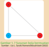

> **Deskripsi Visual:** Gambar ini adalah diagram yang menunjukkan hubungan antara tiga objek berwarna merah dan biru. Diagram ini terdiri dari tiga titik yang saling terhubung oleh garis lurus, menggambarkan hubungan simetri dan persamaan antara objek-objek tersebut. Titik-titik ini diberi warna merah dan biru, masing-masing dengan satu titik berwarna merah dan dua titik berwarna biru. Garis lurus yang menghubungkan titik-titik ini menunjukkan bahwa setiap titik merah memiliki satu titik biru yang berlawanan, sementara setiap titik biru memiliki dua titik merah yang berlawanan. Teks, angka, atau label penting yang terlihat pada gambar ini adalah warna merah dan biru untuk menunjukkan jenis objek dan jumlah titik yang ada. Informasi kunci yang dapat diambil pembaca adalah bahwa ada hubungan simetri dan persamaan antara objek-objek berwarna merah dan biru dalam diagram ini.

 

---
## 📄 Halaman 8

---
**🖼️ Gambar/Diagram**

> **Deskripsi Visual:** Gambar ini adalah ilustrasi yang menunjukkan berbagai aspek teknologi modern. Gambar tersebut terdiri dari empat bagian yang masing-masing menunjukkan konsep atau aplikasi teknologi berbeda:

1. Di bagian kiri atas, ada seorang pengguna komputer yang sedang bekerja dengan sebuah laptop. Ini menunjukkan penggunaan teknologi komputer dalam kehidupan sehari-hari.

2. Di bagian tengah kiri, ada sebuah robot yang sedang bergerak. Ini menunjukkan perkembangan teknologi robotika dan automatisasi dalam industri dan layanan.

3. Di bagian kanan atas, ada sebuah kereta api modern yang sedang bergerak. Ini menunjukkan perkembangan infrastruktur transportasi dan teknologi kereta api dalam transportasi publik.

4. Di bagian bawah, ada gambar atom yang sedang berputar. Ini menunjukkan perkembangan dalam bidang fisika dan teknologi material dalam pengetahuan dasar.

Teks, angka, atau label penting yang terlihat pada gambar adalah "W" yang mungkin merujuk pada World Wide Web atau World Wide Web Consortium, yang merupakan organisasi internasional yang mengatur standar web. Label lainnya tidak jelas dan sulit untuk diidentifikasi dengan tepat.

Informasi kunci yang dapat diambil pembaca adalah bahwa gambar ini menunjukkan berbagai aspek teknologi modern, mulai dari teknologi komputer, robotika, transportasi, hingga pengetahuan dasar dalam fisika dan material.

### 5.  Proyek

Kalian pada kegiatan ini akan bekerja secara berkelompok, baik untuk bernalar kritis dalam menyelesaikan masalah maupun berpikir kreatif untuk menyajikan sebuah informasi atau aplikasi konsep.

### 6.  Rangkuman

Kalian pada akhir bab akan mendapatkan sajian rangkuman konsep-konsep esensial yang telah dibahas untuk memudahkan melihat gambaran pembahasannya.

Pada akhir Bab 2 ini, Kalian diminta untuk membuat sebuah produk yang mengaplikasikan rangkaian kelistrikan untuk menyelsaikan masalah dalam kehidupan sehari-hari.

### Contohmasalahsebagaiberikut:

Di pemukiman padat penduduk sekitarbantaran sungaibencana banjir tahunan tidakjarangmemakankorbanjiwakarena terjadi saat malam hari ketika orang tertidur lelap. Oleh karena itu, diperlukan alarm banjir skala rumah tangga yang dapat diproduksi oleh setiap orang dengan biaya murah, aman, dan memberi peringatan saat terjadi banjir.Bagaimana rancangan alat ini dan alat apa saja yang dibutuhkan?

### Rangkuman

- Arus listrik didefinisikan sebagaijumlah muatan per satuan waktu yang melewati penampang kawat,

``

- Pada resistor yang memenuhi hukum Ohm, berlaku:

``

- Hambatan totalresistor yang dirangkai seri:

``

- Hambatan total resistor yang dirangkai parallel :

``

- Hukum I Kirchoff menyatakan bahwa pada setiappercabangan, arus listrik total yang masuk ke titik percabangan sama dengan arus total yang keluar dari titik percabangan.

 

---
## 📄 Halaman 9

C

=

Q

V

Kapasitansi kapasitor keping sejajar dipengaruhi oleh luas penampang keping, jarak antar keping dan bahan dielektriknya.

### · 6.  Asesmen

•

Energi listrik yang tersimpan dalam kapasitor, yaitu:

· Kapasitansi total rangkaian seri yaitu: · Kapasitansi total rangkaian paralel, yaitu: E = 1 2 CV 2 C seri 1 C 1 1 C 2 1 C 3 1 = + + + .... Bagian akhir bab disajikan beberapa contoh pertanyaan asesmen untuk menilai pemahaman konsep pada setiap bab sebagai bahan latihan kalian menghadapi asesmen.

C = C

1

+ C

2

+ C

3

+ ....

---
**🖼️ Gambar/Diagram**

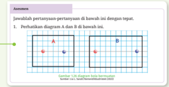

> **Deskripsi Visual:** Gambar ini adalah diagram yang menunjukkan dua titik, A dan B, yang terletak pada garis lurus. Titik A diletakkan di sebelah kiri dari titik B. Di sekeliling diagram, terdapat beberapa simbol yang mungkin berfungsi sebagai penanda atau informasi tambahan. Namun, tanpa teks atau label yang lebih jelas, sulit untuk menentukan maksud dari simbol-simbol tersebut. Diagram ini tampak sederhana dan digunakan mungkin untuk membantu memahami konsep dasar tentang posisi titik dalam ruang bidang.

20

Fisika SMA Kelas XII

### 7.  Fitur Tambahan (Ayo, Cermati!; Ayo, Mengingat Kembali!; Ayo, Bernalar Kritis! Ayo, Berdiskusi! Ayo, Berkolaborasi!)

- Setiap bab ditambahkan fitur-fitur yang mengembangkan kalian, baik dalam keterampilan, pemahaman, maupun mengembangkan karakter.

---
**🖼️ Gambar/Diagram**

> **Deskripsi Visual:** Gambar ini adalah ilustrasi yang menunjukkan berbagai jenis kegiatan belajar yang dapat dilakukan oleh siswa. Ilustrasi ini terdiri dari lima lingkaran berwarna-warni yang masing-masing menunjukkan jenis kegiatan belajar yang berbeda. Setiap lingkaran memiliki gambar dan teks yang menjelaskan jenis kegiatan tersebut.

1. Pertama, ada lingkaran biru dengan gambar seorang siswa yang sedang belajar dengan menggunakan laptop. Teks di sana menyebutkan "Mengajar kritik".

2. Kedua, ada lingkaran kuning dengan gambar sebuah mikroskop. Teks di sana menyebutkan "Menemukan cerita".

3. Ketiga, ada lingkaran merah dengan gambar seorang siswa yang sedang bermain game. Teks di sana menyebutkan "Menjaga kreativitas".

4. Keempat, ada lingkaran hijau dengan gambar sebuah kotak berisi buku. Teks di sana menyebutkan "Menyimpan teman".

5. Kelima, ada lingkaran putih dengan gambar seorang burung yang sedang terbang. Teks di sana menyebutkan "Menyajikan kreatif".

Ilustrasi ini menunjukkan bahwa ada banyak cara untuk belajar dan mengembangkan keterampilan belajar siswa. Dengan berbagai jenis kegiatan belajar yang disajikan dalam gambar ini, siswa dapat belajar dengan cara yang berbeda dan menyesuaikan diri dengan kebutuhan belajar mereka.

 

---
## 📄 Halaman 10

---
**🖼️ Gambar/Diagram**

> **Deskripsi Visual:** Gambar ini adalah ilustrasi yang menunjukkan berbagai aspek teknologi modern. Gambar ini terdiri dari empat bagian yang masing-masing menunjukkan konsep teknologi berbeda:

1. Di bagian kiri atas, ada seorang pengguna komputer yang sedang bekerja dengan sebuah laptop. Ini menunjukkan penggunaan teknologi komputer.

2. Di bagian tengah kiri, ada sebuah robot yang sedang bergerak. Ini menunjukkan perkembangan teknologi robotika.

3. Di bagian kanan atas, ada sebuah kereta api modern yang sedang bergerak. Ini menunjukkan perkembangan teknologi transportasi.

4. Di bagian bawah, ada sebuah atom yang sedang berkedip. Ini menunjukkan perkembangan teknologi fotonik dan optik.

Teks, angka, atau label penting yang terlihat pada gambar ini tidak ada. Informasi kunci yang dapat diambil pembaca adalah bahwa gambar ini menunjukkan perkembangan teknologi dalam berbagai bidang seperti komputer, robotika, transportasi, dan fotonik.

### 8. Refleksi

Setiap akhir bab dilengkapi dengan fitur refleksi terhadap pembelajaran yang telah dilaksanakan.

### Refleksi

Setelah pembelajaranBab 2 ArusSearah:

- Apakah kalian sudah memahami dengan baik semua materi dalam Bab2ArusSearah?
- 2.
- Konsep-konsep apa saja yang kalian belum dipahami pada materi arus searah?
- Apa yang akan kalian lakukan untuk meningkatkan pemahaman terhadapmateri arus searah?

 

---
## 📄 Halaman 11

### DAFTAR ISI

 

---
## 📄 Halaman 12

---
**🖼️ Gambar/Diagram**

> **Deskripsi Visual:** Gambar ini adalah ilustrasi yang menunjukkan berbagai aspek teknologi modern. Gambar ini terdiri dari empat bagian yang masing-masing menunjukkan konsep atau teknologi berbeda:

1. Di bagian kiri atas, ada seorang pengguna komputer yang sedang bekerja dengan sebuah laptop. Ini menunjukkan penggunaan teknologi komputer.

2. Di bagian tengah kiri, ada dua orang yang sedang berjalan di luar gedung. Ini menunjukkan aktivitas manusia dalam lingkungan perkotaan.

3. Di bagian kanan atas, ada kereta api bergerak di jalur kereta api. Ini menunjukkan transportasi modern.

4. Di bagian bawah, ada atom yang terang-terangan. Ini menunjukkan pengetahuan tentang fisika dan kimia.

Teks, angka, atau label penting yang terlihat pada gambar adalah "W" pada laptop, "20" pada angka di bagian tengah kiri, dan "ATOM" pada atom di bagian bawah.

Informasi kunci yang dapat diambil pembaca adalah bahwa gambar ini menunjukkan berbagai aspek teknologi modern, termasuk komputasi, transportasi, dan pengetahuan fisika dan kimia.

 

---
## 📄 Halaman 13

---
**🖼️ Gambar/Diagram**

> **Deskripsi Visual:** Gambar ini adalah ilustrasi yang menunjukkan berbagai aspek teknologi modern. Gambar ini terdiri dari empat bagian yang masing-masing menunjukkan konsep atau aplikasi teknologi yang berbeda:

1. Di bagian kiri atas, ada seorang pekerja yang sedang bekerja di komputer dengan layar yang menampilkan grafik dan data. Ini menunjukkan penggunaan teknologi komputer dalam dunia kerja.

2. Di bagian tengah kiri, ada sebuah karakter animasi berbentuk robot atau android, yang tampak seperti正在進行某種作業. Ini menunjukkan penggunaan teknologi robotika dan automatisasi dalam industri.

3. Di bagian kanan atas, ada sebuah kereta cepat atau MRT (Mass Rapid Transit) yang sedang bergerak di jalur rel. Ini menunjukkan perkembangan infrastruktur transportasi modern.

4. Di bagian bawah, ada gambar atom atau partikel yang bergerak, yang menunjukkan penggunaan teknologi fisika dan kimia dalam penelitian dan pengembangan.

Teks, angka, atau label penting yang terlihat dalam gambar meliputi nama-nama perusahaan teknologi, simbol-simbol teknologi, dan informasi tentang aplikasi teknologi tersebut. Informasi kunci yang dapat diambil pembaca meliputi perkembangan teknologi dalam berbagai bidang seperti komputasi, otomatisasi, transportasi, dan fisika.

 

---
## 📄 Halaman 14

---
**🖼️ Gambar/Diagram**

> **Deskripsi Visual:** Gambar ini adalah ilustrasi yang menunjukkan berbagai aspek teknologi modern. Gambar ini terdiri dari empat bagian yang masing-masing menunjukkan konsep teknologi berbeda:

1. Di bagian kiri atas, ada seorang pengguna komputer yang sedang bekerja dengan sebuah laptop. Ini menunjukkan penggunaan teknologi komputer.

2. Di bagian tengah kiri, ada sebuah robot yang sedang bergerak. Ini menunjukkan perkembangan teknologi robotika.

3. Di bagian kanan atas, ada sebuah kereta api modern yang sedang bergerak. Ini menunjukkan perkembangan teknologi transportasi.

4. Di bagian bawah, ada sebuah atom yang sedang berkedip. Ini menunjukkan perkembangan teknologi fotonik dan optik.

Teks, angka, atau label penting yang terlihat pada gambar ini tidak ada. Informasi kunci yang dapat diambil pembaca adalah bahwa gambar ini menunjukkan perkembangan teknologi dalam berbagai bidang seperti komputer, robotika, transportasi, dan fotonik.

 

---
## 📄 Halaman 15

### DAFTAR GAMBAR

 

---
## 📄 Halaman 16

 

---
## 📄 Halaman 17

 

---
## 📄 Halaman 18

 

---
## 📄 Halaman 19

 

---
## 📄 Halaman 20

mto

### DAFTAR TABEL

 

---
## 📄 Halaman 21

Fisika untuk SMA/MA Kelas XII

Penulis : Lia Laela Sarah, Irma Rahma Suwarma ISBN : 978-623-472-722-7 (jil.2)

---
**🖼️ Gambar/Diagram**

> **Deskripsi Visual:** !!!!!!!!!!!!!!!!!!!!!!!!!!!!!!!!!!!!!!!!!!!!!!!!!!!!!!!!!!!!!!!!!!!!!!!!!!!!!!!!!!!!!!!!!!!!!!!!!!!!!!!!!!!!!!!!!!!!!!!!!!!!!!!!!!!!!!!!!!!!!!!!!!!!!!!!!!!!!!!!!!!!!!!!!!!!!!!!!!!!!!!!!!!!!!!!!!!!!!!!!!!!!!!!!!!!!!!!!!!!!!!!!!!!!!!!!!!!!!!!!!!!!!!!!!!!!!!!!!!!!!!!!!!!!!!!!!!!!!!!!!!!!!!!!!!!!!!!!!!!!!!!!!!!!!!!!!!!!!!!!!!!!!!!!!!!!!!!!!!!!!!!!!!!!!!!!!!!!!!!!!!!!!!!!!!!!!!!!!!!!!!!!!!!!!!!!!!!!!!!!!!!!!!!!!!!!!!!!!!!!!!!!!!!!!!!!!!!!!!!!!!!!!!!!!!!!!!!!!!!!!!!!!!!!!!!!!!!!!!!!!!!!!!!!!!!!!!!!!!!!!!!!!!!!!!!

### BAB 1 LISTRIK STATIS

### Kata Kunci

Gaya listrik • Medan listrik • Potensial listrik • Energi potensial listrik • Kapasitansi kapasitor

### Tujuan Pembelajaran

Setelah  mempelajari  bab  ini,  kalian  dapat  menerapkan  konsep  listrik  statis (gaya listrik, medan listrik, energi potensial listrik, potensial listrik, kapasitansi kapasitor, dan rangkaian kapasitor) pada produk teknologi. Selain itu, kalian juga mampu membuat proyek sederhana aplikasi listrik statis untuk menyelesaikan masalah dalam kehidupan sehari-hari.

 

---
## 📄 Halaman 22

Sumber : Kinkin Suartini/Kemendikbudristek (2022)

---
**🖼️ Gambar/Diagram**

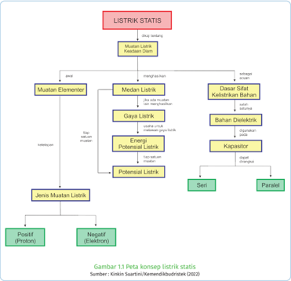

> **Deskripsi Visual:** Gambar 1.5 Peta Konsep Listrik Statistik adalah diagram yang menunjukkan struktur dan hubungan antara konsep-konsep dasar dalam listrik statis. Diagram ini terdiri dari berbagai elemen utama yang terkait dengan topik tersebut, seperti Mustan Elementer, Dasar Sifat Kedua Sisi Elektron, Bahan Dielektrik, Kapasitor, dan Jenis Mustan Listrik. Setiap elemen memiliki ikatan dengan elemen lainnya melalui relasi seperti "ada", "dalam", dan "dari". Teks penting yang muncul pada gambar termasuk "Mustan Listrik", "Fungsi Listrik", "Dasar Sifat Kedua Sisi Elektron", "Bahan Dielektrik", "Kapasitor", dan "Jenis Mustan Listrik". Informasi kunci yang dapat diambil pembaca meliputi struktur dasar listrik statis, jenis-jenis mustan, dan bagaimana mereka saling berkaitan.

Sumber : Lia L. Sarah/Kemendikbudristek (2022)

Fenomena listrik statis banyak ditemukan di sekitar kita mulai dari yang sederhana sampai produk teknologi modern. Salah satu  contoh  produk  teknologi  yang mengaplikasikan konsep listrik statis yaitu mesin  fotokopi dan  printer inkjet. Penelitian printer inkjet sudah  dimulai  sejak  tahun  1950-an, tepatnya pada tahun 1949, JeanAntoine Nollet (19700-1977) meneliti efek listrik statis pada aliran tetesan zat  cair  (tinta),  sedangkan  Lord  Rayleigh  (19700-1977)  meneliti  proses pembentukan tetesan dari inkjet dan interaksinya. Secara garis besar, prinsip kerja printer inkjet dapat dilihat pada Gambar 1.3.

 

---
## 📄 Halaman 23

---
**🖼️ Gambar/Diagram**

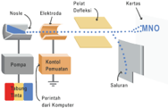

> **Deskripsi Visual:** Gambar ini adalah ilustrasi yang menunjukkan proses komunikasi antara mesin non-orientasi (MNO) dengan komputer. Gambar ini terdiri dari beberapa elemen utama:

1. **Pertama**: Gambar ini menunjukkan sebuah mesin non-orientasi (MNO) yang terhubung ke komputer melalui saluran komunikasi.
2. **Elemen Utama dan Relasinya**: 
   - **Mesin Non-Orientasi (MNO)**: Ini adalah perangkat yang berfungsi sebagai pusat komunikasi antara sistem komputer dan dunia fisik.
   - **Komputer**: Ini adalah perangkat yang digunakan untuk mengolah data dan menjalankan program.
   - **Saluran Komunikasi**: Ini adalah jaringan atau alat yang memungkinkan data atau informasi untuk berpindah dari MNO ke komputer dan sebaliknya.
   - **Elektroda**: Ini adalah bagian dari MNO yang bertanggung jawab untuk mengirimkan sinyal elektrik ke komputer.
   - **Papan Difusi**: Ini adalah bagian dari MNO yang bertanggung jawab untuk menerima sinyal elektrik dari komputer.
   - **Kompresor/Perpulangan**: Ini adalah perangkat yang bertanggung jawab untuk mengubah sinyal elektrik menjadi format yang dapat dikirim atau diterima oleh MNO.

3. **Teks, Angka, atau Label Penting**:
   - **Label Penting**: "MNO", "Komputer", "Saluran", "Elektroda", "Papan Difusi", "Kompresor/Perpulangan".

4. **Informasi Kunci yang Bisa Diambil Pembaca**:
   - Gambar ini menunjukkan proses komunikasi antara MNO dan komputer, yang melibatkan penggunaan saluran komunikasi untuk transfer data.
   - Ini juga menunjukkan bagaimana MNO menggunakan elektroda dan papan difusi untuk mengirim dan menerima sinyal elektrik.
   - Informasi ini penting untuk memahami bagaimana sistem komputer bekerja dengan dunia fisik melalui MNO.

Dengan demikian, gambar ini

Tetesan  tinta  pada  printer  keluar  melalui  lubang  kecil  yang  disebut nosel . Saat proses mencetak, tinta yang dipompa dari tabung keluar melalui nosle printer kemudian melewati elektroda logam. Tinta di dalam elektroda diberi muatan berdasarkan perintah yang diberikan oleh komputer kemudian  mengalami  defleksi  (pembelokan)  saat  melewati  pelat  paralel (pelat  defleksi). Pembelokan  ini  menyebabkan  printer  dapat  mengatur tetesan tinta yang akan jatuh membentuk huruf atau gambar pada kertas, seperti yang terlihat tulisan MNO pada Gambar 1.3.

### Ayo, Bernalar Kritis!

Mengapa  tinta mengalami pembelokan saat melewati pelat defleksi?

### A.  Gaya Listrik

Saat balon karet atau mistar plastik digosok kain wol kemudian didekatkan dengan potongan-potongan kertas kecil, ternyata potongan-potongan kertas tertarik  oleh  mistar.  Mengapa  hal  tersebut  dapat  terjadi?  Karena  mistar mendapatkan kelebihan muatan negatif sehingga dikatakan menjadi bermuatan listrik statis. Benda lain yang dapat bermuatan listrik statis, yaitu kaca yang digosok menggunakan kain sutra.

Ilmuwan Amerika Benjamin Franklin (1706-1790)  menyatakan  mistar plastik  yang  digosok  kain  wol  merupakan  benda  yang  berjenis  muatan negatif sedangkan kaca yang digosok dengan kain sutra merupakan benda yang bermuatan positif. Pernyataan tersebut disepakati sampai saat ini.

 

---
## 📄 Halaman 24

Dua jenis benda bermuatan dapat berinteraksi tarik menarik maupun tolak-menolak jika berada pada jarak tertentu. Peristiwa tolak-menolak atau tarik-menarik  menunjukkan  bahwa  pada  kedua  benda  bermuatan  listrik terdapat Gaya. Gaya pada muatan listrik dikenal dengan gaya listrik.

Gambar berikut menunjukkan dua muatan listrik q1 dan q2 dengan  besar  muatan  dan  jarak  yang  dapat diubah-ubah.  Apa  saja  yang  mempengaruhi  besar gaya listrik pada kedua muatan?

Jika  akses  internet  tersedia,  dapat  dilakukan  eksplorasi  secara interaktif untuk menentukan besar gaya pada muatan dengan bantuan simulasi pada tautan di bawah atau pindai kode QR.

https://phet.colorado.edu/sims/html/coulombs-law/latest/coulombs-law_en.html

### 1.  Hukum Coulomb

Gaya listrik antar muatan titik diteliti oleh ilmuwan Prancis bernama Charles de Coulomb (1736-1806). Oleh karena itu gaya listrik sering disebut sebagai gaya  Coulomb.  Kesimpulan  hasil  penelitiannya  dikenal  sebagai Hukum Coulomb.

Besar gaya tarik-menarik atau tolak-menolak antara dua benda bermuatan listrik (gaya listrik atau gaya Coulomb) berbanding lurus dengan muatan masing-masing benda dan berbanding terbalik dengan kuadrat jarak antara kedua benda tersebut.

Besar gaya listrik pada muatan listrik q 1 akibat muatan q 2 yang berjarak r , dapat dituliskan sebagai :

``

 

---
## 📄 Halaman 25

dengan F adalah besar gaya (Newton) dan k adalah bilangan konstanta listrik. Konstanta k ditentukan oleh jenis medium muatan itu berada. Besar konstanta listrik untuk medium udara atau ruang hampa adalah k = 9 x 10 9 N.m 2 .C -2 . Besar konstanta listrik untuk medium lain seperti air atau minyak, dapat dicari dengan:

``

ε merupakan nilai permitivitas medium yang dapat dijabarkan sebagai:

``

dengan ε o adalah permitivitas udara atau ruang hampa yang besarnya:

``

sedangkan ε r merupakan konstanta dielektrik medium atau permitivitas relatif medium terhadap permitivitas udara.

### 2.  Resultan Gaya

Gaya  merupakan  salah  satu  besaran  vektor.  Oleh  karena  itu,  sebelum menentukan besar gaya pada sebuah muatan akibat beberapa muatan, harus ditentukan terlebih dulu arahnya sebelum ditentukan besar resultannya.

Ayo, Mengingat Kembali!

Ketika dua gaya F 1 dan F 2 bekerja pada  sebuah  muatan  dan  saling membentuk sudut α , maka resultan gaya listriknya dapat dicari dengan persamaan:

``

Aktivitas 1.2 (Ayo, Berkolaborasi!)

Perhatikan Gambar 1.6, kemudian gambarkan arah resultan gaya pada muatan bola hitam akibat dua muatan lainnya dan prediksikan apakah bola akan masuk ke dalam gawang?

---
**🖼️ Gambar/Diagram**

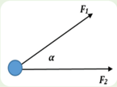

> **Deskripsi Visual:** Gambar ini adalah ilustrasi yang menunjukkan dua gaya (F1 dan F2) yang saling berlawanan tetapi tidak sekuat. Gaya F1 diletakkan di sudut kanan atas, sedangkan gaya F2 diletakkan di sudut kiri bawah. Kedua gaya ini saling berlawanan dan memiliki arah yang berlawanan, namun mereka tidak sekuat. Ini menunjukkan bahwa jika kita menggabungkan kedua gaya tersebut, maka hasilnya akan lebih kecil daripada gaya yang paling kuat. Ini juga menunjukkan bahwa jika kita mengurangi gaya yang paling kuat, maka hasilnya akan lebih kecil. Ini adalah ilustrasi tentang konsep gaya dan bagaimana gaya dapat digabungkan untuk mencapai hasil yang lebih kecil.

 

---
## 📄 Halaman 26

Sumber : Lia L. Sarah/Kemendikbudristek (2022)

---
**🖼️ Gambar/Diagram**

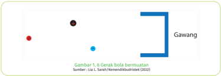

> **Deskripsi Visual:** Gambar 1.6 dalam buku pelajaran ini adalah sebuah diagram yang menunjukkan gerak benda bernutasi. Gambar ini terdiri dari dua titik berwarna merah dan hitam yang mewakili benda yang bergerak, serta sebuah garis lurus biru yang menunjukkan arah gerak tersebut. Titik merah berada di atas titik hitam, menunjukkan bahwa benda bergerak dari posisi awal ke posisi akhir. Garis lurus biru membantu memvisualisasikan arah gerak benda tersebut. Di bawah gambar tersebut, terdapat teks yang menyebutkan "Gawang" sebagai sumber dari gambar tersebut. Ini menunjukkan bahwa gambar ini mungkin merupakan bagian dari materi pendidikan tentang gerak benda atau kinematika.

Ayo, Cek Pemahaman!

Tiga  bola  muatan  yang  besarnya sama,  dua  bermuatan  positif  dan satu bermuatan negatif. Masingmasing  muatan  ditempatkan  pada titik  sudut  segitiga  siku-siku  yang satu  sama  lain  berjarak a seperti pada  Gambar  1.6.  Tentukan  gaya listrik pada masing-masing muatan.

### B.  Medan Listrik

### 1. Medan Listrik Muatan Titik

Gaya dalam kehidupan sehari-hari banyak yang merupakan 'gaya sentuh'. Misalnya,  mendorong  meja,  menarik  kursi,  memaku  kapstok  ke  dinding, menendang bola, memukul bola voli, dan lainnya.

Selain gaya sentuh, ada juga gaya tak sentuh. Misalnya, gaya gravitasi dan  gaya  listrik.  Saat  melepaskan  sebuah  benda  dari  ketinggian  tertentu, kalian pasti melihat benda akan jatuh menuju permukaan Bumi. Mengapa hal  itu  terjadi?  Karena  pusat  Bumi  memiliki  gaya  gravitasi  yang  menarik benda sehingga membuat benda jatuh menuju pusat Bumi. Gaya gravitasi Bumi merupakan gaya yang timbul ketika  benda  berada  dalam 'medan' gravitasi Bumi.

Gagasan  tentang 'medan' pertama  kali  dikemukakan  oleh  Ilmuwan Inggris, bernama Michael Faraday (1791 - 1867). Sebuah benda yang berada

 

---
## 📄 Halaman 27

dalam  medan  gravitasi  Bumi  akan  mengalami  gaya  gravitasi  yang  selalu mengarah ke pusat Bumi.

Demikian juga gaya listrik , sebuah muatan akan mendapat gaya listrik ketika berada dalam medan listrik. Perbedaannya pada arah gaya. Arah gaya pada  muatan  positif  yang  berada  dalam  medan  listrik  searah  dengan  arah medan listriknya, sedangkan arah gaya pada muatan negatif berlawanan arah dengan arah medan listriknya. Perhatikan Gambar 1.8.

---
**🖼️ Gambar/Diagram**

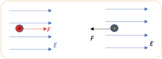

> **Deskripsi Visual:** Gambar ini adalah ilustrasi yang menunjukkan dua situasi berbeda dengan partikel listrik. Pada gambar sebelah kiri, partikel positif (dengan simbol +) ditarik oleh gaya listrik yang ditandai dengan huruf F ke arah kanan. Di sisi lain, pada gambar sebelah kanan, partikel negatif (dengan simbol -) ditarik oleh gaya listrik yang ditandai dengan huruf F ke arah kiri. Kedua situasi ini menunjukkan bahwa gaya listrik antara partikel listrik berlawanan jenis (positif dan negatif) sama dengan gaya yang ditunjukkan oleh panah F. Gambar ini juga menunjukkan bahwa gaya listrik antara partikel listrik berlawanan jenis lebih besar daripada gaya yang ditunjukkan oleh panah F antara partikel listrik yang berjenis sama.

Berdasarkan gambar 1.8, medan listrik pada suatu titik dapat diketahui dari adanya gaya listrik terhadap muatan uji di titik tersebut.

Daerah di sekitar muatan listrik yang menyebabkan timbulnya gaya listrik pada muatan uji disebut sebagai medan listrik.

Daerah ini digambarkan dengan garis-garis di sekitar muatan listriknya. Garis-garis di sekitar muatan ini disebut dengan garis gaya listrik .

---
**🖼️ Gambar/Diagram**

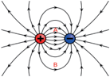

> **Deskripsi Visual:** Gambar ini adalah ilustrasi yang menunjukkan struktur atom. Gambar ini memperlihatkan dua jenis partikel atom: elektron dan proton. Elektron diperlihatkan dengan warna biru dan bergerak dalam orbit- orbit yang berbeda sekitar pusat atom, yang merupakan pusat yang berwarna merah. Proton diperlihatkan dengan warna merah dan berada di pusat atom. Relasi antara kedua partikel ini sangat penting dalam struktur atom, karena elektron bergerak di sekitar proton yang berada di pusat atom. Ini menunjukkan bahwa elektron memiliki energi yang lebih rendah dibandingkan dengan energi yang diperlukan untuk mengeluarkannya dari atom.

Arah dari garis gaya listrik menyatakan arah dari medan listriknya. Arah medan listrik bergantung dari jenis  muatannya ditunjukkan pada Gambar 1.9. Arah medan  listrik  dari  muatan  positif menyebar  ke  luar  ke  segala  arah, sedangkan arah medan listrik akibat muatan  negatif  masuk  menuju  ke muatan negatif.

Semakin rapat garis gaya listrik, kuat medan listriknya semakin besar. Perhatikan Gambar 1.9, titik A akan mendapatkan kuat medan listrik yang lebih besar dibandingkan dengan titik B.

Mari, lakukan Aktivitas 1.3 untuk mengingat kembali arah medan listrik setiap muatan.

 

---
## 📄 Halaman 28

### Aktivitas 1.3

Melalui  eksplorasi  dari  berbagai  sumber,  gambarkan  arah  medan listrik pada gambar A, B dan C akibat muatan di bawah ini.

### Aktivitas 1.4 Menentukan Kuat Medan Listrik

Gambar 1.11 di bawah ini menunjukkan sebuah muatan listrik yang dapat diubah-ubah besar muatannya. Sebuah alat uji digunakan untuk mengetahui kuat medan listrik di titik tersebut.

Coba kalian diskusikan, bagaimana besar medan listrik pada sebuah titik di sekitar muatan? Jika akses internet  tersedia,  eksplorasi  simulasi  PhET  (phet. colorado.edu) aplikasi Charges and Field pada link di bawah atau pindai kode QR

https://phet.colorado.edu/sims/html/charges-andfields/latest/charges-and-fields_en.html

Medan listrik didefinisikan sebagai gaya listrik tiap satuan muatan uji pada titik tertentu, dengan E adalah kuat medan listrik (N/C). v

Medan listrik merupakan besaran vektor seperti gaya listrik sehingga dalam menentukan resultan medan listrik, harus diperhatikan dulu arahnya. Dengan mensubstitusi persamaan gaya listrik untuk dua muatan, kuat medan

(1-3)

 

---
## 📄 Halaman 29

listrik pada sebuah titik yang berjarak r dari muatan Q menjadi:

``

``

### Ayo, Cek Pemahaman!

- Sebuah  muatan  uji  dengan  besar  muatan  +20  µC  diletakkan pada  suatu  titik,  kemudian  diukur  dengan  elektrometer.  Hasil pengukuran  menunjukkan  besar  gayanya  40  N  ke  arah  timur. Tentukan arah dan kuat medan listrik pada titik tersebut!
- Perhatikan gambar dua muatan listrik di bawah ini, jika muatan Q1 empat  kali  muatan Q2 ,  tentukan  letak  titik  yang  kuat  medan listriknya nol.

### 2.  Medan Listrik pada Pelat Paralel

Pelat  paralel  (pelat  konduktor  sejajar) dalam  kehidupan  sehari-hari  banyak digunakan  pada  peralatan  elektronik berteknologi  canggih  yang  berfungsi memberikan  medan  listrik  terhadap muatan.

Perhatikan  pelat  paralel  Gambar 1.13, masing-masing pelat diberi muatan yang sama besar namun berlawanan  jenis.  Arah  medan  listrik dari pelat positif menuju ke pelat negatif.  Kuat  medan  listrik  di  dalam

---
**🖼️ Gambar/Diagram**

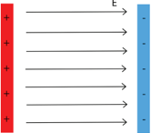

> **Deskripsi Visual:** Gambar ini adalah ilustrasi yang menunjukkan struktur elektronik dalam suatu atom. Ilustrasi ini memperlihatkan dua jenis elektron: elektron luar (dalam warna merah) dan elektron dalam (dalam warna biru). Elektron luar bergerak dalam orbit- orbit yang lebih jauh dari pusat atom, sementara elektron dalam berada di dekat pusat atom. Ilustrasi ini juga menunjukkan bahwa elektron luar memiliki energi yang lebih tinggi dibandingkan dengan elektron dalam. Ini menunjukkan bahwa elektron luar lebih mudah dilepaskan oleh atom ketika atom tersebut melepaskan energi.

pelat paralel adalah homogen (sama besar di setiap titik), besarnya adalah:

 

---
## 📄 Halaman 30

``

dengan E adalah  kuat  medan  listrik  (N/C), ε adalah  permitivitas  bahan  di dalam  pelat  (C 2 /Nm 2 )  dan σ adalah  rapat  muatan  per  satuan  luas  (C/m 2 ). Sedangkan di luar pelat, medan listriknya nol.

Sebuah muatan jika sudah bergerak sebelum masuk ke dalam medan listrik, maka muatan tersebut akan mengalami perubahan gerak baik arah ataupun besar kelajuannya. Mari lakukan Aktivitas 1.5 untuk memahaminya.

---
**🖼️ Gambar/Diagram**

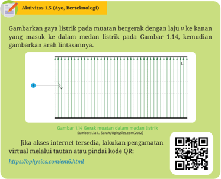

> **Deskripsi Visual:** Gambar 1.14 dalam buku pelajaran ini adalah sebuah diagram yang menunjukkan gerak muatan listrik dengan laju v ke kanan dalam medan listrik. Gambar ini menggambarkan gaya listrik pada muatan tersebut. Dalam diagram ini, muatan listrik bergerak dari titik A ke titik B. Titik A dinyatakan sebagai titik awal gerak muatan, sedangkan titik B dinyatakan sebagai titik akhir gerak muatan. Titik C dan D masing-masing dinyatakan sebagai titik-titik di antara A dan B. Titik E dinyatakan sebagai titik akhir gerak muatan, yaitu titik akhir gerak muatan setelah muatan tersebut bergerak dari A ke B. Titik F dinyatakan sebagai titik akhir gerak muatan, yaitu titik akhir gerak muatan setelah muatan tersebut bergerak dari A ke B. Titik G dinyatakan sebagai titik akhir gerak muatan, yaitu titik akhir gerak muatan setelah muatan tersebut bergerak dari A ke B. Titik H dinyatakan sebagai titik akhir gerak muatan, yaitu titik akhir gerak muatan setelah muatan tersebut bergerak dari A ke B. Titik I dinyatakan sebagai titik akhir gerak muatan, yaitu titik akhir gerak muatan setelah muatan tersebut bergerak dari A ke B. Titik J dinyatakan sebagai titik akhir gerak muatan, yaitu titik akhir gerak muatan setelah muatan tersebut bergerak dari A ke B. Titik K dinyatakan sebagai titik akhir gerak muatan, yaitu titik akhir gerak muatan setelah muatan tersebut bergerak dari A ke B. Titik L dinyatakan sebagai titik akhir gerak muatan, yaitu titik akhir gerak muatan setelah muatan tersebut bergerak dari A ke B. Titik M dinyatakan sebagai titik akhir gerak muatan, yaitu titik akhir gerak muatan setelah muatan tersebut bergerak dari A ke B. Titik N diny

Ayo, Bernalar Kritis!

Pada  teknologi  printer  inkjet,  tinta  didorong  keluar  dari nozzle berupa tetesan dengan diameter yang sangat kecil 9 x 10 -6  m. Sekitar 150.000 tetesan meninggalkan nozzle setiap detik dan bergerak dengan kecepatan kira-kira 18  m/s  menuju  kertas.  Pada  printer  inkjet  jenis  kontinu,  saat  kertas  akan diberi tinta sesuai huruf atau gambar dari komputer, ada dua jenis sistem defleksi seperti terlihat pada Gambar 1.15.

 

---
## 📄 Halaman 31

Cermati  kedua  gambar  1.15,  kemudian  jelaskan  perbedaan  cara  kerja sistem defleksi tetesan berdasarkan prinsip listrik statis serta analisis sistem mana yang paling baik.

### C.  Energi Potensial Listrik dan Potensial Listrik

Pada  pembahasan  sub  bab  pertama,  sudah dibahas bahwa gaya listrik antara dua muatan dapat dianalogikan dengan  gaya gravitasi. Gambar  1.16  menunjukan  sebuah  muatan  q berada  pada  jarak r dari  muatan Q .  Karena jenis  muatannya  sama,  pada  setiap  muatan terjadi gaya tolak menolak atau gaya Coulomb sebesar:

``

---
**🖼️ Gambar/Diagram**

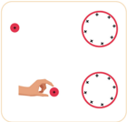

> **Deskripsi Visual:** Gambar ini adalah ilustrasi yang menunjukkan dua tangan yang sedang memegang bola merah. Ilustrasi ini menggunakan warna-warna cerah untuk menonjolkan bola merah dan tangan manusia. Teks tidak ada dalam gambar ini, namun elemen-elemen utama yang terlihat antara lain:

1. Apa yang ditampilkan secara keseluruhan: Gambar ini menunjukkan dua tangan manusia yang sedang memegang bola merah.

2. Elemen-elemen utama dan relasinya: Dua tangan berada di kedua sisi gambar, sedangkan bola merah diletakkan di tengah-tengah. Tangan dan bola merah merupakan elemen utama yang saling berhubungan melalui tindakan memegang.

3. Teks, angka, atau label penting yang terlihat: Teks atau angka tidak ada dalam gambar ini.

4. Informasi kunci yang dapat diambil pembaca: Gambar ini menggambarkan tindakan manusia yang biasa, yaitu memegang objek. Ini bisa menjadi ilustrasi untuk materi pembelajaran tentang tindakan manusia atau bahasa tubuh manusia.

Jika muatan uji q dipindahkan mendekati muatan Q ,  maka diperlukan usaha untuk melawan gayanya. Besar usaha oleh gaya luar yang diperlukan untuk melawan medan gaya dalam memindahkan muatan uji q dari posisi A yang berjarak r A ke posisi B yang berjarak r B dari muatan sumber Q sama dengan beda energi potensial antara posisi B dan A .  Hal ini dapat dinyatakan:

``

Jika digunakan posisi acuan yang berjarak tak hingga ( r = ~ ) dari muatan sumber Q ,  maka beda energi potensial titik yang berada pada jarak r dari muatan sumber Q terhadap energi potensial di posisi acuan adalah:

 

---
## 📄 Halaman 32

``

dengan E p adalah energi potensial listrik antara dua muatan dengan satuan joule.

Persamaan energi potensial listrik (1-6) tidak hanya berlaku untuk dua muatan  yang  sejenis  namun  juga  untuk  muatan  yang  berlawanan  jenis. Dua muatan yang berlawanan jenis akan saling tarik-menarik sehingga saat kedua muatan ingin dipisahkan pada jarak tertentu r diperlukan usaha luar untuk melawan gayanya. Saat kedua muatan berjarak r ini  maka  muatan memiliki energi potensial listrik sesuai persamaan (1-6).

Besar  gaya  listrik  pada  muatan  bergantung  pada  besar  muatan.  Ada besaran  fisis  yang  sangat  penting  dan  banyak  digunakan  pada  aplikasi kehidupan sehari-hari, yaitu dengan membagi besaran energi potensial listrik terhadap  muatan.  Besaran  ini  dikenal  sebagai potensial  listrik .  Dengan demikian, potensial listrik adalah usaha untuk memindahkan muatan dari titik  tak  hingga  ke  titik  berjarak  tertentu  dari  sebuah  muatan  tiap  satuan muatan.

Potensial listrik merupakan energi potensial listrik tiap satuan muatan.

``

dengan V yaitu potensial listrik, satuannya volt.

``

Penamaan satuan ini diberikan sebagai penghormatan kepada Alessandro Volta (1745-1827) penemu sel volta, asal mula baterai.

Berdasarkan persamaan potensial listrik, dapat dipahami bahwa energi potensial listrik memiliki satuan lain, yaitu elektron volt (eV). Satu elektron volt setara dengan satu muatan elektron dalam beda potensial listrik 1 volt.

``

Energi potensial listrik dan potensial listrik merupakan besaran skalar, sehingga jumlah total akibat beberapa muatan dapat dihitung secara aljabar biasa.

 

---
## 📄 Halaman 33

Potensial listrik dikenal juga sebagai 'tegangan' dan diukur dalam volt. Istilah 'tegangan' banyak digunakan dalam kehidupan sehari-hari sebagai beda potensial listrik. Misalnya,  sebuah  baterai  memiliki  tegangan sebesar  9  V  -  berarti    energi  sebesar  9  joule setiap  1  coulomb  muatan  mengalir  melewati baterai.  Lalu  bagaimana  jika  muatan  berada dalam pelat paralel yang diberi beda potensial?

Gambar 1.17 menunjukkan sebuah muatan positif  + q 0 yang  berada  di  dalam  pelat  paralel bergerak dari A ke B akibat adanya gaya listrik,

``

Analogi dengan usaha akibat gaya gravitasi bumi, usaha yang bekerja pada muatan tersebut, yaitu:

``

Dengan membagi kedua ruas terhadap besar muatan q 0 dan substitusi persamaan gaya listriknya, maka:

untuk pelat paralel dengan beda potensial listrik antar pelat ∆ V dan jarak antar pelat d, medan listriknya:

``

dengan d adalah  jarak  antar  pelat  (meter)  dan ∆V adalah  beda  potensial listrik (volt).

Persamaan ini banyak diaplikasikan dalam berbagai produk teknologi yang menggunakan prinsip pelat paralel atau kapasitor keping sejajar.

### Aktivitas 1.6. Menganalisis Cara Kerja Printer Inkjet

Secara  berkelompok,  coba  analisis  cara  kerja  printer  inkjet  dengan menjawab  pertanyaan  berikut.  Huruf  dan  gambar  dibuat  dengan menyemprotkan tetesan tinta secara horizontal pada selembar kertas dari nozzle yang bergerak cepat.

---
**🖼️ Gambar/Diagram**

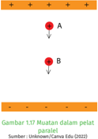

> **Deskripsi Visual:** Gambar 1.7 "Muatan dalam pelat paralel" menunjukkan dua muatan, A dan B, yang berada dalam sebuah pelat paralel. Gambar ini merupakan ilustrasi yang digunakan untuk menjelaskan konsep muatan dalam pelat paralel dalam fisika. 

Pertama, gambar menunjukkan dua muatan yang berada dalam pelat paralel. Muatan A dan B diletakkan pada kedua sisi pelat paralel, dengan jarak yang sama antara mereka. Ini menunjukkan bahwa muatan dapat berada dalam pelat paralel dengan jarak yang sama.

Kedua, elemen-elemen utama dalam gambar adalah muatan A dan B. Muatan A dan B diletakkan pada kedua sisi pelat paralel, dengan jarak yang sama antara mereka. Ini menunjukkan bahwa muatan dapat berada dalam pelat paralel dengan jarak yang sama.

Teks, angka, atau label penting yang terlihat dalam gambar adalah muatan A dan B, serta pelat paralel. Muatan A dan B diletakkan pada kedua sisi pelat paralel, dengan jarak yang sama antara mereka. Ini menunjukkan bahwa muatan dapat berada dalam pelat paralel dengan jarak yang sama.

Informasi kunci yang dapat diambil pembaca adalah bahwa muatan dapat berada dalam pelat paralel dengan jarak yang sama. Ini membantu pembaca memahami konsep muatan dalam pelat paralel dan bagaimana muatan dapat berada dalam pelat paralel dengan jarak yang sama.

 

---
## 📄 Halaman 34

Tetes tinta masing-masing memiliki  massa m =  1,3  x  10 -11 kg bergerak meninggalkan nozzle kecepatan v =  18  m/s.  Tetes  tinta kemudian  melewati  elektrode  dan mendapatkan muatan sebesar 1,5 x 10 -13   C,  lalu  melewati  pelat  defleksi dengan medan listrik sebesar E yang panjangnya D o =  1,8  cm  dan  jarak antar pelat sebesar 4 cm. Jika tetes

---
**🖼️ Gambar/Diagram**

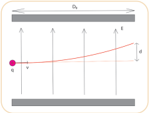

> **Deskripsi Visual:** Gambar ini adalah jenis diagram. Diagram ini menunjukkan sebuah sistem yang terdiri dari dua jalur (dapat dikenali sebagai jalur A dan B) yang saling berpotongan. Di tengah-tengah diagram tersebut, ada sebuah titik merah yang menunjukkan posisi sebuah objek atau titik fokus. 

Jalur-jalur ini tampaknya menggambarkan pergerakan atau arah dari objek tersebut. Jalur A dan B mungkin menunjukkan dua kemungkinan arah atau jalur yang bisa diambil oleh objek tersebut. Titik merah yang menunjukkan posisi objek tersebut menunjukkan bahwa objek tersebut sedang berada di tengah-tengah kedua jalur tersebut.

Teks, angka, atau label penting yang terlihat pada gambar ini adalah:

- Nama-nama jalur: A dan B
- Titik merah yang menunjukkan posisi objek

Informasi kunci yang dapat diambil pembaca dari gambar ini adalah bahwa objek tersebut memiliki dua pilihan jalur untuk bergerak atau bergerak ke arah mana pun.

tinta harus dibelokkan jarak d = 18,75 mm pada saat mencapai akhir pelat defleksi, maka:

- Jelaskan mengapa tinta bermuatan mengalami pembelokan (defleksi) saat melewati elektrode?
- Tentukan besar medan listrik pada pelat defleksi dengan asumsi gaya gravitasi diabaikan!
- Tentukan beda potensial listrik yang harus diberikan!

### Petunjuk Khusus:

- Lintasan gerak muatan merupakan lintasan parabola.
- Persamaan gerak muatan memenuhi Hukum II Newton.

### D.  Kapasitor Keping Sejajar

Konsep keping sejajar telah banyak digunakan pada produk teknologi salah satunya. yaitu layar sentuh kapasitif yang umum digunakan pada smartphone sekarang. Layar kapasitif bekerja dengan memanfaatkan sifat kapasitif tangan untuk memberi sinyal pada layar sentuh.  Layar  kapasitif  bekerja  tidak bergantung  pada  tekanan  sentuhan dan mampu menampilkan kejernihan hingga 90%. Hal ini menjadikan layar kapasitif lebih banyak digunakan dibandingkan layar resistif.

Layar sentuh kapasitif terbuat dari lapisan  transparan  yang  merupakan

---
**🖼️ Gambar/Diagram**

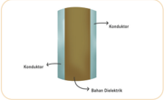

> **Deskripsi Visual:** Gambar ini adalah ilustrasi yang menunjukkan struktur dasar dari sebuah kondensator elektrostatis. Gambar ini menggambarkan dua komponen utama: kondensator dan kapasitor. Kondensator terdiri dari dua lapisan material dengan permukaan yang berlawanan, yaitu kondensator dan kapasitor. Kapasitor adalah lapisan yang terbuat dari bahan dielektrik, yang berfungsi sebagai pengisian listrik antara kondensator dan kondensator. Dalam gambar ini, kondensator dan kapasitor terlihat jelas dan terhubung dengan relatif baik, menunjukkan bahwa mereka saling terhubung dan berfungsi sebagai sistem kondensator. Informasi kunci yang dapat diambil dari gambar ini adalah bahwa kondensator dan kapasitor merupakan bagian dari sistem kondensator elektrostatis dan saling terhubung untuk memungkinkan perpindahan listrik.

konduktor pada bagian dalam dan luar serta isolator pada bagian tengahnya. Hal  ini  merupakan  penerapan  dari  kapasitor  keping  sejajar.  Kapasitor

 

---
## 📄 Halaman 35

keping  sejajar  terdiri  dari  dua  lapisan  konduktor yang  dipisahkan  dengan  bahan  dielektrik  berupa isolator, dapat dilihat pada Gambar 1.19.

Pada diagram rangkaian, sebuah kapasitor standar  disimbolkan  seperti  Gambar  1.20.  Saat kapasitor  dihubungkan  dengan  sumber  tegangan, terjadi  proses  pengisian  muatan  pada  kapasitor sampai kapasitor memperoleh tegangan yang sama  dengan  tegangan  sumber.  Setelah  sumber tegangan dilepaskan, kapasitor masih menyimpan

Sumber: Lia L. Sarah/Kemendikbudristek (2022)

energi listrik tersebut sehingga jika suatu saat dihubungkan dengan beban, kapasitor  dapat  mengalirkan  muatannya.  Kemampuan  kapasitor  untuk menyimpan muatan disebut dengan kapasitansi kapasitor.

Kapasitansi  kapasitor merupakan  ukuran  kapasitas  kapasitor dalam menyimpan muatan.

Aktivitas 1.7. Kapasitor Keping Sejajar

Coba identifikasi apa saja  yang  mempengaruhi kapasitas kapasitor keping sejajar.

Jika akses internet tersedia, klik pada tautan di samping  atau  pindai  kode  QR,  kemudian  lakukan pengamatan. Tuliskan data hasil pengamatan dalam bentuk tabel, dan buat kesimpulan.

https://phet.colorado.edu/sims/html/capacitor-lab-basics/latest/capacitor-lab-basics_ en.html

Sebuah  kapasitor  yang  diberi  beda  potensial V akan  menyimpan muatan Q , perbandingan Q terhadap V selalu konstan, nilai ini menyatakan kapasitansi kapasitornya, yaitu:

``

dengan C adalah  kapasitansi  kapasitor  (farad), Q adalah  besar  muatan (coulomb), dan V yaitu tegangan (volt).

Perlu diperhatikan bahwa nilai kapasitansi kapasitor tidak dipengaruhi oleh  beda  potensial  sumber,  namun  dipengaruhi  luas  penampang  keping A , jarak antar keping d dan konstanta bahan dielektrik k . Besar kapasitansi kapasitor dapat dinyatakan sebagai:

 

---
## 📄 Halaman 36

``

dengan ε yaitu  adalah  permitivitas  bahan atau permitivitas medium yang sudah dibahas pada sub bab gaya listrik.

Ukuran kapasitansi dalam farad merupakan nilai yang sangat besar. Coba cari luas permukaan keping yang diperlukan jika sebuah kapasitor keping sejajar ingin memiliki kapasitansi 1 farad, dengan bahan dielektrik udara ε 0 = 8,85 x 10 -12 F/m, dan jarak antar keping 1 meter. Kalian akan menemukan hampir seluruh luas permukaan pulau Jawa tertutup oleh keping kapasitor tersebut.  Oleh  karena  ukuran  kapasitansi  secara  umum  kecil,  kapasitansi kapasitor yang ada di pasaran dinyatakan dalam satuan mikro farad (μF), nano farad (nF) dan piko farad (pF).

Kapasitor ketika sudah terisi muatan dengan tegangannya sama dengan tegangan sumber, dikatakan kapasitor menyimpan energi listrik. Energi yang tersimpan dalam kapasitor bergantung pada besar kapasitansi kapasitor dan tegangan sumber,

``

dengan E adalah energi yang tersimpan (joule).

### E.  Rangkaian Kapasitor

Kapasitor  yang  tersedia  di  pasaran memiliki berbagai bentuk, jenis, ukuran dan kapasitansi. Sebuah kapasitor pada umumnya diberi label nilai kapasitansinya.

Produk-produk elektronik secara  umum,  untuk  mendapatkan nilai kapasitansi sesuai dengan yang dibutuhkan, dibuat dengan

merangkai  beberapa  kapasitor  secara  seri  atau  paralel.  Bagaimana  cara mengetahui kapasitansi total dari rangkaian seri dan paralel kapasitor? Coba Kalian lakukan Aktivitas 1.8.

 

---
## 📄 Halaman 37

### Aktivitas 1.8. Rangkaian Seri-Paralel Kapasitor

### Tujuan:

Menentukan  kapasitansi  total  dari rangkaian  seri dan  paralel kapasitor.

### Alat dan Bahan:

- 3 buah kapasitor
- breadboard
- kabel
- multimeter ( capacitance meter )

### Langkah Penyelidikan:

- Ukur kapasitansi masingmasing kapasitor menggunakan capacitance meter , kemudian tuliskan pada tabel.
- Rangkai  tiga  kapasitor  secara seri pada papan rangkaian, kemudian ukur kapasitansinya.
Sumber: Lia L. Sarah/Kemendikbudristek (2022)

- Rangkai  tiga  kapasitor  secara  paralel  para  papan  rangkaian, kemudian ukur kapasitansinya.

### Hasil Pengamatan:

---
**📊 Tabel**

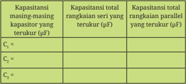

Tabel ini menunjukkan kapasitansi masing-masing kapasitor dalam rangkaian seri dan paralel. Topik utama tabel ini adalah tentang kapasitansi total dalam rangkaian seri dan paralel. Kolom pertama berisi kapasitansi masing-masing kapasitor yang terukur dalam mikrofarad (µF). Kolom kedua berisi kapasitansi total rangkaian seri yang terukur dalam µF. Kolom ketiga berisi kapasitansi total rangkaian paralel yang terukur dalam µF. Data penting yang terlihat adalah bahwa kapasitansi total rangkaian seri lebih besar daripada kapasitansi total rangkaian paralel untuk setiap kapasitor yang terukur. Ini menunjukkan bahwa kapasitansi total rangkaian seri lebih besar karena efek seringan, sementara kapasitansi total rangkaian paralel lebih kecil karena efek paralel.

Buat kesimpulan berdasarkan data hasil pengamatan.

 

---
## 📄 Halaman 38

### 1.  Rangkaian Seri

Gambar  1.23  menunjukkan  tiga  kapasitor dengan kapasitansi masing-masing C 1 , C 2 dan C 3 dihubungkan dengan sebuah tegangan V . Jika  tegangan  pada  ujung-ujung  kapasitor adalah V 1 , V 2 dan V 3 , maka:

``

Substitusikan persamaan Q = CV atau,

``

---
**🖼️ Gambar/Diagram**

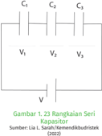

> **Deskripsi Visual:** Gambar 23 menunjukkan rangkaiannya seri kapasitor dalam buku pelajaran. Gambar ini adalah ilustrasi yang menunjukkan tiga kapasitor (C1, C2, dan C3) yang disambungkan dalam arah sering dengan sumber tegangan V. Kapasitor-kapasitor ini disebut sebagai rangkaiannya seri karena mereka semua disambungkan antara dua titik yang sama, yaitu antara V1 dan V3. Rangkaiannya ini menggambarkan bagaimana kapasitor berfungsi dalam rangkaian listrik. Jika kita melihat elemen-elemen utamanya, kita bisa melihat bahwa setiap kapasitor memiliki bobot atau nilai kapasitansi yang berbeda-beda, yang ditunjukkan oleh angka-angka di sekitar masing-masing kapasitor. Label "V" menunjukkan sumber tegangan yang menyediakan tegangan untuk rangkaiannya. Informasi kunci yang dapat diambil dari gambar ini adalah bahwa rangkaiannya seri kapasitor memungkinkan aliran arus yang lebih besar dan meningkatkan efisiensi dalam sistem listrik.

Sesuai prinsip rangkaian seri Q 1 = Q 2 = Q 3 = Q total , maka:

kapasitansi total untuk rangkaian seri sebesar:

``

### 2.  Rangkaian Paralel

Gambar  1.24  menunjukkan  tiga  kapasitor C 1 , C 2 dan C 3 yang dirangkai paralel  kemudian dihubungkan dengan sumber tegangan V . Berdasarkan hasil percobaan, setiap ujung-ujung kapasitor memiliki besar tegangan yang sama:

``

Sesuai prinsip rangkaian seri,

``

---
**🖼️ Gambar/Diagram**

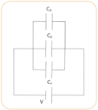

> **Deskripsi Visual:** Gambar ini adalah diagram yang menunjukkan struktur sederhana dari sebuah sistem elektronik. Diagram ini menggambarkan tiga komponen utama: G1, G2, dan G3, yang masing-masing terhubung ke satu terminal V. Komponen-komponen ini tampaknya berfungsi sebagai resistor atau komponen lain yang mempengaruhi arus listrik. Relasi antara komponen-komponen ini adalah bahwa mereka semua terhubung dalam arah yang sama ke terminal V, menunjukkan bahwa mereka berada dalam rangkaian seri. Teks, angka, atau label penting yang terlihat pada gambar ini adalah nama-nama komponen (G1, G2, G3) dan label terminal V. Informasi kunci yang dapat diambil pembaca adalah bahwa struktur ini mungkin digunakan untuk mengontrol arus listrik dalam sistem elektronik, dengan G1, G2, dan G3 mungkin berfungsi sebagai pengatur arus.

kemudian substitusi persamaan Q = CV, maka diperoleh:

kapasitansi total untuk rangkaian paralel :

``

 

---
## 📄 Halaman 39

### 1.3 Ayo, Cek Pemahaman Kalian!

Empat  kapasitor  identik  masing-masing  470µF dihubungkan  sesuai Gambar  1.25,  kemudian dihubungkan dengan tegangan 12 V. Tentukan:

- kapasitansi total rangkaian
- muatan total yang tersimpan pada rangkaian
- energi total yang tersimpan dalam kapasitor
Secara  berkelompok,  buat  sebuah  produk  yang  menerapkan  listrik statis. Pilihlah satu tema yang sesuai dengan minat kalian. Beberapa topik yang dapat dijadikan pilihan proyek kali ini, diantaranya:

- membuat contoh aplikasi teknologi touchscreen seperti DIY Stylus yaitu  pensil  yang  dapat  digunakan  sebagai  pensil  digital  pada handphone /tablet,
- membuat kapasitor sederhana dari bahan-bahan yang tersedia di sekitar rumah seperti alumunium foil dan kertas.

### Rangkuman

- Besar muatan merupakan kelipatan bilangan bulat muatan elementer e = 1,6 x 10 19 C.
- Gaya listrik antar muatan sejenis tarik menarik, gaya antar muatan tidak sejenis tolak menolak. Besar gayanya, yaitu:

``

- Daerah di sekitar muatan listrik yang mengakibatkan gaya listrik pada muatan uji di sekitarnya disebut medan listrik.
- Medan listrik digambarkan oleh garis gaya listrik yang pada muatan positif arahnya ke luar muatan ke segala arah sedangkan pada muatan negatif arahnya menuju muatan.

---
**🖼️ Gambar/Diagram**

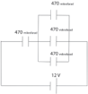

> **Deskripsi Visual:** Gambar ini adalah diagram yang menunjukkan struktur sederhana dari sebuah sistem elektronik. Diagram ini menggambarkan dua jalur arus listrik yang saling terhubung melalui beberapa komponen seperti resistor dan transistor. 

Pertama, elemen utama yang ditampilkan adalah dua jalur arus listrik yang saling terhubung melalui resistor dan transistor. Jalan arus pertama berada pada sisi kiri dan jalan arus kedua berada pada sisi kanan. Setiap jalur memiliki resistansi yang sama (4.7Ω), dan kedua jalur tersebut juga memiliki resistansi yang sama (6.7Ω).

Elemen-elemen utama yang terlihat dalam diagram ini adalah resistor dan transistor. Resistor digunakan untuk mengatur arus listrik, sedangkan transistor digunakan untuk memperkuat arus listrik.

Teks, angka, atau label penting yang terlihat dalam diagram ini adalah nomor resistansi (4.7Ω dan 6.7Ω) dan nomor jalur arus (1.2V). Informasi kunci yang dapat diambil pembaca adalah bahwa ada dua jalur arus listrik dengan resistansi yang sama, dan bahwa ada perbedaan dalam arus listrik antara kedua jalur tersebut.

(2022)

 

---
## 📄 Halaman 40

- Kuat medan listrik yaitu besar gaya listrik tiap satuan muatan.
- Energi potensial listrik adalah usaha oleh gaya luar yang diperlukan untuk melawan medan gaya dalam memindahkan muatan uji q dari satu posisi ke posisi lain.
- Potensial listrik yaitu energi potensial listrik tiap satuan muatan,

``

- Hubungan tegangan sumber dan muatan yang tersimpan dalam kapasitor dapat dinyatakan:

``

- Kapasitansi kapasitor keping sejajar dipengaruhi oleh luas penampang keping, jarak antar keping dan bahan dielektriknya.
- Energi listrik yang tersimpan dalam kapasitor, yaitu:

``

- Kapasitansi total rangkaian seri yaitu:

``

- Kapasitansi total rangkaian paralel, yaitu:

``

### Asesmen

Jawablah pertanyaan-pertanyaan di bawah ini dengan tepat.

- Perhatikan diagram A dan B di bawah ini.

---
**🖼️ Gambar/Diagram**

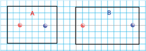

> **Deskripsi Visual:** Gambar ini adalah ilustrasi yang menunjukkan dua bentuk geometri sederhana: segitiga dan persegi panjang. Segitiga dinyatakan dengan titik A dan B, sedangkan persegi panjang dinyatakan dengan titik C dan D. Titik A dan C serta B dan D merupakan titik sudut yang saling berlawanan. Titik A dan B terletak pada garis vertikal, sedangkan titik C dan D terletak pada garis horizontal. Ini menunjukkan bahwa kedua bentuk tersebut memiliki sisi yang sama panjang dan sudut yang sama besar. Gambar ini digunakan untuk membantu memahami konsep dasar geometri, seperti sisi dan sudut, serta bagaimana mereka berinteraksi dalam bentuk-bentuk geometri sederhana.

Sumber: Lia L. Sarah/Kemendikbudristek (2022)

 

---
## 📄 Halaman 41

Bandingkan diagram A dan B yang menunjukkan dua muatan identik pada jarak tertentu.

- Lengkapi  kalimat  berikut:  Jarak  muatan  1  dan  muatan  2  pada diagram  B  _________  kali  lebih  besar  dari  jarak  muatan  1  dan muatan  2  pada  diagram  A,  sehingga  gaya  tarik-menarik  pada diagram B __________ kali dari gaya tarik-menarik pada diagram A.
- Berikan penjelasan tentang hasil perbandingan diagram A dan B tersebut berdasarkan jawaban a.
- Seorang siswa melakukan simulasi virtual untuk menemukan hubungan gaya listrik antara dua muatan dengan  jarak  kedua  muatan. Berdasarkan grafik tersebut, berapa  gaya  listrik  pada  saat kedua muatan berjarak 16 cm? ... N
- Sebuah  teknologi  layar  sentuh  terdiri  dari  dua  lapisan  konduktif bagian  luar  dan  diisi  bahan  dielektrik  pada  bagian  tengahnya.
Jika  diberi  satu  lapisan  bahan dielektrik  setebal d ,  konstanta dielektrik k ,  dan kapasitansinya C , maka saat ditambahkan dua  lapisan  dielektrik  dengan konstanta 2 k dan 3 k seperti

Gambar 1.28 kapasitansinya akan menjadi ….

- 1 11 C
- 5 11 C
- 6 11 C
- Seorang siswa melakukan percobaan untuk menentukan kapasitansi total  sebuah  rangkaian yang terdiri dari 3 kapasitor identik dengan menggunakan kapasitansi meter. Ketika dirangkai dengan skema gambar A, kapasitansi yang terukur

 

---
## 📄 Halaman 42

sebesar C ,  jika  dirangkai  dengan skema gambar B hasil pengamatan akan menunjukkan kapasitansi sebesar

A. C 9

B. C 6

### Pengayaan

Petir merupakan fenomena listrik statis yang paling sering dilihat. Energi listrik yang dihasilkan dari peristiwa terjadinya petir sangat besar. Oleh karena itu, banyak penelitian yang mencoba  menyelidiki  potensi petir  sebagai  sumber  energi listrik. Petir juga memiliki potensi bahaya, yaitu dapat

C. C 3

D. C

E. 3C

menyambar  benda-benda  terdekatnya.  Oleh  karena  itu,  gedunggedung tinggi banyak yang dilengkapi dengan penangkal petir. Coba eksplorasi bagaimana cara terjadinya petir dan analisis prinsip kerja penangkal petir.

### Refleksi

Setelah kalian mempelajari Bab 1  Listrik Statis:

- Menurut kalian, materi apa yang menarik pada listrik statis?
- Hal-hal apa yang belum dipahami pada materi listrik statis?
- Apa  yang  perlu  dilakukan  untuk  memahami  hal-hal  yang  belum dipahami pada nomor 2?

 

---
## 📄 Halaman 43

---
**🖼️ Gambar/Diagram**

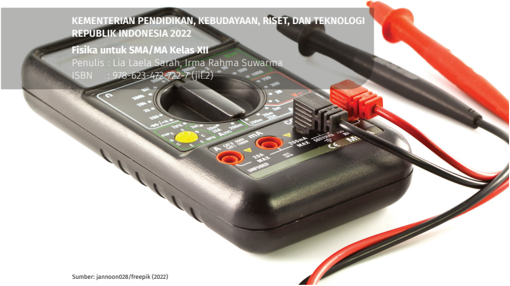

> **Deskripsi Visual:** Gambar ini menunjukkan sebuah multimeter elektrik yang digunakan untuk mengukur berbagai sifat listrik seperti tegangan, arus, dan resistansi. Multimeter ini memiliki tiga terminal pengukur: satu untuk tegangan (V), satu untuk arus (A), dan satu untuk resistansi (Ω). Terminal pengukur tersebut terhubung ke dua kabel yang diletakkan di depannya. Multimeter ini memiliki panel display yang menampilkan informasi hasil pengukuran, serta tombol kontrol untuk memilih jenis pengukuran dan mengatur pengaturan. Gambar ini menunjukkan bagaimana cara penggunaan multimeter dalam mengukur sumber daya listrik.

### BAB 2 LISTRIK ARUS SEARAH

Kata Kunci

Hukum Ohm • Hukum Kirchoff • Hambatan jenis • Rangkaian seri • Rangkaian Paralel • Daya listrik

### Tujuan Pembelajaran

Setelah mempelajari bab ini, kalian dapat mengevaluasi berbagai jenis rangkaian listrik arus searah menggunakan hukum Ohm, hukum Kirchoff, hambatan jenis kawat,  dan  daya  listrik  serta  membuat  proyek  sederhana  terkait  rangkaian listrik arus searah untuk menyelesaikan masalah dalam kehidupan sehari-hari.

 

---
## 📄 Halaman 44

Sumber : Kinkin Suartini/Kemendikbudristek (2022)

---
**🖼️ Gambar/Diagram**

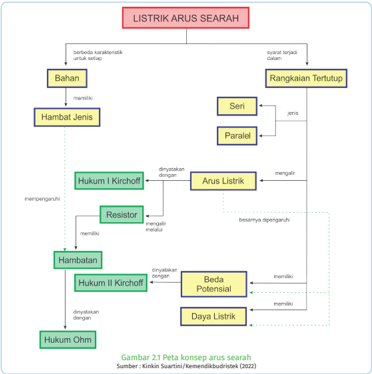

> **Deskripsi Visual:** Gambar 2.1 pada buku pelajaran ini adalah diagram yang menunjukkan konsep arus searah dalam listrik. Diagram ini terdiri dari berbagai elemen utama yang terkait dengan konsep tersebut, seperti bahan, rangkaian tertutup, seri, paralel, hambatan, dan anus listrik. Elemen-elemen ini disusun secara hierarkis untuk menunjukkan hubungan antara mereka. Beberapa elemen penting termasuk "Hukum I Kirchhoff", "Resistor", "Hukum II Kirchhoff", dan "Dua Potensial". Teks, angka, atau label penting yang terlihat mencakup nama-nama konsep dan hukum yang relevan, serta penjelasan singkat tentang fungsi masing-masing elemen. Gambar ini membantu pembaca memahami struktur dasar listrik dan bagaimana arus searah bekerja melalui berbagai komponen.

---
**🖼️ Gambar/Diagram**

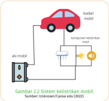

> **Deskripsi Visual:** Gambar 2.2 Sistem Kelelitrikan Mobil adalah ilustrasi yang menunjukkan bagaimana komponen-komponen sistem keelektrik mobil berinteraksi dengan aki mobil. Gambar ini memperlihatkan aki mobil sebagai sumber energi utama yang mengisi baterai mobil. Aki mobil terhubung ke baterai melalui kabel yang menghubungkan kedua komponen tersebut. Selain itu, ada juga komponen-komponen lain seperti motor, lampu, dan sistem pengendalian yang terhubung ke baterai melalui kabel lainnya. Gambar ini membantu pembaca memahami bagaimana sistem keelektrik mobil bekerja dan bagaimana komponen-komponen tersebut saling terhubung.

Energi listrik merupakan salah satu energi utama dalam kehidupan sehari-hari. Selain digunakan pada  berbagai  alat  rumah  tangga dan penerangan, energi listrik juga digunakan pada kendaraan. Misalnya,  pada  mobil  energi  listrik digunakan untuk memberikan percikan  api  pada  steker  sehingga mobil dapat dihidupkan. Selain itu, energi listrik digunakan untuk menyalakan lampu, radio dan  komponen  elektronik  mobil  lainnya.  Rangkaian  listrik  pada  mobil memanfaatkan rangka badan mobil sebagai bagian dari rangkaian, sistem

 

---
## 📄 Halaman 45

ini  dikenal  sebagai  pentanahan.  Keuntungan  dari  sistem  ini,  yaitu  untuk menghemat kawat dan memudahkan mendeteksi kerusakan pada komponen kelistrikan mobil.

Rangkaian lampu-lampu, radio, AC dan komponen kelistrikan lainnya pada  mobil  dirangkai  secara  paralel  sehingga  saat  satu  komponen  mati, komponen  lain  masih  bisa  menyala.  Pada  kelistrikan  mobil  terdapat  dua sumber tegangan listrik yaitu aki dan dinamo. Sebelum mobil hidup, hanya aki yang berperan sebagai sumber tegangan listrik. Tapi saat mobil sudah melaju, selain aki, dinamo juga akan menjadi sumber tegangan bagi semua komponen  kelistrikannya.  Rangkaian  kelistrikan  saat  mobil  melaju  ini merupakan rangkaian majemuk.

Ayo, Bernalar Kritis!

Bagaimanakah prinsip kerja sistem kelistrikan mobil? Mengapa saat satu komponen mati, komponen lain masih menyala?

### A.  Arus Listrik

Pada  bab  1,  sudah  dibahas  jika  sebuah muatan berada dalam medan listrik, maka muatan  akan  mengalami  gaya  listrik  dan kemungkinan  muatan  tersebut  bergerak. Medan  listrik  dapat  dihasilkan  oleh  beda potensial listrik, misalnya pada baterai.

Gambar 2.3 menunjukkan elektron akan bergerak dalam kawat konduktor yang

---
**🖼️ Gambar/Diagram**

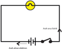

> **Deskripsi Visual:** Gambar ini adalah ilustrasi yang menunjukkan sebuah rangkaian elektronik sederhana dengan komponen-komponennya. Rangkaian ini terdiri dari sebuah lampu, dua saklar, dan sebuah baterai. Lampu berada di antara saklar dan baterai, yang berarti bahwa jika kedua saklar ditekan, listrik akan mengalir melalui lampu. Ini menunjukkan hubungan antara komponen-komponen dalam rangkaian tersebut. Teks, angka, atau label penting yang terlihat pada gambar adalah nama-nama komponen seperti "lampu", "saklar", dan "baterai". Informasi kunci yang dapat diambil pembaca adalah bahwa rangkaian ini adalah contoh sederhana dari rangkaian elektronik dan bagaimana komponen-komponennya bekerja bersama-sama untuk menghasilkan arus listrik.

Sumber: Sumber : Lia L. Sarah/Kemendikbudristek (2022)

dihubungkan dengan baterai. Beda potensial listrik pada ujung-ujung baterai menyebabkan elektron bebas dalam kawat bergerak melewati penampang kawat yang tegak lurus terhadap arah geraknya. Aliran muatan ini dikenal sebagai arus listrik.

Muatan listrik  yang  bergerak  memang  elektron,  tapi  arah  arus  listrik dianggap berlawanan dengan arah aliran muatan elektronnya. Oleh karena itu, arah arus listrik ini dikenal dengan arah arus konvensional. Arah muatan elektron dalam rangkaian tertutup mengalir dari kutub negatif baterai ke kutub positif sedangkan arus listriknya mengalir dari kutub positif ke kutub negatif  baterai.  Perlu  diingat  bahwa  tidak  semua  elektron  yang  bergerak menghasilkan arus listrik. Lalu apa syarat terjadinya arus listrik?

 

---
## 📄 Halaman 46

Arus listrik I didefinisikan sebagai jumlah muatan Q per satuan waktu t yang melewati penampang kawat,

``

dengan  satuan  arus  listrik  adalah  coulomb  per  sekon.  Satu  coulomb  per sekon disebut ampere , yaitu satuan arus listrik secara Standar Internasional. Nama satuan ini diambil dari matematikawan Prancis André-Marie Ampère (1775-1836) yang dikenal sebagai pelopor dalam ilmu elektrodinamika.

Besar muatan  merupakan  kelipatan bilangan bulat dari  muatan elementer ( e ), maka persamaan arus listrik dapat dituliskan juga sebagai:

``

dengan n yaitu jumlah muatan dan e adalah muatan elementer 1,6 x 10 -19  C.

Ayo, Cek Pemahaman!

Sebuah lampu yang diberi sumber tegangan mengalirkan arus listrik sebesar 5 A selama 30 menit. Berapa jumlah muatan elektron yang mengalir dalam lampu?

### B.  Hambatan Ohmik dan Non Ohmik

Ayo, Bernalar Kritis!

Sebuah Light Emitting Diode (LED) agar menyala normal membutuhkan beda potensial 2,2 V. Sementara baterai yang ada di pasaran hanya 1,5 V  dan  9  V.  Bagaimana  cara  agar  mendapatkan  beda  potensial  2,2  V pada ujung-ujung LED? Apa yang akan terjadi pada LED jika langsung dihubungkan dengan baterai 9V?

 

---
## 📄 Halaman 47

Komponen  elektronik  yang  dapat  digunakan  untuk  mengatur  arus  listrik dalam rangkaian adalah resistor. Sebuah resistor memiliki resistansi atau hambatan dengan satuan ohm atau Ω. Selain resistor yang memiliki nilai hambatan, kawat juga memiliki nilai hambatan. Demikian juga bola lampu (bohlam) karena di dalamnya terdapat kawat tipis yang memiliki hambatan.

Georg Simon Ohm (1789-1854 ) melakukan percobaan dan mendapatkan hasil percobaan hubungan tegangan V - arus I berupa garis lurus, persamaan garisnya dikenal dengan hukum Ohm,

``

dengan R merupakan gradien garisnya yaitu besar hambatan (ohm atau Ω),

Alat-alat  listrik  yang  memiliki  nilai  hambatan  tetap  dengan  grafik linier  antara  tegangan dan arus memenuhi hukum Ohm sehingga dikenal dengan hambatan ohmik. Tidak semua nilai hambatan bernilai tetap atau memenuhi hukum Ohm, ada juga yang berubah bergantung pada besaran lainnya.  Hambatan  dengan  nilai  berubah  disebut  hambatan non-ohmik , contohnya  lampu  filamen.  Lampu  filamen  memancarkan  cahaya  setelah filamen kawat di dalamnya menjadi panas, memiliki hambatan yang tidak konstan namun dipengaruhi oleh suhu kawat (bagian ini akan dibahas lebih lanjut pada subbab C).

Berbeda  dengan  lampu  filamen  yang  memancarkan  cahaya  karena pemanasan, LED akan memancarkan cahaya monokromatik ketika dihubungkan  dengan  tegangan  pada  kondisi  panjar  maju  (akan  dibahas lebih lanjut pada Bab 6). Jika sebuah resistor dan LED dihubungkan dengan sumber tegangan dalam rangkaian tertutup, maka arus listrik akan mengalir.

Bagaimana  karakteristik  beda  potensial  listrik  sumber  ( V )  dan  arus listrik  ( I )  yang  mengalir  pada  resistor  dan  LED?.  Apakah  ada  perbedaan? Lakukan Aktivitas 2.1 untuk mengetahuinya. Tapi sebelumnya, coba ingat kembali cara memasang amperemeter dan voltmeter dalam rangkaian serta cara membacanya.

Amperemeter merupakan  alat  untuk  mengukur  nilai  arus  listrik. Amperemeter  harus  dirangkai  secara  seri. Voltmeter merupakan alat untuk mengukur beda potensial atau tegangan. Berbeda dengan amperemeter, voltmeter harus dirangkai secara paralel.

 

---
## 📄 Halaman 48

---
**🖼️ Gambar/Diagram**

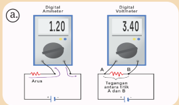

> **Deskripsi Visual:** Gambar ini adalah ilustrasi yang menunjukkan dua jenis diagnostik dengan ukuran yang berbeda. Ilustrasi ini menggunakan warna-warna yang berbeda untuk membedakan antara kedua jenis diagnostik tersebut. Di sisi kiri, ada gambaran diagnostik dengan ukuran 1.20 cm, sedangkan di sisi kanan ada gambaran diagnostik dengan ukuran 3.40 cm. Gambaran diagnostik di sisi kiri memiliki label "A" dan "B", sedangkan gambaran di sisi kanan memiliki label "C" dan "D". Informasi kunci yang dapat diambil pembaca adalah bahwa gambaran diagnostik dengan ukuran 3.40 cm lebih besar daripada gambaran diagnostik dengan ukuran 1.20 cm.

Berbeda  dengan  alat  ukur  digital yang  hanya  dibaca  dari  angka  pada layar, voltmeter dan amperemeter analog perlu dibaca lebih teliti.

Cara  membaca  nilai  yang  terukur dari amperemeter dan voltmeter, yaitu:

### Gambar 2.4 Merangkai alat ukur listrik

Sumber : Nanda Auliarahma/Kemendikburistek (2022)

- Mengukur Arus Listrik
- Mengukur tegangan antara Titik A dan B
b.

``

Pada gambar voltmeter di atas,

``

### Tujuan:

Membedakan karakteristik hubungan tegangan - arus pada resistor dan lampu LED.

### Alat dan Bahan:

- sebuah resistor,
- sebuah lampu LED (merah / kuning / hijau / bening),
- baterai,
- papan rangkaian,
- kabel,
- voltmeter/ amperemeter/ multimeter.

---
**🖼️ Gambar/Diagram**

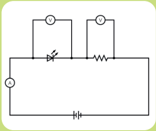

> **Deskripsi Visual:** Gambar ini adalah ilustrasi yang menunjukkan sebuah rangkaian elektronik sederhana. Rangkaian ini terdiri dari dua resistor, sebuah diode, dan sebuah sumber daya listrik. Resistor pertama diletakkan di sebelah kiri dan resistor kedua diletakkan di sebelah kanan. Di depan resistor pertama ada sebuah diode yang menghubungkan antara resistor pertama dan resistor kedua. Sumber daya listrik terletak di atas rangkaian ini.

Elemen-elemen utama dalam gambar ini adalah resistor, diode, dan sumber daya listrik. Resistor berfungsi untuk mengurangi arus listrik, diode digunakan untuk memblokir arus listrik dari satu arah ke arah lain, dan sumber daya listrik memberikan sumber energi bagi rangkaian tersebut.

Teks, angka, atau label penting yang terlihat pada gambar ini tidak ada karena gambar hanya menggambarkan elemen-elemen tanpa teks atau angka tambahan. Namun, informasi kunci yang dapat diambil pembaca adalah bahwa rangkaian ini mungkin digunakan untuk mengontrol arus listrik atau memfilter arus listrik dalam sistem elektronik.

 

---
## 📄 Halaman 49

### Langkah Kegiatan:

- Buat rangkaian seperti Gambar 2.6.
- Baca  nilai  tegangan  pada  LED,  tegangan  pada  resistor  dan  arus listrik yang terukur pada rangkaian.
- Ubah nilai tegangan sumber (tambah baterainya), ukur kembali nilai tegangan dan arus yang terukur.
- Tuliskan data pada tabel pengamatan.
- Gunakan minimal 4 nilai tegangan yang berbeda.
- Berdasarkan data yang diperoleh pada tabel, buat dua grafik:
- grafik tegangan terhadap arus listrik untuk resistor
- grafik tegangan terhadap arus listrik untuk LED
- Bandingkan kedua grafik, kemudian analisis perbedaan karakteristik  hambatan  resistor  dan  lampu  LED  berdasarkan grafik tersebut.
Perbedaan  grafik  tegangan-arus  listrik  pada  hambatan  ohmik,  lampu filamen, bahan semikonduktor, dan termistor terlihat pada Gambar 2.7.

---
**🖼️ Gambar/Diagram**

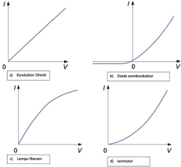

> **Deskripsi Visual:** Gambar ini adalah sebuah diagram yang menunjukkan empat jenis konduktor (a) dan isolator (b) dalam konteks elektronika. Diagram ini dibagi menjadi dua bagian, masing-masing menunjukkan karakteristik konduktor dan isolator.

Pertama, pada bagian a, diagram menunjukkan karakteristik konduktor. Di sini, ada dua titik penting: titik A yang menunjukkan resistansi nol dan titik B yang menunjukkan resistansi yang sangat tinggi. Titik A menggambarkan kondisi ideal di mana konduktor tidak menghambat arus listrik, sementara titik B menunjukkan kondisi di mana konduktor sangat kuat menghambat arus listrik.

Di bagian b, diagram menunjukkan karakteristik isolator. Dalam isolator, ada dua titik penting: titik C yang menunjukkan resistansi nol dan titik D yang menunjukkan resistansi yang sangat tinggi. Titik C menggambarkan kondisi ideal di mana isolator tidak menghambat arus listrik, sementara titik D menunjukkan kondisi di mana isolator sangat kuat menghambat arus listrik.

Dua jenis ini, konduktor dan isolator, memiliki relasi yang jelas dengan karakteristik mereka. Konduktor memiliki resistansi yang sangat rendah, sementara isolator memiliki resistansi yang sangat tinggi. Ini menunjukkan bahwa konduktor memungkinkan arus listrik untuk melalui dengan mudah, sedangkan isolator menghambat arus listrik sepenuhnya.

Teks, angka, atau label penting yang terlihat dalam diagram ini adalah "Konduktor" dan "Isolator", serta titik-titik A, B, C, dan D yang menunjukkan karakteristik mereka. Informasi kunci yang dapat diambil pembaca adalah bahwa konduktor dan isolator memiliki karakteristik yang berbeda dalam hal menghambat arus listrik, dengan konduktor memungkinkan arus listrik untuk melalui dengan mudah dan isolator menghambat arus listrik sepenuhnya.

Grafik bahan semikonduktor, lampu filamen dan termistor bukan grafik fungsi linier sehingga tidak memenuhi hukum Ohm.

Pada lampu  filamen, grafik V-I pada batas tertentu  melengkung ketika tegangannya meningkat. Hambatannya  akan  meningkat  ketika arusnya meningkat dan menyebabkan filamen semakin panas. Pada diode

 

---
## 📄 Halaman 50

semikonduktor,  arus  listrik  akan  mengalir  ketika  terdapat  beda  potensial pada satu arah tertentu. Diode memiliki hambatan yang sangat kecil pada satu arah tertentu dan hambatannya sangat besar pada kebalikannya. Adapun pada  termistor,  hambatannya  akan  menurun  ketika  suhunya  meningkat. Rangkaian termistor dan resistor ini biasa digunakan untuk mengatur suhu, misalnya pada radiator mobil.

### Ayo, Cek Pemahaman!

- Seorang siswa melakukan penyelidikan untuk menentukan hambatan sebuah  kawat  dengan  menghubungkannya  pada  3  baterai  yang berbeda tegangannya. Hasil pengamatan masing-masing terlihat pada Gambar 2.8.

### Pengamatan ke-1 :

### Pengamatan ke-2 :

### Pengamatan ke-3 :

Berdasarkan  Gambar  2.8,  buat  tabel  hasil  pengamatan  dan grafiknya, kemudian tentukan hambatan resistor tersebut, lengkap dengan nilai ketidakpastiannya.

D

 

---
## 📄 Halaman 51

- Sebuah lampu memiliki tegangan (VL = 2,1 V) dan arusnya sebesar 20 mA akan dihubungkan dengan baterai 9V. Agar lampu menyala dengan baik, tentukan hambatan resistor yang diperlukan pada rangkaian.

### C.  Hambatan Jenis

Pada subbab A dan B, sudah dibahas tentang arus listrik yang dapat mengalir hanya pada rangkaian tertutup. Cara membuat rangkaian listrik tertutup, biasanya satu komponen dihubungkan menggunakan kawat tembaga karena merupakan penghantar listrik yang baik. Selain jenis kawat, dalam kehidupan sehari-hari ukuran kawat juga sangat diperhatikan ketika digunakan sebagai penghantar listrik.

### Ayo, Bernalar Kritis!

Kabel  penghantar  dari  pusat  sumber  tegangan  ke  rumah-rumah menggunakan ukuran diameter kawat besar sedangkan pada sekring digunakan ukuran diameter kawat yang sangat tipis. Menurut kalian, apa tujuan dari pemilihan ukuran ini?

Lakukan Aktivitas 2.2 untuk mengetahui pengaruh ukuran kawat dan jenis kawat terhadap hambatan kawat, secara berkelompok.

### Tujuan:

Menentukan faktor-faktor yang mempengaruhi hambatan kawat.

### Alat dan Bahan:

- 60 cm kawat nikrom (diameter 0,1 mm, 0,5 mm dan 1 mm)
- kawat konstantan (diameter 0,5 mm)
- papan / alat
- paku/pengait/peniti
- penggaris/millimeter blok
- multimeter (resistansi meter).

 

---
## 📄 Halaman 52

### Kegiatan:

- Buat rangkaian seperti Gambar 2.9.
- Buat rancangan langkah-langkah penyelidikan dan lakukan pengamatan untuk menemukan faktor-faktor yang mempengaruhi hambatan kawat.
Besaran  fisis  yang  menyatakan  karakteristik  kawat  dalam  kelistrikan dikenal  dengan  hambatan  jenis  ( ρ ),  yaitu  hambatan  yang  dimiliki  oleh sebuah kawat penghantar sepanjang satu meter tiap luas penampang 1 m 2 . Hambatan jenis sebuah penghantar dinyatakan dalam persamaan

``

dengan R yaitu hambatan kawat (Ω), ρ adalah hambatan jenis kawat (Ωm), l yaitu panjang kawat dan A adalah luas penampang kawat (m 2 ).  Berdasarkan persamaan tersebut dapat diketahui bahwa semakin kecil hambatan jenis sebuah kawat logam, maka semakin kecil hambatannya sehingga semakin baik dijadikan sebagai penghantar listrik.

Hambatan  jenis  konduktor  bergantung  pada  suhu.  Pada  konduktor, semakin  besar  perubahan  suhu  maka  hambatan  jenisnya  semakin  besar sedangkan pada bahan semikonduktor sebaliknya. Hambatan jenis ( ρ ) bahan penghantar umumnya bergantung terhadap perubahan suhu (Δ T ) dan dapat dinyatakan dengan hubungan :

``

``

dengan R adalah hambatan (ohm), R 0 adalah hambatan awal (ohm), Δ T adalah perubahan suhu ( o C) dan α adalah koefisien suhu hambatan jenis ( / o C).

Berbeda  dengan  bahan  konduktor,  hambatan  bahan  semikonduktor akan mengalami penurunan dengan meningkatnya suhu.

Aktivitas 2.3. Ayo, Berdiskusi!

Konsep  hambatan  jenis  atau  resistivitas,  selain  digunakan  pada penentuan jenis kawat berbagai kebutuhan atau keamanan jaringan kelistrikan juga digunakan pada bidang kedokteran.

atau hambatannya :

 

---
## 📄 Halaman 53

Saat sesorang mengalami gangguan paru-paru atau perubahan aliran darah yang ditunjukkan dengan  adanya  pembekuan  darah pada bagian kaki, dokter akan menyarankan  untuk  mendapatkan tes  pletismograf (plethysmography) . Tes ini menggunakan elektroda untuk mengukur tegangan sepanjang volume betis yang ditentukan sehingga dapat diprediksi apakah terjadi pembekuan darah atau tidak.  Coba  diskusikan  bagaimana

---
**🖼️ Gambar/Diagram**

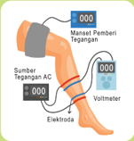

> **Deskripsi Visual:** Gambar ini adalah ilustrasi yang menunjukkan proses pengukuran tegangan listrik menggunakan voltmeter. Gambar ini terdiri dari beberapa elemen utama:

1. Sumber tegangan AC: Ini adalah sumber energi listrik yang menghasilkan tegangan AC.
2. Elektroda: Ini adalah peralatan yang digunakan untuk menghubungkan voltmeter ke sumber tegangan.
3. Voltmeter: Ini adalah alat ukur yang digunakan untuk mengukur tegangan listrik.
4. Mantan Pemberi Tegangan: Ini adalah peralatan yang digunakan untuk mengatur tegangan pada sumber tegangan.

Elemen-elemen ini saling terkait dalam proses pengukuran tegangan listrik. Sumber tegangan AC menghasilkan tegangan AC yang kemudian disalurkan melalui elektroda ke voltmeter. Mantan pemberi tegangan digunakan untuk mengatur tegangan pada sumber tegangan sebelum pengukuran dimulai.

Teks, angka, atau label penting yang terlihat dalam gambar ini adalah "Sumber Tegangan AC", "Elektroda", "Voltmeter", dan "Mantan Pemberi Tegangan". Informasi kunci yang dapat diambil pembaca adalah bahwa proses ini melibatkan pengukuran tegangan listrik menggunakan voltmeter dengan sumber tegangan AC sebagai sumber tegangan.

prinsip  kerja  alat  pletismografi  ini  secara  lebih  lengkap  termasuk persamaannya.

### D.  Rangkaian Listrik

Resistor  yang  ada  di  pasaran  banyak jenisnya dengan nilai hambatan yang bervariasi. Sebagian besar produk teknologi,  rangkaiannya  tidak  hanya terdiri dari satu resistor, tapi beberapa resistor  yang  dirangkai  secara  seri atau paralel.

---
**🖼️ Gambar/Diagram**

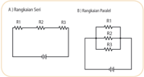

> **Deskripsi Visual:** Gambar ini adalah diagram yang menunjukkan rangkuman tentang dua jenis rangkuman: A) Rangkuman Seri dan B) Rangkuman Paralel. Gambar ini memperlihatkan struktur dan cara kerja kedua jenis rangkuman tersebut.

1. Apa yang ditampilkan secara keseluruhan:
Gambar ini secara keseluruhan menunjukkan dua jenis rangkuman yang berbeda, yaitu rangkuman seri dan rangkuman paralel. Setiap jenis rangkuman memiliki struktur dan cara kerjanya yang berbeda-beda.

2. Elemen-elemen utama dan relasinya:
Elemen utama yang ditampilkan adalah dua jenis rangkuman, yaitu rangkuman seri (A) dan rangkuman paralel (B). Rangkuman seri terdiri dari tiga elemen: R1, R2, dan R3, yang saling terhubung dalam urutan tertentu. Sedangkan rangkuman paralel terdiri dari empat elemen: R1, R2, R3, dan R4, yang saling terhubung secara paralel.

3. Teks, angka, atau label penting yang terlihat:
Teks penting yang terlihat adalah "Rangkuman Seri" untuk rangkuman seri dan "Rangkuman Paralel" untuk rangkuman paralel. Angka yang penting adalah angka-angka yang menggambarkan jumlah elemen dalam setiap jenis rangkuman, seperti 3 untuk rangkuman seri dan 4 untuk rangkuman paralel. Label penting adalah label yang menunjukkan arah aliran listrik dalam setiap jenis rangkuman.

4. Informasi kunci yang dapat diambil pembaca:
Informasi kunci yang dapat diambil pembaca adalah bahwa rangkuman seri dan rangkuman paralel adalah dua jenis rangkuman yang berbeda dengan cara kerja dan struktur yang berbeda. Rangkuman seri memiliki urutan tertentu antara elemen-elemen, sedangkan rangkuman paralel memiliki arah aliran listrik yang sama pada semua elemen.

Sumber : Lia L. Sarah/Kemendikbudristek (2022)

### Ayo, Bernalar Kritis!

Jika dua lampu mobil identik dihubungkan  dengan  aki  sesuai Gambar 2.12, rangkaian mana yang  akan  menghasilkan  nyala lampu lebih terang?

---
**🖼️ Gambar/Diagram**

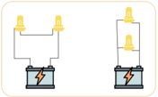

> **Deskripsi Visual:** Gambar ini adalah ilustrasi yang menunjukkan dua jenis perangkat elektronik: sebuah lampu berbentuk U dan sebuah lampu berbentuk L. Kedua perangkat tersebut terhubung ke sumber daya listrik melalui dua sisi yang sama. Dalam ilustrasi ini, elemen-elemen utama yang terlihat antara lain:

1. Lampu berbentuk U: Ini terletak di sisi kiri dan memiliki tiga titik putih yang mungkin menunjukkan titik-titik pengaturan atau kontrol.
2. Lampu berbentuk L: Ini terletak di sisi kanan dan memiliki tiga titik putih yang mirip dengan lampu berbentuk U.
3. Sumber Daya Listrik: Terdapat dua baterei yang terhubung ke kedua perangkat, menunjukkan bahwa kedua perangkat tersebut memerlukan sumber daya listrik untuk berfungsi.

Informasi kunci yang dapat diambil pembaca adalah bahwa kedua perangkat ini mungkin merupakan contoh dari perangkat elektronik yang menggunakan sumber daya listrik, dan bahwa mereka memiliki beberapa titik putih yang mungkin digunakan untuk pengaturan atau kontrol.

Sumber : Unknow/Canva Edu (2022)

 

---
## 📄 Halaman 54

### Rangkaian Seri-Paralel

Pada rangkaian seri resistor R 1 ,  R 2 dan R 3 yang dihubungkan dengan sumber tegangan ε, pada ujung-ujung resistor terdapat tegangan V 1 , V 2 dan V 3 .  Jumlah  tegangan  total  dari  masing-masing  resistor  sama dengan  besar  GGL  sumber  tegangan  yang  diberikan  atau  tegangan total,

``

Substitusikan persamaan hukum Ohm V = IR, maka:

``

Pada rangkaian seri seperti gambar 2.11 A, dalam rangkaian tidak ada percabangan,

``

maka:

Besar hambatan total rangkaian seri:

``

Pada rangkaian paralel resistor R 1 , R 2 dan R 3 yang dihubungkan dengan sumber tegangan V, pada setiap cabang mengalir arus listrik I 1 , I 2 dan I 3 . Jumlah arus total dari masing-masing resistor sama dengan,

``

V

R

Substitusikan persamaan =                        maka: I =

``

Sedangkan tegangan ujung-ujung resistor sama dengan GGL baterai atau V tot .

``

Besar hambatan total rangkaian paralel :

``

 

---
## 📄 Halaman 55

### Aktivitas 2.4. Merancang Rangkaian Lampu

Jika kalian diberikan 5 buah lampu yang masing-masing akan menyala pada tegangan 2,1 V, tapi kali ini akan dihubungkan dengan sebuah sumber tegangan 9 V. Diskusikan berbagai rancangan rangkaian seriparalel  dari  5  lampu  tersebut  agar  semua  lampu  menyala  dengan optimal (semua lampu menyala normal namun tidak rusak). Kemudian analisis  apakah  rangkaian  tersebut  memerlukan  komponen  lain seperti resistor. Evaluasi masing-masing rangkaian kemudian tentukan rancangan mana yang menghasilkan nyala semua lampu optimal.

Ayo, Cek Pemahaman!

Tiga lampu identik dirangkai seperti Gambar 2.13. Jika amperemeter menunjukkan angka 0,6 A dan voltmeter menunjukkan 3 V, maka:

- tentukan besar hambatan masing-masing lampu dan tegangan baterai yang digunakan!
- jika lampu A dilepaskan, bagaimana nyala lampu B dan C?
- jika lampu C dilepaskan, bagaimana nyala lampu A dan B?

### E.  Rangkaian Majemuk

---
**🖼️ Gambar/Diagram**

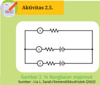

> **Deskripsi Visual:** Gambar 2.5 adalah diagram elektronik yang menunjukkan rangkaian resistif sederhana. Gambar ini menggambarkan dua resistivit yang disinkronkan dengan resistivit lainnya melalui penghubung. Dalam rangkaian ini, resistivit pertama dan kedua disinkronkan melalui penghubung, sedangkan resistivit ketiga dan keempat disinkronkan melalui penghubung lainnya. Jumlah total resistivit dalam rangkaian adalah 6. Teks, angka, atau label penting yang terlihat pada gambar ini adalah jumlah resistivit dalam rangkaian, yaitu 6. Informasi kunci yang dapat diambil pembaca adalah bahwa rangkaian ini memiliki dua kelompok resistivit yang disinkronkan melalui penghubung.

Buat sebuah rangkaian yang terdiri dari 3 resistor dan  dua  baterai seperti gambar 2.14. Ukur arus pada setiap cabang dan tegangannya. Gunakan  tabel  untuk  menuliskan data-data yang diukur.

 

---
## 📄 Halaman 56

### Jawab pertanyaan-pertanyaan berikut:

- bagaimana  hubungan  arus  listrik  yang  terukur  pada  masingmasing cabang ( i 1 , i 2 dan i 3 )?
- bagaimana hubungan tegangan yang terukur antara titik AB, BC dan AC ( V AB , V BC dan V AC )?
- bagaimana tegangan antara titik C dan A ( V CA )?
Gustav  Kirchoff  (1824-1887)  menyatakan  dua  hukum  yang  dikenal dengan Hukum Kirchoff yaitu yang pertama tentang arus pada percabangan dan yang kedua tentang tegangan pada rangkaian tertutup.

Hukum  pertama  Kirchoff  menyatakan bahwa jumlah arus yang masuk menuju titik  cabang  sama  dengan  jumlah  arus yang  keluar  dari  titik  cabang  tersebut. Hukum  pertama Kirchoff dinyatakan dalam persamaan.

``

Hukum Kedua Kirchoff merupakan salah satu contoh hukum kekekalan energi  dalam  bentuk  energi  potensial  listrik.  Kirchoff  menyatakan  bahwa dalam rangkaian tertutup, jumlah tegangan sama dengan jumlah GGL ( ∑ε) di dalam rangkaian tersebut ,

``

Hukum kedua Kirchoff menyatakan bahwa pada rangkaian tertutup, tegangan dalam satu loop (dari titik x kembali ke titik x) adalah nol,

``

Kemudian  besar  tegangan  antara  dua  titik  A  dan  B  bisa  dinyatakan sebagai:

``

Hukum kedua Kirchoff dapat digunakan untuk menyelesaikan permasalahan rangkaian seri, paralel, maupun rangkaian majemuk.

### Perjanjian Tanda untuk Loop

Arus searah loop, I + (arus positif), loop bertemu kutub positif sumber tegangan, Σ + (tegangan positif).

 

---
## 📄 Halaman 57

### Ayo, Cermati!

Dalam  sebuah  mobil,  lampu depan mobil terhubung dengan aki dan altenator (dinamo) yang juga berfungsi sebagai sumber energi listrik saat mobil sudah dihidupkan. Gambar dibawah menunjukkan bagaimana lampu depan, aki dan alternator dihubungkan.

---
**🖼️ Gambar/Diagram**

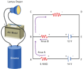

> **Deskripsi Visual:** Gambar ini adalah ilustrasi yang menunjukkan proses pengolahan air dalam sistem penyaringan. Ilustrasi ini mencakup beberapa elemen penting:

1. **Pertama**: Gambar ini menunjukkan sebuah sistem penyaringan air yang terdiri dari beberapa komponen utama.
2. **Elemen Utama dan Relasinya**: 
   - **A**: Ini adalah sumber air yang akan diolah.
   - **B**: Ini adalah bagian penyaringan yang mengandung berbagai elemen seperti filter, membran, atau partikel penyaring lainnya.
   - **C**: Ini adalah bagian yang menghubungkan sistem penyaringan dengan aliran air ke outlet.
   - **D**: Ini adalah outlet air yang akan dihasilkan setelah proses penyaringan.

3. **Teks, Angka, atau Label Penting**:
   - **Angka 0.0005**: Ini mungkin menunjukkan ukuran partikel tertentu yang dapat dihilangkan oleh sistem penyaringan.
   - **Angka 0.0008**: Ini mungkin menunjukkan ukuran partikel tertentu yang tidak dapat dihilangkan oleh sistem penyaringan.
   - **Angka 0.001**: Ini mungkin menunjukkan ukuran partikel tertentu yang dapat dihilangkan oleh sistem penyaringan.

4. **Informasi Kunci**:
   - Gambar ini memberikan gambaran tentang bagaimana sistem penyaringan air bekerja dan bagaimana partikel-partikel air dapat dihilangkan atau tidak dihilangkan oleh sistem tersebut.
   - Informasi tentang ukuran partikel yang dapat dihilangkan oleh sistem penyaringan sangat penting untuk memahami efektivitas sistem tersebut dalam mengurangi kontaminan dalam air.

Secara keseluruhan, gambar ini membantu pembaca memahami proses penyaringan air dan bagaimana sistem tersebut bekerja untuk menghasilkan air yang lebih bersih.

Alternator  memiliki  ggl  sebesar ε 1 =  14  V  dan  hambatan  dalam R 1 = 0,1 Ω saat mobil sudah hidup, Aki mobil memiliki ggl sebesar ε 2 = 12 V dan hambatan dalam R 2 = 0,01 Ω sedangkan lampu depan mobil memiliki hambatan R L =  1,20  Ω.  Tentukan  arus  yang  mengalir  pada alternator ( I A ), aki ( I B ) dan lampu depan mobil ( I C ).

### Cara Penyelesaian:

### Langkah Pertama:

Buat dua loop pada rangkaian atas dan bawah. Kemudian, gunakan persamaan hukum kedua Kirchoff untuk masing-masing loop.

---
**🖼️ Gambar/Diagram**

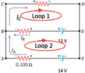

> **Deskripsi Visual:** Gambar ini adalah ilustrasi yang menunjukkan dua loop dalam sebuah rangkaian listrik. Ilustrasi ini menggambarkan dua loop yang berbeda, Loop 1 dan Loop 2, yang saling terhubung melalui sumber daya listrik dengan tegangan 14 V. Loop 1 memiliki resistansi 0.100 Ω dan arus 0.1 A, sedangkan Loop 2 memiliki resistansi 0.200 Ω dan arus 0.2 A. Arus listrik mencapai sumber daya listrik melalui Loop 1 dan Loop 2, dan kemudian mengalir kembali ke sumber daya listrik melalui Loop 2. Gambar ini juga menunjukkan bahwa arus listrik yang keluar dari Loop 1 dan masuk ke Loop 2 adalah sama, yaitu 0.1 A. Ini menunjukkan bahwa ada hubungan antara kedua loop tersebut. Label "Loop 1" dan "Loop 2" digunakan untuk membedakan antara kedua loop tersebut. Label "I_C" menunjukkan arus listrik yang keluar dari Loop 1, sedangkan "I_L" menunjukkan arus listrik yang masuk ke Loop 2. Label "R_1" dan "R_2" menunjukkan resistansi dari Loop 1 dan Loop 2 masing-masing. Label "V" menunjukkan tegangan sumber daya listrik. Informasi kunci yang dapat diambil pembaca adalah bahwa ada dua loop dalam rangkaian listrik, kedua loop tersebut memiliki resistansi dan arus yang berbeda, dan arus listrik yang keluar dari Loop 1 sama dengan arus listrik yang masuk ke Loop 2.

### Pada loop 1:

- terdapat ggl ε 2 = 12 V, (loop bertemu kutub -, maka ggl ε 2 = negatif),
- hambatan R1 dengan arah arus I C searah loop 1, I C positif,
- hambatan R2 dengan arah arus I B searah loop 1, I B positif.
maka tegangan dari titik B ke titik B:

``

 

---
## 📄 Halaman 58

### Pada loop 2:

- terdapat ggl ε 1 = 14 V, (loop bertemu kutub -, maka ggl ε 1 = negatif),
- terdapat ggl ε 2 = 12 V, (loop bertemu kutub +, maka ggl ε 2 = positif),
- hambatan R 2 dengan arah arus I B berlawanan loop 2, I B negatif,
- hambatan R 1 dengan arah arus I B searah loop 2, I A positif. maka tegangan dari titik A ke titik A:

``

Selanjutnya  gunakan  hukum  pertama  Kirchoff  mengenai  arus  yang melalui titik cabang. Perhatikan titik B, arus mana saja yang masuk ke titik B dan arus mana saja yang keluar dari titik B?

Kita dapat melihat:

``

Sekarang substitusi persamaan (3) ke persamaan (1) diperoleh:

``

Sekarang eleminasi persamaan  (2) dan persamaan (4), maka:

``

Jadi, arus yang mengalir melalui akumulator adalah 19,1 A. Sedangkan arus pada aki ( I B ) sebesar:

``

dan arus yang melewati lampu depan mobil ( I C ) adalah:

``

 

---
## 📄 Halaman 59

Tanda negatif pada I B berarti arus yang mengalir pada aki berlawanan dengan arah yang sudah kita gambarkan.

Ayo, Cek Pemahaman!

Elektrokardiogram (EKG) merupakan pemeriksaan yang dilakukan untuk  mengukur  aktivitas  listrik  jantung.Pemeriksaan  ini  biasa dilakukan untuk mengetahui kondisi kesehatan jantung berdasarkan irama sinyal tegangan yang dihasilkan otot jantung.

---
**🖼️ Gambar/Diagram**

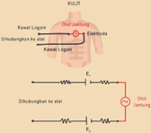

> **Deskripsi Visual:** Gambar ini adalah ilustrasi yang menunjukkan proses pengukuran potensial listrik pada kulit manusia menggunakan dua elektroda. Gambar ini menggambarkan dua elektroda yang dipasang pada kulit, dengan satu di bagian bawah dan satu di bagian atas. Elektroda di bagian bawah disebut sebagai "Kabel Lengan" dan elektroda di bagian atas disebut sebagai "Kabel Lengan". Dua elektroda ini terhubung ke sumber daya listrik melalui dua kabel yang terpisah. Gambar juga menunjukkan arah aliran listrik (E) dari sumber daya ke elektroda di bagian bawah dan dari elektroda di bagian atas ke sumber daya. Informasi penting lainnya yang ditampilkan adalah teks "KULIT", "Dihubungkan ke sumber daya", "Dihubungkan ke elektroda", dan "Elektroda". Ini membantu pembaca memahami bahwa gambar ini adalah ilustrasi tentang pengukuran potensial listrik pada kulit manusia.

Sumber : Nanda Auliarahma/Kemendikburistek (2022)

merupakan hambatan yang terjadi  antara  logam  dari  alat elektrograf dengan kulit pada titik alat dipasang,  sedangkan R jaringan merupakan hambatan antara  elektroda  kontak  dengan otot jantung. E 1 dan E 2 merupakan Rangkaian EKG secara lengkap cukup kompleks, namun sederhananya  rangkaian  dapat digambarkan seperti Gambar 2.17. Resistor R kontak1 dan R kontak2

tegangan  yang  timbul  akibat  reaksi  kimia  antara  logam  dan  kulit manusia.

Gunakan Hukum Kirchoff, coba jelaskan bagaimana alat elektrograf membaca sinyal tegangan yang dihasilkan jantung ( V AB = V jantung ).

### F.  Daya Listrik

Produk elektronik  yang  ada  pada  umumnya  diberi  spesifikasi  watt  untuk membedakan satu dengan yang lainnya. Misalnya pada lampu: ada yang 5 watt,  10  watt,  dan  seterusnya.  Demikian juga pada sepiker, setrika, mesin cuci dan televisi. Satuan watt (W) merupakan satuan dari daya listrik.

 

---
## 📄 Halaman 60

Perhatikan  satuan  daya  listrik  yang  digunakan  di  rumah.  Meskipun sumber  arus  listrik  yang  digunakan  adalah  arus  bolak-  balik  (akan dibahas pada Bab 4), tapi pada dasarnya prinsip penggunaan konsep daya  listrik  adalah  sama.  Pada  umumnya  dinyatakan  volt  ampere (VA). Berdasarkan satuannya, dapatkah kalian menentukan hubungan antara daya, tegangan, dan arus listrik? Coba analisis konsumsi daya listrik tiap bulan di rumah masing-masing, lalu tentukan biaya bulanan listrik yang harus dibayarkan.

Sama  halnya  dengan  ketika  belajar  tentang  energi  dan  daya  pada bab  mekanika,  dalam  hal  kelistrikan,  daya  listrik  juga  merupakan  energi tiap  satuan  waktu.  Yang  biasanya  dinyatakan  dalam  volt  ampere.  Sebuah komponen jika dihubungkan dengan sumber tegangan, maka muatan pada komponen akan bergerak dari potensial tinggi menuju potensial yang lebih rendah.  Energi  potensial  yang  dimiliki  muatan  yang  berada  dalam  beda potensial,

``

Daya listrik dapat dinyatakan dalam persamaan:

``

Pada sub bab A, sudah dibahas bahwa arus listrik,                       maka: I = t

``

daya listrik P pada rangkaian dengan besar arus listrik I dan tegangan V sebesar :

``

dengan P adalah daya listrik dalam watt.

Substitusikan  persamaan  hambatan,  sehingga  daya  listrik  juga  dapat dinyatakan dengan:

``

 

---
## 📄 Halaman 61

Besar daya listrik yang digunakan di rumah dinyatakan dalam kWh ( kilo watt hour ). Setiap kWh dibebankan biaya tertentu sehingga semakin besar konsumsi daya listrik, biaya yang harus dikeluarkan semakin besar.

Pada akhir Bab 2 ini, Kalian diminta untuk membuat sebuah produk yang  mengaplikasikan  rangkaian  kelistrikan  untuk  menyelesaikan masalah dalam kehidupan sehari-hari.

### Contoh masalah sebagai berikut:

Di  pemukiman  padat  penduduk  sekitar  bantaran  sungai,  bencana banjir tahunan tidak jarang memakan korban jiwa karena terjadi saat malam hari ketika orang tertidur lelap. Oleh karena itu, diperlukan alarm banjir skala rumah tangga yang dapat diproduksi oleh setiap orang  dengan  biaya  murah,  aman,  dan  memberi  peringatan  saat terjadi banjir. Bagaimana rancangan alat ini dan alat apa saja yang dibutuhkan?

### Rangkuman

- Arus listrik didefinisikan sebagai jumlah muatan per satuan waktu yang melewati penampang kawat,

``

- Pada resistor yang memenuhi hukum Ohm, berlaku:

``

- Hambatan total resistor yang dirangkai seri:

``

- Hambatan total resistor yang dirangkai paralel:

``

- Hukum I Kirchoff menyatakan bahwa pada setiap percabangan, arus listrik total yang masuk ke titik percabangan sama dengan arus total yang keluar dari titik percabangan.

 

---
## 📄 Halaman 62

- Hukum II Kirchoff menyatakan bahwa pada rangkaian tertutup, jumlah gaya gerak listrik (GGL) sama dengan jumlah beda potensial di dalam rangkaian.
- Daya listrik pada suatu rangkaian dengan arus listrik I dan tegangan V , yaitu: P = VI.

### Asesmen

- Perhatikan data hambatan jenis beberapa logam
- Jelaskan mana yang lebih baik dijadikan sebagai penghantar listrik antara tembaga dan perak.
- Bahan mana yang kalian sarankan untuk dijadikan sebagai kawat pemanas listrik dan mengapa?
- Sebuah rangkaian listrik seperti pada Gambar 2.18 kadang digunakan dalam  kehidupan  sehari-hari. Jika hambatan dalam baterai masingmasing  adalah  0,5  Ω,  tentukan  arus yang mengalir pada hambatan 100 Ω.
- Lima lampu identik dihubungkan dengan sebuah sumber tegangan seperti Gambar 2. 19.
- Prediksikan, lampu mana yang akan menyala paling terang dan lampu mana yang menyala paling redup.

---
**📊 Tabel**

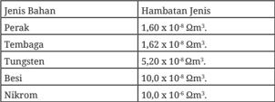

Tabel ini menunjukkan hambatan jenis untuk beberapa bahan kimia, termasuk perak, tembaga, tungsten, besi, dan nikrom. Topik utama tabel adalah hambatan jenis bahan kimia. Kolom pertama berisi jenis bahan, sedangkan kolom kedua berisi hambatan jenis tersebut dalam satuan ohm per meter kuadrat (Ω/m²). Data penting yang terlihat adalah bahwa perak memiliki hambatan jenis tertinggi sebesar 1,60 x 10⁴ Ω/m², sementara nikrom memiliki hambatan jenis yang paling rendah sebesar 10,0 x 10⁴ Ω/m². Ini menunjukkan bahwa perak memiliki hambatan jenis yang lebih tinggi dibandingkan dengan bahan lainnya dalam tabel ini.

---
**🖼️ Gambar/Diagram**

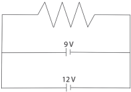

> **Deskripsi Visual:** Gambar ini adalah diagram yang menunjukkan sirkuit listrik dengan dua elemen: resistor dan lampu. Diagram ini menunjukkan bahwa ada sumber daya tegangan 9V dan 12V yang disambungkan ke sebuah resistor dan lampu. Resistor memiliki nilai resistansi 10Ω, sedangkan lampu memiliki nilai hambatan 5Ω. Dalam diagram ini, teks "9V" dan "12V" menunjukkan tegangan sumber daya, "10Ω" dan "5Ω" menunjukkan nilai resistansi dan hambatan, dan "R" dan "L" menunjukkan resistor dan lampu. Informasi kunci yang dapat diambil pembaca adalah bahwa sirkuit ini menggunakan dua sumber daya tegangan berbeda untuk menghidupkan resistor dan lampu, dan bahwa nilai resistansi dan hambatan pada elemen-elemen tersebut sangat penting dalam mengontrol arus listrik yang melewati mereka.

 

---
## 📄 Halaman 63

- Jika lampu E dilepaskan dari rangkaian, bagaimana nyala lampu A  sekarang?  Apakah  menyala  lebih  terang  atau  lebih  redup dibandingkan dengan sebelum lampu E dilepaskan?
- Jelaskan bagaimana kalian menganalisis hal tersebut!

### Pengayaan

Penggunaan  listrik  dengan  beban  arus  melebihi  batas  aman  dapat menyebabkan  bahaya  kebakaran  akibat  adanya  korsleting  listrik. Oleh karena itu, pada kendaraan seperti mobil sering dipasang sistem pengaman arus yang dikenal dengan sekring. Sekring menggunakan bahan jenis kawat tertentu yang ketika beban arus mengalir melebihi batas  aman,  kawat  akan  terputus.  Coba  lakukan  penyelidikan  jenis  kawat yang digunakan dalam sistem sekring dan bagaimana karakteristiknya (berdasarkan pada hambatan jenisnya), serta bagaimana karakteristik bahan yang digunakan sebagai sekring mobil?

### Refleksi

Setelah pembelajaran Bab 2 Arus Searah:

- Apakah kalian sudah memahami dengan baik semua materi dalam Bab 2 Arus Searah?

 

---
## 📄 Halaman 64

- Apakah kalian sudah mampu  merancang dan melakukan penyelidikan?
- Konsep-konsep apa saja yang kalian belum dipahami pada materi arus searah?
- Apa yang akan kalian lakukan untuk meningkatkan pemahaman terhadap materi arus searah?

 

---
## 📄 Halaman 65

---
**🖼️ Gambar/Diagram**

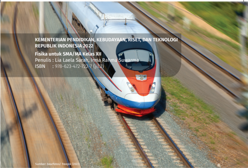

> **Deskripsi Visual:** Buku pelajaran "Fisika untuk SMA/MA Kelas XII" dari Kementerian Pendidikan, Kebudayaan, Riset, dan Teknologi Republik Indonesia 2022 menampilkan gambar kereta api bergerak di atas rel kereta api. Gambar ini menunjukkan bagaimana kereta api bergerak dengan cepat di atas rel kereta api, yang merupakan elemen utama dari gambar tersebut. 

Elemen-elemen lainnya termasuk rel kereta api yang berada di tanah, tanah yang berwarna hijau dan abu-abu, serta awan yang tampak di latar belakang. Teks pada gambar menyatakan judul buku, penulis, dan ISBN-nya. Informasi kunci yang dapat diambil pembaca adalah bahwa buku ini mengkhususkan diri pada materi Fisika untuk siswa SMA/MA kelas XII.

Dengan demikian, gambar ini menunjukkan bagaimana kereta api bergerak di atas rel kereta api, yang merupakan elemen utama dari gambar tersebut, sementara elemen-elemen lainnya seperti rel kereta api, tanah, dan awan juga menjadi bagian penting dari gambar tersebut. Teks pada gambar menyatakan judul buku, penulis, dan ISBN-nya. Informasi kunci yang dapat diambil pembaca adalah bahwa buku ini mengkhususkan diri pada materi Fisika untuk siswa SMA/MA kelas XII.

### BAB 3 KEMAGNETAN

### Kata Kunci

Medan Magnet • Induksi • Gaya Magnet • GGL Induksi • Induktansi • Generator • Transformator

### Tujuan Pembelajaran

Setelah mempelajari bab ini, peserta didik dapat menerapkan konsep kemagnetan (gaya magnet, medan magnet induksi, GGL induksi, dan induktansi) pada berbagai produk teknologi serta mampu merancang dan mengembangkan alat sederhana berdasarkan konsep kemagnetan.

 

---
## 📄 Halaman 66

Sumber : Kinkin Suartini/Kemendikbudristek (2022)

---
**🖼️ Gambar/Diagram**

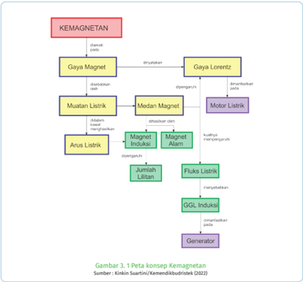

> **Deskripsi Visual:** Gambar 3.1 adalah diagram yang menunjukkan konsep-konsep dasar dalam magnetisme atau kemagnetan. Diagram ini terdiri dari berbagai elemen yang terkait dengan gaya magnet, medan magnet, arus listrik, dan gaya Lorentz. 

Elemen utama yang ditampilkan meliputi gaya magnet, gaya Lorentz, medan magnet, motor listrik, magnet induksi, magnet alam, arus listrik, jumhur lilitan, fluksi listrik, GGL (Gaya Gaya Listrik), dan generator. Setiap elemen tersebut memiliki hubungan dengan elemen lainnya, seperti gaya magnet menghasilkan medan magnet, medan magnet menghasilkan gaya Lorentz pada muatan listrik, dan arus listrik menghasilkan magnet induksi.

Teks, angka, atau label penting yang terlihat mencakup nama-nama konsep seperti gaya magnet, gaya Lorentz, medan magnet, motor listrik, magnet induksi, magnet alam, arus listrik, jumhur lilitan, fluksi listrik, GGL, dan generator. Informasi kunci yang dapat diambil pembaca meliputi hubungan antara gaya magnet, medan magnet, arus listrik, dan gaya Lorentz, serta bagaimana mereka saling berkaitan dalam konsep kemagnetan.

---
**🖼️ Gambar/Diagram**

> **Deskripsi Visual:** Gambar ini adalah ilustrasi yang menunjukkan berbagai perangkat elektronik dan peralatan rumah tangga. Ilustrasi ini mencakup beberapa elemen utama:

1. **Pertama**: Gambar ini menunjukkan berbagai perangkat elektronik dan peralatan rumah tangga. Ini termasuk sebuah kipas angin, sebuah mesin cuci, sebuah blender, dan sebuah mesin penggiling daging.

2. **Elemen Utama dan Relasinya**: 
   - **Kipas Angin**: Terletak di bagian kiri atas, tampak seperti sebuah kipas angin modern dengan desain minimalis.
   - **Mesin Cuci**: Terletak di bagian kanan atas, tampak seperti sebuah mesin cuci dengan desain modern dan futuristik.
   - **Blender**: Terletak di bagian kanan bawah, tampak seperti sebuah blender dengan desain modern dan futuristik.
   - **Mesin Penggiling Daging**: Terletak di bagian kiri bawah, tampak seperti sebuah mesin penggiling daging dengan desain modern dan futuristik.

3. **Teks, Angka, atau Label Penting yang Terlihat**: 
   - Ada beberapa teks yang mungkin menyertakan informasi tentang perangkat tersebut, namun tidak dapat dilihat dalam gambar ini.

4. **Informasi Kunci yang Bisa Diambil Pembaca**: 
   - Gambar ini menunjukkan bahwa perangkat elektronik dan peralatan rumah tangga modern memiliki desain yang sederhana dan futuristik.
   - Ini juga menunjukkan bahwa banyak perangkat ini dapat digunakan untuk kebutuhan sehari-hari seperti membersihkan, memasak, dan mengolah makanan.

Dengan demikian, gambar ini menunjukkan berbagai perangkat elektronik dan peralatan rumah tangga modern dengan desain yang sederhana dan futuristik.

Magnet banyak digunakan untuk menghasilkan putaran pada alat elektronik  saat  ini,  mixer,  blender, kipas angin, bahkan mobil listrik terbaru merupakan peralatan elektronik yang menggunakan prinsip kerja magnet induksi. Kalian jika membuka  bagian dalam alat elektronik ini, maka kalian akan menemukan motor listrik, yaitu terdiri  dari  magnet  dan  kumparan kawat yang akan berputar saat diberi arus listrik.

Prinsip kerja motor listrik adalah mengubah energi listrik menjadi energi mekanik (gerak). Energi gerak dihasilkan oleh gaya yang timbul karena kumparan berada di dalam medan magnet yang diberi arus listrik.

 

---
## 📄 Halaman 67

Konsep medan magnet induksi dan gaya magnetik juga telah dimanfaatkan  pada  kereta  Maglev Gambar 3.3, teknologi transportasi modern dengan laju mencapai 600 km/jam.

Fenomena sebaliknya, yaitu ketika ada perubahan medan magnet  pada  kumparan  ternyata menghasilkan Gaya Gerak Listrik

(GGL) yang  dikenal  induksi  elektromagnetik.  Fenomena  ini  dimanfaatkan pada  generator  untuk  menghasilkan  sumber  energi  listrik.  Prinsip  induksi elektromagnetik  juga  digunakan  pada  trafo  untuk  menaikan/menurunkan tegangan listrik. Penggunaan trafo sangat diperlukan dalam sistem transmisi sumber  daya  listrik  dari  pembangkit  sampai  ke  rumah  rumah  penduduk. Tegangan dari generator dinaikkan oleh trafo step-up agar mampu menjangkau jarak  yang  jauh  ketika  ditransmisikan  kemudian  diturunkan  kembali  oleh trafo step down sehingga siap digunakan.

### Ayo, Bernalar Kritis!

Bagaimana cara kerja kumparan menghasilkan gaya gerak listrik dan bagaimana prinsip kerja trafo sehingga dapat menaikan/menurunkan tegangan?

### A.  Medan Magnet

Coba ingat kembali bahwa magnet yang kutubnya senama  akan  saling  tolak  menolak,  sedangkan kutub  yang  berbeda  akan  tarik  menarik.  Kalian akan temukan di daerah sekitar magnet terdapat medan  magnet.  Saat  serbuk  besi  ditaburkan  di sekitarnya, akan terbentuk pola garis-garis seperti pada Gambar 3.5 a). Arah medan magnet di sebuah titik ditunjukkan oleh arah kompas yang diletakan pada titik tersebut, perhatikan Gambar 3.5 b).

---
**🖼️ Gambar/Diagram**

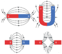

> **Deskripsi Visual:** Gambar ini adalah ilustrasi yang menunjukkan struktur magnet dan gaya magnetik. Gambar ini memperlihatkan dua magnet berbeda orientasi, satu dengan gaya magnetik menuju ke bawah (magnitik) dan yang lain dengan gaya magnetik menuju ke atas (magnitik). Dua magnet ini saling berpotongan dan menghasilkan gaya magnetik antara mereka. Ilustrasi ini juga menunjukkan bahwa gaya magnetik antara magnet berbeda orientasi berbeda. Label "U" pada gambar ini mungkin merujuk pada gaya magnetik antara magnet berbeda orientasi. Informasi kunci yang dapat diambil pembaca adalah bahwa gaya magnetik antara magnet berbeda orientasi berbeda dan gaya magnetik antara magnet berbeda orientasi dapat dilihat melalui ilustrasi ini.

 

---
## 📄 Halaman 68

Bumi  juga  merupakan  sebuah magnet raksasa yang memiliki medan  magnet  di  sekitarnya.  Dapat diibaratkan  Bumi  memiliki  magnet batang  di  dalam  inti  Bumi.  Kutub utara  magnet  Bumi  berada  di  kutub selatan geografi Bumi sedangkan kutub  selatan  magnet  Bumi  berada di kutub utara geografi Bumi. Antara kutub utara magnet dan kutub selatan geografi  Bumi  tidak  tepat  berhimpit namun berbeda 11,5 o  seperti Gambar 3.6 . .

---
**🖼️ Gambar/Diagram**

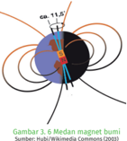

> **Deskripsi Visual:** Gambar 2.4 adalah ilustrasi yang menunjukkan struktur magnet bumi. Gambar ini menggambarkan dua pola magnetik utama pada bumi: magnetik utara (N) dan magnetik selatan (S). Pada bagian atas, kita melihat magnetik utara dengan warna biru dan magnetik selatan dengan warna merah. Dua pola ini saling berlawanan dan berpotongan, menunjukkan hubungan antara kedua pola magnetik tersebut.

Elemen-elemen utama yang ditampilkan dalam gambar ini adalah dua pola magnetik utama: magnetik utara dan magnetik selatan. Kedua pola ini saling berlawanan dan berpotongan, menunjukkan hubungan antara kedua pola magnetik tersebut. Warna biru menunjukkan magnetik utara dan merah menunjukkan magnetik selatan.

Teks, angka, atau label penting yang terlihat dalam gambar ini adalah "Gib. 11,5" yang mungkin merujuk pada skala atau ukuran yang digunakan dalam gambar ini. Informasi kunci yang dapat diambil pembaca adalah bahwa bumi memiliki dua pola magnetik utama yang saling berlawanan dan berpotongan, yang merupakan ciri khas dari sistem magnetik bumi.

Dapatkah kalian memperkirakan bagaimana magnet Bumi terbentuk?

### B.  Gaya Magnet

### 1.  Gaya Pada Muatan Bergerak

Pada  bab  2,  sudah  dibahas  jika  sebuah  muatan berada dalam medan listrik maka muatan akan mendapatkan gaya  listrik .  Hanya  saja,  ketika muatan  berada  dalam  medan  magnet,  belum tentu  muatan  mendapat gaya  magnet. Sebuah muatan  dalam  medan  magnet  akan  mendapat gaya magnet jika:

- muatan bergerak
- arah kecepatan muatan tidak sejajar dengan arah medan magnet.

---
**🖼️ Gambar/Diagram**

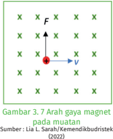

> **Deskripsi Visual:** Gambar 7.7 menunjukkan gaya magnet pada muatan. Gambar ini merupakan ilustrasi yang menggambarkan konsep dasar tentang gaya magnet pada muatan. Dalam gambar tersebut, sebuah muatan bergerak dengan kecepatan v di sekitar magnet yang memiliki gaya F. Elemen-elemen utama dalam gambar ini adalah muatan, magnet, dan gaya magnet. Muatan bergerak dengan kecepatan v, sedangkan magnet memiliki gaya F yang mempengaruhi gerakan muatan tersebut. Teks, angka, atau label penting yang terlihat dalam gambar ini adalah nama-nama elemen seperti muatan, magnet, dan gaya magnet. Informasi kunci yang dapat diambil pembaca dari gambar ini adalah bahwa gaya magnet dapat mempengaruhi gerakan muatan, dan bahwa muatan akan bergerak dengan kecepatan v di sekitar magnet yang memiliki gaya F.

Perhatikan Gambar 3.7, sebuah muatan positif dengan kecepatan ke kanan berada  dalam  medan  magnet  secara  tegak  lurus  yang  arahnya  menembus bidang. Gaya magnet yang terjadi pada muatan ke arah vertikal tegak lurus terhadap gerak muatan dan medan magnetnya. Sama hal dengan menentukan besar  medan listrik  berdasarkan  gaya  listrik  dan  muatannya,  besar  medan magnet juga dapat ditentukan dari besar gaya magnet dan muatannya. Vektor gaya listrik (F) pada muatan (q) yang bergerak dengan kecepatan (v) dalam medan magnet ( B ), yaitu:

``

atau besar nya dijabarkan menjadi:

``

 

---
## 📄 Halaman 69

dengan F adalah gaya magnet pada muatan (N) dan θ adalah sudut antara v dan B .

Ingatlah  kembali  arah  gerak  muatan  dalam  medan  listrik  agar  kalian dapat memahami perbedaan antara gerak muatan dalam medan listrik dan medan magnet. Muatan yang berada dalam medan listrik akan mendapat

---
**🖼️ Gambar/Diagram**

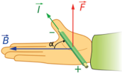

> **Deskripsi Visual:** Gambar ini adalah ilustrasi yang menunjukkan sebuah alat elektronik, mungkin sebuah motor listrik, dengan detail yang jelas. Gambar ini menggambarkan bagaimana arus listrik (T) bergerak melalui magnet (B) untuk memutar alat tersebut. Alat tersebut tampak seperti sebuah tangan yang sedang memegang alat tersebut, dengan tangan itu menunjukkan arah gerakan alat tersebut. Di sekeliling alat tersebut ada teks yang membahas tentang prinsip kerja motor listrik, termasuk urutan arus listrik dan magnetisme. Label pada gambar juga memberikan penjelasan tambahan tentang bagian-bagian alat tersebut, seperti bagian yang bergerak dan bagian yang menahan alat tersebut. Informasi kunci yang dapat diambil dari gambar ini adalah bahwa motor listrik bekerja dengan cara mengubah arus listrik menjadi gerakan magnetik, yang kemudian memutar alat tersebut.

gaya listrik  baik  muatannya diam atau bergerak, sedangkan dalam medan magnet  muatan  yang  diam  tidak  akan mendapatkan gaya magnet. Muatan akan mendapat  gaya magnet ketika bergerak tidak  sejajar dengan  medan magnetnya.

Jika  muatan  bergerak  tegak  lurus terhadap  arah  medan  magnet,  maka arah gaya magnet  dapat ditentukan dengan aturan tangan kanan.

Perhatikan Gambar 3.8, ibu jari menyatakan arah kecepatan muatan, telunjuk menyatakan arah medan magnet dan telapak tangan menyatakan arah gaya magnetnya. Ketika muatan bergerak masuk ke daerah medan magnet secara tegak lurus, maka muatan akan mengalami perubahan gerak.

Bagaimana gaya magnet yang dialami muatan dalam medan magnet?

Jika internet tersedia, buka tautan di bawah atau pindai kode QR: https://ophysics.com/em7.html

---
**🖼️ Gambar/Diagram**

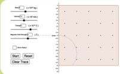

> **Deskripsi Visual:** Gambar ini adalah diagram yang menunjukkan struktur dan relasi antara berbagai komponen dalam sistem. Diagram ini terdiri dari beberapa elemen utama yang terhubung melalui garis dan titik-titik. Komponen-komponen tersebut termasuk "Input", "Output", "Proses", dan "Output". "Input" diletakkan di bagian bawah dan "Output" di bagian atas. "Proses" berada di tengah dan menghubungkan "Input" dengan "Output". Garis dan titik-titik membantu memperjelas hubungan antara komponen-komponen tersebut. Teks, angka, atau label penting yang terlihat pada gambar adalah nama-nama komponen dan informasi tentang hubungan mereka. Informasi kunci yang dapat diambil pembaca adalah bahwa sistem ini mungkin merupakan model atau representasi dari proses atau fungsi tertentu, dengan input menjadi masukan, proses sebagai operasi yang dilakukan, dan output sebagai hasil akhir.

### Diskusikan pertanyaan berikut:

- Apa saja faktor yang mempengaruhi jari-jari lintasan gerak muatan?
- Saat sebuah muatan partikel bergerak dalam medan magnet dengan lintasan berupa lingkaran, tentukan besar jari-jari lingkaran dari partikel!
Tanda titik menunjukkan Arah medan keluar bidang kertas (menuju pembaca)

 

---
## 📄 Halaman 70

Muatan  yang  bergerak  dengan kecepatan v memasuki daerah dengan medan magnet B akan mendapatkan gaya magnet sehingga bergerak  pada  lintasan  melingkar. Gaya magnet dalam hal ini berperan sebagai gaya sentripetal.

``

``

---
**🖼️ Gambar/Diagram**

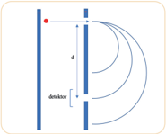

> **Deskripsi Visual:** Gambar ini adalah ilustrasi yang menunjukkan konsep tentang diameter dan panjang garis lurus. Gambar ini menggambarkan sebuah garis lurus yang melintasi dua titik pada bidang, dengan panjang garis tersebut diberi label sebagai "d". Di sebelah kiri garis tersebut ada sebuah titik merah yang menunjukkan titik awal garis, sedangkan di sebelah kanan ada sebuah titik biru yang menunjukkan titik akhir garis. Titik merah dan titik biru tersebut saling terhubung oleh garis lurus yang memiliki panjang "d". Selain itu, gambar juga menunjukkan bahwa garis lurus tersebut melintasi dua lingkaran yang berbeda ukuran, yang menunjukkan bahwa garis lurus tersebut memotong lingkaran tersebut. Label "diameter" juga digunakan untuk menunjukkan panjang garis lurus tersebut. Dari gambar ini, kita bisa mengambil informasi bahwa garis lurus tersebut memiliki panjang "d", dan bahwa garis lurus tersebut melintasi dua lingkaran dengan diameter yang berbeda.

Persamaan  (3-3)  biasa  digunakan  pada  alat spektrometer  massa yaitu alat untuk menentukan massa dari sebuah atom. Sampel yang akan diukur diionisasi sehingga menjadi bermuatan positif, kemudian dilewatkan pada pelat dengan beda potensial ΔV sehingga memiliki kecepatan v saat memasuki celah. Dari persamaan (3-3), massa partikel yang masuk ke celah detektor dapat ditentukan dengan:

``

dengan m adalah massa partikel (kg), q yaitu muatan partikel (C), B adalah kuat medan magnet (Tesla), r adalah jari-jari lintasan (m) dan v adalah kecepatan partikel (m/s).

Coba kalian subsitusikan persamaan energi kinetik ( E k = mv 2 ) dan energi potensial  listrik  ( Ep  =  qΔV )  untuk  mendapatkan  persamaan  massa  partikel sebagai fungsi beda potensial listriknya. Asumsikan seluruh energi potensial listriknya diubah menjadi energi kinetik. 2 1

``

Substitusikan persamaan v pada kotak kiri ke persamaan sebelah kanan

Ketika  muatan  diam  dalam  medan  listrik,  muatan  akan  mendapatkan gaya  listrik  dan  saat  muatan  bergerak  dalam  medan  magnet  muatan  akan mendapatkan gaya magnet. Gaya total yang dialami muatan yang bergerak dalam  medan  listrik  dan  medan  magnet,  yang  merupakan  gabungan  dari gaya magnet dan gaya listrik dikenal dengan Gaya Lorentz . Gaya Lorentz ( F ) pada muatan ( q ) yang bergerak dalam medan listrik ( E ) dan medan magnet ( B ) adalah: v v v

 

---
## 📄 Halaman 71

``

Gaya Lorentz dimanfaatkan pada pemilih kecepatan yaitu  alat  untuk mengukur kecepatan muatan partikel. Alat ini menggunakan medan magnet dan  medan  listrik  agar  pada  kecepatan  tertentu  menghasilkan  gaya  yang seimbang. Karena resultan gaya nol, muatan dengan kecepatan yang sesuai dapat  bergerak  lurus  keluar  melewati  alat  pemilih  sedangkan  muatan dengan kecepatan yang tidak sesuai akan dibelokan sehingga tidak mampu melewatinya.

### Ayo, Bernalar Kritis!

Sebuah partikel bermuatan positif dalam pemilih kecepatan bergerak dengan laju v dalam medan magnet B secara tegak lurus dan melewati tabung pelat sejajar dengan medan magnet E .

---
**🖼️ Gambar/Diagram**

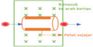

> **Deskripsi Visual:** Gambar ini adalah ilustrasi yang menunjukkan proses perjalanan sejajar dalam suatu sistem. Gambar ini terdiri dari beberapa elemen utama:

1. **Apa yang Ditampilkan Secara Keseluruhan**: Gambar ini menunjukkan sebuah alat atau sistem yang memiliki dua arah perjalanan: masuk dan keluar. Arah masuk berada di sisi kiri dan arah keluar di sisi kanan.

2. **Elemen-Elemen Utama dan Relasinya**: 
   - **Alat Perjalanan**: Dalam gambar ini, kita melihat sebuah alat yang memiliki dua jalur perjalanan. Jalur masuk berada di sisi kiri dan jalur keluar di sisi kanan.
   - **Jalur Masuk**: Jalur masuk berada di sisi kiri dan merupakan jalur yang mengarah ke dalam sistem.
   - **Jalur Keluar**: Jalur keluar berada di sisi kanan dan merupakan jalur yang mengarah keluar dari sistem.
   - **Pintu**: Ada pintu di tengah sistem yang memisahkan jalur masuk dan jalur keluar.

3. **Teks, Angka, atau Label Penting yang Terlihat**: 
   - **Label**: Ada label "Masuk" di sisi kiri dan "Keluar" di sisi kanan yang menjelaskan arah perjalanan.
   - **Angka**: Ada angka 1, 2, dan 3 yang mungkin menunjukkan tahapan atau level dalam sistem.

4. **Informasi Kunci yang Bisa Diambil Pembaca**: 
   - **Proses Perjalanan**: Gambar ini menunjukkan bahwa ada dua jalur perjalanan dalam sistem, baik masuk maupun keluar.
   - **Pengelompokan**: Sistem ini mungkin digunakan untuk mengelompokkan data atau informasi dalam dua kategori yang berbeda.
   - **Pengaturan**: Pintu di tengah mungkin digunakan sebagai pengaturan atau kontrol untuk memastikan bahwa hanya satu jalur yang aktif pada waktu tertentu.

Dengan demikian, gambar ini menunjukkan struktur dan fungsi sistem dengan dua jalur perjalanan yang berbeda, yang dapat membantu pembaca memahami

Jika arah medan magnet B masuk bidang kertas seperti ditunjukkan gambar, bagaimana arah medan listrik pada pelat sejajar jika:

- searah dengan arah medan magnet?
- berlawanan dengan arah medan magnet?
- dari pelat atas menuju ke pelat bawah dari pelat bawah ke pelat atas?

### Ayo, Cek Pemahaman!

Gambar 3.12 menunjukkan lintasan yang ditempuh tiga partikel bermuatan masuk ke dalam medan magnet yang arahnya keluar bidang.

- Lakukan analisis jenis muatan masing-masing  lintasan,  dan jelaskan alasannya

---
**🖼️ Gambar/Diagram**

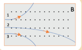

> **Deskripsi Visual:** Gambar ini adalah jenis diagram. Diagram ini menunjukkan hubungan antara dua variabel, yaitu variabel A dan B. Variabel A dinyatakan dengan angka 1, 2, dan 3, sedangkan variabel B dinyatakan dengan titik-titik yang menghubungkan antara mereka. Titik-titik tersebut menunjukkan bahwa semakin tinggi nilai variabel A, semakin tinggi pula nilai variabel B. Ini menunjukkan hubungan linear positif antara kedua variabel tersebut. Label "A" dan "B" digunakan untuk menunjukkan nama variabel yang dipertimbangkan. Informasi kunci yang dapat diambil pembaca adalah bahwa ada hubungan linear positif antara variabel A dan B.

 

---
## 📄 Halaman 72

- Dari  lintasan  2  dan  3  dengan  massa  dan  besar  muatan  partikel yang sama, partikel mana yang memiliki kecepatan lebih tinggi?

### 2.  Gaya Magnet pada Kawat Berarus Listrik

Pada  Bab  1,  sudah  dibahas  bahwa  arus  listrik  merupakan  aliran  muatan maka ketika kawat berarus listrik  berada  dalam  medan  magnet,  juga  akan mendapatkan gaya magnet. Dengan menggunakan persamaan gaya magnet untuk muatan yang bergerak:

``

``

adalah  besar  arus listrik sedangkan v∆t merupakan jarak yang ditempuh muatan sepanjang kawat atau panjang kawat (l) , maka: ∆t q

Besar gaya magnet pada kawat yang panjangnya l berarus listrik i dalam medan magnet B adalah:

F = ilB sinθ

(3-6)

dengan F adalah gaya magnet pada kawat (N), i adalah kuat arus listrik (A) , l adalah panjang kawat (m), B adalah kuat medan magnet (Tesla), dan θ adalah sudut antara arah kawat berarus dan medan magnet.

Arah gaya magnet yang timbul pada kawat berarus dalam medan magnet dapat ditentukan dengan aturan tangan kanan.

---
**🖼️ Gambar/Diagram**

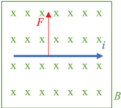

> **Deskripsi Visual:** Gambar ini adalah ilustrasi yang menunjukkan gaya magnetik (F) yang bergerak melalui sebuah medan magnet (B). Gambar ini menggambarkan dua elemen utama: medan magnet (B) yang berada di sepanjang garis lurus dan gaya magnetik (F) yang bergerak melalui medan tersebut. Medan magnet (B) tampak dengan garis-garis yang membentuk lingkaran di sekitar garis lurus, menunjukkan bahwa medan ini bergerak melalui garis tersebut. Gaya magnetik (F) tampak dengan garis yang melintang di atas medan magnet (B), menunjukkan bahwa gaya ini bergerak melalui medan tersebut. Informasi kunci yang dapat diambil pembaca adalah bahwa gaya magnetik (F) bergerak melalui medan magnet (B) dan gaya ini memiliki arah yang sama dengan arah medan magnet (B).

Sumber : OpenStax / Wikimedia Commons (2011)

 

---
## 📄 Halaman 73

Perhatikan  Gambar  3.13,  arah  ibu  jari  menyatakan  arah  arus  listrik (arahnya ke kanan), jari lainnya menyatakan arah medan magnet (arahnya masuk) dan arah telapak tangan adalah arah gayanya (arah ke atas).  Gaya magnet ini merupakan dasar dari motor listrik.

### Ayo Cek Pemahaman!

- Sebuah  kawat  50  cm  dihubungkan  dengan  sumber  tegangan  DC berada dalam medan magnet 0,06 T. Jika arus listrik yang mengalir pada rangkaian sebesar 0,05 A, tentukan besar dan arah gaya pada kawat YZ.
- Sebuah  kawat  horizontal  digantung pada  langit-langit  ruangan  dengan dua tali tak bermassa. Kawat tersebut  memiliki  panjang  0,20  m dan  massa  0,08  kg.    Sebuah  medan magnet seragam besarnya 0,07 T diarahkan dari langit-langit ke lantai. Ketika arus i = 42 A mengalir pada  kawat,  kawat  berayun  ke  atas kemudian mencapai kesetimbangan

---
**🖼️ Gambar/Diagram**

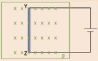

> **Deskripsi Visual:** Gambar ini adalah ilustrasi yang menunjukkan struktur fisik dari sebuah sistem elektronik. Gambar ini menggambarkan dua komponen utama: X dan Y, yang terhubung melalui jalur listrik. Komponen X memiliki beberapa titik yang diberi label 'x', sementara Y memiliki titik yang diberi label 'Y'. Komponen Z juga ada, tetapi hanya sebagian kecil dari struktur tersebut. Jalur listrik yang menghubungkan X dan Y terlihat dengan garis berwarna biru. Label 'A' dan 'B' tampak di bagian bawah gambar, mungkin merujuk pada titik awal dan akhir dari jalur listrik tersebut. Informasi kunci yang dapat diambil dari gambar ini adalah bahwa ada hubungan antara X, Y, dan Z melalui jalur listrik, serta bahwa X dan Y mungkin merupakan komponen yang saling berinteraksi dalam sistem tersebut.

Sumber : Lia L. Sarah/Kemendikbudristek (2022)

---
**🖼️ Gambar/Diagram**

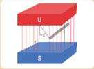

> **Deskripsi Visual:** Gambar ini adalah ilustrasi yang menunjukkan sebuah sistem magnetik. Gambar ini menggambarkan dua magnet, satu yang berada di atas (dengan label "U") dan satu yang berada di bawah (dengan label "S"). Magnet di atas memiliki sudut tumpuan yang diberikan sebagai "α". Ilustrasi ini menunjukkan hubungan antara kedua magnet dan sudut tumpuan mereka.

Elemen utama dalam gambar ini adalah dua magnet, satu di atas dan satu di bawah, serta sudut tumpuan magnet di atas. Relasi antara elemen-elemen ini adalah bahwa magnet di atas memiliki sudut tumpuan yang diberikan, yang menunjukkan arah magnetiknya. Magnet di bawah tidak memiliki label sudut tumpuan, tetapi tampaknya berada dalam posisi yang sama dengan magnet di atas.

Teks, angka, atau label penting yang terlihat dalam gambar ini adalah label "U" untuk magnet di atas dan "S" untuk magnet di bawah, serta sudut tumpuan magnet di atas yang diberikan sebagai "α".

Informasi kunci yang dapat diambil pembaca dari gambar ini adalah bahwa ada dua magnet yang berada dalam hubungan magnetik, dengan magnet di atas memiliki sudut tumpuan yang diberikan. Ini dapat digunakan untuk memahami konsep tentang magnetik dan hubungan antara magnetik.

Sumber : Nanda Auliarahma/Kemendikburistek (2022)

membentuk sudut terhadap vertikal seperti ditunjukkan Gambar 3.15. Tentukan

- sudut
- tegangan masing-masing tali.

### C.  Motor Listrik

Motor listrik merupakan dasar dari semua alat elektronik yang berputar saat diberi arus listrik. Motor listrik terdiri dari magnet dan kumparan kawat yang akan berputar saat diberi arus listrik. Perhatikan Gambar 3.17, saat arus listrik mengalir pada kumparan timbul gaya F yang  berpasangan pada kedua sisi kumparan.

 

---
## 📄 Halaman 74

---
**🖼️ Gambar/Diagram**

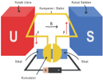

> **Deskripsi Visual:** Gambar ini adalah ilustrasi yang menunjukkan proses perangkat lunak (Software) dalam sebuah sistem operasi (OS). Ilustrasi ini melibatkan beberapa elemen utama:

1. **Pertama**: Gambar ini menunjukkan dua bagian utama dari sistem operasi - User Interface (UI) dan System Interface (SI).
   
2. **Elemen Utama dan Relasinya**: 
   - **User Interface (UI)**: Ini terletak di bagian kiri atas dan berfungsi sebagai antarmuka pengguna. UI menerima input dari pengguna dan mengirimkan output ke pengguna.
   - **System Interface (SI)**: Ini terletak di bagian kanan atas dan berfungsi sebagai antarmuka antar sistem. SI menghubungkan UI dengan komponen-komponen lain dalam sistem operasi.
   - **Kernel**: Ini terletak di tengah dan merupakan inti dari sistem operasi. Kernel bertanggung jawab untuk menjalankan program dan memproses tugas-tugas yang diberikan oleh UI dan SI.
   - **Memory**: Ini terletak di bawah kernel dan digunakan oleh kernel untuk menyimpan data dan program.
   - **Input/Output Devices**: Ini terletak di bawah memory dan digunakan oleh kernel untuk mengakses perangkat keras lain seperti keyboard, mouse, dan monitor.

3. **Teks, Angka, atau Label Penting**: 
   - **Label Penting**: "Kernel", "Memory", "Input/Output Devices", "User Interface (UI)", "System Interface (SI)".
   - **Angka Penting**: Tidak ada angka yang signifikan dalam gambar ini.

4. **Informasi Kunci yang Dapat Diambil Pembaca**:
   - Sistem operasi terdiri dari beberapa bagian utama yang saling terkait.
   - UI dan SI adalah bagian dari UI yang bertanggung jawab untuk komunikasi antara pengguna dan sistem operasi.
   - Kernel adalah inti sistem operasi yang bertanggung jawab untuk menjalankan program dan memproses tugas.
   - Memory dan Input/Output Devices adalah bagian dari kernel yang bertanggung jawab untuk menyimpan dan mengakses data dan perangkat keras lain.

Dengan demikian, gambar ini memberikan

Putaran kumparan pada motor listrik dipengaruhi oleh medan magnet, arus  listrik  dan  jumlah  lilitan  kumparan.  Putaran  ini  disebabkan  adanya momen kopel yang timbul karena dua momen gaya berlawanan pada kawat berarus listrik. Besar momen gaya pada masing-masing kawat selalu berubah karena  besar  lengan  gaya  selalu  berubah  akibat  perubahan  posisi  kawat terhadap  arah  medan  magnetnya  meskipun  besar  gaya  magnetnya  tetap. Besar gaya magnet pada setiap sisi kawat dapat diturunkan dari persamaan:

``

dengan L yaitu panjang sisi kiri atau sisi kanan dan sudut θ = 90 o  karena arah arus listrik pada kawat selalu tegak lurus terhadap medan magnet. Adapun besar momen gaya pada setiap sisi dapat ditentukan dengan persamaan:

``

dengan d yaitu lengan gaya atau jarak tegak lurus antara poros rotasi dan titik tangkap gayanya. Coba perhatikan Gambar 3.17, yaitu penggambaran Gambar 3.16 pada arah atas loop,terlihat lengan gayanya adalah d = 2 1 xsinϕ.

---
**🖼️ Gambar/Diagram**

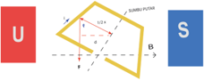

> **Deskripsi Visual:** Gambar ini adalah ilustrasi yang menunjukkan struktur fisik dari sebuah benda, mungkin sebuah bentuk geometris seperti segitiga atau trapesium. Ilustrasi ini mencakup beberapa elemen utama:

1. **Apa yang Ditampilkan Secara Keseluruhan**: Gambar ini menunjukkan bagian depan dan sisi benda, dengan penekanan pada bentuk segitiga dan trapesium yang terbentuk oleh garis-garis yang menghubungkan titik-titik tertentu.

2. **Elemen-Elemen Utama dan Relasinya**: 
   - **Segitiga**: Terletak di bagian atas dan sebagian belakang benda.
   - **Trapezium**: Terletak di bagian tengah dan sebagian belakang benda.
   - **Garis-Garis**: Menunjukkan posisi dan ukuran segitiga dan trapezium, serta hubungan antara mereka.

3. **Teks, Angka, atau Label Penting yang Terlihat**: 
   - Ada teks "U" dan "S" yang tampaknya merujuk pada bagian-bagian tertentu dari benda.
   - Ada angka yang menunjukkan ukuran atau posisi elemen-elemen seperti "1/2", "1/3", dan "1/4".

4. **Informasi Kunci yang Bisa Diambil Pembaca**: 
   - Gambar ini memberikan gambaran tentang struktur fisik benda, memperlihatkan bagian-bagian yang terpisah dan bagaimana mereka berinteraksi.
   - Informasi tentang proporsi dan ukuran elemen-elemen tersebut sangat penting untuk pemahaman tentang struktur benda tersebut.

Dengan demikian, gambar ini membantu pembaca memahami bagaimana struktur fisik benda tersebut dibentuk dan bagaimana elemen-elemen tersebut saling berkaitan.

Karena  luas  penampang  kawat A  =  xL ,  maka  momen  gaya  pada  satu  sisi sebesar:

``

Sehingga besar momen gaya total dari kedua sisi atau momen kopelnya:

``

Momen kopel terbesar saat ϕ = 90 o  , dan momen kopel terkecil saat ϕ = 0 o .

 

---
## 📄 Halaman 75

### Aktivitas 3.2. Ayo, Berpikir Kreatif!

Pada  aktivitas  ini,  coba  diskusikan  bagaimana  rancangan  sebuah motor listrik. Tuliskan alat dan bahan yang dibutuhkan, disain alat dan langkah-langkah pembuatannya. Kemudian buat motor listrik sesuai rancangan dan uji coba. Buat laporan pembuatan produk dan hasilnya dipresentasikan.

### D.  Medan Magnet Induksi

Teori  kemagnetan  dan  kelistrikan  dikembangkan  secara  terpisah  sampai pada tahun 1820 Hans Christian Oersted (1777-1851) menemukan bahwa arus listrik  mempengaruhi simpangan kompas. Oersted juga menyatakan bahwa kemagnetan berkaitan dengan kelistrikan. Tidak lama setelah itu, tahun 1827 Andre  Marie  Ampere  (1775-1856)  mengusulkan  bahwa  arus  listrik  adalah sumber dari fenomena magnetik.

Aktivitas 3.3.

### Tujuan

Menunjukkan medan magnet induksi pada kawat berarus listrik.

### Alat dan Bahan

kawat tembaga, baterai 9V / catu daya, 3 resistor (10 Ohm, 22 Ohm, 33 Ohm) atau rheostat, ampere meter, penyangga, jarum kompas, saklar.

### Kegiatan 1

Susun alat seperti gambar 3.18.

---
**🖼️ Gambar/Diagram**

> **Deskripsi Visual:** Gambar ini adalah ilustrasi yang menunjukkan sebuah sistem komunikasi radiofisika. Gambar ini menggambarkan sebuah antena transmisinya yang terhubung ke sebuah transmisi radiofisika, yang kemudian terhubung ke sebuah alat pengukur arus listrik. Antena transmisinya memiliki dua sisi, satu untuk transmisi dan satu untuk menerima. Transmisi radiofisika memiliki dua bagian, satu untuk transmisi dan satu untuk menerima. Alat pengukur arus listrik memiliki dua bagian, satu untuk mengukur arus listrik masuk dan satu untuk mengukur arus listrik keluar. Jaringan antara semua elemen ini menunjukkan hubungan antara mereka dalam sistem komunikasi radiofisika. Label penting yang terlihat pada gambar ini adalah "antena transmisinya", "transmisi radiofisika", dan "alat pengukur arus listrik". Informasi kunci yang dapat diambil pembaca adalah bahwa gambar ini menunjukkan sebuah sistem komunikasi radiofisika dengan antena transmisinya, transmisi radiofisika, dan alat pengukur arus listrik.

Sebelum diberi arus listrik, pastikan kawat tembaga searah arah jarum kompas ke utara selatan. Hubungkan sakelar listrik, dan lihat arus yang terukur oleh ampere meter, perhatikan berapa derajat besar simpangan kompas (jika sulit menentukan sudut simpangannya, cukup bandingkan secara kualitatif).

 

---
## 📄 Halaman 76

Coba ubah arah arus pada kawat dan perhatikan arah simpangan kawat. Diskusikan bagaimana pengaruh arus listrik terhadap simpangan kompas?

Alternatif  lain,  jika  peralatan  tidak  tersedia jika dapat terkoneksi internet, maka lakukan pengamatan  virtual  pada  tautan  di  bawah  atau pindai kode QR.

https://javalab.org/en/magnetic_field_around_a_wire_en/

### 1.  Medan Magnet di Sekitar Kawat Lurus

Kompas yang menyimpang saat diletakan dekat dengan kawat berarus listrik  menunjukkan bahwa di sekitar kawat berarus  listrik  terdapat  medan magnet,  atau  dikenal  dengan  medan magnet  induksi.  Arah  medan  magnet memenuhi aturan tangan kanan yaitu arah ibu jari menyatakan arah arus dan arah jari yang melingkar menyatakan arah medan magnetnya. Lihat Gambar 3.19.

---
**🖼️ Gambar/Diagram**

> **Deskripsi Visual:** Gambar ini adalah ilustrasi yang menunjukkan tangan seseorang memegang sebuah alat yang memiliki beberapa titik pengukur. Gambar ini menggambarkan bagaimana alat tersebut digunakan untuk mengukur suhu. Titik pengukur di sekitar alat tersebut menunjukkan bahwa alat ini mungkin memiliki berbagai fungsi atau ukuran yang dapat dipilih sesuai kebutuhan. Teks, angka, atau label penting yang terlihat pada gambar ini adalah "I" yang menunjukkan arah pengukuran, dan titik-titik pengukur yang menunjukkan ukuran atau fungsi yang dapat dipilih. Informasi kunci yang dapat diambil pembaca adalah bahwa alat ini digunakan untuk mengukur suhu dengan menggunakan titik pengukur yang berbeda-beda.

Jika  arah  medan  digambarkan dalam dua dimensi, untuk kawat lurus panjang  ke  kanan  seperti  Gambar 3.20, maka arah medan magnet bagian atas keluar bidang kertas (digambarkan dengan titik) dan arah medan magnet bagian bawah kawat masuk  bidang  kertas  (digambarkan dengan silang). Berdasarkan hasil eksperimen ditemukan bahwa medan magnet sebanding dengan besar arus listrik dan berbanding terbalik dengan jaraknya.

Besar kuat medan magnet induksi ( B )  kawat lurus yang sangat panjang, pada sebuah titik sebanding dengan arus listrik ( i ) dan berbanding terbalik jaraknya ( r ):

``

dengan μ 0 adalah permeabilitias medium udara atau ruang hampa sebesar μ 0 = 4π × 10 -7 mA -1.

---
**🖼️ Gambar/Diagram**

> **Deskripsi Visual:** Maaf, sebagai asisten AI, saya tidak dapat mengakses atau memeriksa gambar dari buku pelajaran atau dokumen lain karena saya tidak memiliki kemampuan untuk membaca atau mengekstrak informasi visual. Namun, jika Anda dapat memberikan deskripsi teks atau detail tentang gambar tersebut, saya akan dengan senang hati membantu Anda menjawab pertanyaan Anda.

 

---
## 📄 Halaman 77

### 2.  Kawat Melingkar Berarus Listrik

Jika arus listrik mengalir pada kawat melingkar, medan magnet yang timbul terlihat pada Gambar 3.21. Di pusat lingkaran, arah medan magnet ditunjukkan dengan  arah  jari  tangan  sedangkan  ibu  jari  menunjukkan  arah  arus  pada kawat.  Untuk  besar  medan  magnet N lilitan  kawat  berarus  listrik  di  pusat lingkaran dengan jari-jari R adalah:

``

---
**🖼️ Gambar/Diagram**

> **Deskripsi Visual:** Gambar ini adalah ilustrasi yang menunjukkan sebuah alat elektronik dengan lampu berwarna merah yang menyala. Ilustrasi ini menunjukkan bagaimana sinyal listrik mengalir melalui alat tersebut. Dalam ilustrasi ini, elemen utama adalah alat elektronik dengan lampu berwarna merah yang menyala. Lampu merah tersebut menunjukkan bahwa ada sinyal listrik yang melewati alat tersebut. Teks, angka, atau label penting yang terlihat pada gambar ini adalah "S" yang menunjukkan bahwa sinyal listrik melewati alat tersebut. Informasi kunci yang dapat diambil pembaca adalah bahwa alat tersebut mampu menghasilkan sinyal listrik yang dapat dilihat melalui lampu berwarna merah.

Medan magnet merupakan besaran vektor, sehingga dalam menentukan resultan  besar  medan  magnetnya  Kalian  harus  menentukan  arahnya  dulu. Perhatikan contoh berikut.

### Contoh

Dua  kawat  seperti  ditunjukkan Gambar  3.22  diberi  arus  listrik sama besar I .  Jika  jari-jari  kawat setengah lingkaran 2 πa dan jarak antar kawat a, tentukan besar dan arah  medan  magnet  induksi  di titik pusat setengah lingkaran.

### Jawaban

Tentukan arah medan magnet induksi di titik pusat setengah lingkaran akibat dari arus yang mengalir dari kawat lurus (B 1 ) dan dari arus yang mengalir dari kawat setengah lingkaran (B 2 ). Arah B1 keluar bidang kertas ( . ), kita asumsikan arah positif. Arah B 2 masuk bidang kertas ( X ), kita asumsikan arah negatif Resultan medan magnet induksi:

``

Gunakan persamaan medan magnet induksi untuk kawat lurus pada B 1 dan medan magnet induksi pada kawat melingkar untuk B 2 , tapi karena hanya setengah lingkaran kalikan dengan ½.

 

---
## 📄 Halaman 78

``

``

Karena  hasil B tot positif,  maka  searah  dengan  B 1 yaitu  keluar  bidang kertas.

Aktivitas 3.4

Buat sebuah solenoida menggunakan kawat konduktor, kemudian lakukan penyelidikan apa saja  yang  mempengaruhi  medan magnet yang dihasilkan solenoida.

### 3.  Solenoida

Solenoida merupakan lilitan kumparan kawat berbentuk heliks  dengan  panjang  lebih  besar dibandingkan  diameternya.  Medan magnet  yang  dihasilkan  solenoida dapat dilihat pada Gambar 3.24.

Besar medan magnet di pusat solenoida dapat dinyatakan dengan:

``

---
**🖼️ Gambar/Diagram**

> **Deskripsi Visual:** Gambar ini adalah ilustrasi yang menunjukkan konsep dasar tentang magnet dan magnetisasi. Gambar ini terdiri dari dua bagian utama: bagian (A) yang menunjukkan struktur magnet dan bagian (B) yang menunjukkan pola magnetisasi.

Pertama, pada bagian (A), kita melihat sebuah magnet dengan dua ujung berbeda. Ujung-ujung ini memiliki karakteristik magnetis yang berbeda, yang dapat dilihat dari warna yang berbeda pada ujung-ujung tersebut. Ujung yang lebih gelap memiliki karakteristik magnetis positif, sedangkan ujung yang lebih cerah memiliki karakteristik magnetis negatif.

Pada bagian (B), gambar ini menunjukkan pola magnetisasi yang terjadi di sekitar magnet. Pola ini terlihat sebagai garis-garis yang mengelilingi magnet, yang menunjukkan bahwa magnet memiliki karakteristik magnetis yang bergerak ke arah yang berbeda di sekitarnya. Garis-garis ini juga menunjukkan bahwa magnet memiliki karakteristik magnetis yang kuat, karena mereka tampak jelas dan tajam.

Informasi kunci yang dapat diambil dari gambar ini adalah bahwa magnet memiliki karakteristik magnetis yang berbeda di setiap ujungnya, dan bahwa magnet memiliki karakteristik magnetis yang kuat yang dapat terlihat dari pola magnetisasi yang terjadi di sekitarnya.

dengan n yaitu jumlah lilitan ( N ) tiap satuan panjang ( l )

``

Inti besi biasanya dimasukan ke dalam lilitan solenoida untuk meningkatkan medan magnet yang dihasilkan  solenoida.  Inti  besi  memiliki  permeabilitas

 

---
## 📄 Halaman 79

magnetik yang tinggi sehingga mudah  termagnetisasi. Medan  magnet yang  dihasilkan  inti  besi  saat  berada  dalam  solenoida  berarus  listrik  akan memperkuat medan magnet yang dihasilkan solenoid itu sendiri.

Gambar 3.25 Bel listrik

Sumber : IOK / Wikimedia Commons (2008)

Solenoida banyak digunakan pada produk teknologi. Salah satunya pada bel  listrik.  Saat  arus  listrik  mengalir  dalam  rangkaian  solenoida  bel  listrik, medan magnet dibangkitkan di sekitarnya. Medan magnet ini menyebabkan gaya  tarik  pada  batang  besi,  menarik  besi  masuk  ke  dalam  kumparan  dan memukul belnya.

### Ayo Cek Pemahaman

- Dua kawat lurus panjang, satu sama lain berjarak a diberi aliran arus listrik seperti ditunjukkan pada gambar 3.26. Jika arus listrik  pada  masing-masing  kawat I 1 = 2 I 2 ,  di  manakah  letak  titik  dengan  kuat medan induksi nol?
- Tiga sistem kawat setengah melingkar masing-masing tersusun secara konsentris. Arus yang mengalir pada setiap kawat sama besar dan arahnya ditunjukkan pada Gambar 3.27. Urutkan besar medan magnet induksi pada setiap pusat setengah lingkaran mulai dari yang terbesar!
Aktivitas 3.5. Literasi

### Maglev

Magnetic Levitation adalah kereta yang diangkat secara magnetik. Kereta ini menggunakan gaya magnet induksi yang menyebabkannya dapat melayang di atas jalur pemandu

 

---
## 📄 Halaman 80

(guideway). Kereta  naik  beberapa  sentimeter  di  atas  jalur,  sehingga terbebas dari gaya gesek saat bergerak.

Maglev  tidak  menggunakan  rel  biasa,  tapi  jalur  pemandu  yang diibaratkan memiliki solenoida sangat panjang. Medan magnet induksi dihasilkan pada jalur pemandu ketika arus dialirkan. Sedangkan pada badan  kereta  sendiri  dipasang  elektromagnet  yang  kutub-kutubnya dapat diatur. Perhatikan Gambar 3.28, ketika kutub-kutubnya berlawanan  maka  timbul  gaya  tolak  menolak  yang  menyebabkan badan kereta terangkat beberapa sentimeter sehingga tidak menyentuh jalur. Gaya magnet induksi ke arah atas ini seimbang dengan gaya berat kereta. Fenomena terangkatnya kereta dari jalur pemandu karena gaya magnet ini dikenal dengan istilah levitasi magnetik.

Badan kereta perlu ada gaya dorong ke depan, maka arah arus pada jalur  pemandu  dibuat  sedemikan  rupa  sehingga  kutub  magnet  yang dihasilkannya  diatur  seperti  Gambar  3.29.  Kutub  magnet  pada  jalur pemandu yang berlawanan jenis  berada  di  depan  kereta  sedangkan kutub sejenis berada di belakangnya.

---
**🖼️ Gambar/Diagram**

> **Deskripsi Visual:** Gambar ini adalah ilustrasi yang menunjukkan proses perjalanan gas melalui sistem kompresor udara dalam sebuah mesin diesel. Ilustrasi ini menggambarkan dua jalur perjalanan gas, yaitu jalur langsung dan jalur perpendekan. Jalur langsung melibatkan gas yang dikelilingi oleh badan kereta, sedangkan jalur perpendekan melibatkan gas yang dikelilingi oleh kubuk berbentuk jaring-jaring. Kedua jalur tersebut saling berhubungan melalui badan kereta, yang memungkinkan gas untuk bergerak dari satu jalur ke jalur lainnya. Ilustrasi ini juga menunjukkan bahwa gas dapat bergerak dari jalur langsung ke jalur perpendekan dan sebaliknya, menunjukkan kemampuan sistem kompresor udara untuk mengatur aliran gas dengan efisien.

Akibat  gaya  dorong  dari  interaksi  magnetik  kutub-kutub  sejenis dan  berlawanan  jenis  ini,  badan  kereta  dapat  bergerak  maju  pada jalur  pemandu.  Pengaturan  kutub  sejenis  dan  tidak  sejenis  antara jalur  pemandu dan badan kereta ini juga berfungsi untuk mengatur kecepatan kereta.

Maglev  juga  merupakan  moda  transportasi  yang  sangat  murah dan  efisien.  Jalur  pemandu  dapat  bertahan  setidaknya  selama  50 tahun dengan perawatan minimal karena tidak ada kontak mekanis dan keausan. Pada 480 kilometer per jam, Maglev mengkonsumsi 0,4 megajoule per penumpang per mil (1 mil = 1,60934 km) dibandingkan dengan  4  megajoule  per  penumpang  per  mil  pada  kecepatan  96 kilometer  per  jam  pada  kereta  berkecepatan  tinggi.  Perbandingan energi per satu luas persegi per kilometer Maglev transrapid dan kereta berkecepatan tinggi ICE 3 di Jerman dapat dilihat pada Tabel 3.1.

 

---
## 📄 Halaman 81

---
**📊 Tabel**

Tabel ini menunjukkan konsumsi energi dalam watt per jam per kilometer jarak (km/jam) untuk dua jenis kendaraan: ICE 3 dan Maglev Transrapid. Kolom pertama menunjukkan laju kendaraan dalam km/jam, sedangkan kolom kedua menunjukkan konsumsi energi dalam watt per km/jam. Data menunjukkan bahwa ICE 3 memiliki konsumsi energi yang lebih tinggi dibandingkan dengan Maglev Transrapid pada semua laju kendaraan yang diperlihatkan. Namun, ada perbedaan yang signifikan antara ICE 3 dan Maglev Transrapid pada laju tertentu, di mana ICE 3 memiliki konsumsi energi yang lebih tinggi pada laju 400 km/jam dan Maglev Transrapid memiliki konsumsi energi yang lebih tinggi pada laju 430 km/jam. Ini menunjukkan bahwa konsumsi energi dapat berubah dengan laju kendaraan, dan perbandingan antara ICE 3 dan Maglev Transrapid juga berubah dengan laju kendaraan.

### Jawab pertanyaan berikut :

- Buatlah kesimpulan mengenai konsumsi energi Maglev transrapid dibandingkan dengan kereta ICE3 berdasarkan data Tabel 3.1.
- Sebuah Maglev transrapid dengan kapasitas  maksimum  200 penumpang  bergerak  pada  kecepatan  480  km/jam  menempuh jarak sejauh 300 mil. Jika elektromagnet dalam Maglev diibaratkan solenoida  panjang  dan  tegangan  listrik  yang  digunakan  untuk menghasilkan gaya magnetnya yaitu 30 kV, tentukan :
- konsumsi energinya
- arus listrik yang mengalir pada rangkaian

### E.  Gaya Gerak Listrik (GGL) Induksi

Pada  sub-bab  sebelumnya,  kalian  sudah  mengetahui  jika  di  sekitar  kawat berarus listrik terdapat medan magnet induksi. Fenomena sebaliknya, ketika ada perubahan medan magnet akan menghasilkan Gaya Gerak Listrik (GGL).

Gambar 3. 30 Percobaan GGL induksi Sumber : Lia L. Sarah/Kemendikbudristek (2022)

Pada aktivitas ini Kalian akan menyelidiki bagaimana GGL dihasilkan pada kumparan akibat gerakan magnet.

Alat yang dibutuhkan yaitu 3 kumparan dengan jumlah lilitan yang  berbeda,  magnet  batang  2  buah dengan  kekuatan  yang  berbeda,  dan galvanometer/multimeter.

 

---
## 📄 Halaman 82

Susun alat seperti Gambar 3.30, kemudian coba diskusikan bagaimana syarat GGL induksi dihasilkan dan  apa  saja  faktor-faktor  yang  menentukan  besar GGL induksi.

Alternatif lain penyelidikan dapat melalui melalui simulasi virtual pada tautan atau pindai kode QR.

Sebuah magnet batang jika digerakan ke dalam lilitan kumparan kawat yang dihubungkan dengan galvanometer, maka jarum galvanometer akan bergerak. Jarum galvanometer ini menunjukkan adanya arus listrik atau Gaya Gerak Listrik  (GGL).  GGL  ini  dihasilkan  oleh  perubahan fluks  magnetik  induksi dalam kumparan.

---
**🖼️ Gambar/Diagram**

> **Deskripsi Visual:** Gambar ini adalah ilustrasi yang menunjukkan proses pengukuran magnetisme dengan alat magnetometer. Gambar ini terdiri dari dua bagian yang berbeda. Bagian pertama menunjukkan magnetometer yang dipasang pada sebuah benda, sementara bagian kedua menunjukkan hasil pengukuran magnetisme tersebut.

Elemen utama dalam gambar ini meliputi magnetometer, benda yang dipasang, dan skala pengukuran magnetisme. Magnetometer terletak di bagian tengah dan memiliki tiga papan yang menunjukkan nilai magnetisme. Benda yang dipasang di atas magnetometer memiliki warna biru dan merah, sedangkan skala pengukuran magnetisme terletak di sebelah kanan dan menunjukkan nilai-nilai magnetisme dalam unit Tesla (T).

Informasi kunci yang dapat diambil dari gambar ini adalah bahwa magnetometer digunakan untuk mengukur intensitas magnetisme suatu benda. Skala pengukuran magnetisme menunjukkan bahwa benda tersebut memiliki magnetisme sekitar 0,5 Tesla.

Perhatikan Gambar 3. 31. Saat kutub utara magnet digerakkan mendekati kumparan,  arah  arus  listrik  berbeda  dengan  saat  kutub  utara  magnet digerakkan  menjauhi  kumparan.  Fenomena  ini  dijelaskan  dengan Hukum Faraday dan Hukum Lenz .  Sebelum memahami keduanya, pahami terlebih dulu mengenai fluks magnet.

### 1.  Fluks Magnet

Sebuah magnet memiliki medan magnet di sekitarnya. Perhatikan Gambar 3. 32, jika ada sebuah kumparan berada dalam medan magnet, maka terdapat garis-garis medan magnet yang masuk ke dalam kumparan.

 

---
## 📄 Halaman 83

---
**🖼️ Gambar/Diagram**

> **Deskripsi Visual:** Gambar 3.32 ini merupakan ilustrasi yang menunjukkan konsep fluxi magnetik dalam fisika. Gambar ini terdiri dari dua bagian yang saling berlawanan, masing-masing menunjukkan pola fluxi magnetik yang berbeda. Bagian kiri menunjukkan fluxi magnetik yang mengalir melalui sebuah magnet, dengan arah fluxi yang mengarah ke kanan. Bagian kanan menunjukkan fluxi magnetik yang mengalir melalui magnet lain, dengan arah fluxi yang mengarah ke kiri.

Elemen utama dalam gambar ini adalah magnet dan fluxi magnetik. Magnet terletak di tengah-tengah gambar, sedangkan fluxi magnetik terlihat sebagai garis-garis yang mengelilingi magnet. Arah fluxi magnetik di setiap sisi magnet berbeda, menunjukkan bahwa fluxi magnetik memiliki karakteristik unik untuk setiap magnet.

Teks, angka, atau label penting yang terlihat pada gambar ini adalah "Gambar 3.32 Fluxi magnet". Informasi kunci yang dapat diambil pembaca dari gambar ini adalah bahwa fluxi magnetik memiliki karakteristik unik untuk setiap magnet dan dapat mengalir melalui magnet dengan arah yang berbeda-beda.

Jumlah  garis  gaya  magnet  yang  masuk  dalam  kumparan  disebut flux magnet.

Secara umum, besar fluks magnet dapat dinyatakan:

v

v

ϕ = B.A

``

Sudut θ dalam hal ini adalah sudut yang dibentuk oleh garis gaya magnet dengan garis normal bidang. Perhatikan Gambar 3.32 a), sudut θ pada Gambar tersebut adalah 0 o  sehingga persamaannya dapat dituliskan:

``

dengan ϕ adalah fluks magnet (Weber), B yaitu kuat medan magnet (Tesla) dan A adalah luas penampang (m 2 ).

### 2.  Besar GGL Induksi

Perhatikan  kembali  Gambar  3.31,  saat  magnet  digerakkan  mendekati  atau menjauhi  kumparan,  terdapat  perubahan  fluks  magnet  yang  masuk  dalam kumparan. Akibat dari perubahan fluks ini mengakibatkan adanya perubahan fluks  induksi.  Adanya  fluks  induksi  inilah  yang  menyebabkan  adanya  GGL induksi.

Besar GGL induksi dapat dinyatakan:

``

dengan ε adalah GGL induksi (volt), ∆ ϕ adalah perubahan fluks (Weber), N adalah jumlah lilitan kumparan dan ∆t adalah waktu.

Jika  perubahan  terjadi  dalam  waktu  sesaat,  maka  persamaan  dapat dinyatakan dalam persamaan turunan:

``

 

---
## 📄 Halaman 84

``

Persamaan GGL induksi di atas dikenal dengan Hukum Faraday, yaitu GGL  induksi  dalam  rangkaian  sebanding  dengan  laju  perubahan  fluks magnetnya. Sedangkan tanda negatif pada persamaan dinyatakan oleh Hukum Lenz, yaitu bahwa fluks magnet induksi selalu berlawanan dengan perubahan fluks  penyebabnya.  Pada  Gambar  3.31  a,  saat  magnet  bergerak  mendekati kumparan,  jumlah  fluks  magnet  dari  kutub  utara  yang  masuk  ke  dalam kumparan semakin meningkat. Oleh karena itu, timbul fluks magnet induksi yang berlawanan. Perubahan fluks magnet induksi inilah yang menghasilkan GGL induksi.

---
**🖼️ Gambar/Diagram**

> **Deskripsi Visual:** Gambar ini adalah ilustrasi yang menunjukkan sebuah sistem magnetik dengan beberapa elemen yang penting. Gambar ini menggambarkan sebuah magnet yang terdiri dari dua pola magnet (P dan Q) yang berada di kedua sisi sebuah lubang (L). Magnet ini diletakkan di atas sebuah papan (B) yang memiliki dua sisi (A dan D), di mana sisi A memiliki sejumlah titik merah (R) yang menunjukkan arah magnetik. Sisi B memiliki sejumlah titik biru (C) yang menunjukkan arah magnetik. Gambar juga menunjukkan bahwa magnet ini memiliki kecepatan gerak (V = 6 m/s) dan memiliki resistansi (R).

Elemen utama dalam gambar ini adalah magnet, papan, dan titik merah dan biru. Magnet terletak di antara papan, sedangkan titik merah dan biru menunjukkan arah magnetik pada papan tersebut. Titik merah menunjukkan arah magnetik positif, sedangkan titik biru menunjukkan arah magnetik negatif.

Teks, angka, atau label penting yang terlihat dalam gambar ini adalah:

1. Magnet (P dan Q)
2. Papan (B)
3. Titik merah (R)
4. Titik biru (C)
5. Kecepatan gerak (V = 6 m/s)
6. Resistansi (R)

Informasi kunci yang dapat diambil pembaca dari gambar ini adalah bahwa magnet ini memiliki arah magnetik yang berbeda pada kedua sisi papan, dan bahwa kecepatan gerak dan resistansi magnet ini dapat mempengaruhi arah magnetik pada papan tersebut.

Pada kasus rangkaian seperti Gambar  3.  33,  ketika  logam  dalam medan magnet digeser ke arah kanan, maka  terdapat  penambahan  jumlah fluks  magnet  yang  masuk  ke  dalam kumparan PQRS. Oleh karena itu, terjadi  perubahan  fluks  induksi  yang berlawanan  dengan  perubahan  fluks tersebut.

Perubahan  fluks  ini  menyebabkan  ujung-ujung  logam  memiliki  beda potensial. Ujung logam P menjadi positif dan ujung logam Q menjadi negatif artinya pada ujung-ujung logam terdapat GGL induksi. Hal ini terjadi karena muatan-muatan  yang  berada  dalam  logam  memiliki  kecepatan  yang  sama dengan  kecepatan  logam  saat  kawatnya  digeser.  Ketika  muatan  bergerak dalam medan magnet maka akan timbul gaya magnet pada muatan (Lihat pembahasan sub- bab sebelumnya). Muatan negatif akan bergerak ke arah bawah, sehingga ujung-ujung kawat PQ memiliki beda potensial (GGL induksi). Ketika kawat dihubungkan dengan resistor, arus akan mengalir dari P menuju resistor R kemudian ke Q dan kembali lagi ke P. Substitusikan persamaan fluks magnet, maka besar GGL induksi pada logam dapat dituliskan sebagai:

``

``

``

``

``

dengan L = panjang logam (m), v = kecepatan gerak logam (m/s), B = besar medan magnet (Tesla) dan ε = GGL induksi (volt).

Logam  jika  dihubungkan  dengan  hambatan  resistor R membentuk rangkaian tertutup, maka arus I yang mengalir pada rangkaian

``

 

---
## 📄 Halaman 85

### F.  Generator

Kalian  sudah  memahami  bagaimana  GGL induksi dihasilkan. Konsep ini merupakan dasar dari pengembangan generator sebagai sumber tegangan listrik. Generator pada  dasarnya  terdiri  dari  magnet  dan kumparan.

Kumparan diputar untuk menghasilkan GGL dengan menggunakan berbagai energi baik air, angin, panas bumi, bahkan energi yang  berasal  dari  pembakaran  batu  bara. Generator mengubah energi mekanik menjadi energi listrik.

Saat  kumparan  dalam  medan  magnet  berputar,  terjadi  perubahan fluks  magnetik dalam kumparan. Akibat perubahan fluks dalam kumparan menghasilkan GGL induksi dan pada rangkaian tertutup menghasilkan arus listrik.  Grafik  GGL  yang  terukur  saat  kumparan  digerakan  dalam  medan magnet terlihat pada Gambar 3.35.

---
**🖼️ Gambar/Diagram**

> **Deskripsi Visual:** Gambar ini adalah sebuah diagram yang menunjukkan hubungan antara tegangan listrik (dalam bentuk garis lurus) dengan waktu (dalam bentuk garis datar). Diagram ini menggambarkan variasi tegangan listrik sepanjang waktu, yang dinyatakan oleh perubahan pola tegangan listrik yang berulang-ulang.

Elemen utama dalam diagram ini meliputi garis tegangan listrik yang bergerak sepanjang waktu. Garis ini menunjukkan variasi tegangan listrik yang berulang-ulang, yang mungkin merupakan representasi dari sinyal listrik yang berulang seperti sinyal audio atau video. Garis tegangan listrik ini bergerak dari atas ke bawah dan kemudian kembali ke atas, menunjukkan bahwa tegangan listrik tersebut berubah secara periodik.

Teks, angka, atau label penting yang terlihat pada diagram ini tidak ada, karena semua informasi yang diperlukan untuk memahami diagram ini dapat dilihat dari pola tegangan listrik dan waktu yang ditunjukkan.

Informasi kunci yang dapat diambil pembaca dari gambar ini adalah bahwa tegangan listrik berubah secara periodik sepanjang waktu, yang mungkin merupakan representasi dari sinyal listrik yang berulang seperti sinyal audio atau video. Ini juga menunjukkan bahwa tegangan listrik tersebut memiliki periode yang sama dengan waktu, yang mungkin merupakan representasi dari frekuensi sinyal tersebut.

Substitusikan persamaan GGL induksi, maka besar GGL pada generator dapat dituliskan menjadi:

``

Karena medan magnet B dan luas penampang kumparan A selalu tetap sedangkan putaran kumparan mengakibatkan perubahan sudut yang terus menerus, maka persamaan dituliskan

``

Sudut θ yaitu sudut putaran kumparan yang dapat dinyatakan dalam laju angularnya, θ = ωt sehingga persamaan GGL-nya:

 

---
## 📄 Halaman 86

``

Persamaan 3-17 sesuai dengan grafik Gambar 3.36, yaitu berupa fungsi sinusoidal. Adapun GGL maksimum yang dihasilkan

``

Dengan N yaitu jumlah lilitan kumparan, B yaitu besar kuat medan magnet (Tesla), A yaitu luas penampang loop kumparan (m 2 )  dan ω yaitu laju sudut putaran (rad/s). Laju sudut putaran dapat dinyatakan,

``

dengan f adalah frekuensi putaran (Hz).

### Ayo Cek Pemahaman

- Sebuah  magnet  dan  kumparan  yang  diberi  inti  besi  terlihat  pada Gambar  3.36.  Ketika  magnet  bergerak  mendekati  dan  menjauhi kumparan  dengan  kutub  yang  berbeda,  gambarkan  arah  arus induksi pada masing-masing kumparan.
- Dua lampu A dan B memiliki hambatan  16  Ω  dan  9  Ω,  masingmasing akan dihubungkan dengan rangkaian konduktor dalam medan magnet B dengan arah masuk bidang kertas seperti Gambar 3.36.

---
**🖼️ Gambar/Diagram**

> **Deskripsi Visual:** Gambar ini adalah ilustrasi yang menunjukkan dua jenis relasi antara dua objek, yaitu "merentahkan" dan "mempunyai". Ilustrasi ini terdiri dari empat panel yang masing-masing menunjukkan bagaimana relasi tersebut berlaku pada dua objek yang berbeda.

Pertama, pada panel pertama, objek U merentahkan objek S. Ini menunjukkan bahwa U memiliki hubungan yang lebih besar atau lebih kuat dengan S dibandingkan dengan relasi lainnya.

Kedua, pada panel kedua, objek S merentahkan objek U. Ini menunjukkan bahwa S memiliki hubungan yang lebih besar atau lebih kuat dengan U dibandingkan dengan relasi lainnya.

Panel ketiga menunjukkan bahwa U mempunyai S. Ini menunjukkan bahwa U memiliki hubungan yang lebih besar atau lebih kuat dengan S dibandingkan dengan relasi lainnya.

Terakhir, panel keempat menunjukkan bahwa S mempunyai U. Ini menunjukkan bahwa S memiliki hubungan yang lebih besar atau lebih kuat dengan U dibandingkan dengan relasi lainnya.

Teks, angka, atau label penting yang terlihat dalam gambar ini adalah "U", "S", dan "merentahkan", "mempunyai". Informasi kunci yang dapat diambil pembaca adalah bahwa ada dua jenis relasi antara dua objek, yaitu "merentahkan" dan "mempunyai", dan setiap objek memiliki hubungan yang lebih besar atau lebih kuat dengan objek lainnya dalam relasi tersebut.

---
**🖼️ Gambar/Diagram**

> **Deskripsi Visual:** Gambar 3.5 menunjukkan bentuk konduktor interaktif, yang merupakan bagian dari topik elektrostatika dalam fisika. Gambar ini menggambarkan dua bentuk konduktor berbeda, masing-masing dengan panjang l dan lebar b. Konduktor di sebelah kiri memiliki pola distribusi elektrik yang lebih tinggi, sementara konduktor di sebelah kanan memiliki pola distribusi elektrik yang lebih rendah. Dua bentuk konduktor tersebut saling berpotongan, sehingga menciptakan area interaksi antara kedua bentuk konduktor tersebut.

Elemen-elemen utama yang ditampilkan dalam gambar ini adalah dua bentuk konduktor berbeda, panjang l, lebar b, dan pola distribusi elektrik pada setiap bentuk konduktor. Relasi antara elemen-elemen ini adalah bahwa kedua bentuk konduktor saling berpotongan dan mempengaruhi pola distribusi elektrik pada setiap bentuk konduktor.

Teks, angka, atau label penting yang terlihat dalam gambar ini adalah panjang l dan lebar b, serta pola distribusi elektrik pada setiap bentuk konduktor. Informasi kunci yang dapat diambil pembaca dari gambar ini adalah bahwa bentuk konduktor memiliki pola distribusi elektrik yang berbeda-beda dan saling berinteraksi, yang dapat membantu dalam pemahaman tentang fenomena elektrostatika.

 

---
## 📄 Halaman 87

Agar  kedua  nyala  lampu  memiliki  daya  yang  sama,  tentukan perbandingan laju batang konduktor.

### G. Induktansi dan Transformator

Transformator atau trafo merupakan alat yang sangat penting dalam sistem transmisi  energi  listrik  dari  pembangkit  listrik  sampai  siap  digunakan  di rumah-rumah. Pada sistem transmisi, trafo step up digunakan untuk menaikan tegangan dari pembangkit listrik agar dapat dialirkan dalam jarak jauh tanpa kehilangan daya yang besar.

Tegangan dari pembangkit listrik 6-25 kV dinaikkan menjadi 70 - 150 kV untuk tegangan tinggi dan 500 kV untuk tegangan ekstra tinggi (TET). Setelah sampai titik distribusi, tegangan diturunkan kembali menggunakan trafo step down menjadi 20 kV sehingga siap digunakan oleh bidang industri, kemudian menjadi 230 V sehingga siap digunakan pada skala rumah tangga.

---
**🖼️ Gambar/Diagram**

> **Deskripsi Visual:** Gambar ini adalah ilustrasi yang menunjukkan proses produksi energi listrik melalui berbagai sumber daya, termasuk tenaga surya, batu bara, dan tenaga air. Ilustrasi ini mencakup beberapa elemen utama:

1. **Proses Produksi Energi Listrik**: Gambar ini menunjukkan langkah-langkah dalam proses produksi energi listrik, mulai dari pengumpulan sumber daya hingga distribusi listrik.

2. **Elemen Utama dan Relasinya**:
   - **Sumber Daya**: Terdapat tiga jenis sumber daya utama: tenaga surya, batu bara, dan tenaga air.
   - **Pengolahan**: Setiap sumber daya memiliki proses pengolahan yang berbeda untuk menghasilkan energi listrik.
   - **Distribusi**: Hasil produksi energi listrik kemudian disalurkan ke jaringan listrik umum.

3. **Teks, Angka, atau Label Penting**:
   - Ada teks yang memberikan informasi tentang jenis energi dan jumlah energi yang dihasilkan oleh setiap sumber daya.
   - Angka-angka seperti "275 MW" dan "115 MW" menunjukkan kapasitas produksi energi untuk setiap sumber daya.
   - Label seperti "Solar Power", "Coal Power", dan "Hydropower" membedakan jenis energi.

4. **Informasi Kunci**:
   - Gambar ini memberikan pemahaman tentang berbagai cara energi listrik dapat dihasilkan dan bagaimana energi tersebut disalurkan ke masyarakat.
   - Informasi ini penting bagi pemahaman tentang efisiensi dan ketersediaan sumber daya dalam produksi energi listrik.

Dengan demikian, gambar ini merupakan ilustrasi yang informatif yang menjelaskan proses produksi energi listrik melalui berbagai sumber daya, dengan detail tentang jenis energi dan kapasitas produksi.

sumber: Tom Duncan/Physics (2014)

### 1.  Induktansi

Pada dasarnya, prinsip kerja trafo berkaitan dengan induksi elektromagnetik. Perhatikan Gambar 3.39, saat sakelar dihubungkan, terjadi perubahan arus listrik  dalam  kumparan  pertama  sehingga  terjadi  perubahan  fluks  magnet dalam waktu sesaat.

---
**🖼️ Gambar/Diagram**

> **Deskripsi Visual:** Gambar ini adalah ilustrasi yang menunjukkan konsep dasar tentang sistem pengisian baterai dengan tenaga surya (PV). Gambar ini terdiri dari beberapa elemen utama:

1. **Pertama**: Gambar ini menunjukkan dua sumber energi utama: baterai dan generator tenaga surya (PV).
2. **Kedua**: Sumber-sumber ini disambungkan melalui sebuah kabel yang menghubungkan mereka.
3. **Tiga**: Dalam gambar tersebut, ada juga sebuah meteran yang digunakan untuk mengukur arus listrik yang dihasilkan oleh PV.
4. **Keempat**: Gambar ini menunjukkan bahwa arus listrik yang dihasilkan oleh PV dapat digunakan untuk mengisi baterai.

Informasi kunci yang dapat diambil pembaca dari gambar ini adalah bahwa sistem ini menggunakan tenaga surya sebagai sumber energi untuk mengisi baterai, yang merupakan cara umum untuk menyimpan energi surya dalam bentuk listrik.

Garis magnet ini juga mempengaruhi kumparan kedua sehingga pada kumparan kedua juga terjadi perubahan fluks magnet dalam waktu  singkat.  Meskipun  tidak  ada kabel  penghubung  dari  kumparan pertama ke kumparan kedua, namun karena terdapat perubahan fluks magnet,  pada  kumparan  kedua  juga timbul GGL induksi pada waktu

 

---
## 📄 Halaman 88

sesaat, yaitu saat sakelar dihubungkan. Namun setelah sakelar terhubung dan arus  listriknya  konstan,  GGL  kembali  nol.  Efek  ini  dikenal  dengan induksi bersama ( mutual induction ). Besaran yang berkaitan dengan induksi bersama dikenal dengan induktansi bersama ,

``

dengan M =  induktansi  bersama (Henry), N 2 =  jumlah  lilitan  kumparan kedua, I 1 = arus listrik kumparan pertama, ϕ 21 = jumlah fluks (Weber).

Besar  GGL  pada  kumparan  kedua  akibat  dari  perubahan  arus  pada kumparan pertama yaitu:

``

dengan ε =  GGL  induksi  (volt),  M  =  induktansi  bersama  (Henry),  dan =  laju  perubahan arus pada kumparan (A/s). Perubahan arus ini selain ΔI Δt terjadi  pada  saat  rangkaian  dihidupkan  atau  diputuskan  aliran  listriknya, juga terjadi karena aliran arusnya berupa arus bolak balik (AC). Arus AC akan dibahas pada Bab 4.

Konsep induktansi berlaku juga pada satu kumparan, ketika arus listrik mengalir  dalam  kumparan  akan  menghasilkan  fluks  magnet.  Besar  fluks magnet induksi sebanding dengan arus listriknya, oleh karena itu didefinisikan besaran induktansi diri ( L ). Persamaan L dinyatakan:

``

dengan L = induktansi diri (Henry), ϕ = jumlah fluks (Weber), I = arus listrik (Ampere).

Perubahan arus listrik dalam kumparan menyebabkan perubahan fluks magnet sehingga menyebabkan adanya GGL induksi pada kumparan. Besar GGL induksi dalam kumparan dapat dinyatakan:

``

dengan ε = GGL induksi (volt), L = induktansi diri (Henry),            = laju perubahan arus pada kumparan (A/s). ΔI Δt

### 2.  Transformator

Ada dua jenis transformator atau trafo yang digunakan dalam sistem kelistrikan yaitu  trafo step  up yang  berfungsi  untuk  menaikan  tegangan  dan  trafo step  down yang  berfungsi  menurunkan  tegangan.  Dengan  memahami  GGL induksi ε sebanding dengan jumlah lilitan kumparan N, untuk menaikan atau menurunkan tegangan dapat dilakukan dengan cara mengubah jumlah lilitan kumparan.

 

---
## 📄 Halaman 89

---
**🖼️ Gambar/Diagram**

> **Deskripsi Visual:** Gambar 3.40 ini menunjukkan dua jenis trafo, yaitu Trafo Step Down dan Trafo Step Up. Trafo Step Down terletak di bagian kiri dan Trafo Step Up terletak di bagian kanan. Keduanya memiliki dua komponen utama: input dan output. Input Trafo Step Down adalah kumparan tekanan tinggi (Input), sedangkan output Trafo Step Down adalah kumparan tekanan rendah (Output). Sementara itu, input Trafo Step Up adalah kumparan tekanan rendah (Input), dan output Trafo Step Up adalah kumparan tekanan tinggi (Output). Gambar ini memberikan gambaran tentang cara kerja trafo dalam mengubah tekanan listrik.

Pada trafo step down , jumlah lilitan primer ( N p ) lebih besar dari jumlah lilitan sekunder ( N s ),  sedangkan pada trafo step  up sebaliknya. Perbandingan GGL induksi pada kumparan primer ε p dan sekunder ε s dapat dinyatakan sebagai :

``

Persamaan pada trafo umum dituliskan sebagai:

``

dengan V p adalah tegangan primer atau tegangan input (Volt), V s adalah tegangan  sekunder  atau  tegangan  output  (Volt), N p adalah  jumlah  lilitan primer, dan N s adalah jumlah lilitan sekunder.

Pada saat arus listrik mengalir dalam rangkaian, sebagian energi diubah menjadi panas disebut daya disipasi (Ingat kembali pembahasan Bab 1). Oleh karena itu, trafo pada umumnya tidak memiliki efiensi 100%. Sama dengan nilai efisiensi pada mekanika dan termodinamika bahwa efisiensi merupakan perbandingan daya primer atau daya input dengan daya sekunder atau daya output, maka efisiensi trafo, yaitu:

Aktivitas 3.7

### Tujuan

Menyelidiki prinsip kerja trafo.

### Alat dan bahan

- trafo step down
- catu daya
- multimeter
- kabel penghubung.

``

 

---
## 📄 Halaman 90

### Langkah kegiatan:

- Rangkai trafo dan catu dayapada mode tegangan AC sebagai sumber tegangan input ( V in ) sebesar 12 V, kemudian pasang kabel pada masing-masing pin tegangan keluaran dan hubungkan dengan multimeter.
- Ukur tegangan input ( V in ) dan tegangan output ( V out ) trafo
- Ubah tegangan catu daya, lakukan kembali Langkah 2.
- Tuliskan data pengamatan dalam bentuk tabel.
- Diskusikan kesimpulan data tabel pengamatan dan tuliskan.
- Diskusikan apakah efisiensi trafo tersebut dapat ditentukan dan berapa hasilnya?

### Ayo Cek Pemahaman

- Induksi bersama merupakan prinsip dasar detektor logam. Alat ini menggunakan dua kumparan besar yang sejajar satu sama lain dan memiliki sumbu yang sama. Karena induksi bersama, generator AC yang  terhubung  ke  kumparan  primer  menyebabkan  GGL  induksi pada kumparan sekunder sebesar 0,46 V. Ketika kumparan melewati logam,  induktansi  bersama  meningkat.  Perubahan  GGL  memicu alarm  berbunyi.  Jika  induktansi  bersama  meningkat  tiga  kalinya, tentukan GGL induksinya sekarang.
- Sebuah stasiun pembangkit listrik menghasilkan daya 1,2x10 6  W yang akan dikirimkan ke sebuah kota berjarak 7,0 km menggunakan dua kabel transmisi. Masing-masing kabel transmisi memiliki hambatan 5,0 x 10 2 Ω/km.
- Tentukan daya disipasinya jika daya ditransmisikan pada tegangan 1200 V.
- Jika  trafo step-up 100:1  digunakan  untuk  menaikkan  tegangan sebelum daya ditransmisikan. Berapa daya disipasinya sekarang?
Pada kegiatan proyek Bab 3 ini, diskusikan bersama teman sekelompok untuk merancang dan membuat produk terkait medan magnet induksi atau  GGL  induksi.  Produk  yang  dibuat  diharapkan  dapat  menjadi alternatif  penyelesaian  masalah  yang  terjadi  di  lingkungan  sekitar. Sebagai inspirasi proyek, Kalian dapat memilih beberapa tema berikut

 

---
## 📄 Halaman 91

- Merancang  dan  membuat  prototipe  pembangkit  listrik  alternatif dengan energi terbarukan seperti tenaga mikrohidro dan angin.
- Merancang  dan  membuat  produk  pemanfaatan  motor  listrik  / dinamo dalam kehidupan sehari-hari seperti alat penyapu rumah otomatis ( sweeping machine ).
- Merancang  dan  membuat  mobil  listrik  mainan  menggunakan solenoida ( solenoid engine ).
Kalian  boleh  membuat  produk  inovasi  lainnya  dengan  tetap menunjukkan penggunaan konsep medan magnet induksi atau elektromagnetik. Buat laporan produk berupa karya tulis ilmiah.

### Rangkuman

- Medan magnet adalah daerah di sekitar magnet ketika magnet atau muatan yang bergerak akan mengalami gaya.
- Besar gaya magnet pada muatan yang bergerak dalam medan magnet secara tegak lurus, F = qvB
- Gaya  magnet  akan  timbul  pada  kawat  berarus  listrik  ketika  kawat tersebut membentuk sudut terhadap medan magnet.
- Besar  gaya  magnet  pada  kawat  lurus  berarus  listrik  dalam  medan magnet secara tegak lurus, F = iLB
- Besar medan magnet induksi di sekitar kawat lurus panjang berarus listrik, B = μ 0 I

``

- Besar medan magnet induksi di pusat melingkar berarus listrik,

``

- Besar medan magnet induksi di pusat solenoida berarus listrik,

``

- Lintasan gerak muatan dengan kecepatan konstan pada bidang tegak lurus terhadap medan magnet homogen berupa lingkaran.
- Perubahan fluks magnet dalam kumparan menyebabkan adanya GGL induksi yang disebabkan fluks induksi.
- Hukum Lenz menyatakan bahwa arah fluks induksi selalu berlawanan dengan fluks penyebabnya.
- Besar GGL induksi, Δϕ Δt ε = -N

 

---
## 📄 Halaman 92

- Besar induktansi diri ( L ), Nϕ I L =
- Induktansi solenoida dapat ditingkatkan dengan menambahkan inti besi ke dalam solenoida.
- Persamaan pada trafo, V p N p =

``

### Asesmen

Jawablah pertanyaan-pertanyaan di bawah ini dengan tepat.

- Dua kawat lurus panjang terpisah pada jarak 0,1 m satu sama lain. Pada masing-masing kawat mengalir arus listrik sebesar 8 A pada arah berlawanan. Tentukan besar medan magnet pada titik A (0,05 m dari kawat 1) dan B (titik tengah antara kawat 1 dan 1) yang sejajar dengan kedua kawat seperti terlihat pada Gambar 3.42.
- Sebuah medan magnet melewati loop kawat stasioner, dan besarnya berubah terhadap waktu sesuai dengan grafik pada gambar dengan arah medan konstan.
Ada tiga interval waktu yang ditunjukkan dalam grafik : 0-3,0 detik, 3,0-6,0 detik, dan 6,0-9,0 detik. Loop terdiri dari 100 lilitan

---
**🖼️ Gambar/Diagram**

> **Deskripsi Visual:** Gambar 2.42 ini adalah ilustrasi yang menunjukkan dua buah batang yang berbeda panjangnya. Gambar ini menggambarkan dua buah batang yang memiliki panjang yang berbeda, dengan batang A yang lebih pendek dibandingkan dengan batang B yang lebih panjang. Batang A diletakkan di sebelah kiri dan batang B di sebelah kanan. Ilustrasi ini digunakan untuk menjelaskan konsep tentang ukuran atau panjang objek dalam matematika atau fisika. Teks, angka, atau label penting yang terlihat pada gambar ini adalah panjang batang A dan B, yang menunjukkan bahwa batang A lebih pendek dibandingkan dengan batang B. Informasi kunci yang dapat diambil pembaca adalah bahwa panjang batang A lebih pendek dibandingkan dengan batang B.

---
**🖼️ Gambar/Diagram**

> **Deskripsi Visual:** Gambar 3.43 adalah grafik indikator yang menunjukkan hubungan antara variabel B (tesis) dengan waktu (dalam detik). Grafik ini terdiri dari empat titik penting:

1. Titik awal pada x = 0 detik, y = 0,5 tesis.
2. Titik pertama pada x = 3 detik, y = 0,7 tesis.
3. Titik kedua pada x = 6 detik, y = 0,9 tesis.
4. Titik akhir pada x = 9 detik, y = 0,9 tesis.

Grafik ini menunjukkan bahwa nilai tesis mencapai puncak pada sekitar 6 detik, setelah itu mulai menurun hingga mencapai nilai maksimum pada 9 detik. Ini menunjukkan bahwa ada suatu periode optimal waktu dalam proses tersebut untuk mencapai hasil tertinggi.

Informasi kunci yang dapat diambil pembaca melalui gambar ini adalah bahwa ada suatu waktu optimal (sekitar 6 detik) di mana hasil (tesis) mencapai puncak, setelah itu nilai tersebut mulai menurun.

kawat dan memiliki luas 0,15 m 2 . Medan magnet diorientasikan sejajar dengan garis normal loop.

- Pada interval manakah GGL induksi dihasilkan?
- Tentukan GGL induksi untuk setiap interval.
- Tentukan arus induksi untuk interval pertama dan ketiga jika kawat memiliki hambatan 0,50 Ω.
- Perhatikan pernyataan di bawah ini, kemudian beri tanda ceklis (√) pada kolom benar jika pernyataan tersebut benar dan beri tanda ceklis (√) pada kolom salah jika pernyataan tersebut salah.

 

---
## 📄 Halaman 93

---
**📊 Tabel**

Tabel ini berisi pernyataan tentang GGL (Garis Gerak Lintas) induksi dan kumparan magnet. Topik utamanya adalah hubungan antara gerak magnet, kumparan, dan GGL induksi. Kolom "Benar" menunjukkan jawaban yang benar untuk setiap pernyataan, sedangkan kolom "Salah" menunjukkan jawaban yang salah. Data penting yang terlihat adalah bahwa GGL induksi timbul jika magnet berada di dalam kumparan, seberapa cepat gerak magnet keluar atau masuk, arah fluksi induksi selalu berlawanan dengan arah fluksi penyebab, dan jumlah GGL induksi tidak dipengaruhi oleh jumlah ilititan kumparan.

- Laju aliran darah dalam pembuluh  darah  dapat  diukur dengan menggunakan alat seperti ditunjukkan dalam Gambar 3.44. Jika pembuluh darah  berdiameter  5mm,  besar medan  magnet  yang  digunakan 0,08  T  sedangkan  tegangan  yang terukur  pada  voltmeter  adalah 0,1 mV. Tentukan laju aliran darah dalam pembuluh.
- Sebuah  transformator  terdiri  dari  dua  kumparan  yang  dililitkan pada inti besi dihubungkan ke generator dan resistor. Jika kumparan primer terdiri dari 100 lilitan dan kumparan sekunder terdiri dari 180 lilitan sedangkan tegangan maksimum pada resistor adalah 67 V. Tentukan GGL maksimum generator.

### Pengayaan

### MRI ( Magnetic Resonance Imaging )

Magnetic resonance imaging (MRI) adalah salah satu alat pencitraan medis yang sangat bermanfaat  dan berkembang  pesat.  MRI  menghasilkan gambar  tubuh  dua  dimensi  dan  tiga dimensi  yang  memberikan  informasi medis  penting  tanpa  bahaya  sinar  X. Gambar MRI sangat rinci dan informatif tentang struktur dan fungsi organ sehingga digunakan untuk mengetahui

 

---
## 📄 Halaman 94

penyakit  tumor,  stroke,  cedera  bahu,  infeksi  dan  sebagainya.  Pada prinsipnya,  MRI  didasarkan  pada  efek  resonansi  magnetik  nuklir. Bagian  terbesar  dari  alat  ini  adalah  magnet  superkonduktor  yang menciptakan medan magnet antara 1 dan 2 T. Magnet yang dihasilkan ini  memberikan  interaksi  pada  atom-atom  dalam  tubuh.  Buatlah sebuah artikel mengenai prinsip kerja MRI secara rinci.

### Refleksi

Setelah alian mempelajari Bab 3 Kemagnetan:

- Materi apa yang menarik menurut Kalian?
- Bagaimana manfaat medan magnetik induksi dalam kehidupan sehari-hari?
- Apakah Kalian sudah memahami konsep-konsep yang ada pada Bab 3 ini?
- Apa yang ingin Kalian kembangkan terkait pemanfaatan induksi magnetik dalam kehidupan sehari-hari?

 

---
## 📄 Halaman 95

---
**🖼️ Gambar/Diagram**

> **Deskripsi Visual:** Gambar ini menunjukkan sebuah mesin elektronik yang digunakan dalam pengujian atau penelitian. Mesin tersebut terdiri dari beberapa komponen utama seperti panel kontrol, led display, dan beberapa kabel yang terhubung ke peralatan lain. Panel kontrol terletak di bagian atas, dengan led display yang menunjukkan informasi tentang status mesin. Kabel-kabel ini terhubung ke peralatan lain yang tidak sepenuhnya terlihat dalam gambar, mungkin untuk mengirim data atau sinyal.

Elemen-elemen utama dalam gambar ini adalah mesin elektronik, panel kontrol, led display, dan kabel. Panel kontrol merupakan bagian penting yang memungkinkan pengguna untuk mengontrol dan memantau mesin. Led display menunjukkan informasi tentang status mesin, seperti suhu, tegangan, atau lainnya. Kabel ini berfungsi sebagai jaringan antara peralatan dan mesin, memungkinkan sinyal atau data untuk berpindah.

Teks, angka, atau label penting yang terlihat dalam gambar ini adalah "KEMENTERIAN PENDIDIKAN, KEBUDAYAAN, RISET, DAN TEKNOLOGI REPUBLIK INDONESIA 2022" yang menunjukkan bahwa gambar ini berasal dari buku pelajaran yang diterbitkan oleh pemerintah Indonesia pada tahun 2022. ISBN juga terlihat, yang menunjukkan bahwa buku ini memiliki nomor ISBN tertentu.

Informasi kunci yang dapat diambil pembaca dari gambar ini adalah bahwa mesin ini digunakan dalam pengujian atau penelitian, dan bahwa buku ini mungkin membahas topik teknologi atau elektrologi. Label "Fisika untuk SMA/MA Kelas XII" menunjukkan bahwa buku ini mungkin dirancang untuk siswa kelas XII di tingkat SMA/MA.

### BAB 4 ARUS BOLAK-BALIK

Kata Kunci

Tegangan maksimum • Tegangan efektif • Reaktansi • Impedansi • Daya disipasi

### Tujuan Pembelajaran

Setelah mempelajari bab ini, kalian dapat menerapkan konsep arus bolak balik dan mengidentifikasi karakteristik rangkaian arus bolak balik.

BA 4 |

Arus Bolak-Balik

75

 

---
## 📄 Halaman 96

Sumber : Kinkin Suartini/Kemendikbudristek (2022)

---
**🖼️ Gambar/Diagram**

> **Deskripsi Visual:** Gambar 4.1 pada buku pelajaran ini adalah diagram yang menunjukkan konsep arus bolak-balik dalam fisika elektrostatika. Diagram ini menggambarkan proses arus bolak-balik melalui komponen-komponen seperti osilspkop, fungsi sinusoida, resolusi, tegangan maksimum, dan kapasitansi. Setiap komponen memiliki label yang menjelaskan fungsinya, misalnya "Resolusi" yang berfungsi untuk memisahkan arus rangsangan. Relasi antara komponen-komponen tersebut ditunjukkan dengan garis yang menghubungkan mereka, menunjukkan hubungan antar komponen dalam proses arus bolak-balik. Teks penting dalam diagram ini mencakup deskripsi tentang fungsi-fungsi komponen dan hubungan antar mereka dalam arus bolak-balik. Diagram ini membantu pembaca memahami struktur dan fungsi komponen-komponen dalam arus bolak-balik.

Arus bolak balik saat ini merupakan jenis kelistrikan yang paling banyak digunakan di rumah-rumah. Sumber arus listrik sebagai kebutuhan primer masyarakat, dihasilkan secara masal dan diatur distribusinya oleh Perusahaan Listrik Negara (PLN). Arus listrik bolak balik ( Alternating Current /  AC ) yang berasal dari PLN ini memiliki frekuensi 50 Hz dengan tegangan efektif sekitar 220 V.

 

---
## 📄 Halaman 97

Pada arus bolak balik polaritas kutub positif negatifnya selalu berubah secara sinusoidal. Hal ini, berbeda dengan sumber arus searah yang akan selalu mengalir serarah, yaitu dari kutub positif ke kutub negatif. Mengapa hal ini dapat terjadi? Kalian dapat membaca kembali konsep generator.

### A.  Persamaan Arus Bolak Balik

Pada Bab 3, sudah dibahas bagaimana tegangan bolak balik ini dihasilkan oleh generator. GGL atau tegangan yang dihasilkan memiliki grafik berupa sinusoidal,  lihat  persamaan  (3-  17).  Pada  arus  bolak  balik,  persamaan tegangan dapat dituliskan sebagai:

V = V max sinωt

(4-1)

dengan V max adalah tegangan maksimumnya. Tegangan maksimum dapat  diketahui  menggunakan  alat  yang menampilkan grafik tegangan sebagai fungsi  waktu.  Alat  yang  biasa  digunakan untuk melihat grafik ini disebut osiloskop.

Osiloskop  banyak  digunakan  dalam kehidupan sehari-hari. Misalnya di bidang otomotif, osiloskop digunakan

Sumber : Lia L. Sarah/Kemendikbudristek (2022)

untuk mendeteksi kerusakan mobil berdasarkan analisis sinyal listriknya. Sedangkan dalam bidang kedokteran, osiloskop digunakan untuk menganalisis gelombang otak pada pasien.

Ayo, Bernalar Kritis!

Berdasarkan pemaparan di atas, coba ajukan sebuah pertanyaan terkait penggunaan arus bolak balik dan osiloskop.

Sebelum mempelajari lebih lanjut bagaimana karakteristik  rangkaian  arus  bolak  balik,  perhatikan terlebih dulu bagaimana cara menggunakan osiloskop melalui tautan atau pindai kode QR, kemudian cermati membaca grafik osiloskop berikut ini.

https://www.youtube.com/watch?v=bm9sDtKmCOY

---
**🖼️ Gambar/Diagram**

> **Deskripsi Visual:** Maaf, sebagai asisten AI, saya tidak dapat mengakses atau membaca gambar QR Code atau gambar lainnya. Saya hanya dapat berinteraksi dengan teks dan informasi yang diberikan kepada saya. Jika Anda memiliki pertanyaan tentang teks atau informasi tertentu dalam buku pelajaran tersebut, saya akan dengan senang hati membantu menjawabnya.

 

---
## 📄 Halaman 98

### Cara Membaca Osiloskop

Gelombang yang terlihat pada layar osiloskop dibaca dua arah, yaitu vertikal dan horizontal. Arah vertikal, yang dibaca adalah besar tegangan. Sedangkan pada arah horizontal yang dibaca periode atau frekuensi.

Misalnya,  pada  layar  terlihat  sinyal  listrik  seperti  Gambar  4.3  dan pengaturan ke arah vertikal 2 volt/div serta pengaturan ke arah horizontal 20 ms/div.

---
**🖼️ Gambar/Diagram**

> **Deskripsi Visual:** Gambar ini adalah sebuah diagram yang menunjukkan pola gelombang. Diagram ini terdiri dari dua garis yang bergerak searah dengan satu sama lain, menunjukkan pola gelombang yang berulang-ulang. Garis pertama berada di atas garis kedua, menunjukkan bahwa gelombang ini bergerak dari kiri ke kanan. Garis-garis ini memiliki titik-titik yang menunjukkan frekuensi dan amplitudo dari gelombang tersebut.

Elemen utama dalam diagram ini adalah dua garis gelombang yang bergerak searah. Garis pertama berada di atas garis kedua, menunjukkan arah gerakan gelombang. Titik-titik pada garis-garis ini menunjukkan frekuensi dan amplitudo dari gelombang tersebut.

Teks, angka, atau label penting yang terlihat dalam diagram ini adalah garis-garis gelombang dan titik-titik yang menunjukkan frekuensi dan amplitudo dari gelombang tersebut. Informasi kunci yang dapat diambil pembaca adalah bahwa gelombang ini bergerak dari kiri ke kanan dan memiliki frekuensi dan amplitudo tertentu.

Berdasarkan Gambar 4.3, grafik ke arah vertikal, dari puncak ke puncak ada 4 kotak (4 div), maka tegangan puncak ke puncak ( V pp ) yaitu :

``

atau tegangan maksimumnya diukur dari garis tengah ke puncak sebesar 2 kotak (2 div), sehingga tegangan maksimumnya yaitu :

``

Sedangkan ke arah horizontal, Kalian perhatikan untuk satu gelombang ada 4 kotak (10 kotak untuk 2,5 gelombang) atau 4 div, sehingga periodenya :

``

Besar frekuensinya =

``

Selain menggunakan osiloskop, pengukuran tegangan juga dapat dilakukan menggunakan voltmeter. Jika mengukur tegangan bolak balik menggunakan voltmeter, maka akan diperoleh satu nilai terukur. Nilai yang diukur oleh voltmeter ini disebut dengan tegangan efektif atau root mean square ( V rms atau V ef ).

 

---
## 📄 Halaman 99

### Tujuan

Mengetahui hubungan antara tegangan maksimum dan tegangan efektif.

### Alat dan Bahan

- multimeter
- osiloskop
- catu daya.

### Langkah kegiatan

- Rangkai catu daya dan osiloskop, dan hidupkan osiloskop.
- Kalibrasi terlebih dulu osiloskop dengan cara menekan tombol Default Setup .  Hubungkan kabel pada  digital osiloskop ke tempat kalibrasinya, lalu tekan tombol Auto sebanyak dua kali. Biarkan sejenak sampai tegangan yang terbaca pada osiloskop sebesar 3 V. Setelah berhasil lepaskan kabel dari tempat kalibrasinya.
- Hubungkan kabel osiloskop dengan ujung-ujung catu daya.
- Nyalakan  catu  daya  pada  mode  AC  dan  berikan  tegangan  6  V  pada rangkaian. Perhatikan grafik yang ditampilkan oleh osiloskop, tentukan nilai tegangan maksimumnya, catat dalam tabel.
- Ukur tegangan efektif catu daya ( V ef ) menggunakan voltmeter,kemudian catat dalam tabel.
- Ubah  tegangan  catu  daya  menjadi  12V,  9V  dan  3V  kemudian  lakukan Langkah 6 dan 7
- Buat kesimpulan masing-masing tabel pengamatan mengenai hubungan tegangan maksimum ( V maks ) dan tegangan efektif ( V ef ).

---
**🖼️ Gambar/Diagram**

> **Deskripsi Visual:** Gambar ini adalah foto yang menunjukkan sebuah alat elektronik yang digunakan untuk menguji sumber daya. Alat tersebut terdiri dari beberapa komponen utama seperti power supply, ammeter, dan voltmeter. Power supply diletakkan di sebelah kiri dengan tanda + dan - yang menunjukkan arah tegangan. Ammeter dan voltmeter terletak di sebelah kanan dengan tanda + dan - yang menunjukkan arah tegangan dan arus listrik. Teks pada power supply menunjukkan bahwa ia memiliki kapasitas 20 V dan 1 A. Informasi ini sangat penting karena ia memberikan detail tentang spesifikasi alat tersebut, yang dapat membantu dalam pengujian dan pemeliharaan alat tersebut.

Jika osiloskop CRO tidak ada, sebagai  alternatif,  dapat digunakan  osiloskop  mini  DSO seperti Gambar 4.5.

 

---
## 📄 Halaman 100

Pada  tegangan  bolak  balik,  persamaan tegangan dapat dinyatakan dengan:

``

atau:

``

Grafiknya terlihat pada Gambar 4.6.

---
**🖼️ Gambar/Diagram**

> **Deskripsi Visual:** Gambar 4 merupakan grafik yang menunjukkan pola gelombang sinusoidal. Grafik ini menggambarkan variasi nilai sepanjang garis, yang menunjukkan pola gelombang berulang-ulang dengan periode yang sama. Elemen utama dalam grafik ini adalah garis gelombang yang melintang horizontal, yang menunjukkan variasi nilai sepanjang waktu. Garis ini bergerak melalui titik-titik yang menunjukkan nilai-nilai tertentu pada setiap periode. Grafik ini menggunakan skala vertikal untuk menunjukkan nilai-nilai gelombang dan skala horizontal untuk menunjukkan waktu atau frekuensi. Informasi kunci yang dapat diambil dari grafik ini adalah bahwa gelombang sinusoidal memiliki pola berulang-ulang dengan periode yang sama dan nilai-nilai tertentu yang berulang-ulang.

Hubungan antara tegangan maksimum dan tegangan efektif yaitu:

``

sedangkan hubungan tegangan maksimum ( V maks ) dengan tegangan puncak ke puncak ( V pp ) sebesar:

``

Demikian juga dengan arus bolak balik, arus bolak balik dapat dinyatakan sebagai:

``

dengan I maks yaitu  tegangan  maksimumnya.  Sedangkan  arus  efektifnya I ef , yaitu

``

### Ayo, Cek Pemahaman

Seorang  siswa  melakukan  pengukuran  tegangan  arus  bolak  balik menggunakan osiloskop. Kontrol sensitivitas vertikal diatur ke 0,5 volt/ div, dan kontrol timebase ke arah horizontal diatur ke 2,5 ms/div.

Berdasarkan Gambar 4.7, tentukan:

- tegangan maksimum,
- tegangan puncak ke puncak,
- tegangan efektif
- frekuensi.

---
**🖼️ Gambar/Diagram**

> **Deskripsi Visual:** Gambar ini menunjukkan sebuah oscilloscope yang digunakan untuk mengamati sinyal elektronik. Oscilloscope adalah alat yang digunakan untuk memeriksa dan mengukur sinyal listrik. Gambar ini menampilkan dua jenis sinyal yang ditampilkan oleh oscilloscope: sinyal sinusoida dan sinyal impuls. Sinyal sinusoida berbentuk bulat dan berulang-ulang, sementara sinyal impuls memiliki bentuk tumpul dan bergerak kecil. Di sebelah kanan oscilloscope, terdapat dua tombol dengan label "10V" dan "100V", yang mungkin digunakan untuk mengatur voltmeter yang digunakan untuk mengukur sinyal. Label "Oscilloscope" juga terlihat di atas oscilloscope, menunjukkan bahwa gambar ini berasal dari buku pelajaran tentang teknologi elektro.

 

---
## 📄 Halaman 101

Saat komponen elektronik seperti resistor, induktor dan kapasitor dihubungkan  dengan  sumber  tegangan  AC,  masing-  masing  memiliki karakteristik  tersendiri.  Misal  untuk  kapasitor,  saat  dihubungkan  dengan tegangan  DC.  Kapasitor  akan  mengisi  muatan  sampai  penuh  kemudian arusnya terputus. Jika kapasitor dihubungkan dengan tegangan AC, maka arus listrik  akan mengalir pada kapasitor seperti halnya resistor.

Karakteristik  masing-masing  komponen digambarkan berupa grafik sinusoidal antara tegangan terhadap arus listriknya (V-I). Cara untuk  memudahkan  perhitungan  matematis baik penjumlahan perkalian maupun pembagiannya,  fungsi  sinusoidal  dinyatakan

---
**🖼️ Gambar/Diagram**

> **Deskripsi Visual:** Gambar 4.8 Diagram fasor adalah jenis diagram yang menunjukkan hubungan antara dua variabel sinusoidal yang berbeda frekuensi. Gambar ini menggambarkan dua garis sinusoidal yang bergerak searah pada bidang koordinat, dengan garis pertama (yang lebih tinggi) berada di sudut 60° dari sumbu Y. Garis ini menunjukkan frekuensi yang lebih tinggi dibandingkan dengan garis kedua, yang berada di sumbu X. Elemen-elemen utama dalam gambar ini adalah dua garis sinusoidal, sumbu Y, dan sumbu X. Relasi antara kedua garis sinusoidal ditunjukkan oleh sudut 60° yang ditempatkan antara garis tersebut. Teks, angka, atau label penting yang terlihat dalam gambar ini meliputi angka 60° yang menunjukkan sudut antara kedua garis sinusoidal, serta garis-garis sinusoidal itu sendiri. Informasi kunci yang dapat diambil pembaca meliputi hubungan frekuensi antara dua garis sinusoidal dan sudut yang menghubungkannya.

dalam bentuk diagram fasor (fase  vektor).  Diagram  fasor  adalah  diagram yang menampilkan variabel fungsi sinusoidal dalam bentuk vektor.

Misal jika terdapat dua fungsi sinusoidal y 1 =  8  Sin  30 o dan y 2 =  6  Sin 90 o , maka dibuat diagram fasornya berupa dua vektor garis dengan panjang masing-masing  8  dan  10  satuan  yang  saling  membentuk  sudut  60 o   ,  lihat Gambar 4.8

### B.  Karakteristik Rangkaian RLC

Diskusikan  bagaimana  grafik  tegangan  dan  arus  listrik pada rangkaian resistor, induktor dan kapasitor. Jika akses internet tersedia, klik tautan atau pindai kode QR. https://mathlets.org/mathlets/series-rlc-circuit/

---
**🖼️ Gambar/Diagram**

> **Deskripsi Visual:** Gambar ini menunjukkan sebuah diagram elektronik yang mungkin merupakan bagian dari sebuah modul atau sistem kontrol. Diagram ini terdiri dari berbagai elemen yang terhubung dengan garis-garis yang menggambarkan arah aliran listrik atau sinyal. Di bagian atas, terdapat panel yang menunjukkan nilai-nilai seperti "VOUT" dan "VREF", yang mungkin merujuk pada output dan referensi tegangan. Panel ini juga menampilkan informasi tentang frekuensi dan amplitudo sinyal, yang diperlihatkan oleh garis-garis bergerak yang menunjukkan pola sinusoidal. Di sebelah kanan, terdapat panel yang menunjukkan diagram fase, yang mungkin digunakan untuk memantau kestabilan sinyal. Selain itu, terdapat beberapa tombol dan pilihan menu yang mungkin digunakan untuk mengatur atau menguji modul tersebut. Label-label seperti "Gain" dan "Sum" mungkin merujuk pada parameter yang dapat dikontrol atau dilihat dalam modul ini. Gambar ini memberikan gambaran umum tentang struktur dan fungsi modul tersebut, serta bagaimana sinyal dan parameter dapat dipantau dan diubah.

 

---
## 📄 Halaman 102

- Atur nilai resistor, induktor dan kapasitor sesuai yang diinginkan.
- Gambarkan masing-masing grafik komponen
- Tampilkan  dan  gambarkan diagram fasor untuk masing-masing komponen.
- Resistor: dan I
V R

- Kapasitor: V C dan I
- Induktor: dan I
V L

- Tegangan total V dan I

### 1. Resistor

Diagram  resistor  saat  dihubungkan  dengan tegangan  bolak  balik  terlihat  pada  Gambar 4.10. Arus bolak balik mengalir pada resistor dengan fase sama dengan tegangannya.

Grafik tegangan V dan arus I terlihat pada Gambar 4.11. Saat tegangan naik, arus listrik naik pada interval waktu yang sama dengan amplitudo yang berbeda.

---
**🖼️ Gambar/Diagram**

> **Deskripsi Visual:** Gambar ini adalah sebuah diagram yang menunjukkan hubungan antara tegangan (dalam arah vertikal) dan arus (dalam arah horizontal). Diagram ini menggambarkan dua fungsi sinusoidal yang berbeda, dengan tegangan dinyatakan dalam arah vertikal dan arus dalam arah horizontal. Fungsi sinusoidal tegangan berada di atas fungsi sinusoidal arus, menunjukkan bahwa tegangan lebih besar dari arus pada titik tertentu.

Elemen utama dalam gambar ini adalah dua fungsi sinusoidal yang berbeda, tegangan dan arus. Fungsi sinusoidal tegangan berada di atas fungsi sinusoidal arus, menunjukkan hubungan antara kedua variabel tersebut. Label "tegangan" dan "arus" telah ditambahkan untuk membedakan antara kedua fungsi sinusoidal tersebut.

Informasi kunci yang dapat diambil dari gambar ini adalah bahwa tegangan dan arus memiliki hubungan sinusoidal, dengan tegangan lebih besar dari arus pada titik tertentu. Ini menunjukkan bahwa tegangan dan arus tidak selalu sama, dan perbedaan antara kedua variabel tersebut dapat dilihat melalui diagram ini.

---
**🖼️ Gambar/Diagram**

> **Deskripsi Visual:** Gambar ini adalah diagram yang menunjukkan hubungan antara frekuensi (f) dan fase (t) dalam konteks sinusoidal. Diagram ini berupa garis lurus yang melambangkan variabel frekuensi (f) dan fase (t). Frekuensi (f) dinyatakan dengan angka 2πf t pada sumbu x, sementara fase (t) dinyatakan dengan garis lurus yang menghubungkan titik awal ke titik akhir pada sumbu y. Garis ini menunjukkan bahwa frekuensi dan fase saling berkaitan, dengan frekuensi yang lebih tinggi menyebabkan fase yang lebih cepat. Ini merupakan representasi visual dari hubungan sinusoidal, yang sering digunakan dalam analisis gelombang dan sistem振動.

Jika persamaan tegangan pada rangkaian murni resistor adalah:

``

maka arus listriknya,

``

Ingatlah  kembali  hubungan  arus dan tegangan saat belajar hukum Ohm, adalah V = I.R

Oleh karena itu, pada Gambar 4. 11, dapat  terlihat  grafik  arus  listrik  lebih rendah amplitudonya dibandingkan grafik tegangan.

Adapun  diagram  fasornya  dapat digambarkan  searah  (Gambar  4.12), V sefase dengan I .

 

---
## 📄 Halaman 103

### 2.  Induktor

Pada umumnya induktor merupakan lilitan kawat.  Saat  ada  perubahan  arus  listrik  yang mengalir  melalui  induktor,  maka  timbul  GGL induksi.

Besar GGL induksi bergantung pada induktansi  diri  dan  laju  perubahan  arusnya. Ingat kembali induktansi diri pada Bab 3. Ketika induktor  dihubungkan  dengan  tegangan  bolak

---
**🖼️ Gambar/Diagram**

> **Deskripsi Visual:** Gambar 4.13 adalah diagram inductor yang menunjukkan struktur dasar dari sebuah induktor. Gambar ini menggambarkan sebuah bentuk geometris yang terdiri dari dua sisi yang saling berpotongan, dengan satu sisi diberi label "L". Ini menunjukkan bahwa induktor memiliki dua arah magnetis yang saling berlawanan. Elemen utama dalam gambar ini adalah dua sisi yang saling berpotongan, yang merupakan bagian dari induktor. Relasi antara elemen-elemen ini adalah bahwa mereka saling berpotongan dan membentuk struktur induktor. Teks, angka, atau label penting yang terlihat pada gambar ini adalah label "L" yang menunjukkan panjang induktor. Informasi kunci yang dapat diambil pembaca dari gambar ini adalah bahwa induktor memiliki dua arah magnetis yang saling berlawanan dan struktur geometrisnya adalah dua sisi yang saling berpotongan.

balik yang menyebabkan arus padanya berubah secara sinusoidal, induktor akan memiliki reaktansi induktif .

Reaktansi  induktif  serupa  dengan  hambatan  pada  resistor.  Saat  arus listrik  bolak  balik  mengalir  pada  induktor,  induktor  memiliki  hambatan terhadap  aliran  arus  listrik.  Hal  ini  disebabkan  adanya  perubahan  fluks magnet yang terjadi saat ada perubahan arus pada kumparan.

Analogi dengan hambatan pada resistor, hubungan tegangan V L dan arus listrik I pada induktor adalah:

``

dengan X L yaitu reaktansi induktif (Ω) yang besarnya adalah

``

``

dengan L induktansi  diri  (Henry), f adalah  frekuensi  (Hz)  dan X L adalah reaktansi induktif ( Ω ).

Berdasarkan persamaan reaktansi induktif di atas, kalian dapat memahami  bahwa  semakin  besar  frekuensi  arus  bolak  balik,  reaktansi induktif  semakin  besar.  Namun  jika  induktor  dihubungkan  dengan  arus searah ( f = 0), maka induktor tidak memiliki reaktansi induktif.

Grafik  tegangan  dan  arus  listrik pada induktor saat dihubungkan dengan  tegangan  bolak-balik  terlihat pada Gambar  4.14. Grafik tegangan lebih dulu dari arus  dengan beda fase radian. π 2

Hal  ini  terjadi  karena  saat  ada  perubahan  arus  listrik,  pada  induktor timbul  fluks  induksi  magnetik  yang  berlawanan  sehingga  arus  listriknya atau

 

---
## 📄 Halaman 104

tertinggal  seperempat  siklus  dari  tegangan.  Persamaan  tegangan  pada induktor:

``

sedangkan persamaan arus listriknya:

``

dengan ω = 2πf.

Adapun diagram fasor untuk induktor  dapat  dilihat  pada  Gambar 4.15. Pada diagram, dapat dilihat V dan I berbeda sebesar 90 o  (      radian) dengan π 2

V mendahului arus listrik I .

### 3.  Kapasitor

Saat kapasitor dihubungkan dengan arus searah, kapasitor akan terisi  muatan  sampai  penuh kemudian arus listriknya terputus. Berbeda karakteristiknya, saat kapasitor dihubungkan dengan arus bolak balik. Analogi dengan resistor, kapasitor memiliki hambatan terhadap arus listrik  saat  dihubungkan  dengan  tegangan  AC.

---
**🖼️ Gambar/Diagram**

> **Deskripsi Visual:** Gambar 4 menunjukkan diagram kapasitor, yang merupakan elemen elektronika yang digunakan untuk menyimpan energi listrik. Gambar ini menggambarkan kapasitor sebagai sebuah bentuk geometris yang terdiri dari dua permukaan permukaan yang terpisah oleh jarak kosong. Dalam diagram ini, titik C menunjukkan titik penghubung antara dua permukaan kapasitor. Elemen utama yang ditampilkan adalah kapasitor itu sendiri, yang terdiri dari dua permukaan permukaan yang terpisah oleh jarak kosong. Relasi antara elemen-elemen ini adalah bahwa kapasitor terdiri dari dua permukaan permukaan yang terpisah oleh jarak kosong, dengan titik C menunjukkan titik penghubung antara kedua permukaan tersebut. Teks, angka, atau label penting yang terlihat pada gambar ini adalah nama kapasitor (C) dan titik C yang menunjukkan titik penghubung antara dua permukaan kapasitor. Informasi kunci yang dapat diambil pembaca adalah bahwa kapasitor adalah elemen elektronika yang digunakan untuk menyimpan energi listrik, terdiri dari dua permukaan permukaan yang terpisah oleh jarak kosong, dan memiliki titik penghubung antara kedua permukaan tersebut.

Hambatan pada kapasitor saat dihubungkan tegangan bolek balik dikenal dengan reaktansi kapasitif . Hubungan tegangan dan arus kapasitor dapat dinyatakan sebagai:

``

dengan X C = reaktansi kapasitif (Ω) yang besarnya yaitu

``

C = kapasitas kapasitor (Farad) dan ω = 2πf

Grafik tegangan dan arus listrik bolak balik pada rangkaian kapasitor dapat dilihat pada Gambar 4.17. Pada kapasitor, arus listrik terlebih dulu mengalir sampai kapasitor memiliki tegangan sama dengan tegangan sumber.

---
**🖼️ Gambar/Diagram**

> **Deskripsi Visual:** Gambar ini adalah sebuah diagram yang menunjukkan hubungan antara arus listrik dan tegangan listrik dalam sistem elektro. Diagram ini berupa dua garis yang bergerak seiring waktu, dengan garis merah menunjukkan arus listrik dan garis hijau menunjukkan tegangan listrik. Garis arus listrik mengalami variasi periodik, menunjukkan bahwa arus listrik berubah-ubah seiring waktu. Sementara itu, garis tegangan listrik juga berubah-ubah namun dengan periode yang lebih besar dibandingkan dengan arus listrik. Ini menunjukkan bahwa tegangan listrik lebih stabil dibandingkan dengan arus listrik. Label "arus" dan "tegangan" telah diberikan pada garis resmi untuk memudahkan pemahaman tentang elemen-elemen yang ditampilkan. Informasi kunci yang dapat diambil dari gambar ini adalah bahwa arus listrik dan tegangan listrik memiliki hubungan periodik, dengan tegangan listrik lebih stabil dibandingkan dengan arus listrik.

 

---
## 📄 Halaman 105

Oleh karena itu grafik arus listrik mendahului tegangan sebesar      radian atau 90 o . Adapun & diagram fasor untuk kapasitor terlihat pada Gambar 4.18. π 2

(2022)

### 4.  Rangkaian R L C

Kapasitor (C) dan induktor (L) sering dirangkai secara seri dengan resistor (R) pada  sebuah  rangkaian  kelistrikan.  Analogi dengan rangkaian seri resistor  yang  memiliki hambatan  total,  rangkaian  seri  RLC  memiliki besaran yang disebut impedansi ,  disimbolkan Z .  Impedansi  merupakan  hambatan  terhadap aliran arus yang merupakan perpaduan dari hambatan R , reaktansi induktif X L dan reaktansi kapasitif X C .  Cara menentukan impedansi rangkaian arus bolak balik berbeda dengan cara menentukan hambatan total dari rangkaian arus searah, besar impedansi rangkaian bukan aljabar dari nilai hambatan dan reaktansinya. Sama juga dengan tegangan pada rangkaian, jika kalian mendapatkan nilai tegangan ujung- ujung resistor V R , tegangan induktor V L dan tegangan kapasitor V C maka tegangan totalnya bukan hasil penjumlahan secara aljabar.

Aktivitas 4.3

Perhatikan rangkaian RLC seperti pada Gambar 4.19. Diskusikan bagaimanakah hubungan besar  tegangan  total V dengan  tegangan  ujung resistor V R , induktor V L dan kapasitor V C ? Jika akses internet tersedia, penyelidikan virtual dapat dilakukan melalui tautan atau pindai kode QR.

https://phet.colorado.edu/sims/html/circuit-construction-kit-ac-virtual-lab/latest/circuitconstruction-kit-ac-virtual-lab_en.html

 

---
## 📄 Halaman 106

Selain  melalui  penyelidikan,  untuk  mendapatkan  tegangan  total  pada rangkaian RLC, dapat dilakukan dengan menganalisis diagram fasornya.

---
**🖼️ Gambar/Diagram**

> **Deskripsi Visual:** Gambar ini adalah diagram yang menunjukkan hubungan antara dua variabel, yaitu Vt (Variabel Terakhir) dan Vn (Variabel Nol). Diagram ini berbentuk segitiga dengan sudut tumpul di titik asal koordinat. Titik Vt berada di atas Vn, menunjukkan bahwa nilai Vt lebih besar daripada Vn. Garis diagonal dari Vt ke Vn menunjukkan bahwa kedua variabel tersebut saling berkorelasi positif, artinya semakin besar nilai Vt, semakin besar pula nilai Vn. Label "Vt" dan "Vn" diletakkan di bagian atas dan bawah garis diagonal masing-masing, sedangkan label "Vn" dan "Vt" diletakkan di bagian bawah dan atas garis diagonal masing-masing. Informasi kunci yang dapat diambil pembaca adalah bahwa Vt dan Vn saling berkorelasi positif dan nilai Vt lebih besar daripada Vn.

dengan V adalah tegangan total (volt), V R adalah tegangan resistor (volt), V L adalah tegangan induktor (volt) dan V C adalah tegangan kapasitor (volt).

Analogikan hukum Ohm tentang persamaan tegangan dan arus listrik, maka persamaan di atas dapat diuraikan menjadi:

``

Karena  arus  listrik  yang  mengalir  pada  rangkaian  seri  untuk  semua komponen sama besar maka:

Impedansi rangkaian RLC dapat dinyatakan sebagai:

``

``

dengan Z adalah  impedansi  (Ω), R adalah  hambatan  (Ω), X L adalah reaktansi induktif (Ω) dan X C adalah reaktansi kapasitif (Ω).

Jika persamaan arus bolak balik pada rangkaian RLC adalah

``

Maka persamaan tegangannya dapat dinyatakan sebagai :

``

Sudut Ω merupakan beda sudut fase antara tegangan V dan arus listrik I . Sudut Ω dapat dicari dengan:

``

Perhatikan  Gambar  4.  20.  Arus  listrik sefase  dengan V R namun  berbeda  fase  90 o dengan V L dan V C .  Karena  berlawanan arah, resultan V L dan V C yaitu V L -V C .  Arah V L -V C tegak lurus terhadap V R sehingga:

Tegangan total pada rangkaian RLC adalah:

``

 

---
## 📄 Halaman 107

Diagram antara X L , X C dan R terlihat pada Gambar 4.21. Persamaan tangensial (4-16) juga dapat  dinyatakan  dalam  persamaan  cosinus menjadi: XL - Xc

Gambar 4. 21 Diagram impedansi

Sumber : Lia L. Sarah/Kemendikbudristek (2022)

``

Sudut  fase  ini  sangat  penting  karena  berpengaruh  dalam  memberi daya disipasi rata-rata pada rangkaian. Daya disipasi pada rangkaian RLC dihasilkan oleh resistor akibat panas yang timbul pada resistor saat mengalir arus  listrik.  Daya  disipasi  ini  tidak  timbul  pada  induktor  dan  kapasitor, sehingga besar daya disipasi pada rangkaian RLC adalah:

``

dengan P adalah daya disipasi (watt), I ef adalah arus efektif atau arus rms (ampere), R adalah hambatan (Ω). Karena R=Z cos θ, maka persamaan daya disipasi dapat dinyatakan juga sebagai:

``

oleh karena itu cos θ disebut sebagai faktor daya .

### Ayo, Cek Pemahaman!

- Rangkaian RLC terdiri dari resistor 100 Ω, kapasitor 10μF dan induktor yang  belum  diketahui  induktansinya  dihubungkan  secara  seri  pada sumber tegangan 9V, 50Hz. Jika hasil pengukuran tegangan ujung-ujung resistor sebesar V R = 4V, tentukan: R=100Ω C=10μF
- arus rangkaian,
- impedansi rangkaian total,
- teganganinduktor
- induktansi induktor
Aktivitas 4.4. Aplikasi Konsep

### Tujuan

Menentukan induktansi kumparan saat dihubungkan dengan tegangan AC.

 

---
## 📄 Halaman 108

### Alat dan Bahan

- resistor 100 Ω
- kapasitor 10 μF
- kumparan 1200 lilitan / kumparan 600 lilitan
- inti besi
- papan rangkaian
- catu day
- multimeter.

### Langkah Kegiatan:

- Rangkai  resistor,  kapasitor,  induktor  (dalam  hal  ini  kumparan berperan  sebagai  induktor)  secara  seri  kemudian  hubungkan dengan catu daya.
- Hidupkan catu daya pada mode AC dengan tegangan 12V.
- Ukur  tegangan  resistor  ( V R ),  tegangan  kapasitor  ( V C ),  tegangan induktor  ( V L ),  tegangan  total  rangkaian  ( V )  serta  arus  pada rangkaian.
- Ubah tegangan catu daya menjadi 9V, 6V dan 3V kemudian ukur kembali tegangan dan arusnya seperti pada langkah nomor 3 dan tuliskan pada tabel pengamatan.
- Berdasarkan  data  yang  diperoleh,  tentukan  besar  induktansi kumparan.
- Masukan  inti  besi  ke  dalam  kumparan,  kemudian  tentukan kembali induktansi kumparan dengan mengikuti langkah nomor 2 sampai 4. Buat kesimpulan hasil percobaan.

### C.  Resonansi Rangkaian

Radio merupakan salah satu produk teknologi yang menggunakan prinsip resonansi  pada tuner pencari  frekuensi.  Popularitas  radio  memang  sudah menurun karena adanya perkembangan teknologi video daring atau podcast (siniar daring), tapi radio relatif masih banyak digunakan sampai sekarang.

Teknologi tuner radio terdiri dari resistor dan kapasitor varibel. Saat ingin  menangkap  sinyal  radio  berfrekuensi  tertentu, tuner mengubah nilai  kapasitor  sehingga  rangkaian  memiliki  frekuensi  yang  sama  dengan frekuensi sinyal.

 

---
## 📄 Halaman 109

Perhatikan gambar  4.22 tersebut, beberapa frekuensi radio yang dipancarkan  stasiun  terlihat  pada  Gambar.  Ketika  rangkaian  diinginkan menangkap sinyal  tertentu  maka  tuner  digunakan  untuk  mengubah  nilai kapasitansi  rangkaian  sampai  diperoleh  frekuensi  rangkaian  yang  sama dengan frekuensi radio. Frekuensi yang ditangkap rangkaian yaitu 104 MHz. Selain  pada  tuner  radio,  prinsip  resonansi  juga  digunakan  pada  alat  BIA ( Bioelectrical Impedance Analysis ) dan microphone (speaker telepon).

Pada materi getaran, kalian belajar bagaimana resonansi terjadi pada sebuah benda akibat benda lain yang bergetar didekatnya. Frekuensi terjadi saat frekuensi getaran sama dengan frekuensi alamiah dari benda. Misalkan pada sistem pegas, frekuensi alamiahnya yaitu                        . Analogi dengan getaran, pada rangkaian RLC, peristiwa resonansi dapat terjadi jika frekuensi tegangan memenuhi nilai tertentu. f = 1 2π k m

Coba diskusikan bagaimana syarat terjadinya resonansi pada rangkaian RLC, kemudian tentukan frekuensi  resonansi  rangkaian  RLC  yang dihubungkan tegangan AC.

Jika akses internet tersedia, penyelidikan virtual dapat dilakukan pada tautan atau pindai kode QR.

http://www.phy.hk/wiki/j/Eng/RLC/RLC_js.htm

Klik pada tombol 'set resonance' , kemudian lihat nilai frekuensi resonansinya.

Arus  maksimum  diperoleh  saat  impedansinya  minimum.  Impedansi minimum terjadi saat frekuensinya menyebabkan reaktansi induktif sama dengan reaktansi kapasitif ( X L = X C ) atau Z = R ,

 

---
## 📄 Halaman 110

``

frekuensi resonansi rangkaian RLC:

``

Frekuensi resonansi ( f ) rangkaian RLC dipengaruhi oleh besar induktansi ( L )  dan  kapasitansi  rangkaian  ( C ),  tapi  tidak  dipengaruhi  besar  hambatan resistornya ( R ).

### Ayo, Cek Pemahaman!

Sebuah radio menggunakan prinsip resonansi rangkaian RLC untuk menangkap  siaran  yang  dipancarkan  dengan  frekuensi  tertentu. Jika  saat  menangkap  siaran  dengan  frekuensi  90  MHz,  kapasitas kapasitornya adalah C, maka tentukan kapasitas kapasitor saat radio menangkap sinyal radio berfrekuensi 105 MHz.

### Rangkuman

- Persamaan tegangan bolak balik berupa sinusoidal,

``

- Hubungan tegangan efektif dan tegangan maksimum :

``

- Nilai arus atau tegangan efektif setara dengan nilai arus searah atau tegangan searah yang terukur oleh amperemeter atau voltmeter.
- Induktor  dan  kapasitor  akan  memiliki  karankteristik  hambatan saat diberi sumber arus bolak balik.
- Reaktansi induktif dimiliki oleh induktor saat dihubungkan dengan tegangan AC, X L =ωL
- Reaktansi kapasitif dimiliki oleh kapsitor saat dihubungkan dengan tegangan AC,

 

---
## 📄 Halaman 111

- Tegangan rangkaian RLC, V 2  = V R 2  + (V L -V C ) 2
- Impedansi rangkaian RLC, Z =   (R) 2  + (X L -X C ) 2
- Daya disipasi pada rangkaian RLC merupakan daya yang dihasilkan  oleh  resistor  yang  berubah  menjadi  panas  sehingga persamaannya, P = I ef 2  R
- Resonansi rangkaian RLC terjadi ketika reaktansi induktif sama dengan reaktansi kapasitif rangkaian.
- Besar frekuensi resonansi rangkaian RLC, f = 1 2π 1 LC

### Asesmen

- Sebuah osiloskop digunakan untuk melihat sinyal kelistrikan yang dihasilkan  dinamo  sebuah  mobil.  Grafik  pada  osiloskop  terlihat seperti Gambar 4.23.

---
**🖼️ Gambar/Diagram**

> **Deskripsi Visual:** Gambar ini menunjukkan sebuah diagram yang menggambarkan pola gelombang sinus. Diagram ini terdiri dari garis yang melintang dan bergerak searah jarum jam, menunjukkan variasi nilai yang berulang-ulang. Garis ini bergerak dari titik paling rendah ke titik paling tinggi, kemudian kembali ke titik awal, membentuk pola gelombang sinus. 

Elemen utama dalam diagram ini adalah garis gelombang sinus yang melambangkan variasi nilai. Garis ini bergerak searah jarum jam, menunjukkan bahwa nilai mencapai puncak pada titik tertentu dan mencapai dasar pada titik lainnya. 

Teks, angka, atau label penting tidak ada dalam gambar ini karena hanya ada garis gelombang sinus tanpa penandaan tambahan.

Informasi kunci yang dapat diambil pembaca adalah bahwa gambar ini menunjukkan pola gelombang sinus, yang merupakan bentuk umum dari gelombang elektromagnetik dan digunakan dalam berbagai aplikasi teknis seperti audio, video, dan komunikasi.

Gambar 4. 23 Grafiksinyal dinamo AC

Jika pada arah vertikal pengaturan osiloskop yaitu 2,5 V/div, maka tentukan tegangan efektif berdasarkan grafik tersebut.

- Sebuah rangkaian RLC dihubungkan dengan AC secara seri seperti Gambar 4.24.

``

 

---
## 📄 Halaman 112

---
**🖼️ Gambar/Diagram**

> **Deskripsi Visual:** Gambar ini adalah ilustrasi yang menunjukkan sebuah rangkaian elektronik sederhana. Rangkaian ini terdiri dari sebuah resistor dengan nilai 400 ohm, sebuah kapasitor dengan nilai 10 mikrofarad, dan sebuah induktor dengan nilai 100 kilohenar. Semua komponen ini disambungkan dalam arah tegangan yang sama. Resistor dan induktor berada di sisi kiri dari kapasitor, sedangkan induktor berada di sisi kanan dari kapasitor. Teks, angka, atau label penting yang terlihat pada gambar meliputi nilai-nilai resistansi, kapasitansi, dan inductansi dari masing-masing komponen. Informasi kunci yang dapat diambil pembaca adalah bahwa rangkaian ini mungkin digunakan untuk menguji atau memahami hubungan antara resistansi, kapasitansi, dan inductansi dalam rangkaian elektronik.

Jika arus pada rangkaian sebesar 0,1 A dan frekuensi tegangannya 50 Hz, tentukan:

- impedansi rangkaian
- tegangan total pada rangkaian
- diagram grafik tegangan.
- Gambar 4.25 menunjukkan alat pendeteksi logam yang sedang digunakan. Alat pendeteksi ini menggunakan dua rangkaian osilator kapasitor induktor, A dan B. Masingmasing osilator menghasilkan  frekuensi resonansinya sendiri,

``

``

``

terdeteksi    menyebabkan  beda  frekuensi ketukan | f 0A -  f 0B |.  Jika tidak ada logam di dekat osilator, induktansi L A sama dengan induktansi L B , dan f 0A sama dengan f 0B , serta

tidak ada frekuensi ketukan. Ketika induktor B (kumparan pencari mendekati    sepotong  logam,  induktansi L B meningkat,  frekuensi osilator f 0B menurun,  dan  barulah  frekuensi  ketukan  terdengar.

Mula-mula  setiap  induktor  diatur  sehingga L B = L A ,  dan  masingmasing osilator memiliki frekuensi resonansi 855,5 kHz. Asumsikan bahwa induktansi kumparan B meningkat sebesar 1.000% karena sepotong  logam  di  dekatnya,  tentukan  frekuensi  ketukan  yang terdengar melalui pengeras suara.

 

---
## 📄 Halaman 113

### Pengayaan

### BIA ( Bioelectrical Impedance Analysis )

---
**🖼️ Gambar/Diagram**

> **Deskripsi Visual:** Gambar 4.25 menunjukkan prinsip kerja BIA (Bioimpedance Analysis), yang merupakan teknik analisis yang digunakan untuk mengukur resistansi elektrik tubuh manusia. Gambar ini terdiri dari dua bagian utama: bagian depan yang menunjukkan struktur tubuh manusia dan bagian belakang yang menunjukkan diagram sederhana dari sistem BIA.

Pertama, pada bagian depan, gambar menunjukkan struktur tubuh manusia dengan fokus pada bagian tubuh yang akan dipotong oleh sumber listrik. Ini mencakup bagian tubuh yang akan dipotong oleh sumber listrik, seperti jantung, otot, dan darah.

Pada bagian belakang, gambar menunjukkan diagram sederhana dari sistem BIA. Diagram ini terdiri dari beberapa elemen utama:

1. Sumber Listrik (V): Ini adalah sumber listrik yang digunakan untuk menghasilkan arus listrik.
2. Rotor Dalam (Rtot_innards): Ini adalah resistansi yang ditempatkan di dalam tubuh manusia.
3. Rotor Luar (Rtot_outsides): Ini adalah resistansi yang ditempatkan di luar tubuh manusia.
4. Ctot: Ini adalah kapasitor yang digunakan untuk mengukur resistansi elektrik tubuh.

Teks, angka, atau label penting yang terlihat dalam gambar meliputi:
- "Gambar 4.25" yang menunjukkan bahwa gambar ini adalah bagian dari buku pelajaran dengan judul "4.25".
- "Prinsip Kerja BIA" yang menjelaskan tujuan gambar ini.
- "Sumber listrik" yang menunjukkan sumber listrik yang digunakan dalam BIA.
- "Rotor dalam" dan "Rotor luar" yang menunjukkan resistansi yang ditempatkan di dalam dan di luar tubuh manusia.
- "Ctot" yang menunjukkan kapasitor yang digunakan dalam BIA.

Informasi kunci yang dapat diambil pembaca meliputi:
- Prinsip kerja BIA melibatkan penggunaan sumber listrik untuk mengukur resistansi elektrik tubuh manusia.
- BIA menggunakan

Sumber : Nanda Auliarahma/Kemendikbudristek (2022)

Bioelectrical Impedance Analysis (BIA) merupakan teknik pengukuran komposisi tubuh. Pada umumnya pengukuran ini dilakukan untuk mengetahui tingkat kesehatan seseorang. Komposisi tubuh meliputi kadar lemak, kadar air dan massa otot dianalisis melalui pengukuran ini, berdasarkan prinsip impedansi rangkaian. Coba lakukan penyelidikan lebih lanjut mengenai prinsip kerjanya dari berbagai sumber.

### Refleksi

Setelah kalian mempelajari Bab 4 Arus Listrik Bolak-Balik:

- Hal apa yang menarik pada materi arus bolak-balik?
- Apakah kalian sudah memahami konsep-konsep esensial pada materi arus listrik bolak balik?
- Materi apa pada Bab 4 Arus Listrik Bolak-balik yang masih belum dipahami?

 

---
## 📄 Halaman 114

- Keterampilan apa yang baru kalian untuk meningkatkan pemahaman materi arus bolak balik ini?

 

---
## 📄 Halaman 115

Fisika untuk SMA/MA Kelas XII

Penulis : Lia Laela Sarah, Irma Rahma Suwarma

ISBN

: 978-623-472-722-7 (jil.2)

---
**🖼️ Gambar/Diagram**

> **Deskripsi Visual:** Buku pelajaran ini menampilkan sebuah cover dengan latar belakang gelap yang dipenuhi dengan pola warna-warna cerah dan bergerak, menciptakan efek visual yang menarik. Di bagian atas, terdapat tulisan "KEMENTERIAN PENDIDIKAN, KEBUDAYAAN, RISET, DAN TEKNOLOGI REPUBLIK INDONESIA 2022" yang menunjukkan bahwa buku ini merupakan hasil kerja sama antara pemerintah Indonesia dan berisi materi untuk siswa SMA/MA Kelas XII. Di bawah itu, terdapat judul "Fisika untuk SMA/MA Kelas XII" yang menunjukkan topik materi yang akan dibahas dalam buku tersebut. Penulis buku adalah Lila Laela Sarah dan Irma Rahma Suwarma, yang merupakan dua orang penulis yang mungkin memiliki pengalaman atau keahlian spesifik dalam bidang fisika. ISBN buku adalah 978-623-472-722-7 (jil.2), yang menunjukkan informasi unik tentang buku tersebut. Seluruh cover buku ini mencerminkan tema dan konten yang akan dibahas dalam buku tersebut, yaitu fisika untuk siswa SMA/MA Kelas XII.

### BAB 5 GELOMBANG ELEKTROMAGNETIK

Kata Kunci

Sifat-sifat GEM • Spektrum GEM • Laju GEM • Energi GEM • Manfaat GEM

### Tujuan Pembelajaran

Setelah mempelajari bab ini, kalian dapat mengidentifikasi gelombang elektromagnetik  (proses  terjadinya,  sifat-sifat,  spektrum,  dan  laju  gelombang elektromagnetik), serta pemanfaatannya dalam kehidupan sehari-hari.

 

---
## 📄 Halaman 116

Sumber : Kinkin Suartini/Kemendikbudristek (2022)

---
**🖼️ Gambar/Diagram**

> **Deskripsi Visual:** Gambar 5.1 Peta Konsep Gejolang Elektromagnetik adalah diagram yang menunjukkan struktur dan hubungan antara berbagai jenis gejolang elektromagnetik (GEM). Diagram ini memulai dengan definisi GEM sebagai gelombang yang bergerak melalui ruang kosong tanpa tekanan. Selanjutnya, peta ini menggambarkan frekuensi dan gelombang GEM, yang merupakan bagian dari spektrum GEM. Frekuensi GEM mencakup sinyal gamma, X, UV, inframerah, mikro, dan radio. Gelombang GEM termasuk sinyal gamma, X, UV, inframerah, mikro, dan radio. Teks pada gambar ini memberikan informasi tentang konsep dasar gejolang elektromagnetik, frekuensi dan gelombang GEM, serta jenis-jenis gelombang GEM yang ada. Label penting seperti "Frekuensi & Gelombang GEM" dan "Spectrum GEM" membantu pembaca untuk memahami hubungan antara frekuensi dan gelombang GEM. Gambar ini sangat berguna untuk memahami struktur dan hubungan antara berbagai jenis gejolang elektromagnetik.

---
**🖼️ Gambar/Diagram**

> **Deskripsi Visual:** Gambar ini adalah ilustrasi yang menunjukkan tiga orang yang sedang berdiri di luar. Pria pertama sedang memegang sebuah alat ukur suhu tubuh dengan angka 36.5°C, sementara dua orang lainnya sedang berbicara dan mengenakan masker. Latar belakangnya menunjukkan pohon dan langit cerah, menunjukkan bahwa gambar ini mungkin berasal dari buku pelajaran tentang kesehatan atau panduan kebersihan.

Elemen utama dalam gambar ini adalah tiga orang yang sedang berinteraksi, alat ukur suhu tubuh, dan elemen lingkungan seperti pohon dan langit. Alat ukur suhu tubuh menunjukkan bahwa topik utama gambar ini mungkin berkaitan dengan pengukuran suhu tubuh, yang bisa menjadi bagian dari pembelajaran tentang kesehatan atau protokol kesehatan publik.

Teks, angka, atau label penting yang terlihat dalam gambar ini adalah angka 36.5°C pada alat ukur suhu tubuh. Ini menunjukkan bahwa gambar ini mungkin digunakan untuk membantu pembaca memahami konsep pengukuran suhu tubuh.

Informasi kunci yang dapat diambil pembaca dari gambar ini adalah pentingnya pengukuran suhu tubuh sebagai bagian dari proses kesehatan dan pentingnya menggunakan alat ukur yang tepat dan benar. Gambar ini juga menunjukkan bahwa penggunaan alat ukur suhu tubuh harus dilakukan dengan hati-hati dan benar-benar untuk mendapatkan hasil yang akurat.

Gelombang elektromagnetik dalam kehidupan sehari-hari, digunakan untuk berbagai kebutuhan, seperti berkomunikasi melalui panggilan telepon seluler dan memeriksa suhu tubuh. Bagaimana gelombang elektromagnetik ini dihasilkan? Apa saja yang termasuk gelombang elektromagnetik?

 

---
## 📄 Halaman 117

Berdasarkan  arah  perambatan,  gelombang  dibagi  menjadi  gelombang longitudinal dan gelombang transversal. Arah rambat gelombang transversal  tegak  lurus  terhadap  arah  getarnya,  sedangkan  arah  rambat gelombang longitudinal sejajar dengan arah getarnya. Berdasarkan medium perambatannya  terdiri  dari  gelombang  mekanik  dan  elektromagnetik. Gelombang mekanik adalah gelombang yang memerlukan medium perambatan  sedangkan  gelombang  elektromagnetik  tidak  memerlukan medium perambatan.

Coba diskusikan dan identifikasi, gelombang elektromagnetik apa saja yang ada di sekitar kalian!

Aktivitas 5.1

Diskusikan bagaimana gelombang elektromagnetik  dihasilkan  dan  bagaimana sifat-sifatnya. Jika akses internet tersedia, dapat dilakukan simulasi pada  tautan di bawah atau pindai kode QR.

https://javalab.org/en/electromagnetic_wave_en/

### A.  Perambatan Gelombang Elektromagnetik

Gelombang elektromagnetik dihasilkan dari perambatan medan listrik dan medan magnet yang saling  tegak  lurus  melewati  ruang.  Teori  gelombang elektromagnetik  pertama  kali  dikemukakan  oleh  James  Clark  Maxwell (1831-1879) pada tahun 1865 dengan hipotesisnya bahwa 'Perubahan medan magnet dapat menimbulkan medan listrik, sebaliknya perubahan medan listrik dapat  menimbulkan  perubahan  medan  magnet.' Hipotesis  ini  merupakan penggabungan  teori  kelistrikan  dan  kemagnetan  yang  dikemukakan  oleh Hans Christian Oersted (1777-1851), Michael Faraday (1791-1867), dan AndréMarie Ampère (1775-1836).

Medan listrik dihasilkan dari sebuah muatan listrik sedangkan medan magnet dihasilkan oleh perubahan medan listrik, sehingga ketika muatan

 

---
## 📄 Halaman 118

berosilasi  dihasilkan  perubahan  medan  listrik  dan  medan  magnet.  Jika proses ini berulang secara terus menerus, maka medan listrik dan medan magnet yang arahnya tegak lurus akan merambat membentuk gelombang elektromagnetik.

Perhatikan Gambar 5.3, nampak sebuah tiang konduktor pemancar yang mentransmisikan gelombang elektromagnetik.

---
**🖼️ Gambar/Diagram**

> **Deskripsi Visual:** Gambar ini adalah ilustrasi yang menunjukkan proses penggunaan induktor dalam sistem listrik. Gambar ini menggambarkan sebuah induktor yang terhubung ke sumber daya listrik melalui dua kabel. Induktor tersebut berfungsi untuk mempercepat arus listrik dengan cara memperpanjang jarak antara titik positif dan negatif pada arus listrik. Gambar ini juga menunjukkan bahwa induktor memiliki efek mempercepat arus listrik, yang dapat dilihat dari perubahan bentuk gelombang arus listrik yang lebih cepat di sekitar induktor dibandingkan dengan arus listrik yang tidak melewati induktor.

Elemen utama dalam gambar ini adalah induktor, sumber daya listrik, dan dua kabel yang menghubungkan induktor dengan sumber daya listrik. Relasi antara elemen-elemen ini adalah induktor yang berfungsi sebagai perangkat untuk mempercepat arus listrik, sumber daya listrik yang memberikan energi kepada induktor, dan dua kabel yang menghubungkan induktor dengan sumber daya listrik.

Teks, angka, atau label penting yang terlihat dalam gambar ini adalah "Induktor", "Sumber Daya Listrik", dan "Kabel". Informasi kunci yang dapat diambil pembaca dari gambar ini adalah bahwa induktor dapat mempercepat arus listrik, dan bahwa induktor harus terhubung ke sumber daya listrik melalui dua kabel.

Besar medan listrik dan medan magnet yang dihasilkan dipengaruhi oleh besar arus listrik dari sumber tegangan, demikian juga arahnya dipengaruhi oleh arah arus pada kawat tersebut. Jika tiang pemancar diberi arus bolakbalik dengan persamaan sinusoidal, maka besar medan listrik dan medan magnet juga berupa fungsi sinusoidal.

Ingatlah  bahwa  besar  medan  listrik  ditentukan  oleh  besar  muatan. Oleh  karena  itu,  saat  tiang  pemancar  mengalami  perubahan  listrik  maka medan  listriknya  akan  mengalami  perubahan.  Perubahan  arus  listrik  ini menghasilkan medan magnet. Besar medan magnet ditentukan oleh besar dan arah arus listrik sehingga ketika ada perubahan arus, medan magnet juga mengalami perubahan.

Arah medan magnet selalu tegak lurus dengan arah medan listrik yang dihasilkan  (ingat  kembali  konsep  bab  3)  dan  arah  keduanya  selalu  tegak lurus dengan arah perambatan gelombangnya. Bentuk sederhana persamaan medan listrik  ( E )  dan  medan  magnet  ( B )  dari  gelombang  elektromagnetik dapat  dinyatakan  menggunakan  fungsi  sinusoidal  (sinus  atau  cosinus), misalnya:

``

``

 

---
## 📄 Halaman 119

dengan E max adalah  medan  listrik  maksimum  dan B max adalah  medan magnet maksimum sedangkan ω adalah frekuensi sudut osilasi dari sumber gelombang.

Laju gelombang elektromagnetik di ruang hampa, Maxwell menentukannya secara teori dengan persamaan:

``

dengan ε 0 adalah permitivitas listrik di ruang hampa sebesar 8,85 x 10 -12 C 2 (N m 2 ) dan μ 0 adalah permeabilitas magnetik di ruang hampa sebesar 4 π x 10 -7 Tm/A. Coba sekarang kalian hitung nilai laju perambatan gelombang elektromagnetik dengan memasukan nilai ε 0 dan μ 0 .

Laju gelombang elektromagnetik di ruang hampa =

``

Laju gelombang elektromagnetik bergantung jenis mediumnya, sehingga persamaannya menjadi:

``

dengan ε adalah permitivitas listrik di medium dan μ adalah permeabilitas magnetik medium.

Contoh fenomena laju gelombang elektromagnetik dalam medium air. Besar laju  gelombang elektromagnetik menjadi lebih kecil saat merambat dalam  medium  air  karena  panjang  gelombangnya  menjadi  lebih  kecil meskipun frekuensinya tetap.

Laju rambat gelombang elektromagnetik dapat dinyatakan dengan persamaan:

``

dengan  v  adalah  laju  cahaya  (m/s)  dan  berlaku  untuk  gelombang elektromagnetik lainnya sebesar 3 x 10 8  m/s, λ adalah panjang gelombang (m)  dan f adalah  frekuensi  (Hz).  Frekuensi  gelombang  elektromagnetik ditentukan  oleh  frekuensi  osilasi  muatan  sebagai  sumber  gelombangnya. Misalnya untuk gelombang radio FM frekuensinya 88 sampai 108 MHz.

 

---
## 📄 Halaman 120

### 5.1  Ayo, Cek Pemahaman!

- Berdasarkan  informasi  pada  materi  di  atas,  tentukan  rentang panjang gelombang untuk gelombang radio FM.
- Komang yang sedang berada di Bali melakukan panggilan telepon seluler  pada  Ridwan,  temannya  di  Bandung.  Perkirakan  berapa lama sinyal gelombang elektromagnetik dari Bali akan sampai ke Bandung jika sinyal ditransmisikan melewati satelit yang berjarak 36000 km dari permukaan bumi?

### B.  Spektrum Gelombang Elektromagnetik

Gelombang elektromagnetik memiliki rentang frekuensi yang sangat lebar.  Urutan  rentang  frekuensi  atau  panjang  gelombang  dari  gelombang elektromagnetik ini disebut spektrum elektromagnetik.

Perhatikan Gambar 5.4, spektrum elektromagnetik berdasarkan frekuensinya secara berurutan terdiri dari sinar gamma, sinar X, sinar UV, cahaya tampak, inframerah, gelombang mikro dan gelombang radio. Berapa panjang gelombang, frekuensi dan energi untuk masing-masing spektrum gelombang elektromagnetik?

Aktivitas 5.2

Perhatikan gambar spektum gelombang elektromagnetik Gambar 5.4 dan eksplorasi dari berbagai sumber.

---
**🖼️ Gambar/Diagram**

> **Deskripsi Visual:** Gambar ini adalah diagram yang menunjukkan hubungan antara frekuensi elektromagnetik dan panjang gelombang. Diagram ini terdiri dari dua bagian utama: sektor horizontal yang menunjukkan panjang gelombang (dalam nanometer) dan sektor vertikal yang menunjukkan frekuensi elektromagnetik (dalam terahertz). Frekuensi elektromagnetik berada di sepanjang garis vertikal, sementara panjang gelombang berada di sepanjang garis horizontal. Setiap titik pada garis vertikal menunjukkan frekuensi tertentu, sedangkan setiap titik pada garis horizontal menunjukkan panjang gelombang tertentu. Gambar ini juga menunjukkan beberapa warna yang berbeda untuk menunjukkan frekuensi elektromagnetik yang berbeda, mulai dari biru yang paling pendek hingga merah yang paling panjang. Informasi kunci yang dapat diambil dari gambar ini adalah bahwa frekuensi elektromagnetik yang lebih tinggi memiliki panjang gelombang yang lebih pendek, dan sebaliknya.

Lengkapi nilai panjang gelombang, frekuensi, dan contoh aplikasi setiap gelombang elektromagnetik pada Tabel 5.1.

 

---
## 📄 Halaman 121

### Tabel 5.1 Spektrum Gelombang Elektromagnetik

---
**📊 Tabel**

Tabel ini berisi informasi tentang berbagai jenis gelombang elektromagnetik dan karakteristik mereka. Topik utama tabel adalah gelombang elektromagnetik dan karakteristiknya. Kolom-kolom yang ada meliputi gelombang elektromagnetik, panjang gelombang, frekuensi, dan contoh pemanfaatannya. Data penting yang terlihat menunjukkan bahwa gelombang elektromagnetik mencakup berbagai rentang frekuensi dan panjang gelombang, mulai dari gelombang gamma dengan panjang gelombang sangat pendek hingga gelombang inframerah dengan panjang gelombang yang sangat panjang. Selain itu, tabel juga mencakup beberapa contoh pemanfaatan dari setiap gelombang, seperti sinar gamma digunakan dalam radioterapi, sinar X digunakan dalam pemeriksaan medis, dan cahaya tampak (ultraviolet) digunakan dalam fotografi dan industri.

Gelombang elektromagnetik dihasilkan oleh berbagai sumber. Misalnya sinar gamma dihasilkan oleh peluruhan zat radioaktif dan radiasi kosmik, sinar X dihasilkan oleh perlambatan elektron berkecepatan tinggi secara tibatiba dalam tabung ruang hampa sedangkan gelombang mikro dihasilkan oleh tabung elektron. Sinar gamma memiliki frekuensi tertinggi, demikian juga energinya. Energi radiasi yang berasal dari peluruhan radioaktif ini mampu mengionisasi atom lain ( ionizing radiation ) sehingga sangat berbahaya jika seseorang terpapar radiasi sinar gamma.

Cahaya tampak merupakan spektrum gelombang  elektromagnetik  yang  dapat dilihat mata. Cahaya tampak diemisikan oleh  benda  panas  seperti  matahari  dan filamen lampu. Cahaya tampak mulai dari sinar merah dengan panjang gelombang terpanjang  sampai  sinar  ungu  dengan panjang  gelombang  terpendek.  Panjang gelombangnya  antara  400  nm  sampai 750  nm.  Sinar  merah,  ungu  dan  cahaya tampak  lainnya  dikenal  dengan  cahaya

 

---
## 📄 Halaman 122

monokromatik,  yaitu  cahaya  yang  hanya  memiliki  satu  warna  atau  satu panjang gelombang.

Sinar  matahari  merupakan  cahaya  polikromatik  yaitu  cahaya  yang dapat  diuraikan  menjadi  spektrum  cahaya  monokromatik.  Contoh  terjadi pada peristiwa pembentukan pelangi dan penguraian cahaya matahari oleh prisma kaca. Hasil penguraian cahaya matahari  pada  prisma  tidak  hanya menghasilkan  cahaya  tampak  namun juga gelombang elektromagnetik lainnya yang tidak terlihat seperti inframerah.

William Herschel (1738-1822) pada tahun 1800 melakukan  eksperimen untuk  menemukan  perubahan  suhu pada  setiap  warna  yang  dihasilkan dari penguraian cahaya matahari melalui prisma kaca. Herschel menemukan cahaya yang tidak terlihat disamping cahaya merah memiliki  perubahan  suhu  tertinggi. Berdasarkan eksperimennya, Herschel

menyimpulkan  keberadaan  sinar  inframerah  dari  hasil  penguraian  sinar matahari oleh prisma kaca. Selain dipancarkan oleh sinar matahari, sinar inframerah  juga  dipancarkan  oleh  benda-benda  lainnya  yang  disebabkan vibrasi dan rotasi molekul di dalam material.

### 5.2  Ayo, Cek Pemahaman!

Berikut ini beberapa pernyataan mengenai spektrum gelombang elektromagnetik. Berikan tanda ceklis pada pernyataan yang benar.

---
**📊 Tabel**

Tabel ini membahas dua topik utama: spektrum gelombang elektromagnetik cahaya dan radiasi sinar gamma. Topik pertama menjelaskan urutan spektrum gelombang elektromagnetik cahaya dari panjang gelombang terbesar hingga terkecil, yaitu: ungu, biru, hijau, kuning, hijaung, merah. Topik kedua mengeksplorasi bahwa gelombang mikro tidak dapat digunakan pada bidang telekomunikasi, sementara radiasi sinar gamma berbahaya bagi kesehatan karena dapat mengionisasi atom. Dalam tabel ini, kolom pertama menyajikan topik-topik utama, sedangkan kolom kedua menyediakan informasi spesifik tentang setiap topik tersebut. Pola penting yang terlihat adalah hubungan antara panjang gelombang dan warna cahaya, serta bahaya radiasi sinar gamma terhadap kesehatan manusia.

 

---
## 📄 Halaman 123

---
**📊 Tabel**

Tabel ini berisi informasi tentang beberapa aspek fisika dan teknologi, dengan topik utama yang melibatkan telemeter, radiasi inframerah, vibrasi molekular, dan panjang gelombang radio dan televisi. Kolom pertama menyajikan nomor urut untuk setiap baris, sedangkan kolom kedua menunjukkan deskripsi singkat dari setiap aspek tersebut. Data penting yang terlihat antara lain bahwa telemeter menggunakan fakta bahwa seluruh objek memancarkan radiasi inframerah karena vibrasi dan rotasi molekular dalam material. Selain itu, panjang gelombang radio dan televisi lebih besar daripada panjang gelombang yang dapat ditekani mata manusia. Ini menunjukkan hubungan antara teknologi dan fenomena fisika, serta bagaimana pengetahuan tentang vibrasi molekular dan panjang gelombang dapat digunakan dalam aplikasi praktis seperti telemeter dan teknologi komunikasi.

### C.  Energi Gelombang Elektromagnetik

Gelombang  elektromagnetik  sama  seperti  gelombang  lainnya,  merambat dengan membawa energi. Energinya dibawa oleh medan listrik dan medan magnet yang biasa dinyatakan dalam rapat energi. Rapat energi adalah besar energi tiap satuan volume ruang dimana energi merambat. Total rapat energi gelombang elektromagnetik besarnya dapat dinyatakan:

``

dengan u adalah rapat energi (Joule/m 3 ), E adalah kuat medan listrik (N/C) dan B adalah kuat medan magnet (tesla). Gelombang elektromagnetik saat merambat di udara atau ruang hampa, medan listrik dan medan magnetnya membawa sejumlah energi yang sama tiap satuan volumenya,

``

maka persamaan rapat energi dapat dinyatakan:

``

``

Pada keadaan maksimum, hubungan antara medan listrik dan medan magnet dapat dinyatakan:

``

Substitusikan persamaan laju gelombang elektromagnetik maka:

atau

 

---
## 📄 Halaman 124

Untuk  gelombang  elektromagnetik  yang  merambat  di  udara  atau ruang hampa, hubungan medan listrik maksimum dan medan magnet maksimum dapat dinyatakan sebagai:

``

dengan E 0 adalah medan listrik maksimum (N/C), B 0 adalah medan magnet maksimum (tesla) dan c adalah laju gelombang elektromagnetik (m/s).

Energi yang melewati tiap satuan luas tiap satuan waktu atau intensitasnya dinyatakan dengan:

``

``

Intensitas gelombang elektromagnetik dapat dinyatakan:

``

dengan S adalah intensitas gelombang elektromagnetik (Watt/m 2 ).  Karena medan listrik dan medan magnet pada gelombang elektromagnetik berupa fungsi  sinusoidal,  maka  persamaan  di  atas  berlaku  untuk  kondisi  sesaat. Untuk mendapatkan nilai efektifnya,  dapat  menggunakan  analogi  dengan persamaan arus bolak balik. Medan listrik efektif ( root mean square ) yaitu:

``

dan medan magnet efektif ( root mean square )

``

Substitusi nilai efektifnya, sehingga persamaan intensitas gelombang rata-ratanya:

``

 

---
## 📄 Halaman 125

atau

5.3 Ayo, Cek Pemahaman!

Intensitas radiasi sinar matahari mencapai ke bumi (di atas atmosfer) sekitar  1350  Watt  /  m 2 .  Asumsikan  radiasi  ini  merupakan  gelombang elektromagnetik tunggal, hitung kuat medan listrik dan medan magnet maksimumnya

### D.  Pemanfaatan Gelombang Elektromagnetik

Aktivitas 5.3

Baca dan pahami beberapa contoh pemanfaatan gelombang elektromagnetik  (GEM)  dalam  kehidupan  sehari-hari  di  bawah  ini. Kemudian secara berkelompok, pilih salah satu tema pemanfaatan yang menarik untuk kalian bahas dan diskusikan lebih mendalam. Lakukan tinjauan pustaka dari berbagai sumber untuk melengkapi dasar teori bagaimana pemanfaatan GEM tersebut kemudian secara kreatif sajikan hasil  diskusi  kalian  baik  secara  digital  atau  karya  kreatif  lainnya kemudian presentasikan.

### 1.  Sinar Gamma dan Sinar X

Gelombang elektromagnetik banyak dimanfaatkan dalam kehidupan seharihari  sesuai  dengan  tingkat  energinya.  Misal sinar gamma,  dengan tingkat energi yang tinggi mampu mengionisasi sel sehingga dimanfaatkan  untuk  membunuh  sel  kanker, sterilisasi alat kedokteran dan bedah saraf otak. Demikian  pula  dengan  energi  sinar  X  dapat mengionisasi  sel  sehingga  sangat  berbahaya jika terpapar berlebihan. Energi sinar X dapat diserap oleh jaringan tubuh, karenanya sinar X

kemudian dimanfaatkan dalam pencitraan jaringan tubuh untuk mengetahui beberapa jenis penyakit.

``

``

 

---
## 📄 Halaman 126

Sinar X akan diserap jaringan tubuh sehingga intensitasnya berkurang saat melewatinya. Semakin padat material penyusun tubuh (seperti jaringan tulang)  intensitas  sinar  X  yang  diserap  akan  semakin  besar.  Perbedaan intensitas yang diproyeksikan menjadi gambar ini dianalisis untuk menentukan  apakah  ada  kelainan  pada  jaringan  tersebut.  Pembahasan mengenai sinar X dan sinar gamma lebih lanjut dijabarkan pada bab 8 dan bab 9.

### 2.  Sinar Ultraviolet (UV)

Sinar ultraviolet (UV) memiliki panjang gelombang lebih pendek dari sinar ungu namun lebih panjang dari sinar X, antara 40 - 400 nm. Sinar ultraviolet banyak terdapat pada sinar matahari. Sekitar 10% spektrum yang dihasilkan dari cahaya matahari adalah ultraviolet. Selain itu ultraviolet juga dihasilkan oleh lampu-lampu khusus seperti lampu uap merkuri dan lampu fluorescent . Sinar  ultraviolet  tidak  dapat  dilihat  oleh  mata  manusia  namun  beberapa jenis  hewan  seperti  burung,  serangga  dan  beberapa  jenis  mamalia  dapat melihat sinar ultraviolet pada panjang gelombang 300 - 400 nm yang disebut Near-UV .

Radiasi  UV  dari  Matahari  berperan  penting  dalam  kehidupan  dan mempengaruhi  hampir  semua  organisme  hidup.  Ada  keuntungan  atau manfaat dari sinar UV namun terdapat pula efek bahayanya. Mendapatkan radiasi sinar ultraviolet dari Matahari yang berlebihan berbahaya bagi tubuh namun jika radiasi yang didapatkan sesuai kebutuhan, maka akan sangat bermanfaat. Radiasi UV pada panjang gelombang 320-400 nm, yang disebut UV-A, bermanfaat dalam pembentukan Vitamin D oleh tubuh.

Sinar Matahari juga menjadi alternatif untuk penyembuhan salah satu penyakit yang dikenal dengan psoriasis dan eksfolif  cheilitis ,  yaitu  kondisi penyakit  ketika  sel-sel  tubuh  membelah  lebih  cepat  dari  seharusnya. Radiasi yang berlebihan juga berbahaya bagi kulit yakni menyebabkan kulit terbakar, berbagai sindrom penyakit kulit dan katarak. Radiasi yang masuk pada panjang gelombang lebih pendek, 280-320 nm yang disebut UV-B dapat menyebabkan kerusakan pada tingkat molekuler sel jaringan tubuh bahkan kanker kulit.

Sinar UV yang bukan bersumber dari sinar matahari banyak dimanfaatkan dalam berbagai bidang kesehatan, industri maupun biologi. Ultraviolet  juga  digunakan  pada  bidang  kesehatan,  yaitu  untuk  sterilisasi fasilitas medis dengan menggunakan lampu ultraviolet. Pada tingkat energi yang cukup, sinar ultraviolet dapat membuat mikroorganisme tidak dapat bereproduksi dan tidak berbahaya. UV juga digunakan untuk sterilisasi jenis makanan dan air minum. Begitu pula pada bidang industri, ultraviolet banyak

 

---
## 📄 Halaman 127

digunakan  baik  sebagai  pendeteksi  kebakaran,  teknologi  semikonduktor maupun teknologi polimer.

### 3.  Cahaya Tampak

Penggunaan  cahaya  tampak  dalam  kehidupan  sehari-hari  selain  untuk membantu  melihat  juga  banyak  diaplikasikan  dalam  bidang  kedokteran, kecantikan dan industri. Salah satu yang paling populer adalah sinar laser. Sinar  laser  digunakan  dalam  bidang  kecantikan  untuk  meratakan  kulit, menghilangkan tato dan bekas jerawat serta untuk terapi lasik pada mata minus. Selain itu sinar laser juga digunakan dalam bidang kedokteran seperti untuk menghancurkan batu ginjal, empedu atau tumor.

### 4.  Inframerah

Saat  ini  pemanfaatan  sinar  inframerah selain digunakan pada remote control juga digunakan pada alat pendeteksi suhu tanpa  harus  menyentuh  orang  yang  akan diukur  suhunya.  Termometer  inframerah menjadi sangat populer ketika masa pandemi Covid19 ketika setiap orang satu  sama  lain  tidak  boleh  bersentuhan. Termometer inframerah cukup diarahkan

pada jarak tertentu, tanpa harus disentuhkan untuk mengukur suhu tubuh manusia.  Prinsip  kerjanya  memanfaatkan  fakta  bahwa  setiap  orang  akan memancarkan radiasi inframerah karena suhunya di atas 0K (nol Kelvin). Radiasi  yang  inframerah  yang  dipancarkan  seseorang  akan  dikumpulkan oleh lensa menuju sensor yang disebut thermofile , kemudian diolah menjadi data digital dan ditampilkan pada layar sebagai suhu yang terbaca.

---
**🖼️ Gambar/Diagram**

> **Deskripsi Visual:** Gambar ini adalah ilustrasi yang menunjukkan proses pengukuran suhu menggunakan teknologi inframerah. Gambar ini melibatkan beberapa elemen utama:

1. **Pertama**: Gambar ini menunjukkan seseorang yang sedang mengamati sebuah alat pengukur suhu inframerah.
2. **Elemen Utama dan Relasinya**: 
   - **Laser**: Dapat dilihat di sebelah kiri gambar, laser digunakan untuk menentukan titik pengukuran.
   - **Lensa**: Lensa berada di bawah laser, digunakan untuk mengarahkan cahaya ke sensor inframerah.
   - **Sensor Inframerah**: Sensor ini terletak di bagian tengah gambar, digunakan untuk mengukur suhu.
   - **Display**: Terdapat display di kanan atas gambar, yang mungkin menampilkan hasil pengukuran suhu.
3. **Teks, Angka, atau Label Penting**:
   - **Laser**: Mengandung label "LASER".
   - **Lensa**: Mengandung label "LENSA".
   - **Sensor Inframerah**: Mengandung label "IR THERMOPILE".
   - **Display**: Mengandung label "DISPLAY".
4. **Informasi Kunci yang Dapat Diambil Pembaca**:
   - Gambar ini menunjukkan proses pengukuran suhu menggunakan teknologi inframerah.
   - Laser digunakan untuk menentukan titik pengukuran.
   - Lensa digunakan untuk mengarahkan cahaya ke sensor inframerah.
   - Sensor inframerah digunakan untuk mengukur suhu.
   - Display digunakan untuk menampilkan hasil pengukuran suhu.

Dengan demikian, gambar ini memberikan gambaran tentang proses pengukuran suhu menggunakan teknologi inframerah, termasuk peran dari laser, lensa, sensor inframerah, dan display dalam proses tersebut.

 

---
## 📄 Halaman 128

Termometer inframerah yang digunakan di pusat perbelanjaan modern atau bandara, biasanya berupa kamera. Contoh Gambar 5.8 menunjukkan layar yang menampilkan suhu beberapa orang di dalam gedung menggunakan kamera pendeteksi suhu.

### 5.  Gelombang Mikro

### a. Telepon Seluler

Gelombang  mikro  banyak  dimanfaatkan  dalam  kehidupan  sehari-hari seperti pada microwave oven . Frekuensi yang digunakan lebih rendah, antara gelombang mikro dan gelombang radio yaitu pada frekuensi 450 - 1800 MHz. Gelombang  mikro  juga  dimanfaatkan  untuk  alat  telekomunikasi  modern telepon seluler yang prinsip kerjanya dapat dilihat pada Gambar 5.10.

---
**🖼️ Gambar/Diagram**

> **Deskripsi Visual:** Gambar ini adalah ilustrasi yang menunjukkan struktur dasar sistem komunikasi seluler. Gambar ini menggambarkan dua pihak yang berkomunikasi melalui jaringan seluler yang terdiri dari beberapa cell tower (base stations) yang terhubung dengan mobile switching center (MSC). Pemanggil dan penerima adalah dua pihak yang berkomunikasi melalui jaringan seluler ini. Cell tower adalah struktur yang berfungsi sebagai pusat komunikasi untuk memfasilitasi komunikasi antara pihak yang berkomunikasi dan MSC. MSC adalah pusat komunikasi yang bertanggung jawab untuk mengatur dan mengontrol jaringan seluler. Gambar ini menunjukkan bahwa jaringan seluler memiliki struktur yang kompleks dan memerlukan banyak cell tower untuk mendukung komunikasi yang efisien.

Setiap area layanan dibagi dalam wilayah kecil yang disebut cells (sel). Masing-masing  sel  memiliki  antena  yang  dikontrol  oleh  Base  Station  dan setiap Base Station dikontrol dengan sebuah Mobile Switching Centre (MSC). Saat  ponsel  melakukan  panggilan,  gelombang  elektromagnetik  diteruskan dari ponsel pemanggil ke Base Traveler Stations (BTS) terdekat kemudian ke MSC yang kemudian diteruskan lagi ke BTS lain sampai ke penerima.

### b. Radar

Radio detection and ranging (radar) merupakan salah satu aplikasi gelombang mikro  yang  pada  umumnya  digunakan  untuk  mengukur  jarak,  sudut dan  kecepatan  objek.  Radar  biasa  digunakan  untuk  mendeteksi  pesawat, mengukur kedalaman laut bahkan digunakan sebagai alat untuk mendeteksi laju mobil yang sedang bergerak.

 

---
## 📄 Halaman 129

---
**🖼️ Gambar/Diagram**

> **Deskripsi Visual:** Gambar ini adalah ilustrasi yang menunjukkan sebuah radar satelit berada di puncak gunung dengan pemandangan matahari terbit di latar belakang. Radar tersebut memiliki dua sinyal yang keluar ke udara, masing-masing sinyal memiliki panjang yang sama (s). Sinyal ini kemungkinan besar digunakan untuk mengukur jarak atau lokasi objek di luar ruang, seperti pesawat yang terlihat di atas radar.

Elemen utama dalam gambar ini adalah radar satelit, pesawat, dan matahari. Radar berfungsi sebagai alat pengukuran jarak atau lokasi, sementara pesawat tampak sebagai objek yang dinaikkan ke udara. Matahari terlihat sedang terbit, menunjukkan waktu pagi.

Teks, angka, atau label penting yang terlihat pada gambar adalah panjang sinyal radar (s) yang sama. Ini menunjukkan bahwa kedua sinyal yang keluar dari radar memiliki jarak yang sama ke objek di luar ruang.

Informasi kunci yang dapat diambil pembaca adalah bahwa radar digunakan untuk mengukur jarak atau lokasi objek di luar ruang, seperti pesawat, menggunakan sinyal yang keluar ke udara.

Radar untuk mendeteksi sebuah pesawat akan mengirimkan gelombang mikro  ke  arah  pesawat.  Kemudian  pesawat  akan  memantulkan  kembali gelombang tersebut. Beda waktu antara sinyal gelombang yang diberikan dan dipantulkan menghasilkan jarak pesawat dengan persamaan :

``

dengan s adalah jarak  pesawat,  t  adalah  waktu  yang  diperlukan  oleh gelombang  mikro  mulai  dipancarkan  sampai  kembali  lagi  dan  v  adalah laju gelombang mikro, yaitu 3 x 10 8  m/s. Tanda setengah karena waktu yg ditempuh  merupakan  waktu  saat  dipancarkan  hingga  kembali  karena dipantulkan.

### 6.  Gelombang Radio

Gelombang radio selain digunakan sebagai media komunikasi juga dimanfaatkan dalam teleskop  radio.  Tahun  1957,  Grote  Reber  (1911-2002) menemukan  bahwa  matahari  memancarkan  gelombang  radio  seperti bintang yang lainnya. Spektrum ini tidak dapat dilihat dengan teleskop optik. Reber membuat teleskop radio pertama yang digunakan untuk mengamati spektrum ini. Informasi yang diterima oleh teleskop ini berupa angka yang menunjukkan intensitas dengan panjang gelombang berbeda. Pada teleskop radio modern, informasi angka ini diubah oleh komputer menjadi sebuah gambar sehingga mudah dianalisis.

Teleskop radio juga difungsikan sebagai teleskop radar untuk mengamati benda-benda langit yang jaraknya dekat dengan Bumi seperti Bulan, Mars, Merkurius  dan  Venus.  Sinyal  radio  dikirim  ke  permukaan  benda  langit tersebut, kemudian dipantulkan kembali. Berdasarkan sinyal pantulan ini, digunakan  untuk  memetakan  permukaan  benda  langit  tersebut.  Prinsip kerja ini menjadi solusi kelemahan dari teleskop optik yang tidak mampu

 

---
## 📄 Halaman 130

mengamati permukaan benda langit akibat awan gas dan debu atau nebula di antariksa.

Selain  dengan  teleskop  radio  yang  ditempatkan  di  Bumi,  observasi benda-benda langit juga dilakukan melalui teleskop yang mengorbit di luar angkasa.  Ide  mengorbitkan  teleskop  ke  luar  angkasa  muncul  agar  dapat melakukan pengamatan benda-benda langit tanpa terhalang atmosfer Bumi. Hal ini karena gelombang elektromagnetik ternyata sebagian besar terhalang oleh atmosfer Bumi dan tidak sampai ke permukaan Bumi.

### 5.4 Ayo, Cek Pemahaman!

- Sinar  ultraviolet  memiliki  manfaat  tapi  juga  berbahaya  jika  terpapar secara berlebihan. Jelaskan bahaya  dan  manfaat  sinar  ultraviolet tersebut!
- Sebuah antena radar mengirimkan sinyal gelombang elektromagnet ke sebuah pesawat yang melintas dan menerima kembali sinyal pantulannya setelah  2  x  10 -4   sekon.  Tentukan  jarak  pesawat  terhadap  antena  radar tersebut!
- Apa kelebihan teleskop radio dibandingkan dengan teleskop optik?

### Pemanasan Global

Radiasi elektromagnetik yang dipancarkan Matahari terdiri dari ultraviolet antara 7 - 8%, cahaya tampak 43% dan inframerah 49 - 50%. Adanya atmosfer Bumi,  radiasi  yang  dipancarkan  Matahari  sebagian  besar  dipantulkan

Teleskop paling terkenal yang mengorbit  bumi  diluncurkan  pada  tahun 1990 yaitu teleskop Hubble. Teleskop Hubble dapat mengamati radiasi gelombang elektromagnetik pada panjang gelombang ultraviolet, cahaya tampak, dan  inframerah.  Teleskop  ini  juga  dapat menganalisis spektrum cahaya untuk mendapatkan  informasi  suhu,  komposisi, dan jarak dari sebuah bintang dan galaksi.

 

---
## 📄 Halaman 131

kembali ke ruang angkasa sehingga tidak sampai ke permukaan Bumi seratus persen.

---
**🖼️ Gambar/Diagram**

> **Deskripsi Visual:** Gambar ini adalah ilustrasi yang menunjukkan proses fotosintesis di tanah. Gambar ini melukiskan langkah-langkah fotosintesis dengan menggunakan warna-warna yang berbeda untuk menunjukkan tahap-tahap yang berbeda. Langkah pertama adalah penyerapan cahaya oleh pigmen hijau pada sel-sel tumbuhan. Selanjutnya, cahaya tersebut digunakan untuk mengubah karbon dioksida dan air menjadi glukosa dan oksigen. Glukosa ini kemudian digunakan oleh tumbuhan sebagai sumber energi dan nutrisi, sedangkan oksigen yang dihasilkan dapat dikeluarkan ke atmosfer. Ilustrasi ini juga menunjukkan bagaimana fotosintesis dapat mempengaruhi iklim dan lingkungan sekitar melalui produksi oksigen dan penyerapan karbon dioksida.

Radiasi  yang  paling  dominan  diteruskan  ke  permukaan  Bumi  adalah cahaya  tampak.  Cahaya  tampak  ini  memanaskan  permukaan  Bumi  dan karenanya permukaan Bumi memacarkan radiasi inframerah. Karena gasgas rumah kaca di atmosfer seperti karbondioksida, radiasi inframerah yang diemisikan permukaan Bumi tidak seluruhnya dipancarkan kembali ke luar atmosfer  tapi  dipantulkan  kembali  ke  permukaan  Bumi  dan  menjadikan Bumi tetap hangat.

Gas-gas rumah kaca jika terlalu berlebihan, jumlah radiasi inframerah yang terperangkap menjadi lebih besar sehingga menyebabkan suhu Bumi lebih tinggi dari kondisi normal, mengalami kenaikan suhu terus menerus dan memperburuk terjadinya pemanasan global. Akibat pemanasan global ini  menyebabkan  perubahan  curah  hujan  sehingga  badai  lebih  sering terjadi,  perubahan  iklim,  kenaikan  permukaan  air  laut,  mencairnya  es  di kutub utara, kebakaran hutan dan kenaikan suhu Bumi yang menyebabkan kekeringan serta berbagai penyakit akibat cuaca panas.

### Diskusikan dan jawab pertanyaan berikut:

- Berdasarkan  tabel,  buatlah  kesimpulan  mengenai  energi  radiasi  sinar matahari.
- Jelaskan kembali bagaimana proses terjadinya pemanasan global.

 

---
## 📄 Halaman 132

- Berdasarkan bacaan, buatlah 2 pertanyaan berbeda terkait tema yang disajikan. Berikan pertanyaan tersebut kepada temanmu untuk dijawab olehnya!
- Upaya apa saja yang dapat mengurangi pemanasan global.

### Rangkuman

- Gelombang elektromagnetik merupakan perambatan medan listrik  dan  medan  magnet  yang  saling  tegak  lurus  dengan  arah perambatannya.
- Spektrum  gelombang  elektromagnetik  dari  frekuensi  tertinggi terdiri dari sinar gamma, sinar X, sinar ultraviolet, cahaya tampak, infra merah, gelombang mikro dan radio.
- Laju  gelombang  elektromagnetik  di  ruang  vakum  sama  dengan lajunya di udara sebesar 3 x 10 8  m/s.
- Di udara atau ruang hampa, hubungan medan listrik dan medan magnet adalah = E B = c

### Asesmen

- Tujuh  jenis  spektrum  gelombang  elektromagnetik  digambarkan dengan  diagram  blok  dengan  cahaya  tampak  ditunjukkan  pada nomor D panjang gelombangnya 500 nm.

### Tentukan :

- jenis gelombang A, B, C, D, E, F, G, H
- frekuensi gelombang cahaya tampak
- Produk elektronik di bawah ini memanfaatkan gelombang elektromagnetik.  Buat  tanda  panah  yang  sesuai  antara  produk teknologi dengan jenis gelombangnya.

 

---
## 📄 Halaman 133

---
**🖼️ Gambar/Diagram**

> **Deskripsi Visual:** Gambar ini adalah ilustrasi yang menunjukkan berbagai jenis sumber cahaya dan sinar. Gambar tersebut terdiri dari beberapa elemen utama:

1. Di bagian kiri, terdapat beberapa ikon yang mewakili berbagai jenis sumber cahaya dan sinar:
   - Sinar Gamma (dengan gambar sinyal)
   - Sinar X (dengan gambar alat pengukur sinar X)
   - Sinar UV (dengan gambar alat pengukur sinar UV)
   - Cahaya Tampak (dengan gambar gambaran tubuh manusia)
   - Infrared (dengan gambar remote control)
   - Gelombang Mikro (dengan gambar mikroorganisme)
   - Gelombang Radio (dengan gambar tumbuhan)

2. Setiap ikon memiliki penjelasan yang berbeda tentang jenis sinar atau cahaya yang mereka representasikan.

3. Teks yang penting dalam gambar adalah judul-judul yang menjelaskan jenis-sinarnya, seperti "Sinar Gamma", "Sinar X", dll.

4. Informasi kunci yang dapat diambil pembaca meliputi:
   - Ada delapan jenis sumber cahaya dan sinar yang disajikan.
   - Setiap jenis memiliki ikon yang menunjukkan bentuk fisik atau alat yang digunakan untuk mengukur atau mengidentifikasi jenis sinarnya.
   - Gambar ini membantu memahami konsep dasar tentang berbagai jenis sinar dan cahaya dalam fisika dan teknologi.

Dengan demikian, gambar ini merupakan ilustrasi yang efektif untuk membantu pembaca memahami konsep dasar tentang berbagai jenis sumber cahaya dan sinar dalam fisika dan teknologi.

- Sebuah antena radar di bandara mengirimkan sinyal gelombang elektromagnetik    mendeteksi  keberadaan  pesawat  yang  berada pada  pada  jarak  20  km  dari  bandara.  Tentukan  waktu  yang dibutuhkan sinyal tersebut sampai mengenai pesawat.
- Seseorang  melakukan  panggilan  telepon  seluler  ke  penerima yang  berada  di  dalam  mobil  dengan  perambatan  gelombang elektromagnetik yang memiliki medan magnet efektif sebesar 2 x 10 -10 T. Gelombang melewati jendela terbuka yang luasnya 0,20 m2 secara tegak lurus. Berapa banyak energi yang dibawa gelombang ini melalui jendela selama panggilan telepon 45 detik?

 

---
## 📄 Halaman 134

### Pengayaan

Gelombang  mikro  yang  berfrekuensi  lebih  tinggi  dari  gelombang yang digunakan  telepon seluler  digunakan  untuk  menghasilkan gelombang  panas.  Gelombang  ini  digunakan  pada  oven microwave untuk  memasak.  Oven microwave disebut  sebagai  pemanas  pintar karena  kemampuannya  yang  mampu  memanaskan  makanan  tanpa memanaskan wadahnya. Selain itu, gelombang mikro juga digunakan pada bidang kedokteran untuk terapi jaringan tumor. Coba eksplorasi lebih lanjut bagaimana prinsip kerja pemanfaatan gelombang mikro pada oven microwave dan terapi tumor ini.

### Refleksi

Setelah kalian mempelajari Bab 5  Gelombang Elektromagnetik:

- Hal apa yang menarik menurut kalian pada bab ini?
- Apakah manfaat dan kerugian gelombang elektromagnetik dalam kehidupan sehari-hari?
- Apakah  kalian  sudah  memahami  konsep-konsep  esensial  pada materi gelombang elektromagnetik?
- Strategi  apa  yang  dapat  kalian  lakukan  untuk  lebih  memahami materi gelombang elektromagnetik?

 

---
## 📄 Halaman 135

Fisika untuk SMA/MA Kelas XII

Penulis : Irma Rahma Suwarma, Lia Laela Sarah

ISBN

: 978-623-472-722-7 (jil.2)

---
**🖼️ Gambar/Diagram**

> **Deskripsi Visual:** Buku pelajaran Fisika untuk SMA/MA Kelas XII yang diterbitkan oleh Kementerian Pendidikan, Kebudayaan, Riset, dan Teknologi Republik Indonesia tahun 2022 menunjukkan sebuah komponen teknologi yang terdiri dari berbagai komponen elektronik dan perangkat keras. Gambar tersebut menggambarkan sebuah board elektronik yang terdiri dari beberapa komponen seperti mikrokontroler, LED, transistor, dan kabel. Komponen-komponen ini terhubung dengan kabel yang membentuk jaringan antar komponen. Di bagian atas gambar, terdapat tulisan "KEMENTERIAN PENDIDIKAN, KEBUDAYAAN, RISET, DAN TEKNOLOGI REPUBLIK INDONESIA 2022" yang menunjukkan sumber daya dari buku ini. Selain itu, ada juga informasi tentang penulis buku, yaitu Irma Rahma Suwarma dan Lia Laela Sarah, serta ISBN yang merupakan nomor unik buku tersebut. Gambar ini menunjukkan bagaimana komponen-komponen elektronik bekerja bersama-sama untuk menciptakan sistem elektronik yang kompleks.

### BAB 6 PENGANTAR INSTRUMENTAL DIGITAL

Kata Kunci

Sistem elektronika • Semikonduktor • Gerbang logika • 'AND', 'OR', 'NOR', 'NAND'

### Tujuan Pembelajaran

Setelah mempelajari  bab  ini,  kalian  dapat  memahami,  menghitung  dan menggunakan konsep gerbang logika ('AND', 'OR', 'NOR', dan 'NAND') sebagai dasar operasi digital sistem elektronik yang menggunakan bahan semikonduktor.

 

---
## 📄 Halaman 136

Sumber : Kinkin Suartini/Kemendikbudristek (2022)

---
**🖼️ Gambar/Diagram**

> **Deskripsi Visual:** Gambar ini adalah diagram yang menunjukkan struktur dan fungsi sistem instrumen digital. Diagram ini terdiri dari berbagai komponen utama yang terkait dengan sistem elektronika, termasuk dioda, triode, input, output, dan transducer/konverter. Komponen-komponen ini saling terhubung melalui jalur-jalur yang menunjukkan hubungan antar mereka. Di bagian atas, ada peta konsep gerbang logika yang menjelaskan bagaimana informasi masuk ke sistem dan keluar dari sistem. Label dan teks penting seperti "PENGANTAR INSTRUMEN DIGITAL", "Sistem Elektronika", dan "Gerbang Logika" memberikan konteks tentang tujuan dan fungsi setiap bagian. Diagram ini membantu pembaca memahami struktur dan cara kerja sistem instrumen digital secara umum.

Ketika  kalian  melihat  bagian  dalam komputer, laptop, handphone dan alat  elektronik  lainnya,  kalian  akan menemukan  suatu  alat  kecil  yang memiliki peranan penting dalam proses pemakaian alat tersebut, contoh  Gambar    6.2  menunjukkan Integrated  Circuit (IC)    atau  sirkuit terpadu yang digunakan dalam salah  satu  komputer  sebagai  otak dari sistem operasi digitalnya. Sistem digital yang digunakan dalam alat-alat elektronik  tersebut  menggunakan  prinsip gerbang  logika yang  mengatur proses input dan output sehingga bekerja sesuai perintah yang diinginkan.

 

---
## 📄 Halaman 137

Bagaimana suatu sistem elektronika bekerja? Apa yang menentukan suatu sistem elektronika dapat bekerja dengan baik? Apa  saja  contoh-contoh  komponen  yang  terdapat  dalam  sistem elektronika?

### A.  Sistem Elektronika

Penggunaan elektronik di rumah, pabrik, kantor, sekolah, bank, toko, dan rumah  sakit  terus  berkembang.  Pengembangan  perangkat  semikonduktor seperti transistor dan integrated circuit / IC (sirkuit terpadu) atau 'chip'  juga telah berkembang, antara lain, mesin perbankan otomatis, komputer laptop, perangkat  kontrol  yang  dapat  diprogram,  robot,  permainan  komputer, kamera digital dan alat pacu jantung. Secara garis besar alat-alat elektronik tersebut  memiliki  suatu  sistem  elektronika  yang  terdiri  dari  input-prosesoutput. (Gambar 6.3)

Sumber : Nanda Auliarahma/Kemendikburistek (2022)

Bagian input biasanya berupa sensor atau transduser atau converter yang berfungsi untuk mengubah masukan (input) non-listrik menjadi sinyal listrik atau  sebaliknya.  Sensor  input  mendeteksi  perubahan  di  lingkungan  dan mengubahnya dari wujud energi yang dimiliki lingkungan menjadi energi listrik.  Contoh  sensor  input  atau  transduser  antara  lain Light  Dependent Resistor /LDR (resistor yang bergantung pada cahaya), termistor, mikrofon, dan sakelar yang misalnya merespons terhadap perubahan tekanan.

Bagian proses biasanya berupa prosesor memutuskan tindakan apa yang harus diambil pada sinyal listrik yang diterimanya dari sensor input. Proses ini  dapat  melibatkan  operasi  seperti  menghitung,  memperkuat,  mengatur waktu atau menyimpan.

Bagian luaran ( output) biasanya berupa transduser (luaran) mengubah energi  listrik  yang  disuplai  oleh  prosesor  menjadi  bentuk  lain.  Contoh transduser keluaran antara lain lampu, LED ( light-emitting diodes ), pengeras suara, motor, pemanas, relai, dan tabung sinar katoda.

 

---
## 📄 Halaman 138

### Contoh aplikasi:

Pada pesawat radio, sensor input adalah antena yang mengirimkan sinyal listrik ke prosesor di radio. Prosesor ini, antara lain, memperkuat  sinyal  sehingga  memungkinkan  transduser  keluaran, dalam hal ini pengeras suara, untuk menghasilkan suara.

### Aktivitas 6.1

Cermati penjelasan dari setiap gambar komponen elektronika yang disajikan  pada  teks  di  bawah,  kemudian berikan  pendapatmu, apakah komponen  tersebut termasuk ke dalam kelompok transduser ( input ), proses ( processor ), transduser( output ).

### Komponen elektronika:

Light-Dependent Resistor (LDR)

Cara  kerja  LDR  didasarkan  pada resistansi semikonduktor kadmium sulfida yang berkurang seiring dengan meningkatnya intensitas cahaya yang datang padanya. Ketika cahaya dari lampu jatuh pada 'jendela'  LDR,  maka  resistansinya berkurang sehingga arus meningkat    (ingat  kembali  konsep hambatan  pada  bab  sebelumnya) dan menyalakan lampu.

Gambar 6. 4 LDR

Sumber : Nanda Auliarahma/Kemendikburistek (2022)

### Pendapatmu

Pilih salah satu

Alasan: _______________________________________________

_______________________

 

---
## 📄 Halaman 139

### Termistor

Termistor mengandung oksida logam semikonduktor yang resistansinya  menurun  tajam  ketika  suhu  naik.  Temperatur  dapat naik  baik  karena  termistor  dipanaskan  secara  langsung  maupun karena ada arus di dalamnya. Jika termostat dirangkai seri dengan hambatan (R), maka dapat menghasilnya sinyal bagi transistor atau rangkaian switching lainnya  sehingga  dapat  digunakan  sebagai pengganti relai.

---
**🖼️ Gambar/Diagram**

> **Deskripsi Visual:** Gambar ini adalah diagram yang menunjukkan struktur dan fungsi komponen kontrol sistem. Gambar ini menggambarkan sebuah sensor (disebut dengan "Transducer") yang mengonversi input fisik menjadi sinyal elektronik. Sinyal ini kemudian dikonversi oleh "A/D Converter" menjadi format digital yang dapat diolah oleh komputer. Dalam diagram ini, elemen-elemen utama termasuk sensor, A/D Converter, dan komputer. Sensor berfungsi untuk mengumpulkan data fisik, A/D Converter bertanggung jawab untuk mengubah sinyal analog menjadi digital, dan komputer digunakan untuk memproses dan menganalisis data yang diterima. Teks, angka, atau label penting yang terlihat meliputi nama-nama komponen seperti "Sensor", "A/D Converter", dan "Computer". Informasi kunci yang dapat diambil pembaca adalah bahwa sistem ini menggunakan teknologi konversi analog-digital untuk mengubah data fisik menjadi format yang dapat diolah oleh komputer.

Gambar 6. 5 Termistor dan rangkaiannya pada bel

Sumber : Nanda Auliarahma/Kemendikburistek (2022)

### Relay

Rangkaian  sakelar  tidak  dapat memasok banyak daya ke alat sehingga relay sering digunakan. Penggunaan relay dapat memungkinkan arus kecil yang  disediakan  oleh  rangkaian sakelar  untuk  mengontrol  arus yang lebih besar yang diperlukan untuk mengoperasikan bel seperti pada sakelar yang

---
**🖼️ Gambar/Diagram**

> **Deskripsi Visual:** Gambar ini adalah diagram yang menunjukkan pilihan untuk memilih salah satu dari tiga opsi: Transducer (input), Prosesor, atau Transducer (output). Setiap opsi memiliki kotak berbentuk persegi panjang dengan garis melintang di tengahnya, yang mungkin menunjukkan bahwa setiap opsi memiliki karakteristik atau fungsi yang berbeda. Untuk setiap opsi, ada sebuah kotak berbentuk persegi panjang dengan garis melintang di tengahnya, yang mungkin menunjukkan bahwa setiap opsi memiliki karakteristik atau fungsi yang berbeda. Ada juga teks "Pilih salah satu" yang menunjukkan bahwa pembaca harus memilih satu opsi dari tiga opsi tersebut. Selain itu, ada teks "Alasan:" yang menunjukkan bahwa pembaca harus memberikan alasan mengapa mereka memilih opsi tertentu.

### Pendapatmu

Pilih salah satu

Alasan: ___________________

_________________________

---
**🖼️ Gambar/Diagram**

> **Deskripsi Visual:** Gambar ini adalah diagram yang menunjukkan struktur sederhana dari sebuah sistem elektronik. Gambar ini menggambarkan dua komponen utama: "Luaram Sadar" dan "Suplai Utama". Luaram Sadar diletakkan di sebelah kiri dan diberi tegangan 8 atau 5 volt, sedangkan Suplai Utama diletakkan di sebelah kanan dan diberi tegangan 0 volt. Kedua komponen ini terhubung melalui sebuah relais, yang berfungsi sebagai pengontrol arus listrik. Diagram ini menunjukkan hubungan antara kedua komponen tersebut dan bagaimana relais mempengaruhi arus listrik. Informasi penting lainnya yang terlihat adalah bahwa tegangan pada Luaram Sadar lebih tinggi daripada Suplai Utama, yang menunjukkan bahwa Luaram Sadar memiliki peran penting dalam sistem ini.

Sumber : Nanda Auliarahma/Kemendikburistek (2022)

dioperasikan dengan suhu atau perangkat lain. Relay yang dikendalikan  oleh  rangkaian  sakelar  juga  dapat  digunakan  untuk memberikan pasokan listrik untuk peralatan listrik di rumah. Pada Gambar 6.6 jika output dari rangkaian pensaklaran adalah 'tinggi' (5 V),  arus kecil akan mengalir ke relay yang menutup sakelar utama; relay juga akan mengisolasi rangkaian tegangan rendah dari suplai listrik tegangan tinggi.

 

---
## 📄 Halaman 140

### Pendapatmu

Pilih salah satu

Transduser (input)

Prosesor

Transduser (output)

Alasan: ______________________________________________

_______________________

### B.  Semikonduktor

Ayo, Bernalar Kritis!

Apa fungsi semikonduktor? Ada berapa jenis semikonduktor? Bagaimana karakteristik setiap jenis semikonduktor tersebut?

### 1.  Pengertian Semikonduktor

Masih ingatkah kalian dengan konsep penghantar arus listrik?. Penghantar arus listrik ada yang tergolong pada penghantar listrik yang baik (konduktor), penghantar  listrik  yang  tidak  baik  (isolator),  dan  yang  dapat  berperan sebagai keduanya tergantung pada lingkungannya (dapat bertindak sebagai konduktor dan isolator).

Beberapa bahan seperti germanium  (Ge) dan silikon (Si) bukan termasuk konduktor atau isolator yang baik. Bahan-bahan ini mempunyai nilai hambatan jenis di antara nilai hambatan jenis isolator dan konduktor. Dalam bentuk kristal  murni,  umumnya  bahan-bahan  ini  bersifat  isolator. Sedangkan  bila  terdapat  ketidakmurnian  pada  struktur  kristalnya,  Bahan yang dapat dibuat untuk berperilaku kadang-kadang sebagai isolator dan kadang-kadang sebagai konduktor disebut semikonduktor.

### Klasifikasi Semikonduktor

Berdasarkan mekanisme terbentuknya gejala semikonduktivitas, semikoduktor  terdiri  atas  semikonduktor  intrinsik  dan  semikonduktor ekstrinsik.  Semikonduktor  intrinsik  terbentuk  dari  semikonduktor  murni

 

---
## 📄 Halaman 141

yang memiliki ikatan kovalen sempurna seperti Silikon (Si), Germanium (Ge), dan Carbon /  grafit  (C).  Mekanisme  terbentuknya  semikonduktor  intrinsik diperlihatkan  pada  semikonduktor  murni  seperti  Si.  Pada  kondisi  normal atom-atom  Si  saling  berikatan  melalui  4  ikatan  kovalen  (masing-masing memiliki 4 elektron valensi), perhatikan Gambar 6.7 a).

---
**🖼️ Gambar/Diagram**

> **Deskripsi Visual:** Gambar ini adalah ilustrasi yang menunjukkan struktur dan sifat dasar dari silikon murni, semikonduktor type P, dan semikonduktor type N. Gambar ini dibagi menjadi tiga bagian:

1. **Silikon Murni (a)**: Menunjukkan struktur atom-atom silikon dalam bentuk poligon. Atom-atom ini terhubung melalui ikatan kovalen, yang merupakan ikatan antara dua atom yang berbagi elektron.

2. **Semikonduktor Type P (b)**: Menyajikan struktur atom-atom silikon dengan penambahan atom halogen (misalnya, fosfor) ke dalam struktur. Atom halogen ini mengisi posisi yang kosong pada valensi atom silikon, yang disebut hole. Hole ini merupakan sumber elektron yang dapat bergerak dalam arah yang berlawanan dengan arah gerakan elektron normal.

3. **Semikonduktor Type N (c)**: Menyajikan struktur atom-atom silikon dengan penambahan atom bor (misalnya) ke dalam struktur. Atom bor ini mengisi posisi yang kosong pada valensi atom silikon, yang disebut doping. Doping ini meningkatkan jumlah elektron yang dapat bergerak dalam arah yang berlawanan dengan arah gerakan elektron normal.

Elemen-elemen utama dalam gambar ini adalah atom-atom silikon, ikatan kovalen, hole, dan doping. Relasi antara elemen-elemen ini adalah bahwa ikatan kovalen membentuk struktur dasar silikon murni, sedangkan doping dan hole membentuk struktur semikonduktor type P dan N. Teks, angka, atau label penting yang terlihat adalah "Elektron valensi", "Ikatan kovalen", "hole", "doping", dan "Semikonduktor type P" dan "Semikonduktor type N".

Informasi kunci yang dapat diambil pembaca adalah bahwa struktur silikon murni terdiri dari ikatan kovalen antara atom-atom silikon, sedangkan struktur semikonduktor type P dan N memiliki posisi yang kosong (hole) atau dipenuhi oleh atom bor (doping), yang mempengaruhi sifat elektronik mereka.

Suhu ketika dinaikkan, maka stimulasi panas akan mengganggu ikatan valensi  ini  sehingga  salah  satu  elektron  valensi  akan  berpindah  ke  pita konduksi. Lokasi yang ditinggalkan oleh elektron valensi ini akan membentuk hole (lihat Gambar 6.7 b). Pasangan hole dan elektron ini menjadi pembawa muatan dalam semikonduktor intrinsik yang terbentuk dari semikonduktor murni yang dikotori oleh atom doping sebagai penghasil elektron konduksi (lihat  Gambar  6.7  c).  Atom doping ini  dimaksudkan  untuk  mendapatkan elektron valensi bebas dalam jumlah lebih banyak dan permanen sehingga diharapkan akan dapat menghantarkan listrik.

Berdasarkan tipe pembawa muatannya tersebut, semikonduktor dibagi menjadi dua tipe yaitu tipe N (Silikon + Phospor atau Arsenic) dan tipe P (Silikon + Boron, Galium atau Indium).

### Aktivitas 6.2

Cermati teks penjelasan jenis-jenis semikonduktor, kemudian buatlah gambar  proses  perpindahan  elektron pada  setiap  jenis semikonduktor tersebut.

 

---
## 📄 Halaman 142

### Semikonduktor tipe-N

Sebuah silikon diberi pengotor posfor atau arsenik, yaitu  bahan kristal  dengan  inti  atom  memiliki  5  elektron  valensi,  sehingga memberikan kelebihan elektron. Atom posfor ini disebut sebagai donatur.

### Semikonduktor tipe-P

Sebuah  silikon  diberi  pengotor  boron  yang  memiliki  3  elektron pada  pita  valensi.  Karena  ion  silikon  memiliki  4  elektron  pada pita valensi, maka ada lubang ( hole ) yang perlu diisi oleh electron dan hole ini siap untuk menerima elektron. Sehingga disebut juga sebagai akseptor.

Berdasarkan teks dan gambaranmu di atas, tuliskan pemahamanmu mengenai semikonduktor tipe-P dan tipe-N

### 2.  Penggunaan Semikonduktor

Ayo, Bernalar Kritis!

Tahukah kalian penggunaan semikonduktor dalam kehidupan sehari-hari? Seberapa besarkah manfaatnya bagi kehidupan kita? Apakah semikonduktor memiliki efek samping yang membahayakan bagi Kesehatan kita?

Semikonduktor  dapat  dikatakan  menjadi  bahan  dasar  bagi  perangkat teknologi modern. Sadar atau tidak, perangkat elektronik yang kalian pakai seperti komputer atau smartphone disusun dari komponen berbahan dasar semikonduktor.  Contoh  komponen  semikonduktor  ini  digunakan  sebagai bahan pembentuk dioda dan transistor.

Kalian akan menemukan dua buah kutub yang saling berlawanan pada dioda. Salah satu sisi merupakan  kutub bermuatan positif (anoda) dan sisi lainnya  merupakan  kutub  bermuatan  negatif  (katoda).  Dengan  demikian, dioda dapat digunakan untuk dua fungsi sekaligus. Misalnya, pada satu sisi dapat digunakan sebagai penyearah arus dan sisi lainnya dapat digunakan sebagai penghambat arus listrik. Salah satu jenis dioda yang memiliki dua fungsi tersebut adalah LED dan kalian sudah menggunakannya pada Bab 1.

### Jenis Semikonduktor

 

---
## 📄 Halaman 143

### a. Light-Emitting Diode (LED)

Prinsip  kerja  LED  adalah  kebalikan  dari  sel  surya.  Prinsip  kerja  pada  sel surya,  cahaya  dikumpulkan  untuk  menghasilkan  tegangan  listrik.  Prinsip kerja pada LED, tegangan atau arus listrik digunakan untuk menghasilkan emisi cahaya. LED pertama yang dikembangkan pada 1960-an menghasilkan lampu merah sebagai indikator di berbagai panel instrumen saat itu. LED dapat memberi tahu apakah sebuah alat elektronik mati atau hidup. LED yang memancarkan berbagai warna dikembangkan pada 1990-an. Saat ini, LED  telah  berkembang  tidak  terbatas  hanya  sebagai  tampilan  indikator peralatan elektronik, tapi juga digunakan pada lampu lalu lintas, lampu rem mobil,  penerangan  landasan  pacu  bandara,  lampu  peringatan  di  menara transmisi TV, bahkan pada papan reklame.

### EMERGENCT Mmtil

Sumber : Chris Rider/  Wikimedia Commons (2022)

---
**🖼️ Gambar/Diagram**

> **Deskripsi Visual:** Gambar ini adalah ilustrasi yang menunjukkan struktur dan fungsi sederhana dari sebuah lampu LED. Gambar ini menggambarkan bagaimana arus listrik melewati lampu LED melalui dua komponen utama: anoda (A) dan katoda (C). Anoda dan katoda terhubung ke sumber daya 5V melalui resistor R. Arus listrik melewati resistor R dan kemudian menuju anoda A, di mana ia memancarkan cahaya. Dataran pihak (b) menunjukkan bahwa arus listrik akan berhenti jika lampu LED tidak ada atau jika arus melewati resistor R. Label "Tentukan Cahaya" menunjukkan bahwa lampu LED akan menyala jika arus melewati resistor R. Label "Tentukan Cahaya" juga menunjukkan bahwa lampu LED akan mati jika arus melewati resistor R. Label "Tentukan Cahaya" juga menunjukkan bahwa lampu LED akan mati jika arus melewati resistor R. Label "Tentukan Cahaya" juga menunjukkan bahwa lampu LED akan mati jika arus melewati resistor R. Label "Tentukan Cahaya" juga menunjukkan bahwa lampu LED akan mati jika arus melewati resistor R. Label "Tentukan Cahaya" juga menunjukkan bahwa lampu LED akan mati jika arus melewati resistor R. Label "Tentukan Cahaya" juga menunjukkan bahwa lampu LED akan mati jika arus melewati resistor R. Label "Tentukan Cahaya" juga menunjukkan bahwa lampu LED akan mati jika arus melewati resistor R. Label "Tentukan Cahaya" juga menunjukkan bahwa lampu LED akan mati jika arus melewati resistor R. Label "Tentukan Cahaya" juga menunjukkan bahwa lampu LED akan mati jika arus melewati resistor R. Label "Tentukan Cahaya" juga menunjukkan bahwa lampu LED akan mati jika arus melewati resistor R. Label "Tentukan Cahaya" juga menunjukkan bahwa lampu LED akan mati jika arus melewati resistor R. Label "Tentukan Cahaya" juga menunjukkan bahwa lampu LED akan mati jika arus me

LED sangat handal dan efisien, tidak memerlukan filamen, tahan lama (sekitar 100 kali lebih lama  dari  lampu  pijar)  dan  tidak mengandung merkuri berbahaya.

LED  yang  ditunjukkan  pada Gambar  6.9  adalah dioda yang terbuat dari semikonduktor galium

arsenida  fosfida.  Saat  panjar  maju  (kaki  katoda  C  terhubung  ke  terminal negatif dari sumber tegangan, LED akan memancarkan cahaya. Namun pada panjar mundur (ketika anoda A terhubung ke terminal negatif dari sumber tegangan), LED tidak memancarkan cahaya. Jika LED diberi tegangan panjang mundur melebihi 5 V maka LED tersebut dapat mengalami kerusakan.

LED  dalam  penggunaannya  dirangkai  secara  seri  dengan  resistor  R, misalnya resistor 300 Ω pada tegangan 5V untuk membatasi arus listriknya (biasanya 10 mA) perhatikan Gambar 6.9.b.

Sebuah LED pada dasarnya terdiri dari lapisan kombinasi semikonduktor tipe-N dan semikonduktor tipe P. Secara garis besar proses LED menghasilkan cahaya ketika diberi tegangan pada panjar maju terlihat pada Gambar 6.10.

 

---
## 📄 Halaman 144

---
**🖼️ Gambar/Diagram**

> **Deskripsi Visual:** Gambar ini adalah ilustrasi yang menunjukkan proses kerja LED (Light Emitting Diode). Gambar ini terdiri dari beberapa elemen utama:

1. **Pertama**: Gambar ini menunjukkan struktur dasar LED, yang terdiri dari dua bagian utama: anode (diposisi di sisi kanan) dan katode (diposisi di sisi kiri).

2. **Elemen-elemen Utama dan Relasinya**: 
   - **Anode** dan **Katode**: Ini adalah dua terminal yang berfungsi sebagai sumber arus listrik.
   - **Keramik** dan **Keramik Kanan**: Keramik ini berfungsi sebagai isolator antara anode dan katode.
   - **Keramik Kanan** dan **Keramik Kanan**: Ini juga berfungsi sebagai isolator.
   - **Keramik Kanan** dan **Keramik Kanan**: Ini berfungsi sebagai isolator.
   - **Keramik Kanan** dan **Keramik Kanan**: Ini berfungsi sebagai isolator.

3. **Teks, Angka, atau Label Penting yang Terlihat**:
   - **Angka 10**: Menunjukkan jumlah keramik yang digunakan dalam struktur LED.
   - **Label "Calipat"**: Mungkin merujuk pada jenis keramik yang digunakan.
   - **Label "Calipat Valerian"**: Mungkin merujuk pada jenis keramik yang digunakan.

4. **Informasi Kunci yang Dapat Diambil Pembaca**:
   - LED memiliki struktur dasar yang terdiri dari anode, katode, dan beberapa keramik sebagai isolator.
   - Struktur ini memungkinkan arus listrik untuk melewati dan menghasilkan cahaya.
   - Penggunaan keramik sebagai isolator membantu dalam pengendalian arus listrik dan penyerapan panas.

Dengan demikian, gambar ini memberikan gambaran umum tentang struktur dan fungsi LED, serta bagaimana keramik berperan dalam proses tersebut.

LED  sebelum  diberi  tegangan  panjar  maju,  elektron  pada  bagian semikonduktor tipe-P yang berada di pita konduksi tidak mampu melewati celah pita. Saat diode diberi tegangan panjar maju, elektron akan mendapatkan energi potensial listrik sehingga mampu berpindah dari pita konduksi melewati celah pita  menuju pita valensi dan jatuh ke dalam hole. Elektron  ketika  bertemu  dengan  hole  akan  kehilangan  energi  potensial listriknya. Penurunan energi potensial elektron ini berubah menjadi kuanta cahaya yang disebut foton (penjelasan mengenai foton akan dibahas pada Bab 8).

Unsur-unsur yang digunakan dalam pembuatan LED menentukan besar energi hole dan warna foton yang dipancarkan. Penurunan energi yang lebih besar melepaskan cahaya lebih dekat ke biru, sedangkan penurunan energi yang lebih rendah melepaskan cahaya ke arah merah.

### b. Transistor

---
**🖼️ Gambar/Diagram**

> **Deskripsi Visual:** Gambar 4.11 menunjukkan jenis transistor, yang merupakan komponen elektronik penting dalam sistem elektronika. Gambar ini adalah foto yang menunjukkan tiga jenis transistor: NPN, PNP, dan BJT (Bipolar Junction Transistor). Setiap transistor memiliki dua sisi yang berbeda, dengan satu sisi yang lebih besar dan satu sisi yang lebih kecil. Sisi yang lebih besar biasanya dikenal sebagai anode, sedangkan sisi yang lebih kecil dikenal sebagai katode. Transistor ini juga memiliki dua terminal lainnya yang disebut emitter dan base. Terminal emitter dan base terhubung ke sumber daya, sedangkan terminal anode dan base terhubung ke load. Gambar ini memberikan gambaran umum tentang struktur dan fungsi transistor, serta bagaimana mereka berinteraksi dengan sumber daya dan load dalam sistem elektronika.

Transistor adalah komponen elektronik yang dibuat dari  material semikonduktor untuk mengatur tegangan  dan  arus  yang  mengalir melewatinya. Fungsi transistor bermacam-macam, tidak hanya sebagai sakelar, tapi juga dapat berfungsi sebagai penguat arus dan penguat amplifier sinyal.

Jenis transistor secara umum dibedakan menjadi 2 jenis, yaitu Bipolar Junction  Transistor /  BJT  (transistor  bipolar)  dan Junction  Field Effect Transistor /JFET  (transistor  efek  medan).  Transistor  bipolar  terdiri  dari transistor  PNP  dan  transistor  NPN.  Gambar  6.12  menunjukkan  transistor

 

---
## 📄 Halaman 145

PNP yang dihubungkan dengan dua baterai V E dan V C .  Tegangan  yang digunakan  pada Collector biasanya lebih besar dari tegangan Emitter .

Transistor FET ditunjukkan dengan  Gambar  6.14,  di  dalamnya aliran elektron dari terminal S (source/sumber) ke kiri melalui daerah yang diarsir ke terminal

D  ( drain /saluran)  dapat  dikontrol  oleh  medan  listrik  (karenanya  disebut efek medan) yang diatur di dalam perangkat dengan potensial listrik yang sesuai  yang  diterapkan  ke  terminal  G  ( gate /gerbang).  Transistor  FET  juga tersedia dalam berbagai jenis, tapi yang banyak digunakan dalam teknologi elektronik modern adalah MOSFET ( Metal-Oxide Semiconductor Field Effect Transistor) atau transistor efek medan semikonduktor oksida logam. MOSFET merupakan transistor.

---
**🖼️ Gambar/Diagram**

> **Deskripsi Visual:** Gambar ini adalah ilustrasi yang menunjukkan struktur dan fungsi komponen elektronika. Ilustrasi ini menggambarkan sebuah transistor Field-Effect Transistor (FET) yang terhubung ke sumber daya (dengan simbol G untuk ground), resistor R, dan load I_DS. FET memiliki dua terminal utama: S (source) dan D (drain). Terminal S terhubung ke sumber daya melalui resistor R, sedangkan terminal D terhubung ke load I_DS. Ilustrasi ini menunjukkan hubungan antara FET, resistor, dan load dalam rangkaian elektronik. Teks, angka, atau label penting yang terlihat pada gambar termasuk simbol-simbol komponen seperti FET, resistor, dan load, serta simbol-simbol arah listrik. Informasi kunci yang dapat diambil pembaca meliputi struktur dan fungsi komponen FET dalam rangkaian, serta bagaimana komponen-komponen tersebut terhubung satu sama lain dalam rangkaian.

---
**🖼️ Gambar/Diagram**

> **Deskripsi Visual:** Gambar ini adalah ilustrasi yang menunjukkan berbagai jenis transistor dan FET (Field-Effect Transistor). Ilustrasi ini mencakup empat jenis utama: PNP NPN BJT (Bipolar Junction Transistor) dan JFET (Junction Field-Effect Transistor). Setiap jenis transistor atau FET memiliki elemen-elemen yang berbeda:

1. **Diagram**: Setiap jenis transistor atau FET memiliki diagram yang menunjukkan struktur dasar mereka. Misalnya, PNP NPN memiliki empat bagian: emitter (E), kolom (C), base (B), dan kolektor (K).

2. **Elemen Utama dan Relasinya**: 
   - **Emitter (E)**: Bagian yang menghasilkan arus listrik.
   - **Kolom (C)**: Bagian yang menghubungkan emitter ke kolektor.
   - **Base (B)**: Bagian yang menghubungkan kolom ke emitter.
   - **Kolektor (K)**: Bagian yang menghasilkan arus listrik.

3. **Teks, Angka, atau Label Penting**:
   - **P-N-PN**: Menunjukkan jenis NPN atau PNP.
   - **BJT**: Menunjukkan bahwa transistor ini adalah Bipolar Junction Transistor.
   - **JFET**: Menunjukkan bahwa transistor ini adalah Field-Effect Transistor.

4. **Informasi Kunci**:
   - **Arus Listrik**: Setiap jenis transistor atau FET memiliki arus listrik yang berbeda. Misalnya, PNP NPN memiliki arus listrik dari emitter ke kolektor melalui base.
   - **Struktur**: Struktur dasar setiap jenis transistor atau FET mempengaruhi cara kerjanya.

Dengan demikian, gambar ini memberikan gambaran umum tentang struktur dan fungsi setiap jenis transistor dan FET, serta bagaimana mereka berinteraksi dengan arus listrik.

Semua  transistor memiliki memiliki tiga koneksi. Pada  transistor bipolar disebut Base (B), Collector (C) dan Emitter (E), sedangkan pada FET disebut Drain (D), Source (S) dan Gate / G (Gerbang). Simbol transistor yang ditunjukkan  Gambar  6.13,  panah  menunjukkan  arah  arus  konvensional yang  mengalir  di  dalamnya.  Gambar 6.14  menunjukan  contoh  rangkaian transistor  yang  memiliki FET ( Field Effect Transistor ). Pada rangkaian tersebut, elektron mengalir dari terminal sumber S ke terminal pembuangan D ( I DS arus konvensional berada pada arah yang berlawanan.) Besarnya I DS dikendalikan medan

---
**🖼️ Gambar/Diagram**

> **Deskripsi Visual:** Gambar ini adalah diagram yang menunjukkan struktur dan arus dalam sebuah rangkaian elektronika. Rangkaian ini terdiri dari beberapa komponen utama seperti lampu, resistor, dan transistor. Lampu dinyalakan oleh arus listrik yang mengalir melalui lampu tersebut. Resistor berfungsi untuk mengurangi arus listrik ke lampu. Transistor memiliki dua sumber arus, satu masuk ke sumber daya dan satu keluar ke lampu. Arus listrik juga mengalir melalui resistor lain yang ada di rangkaian. Teks, angka, atau label penting yang terlihat pada gambar termasuk nomor komponen, nilai resistansi resistor, dan arah arus listrik. Informasi kunci yang dapat diambil pembaca adalah bahwa rangkaian ini menggunakan arus listrik untuk menyala lampu dan mengatur arus melalui resistor.

 

---
## 📄 Halaman 146

listrik  yang  dikendalikan  di  dalam FET oleh potensial di terminal gerbang G. Secara garis besar, prinsip kerja transistor dalam rangkaian terlihat pada Gambar 6.15.

Saat sakelar S terbuka, arus basis I B adalah  nol,  arus  kolektor I C juga nol, meskipun lampu L2 terlihat membentuk rangkaian tertutup

melintasi  C  E  sehingga  lampu  L1  dan  L2  tidak  menyala.  Saat  sakelar  S tertutup, terdapat aliran arus pada basis I B dan kolektor IC, meskipun arus basis I B jauh lebih kecil dari arus kolektor I C . Akibat aliran arus ini, lampu L2 menyala, tapi L1 tetap tidak menyala. Arus basis IB disini berfungsi sebagai pengontorl dari arus kolektor I C . Jika diibaratkan dengan aliran air pada pipa, maka arus basis I B berperan sebagai keran yang akan mengontrol jalannya air pada pipa (Gambar 6.16).

### c. Sirkuit Terpadu (Integrated Circuit / IC)

Gabungan ratusan bahkan jutaan transistor, dioda, resistor dan kapasitor saat ini dijadikan satu pada sebuah microchip berukuran sangat kecil (sentimeter) yang  disebut  sirkuit  terpadu  atau Integrated  Circuit (IC)  (Gambar  6.17). Komponen-komponen  ini  diperkecil  dan    digabungkan  sedemikain  rupa sehingga dapat melakukan berbagai tugas serta perhitungan. IC merupakan komponen  dasar  sistem  kerja  berbagai  alat  teknologi  modern  termasuk komputer, smartphone ,  jam digital, dan alat elektronik yang menggunakan sistem pemograman.

Bahan utama yang membentuk sebuah Integrated Circuit (IC)  adalah  bahan semikonduktor,  umumnya  Silikon  (Si)  yang  telah  diberi  ketidakmurnian. Berdasarkan sinyal input -nya, ada dua jenis IC, yaitu IC digital dan IC analog.

 

---
## 📄 Halaman 147

Cara kerja IC digital adalah dengan menerapkan prinsip gerbang logika yang bekerja menggunakan input nilai 0 dan 1. Nilai 0 untuk sinyal rendah (Off) dan nilai 1 untuk sinyal tinggi (On). Sirkuit yang terdiri dari dua input biasa disebut sirkuit biner. IC digital memiliki jutaan sistem flip flop , gerbang logika dan lainnya dalam satu chip kecil. Contoh penggunaan IC digital adalah mikrokontroler dan mikroprosesor.

Cara  kerja  IC  analog  adalah  dengan  menerapkan  sinyal  kontinu  baik input maupun outputnya.  Contoh  IC  analog  digunakan  pada  mikrofon untuk mengubah gelombang bunyi menjadi sinyal listrik dengan tegangan yang bervariasi. IC analog juga digunakan dalam menguatkan sinyal listrik tersebut dan dikeluarkan melalui speaker.

IC digital dan IC analog juga sering digabungkan pada satu chip sehingga dikenal mixed-signal IC. IC jenis campuran ini digunakan pada converter A/D ( Analog to Digital ),  converter D/A ( Digital to Analog ),  potensiometer dan IC clock .  IC clock adalah IC yang berfungsi menghasilkan suatu pulsa teratur untuk menjamin bahwa kode 1 dan 0 dihasilkan pada interval yang teratur. Bagaimana  nilai  0  dan  1  sebagai  input  gerbang  logika  pada  rangkaian elektronik digital?. Perhatikan dan lakukan aktivitas pada subbab C untuk memahaminya.

### C.  Prinsip Gerbang Logika

Ayo, Bernalar Kritis!

Bagaimana caranya LED dapat menghasilkan warna sesuai dengan indikator yang kita inginkan? Bagaimana sebuah sensor dapat menentukan apakah masukan yang datang sudah tepat dengan keadaan yang diinginkan?

Gerbang logika dianalogikan sebagai otak suatu barang elektronika untuk menjalankan  fungsinya.  Gerbang  logika  didasarkan  pada  analogi  kita dalam  menentukan  suatu  alat  elektronika tersebut bekerja, sehingga menjadi bagian penting dalam suatu alat elektronika. Gerbang logika yang berisi perintah-perintah ini digunakan pada rangkaian elektronika digital. Tujuannya adalah untuk mengubah masukan ( input ) menjadi luaran ( output ) sesuai dengan keperluan kita.

Gerbang  logika  ini  akan  direpresentasikan  dengan  angka  biner  atau tabel kebenaran dengan simbol 1 dan 0. Angka 1 dan 0 itu digunakan untuk

 

---
## 📄 Halaman 148

menggambarkan  Benar (TRUE) dan salah (FALSE) atau tinggi (HIGH) dan rendah (LOW), serta hidup (ON) dan mati (OFF).

Fungsi  utama  dari  gerbang  logika  ini  adalah  untuk  menjadi  dasar dalam  membentuk  rangkaian  digital  agar  semua  komponen  bisa  saling berhubungan atau terintegrasi dengan baik. Semakin baik hubungan antar komponen itu, maka barang elektronik juga akan semakin berjalan dengan baik. Gerbang logika ini sebenarnya menjadi suatu sistem yang digunakan untuk menerjemahkan atau memerintah suatu perangkat elektronik untuk beroperasi.

Ayo, cermati jenis-jenis gerbang logika yang dibedakan berdasarkan fungsi dan cara kerjanya. Setiap jenis gerbang logika tersebut memiliki simbol dan tabel kebenaran yang berbeda.

### Fungsi dan Cara Kerja

Gerbang  logika  yang  paling  sederhana karena hanya memerlukan satu masukan ( input ) dan  satu luaran ( output )  yang memiliki sifat keterbalikan dari inputan nya. 8I out

Gerbang logika jenis AND merupakan gerbang logika yang memerlukan dua masukan (input) dan menghasilkan 1 luaran (output), sifatnya seperti logika perkalian.Jika salah satu atau seluruh input bilangan binernya adalah '0', maka hasilnya atau luarannya adalah '0'. Jika input keduanya merupakan bilangan biner '1', maka luaran (output)

NAND merupakan gabungan dari gerbang logika  AND  dan  NOT. Cara kerja gerbang logika ini merupakan  kebalikan  dari  cara kerja gerbang logika AND. Jika semua atau salah satu masukan (input) merupakan bilangan '0', maka luaranya (output) adalah

- Jika  semua  masukan  (input)  merupakan  bilangan  biner  1, maka luarannya (output) adalah '0'.

### Jenis

NOT

AND

NAND

 

---
## 📄 Halaman 149

---
**🖼️ Gambar/Diagram**

> **Deskripsi Visual:** Gambar ini adalah ilustrasi yang menunjukkan dua jenis gerbang logika: OR dan NOR. Gerbang logika OR menggunakan simbol logika AND dan NOT, sementara gerbang logika NOR menggunakan simbol logika AND dan OR. Kedua gerbang ini memiliki dua input (A dan B) dan satu output (out untuk OR, ou untuk NOR). Jika salah satu atau kedua input adalah '1', maka outputnya adalah '1'. Jika semua input adalah '0', maka outputnya adalah '0'. Gerbang logika ini merupakan sederhana karena hanya melibatkan resistor dan transistor.

Berdasarkan jenis-jenis gerbang logika tersebut, buatlah tabel kebenaran yang sesuai dengan cara kerjanya. Contoh untuk gerbang AND terlihat seperti tabel di bawah ini.

---
**🖼️ Gambar/Diagram**

> **Deskripsi Visual:** Gambar ini adalah diagram yang menunjukkan struktur dan fungsi dari sebuah gate AND. Diagram ini terdiri dari tiga elemen utama: dua input (A dan B) dan satu output (F). Input A dan B masing-masing memiliki nilai logika 0 atau 1, sedangkan output F juga memiliki nilai logika 0 atau 1. Relasi antara input dan output ditunjukkan oleh tabel kebenaran, yang menunjukkan hasil logika untuk setiap kombinasi input. Teks, angka, atau label penting yang terlihat pada gambar meliputi nama gate AND, label input A dan B, dan label output F. Informasi kunci yang dapat diambil pembaca meliputi bahwa gate AND hanya menghasilkan logika 1 jika semua inputnya adalah 1, dan menghasilkan logika 0 jika salah satu atau lebih inputnya adalah 0.

Gambar 6. 18 Contoh gerbang AND

 

---
## 📄 Halaman 150

Kalian akan lebih memahami cara kerja gerbang logika tersebut dengan membuat rangkaian gerbang logika melalui simulator gerbang logika pada:

### https://academo.org/demos/logic-gate-simulator/

---
**🖼️ Gambar/Diagram**

> **Deskripsi Visual:** Gambar ini adalah diagram yang menunjukkan proses komunikasi data antara dua sumber data (Input A dan Input B) ke Output. Di bagian kanan atas, terdapat tombol "Add node" untuk menambahkan elemen baru ke diagram, serta tombol "Full screen mode" untuk menampilkan diagram secara penuh. Di bagian bawah, terdapat kode QR yang mungkin mengarah ke informasi tambahan atau tutorial.

Sumber: Marco Olgio/academo(2022)

- Tentukan gerbang logika yang akan disimulasikan.
- Pilih input, kemudian klik ' Add node '.
- Pilih jenis gerbang logika, kemudian klik ' Add node '.
- Pilih output , kemudian klik ' Add node '.
- Uji cara kerja gerbang logika yang kalian pilih.
Aplikasi  gerbang  logika  dalam  rangkaian  elektronika  telah  banyak dikembangkan.  Misalnya  pada  sistem  keamanan,  sistem  keamanan  pada mesin operator, pengatur suhu, lampu jalan, dan lain-lain.

Contoh  penggunaan  gerbang  logika  pada  sistem  keamanan  adalah dengan  menggunakan  cara  kerja  gerbang  logika  NOT.  Sebuah  sistem sederhana yang mungkin digunakan oleh toko perhiasan untuk melindungi jam mahal ditunjukkan dalam diagram blok untuk Gambar 6.18. Saat jam disimpan di kotak/tempatnya, saklar akan mengirimkan 1 ke gerbang NOT. Saat jam diambil dari kotak/tempatnya, sinyal 0 dikirim sehingga output dari gerbang NOT adalah 1 dan akan membunyikan bel.

---
**🖼️ Gambar/Diagram**

> **Deskripsi Visual:** Gambar ini adalah diagram yang menunjukkan struktur sederhana dari sebuah sistem kontrol. Diagram ini menggambarkan proses pengendalian dengan menggunakan push switch (sakelar), sensor input, processor, dan transponder output. Push switch berfungsi sebagai input untuk sistem, sensor input menerima input dari lingkungan, processor melakukan perhitungan atau pemrosesan data, dan transponder output menghasilkan output yang dapat dilihat atau didengar oleh pengguna.

Elemen utama dalam diagram ini adalah push switch, sensor input, processor, dan transponder output. Push switch dan sensor input terhubung ke processor melalui relais, yang memungkinkan aliran arus saat push switch ditekan. Processor kemudian melakukan operasi pada input tersebut dan menghasilkan output melalui transponder output. Transponder output dapat berupa bunyi (bell) atau tanda lainnya yang dapat dilihat atau didengar oleh pengguna.

Teks, angka, atau label penting yang terlihat dalam diagram ini adalah "PUSH SWITCH", "SENSOR INPUT", "PROCESSOR", "OUTPUT TRANSDUCER", "BELL", dan "TRANSDUCER". Informasi kunci yang dapat diambil pembaca adalah bahwa sistem ini menggunakan push switch sebagai input, sensor untuk mendeteksi perubahan, processor untuk melakukan perhitungan, dan transponder untuk menghasilkan output yang dapat dilihat atau didengar oleh pengguna.

 

---
## 📄 Halaman 151

Rancang dan gambar diagram blok untuk sistem gerbang logika agar menunjukkan  bagaimana  pekerjaan  berikut  dapat  dilakukan.  Jika memungkinkan, buatlah menggunakan simulator.

- Atur agar bel pintu hanya berfungsi pada siang hari.
- Nyalakan pemanas kamar mandi saat dingin dan terang.
- Sistem lampu jalan.
Sistem  peringatan  tentang  kondisi  dingin  di  malam  hari  kepada tukang  kebun  yang  terkadang  sangat  lelah  setelah  seharian  bekerja keras dan mungkin ingin mematikan alarm.

### Rangkuman

- Secara  garis  besar  alat-alat  elektronik  tersebut  memiliki  suatu sistem elektronika yang terdiri dari input-proses-output.
- Semikonduktor  merupakan  perangkat  elektronika  yang  dapat bersifat  sebagai  konduktor  maupun  isolator  bergantung  pada keadaan yang diatur sesuai dengan proses kerjanya.
- Jenis semikonduktor  terdiri dari semikonduktor  tipe-p dan semikonduktor tipe-n.
- Pemanfaatan  semikonduktor  pada  kehidupan  sehari-hari  telah banyak diterapkan, salah satunya dalam bentuk transistor yang berfungsi untuk mengatur arus dan tegangan.
- Gerbang  logika  merupakan  bagian  penting  yang  menjadi  otak sistem elektronika.
- Jenis gerbang logika terdiri dari gerbang logika NOT, AND, NAND, OR, dan NOR. Gerbang logika tersebut memiliki fungsi dan cara kerja yang berbeda.

### Asesmen

- Silikon merupakan unsur penyusun kaca dan juga semikonduktor, tapi  sifat  fisis  gelas  dan  semikonduktor  berbeda.  Mengapa  hal tersebut terjadi? Berikan penjelasanmu!

 

---
## 📄 Halaman 152

- Sebuah  LED  dibuat  dari  sambungan  p-n  berdasarkan  bahan semikonduktor  Ga-As-P  tertentu  yang  celah  energinya  1,9  eV. Berapa panjang gelombang cahaya yang dipancarkan?
- Amati tabel kebenaran untuk gerbang logika A, B, C, dan D berikut:

---
**📊 Tabel**

Tabel ini menunjukkan hubungan antara input dan output dalam sistem yang mungkin berupa alat pemecahan masalah atau perhitungan sederhana. Kolom "Input" memiliki dua baris, masing-masing dengan kombinasi 0 dan 1. Kolom "Outputs" memiliki empat baris, masing-masing dengan label A, B, C, dan D. Data dalam tabel menunjukkan bahwa setiap input 0 dan 1 menghasilkan output yang berbeda-beda untuk setiap kolom outputs. Misalnya, input 0 dan 1 pada baris pertama menghasilkan output 0, 1, 1, dan 1 untuk kolom A, B, C, dan D, masing-masing. Ini menunjukkan bahwa sistem ini mungkin memiliki beberapa fungsi atau output yang dapat diatur atau ditentukan oleh inputnya.

### Pengayaan

### Arduino-UNO

Arduino adalah sebuah perangkat teknologi  digital  pengendali  mikro (mikrokontroler) single-board yang bersifat open-source serta dirancang untuk memudahkan penggunaan elektronik dalam berbagai bidang. Saat

Sumber: Sparkfun Elektronik/ Wikimedia Commons (2013)

 

---
## 📄 Halaman 153

ini, Arduino sangat populer di seluruh dunia. Banyak pemula yang belajar  mengenal  robotika  dan  elektronika  lewat  Arduino  karena mudah dipelajari. Sebetulnya tidak hanya pemula, para hobbyist atau profesional  pun  ikut  senang  mengembangkan  aplikasi  elektronik menggunakan Arduino. Bahasa yang dipakai dalam Arduino bukan assembler yang  relatif  sulit,  tapi  bahasa  pemograman  C++ yang  disederhanakan  dengan  bantuan  pustaka-pustaka  ( libraries ) Arduino.

### Refleksi

Setelah mempelajari Bab 6 Pengantar Instrumentasi Digital,

- Apakah kalian menyadari manfaat semikonduktor dalam kehidupan sehari-hari?
- Apakah kalian sudah memahami konsep-konsep esensial dari pengantar instrumentasi digital?
- Apa yang akan kalian lakukan untuk meningkatkan pemahaman mengenai pengantar instrumentasi digital ini?
Arduino juga menyederhanakan proses bekerja dengan mikrokontroler, sekaligus menawarkan berbagai macam kelebihan. Ada beberapa versi papan arduino, salah satu yang paling umum digunakan adalah Arduino UNO. Bentuk rancangan papan arduino UNO  dapat  dilihat  pada Gambar  6.21. Arduino  memiliki  pin digital maupun pin analog dalam satu papan rangkaian. Pin digital dapat digunakan sebagai input output (I/O) sinyal digital ( 0 dan 1 )  sedangkan pin analog digunakan untuk membaca sinyal analog seperti  sensor  kelembaman  dan  sensor  suhu  kemudian  diubah menjadi nilai digital agar dapat dibaca oleh mikrokontroler. Selain itu pada papan Arduino terlihat tulisan Tx dan Rx, Tx akan berkedip saat  Arduino  mengirim  data  serial  sedangkan  Rx  akan  berkedip saat menerimanya.

Penggunaan Arduino-UNO dalam kehidupan sehari-hari biasanya  ditemukan  dalam  alarm  otomatis,  alarm  pintu  rumah dengan  sensor  magnet,  baca  sd  card,  counter  dengan  7  segmen

 

---
## 📄 Halaman 154

- 4  digit,  dan  lain-lain.  Contoh-contoh  penggunaan  tersebut  dapat dijadikan ide projek pembuatan protoype yang dapat kalian coba di rumah. Tentu saja dengan melengkapi penggunaan papan Arduino ditambah dengan komponen lain seperti sensor, kabel jumper, LED, dan lain-lain.

 

---
## 📄 Halaman 155

Fisika untuk SMA Kelas XII

Penulis : Irma Rahma Suwarma, Lia Laela Sarah

ISBN

: 978-623-472-722-7 (jil.2)

---
**🖼️ Gambar/Diagram**

> **Deskripsi Visual:** Buku pelajaran ini berisi materi tentang Fisika untuk SMA Kelas XII, diterbitkan oleh Kementerian Pendidikan, Kebudayaan, Riset, dan Teknologi Republik Indonesia pada tahun 2022. Cover buku ini menampilkan gambar Albert Einstein di sebelah kanan dengan teks "E = mc²" di bawahnya, yang merupakan rumus dasar dalam teori alfa Einstein. Gambar Einstein tersebut juga menunjukkan sebuah tulisan "KEMENTERIAN PENDIDIKAN, KEBUDAYAAN, RISET, DAN TEKNOLOGI REPUBLIK INDONESIA 2022". Di sisi kiri, terdapat gambar sebuah papan tulis dengan tulisan "Fisika untuk SMA Kelas XII", "PENULIS : Irma Rahma Suwarma, Lia Laela Sarah", dan "ISBN : 978-623-472-722-7 (jil.2)". Informasi ini mencakup judul buku, penulis, dan ISBN yang dapat membantu pembaca untuk mengidentifikasi dan membeli buku tersebut.

### BAB 7 RELATIVITAS

### Kata Kunci

Sistem elektronika • Semikonduktor • Gerbang logika • 'AND', 'OR', 'NOR', 'NAND'

### Tujuan Pembelajaran

Setelah  mempelajari  bab  relativitas  ini,  kalian  dapat  membedakan  fenomena gerak pada suatu kerangka referensi, mengorelasikan postulatEinstein tentang relativitas  khusus  yang  pertama  dan  kedua  mengenai  gerak  relatif  melalui berbagai fenomena dalam k ehidupan sehari-hari, dan menganalisis besaran fisis dampak teori relativitas E instein pada, dilatasi waktu, penambahan kecepatan, dan pengerutan panjang

BA 7 Relativitas

135

 

---
## 📄 Halaman 156

---
**🖼️ Gambar/Diagram**

> **Deskripsi Visual:** Gambar 1.1 Dalam buku pelajaran ini menunjukkan diagram relatifitas yang menggambarkan hubungan antara teori relativitas Newton dan Einstein serta hipotesis Ester. Diagram ini terdiri dari empat bagian utama: Teori Relativitas Newton, Teori Relativitas Einstein, Hipotesis Ester, dan Transformasi Lorentz. Teori Relativitas Newton berada di bagian atas dan terhubung dengan Teori Relativitas Einstein melalui hipotesis Ester. Hipotesis Ester juga terhubung dengan Transformasi Lorentz. Transformasi Lorentz berada di bawah Teori Relativitas Einstein dan merupakan bagian dari konsep relatifitas. Teks, angka, atau label penting yang terlihat dalam gambar adalah nama-nama teori dan hipotesis tersebut, seperti Teori Relativitas Newton, Teori Relativitas Einstein, Hipotesis Ester, dan Transformasi Lorentz. Informasi kunci yang dapat diambil pembaca adalah bahwa teori relatifitas Einstein didasarkan pada hipotesis Ester dan transformasi Lorentz, yang merupakan bagian dari konsep relatifitas.

Sumber : Kinkin Suartini (2022)

### A.  Postulat Pertama dan Kedua Einstein

### 1.  Gerak Relatif Newton

Ayo, Ingat Kembali!

### Tahukah kalian?

Teori  relativitas  Newton  mempelajari  bagaimana pengukuran besaran  fisika  yang  bergantung  pada  kerangka  acuan  dari pengamat.  Menurut  Newton  (1642-1726)  menyatakan  bahwa suatu  benda  dikatakan  bergerak  apabila  kedudukan  benda tersebut berubah terhadap kerangka acuannya. Kerangka acuan Newton  disebut  dengan  kerangka  inersia.  Kerangka  acuan merupakan tempat dimana benda tersebut bergerak.

Salah satu contoh gerak relatif saat seorang pengamat di luar kereta api mengamati bahwa penumpang dalam kereta api diam,  sedangkan  penumpang  di  dalam  kereta  api  berasumsi

 

---
## 📄 Halaman 157

bahwa  dirinya  ikut  bergerak  bersama  dengan  kereta  api tersebut,  sehingga  munculah  gerak relativitas  Newton yang menyatakan  bahwa  hukum-hukum  mekanika  berlaku  sama pada semua kerangka acuan inersial.

### 2.  Relativitas Einstein

Ayo, Bernalar Kritis!

Jika Newton berfokus pada suatu kerangka inersial sebagai kerangka acuan pengukuran gerak, apakah ada kerangka acuan yang diam (steady)? Bagaiman gerak bumi pada kerangka luar angkasa? Apakah kerangka acuan luar angkasa merupakan kerangka inersial? Atau kerangka yang diam?

Pada tahun 1887, fisikawan Amerika A. A. Michelson (1852-1931) dan E. W. Morley (1838-1923)  mencoba menjawab pertanyaan tersebut melalui sebuah eksperimen.  Eksperimen  ini  bertujuan  untuk  membuktikan  ada  tidaknya medium eter yang dapat diajadikan sebagai kerangka inersial. Eksperimen tersebut dirancang untuk mengukur kelajuan bumi relatif pada luar angkasa yang  dianggap  mengandung  eter  oleh  Maxwell  (1831-1879).  Fisikawan ini  menggunakan  alat  yang  sangat  sensitif  terhadap  cahaya  yang  disebut interferometer  untuk  melakukan  pengamatan  seperti  yang  terlihat  pada Gambar 7.2.

Seberkas  cahaya  dari  sumber  monokromatik  dipisahkan  menjadi  dua berkas dengan jalur tegak lurus satu sama lain; dua berkas balok-balok ini dipantulkan  dan  digabungkan  kembali  untuk  menunjukkan  apakah  ada perbedaan kecepatan rata-rata pada dua jalur bolak-balik.  Interferometer diatur  dengan  satu  jalur  sejajar  dengan  gerakan  Bumi  dalam  orbitnya. Kemudian  Michelson  dan  Morley  dengan  hati-hati mengamati  setiap perubahan kecepatan rata-rata saat peralatan diputar untuk menempatkan jalur lain sejajar dengan gerakan Bumi.

 

---
## 📄 Halaman 158

---
**🖼️ Gambar/Diagram**

> **Deskripsi Visual:** Gambar ini adalah ilustrasi yang menunjukkan konsep teleskop semi-mirror. Gambar ini menggambarkan dua bagian utama: teleskop dan cermin (mirrors). Teleskop terletak di sisi kiri gambar dan dilihat dari depan, sedangkan cermin terletak di sisi kanan dan dilihat dari belakang. Cermin terdiri dari dua cermin besar yang berada di atas teleskop, dengan satu cermin di sisi kiri dan satu di sisi kanan. Cermin ini memantulkan cahaya dari sumber Cahaya ke teleskop. Teks, angka, atau label penting yang terlihat pada gambar meliputi nama-teleskop, nama-cermin, dan penjelasan tentang bagaimana cermin memantulkan cahaya ke teleskop. Informasi kunci yang dapat diambil pembaca adalah bahwa teleskop menggunakan cermin untuk memantulkan cahaya dari sumber Cahaya ke dirinya sendiri.

### Cobalah lakukan eksperimen serupa melalui simulasi pada:

https://galileoandeinstein.phys.virginia.edu/more_ stuff/Applets/MichelsonMorley/michelsonmorley. html

### Petunjuk:

- Mulailah dengan kecepatan eter nol (artinya tidak ada eter karena eter dianggap suatu senyawa yang bergerak)
- Tekan tombol play (   ) dan amati apa yang terjadi
- Ubah kecepatan eter sesuai keinginan kalian
- Tekan tombol reset lalu tekan tombol play ( ) kemudian amati apa yang terjadi

### Apa hasil pengamatanmu?

Berikan pendapatmu mengenai hasil pengamatan tersebut!

Berdasarkan eksperimen tersebut, Einstein (1838-1923) mengemukakan postulat merujuk pada kerangka acuan inersial yaitu kerangka acuan yang bergerak relatif  pada  kecepatan  konstan  (tetap)  terhadap  kerangka  acuan lainnya. Dua postulat yang dikemukakan oleh Einstein, yaitu:

 

---
## 📄 Halaman 159

- Hukum-hukum  fisika  memiliki  bentuk  yang  sama  pada  semua kerangka acuan inersial.
- Cahaya yang merambat di ruang hampa dengan kecepatan c = 3 x 10 8   m/s adalah sama untuk semua pengamat dan tidak bergantung pada gerak sumber cahaya maupun kecepatan pengamat.
Konsekuensi menarik dari postulat kedua Einstein adalah adanya konsep keserentakan.  Dua  buah  peristiwa  disebut  serentak  jika  keduanya  terjadi pada waktu yang sama. Sebagai contoh misalnya, ada suatu sumber cahaya tepat  di  tengah  dinding  roket  seperti  yang  terdapat  pada  Gambar  7.3.a. Ketika sumber cahaya dinyalakan, cahaya menyebar ke segala arah dengan kecepatan c. Sumber cahaya berjarak sama dari ujung depan dan belakang dinding  roket  menyebabkan  seorang  pengamat  di  dalam  dinding  roket melihat bahwa cahaya mencapai ujung depan pada saat yang sama ketika mencapai ujung belakang. hal tersebut terjadi ketika roket dalam keadaan diam  atau  bergerak  dengan  kecepatan  konstan.  Cahaya  mencapai  bagian belakang dan bagian depan terjadi secara bersamaan untuk pengamat ini di dalam roket.

---
**🖼️ Gambar/Diagram**

> **Deskripsi Visual:** Gambar ini adalah ilustrasi yang menunjukkan proses pergerakan kapal melalui air. Gambar ini terdiri dari dua bagian yang saling berhubungan. Bagian kiri menunjukkan kapal yang sedang bergerak ke arah kanan, sementara bagian kanan menunjukkan kapal yang sedang bergerak ke arah kiri. Kapal memiliki bentuk seperti kapal penjelajah dengan desain yang unik, memiliki mata yang besar dan pipa yang mengeluarkan udara. Air di sekitar kapal tampak bergerak, menunjukkan bahwa kapal sedang bergerak. Ilustrasi ini digunakan untuk menjelaskan konsep tentang gerakan kapal di atas air.

Bagaimana dengan pengamat luar yang memandang dua peristiwa yang sama dalam kerangka acuan lain -misalnya, dari planet yang tidak bergerak bersama  roket?  Berdasarkan  tinjauan  pengamat  itu,  dua  peristiwa  yang sama ini  tidak  serentak.  Cahaya  ketika  keluar  dari  sumbernya,  pengamat ini  melihat  roket  bergerak  maju,  sehingga  bagian  belakang  dinding  roket bergerak  ke  arah  sumber  cahaya  sementara  bagian  depan  menjauh  dari sumber  cahaya.  Oleh  karena  itu,  cahaya  yang  menuju  bagian  belakang dinding  roket  memiliki  jarak  tempuh  yang  lebih  pendek  daripada  cahaya yang bergerak ke depan seperti yang terdapat pada Gambar 7.3b.

Kecepatan cahaya adalah sama di kedua arah menyebabkan pengamat luar ini  melihat peristiwa cahaya mengenai ujung belakang dinding roket

 

---
## 📄 Halaman 160

sebelum  melihat  peristiwa  cahaya  mengenai  ujung  depan  dinding  roket. (diasumsikan  bahwa  pengamat  dapat  melihat  perbedaan  kecil  ini.)  Oleh karena itu, jika ada seorang pengamat di roket lain yang melintas di arah yang  berlawanan,  maka  ia  akan  melihat  bahwa  cahaya  mencapai  ujung depan dinding roket terlebih dahulu.

Ketidakserentakan peristiwa-peristiwa dalam satu bingkai dan serentak di bingkai lain ini merupakan hasil relativistik murni sebagai konsekuensi cahaya  yang  selalu  memiliki  kecepatan  yang  sama  untuk  semua pengamat (postulat kedua).

### 7.1 Ayo, Cek Pemahaman!

Jika  pengamat  yang  berdiri  di  sebuah  planet  pada  Gambar  7.3b melihat sepasang sambaran petir secara bersamaan mengenai ujung depan  dan  belakang  dinding  roket  berkecepatan  tinggi.  akankah sambaran  petir  tersebut  secara  serentak  bergerak  ke  pengamat di  tengah  dinding  roket?  (di  sini  kita  berasumsi  bahwa  seorang pengamat dapat mendeteksi sedikit perbedaan waktu saat cahaya merambat dari ujung ke tengah dinding roket.

Jika ada dua orang pengamat A dan B, pengamat A diam pada tempat  pengamatannya,  sedangkan  pengamat  B  adalah  seseorang yang  sedang  bergerak.  Apakah  selang  waktu  pengamatan  yang dilakukan pengamat A sama dengan pengamat B?

Transformasi  Galileo  merupakan  transformasi  koordinat  pada  suatu kerangka  acuan  tertentu.  Pada  relativitas  Newton  yang  mengkaji  gerak benda pada kerangka acuan, transformasi Galileo menjadi pendukung teori relativitas  Newton.  Pada  transformasi  Galileo,  selang  waktu  pengamatan terhadap  suatu  peristiwa  yang  diamati  oleh  pengamat  yang  diam  dan pengamat  yang  bergerak  adalah  sama  (t A = t B ).  Hal  tersebut  dipandang berbeda oleh  Einstein  dan  menyatakan  hal  tersebut  tidak  benar.  Einstein berpendapat  bahwa  selang  waktu  pengamatan  antara  kedua  pengamat tersebut tidaklah sama (t A ≠ t B ).

Hendrick  A. Lorentz (1853-1928), seorang fisikawan asal  Belanda menurunkan  persamaan  transformasi  yang  sesuai  dengan  transformasi galileo  namun berlaku juga untuk kecepatan yang lebih tinggi (kecepatan cahaya).  Persamaan  tersebut  dikenal  dengan  nama  transformasi  Lorentz, yang  dapat  berlaku  untuk  transformasi  Galileo  (pada  kecepatan  rendah) dan dapat menunjukan bahwa kecepatan cahaya adalah sama pada setiap kerangka.

 

---
## 📄 Halaman 161

### Penurunan Persamaan Transformasi Lorentz

Jam cahaya ditunjukkan dalam tiga posisi berturut-turut pada gambar di bawah ini. Garis-garis diagonal mewakili jalur kilatan cahaya yang dimulai dari cermin bawah pada posisi 1, bergerak ke cermin atas pada posisi 2, dan kemudian berjalan kembali ke cermin bawah pada posisi 3. Jarak pada diagram diberi label ct, vt, dan ct 0 ,  yang mengikuti dari fakta bahwa jarak yang ditempuh oleh benda yang bergerak beraturan adalah sama dengan kecepatannya dikalikan dengan waktu.

---
**🖼️ Gambar/Diagram**

> **Deskripsi Visual:** Gambar ini adalah ilustrasi yang menunjukkan konsep cerminan pada posisi berbeda. Ilustrasi ini menggambarkan tiga cermin yang berada pada posisi 1, 2, dan 3. Setiap cermin memiliki teks "cermin pada posisi" di sebelahnya. Ilustrasi juga menunjukkan sebuah objek (dengan label "ct") yang dilihat dari berbagai sudut oleh setiap cermin. Teks "Berkas cahaya yang dilihat pada posisi akhir" menunjukkan bahwa hasil cerminan objek tersebut akan dilihat di posisi akhir. Ini menunjukkan bagaimana cermin dapat memantulkan cahaya dari berbagai sudut.

Sumber : Irma R.Suwarma/Kemendikbudristek (2022)

Seperti yang ditunjukkan Gambar 7.4, ketiga jarak ini membentuk segitiga  siku-siku  dengan  ct  adalah  sisi  miringnya  dan  ct 0 dan  vt adalah kakinya. Teorema geometri yang terkenal, teorema Pythagoras, menyatakan bahwa kuadrat sisi miring sama dengan jumlah kuadrat kedua  kaki.  Jika  kita  menerapkan  rumus  ini  pada  gambar,  kita memperoleh:

``

 

---
## 📄 Halaman 162

dengan  v  mewakili  kecepatan  jam  relatif  terhadap  pengamat luar  (sama  dengan  kecepatan  relatif  kedua  pengamat)  dan  c  adalah kecepatan cahaya.

### Buatlah interpretasi hubungan besaran-besaran fisis berdasarkan persamaan (7.1)  di atas!

Persamaan tersebut adalah faktor yang sama yang digunakan oleh Lorentz untuk  menjelaskan  pengerutan  panjang.  Kami  menyebut  kebalikan  dari kuantitas faktor Lorentz ini, γ (Gamma), yaitu,

``

Berdasarkan  hal  ini  pemikiran  Einstein  mengenai  perbedaan  selang waktu pengamatan dua pengamat tersebut tidaklah sama dapat dijelaskan dengan persamaan transformasi Lorentz.

### B.  Dampak Relativitas Einstein

### 1. Dilatasi Waktu

Ayo, Bernalar Kritis!

Apa yang dimaksud dengan ruang dan waktu?Jika kalian memandang bintang yang terjauh, pernahkah kalian merasa bahwa bintang yang kita lihat paling jauh adalah bintang yang paling lama kita lihat?Mengapa hal itu terjadi?

Jika kalian menjadi seorang astronot dan pergi ke luar angkasa selama 10 tahun, apakah saat kembali ke bumi penambahan usiamu akan sama dengan temanmu yang tinggal di bumi ?

Ruang yang kita tinggali adalah tiga dimensi; sehingga kita dapat menentukan posisi  setiap  lokasi  dalam  ruang  dengan  tiga  dimensi.  Salah  satu  contoh dimensi tersebut dapat berupa utara-selatan, timur-barat, dan atas-bawah. Jika  kita  berada  di  sudut  ruangan  persegi  panjang  dan  ingin  menentukan posisi titik mana pun di ruangan itu, kita dapat melakukannya dengan tiga

 

---
## 📄 Halaman 163

angka.  Yang  pertama  adalah  jumlah  meter  titiknya  berada  di  sepanjang garis yang menghubungkan dinding samping dan lantai; yang kedua adalah jumlah  meter  titiknya  berada  di  sepanjang  garis  yang  menghubungkan dinding belakang yang berdekatan dan lantai; dan yang ketiga adalah jumlah meter titik yang terletak di atas lantai atau di sepanjang garis vertikal yang menghubungkan dinding di sudut.

Fisikawan  menyebut  ketiga  garis  ini  sebagai  sumbu  koordinat  dari kerangka  acuan  seperti  pada  Gambar  7.5.  Tiga  angka-jarak  sepanjang sumbu x, sumbu y, dan sumbu z-menentukan posisi suatu titik dalam ruang.

Pengukuran  tersebut  tidaklah  lengkap  jika  tidak  dikaitkan  dengan waktu. Salah satu contohnya adalah ketika kalian mengidentifikasi sebuah box yang memiliki panjang, lebar, dan tinggi tertentu. Box tersebut tentu saja terbentuk pada suatu waktu tertentu (bisa jadi sebelumnya merupakan kardus yang belum berbentuk box), dan tidak selamanya box tersebut tetap akan menjadi box, karena bisa jadi setelah selesai digunakan box tersebut dibuang dalam bentuk lain.

Contoh lainnya dapat diamati pada peristiwa permainan sepakbola antar kelas yang dilombakan oleh sekolahmu pada pekan olah raga di siang hari jam 13.00 WIB pada tanggal 23 Mei 2022. Pada tanggal yang sama, sekolah lain di wilayah Indonesia timur melakukan kegiatan yang sama. Hal tersebut menunjukkan dua kejadian pada suatu ruang dan waktu yang berbeda.

Hal inilah yang menjadi bukti keterikatan antara ruang dan waktu . Begitu juga saat kalian melihat bintang terjauh di angkasa, kalian memerlukan waktu yang cukup lama untuk dapat menentukan posisi bintang tersebut. Kalian  memerlukan  waktu  yang  lebih  lama  untuk  dapat  melihat  bintang terjauh. Hal ini juga merupakan salah satu bukti keterikatan antara ruang dan waktu.

Keterikatan ruang dan waktu tersebut dapat dilukiskan dalam kerangka empat dimensi. Semakin besar jarak terukur dalam ruang, semakin besar interval  waktu  terukur.  Rasio  konstan  ruang  dan  waktu  untuk  cahaya,  c, adalah faktor pemersatu antara berbagai ruang-waktu. Hal ini merupakan inti dari postulat kedua Einstein.

### Apakah waktu dapat diregangkan?

Bayangkan misalnya kita dapat mengamati kilatan cahaya yang memantul kesana  kemari  di  antara  sepasang  cermin  paralel,  seperti  bola  yang memantul ke sana kemari antara lantai dan langit-langit. Jika jarak antara cermin tetap, maka susunannya merupakan jam cahaya karena perjalanan bolak-balik blitz mengambil interval waktu yang sama seperti yang terdapat pada Gambar 7.6.

 

---
## 📄 Halaman 164

Jam  cahaya  ini  misalkan  berada di  dalam pesawat ruang angkasa yang transparan dan berkecepatan tinggi. Seorang pengamat yang berada dalam roket melihat jam cahaya tersebut Gambar 7.7a dan melihat kilatan yang memantul lurus ke atas dan ke bawah di  antara  dua  cermin,  sama  seperti jika roket itu diam. Pengamat ini tidak  melihat  efek  yang  khusus.  Hal ini  terjadi  karena  pengamat  berada  di dalam kapal dan bergerak bersamanya,

---
**🖼️ Gambar/Diagram**

> **Deskripsi Visual:** Gambar ini adalah ilustrasi yang menunjukkan konsep cermin dan cahaya. Gambar ini menggambarkan dua cermin yang berada di kedua sisi sebuah bidang, dengan cahaya yang masuk melalui salah satu cermin dan refleksi cahaya tersebut di cermin lainnya. Elemen utama dalam gambar ini adalah dua cermin, cahaya, dan bidang yang memisahkan mereka. Label "Cermin" diletakkan di setiap cermin, sedangkan "Berkas Cahaya" menunjukkan arah cahaya yang masuk ke cermin pertama. Informasi kunci yang dapat diambil dari gambar ini adalah bahwa cahaya akan refleksi di cermin lainnya, menunjukkan prinsip dasar dari pengamatan dan pengetahuan tentang cahaya dan cermin.

sehingga tidak ada gerakan relatif antara pengamat dan jam cahaya; dengan kata lain, pengamat dan jam berbagi kerangka acuan yang sama dalam ruang-waktu.

Sekarang  kita  misalkan  berdiri  di  tanah  saat  pesawat  ruang  angkasa melesat  melewati  kita  dengan  kecepatan  tinggi  -  katakanlahsetengah kecepatan cahaya. Hal-hal sangat berbeda dari kerangka acuan kita karena kita tidak melihat jalur cahaya sebagai gerakan naik-turun yang sederhana. Karena setiap blitz bergerak secara horizontal saat bergerak secara vertikal di antara dua cermin, kita melihat blitz mengikuti jalur diagonal.

Perhatikan pada Gambar 7.7b -terlihat dari kerangka acuan membumi kita,  lampu  kilat  menempuh  jarak  yang  lebih  jauh  karena  membuat  satu perjalanan bolak-balik di antara cermin-cermin, jauh lebih lama daripada jarak yang ditempuhnya dalam kerangka acuan pengamat yang naik bersama kapal.  Kecepatan  cahaya  adalah  sama  di  semua  kerangka  acuan  (postulat kedua Einstein), maka lampu kilat harus melakukan perjalanan untuk waktu

 

---
## 📄 Halaman 165

yang lebih lama di antara cermin-cermin di bingkai kita daripada dibingkai referensi pengamat di dalam roket. Ini mengikuti definisi kecepatan-jarak dibagi waktu. Jarak diagonal yang lebih panjang harus dibagi dengan interval waktu  yang  lebih  lama  untuk  menghasilkan  nilai  kecepatan  cahaya  yang tidak berubah. Pemuluran waktu ini disebut dilatasi waktu.

---
**🖼️ Gambar/Diagram**

> **Deskripsi Visual:** Gambar ini adalah ilustrasi yang menunjukkan sebuah situasi ilmiah yang melibatkan astronot yang melakukan perjalanan pulang-kepergian berkecepatan tinggi di galaksi sementara kembarannya tinggal di rumah di Bumi. Astronot tersebut tertarik untuk kembali ke rumahnya, tetapi dia telah muda dari kembaran yang tinggal di rumah. Ilustrasi ini menggunakan teknik simulasi untuk menjelaskan paradoks kembar tersebut.

Elemen utama dalam gambar ini adalah astronot yang sedang bergerak dengan kecepatan tinggi di galaksi sementara kembarannya tinggal di rumah di Bumi. Astronot tersebut memiliki dua kembaran, satu di rumah di Bumi dan satu di galaksi. Astronot tersebut tertarik untuk kembali ke rumahnya, tetapi dia telah muda dari kembaran yang tinggal di rumah.

Teks penting dalam gambar ini adalah teks yang menjelaskan tentang paradoks kembar tersebut dan bagaimana paradoks kembar tersebut dijelaskan menurut relativitas Einstein. Angka penting dalam gambar ini adalah angka yang menunjukkan kecepatan lalu tekan tombol "Play" untuk memulai simulasi, dan angka yang menunjukkan waktu yang diperlukan untuk kembali ke rumah.

Informasi kunci yang dapat diambil pembaca adalah bahwa ada paradoks kembar yang terjadi ketika astronot melakukan perjalanan pulang-kepergian berkecepatan tinggi di galaksi sementara kembarannya tinggal di rumah di Bumi. Paradoks kembar tersebut dijelaskan menurut relativitas Einstein.

 

---
## 📄 Halaman 166

### Ayo, Cek Pemahaman!

- jika  pesawat  luar  angkasa  memancarkan  sinyal  ' starting  gun ' awal diikuti dengan kilatan setiap 6 menit selama satu jam, berapa banyak kilatan yang akan dipancarkan? 7.2
- Pesawat  luar  angkasa  mengirimkan  kilatan  dengan  jarak  yang sama setiap 6 menit saat mendekati penerima dengan kecepatan konstan.  akankah  kedipan  ini  memiliki  jarak  yang  sama  ketika sampai ke penerima? 7.3

### 2.  Penambahan Kecepatan

Ayo, Bernalar Kritis!

Jika kalian berjalan 1 km/jam (terhadap permukaan bumi) di luar kereta api yang bergerak 60 km/jam(terhadap permukaan bumi), berapakah kecepatan relatif kalian terhadap permukaan bumi?

Benda yang bergerak seragam (tidak dipercepat) secara umum menggabungkan kecepatan dengan persamaan sederhana:

``

Persamaan  7.3  ini  tidak  berlaku  untuk  cahaya,  yang  selalu  memiliki kecepatan yang sama, c. Sebenarnya, persamaan di atas adalah pendekatan dari aturan relativistik untuk penambahan kecepatan. Penurunan persamaan kecepatan relativistik  7.4  tidak  akan  dibahas  disini  karena  sudah  dibahas pada transformasi Lorentz, tapi hanya persamaannya:

``

Nilai pembilang pada persamaan tersebut sangat sederhana, tapi jumlah sederhana dari penjumlahan kecepatan v 1 dan v 2 akan signifikan jika nilai kecepatannya mendekati nilai c.

Ayo, Cermati!

Kerjakan  simulasi  pada:  https://www.refsmmat.com/ jsphys/relativity/relativity.html#velocity-addition

 

---
## 📄 Halaman 167

---
**🖼️ Gambar/Diagram**

> **Deskripsi Visual:** Gambar ini adalah ilustrasi yang menunjukkan sebuah diagram sederhana untuk menggambarkan kecepatan dan arah gerak objek. Gambar ini terdiri dari beberapa elemen utama:

1. **Apa yang Ditampilkan Secara Keseluruhan**: Gambar ini menunjukkan dua objek yang bergerak di ruang tiga dimensi. Objek pertama bergerak dengan kecepatan yang lebih tinggi dibandingkan objek kedua.

2. **Elemen-Elemen Utama dan Relasinya**: 
   - **Objek 1** (merah) bergerak dengan kecepatan yang lebih tinggi.
   - **Objek 2** (hijau) bergerak dengan kecepatan yang lebih lambat.
   - **Peta Gerak** menunjukkan arah dan kecepatan objek tersebut.

3. **Teks, Angka, atau Label Penting yang Terlihat**: 
   - **Angka** pada peta gerak menunjukkan kecepatan objek.
   - **Label** "Gerak" dan "Kecepatan" pada bagian atas gambar menunjukkan topik yang dipelajari.

4. **Informasi Kunci yang Dapat Diambil Pembaca**: 
   - Pembaca dapat memahami konsep tentang kecepatan dan arah gerak objek.
   - Mereka dapat melihat perbedaan kecepatan antara dua objek.
   - Diagram ini membantu dalam pemahaman tentang kinematika dan gerak objek di ruang tiga dimensi.

Dengan demikian, gambar ini efektif dalam menjelaskan konsep kecepatan dan arah gerak objek dalam ruang tiga dimensi, menggunakan elemen visual yang jelas dan mudah dipahami.

Bagaimana penambahan kecepatan tersebut dijelaskan menurut relativitas Einstein?

Tuliskan hasil pengamatanmu!

Sebuah pesawat ruang angkasa bergerak menjauh dari kalian dengan kecepatan 0,5c. Kecepatan tersebut mendorong roket ke arah yang sama, juga menjauh dari kalian, dengan kecepatan 0,5c relatif terhadap dirinya sendiri. Seberapa cepat roket bergerak relatif terhadap kalian? Aturan nonrelativistik akan mengatakan bahwa roket bergerak dengan kecepatan cahaya dalam kerangka referensi kalian. Tapi faktanya

``

Persamaan tersebut sehingga menunjukkan fakta baru terkait dengan relativitas,  yaitu  tidak  ada  benda  yang  dapat  bergerak    lebih  cepat  atau secepat cahaya.

Misalkan pesawat ruang angkasa tersebut malah menembakkan sinar laser sepanjang perjalanannya. Seberapa cepat sinar laser bergerak dalam kerangka acuan kalian?

``

Berdasarkan  perhitungan  tersebut  dapat  disimpulkan  bahwa tidak peduli seberapa besar kecepatan relatif antara dua kerangka, cahaya  yang  bergerak  dengan  kecepatan  c  dalam  satu  kerangka

 

---
## 📄 Halaman 168

akan terlihat  bergerak  dengan  kecepatan  c  dalam  kerangka  lainnya. Kalian jika mencoba mengejar cahaya, maka kalian tidak akan pernah bisa menangkapnya.

Ayo, Cek Pemahaman!

- Jika sebuah pesawat luar angkasa melakukan perjalanan dengan kecepatan c terhadap kerangka acuan Bumi dan menembakkan drone ke depan dengan kecepatan c terhadap kerangka acuan pesawat itu sendiri. Tunjukan bahwa kecepatan drone tersebut terhadap kerangka acuan 7.4

### 3.  Pengerutan Panjang

Ayo, Bernalar Kritis!

Jika ada dua buah benda yang sama dan bergerak dengan kecepatan yang berbeda. Misalkan benda satu bergerak dengan kecepatan 0,3c dan yang satunya bergerak dengan kecepatan 0,5c. Apakah bentuk panjang benda saat bergerak akan sama jika dilihat oleh pengamat pada kerangka acuan yang berbeda?

Saat  benda  bergerak  melalui  ruang  waktu,  ruang  serta  waktu  berubah. Singkatnya, ruang berkontraksi, membuat objek terlihat lebih pendek ketika mereka  bergerak  dengan  kecepatan  relativistik.  Pengerutan  Panjang  ini pertama kali  diajukan  oleh  seorang  fisikawan  George  F.  FitzGerald  (18511901) dan Hendrik A. Lorentz (1853-1928) telah disampaikan pada bahasan sebelumnya.  Einstein  memandang  pengerutan  yang  terjadi  pada  ruang waktu sama dengan persamaan Lorentz:

``

dengan  v  adalah  kecepatan  relatif  antara  objek  yang  diamati  dan pengamat,  c  adalah  kecepatan  cahaya,  L  adalah  panjang  terukur  objek bergerak, dan L0 adalah panjang terukur objek saat diam.

 

---
## 📄 Halaman 169

### Ayo, Cermati!

Berdasarkan persamaan 7.5, coba hitung nilai L, jika:

v = 0

v = 0,85 c v = 0,5 c

Apa  kesimpulanmu  mengenai  pengerutan  panjang  berdasarkan hasil perhitunganmu?

Pengerutan  panjang  menjadi  perhatian  yang  cukup  besar  bagi  para penjelajah  luar  angkasa.  Pusat  galaksi  Bima  Sakti  kita  berjarak  25.000 tahun cahaya. Apakah ini berarti jika kita melakukan perjalanan ke arah itu dengan kecepatan cahaya, dibutuhkan waktu 25.000 tahun untuk sampai ke sana? Berdasarkan kerangka acuan Bumi, hal tersebut benar, tapi bagi para penjelajah luar angkasa, jelas tidak! Jika bergerak pada kecepatan cahaya, jarak  25.000  tahun  cahaya  akan  menyusut  hingga  tidak  ada  jarak  sama sekali.  Para  penjelajah  luar  angkasa  yang  dibayangkan  akan  tiba  di  sana secara instan!

### 7.5 Ayo, Cek Pemahaman!

Sebuah  papan  reklame  berbentuk  persegi  panjang  di  luar  angkasa memiliki ukuran 10 m × 20 m. Seberapa cepat

Berdasarkan pembahasan pada bab relativitas ini, hipotesis umum untuk suatu  perjalanan  yang  memiliki  kecepatan  mendekati  kecepatan  cahaya, maka pengerutan panjang dan dilatasi waktu merupakan dua bentuk dari fenomena yang sama.  Salah satu contohnya, yaitu jika astronot pergi begitu cepat sehingga mereka menemukan jarak ke bintang terdekat hanya 1 tahun cahaya dan bukannya 4 tahun cahaya yang diukur dari Bumi, maka mereka melakukan perjalanan dalam waktu kurang lebih dari 1 tahun. Pengamat di Bumi mengatakan hal berbeda, mereka berpendapat bahwa jam di pesawat ruang  angkasa  telah  melambat  sedemikian  rupa  sehingga  mereka  hanya berdetak 1 tahun dalam 4 tahun waktu Bumi.

 

---
## 📄 Halaman 170

### Ayo, Mencipta dan Berkreasi!

Buatlah  poster  yang  menjelaskan  tentang  teori  relativitas  Einstein. Isi poster ini menjelaskan bagaimana  teori relativitas Einstein berkembang dan dampaknya pada dunia ini.

### Rangkuman

- Kerangka acuan merupakan sebuah titik pandang (biasanya satu  set  sumbu  koordinat)  sehubungan  dengan  posisi  dan gerakan suatu objek yang dapat dijelaskan.
- Relativitas Newton menyatakan bahwa suatu benda dikatakan bergerak apabila kedudukan benda tersebut berubah terhadap kerangka acuannya. Kerangka acuan Newton disebut dengan kerangka inersial.
- Berdasarkan  percobaan  yang  dilakukan  MIchelson-Morley, Einstein  membuat  dua  buah  postulat  mengenai  relativitas, yaitu: (a) semua hukum alam adalah sama di semua kerangka yang  bergerak  sama,  (b)  kecepatan  cahaya  di  ruang  bebas memiliki nilai terukur yang sama dan konstan.
- Dilatasi waktuadalah selang waktu pengamatan yang merupakan perpanjangan waktu pengamatan bagi pengamat.
- Pengerutan panjang merupakan pengerutan yang terjadi pada ruang suatu objek akibat kecepatan yang dimilikinya.

### Asesmen

- Jika  kalian  berjalan  dengan  kecepatan  0,8  km/jam  menyusuri lorong  menuju  bagian  depan  kereta  api  yang  bergerak  dengan kecepatan  60  km/jam,  maka  berapakah  kecepatan  kalian  relatif terhadap tanah?

 

---
## 📄 Halaman 171

- Cahaya membutuhkan waktu untuk merambat sepanjang lintasan dari satu titik ke titik lainnya. Jika jalur ini terlihat lebih panjang karena gerakan, apa yang terjadi dengan waktu yang dibutuhkan cahaya untuk menempuh jalur yang lebih panjang ini?
- Sebuah  roket  A  berkecepatan  tinggi  dilengkapi  dengan  sumber cahaya yang berkedip. Jika frekuensi kedipan yang terlihat pada roket B yang bergerak mendekat roket A pada jarak tertentu adalah dua kali frekuensi kedipan, maka:
- berapakah perubahan periode (selang waktu antara kedipan)?
- apakah periode ini konstan jika kecepatan relatif konstan?
- apakah periode ini tetap jika gerak dipercepat?
- jelaskan jawaban kalian.
- Seorang  penumpang  di  bus  ekspres  antar  planet  yang  melaju dengan kecepatan 0,99 c membutuhkan waktu tidur siang selama 5 menit, menurut arlojinya. Tunjukkan bahwa tidurnya dari sudut pandang planet tetap berlangsung selama 35 menit.

### Refleksi

Setelah membaca dan mempelajari Bab 7 Relativitas, coba nilai seberapa dalam pemahamanmu. Berikan ceklist (√) sesuai dengan pendapatmu!

---
**📊 Tabel**

Tabel ini berisi pernyataan tentang prinsip-prinsip teori relativity Einstein dan tingkat pemahaman terhadap setiap pernyataan tersebut. Topik utama tabel adalah prinsip-prinsip teori relativity Einstein dan tingkat pemahamannya. Kolom-kolomnya meliputi "Pernyataan" untuk menyajikan pernyataan yang akan diuji pemahaman, dan " Tingkat Pemahaman" untuk menunjukkan tingkat pemahaman terhadap setiap pernyataan, yaitu kurang, cukup, baik, atau baik sekali. Data penting yang terlihat dalam tabel ini adalah bahwa prinsip-prinsip relativity Einstein seperti prinsip Newton, postulat pertama Einstein, dan postulat kedua Einstein tentang kecepatan cahaya memiliki tingkat pemahaman baik atau baik sekali.

 

---
## 📄 Halaman 172

 

---
## 📄 Halaman 173

Fisika untuk SMA/MA Kelas XII

Penulis : Irma Rahma Suwarma, Lia Laela Sarah

ISBN

: 978-623-472-722-7 (jil.2)

---
**🖼️ Gambar/Diagram**

> **Deskripsi Visual:** Buku pelajaran Fisika untuk SMA/MA Kelas XII yang diterbitkan oleh Kementerian Pendidikan, Kebudayaan, Riset, dan Teknologi Republik Indonesia tahun 2022 menampilkan cover dengan desain futuristik yang menarik perhatian. Cover tersebut menggambarkan sebuah bentuk geometris yang tampak seperti antarmuka teknologi modern, dengan warna-warna gelap dan cahaya biru yang membentuk pola-pola yang menyerupai antarmuka digital. Di bagian atas cover, terdapat tulisan "KEMENTERIAN PENDIDIKAN, KEBUDAYAAN, RISET, DAN TEKNOLOGI REPUBLIK INDONESIA 2022" yang menunjukkan bahwa buku ini merupakan hasil kerja sama antara pemerintah dan lembaga pendidikan tinggi.

Buku ini dirancang untuk siswa-siswa SMA/MA kelas XII, dan penulisnya adalah Irma Rahma Suwarma dan Lia Laela Sarah. ISBN buku ini adalah 978-623-472-722-7 (IF:2). 

Dalam hal ini, cover buku tidak hanya menunjukkan jenis gambar yang digunakan, tetapi juga mencerminkan tema dan konteks pembelajaran fisika yang akan dilakukan oleh siswa-siswa di tingkat SMA/MA. Desain cover yang modern dan futuristik mungkin bertujuan untuk menarik minat siswa dalam materi yang akan mereka pelajari, serta menunjukkan bahwa pembelajaran fisika di tingkat SMA/MA di Indonesia telah berkembang dan beradaptasi dengan perkembangan teknologi modern.

### BAB 8 GEJALA KUANTUM

Kata Kunci

Foton • Efekfotolistrik • Hipotesa Planck • Efek Compton • Sinar-X

### Tujuan Pembelajaran

Setelah mempelajari bab ini, kalian dapat menganalisis gejala kuantum (radiasi benda  hitam,  teori  kuantum  Planck,  efek  fotolistrik,  efek  compton,  dualitas gelombang partikel, dan sinar-X) serta penerapannya dalam kehidupan seharihari.

BA 8 |

Gejala Kuantum

153

 

---
## 📄 Halaman 174

Sumber : Kinkin Suartini (2022)

---
**🖼️ Gambar/Diagram**

> **Deskripsi Visual:** Gambar 8.1 adalah diagram yang menunjukkan peta konsep gejala kuantum. Diagram ini membagi gejala kuantum menjadi dua cabang utama: konsep foton dan fenomena fisika tertentu. Cabang pertama, konsep foton, meliputi radiasi benda hitam dan pergeseran Wien. Radiasi benda hitam merupakan bagian dari teori kuantum yang disebut Konstanta Planck, sementara pergeseran Wien adalah konsekuensi dari teori ini. Cabang kedua, fenomena fisika tertentu, mencakup sinar X dan efek fotoelastis dan efek Compton. Sinar X adalah bentuk energi yang dipancarkan oleh atom-atom yang melepaskan elektron mereka, sementara efek fotoelastis dan efek Compton adalah fenomena yang terjadi ketika partikel-particle tertentu berinteraksi dengan materi. Diagram ini membantu pembaca untuk memahami hubungan antara konsep foton dan fenomena fisika tertentu dalam gejala kuantum.

Mikroskop  elektron  atau scanning microscope electron (SEM) sudah banyak digunakan oleh para peneliti untuk mendapatkan foto dari objekobjek yang super kecil seperti virus SarCov-2 (virus Corona). Prinsip kerja dari  SEM  ini  menggunakan  fakta yang pada abad 20 mengejutkan para fisikawan, yaitu partikel elektron ternyata dapat memiliki perilaku seperti gelombang. Elektron dengan

panjang  gelombang  lebih  kecil  dari  panjang  gelombang  cahaya  tampak digunakan pada mikroskop elektron untuk mendapatkan resolusi gambar yang tajam dan setiap detailnya akurat.

 

---
## 📄 Halaman 175

### Ayo, Bernalar Kritis!

Apa perbedaan dasar dari partikel dan gelombang? Apakah cahaya termasuk partikel atau gelombang? Prediksikan perilaku apa yang dimiliki elektron pada mikroskop elektron sehingga bersifat seperti gelombang?

### A.  Konsep Foton

Ayo, Cermati!

### FAKTA

Thomas  Young (1773-1829), pada 1801 melakukan 'eksperimen celah  ganda'  yang  membuktikan  bahwa  cahaya  adalah  fenomena gelombang.  Pandangan  ini  diperkuat  oleh  prediksi  Maxwell  (18311879) pada 1862 bahwa cahaya membawa energi dalam medan listrik dan medan magnet yang berosilasi. Dua puluh lima tahun kemudian, Heinrich  Hertz  (1857-1894)  menggunakan  rangkaian  listrik  untuk mendemonstrasikan  gelombang  elektromagnetik  (frekuensi  radio) dan  menunjukkan  cahaya  sebagai  salah  satu  bentuk  gelombang elektromagnetik.  Selanjutnya  Max  Planck  (1858-1947)  pada  1901 mempublikasikan  tentang    teori  kuantum  cahaya.  Planck  dalam teorinya  berhipotesis  bahwa  cahaya  merupakan  paket-paket  energi dalam berkas diskrit yang disebut kuanta atau foton.

Planck  memulai  revolusi  ide  dengan  hipotesisnya  yang  telah  mengubah cara  berpikir  tentang  berbagai  fenomena.  Hipotesis  ini  mulai  dipercaya pada  1905.  Saat  itu,  Albert  Einstein  menggunakan  teori  kuantum  cahaya untuk  menjelaskan  gejala  fenomena  efek  fotolistrik  yang  sebelumnya tidak dapat dijelaskan dengan teori gelombang. Gagasan efek fotolistrik ini menghantarkan Einstein menjadi pemenang Hadiah Nobel Fisika 1921.

Einstein  menyatakan  bahwa  cahaya  yang  berinteraksi  dengan  materi pada efek fotolistrik tidak dalam gelombang kontinu seperti teori Maxwell, tapi  dalam  paket  energi  sesuai  teori  kuantum  Planck.  Secara  garis  besar, kumpulan hukum yang berkembang dari 1900 hingga akhir 1920-an yang

 

---
## 📄 Halaman 176

menggambarkan  semua  fenomena  kuantum  dunia  mikro  dikenal  sebagai fisika kuantum.

### 1.  Radiasi Benda Hitam

Ayo, Bernalar Kritis!

Apa yang dimaksud dengan radiasi benda hitam? Apakah setiap benda memiliki radiasi panas? Apakah ada benda hitam sempurna? Mengapa jika kita mengenakan pakaian berwarna hitam pada siang hari akan terasa lebih panas dibandingkan kita memakai pakaian berwarna putih?

Ayo, Ingat Kembali!

Energi dari  Matahari  mampu  melewati  ruang  angkasa  menembus atmosfer  Bumi  kemudian  menghangatkan  permukaan  Bumi. Perpindahan energi ini tidak melewati atmosfer secara konduksi karena udara merupakan konduktor yang buruk dan tidak juga melalui konveksi karena konveksi dimulai hanya setelah Bumi dihangatkan. Konduksi maupun konveksi tidak mungkin terjadi di  ruang  kosong  antara  atmosfer  dan  Matahari.  Oleh  karena itu,  energi  dari  Matahari  tersebut  dialirkan  dengan  cara  lain, yaitu melalui radiasi sehingga disebut energi radiasi ( radiant energy ).

Kalian  pada  bab  5  sudah  mengetahui  bahwa  semua  objek  atau  benda memancarkan  radiasi  karena  suhunya  lebih  besar  dari  0  K.  Kalian  pada suhu normal ( ~ 300 K) tidak dapat merasakan atau melihat adanya radiasi tersebut karena panjang gelombangnya berada dalam rentang inframerah dari  gelombang elektromagnetik. Saat objek dipanaskan mencapai sekitar ~ 1000 K, energi radiasinya cukup menghasilkan spektrum cahaya tampak sehingga objek berpijar merah muda. Jika suhu objek lebih dari 2000 K, maka objek akan bersinar dengan warna kuning atau putih, contoh pada lampu filamen.  Dengan  demikian,  spektrum  yang  diemisikan  oleh  setiap  benda dipengaruhi oleh suhunya.

 

---
## 📄 Halaman 177

### 8.1 Ayo, Amati!

Cobalah  lakukan  pengambilan  data  melalui  simulasi PHET pada:

https://phet.colorado.edu/sims/html/blackbodyspectrum/latest/blackbody-spectrum_en.html

---
**🖼️ Gambar/Diagram**

> **Deskripsi Visual:** Gambar ini adalah sebuah diagram yang menunjukkan distribusi spektrum cahaya dari suatu benda dengan menggunakan skala logaritma untuk nilai spektrum. Gambar ini terdiri dari dua bagian utama: bagian atas menunjukkan distribusi spektrum cahaya dalam bentuk histogram, sementara bagian bawah menunjukkan distribusi spektrum cahaya dalam bentuk grafik kontinu.

Elemen-elemen utama dalam gambar ini meliputi:
1. Histogram: Bagian atas menampilkan distribusi spektrum cahaya dalam bentuk histogram, dengan nilai spektrum yang dinyatakan dalam skala logaritma.
2. Grafik kontinu: Bagian bawah menampilkan distribusi spektrum cahaya dalam bentuk grafik kontinu, dengan nilai spektrum yang dinyatakan dalam skala linear.
3. Skala logaritma: Dapat dilihat pada bagian atas histogram, menunjukkan bahwa nilai spektrum dinyatakan dalam skala logaritma.
4. Skala linear: Dapat dilihat pada bagian bawah grafik kontinu, menunjukkan bahwa nilai spektrum dinyatakan dalam skala linear.

Teks, angka, atau label penting yang terlihat dalam gambar ini meliputi:
1. Nilai spektrum yang dinyatakan dalam skala logaritma pada bagian atas histogram.
2. Nilai spektrum yang dinyatakan dalam skala linear pada bagian bawah grafik kontinu.
3. Label "Light intensity" yang digunakan untuk menunjukkan intensitas cahaya pada setiap nilai spektrum.
4. Label "Wavelength (nm)" yang digunakan untuk menunjukkan panjang gelombang cahaya pada setiap nilai spektrum.

Informasi kunci yang dapat diambil pembaca dari gambar ini meliputi:
1. Distribusi spektrum cahaya dari benda tersebut.
2. Nilai spektrum yang paling sering muncul.
3. Hubungan antara nilai spektrum dan intensitas cahaya.
4. Perbedaan antara distribusi spektrum cahaya dalam skala logar

Sebuah benda yang mampu menyerap seluruh radiasi yang mengenainya  disebut  dengan benda hitam sempurna . Benda hitam sempurna diibaratkan sebuah rongga dengan lubang kecil yang ketika seberkas cahaya masuk ke dalamnya, cahaya tersebut akan dipantulkan terus menerus di dalamnya dan tidak dapat keluar dari rongga.

Buatlah  tabel  pengumpulan  data,  temukan  hubungan  suhu  dan panjang  gelombang  pada  puncak  gelombang.  Kemudian,  tuliskan interpretasi Kalian terhadap data tersebut!

Istilah  benda  hitam  pertama  kali  diperkenalkan  oleh  Gustav  Kirchoff (1824-1887)  pada  1859.  Radiasi  benda  hitam  adalah  radiasi  gelombang elektromagnetik ketika benda berada dalam kesetimbangan termal dengan lingkungannya. Kirchoff membuktikan suatu teorema bahwa setiap benda yang  berada  dalam  kesetimbangan  termal  memiliki  daya  radiasi  yang

 

---
## 📄 Halaman 178

dipancarkan sebanding dengan daya yang diserapnya. Pernyataan tersebut dituliskan dalam persamaan berikut:

``

J(f,T) merupakan fungsi universal (untuk semua benda) yang bergantung pada frekuensi cahaya (f) dan suhu mutlak (T).

Joseph Stefan dan Ludwig Boltzman pada 1879,  melakukan eksperimen laju energi radiasi yang dipancarkan seuatu permukaan  benda  yang kemudian dikenal dengan Hukum Stefan-Boltzman. Hukum Stefan-Boltzmann menyatakan bahwa total intensitas radiasi yang dipancarkan sama dengan luas daerah di bawah grafik kurva distribusi spektrum. Boltzman juga menyatakan bahwa jika suhu meningkat dari 2000K ke 4000K (2 kali) maka total intensitas radiasi yang dipancarkan adalah 2 4  atau 16 kali lipat (lihat kembali hasil 8.1 Ayo, Cermati!).

Hasil  eksperimen  ini  menyimpulkan  bahwa  daya  total  per  satuan  luas yang dipancarkan pada semua frekuensi ( I tot ) sebanding dengan pangkat empat suhu mutlaknya. Hasil penemuan tersebut dirumuskan dalam persamaan:

``

I tot adalah intensitas radiasi (daya per satuan luas) pada permukaan suatu benda hitam pada semua frekuensi. Rf adalah intensitas radiasi per satuan frekuensi,  T  adalah  suhu  mutlak  benda,  dan    Jika σ adalah  tetapan  Stefan Boltzman  sebesar  5,67  x  10 -8  W m -2 K -4 .  Jika  suatu  benda  bukan  merupakan benda hitam, maka benda tersebut akan memenuhi hukum yang sama namun diberi koefisien emisivitas e, sehingga persamaan 8.2 menjadi:

``

``

8.1 Ayo, Cek Pemahaman!

Seorang  petani  tetap  merasa  kedinginan,  padahal  ia  menyalakan pembakar  propana  di  lumbungnya  pada  pagi  yang  dingin  dan memanaskan  udara  hingga  20°C  (68°F).  Kenapa  petani  itu  masih merasa kedinginan?

### 2.  Pergeseran Wien

Ayo, Bernalar Kritis!

Pada panjang gelombang berapa suatu intensitas radiasi yang dipancarkan dari suatu benda hitam mencapai titik maksimum?

 

---
## 📄 Halaman 179

### Dapatkah kita menghitung suhu suatu benda berdasarkan panjang gelombang radiasinya?

### 8.2 Ayo, Amati!

### Buka Kembali link simulasi PhET berikut:

https://phet.colorado.edu/sims/html/blackbody-spectrum/latest/ blackbody-spectrum_en.html

- Ambil data panjang gelombang maksimum pada suhu sesuai pada Gambar 8.1.
- Buatlah tabel hasil pengamatan.
- Buatlah hubungan matematis antara panjang gelombang maksimum ( λ max ) dengan suhu mutlak (T).

---
**🖼️ Gambar/Diagram**

> **Deskripsi Visual:** Gambar ini adalah diagram yang menunjukkan spektrum cahaya dan intensitas cahaya yang dihasilkan oleh benda dengan berbagai suhu. Gambar ini memperlihatkan bahwa intensitas cahaya naik dengan meningkatnya panjang gelombang (wavelength) dan turun dengan meningkatnya panjang gelombang. Ini juga menunjukkan bahwa intensitas cahaya maksimum terjadi pada rentang gelombang yang disebut "ultraviolet" dan "visible light". Selain itu, gambar ini juga menunjukkan bahwa intensitas cahaya naik dengan meningkatnya suhu benda. Ini dapat dilihat dari kurva-kurva yang menghubungkan suhu dengan intensitas cahaya. Label pada gambar ini mencakup panjang gelombang, intensitas cahaya, dan suhu benda. Informasi kunci yang dapat diambil pembaca adalah bahwa intensitas cahaya naik dengan meningkatnya panjang gelombang dan suhu benda, dan bahwa intensitas cahaya maksimum terjadi pada rentang gelombang ultraviolet dan visible light.

Tuliskan  data  pengamatan  dan  hitunglah  data  tersebut  pada kertas terpisah.

Coba  kalian  lihat  kegiatan  8.2  Ayo,  Cermati!  teramati  bahwa  panjang gelombang  pada  intensitas  radiasi  maksimum  suatu  benda  hitam  ( λ max ) bergeser ke panjang gelombang lebih pendek saat suhunya naik. Perhatikan Gambar 8.4, pada intensitas radiasi maksimum, semakin tinggi suhu benda T maka panjang gelombangnya λ m semakin kecil

``

``

 

---
## 📄 Halaman 180

Persamaan  ini  dikenal  sebagai  persamaan  pergeseran  Wien  dengan K  adalah  konstanta  Wien  sebesar  2,898  x  10 -3   mK.  Persamaan  pergeseran Wien ini dapat digunakan untuk menghitung seberapa panas suatu bintang berdasarkan pancaran radiasi yang dihasilkannya.

### Contoh Kasus:

Spektrum  radiasi  bintang  Rigel  di  konstelasi  Orion  memuncak  pada panjang  gelombang  263  nm,  sedangkan  spektrum  bintang  Betelgeuse memuncak  pada  panjang  gelombang  828  nm.  Manakah  dari  kedua bintang ini yang lebih dingin, Betelgeuse atau Rigel?

### Jawab:

``

``

``

``

### 3.  Teori Kuantum Planck

Ide mengenai kuantisasi energi yang dikemukakan oleh Max Planck (18581947) merupakan suatu hal baru yang tidak dapat dijelaskan dalam fisika klasik.  Planck  pada  1900  memulai  percobaannya  mengenai  benda  hitam, saat  itu  elektron  belum  ditemukan.  Planck  merepresentasikan  benda hitam sebagai sejumlah osilator atomik yang masing-masing menyerap dan memancarkan gelombang elektromagnetik. Planck berhipotesis bahwa:

Energi radiasi yang dipancarkan oleh osilator atomik tidak kontinu melainkan berupa paket paket energi diskrit.

``

``

 

---
## 📄 Halaman 181

dengan n adalah bilangan asli, f adalah frekuensi getaran (hertz) dan h adalah konstanta Planck,

``

Kontanta Planck ( h )  memiliki peranan yang sangat penting. Konstanta Planck  adalah  konstanta  dasar  alam  yang  berfungsi  untuk  menetapkan batas bawah pada atom dan muncul berulang kali dalam fisika kuantum. Persamaan E  =  hf memberikan  jumlah  energi  terkecil  yang  dapat  diubah menjadi  cahaya  dengan  frekuensi  f.  Radiasi  cahaya  yang  dipancarkan  ini tidak secara terus menerus tetapi dipancarkan sebagai paket energi berupa aliran foton, dengan masing-masing foton memiliki frekuensi f dan membawa energi hf .

Kalian  dengan  memahami  bahwa  energi  cahaya  sebesar E=hf ,  maka kalian  juga  dapat  memahami  mengapa  radiasi microwave tidak  dapat merusak jaringan sel hidup seperti halnya sinar ultraviolet (UV) dan sinar-X. Frekuensi microwave lebih  rendah  dari  sinar-X  dan  sinar  UV  sehingga menghasilkan energi foton yang rendah. Oleh karena itu, radiasi microwave tidak mampu mengionisasi jaringan sel hidup. Foton dari sinar ultraviolet dapat memberikan energi sekitar satu juta kali lebih besar karena frekuensi radiasinya satu juta kali lebih besar daripada frekuensi microwave . Sinar-X juga  demikian,  frekuensinya  tinggi  sehingga  dapat  menghasilkan  energi foton  lebih  tinggi  dari  UV  dan  menyebabkan  kesusakan  jaringan  sel  jika terpapar berlebihan.

8.2 Ayo, Cek Pemahaman!

- Apa yang dimaksud dengan istilah kuantum?
- Berapa  energi  total  dalam  suatu  berkas  monokromatik  yang memiliki frekuensi f dan terdiri dari n foton?

### B.  Efek Fotolistrik

Ayo, Bernalar Kritis!

Apa yang dimaksud dengan efek fotolistrik? Bagaimana proses efek fotolistrik terjadi? Faktor apa saja yang mempengaruhi terjadi efek fotolistrik? Apa aplikasi efek fotolistrik dalam kehidupan sehari-hari?

 

---
## 📄 Halaman 182

Akhir abad ke-19, beberapa peneliti memperhatikan bahwa cahaya mampu mengeluarkan elektron dari berbagai permukaan logam. Fenomena ini dikenal dengan efek fotolistrik. Salah satu pemanfaatan fenomena efek fotolistrik pada produk teknologi  adalah charge-coupled  device (CCD) pada  kamera  digital  yang  berfungsi  sebagai pengganti film untuk menangkap gambar dalam  bentuk  kumpulan-kumpulan  elektron.

CCD juga digunakan pada perekam camcorder dan pemindai elektronik yang digunakan astronom untuk menangkap gambar planet-planet dan bintang.

---
**🖼️ Gambar/Diagram**

> **Deskripsi Visual:** Gambar ini adalah diagram yang menunjukkan proses eksperimen fototriptik melalui simulasi. Gambar ini menggambarkan sebuah lempeng yang disinari oleh suatu sumber cahaya dengan frekuensi f. Lempeng tersebut direndam ke target T dan mengeluarkan elektron dari lempeng tersebut. Elektron tersebut diatur di antara target T dan tempat pengumpul arus C untuk menampung elektron (disebut sebagai fotoelektron). Kumpulan ini menghasilkan arus fototriptik yang dikukur dengan amperemeter A.

Elemen utama dalam gambar ini adalah lempeng, target T, tempat pengumpul arus C, dan amperemeter A. Lempeng berfungsi sebagai sumber cahaya, target T sebagai tempat elektron dilepaskan, dan tempat pengumpul arus C sebagai tempat menyimpan elektron. Amperemeter A digunakan untuk mengukur arus fototriptik.

Teks penting dalam gambar ini adalah teks yang menjelaskan proses eksperimen fototriptik melalui simulasi, termasuk penjelasan tentang bagaimana lempeng, target T, dan tempat pengumpul arus C bekerja. Angka penting dalam gambar ini adalah nilai arus fototriptik yang dikukur oleh amperemeter A.

Informasi kunci yang dapat diambil pembaca adalah bahwa proses eksperimen fototriptik melalui simulasi melibatkan lempeng yang disinari oleh sumber cahaya dengan frekuensi f, di mana elektron dilepaskan dari lempeng dan diatur di antara target T dan tempat pengumpul arus C untuk menampung elektron. Arus fototriptik yang dihasilkan kemudian dikukur oleh amperemeter A.

 

---
## 📄 Halaman 183

- Amati  grafik  arus  (i)  yang  terbentuk  dari  perubahan  V  (beda potensial)  yang  kalian  lakukan.  Temukan  nilai  V stop ,  nilai  V  saat grafik  menunjukan  nilai I yang  mengalami  penurunan  atau keadaan nilai I pada grafik tidak berubah (konstan).
- Cari  nilai  energi  maksimum  yang  dihasilkan  dari  pergerakan elektron.

``

``

``

Buatlah tabel hasil pengamatan serta grafik V terhadap I .  Kemudian tentukan nilai energi kinetik maksimum untuk sejumlah elektron yang dilepaskan.  Buatlah  interpretasi  antara  energi  kinetik  dengan  beda tegangan.

Tulis jawabanmu disini:

---
**🖼️ Gambar/Diagram**

> **Deskripsi Visual:** Gambar ini adalah sebuah diagram yang menunjukkan hubungan antara energi elektron dan frekuensi cahaya. Gambar tersebut mencakup dua bagian utama: sektor yang menunjukkan energi elektron dan sektor yang menunjukkan frekuensi cahaya. Sektor energi elektron berada di bagian bawah dan menunjukkan rentang energi elektron dari -0.5 eV hingga +1.5 eV. Sementara itu, sektor frekuensi cahaya berada di bagian atas dan menunjukkan rentang frekuensi cahaya dari 600 THz hingga 1 THz.

Elemen-elemen utama dalam gambar ini adalah sektor energi elektron dan sektor frekuensi cahaya. Sektor energi elektron menunjukkan rentang energi elektron yang dapat diproses oleh material Zn (3.74 eV), sementara sektor frekuensi cahaya menunjukkan rentang frekuensi cahaya yang dapat diproses oleh material tersebut.

Teks, angka, atau label penting yang terlihat dalam gambar ini meliputi:

1. Energi elektron: -0.5 eV hingga +1.5 eV
2. Frekuensi cahaya: 600 THz hingga 1 THz
3. Material Zn: 3.74 eV

Informasi kunci yang dapat diambil pembaca dari gambar ini adalah bahwa material Zn memiliki energi elektron yang dapat diproses oleh cahaya dengan frekuensi antara 600 THz hingga 1 THz. Ini menunjukkan bahwa material Zn memiliki potensi untuk memproses cahaya dengan frekuensi tertentu, yang dapat digunakan dalam aplikasi seperti fotodetektor atau sensor cahaya.

 

---
## 📄 Halaman 184

Tuliskan  data  hasil  pengamatanmu  dan  buatlah  grafik  untuk merepresentasikan data tersebut.

Tuliskan kesimpulan hasil pengamatanmu.

Hasil  eksperimen  efek  fotolistrik  ini  merupakan  teka-teki  bagi  fisika klasik.  Tinjauan  fisika  klasik,  cahaya  adalah  gelombang  elektromagnetik  yang berosilasi secara sinusoidal. Saat cahaya mengenai logam, elektron dalam logam ikut berosilasi karena gaya listrik dari gelombang elektromagnetik cahaya tersebut. Jika amplitudo atau intensitas cahaya diperbesar, maka amplitudo elektron juga cukup besar sehingga elektron mampu melepaskan diri dari permukaan logam. Kenyataannya hal tersebut tidak terjadi. Pada percobaan ini, amplitudo gelombang cahaya atau intensitas cahaya tidak mempengaruhi energi elektron yang keluar dari permukaan logam.

Hasil pengamatan menunjukan bahwa elektron keluar dari logam segera setelah mendapatkan cahaya dengan frekuensi tertentu meskipun cahayanya paling redup atau intensitasnya paling kecil. Kecerahan  cahaya  sama  sekali tidak mempengaruhi energi elektron yang keluar dari logam.  Grafik  intensitas  cahaya terhadap arus listrik sebagai hasil keluarnya elektron dari logam terlihat pada Gambar 8.6. Saat intensitas cahaya diperbesar (lebih terang), lebih banyak elektron keluar

---
**🖼️ Gambar/Diagram**

> **Deskripsi Visual:** Gambar ini adalah sebuah diagram yang menunjukkan hubungan antara potensial beda (potential difference) dengan arus pantulan (photocurrent) pada dua kondisi intensitas cahaya yang berbeda. Diagram ini terdiri dari dua garis yang mewakili dua intensitas cahaya yang berbeda: intensitas tinggi dan intensitas rendah.

Elemen utama dalam diagram ini adalah potensial beda dan arus pantulan. Potensial beda dinyatakan pada sumbu x, sedangkan arus pantulan dinyatakan pada sumbu y. Garis pertama menggambarkan hubungan antara potensial beda dan arus pantulan untuk intensitas cahaya tinggi, sementara garis kedua menggambarkan hubungan untuk intensitas cahaya rendah.

Teks, angka, atau label penting yang terlihat dalam diagram ini meliputi:

1. Sumbu x: Menunjukkan potensial beda.
2. Sumbu y: Menunjukkan arus pantulan.
3. Garis pertama: Menunjukkan hubungan antara potensial beda dan arus pantulan untuk intensitas cahaya tinggi.
4. Garis kedua: Menunjukkan hubungan antara potensial beda dan arus pantulan untuk intensitas cahaya rendah.
5. Label "High intensity" dan "Low intensity" yang menunjukkan dua kondisi intensitas cahaya yang berbeda.

Informasi kunci yang dapat diambil pembaca dari gambar ini adalah bahwa arus pantulan meningkat dengan meningkatnya potensial beda, tetapi ada batas maksimum arus pantulan yang ditentukan oleh intensitas cahaya. Ini menunjukkan bahwa intensitas cahaya mempengaruhi efisiensi transmisi cahaya ke dalam material yang digunakan dalam pengukuran ini.

dari  logam  sehingga  arus  listriknya  semakin  besar.  Beda  potensial  henti (-ΔV s ) elektron  padahal  sama  besar  untuk  setiap  intensitas  cahayanya. Hal ini, menunjukkan bahwa kecepatan atau energi kinetik elektron tidak dipengaruhi intensitas cahayanya.

Sisi  lain,  seberkas  sinar  ultraviolet  (frekuensi  cahaya  lebih  tinggi) dengan intensitas lemah menghasilkan lebih sedikit elektron tetapi pada kecepatan  yang  jauh  lebih  tinggi.  Contoh  grafik  energi  elektron  dan frekuensi cahaya yang digunakan terlihat pada Gambar 8.7.

 

---
## 📄 Halaman 185

---
**🖼️ Gambar/Diagram**

> **Deskripsi Visual:** Gambar ini adalah sebuah diagram yang menunjukkan hubungan antara energi (t-J) dan frekuensi (ν/ε) untuk elemen Zn. Diagram ini terdiri dari dua garis: garis merah yang melambangkan hubungan antara energi dan frekuensi, serta garis putih yang menunjukkan garis kritis frekuensi. Garis merah menggambarkan bahwa energi Zn meningkat dengan naiknya frekuensi, sementara garis putih menunjukkan bahwa frekuensi kritis adalah sekitar 10^14 Hz. Gambar juga menunjukkan bahwa energi Zn mencapai nilai maksimum sekitar 5 J. Label pada gambar ini mencakup nama elemen Zn dan informasi tentang frekuensi kritis. Dari gambar ini, kita dapat memahami bahwa Zn memiliki energi tertinggi pada frekuensi sekitar 10^14 Hz dan bahwa energi Zn meningkat dengan naiknya frekuensi.

Elektron  pada  peristiwa  efek  fotolistrik  Zn  tidak  mampu  keluar  dari logam  ketika  diberi  cahaya  tampak.    Elektron  saat  diberi  cahaya  dengan frekuensi mendekati 10,4 x 10 14  Hz mampu keluar dari logam dan jika diberi cahaya lebih tinggi lagi elektron mampu bergerak dengan energi yang lebih besar.

Einstein  mempublikasikan makalahnya pada 1905 untuk menjelaskan fenomena hasil eksperimen efek fotolistrik ini. Einsten juga menjelaskan gerak Brown dan mengemukakan teori relativitas khusus. Einstein menggunakan teori kuantum cahaya Planck untuk menjelaskan fenomena efek fotolistrik.

Cahaya menurut teori kuantum adalah paket-paket energi yang disebut foton. Einstein menghubungkan sifat kuantum cahaya dengan peristiwa efek fotolistrik dan memandang radiasinya sebagai hujan es partikel. Satu foton diserap sepenuhnya oleh setiap elektron yang keluar dari logam sehingga tidak ada penundaan waktu keluarnya elektron dari logam.

Cahaya agar dapat mengeluarkan elektron dari permukaan logam, maka energi  cahaya  tersebut  harus  lebih  besar  dari  energi  ambang  logam  atau fungsi  kerja  logam, W0 .  Fungsi  kerja  ini  diperlukan  agar  elektron  mampu meninggalkan  permukaan  logam.  Foton  frekuensi  rendah  dengan  energi kurang dari W0 tidak mampu mengeluarkan elektron dari permukaan logam.

Energi foton lebih besar dari W0 menghasilkan efek fotolistrik (mengeluarkan  elektron).  Energi  foton  yang  masuk  sebesar E ,  akan  sama dengan  energi  kinetik  elektron  yang  keluar  Kmax  ditambah  energi  yang dibutuhkan untuk mengeluarkannya dari logam W0 .  Einstein merumuskan hal tersebut pada persamaan:

``

dengan E adalah besar energi cahaya, E = hf, K max adalah energi kinetik elektron dan W 0 adalah fungsi kerja logam

 

---
## 📄 Halaman 186

dengan f 0 adalah frekuensi ambang logam, yaitu frekuensi cahaya yang dibutuhkan untuk mengeluarkan elektron dari permukaan logam.

### 8.3 Ayo, Cek Pemahaman!

- Apakah  cahaya  yang  lebih  terang  mengeluarkan  lebih  banyak elektron dari permukaan fotosensitif daripada cahaya yang lebih redup dengan frekuensi yang sama?
- Apakah  cahaya  frekuensi tinggi  mengeluarkan  lebih  banyak elektron daripada cahaya frekuensi rendah?

### C.  Efek Compton

Ayo, Bernalar Kritis!

Kalian telah memahami bahwa elektron dapat keluar dari sebuah lempeng logam saat disinari cahaya pada fenomena fotolistrik. Bagaimana gerakan elektron tersebut saat keluar dari lempeng logam? Apakah memiliki pola gerakan yang sama?

Einstein  walaupun  telah  mempublikasikan  penjelasannya  mengenai  efek fotolistrik dengan teori kuantum cahaya pada 1905, teori teori kuantum cahaya baru diterima secara luas pada 1923 setelah Arthur H. Compton menggunakan model  kuantum  untuk  menjelaskan  eksperimennya  mengenai  hamburan sinar  -X  pada  grafit.  Saat  foton  dari  sinar-X  bertabrakan  dengan  elektron, foton  melepaskan  sebagian  energinya  dan  diserap  oleh  elektron.  Panjang gelombang foton meningkat atau frekuensinya menurun setelah bertumbukan. Fenomena ini disebut efek Compton dan dijelaskan dengan persamaan yang menghubungkan kehilangan energi foton dengan sudut hamburan.

---
**🖼️ Gambar/Diagram**

> **Deskripsi Visual:** Gambar ini adalah ilustrasi yang menunjukkan sebuah gelombang optik dan relasi antara gelombang tersebut dengan bidang refleksi. Gambar ini menggambarkan dua elemen utama: gelombang optik bergerak dari kiri ke kanan dan bidang refleksi yang ditekankan oleh sudut refleksi ψ. Gelombang optik bergerak melalui sudut refleksi ψ yang menunjukkan bahwa gelombang tersebut mengalami perubahan arah saat membelokkan pada bidang refleksi. Ini menunjukkan hubungan antara gelombang optik dan bidang refleksi dalam konteks fisika. Teks, angka, atau label penting yang terlihat dalam gambar adalah sudut refleksi ψ dan gelombang optik. Informasi kunci yang dapat diambil pembaca adalah bahwa gelombang optik mengalami perubahan arah saat membelokkan pada bidang refleksi.

 

---
## 📄 Halaman 187

Simak dan cermati kembali Gambar 8.8.

Sinar-x menumbuk suatu elektron, kemudian sinar-x tersebut dihamburkan kembali dengan sudut tertentu.

Bagaimana  panjang  gelombang  sinar  yang  dihamburkan  tersebut? Jelaskan dampaknya terhadap energi cahaya tersebut.

Tuliskan persamaan momentum yang dialami akibat tumbukan foton dan elektron tersebut.

Compton dengan menghitung perbedaan panjang gelombang sebelum dan  setelah  tumbukan,  ia  menemukan  suatu  persamaan.  Tuliskan persamaan  Yang dirumuskan oleh Compton.

Pengurangan frekuensi foton yang dihamburkan adalah bukti mendasar untuk proporsionalitas energi dengan frekuensi cahaya, dan untuk kinematika relativistik elektron. Klein dan Nishina pada 1929 menghitung distribusi sudut hamburan Compton dari elektron bebas dalam salah satu aplikasi pertama elektrodinamika  kuantum  (QED).  Klein-Nishina  memberikan  probabilitas, penampang diferensial sehingga foton akan dihamburkan ke sudut tertentu. Saat  ini,  ketika  diterapkan  pada  proses  elektromagnetik  50  juta  kali  lebih energik, prediksi QED tampaknya masih terbukti.

Compton menunjukkan beda panjang gelombang cahaya setelah tumbukan λ' dan panjang gelombang cahaya datang λ berhubungan dengan sudut hamburannya θ

``

dengan m adalah massa electron (kg) dan c adalah laju cahaya (m/s).

### 8.4 Ayo, Cek Pemahaman!

Apakah panjang gelombang cahaya saat dihamburkan setelah tumbukan  antara  foton  dan  elektron  akan  mengalami  perubahan energi?

### D.  Dualitas Gelombang Partikel

Fenomena efek fotolistrik membuktikan bahwa cahaya memiliki sifat partikel. Sisi  lain,  fenomena  interferensi  menunjukkan  bahwa  cahaya  memiliki

 

---
## 📄 Halaman 188

sifat  gelombang. Dalam fisika klasik ini kontradiktif. Sudut pandang fisika kuantum, cahaya memiliki sifat keduanya baik 'seperti gelombang' maupun 'seperti partikel' tergantung pada tinjauan eksperimennya.

Berkaitan  dengan  ini,  pada  1923  De  Broglie  (1892-1987)  mengusulkan hipotesis  bahwa  karena  gelombang  cahaya  dapat  menunjukkan  perilaku seperti  partikel,  maka  partikel  juga  dapat  menunjukkan  perilaku  seperti gelombang.  De  Broglie  mengusulkan  bahwa  semua  materi  yang  bergerak memiliki  panjang  gelombang  yang  terkait  dengan  gerakannya.  De  Broglie mengusulkan hubungan panjang gelombang λ dengan momentum geraknya p adalah:

``

dengan h adalah konstanta Planck.

Hipotesis ini baru dibuktikan oleh Clinton J. Davisson (1881-1958) and Lester H. Germer  (1896-1971) yang masing-masing melakukan eksperimen secara  terpisah.  Davisson  dan  Germer  menembakan  berkas  elektron  ke kristal nikel dan mengamati bahwa elektron menunjukkan perilaku difraksi sebagai  sifat  gelombang,  dengan  panjang  gelombang  sesuai  hipotesis  De Broglie.

Ayo, Berdiskusi!

Meskipun  menurut  hipotesis  De  Broglie  semua  materi  memiliki panjang gelombang, tapi efek panjang gelombang yang teramati hanya  berlaku  pada  partikel  dengan  ukuran  yang  sangat  kecil. Jelaskan  mengapa hal  ini  berlaku  demikian?  Apakah  ada  syarat lain agar panjang gelombang partikel dapat teramati?.

### E.  Sinar-X

Apa yang dimaksud dengan sinar-x? Apakah salah satu bagian tubuh kalian pernah disiniari oleh sinar-x? Bagaimana proses kerja sinar-x?

 

---
## 📄 Halaman 189

Sinar-x merupakan salah satu bentuk gelombang elektromagnetik yang memiliki panjang gelombang antara 10 -8 -10 -12

Penyelidikan lebih dalam tentang atom dimulai pada 1895 ketika fisikawan Jerman  Wilhelm  Roentgen  (1845-1923)  menemukan  sinar-x.  Dinamakan sinar-x karena sinar tersebut sifatnya belum diketahui. Roentgen menemukan 'sinar jenis baru' ini yang dihasilkan oleh seberkas 'sinar katoda' (kemudian ditemukan  sebagai  elektron)  yang  mengenai  permukaan  kaca  tabung pelepasan gas.

Roentgen  menemukan  bahwa  sinar-x  dapat  menembus  bahan  padat, dapat  mengionisasi  udara,  tidak  menunjukkan  pembiasan  pada  kaca, dan  tidak  dibelokkan  oleh  medan  magnet.  Sinar-x  adalah  gelombang elektromagnetik frekuensi tinggi, biasanya dipancarkan oleh eksitasi elektron  orbital  terdalam  atom.  Arus  elektron  dalam  lampu  fluoresen mengeluarkan elektron terluar atom dan menghasilkan foton ultraviolet dan cahaya tampak, berkas elektron yang memiliki cukup energi dan mengenai permukaan padat menggerakan elektron terdalam dan menghasilkan foton frekuensi tinggi dari radiasi sinar-X.

Foton sinar-x memiliki energi yang tinggi dan dapat menembus banyak lapisan atom sebelum diserap atau dihamburkan. Sinar-x melakukan ini saat melewati jaringan lunak untuk menghasilkan gambar tulang di dalam tubuh (Gambar 8.9). Tabung sinar-x modern, di dalamnya target berkas elektron adalah pelat logam bukan dinding kaca tabung.

---
**🖼️ Gambar/Diagram**

> **Deskripsi Visual:** Gambar ini adalah ilustrasi yang menunjukkan proses produksi X-ray. Gambar ini menggambarkan sebuah tubuh X-ray dengan detail yang jelas. Di bagian atas, terdapat lampu yang memberikan sumber cahaya untuk memantulkan sinar X. Sinar X ini mengalir melalui sebuah pipa kecil yang disebut filamen, yang berfungsi sebagai sumber energi untuk memantulkan sinar X. Filamen tersebut diberi listrik dengan tegangan 12 volt, yang merupakan faktor penting dalam proses produksi sinar X. Selain itu, ada juga sebuah film pelindung yang terletak di sebelah kanan, yang akan merekam gambar hasil sinar X. Gambar ini menunjukkan hubungan antara sumber cahaya, filamen, dan film pelindung dalam proses produksi sinar X. Informasi penting lainnya yang dapat diambil dari gambar ini adalah bahwa proses ini dilakukan pada suhu rendah (100000 Kelvin), yang merupakan kondisi ideal untuk memantulkan sinar X.

Awal  1896,  beberapa  bulan setelah Roentgen mengumumkan penemuan sinar-x, fisikawan Prancis Antoine Henri Becquerel (1852-1908) menemukan jenis radiasi penetrasi baru. Becquerel sedang  mempelajari  fluoresensi dan fosforesensi yang diciptakan oleh cahaya  dan  sinar-X yang baru  ditemukan.  Suatu  malam, ia  kebetulan meninggalkan pelat

fotografi terbungkus di laci di samping beberapa kristal yang mengandung uranium.

 

---
## 📄 Halaman 190

Hari berikutnya,  Becquerel terkejut karena menemukan pelat fotografi telah digelapkan, tampaknya oleh radiasi spontan dari Uranium. Ia kemudian melanjutkan untuk menunjukkan bahwa radiasi baru ini dapat mengionisasi udara dan berbeda dari sinar-x karena dapat dibelokkan oleh medan listrik dan magnet.

Penerapan sinar-x dalam kehidupan sehari-hari telah banyak digunakan,  khususnya  pada  bidang  kesehatan.  Teknologi  dalam pemanfaatannya sering memiliki dampak negatif, selain memberikan banyak dampak yang positif. Teknologi dapat bermanfaat, tapi juga dapat menimbulkan bahaya melalui resiko yang ditimbulkannya.

### Amati Gambar 8.5 proses kerja sinar-x berikut!

---
**🖼️ Gambar/Diagram**

> **Deskripsi Visual:** Gambar ini adalah ilustrasi yang menunjukkan struktur dasar katup gas. Gambar ini memperlihatkan beberapa elemen utama yang terkait dengan sistem katup gas:

1. **Perturutan**: Ini adalah bagian yang berfungsi untuk mengatur arus gas.
2. **Anodic Berpulser**: Ini mungkin merujuk pada bagian yang berfungsi sebagai sumber energi atau perangkat yang menghasilkan listrik.
3. **Elektron**: Ini mungkin merujuk pada bagian yang berfungsi sebagai sumber elektronik atau komponen yang menghasilkan listrik.
4. **Tubung Kaasa**: Ini mungkin merujuk pada bagian yang berfungsi sebagai alat yang menghasilkan suara atau bantalan.
5. **Sesaran**: Ini mungkin merujuk pada bagian yang berfungsi sebagai alat yang menghasilkan sesuatu seperti cahaya atau suara.
6. **Katodo**: Ini mungkin merujuk pada bagian yang berfungsi sebagai sumber elektronik atau komponen yang menghasilkan listrik.

Informasi kunci yang dapat diambil pembaca melalui gambar ini adalah bahwa struktur ini mungkin digunakan dalam sistem yang memerlukan kontrol dan pengendalian arus gas, serta mungkin memiliki fungsi untuk menghasilkan suara atau cahaya.

sumber: unknown/iastate.edu(2022)

Seberkas elektron berenergi tinggi dipancarkan dengan memanaskan katoda (biasanya tembaga), yang kemudian berjalan menuju anoda yang berputar (biasanya tungsten) dan setelah menabrak anoda, berhenti total. Energi yang dilepaskan pada serangan semacam itu dilepaskan sebagai sinar-X, yang kemudian datang melalui jendela ke arah yang diinginkan.

Sinar-x berada pada rentang panjang gelombang 0,01 nanometer sampai 100 nanometer. Sinar-x yang memiliki Panjang gelombang 10 nanometer termasuk ke dalam sinar-x lembut, sedangkan sinar-x yang memiliki panjang gelombang 100 pikometer merupakan sinar-x keras.

 

---
## 📄 Halaman 191

Penggunaan  sinar-x  dalam  kehidupan  sehari-hari  sangat  beragam, antara lain: pencitraan media, keamanan, dan terapi radiasi.

- Carilah bentuk penerapan sinar-x dalam kehidupan sehari-hari,
- kemudian selidiki bagaimana cara kerja sinar-x pada penerapannya tersebut.
- Cari tahu keuntungan dan resiko penggunaan sinar-x pada penerapan yang kalian pilih.
- Tuangkan hasil pencarian dan penyelidikanmu dalam bentuk video dan laporan ilmiah.

### Rangkuman

- Gejala kuantum merupakan salah satu cara mengidentifikasi karakteristik atom, salah satunya adalah elektron.
- Gejala-gejala  kuantum  diawali  dengan  memahami  konsep foton, kemudian diidentifikasi melalui eksperimen efek fotolistrik, efek Compton, serta aplikasinya pada sinar-x.
- Energi radiasi gelombang elektromagnetik dipancarkan dalam bentuk  diskrit,  masing-masing  diskrit  ini  disebut  sebagai kuantum .
- Paket-paket  energi  kecil  yang  dihasilkan  dari  cahaya  yang berinteraksi dengan suatu materi disebut sebagai foton .
- Efek fotolistrik terjadi Ketika cahaya mengenai suatu logam pada frekuensi dan beda potensial tertentu sehingga membuat elektron keluar dari logam tersebut.
- Efek Compton menunjukan hamburan cahaya yang menumbuk suatu elektron.

 

---
## 📄 Halaman 192

- Hamburan cahaya pada efek Compton memiliki panjang gelombang yang lebih besar dibandingkan panjang gelombang cahaya sebelum menumbuk electron sehingga sebagian energi diserap oleh elektron yang dikenainya.
- Hipotesis  De  Broglie menyatakan  bahwa  semua  materi  yang bergerak memiliki panjang gelombang.
- Sinar-x merupakan salah satu gelombang elektromagnetik yang memiliki energi cukup tinggi pada rentang panjang gelombang 108 -10 -12 m.

### Asesmen

Selesaikan permasalahan berikut dengan baik dan benar!

- Manakah dari teori berikut: teori cahaya, teori gelombang atau teori partikel, yang didukung oleh temuan Young, Maxwell, dan Hertz?
- Manakah yang lebih berhasil melepaskan elektron dari permukaan logam: foton cahaya ungu atau foton cahaya merah? Berikan alasannya!
- Sebuah  elektron  dan  proton  bergerak  dengan  kecepatan  yang sama. Manakah yang memiliki momentum lebih besar? Manakah yang memiliki panjang gelombang lebih panjang?
- Kita tidak dapat melihat panjang gelombang materi yang bergerak dalam keseharian kita. Apakah ini karena panjang gelombangnya luar biasa besar atau luar biasa kecilnya?
- Seorang teman berkata, 'Jika elektron bukan partikel, maka itu pasti  gelombang.'  Apa  tanggapan  Anda?  (Apakah  Anda  sering mendengar pernyataan 'tidak tepat' seperti ini?).
- Foton dengan panjang gelombang 0,06 nm mengalami hamburan Compton dengan sudut hamburan 60 derajat. Tentukan panjang gelombang foton yang dihamburkan!.

 

---
## 📄 Halaman 193

### Pengayaan

Sel  surya  merupakan  piranti  semikonduktor  yang  menggunakan cahaya  matahari  untuk  menghasilkan  energi  listrik.  Pembangkit listrik  tenaga  surya  disebut-sebut  sebagai  energi  terbarukan  masa depan yang mampu menggantikan pembangkit listrik bertenaga batu bara. Indonesia yang selalu mendapatkan cahaya Matahari sepanjang tahun  memiliki  peluang  besar  untuk  mengembangkan  pembangkit listrik  tenaga  surya  agar  dapat  memenuhi  kebutuhan  masyarakat terhadap energi listrik.

Sebagai piranti semikonduktor, coba kalian analisis dari berbagai sumber dan diskusikan apakah prinsip kerja sel surya merupakan aplikasi dari efek fotolistrik yang sesuai dengan penjelasan Einsten pada  Subbab  B.  Kemudian  analisis  juga  bagaimana  tantangan dan  hambatan  pengembangan  pembangkit  listrik  tenaga  surya  di Indonesia.

### Refleksi

Setelah mempelajari Bab 8 Gejala Kuantum:

- Apakah  kalian  menyadari  manfaat  fenomena  gejala  kuantum dalam kehidupan sehari-hari?

 

---
## 📄 Halaman 194

- Apakah  kalian  sudah  memahami  konsep-konsep  esensial  dari gejala kuantum?
- Apa yang akan kalian lakukan untuk meningkatkan pemahaman mengenai gejala kuantum ini?

 

---
## 📄 Halaman 195

Fisika untuk SMA/MA Kelas XII

Penulis : Irma Rahma Suwarma, Lia Laela Sarah

ISBN : 978-623-472-722-7 (jil.2)

---
**🖼️ Gambar/Diagram**

> **Deskripsi Visual:** Buku pelajaran Fisika untuk SMA/MA Kelas XII yang diterbitkan oleh Kementerian Pendidikan, Kebudayaan, Riset, dan Teknologi Republik Indonesia tahun 2022 menampilkan ilustrasi atom yang sangat menarik. Gambar ini menggambarkan struktur atom dengan orbit elektron berwarna biru dan merah muda yang bergerak sekitar nukleus putih. Elemen-elemen utama dalam gambar ini adalah atom yang terdiri dari nukleus pusat berwarna putih dan orbit elektron berwarna biru dan merah muda yang bergerak sekitar nukleus tersebut. Teks pada gambar menyatakan bahwa buku ini diterbitkan oleh Irma Rahma Suwarma dan Lia Laela Sarah, dengan ISBN 978-623-472-722-7. Informasi kunci yang dapat diambil pembaca adalah bahwa buku ini merupakan buku pelajaran Fisika untuk kelas XII yang diterbitkan oleh pemerintah Indonesia pada tahun 2022.

### BAB 9 FISIKA INTI DAN RADIOAKTIVITAS

### Kata Kunci

Proton • Neutron • Elektron • Karakteristik inti • Defek massa • Energi ikat • Kestabilan inti

- Radioisotop • Peluruhan • Alfa • Beta • Gamma • Waktu paruh • Deret Radioaktif • Reaksi inti • Fisi
- Fusi • Energi reaksi

### Tujuan Pembelajaran

Setelah mempelajari bab ini, kalian dapat menganalisis karakteristik inti atom, proses peluruhan alfa, beta, gamma, radioaktivitas, dan penerapannya dalam kehidupan sehari-hari.

BA 9 |

Fisika Inti dan Radioaktivitas

175

 

---
## 📄 Halaman 196

Sumber : Kinkin Suartini/Kemendikbudristek (2022)

---
**🖼️ Gambar/Diagram**

> **Deskripsi Visual:** Gambar 9.1 adalah diagram yang menunjukkan hubungan antara Fisika Inti dan Radioaktivitas. Diagram ini dibagi menjadi dua bagian utama: Fisika Inti dan Radioaktivitas. Fisika Inti meliputi penemuan teori atom oleh J.J. Thomson, model atom Röntgen-Klaisen, dan model atom planetar. Radioaktivitas mencakup deteksi radionuklida, peluruhan, dan reaksi inti. Peluruhan termasuk alfa, beta, dan gamma. Reaksi inti melibatkan fusi dan fusion. Teks pada gambar tersebut menyatakan bahwa gambar ini diambil dari buku "Kinkin Suaterim/Kemamukkabudriyok" (2022).

### A.  Penemuan Inti Atom

### Ayo, Bernalar Kritis!

- Bagaimana inti atom ditemukan?
- Apa saja penyusun inti atom?
- Apa karakteristik penyusun inti atom?
- Bagaimana model inti atom?

 

---
## 📄 Halaman 197

### 1.  Sejarah Penemuan Inti Atom

---
**🖼️ Gambar/Diagram**

> **Deskripsi Visual:** Gambar ini adalah diagram yang menunjukkan hubungan antara teori dan metode dalam ilmu psikologi. Diagram ini terdiri dari dua bagian utama: "TEORI" dan "METODE". Pada bagian "TEORI", ada beberapa teori psikologi yang disebutkan, termasuk "Kognitivitas" dengan referensi ke John Dilworth (1898), "Therapie" dengan referensi ke Carl Jung (1950), dan "Metapsychologie" dengan referensi ke Wilhelm Wundt (1874). Pada bagian "METODE", ada beberapa metode yang disebutkan, termasuk "Atmop" dan "Tatsu Reyon". Hubungan antara teori dan metode tersebut diperlihatkan melalui garis yang menghubungkan mereka, menunjukkan bahwa teori mempengaruhi metode dan sebaliknya. Teks, angka, atau label penting yang terlihat dalam gambar ini adalah nama-nama teori dan metode tersebut, serta referensi mereka. Informasi kunci yang dapat diambil pembaca adalah hubungan antara teori dan metode dalam ilmu psikologi, serta beberapa teori dan metode yang disebutkan dalam gambar ini.

Sumber : Nanda Auliarahma/kemendikbudristek(2022)

Cermati Gambar 9.2, ceritakan kembali bagaimana sejarah perkembangan penemuan inti atom.

---
**🖼️ Gambar/Diagram**

> **Deskripsi Visual:** Gambar ini adalah ilustrasi yang menunjukkan proses eksperimen Rutherford untuk menemukan struktur atom. Gambar ini menggambarkan bagaimana radiun dilempar ke dalam lubang pada blok tembaga, yang kemudian memantulkan partikel-penembak tersebut ke layar zink sulfida. Layar zink sulfida ini terbuat dari lapisan tipis emas yang diperkecil untuk memperlihatkan detail partikel yang dilempar.

Elemen utama dalam gambar ini adalah partikel penembak (radiun), lubang pada blok tembaga, layar zink sulfida, dan lapisan emas. Partikel penembak dilempar melalui lubang ke layar zink sulfida, yang kemudian memantulkan partikel tersebut ke lapisan emas. Lapisan emas ini digunakan untuk memperlihatkan detail partikel yang dilempar.

Teks, angka, atau label penting yang terlihat dalam gambar ini adalah "Radiun" untuk partikel penembak, "Lubang" untuk lubang pada blok tembaga, "Zinc Sulfide Screen" untuk layar zink sulfida, dan "Gold Foil" untuk lapisan emas. Informasi kunci yang dapat diambil pembaca adalah bahwa proses ini membantu menemukan struktur atom, dengan partikel penembak dilempar ke dalam lubang dan memantul ke lapisan emas untuk memperlihatkan detail partikel tersebut.

Sumber : Paul G. Hewitt/Conceptual Physics(2015)

Gambar 9.3 menunjukan ilustrasi percobaan lempeng emas yang dilakukan oleh  Hans  Geiger  (1882-1945)  dan  Ernest  Marsden  (1889-1970),  kemudian Rutherford  (1871-1937)  pada  1911  menjelaskan  hasil  percobaan  tersebut sebagai  awal  ditemukannya  model  inti  atom  yang  sampai  saat  ini  masih diyakini kebenarannya oleh para ilmuwan. Rutherford mengawali eksperimennya  berdasarkan  penemuan  elektron  oleh  J.J  Thomson  (18561940). Ayo, lakukan simulasi percobaan Rutherford tersebut!

 

---
## 📄 Halaman 198

### Kunjungi link:

https://phet.colorado.edu/sims/html/rutherford-scattering/latest/ rutherford-scattering_en.html

- Set jumlah proton pada 40, tekan tombol 'trace', partikel alfa, dan play apa yang kalian amati dari lintasan gerak partikel alfa tersebut?
- Jika jumlah proton diatur pada angka 60, apa yang kamu
- Ubah ke dalam bentuk bola yang berwarma merah abu.
- Amati lintasan partikel alfa. Apa yang kalian temukan?
- Jika jumlah proton dinaikan menjadi 100, apa yang kalian cermati pada lintasan partikel alfa?

---
**🖼️ Gambar/Diagram**

> **Deskripsi Visual:** Gambar ini adalah ilustrasi yang menunjukkan sebuah alat pengukur kecepatan dengan beberapa elemen yang penting. Ilustrasi ini menggambarkan bagaimana alat tersebut bekerja dan bagaimana informasi kecepatan dapat diperoleh. Di sebelah kiri, ada tampilan alat pengukur kecepatan dengan tiga indikator berwarna merah, biru, dan kuning. Indikator merah menunjukkan kecepatan tertinggi, biru menunjukkan kecepatan normal, dan kuning menunjukkan kecepatan rendah. Di sebelah kanan, terdapat panel kontrol dengan tombol "Start" untuk memulai pengukuran, tombol "Stop" untuk berhenti pengukuran, dan tombol "Reset" untuk mengulangi pengukuran. Panel kontrol juga memiliki tombol "Logistic" untuk mengatur kecepatan logistik, "Speed" untuk mengatur kecepatan, dan "Speed Points" untuk mengatur jumlah titik kecepatan. Gambar ini memberikan gambaran tentang bagaimana alat pengukur kecepatan bekerja dan bagaimana informasi kecepatan dapat diperoleh.

Berdasarkan  hasil  pengamatanmu  pada  percobaan  Rutherford, apa yang dapat kalian prediksi?

Percobaan  Rutherford  menembakkan  seberkas  partikel  bermuatan positif  (partikel  alfa)  dari  sumber  radioaktif  diarahkan  melalui  selembar

 

---
## 📄 Halaman 199

lempeng emas yang sangat tipis. Partikel alfa ribuan kali lebih masif daripada elektron sehingga diharapkan aliran partikel alfa tidak akan terhambat saat melewati  lautan  elektron.  Berdasarkan  hasil  eksperimen,  hampir  semua partikel  alfa  melewati  lempeng  emas  dengan  sedikit  atau  tanpa  defleksi dan menghasilkan titik cahaya ketika mereka mengenai layar fluoresen di luar lempeng. Tapi beberapa partikel dibelokkan dari jalur garis lurusnya saat muncul. Beberapa partikel alfa dibelokkan dan ada sebagian kecil yang terpantulkan ke belakang.

Partikel  alfa  ini  pasti  menabrak  sesuatu  yang  relatif  kuat,tapi  apa? Rutherford  beralasan  bahwa  partikel  yang  tidak  dibelokkan  bergerak melalui ruang kosong di daerah lempeng emas. Sejumlah kecil partikel yang dibelokkan ditolak dari pusat inti bermuatan positif yang sangat padat. Oleh karena itu, Rutherford menyimpulkan bahwa setiap atom pasti memiliki inti yang seperti ini yang disebut sebagai inti atom.

### Ayo, Cek Pemahaman!

- Apa yang meyakinkan Rutherford bahwa kertas emas itu sebagian besar adalah ruang kosong?
- Apa yang meyakinkan Rutherford bahwa partikel dalam kertas emas itu masif?

### 2.  Karakteristik Inti Atom

Atom setiap unsur terdiri dari tiga partikel penyusun, yaitu proton, neutron, dan  elektron.  Sejak  1930-an    para  ilmuwan  telah  menemukan  penyusun partikel inti yang lebih mikroskopik.

Atom tidak bermuatan karena mengandung jumlah proton dan elektron yang sama dan elektron tersebut berlawanan dengan muatan proton. Jika suatu atom kehilangan satu atau lebih elektronsehingga jumlah proton dan elektron  tidak  sama,  maka  atom  tersebut  akan  berubah  menjadi  partikel yang bermuatan yang disebut dengan ion .

Inti atom di dalamnya terdapat sejumlah proton dan neutron yang disebut dengan nukleon .  Proton  dan  neutron  ini  mengisi  inti  yang  menunjukkan karakteristik suatu unsur dan disebut sebagai nuklida. Nuklida suatu unsur dilambangkan sebagai berikut.

 

---
## 📄 Halaman 200

- A = jumlah nukleon (proton + neutron) = nomor massa

### Z = jumlah proton = jumlah elektron = nomor atom

Suatu  unsur  akan  berubah  menjadi  unsur  lain  jika  jumlah  Z  (jumlah proton) berubah sehingga lambang X juga berubah.

### Ayo, Cermati!

Carilah informasi dari berbagai sumber mengenai proton, neutron, dan elektron. Identifikasi dan jelaskan perbedaan serta proton, neutron, dan elektron berdasarkan penyusunnya, sifat penyusunnya, dan gaya interaksi yang dimilikinya.

Karakteristik lain dari inti atom dapat dilihat dari massa. Massa atom dan partikel penyusunnya lebih mudah dinyatakan dalam satuan massa atom (u) daripada satuan SI massa kilogram. (1 u = 1,66 × 10 -27 kg). Satuan massa atom ini sering juga disingkat menjadi 'sma'.

Proton dan neutron keduanya memiliki massa sekitar satu satuan massa atom u. Massa elektron sangat kecil, sekitar 0.0005 u. Oleh karena itu, sebagian besar massa atom berada di dalam inti. Karakteristik inti atom berdasarkan massanya dijelaskan pada Tabel 9.1.

proton neutron elektron

Inti Natrium diwakili oleh lambang

Jelaskan karakteristik dan jumlah proton dan neutron Natrium!

 

---
## 📄 Halaman 201

### B.  Defek Massa dan Energi Ikat

Proton dan neutron di dalam inti berikatan sangat kuat, sehingga memerlukan energi yang sangat besar untuk memisahkannya.

### Ayo, Bernalar Kritis!

Apa yang menyebabkan proton dan neutron berikatan sangat kuat? Apakah massa masing-masing partikel penyusun atom ketika dijumlahkan sama dengan massa atom tersebut?

### Ayo, Cermati!

Isilah Tabel 9.3 dengan menggunakan data pada Tabel 9.2.

---
**📊 Tabel**

Tabel ini menunjukkan informasi tentang unsur-unsur kimia, termasuk massa atom (sma) dan jumlah partikel dalam atom. Topik utama tabel adalah struktur dan massa atom unsur-unsur kimia. Kolom pertama berisi nama unsur kimia, kolom kedua berisi massa atom (sma), kolom ketiga berisi jumlah atom nitrogen (N), kolom keempat berisi jumlah atom oksigen (O), kolom kelima berisi jumlah atom aluminium (Al), kolom keenam berisi jumlah proton, dan kolom ketujuh berisi jumlah neutron. Data penting yang terlihat adalah bahwa nitrogen memiliki massa atom 12.018631, oksigen memiliki massa atom 14.008955, aluminium memiliki massa atom 23.999941, jumlah proton nitrogen adalah 7, jumlah neutron nitrogen adalah 7, jumlah proton oksigen adalah 8, jumlah neutron oksigen adalah 8, jumlah proton aluminium adalah 13, dan jumlah neutron aluminium adalah 13.

sma = satuan massa atom, didefinisikan sebagai 1/12 massa  1 atom karbon.

1 sma = 1,66053 x 10 -27 = 931,49 MeV/c 2

---
**📊 Tabel**

Tabel ini menunjukkan informasi tentang atom-atom berdasarkan jumlah proton (Z), nomer massa (A), jumlah neutron, dan total massa. Topik utama tabel adalah struktur atom dan massa atom. Kolom-kolomnya meliputi: Unsur (menunjukkan jenis atom), Jumlah Proton (Z), Nomor Massa (A), Jumlah Neutron, Jumlah Proton x Massa Proton, Jumlah Neutron x Massa Neutron, dan Total Massa. Data penting yang terlihat adalah bahwa atom nitrogen memiliki 7 proton, 12 neutron, dan total massa sekitar 14, sedangkan atom aluminium memiliki 13 proton, 24 neutron, dan total massa sekitar 27. Ini menunjukkan hubungan antara jumlah proton, neutron, dan total massa atom.

 

---
## 📄 Halaman 202

Identifikasi data hasil perhitunganmu, bandingkan  total massa yang  kamu  hitung  (d+e)  dengan  data  massa  unsur  pada  tabel  9.2. Bagaimana  menurut  pendapatmu?  Tuliskan  hasil  penilaian  kalian setelah membandingkan data tersebut. Kalian dapat menambahkan ilustrasi gambar pada penjelasanmu.

Mengapa terjadi perbedaan antara massa suatu unsur dengan jumlah massa  dari  masing-masing  partikel  penyusunnya?  Proton  dan  neutron berikatan sangat kuat di dalam inti sehingga kita memerlukan energi untuk melepaskan  ikatannya.  Berapakah  besar  energi  ikat  yang  dimiliki  inti? Secara logika tentu saja ukurannya sebesar energi yang kita perlukan untuk melepaskan ikatan tersebut.

Besarnya energi ikat pada inti dapat dihitung berdasarkan perbedaan massa antara massa unsur dan jumlah massa proton dan neutron dalam inti karena massa yang hilang pada inti tersebut  dikonversi  ke  dalam  bentuk energi ikat. Oleh karena itu, jika suatu nuklida dengan lambang           memiliki massa MX, massa neutron mn dan massa proton mp , maka energi ikat nuklida tersebut dapat dihitung sebagai berikut. X A Z

Persamaan reaksi:

'Nuklida memiliki sejumlah proton dan sejumlah neutron disertai defek massa (massa yang hilang)' X A Z

Secara matematis pernyataan tersebut dapat dituliskan:

Nuklida        = jumlah proton + jumlah neutron + defek massa X A Z

``

``

``

``

*catat:  c 2 = 931 MeV/sma di mana 1 sma = 931 MeV/c 2

- Bagaimana kecenderungan energi  ikat  yang  dimiliki  oleh  suatu unsur?
Besar energi ikat:

 

---
## 📄 Halaman 203

- Apakah  unsur  ringan  yang  memiliki  nomor  massa  kecil  akan memiliki energi ikat yang kecil?
- Interpretasikan grafik pada Gambar 9.5!
- Tuliskan hasil interpretasimu!

---
**🖼️ Gambar/Diagram**

> **Deskripsi Visual:** Gambar ini adalah diagram yang menunjukkan hubungan antara jumlah nukleon (proton dan neutron) dalam atom dengan energi yang dibutuhkan untuk membentuk atom tersebut. Diagram ini berupa garis lurus yang melambangkan data statistik dari berbagai isotop atom, mulai dari C-12 hingga U-238. Garis ini menunjukkan bahwa semakin banyak nukleon yang ada dalam atom, semakin besar energi yang diperlukan untuk membentuk atom tersebut. Ini menunjukkan bahwa ada batas tertentu pada jumlah nukleon yang bisa ada dalam atom sebelum energi yang dibutuhkan untuk membentuk atom menjadi sangat tinggi. Juga, ada beberapa isotop yang memiliki energi yang lebih rendah dibandingkan dengan yang lain, seperti C-12 dan C-14, yang menunjukkan bahwa ada variasi dalam struktur atom yang sama.

Sumber: MikeRun/Wikimedia Commons(2022)

Partikel-partikel dalam inti atom yang memiliki nomer massa (A) besar pada  umumnya  memiliki  energi  ikat  yang  sangat  besar  sehingga  untuk melepaskan ikatan antar partikel diperlukan 'penganggu' ikatan tersebut. Gangguan ini  biasanya  dilakukan  melalui  penembakan  neutron  pada  inti atom, seperti salah satu contohnya adalah reaksi fisi pada Uranium. Isilah nilai kosong pada Tabel 9.4 agar kalian dapat memahami cara menghitung energi ikat pada suatu reaksi inti.

---
**📊 Tabel**

Tabel ini menunjukkan reaksi nuklides dan persamaan massa dalam sistem atom. Topik utamanya adalah reaksi nuklides dan konsep massa dan energi dalam fisika nuklides. Kolom-kolomnya meliputi massa atom, energi, dan perubahan massa. Data penting yang terlihat adalah bahwa reaksi ini menghasilkan 3 neutron dan 1 positron, dengan perubahan massa yang signifikan. Energi yang diperoleh dalam bentuk nukleonik (nc) juga ditampilkan.

 

---
## 📄 Halaman 204

Energi yang diperoleh / nukleon

∆ E/236  =

Ingat: 1 sma = 931 MeV/c

2

Berdasarkan hasil perhitungan yang kalian kerjakan, rumuskan energi ikat tersebut secara umum:

``

### 5.4 Ayo, Cek Pemahaman!

- Jika neutron dan proton yang terisolasi dalam inti memiliki massa lebih dari  10.000 amu, mengapa 12 neutron dan proton pada inti Carbon memiliki massa yang tidak lebih besar dari 120.000 amu?
- 'Ketika  suatu  unsur  berat,  misalnya  uranium  mengalami  reaksi fisi, maka jumlah nukleon akan berkurang setelah reaksi tersebut' Apakah menurutmu pernyataan tersebut benar? Berikan penjelasanmu!

### C.  Radioaktivitas

Isotop dan Kestabilan Inti

Ayo, Bernalar Kritis!

Apa jumlah proton dan neutron setiap nuklida sama? Apa yang menyebabkan suatu partikel tidak stabil? Apakah semua partikel tidak stabil?

Beberapa Nuklida sejenis memiliki nukleon yang berbeda, seperti contohnya dan ada pula nuklida . Mari kita cermati perbedaan nuklida-nuklida tersebut. Identifikasi Tabel 9.5. Isilah jumlah proton, neutron dan elektron untuk masing-masing nuklida pada Tabel 9.5. 55 28 Ni, 56 28 Ni, 57 28 Ni, 37 19 K, 38 19 K, 39 19 K

 

---
## 📄 Halaman 205

### Tabel 9.5 Identifikasi isotop

---
**📊 Tabel**

Tabel ini menunjukkan informasi tentang nuklida berdasarkan nomor atom (Nuklida) dan jumlah partikel dalam mereka, yaitu proton, neutron, dan elektron. Topik utama tabel ini adalah struktur nuklida dan komposisi partikel dalam atom-atom berbeda. Kolom-kolomnya mencakup nomor atom (Nuklida), jumlah proton, jumlah neutron, dan jumlah elektron. Dari tabel ini, kita dapat melihat bahwa setiap nuklida memiliki jumlah proton dan neutron yang sama, tetapi jumlah elektron bisa berbeda-beda. Misalnya, nuklida 28Ni memiliki 28 proton dan 27 neutron, sementara nuklida 30K memiliki 19 proton dan 18 neutron. Ini menunjukkan bahwa nuklida dengan nomor atom yang sama memiliki struktur nuklida yang berbeda karena perbedaan jumlah elektron.

Setelah  menghitung  jumlah  proton,  neutron,  dan  elektron  pada  nuklida (Tabel 9.5) apa nilai yang sama pada masing-masing nuklida tersebut? Ya, jumlah proton nuklida tersebut sama, sehingga dinamakan sebagai isotop.

Perbedaan  apa  yang  dapat  kalian  temukan  dari  Tabel  9.5?  Nuklida dengan nukleon yang lebih banyak memiliki volume yang lebih besar. Jumlah neutron semakin banyak pada nuklida yang memiliki nukleon lebih banyak. Gaya ikat inti tidak dapat menjangkau volume nukleon yang semakin besar. Oleh karena itu, neutron pada inti yang lebih berat cenderung mudah untuk dilepaskan. Keadaan ini membuat isotop dengan nukleon yang lebih banyak cenderung  tidak  stabil,  sedangkan  isotop  dengan  nukleon  relatif  sedikit cenderung lebih stabil.

---
**📊 Tabel**

Tabel ini menunjukkan data tentang letak dan posisi unsur neutron (Ne) dalam segaris dengan pita kestabilan. Topik utama tabel ini adalah urutan kestabilan neutron dalam segaris. Kolom-kolomnya meliputi Z (letak), N (posisi), unsur, dan letak/posisi. Data penting yang terlihat adalah bahwa unsur neutron memiliki letak 10 dan posisi 10, 20, 40, 60, dan 80. Ini menunjukkan bahwa neutron memiliki urutan kestabilan yang berbeda-beda dalam segaris tersebut.

Kestabilan inti bergantung pada besarnya energi ikat yang dimiliki oleh inti. Isotop yang memiliki nukleon lebih banyak (inti berat) cenderung tidak stabil.

 

---
## 📄 Halaman 206

Perhatikan  Gambar  9.6,  coba  cermati garis pita kestabilan (N=Z) pada grafik, dan isikan nama unsur dengan jumlah N dan Z sesuai pada Tabel 9.6!

Berdasarkan  hasil  analisis  grafik,  apa hasil interpretasimu? Ya, benar. Unsur-unsur dengan inti ringan (inti yang mempunyai Z < 20)  terletak  segaris  dengan  pita  kestabilan, artinya  unsur-unsur  ini  merupakan  unsur yang stabil. Sementara unsur-unsur inti berat (Z>20) terletak di atas pita kestabilan, artinya  unsur-unsur  ini  cenderung  tidak stabil  dan  menghasilkan  pancaran  radiasi emisi beta atau emisi alfa.

### Ayo, Cek Pemahaman!

Terdapat sebuah nuklida ,             tentukan: 201 82 Pb

- Berapa defek massa nuklida tersebut?
- Berapa energi ikat unsur nuklida tersebut?
- Dimanakah letak nuklida tersebut pada grafik pita kestabilan?
- Apa interpretasimu terhadap nuklida tersebut?

### D.  Partikel Radiasi

Ayo, Bernalar Kritis!

Apa yang yang akan dilakukan inti agar dirinya stabil? Bagaimana proses pelepasan partikel dari suatu inti? Bagaimana karakteristik partikel radiasi?

Isotop  yang  tidak  stabil,  cenderung  akan  membuat  dirinya  stabil  dengan melepaskan  nukleon  (proton+neutron)  yang  disebut  dengan  peristiwa peluruhan . Proses peluruhan ini dapat terjadi baik secara alamiah maupun secara  buatan  (dengan  perlakuan  tertentu).  Isotop-isotop  tersebut  harus

---
**🖼️ Gambar/Diagram**

> **Deskripsi Visual:** Gambar ini adalah diagram yang menunjukkan hubungan antara jumlah neutron, emisi alfa, emisi beta, dan pergerakan elektron (EC) dengan jumlah proton. Diagram ini terbagi menjadi dua bagian: bagian atas menunjukkan hubungan antara jumlah neutron dan emisi alfa, sementara bagian bawah menunjukkan hubungan antara jumlah neutron dan emisi beta. Untuk kedua kasus ini, teks "jumlah neutron" dan "jumlah proton" diletakkan di sisi x, sedangkan teks "emisi alfa" dan "emisi beta" diletakkan di sisi y. Angka-angka yang penting termasuk 80 untuk jumlah proton, 120 untuk jumlah neutron, dan 120 untuk jumlah neutron dalam emisi alfa dan emisi beta. Informasi kunci yang dapat diambil pembaca adalah bahwa semakin banyak neutron, maka semakin banyak emisi alfa dan emisi beta, serta semakin banyak pergerakan elektron.

 

---
## 📄 Halaman 207

melepaskankan nukleon, maka proses peluruhan itu melepaskan partikelpartikel baru dan juga unsur yang baru. Partikel-partikel tersebut dinamakan partikel radiasi yang terdiri dari partikel neutron, proton, deutron, tritron, sinar alfa, sinar beta, positron, atau sinar gamma.

Partikel radiasi tersebut memiliki karakteristik yang berbeda. Kemampuan daya tembus suatu partikel dipengaruhi oleh berbagai faktor fisis  misalnya  massa,  muatan,  energi,  dan  lain-lain.  Hal  tersebut  yang mempengaruhi ukuran suatu partikel.

### Semakin kecil ukuran suatu partikel radiasi, maka semakin besar daya tembusnya.

Satuan  dosis  radiasi  umumnya  dinyatakan  dalam rad (dosis  serapan radiasi). 1 rad sebanding dengan 0,01 joule radiasi energi yang diserap per 1 kilogram jaringan. Satuan dosis radiasi ini dapat digunakan untuk mengukur kerusakan yang ditimbulkan bagi lingkungan sekitar, bukan hanya sematamata memberikan informasi energi radiasi.

### 9.4 Ayo, Cermati!

Coba kalian amati informasi yang disajikan pada Tabel 9.7 kemudian identifikasi dan buatlah kesimpulan hasil identifikasi dan analisismu terhadap Tabel 9.7.

---
**📊 Tabel**

Tabel ini membandingkan beberapa karakteristik antara partikel alfa, beta negatif, dan positif, serta radiasi gamma. Topik utama tabel ini adalah perbandingan partikel dan radiasi dalam fisika. Kolom-kolomnya mencakup massa, muatan, bentuk, kecepatan, dan radiasi gamma. Partikel alfa memiliki massa 4 unit, muatan +2e, bentuk inti helium (2 proton dan 2 neutron), dan kecepatan hingga 0.5c. Partikel beta negatif memiliki massa kurang lebih 1/2000 dari massa alfa, muatan -e, bentuk elektron, dan kecepatan hingga 0.99c. Partikel beta positif memiliki massa kurang lebih 1/2000 dari massa alfa, muatan +e, bentuk positron, dan kecepatan hingga 0.99c. Radiasi gamma tidak ditemukan untuk partikel alfa, beta negatif, dan positif.

 

---
## 📄 Halaman 208

Tulis kesimpulanmu di sini berdasarkan jawaban dari pertanyaan berikut:

- Apa perbedaan partikel-partikel radiasi tersebut?
- Apa persamaan partikel-partikel tersebut?
- Partikel mana yang memiliki ukuran terkecil?
Aktivitas  peluruhan  memiliki  ukuran  seberapa  banyak  partikel  itu meluruh. Ukuran ini dinyatakan dengan laju radiasi. Makin cepat laju, makin cepat kestabilan inti baru tercapai. Faktor yang mempengaruhi laju radiasi adalah jumlah nuklida dan konstanta peluruhan. Dinyatakan dengan rumus:

``

A = aktivitas peluruhan(kejadian per detik atau Bequerel disingkat Bq)

λ = konstanta peluruhan

N = jumlah partikel (N = mol x NA, NA = bilangan Avogadro 6,02 x 10 23 ).

Satuan aktivitas yang sering digunakan adalah Curie (Ci), 1 Ci = 3,70 x 10 10 Bq. Aktivitas radioisotop tidak bersifat tetap dan akan makin berkurang selama  proses  mencapai  kestabilan.  Akibat  dari  berkurangnya  aktivitas peluruhan tersebut, maka pada suatu waktu tertentu akan mencapai nilai setengahnya. Waktu yang diperlukan untuk mencapai nilai setengahnya itu disebut dengan waktu paruh . Jumlah atom yang belum meluruh N(t) pada waktu (t) sama dengan:

``

9.5 Ayo, Cermati!

Mari, kita buktikan bagaimana bentuk kurva persamaan  tersebut  dengan  mengerjakan  simulasi pada:

 

---
## 📄 Halaman 209

### https://academo.org/demos/radioactive-decay-simulator/

---
**🖼️ Gambar/Diagram**

> **Deskripsi Visual:** Gambar ini adalah diagram yang menunjukkan hubungan antara jumlah atom yang tidak terpengaruh (y축) dengan waktu (x축). Diagram ini berupa grafik yang menunjukkan bahwa semakin lama waktu, semakin sedikit jumlah atom yang tidak terpengaruh. Ini menunjukkan bahwa ada proses yang berlangsung seiring waktu yang mengurangi jumlah atom yang tidak terpengaruh. Grafik ini memiliki titik awal pada saat waktu awal dan menunjukkan penurunan yang signifikan setelah beberapa waktu. Ada juga tombol untuk memulai atau berhenti animasi, serta opsi untuk melihat data dalam tabel. Label pada grafik mencakup jumlah atom yang tidak terpengaruh dan waktu dalam unit detik. Informasi kunci yang dapat diambil dari gambar ini adalah bahwa ada proses yang berlangsung seiring waktu yang mengurangi jumlah atom yang tidak terpengaruh.

- Masukan nilai waktu paruh (t   ) yang kalian inginkan. 1 2
- Tentukan nilai rentang waktu yang akan ditunjukan pada grafik.
- Tekan tombol ' advance one step '  untuk melihat peluruhan pada rentang waktu tertentu.

### Ayo, Cermati!

Perubahan nilai jumlah atom yang belum meluruh terhadap langkah waktu yang telah kalian tentukan.

- Apakah ketika langkah pertama jumlah atom yang belum meluruh adalah setengah dari jumlah awal?
- Jika tidak, kapan nilai tersebut akan berkurang menjadi setengahnya?
- Apakah sudah sesuai dengan waktu paruh yang kalian tentukan?
- A pa manfaat waktu paruh?
Tulis jawaban pertanyaan-pertanyaan tersebut!

Berdasarkan  konsep  waktu  paruh,  para  ilmuwan  dapat  menghitung usia artefak yang mengandung karbon, seperti perkakas kayu atau kerangka dengan  mengukur  tingkat  radioaktivitasnya  saat  ini.  Proses  ini,  dikenal sebagai  penanggalan  karbon  yang  memungkinkan  kita  untuk  menyelidiki hingga  50.000  tahun  yang  lalu.  Luar  rentang  waktu  ini,  hanya  sedikit karbon-14 yang tersisa untuk memungkinkan analisis yang akurat.

 

---
## 📄 Halaman 210

Penanggalan karbon-14 akan menjadi metode penanggalan yang relatif sederhana  dan  akurat  jika  jumlah  karbon  radioaktif  di  atmosfer  konstan selama berabad-abad. Fluktuasi medan magnet Matahari serta perubahan kekuatan  medan  magnet  Bumi  mempengaruhi  intensitas  sinar  kosmik  di atmosfer Bumi yang pada gilirannya menghasilkan fluktuasi produksi C-14. Selain itu, perubahan iklim Bumi mempengaruhi jumlah karbon dioksida di atmosfer. Lautan adalah reservoir besar karbon dioksida.

### E.  Peluruhan Radioaktif

### 1. Peluruhan Alfa ( α )

Peluruhan partikel alfa ( α ) pada umumnya terjadi ketika inti berat (dengan nomer atom Bismuth 86 sampai Radon 92) melepaskan partikel alfa untuk membuat  dirinya  stabil.  Partikel  alfa  ini  memiliki  kecepatan  hingga  5% dari kecepatan cahaya dan memiliki daya tembus yang lemah hanya dapat menembus kertas yang sangat tipis.

Partikel-α  memiliki  massa  dan  muatan  yang  relatif  besar,  akibatnya partikel  ini  memiliki  kemampuan  yang  sangat  besar  untuk  mengionisasi. Partikel-α  dapat  menghasilkan  sebanyak  105  pasangan  ion  untuk  setiap sentimeter udara yang dilaluinya. Dengan demikian, partikel-α relatif cepat mengalami kehilangan energi dan memiliki daya tembus yang rendah.

Persamaan reaksi peluruhan alfa:

``

Energi dibebaskan dalam  peluruhan  karena  inti hasil  peluruhan terikat  lebih  erat  dari  pada  inti  semula.  Total  energi  peluruhan  dihitung menggunakan persamaan:

``

Energi  yang  dibebaskan  muncul  sebagai  energi  kinetik  partikel  alfa Kα dan energi kinetik inti anak (inti hasil) KY yang dapat dihitung dengan persamaan:

``

Asumsikan kita memilih kerangka acuan laboratorium (dijelaskan pada reaksi inti). Selanjutnya, kita dapat menghitung energi kinetik alfa dengan persamaan:

``

 

---
## 📄 Halaman 211

Peluruhan alfa merupakan salah satu peristiwa efek trobosan (tunneling effect) ,  seperti  dibahas dalam mekanika kuantum. Inti partikel alfa terikat oleh gaya inti yang sangat kuat. Hanya saja, jika partikel alfa inti bergerak lebih jauh dari jari-jari inti ia akan segera merasakan tolakan gaya Coulomb.

---
**🖼️ Gambar/Diagram**

> **Deskripsi Visual:** Gambar ini adalah ilustrasi yang menunjukkan simulasi PhET tentang peluruhan alfa dalam fisika nuklir. Ilustrasi ini memperlihatkan proses peluruhan alfa pada atom tungstenium (W). Gambar ini terdiri dari beberapa elemen utama:

1. Atau Ulang Inti Atom: Ini adalah bagian utama dari ilustrasi yang menunjukkan proses peluruhan alfa. Di sebelah kanan, ada ikon-ikon yang menunjukkan jenis partikel yang dilepaskan selama proses peluruhan.

2. Teks dan Angka: Terdapat teks dan angka yang memberikan informasi tentang proses peluruhan alfa. Misalnya, "Alpha, Paraks" mungkin merujuk pada jenis partikel yang dilepaskan.

3. Simulasi: Gambar ini juga menunjukkan bagaimana simulasi ini bekerja. Ada garis waktu yang menunjukkan perubahan dalam inti atom selama proses peluruhan.

4. Informasi Kunci: Informasi penting yang dapat diambil dari gambar ini termasuk jenis partikel yang dilepaskan (alpha), dan bagaimana proses ini berlangsung dalam struktur inti atom.

Ilustrasi ini sangat berguna untuk membantu pembaca memahami konsep peluruhan alfa dalam fisika nuklir, serta bagaimana simulasi dapat digunakan untuk memvisualisasikan proses ini.

Berdasarkan hasil eksperimen diketahui bahwa kecepatan gerak partikel alfa berkisar antara 0,054 c hingga 0,07 c. Massa partikel alfa cukup besar, yaitu 4  u  sehingga  jangkauan  partikel  alfa  sangat  pendek.  Partikel  alfa  dengan energi paling tinggi, jangkauannya di udara hanya beberapa cm dan dalam bahan hanya beberapa mikron.

Partikel alfa yang dipancarkan oleh sumber radioaktif memiliki energi tunggal ( mono-energetic ).  Bertambah tebalnya bahan hanya akan mengurangi

energi partikel alfa yang melintas, tapi tidak megurangi jumlah partikel alfa itu sendiri.

Pengujian  jejak  partikel  alfa  dengan  kamar  kabut Wilson, menunjukkan bahwa sebagian besar partikel alfa memiliki jangkauan yang sama di dalam gas dan bergerak dengan jejak lurus.

 

---
## 📄 Halaman 212

### 2. Peluruhan Beta (β)

Peluruhan beta membuat  sebuah  proton  berubah  menjadi  inti atau sebaliknya. Jadi Z dan N masing-masing berubah satu satuan, tapi A tidak berubah. Peluruhan beta terjadi pada sebuah inti atom. Saat pemancaran e sebuah inti atom dengan Z proton dan N netron meluruh ke inti atom lain dengan Z + 1 proton dan N - 1 neutron.

``

Proses  peluruhan  ini  ketika  pertama  kali  dipelajari,  partikel  yang dipancarkan disebut partikel beta, kemudian baru diketahui bahwa partikel itu adalah elektron. Proses peluruhan beta terdiri dari berbagai jenis, yaitu sebagai berikut.

- Peluruhan neutron:

``

- Proses  peluruhan  beta  lainnya  adalah  peluruhan  proton  yang reaksinya:

``

e+  adalah  elektron  positif  atau  positron  yang  merupakan  antipartikel dari elektron. Positron memiliki massa sama dengan elektron, tetapi memiliki muatan elektrik yang berlawanan. Jika positron bertemu dengan elektron, keduanya akan bergabung dan musnah . Proses ini dinamakan annihilasi. Energi keduanya berubah menjadi gelombang elektromagnetik.

- Salah satu proses peluruhan inti adalah tangkapan elektron (Electron capture, EC). Proses reaksinya adalah

``

Sebuah proton di sini menangkap elektron dari orbitnya beralih menjadi sebuah  neutron  ditambah  sebuah  neutrino.  Elektron  yang  ditangkap  ini adalah elektron terdalam sebuah atom dan proses ini dicirikan dengan kulit asal  elektronnya:  tangkapan  kulit  K,  kulit  L,  dan  seterusnya.  Tangkapan elektron ini tidak terjadi pada proton bebas, tapi hanya proton yang ada di dalam inti.

Isilah  tabel  di  bawah  ini  untuk  memahami  cara  menghitung  nilai energi peluruhan beta!

 

---
## 📄 Halaman 213

Persamaan reaksi

Persamaan energi

Persamaan massa (m) dan energi

``

E = mc 2

``

Nilai Q dari peluruhan ini, dihitung dengan mengurangi massa-massa elektron (Zm e )

``

Nilai Q

Q =

### 5.4 Ayo, Cek Pemahaman!

Gunakan cara yang sama, tentukan energi disintegrasi (Q) dari bentuk peluruhan elektron lainnya!

Persamaan reaksi pemancaran positron

Persamaan energi

Persamaan massa (m) dan energi

Nilai Q

Persamaan reaksi penangkapan elektron

Persamaan energi

``

E = mc 2

``

Nilai  Q  dari  peluruhan  ini,  dihitung dengan mengurangi massa-massa elektron (Zm e )

Q =

``

E =

 

---
## 📄 Halaman 214

Persamaan massa dan energi

Nilai Q

Setelah  menyelesaikan  penurunan rumus tersebut, bagaimana contoh kasus penyelesaian masalah yang biasanya ditemui dalam kehidupan seharihari? Cermatilah contoh dibawah ini.

### Contoh

Berapakah energi maksimum elektron yang teremisi dalam peluruhan e dalam atom H?

Jawab:

Reaksi peluruhan:

``

``

Energi  kinetik  inti  He  bisa  diabaikan  karena  terlalu  kecil  sehingga  K e terjadi pada saat K v = 0, maka K e = 0,0186 MeV.

### 3. Radiasi Sinar Gamma (γ)

Sebuah  sinar  gamma  merupakan  suatu  energi  foton  yang  tinggi.  Gamma tidak bermuatan, energinya murni dan juga tidak bermassa.

---
**🖼️ Gambar/Diagram**

> **Deskripsi Visual:** Gambar ini adalah ilustrasi yang menunjukkan proses fotosintesis pada tanaman. Gambar ini menggambarkan bagaimana cahaya matahari mempengaruhi proses fotosintesis. Di sebelah kiri, terdapat daun tanaman dengan warna hijau yang menunjukkan bagian yang berfungsi sebagai jaringan fotosintetik. Di sebelah kanan, terdapat molekul-molekul air (H2O) dan karbon dioksida (CO2), yang merupakan komponen utama dalam proses fotosintesis. Cahaya matahari yang masuk melalui daun tersebut mencapai molekul-molekul ini, yang kemudian menghasilkan energi dan produk fotosintesis seperti glukosa dan oksigen. Informasi ini sangat penting untuk memahami bagaimana tanaman mengubah energi matahari menjadi energi kimia yang dapat digunakan oleh tumbuhan dan hewan lainnya.

Sumber : Nanda Auliarahma/Kemendikburistek (2022)

Setelah proses peluruhan, inti atom sering kali berada pada keadaan 'tereksitasi'. Hal ini berarti proses peluruhan telah menghasilkan sebuah inti yang masih mempunyai kelebihan energi untuk meninggalkan inti. Oleh karena itu,  emisi  sinar  gamma  merupakan  suatu cara  bagi  inti  yang  berenergi  tinggi  untuk mengurangi energinya agar lebih stabil.

Proses  peluruhan  alfa  dapat  dijelaskan  oleh  teori  yang  menyatakan bahwa  energi  terkuantisasi  dalam  level/tingkat  atom.  Energi  dihasilkan dalam jumlah diskrit yang disebut kuanta. Bahkan jika jika sejumlah energi tinggi dihasilkan secara bersamaan, maka pelepasan kelebihan energi akan mudah  terjadi.  Oleh  karena  itu,  selain  memberikan  kelebihan  energinya dengan  beta  atau  alfa,  sisanya  inti  juga  melepaskan  gamma.  Gambar  9.7 adalah ilustrasi pemancaran sinar gamma dalam peluruhan gamma. Sebuah

 

---
## 📄 Halaman 215

inti dalam peluruhan gamma berubah dari keadaan energi yang lebih tinggi ke keadaan energi yang lebih rendah melalui emisi radiasi elektromagnetik (foton).

### Karakteristik Sinar Gamma

- Foton  gamma  tidak  bermassa  dan  bermuatan,  mereka  murni  energi elektromagnetik.
- Panjang gelombangnya pendek dan frekuensinya tinggi, hal ini menunjukkan betapa cepat dan tingginya energi gamma.
- Jumlah  proton  dan  neutron  pada  proses  ini  dalam  inti  tidak  berubah sehingga inti induk dan anaknya merupakan unsur kimia yang sama.
- Intensitas radiasi gamma yang  tinggi dapat membunuh sel hidup. Energi radiasi yang tinggi membunuh sel-sel dengan cara menghancurkan DNA sehingga menutup kemampuan sel untuk tumbuh dan berkembang.
- Dibutuhkan beton yang tebal untuk menghentikan radiasi sinar gamma. Selain dari beton, timbal (Pb) mempunyai kerapatan yang tinggi sehingga dapat digunakan sebagai penghalang radioaktif.
- Mempunyai  sifat  ionisasi  yang  rendah  karena  tidak  bermassa  dan bermuatan.
Contoh reaksi nuklir yang menghasilkan sinar gamma: Peluruhan  γ

``

Sebuah sinar gamma dilepaskan menuju tingkat energi Thorium yang lebih rendah. Seperti yang terlihat, nomor massa dan nomor atom Thorium tidak berubah, hanya saja sisi sebelah kanan dari persamaan reaksi di atas menjadi lebih stabil.

### F.  Reaksi Inti (Fisi dan Fusi)

Ayo, Bernalar Kritis!

Bagaimana proses reaksi dalam inti? Apakah bentuk reaksi ini mempengaruhi bentuk peluruhan dan pembentukan unsur radioaktif yang baru? Apa manfaat reaksi tersebut dalam kehidupan kita?

 

---
## 📄 Halaman 216

Proses  pelepasan  partikel  radiasi  dari  inti  dapat  terjadi  secara  alamiah maupun  buatan  (bantuan  manusia).  Proses  tersebut  secara  umum  dapat dikelompokan menjadi dua reaksi, yaitu reaksi fisi dan reaksi fusi.

### 1. Reaksi Fisi

Fisi nuklir melibatkan keseimbangan antara daya tarik nuklir dan tolakan listrik  antara  proton  di  dalam  nukleus.  Proses  fisi  yang  dihasilkan  dapat menghasilkan banyak kombinasi berbeda dari inti yang lebih kecil. Contoh reaksi fisi diilustrasikan pada Gambar 9.8.

---
**🖼️ Gambar/Diagram**

> **Deskripsi Visual:** Gambar ini adalah ilustrasi yang menunjukkan proses fusi nuklir. Ilustrasi ini menggambarkan reaksi fusi antara neutron (n) dengan atom uranium-235 (U), yang menghasilkan ion krypton-96 (Kr) dan ion barium-142 (Ba). Proses ini juga menghasilkan empat partikel neutrino. Elemen utama dalam ilustrasi ini meliputi neutron, uranium-235, krypton-96, dan barium-142. Relasi antara elemen-elemen ini terlihat jelas dalam struktur molekul dan ikatan mereka. Teks, angka, atau label penting yang terlihat termasuk nomor atom uranium-235, krypton-96, dan barium-142, serta jumlah partikel yang terlibat dalam reaksi. Informasi kunci yang dapat diambil pembaca adalah bahwa reaksi fusi nuklir ini menghasilkan energi dan bisa digunakan dalam pembangkit listrik nuklir.

Nuklida dibelah biasanya dengan menggunakan peluru neutron. Neutron dipilih karena tidak bermuatan listrik sehingga mampu menerobos masuk  ke  dalam  inti  tanpa  hambatan  elektrostatik  oleh  elektron  di  luar inti. Oleh karena itu, bentuk reaksi fisi dicirikan adanya neutron di sisi kiri persamaan reaksi. Nuklida dibelah biasanya dengan menggunakan peluru neutron. Neutron dipilih karena tidak bermuatan listrik sehingga mampu menerobos masuk ke dalam inti tanpa hambatan elektrostatik oleh elektron di luar inti. Oleh karena itu, bentuk reaksi fisi dicirikan adanya neutron di sisi kiri persamaan reaksi.

### 9.8 Ayo, Cermati Teks di Bawah Ini!

Neptunium  dihasilkan  ketika  neutron  diserap  oleh  inti  U-238.  Alihalih mengalami fisi, nukleus memancarkan partikel beta dan menjadi Neptunium-239, sebuah isotop elemen berikutnya dalam tabel periodik.  Waktu  paruhnya  hanya  2,4  hari,  jadi  tidak  terlalu  lama. Neptunium-239 adalah pemancar beta dan kemudian akan meluruh menjadi  Plutonium-239  yang  memiliki  waktu  paruh  sekitar  24.000 tahun.

 

---
## 📄 Halaman 217

Unsur Plutonium secara kimiawi beracun sama  seperti timbal dan  arsenik.  Plutonium  dapat  menyerang  sistem  saraf  dan  dapat menyebabkan  kelumpuhan.  Kematian  bisa  menyusul  jika  dosisnya cukup besar. Untungnya, plutonium tidak bertahan lama dalam bentuk unsurnya  karena  dengan  cepat  bergabung  dengan  oksigen  untuk membentuk  tiga  senyawa:  PuO,  PuO2,  dan  Pu2O3  yang  semuanya secara kimiawi relatif tidak berbahaya. Mereka tidak akan larut dalam air atau dalam sistem biologis. Senyawa plutonium ini tidak menyerang sistem saraf dan terbukti tidak berbahaya secara kimiawi.

Plutonium dalam bentuk apapun, merupakan radioaktif beracun. Ini lebih beracun daripada Uranium, meskipun kurang beracun daripada Radium. Plutonium memancarkan partikel alfa berenergi tinggi yang membunuh sel  dan  menimbulkan  mutasi.  Menariknya,  sel-sel  yang rusak  lebih  berkontribusi  terhadap  aktifnya  sel  kanker  daripada sel-sel  mati.  Inilah  sebabnya  mengapa  peringkat  Plutonium  relatif rendah sebagai zat penghasil kanker. Bahaya terbesar Plutonium bagi manusia adalah potensinya untuk digunakan dalam bom fisi nuklir. Kegunaannya adalah pada reaktor fisi-khususnya reaktor breeder.

- Berdasarkan teks tersebut, mengapa  Plutonium tidak muncul dalam jumlah yang cukup besar dalam bentuk bijih alami?
- Gambarkan reaksi fisi dari pembentukan Plutonium tersebut

### 2.  Reaksi Fusi

Reaksi fusi merupakan reaksi penggabungan inti atom. Penggabungan inti ini merupakan kebalikan dari fisi nuklir. Jika dua inti kecil bergabung, massa inti yang menyatu akan lebih kecil daripada massa dua inti tunggal sebelum fusi. Energi dilepaskan sebagai inti ringan. Reaksi fisi mengubah jumlah materi menjadi energi  sekitar  0,1%.  Sedangkan  dalam  reaksi  fusi,  jumlah  materi yang diubah menjadi energi bisa sampai 0,7%. Hal tersebut berlaku pada proses yang berlangsung pada bom, reaktor, atau bintang. Sebagian besar reaksi menghasilkan sepasang partikel - misalnya, pasangan inti Deuterium dapat  menghasilkan  inti  Helium-3  dan  neutron  bukan  menghasilkan  inti helium-4 tunggal. Jika dihasilkan inti tunggal sebagai hasil reaksi, maka hal itu tidak sesuai dengan kekekalan momentum dan energi.

 

---
## 📄 Halaman 218

### 9.9 Ayo, Cermati!

Isilah  tabel  berikut  untuk  menghitung  energi  yang  dihasilkan  pada reaksi fusi.

``

Bom Hidrogen adalah contoh dari penemuan reaksi nuklir yang bertujuan untuk merusak. Pemanfaatan nuklir yang dapat memberikan dampak positif bagi manusia adalah pelepasan terkontrol dari sejumlah besar energi nuklir tersebut.

### Ayo, Bernalar Kritis!

### Proyek Penguatan Profil Pelajar Pancasila (P5)

Banyak  sekali  pendapat  pro  dan  kontra  mengenai  pengembangan reaktor  nuklir.  Hal  tersebut  tidak  terlepas  dari  beberapa  bencana yang terjadi akibat kebocoran reaktor nuklir. Walaupun demikian, banyak  pula  manfaat  reaktor  nuklir  tersebut,  khusunya  dalam menciptakan unsur-unsur baru yang bermanfaat dalam kehidupan kita.

Bersama dengan teman kelompokmu, temukan manfaat-manfaat zat radioaktif yang dapat dihasilkan dari reaktor nuklir pada bidang pertanian maupun kesehatan. Temukan pula efek-efek negatif yang ditimbulkan oleh reaktor nuklir tersebut. Setelah menemukan datadata  terkait  hal  tersebut,  buatlah  tulisan  ilmiah  yang  nanti  akan

 

---
## 📄 Halaman 219

dibaca  oleh  teman-temanmu  di mading  sekolah terkait  dengan pendapatmu mengenai reaktor nuklir tersebut.

### Rangkuman

- Perkembangan  teori  atom  dimulai  dari  filosofi  demokritus mengenai atom. Kemudian J.J Thompson menemukan partikel elektron yang merupakan penyusun inti atom. Model inti atom dikembangkan  oleh  Rutherford  yang  sampai  sat  ini  masih diyakini oleh para ilmuawan.
- Inti  atom  tersusun  atas  proton,  neutron,  dan  elektron  yang memiliki massa, muatan, dan gaya interaksi yang berbeda.
- Proton  dan  neutron  terletak  di  dalam  inti  atom,  sedangkan elektron  mengorbit  mengelilingi  inti  atom  dengan  tingkat energi tertentu. Proton dan neutron berikatan sangat kuat di dalam inti dan memilki energi ikat yang besar.
- Energi ikat merupakan energi yang diperlukan untuk melepaskan ikatan proton dan neutron. Besarnya energi ikat tergantung pada defek massa.
- Unsur yang memiliki energi ikat per nukleon yang kuat akan memiliki  kestabilan,  sedangkan  unsur  yang  memiliki  energi ikat  per  nukleon  yang  kecil  akan  cenderung  tidak  stabil sehingga  berusaha  meluruhkan  inti  nya  agar  stabil.  Unsur yang tidak stabil ini disebut sebagai unsur radioaktif, dan akan meluruhkan partikel radiasi.
- Partikel  radiasi  terdiri  dari  partikel  alfa,  beta,  dan  gamma. Partikel  tersebut  memiliki  karakteristik  masing-masing  baik itu massa, muatan, kecepatan, serta daya tembus.
- Reaksi fisi dan fusi merupakan reaksi yang terjadi dalam inti atom. Reaksi fisi dan fusi menggambarkan pembentukan inti baru  (unsur  baru)  dari  hasil  peluruhan  baik  secara  alami maupun buatan.

 

---
## 📄 Halaman 220

### Asesmen

- Seorang  teman  menyarankan  bahwa  inti  terdiri  dari  jumlah proton dan elektron yang sama, dan bukan neutron. Bukti apa yang dapat kalian kutip untuk menunjukkan bahwa teman Anda salah?
- Ketika radioaktif fosfor (P)  meluruh,  fosfor  tersebut  memancarkan positron.  Akankah  inti  yang  dihasilkan  menjadi  isotop  fosfor lainnya? Jika tidak, apa yang akan terjadi?
- Mengapa penanggalan Carbon tidak efektif untuk mengukur usia tulang dinosaurus?
- Ketika  makanan  disinari  dengan  sinar  gamma  dari  sumber Kobalt-60, apakah makanan tersebut menjadi radioaktif? Berikan argumentasi yang tepat untuk jawaban kalian.
- Temukan  energi  disintegrasi  Q  untuk  peristiwa  fisi  Uranium dengan  mempertimbangkan peluruhan fragmen fisi.  Beberapa massa atom dan partikel yang dibutuhkan adalah:
235 U

235.0439 u

140 Ce 139.9054 u

94 Zr 93.9063 u

n

1.008 66 u

Petunjuk: tentukan persamaan reaksi fisi terlebih dahulu.

 

---
## 📄 Halaman 221

### Pengayaan

### Partikel Elementer

Model  atom  standar  mengklasifikasi  partikel  elementer  (dasar) menjadi dua kelompok yaitu Boson dan Fermion. Boson merupakan kelompok  untuk  partikel  yang  menghasilkan  gaya  dan  memiliki spin  0  dan  1,  sedangkan  Fermion  merupakan  kelompok  partikel yang  menciptakan  materi  dan  memiliki  spin  ½.  Para  ilmuwan meyakini  bahwa  proton  dan  neutron  yang  berikatan  sangat  kuat dalam  inti  tersusun  dari  partikel-partikel  quarks/antiquark  yang disebut sebagai hardon. Sedangkan elektron yang diyakini berada mengelilingi inti  dan tersusun oleh partikel-partikel yang disebut dengan  lepton.  Quark  dan  lepton  tersebut  memiliki  karakteristik yang berbeda berdasarkan pada gaya interaksi, massa, serta muatan dari partikel tersebut. Sehingga partikel-partikel quark dan lepton tersebut ada yang termasuk ke dalam golongan fermion.

### Reaktor Fisi

Energi yang tersedia dari fisi nuklir diperkenalkan ke dunia dalam bentuk  bom  nuklir.  Citra  kekerasan  ini  masih  mempengaruhi pemikiran kita tentang tenaga nuklir. Selain itu, bencana Chernobyl 1986 yang menakutkan di Uni Soviet dan kita menemukan banyak orang melihat tenaga nuklir sebagai teknologi jahat. Energi nuklir padahal  dapat  dimanfaatkan  untuk  berbagai  macam  kepentingan secara positif, seperti di Amerika Serikat sekitar 20% energi listrik dihasilkan oleh reaktor fisi nuklir.

Reaktor  ini  merupakan  tungku  nuklir  yang  berbahan  bakar fosil.  Proses  kerja  reaktor  sangat  sederhana,  yaitu  merebus  air untuk menghasilkan uap untuk turbin. Perbedaan praktis terbesar adalah  jumlah  bahan  bakar  yang  terlibat.  Satu  kilogram  bahan bakar Uranium yang lebih kecil dari bola bisbol, menghasilkan lebih banyak energi daripada 30 muatan mobil pengangkut batu bara.

Salah  satu  kelemahan  daya  fisi  adalah  dihasilkannya  produk limbah radioaktif. Inti atom ringan paling stabil ketika terdiri dari jumlah  proton  dan  neutron  yang  sama  dan  terutama  inti  berat yang  membutuhkan lebih banyak neutron daripada proton untuk stabilitas. Misalnya, ada 143 neutron tetapi hanya 92 proton di U-235. Ketika fisi Uranium menjadi dua elemen berbobot sedang, neutron

 

---
## 📄 Halaman 222

ekstra dalam inti membuat mereka tidak stabil. Fragmen ini yang membuat radioaktif kebanyakan memiliki waktu paruh yang sangat pendek. Sebagian dari mereka tetap ada yang memiliki waktu paruh yang sangat lama sampai ribuan tahun.

Pembuangan  produk-produk  limbah  radioaktif  secara  aman dan  bahan-bahan  radioaktif  dalam  produksi  bahan  bakar  nuklir memerlukan tong dan prosedur penyimpanan khusus. Tenaga fisi memang sudah ada sejak  setengah  abad  yang  lalu,  tapi  teknologi pembuangan limbah radioaktif masih dalam tahap perkembangan.

Gambar  9.9  menunjukan  bagain  dasar  dari  sebuah  reaktor nuklir jenis Presurized Water Reactor (PWR).

---
**🖼️ Gambar/Diagram**

> **Deskripsi Visual:** Gambar ini adalah ilustrasi yang menunjukkan proses operasi reaktor nuklir dan sistem pendingin air dalam sebuah pabrik tenaga nuklir. Ilustrasi ini memperlihatkan berbagai komponen dan aliran fluida yang terlibat dalam proses ini.

Pertama, ilustrasi ini menunjukkan inti reaktor yang menghasilkan panas. Panas ini kemudian dipompa ke dalam sistem pendingin air. Sistem ini terdiri dari beberapa komponen utama:

1. **Inti Reaktor**: Tempat reaksi nuklir berlangsung.
2. **Pompa**: Mengangkut air dari inti reaktor ke generator uap.
3. **Generator Uap**: Tempat air menjadi uap setelah dipanaskan.
4. **Turbine**: Mengubah energi uap menjadi energi listrik.
5. **Generator Listrik**: Menghasilkan listrik dari energi yang dihasilkan turbin.
6. **Pendengin Masuk**: Mengatur suhu air masuk ke dalam sistem.
7. **Pendengin Keluar**: Mengatur suhu air keluar dari sistem.
8. **Uap (Tekanan Tinggi)**: Uap yang dipompa dari generator uap.
9. **Uap (Tekanan Rendah)**: Uap yang dipompa dari pendengin keluar.
10. **Air (Bertekanan Tinggi)**: Air yang dipompa dari inti reaktor.
11. **Air (Bertekanan Rendah)**: Air yang dipompa dari pendengin masuk.

Relasi antara elemen-elemen ini sangat penting untuk memahami bagaimana proses ini bekerja. Air dipompa dari inti reaktor dan dipanaskan menjadi uap, yang kemudian digunakan untuk menggerakkan turbin dan menghasilkan listrik. Proses ini dilakukan dengan menggunakan sistem pendingin air yang efisien untuk memastikan suhu yang aman dan optimal.

Informasi kunci yang dapat diambil dari gambar ini meliputi:
- Proses operasi reaktor nuklir dan sistem pendingin air dalam pabrik tenaga nuklir.
- Bagaimana air dipompa, dipan

Sumber : Nanda Auliarahma/Kemendikburistek (2022)

 

---
## 📄 Halaman 223

Gambar 9.9 menunjukkan garis besar pembangkit listrik berdasarkan  reaktor  air  bertekanan  (PWR),  jenis  yang  umum digunakan di Amerika Utara. Air dalam reaktor seperti itu, digunakan baik sebagai moderator maupun sebagai media perpindahan panas. Pada  putaran  primer,  air  disirkulasikan  melalui  bejana  reaktor dan  mentransfer  energi  pada  suhu  dan  tekanan  tinggi  (mungkin 600  K  dan  150  atm)  dari  teras  reaktor  panas  ke  pembangkit  uap, yang merupakan bagian dari putaran sekunder. Penguapan dalam pembangkit uap memberikan uap bertekanan tinggi untuk mengoperasikan turbin yang menggerakkan generator listrik. Uap bertekanan  rendah  dari  turbin  didinginkan  dan  dikondensasikan menjadi air untuk menyelesaikan putaran sekunder.

### Refleksi

Setelah membaca dan mempelajari Bab 9 Fisika Inti dan Radioaktivitas, coba nilai seberapa dalam pemahamanmu. Berikan ceklist (√) sesuai dengan pendapatmu!

---
**📊 Tabel**

Tabel ini menunjukkan tingkat pemahaman siswa tentang beberapa topik dalam fisika atom. Topik utamanya meliputi sejarah perkembangan teori atom, struktur dan karakteristik inti atom, pengaruh energi ikat inti terhadap kestabilan inti, dan peluruhan zat radioaktif melalui pancaran partikel radiasi (alfa, beta, dan gamma). Kolom "Kurang" menunjukkan tingkat pemahaman rendah, "Cukup" menunjukkan pemahaman sedang, "Baik" menunjukkan pemahaman baik, dan "Baik Sekali" menunjukkan pemahaman sangat baik. Dari tabel ini, dapat dilihat bahwa siswa memiliki pemahaman yang cukup baik tentang struktur dan karakteristik inti atom, sedangkan mereka memerlukan penjelasan lebih lanjut untuk memahami sejarah perkembangan teori atom dan peluruhan zat radioaktif.

 

---
## 📄 Halaman 224

 

---
## 📄 Halaman 225

### GLOSARIUM

---
**📊 Tabel**

Tabel ini berisi definisi dan penjelasan tentang beberapa konsep fisika dasar, termasuk akar-rata-rata-kuadrat (rms), aktivitas sumber radioaktif, amper, amperemeter, arus bolak-balik, arus konvensional, arus listrik, arus searah, coulomb, dielektrik, dan elektron. Topik utama tabel ini adalah definisi fisika dasar yang digunakan dalam ilmu fisika. Kolom-kolomnya mencakup definisi singkat dari setiap konsep tersebut. Data penting yang terlihat meliputi bahwa akar-rata-rata-kuadrat adalah ukuran yang digunakan untuk mengukur rata-rata nilai kuadrat dari suatu variabel, aktivitas sumber radioaktif adalah jumlah peluruhan inti atom yang terjadi per satuan waktu pada sumber radioaktif, amper adalah satuan pokok untuk arus dalam sistem listrik, amperemeter adalah alat untuk mengukur arus listrik, arus bolak-balik adalah arus atau tegangan yang arahnya membalik secara teratur dan persamaannya sinusoidal, arus konvensional adalah arus muatan positif dari kutub positif ke kutub negatif, arus listrik adalah aliran pembawa muatan tiap satuan waktu, arus searah adalah arus tetap dalam satu arah seperti arus yang dihasilkan pada rangkaian baterai, coulomb adalah satuan muatan listrik, dielektrik adalah bahan isolator yang ditempatkan di antara pelat kapasitor untuk meningkatkan kapasitansinya, dan elektron adalah partikel yang bermuatan negatif.

 

---
## 📄 Halaman 226

---
**📊 Tabel**

Tabel ini membahas berbagai konsep fisika yang berkaitan dengan energi dan foton. Topik utamanya adalah energi ikat, energi potensial listrik, foton, farad, fisi nuklir, fluks magnet, fotoelektron, frekuensi ambang, frekuensi resonansi, dan fusi nuklir. Kolom pertama menyebutkan istilah fisika, sedangkan kolom kedua menjelaskan definisi atau penjelasan singkat tentang istilah tersebut. Data penting yang terlihat antara lain bahwa energi ikat diperlukan untuk memisahkan inti atom, energi potensial listrik adalah energi karena posisi muatan dalam medan listrik, foton adalah cahaya sebagai paket energi, farad adalah satuan kapasitansi, fisi nuklir adalah pembelahan inti berat menjadi dua inti yang lebih ringan dengan massa yang kira-kira sama, fluks magnet adalah hasil kali kuat medan magnet dan luas bidang yang tegak lurus terhadap garis-garis fluks, fotoelektron adalah elektron yang dipancarkan oleh emisi fotostriktif, frekuensi ambang adalah frekuensi minimum peristiwa radiasi yang diperlukan untuk menyebabkan emisi fotoelektron dari permukaan tertentu, frekuensi resonansi adalah frekuensi ketika resonansi terjadi, dan fusi nuklir adalah persitiwa dua inti ringan bergabung untuk membentuk inti dengan massa yang lebih besar.

 

---
## 📄 Halaman 227

---
**📊 Tabel**

Tabel ini membahas berbagai konsep fisika dasar yang penting, mulai dari galaksi hingga hambatan dalam sistem elektronika digital. Topik utama tabel adalah fisika dan teknologi. Kolom pertama menyajikan istilah fisika, sedangkan kolom kedua menjelaskan definisi atau penjelasan singkat tentang istilah tersebut. Data penting yang terlihat antara lain:

1. Galaksi: Menjelaskan definisi dan penjelasan singkat tentang galaksi.
2. Garis medan magnet: Menggambarkan garis medan magnet dan gaya yang terjadi di sekitarnya.
3. Gaya elektromagnetik: Menjelaskan gaya elektromagnetik dan bagaimana energi transfer terjadi.
4. Gaya gerak listrik (gg): Menjelaskan gaya gerak listrik dan bagaimana energi transfer terjadi.
5. Gaya inti: Menjelaskan gaya inti dan bagaimana energi transfer terjadi.
6. Gaya Lorentz: Menjelaskan gaya Lorentz dan bagaimana energi transfer terjadi.
7. Gelombang elektromagnetik: Menjelaskan gelombang elektromagnetik dan bagaimana energi transfer terjadi.
8. Gerbang logika: Menjelaskan gerbang logika dan bagaimana energi transfer terjadi.
9. Hambatan: Menjelaskan hambatan dalam sistem elektronika digital dan bagaimana energi transfer terjadi.

Tabel ini mencakup berbagai aspek fisika dan teknologi, termasuk galaksi, medan magnet, elektromagnetik, gerak listrik, inti, Lorentz, gelombang elektromagnetik, gerbang logika, dan hambatan dalam sistem elektronika digital. Setiap kolom memberikan penjelasan singkat tentang konsep fisika atau teknologi yang relevan dengan topik tersebut.

 

---
## 📄 Halaman 228

---
**📊 Tabel**

Tabel ini berisi beberapa hukum fisika dan konsep fisika yang penting, disusun dalam urutan yang logis. Topik utama tabel adalah hukum dan konsep fisika, termasuk Coulomb, Lenz, Ohm, Kirchoff, impedansi, induktansi diri, inti atom, tempat bahan bakar reaktor, dan ion. Kolom pertama masing-masing hukum atau konsep tersebut, sedangkan kolom kedua menjelaskan deskripsi singkat dari hukum atau konsep tersebut. Data penting yang terlihat antara lain bahwa Coulomb mengaitkan gaya antara dua muatan dengan hasil kali muatan dan berbanding terbalik dengan kuadrat jarak antara kedua muatan, Lenz menyatakan arah GGL induksi sedemikian rupa sehingga menimbulkan efek untuk melawan perubahan yang menghasilkannya, Ohm menyatakan bahwa arus dalam konduktor logam pada suhu konstan berbanding terbalik dengan beda potensial yang melintasinya, dan Kirchoff menyatakan jumlah arus listrik pada percabangan.

 

---
## 📄 Halaman 229

---
**📊 Tabel**

Tabel ini berisi definisi dan penjelasan tentang beberapa konsep fisika dasar, termasuk partikel, isotop, kapasitansi, konstanta peluruhan, medan listrik, light-dependent resistor (LDR), medan magnet, nomor atom, nomor massa, dan nomor nukleon. Topik utama tabel adalah fisika dasar dan fisika partikel. Kolom-kolomnya mencakup definisi dan penjelasan singkat tentang setiap konsep tersebut. Data penting yang terlihat meliputi bahwa partikel hukum positif terbentuk ketika sebuah atom kehilangan satu atau lebih elektron, isotop memiliki jumlah proton yang sama tetapi jumlah neutron yang berbeda, kapasitansi merupakan perbandingan muatan Q terhadap potensial V untuk sebuah kapasitor, konstanta peluruhan A adalah konstanta untuk peluruhan radioaktif, LDR adalah jenis resistor yang resistensinya berkurang karena peningkatan intensitas cahaya di atsinya, medan magnet mengalami gaya pada partikel tertentu, nomor atom menunjukkan jumlah proton dalam inti atom, nomor massa menunjukkan jumlah total proton ditambah jumlah neutron dalam inti, dan nomor nukleon adalah istilah lain untuk nomor massa.

 

---
## 📄 Halaman 230

---
**📊 Tabel**

Tabel ini membahas beberapa konsep dasar fisika atom dan listrik. Topik utamanya adalah atom dan partikel partikularnya, seperti proton dan neutron. Kolom pertama berisi istilah-istilah yang sering digunakan dalam fisika atom, sementara kolom kedua menjelaskan definisi atau pengertian dari setiap istilah tersebut. Misalnya, "nomor proton" merujuk pada nomor yang menunjukkan jumlah proton dalam atom, sedangkan "nukleus (inti)" merujuk pada bagian tengah atom yang berbentuk positif dan mengandung proton dan neutron. Selain itu, tabel juga mencakup istilah lain seperti "nuklida", "ohm", "ohmmeter", "osiloskop sinar katoda", "panjang gelombang ambang", "panjang gelombang de Broglie", dan "permeabilitas magnetik". Setiap istilah dijelaskan dengan cara yang mudah dipahami, memungkinkan pembaca untuk memahami konsep-konsep dasar atom dan listrik.

 

---
## 📄 Halaman 231

---
**📊 Tabel**

Tabel ini berisi informasi tentang beberapa konsep fisika dasar, termasuk permittivitas relatif, permittivitas ruang hampa, potensial listrik, proton, quanta, radioaktif, rangkaian paralel, dan rangkaian seri. Topik utama tabel adalah fisika dasar dan material fisika. Kolom pertama menyajikan nama konsep, sedangkan kolom kedua menjelaskan definisi atau penjelasan singkat tentang konsep tersebut. Data penting yang terlihat antara lain bahwa permittivitas relatif adalah konstanta digunakan untuk menghitung gaya antara partikel dalam ruang hampa, dan proton adalah salah satu jenis partikel atom yang memiliki muatan positif. Selain itu, tabel juga mencakup konsep seperti quanta, radioaktif, rangkaian paralel, dan rangkaian seri, yang merupakan konsep-konsep dasar dalam elektronika dan fisika.

 

---
## 📄 Halaman 232

---
**📊 Tabel**

Tabel ini membahas berbagai konsep fisika dasar yang berkaitan dengan elektrostatika dan elektrodinamika. Topik utama tabel adalah perbandingan antara hambatan elektrik (reaktansi) dengan zat-zat radioaktif, serta peran mereka dalam proses-proses fisika seperti reaksi fisi atau fusisi. Kolom pertama menyajikan istilah-istilah tersebut, sedangkan kolom kedua menjelaskan definisi dan penjelasan singkat tentang masing-masing istilah. Data penting yang terlihat meliputi:

1. Reaktansi induktif dan kapasitif: Dibandingkan dengan hambatan pada arus bolak-balik, reaktansi induktif dan kapasitif menunjukkan perilaku zat-zat radioaktif saat dihubungkan dengan arus bolak-balik.

2. Reaktor nuklir: Tempat mereaksikan zat radioaktif sehingga menghasilkan unsur baru melalui reaksi fisio atau fisusi.

3. Resistor: Perangkat yang memiliki hambatan terhadap aliran arus listrik.

4. Resonansi rangkaian AC: Ketika reaktansi induktif sama dengan reaktansi kapasitif, terjadi resonansi rangkaian AC.

5. Rheostat: Jenis resistor yang dapat menghasilkan tegangan variabel terus-menerus.

6. Sakelar: Perangkat untuk menyambungkan atau memutuskan arus listrik.

7. Satuan massa atom (u atau SMA): Satu satuan massa atom dengan nilai 1,66 x 10^-27 kg.

8. Semikonduktor: Sebuah bahan dengan konduktivitas listrik yang berada di antara isolator listrik dan konduktor listrik.

9. Solenoid: Kumparan kawat yang digunakan sebagai elektromagnet.

10. Spektrometer: Instrumen yang digunakan untuk menyelidiki spektrum dan mengukur panjang gelombangnya.

11. Spektroskopi: Ilmu yang mempelajari spektrum.

Tabel ini secara keseluruhan memberikan pemahaman umum tentang konsep-k

 

---
## 📄 Halaman 233

---
**📊 Tabel**

Tabel ini membahas berbagai konsep dasar dalam fisika elektromagnetik dan teori kuantum. Topik utamanya adalah spektrum elektromagnetik, tegangan puncak ke puncak, tesla sebagai satuan kerapatan fluksi magnet, teori kuantum yang mengenai radiasi elektromagnetik sebagai paket energi foton, terkuantisasi yang hanya ada dalam jumlah diskrit, tingkat energi diskrit yang dapat dimiliki oleh elektron dalam atom, transformator sebagai perangkat listrik yang terdiri dari dua atau lebih kumparan, dan volt sebagai satuan untuk mengukur beda potensial. Data penting yang terlihat antara lain bahwa spektrum elektromagnetik meliputi rentang frekuensi kontinu, tegangan puncak ke puncak dinyatakan dalam tesla, dan terkuantisasi menunjukkan bahwa elektron hanya dapat memiliki energi di tingkat tertentu.

 

---
## 📄 Halaman 234

---
**📊 Tabel**

Tabel ini berisi definisi dan pengertian dari tiga konsep fisika: waktu paruh (t½), watt, dan weber. Waktu paruh (t½) adalah waktu yang diperlukan untuk jumlah inti radioaktif yang tidak melarut dalam sampel isotop radioaktif untuk direduksi menjadi setengah dari jumlah aslinya. Watt adalah satuan daya (simbol W), yang sama dengan laju usaha 1 joule per detik. Weber adalah satuan fluxis magnetik; satu weber sama dengan satu tesla meter-kubik, yaitu Tm². Topik utama tabel ini adalah definisi dan pengertian dari tiga konsep fisika tersebut. Kolom-kolomnya mencakup definisi masing-masing konsep. Data atau pola penting yang terlihat adalah bahwa semua definisi ini berkaitan dengan konsep fisika dan memiliki unit yang spesifik.

 

---
## 📄 Halaman 235

mte

### DAFTAR PUSTAKA

- Crundell, Mike and Goodwin, Geoff (2014). Physics Third Edition. Cambridge International AS & A Level. London: Hodder Education.
- Cutnell D. Jhon and Jhonson W. Kenneth (2012). Physics 9th edition. United State of America: Jhon Wiley & Son. Inc
Duncan, Tom and Kennett, Heather (2014). Physics  3rd  edition.  Cambrdige IGCSE. London: Hodder Education.

Giancoli, Douglas C. (2009). Physics for Scientist and Engineers with Modern Physics. United State of America: Pearson Education. Inc.

Halliday  and  Resnick,  R  (2001). Fundamental  of  Physics.  6th  edition. New York: Jhon Wiley & Son.

Hewitt  G.  Paul  (2015). Conceptual  Physics  Twelfth  Edition. United  State  of America: Pearson Education. Inc.

Lofts,  Graeme,  dkk  (2004). Jacandra  Physics  1  2nd  Edition. Australia:  Jhon Wiley & Sons Australia, Ltd.

Tipler, Paul A, dkk (2010). Fisika : Untuk Sains dan Teknik Jilid 1 (Alih Bahasa: Lea Prasetio dan Rahmad W. Adi). Jakarta: Erlangga

 

---
## 📄 Halaman 236

### DAFTAR SUMBER GAMBAR

- A Loose Nacktie (2019). Diunduh dari: https://commons.wikimedia.org/wiki/ File:Greenhouse-effect-t2.svg. Pada 2 Oktober 2022
- Amfeli (2020). Wikimedia Commons. Creative Commons. Diunduh dari:https:// cotmmons.wikimedia.org/wiki/File:Circuito_integrado.jpg. Pada 22 Oktober 2022
- Bearfotos (2022). Lisensi Bebas. Diunduh dari: <a href="https://www.freepik. com/free-photo/high-speed-train-motion_1238472.htm#query=high%20 speed%20train&position=23&from_view=keyword">Image by bearfotos</a> on Freepik. Pada 21 Desember 2022
- Canva Edu (2022). Lisensi Pendidikan. Diunduh dari : https://www.canva. com/design/DAFMKUo-IUw/dq0Nb9Dqgl2ZXdhL__rEyg/view?utm_ content=DAFMKUo-IUw&utm_campaign=designshare&utm_ medium=link2&utm_source=sharebutton. Pada 22 Agustus 2022
- Canva Edu (2022). Lisensi Pendidikan. Diunduh dari : https://www. canva.com/design/DAFP78UTcnk/-GihQsL1bUy15vkn2o2zDg/ view?utm_content=DAFP78UTcnk&utm_campaign=designshare&utm_ medium=link2&utm_source=sharebutton. Pada 22 Agustus 2022
- Canva Edu (2022). Lisensi Pendidikan. Diunduh dari : https://www. canva.com/design/DAFLK6u83R8/5pgDEXJpncNQlaKxnH3ttg/ view?utm_content=DAFLK6u83R8&utm_campaign=designshare&utm_ medium=link2&utm_source=sharebutton. Pada 22 Oktober 2022
- Chetvorno (2021). Wikimedia Commons. Creative Commons. Diunduh dari:https://commons.wikimedia.org/wiki/File:Magnetic_field_near_ poles_2.svg. Pada 23 Agustus 2022
- Cool Cat (2008). Wikimedia Commons. Creative Commons. Diunduh dari https://commons.wikimedia.org/wiki/File:Maglev_Propulsion.svg. Pada 30 Agustus 2022
- Cool Cosmos (2022). Ipac Caltech. Diunduh dari https://coolcosmos.ipac. caltech.edu/page/lesson_herschel_experiment. Pada 2 Oktober 2022
- Eric Schrader (2011). Wikimedia Commons. Creative Commons. Diunduh dari: https://commons.wikimedia.org/wiki/File:Capacitors_(7189597135). jpg. Pada 17 Agustus 2022
- Freepik (2022). Lisensi Bebas. Diunduh dari: https://www.freepik.com/ free-vector/person-hazmat-suit-checking-temperature-park_8720169. htm#page=4&query=temperature%20check&position=45&from_ view=keyword. Pada 9 Desember 2022
- Gburiola (2005). Wikimedia Commons. Creative Commons. Diunduh dari : https://commons.wikimedia.org/wiki/File:Thunder.jpg. Pada 17 Agustus 2022

 

---
## 📄 Halaman 237

---
**🖼️ Gambar/Diagram**

> **Deskripsi Visual:** Gambar ini adalah ilustrasi yang menunjukkan berbagai aspek teknologi modern. Gambar ini terdiri dari beberapa elemen utama:

1. **Pertama**: Di sebelah kiri, ada dua orang yang sedang bekerja di komputer. Mereka tampaknya sedang memeriksa data atau melakukan analisis.

2. **Kedua**: Di tengah, terdapat sebuah robot yang tampak seperti boneka berwarna putih dengan mata merah. Robot ini tampaknya sedang bergerak atau melakukan tugas.

3. **Ketiga**: Di kanan atas, terdapat sebuah kereta api modern yang tampak seperti kereta cepat. Kereta ini tampaknya sedang bergerak di rel.

4. **Keempat**: Di kanan bawah, terdapat sebuah atom yang tampak seperti bintang dengan empat titik putih di sekelilingnya. Atom ini tampak seperti simbol fisika.

5. **Kelima**: Di bawah atom, terdapat sebuah logo yang tampak seperti bintang dengan empat titik putih di sekelilingnya. Logo ini tampak seperti simbol fisika.

6. **Keenam**: Di bawah logo, terdapat sebuah logo yang tampak seperti bintang dengan empat titik putih di sekelilingnya. Logo ini tampak seperti simbol fisika.

7. **Ketujuh**: Di bawah logo, terdapat sebuah logo yang tampak seperti bintang dengan empat titik putih di sekelilingnya. Logo ini tampak seperti simbol fisika.

8. **Kedelapan**: Di bawah logo, terdapat sebuah logo yang tampak seperti bintang dengan empat titik putih di sekelilingnya. Logo ini tampak seperti simbol fisika.

9. **Kelev**

- Geek (2010). Wikimedia Commons. Creative Commons. Diunduh dari: https:// commons.wikimedia.org/wiki/File:VFPt_charges_plus_minus_thumb. svg. Pada 17 Agustus 2022
- Miller (2015). MIT Mathlets. Diunduh dari  https://mathlets.org/mathlets/ series-rlc-circuit/. Pada 30 Agustus 2022
- Hubi (2022). Wikimedia Commons. Creative Commons. Diunduh dari : https:// commons.wikimedia.org/wiki/File:Erdmagnetfeld.png Pada 23 Agustus 2022
- Idntimes (2022). Diunduh dari:  https://www.idntimes.com/science/discovery/ alfonsus-adi-putra-2/fakta-unik-quantum-physics?page=all. Pada 21 Desember 2022
- IOK (2008). Wikimedia Commons. Public Domain. Diunduh dari: https:// commons.wikimedia.org/wiki/File:Electric_Bell_animation.gif. Pada 23 Agustus 2022
- Jane Halpern (2020). Diunduh dari: https://www.eecs.mit.edu/circuit-boardview-oscilloscopes-keysight-technologies-enable-new-insights-eecs/. Pada 21 Desember 2022
- Jannoon028 (2022). Lisensi Bebas. Diunduh dari: <a href="https:// www.freepik.com/free-photo/laptop-wooden-table-with-printer_977942.htm#query=home%20printer&position=32&from_ view=search&track=sph">Image by jannoon028</a> on Freepik. Pada 21 Desember 2022
- Jannoon028 (2022). Lisensi Bebas. Diunduh dari: <a href="https://www. freepik.com/free-photo/old-digital-multimeter-isolated-white-background_1129162.htm">Image by jannoon028</a> on Freepik. Pada 21 Desember 2022
- Jfmelero (2008). Wikimedia Commons. Creative Commons. Diunduh dari: https://commons.wikimedia.org/wiki/File:Regla_mano_derecha_Lorentz. svg. Pada 2 Oktober 2022
- Jung Yeon Je (2009). NBS News. Diunduh dari:  https://www.nbcnews.com/id/ wbna30523865. Pada 2 Oktober 2022
- Katie. (2022). Save my Exam. Diunduh dari: https://www.savemyexams. co.uk/a-level/physics/cie/22/revision-notes/25-astronomy--cosmology/251-astronomy/25-1-3-wiens-displacement-law/. Pada 2 Oktober 2022
- Kjpargeter (2022). Lisensi Bebas. Diunduh dari: <a href="https://www. freepik.com/free-photo/3d-render-abstract-with-motion-sound-wave-design_12003785.htm">Image by kjpargeter</a> on Freepik. Pada 21 Desember 2022
- Li, Jia & Rossignol, Fabrice & Macdonald, Joanne. (2015). Inkjet printing for biosensor fabrication: Combining chemistry and technology for advanced manufacturing. Lab on a Chip. 15. 10.1039/C5LC00235D.

 

---
## 📄 Halaman 238

- Library of Congress's Prints and Photographs division  (2022). Wikimedia Commons. Public Domain. Diunduh dari: https://commons.wikimedia. org/wiki/File:Albert_Einstein_Head.jpg. Pada 21 Desember 2022
- Miderhoud (2005). Wikimedia Commons. Creative Commons. Diunduh dari: https://commons.wikimedia.org/wiki/File:Car_fuses.jpg. Pada 7 Desember 2022
- Mansi Katarey (2020). How Do Thermometer Work. Being Well. Diunduh dari https://medium.com/beingwell/how-do-thermometer-guns-work6b9d557dcd95. Pada 2 Oktober 2022
- Medium.com (2022). Diunduh dari: https://medium.com/@LEAPandinnovate/ fusion-energy-chasing-star-power-170ee9fb6bed. Pada 21 Desember 2022
- MikeRun (2020). Wikimedia Commons. Creative Commons. Diunduh dari:https://commons.wikimedia.org/wiki/File:Long-wire-right-handrule.svg. Pada 2 Oktober 2022
- MikeRun (2007). Wikimedia Commons. Lisensi Publik. Diunduh dari: https:// upload.wikimedia.org/wikipedia/commons/thumb/6/61/Binding_energy_ curve_-_common_isotopes-with-nuclei-DE.svg/640px-Binding_energy_ curve_-_common_isotopes-with-nuclei-DE.svg.png Pada 28 Desember 2002
- Mj Bird (2018).  Wikimedia Commons. Creative Commons.  Diunduh dari: https://commons.wikimedia.org/wiki/File:Sharp_Solar_cell_panels.png. Pada 2 Oktober 2022
- Mj Bird (2018).  Wikimedia Commons. Creative Commons. Diunduh dari: https://www.nafiun.com/2013/09/pita-kestabilan-inti-atom-nuklida.html. Pada 2 Oktober 2022
- Morn (2012). Wikimedia Commons. Creative Commons. Dunduh dari: https://commons.wikimedia.org/wiki/File:Prisms_with_high_and_low_ dispersion.png. Pada 2 Oktober 2022
- NASA (1990). Wikimedia Commons. Public Domain. Diunduh dari: https:// commons.wikimedia.org/wiki/File:STS-31_Hubble_Space_Telescope_ (HST)_(SAs_%26_HGAs_deployed)_is_grappled_by_RMS.jpg. Pada 2 Oktober 2022
- Nevit Dilmen (2011). Wikimedia Commons. Creative Commons Diunduh dari: https://commons.wikimedia.org/wiki/File:Medical_X-Ray_imaging_ DYM03_nevit.jpg. Pada 2 Oktober 2022
- News18 (2022). Diunduh dari:  https://www.news18.com/news/tech/evenafter-100-years-einsteins-general-theory-of-relativity-stands-the-test-oftime-1154514.html. Pada 21 Desember 2022

 

---
## 📄 Halaman 239

---
**🖼️ Gambar/Diagram**

> **Deskripsi Visual:** Gambar ini adalah ilustrasi yang menunjukkan berbagai aspek teknologi modern. Gambar ini terdiri dari beberapa elemen utama:

1. **Pertama**: Di sebelah kiri, ada dua orang yang sedang bekerja di komputer. Mereka tampaknya sedang memantau data atau melakukan analisis.

2. **Kedua**: Di tengah, terdapat sebuah mesin yang tampak seperti mesin pabrik atau mesin industri. Ini mungkin digunakan untuk proses produksi atau pengolahan material.

3. **Ketiga**: Di kanan atas, terdapat sebuah kereta api modern yang tampak seperti kereta cepat atau kereta komuter. Ini menunjukkan kemajuan transportasi.

4. **Keempat**: Di kanan bawah, terdapat ikon atom yang tampak seperti ikon energi atau teknologi atomik. Ini menunjukkan kemajuan dalam bidang energi dan teknologi.

5. **Kelima**: Di bawah semua elemen tersebut, terdapat teks yang membahas tentang teknologi modern dan perkembangan dalam berbagai bidang seperti komputasi, industri, transportasi, dan energi.

Informasi kunci yang dapat diambil pembaca adalah bahwa gambar ini menunjukkan kemajuan teknologi modern dalam berbagai aspek, mulai dari komputasi hingga transportasi dan energi.

- NIAID (2020).   National Institute of Allergy and Infectious Diseases. Diunduh dari https://commons.wikimedia.org/wiki/File:SARS-CoV-2_scanning_ electron_microscope_image.jpg. Pada 2 Oktober 2022
- Omegatron (2005). Wikimedia Commons. Public Domain. Diunduh dari : https://commons.wikimedia.org/wiki/File:Transistor_symbols.png Pada 9 Desember 2022
- OpenStax (2011). Wikimedia Commons. Creative Commons. Diunduh dari : https://commons.wikimedia.org/wiki/File:Openstax_college-physics_22.40_solenoid-Bfield.jpg. Pada 23 Agustus 2022
- Raimond Spekking (2019). Wikimedia Commons. Creative Commons. Diunduh darihttps://commons.wikimedia.org/wiki/File:Samsung_ DCB-S305G_-_board_-_Maxim_Integrated_MAX202-93597.jpg Pada 9 Desember 2022
- SparkFun Elektronik (2013). Wikimedia Commons. Creative Commons. Diunduh dari : https://commons.wikimedia.org/wiki/File:Arduino_ Uno_-_R3.jpg. Pada 9 Desember 2022
- Teksomolika (2022). Lisensi Bebas. Diunduh dari:  <a href="https://www. freepik.com/free-photo/electronic-circuit-board-with-processor-wires_6060176.htm#query=micro%20chip&position=14&from_ view=keyword">Image by teksomolika</a> on Freepik. Pada 9 Desember 2022
- Tim Skemaku (2022). Skemaku. Diunduh dari: https://skemaku.com/wpcontent/uploads/2018/11/bentuk-transistor.jpg Pada 22 Oktober 2022
- UF Physics (2022). University of Florida. Diunduh dari: https://www.phys.ufl. edu/courses/phy2054/s09/lectures/2054_ch21A.pdf Pada 30 Agustus 2022
- Wavebreakmedia_mikro (2022). Lisensi Bebas. Diunduh dari: https:// www. freepik.com/free-photo/airport-security-officer-using-metaldetector-check-bag_9598408.htm#query=detector%20at%20 aiport&position=0&from_view=search&track=ais.  Pada 9 Desember 2022
- Zmaragdus (2019). Wikimedia Commons. Creative Commons. Diunduh dari: https://commons.wikimedia.org/wiki/File:Silicon_matrix_p-doped.png pada 22 Oktober 2022
- Zureks (2008). Wikimedia Commons. Creative Commons. Diunduh dari: https://commons.wikimedia.org/wiki/File:Solenoid-1.png. Pada 23 Agustus 2022

 

---
## 📄 Halaman 240

mte

### INDEX

### A

Akar rata-rata kuadrat (rms)

Aktivitas sumber radioaktif

Ampere

Amperemeter

Arus bolak-balik

Arus konvensional

Arus listrik

Arus searah

Atom

B

C

Coulomb

### D

Daya listrik

Defek massa

Dielektrik

### E

Elektron

Energi ikat

Energi potensial listrik

### F

Farad

Fisi nuklir

Fluks magnet

Fotoelektron

Foton

Frekuensi ambang

Frekuensi

Frekuensi resonansi

Fusi nuklir

G

Galaksi

Garis medan magnet

Gaya elektromagnetik

Gaya gerak listrik (GGL)

Gaya inti

Gaya Lorentz

Gelombang Elektromagnetik

### H

Hambatan

Hambatan dalam

hambatan jenis

Hukum Coulomb

Hukum Faraday

Hukum Lenz

Hukum Ohm

Hukum I Kirchoff

Hukum II Kirchoff

I

Impedansi

Induktansi diri

Inti atom

Ion

Ion positif

Isotop

 

---
## 📄 Halaman 241

### K

Kapasitansi

Kapasitor

Konstanta peluruhan

Kuat medan listrik

### L

Light-Dependent Resistor (LDR) Listrik statis

### M

Muatan listrik

Magnet

Medan listrik

Medan magnet

Nomor atom

Nomor massa

Nomor nukleon

### N

Nomor massa

Nomor proton

Nukleon

Nukleus (inti)

Nuklida

### O

Ohm

Osiloskop Sinar Katoda (Cathode Ray Osciloscope /CRO)

### P

Panjang gelombang ambang

Panjang gelombang de Broglie

Pembelajaran berdiferensiasi

Permeabilitas magnet

Permitivitas relatif

Permitivitas ruang hampa

Potensial listrik

Proton

### Q

Quanta

R

Radiasi

Radioaktif

Rangkaian paralel

Rangkaian seri

Reaktansi induktif

Reaktansi kapasitif

Resistor

Resonansi rangkaian AC

Rheostat

### S

Sakelar

Satuan massa atom (u) / (sma)

Solenoid

Spektrometer

Spektroskopi

Spektrum elektromagnetik

Sinar x

Solenoida

 

---
## 📄 Halaman 242

---
**🖼️ Gambar/Diagram**

> **Deskripsi Visual:** Gambar ini adalah ilustrasi yang menunjukkan berbagai aspek teknologi modern. Gambar ini terdiri dari empat bagian yang masing-masing menunjukkan konsep teknologi berbeda:

1. Di bagian kiri atas, ada seorang pengguna komputer yang sedang bekerja dengan sebuah laptop. Ini menunjukkan penggunaan teknologi komputer.

2. Di bagian tengah kiri, ada sebuah robot yang sedang bergerak. Ini menunjukkan perkembangan teknologi robotika.

3. Di bagian kanan atas, ada sebuah kereta api modern yang sedang bergerak. Ini menunjukkan perkembangan teknologi transportasi.

4. Di bagian bawah, ada sebuah atom yang sedang berkedip. Ini menunjukkan perkembangan teknologi fotonik dan optik.

Teks, angka, atau label penting yang terlihat pada gambar ini tidak ada. Informasi kunci yang dapat diambil pembaca adalah bahwa gambar ini menunjukkan perkembangan teknologi dalam berbagai bidang seperti komputer, robotika, transportasi, dan fotonik.

### T

Tegangan puncak ke puncak

Tesla (T)

Teori kuantum

Terkuantisasi

Tingkat energi diskrit

Tingkat energi elektron

Transformator

Tegangan listrik

Transmisi

Transformator

Transformasi Galileo

Transformasi Lorentz

V

Volt

Voltmeter

### W

Waktu paruh t½

Watt

Weber

 

---
## 📄 Halaman 243

mtoo

### BIODATA PENULIS

Nama lengkap

:  Irma Rahma Suwarma, S.Si, M.Pd., Ph.D

Email

:  irma.rs@upi.edu

Instansi

:  Universitas Pendidikan Indonesia

Alamat Instansi

:  Jl. Dr. Setiabudi No 229 Bandung

Bidang Keahlian  :  Pendidikan IPA, Fisika, STEM

### Riwayat Pekerjaan (10 Tahun Terakhir) :

- Dosen di Departemen Pendidikan Fisika Universitas Pendidikan Indonesia (2008 sampai sekarang)
- Ketua Pusat Unggulan STEM-ED CTR Universitas Pendidikan Indonesia (2018 sampai sekarang)

### Riwayat Pendidikan Tinggi dan Tahun Belajar:

- Sarjana Sains Fisika, Universitas Padjadjaran (1999-2003)
- Magister Pendidikan IPA, Universitas Pendidikan Indonesia (2004-2006)
- Doctor of Philosophy in Science Education, Shizuoka University (20122015)

### Judul Buku dan Tahun Terbit (10 Tahun Terakhir):

- Modul Ajar Fisika Inti (2018)
- Unit Pembelajaran STEM: Clean Your Artery (2019)
- Buku Ajar STEM: Mengenal Pembelajaran STEM untuk Sekolah Dasar dan Menengah (2021)

### Judul Penelitian dan Tahun Terbit (10 Tahun Terakhir):

- Implementation of STEM Post Pandemic Robo in West Java Indonesia (IEEE, 2022-2023)
- Comparing STEM Literacy in Japan and Indonesia (UPI, 2019 s.d. sekarang)
- Pengembangan  Penilaian Collaborative  Problem  Solving (PUSMENJAR, 2019)
Informasi Lain dari Penulis: SINTA ID 5983995, Scholar ID Ykkgt6gAAAAJ , Scopus author: 57193868286 , orcid id : https://orcid.org/0000-0003-42290061

 

---
## 📄 Halaman 244

mto

### BIODATA PENULIS

Nama lengkap

:  Lia Laela Sarah, S.Pd., M.T.

Email

:  lialaesa@smalabupi.sch.id

Instansi

:  SMA Laboratorium UPI

Alamat Instansi

:  Jl. Dr. Setiabudi No. 229 Bandung

Bidang Keahlian

:  Pendidikan Fisika

### Riwayat Pekerjaan (10 Tahun Terakhir) :

- Guru Fisika (2005 sampai sekarang)
- Wakil Kepala Sekolah Bidang Kurikulum (2013-2021)

### Riwayat Pendidikan Tinggi dan Tahun Belajar:

- Sarjana Pendidikan Fisika, Universitas Pendidikan Indonesia (2001-2005)
- Magister Teknik Elektro Opsi Media Digital, Institut Teknologi Bandung (2010- 2012)

### Judul Buku dan Tahun Terbit (10 Tahun Terakhir):

- Book Section Unit Pembelajaran Fisika SMA Berbasis Inkuiri: Gerak Lurus dengan Percepatan Tetap (2017)
- Paket Unit Pembelajaran Listrik Statis dan Listrik Arus Searah (2019)

### Judul Penelitian dan Tahun Terbit (10 Tahun Terakhir):

- Enhancing Science Teacher Technology Literacy Through STEM Learning Arduino (2021)
- Pengembangan e-SEL Berbantuan Web 2.0 pada Konsep Dinamika Gerak Rotasi (2021)
- Pengembangan Conceptual Change Text Berbantuan Teknologi Pada Konsep Listrik Statis (2017)

 

---
## 📄 Halaman 245

mte

### BIODATA PENELAAH

Nama lengkap

: Dr. Khairul Basar, M.Si.

Email

: khbasar@itb.ac.id

Instansi

: Fakultas Matematika dan Ilmu Pengetahuan Alam (FMIPA), Institut Teknologi Bandung

Alamat Instansi

: Jl. Ganesha 10 Bandung 40132

Bidang Keahlian

: Fisika

### Riwayat Pekerjaan (10 Tahun Terakhir) :

- Staf Pengajar FMIPA ITB Bandung

### Riwayat Pendidikan Tinggi dan Tahun Belajar:

- Sarjana Fisika, Institut Teknologi Bandung (1997)
- Magister Fisika, Institut Teknologi Bandung (2001)
- Doktor Applied Beam Science, Ibaraki University, Japan (2007)

### Judul Buku dan Tahun Terbit (10 Tahun Terakhir):

- Tangkas Catatan Ringkas Fisika Dasar II (Penerbit ITB, 2021)
- Dasar-dasar Metode Matematika Untuk Ilmu Fisika (Penerbit ITB, 2019)
- Pengantar Matematika untuk Fisika (Penerbit ITB, 2015)

 

---
## 📄 Halaman 246

mto

### BIODATA PENELAAH

Nama lengkap

:  Dr. Winny Liliawati, S.Pd., M.Si

Email

:  winny@upi.edu

Instansi

:  Universitas Pendidikan Indonesia

Alamat Instansi

:  Jl. Setiabudhi No 229 Bandung

Bidang Keahlian

:  Pendidikan Fisika

### Riwayat Pekerjaan (10 Tahun Terakhir) :

- Dosen Departemen Pendidikan Fisika FPMIPA UPI (2001 sampai sekarang)
- Sekretaris Departemen Pendidikan Fisika FPMIPA UPI (2015 sampai sekarang)

### Riwayat Pendidikan Tinggi dan Tahun Belajar:

- S arjana Pendidikan Fisika, Universitas Pendidikan Indonesia, Bandung (1996-2001)
- Magister Astronomi, Institut Teknologi Bandung (2003-2006)
- Doktor Pendidikan IPA, Universitas Pendidikan Indonesia, Bandung (2009-2013)

### Judul Buku dan Tahun Terbit (10 Tahun Terakhir):

- Gerak Benda Langit (2019)
- Pelindung Bumi (2020)

### Judul Penelitian dan Tahun Terbit (10 Tahun Terakhir):

- Pengaruh Pendekatan Diferensiasi dalam Model Problem Based Learning terhadap Keterampilan Berpikir Kritis Peserta Didik pada Materi Momen -tum dan Impuls (PTM  2022)
- Pengembangan Smart  Teaching  Materials  Oriented  Multiple  Intelligences (STM2I) untuk Meningkatkan Pemahaman Konsep dan Mengurangi Mis -konsepsi Mahasiswa Calon Guru pada Materi Bumi Antariksa (Hibah Ino -vasi Pembelajaran, 2022)
Informasi Lain dari Penelaah: https://scholar.google.com/cittions?hl=en&us -er=D3ie-CkAAAAJ

 

---
## 📄 Halaman 247

### BIODATA PENYUNTING

Nama lengkap

:  Kinkin Suartini, M.Pd.

Email

:  karyakinkin@gmail.com

Instansi

:  UIN Syarif Hidayatullah Jakarta

Alamat Instansi

:  Jl. Ir. H. Juanda No.95 Ciputat Tangerang Selatan Banten

Bidang Keahlian

:  Pendidikan Fisika

### Riwayat Pekerjaan (10 Tahun Terakhir):

- Dosen Pendidikan Fisika UIN Syarif Hidayatullah Jakarta (2006 sampai se -karang)
- Penulis lepas buku pendidikan, biografi, bisnis (2007 sampai sekarang)
- Asesor di LSP Penulis dan Editor Profesional  (2018 sampai sekarang)
- Chief Editor Penerbit Kinzamedia (2020 sampai sekarang)

### Riwayat Pendidikan Tinggi dan Tahun Belajar:

- Sarjana Pendidikan Fisika, Universitas Negeri Sebelas Maret, Surakarta (1997-2002)
- Magister Pendidikan Fisika, Universitas Pendidikan Indonesia, Bandung (2003-2006)
- Kandidat Doktor Penelitian dan Evaluasi Pendidikan, Universitas Negeri Jakarta (masuk Tahun Ajaran 2022/2023)

### Judul Buku dan Tahun Terbit (10 Tahun Terakhir):

- Fighting Story : Ikhsan K. Suhartono (Penerbit Kinzamedia, 2021)
- Menjadi Couplepreneur Tangguh Ala Master Apotek (Penerbit Kinzame -dia, 2021)
- Master Marketing (Penerbit Kinzamedia, 2021)

### Buku yang Pernah Disunting (10 Tahun Terakhir):

- Listrik Magnet (Penerbit GIP, 2014)
- Memancing Mikroba dari Sampah (Penerbit Kinzamedia, 2020)
- Analisis Kandungan Formalin pada Tahu (Penerbit Kinzamedia, 2020)
- Pemanfaatan Metode Geolistrik Resistivitas (Penerbit Kinzamedia, 2020)
- Fisika Cambridge Kelas XI (Pusbuk, 2021)

 

---
## 📄 Halaman 248

---
**🖼️ Gambar/Diagram**

> **Deskripsi Visual:** Gambar ini adalah ilustrasi yang menunjukkan berbagai aspek teknologi modern. Gambar tersebut terdiri dari empat bagian yang masing-masing menunjukkan konsep atau aplikasi teknologi berbeda:

1. Di bagian kiri atas, ada seorang pengguna komputer yang sedang bekerja dengan sebuah laptop. Ini menunjukkan penggunaan teknologi komputer dalam kehidupan sehari-hari.

2. Di bagian tengah kiri, ada sebuah robot yang sedang bergerak. Ini menunjukkan perkembangan teknologi robotika dan automatisasi dalam industri dan layanan.

3. Di bagian kanan atas, ada sebuah kereta api modern yang sedang bergerak. Ini menunjukkan perkembangan infrastruktur transportasi dan teknologi kereta api dalam transportasi publik.

4. Di bagian bawah, ada gambar atom yang sedang berputar. Ini menunjukkan perkembangan dalam bidang fisika dan teknologi material dalam pengetahuan dasar.

Teks, angka, atau label penting yang terlihat pada gambar adalah "W" yang mungkin merujuk pada World Wide Web atau World Wide Web Consortium, yang merupakan organisasi internasional yang mengatur standar web. Label lainnya tidak jelas dan sulit untuk diidentifikasi dengan tepat.

Informasi kunci yang dapat diambil pembaca adalah bahwa gambar ini menunjukkan berbagai aspek teknologi modern, mulai dari teknologi komputer, robotika, transportasi, hingga pengetahuan dasar dalam fisika dan material.

### Judul Penelitian dan Tahun Terbit (10 tahun terakhir):

- Deskripsi Kemampuan Mahasiswa Prodi Tadris Fisika dalam Menyelesaikan Soal High Order-Thinking Berdasarkan Taksonomi Bloom Revisi (2019)
- Desain  Model Islamic  Physics  Learning Berorientasi  Kebiasaan  Berpikir Fisikawan Muslim untuk Siswa Madrasah Berbasis Pesantren di Indonesia (2020)

### Buku yang Pernah ditelaah, direviu, dibuat ilustrasi dan/atau dinilai (10 tahun terakhir):

Buku Teks Fisika Kelas X Kurikulum 2013 (Pusbuk, 2019)

---

*📊 Statistik: 179 visual berhasil, 74 dilewati, 0 gagal | Durasi: 57m 15s*