# IPA BS KLS X Rev

*Diekstrak: 13 May 2026, 05:24*

---

---
## 📄 Halaman 1

### ILMU PENGETAHUAN ALAM

Edisi Revisi

Niken Resminingpuri Krisdianti Elizabeth Tjahjadarmawan Ayuk Ratna Puspaningsih

SMA/MA KELAS X

 

---
## 📄 Halaman 2

### Hak Cipta pada Kementerian Pendidikan, Kebudayaan, Riset, dan Teknologi Republik Indonesia Dilindungi Undang-Undang

Penaian: Buku ini disiapkan oleh Pemerintah dalam rangka pemenuhan kebutuhan buku pendidikan yang bermutu, murah, dan merata sesuai dengan amanat dalam UU No. 3 Tahun 2017. Buku ini disusun dan ditelaah oleh berbagai pihak di bawah koordinasi Kementerian Pendidikan, Kebudayaan, Riset, dan Teknologi. Buku ini merupakan dokumen hidup yang senantiasa diperbaiki, diperbarui, dan dimutakhirkan sesuai dengan dinamika kebutuhan dan perubahan zaman. Masukan dari berbagai kalangan yang dialamatkan kepada penulis atau melalui alamat surel buku@kemdikbud.go.id diharapkan dapat meningkatkan kualitas buku ini.

### Ilmu Pengetahuan Alam untuk SMA/MA Kelas X (Edisi Revisi)

Penulis

Niken Resminingpuri Krisdianti Elizabeth Tjahjadarmawan Ayuk Ratna Puspaningsih

Penelaah

Anna Permanasari Wahyu Srigutomo Ari Widodo

### Penyelia/Penyelaras

Supriyatno Lenny Puspita Ekawaty Anggraeni Dian Permatasari Galuh Ayu Mungkashi

Kontributor

Remigius Gunawan Susilowarno Wahyudi Prasetianto Aditiya Nugraha

Ilustrator

Yul Chaidir Fajar Aditama

Editor

Harris Syamsi Yulianto

### Editor Visual

Is Yuniarto Nafawi

Desainer

Harris Syamsi Yulianto

Penerbit

Kementerian Pendidikan, Kebudayaan, Riset, dan Teknologi

### Dikeluarkan oleh:

Pusat Perbukuan Kompleks Kemdikbudristek Jalan RS. Fatmawati, Cipete, Jakarta Selatan https://buku.kemdikbud.go.id

### Edisi Revisi, 2023

ISBN 978-623-118-460-3 (no.jil.lengkap PDF) ISBN 978-623-118-461-0 (jil.1 PDF)

Isi buku ini menggunakan huruf Noto Serif 10pt, Apache License. xvi, 304 hlm.: 17,6 × 25 cm.

 

---
## 📄 Halaman 3

### Kata Pengantar

Pusat  Perbukuan;  Badan  Standar,  Kurikulum,  dan  Asesmen  Pendidikan; Kementerian Pendidikan, Kebudayaan, Riset, dan Teknologi memiliki tugas dan fungsi mengembangkan buku pendidikan pada satuan Pendidikan Anak Usia Dini, Pendidikan Dasar, dan Pendidikan Menengah, termasuk Pendidikan Khusus. Buku berkaitan erat dengan kurikulum. Buku yang dikembangkan saat ini mengacu pada kurikulum yang berlaku, yaitu Kurikulum Merdeka.

Salah satu bentuk dukungan terhadap implementasi Kurikulum Merdeka di satuan pendidikan ialah mengembangkan buku teks utama yang terdiri atas buku siswa dan panduan guru. Buku ini merupakan sumber belajar utama dalam pembelajaran bagi siswa dan menjadi salah satu referensi atau inspirasi bagi guru dalam merancang dan mengembangkan pembelajaran sesuai karakteristik, potensi, dan kebutuhan peserta didik. Keberadaan buku teks utama ini diharapkan menjadi fondasi dalam membentuk Proil Pelajar Pancasila yang beriman dan bertakwa kepada Tuhan yang Maha Esa, dan berakhlak mulia; berkebinekaan global, berjiwa gotong royong, mandiri, kritis, dan kreatif.

Buku teks utama, sebagai salah satu sarana membangun dan meningkatkan budaya literasi masyarakat Indonesia, perlu mendapatkan perhatian khusus. Pemerintah perlu menyiapkan buku teks utama yang mengikuti perkembangan zaman untuk semua mata pelajaran wajib dan mata pelajaran peminatan, termasuk Pendidikan Khusus. Sehubungan dengan hal itu, Pusat Perbukuan merevisi  dan  menerbitkan  buku-buku  teks  utama  berdasarkan  Capaian Pembelajaran dalam Kurikulum Merdeka.

Kami  mengucapkan  terima  kasih  kepada  semua  pihak  yang  telah berkolaborasi dalam upaya menghadirkan buku teks utama ini. Kami berharap buku ini dapat menjadi landasan dalam memperkuat ketahanan budaya bangsa, membentuk mentalitas maju, modern, dan berkarakter bagi seluruh generasi penerus. Semoga buku teks utama ini dapat menjadi tonggak perubahan yang menginspirasi, membimbing, dan mengangkat kualitas pendidikan kita ke puncak keunggulan.

Jakarta, Desember 2023 Kepala Pusat Perbukuan,

Supriyatno, S.Pd., M.A.

 

---
## 📄 Halaman 4

### Prakata

Puji dan syukur kepada Tuhan Yang Maha Esa atas izin dan karunia-Nya, Buku Siswa Ilmu Pengetahuan Alam Kelas X edisi revisi ini dapat selesai. Buku ini digunakan oleh kalian, siswa kelas X jenjang SMA/MA, sebagai buku teks yang menjadi sumber belajar utama. Buku siswa ini terdiri atas delapan bab. Setiap babnya diawali dengan konteks keseharian kalian yang berkaitan dengan materi sains yang akan dibahas. Kalian juga diajak untuk ikut ambil bagian sebagai warga global yang bertanggung jawab dalam merespons isu-isu global yang sedang terjadi. Isu-isu itu antara lain pandemi virus Covid-19, perubahan iklim, peluang pemanfaatan potensi sumber daya alam Indonesia berbasis teknologi terkini, dan sumber energi ramah lingkungan. Berbagai aktivitas yang disajikan pada buku ini adalah topik keseharian dan kontekstual, yang dapat diamati dalam keseharian kalian.

Keunggulan buku siswa ini yaitu (1) isinya telah disesuaikan dengan revisi Capaian Pembelajaran terbaru Oktober 2023, (2) ulasan materi disesuaikan dengan perkembangan ilmu pengetahuan dan teknologi terkini serta mengangkat isu global, (3) ragam aktivitas mampu menumbuhkan kelima dimensi Proil Pelajar Pancasila, (4) sajian soal-soal dengan pendekatan PISA melatih keterampilan berpikir tingkat tinggi, (5) aktivitas proyek yang berkontribusi pada tercapainya agenda pembangunan berkelanjutan PBB 2030, serta (6) sistematika penulisan yang terperinci sehingga kalian dapat memahami materi dengan mudah.

Akhir  kata,  penulis  berharap  semoga  buku  ini  dapat  memberikan kontribusi pada iklim merdeka belajar dalam proses pembelajaran di kelas yang menyenangkan dan bermakna. Penulis menantikan masukan dari pembaca untuk penyempurnaan isi buku pada masa mendatang.

Jakarta, Desember 2023

Tim Penulis

 

---
## 📄 Halaman 5

### Daftar Isi

 

---
## 📄 Halaman 7

### Daftar Gambar

 

---
## 📄 Halaman 11

### Daftar Tabel

 

---
## 📄 Halaman 12

### Petunjuk Penggunaan Buku

Pada hakikatnya, Ilmu Pengetahuan Alam yang mencakup Fisika, Kimia, dan Biologi dapat diajarkan terpisah maupun terpadu pada fase E. Materi terpadu disajikan pada Bab 8 yang dilaksanakan dengan unit of inquiry ,  yaitu sebuah proyek untuk menyelesaikan sebuah masalah atau isu lingkungan dari ber bagai sudut pandang, baik Fisika, Kimia, maupun Biologi.

Buku ini dirancang dengan berbagai aktivitas belajar yang mengembangkan keterampilan proses untuk mengasah dimensi Proil Pelajar Pancasila, yai tu beriman, bertakwa kepada Tuhan Yang Maha Esa dan berakhlak mulia, gotong royong, serta bernalar kritis, kreatif, dan mandiri. Keterampilan berpiki r tingkat tinggi  juga  dilatih  melalui  aktivitas  yang  memecahk an  masalah  kontekstual dalam kehidupan sehari-hari sehingga kalian akan terpacu untuk berkontribu si dalam agenda Pembangunan Berkelanjutan PBB 2030 sesuai kapasitasnya.

Buku ini terdiri atas delapan bab utama dengan bagian-bagian sebagai ber ikut.

### Kover Bab

### Berisi:

- gambar yang berkaitan dengan materi pada bab tersebut,
- pertanyaan pemantik yang mengajak berpikir dan menimbulkan rasa ingin tahu,
- tujuan pembelajaran,
- kata kunci yang menjadi fokus pada bab tersebut, dan
- peta konsep, yaitu alur materi yang akan dipelajari.

 

---
## 📄 Halaman 13

### Tujuan Pembelajaran

Berisi tujuan yang diharapkan kalian capai dalam mempelajari materi suatu bab.

### Peta Konsep

Berisi pemetaan secara menyeluruh sebagai gambaran isi materi yang akan dipelajari dalam suatu bab.

### Kata Kunci

Berisi kata-kata penting yang menjadi kunci dari materi yang akan dipelajari dalam suatu bab.

Pernahkah kalian mengalami mati listrik selama berjam-jam di rumah? Bagaimana rasanya? Tentu kalian merasa terganggu, terutama jika kalian sedang menggunakan alat elektronik. Masyarakat Desa Plaosan, Kabupaten Probolinggo, Jawa Timur pernah mengalami kehidupan sulit mengakses energi listrik selama bertahun-tahun.

Desa Plaosan berada di kaki Gunung Argopuro. Terdapat 955 kepala keluarga yang tersebar di dua belas dusun di Desa Plaosan. Akses menuju Desa Plaosan cukup sulit karena daerahnya berbukit-bukit, bahkan salah satu dusun, yaitu Dusun Sosokan, tidak dapat diakses oleh kendaraan bermotor.

Bagaimana solusi agar masyarakat di daerah terpencil tetap dapat menikmati energi listrik? Bagaimana sumber energi alternatif di lingkungan sekitar tempat tinggal dapat dimanfaatkan untuk memenuhi kebutuhan atau meminimalisir penggunaan energi listrik dalam kehidupan sehari-hari? Kalian akan menelusuri lebih lanjut dalam bab ini.

### A.  Urgensi Isu Kebutuhan Energi Listrik

Pada era teknologi industri dan digital ini, energi telah menjadi kebutuhan dasar untuk kelangsungan hidup manusia. Hal ini terjadi karena manusia sudah memiliki ketergantungan terhadap teknologi yang mempermudah pekerjaannya. Dampaknya adalah kebutuhan akan energi listrik terus meningkat. Hal tersebut terlihat dari data yang ditampilkan pada Gambar 7.2.

Bab VII Energi Terbarukan

---
**🖼️ Gambar/Diagram**

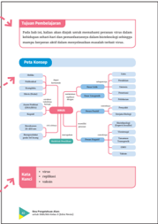

> **Deskripsi Visual:** Gambar ini adalah diagram yang menunjukkan struktur dan proses dalam sebuah sistem informasi. Diagram ini terdiri dari tiga bagian utama:

1. **Peta Sistem**: Bagian ini menggambarkan hubungan antara berbagai komponen sistem. Ada beberapa elemen utama seperti "Input", "Proses", dan "Output". Setiap elemen ini memiliki ikon yang menunjukkan fungsi mereka.

2. **Struktur Data**: Bagian ini menunjukkan struktur data yang digunakan dalam sistem. Terdapat beberapa jenis struktur data seperti "List", "Tree", dan "Graph". Setiap jenis struktur data memiliki ikon yang menunjukkan bentuknya.

3. **Algoritma**: Bagian ini menunjukkan algoritma yang digunakan dalam sistem. Ada beberapa algoritma seperti "Search", "Sort", dan "Algorithm". Setiap algoritma memiliki ikon yang menunjukkan langkah-langkahnya.

Teks, angka, atau label penting yang terlihat dalam diagram ini meliputi nama-nama elemen seperti "Input", "Proses", "Output", "List", "Tree", "Graph", "Search", "Sort", dan "Algorithm". Informasi kunci yang dapat diambil pembaca meliputi struktur dan proses sistem informasi, serta algoritma yang digunakan dalam sistem tersebut.

### Pengantar Bab

Pada bagian awal setiap bab ditampilkan kejadian-kejadian dalam kehidupan sehari-hari yang berkaitan dengan materi pada bab tersebut.

Di akhir pengantar bab, diselipkan pertanyaan untuk memancing kalian untuk berpikir secara kreatif.

 

---
## 📄 Halaman 14

### Aktivitas

Selain materi, dalam buku ini ini juga disajikan berbagai aktivitas. Aktivitas ini mengajak kalian untuk menelaah, mengamati, mencari tahu, mengidentiikasi, menghitung, berpikir kritis, dan lain-lain. Bentuk aktivitasnya antara lain mencari dan menelaah informasi dari artikel, melakukan pengamatan sederhana di lingkungan sekitar, menyimak video, dan melakukan praktikum sederhana.

### Ayo Berlatih

Pada itur ini ditampilkan beragam jenis pertanyaan yang berkaitan dengan materi pada akhir subbab sebagai sarana latihan kalian dalam mengerjakan soal.

---
**🖼️ Gambar/Diagram**

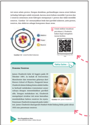

> **Deskripsi Visual:** Gambar ini adalah ilustrasi yang menunjukkan struktur molekul DNA. Ilustrasi ini menggambarkan DNA sebagai sebuah heliks berbentuk spiral, dengan dua lapisan yang saling berputar. Di bagian tengah, ada sebuah titik merah yang menunjukkan titik tengah DNA. Di sekeliling ilustrasi, terdapat beberapa elemen penting:

1. Teks: Terdapat teks yang menjelaskan bahwa DNA adalah molekul berbentuk heliks yang terdiri dari dua lapisan, dengan dua lapisan berputar satu sama lain. Teks juga menyebutkan bahwa DNA memiliki struktur berbentuk heliks.

2. Angka: Ada angka 20 di bagian tengah ilustrasi, mungkin menunjukkan jumlah atom dalam satu lapisan DNA.

3. Label: Terdapat label "DNA" di bagian atas ilustrasi, yang menunjukkan subjek ilustrasi.

4. Informasi Kunci: Gambar ini memberikan pemahaman tentang struktur dasar DNA, yaitu heliks berbentuk spiral, serta menjelaskan bahwa DNA terdiri dari dua lapisan yang berputar satu sama lain. Ini membantu pembaca memahami konsep dasar tentang DNA dan bagaimana struktur molekulnya bekerja.

---
**🖼️ Gambar/Diagram**

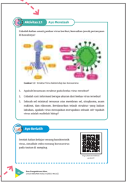

> **Deskripsi Visual:** Gambar ini adalah ilustrasi yang menunjukkan struktur virus dan bagian-bagian pentingnya. Ilustrasi ini mencakup dua jenis virus: HIV dan Hepatitis B. Dua virus tersebut diperlihatkan dengan detail, termasuk struktur mereka, bagian-bagian seperti kapsom, kapsid, dan enzim.

Ilustrasi ini juga menunjukkan bagaimana virus HIV menyerang sel darah merah (Hematopoietic Stem Cells) dan bagaimana Hepatitis B menyerang sel hati (Liver Cells). Ini menunjukkan hubungan antara virus dan organ tubuh yang diserang.

Teks pada gambar memberikan penjelasan tentang struktur virus dan bagaimana virus menyerang organ tubuh. Angka dan label penting dalam gambar meliputi:

1. HIV dan Hepatitis B
2. Kapsom
3. Kapsid
4. Enzim
5. Sel darah merah (Hematopoietic Stem Cells)
6. Sel hati (Liver Cells)

Informasi kunci yang dapat diambil pembaca adalah bahwa virus HIV dan Hepatitis B memiliki struktur yang berbeda dan menyerang organ tubuh yang berbeda. Ilustrasi ini membantu memahami bagaimana virus menyerang dan bagaimana struktur virus mempengaruhi proses penyakit.

### Tautan Kode QR

Berisikan tautan video atau artikel yang mendukung pembelajaran materi tertentu sehingga kalian dapat menambah wawasan tidak hanya dari buku.

### Fakta Sains

Informasi tambahan yang memperkuat materi yang sedang dibahas, misalnya biograi tokoh penemu, pencetus kimia hijau, dan sejarah munculnya suatu teori.

 

---
## 📄 Halaman 15

### Proyek

Pada kegiatan ini kalian diajak menemukan masalah hingga memberikan solusi permasalahan melalui sebuah proyek yang berkaitan dengan materi suatu bab.

### Intisari

Pada akhir bab disajikan ringkasan tentang konsep kunci sebagai pengingat materi yang telah kalian pelajari.

---
**🖼️ Gambar/Diagram**

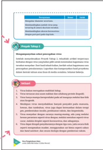

> **Deskripsi Visual:** Gambar ini adalah diagram yang menunjukkan proses penyebaran virus melalui media sosial. Diagram ini terdiri dari beberapa elemen utama:

1. **Judul**: "Proses Penyebaran Virus Melalui Media Sosial"

2. **Latar Belakang**: Latar belakang biru dengan tulisan "Waspada Penyebaran Virus" berwarna merah.

3. **Elemen Utama**:
   - **Langkah 1**: "Membagikan Link"
     - Ini merupakan langkah awal dalam proses penyebaran virus.
   - **Langkah 2**: "Menyebarkan Pesan"
     - Ini adalah langkah selanjutnya di mana pesan tentang virus dibagikan kepada teman atau kelompok.
   - **Langkah 3**: "Mengundang Teman Baru"
     - Langkah ini mengajak orang lain untuk mengundang teman baru ke grup atau akun yang telah dibagikan.
   - **Langkah 4**: "Membagikan Pesan Kembali"
     - Ini adalah langkah terakhir di mana pesan tentang virus dibagikan lagi kepada teman-teman yang sudah dibagikan sebelumnya.

4. **Teks, Angka, atau Label Penting**:
   - Ada tiga langkah yang ditunjukkan dalam diagram, masing-masing dengan label yang jelas.
   - Teks "Waspada Penyebaran Virus" berada di latar belakang yang menarik perhatian pembaca.

5. **Informasi Kunci**:
   - Diagram ini memberikan pemahaman yang jelas tentang bagaimana virus dapat diperbawa melalui media sosial.
   - Pembaca dapat memahami bahwa setiap langkah dalam proses penyebaran virus dapat membantu penyebaran lebih luas.
   - Ini juga memberikan petunjuk tentang cara-cara untuk mencegah penyebaran virus melalui media sosial.

Dengan demikian, diagram ini efektif dalam memberikan informasi tentang proses penyebaran virus melalui media sosial dan memberikan petunjuk tentang cara-cara untuk mencegahnya.

### Ayo Cek Pemahaman

Pada akhir bab, kalian akan disajikan berbagai pertanyaan tentang materi pada bab tersebut. Pertanyaanpertanyaan yang dimunculkan dalam berbagai bentuk dan tidak hanya untuk mengases pengetahuan tetapi juga keterampilan proses kalian serta melatih kalian untuk terbiasa dengan soal AKM.

 

---
## 📄 Halaman 16

---
**🖼️ Gambar/Diagram**

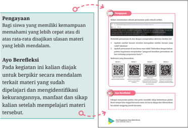

> **Deskripsi Visual:** Gambar ini adalah ilustrasi yang menunjukkan bagaimana proses pengajaran dan pembelajaran dalam sebuah mata pelajaran. Ilustrasi ini terdiri dari beberapa elemen utama:

1. **Pengayaan**: Ini adalah bagian awal dari proses pembelajaran yang menunjukkan bahwa siswa yang memiliki kemampuan memahami lebih cepat atau di atas rata-rata disajikan ulasan materi yang lebih mendalam.

2. **Ayo Berfleksi**: Ini merupakan bagian kedua yang mengajak siswa untuk berpikir secara kritis tentang materi yang telah dipelajari. Siswa diajak untuk mengidentifikasi kekurangan, manfaat, dan sikap mereka setelah mempelajari materi tersebut.

3. **Program**: Ini mungkin merujuk pada program atau metode belajar yang digunakan dalam proses pembelajaran tersebut.

4. **Teks dan Angka Penting**: Terdapat teks yang memberikan informasi tentang proses pembelajaran, seperti "Bagi siswa yang memiliki kemampuan memahami lebih cepat atau di atas rata-rata disajikan ulasan materi yang lebih mendalam." Ini menunjukkan bahwa siswa dengan kemampuan ini akan mendapatkan materi yang lebih mendalam.

5. **QR Code**: QR Code tampaknya digunakan untuk menghubungkan informasi tambahan atau link yang relevan dengan materi yang dipelajari.

6. **Label dan Teks**: Terdapat label dan teks yang menjelaskan bagaimana proses pembelajaran berlangsung, termasuk bagaimana siswa harus berpikir dan mengidentifikasi aspek-aspek dari materi yang telah dipelajari.

7. **Informasi Kunci**: Pembaca dapat memahami bahwa proses ini mencakup pengajaran yang mendalam untuk siswa yang berprestasi tinggi, serta peluang untuk siswa lain untuk berpikir kritis dan mengidentifikasi aspek positif dan negatif dari materi yang dipelajari.

Secara keseluruhan, gambar ini menunjukkan struktur dan proses pembelajaran yang dinamis dan interaktif, dengan fokus pada pemahaman kritis dan pengembangan sikap belajar yang aktif.

 

---
## 📄 Halaman 17

### Bab I

KEMENTERIAN PENDIDIKAN, KEBUDAYAAN, RISET, DAN TEKNOLOGI REPUBLIK INDONESIA, 2023

Ilmu Pengetahuan Alam untuk SMA/MA Kelas X (Edisi Revisi)

Penulis

:  Niken Resminingpuri Krisdianti, Elizabeth Tjahjadarmawan,

Ayuk Ratna Puspaningsih

ISBN

:  978-623-118-461-0 (jil.1 PDF)

Sumber: freepik/freepik.com (2023)

Sistem Pengukuran dalam Kerja Ilmiah

Berbagai macam alat ukur biasa dijumpai dalam kehidupan seharihari. Mengapa pengetahuan tentang alat ukur penting untuk dikuasai?

Bab I

Sistem Pengukuran dalam Kerja Ilmiah

1

 

---
## 📄 Halaman 18

### Tujuan Pembelajaran

Setelah mempelajari bab ini, kalian dapat mengklasiikasikan macam-macam alat ukur berdasarkan besaran yang diukur, mengukur dengan menggunakan alat ukur yang sesuai, melakukan pengolahan data hasil pengukuran dengan menggunakan aturan angka penting, menuliskan hasil pengukuran dengan menggunakan aturan penulisan notasi ilmiah dan satuan yang sesuai, menentukan nilai ketidakpastian pada pengukuran berulang, serta merancang percobaan untuk menyelidiki suatu kasus terkait pengukuran.

### Peta Konsep

### PENGUKURAN

---
**🖼️ Gambar/Diagram**

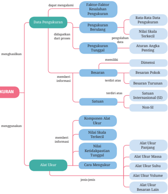

> **Deskripsi Visual:** Gambar ini adalah diagram yang menunjukkan struktur dan proses pengukuran. Diagram ini dibagi menjadi dua bagian utama: "menghasilkan" dan "menggunakan". Pada bagian "menghasilkan", ada beberapa faktor-faktor seperti "Data Pengukuran", "Pengukuran Berulang", dan "Pengukuran Tunggal". Setiap faktor tersebut memiliki sub-faktor seperti "Faktor-Faktor Kesalahan Pengukuran", "Pengukuran Berulang", dan "Pengukuran Tunggal".

Pada bagian "menggunakan", ada elemen-elemen seperti "Alat Ukur", "Komponen Alat Ukur", "Nilai Skala Terkendali", "Kedudukan Alat Ukur", "Cara Mengukur", dan "Jenis-jenis Alat Ukur". Setiap elemen ini memiliki sub-elemen yang lebih spesifik.

Teks, angka, atau label penting yang terlihat dalam diagram ini meliputi nama-nama faktor, sub-faktor, dan elemen-elemen pengukuran. Informasi kunci yang dapat diambil pembaca meliputi struktur pengukuran, jenis-jenis alat ukur, dan proses pengukuran yang berbeda-beda.

Dengan demikian, diagram ini memberikan gambaran yang jelas tentang struktur dan proses pengukuran, serta jenis-jenis alat ukur yang digunakan dalam pengukuran tersebut.

 

---
## 📄 Halaman 19

### Kata Kunci

- alat ukur
- angka penting
- besaran
Diberitakan di kompas.com, 27 Maret 2021, dengan judul berita "Ban Truk yang Lepas Tiba-tiba Biasanya akibat Baut Longgar", menyebutkan truk bermuatan kayu gelondongan mengalami insiden roda  lepas  di  wilayah  Lasem,  Jawa Tengah (Gambar 1.1). Roda truk dapat terlepas akibat baut dan mur pada pelek roda longgar, atau dapat disebabkan juga karena baut pelek patah. Kasus patah baut roda truk seperti ini telah banyak terjadi  di  Indonesia.  Hal  ini

- ketidakpastian pengukuran
- satuan
Sumber: Zacky Wahyudhi/otomotif.kompas.com (2021)

dapat disebabkan oleh banyak faktor, seperti muatan truk me  lebihi kapasitas maksimum, ukuran mur dan baut yang tidak sesuai, dan penggunaan baut dengan material bahan yang tidak sesuai.

Sumber: Logga Wiggler/pixabay.com (2011)

Kritisilah kejadian patah baut roda truk di atas. Bagaimana cara memastikan ukuran baut sudah sesuai dengan murnya? Bagaimana cara memastikan material bahan mur dan baut sudah benar? Bagaimana pengetahuan mengenai pengukuran dapat mencegah kejadian tersebut terulang kembali? Semua jawaban ini dapat kalian ketahui dengan menelusuri bab ini.

 

---
## 📄 Halaman 20

### A.  Macam-Macam Alat Ukur

Coba kalian amati Gambar 1.3. Tentu kalian tidak asing dengan aktivitas tersebut, bukan? Apa pun bidang pekerjaannya, aktivitas yang dilakukan masyarakat dalam kehidupan sehari-hari tidak lepas dari kegiatan pengukuran. Oleh karena itu, penting bagi kalian untuk dapat memahami tentang prinsip-prinsip pengukuran.

(a)

(b)

---
**🖼️ Gambar/Diagram**

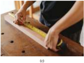

> **Deskripsi Visual:** Gambar ini adalah ilustrasi yang menunjukkan proses pengukuran panjang dengan menggunakan kalkulator dan tape measure. Gambar ini menggambarkan dua orang yang sedang melakukan pengukuran pada sebuah benda, mungkin untuk memastikan ukuran tepat sesuai dengan standar atau rencana. Elemen utama dalam gambar ini adalah dua orang yang sedang berada di sebelah kiri dan kanan, mereka sedang menggunakan kalkulator dan tape measure untuk mengukur panjang. Label penting dalam gambar ini adalah nama "63" yang terletak di bagian bawah gambar, yang mungkin merujuk pada ukuran yang telah diukur atau target yang ingin dicapai. Informasi kunci yang dapat diambil dari gambar ini adalah bahwa pengukuran sangat penting dalam banyak bidang seperti konstruksi, perencanaan, dan industri lainnya.

Sumber:  (a) Andi Sahrial/dinkes.surabaya.go.id (2017) (b) Kukuh Kurniawan/tribunjatim.com (2018) (c) Ono Kosuki/pexels. com (2020)

Tentu kalian pernah melakukan pengukuran, bukan? Pahamkah kalian, apa  itu  pengukuran?  Ketika  kalian  sedang  mengukur  suatu  benda  yang ukurannya tidak diketahui dengan menggunakan alat ukur, artinya kalian sedang membandingkan ukuran suatu benda yang belum diketahui ukurannya dengan alat yang dianggap sebagai ukuran standar.

Terdapat banyak sekali alat ukur yang dapat kalian jumpai dalam kehidupan sehari-hari. Penggunaan alat ukur tersebut tergantung pada apa yang ingin diukur. Seberapa luas wawasan kalian mengenai alat ukur dan penggunaannya? Mari uji wawasan kalian dengan Aktivitas 1.1.

 

---
## 📄 Halaman 21

### Aktivitas 1.1

### Ayo Mengamati

### Coba kalian perhatikan Gambar 1.4.

---
**🖼️ Gambar/Diagram**

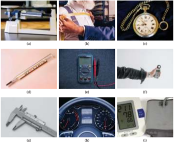

> **Deskripsi Visual:** Gambar ini adalah ilustrasi yang menunjukkan berbagai alat ukur dan peralatan laboratorium. Gambar (a) menunjukkan sebuah mikroskop, yang digunakan untuk memperbesar dan memeriksa mikroorganisme atau partikel kecil. Gambar (b) menunjukkan seorang peneliti sedang menggunakan mikroskop untuk melakukan eksperimen. Gambar (c) menunjukkan sebuah jam pengukur waktu, yang digunakan untuk mengukur waktu dalam detil. Gambar (d) menunjukkan sebuah termometer, yang digunakan untuk mengukur suhu. Gambar (e) menunjukkan sebuah mikrometris, yang digunakan untuk mengukur panjang dengan sangat presisi. Gambar (f) menunjukkan sebuah alat pengukur kecepatan, yang digunakan untuk mengukur kecepatan. Gambar (g) menunjukkan sebuah skala, yang digunakan untuk mengukur massa. Gambar (h) menunjukkan sebuah meteran, yang digunakan untuk mengukur kecepatan. Gambar (i) menunjukkan sebuah alat pengukur tekanan darah, yang digunakan untuk mengukur tekanan darah. Semua elemen ini saling berkaitan dalam konteks pengukuran dan analisis data dalam laboratorium.

Sumber: (a) Charlote Johnson/sciencing.com (2017), (b) freepik/freepik.com, (c) pixabay/pexels.com (2016), (d) Adriano Gadini/pixabay.com (2015), (e) Nekhil R/unsplash.com (2021), (f) Tima Miroshnichenko/ pexels.com, (g) Steve Buissinne (Stevepb)/pixabay.com (2014), (h) Mike Bird/pexels.com (2018), (i) Dmitriy (ds_30)/pixabay.com (2020)

### Isilah tabel berikut ini sesuai dengan pengetahuan kalian!

---
**📊 Tabel**

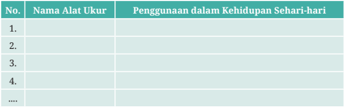

Tabel ini berisi informasi tentang alat ukur yang digunakan dalam kehidupan sehari-hari. Topik utamanya adalah penggunaan alat ukur dalam kehidupan sehari-hari. Tabel memiliki dua kolom: "No." dan "Nama Alat Ukur". Kolom "No." mungkin digunakan untuk menunjukkan urutan atau nomor identifikasi setiap baris, sementara kolom "Nama Alat Ukur" berisi nama-nama alat ukur yang digunakan dalam kehidupan sehari-hari. Data atau pola penting yang terlihat dalam tabel ini adalah bahwa setiap baris memiliki satu nama alat ukur dan penggunaannya dalam kehidupan sehari-hari. Ini menunjukkan bahwa tabel ini bertujuan untuk memberikan pemahaman tentang bagaimana alat ukur digunakan dalam kehidupan sehari-hari.

 

---
## 📄 Halaman 22

### B.  Besaran, Satuan, dan Dimensi

Tentu kalian sudah terbiasa melakukan pengu  kuran dengan menggunakan penggaris, bukan? Bacalah hasil pengukuran pada ilustrasi di samping. Berapakah panjang kertas tersebut? Sebutkan dua komponen dari hasil pengukuran ini! Berikut ini merupakan ulasan mengenai komponen hasil pengukuran.

---
**🖼️ Gambar/Diagram**

> **Deskripsi Visual:** Gambar ini adalah ilustrasi yang menunjukkan seorang siswa sedang belajar di meja belajar. Siswa tersebut sedang menggunakan laptop untuk mengakses internet, sementara di depannya ada sebuah papan tulis dengan beberapa teks yang ditulis. Ilustrasi ini menunjukkan hubungan antara teknologi modern (laptop) dan pendidikan tradisional (papan tulis). Informasi kunci yang dapat diambil dari gambar ini adalah pentingnya integrasi teknologi dalam proses belajar dan pengajaran.

### 1. Besaran

'Besar' yang didapatkan dari hasil pengukuran berkaitan dengan suatu besaran. Pada Gambar 1.5, sesuatu yang diukur itu adalah panjang. Besaran merupakan sesuatu yang akan diukur. Besaran terdiri atas besaran pokok dan besaran turunan. Besaran pokok merupakan besaran dasar yang satuannya sudah ditetapkan. Besaran turunan merupakan besaran yang satuannya tersusun dari beberapa satuan besaran pokok.

### 2. Satuan

Satuan merupakan ukuran yang menjadi acuan dari suatu besaran. Terdapat beberapa sistem satuan yang digunakan di dunia, yaitu sistem FPS (feet, pound, second ),  CGS (sentimeter, gram, sekon), dan MKS (meter, kilogram, sekon ) . Beberapa negara memiliki kebiasaannya masing-masing dalam penggunaan sistem satuan. Oleh karena itu, masyarakat ilmiah b ersama-sama membuat kesepakatan tentang satu sistem satuan baku yang digunakan secara universal. Satuan tersebut adalah satuan internasional, dalam bahasa aslin ya Systeme International D' Unites , atau disingkat SI. Kalian dapat melihat beberapa contoh satuan SI dari besaran pokok pada Tabel 1.1 dan besaran turun an pada Tabel 1.2.

 

---
## 📄 Halaman 23

---
**📊 Tabel**

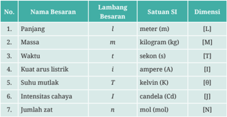

Tabel ini berisi informasi tentang beberapa besaran fisika dan satuan-satunya dalam sistem satuan International (SI). Topik utama tabel adalah besaran fisika dan satuan-satunya dalam SI. Kolom-kolom yang ada meliputi nomor, nama besaran, lambang besaran, satuan SI, dan dimensi. Data penting yang terlihat antara lain bahwa panjang menggunakan meter sebagai satuan dan dimensi [L], massa menggunakan kilogram dan dimensi [M], waktu menggunakan sekon dan dimensi [T], kuat arus listrik menggunakan ampere dan dimensi [I], suhu mulai menggunakan kelvin dan dimensi [0], intensitas cahaya menggunakan candela dan dimensi [J], dan jumlah zat menggunakan mol dan dimensi [N].

---
**📊 Tabel**

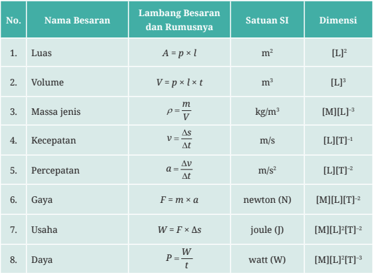

Tabel ini berisi informasi tentang beberapa besarannya dalam bidang fisika, termasuk luas, volume, massa jenis, kecepatan, percepatan, gaya, usaha, dan daya. Kolom-kolomnya meliputi nomor urutan, nama besaran, rumusnya, satuan SI, dan dimensi. Topik utama tabel adalah definisi dan keterkaitan antara besaran-besaran tersebut dalam sistem satuan International System of Units (SI). Data penting yang terlihat adalah bahwa semua besaran dalam tabel memiliki dimensi yang sama, yaitu [L][T]², yang menunjukkan bahwa mereka semua merupakan besaran yang mempunyai ukuran dan waktu. Ini menunjukkan bahwa setiap besaran dalam tabel memiliki hubungan dengan ukuran dan waktu dalam sistem satuan SI.

Fisika mempelajari objek dengan berbagai ukuran, mulai dari benda berukuran sangat kecil hingga sangat besar. Tidak hanya itu, dasar pemahaman tentang pengukuran juga bermanfaat untuk mengidentiikasi ciri isis suatu

 

---
## 📄 Halaman 24

objek di bidang pengetahuan lainnya. Misalnya pada bidang kimia, elektron merupakan salah satu penyusun atom. Dalam keadaan diam, elektron memiliki massa yang sangat kecil, yaitu sebesar 0,000000000000000000000000000000911 kg. Untuk memudahkan penulisan, nilai massa elektron diam dapat dituliskan dalam bentuk notasi ilmiah, yaitu 9,11 × 10 -31  kg. Notasi ilmiah merupakan cara penulisan angka berupa bilangan sepuluh berpangkat untuk mengakomodasi penulisan angka yang sangat kecil dan angka yang sangat besar. Contoh lainnya pada bidang biologi, virus Covid-19 berdiameter sangat kecil, yaitu berkisar 0,1 mikrometer. Satu mikrometer setara dengan 1/1.000.000 meter. Mikro, pada satuan ukuran virus Covid-19, merupakan salah satu contoh awalan satuan. Awalan satuan merupakan preiks (awalan) yang bermakna sebagai pangkat n dari sepuluh satuan tertentu.

---
**📊 Tabel**

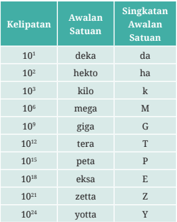

Tabel ini menunjukkan sistem pengukuran satuan dalam sistem bilangan desimal. Topik utamanya adalah sistem satuan bilangan desimal dan cara mengubahnya menjadi satuan yang lebih besar atau lebih kecil. Kolom pertama menunjukkan kelipatan, kemudian berikutnya adalah awalan satuan, dan kolom terakhir menunjukkan singkatan awalan satuan. Data penting yang terlihat adalah bahwa setiap kelipatan memiliki satu atau dua angka di depannya, dan setiap angka tersebut menggambarkan satuan tertentu dalam sistem bilangan desimal.

### 3. Dimensi

Dimensi merupakan cara suatu besaran turunan disusun berdasarkan besaran pokoknya. Suatu besaran turunan dapat dinyatakan dalam susunan beberapa besaran pokok yang dapat diketahui dengan melakukan analisis dimensi. Dimensi dari besaran pokok berupa lambang yang ditulis dengan kurung siku dan huruf kapital tertentu seperti yang ditunjukkan pada Tabel 1.1.

---
**📊 Tabel**

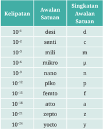

Tabel ini berisi informasi tentang kelipatan satuan dalam sistem bilangan desimal. Topik utamanya adalah kelipatan satuan yang dinyatakan dalam bentuk desimal dan singkatkan dengan menggunakan simbol matematika seperti 'd', 'm', 'μ', 'n', 'p', 'f', 'a', 'z', dan 'y'. Kolom pertama menunjukkan kelipatan satuan dalam bentuk desimal, sementara kolom kedua menunjukkan singkatkan awalannya. Data penting yang terlihat adalah bahwa setiap kelipatan satuan memiliki singkatkan yang berbeda, mulai dari 'd' untuk 10^-4 hingga 'y' untuk 10^-24. Ini menunjukkan bahwa sistem bilangan desimal memiliki cara unik untuk menuliskan kelipatan satuan dengan menggunakan singkatkan yang berbeda-beda.

 

---
## 📄 Halaman 25

Bagaimana pengetahuan mengenai konsep besaran, satuan, dan dimensi ini digunakan? Mari kerjakan Aktivitas 1.2.

### Aktivitas 1.2

### Ayo Identiikasi

- Kalian sudah mendapatkan pengetahuan mengenai besaran, satuan, dan dimensi. Perhatikan kembali Gambar 1.4, kemudian isilah tabel berikut ini!
- Perhatikanlah Gambar 1.3(a) dan (b). Alat ukur pada kedua gambar tersebut mengukur besaran yang sama. Lihat pula tabel pada soal nomor 1, terdapat alat ukur yang memiliki dimensi yang sama. Jelaskan pendapatmu, mengapa harus ada kedua alat ukur yang berbeda untuk besaran yang sama?

---
**📊 Tabel**

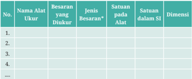

Tabel ini berisi informasi tentang berbagai alat ukur besaran yang diukur dalam suatu sistem pengukuran. Kolom-kolomnya meliputi Nama Alat Ukur, Besaran yang Diukur, Jenis Besaran*, Satuan pada Alat, Satuan dalam SI, dan Dimensi. Topik utama tabel ini adalah pengukuran besaran dengan menggunakan berbagai alat ukur. Data penting yang terlihat adalah bahwa setiap baris menunjukkan satu alat ukur besaran tertentu, seperti panjang, massa, kecepatan, dan lain-lain. Setiap baris juga menyertakan informasi tentang jenis besaran yang diukur, satuan yang digunakan, dan dimensi besaran tersebut dalam satuan SI.

Baut dan mur berfungsi untuk menyatukan  dua  komponen  alat  secara  tidak permanen, sehingga ketika dua komponen alat tersebut perlu dipisahkan maka dapat mudah  dipisahkan tanpa mengalami kerusakan. Biasanya sebelum dipasangkan, baut dan mur ini diukur terlebih dahulu untuk memastikan ukurannya sesuai dengan komponen-komponen alat agar komponen alat tidak mengalami kerusakan saat digunakan.

Sumber: Amol Sharma (CompileIdeas)/pixabay.com

 

---
## 📄 Halaman 26

(2022) Alat ukur apa yang dapat digunakan untuk mengukur besaran-besaran isis baut dan mur? Bagaimana cara mengukurnya? Mari telusuri bersama pada Aktivitas 1.3.

### Aktivitas 1.3 Ayo Cari Tahu

Untuk memilih alat ukur yang digunakan dalam kegiatan pengukuran, kalian perlu mempertimbangkan besaran apa yang diukur. Pada kasus ini, kalian harus memilih alat ukur yang cocok untuk mengukur besaran-besaran baut. Untuk itu, kalian perlu mengetahui cara mengukur menggunakan alat-alat ukur berikut.

### 1.  Jangka Sorong

Carilah informasi mengenai hal-hal berikut.

### a. Bagian-bagian jangka sorong

Tuliskanlah nama bagian-bagian jangka sorong beserta fungsinya!

### b. Nilai skala terkecil pada alat ukur

Perhatikan kembali Gambar 1.7. Pada alat ukur jangka sorong terdapat dua skala. Skala yang letaknya di atas (nomor 4) disebut skala utama. Skala utama merupakan skala yang bernilai cm pada alat ukur tersebut. Sementara skala yang letaknya di bawah (nomor 6) disebut skala nonius. Skala nonius merupakan skala mm.

Amatilah jangka sorong pada Gambar 1.7, kemudian tentukanlah nilai skala terkecil dari skala utama dan skala nonius!

 

---
## 📄 Halaman 27

### c. Nilai ketidakpastian untuk sekali pengukuran

Setiap pengukuran selalu ada kemungkinan terjadinya ketidaktelitian. Oleh karena itu, terdapat nilai yang menyatakan kemungkinan error dari kegiatan pengukuran, yaitu nilai ketidakpastian. Nilai ketidakpastian untuk  sekali  pengukuran  dapat  ditentukan  dengan  persamaan matematika:

``

Tentukanlah nilai ketidakpastian untuk pengukuran tunggal menggunakan jangka sorong!

### d. Cara mengukur menggunakan jangka sorong

Tuliskanlah langkah-langkah pengukuran suatu benda menggunakan jangka sorong!

### e. Membaca pengukuran jangka sorong

Kalian telah mengidentiikasi alat ukur jangka sorong. Bagaimana cara membaca hasil pengukuran menggunakan jangka sorong? Berikut ini merupakan langkah-langkah membaca hasil pengukuran jangka sorong.

 

---
## 📄 Halaman 28

Perhatikan Gambar 1.8 dan Gambar 1.9 yang merupakan perbesaran dari Gambar 1.8.

Langkah pertama ,  membaca skala utama. Skala bagian atas jangka sorong merupakan skala utama. Selain angka nol pada skala utama, acuan pembacaan ukuran skala utama adalah angka nol skala nonius seperti ditunjukkan pada Gambar 1.9.

Satu skala yang tepat berada di belakang nol skala nonius m erupakan hasil  pembacaan  skala  utama.  Pada  Gambar  1.9,  skala  utama  yang terbaca dari hasil pengukuran tersebut adalah 3,700 cm.

Langkah kedua , membaca skala nonius. Skala nonius yang garisnya berimpit dengan skala utamanya merupakan hasil pembacaan skala noniusnya seperti yang ditunjukkan pada Gambar 1.10. Skala nonius yang terbaca pada hasil pengukuran tersebut adalah 5,5. Kemudian, hasil pembacaan skala nonius dikalikan 0,01 cm, sehingga didapatkan skala nonius dari pengukuran tersebut adalah 0,055 cm.

Langkah ketiga , menjumlahkan hasil pembacaan skala utama dengan skala nonius. Hasil penjumlahan skala utama dan skala nonius pengukuran dengan jangka sorong pada Gambar 1.8 adalah 3,755 cm dengan nilai ketidakpastian alat ukur jangka sorong ini sebesar 0,005 cm, sehingga hasil pengukurannya adalah (3,755 ± 0,005) cm.

Coba tentukan hasil pengukuran diameter benda yang ditunjukkan oleh Gambar 1.11 berikut ini!

 

---
## 📄 Halaman 29

---
**🖼️ Gambar/Diagram**

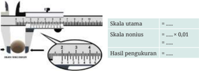

> **Deskripsi Visual:** Gambar ini adalah ilustrasi yang menunjukkan bagaimana pengukuran diameter menggunakan mikrometar. Gambar ini terdiri dari beberapa elemen utama:

1. Skala Utama: Ini adalah skala yang digunakan untuk mengukur diameter objek. Skala ini berada di sepanjang garis putih.

2. Skala Nonius: Ini adalah skala tambahan yang lebih kecil yang digunakan untuk mendapatkan ukuran yang lebih presisi. Skala ini berada di sepanjang skala utama.

3. Objek Pengukuran: Di bagian bawah gambar, terdapat sebuah cincin yang sedang dipotong dengan mikrometar.

4. Hasil Pengukuran: Angka yang ditunjukkan oleh skala nonius pada skala utama menunjukkan hasil pengukuran diameter cincin tersebut.

5. Teks: Teks "Skala utama" dan "Skala nonius" memberikan penjelasan tentang fungsi masing-masing skala.

6. Angka: Angka-angka yang ditunjukkan oleh skala nonius menunjukkan hasil pengukuran diameter cincin.

7. Label: Label "Hasil pengukuran" menunjukkan bahwa informasi yang ditunjukkan oleh skala nonius adalah hasil pengukuran.

Dari gambar ini, kita dapat memahami proses pengukuran diameter menggunakan mikrometar dan bagaimana skala utama dan skala nonius digunakan untuk mendapatkan hasil yang lebih akurat.

Sumber: Wahyu Noveriyanto/Kemendikbudristek (2021)

### f. Menuliskan hasil pengukuran

Cara penulisan hasil pengukuran beserta nilai ketidakpastian dari suatu kegiatan pengukuran adalah sebagai berikut.

``

Tuliskanlah hasil pengukuran pada Gambar 1.11 sesuai dengan aturan penulisan di atas!

### 2.  Mikrometer Sekrup

Carilah informasi mengenai hal-hal berikut.

### a. Bagian-bagian mikrometer sekrup

---
**🖼️ Gambar/Diagram**

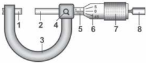

> **Deskripsi Visual:** Gambar ini adalah ilustrasi yang menunjukkan bagian dari alat ukur tekanan air (manometer). Gambar ini menggambarkan sebagian dari manometer dengan detail yang jelas.

1. **Apa yang ditampilkan secara keseluruhan**: Gambar ini menunjukkan bagian dari manometer yang terdiri dari beberapa komponen utama seperti ujung panjang (1), ujung pendek (2), ruang pengisian (3), dan beberapa elemen penandaan (4-8).

2. **Elemen-elemen utama dan relasinya**: 
   - Ujung panjang (1) dan ujung pendek (2) berfungsi untuk menampung fluida dan memperbolehkan pergerakan fluida.
   - Ruang pengisian (3) digunakan untuk menyimpan fluida dan memungkinkan pergerakan fluida saat tekanan meningkat.
   - Elemen penandaan (4-8) membantu dalam pengukuran tekanan, dengan setiap elemen memiliki fungsi spesifik dalam menunjukkan tekanan.

3. **Teks, angka, atau label penting yang terlihat**: 
   - Angka 1, 2, 4, 5, 6, 7, dan 8 mungkin merujuk pada elemen-elemen penandaan yang berbeda.
   - Teks "Q" mungkin merujuk pada titik pengukuran tekanan.

4. **Informasi kunci yang dapat diambil pembaca**: Gambar ini memberikan pemahaman tentang bagaimana manometer bekerja dan bagaimana elemen-elemen tersebut berfungsi dalam menentukan tekanan. Ini sangat berguna bagi pembaca yang ingin memahami konsep dasar manometer dan bagaimana cara kerjanya.

Sumber: Wahyu Noveriyanto/Kemendikbudristek (2021)

Tuliskanlah nama komponen-komponen pada mikrometer sekrup beserta fungsinya!

 

---
## 📄 Halaman 30

### b. Nilai skala terkecil pada alat ukur

Perhatikan kembali Gambar 1.12. Alat ukur mikrometer sekrup juga memiliki dua skala. Skala yang letaknya di kiri dan arah pembacaannya horizontal (nomor 5) disebut skala utama. Skala utama merupakan skala yang bernilai 1 mm pada alat ukur tersebut. Sementara skala yang letaknya di kanan dan arah pembacaannya vertikal (nomor 6) disebut skala nonius. Skala nonius merupakan skala yang bernilai 0,01 mm.

Amatilah mikrometer sekrup pada Gambar 1.12, kemudian tentukan  lah nilai skala terkecil dari skala utama dan skala noniusnya!

### c. Nilai ketidakpastian untuk sekali pengukuran

Kalian sudah mengetahui cara menentukan nilai ketidakpastian untuk sekali pengukuran menggunakan jangka sorong pada aktivitas sebelumnya. Sekarang, coba kalian tentukan nilai ketidakpastian untuk pengukuran tunggal menggunakan mikrometer sekrup!

### d. Cara mengukur menggunakan mikrometer sekrup

Tuliskanlah langkah-langkah pengukuran suatu benda menggunakan mikrometer sekrup!

### e. Membaca pengukuran mikrometer sekrup

Perhatikan Gambar 1.13 dan Gambar 1.14 yang merupakan perbesaran dari Gambar 1.13.

---
**🖼️ Gambar/Diagram**

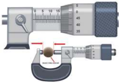

> **Deskripsi Visual:** Gambar ini adalah ilustrasi yang menunjukkan sebuah mikrometris (micrometer) digunakan untuk mengukur ukuran. Mikrometris adalah alat ukur yang sangat akurat digunakan dalam bidang teknik dan industri untuk mengukur ukuran kecil dengan ketelitian tinggi. Gambar ini menunjukkan bagian depan mikrometris dengan tangan penggerak yang berfungsi untuk menggerakkan ruang antara dua plat yang bergerigi. 

Elemen utama yang ditampilkan adalah mikrometris, tangan penggerak, dan ruang antara dua plat yang bergerigi. Tangan penggerak berfungsi untuk menggerakkan ruang antara dua plat yang bergerigi, yang merupakan bagian penting dari mikrometris. Ruang antara dua plat yang bergerigi ini digunakan untuk mengukur perubahan ukuran.

Teks, angka, atau label penting yang terlihat pada gambar adalah nomor "0" yang menunjukkan posisi awal pengukuran, dan angka-angka di sekitar tangan penggerak yang menunjukkan jumlah putaran yang diperlukan untuk menggerakkan tangan tersebut. Informasi kunci yang dapat diambil pembaca adalah bahwa mikrometris digunakan untuk mengukur ukuran dengan ketelitian tinggi, dan bahwa tangan penggerak harus dikendalikan dengan hati-hati untuk menghindari kerusakan pada mikrometris.

 

---
## 📄 Halaman 31

---
**🖼️ Gambar/Diagram**

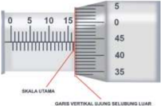

> **Deskripsi Visual:** Gambar ini adalah diagram, yang menunjukkan skala vertikal dan horizontal dengan garis-garis yang membentuk sudut 90 derajat. Skala vertikal berada di sisi kiri dan mengindikasikan nilai-nilai dari 0 hingga 50, sedangkan skala horizontal berada di sisi bawah dan mengindikasikan nilai-nilai dari 0 hingga 15. Garis-garis tersebut membentuk sudut 90 derajat, menunjukkan bahwa mereka merupakan garis vertikal dan horizontal. Teks "SKALA UTAMA" dan "GARIS VERTIKAL DAN HORIZONTAL LEBIH LUAR" terletak di bagian atas dan bawah masing-masing skala, masing-masing menunjukkan posisi garis-garis tersebut. Informasi kunci yang dapat diambil pembaca adalah bahwa gambar ini menunjukkan skala vertikal dan horizontal dengan garis-garis yang membentuk sudut 90 derajat.

Langkah pertama , membaca skala utama. Skala pada selubung dalam merupakan skala utama. Garis vertikal ujung selubung luar, seperti yang ditunjukkan pada Gambar 1.14, adalah patokan atau acuan pembacaan skala utama.

Satu skala yang tepat berada di garis vertikal ujung selubung luar merupakan hasil pembacaan skala utama. Pada Gambar 1.14, skala utama yang terbaca dari hasil pengukuran adalah 16,50 mm.

---
**🖼️ Gambar/Diagram**

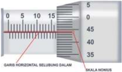

> **Deskripsi Visual:** Gambar ini adalah ilustrasi yang menunjukkan skala nomor horizontal dengan garis horizontal selubung dalam. Gambar ini menggambarkan skala nomor yang digunakan untuk mengukur nilai-nilai tertentu. Skala ini terdiri dari angka-angka yang berada di sepanjang garis horizontal, mulai dari 0 hingga 50. Garis horizontal ini membantu dalam proses pengukuran dan analisis data. Informasi penting yang dapat diambil dari gambar ini adalah bahwa skala ini digunakan untuk mengukur nilai-nilai tertentu, dan angka-angka tersebut membantu dalam proses pengukuran dan analisis data.

Langkah kedua , membaca skala nonius. Skala nonius yang garisnya sejajar  dengan  skala  utamanya  merupakan  hasil  pembacaan  skala noniusnya, seperti ditunjukkan pada Gambar 1.15. Skala nonius yang terbaca pada hasil pengukuran tersebut adalah 44. Kemudian, hasil pembacaan skala nonius dikalikan 0,01 mm, sehingga didapatkan skala nonius dari pengukuran tersebut adalah 0,44 mm.

 

---
## 📄 Halaman 32

Langkah ketiga , menjumlahkan hasil pembacaan skala utama dengan skala nonius. Hasil penjumlahan skala utama dan skala nonius pengukuran dengan mikrometer sekrup pada Gambar 1.13 adalah 16,94 mm dengan nilai ketidakpastian alat ukur jangka sorong ini sebesar 0,01 mm, sehingga hasil pengukurannya adalah (16,94 ± 0,01) cm.

Coba tentukan hasil pengukuran diameter benda yang ditunjukkan oleh Gambar 1.16 berikut ini!

---
**🖼️ Gambar/Diagram**

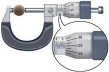

> **Deskripsi Visual:** Gambar ini adalah ilustrasi yang menunjukkan sebuah mikrometris (micrometer) digunakan untuk mengukur ukuran. Mikrometris adalah alat ukur yang sangat akurat digunakan dalam bidang teknik dan industri untuk mengukur perbedaan kecil antara dua permukaan. Gambar ini menunjukkan bagian depan mikrometris dengan tangan penggerak dan tangan pengukur yang berfungsi untuk menghasilkan perubahan pada ukuran yang diukur.

Elemen utama yang terlihat dalam gambar ini meliputi:
1. Mikrometris: Alat ukur yang digunakan untuk mengukur perbedaan kecil.
2. Tangan penggerak: Bagian yang digerakkan untuk menghasilkan perubahan pada ukuran yang diukur.
3. Tangan pengukur: Bagian yang berfungsi untuk mengukur perbedaan antara dua permukaan.

Teks, angka, atau label penting yang terlihat dalam gambar ini meliputi:
1. Angka-angka yang menunjukkan ukuran yang diukur.
2. Label "Micrometer" yang menunjukkan jenis alat tersebut.

Informasi kunci yang dapat diambil pembaca dari gambar ini adalah bahwa mikrometris adalah alat ukur yang sangat akurat digunakan untuk mengukur perbedaan kecil antara dua permukaan, dan dapat digunakan untuk mengukur ukuran dengan tingkat akurasi yang tinggi.

### f. Menuliskan hasil pengukuran

Tuliskanlah hasil pengukuran mikrometer sekrup sesuai dengan aturan cara penulisan hasil pengukuran pada persamaan 1.2!

### 3.  Neraca Massa

Massa adalah jumlah materi yang terkandung dalam suatu zat tanpa dipengaruhi gravitasi bumi. Untuk mengukur massa zat digunakan alat yang disebut neraca. Neraca yang umum digunakan adalah neraca digital dan neraca nondigital.

 

---
## 📄 Halaman 33

Carilah informasi tentang hal-hal berikut.

### a. Bagian-bagian neraca empat lengan sebagai neraca nondigital

---
**🖼️ Gambar/Diagram**

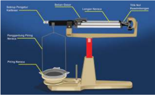

> **Deskripsi Visual:** Gambar ini adalah ilustrasi yang menunjukkan bagaimana cara kerja alat pengukur panas (thermometer). Ilustrasi ini mencakup beberapa elemen penting:

1. **Pertama**: Gambar ini menunjukkan sebuah thermometer yang terdiri dari beberapa komponen utama.
2. **Elemen Utama dan Relasinya**: 
   - **Bahan Pengukur**: Ini adalah bagian yang berfungsi untuk mengukur suhu. Dalam gambar ini, bahan pengukur terletak di atas ruang kosong.
   - **Lengan Netral**: Ini adalah bagian yang berfungsi sebagai penyangga dan memastikan bahwa bahan pengukur tetap stabil saat digunakan.
   - **Trik Netal**: Ini adalah bagian yang berfungsi untuk mengukur suhu dengan tepat. Dalam gambar ini, trik netal terletak di bawah ruang kosong.
   - **Penggaris Piring**: Ini adalah bagian yang berfungsi untuk menunjukkan skala suhu pada thermometer.
   - **Piring Rendah**: Ini adalah bagian yang berfungsi untuk menunjukkan skala suhu pada thermometer.

3. **Teks, Angka, atau Label Penting yang Terlihat**:
   - **Bahan Pengukur**: "Batterie-Pegelgerät/Radarmeter"
   - **Lengan Netral**: "Langener Netzle"
   - **Trik Netal**: "Trikk-Netz-Raumzähler"
   - **Penggaris Piring**: "Pricing Riem"
   - **Piring Rendah**: "Pricing Riem"

4. **Informasi Kunci yang Dapat Diambil Pembaca**:
   - Gambar ini memberikan gambaran tentang bagaimana alat pengukur panas bekerja dan bagian-bagian apa saja yang terlibat dalam proses pengukuran suhu. Ini membantu pembaca memahami struktur dan fungsi setiap bagian dari thermometer.

Dengan demikian, gambar ini merupakan ilustrasi yang informatif yang menjelaskan bagaimana alat pengukur panas bekerja dan bagian-bagian yang terlibat dalam proses pengukuran suhu.

Tuliskanlah nama komponen-komponen neraca empat lengan beserta fungsinya!

### b. Nilai skala terkecil pada neraca empat lengan

Tentukanlah nilai skala terkecil dari neraca empat lengan!

- Nilai ketidakpastian untuk sekali pengukuran
Tentukanlah nilai ketidakpastian untuk pengukuran tunggal menggunakan neraca empat lengan!

### d. Cara mengukur menggunakan neraca empat lengan

Tuliskanlah langkah-langkah untuk mengukur massa benda menggunakan neraca empat lengan.

- Membaca pengukuran neraca empat lengan
Hasil pengukuran massa suatu benda dengan menggunakan neraca empat lengan dapat dilihat pada skala-skala yang ditunjukkan pada keempat lengannya.

 

---
## 📄 Halaman 34

Berdasarkan Gambar 1.18, tentukan hasil pengukurannya!

---
**📊 Tabel**

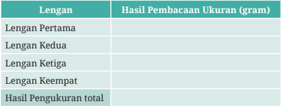

Tabel ini menunjukkan hasil pembacaan ukuran dari berbagai lengan dalam gram. Topik utama tabel adalah pengukuran lengan dengan menggunakan alat ukur. Kolom-kolomnya meliputi Lengan Pertama, Lengan Kedua, Lengan Ketiga, dan Lengan Keempat. Data penting yang terlihat adalah bahwa setiap lengan memiliki ukuran yang berbeda-beda, dengan total ukuran sebesar 100 gram. Ini menunjukkan bahwa ukuran lengan dapat bervariasi signifikan antara individu.

### f. Menuliskan hasil pengukuran

Tuliskanlah hasil pengukuran neraca empat lengan sesuai dengan aturan cara penulisan pada persamaan 1.2!

### g. Neraca digital

Kalian telah melakukan eksplorasi alat ukur massa neraca empat lengan, namun dalam kehidupan sehari-hari kalian lebih sering menjumpai neraca digital. Untuk mengenal lebih jauh mengenai neraca digital, jawablah pertanyaan berikut ini!

- Mengapa neraca digital lebih banyak digunakan dalam masyarakat dibandingkan neraca nondigital?
- Terdapat bermacam-macam neraca digital berdasarkan objek yang diukur. Carilah satu contoh neraca digital di internet dan buatlah deskripsi tentang batas bawah pengukuran, batas atas pengukuran, dan nilai ketidakpastian alat ukur tersebut!

 

---
## 📄 Halaman 35

- Apa kekurangan dari neraca digital?
- Bagaimana langkah-langkah mengukur dengan menggunakan neraca digital?

### Alat Ukur Suhu

Suhu merupakan ukuran intensitas panas atau dinginnya suatu benda. Alat ukur suhu adalah termometer. Dalam kehidupan sehari-hari, termometer dapat ditemukan dalam beragam jenis, bergantung bahan atau skala suhunya. Jenis termometer yang umum dijumpai adalah termometer analog (termometer raksa atau alkohol). Termometer raksa atau alkohol berupa tabung kaca dengan rongga kolom cairan yang sempit dan tertutup. Pada termometer raksa atau alkohol, terdapat bulb berisi raksa atau alkohol pada salah satu ujung tabung. Alkohol atau raksa dapat memuai dan menyusut di dalam tabung apabila terjadi perubahan suhu pada benda yang diukur. Penyusutan dan pemuaian raksa atau alkohol mengisi kolom tabung termometer dideinisikan dalam bentuk skala angka, sehingga perubahan suhu dapat terukur secara kuantitatif.

---
**🖼️ Gambar/Diagram**

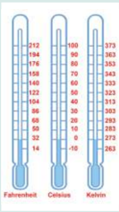

> **Deskripsi Visual:** Gambar ini adalah ilustrasi yang menunjukkan tiga skala termometer berbeda: Fahrenheit, Celsius, dan Kelvin. Setiap skala memiliki panjang yang sama, dengan titik nol masing-masing berada pada posisi yang berbeda. Skala Fahrenheit berada di atas, skala Celsius berada di tengah, dan skala Kelvin berada di bawah. Setiap skala memiliki angka yang menunjukkan suhu dalam derajat, dengan Fahrenheit menggunakan angka 0, 10, 20, 30, 40, 50, 60, 70, 80, 90, 100, 110, 120, 130, 140, 150, 160, 170, 180, 190, 200, 210, 220, 230, 240, 250, 260, 270, 280, 290, 300, 310, 320, 330, 340, 350, 360, 370, 380, 390, 400, 410, 420, 430, 440, 450, 460, 470, 480, 490, 500, 510, 520, 530, 540, 550, 560, 570, 580, 590, 600, 610, 620, 630, 640, 650, 660, 670, 680, 690, 700, 710, 720, 730, 740, 750, 760, 770, 780, 790, 800, 810, 820,

Skala termometer yang banyak digunakan adalah celsius. Skala yang ditetapkan sebagai satuan standar internasional untuk besaran suhu adalah kelvin. Skala lainnya adalah reamur dan fahrenheit.

Termometer dapat digunakan untuk berbagai keperluan pengukuran suhu, misalnya termometer klinis untuk mengukur suhu tubuh dan termometer laboratorium. Termometer klinis dapat berupa termometer

 

---
## 📄 Halaman 36

analog dan digital. Termometer klinis mempunyai skala suhu antara 32-42 o C. Bagaimana dengan termometer laboratorium? Termometer laboratorium digunakan untuk mengukur suhu larutan dengan skala umumnya -10 sampai 150 o C.

---
**🖼️ Gambar/Diagram**

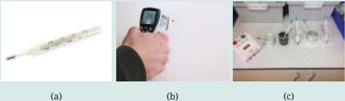

> **Deskripsi Visual:** Gambar (a) menunjukkan sebuah termometer yang digunakan untuk mengukur suhu tubuh. Gambar (b) menampilkan seorang individu menggunakan termometer untuk mengukur suhu mereka. Gambar (c) menunjukkan beberapa alat medis seperti termometer, botol obat, dan kantong darah yang biasanya digunakan dalam pengobatan. Semua elemen ini saling berkaitan dengan topik kesehatan dan pengobatan. Teks, angka, atau label penting yang terlihat adalah "termometer", "suhu tubuh", "botol obat", dan "kantong darah". Informasi kunci yang dapat diambil pembaca adalah bahwa gambar ini membahas tentang peralatan medis yang digunakan dalam pengobatan dan pengukuran suhu tubuh.

Gambar 1.20 Macam-macam termometer berdasarkan kegunaannya: (a) termometer klinis analog, (b) termometer klinis digital, dan (c) termometer laboratorium.

Sumber: (a) PublicDomainPictures/pixabay.com (2010), (b) 4595544/pixabay.com (2018), (c) Sophie Bradford (bs2sjh)/ pixabay.com (2016)

### Alat Ukur Volume

Dalam bidang ilmu pengetahuan alam, terdapat banyak alternatif alat ukur volume yang dapat digunakan bergantung pada zat yang diukur. Berikut ini beberapa contohnya.

### 1. Silinder Ukur

Silinder ukur digunakan dengan cara mengisi cairan sebanyak volume yang diinginkan. Ada beberapa batas atas ukuran pada silinder ukur, mulai dari 10 ml, 50 ml, 100 ml, 250 ml, 500 ml, 1.000 ml, dan 2.000 ml. Perlu diperhatikan, volume cairan dilihat dari skala yang berimpit pada bagian cekung (meniskus) permukaan cairan.

### 2. Pipet Volumetrik

Alat ukur ini digunakan untuk mengukur volume cairan pada skala 0,1 ml.  Untuk mengambil cairan digunakan pompa karet yang disebut bulp .

 

---
## 📄 Halaman 37

### 3. Labu Ukur

Labu ukur terbuat dari kaca yang memiliki kapasitas tertentu misalnya 10 ml, 50 ml, 100 ml, 250 ml, 500 ml, 1.000 ml, dan 2.000 ml. Terdapat tanda garis pada leher labu yang menunjukkan batas volume cairan. Cara membaca batas cairan ini adalah pada batas cekungan (meniskus) yang merupakan bagian atas permukaan cairan.

### 4. Piknometer

Alat untuk mengukur massa jenis larutan salah satunya adalah Alat ini terbuat dari kaca, memiliki tutup, dan mempunyai kapasitas e tertentu, misalnya 25 ml. Cara kerjanya adalah meter  pikno kos ng beserta tutup ditimbang lalu dicatat massanya. Piknometer diisi cairan yang akan diukur massa jenisnya sampai penuh lalu ditutup. Volume cairan ini adalah 25 ml. Untuk menentukan massa cairan, piknometer berisi cairan tutupnya ditimbang kembali. Selisih massa piknometer bertutu p dan berisi cairan dikurangi massa piknometer bertutup dalam keadaan kosong massa cairan (gram). Dengan demikian, massa jenis adalah massa cairan (g) dibagi volume cairan (cm 3 ). Satuan yang umum digunakan adalah g/cm 3 , g/ml, atau 3 kg/m .

(a)

(b)

(c)

Sumber: Elizabeth Tjahjadarmawan/Kemdikbudristek (2023)

(e)

piknomet vol

d

adala perbandinga

 

---
## 📄 Halaman 38

### Aktivitas 1.4

### Ayo Identiikasi

Pada aktivitas sebelumnya, kalian sudah memahami beragam alat ukur. Sekarang, coba kalian bandingkan penggunaan alat ukur panjang untuk mengukur panjang dari beberapa benda di sekitar kalian.

- Kalian akan mengukur satu benda yang sama dengan menggunakan tiga alat ukur yang berbeda. Apakah hasil pengukurannya akan sama atau berbeda? Jelaskanlah alasannya!
- Salinlah dan isi tabel berikut ini sesuai dengan hasil pengukuran pada buku latihan kalian.
- Berdasarkan aktivitas yang kalian lakukan, adakah alat ukur yang tidak sesuai dengan benda yang diukur? Besaran apa sajakah itu? Mengapa bisa tidak sesuai?
- Berdasarkan perbandingan hasil pengukuran yang kalian dapatkan, alat ukur apa yang cocok untuk mengukur diameter baut? Seberapa teliti pengukurannya? Jelaskan alasannya!

---
**📊 Tabel**

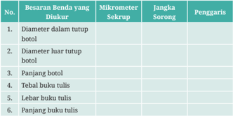

Tabel ini berisi informasi tentang beberapa ukuran benda yang dapat diukur menggunakan mikrometer sekrup dan jangka sorong. Topik utamanya adalah ukuran benda seperti diameter dalam tutup botol, panjang botol, lebar dan tebal buku tulis. Kolom-kolomnya meliputi No., Besaran Benda yang Diukur, Mikrometer Sekrup, Jangka Sorong, dan Penggaris. Data penting yang terlihat antara lain bahwa untuk ukuran diameter dalam tutup botol menggunakan mikrometer sekrup dan penggaris, sedangkan untuk ukuran panjang botol hanya menggunakan mikrometer sekrup.

### C.  Aturan Angka Penting

Kalian sudah melakukan pengukuran diameter luar tutup botol pada Aktivitas 1.4. Coba tentukanlah luas permukaan lingkaran tutup botol tersebut dengan menggunakan data diameter luarnya dan nyatakan hasilnya dalam satuan SI.

 

---
## 📄 Halaman 39

Kalian diperbolehkan menggunakan kalkulator, namun hasil yang ditunjukkan pada kalkulator harus ditulis ulang, tidak boleh dibulatkan.

Perhitungan yang kalian lakukan menghasilkan nilai desimal yang begitu panjang. Tentu ini menjadi tidak praktis dalam penulisannya. Untuk itu, terdapat beberapa aturan pembulatan yang telah disepakati, yaitu aturan angka penting .

Mengapa disebut angka penting? Apakah ada angka yang tidak penting? Bagaimana aturan pembulatan angka penting pada operasi hitung? Untuk memahami aturan angka penting, kalian perlu memahami angka penting dan angka tidak penting.

---
**📊 Tabel**

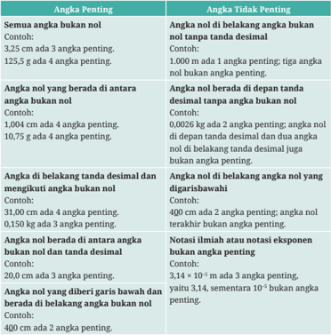

Tabel ini membahas tentang aturan penulisan angka dalam bahasa Indonesia, khususnya mengenai penggunaan angka nol (0) dalam kalimat. Topik utama tabel adalah mengenai bagaimana menulis angka nol dengan benar dan tidak benar dalam berbagai situasi. Tabel ini dibagi menjadi beberapa kolom, yaitu:

1. Angka Penting: Ini adalah kolom yang menjelaskan bagaimana menulis angka nol yang penting dalam kalimat. Misalnya, 3,25 cm adalah angka penting, sedangkan 125,5 g adalah angka penting juga.

2. Angka Nol yang Berada di Antara Angka Bukan Nol: Kolom ini menjelaskan bagaimana menulis angka nol yang berada di antara angka bukan nol. Misalnya, 1,004 cm adalah angka penting karena angka nol berada di antara tanda titik desimal dan angka bukan nol.

3. Angka Nol yang Berada di Belakang Tanda Desimal: Kolom ini menjelaskan bagaimana menulis angka nol yang berada di belakang tanda desimal. Misalnya, 31,00 cm adalah angka penting karena angka nol berada di belakang tanda desimal.

4. Angka Nol yang Diberi Garis Bawah: Kolom ini menjelaskan bagaimana menulis angka nol yang diberi garis bawah. Misalnya, 3,14 cm adalah angka penting karena angka nol diberi garis bawah.

Tabel ini sangat berguna untuk memahami aturan penulisan angka nol dalam kalimat, sehingga dapat digunakan dengan benar dalam berbagai situasi, seperti dalam tulisan ilmiah atau dalam pengukuran.

 

---
## 📄 Halaman 40

Jika seluruh angka hasil pengolahan data tidak ditulis seluruhnya, apa yang perlu dilakukan? Berdasarkan aturan matematika, seluruh angka hasil operasi matematika dapat dibulatkan. Bagaimana aturan pembulatan angka?

Pembulatan ke atas dilakukan apabila angka yang dibulatkan bernilai sama dengan atau lebih dari 5. Contohnya 52,976686625 cm 2  ingin dibulatkan hingga 4 angka penting, maka angka kelimanya perlu dibulatkan. Angka kelima dari angka tersebut bernilai 6 (lebih dari lima), sehingga dilakukan pembulatan ke atas dengan cara menambahkan 1 pada angka keempat. Jadi, hasil pembulatannya adalah 52,98 cm 2 .

Adapun pembulatan ke bawah dilakukan apabila angka yang dibulatkan bernilai kurang dari 5. Contohnya 52,973376625 cm 2  ingin dibulatkan hingga 4 angka penting, maka angka kelimanya perlu dibulatkan. Angka kelima dari angka tersebut bernilai 3 (kurang dari lima), sehingga dilakukan pembulatan ke bawah dengan cara menambahkan 0 pada angka keempat. Jadi, hasil pembulatannya adalah 52,97 cm 2 .

### 1. Aturan Operasi Penjumlahan dan Pengurangan Angka Penting

Setiap hasil pengukuran mengandung angka pasti dan angka taksiran (angka tidak pasti). Angka pasti merupakan angka yang diberikan oleh alat ukur sesuai dengan ketelitiannya. Angka taksiran dalam ilmu pengukuran disebut sebagai error atau uncertainty merupakan angka terakhir hasil pengukuran yang ditaksir. Contohnya hasil pengukuran dengan menggunakan jangka sorong adalah 4,23 cm. Angka pasti dari pengukuran tersebut adalah 4,2 cm, sementara 3 merupakan angka taksiran. Angka taksiran biasanya diberi tanda garis bawah.

### Contoh:

Sebuah batang besi panjangnya diukur dengan menggunakan jangka sorong sebesar 8,235 cm. Batang besi tersebut disambung dengan batang besi sepanjang 4,5 cm yang diukur dengan menggunakan penggaris. Berdasarkan aturan operasi penjumlahan angka penting, panjang batang besi setelah disambung dapat ditentukan dengan cara berikut.

``

 

---
## 📄 Halaman 41

Hasil penjumlahan tidak boleh mengandung dua angka taksiran, sehingga harus dilakukan pembulatan angka pada angka 3 agar angka taksiran hanya menyisakan satu. Pembulatan dari hasil penjumlahan tersebut adalah 12,7 cm dengan angka 7 sebagai angka taksiran.

### 2. Aturan Operasi Perkalian dan Pembagian Angka Penting

Pembulatan hasil operasi perkalian dan pembagian dalam pengolahan data pengukuran dilakukan berdasarkan jumlah angka pentingnya. Banyaknya angka penting dari hasil operasi perkalian dan pembagian harus sejumlah angka penting terkecil dari hasil pengukuran.

### Contoh 1:

Selembar karton diukur dengan menggunakan jangka sorong memiliki lebar 12,455 cm. Sementara panjangnya diukur dengan menggunakan penggaris sebesar 35,2 cm. Karton tersebut berbentuk persegi panjang sehingga luas permukaannya dapat ditentukan dengan cara mengalikan panjang dan lebarnya. Berdasarkan aturan operasi perkalian angka penting, luas karton tersebut dapat ditentukan dengan cara berikut.

Langkah pertama, menentukan jumlah angka penting dari hasil pengukuran. 12,455 cm merupakan 5 angka penting 35,2 cm merupakan 3 angka penting

Langkah kedua, membandingkan  jumlah  angka  penting  terkecil  dari  hasil pengukuran. Panjang karton 35,2 cm memiliki angka penting lebih kecil dari pada lebar karton 12,455 cm, yaitu sebanyak 3 angka penting, sehingga hasil perkalian harus dibulatkan hingga 3 angka penting.

Langkah ketiga, mengalikan panjang dengan lebar karton. Hasil perkaliannya adalah 438,416 cm 2 .

Langkah keempat, membulatkan  hasil  perkalian  sejumlah  angka  penting terkecil  hasil  pengukuran.  Luas  karton  sebesar  438,416  cm 2   memiliki  6  angka penting. Hasil pembulatan hingga tiga angka penting adalah 438 cm 2 .

### Contoh 2:

Contoh aturan operasi perkalian angka penting lainnya adalah mencari luas permukaan atas tutup botol berdiameter 3,12 cm yang diukur menggunakan jangka sorong.

 

---
## 📄 Halaman 42

Luas permukaan tutup botol dapat dicari dengan cara:

``

merupakan

Kemudian, tentukan j mlah angka penting dari h sil pengukuran diameter tutup botol. Phi ¼ dan konstanta yang ilainya tetap se ngga angk pentingnya tidak perlu dihit ng.

Diameter tutup botol adalah 3,12 ad alah tiga.

cm, maka jumlah angk pentingnya Lakukan pembulatan nilai luas permukaan atas tu up botol samp i sejumlah angka penting, ya tu tiga angk penting.

Luas = 7,641404 cm 2  dibulatkan menjadi 7,64 cm 2 .

Coba kalian lakukan kembali aturan pembulatan tersebut untuk menghitung luas permukaan atas tutup botol pada kegiatan pengukuran sebelumnya. Tuliskan langkah-langkahnya pada buku latihan kalian.

Untuk memudahkan kalian dalam menuliskan hasil pengolahan data yang angkanya sangat kecil atau sangat besar, kalian dapat menggunakan aturan penulisan notasi ilmiah. Contohnya pada perhitungan luas permukaan atas tutup botol sebelumnya, kalian mendapati luas sebesar 7,64 cm 2 . Nilai ini jika dikonversikan dalam satuan m 2 menjadi 0,0000764 m 2 . Hasil konversi ini dapat dituliskan dalam aturan notasi ilmiah atau dinyatakan dalam 10 pangkat n sebagai berikut.

Luas = 0,0000764 m 2  = 7,64 × 10 -4 m 2

### Catatan:

Sebelum melakukan konversi satuan, nilai luas permukaan harus dibulatkan terlebih dahulu sejumlah angka pentingnya. Lakukan konversi satuan luas sesuai dengan satuan yang kalian inginkan. Kemudian tuliskan dalam bentuk aturan notasi ilmiah. Tuliskan langkah-langkahnya pada buku latihan kalian.

 

---
## 📄 Halaman 43

Kalian sudah memahami bahwa untuk membulatkan hasil pengolahan data tidak bisa sembarang. Untuk menguji pemahaman kalian, coba kerjakan soal-soal berikut!

- Mengapa jumlah angka penting dari hasil pengukuran perlu diketahui?
- Jika nilai yang kalian dapatkan dari hasil pengolahan data sangat kecil atau sangat besar, bagaimana cara kalian menuliskannya?
- Hasil pengukuran panjang sebuah batang kayu dengan menggunakan jangka sorong adalah 12,75 cm. Batang kayu tersebut disambung dengan batang kayu lainnya yang diukur dengan menggunakan penggaris sepanjang 7,5 cm. Tentukanlah panjang batang kayu yang telah tersambung itu dengan menggunakan aturan angka penting!
- Sebuah pelat aluminium memiliki panjang 15,32 cm dan lebar 10,2 cm.
- Tentukanlah luas pelat aluminium dengan menggunakan aturan angka penting!
- Konversikan satuan luas pelat aluminium tersebut dalam SI!
- Diameter sebuah tutup kaleng sebesar 22,25 cm.
- Tentukanlah luas permukaan tutup kaleng dengan menggunakan aturan angka penting!
- Konversikan satuan luas permukaan tutup kaleng tersebut dalam SI!

### D.  Nilai Ketidakpastian pada Pengukuran Berulang

Pada setiap aktivitas pengukuran, kesalahan pengukuran tidak dapat dihindarkan,  apalagi  jika  pengukuran  hanya  dilakukan  sekali,  peluang ketidaksesuaian antara hasil pengukuran dengan ukuran sebenarnya semakin besar. Coba telusuri informasi tentang penyebab kesalahan pengukuran pada Aktivitas 1.5 berikut ini.

 

---
## 📄 Halaman 44

### Aktivitas 1.5

### Kegiatan Pendahuluan

Sebelum menjawab pertanyaan di bawah, lakukanlah langkah-langkah kegiatan pendahuluan berikut secara berkelompok dengan beranggotakan lima orang.

- Pilihlah satu benda untuk diukur dengan menggunakan jangka sorong.
- Lakukanlah pengukuran secara bergantian dengan menggunakan jangka sorong yang sama oleh setiap anggota kelompok.
- Masing-masing anggota menuliskan hasil pengukuran pada buku tulis, tanpa memberitahukan kepada teman sekelompok.
- Tuliskan data hasil pengukuran seluruh anggota kelompok dalam bentuk tabel.

### Tugas

- Apakah hasil pengukuran setiap orang dalam satu kelompok berbeda? Mengapa demikian?
- Carilah  informasi  mengenai  faktor-faktor  apa  saja  yang  dapat menyebabkan kesalahan pengukuran!
Untuk mengurangi faktor kesalahan pengukuran, kalian dapat mengatasinya dengan melakukan pengukuran secara berulang. Pengambilan data untuk pengukuran berulang minimal dilakukan sebanyak lima kali. Bagaimana cara mengetahui nilai ketidakpastian pengukuran berulang? Untuk mengetahuinya, kalian dapat menggunakan persamaan standar deviasi yang dinyatakan sebagai berikut.

``

### Ayo Cari Tahu

 

---
## 📄 Halaman 45

### Keterangan:

N = banyaknya data

x i i i N

= data ke- , dengan berurut dari 1 hingga

x 2 = data ke- i dikuadratkan

i

Σ x i 2 = penjumlahan seluruh kuadrat data ke- i

Σ x i = penjumlahan seluruh data ke- i

(Σ x i ) 2 = kuadrat penjumlahan seluruh data ke- i

Bagaimana aturan membulatkan angka hasil pengolahan data?

Langkah pertama ,  menentukan  nilai  ketidakpastian  relatifnya  dengan  cara sebagai berikut.

``

Langkah kedua , mencocokkan persentase ketidakpastian relatif yang didapatkan dengan aturan berikut.

### Aturan penulisan hasil pengolahan data berdasarkan ketidakpastian relatif

- Jika persentase ketidakpastian relatif pada kisaran nilai 0,1%, jumlah angka hasil pengolahan data yang dituliskan 4 angka penting.
- Jika persentase ketidakpastian relatif pada kisaran nilai 1%, jumlah angka hasil pengolahan data yang dituliskan 3 angka penting.
- Jika persentase ketidakpastian relatif pada kisaran nilai 10%, jumlah angka hasil pengolahan data yang dituliskan 2 angka penting.
Hasil pengolahan data dapat dituliskan dengan cara yang ditunjukkan oleh Persamaan 1.2 dengan x x merupakan rata-rata nilai besaran yang diukur secara berulang.

### Contoh:

Lima orang siswa mengukur diameter sebuah tutup botol dengan menggunakan jangka sorong secara bergantian. Masing-masing siswa mendapatkan kesempatan satu kali mengukur, sehingga didapatkan tabel hasil pengukuran sebagai berikut.

 

---
## 📄 Halaman 46

---
**📊 Tabel**

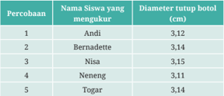

Tabel ini menunjukkan hasil percobaan untuk mengukur diameter tutup hotel menggunakan berbagai siswa. Topik utama tabel adalah ukuran diameter tutup hotel yang diukur oleh siswa-siswi. Kolom pertama menyatakan nomor percobaan, sedangkan kolom kedua menunjukkan nama siswa yang melakukan pengukuran. Kolom ketiga mengandung data ukuran diameter tutup hotel dalam centimeter. Dari data yang diberikan, tampak bahwa diameter tertinggi adalah 3.15 cm, sedangkan diameter terendah adalah 3.11 cm. Pola yang dapat dilihat adalah bahwa semua siswa mendapatkan ukuran diameter yang cukup dekat, dengan perbedaan maksimal hanya 0.03 cm antara Andi dan Bernadette.

Mereka diminta untuk menentukan luas permukaan lingkaran tutup botol beserta nilai ketidakpastiannya.

Berikut ini tabel pengolahan datanya.

### Keterangan:

x merupakan kuadrat nilai hasil penjumlahan seluruh luas permukaan lingkaran tutup botol dan y merupakan penjumlahan seluruh nilai hasil kuadrat luas permukaan lingkaran tutup botol.

``

Jawaban:

Menentukan nilai rerata luas permukaan lingkaran tutup botol:

``

 

---
## 📄 Halaman 47

Menentukan nilai ketidakpastian pengukuran berulang:

``

Nilai ketidakpastian relatifnya adalah:

``

``

Persentase ketidakpastian relatif bernilai 1,45%, atau nilainya pada kisaran 1%, sehingga jumlah angka hasil pengolahan datanya dituliskan sebanyak 3 angka penting.

Jadi, luas permukaan tutup botol tersebut adalah:

``

Kalian sudah mempelajari banyak hal, mulai dari kegiatan pengukuran hingga mengolah data. Sekarang, mari kita selesaikan kasus berita pada awal bab dengan melakukan Proyek Akhir Bab berikut.

 

---
## 📄 Halaman 48

### Proyek Akhir Bab

### Menentukan Massa Jenis Baut

### A. Tahap Persiapan Praktikum

Di awal bab, kalian telah membaca berita singkat mengenai kecelakaan akibat patahnya baut roda truk. Truk selalu mengangkut muatan berat sehingga baut roda yang dipilih haruslah tidak mudah patah, berkarat, dan memuai.

Sumber: Alex Tepetidis/pexels.com

Ada bermacam jenis baut, baik dari ukuran maupun warna atau bahan materialnya. Baut yang berkualitas tentu memiliki nilai ekonomis yang lebih tinggi dibandingkan baut biasa. Kali ini, kalian akan berlatih bagaimana cara mengetahui material baut dan kemungkinan adanya pemalsuan. Kalian perlu menyiapkan tiga sampel baut yang berbeda warna dan ukurannya. Untuk menentukan jenis materialnya, kalian dapat melakukan percobaan sederhana berikut.

### B. Observasi

- Amatilah Gambar 1.25. Berdasarkan pengamatan kalian, besaran turunan isika apa yang dapat digunakan untuk mengetahui jenis baut? Tentukan persamaannya!
- Untuk mendapatkan besaran isika pada nomor 1, besaran-besaran apa saja yang harus diukur?

 

---
## 📄 Halaman 49

- Dengan mempertimbangkan wujud baut, alat ukur apa yang dapat digunakan untuk mengukur besaran-besaran pada nomor 2? Jelaskan cara kalian mengukurnya? Kalian dapat memilih alat ukur yang ada pada Aktivitas 1.2 dan 1.4 sebagai referensi)

### C. Klasiikasi

Dalam suatu praktikum, hubungan sebab-akibat ini diperlihatkan oleh berubahnya besaran-besaran tertentu akibat perlakuan atau berubahnya besaran-besaran lainnya. Besaran-besaran yang terlibat dalam hubungan sebab-akibat ini disebut dengan variabel.

- Besaran apa yang diubah-ubah nilainya (variabel bebas) pada praktikum ini?
- Dalam praktikum, terdapat besaran yang nilainya harus sama ketika pengukuran dilakukan pada ketiga baut (variabel kontrol). Besaran apakah itu?

### D. Interpretasi

- Besaran apa saja yang ikut berubah karena adanya variabel s? (Besaran ini kemudian kita sebut sebagai variabel terikat).

### E. Merencanakan Eksperimen

- Jika ketiga baut berbeda jenisnya (terlihat dari warnanya yang berbeda), sementara ukurannya sama, tentukanlah variabel bebas, variabel terikat, dan variabel kontrol dalam praktikum ini!

### F. Memproses dan Menganalisis Informasi

Buatlah laporan praktikum dengan format sebagai berikut.

- Judul praktikum
- Tujuan praktikum
- Dasar teori
- Alat dan bahan
- Prosedur Praktikum
- Tabel Pengamatan
- Tabel Pengolahan Data
- Analisis Data
- Kesimpulan
beba

 

---
## 📄 Halaman 50

- Mengukur adalah kegiatan membandingkan ukuran suatu benda yang belum diketahui ukurannya dengan alat yang dianggap sebagai ukuran standar.
- Besaran merupakan sesuatu yang akan diukur.
- Besaran pokok merupakan besaran dasar yang satuannya sudah ditetapkan.
- Besaran turunan merupakan besaran yang satuannya tersusun dari beberapa satuan besaran pokok.
- Satuan merupakan ukuran yang menjadi acuan dari suatu besaran.
- Dimensi merupakan cara suatu besaran turunan disusun berdasarkan besaran pokoknya.
- Nilai ketidakpastian pengukuran menyatakan nilai yang menyatakan kemungkinan error dari kegiatan pengukuran. Untuk sekali pengukuran, nilai ketidakpastian alat ukur dinyatakan dengan persamaan:

``

Untuk pengukuran berulang, nilai ketidakpastian alat ukur dinyatakan dengan:

``

- Nilai ketidakpastian relatif pengukuran ditentukan dengan persamaan:

``

- Aturan pembulatan angka hasil pengolahan data dilakukan dengan aturan angka penting.
- Hasil pengukuran atau hasil akhir pengolahan data dituliskan dengan cara: x ± Δ x.

 

---
## 📄 Halaman 51

### Ayo Cek Pemahaman

### I. Pilihlah salah satu jawaban yang paling tepat!

### 1. Perhatikan tabel berikut ini.

---
**📊 Tabel**

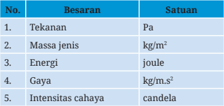

Tabel ini berisi informasi tentang beberapa unit ukuran fisika, termasuk tekanan, massa jenis, energi, gaya, dan intensitas cahaya. Topik utama tabel adalah konsep dasar unit ukuran dalam bidang fisika. Kolom pertama menunjukkan nama unit ukuran, sedangkan kolom kedua menunjukkan satuan untuk setiap unit tersebut. Data penting yang terlihat adalah bahwa tekanan menggunakan satuan Pascal (Pa), massa jenis menggunakan satuan kilogram per meter kubik (kg/m³), energi menggunakan satuan joule, gaya menggunakan satuan kilogram meter per satuan waktu persegi (kg·m/s²), dan intensitas cahaya menggunakan satuan candela. Ini menunjukkan bahwa tabel ini membahas konsep dasar unit ukuran dalam bidang fisika, dengan fokus pada beberapa unit ukuran yang umum digunakan dalam ilmu fisika.

Besaran turunan beserta satuannya dalam SI yang benar adalah ....

- 1, 2, dan 3
- 1, 3, dan 5
- 1 dan 2
- Dimensi dari gaya dikalikan selang waktu adalah ....
- [M][L][T] 2
- [M][L][T]
- [M][L][T] -1
- Sebuah mobil melaju dengan kelajuan yang ditunjukkan oleh speedometer di samping. Dapat disimpulkan bahwa dalam selang waktu satu detik, mobil tersebut telah berpindah sejauh
....

- 6.000 meter
- 1.000 meter
- 600 meter
- Pak Maman ingin menyambungkan pipa-pipa saluran air dengan penyambung pipa berbentuk T seperti gambar di samping.
Agar Pak Maman tidak salah membeli, ia perlu mengukur diameter dalam pipa T dengan menggunakan ....

- [M][L][T] -2
- [M][L] -1 [T] -2
- 167 meter
- 16,7 meter
- 3 dan 4
- 4 dan 5

 

---
## 📄 Halaman 52

- jangka sorong
- meteran roll
- Penggaris
- Pada lashdisk tertulis '8 GB', artinya adalah kapasitas penyimpanannya mencapai .....
- 8 × 10 3 Byte
- 8 × 10 6 Byte
- 8 × 10 9  Byte

### II. Bacalah cuplikan berita berikut kemudian jawablah pertanyaannya!

### Inilah Cara Mengenali Timbangan yang Dicurangi Pedagang

### TEMPO.CO, Bangkalan .

Petugas Dinas Perindustrian dan Perdagangan Jawa Timur menggelar tera ulang timbangan di kantor Kecamatan Kamal, Kabupaten Bangkalan, Jawa Timur, Selasa, 3 November 2015. Puluhan pedagang di Pasar Kamal dan pemilik toko kelontong datang membawa timbangan mereka untuk diservis.

'Mayoritas timbangan yang dibawa tidak sesuai dengan standar nasional,' kata Dary, petugas tera dari Unit Pelaksana Tugas Bidang Kemetrologian Pamekasan Dinas Perindustrian dan Perdagangan Jawa Timur.

Menurut dia, ada banyak hal yang menyebabkan timbangan pedagang tidak sesuai dengan standar nasional, di antaranya cara pemakaian yang tidak tepat dan lain-lain. Tentu ada juga yang sengaja diakali. 'Tapi, mayoritas yang dibawa ke sini karena faktor alam, yaitu karatan, sehingga keseimbangan berubah melewati batas toleransi dengan selisih sebesar 20 gram untuk timbangan 5 kilogram,' ujarnya.

- 8 × 10 12  Byte
- 8 × 10 15  Byte
- mikrometer sekrup
- neraca o'hauss

 

---
## 📄 Halaman 53

Sementara itu, Komarudin, salah satu petugas tera, menyebut ciri-ciri timbangan yang diakali pedagang. Menurut dia, bila pedagang buah atau pedagang sembako selalu meletakkan batu kiloan di atas timbangan, patut dicurigai timbangan tersebut telah diakali.

Sementara itu, Sukron, pedagang di Pasar Kamal, meminta tera ulang tidak dilakukan sekali dalam satu tahun. Sebab, kerusakan timbangan selalu membuat dia tekor. 'Kalau bisa, ada petugas tera di tiap kecamatan. Jadi, kapan pun rusak, timbangan bisa langsung diperbaiki,' ucapnya. Soal biaya tera, Sukron mengatakan tidak mahal. Untuk timbangan 5 kilogram hanya dikenai biaya Rp6.500 per unit.

Sumber bacaan: https://nasional.tempo.co/read/715491/inilah-cara-mengenali-timbangan-yang-dicurangi-pedagang

Untuk soal nomor 1 sampai 4, pilihlah satu jawaban yang paling tepat dan berikan alasannya!

- Kesalahan pengukuran yang disebutkan pada paragraf ketiga kalimat ketiga termasuk dalam kesalahan pengukuran akibat ....
Alasan: ____________________________________________________________________

- Kesalahan pengukuran yang disebutkan pada paragraf ketiga kalimat pertama termasuk dalam kesalahan pengukuran akibat ....
Alasan: ____________________________________________________________________

- Pada paragraf ketiga kalimat ketiga disebutkan bahwa kesalahan akibat faktor karatan menyebabkan keseimbangan berubah melewati batas toleransi dengan selisih sebesar 20 gram untuk timbangan 5 kilogram, artinya persentase ketidakpastian relatifnya adalah ....

 

---
## 📄 Halaman 54

Alasan: ____________________________________________________________________

- Seseorang membeli telur sebanyak 5 kg dengan harga per kilogramnya Rp24.000,00. Telur tersebut ditimbang dengan menggunakan timbangan berkarat seperti yang disebutkan pada soal nomor 3. Maka, kerugian yang ditanggung pembeli akibat kesalahan pengukuran tersebut adalah ....
Alasan: ____________________________________________________________________

- Kalian adalah seorang pedagang sukses yang telah memahami konsep pengukuran  dalam  isika.  Bagaimana  kalian  harus  bersikap  terkait pengukuran? Jelaskan alasannya!
Sikap: _____________________________________________________________________

Alasan: ____________________________________________________________________

### Pengayaan

Kalian sudah mencoba melakukan kegiatan pengukuran. Bagaimana pengukuran dapat bermanfaat pada bidang kimia dan biologi? Cobalah lakukan aktivitas pengukuran pada bidang biologi dan kimia berikut!

### 1. Bagaimana penerapan pengukuran dalam konteks ilmu biologi?

Pengukuran tidak terlepas dari kehidupan kita, termasuk ketika kalian belajar tentang makhluk hidup. Petani lele harus mengukur panjang dan diameter lele yang tepat ketika melakukan pemanenan agar tidak rugi, karena pembeli lele yang umumnya pedagang pecel lele lebih memilih ukuran lele yang tidak terlalu besar untuk mendapatkan untung yang besar. Begitu pula petani mutiara mengukur diameter mutiara sebagai salah satu pertimbangan harga mutiara. Semakin lama proses pembentukan mutiara maka semakin besar mutiaranya dan semakin mahal harganya.

 

---
## 📄 Halaman 55

Mari kita coba melakukan pengukuran dalam percobaan pengaruh intensitas cahaya matahari terhadap pertumbuhan tanaman berikut ini.

### Alat dan Bahan:

- tiga buah gelas transparan
- kapas
- spidol
- biji kacang hijau atau biji kacang lainnya yang mudah didapat
- penggaris

### Langkah Kerja:

- Tuliskan huruf A, B, dan C pada masing-masing gelas.
- Letakkan kapas yang sudah dicelupkan ke dalam air pada dasar masing-masing gelas.
- Letakkan 5 biji kacang di atas kapas pada masing-masing gelas.
- Letakkan gelas A pada ruangan tertutup (tidak terkena sinar matahari), gelas B di bawah naungan pohon, dan gelas C di tempat terbuka yang mendapat sinar matahari sepanjang hari.
- Ukurlah tinggi kecambah setiap hari pada masing-masing gelas selama 1 minggu dengan menggunakan penggaris. Catat hasilnya!
- Tampilkan dalam bentuk graik pertambahan tinggi tanaman setiap hari! Apa yang dapat kalian simpulkan?

### 2. Bagaimana penerapan pengukuran dalam konteks ilmu kimia?

Pengukuran dalam kimia berhubungan dengan penggunaan alat-alat ukur massa dan volume. Alat ukur ini digolongkan menjadi dua jenis, yaitu alat ukur kualitatif dan kuantitatif. Neraca 4 lengan dengan ketelitian 3 desimal bersifat kualitatif, sementara neraca analitik dengan tingkat ketelitian 4 desimal bersifat kuantitatif. Demikian juga alat ukur volume ada dua jenis, yaitu alat ukur dengan ketelitian rendah (gelas ukur, pipet ukur) dan ketelitian tinggi (labu ukur, buret, pipet gondok, pipet volumetrik). Bagaimana cara menggunakan alat ukur massa dan volume ini?

 

---
## 📄 Halaman 56

Kalian telah mempelajari bahwa massa jenis atau densitas adalah salah satu besaran turunan. Massa jenis merupakan perbandingan massa terhadap volume suatu zat. Simbol massa jenis adalah ρ.

Dalam kehidupan sehari-hari, massa jenis berguna untuk mengidentiikasi antara zat yang satu dengan zat lainnya, misalnya menguji kemurnian suatu campuran bahan. Mengapa demikian? Setiap zat memiliki massa jenis yang berbeda. Pada percobaan berikut ini, kalian akan membuat larutan asam asetat atau cuka dengan konsentrasi 10% volume dari larutan cuka dapur yang konsentrasinya 25% volume. Setelah itu, kalian akan menentukan massa jenis larutan cuka 10% yang telah kalian buat. Apakah arti persen di sini? Arti 10% volume adalah 10 ml cuka ditambahkan ke dalam 90 ml air menghasilkan larutan cuka sebanyak 100 ml.

Videokan cara penggunaan alat ukur untuk pembuatan larutan cuka 10% dan langkah-langkah menentukan massa jenisnya. Unggahlah video tersebut ke akun media sosial kalian untuk mendapatkan tanggapan dari teman-teman dan guru kalian.

### Ayo Bereleksi

Setelah kalian mempelajari bab ini, peranan, manfaat, atau pembelajaran apa yang dapat kalian ambil? Tuliskan pada buku latihan kalian!

 

---
## 📄 Halaman 57

Bab II

KEMENTERIAN PENDIDIKAN, KEBUDAYAAN, RISET, DAN TEKNOLOGI REPUBLIK INDONESIA, 2023

Ilmu Pengetahuan Alam untuk SMA/MA Kelas X (Edisi Revisi)

Penulis

:  Niken Resminingpuri Krisdianti, Elizabeth Tjahjadarmawan,

Ayuk Ratna Puspaningsih

ISBN

:  978-623-118-461-0 (jil.1 PDF)

Sumber: user2415731/freepik.com (2023)

### Virus dan Peranannya

Bagaimana virus dapat memengaruhi kehidupan di bumi?

Bab II

Virus dan Peranannya

41

 

---
## 📄 Halaman 58

### Tujuan Pembelajaran

Pada bab ini, kalian akan diajak untuk memahami peranan virus dalam kehidupan sehari-hari dan pemanfaatannya dalam bioteknologi sehingga mampu berperan aktif dalam menyelesaikan masalah terkait virus.

### Peta Konsep

---
**🖼️ Gambar/Diagram**

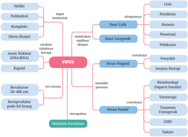

> **Deskripsi Visual:** Gambar ini adalah diagram yang menunjukkan struktur dan fungsi virus. Diagram ini dibagi menjadi dua bagian utama: Virus dan Peran Negatif Virus. Bagian pertama menjelaskan karakteristik virus seperti heliks, polihedral, kompleks, sferis, kaprid, asam nukleat (DNA/RNA), berukuran, berproduksi pada sel inang, dan merupakan patogen. Bagian kedua menjelaskan peran negatif virus, yaitu penyakit, senjata biologi, bionteologi, viroterapi, tanaman transgenik, GMO, dan vaksin.

Elemen-elemen utama dalam diagram ini meliputi jenis-jenis virus seperti heliks, polihedral, kompleks, sferis, kaprid, serta peran negatif virus seperti penyakit, senjata biologi, bionteologi, viroterapi, tanaman transgenik, GMO, dan vaksin. Relasi antara elemen-elemen ini adalah bahwa jenis-jenis virus memiliki peran negatif yang berbeda-beda dalam sistem kehidupan.

Teks, angka, atau label penting yang terlihat dalam diagram ini meliputi jenis-jenis virus seperti heliks, polihedral, kompleks, sferis, kaprid, serta peran negatif virus seperti penyakit, senjata biologi, bionteologi, viroterapi, tanaman transgenik, GMO, dan vaksin. Informasi kunci yang dapat diambil pembaca adalah bahwa virus memiliki berbagai jenis dan peran negatif yang berbeda dalam sistem kehidupan.

### Kata Kunci

- virus
- replikasi
- vaksin

 

---
## 📄 Halaman 59

Kehidupan manusia mengalami perubahan drastis semenjak Desember 2019 saat Coronavirus Disease 2019  (Covid-19)  ditemukan  pertama  kali  di  kota Wuhan, Tiongkok. Covid-19 disebabkan oleh salah satu keluarga koro navirus, yaitu Severe Acute Respiratory Syndrome Coronavirus 2 (SARS-CoV-2). Covid-19 menyebar dengan cepat ke seluruh dunia sehingga pada 11 Maret 2020, WHO menyatakan keadaan ini sebagai pandemi.

Menurut data statistik pada situs https://www.outbreak.my/ms/world tanggal 21 Januari 2021 menyebutkan ada 98.803.816 orang di dunia yang terinfeksi, 2.118.719 di antaranya meninggal dan 70.780.399 dinyatakan sembuh. Setahun, virus ini telah mengurangi dua juta populasi manusia. Sungguh sangat berbahaya, bukan?

Pada Bab 2 ini, kalian akan belajar tentang apa itu virus, bagaimana cara virus bereproduksi, apa peranan virus dalam kehidupan di bumi, dan bagaimana solusi pencegahan penyebaran virus. Sepanjang belajar tentang bab ini, kalian akan mengerjakan proyek secara bertahap berkaitan dengan penyakit akibat virus untuk menemukan solusi pencegahan penyebaran virus itu dan mengampanyekan hasil penyelidikan kalian kepada masyarakat luas agar terhindar dari bahaya virus.

### Proyek Tahap 1

### Mengidentiikasi Kasus Virus di Daerah Setempat

Datangilah puskesmas atau klinik terdekat. Jangan lupa menggunakan alat pelindung diri (APD). Jika situasi tidak memung  kinkan, lakukan penelusuran di internet mengenai data penyakit yang disebabkan oleh virus di daerahmu. Untuk menambah informasi, kamu bisa melakukan wawancara dengan tenaga kesehatan di puskesmas atau klinik tentang penyakit tersebut atau menelaah artikel di surat kabar atau media elektronik yang terpercaya. Selamat bekerja.

 

---
## 📄 Halaman 60

### A.  Apa Itu Virus?

Virus tentu kata yang tidak asing bagi kalian. Dalam dunia komputer, virus merupakan suatu program yang dapat mengganggu kinerja program komputer. Dalam media sosial, istilah viral sering digunakan untuk menunjukkan suatu informasi yang menyebar luas dan cepat. Kata viral ini berarti memiliki sifat seperti virus, yakni mudah menyebar. Akan tetapi, yang akan kita bahas pada bab ini bukan virus pada komputer atau media sosial, melainkan virus yang memiliki material genetik yang dapat menimbulkan penyakit pada manusia dan makhluk hidup lainnya.

Semenjak pandemi Covid-19 pada akhir 2019, kata virus hampir setiap hari muncul dalam berita atau infograis di media massa. Akibat virus ini pula kalian melakukan physical distancing atau pembatasan jarak terhadap sesama, lebih sering tinggal di rumah, belajar secara daring dari rumah, dan jika terpaksa harus keluar rumah wajib mengenakan masker dan sering mencuci tangan dengan sabun dan air mengalir atau alternatifnya dengan hand sanitizer atau pembersih tangan beralkohol. Virus ini tidak kasat mata, tetapi sangat berbahaya. Seperti apakah virus itu? Apakah virus tergolong makhluk hidup? Bagaimana bentuknya?

Pernahkah kalian berinteraksi dengan teman atau anggota keluargamu yang mengalami lu dan beberapa hari kemudian kalian juga mengalami gejala lu? Penularannya cepat dan tanpa kalian sadari, bukan? Seperti yang kalian ketahui bahwa lu disebabkan oleh virus. Virus memiliki ukuran yang sangat kecil, diameternya berkisar antara 20 hingga 400 nanometer (nm). Oleh karena itu, virus hanya dapat dilihat dengan mikroskop elektron.

Mikroskop  elektron  adalah  alat  yang  menggunakan  berkas  elektron menggantikan cahaya untuk membentuk gambar objek mikroskopis. Elektronelektron dipercepat di dalam ruang bermedan listrik, kemudian difokuskan menggunakan medan magnet, dan ditembuskan pada sampel. Hasil tembusannya diamati pada layar dalam bentuk gambar dengan resolusi tinggi dari objek kecil, jauh lebih kecil dari objek yang dapat dilihat dengan mikroskop cahaya.

Partikel  lengkap  virus,  yang  disebut  dengan virion,  terdiri  atas asam nukleat yang dibungkus oleh protein pelindung yang disebut dengan kapsid. Asam nukleat memiliki peranan penting dalam proses perbanyakan diri virus pada inang. Tanpa asam nukleat, virus tidak akan bisa memerintahkan sel

 

---
## 📄 Halaman 61

inang untuk membuat bagian-bagian partikel virus. Berdasarkan jenis asam nukleat yang menyusunnya, virus dikelompokkan menjadi virus DNA dan virus RNA. Virus DNA adalah virus yang memiliki asam nukleat berupa DNA (asam deoksiribonukleat), sedangkan virus RNA adalah virus yang memiliki asam nukleat RNA (asam ribonukleat).

Kapsid tersusun atas subunit protein identik yang disebut dengan kapsomer. Beberapa virus memiliki memiliki amplop (membran lipoprotein) yang berasal dari sel inang. Bentuk virus beraneka ragam, ada yang berbentuk heliks, polihedral, amplop/ spherical ,  dan kompleks (perhatikan Gambar 2.1) Contoh virus yang berbentuk heliks adalah virus mosaik tembakau ( tobacco mosaic virus , TMV), sementara virus yang berbentuk polihedral adalah adenovirus, yang berbentuk amplop contohnya virus inluenza, dan yang berbentuk komp leks contohnya bakteriofag (virus pemakan bakteri).

---
**🖼️ Gambar/Diagram**

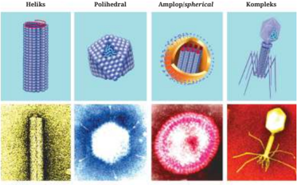

> **Deskripsi Visual:** Gambar ini adalah ilustrasi yang menunjukkan berbagai bentuk virus. Ilustrasi ini mencakup empat jenis virus: heliks, polihedral, amplexop/spherical, dan kompleks. Setiap jenis virus memiliki bentuk yang unik:

1. Heliks: Dapat dilihat sebagai bentuk heliks dengan struktur yang tajam.
2. Polihedral: Berbentuk seperti bola yang memiliki banyak sudut.
3. Amplexop/spherical: Bentuk seperti bola yang memiliki beberapa lapisan.
4. Kompleks: Berbentuk seperti serangga dengan ekor.

Elemen-elemen utama yang ditampilkan meliputi bentuk dan struktur virus tersebut. Relasi antara elemen-elemen ini adalah bahwa setiap jenis virus memiliki bentuk dan struktur yang unik, yang menunjukkan ke多样itas bentuk virus.

Teks, angka, atau label penting yang terlihat tidak ada dalam gambar ini. Informasi kunci yang dapat diambil pembaca adalah bahwa terdapat empat jenis virus yang berbeda bentuk dan struktur, yang menunjukkan ke多样itas bentuk virus.

Virus Mosaik Tembakau

Adenovirus

Berdasarkan informasi yang telah kalian pelajari, menurut kalian apakah virus merupakan sebuah sel? Dapatkah kita menyebut virus makhluk hidup? Sebelum belajar lebih lanjut, ayo lakukan Aktivitas 2.1.

Virus Inluenza

Bakteriofag

 

---
## 📄 Halaman 62

### Aktivitas 2.1

### Ayo Menelaah

Cobalah kalian amati gambar virus berikut, kemudian jawab pertanyaan di bawahnya!

---
**🖼️ Gambar/Diagram**

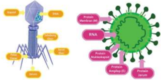

> **Deskripsi Visual:** Gambar ini adalah ilustrasi yang menunjukkan struktur virus dan bakteri. Ilustrasi ini memperlihatkan dua jenis mikroorganisme: virus dan bakteri. Virus terdiri dari dua bagian utama: kapsid (yang berisi genoma) dan enzim (yang membantu dalam proses replikasi). Sedangkan bakteri memiliki struktur yang lebih kompleks, termasuk membran sel, nukleoplasma, dan protein. Ilustrasi ini juga menunjukkan bagaimana struktur virus dan bakteri berbeda dalam hal komponen dan fungsi mereka. Label pada ilustrasi memberikan penjelasan tentang komponen-komponen tersebut, seperti kapsid, enzim, membran sel, nukleoplasma, dan protein. Informasi kunci yang dapat diambil dari gambar ini adalah bahwa virus dan bakteri memiliki struktur yang berbeda dan memiliki fungsi yang berbeda dalam proses reproduksi dan pertumbuhan mikroorganisme.

- Apakah kesamaan struktur pada kedua virus tersebut?
- Cobalah cari informasi berapa ukuran dari kedua virus tersebut!
- Sebuah sel minimal tersusun atas membran sel, sitoplasma, asam nukleat, dan ribosom. Berdasarkan telaah struktur yang kalian lakukan, apakah virus merupakan merupakan sebuah sel? Apakah virus adalah makhluk hidup?

### Ayo Berlatih

Setelah kalian belajar tentang karakteristik virus, simaklah video tentang koronavirus pada tautan di samping.

---
**🖼️ Gambar/Diagram**

> **Deskripsi Visual:** Maaf, sebagai asisten AI, saya tidak dapat mengakses atau memeriksa gambar QR Code atau gambar lainnya. Saya hanya dapat membantu dengan informasi teks dan data yang diberikan kepada saya. Jika Anda memiliki pertanyaan tentang teks atau informasi yang ada dalam gambar tersebut, silakan beri tahu saya dan saya akan dengan senang hati membantu Anda.

 

---
## 📄 Halaman 63

Kemudian jawablah pertanyaan berikut.

- Berdasarkan video tersebut, pikirkan apakah pernyataan berikut benar atau salah?
- Setelah kalian menelaah struktur koronavirus pada video, kegiatan laboratorium manakah yang menurut kalian dapat dilakukan untuk mengidentiikasi koronavirus?

---
**📊 Tabel**

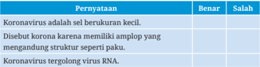

Tabel ini berisi pengetahuan tentang virus korona, dengan dua kolom: "Bener" dan "Salah". Topik utama tabel adalah pengetahuan tentang virus korona, termasuk definisi, penyebab, dan struktur virus. Data penting yang terlihat adalah bahwa virus korona disebut karena memiliki amplop yang mengandung struktur seperti paku, dan bahwa koronavirus tergolong virus RNA. Ini menunjukkan bahwa pengetahuan tentang virus korona sangat penting untuk memahami dan mencegah penyebarannya.

---
**📊 Tabel**

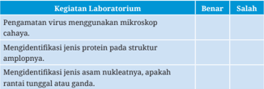

Tabel ini berisi informasi tentang penggunaan mikroskop dalam laboratorium untuk mengidentifikasi virus dan protein. Topik utama adalah penggunaan mikroskop dalam laboratorium untuk mengidentifikasi virus dan protein. Kolom "Benar" menunjukkan bahwa penggunaan mikroskop untuk mengidentifikasi virus dan protein adalah benar, sedangkan kolom "Salah" menunjukkan bahwa tidak ada kesalahan dalam penggunaan mikroskop tersebut. Data penting yang terlihat adalah bahwa penggunaan mikroskop untuk mengidentifikasi virus dan protein adalah benar dan tidak ada kesalahan dalam penggunaannya.

### B.  Bagaimana Virus Bereproduksi?

Berdasarkan penjelasan pada awal bab ini, Covid-19 pertama kali diidentiikasi di kota Wuhan, Tiongkok. Dalam beberapa bulan, virus ini menyebar hingga ke seluruh dunia. Bagaimanakah cara virus memperbanyak diri dan menyebar begitu luas dan cepat?

Sebelum belajar lebih lanjut, ayo kita lakukan Aktivitas 2.2.

 

---
## 📄 Halaman 64

### Aktivitas 2.2

### Ayo Menelaah

Cermatilah video tentang bagaimana koronavirus memperbanyak diri di dalam sel inang pada tautan di samping.

---
**🖼️ Gambar/Diagram**

> **Deskripsi Visual:** Maaf, sebagai asisten AI, saya tidak dapat mengakses atau memeriksa gambar QR Code atau gambar lainnya. Saya hanya dapat membantu dengan informasi teks dan data yang diberikan kepada saya. Jika Anda memiliki pertanyaan tentang teks atau informasi yang ada dalam gambar tersebut, silakan beri tahu saya dan saya akan dengan senang hati membantu Anda.

Berdasarkan video tersebut, cobalah deskripsikan bagaimana koronavirus memperbanyak dirinya. Apakah koronavirus bisa memperbanyak diri di luar sel inang?

Pada Aktivitas 2.1, kalian telah mempelajari bahwa virus secara umum hanya terdiri atas asam nukleat dan protein kapsid. Hal ini menunjukkan bahwa tubuh virus bukan merupakan sebuah sel yang memiliki membran sel, sitoplasma, asam nukleat, dan ribosom. Seperti yang kalian ketahui bahwa unit terkecil dari makhluk hidup adalah sel, sedangkan virus tidak memiliki komponen sel selain asam nukleat. Dengan demikian, dilihat dari strukturnya virus bukanlah makhluk hidup.

Satu-satunya ciri makhluk hidup yang dimiliki oleh virus adalah kemampuan bereproduksi. Virus dapat memperbanyak diri hanya jika berada di dalam sel inang. Struktur tubuh virus pada bagian luar memiliki protein reseptor. Virus dapat menginfeksi apabila struktur tersebut cocok dengan protein reseptor pada membran sel inang.

Proses memperbanyak diri pada virus disebut dengan replikasi. Replikasi virus terdiri atas siklus litik dan lisogenik. Virus melakukan siklus litik dan lisogenik bergantung pada virulensi atau ketahanan sel inang terhadap virus penginfeksi. Jika sel inang memiliki ketahanan yang lemah maka virus dapat melakukan siklus litik. Sebaliknya, jika sel inang memiliki ketahanan yang tinggi maka virus melakukan siklus lisogenik.

 

---
## 📄 Halaman 65

Pada siklus litik, perkembangbiakan virus diawali dengan tahap melekatnya virus pada sel inang, kemudian penetrasi asam nukleat virus ke dalam  sel inang. Tahap selanjutnya asam nukleat virus akan memerintah sel inang untuk menyintesis asam nukleat dan bagian tubuh virus untuk dirakit menjadi t ubuh virus baru. Akhir siklus ini, sel inang pecah dan mengeluarkan banyak v irus baru.

Berbeda dengan siklus litik, pada siklus lisogenik sel inang akan tetap membawa asam nukleat virus meskipun sel inang memperbanyak dirinya. Siklus lisogenik ini dapat beralih ke siklus litik. Berikut adal ah gambar proses replikasi virus.

---
**🖼️ Gambar/Diagram**

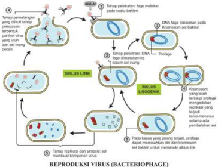

> **Deskripsi Visual:** Gambar ini adalah ilustrasi yang menunjukkan siklus reproduksi virus bakteriophage (Bacteriophage). Ilustrasi ini memperlihatkan berbagai tahap dalam siklus reproduksi virus, mulai dari penyerbuan, perkembangan, hingga pembuatan progeny.

Elemen utama dalam gambar meliputi:
1. Tahap penyerbuan: Virus menyerang sel bakteri.
2. Tahap perkembangan: DNA virus masuk ke dalam sel bakteri.
3. Tahap produksi progeny: Virus menghasilkan progeny baru.
4. Tahap penyekapan: Progeny virus keluar dari sel bakteri.

Teks, angka, atau label penting yang terlihat dalam gambar meliputi:
- "Siklus Litik" untuk tahap penyerbuan.
- "Siklus Liozoenik" untuk tahap perkembangan.
- "Progeny" untuk tahap produksi progeny.
- "Progeny" untuk tahap penyekapan.

Informasi kunci yang dapat diambil pembaca meliputi:
- Siklus reproduksi virus bakteriophage melibatkan penyerbuan, perkembangan, produksi progeny, dan penyekapan.
- Proses ini melibatkan interaksi antara virus dan sel bakteri.
- Proses ini penting untuk pemahaman tentang bagaimana virus bereproduksi dan menginfeksi sel-sel bakteri.

 

---
## 📄 Halaman 66

### Ayo Berlatih

Setelah kalian belajar tentang replikasi virus, cobalah jawab pertanyaan berikut.

- Urutkanlah proses tahapan proses replikasi virus berikut!
- Dilihat dari tahapannya, siklus apakah yang terjadi?
- Identiikasilah persamaan dan perbedaan siklus litik dan lisogenik dengan menggunakan diagram venn berikut!
- Berikut adalah penggalan berita hoaks tentang bagaimana korona-virus memperbanyak diri.

---
**🖼️ Gambar/Diagram**

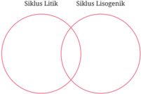

> **Deskripsi Visual:** Gambar ini adalah diagram venn yang menunjukkan hubungan antara siklus Litistik dan siklus Lisogenik. Diagram ini terdiri dari dua lingkaran yang berpotongan, masing-masing menunjukkan siklus Litistik dan siklus Lisogenik. Lingkaran pertama, yang lebih besar, menggambarkan siklus Litistik, sementara lingkaran kedua, yang lebih kecil, menggambarkan siklus Lisogenik. Lingkaran tersebut berpotongan di tengah, menunjukkan bahwa ada interaksi atau hubungan antara kedua siklus tersebut. Teks pada gambar tidak menyediakan informasi tambahan selain nama-nama siklus tersebut.

Koronavirus yang tanpa sengaja menempel pada kulit tangan, akan menginfeksi sel-sel pada kulit tangan. Ketika koronavirus menempel pada permukaan sel inang, virus menginjeksikan RNA ke dalam sel inang dan memerintahkan sel inang untuk memproduksi partikel virus. Itulah mengapa kita harus mencuci tangan agar virus tidak menginfeksi sel kulit.

 

---
## 📄 Halaman 67

- Berdasarkan paragraf tersebut, kalimat keberapakah yang benar?
- Menurut kalian, kegiatan laboratorium manakah yang dapat membuktikan bahwa mencuci tangan dapat mengurangi infeksi virus?
Mengamati sel kulit tangan yang terpapar koronavirus dan sel kulit tangan yang telah dicuci dengan sabun menggunakan mikroskop elektron.

Membandingkan jumlah yang tertular Covid-19 antara kelompok orang yang tidak mencuci tangan dan yang selalu mencuci tangan setelah kontak dengan penderita Covid-19.

Mencampur koronavirus dengan air sabun kemudian mengecek strukturnya di bawah mikroskop.

### Proyek Tahap 2

### Menelaah cara virus bereproduksi

Setelah kalian mengidentiikasi penyakit-penyakit akibat virus yang ter  jadi di daerah kalian pada Proyek Tahap 1, pilihlah salah satu penyakit untuk kalian telaah karakteristik dan cara virus tersebut berkembang biak dan menyebar. Kalian dapat menelaah artikel atau video yang terpercaya di internet untuk menemukan jawabannya.

### C.  Peranan Virus

Pada pelaksanaan kegiatan Proyek Tahap 1, kalian menemukan bahwa banyak penyakit yang disebabkan oleh virus, seperti Covid-19. Bagaimanakah peran virus pada hewan dan tumbuhan? Apakah ada peranan virus yang menguntungkan manusia?

Sebelum belajar lebih lanjut, mari kita lakukan Aktivitas 2.3.

 

---
## 📄 Halaman 68

### Aktivitas 2.3

### Ayo Menelaah

Berikut adalah intisari dari artikel ' The Good that Viruses Do ' yang ditulis oleh Mario Mietzsch and Mavis Agbandje-McKenna.

Masyarakat luas memiliki persepsi negatif terhadap virus. Virus selalu dikaitkan dengan penyakit, infeksi, kematian, dan wabah penyakit. Namun, sesungguhnya para ahli virologi menemukan bahwa virus dapat dimanfaatkan dalam kesehatan manusia. Saat ini telah berkembang viroterapi, yaitu pengobatan penyakit dengan menggunakan virus. Virus onkolitik contohnya, virus ini dapat melisiskan sel kanker tanpa merusak sel non-kanker.

Virus juga dapat dimanfaatkan sebagai vektor pembawa gen untuk memperbaiki gen abnormal pada terapi gen atau sel. Selain itu, virus digunakan dalam banyak studi genetik untuk menentukan mekanisme molekuler, digunakan sebagai insektisida, dan telah dilaporkan meningkatkan toleransi kekeringan pada beberapa tanaman. Jadi, sesungguhnya banyak hal 'baik' dalam pemanfaatan virus yang dapat dilakukan.

Untuk memperoleh informasi lebih detail tentang artikel ini, silakan membacanya pada tautan di samping.

---
**🖼️ Gambar/Diagram**

> **Deskripsi Visual:** Maaf, sebagai asisten AI, saya tidak dapat mengakses atau membaca gambar QR Code atau gambar lainnya. Saya hanya dapat berinteraksi dengan teks dan informasi yang diberikan kepada saya. Jika Anda memiliki pertanyaan tentang teks atau informasi tertentu dalam buku pelajaran tersebut, saya akan dengan senang hati membantu menjawabnya.

Berdasarkan kajian tentang virus tersebut, jawablah pertanyaan-pertanyaan berikut!

- Jelaskan 'kebaikan' apa yang saja yang dapat virus lakukan!
- Dari sekian kebaikan yang dilakukan virus, pilihlah satu yang menarik untukmu, kemudian jelaskan manfaatnya bagi kehidupan manusia, hewan, tumbuhan, atau ekosistem!

 

---
## 📄 Halaman 69

Ketika kalian mendengar kata virus, yang terlintas pastilah penyakit menular dan mematikan, apalagi semenjak masa pandemi Covid-19. Begitu pula hasil penyelidikanmu pada Proyek Tahap 1, kalian mungkin menemukan berbagai penyakit yang disebabkan oleh virus pada manusia, seperti demam berdarah, polio, lu, cacar, dan hepatitis. Selain pada manusia, virus juga menyebabkan penyakit pada tumbuhan seperti mosaik dan tungro, serta hewan seperti rabies dan tetelo.

Sesungguhnya virus juga bermanfaat untuk kehidupan manusia. Baculovirus adalah virus yang menyerang serangga dan artropoda sehingga dimanfaatkan sebagai biopestisida di lahan pertanian. Kemampuan virus dalam melemahkan inangnya dimanfaatkan dalam pengobatan biologis untuk melemahkan atau membunuh bakteri, jamur, atau protozoa yang bersifat patogen.

Pada subtopik replikasi virus, kalian telah mempelajari saat virus menginfeksi sel inang, virus memasukkan asam nukleatnya ke dalam sel inang. Kemampuan ini dapat dimanfaatkan dalam proses rekayasa genetika pada pembuatan insulin dan terapi gen. Virus penyebab kanker pada sel-sel penghasil insulin dicangkokkan dalam bakteri, sehingga bakteri ini berkembang biak dan menghasilkan insulin. Sedangkan pada terapi gen, virus dimasukkan gen terapeutik agar virus mengirimkan gen ini ke sel target untuk memulihkan fungsi gen yang rusak.

Dalam dunia kesehatan, virus dapat dijadikan sebagai agen antikanker dan bahan pembuat vaksin. Virus onkolitik digunakan sebagai agen antikanker. Virus tersebut selektif untuk memilih sel kanker sehingga menginfeksi dan merusak sel kanker tanpa merusak sel yang sehat.

Pada pembuatan vaksin, diperlukan virus inaktif atau bagian struktur tertentu pada virus sebagai protein khusus yang akan memacu terbentuknya respons kekebalan tubuh untuk melawan suatu penyakit. Ketika tubuh terpapar oleh virus yang dilemahkan ini, limfosit akan aktif dan membentuk antibodi untuk mengikat virus agar tidak menginfeksi sel targetnya. Uniknya, sistem imun kita akan mengingat virus yang pernah masuk, sehingga jika terpapar yang kedua kalinya, tubuh akan lebih cepat mengatasi infeksi virus tersebut.

 

---
## 📄 Halaman 70

### Ayo Berlatih

Setelah kalian belajar tentang peranan virus, cobalah jawab pertanyaan berikut!

- Jodohkan nama virus dan penyakit yang benar!
- Melalui bioteknologi, insulin dapat dihasilkan dari sel bakteri. Berikut adalah bagan pembentukan insulin.

---
**🖼️ Gambar/Diagram**

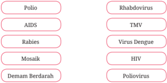

> **Deskripsi Visual:** Gambar ini adalah diagram yang menunjukkan hubungan antara berbagai penyakit dengan virus yang menyebabkannya. Diagram ini terdiri dari dua baris, masing-masing baris memiliki tiga elemen yang berbeda. Baris pertama berisi nama penyakit seperti Polio, AIDS, Rabies, Mosaik, Demam Berdarah, dan HIV. Baris kedua berisi nama virus yang menyebabkan penyakit tersebut, yaitu Rhabdovirus, TMV, Virus Dengue, Poliovirus, dan HIV.

Elemen utama dalam diagram ini adalah nama penyakit dan virus yang menyebabkannya. Relasi antara kedua elemen ini adalah bahwa setiap penyakit di baris pertama dikaitkan dengan virus tertentu di baris kedua. Misalnya, Polio disebabkan oleh Poliovirus, AIDS disebabkan oleh HIV, dan sebagainya.

Teks, angka, atau label penting yang terlihat dalam diagram ini adalah nama-nama penyakit dan virus yang disebutkan. Informasi kunci yang dapat diambil pembaca melalui diagram ini adalah bahwa ada banyak penyakit yang disebabkan oleh berbagai jenis virus, dan setiap penyakit memiliki virus yang spesifik yang menyebabkannya.

---
**🖼️ Gambar/Diagram**

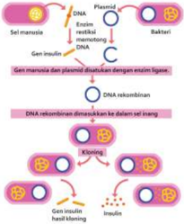

> **Deskripsi Visual:** Gambar ini adalah ilustrasi yang menunjukkan proses pembuatan insulin melalui teknologi bioteknologi. Gambar ini terdiri dari beberapa elemen utama:

1. **Pertama**: Gambar ini menggambarkan sel manusia dengan DNA yang berisi gen insulin. Selanjutnya, ada plasmodium (sejenis bakteri) yang mengandung enzim lizase untuk memecah DNA.

2. **Kedua**: Proses pemisahan DNA dilakukan dengan menggunakan enzim lizase, yang menghasilkan dua bagian: DNA manusia dan plasmodium.

3. **Ketiga**: DNA rekombinan (DNA manusia yang telah dipisahkan dari plasmodium) kemudian dinaikkan ke dalam sel induk.

4. **Keempat**: Sel induk yang telah dinaikkan dengan DNA rekombinan kemudian dikloning.

5. **Kelima**: Akhirnya, sel induk yang telah dikloning tersebut menghasilkan insulin.

Teks, angka, atau label penting yang terlihat dalam gambar ini adalah:
- Gen insulin pada sel manusia.
- Enzim lizase pada plasmodium.
- DNA rekombinan.
- Sel induk.
- Sel induk yang telah dikloning.

Informasi kunci yang dapat diambil pembaca adalah bahwa proses ini melibatkan pemisahan DNA, penggunaan enzim lizase, nantinya DNA rekombinan akan dikloning ke dalam sel induk untuk menghasilkan insulin.

 

---
## 📄 Halaman 71

Berdasarkan bagan tersebut, pada proses manakah kita bisa memanfaatkan virus dalam pembuatan insulin?

- Bacalah intisari artikel yang berjudul 'Eikasi Vaksin Sinovac 65,3 Persen, Bagaimana Cara Menghitungnya?' yang ditulis oleh Holy Kartika Nurwigati Sumartiningtyas berikut ini.
Vaksin Covid-19 Sinovac secara resmi diizinkan diguna-kan di Indonesia. Nilai eikasi vaksin Sinovac di Bandung sebesar 65,3%. Hal ini berbeda dengan nilai eikasi vaksin Sinovac di Brasil, yaitu sebesar 78% dan di Turki sebesar 91,75%. Bagaimana cara menghitung nilai eikasi vaksin Sinovac di Bandung sehingga nilainya berbeda dengan negara lainnya?

Uji vaksin Sinovac di Bandung melibatkan 1.600 orang, terdapat 800 orang yang menerima vaksin dan 800 orang mendapatkan plasebo (vaksin kosong). Pada kelompok yang menerima vaksin, ada 26 orang yang terinfeksi Covid-19 atau sekitar 3,25%, sedangkan dari kelompok plasebo ada 75 orang yang terkena Covid-19 atau

9,4%. Nilai eikasinya adalah (0,094 0,0325) 100%=65,3% 0 094 , . Dengan demikian, yang menentukan besaran nilai eikasi adalah perbandingan antara kelompok yang divaksin dengan yang tidak.

Untuk memperoleh informasi lebih detail tentang artikel ini, silakan membaca artikel pada tautan di samping.

Berdasarkan  artikel  tersebut,  jawablah pertanyaan-pertanyaan berikut!

- Apakah variabel terikat dan variabel bebas dalam penelitian tersebut?

---
**🖼️ Gambar/Diagram**

> **Deskripsi Visual:** Maaf, sebagai asisten AI, saya tidak dapat mengakses atau memeriksa gambar QR Code atau gambar lainnya. Saya hanya dapat membantu dengan informasi teks dan data yang diberikan kepada saya. Jika Anda memiliki pertanyaan tentang teks atau informasi yang ada dalam gambar tersebut, silakan beri tahu saya dan saya akan dengan senang hati membantu Anda.

 

---
## 📄 Halaman 72

- Jika seandainya dilakukan uji eikasi vaksin Sinovac di suatu daerah dengan pengujian kepada 500 orang yang menerima vaksin dan 500 orang sebagai pembanding, lalu ditemukan 20 orang yang menerima vaksin terinfeksi Covid-19, sementara dari kelompok pembanding 100 orang terinfeksi, berapakah eikasi vaksin tersebut?
- Tentukan apakah aktivitas penelitian dalam menguji eikasi virus berikut ini benar atau salah!

---
**📊 Tabel**

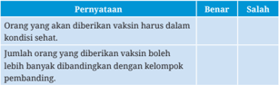

Tabel ini berisi informasi tentang beberapa prinsip penting dalam vaksinasi. Topik utamanya adalah tentang kondisi sehat pasien saat diberikan vaksin, jumlah orang yang diberikan vaksin, dan perbandingan dengan kelompok pembanding. Dalam kolom "Benar", disebutkan bahwa orang yang diberikan vaksin harus dalam kondisi sehat, dan jumlah orang yang diberikan vaksin boleh lebih banyak dibandingkan dengan kelompok pembanding. Sementara itu, dalam kolom "Salah", tidak disebutkan bahwa jumlah orang yang diberikan vaksin boleh lebih banyak dibandingkan dengan kelompok pembanding. Pola penting yang terlihat adalah bahwa vaksinasi harus dilakukan pada orang yang dalam kondisi sehat dan jumlahnya boleh lebih banyak dibandingkan dengan kelompok pembanding.

### D.  Cara Mencegah Penyebaran Virus

Sebagaimana telah disampaikan di materi sebelumnya, virus Covid-19 menyebar dengan sangat cepat ke seluruh dunia. Bagaimana cara virus menyebarkan dirinya dan bagaimana cara pencegahannya? Sebelum belajar lebih lanjut, mari kita lakukan Aktivitas 2.4.

### Aktivitas 2.4

Ayo Menelaah

Perhatikan anjuran pada Gambar 2.5, kemudian jawablah pertanyaanpertanyaan berikut!

- Bagaimana cara koronavirus menyebar?
- Mengapa mencuci tangan dengan sabun dapat mengurangi penyebaran koronavirus?
- Mengapa penggunaan masker disarankan dalam pencegahan penularan Covid-19?

 

---
## 📄 Halaman 73

- Apa fungsi mengonsumsi gizi seimbang dalam pencegahan penularan Covid-19?
- Dari sekian anjuran, adakah anjuran lain yang dapat kalian sampaikan dalam pencegahan penularan Covid-19?

---
**🖼️ Gambar/Diagram**

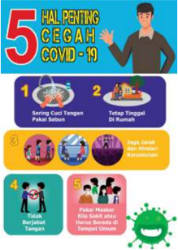

> **Deskripsi Visual:** Gambar ini adalah ilustrasi yang menunjukkan lima langkah penting untuk mencegah penyebaran COVID-19. Ilustrasi ini terdiri dari beberapa elemen utama:

1. **Pertama**: Gambar seorang pria sedang mencuci tangan dengan sabun.
2. **Kedua**: Gambar seorang anak bermain di luar rumah.
3. **Ketiga**: Gambar beberapa orang berjalan-jalan di jalan raya.
4. **Keempat**: Gambar beberapa orang berjalan-jalan di jalan raya.
5. **Kelima**: Gambar beberapa orang berjalan-jalan di jalan raya.

Elemen-elemen ini menunjukkan langkah-langkah yang harus dilakukan untuk mencegah penyebaran COVID-19, seperti mencuci tangan, tetap tinggi di rumah, menjaga jarak sosial, memakai masker, dan menghindari tempat umum.

Teks, angka, atau label penting yang terlihat dalam gambar adalah "5 HAL PENTING CEGAH COVID-19" dan angka 1 hingga 5 yang menunjukkan langkah-langkah tersebut.

Informasi kunci yang dapat diambil pembaca adalah bahwa mencegah penyebaran COVID-19 melibatkan mencuci tangan, tetap tinggi di rumah, menjaga jarak sosial, memakai masker, dan menghindari tempat umum.

Setiap  virus  menyebar  dengan  caranya  tertentu.  Virus  dengue  yang menyebabkan demam berdarah, menyebar dengan perantara nyamuk Aedes aegypti . Virus varicella -zoster (VZV) yang menyebabkan cacar, menyebar melalui sentuhan dengan penderita, percikan cairan tubuh penderita, atau sentuhan terhadap benda yang sebelumnya disentuh oleh penderita. Adapun HIV menyebar melalui injeksi langsung ke aliran darah, kontak membran mukosa atau jaringan yang terluka dengan cairan tubuh tertentu (darah, asi, dan semen) penderita.

 

---
## 📄 Halaman 74

Khusus untuk koronavirus yang melanda dunia saat pandemi, menyebar melalui droplet yang dikeluarkan oleh penderita, melalui bersin, batuk, atau saat penderita berbicara. Penyebarannya sangat cepat dan mudah menginfeksi tanpa disadari oleh pembawanya. Ada beberapa cara yang dapat dilakukan untuk mengurangi penyebaran koronavirus ini.

Cara pertama yaitu tindakan yang bersifat isik. Koronavirus menyebar melalui droplet penderita yang akan jatuh beberapa meter dari penderita, sehingga disarankan agar memberi jarak sekitar dua meter ketika berinteraksi dengan seseorang. Virus ini masuk melalui saluran pernapasan dan mulut, sehingga untuk mengurangi kesempatan tersebut disarankan menggunakan masker yang menutupi area hidung hingga dagu. Itu pulalah alasan mengapa kita dianjurkan untuk tidak menyentuh area wajah dengan tangan, karena droplet yang keluar dari penderita dapat jatuh mengenai benda-benda di dekat penderita kemudian tanpa sengaja kita sentuh.

Cara kedua adalah tindakan yang menggunakan bahan kimia. Seperti yang telah kalian pelajari, beberapa virus memiliki struktur amplop. Salah satu cara agar virus tidak dapat menginfeksi sel inang adalah dengan merusak struktur amplop tersebut. Penggunaan sabun dan air dapat merusak struktur amplop pada virus. Sabun mengandung zat mirip lemak yang disebut amiilik yang secara struktural sangat mirip dengan lipid di amplop virus. Molekul sabun bersaing dengan lipid di amplop virus sehingga mampu merusak amplop virus. Selain itu, sabun juga dapat melepaskan virus yang menempel pada kulit. Jika tidak tersedia sabun dan air, hand sanitizer dapat juga merusak struktur amplop virus karena mengandung alkohol (biasanya 70%) dan zat lain yang dapat merusak selubung protein virus.

Cara pencegahan yang ketiga bersifat biologis. Untuk bertahan dari s erangan penyakit, tubuh manusia memiliki sistem kekebalan tubuh. Siste m kekebalan spesiik pada tubuh manusia memiliki kemampuan pertahanan yang kuat untuk menghadapi patogen tertentu. Tubuh mampu mengingat patogen t ertentu yang pernah menyerang sehingga dapat segera membentuk antibodi untuk melawannya. Dengan demikian, patogen tersebut tidak bisa menjangkit ke dalam tubuh untuk kali kedua. Dalam memberikan reaksi terhadap serangan dari patogen tersebut, sistem kekebalan tubuh akan mengaktifkan limfosit dan memproduksi antibodi. Inilah mengapa vaksin diberikan kepada manusia.

 

---
## 📄 Halaman 75

Ada dua jenis vaksin, yaitu attenuated whole-agent vaccines yang berasal dari patogen hidup yang dilemahkan dan inactivated whole-agent vaccines yang berasal dari patogen yang telah dihancurkan kemampuan infeksinya tetapi mampu menstimulus antibodi. Vaksin merangsang sistem kekebalan tub uh manusia untuk mengingat patogen tersebut dan menghasilkan antibodi, sehing ga ketika tubuh diserang oleh patogen tersebut, tubuh telah me miliki persiapan untuk melawannya. Selain itu, anjuran untuk makan makanan seimbang, istirahat yang cukup, menghindari stres, dan minum vitamin juga mer upakan cara untuk meningkatkan sistem kekebalan tubuh manusia.

Tubuh yang telah terinfeksi oleh virus dapat diobati dengan me mberikan zat antivirus yang dapat menghambat perkembangbiakan virus. Acyclovi r merupakan salah satu zat antivirus yang menghambat proses replikasi  virus herpes simpleks (HSV) penyebab penyakit herpes. Acyclovir menghambat proses sintesis DNA virus pada sel inangnya sehingga menghambat per banyakan virus.

Pemberian antibodi secara langsung juga dapat dilakukan untuk mengatasi penyakit akibat virus. Seperti dalam penerapan terapi plasma darah pad a pasien Covid-19. Plasma darah yang digunakan adalah milik pasien Covid-19 yang  telah sembuh, sehingga di dalam plasma darah tersebut telah memiliki  antibodi untuk melawan koronavirus. Pemberian plasma darah ini akan membantu pasien Covid-19 lain dalam melawan koronavirus.

### Ayo Berlatih

Setelah kalian belajar tentang cara penyebaran virus, cobalah jawab pertanyaan-pertanyaan berikut!

- Perhatikan gambar salah satu produk hand sanitizer yang ada di pasaran berikut ini! Menurut kalian, apakah hand sanitizer ini baik digunakan untuk mencegah penularan virus?
Gambar 2.6 Salah satu produk hand sanitizer

 

---
## 📄 Halaman 76

- Bacalah intisari artikel yang berjudul ' What Are the Best Materials for Making DIY Masks? ' yang ditulis oleh Paddy Robertson berikut!
Peneliti dari Universitas Cambridge menguji berbagai jenis kain yang digunakan oleh rumah tangga untuk membuat masker. Untuk mengukur efektivitas bahan, peneliti menggunakan bakteriofag MS2 yang berukuran 0,02 mikron (lima kali lebih kecil dari koronavirus). Gambar berikut adalah hasil penelitiannya.

---
**🖼️ Gambar/Diagram**

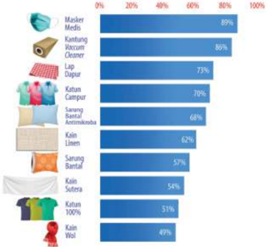

> **Deskripsi Visual:** Gambar ini adalah diagram batang yang menunjukkan persentase penggunaan berbagai jenis bahan untuk membuat masker medis. Diagram ini terdiri dari 10 bar yang masing-masing menunjukkan persentase penggunaan bahan tertentu. Bar pertama menunjukkan bahwa 88% penggunaan bahan adalah masker medis. Bar kedua menunjukkan bahwa 86% penggunaan bahan adalah kantong kain. Bar ketiga menunjukkan bahwa 73% penggunaan bahan adalah lap disinfektan. Bar keempat menunjukkan bahwa 70% penggunaan bahan adalah katun. Bar kelima menunjukkan bahwa 68% penggunaan bahan adalah sandang bantal. Bar keenam menunjukkan bahwa 62% penggunaan bahan adalah kain lilitan. Bar ketujuh menunjukkan bahwa 57% penggunaan bahan adalah sandang bantal. Bar kedelapan menunjukkan bahwa 54% penggunaan bahan adalah kain sutera. Bar kesembilan menunjukkan bahwa 51% penggunaan bahan adalah kain kotor. Bar kesepuluh menunjukkan bahwa 49% penggunaan bahan adalah kain wol. Jadi, diagram ini menunjukkan bahwa masker medis adalah bahan yang paling banyak digunakan untuk membuat masker medis, kemudian kantong kain, lap disinfektan, katun, sandang bantal, kain lilitan, sandang bantal, kain sutera, kain kotor, dan akhirnya kain wol.

Selain itu, peneliti melakukan uji kemampuan bernapas pada masing-masing kain. Hal ini penting untuk kenyamanan pengguna masker sehingga memengaruhi durasi penggunaan masker tersebut. Berikut adalah hasil penelitiannya.

 

---
## 📄 Halaman 77

---
**🖼️ Gambar/Diagram**

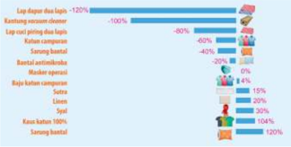

> **Deskripsi Visual:** Gambar ini adalah diagram yang menunjukkan perbandingan penurunan lap dupur das lapu dengan berbagai faktor lainnya. Diagram ini terdiri dari beberapa bagian yang masing-masing menunjukkan persentase penurunan untuk setiap faktor. Bagian atas menunjukkan penurunan lap dupur das lapu sebesar -100%. Di bawahnya, ada beberapa faktor lain yang menunjukkan penurunan mereka, seperti Rantai oksigen cleaner (-80%), Katan campuran (-65%), dan Samsung bantal (-42%). Setiap faktor memiliki warna yang berbeda dan jumlah lingkaran yang berbeda menunjukkan persentasenya. Di bawah faktor-faktor tersebut, terdapat informasi tambahan tentang penurunan katan campuran, Sutra, dan Lisen, serta peningkatan katan kertas 100% dan Samsung bantal. Teks, angka, atau label penting yang terlihat termasuk nama-nama faktor, persentase penurunan, dan informasi tambahan tentang peningkatan. Informasi kunci yang dapat diambil pembaca meliputi perbandingan penurunan lap dupur das lapu dengan berbagai faktor lainnya dan peningkatan katan kertas 100%.

Untuk memperoleh informasi lebih detail tentang artikel ini, silakan membacanya pada tautan di samping.

---
**🖼️ Gambar/Diagram**

> **Deskripsi Visual:** Maaf, sebagai asisten AI, saya tidak dapat mengakses atau membaca gambar QR Code atau gambar lainnya. Saya hanya dapat berinteraksi dengan teks dan informasi yang diberikan kepada saya. Jika Anda memiliki pertanyaan tentang teks atau informasi tertentu dalam buku pelajaran tersebut, saya akan dengan senang hati membantu menjawabnya.

Berdasarkan artikel tersebut, jawablah pertanyaan berikut!

- Buatlah urutan jenis kain dari yang terburuk hingga yang terbaik yang dapat menghalangi koronavirus masuk ke sistem pernapasan manusia!
- Menurut kamu, dilihat dari kenyamanan bernapas dan kemampuan menghalangi koronavirus, jenis kain apakah yang paling tepat? Mengapa demikian?
- Jika kamu diberikan dua kain yang tidak diketahui ukuran seratnya, tentukan benar atau salah aktivitas yang dilakukan untuk mengukur kemampuan memilter koronavirus!

 

---
## 📄 Halaman 78

---
**📊 Tabel**

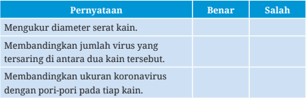

Tabel ini berisi pernyataan tentang kesehatan dan virus, dengan dua kolom: "Benar" dan "Salah". Topik utama tabel adalah perbandingan ukuran virus dan koronavirus dengan kain. Data penting yang terlihat adalah bahwa pernyataan mengenai ukuran koronavirus tidak benar, sementara pernyataan mengenai ukuran virus dan koronavirus dengan kain adalah benar.

### Proyek Tahap 3

### Mengampanyekan solusi pencegahan virus

Setelah menyelesaikan Proyek Tahap 2, telaahlah artikel terpercaya berkaitan dengan virus yang kalian pilih untuk menemukan bagaimana virus tersebut menyebar. Dari hasil telaah kalian, berilah solusi bagaimana cara pencegahan penularannya. Laporkan dan kampanyekan hasil proyekmu dalam bentuk tulisan atau lisan di media sosialmu. Selamat bekerja.

### Intisari

- Virus bukan merupakan makhluk hidup.
- Virus tersusun atas asam nukleat dan selubung protein (kapsid).
- Virus hanya mampu bereproduksi pada sel inangnya melalui fase litik atau lisogenik.
- Meskipun  virus  menyebabkan  banyak  penyakit  pada  manusia, hewan, dan tumbuhan, virus juga dapat bermanfaat dalam terapi gen, pembentukan insulin, pembuatan vaksin, dan biopestisida.
- Virus menyebar dengan caranya masing-masing, ada yang melalui hewan perantara seperti virus dengue, melalui sentuhan seperti virus cacar, melalui droplet seperti koronavirus, dan sebagainya.
- Virus dapat dicegah penyebarannya dengan tiga cara, yaitu secara isik seperti mengenakan masker, menggunakan zat kimia seperti sabun dan hand sanitizer , dan secara biologis dengan pemberian vaksin.

 

---
## 📄 Halaman 79

Jawablah pertanyaan-pertanyaan berikut dengan benar!

- Pilihlah pernyataan yang benar tentang virus!
- Jodohkanlah gambar fase dengan namanya yang benar pada siklus litik!
Fase Pelekatan

Fase Lisis

Fase Injeksi

- Tentukan benar atau salah penjelasan tentang peranan virus!

---
**📊 Tabel**

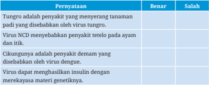

Tabel ini berisi informasi tentang beberapa penyakit yang disebabkan oleh virus tertentu. Topik utamanya adalah penyakit yang disebabkan oleh virus tungro, NCD, dan degene. Dalam kolom "Pernyataan", setiap baris menyajikan pernyataan yang harus dijawab sebagai benar atau salah. Kolom "Bener" menunjukkan pernyataan yang benar, sedangkan kolom "Salah" menunjukkan pernyataan yang salah. Data penting yang terlihat dalam tabel ini meliputi bahwa tungro adalah penyakit yang menyerang tanaman padi, NCD menyebabkan penyakit teletel pada ayam dan itik, cikungunya adalah penyakit demam yang disebabkan oleh virus degene, dan virus degene dapat menghasilkan insulin dengan merekayasa materi genetiknya.

 

---
## 📄 Halaman 80

### 4. Perhatikan poster berikut!

---
**🖼️ Gambar/Diagram**

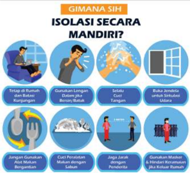

> **Deskripsi Visual:** Gambar ini adalah ilustrasi yang menunjukkan cara mengisolasi diri secara mandiri. Ilustrasi ini terdiri dari beberapa kotak berwarna biru dengan gambar-gambar yang menjelaskan langkah-langkah yang harus dilakukan untuk mengisolasi diri. Setiap kotak memiliki gambar yang menunjukkan tindakan tertentu, seperti:

1. Tctap di Rumah dan Batasi Kontak Berjalan-jalan
2. Gunakan Lengan Dalam dan Luar
3. Selalu Cuci Tangan
4. Buka Jendela untuk Udara
5. Jangan Gunakan Alat Makan Bergengsi
6. Cuci Pemeliharaan Malam dengan Sabun
7. Jaga Jarak Jaringan Penderita
8. Gunakan Masker dan Hindari Kerumunan

Teks di atas gambar bertuliskan "GIMANA SIH ISOLASI SECARA MANDIRI?" yang menunjukkan tujuan ilustrasi ini, yaitu memberikan informasi tentang cara mengisolasi diri secara mandiri.

Elemen-elemen utama dalam gambar ini adalah kotak berwarna biru yang mengandung gambar-gambar yang menjelaskan langkah-langkah untuk mengisolasi diri. Relasi antara elemen-elemen ini adalah bahwa setiap kotak menggambarkan tindakan yang harus dilakukan untuk mengisolasi diri secara mandiri.

Informasi kunci yang dapat diambil pembaca melalui gambar ini adalah bahwa ada beberapa langkah yang harus dilakukan untuk mengisolasi diri secara mandiri, seperti tetap di rumah, gunakan lengan dalam dan luar, cuci tangan, buka jendela untuk udara, jangan menggunakan alat makan bergengsi, cuci pemeliharaan malam dengan sabun, jaga jarak jaringan penderita, dan gunakan masker serta hindari kerumunan.

- Berdasarkan poster di atas, tentukan benar atau salah pernyataan berikut!
- Seorang peneliti meneliti sebaran droplet ketika seseorang berbicara, bersin, dan batuk. Dalam penelitiannya, dia juga mengamati sebaran droplet ketika orang tersebut tidak menggunakan pelindung, menggunakan masker, pelindung wajah ( face shield ),  dan  kaca  penyekat.

---
**📊 Tabel**

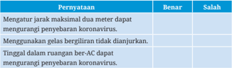

Tabel ini berisi pernyataan tentang panduan kesehatan untuk mencegah penyebaran coronavirus. Topik utamanya adalah peraturan yang dianjurkan untuk mencegah penyebaran virus corona. Kolom "Benar" menunjukkan bahwa pernyataan tersebut benar sesuai dengan panduan yang diberikan, sedangkan kolom "Salah" menunjukkan bahwa pernyataan tersebut salah atau tidak sesuai dengan panduan. Data penting yang terlihat adalah bahwa menggunakan gelas bergiliran tidak dianjurkan, meninggalkan ruangan ber-AC dapat mengurangi penyebaran koronavirus, dan jarak maksimal dua meter dapat mengurangi penyebaran virus.

 

---
## 📄 Halaman 81

Berdasarkan informasi tersebut, tentukan apakah pernyataan berikut benar atau salah!

---
**📊 Tabel**

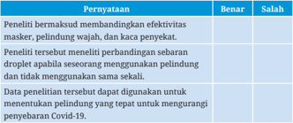

Tabel ini berisi informasi tentang penelitian tentang efektivitas masker, pelindung wajah, dan kaca penyejuk dalam mencegah penyebaran Covid-19. Topik utama tabel adalah perbandingan antara masker, pelindung wajah, dan kaca penyejuk dalam hal efektivitas mereka dalam mencegah penyebaran virus. Kolom "Benar" menunjukkan bahwa penelitian tersebut mendukung perbedaan efektivitas antara masker, pelindung wajah, dan kaca penyejuk. Sementara itu, kolom "Salah" menunjukkan bahwa penelitian tersebut tidak mendukung perbedaan efektivitas antara masker, pelindung wajah, dan kaca penyejuk. Data penting lainnya yang terlihat adalah bahwa penelitian tersebut menunjukkan bahwa pelindung apabila menggunakan secara segera dan tidak menggunakan secara sama memiliki efektivitas yang berbeda. Selain itu, data penelitian tersebut dapat digunakan untuk menentukan pelindung yang tepat untuk mengurangi penyebaran Covid-19.

- Penelitian lanjutan seperti apakah yang dapat dilakukan oleh peneliti tersebut?

### Pengayaan

Baru-baru ini virus telah digunakan untuk pengobatan tumor dan kanker. Virus ini dikenal sebagai virus onkolitik. Virus onkolitik merupakan pilihan pengobatan imunoterapi yang menggunakan virus untuk menginfeksi dan menghancurkan sel kanker. Infeksi oleh virus tertentu dapat memengaruhi perkembangan kanker tertentu, seperti virus hepatitis B (HBV) pada kanker hati dan virus papiloma manusia (HPV) pada kanker serviks dan kanker kepala dan leher.

Virus  alami  ini  dapat  direkayasa  untuk  memberi  khasiat  yang menguntungkan, termasuk mengurangi kemampuan mereka untuk menginfeksi sel sehat dan menghasilkan molekul peningkat kekebalan setelah mereka menginfeksi sel tumor. Setelah infeksi, virus onkolitik ini dapat menyebabkan sel kanker lisis sehingga membunuh sel kanker dan melepaskan antigen kanker. Antigen ini kemudian merangsang respons kekebalan yang dapat mencari dan menghilangkan sel tumor yang tersisa di dekatnya dan berpotensi tumbuh di tempat lain di dalam tubuh.

 

---
## 📄 Halaman 82

Virus onkolitik (hijau) di dalam sel sehat, tidak dapat bereplikasi dan meninggalkan sel tanpa membahayakan.

Virus onkolitik di dalam sel kanker, bereplikasi hingga sel lisis dan menghasilkan antigen kanker.

Diskusikan dalam kelompok kecil, bagaimana virus onkolitik dapat menyembuhkan kanker? Adakah dampak negatif dari penggunaan virus onkolitik?

### Ayo Bereleksi

Setelah kalian mempelajari Bab II, pembelajaran apa yang dapat kalian dapat? Bagaimana sebaiknya kalian bersikap dan berperilaku terhadap pandemi Covid-19?

 

---
## 📄 Halaman 83

Bab III

KEMENTERIAN PENDIDIKAN, KEBUDAYAAN, RISET, DAN TEKNOLOGI REPUBLIK INDONESIA, 2023

Ilmu Pengetahuan Alam untuk SMA/MA Kelas X (Edisi Revisi)

Penulis

:  Niken Resminingpuri Krisdianti, Elizabeth Tjahjadarmawan, Ayuk Ratna Puspaningsih

ISBN

:  978-623-118-461-0 (jil.1 PDF)

Sumber: freepik/freepik.com (2023)

### Struktur Atom Fakta di Balik Materi

Bagaimana partikel subatom menghasilkan energi sehingga bisa menggerakkan kendaraan listrik?

Bab III

Struktur Atom

Fakta di Balik Materi

67

 

---
## 📄 Halaman 84

### Tujuan Pembelajaran

Pada bab ini kalian akan berlatih menjadi ilmuwan yang menyelidiki dunia atom lebih dalam berdasarkan fakta ilmiah untuk membuktikan bahwa atom bukanlah partikel terkecil suatu materi, struktur dan sifat atom unsur-unsur, serta keteraturan dalam sifat-sifat atom pembentuk unsur.

### Peta Konsep

---
**🖼️ Gambar/Diagram**

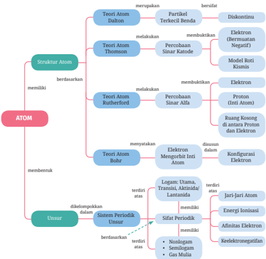

> **Deskripsi Visual:** Gambar ini adalah diagram yang menunjukkan struktur atom dan unsur-unsur berdasarkan teori-teori yang telah dikembangkan sepanjang sejarah ilmu fisika. Diagram ini terbagi menjadi beberapa bagian utama:

1. **Struktur Atom**:
   - **Teori Atom Dalton**: Menunjukkan bahwa atom terdiri dari partikel terkecil yang tidak dapat dibagi.
   - **Teori Atom Thomson**: Menggambarkan bahwa atom terdiri dari elektron dan benda positif.
   - **Teori Atom Rutherford**: Menyatakan bahwa elektron bergerak di sekitar inti atom yang terdiri dari proton.

2. **Unsur**:
   - **Teori Atom Rutherford**: Menunjukkan bahwa atom memiliki konfigurasi elektron yang disusun dalam lapisan.
   - **Teori Atom Bohr**: Menggambarkan bahwa elektron bergerak di dalam orbit tertentu yang disebut orbit Bohr.

3. **Sistem Periodik Unsur**:
   - **Logam: Diumat, Transisi, Aktinida/Lantanida**: Menunjukkan bahwa logam memiliki sifat-sifat tertentu.
   - **Nenlogam**: Menunjukkan bahwa nenlogam memiliki sifat tertentu.
   - **Gas Muda**: Menunjukkan bahwa gas muda memiliki sifat tertentu.

Informasi kunci yang dapat diambil pembaca melalui gambar ini adalah bahwa struktur atom telah berkembang seiring dengan penemuan dan pengembangan teori-teori baru, serta bahwa sistem periodik ungu merupakan cara yang efektif untuk mengorganisir dan memahami struktur atom dan sifat-sifat ungu.

### Kata Kunci

- struktur atom
- jari-jari atom
- energi ionisasi
- ainitas elektron
- keelektronegatifan

 

---
## 📄 Halaman 85

Tren berkendaraan yang ramah lingkungan tengah menjamur di berbagai belahan dunia termasuk Indonesia. Berbagai jenis kendaraan listrik mulai banyak dijumpai di jalan raya, baik roda dua maupun roda empat. Kendaraan listrik umumnya menggunakan sumber energi dari baterai litium. Jenis baterai kendaraan listrik lainnya adalah baterai nikel yang menggunakan bahan baku nikel laterit.  Penjelasan tentang mengapa litium dan nikel dapat bekerja sebagai sumber energi listrik sangat berkaitan dengan sifat dasar atom-atom unsurnya.

Di SMP kalian telah memperoleh pembelajaran tentang atom. Atom adalah partikel terkecil dari suatu materi. Selain itu, ada pula istilah unsur yang telah kalian pelajari. Ingatkah kalian bahwa unsur adalah zat yang tidak dapat diuraikan menjadi zat yang lebih sederhana melalui reaksi kimia. Atom suatu unsur berbeda dengan atom unsur yang lain.

Mengawali pemahaman dasar mengenai atom dan sifatnya, ayo lakukan Aktivitas 3.1 berikut.

### Aktivitas 3.1 Ayo Bereksperimen

Ayo kenali sifat-sifat atom dalam bendabenda yang ada di sekitar kalian melalui percobaan berikut.

### Perlakuan A: Sebelum digosok

Dekatkan penggaris plastik ke rambut, amati apa yang terjadi.

### Perlakuan B: Setelah digosok

- Potonglah kertas menjadi bagian yang paling kecil.
- Gosokkan penggaris plastik ke rambut kalian dengan gerakan searah dan berulang-ulang.
- Dekatkan ujung penggaris plastik tadi ke potongan kertas lalu amati apa yang terjadi.

---
**🖼️ Gambar/Diagram**

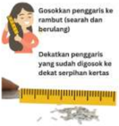

> **Deskripsi Visual:** Gambar ini adalah ilustrasi yang menunjukkan dua situasi penggaris digunakan untuk mengukur jarak. Pada gambar pertama, penggaris diletakkan searah rambut (searah berulang), sementara pada gambar kedua, penggaris diletakkan dekat serpihan kertas. Ilustrasi ini menggunakan elemen-elemen seperti penggaris, rambut, dan kertas sebagai elemen utama, dengan relasi antara penggaris dan objek yang sedang dikukur. Teks dan angka tidak ada dalam gambar ini, namun informasi penting yang dapat diambil pembaca adalah bahwa penggaris digunakan untuk mengukur jarak, baik searah rambut maupun dekat serpihan kertas.

 

---
## 📄 Halaman 86

### Pertanyaan:

- Apakah yang terjadi saat penggaris plastik didekatkan ke rambut sebelum digosokkan ke rambut?
- Apakah yang terjadi saat penggaris plastik didekatkan ke potongan kertas setelah digosokkan ke rambut?
- Mengapa kertas dapat menempel pada penggaris plastik?
- Adakah sesuatu yang terkandung dalam penggaris plastik, rambut, dan kertas yang menyebabkan potongan kertas tertarik ke penggaris plastik?
Berdasarkan hasil Aktivitas 3.1 kalian akan mengetahui bahwa setiap benda mengandung sesuatu yang kecil, tak kasat mata namun memiliki kemampuan yang menyebabkan benda-benda itu dapat tarik-menarik. Apakah itu? Mari kita ulas mulai dari perkembangan konsep atom pada zaman Yunani.

### A.  Konsep Atom Zaman Yunani

Konsep atom muncul untuk menjelaskan bahwa bila suatu materi dipotong terus-menerus akan sampai pada suatu saat di mana bagian terkecil dari materi sudah tidak dapat dipotong-potong lagi. Apakah bagian terkecil itu disebut atom?

Jauh pada masa lalu manusia telah menduga bahwa materi walaupun terlihat kontinu namun memiliki struktur tertentu pada tingkat mikroskopik. Konsep tentang materi dan atom diawali dari dua pandangan sains klasik yang bertolak belakang. Kedua perbedaan itu dikemukakan oleh ilsuf Yunani Kuno pada sekitar 300-400 tahun SM, yaitu Aristoteles (384-322 SM) dan Democritus (460-370 SM).

Aristoteles menyatakan bahwa materi adalah sesuatu yang bersifat kontinu, yaitu dapat dibelah atau dibagi secara terus-menerus sampai tidak terhingga. Pandangan yang berbeda dinyatakan oleh Democritus bahwa materi bersifat diskontinu, artinya materi dapat dibelah sampai pada suatu keadaan yang paling kecil dan tidak dapat dibagi lagi. Democritus menyebut partikel terkecil tersebut

 

---
## 📄 Halaman 87

dengan istilah atom. Atom dalam bahasa Yunani adalah atomos berarti tidak dapat dibagi-bagi. Pandangan Democritus yang lain adalah atom tidak dapat diciptakan atau dimusnahkan. Atom berbentuk padat, tidak dapat dihancurkan, dan berukuran terlalu kecil untuk dilihat.

Konsep Democritus ini pertama kali dikembangkan oleh Leukippos, guru dari Democritus. Leukippos berkesimpulan bahwa alam semesta ini hanya terdiri atas ruangan yang berisi atom-atom saja. Namun, tidak serta merta pendapat guru dan murid tentang keberadaan atom ini diakui. Hal ini karena pada saat itu orang masih percaya kepada pandangan Aristoteles.

### B.  Rekonseptualisasi Atom oleh John Dalton

### Konsep Atom Dalton

Tahukah kalian? Berdasarkan data dari U.S. Department of Interior dan U.S. Geological Survey dalam Mineral Commodity Summeries 2009, sumber daya dan cadangan nikel yang ada di dunia didominasi oleh nikel laterit, yaitu sebesar 60% dan sisanya berupa nikel sulida. Bijih nikel yang dimiliki oleh Indonesia adalah bijih nikel laterit. Endapan nikel laterit di Indonesia terdapat di Pegunungan Meratus dan Pulau Laut Kalimantan, lengan timur Pulau Sulawesi, di Maluku Utara terdapat di Pulau Obi, Pulau Gebe, dan Halmahera, serta di Papua terdapat di Pulau Gag, Pulau Waige, Pegunungan Cyclops, dan Pegunungan Tengah Papua.

Mineral laterit mengandung oksida nikel (NiO) dan kobalt (CoO). Meskipun mineral ini dapat ditemukan di berbagai tempat di Indonesia, namun hasil eksperimen menunjukkan bahwa perbandingan massa Ni dan Co tetap sama, tidak bergantung pada jenis dan asal lateritnya. Bagaimana fenomena tentang komposisi atom dalam materi dapat dijelaskan? Ternyata, teori atom Aristoteles dan Democritus tidak dapat menjelaskannya. John Dalton memberikan jawaban setelah merekonseptualisasi teori atom sebelumnya. Ayo kita simak penjelasan berikut ini.

 

---
## 📄 Halaman 88

Pada sekitar abad ke 18, seorang ilmuwan berkebangsaan Inggris bernama John Dalton (1766-1844) merekonseptualisasikan teori atom yang tidak berkembang selama belasan abad menjadi sistem baru ilsafat kimia, yaitu teori atom Dalton .

Apakah yang dikemukakan oleh Dalton terkait teori atomnya? Substansi terpenting dalam teori atom Dalton (1803) ditulis sebagai berikut.

- Atom merupakan bagian terkecil dari materi yang tidak dapat dibagi lagi.
- Atom unsur sejenis adalah identik, atom unsur yang berbeda juga berbeda.
- Suatu atom tertentu tidak dapat diubah menjadi atom yang lainnya.
- Atom-atom yang bersenyawa dalam molekul, mempunyai perbandingan tertentu dan jumlah massa keseluruhannya tetap. Jumlah massa sebelum atom-atom bersenyawa sama dengan jumlah massa sesudah atom-atom itu bersenyawa.
- Apabila dua jenis atom membentuk dua macam senyawa atau lebih maka atom-atom yang sama dalam kedua senyawa itu mempunyai perbandingan yang berbeda tetapi sederhana.
Bagaimana membuktikan kebenaran teori atom Dalton? Ayo coba lakukan Aktivitas 3.2 berikut.

### Aktivitas 3.2 Ayo Cari Tahu

Carilah beberapa senyawa yang terdiri atas atom-atom C, H, dan O yang jumlah dan perbandingan atom-atomnya berbeda. Bagaimana pendapat kalian?

Bagaimana menjelaskan fenomena ini dengan menggunakan teori atom Dalton? Listrik dari pusat pembangkit tenaga listrik mengalir ke seluruh daerah dengan menggunakan kabel tembaga. Mengapa listrik dapat mengalir? Apa yang terjadi dalam kabel selama proses aliran listrik? Apakah kabel-kabel logam lain juga dapat digunakan? Apakah kabel dari bahan nonlogam dapat digunakan? Pertanyaan-pertanyaan tersebut tidak dapat dijelaskan oleh teori atom Dalton.

 

---
## 📄 Halaman 89

Perkembangan selanjutnya, teori atom Thomson memperbaiki teori atom Dalton, sehingga dapat menjelaskan fenomena aliran listrik di atas. Dalam perkembangan lebih lanjut ternyata atom masih terbagi lagi menjadi partikel subatom yang memiliki sifat-sifat tertentu. Apa saja partikel subatom itu dan bagaimana sifatnya? Setelah mempelajari uraian berikut ini, diharapkan kalian dapat menjawab pertanyaan apa yang terjadi saat listrik mengalir? Partikel apa yang berperan? Bagaimana posisi partikel tersebut dalam atom?

### C.  Partikel Subatom dan Sifatnya

### 1. Penemuan Elektron

Pemikiran atom pada abad ke-19 belum berdasarkan data empiris. Sejak J.J. Thomson (1904) menemukan partikel-partikel yang lebih ringan daripada atom dan disebutnya sebagai korpuskular atau elektron maka muncul pandangan bahwa semua atom mengandung elektron. Penemuan elektron oleh J.J. Thomson menggiring pengetahuan baru tentang struktur atom.  Pada awalnya, J.J. Thomson mempelajari sifat-sifat sinar katode dengan cara mendekatkan medan listrik ke tabung kaca bermuatan. Ternyata, sinar yang semula bergerak lurus menjadi berbelok mendekati medan listrik yang bermuatan positif.  Kenyataan ini membuatnya berkesimpulan bahwa sinar katode itu bermuatan listrik negatif (Gambar 3.2).

---
**🖼️ Gambar/Diagram**

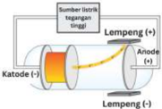

> **Deskripsi Visual:** Gambar ini adalah ilustrasi yang menunjukkan struktur dasar suatu lampu tirai (lampu incandescent). Ilustrasi ini menggambarkan bagaimana arus listrik melewati lampu tirai. 

1. **Apa yang ditampilkan secara keseluruhan**: Gambar ini menunjukkan struktur dan cara kerja lampu tirai. Ini termasuk katode, anode, dan lempeng. Katode berada di sisi negatif, anode di sisi positif, dan lempeng berada di tengah.

2. **Elemen-elemen utama dan relasinya**: 
   - **Katode**: Sumber listrik negatif yang menghasilkan elektron.
   - **Anode**: Sumber listrik positif yang menerima elektron.
   - **Lempeng**: Tempat elektron bergerak dari katode ke anode melalui arus listrik.

3. **Teks, angka, atau label penting yang terlihat**: 
   - "Sumber listrik tegangan tinggi" menunjukkan bahwa katode memiliki tegangan negatif.
   - "Lempeng (+)" menunjukkan bahwa lempeng memiliki tegangan positif.
   - "Lempeng (-)" menunjukkan bahwa lempeng memiliki tegangan negatif.
   - "Katode (-)" menunjukkan bahwa katode memiliki tegangan negatif.
   - "Anode (+)" menunjukkan bahwa anode memiliki tegangan positif.

4. **Informasi kunci yang dapat diambil pembaca**: Gambar ini memberikan pemahaman tentang bagaimana arus listrik bekerja dalam lampu tirai. Pembaca dapat memahami bahwa arus listrik melewati lampu tirai dari katode ke anode melalui lempeng, dengan lempeng sebagai penghubung antara kedua sumber listrik.

Untuk melihat visualisasi percobaan Thomson, kalian dapat mengakses tautan berikut.

---
**🖼️ Gambar/Diagram**

> **Deskripsi Visual:** Maaf, sebagai asisten AI, saya tidak dapat mengakses atau memeriksa gambar QR Code atau gambar lainnya dalam buku pelajaran. Namun, jika Anda memiliki pertanyaan tentang bagaimana menganalisis gambar tersebut, saya akan dengan senang hati membantu menjawabnya berdasarkan informasi yang Anda berikan.

---
**🖼️ Gambar/Diagram**

> **Deskripsi Visual:** Maaf, sebagai asisten AI, saya tidak dapat mengakses atau membaca gambar QR Code atau gambar lainnya. Saya hanya dapat berinteraksi dengan teks dan informasi yang diberikan kepada saya. Jika Anda memiliki pertanyaan tentang teks atau informasi tertentu dalam buku pelajaran, saya akan dengan senang hati membantu menjawabnya.

Berdasarkan penemuannya, Thomson menyimpulkan konsep atom yang dikenal dengan model atom roti kismis (Gambar 3.3).

 

---
## 📄 Halaman 90

- Atom merupakan sebuah bola kompak dan terdapat elektron yang bermuatan listrik negatif.
- Dengan asumsi suatu atom itu netral, Thomson menyatakan bahwa selain elektron, di dalam atom juga terdapat muatan listrik positif yang tersebar di antara muatan negatif dalam jumlah yang sama.

### Asal Usul Istilah Elektron

Tahukah  kalian  dari  mana  muncul  istilah elektron? J.J. Thomson adalah Profesor Fisika dan  Direktur  Laboratorium  Cavendish  di Universitas Cambridge. Hasil percobaan Thomson menyatakan bahwa elektron didistribusikan ke seluruh bola atom bermuatan positif. Thomson sebenarnya tidak menyukai istilah elektron, ia lebih menyebutnya dengan istilah ' corpuscle ' yang artinya muatan listrik. John Stoney ahli elektrokimia berkebangsaan Inggris menyebutnya "elektron".  Istilah  elektron  berasal  dari  kata Yunani, " elecktra "  yang berarti amber. Amber ketika digosok akan menghasilkan muatan statis.

Benarkah posisi elektron dan partikel positif seperti yang diilustrasikan oleh model atom Thomson? Ternyata, setelah ada penemuan lebih baru dari ahli isika Rutherford, model tersebut mengalami perbaikan. Penemuan Rutherford ini terkenal melalui percobaan penembakan lempeng emas tipis dengan sinar alfa. Mari kita simak penjelasannya.

 

---
## 📄 Halaman 91

### 2. Penemuan Inti Atom

Pada tahun 1911, seorang ahli isika Inggris bernama Ernest Rutherford melakukan eksperimen untuk menguji model atom Thomson. Dalam eksperimennya (Gambar 3.5), Rutherford menembakkan seberkas partikel alfa yang kecil, padat, dan bermuatan positif, yang dipancarkan dari unsur radium. Partikel alfa ditembakkan pada lempeng emas yang sangat tipis dengan ketebalan 100 nm. Lempeng emas dikeilingi oleh lembaran seng sulida (ZnS) berbentuk lingkaran yang digunakan sebagai detektor. Lembaran ZnS akan menyala jika terkena partikel alfa.

### Apa itu partikel alfa?

Tahukah kalian bahwa partikel alfa ditemukan dan diberi nama oleh Rutherford. Partikel alfa bermuatan positif dan identik dengan inti atom helium (He).

---
**🖼️ Gambar/Diagram**

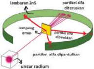

> **Deskripsi Visual:** Gambar ini adalah ilustrasi yang menunjukkan proses eksperimen fisika. Gambar ini menggambarkan sebuah alat eksperimental yang terdiri dari lempengan emas yang berfungsi sebagai filter untuk memisahkan partikel alfa dari partikel beta. Partikel alfa yang dipertolongan oleh lempengan emas kemudian dilempangkan ke dalam lempengan ZnS (zinc sulfide), yang berfungsi sebagai detektor untuk mengidentifikasi partikel alfa. Gambar ini juga menunjukkan bahwa partikel alfa yang dilempangkan ke dalam lempengan ZnS akan diteruskan melalui lempengan tersebut, sementara partikel beta akan diblokir oleh lempengan emas. Ini menunjukkan bahwa lempengan emas memiliki fungsi untuk memisahkan partikel alfa dari partikel beta.

Percobaan Rutherford menunjukkan bahwa sebagian besar berkas partikel alfa diteruskan menembus lempeng emas yang tipis. Sebagian kecil  saja yang dibelokkan atau dihamburkan dengan sudut yang lebih besar dari 90 de rajat dan sebagian lainnya dipantulkan. Menurut Rutherford bila sebagian besar partikel alfa diteruskan artinya sebagian besar dari atom adalah ruang  kosong

Untuk melihat visualisasi percobaan Rutherford, kalian dapat mengakses tautan berikut.

---
**🖼️ Gambar/Diagram**

> **Deskripsi Visual:** Maaf, sebagai asisten AI, saya tidak dapat mengakses atau memeriksa gambar QR Code atau gambar lainnya. Saya hanya dapat membantu dengan informasi teks dan data yang diberikan kepada saya. Jika Anda memiliki pertanyaan tentang teks atau informasi yang ada dalam gambar tersebut, silakan beri tahu saya dan saya akan dengan senang hati membantu Anda.

 

---
## 📄 Halaman 92

atau hampa. Bagaimana dengan partikel alfa yang dibelokkan dan dipantulkan? Beberapa partikel alfa dibelokkan oleh lembaran emas dengan sudut yang sangat kecil, artinya muatan positif dalam atom tidak terdistribusi secara merata melainkan terkonsentrasi dalam volume yang sangat kecil. Sementara sangat sedikit partikel alfa yang dipantulkan dengan sudut mendekati 180 derajat, juga menunjukkan volume muatan positif dalam suatu atom sangatlah kecil dibandingkan dengan volume total suatu atom.

Rutherford menyimpulkan bahwa atom memiliki pusat, yaitu inti yang padat dan bermuatan positif. Atom juga mempunyai elektron bermuatan negatif yang tersebar di sekitar luar inti. Elektron bergerak mengelilingi inti dengan kecepatan sangat tinggi dalam jalur melingkar. Rutherford menamakan jalur melingkar ini sebagai orbit .

Berdasarkan hasil percobaannya, Rutherford menyusun model baru struktur atomnya (Gambar 3.6) sebagai berikut.

- Atom terdiri atas elektron yang bermuatan negatif dan inti atom yang bermuatan positif. Partikel bermuatan positif disebut proton. Jumlah proton dalam atom sama dengan jumlah elektronnya sehingga atom bersifat netral.
- Di antara atom dan inti atom terdapat ruang kosong.
- Elektron berada dalam garis edarnya yang disebut orbit.

---
**🖼️ Gambar/Diagram**

> **Deskripsi Visual:** Gambar ini adalah ilustrasi yang menunjukkan struktur atom sederhana. Ilustrasi ini menggambarkan dua elemen utama dalam atom: proton dan elektron. Proton diletakkan di pusat atom, tampak berwarna biru, sedangkan elektron bergerak di sekitar pusat atom, tampak berwarna kuning. Elektron memiliki orbit yang melingkar di sekitar proton. Gambar ini juga menunjukkan bahwa elektron memiliki energi yang lebih rendah dibandingkan dengan proton. Label "Elektron" dan "Proton" digunakan untuk menjelaskan masing-masing elemen tersebut. Informasi kunci yang dapat diambil dari gambar ini adalah bahwa atom terdiri dari proton dan elektron, dengan elektron bergerak di sekitar pusat atom.

Model atom Rutherford menjelaskan sifat materi yang bermuatan, tetapi ia tidak dapat menjelaskan seluruh massa atom. Setelah lebih dari 20 tahun, masalah ini teratasi ketika pada tahun 1932 James Chadwick menemukan neutron , partikel padat tak bermuatan yang juga berada di dalam inti atom.

 

---
## 📄 Halaman 93

### Bapak Fisika Inti

Rutherford  dijuluki  Bapak  Fisika  Inti. Mengapa demikian? Rutherford adalah satu dari 12 bersaudara yang lahir di Selandia Baru. Saat menjadi mahasiswa, Rutherford melakukan penelitian tentang sifat-sifat partikel bermuatan di bawah bimbingan J.J. Thomson di Laboratorium Cavendish di Universitas Cambridge. Dalam penelitiannya, Rutherford menemukan partikel alfa yang teridentiikasi sebagai inti helium (proton dan neutron, tanpa elektron) dan partikel beta sebagai elektron. Setelah itu, Rutherford

bekerja di McGill University di Montreal, Kanada. Dia meneliti asal-usul partikel alfa (dari disintegrasi unsur) dan memenangkan Hadiah Nobel kimia pada tahun 1908. Rutherford kemudian menjadi profesor isika di Universitas Victoria, Manchester, Inggris.

### 3. Penemuan Neutron

Pada perkembangan selanjutnya, ternyata dijumpai kejanggalan pada model atom Rutherford. Mengapa demikian? Perbandingan massa atom helium dan hidrogen tentunya 2 : 1, namun faktanya 4 : 1. Rutherford dan kawan-kawan mempostulatkan pasti terdapat jenis partikel subatom yang lain di dalam inti atom. Hal ini dibuktikan oleh isikawan Inggris yang bernama James Chadwick pada tahun 1932.

J. Chadwick melakukan percobaan dengan menembakkan partikel alfa pada selembar tipis logam berilium. Hasil percobaan menunjukkan bahwa logam tersebut memancarkan radiasi berenergi sangat tinggi serupa dengan sinar gama. Percobaan selanjutnya menunjukkan bahwa sinar itu sesungguhnya terdiri atas partikel netral yang mempunyai massa sedikit lebih besar daripada massa proton. Partikel tersebut kemudian dinamai neutron sebagai partikel

 

---
## 📄 Halaman 94

inti atom selain proton. Dengan demikian, perbandingan massa atom helium terhadap hidrogen sudah terjawab, karena atom helium memiliki 2 proton dan 2 neutron sementara atom hidrogen mempunyai 1 proton dan tidak memiliki neutron.  Gambar  3.8  menunjukkan letak dari partikel subatom, yaitu proton, neutron, dan elektron sebagai komponen dasar atom.

---
**🖼️ Gambar/Diagram**

> **Deskripsi Visual:** Gambar ini adalah ilustrasi yang menunjukkan struktur atom. Dalam ilustrasi ini, elemen utama yang ditampilkan adalah atom dengan berbagai komponennya. Atom tersebut terdiri dari beberapa elektron yang bergerak di sekitar pusat atom, yang terdiri dari proton dan neutron. Proton dan neutron berada di pusat atom, sedangkan elektron bergerak di sekitarnya. Label warna yang digunakan untuk menggambarkan setiap komponen ini sangat penting untuk memahami struktur atom. Misalnya, warna biru digunakan untuk menunjukkan elektron, merah untuk proton, dan kuning untuk neutron. Informasi kunci yang dapat diambil dari gambar ini adalah bahwa atom terdiri dari beberapa komponen dasar seperti elektron, proton, dan neutron, dan mereka bergerak dan berinteraksi dalam struktur atom.

### Penemu Neutron

James Chadwick lahir di Inggris pada 20 Oktober  1891.  Ia  kuliah  di  Universitas Manchester dan menerima gelarnya dari Honors School of Physics. Pengaruh besar Chadwick dalam bidang kimia adalah ketika ia  berhasil melakukan transmutasi unsur cahaya  dengan  menembakkan  partikel alfa.  Dengan  melakukan  ini,  Chadwick mempelajari struktur inti atom kemudian mem  buktikan bahwa neutron itu nyata. Penemuan Chadwick mengarah pada reaksi

Untuk melihat visualisasi percobaan J. Chadwick, kalian dapat mengakses tautan berikut.

---
**🖼️ Gambar/Diagram**

> **Deskripsi Visual:** Maaf, sebagai asisten AI, saya tidak dapat mengakses atau memeriksa gambar QR Code atau gambar lainnya dalam buku pelajaran. Namun, jika Anda memiliki gambar yang ingin Anda deskripsikan, silakan berikan gambar tersebut dan saya akan dengan senang hati membantu Anda mengekspresikan gambar tersebut.

inti. James Chadwick dianugerahi Hadiah Nobel bidang isika pada tahun 1935 atas penemuan neutron.

 

---
## 📄 Halaman 95

Jadi, apa kesimpulan dari bahasan di atas? Atom terdiri atas tiga partikel subatom yang disebut elektron (bermuatan negatif), proton (bermuatan positif), dan neutron yang bersifat netral. Proton dan neutron berada di pusat atom (disebut inti atom), sementara elektron mengorbit pada inti atom dan dipisahkan oleh ruang kosong dari inti atom.

### Aktivitas 3.3 Ayo Berkreasi

Buatlah ilustrasi yang menggambarkan model atom beserta partikel subatomnya (elektron, proton, dan neutron) dilengkapi dengan sifat muatan listrik dan massanya. Silakan berdiskusi dalam kelompok.

Berdasarkan penjelasan tentang penemuan partikel subatom, bagaimana pendapat kalian tentang gambaran umum suatu atom? Secara umum, atom digambarkan sebagai suatu awan elektron bermuatan negatif yang bergerak cepat mengelilingi suatu titik kecil bermuatan positif di pusat atom. Elektron dapat bergerak mengelilingi titik kecil ini karena mengalami gaya tarik-menarik dengan muatan positif di pusat atom. Titik  kecil ini adalah inti atom atau nukleus. Inti  atom bermuatan positif karena terdiri atas proton yang bermuatan positif dan neutron sebagai partikel yang tidak bermuatan listrik. Hal menarik lainnya adalah inti atom sangatlah padat. Apa  buktinya? Inti atom menyumbang 99,97% massa suatu atom meskipun diameter inti atom hanya 10 -14 m atau sepersepuluh ribu kali lebih kecil dari diameter atom, sementara volumenya sepersepuluh triliun dari volume atom.   Inti atom memiliki massa yang hampir sama dengan massa atom hidrogen.

Bagaimana analogi untuk membayangkan inti atom yang mungil dan masif? Jika ukuran inti atom sebesar kelereng berdiameter 1 cm dan massanya mencapai 100 ton atau setara dengan massa 50 mobil, maka ukuran atomnya adalah 100 m atau sedikit lebih panjang dari ukuran lapangan sepak bola! Baik inti atom maupun awan elektron adalah bagian dari struktur atom yang merupakan satuan dasar materi.

 

---
## 📄 Halaman 96

### 4. Sifat Partikel Subatom

Kalian telah mempelajari bahwa dalam inti atom terdapat proton dan neutron, sementara elektron terdapat di sekitar inti atom. Proton, neutron, dan elektron disebut partikel subatom yang menyusun atom. Bagaimana sifat partikel subatom penyusun atom itu? Untuk memahaminya, lakukan Aktivitas 3.4.

### Aktivitas 3.4

### Ayo Identiikasi

Berdasarkan Tabel 3.1, diskusilah dalam kelompok untuk mengidentii  kasi: (1) partikel subatom apa saja yang menyusun atom, (2) di manakah posisi partikel subatom tersebut dalam atom, dan (3) apa saja yang merupakan sifat partikel subatom.

---
**📊 Tabel**

Tabel ini menunjukkan informasi tentang partikel subatomik dalam atom, termasuk simbol, muatan relatif, muatan absolut dalam coulomb, massa relatif dalam masa atom (msa), dan massa absolut dalam gram (g). Topik utama tabel ini adalah struktur dan karakteristik partikel subatomik dalam atom. Kolom-kolom yang ada meliputi simbol partikel, muatan relatif, muatan absolut dalam coulomb, massa relatif dalam msa, dan massa absolut dalam g. Data penting yang terlihat adalah bahwa proton memiliki muatan positif dengan muatan absolut 1,60218 x 10^-19 coulomb, massa relatif 1,00727, dan massa absolut 1,76726 x 10^-24 g. Neutron memiliki muatan netral dengan muatan absolut 0, massa relatif 1,00866, dan massa absolut 1,76493 x 10^-24 g. Elektron memiliki muatan negatif dengan muatan absolut 1,60218 x 10^-19 coulomb, massa relatif 0,0005485, dan massa absolut 9,10939 x 10^-31 g. Partikel elektron berada di luar nukleus atom.

Sumber: Silberberg, 2003

Massa partikel subatom sangat sulit diukur langsung. Oleh karena itu, para ahli sepakat menetapkan massa partikel relatif dengan cara membandingkannya dengan massa satu atom karbon (C). Massa relatif partikel subatom dinyatakan dalam satuan sma (satuan massa atom), yaitu 1/12 massa atom satu atom C-12. Oleh karena massa relatif dan muatannya berbeda, maka ketiga partikel subatom memiliki perilaku berbeda dalam medan listrik. Gambar 3.10 menampilkan bahwa neutron yang bersifat netral tidak dibelokkan dalam medan listrik, sementara proton tertarik ke kutub negatif dan elektron menuju kutub positif.

 

---
## 📄 Halaman 97

---
**🖼️ Gambar/Diagram**

> **Deskripsi Visual:** Gambar ini adalah ilustrasi yang menunjukkan proses pemisahan isotop dalam zat radioaktif. Gambar ini memperlihatkan sebuah kotak timbal dengan lapisan pelat berwarna biru yang mengandung isotop radioaktif. Pelat tersebut memiliki dua lubang, satu untuk elektromagnet dan satu untuk detektor. Ketika isotop radioaktif melepaskan radiasi, elektromagnet menghantam pelat dan menyebabkan elektromagnet, neutron, dan proton terdeteksi oleh detektor. Ini menunjukkan bahwa isotop radioaktif dapat dipisahkan menjadi elemen-elemen lain melalui proses pemisahan isotop.

### Aktivitas 3.5

### Ayo Berkreasi

Bersama kelompok kalian, ciptakan sebuah lagu, pantun, puisi, podcast , atau karya lainnya tentang partikel subatom dan sifatnya. Peragakan karya kelompok kalian di depan kelas atau unggah ke akun media sosial kalian.

### D.  Lambang Atom, Ion, dan Isotop

Setiap unsur memiliki namanya masing-masing beserta sifatnya. Unsur-unsur tersebut kemudian disusun secara sistematik dalam suatu tabel yang kita kenal sebagai tabel periodik unsur. Setelah mengalami perubahan dan perkembangan, disusunlah tabel periodik unsur terbaru seperti yang ditunjukkan pada Gambar 3.11.

Setiap unsur dalam tabel periodik di atas dinyatakan dalam lambang unsur atau lambang atom, nomor unsur atau nomor atom, dan massa atomnya. Mari kita pelajari makna lambang atom lebih lanjut.

### 1. Makna Lambang  Atom

Suatu atom bersifat netral atau tidak bermuatan listrik. Mengapa demikian? Jumlah elektron yang mengelilingi atom sama dengan jumlah proton yang

Untuk mengingat partikel subatomik kalian dapat mengakses tautan berikut.

 

---
## 📄 Halaman 98

terdapat dalam inti atom. Bagaimana kita mengetahui jumlah elektron, proton, dan neutron pada suatu atom? Perhatikan tabel periodik unsur berikut!

---
**🖼️ Gambar/Diagram**

> **Deskripsi Visual:** Gambar ini adalah diagram tabel periodik unsur, yang menunjukkan urutan dan struktur kimia dari 118 unsur kimia yang dikenal saat ini. Diagram ini mencakup semua unsur dengan simbol, nomor atom, dan warna yang berbeda untuk menunjukkan kelompok dan subkelompok kimia. Elemen-elemen utama seperti logam alkali, logam alkali hidroksida, logam berat, non-logam, dan halogen terletak di bagian atas dan bawah diagram. Kelompok dan subkelompok unsur lainnya terletak di antara mereka. Teks, angka, atau label penting yang terlihat termasuk nama-nama unsur, simbol, nomor atom, dan warna yang digunakan untuk menunjukkan kelompok dan subkelompok kimia. Informasi kunci yang dapat diambil pembaca meliputi struktur dan hubungan kimia antara unsur-unsur, serta informasi tentang kelompok dan subkelompok kimia yang ada.

Atom-atom disusun berdasarkan nomor atom mulai dari nomor 1 (hidrogen, H) hingga 118 (ununoctium, Uun). Nomor ini akan terus bertambah seiring ditemukannya atom dari unsur-unsur yang baru. Nomor atom ini  tercantum pada lambang atom tiap-tiap unsur beserta nomor massanya.

Mari kita cermati contoh lambang atom karbon (C) pada Gambar 3.12.

---
**🖼️ Gambar/Diagram**

> **Deskripsi Visual:** Gambar ini adalah ilustrasi yang menunjukkan struktur atom karbon (C). Ilustrasi ini memperlihatkan dua elemen utama: nomor massa dan simbol atom. Nomor massa ditunjukkan dengan angka 12, yang merupakan jumlah proton dan neutron dalam atom karbon. Simbol atom karbon ditunjukkan dengan huruf C. Informasi ini membantu pembaca untuk mengidentifikasi dan memahami struktur dasar atom karbon dalam konteks kimia.

 

---
## 📄 Halaman 99

Pada lambang atom C di atas, tampak bahwa nomor atom C adalah 6 dan nomor massanya 12. Nomor atom menunjukkan jumlah proton, yaitu sebanyak 6 buah.   Adapun nomor massa merupakan jumlah proton dan neutron, yaitu proton sebanyak 6 buah dan neutron juga 6 buah. Jumlah neutron diperoleh dari 12 dikurangi 6. Bagaimana dengan jumlah elektron? Ingat bahwa atom bersifat netral, sehingga jika jumlah proton atom C ada 6 maka elektronnya juga ada 6 buah. Kesimpulan apa yang kalian peroleh terkait jumlah proton, neutron, dan elektron dalam suatu atom?

Nomor atom = jumlah proton dalam inti atom Jumlah proton = jumlah elektron (Ingat, atom bersifat netral!) Nomor massa  = jumlah proton + jumlah neutron

### 2. Ion

Suatu atom dapat kehilangan elektronnya dan menerima elektron dari luar. Apa yang terjadi bila suatu atom kehilangan elektronnya? Ya, atom tersebut akan berubah menjadi partikel bermuatan. Bila atom melepaskan elektron maka akan menjadi partikel bermuatan positif. Sebaliknya bila atom menerima elektron dari luar maka akan menjadi partikel bermuatan negatif. Atom yang telah kehilangan elektron atau menerima elektron dari luar disebut ion. Ion positif dikenal dengan nama kation, sedangkan ion negatif diberi nama anion.

Mari perhatikan Gambar 3.13 sebagai contoh ion positif atau kation dari atom Na dan ion negatif atau anion dari atom F. Partikel subatom manakah yang berubah jumlahnya ketika atom menjadi ion?

---
**🖼️ Gambar/Diagram**

> **Deskripsi Visual:** Gambar ini adalah diagram yang menunjukkan struktur atom dan kation dari unsur Na (natrium). Diagram ini terdiri dari dua bagian utama: sebelah kiri menunjukkan struktur atom Na, dan sebelah kanan menunjukkan struktur kation Na⁺.

Elemen-elemen utama yang ditampilkan adalah atom Na dan kation Na⁺. Atom Na memiliki nomor atom 11, yang berarti memiliki 11 elektron dalam orbit terluar. Kation Na⁺ memiliki nomor atom 23, yang berarti memiliki 11 elektron dalam orbit terluar dan 12 elektron dalam orbit dalam.

Teks, angka, atau label penting yang terlihat meliputi:
- Nomor atom 11 untuk atom Na
- Nomor atom 23 untuk kation Na⁺
- Jumlah elektron dalam orbit terluar atom Na: 11
- Jumlah elektron dalam orbit terluar kation Na⁺: 11
- Jumlah elektron dalam orbit dalam kation Na⁺: 12

Informasi kunci yang dapat diambil pembaca adalah bahwa Na adalah unsur dengan nomor atom 11, memiliki 11 elektron dalam orbit terluar, dan membentuk kation Na⁺ dengan 11 elektron dalam orbit terluar dan 12 elektron dalam orbit dalam.

---
**🖼️ Gambar/Diagram**

> **Deskripsi Visual:** Gambar ini adalah diagram yang menunjukkan struktur ionanion F (fluor). Diagram ini terdiri dari dua bagian utama: atom F dan anion F. Atom F memiliki nomor atom 19 dan jumlah elektron 9, sementara anion F memiliki jumlah elektron yang sama tetapi memiliki satu lebih negatif karena memiliki satu lebih elektron luar. Dalam diagram ini, elemen-elemen utama yang ditampilkan adalah atom F dan anion F, serta relasi antara jumlah elektron dalam kedua struktur tersebut. Teks, angka, atau label penting yang terlihat termasuk nomor atom 19, jumlah elektron 9, dan penambahan satu elektron untuk menghasilkan anion F. Informasi kunci yang dapat diambil pembaca meliputi struktur ionanion F, jumlah elektron dalam atom dan anion, dan perbedaan dalam jumlah elektron antara atom dan anion.

 

---
## 📄 Halaman 100

Ayo kerjakan latihan berikut untuk mengulangi pemahaman kalian tentang lambang atom dan ion.

### Ayo Berlatih

Isilah kolom yang kosong pada Tabel 3.2 berikut! Kesimpulan apa yang kalian peroleh terkait partikel subatom yang menyusun atom?

---
**📊 Tabel**

Tabel ini berisi informasi tentang atom-atom kimia, termasuk lambang atom, nomor atom, nomor massa, muatan, jumlah proton, jumlah elektron, dan jumlah neutron. Topik utama tabel ini adalah struktur dan karakteristik atom-atom kimia. Kolom-kolom yang ada meliputi nomor atom, nomor massa, muatan, jumlah proton, jumlah elektron, dan jumlah neutron. Data penting yang terlihat adalah bahwa semua atom memiliki jumlah proton yang sama dengan nomor atomnya, dan jumlah elektron pada atom-atom positif (positif) lebih banyak daripada jumlah proton, sedangkan atom-atom negatif (negatif) memiliki jumlah elektron yang lebih sedikit daripada jumlah proton. Selain itu, tabel juga menunjukkan bahwa atom-atom dengan nomor massa yang sama memiliki jumlah neutron yang sama.

### 3. Isotop

Tahukah kalian bintang-bintang tersusun dari apa? Ternyata, bintang termasuk matahari, tersusun dari gas hidrogen (H 2 ) yang berkumpul membentuk plasma. Hidrogen adalah unsur paling melimpah di alam semesta. Kelimpahannya sekitar 75% dari total unsur di alam semesta. Hidrogen dengan nomor atom satu ini juga dikenal sebagai unsur teringan di dunia. Dalam bahasa Yunani, hydro artinya air dan gene berarti membentuk, dengan kata lain hidrogen adalah unsur yang dapat membentuk air. Mengapa demikian?

Sejarah  penemuan  gas  hidrogen  (H 2 )  diawali  oleh  percobaan  T.  Von Hohenheim (dikenal juga sebagai Paracelsus, 1493-1541). T. Von mereaksikan logam dengan asam kuat. Gas yang dihasilkan dari reaksi kimia tersebut bersifat mudah terbakar. Saat itu belum diketahui bahwa gas tersebut mengandung hidrogen. Pada tahun 1766, Henry Cavendish adalah orang yang pertama

 

---
## 📄 Halaman 101

mengenali gas hidrogen sebagai zat diskret dengan mengidentiikasi gas tersebut dari reaksi logam dengan asam sebagai "udara yang mudah terbakar". Lanjut pada tahun 1781, Cavendish menemukan bahwa gas ini menghasilkan air ketika dibakar. Kemudian tahun 1783, Antoine Lavoisier memberi unsur ini dengan nama hidrogen ketika dia dan Laplace mengulang kembali penemuan Cavendish yang mengatakan pembakaran hidrogen menghasilkan air. Gas  hidrogen ditulis dengan rumus kimia H 2 , artinya gas hidrogen tersusun oleh dua atom hidrogen.

Pada tahun 1931, Harold Urey menemukan gas deuterium (D 2 ) yang sifatnya mirip dengan gas hidrogen tetapi massanya lebih berat. Lanjut tahun 1932, Urey dan kawan-kawan menemukan senyawa deuterium dalam bentuk air berat (D 2 O). Kemudian tahun 1934, Ernest Rutherford, Mark Oliphant, dan Paul Harteck berhasil membuat tritium dengan bahan dasar hidrogen.

Penelitian lebih lanjut membuktikan bahwa unsur deuterium ternyata terdiri atas satu proton, satu neutron, dan satu elektron. Sementara unsur tritium memiliki satu proton, dua neutron, dan satu elektron. Mari kita bandingkan dengan karakter proton dengan mencermati Tabel  3.3.

---
**📊 Tabel**

Tabel ini menunjukkan informasi tentang tiga isotop hidrogen: hidrogen (H), deuterium, dan tritium. Topik utama tabel adalah atom-atom hidrogen dengan berbagai jumlah neutron. Kolom-kolomnya meliputi nomor atom, massa atom, jumlah proton, jumlah elektron, jumlah neutron, dan kelimpahan. Data penting yang terlihat adalah bahwa semua isotop hidrogen memiliki satu proton dan satu elektron, tetapi memiliki jumlah neutron yang berbeda, yang mempengaruhi kelimpahan mereka. Hidrogen memiliki kelimpahan tertinggi sebesar 99,9885%, deuterium memiliki kelimpahan 0,0115%, dan tritium memiliki kelimpahan 0%.

Apa yang dapat kalian simpulkan?  Ya benar, perbedaan ketiganya terletak pada jumlah neutron. Para ahli menamakan unsur-unsur yang memiliki jumlah proton sama disebut isotop . Jadi, dapat dikatakan bahwa isotop hidrogen adalah deuterium dan tritium.

### Jadi, apa itu isotop?

Isotop adalah unsur-unsur yang sama, yaitu memiliki persamaan jumlah proton dan elektron, namun berbeda jumlah neutronnya sehingga nomor massanya juga berbeda.

 

---
## 📄 Halaman 102

Ayo kalian simak isotop unsur lainnya pada Tabel 3.4.

---
**📊 Tabel**

Tabel ini menunjukkan informasi tentang tiga isotop karbon (C-12, C-13, dan C-14) dengan berbagai karakteristik fisika dan kimia. Topik utama tabel adalah karakteristik isotop karbon. Kolom-kolomnya meliputi nomor atom, massa atom, jumlah proton, jumlah elektron, jumlah neutron, dan keaslian. Data penting yang terlihat adalah bahwa semua isotop karbon memiliki 6 proton dan 6 neutron, menjadikannya atom dengan struktur elektron yang sama. Namun, perbedaan dalam jumlah neutron menyebabkan perbedaan dalam massa atom dan keaslian. Isotop C-12 memiliki keaslian 98,93%, sedangkan C-13 memiliki keaslian 1,07%. Isotop C-14 tidak disajikan dalam tabel ini karena tidak memiliki keaslian yang diberikan.

Sumber: https://www.chem.ualberta.ca/~massspec/atomic_mass_abund.pdf

### 4. Kegunaaan Isotop

Di alam banyak sekali unsur berada dalam bentuk isotopnya. Namun, hanya isotop yang paling stabil yang jumlahnya melimpah. Bersama dengan deuteurium, isotop tritium digunakan sebagai bahan bakar dalam reaksi fusi di  reaktor nuklir. Sementara isotop C-14 digunakan untuk mengetahui umur fosil manusia, hewan, dan tumbuhan. Semakin sedikit kandungan unsur C-14 maka umur fosil semakin tua.

Sifat kimia suatu unsur ditentukan oleh jumlah elektronnya. Oleh karena itu,  semua isotop dari suatu unsur memiliki sifat kimia yang hampir sama meskipun massanya berbeda. Massa atom yang tertera pada lambang atom menandakan massa rata-rata dari semua isotop yang ada di alam. Massa atom ditentukan oleh alat spektrometer massa.

### Ayo Berlatih

- Tulislah lima lambang atom yang berbeda beserta nomor atom dan massanya (cermati kembali tabel periodik unsur pada Gambar 3.11). Jelaskan makna nomor atom dan massa atom terkait jumlah proton, neutron, dan elektron pada masing-masing atom tersebut!
- Atom Mg memiliki nomor atom 12 cenderung membentuk ion positif Mg 2+ , sedangkan atom N bernomor atom 7 dapat membentuk ion negatif N 3-.

 

---
## 📄 Halaman 103

- Jelaskan bagaimana proses pembentukan ion Mg 2+  terkait jumlah proton, neutron, dan elektronnya?
- Jelaskan bagaimana proses pembentukan ion N 3-  terkait jumlah proton, neutron, dan elektronnya?
- Zirkonium mempunyai nomor atom 40. Berapa jumlah neutron yang terdapat pada isotop zirkonium-92?
- Suatu isotop atom X memiliki nomor massa 81. Jika isotop atom X dapat membentuk ion bermuatan negatif dua, berapakah jumlah proton, elektron, dan neutron isotop tersebut?
- Magnesium secara alami terdapat dalam tiga isotop, yaitu  24 Mg,  25 Mg, dan 26 Mg. Hitunglah jumlah proton, elektron, dan neutron pada masingmasing isotop Mg! Tuliskan pula kegunaan isotop magnesium! Kalian dapat mencari informasi dari berbagai sumber untuk mengembangkan dimensi bernalar kritis.

### E. Konigurasi Elektron, Kulit Atom, dan Elektron Valensi

Partikel subatom adalah proton, neutron, dan elektron. Proton dan neutron terdapat dalam inti atom. Di manakah posisi elektron dalam atom dan bagaimana susunannya? Ayo lakukan Aktivitas 3.6 untuk memahami keberadaan elektron melalui spektrum cahaya.

### Aktivitas 3.6 Ayo Bereksperimen

Ikuti petunjuk dari guru kalian untuk melakukan percobaan nyala dari zat-zat: (a) LiCl, (b) NaCl, (c) KCl, (d) CaCl 2 , (e) SrCl 2 , (f) BaCl 2 , dan (g) CuSO 4 Amati warna nyala dari zat-zat tersebut saat dibakar. Mengapa zat-zat tersebut dapat memancarkan warna nyala yang beragam?

Catatan: Saat bekerja di laboratorium menggunakan bahan-bahan kimia, gunakan alat pelindung diri (APD), antara lain baju laboratorium, masker penutup hidung, kacamata laboratorium, dan sarung tangan.

 

---
## 📄 Halaman 104

Untuk melihat visualisasi percobaan nyala dari unsur-unsur logam, kalian dapat mengakses tautan di samping.

---
**🖼️ Gambar/Diagram**

> **Deskripsi Visual:** Maaf, sebagai asisten AI, saya tidak dapat mengakses atau memeriksa gambar QR Code atau gambar lainnya. Namun, jika Anda memiliki pertanyaan tentang analisis gambar dari buku pelajaran, seperti jenis gambar tersebut (diagram, grafik, foto, ilustrasi, atau rumus), elemen-elemen yang ada, teks, angka, atau label penting, atau informasi kunci yang dapat diambil pembaca, saya akan dengan senang hati membantu menjawabnya berdasarkan informasi yang Anda berikan.

Ayo berlatih bernalar kritis melalui Aktivitas 3.7.

### Aktivitas 3.7

### Ayo Cari Tahu

Cermati video tentang spektrum atom hidrogen pada tautan di samping! Apa yang terjadi dalam atom-atom hidrogen saat muncul spektrum cahaya?

Bagaimana hubungan percobaan yang kalian lakukan terhadap penjelasan spektrum atom hidrogen?

---
**🖼️ Gambar/Diagram**

> **Deskripsi Visual:** Maaf, sebagai asisten AI, saya tidak dapat mengakses atau memeriksa gambar QR Code atau gambar lainnya dalam buku pelajaran. Namun, jika Anda memiliki pertanyaan tentang bagaimana menganalisis gambar tersebut, saya akan dengan senang hati membantu menjawabnya berdasarkan informasi yang Anda berikan.

Berdasarkan percobaan di atas, para ahli menyatakan bahwa elektron yang bergerak mengelilingi inti atom ternyata berada pada lintasan yang berbedabeda. Hal ini ditunjukkan oleh spektrum yang berwarna-warni. Spektrum cahaya dihasilkan saat elektron tereksitasi kemudian melepaskan sejumlah energi cahaya saat kembali ke posisi lintasan asalnya. Kalau begitu, apakah ini berarti bahwa posisi elektron dalam atom itu berbeda-beda? Nah, hal inilah yang tidak dapat dijelaskan oleh teori atom Rutherford. Teori ini juga kurang mampu menjelaskan mengapa elektron yang bergerak mengelilingi inti atom tidak bergerak mendekati inti yang bermuatan positif.

Seperti terlihat dalam percobaan, spektrum yang dihasilkan atom-atom itu merupakan spektrum garis dan bukan spektrum kontinu. Kemudian, mengapa spektrum hidrogen terdiri atas banyak garis spektrum padahal ato m hidrogen hanya memiliki satu elektron? Untuk atom berelektron banyak, bagaimana pos isi

 

---
## 📄 Halaman 105

elektron di dalam atomnya? Niels Bohr, seorang ahli isika berkebangsaan Denmark (1885-1962), menjelaskan bagaimana posisi elektron di dalam atom.

Bohr melakukan pengamatan terhadap spektrum atom hidrogen dengan menerapkan teori kuantum Max Planck. Hasil percobaan Bohr melahirkan dua postulat yang dikenal dengan Postulat Bohr (1913).

### Keterangan:

E = energi (joule, J)

h = tetapan Planck (6,626 × 10 -34 J.s)

c = kecepatan cahaya (2,998 × 10 10  cm/s)

n = tingkat energi dasar ken

λ = panjang gelombang radiasi yang dilepaskan (cm)

- Elektron bergerak mengelilingi inti dalam lintasan atau orbit tertentu. Saat mengorbit, elektron tidak menyerap atau melepas energi. Pada keadaan ini, elektron berada pada tingkat energi dasar ( ground state ).
- Lintasan elektron yang paling dekat inti mempunyai energi terendah. Semakin jauh lintasan elektron dari inti maka tingkat energinya semakin besar. Elektron dapat berpindah ke orbit yang lintasannya lebih luar atau tingkat energinya lebih tinggi. Pada keadaan ini elektron menyerap energi kemudian mengalami eksitasi . Bila elektron tersebut berpindah kembali ke orbit yang lintasannya lebih dekat inti atau tingkat energinya lebih rendah maka energi akan dilepaskan kembali. Saat elektron berpindah lintasan atau kulit, hal ini akan memberikan satu garis spektrum. Dengan demikian, spektrum atom merupakan spektrum garis karena eksitasi dan deeksitasi elektron melibatkan perubahan energi yang besarnya tertentu. Besarnya energi ini memenuhi persamaan Planck.

``

 

---
## 📄 Halaman 106

Gambar 3.15 menunjukkan kedudukan  elektron  dalam  tiap  lintasan atau orbit dengan tingkat energi yang besarnya tertentu. Susunan elektron yang terletak pada lintasan dalam suatu atom merupakan konigurasi elektron . Pada tiap lintasannya, elektron tidak tertarik ke dalam inti karena elektron berada dalam tingkat energi yang tetap. Postulat Bohr ini dapat menjelaskan kelemahan teori atom Rutherford.

---
**🖼️ Gambar/Diagram**

> **Deskripsi Visual:** Gambar ini adalah ilustrasi yang menunjukkan struktur atom dalam bentuk diagram. Ilustrasi ini memperlihatkan empat lapisan atau kula (K, L, M, N) yang berisi elektron dalam orbit- orbit yang berbeda. Setiap lapisan memiliki jumlah elektron tertentu, seperti K-lapisan memiliki 2 elektron, L-lapisan memiliki 8 elektron, dan seterusnya. Elektron dalam orbit- orbit tersebut dikelompokkan berdasarkan energi mereka, dengan orbit- orbit yang lebih dalam memiliki energi yang lebih tinggi. Ini menunjukkan bahwa elektron dalam orbit- orbit yang lebih dalam memiliki energi yang lebih tinggi dibandingkan dengan orbit- orbit yang lebih luar. Ilustrasi ini membantu dalam memahami konsep tentang distribusi elektron dalam atom dan bagaimana energi elektron berubah dari satu orbit ke orbit lainnya.

Bohr berhasil memadukan pendekatan teori kuantum dengan mekanika klasik sehingga dapat membuktikan berbagai deret spektrum. Hal ini memberi informasi tentang gambaran diagram tingkat energi. Menurut Bohr, elektron bergerak mengelilingi inti atom dalam lintasan yang berbentuk lingkaran. Lintasan ini disebut kulit atom .  Energi elektron di dalam suatu lintasan ditentukan oleh bilangan kuantum n yang menyatakan kulit atom. Terdapat tujuh kulit atom, yaitu kulit K ( n = 1), kulit L ( n = 2), kulit M ( n = 3), kulit N ( n = 4), kulit O ( n = 5), kulit P ( n = 6), dan kulit Q ( n = 7).

Bagaimana aturan penulisan konigurasi elektron dalam atom menurut model atom Bohr?

- Pertama, kalian perlu mengetahui bahwa n adalah nomor kulit . Terdapat 7 kulit sehingga nilai n adalah 1 hingga 7.
- Jumlah elektron maksimum yang dapat menempati suatu kulit atom, yaitu 2 n 2 .
- Kulit pertama adalah kulit K yang terletak paling dekat dengan inti atom. Kulit ini diisi oleh maksimum 2 n 2 , yaitu 2(1) 2 atau 2 elektron.
- Kulit kedua adalah kulit L. Kulit ini diisi oleh maksimum 2 n 2 , yaitu 2(2) 2 atau 8 elektron.
- Kulit ketiga adalah kulit M. Kulit ini diisi oleh maksimum 2 n 2 , yaitu 2(3) 2 atau 18 elektron.
- Kulit keempat adalah kulit N. Kulit ini diisi oleh maksimum 2 n 2 , yaitu 2(4) 2 atau 32 elektron.
- Kulit kelima adalah kulit O. Kulit ini diisi oleh maksimum 2 n 2 , yaitu 2(5) 2 atau 50 elektron.

 

---
## 📄 Halaman 107

- Kulit keenam adalah kulit P. Kulit ini diisi oleh maksimum 2 n 2 , yaitu 2(6) 2 atau 72 elektron.
- Kulit ketujuh adalah kulit Q. Kulit ini diisi oleh maksimum 2 n 2 , yaitu 2(7) 2 atau 98 elektron.
- Bagaimana susunan elektron dalam setiap kulit? Jika setelah pengisian elektron ternyata pada kulit terakhir jumlah elektron lebih dari 8 namun jumlah elektron maksimum yang akan diisikan pada kulit terakhir itu tidak tercapai maka pada kulit tersebut diisi dengan jumlah elektron maksimum pada kulit sebelumnya. Namun, tetap diperhatikan bahwa pengisian dilakukan sampai sisa elektron sama dengan atau kurang dari 8.
Ayo simak contoh berikut.

### Contoh:

Cermati Gambar 3.16. Bagaimana langkah menulis konigurasi elektron dari atom kalsium (Ca) yang nomor atomnya 20?

### Penjelasan:

- Kulit pertama diisi dengan 2 × 1 2  = 2 elektron
- Kulit kedua diisi dengan 2 × 2 2  = 8 elektron
- Kulit ketiga seharusnya diisi dengan 2 × 3 2  = 18 elektron, tetapi sisa elektron tinggal 20 - (2 + 8) = 10. Oleh karena 10 > 8 maka di kulit ke-3 diisi dengan jumlah maksimum kulit ke-2, yaitu 8 elektron.
- Kulit keempat diisi oleh sisa 2 elektron.
Jadi, konigurasi elektron atom Ca = 2.8.8.2.

### Apa peran elektron valensi?

Elektron valensi atom suatu unsur berperan dalam menentukan sifat dari unsur tersebut. Atom dari unsur-unsur yang memiliki jumlah elektron valensi sama akan mempunyai sifat-sifat kimia yang hampir sama.

 

---
## 📄 Halaman 108

Konigurasi elektron yang tertulis ini memberi informasi bahwa atom Ca memiliki 4 kulit, yaitu kulit K, L, M, dan N. Jumlah elektron pada kulit terluar (N) adalah 2, sehingga dapat dinyatakan bahwa elektron valensi atom Ca adalah 2.

Berapa jumlah elektron valensi pada setiap atom unsur yang terdapat pada Tabel 3.5? Apa yang kalian simpulkan terkait sifat kimia atom unsur-unsur dalam tabel?

---
**📊 Tabel**

Tabel ini menunjukkan informasi tentang unsur-unsur kimia dengan nomor atom, jumlah partikel positif (K), jumlah partikel negatif (L), jumlah partikel elektron luar (M), jumlah partikel elektron dalam (N), jumlah partikel otonom (O), jumlah partikel proton (P), dan jumlah partikel neutron (Q). Topik utama tabel ini adalah struktur dan karakteristik fisika- kimia unsur-unsur kimia. Kolom-kolom yang ada meliputi nomor atom, K, L, M, N, O, P, dan Q. Data penting yang terlihat adalah bahwa semua unsur memiliki jumlah partikel positif yang sama dengan nomor atomnya, sedangkan jumlah partikel negatif, elektron luar, dan elektron dalam berbeda-beda. Selain itu, tabel juga menunjukkan bahwa unsur-unsur dengan nomor atom tinggi memiliki lebih banyak partikel neutron dan otonom.

Untuk memperkuat pemahaman kalian tentang konigurasi elektron ayo kerjakan latihan berikut.

### Ayo Berlatih

- Mengacu pada Tabel 3.5.
- Tuliskan konigurasi elektron unsur bernomor atom 1 sampai 20!
- Berapakah elektron valensi dari atom-atom tersebut?
- Carilah nomor atom unsur B, Al, Ga, In, dan Tl pada tabel periodik unsur pada Gambar 3.11.
- Tuliskan konigurasi elektron dari atom-atom tersebut!
- Berapakah elektron valensi dari atom-atom tersebut?

 

---
## 📄 Halaman 109

### F. Sistem Periodik Unsur Modern

Tabel periodik unsur adalah kumpulan unsur-unsur kimia yang disusun berurutan berdasarkan kenaikan nomor atom pada deret atau baris dan kolom. Deret merupakan periode yang dibaca dari kiri ke kanan. Kolom adalah golongan yang dibaca dari atas ke bawah. Tabel periodik unsur memuat lambang atom dari setiap unsur. Kalian telah mempelajari bahwa pada lambang atom terdapat nomor atom dan nomor massa. Tabel periodik unsur yang kalian jumpai saat ini adalah tabel periodik unsur modern yang dikemukakan oleh ahli isika Inggris bernama Henry Moseley.

Kalian telah mempelajari cara menulis konigurasi elektron suatu atom. Kalian juga sudah tahu bahwa elektron yang terletak pada kulit terluar disebut elektron valensi. Golongan  pada tabel periodik ditentukan oleh jumlah elektron valensi suatu atom unsur tertentu. Atom unsur-unsur yang memil iki jumlah elektron valensi yang sama umumnya menunjukkan sifat kimia yang mirip. Periode pada tabel periodik dapat memberikan informasi mengenai ju mlah kulit pada atom unsur tersebut. Bagaimana membaca tabel periodik unsur m odern dan bagian-bagian di dalamnya? Ayo cermati Gambar 3.17.

---
**🖼️ Gambar/Diagram**

> **Deskripsi Visual:** Gambar ini adalah diagram yang menunjukkan struktur kimia atom berdasarkan golongan dan semigolongan. Gambar ini terdiri dari beberapa elemen utama yang dikelompokkan berdasarkan golongan dan semigolongan mereka. Golongan utama dinyatakan dengan warna abu-abu, transisi dengan biru, semigolongan dengan merah muda, dan nonigolongan dengan kuning. Setiap golongan dan semigolongan memiliki sejumlah atom yang ditunjukkan oleh angka dan label.

Elemen-elemen utama dalam diagram ini termasuk IA, IB, II A, IIIA, IVA, VA, VIA, VIIA, dan VIII A. Setiap golongan dan semigolongan memiliki jumlah atom yang berbeda-beda, yang ditunjukkan oleh angka di bawah setiap elemen. Misalnya, dalam golongan IA, atom-atomnya mulai dari 1 hingga 9.

Teks, angka, atau label penting yang terlihat dalam gambar ini meliputi nama-nama golongan dan semigolongan, warna-warna yang digunakan untuk menandai golongan dan semigolongan, dan angka yang menunjukkan jumlah atom dalam setiap golongan dan semigolongan.

Informasi kunci yang dapat diambil pembaca dari gambar ini adalah bahwa struktur kimia atom berubah dari golongan ke semigolongan, dan bahwa setiap golongan dan semigolongan memiliki jumlah atom yang berbeda-beda. Gambar ini juga menunjukkan bahwa nonigolongan memiliki jumlah atom yang paling sedikit dibandingkan dengan golongan dan semigolongan lainnya.

 

---
## 📄 Halaman 110

Berikut ini penjelasan Gambar 3.17.

- Tiap kotak pada tabel periodik unsur memuat lambang dan nama atom, nomor atom, dan nomor massa.
- Nomor atom dimulai dari nomor 1 (atom H) dan bertambah dari kiri ke kanan.
- Baris horizontal disebut periode dan kolom vertikal disebut golongan .
- Periode diberi nomor 1 sampai 7.
- Tiap golongan memiliki nomor  I sampai VIII yang dikelompokkan menjadi golongan A dan B.
- Terdapat 8 golongan utama , yaitu IA dan IIA yang terletak di sebelah kiri tabel, sementara IIA, IIIA, IVA, VA, VIA, dan VIIA ada di sebelah  kanan tabel. Paling kanan terdapat golongan VIIIA yang disebut golongan gas mulia. Sifat unsur-unsur pada golongan gas mulia adalah inert , artinya tidak reaktif atau tidak mudah bereaksi dengan unsur lain. Golongan gas mulia bersifat stabil karena jumlah elektron valensinya 8 (okte t), kecuali gas helium berjumlah 2 elektron valensi (duplet). B agian ini akan kalian pelajari lebih lanjut di kelas XI.
- Terdapat 10 golongan transisi , yaitu IIIB, IVB, VB, VIB, VIIB, VIIIB (ada 3 kolom), IB, dan IIB. Golongan transisi terletak di antara golongan I IA dan IIIA.
- Dua deret horizontal yang terpisah adalah unsur-unsur transisi dalam yang disebut deret lantanida dan aktinida. Kedua deret ini berada di antara golongan IIIB dan IVB dan posisinya di belakang tabel sehingga tidak terlihat dari depan. Golongan lantanida dimulai dari nomor atom 57 (La) hingga 71 (Lu), sedangkan golongan aktinida dimulai dari nomor atom 89 (Ac) sampai 103 (Lr). Kalian dapat melihat potongan tabel periodik unsur untuk deret lantanida dan aktinida pada Gambar 3.18 berikut.

 

---
## 📄 Halaman 111

---
**🖼️ Gambar/Diagram**

> **Deskripsi Visual:** Gambar ini adalah diagram yang menunjukkan hubungan antara beberapa variabel dalam suatu sistem. Diagram ini terdiri dari garis vertikal yang melambangkan variabel-variabel tersebut, dengan garis-garis horizontal yang menghubungkan mereka. Variabel yang ditampilkan adalah Lantianan, Aktivinda, dan Ac. Garis vertikal untuk Lantianan mencakup rentang nilai dari 0 sampai 71, sedangkan untuk Aktivinda mencakup rentang nilai dari 57 sampai 89. Untuk Ac, rentang nilai mencakup dari 0 sampai 100. Garis horizontal yang menghubungkan variabel tersebut menunjukkan hubungan antara mereka, dengan warna-warna berbeda yang menunjukkan tingkat intensitas hubungan. Garis merah menunjukkan hubungan yang sangat kuat, kuning menunjukkan hubungan yang kuat, hijau menunjukkan hubungan yang sedang, dan biru menunjukkan hubungan yang lemah. Label pada garis vertikal menunjukkan nilai-nilai tertentu, seperti 57, 89, dan 100. Informasi kunci yang dapat diambil pembaca adalah bahwa Lantianan memiliki hubungan yang sangat kuat dengan Aktivinda, dan hubungan ini lebih kuat dibandingkan dengan hubungan dengan Ac. Ac memiliki hubungan yang lemah dengan Lantianan dan Aktivinda.

- Kelompok  lain  pada  tabel  periodik  unsur adalah sifat logam, semilogam, dan non  logam. Kelompok logam adalah unsur-unsur pada golongan IA (kecuali H), IIA, sebagian IIIA, golongan transisi, dan transisi dalam (lantanida dan aktinida). Kelompok nonlogam adalah unsur-unsur yang ada pada golongan IVA, VA, VIA, VIIA, VIIIA, dan unsur H. Kelompok di antara logam dan nonlogam adalah semilogam atau metaloid, berada pada posisi diagonal mulai  dari  golongan  IIIA  ke  arah  bawah golongan VIA. Unsur-unsur tersebut adalah boron (B), silikon (Si), germanium (Ge), arsen (As), antimon atau stibium (Sb), telurium (Te),

---
**🖼️ Gambar/Diagram**

> **Deskripsi Visual:** Gambar ini adalah diagram yang menunjukkan struktur kimia atom dalam tabel periodik. Diagram ini memperlihatkan beberapa elemen pada periode ke-4 dari tabel periodik, yaitu silikon (Si), germanium (Ge), arsenik (As), selenium (Se), polonium (Po), dan polonium (Po). Setiap elemen tersebut dinyatakan dengan huruf besar di atas garis dan angka di bawahnya, yang menunjukkan nomor atom mereka. Garis vertikal membagi elemen-elemen tersebut menjadi dua kelompok, dengan elemen-elemen di sebelah kiri memiliki nomor atom genap, sedangkan elemen-elemen di sebelah kanan memiliki nomor atom ganjil. Ini menunjukkan bahwa elemen-elemen dengan nomor atom genap memiliki orbit elektron yang lebih banyak dibandingkan dengan elemen-elemen dengan nomor atom ganjil.

dan polonium (Po), seperti ditunjukkan pada potongan Gambar 3.19.

### Aktivitas 3.8

### Ayo Cari Tahu

Temukan keteraturan unsur dalam satu golongan dan periode dengan mencermati kembali Gambar 3.17 dan Tabel 3.5. Diskusikan bersama teman dan guru kalian, bagaimana keteraturan unsur-unsur dalam satu golongan dan satu periode berdasarkan konigurasi elektronnya.

- Temukan unsur-unsur yang ada dalam satu golongan pada Tabel 3.5 dengan unsur-unsur yang sama pada tabel periodik.

 

---
## 📄 Halaman 112

- Temukan unsur-unsur yang ada dalam golongan IIA dan unsur-unsur pada periode 2 pada tabel periodik.

### Keteraturan unsur dalam tabel periodik unsur

- Unsur-unsur yang berada dalam satu golongan dicirikan oleh jumlah elektron valensi yang sama.
- Unsur-unsur yang berada dalam satu periode dicirikan oleh jumlah kulit yang sama.
- Unsur-unsur yang berada dalam golongan yang sama memiliki sifat kimia yang mirip.
- Unsur-unsur pada periode yang sama umumnya memiliki sifat kimia yang berbeda.
Setelah kalian mempelajari sistem periodik unsur dan cara menentukan posisi elektron dalam setiap kulitnya, selesaikan Aktivitas 3.9 berikut.

Aktivitas 3.9

Ayo Identiikasi

Ayo identiikasi huruf-huruf yang tertera pada tabel periodik dengan pernyataan yang tepat pada Tabel 3.6.

---
**🖼️ Gambar/Diagram**

> **Deskripsi Visual:** Gambar ini adalah diagram yang menunjukkan struktur dan relasi antara beberapa elemen atau objek. Diagram ini terdiri dari beberapa baris dan kolom yang disusun secara teratur, masing-masing dengan label huruf besar (A, B, C, D, E, F, G, H, I, J) dan warna yang berbeda untuk menunjukkan variasi atau kategori tertentu. Setiap elemen memiliki posisi yang spesifik dalam diagram tersebut, yang menunjukkan hubungan atau hubungan antar elemen.

Elemen utama yang ditampilkan dalam diagram ini adalah A, B, C, D, E, F, G, H, I, dan J. Setiap elemen ini memiliki warna yang berbeda dan posisi yang berbeda dalam diagram, yang menunjukkan bahwa mereka mungkin memiliki karakteristik atau fungsi yang berbeda. Warna-warna ini juga mungkin digunakan untuk menunjukkan kategori atau kelas yang berbeda dari elemen-elemen tersebut.

Teks, angka, atau label penting yang terlihat dalam diagram ini adalah label huruf besar yang menunjukkan posisi dan nama dari setiap elemen. Label huruf ini sangat penting karena mereka memberikan informasi tentang apa yang ditampilkan dalam diagram tersebut.

Informasi kunci yang dapat diambil pembaca dari diagram ini adalah bahwa elemen-elemen tersebut memiliki hubungan atau relasi tertentu, dan warna-warna yang digunakan mungkin digunakan untuk menunjukkan kategori atau kelas yang berbeda dari elemen-elemen tersebut. Diagram ini juga memberikan gambaran tentang struktur dan struktur dari elemen-elemen tersebut, yang dapat membantu pembaca memahami bagaimana mereka bekerja bersama-sama.

 

---
## 📄 Halaman 113

Isilah kolom yang kosong pada Tabel 3.6 dengan huruf yang tertera pada Gambar 3.20!

---
**📊 Tabel**

Tabel ini berisi pernyataan tentang unsur-unsur kimia dengan informasi mengenai nomor atom, konfigurasi elektron, dan lokasi mereka dalam tabel periodik. Topik utamanya adalah karakteristik dan lokasi unsur-unsur kimia di dalam tabel periodik. Kolom pertama berisi nomor urut pernyataan, sedangkan kolom kedua berisi pernyataan tersebut. Data penting yang terlihat antara lain bahwa unsur dengan nomor atom 94 termasuk golongan alkalin, unsur dengan konfigurasi elektron 2.8.18.2.8 memiliki nilai-nilai tertentu, dan unsur-unsur transisi memiliki nomor atom di antara 89 hingga 103.

### G.  Sifat Keperiodikan Unsur

Penempatan unsur-unsur dalam sistem periodik mencerminkan sifat keperiodikan unsur itu sendiri. Pada Tabel 3.5 dan Aktivitas 3.7, kalian telah menemukan bahwa unsur-unsur dalam satu golongan memiliki jumlah elektron valensi yang sama, sementara unsur-unsur dalam satu periode mempunyai jumlah kulit yang sama. Oleh karena itu, unsur-unsur menunjukkan keragaman periodik dalam sifat isika dan kimianya. Pada bagian ini, kalian akan mempelajari sifat keperiodikan unsur yang meliputi jari-jari atom, energi ionisasi, ainitas elektron, dan elektronegativitas.

 

---
## 📄 Halaman 114

### 1. Jari-Jari Atom

Jari-jari  atom  terkait  ukuran  atom, meskipun  sebenarnya  ukuran  atom sulit untuk dideinisikan. Pada bahasan sebelumnya, kalian telah mempelajari bahwa ukuran atom sebagai volume yang  mengandung  sekitar  90%  dari seluruh kerapatan elektron di daerah inti atom. Untuk menggambarkan jarijari atom diambil contoh unsur logam yang atom-atomnya terkait satu sama lain dalam satu jaringan tiga dimensi (Gambar 3.21) dan unsur-unsur yang terdapat  sebagai  molekul  diatomik misalnya iodium (Gambar 3.22).

8

---
**🖼️ Gambar/Diagram**

> **Deskripsi Visual:** Gambar ini adalah ilustrasi yang menunjukkan struktur molekul berbagai senyawa kimia. Ilustrasi ini memperlihatkan beberapa senyawa kimia dengan jarak antara atom-atom mereka, termasuk Oksigen (O₂), Nitrogen (N₂), Fluorin (F₂), Klorin (Cl₂), Midrogen (H₂), Iodium (I₂), dan Bromin (Br₂). Setiap senyawa memiliki ukuran jari-jari atom yang berbeda-beda, yang disajikan dalam tabel di atas ilustrasi. Informasi tentang jari-jari atom dan jarak antara atom-atom tersebut sangat penting untuk memahami struktur molekul dan sifat-sifat kimia dari senyawa tersebut.

Berdasarkan Gambar 3.21 maka pengertian jari-jari atom logam adalah setengah jarak antara dua inti pada atom-atom yang berdekatan. Berdasarkan kedua gambar tersebut, jari-jari atom dideinisikan sebagai setengah jarak antara inti atom dalam molekul. Bagaimana kecenderungan jari-jari atom pada tabel periodik unsur? Ayo kalian simak Gambar 3.23.

 

---
## 📄 Halaman 115

---
**🖼️ Gambar/Diagram**

> **Deskripsi Visual:** Gambar ini adalah diagram yang menunjukkan tabel periodik unsur dengan jari-jari atom sebagai titik pusat. Diagram ini memperlihatkan struktur periodik unsur-unsur berdasarkan jari-jari atom mereka. Setiap baris pada diagram menunjukkan satu periode dalam tabel periodik, dengan unsur-unsur yang memiliki jari-jari atom yang sama atau hampir sama diletakkan di sebelah sama. Untuk setiap unsur, warna dan ukuran titik menunjukkan jari-jari atom tersebut. Titik-titik yang lebih besar menunjukkan unsur dengan jari-jari atom yang lebih besar, sedangkan titik yang lebih kecil menunjukkan unsur dengan jari-jari atom yang lebih kecil. Ini membantu dalam memahami hubungan antara jari-jari atom dan periode dalam tabel periodik.

Ayo lakukan Aktivitas 3.10 untuk memahami kecenderungan jari-jari atom pada tabel periodik unsur. Berdiskusilah dalam kelompok untuk mengembangkan dimensi gotong royong dalam belajar.

### Aktivitas 3.10

### Ayo Identiikasi

- Berdasarkan Gambar 3.23, diskusikan dalam kelompok bagaimana kecenderungan jari-jari atom dalam satu periode dan satu golongan.
- Cermati Tabel 3.7 tentang data jari-jari atom unsur periode ketiga dan unsur golongan VA.

---
**📊 Tabel**

Tabel ini menunjukkan urutan periodik unsur-unsur kimia berdasarkan periode ketiga mereka dalam tabel periodik. Kolom pertama berisi nomor atom unsur, mulai dari Na (1) hingga Cl (7). Kolom kedua berisi jari-jari atom untuk setiap unsur tersebut. Kolom ketiga berisi golongan unsur, yang menunjukkan kelas kimia dari unsur tersebut. Data penting yang terlihat adalah bahwa unsur dengan nomor atom terendah memiliki jari-jari atom terbesar, sedangkan unsur dengan nomor atom tertinggi memiliki jari-jari atom terkecil. Selain itu, kita dapat melihat bahwa unsur dengan nomor atom terendah (Na) termasuk dalam golongan 1, sedangkan unsur dengan nomor atom tertinggi (Cl) termasuk dalam golongan 7. Ini menunjukkan hubungan antara nomor atom dan golongan unsur dalam tabel periodik.

---
**📊 Tabel**

Tabel ini menunjukkan informasi tentang unsur-unsur gongolang VA (valentie elementen) berdasarkan periode dan jari-jari atom mereka. Topik utama tabel ini adalah hubungan antara periode dan jari-jari atom untuk unsur-unsur gongolang VA. Kolom-kolom yang ada dalam tabel ini adalah periode dan jari-jari atom. Data atau pola penting yang terlihat dalam tabel ini adalah bahwa semakin tinggi periode unsur tersebut, semakin besar jari-jari atomnya. Misalnya, unsur dengan periode 2 memiliki jari-jari atom sebesar 75, sedangkan unsur dengan periode 5 memiliki jari-jari atom sebesar 145. Ini menunjukkan bahwa semakin tinggi periode unsur, semakin besar jari-jari atomnya.

 

---
## 📄 Halaman 116

- Mengapa dalam satu periode, dari kiri ke kanan, jari-jari atomnya bertambah pendek, sementara dalam satu golongan, dari atas ke bawah, jari-jari atomnya bertambah panjang?
- Berdasarkan Tabel 3.7, buatlah graik hubungan letak unsur pada periode sebagai sumbu x terhadap jari-jari atom unsur dalam satuan pikometer (pm) sebagai sumbu y .
- Berdasarkan Tabel 3.7, buatlah graik hubungan letak unsur pada golongan sebagai sumbu x terhadap jari-jari atom unsur dalam satuan pikometer (pm) sebagai sumbu y .
- Jelaskan urutan kenaikan jari-jari atom pada unsur P, Si, dan N!
Jari-jari atom dalam satu periode terutama ditentukan oleh kuatnya tarikan muatan inti terhadap elektron valensi. Dalam satu periode, dari kiri ke kanan, muatan inti, yaitu jumlah proton bertambah, sementara jumlah kulitnya sama. Akibatnya, gaya tarik-menarik antara muatan inti dan elektron pada kulit terluar menguat. Sebaliknya, dalam satu golongan, dari atas ke bawah, jari-jari atom bertambah panjang seiring bertambahnya kulit atom.

### Keteraturan jari-jari atom dalam tabel periodik

Dalam satu periode, dari kiri ke kanan, jari-jari atom bertambah pendek. Sementara dalam satu golongan, dari atas ke bawah, jari-jari atom bertambah panjang.

### 2. Energi Ionisasi Pertama

Mengapa dikatakan energi ionisasi pertama? Energi ionisasi pertama adalah energi minimum yang dibutuhkan untuk melepaskan satu elektron dari suatu atom netral pada keadaan dasar. Bagaimana kecenderungan energi ionisasi pertama pada dua puluh unsur pertama dalam tabel periodik? Perhatikan Tabel 3.8 berikut.

 

---
## 📄 Halaman 117

Nomor

Atom

1

2

3

4

5

6

7

8

9

Unsur

H

He

Li

Be

B

C

N

O

F

10

Ne

Sumber:  Nivaldo J. Tro (2015)

Aktivitas 3.11

---
**📊 Tabel**

Tabel ini menunjukkan data unsur-unsur kimia berdasarkan nomor atom, unsur, energi ionisasi pertama, dan energi ionisasi pertama dalam kilogram per mole (kJ/mol). Topik utama tabel ini adalah data unggulan kimia tentang energi ionisasi pertama untuk berbagai unsur. Kolom-kolom yang ada meliputi nomor atom, unsur, energi ionisasi pertama, dan energi ionisasi pertama dalam kilogram per mole. Data penting yang terlihat adalah bahwa unsur dengan nomor atom tertinggi memiliki energi ionisasi pertama tertinggi, yaitu unsur dengan nomor atom 11, sodium (Na), dengan energi ionisasi pertama sebesar 495,9 kJ/mol. Sementara itu, unsur dengan nomor atom terendah memiliki energi ionisasi pertama terendah, yaitu unsur dengan nomor atom 18, argon (Ar), dengan energi ionisasi pertama sebesar 1,521 kJ/mol.

Energi Ionisasi

Pertama (kJ/mol)

1.312

2.373

529

899

801

1.086

1.400

1.314

1.680

2.080

Ayo Identiikasi

Bekerjalah dalam kelompok lalu jelaskan jawaban kalian secara lisan di depan kelas untuk mendapatkan tanggapan dari teman-teman!

- Berdasarkan Gambar 3.24, bagaimana kecenderungan energi ionisasi pertama dalam satu periode dan satu golongan?
Gambar 3.24 Energi Ionisasi Pertama Unsur-Unsur dalam Tabel Periodik

 

---
## 📄 Halaman 118

- Cermati graik energi ionisasi pertama pada Gambar 3.24 lalu identiikasi:
- Atom manakah yang memiliki energi ionisasi pertama terbesar dan terkecil?
- Secara umum, periode berapakah yang memiliki energi ionisasi pertama cenderung besar dan kecil? Mengapa demikian?
Jika ditinjau dalam satu golongan maka dari atas ke bawah jumlah kulit atom semakin banyak, artinya ukuran atom semakin besar. Letak elektron valensi pada atom berukuran besar berada lebih jauh ketimbang atom berukuran kecil. Oleh karena itu, atom tidak memerlukan energi yang besar untuk melepaskan elektron valensi yang letaknya lebih jauh dari inti atom. Sementara pada satu periode, dari kiri ke kanan, energi ionisasi pertama juga menampilkan data yang lebih besar. Mengapa demikian? Meskipun pada periode yang sama jumlah kulitnya juga sama, namun dengan bertambahnya nomor atom maka jumlah proton makin bertambah. Bertambahnya jumlah proton menambah kuat tarikan muatan inti terhadap elektron valensi sehingga elektron valensi lebih sulit dilepas. Dengan demikian, untuk melepaskan elektron valensi pada posisi ini diperlukan energi lebih besar.

### Keteraturan energi ionisasi pertama dalam tabel periodik

Pada tabel periodik unsur, atom-atom logam cenderung memiliki energi ionsiasi pertama yang relatif lebih kecil, sedangkan atom nonlogam energi ionisasi  nya jauh lebih besar. Sementara energi ionisasi pertama atom semilogam berada di antara atom logam dan nonlogam. Oleh karena itu, atom logam cenderung membentuk ion positif dan atom nonlogam membentuk ion negatif.

### 3. Ainitas Elektron

Sifat lain yang memengaruhi sifat kimia unsur adalah kemampuan untuk menerima satu atau lebih elektron. Kemampuan ini disebut ainitas elektron. Perubahan energi yang terjadi pada saat atom gas yang netral menerima elektron menjadi ion negatif disebut ainitas elektron . Oleh karena ada perubahan energi maka ainitas elektron diberi simbol E ea . Nilai dari E ea bisa positif atau negatif.

 

---
## 📄 Halaman 119

### Contoh:

Atom oksigen dalam keadaan gas menarik elektron menghasilkan ion oksigen berwujud gas yang bermuatan negatif satu (O -). Dalam hal ini, terjadi pelepasan energi (eksotermik) sehingga nilai E ea adalah negatif.

``

Sementara  jika  ion  oksigen  bermuatan  negatif  satu  menerima  elektron menghasikan ion oksigen bermuatan negatif dua justru diperlukan energi (endotermik) sehingga nilai E ea adalah positif.

``

Berlawanan  dengan  energi ionisasi, ainitas elektron sulit diukur karena anion berbagai unsur tidak stabil.  Diagram pada Gambar 3.25 menunjukkan  ainitas  elektron unsur-unsur golongan utama. Bagaimana kecenderungan ainitas elektron dari atom-atom pada tabel periodik unsur?

---
**🖼️ Gambar/Diagram**

> **Deskripsi Visual:** Gambar ini adalah diagram yang menunjukkan tabel periodik unsur-unsur kimia. Diagram ini memperlihatkan urutan periodik unsur-unsur dengan nomor atom, nama, dan simbol kimia. Elemen-elemen utama terletak di bagian tengah dan bawah diagram, sedangkan elemen-elemen yang lebih berat terletak di bagian atas. Relasi antara elemen-elemen tersebut meliputi urutan periodik, kelompok, dan subkelompok. Teks, angka, atau label penting yang terlihat termasuk nomor atom, nama, dan simbol kimia untuk setiap unsur. Informasi kunci yang dapat diambil pembaca meliputi struktur dan hubungan antar unsur-unsur dalam tabel periodik, serta informasi tentang sifat-sifat kimia masing-masing unsur.

Sumber: Silberberg, 2003

Dalam satu golongan, dari atas ke bawah, umumnya terdapat peningkatan nilai energi menuju ke angka yang lebih positif, artinya ainitas elektron semakin kecil. Makin ke bawah jari-jari atom semakin besar sehingga gaya tarik inti terhadap elektron valensi makin lemah. Dengan demikian, atom semakin sulit untuk mengikat elektron dari atom lainnya. Makin sedikit elektron yang dapat diikat maka makin sedikit energi yang dibebaskan sehingga makin kecil nilai ainitas elektronnya.

Dalam satu periode, dari kiri ke kanan, nilai energi makin besar negatif atau makin besar ainitas elektronnya, kecuali golongan gas mulia (VIIIA). Hal

 

---
## 📄 Halaman 120

ini karena makin ke kanan jari-jari atom semakin kecil sehingga gaya tarikmenarik antara inti atom dengan elektron terluar semakin besar. Oleh karena itu, atom  dalam wujud gas lebih mudah menarik elektron menghasilkan anion gas. Makin banyak elektron yang dapat diikat maka makin besar energi yang dibebaskan.  Namun, pada golongan gas mulia justru nilai ainitas elektronnya menunjukkan angka paling besar positif (ainitas elektronnya terkecil). Mengapa demikian? Hal ini karena atom-atom dari unsur gas mulia bersifat inert. Artinya, atom-atom bersifat stabil, tidak menarik elektron maupun melepas elektron valensinya.

### Apa itu ainitas elektron?

Ainitas elektron adalah energi yang dilepaskan atau diperlukan oleh suatu atom dalam wujud gas untuk menerima satu atau lebih elektron membentuk ion negatif. Angka ainitas elektron makin besar negatif berarti ainitas elektron  nya makin besar. Sebaliknya, angka ainitas elektron makin besar positif berarti ainitas elektronnya makin kecil.

### Aktivitas 3.12

### Ayo Identiikasi

Berdasarkan Gambar 3.26, identiikasi kecenderungan ainitas elektron unsur-unsur dalam satu periode dan satu golongan.

---
**🖼️ Gambar/Diagram**

> **Deskripsi Visual:** Gambar ini adalah diagram yang menunjukkan afinitas elektron (dalam eV) untuk berbagai atom berdasarkan nomor atom. Diagram ini terdiri dari beberapa garis yang mewakili afinitas elektron untuk setiap atom, dengan titik-titik yang menunjukkan nilai-nilai afinitas tersebut. Garis-garis ini memiliki warna-warna yang berbeda untuk membedakan antara atom-atom yang berbeda. Di bagian atas gambar ada teks yang memberikan informasi tentang unit ukuran afinitas elektron (eV) dan jumlah energi yang diperlukan untuk mengeluarkan satu elektron dari atom (96,48 kJ/mol). Selain itu, ada label yang menunjukkan nomor atom untuk setiap garis pada diagram. Gambar ini sangat berguna untuk membantu dalam pemahaman tentang struktur elektronik atom dan hubungan antara nomor atom dan afinitas elektron.

 

---
## 📄 Halaman 121

### 4. Keelektronegatifan

Kalian telah memahami bahwa ainitas elektron merupakan ukuran kemudahan bagi atom gas untuk menangkap elektron menghasilkan anion gas. Akan tetapi, belum semua unsur dapat diukur ainitas elektronnya. Oleh karena itu, untuk memberi gambaran kecenderungan atom suatu unsur menjadi ion negatif  maka ditentukan sifat periodik unsur yang disebut elektronegativitas .

Apakah elektronegativitas? Konsep penting dalam pembentukan ikatan kimia adalah elektronegativitas. Elektronegativitas menunjukkan kecenderungan atom suatu unsur untuk menangkap elektron valensi dari atom tetangga ke arah dirinya dalam suatu ikatan kimia. Konsep  tentang elektronegativitas pada awalnya diperkenalkan oleh Linus Pauling pada tahun 1932 yang memberikan skala angka dari nol hingga 4. Ayo simak skala Linus Pauling pada Gambar 3.27.

---
**🖼️ Gambar/Diagram**

> **Deskripsi Visual:** Gambar ini adalah diagram yang menunjukkan struktur kimia atom berdasarkan golongan dan periode. Diagram ini terdiri dari dua dimensi: periode (dari atas ke bawah) dan golongan (dari kiri ke kanan). Setiap elemen diatur berdasarkan nilai-nilai mereka dalam tabel periodik. Warna-warna yang digunakan untuk menunjukkan nilai-nilai tersebut, dengan warna hijau yang lebih gelap menunjukkan nilai-nilai yang lebih tinggi.

Elemen-elemen utama yang ditampilkan dalam diagram ini termasuk berbagai unsur kimia seperti Na, Mg, Al, Si, P, S, Cl, Ar, Ca, Sr, Ba, Pb, Te, I, J, Kr, Xe, Rn, At, U, Th, Pu, Np, Pu, Cm, Bk, Cf, Es, Fm, Md, No, Lr, Ts, Og. Relasi antara elemen-elemen ini terlihat dari posisinya dalam diagram, di mana elemen-elemen yang berada di periode yang sama memiliki nilai-nilai yang sama dalam golongan, sedangkan elemen-elemen yang berada di golongan yang sama memiliki nilai-nilai yang sama dalam periode.

Teks, angka, atau label penting yang terlihat dalam diagram ini meliputi nama-nama unsur kimia, nilai-nilai numerik dalam tabel periodik, dan warna-warna yang digunakan untuk menunjukkan nilai-nilai tersebut. Informasi kunci yang dapat diambil pembaca meliputi struktur kimia atom, nilai-nilai numerik dalam tabel periodik, dan hubungan antara elemen-elemen dalam diagram.

Sumber: Silberberg (2003)

Elektronegativitas bergantung pada jari-jari atom dan nomor atom unsur. Bagaimana hal ini dapat dijelaskan, ayo kerjakan Aktivitas 3.13.

 

---
## 📄 Halaman 122

### Aktivitas 3.13

### Ayo Identiikasi

- Berdasarkan Gambar 3.27, identiikasi kecenderungan elektronegativitas atom-atom dalam satu periode dan satu golongan pada tabel periodik unsur!
- Cermati Tabel 3.9 berikut!
- Buatlah dua buah graik masing-masing menyatakan hubungan keelektronegatifan unsur-unsur pada periode ke-3 dan golongan VIA! Nilai keelektronegatifan ditulis pada sumbu y ,  sementara golongan dan periode masing-masing pada sumbu x .
- Identiikasi kecenderungan keelektronegatifan unsur-unsur tersebut dalam satu golongan dan satu periode!
- Mengapa kecenderungannya demikian berdasarkan besarnya jari-jari atom dan elektron valensi? Jelaskan!

---
**📊 Tabel**

Tabel ini menunjukkan hubungan antara unsur-unsur kimia dengan golongan dan keelektronegatifan mereka. Topik utama tabel adalah hubungan antara golongan unsur dan keelektronegatifan. Kolom pertama berisi nomor golongan unsur, mulai dari 1 hingga 7. Kolom kedua berisi nilai keelektronegatifan untuk setiap golongan. Kolom ketiga berisi nama unsur untuk setiap golongan. Tabel ini menunjukkan bahwa unsur-unsur dengan golongan tinggi memiliki keelektronegatifan yang lebih rendah, sedangkan unsur-unsur dengan golongan rendah memiliki keelektronegatifan yang lebih tinggi. Ini menunjukkan bahwa semakin tinggi golongan unsur, semakin sulitnya unsur tersebut untuk mempertahankan elektron dan semakin besar keelektronegatifannya.

 

---
## 📄 Halaman 123

### Keteraturan elektronegativitas dalam tabel periodik

- Dalam satu golongan dari atas ke bawah, jari-jari atom semakin besar sehingga makin lemah gaya tarik inti atom terhadap elektron valensi. Oleh karena itu, dalam satu golongan, semakin ke bawah atom cenderung lebih mudah membentuk ion positif.
- Dalam satu periode dari kiri ke kanan, elektronegativitas semakin besar. Hal ini karena bertambahnya jumlah proton dalam inti atom sementara kulit atom tidak berubah menyebabkan gaya tarik inti atom terhadap elektron valensi menguat, sehingga makin ke kanan posisi atom akan semakin mudah membentuk ion negatif.

### 5. Perbedaan Ainitas Elektron dan Keelektronegatifan

Sekilas antara ainitas elektron dan keelektronegatifan terlihat sama, tetapi jika dicermati terdapat perbedaan konsep yang dapat dilihat pada Tabel 3.10.

---
**📊 Tabel**

Tabel ini membahas tentang keelektronegatifan dan afinitas elektron, dua konsep yang penting dalam kimia. Topik utama tabel adalah definisi, aplikasi, satuan, sifat, dan kualifikasi dari kedua konsep tersebut. Kolom pertama berisi definisi, kolom kedua berisi aplikasi, kolom ketiga berisi satuan, kolom keempat berisi sifat, dan kolom kelima berisi kualifikasi. Dari tabel ini, kita dapat melihat bahwa keelektronegatifan adalah kemampuan atom untuk menarik elektron, sedangkan afinitas elektron adalah energi yang diberikan atau diserap saat atom atau molekul dalam wujud gas menerima elektron. Satuan untuk keelektronegatifan adalah Skala Pauling, sedangkan untuk afinitas elektron adalah kJ/mol atau eV. Sifat dari kedua konsep ini adalah terdapat ketidakratan, dimana nilai keelektronegatifan dan afinitas elektron tidak selalu meningkat atau menurun secara proporsional dengan kuantitas atom atau molekulnya.

 

---
## 📄 Halaman 124

- Struktur atom terdiri atas partikel subatomik, yaitu proton, elektron, dan neutron.
- Inti atom mengandung proton yang bermuatan positif dan neutron yang tidak bermuatan, sehingga inti atom bermuatan positif.
- Elektron bermuatan negatif dan bergerak mengelilingi inti atom pada lintasan atau tingkat energinya masing-masing.
- Jumlah proton, neutron, dan elektron suatu unsur dapat ditentukan dengan melihat nomor atom dan nomor massa unsur tersebut dalam tabel periodik unsur.
- Jumlah proton = nomor atom
- Jumlah neutron = nomor massa - jumlah proton
- Susunan elektron yang berada pada lintasan-lintasan tertentu dalam suatu atom ditentukan dengan konigurasi elektron.
- Elektron yang terletak pada kulit terluar dalam konigurasi elektron disebut dengan elektron valensi.
- Atom dari unsur-unsur yang elektron valensinya sama akan mempunyai sifat-sifat kimia yang hampir sama.
- Konigurasi elektron menentukan pula posisi atom suatu unsur pada periode dan golongan dalam tabel periodik unsur.
- Jari-jari atom cenderung membesar dari atas ke bawah dalam satu golongan, namun mengecil dari kiri ke kanan dalam satu periode.
- Energi ionisasi dan elektronegativitas atom cenderung mengecil dari atas ke bawah dalam satu golongan, namun membesar dari kiri ke kanan dalam satu periode.

 

---
## 📄 Halaman 125

---
**📊 Tabel**

Tabel ini membahas tentang struktur atom dan perbandingan antara massa partikel atom dengan massa nukleus. Topik utama adalah perbandingan massa antara nukleus dan partikel-partikel atom lainnya. Kolom pertama berisi pernyataan yang menjelaskan hubungan antara massa partikel dan nukleus, sedangkan kolom kedua dan ketiga berisi jawaban yang sesuai dengan pernyataan tersebut. Data penting yang terlihat adalah bahwa massa nukleus sangat besar (1.60218 x 10^-19), sementara massa elektron dan neutron relatif kecil. Massa partikel atom sekitar 10.000 kali lebih kecil dibandingkan massa nukleus.

Dari tabel yang telah kalian isi, unsur manakah yang merupakan ion dan mana yang merupakan isotop? Berilah penjelasan berdasarkan jumlah proton, elektron, dan neutron!

---
**📊 Tabel**

Tabel ini berisi pernyataan tentang energi ionisasi dan elektronik atom gas, dengan jawaban yang sesuai dan pasangan jawaban yang relevan. Topik utama tabel adalah tentang karakteristik kimia atom gas. Kolom pertama berisi pernyataan, kolom kedua berisi jawaban yang sesuai, dan kolom ketiga berisi pasangan jawaban yang relevan. Data penting yang terlihat adalah bahwa energi ionisasi rendah diberikan oleh unsur-unsur dengan kecenderungan memiliki angka elektronnegativitas tinggi.

 

---
## 📄 Halaman 126

---
**📊 Tabel**

Tabel ini berisi pernyataan tentang unsur-unsur kimia dan menjelaskan jawaban yang sesuai dengan pilihan jawaban (C, D, E, F, G, H, I, J). Topik utama tabel adalah unsur-unsur kimia dan karakteristik mereka. Kolom pertama berisi pernyataan, kolom kedua berisi jawaban yang mungkin, dan kolom ketiga berisi pasangan jawaban yang sesuai. Data penting yang terlihat antara lain bahwa unsur-unsur logam yang cenderung memiliki energi ionisasi kecil adalah unsur-unsur yang stabil karena menggabungkan proton dan neutron, dan unsur-unsur yang mengisii hampir 90% volume atom adalah unsur-unsur yang dapat diberikan oleh atom yang memiliki konfigurasi elektron 2,8,8,2.

### Soal 4: Jawablah pertanyaan dengan tepat!

- Suatu unsur memiliki nomor atom 16 dan nomor massa 32.
- Tentukan kedudukannya dalam sistem periodik unsur!
- Bagaimana sifat keperiodikan unsurnya dibandingkan dengan atom natrium yang bernomor atom 11 dan bernomor massa 23?
- Disajikan unsur dengan nomor atom 3, 6, 9, 11, 15, 18, dan 20. Urutkan dari yang paling besar sifat keperiodikan berikut!
- jari-jari atom
- energi ionisasi
- ainitas elektron
- keelektronegatifan

 

---
## 📄 Halaman 127

### Proyek Akhir Bab

Pada proyek ini, kalian akan menerapkan konsep struktur, sifat atom, dan sifat keperiodikan unsur logam tanah jarang (LTJ). Sebelum itu, bacalah artikel berikut ini.

### Lumpur Lapindo, Komoditas Logam Tanah Jarang

Sumber: Fadillah Jafar/panoramio.com

Badan Geologi Kementerian Energi dan Sumber Daya Mineral (ESDM) mengungkapkan potensi kandungan logam tanah jarang (LTJ) atau rare earth yang berasal dari lumpur Lapindo, Sidoarjo, Jawa Timur. Hal ini dikemukakan oleh Kepala Badan Geologi Kementerian ESDM dalam jumpa pers virtual di Jakarta, Rabu 20 Januari 2021.

Logam tanah jarang merupakan salah satu mineral yang jadi perhatian dunia karena dibutuhkan dalam pengembangan kendaraan listrik. Selain itu, logam tanah jarang merupakan komoditas mineral berkualitas tinggi yang menjadi bahan baku dalam industri pertahanan sebagai bahan pembuat peralatan militer, mesin jet, satelit, dan laser.

 

---
## 📄 Halaman 128

Menurut American Geosciences Institute, logam tanah jarang adalah rangkaian dari 17 unsur yang di dalamnya termasuk 15 lantanida dalam tabel periodik, ditambah skandium dan itrium. Berdasarkan US Geological Survey, ada lebih dari 200 produk yang menggunakan logam tanah jarang, khususnya teknologi seperti ponsel, televisi layar datar, kendaraan elektrik hibrid, hingga nanoteknologi.

Meski sebetulnya logam tanah jarang sudah ada sejak bumi terbentuk, keberadaannya baru disadari pada akhir abad ke-18. Menurut sumber Britannica, penemuannya bermula ketika seorang Letnan Carl Axel Arrhenius asal Swedia menemukan mineral berwarna hitam pada tahun 1787 di Ytterby, sebuah kota kecil dekat Stockholm. Pada tahun 1803, elemen yang berhasil diisolasi adalah cerium. Selanjutnya, unsur tanah jarang yang terbentuk secara alami dan terakhir ditemukan adalah lutetium pada tahun 1907.

Sumber: https://www.detik.com/edu/detikpedia/d-5917443/mengenal-logam-tanah-jarang-si-harta-karunlumpur-lapindo.

Analisis artikel tersebut lalu berdiskusilah dalam kelompok untuk menjawab pertanyaan-pertanyaan berikut!

- Bagaimana pendapat kalian terhadap fenomena alam munculnya lumpur Lapindo terkait kandungan LTJ?
- Apakah yang dimaksud dengan LTJ?
- Berilah contoh-contoh LTJ!
- Identiikasi posisi LTJ pada tabel sistem periodik unsur!
- Bagaimana sifat keperiodikan unsur pada LTJ?
- Pilihlah salah satu unsur LTJ lalu identiikasi partikel subatomiknya serta pemanfatannya dalam nanoteknologi. Carilah informasi terlebih dahulu tentang pengertian nanoteknologi!
Tulislah jawaban kelompok kalian dalam bentuk poster atau infograis pada media Canva. Unggah ke akun media sosial kalian untuk mendapat tanggapan dari teman-teman kalian!

 

---
## 📄 Halaman 129

Bagi kalian yang ingin mempelajari lebih jauh dan mendalam tentang isotop,  ayo baca artikel berikut lalu kerjakan soal-soalnya.

Menurut sumber cnbcindonesia.com pada 7 Agustus 2023 dengan judul berita 'Pabrik Nikel Menjamur, Investasi di 2023 Tembus Rp39 Triliun', Indonesia adalah negara yang memiliki deposit nikel terbesar di dunia, yakni menguasai 21% cadangan nikel dunia. Adapun dari sisi produksi, Indonesia menjadi negara nomor satu yang menguasai 48% pasokan nikel dunia. Salah satu pabrik nikel terbesar di dunia dari sisi kapasitas industri berdiri di Pulau Obi, Kabupaten Halmahera Selatan, Provinsi Maluku Utara.

Terdapat lima isotop nikel di alam, yaitu  58 Ni, 60 Ni, 61 Ni, 62 Ni, dan 64 Ni. Berdasarkan Tabel 3.10, nikel-58 paling melimpah jumlahnya mencapai 68,0769% dari total kelimpahan nikel di alam.

---
**📊 Tabel**

Tabel ini menunjukkan kelimpahan isotop-niobium (Nb) dalam bentuk atom. Topik utama tabel ini adalah distribusi isotop dalam niobium. Kolom pertama berisi nomor isotop, sedangkan kolom kedua berisi kelimpahan isotop dalam persen. Data penting yang terlihat adalah bahwa isotop-14N memiliki kelimpahan tertinggi sebesar 26,7231%, sementara isotop-9N memiliki kelimpahan yang paling rendah sebesar 0,9256%. Ini menunjukkan bahwa isotop-14N lebih umum dalam niobium dibandingkan dengan isotop lainnya.

Sumber:  https://www-webelements-com.translate.goog/nickel/isotopes.html?_x_tr_sl=en&_x_tr_tl=id&_x_tr_ hl=id&_x_tr_pto=tc

Berdasarkan artikel tersebut, jawablah pertanyaan-pertanyaan berikut!

- Apakah pengertian isotop?
- Tentukan jumlah proton, neutron, dan elektron pada tiap isotop nikel!
- Bagaimana  sifat kimia isotop-isotop tersebut?
- Jelaskan sifat keperiodikan dari atom Ni-58!
- Tentukan massa rata-rata satu atom nikel dalam sma!

 

---
## 📄 Halaman 130

### Ayo Bereleksi

Setelah mempelajari seluruh bab ini, ayo lakukan releksi dengan menjawab pertanyaan berikut.

- Materi apa sajakah yang telah kalian pahami dengan baik?
- Materi apa sajakah yang kalian rasakan masih ragu-ragu?
- Materi apa sajakah yang belum kalian pahami?
Jika kalian masih ragu-ragu dan belum paham, ayo pelajari kembali materimateri tersebut pada buku ini dipandu oleh guru kalian.

Di sinilah akhir dari petualangan kalian mempelajari Bab Struktur Atom  Fakta di Balik Materi. Sekarang, saatnya kalian melihat lagi pertanyaan-pertanyaan yang ada pada awal bab, adakah pertanyaan yang belum terjawab?

 

---
## 📄 Halaman 131

KEMENTERIAN PENDIDIKAN, KEBUDAYAAN, RISET, DAN TEKNOLOGI REPUBLIK INDONESIA, 2023

Ilmu Pengetahuan Alam untuk SMA/MA Kelas X (Edisi Revisi)

Penulis

:  Niken Resminingpuri Krisdianti, Elizabeth Tjahjadarmawan,

Ayuk Ratna Puspaningsih

ISBN

:  978-623-118-461-0 (jil.1 PDF)

---
**🖼️ Gambar/Diagram**

> **Deskripsi Visual:** Gambar ini menunjukkan sebuah sistem pengangkutan batu atau material berat menggunakan alat berat seperti belt conveyor. Gambar ini adalah ilustrasi yang menunjukkan proses pengangkutan material dari tempat penyimpanan ke tempat penggunaan. 

1. **Apa yang ditampilkan secara keseluruhan**: Gambar ini menunjukkan sebuah sistem pengangkutan material berat menggunakan belt conveyor. Terdapat beberapa belt conveyor yang saling terhubung untuk mengangkut material dari tempat penyimpanan ke tempat penggunaan.

2. **Elemen-elemen utama dan relasinya**: 
   - **Belt Conveyor**: Ini adalah alat utama yang digunakan untuk mengangkut material. Ada beberapa belt conveyor yang saling terhubung.
   - **Material**: Material berupa batu atau material berat yang akan dikangkut.
   - **Tempat Penyimpanan**: Tempat penyimpanan material yang ada di belakang belt conveyor.
   - **Tempat Penggunaan**: Tempat penggunaan material yang ada di depan belt conveyor.

3. **Teks, angka, atau label penting yang terlihat**: 
   - Teks tidak ada pada gambar ini.
   - Angka atau label penting tidak ada pada gambar ini.

4. **Informasi kunci yang dapat diambil pembaca**: Gambar ini menunjukkan proses pengangkutan material menggunakan belt conveyor. Ini menunjukkan bahwa belt conveyor adalah alat yang efektif dalam pengangkutan material berat dalam industri konstruksi atau pengolahan material.

Bab IV

### Hukum Dasar Kimia di Sekitar Kita

Bagaimana membuktikan bahwa atom-atom dalam batuan mineral tersusun dengan perbandingan tertentu dan tetap?

Bab IV

Hukum Dasar Kimia di Sekitar Kita

115

 

---
## 📄 Halaman 132

---
**🖼️ Gambar/Diagram**

> **Deskripsi Visual:** Gambar ini adalah diagram yang menunjukkan tujuan pembelajaran dan peta konsep tentang hukum dasar kimia. Diagram ini terdiri dari dua bagian utama: tujuan pembelajaran dan peta konsep.

Pada bagian tujuan pembelajaran, ditulis bahwa pada bab ini, pembelajar akan menjadi ahli kimia yang menerapkan konsep kimia dalam kehidupan sehari-hari dengan mengevaluasi cara menyelesaikan persamaan reaksi kimia setara dan membuat empat hukum dasar kimia melalui hitungan.

Bagian peta konsep ini menggambarkan hubungan antara empat hukum dasar kimia, yaitu Hukum Lavoisier, Hukum Proust, Hukum Dalton, dan Hukum Gay-Lussac. Setiap hukum memiliki deskripsi singkat dan contoh nyata yang relevan dengan konsep tersebut. 

Dalam diagram ini, teks penting seperti "Hukum Lavoisier", "Hukum Proust", "Hukum Dalton", dan "Hukum Gay-Lussac" diberikan sebagai label untuk masing-masing hukum. Angka-angka seperti "massa jaka = air + hotel" dan "perbandingan volume gas-gas yang bereaksi" juga digunakan untuk memberikan contoh dan penjelasan lebih lanjut tentang hukum-hukum tersebut.

Secara keseluruhan, gambar ini membantu pembaca memahami struktur dan hubungan antara empat hukum dasar kimia serta memberikan contoh praktis yang dapat dipahami.

 

---
## 📄 Halaman 133

Tahukah kalian bahwa Indonesia adalah negara yang memiliki deposit nikel laterit  terbesar di dunia sehingga berpeluang menjadi sentral mata rantai produksi kendaraan listrik dunia. Daerah Moramo di Kabupaten Konawe Selatan Provinsi Sulawesi Tenggara adalah salah satu daerah dengan deposit mineral laterit terbanyak di Indonesia. Apakah mineral laterit? Menurut Burger (1996), laterit merupakan salah satu mineral logam hasil dari proses pelapukan kimia batuan yang mengakibatkan pengkayaan unsur Ni, Fe, Mn, dan Co. Jika laterit mengandung nikel maka ciri-ciri yang dapat diamati adalah adanya oksida logam berwarna cokelat kemerahan karena mengandung Co (kobalt) dan Fe (besi) (Cahit et al ., 2017).

Tahukah kalian bahwa oksida merupakan zat yang mengandung atom oksigen? Mineral nikel oksida selalu terdapat dalam rumus molekul NiO, demikian pula mineral kobalt oksida selalu terdapat sebagai CoO. Mengapa demikian? Penjelasan tentang perbandingan massa Ni dan O maupun Co dan O dalam mineral laterit atau campuran logam lainnya sangat berkaitan dengan hukum-hukum dasar kimia.

### A.  Ciri-ciri, Jenis, dan Cara Menuliskan Reaksi Kimia

Pada bab III, kalian telah mengenal atom, partikel subatomik, serta sifat dan keteraturan unsur-unsur dalam tabel  periodik. Semua materi terdiri atas atom, partikel kecil yang tidak dapat dibagi lagi, diciptakan, atau dimusnahkan. Democritus pada 400 SM telah mengusulkan bahwa atom sebagai partikel terkecil dan sifat-sifat atom menentukan sifat materi. Pada awal abad ke-19 pendapat ini muncul kembali ketika ahli kimia mulai mengukur massa reaktan dan produk untuk menjelaskan banyak hukum yang telah ditetapkan pada abad sebelumnya,

Kalian juga telah mengenal teori atom Dalton. Konsep persamaan reaksi kimia dilandasi oleh teori atom Dalton yang menyatakan bahwa suatu unsur kimia terdiri atas partikel-partikel kecil (atom) yang semuanya memiliki sifat kimia yang sama. Selain itu, atom-atom dari unsur yang berbeda mempunyai sifat yang berbeda dan atom-atom ini tidak berubah selama reaksi kimia biasa. Senyawa terbentuk dengan menggabungkan atom-atom dari unsur-unsur yang berbeda dalam perbandingan bilangan bulat sederhana dan tertentu.

 

---
## 📄 Halaman 134

Reaksi kimia menjadi bagian dalam kehidupan. Bagaimana kita mengetahui bahwa telah terjadi reaksi kimia? Apa dan bagaimana ciri terjadinya reaksi kimia? Ayo bernalar kritis dan kreatif dengan melakukan Aktivitas 4.1 berikut.

Aktivitas 4.1

Ayo Mengamati

Buatlah Tabel 4.1 pada buku kalian lalu amati ciri-ciri reaksi kimia yang terjadi di sekitar kalian!

---
**📊 Tabel**

Tabel ini membahas reaksi kimia dan perubahan fisik yang terjadi pada bahan-bahan tersebut. Topik utamanya adalah reaksi kimia dan perubahan fisik yang terjadi pada bahan-bahan tersebut. Kolom pertama berisi nama-nama reaksi kimia seperti pembakaran, perkaraan, fermentasi, pengendapan, dan pembusukan. Kolom kedua berisi penjelasan tentang ciri-ciri reaksi kimia yang terjadi pada setiap reaksi tersebut. Misalnya, pembakaran melibatkan panas dan cahaya, perkaraan melibatkan perubahan warna, fermentasi melibatkan proses biokimia, pengendapan melibatkan kondensasi gas menjadi cairan, dan pembusukan melibatkan proses penyimpanan makanan. Dari tabel ini, dapat dilihat bahwa reaksi kimia dan perubahan fisik sangat berbeda dan memiliki ciri-ciri unik masing-masing.

Apakah kesimpulan kalian terhadap ciri-ciri masing-masing reaksi kimia tersebut?

Cocokkan jawaban kalian dengan penjelasan materi berikut ini.

Keempat ciri reaksi kimia itu adalah reaksi perubahan energi panas atau cahaya, perubahan warna, pembentukan endapan, dan pembentukan gas. Mari kita bahas satu per satu ciri-ciri reaksi kimia tersebut.

### 1. Perubahan Energi Panas dan Cahaya

Salah satu contoh reaksi kimia yang menghasilkan perubahan energi panas dan cahaya adalah reaksi pembakaran. Reaksi pembakaran adalah reaksi antara suatu bahan kimia dengan gas oksigen. Contohnya reaksi pembakaran fosfor (P 4 ) sebagai bahan pembuat kembang api. Sifat fosfor (P 4 ) sangat reaktif sehingga saat bertemu gas oksigen (O 2 ) langsung bereaksi menghasilkan panas dan cahaya terang.

 

---
## 📄 Halaman 135

Mari kita lihat persamaan reaksi pembakaran fosfor.

``

Persamaan reaksi kimia pembakaran fosfor tersebut belum setara karena jumlah atom-atom sejenis di sebelah kiri maupun kanan tanda panah tidak sama. Atom P di sebelah kiri tanda panah berjumlah empat, sedangkan di sebelah kanan berjumlah dua. Atom O di sebelah kiri tanda panah ada dua, sedangkan di kanan ada lima. Tidak sama, bukan?

Untuk menuliskan persamaan reaksi setara, pastikan jumlah atom-atom sebelum dan sesudah reaksi sama. Untuk itu, kita dapat memberi koeisien reaksi, yaitu  angka yang terletak di depan setiap rumus molekul zat. Perlu diingat, yang boleh kita ubah adalah koeisien reaksi, sedangkan rumus molekul tidak boleh diubah. Manakah koeisien reaksi?

Perhatikan persamaan reaksi setara berikut!

Setelah menambahkan koeisien reaksi maka jumlah atom P, baik di kiri maupun kanan berjumlah empat, sedangkan atom O berjumlah sepuluh. Dengan demikian, persamaan reaksi di atas dikatakan setara.

### 2. Perubahan Warna

Reaksi kimia yang ditandai dengan perubahan warna dijumpai misalnya pada reaksi perkaratan atau korosi pada benda yang terbuat dari besi. Reaksi perkaratan pada besi terjadi karena besi (Fe) bereaksi dengan gas oksigen (O 2 ) dan air (H 2 O) menghasilkan lapisan karat tipis kemerahan, yaitu Fe 2 O 3 . x H 2 O.

Persamaan reaksi kimia setara untuk perkaratan besi ditulis sebagai berikut.

``

Melihat persamaan reaksi itu tentu kalian sudah memahami manakah koeisien reaksi. Salah satu koeisien reaksi ditulis dengan huruf " x " di depan molekul H 2 O. Huruf " x " merupakan koeisien reaksi berupa angka yang besarnya bergantung pada rumus kimia senyawa karat yang terbentuk.

 

---
## 📄 Halaman 136

### 3. Pembentukan Endapan

Reaksi kimia yang ditandai dengan pembentukan endapan contohnya pada reaksi air kapur (Ca(OH) 2 ) yang ditambahkan soda kue (NaHCO 3 ). Reaksi kedua zat itu akan menghasilkan endapan kapur berwarna putih (CaCO 3 ).

Persamaan reaksi kimia setaranya adalah sebagai berikut.

``

Dari persamaan reaksi setara di atas, berapakah koeisien reaksinya? Setiap zat koeisien reaksinya satu, bukan? Angka satu umumnya tidak ditulis dalam persamaan reaksi.

### 4. Timbulnya Gas

Contoh reaksi kimia yang menghasilkan gas antara lain pada proses fermentasi anaerob menghasilkan gas karbon dioksida (CO 2 ). Reaksi seperti ini dijumpai pada pembuatan pupuk organik cair yang mengandung glukosa (C 6 H 12 O 6 ).

Persamaan reaksi kimia setaranya, yaitu:

``

Contoh reaksi lainnya adalah pada reaksi pembusukan sampah organik dari sisa tanaman dan hewan oleh bakteri desulfovibrio atau desulfuromonas yang melepaskan gas hidrogen sulida (H 2 S).

Persamaan reaksi kimia yang setaranya adalah:

``

Setelah memahami cara menulis persamaan reaksi kimia setara, sekarang kita akan mengenal arti koeisien reaksi terhadap satuan jumlah zat.

### Apa itu reaksi kimia?

Reaksi kimia merupakan perubahan kimia yang menghasilkan zat-zat baru yang memiliki sifat berbeda dari sifat zat asalnya.

 

---
## 📄 Halaman 137

### Bilangan Avogadro dan Jumlah Mol

Setiap  zat  pada  persamaan  reaksi  kimia memiliki jumlah zat yang sama dengan angka koeisien reaksinya. Apakah maksud jumlah zat itu? Ingat kembali tujuh besaran pokok dalam satuan internasional (SI). Salah satu besaran pokok tersebut adalah jumlah zat yang mempunyai satuan mol . Jadi, koeisien reaksi setara dengan jumlah mol zat tersebut. Avogadro mengemukakan hipotesisnya bahwa pada suhu dan tekanan yang sama, volume gas-gas yang berbeda memiliki jumlah partikel yang sama.

Apakah mol itu? Mol adalah banyaknya suatu zat yang mengandung partikel elementer (atom, molekul, senyawa, atau lainnya) sebanyak jumlah atom yang terdapat dalam tepat 12 gram karbon (C) bernomor atom 12. Jumlah ini disebut bilangan Avogadro (N A ).

Untuk memahami konsep bilangan Avogadro dapat dianalogikan dengan ukuran lusin. Kalian tahu bahwa 1 lusin sama dengan 12 buah. Jadi, jika ada 1 lusin molekul maka ada 12 buah molekul. Nah, lusin di sini dianggap sebagai mol. Dengan adanya bilangan Avogadro maka para ilmuwan dapat membandingkan bilangan yang sangat besar yang terdapat dalam atom dan molekul.

N A = 6,022 × 10 23 partikel yang menyusun 1 mol suatu zat

Bilangan Avogadro sangat penting untuk memahami susunan molekul serta interaksi dan kombinasinya. Misalnya dalam 1 molekul air (H 2 O) terdiri atas 1 atom oksigen yang bergabung dengan 2 atom hidrogen, maka dalam bilangan Avogadro dinyatakan bahwa dalam 1 mol air terdapat 1 mol oksigen (1 × 6,022 × 10 23 atom O) yang bergabung dengan 2 mol hidrogen (2 × 6,022 × 10 23 atom H).

(Materi ini akan dijelaskan lebih mendalam di kelas XI).

 

---
## 📄 Halaman 138

### B.  Empat Hukum Dasar Kimia

Setelah mempelajari ciri, jenis, dan persamaan reaksi kimia, tentu kalian sudah memahami salah satu reaksi kimia yang ada di sekitar kita, misalnya reaksi pembakaran. Bagaimana membuktikan teori terkait reaksi pembakaran? Ayo lakukan Aktivitas 4.2.

### Aktivitas 4.2 Ayo Bereksperimen

### Reaksi Pembakaran Logam

### Tujuan Percobaan

Membuktikan teori terkait reaksi pembakaran logam.

### Alat dan Bahan

- Timbangan
- Lilin dan korek api
- Mangkuk untuk menampung hasil pembakaran
- Penjepit kayu
- Pita magnesium sepanjang 6-8 cm

### Cara Kerja

- Gunakan terlebih dahulu alat pelindung diri seperti masker, kacamata pelindung,  dan  sarung  tangan.  Berhati-hatilah  saat  melakukan percobaan. Potensi bahaya pembakaran antara lain percikan api yang bisa menyebabkan luka bakar dan abu dari hasil pembakaran dapat terhirup.
- Timbanglah massa pita magnesium lalu catat hasilnya.
- Timbanglah mangkuk kosong untuk menampung hasil pembakaran lalu catat hasilnya.
- Jepitlah pita magnesium dengan penjepit kayu. Bakarlah pita magnesium di atas nyala lilin.
- Tampunglah abu hasil pembakaran ke dalam mangkuk (tampung semua, jangan sampai ada yang tercecer).
- Timbang mangkuk berisi abu hasil pembakaran lalu catatlah hasilnya.
- Tulislah semua hasil percobaan pada Tabel 4.2.

 

---
## 📄 Halaman 139

---
**📊 Tabel**

Tabel ini membahas proses pembakaran magnesium (Mg) dengan oksigen (O2), yang merupakan topik utama dalam pembelajaran kimia. Tabel ini terdiri dari dua kolom: "Masa sebelum pita Mg dibakar" dan "Masa setelah pembakaran". Kolom pertama menunjukkan masa sebelum magnesium dibakar, dengan angka "a gram" sebagai contoh. Kolom kedua menunjukkan masa setelah pembakaran, dengan beberapa variabel seperti massa mangkuk, massa abu hasil pembakaran, dan massa sesudah pita Mg dibakar. Data penting yang terlihat adalah bahwa massa magnesium mengalami penurunan setelah pembakaran, dengan perbedaan massa antara sebelum dan setelah pembakaran mencapai "b gram". Ini menunjukkan bahwa magnesium menghasilkan gas hidrogen (H2) dan abu magnesium oksida (MgO) dalam reaksi pembakaran.

- Buatlah kesimpulan dari hasil percobaan kalian. Bagaimana massa pita Mg sebelum dan sesudah pembakaran?
Hasil percobaan dan kesimpulan yang sudah kalian dapatkan merupakan konsep reaksi pembakaran yang pernah dilakukan oleh ilmuwan bernama Robert Boyle. Meskipun terkenal dengan hukum Boyle yang membahas tentang gas, Boyle juga melakukan percobaan membakar logam magnesium. Hasil percobaan membuktikan bahwa massa hasil pembakaran (magnesium oksida) lebih besar ketimbang massa logam magnesium sebelum dibakar.

Selanjutnya, Boyle meminta rekannya yang bernama Mikhail Lomonosov untuk mengulangi percobaan tersebut. Ternyata, hasil percobaannya sama dengan hasil yang sudah Boyle lakukan. Oleh karena itu, pada tahun 1753, Lomonosov menyatakan bahwa teori logiston salah. Apakah teori logiston itu? Apakah hubungannya dengan percobaan yang dilakukan Boyle?

Sebelum orang mengenal teori yang benar terkait reaksi pembakaran saat ini, ternyata ada teori yang dipercayai oleh para ilmuwan pada masa itu selama lebih dari 100 tahun. Teori yang dimaksud adalah teori logiston. Bagaimana sejarahnya? Mari baca artikel berikut untuk memahami sejarah perkembangan teori terkait reaksi pembakaran.

 

---
## 📄 Halaman 140

### Sejarah Awal Teori Flogiston

Pada  tahun  1669,  Johann  Joachim  Becher seorang ilmuwan kimia Jerman mencetuskan idenya tentang pembakaran logam. Hal ini menjadi  dasar  munculnya  teori logiston . Becher ber  alasan bahwa bahan yang terbakar harus mengandung komponen yang mudah terbakar, yaitu elemen api ( terra pinguis ). Pandangan  Becher  ini  memperbarui  prinsip kimia  sebelum nya  yang  menyatakan  bahwa suatu  bahan  terdiri  atas  proporsi  yang  berbeda  dari  empat  elemen,  yaitu  tanah,  udara, api,  dan air.

Dalam teori Becher disebutkan bahwa benda mudah terbakar karena hanya terdapat elemen api. Selama pembakaran, komponen ini dilepaskan ke  udara  ditandai  dengan  timbulnya  nyala  api.  Selain  itu,  dinyatakan bahwa terdapat  residu,  misalnya  abu  kayu,  yang  massanya  lebih  ringan dari bahan aslinya. Demikian pula saat memanaskan logam di udara akan dihasilkan calx yang lebih ringan dari logam. Hal ini membuktikan bahwa ada sesuatu yang hilang.

Pada  pertengahan  abad  ke-18,  masalah paling  penting  dalam  ilmu  kimia  dan  isika adalah  menentukan  apa  yang  sebenarnya terjadi  ketika  sesuatu  terbakar.  Saat  itu,  gas oksigen  belum  ditemukan.  Tepatnya  pada tahun 1703, Georg Ernst Stahl, seorang ilmuwan kimia  Jerman,  mengembangkan  teori  Becher. Ia  mengemukakan  istilah  ' logiston '  yang sebelumnya dikenal dengan nama terra pinguis . Dalam bahasa Yunani, logiston berarti terbakar. Adapun teori Stahl mencakup ide-ide berikut.

 

---
## 📄 Halaman 141

- Semua zat yang mudah terbakar mengandung logiston .
- Semakin banyak logiston yang dikandung suatu zat, semakin baik dan lebih sempurna pembakarannya.
- Pembakaran melepaskan logiston dari zat ke udara.
- Nyala api menunjukkan lepasnya logiston dengan cepat.
- Udara diperlukan untuk pembakaran karena menyerap logiston yang keluar.
- Pembakaran dalam wadah tertutup segera terhenti karena udara di dalamnya menjadi jenuh dengan logiston .
- Udara diperlukan untuk bernapas. Makhluk yang ditempatkan dalam wadah tertutup akan mati karena udara tidak dapat lagi menyerap logiston , sehingga tidak dapat lagi menopang kehidupan.
- Residu atau abu yang tertinggal setelah pembakaran disebut calx .
- Massa calx lebih ringan dari bahan sebelum dibakar.
Teori logiston memang menjelaskan banyak karakteristik terkait pembakaran, tetapi saat melakukan pembakaran logam justru hal sebaliknya terjadi. Akhirnya, teori ini dipatahkan karena ternyata jika logam dibakar massanya justru bertambah.

Sumber: Mike Tingle/edu.rsc.org (2014)

Setelah menganalisis informasi di atas, kesimpulan apakah yang kalian peroleh terkait teori logiston ?  Lalu,  bagaimana kelanjutannya? Pada tahun 1774, Joseph Priestley seorang ilmuwan berusaha membuktikan kebenaran teori logiston dengan cara membakar logam merkuri (Hg). Hasil pembakaran berupa senyawa merkuri oksida (HgO) yang kemudian dipanaskan lagi. Hasil pembakarannya berupa gas yang oleh Priestley dinamai deplogisticated gas yang sifatnya berbeda dari senyawa sebelumnya. Kendati demikian, Priestley belum berhasil memahami hasil temuannya.

Pada bab III, kalian telah mempelajari tentang teori atom Dalton. Teori ini menjadi dasar dalam menjelaskan hukum massa, yaitu atom tidak dapat diciptakan atau dimusnahkan (postulat ke-1) atau diubah menjadi atom jenis lain (postulat ke-2) karena setiap jenis atom mempunyai massa tetap (postulat

 

---
## 📄 Halaman 142

ke-3). Suatu reaksi kimia, di mana atom-atom hanya bergabung berbeda satu sama lain, tidak mungkin menghasilkan perubahan massa. Teori Dalton juga menjadi landasan hukum perbandingan tetap, yaitu senyawa adalah suatu gabungan atom-atom yang berbeda dengan perbandingan tertentu (postulat ke-4), yang masing-masing mempunyai massa tertentu (postulat ke-3). Jadi, setiap unsur dalam suatu senyawa merupakan bagian tetap dari massa total.

Hukum perbandingan berganda juga dilatarbelakangi oleh teori atom Dalton. Atom-atom suatu unsur mempunyai massa yang sama (postulat ke-3) dan tidak dapat dibagi (postulat ke-1). Massa unsur B yang bergabung dengan massa tetap unsur A memberikan perbandingan bilangan bulat yang kecil karena berbeda jumlah atom B yang bergabung dengan setiap atom A dalam senyawa yang berbeda. Mari kita bahas satu per satu konsep dasar keempat hukum dasar kimia.

### 1. Hukum Kekekalan Massa (Hukum Lavoisier)

Bapak kimia modern berkebangsaan Perancis bernama Antoine Laviosier (1743-1794) menyangkal keberadaan logiston .  Lavoisier  melakukan  percobaan  dengan menggunakan deplogisticated gas hasil temuan Joseph Priestley. Antoine Lavoisier menamai deplogisticated gas sebagai gas oksigen (O 2 ). Laviosier menunjukkan bahwa proses pembakaran membutuhkan gas O 2 dengan massa tertentu yang dapat diukur dengan menimbang wadah tertutup.

Lavoisier menempatkan lilin yang menyala di dalam stoples kaca yang tertutup rapat. Ketika sumbu terbakar dan lilin meleleh, berat stoples dan isinya tetap sama. Sementara pada saat itu, para ahli kimia sedang mengeksplorasi pembentukan calx (suatu oksida) dan memperkirakan bahwa logam kehilangan massanya saat dibakar. Lavoisier membantah hal ini. Melalui percobaannya, Lavoisier justru menemukan bahwa massa logam bertambah berat karena bergabung dengan gas oksigen dari udara. Kesimpulan dari eksperimennya menyatakan bahwa zat bernama logiston dalam proses pembakaran itu tidak pernah ada. Mengapa? Karena terbakarnya sebuah benda terjadi apabila oksigen bertemu dengan bahan yang terbakar.

 

---
## 📄 Halaman 143

Berdasarkan ulasan sejarah perkembangan teori terkait pembakaran, bagaimana perbedaan teori logiston terhadap teori terkait pembakaran yang dikenal saat ini? Ayo lakukan Aktivitas 4.3 untuk melatih dimensi bernalar kritis.

### Aktivitas 4.3 Ayo Identiikasi

Tulislah benar atau salah pada kolom berikut!

---
**📊 Tabel**

Tabel ini berisi pernyataan tentang proses pembentukan logam dan flogiston, dengan kolom "No.", "Pernyataan", dan "Benar atau Salah". Topik utama tabel adalah tentang logam, flogiston, dan proses pembentukannya. Data penting yang terlihat meliputi bahwa Levisoir menyatakan bahwa zat logam bertahan karena berhubungan dengan gas oksigen (O2) dari udara, sehingga mengindikasikan bahwa zat tersebut mungkin merupakan flogiston. Selain itu, tabel juga menunjukkan bahwa pembentukan logam dapat terhambat karena terbakarnya bahan yang terbakar, yang mengarah pada keberadaan flogiston. Selain itu, tabel juga menyebutkan bahwa abu kimia dapat membantu pembentukan cadix (abu debu), yang merupakan cara membantu logam. Hasil percobaan menunjukkan bahwa logam kehilangan massa saat dibakar karena lepasnya flogiston yang terdapat dalam benda.

Terkait perhitungan pada eksperimen Lavoisier ternyata gabungan massa merkuri dan oksigen sama dengan massa merkuri oksida. Berkat temuannya ini,  Lavoisier menjadi orang pertama yang mencetuskan prinsip kekekalan massa dalam reaksi kimia. Menurutnya, reaksi kimia dapat menyusun ulang unsur-unsur yang ada dalam zat-zat yang bereaksi, tetapi tidak menghancurkan massa yang terlibat dalam reaksi tersebut. Jadi, massa zat tidak bisa diciptakan maupun dimusnahkan, baik dalam proses kimia maupun isika. Hasil akhir reaksi menyatakan bahwa dalam ruang tertutup, zat-zat akan memiliki massa yang sama dengan zat-zat penyusunnya. Inilah yang disebut hukum kekekalan massa . Bagaimana perhitungannya? Ayo perhatikan contoh berikut.

 

---
## 📄 Halaman 144

### Contoh

Seorang siswa memanaskan 10 gram serbuk Zn dengan 2 gram serbuk belerang (S). Hasil percobaan menunjukkan terbentuk endapan hitam ZnS sebanyak 6,08 gram dan sisa serbuk Zn yang tidak bereaksi 5,92 gram.

- Tulislah persamaan reaksi kimia setara yang terjadi!
- Ciri-ciri reaksi kimia manakah yang tepat untuk kasus ini?
- Bagaimana kalian membuktikan hukum kekekalan massa berlaku pada kasus ini?

### Pembahasan:

- Zn( s ) + S( s ) ZnS( s )
- Reaksi kimia ditandai dengan perubahan warna.
- 10 g Zn bereaksi dengan 2 g S menghasilkan 6,08 g ZnS.
- Sisa Zn adalah 5,92 g maka Zn yang bereaksi adalah (10 - 5,92) g = 4,08 g Massa total zat sebelum bereaksi = (4,08 + 2) g = 6,08 g Massa zat sesudah bereaksi = 6,08 g
jadi, hukum kekekalan massa terbukti karena dalam ruang tertutup massa zat sebelum dan sesudah reaksi adalah sama, yaitu 6,08 g.

Penemuan Lavoisier terhadap hukum kekekalan massa membawa revolusi kimia tentang pentingnya suatu pengukuran. Setelah Lavoisier mengemukakan hukum kekekalan massa yang ditulis dalam bukunya Traite Elementaire de Chimie maka ahli-ahli kimia mulai terinspirasi untuk menyelidiki aspek kuanti tatif dari reaksi kimia. Dengan demikian, lahirlah hukum kimia berikutnya, yaitu hukum perbandingan tetap .

Sebelum mempelajari hukum perbandingan tetap, marilah kita pahami apa itu massa atom relatif ( A r ) dan massa molekul relatif ( M r ). Telah kita ketahui bahwa nomor massa suatu atom merupakan jumlah proton dan neutron dalam inti  atom. Lalu, bagaimana dengan jumlah elektron? Dalam hal ini, jumlah elektron diabaikan karena memiliki massa yang jauh lebih kecil dari proton dan neutron. Dengan demikian, nomor massa merupakan massa atom, yaitu partikel proton dan neutron. Massa partikel ini dinyatakan dalam satuan massa atom (sma) atau Dalton (Da). Lalu, bagaimana sebenarnya cara menentukan massa atom? Apakah atom-atom itu ditimbang? Mari kita cermati ulasan berikut.

 

---
## 📄 Halaman 145

### Massa Atom Relatif dan Massa Molekul Relatif

Atom berukuran sangat kecil sehingga kita tidak bisa menimbang sebuah atom. Meski demikian, kita dapat menentukan massa atom suatu unsur dengan cara membandingkannya dengan atom unsur yang lain. Oleh karena itu, diperlukan unsur yang dapat dijadikan sebagai pembanding. Massa atom suatu unsur mempunyai istilah massa atom relatif yang diberi notasi A r . Massa atom relatif merupakan massa atom rata-rata unsur tersebut terhadap massa atom C dengan nomor atom 12. Jadi, A r merupakan perbandingan yang dalam bentuk persamaan matematis ditulis sebagai berikut.

``

Ingatlah, bahwa A r di sini sudah tidak memiliki satuan. Mengapa demikian?

Menurut Dalton, baik atom-atom sejenis maupun yang berbeda jenis, dapat bergabung membentuk molekul. Nah, jika demikian maka bagaimana caranya menentukan massa molekul? Dalam hal ini yang dihitung adalah massa molekul relatif atau ditulis sebagai M r . Sebagai contoh, molekul air (H 2 O) yang disusun dari 2 atom H dan 1 atom O. Atom H memiliki A r = 1, sedangkan atom O mempunyai A r = 16. Jika kalian gabungkan, diperoleh perhitungan berikut.

``

### Hubungan Massa Satu Mol Zat Terhadap Massa Molekul Relatif Rata-Rata

Terkait hubungan massa satu mol zat terhadap massa molekul relatif ratarata zat tersebut, mari kita pelajari sifat lain dari bilangan Avogadro yang sudah diulas pada bagian terdahulu. Ayo simak contoh berikut!

 

---
## 📄 Halaman 146

### Contoh

Berapakah massa 2 mol air (H 2 O) jika diketahui A r H = 1 dan O = 16?

### Uraian jawaban:

Massa molekul relatif rata-rata dari air dihitung sebagai berikut.

``

= 18 (tanpa satuan)

Maka, massa satu mol air adalah 18 gram sehingga massa 2 mol air adalah 2 × 18 = 36 gram.

Dengan demikian, dapat disimpulkan bahwa 1 mol zat setara dengan A r atau M r zat tersebut.

(Materi ini akan kalian pelajari lebih mendalam di kelas XI)

Untuk  membuktikan hukum kekekalan massa, ayo lakukan Aktivitas 4.4 menggunakan bahan-bahan yang ada di sekitar kalian. Kalian akan mengasah dimensi kreatif melalui aktivitas ini.

### Aktivitas 4.4 Ayo Bereksperimen

Pada aktivitas ini, kalian akan melakukan percobaan balon ajaib seperti pada gambar berikut.

---
**🖼️ Gambar/Diagram**

> **Deskripsi Visual:** Gambar ini adalah ilustrasi yang menunjukkan proses pembuatan balon ajaib menggunakan botol soda dan coklat. Gambar ini terdiri dari beberapa elemen utama:

1. **Pertama**: Gambar ini menunjukkan dua botol, satu berisi soda dan satu berisi coklat.
2. **Kedua**: Dua balon ajaib tampak di sisi kanan, satu berwarna merah muda dan satu berwarna biru.
3. **Tiga**: Terdapat tanda "Balon Ajaib" di bagian atas gambar, dengan tulisan "Big Soda Kue" dan "Big Coklat" di sisi kiri.
4. **Empat**: Ada tanda "8 Minit" dan "20 Minit" di bawah gambar, mungkin menunjukkan waktu yang dibutuhkan untuk membuat balon ajaib.

Informasi kunci yang dapat diambil pembaca adalah bahwa proses pembuatan balon ajaib melibatkan pengisian botol dengan soda dan coklat, kemudian menunggu waktu tertentu sebelum balon ajaib terbentuk.

 

---
## 📄 Halaman 147

Persamaan reaksi kimia antara cuka (CH 3 COOH) dan soda kue (NaHCO 3 ): __CH 3 COOH( aq ) + __NaHCO 3 ( s ) __CH 3 COONa( aq ) + __H 2 O( l ) + __CO 2 ( g ) Ayo kalian setarakan dahulu persamaan reaksi ini ya?

### Alat dan Bahan

- balon
- neraca
- botol kaca
- soda kue
- cuka

### Langkah Kerja

Percobaan ini untuk membuktikan hukum kekekalan massa. Bekerjalah secara berkelompok.

- Timbang 25 gram soda kue, lalu masukkan ke dalam balon.
- Timbang 50 gram cuka, lalu masukkan ke dalam botol kaca.
- Timbang kembali botol kaca yang berisi cuka dan balon yang berisi soda kue sebelum direaksikan seperti Gambar 4.6 kiri. Catat hasil penimbangan sebagai massa sebelum reaksi.
- Siapkan timer pada gawai kalian.
- Pasanglah balon berisi soda kue pada mulut botol kaca yang berisi cuka. Biarkan reaksi berlangsung selama 30 menit. Amati perubahan yang terjadi pada balon!
- Timbang kembali botol berisi cuka beserta balon yang berisi soda kue. Catat hasil penimbangan sebagai massa sesudah reaksi.
- Simpulkan bagaimana perubahan massa balon dan botol beserta isinya sebelum dan sesudah bereaksi. Bagaimana kalian dapat mem  buktikan hukum kekekalan massa pada kasus ini?

### Hukum Kekekalan Massa (Lavoisier)

Dalam ruang tertutup, massa zat-zat sebelum reaksi sama dengan massa zat-zat sesudah reaksi (massa zat bersifat kekal).

 

---
## 📄 Halaman 148

Untuk melihat visualisasi percobaan hukum kekekalan massa, kalian dapat mengakses tautan di samping.

---
**🖼️ Gambar/Diagram**

> **Deskripsi Visual:** Maaf, sebagai asisten AI, saya tidak dapat mengakses atau memeriksa gambar QR Code atau gambar lainnya. Saya hanya dapat membantu dengan informasi teks dan data yang diberikan kepada saya. Jika Anda memiliki pertanyaan tentang teks atau informasi yang ada dalam gambar tersebut, silakan beri tahu saya dan saya akan dengan senang hati membantu Anda.

### 2. Hukum Perbandingan Tetap (Hukum Proust)

Setelah mengingat kembali massa atom, mari kita pelajari hukum dasar kimia selanjutnya, yaitu hukum perbandingan tetap yang dikemukakan oleh Joseph Louis Proust pada tahun 1797.

Hukum ini lahir dari eksperimen terhadap air yang massa atom hidrogen dan oksigennya diubahubah. Jika 9 gram air terurai maka akan diperoleh 1 gram hidrogen dan 8 gram oksigen. Jika 18 gram air diuraikan maka akan dihasilkan 2 gram hidrogen dan 16 gram oksigen. Demikian juga jika 2 gram hidrogen dibakar dengan 8 gram oksigen maka diperoleh 9 gram

air dan sisa hidrogen yang tidak bereaksi sebesar 1 gram. Hasil eksperimen Proust menyatakan bahwa walaupun massa hidrogen dan oksigen yang bereaksi diubah-ubah, namun perbandingan massa atom H terhadap atom O selalu 1 : 8.

Apakah kalian sudah memahami konsep perhitungannya? Mari berlatih sejenak. Karbon dioksida (CO 2 ) terdiri atas satu atom karbon (C) dan dua atom oksigen (O). Jika massa atom karbon adalah 12 dan massa oksigen 32, berapa perbandingan massa atom karbon terhadap oksigen? Ayo diskusikan bersama teman kalian. Lebih jauh lagi, ayo perhatikan contoh perhitungan berikut.

### Contoh 1

Sebanyak 2,8 gram kalsium oksida (CaO) dihasilkan dari pemanasan batu kapur yang mengandung 0,8 gram oksigen. Saat 1 gram oksigen (O) direaksikan dengan

 

---
## 📄 Halaman 149

kalsium (Ca) maka 3,5 gram kalsium oksida diperoleh. Buktikan bahwa keadaan ini memenuhi hukum perbandingan tetap!

### Pembahasan:

Terbukti bahwa perbandingan massa unsur-unsur yang menyusun kalsium oksida, yaitu unsur kalsium dan oksigen, berbanding sebagai bilangan bulat dan sederhana, yaitu 2,5 : 2,5 = 1 : 1.

### Contoh 2

Besi (III) oksida (Fe 2 O 3 ) adalah salah satu oksida besi yang terbentuk dari logam besi (Fe) dengan gas oksigen (O 2 ) di udara. Jika massa besi (III) oksida sebesar 64 g maka berapa gram besi dan oksigen yang saling bereaksi?

### Pembahasan:

Langkah awal adalah mencari perbandingan massa atom Fe terhadap atom O dari perbandingan massa atom relatif ( A r ) atom-atom tersebut. Kalian dapat melihat pada tabel periodik unsur bahwa A r atom Fe adalah 56 dan A r atom O adalah 16. Dengan demikian, perbandingan massa Fe terhadap O dalam Fe 2 O 3 adalah:

Perbandingan massa atom Fe terhadap O adalah 7 : 3, sehingga:

``

``

Jadi, massa besi dan oksigen yang saling bereaksi adalah 44,8 dan 19,2 gram.

 

---
## 📄 Halaman 150

### Hukum Perbandingan Tetap (Proust)

Perbandingan massa dari unsur-unsur yang menyusun suatu senyawa itu selalu tetap.

Untuk melihat visualisasi percobaan hukum perbandingan tetap, kalian dapat mengakses tautan berikut.

---
**🖼️ Gambar/Diagram**

> **Deskripsi Visual:** Maaf, sebagai asisten AI, saya tidak dapat mengakses atau memeriksa gambar QR Code atau gambar lainnya. Saya hanya dapat membantu dengan informasi teks dan data yang diberikan kepada saya. Jika Anda memiliki pertanyaan tentang teks atau informasi yang ada dalam gambar tersebut, silakan beri tahu saya dan saya akan dengan senang hati membantu Anda.

Ayo kerjakan latihan berikut supaya kalian dapat menghitung lebih terampil dan bernalar kritis dengan baik.

### Ayo Berlatih

- Tembaga II oksida (CuO) sebanyak 1,375 g dipanaskan dengan gas hidrogen (H 2 ). Setelah pemanasan selesai, ternyata massa Cu menjadi 1,098 g. Pada percobaan lainnya sebanyak 1,179 g Cu dilarutkan dalam asam nitrat (HNO 3 ) kemudian dibakar menghasilkan CuO. Massa CuO setelah pembakaran adalah 1,476 g. Buktikan melalui perhitungan bahwa hukum perbandingan tetap pada kasus ini dipenuhi!
- Unsur natrium (Na) dan belerang (S) bereaksi dalam perbandingan 23 : 16 membentuk senyawa natrium sulida (Na 2 S). Jika 50 g Na bereaksi dengan 32 g S maka:
- Berapa gram senyawa Na 2 S yang terbentuk?
- Tentukan unsur mana yang berlebih!
- Berapa massa unsur yang berlebih itu?
Uraikan jawaban kalian berdasarkan konsep hukum perbandingan tetap.

 

---
## 📄 Halaman 151

### 3. Hukum Perbandingan Berganda (Hukum Dalton)

Hukum perbandingan tetap didukung oleh teori atom Dalton. Teori yang dikemukakan oleh John Dalton (1766-1844) ini menyatakan bahwa atom-atom sejenis membentuk suatu unsur kimia. Unsur tidak dapat diuraikan melalui reaksi kimia. Sementara senyawa kimia disusun dari unsur-unsur yang berbeda. Adapun unsur-unsur yang sama dapat menyusun lebih dari satu senyawa yang berbeda. Pada aspek kuantitatif, hukum perbandingan berganda merupakan pengem  bangan hukum perbandingan tetap. Oleh karena hukum ini dikemukakan oleh Dalton maka dikenal sebagai Hukum Dalton. Nah, bagaimana membuktikan hukum Dalton?

Unsur nitrogen dan oksigen dapat membentuk dua jenis senyawa. Senyawa pertama adalah gas tertawa dan senyawa kedua adalah gas polutan. Manakah di  antara  unsur-unsur tersebut yang memiliki perbandingan sama pada kedua senyawa itu? Berapa perbandingannya? Adakah unsur yang memiliki perbandingan berbeda? Bagaimana cara mengetahuinya? Simaklah contoh berikut.

### Contoh 1

Hidrogen (H) dan oksigen (O) bergabung membentuk dua senyawa, yaitu air (H 2 O) dan hidrogen peroksida (H 2 O 2 ). Pada senyawa H 2 O maupun H 2 O 2 , massa H yang bereaksi masing-masing sebesar 2 gram. Pada senyawa H 2 O massa O yang bereaksi adalah 16 gram, sementara massa atom O pada senyawa H 2 O 2 sebesar dua kali massa atom O pada H 2 O. Bagaimana kalian membuktikan hukum Dalton pada kasus ini?

### Pembahasan:

Senyawa 1: perbandingan massa H : massa O = 2 : 16

Senyawa 2: perbandingan massa H : massa O = 2 : 32

 

---
## 📄 Halaman 152

Dari kedua senyawa tersebut terlihat bahwa:

- Perbandingan massa atom H senyawa 1 terhadap massa atom H senyawa 2 adalah 2 : 2 = 1 : 1.
- Perbandingan massa atom O senyawa 1 terhadap massa atom O senyawa 2 adalah 16 : 32 = 1 : 2.
Ternyata, perbandingan massa atom O pada kedua senyawa adalah 1 : 2, merupakan bilangan bulat dan sederhana, sementara perbandingan massa atom H pada kedua senyawa adalah tetap, yaitu 1 : 1.

### Contoh 2

Nitrogen membentuk beberapa senyawa dengan oksigen. Pada senyawa yang disebut gas tertawa diketahui bahwa 2,62 gram nitrogen bergabung dengan 1,50 gram oksigen. Sementara pada senyawa polutan, sebanyak 0,655 gram nitrogen bergabung dengan 1,50 gram oksigen. Tunjukkan bahwa data-data ini menunjukkan hukum perbandingan berganda!

### Pembahasan:

Senyawa 1: perbandingan massa N : massa O = 2,62 : 1,5

Senyawa 2: perbandingan massa N : massa O = 0,655 : 1,5

Dari kedua senyawa tersebut terlihat bahwa:

- Perbandingan massa atom O senyawa 1 terhadap massa atom O senyawa 2 adalah 1,5 : 1,5 = 1 : 1.
- Perbandingan massa atom N senyawa 1 terhadap massa atom N senyawa 2 adalah 2,62 : 0,655 = 1 : 4.
Ternyata, perbandingan massa atom N pada kedua senyawa adalah 1 : 4, merupakan bilangan bulat dan sederhana, sementara perbandingan massa atom O adalah tetap, yaitu 1 : 1. Jadi, terbukti bahwa, baik senyawa gas tertawa maupun senyawa polutan, memenuhi hukum perbandingan berganda.

 

---
## 📄 Halaman 153

### Hukum Perbandingan Berganda (Dalton)

Jika dua unsur dapat membentuk lebih dari satu senyawa maka perbandingan massa dari unsur yang satu dalam senyawa-senyawa tersebut merupakan bilangan bulat sederhana, sementara perbandingan massa unsur lainnya tetap.

Ayo berlatih bernalar kritis dengan mengerjakan latihan berikut.

### Ayo Berlatih

- Gas sulfur dioksida (SO 2 ) adalah salah satu gas rumah kaca yang menyebabkan pemanasan global. Ada dua senyawa yang dapat disusun oleh unsur sulfur (S) dan oksigen (O). Senyawa pertama disusun oleh 50 g S dan senyawa kedua disusun oleh 40 g S. Buktikan melalui perhitungan bagaimana konsep hukum perbandingan berganda terpenuhi!
- Fosfor (P) bereaksi dengan oksigen (O) membentuk senyawa A dan B. Pada senyawa A, massa fosfor sebesar 4,13 g bereaksi dengan 3,20 g oksigen.  Pada senyawa B, sebanyak 4,48 g fosfor bereaksi dengan 5,80 g oksigen. Berapa perbandingan massa fosfor dalam bilangan bulat yang paling sederhana? Uraikan berdasarkan konsep hukum perbandingan berganda.

### 4. Hukum Perbandingan Volume (Hukum Gay Lussac)

Perkembangan hukum dasar kimia berikutnya dikemukakan oleh Joseph Louis Gay-Lussac (1778-1850) ahli kimia dari Perancis. Dalam eksperimennya, ia menemukan bahwa pada suhu ( T )  dan tekanan ( P ) yang sama maka 199,89 bagian volume gas hidrogen (H 2 )  dikonsumsi untuk setiap 100 bagian volume gas oksigen (O 2 ). Oleh karena itu, perbandingan volume gas H 2 terhadap gas O 2 saat membentuk uap air adalah 2 : 1 sesuai persamaan berikut.

 

---
## 📄 Halaman 154

``

``

Pada ulasan terdahulu, kalian telah mempelajari koeisien reaksi adalah jumlah zat yang dinyatakan dalam satuan mol. Oleh karena itu, pada persa  maan reaksi pembentukan H 2 O tersebut dapat dikatakan bahwa 2 mol gas H 2 bereaksi dengan 1 mol gas O 2 menghasilkan 2 mol uap H 2 O. Hal ini berlaku pula untuk rasio bilangan bulat yang serupa untuk reaksi antara pasangan gas lainnya.

### Contoh 1

Reaksi gas hidrogen klorida (HCl) dengan gas amonia (NH 3 ) menghasilkan gas ammonium klorida (NH 4 Cl) menurut persamaan reaksi:

``

Bagaimana penjelasannya?

Ingat bahwa koeisien reaksi adalah jumlah zat yang dinyatakan dalam satuan mol, maka 1 mol gas HCl bereaksi dengan 1 mol gas NH 3 menghasilkan 1 mol gas NH 4 Cl.

Menurut Gay Lussac, volume gas-gas yang bereaksi dan hasil reaksi berbanding sebagai bilangan bulat dan sederhana jika diukur pada suhu  dan tekanan yang sama. Dengan demikian, pada persamaan reaksi kimia tersebut, perbandingan volume gas HCl terhadap gas NH 3 dan gas NH 4 Cl adalah 1 : 1 : 1.

### Contoh 2

Gas amonia (NH 3 ) mengalami penguraian saat dipanaskan menghasilkan gas hidrogen (H 2 ) dan nitrogen (N 2 ) menurut persamaan reaksi berikut.

``

Jika terdapat 600 ml gas NH 3 , berapa volume gas H 2 dan N 2 yang dihasilkan?

Penjelasan:

Berdasarkan koeisien reaksi di atas maka perbandingan volume gas NH 3 terhadap gas H 2 dan N 2 adalah 2 : 3 : 1.

 

---
## 📄 Halaman 155

Jika terdapat 600 ml gas NH 3 maka:

volume gas H 2 yang dihasilkan adalah 3 600 ml 900 ml 2 /g117 /g32

volume gas N 2 yang dihasilkan adalah 1 600 ml 300 ml 2 /g117 /g32

Ayo berlatih bernalar kritis dengan mengerjakan latihan berikut.

### Ayo Berlatih

- Zat pembersih kerak pada lantai porcelain mengandung asam klorida (HCl) sebesar 30%. Dalam bentuk senyawa murninya, gas HCl dibuat dari gas hidrogen (H 2 ) dan gas klorin (Cl 2 ) menurut persamaan reaksi:

``

- Setarakan persamaan reaksi tersebut!
- Jika gas HCl yang dihasilkan sebesar 500 ml, hitung volume gas H 2 dan Cl 2 yang dibutuhkan!
- Hidrogen peroksida (H 2 O 2 ) adalah salah satu bahan yang mempunyai sifat antiseptik sehingga dapat digunakan untuk membersihkan luka luar. Sifat H 2 O 2 adalah mudah terurai menjadi air (H 2 O) dan gas oksigen (O 2 ) menurut persamaan reaksi:

``

- Setarakan persamaan reaksi tersebut!
- Jika diperlukan 100 liter gas H 2 O 2 , berapa liter volume H 2 O dan gas O 2 yang dihasilkan?

### Hukum Perbandingan Volume (Gay Lussac)

- Volume gas-gas yang bereaksi dan hasil reaksi berbanding sebagai bilangan-bilangan bulat dan sederhana apabila diukur pada suhu dan tekanan yang sama.
- Hukum Gay Lussac hanya berlaku untuk gas saja dan tidak berlaku untuk zat cair maupun padat.

 

---
## 📄 Halaman 156

### C.  Hukum Dasar Kimia untuk Menyelesaikan Kasus dalam Kehidupan Sehari-Hari

Berkat hukum dasar kimia yang dikemukakan oleh para ilmuwan terdahulu maka kita bisa menghitung kadar zat-zat dalam suatu reaksi kimia di sekitar kita.

Ayo lakukan Aktivitas 4.5 berikut untuk melatih dimensi bernalar kritis.

Aktivitas 4.5

### Kasus 1

Pada bagian awal bab ini kalian telah membaca bahwa Indonesia memiliki potensi sumber daya mineral, yaitu deposit nikel laterit terbesar di dunia. Nikel laterit mengandung oksida logam, antara lain nikel oksida dan kobalt oksida. Dari berbagai daerah mana pun, mineral nikel oksida selalu terdapat dalam rumus molekul NiO dan kobalt oksida sebagai CoO, Mengapa demikian? Perbandingan massa Ni dan O maupun Co dan O dalam mineral laterit atau campuran logam lainnya selalu tetap.  Bagaimana membuktikan hal ini?

Dari sumber Subagja, R., et al (2016)  diketahui  data  kandungan  NiO adalah  1,42%  dan  1,56%,  sementara  kadar  CoO  sebesar  0,2%  dan  0,3%. Sebanyak 1 ton batuan laterit dianalisis untuk mengetahui perbandingan atom  nikel  terhadap  atom  oksigennya  dan  atom  kobalt  terhadap  atom oksigennya. Nah, coba kalian lengkapi Tabel 4.3 dan 4.4 berikut ini.

Ayo Identiikasi

 

---
## 📄 Halaman 157

Hukum dasar kimia manakah yang berlaku pada perbandingan atom-atom yang menyusun mineral laterit? Berikan penjelasannya!

### Kasus 2

Lahan rawa memiliki tingkat keasaman tanah yang rendah sehingga tanaman sulit tumbuh di atasnya. Senyawa asam dicirikan dengan kandungan ion hidrogen (H + ).  Oleh  karena itu, keasaman tanah harus dinetralkan oleh senyawa yang bersifat basa, seperti kapur dolomit, CaMg(CO 3 ) 2 . Reaksi yang terjadi bila ke dalam tanah yang bersifat asam ditambahkan kapur dolomit adalah:

``

Jika massa ion hidrogen diabaikan dan kebutuhan dolomit per hektare tanah menurut Rosyid (2019) adalah 2 ton, maka berdasarkan hukum kekekalan massa, bagaimana kalian menjelaskan berapa massa produk hasil reaksi tersebut?

- Hukum kekekalan massa menyatakan, "dalam ruang tertutup, massa zat-zat sebelum reaksi sama dengan massa zat-zat sesudah reaksi (massa zat bersifat kekal)".
- Hukum perbandingan tetap menyatakan, "perbandingan massa dari unsur-unsur yang menyusun suatu senyawa selalu tetap".
- Hukum perbandingan berganda menyatakan, "jika dua unsur dapat membentuk lebih dari satu senyawa maka perbandingan massa dari unsur yang satu dalam senyawa-senyawa tersebut merupakan bilangan bulat sederhana, sementara massa unsur lainnya dibuat tetap".
- Hukum perbandingan volume menyatakan, "volume gas-gas yang bereaksi dan hasil reaksi berbanding sebagai bilangan-bilangan bulat dan sederhana apabila diukur pada suhu dan tekanan yang sama".

 

---
## 📄 Halaman 158

### Ayo Cek Pemahaman

- Logam besi murni (Fe) dihasilkan dari pengolahan tambang bijih besi yang mengandung senyawa Fe 2 O 3 . Dalam proses pengolahannya, dibutuhkan zat reduktor, salah satunya adalah gas CO (karbon monoksida). Sebagian besar pabrik menghasilkan gas CO dari pengolahan gas alam. Apakah kita harus selalu bergantung pada gas alam, sementara cadangan batu bara Indonesia sangat melimpah? Oleh karena itu, teknologi pembuatan gas CO beralih ke proses gasiikasi yang ramah lingkungan karena bahan bakunya adalah batu bara dengan kandungan sulfur tinggi, tetapi tidak meninggalkan zat pencemar.
Seorang ilmuwan melakukan eksperimen pada skala laboratorium. Ia mereaksikan sejumlah padatan karbon (C) yang dibakar dengan 40 gram gas oksigen (O 2 ) lalu menghasilkan 64 gram gas karbon monoksida (CO). Ternyata, pada akhir reaksi masih terdapat 14 gram padatan karbon (C).

Jawablah pertanyaan berikut dengan menelaah tabel berikut terlebih dahulu.

- Tulislah persamaan reaksi kimia setaranya!
- Uraikan hitungan kalian untuk mengisi kolom-kolom yang masih kosong!
- Hukum dasar kimia apakah yang berlaku untuk kasus ini? Jelaskan alasannya!
- Manakah di antara pasangan senyawa berikut ini yang mengikuti hukum perbandingan berganda?
- H2 O dan SO 2
- CO 2 dan H 2 O
- CO 2 dan CO
- SO 2 dan CO
- NO 2 dan NH 3

 

---
## 📄 Halaman 159

- Sebanyak 12 gram garam (NaCl) terurai menjadi unsur natrium (Na) dan klor (Cl).  Unsur Na diperoleh sebanyak 47,33 gram dan Cl sebanyak 72,90 g.  Berapakah perbandingan massa Na terhadap Cl? Hukum dasar kimia manakah yang memenuhi hal ini?
- Sebanyak 50 ml gas hidrogen direaksikan dengan 20 ml gas oksigen menghasilkan uap air. Persamaan reaksi yang terjadi adalah:

``

- Setarakan terlebih dahulu persamaan reaksi kimianya!
- Gas apakah yang bersisa dan berapakah volumenya?
- Berapa volume uap air yang dihasilkan?
- Hukum dasar kimia manakah yang memenuhi pada kasus ini?

### Proyek Akhir Bab

### Proyek 1:

Reaksi perkaratan (korosi) besi (Fe) oleh gas oksigen (O 2 ) dan air (H 2 O)

``

Ayo setarakan persamaan reaksi kimia pembentukan karat tersebut!

Senyawa Fe 2 O 3 . x H 2 O berwarna merah kecokelatan. Senyawa ini menyebabkan perkaratan pada besi. Huruf x berarti  jumlah air kristal yang terdapat pada senyawa karat. Bagian ini akan kalian pelajari di kelas XI.

### Langkah kegiatan:

- Masukkan sebatang paku yang sudah diampelas ke dalam stoples kaca kemudian ditambahkan sedikit air ke dalamnya. Kemudian tutup rapat.
- Timbang stoples kaca beserta paku dan air pada hari ke-0, catatlah hasilnya.
- Biarkan reaksi berlangsung selama beberapa hari. Ikuti petunjuk dari guru, kapan kalian bisa menimbang kembali paku dan air dalam stoples tersebut.

 

---
## 📄 Halaman 160

- Timbang kembali paku yang sudah berkarat bersama air dan stoplesnya, catatlah hasilnya.
- Amati apa yang terjadi pada paku setelah sekian lama disimpan. Bagaimana perubahan massa stoples berisi paku dan air sebelum dan setelah mengalami perkaratan? Kesimpulan apakah yang kalian peroleh? Bagaimana kalian dapat membuktikan hukum kekekalan massa pada kasus ini?

### Proyek 2:

Reaksi air kapur (Ca(OH) 2 ) dan gas karbon dioksida (CO 2 ):

``

Ayo setarakan persamaan reaksi kimia pembentukan endapan kapur tersebut!

Senyawa kalsium karbonat (CaCO 3 ) adalah endapan kapur yang berwarna putih. Ikuti petunjuk guru kalian untuk membuat air kapur (Ca(OH) 2 ).

### Langkah kegiatan:

- Siapkan botol kosong kemudian isi dengan air kapur sebanyak setengah botol.
- Timbang botol berisi air kapur tersebut.
- Siapkan sebatang pipet sedotan lalu tiuplah air kapur dalam botol menggunakan pipet sedotan.
- Amati apa yang terjadi pada air kapur lalu timbang kembali air kapur yang sudah ditiup tadi.
- Catatlah semua hasil percobaan.
- Simpulkan bagaimana perubahan massa dalam botol sebelum dan sesudah  ditiup.  Bagaimana  kalian  dapat  membuktikan  hukum kekekalan massa pada kasus ini?

 

---
## 📄 Halaman 161

### Pengayaan

Bagi kalian yang ingin mempelajari lebih jauh dan mendalami tentang penerapan hukum dasar kimia, ayo tinjau penerapannya dalam potensi air laut yang mengandung berbagai senyawa kimia.

### Hukum Dasar Kimia dalam Potensi Air Laut

---
**🖼️ Gambar/Diagram**

> **Deskripsi Visual:** Gambar ini adalah foto yang menunjukkan ekosistem perairan laut yang indah. Dalam foto ini, kita melihat berbagai jenis karang yang berwarna-warni dan berbentuk unik, termasuk karang merah, hijau, dan kuning. Karang-karang ini terletak di dasar laut yang berwarna biru tua, dengan air yang jernih dan cerah. Di sekitar karang-karang tersebut, kita bisa melihat ikan-ikan kecil bergerak dengan cepat, menciptakan suasana yang hidup dan aktif. Selain itu, terdapat juga air yang bergerak dan cahaya matahari yang masuk dari atas, memberikan pencahayaan yang indah pada bagian atas laut. Gambar ini menunjukkan betapa pentingnya ekosistem perairan laut untuk kehidupan bumi dan peranannya dalam menjaga keseimbangan lingkungan.

Sumber: Vecstock/freepik.com (2023)

Air laut menyimpan potensi yang menarik dari aspek kimianya. Apakah itu? Senyawa garam. Garam telah memainkan peran utama dalam sejarah. Produksi garam sudah dilakukan manusia pada sekitar 800 tahun SM. Bangsa Cina telah mengambil garam dari air laut sejak 6.000 tahun SM. Tubuh manusia rata-rata mengandung 56 gram garam. Garam bisa berkurang dari tubuh karena dikeluarkan lewat air seni, keringat, dan ekskresi lainnya. Garam adalah bagian dari konsumsi manusia sehari-hari.

Kekurangan garam dapat menyebabkan pusing, kram, kehilangan selera makan, bahkan kematian. Rasa asin adalah sensasi rasa yang paling mendasar. Bagaimana air laut menjadi asin? Mengapa ion klorida merupakan ion terbanyak dalam air laut? Interaksi CO 2 di atmosfer dan

 

---
## 📄 Halaman 162

air menghasilkan ion hidronium dan ion bikarbonat menurut persamaan reaksi kimia berikut.

``

Ion hidronium ini (H 3 O + ) bersifat asam sehingga air hujan umumnya juga bersifat asam. Air hujan asam ini perlahan-lahan melarutkan batuan gamping dan koral menghasilkan ion kalsium dan menambah ion-ion bikarbonat (HCO 3 -). Perhatikan persamaan reaksi kimia berikut.

``

Bagaimana ion natrium bisa berada dalam air laut? Persamaan reaksi kimia yang terjadi hampir sama dengan larutnya batuan gamping dan koral tersebut. Dalam hal ini, batuan mineral albit (NaAlSi 3 O 6 ) terekstrak oleh air hujan asam kemudian ion-ion natriumnya terbawa ke sungai menuju laut. Sementara, jumlah rerata ion klorida dari batuan di kerak bumi hanya 0,01%. Jadi, hanya sebagian kecil dari ion klorida di lautan yang berasal dari pelapukan batuan dan mineral. Kalau begitu dari manakah ion klorida dalam air laut? Jawabannya adalah dari gunung berapi. Gas HCl adalah komponen utama gas dari gunung berapi.

Berdasarkan sejarah terbentuknya bumi, mula-mula bumi dalam kondisi panas dan gunung berapi tersebar di mana-mana. Gas HCl yang diemisikan dari gunung berapi bersifat sangat larut dalam air sehingga mudah berubah fase menjadi larutan HCl. Sementara, ion-ion Na dari batuan yang melapuk adalah sumber garam-garaman di laut. Seandainya kalian seorang oseanografer, bagaimana kalian menentukan kadar ion klorida dalam sampel air laut?

Ada banyak cara untuk menganalisis kandungan ion klorida dalam suatu larutan. Salah satu cara yang sudah sejak dulu dilakukan adalah metode Mohr. Larutan yang mengandung ion klorida dititrasi dengan larutan perak nitrat (AgNO 3 ) yang telah diketahui kadarnya. Persamaan reaksi kimia yang terlibat adalah:

 

---
## 📄 Halaman 163

( ) + Cl ( ) AgCl( )

``

putih

AgCl adalah perak klorida berupa endapan putih hasil reaksi antara ion klorida dalam air laut dan larutan perak nitrat. Berdasarkan penjelasan ini maka kalian bisa membuktikan keberadaan garam dalam sampel air laut atau sampel larutan lainnya yang diduga mengandung garam NaCl. Berikut adalah rancangan hitungan sesuai dengan konsep hukum dasar kimia.

### Diketahui:

- Sampel air laut sebanyak 500 ml.
- Massa jenis air laut pada suhu 20 o C adalah 1,02 g/cm 3 .
- Kadar garam NaCl dalam air laut tersebut adalah 3,5%.
- Setelah bereaksi dengan larutan perak nitrat (AgNO 3 ) diperoleh cairan yang mengandung endapan putih pada bagian bawah tabung sebanyak 69,70 gram.

### Pertanyaan:

- Berdasarkan konsep reaksi pembentukan endapan AgCl berwarna putih tersebut, berapa gram larutan AgNO 3 yang diperlukan untuk bereaksi dengan air laut? Diskusikan dalam kelompok lalu uraikan perhitungan kalian!
- Tulislah persamaan reaksi kimia yang terlibat!
- Karakteristik reaksi kimia manakah yang sesuai untuk kasus ini?
- Lakukan perhitungan untuk mengisi data percobaan ini!
- massa air laut
= .......... gram

- massa NaCl = .......... gram
- massa AgNO yang diperlukan = .......... gram
- 3
- Hukum dasar kimia manakah yang terlibat dalam kasus ini? Jelaskan jawaban kalian!

 

---
## 📄 Halaman 164

### Ayo Bereleksi

Setelah mempelajari bab ini, silakan kalian jawab pertanyaan berikut berdasarkan pengalaman belajar kalian.

- Aktivitas apa yang paling kalian sukai?
- Kendala apakah yang kalian jumpai? Bagaimana cara kalian mengatasi kendala tersebut?
- Bagaimana perasaan kalian saat bekerja kelompok? Manfaat apa saja yang kalian rasakan saat bekerja kelompok?
- Pengalaman baru apa saja yang kalian peroleh?
- Hal apa saja yang akan kalian terapkan?
Di sinilah akhir dari petualangan kalian berlatih menjadi ahli kimia dengan mempelajari bab Hukum Dasar Kimia di Sekitar Kita. Sekarang, saatnya kalian melihat lagi pertanyaan-pertanyaan yang ada pada awal bab. Adakah pertanyaan yang belum terjawab?

 

---
## 📄 Halaman 165

Bab V

KEMENTERIAN PENDIDIKAN, KEBUDAYAAN, RISET, DAN TEKNOLOGI REPUBLIK INDONESIA, 2023

Ilmu Pengetahuan Alam untuk SMA/MA Kelas X (Edisi Revisi)

Penulis

:  Niken Resminingpuri Krisdianti, Elizabeth Tjahjadarmawan,

Ayuk Ratna Puspaningsih

ISBN

:  978-623-118-461-0 (jil.1 PDF)

Sumber: freepik/freepik.com (2023)

Kimia Hijau dalam Pembangunan Berkelanjutan 2030

Bagaimana jika lingkungan di sekitar kita tercemar bahan kimia berbahaya?

Bab V

Kimia Hijau dalam

Pembangunan Berkelanjutan 2030

149

 

---
## 📄 Halaman 166

### Tujuan Pembelajaran

Pada bab V ini kalian akan berlatih menjadi pahlawan hijau yang mempunyai misi menciptakan kegiatan yang melestarikan lingkungan berbasis pada prinsip kimia hijau atau green chemistry.

### Peta Konsep

---
**🖼️ Gambar/Diagram**

> **Deskripsi Visual:** Gambar ini adalah diagram yang menunjukkan hubungan antara kimia hijau dengan kehidupan berkelanjutan. Diagram ini terdiri dari beberapa elemen utama yang saling terkait:

1. **Kimia Hijau** adalah topik utama yang dinyatakan dalam diagram ini.
2. **Persamaan Reaksi Kimia Hijau** dan **Biodiesel B-30** adalah contoh dari kimia hijau yang mencakup produk kimia yang aman bagi lingkungan.
3. **Pembaharuan Hutan** adalah contoh lain dari kimia hijau yang mencakup pelestarian lingkungan.
4. **12 Prinsip Kimia Hijau** adalah tujuan utama yang mencakup kehidupan berkelanjutan sesuai dengan Agenda Pembangunan Berkelanjutan 2030 PBB.

Elemen-elemen ini saling terkait melalui hubungan yang dibentuk oleh teks, angka, atau label penting seperti "dinyatakan dalam", "berkaitan dengan", "tujuannya", dan "untuk". Diagram ini membantu pembaca memahami bagaimana kimia hijau berkontribusi pada kehidupan berkelanjutan dan mengapa pentingnya kehidupan berkelanjutan sesuai dengan agenda PBB.

### Kata Kunci

- proses kimia
- kimia  hijau
- prinsip kimia hijau
- pelestarian lingkungan

 

---
## 📄 Halaman 167

Sebuah berita di kompas.com, 17 September 2023, dalam judul berita " Kualitas Udara Jakarta Tak Sehat Pagi Ini, Terburuk Kedua di Dunia ",  menulis  bahwa Jakarta menduduki posisi kedua sebagai kota dengan kualitas udara ter buruk di dunia pada Selasa 17 Oktober 2023. Mengapa demikian? Kualitas udara p ada saat itu dikategorikan tidak sehat, yaitu 24,6 kali lebih besar dari standar kualitas udara tahunan WHO ( World Health Organization atau Badan Kesehatan Dunia). Data dari situs pemantau udara IQAir, menunjukkan angka IQA ( index quality of air atau indeks kualitas udara) Jakarta adalah 186. Angka ini menunjukkan kandungan PM ( particulate matter atau  partikel  udara  berukuran  kecil)  2,5 dan konsentrasi polutan 123 mikrogram per meter kubik. Bagaimana menu rut kalian? Apa yang menyebabkan kualitas udara memburuk?

Menurut berita tersebut zat pencemar utama berasal dari sektor industri manufaktur yang menggunakan batu bara sebagai sumber energinya. Emisi gas SO 2 dilepaskan  dari  pembakaran  batu  bara  sebesar  2.631  ton  per  tahun  atau sebesar 61,9%. Selain itu, gas CO 2 hasil pembakaran kendaraan bermotor turut menyumbang polutan yang mencemari udara.

Coba  kalian  bayangkan  jika  pencemaran  udara  seperti  itu  terjadi  setiap hari.  Bagaimanakah  nasib  bumi  dan  makhluk  hidup  yang  ada  di  dalamnya? Bagaimana keadaan masyarakat dan lingkungan (air, tanah, udara, tanaman, dan  hewan)  yang  ada  di  sekitar?  Apa  yang  bisa  kalian  lakukan  dari  sekarang agar masa depan bumi tetap lestari?

Tahukah kalian bahwa badan dunia PBB mencanangkan salah satu progr am pembangunan berkelanjutan hingga tahun 2030, yaitu bagaimana lingkungan tetap  aman  dan  lestari.  Sebagai  bagian  dari  masyarakat  global,  kalian  bisa berkontribusi  menjaga  bumi  agar  tetap  lestari  dimulai  dari  ru mah.  Apa  dan bagaimana caranya? Kondisi ini sangat berkaitan dengan konsep kimia hijau. Pada bab ini, kalian akan mengenal lebih jauh tentang kimia hijau.

### A.  Pengertian dan Pentingnya Kimia Hijau

Halo Pelajar Pancasila, tahukah kalian bahwa aktivitas yang kita lakukan dan lingkungan di sekitar kita selalu terkait dengan proses kimia yang melibatkan reaksi kimia. Coba diskusikan dalam kelompok, adakah proses kimia di sekitar kalian? Kalian boleh mencarinya melalui berbagai sumber, lalu tuliskan pada buku catatan kalian.

 

---
## 📄 Halaman 168

Sebagian besar dari kalian akan berpikir bahwa proses kimia itu menghasilkan hal-hal yang berbahaya dan perlu dihindari, misalnya ledakan yang keras, gumpalan asap, nyala api, aroma yang menyengat, atau bahkan zat-zat yang beracun. Ayo kalian mengingat kembali tentang bahasan persamaan reaksi kimia yang sudah diulas pada bab IV. Persamaan reaksi kimia manakah yang bermanfaat bagi makhluk hidup dan lingkungan? Ayo cermati contoh-contoh berikut!

### Contoh 1

Proses kimia: fotosintesis

Persamaan reaksi kimia:

`6CO 2 ( g ) + 6H 2 O( l ) C 6 H 12 O 6 ( s ) + 6O 2 ( g )`

Penjelasan:

- Reaksi fotosintesis yang dibantu cahaya matahari memerlukan gas CO 2 . Gas ini dikenal sebagai gas rumah kaca yang menyebabkan peningkatan suhu bumi. Gas CO 2 bereaksi dengan air (H 2 O) pada proses fotosintesis. Dengan adanya fotosintesis akan mengurangi jumlah gas CO 2 sehingga turut mengurangi pemanasan global.
- Produk dari reaksi fotosintesis adalah gula glukosa (C 6 H 12 O 6 )  dan gas oksigen (O 2 ). Glukosa berguna sebagai sumber energi bagi tanaman untuk bertumbuh, sedangkan gas oksigen yang dihasilkan bermanfaat untuk kehidupan manusia dan hewan.

### Contoh 2

Proses kimia:

pembuatan renewable methanol (metanol yang dapat didaur ulang)

Persamaan reaksi kimia:

``

Penjelasan:

- Sejumlah kecil gas CO 2 dilepaskan dari area sumber energi panas bumi. (geotermal).
- Gas CO 2 yang dilepaskan dari energi panas bumi direaksikan dengan gas H 2 dalam kondisi tekanan dan suhu tinggi dengan bantuan katalis padat tembaga (Cu).

 

---
## 📄 Halaman 169

- Gas H 2 yang digunakan dalam reaksi tersebut dihasilkan dari proses penguraian H 2 O menggunakan energi listrik dari sumber energi panas bumi.
- Produk yang dihasilkan dari reaksi kimia itu adalah metanol yang dapat didaur ulang.
- Reaksi ini akan mengurangi emisi gas CO 2 yang terbuang ke udara sehingga udara  menjadi  lebih  bersih.  Kegunaan  metanol  antara  lain  sebagai campuran bahan bakar nonfosil untuk kendaraan bermotor, kapal laut, dan biodiesel.

### Green Methanol

Metanol merupakan salah satu jenis bahan bakar alkohol yang ramah lingkungan. Metanol dapat digunakan sebagai pengganti bahan bakar fosil kendaraan dan mesin. Umumnya, metanol berbahan dasar minyak bumi, seperti gas alam atau batu bara. Namun, kimia hijau memanfaatkan emisi gas CO 2 yang dilepaskan dari lubang bor sumber panas bumi sebagai bahan baku pembuatan metanol. Sebuah pabrik di Islandia mampu memproduksi 1.300 ton metanol per tahun dari limbah karbon dioksida (CO 2 ) dari sumber energi geotermal. Teknologi ini dibuat sedemikian rupa sehingga pabrik dapat dibangun berdekatan dengan sumber emisi industri lainnya, antara lain  industri semen dan baja.

 

---
## 📄 Halaman 170

Selain gas CO 2 , bahan baku metanol lainnya adalah gas hidrogen (H 2 ) yang dihasilkan dari reaksi elektrolisis air dari sumber energi geotermal. Hasilnya adalah green methanol yang dapat mengurangi emisi gas rumah kaca.

Sumber: The Essential Chemical Industry/essentialchemicalindustry.org (2018)

### Contoh 3

Proses kimia: elektrolisis air

Persamaan reaksi kimia:

`2H 2 O( l ) energi listrik 2H 2 ( g ) + O 2 ( g )`

Penjelasan reaksi kimia:

Suatu wadah berisi air dimasukkan dua buah batang karbon (bisa dari mata pensil), lalu kedua batang karbon dihubungkan ke kedua kutub baterai, maka air akan terurai menjadi gas oksigen (O 2 ) dan hidrogen (H 2 ).

Berdasarkan ketiga contoh tersebut, bagaimana pendapat kalian terhadap proses dan reaksi kimia hijau? Ternyata, proses kimia tidak selamanya menakutkan. Ada proses kimia yang baik, bermanfaat, dan aman bagi lingkungan. Proses kimia yang memberikan pengaruh positif terhadap lingkungan termasuk kategori reaksi hijau. Hal ini tentu akan menjaga bumi kita tetap lestari, demikian pula lingkungan akan tetap terjaga. Untuk lebih memahami kimia hijau, ayo kalian berpikir kritis dengan menjelajahi Aktivitas 5.1.

---
**🖼️ Gambar/Diagram**

> **Deskripsi Visual:** Gambar ini adalah aktivitas belajar yang terdapat pada buku pelajaran. Aktivitas ini bertujuan untuk membantu siswa menelaah bacaan herikut dalam kelompok. Dalam aktivitas ini, siswa harus berdiskusi dalam kelompok untuk menelaah bacaan herikut tersebut. Setelah itu, mereka harus menjawab pertanyaan yang disajikan. Selain itu, siswa juga harus mengikuti petunjuk guru mereka untuk mengkomunikasikan hasilnya di depan kelas.

Dalam gambar ini, elemen utama yang ditampilkan adalah aktivitas belajar yang terdiri dari beberapa bagian. Pertama, ada tulisan "Aktivitas 5.1" yang menunjukkan bahwa ini adalah aktivitas ke-5 dalam bab ke-1. Kedua, ada tulisan "Ayo Menelaah" yang menunjukkan tujuan dari aktivitas ini. Ketiga, ada tulisan "Berdiskuslah dalam kelompok untuk menelaah bacaan herikut, lalu jawablah pertanyaan yang disajikan. Ikuti petunjuk guru kalian untuk mengkomunikasikan hasilnya di depan kelas." yang memberikan petunjuk tentang apa yang harus dilakukan oleh siswa dalam aktivitas ini.

Informasi kunci yang dapat diambil pembaca adalah bahwa ini adalah aktivitas belajar yang bertujuan untuk membantu siswa menelaah bacaan herikut dalam kelompok. Siswa harus berdiskusi dalam kelompok untuk menelaah bacaan herikut tersebut. Setelah itu, mereka harus menjawab pertanyaan yang disajikan. Selain itu, siswa harus mengikuti petunjuk guru mereka untuk mengkomunikasikan hasilnya di depan kelas.

 

---
## 📄 Halaman 171

Green Chemistry atau kimia hijau berhubungan dengan bagaimana mendesain produk kimia dan prosesnya untuk mengurangi atau menghindari penggunaan bahan-bahan kimia yang berbahaya bagi manusia, hewan, dan lingkungan. Bahaya di sini bisa berupa ledakan isik, sifat mudah terbakar, toksikologi-mutagenik, karsinogenik, termasuk perubahan iklim global, penipisan lapisan ozon, pencemaran lingkungan,  dan  paparan  kimia.  Efek  zat  berbahaya  terhadap lingkungan, air, udara, makanan, pertanian, perubahan iklim, dan banyak lagi, membuat kita semakin waspada untuk lebih fokus dan mempraktikkan konsep yang lebih hijau.

Dalam konsep kimia untuk pengembangan berkelanjutan, kita harus selalu memikirkan pilihan bahan maupun proses kimia yang lebih aman dan baik. Penggantian kloroluorokarbon dengan hidrokloroluorokarbon (HClFC) dan hidroluorokarbon (HFC) yang lebih aman akan mencegah risiko besar terkait penipisan lapisan ozon bumi. Pengurangan penggunaan bahan bakar fosil dan pengembangan pestisida yang lebih ramah lingkungan menciptakan lingkungan yang sehat. Meskipun banyak pendekatan dilakukan dari banyak sisi, namun setiap individu perlu berpikir bahwa rumah, ruang tidur, d an dapur mereka sendiri haruslah lebih aman dan mengurangi bahaya paparan bahan kimia di sekitar kita. Hal-hal ini membuat kita menjadi lebih bertanggung jawab sebagai masyarakat global.

Sumber: Dirgha Raj Joshi dan Nisha Adhikari/World Journal of Pharmacy and Pharmaceutical Sciences (2019)

### Pertanyaan:

- Kata kunci apa saja yang kalian temukan pada bacaan tersebut terkait kimia hijau?
- Apa saja yang menjadi karakteristik kimia hijau?
- Bagaimana pengertian kimia hijau?
- Mengapa kimia hijau penting bagi makhluk hidup?

 

---
## 📄 Halaman 172

### Bapak Kimia Hijau

Siapa pencetus istilah kimia hijau? Pada tahun 1998, Paul Anastas yang dijuluki Bapak Kimia Hijau bersama John Warner memperkenalkan istilah kimia hijau. Di bawah Lembaga EPA (Environmental Protection Agency) milik pemerintah Amerika Serikat, mereka mengeluarkan 12 prinsip kimia hijau yang bertujuan memberikan panduan bagi industri kimia agar proses kimia tidak mencemari lingkungan.  Meskipun  demikian,  pentingnya pembangunan berkelanjutan di bidang kimia dan

### Fakta Sains

teknologi kimia telah dicetuskan sejak lama oleh Giacomo Luigi Ciamician (1857-1922) pendiri fotokimia dan pelopor energi surya.

Sumber: Nebbia, G. dan Kauffman, G.B/Chem Educator (2007)

### B.  Prinsip Kimia Hijau dalam Mendukung Upaya Pelestarian Lingkungan

Kimia hijau bukan hanya terkait dengan penggunaan dan produksi bahan kimia yang aman. Prinsip kimia hijau juga berarti tentang cara bijak menggunakan bahan kimia di rumah kalian. Bahan kimia apa saja yang digunakan di rumah? Bagaimana cara kalian menggunakannya? Bagaimana agar penggunaan bahan kimia di rumah dapat memberikan kontribusi terhadap prinsip kimia hijau? Menggunakan bahan kimia secukupnya, membuang bahan kimia pada tempatnya, menyimpan bahan kimia dengan cara yang benar, menggunakan bahan alam yang lebih ramah lingkungan (Gambar 5.3), serta menggunakan kembali bahan plastik (Gambar 5.4) merupakan wujud kontribusi kalian terhadap prinsip kimia hijau.

 

---
## 📄 Halaman 173

Prinsip  kimia  hijau  berkontribusi  terhadap  pelestarian  lingkungan. Dalam aktivitas selanjutnya, kalian akan merancang, mengembangkan, dan mempraktikkan prinsip yang lebih hijau untuk pelestarian lingkungan. Lakukan Aktivitas 5.2 untuk mengenal prinsip kimia hijau. Prinsip kimia hijau bukan hanya mencakup proses kimia, melainkan terkait bagaimana mengurangi dan mencegah penggunaan bahan kimia berbahaya bagi lingkungan. Ayo kalian analisis lebih dahulu bagaimana prinsip kimia hijau dengan mencermati infograis yang disajikan pada Gambar 5.5.

 

---
## 📄 Halaman 174

### 12 Prinsip Kimia Hijau

Kimia hijau adalah pendekatan kimia yang bertujuan memaksimalkan eisiensi dan meninimalkan pengaruh bahaya bagi kesehatan manusia dan lingkungan melalui inplementasi 12 Prinsip Kimia Hijau.

### Mencegah limbah

01

Mengutamakan pencegahan limbah ketimbang penanggulangan atau pembersihan limbah yang muncul setelah proses sintesis serta meminimalkan limbah pada setiap proses.

### Memaksimalkan nilai ekonomi suatu atom

02

03

Mengurangi limbah pada level molekul dengan memaksimalkan jumlah atom dari semua pereaksi menjadi produk akhir. Atom ekonomi di sini untuk mengevaluasi eisiensi reaksi.

### Sintesis kimia yang bahayanya sedikit

Mendesain reaksi kimia dan rute sintesis seaman mungkin. Mempertimbangkan semua bahan yang berbahaya selama reaksi berlangsung, termasuk limbah.

### Mendesain proses yang melibatkan bahan kimia yang aman

04

Memprediksi dan mengevaluasi aspek meliputi sifat isika, toksisitas, dan lingkungan.

### Menggunakan pelarut dan kondisi reaksi yang lebih aman

05

Memilih pelarut yang paling aman dalam tiap proses serta meminimalkan jumlah pelarut agar tidak menghasilkan persentase limbah yang besar.

### Mendesain eisiensi energi

06

Memilih jalan reaksi kimia yang paling kecil energinya. Menghindari pemanasan dan pendinginan juga tekanan dan kondisi vakum.

### Menggunakan bahan baku terbarukan

07

08

Bahan baku terbarukan biasanya berasal dari produk pertanian atau hasil alam, sedangkan bahan baku tak terbarukan berasal dari bahan bakar fosil seperti minyak bumi, gas alam, dan batu bara.

### Mengurangi bahan turunan kimia

Mengurangi bahan turunan kimia untuk mengurangi tahapan reaksi, tambahan bahan kimia, dan produksi limbah.

09

### Menggunakan katalis

Penggunaan katalis berperan pada peningkatan selektivitas, mengurangi limbah, waktu reaksi, dan energi dalam suatu reaksi.

10

### Mendesain bahan kimia dan produk yang terdegradasi setelah digunakan

Bahan kimia harus mudah terdegradasi dan tidak terakumulasi di lingkungan.

### Menganalisis secara langsung untuk mencegah polusi

11

Metode  analisis yang dilakukan secara real time untuk mencegah pembentukan bahan berbahaya.

### Mencegah potensi kecelakaan

12

Memiliki bahan kimia yang digunakan dalam reaksi kimia dan mengembangkan prosedur untuk menghindari kecelakaan.

Gambar 5.5 Dua Belas Prinsip Kimia Hijau

 

---
## 📄 Halaman 175

### Aktivitas 5.2

### Ayo Cari Tahu

Secara berpasangan, cermatilah ke-12 prinsip kimia hijau pada Gambar 5.5.  Cari  informasi dari berbagai sumber terkait permasalahan yang selama ini menyimpang dari prinsip kimia hijau, lalu sarankan solusi untuk mengatasinya. Cantumkan juga sumber informasi yang kalian rujuk. Buatlah Tabel 5.1 seperti di bawah ini di buku catatan kalian, kemudian isi bagian tabel yang kosong. Ikuti petunjuk guru kalian untuk kegiatan diskusi kelas tentang hal ini.

---
**📊 Tabel**

Tabel ini berisi informasi tentang permasalahan yang mungkin dihadapi dalam kegiatan belajar mengajar, termasuk hal-hal yang tidak sesuai dengan prinsip kimia hijau, solusi yang dapat dilakukan untuk mengatasi masalah tersebut, dan sumber informasi yang relevan. Topik utama tabel adalah permasalahan dalam pembelajaran kimia hijau. Kolom-kolomnya meliputi Permasalahan, Hal-hal yang Tidak Sesuai dengan Ke-12 Kimia Hijau, Solusi, dan Sumber Informasi. Data penting yang terlihat menunjukkan bahwa tabel ini mencakup berbagai aspek dari pembelajaran kimia hijau, mulai dari identifikasi masalah hingga penyediaan sumber informasi yang tepat untuk membantu memperbaiki proses belajar.

### C.  Proses Kimia dalam Kehidupan Sehari-hari Terkait HalHal yang Tidak Sesuai dengan Prinsip Kimia Hijau

Dari Aktivitas 5.2 yang telah kalian kerjakan, dapat disimpulkan bahwa tujuan akhir dari prinsip kimia hijau adalah pelestarian lingkungan. Selanjutnya, bagaimana kita bisa mengetahui bahwa semua aktivitas yang kita lakukan sudah menunjukkan kontribusi terhadap penerapan prinsip kimia hijau? Tentu kita perlu mengidentiikasi senyawa dan reaksi kimia yang berkontribusi maupun yang bertentangan dengan prinsip kimia hijau. Sebelum kalian mengerjakan Aktivitas 5.3, ayo cermati beberapa hal berikut.

Pertama , amati tabel sistem periodik unsur pada Gambar 5.6. Tabel sistem periodik unsur terdiri atas berbagai unsur kimia yang disajikan dalam bentuk lambang kimia beserta nomor atom dan nomor massa, seperti yang sudah kalian pelajari.

 

---
## 📄 Halaman 176

---
**🖼️ Gambar/Diagram**

> **Deskripsi Visual:** Gambar ini adalah diagram tabel periodik unsur. Diagram ini menunjukkan urutan dan struktur unsur-unsur kimia berdasarkan nomor atom mereka. Setiap baris menggambarkan satu unsur dengan simbol kimia, nama Latin, dan nomor atom. Baris di atas menunjukkan elemen baru yang belum ditemukan (nuklir) dan elemen yang sudah ditemukan (nuklir). Di bawah baris tersebut, ada sejumlah elemen yang tidak termasuk dalam tabel periodik karena mereka memiliki struktur nuklir yang tidak stabil atau tidak dapat diproduksi dalam jumlah yang cukup untuk penelitian. Teks, angka, atau label penting yang terlihat meliputi simbol kimia, nama Latin, dan nomor atom. Informasi kunci yang dapat diambil pembaca meliputi struktur dan urutan unsur-unsur kimia, serta informasi tentang elemen baru dan elemen yang tidak termasuk dalam tabel periodik.

Kedua , pahami kembali pengertian unsur. Apa hubungannya dengan atom dan molekul? Untuk menjawabnya, terlebih dahulu lakukan analisis Gambar 5.7 berikut. Bagaimana pendapat kalian? Apa perbedaan atom, unsur, dan molekul?

---
**🖼️ Gambar/Diagram**

> **Deskripsi Visual:** Gambar ini adalah diagram yang menunjukkan hubungan antara unsur, molekul, dan atom dalam struktur kimia. Diagram ini terdiri dari tiga bagian utama:

1. Di bagian atas, ada tulisan "Zat terbagi menjadi unsur" yang menjelaskan bahwa zat dapat dibagi menjadi unsur-unsur.

2. Dibawahnya, ada tulisan "UNSUR" yang menggambarkan unsur sebagai elemen dasar yang tidak dapat dibagi lagi dalam proses kimia.

3. Di bawah unsur, ada tulisan "Molekul" yang menunjukkan bahwa unsur-unsur dapat membentuk molekul melalui reaksi kimia.

4. Di bawah molekul, ada tulisan "ATOM" yang menggambarkan bahwa molekul dapat dibagi menjadi atom melalui proses reaksi kimia.

5. Di bawah atom, ada tulisan "ATOM" yang menggambarkan bahwa atom dapat dibagi menjadi atom melalui proses reaksi kimia.

6. Di bawah atom, ada tulisan "ATOM" yang menggambarkan bahwa atom dapat dibagi menjadi atom melalui proses reaksi kimia.

7. Di bawah atom, ada tulisan "ATOM" yang menggambarkan bahwa atom dapat dibagi menjadi atom melalui proses reaksi kimia.

8. Di bawah atom, ada tulisan "ATOM" yang menggambarkan bahwa atom dapat dibagi menjadi atom melalui proses reaksi kimia.

9. Di bawah atom, ada tulisan "ATOM" yang menggambarkan bahwa atom dapat dibagi menjadi atom melalui proses reaksi kimia.

10. Di bawah atom, ada tulisan "ATOM" yang menggambarkan bahwa atom dapat dibagi menjadi atom melalui proses reaksi kimia.

11. Di bawah atom, ada tulisan "ATOM" yang menggambarkan bahwa atom dapat dibagi menjadi atom melalui proses reaksi kimia.

12. Di bawah atom, ada tulisan "ATOM" yang menggambarkan bahwa atom dapat dibagi menjadi atom melalui proses reaksi kimia.

13. Di bawah atom, ada tulisan "ATOM" yang menggambarkan bahwa atom dapat dibagi menjadi atom melalui proses reaksi kimia.

14. Di bawah

 

---
## 📄 Halaman 177

Dari Gambar 5.7 diketahui bahwa unsur merupakan zat tunggal yang tidak dapat diuraikan menjadi zat lainnya melalui reaksi kimia. Setiap unsur disusun dari gabungan atom sejenis. Sementara atom adalah unit terkecil dari suatu zat yang memiliki sifat kimia suatu unsur. Gabungan atom sejenis akan membentuk molekul unsur, misalnya gas oksigen (O 2 ), gas ozon (O 3 ), gas hidrogen (H 2 ), gas klorin (Cl 2 ),  gas nitrogen (N 2 ),  iodium (I 2 ),  fosfor (P 4 ),  dan sulfur (S 8 ).  Adapun gabungan atom yang berbeda akan menghasilkan molekul senyawa, antara lain gas karbon dioksida (CO 2 ), air (H 2 O), dan glukosa (C 6 H 12 O 6 ). Molekul unsur dan molekul senyawa yang bereaksi dapat kalian nyatakan dalam suatu persamaan reaksi kimia.

Ketiga , memahami bahwa reaksi kimia merupakan proses perubahan yang terjadi bila suatu unsur atau senyawa bereaksi dengan unsur atau senyawa lain menghasilkan unsur atau senyawa baru. Secara molekuler, proses kimia selalu disimbolkan dengan persamaan reaksi. Untuk lebih jelasnya, ayo kalian lihat bagan penulisan persamaan reaksi kimia pada Gambar 5.8.

---
**🖼️ Gambar/Diagram**

> **Deskripsi Visual:** Gambar ini adalah ilustrasi yang menunjukkan persamaan reaksi kimia dalam proses fotosintesis. Ilustrasi ini memperlihatkan dua sisi dari persamaan reaksi, satu untuk zat-zat yang ditulis di sisi kiri (kana) dan satu untuk zat-zat yang ditulis di sisi kanan (panah). Zat-zat yang ditulis di sisi kana disebut sebagai zat reaksi (reaktan), sedangkan zat-zat yang ditulis di sisi kanan disebut sebagai hasil reaksi (produk).

Ilustrasi ini juga menunjukkan bahwa ada empat fasa zat, yaitu: padatan (solid), dilutis (s), gas, dan larutan (aqueous). Zat-zat yang ditulis di sisi kana harus sama dengan zat-zat yang ditulis di sisi kanan, yang menunjukkan bahwa persamaan reaksi harus berlangsung dengan baik.

Informasi penting lainnya yang ditampilkan dalam gambar ini adalah bahwa zat-zat yang ditulis di sisi kanan harus memiliki jumlah atom yang sama dengan zat-zat yang ditulis di sisi kana. Ini menunjukkan bahwa reaksi harus berlangsung dengan baik dan semua zat harus terlibat dalam reaksi tersebut.

Dengan demikian, gambar ini memberikan gambaran yang jelas tentang proses fotosintesis dan bagaimana zat-zat berinteraksi dalam reaksi tersebut.

 

---
## 📄 Halaman 178

Mari kita perhatikan lagi kesetaraan reaksi fotosintesis.

``

Apabila tanpa koeisien reaksi:

``

maka jumlah atom masing-masing unsur sebelah kiri tidak sama dengan kanan. Di sebelah kiri jumlah atom C ada 1, atom O ada 3, dan atom H ada 2. Sedangkan di sebelah kanan atom C ada 6, atom O ada 8, dan atom H ada 12. Tidak sama, bukan?

Dengan menambahkan koeisien reaksi:

``

maka di sebelah kiri jumlah atom C ada 6, atom O ada 18, dan atom H ada 12. Adapun di sebelah kanan atom C ada 6, atom O ada 18, dan atom H ada 12. Sudah sama, bukan? Inilah yang disebut reaksi setara.

Ingatlah, rumus molekul atau unsur tidak boleh diubah, yang boleh diubah hanyalah koeisien reaksi. Bagaimana para kimiawan menentukan rumus molekul akan dibahas pada mata pelajaran kimia di kelas XI.

Ayo latih bernalar kritis dengan latihan dan Aktivitas 5.3 berikut.

### Ayo Berlatih

Diskusikan bersama teman kelompok kalian untuk menyetarakan persamaan reaksi kimia berikut!

- N 2 ( g ) + H 2 ( g ) NH 3 ( g )
- H 2 SO 4 ( aq ) + NaOH( aq ) Na 2 SO 4 ( aq ) + H 2 O( l )
- NH 4 NO 3 ( aq ) N 2 ( g ) + O 2 ( g ) + H 2 O( g )
- H 2 O 2 ( l ) H 2 O( l ) + O 2 ( g )
- C 2 H 6 ( g ) + O 2 ( g ) CO 2 ( g ) + H 2 O( l )
- CaCO 3 ( s ) + HCl( aq ) CaCl 2 ( aq ) + H 2 O( l ) + CO 2 ( g )
- CH 3 COOH( aq ) + KOH( aq ) CH 3 COOK( aq ) + H 2 O( l )
- Al(OH) 3 ( aq ) + HCl( aq ) AlCl 3 ( aq ) + H 2 O( l )
- P 4 ( g ) + Cl 2 ( g ) PCl 3 ( g )
- Zn( s ) + HCl( aq ) ZnCl 2 ( aq ) + H 2 ( g )

 

---
## 📄 Halaman 179

### Aktivitas 5.3

### Ayo Identiikasi

Bekerjalah dalam kelompok untuk mencermati bagan berikut.

### Proses Kimia dalam Kehidupan Sehari-hari

---
**🖼️ Gambar/Diagram**

> **Deskripsi Visual:** Gambar ini adalah diagram yang menunjukkan reaksi-fototransformasi plastik PTT (polietilene tereftalat) ke dalam bahan bakar LPG (Liquified Petroleum Gas) melalui proses fotosintesis. Diagram ini memperlihatkan dua jenis reaksi: reaksi pembakaran sempurna dan reaksi pembakaran tak sempurna. Untuk reaksi pembakaran sempurna, plastik PTT diperlakukan dengan CO2, H2O, dan O2 dalam proses fotosintesis, yang menghasilkan CO2, H2O, dan LPG. Sedangkan untuk reaksi pembakaran tak sempurna, plastik PTT diperlakukan dengan CO2, H2O, dan O2 dalam proses fotosintesis, yang menghasilkan CO2, H2O, dan LPG. Teks, angka, atau label penting yang terlihat pada gambar ini adalah reaksi-fototransformasi plastik PTT ke dalam bahan bakar LPG, reaksi pembakaran sempurna, dan reaksi pembakaran tak sempurna. Informasi kunci yang dapat diambil pembaca adalah bahwa plastik PTT dapat diubah menjadi bahan bakar LPG melalui proses fotosintesis.

---
**📊 Tabel**

Tabel ini membandingkan dua proses pembakaran plastik PTT (polietilena tereftalat) dengan fotosintesis dan reaksi pembakaran LPG. Topik utama tabel adalah perbandingan antara proses pembakaran plastik dengan proses alami dan manusia. Kolom pertama berisi deskripsi proses, sedangkan kolom kedua berisi reaksi kimia yang terkait. Data penting yang terlihat meliputi bahwa proses pembakaran plastik PTT membutuhkan lebih banyak oksigen dibandingkan fotosintesis, dan bahwa reaksi pembakaran LPG tidak sempurna dan menghasilkan gas rumah kaca. Selain itu, tabel juga menunjukkan bahwa reaksi pembakaran plastik PTT dapat menghasilkan logam seperti besi, dan bahwa reaksi sabun atau deterjen dalam air dapat digunakan untuk membersihkan plastik.

Berdasarkan bagan di atas, identiikasilah proses kimia dalam kehidupan sehari-hari terkait hal-hal yang tidak sesuai dengan prinsip kimia hijau, kemudian beri solusi yang mendukung pada penerapan kimia hijau. Buatlah Tabel 5.2 seperti di bawah ini pada buku catatan kalian, kemudian isi  bagian tabel yang kosong. Ikuti petunjuk guru kalian untuk diskusi kelas tentang hal ini.

---
**📊 Tabel**

Tabel ini berisi informasi tentang proses kimia di dalam atau sekitar rumah, dengan fokus pada prinsip-prinsip kimia hijau. Topik utama tabel adalah "Proses kimia" dan "Hal yang tidak sesuai dengan prinsip kimia hijau". Kolom pertama berisi judul topik, sedangkan kolom kedua berisi detail atau contoh-contoh dari setiap topik tersebut. Data penting yang terlihat antara lain bahwa reaksi kimia setara dapat dihasilkan dari berbagai sumber informasi, seperti petunjuk dari guru kalian. Selain itu, tabel juga mencakup tindakan sebagai solusi penerapan prinsip kimia hijau, yang menunjukkan bahwa tidak semua proses kimia di dalam atau sekitar rumah sesuai dengan prinsip-prinsip tersebut.

 

---
## 📄 Halaman 180

### D.  Menciptakan Kegiatan yang Mendukung Prinsip Kimia Hijau

Salah satu peran kimia hijau adalah mendukung 17 Agenda Pembangunan Berkelanjutan hingga 2030 ( Sustainable Development Goal 2030 ) yang dicanangkan oleh PBB. Ke-17 agenda tersebut dapat kalian lihat pada Gambar 5.9.

FELASEANH

FEILEAHNIELIM

DAA SFLNTERA

M

HNSTLMAN

中

15

PENNLIRAN

BERRRCHTA

10

16

JANW

PENIRAANIAGI

ESOMON

DNNFERTINRCHN

DOSSIFM

LAUTNN

Sumber: Perserikatan Bangsa-Bangsa/indonesia.un.org (2023)

Dari ke-17 agenda tersebut, prinsip kimia hijau terintegrasi dalam enam agenda pembangunan berkelanjutan, yaitu agenda nomor 3, 6, 7, 13, 14, dan 15. Hidup sehat dan sejahtera bagi semua manusia di bumi tentu karena lingkungan yang aman dan bebas bahan-bahan berbahaya.

Prinsip nomor 7 merupakan penerapan kimia hijau, salah satunya penggunaan sumber energi yang dapat diperbarui. Indonesia telah berupaya menerapkan prinsip ini, yaitu dengan cara mengurangi ketergantungan terhadap sumber energi fosil untuk menjaga kelestarian lingkungan. Dalam hal ini, pemerintah Republik Indonesia mengakselerasi penerapan biodiesel-30 (B30) yang dimulai pada penghujung tahun 2019. Kini, pemerintah melalui Kementerian Energi dan Sumber Daya Mineral (ESDM) resmi mengimplementasikan B30 di Indonesia. B30 sebagai bahan bakar nabati untuk mesin atau motor diesel merupakan kelanjutan dari biodiesel-20. Untuk memperdalam pemahaman kalian tentang penerapan prinsip kimia hijau dalam mendukung Agenda Pembangunan Berkelanjutan 2030 PBB, ayo lakukan Aktivitas 5.4 berikut.

5

SESETATAH

GEALER

KEYNFAANINTUR

RENCA TIMH

AR BIRSII DN

SASITASL LAELE

12

8

SUSTAINABLE

DEVELOPMENT

GOALS

 

---
## 📄 Halaman 181

### Aktivitas 5.4

### Ayo Identiikasi

Bekerjalah dalam kelompok untuk mencari dan menganalisis informasi dari berbagai sumber tentang  biodiesel-30,  kemudian  jawab  lah pertanyaan berikut!

- Bagaimana biodiesel-30 dibuat?
- Bagaimana perbandingannya dengan sumber energi nonbio?
- Bagaimana biodiesel-30 mendukung prinsip kimia hijau?
Untuk turut mendukung Agenda Pembangunan Berkelanjutan 2030 yang dicanangkan PBB, kalian juga dapat menciptakan kegiatan yang didasarkan pada prinsip kimia hijau, baik di rumah, sekolah, maupun lingkungan sekitar. Ayo lakukan Aktivitas 5.5 dengan cara mengamati lingkungan sekitar. Kegiatan ini melatih berpikir kreatif dalam menciptakan kegiatan yang mendukung Agenda Pembangunan Berkelanjutan 2030 PBB.

### Aktivitas 5.5

### Ayo Identiikasi

Amati keadaan lingkungan sekitar yang kurang mendukung prinsip kimia hijau. Adakah yang mirip dengan deskripsi lingkungan pada Tabel 5.3? Salinlah tabel tersebut pada buku catatan, lalu isilah kolom yang kosong dengan kegiatan yang mendukung prinsip kimia hijau sebagai solusi terhadap permasalahan lingkungan tersebut.

 

---
## 📄 Halaman 182

---
**📊 Tabel**

Tabel ini berisi solusi kegiatan yang mendukung Prinsip Kimia Hijau, yang merupakan bagian dari Program Pendidikan Berkelanjutan (PBB). Tabel ini terdiri dari kolom No., Gambar, Deskripsi, Solusi Kegiatan yang Mendukung Prinsip Kimia Hijau, dan Nomor Agenda PBB. Topik utama tabel ini adalah upaya untuk mengurangi penggunaan plastik dan memperbaiki lingkungan sekitar melalui kegiatan-kegiatan yang dilakukan di sekolah dan di daerah. Data penting yang terlihat adalah bahwa sampah plastik di kantin sekolah dan sungai Batanghari Jambi menjadi masalah utama yang perlu diselesaikan. Selain itu, sampah kulit jagung juga menjadi masalah yang perlu diperhatikan. Solusi yang disajikan dalam tabel ini mencakup penanganan sampah plastik di kantin sekolah, pengurangan penggunaan plastik di tempat pembuangan sampah, dan penanganan sampah kulit jagung.

---
**🖼️ Gambar/Diagram**

> **Deskripsi Visual:** Tabel 5.3 dalam buku pelajaran ini menunjukkan solusi kegiatan yang mendukung prinsip kimia hijau melalui beberapa gambar, deskripsi, dan nomor agenda PBB. Gambar pertama menunjukkan sampah plastik di kantin sekolah, dengan deskripsi bahwa sampah plastik tersebut akan dihancurkan atau dibuang ke area pinggir sungai. Gambar kedua menunjukkan sungai Batanghari Jambi dengan deskripsi bahwa sampah plastik akan dihancurkan atau dibuang ke area pinggir sungai. Gambar ketiga menunjukkan ampas teh dan ampas kulit jagung dengan deskripsi bahwa sampah kulit teh dan jagung akan dihancurkan atau dibuang ke area pinggir sungai. Teks, angka, atau label penting yang terlihat adalah nomor agenda PBB untuk setiap gambar, yang berfungsi sebagai referensi untuk pembaca. Informasi kunci yang dapat diambil pembaca adalah bahwa semua solusi kegiatan ini bertujuan untuk mengurangi penggunaan plastik dan membuang sampah ke area pinggir sungai, yang merupakan langkah-langkah yang mendukung prinsip kimia hijau.

 

---
## 📄 Halaman 183

---
**🖼️ Gambar/Diagram**

> **Deskripsi Visual:** Gambar ini adalah ilustrasi yang menunjukkan seorang ibu sedang membuang buah-buahan yang sudah matang ke tempat sampah dapur. Gambar ini menggambarkan situasi di mana buah-buahan yang sudah matang dan tidak digunakan lagi oleh penggunanya, seperti jeruk dan apel, dibiarkan untuk dibuang. Ini menunjukkan bahwa buah-buahan tersebut telah melewati masa penggunaan optimal dan harus dibuang karena sudah tidak bisa dimakan lagi.

Elemen utama dalam gambar ini adalah ibu, buah-buahan yang sudah matang, dan sampah dapur. Ibu tampak sedang memegang buah-buahan yang akan dibuang, sementara buah-buahan yang sudah matang tampak bersusut di sekitarnya. Sampah dapur tampak berada di belakang buah-buahan tersebut, menunjukkan bahwa ini adalah tempat yang sesuai untuk membuang buah-buahan yang sudah matang.

Teks, angka, atau label penting yang terlihat dalam gambar ini adalah "Sampah dapur (kulit buah-buahan)" yang terletak di bawah gambar. Ini memberikan informasi tambahan tentang apa yang terjadi pada buah-buahan yang sudah matang dan tidak digunakan lagi.

Informasi kunci yang dapat diambil pembaca dari gambar ini adalah bahwa buah-buahan yang sudah matang dan tidak digunakan lagi harus dibuang ke tempat sampah dapur, bukan di tempat lain seperti tempat sampah rumah tangga. Hal ini penting untuk menjaga kebersihan lingkungan dan mengurangi pencemaran lingkungan dengan cara yang tepat.

### Intisari

- Kimia hijau adalah pendekatan kimia yang bertujuan memaksimalkan eisiensi dan meminimalkan pengaruh bahaya bagi kesehatan manusia dan lingkungan. Implementasi dari program ini dituangkan dalam 12 prinsip kimia hijau.
- Peran  kimia  hijau  adalah  mendukung  Agenda  Pembangunan Berkelanjutan 2030 yang dicanangkan PBB. Agenda tersebut adalah nomor 3 (hidup sehat dan sejahtera), 6 (air bersih dan sanitasi), 7 (energi bersih dan terjangkau), 13 (penanganan iklim), 14 (menjaga ekosistem laut), dan 15 (menjaga ekosistem darat).

### Ayo Cek Pemahaman

Soal 1: Nyatakan benar atau salah pernyataan berikut beserta alasannya!

- Tidak semua reaksi kimia menghasilkan zat-zat berbahaya. Ada reaksi kimia yang tidak berbahaya, tetapi bukan merupakan reaksi kimia hijau. Contohnya penggunaan soda kue dalam proses memanggang adonan roti. Gas karbon dioksida (CO 2 )  yang dihasilkan akan membuat roti menjadi empuk dan enak disantap.

 

---
## 📄 Halaman 184

- Reaksi kimia pembakaran tak sempurna, misalnya membakar sampah di tempat terbuka, tidak akan mencemari lingkungan, karena menghasilkan gas  karbon monoksida (CO) yang aman bagi makhluk hidup. Reaksi ini sesuai dengan konsep kimia hijau.
- Biodiesel-30 atau B30 adalah salah satu upaya pemerintah untuk menerapkan prinsip kimia hijau, yaitu menggunakan sumber energi alternatif yang ramah lingkungan.
- Reaksi pembusukan sampah dapur yang tidak diolah akan melepaskan gas metana (CH 4 ), gas asam sulida (H 2 S), dan gas amonia (NH 3 )  ke udara.  Gasgas ini merupakan gas rumah kaca. Pembusukan sampah dapur merupakan penerapan prinsip kimia hijau.

### Soal 2

Analisis graik pada Gambar 5.11. Prinsip kimia hijau manakah yang harus dipenuhi untuk mencegah peningkatan gas rumah kaca di Indonesia dari tahun ke tahun? Sarankan upaya apa saja yang harus dilakukan oleh keenam sektor yang tertera pada gambar tersebut.

---
**🖼️ Gambar/Diagram**

> **Deskripsi Visual:** Gambar ini adalah diagram yang menunjukkan perkembangan emisi gas rumah kaca di Indonesia dari tahun 2006 hingga 2030. Diagram ini dibagi menjadi beberapa bidang yang masing-masing menunjukkan perubahan emisi gas rumah kaca dari berbagai sektor ekonomi, termasuk kebun gambut, penggunaan hutan dan lahan lain, pertanian, industri, dan sumber energi.

Elemen utama yang ditampilkan dalam diagram ini meliputi:
1. Titik awal dan akhir periode waktu (2006-2030).
2. Label sektor-sektor ekonomi yang mempengaruhi emisi gas rumah kaca.
3. Angka yang menunjukkan jumlah emisi gas rumah kaca dalam jutaan ton CO₂.
4. Garis-titik yang menggambarkan tren perubahan emisi gas rumah kaca dari tahun ke tahun.

Teks, angka, atau label penting yang terlihat dalam diagram ini antara lain:
- Label sektor-sektor ekonomi yang mempengaruhi emisi gas rumah kaca.
- Angka yang menunjukkan jumlah emisi gas rumah kaca dalam jutaan ton CO₂ untuk setiap sektor.
- Garis-titik yang menggambarkan tren perubahan emisi gas rumah kaca dari tahun ke tahun.

Informasi kunci yang dapat diambil pembaca dari gambar ini adalah bahwa emisi gas rumah kaca di Indonesia telah meningkat signifikan dari tahun 2006 hingga 2015, tetapi kemungkinan akan turun pada tahun 2030 jika upaya pencegahan dan penurunan emisi gas rumah kaca dilakukan dengan efektif.

Sumber: MoEF/oecd.org (2018)

 

---
## 📄 Halaman 185

### Soal 3

Sebagai negara maritim, Agenda Pembangunan Berkelanjutan 2030 nomor 14 (menjaga ekosistem laut) tentu menjadi salah satu fokus utama Indonesia. Analisislah infograis pada Gambar 5.12 yang memuat hal-hal terkait konservasi laut dalam mendukung Agenda Pembangunan Berkelanjutan 2030.

---
**🖼️ Gambar/Diagram**

> **Deskripsi Visual:** Gambar ini adalah diagram yang menunjukkan perbandingan antara jumlah ikan yang ditemukan di berbagai habitat laut. Diagram ini terdiri dari tiga bagian vertikal yang masing-masing menunjukkan jumlah ikan yang ditemukan di habitat laut berbeda. Setiap bagian memiliki warna yang berbeda untuk menunjukkan jenis ikan tersebut. Untuk ikan berwarna biru, jumlahnya sebesar 1.595 ekor, sedangkan untuk ikan berwarna hijau, jumlahnya sebesar 0.718 ekor. Untuk ikan berwarna merah, jumlahnya sebesar 0.171 ekor. Selain itu, ada teks yang menyatakan bahwa ada 10 kali lebih banyak ikan berwarna biru dibandingkan dengan ikan berwarna merah. Ini menunjukkan bahwa habitat laut yang paling banyak ikan adalah habitat laut berwarna biru.

Gambar 5.12 Penerapan Prinsip Kimia Hijau pada Ekosistem Laut Sumber: dimodiikasi dari United Nations/un.org (2020)

 

---
## 📄 Halaman 186

- Hal-hal manakah yang paling berkaitan dengan prinsip-prinsip kimia hijau?
- Apa akibatnya bila hal-hal yang tidak sesuai dengan prinsip kimia hijau tersebut dibiarkan terus terjadi?
- Jelaskan akibatnya terhadap perekonomian, kelestarian lingkungan, dan sosial!
- Apa yang dapat kalian sarankan dan lakukan untuk menjaga pelestarian ekosistem pantai dan laut?

### Proyek Akhir Bab

### Membuat Gerakan Hijau

Bayangkan kalian saat ini tinggal di lingkungan yang masyarakatnya belum memahami prinsip kimia hijau. Keadaan lingkungan tempat tinggal warga kotor dan gersang. Sampah dapur dan plastik menumpuk di depan setiap rumah. Sesekali sampah-sampah itu hanya dibakar sehingga asapnya mengganggu pernapasan. Cara yang dapat kalian lakukan agar mereka mau menjaga lingkungan bersih dan lestari adalah membuat Gerakan Hijau berdasarkan prinsip kimia hijau.

Cobalah kalian rancang aktivitas yang mengajak masyarakat terdekat untuk memilah sampah plastik dan sampah organik di rumah masingmasing. Sampah organik diolah menjadi pupuk kompos atau pupuk organik cair (POC), sedangkan sampah plastik diolah menjadi ecobrick . Pekarangan rumah yang gersang ditanami tanaman sayuran. Buatlah infograis terlebih dahulu tentang pentingnya melestarikan lingkungan dan contoh cara memilah dan mengolah sampah. Unggah infograis ini ke akun media sosial kalian agar dapat diakses masyarakat luas, atau dicetak dalam bentuk selebaran. Kemudian sosialisasikan program Gerakan Hijau tersebut dengan fasilitasi dari aparat pemerintah setempat.

 

---
## 📄 Halaman 187

Beberapa industri bekerja sama untuk memanfaatkan energi hijau yang hemat dan bersih sehingga tidak (a)_________ lingkungan. Sebuah kebun tomat di Inggris berada berdampingan dengan pabrik penghasil gas amonia (NH 3 ). Industri amonia ini menghasilkan limbah panas dan karbon dioksida (CO 2 ). Limbah panas yang dihasilkan digunakan untuk (b)____________ rumah kaca sehingga masa tanam bisa lebih panjang tanpa dipengaruhi musim salju. Gas CO 2 dimanfaatkan untuk kebutuhan (c)___________ tanaman tomat. Nilai tambah lainnya ditinjau dari aspek ekonomis adalah dapat menghemat (d)____________ untuk memanaskan rumah kaca, di samping (e)___________ berkurang karena kebutuhan tomat dalam negeri sudah terpenuhi. Rasa tomat yang dikonsumsi juga lebih (f) ________ karena waktu yang pendek antara pemanenan dan penjualan. Hal ini merupakan penerapan prinsip (g)_____________, yaitu mencegah (h)____________, menggunakan energi (i)____________, dan memaksimalkan (j)____________ ekonomi.

---
**🖼️ Gambar/Diagram**

> **Deskripsi Visual:** Gambar ini adalah ilustrasi yang menunjukkan pertanian modern dengan tanaman tomat yang berbuah lebat di depan bangunan industri. Ilustrasi ini menggambarkan hubungan antara pertanian tradisional dan teknologi modern dalam produksi makanan. Tanaman tomat tampak sehat dan berbuah banyak, menunjukkan hasil yang baik dari perawatan dan teknologi yang digunakan. Di latar belakang, bangunan industri tampak besar dan maju, menunjukkan bahwa pertanian modern telah berkembang dan menjadi bagian penting dari ekonomi global. Ini menekankan pentingnya integrasi antara pertanian tradisional dan teknologi modern untuk mencapai hasil yang optimal dalam produksi makanan.

 

---
## 📄 Halaman 188

### Ayo Bereleksi

Setelah mempelajari bab ini, ayo kalian lakukan releksi dengan menjawab pertanyaan berikut.

- Manfaat apa saja yang kalian rasakan terhadap pemahaman prinsip kimia hijau?
- Apakah kalian sudah menerapkan kegiatan yang mendukung prinsip kimia hijau, baik di lingkungan rumah, sekolah, maupun lingkungan sekitar?
- Apakah kalian sudah mengajak orang lain di lingkungan rumah, sekolah, atau lingkungan terdekat sehingga mereka dapat menerapkan prinsip kimia hijau dalam kehidupan sehari-hari?
Di sinilah akhir dari petualangan kita mempelajari bab Kimia Hijau dalam Pembangunan Berkelanjutan 2030. Sekarang, saatnya kalian melihat lagi pertanyaan-pertanyaan yang ada pada awal bab, adakah pertanyaan yang belum terjawab?

 

---
## 📄 Halaman 189

Bab VI

KEMENTERIAN PENDIDIKAN, KEBUDAYAAN, RISET, DAN TEKNOLOGI REPUBLIK INDONESIA, 2023

Ilmu Pengetahuan Alam untuk SMA/MA Kelas X (Edisi Revisi)

Penulis

:  Niken Resminingpuri Krisdianti, Elizabeth Tjahjadarmawan,

Ayuk Ratna Puspaningsih

ISBN

:  978-623-118-461-0 (jil.1 PDF)

Sumber: Rolandandika/wikimedia.org (2018)

Keanekaragaman Makhluk Hidup, Interaksi, dan Peranannya di Alam

Bagaimana jika makhluk hidup di dunia ini seragam?

Bab VI

Keanekaragaman Makhluk Hidup,

Interaksi, dan Peranannya di Alam

173

 

---
## 📄 Halaman 190

### Tujuan Pembelajaran

Pada bab ini kalian akan diajak untuk memahami keanekaragaman hayati, manfaat dan pelestariannya, serta mengidentiikasi dan mengelompokkan makhluk hidup. Kalian juga diajak untuk memahami peranan bakteri dan fungi dalam kehidupan sehari-hari, interaksi makhluk hidup dalam ekosistem, dan peranan bioteknologi dalam kehidupan terkait dengan pelestarian makhluk hidup.

### Peta Konsep

---
**🖼️ Gambar/Diagram**

> **Deskripsi Visual:** Gambar ini adalah diagram yang menunjukkan struktur dan komponen-komponen makhluk hidup, dengan fokus pada ekosistem dan keanekaragaman hayati. Diagram ini dibagi menjadi beberapa bagian utama:

1. **Makhluk Hidup**:
   - Diklasifikasikan menjadi Monera, Protista, Fungi, Plantae, dan Animalia.
   - Monera dan Protista diklasifikasikan sebagai mikroorganisme, sedangkan Fungi, Plantae, dan Animalia diklasifikasikan sebagai makroorganisme.

2. **Ekosistem**:
   - Terdiri dari Komponen Abiotik (misalnya, air, tanah, dan energi matahari) dan Komponen Biotik (komunitas makhluk hidup).
   - Komponen Biotik meliputi Fauna Adat, Fauna Peralihan, Fauna Australis, dan Fauna Adaptasi.

3. **Keanekaragaman Hayati**:
   - Dibagi menjadi tiga tingkatan: Gen, Jenis, dan Ecosistem.
   - Informasi tentang keanekaragaman hayati meliputi Kultur Jaringan, Sandang, Pangan, dan Kestabilan Ekosistem.

Elemen-elemen utama dalam diagram ini adalah klasifikasi makhluk hidup, komponen ekosistem, dan keanekaragaman hayati. Relasi antara elemen-elemen ini sangat jelas, dengan klasifikasi makhluk hidup menjadi dasar untuk memahami struktur ekosistem dan keanekaragaman hayati.

Teks, angka, atau label penting yang terlihat dalam diagram ini mencakup nama-nama makhluk hidup, komponen ekosistem, dan tingkatan keanekaragaman hayati. Informasi kunci yang dapat diambil pembaca meliputi struktur hierarkis makhluk hidup, komponen-komponen ekosistem, dan tingkatan keanekaragaman hayati.

Dengan diagram ini, pembaca dapat memahami hubungan antara klasifikasi makhluk hidup, struktur ekosistem, dan keanekaragaman hayati secara lebih baik.

 

---
## 📄 Halaman 191

### Kata Kunci

- keanekaragaman hayati
- klasiikasi makhluk hidup
- ekosistem
- bioteknologi modern
Burung jalak bali yang kalian lihat di awal bab merupakan hewan endemik yang hanya ada di Pulau Bali bagian barat, tepatnya di Taman Nasional Bali Barat. Hewan endemik adalah spesies hewan alami yang hanya ditemukan di satu tempat dan tidak ditemukan di tempat lain. Burung ini memiliki bulu berwarna putih bersih di seluruh tubuhnya dan bulu hitam pada bagian sayap dan ekornya, serta pelupuk matanya berwarna biru tua yang mengelilingi bola matanya. Burung ini hidup dengan memakan cacing, serangga, dan buah-buahan seperti juwet dan jambu, sehingga secara alami burung ini berperan sebagai pengontrol hama, pemencar biji, dan sebagai pollinator .

Selain itu, secara ekonomi, burung ini menjadi salah satu daya tarik wisatawan untuk berkunjung ke Bali. Sayangnya, populasi jalak bali mengalami penurunan jumlah. Pada tahun 1984, tercatat sebanyak 125-180 ekor dan pada tahun 1990 tercatat 12-18 ekor. Banyak faktor alami dan nonalami yang menyebabkan penurunan populasi burung ini, termasuk akibat aktivitas manusia. Itulah sebabnya burung ini menjadi burung yang dilindungi sejak tahun 1970 dan tidak diizinkan untuk dipelihara d iluar habitat aslinya karena termasuk katagori hewan yang terancam punah. Sangat disayangkan jika kekayaan hayati Indonesia ini harus punah, bukan? Pelestarian burung jalak bali harus dilakukan dengan mengurangi aktivitas manusia seperti perburuan dan penangkaran untuk memperbanyak jumlah burung jalak bali.

Pada Bab VI ini kalian akan mempelajari keanekaragaman makhluk hidup, manfaat keanekaragaman hayati dan perlunya melestarikan, pengelompokan makhluk hidup, dan peranan makhluk hidup dalam ekosistem. Selama belajar bab ini, kalian akan mengerjakan proyek setahap demi setahap yang berkaitan dengan penyelidikan keanekaragaman hayati yang ada di sekitarmu.

### A.  Keanekaragaman Hayati

Cobalah kalian perhatikan tanaman di sekolahmu atau sekitar rumah. Amati bentuk daun, bentuk dan warna bunga, serta bentuk batangnya. Apakah semua tanaman yang kalian lihat memiliki ciri-ciri yang sama? Mengapa ada keanekaragaman pada tumbuhan?

 

---
## 📄 Halaman 192

Sebelum belajar lebih lanjut, ayo lakukan Aktivitas 6.1.

### Aktivitas 6.1 Ayo Mengamati

Cobalah kamu pergi ke pasar terdekat atau supermarket. Amati dan catat sayur, buah-buahan, atau ikan yang dijual di pasar tersebut, kemudian jawablah pertanyaan-pertanyaan berikut!

- Ada berapa macam sayuran, buah-buahan, atau ikan yang kalian temukan di pasar?
- Adakah sayuran, buah-buahan, atau ikan yang kalian kenal tetapi tidak kalian temukan di pasar? Sebutkan!
- Apakah kamu menemukan sayuran, buah-buahan, atau ikan yang jenisnya sama? Sebutkan!
- Apakah perbedaan yang ditunjukkan oleh sayuran, buah-buahan, atau ikan yang sejenis itu? Berdasarkan perbedaan itu, apa yang dapat kalian simpulkan?
- Berapa jeniskah sayuran, buah-buahan, atau ikan yang kalian temukan?
- Apakah perbedaan yang ditunjukkan oleh berbagai jenis sayuran, buah-buahan, atau ikan tersebut? Apa yang dapat kalian simpulkan?
Keanekaragaman hayati artinya keberagaman pada makhluk hidup. Keberagaman dapat ditemukan pada tingkatan gen, spesies, dan ekosistem. Keanekaragaman pada makhluk hidup ini terjadi akibat adanya faktor genetik atau keturunan dan perbedaan faktor lingkungan.

### 1. Tingkatan Keanekaragaman Hayati

### a. Keanekaragaman hayati tingkat gen

Saat kalian melakukan Aktivitas 6.1, adakah yang menjumpai beragam varietas pisang, misalnya pisang susu dan pisang tanduk. Meskipun sama-sama pisang, tetapi bentuk, ukuran, dan rasa pisang-pisang itu beraneka ragam. Inilah yang disebut dengan keanekaragaman hayati tingkat gen. Keanekaragaman hayati tingkat gen adalah keanekaragaman yang ada dalam satu spesies.

 

---
## 📄 Halaman 193

### b. Keanekaragaman hayati tingkat jenis

Sebelumnya kalian telah mengetahui bahwa buah pisang dalam satu spesies dapat beraneka ragam karena adanya variasi gen. Coba kalian perhatikan pisang ambon, pisang raja, dan pisang tanduk. Meskipun ketiganya merupakan tanaman pisang, akan tetapi mereka berasal dari spesies yang berbeda. Masingmasing spesies pisang tersebut memiliki perbedaan bentuk, ukuran, dan rasa buah. Hal ini membuktikan bahwa buah pisang pun sesungguhnya memiliki keanekaragaman tingkat jenis. Keanekaragaman hayati tingkat jenis adalah keanekaragaman hayati yang terjadi antarspesies.

---
**🖼️ Gambar/Diagram**

> **Deskripsi Visual:** Maaf, sebagai asisten AI, saya tidak memiliki kemampuan untuk melihat atau menginterpretasikan gambar. Saya dirancang untuk membantu dengan pertanyaan teks dan informasi lainnya. Jika Anda memiliki pertanyaan tentang buku pelajaran atau materi yang berhubungan dengan gambar tersebut, saya akan dengan senang hati membantu.

### c. Keanekaragaman hayati tingkat ekosistem

Indonesia dengan bentang alamnya yang luas memiliki beberapa ekosistem, seperti hutan hujan tropis, hutan bakau, dan sabana. Hutan hujan tropis dihuni oleh tumbuhan yang beraneka ragam, dari yang berukuran kecil hingga pohon

 

---
## 📄 Halaman 194

besar. Selain itu, di hutan hujan tropis juga hidup beraneka ragam hewan. Hutan bakau terletak di rawa atau pinggir pantai dan hanya ditumbuhi oleh tanaman mangrove. Hewan yang hidup di hutan mangrove antara lain beraneka jenis ikan dan burung laut. Sedangkan sabana adalah wilayah yang didominasi oleh tanaman jenis rumput. Hewan yang hidup di sabana cenderung mamalia kecil dan burung.

Ketiga ekosistem tersebut memiliki perbedaan yang dapat dilihat dari jenis tanaman, hewan, keadaan tanah, intensitas cahaya matahari, dan curah hujan. Perbedaan yang terjadi pada ketiga daerah ini disebut dengan keanekaragaman hayati tingkat ekosistem. Keanekaragaman hayati tingkat ekosistem adalah keanekaragaman hayati yang terjadi antarekosistem.

YS

### 2. Keanekaragaman Hayati di Indonesia

Tahukah kalian bahwa Indonesia termasuk negara yang memiliki keanekaragaman hayati tertinggi kedua setelah Brazil. Indonesia secara astronomis terletak pada 6 o LU sampai 11 o  LS dan 95 o  BT sampai 141 o  BT sehingga Indonesia memiliki iklim tropis. Wilayah Indonesia memiliki curah hujan yang tinggi dan cahaya matahari sepanjang tahun. Keadaan inilah yang mendukung untuk hidupnya berbagai organisme sehingga Indonesia memiliki keanekaragaman hayati yang tinggi.

Keanekaragaman fauna di Indonesia sangat tinggi. Fauna Indonesia dibagi ke dalam tiga wilayah, yaitu wilayah barat (Sumatra, Kalimantan, Jawa, dan pulaupulau kecil di sekitarnya), wilayah tengah (Sulawesi dan Nusa Tenggara), dan wilayah timur (Papua dan pulau-pulau di sekitarnya). Hewan di wilayah barat memiliki ciri-ciri yang sama dengan hewan yang ada di benua Asia, sehingga

 

---
## 📄 Halaman 195

disebut dengan hewan asiatis. Hewan asiatis biasanya berupa mamalia berukuran besar seperti gajah, badak, dan orang utan, serta sedikit burung berbulu indah. Hewan di wilayah timur memiliki ciri-ciri seperti hewan di benua Australia sehingga disebut dengan hewan australis. Hewan australis biasanya berupa hewan mamalia berukuran kecil seperti kuskus, hewan berkantung seperti walabi, dan burung berbulu indah seperti cendrawasih. Berbeda halnya dengan hewan di wilayah tengah, hewan ini memiliki ciri-ciri peralihan antara hewan asiatis dengan hewan australis, contohnya komodo, anoa, dan maleo.

### Hewan Tipe Asiatis

Sumber: T. Dixon/wikimedia.org (1884)

### Hewan Tipe Peralihan

Badak jawa ( Rhinoceros sondaicus ) atau yang dikenal dengan badak bercula satu adalah salah satu badak jenis langka yang ada di dunia yang hidup di Taman Nasional Ujung Kulon.

Sumber: Sakurai Midori/wikimedia.org (2017)

Anoa ( Bubalus sp) disebut pula kerbau kerdil yang merupakan hewan endemik di Pulau Sulawesi dan Pulau Buton. Hewan ini suka berendam di lumpur, hidup soliter, dan hanya akan bertemu dengan kawanannya jika si betina akan melahirkan. Kenapa ya?

### Hewan Tipe Australis

### Cendrawasih

Sumber: chee.hong/wikimedia.org (2008)

Cendrawasih ( Paradisaea apoda ) disebut bird of paradise karena keindahan bulunya. Burung ini habitatnya di daerah Papua. Pada zaman dahulu, bulu burung ini dijadikan hiasan sampai ke daratan Eropa.

 

---
## 📄 Halaman 196

### Flora Indonesia

Tanaman buah merah ( Pandanus conoideus ) yang dijadikan jamuan dalam pesta adat bakar batu oleh penduduk Wamena, Buah tanaman ini memiliki kandungan tokorefol dan betakarotin sebagai zat antioksidan. Tanaman ini dapat dijadikan obat antikanker dan membantu meningkatkan imun tubuh penderita AIDS.

Wangi aroma cendana sudah tidak asing lagi, bukan? Bahkan wangi cendana ini dijadikan wewangian primadona di Eropa. Tanaman cendana ( Santalum album ) adalah tanaman asli Indonesia yang banyak ditemukan di Nusa Tenggara Timur. Tanaman ini menjadi langka karena wanginya disukai oleh masyarakat Indonesia maupun internasinal. Selain itu, tanaman ini sulit dibiakkan mengingat benih kecambah cendana hanya dapat tumbuh jika menjadi parasit tanaman lain.

Indonesia juga kaya akan keanekaragaman tumbuhan, mulai dari lumut, paku, hingga tumbuhan berbiji. Beberapa tumbuhan di Indonesia merupakan tumbuhan endemik yang tidak ditemukan di mana pun di dunia. Dengan bentang alam Indonesia yang luas, mungkin saja masih ada spesies tanaman yang belum teridentiikasi. Di antara tumbuhan yang sudah diidentiikasi bahkan baru sebagian kecil diketahui manfaatnya.

Berdasarkan data Badan Informasi Geospasial (BIG), Indonesia memiliki luas  daratan  1.890.739  km 2   dan  lautan  6.315.222  km 2 .  Dengan  demikian, wilayah Indonesia terdiri atas 76,96% lautan. Laut Indonesia juga memiliki keanekaragaman hayati yang tinggi. Biota laut yang ada di Indonesia sangat

 

---
## 📄 Halaman 197

beraneka ragam, baik protista, tumbuhan, maupun hewan. Masih banyak kekayaan laut Indonesia yang belum dieksplorasi dan bahkan belum dimanfaatkan.

Sungguh luar biasa kekayaan alam Indonesia, bukan? Sungguh beruntung kita menjadi warga negara Indonesia. Kita harus bersyukur kepada Tuhan Yang Maha Esa karena lahir di negeri yang kaya akan keanekaragaman hayati. Berikut adalah gambaran kecil betapa Tuhan memberkahi Indonesia dengan keanekaragaman lora dan fauna, baik di daratan maupun lautan.

Sebelum melanjutkan materi selanjutnya, mari sekarang kalian lakukan sebuah proyek sederhana.

### Proyek Tahap 1

### Mengidentiikasi Keanekaragaman Hayati

Lakukanlah observasi di sekitar tempat tinggal kalian secara berke  lompok. Buatlah daftar spesies tumbuhan yang bermanfaat yang ada di daerah kalian. Untuk menambah informasi, kalian bisa melakukan wawancara dengan tokoh setempat tentang tumbuhan yang semakin jarang ditemukan di daerah kalian. Kalian juga dapat mencari informasi dari berbagai sumber yang terpercaya, baik media cetak maupun elektronik.

### 3. Manfaat Keanekaragaman Hayati

Keanekaragaman hayati bukan hanya memberikan manfaat langsung kepada manusia, tetapi juga sangat penting dalam mempertahankan keberlangsungan ekosistem. Sebagai contoh, hutan hujan tropis dengan keanekaragaman hayatinya yang tinggi, lebih mendukung untuk kelestarian ekosistem dibandingkan dengan ekosistem pertanian yang monokultur

Seringkali kita mendengar ada hama tertentu yang menyerang padi, misalnya wereng. Hal ini terjadi karena hanya ada satu jenis tanaman di sana, yaitu padi. Ketiadaan predator alami wereng menyebabkan terjadinya ledakan populasi wereng. Selain itu, petani juga harus menambahkan pupuk pada lahan agar tanaman padi dapat tumbuh dengan subur. Berbeda dengan hutan hujan tropis, dengan adanya tanaman dan hewan yang beraneka ragam maka

 

---
## 📄 Halaman 198

kesempatan satu jenis hewan meningkat populasinya dengan cepat menjadi berkurang. Begitu pula dengan daur materi yang berjalan secara alami tanpa campur tangan manusia. Daun dan ranting yang telah mati akan jatuh ke tanah kemudian diurai oleh jamur dan mikroorganisme lain di dalam tanah, sehingga tidak perlu dilakukan pemupukan pada lahan hutan hujan tropis.

Selain berfungsi menjaga keseimbangan ekosistem, keanekaragaman hayati memiliki banyak manfaat lain bagi manusia. Keanekaragaman hayati merupakan sumber pangan, sandang, papan, obat-obatan, bahan kecantikan, dan ekonomi bagi manusia. Selain itu, keanekaragaman hayati juga sebagai sumber ilmu pengetahuan dan plasma nutfah dalam pengembangan varietas unggul dari sebuah spesies, seperti varietas unggul padi indragiri yang berasal dari varietas lokal barumun dan rojolele.

Kunyit ( Curcuma domestica ) banyak ditemukan di Indonesia dan biasa digunakan sebagai bumbu masakan. Kandungan kukurmin pada kunyit dapat meningkatkan imun tubuh lho! Selain itu kandungan vitamin dan antioksidannya dapat mencegah penuaan dini.

### Tanaman Ulin

Sumber: Bernard DUPONT/wikimedia.org (2015)

Tanaman ulin ( Eusideroxylon zwageri ) merupakan tanaman asli Pulau Kalimantan. Kayu tanaman ini tahan terhadap rayap, perubahan kelembapan dan suhu serta air laut, sehingga baik digunakan untuk pondasi bangunan dalam air, atap rumah, kusen, dan pintu.

 

---
## 📄 Halaman 199

### 4. Pelestarian Keanekaragaman Hayati Indonesia

Keanekaragaman hayati dapat mengalami penurunan, baik karena faktor alam maupun aktivitas manusia. Bencana alam seperti kebakaran hutan merupakan salah satu faktor alam yang mengakibatkan kerusakan ekosistem yang dapat mengancam berkurangnya keanekaragaman hayati. Secara umum, aktivitas manusia memiliki andil besar terhadap berkurangnya keanekaragaman hayati Indonesia.

Seringkali aktivitas manusia yang bertujuan untuk meningkatkan perekonomian malah mengancam keanekaragam hayati, misalnya alih fungsi lahan hutan hujan tropis menjadi perkebunan, pertanian, dan perumahan. Kegiatan ini mengakibatkan berkurangnya habitat beberapa makhluk hidup yang hidup di hutan hujan tropis dan musnahnya spesies tertentu.

Contoh lain kegiatan manusia yang mengancam keanekaragaman hayati adalah penangkapan satwa untuk diperjualbelikan. Trenggiling adalah salah satu hewan yang diburu untuk obat tradisional. Kegiatan manusia ini tentulah mengancam populasi trenggiling. Selain itu, masih banyak aktivitas manusia yang dapat menurunkan keaneakaragaman hayati seperti penyeragaman varietas tanaman dan ras hewan budi daya, penebangan hutan, dan peng  gunaan pestisida.

Berbagai upaya dapat dilakukan untuk tetap menjaga kelestarian keanekaragaman hayati, seperti pengelolaan hutan lindung, cagar alam, dan taman nasional. Untuk mengatasi kelangkaan tanaman dapat dilakukan perbanyakan dengan kultur jaringan, sedangkan untuk mengatasi kelangkaan hewan dapat dilakukan dengan menggunakan teknologi kloning.

### Aktivitas 6.2

Ayo Menelaah

Silakan baca artikel pada tautan di samping, kemudian cobalah kalian jawab pertanyaanpertanyaannya!

---
**🖼️ Gambar/Diagram**

> **Deskripsi Visual:** Maaf, sebagai asisten AI, saya tidak dapat mengakses atau memeriksa gambar QR Code atau gambar lainnya. Saya hanya dapat membantu dengan informasi teks dan data yang diberikan kepada saya. Jika Anda memiliki pertanyaan tentang teks atau informasi yang ada dalam gambar tersebut, silakan beri tahu saya dan saya akan dengan senang hati membantu Anda.

---
**🖼️ Gambar/Diagram**

> **Deskripsi Visual:** Maaf, sebagai asisten AI, saya tidak dapat mengakses atau memeriksa gambar QR Code atau gambar lainnya. Namun, jika Anda memiliki pertanyaan tentang analisis gambar atau informasi tertentu yang muncul dalam gambar tersebut, saya akan dengan senang hati membantu menjawabnya.

 

---
## 📄 Halaman 200

- Apa kelebihan teknik kultur jaringan dalam mengatasi permasalahan kelangkaan tumbuhan tertentu?
- Apa kelemahan penggunaan teknik kultur jaringan dalam mengatasi permasalahan kelangkaan tumbuhan?
- Pada hewan juga dikenal teknik kloning. Menurut kalian, apakah teknik kloning tepat digunakan sebagai salah satu cara mengatasi permasalahan kelangkaan hewan tertentu?

### Ayo Berlatih

Setelah kalian belajar tentang keanekaragaman hayati, coba jawablah pertanyaan-pertanyaan berikut!

- Bacalah artikel tentang badak jawa pada tautan di samping, kemudian jawablah pertanyaanpertanyaannya!
- Deskripsikan populasi spesies badak jawa dalam bentuk graik!
- Buatlah prediksi populasi badak jawa pada 20 tahun mendatang!
- Solusi apa yang dapat kalian tawarkan untuk mengatasi penurunan populasi badak jawa?
- Seorang peneliti melakukan penelitian untuk menentukan status suatu hewan endemik dalam keadaan langka atau tidak. Untuk itu, peneliti tersebut harus menghitung populasi hewan tersebut di alam bebas. Pilihlah benar atau salah aktivitas yang dilakukan oleh peneliti tersebut!

---
**🖼️ Gambar/Diagram**

> **Deskripsi Visual:** Maaf, sebagai asisten AI, saya tidak dapat mengakses atau memeriksa gambar QR Code atau gambar lainnya. Saya hanya dapat membantu dengan informasi teks dan data yang diberikan kepada saya. Jika Anda memiliki pertanyaan tentang teks atau informasi yang ada dalam gambar tersebut, silakan beri tahu saya dan saya akan dengan senang hati membantu Anda.

 

---
## 📄 Halaman 201

---
**📊 Tabel**

Tabel ini berisi pernyataan tentang metode pengamatan dan analisis spesies hewan. Topik utama adalah prosedur dalam pengamatan dan analisis spesies hewan. Kolom "Pernyataan" menyajikan tiga pernyataan yang harus diuji kebenarannya. Kolom "Benar" menunjukkan apakah pernyataan tersebut benar atau salah. Kolom "Salah" menunjukkan apakah pernyataan tersebut salah. Data penting yang terlihat adalah bahwa semua pernyataan dinyatakan sebagai benar dalam tabel ini.

### B. Klasiikasi Makhluk Hidup

Ketika kalian pergi ke supermarket, kalian tentu akan menuju bagian tertentu untuk menemukan barang yang akan kalian beli. Coba kalian bayangkan seandainya barang-barang tersebut tidak dikelompokkan. Tentu kalian akan kesulitan menemukannya. Seperti itulah, fungsi pengelompokan makhluk hidup.

Sebelum belajar lebih lanjut, ayo lakukan Aktivitas 6.3.

### Aktivitas 6.3

### Ayo Identiikasi

Cobalah kalian lihat bahan-bahan yang dijadikan bumbu masak oleh ibumu. Catatlah jenis tanaman yang dijadikan bumbu dapur. Cobalah kalian kelompokkan bumbu-bumbu dapur tersebut, kemudian jawablah pertanyaan-pertanyaan berikut!

- Bagaimanakah hasil pengelompokan yang kalian buat?
- Apa dasar pengelompokan yang kalian buat itu?
- Bagaimana cara kalian mengelompokkan bumbu-bumbu dapur tersebut?
- Bandingkanlah hasil pengelompokanmu dengan teman yang lain. Manakah yang lebih baik?

 

---
## 📄 Halaman 202

### 1. Bagaimana ahli taksonomi mengelompokkan makhluk hidup?

Menurut sejarah, pada mulanya para ahli taksonomi menggunakan dua skema dalam pengelompokan makhluk hidup, yaitu klasiikasi buatan dan alami. Kedua klasiikasi ini sama-sama menggunakan ciri-ciri yang menonjol sebagai dasar klasiikasi, tetapi berbeda dalam cara penetapan ciri-ciri tersebut. Pada klasiikasi buatan, dilakukan dengan cara memilih secara bebas ciri-ciri pemersatunya terlebih dahulu, baru kemudian mengelompokkan organisme yang sesuai. Contohnya ketika melakukan pengelompokan dengan ciri pemersatu ada tidaknya sirip, maka paus akan dikelompokkan dengan ikan. Kelebihan dari klasiikasi ini  adalah mudah untuk dikembangkan dan tidak mudah berubah, Namun kelemahannya, pengelompokannya tidak menunjuk  kan hubungan evolusioner.

Berbeda halnya dengan klasiikasi alami. Pada klasiikiasi alami, pengelompokan organisme dilakukan berdasarkan kemiripannya terlebih dahulu, baru kemudian mengidentiikasi ciri-ciri yang dimiliki satu dengan yang lain. Kelemahan klasiikasi ini adalah pengelompokannya berubah jika ditemukan informasi yang baru, seperti pengelompokan gorila, orang utan, dan simpanse yang sebelumnya digolongkan pada famili pongidae, sekarang digolongkan ke dalam famili hominidae. Begitu pula alga, yang sebelumnya dikelompokkan ke dalam kingdom plantae, sekarang dikelompokkan pada kingdom protista.

Dalam perkembangannya, muncul klasiikasi ilogenetik. Klasiikasi ini digunakan untuk membedakan organisme berdasarkan genetika. Organisme yang memiliki tingkat persamaan yang lebih tinggi dalam urutan DNA atau asam nukleatnya diharapkan memiliki hubungan yang lebih dekat.

Setelah memahami sistem pengklasiikasian makhluk hidup, apakah jenis sistem yang kalian gunakan dalam mengelompokkan makhluk hidup pada Aktivitas 6.3 yang telah kalian lakukan.

### 2. Apa saja pengelompokan makhluk hidup dan peranannya?

Mari kita belajar lebih dalam lagi tentang pengelompokan makhluk hidup, tetapi sebelum itu lakukan terlebih dahulu Aktivitas 6.4.

 

---
## 📄 Halaman 203

### Keanekaragaman Hayati di Sekitar Kita

Siapkanlah alat dan bahan sebagai berikut.

- Mikroskop cahaya/mikroskop stereo/lup
- Pipet tetes
- Kaca objek dan penutup
- Semut
- Air kolam/air rendaman jerami
- Air
- Lumut/paku/tanaman sekitar
- Tempe mentah

### Langkah kerja:

- Ambillah setetes air kolam/air rendaman jerami, letakkan pada kaca objek kemudian tutup dengan kaca penutup. Amati di bawah mikroskop dengan pembesaran 10X atau 40X. Gambarlah organisme yang kalian temukan!
- Ambillah tempe, kemudian amati di bawah mikroskop stereo atau lup. Gambarlah organisme yang kalian lihat!
- Ambillah lumut/paku/tanaman sekitar, kemudian amati di bawah mikro  skop stereo atau lup. Gambarlah organisme yang kalian lihat!
- Ambillah semut, kemudian amati di bawah mikroskop stereo atau lup. Gambarlah organisme yang kalian lihat!

### Pertanyaan:

- Bagaimanakah pengelompokan yang kalian lakukan terhadap makhluk hidup yang telah kalian amati?
- Berdasarkan hasil pengamatan tergolong kingdom apakah organisme yang kalian amati? Jelaskan!
- Apakah ciri-ciri kingdom dari organisme yang kalian amati?
- Apakah peranan masing-masing organisme yang kalian amati?

 

---
## 📄 Halaman 204

### Monera

Organisme ini terkenal dengan sebutan bakteri dan berada di manamana, bahkan ditemukan juga dalam rongga mulut dan saluran pencernaan! Monera juga ditemukan di daerah paling ekstrem di mana makhluk hidup tidak bisa bertahan hidup. Monera adalah organisme mikroskopis dan memiliki tipe sel prokariotik. Monera diketahui sebagai penyebab penyakit, seperti bakteri Mycobacterium tuberculose yang menyebabkan TBC dan Salmonella thyposa penyebab tifus. Meskipun demikian, beberapa dari organisme ini menguntungkan bagi manusia, seperti Lactobacillus casei dalam pembuatan yogurt.

### Pengelompokan Makhluk Hidup Sistem Lima Kingdom

### Protista

Organisme ini dikelompokkan menjadi satu karena belum memiliki jaringan yang terdiferensiasi, ukurannya ada yang mikroskopis, ada pula makroskopis. Beberapa spesies dari protista merugikan karena dapat menimbulkan penyakit, seperti Entamoeba histolytica penyebab diare dan Plasmodium yang menyebabkan penyakit malaria. Meskipun demikian, banyak juga spesies dari kelompok ini yang menguntungkan manusia, seperti Chlorella sebagai bahan dasar pembuatan PST (protein sel tunggal) dan Gellidium sebagai bahan dasar pembuatan agar-agar.

 

---
## 📄 Halaman 205

### Plantae

Plantae atau tumbuhan adalah organisme yang mampu melakukan fotosintesis karena memiliki kloroplas dalam selnya. Plantae dibagi menjadi tiga kelompok, yaitu lumut, paku, dan tanaman berbiji. Tumbuhan secara umum memiliki banyak manfaat bagi kehidupan manusia, antara lain sebagai bahan pangan, sandang, papan, obat-obatan, kecantikan, dan estetika.

### Fungi

Jamur tempe merupakan organisme eukariotik bersel tunggal atau banyak yang dinding selnya tersusun atas kitin. Jamur hidup dengan menguraikan sampah organik menjadi bahan anorganik. Jamur multiseluler biasanya memiliki hifa dan berkembang biak dengan menggunakan spora. Jamur bermanfaat bagi kehidupan manusia, seperti Rhizopus stolonifera yang berperan dalam pembuatan tempe dan Penicillium notatum yang menghasilkan antibiotik. Akan tetapi, banyak juga jamur yang merugikan, seperti Microsporum sp. menyebabkan kurap atau panu dan Candinda albicans yang menginfeksi vagina.

### Animalia

Animalia atau hewan adalah kelompok organisme multiseluler yang bersifat heterotrof. Sel pada kingdom animalia merupakan sel eukariotik yang tidak memiliki dinding sel. Animalia terdiri atas banyak spesies, mulai dari yang sederhana hingga kompleks, seperti porifera, coelenterata, platyhelminthes, nemathelminthes, annelida, arthropoda, moluska, echinodermata, dan chordata. Seperti pada plantae, animalia juga memiliki banyak manfaat bagi kehidupan manusia dan tidak jarang juga merugikan.

 

---
## 📄 Halaman 206

### C.  Bakteri

Ketika kalian membeli makanan segar yang tidak dikemas, biasanya jajanan itu tidak tahan lama dan mudah basi. Mengapa bisa seperti itu? Makanan yang telah basi tidak bisa dimakan karena sudah tercemar oleh mikroorganisme, termasuk bakteri, dan dapat menyebabkan diare. Bakteri adalah makhluk uniseluer yang ukurannya 0,1 hingga 100 mikron. Seperti apakah bentuk bakteri? Apakah perannya selalu merugikan?

Sebelum belajar lebih lanjut, mari kita melakukan Aktivitas 6.5.

### Aktivitas 6.5

Ayo Mengamati

Siapkanlah alat dan bahan sebagai berikut.

- Keringat/air selokan
- Kaldu ayam/sapi
- Bunsen
- Mikroskop
- Ose
- Kapas
- Cawan petri
- MInyak imersi

### Langkah Kerja 1: Membiakkan Bakteri

- Bungkuslah cawan petri dengan kertas bersih.
- Kukuslah cawan petri dengan menggunakan panci.
- Setelah dingin, lap cawan petri dengan kapas yang telah diberi alkohol.
- Buatlah kaldu ayam atau sapi, kemudian kaldu ini disterilkan dengan cara dikukus.
- Campurlah serbuk agar-agar dan kaldu tersebut kemudian kukus hingga mendidih kemudian tuang ke dalam 1/3 volume cawan petri
- Setelah agar-agar mengeras, teteskan keringat atau air selokan, kemudian bungkus cawan petri dengan kertas.
- Biarkan selama 1-3 hari dan amati setiap hari hingga koloni bakteri terbentuk.
- Alkohol
- Metilen biru
- Kaca objek
- Kaca penutup
- Pipet tetes
- Agar-agar tidak berwarna
- Panci

 

---
## 📄 Halaman 207

### Pertanyaan:

- Bagaimana ciri-ciri koloni bakteri?
- Apa saja faktor yang memengaruhi keberhasilan pengembangbiakan bakteri?

### Langkah Kerja 2: Mengamati Bakteri

- Bersihkan kaca objek dengan menggunakan kapas yang telah diba  sahi alkohol.
- Teteskan setetes air di atas kaca objek.
- Ambil ose dan gores kepala ose ke koloni bakteri yang telah dibiakkan dalam cawan petri.
- Angin-anginkan kaca objek di atas bunsen hingga kering.
- Teteskan metilen biru di atas kaca objek tersebut, diamkan 5 menit, kemudian bilas dalam air mengalir.
- Angin-anginkan kaca objek dan teteskan dengan minyak imersi.
- Amati di bawah mikroskop dengan pembesaran 600X-1000X.

### Pertanyaan:

- Apa saja bentuk bakteri yang kalian temukan?
- Apa saja karakteristik bakteri yang dapat kalian observasi?
- Mengapa bakteri dimasukkan ke dalam kingdom monera?
Bentuk bakteri beranekaragam. Ada tiga bentuk dasar bakteri, yaitu bulat (kokus), batang (basilus), dan spiral. Bakteri berbentuk bulat dapat hidup sendirian (monokokus), berpasangan (diplokokus), membentuk rantai (streptokokus), dan bentuk anggur (stailokokus). Bakteri yang berbentuk basilus biasanya hidup soliter dan membentuk rantai, sedangkan bakteri berbentuk spiral dapat berbentuk koma, kumparan panjang, dan spiral.

 

---
## 📄 Halaman 208

---
**🖼️ Gambar/Diagram**

> **Deskripsi Visual:** Gambar ini adalah ilustrasi yang menunjukkan berbagai bentuk bakteri. Ilustrasi ini memperlihatkan berbagai jenis bakteri dengan nama-nama yang ditulis di atas masing-masing bentuk. Beberapa bentuk bakteri yang ditampilkan antara lain: Monokokus, Basil, Spiral, Diplokokus, Streptokokus, Stafilocokus, Monobasilus, Diplobasilus, Streptobasilus, Spirillum, dan Spirochete. Setiap bentuk bakteri memiliki warna yang berbeda-beda untuk membedakannya. Ilustrasi ini membantu pembaca untuk memahami berbagai bentuk bakteri dan perbedaan antara mereka.

Bakteri adalah organisme uniseluler prokariotik. Prokariotik adalah sel yang tidak memiliki membran inti. Secara umum, struktur bakteri terdiri atas dinding sel, membran sel, sitoplasma, ribosom, dan nukleoid. Seperti apakah itu? Silakan kalian cermati struktur bakteri berikut.

---
**🖼️ Gambar/Diagram**

> **Deskripsi Visual:** Gambar ini adalah ilustrasi yang menunjukkan struktur mikroskopis bakteri. Gambar ini memperlihatkan beberapa komponen utama bakteri, termasuk kromosom, ribosom, pilus, flagella, plasmid (DNA), sitoplasma, kapsul, dinding sel, dan membran plasma. Kromosom berada di bagian tengah, dengan ribosom yang terletak di sekitarnya. Pilus dan flagella tampak di bagian depan dan belakang bakteri, masing-masing memiliki fungsi transportasi dan gerakan. Plasmid (DNA) terletak di bagian dalam sitoplasma, sedangkan kapsul dan dinding sel melindungi bakteri dari lingkungan eksternal. Membran plasma membentuk lapisan eksternal yang melindungi bakteri dari lingkungan eksternal. Label-label seperti "Kromosom", "Ribosom", "Pilus", "Flagella", "Plasmid (DNA)", "Sitoplasma", "Kapsul", "Dinding Sel", dan "Membran Plasma" memberikan informasi tentang setiap komponen tersebut. Dari gambar ini, kita dapat mengenal lebih baik tentang struktur dan fungsi-fungsi mikroskopis bakteri.

Dinding sel bakteri berbeda dengan dinding sel eukariotik (contohnya sel tumbuhan). Dinding sel bakteri mengandung peptidoglikan. Tebal tipisnya kandungan peptidoglikan dan struktur dinding sel dijadikan sebagai dasar pengelompokan bakteri menjadi bakteri gram positif dan bakteri gram negatif.

 

---
## 📄 Halaman 209

Untuk membedakan dua jenis bakteri ini dilakukan melalui pewarnaan gram. Bakteri gram positif memiliki dinding sel yang lebih sederhana dengan jumlah pepditoglikan relatif banyak, sedangkan bakteri gram negatif memiliki dinding sel yang kompleks dengan jumlah peptidoglikan relatif sedikit.

---
**🖼️ Gambar/Diagram**

> **Deskripsi Visual:** Gambar ini adalah ilustrasi yang menunjukkan struktur sel bakteri gram positif dan gram negatif. Ilustrasi ini memperlihatkan dua jenis bakteri tersebut dengan detail tentang lapisan membran plasma, lapisan peptidoglikan tebal pada bakteri gram positif, dan lapisan peptidoglikan tipis pada bakteri gram negatif. Ilustrasi juga menunjukkan transport protein yang berfungsi untuk memindahkan nutrisi melalui membran sel.

Elemen utama dalam ilustrasi ini adalah struktur sel bakteri, termasuk membran plasma, lapisan peptidoglikan, dan transport protein. Relasi antara elemen-elemen ini adalah bahwa membran plasma merupakan lapisan eksternal yang melindungi sel, sedangkan lapisan peptidoglikan berfungsi sebagai lapisan pertahanan yang melindungi bakteri dari serangan kimia dan biologis. Transport protein berfungsi untuk memindahkan nutrisi dan air melalui membran sel.

Teks, angka, atau label penting yang terlihat dalam ilustrasi ini adalah "Lapisan peptidoglikan tebal", "Membran plasma (membran dalam)", "Lapisan peptidoglikan tipis", dan "Transport protein". Informasi kunci yang dapat diambil pembaca adalah bahwa bakteri gram positif memiliki lapisan peptidoglikan tebal yang kuat, sementara bakteri gram negatif memiliki lapisan peptidoglikan tipis yang lebih tipis.

Dengan demikian, ilustrasi ini memberikan gambaran yang jelas tentang struktur sel bakteri gram positif dan gram negatif, serta perbedaan struktur mereka dalam hal lapisan peptidoglikan dan transport protein. Ini membantu pembaca memahami bagaimana struktur sel bakteri mempengaruhi fungsi dan responsnya terhadap lingkungan sekitar.

Dalam dunia kesehatan, mengetahui jenis bakteri dengan pewarnaan gram sangat penting untuk langkah penanganan pasien. Bagian lipid dari polisakarida dalam dinding sel bakteri gram negatif bersifat toksik dan dapat menyebabkan demam. Selain itu, membran luar dari bakteri gram negatif berfungsi sebagai pelindung diri sehingga lebih resisten terhadap antibiotik. Membran luar menghalangi antibiotik masuk ke dalam tubuh bakteri sehingga bakteri dapat bertahan.

Dinding sel pada bakteri dilapisi oleh kapsul. Kapsul ini merupakan lapisan lengket dari polisakarida atau protein. Kapsul membantu bakteri melekat pada substrat, menghindari dehidrasi, dan melindungi diri dari sistem kekebalan tubuh inang.

Bakteri cenderung dikenal sebagai patogen yang menyebabkan penyakit pada manusia. Akan tetapi, patogen-patogan ini hanya sebagian kecil dari jumlah spesies bakteri. Selain menyebabkan penyakit, bakteri juga memiliki

 

---
## 📄 Halaman 210

peranan positif, antara lain dalam bidang bioteknologi. Keju, yogurt, dan nata de coco adalah salah satu produk makanan hasil kerja bakteri. Di dunia farmasi, bakteri dimanfaatkan untuk memproduksi insulin dengan menggunakan teknik bioteknologi modern. DNA manusia penghasil insulin diinjeksikan ke dalam tubuh bakteri, sehingga bakteri tersebut dapat memproduksi insulin dalam skala besar.

Bakteri juga dimanfaatkan sebagai agen dalam pembuatan tanaman transgenik. Tanaman transgenik adalah organisme yang genetiknya telah dimodiikasi. Contohnya adalah tanaman jagung yang telah disisipi gen Bt dari bakteri Bacillus thuringiensis yang tahan serangan hama. Selain itu, bakteri juga dimanfaatkan dalam produksi vaksin, vitamin, dan bioremediasi.

### D.  Fungi

Para ahli nutrisi menyarankan lebih baik memakan tempe dibandingkan kedelai karena nutrisi pada tempe lebih baik dibandingkan kedelai. Mengapa demikian? Pernahkah kalian mencermati tempe? Kira-kira apakah bagian berwarna putih pada tempe? Mari lakukan Aktivitas 6.6 untuk mengetahui lebih dalam tentang tempe.

Aktivitas 6.6

### Pengamatan Jamur

Siapkanlah alat dan bahan sebagai berikut.

- Mikroskop stereo/cahaya
- tempe
- Kaca penutup
- Kaca objek

### Langkah kerja

- Potonglah tempe dan biarkan selama dua hari dalam keadaan terbuka hingga jamurnya tebal.
- Ambil sebagian kecil tempe dan letakkan pada kaca objek.
- Amati di bawah mikroskop stereo atau cahaya.
Ayo Mengamati

 

---
## 📄 Halaman 211

### Pertanyaan:

- Gambar hasil pengamatan kalian dan identiikasilah bagian-bagiannya!
- Menurut kalian termasuk kingdom apakah spesies yang kalian amati? Jelaskan!
Fungi atau disebut jamur merupakan organisme heterotrof yang mengadsorpsi nutrien dari lingkungan sekitar. Fungi spesiesnya beraneka ragam, sebagian besar multiseluler tetapi ada juga uniseluler seperti Saccharomyces cerevisiae yang digunakan dalam pembuatan tapai.

Tubuh fungi multiseluler biasanya membentuk benang-benang yang disebut dengan hifa. Hifa terdiri atas dinding sel berbentuk tabung yang mengelilingi sitoplasma. Dinding sel pada fungi mengandung kitin. Hifa membentuk anyaman bercabang-cabang yang disebut dengan miselium. Miselium membuat penyerapan nutrien menjadi lebih eisien.

---
**🖼️ Gambar/Diagram**

> **Deskripsi Visual:** Gambar ini adalah ilustrasi yang menunjukkan struktur umum sebuah jamur. Gambar ini menggambarkan bagian-bagian utama jamur, yaitu badan buah, miselium, dan hifa. Badan buah tampak seperti topeng besar dengan ujung merah, sementara miselium berada di bawah tanah dan terhubung ke hifa. Hifa adalah jaringan yang membentang di sekitar miselium dan berfungsi untuk memperluas wilayah penyerbukan jamur. Label pada gambar memberikan informasi tentang setiap bagian tersebut, menjadikannya mudah dipahami bagi pembaca. Dari gambar ini, kita dapat mengenal lebih baik tentang struktur dasar jamur dan bagaimana mereka berinteraksi satu sama lain.

Jamur bereproduksi secara seksual dan aseksual dengan menggunakan spora. Spora aseksual pada fungi inilah yang dijadikan dasar para ahli taksonomi mengelompokkan fungi. Akan tetapi, kebanyakan fungi melakukan reproduksi aseksual dengan membentuk tubuh berilamen yang menghasilkan spora haploid melalui mitosis.

 

---
## 📄 Halaman 212

Peranan fungi yang tidak asing bagi kalian adalah dapat dikonsumsi. Beberapa jenis fungi seperti jamur kuping, jamur tiram, jamur kancing, dan jamur enoki disarankan untuk dikonsumsi karena memiliki nutrisi yang baik. Oleh karena itu,  banyak orang membudidayakannya. Bagaimana cara membudidayakan jamur? Apa saja yang memengaruhi pertumbuhan jamur? Untuk menjawab pertanyaan ini, ayo kalian lakukan Aktivitas 6.7.

### Aktivitas 6.7

### Ayo Mengamati

### Faktor-Faktor yang Memengaruhi Pertumbuhan Jamur Tiram

### Alat dan bahan:

- Baglog (serbuk kayu, bekatul, biji-bijian)
- Bibit jamur tiram

### Langkah kerja:

- Pikirkan faktor-faktor yang memengaruhi pertumbuhan jamur, seperti kelembapan, jumlah air, suhu, dan komposisi bahan baglog.
- Susun rencana untuk membuktikan pengaruh salah satu faktor yang kalian pilih.
- Lakukan percobaan sesuai dengan rencana yang telah kalian susun.
- Amati bagaimana pertumbuhan jamur tiram.

### Pertanyaan:

- Buatlah tabel hasil pengamatan!
- Menurut kalian, apakah varibel bebas yang kalian ujikan meme  ngaruhi pertubuhan jamur? Jelaskan!
- Apa saja faktor-faktor yang memengaruhi pertumbuhan jamur selain variabel bebas yang kalian ujikan?
Selain untuk makanan, fungi memiliki banyak peranan. Fungi berperan sebagai dekomposer dalam proses daur materi. Tanpa fungi maka karbon, nitrogen, dan unsur-unsur lain akan tetap terikat dalam material organik. Melihat kemampuan ini, para ahli memanfaatkan beberapa jenis fungi sebagai agen bioremediasi. Beberapa fungi melakukan simbiosis mutualisme dengan tanaman, hewan, alga, dan sianobakteria sehingga menguntungkan bagi

 

---
## 📄 Halaman 213

organisme yang diajak bersimbiosis untuk bertahan hidup. Contoh simbiosis mutualisme yang dilakukan jamur dengan alga hijau adalah liken (lumut kerak). Meskipun demikian, beberapa fungi juga merupakan patogen pada organisme lain, seperti penyakit kurap dan panu pada manusia.

### Proyek Tahap 2

### Mengidentiikasi Kelompok

Setelah kalian selesai mengidentiikasi spesies makhluk hidup pada kegiatan Proyek Tahap 1, pilihlah satu spesies yang ada di sekitarmu yang terancam punah dan menarik untuk kalian pelajari. Identiikasilah kelompok spesies tersebut dalam sistem klasiikasi lima kingdom dan ciri-ciri spesies tersebut. Identiikasilah penyebab mengapa spesies tersebut jarang ditemukan dan analisislah dampak jika spesies tersebut musnah. Setelah itu, pikirkan dan lakukan aksi nyata untuk mengatasi masalah tersebut. Selamat bekerja!

### Ayo Berlatih

Setelah kalian belajar tentang klasiikasi makhluk hidup, ayo coba jawab pertanyaan-pertanyaan berikut.

- Pada suatu hari, kalian pergi mendaki ke puncak gunung. Selama perjalanan, kalian menemukan beberapa tanaman, seperti lumut, paku, ilalang, pinus, dan cemara. Jika kalian diminta mengelompok  kan tanaman itu dengan menentukan ciri pemersatu yang kalian sukai, bagaimanakah hasil pengelompokan kalian? Apa yang menjadi dasar pengelompokan tersebut?
- Bacalah artikel tentang mikoriza pada tautan di samping, kemudian jawablah pertanyaanpertanyaannya!

---
**🖼️ Gambar/Diagram**

> **Deskripsi Visual:** Maaf, sebagai asisten AI, saya tidak dapat mengakses atau memeriksa gambar dari buku pelajaran atau dokumen lain karena saya tidak memiliki kemampuan untuk melihat atau membaca gambar. Namun, jika Anda dapat memberikan deskripsi teks atau informasi tentang gambar tersebut, saya akan dengan senang hati membantu Anda mengekstrak makna dan informasi yang relevan dari gambar tersebut.

 

---
## 📄 Halaman 214

### a. Tentukan apakah pernyataan berikut benar atau salah!

---
**📊 Tabel**

Tabel ini membahas tentang mikoriza, sebuah jenis simbiosis mutualisme antara fungi dengan akar tumbuhan. Mikoriza merupakan hubungan spesifik antara tumbuhan dan beberapa jenis fungi, di mana fungi menyerap nutrisi dari tanah dan memberikan air dan gizi kepada tumbuhan. Topik utama tabel ini adalah mikoriza dan fungsi-fungsi yang terkait.

Kolom "Pernyataan" berisi pernyataan yang dapat dikatakan benar atau salah. Kolom "Benar" menyajikan pernyataan yang dinyatakan benar oleh tabel, sedangkan kolom "Salah" menyajikan pernyataan yang dinyatakan salah.

Data penting yang terlihat dalam tabel ini meliputi:

1. Mikoriza adalah simbiosis mutualisme antara fungi dan akar tumbuhan.
2. Semua jenis pinus tumbuh dengan baik saat dipandahkan jika ada mikoriza pada akarnya.
3. Mikoriza memiliki fungsi yang penting dalam memperluas penyerapan unsur hara, seperti nitrogen, fosfor, dan kalsium, ke dalam, di permukaan, dan di sekitar akar tumbuhan.

- Seorang peneliti meneliti pertumbuhan bibit tanaman mangga dengan mengukur tinggi tanaman setiap hari. Dalam penelitiannya, ia juga mengamati tinggi bibit mangga yang diberi mikoriza dan tanpa mikoriza.
- Berdasarkan informasi tersebut, apakah variabel bebas dan terikatnya?
- ii) Susunlah hipotesis untuk percobaan tersebut!
- iii)  Tentukan apakah pernyataan berikut benar atau salah?
- Menurutmu apakah mikoriza ini dapat digunakan di daerah pertanian? Jelaskan!

 

---
## 📄 Halaman 215

### E.  Makhluk Hidup dalam Ekosistem

Cobalah kalian perhatikan lingkungan sekitar. Kalian akan menemukan bahwa satu jenis spesies akan bergantung pada spesies lainnya. Contohnya, lebah mengisap nektar bunga untuk dijadikan madu, sedangkan tanaman memerlukan lebah untuk membantu proses penyerbukan sehingga tanaman dapat memperbanyak diri melalui biji. Seperti itulah makhluk hidup ber  interaksi dalam ekosistemnya. Makhluk hidup harus berinteraksi dengan makhluk hidup lainnya dan lingkungan sekitar untuk bertahan hidup. Apakah itu ekosistem? Seperti apa interaksi yang terjadi di dalamnya?

Sebelum belajar lebih lanjut, ayo lakukan Aktivitas 6.8.

Aktivitas 6.8

### Alat dan bahan:

- Termometer
- Lux meter

### Langkah kerja:

- Pergilah ke suatu ekosistem yang ada di sekitar kalian, seperti sawah, kolam, atau kebun secara berkelompok.
- Ukurlah suhu dan intensitas cahaya dengan termometer dan lux meter.
- Catatlah benda tak hidup dan makhluk hidup yang ditemukan dalam tabel. Jika memungkinkan, catat jumlahnya.
- Amati interaksi yang terjadi antarmakhluk hidup di ekosistem tersebut.

### Pertanyaan:

- Buatlah kemungkinan rantai makanan dan jaring-jaring makanan yang terjadi pada ekosistem tersebut!
- Seperti apakah interaksi yang terjadi antarkomponen ekosistem, baik antarkomponen biotik maupun interaksi antara komponen biotik dan abiotik?
- Adakah hubungan antara makhluk hidup dengan benda mati di tempat yang kalian amati? Seperti apakah itu?
Ayo Mengamati

 

---
## 📄 Halaman 216

Istilah ekosistem pertama kali dikenalkan oleh Tansley, seorang ahli botani Inggris, pada tahun 1935. Ekosistem adalah unit struktural dan fungsional ekologi di mana organisme hidup berinteraksi satu sama lainnya dan dengan lingkungan sekitarnya. Setiap ekosistem memiliki ciri khas karena adanya perbedaan komponen biotik (makhluk hidup) dan abiotik (lingkungan).

### 1. Interaksi Antarkomponen Ekosistem

Dalam ekosistem, komponen biotik dan abiotik saling berhubungan melalui siklus materi dan aliran energi. Siklus materi adalah perputaran materi yang terjadi di antara komponen ekosistem. Materi yang dimaksud adalah senyawa kimia penyusun tubuh makhluk hidup, seperti air, karbon, oksigen, nitrogen, dan sulfur. Senyawa kimia tersebut berpindah dari komponen biotik ke abiotik dan kembali lagi ke komponen biotik.

Berbeda halnya dengan energi. Di ekosistem, energi mengalir dan tidak kembali. Energi matahari ditangkap oleh tumbuhan, kemudian energi tumbuhan digunakan oleh konsumen tingkat pertama, kedua, dan seterusnya. Dari satu tingkat troik ke tingkat troik berikutnya, energi yang berpindah hanya sekitar 10% dari sumber energi yang diperoleh karena sisanya terbuang dalam bentuk panas melalui respirasi. Berdasarkan hukum kekekalan energi, energi hanya berubah bentuk, tidak dapat dimusnahkan maupun diciptakan. Di ekosistem, energi panas tidak dapat dimanfaatkan kembali oleh produsen sehingga energi tidak kembali lagi ke ekosistem.

Pada ekosistem terjadi peristiwa makan dan dimakan yang disebut dengan rantai makanan. Rantai makanan ini saling berkaitan sehingga membentuk jaring-jaring makanan (Gambar 6.10 dan 6.11).

---
**🖼️ Gambar/Diagram**

> **Deskripsi Visual:** Gambar ini adalah ilustrasi yang menunjukkan siklus hidup beberapa spesies hewan. Ilustrasi ini menggambarkan hubungan antara betulang (invertebrata), katak, ular, dan jamur. Betulang adalah predator yang makan rumput, katak adalah predator yang makan betulang, ular adalah predator yang makan katak, dan jamur adalah organisme yang membiakkan diri dengan cara reproduksi asam. Ilustrasi ini menunjukkan hubungan predator-prey antara spesies tersebut dan bagaimana mereka berinteraksi dalam lingkungan alam.

 

---
## 📄 Halaman 217

---
**🖼️ Gambar/Diagram**

> **Deskripsi Visual:** Gambar ini adalah ilustrasi yang menunjukkan hubungan ekosistem antara berbagai spesies hewan dan tumbuhan. Gambar ini menggambarkan berbagai ekosistem yang terkait dengan pohon, tanaman, dan hewan. Pohon dan tanaman menjadi sumber makanan bagi berbagai spesies hewan seperti ayam, elang, belalang, katak, tikus, dan ular. Tikus juga menjadi makanan bagi ular. Selain itu, tikus juga menjadi makanan bagi belalang. Belalang menjadi makanan bagi katak. Katak juga menjadi makanan bagi elang. Elang menjadi predator bagi tikus dan katak. Sementara itu, ular menjadi predator bagi tikus. Gambar ini menunjukkan bahwa setiap spesies memiliki peran dan hubungan dengan spesies lainnya dalam ekosistem tersebut.

Piramida makanan adalah diagram yang menampilkan susunan tingkat troik satu dengan lainnya berdasarkan jumlah, massa, atau jumlah energi pada setiap troiknya. Tingkat troik adalah posisi organisme dalam rantai makanan atau jaring-jaring makanan. Tingkat troik I adalah produsen seperti tumbuhan, tingkat troik II adalah konsumen I yang memakan produsen, sedangkan tingkat troik III adalah konsumen II yang memakan konsumen I.

---
**🖼️ Gambar/Diagram**

> **Deskripsi Visual:** Gambar ini adalah ilustrasi yang menunjukkan struktur ekosistem berdasarkan tipe-tipe iklim tropis. Ilustrasi ini terdiri dari empat tingkatan yang disebut "Tropik", masing-masing dengan nama yang berbeda. Setiap tingkatan ini dihiasi dengan gambar spesies yang hidup di area tersebut, mulai dari flora hingga fauna.

Elemen utama dalam ilustrasi ini adalah tiga tingkatan ekosistem yang dikelompokkan berdasarkan iklim tropis. Tingkat pertama, yang disebut "Tropik I", menunjukkan tumbuhan yang tumbuh di iklim tropis. Tingkat kedua, "Tropik II", menunjukkan spesies yang lebih kompleks, seperti mamalia dan burung. Tingkat ketiga, "Tropik III", menunjukkan spesies yang lebih kompleks lagi, seperti mamalia dan burung yang lebih besar. Tingkat keempat, "Tropik IV", menunjukkan spesies yang paling kompleks, seperti mamalia dan burung yang paling besar.

Informasi penting yang dapat diambil dari gambar ini meliputi struktur ekosistem tropis, perbedaan spesies berdasarkan iklim, dan bagaimana spesies tersebut saling terhubung dalam ekosistem tersebut.

 

---
## 📄 Halaman 218

Gambar 6.12 merupakan contoh piramida energi. Pada piramida energi ini, ukuran setiap blok (troik I, II, dan seterusnya) menunjukkan energi yang dimiliki oleh tingkat troik tersebut. Dengan demikian, dapat diketahui bahwa tingkat troik I memiliki jumlah energi yang lebih besar dari tingkat troik II, begitu pula selanjutnya.

Interaksi antarmakhluk hidup yang dapat terjadi dalam sebuah ekosistem adalah sebagai berikut.

- Predasi, yaitu hubungan antara predator dengan mangsanya. Hubungan antara tikus dan ular adalah contoh predasi pada Gambar 6.12.
- Kompetisi, yaitu hubungan persaingan, seperti hubungan antara pohon dan rumput yang bersaing mendapatkan unsur hara dan air di dalam tanah.
- Netral, yaitu hubungan yang tidak saling mengganggu. Contohnya adalah interaksi pohon dengan ular pada Gambar 6.12.
- Simbiosis, yaitu interaksi dua jenis makhluk hidup yang hidup bersama. Interaksi  simbiosis  ini  ada  yang  saling  menguntungkan  (simbiosis mutualisme), ada yang dalam interaksinya satu organisme mengalami kerugian sedangkan yang lainnya mengalami keuntungan (simbiosis parasitisme), serta ada yang dalam interaksinya satu organisme mendapat keuntungan sedangkan yang lainnya tidak mendapat kerugian ataupun keuntungan (simbiosis komensalisme).
- Antibiosis, yaitu interaksi dua jenis makhluk hidup di mana salah satunya mengeluarkan racun untuk membunuh makhluk hidup lainnya. Seperti interaksi antara jamur penicillium dengan bakteri, di mana jamur ini mengeluarkan antibiotik yang dapat membunuh bakteri.
Berdasarkan jenis interaksi tersebut, dapatkah kalian mengidentiikasi interaksi yang terjadi antarkomponen biotik yang kalian temukan pada Aktivitas 6.5?

Dalam ekosistem, interaksi bukan hanya antarkomponen biotik, tetapi juga interaksi antara komponen biotik dan abiotik misalnya hubungan antara tanah dan pohon. Pohon memperoleh unsur hara dari dalam tanah yang diperlukan untuk tumbuh. Di sisi lain daun, ranting, dan buah yang jatuh ke tanah mengalami pembusukan sehingga menambah unsur hara di dalam tanah.

 

---
## 📄 Halaman 219

Jika interaksi-interaksi ini terjadi secara dinamis maka ekosistem berada dalam keseimbangan. Keseimbangan ekosistem ini perlu dipertahankan untuk keberlangsungan hidup makhluk hidup di dalamnya. Gangguan pada keseimbangan ekosistem akan memberikan dampak yang buruk. Coba kalian perhatikan rantai makanan pada Gambar 6.12. Jika belalang kita musnahkan dalam ekosistem itu maka predatornya yaitu katak akan mengalami penurunan jumlah, sedangkan tanaman padi akan meningkat jumlahnya karena tidak ada belalang yang memakannya. Berkurangnya jumlah katak pada gilirannya akan berpengaruh terhadap kelangsungan hidup organisme di tingkat troik berikutnya.

### Ayo Berlatih

Setelah kalian belajar tentang makhluk hidup dalam ekosistem, ayo cermati paragraf berikut, kemudian jawablah pertanyaannya!

Seorang peneliti melakukan pengamatan pada suatu area di pinggir danau. Dia menemukan eceng gondok, siput, ketam, ikan, dan berangberang. Dia ingin mengetahui pengaruh ketam terhadap populasi siput dengan mencoba membandingkan jumlah populasi siput di wilayah yang ada ketam dengan tidak ada ketam.

Tentukanlah benar atau salah pernyataan tentang penelitian tersebut!

---
**📊 Tabel**

Tabel ini berisi dua pernyataan tentang penelitian, dengan kolom "Benar" dan "Salah". Topik utama tabel adalah tentang identifikasi interaksi antara kepiting dan siput, serta hasil penelitian yang dapat dijadikan dasar untuk memprediksi populasi eceng gondok. Data penting yang terlihat adalah bahwa kedua pernyataan tersebut sebenarnya benar.

 

---
## 📄 Halaman 220

### Proyek Tahap 3

### Kampanyekan Proyek

Setelah kalian menyelesaikan Proyek Tahap 2, publikasikan hasil proyek kalian dan ajakan kepada masyarakat agar lebih peduli dan ikut berpartisipasi dalam menjaga makhluk hidup yang terancam punah. Gunakan berbagai media yang dapat menjangkau sebanyak mungkin warga. Selamat bekerja!

### Intisari

- Keberagaman  makhluk  hidup  memiliki  peranan  penting  dalam keseimbangan ekosistem.
- Keanekaragaman hayati adalah keberagaman yang terjadi pada makhluk hidup yang menunjukkan adanya variasi gen, spesies, dan ekosistem pada suatu daerah.
- Keanekaragaman hayati bermanfaat untuk sandang, pangan, papan, obat-obatan, kecantikan, plasma nutfah, dan keseimbangan eksositem.
- Pengelompokan makhluk hidup dilakukan berdasarkan persamaan dan perbedaan ciri morfologi, anatomi, dan isiologi dari makhluk hidup.
- Interaksi antarkomponen ekosistem secara dinamis akan mempertahankan keseimbangan ekosistem.
- Pemanfaatan keanekaragaman hayati dengan bijak adalah salah satu upaya dalam melestarikan keanekaragaman hayati.

### Ayo Cek Pemahaman

Jawablah pertanyaan-pertanyaan berikut dengan benar!

- Seorang peternak memelihara beberapa hewan untuk dijual, yaitu belut, ayam, lele, sapi, bebek, dan ikan. Agar memudahkan dalam pemeliharaan, ia mengelompokkan binatang tersebut. Buatlah pengelom  pokan sederhana untuk binatang tersebut!

 

---
## 📄 Halaman 221

- Perhatikan jaring-jaring makanan makanan berikut!
- Tentukanlah apakah pernyataan berikut benar atau salah!
- Seorang peneliti meneliti tentang jaring-jaring makanan tersebut, kemudian mencoba membuat sebuah piramida jumlah dari jaringjaring makanan tersebut. Tentukanlah benar atau salah aktivitas yang dilakukannya!

---
**🖼️ Gambar/Diagram**

> **Deskripsi Visual:** Gambar ini adalah ilustrasi yang menunjukkan hubungan makanan (food web) antara berbagai spesies laut. Gambar ini menggambarkan berbagai ekosistem laut dengan menggunakan ikon-ikon yang menunjukkan jenis-jenis ikan, moluska, dan serangga laut. Ilustrasi ini mencakup berbagai tingkat dalam makanan, mulai dari mikroorganisme hingga spesies yang lebih besar seperti elang.

Elemen utama dalam gambar ini meliputi:
1. Mikroorganisme (seperti bakteri dan alga)
2. Ikan (seperti bangau, betek, ular, dan lain-lain)
3. Serangga laut (seperti kutil, udang, dan siput)
4. Moluska (seperti man sekar, man kecil, dan lain-lain)

Relasi antara elemen-elemen ini sangat kompleks, dengan beberapa spesies menjadi makanan bagi spesies lainnya. Misalnya, bangau dan betek makan ular, sedangkan ular makan kutil. Sementara itu, man sekar dan man kecil makan siput, dan siput makan mikroorganisme.

Teks, angka, atau label penting yang terlihat dalam gambar ini meliputi:
- Nama-nama spesies laut yang digambarkan
- Ikatan makanan yang ditunjukkan oleh garis putih

Informasi kunci yang dapat diambil pembaca meliputi:
1. Kompleksitas ekosistem laut
2. Hubungan makanan yang kompleks antara berbagai spesies
3. Pentingnya mikroorganisme sebagai sumber makanan bagi spesies laut yang lebih besar

---
**📊 Tabel**

Tabel ini berisi informasi tentang pernyataan yang berkaitan dengan ukuran populasi udang dan ikatan dengan makanan, serta klasifikasi organisme. Topik utama tabel adalah hubungan antara ukuran populasi udang, ikatan dengan makanan, dan klasifikasi organisme. Kolom "Pernyataan" menyajikan berbagai pernyataan yang harus diuji, seperti ukuran populasi udang dan ikatan dengan makanan, serta klasifikasi organisme. Kolom "Bener" menunjukkan jawaban yang benar untuk setiap pernyataan, sementara kolom "Salah" menunjukkan jawaban yang salah. Data penting yang terlihat dalam tabel ini adalah bahwa ukuran populasi udang akan meningkat jika ikatan udang dengan makanan tersebut besar, dan bahwa kodok, ikan besar, dan ular merupakan organisme pada tingkatan trofik III.

---
**📊 Tabel**

Tabel ini berisi informasi tentang aktivitas yang harus dilakukan dalam menentukan jumlah organisme pada tingkat-tingkat tropik. Topik utama tabel adalah tentang proses pengukuran dan analisis populasi organisme di berbagai tingkat ekosistem tropis. Kolom "Bener" menyajikan instruksi yang benar untuk melakukan aktivitas tersebut, sedangkan kolom "Salah" menyediakan contoh yang tidak tepat. Data penting yang terlihat dalam tabel meliputi: 1) Menghitung jumlah organisme pada tingkat-tingkat tropiknya; 2) Menimbang berat keratan organisme pada masing-masing tingkat tropik; 3) Menggambar ukuran blok sesuai dengan jumlah organisme pada tingkat tropik. Ini menunjukkan bahwa tabel ini bertujuan untuk membantu pembaca memahami langkah-langkah yang benar dan salah dalam pengukuran populasi organisme di berbagai tingkat ekosistem tropis.

 

---
## 📄 Halaman 222

### Pengayaan

Bacalah artikel pada tautan di samping.

Secara berkelompok, analisislah peranan produsen dan konsumen dalam setiap daur materi!

### Ayo Bereleksi

Setelah kalian mempelajari Bab VI, pembelajaran apa yang dapat kalian ambil? Bagaimanakah sebaiknya kalian bersikap terhadap makhluk hidup lainnya?

---
**🖼️ Gambar/Diagram**

> **Deskripsi Visual:** Maaf, sebagai asisten AI, saya tidak dapat mengakses atau memeriksa gambar QR Code atau gambar lainnya dalam buku pelajaran. Namun, jika Anda memiliki pertanyaan tentang bagaimana menganalisis gambar tersebut, saya akan dengan senang hati membantu menjawabnya berdasarkan informasi yang Anda berikan.

 

---
## 📄 Halaman 223

Bab VII

KEMENTERIAN PENDIDIKAN, KEBUDAYAAN, RISET, DAN TEKNOLOGI REPUBLIK INDONESIA, 2023

Ilmu Pengetahuan Alam untuk SMA/MA Kelas X (Edisi Revisi)

Penulis

:  Niken Resminingpuri Krisdianti, Elizabeth Tjahjadarmawan,

Ayuk Ratna Puspaningsih

ISBN

:  978-623-118-461-0 (jil.1 PDF)

Sumber: freepik/freepik.com (2023)

### Energi Terbarukan

207 Bab VII Energi Terbarukan Pada era teknologi sekarang, energi listrik telah menjadi kebutuhan penting bagi masyarakat. Tahukah kalian, ternyata masih ada daerah di Indonesia yang belum dialiri energi listrik?

 

---
## 📄 Halaman 224

### Tujuan Pembelajaran

Setelah mempelajari bab ini, kalian dapat menemukan fakta masalah ketersediaan energi yang terjadi saat ini, mengidentiikasi berbagai jenis sumber energi dan potensi sumber energi lokal beserta dampak penggunaannya, menemukan masalah ketersediaan energi yang ada di lingkungan sekitar tempat tinggal, membuat produk pemanfaatan sumber energi alternatif, serta membuat alat atau prototipe penghasil energi sederhana sebagai solusi masalah ketersediaan energi.

---
**🖼️ Gambar/Diagram**

> **Deskripsi Visual:** Gambar ini adalah diagram yang menunjukkan peta konsep tentang sumber energi. Diagram ini terdiri dari dua cabang utama: "Tidak Terbarukan" dan "Terbarukan". Cabang "Tidak Terbarukan" meliputi contoh seperti minyak bumi, gas alam, dan batu bara. Sementara itu, cabang "Terbarukan" mencakup air, matahari, angin, pasir laut, gelombang laut, dan pasang surut air laut.

Dalam diagram ini, ada juga elemen-elemen penting lainnya seperti "Konversi Energi" dan "Hukum Kekekalan Energi", serta istilah-istilah seperti "daya", "energi", "konversi energi", dan "sumber energi". Informasi kunci yang dapat diambil dari gambar ini adalah bahwa sumber energi dapat diklasifikasikan menjadi tidak terbarukan dan terbarukan, dan bahwa ada hukum kekekalan energi yang mengatur bagaimana energi ini berubah dan digunakan.

 

---
## 📄 Halaman 225

Pernahkah kalian mengalami mati listrik selama berjam-jam di rumah? Bagaimana rasanya? Tentu kalian merasa terganggu, terutama jika kalian sedang menggunakan alat elektronik. Masyarakat Desa Plaosan, Kabupaten Probolinggo, Jawa Timur pernah mengalami kehidupan sulit mengakses energi listrik selama bertahun-tahun.

---
**🖼️ Gambar/Diagram**

> **Deskripsi Visual:** Gambar ini adalah jenis diagram, yang menunjukkan peta geografis dengan beberapa titik penanda. Peta ini menunjukkan lokasi beberapa tempat wisata di Provinsi Jawa Tengah, Indonesia. Titik-titik penanda tersebut mencakup:

1. Air Terjun Kali Pedati
2. Air Terjun Wates Pening
3. Plaosan
4. Gusung Argopeng

Elemen-elemen utama yang ditampilkan meliputi:
- Peta geografis yang menunjukkan wilayah Jawa Tengah
- Garis merah menandai jalur peta
- Titik penanda berbentuk lingkaran berwarna putih dengan garis merah di tengah
- Nama-nama lokasi wisata yang ditulis di atas titik penanda

Teks, angka, atau label penting yang terlihat meliputi:
- Nama-nama lokasi wisata seperti "Air Terjun Kali Pedati", "Air Terjun Wates Pening", "Plaosan", dan "Gusung Argopeng"
- Nama provinsi "Jawa Tengah" yang ditulis di sudut kanan atas

Informasi kunci yang dapat diambil pembaca meliputi:
- Lokasi geografis dari beberapa tempat wisata di Jawa Tengah
- Jumlah lokasi wisata yang ditampilkan pada peta
- Penandaan yang jelas untuk memudahkan pembaca menemukan lokasi tertentu

Dengan demikian, gambar ini memberikan gambaran umum tentang lokasi dan jumlah tempat wisata di Jawa Tengah, serta memudahkan pembaca untuk menemukan informasi lebih lanjut tentang setiap lokasi tersebut.

Desa Plaosan berada di kaki Gunung Argopuro. Terdapat 955 kepala keluarga yang tersebar di dua belas dusun di Desa Plaosan. Akses menuju Desa Plaosan cukup sulit karena daerahnya berbukit-bukit, bahkan salah satu dusun, yaitu Dusun Sosokan, tidak dapat diakses oleh kendaraan bermotor.

Bagaimana solusi agar masyarakat di daerah terpencil tetap dapat menikmati energi listrik? Bagaimana sumber energi alternatif di lingkungan sekitar tempat tinggal dapat dimanfaatkan untuk memenuhi kebutuhan atau meminimalisir penggunaan energi listrik dalam kehidupan sehari-hari? Kalian akan menelusuri lebih lanjut dalam bab ini.

### A.  Urgensi Isu Kebutuhan Energi Listrik

Pada era teknologi industri dan digital ini, energi telah menjadi kebutuhan dasar untuk kelangsungan hidup manusia. Hal ini terjadi karena manusia sudah memiliki ketergantungan terhadap teknologi yang mempermudah pekerjaannya. Dampaknya adalah kebutuhan akan energi listrik terus meningkat. Hal tersebut terlihat dari data yang ditampilkan pada Gambar 7.2.

 

---
## 📄 Halaman 226

Sumber: Kementerian ESDM (2020)

Saat  konsumsi  energi  listrik  masyarakat  terus  meningkat  dengan ketersediaannya yang terbatas, masih ada daerah  yang belum dapat menikmati energi listrik. Desa Plaosan hanyalah satu contoh daerah yang belum menikmati energi listrik. Menurut Menteri Energi dan Sumber Daya Mineral (ESDM), Ariin Tasrif, dan Direktur Utama PLN, Zulkili Zaini, terdapat 433 desa yang belum mendapatkan akses energi listrik. Data tersebut dihimpun hingga tahun 2019. Secara lengkapnya, kalian dapat melihat datanya pada Gambar 7.3.

---
**🖼️ Gambar/Diagram**

> **Deskripsi Visual:** Gambar ini adalah diagram pie yang menunjukkan persentase distribusi populasi di beberapa provinsi di Indonesia. Diagram ini terdiri dari empat bagian berbeda, masing-masing dengan warna yang berbeda dan angka yang berbeda. Bagian pertama, yang berwarna biru muda, menunjukkan bahwa Papua memiliki 75% dari total populasi. Bagian kedua, berwarna kuning, menunjukkan bahwa Papua Barat memiliki 23,60%. Bagian ketiga, berwarna merah, menunjukkan bahwa NTT memiliki 1,20%, dan bagian terakhir, berwarna biru tua, menunjukkan bahwa Maluku memiliki 0,20%. Jadi, diagram ini memberikan gambaran yang jelas tentang bagaimana populasi di berbagai provinsi di Indonesia terbagi.

Sumber: Nova Wahyudi (2020)

Faktor-faktor yang menjadi kendala elektriikasi desa-desa tersebut adalah adanya hambatan di sisi keamanan dan masalah infrastruktur karena berada di daerah terpencil, sehingga sumber-sumber energi di desa tersebut harus dimanfaatkan.

 

---
## 📄 Halaman 227

Informasi secara lengkap, dapat kalian baca pada tautan di samping.

---
**🖼️ Gambar/Diagram**

> **Deskripsi Visual:** Maaf, sebagai asisten AI, saya tidak dapat mengakses atau memeriksa gambar QR Code atau gambar lainnya. Namun, jika Anda memiliki pertanyaan tentang analisis gambar atau informasi tertentu yang muncul dalam gambar tersebut, saya akan dengan senang hati membantu menjawabnya.

Tidak tersedianya energi listrik di suatu daerah berdampak pada berbagai aspek kehidupan, seperti kesehatan, sosial, pendidikan, ekonomi, dan lingkungan. Contohnya adalah pengalaman masyarakat Desa Plaosan. Pertolongan bagi masyarakat yang sakit dan ibu melahirkan sangat sulit, terutama pada malam hari. Anak-anak juga tidak bisa belajar pada malam hari. Masyarakat kesulitan dalam mengakses informasi. Kebanyakan masyarakat bekerja sebagai peternak dan petani. Masyarakat kesulitan dalam mengembangkan usahanya karena keterbatasan akses teknologi. Berdasarkan hal-hal yang telah diulas, kalian dapat memahami betapa pentingnya ketersediaan energi listrik.

Kalian sudah mengetahui masalah ketersediaan energi di Indonesia. Ayo lakukan Aktivitas 7.1.

### Aktivitas 7.1

Ayo Cari Tahu

Carilah informasi mengenai pertumbuhan penduduk Indonesia dari sumber terpercaya. Jelaskanlah kaitannya dengan data penggunaan energi listrik masyarakat Indonesia yang ditunjukkan pada Gambar 7.2.

### B.   Berbagai Macam Bentuk Energi

Kalian telah mempelajari materi tentang energi saat SMP. Sebelum membahas materi selanjutnya, kalian perlu mengingat kembali tentang energi dan berbagai bentuk energi yang pernah kalian pelajari di SMP.

 

---
## 📄 Halaman 228

### 1. Energi Kinetik

Energi yang dimiliki oleh benda bergerak disebut energi kinetik. Secara matematis, dinyatakan dengan persamaan:

``

Keterangan:

E K = energi kinetik (joule, J)

m = massa benda (kg)

v = kecepatan benda (m/s)

### 2. Energi Potensial Gravitasi

Di bawah pengaruh gaya gravitasi bumi, benda akan memiliki energi yang tersimpan bergantung pada posisinya terhadap bumi. Energi ini disebut dengan energi potensial gravitasi. Secara matematis, dinyatakan dengan persamaan:

``

Keterangan:

E P = energi potensial gravitasi (J)

m = massa benda (kg)

g

= percepatan gravitasi (10 m/s 2 )

h = ketinggian benda dari permukaan bumi (m)

### 3. Kalor

Ketika terjadi perubahan suhu pada benda, terdapat energi yang diserap atau dilepaskan oleh benda, yaitu kalor. Secara matematis, kalor dinyatakan dengan persamaan:

``

Keterangan:

Q = kalor (J)

m = massa benda (kg)

c = kalor jenis (J/kg.K)

Δ T = perubahan suhu (kelvin, K)

 

---
## 📄 Halaman 229

### 4. Energi Listrik

Muatan listrik Q memiliki medan listrik, kemudian muatan listrik lainnya ( q ) dipindahkan dari satu tempat ke tempat yang lain dalam pengaruh medan listrik Q , maka muatan listrik q memiliki energi. Secara matematis, energi listrik dinyatakan dengan persamaan:

``

Pada persamaan tersebut, berlaku hukum Ohm.

``

Keterangan:

W = energi listrik (J)

V = beda potensial atau tegangan listrik (volt, V)

I = kuat arus listrik (ampere, A)

R = hambatan listrik (ohm, Ω)

t = selang waktu (s)

Pada penggunaannya dalam kehidupan sehari-hari, energi listrik diukur dengan waktu pemakaiannya. Energi listrik per satu satuan waktu disebut sebagai besaran daya. Secara matematis, daya dinyatakan dengan persamaan:

``

Keterangan:

P = daya (watt, W)

E = usaha (J)

t = waktu (s)

Energi tidak selalu dinyatakan dalam satuan SI, joule. Satuan energi dalam kaitannya dengan daya biasa dinyatakan dengan kilowatt jam (kWh).

1 kWh = 1.000 W × 60 menit

1 kWh = 1.000 W × 3.600 s

1 kWh = 3,6 × 10 6  W.s

1 kWh = 3,6 × 10 6  J

 

---
## 📄 Halaman 230

### C.  Konversi Energi

Konversi energi merupakan proses perubahan bentuk energi dari suatu bentuk ke bentuk energi lainnya. Proses perubahan bentuk energi berlaku hukum kekekalan energi yang berbunyi:

### Hukum Kekekalan Energi

Energi bersifat kekal, artinya energi tidak dapat diciptakan dan tidak dapat dimusnahkan, energi hanya dapat berubah bentuk.

Secara matematis, dinyatakan sebagai berikut.

``

Konsep ini menjadi prinsip kerja dasar bagaimana satu bentuk energi dapat berubah ke bentuk energi lainnya, termasuk perubahan bentuk energi kimia dari suatu sumber energi menjadi energi listrik.

Kalian sudah mengingat kembali bentuk-bentuk energi. Ayo lakukan Aktivitas 7.2. Manfaatkan pengetahuan yang telah kalian dapatkan pada materi pengukuran untuk menjawab pertanyaan-pertanyaan berikut. Salinlah tabel di bawah pada buku latihan kalian dan lengkapi bagian yang kosong!

### Aktivitas 7.2 Ayo Identiikasi

- Tentukanlah besaran-besaran yang perlu diketahui untuk mengetahui besar energi terkait beserta dimensi dan alat ukurnya!

---
**📊 Tabel**

Tabel ini membahas dua jenis energi: energi kinetik dan energi potensial. Energi kinetik adalah energi yang dimiliki oleh benda yang bergerak, seperti mobil mainan yang bergerak lurus. Untuk mengukur energi kinetik, kita memerlukan alat ukur seperti timbangan dan pengukur kecepatan. Energi potensial adalah energi yang dimiliki oleh benda pada tingkat tertentu, seperti benda yang dijatuhkan. Untuk mengukur energi potensial, kita memerlukan alat ukur seperti timbangan dan pengukur tinggi. Topik utama tabel ini adalah pengukuran energi kinetik dan potensial menggunakan alat ukur yang sesuai.

 

---
## 📄 Halaman 231

- Kalor air yang dipanaskan.
- Energi listrik yang dihasilkan oleh generator kecil.

### 2. Tentukanlah satuan SI dan dimensi dari besaran yang merupakan konstanta berikut ini!

---
**📊 Tabel**

Tabel ini berisi informasi tentang bentuk energi dan besarnya konstanta yang berkaitan dengan gravitasi dan kalor. Topik utama tabel adalah energi potensial gravitasi dan kalor. Kolom-kolomnya meliputi nomor urutan (No.), bentuk energi, besarnya konstanta, satuan SI, dan dimensi. Data penting yang terlihat adalah bahwa energi potensial gravitasi ditentukan oleh percepatan gravitasi dalam satuan g, sedangkan kalor ditentukan oleh jenis kalor dalam satuan c. Ini menunjukkan hubungan antara bentuk energi dan konstanta yang relevan dalam fisika.

- Buktikanlah bahwa persamaan berikut ini memiliki dimensi yang sama dengan energi!

---
**📊 Tabel**

Tabel ini berisi informasi tentang dimensi energi dalam fisika, termasuk bentuk-bentuk energi seperti energi kinetik, energi potensial gravitasi, dan kalor. Dimensi energi dinyatakan dalam satuan SI, yaitu joule (J). Tabel ini membahas persamaan untuk setiap bentuk energi tersebut, yang menunjukkan hubungan antara energi dengan massa (m) dan kecepatan (v), tinggi (h), dan perubahan suhu (ΔT). Topik utama tabel ini adalah definisi dan dimensi energi dalam fisika, dengan kolom-kolom yang mencakup nomor urutan, dimensi energi, bentuk energi, persamaan, dan dimensi. Data penting yang terlihat adalah bahwa semua bentuk energi ini memiliki dimensi yang sama, yaitu joule (J), yang merupakan hasil perkalian dari massa (kg) dengan satuan kecepatan (m/s) kuadrat, massa (kg) dengan satuan tinggi (m) kuadrat, atau massa (kg) dengan satuan perubahan suhu (K).

### D.  Berbagai Macam Sumber Energi

Terdapat berbagai jenis sumber energi yang dapat dimanfaatkan saat ini. Berikut ini beberapa di antaranya.

### 1. Energi dari Bahan Bakar Fosil

Bahan bakar fosil merupakan bahan bakar yang terbentuk dari proses ilmiah yang dialami oleh sisa-sisa hewan dan tanaman purba dalam kurun waktu yang sangat lama dengan orde jutaan tahun. Bahan bakar fosil ini tersusun atas senyawa hidrokarbon. Contoh bahan bakar fosil adalah batu bara, minyak bumi, dan gas alam.

 

---
## 📄 Halaman 232

### 2. Energi Biogas

Energi biogas berasal dari limbah organik yang diolah melalui proses anaerobic digestion dengan bantuan bakteri dalam kondisi tanpa oksigen. Limbah organik ini antara lain kotoran sapi, sampah dedaunan, dan sampahsampah lain yang berasal dari organisme yang belum lama mati.

### 3. Energi Air

Energi air merupakan salah satu energi paling banyak digunakan untuk keperluan pembangkit energi listrik, khususnya di Indonesia. Air ada dimana-mana dan jumlahnya tidak pernah habis. Prinsip kerjanya adalah aliran air di permukaan bumi dibendung kemudian dialirkan menuju ke tempat yang lebih rendah untuk memutar turbin sehingga menghasilkan energi listrik.

### 4. Energi Angin

Energi angin merupakan sumber energi yang memanfaatkan angin untuk memutar kincir angin sehingga dihasilkan energi listrik.

### 5. Energi Matahari

Energi matahari merupakan sumber energi yang memanfaatkan matahari untuk menyinari atau memberi energi pada perangkat lempengan logam sel surya, sehingga menghasilkan energi listrik.

---
**🖼️ Gambar/Diagram**

> **Deskripsi Visual:** Gambar ini adalah foto (b) yang menunjukkan dua jenis pembangkit listrik berbeda. Gambar (a) menampilkan sebuah turbinan angin yang ditempatkan di atas sebuah bukit dengan pemandangan alam yang indah. Sementara itu, gambar (b) menunjukkan sebuah pembangkit listrik batu bara yang besar dan modern dengan beberapa bangunan berwarna biru dan merah. Dua pembangkit ini menunjukkan perbedaan dalam teknologi dan sumber energi yang digunakan untuk menghasilkan listrik.

Sumber: (a) Dian Lorinsa/ebtke.esdm.go.id (2018), (b) Humas EBTKE/ebtke.esdm.go.id (2021)

 

---
## 📄 Halaman 233

### 6. Energi Gelombang Laut

Energi gelombang laut atau ombak merupakan energi yang bersumber dari gerak naik turunnya gelombang air laut. Gerakan naik turun gelombang air tersebut memberikan tekanan pada turbin, hingga turbin dapat berputar dan menghasilkan energi listrik. Sebagai negara maritim, Indonesia memiliki potensi tinggi dalam memanfaatkan sumber energi dari gelombang laut. Namun, sumber ini masih dalam taraf pengembangan di Indonesia.

### 7. Energi Pasang Surut

Energi Pasang Surut merupakan energi yang bersumber dari proses pasang surut air laut. Terdapat dua jenis sumber energi pasang surut air laut, yaitu perbedaan tinggi rendah air laut saat pasang dan surut, dan arus pasang surut terutama pada selat-selat yang kecil. Tekanan yang dihasilkan oleh air laut dapat memutar turbin sehingga menghasilkan energi listrik. Seperti energi gelombang laut, Indonesia sebagai negara maritim memiliki potensi dalam pemanfaatan energi pasang surut air laut, namun masih dalam taraf pengembangan.

### 8. Energi Panas Bumi

Salah satu sumber energi yang dapat dikembangkan di Indonesia adalah geotermal atau panas bumi. Indonesia merupakan negara dengan sumber geotermal terbesar di dunia dengan potensi lebih dari 17.000 MW yang dapat menghemat 40 persen sumber daya panas bumi dunia.

Kondisi geologis Indonesia yang terletak pada pertemuan tiga lempeng tektonik utama (Lempeng Eurasia, Indo-Australia, dan Pasiik) memberikan dampak pada banyaknya sumber energi panas bumi di Indonesia. Indonesia menempati urutan keempat di dunia, bahkan dari variabel suhu tinggi, Indonesia menempati urutan kedua. Jumlah potensi energi panas bumi di Indonesia sangat besar, yaitu lebih dari 252 lokasi yang tersebar di Sumatera, Jawa, Nusa Tenggara, Bali, Sulawesi, hingga Maluku.

### E.  Sumber Energi Terbarukan dan Tak Terbarukan

Kalian telah memahami bahwa energi menjadi kebutuhan yang sangat penting bagi manusia di seluruh penjuru dunia saat ini. Bagaimana cara agar kebutuhan energi dapat terpenuhi? Bagaimana cara menekan penggunaan energi listrik

 

---
## 📄 Halaman 234

yang berlebih? Untuk menyelesaikan masalah kebutuhan energi tersebut, seluruh potensi sumber energi yang ada perlu dimanfaatkan seoptimal mungkin.

Sumber energi dapat dikategorikan menjadi dua jenis, yaitu sumber energi terbarukan dan tak terbarukan.

### 1. Sumber Energi Terbarukan

Sumber  energi  terbarukan  merupakan  sumber  energi  yang  dapat digantikan oleh proses alami dalam kurun waktu yang sebanding dengan penggunaannya, sehingga tidak akan pernah dapat habis.

### 2. Sumber Energi Tak Terbarukan

Sumber energi tak terbarukan merupakan sumber energi yang terbatas dan proses pergantiannya secara alami memerlukan waktu yang sangat lama, sehingga pada akhirnya dapat habis.

### F. Dampak Eksplorasi dan Penggunaan Energi

Selain membahas tentang bagaimana cara memenuhi kebutuhan energi bagi seluruh masyarakat, dampak eksplorasi dan eksploitasi terhadap lingkungan pun menjadi hal penting yang perlu dipikirkan.

Sumber  energi  yang  tidak  ramah  lingkungan  dan  pengolahannya menghasilkan sisa buangan berupa karbon yang merupakan salah satu gas rumah kaca, juga harus menjadi fokus perhatian. Penggunaan energi yang kurang bijak juga dapat menyebabkan kerusakan pada lingkungan.

---
**🖼️ Gambar/Diagram**

> **Deskripsi Visual:** Gambar ini adalah foto yang menunjukkan proses pengolahan limbah di sebuah area pembuangan limbah (waste disposal site). Gambar ini menampilkan beberapa elemen utama:

1. **Pertama**: Gambar ini menunjukkan sebuah area yang tampaknya merupakan tempat pembuangan limbah. Di sekitar area tersebut, terlihat beberapa alat berat seperti alat berat berukuran besar yang digunakan untuk mengangkut dan memindahkan limbah.

2. **Elemen Utama dan Relasinya**: 
   - **Alat Berat**: Terdapat dua alat berat besar yang digunakan untuk mengangkut dan memindahkan limbah. Alat berat tersebut tampaknya berfungsi sebagai alat utama dalam proses pengolahan limbah.
   - **Limbah**: Area di sekitar alat berat tampaknya penuh dengan limbah yang akan diproses. Limbah tersebut tampaknya telah disortir atau dibuang ke area ini.
   - **Jalan dan Jembatan**: Ada jalan dan jembatan yang membentang di atas area pembuangan limbah, yang mungkin digunakan untuk mengangkut limbah dari satu titik ke titik lain.

3. **Teks, Angka, atau Label Penting**: 
   - Tidak ada teks, angka, atau label yang terlihat secara langsung pada gambar ini. Namun, elemen-elemen seperti alat berat, limbah, dan jalan/jembatan dapat dianggap sebagai informasi penting yang dapat diinterpretasikan.

4. **Informasi Kunci yang Dapat Diambil Pembaca**: 
   - Gambar ini menunjukkan bahwa proses pengolahan limbah melibatkan penggunaan alat berat untuk mengangkut dan memindahkan limbah.
   - Area pembuangan limbah tampaknya memiliki sistem transportasi yang efisien untuk mengangkut limbah dari satu titik ke titik lain.
   - Proses ini mungkin melibatkan proses pengolahan atau penghancuran limbah untuk meminimalkan dampak lingkungan.

Dengan demikian, gambar ini menunjukkan proses pengolahan limbah menggunakan alat berat dan sistem transportasi yang efisien

Sumber: Zevanya Suryawan/Reuters (2013)

 

---
## 📄 Halaman 235

Kalian sudah mengetahui berbagai macam sumber energi yang ada di Indonesia. Ayo lakukan Aktivitas 7.3.

Aktivitas 7.3

Ayo Identiikasi

Carilah informasi mengenai berbagai macam pembangkit listrik yang ada dan belum ada di Indonesia. Salinlah tabel berikut pada buku catatan kalian dan lengkapilah!

---
**📊 Tabel**

Tabel ini berisi informasi tentang jenis pembangkit listrik, prinsip kerja, jenis sumber energi, keuntungan, kekurangan atau dampak lingkungan, dan contoh lokasi pembangkit listrik. Topik utama tabel adalah pembangkit listrik dan informasinya. Kolom-kolomnya meliputi No., Jenis Pembangkit Listrik, Prinsip Kerja, Jenis Sumber Energi, Keuntungan, Kekurangan atau Dampak Lingkungan, dan Contoh Lokasi Pembangkit Listrik. Data penting yang terlihat antara lain bahwa pembangkit listrik dapat menggunakan berbagai jenis sumber energi seperti tenaga surya, batu bara, dan air, dan memiliki keuntungan seperti stabilisasi daya listrik, efisiensi energi, dan kemampuan untuk memenuhi kebutuhan listrik di berbagai wilayah. Namun, pembangkit listrik juga memiliki kekurangan seperti biaya yang tinggi, penggunaan bahan bakar yang berpotensi merusak lingkungan, dan potensi konflik sosial dengan masyarakat setempat. Contoh lokasi pembangkit listrik meliputi di tepi sungai, di kota besar, dan di daerah pedesaan.

- Amatilah tabel yang telah kalian isi. Sumber energi apa yang paling banyak dimanfaatkan sebagai pembangkit energi listrik di Indonesia?
- Bagaimana dampak penggunaan sumber energi tak terbarukan bagi lingkungan?

### G.  Pemanfaatan Potensi Sumber Energi Lokal sebagai Upaya Pemenuhan Kebutuhan Energi Listrik

Pemenuhan kebutuhan energi listrik tidak hanya menjadi tanggung jawab pemerintah atau pihak penyedia energi listrik. Dengan pengetahuan mengenai berbagai sumber energi dan pemanfaatannya, seluruh masyarakat dapat berperan serta dalam upaya pemenuhan kebutuhan energi listrik, minimal untuk pemenuhan kebutuhan listrik rumah tangganya sendiri.

Pengalaman masyarakat Desa Plaosan dapat menjadi inspirasi bagi kalian dalam pemanfaatan sumber energi di lingkungan sekitar tempat tinggal guna pemenuhan kebutuhan energi listrik masyarakatnya. Jika kalian mengamati

 

---
## 📄 Halaman 236

Gambar 7.1, Desa Plaosan terletak di kaki Gunung Argopuro dan wilayahnya berbukit-bukit dan terdapat banyak air terjun. Masyarakat Desa Plaosan berupaya memenuhi kebutuhan energi listrik di desanya dengan membangun pembangkit listrik tenaga mikrohidro (PLTMH) dengan modal swadaya masyarakat.

---
**🖼️ Gambar/Diagram**

> **Deskripsi Visual:** Gambar ini menunjukkan sebuah instalasi air bersih yang terletak di area berbukit dengan pemandangan alam sekitarnya. Instalasi ini terdiri dari sebuah bangku atap yang melindungi beberapa elemen penting lainnya. Di bawah bangku tersebut, terdapat dua saluran air yang mengalir ke dalam sistem pengolahan air. Saluran air tersebut tampaknya terbuat dari baja dan memiliki lubang untuk memungkinkan air melalui. Selain itu, terdapat papan informasi yang menunjukkan informasi tentang sistem air bersih tersebut. Gambar ini menunjukkan bagaimana instalasi air bersih dibangun dan bagaimana air dikelola dalam sistem tersebut.

Sumber: Didin/iNewsSurabaya (2021)

Air terjun pada ketinggian tertentu memiliki energi potensial. Saat air jatuh ke permukaan Sungai, energi potensial tadi berubah menjadi energi kinetik. Energi kinetik ini dapat dimanfaatkan untuk memutar turbin sehingga menghasilkan energi listrik. Namun, alat yang dibuat sendiri oleh masyarakat tidak mampu menahan derasnya arus air sehingga selalu rusak. Tidak berputus asa, pada tahun 2019, masyarakat Desa Plaosan dan petugas desa setempat menjalin kerja sama dengan perusahaan penyedia layanan energi listrik terdekat di daerahnya, sehingga masyarakat Desa Plaosan mendapat peralatan PLTMH yang lebih memadai. PLTMH terletak di air terjun Kali Pedati dengan kapasitas 7 kW. Pembangunan PLTMH juga meluas ke desa lainnya di Kabupaten Probolinggo, Jawa Timur.

Kalian telah mengetahui perjuangan masyarakat Desa Plaosan dalam memenuhi kebutuhan energi listrik bagi masyarakatnya. Ayo lakukan Aktivitas 7.4.

 

---
## 📄 Halaman 237

### Aktivitas 7.4

### Ayo Identiikasi

Bacalah informasi tentang masyarakat Desa Plaosan lebih lanjut pada tautan berikut ini.

### Berita 1:

---
**🖼️ Gambar/Diagram**

> **Deskripsi Visual:** Maaf, sebagai asisten AI, saya tidak dapat mengakses atau memeriksa gambar dari buku pelajaran atau dokumen lain karena saya tidak memiliki kemampuan untuk membaca atau mengekstrak informasi visual. Namun, jika Anda dapat memberikan deskripsi teks atau detail tentang gambar tersebut, saya akan dengan senang hati membantu Anda menganalisis dan menjelaskan gambar tersebut.

Berita 2:

---
**🖼️ Gambar/Diagram**

> **Deskripsi Visual:** Maaf, sebagai asisten AI, saya tidak dapat mengakses atau memeriksa gambar QR Code atau gambar lainnya dalam buku pelajaran. Namun, jika Anda memiliki gambar yang ingin Anda deskripsikan, silakan berikan gambar tersebut dan saya akan dengan senang hati membantu Anda mengekspresikan gambar tersebut.

Kembangkanlah wawasan kalian tentang masyarakat yang berupaya memenuhi kebutuhan energi listriknya. Cari dan bacalah berita-berita lain tentang pemanfaatan sumber energi lokal oleh masyarakat, kemudian jawablah pertanyaan berikut ini!

- Berdasarkan bacaan berita, hal-hal apa saja yang menginspirasi kalian tentang pemanfaatan sumber energi lokal?
- Berdasarkan hasil pengalaman belajar kalian tentang sumber energi terbarukan, bagaimana proses mendapatkan ide pemanfaatan sumber energi di lingkungan sekitar?
- Amatilah kekayaan alam di daerah kalian. Apa saja potensi alam di daerah kalian yang dapat dimanfaatkan sebagai sumber energi? Jelaskan!
Tidak hanya individu dan masyarakat, para pemimpin dunia juga melakukan berbagai upaya untuk mengatasi berbagai masalah pemenuhan kebutuhan energi bagi masyarakat. Para pemimpin dunia, termasuk Indonesia, berkumpul dan bersepakat hingga dihasilkan sebuah program yang disebut Sustainable Development Goals (SDGs).

 

---
## 📄 Halaman 238

---
**🖼️ Gambar/Diagram**

> **Deskripsi Visual:** Gambar ini adalah diagram yang menunjukkan tujuh belas (17) tujuan pembangunan berkelanjutan (Sustainable Development Goals) yang ditetapkan oleh PBB. Setiap tujuan diwakili oleh ikon warna-warni yang unik dan memiliki deskripsi singkat di bawahnya. Tujuan-tujuan ini mencakup berbagai aspek seperti pangan, kesehatan, pendidikan, energi, lingkungan, dan lain-lain. Setiap ikon menunjukkan bagaimana tujuan tersebut berkaitan dengan satu sama lain, menunjukkan hubungan antara tujuan yang berbeda. Teks "Sustainable Development Goals" terletak di bawah semua ikon, menunjukkan tujuan umum yang ingin dicapai melalui setiap ikon.

Sumber: dimodiikasi dari un.org/United Nations (2020)

Program tersebut berisi rumusan tujuh belas target untuk mengatasi kemiskinan dan kesenjangan sosial, serta masalah lingkungan. Harapannya, target-target tersebut dapat dicapai pada 2030.

Salah satu program SDGs yang berkaitan dengan energi dan dampaknya pada lingkungan adalah SDG7, affordable and clean energy , yaitu memastikan ketersediaan energi yang ramah lingkungan bagi seluruh masyarakat. Terd apat tujuh  sasaran  SDG7  yang  harus  dicapai  pada  2030,  yaitu  akses  universal terhadap energi modern, meningkatkan persentase energi terbarukan glob al, menggandakan peningkatan eisiensi energi, mempromosikan akses terhadap penelitian, teknologi dan investasi dalam energi bersih, serta mem perluas dan meningkatkan layanan energi bagi negara berkembang.

Memastikan  ketersediaan  energi  bagi  seluruh  masyarakat  sangatlah penting, terutama bagi daerah-daerah terpencil yang memiliki kendal a akses terhadap energi listrik. Ketersediaan energi, terutama bagi masyarakat pedesaan, mendukung kemajuan aktivitas masyarakat pada berbagai aspek kehidupan, seperti kesehatan, pertanian, peternakan, ekonomi, dan pendidikan. Hal tersebu t berpengaruh pada peningkatan kesejahteraan masyarakat, karena terjadi peningkatan produktivitas. Tidak hanya tersedia, tetapi aspek lingkungan p un perlu  diperhatikan  dengan  menggunakan sumber energi terbarukan yang ramah lingkungan.

 

---
## 📄 Halaman 239

Jika kalian ingin menelusuri lebih lanjut mengenai SDGs, kalian dapat mengakses pada tautan di samping.

### Aktivitas 7.5

---
**🖼️ Gambar/Diagram**

> **Deskripsi Visual:** Maaf, sebagai asisten AI, saya tidak dapat mengakses atau memeriksa gambar QR Code atau gambar lainnya dalam buku pelajaran. Namun, jika Anda memiliki pertanyaan tentang bagaimana menganalisis gambar tersebut, saya akan dengan senang hati membantu menjawabnya berdasarkan informasi yang Anda berikan.

### Ayo Cari Tahu

### Lembar Kebiasaan dalam Penggunaan Energi

Pilihlah nilai terbaik yang dapat mendeskripsikan kebiasaan kalian dalam hal penggunaan energi pada pernyataan di bawah ini. Berilah tanda ceklis (  ) untuk jawaban yang kalian pilih.

---
**📊 Tabel**

Tabel ini berisi pertanyaan tentang perilaku penggunaan lampu dan alat elektronik di rumah, dengan jawaban yang diberikan dalam empat tingkat: Selalu, Sering, Jarang, dan Tidak Pernah. Topik utama tabel adalah perilaku penggunaan energi listrik di rumah. Kolom-kolomnya meliputi nomor pertanyaan, tingkat kebiasaan (4, 3, 2, 1), dan jawaban yang diberikan oleh responden. Data penting yang terlihat adalah bahwa banyak responden mematikan lampu sebelum meninggalkan ruangan (Sering dan Jarang), sedangkan hanya sedikit yang mematikan komputer setelah menggunakan (Jarang). Pola lainnya menunjukkan bahwa banyak responden memilih untuk menggunakan lampu yang lebih besar ketika mereka meninggalkan rumah (Jarang) dan jarang menggunakan kendaraan pribadi untuk pergi ke tempat jaraknya jauh (Jarang).

 

---
## 📄 Halaman 240

Jumlah skor yang didapatkan:

- 25-32 = Saya perlu melanjutkan kebiasaan baik untuk berhemat energi.
- 17-24 = Saya perlu meningkatkan lagi kebiasaan baik untuk berhemat energi.
- 8-16 = Saya perlu belajar membangun kebiasaan baik untuk berhemat energi.
Tuliskanlah kebiasaan baik kalian dalam hal penggunaan energi yang dapat kalian bangun setelah mempelajari materi ini.

### Lembar Sikap terhadap Penggunaan Energi

Pilihlah nilai terbaik yang dapat mendeskripsikan sikap kalian pada pernyataan di bawah ini. Berilah tanda ceklis (  )  untuk jawaban yang kalian pilih.

---
**📊 Tabel**

Tabel ini menunjukkan hasil survei tentang kecenderungan dan pemahaman siswa tentang penggunaan energi di sekolah dan lingkungan sekitar mereka. Topik utama tabel adalah kecenderungan dan pemahaman siswa tentang berbagai aspek penggunaan energi. Kolom-kolomnya meliputi pertanyaan-pertanyaan yang diajukan kepada siswa, dengan jawaban yang diberikan oleh siswa dalam skala 1 hingga 4, di mana 1 adalah "Tidak Pernah" dan 4 adalah "Sering". Data penting yang terlihat adalah bahwa sebagian besar siswa (dalam skala 3 dan 4) sering mendapat materi tentang energi penting di sekolah, dan banyak siswa (dalam skala 3 dan 4) dapat merasa hemat energi jika mereka tahu cara menggunakan energi dengan efisien. Namun, masih ada beberapa siswa yang kurang memahami atau tidak pernah mendengar tentang penghematan energi.

 

---
## 📄 Halaman 241

---
**📊 Tabel**

Tabel ini berisi pertanyaan tentang kepercayaan atau pandangan individu terhadap beberapa isu energi dan lingkungan. Topik utamanya adalah pendapat tentang penggunaan energi terbarukan, perlindungan terhadap sumber energi baru, dan dampak penggunaan energi terbarukan pada lingkungan. Kolom-kolomnya meliputi "4 Selalu", "3 Sering", "2 Jarang", dan "1 Tidak Pernah". Data penting yang terlihat adalah bahwa sebagian besar responden (dalam angka tidak ditentukan) memiliki pandangan positif terhadap penggunaan energi terbarukan, dengan 40% menjawab "4 Selalu" untuk pertanyaan 7. Selain itu, ada penilaian yang lebih rendah terhadap perlindungan terhadap sumber energi baru dan kotoran hewan di dalam peternakan, dengan 30% menjawab "4 Selalu" untuk pertanyaan 8 dan 9. Ini menunjukkan perbedaan pendapat antara penggunaan energi terbarukan dan perlindungan lingkungan.

Sumber: Jan DeWaters/Clarkson University (2013)

- Energi merupakan kemampuan untuk melakukan usaha. Bentukbentuk energi antara lain energi kinetik, energi potensial gravitasi, kalor, dan energi listrik.
- Konversi energi merupakan proses perubahan bentuk energi dari suatu bentuk ke bentuk energi lainnya. Pada konversi energi, berlaku hukum kekekalan energi, yaitu energi tidak dapat diciptakan dan tidak dapat dimusnahkan, energi hanya dapat berubah bentuk.
- Berdasarkan ketersediaannya, sumber energi terdiri atas sumber energi terbarukan dan tak terbarukan.

 

---
## 📄 Halaman 242

- Sumber energi terbarukan merupakan sumber energi yang dapat digantikan oleh proses alami dalam kurun waktu yang sebanding dengan penggunaannya, sehingga tidak akan pernah dapat habis.
- Sumber energi tak terbarukan merupakan sumber energi yang terbatas dan proses pergantiannya secara alami memerlukan waktu yang sangat lama, sehingga pada akhirnya dapat habis.

### Ayo Cek Pemahaman

Bacalah teks berikut ini untuk pengerjaan soal nomor 1 sampai dengan 3.

### Potensi Geotermal Indonesia

---
**🖼️ Gambar/Diagram**

> **Deskripsi Visual:** Gambar ini adalah diagram yang menunjukkan top 10 negara dengan kapasitas geotermal terbesar pada tahun 2019. Diagram ini menggunakan warna-warna berbeda untuk menggambarkan kapasitas geotermal masing-masing negara, dengan kapasitas tertinggi dilihat di Indonesia (2.133 MWe) dan terendah di Eritrea (846 MWe). Total kapasitas geotermal yang tercatat pada tahun tersebut adalah 15,406 MWe. Elemen-elemen utama yang terlihat dalam gambar ini meliputi:

1. Nama-nama negara yang terdapat di bagian atas diagram.
2. Angka kapasitas geotermal masing-masing negara yang terletak di bawah nama-nama negara.
3. Warna-warna yang digunakan untuk menunjukkan kapasitas geotermal masing-masing negara.
4. Total kapasitas geotermal yang tercatat pada tahun 2019.

Informasi kunci yang dapat diambil dari gambar ini adalah bahwa Indonesia memiliki kapasitas geotermal terbesar di antara negara-negara yang disebutkan, sementara Eritrea memiliki kapasitas geotermal terendah. Total kapasitas geotermal yang tercatat pada tahun 2019 mencapai 15,406 MWe.

Sumber: ThinkGeo Energy Research (2020)

Indonesia merupakan salah satu negara yang dilalui oleh sabuk sirkum Pasiik atau yang biasa dikenal dengan istilah ring of ire . Ciri-ciri daerah yang dilalui oleh sabuk sirkum Pasiik adalah memiliki banyak gunung api aktif dan sering terjadi aktivitas seismik. Berdasarkan data yang dirilis pada lipi.go.id, 13% dari gunung api di dunia berada di Indonesia, yaitu sebanyak 127 gunung api dengan 58 gunung api di antaranya belum dipantau dengan peralatan seismik.

 

---
## 📄 Halaman 243

Sumber: Walhi Jateng (2015)

Salah satu keuntungan yang didapatkan Indonesia sebagai negara yang dilalui sabuk sirkum Pasiik adalah banyaknya sumber panas bumi yang dapat dimanfaatkan menjadi sumber energi. Pada akhir tahun 2019, Indonesia berhasil meraih peringkat dua dunia sebagai negara penghasil energi listrik dari sumber panas bumi. Dilansir dari bekasi.pikiran-rakyat. com , energi panas bumi yang telah dimanfaatkan baru 8,9% dari seluruh potensi panas bumi yang ada di Indonesia.

Bagaimana cara mengelola sumber panas bumi menjadi energi listrik? Cara kerja pembangkit listrik tenaga panas bumi ditunjukkan pada Gambar 7.10 berikut.

---
**🖼️ Gambar/Diagram**

> **Deskripsi Visual:** Gambar ini adalah ilustrasi yang menunjukkan proses pemanenan air menggunakan sistem pengepul air (water pump) dan kondensasi. Gambar ini menggambarkan sejumlah elemen penting dalam proses ini, termasuk separator, turbin, kondenser, pompa, dan sumur produksi.

1. **Apa yang Ditampilkan Secara Keseluruhan**: Gambar ini menunjukkan sebuah sistem yang melibatkan proses pengumpulan dan pengolahan air. Ini mencakup beberapa komponen utama seperti separator, turbin, kondenser, pompa, dan sumur produksi.

2. **Elemen-Elemen Utama dan Relasinya**: 
   - **Separator**: Komponen pertama yang menerima air dan memisahkan air bersih dari limbah.
   - **Turbin**: Menggunakan energi kinetik air untuk menggerakkan turbin.
   - **Kondenser**: Tempat air yang telah dipisahkan dari limbah menjadi cairan dingin.
   - **Pompa**: Mengangkut air dari sumur ke kondenser.
   - **Sumur Produksi**: Sumber air yang diperoleh untuk proses pemanenan.

3. **Teks, Angka, atau Label Penting yang Terlihat**: 
   - **Angka**: Tidak ada angka yang jelas dalam gambar ini.
   - **Label**: Ada beberapa label yang menjelaskan fungsi setiap komponen, seperti "Separator", "Turbin", "Kondenser", "Pompa", dan "Sumur Produksi".

4. **Informasi Kunci yang Bisa Diambil Pembaca**: 
   - Proses ini menunjukkan cara efisien dalam pengumpulan dan pengolahan air, melalui penggunaan turbin untuk mengubah energi kinetik air menjadi tenaga listrik, kemudian mengolah air menjadi cairan dingin menggunakan kondenser, dan akhirnya mengangkut air ke sumur produksi menggunakan pompa.

Dengan demikian, gambar ini memberikan gambaran umum tentang bagaimana sistem pengepul air bekerja dan bagaimana air diproses dari sumbernya hingga menjadi air yang siap digunakan.

Sumber: Agus Purnomo Adi (2014)

 

---
## 📄 Halaman 244

Zat cair dan uap panas dari sumur produksi dialirkan menuju alat separator. Tujuannya untuk memisahkan uap panas dengan zat cair yang keluar dari sumur produksi. Zat cair tersebut dikeluarkan dari separator, sementara uap panas dialirkan menuju turbin. Uap panas tersebut memutar turbin yang dihubungkan dengan generator. Generator merupakan alat pengubah energi gerak menjadi energi listrik. Listrik yang dihasilkan oleh generator pembangkit dialirkan hingga dapat digunakan oleh masyarakat.

Setelah melewati turbin, uap panas dialirkan menuju menara pendingin untuk didinginkan. Di sini, uap panas mengalami kondensasi menjadi air. Air kemudian dialirkan kembali pada sumur produksi.

Berdasarkan teks di atas, jawablah pertanyaan-pertanyaan berikut ini!

### 1. Tentukanlah pernyataan berikut benar atau salah!

---
**📊 Tabel**

Tabel ini berisi informasi tentang api di dunia, sebagian besar api di Indonesia dapat dipantau dengan peralatan seismik, prinsip kerja generator pembangkit listrik tenaga panas bumi mirip dengan kerja dinamo mobil mainan menggunakan baterai untuk memutar roda, dan Indonesia memiliki potensi geotermal sekitar 23,966 MW. Topik utama tabel adalah informasi tentang api dunia, seismik, dan potensi geotermal di Indonesia. Kolom "Benar" dan "Salah" digunakan untuk menunjukkan kebenaran atau kesalahan informasi. Data penting yang terlihat adalah bahwa sekitar 46% dari semua api dunia dapat dipantau dengan peralatan seismik, dan Indonesia memiliki potensi geotermal yang signifikan.

- Pada teks tersebut, penulis menyatakan bahwa 'ciri-ciri daerah yang dilalui oleh sabuk sirkum Pasiik adalah memiliki banyak gunung api aktif dan sering terjadi aktivitas seismik'. Pesan yang ingin disampaikan penulis pada pembaca melalui pernyataan tersebut adalah ....

---
**📊 Tabel**

Tabel ini berisi tiga poin yang masing-masing menunjukkan perspektif berbeda tentang dampak sukarum Pasifik di Indonesia. Topik utama tabel adalah potensi bencana alam yang mungkin terjadi akibat sukarum Pasifik. Poin pertama menyatakan bahwa daerah yang dilalui oleh sukarum Pasifik tidak layak ditinggali. Poin kedua bertanya tentang seberapa banyaknya gunung api yang ada di daerah sukarum Pasifik. Poin ketiga mengajukan pertanyaan apakah masyarakat Indonesia harus waspada terhadap potensi bencana alam yang mungkin terjadi. Poin keempat mengatakan bahwa gempa bumi tidak akan mungkin terjadi di daerah yang tidak dilalui oleh sukarum Pasifik. Dari data dan pola yang terlihat, tampak bahwa tabel ini mencoba memberikan informasi tentang risiko bencana alam yang mungkin terjadi akibat sukarum Pasifik di Indonesia.

 

---
## 📄 Halaman 245

- Berdasarkan skema Gambar 7.10 dan penjelasan pada teks, alat-alat apa saja yang perlu disediakan pada pembangkit listrik tenaga panas bumi agar menghasilkan energi listrik?

### Pengayaan

Kalian sudah mengetahui pentingnya sumber energi yang mudah diakses oleh masyarakat dan ramah lingkungan. Mari lakukan proyek berikut ini.

Carilah ide sumber energi yang dapat dimanfaatkan di sekitar kalian. Berikut ini merupakan contoh sumber ide proyek sederhana yang dapat kalian jadikan referensi.

---
**🖼️ Gambar/Diagram**

> **Deskripsi Visual:** Maaf, sebagai asisten AI, saya tidak dapat mengakses atau memeriksa gambar QR Code atau gambar lainnya dalam buku pelajaran. Namun, jika Anda memiliki gambar yang ingin Anda deskripsikan, silakan berikan gambar tersebut dan saya akan dengan senang hati membantu Anda mengekspresikan gambar tersebut.

---
**🖼️ Gambar/Diagram**

> **Deskripsi Visual:** Maaf, sebagai asisten AI, saya tidak dapat mengakses atau memeriksa gambar QR Code atau gambar lainnya dalam buku pelajaran. Namun, jika Anda memiliki gambar yang ingin Anda deskripsikan, silakan berikan gambar tersebut dan saya akan dengan senang hati membantu Anda mengekspresikan gambar tersebut.

### Tahap Awal

- Adakah sesuatu yang dapat kalian jadikan sebagai sumber energi sederhana? Hasil akhir tidak harus menjadi energi listrik, bisa juga menjadi bentuk energi lain yang dapat menekan penggunaan energi listrik.
- Adakah alat yang dibutuhkan untuk mengelola sumber energi ter  sebut?
- Buatlah daftar alat dan bahan yang dibutuhkan untuk membuatnya (tidak harus jadi alat yang sebenarnya, bisa juga prototipe).
- Tuliskan langkah-langkah cara membuatnya.
- Gambarkanlah desain alat yang dibuat.
- Bagaimana prinsip kerja alat tersebut? Konsep isika apa yang kalian butuhkan dalam alat tersebut? Tuliskanlah teorinya dan jelaskan bagaimana konsep isika tersebut diterapkan pada alat yang kalian buat!

 

---
## 📄 Halaman 246

- Bentuk konversi energi apa yang terjadi pada alat tersebut?
- Bagaimana energi dapat dihasilkan dari alat atau bahan tersebut?
- Dapatkah energi masukan dan energi yang dihasilkan oleh alat tersebut dapat diketahui? Bagaimana caranya?
- Adakah  dampak  dari  alat  yang  kalian  rancang?  Kalian  dapat meninjaunya dari berbagai aspek, misalnya lingkungan, sosial, dan ekonomi.

### Tahap Uji Coba

Pertanyaan ini diisi ketika alat atau prototipe sudah selesai dibuat.

- Kesulitan apa yang kalian alami selama proses pembuatan?
- Apakah kerja alat sudah berfungsi sesuai dengan harapan? Jelaskan!
- Hal-hal apa saja yang masih perlu diperbaiki atau dimodiikasi kembali dari alat yang kalian buat?
- Gambarkan rancangan perbaikan alat atau prototipenya!

### Tahap Akhir

Pertanyaan ini diisi ketika alat atau prototipe sudah diperbaiki

- Tuliskan hal apa saja yang sudah diperbaiki!
- Apakah kerja alat sudah berfungsi sesuai dengan yang diharapkan? Jelaskan!
- Tuliskan beberapa keterbatasan yang masih ada pada alat atau prototipe yang kalian buat!
- Berikanlah saran-saran agar alat tersebut dapat bekerja lebih baik!

### Ayo Bereleksi

Setelah kalian mempelajari bab ini, peranan, manfaat, atau pembelajaran apa yang dapat kalian ambil? Tuliskan pada buku latihan kalian!

 

---
## 📄 Halaman 247

Bab VIII

KEMENTERIAN PENDIDIKAN, KEBUDAYAAN, RISET, DAN TEKNOLOGI REPUBLIK INDONESIA, 2023

Ilmu Pengetahuan Alam untuk SMA/MA Kelas X (Edisi Revisi)

Penulis

ISBN

:  Niken Resminingpuri Krisdianti, Elizabeth Tjahjadarmawan,

Ayuk Ratna Puspaningsih

:  978-623-118-461-0 (jil.1 PDF)

Sumber: freepik/freepik.com (2023)

### Perubahan Iklim

Bagaimana kondisi iklim yang kalian pikirkan dalam beberapa tahun terakhir ini?

Bab VIII

Perubahan Iklim

231

 

---
## 📄 Halaman 248

### Tujuan Pembelajaran

Pada bab ini, kalian berperan sebagai observer sekaligus problem solver untuk menganalisis penyebab, dampak, dan menawarkan solusi untuk mengatasi perubahan iklim.

### Peta Konsep

---
**🖼️ Gambar/Diagram**

> **Deskripsi Visual:** Gambar ini adalah diagram yang menunjukkan perubahan iklim dan dampaknya. Diagram ini dibagi menjadi dua bagian utama: "Perubahan Iklim" dan "Dampak Perubahan Iklim". Bagian pertama menjelaskan beberapa faktor yang menyebabkan perubahan iklim, termasuk aktivitas manusia, peningkatan CO2, efek rumah kaca, dan perubahan permukaan laut. Setiap faktor tersebut memiliki gejala yang ditunjukkan dengan warna-warna berbeda.

Bagian kedua menggambarkan dampak perubahan iklim, yang meliputi perubahan cuaca ekstrem seperti La Nina, El Nino, dan Bencana Alam. Selain itu, diagram juga mencakup perjanjian Paris dan PBB dalam upaya mengurangi emisi gas rumah kaca. Dampak perubahan iklim juga mencakup perubahan ekosistem dan keanekaragaman hayati, serta dampak pada kesehatan manusia dan kerugian ekonomi.

Elemen-elemen utama dalam diagram ini adalah faktor-faktor yang menyebabkan perubahan iklim dan dampak yang dihasilkan oleh perubahan iklim. Relasi antara faktor-faktor tersebut sangat kompleks, dengan beberapa faktor saling mempengaruhi dan mempengaruhi dampak perubahan iklim. Teks, angka, atau label penting yang terlihat dalam diagram ini adalah nama-nama faktor dan dampak yang disebutkan dalam teks.

Informasi kunci yang dapat diambil pembaca dari gambar ini adalah bahwa perubahan iklim adalah masalah global yang mempengaruhi banyak aspek kehidupan, mulai dari perubahan cuaca ekstrem hingga dampak pada kesehatan manusia dan kerugian ekonomi. Pembangunan perjanjian Paris dan upaya PBB untuk mengurangi emisi gas rumah kaca merupakan upaya untuk mengurangi dampak perubahan iklim.

### Kata Kunci

- kenaikan kadar CO 2
- efek rumah kaca
- kenaikan suhu bumi
- pemanasan global
- perubahan iklim

 

---
## 📄 Halaman 249

---
**🖼️ Gambar/Diagram**

> **Deskripsi Visual:** Gambar (a) menunjukkan dua orang yang sedang berjalan di atas banjir. Mereka tampak sedang berjalan dengan menggunakan perahu kecil untuk melintasi banjir yang menggenangi sebagian permukaan tanah. Di sebelah kiri, bangunan tradisional dengan atap datar dan dinding kayu tampak terendam air, menunjukkan dampak langsung dari banjir. Gambar (b) menunjukkan seorang petani yang sedang memanen padi di lahan pertanian. Lahan tersebut tampak kering dan berlumpur, menunjukkan kondisi tanah yang tidak baik setelah musim hujan. Petani tersebut sedang memegang padi yang baru dipanen, menunjukkan hasil panen yang baik.

Jenis gambar ini adalah foto. Gambar (a) menampilkan banjir yang menggenangi permukaan tanah, sementara gambar (b) menunjukkan lahan pertanian yang kering dan berlumpur. Elemen-elemen utama dalam gambar (a) termasuk banjir, perahu, bangunan tradisional, dan dua orang yang sedang berjalan. Elemen-elemen utama dalam gambar (b) termasuk lahan pertanian, padi, dan petani. Teks, angka, atau label penting yang terlihat dalam kedua gambar adalah nama-nama objek dan aktivitas yang terjadi. Informasi kunci yang dapat diambil pembaca adalah dampak banjir dan kondisi lahan pertanian setelah musim hujan.

Sumber: (a) BPBD Kabupaten Lamandau (2020), (b) Indra/radarbekasi.id (2023)

Pada tahun 2022, Badan Meteorologi, Klimatologi, dan Geoisika (BMKG) menyatakan bahwa Indonesia mengalami fenomena La Nina ' triple  dip '. Fenomena ini memengaruhi pola cuaca dan iklim di Indonesia, sehingga Indonesia mengalami musim hujan terus-menerus selama tiga tahun berturut-turu t. Akibat fenomena La Nina, selama kurang lebih tiga tahun, Indonesia mengalami banyak bencana hidrometeorologi, seperti tanah longsor, banjir, dan lain-lai n.

Pada  sekitar  periode  Maret  2023,  fase  La  Nina  beralih  menuju  fase netral,  sehingga  intensitas  hujan  berangsur  menurun.  Keadaan  fase  netral bertahan hingga awal Juli, kemudian beralih ke fase El Nino. Fenome na El Nino menyebabkan  Indonesia  mengalami  musim  kemarau  yang  panjang.  BMKG memperkirakan bahwa fenomena El Nino berakhir pada bulan Februari-Maret 2024.

Fenomena  iklim  tersebut  berdampak  bagi  masyarakat.  Sebagai  contoh pada  sektor  pertanian,  periode  musim  hujan  yang  berke panjangan  selama tiga  periode berturut-turut menyebabkan gagal panen akibat lahan pe rtanian kebanjiran.  Sebaliknya,  fenomena  El  Nino  menyebabkan  kekeringan  dalam periode  yang  panjang  sehingga  komoditas  pertanian  mengalami  gagal  panen akibat kekurangan air.

Fenomena  pergeseran  musim  ini  telah  nyata  dialami  oleh  masyarakat Indonesia  sejak  tahun  2020  hingga  2023.  Sebagai  bagian  dari  masyarakat Indonesia, bagaimana cara kalian menyikapi peristiwa perubahan iklim yang melanda Indonesia? Kalian akan menemukan jawabannya dalam bab ini.

 

---
## 📄 Halaman 250

Perhatikan pernyataan ini;  'Akibat fenomena La Nina, selama kurang lebih tiga tahun, Indonesia mengalami banyak bencana hidrometeorologi, seperti tanah longsor, banjir, dan lain-lain'. Sebagai pelajar, dapatkah kalian memberi penjelasan bagaimana pernyataan ini dapat dijelaskan?

### A.  Perubahan Iklim

Pernahkah kalian mengamati bahwa periode dan lamanya musim hujan dari tahun ke tahun tidak selalu sama? Apakah kalian merasa suhu lingkungan tempat tinggal kalian tidak sesejuk dulu? Menurut Perserikatan Bangsa Bangsa (PBB), perubahan suhu dan pola cuaca dalam jangka panjang disebut sebagai perubahan iklim. Iklim telah menjadi parameter penting dalam kehidupan seluruh makhluk hidup yang ada di bumi. Iklim merupakan pola cuaca dan keadaan atmosfer (tekanan udara, curah hujan, suhu, angin, dan lain-lain) pada luasan daerah tertentu dalam jangka waktu tertentu.

Pengetahuan masyarakat mengenai iklim sangat bermanfaat dalam berbagai bidang kehidupan. Misalnya pada bidang pertanian, petani memanfaatkan pengetahuannya tentang iklim untuk menentukan kapan harus menanam dan jenis tanaman apa yang bisa dapat ditanam. Perubahan iklim mengakibatkan dampak berantai bagi masyarakat, sehingga isu mengenai perubahan iklim sangat penting dan menjadi tanggung jawab masyarakat global.

### B.  Gejala Perubahan Iklim

Apa buktinya bahwa saat ini telah terjadi perubahan iklim? Mari telusuri faktafakta berikut ini.

### 1. Peningkatan Suhu Rata-Rata Permukaan Bumi

Berdasarkan analisis data yang dihimpun oleh para ilmuwan di Institut Goddard NASA untuk Studi Luar Angkasa (GISS) yang ditunjukkan pada Gambar 8.2, bumi telah mengalami peningkatan suhu global rata-rata lebih dari 1°C sejak 1880. Kenaikan suhu 1 derajat saja akan memiliki dampak yang sangat signiikan pada bumi. Badan Meteorologi Dunia (WMO) memprediksi kenaikan suhu udara hingga 1,5 o C pada 2024. Padahal pada Konferensi Perubahan Iklim PBB yang

 

---
## 📄 Halaman 251

dilaksanakan pada 12 Desember 2015, di Paris, Perancis, berbagai pihak yang terlibat pada konferensi tersebut telah menyepakati untuk menjaga kenaikan suhu rata-rata global tetap terkendali dengan nilai di bawah 1,5 o C. Kesepakatan tersebut dikenal sebagai Perjanjian Paris.

---
**🖼️ Gambar/Diagram**

> **Deskripsi Visual:** Gambar ini adalah diagram yang menunjukkan perubahan suhu anomali (suhu yang berbeda dari rata-rata) selama periode tahun 1880 hingga 2020. Diagram ini terdiri dari dua garis utama: garis merah untuk rata-rata suhu anomali selama 12 bulan dan garis biru untuk rata-rata suhu anomali selama 132 bulan. Garis merah juga memiliki garis lurus untuk periode 1970-2010, yang menunjukkan trend rata-rata suhu anomali tersebut.

Elemen-elemen utama dalam diagram ini meliputi:

1. Garis merah: Menunjukkan rata-rata suhu anomali selama 12 bulan.
2. Garis biru: Menunjukkan rata-rata suhu anomali selama 132 bulan.
3. Garis lurus biru: Menunjukkan trend rata-rata suhu anomali selama periode 1970-2010.
4. Garis putih: Menunjukkan suhu anomali super El Nino pada tahun 2015.

Teks, angka, atau label penting yang terlihat dalam diagram ini termasuk:

1. Judul: "Anomalie Temperature (°C)".
2. Label garis: "Rata-rata suhu anomali 12 bulan", "Rata-rata suhu anomali 132 bulan", "Garis lurus untuk periode 1970-2010", dan "Suhu anomali super El Nino".
3. Angka tahun: Mulai dari 1880 hingga 2020.
4. Garis data: Menggambarkan tren suhu anomali sepanjang periode tersebut.

Informasi kunci yang dapat diambil pembaca dari gambar ini adalah bahwa suhu anomali global telah meningkat secara signifikan sejak awal abad ke-20, dengan tren yang lebih kuat selama periode 1970-2010. Suhu anomali super El Nino pada tahun 2015 juga diperlihatkan sebagai titik tertinggi dalam periode tersebut.

Sumber: Makiko Sato/data.giss.nasa.gov (2023)

Peningkatan suhu sebesar 1 o C dapat mengakibatkan berbagai masalah, seperti kekeringan, curah hujan lebat akibat siklon tropis, ketersediaan air bersih berkurang, punahnya spesies yang sensitif terhadap perubahan suhu, pergeseran bioma, banjir rob dan erosi, dan lain-lain. Para ilmuwan menyebutkan bahwa salah satu dampak signiikannya adalah kebakaran hutan yang melanda Amerika dan gelombang panas drastis yang menerjang India dan Pakistan.

### 2. Peningkatan Suhu Permukaan Air Laut

Berdasarkan  data  yang  dirilis  oleh  National  Oceanic  and  Atmospheric Administration (NOAA), suhu samudra secara global mengalami peningkatan sebesar 0,02°C pada Agustus 2019. Berdasarkan Gambar 8.3, diketahui bahwa laju kenaikan suhu rata-rata sebesar 0,14°C tiap dekade sejak tahun 1901 hingga 2020. Kenaikan suhu air laut akan memengaruhi ekosistem laut. Makhluk hidup yang hidup di laut sangat sensitif terhadap perubahan suhu. Terumbu karang misalnya, akan mengalami pemutihan dan berdampak pada punahnya habitat ikan-ikan karang.

 

---
## 📄 Halaman 252

---
**🖼️ Gambar/Diagram**

> **Deskripsi Visual:** Gambar ini adalah diagram yang menunjukkan rata-rata suhu permukaan laut global dari tahun 1880 hingga 2020. Diagram ini terdiri dari dua garis: garis merah yang menunjukkan rata-rata suhu dari tahun 1971 hingga 2000, dan garis biru yang menunjukkan data sebelumnya. Garis merah berada di atas garis biru, menunjukkan bahwa suhu laut global telah meningkat secara signifikan sejak tahun 1971. Label pada diagram mencakup tahun dan suhu dalam derajat Fahrenheit (°F). Informasi kunci yang dapat diambil dari gambar ini adalah bahwa suhu laut global telah meningkat secara signifikan sejak tahun 1971, menunjukkan adanya perubahan iklim global.

Sumber: NOAA/www.epa.gov (2021)

### 3. Pencairan Luasan Es Permukaan Bumi dan Kenaikan Permukaan Air Laut

Mungkin kalian menganggap bahwa kutub bumi dan pegunungan es jauh dari Indonesia dan tidak memiliki pengaruh terhadap Indonesia. Memang bagi masyarakat yang hidup di sekitar kutub dan pegunungan es mengalami dampak secara langsung, seperti banjir dan longsor di pegunungan es serta kurangnya kebutuhan air bersih di sekitar gletser. Tetapi, bagi masyarakat yang tinggal di Indonesia, dampaknya tidak dirasakan secara langsung. Banyak ancaman yang membayangi masyarakat Indonesia akibat pencairan es di kutub dan pegunungan es, misalnya tenggelamnya pulau-pulau kecil dan banjir rob.

### Mengapa dikatakan pengurangan luasan es permukaan bumi?

Bumi memiliki tempat-tempat yang terdapat hamparan es. Hamparan es laut dapat ditemukan di Samudra Arktik (bagian kutub utara bumi) dan Antartika (bagian kutub selatan bumi). Gunung-gunung dengan puncak tinggi juga memiliki hamparan es, seperti pegunungan Himalaya dan Alpen. Di Indonesia juga memiliki pegunungan Jayawijaya, Papua, yang merupakan satu-satunya tempat di wilayah Indonesia yang diselimuti lapisan salju.

 

---
## 📄 Halaman 253

Parameter luasan es diukur dengan citra satelit  dan  diolah  datanya sedemikian rupa. Hasil citra dari luar angkasa menunjukkan hamparan es bumi tampak berwarna putih cerah. Warna putih mampu memantulkan gelombang atau panas dengan baik, hamparan putih es tersebut bermanfaat untuk memantulkan kembali panas berlebih menuju ke luar angkasa. Dengan sistem seperti itu, hamparan es turut berperan penting untuk menjaga suhu bumi agar konstan. Oleh karena itu, berkurangnya hamparan es bumi dapat memperburuk kondisi peningkatan suhu permukaan bumi.

Luasan hamparan es atau gletser merupakan objek yang paling rentan terhadap perubahan suhu permukaan bumi. Pengaruh perubahan suhu bumi dapat dilihat secara langsung pada kasus pencairan gletser es pegunungan dan daratan es kutub. Contoh kasus pencairan gletser terjadi di pegunungan Jayawijaya, Papua. Berdasarkan laporan BMKG pada tahun 2023, hamparan es seluas 200 kilometer persegi, kini hanya tersisa satu persennya saja. Jika kondisi ini terus berlanjut, gletser es dikhawatirkan hilang dalam jangka waktu tiga tahun ke depan.

Berikut ini merupakan contoh kasus penurunan luasan hamparan es yang terjadi pada es Laut Arktik.

### Grafik Batas Minimum Es Laut Arktik Tahunan

---
**🖼️ Gambar/Diagram**

> **Deskripsi Visual:** Gambar ini adalah diagram yang menunjukkan data luas (dalam kilometer persegi) sepanjang waktu dari tahun 1980 hingga 2020. Diagram ini menggunakan garis untuk menggambarkan perubahan luas selama periode tersebut. Elemen utama yang terlihat adalah garis yang melambangkan data, titik-titik data yang menunjukkan nilai luas pada setiap tahun, dan sumbu-x yang menunjukkan tahun dan sumbu-y yang menunjukkan luas dalam kilometer persegi.

Teks, angka, atau label penting yang terlihat termasuk tahun-tahun yang dinyatakan pada sumbu-x (misalnya, 1980, 1990, 2000, 2010, 2020), nilai luas yang dinyatakan pada sumbu-y (misalnya, 6.7 km², 6.5 km², 5.8 km²), dan garis yang menghubungkan titik-titik data tersebut.

Informasi kunci yang dapat diambil pembaca adalah bahwa luas area tersebut telah mengalami penurunan signifikan sejak tahun 1980, dengan penurunan paling signifikan terjadi antara tahun 2000 dan 2010. Ini menunjukkan bahwa area tersebut mungkin mengalami perubahan ekologis atau manusia yang signifikan selama periode tersebut.

Sumber: NASA/climate.nasa.gov (2022)

 

---
## 📄 Halaman 254

Berdasarkan data observasi satelit yang dihimpun NASA seperti ditunjukkan pada Gambar 8.4, es Laut Arktik mengalami laju penyusutan sebesar 12,2% per dekade pada musim panas, karena suhu lingkungan yang lebih hangat.

---
**🖼️ Gambar/Diagram**

> **Deskripsi Visual:** Gambar ini adalah jenis diagram, yang menunjukkan data perubahan iklim di wilayah tertentu selama beberapa tahun. Diagram ini terdiri dari beberapa panel yang masing-masing menunjukkan kondisi iklim pada bulan November dari tahun 1985 hingga 2023. Setiap panel menggambarkan wilayah dengan warna yang berbeda untuk menunjukkan tingkat kelembaban atau kekeringan. Panel di sebelah kiri menunjukkan data dari observator lokal, sementara panel di sebelah kanan menunjukkan data dari observator internasional. Teks dan angka penting yang terlihat mencakup tahun, nama observator, dan nilai kelembaban atau kekeringan. Informasi kunci yang dapat diambil pembaca termasuk perubahan iklim yang signifikan di wilayah tersebut selama periode tersebut, serta perbandingan antara data lokal dan internasional.

Sumber: NASA/earthobservatory.nasa.gov (2022)

Gambar 8.5 adalah perbandingan foto hasil citra satelit dalam periode lima tahunan. Luasan Arktik yang diberi warna putih merupakan luasan awal pengamatan pertama NASA menggunakan satelit pada tahun 1978. Luasan Arktik yang diberi warna biru muda merupakan penyusutan luasan Arktik tahun 1985, 1990, 1995, 2000, 2005, 2010, dan 2016. Pada gambar paling kanan juga tampak batasan daratan es rata-rata (garis oranye) antara periode 1981-2010, telah menyusut begitu signiikan pada Desember 2013. Diketahui bahwa terjadi pengurangan luasan daratan es akibat peningkatan suhu rata-rata permukaan bumi.

### Lalu, bagaimana dengan  kenaikan permukaan air laut?

Parameter kenaikan muka air laut adalah ketinggian permukaan air laut. Alat ukur peningkatan permukaan air laut dipasang di pelampung dan kapal, satelit, dan lain-lain.

Salah satu contoh kenaikan permukaan air laut terukur di Semarang. Berdasarkan studi kasus berdasarkan data Satelit Altimetri Jason-1 pada tahun pengamatan 2009 hingga 2011, permukaan air laut Kota Semarang mengalami laju peningkatan sebesar 12,83 mm per tahun. Hal ini diperburuk dengan terjadinya laju penurunan permukaan tanah pada kisaran 8 hingga 13 cm per tahun.

 

---
## 📄 Halaman 255

---
**🖼️ Gambar/Diagram**

> **Deskripsi Visual:** Grafik ini menunjukkan perubahan permukaan laut selama periode waktu yang cukup panjang, mulai dari tahun 1950 hingga sekarang. Grafik ini berupa diagram yang menggambarkan perubahan permukaan laut dalam bentuk garis yang naik turun, menunjukkan tren yang meningkat seiring waktu. Elemen utama dalam grafik ini adalah garis yang menggambarkan perubahan permukaan laut, dengan titik-titik yang menunjukkan data spesifik pada setiap tahun. Label pada grafik ini mencakup tahun dan perubahan permukaan laut dalam satuan millimeter (mm). Informasi kunci yang dapat diambil dari grafik ini adalah bahwa permukaan laut telah naik sepanjang periode waktu yang diperlihatkan, menunjukkan peningkatan yang signifikan dalam beberapa dekade terakhir.

Sumber: NASA/climate.nasa.gov (2023)

Menurut data yang dirilis di climate.nasa.gov, kenaikan permukaan air laut secara global meningkat sebesar 97 mm dengan rata-rata 3,3 mm per tahun. Dampak peningkatan ketinggian permukaan air laut ini akan sangat dirasakan bagi masyarakat Indonesia yang tinggal di pesisir laut. Bencana banjir rob dan kenaikan permukaan air yang lebih tinggi saat pasang akan sering terjadi.

### 4. Perubahan Pola Cuaca Ekstrem

Pada akhir Oktober 2020, curah hujan di wilayah Indonesia begitu tinggi. BMKG mengaitkan peningkatan potensi curah hujan sebesar 20% sampai dengan 40% akibat fenomena La Nina. Sementara pada Juli 2023, Indonesia diperkirakan akan mengalami musim kemarau yang panjang hingga Februari-Maret 2024. Fenomena tersebut disebut sebagai fenomena El Nino.

Apa itu fenomena La Nina dan El Nino yang disebutkan oleh BMKG? Apa hubungannya dengan apa yang terjadi di Indonesia? Apa hubungan antara peningkatan suhu permukaan laut dengan fenomena cuaca ekstrem di Indonesia? Pada climate.gov, dijelaskan bahwa El Nino Southern Oscillation (ENSO) merupakan fenomena iklim di mana sirkulasi atmosfer global berubah akibat suhu perubahan suhu permukaan air laut. Intensitas peristiwa ENSO yang sering dengan periode yang panjang mengindikasikan adanya pola cuaca ekstrem. ENSO memiliki dua fase yang berlawanan dan satu fase tambahan, yaitu El Nino, La Nina, dan netral.

 

---
## 📄 Halaman 256

### a. El Nino

Peristiwa El Nino merupakan peristiwa meningkatnya suhu permukaan laut Samudra Pasiik tropis bagian timur dan tengah di atas rata-rata normal suhu permukaan laut. Secara umum, peristiwa El Nino menyebabkan penurunan suhu permukaan air laut di perairan wilayah Indonesia, sehingga proses pembentukan awan berkurang dan curah hujan menurun sehingga wilayah Indonesia mengalami kekeringan. Sementara di Samudra Pasiik tropis, curah hujan meningkat. Angin permukaan tingkat rendah yang biasanya bertiup dari timur ke barat (angin timur) di sepanjang ekuator mengalami penyimpangan arah, sehingga angin bertiup dari barat ke timur (angin barat).

---
**🖼️ Gambar/Diagram**

> **Deskripsi Visual:** Gambar ini adalah diagram yang menunjukkan hubungan antara lembah panas (Lembah Panas) dengan lingkungan sekitarnya, termasuk wilayah tropis, lembah, dan perairan. Lebih spesifik, gambar ini menunjukkan bagaimana lembah panas berada di bawah laut dan bagaimana air laut mengalir ke arah timur laut melalui lembah panas tersebut. 

Elemen utama dalam gambar ini adalah lembah panas yang dinyatakan dengan warna merah, lingkaran besar di tengah gambar yang menunjukkan lokasi lembah panas, dan garis-garis yang menghubungkan lembah panas dengan wilayah lainnya seperti lembah, perairan, dan wilayah tropis.

Teks, angka, atau label penting yang terlihat dalam gambar ini adalah nama-nama wilayah seperti "Lembah Panas", "Lembah", "Perairan", dan "Wilayah Tropis". Ada juga garis-garis yang menunjukkan arah aliran air laut.

Informasi kunci yang dapat diambil pembaca dari gambar ini adalah bahwa lembah panas berada di bawah laut dan air laut mengalir ke arah timur laut melalui lembah panas tersebut. Ini menunjukkan bahwa lembah panas memiliki pengaruh signifikan terhadap aliran air laut di sekitarnya.

Sumber: Geo Factsheet/curriculum-press.co.uk (2017)

### b. La Nina

Peristiwa La Nina merupakan peristiwa menurunnya suhu permukaan laut Samudra Pasiik tropis bagian timur dan tengah di bawah rata-rata normal suhu permukaan laut. Pengaruh peristiwa La Nina di wilayah Indonesia adalah curah hujan cenderung meningkat dan membuat cuaca pada musim kemarau Indonesia menjadi lebih basah. Sementara di Samudera Pasiik tropis, curah hujan menurun. Angin timur laut yang normal di sepanjang ekuator menjadi lebih kuat.

 

---
## 📄 Halaman 257

---
**🖼️ Gambar/Diagram**

> **Deskripsi Visual:** Gambar ini adalah diagram yang menunjukkan proses penyebaran penyakit flu avian (H5N1) di Australia dan Asia Tenggara. Diagram ini melibatkan beberapa elemen utama:

1. **Peta**: Gambar menunjukkan peta Australia dan Asia Tenggara dengan garis-garis merah menandai lokasi penyebaran penyakit.

2. **Penyebaran**: Garis-garis merah menunjukkan jalur penyebaran penyakit H5N1 dari Australia ke Asia Tenggara melalui jalur migrasi burung.

3. **Angka dan Label**: Angka 1890-1997 menunjukkan periode waktu yang diperlukan untuk penyebaran penyakit ini. Label "Penyebaran H5N1" menjelaskan bahwa ini adalah penyebaran penyakit avian flu.

4. **Informasi Kunci**: Gambar ini menginformasikan tentang dampak besar penyakit avian flu pada populasi burung dan manusia, serta pentingnya upaya pencegahan dan pengendalian penyakit ini.

Dengan demikian, gambar ini memberikan gambaran umum tentang bagaimana penyakit avian flu menyebar dari Australia ke Asia Tenggara dan menunjukkan dampaknya pada populasi burung dan manusia.

Baas Perurgustan srtnmniond

Sumber: Geo Factsheet/curriculum-press.co.uk (2017)

### c. Netral

Kondisi netral ini bukan merupakan keadaan El Nino atau La ini terjadi ketika suhu permukaan laut Samudra Pasiik tropis nya mendekati rata-rata.

---
**🖼️ Gambar/Diagram**

> **Deskripsi Visual:** Gambar ini adalah ilustrasi yang menunjukkan proses pergerakan banjir tsunami. Ilustrasi ini melibatkan beberapa elemen utama:

1. **Banjir Tsunami**: Ini adalah titik awal di mana air laut mulai naik dan mengalir ke arah barat daya.

2. **Peta**: Peta di bagian bawah ilustrasi menunjukkan lokasi geografis di mana peristiwa ini terjadi, termasuk wilayah-wilayah seperti Indonesia, Malaysia, dan Australia.

3. **Lampu Merah**: Lampu merah menandakan arah pergerakan banjir tsunami, yang bergerak dari timur laut ke barat daya.

4. **Label**: Terdapat label yang memberikan informasi tentang peristiwa ini, termasuk "Tsunami" dan "Baja Fossil".

5. **Angka**: Angka-angka pada peta menunjukkan koordinat geografis, membantu dalam penentuan lokasi peristiwa.

6. **Lampu Hijau**: Lampu hijau menunjukkan arah pergerakan air laut yang lebih rendah, yang bergerak dari barat daya ke timur laut.

7. **Lampu Biru**: Lampu biru menunjukkan arah pergerakan air laut yang lebih tinggi, yang bergerak dari timur laut ke barat daya.

Informasi kunci yang dapat diambil pembaca adalah bahwa peristiwa ini melibatkan pergerakan besar-besaran air laut, yang disebut tsunami, dengan arah utara-selatan dan timur-barat daya. Ilustrasi ini sangat berguna untuk memahami mekanisme dan arah pergerakan banjir tsunami.

Sumber: Geo Factsheet/curriculum-press.co.uk (2017)

Kalian telah mempelajari tentang berbagai gejala perubahan iklim yang terjadi di dunia. Untuk mengetahui apa saja perubahan lingkungan yang terjadi pada daerah kalian, mari melakukan Proyek Tahap 1 berikut.

Nina.

umu

 

---
## 📄 Halaman 258

### Proyek Tahap 1

### Ayo Mengobservasi dan Mencari Data

Lakukanlah observasi di lingkungan sekitar kalian. Bagi yang berlokasi di sekitar pantai, amatilah dan lakukan wawancara tentang perubahan garis pantai yang semakin lama semakin menjorok ke dalam, sedangkan bagi yang lokasinya jauh dari pantai perhatikan pergeseran musim dan perubahan lamanya musim hujan dan kemarau. Kalian juga dapat melakukan observasi perubahan siklus hidup atau reproduksi hewan dan tumbuhan tertentu yang ada di sekitar kalian.

Lakukanlah pencarian data ke BMKG tentang ratarata suhu tahunan dan rata-rata curah hujan tahunan di daerahmu selama 10 tahun terakhir. Jika tidak memungkinkan untuk berkunjung, kalian dapat melakukan wawancara secara daring ataupun melalui telepon dengan salah satu petugas BMKG. Kalian juga dapat mencari informasi melalui internet tentang data tersebut pada tautan di samping. Tampilkan data yang telah kalian temukan dalam bentuk graik.

---
**🖼️ Gambar/Diagram**

> **Deskripsi Visual:** Maaf, sebagai asisten AI, saya tidak dapat mengakses atau memeriksa gambar QR Code atau gambar lainnya dalam buku pelajaran. Namun, jika Anda memiliki gambar yang ingin Anda deskripsikan, silakan berikan gambar tersebut dan saya akan dengan senang hati membantu Anda mengekspresikan gambar tersebut.

Kaitkanlah hubungan antara hasil observasi dengan graik data suhu ratarata dan curah hujan rata-rata tahunan yang kalian dapatkan.

### C.  Dampak Perubahan Iklim

Banyak sekali efek perubahan iklim terhadap lingkungan sekitar. Perubahan iklim memunculkan cuaca yang ekstrem. Seperti yang telah dijelaskan pada bahasan perubahan pola cuaca ekstrem, peristiwa El Nino menyebabkan kekeringan pada beberapa wilayah di Indonesia. Kekeringan yang berkepanjangan akan memicu terjadinya kebakaran hutan dan lahan gambut, berkurangnya ketersediaan air bersih bagi masyarakat, dan mudah tersebarnya berbagai penyakit. Peristiwa kebakaran hutan dan lahan gambut terjadi di Palangkaraya, Ketapang, dan wilayah lain. Peristiwa kebakaran hutan dan lahan gambut menghasilkan polusi udara berupa asap. Asap dapat meningkatkan risiko ISPA pada masyarakat di sekitar lokasi kebakaran.

 

---
## 📄 Halaman 259

Pada sektor pertanian, peristiwa El Nino dapat menyebabkan kerugian ekonomi terutama sektor pertanian, misalnya perubahan pola periode musim. Kekeringan yang berkepanjangan dapat menyebabkan suplai air yang terbatas sehingga petani akan kesulitan bercocok tanam. Suhu yang tinggi juga dapat merusak tanaman akibat dehidrasi dan kekeringan.

Kebalikannya, peristiwa La Nina menyebabkan peningkatan curah hujan dan badai yang destruktif sehingga berpotensi terjadinya bencana hidrometeorologi. Hujan yang berkepanjangan dengan kuantitas air yang tinggi menyebabkan daratan tidak mampu menyerap kelebihan air dan menimbulkan banjir. Bencana alam seperti ini akan memicu kerusakan infrastruktur, pemukiman penduduk, dan hilang atau rusaknya harta benda. Selain itu, banjir dapat meningkatkan risiko tertularnya penyakit pada manusia, seperti diare, hepatitis A, kolera, disentri, berbagai penyakit kulit, dan cacingan.

Pada sektor pertanian, peristiwa El Nino menyebabkan rusaknya tanaman akibat busuk dan terendam oleh air. Kondisi ini diperparah dengan meningkatnya hama yang menyerang tanaman pertanian. Ketika curah hujan tinggi melanda beberapa hama dapat berkembang biak dengan cepat, seperti siput. Hal-hal tersebut tentunya akan memengaruhi produktivitas tanaman. Tanaman tidak tumbuh dengan optimal yang berdampak pada hasil produksi pertanian. Menurunnya hasil produksi pertanian, selain memunculkan kelangkaan pangan, juga akan memengaruhi harga pasar dan berdampak pada perekonomian.

 

---
## 📄 Halaman 260

Selain musibah dan bencana akibat cuaca ekstrem, perubahan iklim juga menyebabkan pada perubahan ekosistem dan kerugian keanekaragaman hayati. Ekosistem laut merupakan ekosistem yang paling sensitif terhadap peningkatan suhu. Pemanasan ini terjadi hingga kedalaman 700 meter dari permukaan laut. Berdasarkan pembagian zona lautan, wilayah kedalaman tersebut merupakan wilayah yang paling tinggi keanekaragaman hayatinya.

Suhu perairan berpengaruh pada karang. Meningkatnya suhu perairan menyebabkan karang mengalami pemutihan ( bleaching ), sehingga karang sulit tumbuh dan rentan penyakit, bahkan berujung pada kematian massal. Seperti yang telah kita ketahui bahwa karang merupakan habitat berbagai biota laut. Ketika karang mengalami kerusakan berarti kehidupan biota laut lainnya menjadi terancam.

---
**🖼️ Gambar/Diagram**

> **Deskripsi Visual:** Gambar ini adalah ilustrasi yang menunjukkan tiga jenis organisme laut yang berbeda. Gambar (a) menunjukkan seekor kura-kura hijau yang sedang berenang di dasar laut, menunjukkan ekornya yang panjang dan bulu-bulu di tubuhnya. Gambar (b) menunjukkan sejenis krustasea laut yang memiliki ekor panjang dan bergerigi, serta tubuhnya yang ramping dan bergerigi. Gambar (c) menunjukkan sekelompok karang laut yang berwarna-warni dan berbentuk seperti pohon, menunjukkan struktur mereka yang kompleks dan beragam warna. Semua elemen ini saling terkait dalam konteks kehidupan laut, menunjukkan perbedaan dan kemiripan antara organisme laut yang berbeda.

Sumber: (a) P.Lindgren/commons.wikimedia.org (2013) (b) Uwe Kils/commons.wikimedia.org (2011) (c) Burhan Herjah/ commons.wikimedia.org (2020)

Beberapa spesies memiliki siklus hidup dan proses reproduksi yang dipengaruhi oleh suhu, contohnya udang krill. Udang ini bereproduksi dalam jumlah yang sedikit jika suhu perairan meningkat. Begitu pula penyu, jenis kelamin anakan penyu dipengaruhi suhu. Jika suhu perairan hangat maka anakan penyu dominan betina, sedangkan jika perairan dingin maka anakan penyu dominan jantan. Dengan demikian, peningkatan suhu dapat memengaruhi populasi organisme laut dan bahkan dapat menyebabkan kepunahan.

Selain itu, peningkatan suhu berpengaruh pada penyebaran spesies dan penyakit laut. Pada wilayah tertentu, bakteri akan meningkat jumlahnya sehingga mengurangi kadar oksigen di wilayah tersebut. Hal ini mengakibatkan organisme lainnya bermigrasi ke tempat lainnya dan bisa berujung pada kematian.

 

---
## 📄 Halaman 261

Selain ekosistem laut, ekosistem di daratan juga terancam. Perubahan kondisi gletser es di kutub dapat memengaruhi keberlangsungan hidup makhluk hidup yang hidup di daerah tersebut. Makhluk hidup selalu berusaha melakukan adaptasi terhadap perubahan kondisi habitatnya. Akan tetapi, tidak semua makhluk hidup dapat melakukan adaptasi terhadap perubahan kondisi habitatnya.

Salah satu hewan yang tinggal di daerah kutub dan terdampak perubahan kondisi gletser es adalah beruang kutub. Beruang kutub terpaksa mencari makanan di daratan akibat es di atas lautan banyak yang telah mencair. Berkurangnya wilayah tempat berburu beruang kutub tentunya mempersempit peluang beruang kutub bertahan hidup. Jika hal ini terus terjadi secara terusmenerus maka beruang kutub bisa mengalami kepunahan.

Salju yang menutupi permukaan tanah berperan sebagai isolator, sehingga tanah tetap hangat dan nutrisi dapat diserap oleh tanaman. Di sisi lain, pada daerah yang perubahan musim kemaraunya panjang, mengakibatkan intensitas kebakaran hutan meningkat. Banyak tumbuhan mengalami kekeringan akibat kekurangan air akan berdampak pada penurunan populasi tumbuhan, bahkan punahnya beberapa spesies tanaman.

Perubahan iklim dapat meningkatkan kasus terjangkitnya penyakit pada manusia, terutama penyakit-penyakit yang dibawa oleh vektor. Vektor penyakit seperti nyamuk mengalami perubahan waktu siklus hidup. Serangga sangat sensitif terhadap perubahan suhu. Siklus hidupnya menjadi pendek dan dapat mengubah distribusinya. Hal inilah yang menyebabkan peningkatan kasus penyakit demam berdarah dan malaria dan terjadi pergeseran distribusi penyakitnya.

Sistem imun manusia dapat menurun akibat perubahan iklim. Perubahan suhu yang drastis dari dingin ke panas atau sebaliknya menyebabkan manusia mudah terserang penyakit. Selain itu, panas yang berkepanjangan dapat menyebabkan dehidrasi yang akan menyebabkan lemah sistem imun. Lemahnya sistem imun tentu akan mempermudah manusia terserang penyakit.

Perilaku  manusia  yang  berubah  akibat  perubahan  iklim  juga  dapat meningkatkan risiko terserang penyakit, seperti ISPA. Akibat suhu yang panas, manusia lebih cenderung memilih tinggal di dalam ruangan dengan menggunakan pendingin ruangan. Hal ini menyebabkan tingginya kebutuhan listrik dan tentunya akan meningkatkan penggunaan bahan bakar fosil yang berujung pada polusi udara.

 

---
## 📄 Halaman 262

### D.  Penyebab Perubahan Iklim

Ditinjau dari aspek kimia, peningkatan kadar CO 2 menjadi salah satu penyebab perubahan iklim.

### 1. Peningkatan Kadar CO 2

Peningkatan kadar CO 2 di atmosfer telah dicatat sejak tahun 1958 oleh ilmuwan bernama Charles David Keeling. Selanjutnya, para ilmuwan melacak data akumulasi CO 2 di atmosfer bumi menggunakan kurva Keeling (Gambar 8.12). Data kenaikan kadar CO 2 diukur terus-menerus dari Observatorium Mauna Loa di Hawaii.

---
**🖼️ Gambar/Diagram**

> **Deskripsi Visual:** Gambar ini adalah diagram yang menunjukkan konsentrasi karbon dioksida (CO2) pada observatorium Mauna Loa, Hawaii, selama periode tahun 1958 hingga 2023. Diagram ini berupa garis lurus yang menggambarkan perubahan konsentrasi CO2 seiring waktu. Garis ini menunjukkan bahwa konsentrasi CO2 meningkat secara kontinu dari tahun 1958 hingga 2023, dengan peningkatan yang signifikan setiap tahun.

Elemen utama dalam diagram ini meliputi garis lurus yang menggambarkan trend konsentrasi CO2, titik-titik data yang menunjukkan konsentrasi CO2 pada tahun tertentu, dan label untuk tahun dan konsentrasi CO2. Label "Tahun" dan "Konsentrasi CO2 (ppm)" memberikan informasi tentang aspek-aspek yang diperlihatkan oleh diagram.

Informasi kunci yang dapat diambil dari gambar ini adalah bahwa konsentrasi CO2 di observatorium Mauna Loa, Hawaii, telah meningkat secara signifikan sejak tahun 1958, mencapai konsentrasi tertinggi pada tahun 2023. Ini menunjukkan bahwa aktivitas manusia, seperti penggunaan bahan bakar fosil, telah berkontribusi signifikan terhadap peningkatan konsentrasi CO2 dalam atmosfer.

Peningkatan kadar CO 2 dari waktu ke waktu terus terjadi sejak zaman eosen, yaitu periode dalam skala geologi yang terjadi sekitar 40-60 juta tahun yang lalu. Hal ini penting dipelajari dalam sejarah catatan CO 2 yang memberi bukti kuat hubungan antara tingkat CO 2 dan keadaan iklim yang menghangat. Dengan mempelajari perubahan iklim bumi di masa lalu maka pemanasan global di masa yang akan datang dapat diprediksi dengan lebih baik.

Kadar CO 2 pada tahun 1960 tercatat 315 ppm. Namun, angka ini naik teratur hingga pada Oktober 2023 kadar CO 2 mencapai angka 418,82 ppm.

 

---
## 📄 Halaman 263

### Apa itu ppm?

Tahukah kalian bahwa ppm adalah salah satu satuan konsentrasi zat. Ppm atau part per million menyatakan 1 bagian zat dalam 1 juta bagian campuran. Jika kadar CO 2 adalah 418,82 ppm, artinya adalah terdapat 418,82 mg CO 2 dalam 1 juta mg atau 1 kg udara.

Menurut kalian, bagaimana konsentrasi CO 2 pada tahun 2050? Apa yang akan terjadi jika konsentrasi gas CO 2 terus meningkat?

Kandungan CO 2 di atmosfer adalah hasil aktivitas manusia yang sebagian besar berasal dari penggunaan bahan bakar fosil, baik untuk kegiatan industri maupun berkendara. Bahan bakar mengalami reaksi pembakaran. Gas CO 2 hasil pembakaran diemisikan ke atmosfer sekitar 57%, sedangkan sisanya masuk ke laut dan terserap oleh reaksi fotosintesis, Ingatlah bahwa hukum Lavoisier berlaku untuk keadaan ini. Jumlah atom karbon selalu sama, baik dalam bentuk CO 2 di udara maupun dalam bentuk senyawa lainnya di luar emisi CO 2 . Oleh karena itu, emisi CO 2 di udara harus dikurangi.

### 2. Anomali Efek Rumah Kaca

### a. Mekanisme terjadinya efek rumah kaca dalam kondisi normal

Apakah kalian pernah mendengar istilah rumah kaca? Dari berbagai sumber informasi kalian akan menemukan gambar rumah kaca. Gambaran rumah kaca adalah ruangan transparan terbuat dari kaca yang berfungsi untuk memerangkap udara hangat yang bermanfaat bagi tumbuhan.

Atmosfer bumi pun memiliki sistem serupa dengan rumah kaca tersebut. Bedanya, rumah kaca pada Gambar 8.13 tersusun oleh kaca atau plastik, sedangkan rumah kaca pada atmosfer bumi tersusun oleh gas rumah kaca, yaitu karbon dioksida, belerang dioksida, nitrogen monoksida, nitrogen dioksida, metana, dan lain-lain. Peristiwa terperangkapnya udara hangat di bumi dikenal dengan istilah efek rumah kaca .

Sumber panas utama permukaan bumi adalah sinar matahari berupa radiasi gelombang pendek dan cahaya tampak. Saat sampai di permukaan bumi, radiasi tersebut berubah menjadi energi panas. Energi panas dimanfaatkan dalam

 

---
## 📄 Halaman 264

menunjang aktivitas manusia, seperti mengeringkan baju, mengeringkan hasil pertanian, dan pembangkit tenaga listrik.

---
**🖼️ Gambar/Diagram**

> **Deskripsi Visual:** Gambar ini adalah foto yang menunjukkan interior sebuah greenhouse (taman hijau) yang luas dan terang. Area ini dipenuhi dengan berbagai tanaman hidup, termasuk pohon-pohon besar dan tanaman hias lainnya. Terdapat jalur penghubung yang menghubungkan berbagai area taman, dengan lantai yang terbuat dari kayu dan dinding yang terbuat dari kaca untuk memfasilitasi pencahayaan alami. Di sepanjang jalur tersebut, terdapat beberapa papan informasi yang mungkin menyajikan informasi tentang jenis tanaman atau petunjuk tentang cara merawat mereka. Seluruh area tampak rapi dan teratur, menunjukkan bahwa taman ini dirawat dengan baik dan disusun dengan hati-hati.

Energi panas tersebut sebagian diserap oleh permukaan bumi dan sebagian dipantulkan kembali ke angkasa dalam bentuk radiasi inframerah. Namun, gelombang inframerah tidak dapat dilepaskan menuju luar angkasa, melainkan dipantulkan kembali menuju bumi oleh gas-gas rumah kaca di atmosfer bumi, sehingga kebutuhan suhu rata-rata 15°C untuk permukaan bumi dari efek rumah kaca dapat terpenuhi.

Dalam keadaan normal, efek rumah kaca berfungsi untuk menjaga suhu antara siang dan malam tidak berbeda jauh, dan menjaga suhu bumi tetap hangat. Jika pada atmosfer bumi kekurangan gas rumah kaca, suhu bumi akan menurun dan permukaan bumi akan ditutupi es.

### b. Efek rumah kaca yang berlebihan

Jika jumlah gas rumah kaca pada atmosfer berlebihan, peningkatan suhu bumi akan terjadi secara tidak wajar, seperti yang ditunjukkan pada Gambar 8.14. Kini, temperatur yang dihasilkan oleh emisi gelombang panas gas rumah kaca terhadap bumi telah meningkatkan temperatur bumi sebesar 0,6 hingga 0,9°C.

 

---
## 📄 Halaman 265

---
**🖼️ Gambar/Diagram**

> **Deskripsi Visual:** Gambar ini adalah ilustrasi yang menunjukkan proses evolusi tanah. Gambar ini menggambarkan berbagai tahap evolusi tanah dari permukaan laut ke permukaan daratan. 

1. **Apa yang Ditampilkan Secara Keseluruhan**: Gambar ini menunjukkan proses evolusi tanah dari permukaan laut ke permukaan daratan melalui berbagai tahap evolusi.

2. **Elemen-Elemen Utama dan Relasinya**: 
   - **Permukaan Laut (1)**: Ini adalah permukaan air yang awalnya.
   - **Tahap 1 (2)**: Di sini, air mulai mengering dan permukaan laut mulai mencair.
   - **Tahap 2 (3)**: Air mulai mengering dan permukaan laut mulai mencair, membentuk permukaan daratan.
   - **Tahap 3 (4)**: Tanah mulai tumbuh dan berkembang.
   - **Tahap 4 (5)**: Tanah mulai menjadi lebih kompleks dan memiliki struktur yang lebih baik.
   - **Tahap 5 (6)**: Tanah menjadi lebih kompleks dan memiliki struktur yang lebih baik, menciptakan habitat yang lebih baik untuk kehidupan.

3. **Teks, Angka, atau Label Penting yang Terlihat**: 
   - **Angka**: Ada angka yang menunjukkan tahap-tahap evolusi tanah.
   - **Label**: Ada label yang menjelaskan tahap-tahap evolusi tanah.

4. **Informasi Kunci yang Dapat Diambil Pembaca**: 
   - Proses evolusi tanah dari permukaan laut ke permukaan daratan melalui berbagai tahap evolusi.
   - Tahap-tahap evolusi tanah yang dimulai dari permukaan laut hingga menjadi permukaan daratan.
   - Proses tumbuh dan berkembangnya tanah menjadi lebih kompleks dan memiliki struktur yang lebih baik.

Dengan demikian, gambar ini memberikan gambaran tentang proses evolusi tanah dari permukaan laut ke permukaan daratan melalui berbagai tahap evolusi.

Sumber: Australian Government/dcceew.gov.au (2023)

### Penjelasan Gambar 8.14:

- Langkah 1 :  Radiasi  matahari  mencapai  atmosfer  bumi,  beberapa di antaranya dipantulkan kembali ke luar angkasa.
- Langkah 2 :  Sisa  energi  matahari  diserap  oleh  daratan  dan  lautan  untuk menghangatkan bumi.
- Langkah 3 :  Panas dipantulkan dari bumi menuju ruang angkasa.
- Langkah 4 :  Sebagian dari panas ini terperangkap oleh gas rumah kaca di atmosfer, menjaga bumi tetap hangat untuk menopang kehidupan.
- Langkah 5 :  Aktivitas manusia seperti penggunaan bahan bakar fosil serta kegiatan pertanian dan pembukaan lahan meningkatkan jumlah gas rumah kaca yang dilepaskan ke atmosfer.
- Langkah 6 :  Gas  rumah  kaca  ini  memerangkap  panas  ekstra,  dan menyebabkan suhu bumi naik.

### 3. Aktivitas Manusia Sebagai Penyebab Utama Perubahan Iklim

Kalian sudah mengetahui bahwa salah satu penyebab perubahan iklim adalah peningkatan suhu permukaan bumi. Gas rumah kaca  salah satunya adalah gas CO 2. Aktivitas manusia mengakibatkan penumpukan gas CO 2 di atmosfer bumi sehingga menyebabkan efek rumah kaca. Apa saja aktivitas penghasil gas CO 2 ? Mari telusuri bersama-sama.

 

---
## 📄 Halaman 266

### a. Kegiatan Terkait Alih Fungsi Lahan

Guna memenuhi kebutuhan hidupnya, manusia tidak menyadari telah melakukan berbagai aktivitas yang berdampak buruk bagi lingkungan. Salah satu aktivitas manusia yang berdampak buruk adalah alih fungsi lahan. Alih fungsi lahan, khususnya lahan hutan, selain mengurangi habitat hewan dan tumbuhan, bahkan mengganggu keanekaragaman hayati, ternyata juga memiliki andil dalam peningkatan suhu bumi. Alih fungsi lahan dilakukan dengan cara yang paling umum, yaitu membakar lahan hutan. Hal ini menyebabkan pelepasan gas rumah kaca (CO 2 ) dan karbon monoksida (CO) yang berbahaya bagi kesehatan.

Selain itu, penebangan liar yang terjadi belakangan ini juga ikut andil dalam pengurangan populasi pohon di hutan.  Penebangan  liar adalah kegiatan penebangan pohon hutan, pengangkutan, dan penjualan kayu maupun hasil olahan kayu yang tidak sah dan tidak memiliki izin dari otoritas setempat. Kegiatan ini sering tidak terkendali dan tanpa disadari menurunkan populasi tanaman.

### b. Penggunaan Freon dalam Kehidupan Sehari-hari

Apa yang kalian rasakan saat berada dalam ruangan yang dingin sementara di luar ruangan udara sangat panas? Apa yang kalian lakukan saat beraktivitas di tengah udara panas yang menyengat dan kalian kehausan? Pendingin ruangan dan lemari pendingin sangat membantu kalian agar tidak merasa kepanasan. Bahan pendingin apa yang ada di dalamnya? Ternyata, bahan-bahan ini juga ikut menyebabkan perubahan iklim. Bagaimana hal ini dapat dijelaskan? Ayo kalian cermati ulasan berikut.

Pernahkah kalian mendengar nama freon? Benda apa saja yang berhubungan dengan freon? Freon adalah nama dagang dari senyawa kloroluorokarbon. Senyawa ini mengandung tiga jenis atom dari unsur klorin (Cl), luorin (F), dan karbon (C). Kloroluorokarbon sering disebut sebagai CFC. Freon umumnya berupa gas tidak berwarna atau cairan yang tidak berwarna yang mudah menguap pada suhu kamar. Beberapa senyawa freon yang umum digunakan disajikan pada Tabel 8.1 berikut.

 

---
## 📄 Halaman 267

---
**📊 Tabel**

Tabel ini berisi informasi tentang jenis freon dan rumus molekulnya. Topik utama tabel adalah jenis freon dan pola struktur kimia mereka. Kolom pertama menunjukkan jenis freon, sedangkan kolom kedua menunjukkan rumus molekulnya. Kolom ketiga menyajikan nama kimia masing-masing freon. Dari tabel ini, kita dapat melihat bahwa freon memiliki struktur kimia yang kompleks dengan banyak atom karbon dan hidrogen, serta beberapa atom fluor. Freon memiliki kemampuan untuk mengubah bentuk gas menjadi cairan atau padat, yang membuatnya sangat berguna dalam berbagai aplikasi seperti pendingin dan pengisian kulkas.

Sumber:https://www.sciencedirect.com/topics/medicine-and-dentistry/freon

Digunakan untuk apa sajakah freon? Indonesia adalah negara beriklim tropis. Gedung-gedung bertingkat di kota besar selalu dilengkapi pendingin ruangan yang mengandung freon.  Freon 11, 12, atau 22 banyak dimanfaatkan sebagai bahan refrigeran atau bahan pendingin ruangan untuk air conditioning (AC), kulkas, dan bahan aerosol.

Sumber: Harris Syamsi Yulianto/Kemendikbudristek (2023)

Pembuatan freon berkembang sejak tahun 1930. Namun, karena freon dapat menimbulkan penipisan ozon, membentuk lubang pada ozon di atas wilayah Antartika, dan meningkatkan efek rumah kaca, maka melalui Perjanjian Montreal yang dibuat oleh PBB pada tahun 1987, penggunaan freon dibatasi. Mengapa demikian? Mari kita kenali dulu ozon (O 3 ), yaitu molekul unsur yang mengandung atom oksigen. Sekitar 90% ozon terdapat pada lapisan stratosfer

 

---
## 📄 Halaman 268

yang mempunyai ketinggian 15-30 km dari permukaan bumi. Tidak seperti ozon yang terdapat pada lapisan troposfer atau pada permukaan tanah, ozon yang terdapat pada lapisan stratosfer ini adalah ozon yang baik karena menyaring sebagian besar radiasi sinar ultraviolet tipe-B yang berbahaya.

Ayo kita cermati reaksi kimia yang menyebabkan penipisan ozon, bahkan membentuk lubang pada ozon. Pada lapisan stratosfer terdapat molekul klorin monoksida (ClO). Molekul ini merupakan senyawa dengan jumlah paling banyak dan bersifat paling reaktif di lapisan stratosfer.

Sumber tambahan atom klorin yang berasal dari aktivitas manusia adalah dari penggunaan senyawa kloroluorocarbon (CFC). Ketika CFC mencapai lapisan stratosfer, radiasi UV dengan energi tinggi mengurai CFC dan menghasilkan Cl. Reaksi ClO di atmosfer ditunjukkan pada persamaan reaksi  kimia berikut.

``

``

``

``

Berdasarkan persamaan reaksi kimia tersebut diketahui bahwa jumlah ozon akan semakin berkurang. Dampak negatif penipisan ozon adalah timbulnya penyakit kanker, katarak, dan gangguan imun pada manusia, kerusakan pada ekosistem laut, dan menurunnya produktivitas tanaman. Tentu kalian ingat prinsip kimia hijau yang kalian dipelajari, bukan? Jika upaya pengurangan senyawa CFC tidak dilakukan maka menurut sumber https://atmosphere. copernicus.eu/monitoring-ozone-layer ,  lubang ozon baru bisa sepenuhnya tertutup pada tahun 2060!

Langkah apa yang bisa dilakukan agar mengurangi penipisan ozon? Penggunaan senyawa HFC (hidroluorokarbon) sebagai pengganti CFC memang mengurangi penipisan ozon, namun ternyata menimbulkan peningkatan gas CO 2 yang berdampak pada perubahan iklim. Oleh karena itu, melalui Amandemen Kigali yang diberlakukan pada Januari 2019, penggunaan senyawa HFC juga harus dibatasi selama tiga dekade ke depan.

### 4. Aktivitas Kendaraan Bermotor

Transportasi apakah yang kalian gunakan untuk pergi ke sekolah? Apakah kalian berjalan kaki, naik sepeda, atau menggunakan kendaraan bermotor? Tentu

 

---
## 📄 Halaman 269

sebagian besar dari kalian naik kendaraan bermotor, bukan? Tahukah kalian bahwa aktivitas kendaraan bermotor turut berkontribusi terhadap perubahan iklim. Mari kita simak ulasan berikut.

Sumber: Elizabeth Tjahjadarmawan/Kemendikbudristek (2023)

Menurut sumber cnnindonesia.com pada 4 Februari 2021 dengan judul berita 'Sensus Kendaraan di Indonesia Lebih dari 133 Juta Unit', menyebutkan bahwa jumlah kendaraan bermotor terus meningkat. Data dari Badan Pusat Statistik menunjukkan pada tahun 2019 populasi seluruh kendaraan di Indonesia mencapai lebih dari 133 juta unit atau terjadi peningkatan jumlah kendaraan sebesar 5,3 persen. Lalu, apa akibatnya?

Udara adalah faktor penting dalam kehidupan. Akibat aktivitas kendaraan bermotor meningkat maka emisi gas buang hasil reaksi pembakaran juga meningkat sehingga menyebabkan pencemaran udara terutama di perkotaan yang mencapai angka 70%. Gas-gas buang hasil reaksi pembakaran mengandung gas nitrogen oksida (NO x ), sulfur dioksida (SO 2 ), karbon monoksida (CO), metana (CH 4 ), dan pencemar partikulat berupa hidrokarbon dan logam timbal. Bagaimana reaksi pembakaran yang terjadi dalam mesin kendaraan bermotor? Kalian tahu bahwa bahan bakar kendaraan bermotor, baik bensin maupun solar, berasal dari minyak bumi yang mengandung atom karbon (C) dan hidrogen (H), yaitu senyawa hidrokarbon (C xH y ).  Senyawa hidrokarbon yang dimaksud adalah heptana (C 7 H 16 ) dan isooktana (C 8 H 18 ).

 

---
## 📄 Halaman 270

Ayo ingat kembali apakah syarat agar reaksi pembakaran terjadi? Tentu adanya udara menyebabkan pembakaran berlangsung, bukan? Udara sebagian besar mengandung gas nitrogen (N 2 )  dan oksigen (O 2 ).  Dengan bantuan gas oksigen dalam udara dan kondisi dalam mesin kendaraan bermotor yang suhu dan tekanannya tinggi maka hidrokarbon C xH y diubah menjadi gas-gas karbon dioksida (CO 2 )  dan uap air (H 2 O). Namun, sering kali terjadi kurangnya gas oksigen dalam mesin kendaraan sehingga menyebabkan reaksi kimia yang tidak sempurna menghasilkan gas beracun, yaitu gas CO dan partikulat hidrokarbon (HC). Cermati persamaan reaksi kimia berikut.

``

Lalu, bagaimana dengan gas N 2 ? Sifat gas nitrogen adalah inert, yaitu tidak mudah bereaksi dengan zat lainnya. Namun dengan kondisi dalam mesin kendaraan bermotor yang suhu dan tekanannya tinggi juga mengubah gas N 2 ini menjadi berbagai gas nitrogen oksida (NO x ) yang berbahaya. Semakin tinggi suhu dalam mesin kendaraan bermotor, semakin banyak gas NO x yang dihasilkan. Berikut adalah beberapa contoh persamaan reaksi  kimia yang menghasilkan senyawa gas NO x .

``

``

Untuk mengurangi emisi gas buang yang berbahaya maka dalam mesin kendaraan bermotor dipasang alat bernama katalitik konverter. Alat ini berfungsi mengubah gas-gas beracun menjadi gas-gas yang lebih ramah lingkungan. Persamaan reaksi kimia yang terjadi dalam katalitik konverter ditulis sebagai berikut.

- Mengubah gas NO x menjadi gas N 2 dan O 2

``

( disini adalah angka yang disesuaikan dengan nama senyawa kimianya)

``

``

 

---
## 📄 Halaman 271

- Mengubah cairan C xH y dalam bahan bakar menjadi gas CO 2 dan uap H 2 O. Bahan bakar kendaraan mengandung senyawa heptana (C 7 H 16 ) dan isooktana (C 8 H 18 ). Sebagai contoh reaksi pembakaran heptana (C 7 H 16 ) ditulis sebagai berikut.

``

Ayo kalian mengingat kembali materi penulisan persamaan reaksi kimia yang telah diulas pada Bab 4 dan 5.

### Persamaan Reaksi Pembakaran Sempurna

Secara umum, bahan bakar kendaraan diberi simbol senyawa C x H y . Angka x dan y merupakan jumlah atom C dan H.

Persamaan reaksi pembakaran sempurna bahan bakar C x H y adalah sebagai berikut.

``

Notasi x di sini adalah angka yang menyatakan koeisien reaksi kimia yang disesuaikan dengan nama senyawa kimianya.

Berdasarkan persamaan reaksi kimia itu, ternyata penggunaan alat katalitik konverter pada mesin kendaraan bermotor dapat mengurangi emisi gas beracun, tetapi tetap dihasilkan gas karbon dioksida (CO 2 ). Hal ini akan terus berdampak pada pemanasan global. Selain itu, gas-gas buang ini dapat menyebabkan berbagai gangguan kesehatan yaitu penyakit kanker, gangguan pernapasan, sistem metabolisme tubuh, fungsi hati, kinerja hemoglobin dan darah, serta menurunnya tingkat kecerdasan.

### 5. Kegiatan Terkait Produksi dan Penggunaan Plastik

Tahukah kalian bahwa 57% persoalan limbah plastik di Indonesia disebabkan oleh kemasan plastik, yaitu kemasan makanan dan minuman. Sekitar 40% plastik digunakan sebagai kemasan produk makanan, minuman, obat-obatan, kosmetik, pertanian, dan lain-lain.  Kemasan barang-barang yang dijual online juga menggunakan plastik. Peralatan dapur dan rumah tangga juga banyak yang terbuat dari plastik. Setelah digunakan ke manakah plastik-plastik tersebut? Menumpuk sebagai limbah plastik, bukan?

 

---
## 📄 Halaman 272

---
**🖼️ Gambar/Diagram**

> **Deskripsi Visual:** Gambar ini adalah foto yang menunjukkan sejumlah besar kemasan makanan instan yang disimpan dalam sebuah keranjang plastik hijau. Kemasan-kemasan tersebut berwarna-warni dan memiliki berbagai desain, menunjukkan bahwa mereka berasal dari merek-merek yang berbeda. Beberapa kemasan tampak sudah rusak atau tidak lengkap, menunjukkan bahwa mereka telah digunakan atau dibuang. Gambar ini menunjukkan bahwa kemasan makanan instan seringkali dibuang tanpa diproses atau dikembalikan ke tempat pengumpulan sampah, yang dapat menyebabkan masalah lingkungan.

Ketika plastik mencemari lingkungan maka plastik akan selamanya menjadi polutan. Mengapa demikian? Plastik dapat terurai menjadi mikroplastik melalui proses biodegradasi dengan bantuan mikroorganisme, sinar matahari, panas, dan air. Mikroplastik akan mencemari semua bagian dunia, bahkan hingga ke lautan yang dalam. Mikroplastik dapat bereaksi dengan bahan-bahan kimia yang ada di sekitarnya menghasilkan senyawa beracun yang dikonsumsi oleh itoplankton dan hewan-hewan laut. Lalu, bagaimana kontribusinya terhadap pemanasan global?

Tahukah kalian bahwa salah satu mikroplastik berasal dari kemasan plastik  yang  berwarna  putih  dan  transparan  yang  disebut  senyawa  PET (polietilentereftalat).  Kalian mengamati pada bagian bawah botol kemasan air minum terdapat simbol segitiga yang di dalamnya tertulis angka 1. Angka ini menunjukkan senyawa PET sebagai bahan dasar plastik. PET dapat mengalami biodegradasi sehingga melepaskan gas CO 2 menurut persamaan reaksi kimia pada Gambar 8.18 berikut ini.

 

---
## 📄 Halaman 273

---
**🖼️ Gambar/Diagram**

> **Deskripsi Visual:** Gambar ini adalah ilustrasi yang menunjukkan proses pengolahan polisikletan terflakatik menjadi asam terflaklik dan etilam glikol. Gambar ini terdiri dari dua bagian utama: bagian kiri menunjukkan struktur kimia polisikletan terflakatik, sedangkan bagian kanan menunjukkan hasil akhir dari proses pengolahan tersebut.

Elemen utama dalam gambar ini meliputi struktur polisikletan terflakatik yang terdiri dari ikatan ester antara asam terflaklik dan alkohol, serta ikatan hidrogen antara molekul-molekul terflakatik. Proses pengolahan ini dilakukan dengan menggunakan iodin metil dan peroksida seng (PEO), yang menghasilkan asam terflaklik dan etilam glikol. 

Teks, angka, atau label penting yang terlihat dalam gambar ini meliputi nama-nama senyawa seperti polisikletan terflakatik, asam terflaklik, etilam glikol, dan reaksi kimia yang terjadi. Informasi kunci yang dapat diambil pembaca meliputi bahwa proses ini melibatkan reaksi esterifikasi dan hidrasi, serta hasil akhir dari proses ini adalah asam terflaklik dan etilam glikol.

Nah, bagaimana hubungan produksi plastik terhadap pemanasan global? Tahukah kalian bahwa plastik dibuat dari bahan baku utama minyak bumi, gas alam, dan batu bara yang diekstraksi dari dalam perut bumi melalui metode fracking . Selain mencemari air tanah, kegiatan pembuatan plastik dari bahan baku berupa minyak bumi, gas alam, dan batu bara ini merupakan kegiatan padat karbon . Apakah artinya? Perhatikan Gambar 8.19 berikut.

---
**🖼️ Gambar/Diagram**

> **Deskripsi Visual:** Gambar ini adalah ilustrasi yang menunjukkan proses ekstraksi minyak mentah menjadi gas alam dan kemudian menjadi etana dan propena. Ilustrasi ini terdiri dari tiga bagian utama:

1. Pertama, ada gambaran dari minyak mentah yang diberi label "Minyak Mentah" dengan ikon molekul yang menunjukkan struktur asam etana.
2. Kedua, ada gambaran dari gas alam yang diberi label "Gas Alam" dengan ikon molekul yang menunjukkan struktur asam propana.
3. Ketiga, ada gambaran dari etana dan propena yang diberi label "Etena" dan "Propena" masing-masing dengan ikon molekul yang menunjukkan struktur asam etana dan propana.

Teks, angka, atau label penting yang terlihat dalam gambar ini meliputi:
- "1. Ekstraksi" untuk proses pertama
- "2. Pemurnian" untuk proses kedua
- "3. Perengkahan" untuk proses ketiga
- "Etana" dan "Propena" sebagai hasil akhir dari proses pemurnian

Informasi kunci yang dapat diambil pembaca meliputi:
- Proses ekstraksi minyak mentah menjadi gas alam
- Gas alam kemudian dipermurni menjadi etana dan propena
- Struktur molekul etana dan propena yang digambarkan dalam gambar

Dengan demikian, gambar ini memberikan gambaran ringkas tentang proses ekstraksi dan pemurnian minyak mentah hingga mendapatkan etana dan propena, serta menunjukkan struktur molekul dari hasil akhir tersebut.

 

---
## 📄 Halaman 274

Pada gambar tersebut, secara garis besar minyak bumi dan gas alam diekstraksi dari dalam bumi kemudian dilakukan proses reinasi sehingga menghasilkan senyawa etana (C 2 H 6 )  dan propana (C 3 H 8 ).  Molekul etana dan propana dipecah melalui proses perengkahan ( cracking ) menghasilkan etena (C 2 H 4 )  dan propena (C 3 H 6 ).  Kemudian melalui proses polimerisasi dihasilkan plastik polietilena (PE) dan polipropilena (PP).  Lalu, pada proses manakah gas CO 2 dihasilkan? Sumber dari situs https://yaleclimateconnections.org/2019/08/ how-plastics-contribute-to-climate-change/ menuliskan bahwa di Amerika hampir sebanyak 13,5 juta metrik ton CO 2 per tahun dilepas ke udara pada saat proses ekstraksi gas alam sebagai bahan baku plastik.

### 6. Penimbunan Sampah Organik

Sebagian besar sampah dapur yang dihasilkan, baik pada skala rumahan maupun restoran, merupakan sampah organik. Pernahkah kalian berpikir bahwa sampah dapur yang dibuang itu ikut menyumbang pemanasan global?

Sumber: Muu-karhu/lickr.com (2022)

Peningkatan jumlah penduduk khususnya di kota besar menyebabkan peningkatan aktivitas penduduk yang berarti juga peningkatan jumlah timbunan sampah. Sampah dapur dari setiap rumah tangga menjadi sampah perkotaan

 

---
## 📄 Halaman 275

yang dibawa ke tempat pemrosesan akhir (TPA). Sampah dapur yang bersifat organik ini menjadi kontributor terhadap gas rumah kaca. Mengapa demikian? Ayo kalian perhatikan reaksi kimia berikut!

Dalam keadaan terbuka (ada udara) atau disebut aerob :

``

Dalam keadaan tertutup (tanpa udara) atau disebut anaerob :

``

Sampah organik yang dibiarkan di udara terbuka (aerob) maupun tertutup (anaerob)  mengalami  proses  pengomposan  yang  dibantu  oleh  mikroba. Meskipun proses pengomposan menghasilkan unsur hara dan humus yang dapat menyuburkan tanah, tetapi selama reaksi kimia berlangsung juga dilepaskan gas rumah kaca, yaitu karbon dioksida (CO 2 ) dan metana (CH 4 ), yang menyebabkan pemanasan global.Mari lanjutkan proyek kalian dengan melakukan Proyek Tahap 2.

### Proyek Tahap 2

### Ayo Analisis Penyebab Perubahan LIngkungan

Berdasarkan hasil observasi dan pencarian data yang kalian lakukan pada Proyek Tahap 1, analisislah apa penyebab perubahan suhu terhadap panjang musim atau siklus hidup makhluk hidup tertentu yang terjadi di lingkungan kalian. Untuk menambah informasi tentang penyebab permasalahan lingkungan ini, kalian dapat melakukan observasi, wawancara pada tokoh atau dinas lingkungan setempat, ataupun kajian informasi dari media yang terpercaya. Dalam menganalisis masalah, kalian dapat menggunakan metode ishbone atau pohon masalah.

Selamat Bekerja.

 

---
## 📄 Halaman 276

### E.  Upaya Mitigasi dan Adaptasi terhadap Perubahan Iklim

### 1. Upaya Mitigasi

Menanggapi perubahan iklim, mitigasi adalah pendekatan untuk mengurangi dan menstabilkan tingkat gas rumah kaca yang memerangkap panas di atmosfer. Upaya adaptasi dan mitigasi perubahan iklim merupakan agenda Pembangunan Berkelanjutan PBB  2030 nomor 13 (UN, 2015). Sebagai Pelajar Pancasila, kalian perlu mengembangkan elemen akhlak kepada alam. Di sini kalian bisa berperan dalam mengurangi dampak perubahan iklim. Bagaimana  caranya? Mari ikuti ulasan berikut.

### a. Restorasi Hutan

Menurut  sumber https://climate.nasa.gov/news/2927/examining-the-viability-ofplanting-trees-to-help-mitigate-climate-change/ ,  upaya  menghutankan kembali 100 juta hektare lahan di Afrika hingga tahun 2030 sedang dilakukan oleh berbagai negara yang tergabung dalam African Forest Landscape Restoration Initiative (AFR100).

Gambar 8.21 adalah salah satu upaya reboisasi global yang dapat memberikan dampak mitigasi iklim secara bertahap dan jangka panjang. Dengan menanam, kita dapat memulihkan ekosistem sehingga keanekaragaman hayati terjaga, terutama di daerah tropis. Tanaman menyerap karbon di atmosfer karena saat

 

---
## 📄 Halaman 277

fotosintesis berlangsung, tanaman memerlukan gas karbon dioksida (CO 2 ). Jose (2009) menjelaskan bahwa pola menanam dengan banyak jenis tanaman akan meningkatkan serapan karbon di atmosfer lebih banyak ketimbang monokultur. Bagaimana menurut kalian? Tanaman apa saja yang sudah kalian tanam di rumah atau sekolah?

### b. Mengurangi Limbah Plastik

Penggunaan plastik menjadi hal yang biasa dalam keseharian. Tentu ini menjadi ancaman bagi bumi. Menurut data Kementerian Lingkungan Hidup dan Kehutanan (2019), Indonesia menempati posisi kedua penyumbang sampah plastik terbesar di dunia pada angka 7,4 juta ton setiap tahun. Indeks pengelolaan plastik ( Plastic Management Index ) yang dilakukan pada 25 negara menunjukkan Indonesia berada di bawah Vietnam, Thailand, dan Malaysia.

Apa yang bisa kalian lakukan untuk ikut mengurangi dampak perubahan iklim akibat menumpuknya sampah plastik? Jika diolah, limbah plastik b erpotensi menjadi peluang munculnya produk-produk ramah lingkungan. Potensi apa sajakah itu?

### 1) Potensi Energi Hijau

Tahukah kalian bahwa limbah plastik dapat diolah menjadi salah satu sumber energi nonfosil.  Mengapa demikian? Limbah plastik mengandung poliolein sehingga dapat diolah menjadi bahan bakar cair bensin dan diesel. Dalam proses pembuatannya, limbah plastik direaksikan dengan kombinasi logam rutenium dan karbon sebagai katalis pada suhu yang lebih rendah dari 220 o C (Liu et al .,  Science  Advances, 2021).  Coba kalian ingat kembali lambang atom dari unsur rutenium dan unsur karbon yang sudah diulas pada Bab 4.

### 2) Potensi usaha pembuatan ecobrick

Menurut  kalian apa itu ecobrick ?  Apa yang kalian lakukan dengan kemasan makanan/minuman yang kalian beli? Apakah kemasan makanan dan minuman itu dimanfaatkan atau dibuang ke tempat sampah? Nah, ecobrick memanfaatkan kemasan plastik makanan dan minuman, atau produk apa pun termasuk botol plastik, menjadi sebuah brick atau  bata  yang  padat. Salah satu pemanfaatan ecobrick adalah sebagai bahan pembuatan perabot hingga bahan bangunan.

 

---
## 📄 Halaman 278

### 3) Potensi Bahan Bangunan

Sampah plastik seperti botol plastik, kemasan produk mi instan, sabun cuci, kopi, dan makanan ringan dapat diolah menjadi batu bata, hollow block (batu bata berongga), dan roster (lubang angin pada dinding).  Produk dari sampah plastik ini diaplikasikan untuk jalanan, rumah, dan tempat parkir. Apa buktinya? Di California, Amerika Serikat, perusahaan CalTrans mengaspal jalan yang diberi nama highway 162 menggunakan 100% sampah botol plastik.

### 2. Adaptasi terhadap Perubahan Iklim

Apakah adaptasi terhadap perubahan iklim? Adaptasi merupakan proses penyesuaian sebagai usaha alam atau manusia menyesuaikan diri untuk mengurangi dampak perubahan iklim yang sudah atau mungkin terjadi.

Upaya adaptasi sebaiknya terintegrasi dan sinergis dengan upaya mitigasi. Kalian telah mengetahui bahwa kegiatan menanam adalah salah satu upaya mitigasi. Mengembangkan varietas tanaman yang lebih tahan terhadap kondisi kering dapat bersinergi dengan upaya mitigasi tadi.

Tahukah kalian bahwa tanaman anggur dapat ditanam di halaman rumah (Gambar 8.23). Mengapa demikian? Kondisi geograis Indonesia yang beriklim tropis justru mendukung pengembangan tanaman yang lebih tahan terhadap kondisi kering, salah satunya tanaman anggur. Menanam anggur adalah upaya meningkatkan ketahanan pangan sebagai bentuk adaptasi terhadap perubahan iklim. Bagaimana menurut kalian?

 

---
## 📄 Halaman 279

Pada musim kemarau, daun tanaman anggur dipotong untuk mengurangi kebutuhan air dengan meningkatkan laju transpirasi. Daun tanaman yang dipotong akan memicu munculnya bakal buah anggur pada batang tersier. Di samping itu memilih varietas tanaman anggur yang berbatang pendek akan memperlancar sirkulasi air saat menghadapi keadaan kering.

### F. Kerja Sama Global untuk Mengatasi Perubahan Iklim

Peristiwa perubahan iklim menjadi tanggung jawab seluruh masyarakat dunia. Masalah perubahan iklim merupakan masalah yang serius bagi keberlangsungan hidup manusia hingga organisasi internasional dan pemerintah dalam upaya global untuk mengatasi perubahan iklim.

### 1. Perjanjian Paris

Pemerintah Indonesia diwakili oleh Menteri Lingkungan Hidup dan Kehutanan ikut menandatangani Perjanjian Paris tentang Perubahan Iklim yang berlangsung di Markas Besar PBB, New York, Amerika Serikat, pada Jumat, 22 April 2016.

Perjanjian Paris atau Paris Agreement merupakan perjanjian internasional tentang perubahan iklim yang bertujuan untuk menahan kenaikan suhu ratarata global. Kesepakatan iklim bertujuan untuk menjaga kenaikan suhu global di bawah 2°C menjadi 1,5°C.

 

---
## 📄 Halaman 280

Selain itu, Persetujuan Paris atas Konvensi Kerangka Kerja Perserikatan Bangsa-Bangsa mengenai Perubahan Iklim diarahkan untuk meningkatkan kemampuan adaptasi terhadap dampak negatif perubahan iklim. Adaptasi bertujuan mencapai ketahanan iklim dan pembangunan rendah emisi, tanpa mengancam produksi pangan.

### 2. United Nations Framework Convention on Climate Change (UNFCCC)

Persoalan perubahan iklim dan dampaknya dirasakan semakin meningkat seiring dengan konsentrasi emisi gas rumah kaca di atmosfer yang terus meningkat. Berdasarkan hal tersebut, Konferensi Tingkat Tinggi (KTT) Bumi di Rio de Janeiro, Brazil tahun 1992, menghasilkan Konvensi Kerangka Kerja Perserikatan Bangsa-Bangsa tentang Perubahan Iklim ( United Nations Framework Convention on Climate Change ,  UNFCCC).  Konvensi  perubahan  iklim  ini  bertujuan  untuk menstabilisasi konsentrasi gas-gas rumah kaca di atmosfer pada ting kat yang tidak membahayakan sistem iklim.

### 3. Intergovernmental Panel on Climate Change (IPCC)

Perubahan iklim yang diakui secara resmi di tingkat internasional disusun oleh Intergovernmental Panel on Climate Change (IPCC). IPCC menyusun Laporan Kajian yang komprehensif setiap lima tahun tentang dasar ilmiah, teknis dan  aspek sosial-ekonomi, penyebabnya, potensi dampak, dan strategi dalam menghadapi perubahan iklim. Dampak iklim akan meningkat sejalan dengan berlanjutnya peristiwa perubahan iklim. Laporan IPCC menyatakan bahwa emisi gas rum ah kaca sebagian besar dipicu oleh peningkatan kesejahteraan global. Suhu  ratarata akan meningkat sebesar 3-5°C pada akhir abad ini dibandingkan dengan era pra-industri. Untuk itu, dunia internasional berkomitmen untuk mengu rangi dan membatasi kenaikan suhu global sampai 2°C atau bahkan di bawah itu.

Kalian dapat telusuri lebih lanjut kesepakatan-kesepakatan lain yang ber hubungan dengan penanganan perubahan iklim.

 

---
## 📄 Halaman 281

### Proyek Tahap 3

### Ayo Tentukan Solusi

Pada Proyek Tahap 2 kalian telah menguraikan berbagai penyebab dari perubahan lingkungan yang kalian temukan. Diskusikan dalam kelompokmu, dari analisis penyebab tersebut buatlah sebuah solusi terbaik yang dapat kalian terapkan untuk mengatasi permasalahan tersebut. Solusi yang kalian ajukan berupa tindakan nyata. Kampanyekanlah solusi yang kalian ciptakan dengan media presentasi yang menarik, seperti poster, infograis, video, atau podcast , kemudian unggah ke media sosial kalian. Selamat Bekerja.

### Intisari

- Perubahan iklim disebabkan oleh peningkatan gas rumah kaca, antara lain gas CO 2 dan CH 4 . Penambahan gas rumah kaca terutama disebabkan oleh aktivitas manusia yang berakibat pada pemanasan global.
- Gejala perubahan iklim dapat diamati dari naiknya suhu bumi dan air laut, naiknya permukaan laut, mencairnya es, dan cuaca ekstrem.
- Perubahan iklim membawa dampak bencana alam, rusaknya ekosistem dan keanekaragaman hayati, masalah kesehatan, dan kerugian ekonomi.
- Kerja sama global dan peran individu untuk mengurangi emisi gas rumah kaca adalah bentuk upaya untuk mengurangi perubahan iklim.
- Peran individu yang dapat kita lakukan antara lain mengurangi penggunaan  plastik,  dan  menggunakan  kendaraan  umum  atau yang bertenaga nonfosil, menggunakan produk-produk yang ramah lingkungan, serta restorasi hutan atau lahan gundul.

 

---
## 📄 Halaman 282

### Soal 1

### A.    Amatilah data berikut ini!

---
**🖼️ Gambar/Diagram**

> **Deskripsi Visual:** Gambar ini adalah diagram yang menunjukkan anomali dan suhu udara rata-rata tahunan (91 stasiun pengamatan) dari tahun 2010 hingga 2022. Diagram ini terdiri dari dua bagian utama: anomali suhu dan suhu udara rata-rata.

Pertama, anomali suhu diperlihatkan dengan garis merah yang menggambarkan perubahan suhu dari tahun ke tahun. Garis ini menunjukkan bahwa anomali suhu cenderung naik dari awal periode pengamatan hingga 2017, kemudian turun hingga 2022. Angka-angka di sepanjang garis menunjukkan nilai-nilai anomali suhu dalam derajat Celsius.

Kedua, suhu udara rata-rata diperlihatkan dengan garis biru yang menggambarkan perubahan suhu rata-rata dari tahun ke tahun. Garis ini menunjukkan bahwa suhu udara rata-rata cenderung naik dari awal periode pengamatan hingga 2018, kemudian turun hingga 2022. Angka-angka di sepanjang garis menunjukkan nilai-nilai suhu udara rata-rata dalam derajat Celsius.

Informasi kunci yang dapat diambil pembaca adalah bahwa anomali suhu dan suhu udara rata-rata cenderung naik dari awal periode pengamatan hingga 2018, kemudian turun hingga 2022. Ini menunjukkan bahwa terdapat perubahan yang signifikan dalam kondisi cuaca selama periode tersebut.

Sumber: BMKG/bmkg.go.id (2023)

- Berdasarkan data di atas, berapakah suhu udara rata-rata normal untuk wilayah Indonesia?
- Pada tahun berapakah anomali suhu udara rata-rata paling ekstrem terjadi di wilayah Indonesia?
- Tentukanlah rata-rata anomali suhu udara di Indonesia dalam kurun waktu 10 tahun terakhir. Releksikanlah apa yang telah terjadi di Indonesia dalam kurun waktu tersebut hingga terjadi anomali suhu udara rata-rata didukung dengan data-data dari sumber terpercaya!

### B. Jawablah pertanyaan berikut!

Kalian telah membaca fakta bahwa es kutub telah banyak mencair. Mengapa informasi tersebut menjadi sangat penting bagi kita? Jelaskan pengaruh mencairnya es kutub terhadap Indonesia. Lengkapi penjelasan kalian dengan data dan fakta yang kalian dapatkan dari sumber yang relevan!

### Ayo Cek Pemahaman

 

---
## 📄 Halaman 283

### C. Pelajari penjelasan berikut ini!

Para peneliti mencoba melakukan penelitian mengenai pengaruh suhu terhadap jenis kelamin hasil pembiakan penyu hijau. Dari hasil penelitian ditemukan bahwa suhu yang lebih hangat menyebabkan hasil pembiakan lebih banyak penyu betina, sedangkan suhu dingin lebih banyak penyu jantan.

### 1. Tentukanlah benar atau salah pernyataan berikut!

---
**📊 Tabel**

Tabel ini berisi informasi tentang penelitian yang dilakukan untuk mengetahui perilaku suhu pada jenis penyu. Topik utama tabel adalah tentang penelitian penyu dan perilaku suhunya. Kolom-kolom yang ada dalam tabel meliputi "Pernyataan", "Benar", dan "Salah". Data penting yang terlihat dalam tabel adalah bahwa penelitian tersebut akan memberikan berbagai perilaku suhu yang berbeda saat telur dilar埋 dalam pasir. Hasil penelitian ini akan digunakan sebagai dasar pembuatan penyu hijau.

- Prediksikanlah  bagaimana  jenis  kelamin  penyu  pada  tahun  ini dibandingkan 20 tahun yang lalu. Mengapa demikian?
- Simaklah penjelasan berikut kemudian jawab pertanyaannya!

### Tren banjir pada Januari 2008-2021 meningkat

---
**🖼️ Gambar/Diagram**

> **Deskripsi Visual:** Gambar ini adalah diagram yang menunjukkan data perhitungan jumlah regresi tahunan dari tahun 2008 hingga 2021. Diagram ini terdiri dari dua sumbu, yaitu sumbu x (Tahun) dan sumbu y (Jumlah Regresi). Sumbu x berisi tahun-tahun mulai dari 2008 sampai 2021, sedangkan sumbu y menunjukkan jumlah regresi yang berbeda-beda untuk setiap tahun tersebut.

Elemen utama dalam diagram ini adalah titik-titik yang menggambarkan jumlah regresi untuk setiap tahun. Titik-titik ini terhubung oleh garis lurus yang menggambarkan tren perubahan jumlah regresi dari tahun ke tahun. Garis ini menunjukkan bahwa jumlah regresi cenderung meningkat dari tahun 2008 hingga 2015, kemudian turun pada tahun 2016, tetapi kembali naik pada tahun 2017 dan seterusnya.

Informasi kunci yang dapat diambil dari gambar ini meliputi:

1. Tren perubahan jumlah regresi dari tahun ke tahun.
2. Puncak dan rasa penurunan jumlah regresi pada tahun tertentu.
3. Jumlah regresi tertinggi dan terendah selama periode waktu yang ditampilkan.

Dari analisis ini, dapat disimpulkan bahwa ada tren yang kuat dalam perubahan jumlah regresi dari tahun 2008 hingga 2021, dengan puncak pada tahun 2015 dan penurunan pada tahun 2016 sebelum kembali naik.

Sumber: BNPB/www.bbc.com (2021)

Menurut data Badan Nasional Penanggulangan Bencana (BNPB), 372 bencana alam telah terjadi di Indonesia dalam kurun dua bulan terakhir pada tahun 2021.

 

---
## 📄 Halaman 284

Dilansir dari antaranews.com, 8 Februari 2021, bencana tersebut meliputi 227 kejadian banjir, 66 puting beliung, 60 tanah longsor, 7 gempa bumi dengan magnitudo besar, 7 gelombang pasang atau abrasi, serta 4 kejadian kebakaran hutan dan lahan. Dilansir dari kompas.com, BMKG mencatat sudah terjadi 646 gempa bumi dan Pusat Vulkanologi dan Mitigasi Bencana Geologi (PVMBG) mencatat 21 gunung berapi di Indonesia berstatus waspada sepanjang Januari 2021.

Jika dibandingkan dengan tahun-tahun sebelumnya, peristiwa yang benarbenar mencolok adalah banjir. Pada Gambar 8.25, terlihat bahwa peningkatan kejadian banjir meningkat secara signiikan di awal tahun 2021.

### Pertanyaan:

- Apa itu bencana hidrometeorologi? Berdasarkan cuplikan berita di  atas, uraikanlah jumlah bencana yang termasuk ke dalam kategori bencana hidrometeorologi yang telah terjadi di awal tahun 2021!
- Perhatikanlah Gambar 8.25, terdapat graik kejadian banjir dari tahun 2008 hingga Januari 2021 di Indonesia. Menurut kalian, adakah hubungan antara graik pada Gambar 8.25  dengan graik pada Gambar 8.24? Jelaskanlah jawaban kalian didukung dengan teori dan data terkait yang kalian dapatkan dari sumber terpercaya!

### Sumber bacaan:

 

---
## 📄 Halaman 285

### Soal 2

Soal diadaptasi dari sumber: https://www.oecd.org/pisa/38709385.pdf . Pertanyaan no. 1, 2, dan 3 dikerjakan berdasarkan teks berikut.

Diskusi kelompok sebagai salah satu bagian dari proses pembelajaran di kelas IPA pagi itu berlangsung seru. Angkasa salah satu anggota dalam kelompok itu mengemukakan bahwa menurut sumber referensi yang ia baca, gas karbon dioksida bukanlah penyebab utama efek rumah kaca. Sementara Bahtera mengemukakan hasil penelusuran informasi menunjukkan bahwa efek rumah kaca relatif disebabkan oleh empat gas yang tercantum pada Tabel 1.

Diskusi  kelompok  terus  berjalan.  Cantika,  anggota  kelompok  lainnya, mengemukakan hasil penelusuran informasi berupa Tabel 2.

---
**📊 Tabel**

Tabel ini menunjukkan kontribusi gas rumah kaca pada pencahayaan global dan sumber-sumber emisi yang menyebabkannya. Topik utama tabel adalah gas rumah kaca dan kontribusinya terhadap perubahan iklim global. Kolom pertama berisi jenis gas rumah kaca, sedangkan kolom kedua berisi kontribusi mereka terhadap pencahayaan global. Sementara itu, kolom ketiga berisi sumber-sumber emisi yang menyebabkan masing-masing gas rumah kaca. Data penting yang terlihat adalah bahwa CO2 merupakan gas rumah kaca paling dominan dengan kontribusi 61%, diikuti oleh CH4 dengan 15%, N2O dengan 4%, CFC dengan 12%, dan O3 dan gas-gas lainnya dengan 8%. Ini menunjukkan bahwa pembakaran bahan bakar fosil dan aktivitas biologis dan dekomposisi hutan adalah sumber utama emisi gas rumah kaca.

### Pertanyaan

- Setelah semua anggota kelompok menganalisis Tabel 1 ternyata mereka belum dapat menyimpulkan gas mana yang menjadi penyebab utama

 

---
## 📄 Halaman 286

kenaikan efek rumah kaca. Mereka memerlukan tambahan data yang akan membantu untuk menyimpulkan gas utama penyebab peningkatan rumah kaca. Manakah di antara data berikut yang paling sesuai untuk membantu mereka menyimpulkan jawabannya?

- Data tentang sumber masing-masing gas
- Data tentang penyerapan keempat gas tersebut oleh tanaman
- Data tentang ukuran molekul masing-masing gas
- Data tentang jumlah masing-masing gas di atmosfer
- Data tentang bahaya masing-masing gas dalam kehidupan sehari-hari
- Cantika dan anggota lainnya membahas Tabel 2 terkait kontribusinya terhadap pemanasan global dan sumber emisinya. Pernyataan yang kurang tepat dari hasil diskusi kelompok dalam kelas adalah ....
- Gas rumah kaca yang memberi kontribusi terbesar pada pemanasan global adalah CO 2 .
- Pengaruh positif peningkatan gas CO 2 di atmosfer adalah penyerapan gas CO 2 oleh tanaman hijau melalui proses fotosintesis. Ketidakseimbangan jumlah CO 2 yang tersedia (0,03% di udara) dengan yang digunakan oleh tanaman menyebabkan suhu bumi terus naik.
- Penggunaan mobil listrik dan metode penebangan hutan tanpa membakar adalah upaya yang efektif dalam mengurangi emisi gas rumah kaca.
- Pemanfaatan limbah organik rumah tangga sebagai pupuk akan mengurangi emisi gas metana di udara.
- Ozon adalah gas berbahaya dan merupakan gas rumah kaca sehingga penipisan ozon akan mengurangi pemanasan global.
- Untuk mengatasi peningkatan gas rumah kaca maka perlu diterapkan prinsip-prinsip kimia hijau yang menjaga bumi tetap lestari. Berikut adalah pernyataan yang tidak mendukung implementasi prinsip kimia hijau.
- Menggunakan bahan kimia secukupnya dan mengolah limbah hasil reaksi kimia.
- Mencegah timbulnya limbah pada proses kimia.
- Eisiensi energi semaksimal mungkin.
- Sintesis suatu produk menggunakan bahan baku alami yang ramah lingkungan sebagai pengganti bahan kimia.
- Penggunaan bahan kimia yang meminimalkan potensi kecelakaan kerja.

 

---
## 📄 Halaman 287

- Pembakaran batu bara, minyak bumi, dan gas alam, penggundulan hutan, serta kegiatan pertanian dan industri turut mengubah komposisi atmosfer dan berkontribusi terhadap perubahan iklim. Aktivitas manusia ini telah menyebabkan peningkatan konsentrasi partikel dan gas rumah kaca di atmosfer. Peningkatan konsentrasi gas rumah kaca, yaitu gas karbon dioksida dan metana, dapat menaikkan suhu bumi. Namun sebaliknya, bertambahnya konsentrasi partikel diduga dapat menurunkan suhu bumi. Gambar 8.26 berikut menunjukkan kontributor utama penyebab perubahan suhu di atmosfer.

---
**🖼️ Gambar/Diagram**

> **Deskripsi Visual:** Gambar ini adalah diagram yang menunjukkan berbagai jenis partikel dalam atmosfer bumi. Diagram ini dibagi menjadi dua bagian utama: "Opini" dan "Panduan". Di bagian "Opini", ada tiga jenis partikel yang ditampilkan dengan warna berbeda: karbon dioksida (biru), metana (kuning), dan partikel (merah). Di bagian "Panduan", ada dua jenis partikel yang ditampilkan dengan warna berbeda: partikel yang mengandung asam (biru) dan partikel yang mengandung asam (kuning). Teks, angka, atau label penting yang terlihat pada gambar ini adalah nama-nama partikel tersebut dan warna-warna yang digunakan untuk menunjukkan jenis-jenis partikel tersebut. Informasi kunci yang dapat diambil pembaca adalah bahwa gambar ini menunjukkan berbagai jenis partikel dalam atmosfer bumi dan bagaimana mereka dikelompokkan berdasarkan jenisnya.

Cermati Gambar 8.26 lalu jawablah pertanyaan-pertanyaan berikut!

- Apakah yang menjadi kontributor utama penyebab pemanasan global?
- Hal manakah yang masih diduga dapat menurunkan suhu bumi?
- Tulislah reaksi kimia setara dari pembakaran sempurna gas metana!
- Carilah informasi dari berbagai sumber untuk mengemukakan bahwa partikel-partikel yang tersebar di awan dapat menyebabkan penurunan suhu bumi. Partikel apa sajakah dan apa hubungannya dengan aktivitas manusia? Tulislah sumber informasi yang kalian rujuk!
- Prinsip-prinsip kimia hijau manakah yang tidak didukung oleh aktivitas manusia yang tertulis pada artikel tersebut? Jelaskan!
- Kembangkan argumen kalian terhadap kegiatan manusia yang tertulis pada artikel tersebut sehingga mendukung pengurangan emisi gas karbon dioksida!

 

---
## 📄 Halaman 288

### Pengayaan

### Kalian menemukan sebuah pernyataan pada sebuah artikel.

Kritisilah pernyataan di atas dengan mengerjakan aktivitas berikut ini!

- Apakah sumber bacaan tersebut merupakan sumber bacaan yang valid? Jelaskan!
- Apakah pernyataan di atas benar atau tidak? Diskusikan dengan kelompokmu bagaimana menjelaskan 'pengaruh kenaikan permu  kaan air laut terhadap perputaran bumi'!

### Referensi yang disarankan:

Berita 1 :

### Ayo Bereleksi

Sebagai masyarakat global, kita perlu memiliki sikap kebinekaan global. Bumi tempat kita tinggal bersama-sama ini harus dijaga dan dilestarikan. Ini adalah tanggung jawab bersama.

 

---
## 📄 Halaman 289

Sumber: Agencia Luso/wikimedia.org (2016)

Coba kalian renungkan kalimat yang ditulis oleh Sekretaris Jenderal PBB Antonio Gutteres di atas. Lalu, tuliskanlah hasil releksi kalian pada buku latihan!

- Apa yang sudah kalian lakukan selama ini sehingga bumi berada dalam kondisi darurat iklim dan terjadi perubahan lingkungan?
- Apakah kalian mau mengubah sikap dengan turut menjaga keles  tarian lingkungan?
- Kontribusi apa yang sudah dan akan kalian lakukan untuk kembali berdamai dengan alam?
Ini adalah bagian akhir dari buku Ilmu Pengetahuan Alam kelas 10. Kalian telah mempelajari seluruh bab dan berakhir pada bab tentang perubahan iklim. Namun, belajar tidak pernah selesai. Belajarlah sepanjang hayat.  Nah, sekarang saatnya kalian melihat lagi pertanyaan-pertanyaan yang ada pada awal bab, adakah pertanyaan yang belum terjawab?

"Saatnya kita bersama-sama mengatasi darurat iklim, tidak boleh ada solusi yang tertinggal." - Antonio Guterres, Sekretaris Jenderal PBB

 

---
## 📄 Halaman 290

Selamat Pelajar Pancasila, kalian telah berlatih menjadi ' The Green Hero '  yang mau menyadari, peduli, dan belajar mengantisipasi perubahan iklim yang sedang terjadi di bumi kita. Kalian akan terus belajar menggunakan pengetahuan ini dan melakukan tindakan yang berpihak pada alam. Terus semangat ya. Kalian generasi hebat!

 

---
## 📄 Halaman 291

### Glosarium

abiotik ; komponen tak hidup pada ekosistem aerob ; keadaan yang mengandung udara (gas oksigen)

aerosol ; bahan yang disusun dari partikel padat atau cair yang tersebar dalam fasa gas ainitas elektron ; perubahan energi (dalam kJ/mol) ketika atom netral (dalam fase gas) ditambahkan elektron sehingga membentuk ion negatif

alfa ; partikel bermuatan positif dan identik dengan inti atom helium amiilik ; molekul yang memiliki bagian hidrofobik (takut air) dan bagian hidroilik (suka air)

anaerob ; keadaan yang tidak mengandung udara (tidak ada gas oksigen)

angka pasti ; angka yang diberikan oleh alat ukur sesuai dengan ketelitiannya angka penting ; nilai dari hasil pengukuran yang terdiri atas angka pasti dan angka taksiran

angka taksiran ; angka terakhir hasil pengukuran yang ditaksir animalia ; kingdom hewan

anion ; ion negatif antibiosis ; interaksi dua jenis makhluk hidup yang mana salah satu makhluk hidup tersebut mengeluarkan racun untuk membunuh makhluk hidup lainnya

antibodi ; protein larut yang dihasilkan oleh sistem imunitas sebagai respons terhadap keberadaan suatu antigen dan akan bereaksi dengan antigen tersebut antivirus ; agen atau obat yang dapat menghambat replikasi virus sehingga dapat mencegah infeksi virus

asam nukleat ; polimer yang tersusun atas rantai nukleotida yang mengandung informasi genetik, terdiri atas DNA dan RNA

atom ; partikel yang menyusun semua zat, terdiri atas proton, neutron, dan elektron bakteri ; organisme yang tidak memiliki membran inti

basilus ; bakteri yang berbentuk batang bencana hidrometeorologi ; bencana yang diakibatkan oleh aktivitas cuaca seperti siklus hidrologi, curah hujan, temperatur, angin, dan kelembapan

besaran ; sesuatu yang ingin diketahui ukurannya dengan skala satuan tertentu besaran pokok ; besaran dasar yang satuannya telah ditentukan secara internasional

besaran turunan ; besaran yang satuan dan dimensinya diturunkan dari satuan dan dimensi besaran pokok bilangan Avogadro ; bilangan berangka 6,02214076 × 10 23  yang mengacu pada jumlah partikel yang ada dalam satu mol zat apa saja

bilangan kuantum ; bilangan yang menyatakan kedudukan atau posisi elektron dalam atom yang diwakili oleh suatu nilai yang menjelaskan kuantitas kekal dalam sistem dinamis biodiesel ; bahan bakar mesin diesel yang sebagian atau seluruhnya berasal dari bahan organik

biogas ; gas yang terbuat dari kotoran ternak atau hasil fermentasi bahan organik

 

---
## 📄 Halaman 292

- biopestisida ; pestisida yang mengandung mikroorganisme seperti bakteri patogen, virus, dan jamur
- bioremediasi ; pemanfaatan mikroorganisme (jamur, bakteri) untuk membersihkan senyawa pencemar (polutan) dari lingkungan
- bioteknologi ; cabang ilmu yang mempelajari pemanfaatan makhluk hidup untuk menghasilkan barang dan jasa
- biotik ; komponen makhluk hidup pada ekosistem
- cagar alam ; kawasan yang berfungsi untuk melestarikan keanekaragaman spesies (lora dan fauna) beserta ekosistem yang berada di dalamnya
- Covid-19 ; penyakit yang menyebabkan terjadinya gangguan pernapasan dan radang paru yang disebabkan oleh infeksi virus SARS-CoV-2
- cuaca ; keadaan udara di atmosfer pada waktu dan tempat tertentu yang sifatnya tidak menentu dan berubahubah
- deuterium ; isotop radioaktif dari unsur hidrogen yang mengandung 1 proton, 1 elektron, dan 1 neutron
- diatomik ; molekul atau unsur yang disusun dari dua mol atom
- dimensi ; cara penyusunan suatu besaran turunan dari besaran-besaran pokok
- DNA ; singkatan dari deoxyribo nucleic acid , molekul yang memuat seluruh informasi genetik yang akan diturunkan dari generasi ke generasi
- dolomit ; sejenis kapur yang digunakan untuk memupuk tanaman dan menaikkan tingkat keasaman tanah
- droplet ; cairan atau cipratan liur yang dikeluarkan seseorang dari hidung atau mulut saat bersin, batuk, bahkan berbicara
- eikasi ; angka yang didapatkan melalui uji klinis
- ekosistem ; unit struktural dan fungsional ekologi di mana organisme hidup berinteraksi satu sama lainnya dan dengan lingkungan sekitarnya
- ekskresi ; pengeluaran atau pembuangan ampas hasil metabolisme yang tidak dibutuhkan oleh tubuh
- eksitasi ; penambahan tenaga pada suatu sistem yang mengalihkan  nya dari keadaan dasar ke suatu keadaan dengan tenaga yang lebih tinggi
- el nino ; peristiwa meningkatnya suhu permukaan laut di daerah samudera pasiik bagian tengah hingga timur
- elektrolisis ; penguraian senyawa berbentuk larutan, lelehan, atau cairan oleh arus listrik yang mengalir melalui senyawa tersebut
- elektron ; partikel bermuatan negatif yang menyusun atom
- elektron valensi ; elektron yang ada di kulit terluar suatu atom
- elektronegativitas ; kemampuan atau kecenderungan suatu atom untuk menangkap atau menarik elektron dari atom lain ke arah dirinya
- endemik ; spesies asli suatu wilayah tertentu
- energi ionisasi ; energi yang diperlukan suatu atom dalam wujud gas untuk melepaskan satu buah elektron
- energi kinetik ; energi yang dimiliki oleh benda bergerak
- energi potensial ; energi yang dimiliki oleh benda yang berada pada posisi/ kedudukan tertentu
- eukariotik ; tipe sel yang memiliki membran inti
- famili ; tingkatan takson antara genus dan ordo yang di dalamnya terdiri atas beberapa genus
- fermentasi ; reaksi penguraian bahanbahan menjadi lebih sederhana yang dibantu oleh mikroorganisme

 

---
## 📄 Halaman 293

- logiston ; dalam bahasa Yunani artinya terbakar
fosil ; sisa, jejak, atau bekas binatang maupun tumbuhan masa lalu yang berada dalam bumi fotokimia ; cabang ilmu kimia tentang hubungan senyawa kimia dengan cahaya

freon ; gas atau zat cair yang dipakai untuk pendingin udara fungi ; sel eukariotik yang tidak memiliki kloroil, tumbuh sebagai hifa, memiliki dinding sel yang mengandung kitin, bersifat heterotrof, menyerap nutrien melalui dinding selnya,

mengekskresikan enzim ekstraselular ke lingkungan melalui spora, serta melakukan reproduksi seksual dan aseksual gas mulia ; kelompok unsur-unsur gas dalam golongan VIIIA tabel periodik unsur

- gas rumah kaca ; gas-gas yang ada di atmosfer (misalnya CO 2 , CH 4 , dan NO x ) yang menyebabkan pemanasan  global
- gas tertawa ; senyawa kimia dengan rumus N 2 O, gas ini tidak berwarna dan tidak mudah terbakar
- gelombang ; perambatan energi tanpa disertai perpindahan partikel-partikel medium yang dirambatinya
- gen ; unit pewarisan sifat pada makhluk hidup
- gen terapeutik ; gen normal yang disisipkan dalam virus pada terapi gen
- geotermal ; panas yang berasal dari pusat bumi
geologi ; ilmu yang mempelajari tentang planet bumi dan isinya

- gletser ; bongkahan atau endapan es yang besar dan tebal yang terbentuk di atas permukaan tanah yang merupakan akumulasi endapan salju atau es yang mengeras dan membatu selama kurun waktu yang sangat lama
- heterotrof ; organisme yang tidak dapat membuat makanan sendiri
hidrokarbon ; zat yang disusun dari unsur hidrogen dan karbon hifa ; struktur menyerupai benang yang terdiri atas satu atau banyak sel yang dikelilingi dinding berbentuk pipa

hipotesis ; jawaban sementara dari masalah yang perlu diuji kebenaran  nya melalui eksperimen hutan bakau ; hutan yang tumbuh di air payau dan dipengaruhi oleh pasang surut air

hutan hujan tropis ; hutan yang terletak di daerah tropis dan memiliki curah hujan yang tinggi

- hutan lindung ; area hutan yang dilindungi keberadaannya karena bermanfaat dalam menjaga ekosistem
hutan mangrove ; nama lain dari hutan bakau iklim ; keadaan hawa (suhu, kelembapan, awan, hujan, dan sinar matahari) di suatu daerah dalam jangka waktu lama (30 tahun)

- inert ; keadaan tidak mudah bereaksi dengan zat lain
- insulin hormon yang berfungsi membantu penyerapan glukosa ke dalam sel-sel tubuh untuk mengendalikan gula darah
- inti atom ; pusat atom yang disusun dari proton dan neutron
ion ; atom yang melepaskan elektron valensinya atau menangkap elektron dari atom lain

- ion hidronium ; ion hidrogen yang bereaksi dengan molekul air
isotop ; unsur-unsur yang sama, yaitu memiliki persamaan jumlah proton dan elektron, tetapi jumlah neutronnya berbeda

- jari-jari atom ; jarak antara inti atom sampai ke elektron di kulit terluar

 

---
## 📄 Halaman 294

jaring-jaring makanan ; gabungan dari beberapa rantai makanan yang siklusnya saling berhubungan kalor jenis ; banyaknya kalor yang dibutuhkan 1 gram zat untuk menaikkan suhunya sebesar 1 o C

kanker ; penyakit yang disebabkan oleh ketidakteraturan perjalanan hormon yang mengakibatkan tumbuhnya daging pada jaringan tubuh yang normal; tumor ganas kapsid ; selubung protein virus

kapsomer ; unit-unit protein penyusun kapsid karsinogenik ; sifat bahan yang menyebabkan kanker

katalis ; zat yang dapat mempercepat atau memperlambat reaksi yang pada akhir reaksi dilepaskan kembali dalam bentuk semula kation ; ion positif

kimia hijau ; cabang ilmu kimia yang mengajarkan desain produk dan proses kimia untuk mengurangi atau menghilangkan penggunaan dan pembentukan senyawa-senyawa berbahaya kingdom ; urutan takson tertinggi

kloning ; teknologi yang digunakan untuk menghasilkan hewan yang sama yang identik secara genetik koeisien reaksi ; angka yang berada di depan rumus molekul pada  persamaan reaksi kimia

kokus ; bakteri yang memiliki bentuk bulat konigurasi elektron ; susunan elektron di dalam atom yang mengikuti aturan tertentu

koronavirus ; virus yang menyebabkan penyakit Covid-19

kultur jaringan ; metode untuk mengisolasi bagian dari tanaman, seperti sekelompok sel atau jaringan yang ditumbuhkan dalam kondisi aseptik, sehingga bagian tanaman tersebut dapat memperbanyak diri tumbuh menjadi tanaman lengkap kembali

la nina ; peristiwa menurunnya  suhu permukaan laut di daerah Samudra Pasiik bagian tengah hingga timur laterit ; mineral yang mengandung oksida nikel dan oksida kobalt

limfosit ; salah satu jenis sel darah putih yang menghasilkan antibodi lipid ; zat lemak yang tidak larut dalam air, tetapi umumnya larut dalam alkohol dan eter dan yang memberi rasa lemak

lisis ; peristiwa pecah atau rusaknya membran sel dan menyebabkan keluarnya organel sel logam tanah jarang ; sekumpulan logam yang ada pada periode keenam tabel periodik unsur  (berjumlah 15) ditambah logam skandium dan itrium

massa atom relatif ; massa suatu atom yang ditentukan dengan cara membandingkan massa atom standar massa molekul relatif ; penjumlahan semua massa atom relatif yang menyusun suatu molekul

materi genetik ; informasi pada setiap sel makhluk hidup yang dapat diturunkan pada keturunan selanjutnya membran lipoprotein ; membran yang tersusun atas struktur molekul yang mengandung lemak dan protein

membran mukosa ; membran yang melapisi rongga tubuh yang memiliki kotak dengan lingkungan luar metaloid ; semilogam

mikoriza ; fungi yang bersimbiosis dengan akar tumbuhan mikrohidro ; pembangkit listrik tenaga air berskala kecil dengan batasan kapasitas antara 5 kW-1 MW per unit

mikrometer ; satuan panjang yang besarnya satu persejuta meter mikrometer sekrup ; alat ukur panjang yang terdiri atas sekrup terkalibrasi dan

 

---
## 📄 Halaman 295

- memiliki tingkat kepresisian 0,01 mm (10 -5  m)
mikroplastik ; fragmen atau komponen plastik yang berukuran lima milimeter atau kurang miselium ; kumpulan hifa

- mol ; satuan jumlah zat dalam bahan kimia
molekul ; gabungan atom sejenis maupun tak sejenis molekul senyawa ; gabungan atom-atom unsur yang berbeda

- molekul unsur ; molekul yang tersusun atas atom-atom sejenis
monera ; salah satu kingdom dalam klasiikasi biologi sistem lima kingdom yang terdiri atas makhluk hidup bersel prokariotik

- mutagenik ; dapat menyebabkan mutasi, sesuatu yang menjadi sebab (misalnya zat kimia, cahaya, gas, dan virus) terjadinya mutasi
- nanometer ; satuan panjang yang besarnya satu perseribu juta meter
- nanoteknologi ; pengembangan dan perakitan peralatan atau substansi yang sangat kecil sehingga hanya dapat diukur dengan skala molekuler
- neutron ; partikel tidak bermuatan listrik yang menyusun atom
- nomor atom ; disebut juga nomor proton merupakan jumlah proton dalam inti atom
- nomor massa ; disebut juga nomor nukleon merupakan jumlah total proton dan neutron.
- notasi ilmiah ; cara menuliskan nilai untuk mengakomodir nilai yang terlalu kecil atau terlalu besar
nukleus ; bagian inti atom yang bermuatan positif karena mengandung proton dan neutron

- ozon ; gas yang terdiri atas tiga atom oksigen, berperan melapisi bumi dari radiasi ultraviolet
- pandemi ; wabah yang terjadi secara serentak yang terjadi pada wilayah geograis yang luas
paralaks ; perubahan kedudukan suatu penglihatan dalam mengamati suatu objek partikulat ; partikel halus dalam suatu padatan

patogen ; agen yang dapat menyebabkan penyakit pemanasan global ; peningkatan  suhu rata-rata bumi akibat bertambahnya gas rumah kaca

pikometer; satuan panjang yang besarnya satu pertriliun meter

- piknometer ; alat berupa botol kaca yang digunakan untuk mengukur massa jenis suatu larutan
- piramida makanan; diagram yang menampilkan susunan tingkat tropik satu dengan tingkat tropik lainnya berdasarkan jumlah, massa, atau jumlah energi pada setiap tropiknya
plantae ; kingdom tumbuhan

- plasma nutfah ; substansi pembawa sifat keturunan yang dapat berupa organ utuh atau bagian dari makhluk hidup atau jasad renik
- polihedral ; salah satu bentuk virus yang memiliki banyak bidang yang tak terhingga
- polisakarida ; karbohidrat yang memiliki polimer yang panjang dan tersusun dari ratusan hingga ribuan monosakarida
- populasi ; kumpulan individu sejenis dalam suatu wilayah tertentu
postulat ; asumsi yang menjadi pangkal dalil yang dianggap benar tanpa perlu membuktikan  nya; anggapan dasar; aksioma

- ppm ( part per million ); menyatakan 1 bagian zat dalam 1 juta bagian campuran
- predasi ; hubungan antara predator dengan mangsanya

 

---
## 📄 Halaman 296

- prokariotik ; sel yang tidak memiliki membran inti
- protista ; mikroorganisme eukariotik yang bukan hewan, tumbuhan, atau fungi
- proton ; partikel bermuatan positif yang menyusun atom
- radiasi ; perpindahan panas tanpa media perantara, misalnya panas dari matahari berpindah ke bumi
- rantai makanan ; peristiwa makan dan dimakan
- reaktan ; hasil reaksi (dalam persamaan reaksi kimia ditulis di sebelah kanan anak panah)
- rekayasa genetika ; manipulasi genetik dalam sel untuk menghasilkan suatu sifat yang dikehendaki, kadang-kadang disebut teknologi rekombinan DNA
- replikasi ; proses perbanyakan tubuh virus pada sel inang
- ribosom ; organel sel yang berfungsi dalam proses sintesis protein
- sabana ; ekosistem padang rumput yang diselingi oleh pohon-pohon yang tumbuh tersebar dan sangat jarang
- satuan ; pembanding yang digunakan dalam pengukuran suatu besaran
- satuan internasional (SI) ; sistem satuan internasional yang ditetapkan oleh organisasi standar internasional, yakni International Bureau of Weights and Measures (BPIM)
- sel ; unit terkecil dari makhluk hidup
- senyawa ; gabungan unsur dengan perbandingan tertentu yang dibentuk melalui reaksi kimia
- siklus lisogenik ; siklus reproduksi virus yang tidak menyebab  kan pecahnya sel inang, tetapi asam nukleat virus tersisip pada sel inang
- siklus litik ; siklus reproduksi virus yang menyebabkan pecahnya sel inang
- siklus materi ; perputaran materi yang terjadi di antara komponen ekosistem
- simbiosis ; interaksi dua jenis makhluk hidup yang hidup bersama
- sinar alfa ; radiasi partikel bermuatan positif, merupakan inti atom helium yang terdiri atas 2 proton dan 2 neutron
- sinar gama ; salah satu spektrum radiasi elektromagnetik berenergi tinggi
- sinar katode ; berkas elektron dalam tabung vakum yang bergerak dari elektrode bermuatan negatif (katode) menuju elektrode bermuatan positif (anode) di ujung lainnya, melintasi perbedaan tegangan antara elektrode
- sirkum Pasiik ; jalur pegunungan yang membentang dari Pegunungan Andes di Amerika Selatan menuju Pegunungan Rocky di Amerika Utara, lalu menuju ke Jepang, kemudian melalui negaranegara di Asia Tenggara seperti Filipina dan Indonesia (Sulawesi)
- sitoplasma ; cairan di dalam sel
- skala nonius ; skala yang berfungsi untuk meningkatkan akurasi pada pengukuran
- skala utama ; skala yang menunjukkan hasil pengukuran awal dan dibaca pertama saat pengukuran
- spektrometer massa ; alat untuk menentukan massa atom atau molekul yang ditemukan oleh Francis William Aston pada tahun 1919
- spektrum ; rentetan warna kontinu yang diperoleh apabila cahaya diuraikan ke dalam komponennya
- spora ; alat reproduksi pada jamur, lumut, dan paku
- stratosfer ; lapisan udara di antara 10-60 km di atas permukaan bumi; lapisan udara di atas troposfer
- taksonomi ; cabang ilmu biologi yang menelaah klasiikasi atau pengelompokan makhluk hidup
- taman nasional ; kawasan pelestarian alam yang mempunyai ekosistem asli, dikelola dengan sistem zonasi yang

 

---
## 📄 Halaman 297

dimanfaatkan untuk tujuan penelitian, ilmu pengetahuan, pendidikan, menunjang budidaya, pariwisata, dan rekreasi terapi gen ; suatu teknik terapi untuk memperbaiki gengen mutan (abnormal/cacat) yang bertanggung jawab terhadap terjadinya suatu penyakit

tingkat tropik ; posisi organisme dalam rantai makanan atau jaring-jaring makanan titrasi ; metode untuk mengukur kadar suatu zat (cairan) meng  gunakan zat lain (cairan) yang sudah diketahui kadarnya

transgenik ; memindahkan gen dari satu makhluk hidup ke makhluk hidup lainnya tritium ; isotop radioaktif dari unsur hidrogen yang memiliki 1 proton, 1 elektron, dan 2 neutron

troposfer ; bagian paling bawah atmosfer bumi yang tingginya dari permukaan bumi berkisar 9-17 km unsur ; gabungan atom sejenis

vaksin ; zat atau senyawa yang berfungsi untuk membentuk kekebalan tubuh terhadap suatu penyakit variabel ; setiap karakteristik, jumlah, atau kuantitas yang dapat diukur atau dihitung

variabel bebas ; variabel yang memberikan pengaruh pada variabel yang lain variabel kontrol ; variabel yang dipertahankan tetap

variabel terikat ; variabel yang nilainya ditentukan atau dipengaruhi oleh variabel lain vektor ; agen pembawa

virion ; istilah yang berarti racun virologi ; cabang ilmu biologi yang mempelajari tentang virus

viroterapi ; metode pengobatan yang menggunakan replikasi virus sebagai agen antineoplastik yang selektif virulensi ; kemampuan dari bibit penyakit untuk menimbulkan penyakit

virus ; agen infeksius submikroskopis nonseluler yang hanya bereplikasi di dalam sel hidup suatu organisme virus onkolitik ; virus yang dimanfaatkan dalam dunia kesehatan untuk melisiskan sel kanker tanpa merusak sel non-kanker

 

---
## 📄 Halaman 298

### Daftar Pustaka

- _____. 'Manfaat Kebiasaan Releksi Diri bagi Pendidik dan Peserta Didik'. Kemendikbudristek , Januari 2023. https://mil-kv.guru.belajar.id/shared-static-assets/ Manfaat%20Kebiasaan%20Releksi%20Diri%20bagi%20Pendidik%20dan%20 Peserta%20Didik%20REVISI.pdf diunduh pada 20 November 2023.
- Aisyah, Novia. 'Mengenal Logam Tanah Jarang, si 'Harta Karun' Lumpur Lapindo.' DetikEdu , 2022. https://www.detik.com/edu/detikpedia/d-5917443/mengenal-logamtanah-jarang-si-harta-karun-lumpur-lapindo/ diunduh tanggal 20 September 2023.
- Atmosphere Monitoring Service. 'Monitoring of the ozone layer.' Copernicus. https:// atmosphere.copernicus.eu/monitoring-ozone-layer, diunduh tanggal 03 Oktober 2023.
- Bappenas. 'Kolaborasi dalam Mencapai Tujuan Pembangunan Berkelanjutan (TPB/SDGS) di Indonesia.' Bappenas , 23 Desember 2018. https://sdgs.bappenas.go.id/id/kolaborasidalam-mencapai-tujuan-pembangunan-berkelanjutan-tpbsdgs-di-indonesia/ diakses pada 6 November 2023.
- Baumann, Brooke. 'How Plastics Contribute to Climate Change.' Climate Science , 20 Agustus 2019. https://yaleclimateconnections.org/2019/08/how-plastics-contribute-to-climatechange/ diunduh tanggal 03 Oktober 2023 pukul 11.20 WIB.
- Buis, Alan. 'Examining the Viability of Planting Trees to Help Mitigate Climate Change.' Feature , 7 November 2019. https://climate.nasa.gov/news/2927/examining-the-viabilityof-planting-trees-to-help-mitigate-climate-change/ diunduh tanggal 03 Oktober 2023.
- Burger, P. A. 'Origins and Characteristic of Lateritic Deposits.' Proseding nickel'96 PP 179-183. The Australisian Institute of Mining and Metallurgy. Melbourne, 1996.
- Bustomi, M. Isa dan Ambarini NKM. 'Kualitas Udara Jakarta Tak Sehat Pagi Ini, Terburuk Kedua di Dunia.' Kompas , 17 Oktober 2023. https://megapolitan.kompas.com/ read/2023/10/17/07370101/kualitas-udara-jakarta-tak-sehat-pagi-ini-terburuk-kedua-didunia/ diunduh tanggal 27 September 2023.
- Cahit, H., Selahattin, K., Necip G., Tolga Q., Ibrahim G., Hasan S., Osman P. 'Mineralogy and Genesis of the Lateritic Regolith Related Ni-Co Deposit of the Çaldağ area (Manisa, western Anatolia), Turkey.' Canadian Journal of Earth Science , 2017.
- Carbon Recycling International. 'Green Chemistry.' The Essential Chemical Industry , 30 Oktober 2018. https://www.essentialchemicalindustry.org/processes/green-chemistry. html/ diunduh tanggal 27 September 2023.
- Chang, Raymond. K imia Dasar Konsep-Konsep Inti . Jilid 1. Edisi Ketiga. Jakarta: Erlangga, 2003.
- Clegg, C.J., Andrew Davis, dan Christopher Talbot. Biology . (third edition). United Kingdom: Hodder Education, 2023.

 

---
## 📄 Halaman 299

- Didin, Ahmad. 'Paiton Energy Bangun Tiga Pembangkit Listrik di Kaki Gunung Bromo.' iNews , 24 Desember 2023. https://surabaya.inews.id/read/25743/paiton-energy-banguntiga-pembangkit-listrik-di-kaki-gunung-bromo diakses pada 6 November 2023.
- Eggen, Paul dan Don Kauchak. Strategi Pembelajaran dan Model Pembelajaran Edisi Keenam . Jakarta: PT Indeks, 2016.
- Faisol, Ahmad, dan Dheri Agriesta. 'Dusun Sosokan di Probolinggo Belum Dialiri Listrik, Tak Ada Akses Kendaraan Bermotor.' Kompas , 2022. https://surabaya.kompas.com/ read/2022/10/27/124354178/dusun-sosokan-di-probolinggo-belum-dialiri-listrik-takada-akses-kendaraan?page=all diakses pada 6 November 2023.
- Hananto, Akhyari. 'Zhong Zhong dan Hua Hua, Monyet Hasil Kloning ini akan Hidup Menderita?' Mongabay , 30 Januari 2018. https://www.mongabay.co.id/2018/01/30/ zhong-zhong-dan-hua-hua-monyet-hasil-kloning-ini-akan-hidup-menderita/ diunduh tanggal 30 Maret 2021.
- Iqbal, Muhammad.'Paiton Energy Hadirkan PLTMH untuk Dukung Konservasi Energi'. Times Indonesia , 24 Desember 2021. https://timesindonesia.co.id/peristiwadaerah/389214/paiton-energy-hadirkan-pltmh-untuk-dukung-konservasi-energi diakses pada 6 November 2023.
- Irawati, Dahlia. 'Manfaatkan Mikrohidro, Desa Terpencil di Probolinggo Bisa Menikmati Listrik'. Kompas, 2022. https://www.kompas.id/baca/nusantara/2022/11/05/ manfaatkan-mikrohidro-desa-terpencil-di-probolinggo-akhirnya-bisa-menikmatilistrik diakses pada 6 November 2023.
- Jones, M. Biology Coursebook. 3 th  Edition. United Kingdom: Cambridge University Press, 2013.
- Jones, M., R. Fosbery, J. Gregory, dan D. Taylor. Cambridge International AS and A Level Biology Coursebook . Cambridge: Cambridge University Press, 2013.
- Joshi, Dirgha R. dan Nisha Adhikari, 'Research Gate, July, 2019: Green Chemistry Beginning, Recent Progress, and Future Challenges.' World Journal of Pharmacy and Pharmaceutical Sciences 8(7): 280-293. DOI:10.20959/wjpps20197-14208. https:// www.researchgate.net/publication/334163727_Green_Chemistry_Beginning_Recent_ Progress_ And_Future_Challenges/ diunduh tanggal 27 September 2023.
- Joyce, Bruce, dkk. Models of Teaching . New Jersey: Pearson Education, 2009.
- Kotz, J.C., et al. Chemistry and Chemical Reactivity . 11 th  edition. Boston: engage,  2023
- Kurniasih, D.A. 'Pembelajaran Berdiferensiasi, Solusi Menajamkan Potensi Siswa.' Tanoto Foundation , Maret 2019. https://www.pintar.tanotofoundation.org/belajar-diferensiasisolusi-menajamkan-potensi-siswa/ diakses pada 20 November 2023.
- McMurry, J.E. dan Robert C. Fay. Chemistry . 5 th  edition. New Jersey: Pearson Education International, 2008.
- Mietzsch, Mario and Mavis Agbandje-McKenna. 'The Good That Viruses Do'. Annual Reviews , September 2017. https://www.annualreviews.org/doi/full/10.1146/annurevvi-04-071217-100011/ diunduh tanggal 18 Maret 2022.

 

---
## 📄 Halaman 300

- MoEF, 2018. 'OECD Green Growth Policy Review of Indonesia 2019.' OECD , July 10, 2019. https://www.oecd.org/indonesia/oecd-green-growth-policy-review-of-indonesia-20191eee39bc-en.htm/ diunduh tanggal 27 September 2023.
- Muliawati, Firda, D. 'Pabrik Nikel Menjamur, Investasi di 2023 Tembus Rp39 Triliun.' CNBC Indonesia , 07 Agustus 2023. https://www.cnbcindonesia.com/news/20230807134424-4460812/pabrik-nikel-menjamur-investasi-di-2023-tembus-rp39-triliun/ diunduh tanggal 22 September 2023.
- Mzoughi, Taha. 'Measurements, Uncertainty and Signiicant Figures'. Libreatext , 2023. https://phys.libretexts.org/Courses/Georgia_State_University/GSU-TM-Physics_I_ (2211)/01%3A_Introduction_to_Physics_and_Measurements/1.03%3A_Measurements_ Uncertainty_and_Signiicant_Figures diakses pada 18 November 2023.
- Nagwa. 'Lesson Explainer: Mesure de la temperature.' nagwa, 2023. https://www.nagwa. com/en/explainers/247179034286/ diakses pada 2 November 2023.
- National Oceanic and Atmospheric Administration. 'Explaining El Niño'. pmel.noaa.gov, 2023. https://www.pmel.noaa.gov/elnino/what-is-el-nino diakses pada 10 November 2023.
- National Snow and Ice Data Center. 'What are the impacts of Arctic sea ice loss?', NSDIC , 27 Oktober 2020. https://nsidc.org/learn/ask-scientist/what-are-impacts-arctic-seaice-loss#:~:text=The%20continued%20loss%20of%20Arctic,disturbing%20Arctic%20 communities%20and%20ecosystems diakses pada 20 November 2023.
- Nebbia, G. and Kauffman, G.B. 'Chem Educator, 2007: Prophet of Solar Energy: A Retrospective View of Giacomo Luigi Ciamician (1857-1922), the Founder of Green Chemistry, on the 150 th  Anniversary of His Birth.' The Chemical Educator , 12, 362-369. http://www.gses.it/pub/nebbia-kauffman.pdf/ diunduh tanggal 27 September 2023.
- OECD PISA. 'PISA Released Items-Science.' OECD PISA , December 2006. https://www.oecd. org/pisa/38709385.pdf. / diunduh tanggal 4 Oktober 2023.
- Perserikatan Bangsa-bangsa Indonesia. 'Tujuan Pembangunan Berkelanjutan di Indonesia.' Perserikatan Bangsa-Bangsa Indonesia , 2023. https://indonesia.un.org/id/ sdgs/ diunduh tanggal 27 September 2023.
- Reece, J.B. dan Campbell, N.A. Biology . San Francisco: Pearson Benjamin Cummings, 2008.
- Robertson, Paddy. 'What Are the Best Materials for Making DIY Masks?'. 2 April 2020. https://masscentral.com/what-are-the-best-materials-for-making-diy-masks/ diunduh tanggal 20 Maret 2021.
- Scripps Research. 'Coronavirus Anatomy Explained: Science, Simpliied', 14 Mei 2020. https://www.youtube.com/watch?v=8hgc2iZlTI&lc=UgzrIYFLj4QfcG1emfJ4AaABAg/ diakses tanggal 28 Oktober 2022.
- Scripps Research. 'How The Novel Coronavirus Infects a Cell: Science, Simpliied', 14 Juli 2020. https://www.youtube.com/ watch?v=8hgc2iZlTI&lc=UgzrIYFLj4QfcG1emfJ4AaABAg/ diakses tanggal 28 Oktober 2022.

 

---
## 📄 Halaman 301

- Setiawan, Anton. 'Pijar Setrum Mandiri dari Lereng Argopuro.' Indonesia.go.id, 11 Maret 2023. https://indonesia.go.id/kategori/budaya/6922/pijar-setrum-mandiri-dari-lerengargopuro?lang=1 diakses pada 6 November 2023.
- Silberberg, Martin S. Chemistry: The Molecular Nature of Matter and Change. 3 rd edition. Boston: McGraw-Hill, 2003.
- Stewart, Ken. 'Signiicant Figures'. Brittanica , 2023. https://www.britannica.com/science/ signiicant-igures diakses pada 25 Agustus 2023.
- Sugianto. Pembelajaran 'Berdiferensiasi: antara Manfaat dan Tantangannya.' Kemendikbudristek , 5 Desember 2022. https://bgpsumsel.kemdikbud.go.id/ pembelajaran-berdiferensiasi-antara-manfaat-dan-tantangannya/ diakses pada 20 November 2023.
- Sumartiningtyas, Holy Kartika Nurwigati. 'Eikasi Vaksin Sinovac 65,3 Persen, Bagaimana Cara Menghitungnya?' Kompas , 12 Januari 2021. https://www.kompas.com/sains/ read/2021/01/12/135000423/eikasi-vaksin-sinovac-653-persen-bagaimana-caramenghitungnya/ diunduh tanggal 19 Maret 2021 pukul 20.00 WITA.
- Suriyani, Luh De. 'Ketekunan Perempuan Peneliti Kultur Jaringan Tanaman Langka dan Endemik di Bali'. Mongabay , 29 Maret 2021. https://www.mongabay.co.id/2021/03/29/ ketekunan-perempuan-peneliti-kultur-jaringan-tanaman-langka-dan-endemik-di-bali/ diunduh tanggal 19 Agustus 2023.
- Syamsidah dan Hamidah Suryani. 'Buku Model Problem Based Learning (PBL), Mata Kuliah Pengetahuan Bahan Makanan.' Yogyakarta: Penerbit Deepublish, 2012.
- Tingle, Mike. 'The Logic of Phlogiston.' EIC , 7 January 2014. https://edu.rsc.org/feature/thelogic-o,f-phlogiston/2000126.article/ diunduh tanggal 27 September 2023.
- Tro, Nivaldo J. Chemistry: Structure and Properties. 2 nd edition. US: Pearson, 2015
- Tsai, W.T.  'Chloroluorocarbon.' Science Direct, Encyclopedia of Toxicology (Third Edition) , 2014. https://www.sciencedirect.com/topics/medicine-and-dentistry/freon/ diunduh tanggal 03 Oktober 2023.
- United Nations Department of Economic and Social Affairs Statistic Division. 'The Sustainable Development Goals Report 2020 page 19.' United Nations , September 2020. https://unstats.un.org/sdgs/report/2020/The-Sustainable-Development-GoalsReport-2020.pdf/ diunduh tanggal 28 September 2023.
- United States Environmental Protection Agency. 'Climate Change Indicators: Sea Surface Temperature'. epa.gov, 2023. https://www.epa.gov/climate-indicators/climate-changeindicators-sea-surface-temperature diakses pada 10 November 2023.
- Usmeldi, R. Amini, S. Trisna. 'The Development of Research-Based Learning Model with Science, Environment, Technology, and Society Approaches to Improve Critical Thinking of Students.' JPII 6 (2) (2017) 318-325.
- Winter, Mark. 'The University of Sheield.' WebElements , 1998. https://www-webelementscom.translate.goog/nickel/isotopes.html?_x_tr_sl=en&_x_tr_tl=id&_x_tr_ / diunduh tanggal 20 September 2023.

 

---
## 📄 Halaman 302

### Daftar Sumber Gambar

- Kover Bab 1 diunduh dari https://www.freepik.com/free-photo/man-workingmdf-boards-warehouse_25625264.htm#page=2&query=Vernier%20 calipers&position=10&from_view=search&track=ais&uuid=dd828d80-eb45-41a29f90-faea2d299c2f pada 22 November 2023.
- Gambar 1.1 diunduh dari https://otomotif.kompas.com/read/2021/03/27/130200215/bantruk-yang-lepas-tiba-tiba-biasanya-akibat-baut-longgar pada 28 November 2023.
- Gambar 1.2 diunduh dari https://pixabay.com/photos/rim-car-tire-chrome-truck-4577/ pada 28 November 2023.
- Gambar 1.3(a) diunduh dari https://dinkes.surabaya.go.id/portalv2/lakukan-penilaianlomba-posyandu-dengan-lima-indikator/ diunduh pada 30 November 2023
- Gambar 1.3(b) diunduh dari https://jatim.tribunnews.com/2018/12/15/harga-bahanpokok-di-pasar-baru-wadungasri-sidoarjo-merangkak-naik-jelang-natal-dantahun-baru pada 30 November 2023.
- Gambar 1.3(c) diunduh dari https://www.pexels.com/id-id/foto/pangkas-mastermenggunakan-penggaris-selama-bekerja-5973882/ pada 30 November 2023.
- Gambar 1.4(a) diunduh dari https://sciencing.com/mass-triple-beam-balance-7783011. html pada 30 November 2023.
- Gambar 1.4(b) diunduh dari https://www.freepik.com/free-photo/portrait-fashiondesigner-taking-measurement-his-customer-s-chest-his-workshop_4753077. htm#page=2&position=34&from_view=collections&uuid=b42f9b4b-a70a-4038b333-1800d69f9fdc pada 30 November 2023.
- Gambar 1.4(c) diunduh dari https://www.pexels.com/photo/gold-locket-watch-277460/ pada 7 Januari 2021.
- Gambar 1.4(d) diunduh dari https://pixabay.com/id/photos/termometer-suhupengukuran-869392/ pada 7 Januari 2024.
- Gambar 1.4(e) diunduh dari https://unsplash.com/photos/black-and-red-digital-deviceg8Pr-LbVbjU pada 7 Januari 2024.
- Gambar 1.4(f) diunduh dari https://www.pexels.com/photo/a-person-holding-a-lightmeter-7205903/ pada 7 Januari 2024.
- Gambar 1.4(g) diunduh dari https://pixabay.com/id/photos/jangka-sorong-alat-ukurskala-nonius-452987/ pada 7 Januari 2024.
- Gambar 1.4(h) diunduh dari https://www.pexels.com/photo/black-car-instrumentcluster-panel-945443/ pada 7 Januari 2024.
- Gambar 1.4(i) diunduh dari https://pixabay.com/id/photos/ sphygmomanometer-5573659/ pada 7 Januari 2024.

 

---
## 📄 Halaman 303

- Gambar 1.6 diunduh dari https://pixabay.com/id/photos/mur-dan-baut-bautsekrup-6932894/ pada 7 Januari 2024.
- Gambar 1.20(a) diunduh dari https://pixabay.com/id/photos/peduli-peralatan-demamlu-kaca-2285/ pada 7 Januari 2024.
- Gambar 1.20(b) diunduh dari https://pixabay.com/id/photos/teknologi-suhu-tampilansuhu-3094663/ diunduh pada 7 Januari 2024.
- Gambar 1.20(c) diunduh dari https://pixabay.com/id/photos/hentikan-jamlaboratorium-isika-1210480/ diunduh pada 7 Januari 2024.
- Gambar 1.22 diunduh dari https://www.pexels.com/id-id/foto/mur-mendaur-ulangtumpukan-daur-ulang-5279361/ pada 7 Januari 2024.
- Kover Bab 2 diunduh dari https://www.freepik.com/free-psd/coronavirus-structural-morphology_22741121.htm#query=coronavirus&position=49&from_view=search&t rack=sph&uuid=053ed6e3-232f-43e3-89f0-0338bd98bdaf pada 20 November 2023.
- Gambar 2.10 diunduh dari https://commons.wikimedia.org/wiki/File:Talimogene_ laherparepvec_MOA.jpg pada 10 Desember 2023.
- Kover Bab 3 diunduh dari https://www.freepik.com/free-photo/full-shotwoman-holding-groceries_29382534.htm#page=5&query=electric%20 vehicles&position=30&from_view=search&track=ais&uuid=0ad4dbdc-6a0e-4adfac59-51699b3051b1 pada 20 November 2023.
- Gambar 3.2 diunduh dari https://dr282zn36sxxg.cloudfront.net/datastreams/f-d% 3A3bec48ef17815fec01ae1a9550dbce93a9e5471c2418ed3cee0ea05d%2BIMA GE_THUMB_POSTCARD_TINY%2BIMAGE_THUMB_POSTCARD_TINY.1 pada 23 November 2023.
- Gambar 3.5 diunduh dari https://upload.wikimedia.org/wikipedia/commons/ thumb/1/1b/Geiger-Marsden_experiment.svg/666px-Geiger-Marsden_experiment. svg.png?20140415102609 pada 23 November 2023.
- Gambar 3.11 diunduh dari https://sciencenotes.org/wp-content/uploads/2018/05/ PeriodicTableMuted2018.png pada 23 November 2023.
- Gambar 3.22 diunduh dari https://as1.ftcdn.net/v2/jpg/03/69/12/62/1000_F_369126270_ yd9DcLIH7ILiSFOKt2FtnYxYrerno1uc.jpg pada 23 November 2023.
- Gambar 3.23 diunduh dari https://www.thoughtco.com/thmb/ gDP0rdsIfci8qIznhAZ6Ght-bH0=/750x0/ilters:no_upscale():max_ bytes(150000):strip_icc():format(webp)/PeriodicTable_AtomSizes-56a131193df78cf772684720.png pada 23 November 2023.
- Gambar 3.24 diunduh dari https://docs.google.com/document/d/14Fpu6y3E-zh4gAwB4 HVA3Wbm9NVX2vYYYjcscBIRG2g/edit pada 23 November 2023.

 

---
## 📄 Halaman 304

- Gambar 3.26 diunduh dari https://uwaterloo.ca/chem13-news-magazine/sites/ ca.chem13-news-magazine/iles/uploads/images/electron-ainity-page_4-feb-2013. jpg pada 23 November 2023.
- Gambar 3.28 diunduh dari https://upload.wikimedia.org/wikipedia/commons/ thumb/6/6d/Lumpur_Lapindo_Sidoarjo_-_panoramio.jpg/1600px-Lumpur_ Lapindo_Sidoarjo_-_panoramio.jpg pada 24 November 2023.
- Kover Bab 4 diunduh dari https://www.freepik.com/free-photo/building-constructionwork-site_20517694.htm#page=6&query=coal%20mining&position=46&from_vi ew=search&track=ais&uuid=84d30e2b-03dc-4500-97ca-5ca0e6372ef6 pada 25 November 2023.
- Gambar 4.10 diunduh dari https://www.freepik.com/free-ai-image/ colorful-ish-swim-idyllic-underwater-reef-generated-by-ai_41151232. htm#page=2&query=underwater&position=14&from_view=search&track=sph&uu id=69c5461b-1e4d-4210-b534-f7f6e1057b35 pada 26 November 2023.
- Kover Bab 5 diunduh dari https://www.freepik.com/free-ai-image/factory-producingco2-pollution_72617733.htm#page=3&query=air%20pollution&position=18&from_ view=search&track=ais&uuid=3bb5b06c-9c25-4a67-90af-a71f0221c9c0 pada 26 November 2023.
- Gambar 5.6 diunduh dari https://sciencenotes.org/wp-content/uploads/2018/05/ PeriodicTableMuted2018.png pada 23 November 2023.
- Gambar 5.10 diunduh dari https://sdgs.bappenas.go.id/website/wp-content/ uploads//2023/12/Goal-16.svg pada 24 November 2023.
- Gambar 5.12 diunduh dari https://www.oecd.org/media/oecdorg/directorates/ environmentdirectorate/2019-1/GGPR-Indonesia-Figure-2-GHGs-v2-650x325.png pada 24 November 2023.
- Gambar 5.13 diunduh dari https://www.un.org/sustainabledevelopment/wp-content/ uploads/2020/07/E_infographics_14.pdf diunduh pada 24 November 2023.
- Gambar 5.14 diunduh dari https://www.essentialchemicalindustry.org/images/ stories/060_green/15-Green%20Fig%205%20toms.jpg pada 24 November 2023.
- Kover Bab 6 diunduh dari https://commons.wikimedia.org/wiki/File:Jalak_Bali_ Taman_Nasional_Bali_Barat.jpg pada 26 November 2023.
- Gambar 6.2 diunduh dari https://commons.wikimedia.org/wiki/File:Ripe_plantains. jpg pada 7 Desember 2023 dan https://commons.wikimedia.org/wiki/ File:0706jfMaharlika_Highway_Cagayan_Market_San_Ildefonso_Bulacanfvf_10. JPG pada 7 Desember 2023.
- Gambar 6.3 diunduh dari https://commons.wikimedia.org/wiki/File:Starr-1409251943-Musa_balbisiana-fruit-Pali_o_Waipio_Huelo-Maui_(25246502475).jpg pada 7 Desember 2023.

 

---
## 📄 Halaman 305

- Gambar 6.4 diunduh dari https://commons.wikimedia.org/wiki/File:Palawan,_ Philippines,_Tropical_forest.jpg pada 7 Desember 2023.
- Gambar 6.5 diunduh dari https://commons.wikimedia.org/wiki/File:Anoa_Bubalus_ depressicornis_Surabaya_Zoo.jpg pada 7 Desember 2023.
- Gambar 6.6 diunduh dari https://commons.wikimedia.org/wiki/File:Rhinoceros_ sondaicus_in_London_Zoo.jpg pada 7 Desember 2023.
- Gambar 6.7 diunduh dari https://commons.wikimedia.org/wiki/File:Paradisaea_ apoda_(male)_-KL_Bird_Park-8a.jpg pada 7 Desember 2023.
- Gambar 6.8 diunduh dari https://commons.wikimedia.org/wiki/File:Pandanus_ Conoideus_Eastern_Highlands_PNG.jpg pada 7 Desember 2023.
- Gambar 6.9 diunduh dari https://commons.wikimedia.org/wiki/File:Santalum_album_ lowers_02.JPG pada 7 Desember 2023.
- Gambar 6.10 diunduh dari https://commons.wikimedia.org/wiki/File:Curcuma_longa_ roots.jpg pada 7 Desember 2023.
- Gambar 6.11 diunduh dari https://commons.wikimedia.org/wiki/File:Dead_Belian_ or_Bornean_Ironwood_(Eusideroxylon_zwageri)_covered_with_epiphytes_..._ (23652830926).jpg pada 7 Desember 2023.
- Gambar 6.12 diunduh dari https://commons.wikimedia.org/wiki/File:E._coli_Bacteria_ (7316101966).jpg pada 7 Desember 2023.
- Gambar 6.13 diunduh dari https://commons.wikimedia.org/wiki/File:Paramecium.jpg pada 7 Desember 2023.
- Kover Bab 7 diunduh dari https://www.freepik.com/free-photo/view-bioengineeringadvance-with-human-hands_57314142.htm#query=renewable%20 energy&position=0&from_view=search&track=ais&uuid=593c4945-41a8-45008662-ad1b3eaa7ec1 pada 26 November 2023.
- Gambar 7.1 diunduh dari earth.google.com pada 6 November 2023.
- Gambar 7.4(a) diunduh dari https://ebtke.esdm.go.id/post/2018/02/01/1872/selain. sidrap.berikut.pembangkit.listrik.tenaga.angin.yang.ditargetkan.segera. beroperasi pada 6 November 2023.
- Gambar 7.4(b) diunduh dari https://ebtke.esdm.go.id/post/2021/06/23/2892/ implementasi.coiring.pltu.tingkatkan.economic.scale.biomassa?lang=en pada 6 November 2023.
- Gambar 7.5 diunduh dari https://www.reuters.com/article/cbusiness-us-indonesiacoal-idCABRE9901BN20131001/ pada 6 November 2023.
- Gambar 7.6 diunduh dari https://surabaya.inews.id/read/25743/paiton-energybangun-tiga-pembangkit-listrik-di-kaki-gunung-bromo pada 6 November 2023.

 

---
## 📄 Halaman 306

- Gambar 7.7 diunduh dari https://sdgs.bappenas.go.id/kolaborasi-dalam-mencapaitujuan-pembangunan-berkelanjutan-tpbsdgs-di-indonesia/ pada 6 November 2023.
- Gambar 7.8 diunduh dari https://www.thinkgeoenergy.com/thinkgeoenergys-top-10geothermal-countries-2022-power-generation-capacity-mw/ pada 6 November 2023.
- Gambar 7.9 diunduh dari https://www.voaindonesia.com/a/petani-dieng-gigihmenolak-proyek-pltp-geo-dipa-energi/6805886.html pada 6 November 2023.
- Kover Bab 8 diunduh dari https://www.freepik.com/free-photo/cloudynature-landscape-by-lake_26324442.htm#page=5&query=climate%20 change&position=45&from_view=search&track=ais&uuid=c89b9ca3-c57d-44829e54-35e6bdbcf6c0 pada 29 November 2023.
- Gambar 8.1(a) diunduh dari https://bnpb.go.id/berita/Bencana%20 Hidrometeorologi%20Masih%20Terjadi%20Jelang%20Akhir%20Juni%202020 pada 6 November 2023.
- Gambar 8.5 dan 8.6 diunduh dari https://nsidc.org/arcticseaicenews/ pada 9 Desember 2023.
- Gambar 8.7, 8,8, dan 8.9 dipindai dari Milton, Debbie. 'El Nino 2015-16'. Geo Factsheet. UK: Curriculum Press. 2017.
- Gambar 8.10 diunduh dari https://tekno.tempo.co/read/1743316/kebakaran-hutan-dikalimantan-selatan-capai-205-hektare-ada-2-521-titik-api pada 15 Desember 2023.
- Gambar 8.11 diunduh dari https://commons.wikimedia.org/wiki/File:Green_Sea_ Turtle_grazing_seagrass.jpg pada 7 Desember 2023, https://commons.wikimedia. org/wiki/File:Krill666.jpg pada 7 Desember 2023, dan https://commons.wikimedia. org/wiki/File:Terumbu_karang_nemo.jpg pada 7 Desember 2023.
- Gambar 8.12 diunduh dari https://scrippsco2.ucsd.edu/graphics_gallery/mauna_loa_ record/mauna_loa_record.html pada 2 Desember 2023.
- Gambar 8.13 diunduh dari http://isika.fmipa.um.ac.id/pengembangan-greenhouseuntuk-optimasi-hasil-produksi-tanaman-kelompok-tani-cemara-hijau-farm-chf/ pada 15 Desember 2023.
- Gambar 8.14 diunduh dari https://www.dcceew.gov.au/climate-change/policy/climatescience/understanding-climate-change pada 29 November 2023.
- Gambar 8.17 diunduh dari https://static.gatra.com/foldershared/images/2019/ fatikhin/09-Sep/sampah_plastik.jpg pada 2 Desember 2023.
- Gambar 8.21 diunduh dari https://climate.nasa.gov/internal_resources/1958/pada 2 Desember 2023.
- Gambar 8.24 diunduh dari https://www.bmkg.go.id/iklim/?p=ekstrem-perubahaniklim 18 Desember 2023.

 

---
## 📄 Halaman 307

### Indeks

### A

abiotik  199, 200, 202, 275

aerob  259, 275

aerosol  251, 275

ainitas elektron  68, 97, 102, 103, 104, 105,

107, 110, 275

amiilik  58, 275

anaerob  120, 259, 275

angka pasti  24, 275

angka penting  2, 3, 23, 24, 25, 26, 27, 29, 31, 34, 275

angka taksiran  24, 25, 275

animalia  189, 275

anion  viii, 83, 103, 104, 105, 275

antibiosis  275

antibodi  53, 58, 59, 275, 278

antivirus  59, 275

asam nukleat  44, 45, 46, 48, 49, 62, 275, 280

atom  8, 68, 69, 70, 71, 72, 73, 74, 75, 76, 77, 78, 79, 80, 81, 82, 83, 84, 85, 86, 87, 88, 89, 90, 91, 92, 93, 94, 97, 98, 99, 100, 102, 103, 104, 105, 106, 107, 108, 109, 110, 111, 113, 115, 116, 117, 119, 121, 125, 126, 128, 129, 132, 133, 135, 136, 140, 141, 158, 159, 160, 161, 162, 247, 250, 251, 252, 253, 255, 261, 275, 276, 277, 278, 279, 280, 281

### B

bakteriofag  45, 60 basilus  191, 275 besaran pokok  6, 8, 9, 34, 121, 275, 276 besaran turunan  6, 8, 9, 32, 34, 40, 275, 276 bilangan Avogadro  121, 129, 275 bilangan kuantum  90, 275

biodiesel  153, 164, 165, 275 biogas  216, 225, 275 biopestisida  53, 62, 276 bioremediasi  194, 196, 276 bioteknologi  42, 54, 174, 175, 194, 276 biotik  199, 200, 202, 276 Bohr  viii, 68, 89, 90 buret  39

### C

cagar alam  183, 276 Covid-19  iv, 8, 43, 44, 47, 51, 53, 55, 56, 57, 59, 64, 65, 66, 276, 278 cuaca    233,  234,  239,  240,  242,  244,  265,

275, 276

### D

Dalton  v, viii, 68, 71, 72, 73, 116, 117, 125, 126, 128, 129, 135, 137 deuterium  85, 276 diatomik  98, 276 dimensi  iv, xii, 8, 9, 87, 98, 99, 127, 130, 140, 214, 215, 275, 276 DNA  42, 45, 59, 186, 194, 275, 276, 280 dolomit  141, 276 droplet  58, 62, 64, 65, 276

### E

eikasi  55, 56, 276, 285 ekosistem  ix, 52, 167, 169, 170, 174, 175, 176, 177, 178, 181, 182, 183, 199, 200, 202, 203, 204, 235, 244, 245, 252, 260, 265, 275, 276, 277, 280 eksitasi  89, 276 elektron  8, 44, 51, 68, 73,  74,  76,  77,  78, ekskresi  145, 276 elektrolisis  154, 276 79, 80, 81, 82, 83, 85, 86, 87, 88, 89, 90,

 

---
## 📄 Halaman 308

91, 92, 93, 94, 96, 97, 98, 100, 102, 103,

104, 105, 106, 107, 108, 109, 110, 113, 128, 275, 276, 277, 278, 280, 281 elektronegativitas  97, 105, 106, 107, 108, 109, 276 elektron valensi  91, 92, 93, 94, 96, 97, 100, 102, 103, 105, 106, 107, 108, 276 el nino  276 endemik  175, 179, 180, 184, 276, 285 energi ionisasi  68, 97, 100, 101, 102, 103, 110, 276 eukariotik  189, 192, 276, 277, 280

### F

famili  186, 276 fermentasi  120, 275, 276 logiston  123, 124, 125, 126, 127, 277 fosil  86, 153, 155, 158, 164, 215, 225, 245, 247, 249, 269, 277 fotokimia  156, 277 freon  x, 250, 251, 277, 285 fungi  174, 195, 196, 197, 198, 277, 278, 280

### G

gas mulia  94, 103, 104, 107, 277 gas rumah kaca  137, 152, 154, 168, 218, 247, 248, 249, 250, 259, 260, 264, 265, 270, 271, 277, 279 gas tertawa  135, 136, 277 Gay Lussac  116, 137, 138, 139 gelombang    89,  217,  235,  237,  247,  248, 268, 277 gen  ix, 52, 53, 62, 176, 177, 194, 204, 277, 281 gen terapeutik  53, 277 geologi  246, 277 geotermal  152, 153, 154, 217, 228, 277 gletser  236, 237, 245, 277

### H

heterotrof  189, 195, 277 hewan asiatis  179 hewan australis  179 hidrokarbon  215, 253, 254, 277

hidronium  146, 277 hifa  189, 195, 277, 279 hipotesis  198, 277 hutan bakau  177, 277 hutan hujan tropis  177, 178, 181, 182, 183, 277 hutan lindung  183, 277

hutan mangrove  178, 277

### I

iklim    iv,  x,  155,  167,  178,  231,  232,  233, 234, 239, 241, 242, 244, 245, 246, 249, 250, 252, 253, 260, 261, 262, 263, 264, 265, 271, 273, 274, 277, 290

inert  94, 97, 104, 254, 277

insulin  53, 54, 55, 62, 63, 194, 277

inti atom  75, 76, 77, 78, 79, 80, 82, 83, 87, 88, 90, 98, 102, 104, 107, 108, 109, 128, 275, 277, 279, 280

ion  83, 84, 86, 87, 102, 103, 104, 105, 107, 109, 110, 141, 145, 146, 147, 275, 277, 278

isotop  85, 86, 87, 109, 113, 276, 277, 281

J jangka sorong  10, 11, 12, 14, 16, 24, 25, 27, 28, 29, 36 jari-jari atom  68, 97, 98, 99, 100, 103, 104, 105, 106, 107, 110, 277 jaring-jaring makanan  199, 200, 201, 205,

278, 281

### K

kalor  212, 225, 278 kalor jenis  212, 278 kanker  52, 53, 65, 66, 252, 255, 278, 281 kapsid  44, 48, 62, 63, 278 kapsomer  45, 278 karsinogenik  155, 278 katalis  152, 158, 261, 278 kation  83, 278 kimia hijau  xiv,  150,  151,  153,  154,  155,

156, 157, 159, 163, 164, 165, 167, 168, 170, 172, 252, 270, 271, 278

 

---
## 📄 Halaman 309

kingdom  ix, 186, 187, 189, 191, 195, 197, 275, 278, 279

kloning  183, 184, 278, 283

koeisien  reaksi    119,  120,  121,  138,  161, 162, 255, 278

konigurasi  elektron    90,  91,  92,  93,  97, 108, 110, 278

koronavirus  43, 46, 47, 48, 50, 51, 56, 58, 59, 60, 61, 62, 64, 278

kultur jaringan  183, 184, 278

### L

labu ukur  21, 39 la nina  278 laterit  69, 71, 117, 140, 141, 278 Lavoisier  85, 116, 126, 127, 128, 131, 247 limfosit  53, 58, 278 lipid  58, 193, 278 lisis  50, 65, 66, 278 logam tanah jarang  111, 112, 278

### M

massa atom relatif  128, 129, 133, 278

massa jenis  21, 40, 279 massa molekul relatif  128, 129, 278 materi genetik  63, 278 membran mukosa  57, 278 membran sel  46, 48, 192, 278 metaloid  95, 97, 278 mikoriza  197, 198, 278 mikrohidro  ix, 220, 278, 283 mikrometer  8, 13, 14, 16, 36, 278 mikroplastik  256, 279 mikroskop elektron  44, 51 mikroskopis  44, 188 miselium  195, 279 mitigasi  260, 262 mol   viii,  7,  101,  103,  104,  107,  121,  129, 130, 138, 275, 276, 279 molekul  65, 72, 98, 107, 117, 119, 121, 128, 129, 130, 140, 158, 160, 161, 162, 251, 252, 270, 275, 276, 277, 278, 279, 280 molekul senyawa  161, 279 molekul unsur  161, 251, 279

monera  191, 279 multiseluler  189, 195 mutagenik  155, 279

### N

nanometer  44, 279

nanoteknologi  112, 279

neraca empat lengan  vii, 17, 18

neutron  76, 77, 78, 79, 80, 82, 83, 85, 86, 87, 108, 109, 110, 113, 128, 275, 276, 277, 279, 280, 281

nomor atom  81, 82, 83, 84, 86, 87, 92, 93, 94, 97, 102, 105, 108, 110, 129, 159, 279 nomor massa  83, 87, 93, 94, 108, 110, 128, 159, 279

notasi ilmiah  2, 8, 26, 279 nukleus  79, 80, 279

### O

ozon  155, 161, 251, 252, 270, 279

### P

pandemi  iv, 43, 44, 53, 58, 66, 279 paralaks  37, 279

partikel subatom  67, 73, 77, 78, 79, 80, 81,

84

partikulat  253, 254, 279

patogen  53, 58, 59, 193, 197, 276, 279

pemanasan global  137, 152, 232, 246, 255,

256, 257, 258, 259, 265, 270, 271, 279 pestisida  155, 183, 276

piknometer  21, 279

pikometer  100, 279

pipet volumetrik  21, 39

piramida makanan  279

plantae  186, 189, 279

plasma nutfah  182, 204, 279

polihedral  45, 279

polisakarida  193, 279

polutan  135, 136, 151, 256, 276 populasi  43, 175, 181, 183, 184, 203, 205,

244, 245, 250, 253, 279

postulat  89, 125, 126, 279

predasi  202, 279

 

---
## 📄 Halaman 310

prokariotik  188, 192, 279, 280 protein reseptor  48 protista  181, 186, 188, 280 proton  76, 77, 78, 79, 80, 81, 82, 83, 85, 86, 87,  100,  102,  107,  108,  109,  113,  128, 275, 276, 277, 279, 280, 281

### R

radiasi  77, 89, 247, 248, 252, 279, 280 rantai makanan  199, 200, 201, 203, 278, 280, 281

reaktan  117, 161, 280

refrigeran  251

rekayasa genetika  53, 280

replikasi  42, 48, 49, 50, 53, 59, 275, 280, 281

rumah kaca  x, 137, 152, 154, 168, 171, 218, 232, 247, 248, 249, 250, 251, 259, 260, 264, 265, 269, 270, 271, 277, 279

Rutherford  viii, 68, 74, 75, 76, 77, 85, 88, 90

### S

sabana  177, 178, 280

satuan  iii, 2, 3, 6, 8, 9, 19, 22, 26, 27, 34, 79, 80,  100,  120,  121,  128,  129,  130,  138,

213, 215, 247, 275, 278, 279, 280

satuan internasional  6, 121, 280

sel  ix, 44, 45, 46, 47, 48, 49, 50, 51, 52, 53, 54, 58, 59, 62, 63, 65, 66, 188, 189, 192,

193, 195, 216, 276, 277, 278, 280, 281 sel inang  44, 45, 48, 49, 50, 53, 58, 63, 280 senyawa  72, 85, 116, 119, 121, 125, 126, 134, 135, 136, 137, 139, 141, 142, 143, 145, 159, 161, 200, 215, 247, 250, 252, 253, 254, 255, 256, 258, 276, 277, 278, 279, 280, 281

siklus lisogenik  48, 49, 280

siklus litik  48, 49, 50, 63, 280 siklus materi  200, 280 silinder ukur  20, 21 simbiosis  196, 197, 198, 202, 280 sinar alfa  74, 280 sinar gama  77, 280

sinar katode  73, 280 sintesis  50, 59, 158, 280 sitoplasma  46, 48, 192, 195, 280 skala utama  10, 12, 14, 15, 16, 280 spektrum  87, 88, 89, 90, 280 spora  189, 195, 277, 280 stratosfer  251, 252, 280

### T

taksonomi  186, 195, 280 taman nasional  183, 280 termometer  vii, 19, 20, 199, 286 Thomson  vii, viii, 68, 73, 74, 75, 77 tingkat troik  200, 201, 202, 203 titrasi  281 transgenik  194, 281 tritium  85, 86, 281 troposfer  252, 280, 281 turbin  216, 217, 220, 228

### U

uniseluler  192, 195

unsur  68, 69, 72, 75, 77, 78, 81, 82, 84, 85, 86, 88, 91, 92, 93, 94, 95, 96, 97, 98, 99, 100, 102, 103, 104, 105, 106, 107, 108, 109, 110, 111, 112, 116, 117, 126, 127, 129, 133, 134, 135, 137, 141, 143, 159, 160, 161, 162, 196, 198, 202, 250, 251, 259, 261, 276, 277, 278, 279, 280, 281

### V

vaksin  42, 53, 55, 56, 58, 59, 62, 194, 281, 285 variabel  33, 55, 196, 198, 217, 281 variabel bebas  33, 55, 196, 198, 281 variabel kontrol  33, 281 variabel terikat  33, 55, 281 vektor  52, 245, 281 virion  44, 281 virologi  52, 281 virulensi  48, 281 virus DNA  45 virus onkolitik  65, 66, 281 virus RNA  45, 47

 

---
## 📄 Halaman 311

### Proil Pelaku Perbukuan

### Proil Penulis

Nama Lengkap   : Niken Resminingpuri Krisdianti

Email

: niken@smasantamaria1.sch.id

Instansi

: SMA Santa Maria 1 Bandung

Alamat Instansi  : Jalan Bengawan no. 6, Cihapit, Bandung

Bidang Keahlian : Fisika

### Riwayat Pekerjaan/Profesi (10 Tahun Terakhir):

- SMA Kristen Pelita Bangsa Bandung (2016-2017)
- SMA Negeri 17 Bandung (2017-2018)
- SMA Santa Maria 1 Bandung (2018-sekarang)

### Riwayat Pendidikan dan Tahun Belajar:

- Magister Fisika Institut Teknologi Bandung (2019 - 2022)
- Sarjana Pendidikan Fisika Universitas Pendidikan Indonesia (2013 - 2017)

### Judul Buku dan Tahun Terbit (10 Tahun Terakhir):

Tidak ada

### Judul Penelitian dan Tahun Terbit (10 Tahun Terakhir):

Tidak ada

 

---
## 📄 Halaman 312

### Proil Penulis

Nama Lengkap

: Elizabeth Tjahjadarmawan, S.Si., M.Pd

Email

: gurukimiadigital2020@gmail.com

Instansi

: SMA Xaverius 1 Kota Jambi

Alamat Instansi  : Jalan A.R. Saleh 19 Kel. Thehok,

Kec. Jambi Selatan, Kota Jambi

Bidang Keahlian : Kimia

### Riwayat Pekerjaan/Profesi (10 Tahun Terakhir):

- Guru kimia di SMA Xaverius 1 Jambi
- Kepala Laboratorium Kimia SMA Xaverius 1 Jambi
- Pengajar Praktik Program Guru Penggerak Angkatan 9
- Narasumber pada In House Training Kurikulum Merdeka
- Pembina Olimpiade Sains Kimia SMA Provinsi Jambi
- Pembina Olimpiade Sains IPA SD Provinsi Jambi
- Penulis Buku Pelajaran dan Nonpelajaran

### Riwayat Pendidikan dan Tahun Belajar:

- Benchmark Pendidikan, Kemdikbud, Korea Selatan dan Jepang (2015)
- Shortcourse Education, Auckland, New Zealand (2009)
- Magister Teknologi Pendidikan, Universitas Jambi (2007)
- Sarjana Kimia, Institut Pertanian Bogor (1994)

### Judul Buku dan Tahun Terbit (10 Tahun Terakhir):

- Bioplastic Wrap dalam Pembelajaran Proyek. Sukabumi: Haura (2023)
- Asah Literasi-Numerasi ala Pembelajaran Proyek Kimia dalam AKM Kelas. Sukabumi: Haura (2023)
- Green Projects dalam  Proyek  Penguatan  Proil  Pelajar  Pancasila  Sekolah Penggerak. Banyumas: Omera Pustaka (2022)
- Buku Siswa dan Buku Guru IPA Kelas X. Jakarta: Kemenristekdikt i  (2021)
- Belajar  dari  Rumah;  Catatan  Kimia  dari  Dapur.  Yogyakarta:  Parama  Ilmu (2020)
- Guru,  Kepala  Sekolah,  dan  Pengawas  Penggerak  dalam  Best  Practice. Yogyakarta: Parama Ilmu (2020)

 

---
## 📄 Halaman 313

### Judul Penelitian dan Tahun Terbit (10 Tahun Terakhir):

Pemakalah  Terbaik  Best  Practice  Guru:  Mendulang  Medali  OSN  Kimia. Best  Practice  Guru  dalam  Tugas  Pembelajaran  di  Sekolah,  Pusbangprodik Kemdikbud (2013).

### Informasi Lain:

- Peraih Medali Perak OSN Guru Mapel Kimia, Pusbangprodik Kemdikbud 2013
- YouTube: Elizabeth Tjahjadarmawan

### Proil Penulis

Nama Lengkap

: Ayuk Ratna Puspaningsih, S.Pd., M.Pd.

Email

: bi.jegeg@gmail.com

Instansi

: SMA Negeri Bali Mandara

Alamat Instansi  : Jln. Air Sanih, Kubutambahan, Buleleng, Bali

Bidang Keahlian : Biologi

### Riwayat Pekerjaan/Profesi (10 Tahun Terakhir):

- Guru Biologi di SMA Negeri Bali Mandara (2011-sekarang)
- Duta Sains Tahun 2019 PPPPTK IPA
- Penyusun CP Biologi, ATP Biologi, dan buku IPA SMA Kelas X
- Pengajar Praktik Baik Angkatan I Program Guru Penggerak
- Fasilitator Guru Penggerak Angkatan 6 dan 9 Program Guru Penggerak
- Instruktur Calon Pengajar Praktik Program Guru Penggerak
- Narasumber pada Bimtek Calon Instruktur, Calon Pelatih Ahli dan Fasilitor Sekolah Penggerak
- Fasilitator pada beberapa kegiatan pengembangan profesi guru

### Riwayat Pendidikan dan Tahun Belajar:

- Magister Pendidikan Sains, Universitas Pendidikan Ganseha (2009-2011)
- Sarjana Pendidikan Biologi, Universitas Pendidikan Ganesha (2005-2009)

 

---
## 📄 Halaman 314

### Judul Penelitian dan Tahun Terbit (10 Tahun Terakhir):

- Pengembangan  UKBM  berbasis Computational  Thinking pada Materi Metabolisme  Tahun  2022
- Paper  Presenter pada International  Joint  Conference  on  STEM  Education Tahun 2020: Implementation of STEM based ILU on Respiratory System
- Pemakalah Terbaik Kedua Simposium Nasional PPPPTK IPA Tahun 2019: Implementasi Biology Interactive Notebook dalam Flipped Classroom pada Materi Metabolisme
- Finalis Inobel Katagori SMA Tahun 2018: Pengembangan Screencast dalam Pembelajaran Biologi pada Flipped Classroom

### Proil Penelaah

Nama Lengkap   : Prof. Dr. Anna Permanasari, MSi.

Email

: anna.permanasari@unpak.ac.id

Instansi

: Universitas Pakuan Bogor

Alamat Instansi  : Jln. Pakuan No. 1 Ciheuleut Bogor

Bidang Keahlian : Pendidikan Kimia

### Riwayat Pekerjaan/Profesi (10 Tahun Terakhir):

- Dosen Pendidikan Kimia UPI (1983-2021)
- Dosen Pendidikan IPA UNPAK (2021-sekarang)
- Ketua Perkumpulan Pendidik IPA Indonesia (PPII)
- President of East Asia Science Education (EASE)

### Riwayat Pendidikan dan Tahun Belajar:

- S1 Pendidikan Kimia, IKIP Bandung (1978-1982)
- S2 Kimia, ITB (1990-1992)
- S3 Kimia, ITB (1995-2000)

### Judul Buku dan Tahun Terbit (10 Tahun Terakhir):

- Kimia Analitik II (Penerbit Universitas Terbuka, 2014)
- Kimia Analitik Instrumen (Penerbit Universitas Terbuka, 2017)
- Beberapa book chapter dengan tema literasi sains, pembelajaran berbasis STEM

 

---
## 📄 Halaman 315

### Judul Penelitian dan Tahun Terbit (10 Tahun Terakhir):

- STEM-ESD untuk pembelajaran sains abad ke-21 (2017-sekarang)
- Low Carbon Education (2019-sekarang)
- Pengembangan web Rumah Sains untuk meningkatkan kompetensi abad ke-21 (2023-2025)
- Model  TBLA  ( Transcript  Based  Lesson  Analysis ) untuk meningkatkan kualitas  pembelajaran  Sains  (2019-2022)

### Proil Penelaah

Nama  Lengkap

:  Prof.  Ir.  Wahyu  Srigutomo,  S.Si., M.Si.,  Ph.D.

Email

:  srigutomo@itb.ac.id

Instansi

:  FMIPA  Institut  Teknologi  Bandung

Alamat  Instansi

:  Jl.  Ganesha  10  Bandung

Bidang  Keahlian  :  isika,  komputasi  numerik, esplorasi  geoisika  &  kebumian

### Riwayat Pekerjaan/Profesi (10 Tahun Terakhir):

- Guru Besar (Professor): 2020-sekarang
- 2.
- Lektor Kepala (Associate Professor): 2009-2020
- Asisten Ahli (Assistant Professor): 1997-2009
- Eksplorasi  sumber  daya  alam  (tim  lapangan,  tim  ahli,  dan  konsultan): sejak 1995

### Riwayat Pendidikan dan Tahun Belajar:

- Profesi Insinyur (PSPPI - FTTM ITB): 2020-2021
- Doktor (Geophysics, The University of Tokyo, Japan): 1999-2002
- Magister (Fisika, FMIPA ITB): 1995-1997
- Sarjana (Fisika, FMIPA ITB): 1989-1995

### Judul Buku dan Tahun Terbit (10 Tahun Terakhir):

- Wahyu Srigutomo & I Gede Putu Fadjar Soerya Djaja, Prinsip Dasar dan Interpretasi Numerik Metode Seismik Refraksi, Penerbit Erlangga, 2020, ISBN 978-602-4868-05-5.

 

---
## 📄 Halaman 316

- Tim Penulis, Meneliti Itu Seru!!!, Direktorat Pembinaan Sekolah Menengah Atas, Direktorat Jenderal Pendidikan Dasar dan Menengah, Kementerian Pendidikan  dan  Kebudayaan  Republik  Indonesia,  2018,  ISBN  978-6025616-08-2.
- Sungkono,  Erna  Apriliani,  Saifuddin,  Fajriani,  Wahyu  Srigutomo,  Book Chapter: Self-Potential Method: Theoretical Modeling and Applications in Geosciences -Ensemble Kalman  Inversion for Determining Model Parameter of Self-potential Data in the Mineral Exploration, Switzerland, 2021, Springer Geophysics, ISBN 978-303-0793-33-3.
- Wahyu Srigutomo, Penerapan Metode-Metode Elektromagnetik Kebumian di Indonesia, Tantangan dan Potensi Pengembangannya, Bandung, 2022, Forum Guru Besar ITB, ISBN 978-602-6624-60-4.

### Judul Penelitian dan Tahun Terbit (10 Tahun Terakhir):

- Sufyana C.M., Akbar F.T., Srigutomo W., Thermal Modeling and Simulation of a Single-Flash Geothermal Power Plant Involving Non-Condensable Gas: A Case Study of Kamojang Geothermal Field in Garut, West Java, Indonesia (2023) Geothermal Energy, 11 (1), art. no. 6.
- Nurhasan,  Rizqia  M.N.,  Hidayat,  Setiawan  A.,  Gumelar  F.,  Fitriani  D., Sutarno  D.,  Mustopa  E.J.,  Srigutomo  W.,  Rusdiana  R.,  Identiication  of Geological  Structure  Based  on  Gravity  Method  in  Tangkuban  Parahu Volcano,  Bandung,  Indonesia  (2023)  IOP  Conference  Series:  Earth  and Environmental Science, 1159 (1), art. no. 012006.
- Susilawati A., Niode M., Surmayadi M., Pratomo P.M., Nurhasan, Mustopa E.J., Sutarno D., Srigutomo W., Resistivity and Density Structure of Limboto Lake-Pentadio,  Gorontalo,  Indonesia  Based  on  Magnetotelluric  and Gravity Data (2023) Applied Sciences (Switzerland), 13 (1), art. no. 644.
- Kuncoro A.K., Srigutomo W., Fauzi U., Coseismic Deformation Responses due  to  Geometrical  Structure  and  Heterogeneity  of  the  Accretionary Wedge: Study Case 2010 Mentawai Earthquake, West Sumatra, Indonesia (2023) International Journal of Geophysics, 2023, art. no. 5507264.
- Dan lain-lain.

### Informasi Lain:

Publikasi lengkap dapat diakses di Google Scholar:

https://scholar.google.co.id/citations?user=M1zWR9oAAAAJ&hl=en&oi=ao

 

---
## 📄 Halaman 317

### Proil Penelaah

Nama Lengkap   : Prof. Dr. Ari Widodo, M. Ed.

Email

: widodo@upi.edu

Instansi

: Universitas Pendidikan Indonesia

Alamat Instansi  : Jl. Dr. Setiabudhi 229 Bandung

Bidang Keahlian : Pendidikan IPA/Pendidikan Biologi

### Riwayat Pekerjaan/Profesi (10 Tahun Terakhir):

Dosen Universitas Pendidikan Indonesia (IKIP Bandung) sejak 1992

### Riwayat Pendidikan dan Tahun Belajar:

- S1: IKIP Bandung, lulus tahun 1991
- S2: Deakin University, Australia, lulus tahun 1996
- S3: Kiel University, Jerman, lulus tahun 2004

### Judul Buku dan Tahun Terbit (10 Tahun Terakhir):

- Duit, R., Treagust, D.F. & Widodo, A. (2013). Teaching Science for Conceptual Change.  in  S.  Vosniadou  (Ed.).  International  Handbook  of  Research  on Conceptual Change (Second Edition). New York: Routledge.
- Widodo,  A., Rochintaniawati,  D. &  Riandi. (2016). Indonesia. in B. Vlaardingerbroek and N. Taylor (Eds.). Teacher Quality in Upper Secondary Science Education. New York: Palgrave Macmillan.
- Widodo,  A.  (2021).  Pembelajaran  Ilmu  Pengetahuan  Alam:  Dasar-Dasar untuk Praktik. Bandung: UPI Press.

### Judul Penelitian dan Tahun Terbit (10 Tahun Terakhir):

- Empowering Teacher's Pedagogical Content Knowledge (PCK) to Improve Student's Achievement and Reasoning Skills
- Facilitating  STEM  Education  in  Indonesian  Schools  using  Open-Source Environmental Sensors (Maker Motes)
- Teacher Education for Education for Sustainable Development
- Promoting  Teacher  Education  for  Climate  Change  Education  through Collaboration  between  Asian  Centres  of  Excellence  on  Education  for Sustainable Development

 

---
## 📄 Halaman 318

### Informasi Lain:

Publikasi lengkap dapat diakses di Google Scholar: https://scholar.google.co.id/citations?user=6g4ETNsAAAAJ&hl=en

### Proil Ilustrator

Nama Lengkap

: Yul Chaidir

Email

: zul.illustrator@gmail.com

Instagram

: yul_c_illustrator

Alamat Rumah

: Pedongkelan Belakang RT 002/RW 013, No. 73, Kapuk, Cengkareng, Jakarta Barat

Bidang Keahlian : Illustrasi dan Animator

---
**🖼️ Gambar/Diagram**

> **Deskripsi Visual:** Maaf, sebagai asisten AI, saya tidak memiliki kemampuan untuk melihat atau menginterpretasikan gambar. Saya dirancang untuk membantu dengan pertanyaan teks dan informasi lainnya. Jika Anda memiliki pertanyaan tentang buku pelajaran atau materi yang berhubungan dengan gambar tersebut, saya akan dengan senang hati membantu menjawabnya.

### Riwayat Pekerjaan/Profesi (10 Tahun Terakhir):

- llustrator, PT Kompas Gramedia, 2009-2011 (Pekerja Lepas)
- llustrator, PT Zikrul Hakim-Bestari, 2011-2016 (Staf Ilustrator)
- Ilustrator Lepas, 2016 hingga sekarang

### Riwayat Pendidikan Tinggi dan Tahun Belajar:

SMEA 6 PGRI, Tahun 1991

### Karya/Pameran/Eksibisi dan Tahun Pelaksanaan (10 tahun terakhir):

- Seri Pengetahuanku; Ruang Angkasa, Zikrul-Bestari (2014)
- Fabel; Komik, Nectar-Zikrul-Bestari (2015)
- Seri Kesatria Cilik, Tiga Serangkai (2015)
- Seri Nabi-Nabi Ulul Azmi, Ziyad Publishing (2015)
- 30 Dongeng Seru untuk Anak, Tiga Serangkai (2016)
- Dongeng 5 Benua, Zikrul-Bestari (2016)
- Mukjizat Hebat, Zikrul-Bestari (2016)
- Seri Selebritas Langit, Tiga Serangkai (2017)
- Ensiklopedia Petualangan Mesjid di Dunia, Ihsan Media (2020)
- Ilustrasi PAI & PAB, PAUD, Pusat Perbukuan, Kemenristekdikti (2021-2022)
- Ilustrasi PAI, Dirjen PAI, Kemenag (2022)

 

---
## 📄 Halaman 319

### Proil Penyunting dan Penata Letak

Nama Lengkap

: Harris Syamsi Yulianto, S.Si.

Email

: harrissyulianto@gmail.com

Instansi

: Pekerja lepas

Alamat Instansi  : Jl. H. Cepit No. 32 RT 01/03

Jatimulya, Cilodong, Kota Depok

Bidang Keahlian : Editor (Bersertiikasi BNSP, masa berlaku 2023-2026)

---
**🖼️ Gambar/Diagram**

> **Deskripsi Visual:** Maaf, sebagai asisten AI, saya tidak memiliki kemampuan untuk melihat atau menginterpretasikan gambar. Saya dirancang untuk membantu dengan pertanyaan teks dan informasi lainnya. Jika Anda memiliki pertanyaan tentang buku pelajaran atau materi yang berhubungan dengan gambar tersebut, saya akan dengan senang hati membantu menjawabnya.

### Riwayat Pekerjaan (10 Tahun Terakhir) :

- Editor & Desainer Freelance , Wirausahawan (2016-sekarang)
- Editor di Grup Trubus (2009-2016)

### Riwayat Pendidikan Tinggi dan Tahun Belajar:

S1 Kimia FMIPA Universitas Gadjah Mada, Yogyakarta (1999-2004)

### Judul Buku dan Tahun Terbit (10 tahun terakhir):

- Kimia untuk SMA/SMK Kelas XI (2022, Kemdikbudristek)
- Dasar-Dasar Teknik Pesawat Udara untuk SMK Kelas X (2022, Kemdikbudristek)
- Buku Panduan Guru Bahasa Indonesia Tingkat Lanjut SMA/MA Kelas XII (2022, Kemdikbudristek)
- Sang Penjaga Hutan (2020, Multisarana Nusa Persada)
- Bara di Rumah Morita (2020, Multisarana Nusa Persada)
- Merevitalisasi Desa Mengakhiri Marjinalisasi (2019, Puspa Swara)
- Selayang Pandang Bina Swadaya (2019, Puspa Swara)
- Kitab Munajatun Nisa': Doa-Doa Mustajab Khusus Wanita (2019, Kaysa Media)
- Dan sebagainya

### Buku yang Pernah Ditelaah, Direviu, Dibuat Ilustrasi dan/atau Dinilai (10 tahun terakhir):

- Atlas Indonesia & Dunia Terkini & Terlengkap (2018, Puspa Swara)
- Kumpulan Terlengkap Lagu Wajib Nasional (2018, Puspa Swara)
- Kumpulan Terlengkap Lagu Daerah (2018, Puspa Swara)

 

---
## 📄 Halaman 320

### Proil Editor Visual

Nama Lengkap   : Is Yuniarto Nafawi

Email

: isyuniarto@gmail.com

Instansi

: Wind Rider Studio

Alamat Instansi  : Krukah Selatan No. 73, Surabaya

Bidang Keahlian : Komik, ilustrasi, dan desain

Media Sosial

: instagram.com/is.yuniarto

### Riwayat Pekerjaan/Profesi (10 Tahun Terakhir):

- Ilustrator dan komikus
- General Manager Bumilangit Comic Media
- Dosen honorer di Universitas Kristen Petra, Universitas Ciputra, ISTTS

### Riwayat Pendidikan dan Tahun Belajar:

S1 jurusan Desain Komunikasi Visual, Universitas Kristen Petra (1999-2003)

### Judul Buku dan Tahun Terbit (10 Tahun Terakhir):

- Grand Legend Ramayana Vol. 7, Reon Comics, 2023
- Grand Legend Ramayana Vol. 6, Reon Comics, 2022
- Grand Legend Ramayana Vol. 5, Reon Comics, 2020
- Gundala Son of Lightning, Line Webtoon2, 2019
- Garudayana Saga Format Scroll, Ciayo Comics, 2018
- Grand Legend Ramayana Japan Edition, Digital Catapult, 2016
- Garudayana Saga Japan Edition, Digital Catapult, 2015
- Garudayana Saga Vol. 4-6, CAB Publishing, 2015
- Garudayana Saga Vol. 1-3, CAB Publishing, 2014
- Grand Legend Ramayana, Reon Comics, 2013

### Informasi Lain:

- Perwakilan Indonesia dalam launching ilm 'Avengers Ininity War' pada tahun 2018 di Marina Bay Sand, Singapura.
- Masuk dalam jajaran Playable Hero dalam game 'Mobile Legends' (2017).
- Perwakilan  Indonesia  dalam  ajang  pameran  komik  internasional  di Erlangen Jerman tahun 2012.
- Nominasi Lollipop Award 2010 di kategori Komik Indonesia Favorit Pilihan Pembaca XY Kids.
- Nominasi Komikasia Award 2005 di kategori Best Cover, Best Character, dan Best Comic.

---

*📊 Statistik: 188 visual berhasil, 83 dilewati, 0 gagal | Durasi: 53m 57s*