# Informatika BS KLS XII

*Diekstrak: 13 May 2026, 07:30*

---

---
## 📄 Halaman 19

---
**🖼️ Gambar/Diagram**

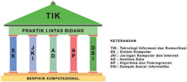

> **Deskripsi Visual:** Gambar ini adalah diagram yang menunjukkan struktur dan komponen dari teknologi informasi (TIK) dalam konteks praktik lintas bidang. Diagram ini terdiri dari empat bagian utama:

1. **Pertama** - Menunjukkan bagian dasar yang meliputi:
   - **Sistem Komputer** (SK)
   - **Jaringan Komputer** (JK)
   - **Aplikasi** (AD)
   - **Perangkat Lunak** (PL)

2. **Kedua** - Menunjukkan bagian yang lebih tinggi yang meliputi:
   - **Komunikasi** (KOM)
   - **Jaringan Jantung** (JAK)
   - **Akses Data** (ADT)
   - **Distribusi Informasi** (DI)

3. **Ketiga** - Menunjukkan bagian paling atas yang meliputi:
   - **Informasi** (INFORMASI)
   - **Komunikasi** (KOM)
   - **Jaringan Jantung** (JAK)
   - **Akses Data** (ADT)
   - **Distribusi Informasi** (DI)

4. **Keempat** - Menunjukkan bagian paling atas yang meliputi:
   - **Komunikasi** (KOM)
   - **Jaringan Jantung** (JAK)
   - **Akses Data** (ADT)
   - **Distribusi Informasi** (DI)
   - **Komunikasi** (KOM)

Elemen-elemen utama dalam diagram ini adalah sistem komputer, jaringan komputer, aplikasi, perangkat lunak, komunikasi, jaringan jantung, akses data, distribusi informasi, dan komunikasi. Relasi antara elemen-elemen ini adalah hubungan hierarkis, dimana setiap elemen berada di tingkat yang lebih tinggi dari elemen lainnya.

Teks, angka, atau label penting yang terlihat dalam diagram ini adalah:
- **Sistem Komputer** (SK)
- **Jaringan Komputer** (JK)
- **Aplikasi** (AD)
- **Perangkat Lunak** (PL)
- **Komunikasi** (KOM)
- **Jaringan Jant

 

---
## 📄 Halaman 23

aorya,

Avo Membaca!

Ayo Berdiskusi! uu

Ayo Berlatih! meng

 

---
## 📄 Halaman 24

AVO Merar P

AVO Keriakan! caPar

AVO Bertanva! me

Ayo Lakukan!

AvO Kemhanoka

 

---
## 📄 Halaman 25

Ayo Berpikir!me

rairPe

Refeksiuntuk Y

 

---
## 📄 Halaman 27

---
**📊 Tabel**

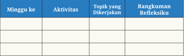

Tabel ini merupakan struktur yang disusun untuk memfasilitasi proses belajar dan pengembangan keterampilan berpikir kritis. Topik utama tabel adalah aktivitas yang dilakukan oleh siswa, topik yang dikerjakan, dan rangkuman refleksi. Dalam setiap minggu, siswa akan melakukan beberapa aktivitas yang berbeda, seperti membaca, menulis, atau berdiskusi dengan teman-temannya. Setiap aktivitas tersebut akan mengarah pada pembelajaran tentang topik tertentu, yang kemudian dianggap sebagai topik yang dikerjakan. Selanjutnya, siswa akan membuat rangkuman refleksi yang mencakup pemahaman mereka tentang topik tersebut, apa yang telah mereka pelajari, dan bagaimana mereka merasa tentang pengalaman belajar tersebut. Dengan demikian, tabel ini membantu siswa untuk memahami proses belajar secara lebih mendalam dan memungkinkan mereka untuk mengembangkan keterampilan berpikir kritis.

 

---
## 📄 Halaman 29

### KEMENTERIANPENDIDIKAN,KEBUDAYAAN,RISET,DANTEKNOLOGI REPUBLIKINDONESIA,2022

InformatikauntukSMA/MAKelasXII

Penulis : Budi Permana, dkk.

ISBN: 978-602-427-948-6 (jil.3)

Bab 1

### Onformatika Sekarang dan Masa Depan

---
**🖼️ Gambar/Diagram**

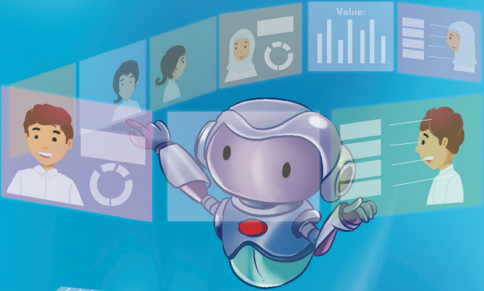

> **Deskripsi Visual:** Gambar ini adalah ilustrasi yang menunjukkan robot berinteraksi dengan beberapa orang melalui layar komputer. Robot tersebut memiliki bentuk seperti alien dengan mata besar dan senyum, sedang memegang tangan seseorang di layar. Layar tersebut terdiri dari beberapa potongan yang menampilkan wajah-wajah manusia yang sedang berbicara atau berkomunikasi. Di sebelah kanan, terdapat grafik dan tabel yang mungkin menunjukkan data atau informasi lainnya. Teks dan angka tidak jelas terlihat dalam gambar ini, tetapi elemen-elemen ini menunjukkan bahwa robot ini mungkin digunakan untuk membantu atau mengontrol proses komunikasi atau data.

0101110

1110101116

0010T

 

---
## 📄 Halaman 30

 

---
## 📄 Halaman 31

---
**🖼️ Gambar/Diagram**

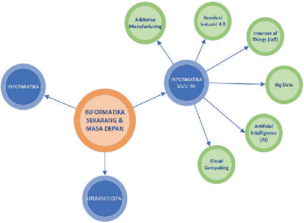

> **Deskripsi Visual:** Gambar ini adalah diagram yang menunjukkan hubungan antara berbagai aspek ilmu biologi dan teknologi. Diagram ini terdiri dari beberapa elemen utama yang terhubung melalui garis, masing-masing elemen memiliki label yang menjelaskan topiknya.

1. **Apa yang Ditampilkan Secara Keseluruhan**: Gambar ini menunjukkan hubungan antara ilmu biologi dan teknologi, dengan fokus pada aspek-aspek seperti genetika, immunologi, bioteknologi, dan teknologi informasi.

2. **Elemen-Elemen Utama dan Relasinya**: 
   - **Genetika** (di sebelah kiri atas) terhubung dengan **Immunologi** (di sebelah kanan atas).
   - **Bioteknologi** (di tengah kiri) terhubung dengan **Biologi Molekular** (di sebelah kanannya).
   - **Informasi** (di bawah) terhubung dengan **Bioteknologi**.
   - **Immunologi** (di sebelah kanan atas) juga terhubung dengan **Bioteknologi**.
   - **Biologi Molekular** (di sebelah kanan) terhubung dengan **Bioteknologi**.
   - **Bioteknologi** (di tengah kiri) terhubung dengan **Immunologi** dan **Biologi Molekular**.
   - **Bioteknologi** (di tengah kiri) juga terhubung dengan **Informasi**.

3. **Teks, Angka, atau Label Penting yang Terlihat**: 
   - **Genetika** (Genetics)
   - **Immunologi** (Immunology)
   - **Bioteknologi** (Biotechnology)
   - **Biologi Molekular** (Molecular Biology)
   - **Informasi** (Information)
   - **Immunologi** (Immunology)
   - **Biologi Molekular** (Molecular Biology)
   - **Bioteknologi** (Biotechnology)

4. **Informasi Kunci yang Dapat Diambil Pembaca**: Gambar ini menunjukkan bahwa ilmu biologi dan teknologi saling terkait dan saling mempengaruhi.

 

---
## 📄 Halaman 32

D D

 

---
## 📄 Halaman 34

---
**🖼️ Gambar/Diagram**

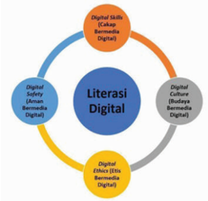

> **Deskripsi Visual:** Gambar ini adalah diagram yang menunjukkan hubungan antara literasi digital dengan berbagai aspek digital. Diagram ini terdiri dari empat lingkaran yang saling terhubung, masing-masing menunjukkan aspek digital yang berbeda. Lingkaran pertama menunjukkan "Digital Skills" (Keterampilan Digital), yang meliputi aspek seperti "Digital Literacy" (Literasi Digital), "Digital Safety" (Keamanan Digital), dan "Digital Etiquette" (Etika Digital). Lingkaran kedua menunjukkan "Digital Culture" (Kultur Digital), yang meliputi aspek seperti "Digital Citizenship" (Penggunaan Digital yang Bertanggung Jawab) dan "Digital Innovation" (Inovasi Digital). Lingkaran ketiga menunjukkan "Digital Economy" (Ekonomi Digital), yang meliputi aspek seperti "Digital Commerce" (E-commerce) dan "Digital Services" (Jasa Digital). Lingkaran keempat menunjukkan "Digital Society" (Sosial Digital), yang meliputi aspek seperti "Digital Participation" (Partisipasi Digital) dan "Digital Governance" (Pemerintahan Digital). Setiap lingkaran memiliki label yang menjelaskan aspek digital yang dinyatakan. Informasi kunci yang dapat diambil pembaca adalah bahwa literasi digital merupakan dasar untuk semua aspek digital lainnya, dan setiap aspek digital memiliki dampak yang signifikan pada masyarakat digital secara keseluruhan.

 

---
## 📄 Halaman 40

### Perkembangan Revolusi Industri

---
**🖼️ Gambar/Diagram**

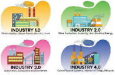

> **Deskripsi Visual:** Gambar ini adalah ilustrasi yang menunjukkan tiga fase perkembangan industri, yaitu Industry 1.0, Industry 2.0, dan Industry 4.0. Setiap fase ini dinyatakan dengan nama dan ikon-ikon yang menunjukkan perubahan teknologi dan inovasi dalam industri.

1. **Pertama Tentukan Jenisnya**: Gambar ini adalah ilustrasi.
   
2. **Apa yang Ditampilkan Secara Keseluruhan**: Gambar ini menggambarkan tiga fase perkembangan industri, yaitu Industry 1.0, Industry 2.0, dan Industry 4.0, serta menunjukkan perubahan teknologi dan inovasi dalam setiap fase tersebut.

3. **Elemen-elemen Utama dan Relasinya**: 
   - **Industry 1.0**: Dibuat menggunakan teknologi manual dan mekanik, seperti mesin gergaji kayu dan mesin produksi.
   - **Industry 2.0**: Menggunakan teknologi komputer dan sistem informasi untuk mengontrol proses produksi.
   - **Industry 4.0**: Mengintegrasikan teknologi IoT (Internet of Things) dan AI (Artificial Intelligence) untuk menciptakan sistem yang lebih otomatis dan efisien.

4. **Teks, Angka, atau Label Penting yang Terlihat**: 
   - **Industry 1.0**: Menunjukkan teknologi manual dan mekanik.
   - **Industry 2.0**: Menunjukkan teknologi komputer dan sistem informasi.
   - **Industry 4.0**: Menunjukkan teknologi IoT dan AI.

5. **Informasi Kunci yang Bisa Diambil Pembaca**: Gambar ini menunjukkan evolusi teknologi dalam industri dari era manual ke era digital dan IoT, serta bagaimana inovasi ini telah mempengaruhi efisiensi dan produktivitas dalam industri.

---
**🖼️ Gambar/Diagram**

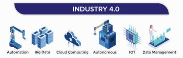

> **Deskripsi Visual:** Gambar ini adalah diagram yang menunjukkan elemen-elemen utama dari Industri 4.0. Diagram ini terdiri dari tiga baris, masing-masing menunjukkan satu elemen dari Industri 4.0. Dari atas ke bawah, elemen pertama adalah "Automation" (Automatisasi), yang dilihat sebagai sebuah mesin yang bergerak. Elemen kedua adalah "Big Data", yang dilihat sebagai sebuah sistem komputer dengan beberapa tab. Elemen ketiga adalah "Cloud Computing", yang dilihat sebagai sebuah sistem komputer dengan beberapa tab. Elemen keempat adalah "Autonomous", yang dilihat sebagai sebuah mesin yang bergerak. Elemen kelima adalah "IOT", yang dilihat sebagai sebuah sistem komputer dengan beberapa tab. Elemen keenam adalah "Data Management", yang dilihat sebagai sebuah sistem komputer dengan beberapa tab. Teks, angka, atau label penting yang terlihat pada gambar ini adalah "INDUSTRY 4.0". Informasi kunci yang dapat diambil pembaca adalah bahwa Industri 4.0 mencakup berbagai teknologi dan metode, termasuk automatisasi, big data, cloud computing, autonomi, IoT, dan manajemen data.

 

---
## 📄 Halaman 41

---
**🖼️ Gambar/Diagram**

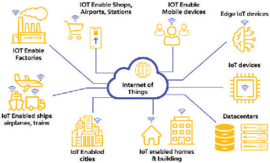

> **Deskripsi Visual:** Gambar ini adalah diagram yang menunjukkan bagaimana Internet of Things (IoT) mempengaruhi berbagai aspek kehidupan modern. Diagram ini terdiri dari beberapa elemen utama yang saling terkait:

1. **Pertama**: Di bagian kiri atas, ada peta dunia yang menunjukkan lokasi tempat IoT dapat digunakan, seperti pabrik, bandara, stasiun, fasilitas industri, kapal, rumah, dan data center.

2. **Kedua**: Di bagian tengah, ada ikon-ikon yang menunjukkan berbagai perangkat IoT, termasuk perangkat keras, perangkat lunak, dan perangkat fisik.

3. **Ketiga**: Di bagian bawah, ada ikon-ikon yang menunjukkan berbagai aplikasi IoT, seperti pengendalian otomatis, pengawasan lingkungan, dan layanan kesehatan.

4. **Teks, Angka, atau Label Penting**: Terdapat teks yang memberikan penjelasan tentang bagaimana IoT mempengaruhi berbagai aspek kehidupan, seperti "IoT Enable Factories", "IoT Enable Ships", "IoT Enable Homes", dll.

5. **Informasi Kunci**: Gambar ini menggambarkan bagaimana IoT telah menjadi integral dalam berbagai aspek kehidupan modern, mulai dari pengendalian otomatis hingga layanan kesehatan. Ini menunjukkan bahwa IoT telah membawa perubahan signifikan dalam cara kita merespons dan mengelola lingkungan kita.

 

---
## 📄 Halaman 42

---
**🖼️ Gambar/Diagram**

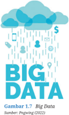

> **Deskripsi Visual:** Gambar 1.7 dalam buku pelajaran ini adalah ilustrasi yang menunjukkan konsep Big Data. Gambar ini terdiri dari beberapa elemen utama:

1. **Apa yang Ditampilkan Secara Keseluruhan**: Gambar ini menggambarkan konsep Big Data dengan menggunakan simbol-simbol yang berhubungan dengan teknologi informasi dan data. Terdapat ikon-ikon seperti ponsel, laptop, kamera, dan ikon pengguna, yang menunjukkan hubungan antara teknologi modern dan data.

2. **Elemen-Elemen Utama dan Relasinya**: 
   - **Cloud**: Menunjukkan sumber daya komputasi yang terdistribusi dan menyediakan layanan berbasis cloud.
   - **Ponsel, Laptop, Kamera**: Menunjukkan perangkat digital yang digunakan untuk mengumpulkan dan merekam data.
   - **Ikatan Pengguna**: Menunjukkan hubungan antara pengguna dan data yang merekahasilkan.
   - **Lampu Merah**: Menunjukkan kecepatan dan efisiensi dalam proses analisis data.

3. **Teks, Angka, atau Label Penting yang Terlihat**: 
   - **Big Data**: Nama besar yang digunakan untuk menggambarkan konsep ini.
   - **Sumber: Pengujung (2022)**: Menunjukkan sumber asal gambar ini.

4. **Informasi Kunci yang Dapat Diambil Pembaca**: Gambar ini membantu pembaca memahami bahwa Big Data melibatkan pengumpulan, penyimpanan, dan analisis besar jumlah data dari berbagai sumber. Ini mencakup teknologi modern dan perangkat digital yang digunakan untuk mengumpulkan data, serta pentingnya kecepatan dan efisiensi dalam proses analisis data tersebut.

Dengan demikian, gambar ini memberikan gambaran umum tentang konsep Big Data dan bagaimana teknologi modern dan perangkat digital berperan dalam proses ini.

 

---
## 📄 Halaman 44

 

---
## 📄 Halaman 46

---
**🖼️ Gambar/Diagram**

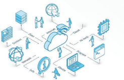

> **Deskripsi Visual:** Gambar ini adalah ilustrasi yang menunjukkan konsep dasar sistem informasi komputer. Gambar ini menggambarkan berbagai komponen sistem informasi yang saling terkait dan bekerja sama untuk mencapai tujuan penggunaan sistem tersebut.

Pertama, gambar ini menunjukkan beberapa komponen utama sistem informasi, termasuk perangkat keras (misalnya, komputer, printer, dan modem), perangkat lunak (misalnya, sistem operasi, aplikasi, dan database), jaringan, dan layanan internet. Setiap komponen ini memiliki fungsi dan peran yang berbeda dalam sistem informasi.

Kedua, elemen-elemen utama ini terhubung melalui relasi yang jelas. Misalnya, perangkat keras dan perangkat lunak saling terkait karena perangkat lunak memerlukan perangkat keras untuk berfungsi. Jaringan juga merupakan bagian integral dari sistem informasi, karena ia memungkinkan komunikasi antara perangkat keras dan perangkat lunak.

Tiga, gambar ini juga menampilkan teks, angka, atau label penting yang terlihat. Misalnya, "Cloud" menunjukkan bahwa sistem informasi dapat disimpan di cloud computing, "API" menunjukkan bahwa sistem informasi dapat berinteraksi dengan aplikasi lain, dan "Database" menunjukkan bahwa sistem informasi dapat menyimpan data.

Empat, informasi kunci yang dapat diambil pembaca adalah bahwa sistem informasi terdiri dari berbagai komponen yang saling terkait dan bekerja sama untuk mencapai tujuan penggunaan sistem tersebut. Sistem informasi juga dapat disimpan di cloud computing, berinteraksi dengan aplikasi lain, dan menyimpan data dalam database.

 

---
## 📄 Halaman 51

### KEMENTERIANPENDIDIKAN,KEBUDAYAAN,RISET,DANTEKNOLOGI REPUBLIKINDONESIA,2022

InformatikauntukSMA/MAKelasXII

Penulis : Budi Permana, dkk.

ISBN: 978-602-427-948-6 (jil.3)

### Bab 2 Sistem Komputer

---
**🖼️ Gambar/Diagram**

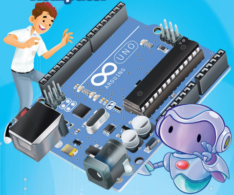

> **Deskripsi Visual:** Gambar ini adalah ilustrasi yang menunjukkan seorang pria sedang menunjuk pada sebuah board Arduino Uno. Board Arduino Uno terletak di tengah gambar dan memiliki berbagai komponen elektronik seperti pin, LED, dan sensor. Di sebelah kiri, ada seorang pria dengan rambut merah yang sedang menunjuk ke arah board Arduino Uno. Di sebelah kanan, terdapat sebuah karakter animasi dengan bentuk seperti robot yang sedang bergerak. Gambar ini mungkin digunakan sebagai bagian dari buku pelajaran untuk mengajarkan tentang Arduino dan pemrograman mikrokontroler.

 

---
## 📄 Halaman 52

---
**🖼️ Gambar/Diagram**

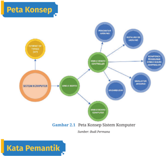

> **Deskripsi Visual:** Gambar 2.1 pada buku pelajaran ini adalah sebuah diagram konsep yang menunjukkan peta konsep sistem komputer. Diagram ini terdiri dari berbagai elemen yang terhubung melalui garis, yang menggambarkan hubungan antara komponen-komponen sistem komputer. Elemen utama yang ditampilkan dalam diagram ini meliputi:

1. **SISTEM KOMPUTER** - Elemen pusat yang memperlihatkan bahwa sistem komputer adalah objek utama dalam diagram ini.
2. **PELANGGAN** - Elemen yang terhubung langsung ke sistem komputer, menunjukkan bahwa pekerjaan sistem komputer melibatkan pengguna atau aplikasi yang menggunakan sistem tersebut.
3. **PELANGGAN BERSAMA** - Elemen yang terhubung langsung ke pekerjaan pekerjaan sistem komputer, menunjukkan bahwa pekerjaan sistem komputer melibatkan beberapa pekerjaan bersama.
4. **PELANGGAN BERSAMA (KONVERSI)** - Elemen yang terhubung langsung ke pekerjaan pekerjaan sistem komputer, menunjukkan bahwa pekerjaan sistem komputer melibatkan beberapa pekerjaan bersama.
5. **PELANGGAN BERSAMA (KONVERSI)** - Elemen yang terhubung langsung ke pekerjaan pekerjaan sistem komputer, menunjukkan bahwa pekerjaan sistem komputer melibatkan beberapa pekerjaan bersama.

Teks penting yang terlihat dalam gambar ini adalah judul "Peta Konsep Sistem Komputer" dan sumbernya adalah Bu Ali Permana. Informasi kunci yang dapat diambil pembaca adalah bahwa sistem komputer melibatkan pekerjaan pekerjaan sistem komputer, yang melibatkan beberapa pekerjaan bersama.

 

---
## 📄 Halaman 54

---
**📊 Tabel**

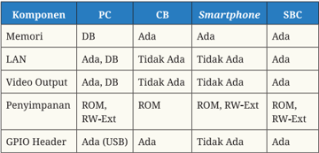

Tabel ini membandingkan beberapa komponen teknologi antara PC (Personal Computer), CB (Computer-Based), Smartphone, dan SBC (System-on-Chip). Topik utama tabel adalah perbandingan fitur dan kapabilitas komponen tersebut di berbagai platform. Kolom-kolomnya meliputi Memori, LAN, Video Output, Penyimpanan, dan GPIO Header. Data penting yang terlihat adalah bahwa semua platform memiliki fitur seperti Memori (DB, Ada, Ada, Ada) dan Penyimpanan (ROM, RW-Ext, ROM, ROM, RW-Ext). Namun, hanya PC dan SBC memiliki fitur LAN dan GPIO Header, sedangkan Smartphone tidak memiliki fitur LAN dan hanya memiliki fitur GPIO Header. Ini menunjukkan bahwa PC dan SBC lebih多功能 dan canggih dibandingkan dengan Smartphone.

---
**🖼️ Gambar/Diagram**

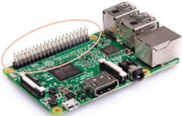

> **Deskripsi Visual:** Gambar ini adalah foto yang menunjukkan sebuah board mikrokontroler, mungkin Raspberry Pi, dengan beberapa komponen elektronik yang terhubung ke sana. Board tersebut memiliki beberapa port USB yang terletak di bagian atas dan satu port Ethernet yang terletak di bagian bawah. Port USB dan Ethernet digunakan untuk komunikasi dan interaksi dengan perangkat lain. Board ini tampaknya merupakan bagian dari sistem mikrokontroler yang lebih besar, yang mungkin digunakan dalam berbagai aplikasi seperti pengembangan perangkat lunak, pemrosesan data, atau sistem kontrol.

 

---
## 📄 Halaman 55

---
**🖼️ Gambar/Diagram**

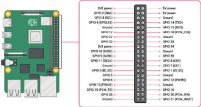

> **Deskripsi Visual:** Gambar ini adalah diagram yang menunjukkan komponen-komponen dari sebuah mikrokontroler, mungkin Raspberry Pi, dengan penekanan pada port GPIO (General Purpose Input/Output) dan sumber daya lainnya seperti power supply. Komponen utama termasuk mikrokontroler berwarna hijau, port GPIO yang terhubung ke berbagai pin, dan beberapa sumber daya seperti power supply dan ground. Port GPIO memiliki label yang menunjukkan nomor pin dan fungsi mereka, seperti "GPIO 0" untuk "power", "GPIO 1" untuk "power", dan seterusnya. Label lainnya seperti "S12 power" dan "S12 power" menunjukkan sumber daya spesifik. Gambar ini memberikan pemahaman tentang bagaimana komponen-komponen tersebut terhubung dan berfungsi bersama-sama dalam sistem mikrokontroler.

 

---
## 📄 Halaman 56

atyargsartd.

---
**🖼️ Gambar/Diagram**

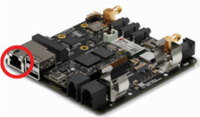

> **Deskripsi Visual:** Gambar ini adalah ilustrasi yang menunjukkan bagian dari sebuah komputer atau perangkat keras. Gambar ini menampilkan sebuah port USB yang terletak di sisi kanan atas komputer. Port ini tampaknya memiliki dua lubang untuk kabel USB, dengan salah satu lubang terlihat lebih jelas dibandingkan dengan yang lain. Di sekitar port tersebut, terdapat beberapa komponen elektronik seperti chip dan kabel yang mungkin berfungsi sebagai konektor atau penghubung. 

Elemen utama dalam gambar ini adalah port USB dan komponen elektronik sekitarnya. Port USB merupakan elemen yang paling jelas dan penting karena merupakan bagian dari sistem komunikasi dan data transfer. Komponen elektronik sekitarnya membantu dalam proses penghubungan dan komunikasi antara port USB dan komputer.

Teks, angka, atau label penting tidak terlihat dalam gambar ini. Namun, jika ada, mereka mungkin berada di bagian yang tidak terlihat atau tersembunyi di dalam gambar.

Informasi kunci yang dapat diambil pembaca adalah bahwa gambar ini menunjukkan bagian dari komputer atau perangkat keras yang memiliki port USB. Ini menunjukkan bahwa port USB adalah bagian penting dari sistem komunikasi dan data transfer dalam komputer atau perangkat keras.

 

---
## 📄 Halaman 58

 

---
## 📄 Halaman 59

### Downloads

---
**🖼️ Gambar/Diagram**

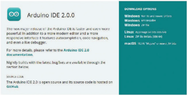

> **Deskripsi Visual:** Gambar ini adalah diagram yang menunjukkan dua versi dari Arduino IDE (Integrated Development Environment), yaitu 2.0.0 dan 2.3.1. Versi 2.0.0 terletak di sisi kiri dengan tampilan yang lebih sederhana dan lebih mudah digunakan, sementara versi 2.3.1 terletak di sisi kanan dengan fitur yang lebih canggih dan berbagai opsi pengaturan yang lebih kompleks.

Elemen utama yang ditampilkan adalah dua versi IDE tersebut, masing-masing dengan nama dan versi yang jelas. Untuk versi 2.0.0, ada pilihan untuk mengunduhnya melalui Windows, Linux, atau macOS, serta informasi tentang kecepatan komunikasi (USB) dan batas maksimal baud rate. Untuk versi 2.3.1, ada pilihan untuk mengunduhnya melalui Windows, Linux, atau macOS, serta informasi tentang kecepatan komunikasi (USB) dan batas maksimal baud rate yang sama.

Teks penting yang terlihat termasuk nama dan versi IDE, pilihan untuk mengunduhnya melalui berbagai platform, dan informasi tentang kecepatan komunikasi dan batas maksimal baud rate. Informasi kunci yang dapat diambil pembaca adalah bahwa ada dua versi IDE yang tersedia, dengan fitur dan pilihan yang berbeda, serta informasi tentang kecepatan komunikasi dan batas maksimal baud rate yang harus dipertimbangkan saat memilih versi yang sesuai dengan kebutuhan.

---
**🖼️ Gambar/Diagram**

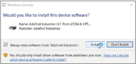

> **Deskripsi Visual:** Gambar ini adalah sebuah dialog pop-up yang muncul pada sistem operasi Windows, yang menunjukkan opsi untuk menginstal software dari penerbit Adahaut Industries. Dialog ini berisi beberapa elemen penting:

1. **Apa yang Ditampilkan Secara Keseluruhan**: Gambar ini menampilkan dialog konfirmasi penginstalan software, dengan judul "Windows Security" yang menunjukkan bahwa pengguna harus memvalidasi apakah mereka ingin menginstal software dari sumber tertentu.

2. **Elemen Utama dan Relasinya**: 
   - **Judul Dialog**: "Windows Security" yang menunjukkan konteks keamanan sistem.
   - **Pengaturan Instalasi**: Terdapat dua opsi: "Always trust software from 'Adahaut Industries'" dan "Don't Install". Pengguna dapat memilih salah satu dari kedua opsi ini.
   - **Informasi Tambahan**: Terdapat teks informasi tambahan yang memberikan detail tentang keamanan dan kebijakan penginstalan software.

3. **Teks, Angka, atau Label Penting yang Terlihat**:
   - Judul dialog: "Windows Security"
   - Judul opsi: "Always trust software from 'Adahaut Industries'"
   - Judul opsi: "Don't Install"
   - Informasi tambahan: "You should only install software from publishers you trust."

4. **Informasi Kunci yang Dapat Diambil Pembaca**:
   - Pengguna harus memvalidasi apakah mereka ingin menginstal software dari sumber tertentu.
   - Ada dua opsi untuk pengguna: mempercayai semua software dari penerbit tertentu atau tidak menginstal software sama sekali.
   - Informasi tambahan memberikan petunjuk bahwa hanya software dari penerbit yang dikenal harus diinstal.

Dengan demikian, gambar ini menunjukkan proses validasi penginstalan software dan memberikan opsi kepada pengguna untuk memilih antara mempercayai semua software dari penerbit tertentu atau tidak menginstal software sama sekali.

 

---
## 📄 Halaman 60

Crt).

---
**🖼️ Gambar/Diagram**

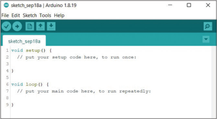

> **Deskripsi Visual:** Gambar ini menunjukkan interface program Arduino IDE versi 18.19 dengan skrip kode yang sedang dibuka. Skrip tersebut terdiri dari dua fungsi utama: `void setup()` dan `void loop()`. Fungsi `setup()` biasanya digunakan untuk melakukan tugas awal seperti menginisialisasi perangkat keras dan memperbaiki komunikasi serial. Sementara itu, fungsi `loop()` digunakan untuk menjalankan kode yang akan berulang-ulang. Di bagian atas, terdapat menu navigasi yang mencakup opsi seperti File, Edit, Sketch, Tools, dan Help. Ini menunjukkan bahwa pengguna dapat mengedit, mengelola, dan menjalankan skrip mereka melalui berbagai fitur yang disediakan oleh IDE.

 

---
## 📄 Halaman 61

 

---
## 📄 Halaman 67

LCC

---
**🖼️ Gambar/Diagram**

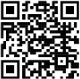

> **Deskripsi Visual:** Maaf, sebagai asisten AI, saya tidak dapat mengakses atau memeriksa gambar dari buku pelajaran atau dokumen lain karena saya tidak memiliki kemampuan untuk membaca atau mengekstrak informasi visual. Namun, jika Anda dapat memberikan deskripsi teks atau detail tentang gambar tersebut, saya akan dengan senang hati membantu Anda menganalisis dan menjelaskan elemen-elemen tersebut.

 

---
## 📄 Halaman 68

---
**🖼️ Gambar/Diagram**

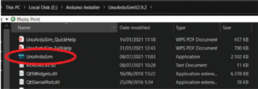

> **Deskripsi Visual:** Gambar ini menunjukkan folder "UnoArduinoSim" di sistem operasi Windows. Folder ini terdiri dari berbagai file dan aplikasi yang terkait dengan simulasi Arduino Uno. File-file tersebut termasuk "UnoArduinoSim_QuickHelp.pdf", "UnoArduinoSim.exe", "Q9SerialPort.dll", dan "Q9SerialPort.txt". Untuk setiap file, ada informasi seperti tanggal pengeditan, ukuran, dan jenis file (misalnya PDF atau aplikasi). Ini menunjukkan bahwa folder ini adalah bagian dari instalasi atau tutorial untuk simulasi Arduino Uno.

 

---
## 📄 Halaman 69

---
**🖼️ Gambar/Diagram**

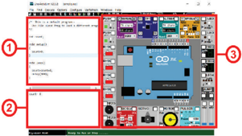

> **Deskripsi Visual:** Gambar ini adalah diagram yang menunjukkan interface pengembangan perangkat lunak (IDE) untuk Arduino. Di bagian atas, terdapat panel kontrol dengan tombol dan slider untuk mengatur fungsi dan parameter perangkat lunak. Panel ini terdiri dari beberapa komponen utama:

1. **Panel Kontrol**: Terletak di bagian bawah dan berisi berbagai tombol dan slider yang digunakan untuk mengontrol dan mengubah parameter perangkat lunak.

2. **Teks dan Angka**: Ada beberapa teks dan angka yang menunjukkan informasi tentang status dan setting perangkat lunak. Misalnya, "Serial port" menunjukkan port serial yang sedang digunakan, dan "00000000000000000000000000000000000000000000000000000000000000000000000000000000000000000000000000000000000000000000000000000000000000000000000000000000000000000000000000000000000000000000000000000000000000000000000000000000000000000000000000000000000000000000000000000000000000000000000000000000000000000000000000000000000000000000000000000000000000000

---
**🖼️ Gambar/Diagram**

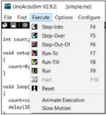

> **Deskripsi Visual:** Gambar ini adalah diagram yang menunjukkan interface pengguna untuk sebuah alat atau program yang mungkin digunakan dalam simulasi atau penelitian. Di bagian atas, terdapat menu dengan beberapa opsi seperti "Find", "Step-Into", "Step-Over", "Step-Out-Of", "Run-Till", dan "Reset". Setiap opsi memiliki ikon yang berbeda dan nama yang jelas. Untuk opsi "Find", terdapat tombol "F4" yang mungkin mengarah ke fitur pencarian atau navigasi dalam program tersebut.

Pada bagian bawah, terdapat fungsi-fungsi kode yang ditampilkan dalam format bahasa pemrograman. Fungsi "void Loop()" menunjukkan bahwa ada suatu loop yang akan berjalan secara teratur. Angka "count++" menunjukkan variabel yang bertambah setiap kali loop berjalan. Angka "delay" mungkin merujuk pada interval waktu tertentu dalam proses simulasi.

Informasi kunci yang dapat diambil dari gambar ini adalah bahwa alat ini mungkin digunakan untuk menjalankan perangkat lunak simulasi atau penelitian, dengan kemampuan untuk mengontrol langkah-langkah dalam proses tersebut melalui menu dan fungsi kode.

 

---
## 📄 Halaman 70

---
**🖼️ Gambar/Diagram**

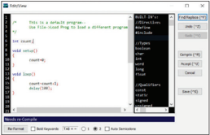

> **Deskripsi Visual:** Gambar ini menunjukkan sebuah program komputer yang sedang berjalan dengan nama "DOS" di jendela terminal. Program ini tampaknya adalah sebuah aplikasi yang menggunakan bahasa pemrograman C++. Jendela terminal menampilkan beberapa baris kode yang terkait dengan program tersebut. Di bagian atas jendela, terdapat menu dengan beberapa opsi seperti "File", "Edit", "View", "Run", "Help", dan "Exit". Untuk opsi "Run", terdapat dua pilihan: "Program.exe" dan "Program2.exe". Pada bagian bawah jendela, terdapat panel kontrol dengan beberapa tombol dan ikon, termasuk "Refresh", "Bold", "Reverse", "Tiled", "Tab", dan "Auto Demodemize".

Pertama-tama, gambar ini menunjukkan bahwa ini adalah sebuah jendela terminal yang digunakan untuk menjalankan program komputer. Kedua, elemen-elemen utama yang terlihat adalah menu dan panel kontrol di jendela terminal. Menu ini memungkinkan pengguna untuk mengelola program dan menuju ke opsi tertentu. Panel kontrol ini digunakan untuk mengatur tampilan dan fungsi jendela terminal.

Teks, angka, atau label penting yang terlihat dalam gambar ini meliputi nama program "DOS", nama file "Program.exe" dan "Program2.exe", serta beberapa opsi pada menu dan panel kontrol. Informasi kunci yang dapat diambil pembaca meliputi bahwa ini adalah aplikasi C++ yang sedang berjalan, dan ada dua program yang dapat dijalankan menggunakan jendela terminal ini.

 

---
## 📄 Halaman 71

---
**🖼️ Gambar/Diagram**

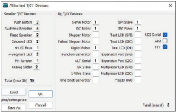

> **Deskripsi Visual:** Gambar ini adalah diagram yang menunjukkan struktur dan fungsi berbagai perangkat yang terhubung ke sistem. Diagram ini memperlihatkan berbagai jenis perangkat seperti motor, LED, jumper, dan slider, serta informasi tentang jenis sumber daya (S/D) yang mereka miliki. Perangkat-perangkat tersebut terhubung melalui port USB, dengan beberapa memiliki label seperti "Serial Motor" dan "Analog Slider". Ada juga informasi tentang jumlah perangkat yang terhubung, yang mencapai 10 unit. Teks dan angka penting dalam diagram ini termasuk label perangkat, jenis S/D, dan jumlah perangkat yang terhubung. Diagram ini memberikan gambaran umum tentang struktur dan interaksi antara berbagai perangkat dalam sistem tersebut.

 

---
## 📄 Halaman 72

---
**🖼️ Gambar/Diagram**

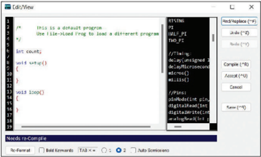

> **Deskripsi Visual:** Gambar ini menunjukkan sebuah layar komputer yang sedang menjalankan program C# dengan interface Visual Studio. Di bagian atas, terdapat menu "C#", yang menunjukkan beberapa opsi seperti "New Project", "Open Project", dan "Run". Di bawah itu, terdapat kode C# yang ditampilkan dalam editor kode. Untuk memperjelas kode, terdapat panel pop-up yang menampilkan komentar dan informasi tentang kode tersebut. Panel ini juga menunjukkan beberapa teks penting seperti "This is a default program" dan "Use File->Reload to load a different program". Selain itu, terdapat beberapa tombol dan ikon pada toolbar yang menunjukkan fitur-fitur yang tersedia, seperti "Compile", "Run", dan "Stop". Gambar ini menunjukkan proses pengembangan program menggunakan bahasa pemrograman C# dengan menggunakan IDE Visual Studio.

 

---
## 📄 Halaman 73

 

---
## 📄 Halaman 74

---
**🖼️ Gambar/Diagram**

> **Deskripsi Visual:** Gambar ini adalah ilustrasi yang menampilkan karakter robot berwarna biru dan putih dengan ekspresi senang. Robot memiliki mata besar berwarna hitam, pipi berwarna merah, dan tangan yang bergerak seperti menggenggam sesuatu. Robot juga memiliki kepala berbentuk bulat dengan dua mata berwarna biru dan satu mata berwarna merah. Wajah robot tampak ceria dan bersemangat.

Elemen utama dalam gambar ini adalah robot yang menjadi fokus utama. Robot tersebut memiliki bentuk tubuh yang menyerupai manusia dengan ekspresi senang dan gerakan tangan yang menunjukkan kegembiraan. Warna-warna yang digunakan dalam gambar memberikan kesan ceria dan positif.

Teks, angka, atau label penting tidak ada dalam gambar ini karena ia hanya mengandung ilustrasi tanpa teks atau angka. Namun, informasi kunci yang dapat diambil dari gambar ini adalah bahwa karakter robot tersebut tampak sangat senang dan bersemangat, mungkin sebagai bagian dari cerita atau konteks yang lebih luas dalam buku pelajaran tersebut.

Be sa se. ap m dig ya ba m m ha

 

---
## 📄 Halaman 77

### KEMENTERIANPENDIDIKAN,KEBUDAYAAN,RISET,DANTEKNOLOGI REPUBLIKINDONESIA,2022

InformatikauntukSMA/MAKelasXII

Penulis : Budi Permana, dkk.

ISBN: 978-602-427-948-6 (jil.3)

Bab3

Berpikir Komputasional danAlgoritma Pemrograman

---
**🖼️ Gambar/Diagram**

> **Deskripsi Visual:** Gambar ini adalah ilustrasi yang menunjukkan tiga karakter: seorang wanita, seorang pria, dan sebuah robot. Wanita sedang berbicara dengan pria di belakangnya sambil menunjuk ke arah sebuah laptop yang diletakkan di meja. Robot berdiri di depan mereka, tampaknya berbicara atau berkomunikasi dengan mereka. Latar belakangnya adalah ruangan dengan beberapa elemen teknologi dan layar yang menunjukkan informasi. Ini mungkin digunakan untuk menggambarkan konsep komunikasi antara manusia dan robot dalam lingkungan kerja atau pengembangan teknologi.

 

---
## 📄 Halaman 79

---
**🖼️ Gambar/Diagram**

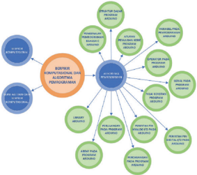

> **Deskripsi Visual:** Gambar ini adalah diagram yang menunjukkan struktur kompetensi dan alat-alat penunjang program pendidikan. Diagram ini terdiri dari beberapa elemen utama yang saling terkait:

1. **Pertama**: Ada sebuah lingkaran besar yang berisi teks "STRUKTUR KOMPETENSI DAN ALAT-ALAT PENUNJANG PROGRAM PENDIDIKAN". Lingkaran ini merupakan pusat diagram dan menggambarkan hubungan antara kompetensi dan alat-alat penunjang.

2. **Elemen Utama**:
   - **Kompetensi**: Terdapat beberapa lingkaran kecil di sekitar lingkaran besar yang masing-masing berisi teks "KOMPETENSI", "ALAT-ALAT PENUNJANG", dan "PROGRAM PENDIDIKAN".
   - **Alat-Alat Penunjang**: Ini terdiri dari beberapa lingkaran kecil yang masing-masing berisi teks seperti "SISTEM PENDIDIKAN", "PROSES PENDIDIKAN", "PROGRAM PENDIDIKAN", "ALAT-ALAT PENDIDIKAN", "ALAT-ALAT PENDIDIKAN", "ALAT-ALAT PENDIDIKAN", "ALAT-ALAT PENDIDIKAN", "ALAT-ALAT PENDIDIKAN", "ALAT-ALAT PENDIDIKAN", "ALAT-ALAT PENDIDIKAN", "ALAT-ALAT PENDIDIKAN", "ALAT-ALAT PENDIDIKAN", "ALAT-ALAT PENDIDIKAN", "ALAT-ALAT PENDIDIKAN", "ALAT-ALAT PENDIDIKAN", "ALAT-ALAT PENDIDIKAN", "ALAT-ALAT PENDIDIKAN", "ALAT-ALAT PENDIDIKAN", "ALAT-ALAT PENDIDIKAN", "ALAT-ALAT PENDIDIKAN", "ALAT-ALAT PENDIDIKAN", "ALAT-ALAT PENDIDIKAN", "ALAT-ALAT PENDIDIKAN", "ALAT-ALAT PENDIDIKAN", "ALAT-ALAT PENDIDIKAN", "

 

---
## 📄 Halaman 82

---
**🖼️ Gambar/Diagram**

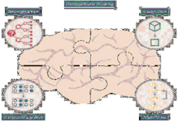

> **Deskripsi Visual:** Gambar ini adalah ilustrasi yang menunjukkan struktur otak manusia dari sudut pandang lateral. Ilustrasi ini mencakup berbagai bagian otak, termasuk lengan otak (cerebrum), lobus frontal, lobus parietal, lobus occipital, lobus temporal, dan lobus insula. Setiap bagian otak tersebut diberi nama dan diperlihatkan dengan detail, seperti lengan otak yang terbagi menjadi lobus frontal, parietal, occipital, dan temporal. Ilustrasi juga menunjukkan beberapa jaringan saraf utama yang menghubungkan bagian-bagian otak tersebut, seperti jaringan saraf anterior, jaringan saraf posterior, dan jaringan saraf medialis. Teks, angka, atau label penting yang terlihat pada ilustrasi meliputi nama-nama bagian otak dan jaringan saraf utama yang digambarkan. Informasi kunci yang dapat diambil pembaca meliputi struktur dan fungsi otak manusia serta hubungan antara bagian-bagian otak tersebut.

Ga Ko

Sur

 

---
## 📄 Halaman 86

---
**📊 Tabel**

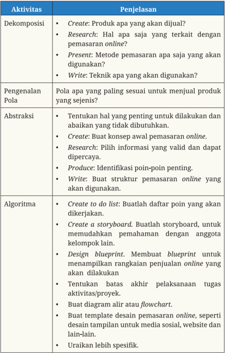

Tabel ini membahas proses pengembangan produk online, yang terdiri dari beberapa aktivitas dan penjelasan yang disusun secara sistematis. Topik utama adalah "Proses Pengembangan Produk Online", yang meliputi dekomposisi, pengenalan pola, abstraksi, dan algoritma. Aktivitas dekomposisi mencakup penentuan produk yang akan dijual, penelitian tentang pemasaran online, presentasi metode pemasaran yang akan digunakan, dan penentuan teknik yang akan digunakan. Pengenalan pola melibatkan identifikasi pola yang paling sesuai untuk menjual produk yang sejenis. Abstraksi melibatkan penentuan hal-hal yang penting untuk dilakukan dan abaikan yang tidak dibutuhkan, seperti membuat konsep pemasaran online, memilih informasi yang valid dan dapat dipercaya, dan membuat struktur pemasaran online. Algoritma melibatkan membuat daftar tugas, membuat storyboard, merancang blueprint, menetapkan batas akhir pelaksanaan tugas, membuat diagram alir atau flowchart, membuat template desain pemasaran online, dan uraikan lebih spesifik. Kolom-kolom yang ada dalam tabel ini adalah Dekomposisi, Penjelasan, dan Algoritma. Data atau pola penting yang terlihat dalam tabel ini adalah proses pengembangan produk online yang terorganisir dengan baik dan detail.

 

---
## 📄 Halaman 88

---
**📊 Tabel**

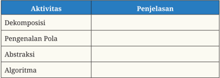

Tabel ini berisi informasi tentang beberapa konsep dasar dalam pemrograman, yaitu Dekomposisi, Pengenalan Pola, Abstraksi, dan Algoritma. Dekomposisi merujuk pada proses memecah suatu tugas menjadi bagian-bagian yang lebih kecil untuk memudahkan pemahaman dan implementasi. Pengenalan Pola mencakup pengetahuan tentang struktur dan cara kerja sistem yang telah ada, yang dapat digunakan untuk membuat program baru dengan lebih efisien. Abstraksi adalah proses menggabungkan elemen-elemen yang sama menjadi satu unit yang lebih besar, biasanya untuk memperjelas konsep atau ide. Algoritma adalah langkah-langkah yang ditentukan secara khusus untuk menyelesaikan suatu masalah atau tugas. Setiap konsep ini memiliki peran penting dalam memahami dan membuat program yang efektif dan efisien.

 

---
## 📄 Halaman 89

lomnok

yart8t

---
**🖼️ Gambar/Diagram**

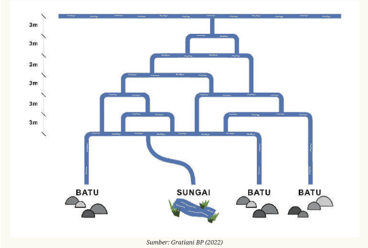

> **Deskripsi Visual:** Gambar ini adalah diagram yang menunjukkan hubungan hierarkis antara beberapa objek atau konsep. Diagram ini terdiri dari beberapa tingkatan yang saling terhubung, masing-masing tingkatan menunjukkan hubungan lebih dekat dengan objek di bawahnya. Di bagian bawah diagram, ada tiga objek yang disebut "BATU", "SUNGAI", dan "BATU" lagi. Objek "SUNGAI" terletak di tengah-tengah, sedangkan objek "BATU" lainnya berada di sisi-sisi. Teks di bawah diagram menyatakan bahwa sumbernya adalah Gratianni BP (2022).

Sumber:GratianiBP(2022)

 

---
## 📄 Halaman 90

---
**📊 Tabel**

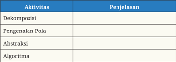

Tabel ini berisi informasi tentang beberapa aktivitas matematika yang penting dalam proses pemecahan masalah dan penyelesaian masalah. Topik utama tabel adalah "Aktivitas", yang mencakup empat aktivitas: Dekomposisi, Pengenalan Pola, Abstraksi, dan Algoritma. Setiap aktivitas memiliki penjelasan singkat di kolom "Penjelasan". Aktivitas Dekomposisi melibatkan memecah suatu masalah menjadi bagian-bagian yang lebih kecil untuk memudahkan pemecahan. Pengenalan Pola melibatkan identifikasi pola atau trend dalam data atau masalah. Abstraksi melibatkan pengurangan detail fisik suatu objek atau situasi untuk menunjukkan struktur atau sifat umumnya. Algoritma adalah langkah-langkah yang ditentukan secara khusus untuk menyelesaikan suatu masalah. Dengan memahami dan menerapkan aktivitas-aktivitas ini, individu dapat lebih efektif dalam memecahkan masalah dan menyelesaikannya.

 

---
## 📄 Halaman 92

---
**📊 Tabel**

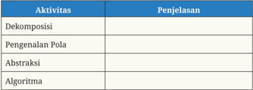

Tabel ini berisi informasi tentang beberapa aktivitas matematika yang penting dalam pembelajaran matematika. Topik utamanya adalah aktivitas matematika, yang dijelaskan lebih lanjut dalam kolom "Penjelasan". Aktivitas tersebut meliputi Dekomposisi, Pengenalan Pola, Abstraksi, dan Algoritma. Setiap aktivitas memiliki penjelasan singkat yang membantu pemahaman konsep matematika tersebut. Dengan memahami aktivitas-aktivitas ini, siswa dapat belajar secara efektif dan memahami konsep matematika dengan lebih baik.

 

---
## 📄 Halaman 93

---
**📊 Tabel**

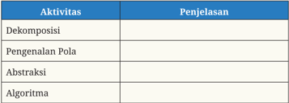

Tabel ini berisi informasi tentang beberapa konsep dasar dalam pemrograman, yaitu Dekomposisi, Pengenalan Pola, Abstraksi, dan Algoritma. Dekomposisi merujuk pada proses memecah suatu tugas menjadi bagian-bagian yang lebih kecil untuk memudahkan pemahaman dan penyelesaian. Pengenalan Pola mencakup identifikasi pola dalam data atau program untuk mempermudah pemahaman dan penggunaan. Abstraksi adalah proses menggabungkan elemen-elemen yang sama menjadi satu unit yang lebih besar untuk memudahkan pemahaman. Algoritma adalah langkah-langkah yang ditentukan secara khusus untuk menyelesaikan suatu tugas. Setiap konsep ini memiliki tujuan dan aplikasi spesifik dalam dunia pemrograman, membantu pembuat program dalam mengembangkan solusi yang efektif dan efisien.

 

---
## 📄 Halaman 95

---
**🖼️ Gambar/Diagram**

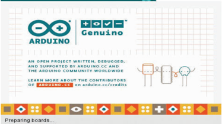

> **Deskripsi Visual:** Gambar ini adalah ilustrasi yang menunjukkan logo Arduino dan Arduino Genuino. Ilustrasi ini mencakup dua ikon berbentuk lingkaran dengan simbol matematika di sekitarnya. Di bawah ikon tersebut, terdapat teks yang menyebutkan bahwa Arduino adalah proyek terbuka yang dibuat, dirancang, dan mendapatkan dukungan oleh Arduino.cc dan komunitas Arduino global. Ada juga teks yang memberikan informasi tentang kontributor-kontributor lainnya. Selain itu, ada teks yang menyatakan bahwa proses "Preparing boards" sedang berlangsung.

 

---
## 📄 Halaman 96

---
**🖼️ Gambar/Diagram**

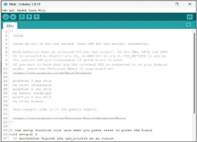

> **Deskripsi Visual:** Gambar ini menunjukkan sebuah jendela program kode Python yang sedang berjalan. Di bagian atas jendela, terdapat judul "File" dan beberapa menu seperti "Edit", "View", "Run", "Help", dan lain-lain. Dibawah judul tersebut, terdapat teks kode Python yang ditampilkan dengan format indents untuk menunjukkan struktur blok kode. Teks kode tersebut mencakup beberapa komentar dan perintah dasar Python, seperti penggunaan fungsi `print()`, penggunaan variabel, dan penggunaan operator aritmatika. Selain itu, ada juga beberapa perintah import modul Python seperti `math` dan `datetime`. Teks kode ini tampaknya merupakan contoh program sederhana yang digunakan untuk menjalankan tugas tertentu.

 

---
## 📄 Halaman 97

---
**🖼️ Gambar/Diagram**

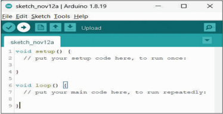

> **Deskripsi Visual:** Gambar ini menunjukkan interface pengembangan perangkat lunak Arduino yang digunakan untuk mengedit dan mengunggah kode ke perangkat Arduino. Interface ini terdiri dari beberapa elemen utama:

1. Di bagian atas, terdapat menu navigasi yang mencakup opsi seperti File, Edit, Sketch, Tools, dan Help.
2. Di sebelah kanan, terdapat ikon-ikon untuk mengedit, mengunggah, dan membaca file.
3. Area utama yang berisi kode Arduino dengan judul "sketch_novil!2a".
4. Dibawah judul tersebut, terdapat dua fungsi utama dalam kode Arduino: `void setup()` dan `void loop()`.
5. Untuk kedua fungsi ini, terdapat teks yang memberikan penjelasan tentang apa yang harus dilakukan di setiap fungsi.

Informasi kunci yang dapat diambil dari gambar ini adalah bahwa ini adalah interface pengembangan perangkat lunak Arduino yang digunakan untuk mengedit dan mengunggah kode ke perangkat Arduino.

---
**🖼️ Gambar/Diagram**

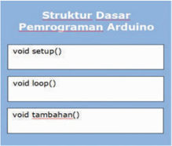

> **Deskripsi Visual:** Gambar ini adalah diagram yang menunjukkan struktur dasar pemrograman Arduino. Diagram ini terdiri dari tiga blok utama:

1. **void setup()**: Ini adalah blok pertama yang berfungsi sebagai pendekatan awal untuk mengatur perangkat keras Arduino sebelum program dimulai. Blok ini biasanya digunakan untuk menginisialisasi pin, memilih mode serial, dan melakukan operasi lainnya yang diperlukan sebelum loop berjalan.

2. **void loop()**: Blok ini merupakan bagian utama dari program Arduino. Loop berfungsi untuk menjalankan kode yang sama setiap kali perangkat keras Arduino berjalan. Ini adalah tempat di mana fungsi utama dari program Arduino, seperti pengambilan input, pengecekan kondisi, dan pengambilan tindakan, disimpan.

3. **void tambahan()**: Blok ini mungkin digunakan untuk menambahkan fungsi-fungsi tambahan ke program. Ini bisa berupa fungsi-fungsi yang tidak termasuk dalam setup dan loop, seperti fungsi yang digunakan untuk mengambil data sensor, menghitung nilai, atau melakukan tindakan lainnya.

Teks, angka, atau label penting yang terlihat dalam diagram ini adalah "void setup()", "void loop()", dan "void tambahan()", yang menunjukkan nama fungsi-fungsi tersebut. Informasi kunci yang dapat diambil pembaca adalah bahwa struktur dasar pemrograman Arduino terdiri dari tiga bagian utama: pendekatan awal (setup), proses utama (loop), dan fungsi tambahan.

 

---
## 📄 Halaman 103

---
**🖼️ Gambar/Diagram**

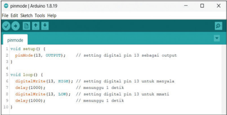

> **Deskripsi Visual:** Gambar ini menunjukkan interface Arduino IDE (Integrated Development Environment) versi 1.8.19 dengan skrip kode yang ditampilkan di jendela Sketch. Skrip tersebut berisi dua fungsi: `setup()` dan `loop()`. Fungsi `setup()` mengatur pin digital 13 sebagai output menggunakan perintah `pinMode(13, OUTPUT)`. Fungsi `loop()` mengatur pin digital 13 untuk menyalakan menggunakan `digitalWrite(13, HIGH)` dan mematikan menggunakan `digitalWrite(13, LOW)`, dengan interval waktu 1000 detik antara setiap perubahan status pin.

Elemen utama dalam gambar adalah interface IDE dengan menu navigasi seperti File, Edit, Sketch, Tools, dan Help. Di bagian tengah, ada jendela Sketch yang menampilkan kode skrip. Untuk fungsi `setup()`, ada teks "pinMode(13, OUTPUT)" yang menjelaskan pengaturan pin. Untuk fungsi `loop()`, ada dua baris kode yang menjelaskan cara mengubah status pin digital 13 antara HIGH dan LOW, dengan delay 1000 detik antara setiap perubahan.

Informasi kunci yang dapat diambil dari gambar ini adalah bahwa ini adalah contoh program Arduino yang digunakan untuk mengatur dan mengubah status pin digital 13 antara HIGH dan LOW dengan interval waktu tertentu.

 

---
## 📄 Halaman 104

---
**🖼️ Gambar/Diagram**

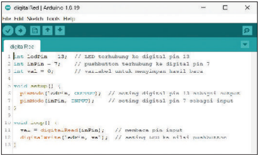

> **Deskripsi Visual:** Gambar ini adalah diagram yang menunjukkan struktur dan fungsi komponen sistem operasi. Diagram ini memperlihatkan berbagai komponen seperti CPU, RAM, hard disk, dan motherboard. Setiap komponen memiliki label yang menjelaskan fungsinya. Misalnya, CPU dinyatakan sebagai Central Processing Unit, RAM sebagai Random Access Memory, dan hard disk sebagai Hard Disk Drive. Diagram ini juga menunjukkan hubungan antara komponen-komponen tersebut, seperti bagaimana data masuk ke RAM dan kemudian diproses oleh CPU. Label "Jaringan" menunjukkan bahwa ada komunikasi antar komputer melalui jaringan. Teks dan angka pada diagram ini membantu pembaca memahami struktur dan fungsi setiap komponen serta bagaimana mereka bekerja bersama-sama untuk menjalankan sistem operasi.

---
**🖼️ Gambar/Diagram**

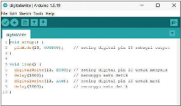

> **Deskripsi Visual:** Gambar ini menunjukkan sebuah skrip kode dalam bahasa C yang digunakan untuk mengatur dan mengukur nilai digital pada pin GPIO (General Purpose Input/Output) pada mikrokontroler Arduino. Skrip ini terdiri dari dua fungsi utama: `setup()` dan `loop()`. Fungsi `setup()` dijalankan sekali hanya saat program dimulai, dan dalam fungsi ini, pin GPIO 13 diatur sebagai output menggunakan perintah `pinMode(13, OUTPUT);`. Selanjutnya, fungsi `loop()` berulang-ulang, dan dalam setiap iterasi, pin GPIO 13 diatur ke status 'on' dengan perintah `digitalWrite(13, HIGH);` dan kemudian diatur kembali ke status 'off' dengan perintah `digitalWrite(13, LOW);`. Ini menunjukkan bahwa pin GPIO 13 digunakan untuk menghasilkan sinyal digital yang berpulang-pulang antara 'on' dan 'off'. Label "delay(1000);" dalam fungsi `loop()` menunjukkan bahwa ada interval waktu tertentu yang diberikan sebelum proses berulang. Label "delayMicroseconds(1000);" dalam fungsi `setup()` menunjukkan bahwa ada interval waktu mikrodetik tertentu yang diberikan sebelum proses berulang. Label "delay(1000);" dalam fungsi `setup()` menunjukkan bahwa ada interval waktu tertentu yang diberikan sebelum proses berulang. Label "delayMicroseconds(1000);" dalam fungsi `setup()` menunjukkan bahwa ada interval waktu mikrodetik tertentu yang diberikan sebelum proses berulang. Label "delay(1000);" dalam fungsi `setup()` menunjukkan bahwa ada interval waktu tertentu yang diberikan sebelum proses berulang. Label "delayMicroseconds(1000);" dalam fungsi `setup()` menunjukkan bahwa ada interval waktu mikrodetik tertentu yang diberikan sebelum proses berulang. Label "delay(1000);" dalam fungsi `setup()` menunjukkan bahwa ada interval waktu tertentu yang diberikan sebelum proses berulang. Label "delayMicroseconds(1000

 

---
## 📄 Halaman 105

---
**🖼️ Gambar/Diagram**

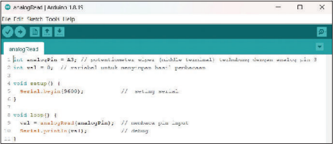

> **Deskripsi Visual:** Gambar ini menunjukkan sebuah jendela program Visual Studio dengan kode Java yang sedang dieksekusi. Kode tersebut terdiri dari beberapa blok kode yang berisi komentar dan instruksi untuk menjalankan program. Di bawah kode, terdapat tampilan hasil dari program, yaitu "stringTest". 

Elemen utama yang ditampilkan adalah kode Java dan hasil eksekusi program. Kode Java terdiri dari beberapa blok kode yang berisi komentar dan instruksi untuk menjalankan program. Hasil eksekusi program ditampilkan di bawah kode, yaitu "stringTest".

Informasi kunci yang dapat diambil pembaca meliputi:

1. Program ini menggunakan bahasa pemrograman Java.
2. Program ini mungkin berfungsi untuk menguji atau menjalankan fungsi-fungsi tertentu dalam sistem operasi atau aplikasi.
3. Hasil eksekusi program adalah string "stringTest".
4. Kode ini mungkin merupakan bagian dari tutorial atau contoh program dalam buku pelajaran tentang pemrograman Java.

Dari gambar ini, dapat disimpulkan bahwa program ini mungkin digunakan untuk menguji atau menjalankan fungsi-fungsi tertentu dalam sistem operasi atau aplikasi, dan hasilnya adalah string "stringTest".

 

---
## 📄 Halaman 106

### giairt.

---
**🖼️ Gambar/Diagram**

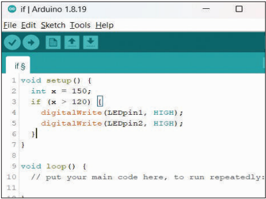

> **Deskripsi Visual:** Gambar ini menunjukkan interface pengembangan perangkat lunak Arduino yang digunakan untuk menulis kode program. Di bagian atas, terdapat menu dengan opsi seperti File, Edit, Sketch, Tools, dan Help. Dibawah itu, terdapat blok kode yang menunjukkan contoh kode Arduino. Kode tersebut mencakup dua fungsi utama: setup() dan loop(). Fungsi setup() memiliki satu baris kode yang menginisialisasi variabel 'k' dengan nilai 150 dan memeriksa kondisi jika 'k' sama dengan 150. Jika benar, maka akan diprogramkan pin digital 13 menjadi LOW dan pin digital 2 menjadi HIGH. Fungsi loop() adalah tempat untuk menempatkan kode yang akan berjalan terus-menerus.

 

---
## 📄 Halaman 107

---
**🖼️ Gambar/Diagram**

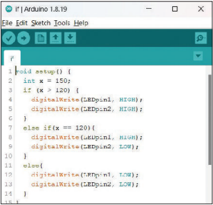

> **Deskripsi Visual:** Gambar ini menunjukkan sketsa alat bantu program (Sketch) pada perangkat Arduino IDE versi 1.8.9. Sketsa ini berisi kode sederhana untuk mengatur pin digital pada Arduino. Kode tersebut mencakup beberapa komponen utama:

1. **Kode Sederhana**: Ada sebuah fungsi `setup()` yang diinisialisasi pin digital pada Arduino. Pin 15 dan 16 diinisialisasi sebagai output digital menggunakan `digitalWrite()`. 

2. **Pilihan Kontrol**: Ada dua kondisi dalam kode ini. Jika variabel `if` bernilai 150, maka pin 15 akan diinisialisasi sebagai LOW, sedangkan jika `if` bernilai 123, maka pin 16 akan diinisialisasi sebagai LOW.

3. **Angka dan Label**: Angka-angka seperti 150, 123, dan 16 muncul dalam kode, serta ada label seperti "digitalWrite()" yang digunakan untuk menginisialisasi pin.

4. **Informasi Penting**: Gambar ini memberikan panduan tentang bagaimana menginisialisasi pin digital pada Arduino menggunakan perangkat lunak Arduino IDE. Ini membantu pembaca memahami cara kerja perangkat lunak dan bagaimana mengatur pin pada perangkat Arduino.

Dengan demikian, gambar ini adalah ilustrasi yang membantu pembaca memahami bagaimana mengatur pin digital pada Arduino menggunakan perangkat lunak Arduino IDE.

 

---
## 📄 Halaman 110

---
**📊 Tabel**

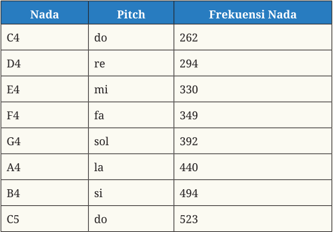

Tabel ini menunjukkan daftar nada musik dengan pitch dan frekuensi nada mereka. Topik utama tabel adalah nada musik dan frekuensinya. Kolom "Nada" berisi nama-nama nada musik seperti C4, D4, E4, dan sebagainya. Kolom "Pitch" menyatakan tingkat nada masing-masing nada tersebut. Kolom "Frekuensi Nada" menunjukkan frekuensi nada masing-masing nada dalam hertz (Hz). Data penting yang terlihat adalah bahwa frekuensi nada naik dari C4 ke C5, yang berarti ada perubahan frekuensi yang signifikan dari nada dasar ke nada yang lebih tinggi.

 

---
## 📄 Halaman 112

---
**🖼️ Gambar/Diagram**

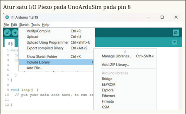

> **Deskripsi Visual:** Gambar ini adalah sebuah sketsa atau ilustrasi yang menunjukkan interface pengembangan perangkat lunak Arduino di komputer. Gambar ini menampilkan beberapa elemen penting seperti menu "Sketch", "Tools", dan "Help". Di bagian bawah, terdapat kode C++ yang ditampilkan dalam format teks, dengan beberapa baris kode yang terpisah. Terdapat juga beberapa tombol dan ikon yang digunakan untuk mengelola proyek, termasuk "Upload Sketch", "Verify/Compile", dan "Include Library". Ini menunjukkan proses pengembangan perangkat lunak Arduino di komputer, dengan fokus pada penggunaan tools dan kode yang ada.

 

---
## 📄 Halaman 114

---
**🖼️ Gambar/Diagram**

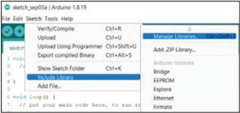

> **Deskripsi Visual:** Gambar ini adalah ilustrasi yang menunjukkan interface pengembangan perangkat lunak (IDE) untuk bahasa pemrograman C++. Pada bagian atas, terdapat menu "Edit" dengan beberapa opsi seperti "Get Context Help", "Add to Project", dan lain-lain. Di bawah itu, terdapat panel "Messages" yang menampilkan pesan error atau informasi lainnya. Panel ini memiliki beberapa baris teks yang berisi pesan, termasuk "Upload Using Programmer", "Upload Using Programmer", "Upload Using Programmer", dan lain-lain. Di sebelah kanan panel "Messages", terdapat ikon-ikon yang mungkin menggambarkan status atau tindakan yang dapat dilakukan, seperti "Add ZIP Library", "Add ZIP Library", dan "Add ZIP Library". Seluruh gambar ini menunjukkan proses pengembangan kode dalam IDE, dengan fokus pada pengaturan dan kontrol pesan yang muncul selama proses tersebut.

 

---
## 📄 Halaman 115

### KEMENTERIANPENDIDIKAN,KEBUDAYAAN,RISET,DANTEKNOLOGI REPUBLIKINDONESIA,2022

InformatikauntukSMA/MAKelasXII

Penulis : Budi Permana, dkk.

ISBN

[: 978-602-427-948-6 (jil.3)

Bab 4

### Jaringan Komputer danInternet

 

---
## 📄 Halaman 116

---
**🖼️ Gambar/Diagram**

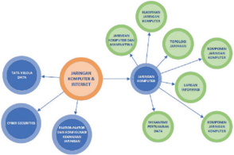

> **Deskripsi Visual:** Gambar ini adalah diagram yang menunjukkan struktur dan komponen dari jaringan komunikasi internet. Diagram ini terdiri dari beberapa elemen utama yang saling terkait:

1. **Jaringan Komunikasi Internet** adalah titik pusat yang menghubungkan semua komponen lainnya.
2. **Komponen Kunci** meliputi:
   - **Teks Angka Data**: Menunjukkan informasi atau data yang dikirim atau diterima dalam jaringan.
   - **Pengirim Data**: Menunjukkan sumber yang mengirim teks angka data.
   - **Penerima Data**: Menunjukkan destinasi atau penerima yang menerima teks angka data.
   - **Fluktuasi Jangka Panjang**: Menunjukkan perubahan atau variasi dalam jaringan selama waktu yang lama.
   - **Fluktuasi Jangka Pendek**: Menunjukkan perubahan atau variasi dalam jaringan selama waktu yang pendek.
   - **Perangkat Lunak**: Menunjukkan software yang digunakan dalam jaringan.
   - **Perangkat Fisik**: Menunjukkan perangkat fisik seperti router, switch, dan lainnya yang berperan dalam jaringan.

3. **Elemen-elemen utama dan relasinya**:
   - Jaringan Komunikasi Internet merupakan pusat yang menghubungkan semua komponen lainnya.
   - Pengirim Data dan Penerima Data saling terkait dengan Jaringan Komunikasi Internet.
   - Fluktuasi Jangka Panjang dan Fluktuasi Jangka Pendek saling terkait dengan Jaringan Komunikasi Internet.
   - Perangkat Lunak dan Perangkat Fisik saling terkait dengan Jaringan Komunikasi Internet.

4. **Informasi kunci yang dapat diambil pembaca**:
   - Jaringan Komunikasi Internet adalah pusat yang menghubungkan semua komponen lainnya.
   - Pengirim Data dan Penerima Data saling terkait dengan Jaringan Komunikasi Internet.
   - Fluktuasi Jangka Panjang dan Fluktuasi Jangka Pendek saling terkait dengan Jaringan Komunikasi Internet.
   - Perangkat Lunak dan Perangkat

 

---
## 📄 Halaman 118

---
**📊 Tabel**

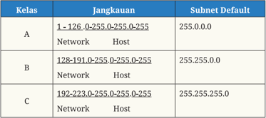

Tabel ini menunjukkan struktur subnetting dalam jaringan komputer. Topik utamanya adalah penggunaan subnetting untuk membagi jaringan menjadi sub-jaringan yang lebih kecil dan efisien. Tabel ini memiliki tiga kolom: Kelas, Jangkauan, dan Subnet Default. Kelas merujuk pada kelas subnet yang digunakan untuk memilih subnet mask yang tepat. Jangkauan menunjukkan rentang IP address yang dapat digunakan dalam sub-jaringan tersebut. Subnet Default adalah subnet mask yang digunakan untuk mengidentifikasi sub-jaringan. Pola penting yang terlihat adalah bahwa setiap kelas memiliki subnet mask yang berbeda, dengan kelas A menggunakan 255.0.0.0, kelas B menggunakan 255.255.0.0, dan kelas C menggunakan 255.255.255.0. Ini membantu dalam memilih subnet mask yang tepat untuk setiap sub-jaringan.

 

---
## 📄 Halaman 119

---
**📊 Tabel**

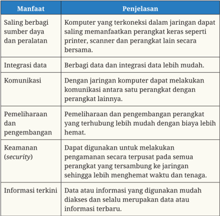

Tabel ini membahas berbagai manfaat dari komunikasi jaringan komputer. Topik utamanya adalah manfaat dari komunikasi jaringan, seperti saling berbagi sumber daya dan peralatan, integrasi data, komunikasi, pemeliharaan dan pengembangan, keamanan (security), dan informasi terkini. Kolom pertama menunjukkan manfaat, sedangkan kolom kedua menjelaskan secara spesifik apa itu manfaat tersebut. Misalnya, saling berbagi sumber daya dan peralatan melibatkan komputer yang terkoneksikan dalam jaringan dapat saling memanfaatkan perangkat keras seperti printer, scanner, dan perangkat lain secara bersama-sama. Ini memungkinkan pengguna untuk mengakses dan menggunakan perangkat yang tersedia di jaringan mereka dengan lebih mudah.

 

---
## 📄 Halaman 120

---
**🖼️ Gambar/Diagram**

> **Deskripsi Visual:** Gambar ini adalah diagram yang menunjukkan struktur komputer dan perangkat lainnya dalam sebuah jaringan komputer. Gambar ini menggambarkan berbagai komponen yang terhubung ke satu sama lain melalui kabel dan antena. Komponen-komponen utama termasuk laptop, desktop, smartphone, tablet, printer, mouse, keyboard, headset, dan speaker. Setiap komponen tersebut terhubung ke jaringan melalui kabel dan antena, menunjukkan hubungan antara mereka dalam jaringan komputer. Teks, angka, atau label penting yang terlihat pada gambar ini tidak ada, namun informasi kunci yang dapat diambil pembaca adalah bahwa semua perangkat ini terhubung ke jaringan komputer dan dapat berkomunikasi dengan satu sama lain.

 

---
## 📄 Halaman 121

---
**🖼️ Gambar/Diagram**

> **Deskripsi Visual:** Gambar ini adalah ilustrasi yang menunjukkan struktur jaringan komputer. Ilustrasi ini menggambarkan berbagai perangkat komputer dan peralatan jaringan yang terhubung melalui kabel dan antena. Perangkat seperti laptop, desktop, router, dan modem terlihat dengan jelas, menunjukkan hubungan antara mereka dalam sebuah jaringan komputer. Ilustrasi ini juga menunjukkan beberapa perangkat jaringan seperti switch dan firewall, yang membantu dalam pengaturan dan keamanan jaringan. Teks pada gambar tidak menyebutkan informasi spesifik, tetapi ilustrasi ini memberikan gambaran umum tentang bagaimana komponen-komponen jaringan komputer bekerja bersama-sama untuk mendukung komunikasi dan transfer data antar perangkat.

 

---
## 📄 Halaman 123

---
**🖼️ Gambar/Diagram**

> **Deskripsi Visual:** Gambar ini adalah diagram yang menunjukkan struktur komputer. Diagram ini terdiri dari empat komputer yang disusun dalam bentuk persegi panjang. Setiap komputer memiliki layar, keyboard, dan mouse. Layar setiap komputer tampak aktif, menunjukkan bahwa mereka berfungsi dengan baik. Antarmuka pengguna (GUI) pada setiap komputer tampak jelas, menunjukkan bahwa mereka mungkin sedang menjalankan aplikasi atau program tertentu. Label "Komputer" telah diberikan pada setiap komputer untuk membedakannya. Informasi kunci yang dapat diambil dari gambar ini adalah bahwa ada empat komputer yang saling terhubung dalam sebuah jaringan komputer, mungkin untuk tujuan komputasi bersama atau kerja tim.

---
**🖼️ Gambar/Diagram**

> **Deskripsi Visual:** Gambar ini adalah diagram yang menunjukkan struktur jaringan komputer. Dalam diagram ini, ada satu hub central yang menghubungkan empat komputer lainnya. Hub central merupakan pusat dari jaringan ini, memungkinkan semua komputer untuk berkomunikasi satu sama lain. Setiap komputer memiliki satu port yang terhubung ke hub central, menunjukkan bahwa setiap komputer dalam jaringan ini memiliki akses ke sumber daya yang sama. Diagram ini menunjukkan bahwa hub central adalah elemen penting dalam jaringan ini, karena ia memungkinkan semua komputer untuk berkomunikasi satu sama lain.

 

---
## 📄 Halaman 124

---
**🖼️ Gambar/Diagram**

> **Deskripsi Visual:** Gambar ini adalah diagram yang menunjukkan hubungan antara beberapa komputer dalam jaringan. Diagram ini menggambarkan hubungan komputer melalui koneksi jaringan, dengan setiap komputer dihubungkan ke satu atau lebih komputer lainnya. Setiap komputer diwakili oleh kotak berwarna, dan koneksi antar komputer diperlihatkan dengan garis lurus yang menghubungkan mereka. Elemen-elemen utama dalam diagram ini adalah komputer dan koneksi antar mereka. Komputer digambarkan sebagai objek yang berbeda, sedangkan koneksi antar mereka digambarkan sebagai relasi atau hubungan. Teks, angka, atau label penting yang terlihat pada gambar ini tidak ada, karena semua informasi penting disajikan melalui bentuk dan relasi yang digambarkan. Informasi kunci yang dapat diambil pembaca adalah bahwa ada hubungan komputer dalam jaringan dan bagaimana mereka terhubung satu sama lain.

---
**🖼️ Gambar/Diagram**

> **Deskripsi Visual:** Gambar ini adalah diagram yang menunjukkan struktur hubungan antara dua jenis hubungan: Hubul Utama dan Hubul Sekunder. Diagram ini terdiri dari dua bagian utama:

1. **Pertama**: Bagian atas diagram menunjukkan Hubul Utama, yang terdiri dari satu komputer yang terhubung ke sebuah jaringan atau server utama.

2. **Kedua**: Bagian bawah diagram menunjukkan Hubul Sekunder, yang terdiri dari beberapa komputer yang terhubung ke jaringan sekunder.

**Elemen-elemen utama dan relasinya**:
- **Hubul Utama** (atas): Komputer utama yang terhubung ke jaringan utama.
- **Hubul Sekunder** (bawah): Beberapa komputer yang terhubung ke jaringan sekunder.
- **Jaringan Utama**: Menghubungkan Hubul Utama dengan komputer lain.
- **Jaringan Sekunder**: Menghubungkan Hubul Sekunder dengan komputer lain.

**Teks, angka, atau label penting yang terlihat**:
- Ada label "Hubul Utama" dan "Hubul Sekunder" yang menjelaskan jenis-jenis hubungan tersebut.
- Ada angka 1 untuk Hubul Utama dan angka 2 untuk Hubul Sekunder.

**Informasi kunci yang dapat diambil pembaca**:
- Gambar ini menggambarkan dua jenis hubungan jaringan: Hubul Utama dan Hubul Sekunder.
- Hubul Utama lebih besar dan lebih kuat dibandingkan Hubul Sekunder.
- Jaringan Utama dan Jaringan Sekunder merupakan bagian dari struktur jaringan yang lebih besar.

Dengan demikian, gambar ini memberikan gambaran tentang struktur jaringan yang lebih kompleks dan bagaimana hubungan antara dua jenis hubungan utama dalam sistem jaringan.

 

---
## 📄 Halaman 125

---
**📊 Tabel**

Tabel ini membahas dua aspek teknis penting dalam proses pembuatan suatu jaringan komputer: analisis kebutuhan dan biaya. Topik utama tabel ini adalah bagaimana memastikan bahwa jaringan komputer dibangun sesuai dengan kebutuhan dan keterbatasan biaya. Dalam aspek analisis kebutuhan, tabel menyatakan bahwa setiap jaringan harus dilakukan analisis yang mendalam sejak awal untuk memastikan bahwa semua kebutuhan telah dipenuhi. Ini mencakup penggunaan sumber daya, kapasitas, dan fungsi yang diharapkan dari jaringan tersebut. Aspek biaya juga disebutkan, di mana pembangunan jaringan harus disesuaikan dengan ketersediaan biaya. Tujuan dari ini adalah untuk memastikan bahwa jaringan dapat dibangun dengan biaya yang masuk akal dan sesuai dengan kebutuhan yang telah ditentukan sebelumnya. Dengan demikian, tabel ini memberikan panduan yang penting bagi tim yang bekerja pada pembuatan jaringan komputer agar dapat memastikan bahwa hasil yang dihasilkan sesuai dengan kebutuhan dan tidak melebihi batas biaya yang diperbolehkan.

 

---
## 📄 Halaman 126

---
**📊 Tabel**

Tabel ini membahas berbagai aspek teknis penting dalam pembuatan jaringan komputer, termasuk skala, lokasi, kondisi/keadaan, konfigurasi, keamanan, integrasi, dan topologi yang tepat. Skala berkaitan dengan luas ruangannya atau bangunannya, lokasi dengan posisinya, kondisi/keadaan yang mungkin mengganggu, konfigurasi untuk tujuan penggunaan, keamanan untuk melindungi jaringan, integrasi dengan perangkat lain, dan topologi yang tepat untuk efisiensi dan stabilitas. Setiap aspek memiliki implikasi khusus dalam proses pembuatan jaringan komputer.

 

---
## 📄 Halaman 127

---
**📊 Tabel**

Tabel ini membahas aspek teknis pengelolaan dan pemeliharaan jaringan komputer. Topik utamanya adalah bagaimana aspek tersebut harus diperhatikan agar jaringan dapat bertahan lama dan terhindar dari kerusakan yang mengakibatkan jaringan tidak berfungsi. Dalam tabel ini, kolom pertama berisi aspek teknis, sedangkan kolom kedua berisi penjelasan tentang aspek tersebut. Data penting yang terlihat adalah bahwa aspek pengelolaan dan pemeliharaan harus diperhatikan untuk menjaga jaringan komputer agar tetap stabil dan berfungsi dengan baik.

 

---
## 📄 Halaman 129

---
**🖼️ Gambar/Diagram**

> **Deskripsi Visual:** Gambar ini adalah diagram yang menunjukkan struktur model OSI (Open Systems Interconnection) untuk komunikasi jaringan. Model ini terdiri dari empat lapisan utama, masing-masing bertanggung jawab untuk fungsi tertentu dalam proses komunikasi:

1. **Lapisan Data**:
   - Ini mencakup semua informasi yang dikirimkan antara dua perangkat.
   - Contoh: data teks, gambar, atau suara.

2. **Lapisan Layanan**:
   - Fokus pada pengaturan dan manajemen layanan.
   - Contoh: pengaturan koneksi, pemilihan alamat IP, dan pengaturan keamanan.

3. **Lapisan Presentasi**:
   - Menangani representasi data dalam format yang dapat dipahami oleh aplikasi.
   - Contoh: enkripsi, desenripsi, dan konversi format data.

4. **Lapisan Jaringan**:
   - Mengontrol transmisi data antar perangkat berbeda.
   - Contoh: pengaturan alamat IP, routing, dan penyimpanan data.

5. **Lapisan Transport**:
   - Memastikan bahwa data tiba di tempat yang benar dan dalam kondisi baik.
   - Contoh: pengiriman data, pemulihan kesalahan, dan pengaturan koneksi.

6. **Lapisan Sesi**:
   - Mengatur hubungan antar dua perangkat selama proses komunikasi.
   - Contoh: pengaturan dan penutupan koneksi.

7. **Lapisan Pengiriman**:
   - Mengatur proses pengiriman data antar perangkat.
   - Contoh: pengiriman paket, pengiriman frame, dan pengiriman bit.

8. **Lapisan Physical**:
   - Mengatur cara data dikirim melalui saluran fisik.
   - Contoh: penggunaan kabel, radio, atau jaringan wireless.

Teks, angka, atau label penting yang terlihat dalam gambar termasuk nama-nama lapisan (Data, Layanan, Presentasi, Jaringan, Transport, Sesi, Pengiriman, Physical), serta arah panah yang menunjukkan arah data

 

---
## 📄 Halaman 130

---
**🖼️ Gambar/Diagram**

> **Deskripsi Visual:** Gambar ini adalah diagram yang menunjukkan struktur lapisan jaringan komputer. Diagram ini terdiri dari empat lapisan utama yang disebutkan sebagai Network Access, Internet Layer, Transport Layer, dan Application Layer. Setiap lapisan memiliki peran spesifik dalam proses pengiriman data antar perangkat komputer.

1. **Network Access**: Ini adalah lapisan pertama yang berhubungan langsung dengan perangkat fisik, seperti kabel atau antena.
2. **Internet Layer**: Lapisan ini bertanggung jawab untuk mengirim paket data ke lapisan berikutnya.
3. **Transport Layer**: Lapisan ini bertanggung jawab untuk memastikan bahwa data dikirim dengan benar dan tidak hilang.
4. **Application Layer**: Lapisan ini bertanggung jawab untuk menjalankan aplikasi dan mengirim data kepada pengguna.

Teks, angka, atau label penting yang terlihat pada gambar ini adalah:

- **1. Network Access**
- **2. Internet Layer**
- **3. Transport Layer**
- **4. Application Layer**

Informasi kunci yang dapat diambil pembaca adalah bahwa struktur lapisan jaringan komputer terdiri dari empat lapisan yang saling terkait dan bertanggung jawab untuk mengirim dan menerima data antar perangkat komputer.

 

---
## 📄 Halaman 133

 

---
## 📄 Halaman 135

 

---
## 📄 Halaman 137

Sumber:https://www.google.com/intl/id_id/chrome/

 

---
## 📄 Halaman 138

 

---
## 📄 Halaman 139

---
**📊 Tabel**

Tabel ini berisi informasi tentang identifikasi komponen perangkat keras dan lunak, serta keterangan atau pendapat tanggapan kelompok terhadap hasil identifikasi tersebut. Topik utama tabel adalah identifikasi komponen perangkat keras dan lunak. Kolom pertama menunjukkan jenis komponen, sedangkan kolom kedua menunjukkan hasil identifikasi seperti nama perangkat, merk, port, dll. Kolom ketiga menyajikan keterangan atau pendapat tanggapan kelompok terhadap hasil identifikasi tersebut. Data penting yang terlihat adalah bahwa tabel ini mencakup dua jenis komponen: perangkat keras dan lunak, serta menunjukkan bahwa ada beberapa kolom yang kosong, mungkin karena informasi tersebut belum tersedia atau tidak relevan untuk semua kasus.

 

---
## 📄 Halaman 142

---
**📊 Tabel**

Tabel ini berisi informasi tentang kabel coaxial, yang merupakan jenis kabel data yang terbuat dari material tembaga terdiri dari 2 bagian yaitu kabel inti di tengah dan dikelilingi kabel serabut di sisi samping dengan dipisahkan oleh suatu isolator. Kabel ini menggunakan konектор Bayonet Nut Connector (BNC). Topik utama tabel ini adalah penjelasan tentang kabel coaxial, termasuk pembagian kabel menjadi dua bagian, karakteristik kabel, dan jenis konектор yang digunakan. Kolom-kolom yang ada dalam tabel ini adalah Nama Kabel dan Gambar. Data atau pola penting yang terlihat dalam tabel ini adalah bahwa kabel coaxial terdiri dari kabel inti dan kabel serabut, serta menggunakan konector BNC untuk penghubung.

 

---
## 📄 Halaman 143

---
**📊 Tabel**

Tabel ini menjelaskan tentang Bluetooth, sebuah teknologi jaringan kawasan pribadi (Personal Area Networks atau PAN) yang tidak memerlukan kabel untuk berkomunikasi. Bluetooth digunakan untuk menghubungkan perangkat elektronik yang dekat satu sama lain, seperti ponsel pintar, komputer, dan peralatan rumah tangga, untuk melakukan tukar-menukkan data dengan cepat dan efisien. Topik utama tabel ini adalah Bluetooth dan penjelasannya, yang mencakup penggunaan, fungsi, dan kegunaan teknologi ini dalam dunia digital.

 

---
## 📄 Halaman 144

---
**📊 Tabel**

Tabel ini membahas dua jenis gelombang elektromagnetik: InfraRed (inframerah) dan gelombang radio. InfraRed adalah gelombang elektromagnetik yang memiliki panjang gelombang pendek, berada di bawah cahaya merah dan di atas inframerah. Ini digunakan untuk komunikasi jarak dekat, seperti pengenalan suara atau deteksi gerakan, dengan batas jarak maksimal sekitar 10 meter. Gelombang radio, lainnya, adalah gelombang elektromagnetik yang memiliki panjang gelombang yang lebih panjang daripada InfraRed. Gelombang radio sangat populer dalam penggunaannya saat ini, terutama dalam teknologi WiFi, karena dapat menyebar jauh dan tidak terpengaruh oleh pembatas fisik. Topik utama tabel ini adalah perbandingan antara InfraRed dan gelombang radio dalam hal sifat, aplikasi, dan batas jarak komunikasi mereka.

 

---
## 📄 Halaman 145

---
**🖼️ Gambar/Diagram**

> **Deskripsi Visual:** Gambar ini adalah ilustrasi yang menunjukkan dua jenis kabel Ethernet, yaitu T-568A dan RJ-45 Plug. Ilustrasi ini memperlihatkan detail dari kedua jenis kabel tersebut, termasuk posisi pin pada kabel.

1. Apa yang ditampilkan secara keseluruhan:
Ilustrasi ini menunjukkan dua jenis kabel Ethernet, yaitu T-568A dan RJ-45 Plug, serta posisi pin pada kedua kabel tersebut.

2. Elemen-elemen utama dan relasinya:
Elemen utama yang ditampilkan adalah dua kabel Ethernet, satu dengan warna hijau dan satu dengan warna merah. Kedua kabel ini memiliki posisi pin yang sama, yang menunjukkan bahwa mereka adalah versi yang sama dari kabel Ethernet. Ilustrasi juga menunjukkan bagian kabel yang ditempatkan di ujung kabel, yang merupakan bagian penting untuk penggunaan kabel Ethernet.

3. Teks, angka, atau label penting yang terlihat:
Teks dan angka penting yang terlihat pada ilustrasi ini adalah "T-568A" dan "RJ-45 Plug", yang menunjukkan jenis kabel yang ditampilkan. Angka "Pin 1" juga ditunjukkan pada ilustrasi, yang menunjukkan posisi pin pada kabel.

4. Informasi kunci yang dapat diambil pembaca:
Informasi kunci yang dapat diambil pembaca adalah bahwa ilustrasi ini menunjukkan dua jenis kabel Ethernet, yaitu T-568A dan RJ-45 Plug, serta posisi pin pada kedua kabel tersebut. Ini membantu pembaca dalam memahami cara penggunaan kabel Ethernet dan posisinya pada kabel.

---
**🖼️ Gambar/Diagram**

> **Deskripsi Visual:** Gambar ini adalah ilustrasi yang menunjukkan konfigurasi pin pada kabel RJ-45 Plug. Gambar ini memperlihatkan dua kabel Ethernet yang terhubung ke sebuah perangkat komputer, masing-masing dengan label "T-568A" dan "T-568B". Kabel-kabel ini memiliki warna berbeda untuk setiap pin, yang merupakan bagian penting dari konfigurasi kabel Ethernet. Setiap pin memiliki label yang menunjukkan posisinya dalam kabel, seperti "1", "2", "3", dan "6". Label ini membantu dalam mengidentifikasi dan mengatur pin pada kabel Ethernet agar dapat berfungsi dengan benar. Ini adalah ilustrasi yang sangat berguna untuk pemahaman tentang konfigurasi kabel Ethernet dan cara penggunaannya dalam sistem komunikasi.

 

---
## 📄 Halaman 147

---
**📊 Tabel**

Tabel ini membahas dua konsep penting dalam keamanan cyber: kerahasiaan (confidentiality) dan integritas (integrity). Kerahasiaan mencakup bagaimana data dan informasi dikekang untuk memastikan bahwa hanya orang yang berhak dapat mengaksesnya. Misalnya, database keuangan hanya bisa diakses oleh akuntansi saja. Sementara itu, integritas menekankan pada keperluan untuk memastikan bahwa data yang dikirim atau disimpan adalah valid, konsisten, dan terpercaya. Contoh ini melibatkan produk online yang harus memiliki lisensi untuk dijual, sehingga informasi produk yang disampaikan harus autentik. Dua konsep ini saling berkaitan dan penting dalam menjaga keamanan sistem informasi digital.

 

---
## 📄 Halaman 148

---
**📊 Tabel**

Tabel ini membahas konsep Cyber Security dengan fokus pada ketersediaan (Availability). Topik utama adalah ketersediaan sistem dan aplikasi, terutama mobile banking, yang merupakan contoh penting. Dalam konteks ini, ketidakmampuan untuk mengakses layanan tersebut dapat berdampak negatif pada hak konsumen. Misalnya, ketika mobile banking mengalami gangguan, maka harus ada sistem backup yang menangani masalah tersebut. Ini menunjukkan bahwa ketersediaan sistem dan aplikasi adalah aspek penting dalam Cyber Security, karena kegagalan sistem dapat merugikan pengguna dan mempengaruhi operasional bisnis.

 

---
## 📄 Halaman 149

---
**📊 Tabel**

Tabel ini membahas tiga jenis ancaman berbasis komputer yang sering dianggap sebagai bentuk kejahatan digital. Topik utamanya adalah ancaman cyber, yang meliputi Cyber Attack, Cyber Crime, dan Cyber Terrorism. Cyber Attack merujuk pada serangan yang bertujuan untuk merusak reputasi atau kepentingan nama baik individu atau organisasi. Cyber Crime mencakup kejahatan seperti pencurian data atau manipulasi sistem komputer untuk tujuan ilegal, seperti mencuri uang atau informasi pribadi. Cyber Terrorism melibatkan penyerangan sistem komputer dengan tujuan ekstremis, seperti mempengaruhi politik atau mempengaruhi keamanan umum. Pola penting yang terlihat adalah bahwa semua tiga jenis ancaman ini berkaitan erat dengan keamanan dan integritas sistem komputer, serta dapat memiliki dampak serius terhadap individu, organisasi, dan masyarakat secara keseluruhan.

---
**📊 Tabel**

Tabel ini membahas metode serangan phishing, yang merupakan tindakan penipuan untuk memperoleh informasi rahasia dari korban. Dalam contoh yang diberikan, pesan email yang tampak resmi meminta informasi password, yang merupakan salah satu bentuk phishing yang umum digunakan. Metode ini bertujuan untuk mencuri identitas dan informasi pribadi korban, seperti nomor kartu kredit, alamat email, dan password. Ini menunjukkan bahwa phishing adalah bentuk serangan yang serius dan perlu diwaspadai oleh individu dan organisasi.

 

---
## 📄 Halaman 150

---
**📊 Tabel**

Tabel ini membahas berbagai metode serangan yang umum digunakan oleh peretas untuk merusak sistem komputer atau mengambil data sensitif dari korban. Topik utama tabel adalah metode serangan tersebut, yang dijelaskan secara singkat dalam kolom "Penjelasan". Metode serangan meliputi Bootnets dan Zombies, Injeksi SQL (Structured Query Language), Denial-of-Service, Man-in-the-Middle, Malware, Virus, dan Spyware. Setiap metode memiliki tujuan yang spesifik dalam mencapai tujuan peretas, seperti memasuki sistem dengan cara yang tidak dikenal, mengambil atau menyimpan data dari jaringan pusat, mengganggu kinerja sistem, menyalin data dari perangkat target, menginfeksi file dan menyebarkan kode bahaya, serta merekam aktivitas korban secara tidak sah. Pola penting yang terlihat adalah bahwa semua metode ini bertujuan untuk mengambil atau mengganggu sistem komputer korban, baik itu dengan cara yang langsung atau tidak langsung.

 

---
## 📄 Halaman 151

---
**📊 Tabel**

Tabel ini membahas tiga metode serangan keamanan komputer yang berbeda: Trojans, Adware, dan Ransomware. Trojans adalah perangkat lunak palsu yang mirip dengan aplikasi resmi, digunakan untuk merusak atau menipu korban. Adware adalah aplikasi ilegal yang memanfaatkan aplikasi resmi untuk menyebarkan malware. Ransomware adalah metode serangan yang mencoba mengisolasi data atau file, kemudian menyerang dengan menawarkan pembayaran tebusan untuk kembali mengakses data yang diretas. Topik utama tabel ini adalah metode serangan keamanan komputer dan penjelasannya. Kolom pertama berisi nama metode serangan, sedangkan kolom kedua berisi penjelasan tentang masing-masing metode tersebut. Data penting yang terlihat adalah bahwa semua metode ini bertujuan untuk merusak atau menipu korban, baik itu dengan cara merusak sistem, menyebarkan malware, atau mengisolasi data.

---
**📊 Tabel**

Tabel ini membahas tiga cara mencegah serangan cyber, yaitu menggunakan antivirus, memperbarui software, dan menggunakan sandi yang kuat. Antivirus berfungsi untuk mendeteksi dan membersihkan perangkat dari ancaman cyber. Cyber crime biasanya berusaha mengintervensi jaringan komputer untuk dieksplotiasi, sehingga rutin memperbarui sistem keamanan terbaru dapat membantu mengatasi masalah ini. Selain itu, gunakan kata sandi yang kuat agar perangkat kalian tidak mudah diakses dan diexploitasi. Kata sandi sebaiknya mengkombinasikan huruf, angka, dan simbol, dan dilakukan penggantian secara rutin. Topik utama tabel ini adalah cara-cara mencegah serangan cyber. Kolom pertama berisi tiga cara mencegah, sedangkan kolom kedua menjelaskan bagaimana cara tersebut bekerja. Data penting yang terlihat adalah bahwa semua tiga cara ini sangat penting untuk melindungi perangkat dari ancaman cyber.

 

---
## 📄 Halaman 152

---
**📊 Tabel**

Tabel ini berisi informasi tentang cara-cara untuk mencegah serangan malware melalui jaringan WiFi dan email. Topik utamanya adalah "Cara Mencegah Serangan Malware". Kolom pertama berisi "Cara Mencegah", sedangkan kolom kedua berisi "Penjelasan". Data penting yang terlihat antara lain: hindari menggunakan WiFi asing karena biasanya tidak aman dan rentan terhadap serangan man-in-the-middle; waspada terhadap email tidak diketahui karena bisa merupakan serangan malware yang mencoba menyerang kalian.

 

---
## 📄 Halaman 154

---
**📊 Tabel**

Tabel ini berisi manfaat dari manajemen data yang lebih baik, dengan penjelasan untuk setiap manfaat. Topik utama tabel adalah manfaat dari manajemen data yang lebih baik. Kolom-kolomnya meliputi: 1) Memiliki satu sumber yang terjamin, 2) Kualitas data yang lebih baik, 3) Manajemen data yang lebih baik, 4) Kepatuhan yang lebih cepat dan konsisten, dan 5) Pengurangan biaya dan margin keuntungan yang lebih tinggi. Data penting yang terlihat adalah bahwa manajemen data yang lebih baik dapat meningkatkan efisiensi operasional, memudahkan audit, dan mengurangi biaya. Selain itu, manajemen data yang lebih baik juga dapat meningkatkan kualitas data dan kepatuhan, serta membantu dalam pengambilan keputusan berdasarkan informasi terkini.

 

---
## 📄 Halaman 156

---
**📊 Tabel**

Tabel ini membahas tiga aspek penting dalam manajemen akses ke database: autentikasi, otorisasi, dan kontrol akses. Autentikasi melibatkan proses pembuktiannya pengguna berdasarkan data yang terjadi dalam proses klaim. Ini dapat dilakukan dengan memasukkan ID pengguna dan kata sandi. Otorisasi bertujuan untuk menjamin setiap pengguna hanya dapat melakukan operasi tertentu seperti membatalkan data, mengubah data, atau bahkan tidak bisa menghapus data. Kontrol akses dikendalikan oleh administrator sistem yang menetapkan izin kepada pengguna berdasarkan identitas pengguna, keanggotaan peran, atau konteks eksekusi kueri. Pola penting yang terlihat adalah bahwa semua aspek ini saling berkaitan dan harus disesuaikan dengan kebijakan keamanan yang ditetapkan.

 

---
## 📄 Halaman 158

---
**📊 Tabel**

Tabel ini membahas tentang keamanan jaringan, khususnya faktor kerahasiaan (confidentiality). Topik utama tabel adalah penjelasan tentang kerahasiaan dalam konteks keamanan komputer dan jaringan. Kolom pertama berisi nama faktor keamanan jaringan, sedangkan kolom kedua berisi penjelasannya. Data penting yang terlihat adalah bahwa kerahasiaan merupakan salah satu komponen keamanan yang paling vital, karena setiap data yang mengandung informasi penting harus dijaga kerahasiannya dan diperlakukan dengan hati-hati untuk mencegah penggunaan tidak sah.

 

---
## 📄 Halaman 159

---
**📊 Tabel**

Tabel ini membahas empat faktor keamanan jaringan: integritas (integritas), ketersediaan (ketersediaan), non-reputasi (non-reputasi), dan autentikasi (autentikasi). Integritas memastikan bahwa faktor keamanan komputer atau jaringan tidak dapat diandalkan dan melindungi data dari serangan cyber. Ketersediaan menunjukkan bahwa layanan harus tersedia dengan mudah dan tidak menjadi gangguan. Non-reputasi mencakup log untuk mengecek keamanan sistem dan jaringan. Autentikasi memastikan bahwa pihak, objek, dan informasi dalam sistem atau jaringan adalah asli dan tidak palsu. Pola penting yang terlihat adalah bahwa semua faktor ini saling berkaitan dan penting untuk menjaga keamanan sistem komputer dan jaringan.

 

---
## 📄 Halaman 160

---
**📊 Tabel**

Tabel ini membahas dua faktor keamanan jaringan: Possession dan Utility. Topik utama tabel adalah bagaimana perangkat lunak dan perangkat keras dapat mempengaruhi keamanan jaringan. Dalam kolom "Penjelasan", faktor Possession menjelaskan bahwa layanan di sisi server memiliki peran penting dalam sistem keamanan, sehingga developer perangkat lunak harus memperhatikan celah keamanan terhadap perangkat lunak dengan cepat. Selain itu, pengelola jaringan atau pengguna server dan workstation harus menjalankan kontrol untuk melakukan "update" masalah keamanan secara regular agar keamanan dapat terus berjalan. Sementara itu, faktor Utility menunjukkan bahwa perangkat keras juga memiliki potensi untuk mempengaruhi keamanan. Misalnya, jika perangkat keras berada pada sebuah wilayah yang tidak aman, maka akan memungkinkan untuk pemasangan perangkat keras yang tidak diinginkan ke dalam jaringan komputer. Penyusupan akan menjadi lebih mudah terjadi, dan memungkinkan orang luar untuk mengubah pengaturannya. Dua faktor ini sangat penting dalam menjaga keamanan jaringan dan memastikan bahwa sistem tidak terkena serangan atau masalah keamanan lainnya.

 

---
## 📄 Halaman 163

---
**🖼️ Gambar/Diagram**

> **Deskripsi Visual:** Gambar ini adalah ilustrasi yang menunjukkan struktur jaringan komputer dengan firewall sebagai pusat kontrol. Ilustrasi ini menggambarkan dua jenis jaringan: LAN (Local Area Network) dan WAN (Wide Area Network). LAN terletak di sebelah kiri gambar, sementara WAN terletak di sebelah kanan. Jaringan LAN terhubung ke firewall melalui kabel LAN, sedangkan jaringan WAN terhubung ke firewall melalui kabel WAN. Firewall berfungsi sebagai penjaga pintu masuk dan keluar untuk kedua jaringan tersebut, memastikan bahwa hanya data yang sah yang dapat masuk atau keluar dari jaringan. Ini menunjukkan bagaimana firewall digunakan untuk melindungi jaringan komputer dari ancaman cyber.

 

---
## 📄 Halaman 167

Penulis : Budi Permana, dkk.

ISBN

:978-602-427-948-6(ji1.3)

---
**🖼️ Gambar/Diagram**

> **Deskripsi Visual:** Buku pelajaran ini berisi informasi tentang dampak sosial informatika, yang diperlihatkan melalui sebuah ilustrasi yang menarik dan informatif. Ilustrasi ini menggambarkan dua robot berbincang-bincang di depan sebuah komputer, yang merupakan simbol teknologi modern. Robot-robot tersebut tampak senang dan berteriak, menunjukkan bahwa informasi dapat memiliki dampak positif dan negatif.

Ilustrasi ini juga menunjukkan beberapa elemen penting lainnya, seperti papan pengumuman dengan teks "HOAX" yang menunjukkan dampak negatif dari informasi, serta papan pengumuman dengan teks "DAMPAK POSITIF" yang menunjukkan dampak positif dari informasi. Ini menunjukkan bahwa informasi dapat memiliki dampak yang sangat beragam, baik positif maupun negatif.

Teks pada ilustrasi ini juga memberikan informasi tambahan, seperti judul bab "Bab 5 Dampak Sosial Informatika", yang menunjukkan bahwa informasi ini adalah bagian dari bab yang lebih besar dalam buku pelajaran ini. ISBN buku juga disebutkan sebagai 978-602-427-948-6 (jil.3), yang menunjukkan bahwa buku ini dapat ditemukan di toko buku atau platform online.

Secara keseluruhan, ilustrasi ini menunjukkan bahwa informasi memiliki dampak yang sangat beragam, baik positif maupun negatif, dan bahwa pembaca harus memahami dan menggunakan informasi dengan bijak untuk kebaikan diri mereka sendiri dan masyarakat.

 

---
## 📄 Halaman 169

---
**🖼️ Gambar/Diagram**

> **Deskripsi Visual:** Gambar ini adalah diagram yang menunjukkan dampak sosial informasi. Diagram ini terdiri dari berbagai elemen yang terkait dengan dampak sosial informasi, yang disusun dalam struktur yang jelas dan terorganisir.

1. **Apa yang Ditampilkan Secara Keseluruhan**: Gambar ini menunjukkan hubungan antara dampak sosial informasi dan beberapa aspek lainnya seperti dampak ekonomi, sosial, dan lingkungan. Dampak sosial informasi menjadi pusat diagram, dengan berbagai elemen yang menghubungkan ke berbagai aspek lainnya.

2. **Elemen-Elemen Utama dan Relasinya**: 
   - **Dampak Sosial Informatika** (pusat diagram) adalah titik awal yang menghubungkan ke berbagai aspek lainnya.
   - **Dampak Ekonomi** (di sebelah kiri atas) menggambarkan dampak positif dan negatif pada ekonomi.
   - **Dampak Sosial** (di sebelah kanan atas) menunjukkan dampak pada masyarakat dan komunitas.
   - **Dampak Lingkungan** (di bawah) menunjukkan dampak pada lingkungan.
   - **Dampak Pendidikan** (di bawah) menunjukkan dampak pada pendidikan.
   - **Dampak Kesehatan** (di bawah) menunjukkan dampak pada kesehatan.
   - **Dampak Politik** (di bawah) menunjukkan dampak pada politik.

3. **Teks, Angka, atau Label Penting yang Terlihat**: 
   - **Dampak Sosial Informatika** (pusat diagram)
   - **Dampak Ekonomi**
   - **Dampak Sosial**
   - **Dampak Lingkungan**
   - **Dampak Pendidikan**
   - **Dampak Kesehatan**
   - **Dampak Politik**

4. **Informasi Kunci yang Bisa Diambil Pembaca**: Gambar ini memberikan gambaran umum tentang berbagai dampak sosial informasi, termasuk dampak ekonomi, sosial, lingkungan, pendidikan, kesehatan, dan

 

---
## 📄 Halaman 172

---
**🖼️ Gambar/Diagram**

> **Deskripsi Visual:** Gambar ini adalah diagram yang menunjukkan berbagai bentuk media sosial dan interaksi digital. Diagram ini dibagi menjadi empat bagian utama:

1. Virtual Game Worlds - Representasi ini mungkin melibatkan platform seperti Minecraft atau Roblox, tempat pengguna dapat berinteraksi dengan game virtual.

2. Collaborative Projects - Ini mungkin merujuk pada platform seperti GitHub atau Trello, di mana individu atau tim dapat bekerja sama untuk proyek.

3. Social Networking Sites - Ini bisa merujuk ke situs-situs seperti Facebook atau Twitter, tempat pengguna dapat berinteraksi dengan orang lain secara online.

4. Blogs & Microblogs - Ini mungkin merujuk ke platform seperti WordPress atau Medium, di mana individu dapat menulis dan membagikan konten.

Elemen-elemen utama ini saling terkait dalam konteks interaksi digital dan media sosial. Setiap bentuk media sosial memiliki fungsi dan tujuan yang berbeda, tetapi semua bertujuan untuk memfasilitasi komunikasi dan interaksi digital.

Teks, angka, atau label penting yang terlihat dalam diagram ini adalah nama-nama platform media sosial dan bentuk interaksi digital tersebut. Informasi kunci yang dapat diambil pembaca adalah bahwa media sosial dan bentuk interaksi digital ini membentuk lingkungan digital yang kompleks dan multifungsi.

 

---
## 📄 Halaman 173

---
**🖼️ Gambar/Diagram**

> **Deskripsi Visual:** Gambar 5.5 Jenis Fitur Media Sosial adalah sebuah diagram yang menunjukkan berbagai jenis fitur media sosial yang ada. Diagram ini terdiri dari beberapa elemen utama yang saling terkait dan bergerak dalam siklus. 

Pertama, elemen utama pertama adalah "Online Resources" yang meliputi berbagai sumber online seperti Wikipedia, Google, dan Zomato. Elemen ini berada di bagian atas diagram dan merupakan sumber informasi utama dalam konteks media sosial.

Kedua, ada "Social Publishing Platform" yang meliputi platform-platform seperti Facebook, Twitter, Instagram, dan Tumblr. Elemen ini berada di bagian tengah diagram dan merupakan tempat di mana pengguna bisa mempublikasikan konten mereka.

Ketiga, ada "Networks (Facebook, LinkedIn, Twitter, Instagram, WeChat, Line, etc.)" yang meliputi berbagai jaringan sosial seperti Facebook, LinkedIn, Twitter, Instagram, WeChat, Line, dll. Elemen ini berada di bagian bawah diagram dan merupakan bagian integral dari media sosial yang memungkinkan interaksi antar pengguna.

Teks, angka, atau label penting yang terlihat dalam gambar ini adalah nama-nama platform media sosial yang disebutkan dalam elemen-elemen tersebut. Informasi kunci yang dapat diambil pembaca adalah bahwa media sosial memiliki berbagai jenis fitur dan platform yang berbeda-beda untuk memenuhi kebutuhan pengguna.

 

---
## 📄 Halaman 184

---
**📊 Tabel**

Tabel ini berisi kategori-kategori penting dalam penulisan teks, yang disebut sebagai "Gagasan Pokok". Topik utamanya adalah bagaimana menulis dengan jelas dan efektif. Tabel ini memiliki enam kolom, masing-masing menunjukkan satu kategori utama: What (Apakah), Why (Alasannya), When (Kapan), Where (Di mana), Who (Siapa), dan How (Bagaimana). Setiap kolom tersebut merupakan bagian penting dalam proses penulisan yang baik, membantu pembaca memahami konten secara lebih efektif. Pola penting yang terlihat adalah bahwa setiap kategori memiliki tujuan yang spesifik dalam proses penulisan, mulai dari menjelaskan apa yang ditulis hingga memberikan informasi tentang waktu, tempat, dan cara penulisan.

---
**📊 Tabel**

Tabel ini berisi pertanyaan yang diturunkan berdasarkan nomor urut, mulai dari nomor 1 hingga nomor 10. Topik utama tabel ini adalah "Pertanyaan", yang menunjukkan bahwa setiap baris di tabel tersebut mungkin merupakan pertanyaan yang harus dijawab. Kolom pertama, "No", digunakan untuk menyimpan nomor urut dari pertanyaan, sementara kolom kedua, "Pertanyaan", digunakan untuk menyimpan pertanyaan yang sesuai dengan nomor urutnya. Dari data yang terlihat, tampak bahwa tabel ini dirancang untuk membantu dalam proses penilaian atau evaluasi, di mana setiap pertanyaan mungkin memiliki jawaban yang berbeda-beda.

 

---
## 📄 Halaman 195

---
**📊 Tabel**

Tabel ini berisi kategori-kategori penting dalam penulisan teks, yaitu "What", "Why", "When", "Where", "Who", dan "How". Setiap kategori memiliki gagasan pokok yang relevan dengan aspek-aspek tertentu dalam sebuah cerita atau informasi. Topik utama tabel ini adalah pengembangan teknik penulisan yang efektif untuk memahami dan menerjemahkan informasi secara lebih mendalam. Kolom-kolomnya mencakup semua aspek penting yang perlu diperhatikan dalam proses penulisan, mulai dari apa yang dimaksud (What), mengapa hal itu terjadi (Why), kapan hal itu terjadi (When), di mana hal itu terjadi (Where), siapa yang terlibat (Who), dan bagaimana hal itu terjadi (How). Pola penting yang terlihat adalah bahwa setiap kategori memiliki gagasan pokok yang spesifik, menunjukkan bahwa penulisan yang baik harus mencakup semua aspek tersebut untuk memberikan gambaran yang lengkap dan komprehensif tentang suatu topik.

 

---
## 📄 Halaman 196

---
**📊 Tabel**

Tabel ini berisi pertanyaan yang diberikan dalam urutan nomor, mulai dari nomor 1 hingga nomor 10. Topik utama tabel ini adalah pertanyaan-pertanyaan yang mungkin digunakan dalam konteks evaluasi atau penilaian. Kolom Pertanyaan merupakan kolom utama yang berisi nomor dan teks pertanyaan. Data atau pola penting yang terlihat adalah bahwa setiap baris tabel menunjukkan satu pertanyaan, dengan nomor pertanyaan yang berbeda-beda untuk setiap baris. Ini menunjukkan bahwa tabel ini dirancang untuk menyajikan pertanyaan secara sistematis dan dapat digunakan dalam berbagai konteks evaluasi atau penilaian.

 

---
## 📄 Halaman 199

KEMENTERIANPENDIDIKAN,KEBUDAYAAN,RISET,DANTEKNOLOGI REPUBLIKINDONESIA,2022

InformatikauntukSMA/MAKelasXII

Penulis : Budi Permana, dkk.

ISBN: 978-602-427-948-6 (jil.3)

### PraktikLintas Bidang Bab 6

---
**🖼️ Gambar/Diagram**

> **Deskripsi Visual:** Gambar ini adalah ilustrasi yang menunjukkan proses pengembangan sistem komputasi dengan fokus pada lingkungan. Gambar ini terdiri dari beberapa elemen utama:

1. **Lingkungan Lingkungan**: Gambar ini menunjukkan lingkungan yang ramah lingkungan, dengan elemen seperti "Go Green" dan "Limbah Sampah Pintar".

2. **Proses Pengolahan Sampah**: Terdapat dua papan tulis yang menunjukkan proses pengolahan sampah, dengan label "Pemilihan Sampah", "Pemisahan Sampah", "Pemungutan Sampah", dan "Pengolahan Sampah".

3. **Solusi**: Di bawah proses pengolahan sampah, terdapat label "Solusi", yang menunjukkan hasil akhir dari proses tersebut.

4. **Penggunaan Teknologi**: Gambar ini juga menunjukkan penggunaan teknologi dalam proses pengolahan sampah, seperti "Pengolahan Sampah Elektronik", "Pengolahan Sampah Plastik", dan "Pengolahan Sampah Kertas".

5. **Penggunaan Manusia**: Terdapat tiga orang yang sedang berbicara dan menunjukkan proses pengolahan sampah, menunjukkan bahwa manusia memiliki peran penting dalam proses ini.

6. **Label Penting**: Label penting seperti "Go Green", "Limbah Sampah Pintar", "Pemilihan Sampah", "Pemisahan Sampah", "Pengolahan Sampah", dan "Solusi" sangat penting untuk memahami konsep yang ditampilkan.

7. **Informasi Kunci**: Informasi kunci yang dapat diambil pembaca adalah bahwa sistem komputasi ini fokus pada pengolahan sampah yang ramah lingkungan dan menggunakan teknologi untuk meningkatkan efisiensi dan efektivitas proses pengolahan sampah.

 

---
## 📄 Halaman 200

---
**🖼️ Gambar/Diagram**

> **Deskripsi Visual:** Gambar ini adalah diagram yang menunjukkan peta konsep tentang Praktik Unitas Bimbingan. Diagram ini terdiri dari dua bagian utama: "Praktik Unitas Bimbingan" dan "Siswa Proyek". 

Pertama, "Praktik Unitas Bimbingan" memiliki empat elemen utama yang terhubung ke bagian pusat diagram. Mereka adalah:
- Pelaksanaan Praktik
- Penilaian Praktik
- Pemantapan Praktik
- Pengembangan Praktik

Setiap elemen ini memiliki ikatan dengan elemen lainnya, menunjukkan hubungan antara praktik unitas bimbingan dan proses pengembangannya.

Kedua, "Siswa Proyek" memiliki tiga elemen utama yang terhubung ke bagian pusat diagram. Mereka adalah:
- Siswa Terbaik
- Siswa Pemula
- Siswa Progresif

Setiap elemen ini juga memiliki ikatan dengan elemen lainnya, menunjukkan hubungan antara siswa proyek dan tingkat mereka dalam proses pengembangan.

Teks, angka, atau label penting yang terlihat pada gambar ini meliputi nama-nama elemen seperti "Praktik Unitas Bimbingan", "Siswa Proyek", "Pelaksanaan Praktik", "Penilaian Praktik", "Pemantapan Praktik", "Pengembangan Praktik", "Siswa Terbaik", "Siswa Pemula", dan "Siswa Progresif".

Informasi kunci yang dapat diambil pembaca meliputi struktur dan proses pengembangan praktik unitas bimbingan serta tingkat perkembangan siswa dalam proses tersebut.

 

---
## 📄 Halaman 203

---
**🖼️ Gambar/Diagram**

> **Deskripsi Visual:** Gambar ini adalah logo yang menunjukkan tiga kata "REUSE", "REDUCE", dan "RECYCLE" dalam warna hijau. Di atas kata-kata tersebut ada simbol penghancur yang berbentuk lingkaran dengan tiga garis vertikal di bagian bawahnya. Simbol ini menunjukkan bahwa semua tiga kata tersebut berkaitan dengan konsep pengelolaan sumber daya yang lebih efisien.

1. Gambar ini menunjukkan logo yang menggambarkan konsep pengelolaan sumber daya yang lebih efisien melalui tiga langkah: penggunaan ulang (reuse), pengurangan (reduce), dan penghancuran (recycle).
2. Elemen utama yang terlihat adalah tiga kata "REUSE", "REDUCE", dan "RECYCLE" yang ditulis dalam huruf besar dan tebal. Simbol penghancur juga menjadi elemen penting yang menunjukkan bahwa semua tiga kata tersebut berkaitan dengan pengelolaan sumber daya.
3. Teks penting yang terlihat adalah tiga kata "REUSE", "REDUCE", dan "RECYCLE". Angka atau label penting tidak terlihat pada gambar ini.
4. Informasi kunci yang dapat diambil pembaca adalah bahwa logo ini menunjukkan konsep pengelolaan sumber daya yang lebih efisien melalui tiga langkah: penggunaan ulang, pengurangan, dan penghancuran.

 

---
## 📄 Halaman 205

---
**🖼️ Gambar/Diagram**

> **Deskripsi Visual:** Gambar ini adalah diagram yang menunjukkan tiga proyek yang berhubungan dengan manajemen sampah di sekolah. Diagram ini terdiri dari tiga lingkaran yang saling terhubung, masing-masing menunjukkan satu proyek.

1. Proyek A menggambarkan pemanfaatan sampah plastik sebagai kompos untuk tanaman di sekitar sekolah.
2. Proyek B menunjukkan pemanfaatan sampah organik untuk kompos, pakan ternak, dan bahan bakar untuk memenuhi kebutuhan masyarakat sekitar sekolah.
3. Proyek C menunjukkan rekapitulasi tempat sampah pintar menggunakan microcontroller untuk memudahkan pengaturan tempat sampah yang ada di sekolah.

Elemen-elemen utama dalam diagram ini adalah tiga lingkaran yang masing-masing menunjukkan satu proyek. Relasi antara elemen-elemen ini adalah bahwa semua tiga proyek tersebut saling terkait dan berfungsi bersama-sama untuk meningkatkan manajemen sampah di sekolah.

Teks, angka, atau label penting yang terlihat dalam diagram ini adalah nama-nama proyek (A, B, dan C) serta deskripsi singkat dari setiap proyek. Informasi kunci yang dapat diambil pembaca adalah bahwa semua tiga proyek ini bertujuan untuk mengurangi sampah di sekolah dan meningkatkan pengelolaannya.

Dalam satu paragraf yang informatif, gambar ini menunjukkan tiga proyek yang berhubungan dengan manajemen sampah di sekolah. Proyek A menggambarkan pemanfaatan sampah plastik sebagai kompos untuk tanaman di sekitar sekolah, Proyek B menunjukkan pemanfaatan sampah organik untuk kompos, pakan ternak, dan bahan bakar untuk memenuhi kebutuhan masyarakat sekitar sekolah, dan Proyek C menunjukkan rekapitulasi tempat sampah pintar menggunakan microcontroller untuk memudahkan pengaturan tempat sampah yang ada di sekolah. Semua tiga proyek ini saling terkait dan berfungsi bersama-sama untuk meningkatkan manajemen sampah di sekolah.

Gambar 6.3 Sub TemaProvek

 

---
## 📄 Halaman 206

---
**🖼️ Gambar/Diagram**

> **Deskripsi Visual:** Gambar ini adalah ilustrasi yang menunjukkan proses pengolahan plastik melalui tahap-tahap recycling. Gambar ini terdiri dari beberapa elemen utama:

1. **Teks**: "RECYCLING PLASTIC" terletak di tengah gambar, menunjukkan topik utama yang akan dibahas.

2. **Elemen Utama**:
   - **Pabrik Pengolahan Plastik**: Gambarkan pabrik dengan dua bau yang menghasilkan plastik.
   - **Bottle回收**: Gambarkan botol plastik yang sedang dimasukkan ke dalam tong sampah.
   - **Recycling Bin**: Gambarkan tong sampah yang berisi botol plastik.
   - **Recycling Symbol**: Gambarkan simbol penghancur plastik yang menandakan bahwa plastik tersebut dapat dikembalikan untuk pengolahan ulang.
   - **Botol Plastik**: Gambarkan botol plastik yang telah dimasukkan ke dalam tong sampah dan kemudian dipindahkan ke tempat pengolahan plastik.

3. **Relasi**: 
   - Pabrik pengolahan plastik menghasilkan plastik yang kemudian dimasukkan ke dalam tong sampah.
   - Botol plastik yang sudah dimasukkan ke dalam tong sampah kemudian dipindahkan ke tempat pengolahan plastik.
   - Proses pengolahan plastik melalui tahap-tahap penghancuran, pemisahan, dan pengolahan ulang.

4. **Informasi Kunci**:
   - Proses pengolahan plastik melalui tahap-tahap penghancuran, pemisahan, dan pengolahan ulang.
   - Pentingnya penggunaan botol plastik yang dapat dikembalikan untuk pengolahan ulang.
   - Simbol penghancur plastik menandakan bahwa plastik tersebut dapat dikembalikan untuk pengolahan ulang.

Dengan demikian, gambar ini menunjukkan proses pengolahan plastik melalui tahap-tahap recycling, yang sangat penting untuk menjaga lingkungan dan mengurangi limbah plastik.

 

---
## 📄 Halaman 207

---
**🖼️ Gambar/Diagram**

> **Deskripsi Visual:** Gambar ini adalah ilustrasi yang menunjukkan siklus hidup kompos. Ilustrasi ini menggambarkan proses kompos dengan menggunakan elemen-elemen berikut:

1. Gambaran keseluruhan: Ilustrasi ini menunjukkan siklus hidup kompos dari mulai sampah organik seperti daun-daun, sayuran, dan buah-buahan hingga menjadi pupuk organik yang dapat digunakan untuk tanaman.

2. Elemen utama dan relasinya: 
   - Di bagian atas, ada beberapa buah dan sayuran yang diberi nama "COMPOST LIFE CYCLE".
   - Di sebelah kiri, ada sebuah jerami yang sedang dimulai proses kompos.
   - Di tengah, ada sebuah pot yang mengandung pupuk organik hasil kompos.
   - Di sebelah kanan, ada sebuah tong yang mengandung sampah organik yang akan dikompos.

3. Teks, angka, atau label penting: 
   - Nama "COMPOST LIFE CYCLE" yang tertera di tengah-tengah ilustrasi.
   - Nama-nama makanan seperti "DAUN-DAUN", "SAYURAN", dan "BUAH-BUAH" yang tertera di bagian atas ilustrasi.

4. Informasi kunci yang dapat diambil pembaca: 
   - Siklus hidup kompos melibatkan pengolahan sampah organik menjadi pupuk organik.
   - Proses ini memerlukan waktu dan perawatan yang tepat untuk mendapatkan hasil yang baik.
   - Kompos adalah cara yang ramah lingkungan untuk mengurangi limbah organik dan meningkatkan produktivitas pertanian.

 

---
## 📄 Halaman 209

- Proycrs

---
**🖼️ Gambar/Diagram**

> **Deskripsi Visual:** Gambar ini adalah ilustrasi yang menunjukkan konsep jaringan komunikasi wireless. Gambar ini menggambarkan tiga perangkat (disebut sebagai "antena" dalam konteks ini) yang saling berkomunikasi melalui jaringan wireless. Setiap perangkat memiliki antena yang terhubung ke laptop di atasnya, yang tampaknya merupakan pusat komunikasi atau server. Laptop tersebut mungkin digunakan untuk mengelola atau memantau jaringan ini. Ilustrasi ini menunjukkan hubungan antara perangkat fisik (antena) dengan perangkat digital (laptop), serta bagaimana mereka berkomunikasi melalui jaringan wireless. Teks, angka, atau label penting tidak terlihat dalam gambar ini, sehingga informasi kunci yang dapat diambil pembaca hanya melalui penafsiran visual.

 

---
## 📄 Halaman 211

---
**📊 Tabel**

Tabel ini berisi informasi tentang anggota kelompok yang terdiri dari 5 orang. Kolom "Nama Anggota" menyediakan tempat untuk menuliskan nama-nama anggota kelompok. Kolom "Peran" memberikan ruang untuk menentukan peran atau posisi masing-masing anggota dalam kelompok. Kolom "No HP" menyediakan alamat nomor handphone untuk kontak lebih lanjut. Kolom "Alamat Email" menyediakan alamat email untuk komunikasi elektronik. Data penting yang terlihat adalah bahwa tabel ini dirancang untuk memfasilitasi pengorganisasian dan komunikasi dalam kelompok, dengan menyediakan alat untuk menghubungkan anggota kelompok melalui berbagai media komunikasi.

 

---
## 📄 Halaman 212

---
**📊 Tabel**

Tabel ini menunjukkan peran dan tugas yang diharapkan dalam sebuah proyek penelitian. Topik utamanya adalah analisis data, yang melibatkan ketua proyek, pencari data, dan analis data. Ketua proyek bertanggung jawab untuk menyesuaikan jadwal kerja, membagi tugas kepada anggota tim, mengkoordinasikan kegiatan, memantau kemajuan proyek, dan menyelesaikan tugas pembuatan laporan. Pencari data bertanggung jawab untuk mencari sumber data yang relevan dengan topik proyek, mengolah dan menyajikan data menjadi tabel dan grafik, serta merumuskan cara untuk dianalisis lebih lanjut. Analis data bertanggung jawab untuk menceritakan data yang telah tersaji, merumuskan cara menggunakan data, dan melakukan prediksi berdasarkan data yang ada. Pola penting yang terlihat adalah bahwa semua peran memiliki tanggung jawab yang berbeda namun saling terkait dalam proses analisis data.

 

---
## 📄 Halaman 213

---
**📊 Tabel**

Tabel ini berisi informasi tentang tugas-tugas dan peran yang harus dilakukan oleh seorang analis kebutuhan aplikasi dan pembuat prototipe. Topik utama tabel adalah proses pengembangan aplikasi, yang melibatkan analisis kebutuhan, penulisan kode program, pembuatan prototype produk, dan presentasi hasil analisis data dalam bentuk infografis, peta pikiran, dan poster. Kolom-kolom yang ada mencakup No., Peran, Tugas/Pekerjaan, dan data penting seperti model kebutuhan aplikasi, menerjemahkan hasil analisis menjadi aplikasi, menulis kode program, membuat prototype produk, merancang tampilan visual hasil analisis data, dan menyajikan hasil analisis menjadi infografis, peta pikiran, dan poster. Pola penting yang terlihat adalah bahwa setiap peran memiliki tugas atau pekerjaan spesifik yang harus dilakukan untuk mencapai tujuan pengembangan aplikasi.

 

---
## 📄 Halaman 214

---
**📊 Tabel**

Tabel ini merupakan daftar proses pengujian ke-4 (Minggu Ke-4) dalam sebuah proyek, yang mencakup berbagai tahap penilaian dan evaluasi. Topik utama tabel adalah proses pengujian dan penilaian proyek. Kolom-kolom yang ada meliputi No, Kegiatan, Bulan, Minggu Ke-1, Minggu Ke-2, Minggu Ke-3, dan Cetakan Jawab. Data penting yang terlihat menunjukkan bahwa proses ini melibatkan beberapa tahap penilaian seperti observasi, diskusi internal kelompok, pembuatan laporan, dan penentuan hasil finis proyek. Pola penting lainnya adalah bahwa setiap tahap penilaian dilakukan secara bertahap selama beberapa minggu, mulai dari Minggu Ke-1 hingga Minggu Ke-4.

 

---
## 📄 Halaman 217

---
**📊 Tabel**

Tabel ini berisi informasi tentang aktivitas yang harus dilakukan oleh siswa A untuk menyelesaikan proyek mereka. Kolom "Nama Aktivitas" menyediakan ruang untuk menulis deskripsi singkat dari setiap tugas yang harus diselesaikan. Kolom "Hari/Tanggal/Jam" memberikan informasi tentang waktu yang tepat ketika tugas tersebut harus diselesaikan. Kolom "Pelaksana" menunjukkan siapa yang bertanggung jawab untuk melakukan tugas tersebut. Kolom "Keterangan" digunakan untuk memberikan penjelasan lebih lanjut tentang apa yang harus dilakukan dalam setiap aktivitas. Topik utama tabel ini adalah proses pengorganisasian dan pelaksanaan proyek oleh siswa A.

 

---
## 📄 Halaman 218

---
**📊 Tabel**

Tabel ini berisi informasi tentang aktivitas siswa dalam proyek mereka, mencakup nama siswa, tanggal/tanggal/jam, nama aktivitas, dan keterangan. Topik utama tabel adalah proses pengumpulan data untuk proyek. Kolom-kolomnya meliputi nomor urut (No), nama siswa, tanggal/tanggal/jam, nama aktivitas, dan keterangan. Data penting yang terlihat adalah bahwa semua siswa telah menyelesaikan aktivitas mencari sumber data dari internet, yang merupakan bagian penting dari proses pengumpulan data proyek.

 

---
## 📄 Halaman 223

---
**📊 Tabel**

Tabel ini berisi formulir asesmen pribadi yang bertujuan untuk mengetahui kendala yang dihadapi ketika melaksanakan proyek dan cara mengatasi kendala tersebut jika bekerja berkelompok lagi. Topik utama tabel adalah tentang pengalaman dan penilaian diri dalam konteks proyek. Kolom pertama adalah "Kendala yang saya hadapi ketika melaksanakan proyek ini, yaitu:" yang bertujuan untuk mencatat kendala atau masalah yang dihadapi dalam proyek. Kolom kedua adalah "Jika saya bekerja secara berkelompok lagi dimasa yang akan datang, saya akan mencoba untuk melakukan:" yang bertujuan untuk menuliskan strategi atau tindakan yang dapat dilakukan jika bekerja berkelompok lagi. Data atau pola penting yang terlihat adalah bahwa tabel ini membantu individu untuk merenungkan dan memahami kendala mereka sendiri, serta memberikan wawasan tentang bagaimana mereka dapat mengatasi kendala tersebut jika bekerja berkelompok lagi.

---
**📊 Tabel**

Tabel ini berisi asesmen kualitatif individu terhadap teman satu kelompok, yang mencakup beberapa karakteristik yang diharapkan dalam kelompok. Topik utama tabel adalah tentang asesmen kualitas individu dalam konteks kelompok. Kolom pertama menunjukkan nama anggota kelompok, sedangkan kolom kedua berisi asesmen kualitatif yang diberikan kepada individu tersebut. Data penting yang terlihat adalah bahwa asesmen kualitas ini mencakup berbagai karakteristik seperti kemampuan mendorong dan memotivasi kerja sama, kemampuan komunikasi, jiwa pemimpin, dan kemampuan menerima pendapat anggota lain. Ini menunjukkan bahwa tabel ini bertujuan untuk memberikan panduan tentang bagaimana individu dalam kelompok harus berperilaku dan tindakannya.

 

---
## 📄 Halaman 224

---
**📊 Tabel**

Tabel ini merupakan formulir asesmen individu yang digunakan untuk menilai perilaku dan interaksi antara anggota kelompok. Topik utamanya adalah asesmen kualitatif terhadap teman satu kelompok. Tabel ini memiliki enam kolom: nomor, nama anggota kelompok, dan asesmen kualitatif. Data atau pola penting yang terlihat adalah bahwa setiap baris mewakili satu anggota kelompok, dan kolom "Asesmen Kualitatif" menyediakan ruang untuk menuliskan observasi atau evaluasi tentang perilaku dan interaksi dengan teman satu kelompok tersebut.

---
**📊 Tabel**

Tabel ini berisi dua kolom utama: "Aspek" dan "Refleksiku". Topik utama tabel adalah tentang penilaian dan refleksi terhadap proyek yang sedang dikerjakan. Dalam kolom pertama, ada pertanyaan-pertanyaan yang bertujuan untuk mengevaluasi apakah kalian senang mendapat tugas dan mengerjakannya, serta apakah proyek yang sedang dikerjakan menarik dan bermanfaat. Dalam kolom kedua, "Refleksiku", ada pertanyaan-pertanyaan yang bertujuan untuk memberikan jawaban atas pertanyaan-pertanyaan di kolom pertama. Pola penting yang terlihat adalah bahwa tabel ini membantu dalam proses evaluasi dan refleksi terhadap proyek yang sedang dikerjakan, dengan meminta kalian untuk memberikan pendapat dan penjelasan tentang aspek-aspek tertentu dari proyek tersebut.

 

---
## 📄 Halaman 225

---
**📊 Tabel**

Tabel ini berisi pertanyaan-refleksi yang dirancang untuk membantu individu mengevaluasi pengalaman mereka dalam proyek tertentu. Topik utamanya adalah tentang pengalaman positif dan negatif, serta keterlibatan dalam proyek tersebut. Kolom pertama bertuliskan "Aspek" dan kolom kedua bertuliskan "Refleksiku". Data penting yang terlihat meliputi pertanyaan-pertanyaan yang mencakup pengalaman paling menyenangkan dan tidak menyenangkan, apakah keterlibatan dalam peran anggota kelompok sesuai dengan harapan, apakah hasil proyeknya memuaskan, dan apakah ada aspek yang perlu diperbaiki atau disempurnakan.

---
**📊 Tabel**

Tabel ini menunjukkan hubungan antara berbagai elemen dalam konteks proyek, yaitu Berpikir Komputasional (BK), Teknologi Informasi dan Komunikasi (TIK), dan Sistem Komputer (SK). Topik utama tabel ini adalah interaksi dan keterkaitan antara elemen-elemen tersebut dalam konteks proyek. Kolom pertama berisi nama-nama elemen tersebut, sedangkan kolom kedua berisi deskripsi tentang hubungan atau keterkaitan masing-masing elemen terhadap proyek. Data penting yang terlihat adalah bahwa BK, TIK, dan SK saling terkait dan mempengaruhi satu sama lain dalam konteks proyek. Ini menunjukkan bahwa setiap elemen memiliki peran penting dalam mencapai tujuan proyek, dan interaksi antara mereka sangat penting untuk suksesnya.

 

---
## 📄 Halaman 226

---
**📊 Tabel**

Tabel ini menunjukkan hubungan antara berbagai elemen dengan proyek, termasuk jaringan komputer/internet (JKI), analisis data (AD), algoritma dan pemrograman (AP), dampak sosial informatika (DSI), dan bidang lainnya. Topik utama tabel adalah hubungan antara elemen-elemen teknis dan non-teknis dengan proyek. Kolom pertama berisi nama-elemen tersebut, sedangkan kolom kedua berisi deskripsi hubungan atau keterkaitannya terhadap proyek. Data penting yang terlihat adalah bahwa semua elemen memiliki hubungan atau keterkaitan dengan proyek, baik secara teknis maupun non-teknis.

 

---
## 📄 Halaman 230

---
**📊 Tabel**

Tabel ini berisi definisi dan deskripsi dari beberapa konsep dasar pemrograman dan komputasi. Topik utamanya adalah tentang aktivitas dan proses yang dilakukan dalam pemrograman, seperti pencarian, pengurutan, penyelesaian masalah, perangkat keras, perangkat lunak, perangkat penghubung, perangkat perehali, perulangan, dan program. Kolom-kolomnya mencakup definisi singkat dari setiap konsep tersebut. Data penting yang terlihat adalah bahwa semua konsep ini berkaitan erat dengan proses dan teknik yang digunakan dalam pemrograman untuk menyelesaikan tugas-tugas tertentu, baik itu dalam hal pencarian informasi, mengorganisir data, menyelesaikan masalah, mengatur sumber daya fisik dan logika, menghubungkan sistem, mengatur kecepatan data, atau mengatur perilaku komputer secara umum.

 

---
## 📄 Halaman 231

---
**📊 Tabel**

Tabel ini berisi definisi dan deskripsi singkat beberapa konsep teknis yang berkaitan dengan pemrograman dan komputer. Topik utama tabel adalah "konsep dasar pemrograman". Kolom-kolomnya mencakup prototipe (prototype), pseudocode, pustaka (library), router, simpul (node), single board computer, sintaks (syntax), dan strategi (strategy). Data penting yang terlihat meliputi bahwa prototipe adalah cara untuk menunjukkan fungsi, pseudocode adalah deskripsi program informasi, pustaka adalah kumpulan kode yang dapat digunakan, router adalah perangkat yang menganalisis konten paket data, simpul adalah unit pokok elemen yang merepresentasikan suatu objek, single board computer adalah komputer yang dibangun pada papan sirkuit dengan mikroprosesor, sintaks adalah aturan yang mengatur cara penulisan kode, dan strategi adalah langkah terstruktur untuk melakukan sesuatu.

 

---
## 📄 Halaman 240

 

---
## 📄 Halaman 241

 

---
## 📄 Halaman 243

 

---
## 📄 Halaman 245

 

---
## 📄 Halaman 246

 

---
## 📄 Halaman 247

 

---
## 📄 Halaman 248

---

*📊 Statistik: 113 visual berhasil, 24 dilewati, 0 gagal | Durasi: 32m 18s*