# Islam-BS-KLS-X

*Diekstrak: 13 May 2026, 10:23*

---

---
## 📄 Halaman 1

KEMENTERIAN PENDIDIKAN, KEBUDAYAAN, RISET, DAN TEKNOLOGI BADAN PENELITIAN DAN PENGEMBANGAN DAN PERBUKUAN PUSAT KURIKULUM DAN PERBUKUAN

### PendidikanAgamaIslam dan Budi Pekerti

Ahmad Taufik Nurwastuti Setyowati

SMA/SMK Kelas X

 

---
## 📄 Halaman 2

### Hak Cipta pada Kementerian Pendidikan, Kebudayaan, Riset, dan Teknologi.

Dilindungi Undang-Undang.

Disclaimer: Buku  ini  disiapkan  oleh  Pemerintah  dalam  rangka  pemenuhan  kebutuhan  buku pendidikan yang bermutu, murah, dan merata sesuai dengan amanat dalam UU No. 3 Tahun 2017.  Buku  ini  disusun  dan  ditelaah  oleh  berbagai  pihak  di  bawah  koordinasi  Kementerian Pendidikan, Kebudayaan, Riset, dan Teknologi serta Kementerian Agama. Buku ini merupakan dokumen hidup yang senantiasa diperbaiki, diperbaharui, dan dimutakhirkan sesuai dengan  dinamika  kebutuhan  dan  perubahan  zaman.  Masukan  dari  berbagai  kalangan  yang dialamatkan kepada penulis atau melalui alamat surel buku@kemdikbud.go.id diharapkan dapat meningkatkan kualitas buku ini

### Pendidikan Agama Islam dan Budi Pekerti untuk SMA/SMK Kelas X

### Penulis

Ahmad Taufik

Nurwastuti Setyowati

Penelaah

Muh. In'amuzzahidin

Achmad Zayadi

Penyelia

Pusat Kurikulum dan Perbukuan

Ilustrator

Abdullah Ibnu Thalhah

Penyunting

Suwari

Penata Letak (Desainer)

Riko Rachmat Setiawan

### Penerbit

Pusat Kurikulum dan Perbukuan

Badan Penelitian dan Pengembangan dan Perbukuan

Kementerian Pendidikan, Kebudayaan, Riset, dan Teknologi

Jalan Gunung Sahari Raya No. 4 Jakarta Pusat

Cetakan Pertama 2021

ISBN: 978-602-244-546-3 (No. Jil. Lengkap)

978-602-244-547-0 (Jil. 1)

Isi buku ini menggunakan huruf Minion Pro 11/40 pt., Adobe.

xvi, 328 hlm.: 17,6 x 25 cm.

 

---
## 📄 Halaman 3

### Kata Pengantar

Pusat Kurikulum dan Perbukuan, Badan Penelitian dan Pengembangan dan Perbukuan, Kementerian Pendidikan, Kebudayaan, Riset, dan Teknologi mempunyai  tugas  penyiapan  kebijakan  teknis,  pelaksanaan,  pemantauan, evaluasi, dan pelaporan pelaksanaan pengembangan kurikulum serta pengembangan, pembinaan, dan pengawasan sistem perbukuan. Pada tahun 2020, Pusat Kurikulum dan Perbukuan mengembangkan kurikulum beserta buku teks pelajaran (buku teks utama) yang mengusung semangat merdeka belajar.  Adapun  kebijakan  pengembangan  kurikulum  ini  tertuang  dalam Keputusan Menteri Pendidikan dan Kebudayaan Republik Indonesia Nomor 958/P/2020 tentang Capaian Pembelajaran pada Pendidikan Anak Usia Dini, Pendidikan Dasar, dan Pendidikan Menengah.

Kurikulum ini memberikan keleluasan bagi satuan pendidikan dan guru untuk mengembangkan potensinya serta keleluasan bagi siswa untuk belajar sesuai  dengan  kemampuan  dan  perkembangannya.  Untuk  mendukung pelaksanaan Kurikulum tersebut, diperlukan penyediaan buku teks pelajaran yang sesuai dengan kurikulum tersebut. Buku teks pelajaran ini merupakan salah satu bahan pembelajaran bagi siswa dan guru. Penyusunan Buku Teks Pelajaran Pendidikann Agama Islam dan Budi Pekerti terselenggara atas kerja sama Kementerian Pendidikan dan Kebudayaan dengan Kementerian Agama. Kerja sama ini tertuang dalam Perjanjian Kerja Sama Nomor: 57/IX/PKS/2020 dan  Nomor:  5341  TAHUN  2020  tentang  Penyusunan  Buku  Teks  Utama Pendidikan Agama Islam.

Pada tahun 2021, kurikulum ini akan diimplementasikan secara terbatas di  Sekolah  Penggerak  dan  SMK  Pusat  Keunggulan.  Hal  ini  sesuai  dengan Keputusan  Menteri  Pendidikan  dan  Kebudayaan  Nomor  1177  Tahun  2020 tentang  Program  Sekolah  Penggerak.  Tentunya  umpan  balik  dari  guru  dan siswa,  orang  tua,  dan  masyarakat  di  Sekolah  Penggerak  sangat  dibutuhkan untuk penyempurnaan kurikulum dan buku teks pelajaran ini.

 

---
## 📄 Halaman 4

Selanjutnya, Pusat Kurikulum dan Perbukuan mengucapkan terima kasih kepada  seluruh  pihak  yang  terlibat  dalam  penyusunan  buku  ini  mulai  dari penulis, penelaah, reviewer, supervisor, editor, ilustrator, desainer, dan pihak terkait  lainnya  yang  tidak  dapat  disebutkan  satu  per  satu.  Semoga  buku  ini dapat bermanfaat untuk meningkatkan mutu pembelajaran.

Jakarta, Juni 2021

Kepala Pusat Kurikulum dan Perbukuan, Maman Fathurrohman, S.Pd.Si., M.Si., Ph.D. NIP 19820925 200604 1 001

 

---
## 📄 Halaman 5

mm

### Kata Pengantar

Puji syukur kepada Allah Swt., bahwa penulisan Buku Pendidikan Agama Islam dan Budi Pekerti hasil kerjasama antara Kementerian Agama dengan Kementerian Pendidikan dan Kebudayaan ini dapat diselesaikan dengan baik.

Buku  ini  disusun  sebagai  upaya  untuk  menyiapkan  peserta  didik  agar menjadi  insan  yang  religius  dan  berbudi  pekerti  sebagaimana  diamanatkan pada  Pasal  3  Undang-Undang  Nomor  20  Tahun  2003  tentang  Sistem Pendidikan Nasional, bahwa tujuan pendidikan adalah berkembangnya potensi peserta didik agar menjadi manusia yang beriman dan bertakwa kepada Tuhan Yang Maha Esa, berakhlak mulia, sehat, berilmu, cakap, kreatif, mandiri, dan menjadi warga negara yang demokratis serta bertanggung jawab.

Untuk mencapai sasaran di atas, maka sudah selayaknya kita mendukung Visi dan Misi Presiden untuk mewujudkan Indonesia Maju yang berdaulat, mandiri, dan berkepribadian melalui terbentuknya Pelajar Pancasila.

Pelajar  Pancasila  adalah  perwujudan  pelajar  Indonesia  sebagai  pelajar sepanjang  hayat  yang  memiliki  kompetensi  global  dan  berperilaku  sesuai dengan nilai-nilai Pancasila, dengan enam ciri utama, yaitu beriman, bertakwa kepada Tuhan YME, dan berakhlak mulia, berkebinekaan global, bergotong royong, mandiri, bernalar kritis, dan kreatif.

Buku Pendidikan Agama Islam dan Budi Pekerti ini disusun sesuai dengan Peta  Jalan  Pendidikan  Nasional  2020-2035  bahwa  peningkatan  kualitas pendidikan  nasional  dilakukan  dengan  memperbaiki  kurikulum  nasional, pedagogi, dan penilaian.

Materi  yang  diajarkan  dalam  buku  ini  sejalan  dengan  upaya  untuk pengembangan peserta didik, yaitu nilai-nilai dan ajaran Islam yang sangat mulia  dan  luhur  untuk  dijadikan  suatu  habbit  dalam  penanaman  sikap, memperluas wawasan dan pengetahuan, serta mengembangkan keterampilan peserta didik agar menjadi muslim yang kaaffah.

Buku  ini  juga  menghadirkan  nilai-nilai  moderasi  beragama  yang  perlu diserap oleh peserta didik. Penguatan moderasi beragama di Indonesia saat ini penting dilakukan karena bangsa Indonesia adalah bangsa yang majemuk

 

---
## 📄 Halaman 6

dengan  bermacam  suku,  bahasa,  budaya  dan  agama.  Indonesia  merupakan negara yang memandang  penting nilai-nilai agama, walaupun bukan merupakan suatu negara yang berdasarkan pada agama tertentu.

Moderasi  beragama  penting  untuk  digaungkan  dalam  konteks  global  di mana agama menjadi bagian penting dalam perwujudan peradaban dunia yang bermartabat. Moderasi beragama diperlukan sebagai upaya untuk senantiasa menjaga  agar  tafsir  dan  pemahaman  terhadap  agama  tetap  sesuai  dengan koridor berbangsa dan bernegara sehingga tidak memunculkan cara beragama yang ekstrim.

Kementerian Agama dalam kesempatan ini menyampaikan apresiasi yang tinggi  kepada  Pusat  Kurikulum  dan  Perbukuan  yang  telah  bekerja  dengan sungguh-sungguh bersama Tim Penulis dalam menyiapkan buku ini.

Semoga buku ini menjadi sesuatu yang bermakna bagi masa depan anakanak bangsa. Amin.

Jakarta, Februari 2021 Direktur Pendidikan Agama Islam

Dr. Rohmat Mulyana Sapdi

 

---
## 📄 Halaman 7

### Prakata

Segala  puji  bagi  Allah  Swt.  atas  semua  karunia-Nya  sehingga  penulisan buku  teks  Pendidikan  Agama  Islam  dan  Budi  Pekerti  Kelas  X  ini  dapat diselesaikan dengan baik. Shalawat dan salam semoga tetap tercurah kepada Rasulullah Saw., keluarga, sahabat-sahabatnya, dan kita semua yang istiqamah pada sunnahnya.

Penyusunan  buku  teks  Pendidikan  Agama  Islam  dan  Budi  Pekerti ini  mengacu  pada  Capaian  Pembelajaran  (CP).  Penjabaran  setiap  materi mengintegrasikan empat hal, yaitu (1) Islam sebagai rahmatan lil 'alamin , (2) wawasan kebangsaan/keindonesiaan, Profil Pelajar Pancasila ,  pengembangan budaya literasi, dan pembelajaran abad ke-21.

Materi dalam buku ini dikembangkan untuk membantu dalam mencapai tujuan  pembelajaran.  Pengembangan  materi  buku  ini  mempertimbangkan hal-hal sebagai berikut:

- Potensi  intelektual,  emosional,  spiritual,  sosial,  dan  potensi  vokasional siswa;
- Tingkat  perkembangan  fisik,  intelektual,  emosional,  sosial,  dan  spiritual siswa;
- Kebermanfaatan dan relevansi bagi siswa;
- Struktur keilmuan;
- Aktualitas, kedalaman dan keluasan materi pada setiap aspek (Al-Qur'an, akidah, akhlak, fikih, dan sejarah peradaban Islam); dan
- Alokasi waktu.
Akhirnya, kami mengharapkan saran dan kritik dari semua pihak untuk kesempurnaan penulisan berikutnya. Semoga buku ini bermanfaat bagi siswa, guru, dan masyarakat pada umumnya.

Jakarta, Februari 2021

Penulis

 

---
## 📄 Halaman 8

### Daftar Isi

 

---
## 📄 Halaman 13

### Petunjuk Penggunaan Buku

Buku ini memiliki banyak fitur yang akan memandu kalian belajar dengan menyenangkan. Oleh karena itu, simaklah baik-baik penjelasan bagian-bagian buku ini:

### Tujuan Pembelajaran:

Bagian  ini  berisi  tujuan  pembelajaran  yang  akan  dicapai  selama  mengikuti proses pembelajaran.

### Infografis:

Infografis  merupakan  penyajian  garis  besar  materi  dalam  bentuk  grafis. Cermatilah infografis tersebut untuk memahami garis besar alur pembahasan buku.

### Ayo Tadarus:

Berisi ayat Al-Qur'an yang berkaitan dengan tema materi pelajaran. Bacalah ayat Al-Qur'an tersebut dengan tartil.

### Tadabbur:

Bagian ini mengajak kalian untk mengamati gambar dan menuliskan komentar terhadap  gambar  tersebut.  Selanjutnya  cermatilah  wacana  ataupun  artikel terkait tema pelajaran.

### Wawasan Keislamaman:

Uraian materi sesuai dengan tema pelajaran tersaji pada bagian ini. Membaca uraian  materi  ini  sampai  tuntas  akan  membantu  kalian  untuk  mencapai kompetensi yang diharapkan.

### Penerapan Karakter:

Berisi butir-butir sikap dan nilai karakter yang merupakan implementasi dari materi  pelajaran  sekaligus  penerapan  Profil  Pelajar  Pancasila.  Harapannya seluruh butir sikap dan nilai karakter tersebut menjadi bagian dari diri kalian.

### Refleksi:

Berisi umpan balik setelah mengikuti proses pembelajaran.

### Rangkuman:

Bagian ini berisi ringkasan materi yang disajikan dalam Wawasan Keislaman. Membaca  rangkuman  akan  membantu  kalian  menemukan  garis  besar pembahasan materi.

### Penilaian:

Penilaian  sikap,  pengetahuan,  dan  keterampilan  tersaji  pada  bagian  ini. Silahkan dikerjakan penilaian ini dengan sungguh-sungguh untuk mengukur tingkat kompetensi yang kalian miliki.

### Pengayaan:

Bagian  ini  berisi  buku-buku  referensi  yang  dapat  dipelajari  untuk  lebih mendalami materi pembelajaran.

 

---
## 📄 Halaman 14

### Pedoman Transliterasi

Pedoman Transliterasi Arab Latin yang merupakan hasil keputusan bersama (SKB) Menteri Agama dan Menteri Pendidikan dan Kebudayaan R.I. Nomor: 158 Tahun 1987 dan Nomor: 0543b/U/1987

### 1.  Konsonan

Fonem konsonan bahasa Arab yang dalam sistem tulisan arab dilambangkan dengan huruf, dalam transliterasi ini sebagian dilambangkan dengan tanda, dan sebagian lain lagi dengan huruf dan tanda sekaligus. Di bawah ini daftar huruf Arab itu dan transliterasinya dengan huruf latin.

---
**📊 Tabel**

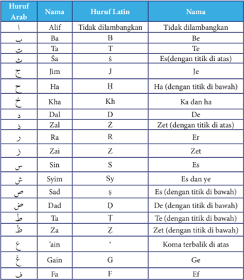

Tabel ini berisi informasi tentang huruf Arab, huruf Latin, dan nama-nama yang relevan dengan setiap huruf. Topik utamanya adalah hubungan antara huruf Arab, huruf Latin, dan nama-nama yang berkaitan. Kolom-kolomnya meliputi Huruf Arab, Huruf Latin, dan Nama. Data penting yang terlihat adalah bahwa beberapa huruf Arab memiliki dua nama: satu untuk versi tanpa titik dan satu untuk versi dengan titik di atas atau bawah. Misalnya, huruf "A" dalam huruf Arab memiliki dua nama: "Alif" tanpa titik dan "Tidak dilambangkan". Sementara itu, huruf "B" dalam huruf Latin memiliki dua nama: "Ba" tanpa titik dan "Tidak dilambangkan". Ini menunjukkan bahwa beberapa huruf Arab memiliki variasi dalam nama mereka tergantung pada apakah mereka memiliki titik atau tidak.

 

---
## 📄 Halaman 15

---
**📊 Tabel**

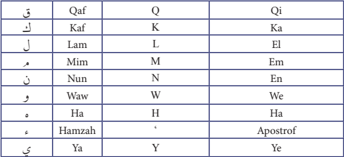

Tabel ini menunjukkan perbandingan huruf Arab dalam bahasa Arab, Persia, dan Inggris. Kolom pertama menunjukkan huruf Arab, sementara kolom kedua dan ketiga menunjukkan huruf yang sama dalam bahasa Persia dan Inggris masing-masing. Topik utama tabel ini adalah perbandingan sistem penulisan huruf Arab di berbagai bahasa. Data penting yang terlihat adalah bahwa beberapa huruf Arab memiliki variasi dalam penulisan, seperti Qaf yang ditulis sebagai Kaf dalam bahasa Persia dan sebagai Q dalam bahasa Inggris, serta Hamzah yang ditulis sebagai Apostrof dalam bahasa Inggris.

### 2.  Vokal

Vokal bahasa Arab adalah seperti vokal bahasa Indonesia, terdiri dari vokal tunggal atau monoftong dan vokal rangkap atau diftong.

### a.    Vokal tunggal

Vokal tunggal dalam bahasa Arab yang lambangnya berupa tanda atau harkat, transliterasinya sebagai berikut:

ِ

---
**📊 Tabel**

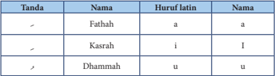

Tabel ini berisi informasi tentang tanda-tanda dalam bahasa Arab, termasuk nama, huruf Latin, dan nama lainnya. Topik utama tabel adalah penjelasan tentang tanda-tanda dalam bahasa Arab. Kolom-kolom yang ada meliputi 'Tanda', 'Nama', 'Huruf latin', dan 'Nama'. Data penting yang terlihat adalah bahwa tanda 'a' dalam huruf Latin dikenal sebagai Fathahah, tanda 'I' dikenal sebagai Kasrah, dan tanda 'u' dikenal sebagai Dhammah. Ini menunjukkan hubungan antara tanda-tanda dalam bahasa Arab dengan huruf Latin dan nama-nama lainnya.

َ

ُ

### b.  Vokal rangkap

Vokal rangkap bahasa Arab yang lambangnya berupa gabungan antara harkat dan huruf, transliterasinya berupa gabungan huruf, yaitu:

َ

َ

Contoh :

: kataba

: Haula

: fa'ala

كتب

### c.  Maddah

Maddah  atau  vokal  panjang  yang  lambangnya  berupa  harkat  huruf, transliterasinya berupa huruf dan tanda, yaitu:

هول

فعل

 

---
## 📄 Halaman 16

َ

ُ

---
**📊 Tabel**

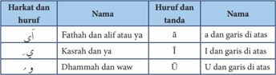

Tabel ini berisi informasi tentang huruf-huruf Arab dan tanda-tandanya, dengan fokus pada huruf 'أ' (fathah) dan 'ي' (kasr). Topik utama tabel adalah penjelasan huruf-huruf Arab dan tanda-tandanya. Kolom pertama menunjukkan huruf dan tanda, sementara kolom kedua menyajikan nama huruf dan tanda tersebut. Data penting yang terlihat adalah bahwa huruf 'أ' memiliki dua variasi: fathah dan alif atau ya', dengan tanda 'ā'. Huruf 'ي' juga memiliki dua variasi: kasr dan ya', dengan tanda 'ī'. Selain itu, tabel juga mencakup huruf 'و' dengan tanda 'ū', yang memiliki garis di atas. Ini menunjukkan bahwa tabel ini bertujuan untuk memberikan pemahaman mendalam tentang struktur dan bentuk huruf-huruf Arab, serta tanda-tandanya.

### d.  Ta marbutah

Transliterasi untuk ta marbutah ada dua:

### 1)  Ta marbutah hidup

Ta  marbutah  hidup  atau  mendapat  harkat  fathah, kasrah  dan dhammah. trnsliterasinya adalah t.

### 2)  ta marbutah mati

ta marbutah yang mati atau mendapat harkat sukun, transliterasinya adalah h

- kalau pada kata yang terahit dengan ta marbutah diikuti olh kata yang menggunakan kata sandang al serta bacaan kedua kata itu terpisah, maka ta marbutah itu ditransliterasikan dengan ha (h).

### e.  Syaddah/Tasdid

### f.  Kata Sandang

Syaddah atau tasydid  yang dalam tulisan Arab dilambangkan dengan sebuah tanda, tanda syaddah atau tanda tasydid, dalam transliterasinya ini  tanda  syaddah  tersebut  dilambangkan  dengan  huruf  yang  diberi tanda syaddah itu. Contoh: rabbana: ا ن َّ ب ر

Kata sandang dalam sistem tulisan Arab dilambangkan dengan huruf, yai tu ا dan ,ل namun dalam transliterasi ini kata sandang yang diikuti oleh huruf  syamsiah dan kata sandang yang diikuti oleh huruf qamariyah.

### g.  Hamzah

Dinyatakan di depan hamzah ditransliterasikan dengan apostrof. Namun, itu hanya berlaku bagi hamzah yang terletak di tengah dan di akhir kata. Bila hamzah itu terletak di awal kata ia tidak dilambangkan, karena dalam tulisan Arab berupa alif.

### h.  Penulisan kata

Pada  dasarnya  setiap  kata,  baik  fi'il  (kata  kerja),  isim  (kata  benda) maupun huruf di tulis terpisah. Hanya kata-kata tertentu yang penulisannya dengan huruf Arab sudah lazim dirangkaian dengan kata lain karena huruf atau harkat yang dihilangkan, maka dalam transliterasi ini  penulisan  kata  tersebut  dirangkaikan  juga  dengan  kata  lain  yang mengikutinya.

َ

َ

 

---
## 📄 Halaman 17

---
**🖼️ Gambar/Diagram**

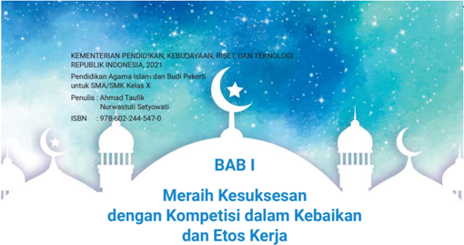

> **Deskripsi Visual:** Gambar ini adalah ilustrasi yang menampilkan judul bab pertama dari buku pelajaran Pendidikan Agama Islam dan Budi Pekerti untuk SMA/SMK Kelas X. Judul bab tersebut adalah "Meraih Kesuksesan dengan Kompetisi dalam Kebaikan dan Etos Kerja". Ilustrasi ini memiliki latar belakang biru gelap dengan gambar bulan sabit dan bintang putih yang menyerupai gambar masjid. Di bagian atas, terdapat logo Kementerian Pendidikan, Kebudayaan, Riset, dan Teknologi Republik Indonesia tahun 2021. Di bawah logo tersebut, terdapat informasi tentang penulis buku, yaitu Alurwastuti Setyowati, dan ISBN buku yang diberikan. Gambar ini menggunakan warna-warna yang cerah dan menarik perhatian, serta desain yang rapi dan profesional.

Perhatikan cergam (cerita gambar) berikut ini!

---
**🖼️ Gambar/Diagram**

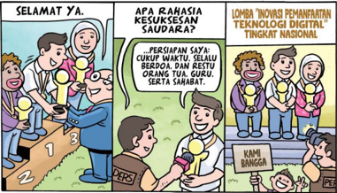

> **Deskripsi Visual:** Gambar ini adalah ilustrasi yang menunjukkan pertandingan lomba "Inovasi Pemanfaatan Teknologi Digital Tingkat Nasional". Gambar ini terdiri dari tiga panel yang menggambarkan perjalanan seorang siswa dalam lomba tersebut.

Pertama, di panel pertama, siswa berjalan dengan senang hati setelah mendapatkan medali emas. Di sampingnya ada guru yang memberikan penghargaan. Panel kedua menunjukkan siswa sedang berbicara dengan guru tentang kemenangan mereka. Panel ketiga menunjukkan siswa berterima kasih kepada orang tua dan guru mereka.

Elemen-elemen utama dalam gambar ini adalah siswa, guru, medali, dan penghargaan. Siswa adalah subjek utama yang melalui proses dari kemenangan hingga terima kasih. Guru adalah elemen penting yang memberikan penghargaan dan mendukung siswa. Medali dan penghargaan menunjukkan hasil kemenangan siswa dalam lomba.

Teks penting dalam gambar ini adalah "KAMI BANGGA" yang ditulis di atas medali. Ini menunjukkan rasa bangga dan kepuasan siswa atas kemenangan mereka.

Informasi kunci yang dapat diambil pembaca adalah bahwa siswa berhasil meraih kemenangan dalam lomba inovasi pemanfaatan teknologi digital tingkat nasional dan mereka sangat bangga atas pencapaian mereka.

 

---
## 📄 Halaman 18

### Tujuan Pembelajaran

Setelah mempelajari Bab 1 ini siswa diharapkan kompeten dalam membaca, menghafal, dan menganalisis ayat dan hadis tentang kompetisi dalam kebaikan dan etos kerja serta mampu menerapkannya dalam kehidupan sehari-hari.

---
**🖼️ Gambar/Diagram**

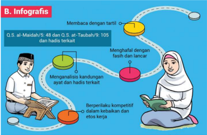

> **Deskripsi Visual:** Gambar ini adalah ilustrasi yang menunjukkan proses membaca dan memahami hadits (kisah-kisah kehidupan Nabi Muhammad SAW) dalam Al-Qur'an. Gambar ini terdiri dari beberapa elemen utama:

1. **Pertama**: Gambar ini menggambarkan dua orang yang sedang membaca Al-Qur'an. Seorang di sisi kiri menggunakan al-Qur'an dan seorang di sisi kanan menggunakan al-Qur'an dengan penjelasan tentang tuntunan membaca.

2. **Kedua**: Gambar ini juga menunjukkan bagaimana membaca dengan tarjimah, yaitu dengan membaca ayat-ayat Al-Qur'an dan menerjemahkan maknanya. Ini melibatkan penggunaan al-Qur'an dan al-Sunnah (sebuah kitab yang berisi riwayat-riwayat kehidupan Nabi Muhammad SAW).

3. **Tiga**: Gambar ini menunjukkan bagaimana menghadapi tantangan dalam membaca, seperti fasih dan lancar. Ini melibatkan teknik-teknik yang digunakan untuk membaca dengan baik dan lancar.

4. **Empat**: Gambar ini juga menunjukkan bagaimana memahami konten ayat dan hadits yang terkait. Ini melibatkan pemahaman tentang makna dan konteks dari ayat-ayat tersebut.

5. **Kelima**: Gambar ini menunjukkan bagaimana berperilaku kompetitif dalam kebaikan dan kebaikan lainnya. Ini melibatkan upaya untuk menjadi lebih baik dan lebih baik dalam hal-hal yang baik.

6. **Keenam**: Gambar ini juga menunjukkan bagaimana memahami konten ayat dan hadits yang terkait. Ini melibatkan pemahaman tentang makna dan konteks dari ayat-ayat tersebut.

7. **Ketujuh**: Gambar ini menunjukkan bagaimana berperilaku kompetitif dalam kebaikan dan kebaikan lainnya. Ini melibatkan upaya untuk menjadi lebih baik dan lebih baik dalam hal-hal yang baik.

8. **Kedelapan**: Gambar ini juga menunjukkan bagaimana memahami konten ayat dan hadits

Amatilah  gambar-gambar  di  bawah  ini,  kemudian  tulislah  pesan-pesan moral untuk setiap gambar. Kaitkan pesan moral tersebut dengan tema 'Meraih Kesuksesan dengan Kompetisi dalam Kebaikan dan Etos Kerja!'

 

---
## 📄 Halaman 19

---
**🖼️ Gambar/Diagram**

> **Deskripsi Visual:** Gambar ini adalah ilustrasi yang menunjukkan dua orang anak sedang belajar di depan komputer. Pada bagian atas, terdapat sekelompok pohon dengan daun hijau dan bunga kuning. Di sebelah kanan, ada seorang anak perempuan dengan rambut berwarna gelap dan topi berwarna merah muda. Anak tersebut sedang menulis di buku tulis putih yang berwarna biru. Di sebelah kiri, ada seorang anak laki-laki dengan rambut berwarna coklat dan topi berwarna biru. Anak tersebut sedang menulis di buku tulis putih yang berwarna biru. Komputer yang digunakan oleh kedua anak tersebut berwarna hitam dan memiliki layar yang terang. Di sebelah kiri atas, terdapat sebuah poster dengan tulisan "ANIMALS" dan gambar seekor hewan. Di sebelah kanan atas, terdapat sebuah poster dengan gambar sekelompok burung dan tulisan "BIRDS". Di sebelah kiri bawah, terdapat sebuah poster dengan gambar sekelompok ikan dan tulisan "FISH". Di sebelah kanan bawah, terdapat sebuah poster dengan gambar sekelompok mamalia dan tulisan "MAMMALS". Gambar ini menunjukkan bahwa anak-anak sedang belajar tentang hewan-hewan berdasarkan poster yang ada di sekitarnya.

---
**🖼️ Gambar/Diagram**

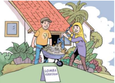

> **Deskripsi Visual:** Gambar ini adalah ilustrasi yang menunjukkan dua orang anak sedang bermain di depan rumah mereka. Rumah tersebut memiliki atap berwarna hijau dengan pohon palma di sampingnya. Di depan rumah terdapat sepotong kue dengan tulisan "LOLA". Anak laki-laki yang berada di sebelah kiri mengenakan jaket kuning dan celana biru, sedangkan anak perempuan di sebelah kanan mengenakan jaket merah dan celana putih. Keduanya tampak senang dan sedang bermain dengan sepeda roda tiga. Gambar ini menunjukkan suasana yang ceria dan aktif, menunjukkan aktivitas anak-anak dalam lingkungan rumah mereka.

Baca  dan  cermatilah  artikel  di  bawah  ini,  kemudian  tulislah  nilai-nilai keteladanan yang dapat diambil dari artikel tersebut!

---
**🖼️ Gambar/Diagram**

> **Deskripsi Visual:** Gambar ini adalah ilustrasi yang menunjukkan sebuah acara sosial di mana beberapa orang sedang berbicara dan berinteraksi. Ilustrasi ini menggambarkan tiga orang wanita yang berdiri di sebelah kiri gambar, sementara dua orang pria berdiri di sebelah kanan. Mereka semua tampak senang dan terlibat dalam percakapan. Di tengah-tengah gambar, ada seorang pria tua yang sedang berbicara kepada dua orang wanita muda yang berdiri di depannya. Pria tua tersebut tampaknya sedang memberikan nasihat atau memberikan informasi kepada mereka. Dua orang wanita muda tersebut tampak sangat tertarik dan memperhatikan apa yang disampaikan oleh pria tua tersebut. Gambar ini menunjukkan hubungan sosial dan komunikasi antara individu dalam situasi sosial.

---
**🖼️ Gambar/Diagram**

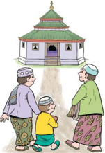

> **Deskripsi Visual:** Gambar ini adalah ilustrasi yang menunjukkan tiga orang dewasa dan seorang anak berjalan menuju sebuah masjid. Masjid tersebut memiliki atap berwarna hijau dengan beberapa pilar putih dan pintu masuk berwarna hitam. Pintu masjid terbuka, menunjukkan bahwa masjid sedang dibuka untuk umum. Di depan masjid, ada beberapa pohon yang tampak hijau dan berdaun. Di sebelah kanan, ada seorang pria tua dengan topi berwarna hijau dan jubah berwarna hijau, sedangkan di sebelah kiri, ada seorang wanita tua dengan topi berwarna merah dan jubah berwarna hijau. Anaknya berjalan di antara kedua orang dewasa tersebut. Gambar ini menunjukkan kebersamaan dan kebersihan dalam masyarakat Muslim, serta menunjukkan bahwa masjid adalah tempat ibadah yang penting bagi umat Islam.

 

---
## 📄 Halaman 20

### Ribuan Kali Khatam

### Al-Qur'an

Abdullah  bin  Idris  al-Audi  al-Kufi  (wafat  tahun  192  H),  seorang ulama  hadis  yang  amat  terkenal.  Selain  khusyuk,  ia  sangat  tekun pada bidang hadis. Pada setiap hadis yang ia riwayatkan, dipastikan memiliki hujjah. Pada  masa  khalifah  Harun  ar-Rasyid,  ia  pernah ditawari untuk menjadi qadli (hakim), tetapi ia menolak karena sifat wara'. Ketika maut hendak menjemput Abdullah bin Idris, puterinya menangis. 'Janganlah  engkau  menangis  wahai  puteriku,  aku  sudah mengkhatamkan Al-Qur'an di rumah ini sebanyak empat ribu kali', kata Abdullah bin Idris dengan suara lirih.

Peristiwa serupa juga terjadi pada Abu Bakar bin Iyasy al-Asadi alKufi  al-Khayyath  (wafat  pada  tahun  193  H),  ulama  senior  K uffah yang  ahli  di  bidang  qira'ah  dan  hadis.  Ia  telah  menulis  lebih  dari sembilan puluh karya. Pada saat terakhir kehidupan Abu Bakar bin Iyasy, adiknya menangis. 'Jangan menangis, lihatlah mushala pribadi di rumah ini. Di situ aku telah mengkhatamkan Al-Qur'an sebanyak delapan belas ribu kali', demikian terdengar dari lisan Abu Bakar bin Iyasy.

### Sumber:

Yusuf Ali Budaiwi. 2001. Menggapai Husnul Khatimah , terjemahan oleh Abdul Rasyid Shiddiq. Jakarta: Pustaka As-Shiddiq

Siapakah  di  antara  kalian  yang  ingin  sukses?.  Tentu  semua  orang  ingin sukses,  termasuk  kalian.  Namun  perlu  diketahui  bahwa  untuk  meraih kesuksesan tersebut bukanlah perkara mudah. Kalian harus mampu mengatasi semua hambatan, tantangan, dan rintangan dengan ketekunan dan kerja keras. Di samping itu, doa dari orang tua dan guru juga sangat dibutuhkan agar Allah Swt. yang Maha Pemberi Rezeki memberi jalan kemudahan dan keberkahan.

Perlu  kalian  ketahui  bahwa  Allah  Swt.  menciptakan  kehidupan  dan kematian untuk menguji siapakah yang terbaik amalnya. Manusia akan hidup di akhirat selama-lamanya, sedangkan dunia hanya tempat singgah sementara.

11'

 

---
## 📄 Halaman 21

Agar memperoleh kebahagiaan di akhirat, kalian harus memperbanyak amal saleh selama hidup di dunia. Seseorang dikatakan sukses apabila memperoleh kebahagiaan di akhirat dan di dunia sekaligus. Namun, kita meyakini bahwa kesuksesan sejati adalah suksesnya hidup di akhirat. Untuk meraih kesuksesan tersebut, kalian harus menggunakan petunjuk ajaran Islam.

Kesuksesan  hidup  di  akhirat  dan  di  dunia  akan  diperoleh  dengan  selalu beramal  saleh  dalam  kehidupan  sehari-hari.  Bangsa  Indonesia  harus  sejajar atau bahkan lebih tinggi dibanding bangsa-bangsa lain di dunia. Apa yang akan terjadi jika bangsa Indonesia tidak siap bersaing dengan bangsa lain?. Tentunya akan jauh tertinggal, dan dianggap sebagai bangsa pemalas. Oleh karena itu, mulailah dari diri sendiri, kemudian ajaklah teman-teman kalian untuk selalu meningkatkan kuantitas dan kualitas ilmu pengetahuan dan teknologi.

Saat ini semua negara di dunia termasuk Indonesia sedang berkompetisi dalam menemukan vaksin virus korona. Masing-masing negara mengerahkan semua sumber daya yang dimiliki untuk mengatasi virus korona. Pada kondisi pandemik seperti inilah kualitas sumber daya manusia sebuah negara benarbenar  diuji  kualitasnya.  Bukan  sekadar  bertahan  menghadapi  pandemik, tapi  mampu  mengatasinya  dengan  baik.  Oleh  karena  itu,  kalian  harus mempersiapkan diri dengan sebaik-baiknya agar mampu tampil lebih unggul dibanding bangsa-bangsa lain di dunia. Ciptakanlah suasana berlomba dalam kebaikan di mana saja kalian berada, terutama di lingkungan sekolah.

Allah Swt. telah memerintahkan hamba-Nya untuk berkompetisi dalam kebaikan dan etos kerja, sebagaimana tercantum dalam Q.S. al-Maidah/5: 48 dan Q.S. at-Taubah/9: 105 dan hadis terkait. Mari kita pelajari dan simak baikbaik agar dapat memahami pesan-pesan mulia yang terkandung di dalamnya untuk diamalkan dalam kehidupan sehari-hari.

- Buatlah kelompok berdasarkan kemampuan membaca Al-Qur'an, yakni kelompok mahir, sedang, dan kurang sesuai dengan petunjuk dari guru.
- Masing-masing  anggota  kelompok  mahir  membimbing  kelompok sedang dan kelompok kurang untuk membaca Q.S. al-Maidah/5:48 dan Q.S. at-Taubah/9:105 secara tartil.

 

---
## 📄 Halaman 22

### 1.  Q.S. al-Maidah/5: 48 tentang Kompetisi dalam Kebaikan

### a.  Membaca Q.S. al-Maidah/5: 48

ً

َ

ْ

ُ

ْ

َ

ْ

ْ

ُ

َ

ْ

َ

ْ

ٰ

ُ

َ

َ

َ

َ

ْ

ُ

ُ

ّ

ِ

َ

ُ

َ

ً

َ

ِ

ِ

ْ

ُ

َ

ّٰ

َ

ْ

َ

ْ

م ْ ك اح ه ِ  ف ي ل ا ع م ِ ن ي ه م و ٰ ب ك ِ ت ال ه ِ   م ِ ن ي َ د ي ْ ن ي ا  ب م ا  ل ِ ق د ُ ص م َ ق ح ِ ال ب ٰ ب ك ِ ت ال ْ ك ي ل آ ا ن ل ز ن ا و ة ْ ع ش ِ ر م ك ا م ِ ن ن ل ع ج ل ۗ  لِك َ ق ح ال م ِ ن َ ك اۤء ا ج َّ م ع م َ ه اۤء و ه ا ب ِ ع َّ ت ا ت ل و الل َ ل ز ن آ ا ِ م ب م ه ن ي ب وا ب ِ ق ت اس ف م ىك ت آ  ا ْ  م ِ ي ف م َ ك و ل ب ي ل ك ِ ن ل َّ و ة اح ِ د َّ و ة َّ م ا م ك ل ع ج ل الل اۤء ش و ل ا  ۗو اج ه م ِ ن َّ و ۙ  ٤٨ ْ ن و ل ِ ف ت خ ه ِ  ت ف ِ ي م ت ن ا ك ِ م ب م ك ئ ب ن ي ا ف ْ ع م ِ ي ج م ُ ك ع ر ْ ج ِ  م ى الل ل ِ ۗ  ا ٰ ت ر ي خ ال

ُ

َ

ْ

َ

ْ

ْ

ُ

ْ

ُ

َ

### b.  Mengident ifikasi Hukum Bacaan Tajwid Q.S. al-Maidah/5: 48

َ

َ

ِ

َ

ْ

َ

ْ

َ

َ

---
**📊 Tabel**

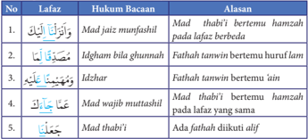

Tabel ini berisi informasi tentang hukum bacaan dalam bahasa Arab, yang disajikan dengan menggunakan 5 baris dan 3 kolom. Topik utama tabel adalah tentang cara membaca ayat-ayat Al-Quran dengan benar sesuai dengan aturan yang ditetapkan. Kolom pertama berisi nomor urut untuk setiap ayat, kolom kedua berisi lafaz (tulisan Arab) dari ayat tersebut, dan kolom ketiga berisi alasan mengapa ayat tersebut dibaca dengan cara tertentu.

Data penting yang terlihat dalam tabel ini meliputi:

1. Mad' jaza'i munfashil: Ayat ini dibaca dengan memperpanjang huruf 'alif pada lafaz 'alif.
2. Idgham bila ghunnah: Ayat ini dibaca dengan memperpanjang huruf lam pada lafaz 'lam'.
3. Idgham bila ghunnah: Ayat ini dibaca dengan memperpanjang huruf ain pada lafaz 'ain'.
4. Mad' wajib mottashih: Ayat ini dibaca dengan memperpanjang huruf hamzah pada lafaz yang sama.
5. Mad' thabbi': Ayat ini dibaca dengan memperpanjang huruf hamzah pada lafaz yang berbeda.

Tabel ini menunjukkan bahwa dalam membaca ayat-ayat Al-Quran, penting untuk memperhatikan huruf-huruf tertentu agar tidak terjadi kesalahan dalam pengucapan.

َ

ْ

َ

ْ

َ

َ

ُ

َ

َ

َ

َ

َ

َ

ً

َ

ْ

Setelah membaca dan mencermati ulasan tajwid di atas, tulislah seluruh hukum bacaan tajwid dalam Q.S. al-Maidah/5:48 beserta alasanya!

### c.  Mengartikan Per Kata Q.S. al-Maidah/5:48

ِ

َ

ٰ ب

َ

---
**📊 Tabel**

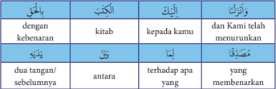

Tabel ini berisi informasi tentang dua jenis peribahasa dalam bahasa Melayu: "dengan kebenaran" dan "dua tangan sebelumnnya". Dalam peribahasa "dengan kebenaran", kata kunci "kitab" menunjukkan bahwa informasi atau fakta harus benar-benar ditemukan dalam sumber yang dapat dipercaya, seperti buku atau dokumen resmi. Peribahasa ini sering digunakan untuk mengingatkan orang agar tidak percaya dengan informasi yang tidak dapat diakui atau tidak dapat dipertanggungjawabkan.

Sementara itu, peribahasa "dua tangan sebelumnnya" menggambarkan situasi di mana seseorang mencoba melakukan sesuatu dengan cara yang sama seperti orang lain, namun dengan hasil yang berbeda. Kata kunci "antara" menunjukkan bahwa ada perbedaan antara tindakan yang dilakukan oleh dua orang tersebut. Peribahasa ini sering digunakan untuk mengingatkan bahwa setiap individu memiliki keunikan dan cara sendiri dalam menghadapi masalah atau mencapai tujuan.

Topik utama tabel ini adalah perbandingan dua peribahasa dalam bahasa Melayu, yaitu "dengan kebenaran" dan "dua tangan sebelumnnya". Kolom-kolom yang ada adalah "peribahasa", "kata kunci", "artinya", dan "pengertian". Data atau pola penting yang terlihat adalah bahwa kedua peribahasa tersebut memiliki hubungan dengan kebenaran dan keunikan individu.

ّ

َ ق

ْ

ْ

َ

ْ ك

َ

َ

َ

ْ

ْ

َ

ِ

َ

ْ

ْ

َ

ْ

َ

ٍ

ّ

ُ

ِ

ِ

ّ

ْ

َ

َ

ْ

ْ

َ

ً

ْ

َ

ُ

َ

َ

ْ

َ

َ

َ

َ

ّ

ً

ّ

َ

ّ

ْ

َ

ْ

ْ

ّ

َ

ً

ّ

ُ

ٰ

ُ

ُ

َ

ّ

ٰ

ً

َ

َ

َ

ْ

ِ

ً

ُ

ُ

َ

ْ

ْ

ُ

َ

َ

ْ

َ

َ

ِ

َ

َ

ُ

ّٰ

َ

َ

ُ

َ

ّٰ

َ

ً

َ

ْ

ّ

َ

َ

َ

ْ

َ

َ

َ

َ

َ

ِ

َ

ً

َ

ْ

ْ

َ

َ

ُ

ْ

ْ

َ

َ

11

ْ

َ

َ

 

---
## 📄 Halaman 23

111

---
**📊 Tabel**

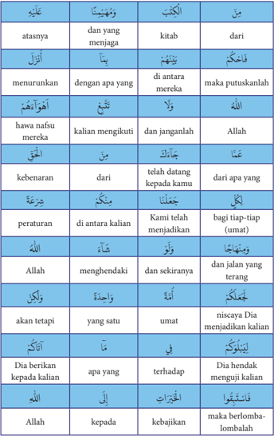

Tabel ini berisi perbandingan antara kata-kata dalam bahasa Melayu dengan artinya dalam bahasa Inggris. Topik utama tabel ini adalah perbandingan kata-kata dalam dua bahasa tersebut. Kolom pertama berisi kata-kata dalam bahasa Melayu, kolom kedua berisi arti dari kata-kata tersebut dalam bahasa Inggris, kolom ketiga berisi contoh penggunaan kata-kata tersebut dalam kalimat, dan kolom keempat berisi penjelasan tentang penggunaan kata-kata tersebut dalam konteks tertentu.

Data penting yang terlihat dalam tabel ini meliputi:

1. Penggunaan kata "atasannya" dalam bahasa Melayu yang berarti "dari yang menjaga" dalam bahasa Inggris.
2. Penggunaan kata "menurunkan" dalam bahasa Melayu yang berarti "putuskanlah" dalam bahasa Inggris.
3. Penggunaan kata "kebenaran" dalam bahasa Melayu yang berarti "dari apa yang terang" dalam bahasa Inggris.
4. Penggunaan kata "peraturan" dalam bahasa Melayu yang berarti "bagi tiap-tiap umat" dalam bahasa Inggris.
5. Penggunaan kata "Dia berikan kepada kalian" dalam bahasa Melayu yang berarti "Dia hendak menguji kalian" dalam bahasa Inggris.

Tabel ini membantu dalam memahami perbedaan dan hubungan antara kata-kata dalam bahasa Melayu dan Inggris, serta bagaimana mereka digunakan dalam konteks tertentu.

ْ

ً

ُ

ْ

ْ

ِ

ُ

ِ

ّ

َ

َ

ُ

ْ

ّٰ

ّٰ

َ

ْ

ٰ

َ

ْ

َ

َ

َ

َ

َ

ْ

َ

ً

ً

ْ

َ

َ

ْ

ُ

َ

ْ

َ

َ

َ

ْ

َ

ِ

َ

َ

ُ

َ

َ

ِ

ْ

َ

ٰ ب

ُ

َ

َ

َ

َ

ً

ْ

ْ

َ

َ

ْ

َ

َ

ُ

ْ

َ

َ

ْ

ْ

ْ

ْ

ْ

ً

ُ

ُ

ُ

ُ

ُ

ٍ

ّ

َ

َ

ّٰ

َ

ُ

َ

ُ

َ

َ

ْ

ْ

َ

ْ

َ

َ

َ

َ

َ

 

---
## 📄 Halaman 24

َ

11*

---
**📊 Tabel**

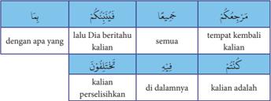

Tabel ini menunjukkan hubungan antara kata kerja "dengan apa yang" dalam bahasa Indonesia dan bahasa Inggris, serta penjelasan tentang penggunaannya dalam kalimat. Topik utama tabel adalah penggunaan kata kerja "dengan apa yang" dalam berbagai konteks. Kolom-kolomnya meliputi "Tinjauan", "Juga", dan "Terjemahan". Data penting yang terlihat adalah bahwa "dengan apa yang" digunakan untuk menjawab pertanyaan tentang alasan atau tujuan tertentu, seperti "Dengan apa yang kalian lalu beritahu?" yang dijawab dengan "semua tempat kembali kalian". Selain itu, tabel juga menunjukkan contoh penggunaan kata kerja tersebut dalam kalimat, seperti "kalian telah berbicara dengan apa yang kalian lalu beritahu" dan "kalian telah berbicara dengan apa yang kalian lalu beritahu di dalamnya".

- Salinlah Q.S. al-Maidah/5:48 beserta terjemahnya!
- Untuk menerjemahkan ayat tersebut, gunakanlah Al-Qur'an terjemahan Kementerian Agama RI!

### d.  Menterjemahkan Ayat Q.S. al-Maidah/5: 48

' Dan Kami telah menurunkan Kitab (Al-Qur'an) kepadamu (Muhammad) dengan membawa kebenaran, yang membenarkan kitab-kitab yang diturunkan sebelumnya dan menjaganya, maka putuskanlah perkara mereka menurut  apa  yang  diturunkan  Allah  dan  janganlah    engkau  mengikuti keinginan  mereka  dengan  meninggalkan  kebenaran  yang  telah  datang kepadamu. Untuk setiap umat di antara kamu, Kami berikan aturan dan jalan yang terang. Kalau Allah menghendaki, niscaya kamu dijadikan-Nya satu umat (saja), tetapi Allah hendak menguji kamu terhadap karunia yang telah diberikan-Nya kepadamu, maka berlomba-lombalah berbuat kebajikan. Hanya kepada Allah kamu semua kembali, lalu diberitahukan-Nya kepadamu terhadap apa yang dahulu kamu perselisihkan. ' (Q.S. al-Maidah/5: 48)

### e.  Asbabun Nuzul Q.S. al-Maidah/5: 48

Tidak ada sebab khusus yang melatarbelakangi turunnya Q.S. al-Maidah/5: 48. Surat al-Maidah termasuk golongan surat Madaniyah, yakni surat yang turun  setelah  hijrahnya  Nabi.  Menurut  riwayat  Imam  Ahmad,  surat  ini turun saat Nabi Saw. sedang menunggang unta. Bagian paha unta tersebut hampir saja patah karena sangat beratnya wahyu yang diterima oleh Nabi Muhammad Saw.

ْ

َ

ُ

ُ

ُ

ّ

ِ

َ

َ

ُ

ْ

َ

َ

ً

ْ

َ

ْ

ُ

ْ

ُ

ْ

ُ

ِ

َ

 

---
## 📄 Halaman 25

Ibnu Abbas menjelaskan bahwa surat al-Maidah/5: 48 ini turun berkenaan dengan peristiwa ahli kitab yang meminta keputusan kepada Rasulullah Saw. atas persoalan yang sedang mereka hadapi. Pada awalnya, Nabi Saw. diberi dua pilihan, yakni memutuskan persoalan mereka atau mencari solusi di dalam kitab mereka masing-masing. Namun, Allah Swt. menurunkan ayat ini sebagai petunjuk bagi Nabi Saw. atas pertanyaan ahli kitab tersebut.

### f. Menelaah Tafsir Q.S. al-Maidah/5: 48

- Bersama kelompok, cari dan salinlah tafsir Q.S. al-Maidah/5: 48 dalam kitab tafsir Al-Qur'an Kementerian Agama dan kitab tafsir lainnya!
- Bandingkan  dan  lakukan  analisa  terhadap  isi  tafsir  dalam  kitab tersebut!
Menurut  tafsir  al-Misbah,  Q.S.  al-Maidah/5:  48  mengandung  pesan-pesan mulia sebagai berikut:

- Al-Qur'an diturunkan oleh Allah Swt. dengan haq (kebenaran) , yakni haq dalam kandungannya, cara turunnya, maupun yang mengantarnya turun (Jibril a.s.).
- Kitab  Al-Qur'an  berfungsi  membenarkan  kitab-kitab  sebelumnya,  yakni Taurat  yang  diturunkan  kepada  Nabi  Musa  a.s.,  Zabur  yang  diturunkan kepada  Nabi  Daud  a.s.,  dan  Injil  yang  diturunkan  kepada  Nabi  Isa  a.s. Dalam hal ini Al-Qur'an adalah muhaimin terhadap kitab-kitab terdahulu karena ia menjadi saksi atas kebenaran kandungan kitab-kitab terdahulu.
- Kitab  suci  Al-Qur'an  juga  menjadi  pengawas,  pemelihara,  penjaga  kitabkitab  terdahulu  dan  menjadi  tolok  ukur  kebenaran  terhadapnya,  serta menjadi saksi untuk keabsahannya. Dalam kedudukannya sebagai pemelihara, Al-Qur'an memelihara dan mengukuhkan prinsip ajaran Ilahi yang bersifat universal (kully) dan mengandung kemaslahatan abadi bagi umat manusia sepanjang masa.
- Allah Swt. memerintahkan agar menjadikan Al-Qur'an sebagai pedoman hidup. Hendaklah orang beriman memutuskan perkara berdasarkan kitab suci  Al-Qur'an  dan  tidak  boleh  bertentangan  dengannya.  Bahkan  dalam Q.S. al-Maidah/5: 3 dinyatakan bahwa agama Islam telah sempurna, nikmat

 

---
## 📄 Halaman 26

11

- yang diturunkan oleh Allah Swt. kepada kaum muslimin sudah sempurna, dan Allah Swt. telah meridai Islam sebagai jalan kehidupan semua manusia. Maka tidak ada lagi alasan untuk meninggalkan sebagian ajarannya untuk berpindah pada ajaran lain.
- Tiap-tiap umat memiliki aturan (syariat) yang akan menuntunnya menuju kebahagiaan abadi. Allah Swt. juga mengkaruniakan jalan terang (manhaj) yang dilalui oleh manusia dalam menjalankan aturan beragama.
- Allah Swt.  telah  menjadikan syariat Nabi  Muhammad  Saw.  sebagai penyempurna syariat para  nabi  terdahulu  serta  membatalkan syariat sebelumnya. Seandainya Allah Swt. menghendaki, niscaya umat Nabi Musa a.s., Nabi Isa a.s., dan umat Nabi Muhammad Saw. akan dijadikan satu umat saja. Tetapi hal ini tidak dikehendaki oleh Allah Swt.
- Umat  Islam  diperintahkan  untuk  berlomba-lomba  dengan  sungguhsungguh dalam berbuat kebaikan dan menghindari perdebatan yang tidak perlu  hingga  menghabiskan  waktu  sia-sia.  Allah  Swt.  telah  menetapkan berbagai macam syariat untuk menguji siapakah di antara hamba-Nya yang taat dan durhaka. Bagi yang taat akan memperoleh pahala, sedangkan siksa bagi seseorang yang durhaka. Sesungguhnya semua manusia akan kembali kepada Allah Swt. dan akan diberitahukan apa yang telah diperselisihkan. Hal yang diperselisihkan ini adalah tentang kehidupan akhirat. Orang-orang kafir tidak percaya adanya akhirat. Karenanya mereka akan diberitahu dan mendapatkan balasan atas perbuatan mereka, yakni dimasukkan ke dalam api  neraka.  Sedangkan  bagi  orang  mukmin  yang  beramal  shalih,  akan mendapatkan balasan surga.
'Umat Islam diperintahkan untuk berlomba-lomba dengan sungguh sungguh dalam berbuat kebaikan dan menghindari perdebatan yang tidak perlu hingga menghabiskan waktu sia-sia' .

Perintah untuk berlomba dalam kebaikan ( fastabiqul khairat) juga terdapat dalam beberapa ayat Al-Qur'an, di antaranya terdapat dalam Q.S. al-Baqarah/2: 148 berikut ini:

ٌ

َ

َ

ِ

ّ

ُ

ٍ

ٰ

َ

َ

ّٰ

ً

َ

ُ

ّٰ

ُ

ُ

ْ

َ

ْ

ُ

ْ

ُ

َ

َ

َ

َ

ْ

َ

ْ

ُ

َ

ْ

َ

َ

ّ

َ

ُ

َ

ُ

ٌ

َ

ْ

ّ

ّ

ُ

َ

الل َّ ۗ ا ِ ن ا ْ ع م ِ ي ج الل م ِ ك ب ت ِ أ ا ي و ن و ك ا ت م ْ ن ي ِ ۗ  ا ٰ ت ر ي خ وا ال ب ِ ق ت اس ا ف ْ ه ِ ي ل و م و ه ة ه ِ ج و ل لِك و ١٤٨ ْ ر ي د ِ ٍ  ق ي ْ ء ش ل ى ك ل ع

 

---
## 📄 Halaman 27

Artinya: ' Dan setiap umat mempunyai kiblat yang dia menghadap kepadanya. Maka berlomba-lombalah kamu dalam kebaikan. Di mana saja kamu berada, pasti Allah akan mengumpulkan kamu semuanya. Sungguh, Allah Mahakuasa atas segala sesuatu. ' ( Q.S. al-Baqarah/2: 148)

Ayat tersebut secara tegas memerintahkan untuk berlomba-lomba dalam kebaikan. Kebaikan yang dilakukan oleh seorang mukmin akan mendapatkan balasan  dari  Allah  Swt.  Berlomba  dalam  kebaikan  merupakan  suatu  ajakan kepada orang lain dengan dimulai dari diri sendiri untuk selalu menempuh jalan yang diridai oleh Allah Swt. Mengapa seorang mukmin harus bersegera dalam berlomba-lomba dalam kebaikan?. Karena kesempatan waktu hidup di dunia hanya sementara dan terbatas oleh ruang dan waktu. Tidak ada yang tahu kapan seseorang akan dipanggil menghadap Allah Swt. Di samping itu, tidak  ada  yang  tahu  perubahan yang akan dialami oleh seseorang. Bisa jadi malam ia beriman, esoknya sudah tidak memiliki iman. Atau malam ia masih salat berjamaah di masjid, pagi terjerumus dalam kemaksiatan. Oleh karena itu,  Islam  menganjurkan umatnya untuk bersegera dalam berbuat kebaikan. Hal ini sesuai dengan hadis berikut ini:

ُ

ْ

َ

ً

ْ

ُ

ِ

ْ ن و َ ك ت س َ ة ِ  ف ح ال ِ َّ الص ال م ع أ ال ا ب و اد ِ ر : ب ال ِ ﷺ ق الل ْ ل و َ س ر َّ ن ا ه ن ع َ  الل ِ ي َ ض ر ة ْ ر ي ر َ ْ  ه ِ ي ب ا ن ْ ع ب ِ ح ُ ص ي ا و م ِ ن ؤ ي ْ  م م ْ س ي ا و اف ِ ر ي ْ  ك م ْ س ي ا و م ِ ن ؤ م ل َّ ج الر ب ِ ح ُ ص ي ل ِ م م ُ ظ ال ْ ل ي َّ الل ع ِ ق ِ ط ك ن ف ِ ت ا . (رواه مسلم)رواه ي ن الد م ِ ن ر َ ض ِ ع ب ه ن د ِ ي ع ي ب ا ي اف ِ ر ك

ِ

ِ

ِ

َ

ْ

ُّ

َ

ٍ

َ

ُ

َ

ْ

ُ

ْ

ِ

َ

ً

َ

Artinya: 'Dari Abu  Hurairah r.a. bahwa  Rasulullah Saw. bersabda: 'bersegeralah kamu sekalian untuk melakukan amal-amal shalih, karena akan terjadi suatu bencana yang menyerupai malam yang gelap gulita di mana ada seseorang  yang  pada  waktu  pagi  ia  beriman,  tetapi  pada  waktu  sore  ia  kafir, pada waktu sore ia beriman tetapi pada waktu pagi ia kafir, ia rela menukar agamanya (dengan sedikit keuntungan dunia)'. (H.R. Muslim)

### g.  Menghafalkan Ayat Q.S. al-Maidah/5: 48

Bacalah  Q.S.  al-Maidah/5:48  secara  tartil  dan  berulang-ulang  hingga kalian  hafal  ayat  tersebut.  Mintalah  bantuan  teman  untuk  menyimak bacaan dan hafalanmu!

ِ

ُ

َ

ً

ِ

َ

ُ

َ

ً

ْ

ُ

ُ

ُ

ُ

ْ

ْ

ْ

َ

َ

ٌ

َ

ُ

ُ

َ

َ

َ

ْ

َ

ْ

ْ

ُ

َ

َ

َ

ّٰ

َ

ُ

َ

ُ

ْ

َ

ُ

ّٰ

َ

َ

ُ

َ

َ

 

---
## 📄 Halaman 28

11

### h.  Menerapkan Perilaku Kompetisi dalam Kebaikan untuk Meraih Kesuksesan

Kalian pasti ingin mengamalkan pesan mulia yang terkandung dalam Q.S. al-Maidah/5: 48. Agar dapat berkompetisi dalam kebaikan, lakukanlah 'M6' berikut ini, yaitu:

---
**🖼️ Gambar/Diagram**

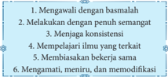

> **Deskripsi Visual:** Gambar ini adalah diagram yang menunjukkan langkah-langkah dalam proses belajar dan pengembangan diri. Diagram ini terdiri dari 6 langkah yang disusun secara horizontal, masing-masing dengan teks yang menjelaskan tugas atau tindakan yang harus dilakukan. Langkah pertama adalah "Mengawali dengan basmalah", yang berarti memulai dengan doa atau salam. Setelah itu, ada langkah kedua yang melibatkan "Melakukan dengan penun semangat", yang berarti melakukan sesuatu dengan penuh semangat. Langkah ketiga adalah "Menjaga konsistensi", yang berarti tetap konsisten dalam kegiatan belajar. Selanjutnya, ada langkah keempat yang berisi "Mempelajari ilmu yang terkait", yang berarti belajar tentang topik-topik yang relevan. Langkah kelima adalah "Membiaskan belajar sama", yang berarti belajar bersama dengan orang lain. Terakhir, ada langkah keenam yang berisi "Mengamati, meniru, dan memodifikasi", yang berarti mengamati perilaku orang lain, meniru dan mengubahnya menjadi bagian dari diri sendiri. Jadi, diagram ini memberikan panduan tentang cara-cara yang tepat untuk belajar dan mengembangkan diri.

Untuk memahami 'M6' di atas, perhatikan penjelasannya berikut ini.

- Mengawali  suatu  amal  kebaikan  dengan  membaca basmalah dan  berdoa kepada Allah Swt. agar diberikan kemudahan, kelancaran, dan keberkahan. Doa  merupakan  kekuatan  spiritual  yang  akan  mendorong  kalian  untuk berusaha  maksimal  hingga  amal  tersebut  paripurna.  Di  samping  itu  ada nilai pahala atas amal yang dilakukan dengan ikhlas.
- Melakukan  semua  amal  kebaikan  dengan  penuh  optimis  dan  semangat. Sikap optimis dan semangat ini akan membuat seseorang menjadi yakin mampu mengerjakan amal kebaikan dengan tuntas. Lebih dari itu, tumbuh rasa senang dan bahagia karena telah berhasil menyelesaikan sebuah amal kebaikan.
- Menjaga konsistensi ( istiqamah ) amal kebaikan yang sudah kalian lakukan. Kualitas dari amal kebaikan akan semakin meningkat apabila kalian lakukan dengan konsisten. Tiap hari akan ada pengalaman baru untuk perbaikan kualitas amal pada hari berikutnya dan masa datang.
- Mempelajari ilmu yang terkait dengan peningkatan kualitas amal kebaikan. Antara ilmu dan amal merupakan satu kesatuan. Ilmu tanpa amal, ibarat pohon tak berbuah. Demikian pula beramal tanpa ilmu akan mengakibatkan amal tersebut tertolak. Menambah bekal ilmu dapat kalian lakukan dengan belajar di lembaga pendidikan formal maupun non formal.
- Membiasakan  diri  beramal  secara  bersama-sama  dengan  melibatkan orang banyak. Dalam hal ini, bukan berarti mengabaikan amaliyah yang sifatnya  pribadi.  Keterlibatan  banyak  orang  dalam  suatu  amal  kebaikan akan  membuat  nilai  amal  tersebut  semakin  baik.  Karena  akan  semakin

 

---
## 📄 Halaman 29

111

banyak manfaat dan kemaslahatan yang dapat dirasakan oleh masyarakat luas. Lebih dari itu, akan memperkuat tali silaturahmi dan memperkokoh persatuan dan kesatuan bangsa.

- Mengamati, meniru, dan memodifikasi amal kebaikan yang telah dilakukan oleh orang lain. Hal ini akan memudahkan dan memotivasi seseorang dalam beramal saleh. Karena sudah dicontohkan oleh orang lain, maka harus ada usaha untuk meningkatkan kuantitas dan kualitas amal tersebut agar lebih baik dan nilai manfaatnya menjadi lebih besar.
Setelah kalian melakukan 'M6' di atas, tentu banyak manfaat yang diperoleh dari  perilaku  kompetisi  dalam  kebaikan.  Di  antara  manfaat  tersebut  adalah sebagai berikut:

- Memperoleh rida dan pahala dari Allah Swt.
- Allah  Swt.  akan  memberikan  pahala  kepada  kalian  jika  melakukan pekerjaan  dengan  ikhlas.  Kesuksesan  tertinggi  bukanlah  sukses  duniawi, tetapi kesuksesan tertinggi adalah rida dari Allah Swt.
- Menjadi manusia yang bermanfaat
- Manusia  terbaik  adalah  manusia  yang  mampu  menebar  manfaat  dan kemaslahatan sebesar-besarnya kepada masyarakat. Nilai sebuah kebaikan akan berlipat ganda jika mampu memberikan manfaat yang besar untuk masyarakat luas.
- Mempercepat penyelesaian pekerjaan Keinginan untuk menyelesaikan pekerjaan ini didasari oleh motivasi untuk menyelesaikan  pekerjaan  lainnya.  Jika  menunda  suatu  pekerjaan,  maka pekerjaan yang lain ikut terbengkalai. Di samping itu, ada kompetitor yang memicu peningkatan kinerja.
- Termotivasi untuk menjadi lebih baik
- Saat kalian berkompetisi dengan pihak lain, akan tumbuh keinginan untuk menjadi yang paling unggul. Tentunya hal ini membutuhkan persiapan yang matang.  Meskipun  hasil  akhirnya  belum  tentu  sebagai  pemenang,  tetapi sudah berhasil menunjukkan kemampuan terbaik yang dimiliki merupakan prestasi tersendiri yang patut diapresiasi.
- Menjadi pribadi yang disiplin dan bertanggungjawab Keinginan untuk menjadi yang terbaik harus diikuti dengan sikap disiplin dan tanggungjawab. Keduanya merupakan modal utama meraih kesuksesan
dalam sebuah kompetisi.

 

---
## 📄 Halaman 30

- Mempererat hubungan antar sesama
- Pesaing bukan musuh yang harus dikalahkan tetapi merupakan rekan kerja sama akan mempererat tali persaudaraan di antara sesama. Peran serta dan keterlibatan masing-masing individu dalam satu kelompok akan semakin
dalam berkompetisi secara sehat. Pekerjaan yang dilakukan secara bersamamemperkuat jalinan hubungan kekeluargaan.

- Q.S. at-Taubah/9 : 105 tentang Etos Kerja
- Membaca Q.S. at-Taubah/9 : 105
ِ

ة ِ اد ه َّ الش و ْ ب ي غ ال ل ِ م ى  ع ل ا ِ ْ ن و د ر ت َ س ۗ  و ْ ن و م ِ ن م ُ ؤ ال و ه ل و َ س ر و م ك ل م َ ع ى الل ر ي س َ ا ف و ل م َ اع ل ِ ق و ۚ  ١٠٥ ْ ن و ل م َ ع ت م ت ن ا ك ِ م ب م ك ئ ب ن ي ف

ِ

َ

ُ

ْ

َ

ْ

ُ

ْ

ُ

َ

ْ

ُ

ُ

ِ

ّ

َ

ُ

َ

### b.  Mengidentifikasi Hukum Bacaan Tajwid Q.S. at-Taubah/9 : 105

ُ

ّٰ

َ

َ

َ

---
**📊 Tabel**

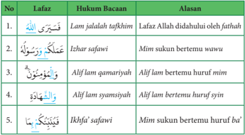

Tabel ini berisi informasi tentang lafaz (unsur-unsur kata) dalam bahasa Arab, termasuk hukum bacaan dan alasan untuk setiap lafaz. Topik utama tabel adalah penjelasan tentang lafaz dalam konteks hukum bacaan. Tabel ini terdiri dari tiga kolom: No., Lafaz, dan Alasan. Kolom No. digunakan untuk memberikan nomor urut pada setiap baris. Kolom Lafaz menyajikan contoh lafaz yang diberikan dalam bahasa Arab, sementara kolom Alasan memberikan penjelasan mengenai hukum bacaan untuk setiap lafaz tersebut. Data penting yang terlihat dalam tabel ini meliputi bahwa beberapa lafaz memiliki hukum bacaan yang sama, seperti "Alif lam qamariyah" dan "Alif lam syamsiyah", yang memiliki hukum bacaan yang berbeda. Selain itu, tabel juga menunjukkan bahwa beberapa lafaz memiliki hukum bacaan yang berbeda, seperti "Lam jalaalah tafkhim" dan "Izhwar safawi", yang memiliki hukum bacaan yang berbeda pula.

َ

َ

َ

َ

ْ

ُ

ُ

ِ

ّ

َ

ُ

َ

Setelah membaca dan mencermati ulasan tajwid di atas, tulislah seluruh hukum bacaan tajwid dalam Q.S. at-Taubah/9: 105 beserta alasannya!

َ

َ

َ

َ

ْ

ٰ

ٰ

َ

ُّ

َ

ُ

َ

َ

ُ

ْ

ْ

َ

ٗ

ُ

ْ

ُ

َ

ْ

ٗ

ُ

ْ

َ

ُ

ُ

َ

ْ

ْ

ُ

ْ

َ

َ

َ

ُ

َ

َ

ُ

ّٰ

َ

َ

َ

ْ

ُ

ْ

ُ

11

َ

 

---
## 📄 Halaman 31

111

### c.  Mengartikan Per Kata Q.S. at-Taubah/9 : 105

ُ

---
**📊 Tabel**

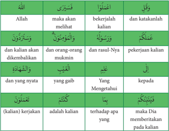

Tabel ini berisi perbandingan antara ayat-ayat Al-Quran dengan maknanya dalam konteks kehidupan sehari-hari. Topik utamanya adalah tentang kewajiban dan kesempatan dalam hidup, termasuk kepercayaan, keadilan, dan pengembalian dana. Kolom pertama berisi ayat-ayat Al-Quran, sementara kolom kedua dan ketiga berisi penjelasan maknanya. Data penting yang terlihat adalah bahwa Allah memberikan kesempatan kepada kalian untuk melihat kebaikan dan kesalahan diri sendiri, serta memberikan kesempatan bagi orang-orang mukmin untuk dikembalikan. Ayat-ayat ini juga menunjukkan bahwa Allah akan mengetahui apa yang dilakukan oleh kalian dan akan memberikan kalian kesempatan untuk belajar dan berkembang.

َ

َ

َ

َ

ُ

ْ

َ

- Setelah membaca dan mencermati arti per kata di atas, terjemahkan Q.S.  at-Taubah/9:  105  dengan  cara  berpasangan  dengan  anggota kelompok!
- Untuk menerjemahkan ayat tersebut, gunakanlah Al-Qur'an terjemah Kementerian Agama RI!

### d.  Menterjemahkan Ayat Q.S. at-Taubah/9: 105

'Dan katakanlah, 'Bekerjalah kamu, maka Allah akan melihat pekerjaanmu, begitu juga Rasul-Nya dan orang-orang mukmin, dan kamu akan dikembalikan kepada (Allah) Yang Mengetahui yang gaib dan yang nyata, lalu diberitakanNya kepada kamu apa yang telah kamu kerjakan. ' (Q.S. at-Taubah/9: 105)

َ

ُّ

ّٰ

َ

ُ

َ

َ

ْ

ُ

ِ

ُ

ْ

َ

ْ

َ

ُ

ْ

ْ

َ

َ

ٗ

ُ

ْ

ْ

ُ

ِ

َ

ُ

ٰ

ْ

َ

ْ

ْ

ُ

ُ

ُ

َ

ٰ

ُ

ّ

ِ

َ

َ

ُ

َ

َ

 

---
## 📄 Halaman 32

### e.  Asbabun Nuzul Q.S. at-Taubah/9: 105

Tidak ada sebab khusus yang melatarbelakangi turunnya Q.S. at-Taubah/9: 105  ini.  Perlu  diketahui  bahwa  ayat  105  terkait  dengan  ayat  sebelumnya, yakni  ayat  102-104.  Pada  ayat  102-104,  Allah  Swt.  menganjurkan  bertaubat dan melakukan kegiatan nyata, antara lain membayar zakat dan bersedekah. Pada ayat 105, Allah Swt. memerintahkan untuk melakukan beragam aktivitas lain,  baik  yang  nyata  maupun  tersembunyi.  Menurut  kitab Lubabun  Nuqul fii  Asbaabin  Nuzul Seusai  berperang,  Rasulullah  Saw.  bertanya: 'siapakah orang-orang  yang  terikat  di  tiang  ini?' ,  ada  seseorang  menjawab: 'mereka adalah Abu Lubabah dan teman-temannya yang tidak ikut berperang. Mereka bersumpah tidak akan melepaskan ikatan tersebut, kecuali Rasulullah sendiri yang  melepaskannya' .  Kemudian  Rasulullah  Saw.  bersabda: 'aku  tidak  akan melepaskan mereka kecuali jika diperintahkan oleh Allah Swt. ' Karenanya Allah Swt. menurunkan Q.S. at-Taubah/9: 102, kemudian Rasulullah Saw. melepaskan dan memaa fkan mereka.

### f. Menelaah Tafsir Q.S. at-Taubah/9: 105

Menurut tafsir al-Misbah, ayat ini mendorong manusia untuk lebih mawas diri  dan  mengawasi  amal  atau  pekerjaan  mereka.  Allah  Swt.  mengingatkan mereka bahwa setiap amal baik atau buruk memiliki hakikat yang tidak dapat disembunyikan.  Amal  tersebut  akan  disaksikan  oleh  Allah  Swt.,  Rasulullah Saw. dan orang-orang beriman. Pada hari kiamat, Allah Swt. akan membuka tabir penutup yang menutupi mata mereka sehingga mengetahui dan melihat secara langsung hakikat amal mereka sendiri.

Selanjutnya  simaklah  pesan-pesan  mulia  yang  terkandung  dalam  Q.S  atTaubah/9: 105 berikut ini.

- Allah  Swt.  memerintahkan  untuk  beramal  saleh  hingga  manfaatnya  bisa dirasakan oleh diri sendiri maupun masyarakat luas. Amal tersebut harus dilakukan dengan ikhlas karena mengharap rida dari Allah Swt.
- Setiap amal akan dilihat oleh Allah Swt., Rasulullah Saw. dan mukminin di akhirat kelak. Lalu akan dibalas sesuai amal tersebut, jika amalnya baik maka mendapat pahala, sebaliknya jika amalnya buruk maka akan dibalas dengan  siksa.  Karenanya  seorang  muslim  haruslah  memperbanyak  amal saleh ketika hidup di dunia.
- Janganlah  merasa  amalnya  sudah  cukup  banyak  untuk  bekal  hidup  di akhirat. Sifat ini akan menghambat munculnya keinginan untuk beramal saleh lagi. Tumbuhkan inisatif untuk melakukan amal saleh sehingga orang

 

---
## 📄 Halaman 33

َ

lain ikut tergerak untuk melakukannya. Pahala berlipat akan diberikan oleh Allah Swt. kepada orang yang memberi contoh tanpa mengurangi pahala mereka yang mencontoh.

- Setiap manusia akan kembali ke kampung akhirat, dan menerima balasan amal  perbuatannya.  Seorang  mukmin  hendaklah  jangan  larut  dengan gemerlap kehidupan duniawi hingga melalaikan akhirat yang kekal abadi.
'Kerja' dalam bahasa Arab disebut dengan ' amala - ya'malu dan yang seakar dengan  kata  tersebut.  Di  dalam  Al-Qur'an,  kata-kata  yang  berarti  'bekerja' diulang sebanyak 412 kali dan seringkali dihubungkan dengan pekerjaan yang saleh atau amal saleh. Amal saleh yaitu pekerjaan yang membawa kebaikan, baik  bagi  pelakunya  maupun  orang  lain.  Kebaikan  tersebut  dapat  berupa perbaikan  ekonomi,  kesejahteraan,  kesehatan,  pendidikan,  sosial,  spiritual dan  sebagainya.  Kebaikan  tersebut  meliputi  kebaikan  hidup  di  dunia  dan akhirat.  Penyebutan  kata  'bekerja'  yang  sedemikian  banyak  di  dalam  AlQur'an menunjukkan bahwa masalah 'kerja' sangatlah penting bagi kehidupan manusia. Oleh karena itu, Islam sangat menganjurkan umatnya untuk bekerja keras atau memiliki etos kerja tinggi.

َ

ُ

Rasulullah Saw. bersabda dalam sebuah hadis berikut:

ُ

َ

َ

َ

َ

ْ

َ

َ

ْ

ُ

ُ

َ

ُ

ٌ

ْ

َ

ْ

ُ

َ

ْ

ذ خ أ ي ن أ ِ ﷺ :ل الل ْ ل و َ س ر ال : ق ال ق ه ن ع َ  الل ِ ي َ ض ام ِ  ر َّ و ع ال ْ ن ب ر ِ ي ب ِ  الز د ِ الل ب ْ  ع ِ ي ب ا ن ْ ع ا ِ ه ب الل َّ ف َ ك ي ا ف ه ْ ع ي ب ي ه ِ  ف ر ِ ه ى ظ ل ع َ ب َ ط ح ة ٍ  م ِ ن م ز ح َ  ب ِ ي ت أ ي ف َ ل ب ج َ  ال ِ ي ت أ ي َّ م ث ه ل ب ح ْ ا م ُ ك د ح َ ا رر ) ِ ي ار ُ خ ب ال اه و . (ر ه و ع ن م و ا ه و ْ ط ع ا َّ اس الن ل أ س ْ ي ن ا م ِ ن ه ل ر ي خ ه ه َ ج و

َ

َ

ُّ

ِ

َ

َ

ْ

ْ

ُ

َ

َ

َ

َ

ٍ

ُ

ْ

ُ

َ

َ

ْ

ْ

َ

ُ

ْ

َ

َ

ْ

َ

ِ

َ

Artinya:  'Dari  Abu  Abdullah  az-Zubair  bin  al-'Awwam  r.a.,  berkata, Rasulullah  Saw.  bersabda:  'Sungguh  sekiranya  salah  seorang  di  antara  kamu sekalian mengambil beberapa utas tali kemudian pergi ke gunung dan kembali dengan memikul seikat kayu bakar dan menjualnya di mana dengan hasil itu Allah mencukupkan kebutuhan hidupnya, maka itu lebih baik baginya daripada ia meminta-minta kepada sesama manusia baik mereka memberi ataupun tidak memberinya'. (H.R. Bukhari)

Hadis di atas secara tegas  menyatakan  bahwa  bekerja  keras  untuk memenuhi  kebutuhan  hidup  sehari-hari  lebih  dicintai  Allah  dan  rasul-Nya dibanding berpangku tangan menunggu bantuan orang lain. Allah Swt. telah memberikan wewenang kepada manusia untuk mengolah sumber daya alam di bumi. Perhatikan Q.S. al-Jumu'ah/62:10 berikut ini.

ّٰ

ُ

َ

َ

ٰ

ُ

ْ

َ

َ

َ

ِ

ْ

ْ

َ

ْ

َ

َ

ّٰ

ُ

ُ

َ

َ

َ

َ

ُ

ْ

َ

ُ

ّٰ

َ

ْ

ْ

َ

ُّ

ّٰ

ْ

َ

َ

َ

ْ

ُ

َ

َ

ُ

َ

 

---
## 📄 Halaman 34

ً

ْ

َ

ُ

ُ

َ

ْ

ُ

ِ

ِ

ِ

ِ

َ

َ

ْ

َ

ْ

ْ

ْ

ْ

ْ

َ

ُ

ُ

ْ

### ا ر ث ِ ي ك وا الل ر ُ ك اذ ِ  و الل ل ِ َ ض ف ا م ِ ن و غ ت اب و ر ْ ض ا ى  ال ا ف ُ و ش ِ ر ت ان ف وة ل َّ الص َ ت ي ُ ض ا ق ا ِ ذ ف ١٠ ْ ن و ل ِ ح ف ت م ك َّ ل ع َّ ل

Artinya:  ' Apabila  salat  telah  dilaksanakan,  maka  bertebaranlah  kamu  di bumi;  carilah  karunia  Allah  dan  ingatlah  Allah  banyak-banyak  agar  kamu beruntung'. (Q.S. al-Jumu'ah/62:10)

Apabila manusia mau bekerja keras, maka akan dapat memenuhi kebutuhan pokoknya,  terutama  sandang,  pangan  dan  tempat  tinggal.  Islam  sangat menghargai  seseorang  yang  bekerja  keras  untuk  memperoleh  penghidupan yang layak, dan mengkonsumsi makanan dari hasil usahanya sendiri. Hal ini sesuai dengan hadis berikut ini.

ْ

ُ

ُ

ْ

َ

َ

َ

ُ

َ

ْ

َ

َ

َ

َ

ِ

ّٰ

ِ

ِ

``

ُّ

َ

ْ

ُ

َ

َ

ِ

ِ

َ

Artinya: 'Dari  al-Miqdam  bin  Ma'dikariba  r.a.  dari  Nabi  Saw.,  beliau bersabda:  'Tidak  ada  seseorang  makan  makanan  yang  lebih  baik  daripada makan hasil usahanya sendiri, dan sesungguhnya Nabi Allah Daud a.s. makan dari hasil usahanya sendiri'. (H.R. Bukhari)

### g.  Menghafalkan Ayat Q.S. at-Taubah/9: 105

Hafalkanlah Q.S. at-Taubah/9:105 dengan cara membacanya secara tartil dan berulang-ulang. Mintalah bantuan teman untuk menyimak bacaan dan hafalanmu!

### h.  Menerapkan Perilaku Etos Kerja untuk Meraih Kesuksesan

Praktik  kerja  keras  sudah  dicontohkan  oleh  Rasulullah  Saw.  sejak  beliau masih kanak-kanak. Tercatat dalam sejarah bahwa pada usia 12 tahun sudah berniaga hingga ke negeri Syam bersama Ab u Thalib. Demikian pula sahabat Abu  Bakar,  Umar  bin  Khattab,  Usman  bin  Affan  dan  Ali  bin  Abi  Thalib merupakan figur teladan dalam bekerja keras.

َ

َ

ْ

َ

َ

ْ

َ

ُ

ْ

َ

ْ

َ

ِ

ْ

ً

ْ

َ

ُّ

ً

َ

َ

ٌ

َ

َ

َ

َ

َ

َ

َ

ّٰ

ُ

َ

ُ

ْ

َ

ُ

ّٰ

َ

َ

ْ

َ

َ

ْ

ْ

َ

َ

ّٰ

ُ

ْ

ّٰ

َ

ْ

َ

َ

ٰ

َ

َ

 

---
## 📄 Halaman 35

Pada  suatu  hari  Rasulullah  Saw.  masuk  ke  masjid  dan  melihat  Abu Umamah, salah satu sahabat Anshar sedang duduk termenung seperti sedang merasa susah. Nabi Saw. bertanya: 'mengapa engkau duduk sendirian di masjid, padahal  ini  bukan  saatnya  mengerjakan  salat?' .  Abu  Umamah  menjawab: 'Saya ini sedang banyak hutang, pailit, dan tidak punya semangat untuk bekerja. Saya selalu diliputi perasaan cemas dan ragu'. Mendengar jawaban tersebut, Rasululullah Saw. memberi nasihat kepada Abu Umamah, 'jauhilah perasaan ragu dan putus asa, malas dan lemah kemampuan, pengecut dan kikir, gemar berhutang, dan hubungan kurang baik dengan sesama manusia'. Abu Umamah bersungguh-sungguh melaksanakan semua nasihat tersebut. Akhirnya kehidupan Abu Umamah menjadi lebih baik dan bahagia.

Kisah di atas merupakan kisah seorang sahabat yang memiliki etos kerja tinggi. Tentunya sifat mulia ini perlu kita terapkan dalam kehidupan seharihari.

"Bagi seorang muslim, etos kerja bukan hanya bertujuan memenuhi kebutuhan hidup duniawi, tetapi tujuan mulia yakin beribadah kepada Allah Swt."

Secara rinci, tujuan bekerja dalam Islam adalah sebagai berikut:

- Meraih rida Allah Swt. Bekerja  dalam  Islam  bukan  hanya  untuk  memenuhi  kebutuhan  jasmani, tetapi untuk menghambakan diri kepada Allah Swt. dan meraih rida dariNya. Semua aktivitas seorang muslim di dunia ini seyogyanya diarahkan untuk meraih rida Allah Swt.
- Menolak kemunkaran Kemunkaran  dapat  terjadi  pada  seseorang  yang  menganggur.  Sebab  ada bisikan hawa nafsu dan syahwat yang dapat menjerumuskannya kedalam kemungkaran.  Seseorang  yang  mengisi  waktunya  untuk  bekerja  berarti telah  berhasil  menghalau  sifat  malas  dan  menghindari  dampak  negatif
pengangguran.

- Kepentingan amal sosial Islam mengajarkan umatnya untuk beramal sosial atau bersedekah sesuai
kemampuan yang dimiliki. Bagi seorang muslim yang bekerja, tenaga dan hasil pekerjaannya dapat digunakan untuk bersedekah.

- Memberi n
- afkah keluarga Seorang suami sebagai kepala keluarga berkewajiban memberikan nafkah lahir dan batin. Untuk memberikan kehidupan yang layak kepada anak dan
isterinya, maka seorang suami harus rajin bekerja keras.

 

---
## 📄 Halaman 36

Etos kerja seorang muslim harus meningkat dari waktu ke waktu. Berikut ini merupakan cara meningkatkan etos kerja, yaitu:

---
**🖼️ Gambar/Diagram**

> **Deskripsi Visual:** Gambar ini adalah ilustrasi yang menunjukkan sebuah pertemuan kerja di sebuah ruangan. Di tengah ruangan, seorang pria sedang memberikan presentasi kepada kelompok orang lain yang duduk di kursi di sekitarnya. Pada latar belakang, terdapat sebuah papan tulis dengan beberapa diagram dan angka yang menunjukkan data atau hasil kerja. Di sebelah kiri, ada sebuah pohon hijau yang tampak seperti dekorasi atau penanda waktu. Pada bagian bawah gambar, terdapat beberapa teks yang mungkin berisi informasi tambahan tentang konten presentasi tersebut.

- Membuat  skala  prioritas  dari  semua  pekerjaan  yang  mendesak  untuk segera diselesaikan. Memilih dan menentukan sebuah pekerjaan yang akan diselesaikan dalam waktu dekat akan meringankan beban pikiran. Sebab, pikiran  yang  terlalu  berat  akan  menghambat  terselesaikannya  sebuah pekerjaan.
- Meningkatkan semangat, pengetahuan, dan keterampilan yang menunjang pekerjaan.  Pengetahuan  yang  luas  dan  mendalam  tentang  hal-hal  yang terkait  dengan  pekerjaan  akan  sangat  menunjang  bagi  peningkatan  etos kerja. Lebih dari itu keterampilan ( skill ) dan semangat tinggi akan semakin meningkatkan kualitas dan kuantitas hasil pekerjaan.
- Saling memberi motivasi kepada rekan kerja agar terjaga komitmen untuk maju  dan  sukses  bersama-sama.  Banyak  faktor  yang  mempengaruhi turunnya motivasi untuk meraih sukses. Di antaranya adalah munculnya rasa  malas  yang  tidak  diketahui  dari  mana  asalnya.  Hal  ini  dapat  diatasi dengan saling memberi motivasi di antara teman. Dengan demikian semua teman  akan  memiliki  semangat  untuk  maju  dan  sukses  secara  bersamasama dalam meraih cita-cita.
- Menciptakan suasana kerja yang nyaman dengan saling menjaga perasaan rekan  kerja.  Suasana  nyaman  akan  tercipta  jika  masing-masing  individu tidak mudah menyalahkan orang lain, sebaliknya lebih banyak mawas diri. Membiasakan  diri  untuk  menyapa  sambil  melempar  senyuman  kepada teman akan membuat hati senang dan bahagia. Dengan demikian suasana belajar di dalam kelas akan terasa menyenangkan.

 

---
## 📄 Halaman 37

111

- Melibatkan teknologi  canggih  dalam  proses  pekerjaan.  Pada  era  revolusi industri 4.0 saat ini, teknologi berperan sangat penting untuk menunjang keberhasilan sebuah pekerjaan, terutama teknologi informasi dan komunikasi.  Terlebih lagi saat ini  semua negara berlomba-lomba dalam menemukan dan mengembangkan vaksin Covid-19. Kemampuan sumber daya manusia sebuah negara dan didukung oleh teknologi canggih akan sangat berperan dalam kompetisi untuk menemukan vaksin Covid-19.
Banyak  manfaat  yang  diperoleh  dari  perilaku  kerja  keras  (etos  kerja). Manfaat tersebut dapat dirasakan oleh dirinya sendiri maupun orang lain. Di antara manfaat etos kerja adalah sebagai berikut:

- Terbiasa menghargai hasil yang sudah diraih Pekerjaan yang telah menghasilkan sebuah produk, bagaimanapun bentuk dan kualitasnya harus tetap dihargai. Karena menghargai karya orang lain akan mampu memotivasi agar bisa menghasilkan karya lebih baik lagi.
- Menjaga martabat diri sendiri Martabat diri akan terjaga jika seseorang bekerja keras untuk memenuhi kebutuhan.  Pasti  banyak  orang  meremehkan  apabila  hanya  bermalasmalasan  dan  berpangku  tangan.  Bahkan  ia  dianggap  sebagai  orang  yag tidak berguna bagi keluarganya.
- Wujud pengabdian kepada Allah Swt. Kerja keras yang dilakukan oleh seseorang dengan niat ikhlas karena Allah Swt.,  dan  untuk  memenuhi  kebutuhan  hidup  merupakan  wujud  ibadah kepada-Nya.
- Melatih sifat tabah, sabar, dan tawakal Setiap  pekerjaan  yang  dilakukan  dengan  sungguh-sungguh  pasti  akan menghadapi  hambatan.  Dengan  senantiasa  bekerja  keras,  maka  akan muncul  sifat tabah, sabar, optimis, serta tawakal. Pada hakikatnya, kesuksesan merupakan karunia Allah Swt. Kegagalan adalah sukses yang tertunda, karena Allah Swt. selalu menghendaki kebaikan pada hamba-Nya yang bertakwa.
Setelah  mengkaji  materi  'Meraih  Kesuksesan  dengan  Kompetisi  dalam Kebaikan dan Etos Kerja' , diharapkan kalian dapat menerapkan karakter dalam kehidupan sehari-hari sebagai berikut:

 

---
## 📄 Halaman 38

11'

---
**📊 Tabel**

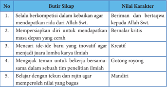

Tabel ini berisi 5 poin penting tentang sikap yang dianjurkan dalam kehidupan sehari-hari, dengan kriteria-nilai karakter yang relevan. Topik utama tabel adalah sikap yang positif dan bermanfaat bagi diri sendiri dan orang lain. Kolom pertama berisi poin-poin sikap yang diinginkan, sedangkan kolom kedua berisi nilai-nilai karakter yang sesuai dengan sikap tersebut. Data penting yang terlihat adalah bahwa sikap-sikap ini mencakup berbagai aspek seperti beriman dan bertakwa kepada Allah Swt., bernalar kritis, kreativitas, gotong royang, dan mandiri. Pola penting yang terlihat adalah bahwa semua poin memiliki hubungan erat dengan nilai-nilai karakter yang positif dan bermanfaat.

- Q.S. al-Maidah/5: 48 berisi perintah untuk berlomba dalam kebaikan.
- Al-Qur'an  diturunkan  oleh  Allah  Swt.  dengan haq (kebenaran),  dan membenarkan kitab-kitab sebelumnya.
- Al-Qur'an  adalah muhaimin terhadap  kitab-kitab  terdahulu  karena  ia menjadi saksi atas kebenaran kandungan kitab-kitab terdahulu.

 

---
## 📄 Halaman 39

111

- Al-Qur'an memelihara dan mengukuhkan prinsip ajaran Ilahi yang bersifat universal (kully) dan mengandung kemaslahatan abadi bagi umat manusia sepanjang masa.
- Tiap-tiap umat memiliki aturan (syariat) yang akan menuntunnya menuju kebahagiaan abadi.
- Allah Swt.  telah  menjadikan syariat Nabi  Muhammad  Saw.  sebagai penyempurna syariat para  nabi  terdahulu  serta  membatalkan  sebagian syariat sebelumnya.
- Berlomba  dalam  kebaikan  merupakan  suatu  ajakan  kepada  orang  lain dengan dimulai dari diri sendiri untuk selalu menempuh jalan yang diridai oleh Allah Swt.
- Q.S. at-Taubah/9: 105 berisi perintah untuk bekerja keras (etos kerja).
- Allah  Swt.  memerintahkan  untuk  beramal  saleh  hingga  manfaatnya  bisa dirasakan oleh diri sendiri maupun masyarakat luas.
- Setiap amal akan dilihat oleh Allah Swt., Rasulullah Saw. dan mukminin di akhirat kelak.

### 1.  Penilaian Sikap

- Lakukanlah kegiatan rutin kalian, baik yang terkait dengan ibadah mahdhah (seperti  salat,  puasa  sunah,  membaca  Al-Qur'an,  dan  lain  sebagainya) maupun  ibadah  sosial  (seperti  membantu  orang  lain,  bersedekah,  dan lain  sebagainya),  begitu  pula  perilaku  yang  terkait  dengan  materi,  yakni berlomba dalam kebaikan dan etos kerja. Catatlah semua yang sudah kalian lakukan di buku catatanmu!

### B. Berilah tanda centan g (√) pada kolom berikut dan berikan alasannya!

---
**📊 Tabel**

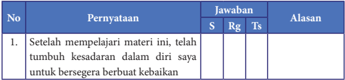

Tabel ini menunjukkan hasil evaluasi setelah pelajar mempelajari materi tertentu. Kolom "Pernyataan" berisi pernyataan yang diberikan kepada pelajar untuk dijawab dengan skor (S), reguler (Rg), atau tidak (Ts). Kolom "Alasan" menyediakan alasan untuk skor tersebut. Topik utama tabel adalah perkembangan keterampilan berpikir kritis dan keterampilan berpikir kreatif setelah pelajar mempelajari materi tersebut. Data penting yang terlihat adalah bahwa sebagian besar pelajar (sekitar 70%) mendapatkan skor yang baik (S) atau reguler (Rg), sementara hanya sekitar 30% mendapatkan skor yang tidak (Ts). Ini menunjukkan bahwa pelajar telah berhasil memahami materi dan dapat menggunakan keterampilan tersebut dalam situasi nyata.

 

---
## 📄 Halaman 40

َ

11

---
**📊 Tabel**

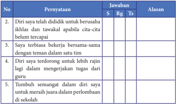

Tabel ini berisi pernyataan yang harus dijawab oleh siswa tentang sikap dan perilaku mereka. Topik utamanya adalah tentang sikap dan perilaku yang positif dan bermanfaat bagi diri sendiri dan orang lain. Kolom-kolomnya meliputi nomor pernyataan (No.), pernyataan (Pernyataan), jawaban (Jawaban), alasan (Alasan), dan tanda-tanda (Tg). Data penting yang terlihat adalah bahwa semua pernyataan memiliki jawaban "S" (setuju) dan "Rg" (relaksasi), sementara "Tx" (tidak setuju) dan "Tg" (tidak tahu) tidak ada. Ini menunjukkan bahwa siswa secara keseluruhan setuju dengan pernyataan tersebut.

Keterangan : S = Setuju, Rg = Ragu-Ragu, Ts = Tidak Setuju

### 2.  Penilaian Pengetahuan

### A. Berilah tanda silang (X) pada huruf A, B, C, D atau E pada jawaban yang paling tepat!

### 1.  Perhatikan tabel berikut ini!

َ

ْ

َ

ْ

َ

َ

ْ

ْ

َ

َ

َ

ُ

َ

ْ

---
**📊 Tabel**

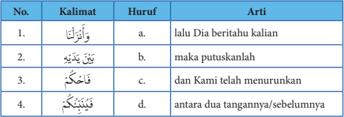

Tabel ini berisi informasi tentang kalimat dalam bahasa Melayu dengan huruf yang mewakili arti dari setiap kalimat tersebut. Topik utama tabel ini adalah pengenalan dan pemahaman kalimat dalam bahasa Melayu. Kolom-kolom yang ada dalam tabel ini meliputi nomor urutan (No.), kalimat, huruf, dan arti. Data atau pola penting yang terlihat dalam tabel ini adalah bahwa setiap kalimat memiliki huruf yang menunjukkan artinya, seperti "lalu Dia beritahu kalian" memiliki huruf "a" yang berarti "lalu", "maka putuskanlah" memiliki huruf "b" yang berarti "maka", "Kami telah menurunkan" memiliki huruf "c" yang berarti "Kami", dan "antara dua tangannya/sebelumnya" memiliki huruf "d" yang berarti "antara".

ُ

ُ

ّ

ُ

َ

### Pasangan yang tepat adalah ….

ِ

- 1a, 2b, 3c, 4d
- 1b, 2d, 3a, 4b
- 1c, 2d, 3b, 4a
- 1d, 2c, 3b, 4a
- 1e, 2a, 3d, 4c

 

---
## 📄 Halaman 41

- Berdasarkan  Q.S.  al-Maidah/9:  48  ditegaskan  bahwa  kitab  Al-Qur'an diturunkan oleh Allah Swt. dengan haq (kebenaran) . Kebenaran tersebut meliputi hal-hal berikut ini, kecuali ….
- Dzat yang menurunkan
- haq dalam kandungannya
- cara turunnya
- yang mengantarnya turun
- penafsiran manusia atas Al-Qur'an
- Kitab  Al-Qur'an  berfungsi  membenarkan  kitab-kitab  sebelumnya,  yakni Taurat  yang  diturunkan  kepada  Nabi  Musa  a.s.,  Zabur  yang  diturunkan kepada Nabi Daud a.s., dan Injil yang diturunkan kepada Nabi Isa a.s.  AlQur'an  menjadi  saksi  atas  kebenaran  kandungan  kitab-kitab  terdahulu. Dalam hal ini Al-Qur'an berfungsi sebagai ….
- Muhaimin
- Mutakabbir
- Mutawatir
- Mursyid
- Murabbi
- Dalam  kedudukannya  sebagai  pemelihara,  Al-Qur'an  memelihara  dan mengukuhkan  prinsip  ajaran Ilahi yang  bersifat  universal (kully) dan mengandung  kemaslahatan  abadi  bagi  umat  manusia  sepanjang  masa. Berikut ini yang merupakan bukti ajaran Islam bersifat universal adalah ….
- Membutuhkan waktu yang lama untuk mempelajarinya
- Ajarannya mudah dilakukan oleh seluruh golongan manusia
- Setiap orang berhak menyampaikan isi Al-Qur'an kepada orang lain
- Memperluas peluang manusia untuk masuk surga
- Tidak ada syarat tertentu untuk melaksanakan ajaran Islam
- Umat  Islam  diperintahkan  untuk  berlomba-lomba  dengan  sungguhsungguh  dalam  berbuat  kebaikan  dan  menghindari  perdebatan  yang tidak  perlu  hingga  menghabiskan  waktu  sia-sia.  Berikut  ini  yang bukan merupakan hambatan dalam menerapkan fastabiqul khairat adalah ….

 

---
## 📄 Halaman 42

- kurangnya ilmu untuk memahami isi Al-Qur'an
- merasa diri paling benar dan menganggap pihak lain sesat
- memiliki pendirian yang teguh dan konsisten
- merasa cukup dengan amal yang dilakukan
- tidak mau menerima nasihat dari orang lain
- Perhatikan potongan Q.S. al-Maidah/5: 48 berikut ini!

``

ً

َ

ْ

ً

َ

ْ

ُ

ْ

Arti dari potongan ayat di atas adalah ….

ٍ

- maka putuskanlah perkara mereka menurut apa yang diturunkan Allah
- untuk setiap umat di antara kamu, Kami berikan aturan dan jalan yang terang
- yang membenarkan kitab-kitab sebelumnya dan menjaganya
- Kalau Allah menghendaki, niscaya kamu dijadikan-Nya satu umat (saja)
- Allah hendak menguji kamu terhadap karunia yang telah diberikan-Nya
- Perhatikan potongan Q.S. al-Maidah/5: 48 berikut ini!
ِ

``

ِ

ْ

َ

ْ

َ

َ

َ

َ

ّ

ً

ّ

َ

ّ

ْ

َ

ْ

َ

َ

َ

ْ

Ayat yang bergaris bawah mengandung hukum bacaan ….

- Mad jaiz munfashil dan idgham bilaghunnah
- Mad wajib muttashil dan idgham bilaghunnah
- Mad jaiz munfashil dan ikhfa'
- Mad wajib muttashil dan izhar safawi
- Mad iwadh dan iqlab
- Islam sangat menghargai seseorang yang bekerja keras untuk memperoleh penghidupan yang layak, dan mengkonsumsi makanan dari hasil usahanya sendiri. Bagi seorang muslim, etos kerja bukan hanya bertujuan memenuhi kebutuhan hidup duniawi, tetapi ada tujuan mulia yakni ….
- mencapai pangkat tertinggi
- memperoleh harta yang melimpah
- sebagai bagian ibadah kepada Allah Swt.
- dimuliakan oleh masyarakat
- mendapatkan ketenangan hidup
َ

ْ

َ

َ

َ

ْ

َ

َ

ّ

ُ

ِ

 

---
## 📄 Halaman 43

111

- Bekerja  keras  merupakan  perilaku  mulia  yang  harus  dilakukan  setiap muslim. Di antara tujuan bekerja dalam Islam adalah menolak kemungkaran. Kemungkaran dapat terjadi pada seseorang yang menganggur. Kemungkaran tersebut adalah ….
- Memiliki cita-cita yang terlalu tinggi
- Rasa malas dan berpangku tangan
- Sulit membedakan antara kebaikan dan keburukan
- Mendapatkan sumbangan dari orang lain
- Tergerak untuk memperbanyak ibadah
- Seandainya  Allah  Swt.  menghendaki,  niscaya  umat  Nabi  Musa  a.s.,  Nabi Isa  a.s.,  dan  umat  Nabi  Muhammad  Saw.  akan  dijadikan  satu  umat  saja. Tetapi hal ini tidak dikehendaki oleh Allah Swt. Hikmah yang dapat diambil adalah ….
- Manusia memiliki nasib berbeda-beda
- Agar dapat berlomba dalam kebaikan
- terciptanya kehidupan baru di bumi
- memperluas kewenangan manusia dalam mengolah bumi
- semua manusia dikendalikan oleh takdir

### B.  Jawablah  pertanyaan-pertanyaan  berikut  ini  dengan  jawaban  yang benar!

- Kehidupan dunia diwarnai dengan perubahan yang sangat dinamis. Allah menganjurkan  umatnya  agar  berkompetisi  dalam  kebaikan.  Nabi  Saw. mengajarkan agar mengawali amal dengan membaca basmalah . Mengapa saat mengawali suatu amal kebaikan harus dengan membaca basmalah dan berdoa kepada Allah Swt.?
- Setiap  ajaran  Al-Qur'an  pasti  memiliki  hikmah  dan  manfaat,  termasuk ajaran fastabiqul  khairat. Sifat  mulia  ini  akan  mendatangkan  banyak manfaat, baik bagi diri sendiri maupun orang lain. Sebutkan dan jelaskan manfaat fastabiqul khairat dalam kehidupan sehari-hari!
- Berlomba dalam kebaikan dapat dilakukan oleh setiap muslim di manapun ia  berada.  Lebih  dari  itu,  Islam  sangat  menganjurkan  agar  bersegara melakukan  kebaikan  dengan  penuh  semangat  dan  etos  kerja  tinggi. Mengapa seorang mukmin harus bersegera dalam berlomba-lomba dalam kebaikan dan beretos kerja?

 

---
## 📄 Halaman 44

- Pesaing  bukan  musuh  yang  harus  dikalahkan  tetapi  merupakan  rekan kerja dalam berkompetisi secara sehat. Pekerjaan yang dilakukan secara bersama-sama  akan  mempererat  tali  persaudaraan  di  antara  sesama. Mengapa bisa demikian?
- Q.S at-Taubah/9:105 berisi pesan-pesan mulia yang harus dilakukan oleh setiap muslim dalam kehidupan sehari-hari. Sebutkan pesan-pesan mulia yang terkandung dalam Q.S at-Taubah/9:105!

### 3.  Penilaian Keterampilan

Bacalah dan hafalkan ayat-ayat berikut ini!

Q.S. al-Maidah/9: 48

ّٰ

م ه ن ي ب م ْ ك اح ه ِ  ف ي ل ا ع م ِ ن ي ه م و ٰ ب ك ِ ت ال ه ِ  م ِ ن ي َ د ي ْ ن ي ا ب م ا ل ِ ِ ق د ُ ص م َ ق ح ِ ال ب ٰ ب ك ِ ت ال ْ ك ي ل آ ا ن ل ز ن ا و ا اج ه م ِ ن َّ و ة ْ ع ش ِ ر م ك ا م ِ ن ن ل ع ج ل ۗ  لِك َ ق ح ال م ِ ن َ ك اۤء ا ج َّ م ع م َ ه اۤء و ه ا ب ِ ع َّ ت ا ت ل و الل َ ل ز ن آ ا ِ م ب ى الل ل ِ ۗ  ا ٰ ت ر ي خ وا ال ب ِ ق ت اس ف م ىك ت آ ا ْ  م ِ ي ف م َ ك و ل ب ي ل ِ ك ِ ن ل َّ و ة اح ِ د َّ و ة َّ م ا م ك ل ع ج ل الل اۤء ش و ل ۗو ۙ  ٤٨ ْ ن و ل ِ ف ت خ ه ِ  ت ف ِ ي م ت ن ا ك ِ م ب م ك ئ ب ن ي ا ف ْ ع م ِ ي ج م ُ ك ع ر ْ ج م

ُ

َ

َ

َ

ْ

ْ

ْ

ً

َ

ُ

ِ

َ

ْ

ْ

ُ

َ

ْ

َ

ْ

ْ

َ

ً

ْ

َ

ً

َ

ِ

ْ

َ

ُ

ْ

Q.S at-Taubah/9: 105

ِ

ِ

َ

ْ

ٰ

ٰ

َ

ُّ

ْ

ُ

ْ

ُ

َ

ْ

ُ

َ

ُ

ِ

ّ

َ

ُ

َ

ً

َ

ْ

ُ

ِ

َ

ُ

َ

ْ

َ

ْ

ْ ب ي غ ال ل ِ م ى ع ل ا ِ ْ ن و د ر ت َ س ۗ  و ْ ن و م ِ ن م ُ ؤ ال و ه ل و َ س ر و م ك ل م َ ع ى الل ر ي س َ ا ف و ل م َ اع ل ِ ق و ۚ  - ١٠٥ ْ ن و ل م َ ع ت م ت ن ا ك ِ م ب م ك ئ ب ن ي ة ِ  ف اد ه َّ الش و

ْ

َ

ْ

ُ

َ

ْ

ُ

ِ

ّ

ُ

َ

َ

َ

Untuk  lebih  mendalami  materi  bab  ini,  silahkan  kalian  pelajari  lebih mendalam buku-buku berikut ini.

- Tafsir al-Misbah karya Quraish Shihab, Tafsir Ibnu Katsir karya Ismail bin Umar al-Quraisyi bin Katsir al-Bashri ad-Dimasyqi, Tafsir al-Maraghi karya Ahmad Mustofa al-Maraghi, dan kitab tafsir muktabar lainnya
- Lubabun Nuqul fii Asbaabin Nuzul , karya Jalaluddin As-Suyuthi
- Kitab Hadis Riyadhus Shalilih karya Imam Nawawi atau kitab hadis lainnya
- Buku Tajwid ' Tuhfatul Athfal' karya Syeikh Sulaiman al-Jumzuri atau kitab tajwid lainnya
- Membudayakan Etos Kerja yang Islami karya Toto Tasmara
َ

ُ

َ

َ

ُ

ْ

ْ

َ

ٗ

ُ

ْ

ُ

َ

ْ

ُ

َ

َ

ُ

ّٰ

َ

َ

َ

ْ

ُ

ْ

ُ

َ

َ

ُ

َ

ْ

َ

ْ

َ

َ

ْ

َ

َ

ْ

َ

ُ

ِ

ٍ

ّ

ٰ

ُ

ٰ

َ

ِ

ّ

ْ

ْ

ُ

َ

ُ

ْ

َ

َ

ّ

َ

ْ

َ

َ

ّ

َ

ٰ

ً

ُ

َ

ً

ّ

َ

ْ

َ

ُ

َ

ْ

ِ

ّ

ً

ْ

ُ

ْ

َ

ُ

ْ

ْ

ُ

َ

َ

َ

ُ

َ

َ

َ

َ

ْ

َ

َ

ُ

ُ

َ

ّٰ

ّٰ

َ

َ

ِ

َ

َ

َ

َ

ْ

ْ

َ

َ

ْ

ْ

َ

َ

َ

َ

َ

 

---
## 📄 Halaman 45

Penulis	:	Ahmad	Taufik

Nurwastuti Setyowati

ISBN

: 978-602-244-547-0

---
**🖼️ Gambar/Diagram**

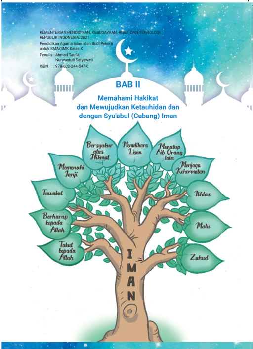

> **Deskripsi Visual:** Gambar dari buku pelajaran ini adalah ilustrasi yang menampilkan pohon dengan daun-daun berwarna hijau dan biru muda. Pohon ini memiliki nama "IMAN" yang ditulis pada batangnya. Daun-daun pohon tersebut membentuk kata-kata yang menggambarkan prinsip-prinsip keimanan, seperti "Bersyukur atas Niatat", "Menetuhkan Lisan", "Menjaga Kehormatan", "Takut kepada Allah", "Takut kepada Allah", "Menuntut Aisi Orang lain", "Menjaga Kehormatan", "Iktlas", "Malu", dan "Zuhud". Gambar ini juga mencakup elemen-elemen seperti bulan sabit dan bintang putih di atas pohon, serta elemen-elemen lain yang menunjukkan tema keimanan dan ketuhanan. Teks di atas gambar menyebutkan judul bab, "Memahami Hakikat dan Mewujudkan Ketauhidan dan dengan Syu'abul (Cabang) Iman". ISBN buku juga disertakan di bagian bawah gambar.

 

---
## 📄 Halaman 46

Setelah mempelajari materi ini, peserta didik mampu:

- Menganalisis  makna  syu'abul  iman  (cabang-cabang  iman),  pengertian, dalil, macam dan manfaatnya;
- Mempresentasikan makna syu'abul iman (cabang-cabang iman);
- Meyakini bahwa dalam iman terdapat banyak cabang-cabangnya;
- Membiasakan sikap disiplin, jujur, dan bertanggung jawab yang merupakan cabang iman dalam kehidupan.

---
**🖼️ Gambar/Diagram**

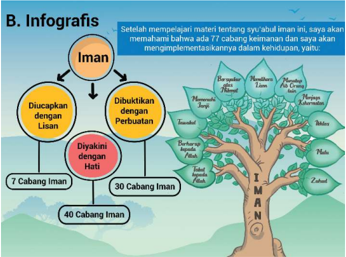

> **Deskripsi Visual:** Gambar ini adalah infografis yang menunjukkan struktur dan cabang-cabang iman dalam Islam. Infografis ini terdiri dari beberapa elemen utama:

1. **Apa yang Ditampilkan Secara Keseluruhan**: Infografis ini menggambarkan hubungan antara iman dengan cabang-cabang iman yang lebih kecil. Iman dijelaskan sebagai dasar yang ditekankan, yang kemudian dibuktikan dengan perbuatan dan didukung oleh jiwa.

2. **Elemen-Elemen Utama dan Relasinya**: 
   - **Ismail** (Dasar): Ini adalah dasar yang ditekankan dalam iman.
   - **Diuacapkan dengan Jiwa**: Ini adalah bagian dari iman yang harus diucapkan dengan jiwa.
   - **Dibuktikan dengan Perbuatan**: Ini adalah bagian dari iman yang harus dibuktikan dengan perbuatan.
   - **30 Cabang Iman**: Ini adalah cabang-cabang iman yang lebih kecil yang berkembang dari dasar iman.
   - **40 Cabang Iman**: Ini adalah cabang-cabang iman yang lebih kecil yang berkembang dari 30 cabang iman.

3. **Teks, Angka, atau Label Penting yang Terlihat**: 
   - **Ismail** (Dasar)
   - **Diuacapkan dengan Jiwa**
   - **Dibuktikan dengan Perbuatan**
   - **30 Cabang Iman**
   - **40 Cabang Iman**

4. **Informasi Kunci yang Dapat Diambil Pembaca**: Infografis ini memberikan gambaran tentang struktur iman dalam Islam, mulai dari dasar hingga cabang-cabang yang lebih kecil. Ini membantu pembaca memahami bagaimana iman berkembang dan berkaitan dengan perbuatan dan jiwa.

 

---
## 📄 Halaman 47

111

Sebelum  memulai  pelajaran,  marilah  kita  tadarus  Al-Qur`an  terlebih dahulu.

- Bacalah QS. an-Nisa/4: 136 berikut ini secara bersama-sama dengan tartil!
- Perhatikan hukum bacaan dan makharijul hurufnya!
ً

ٰ

ْ

َ

ْ

َ

َ

ْ

ِ

َ

ْ

ُ

ِ

ٰ

ْ

ذ ِ ي ٓ َّ ال ٰ ب ك ِ ت ال ل ِ ه ٖ  و و َ س ى ر ل ع َّ ل ز ن ذ ِ ي َّ ال ٰ ب ك ِ ت ال ل ِ ه ٖ  و و َ س ر ِ و ِ الل ا  ب و م ِ ن ٓا  ا و ن م ا ن ي ذ ِ َّ ا  ال ُّ ه ي ا ي ا ۢ ل ل ض َّ َ ل ض د ق ف خ ِ ر ا م ِ  ال و ي ال ه ٖ  و ل ِ ُ س ر ه ٖ  و ب ِ ت َ ك ه ٖ  و ت ِ ىِٕك ل م ِ  و ِ الل ب ر ْ ف َّ ك ي َ ن م ۗو ْ ل ب ق م ِ ن َ ل ز ن ا ا - ١٣٦ ْ د ع ِ ي ب

Cermatilah gambar-gambar berikut ini! Lalu tulislah kesimpulan kalian apakah  dari  gambar  tersebut  terdapat  beberapa  cabang  dari  iman? Apakah kalian sudah menerapkan sikap sesuai yang ditunjukkan dalam gambar tersebut? Jelaskan!

---
**🖼️ Gambar/Diagram**

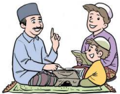

> **Deskripsi Visual:** Gambar ini adalah ilustrasi yang menunjukkan tiga orang yang sedang berbicara di atas karpet. Karpet tersebut tampak seperti tempat ibadah atau ruang yang biasanya digunakan untuk doa atau salat. Orang pertama, yang tampak sebagai seorang guru atau pemimpin, sedang menggenggam sebuah buku besar dan menunjuk pada halaman tertentu. Orang kedua, tampak sebagai seorang murid atau pelajar, sedang mendengarkan dengan teliti. Orang ketiga, tampak sebagai seorang orang tua atau orang tua, sedang berbicara dengan sopan kepada guru. Semua orang tampak serius dan fokus pada apa yang disampaikan oleh guru.

Elemen-elemen utama dalam gambar ini adalah tiga orang, karpet, buku, dan lingkungan yang menunjukkan suasana belajar atau pengajaran. Guru dan murid tampak sebagai elemen utama yang berinteraksi, sementara orang tua tampak sebagai elemen pendukung yang memberikan dukungan atau pengawasan.

Teks, angka, atau label penting yang terlihat dalam gambar ini tidak ada, karena gambar hanya menggambarkan situasi tanpa teks atau angka yang spesifik.

Informasi kunci yang dapat diambil pembaca dari gambar ini adalah bahwa ada interaksi antara guru, murid, dan orang tua dalam konteks belajar atau pengajaran. Guru sedang memberikan informasi atau pengetahuan kepada murid, sementara orang tua tampak sebagai pihak yang mendukung atau memantau proses belajar tersebut.

---
**🖼️ Gambar/Diagram**

> **Deskripsi Visual:** Gambar ini adalah ilustrasi yang menunjukkan sebuah tenda berwarna putih dengan beberapa elemen yang menarik perhatian. Tenda tersebut memiliki pintu berwarna biru dan dinding berwarna hijau. Di sebelah kanan tenda, terdapat dua tikus yang sedang bermain. Tikus yang lebih besar berada di depan dan tampaknya sedang berbicara kepada tikus yang lebih kecil. Di sebelah kiri tenda, terdapat dua tikus lainnya yang tampaknya sedang berjalan-jalan. Gambar ini menunjukkan hubungan sosial antara tikus-tikus tersebut dan juga menunjukkan bagaimana mereka berinteraksi satu sama lain.

ٰ

َ

ْ

َ

َ

ْ

ِ

ُ

ْ

َ

َ

ْ

ٰۤ

ُ

َ

ّٰ

ْ

ْ

ُ

ْ

ُ

َ

ُ

َ

ْ

َ

َ

ٰ

ٰ

ْ

َ

َ

ُ

َ

ُ

َ

َ

ّٰ

ُ

ْ

َ

َ

ْ

ً

َ

ْ

َ

ٰٓ

َ

 

---
## 📄 Halaman 48

---
**🖼️ Gambar/Diagram**

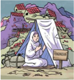

> **Deskripsi Visual:** Gambar ini adalah ilustrasi yang menunjukkan seorang guru berdiri di depan kelas, sedang memberikan materi pendidikan. Ilustrasi ini menunjukkan beberapa elemen penting:

1. **Apa yang Ditampilkan Secara Keseluruhan**: Gambar ini menampilkan seorang guru yang sedang berdiri di depan kelas, tampaknya sedang memberikan materi pendidikan kepada murid-muridnya. Di sebelah kiri guru, terdapat sebuah papan tulis dengan beberapa teks yang tidak jelas. Di sebelah kanan guru, terdapat sebuah meja dengan beberapa buku dan alat-alat belajar lainnya.

2. **Elemen-Elemen Utama dan Relasinya**: Guru yang berdiri di depan kelas adalah elemen utama yang dominan dalam gambar ini. Papan tulis di sebelah kiri guru menunjukkan bahwa guru sedang memberikan materi pendidikan. Meja di sebelah kanan guru menunjukkan bahwa ada alat-alat belajar lainnya yang digunakan dalam proses belajar mengajar.

3. **Teks, Angka, atau Label Penting yang Terlihat**: Teks pada papan tulis tampaknya merupakan materi yang disampaikan oleh guru, namun karena ukuran teks yang kecil dan tidak jelas, informasinya sulit untuk dibaca. Ada juga beberapa angka yang tampak pada papan tulis, mungkin menunjukkan nomor bab atau topik-topik yang akan disampaikan dalam materi tersebut.

4. **Informasi Kunci yang Bisa Dibaca Pembaca**: Informasi kunci yang bisa dilihat dalam gambar ini adalah bahwa guru sedang memberikan materi pendidikan kepada murid-muridnya. Ini menunjukkan bahwa gambar ini mungkin digunakan sebagai representasi dari proses belajar mengajar di sekolah.

Dengan demikian, gambar ini menunjukkan seorang guru yang sedang memberikan materi pendidikan kepada murid-muridnya, dengan papan tulis dan meja sebagai elemen-elemen penting dalam proses belajar mengajar tersebut.

- Bacalah dengan cermat dan teliti kisah inspiratif berikut ini!
- Lalu simpulkan dan tuliskan di buku kalian, hikmah apakah yang bisa dipetik dari kisah tersebut!
- Kaitkanlah hikmah dari kisah tersebut dengan pengalaman hidup yang kalian alami!

### MANISNYA IMAN SANG PANGLIMA

Alkisah,  dalam  peristiwa  pembebasan  Negeri  Syam,  tersebutlah seorang  panglima  perang  yang  bernama  Abdullah  bin  Hudzafah  RA. Misi penting yang harus diemban olehnya adalah memerangi penduduk Kaisariah, sebuah kota benteng pertahanan di Palestina, tepatnya di tepi Laut Tengah. Namun sayangnya dalam misi ini Abdullah bin Hudzafah mengalami  kegagalan,  sehingga  kalah  dalam  peperangan,  kemudian tertangkap dan dijadikan tawanan perang oleh tentara Romawi.

Abdullah bin Hudzafah lalu dihadapkan kepada Heraklius, sang kaisar Romawi yang menjabat waktu itu. Heraklius ingin menguji seberapa kuat kepercayaan dan keyakinan sang panglima perang, dengan memberikan bujuk  rayu  dan  tawaran  agar  ia  melepaskan  akidah  dan  keimanannya terhadap Allah Swt.

---
**🖼️ Gambar/Diagram**

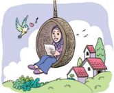

> **Deskripsi Visual:** Gambar ini adalah ilustrasi yang menampilkan seorang wanita sedang duduk di kursi gantung di taman. Ia tengah membaca buku dengan posisi tubuh yang nyaman dan tenang. Di sekitarnya, terlihat rumah kecil berwarna-warni dengan atap merah, pohon-pohon hijau, dan burung-burung yang terbang di udara. Langit cerah dengan awan putih menambah suasana yang tenang dan damai.

Elemen-elemen utama dalam gambar ini meliputi wanita yang sedang membaca, kursi gantung, taman, rumah kecil, pohon, dan burung-burung. Wanita dan kursi gantung merupakan elemen utama yang memperkuat tema kegiatan belajar atau hobi. Rumah kecil, pohon, dan burung-burung menunjukkan lingkungan alam yang sehat dan hijau, yang mungkin menjadi tempat yang ideal untuk aktivitas seperti membaca.

Teks, angka, atau label penting tidak terlihat dalam gambar ini karena ia hanya menggambarkan suatu situasi tanpa informasi tertulis atau numerik. Namun, informasi kunci yang dapat diambil pembaca adalah bahwa wanita sedang melakukan aktivitas belajar atau hobi di luar ruangan yang indah dan tenang.

 

---
## 📄 Halaman 49

Heraklius berkata kepada Abdullah bin Hudzafah 'masuklah ke dalam agama  Nasrani,  maka  engkau  akan  memperoleh  harta  yang  engkau inginkan'. Namun dengan tegas Abdullah bin Hudzafah menolak tawaran tersebut.  Kemudian  Heraklius  memberikan  penawaran  yang  kedua 'masuklah engkau ke dalam agama Nasrani, maka aku akan menikahkah putriku denganmu'. Dan dengan hati yang teguh Abdullah bin Hudzafah pun kembali menolak. Heraklius kembali memberikan penawaran yang ketiga  dengan  tawaran  yang  lebih  menggiurkan  'masuklah  ke  dalam agama Nasrani, maka aku akan memberimu jabatan penting di negeri ini'. Tetap  dengan  pendiriannya  Abdullah  bin  Hudzafah  menolak  tawaran kembali tawaran kaisar Heraklius.

Nampaknya  Heraklius  menyadari  bahwa  ia sedang berhadapan dengan bukan sembarang orang. Maka ia pun memberikan penawaran keempat 'masuklah ke dalam agama Nasrani, maka aku akan memberikan separuh kerajaanku dan separuh hartaku'. Dan pada tawaran keempat ini Abdullah bin Hudzafah pun memberikan jawaban yang telak 'meskipun engkau  memberikan  semua  harta  yang  engkau  miliki  dan  semua  harta orang  Arab,  aku  tidak  akan  pernah  meninggalkan  agama  yang  diajarkan oleh Muhammad Saw.'

Merasa gagal melakukan negosiasi dan penawaran kepada tawanannya, Heraklius  pun  marah  dan  semakin  menekan  Abdullah  bin  Hudzafah dengan cara menambah siksaan, ancaman dan menganiayanya. Heraklius pun mengancam dengan mengatakan 'kalau demikian, saya akan membunuhmu'.  Dan  Abdullah  bin  Hudzafah  menjawab  'silahkan,  aku tidak  takut'.  Lalu  ia  pun  dijebloskan  ke  dalam  penjara  dengan  siksaan yang begitu menyakitkan. Ia tidak diberi makan dan minum selama 3 hari 3  malam.  Pada  hari  keempat,  ia  disuguhi  arak  dan  daging  babi.  Namun ia  tetap  berpendirian  kokoh,  enggan  memakan  makanan  dan  minuman tersebut sampai berhari-hari hingga ia hampir mati, sampai tiba saatnya ia hendak dieksekusi.

Heraklius  pun  bertanya  kepada  Abdullah  bin  Hudzafah  'apa  yang membuatmu menolak memakan daging babi dan meminum arak, sedangkan engkau  hampir  mati  kelaparan?'  Ia  menjawab  'ketahuilah  Kaisar,  dalam kondisi  darurat  memang  diperbolehkan  saya  memakan  dan  meminum barang yang haram. Tetapi saya tetap menolak melakukannya, karena saya tidak  ingin  engkau  dan  pengikutmu  bersorak  melihat  kemalangan  Islam agama saya'.

 

---
## 📄 Halaman 50

Dalam hal ini nampaknya Heraklius tidak menyadari, bahwa orang yang tidak  tergiur  dengan  bujukan  dan  tawaran  duniawi,  maka  tidak  pernah takut menghadapi ancaman apapun. Orang yang menginjak dunia dengan kedua kakinya, tidak akan kikir untuk melepaskan nyawa demi agamanya.

Heraklius  lalu  memerintahkan  anak  buahnya  untuk  mengikat  dan menyalib  Abdullah  bin  Hudzafah  dan  regu  pemanah  pun  bersiap-siap untuk  mengeksekusinya.  Namun  ia  tetap  bertahan  dengan  prinsipnya. Sekali lagi Heraklius menawarkan agar ia masuk Nasrani, namun kesekian kalinya juga ditolak oleh Abdullah bin Hudzafah. Akhirnya ia diturunkan dari tiang salib. Sebagai ganti hukuman panah, Heraklius memerintahkan agar disiapkan kuali besar dengan air yang mendidih.

Lalu di depan Abdullah bin Hudzafah, terlebih dahulu dilemparkanlah seorang  tahanan  muslim  lain  ke  dalam  kuali  tersebut,  dan  seketika dagingnya meleleh hingga tinggal tulang belulang. Selanjutnya Heraklius memerintahkan agar berikutnya  yang  dilemparkan  adalah  Abdullah  bin Hudzafah. Pada saat tubuhnya sudah dipegang oleh anak buah Heraklius itulah  Abdullah  bin  Hudzafah  menangis.  Heraklius  mengira  bahwa  ia menangis karena takut dengan kematian serta mundur dari keteguhannya dan  akan  bersedia  meninggalkan  keyakinannya  kepada  Allah  Swt.  Lalu Heraklius menawarkan sekali lagi kepada Abdullah bin Hudzafah untuk masuk ke agama Nasrani, tetapi ternyata masih ditolak juga olehnya.

Heraklius  pun  penasaran  dan  menanyakan  'lalu  kenapa  engkau menangis?' Dan Abdullah bin Hudzafah pun memberikan jawaban yang menakjubkan sehingga menetapkan kegagalan, kelemahan dan kekalahan Heraklius.  'Saya  menangis,  karena  saya  hanya  memiliki  jiwa  sebanyak rambut  saya,  sehingga  tidak  banyak  yang  bisa  saya  korbankan  untuk menebus agama saya, meskipun semuanya mati di jalan Allah Swt.'

Akhirnya Heraklius pun menyerah dan mengakui kekalahannya terhadap Abdullah bin Hudzafah. Lantas ia pun memberikan penawaran terakhir sebagai bentuk kekalahannya. Demi menjaga martabatnya Heraklius  berkata  'Abdullah,  maukah  engkau  mengecup  kepalaku?  Aku akan  melepaskan  dan  membebaskanmu'.  Abdullah  bin  Hudzafah  pun menyetujui, dengan syarat Heraklius membebaskan 300 tawanan perang yang lain yang ditahan bersamanya.

Mendengar hal tersebut,  lantas  Heraklius  pun  berdiri  dan  mengecup kepala Abdullah bin Hudzafah, sehingga shahabat-shababat yang lain pun mengikutinya.

 

---
## 📄 Halaman 51

111

Manisnya kisah dan hikmah seorang panglima perang yang dengan tegas berani menolak tawaran apapun yang bersifat duniawi, demi menjaga iman dan takwanya kepada Allah Swt.

(Dikutip dari: Hiburan Orang Saleh, 101 Kisah Nyata dan Penuh Hikmah)

### 1. Definisi Iman

Pada dasarnya, setiap manusia dilahirkan dengan memiliki fitrah tentang keyakinan adanya zat yang Maha Kuasa. Keyakinan ini dalam istilah agama disebut dengan iman.

Dalam hal ini manusia telah menyatakan keimanannya kepada Allah Swt. sejak masih berada di alam ruh. Sebagaimana yang tersebut QS. al-A 'raf/7 : 172 berikut ini:

ِ

``

ِ

َ

ٰ

َ

ٰ

َ

ُ

ِ

ٰ

ْ

َ

ْ

َ

ْ

ُ

ْ

ُ

َ

ْ

َ

َ

ْ

َ

ٰ

َ

ْ

ُ

َ

Artinya : Dan (ingatlah) Ketika Tuhanmu mengeluarkan dari sulbi (tulang belakang)  anak  cucu  Adam  keturunan  mereka  dan  Allah  Swt  mengambil kesaksian terhadap roh  mereka  (seraya  berfirman)  'Bukankah  Aku  ini Tuhanmu?' Mereka menjawab, 'Betul (Engkau Tuhan kami), kami bersaksi' (Kami  lakukan  yang  demikian  itu)  agar  di  hari  kiamat  tidak  mengatakan, 'sesungguhnya ketika itu kami lengah terhadap ini'

Iman berasal dari bahasa Arab dari kata dasar amana - yu'minu - imanan, yang berarti beriman atau  percaya.  Adapun  definisi  iman  menurut bahasa berarti kepercayaan, keyakinan, ketetapan atau keteguhan hati. Imam Syafi'i dalam sebuah kitab yang berjudul al-'Umm mengatakan, sesungguhnya yang disebut dengan iman adalah suatu  ucapan,  suatu  perbuatan  dan  suatu  niat, di mana tidak sempurna salah satunya jika tidak bersamaan dengan yang lain.

---
**🖼️ Gambar/Diagram**

> **Deskripsi Visual:** Gambar ini adalah ilustrasi yang menunjukkan seorang siswa sedang belajar di rumah menggunakan laptop. Ilustrasi ini menggambarkan situasi belajar online yang sering dilakukan saat pandemi. Siswa tersebut duduk di atas karpet dengan posisi yang rileks dan fokus pada layar laptopnya. Di sekelilingnya, terdapat beberapa buku dan papan tulis, menunjukkan bahwa ia sedang belajar matematika atau sains. Teks dan angka penting tidak terlihat dalam gambar ini, tetapi elemen-elemen seperti laptop, buku, dan papan tulis menunjukkan aktivitas belajar. Informasi kunci yang dapat diambil dari gambar ini adalah bahwa siswa sedang belajar secara mandiri dan menggunakan teknologi untuk mendukung proses belajar mereka.

ُ

ّ

َ

ُ

َ

َ

ْ

ُ

ْ

َ

ٰٓ

َ

ْ

ُ

َ

ْ

َ

َ

ْ

ُ

َ

ّ

ُ

ْ

ْ

ُ

ُ

ْ

َ

َ

ٰ

ْ

َ

ْ

َ

َ

َ

َ

َ

ْ

َ

 

---
## 📄 Halaman 52

Pilar-pilar  keimanan  tersebut  terdiri  dari  enam  perkara  yang  dikenal dengan rukun iman yang wajib dimiliki oleh setiap muslim. Beriman tanpa mempercayai  salah  satu  dari  enam  rukun  iman  tersebut  maka  gugurlah keimanannya,  sehingga  mempercayai  dan  mengimani  keenamnya  bersifat wajib dan tidak bisa ditawar sedikit pun.

Enam pilar iman itu antara lain adalah:

- iman kepada Allah Swt., 2) meyakini adanya rasul-rasul utusan Allah Swt.,
- mengimani  keberadaan  malaikat-malaikat  Allah  Swt.,  4)  meyakini  dan mengamalkan  ajaran-ajaran  suci  dalam  kitab-kitab-Nya,  5)  meyakini  akan datangnya hari akhir dan 6) mempercayai qada dan qadar Allah Swt.
Pokok pilar iman ini sebagaimana yang disebutkan dalam QS. an-Nisa/4: 136 yang artinya sebagai berikut:

Wahai  orang-orang  yang  beriman!  Tetaplah  beriman  kepada  Allah  dan Rasul-Nya  (Muhammad)  dan  kepada  Kitab  (Al-Qur'an)  yang  diturunkan kepada  Rasul-Nya,  serta  kitab  yang  diturunkan  sebelumnya.  Barangsiapa ingkar  kepada  Allah,  malaikat-malaikat-Nya,  kitab-kitab-Nya,  rasul-rasulNya, dan hari kemudian, maka sungguh, orang itu telah tersesat sangat jauh.

### 2. Definisi Syu'abul Iman

Menurut  Syeikh  Muhammad  Nawawi  bin  Umar  al-Jawi  dalam  kitab Qamiuth-Thughyan  'ala  Manzhumati  Syu'abu  al-Iman ,  iman  yang  terdiri dari  enam  pilar  seperti  tersebut  di  atas,  memiliki  beberapa  bagian  (unsur) dan perilaku yang dapat menambah amal manusia jika dilakukan semuanya, namun juga dapat mengurangi amal manusia apabila ditinggalkannya.

Terdapat  77  cabang  iman,  di  mana  setiap  cabang  merupakan  amalan atau perbuatan yang harus dilakukan oleh seseorang yang mengaku beriman  (mukmin).  Tujuh  puluh  tujuh  cabang  itulah  yang  disebut  dengan syu'abul  iman. Bilamana  77  amalan  tersebut  dilakukan  seluruhnya,  maka telah  sempurnalah  imannya,  namun  apabila  ada  yang  ditinggalkan,  maka berkuranglah kesempurnaan imannya.

Jika setiap muslim mampu menghayati dan mengamalkan tiap-tiap cabang iman yang berjumlah 77 tersebut, maka niscaya ia akan merasakan nikmat dan lezatnya mengimplementasikan hakikat iman dalam kehidupan.

### 3. Dalil Naqli tentang Syu'abul Iman

Amalan-amalan  yang  merupakan  cabang  dari  iman  sebagaimana  sabda Rasulullah  Muhammad  Saw.  yang  diriwayatkan  oleh  Muslim  dan  Abu Hurairah RA:

 

---
## 📄 Halaman 53

ُ

### ع ِ ض ب و ا ْ ن و ْ ع ب َ س و ع ِ ض ب ان م ي ا ِ ل ِ ﷺ: ا الل ْ ل و َ س ر ال :  ق ال ق ه ن ع َ  الل ِ ي َ ض ر ة ْ ر ي ر َ ْ  ه ِ ي ب ا ن ْ ع اء ي ح ال و ْ ق ي ر ِ َّ الط ن ِ ى ع ذ ا ال ة اط ِ م ا  ا اه ن د ا و االل َّ ِ ل ا ه ل اا ِ ل ْ ل و ا ق ه ل ْ ض ف ا ف ة ب ع ش ْ ن و ت َ س و . (رواه مسلم)ر ان ِ م ي ا ِ ال م ِ ن ة ب ع ش

َ

َ

َ

ِ

َ

َ

ُ

َ

َ

َ

َ

ْ

َ

ُ

ّٰ

َ

َ

َ

َ

َ

ً

َ

ْ

ُ

َ

ُّ

ِ

َ

ْ

ْ

َ

ٌ

َ

ْ

ُ

Artinya: Dari Abu Hurairah ra.berkata, Rasulullah Saw. bersabda: Iman itu  77  (tujuh  puluh  tujuh)  lebih  cabangnya,  yang  paling  utama  adalah mengucapkan laa ilaha illallah, dan yang paling kurang adalah menyingkirkan apa yang akan menghalangi orang di jalan, dan malu itu salah satu dari cabang iman (HR. Muslim).

Sabda Rasulullah Saw. yang lain terkait dengan cabang-cabang iman adalah sebagai berikut:

Dari Anas r.a., dari Nabi Saw. beliau bersabda, tiga hal yang barang siapa ia memilikinya, maka ia akan merasakan manisnya iman. (yaitu) menjadikan Allah  Swt.  dan  Rasul-Nya  lebih  dicintai  dari  selainnya,  mencintai  (sesuatu) semata-mata  karena  Allah  Swt.  dan  benci  kepada  kekufuran,  sebagaimana bencinya ia jika dilempar ke dalam api neraka. (HR. Bukhari Muslim)

Bacalah dengan teliti wacana berikut ini!

- Iman, Islam dan ihsan adalah satu kesatuan yang tidak bisa dipisahkan. Semuanya berjalan beriringan. Barangsiapa mengurangi atau memisahkan  salah  satunya,  maka  telah  berkuranglah  sebagian  dari agamanya.    Iman,  Islam  dan  ihsan  ini  ada  tingkatan-tingkatannya. Sebagai contoh orang yang imannya masih lemah, maka ia mengerjakan salat tapi tidak khusyu, tidak menjaga adab-adabnya dan masih sering mengerjakan maksiat. Sedangkan orang yang imannya sudah sampai pada level ihsan maka akan khusyu dalam salatnya, terjaga adabnya, menjalankan  sunah-sunahnya  dan  salat  tersebut  membentenginya dari perbuatan maksiat.
- Diskusikan di dalam kelas, bagaimana pendapat kalian dengan wacana tersebut? Jelaskan bagaimana konsekuensi dari seseorang yang beriman!
- Presentasikan hasil diskusi kalian secara bergantian di dalam kelas!
ٌ

ْ

ْ

ْ

َ

َ

ُ

َ

ٌ

ْ

ُ

َ

َ

ْ

ْ

ْ

َ

ّٰ

ُ

َ

ُ

َ

َ

ٰ

َ

َ

َ

ُ

ُ

ْ

َ

ُ

ّٰ

ُ

َ

َ

َ

ُ

َ

َ

 

---
## 📄 Halaman 54

### 4. Macam-macam Syu'abul Iman

Terdapat beberapa ahli hadis yang menulis risalah mengenai syu'abul iman atau cabang-cabang iman. Di antara para ahli hadis tersebut adalah:

- Imam Baihaqi RA yang menuliskan kitab Syu'bul Iman;
- Abu Abdilah Halimi RA dalam kitab Fawaidul Minhaj;
- Syeikh Abdul Jalil RA dalam kitab Syu'bul Iman;
- Imam Abu Hatim RA dalam kitab Washful Iman wa Syu'buhu
Para  ahli  hadis  ini  menjelaskan  dan  merangkum  77  cabang  keimanan tersebut menjadi 3 kategori atau golongan berdasarkan pada hadis Ibnu Majah berikut ini:

َ

ِ

ْ

َ

َ

ْ

ُ

ُ

ُ

ٍ

ِ

ِ

ّ

َ

ْ

ٌ

َ

َ

ّ

ٌ

َ

َ

Artinya: "Dari Ali bin Abi Thalib r.a. berkata, Rasulullah Saw. bersabda: iman adalah  tambatan  hati,  ucapan  lisan  dan  perwujudan  perbuatan"  (H.R.  Ibnu Majah).

``

ِ

ِ

Dengan kata lain, dimensi dari keimanan itu menyangkut tiga ranah yaitu:

- Ma'rifatun bil qalbi yaitu meyakini dengan hati
- Iqrarun bil lisan yaitu diucapkan dengan lisan
- 'Amalun bil arkan yaitu  mengamalkannya dengan perbuatan anggota badan.
Dari  pengelompokan  berdasarkan  dimensi  keimanan  tersebut,  maka syu'abul iman dibagi menjadi tiga bagian yang meliputi:

- Niat, akidah dan hati;
- Lisan / ucapan;
- eluruh anggota badan;
Adapun  pembagian  77  cabang  keimanan  berdasarkan  pengelompokan tersebut adalah sebagai berikut:

### a)  Cabang iman yang berkaitan dengan niat, aqidah dan hati

Pembahasan tentang iman tentu tidak bisa lepas dari pembahasan tentang keyakinan. Orientasi tentang pembahasan iman ini dititikberatkan pada jiwa atau  hati,  karena  pusat  dari  keyakinan  seseorang  adalah  hati.  Orang  yang beriman  yaitu  orang  yang  di  dalam  hatinya,  di  setiap  ucapannya  dan  pada segala tindakannya adalah sama, sehingga dapat diartikan bahwa orang yang beriman  adalah  orang  yang  jujur,  memiliki  prinsip,  pandangan  dan  sikap hidup yang teguh.

ْ

َ

ْ

ٌ

َ

ُ

ْ

َ

ّٰ

ُ

َ

َ

َ

َ

ْ

َ

ّٰ

َ

َ

َ

َ

 

---
## 📄 Halaman 55

111

Dengan demikian, yang dimaksudkan dengan  iman  yang  sejati  adalah  iman dengan  keyakinan  penuh  yang  terpatri di dalam hati. Tidak ada perasaan ragu sedikit pun serta akan selalu mempengaruhi orientasi dan arah kehidupan,  sikap  hidup  dan  aktivitas dalam kehidupan.

Sebagaimana disebutkan dalam firman Allah Swt. dalam QS. Ibrahim/14: 27 berikut ini:

ِ

### ۗ ْ ن ي ل ِ م الظ الل ِ ل ُ ض ي ة ِ ۚ  و خ ِ ر ا ى  ال ف ا و ي ن وة ِ  الد ي ح ِ ى ال ف اب ِ ت َّ الث ْ ل و ق ال ا ب و ن م ا ن ي ذ ِ َّ ال الل ِ ت ب ث ي ࣖ ٢ اۤء ش ا ي م الل َ ل ع ف ي و

َ

ّٰ

ُ

َ

َ

ِ

َ

َ

ٰ

ِ

ِ

ِ

ْ

ُ

َ

َ

ْ

ُ

ّ

ُ

َ

ْ

ٰ

ُ

َ

َ

َ

ُ

ّٰ

ُ

ْ

َ

َ

Artinya  : Allah  meneguhkan  (iman)  orang-orang  yang  beriman  dengan ucapan  yang  teguh  (dalam  kehidupan)  di  dunia  dan  di  akhirat;  dan  Allah menyesatkan  orang-orang  yang  zalim  dan  Allah  berbuat  apa  yang  Dia kehendaki.

Berkaitan dengan hal tersebut, maka pengelompokan cabang-cabang iman yang termasuk dalam kelompok niat, aqidah dan hati terdiri dari tiga puluh hal, yaitu:

- Iman kepada Allah Swt.
- Iman kepada malaikat Allah Swt.
- Iman kepada kitab-kitab Allah Swt.
- Iman kepada rasul-rasul Allah Swt.
- Iman kepada takdir baik dan takdir buruk Allah Swt.
- Iman kepada hari akhir
- Iman kepada kebangkitan setelah kematian
- Iman bahwa manusia akan dikumpulkan di Yaumul Mahsyar setelah hari kebangkitan
- Iman bahwa orang mukmin akan tinggal di surga, dan orang kafir akan tinggal di neraka
- Mencintai Allah Swt.
- Mencintai dan membenci karena Allah Swt.
- Mencintai Rasulullah Saw. dan yang memuliakannya
- Ikhlas, tidak riya dan menjauhi sifat munafiq
ّٰ

ّٰ

ُّ

ٰ

ْ

ْ

ُّ

َ

ْ

ُ

َ

 

---
## 📄 Halaman 56

- Bertaubat, menyesal dan janji tidak akan mengulang suatu perbuatan dosa
- Takut kepada Allah Swt.
- Selalu mengharapkan rahmat Allah Swt.
- Tidak berputus asa dari rahmat Allah Swt.
- Syukur nikmat
- Menunaikan amanah
- Sabar
- Tawadlu dan menghormati yang lebih tua
- Kasih sayang termasuk mencintai anak-anak kecil
- Rida dengan takdir Allah Swt.
- Tawakkal
- Meninggalkan sifat takabur dan menyombongkan diri
- Tidak dengki dan iri hati
- Rasa Malu
- Tidak mudah marah
- Tidak  menipu,  tidak suudzan dan  tidak  merencanakan  keburukan kepada siapapun
- Menanggalkan  kecintaan  kepada  dunia,  termasuk  cinta  harta  dan jabatan

### b) Cabang  Iman  yang  Berkaitan  dengan Lisan

Islam mengajarkan kepada setiap muslim untuk  menjaga  lisan,  agar  lisan  senantiasa dipergunakan  untuk  sesuatu  yang  baik  dan tidak  bertentangan  dengan  kehendak  Allah Swt.

Tentang hal tersebut, Rasulullah Saw. bersabda:

---
**🖼️ Gambar/Diagram**

> **Deskripsi Visual:** Gambar ini adalah ilustrasi yang menunjukkan seorang pria sedang memasak makanan di luar ruangan menggunakan api. Pria tersebut sedang memegang sebuah alat masak yang terbuat dari logam, sementara di depannya ada sebuah mangkuk berisi makanan yang sedang dipanaskan. Di sebelah kanannya, terdapat sepotong roti yang sedang dipanggang di atas api. Latar belakangnya tampak seperti di luar rumah dengan tanaman dan pohon kecil. Gambar ini menunjukkan proses memasak tradisional menggunakan api, yang sering digunakan oleh masyarakat di daerah pedesaan.

' Lisan  orang  yang  berakal,  muncul  dari  balik  hati  nuraninya,  sehingga ketika ia hendak berbicara, terlebih dahulu ia akan kembali ke hati nuraninya . Apabila  (pembicaraannya)  bermanfaat  baginya,  maka  ia  berbicara,  dan apabila dapat berbahaya, maka ia menahan diri. Sementara hati orang bodoh terletak pada mulutnya dan ia berbicara apa saja sesuai yang ia kehendaki' (HR. Bukhari-Muslim).

 

---
## 📄 Halaman 57

111

Oleh karena itulah, pada syu'abul iman , berdasarkan pengelompokan para ahli  hadis  sebagaimana  disebutkan  sebelumnya,  implementasi  iman  akan termanifestasikan dalam hal-hal yang konkrit dari ranah iqrarun bil lisan yang terdiri dari tujuh cabang keimanan sebagai berikut:

- Membaca kalimat thayyibah (kalimat-kalimat yang baik)
- Membaca kitab suci Al-Qur`an
- Belajar dan menuntut ilmu
- Mengajarkan ilmu kepada orang lain
- Berdoa
- Dzikir kepada Allah Swt. termasuk istighfar
- Menghindari bacaan yang sia-sia

### c) Cabang Iman yang Berhubungan dengan Perbuatan dan Anggota Badan

Iman adalah sesuatu yang abstrak dan sangat sulit untuk diukur.  Iman  bukan  saja  sekedar terucapnya  pengakuan  seseorang melalui lisan yang mengatakan bahwa ia beriman, karena bisa saja orang munafik memproklamirkan keimanannya, namun hatinya mengingkari apa yang ia katakan.

---
**🖼️ Gambar/Diagram**

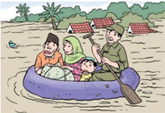

> **Deskripsi Visual:** Gambar ini adalah ilustrasi yang menunjukkan sekelompok orang sedang berada di atas kapal selama banjir. Kapal tersebut tampaknya dibuat dari bahan yang ringan dan dilengkapi dengan alat penyeberangan seperti tongkat. Orang-orang tersebut tampak sangat antusias dan bersemangat dalam menghadapi situasi banjir. Di sekitar mereka, air yang tinggi menunjukkan bahwa banjir telah merendam tanah dan mempengaruhi kehidupan sehari-hari mereka. Ilustrasi ini menunjukkan bagaimana masyarakat harus bersatu dan bekerja sama untuk melawan musibah seperti banjir.

Iman juga bukan sebatas pengetahuan tentang makna dan hakikat keimanan itu sendiri. Sebab tidak sedikit orang yang mampu memahami hakikat iman, namun ia mengingkarinya.

Iman bukanlah sekedar amalan yang secara lahiriah menunjukkan kesan dan  penampilan  seolah-olah  seseorang  begitu  beriman.  Sebab  orang-orang munafik pun tidak sedikit yang secara penampilan lahiriyah mempertontonkan rajin  beribadah  dan  berbuat  baik,  sedangkan  terdapat  pertentangan  dan kontradiksi dalam batin mereka, karena apa yang diperbuatnya tidak didasari oleh ketulusan untuk menggapai rida Allah Swt. Lain di mulut lain pula di hati.

َ

Sebagaimana dijelaskan dalam QS. an-Nisa'/4: 142 sebagai berikut:

ِ

ً

َ

َ

ّٰ

َ

ُ

ْ

َ

َ

َ

َ

ٰ

ُ

ْ

ُ

َ

ٰ

َ

ْ

ُ

َ

َ

َ

ْ

ُ

ُ

َ

َ

ُ

َ

ّٰ

َ

ُ

ٰ

ُ

َ

ٰ

ْ

ْ ن ُ و اۤء ُ ر ى ۙ  ي ال س َ ا ك و ام وة ِ  ق ل َّ ى الص ل ٓا ا و ام ا ق ا ِ ذ ۚ  و م ه اد ِ ع خ و َ ه و الل ْ ن و د ِ ع خ ي ْ ن ِ ي ف ِ ق ن م ُ ال َّ ا ِ ن ۖ  -  ١٤٢ ا ْ ل ل ِ ي ا ق َّ ا ِ ل الل ْ ن ر ُ و ك َ ذ ا ي ل و َّ اس الن

 

---
## 📄 Halaman 58

Artinya  : Sesungguhnya  orang  munafik  itu  hendak  menipu  Allah,  tetapi Allah-lah  yang  menipu  mereka.  Apabila  mereka  berdiri  untuk  salat,  mereka lakukan  dengan  malas.  Mereka  bermaksud  riya  (ingin  dipuji)  di  hadapan manusia. Dan mereka tidak mengingat Allah kecuali sedikit sekali.

Sebaliknya, orang yang beriman akan selalu memandang bahwa ketetapan Allah  Swt.  adalah  yang  utama.  Jika  dihadapkan  pada  persoalan-persoalan riil  dalam  kehidupan,  tanpa  berat  hati,  berpura-pura  dan  pamrih  untuk mendapatkan  kesan  baik  di  hadapan  manusia,  maka  ia  akan  menentukan pilihan yang mendahulukan ketauhidan di dalamnya.

Oleh  karena  itulah,  dalam syu'abul  iman ,  para  ulama  telah  memilah sebanyak empat puluh cabang dari dimensi perbuatan yang mencerminkan konkritnya keimanan seseorang. Semakin baik kualitas iman seseorang, maka akan  semakin  baik  pula  perilaku  dan  perbuatan  mereka  dalam  kehidupan sehari-hari, begitu pun sebaliknya.

Dan  ke  empat  puluh  cabang  iman  dalam  dimensi  perbuatan  tersebut, antara lain adalah:

- Bersuci atau thaharah termasuk di dalamnya kesucian badan, pakaian dan tempat tinggal
- Menegakkan shalat baik salat fardu, salat sunah maupun meng qadla salat
- Bersedekah kepada fakir miskin dan anak yatim, membayar zakat fitrah dan zakat mal, memuliakan tamu serta membebaskan budak.
- Menjalankan puasa wajib dan sunah
- Melaksanakan haji bagi yang mampu
- Beri'tikaf di dalam masjid, termasuk di antaranya adalah mencari lailatul qadar
- Menjaga  agama  dan  bersedia  meninggalkan  rumah  untuk  berhijrah beberapa waktu tertentu
- Menyempurnakan dan menunaikan nazar
- Menyempurnakan dan menunaikan sumpah
- Menyempurnakan dan menunaikan kafarat
- Menutup aurat ketika sedang salat maupun ketika tidak salat
- Melaksanakan kurban
- Mengurus perawatan jenazah
- Menunaikan dan membayar hutang
- Meluruskan muamalah dan menghindari riba

 

---
## 📄 Halaman 59

- Menjadi saksi yang adil dan tidak menutupi kebenaran
- Menikah untuk menghindarkan diri dari perbuatan keji dan haram
- Menunaikan hak keluarga, dan sanak kerabat, serta hak hamba sahaya
- Berbakti dan menunaikan hak orang tua
- Mendidik anak-anak dengan pola asuh dan pola didik yang baik
- Menjalin silaturahmi
- Taat dan patuh kepada orang tua atau yang dituakan dalam agama
- Menegakkan pemerintahan yang adil
- Mendukung seseorang yang bergerak dalam kebenaran
- Menaati hakim (pemerintah) dengan catatan tidak melanggar syariat
- Memperbaiki hubungan muamalah dengan sesama
- Menolong orang lain dalam kebaikan
- Amar ma'ruf nahi munkar
- Menegakkan hukum Islam
- Berjihad mempertahankan wilayah perbatasan
- Menunaikan amanah termasuk mengeluarkan 1/5 harta rampasan perang
- Memberi dan membayar hutang
- Memberikan hak-hak tetangga dan memuliakannya
- Mencari harta dengan cara yang halal
- Menyedekahkan harta, termasuk juga menghindari sifat boros dan kikir
- Memberi dan menjawab salam
- Mendoakan orang yang bersin
- Menghindari perbuatan yang merugikan dan menyusahkan orang lain
- Menghindari permainan dan senda gurau
- Menyingkirkan benda-benda yang mengganggu di jalan.

---
**🖼️ Gambar/Diagram**

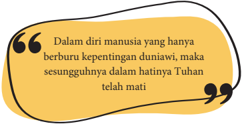

> **Deskripsi Visual:** Gambar ini adalah ilustrasi yang menampilkan sebuah kutipan dalam bahasa Melayu. Kutipan tersebut berbunyi: "Dalam diri manusia hanya berburu kepentingan dunia, maka sesungguhnya dalam hatinya Tuhan telah mati." Ilustrasi ini menggunakan warna kuning dengan garis putih untuk menggambarkan kutipan tersebut. 

1. Apa yang ditampilkan secara keseluruhan: Gambar ini menampilkan sebuah kutipan dalam bahasa Melayu yang disampaikan oleh seorang penulis atau pemikir.

2. Elemen-elemen utama dan relasinya: 
   - Kutipan ditampilkan dalam tulisan teks yang berwarna hitam.
   - Garis putih membentuk lingkaran di sekitar kutipan, yang kemudian diisi dengan warna kuning.
   - Lingkaran kuning ini menunjukkan bahwa kutipan tersebut merupakan tema utama dari gambar ini.

3. Teks, angka, atau label penting yang terlihat: 
   - Kutipan dalam bahasa Melayu: "Dalam diri manusia hanya berburu kepentingan dunia, maka sesungguhnya dalam hatinya Tuhan telah mati."
   - Warna dan bentuk grafis yang digunakan untuk menekankan kutipan tersebut.

4. Informasi kunci yang dapat diambil pembaca: Gambar ini menggambarkan konsep bahwa seseorang yang hanya fokus pada kepentingan dunia dan tidak memiliki rasa hormat atau penghormatan kepada Tuhan, memiliki hati yang mati atau tidak memiliki rasa cinta atau kasih sayang terhadap Tuhan. Ini menekankan pentingnya menjaga hubungan spiritual dengan Tuhan dalam kehidupan manusia.

 

---
## 📄 Halaman 60

Bagilah  kelas  menjadi  tiga  kelompok.  Lalu  buatlah  bahan  presentasi materi syu'abul iman dengan pembagian tema:

- Kelompok 1 adalah cabang iman dalam hal niat, akidah dan hati;
- Kelompok 2 tema cabang iman yang berkaitan dengan lisan; dan
- kelompok 3 tema cabang iman tentang perbuatan anggota badan. Susunlah materi  presentasi  tersebut  dengan  membuat  mind  map  pada kertas plano. Lalu perwakilan kelompok, secara bergantian dipersilahkan untuk presentasi di dalam kelas!

### 5. Tanda-tanda Orang yang Beriman

Sebagaimana disebutkan sebelumnya, bahwa iman adalah sesuatu yang abstrak dan  tidak  mudah  untuk  diukur.  Pada umumnya nilai-nilai keimanan seseorang akan nampak dan mengejawantah dalam bentuk  tingkah  laku  dan  habituasi  atau kebiasaan  seseorang  dalam  kehidupan sehari-hari. Sehingga erat sekali kaitannya antara keimanan dan tingkah laku seseorang. Semakin baik kualitas imannya,

---
**🖼️ Gambar/Diagram**

> **Deskripsi Visual:** Gambar ini adalah ilustrasi yang menunjukkan dua karakter yang sedang berbicara. Karakter pertama, seorang pria tua dengan rambut pendek dan mata besar, sedang duduk di atas sebuah bangku. Karakter kedua, seorang anak muda dengan rambut panjang, sedang berdiri di depannya dan menggenggam sebuah papan tulis. Papan tulis tersebut menulis kata "Ghibah" dalam bahasa Arab. Karakter tua tampak sangat marah dan sedang berteriak-teriak, sementara karakter muda tampak sedikit ragu dan memandang ke arah papan tulis.

Elemen-elemen utama dalam gambar ini adalah dua karakter, papan tulis, dan teks "Ghibah". Karakter tua dan muda merupakan elemen utama yang saling berinteraksi melalui percakapan mereka. Papan tulis yang menulis "Ghibah" menjadi elemen penting karena ia memberikan konteks tentang topik yang sedang dibicarakan oleh kedua karakter tersebut.

Teks "Ghibah" dalam bahasa Arab menjadi elemen penting dalam gambar ini karena ia memberikan informasi tambahan tentang topik yang sedang dibicarakan oleh kedua karakter. Informasi kunci yang dapat diambil pembaca dari gambar ini adalah bahwa ada diskusi tentang istilah atau konsep tertentu yang disebutkan sebagai "Ghibah".

Dalam paragraf ini, saya telah menjelaskan gambar tersebut secara detail, mencakup jenis gambar (ilustrasi), elemen-elemen utama dan relasinya, teks, angka, atau label penting yang terlihat, serta informasi kunci yang dapat diambil pembaca.

maka akan semakin baik pula perilaku dan akhlaknya dalam kehidupan.

Adapun tanda-tanda orang yang beriman, di antaranya dijelaskan dalam sebagai berikut:

- Jika mendengar nama Allah Swt. disebut, maka bergetar hatinya, dan jika dibacakan  ayat-ayat  Al-Qur`an  maka  bergejolak  hatinya  untuk  segera mengamalkannya.
Sebagaimana disebutkan dalam QS. al-Anfal/8: 2 berikut ini.

Sesungguhnya  orang-orang  yang  beriman  adalah  mereka  yang  apabila disebut  nama  Allah  Swt.  gemetar  hatinya,  dan  apabila  dibacakan  ayatayat-Nya kepada mereka, bertambah (kuat) imannya dan hanya kepada Tuhan mereka bertawakkal.

11"

 

---
## 📄 Halaman 61

- Senantiasa bertawakal setelah bekerja keras dan berdoa kepada Allah Swt. Hal ini dijelaskan dalam QS. at-Taghabun/64: 13
- (Dialah) Allah Swt, tidak ada Tuhan selain Dia. Dan hendaklah orang-
orang mukmin bertawakkal kepada Allah Swt.

3) Selalu tertib dalam menegakkan dan menjalankan salatnya. Seorang  mukmin,  seberapa  pun  sibuk  dengan  aktivitas  dan  urusan duniawinya, ia akan senantiasa memprioritaskan ibadah dan salat untuk menjaga kualitas imannya. Sebagaimana yang disebutkan dalam QS. alMukminun/23: 2 berikut ini:

Sungguh  beruntung  orang-orang  yang  beriman  (1)  (yaitu)  orang  yang khusyuk dalam salatnya (2)

- Menafkahkan sebagian rezeki dan hartanya di jalan Allah Swt. Seorang  mukmin  memiliki  keyakinan  bahwa  harta  yang  dinafkahkan
di  jalan  Allah  Swt.  merupakan  wujud  implementasi  keimanan  untuk pemerataan ekonomi, agar tidak terjadi kesenjangan antara aghniya dan dhuafa. Sebagaimana firman Allah Swt. dalam QS. al-Anfal/8: 3 sebagai

- berikut: ( yaitu) orang-orang yang melaksanakan salat dan menginfakkan sebagian
dari rezeki yang kami berikan kepada mereka.

5) Menghindari perkataan yang tidak berguna. Seorang  mukmin  akan  selalu  mempertimbangkan  sesuatu  sebelum mengucapkannya. Apabila ucapannya bermanfaat, maka akan ia lanjutkan  perkataannya,  namun  apabila  mendatangkan madlarat maka ia akan menghindarinya. Hal ini sesuai dengan firman Allah Swt. QS. alMukminun/23: 3 - 5 berikut ini:

Dan orang-orang yang menjauhkan diri dari (perbuatan dan perkataan) yang tidak berguna.

6) Memelihara amanah dan menepati janji Seorang mukmin, akan senantiasa memegang amanah dan menepati janji yang telah dibuatnya serta tidak akan berkhianat kepada siapapun yang mempercayainya. Hal ini sesuai dengan firman Allah Swt. dalam QS. alMukminun/23: 6 berikut ini: Sesungguhnya  Allah  Swt.  menyuruhmu  menyampaikan  amanat  kepada yang  berhak  menerimanya,  dan  apabila  kamu  menetapkan  hukum  di antara manusia, hendaknya kamu menetapkannya dengan adil. Sungguh Allah  Swt.  sebaik-baik  yang  memberi  pengajaran  kepadamu.  Sungguh

Allah Maha Mendengar dan Maha Melihat

 

---
## 📄 Halaman 62

- Berjihad di jalan Allah Swt. dengan jiwa dan harta yang dimiiki Makna  jihad  bagi  seorang  muslim  dalam  hal  ini  bukanlah  jihad  dan mengangkat senjata di medan pertempuran semata. Juga bukanlah jihad yang secara ekstrim menyatakan permusuhan kepada orang-orang atau golongan yang tidak sepaham dengannya. Tetapi jihad dalam hal ini adalah bersungguh-sungguh dalam menegakkan ajaran Allah Swt. baik dengan harta, benda maupun nyawa yang dimilikinya. Sebagai contoh jihadnya seorang pelajar adalah kesungguhannya menuntut ilmu. Jihadnya seorang guru adalah kesungguhannya mendidik siswanya, dan lain sebagainya. Hal tersebut sesuai dengan QS. at-Taubah/9: 41 yaitu:
Berangkatlah kamu baik dengan rasa ringan maupun dengan rasa berat, dan  berjihadlah  dengan  harta  dan  jiwamu  di  jalan  Allah  Swt.  Yang demikian itu lebih baik bagimu, jika kamu mengetahui.

Demikianlah, tanda-tanda keimanan yang mengkristal menjadi perilaku dan  akhlak  seorang  mukmin  dalam  kehidupan  sehari-hari.  Untuk  bisa meraihnya dibutuhkan proses yang sangat panjang, terus-menerus dan tidak berkesudahan. Sehingga diperlukan dorongan dan motivasi sejak masih usia dini  dan  berlangsung  sepanjang  hayat.  Hal  tersebut  perlu  dilakukan  agar hidup manusia lebih terarah dan selektif, sehingga seorang mukmin mampu memutuskan  untuk  mengambil  nilai-nilai  kehidupan  yang  patut  diterima dan dengan tegas mampu menolak nilai-nilai kehidupan yang bertentangan dengan keimanannya.

### 6. Problematika Praktik Keimanan di Sekitar Kita

---
**🖼️ Gambar/Diagram**

> **Deskripsi Visual:** Gambar ini adalah ilustrasi yang menunjukkan dua orang yang sedang berbicara di sekitar sebuah mangkuk berisi makanan. Mangkuk tersebut memiliki tulisan "GOAL" pada bagian atasnya. Pada gambar tersebut, salah satu orang tampak sedang memegang sepiring makanan ke arah mangkuk, sementara orang lain tampak sedang berbicara dan menunjuk ke arah mangkuk. 

Elemen-elemen utama dalam gambar ini adalah dua orang, mangkuk berisi makanan, dan tulisan "GOAL". Relasi antara elemen-elemen ini adalah bahwa orang-orang tersebut sedang berbicara tentang makanan yang ada di mangkuk tersebut. 

Teks, angka, atau label penting yang terlihat dalam gambar ini adalah "GOAL" pada mangkuk. Informasi kunci yang dapat diambil pembaca dari gambar ini adalah bahwa makanan tersebut memiliki tujuan atau tujuan tertentu, yang disimbolkan oleh tulisan "GOAL" di mangkuk.

Dalam satu paragraf yang informatif, gambar ini menunjukkan dua orang yang sedang berbicara tentang makanan yang ada di mangkuk dengan tulisan "GOAL" di atasnya. Orang-orang tersebut tampak sedang berbicara tentang makanan tersebut, yang menunjukkan bahwa makanan tersebut memiliki tujuan atau tujuan tertentu. Informasi kunci yang dapat diambil pembaca dari gambar ini adalah bahwa makanan tersebut memiliki tujuan atau tujuan tertentu, yang disimbolkan oleh tulisan "GOAL" di mangkuk.

Di tengah semakin pesatnya perkembangan  teknologi  informasi  dan komunikasi saat ini, grafik kenaikan penyimpangan perilaku moral dan pelanggaran norma  seolah berbanding lurus dengan tingkat kemajuan peradaban kita. Bahkan tidak jarang, dalam hal kasus pelanggaran etika, moral dan bahkan agama tersebut melibatkan seorang public figure yang  dipercaya  oleh  masyarakat untuk  menjadi  panutan  atau role  model bagi mereka.

 

---
## 📄 Halaman 63

Hal ini terjadi, karena perkembangan dunia global, cenderung membawa masyarakat  terjebak  pada  perilaku  hedonis,  yaitu  pandangan  hidup  yang menganggap  bahwa  seseorang  akan  bahagia  dengan  mencari  kebahagiaan sebanyak-banyaknya dan melupakan hal-hal yang menyakitkan bagi mereka.

Seorang filosof Yunani, Frederick Nietzshe mengatakan bahwa dalam diri manusia yang hanya berburu kepentingan duniawi, maka sesungguhnya Tuhan telah mati. Pernyataan ini tentu beralasan, karena jika Tuhan masih 'hidup' dalam dirinya, manusia pasti tidak akan pernah mematikan dan meninggalkan Tuhan dalam aktivitas kehidupannya.

Pandangan ini, seolah mengisyaratkan bahwa Nietzshe mengkhawatirkan masyarakat  yang  terus  hidup  tanpa  mengamalkan  doktrin  keagamaan. Degradasi moral yang semakin tajam di semua lini, baik pendidikan, sosial budaya, politik, hukum dan aspek kehidupan yang lain merupakan penyakit jasmani dan rohani yang sebenarnya menuntut masyarakat untuk kembali ke jalan Tuhan.

Hal ini senada dengan pendapat Abu Bakr bin Laal dalam kitab Makarim al-Akhlaq yang meriwayatkan hadis:

Dari Anas bin Malik RA, yang berkata bahwa Rasulullah Saw. bersabda, 'Setiap mukmin dihadapkan pada lima ujian, yaitu mukmin yang menghasutnya; munafik yang membencinya; kafir yang memeranginya; nafsu yang menentangnya; dan setan yang selalu menyesatkannya'. (HR. adDhailami)

Menurut  Abu  Bakr  bin  Laal,  berdasarkan  hadis  tersebut  setidaknya  ada lima ujian keimanan yang dihadapi oleh orang-orang mukmin saat ini yaitu:

### 1)  Mukmin yang saling mendengki

Kecenderungan sebagian masyarakat yang iri dan dengki apabila melihat orang  lain  mendapatkan  kenikmatan,  merupakan  sumber  munculnya sikap  hasud,  yang  kemudian  melakukan  berbagai  cara  agar  kenikmatan yang  diperoleh  oleh  orang  lain  tersebut  menjadi  hilang  dan  berpindah kepadanya.  Sifat  hasud  ini  juga  timbul  dari  kesombongan  yang  dimiliki oleh seseorang, sehingga ia merasa khawatir apabila ada orang lain yang lebih hebat darinya. Sehingga tidak jarang, sengaja diciptakanlah fitnah dan adu domba untuk menjatuhkan mukmin lainnya.

### Contoh riil dalam kehidupan saat ini:

Persaingan  politik  atau  persaingan  bisnis  yang  tidak  sehat  tidak  jarang menimbulkan  keinginan  untuk  menjatuhkan  lawan  dengan  cara-cara  yang

 

---
## 📄 Halaman 64

tidak  benar.  Tidak  sedikit  yang  kemudian  menciptakan  berita  bohong  atau hoax, menebar kebencian atau hate speech kepada lawan politik atau saingan bisnisnya, sehingga hilanglah simpati publik kepada lawan dan sebaliknya ia yang akan mendapat keuntungan.

### 2)  Kaum munafik yang membenci kaum mukmin

Orang  munafik,  adalah  orang  yang  bermuka  dua.  Di  satu  sisi  ia  seolah menampakkan wajah keislaman dan ketakwaan yang begitu mempesona. Namun di sisi lain sesungguhnya ia menyembunyikam sifat permusuhan atau  bertentangan  dengan  apa  yang  diperlihatkannya.  Orang  munafik, lebih berbahaya dari orang kafir. Mereka sangat pandai memutarbalikkan fakta, pandai bersilat lidah dan berdusta semata-mata untuk mendapatkan kepentingannya saja.

### Contoh dalam kehidupan saat ini:

Berkembangnya  permusuhan  dan  perpecahan  di  kalangan  umat  Islam, yang disebabkan oleh adu domba yang diciptakan orang-orang munafik. Antara golongan mukmin yang satu dengan golongan mukmin yang lain saling dibenturkan sehingga tidak jarang menimbulkan permasalahan dan keresahan sosial di masyarakat. Sedangkan jika telah terjadi permusuhan, kedua belah pihak akan tetap dirugikan dan orang munafik akan bertepuk tangan  karena  berhasil  menciptakan  kebencian  dan  ia  akan  mengambil keuntungan di dalamnya.

### 3)  Orang kafir yang memerangi kaum mukmin

Kaum  kafir  adalah  golongan  yang  menentang  perkara  yang haq dan mendukung  yang bathil .  Kaum  kafir  saling  tolong  menolong  untuk memerangi kaum mukmin.

### Contoh kehidupan saat ini:

Berkembang pesatnya dunia teknologi, informasi dan komunikasi semakin menjadikan  inovatif  dan  kreatifnya smart  people di  Indonesia.  Mereka menciptakan berbagai aplikasi hiburan, game online dan lain sebagainya yang  sangat  praktis  dan  mudah  untuk  diakses  oleh  masyarakat.  Namun hal  ini  tidak  diikuti  dengan  upaya  untuk  menyaring  dan  menyeleksi penggunaannya agar  tidak  melanggar  norma  dan  aturan  agama.  Wujud perang  orang  kafir  terhadap  orang  mukmin  sebagaimana  tersebut  di atas  adalah  semakin  merosotnya  kualitas  iman  seseorang,  yang  lebih menuhankan  teknologi  informasi  komunikasi  dan  melalaikan  norma agama bahkan mulai dari anak kecil, balita, remaja sampai kepada orang tua.

 

---
## 📄 Halaman 65

### 4)  Tipu muslihat setan yang selalu menyesatkan

Ancaman dan tipu daya setan bagi kaum mukmin harus selalu kita waspadai setiap saat. Tipu daya setan menguasai diri seorang mukmin dalam bentuk ketidakberdayaan  kaum  mukmin  untuk  mengendalikan  diri,  menahan amarah, mengendalikan nafsu, sifat takabur, kikir dalam bersedekah dan sifat-sifat buruk setan lainnya.

### Contoh dalam kehidupan saat ini:

Tingginya  angka  kriminalitas  dan  tindakan  pelanggaran  hukum,  baik hukum  agama  maupun  hukum  positif  di  negeri  ini.  Setiap  hari  media masa  dihiasi  oleh  berita  tentang  tindak  kejahatan  yang  dilakukan  oleh masyarakat mulai dari kejahatan-kejahatan ringan, sedang dan berat dan bahkan  disertai  dengan  tindakan  kekerasan  juga  pembunuhan.  Setan menjadi pemenang dalam situasi seperti ini, karena dengan tipu dayanya, setan berhasil menyesatkan manusia, untuk melakukan hal-hal yang tercela dan dilarang oleh ajaran agama.

### 5)  Godaan hawa nafsu dari dalam diri setiap mukmin

Nafsu  adalah  musuh  yang  paling  berbahaya  dalam  diri  setiap  muslim. Jihad  seorang  mukmin  untuk  melawan  nafsu  jauh  lebih  berat  dan  sulit dibandingkan dengan melawan musuh yang nyata. Melawan hawa nafsu bukanlah perkara yang mudah. Siapapun, dengan strata pendidikan apapun, dengan strata sosial dan ekonomi apapun, usia berapapun sangat mungkin dikuasai  oleh  hawa  nafsu  dan  tidak  berhasil  memenangkan  pertarungan bahkan dengan nafsunya sendiri. Itulah sebabnya musuh terberat seorang mukmin, sesungguhnya adalah nafsunya sendiri.

### Contoh dalam kehidupan saat ini:

Seorang mukmin  yang  telah  berjanji kepada  dirinya sendiri  untuk istiqamah  beribadah,  berjamaah  di  masjid,  berpuasa  sunah,  bersedekah, menghindari  maksiat,  menyantuni  anak  yatim  dan  hal-hal  lain  yang dianjurkan  oleh  agama  sebagai  implementasi  keimanannya.  Akan  tetapi jika mukmin tersebut tidak mampu melawan godaan dan bisikan halus dari hawa nafsunya, bisa saja niat mulia tersebut tidak pernah akan terwujud dan bahkan bertolak belakang, yang ia lakukan justru hal-hal yang dilarang oleh agama.

 

---
## 📄 Halaman 66

- Letakkan telapak tangan kiri kamu di atas buku tulis pada halaman yang kosong, kemudian gambarlah pola telapak tangan tersebut berikut dengan jari-jarinya.
- Lakukan hal yang sama untuk telapak tangan kanan pada halaman kosong selanjutnya
- Lakukanlah  refleksi  dan  muhasabah  diri,  lima  hal  terburuk  apakah yang  pernah  kamu  lakukan  yang  merupakan  perbuatan  yang  salah kepada sesama manusia dan berdosa kepada Allah Swt. Lalu tulislah lima hal hasil refleksi kamu pada pola ruas-ruas jari gambar telapak kiri kamu!
- Lanjutkanlah muhasabah diri berikutnya, agar lima kesalahan masa lalu  yang  pernah  kamu  kerjakan  dapat  diampuni  oleh  Allah  Swt. dan dimaafkan oleh orang yang terdampak dari kesalahan tersebut, amalan apa saja yang akan kalian lakukan? Tuliskan lima amal baik tersebut pada  pola ruas-ruas jari gambar telapak kanan kamu!
- Dengan niat sungguh-sungguh dan bimbingan orang tua dan guru, perbaikilah amalanmu di waktu-waktu selanjutnya!

### 7. Hikmah dan Manfaat Syu'abul Iman

Berikut  ini,  beberapa  hikmah  dan  manfaat  serta  pengaruh  iman  pada kehidupan manusia.

### 1.  Iman menghilangkan sifat kepercayaan manusia terhadap makhluk

- Orang  yang  beriman  hanya  percaya  kepada  Allah  Swt.  Jika  Allah  Swt. berkehendak memberikan pertolongan maka tidak ada kekuatan apapun yang  mampu  menghalangi-Nya,  sebaliknya  jika  Allah  Swt.  berkehendak menimpakan  bencana,  maka  tidak  ada  kekuatan  apapun  yang  sanggup menahan-Nya.  Iman  mampu  menghilangkan  perilaku  syirik,  percaya terhadap kesaktian benda-benda keramat, tahayul, khurafat dan sebagainya.

### 2.  Iman menanamkan sikap tidak takut menghadapi kematian

Dalam  kehidupan  saat  ini,  banyak  manusia  yang  takut  menyampaikan kebenaran  karena  takut  menghadapi  risiko  termasuk  risiko  kematian. Dalam  hal  ini,  orang  yang  beriman  yakin  sepenuhnya  bahwa  kematian adalah hak prerogatif Allah Swt. sehingga berani mengatakan kebenaran, meskipun terasa pahit, bahkan berisiko menghadapi kematian sekalipun.

11"

 

---
## 📄 Halaman 67

111

### 3.  Iman akan membuat seorang mukmin memiliki jiwa yang tenang

Tidak  ada  seorang  pun  yang  akan  luput  dari  ujian  dan  musibah  dalam kehidupan.  Dalam  hal  ini  akan  nampak  sekali  perbedaan  menghadapi musibah dan ujian bagi orang yang beriman dan orang yang tidak beriman. Orang  beriman  akan  cenderung  bersikap  tenang  (sakinah)  dan  tentram (muthmainah)  dalam  menghadapi  masalah.  Kedekatan  dan  tawakalnya kepada Allah Swt. akan menumbuhkan sikap penyerahan diri kepada Allah Swt. dan senantiasa sabar dalam kondisi seberat apapun.

### 4.  Iman mewujudkan kehidupan yang lebih baik dan berkualitas

Kehidupan  yang  baik  bagi  seorang  mukmin  adalah  kehidupan  yang senantiasa hanya berisi hal-hal yang baik. Iman akan menuntun seseorang untuk  menyeleksi  perbuatan  baik  yang  patut  dilakukan,  dan  perbuatan buruk yang harus dihindari. Hal ini sesuai dengan firman Allah Swt. dalam QS. an-Nahl/16: 97 berikut ini:

Barangsiapa  mengerjakan  kebajikan,  baik  laki-laki  maupun  perempuan dalam  keadaan  beriman,  maka  pasti  akan  Kami  berikan  kepadanya kehidupan yang baik dan akan Kami beri balasan dengan pahala yang lebih baik dari apa yang telah mereka kerjakan.

### 5.  Iman menumbuhkan sikap ikhlas

Keyakinan terhadap rida Allah Swt. akan mempengaruhi seseorang untuk senantiasa  melakukan  sesuatu  dengan  penuh  keikhlasan.  Iman  akan menuntun  seseorang  untuk  senantiasa  hanya  berharap  rida  Allah  Swt. sebagaimana firman Allah Swt. dalam QS. al-An'am/6: 162 berikut ini: Katakanlah (Muhammad), 'Sesungguhnya salatku, ibadahku, hidupku dan matiku hanyalah untuk Allah Swt. Tuhan seluruh alam'

### 6.    Iman mendatangkan keberuntungan

Orang  yang  beriman  adalah  orang  yang  beruntung  dalam  hidupnya karena selalu berjalan di arah yang benar. Orang beriman selalu mengikuti petunjuk dan larangan Allah Swt. sesuai dengan firman Allah Swt. dalam QS. al-Baqarah/2: 5 berikut ini:

Merekalah  yang  mendapat  petunjuk  dari  Tuhannya,  dan  mereka  itulah orang-orang yang beruntung

### 7.  Iman mencegah penyakit jasmani dan rohani

Kristalisasi  dari  iman  adalah  akhlak  seorang  mukmin.  Oleh  karena  itu akhlak,  tingkah  laku  dan  perbuatan  seorang  mukmin  akan  senantiasa dikendalikan oleh iman. Orang yang beriman akan memiliki self security

 

---
## 📄 Halaman 68

system atau sistem keamanan diri manakala ia dihadapkan pada godaan maksiat,  godaan  mengonsumsi  makanan  dan  minuman  yang  haram, kesulitan  mengendalikan  emosi  dan  lain  sebagainya.  Sehingga  dengan sistem keamanan dan pengendalian diri yang baik itulah, akan mencegah datangnya penyakit, baik penyakit jasmani maupun penyakit rohani bagi seorang mukmin.

Setelah mengkaji materi tentang syu'abul iman maka diharapkan peserta didik  dapat  menginternalisasikan  nilai-nilai  dan  perilaku  sebagai  cerminan karakter pelajar sebagai berikut:

---
**📊 Tabel**

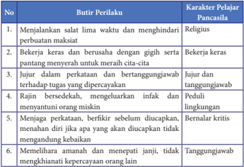

Tabel ini berisi 6 butir perilaku yang dianggap penting oleh pelajar untuk memenuhi karakteristik Pancasila. Kolom pertama menunjukkan nomor urut dari butir perilaku tersebut, sedangkan kolom kedua berisi deskripsi perilaku tersebut. Kolom ketiga menyajikan karakteristik yang diharapkan dari pelajar Pancasila. Topik utama tabel ini adalah tentang perilaku dan karakteristik yang diharapkan dari pelajar Pancasila. Data penting yang terlihat adalah bahwa semua butir perilaku tersebut berkaitan dengan aspek-aspek penting dari Pancasila, seperti keberanian, integritas, dan kepedulian terhadap lingkungan.

- Prosentase penduduk muslim adalah 87,2% dari jumlah seluruh penduduk Indonesia.  Merupakan  populasi  penduduk  muslim  terbesar  dari  negaranegara di dunia. Namun ternyata, besarnya prosentase populasi penduduk muslim tersebut tidak  berkorelasi  positif  dengan  kehidupan  dan  praktik

 

---
## 📄 Halaman 69

111

keberagamaan yang baik. Angka kriminalitas tetap tinggi bahkan cenderung naik  setiap  waktu,  pergaulan  bebas  pada  remaja  dan  pemuda  semakin parah,  praktik  aborsi,  dan  tindakan  melawan  hukum  yang  lain  semakin meningkat.  Dan yang lebih memprihatinkan, ternyata tidak sedikit dari mereka yang beridentitas muslim.

- Lakukan  kajian  dan  analisis  sederhana  mengapa  fenomena  ini  terjadi. Adakah  yang  salah dengan  praktik keberagamaan  masyarakat  kita? Mengapa?
- Setiap manusia  dilahirkan  dengan  fitrah  yang  sama  yaitu  memiliki keyakinan tentang zat Yang Maha Kuasa, yang dalam istilah agama disebut dengan iman.
- Iman adalah suatu niat, ucapan dan perbuatan, di mana tidak sempurna iman itu jika tidak bersama yang lain.
- Pilar iman terdiri dari enam perkara yang disebut dengan rukun iman yaitu: 1)  iman kepada Allah Swt., 2) meyakini adanya rasul-rasul utusan Allah Swt., 3) mengimani keberadaan malaikat-malaikat Allah Swt., 4) meyakini dan mengamalkan ajaran-ajaran suci dalam kitab-kitab-Nya, 5) meyakini akan datangnya hari akhir dan 6) mempercayai qada dan qadar Allah Swt.
- Iman  yang  terdiri  dari  enam  pilar  tersebut,  memiliki  beberapa  bagian (unsur) dan perilaku yang dapat menambah amal manusia jika dilakukan semuanya, namun juga dapat mengurangi amal manusia apabila ditinggalkannya.
- Terdapat 77 cabang iman, di mana setiap cabang merupakan amalan atau perbuatan  yang  harus  dilakukan  oleh  seseorang  yang  mengaku  beriman (mukmin). Cabang yang 77 itulah yang disebut dengan syu'abul iman.
- Untuk mempermudah memahami dan mempelajari Syu'abul iman, dibagi menjadi 3 (tiga) bagian yang meliputi:
- Niat, akidah dan hati terdiri dari 30 cabang iman
- Lisan/ucapan terdiri dari 7 cabag iman
- Seluruh anggota badan terdiri dari 40 cabang iman
- Dalam kehidupan bermasyarakat, berbangsa dan bernegara jika terbentuk dari  kumpulan  orang-orang  yang  beriman,  niscaya  akan  terbentuk masyarakat yang aman, tenteram, damai, sejahtera dan berlimpah berkah dari Allah Swt.

 

---
## 📄 Halaman 70

### 1.  Penilaian Sikap

- Buatlah tabel mingguan/bulanan berupa ceck list tentang aktivitas ibadah harian kalian pada buku khusus untuk pemantauan individu! Mulailah dari ibadah wajib seperti halnya shalat lima waktu dilanjutkan dengan ibadah sunah  harian  misalnya  tadarus  Al-Qur`an,  dzikir,  shalawat,  membantu orangtua, membantu teman, aktif pada kegiatan sosial, aktif terlibat dalam organisasi kepemudaan serta amaliah lainnya. Lakukan dengan rutin, ikhlas dan penuh tanggungjawab kepada Allah Swt.!
- Pilihlah  jawaban  yang  sesuai  dengan  membubuhkan  tanda  contreng (√) pada kolom yang sesuai dengan pernyataan berikut ini!

 

---
## 📄 Halaman 71

- Penilaian Pengetahuan
- Berikanlah tanda silang (X) pada opsi jawaban A, B, C, D atau E yang merupakan jawaban yang paling tepat!
- Iman,  Islam  dan  ihsan  adalah  satu  kesatuan  yang  tidak  bisa  dipisahkan yang kemudian disebut dengan agama Islam. Berikut ini yang merupakan pengertian dari iman adalah….
- mempercayai dengan hati, mengucapkan dengan lisan dan meragukan dengan perbuatan
- mempercayai setengah hati, mengucapkan dengan lisan dan meragukan dengan perbuatan
- mempercayai dengan hati, mengucapkan dengan lisan dan membuktikan dengan perbuatan
- mempercayai dengan hati, menolak dengan ucapan dan membuktikan dengan perbuatan
- mempercayai dengan hati, menyangkal dengan lisan dan membuktikan dengan perbuatan
- Seorang mukmin, adalah seorang yang beriman yang melaksanakan ibadah dengan  sangat  ikhlas,  seakan-akan  Allah  Swt.  melihatnya,  meskipun  ia tidak melihat Allah Swt. Pernyataan tersebut merupakan definisi dari ….
- Ihsan
- Iman
- Islam
- Ikhlas
- Istishab
- Perhatikan pernyataan berikut!
- Mahmud hanya mengerjakan salat jamaah saat berada di sekolah saaat dilihat oleh guru dan teman-temannya
- Mamad selalu berbuat baik, berkata jujur, tetapi tidak pernah salat
- Malik senantiasa mendirikan salat, berkata baik dan rajin bersedekah
- Maman selalu istiqamah dalam beribadah dan gemar membantu orang tuanya
- Marwan  adalah  ketua  Rohis  di  sekolah  tetapi  saat  di  rumah  sering berbohong kepada orang tuanya
D ari pernyataan tersebut, yang perilakunya selaras dengan iman, Islam dan ihsan adalah… .

 

---
## 📄 Halaman 72

- Malik dan Maman
- Mamad dan Malik
- Maman dan Marwan
- Mahmud dan Mamad
- Marwan dan Mahmud
- Dimensi  dari  keimanan  itu  menyangkut  tiga  ranah  yaitu ma'rifatun  bil qalbi, iqrarun bil lisan dan amalun bil arkan. Dari contoh-contoh amalan di bawah ini yang merupakan cabang iman dalam ranah ma'rifatun bil qalbi adalah….
- belajar dan menuntut ilmu
- membaca kalimat thayyibah
- membaca kitab suci Al-Qur`an
- mengajarkan ilmu kepada orang lain
- mencintai dan membenci karena Allah Swt.
- Beriman pada hakikatnya adalah satu padunya niat, ucapan dan perbuatan. Berikut  ini  yang  bukan  merupakan  cabang  iman  dari  ranah  perbuatan adalah….
- mengurus perawatan jenazah
- menghindari bacaan yang sia-sia
- menunaikan dan membayar hutang
- meluruskan muamalah dan menghindari riba
- menjadi saksi yang adil dan tidak menutupi kebenaran
- Perhatikan pernyataan berikut ini!
- Belajar dan menuntut ilmu
- Membaca kitab suci Al-Qur`an
- Mengajarkan ilmu kepada orang lain
- Berbakti dan menunaikan hak orang tua
- Menikah untuk menghindarkan diri dari perbuatan keji dan haram
- Dari pernyataan tersebut, yang merupakan cabang iman dari ranah niat, hati dan akidah adalah….
- a) - b) - c)
- a) - c) - d)
- a) - d) - e)
- b) - c) - d)
- b) - d) - e)
11'

 

---
## 📄 Halaman 73

111

- Berikut  ini  yang bukan merupakan  tanda-tanda  orang  yang  beriman adalah….
- istiqamah dan tertib menjalankan salatnya
- bila disebutkan nama Allah swt. hatinya bergetar
- menafkahkan sebagian hartanya di jalan Allah swt.
- berjihad di jalan Allah swt. dengan harta dan jiwanya
- mempengaruhi orang lain untuk memerangi orang kafir
- Orang yang beriman, tidak akan luput dari ujian dan godaan yang terhadap keimanannya. Semakin beriman seseorang, semakin bersar pula ujian dari Allah Swt. baginya. Berikut ini yang bukan merupakan ujian bagi seorang mukmin adalah….
- mukmin yang saling membenci satu sama lain
- mukmin yang saling mendukung satu sama lain
- datangnya orang munafik yang membenci kaum mukmin
- godaan hawa nafsu dari dalam diri setiap mukmin itu sendiri
- orang kafir yang memerangi kaum mukmin dengan tipu dayanya
- Hamid adalah seorang muslim yang taat beribadah dan berperilaku baik di sekolah. Sejak SMP dia bercita-cita untuk melanjutkan ke sekolah favorit di  kotanya.  Bahkan  dia  pernah  bernadzar  apabila  ia  diterima  di  sekolah tersebut, ia akan berpuasa sunah selama tiga hari. Namun hingga saat ini, Hamid belum juga menunaikan nadzar tersebut, karena setiap kali hendak berpuasa, selalu saja ada halangannya untuk menunda. Hal ini merupakan contoh ujian keimanan bagi hamid yang datangnya dari ….
- bisikan setan
- bisikan orang kafir
- bisikan dari kaum munafik
- bisikan orang mukmin lainnya
- bisikan dari dalam hatinya sendiri
- Orang  yang  beriman  secara kaffah, akan  senantiasa  berhati-hati  dalam kehidupannya. Ia akan menempatkan Allah Swt. sebagai tujuan utama dari setiap aktivitasnya. Dengan demikian, hikmah iman bagi seorang mukmin adalah….
- membuat seseorang menjadi resah dan gelisah hidupnya
- mudah terserang ujub , riya dan sum'ah dalam hidupnya
- membuat seseorang hanya mengharap rida Allah swt.
- membuat seseorang terhindar dari keberuntungan
- membuat seseorang tergantung kepada makhluk

 

---
## 📄 Halaman 74

### B. Jawablah pertanyaan-pertanyaan berikut ini!

- Perhatikan HR. Ibnu Majah berikut ini!
ِ

ب ِ ل ق ال ب ة ف ر ِ ع م ان م ي ا ِ ل ِ ﷺ: ا الل ْ ل و َ س ر ال : ق ال ق ه ن ع َ  الل ِ ي َ ض ر ال ِب ِ ي ط ب أ ْ ن ب ِ ي ل ع ن ْ ع .(رواه ابن ماجه) ان ِ ْ ك ر أ اال ب م َ ل َ ع و ان ِ ِ س الل ب ْ ل و ق و

ْ

َ

ْ

ٌ

َ

ْ

َ

ُ

َ

ْ

ْ

َ

ّٰ

ُ

ُ

َ

َ

َ

َ

ُ

ْ

- Jelaskan apakah maksud dari hadis tersebut?
- Sebutkan lima cabang iman dari ranah tashdiqun bil qalbi !
- Sebutkan lima cabang iman dari ranah iqrarun bil lisan !
- Sebutkan lima cabang iman dari ranah 'amalun bil arkan!
- Jelaskan masalah-masalah keimanan yang terjadi saat ini. Uraikan mengapa hal tersebut bisa terjadi dan bagaimana solusinya menurutmu!

### 3.  Penilaian Ketrampilan

Susunlah bahan presentasi dengan menggunakan metode fish bone (tulang ikan) untuk memaparkan tentang cabang-cabang dalam iman. Buatlah materi kamu  dengan  menggunakan  perangkat  digital  atau  boleh  menggunakan peralatan manual di buku gambar dengan tampilan yang baik dan sistematis. Lalu presentasikanlah di depan kelasmu!

Untuk  lebih  memahami  dan  mengeksplorasi  materi  keilmuan  tentang syu'abul iman, disarankan kepada peserta didik untuk aktif melakukan library search atau kajian pustaka, dengan memperbanyak perbendaharaan sumber belajar dan melakukan kegiatan literasi dari sumber-sumber rujukan sebagai berikut:

- Ringkasan Syu'ab al-Iman karya Imam Abu al-Ma'ali al-Qazwaini
- Qami'uth Thughyan, Menyingkap Rahasia Cabang Keimanan, karya Syeikh Muhammad Nawawi bin Umar al-Jawi
- 77 Cabang Keimanan karya Imam Al-Baihaqi
- Cabang-Cabang Iman (Kitab Karya Kyai Sholeh Darat)
ّٰ

َ

ُ

َ

َ

ْ

ِ

ٍ

ٌ

َ

َ

َ

َ

ِ

ّ

ّ

ِ

ِ

َ

ٌ

11"

َ

َ

َ

 

---
## 📄 Halaman 75

KEMENTERIAN PENDIDIKAN, KEBUDAYAAN, RISET, DAN TEKNOLOGI REPUBLIK INDONESIA, 2021

Pendidikan Agama Islam dan Budi Pekerti untuk SMA/SMK Kelas X

Penulis	:	Ahmad	Taufik

Nurwastuti Setyowati

ISBN

: 978-602-244-547-0

### BAB III

Menjalin Hidup Penuh Manfaat dengan Menghindari Berfoya-foya, Riya',Sum'ah, Takabur, dan Hasad

### Tujuan Pembelajaran

Setelah mempelajari Bab 3 ini peserta didik diharapkan kompeten dalam

- menganalisis manfaat menghindari sikap hidup berfoya-foya, riya' , sum'ah , takabbur , dan hasad
- membuat karya berupa quote dan mempublikasikan di media sosial
- menghindari sikap hidup sikap hidup berfoya-foya, riya' , sum'ah , takabbur , dan hasad
- terbiasa bersikap rendah hati dalam kehidupan sehari-hari

### Perhatikan gambar berikut ini!

---
**🖼️ Gambar/Diagram**

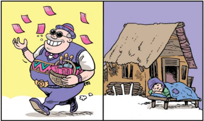

> **Deskripsi Visual:** Gambar ini adalah ilustrasi yang menunjukkan dua situasi berbeda dalam kehidupan seseorang. Pada bagian kiri, seorang pria dengan penampilan tradisional sedang berjalan dengan senyum lebar, mengangkat tangan kanannya yang membawa beberapa lembar uang kertas. Ini menunjukkan situasi yang positif dan bahagia, mungkin setelah sukses atau keberhasilan dalam hidupnya.

Pada bagian kanan, ada sebuah rumah sederhana yang tampak dingin dan lapar, dengan seorang laki-laki tua tidur di atas ranjang yang terbuat dari bambu. Ini menunjukkan situasi yang negatif dan sulit, mungkin ketika orang tersebut menghadapi kesulitan ekonomi atau keadaan yang buruk.

Elemen-elemen utama dalam gambar ini adalah dua pria, dua rumah, dan beberapa lembar uang kertas. Relasi antara elemen-elemen ini adalah bahwa pria di kiri tampak bahagia dan sukses, sementara pria di kanan tampak cemas dan miskin. Lembar-lembar uang kertas ini menunjukkan perbedaan ekonomi antara kedua pria tersebut.

Teks, angka, atau label penting yang terlihat dalam gambar ini adalah jumlah lembar uang kertas yang diperlihatkan oleh pria di kiri. Informasi kunci yang dapat diambil pembaca adalah bahwa ada perbedaan ekonomi yang signifikan antara dua situasi yang sangat berbeda dalam hidup seseorang.

 

---
## 📄 Halaman 76

---
**🖼️ Gambar/Diagram**

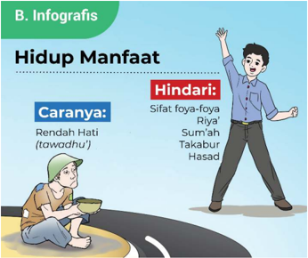

> **Deskripsi Visual:** Gambar ini adalah ilustrasi yang menunjukkan konsep "Hidup Manfaat" dalam konteks Islam. Gambar ini terdiri dari dua bagian yang berbeda:

1. Bagian kiri menunjukkan seseorang yang rendah hati (towodhu), sedang berjalan dengan hati-hati dan rendah diri.
2. Bagian kanan menunjukkan seseorang yang berjalan dengan tangan mengangkat, tampak percaya diri dan bersemangat.

Elemen-elemen utama dalam gambar ini adalah dua orang yang berbeda emosi dan perilaku, serta dua peta jalan yang menunjukkan perbedaan antara kedua situasi tersebut. Peta jalan di bagian kiri menunjukkan jalan yang lebih rendah dan lembut, sementara peta jalan di bagian kanan menunjukkan jalan yang lebih tegak dan kuat.

Teks penting dalam gambar ini adalah "Hidup Manfaat" yang berada di atas gambar, dan "Caranya: Rendah Hati (towodhu)" dan "Hindari: Sifat foya-foya, Riya, Sum'ah, Takabbur, Hasad" yang terletak di bagian bawah gambar.

Informasi kunci yang dapat diambil pembaca adalah bahwa rendah hati adalah cara untuk hidup manfaat, sedangkan sifat-sifat negatif seperti foya-foya, riyah, sum'ah, takabbur, dan hasad harus dihindari untuk mendapatkan kehidupan yang bermanfaat.

Sebelum memulai pembelajaran, mari membaca Al-Qur`an dengan tartil. Semoga dengan membiasakan diri membaca Al-Qur`an, kita selalu mendapat keberkahan dan kemudahan dalam belajar dan mendapat ridha dari Allah Swt. Amin

- Bacalah Q.S. Luqman/31: 16-19 di bawah ini bersama-sama dengan tartil selama 5-10 menit!
- Perhatikan makhraj dan tajwidnya!

 

---
## 📄 Halaman 77

### Aktivitas 3.2

Amatilah gambar-gambar di bawah ini, kemudian tulislah pesan-pesan moral untuk setiap gambar. Kaitkan pesan moral tersebut dengan tema 'Meraih Hidup Manfaat dengan Menghindari Sifat Berfoya-foya, Riya' , Sum'ah, Takabur dan Hasad'!

---
**🖼️ Gambar/Diagram**

> **Deskripsi Visual:** Gambar ini adalah ilustrasi yang menunjukkan seorang anak perempuan sedang berjalan dengan bekal makanan. Anak tersebut mengenakan pakaian warna-warni dan memegang dua tas bambu yang terisi makanan. Latar belakangnya tampak seperti sebuah jalan atau area perkemahan, dengan beberapa pohon dan tanaman hijau yang menambah keindahan gambar.

Elemen utama dalam gambar ini adalah anak perempuan, bekal makanan, dan latar belakang alam. Anak perempuan merupakan subjek utama yang memegang peran penting dalam gambar ini. Bekal makanan yang dimilikinya menunjukkan bahwa ia sedang berjalan menuju tempat makan atau beristirahat. Latar belakang alam yang hijau menambah nuansa positif dan sehat pada gambar ini.

Teks, angka, atau label penting tidak terlihat dalam gambar ini karena ia hanya berupa ilustrasi. Namun, informasi kunci yang dapat diambil pembaca melalui gambar ini adalah tentang aktivitas sehari-hari anak perempuan, yaitu berjalan dengan bekal makanan, serta suasana alam yang sehat dan menyenangkan.

---
**🖼️ Gambar/Diagram**

> **Deskripsi Visual:** Gambar ini adalah ilustrasi yang menampilkan seorang anak muda berjalan dengan senang hati sambil memegang sebuah baskin bunga. Baskin tersebut penuh dengan bunga-bunga cantik, mencerminkan suasana yang ceria dan positif. Anak tersebut mengenakan pakaian warna-warni yang menarik perhatian, dengan topi berwarna biru dan rompi berwarna merah. Wajahnya tampak bahagia, menunjukkan rasa kepuasan dan kebahagiaan yang tumbuh dari kegiatan tersebut.

Elemen utama dalam gambar ini adalah anak muda yang sedang berjalan dan memegang baskin bunga. Relasi antara elemen-elemen ini adalah bahwa anak tersebut adalah subjek utama yang memegang baskin bunga sebagai objek utama lainnya. Baskin bunga tersebut penuh dengan bunga-bunga cantik, yang menjadi elemen visual yang menarik dan memberikan nuansa positif pada gambar.

Teks, angka, atau label penting yang terlihat dalam gambar ini tidak ada, karena gambar hanya menggambarkan situasi tanpa teks atau angka tambahan. Namun, informasi kunci yang dapat diambil pembaca melalui gambar ini adalah tentang kebahagiaan dan keceriaan yang dimiliki oleh anak tersebut, serta suasana yang positif yang ditunjukkan oleh bunga-bunga yang ditanamkan dalam baskin tersebut.

---
**🖼️ Gambar/Diagram**

> **Deskripsi Visual:** Gambar ini adalah ilustrasi yang menunjukkan seorang anak sedang bermain dengan kartu remi. Gambar ini menggambarkan aktivitas bermain kartu yang sering dilakukan oleh anak-anak. Anak tersebut tampak sangat senang dan terlibat dalam permainan, menunjukkan emosi positif dan kegembiraan. Kartu remi yang tersebar di sekitar anak menunjukkan bahwa permainan tersebut sedang dalam tahap aktif. Ilustrasi ini mungkin digunakan untuk membantu pembaca memahami konsep dasar permainan kartu seperti pemilihan kartu, penggabungan kartu, dan strategi bermain. Informasi kunci yang dapat diambil dari gambar ini adalah bahwa permainan kartu adalah hiburan yang populer dan bisa menjadi cara yang menyenangkan untuk berinteraksi dan belajar.

司

 

---
## 📄 Halaman 78

Baca  dan  cermatilah  artikel  di  bawah  ini,  kemudian  tulislah  nilai-nilai keteladanan yang dapat diambil dari artikel tersebut!

### Penghuni Surga

Pada sebuah kesempatan di masjid Nabawi, ketika para sahabat duduk-duduk  bersama  Rasulullah  Saw.,  beliau  berkata  :  'akan  datang kepada  kalian  sekarang  ini  seorang  laki-laki  penghuni  surga' .  Ucapan Rasulullah  Saw.  tersebut  tentu  saja  membuat  para  sahabat  penasaran terhadap sosok tersebut. Apakah dia salah satu sahabat yang paling luar biasa  ibadah  shalatnya,  puasanya?  Atau  punya  amal  istimewa  seperti apa?. Tak lama kemudian, seorang laki-laki dari golongan sahabat Anshar lewat,  tampak  jenggotnya  basah  dengan  air  wudhu  dan  tangan  kirinya membawa sandal. Para sahabat bertanya-tanya alasan apa yang membuat laki-laki tersebut menjadi penghuni surga.

Keesokan harinya, Nabi Saw. berkata lagi: 'akan datang kepada kalian sekarang ini seorang laki-laki penghuni surga' . Namun justru yang muncul lagi adalah laki-laki dengan wajah basah wudhu sambil membawa sandal. Tak ada satu pun sahabat yang berani bertanya kepada Rasulullah Saw.

Keesokan  harinya,  Rasulullah  Saw.  mengatakan  hal  sama,  dan  lakilaki  itu  yang  muncul lagi. Para sahabat sangat yakin bahwa sosok lakilaki itulah yang dimaksud oleh Rasulullah Saw. sebagai calon penghuni surga. Namun tidak ada satu pun sahabat yang mengetahui alasan di balik pemberian nikmat surga kepada laki-laki itu.

Abdullah bin Amr bin Ash membuntuti laki-laki itu hingga sampai di  rumahnya.  Ini  didasari  rasa  ingin  tahu  tentang  keistimewaan  yang dimilikinya hingga berstatus sebagai calon penghuni surga. Selama tiga malam menginap di rumah laki-laki tersebut, Abdullah bin Amr bin Ash mengamati setiap ibadah dan amalan yang dilakukan oleh laki-laki itu.

 

---
## 📄 Halaman 79

Abdullah bin Amr tidak menemukan amalan yang istimewa, ibadahnya biasa saja, tidak tahajud pada malam hari, dan tidak puasa sunah. Hanya, Abdullah  sering  mendengar  laki-laki  itu  berzikir  dan  bertakbir  setiap terbangun dari tidur, dan laki-laki itu baru bangun untuk shalat subuh. Abdullah bin Amr juga tak pernah mendengar kecuali ucapan yang baik. Tiga hari berlalu, Abdullah bin Amr berkata: 'apakah sebenarnya amal ibadahmu  hingga  engkau  mendapat  nikmat  sebagai  calon  penghuni surga  seperti  yang  dikatakan  Rasulullah  Saw.?' .  Laki-laki  itu  menjawab sambil  tersenyum:  ' Aku  tidak  memiliki  amalan,  kecuali  yang  engkau lihat selama tiga hari. ' Jawaban ini tidak memuaskan Abdullah bin Amr bin  Ash.  Namun  ketika  Abdullah  bin  Amr  bin  Ash  melangkah  untuk meninggalkan  rumahnya,  laki-laki  tersebut  berkata:  'benar,  amalanku seperti yang engkau lihat. Hanya saja aku tidak pernah berbuat curang kepada  seorang  pun.  Aku  juga  tidak  pernah  iri  ataupun  hasad  kepada seseorang atas karunia yang telah diberikan Allah kepadanya.

Mendengar perkataan tersebut, Abdullah bin Amr bin Ash tercengang dan takjub  kepadanya.  Ia  yakin  sifat  tak  pernah  iri,  dengki,  dan  hasad inilah yang menjadikan laki-laki itu menjadi calon penghuni surga.

Sumber :

Lentera Hati Kisah dan Hikmah Kehidupan , Karya M. Quraish Shihab

Pernahkah kalian melakukan suatu amal ibadah,  kemudian  menunjukkannya kepada orang lain, baik melalui melalui media sosial ataupun secara langsung dengan maksud agar mendapat pujian?. Atau pernahkah kalian bersedekah, kemudian menghendaki diumumkan secara terbuka oleh panitia pembangunan masjid? Jika kalian pernah melakukannya, maka berhati-hatilah karena bisa jadi  amal  tersebut  sia-sia,  sebab  ada  sifat sum'ah di  dalam  hati.  Kebanyakan manusia  suka  mendapat  pujian,  hanya  sedikit  yang  mampu  beramal  secara ikhlas.  Padahal,  Allah  Swt.  hanya  menerima  amal  yang  dilakukan  dengan ikhlas.

Di samping itu, berbagai sifat tercela seperti berfoya-foya, takabur (sombong), hasad juga akan selalu dihembuskan setan ke dalam hati manusia dengan  tujuan  menjerumuskannya  ke  dalam  neraka.  Oleh  karena  itu,  agar terhindar dari bahaya sifat tercela tersebut, simaklah uraian materi berikut ini!

 

---
## 📄 Halaman 80

### 1. Menghindari Sifat Hidup Berfoya-Foya

Kebanyakan  manusia  memiliki  cenderungan  terhadap  uang  dan  harta melimpah.  Meskipun  ada  manusia  yang  tidak  begitu  tertarik  dengan  harta duniawi,  mereka  berlaku zuhud dengan lebih  mengutamakan  kehidupan akhirat.  Jenis  manusia  seperti  ini  jumlahnya  sangatlah  kecil.  Secara  kodrat alamiah,  manusia memang memiliki tabiat mencintai harta. Pada saat uang dan hartanya melimpah, perilakunya bisa berubah menjadi lebih konsumtif. Ia  akan  mudah membuat keputusan untuk membeli barang-barang mewah, meskipun barang tersebut kurang begitu penting bagi diri dan keluarganya.

Sesungguhnya  gaya  hidup  seperti  itu  salah,  karena  termasuk  kategori menghamburkan harta, pemborosan dan berfoya-foya. Berfoya-foya merupakan  pola  pikir,  sikap  dan  tindakan  yang  tidak  seimbang  dalam memperlakukan harta.

Harta  merupakan  cobaan  bagi  pemiliknya,  jika  harta  digunakan  dengan baik maka harta bisa bermanfaat baginya, sebaliknya kalau harta dikelola secara salah maka akan mencelakakannya. Harta bisa menjadi tercela jika dijadikan tujuan utama oleh pemiliknya, dan dalam proses mencarinya tidak diniatkan untuk beribadah kepada Allah Swt.  Islam melarang perilaku berlebih-lebihan atau melampaui batas (israf) dan boros (tabzir) dalam membelanjakan harta, keduanya termasuk perbuatan setan. Sebaliknya, Islam menganjurkan umatnya untuk hidup bersahaja, seimbang dan proporsional. Perhatikan Q.S al-Isra'/17: 26-27 berikut ini!

ِ

``

ِ

ِ

ً

ْ

ُ

َ

ِ

ّ

َ

ٰ

َ

َ

ِ

ِ

َ

َ

ْ

Artinya: 'Dan berikanlah haknya kepada kerabat dekat, juga kepada orang miskin dan orang yang dalam perjalanan; dan janganlah kamu menghamburhamburkan (hartamu) secara boros. Sesungguhnya orang-orang yang pemboros itu adalah saudara setan dan setan itu sangat ingkar kepada Tuhannya'. (Q.S al-Isra'/17: 26-27)

Ayat di atas secara tegas mengatakan bahwa pemboros merupakan saudara setan. Berkaitan dengan sikap berlebih-lebihan atau melampaui batas (israf), Allah Swt. berfirman dalam Q.S al-Furqan/25: 67 berikut ini َّ

### ا ٦٧ ام و ق لِك ذ ْ ن ي ب ان َ ك ا و و ر ت ق ي م ل ا و و ف ر س ْ ي م ا ل و ق ف ن آ ا ا ِ ذ ن ي ذ ِ ال و

ً

َ

َ

َ

ٰ

َ

َ

َ

َ

ْ

ُ

ُ

ْ

َ

ْ

َ

َ

ْ

ُ

ِ

ُ

ْ

َ

ْ

ُ

َ

ْ

َ

َ

َ

ْ

َ

Artinya: 'Dan (termasuk hamba-hamba Tuhan Yang Maha Pengasih) orangorang yang apabila menginfakkan (harta), mereka tidak berlebihan, dan tidak (pula) kikir, di antara keduanya secara wajar'. (Q.S al-Furqan/25: 67)

ْ

ُ

َ

َ

ّ

ْ

ً

َ

ْ

ّ

ُ

َ

َ

َ

َ

َ

ْ

َ

ٗ

َ

ٰ

ُ

ْ

َ

ٰ

َ

 

---
## 📄 Halaman 81

Kata tabzir diulang  sebanyak  tiga  kali  dalam  Al-Qur`an,  sedangkan  kata israf diulang sebanyak dua puluh tiga kali dengan berbagai bentuknya. Ayat di  atas  menyatakan  secara  tegas  larangan tabzir dan israf. Sikap tabzir dan israf memiliki  kemiripan  perngertian  dan  makna. Tabzir (boros)  adalah perilaku  membelanjakan  harta  tidak  pada  jalannya.  Dengan  kata  lain,  yang dimaksud pemborosan yaitu mengeluarkan harta tidak haq. Apabila seseorang mengeluarkan  harta  sangat  banyak  tetapi  untuk  hal-hal  yang  dibenarkan oleh  Islam,  maka  bukan  termasuk  pemborosan.  Sebaliknya,  jika  seseorang mengeluarkan  harta  meskipun  sedikit,  tetapi  untuk  hal-hal  yang  dilarang agama, maka ia termasuk pemboros.

Allah Swt. sangat tidak menyukai seseorang yang mempergunakan harta secara berlebihan (israf) dan  tanpa  manfaat.  Mereka menghamburkan harta sia-sia  dan  melupakan  hak-hak  orang  lain  atas  hartanya.  Seseorang  disebut berperilaku israf apabila  ia  membelanjakan  harta  melewati  batas  kepatutan menurut  ajaran  Islam,  dan  tidak  ada  nilai  manfaatnya  untuk  kepentingan dunia maupun akhirat. Sifat israf ini dipengaruhi oleh godaan uang dan harta pada seseorang yang lemah imannya.

### Contoh perilaku tabzir dan israf

Berikut  ini  beberapa  contoh  perilaku tabzir dan israf daalam  kehidupan sehari-hari:

### Contoh tabzir dan israf dalam makan dan minum:

Seseorang mengambil banyak makanan dan minuman pada suatu acara  tasyakuran.  Ia  takut  tidak  mendapat  bagian,  tanpa  sama  sekali  tidak mempertimbangkan daya tampung perut. Akhirnya ia tidak sanggup menghabiskan makanan dan minuman tersebur.

### Contoh tabzir dan israf dalam berbicara:

Berkata-kata  yang  tidak  penting  dan  tidak  perlu,  baik  secara  langsung bertemu  dengan  lawan  bicara  ataupun  melalui  media  elektronik,  termasuk media  sosial.  Contoh  lain  misalnya,  menggunakan  kuota  internet  untuk searching dan chatting hal-hal yang tidak perlu.

### Contoh tabzir dan israf dalam penampilan:

Memakai perhiasan emas di kedua tangan, leher, jari jemari, dan kaki pada saat pertemuan warga. Berpakaian mahal, mewah lengkap dengan tas import dari luar negeri.

Selain  di atas, masih banyak lagi contoh perilaku tabzir dan israf dalam kehidupan sehari-sehari.

 

---
## 📄 Halaman 82

Kemukakan  contoh  perilaku  tabzir  dan  israf  yang  sering  kalian  lihat dalam kehidupan masyarakat

### Dampak negatif sifat hidup berfoya-foya

Banyak dampak negatif dari sikap hidup berfoya-foya, di antaranya:

- Terlalu sibuk mengurusi kebahagiaan duniawi, melalaikan akhirat
Dunia dianggap sebagai tempat persinggahan terakhir, padahal akhiratlah tujuan akhir kehidupan manusia. Mereka sibuk mencari kebahagiaan dunia dengan menumpuk-numpuk harta hingga melupakan hidup di akhhirat

- Menimbulkan sifat iri, dengki, dan pamer
- Membelanjakan  secara berlebihan  dan  boros  serta  memamerkannya kepada orang lain akan memicu sifat iri, dengki dari orang lain. Sifat ini akan memicu kon flik di tengah masyarakat
- Dapat memicu frustasi apabila hartanya habis
Pengeluaran harta yang tidak terkontrol karena memperturutkan gengsi dan hawa nafsu akan mengakibatkan frustasi. Mereka sangat khawatir apabila hartanya  habis  dan  tidak  bisa  lagi  membeli  sesuatu  untuk  memuaskan keinginannya.

### 4)  Berpotensi menimbulkan sifat kikir

Kekhawatiran berlebihan atas kekurangan harta membuat mereka bersifat kikir  dan  tidak  mau  berbagi  dengan  sesama.  Karena  takut  jatuh  miskin, akhirnya  tidak  ada  kepedulian  kepada  fakir  miskin  yang  benar-benar membutuhkan bantuan.

### Cara menghindari sifat hidup berfoya-foya:

Agar terhindar dari sifat hidup berfoya-foya, lakukanlah hal-hal berikut ini

- Membelanjakan harta sesuai dengan skala priorias kebutuhan
- Antara kebutuhan primer, sekunder dan tersier harus dibuat prioritas mana
yang harus dipenuhi  terlebih dahulu.

- Membiasakan bersedekah dan membantu orang lain
Harta kita yang sebenarnya adalah harta yang disedekahkan kepada orang lain.  Kebiasaan  bersedekah  akan  membangkitkan  rasa  empati  kepada orang lain. Lebih dari itu, akan mempererat hubungan antar sesama warga masyarakat.

 

---
## 📄 Halaman 83

### 3)  Bergaya hidup sederhana

Hidup apa adanya akan membuat hati dan pikiran tenteram. Ia akan merasa bahagia apabila melihat orang lain hidup berkecukupan. Dan akan tergerak untuk membantu orang lain yang membutuhkan.

### 4)  Selalu bersyukur

Menerima  dengan  senang  hati    atas  semua  karunia  dari-Nya  akan membuahkan ketenangan batin.  Seseorang  yang  syukur bil  qalb (syukur dalam hati) akan menyadari sepenuhnya bahwa segala nikmat itu adalah bentuk kasih sayang Allah Swt. Kemudian tumbuh keyakinan bahwa Allah Swt. telah menjamin rejeki semua mahkluk ciptaan-Nya. Tidak mungkin Allah Swt. akan membiarkan manusia hidup sengsara. Di samping syukur bil  qalb ,    bersyukur  juga  dapat  diungkapkan bil lisan, yakni  dengan mengucapkan  kalimat  tahmid  ( alhamdulillah )  dan  berdoa  kepada  Allah Swt.  dan  syukur bil  arkan ,  yakni  dengan  menggunakan  nikmat  sesuai peruntukkannya.

### 5)  Bertindak selektif dan terencana

Merencanakan kehidupan di masa datang  akan  membuat  seseorang  lebih selektif dalam memutuskan penggunaan harta.  Membiasakan  diri  menyisihkan uang saku untuk ditabung merupakan sikap bijak. Lebih dari itu, sikap hemat dan  bijak  dalam  menggunakan  kuota internet  juga  harus  dibiasakan  dalam kehidupan sehari-hari.

### 6)  Bersikap rendah hati

Harta merupakan titipan dari Allah Swt. agar dipergunakan di jalan-Nya. Sesungguhnya kehidupan dunia merupakan ladang untuk beramal demi kebahagiaan akhirat. Oleh karenanya, seseorang harus menjauhi perasaan paling kaya dan paling hebat. Kekayaan seseorang di muka bumi ini tidak ada artinya dibanding kebesaran dan kekuasaan Allah Swt. Sebagai pelajar seharusnya  kalian  menghindari  perasaan  paling  pintar,  paling  kuat  dan paling hebat di kelas atau sekolah.

Islam melarang  umatnya  bersifat berlebihan dan  kikir. Antara sifat berlebihan dan kikir merupakan dua kutub yang berlawanan, namun keduanya merupakan sifat tercela  yang  harus  dihindari.  Orang  kikir  atau  bakhil  akan mementingkan diri sendiri, yang penting dirinya kecukupan, semua kebutuhan terpenuhi, dan ia tidak peduli atas derita yang dialami orang lain. Ia tidak akan

---
**🖼️ Gambar/Diagram**

> **Deskripsi Visual:** Gambar ini adalah ilustrasi yang menunjukkan seorang pria tua berjalan dengan sepeda kecil di depan rumahnya. Rumah tersebut terbuat dari kayu dan memiliki atap rumput, menunjukkan gaya hidup sederhana. Di depan rumah, ada dua anak kecil yang sedang bermain di depan rumah mereka. Pohon besar dengan daun hijau tumbuh di belakang rumah, menambah keindahan alam sekitar. Gambar ini menunjukkan hubungan antara orang tua dan anak-anaknya, serta suasana hidup yang damai dan tenang di lingkungan sekitar mereka.

-BNUT

 

---
## 📄 Halaman 84

mau mengorbankan hartanya, tenaganya, waktunya untuk kepentingan agama Islam.  Kebakhilan  akan  merugikan  diri  sendiri,  bahkan  mendapat  siksa  di akhirat kelak. Perhatikan Q.S. Ali Imran/3: 180 berikut ini

َ

َ

ْ

َ

ِ

ُ

ْ

ّٰ

ِ

َ

ٰ

ْ

َ

ْ

َ

ِ

ْ

ُ

َ

َ

َ

ُ

ٌ

ْ

َ

َ

ُ

ْ

َ

َ

ُ

ّٰ

َ

ِ

Artinya: 'Dan jangan sekali-kali  orang-orang  yang  kikir  dengan  apa  yang diberikan Allah kepada mereka dari karunia-Nya mengira bahwa (kikir) itu baik bagi mereka, padahal (kikir) itu buruk bagi mereka. Apa (harta) yang mereka kikirkan itu akan dikalungkan (di lehernya) pada hari Kiamat. Milik Allah-lah warisan (apa yang ada) di langit dan di bumi. Allah Mahateliti apa yang kamu kerjakan." (Q.S. Ali Imran/3: 180)

``

َ

ْ

َ

َ

ْ

ْ

ُّ

َ

ْ

ُ

َ

ُّ

َ

َ

ُ

ُّ

َ

َ

َ

َ

َ

ْ

َ

ٌ

ُ

Rasululullah Saw. bersabda dalam sebuah hadis berikut ini م ل الظ َّ ِ ن إ ف م ل ا الظ و ق َّ ت : ا ِ ال ِ ﷺ ق الل ْ ل و َ س ر َّ ن ا ه ن ع َ  الل ِ ي َ ض ِ  ر د ِ  الل ب ع ْ ن ب ِ ر اب ج ن ْ ع ن ى  ا ل ع م ه ل م ح م ك ل ب ق ان ك َ ن م ك َ ل ه أ َّ ح الش َّ ِ ن إ ف َّ ح وا  الش ق َّ ات ة ِ  و ام ق ِ ي ال م و ي َ ات م ل ظ . (رواه مسلم)ر م ه م ار ح وا م ل َ ح ت اس و م َ ه اء ا د ِ م و ك ف س َ

ْ

َ

ْ

ُ

َ

ْ

ُ

َ

َ

َ

ْ

ُ

َ

َ

ْ

ْ

َ

Artinya: 'Dari  Jabir  bin  Abdullah  r.a.,  bahwa  Rasulullah  Saw.  bersabda: 'Jauhilah (takutlah) oleh kalian perbuatan zalim, karena kezaliman itu merupakan kegelapan pada hari kiamat. Dan Jauhilah oleh kalian sifat kikir, karena kikir telah mencelakakan umat sebelum kalian, yang mendorong mereka untuk menumpahkan darah dan menghalalkan apa-apa yang diharamkan bagi mereka'. (H.R. Muslim)

ِ

### 2. Menghindari Sifat Riya' dan Sum'ah

Secara bahasa, sum'ah berarti memperdengarkan. Secara istilah, sum'ah yaitu memberitahukan atau memperdengarkan amal ibadah yang dilakukan kepada orang lain agar  dirinya  mendapat  pujian  atau  sanjungan. Sedangkan riya' , secara bahasa berarti menampakkan  atau  memperlihatkan.  Secara istilah, riya' yaitu melakukan ibadah dengan niat supaya mendapat pujian atau penghargaan dari orang lain.

---
**🖼️ Gambar/Diagram**

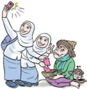

> **Deskripsi Visual:** Gambar ini adalah ilustrasi yang menunjukkan dua orang ibu dan anak-anak mereka sedang bermain di taman. Ibu yang pertama sedang memegang anak kecil di tangan kanannya, sementara ibu yang kedua sedang berdiri di belakang mereka, memegang tangan anak perempuan yang lebih besar. Semua orang tampak senang dan terlibat dalam aktivitas mereka.

Elemen utama dalam gambar ini adalah dua orang ibu dan empat anak mereka. Ibu-ibu tersebut tampaknya merasa bahagia dan senang dengan situasi ini. Anak-anak tampak aktif dan terlibat dalam bermain bersama.

Teks, angka, atau label penting tidak ada dalam gambar ini. Namun, informasi kunci yang dapat diambil dari gambar ini adalah bahwa keluarga tersebut sedang merayakan hari libur atau acara spesial di taman, dan semua orang tampak bahagia dan terlibat dalam aktivitas mereka.

ْ

َ

ُّ

َ

َ

َ

ْ

ُّ

ُ

َ

ْ

ُ

َ

َ

ّٰ

َ

َ

َ

ُ

َ

ُ

ْ

َ

ُ

ّٰ

ّٰ

ْ

ْ

َ

ِ

ِ

َ

ُ

َ

ْ

ُ

َ

َ

ُ

ْ

ْ

ُ

ً

ْ

َ

َ

ُ

ْ

ْ

ُ

ّٰ

ُ

ُ

ٰ

ٰ

َ

َ

ُ

َ

َ

َ

ْ

َ

َ

َ

َ

َ

 

---
## 📄 Halaman 85

Riya' dan sum'ah merupakan sifat tercela yang menyebabkan amal ibadah menjadi sia-sia. Sifat riya' dan sum'ah bisa muncul pada diri seseorang pada saat melakukan ibadah ataupun setelah melakukannya. Rasulullah Saw. menegaskan bahwa riya' termasuk syirik khafi, yaitu syirik yang samar dan tersembunyi. Hal ini  dikarenakan sifat riya'  terkait  dengan  niat  dalam  hati,  sedangkan  isi  hati manusia hanya diketahui oleh Allah Swt. Perhatikan firman Allah Swt. dalam Q.S. al-Baqarah/2: 264 berikut ini

َ

ً

ْ

ِ

َ

ا ل و َّ اس الن اۤء ئ ر ه ال م ف ِ ق ن ي ذ ِ ي َّ ال ى ۙ  ك ذ ا ال و م َ ن ال ب م ت ِ ك ق د ا ص و ل ْ ط ب ا ت ا ل و ن م ا ن ي ذ ِ َّ ا ال ُّ ه ي ا ي ا ۗ ل ا د ل ص ه َ ك ر ت ف ِ ل اب و ه اب ص َ ا ف ر َ اب ه ِ  ت ي ل ع ان ٍ و ف ص ل ِ ث م َ ك ه ل ث م َ ۗ  ف خ ِ ر ا م ِ  ال و ي ال ِ  و ِ الل ب م ِ ن ؤ ي ٢٦٤ ْ ن ي ف ِ ر ك ال م و ق د ِ ى ال َ ه ا ي ل الل ۗ و ا و ب س َ ا ك َّ ء ٍ  م ي ْ ى ش ل ع ْ ن و د ِ ر ق ي

َ

ُ

َ

َ

ْ

ْ

َ

ّٰ

َ

ٰ

ْ

ْ

ٌ

ْ

َ

َ

َ

ٗ

ْ

ُ

ِ

َ

ِ

ّ

ْ

َ

َ

َ

ُ

ُ

ٰ

َ

َ

ُ

ْ

ٗ

َ

ٗ

َ

Artinya:  " Wahai  orang-orang  yang  beriman!  Janganlah  kamu  merusak sedekahmu dengan menyebut-nyebutnya dan menyakiti (perasaan penerima), seperti orang yang menginfakkan hartanya karena ria (pamer) kepada manusia dan dia tidak beriman kepada Allah dan hari akhir. Perumpamaannya (orang itu) seperti batu yang licin yang di atasnya ada debu, kemudian batu itu ditimpa hujan lebat, maka tinggallah batu itu licin lagi. Mereka tidak memperoleh sesuatu apa pun dari apa yang mereka kerjakan. Dan Allah tidak memberi petunjuk kepada orang-orang kafir." (Q.S. al-Baqarah/2: 264)

َ

ِ

Dalam Musnad Ahmad terdapat sebuah hadis Nabi Saw. berikut ini :

َ

ُ

َ

ْ

َ

ُ

ُ

َ

َ

ّٰ

ُ

َ

ِ

ّ

َ

َ

َ

َ

ْ

ُ

ّ

َ

َ

ّٰ

َ

ِ

ِ

ُ

َ

ْ

ُ

َ

ر ُ غ ص ْ ا ال ْ ك ِ ر الش م ْ ك ي ل ع اف خ اا م َ ف و خ ا َّ ِ  ﷺا ِ ن الل ْ ل و َ س ر ال : ق ال ْ د ٍ  ق ي ب ل ْ ن د ِ  ب م ُ و ح م ن ْ ع َ ى از ج ت م و : ي ْ ل و ق ي الل َّ ,  ا ِ ن اء ي : الر ال , ق ر ُ غ ص ْ ا ال ْ ك ِ ر ا الش م ِ و الل ْ ل و َ س ار ا : ي و ال , ق ْ ن و ِ د ج ت ل ا ه ر ُ و ْ ظ ان ا ف ي ن ى  الد ف م الِك م ع ا ب ُ ن اؤ ر َ ت م ت ن ك ن ي ذ ِ َّ ى  ال ل ا ا ِ و ب ه : ا ِ ذ م ال ِ ه م ع ا ب اد ع ِ ب ال . (رواه احمد)ر اء ز ْ  ج م ه د ع ِ ن

ِ

ِ

ْ

ْ

َ

ُ

َ

ُ

ُّ

ُ

َ

ْ

ْ

ْ

ُ

َ

ْ

ْ

ُ

َ

ْ

ْ

ِ

َ

ْ

ِ

ُ

َ

ً

َ

َ

ُ

َ

ْ

Artinya: 'Dari Mahmud bin Labid berkata, Rasulullah Saw. berkata: 'Syirik kecil adalah suatu penyakit yang sangat berbahaya bagi kalian, lalu para sahabat bertanya, apakah syirik kecil itu ya Rasulullah? Jawab beliau: Riya', besok di hari kiamat, Allah menyuruh mereka mencari pahala amalnya, kepada siapa tujuan amal mereka itu, firman-Nya, 'carilah manusia yang waktu hidup di dunia, kamu beramal tujuannya hanya untuk dipuji atau disanjung oleh mereka, mintalah pahala kepada mereka itu'. (H.R. Ahmad).

Syarat diterimanya amal ada tiga: (1). Beramal dengan landasan ilmu, (2). Berniat ikhlas karena Allah Swt., (3). Melakukan dengan sabar dan ikhlas

َ

ْ

ُ

ّ

ُ

ُ

َ

َ

ُ

َ

َ

َ

ُ

ْ

َ

ّٰ

ُ

ُ

َ

َ

َ

َ

َ

ْ

ْ

َ

َ

َ

َ

ِ

َ

ٌ

َ

َ

ُ

َ

َ

ِ

ْ

ِ

َ

َ

ُ

َ

َ

ِ

ٰ

ْ

ْ

ّٰ

ْ

َ

َ

َ

َ

ْ

َ

َ

ٗ

َ

َ

َ

ُ

ْ

ُ

ْ

ُ

َ

ٰ

َ

َ

ْ

َ

َ

ّ

ْ

ْ

ْ

ُ

ُ

ٰ

َ

َ

َ

ْ

ُ

ُ

َ

ْ

ُ

َ

ٰ

َ

ْ

َ

َ

َ

ْ

ٰٓ

 

---
## 📄 Halaman 86

Riya' dibagi menjadi dua tingkatan, yaitu riya' khalish dan riya' syirik . Riya' khalish yaitu  melakukan ibadah hanya untuk mendapat pujian dari manusia semata. Sedangkan riya'  syirik yaitu  melakukan suatu perbuatan karena niat menjalankan  perintah  Allah,  dan  sekaligus  juga  karena  ingin  mendapatkan sanjungan dari orang lain.

Ditinjau dari bentuknya, riya' dibagi menjadi dua, yaitu riya' dalam niat dan riya' dalam perbuatan. Beberapa contohnya tersaji dalam tabel berikut ini!

---
**📊 Tabel**

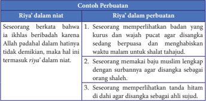

Tabel ini membahas konsep "riyā' dalam niat" dan "riyā' dalam perbuatan". Topik utamanya adalah tentang bagaimana riyā' dapat berlaku dalam dua situasi: ketika seseorang berintencional (dalam niat) dan ketika seseorang melakukan sesuatu secara tidak sengaja (dalam perbuatan). Dalam niat, riyā' muncul ketika seseorang berjanji untuk melakukan sesuatu yang dianggap baik, seperti berpuasa atau beribadah. Sementara itu, dalam perbuatan, riyā' muncul ketika seseorang melakukan sesuatu yang dianggap baik dengan sengaja, seperti berpuasa atau beribadah. Pola penting yang terlihat adalah bahwa riyā' dapat berlaku dalam situasi di mana seseorang berjanji atau berusaha untuk melakukan sesuatu yang dianggap baik, baik dalam niat maupun dalam perbuatan.

Riya' dan sum'ah merupakan penyakit hati yang merusak amal seseorang. Kedua sifat ini sulit terdeteksi, namun memiliki ciri-ciri yang dapat dilihat atau dirasakan. Seseorang yang bersifat riya' dan sum'ah memiliki ciri-ciri sebagai berikut:

- Selalu menyebut dan mengungkit amal baik yang pernah dilakukan
- Beramal hanya sekadar ikut-ikutan bersama orang lain
- Malas atau enggan melakukan amal shaleh apabila tidak dilihat oleh orang lain
- Melakukan amal kebaikan apabila sedang berada di tengah khalayak ramai
- Amalannya selalu ingin dilihat dan didengar agar dipuji oleh orang lain
- Ekspresi amal berbeda karena sedang dilihat oleh orang lain atau tidak
- Tampak  lebih  rajin  dan  bersemangat  dalam  beramal  saat  mendapat sanjungan, sebaliknya semangatnya akan turun apabila mendapat cemoohan dari orang lain
Perbuatan riya' dan sum'ah akan  berdampak  negatif  bagi  pelakunya  dan masyarakat secara umum. Dampak negatif tersebut antara lain:

- Muncul rasa tidak puas atas amal yang telah dikerjakan
- Muncul rasa gelisah saat melakukan amal kebaikan
- Merusak nilai pahala dari suatu ibadah, bahkan bisa hilang sama sekali
- Mengurangi kepercayaan dan simpati dari orang lain

 

---
## 📄 Halaman 87

- Menyesal apabila amalnya tidak diperhatikan oleh orang lain
- Menimbulkan sentimen pribadi dari orang lain karena adanya perasaan iri dan dengki
Mengingat dampak negatif dari sifat riya' dan sum'ah di atas, maka sudah seharusnya  umat  Islam  menghindari  sifat  tersebut.  Memang  bukan  perkara mudah,  sebab  pada  dasarnya  manusia  itu  senang  mendapat  sanjungan  dan pujian. Berikut ini beberapa cara menghindari sifat riya' dan sum'ah :

### 1)  Meluruskan niat

Semua  amal  tergantung  kepada  niat.  Apabila  niatnya  karena  Allah  Swt, maka akan diterima amal tersebut. Sebaliknya, apabila ada keinginan agar dipuji oleh orang lain, maka akan sia-sia. Oleh karenanya, sangat penting meluruskan niat sebelum melakukan amal ibadah.

### 2)  Menyadari bahwa dirinya adalah hamba Allah Swt.

Kebanyakan manusia sering melupakan nikmat yang diterima dari Allah Swt.  Mereka  beranggapan  bahwa  harta  dan  kedudukan  yang  diperoleh merupakan hasil kerja kerasnya. Anggapan seperti inilah yang memicu sifat riya' dan sum'ah .  Padahal,  semua itu adalah amanah dan pemberian dari Allah Swt.

### 3)  Memohon pertolongan Allah Swt.

Manusia merupakan makhluk lemah dan penuh keterbatasan. Tak mungkin ia dapat menyelesaikan semua masalah tanpa bantuan pihak lain. Posisinya sebagai makhluk yang lemah mengharuskannya berdoa  memohon  pertolongan  dari-Nya, termasuk  mohon  kekuatan  agar  terhindar dari sifat riya' dan sum'ah

### 4)  Memperbanyak rasa syukur

Pada  hakikatnya  setiap  amal  ibadah  yang dilakukan oleh seseorang merupakan karunia dari Allah Swt. Maka sudah seharusnya  kita  bersyukur  kepada-Nya.  Dengan  sering  mengungkapkan syukur  ini,  kita  tidak  akan  berharap  mendapat  pujian  dari  orang  lain. Jangan sampai kita pamer ibadah hanya karena ingin memperoleh banyak teman, atau agar memperoleh jabatan tinggi. Ingatlah bahwa pujian dari manusia hanya pujian semu, bersifat sementara dan ada maksud tertentu.

### 5)  Memperbanyak ingat kematian

Kehidupan di dunia hanya sementara, sedangkan akhirat kekal abadi. Pujian dari manusia tidak punya arti apapun. Dan tidak mungkin menjadi sebab diperolehnya pahala dari Allah Swt. Justru pujian dari manusia berpotensi membuat kita lalai, dan menjerumuskan ke neraka.

---
**🖼️ Gambar/Diagram**

> **Deskripsi Visual:** Gambar ini adalah ilustrasi yang menunjukkan seorang siswa sedang belajar di rumah. Siswa tersebut sedang duduk di atas meja belajar, memegang sebuah buku pelajaran dan menatap papan tulis. Di depan siswa ada beberapa peralatan belajar seperti pensil, pulpen, dan kertas. Pada papan tulis terdapat beberapa teks dan angka yang tampaknya merupakan materi yang akan dipelajari. Gambar ini menunjukkan situasi belajar mandiri di rumah, dengan siswa menggunakan berbagai alat untuk belajar.

 

---
## 📄 Halaman 88

### 6)  Membiasakan hidup sederhana

Meskipun memiliki uang, harta melimpah, pangkat dan kedudukan tinggi, haruslah tetap hidup sederhana. Kesederhanaan akan membuat seseorang menjadi lebih ikhlas dalam melakukan setiap amal ibadah. Adapun pujian dari orang lain tidak akan berpengaruh terhadap keikhlasannya.

Benteng amal itu ada tiga, yaitu (1). Merasa bahwa hidayah itu datangnya dari Allah Swt., (2). Berniat meraih ridha Allah Swt. agar dapat mengalahkan hawa nafsu, (3). Berharap pahala dari Allah Swt. dengan menghilangkan riya' dan sum'ah.

### 3. Menghindari Sifat Takabbur

Takabur adalah  sikap  seseorang  yang  menunjukkan  sifat  sombong  atau merasa  lebih  kuat,  lebih  hebat  dibanding  orang  lain.  Orang takabur selalu meremehkan dan merendahkan orang lain, tidak mau mengakui kehebatan dan  keberhasilan  orang  lain,  dan  menolak  kebenaran.  Pendapat  orang  lain dianggap tidak ada gunanya, dan tak mau menerima saran dari orang lain. Sifat takabur termasuk penyakit hati yang sangat dibenci oleh Allah Swt., karena membuat seseorang ingin terus menerus menunjukkan kehebatan dirinya di hadapan orang lain.

َ

َ

ْ

َ

ُ

ُ

ْ

َ

َ

َ

ُ

ْ

َ

ْ

ُ

َ

ْ

Allah Swt.berfirman dalam Q.S al-A 'raf/7: 40 berikut ini ة َّ ن ج ال ْ ن و ل خ َ د ا ي ل ِ  و اۤء م َّ الس َ اب و ب ا م ه ل َّ ح ت ف ا ت ا ل ه ن ا ع و ر ب َ ك ت اس ا و ت ِ ن ي ا ا ب و ب َّ ذ ك ن ي ذ ِ َّ ال َّ ا ِ ن ٤٠ ْ ن م ِ ي ر ِ م ُ ج ى ال ز ِ ج ن لِك ذ َ ك ۗ و َ اط خ ِ ي ِ  ال م ْ  س ِ ي ف م َ ل ج ال ِ ج ل ى ي ت ح َ

ِ

َ

ْ

ْ

َ

َ

ٰ

َ

ِ

ْ

ّ

َ

ُ

َ

ْ

َ

َ

ّٰ

Artinya: 'Sesungguhnya orang-orang yang mendustakan ayat-ayat Kami dan menyombongkan  diri  terhadapnya,  tidak  akan  dibukakan  pintu-pintu  langit bagi mereka, dan mereka tidak akan masuk surga, sebelum unta masuk ke dalam lubang jarum. Demikianlah Kami memberi balasan kepada orang-orang yang berbuat jahat. ' (Q.S al-A 'raf/7: 40)

Bahkan  dalam  Q.S  al-A 'raf/7:  36  secara  tegas  dinyatakan  bahwa  orang takabur akan dimasukkan ke neraka. َّ

``

َ

ُ

ٰ

َ

ْ

ُ

ُ

َ

َ

ٰۤ

ُ

َ

ْ

َ

ْ

ُ

َ

ْ

ْ

َ

َ

ٰ

ٰ

ْ

ُ

َ

َ

ْ

َ

Artinya: 'Tetapi  orang-orang  yang  mendustakan  ayat-ayat  Kami  dan menyombongkan  diri  terhadapnya,  mereka  itulah  penghuni  neraka;  mereka kekal di dalamnya. '. (Q.S al-A 'raf/7: 36)

ِ

ِ

ُ

َ

ُ

َ

َ

ْ

َ

ْ

ُ

َ

ْ

ْ

َ

َ

ٰ

ٰ

ْ

ُ

َ

َ

ْ

 

---
## 📄 Halaman 89

ُّ

َ

َ

ُ

ّٰ

ُ

َ

ّٰ

ُ

َ

َ

ُ

ْ

َ

ُ

ّٰ

َ

َ

ُ

َ

ُ

ُ

ْ

َ

ْ

َ

َ

َ

ُ

ْ

َ

ْ

َ

َ

َ

ْ

َ

ْ

َ

ُ

َ

ْ

ْ

َ

ْ

َ

Artinya: 'Dari Abu Hurairah r.a. berkata: 'Rasulullah Saw. bersabda, Allah Yang  Maha  Mulia  lagi  Maha  Agung  berfirman:  'Kemuliaan  adalah  pakaianKu  dan  kebesaran  (kesombongan)  adalah  selendang-Ku,  maka  barangsiapa yang menyaingi Aku dalam salah satunya maka Aku pasti akan menyiksanya' (Riwayat Muslim)

### Ayat di atas diperkuat oleh sebuah hadis berikut ini ع ِ ز : ال َّ ل َ ج و َّ ز ع الل ْ ل و ق : ي ِ ﷺ الل ْ ل و َ س ر ال : ق ال ق ه ن ع َ  الل ِ ي َ ض ر ة ْ ر ي ر َ ْ  ه ِ ي ب ا ن ْ ع . (رواه مسلم)ر ه ت ب َّ ذ ع د ق ا ف م ه ِ ن ٍ  م اح ِ د ْ  و ِ ي ف ن ِ ي ع از ن م َ ن , ف اء ِي د ر اء ي ر ِ ب ك ِ ال , و ِ ي ار ا ِ ز

ِ

Sifat takabur akan  berdampak  negatif  bagi  kehidupan  seseorang,  di antaranya

- Dibenci oleh Allah Swt. dan rasul-Nya
- Dibenci dan dijauhi oleh masyarakat
- Mata hatinya terkunci dari memperoleh hidayah kebenaran
- Mendapatkan siksa dan kehinaan di akhirat
- Dimasukkan kedalam neraka
Karena sifat takabur sangat dibenci oleh Allah Swt. maka tentunya seseorang harus berusaha sekuat tenaga untuk menghindari sifat tersebut. Beberapa cara menghindari sifat takabur di antaranya adalah :

- Menyadari kekurangan dan kelemahan dirinya
- Semua manusia pasti memiliki kelebihan dan kekurangan. Oleh karena itu, penting untuk menyadari kekurangan dan kelemahan tersebut agar tidak merasa lebih hebat dari orang lain.
- Menyadari bahwa hidup di dunia hanya sementara
- Pada saat yang sudah ditentukan, kematian akan menjemput setiap manusia. Itu  artinya,  kehidupan  di  dunia  hanya  sebentar  dan  sementara.  Banyak orang menjadi takabur karena melupakan hal ini. Mereka mengira bahwa kehidupan dunia kekal selamanya, hingga lupa bekal hidup di akhirat.
- Berusaha selalu menghargai orang lain
- Sikap  menghargai  orang  lain  dapat  ditumbuhkan  dengan  selalu  berpikir positif. Kekurangan dan kelemahan yang ada pada orang lain bukan untuk dicaci maki, tetapi untuk dimaklumi dan dibantu sesuai kemampuan. Jika sudah mampu menghargai orang lain, maka dengan sendirinya sifat takabur akan hilang.
- Bersifat rendah hati ( tawadhu' )
Rendah  hati  merupakan  lawan  dari  sifat takabur .  Setiap  kelebihan  yang dimiliki oleh seseorang merupakan karunia dari Allah Swt. Bisa saja nikmat dan karunia tersebut dicabut oleh Allah Swt. dari diri seorang hamba.

ْ

ُ

ُ

َ

َ

َ

 

---
## 📄 Halaman 90

### 5)  Ikhlas dalam melakukan ibadah

Allah  Swt.  akan  menerima  amal  ibadah  yang  dilakukan  dengan  ikhlas. Banyak melakukan amal ibadah dapat menjerumuskan seseorang kepada sifat takabur .  Hal  ini  bisa  dihindari  dengan selalu berusaha ikhlas dalam melakukan ibadah. Keikhlasan dalam beribadah akan menghilangkan sifat takabur .

### Aktivitas 3.5

- Bersama kelompokmu, tampilkan sosiodrama dengan tema 'menghindari sifat berfoya-foya, riya' , sum'ah, takabur, dan hasad'!
- Tulislah  pesan-pesan  moral  atau  hikmah  yang  dapat  diambil  dari sosiodrama tersebut!

### 4. Menghindari Sifat Hasad

Setiap  manusia  diciptakan  oleh  Allah  Swt.  memiliki  kekurangan  dan kelebihan masing-masing. Seseorang yang memiliki banyak kelebihan bukan berarti tanpa kekurangan. Demikian pula sebaliknya, seseorang yang memiliki banyak kekurangan bukan berarti tanpa kelebihan. Tak seorang pun di dunia ini yang sempurna.  Ketidakmampuan dalam mengelola kekurangan diri serta berlebihan  dalam  menunjukkan  kelebihan  akan  berakibat  muncunya  sifat hasad .

Hasad adalah  sifat  seseorang  yang  merasa  tidak  senang  terhadap kebahagiaan orang  lain  karena  memperoleh  suatu  nikmat  dan  berusaha  menghilangkan nikmat  tersebut.  Sifat  ini  muncul  pada  diri  seseorang  dikarenakan  adanya rasa benci terhadap segala sesuatu yang dimiliki orang lain, baik berupa harta benda  ataupun  jabatan.    Misalnya,  ketika  ada  teman  membeli gadget baru, kalian  merasa tidak senang dengan keadaan tersebut, sedangkan kalian belum bisa mempunyai  barang tersebut.

Perlu diperhatikan bahwa ada dua sifat hasad yang dibolehkan, hal ini sesuai dengan sabda Nabi Saw. berikut : َّ

ِ

َ

َ

ُ

َ

ُ

ُ

َ

ُ

َ

ِ

ّ

َ

َ

ُ

َ

ُ

ُ

َ

ُ

: ْ ن ي ت ن اث ِ ي ف ا ِ لا د ح َ س ي ُّ  ﷺ : لا ب َّ الن ال : ق ال ق ه ن ع َ  الل ِ ي َ ض د ٍ  ر و ع َ س م ْ ن ِ   ب د ِ الل ب ع ن ْ ع

َ

ّ

َ

َ

َ

Artinya: 'Dari Abdullah bin Mas'ud r.a., berkata: 'Nabi Saw. bersabda: 'Tidak boleh hasad kecuali pada dua orang: (1). Orang yang diberi harta kekayaan oleh

ِ

َ

َ

ْ

ْ

َ

ْ

َ

ْ

َ

ّٰ

َ

ٰ

ٌ

ِ

َ

َ

ْ

َ

َ

ُ

ْ

َ

َ

َ

ُ

ّٰ

َ

ْ

ُ

َ

ْ

ً

ِ

ّٰ

ّٰ

ْ

ٰ

َ

ٌ

َ

``

11'

 

---
## 📄 Halaman 91

Allah  lalu  digunakan  untuk  menegakkan  haq  dan  kebaikan,  (2).  Orang  yang diberi  oleh  Allah  hikmah  (ilmu)  lalu  diamalkan  dan  diajarkan  kepada  orang lain. ' (HR. Ahmad)

Allah Swt. secara tegas melarang sifat hasad . Perhatikan Q.S an-Nisa'/4: 32 di bawah ini

ِ

ِ

ِ

ْ

ٌ

ْ

َ

َ

ْ

ً

َ

ْ

ْ

َ

َ

َ

ّ

ّٰ

ّٰ

َ

ُ

َ

ّ

ُ

ْ

ِ

ِ

ٍ

ِ

Artinya: 'Dan janganlah kamu iri hati terhadap karunia yang telah dilebihkan Allah kepada sebagian kamu atas sebagian yang lain. (Karena) bagi laki-laki ada bagian dari apa yang mereka usahakan, dan bagi perempuan (pun) ada bagian dari apa yang mereka usahakan. Mohonlah kepada Allah sebagian dari karuniaNya. Sungguh, Allah Maha Mengetahui segala sesuatu. (Q.S an-Nisa'/4: 32).

ِ

``

Menurut Imam Ghazali, ada tiga jenis hasad yang membahayakan manusia, yaitu:

- Mengharapkan  hilangnya  kenikmatan  yang  dimiliki  orang  lain,  dan  ia mendapatkan nikmat tersebut
- Mengharapkan  hilangnya  kebahagiaan  orang  lain,  sekalipun  ia  tidak mendapatkan apa yang membuat orang tersebut bahagia. Asalkan orang lain jatuh menderita, maka ia merasa bahagia.
- Merasa tidak ridha terhadap nikmat yang diberikan oleh Allah Swt. kepada orang lain, meskipun ia tidak mengharapkan hilangnya nikmat dari orang tersebut. Ia benci apabila orang lain dapat menyamai atau melebihi apa yang diterimanya dari Allah Swt.
Sifat hasad akan  menghilangkan  kebaikan  yang  dimiliki  seseorang,  hal  ini sesuai sabda Nabi Saw. berikut ini:

َ

ُ

َ

َ

َ

َ

ُ

ُ

ْ

َ

ْ

ِ

َ

َ

َ

َ

ْ

ُ

ُ

``

ْ

ُ

ُ

ْ

َ

Artinya: 'Dari Abu Hurairah r.a. bahwa Nabi Saw. bersabda:' jauhilah hasad (dengki),  karena  hasad  dapat  memakan  kebaikan  seperti  api  memakan  kayu bakar'. (H.R. Abu Dawud)

Berdasarkan  redaksi  hadis  di  atas  dapat  diketahui  bahwa  kata  hasad dalam bentuk mufrad (tunggal) dan kata hasanat merupakan bentuk jamak yang  berarti  kebaikan-kebaikan.  Maknanya,  satu  kali  berbuat  hasad  akan mengakibatkan hangusnya berbagai amal kebaikan yang pernah dilakukan.

Selain  di  atas,  banyak  dampak  negatif  lain  dari  sifat  hasad,  di  antaranya adalah

َ

ْ

َ

َ

ْ

ُ

َ

َ

َ

ْ

َ

ّٰ

َ

ُ

َ

َ

َ

ّ

َ

ْ

ُ

َ

ْ

ّ

ٌ

َ

ّ

َ

ٰ

َ

ْ

ُ

َ

ُ

ّٰ

َ

َ

ْ

َ

َ

َ

َ

 

---
## 📄 Halaman 92

### 1)  Menentang takdir Allah Swt.

Orang yang bersifat hasad merasa tidak senang atas nikmat yang dimiliki oleh orang lain. Padahal semua itu atas takdir dan kehendak dari Allah Swt. Maka pada hakikatnya sifat hasad sama  dengan  menentang takdir Allah Swt.

### 2)  Hati menjadi susah

Setiap kali melihat orang lain mendapatkan nikmat, maka hatinya menjadi susah. Hatinya terasa gelisah dan sengsara karena menyaksikan kebahagiaan orang lain.

### 3)  Menghalangi keinginan berdoa kepada Allah Swt.

Orang yang hasad selalu  sibuk  memperhatikan  dan  memikirkan  nikmat yang dimiliki orang lain, sehingga ia tidak pernah berdoa kepada Allah Swt agar diberi karunia dan kenikmatan.

### 4)  Meremehkan nikmat dari Allah Swt.

Ia  menganggap  bahwa  dirinya  tidak  diberi  nikmat  oleh  Allah  Swt., sedangkan orang yang ia dengki dianggap memperoleh nikmat yang lebih besar darinya. Ini berarti ia meremehkan nikmat yang diberikan Allah Swt. kepadanya.

### 5)  Merendahkan martabat orang lain

Apabila seseorang hasad kepada orang lain, maka ia akan selalu mengawasi nikmat  yang  diberikan  Allah  Swt.  kepada  orang-orang  di  sekitarnya. Ini  dilakukan agar ia dapat menjauhkan semua orang dari orang yang ia benci tersebut. Caranya, dengan merendahkan martabatnya, menceritakan keburukannya, dan meremehkan kebaikannya.

Lalu, bagaimanakah cara menghindari sifat hasad ? Berikut ini merupakan cara menghindari sifat hasad

### 1)  Meyakini keadilan Allah Swt.

Allah Swt. memberikan  rejeki dan nikmat kepada  semua  manusia  secara  adil  dan  sesuai kebutuhan hamba-Nya. Apabila kita meyakini keadilan  Allah  Swt.  tersebut  maka  sifat hasad akan hilang dari diri kita.

### 2)  Memperbanyak rasa syukur

Bersyukur  merupakan  salah  satu  cara  agar selalu  ingat  atas  nikmat  dari  Allah  Swt.  Rasa syukur  juga  akan  menumbuhkan  kesadaran bahwa semua manusia punyak hak yang sama untuk memperoleh nikmat dari Allah Swt.

---
**🖼️ Gambar/Diagram**

> **Deskripsi Visual:** Gambar ini adalah ilustrasi yang menunjukkan dua orang wanita berbicara. Wanita yang lebih tua sedang duduk di kursi roda, sedangkan wanita muda berdiri di depannya. Wanita muda sedang memberikan hadiah kepada wanita tua, yang tampaknya adalah sebuah buku atau barang lainnya. Kedua wanita tersebut mengenakan pakaian tradisional, yang menunjukkan bahwa gambar ini mungkin berasal dari konteks budaya tertentu. Gambar ini menunjukkan hubungan antara kedua wanita, dengan wanita muda yang tampaknya berperan sebagai pemberi hadiah atau penjaga. Informasi kunci yang dapat diambil dari gambar ini adalah hubungan antara dua wanita dan peran wanita muda dalam situasi tersebut.

 

---
## 📄 Halaman 93

### 3)  Menjaga sifat rendah hati (tawadhu')

Masih banyak orang yang lebih susah dibanding kita, oleh karenanya perlu bersikap rendah hati dalam kehidupan sehari-hari. Dengan demikian akan menghilangkan sifat rakus dan hasad pada diri kita.

### 4)  Senang membantu orang lain

Selalu  ringan  tangan  dan  ikhlas  membantu  akan  menjadikan  diri  kita mampu merasakan kesulitan yang sedang dialami orang lain. Rasa empati seperti ini akan menghilangkan sifat hasad kepada orang lain.

### 5)  Mempererat tali silaturahmi

Sifat hasad muncul  karena  seseorang  kurang  mengenal  dengan  baik kepribadian  orang  lain.  Dengan  mempererat  tali  silaturahmi  maka  akan tumbuh rasa persaudaraan antara sesama dan menghilangkan sifat hasad .

### 6)  Mendahulukan kepentingan umum

Orang  yang hasad selalu  tidak  peduli  dengan  kebutuhan  orang  lain.  Ia menginginkan agar selalu ingin dilayani, diutamakan dan didahulukan. Sifat hasad bisa dihilangkan dengan selalu berusaha mendahulukan kepentingan umum.

Carilah  kisah  teladan  tentang  sifat  rendah  hati  (tawadhu')!  Kisah  tersebut dapat diambil dari Al-Qur`an, hadis, buku, media masa, atau media lainnya. Kemudian uraikan nilai keteladanan dari kisah tersebut!

G.

### Penerapan Karakter

Setelah mengkaji materi 'Meraih Hidup Mulia dengan Menghindari Sifat Berfoya-foya, Riya' , Sum'ah , Takabur ,  dan Hasad ' ,  diharapkan  kalian  dapat menerapkan karakter dalam kehidupan sehari-hari sebagai berikut:

---
**📊 Tabel**

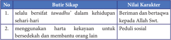

Tabel ini berisi dua baris dan dua kolom, dengan judul "Butir Sikap" di baris pertama dan "Nilai Karakter" di baris kedua. Topik utama tabel adalah tentang sikap dan nilai karakter yang dianjurkan dalam kehidupan sehari-hari. Kolom pertama berisi butir sikap, sementara kolom kedua berisi nilai karakter yang diharapkan. Data penting yang terlihat adalah bahwa sikap beritasih tawadhuhi dalam kehidupan sehari-hari dan menggunakan harta kekayaan untuk bersedia membantu orang lain dianggap sebagai sikap yang baik dan memiliki nilai karakter yang tinggi. Ini menunjukkan bahwa sikap-sikap tersebut dianggap penting dan harus dijalankan dalam kehidupan sehari-hari.

 

---
## 📄 Halaman 94

---
**📊 Tabel**

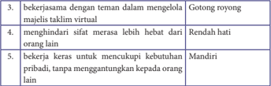

Tabel ini berisi 5 baris dengan 2 kolom, yang masing-masing menunjukkan topik utama dan data yang relevan. Topik utama tabel adalah tentang perilaku dan sikap yang diharapkan dalam situasi sosial. Kolom pertama berisi topik atau sifat yang harus dimiliki, sedangkan kolom kedua berisi contoh atau deskripsi dari sifat tersebut. Data penting yang terlihat dalam tabel ini meliputi:

1. "Bekerjasama dengan teman dalam mengelola majelis taklim virtual" - Gotong royong.
2. "Menghindari sifat merasa lebih hebat dari orang lain" - Rendah hati.
3. "Bekerja keras untuk mencukupi kebutuhan pribadi, tanpa menggantungkan kepada orang lain" - Mandiri.

Tabel ini mengajarkan bahwa dalam situasi sosial, seseorang harus memiliki sikap gotong royong, rendah hati, dan mandiri. Ini membantu mereka menjadi individu yang lebih baik dan dapat bekerja sama dengan orang lain dalam berbagai situasi.

---
**📊 Tabel**

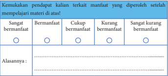

Tabel ini menunjukkan perbandingan antara kualitas pendapat kalian terkait manfaat yang diperoleh setelah mempelajari materi tertentu. Kolom pertama berisi kategori pendapat yang diukur, yaitu "Sangat bermanfaat", "Bermanfaat", "Cukup bermanfaat", "Kurang bermanfaat", dan "Sangat kurang bermanfaat". Kolom kedua berisi angka 1 hingga 5 untuk mengukur tingkat kepuasan atau manfaat yang dirasakan oleh siswa setelah mempelajari materi tersebut.

Data penting yang terlihat dalam tabel ini adalah bahwa sebagian besar siswa (dalam angka 1-3) merasa pendapat mereka tentang manfaat materi tersebut cukup bermanfaat atau mungkin kurang bermanfaat. Ini menunjukkan bahwa materi yang dipelajari mungkin belum sepenuhnya memberikan manfaat yang diharapkan kepada siswa. Sementara itu, hanya sedikit siswa (dalam angka 4-5) yang merasa pendapat mereka sangat bermanfaat atau sangat kurang bermanfaat, menunjukkan bahwa masih ada ruang untuk peningkatan dalam pengajaran atau pembelajaran.

Alasan utama dari tabel ini adalah untuk mengevaluasi efektivitas pembelajaran dan mendapatkan pemahaman lebih baik tentang apa yang perlu ditingkatkan dalam proses belajar. Dengan melihat pola ini, guru dapat membuat perubahan pada metode pengajaran atau materi yang dipelajari agar lebih sesuai dengan kebutuhan siswa dan hasil belajar yang diharapkan.

- Harta merupakan cobaan bagi pemiliknya, jika harta digunakan dengan baik maka harta bisa bermanfaat baginya, sebaliknya kalau harta dikelola secara salah maka akan mencelakakannya.
- Islam  melarang  perilaku  berlebih-lebihan  atau  melampaui  batas (israf) , boros (tabzir) dalam membelanjakan harta, pamer ( riya' ), sum'ah , sombong ( takabur ), dan dengki ( hasad ).
- Tabzir (boros) adalah perilaku membelanjakan harta tidak pada jalannya atau mengeluarkan harta tidak haq.
- Seseorang  disebut  berperilaku israf apabila  ia  membelanjakan  harta melewati  batas  kepatutan  menurut  ajaran  Islam,  dan  tidak  ada  nilai manfaatnya untuk kepentingan dunia maupun akhirat.

 

---
## 📄 Halaman 95

- Riya' yaitu  melakukan  dan  memperlihatkan  amal  ibadah  dengan  niat supaya mendapat pujian atau penghargaan dari orang lain.
- Sum'ah yaitu memberitahukan atau memperdengarkan amal ibadah yang dilakukan kepada orang lain agar dirinya mendapat pujian atau sanjungan.
- Takabur adalah  sikap  seseorang  yang  menunjukkan  sifat  sombong  atau merasa lebih kuat, lebih hebat dibanding orang lain.
- Hasad adalah sifat seseorang yang merasa tidak senang terhadap kebahagiaan orang lain karena memperoleh suatu nikmat dan berusaha menghilangkan nikmat tersebut.
- Syarat diterimanya amal ada tiga: (1). Beramal dengan landasan ilmu, (2). Berniat ikhlas karena Allah Swt., (3). Melakukan dengan sabar dan ikhlas.
- Benteng amal itu ada tiga, yaitu (1). Merasa bahwa hidayah itu datangnya dari Allah Swt., (2). Berniat meraih ridha Allah Swt. agar dapat mengalahkan hawa nafsu, (3). Berharap pahala dari Allah Swt. dengan menghilangkan riya' dan sum'ah .
- Sifat  hidup  berfoya-foya, riya' , sum'ah , takabur , hasad dapat  dihindari dengan menerapkan sifat rendah hati (tawadhu').

### 1.  Penilaian Sikap

- Tulislah perilaku-perilaku yang pernah kalian lakukan untuk menghindari  sifat  berfoya-foya, riya' sum'ah , takabur ,  dan hasad . Catatlah semua yang sudah kalian lakukan di buku catatanmu!
- Berilah tanda centang ( √ ) pada kolom berikut dan berikan alasannya!

---
**📊 Tabel**

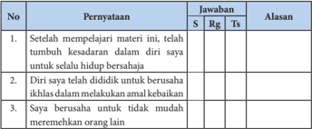

Tabel ini berisi tiga pernyataan yang diuji dengan metode S-R-G-Ts (Sesuaian, Regenerasi, Tantangan, dan Solusi). Setiap pernyataan ditawarkan sebagai jawaban yang mungkin, dan alasan mengapa jawaban tersebut diberikan. Topik utama tabel adalah tentang perilaku dan sikap dalam menjalani hidup bersama. Kolom-kolomnya meliputi No., Pernyataan, Jawaban, dan Alasan. Data penting yang terlihat adalah bahwa setiap pernyataan memiliki satu jawaban yang disesuaikan dengan situasi, satu regenerasi yang memperkuat pemahaman, satu tantangan yang menuntut penyelesaian, dan satu solusi yang memberikan penyelesaian.

 

---
## 📄 Halaman 96

---
**📊 Tabel**

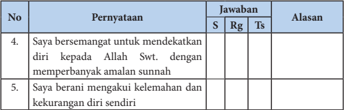

Tabel ini berisi dua pernyataan yang harus dijawab dengan tiga pilihan jawaban: S (Sangat), Rg (Rendah), dan Ts (Tidak Sangat). Pernyataan pertama mengajukan pertanyaan tentang keinginan untuk mendekatkan diri kepada Allah Swt. dengan cara memperbanyak amalan sunnah. Pernyataan kedua mengajukan pertanyaan tentang keberaniannya mengakui kelemahan dan kekurangan diri sendiri. Dalam tabel ini, tidak ada alasan yang disediakan untuk setiap jawaban. Topik utama tabel ini adalah tentang sikap dan keinginan individu dalam mendekati Allah Swt. dan mengakui kelemahan diri sendiri. Kolom-kolom yang ada adalah No, Pernyataan, Jawaban, dan Alasan. Pola penting yang terlihat adalah bahwa tidak ada alasan yang disediakan untuk setiap jawaban, yang menunjukkan bahwa pembaca harus membuat penilaian mereka sendiri terhadap setiap pernyataan.

Keterangan: S = Setuju, Rg = Ragu-Ragu, Ts = Tidak Setuju

### 2. Penilaian Pengetahuan

- Berilah tanda silang (X) pada huruf A, B, C, D atau E pada jawaban yang paling tepat!
- Harta benda yang dimiliki oleh seseorang berpotensi menjerumuskannya dalam jeratan tipu daya setan. Padahal, harta karunia Allah Swt. tersebut seharusnya  digunakan  sebagai  sarana  ibadah.  Berikut  ini  merupakan contoh penggunaan harta yang benar, kecuali ….
- disedekahkan untuk fakir miskin
- digunakan biaya biaya sekolah
- disimpan untuk tabungan hari tua
- membeli barang mewah dan unik untuk disimpan
- memenuhi kebutuhan keluarga
- Perhatikan Q.S al-Isra'/17: 26-27 berikut ini!
ِ

``

ِ

ِ

ً

ْ

ُ

َ

ِ

ّ

َ

ٰ

َ

َ

ِ

ِ

َ

َ

ْ

ْ

ُ

َ

Ayat  tersebut berisi  pesan-pesan  mulia  bagi  umat  Islam.  Di  antara kandungan ayatnya adalah berisi larangan untuk ….

- berbuat aniaya kepada orang lain
- menghambur-hamburkan harta
- bergaya hidup terlalu hemat
- bersifat sombong dan membanggakan diri
- memberitakan amal kebaikan kepada orang lain
َ

ّ

ْ

ً

َ

ْ

ّ

ُ

َ

َ

َ

َ

َ

ْ

َ

ٗ

َ

ٰ

ُ

ْ

َ

ٰ

َ

 

---
## 📄 Halaman 97

- Perhatikan narasi berikut ini!
Allah Swt. sangat tidak menyukai seseorang yang mempergunakan harta secara  berlebihan.  Mereka  menghamburkan harta sia-sia dan melupakan hak-hak orang lain atas hartanya. Ia membelanjakan harta melewati batas kepatutan  menurut  ajaran  Islam,  dan  tidak  ada  nilai  manfaatnya  untuk kepentingan dunia maupun akhirat.

- Berdasarkan narasi tersebut, perilaku yang dimaksud adalah ….
- israf
- riya'
- sum'ah
- hasad
- takabur
- Allah Swt. sangat membenci sifat hidup berfoya-foya. Oleh karena itu seorang muslim harus menghindari sifat tersebut. Salah satu cara menghindari sifat hidup berfoya-foya adalah membiasakan bersedekah dan membantu orang lain. Mengapa bisa demikian?
- sedekah akan mempercepat habisnya harta benda
- amal kebaikan yang paling sulit dilakukan adalah sedekah
- karena sedekah dapat menumbuhkan rasa empati kepada sesama
- tidak ada satu pun manusia yang dapat lepas dari takdir Allah Swt
- sedekah akan menjadikan seseorang semakin terkenal
- Perhatikan pernyataan berikut ini!
- Menerima dengan senang hati atas semua karunia dari Allah
- Merasa yakin bahwa Allah Swt. telah menjamin rejeki semua mahkluk ciptaan-Nya.
- Kedua  pernyataan  tersebut  akan  mewujudkan  sifat-sifat  berikut  ini, kecuali ….
- qana'ah
- optimis
- yakin
- syukur
- ta' dzim
- Kebanyakan manusia sering melupakan nikmat yang diterima dari Allah Swt.  Mereka  beranggapan  bahwa  harta  dan  kedudukan  yang  diperoleh merupakan  hasil  kerja  kerasnya.  Anggapan  seperti  inilah  yang  memicu munculnya  sifat riya' dan sum'ah .  Salah  satu  cara  untuk  menghindari perilaku riya' adalah….

 

---
## 📄 Halaman 98

- memperhitungkan dampak ekonomi setiap amal kebaikan
- melakukan amal kebaikan hanya karena Allah Swt.
- memilih hari yang tepat untuk melakukan ibadah
- mengajak teman dekat untuk suatu amal ibadah
- mencatatnya di buku catatan pribadi
- Perhatikan narasi berikut ini!
Manusia merupakan makhluk lemah dan penuh keterbatasan. Tak mungkin ia dapat menyelesaikan semua masalah tanpa bantuan pihak lain. Posisinya sebagai makhluk yang lemah mengharuskannya berdoa memohon pertolongan dari Allah, termasuk mohon kekuatan agar terhindar dari sifat riya' dan sum'ah .

- Berdasarkan narasi tersebut, hikmah yang dapat diambil adalah ….
- manusia selalu membutuhkan pertolongan Allah Swt.
- sifat riya' dan sum'ah tidak mungkin bisa dihindari
- kekuatan fisik manusia tidak akan mampu menghilangkan sifat tercela
- keterbatasan manusia dikarenakan tidak menggunakan akalnya
- doa dan pertolongan Allah Swt. tidak terkait secara langsung
- Perhatikan pernyataan-pernyataan berikut ini!
- Dibenci oleh Allah Swt. dan rasul-Nya
- Memperbanyak teman dan kenalan
- Mata hatinya terkunci dari memperoleh hidayah kebenaran
- Mendapatkan siksa dan kehinaan di akhirat
- Mampu menaklukkan dunia
- Manakah yang termasuk dampak negatif sifat takabur ….
- 1, 2, 3
- 1, 3, 4
- 1, 3, 5
- 2, 3, 4
- 3, 4, 5
- Perhatikan pernyataan berikut ini!
Pada saat yang sudah ditentukan, kematian akan menjemput setiap manusia. Itu  artinya,  kehidupan  di  dunia  hanya  sebentar  dan  sementara.  Banyak orang menjadi takabur karena melupakan hal ini. Mereka mengira bahwa kehidupan dunia kekal selamanya, hingga lupa bekal hidup di akhirat.

Berdasarkan narasi tersebut, bekal hidup di akhirat berupa ….

- pangkat, kedudukan dan jabatan
11'

 

---
## 📄 Halaman 99

- kekayaan harta yang melimpah
- amal shaleh yang dilakukan dengan ikhlas
- banyaknya keturunan
- luasnya pergaulan dan teman dekat

### 10.  Perhatikan hadis berikut ini!

َ

َ

### د َ س ح ال َّ ا ِ ن ف د َ س ح ال و م اك َّ :ا ِ ي ال َّ  ﷺ ق ي ب َّ الن َّ ن ا ه ن ع َ  الل ِ ي َ ض ر ة ْ ر ي ر َ ْ  ه ِ ي ب ا ن ْ ع . (رواه ابوداود) َ ب َ ط ح ال ار َّ الن ل ك أ ات م ات ِ  ك ن َ س ح ال ل ك أ ي

َ

ْ

َ

َ

َ

ْ

َ

ْ

ُ

َ

َ

### Kandungan hadis tersebut adalah ….

- sifat riya' akan menyebabkan pelakunya rugi di akhirat kelak
- sifat sum'ah akan menghilangkan semua pahala kebaikan
- sifat takabur sangat dibenci oleh Allah Swt karena merupakan sifat-Nya
- sifat hasad dapat memakan kebaikan seperti api memakan kayu bakar
- sifat berfoya-foya berpengaruh terhadap kondisi perekonomian seseorang

### B.  Jawablah  pertanyaan-pertanyaan  berikut  ini  dengan  jawaban yang benar!

- Secara  kodrat  alamiah,  manusia  memang  memiliki  tabiat  mencintai harta. Pada saat uang dan hartanya melimpah, perilakunya bisa berubah menjadi  lebih  konsumtif.  Mengapa  bisa  demikian?  Bagaimana  caranya agar terhindar dasi sifat konsumtif?
- Sifat berfoya-foya akan berdampak negatif dalam kehidupan sehari-hari. Salah satunya adalah memicu frustasi dan tekanan batin, takut hartanya habis. Mengapa hal ini bisa terjadi? Jelaskan!
- Sifat riya' dan sum'ah bisa muncul pada diri seseorang pada saat melakukan ibadah ataupun setelah melakukannya. Rasulullah Saw. menegaskan bahwa riya' termasuk syirik khafi. Jelaskan apa yang dimaksud dengan syirik khafi!
- Ditinjau dari bentuknya, riya' dibagi menjadi dua, yaitu riya' dalam niat dan riya' dalam perbuatan. Sebutkan sebuah contoh riya' dalam niat!
- Salah  satu  sifat  tercela  yang  termasuk  dosa  besar  adalah takabur .  Oleh karenanya setiap umat  Islam harus berusaha sekuat tenaga untuk menghindari sifat tersebut. Sebutkan ciri-ciri orang yang bersifat takabur !
ِ

ْ

ُ

َ

ُ

ْ

َ

ُ

ُ

ُ

ّٰ

ْ

َ

َ

َ

َ

َ

َ

َ

ُ

ْ

َ

ُ

ُ

ْ

َ

َ

 

---
## 📄 Halaman 100

### 3. Penilaian Keterampilan

Buatlah quote terkait materi 'menghindari sifat berfoya-foya, riya' , sum'ah , takabur , dan hasad ' .  Kemudian unggahlah (upload) quote tersebut ke akun  media  sosial  kalian!  Kumpulkan  bukti-buktinya  berupa  tangkap  layar (screenshot) sebagai bentuk laporan kepada guru!

Untuk  lebih  mendalami  materi  bab  ini,  silahkan  kalian  pelajari  lebih mendalam buku-buku berikut ini:

- Kitab Ihya' Ulumuddin karya Imam Ghazali
- Kitab Tanbighul Ghafilin karya al-Faqih Abu Laits as-Samarkandi
- Kitab Bidayatul Hidayah karya Imam Ghazali
- Kitab Riyadhus Shalihin karya Imam Nawawi

 

---
## 📄 Halaman 101

Penulis	:	Ahmad	Taufik

Nurwastuti Setyowati

ISBN

: 978-602-244-547-0

---
**🖼️ Gambar/Diagram**

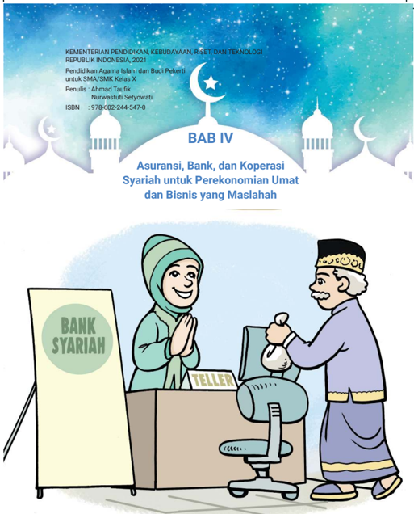

> **Deskripsi Visual:** Gambar dari buku pelajaran ini adalah ilustrasi yang menunjukkan dua karakter yang sedang berbicara di depan sebuah teller di bank syariah. Karakter laki-laki yang berdiri di sebelah kanan mengenakan pakaian tradisional dengan topi emas, sedangkan karakter perempuan yang berdiri di sebelah kiri mengenakan hijab dan pakaian modern. Di sebelah kiri, terdapat papan tulisan "BANK SYARIAH" dengan tanda "TELLER" di bawahnya. Latar belakangnya menampilkan ikon-ikon religius seperti bulan sabit dan bintang, serta elemen-elemen arsitektur tradisional.

Elemen-elemen utama dalam gambar ini adalah dua karakter yang sedang berbicara, teller di bank syariah, dan papan tulisan "BANK SYARIAH". Relasi antara mereka adalah bahwa karakter laki-laki tersebut mungkin sedang berbicara kepada teller tentang transaksi di bank syariah, sementara karakter perempuan tersebut tampaknya sedang mendengarkan atau memberikan informasi kepada karakter laki-laki tersebut.

Teks, angka, atau label penting yang terlihat dalam gambar ini adalah "BANK SYARIAH" dan "TELLER" pada papan tulisan di sebelah kiri. Informasi kunci yang dapat diambil pembaca adalah bahwa gambar ini mungkin menggambarkan konsep asuransi, bank, dan koperasi syariah sebagai alternatif perekonomian umat dan bisnis yang maslahah.

 

---
## 📄 Halaman 102

### Tujuan Pembelajaran

Setelah mempelajari materi ini, peserta didik mampu:

- Menganalisis implementasi fikih muamalah: asuransi, bank dan koperasi syariah di masyarakat;
- Menyajikan paparan tentang fikih muamalah: asuransi, bank dan koperasi syariah;
- Meyakini bahwa ketentuan fikih muamalah adalah ajaran agama;
- Menumbuhkan jiwa kewirausahaan dan kepedulian sosial.

---
**🖼️ Gambar/Diagram**

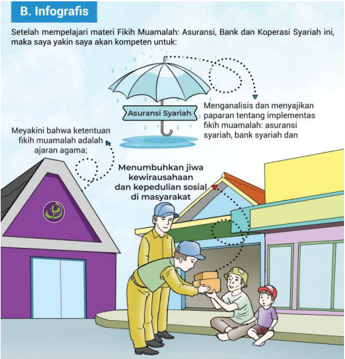

> **Deskripsi Visual:** Gambar ini adalah ilustrasi yang menunjukkan proses implementasi fikih muamalah dalam asuransi syariah, bank syariah, dan koperasi syariah. Gambar ini terdiri dari beberapa elemen utama:

1. **Pertama**: Gambar ini menunjukkan sebuah bangunan yang tampak seperti kantor atau pusat layanan. Di depan bangunan tersebut, ada dua orang yang sedang berbincang dengan seorang pria lainnya.

2. **Elemen Utama dan Relasinya**: 
   - **Bangunan**: Menunjukkan tempat kerja atau pusat layanan.
   - **Orang-orang**: Mereka tampak seperti karyawan atau pengurus yang sedang berbicara dengan konsumen.
   - **Umbrella**: Menyimbolkan asuransi syariah, bank syariah, dan koperasi syariah.
   - **Jembatan**: Menunjukkan hubungan antara asuransi syariah, bank syariah, dan koperasi syariah.

3. **Teks, Angka, atau Label Penting**:
   - **Teks**: "Asuransi Syariah", "Bank Syariah", "Koperasi Syariah".
   - **Angka**: Tidak ada angka yang signifikan dalam gambar ini.
   - **Label**: "Menganalisis dan menyajikan paparan tentang implementasikan fikih muamalah: asuransi syariah, bank syariah dan koperasi syariah".

4. **Informasi Kunci**:
   - Gambar ini menggambarkan bagaimana asuransi syariah, bank syariah, dan koperasi syariah saling terhubung dan saling mendukung dalam melayani masyarakat.
   - Ini menunjukkan bahwa semua tiga bentuk keuangan syariah memiliki peran penting dalam membantu masyarakat untuk membangun jiwa kewirausahaan dan kesejahteraan sosial.

Dalam gambar ini, informasi penting adalah bahwa asuransi syariah, bank syariah, dan koperasi syariah tidak hanya sebagai institusi keuangan, tetapi juga sebagai bagian dari solusi sosial dan ekonomi yang lebih besar untuk masyarakat

 

---
## 📄 Halaman 103

### Aktivitas 4.1

Sebelum  memulai  pelajaran,  marilah  kita  tadarus  Al-Qur`an  terlebih dahulu.

- Bacalah Q.S. al-Maidah/5:2 berikut ini secara bersama-sama dengan tartil!
- Perhatikan hukum bacaan dan makharijul hurufnya!
َ

َ

ْ

ُ

َ

ْ

َ

َ

َ

ْ

َ

ً

َ

ْ

ْ

َ

ُ

ْ

ْ

َ

َ

َ

ُ

ْ

َ

َ

َ

ِ

ْ

ا ل و ْ ي َ د ه ا  ال ل و ام ر َ ح ال ر َ ه َّ ا الش ل ِ و الل اۤىِٕر ع ا ش و ِ ل ح ا ت ا  ل و ن م ا ن ي ذ ِ َّ ا  ال ُّ ه ي ا ي م ت ل ل ا ح ا ِ ذ ۗو ا ان و ِ ض ر و م ِ ه ب َّ ر ّ ن ا م ل َ ض ف ْ ن و غ ت ب ي ام ر َ ح ال ْ ت ي ب ال ْ ن ِ ي م آ ا ل و اۤىِٕد ل ق ال ن ام ِ  ا ر َ ح د ِ  ال ْ ج م َ س ال ن ِ ع م ْ ك و د ص ن م ٍ  ا و ق ن ا ن ْ  ش م ك َّ ن م ر ِ ج ا ي ل ا  ۗو و اد ْ ط اص ف وا ق َّ ات ۖو َ ان ِ و د ع ال و م ِ ث ا ِ ى ال ل ا ع و ن او ع ا ت ل ۖ  و ٰ ى و ق َّ الت و ِ ر ب ى ال ل ا ع و ن او ع ت ۘ ا و و د ت ع ت - ٢ اب ع ِ ق ال ْ د ي د ِ ش الل َّ ۗا ِ ن الل

### Aktivitas 4.2

Cermatilah  gambar-gambar  berikut  ini!  Lalu  tuliskanlah  kesimpulan kamu terkait dengan konsep ekonomi syariah? Sejauh ini, apakah yang kalian ketahui tentang perekonomian syariah? Jelaskan!

ْ

َ

َ

ْ

ْ

ً

َ

َ

ّٰ

َ

َ

َ

ْ

ْ

ُّ

ُ

َ

ْ

ْ

ُ

َ

ٰ

ٰۤ

َ

َ

ْ

َ

َ

َ

ْ

ٰٓ

ْ

ْ

ِ

َ

ّ

َ

ْ

َ

ُ

ْ

ِ

ْ

ُّ

ُ

َ

َ

ْ

َ

َ

ْ

َ

َ

َ

َ

ْ

ُ

َ

َ

ْ

َ

ُ

ْ

ٰ

َ

َ

َ

َ

َ

ِ

ّ

ِ

ُ

ْ

َ

َ

َ

ْ

َ

َ

َ

ْ

ُ

َ

َ

ْ

ُ

َ

َ

ّ

َ

َ

َ

َ

َ

ّٰ

ْ

َ

َ

ُ

َ

ْ

َ

ُ

َ

َ

َ

ّٰ

ْ

َ

َ

 

---
## 📄 Halaman 104

---
**🖼️ Gambar/Diagram**

> **Deskripsi Visual:** Gambar ini adalah ilustrasi yang menunjukkan seorang karyawan bank syariah sedang berbicara dengan seorang nasabah. Gambar ini menggambarkan hubungan antara karyawan bank syariah dan nasabah dalam proses transaksi keuangan. Karyawan bank syariah sedang memegang sebuah buku tabungan dan berbicara dengan nasabah yang tampaknya sedang menunggu. Dalam gambar tersebut, elemen-elemen utama termasuk karyawan bank syariah, nasabah, buku tabungan, dan papan tulisan yang menunjukkan "BANK SYARIAH". Informasi kunci yang dapat diambil pembaca adalah bahwa gambar ini menunjukkan proses transaksi keuangan di bank syariah, dimana karyawan bank syariah memberikan layanan kepada nasabah.

---
**🖼️ Gambar/Diagram**

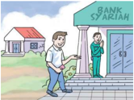

> **Deskripsi Visual:** Gambar ini adalah ilustrasi yang menunjukkan seorang pria sedang berjalan menuju pintu masuk sebuah bank. Pintu tersebut diberi tanda "BANK SYARIAH". Di depan pintu, ada seorang petugas keamanan yang sedang berdiri. Latar belakang menunjukkan beberapa bangunan kecil dan pohon hijau. Gambar ini mungkin digunakan untuk menggambarkan proses pengambilan uang tunai di bank syariah.

Elemen-elemen utama dalam gambar ini adalah pria yang sedang berjalan, pintu masuk bank syariah, petugas keamanan, dan latar belakang dengan bangunan kecil dan pohon hijau. Relasi antara elemen-elemen ini adalah bahwa pria tersebut sedang menuju ke pintu masuk bank syariah, yang merupakan tempat di mana ia akan melakukan transaksi uang tunai. Petugas keamanan tampaknya bertugas untuk memastikan keamanan dan kebersihan di area tersebut.

Teks, angka, atau label penting yang terlihat pada gambar ini adalah "BANK SYARIAH" yang ditempatkan di atas pintu masuk bank. Informasi kunci yang dapat diambil pembaca dari gambar ini adalah bahwa tempat tersebut adalah bank syariah, dan pria tersebut sedang berada di depan pintu masuknya, menunjukkan bahwa ia sedang berada di area tersebut.

E.

### Kisah Inspirasi

### Aktivitas 4.3

- Bacalah dengan cermat dan teliti kisah inspiratif berikut ini!
- Lalu simpulkan dan tuliskan di buku kalian, hikmah apakah yang bisa kita petik dari kisah tersebut! Kaitkanlah hikmah dari kisah tersebut dengan pengalaman hidup yang mirip dengan orang-orang di sekitar tempat tinggal kalian!

---
**🖼️ Gambar/Diagram**

> **Deskripsi Visual:** Gambar ini adalah ilustrasi yang menunjukkan keluarga sedang berjalan-jalan di bawah payung. Ilustrasi ini menggambarkan suasana yang hangat dan menyenangkan, dengan orang tua dan anak-anak yang tampak senang dan bersama-sama. Payung yang digunakan oleh keluarga menunjukkan bahwa mereka sedang berjalan di luar, mungkin untuk berjalan-jalan atau berlibur. Teks "BANK SYARIAH" yang tertera pada payung menunjukkan bahwa gambar ini mungkin berkaitan dengan bank syariah atau produk-produk keuangan yang disediakan oleh bank tersebut. Ini menunjukkan bahwa gambar ini mungkin digunakan untuk tujuan edukasi atau promosi produk bank syariah.

---
**🖼️ Gambar/Diagram**

> **Deskripsi Visual:** Gambar ini adalah ilustrasi yang menunjukkan dua karakter yang sedang bermain game. Karakter laki-laki berdiri di sebelah kanan dengan posisi yang lebih tinggi, sedangkan karakter perempuan berdiri di sebelah kiri dengan posisi yang lebih rendah. Kedua karakter tersebut sedang memegang kontrol game dan tampaknya sedang bermain game yang sama. Di sekitar mereka, terdapat beberapa bubur yang tampaknya merupakan simbol dari game yang mereka mainkan.

Elemen-elemen utama dalam gambar ini adalah dua karakter, kontrol game, dan bubur. Karakter dan kontrol game merupakan elemen yang paling dominan, sementara bubur hanya digunakan sebagai simbol untuk menunjukkan konteks permainan.

Teks, angka, atau label penting tidak terlihat dalam gambar ini karena semua elemen utama hanya berupa gambar saja. Namun, informasi kunci yang dapat diambil dari gambar ini adalah bahwa kedua karakter sedang bermain game yang sama dan menggunakan kontrol yang sama.

Dalam satu paragraf yang informatif, gambar ini menunjukkan dua karakter sedang bermain game, dengan kontrol game dan bubur sebagai simbol dari permainan yang mereka mainkan. Karakter dan kontrol game merupakan elemen utama dalam gambar ini, sementara bubur hanya digunakan sebagai simbol untuk menunjukkan konteks permainan.

 

---
## 📄 Halaman 105

111

Pak  Samhu  (49  tahun)  adalah  seorang  pelaku  usaha  kecil  yaitu  penjual gorengan.  Ia  adalah  seorang  anggota  sebuah  koperasi  syariah  di  wilayah Serpong, Banten, Jawa Barat. Sehari-hari ia berjualan di sekitar area kampung Curug, Kelurahan Serpong, Tangerang Selatan.

Selain berprofesi sebagai seorang penjual gorengan, ternyata di kampungnya, pak Samhu dikenal sebagai seorang qari' yaitu orang yang pandai membaca ayat-ayat Al-Qur`an dengan suara, nada dan lagu yang sangat indah. Ia sering diminta untuk menjadi qari' pada peringatan hari-hari besar Islam, seperti perayaan Maulid Nabi, peringatan Isra' Mi'raj dan pengajian akbar di kampungnya. Bahkan pada kajian rutin yang diadakan oleh koperasi syariah di mana ia menjadi salah satu anggotanya pun, ia diminta untuk membaca ayat suci Al-Qur`an pada sebagai acara pembuka.

Namun sayang, kisah kehidupan pak Samhu, tidak seindah suaranya. Ia pernah terjerat hutang riba kepada rentenir ketika ia merintis usaha berjualan gorengannya. Seiring berjalannya waktu, hutang itu bukan semakin berkurang namun semakin  bertambah  apalagi  jika  ia  terlambat  membayar  cicilannya. 'Saya  kapok  meminjam  uang  ke  rentenir  lagi,  sangat  berbahaya  dan  tidak berkah sama sekali' kata pak Samhu.

Akhirnya  pak  Samhu  bergabung  dengan  salah  satu  koperasi  syariah pada  sebuah  program  pinjaman  modal  tanpa  riba  pada  tahun  2014  untuk mengembangkan  usaha  berjualan  gorengannya.    Selain  itu  para  anggota koperasi  syariah  ini  rutin  mengadakan  kajian  dan  mendapatkan  ilmu  baru tentang  larangan  praktik  riba  dalam  transaksi  keuangan.    'Alhamdulillah, saya bersyukur dapat bergabung dengan koperasi syariah ini, semoga semakin berkah dan maju untuk seluruh anggota' pungkas pak Samhu.

(Dikutip dari Republika.co.id / Selasa, 19 April 2016)

Beberapa  waktu  belakangan  ini,  kita  sering  mendengar  dan  melihat pertumbuhan  serta  perkembangan  aktivitas  ekonomi  yang  berlandaskan pada syariat Islam atau lebih dikenal dengan ekonomi syariah di masyarakat. Aktivitas  tersebut  berhubungan  dengan  industri  jasa  keuangan  sehingga muncul  istilah  Unit  Usaha  Syariah  (UUS)  antara  lain  Asuransi  Syariah, Perbankan  Syariah,  Koperasi  Syariah,  Pegadaian  Syariah  dan  lain-lain.  Hal ini tentu saja sangat normal, mengingat berubahnya tatanan sosial ekonomi dalam masyarakat yang semakin membutuhkan nilai-nilai religius pada setiap aspek kehidupan.

 

---
## 📄 Halaman 106

Sistem ekonomi Islam atau ekonomi syariah memiliki karakteristik yang berbeda  dengan  sistem  ekonomi  umum  (konvensional).  Ekonomi  syariah merupakan sistem ekonomi yang adil dan menjamin bahwa kekayaan tidak hanya  berputar  dan  terkumpul  pada  satu  kelompok  saja,  tetapi  tersebar  di semua  lapisan  masyarakat.  Sehingga  diharapkan  dengan  berkembangnya ekonomi syariah, maka aktivitas ekonomi akan semakin seimbang. Apabila dalam ekonomi konvensional, tujuan utama dari aktivitas ekonomi sematamata  hanyalah  untuk  mendapatkan  keuntungan  dan  kepentingan  duniawi, maka dalam ekonomi syariah segala aktivitas perekonomian tujuan akhirnya harus seimbang antara kepentingan duniawi dan kepentingan ukhrawi.

### 1. Asuransi Syariah

### a. Definisi Asuransi Syariah

Asuransi  berasal  dari  bahasa  Inggris  yaitu insurance, yang  kemudian diadopsi  ke  dalam  bahasa  Indonesia  dan  popular  dengan  istilah  asuransi. Sinonim asuransi dalam Kamus Besar Bahasa Indonesia adalah pertanggungan.

Berdasarkan  pada  UU  Nomor  40  tahun  2014  tentang  Perasuransian, asuransi merupakan perjanjian antara dua belah pihak yaitu pemegang polis dan  perusahaan  asuransi,  yang  menjadi  landasan  bagi  perusahaan  asuransi untuk penerimaan premi yang kegunaannya adalah untuk:

- Memberikan  kompensasi  kepada  pemegang  polis  karena  kerusakan, kerugian, kehilangan keuntungan, biaya yang timbul dan tanggungjawab hukum kepada pihak ketiga yang mungkin ditanggung oleh pemegang polis karena terjadinya sesuatu yang tidak pasti (tidak bisa diprediksi) TRANSER
- Memberikan pembayaran karena pemegang  polis  meninggal  dunia  atau pembayaran yang didasarkan pada hidup pemegang  polis  dengan  manfaat  yang jumlahnya  ditetapkan  pada  pengelolaan dana.
َ

َ

َ

َ

---
**🖼️ Gambar/Diagram**

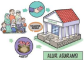

> **Deskripsi Visual:** Gambar ini adalah ilustrasi yang menunjukkan berbagai aspek kehidupan sehari-hari seseorang. Gambar tersebut terdiri dari beberapa elemen utama:

1. **Pertama**: Gambar ini menggambarkan keluarga yang sedang bersantai di rumah. Orang tua dan anak-anak mereka tampak senang dan nyaman di depan rumah mereka.

2. **Kedua**: Gambar ini menunjukkan seorang pria yang sedang bekerja di kantor. Ia tampak fokus dan serius dalam pekerjaannya.

3. **Ketiga**: Gambar ini menunjukkan seorang wanita yang sedang memasak makanan di dapur. Ia tampak tenang dan senang saat memasak.

4. **Keempat**: Gambar ini menunjukkan seorang anak yang sedang belajar di rumah. Ia tampak serius dan fokus pada tugas belajar.

5. **Kelima**: Gambar ini menunjukkan seorang orang tua yang sedang berbicara dengan anak-anak mereka tentang hal-hal penting. Ia tampak serius dan peduli.

6. **Keenam**: Gambar ini menunjukkan seorang anak yang sedang tidur di tempat tidur. Ia tampak nyenyak dan tenang.

7. **Ketujuh**: Gambar ini menunjukkan seorang orang tua yang sedang membaca buku kepada anak-anak mereka. Ia tampak serius dan peduli terhadap pendidikan anak-anak mereka.

8. **Kedelapan**: Gambar ini menunjukkan seorang anak yang sedang bermain di taman. Ia tampak senang dan aktif.

9. **Kelevi**: Gambar ini menunjukkan seorang orang tua yang sedang berjalan-jalan di jalan raya. Ia tampak tenang dan berhati-hati.

10. **Kelevii**: Gambar ini menunjukkan seorang orang tua yang sedang berjalan-jalan di jalan raya. Ia tampak tenang dan berhati-hati.

Informasi kunci yang dapat diambil pembaca adalah bahwa gambar ini menunjukkan berbagai aspek kehidupan sehari-hari seseorang, mulai dari pekerjaan,

ً

ُ

َ

ُ

Adapun yang dimaksud dengan asuransi syariah atau juga dikenal dengan asuransi takaful yaitu berasal dari bahasa Arab dari kata dasar -لا اف ك -ل اف ك ت ي ل اف ك - ت yang artinya saling menanggung atau menanggung bersama. Menurut istilah asuransi syariah atau takaful adalah pengaturan risiko yang memenuhi ketentuan syariah, tolong menolong (s ymbiosis mutualisme) yang melibatkan peserta asuransi dan pengelola, serta berdasarkan pada ketentuan Al-Qur`an dan sunah.

َ

َ

َ

َ

 

---
## 📄 Halaman 107

Sedangkan asuransi syariah menurut Undang-undang Nomor 40 Tahun 2014 ini adalah kumpulan perjanjian antara pemegang polis dengan perusahaan asuransi  syariah  dalam  rangka  pengelolaan  kontribusi  berdasarkan  prinsip syariah guna saling tolong-menolong dan melindungi.

Adapun unsur-unsur yang terdapat dalam asuransi yaitu adanya:

- Pihak tertanggung
- Pihak penanggung
- Akad atau perjanjian asuransi
- Pembayaran iuran (premi)
- Kerugian, kerusakan atau kehilangan (yang diderita tertanggung)
- Peristiwa yang tidak bisa diprediksi

### b. Sejarah Berdirinya Asuransi Syariah

Perusahaan asuransi yang pertama kali berdiri di Indonesia diprakarsai oleh pemerintah Hindia Belanda bergerak di bidang asuransi sektor perkebunan yang bernama Bataviasche Zee End Brand Asrantie Maatscappij pada tahun 1843.  Asuransi  tersebut  mencakup segala  risiko  yang  diakibatkan  oleh kebakaran dan risiko kecelakaan pada saat pengangkutan hasil perkebunan. Berturut-turut  kemudian  berdirilah  perusahaan-perusahaan  asuransi  lain, namun  setelah  penjajahan  Jepang,  perekonomian  Indonesia  mengalami kekacauan sehingga banyak perusahaan asuransi yang bangkrut.

Adapun  perusahaan  asuransi  syariah  pertama  yang  lahir  di  Indonesia, diawali dari kepedulian yang tulus dari Ikatan Cendekiawan Muslim Indonesia (ICMI). ICMI bekerja sama dengan PT Asuransi Jiwa Tugu Mandiri, Bank Muamalat Tbk., Departemen Keuangan RI dan beberapa pengusaha muslim Indonesia,  dengan  bantuan  teknis  dari  Syarikat  Takaful  Malaysia,  Bhd. Kemudian  melalui  Tim  Pembentuk  Asuransi  Takaful  Indonesia  (TEPATI) didirikanlah PT Syarikat Takaful Indonesia (Takaful Indonesia) pada tanggal 24 Februari 1994 yang diresmikan oleh Menristek/Kepala BPPT BJ Habibie sebagai perusahan perintis pengembangan asuransi syariah yang pertama di Indonesia.

### c.  Dasar Hukum Asuransi Syariah

- Hukum Asuransi dalam Al-Qur`an dan Hadis
- QS. al-Maidah/5: 2
َ

``

ْ

ُ

ْ

َ

ْ

ْ

َ

َ

ْ

ُ

َ

َ

َ

َ

َ

ْ

َ

ِ

ّ

ْ

َ

َ

ْ

ُ

َ

َ

َ

َ

Artinya: ' Dan tolong menolonglah kamu dalam (mengerjakan) kebajikan dan takwa, dan jangan tolong menolong dalam berbuat dosa dan permusuhan'

 

---
## 📄 Halaman 108

ً

ِ

َ

َ

ْ

ُ

َ

ً

ٰ

ِ

ً

ِ

ّ

ُ

ْ

ِ

ْ

َ

ْ

ْ

ُ

َ

ْ

َ

َ

ْ

َ

ً

ْ

َ

ْ

َ

ْ

ُ

ْ

ُ

َ

ْ

َ

َ

ّٰ

ُ

َ

ْ

َ

ْ

Artinya:    ' Dan  hendaklah  takut  (kepada  Allah  Swt.)  orang-orang  yang sekiranya  meninggalkan  keturunan  yang  lemah  di  belakang  mereka  yang mereka  khawatir  terhadap  (kesejahteraan)  nya.  Oleh  sebab  itu  hendaklah mereka berbicara dengan tutur kata yang benar'

### b)  QS. an-Nisa'/4: 9 ا ل و ا ق و ل و ق ي ل و وا الل ق َّ ت ي ل ۖ  ف م ْ ه ي ل ا ع و اف ا خ ف ع ض ة َّ ي ر ذ م ف ِ ه ل خ ا م ِ ن و ر َ ك ت و ل ن ي ذ ِ َّ ال ْ ش َ خ ي ل و ا - ٩ ْ د ي د ِ س َ

َ

َ

َ

َ

َ

ْ

َ

َ

َ

ْ

ْ

َ

ِ

``

ْ

ً

َ

ُ

ْ

َ

ُ

ّٰ

َ

َ

َ

ٰ

ْ

َ

ْ

ُّ

ِ

ْ

َ

َ

ُ

ّٰ

َ

ٍ

ُ

Artinya:  ' Diriwayatkan  dari  Abu  Hurairah  RA,  Nabi  Muhammad  Saw. bersabda: Barang  siapa  yang  menghilangkan  kesulitan  duniawi  seorang mukmin, maka Allah Swt. akan menghilangkan kesulitannya pada hari kiamat. Barangsiapa yang mempermudah kesulitan seseorang, maka Allah Swt. akan mempermudah urusannya di dunia dan di akhirat' (HR. Muslim).

### 2.  Hukum Asuransi Menurut Para Fuqaha

Perbedaan  pendapat  di  kalangan  ulama fikih tentang hukum asuransi, sejak pertama kali dikaji hingga saat ini, masih  terus berlanjut.  Ada  golongan  ulama  fikih  yang menyatakan  hukum  asuransi  itu  mubah, sementara  golongan  yang  lain  menyatakan haram.

---
**🖼️ Gambar/Diagram**

> **Deskripsi Visual:** Gambar ini adalah ilustrasi yang menunjukkan dua orang yang sedang berbicara tentang topik "Mengenal Bahan Kimia". Pada gambar tersebut, seorang pria tua dengan topi hitam sedang berbicara kepada seorang anak muda yang sedang duduk di bangku sekolah. Pria tua tampaknya sedang menjelaskan sesuatu kepada anak muda tersebut. Di sebelah kiri gambar, terdapat sebuah pohon besar yang memiliki nama "Bahan Kimia" ditulis di atasnya. Pohon ini tampaknya menjadi simbol untuk materi atau topik yang sedang dibahas dalam konteks ini.

Elemen-elemen utama dalam gambar ini meliputi dua orang (pria tua dan anak muda), pohon besar dengan nama "Bahan Kimia", dan tanda tanya di mulut anak muda yang menunjukkan kebingungan atau penasaran. Teks, angka, atau label penting yang terlihat dalam gambar adalah nama "Bahan Kimia" yang ditulis di atas pohon besar.

Informasi kunci yang dapat diambil pembaca dari gambar ini adalah bahwa topik yang sedang dibahas adalah "Mengenal Bahan Kimia", dan ada interaksi antara dua individu yang mungkin sedang belajar atau mengajar tentang bahan kimia.

Dan perbedaan pendapat tentang asuransi itu pun juga tidak lepas pada pembahasan mengenai status hukum asuransi syariah atau takaful . Bahkan di Indonesia ada yang menyatakan baik asuransi konvensional maupun asuransi syariah, keduanya sama-sama haram. Alasannya adalah karena pertimbangan adanya aspek riba dan gharar (transaksi bisnis yang mengandung ketidakpastian).

Para ahli fikih klasik, tidak ada yang membahas tentang persoalan asuransi. Sehingga  tidak  ditemukan  dalil  yang  melarang  praktik  asuransi.  Hal  itulah kemudian yang menjadi alasan golongan ulama fikih membolehkan asuransi karena berpegang pada kaidah ushul fikih :

``

ْ

ُّ

ْ

ً

َ

ُ

ٍ

ْ

ُ

َ

َ

َ

ْ

َ

َ

ِ

ِ

َ

ُ

ْ

َ

ُ

ُ

ّٰ

ُ

َ

َ

ُ

َ

َ

 

---
## 📄 Halaman 109

Artinya: hukum  asal sesuatu adalah boleh, kecuali ada dalil yang mengharamkannya'

Di sisi lain ada pendapat ketiga yang disampaikan oleh para ulama fikih kontemporer yang menyatakan bahwa asuransi terbagi menjadi dua macam yaitu  asuransi tijari atau  asuransi  yang  bersifat  komersil  dan profit  oriented maka hukumnya haram. Alasannya pada asuransi tijari ini  terdapat praktik riba dan gharar. Dan yang kedua adalah asuransi ta'awuni atau tabarru', yang merupakan asuransi sosial dan landasannya adalah tolong menolong sehingga para ulama bersepakat, hukum asuransi ini mubah atau boleh.

### 3.  Hukum Asuransi Syariah di Indonesia

Pertumbuhan dan perkembangan asuransi syariah sesungguhnya merupakan  solusi  di  tengah  anggapan  bahwa  esensi  asuransi  bertentangan dengan syariat agama karena terdapat praktik riba dan gharar tersebut. Oleh sebab itulah pada tahun 2001 MUI menerbitkan fatwa bahwa asuransi syariah secara sah diperbolehkan dalam ajaran agama Islam.

Fatwa MUI Nomor 21/DSN-MUI/X/2001 tersebut mempertegas kehalalan asuransi  syariah  yang  di  antaranya  mengatur  tentang  prinsip  umum  dan akad asuransi syariah. Dengan demikian jaminan perlindungan/ takaful yang ditawarkan melalui program asuransi syariah ini jelas hukumnya halal sesuai dengan fatwa yang diterbitkan oleh Majelis Ulama Indonesia (MUI).

Sedangkan regulasi yang mengatur tentang seluk beluk dan pengelolaan asuransi di Indonesia diatur  dalam  UU  No.  40  Tahun  2014  tentang Perasuransian. Undang-undang ini mengatur tidak hanya asuransi konvensional,  namun  juga  mengatur  tentang  tata  kelola  asuransi  syariah dengan sangat jelas dan terperinci.

### d.  Rukun, Syarat dan Larangan Asuransi Syariah

Imam Hanafi menyebutkan bahwa rukun asuransi hanya ada satu yaitu ijab dan kabul. Sedangkan menurut ulama fikih yang lain, rukun asuransi adalah terdiri dari empat hal yaitu:

### 1)  Kafil;

yaitu  orang  yang  menjamin  (baligh,  berakal,  bebas  berkehendak,  tidak tercegah membelanjakan hartanya).

### 2)  Makful lah;

yaitu orang yang berpiutang disarankan sudah dikenal oleh kafil.

### 3)  Makful 'anhu;

yaitu orang yang berhutang.

### 4)  Makful bih;

yaitu utang, baik barang maupun uang disyaratkan diketahui dan jumlahnya tetap.

 

---
## 📄 Halaman 110

Adapun syarat dan larangan bagi orang yang akan melaksanakan asuransi syariah adalah:

- Baligh
- Berakal
- Bebas berkehendak (tidak dalam paksaan)
- Tidak sah transaksi atas sesuatu yang tidak diketahui ( gharar)
- Tidak sah transaksi jika mengandung unsur riba
- Tidak sah transaksi jika mengandung praktik perjudian ( maisir)

### e.  Tujuan dan Prinsip Asuransi Syariah

Tujuan asuransi syariah adalah untuk melindungi peserta asuransi dari kemungkinan  terjadinya  risiko  yang  tidak  bisa  diprediksi.  Dalam  hal  ini, perusahaan jasa asuransi adalah perusahaan yang menjalankan amanah yang dipercayakan oleh peserta asuransi syariah, untuk mengelola amanah dalam rangka menolong meringankan musibah yang dialami peserta lain.

Untuk  mencapai  tujuan  tersebut,  asuransi  syariah  harus  memiliki  dasar atau prinsip yang menjadi pijakannya. Adapun prinsip dasar asuransi syariah adalah:

### 1)  Tauhid

Setiap  tindakan  atau  keputusan  yang  diambil  dalam  praktik  asuransi syariah,  harus  berlandaskan  pada  nilai-nilai  ketuhanan.  Prinsip  tauhid harus digunakan sebagai dasar dalam bermuamalah, karena sejatinya setiap tindakan manusia adalah bersumber dari Allah Swt.

### 2)  Keadilan

Prinsip keadilan dalam asuransi syariah yaitu menempatkan hak peserta dan pengelola asuransi syariah sesuai dengan proporsinya. Sesuai dengan fatwa  Dewan  Syariah  Nasional  (DSN)  Majelis  Ulama  Indonesia  Nomor: 53/DSN-MUI/III/2006 tentang akad tabarru ( pembayaran premi), bahwa kewajiban  anggota  adalah  membayarkan tabarru yang  akan  digunakan untuk menolong peserta lain  yang  mengalami  musibah  dan  berhak  atas klaim asuransi, sementara pengelola berkewajiban mengelola dana tabarru serta berhak mendapatkan bagi hasil atas dana tabarru yang diinvestasikan. Prinsip keadilan dalam asuransi syariah juga akan tercermin dari transparansi  dari  setiap  transaksi  sehingga  tidak  ada  pihak  yang  akan dirugikan.

### 3)  Ta'awun (tolong-menolong)

Ta'awun berarti saling menolong atau saling membantu. Seseorang yang berniat menjadi peserta asuransi, harus dilandasi prinsip saling membantu karena hal tersebut merupakan prinsip utama dari asuransi syariah. Setiap

 

---
## 📄 Halaman 111

peserta akan membayar tabarru yang dikelola oleh perusahaan asuransi, untuk kemudian dipergunakan menolong dan meringankan beban peserta lain yang tertimpa musibah.

### 4)  Kerjasama

Dalam praktik asuransi syariah, seorang peserta akan melakukan kerjasama dengan perusahaan asuransi untuk menghindari risiko yang tidak terduga atau tidak bisa diprediksi.

Wujud dari kerjasama tersebut adalah akad yang berupa mudharabah atau musyarakah, yaitu kesepakatan kerjasama dengan prinsip bagi hasil.

Mudharabah adalah  akad  kerjasama  antara  peserta  asuransi  ( shahibul maal) dengan  pihak  perusahaan  pengelola  ( mudharib )  untuk  mengelola dana tabarru dan/atau  dana  investasi  peserta  sesuai  dengan  wewenang yang telah ditentukan dengan mendapat imbalan berupa bagi hasil yang besarnya telah disepakati bersama.

Musyarakah adalah  akad  kerjasama  antara  peserta (shahibul  maal) dan pihak  perusahaan  asuransi  ( mudharib) di  mana  pihak shahibul  maal hanya  berkontribusi  dengan  memberikan  setoran  dananya,  sedangkan pihak mudharib berkontribusi  dengan  memberikan  keahliannya  dengan kesepakatan bahwa keuntungan dan kerugian akan ditanggung bersama.

### 5)  Amanah ( trustworthy )

Prinsip amanah  dalam  asuransi  syariah ini harus tercermin  dalam keterbukaan  informasi  dan  akuntabilitas  perusahaan  melalui  laporan periodik yang mudah diakses oleh peserta asuransi.

### 6)  Kerelaan (ridla)

Penerapan prinsip ridla dalam  asuransi  syariah  yaitu  dengan  merelakan sejumlah dana dalam bentuk premi asuransi yang dibayarkan secara rutin kepada perusahaan asuransi untuk dana sosial. Peruntukan dana sosial ini benar-benar bertujuan untuk membantu peserta lain yang sedang tertimpa musibah.

### 7)  Larangan praktik riba

Riba  adalah  mengambil  keuntungan  atau  kelebihan  pada  pengembalian yang berbeda dari jumlah aslinya. Praktik riba dalam asuransi dapat berupa pengalokasian premi yang dibayarkan oleh peserta, untuk investasi yang mengandung praktik riba di dalamnya. Oleh karena itu pada pelaksanaan asuransi syariah, tidak boleh sama sekali mengandung unsur riba

### 8)  Larangan praktik gharar

Gharar adalah situsasi di mana terjadi ketidakjelasan informasi di antara kedua belah pihak yang bertransaksi. Dalam hal ini, contoh praktik gharar pada asuransi dapat terjadi manakala pihak perusahaan menyatakan akan

 

---
## 📄 Halaman 112

membayar klaim asuransi dari nasabah, 20 (dua puluh) hari sejak terjadinya kesepakatan. Dua puluh hari dalam hal ini tidak jelas, apakah dua puluh hari kalender, ataukan dua puluh hari efektif sehingga hari Sabtu - Minggu/ libur tidak dihitung.

### 9)  Larangan praktik judi (maisir)

Judi atau maisir, menurut Syafi'i Antonio adalah keadaan di mana salah satu  pihak  mengalami  keuntungan,  sedangkan  pihak  lain  mengalami kerugian. Dalam praktik asuransi unsur perjudian dapat terjadi misalnya ketika seorang nasabah yang mengambil jangka waktu pembayaran premi selama  5  (lima)  tahun,  namun  pada  tahun  ke-3  ia  memutuskan  untuk berhenti, tetapi oleh perusahaan ia tidak mendapatkan pengembalian atas premi yang sudah dibayarkan sebelumnya.

### f.  Perbedaan Asuransi Non Syariah dengan Asuransi Syariah

Dan untuk lebih memahami kedua bentuk asuransi yaitu asuransi umum dan asuransi syariah, berikut ini merupakan perbedaan di antara keduanya.

---
**📊 Tabel**

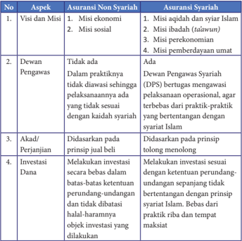

Tabel ini membandingkan aspek-aspek dari asuransi non syariah dengan asuransi syariah. Topik utamanya adalah perbedaan antara kedua jenis asuransi tersebut. Kolom-kolomnya meliputi Visi dan Misi, Dewan Pengawas, Akad/Perjanjian, dan Investasi Dana. Data penting yang terlihat adalah bahwa asuransi syariah memiliki visi dan misi yang lebih jelas, seperti misionaris dalam islam, sementara asuransi non syariah tidak memiliki visi dan misi formal. Asuransi syariah memiliki Dewan Pengawas yang bertugas mengawasi pelaksanaan operasional, sedangkan asuransi non syariah tidak memiliki Dewan Pengawas. Akad/Perjanjian di kedua jenis asuransi berdasarkan prinsip jual beli, tetapi asuransi syariah juga mempertimbangkan prinsip tolong menolong. Investasi Dana di kedua jenis asuransi dilakukan secara berdasarkan batas-batas ketentuan perundang-undangan, tetapi asuransi syariah lebih fokus pada ketentuan perundang-undangan syariah Islam.

 

---
## 📄 Halaman 113

---
**📊 Tabel**

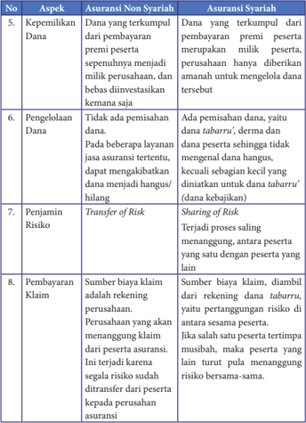

Tabel ini membandingkan asuransi non syariah dengan asuransi syariah dalam hal keperluan dana, pengelolaan dana, penjamin risiko, dan pembayaran klaim. Topik utama tabel adalah perbandingan antara kedua jenis asuransi tersebut. Kolom-kolomnya mencakup aspek-aspek penting seperti keperluan dana, pengelolaan dana, penjamin risiko, dan pembayaran klaim. Data penting yang terlihat adalah bahwa asuransi syariah memiliki keperluan dana yang lebih tinggi karena harus menanggung premi peserta, sedangkan asuransi non syariah hanya memerlukan dana untuk pembayaran premi. Pengelolaan dana juga berbeda, di mana asuransi syariah memiliki mekanisme pemisahan dana yang lebih kompleks, sementara asuransi non syariah hanya memerlukan pemisahan dana sebagai langkah pertama. Penjamin risiko juga berbeda, dengan asuransi syariah menggunakan metode sharing of risk yang lebih kompleks, sementara asuransi non syariah hanya menggunakan transfer of risk. Pembayaran klaim juga berbeda, dengan asuransi syariah memiliki sistem yang lebih rumit untuk menanggung klaim, sementara asuransi non syariah hanya memerlukan biaya klaim yang telah ditentukan sebelumnya.

 

---
## 📄 Halaman 114

---
**📊 Tabel**

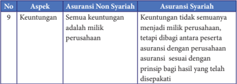

Tabel ini membandingkan aspek keuangan antara asuransi non syariah dan asuransi syariah. Topik utamanya adalah keuntungan. Dalam asuransi non syariah, semua keuntungan tidak menjadi milik perusahaan, tetapi dibagi antara peserta asuransi dengan prinsip bagi hasil yang telah disepakati. Sementara itu, dalam asuransi syariah, keuntungan tersebut merupakan milik perusahaan. Ini menunjukkan bahwa asuransi syariah lebih fokus pada keuntungan perusahaan, sementara asuransi non syariah lebih fokus pada bagian-bagian lainnya.

Namun  di  samping  perbedaan  antara  kedua  asuransi  ini,  terdapat  juga persamaan-persamaan sebagai berikut:

- Akad  dan  kesepakatan  kerjasama  pada  dua  asuransi  ini,  sama-sama berdasarkan atas kerelaan masing-masing peserta
- Keduanya memberikan pertanggungan dan jaminan risiko bagi pesertanya
- Kedua asuransi ini memiliki akad yang bersifat mustamir (terus menerus)
- Keduanya berjalan sesuai dengan akad masing-masing pihak.
Dari penjelasan tersebut, dapat disimpulkan bahwa asuransi umum tidak memenuhi ketentuan-ketentuan syariah, yang bisa dijadikan alternatif amal usaha  dan  muamalah  oleh  umat  Islam.  Hal  ini  berdasarkan  pertimbangan banyaknya  penyimpangan  syariah  dalam  asuransi  sebagaimana  tergambar dalam tabel tersebut.

### g.  Manfaat Asuransi Syariah bagi Umat

Dengan  berkembangnya  asuransi  syariah  di  tengah  masyarakat,  maka beberapa manfaat yang dapat diambil dengan menggunakan asuransi syariah adalah:

- Merupakan cerminan dari perintah Allah Swt. dan Rasulullah Saw. untuk saling tolong menolong dalam kebaikan
- Menumbuhkan rasa persaudaraan dan kepedulian antar sesama anggota
- Melindungi diri dari praktik-praktik muamalah yang tidak bersyariat
- Memberikan jaminan perlindungan dari risiko kerugian yang diderita oleh hanya satu pihak
- Efisien,  dikarenakan  tidak  perlu  lagi  mengalokasikan  biaya,  waktu  dan tenaga tersendiri untuk memberikan perlindungan diri
- Sharing cost, yaitu cukup hanya dengan membayar biaya dengan jumlah tertentu,  dan  tidak  perlu  membayar  sendiri  jumlah  biaya  kerugian  yang timbul karena sesuatu yang tidak bisa diprediksi.
- Menabung, karena premi yang dibayarkan kepada pihak asuransi, pada saat jatuh tempo akad selesai, maka uang tersebut akan dikembalikan kepada peserta asuransi.

 

---
## 📄 Halaman 115

Menutup loss of corning power seseorang atau badan usaha, pada saat tidak lagi bekerja atau beroperasi.

- Lakukan literasi terhadap sub materi asuransi syariah tersebut!
- Buatlah catatan-catatan penting tentang substansi materi!
- Buatlah flyer atau poster tentang asuransi syariah. Unggah flyer atau poster tersebut di media sosial kamu, dan kirimkan link-nya melalui email guru PAI dan BP untuk asesmen individu kalian!

### 2. Perbankan Syariah

### a. Definisi Bank Syariah

Bank  berasal  dari  bahasa  Perancis  dari  kata bangue dan  bahasa  Italia  dari  kata banco yang artinya  adalah  peti,  bangku  atau  lemari.  Lemari atau  peti  merupakan  simbol  untuk  menjelaskan fungsi  dasar  dari  bank  umum  yaitu:  (1)  tempat yang aman untuk menitipkan uang ( safe keeping function); (2)  penyedia  alat  pembayaran  untuk

pembelian barang maupun jasa ( transaction function).

Dalam Undang-undang Nomor 7 tahun 1992 yang telah dirubah menjadi Undang-undang  Nomor  10  Tahun  1998  tentang  Perbankan,  disebutkan bahwa  bank  adalah  lembaga  atau  badan  usaha  yang  menghimpun  dana dari  masyarakat dalam bentuk simpanan dan menyalurkan kembali kepada masyarakat dalam bentuk pinjaman, kredit dan atau bentuk-bentuk yang lain dalam rangka meningkatkan taraf hidup dan kesejahteraan masyarakat.

Adapun menurut Undang-undang Nomor  21 tahun 2008 tentang Perbankan  Syariah,  definisi  bank  syariah  adalah  bank  yang  menjalankan kegiatan usahanya berdasarkan prinsip syariah, yang terdiri dari Bank Umum Syariah dan Bank Rakyat Syariah.

Bank syariah merupakan lembaga keuangan yang berbasis syariah Islam. Dalam  skala  yang  luas,  bank  syariah  merupakan  lembaga  keuangan  yang memposisikan dirinya sebagai pemain aktif dalam mendukung dan memainkan iklim investasi bagi masyarakat. Bank syariah mendorong masyarakat untuk berinvestasi  dengan  memanfaatkan  produk-produk  yang  dikeluarkan  oleh mereka,  di  samping  itu,  bank  syariah  juga  aktif  dalam  mengembangkan investasi di masyarakat.

 

---
## 📄 Halaman 116

### b.  Sejarah Bank Syariah

Bank syariah yang pertama kali  didirikan  di  Indonesia  adalah  Bank  Muamalat Indonesia pada tahun 1991. Inisiatif pendirian bank syariah ini dimulai sejak tahun  1990  ketika  Majelis  Ulama  Indonesia  (MUI)  membentuk  kelompok kerja  untuk  mendirikan  Bank  Islam  di  Indonesia.  MUI  menyelenggarakan lokakarya tentang bunga bank dan perbankan di Cisarua, Bogor, Jawa Barat pada tanggal 18-20 Agustus 1990.

Selanjutnya  hasil  lokakarya  tersebut  dibahas  secara  mendalam  pada Musyawarah Nasional IV MUI pada tanggal 22-25 Agustus 1990 di Jakarta yang menghasilkan amanat untuk pembentukan kelompok kerja bank Islam di Indonesia. Kelompok kerja yang kemudian disebut dengan Tim Perbankan MUI  ini  bertugas  untuk  melakukan  komunikasi  dan  pendekatan  kepada pihak-pihak yang terkait dengan proses pendirian Bank Islam tersebut.

Dan  hasil  dari  kinerja  Tim  Perbankan  MUI  inilah  yang  kemudian melahirkan bank syariah yang pertama di Indonesia yaitu PT. Bank Muamalat Indonesia (BMI) pada tanggal 1 Nopember 1991 dan resmi beroperasi sejak tanggal 1 Mei 1992. Sejak saat itulah, kemudian dalam kurun waktu dua dekade pertumbuhan  dan  capaian  dalam  sistem  keuangan  syariah  terjadi  dengan begitu  pesat.  Baik  dari  aspek  institusional,  infrastruktur,  perangkat  regulasi dan sistem pengawasan, maupun awareness dan literasi masyarakat terhadap layanan jasa perbankan syariah.

### c.  Dasar Hukum Perbankan Syariah

Regulasi tentang perbankan syariah di Indonesia diatur dalam UU Nomor 7 Tahun 1992 tentang Perbankan, yang kemudian dirubah dengan UU Nomor 10  Tahun  1998  tentang  Perubahan  atas  UU  Nomor  7  Tahun  1992  tentang Perbankan dan UU Nomor 21 Tahun 2008 tentang Perbankan Syariah.

UU  Nomor  7  Tahun  1992  lebih  banyak  mengatur  tentang  perbankan konvensional,  sehingga  tidak  terlalu  banyak  pasal  yang  mengatur  tentang perbankan syariah. Salah poin dari UU ini, yaitu pada pasal 1 butir (12) hanya menyebutkan  bahwa  bank  boleh  beroperasi  berdasarkan  prinsip  bagi  hasil ( profit sharing) tetapi belum menyebutkan secara eksplisit tentang istilah bank syariah.

Sesuai dengan perkembangannya, kemudian pada tahun 1998 UU Nomor 7  Tahun 1992 tentang Perbankan ini diamandemen dengan UU Nomor 10 Tahun 1998. Berbeda dengan UU sebelumnya, pada UU Nomor 10 Tahun 1998 ini mengatur secara jelas bahwa baik bank umum maupun Bank Perkreditan Rakyat  (BPR)  dapat  beroperasi  dan  melakukan  pembiayaan  berdasarkan prinsip syariah.

 

---
## 📄 Halaman 117

111

Adapun  yang  dimaksud  dengan  prinsip  syariah  adalah  perjanjian  yang dilandaskan pada hukum Islam antara bank dan pihak lain untuk penyimpanan dana  atau  pembiayaan  dalam  bentuk  kegiatan  usaha  atau  transaksi  lainnya yang  dinyatakan  sesuai  syariah.  Kegiatan  usaha  atau  transaksi  lain  tersebut antara lain adalah:

- Pembiayaan dengan prinsip bagi hasil ( mudharabah )
- Pembiayaan dengan prinsip penyertaan modal ( musyarakah )
- Prinsip jual beli barang untuk memperoleh keuntungan ( murabahah)
- Pembiayaan barang modal dengan sewa murni ( ijarah)
- Pemindahan hak milik barang yang disewa dari pihak bank kepada pihak lain (ijarah wa iqtina)
UU Nomor 10 Tahun 1998 ini yang kemudian menjadi landasan hukum operasional  perbankan  syariah,  sehingga  keberadaannya  semakin  kuat,  dan jumlah bank syariah pun meningkat secara signifikan dari tahun ke tahun.

Selanjutnya pada tahun 2008 terbitlah UU Nomor 21 Tahun 2008 tentang Perbankan Syariah yang terdiri dari 13 bab dengan 70 pasal yang mengatur tambahan beberapa prinsip baru antara lain tentang: (1) tata kelola ( corporate governance) ; (2) prinsip kehati-hatian ( prudential principles); (3) manajemen risiko  ( risk  management); (4)  penyelesaian  sengketa;  (5)  otoritas  fatwa;  (6) komite perbankan syariah; dan (7) pembinaan dan pengawasan bank syariah.

### d.  Kegiatan dan Usaha Bank Syariah

Kegiatan  dan  usaha  bank  syariah  tidak  jauh  berbeda  dengan  bank konvensional.  Namun  terdapat  perbedaan  yang  prinsipil  antara  keduanya, yaitu  transaksi  yang  mengandung riba pada bank konvensional diupayakan untuk ditiadakan dalam bank syariah.

Adapun tiga kegiatan utama bank syariah adalah:

### 1.  Penghimpun dana

Prinsip penghimpunan dana pada bank syariah sesuai dengan fatwa Dewan Syariah Nasional terdiri dari dua macam yaitu:

### a)  Penghimpunan Dana dengan Prinsip Wadiah

Wadiah adalah  titipan  dari  satu  pihak  ke  pihak  yang  lain  baik  sebagai individu  maupun  atas  nama  badan  hukum  yang  harus  dijaga  dan dikembalikan  oleh  penerima  titipan  kapan  pun  pihak  yang  menitipkan hendak mengambilnya.

Wadiah ini terdiri dari dua macam yaitu:

- Wadiah yad dlamanah yaitu titipan yang selama belum dikembalikan kepada pihak yang menitipkan boleh dimanfaatkan oleh pihak penerima titipan.

 

---
## 📄 Halaman 118

- Wadiah yad amanah yaitu pihak yang menerima titipan tersebut, tidak boleh mengambil manfaat atas barang yang dititipkan tersebut sampai pihak yang menitipkan mengambilnya kembali.
Dan prinsip wadiah yang  lazim  dipergunakan  oleh  bank  syariah  adalah wadiah yad dhamanah yaitu  kegiatan  penghimpunan dana dari masyarakat dalam bentuk giro dan tabungan.

### b)  Penghimpunan Dana dengan Prinsip Mudharabah

Mudharabah adalah perjanjian kerjasama atas sebuah usaha di mana pihak pertama bertindak sebagai penyedia dana ( shahibul maal) dan pihak kedua bertanggungjawab  untuk  pengelolaan  usaha  ( mudharib ). Mudharabah terbagi menjadi tiga macam yaitu:

- Mudharabah Muthlaqah yaitu sistem mudharabah yang memberikan kuasa  penuh  kepada  pengelola  untuk  menjalankan  usahanya  tanpa batasan apa pun yang berkaitan dengan usaha tersebut.
- Mudharabah Muqayyadah yaitu sistem mudharabah di  mana pemilik dana memberikan batasan kepada mudharib dalam pengelolaan dana berupa jenis usaha apa pun yang dijalankan, tempat, pemasok maupun target konsumennya.
- Mudharabah  Musytarakah yaitu  sistem mudharabah di  mana  pihak pengelola dana menyertakan modalnya dalam kerjasama investasi.

### 2.  Penyaluran dana

Berbeda  dengan  bank  konvensional  yang  menyalurkan  dana  kepada masyarakat dalam bentuk pinjaman (hutang yang disertai bunga) maka bank syariah menyalurkan dana kepada masyarakat dalam bentuk sebagai berikut:

### a)  Jual beli

Dalam  kegiatan  jual  beli  yang  lakukan  oleh  bank  syariah  terdapat  tiga skema yaitu:

### 1)  Jual beli dengan skema murabahah

Yaitu penjual menyampaikan harga perolehan suatu barang dan menyepakati  keuntungan  yang  akan  diambil  bersama  dengan  pembeli. Dalam hal ini bank syariah bertindak sebagai penjual dan nasabah bertindak sebagai pembeli.

Contoh: dalam jual beli sebidang tanah, Bank Syariah akan menyampaikan harga perolehan misalnya Rp.100.000.000,00 kepada nasabah. Kemudian bank  dan  nasabah  menyepakati  bahwa  harga  jual  tanah  itu  adalah Rp105.000.000,00 sehingga disepakati bahwa bank mengambil keuntungan sebesar Rp5.000.000,00 secara terbuka kepada nasabah

 

---
## 📄 Halaman 119

### 2)  Jual beli dengan skema salam

Yaitu  jual  beli  di  mana  seorang  nasabah  akan  melakukan  pelunasan pembayaran  terhadap  harga  yang  disepakati  terlebih  dahulu  sebelum barang diterima.

Contoh:  dalam  jual  beli  sebuah  unit  rumah  di  kompleks  perumahan, seorang  pembeli  akan  membayar  lunas  terlebih  dahulu  harga  yang disepakati misalnya Rp250.000.000,00 baru kemudian setelah pembayaran dilakukan, 1 unit rumah tersebut akan diserahkan oleh pihak bank (selaku penjual) kepada nasabah (selaku pembeli)

### 3)  Jual beli dengan skema istishna'

Yaitu  jual  beli  yang  dilakukan  berdasarkan  pada  pemberian  tugas  dari pembeli kepada penjual yang juga produsen untuk menyediakan barang atau  produk  sesuai  dengan  kualifikasi  yang  disyaratkan  pembeli  dan menjualnya kembali dengan harga yang disepakati.

Contoh: nasabah mempercayakan pengadaan satu set perangkat komputer jaringan dengan spesifikasi dan harga  yang disepakati kepada produsen/ provider yang dalam hal ini merupakan rekanan dari pihak bank syariah.

### b)  Investasi

Investasi yang dilakukan oleh bank syariah dengan dua skema yaitu:

### 1)    Mudharabah

Yaitu persetujuan kerja sama antara pemilik modal dengan seorang pekerja, untuk mengelola uang dari pemilik modal dalam kegiatan bisnis tertentu dengan kesepakatan apabila mendapat keuntungan maka dilakukan bagi hasil,  namun  apabila  menderita  kerugian,  maka  hanya  ditanggung  oleh pemilik modal.

### 2)    Musyarakah

Yaitu  perjanjian  kerja  sama  investasi  antara  dua  pihak  atau  lebih  untuk menjalankan sebuah usaha yang halal dan produktif dengan kesepakatan apabila mendapatkan keuntungan, maka akan dibagi berdasarkan prosentase  investasi  yang  ditanamkan,  dan  apabila  menderita  kerugian maka akan ditanggung bersama secara proporsional.

### c)    Sewa-menyewa

Dalam melakukan kegiatan sewa-menyewa ini, bank syariah pun memiliki dua skema yaitu:

### 1)  Ijarah

Yaitu  transaksi  perpindahan  hak  pakai  (manfaat)  suatu  barang  dan  jasa dalam waktu tertentu dengan cara membayar sewa atau upah tanpa melalui merubah status kepemilikan.

 

---
## 📄 Halaman 120

Contoh: seseorang yang menyewa sebuah rumah toko (ruko) untuk usaha dengan  membayar  sejumlah  uang  sewa  yang  disepakati  kepada  pemilik ruko, untuk mendapatkan hak guna (hak pakai) dalam waktu tertentu.

### 2) Ijarah mumtahiya bittamlik

Yaitu  merupakan  kombinasi  antara  sewa-menyewa,  jual  beli  dan  hibah, di  mana  pihak  yang  menyewakan,  berjanji  akan  menjual  barang  yang disewakan, pada akhir periode.

Contoh:  pemilik  ruko  menyewakan  rukonya  kepada  seorang  pengusaha dengan  menerima  sejumlah  uang  sewa  yang  disepakati  selama  waktu tertentu.  Kemudian setelah masa menyewa selesai, pemilik ruko berjanji untuk menjual ruko tersebut kepada pihak penyewa.

### 3.  Jasa Pelayanan

Jasa pelayanan yang ditawarkan oleh bank syariah berdasarkan pada akad sebagai berikut:

### a)  Wakalah

Yaitu serah terima dari seseorang kepada orang lain untuk mengerjakan sesuatu yang tidak dapat ia lakukan. Dalam hal melaksanakan perwakilan ini,  seseorang tidak bisa mewakilkan lagi amanah tersebut kepada orang lain.

Contoh:  Amir  meminta  kepada  Hasyim  untuk  menjualkan  mobilnya dengan harga Rp100.000.000,00. Maka Hasyim merupakan wakalah dari Amir dan Hasyim tidak bisa mewakilkan kembali kepada orang lain hingga mobil tersebut dapat terjual.

### b)  Hawalah

Yaitu transaksi yang timbul karena salah satu pihak memindahkan tagihan utang seseorang kepada orang lain yang menanggungnya.

Contoh:  Ahmad  berhutang  kepada  Bambang  sebesar  Rp1.000.000,00. Tetapi  Ahmad  pun  memiliki  uang  yang  dipinjam  oleh  Zaenal  sejumlah Rp1.000.000,00.  Sehingga  pada  saat  Bambang  menagih  hutang  Ahmad, Ahmad bisa meminta kepada Bambang untuk menagih hutangnya kepada Ahmad dengan jumlah yang sama.

### c)  Kafalah

Yaitu pemberian jaminan yang dilakukan oleh pihak pertama, kepada pihak kedua, di mana pihak pertama bertanggungjawab kembali atas pembayaran suatu barang yang menjadi hak pihak kedua.

Contoh : Bank syariah mengeluarkan surat jaminan bagi nasabahnya yang menyewa/membeli sepeda motor secara kredit kepada perusahaan leasing.

 

---
## 📄 Halaman 121

- Rahn Yaitu menahan aset (harta) nasabah sebagai agunan atau  jaminan tambahan
pada pinjaman yang diberikan. Dalam perekonomian konvensional rahn sama dengan gadai.

- Hikmah dan Manfaat Bank Syariah
- Setelah mempelajari dan mengetahui berbagai usaha dan kegiatan produktif yang  dijalankan  oleh  bank  syariah,  maka  berikut  ini  akan  kita  peroleh hikmah dan manfaat dari bank syariah bagi ekonomi umat terutama umat
Islam. Adapun hikmah dan manfaat dari bank syariah adalah:

### Terhindar dari perbuatan riba

- Manfaat  yang  pertama  yang  akan  didapatkan  oleh  seorang  muslim jika  bertransaksi  di  bank  syariah  adalah  terhindar  dari  riba,  karena bagaimana pun hukum riba adalah haram, sehingga dengan bertransaksi di bank syariah, akan terhindar dari perbuatan yang haram.
- Transaksi  keuangan  yang  dilakukan  berdasarkan  pada  syariat  Islam Nasabah yang melakukan transaksi keuangan di bank syariah, juga turut andil  dan  berperan  dalam  menjalankan  syariat  Islam  dalam  bidang keuangan. Sehingga diharapkan hal ini akan mendatangkan pahala bagi orang yang melakukannya.
- Keuntungan diperhitungkan berdasarkan bagi hasil Tidak seperti halnya pada bank konvensional yang menerapkan bunga pada pinjaman dan memberikan bunga pada giro dan tabungan para nasabahnya, bank syariah menetapkan keuntungan dengan sistem bagi hasil.
- Sistem bagi hasil lebih rendah dan transparan Keuntungan  dari  sistem  bagi  hasil  adalah  menghindarkan  diri  dari bunga bank yang menjadi riba, dan akan mendatangkan keuntungan bagi nasabah yang menyimpan atau menabung uangnya di bank syariah tersebut.
- Memberikan saldo tabungan yang rendah Bank syariah memberikan batas minimal saldo tabungan yang rendah sehingga memungkinkan bagi nasabah yang ingin memiliki tabungan, meskipun kemampuan simpanannya kecil.
- Dana nasabah dipergunakan sesuai syariah
Salah satu manfaat dari menabung di bank syariah adalah, dana tabungan tersebut dimanfaatkan oleh bank untuk pembiayaan-pembiayaan sesuai syariah Islam. Sedangkan pada bank konvensional nasabah tidak tahu, dana tabungannya diinvestasikan untuk apa, sehingga tidak menutup kemungkinan  bahwa  keuntungan  yang  diperolehnya  berasal  dari

- sumber yang mengandung unsur riba.

 

---
## 📄 Halaman 122

- Penabung adalah mitra bank syariah
- Dalam relasi antara bank dengan nasabah, bank syariah akan menganggap penabung sebagai mitra, sehingga berhak menerima hasil dari investasi yang ditanamkan di bank melalui tabungannya tersebut. Berbeda halnya dengan bank konvensional di mana relasi antara bank dan nasabah adalah lebih cenderung sebagai relasi antara kreditur dan debitur.
- Dijamin oleh Lembaga Penjamin Simpanan (LPS)
- Dana yang disimpan oleh nasabah melalui bank syariah, dijamin oleh LPS, yang menanggung risiko kehilangan (apabila terjadi hal-hal yang buruk  pada  bank  syariah  seperti  likuidasi,  kolaps  atau  semacamnya)
- sampai 2 Milyar
- Dana ditujukan untuk kemaslahatan umat
- Manfaat  lain  yang  diperoleh  oleh  kaum  muslim  apabila  melakukan transaksi  keuangan  melalui  bank  syariah  adalah  dana  yang  disimpan akan dipergunakan untuk kemaslahatan umat, sehingga dari umat dana
dihimpun, dan kepada umat pula dana tersebut akan dimanfaatkan.

- Bagilah  kelas  menjadi  beberapa  kelompok!  Tentukan  koordinator masing-masing.
- Carilah sumber bacaan di perpustakaan, majalah atau internet tentang salah satu bank syariah di Indonesia. (pastikan antara satu kelompok dengan kelompok lain berbeda)
- Buatlah  profil  lengkap  dari  bank  syariah  tersebut  dengan  bekerja secara kelompok!
- Presentasikan hasilnya di depan kelas kalian! Dan simpulkan manfaat apa yang bisa kalian dapatkan dari aktivitas ini!

### 3. Koperasi Syariah

### a. Definisi Koperasi Syariah

Koperasi syariah adalah badan usaha koperasi yang menjalankan aktivitas usaha dengan prinsip, tujuan dan kegiatannya berlandaskan pada Al-Qur`an dan  hadis.  Dalam  pengertian  yang  lain,  koperasi  syariah  adalah  badan usaha yang beranggotakan orang-orang atau badan hukum koperasi dengan

 

---
## 📄 Halaman 123

melandaskan kegiatannya berdasarkan prinsip syariah,  sekaligus  sebagai  gerakan  ekonomi kerakyatan dengan prinsip kekeluargaan.

Dalam pasal 1 butir (2) dan (3) Peraturan Menteri Koperasi dan Usaha Kecil Menengah Nomor 16/Per/M.KUKM/IX/2015 disebutkan bahwa  koperasi  syariah  kemudian  disebut dengan istilah Koperasi Simpan Pinjam dan  Pembiayaan  Syariah  (KSPPS)  dan  Unit Simpan Pinjam dan Pembiayaan Syariah (USPPS).

Koperasi  simpan  pinjam  dan  pembiayaan  syariah  adalah  koperasi  yang kegiatan  usahanya  meliputi  simpan  pinjam  dan  pembiayaan  berdasarkan syariah termasuk pengelolaan zakat, infak, sedekah dan wakaf.

Pada  umumnya,  koperasi  termasuk  koperasi  syariah  dikelola  secara bersama-sama oleh anggotanya, di mana setiap anggota memiliki hak suara yang  sama  dalam  pengambilan  keputusan.  Pembagian  keuntungan  dalam koperasi  dihitung  berdasarkan  peran  serta  dan  andil  dari  masing-masing anggota yang disebut dengan Sisa Hasil Usaha (SHU).

Secara sosiologis, koperasi syariah di Indonesia sering disebut dengan Baitul Maal wa at-Tamwil atau BMT. Namun sebenarnya terdapat perbedaan antara KSPPS dan USPPS/koperasi syariah dengan BMT yaitu pada kelembagaannya. Koperasi  syariah  hanya  terdiri  dari  satu  lembaga  saja  yaitu  koperasi  yang dijalankan  berdasarkan  pada  asas  syariah  sedangkan  BMT  terdapat  dua lembaga  yaitu  diambilkan  dari  namanya Baitul  Maal  wa  at-Tamwil yang berarti  lembaga  zakat  dan  lembaga  keuangan  syariah. Baitul  Maal artinya adalah lembaga zakat dan at-Tamwil artinya adalah lembaga keuangan syariah.

Sehingga dapat disimpulkan, apabila koperasi syariah itu bergerak dalam dua bidang sekaligus yaitu pengelolaan zakat dan keuangan syariah, maka ia disebut  dengan  BMT,  namun  apabila  koperasi  tersebut  hanya  menjalankan usaha dalam bidang keuangan syariah saja maka ia disebut dengan koperasi syariah.

Koperasi syariah ini bertujuan untuk membantu meningkatkan kesejahteraan  anggota  dan  masyarakat  secara  umum  untuk  membangun perekonomian Indonesia sesuai dengan nilai-nilai dan prinsip Islam

### b.  Sejarah Koperasi Syariah

Koperasi  yang  berlandaskan  pada  nilai-nilai Islam sebenarnya  telah diprakarsai oleh Haji Samanhudi di Solo melalui Sarikat Dagang Islam yang menghimpun  anggotanya  yaitu  para  pedagang  batik  di  Solo.  Kemudian keberadaan koperasi syariah mulai banyak diperbincangkan oleh masyarakat

 

---
## 📄 Halaman 124

sejak maraknya pertumbuhan BMT di Indonesia, yang pertama kali dipelopori oleh BMT Bina Insan Kamil pada tahun 1992 di Jakarta. Berdirinya BMT ini kemudian memberi warna bagi kalangan masyarakat dan pengusaha mikro kecil dan menengah di sektor informal.

BMT  berdasarkan Undang-undang Nomor  25 tahun 1992 berhak menggunakan  badan  hukum  koperasi.  BMT  memiliki  kesamaan  dengan koperasi umum, yaitu memiliki basis ekonomi kerakyatan dengan prinsip dari anggota, oleh anggota dan untuk anggota. Selain kesamaan, ia juga memiliki perbedaan yaitu terletak pada teknis operasionalnya. BMT yang berdasarkan syariah tidak memberlakukan bunga dan menggunakan etika moral dengan mempertimbangkan  kaidah  halal  haram  pada  saat  melakukan  usahanya sedangkan  koperasi  umum  berdasarkan  pada  peraturan  dan  kesepakatan bersama saja.

### c.  Dasar Hukum Koperasi Syariah

Dalam melaksanakan kegiatannya, koperasi syariah berlandaskan pada:

- Al-Qur`an dan hadis terutama tentang prinsip tolong menolong ( ta'awun) dan saling menguatkan ( takaful).
- Pancasila dan UUD 1945
Terutama  sila  ke-5  (lima)  dalam  pancasila  yaitu  keadilan  sosial  bagi seluruh  rakyat  Indonesia,  termasuk  simbol  dari  sila  ke  lima  tersebut adalah  logo  timbangan  yang  juga  dipergunakan  sebagai  logo  koperasi. Di  dalamnya  terkandung  makna  filosofis,  bahwa  keberadaan  koperasi harus mendatangkan keadilan bagi seluruh anggotanya. Adapun pasal 33 (1)  dalam  UUD  1945  hasil  amandemen  yang  berbunyi  'perekonomian disusun sebagai usaha bersama atas asas kekeluargaan' dalam hal ini juga relevan  dengan  asas  dan  prinsip  koperasi  yaitu  asas  gotong  royong  dan kekeluargaan,  di  mana  semua  anggota  memiliki  tanggungjawab  untuk bekerja sama dan memiliki kesadaran untuk berpartisipasi dalam koperasi sehingga terdapat prinsip dari anggota, oleh anggota dan untuk anggota koperasi.

- Peraturan Menteri Koperasi dan Usaha Kecil dan Menengah (KUKM)
Nomor  16/Per/M.UKM/IX/2015  tentang  Pelaksanaan  Kegiatan  Usaha Simpan Pinjam dan Pembiayaan Syariah oleh Koperasi, yang merupakan regulasi  terbaru  yang  mengatur  tentang  tata  kelola  koperasi  syariah  di Indonesia saat ini.

### d.  Kegiatan dan Usaha Koperasi Syariah

Dalam  melaksanakan  kegiatan  operasional,  koperasi  syariah  melakukan beberapa  usaha  dengan  mengedepankan  nilai-nilai  kemanfaatan,  usaha

 

---
## 📄 Halaman 125

yang baik dan halal dan menguntungkan dengan sistem bagi hasil. Setiap usaha yang dijalankan oleh koperasi syariah harus mengacu kepada fatwa dan ketentuan Dewan Syariah Nasional (DSN) Majelis Ulama Indonesia serta  tidak  boleh  bertentangan  dengan  peraturan  perundang-undangan yang berlaku di Indonesia.

Adapun  jenis-jenis  kegiatan  dan  usaha  yang  dijalankan  oleh  koperasi syariah adalah:

### 1)  Penghimpunan Dana

Dalam mengembangkan  koperasi syariah, pengurus koperasi harus memiliki  strategi,  kreativitas  dan  inovasi  dalam  menggalang  dana,  mencari sumber dana baik yang diperoleh dari anggota maupun pinjaman atau danadana yang bersifat hibah dan sumbangan.

Adapun secara umum sumber dana koperasi syariah dapat diklasifikasikansebagai berikut:

### a)  Simpanan Pokok

Yaitu  setoran  awal  yang  merupakan  modal  dengan  jumlah  dan  besaran yang sama dari setiap anggota. Besarnya simpanan pokok tersebut tidak boleh  berbeda  antara  satu  anggota  dengan  anggota  yang  lain.  Masingmasing  anggota  memiliki  peran,  porsi  dan  bobot  yang  sama  dalam  hal simpanan pokok tersebut. Simpanan pokok ini hanya disetor sekali selama dalam keanggotaan koperasi.

### b)  Simpanan Wajib

Yaitu  simpanan  yang  besarnya  ditentukan  dalam  rapat  anggota  dengan jumlah yang disepakati, dan penyetorannya dilakukan secara periodik dan terus  menerus  hingga  keanggotaan  dalam  koperasi  syariah  dinyatakan berakhir.

### c)  Simpanan Suka Rela

Yaitu  simpanan  sebagai  sebuah  bentuk  investasi  dari  anggota  yang memiliki kelebihan dana yang kemudian berinisiatif untuk menyimpannya di koperasi syariah. Besaran dari simpanan suka rela ini bebas dan tidak diberikan batasan minimal maupun maksimal, sesuai dengan kerelaan dan inisiatif dari anggota tersebut.

Bentuk dari simpanan suka rela ini terdiri dari dua macam skema yaitu:

- Skema dana titipan ( wadi'ah) dan dapat diambil setiap saat jika anggota membutuhkan.
- Skema  dana  investasi  yang  sengaja  ditujukan  untuk  kepentingan investasi  dengan  mekanisme  bagi  hasil  baik revenue  sharing,  profit sharing maupun profit and loss sharing.

 

---
## 📄 Halaman 126

### d)  Invetasi dari Pihak Lain

Merupakan  suntikan  dana  segar  dari  pihak  lain  untuk  pengembangan usaha, karena jika hanya mengandalkan simpanan pokok, simpanan wajib dan simpanan suka rela dari anggota koperasi saja jumlahnya masih terbatas untuk memperluas jangkauan usaha dari koperasi syariah.

Oleh karena itu koperasi syariah dapat menjalin kerja sama dengan bankbank syariah, atau pun bank milik pemerintah dan penyedia dana lainnya dengan prinsip mudharabah atau musyarakah .

### 2)  Penyaluran Dana

Berdasarkan pada sifat dan tujuan dari koperasi syariah, maka dana yang dihimpun dari anggota (simpanan pokok, simpanan wajib, simpanan suka rela, dan lain-lain) haruslah disalurkan kembali kepada anggota maupun calon anggota dengan prinsip bagi hasil ( mudharabah dan musyarakah) , jual  beli  (piutang mudharabah ,  piutang salam ,  piutang istishna '  dan sejenisnya).  Bahkan  jika  sudah  memungkinkan  maka  koperasi  syariah dapat menyalurkan dana dalam bentuh pengalihan utang ( hiwalah) sewa menyewa ( ijarah) atau pun pemberian manfaat dalam bidang pendidikan dan lain-lain.

### 3)  Investasi/Kerjasama

Dalam hal melaksanakan kegiatan investasi, koperasi syariah melakukannya dengan skema mudharabah dan musyarakah. Koperasi syariah bertindak sebagai  pemilik  modal  ( shahibul  maal) dan  pengguna  atau  anggota bertindak sebagai pelaku usaha ( mudharib). Kerja sama dilakukan dengan mendanai  sebuah  usaha  yang  dinyatakan  layak  untuk  diberikan  modal dengan prinsip bagi hasil.

Contoh : pendirian klinik kesehatan, kantin sekolah, mini market, swalayan, rumah makan dan jenis-jenis usaha lainnya.

### 4)  Jual - Beli

Jual beli dalam usaha jasa dan keuangan syariah terdiri dari beberapa jenis antara lain sebagai berikut:

### a)  Bai' al-mudharabah

Yaitu  jual  beli  yang  dilakukan  antara  penjual  dan  pembeli  di  mana penjual secara transparan akan menyampaikan harga perolehan barang yang sedang diperjual-belikan kepada pembeli, sehingga ketika pembeli membayar harga jual yang disepakati, pembeli bisa mengetahui keuntungan yang diperoleh oleh penjual.

 

---
## 📄 Halaman 127

### b)  Bai' al-istishna' dan Bai'al-salam

Yaitu  jual  beli  yang  dilakukan  oleh  3  (tiga)  pihak  dengan  sistem pembayaran tunai maupun diangsur.

Contoh : Pihak pertama membeli 100 paket seragam karyawan melalui koperasi syariah (pihak kedua), kemudian koperasi syariah memesankan kepada pihak konveksi (pihak ketiga).

Apabila  pihak  pertama  membayar  secara  tunai  kepada  koperasi  maka disebut  dengan bai  al-Istishna' dan  apabila  pihak  pertama  membayar dengan  cara  diangsur  maka  disebut  dengan bai'  al-salaam. Kemudian koperasi  yang  akan  melakukan  pelunasan  pembayaran  kepada  pihak  ke tiga.

### 5)  Pelayanan Jasa

Selain  kegiatan  menghimpun  dana,  penyaluran  dana,  investasi  dan  jual beli, koperasi syariah juga dapat melakukan usaha jasa antara lain:

### a)  Sewa - Menyewa ( Ijarah)

Pemindahan  hak  guna  (hak  pakai)  suatu  barang  dengan  membayar sejumlah  uang  sewa,  dan  tanpa  memindahkan  hak  milik  atas  barang tersebut.

Contoh : persewaan tenda, persewaan wedding property dan lain-lain.

### b)  Penitipan (Wadiah)

Dapat  dilakukan  dalam  bentuk  penyediaan  loker  penitipan  barang, penitipan sepeda motor, mobil, dan lain-lain.

### 6)  Pengalihan Utang (Hawalah)

Yaitu  jasa  yang  disediakan  oleh  koperasi  syariah  untuk  memindahkan kewajiban pembayaran hutang anggota kepada pihak lain, yang kewajibannya  diambil  alih  oleh  koperasi  syariah.  Dan  anggota  tersebut berkewajiban untuk membayarkan kewajibannya kepada koperasi.

### 7)  Pegadaian Syariah (Rahn)

Yaitu  menahan  asset  dari  anggota  sebagai  jaminan  atas  pinjaman  yang diterimanya dari koperasi syariah, yang mana koperasi tidak menerapkan bunga terhadap pinjaman tetapi menerapkan biaya penyimpanan terhadap aset yang dijadikan jaminan.

### 8)  Pendelegasian Mandat (Wakalah)

Yaitu jasa yang disediakan oleh koperasi untuk pengurusan SIM, STNK, atau pembelian barang tertentu, di mana koperasi syariah bertindak sebagai pihak  yang  diberi  mandat  oleh  anggota,  untuk  menyelesaikan  urusan tersebut, dan anggota berkewajiban membayar jasa atas wakalah tersebut.

 

---
## 📄 Halaman 128

### 9)  Penjamin (Kafalah)

Merupakan  kegiatan  penjaminan  yang  diberikan  oleh  koperasi  yang bertindak sebagai penjamin kepada pihak ketiga untuk  memenuhi kewajiban  anggotanya.  Contoh  :  apabila  ada  anggota  koperasi  yang mengajukan pinjaman kepada bank syariah  di  mana  koperasi  bertindak sebagai penjamin atas kelancaran angsurannya.

### 10)  Pinjaman Lunak

Yaitu pinjaman yang diberikan oleh koperasi syariah kepada anggota, di mana anggota hanya berkewajiban untuk mengembalikan sejumlah uang yang dipinjam, tanpa harus membayar tambahan bunga. Umumnya dana pinjaman tersebut diambilkan dari simpanan pokok anggota.

### e.  Hikmah dan Manfaat Koperasi Syariah

Berdasarkan  uraian  materi  tersebut,  maka  keberadaan  koperasi  syariah sebagai 'soko guru' perekonomian umat Islam, memegang peran yang sangat penting dalam upaya pengembangan ekonomi kerakyatan yang berlandaskan pada  prinsip-prinsip  syariah  Islam.  Adapun  manfaat  dari  koperasi  syariah yang dapat dirasakan oleh masyarakat adalah:

- Mendorong  dan  mengembangkan  potensi  dari  setiap anggota serta meningkatkan kesejahteraan ekonomi masyarakat secara umum berlandaskan prinsip-prinsip syariah Islam.
- Meningkatkan  kualitas  sumber  daya  manusia  terutama  pengurus  dan anggota  koperasi  syariah  agar  lebih  profesional,  amanah,  konsisten  dan konsekuen  dalam  menjalankan  praktik-praktik  ekonomi  berdasarkan syariat Islam.
- Meningkatkan  perekonomian  nasional  yang  merupakan  usaha  bersama berdasarkan asas demokrasi dan kekeluargaan.
- Menghubungkan penyedia dana dengan pengguna dana sehingga pemanfaatan ekonomi menjadi lebih optimal
- Memperkuat  keanggotaan  koperasi  sehingga  saling  bekerjasama  dalam melakukan pengawasan terhadap operasionalisasi koperasi.
- Membuka dan memperluas lapangan pekerjaan bagi anggota dan masyarakat umum
- Membantu tumbuh dan berkembangnya usaha kecil mikro dan menengah dari para anggota koperasi
Demikianlah pembahasan tentang unit usaha syariah mulai dari asuransi syariah, perbankan syariah dan koperasi syariah. Keberadaan unit usaha syariah ini  akan  memberikan  jaminan  dan  rasa  aman  kepada  masyarakat  terutama masyarakat muslim Indonesia dalam melakukan transaksi ekonomi. Hal ini

 

---
## 📄 Halaman 129

sebabkan unit usaha syariah senantiasa berpijak nilai-nilai keimanan, sehingga diharapkan terwujud iklim ekonomi umat yang sejuk, aman, menyejahterakan bagi segenap masyarakat muslim khususnya dan masyarakat Indonesia pada umumnya.

- Bagilah kelas menjadi tiga kelompok. Tentukan satu orang yang akan bertindak sebagai Tim Ahli, yang merupakan peserta didik yang paling expert pada tiap kelompok.
- Kelompok 1 bertugas untuk membahas materi asuransi syariah
- Kelompok 2 bertugas untuk membahas materi bank syariah
- Kelompok 3 bertugas untuk membahas koperasi syariah
- Masing-masing Tim Ahli kemudian berkumpul untuk menggabungkan pemahaman terhadap semua materi dari tiap-tiap kelompok
- Setelah semua tim ahli dirasa cukup dalam mengintegrasikan semua materi,  kemudian  kembali  ke  masing-masing  kelompok,  kemudian menjelaskan semua materi kepada kelompok
- Masing-masing  kelompok  mempresentasikan  hasil  diskusinya  di depan kelas

### Penerapan Karakter

Setelah mengkaji materi tentang lembaga keuangan syariah, maka diharapkan peserta didik dapat menginternalisasikan nilai-nilai dan perilaku sebagai cerminan karakter pelajar sebagai berikut:

---
**📊 Tabel**

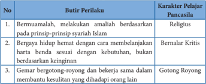

Tabel ini menunjukkan tiga perilaku yang dianggap sebagai karakter pelajar Pancasila. Topik utamanya adalah tentang perilaku yang sesuai dengan prinsip-prinsip syariah Islam. Kolom pertama berisi nomor urut, kolom kedua berisi butir perilaku, dan kolom ketiga berisi karakter pelajar Pancasila yang dianggap sesuai dengan perilaku tersebut. Data penting yang terlihat adalah bahwa perilaku berbuat baik dan berbuat jujur (berdasarkan prinsip-prinsip syariah Islam) dianggap sebagai karakter religius, sedangkan perilaku bergaya hidup hemat dan gemar bergotong-royong dianggap sebagai karakter bernalar kritis dan gotong royong.

 

---
## 📄 Halaman 130

---
**📊 Tabel**

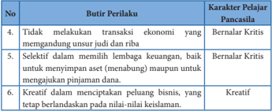

Tabel ini menunjukkan karakteristik pelajar yang bernilai kritis dan kreatif dalam berbagai aspek kehidupan mereka. Topik utamanya adalah perilaku pelajar dalam menghadapi tantangan keuangan dan pendidikan. Kolom pertama berisi nomor urut perilaku yang diuraikan, sedangkan kolom kedua berisi deskripsi perilaku tersebut. Kolom ketiga menyajikan karakteristik pelajar yang mewakili perilaku tersebut. Dari tabel ini, dapat dilihat bahwa pelajar yang memiliki karakter kritis cenderung tidak melakukan transaksi ekonomi yang mengandung unsur jadi dan riba, serta selektif dalam memilih lembaga keuangan untuk menjamin aset atau pinjaman. Sementara itu, pelajar yang memiliki karakter kreatif cenderung kreatif dalam menciptakan peubah bisnis, tetap berlandaskan pada nilai-nilai keislaman. Ini menunjukkan bahwa karakteristik kritis dan kreatif dapat mempengaruhi perilaku pelajar dalam menghadapi tantangan keuangan dan pendidikan.

Setelah saya mempelajari materi tentang asuransi syariah, perbankan syariah dan koperasi syariah, maka kompetensi saya:

Sangat Baik

Baik

Cukup Baik

Kurang

Sangat Kurang

Alasannya :

………………………………………………………….........

………………………………………………………….........

- Asuransi  syariah  atau takaful adalah  pengaturan  risiko  yang  memenuhi ketentuan syariah, tolong menolong (s ymbiosis mutualisme) yang melibatkan peserta asuransi dan pengelola, serta berdasarkan pada ketentuan Al-Qur`an dan sunah.
- Unsur-unsur  yang  terdapat dalam  asuransi yaitu (1) adanya  pihak tertanggung (2) adanya pihak penanggung (3) adanya akad atau perjanjian asuransi  (4)  adanya  pembayaran  iuran  (premi)  (5)  adanya  kerugian, kerusakan atau kehilangan (yang diderita tertanggung) (6) adanya peristiwa yang tidak bisa diprediksi

 

---
## 📄 Halaman 131

111

- Asuransi syariah bertujuan untuk melindungi  peserta asuransi dari kemungkinan terjadinya risiko yang tidak bisa diprediksi. Dalam hal ini, perusahaan  jasa  asuransi  adalah  perusahaan  yang  menjalankan  amanah yang dipercayakan oleh peserta asuransi syariah, untuk mengelola amanah dalam rangka membantu meringankan musibah yang dialami peserta lain
- Bank  syariah  merupakan  lembaga  keuangan  yang  menjamin  bahwa seluruh  investasi  yang  dilakukan  baik  berupa  produk,  maupun  kegiatan menghimpun investasi dari masyarakat telah sesuai dengan prinsip-prinsip syariah.
- Bank  syariah  yang  pertama  kali  berdiri  di  Indonesia  yaitu  PT.  Bank Muamalat  Indonesia  (BMI)  pada  tanggal  1  Nopember  1991  dan  resmi beroperasi sejak tanggal 1 Mei 1992
- Kegiatan usaha bank syariah antara lain menghimpun dana dari masyarakat, menyalurkan dana kepada masyarakat,  dan  produk  layanan  jasa  kepada masyarakat.
- Koperasi  syariah  adalah  badan  usaha  yang  beranggotakan  orang-orang atau badan hukum koperasi dengan melandaskan kegiatannya berdasarkan prinsip  syariah,  sekaligus  sebagai  gerakan  ekonomi  kerakyatan  dengan prinsip kekeluargaan.
- Jenis-jenis kegiatan dan usaha yang dijalankan oleh koperasi syariah adalah penghimpunan dana dan penyaluran dana dari, oleh dan kepada anggota, investasi  atau  kerja  sama,  jual  beli,  pelayana  jasa,  pengalihan  hutang, pegadaian syariah, pendelegasian mandat, penjamin utang dan pinjaman lunak.
- Dalam melakukan transaksi  keuangan  baik  skala  mikro  maupun  makro dalam kehidupan di masyarakat, hendaklah mengedapankan pertimbangan kemaslahatan dan selalu berdasarkan pada prinsip dasar syariat Islam.

### 1. Penilaian Sikap

- Buatlah tabel mingguan/bulanan berupa ceck list tentang aktivitas ibadah harian kalian pada buku khusus untuk pemantauan individu! Mulailah dari ibadah wajib seperti halnya shalat lima waktu dilanjutkan dengan ibadah sunah  harian  misalnya  tadarus  Al-Qur`an,  dzikir,  shalawat,  membantu orangtua, membantu teman, aktif pada kegiatan sosial, aktif terlibat dalam

 

---
## 📄 Halaman 132

organisasi  kepemudaan.  Lakukanlah  kegiatan  muamalah  dalam  bidang ekonomi,  misalnya  menabung,  membantu  teman  yang  sedang  kesulitan keuangan, atau belajar melakukan kegiatan wirausaha yang halal dan baik. Lakukan dengan rutin, ikhlas dan penuh tanggungjawab kepada Allah Swt.!

### b.    Pilihlah jawaban yang sesuai dengan membubuhkan tanda contreng (√) pada kolom yang sesuai dengan pernyataan berikut ini!

---
**📊 Tabel**

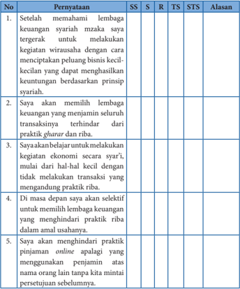

Tabel ini berisi 5 poin yang menjelaskan persyaratan untuk menjadi seorang syariah yang memenuhi beberapa kriteria. Kolom SS (Sumber Sumber), R (Rumus), TS (Tentang Syariah), STS (Syarat Syariah), dan Alasan membahas tentang setiap poin tersebut. Topik utama tabel ini adalah persyaratan menjadi seorang syariah yang memenuhi beberapa kriteria. Data penting yang terlihat adalah bahwa setiap poin memiliki alasan yang jelas dan spesifik, yang menunjukkan bahwa setiap persyaratan memiliki tujuan dan maksud tertentu dalam proses menjadi seorang syariah.

 

---
## 📄 Halaman 133

### 2. Penilaian Pengetahuan

- Berikanlah tanda silang (X) pada opsi jawaban A, B, C, D atau E yang merupakan jawaban yang paling tepat !
- Hanafi adalah seorang karyawan perusahaan yang setiap bulan membayar sejumlah uang kepada perusahaan asuransi, sebagai pertanggungan risiko jika  sewaktu-waktu  terjadi  hal  yang  tidak  terduga  pada  dirinya.  Yang dilakukan Hanafi dalam praktik asuransi syariah disebut dengan….
- membayar polis
- membayar klaim
- membayar premi
- mengajukan klaim
- mengajukan premi
- Berikut ini yang bukan merupakan unsur-unsur dalam praktik asuransi adalah….
- adanya pihak penjamin
- adanya pihak penanggung
- adanya pembayaran iuran (premi)
- adanya akad atau perjanjian asuransi
- adanya kerugian, kerusakan atau kehilangan
- Perhatikan pernyataan berikut ini!
- Kafil
- Makful bih
- Makful bik
- Makful lah
- Makful 'anhu
Dari pernyataan tersebut, yang termasuk rukun asuransi syariah adalah….

- 1, 2, 3, 4
- 1, 2, 4, 5
- 1, 3, 4, 5
- 2, 3, 4, 5
- 2, 4, 5, 1
- Salah  satu  larangan  yang  tidak  boleh  dilakukan  dalam  praktik  asuransi syariah adalah, praktik maisir yaitu….
- praktik penipuan
- praktik perjudian
- ketidakjelasan transaksi
- praktik investasi bodong
- investasi yang mengandung riba

 

---
## 📄 Halaman 134

- Hamdan adalah seorang nasabah sebuah bank syariah di kotanya. Setiap bulan ia akan menyisihkan sebagian dari penghasilannya untuk ditabung atau dititipkan di bank, untuk antisipasi jika sewaktu-waktu memerlukan bisa diambil kembali. Transaksi perbankan yang dilakukan oleh Hamdan disebut dengan….
- A wadi'ah
- wakalah
- kafalah
- mudharabah
- musyarakah
- Bu Nurwe adalah seorang ibu kantin di sebuah SMA. Untuk menjalankan usahanya,  ia  mengajukan  pendanaan  kepada  sebuah  bank  syariah,  dan berkewajiban  untuk  mengembalikan  pinjaman  modal  tersebut  dengan prinsip bagi hasil. Kedudukan bu Nurwe dalam transaksi keuangan syariah ini adalah sebagai….
- wakalah
- mudharib
- murabahah
- musyarakah
- mudharabah
- Pak  Rudi  adalah  seorang  pegawai  baru  yang  membeli  1  unit  rumah  di kompleks  perumahan  dengan  melalui  pembiayaan  dari  bank  syariah. Pada saat transaksi jual-beli, bank syariah menjelaskan bahwa harga beli 1  unit  rumah  adalah  Rp250.000.000,00.  Kemudian  Pak  Rudi  dan  pihak bank  bersepakat  untuk  pembayaran  rumah  tersebut  secara  transparan sebesar Rp260.000.000,00 sehingga pak Rudi tahu persis bahwa pihak bank mendapat keuntungan sebesar Rp10.000.000,00 dari transaksi ini.
Dalam istilah keuangan syariah, transaksi ini disebut dengan….

- mudharabah
- musyarakah
- murabahah
- istishna'
- ijarah
- Salah satu contoh produk layanan koperasi syariah adalah usaha memindahkan hak pakai (hak guna) atas suatu barang, dengan membayar biaya  tertentu  tetapi  tidak  sampai  memindahkan  hak  milik  atas  barang tersebut. Dalam istilah keuangan syariah, hal ini disebut dengan….

 

---
## 📄 Halaman 135

- ijarah
- istishna
- murabahah
- musyarakah
- mudharabah
- Hambali adalah seorang pemuda yang kreatif. Dia tinggal di lokasi yang strategis  dekat  dengan stasiun kereta api. Ia kemudian menata halaman rumahnya melalui pembiayaan yang bekerja sama dengan sebuah koperasi syariah untuk dijadikan area parkir dan penitipan sepeda motor. Usaha penitipan kendaraan yang dilakukan oleh Hambali ini disebut dengan….
- kafalah
- wakalah
- wadi'ah
- murabahah
- musyarakah
- Bu Ihsan adalah seorang guru di sebuah SMA. Ia terlalu sibuk sehingga tidak memiliki waktu untuk membayarkan pajak kendaraan bermotornya di kantor Samsat. Kemudian ia memanfaatkan salah satu layanan koperasi syariah  dan  mempercayakan  pembayaran  pajak  kendaraannya  melalui koperasi  syariah.  Aktivitas  yang  dilakukan  oleh  bu  Ihsan  ini  di  sebut dengan….
- kafalah
- wakalah
- wadi'ah
- murabahah
- musyarakah

### B. Jawablah pertanyaan-pertanyaan di bawah ini!

- Mengapa terdapat perbedaan mendasar antara lembaga keuangan konvensional dan lembaga keuangan syariah? Jelaskan!
- Jelaskan  jenis-jenis  usaha  bank  syariah  dalam  rangka  mendorong  dan mendukung perekonomian umat!
- Bagaimana  perbedaan  antara bai'al  mudharabah,  bai'  al-istishna' dan bai'al-salaam pada  kegiatan  usaha  koperasi  syariah?  Jelaskan  dengan memberikan contohnya!

 

---
## 📄 Halaman 136

- Mengapa masyarakat muslim Indonesia semestinya  mempercayakan transaksi  keuanganya  melalui  unit  usaha  syariah?  Jelaskan  hikmah  dan manfaat bertransaksi melalui unit usaha syariah tersebut!
- Pernahkah kalian mendengar  seseorang  yang  terjebak pada praktik pinjaman rentenir?  Apa  yang  kalian  ketahui  dengan  pinjaman  rentenir? Jelaskan, mengapa agama menganjurkan umat Islam untuk menghindari bertransaksi dengan pinjaman yang bersumber dari rentenir!

### 3. Penilaian Keterampilan

Susunlah  bahan  presentasi  berupa  paparan  deskriptif  tentang  fikih muamalah:  asuransi,  bank  dan  koperasi  syariah!  Buatlah  materi  presentasi kamu  dengan  menggunakan  perangkat  digital  yang  kamu  miliki  secara berkelompok,  dengan  tampilan  yang  baik,  menarik  dan  sistematis.  Lalu presentasikanlah di depan kelasmu!

Untuk lebih memahami dan mengeksplorasi materi dan keilmuan tentang keuangan  syariah disarankan  kepada  peserta  didik  untuk  aktif  melakukan library  search atau  kajian  pustaka,  dengan  memperbanyak  perbendaharaan sumber belajar dan melakukan kegiatan literasi dari sumber-sumber rujukan sebagai berikut:

- M. Syafi'i Antonio, Dasar-Dasar Manajemen Bank Syariah, Jakarta: Pustaka Alfabeta, cet ke-4, 2006
- AM. Hasan Ali, Asuransi dalam Perspektif Hukum Islam, Jakarta: Kencana, 2004
- Nurul  Huda  &  Mohammad  Heykal,  2010,  Lembaga  Keuangan  Islam, Jakarta: Kencana
- UU Republik Indonesia No. 21 Tahun 2008 tentang Perbankan Syariah.
- Undang-Undang  Republik  Indonesia  Nomor  17  Tahun  2012  tentang Perkoperasian
- UU Republik Indonesia No. 40 Tahun 2014 tentang Perasuransian
- Keputusan  Menteri  Negara  Koperasi  dan  Usaha  Kecil  dan  Menengah Republik  Indonesia  Nomor  91/Kep/IV/KUKM/IX/2004  tentang  Petunjuk Pelaksanaaan Kegiatan Usaha Koperasi Jasa Keuangan Syariah

 

---
## 📄 Halaman 137

---
**🖼️ Gambar/Diagram**

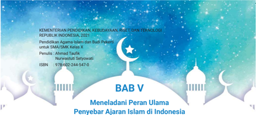

> **Deskripsi Visual:** Gambar ini adalah bagian dari buku pelajaran yang diterbitkan oleh Kementerian Pendidikan, Kebudayaan, Riset, dan Teknologi Republik Indonesia pada tahun 2021. Gambar tersebut menampilkan judul bab ke-5 dengan judul "Menelaadi Peran Ulama Penyebar Ajaran Islam di Indonesia". Gambar ini memiliki latar belakang biru dengan gambar bulan sabit dan bintang putih yang menunjukkan ikon Islam. Di bagian bawah gambar, terdapat informasi tentang penulis buku, ISBN, dan nomor halaman.

Elemen-elemen utama yang terlihat dalam gambar ini adalah judul bab, judul bab, penulis, ISBN, dan nomor halaman. Judul bab membahas tentang peran ulama sebagai penyebarkan ajaran Islam di Indonesia. Penulis buku adalah Ahmad Taufik, dan ISBN buku adalah 978-602-244-547-6. Nomor halaman yang ada adalah 5.

Informasi kunci yang dapat diambil pembaca melalui gambar ini adalah bahwa bab ini membahas tentang peran ulama dalam menyebarkan ajaran Islam di Indonesia. Penulis buku adalah Ahmad Taufik, dan buku ini diterbitkan oleh Kementerian Pendidikan, Kebudayaan, Riset, dan Teknologi Republik Indonesia pada tahun 2021.

---
**🖼️ Gambar/Diagram**

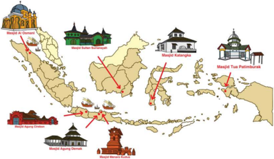

> **Deskripsi Visual:** Gambar ini adalah ilustrasi yang menunjukkan lokasi beberapa masjid di Indonesia. Gambar ini terdiri dari dua bagian utama: peta Indonesia dan gambar-gambar masjid di berbagai wilayah.

Pada peta Indonesia, terdapat garis merah yang menunjukkan lokasi beberapa masjid. Di sebelah kiri atas, ada garis merah yang mengarah ke Masjid Al-Dzawriyyah di Aceh Besar, Sumatera Utara. Di sebelah kanan atas, ada garis merah yang mengarah ke Masjid Katesnights di Malang, Jawa Timur. Di bawah peta, terdapat gambar-gambar masjid di berbagai wilayah Indonesia, termasuk Masjid Agung Djami di Jakarta, Masjid Agung Dalam di Surabaya, dan Masjid Tas Piutimur di Malang.

Elemen-elemen utama dalam gambar ini adalah peta Indonesia, garis merah yang menunjukkan lokasi masjid, dan gambar-gambar masjid. Garis merah yang menghubungkan peta dengan gambar masjid menunjukkan hubungan antara lokasi masjid di Indonesia.

Teks, angka, atau label penting yang terlihat dalam gambar ini adalah nama-nama masjid dan lokasinya. Informasi kunci yang dapat diambil pembaca adalah lokasi masjid di Indonesia dan hubungan antara peta dan gambar masjid.

Dengan demikian, gambar ini memberikan gambaran umum tentang lokasi masjid di Indonesia dan hubungan antara peta dan gambar masjid.

 

---
## 📄 Halaman 138

Setelah mempelajari Bab 5 ini peserta didik diharapkan kompeten dalam

- Meyakini bahwa perkembangan peradaban Islam di Indonesia merupakan kehendak Allah Swt
- Membiasakan  kesederhanaan  dan  kesungguhan  mencari  ilmu  sebagai cerminan meneladani peran tokoh ulama penyebar Islam di Indonesia
- Menganalisis  sejarah  dan  peran  tokoh  ulama  penyebar  ajaran  Islam  di Indonesia
- Membuat karya bagan time  line sejarah  tokoh  ulama  penyebar  Islam  di Indonesia

---
**🖼️ Gambar/Diagram**

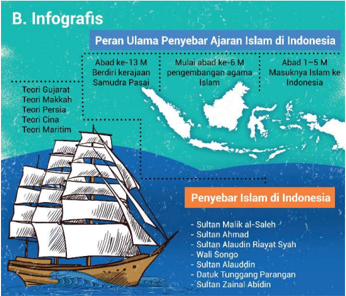

> **Deskripsi Visual:** Gambar ini adalah ilustrasi yang menunjukkan peran ulama penyebar ajaran Islam di Indonesia. Gambar ini terdiri dari beberapa elemen utama:

1. Perahu: Perahu ini menggambarkan perjalanan penyebaran Islam di Indonesia.
2. Penyebaran Islam: Di sekitar perahu tersebut, terdapat beberapa nama tokoh yang dikenal sebagai penyebar Islam di Indonesia, seperti Sultan Malik al-Saleh, Sultan Ahmad, Sultan Alauddin Riayat Syah, Wali Songo, Datuk Tunggang Parangaran, dan Sultan Zainal Abidin.
3. Infografis: Gambar ini juga mencakup infografis yang memberikan informasi tentang peran ulama penyebar ajaran Islam di Indonesia, termasuk periode abad ke-13 M, berdinis kerajaan Samudera Pasai, mulai abad ke-6 M, pengembangan agama Islam, dan masuknya Islam ke Indonesia.

Informasi kunci yang dapat diambil pembaca melalui gambar ini adalah bahwa penyebaran Islam di Indonesia dilakukan oleh berbagai tokoh yang memiliki peran penting dalam sejarah Islam di Indonesia, mulai dari masa kerajaan Samudera Pasai hingga masuknya Islam ke Indonesia pada abad ke-6 M.

 

---
## 📄 Halaman 139

Sebelum memulai pembelajaran, mari membaca Al-Qur`an dengan tartil. Semoga dengan membiasakan diri membaca Al-Qur`an, kita selalu mendapat keberkahan dan kemudahan dalam belajar dan mendapat ridha dari Allah Swt. Amin

- Bacalah Q.S. Ali Imran/3: 16-20 di bawah ini dengan fasih dan tartil selama 5-10 menit!
- Perhatikan makhraj dan tajwidnya!
ٰۤ

ّٰ

ْ

َ

َ

َ

َ

ُ

ِ

ّٰ

َ

ٰ

َ

ٗ

ِ

َ

ُ

ّٰ

َ

َ

َ

َ

َ

َ

َ

ْ

َ

َ

َ

َ

ُ

ُ

َ

ْ

َ

ٰ

َ

َ

َ

ُ

ُ

ْ ن ِ ي د ِ ق الص و ْ ن ي ِ ر ب لص ۚ  ١٦ ا ار َّ الن اب ذ ا ع ق ِ ن ا و ن ب و ن ا ذ ن ل ف ِ ر اغ ا ف َّ ن م آ ا ن َّ ن آ ا ن َّ ب ر ْ ن و ل و ق ي ن ي ذ ِ َّ ل ا ة ىِٕك ل م َ ال ۙ  و و ا ه َّ ا ِ ل ه ل آ ا ل ه َّ ن ا الل ه ِ د ١٧ ش ار س ْ ح ا ال ب ْ ن ي ف ِ ر غ ت م ُ س ال و ْ ن ِ ي ف ِ ق ن م ُ ال و ْ ن ِ ي ن ِ ت ق ال و ۗ ام ْ ل ا ِ س ِ  ال الل د ع ِ ن ن ي الد َّ ١٨ ا ِ ن م ك ِ ي ح ال ْ ز ي ز ع ال و ا ه َّ ا ِ ل ه ل آ ا ۗ  ل ْ ط ق ِ س ال ا ۢ  ب اۤىِٕم ق م ِ ع ِ ل وا ال ول ا و ٰ ت ي ا ب ر ْ ف َّ ك ي َ ن م ۗو م ه ن ي ا ۢ  ب ي غ ب م ع ِ ل ال م َ ه اۤء ا ج د ِ  م ع ۢ ب ا م ِ ن َّ ا ِ ل ٰ ب ك ِ ت وا ال ت و ا ن ي ذ ِ َّ ال ف ل ت ا اخ م و ل ق ۗو ن ِ َ ع ب َّ ات َ ن م ِ  و لل ه ِ ي َ ج و م ْ ت ل س ْ ا ل ق ف ْ ك و اۤج ح ا ِ ن ١٩ ف اب ح ِس ال ع ي ر س الل َّ ا ِ ن ِ  ف الل ْ ك ي ل ا ع م َّ ن ا ِ ا ف و َّ ل و ت ا ِن ا  ۚ و و د ت د ِ  اه ق ا ف م ُ و ل س ْ ا ا ِ ن ۗ ف م ت م ْ ل س ْ ا ء ٖ ن ِ ي م ا ال و ٰ ب ك ِ ت وا ال ت و ا ن ي ذ ِ َّ ل ل ِ ٢٠ اد ِ  ࣖ ع ِ ب ال ۢ ب ر ي َ ص ب الل ۗ و غ ل ب ال

ْ

َ

ِ

ّ

ُ

ٰ

َ

ْ

ْ

ّٰ

َ

ْ

َ

ْ

َ

ْ

ِ

ِ

ُ

ْ

َ

ْ

ُ

َ

َ

ْ

َ

َ

َ

َ

ْ

َ

ِ

ِ

َ

َ

َ

َ

َ

ُ

### Aktivitas 5.2

Amatilah gambar-gambar di bawah ini, kemudian tulislah makna yang tersirat pada setiap gambar. Kaitkan makna-makna tersebut dengan tema 'Meneladani Peran Ulama Penyebar Ajaran Islam di Indonesia'!

ُ

َ

َ

ّٰ

ِ

ً

ْ

ْ

ْ

َ

َ

َ

ُ

ُ

ْ

ْ

ْ

َ

ُ

َ

ُ

ْ

َ

َ

ُ

َ

ْ

ْ

ْ

ُ

َ

َ

َ

ُ

ِ

َ

َ

ِ

َ

َ

ْ

ْ

ُّ

ْ

َ

َ

َ

َ

َ

ْ

ُ

ْ

َ

ْ

ِ

ْ

ُ

َ

ْ

َ

َ

َ

ِ

ٰ

ِ

َ

َ

ْ

َ

َ

َ

َ

ْ

ِ

ْ

ّ

َ

ِ

ّ

ْ

َ

ُ

َ

ْ

َ

ُ

ْ

ْ

ْ

َ

ْ

ِ

ُ

َ

ِ

ِ

ُ

َ

َ

ٌ

ً

ْ

ْ

ْ

ِ

َ

ْ

َ

َ

ِ

ْ

ْ

َ

ُ

ّٰ

ْ

َ

َ

ّٰ

َ

ْ

ُ

ْ

َ

َ

ْ

َ

ُ

َ

ْ

َ

ُ

َ

َ

ُ

ْ

ْ

ٰ

ٰ

ْ

َ

ُ

َ

ّٰ

ْ

َ

َ

َ

ّ

َ

 

---
## 📄 Halaman 140

---
**🖼️ Gambar/Diagram**

> **Deskripsi Visual:** Gambar 5.1 menunjukkan kerajaan Samudra Pasai di Pulau Sumatera, dengan wilayah-wilayah yang ditandai dengan warna-warna berbeda. Gambar 5.2 menampilkan kerajaan Demak di Pulau Jawa, dengan wilayah-wilayah yang ditandai dengan warna-warna berbeda juga. Gambar 5.3 menunjukkan Pulo Kalimantan, dengan wilayah-wilayah yang ditandai dengan warna-warna berbeda. Gambar 5.4 menunjukkan kerajaan Ternate dan Tidore di Pulau Sulawesi, dengan wilayah-wilayah yang ditandai dengan warna-warna berbeda. Setiap gambar memiliki informasi tentang wilayah kerajaan dan hubungan antar wilayah tersebut.

 

---
## 📄 Halaman 141

### Gadis Penjual Susu

Khalifah  Umar  bin  Khattab  sering  keliling  pada  malam  hari  untuk memeriksa  kondisi  rakyatnya  secara  langsung.  Pada  suatu  malam,  Umar bin Khattab terhenti di dekat sebuah rumah karena merasa curiga melihat lampu  rumah  tersebut masih menyala. Dari dalam rumah  tersebut terdengar percakapan antara seorang ibu dengan putrinya. 'Wahai putriku, campurkanlah susu yang tadi engkau perah dengan sedikit air,' kata sang ibu.  'Bu,  Amirul  Mukmimin Umar bin Khattab melarang untuk berbuat curang  dengan  mencampurkan  air  kedalam  susu',  sang  anak  menjawab dengan  nada  penuh  sayang  kepada  ibunya. 'Putriku,  banyak  orang melakukannya,  lagi  pula  tidak  ada  orang  yang  tahu,  termasuk  Umar  bin Khattab', sang ibu mencoba membujuk putrinya. 'Ibu, meskipun tidak ada yang melihat perbuatan kita, tapi Allah Swt. pasti mengetahui'. Dari luar, Umar bin  Khattab  tersenyum,  dan  berkata  dalam  hatinya  'sungguh  luar biasa kejujuran anak perempuan ini'.

Khalifah  Umar  bin  Khattab  segera  pulang  dan  memanggil  putranya, Ashim  bin  Umar.  'Anakku,  menikahlah  dengan    gadis  itu,  sungguh  ia seorang yang jujur, ia hanya takut kepada Allah Swt, bukan kepada manusia.' Beberapa  hari  kemudian,  Ashim  bin  Umar  melamar  gadis  jujur  itu. 'Wahai  putra  Amirul  Mukminin,  tidaklah  pantas  Tuan  menikahi  gadis miskin seperti putriku', kata sang ibu. 'Sesungguhnya kemuliaan seseorang tergantung dari ketaqwaannya kepada Allah Swt.,' jawab Ashim bin Umar.

Dari pernikahan antara Ashim dengan gadis tersebut, lahirlah Laila yang kemudian masyhur dengan sebutan Ummi Ashim.

Ketika  sudah  dewasa,  Ummi  Ashim  dinikahi  oleh  Abdul  Aziz  bin Marwan,  seorang  gubernur  Mesir  pada  masa  Khalifah  Abdul  Malik  bin Marwan. Dari pernikahan ini, lahirlah Umar bin Abdul Aziz, yang kelak menjadi seorang khalifah. Umar bin Abdul Aziz terkenal sebagai khalifah yang sangat adil dan bijaksana.

Sumber : diolah dari berbagai sumber

 

---
## 📄 Halaman 142

Tahukah  kalian  bahwa  kedatangan  Islam  di  Indonesia  berkat  jasa  para ulama yang menyebarkan Islam secara damai. Sehingga mayoritas penduduk Indonesia  beragama  Islam.  Penting  untuk  kalian  ketahui  bahwa  Islam  di Indonesia memiliki karakteristik yang berbeda dengan Islam di Mesir, Arab Saudi dan lain sebagainya. Hal ini terkait dengan sejarah masuknya Islam di Indonesia yang memiliki lintasan garis sejarahnya tersendiri.

Perlu kalian pahami bahwa agama Islam mudah diterima oleh penduduk Indonesia  dikarenakan  mudahnya  syarat-syarat  untuk  masuk  agama  Islam. Untuk menjadi seorang muslim, seseorang cukup mengucapkan dua kalimat syahadat,  yaitu  syahadat  tauhid  dan  syahadat  rasul.  Di  samping  itu,  Islam disebarkan oleh para da'i dengan cara damai. Kegigihan dan semangat para juru dakwah melalui berbagai saluran islamisasi di Indonesia juga berperan penting terhadap keberhasilan dakwah di Indonesia.

Untuk memahami sejarah dan peran para ulama dalam penyebaran Islam di Indonesia, simaklah uraian berikut ini!

### 1. Masuknya Agama Islam di Indonesia

Kapan Islam  masuk  ke  Nusantara  Indonesia?.  Siapakah  yang  membawa Islam  ke  Nusantara  Indonesia?.  Daerah  mana  di  antara  pulau-pulau  di Nusantara  yang  merupakan  daerah  pertama  masuknya  Islam?.  Pertanyanpertanyaan tersebut selalu memunculkan beragam pendapat dan jawaban dari para sejarawan.

Wilayah Nusantara sangat luas, posisi geografisnya terletak di persimpangan jalur perdagangan antara India, Cina dan Arabia. Maka sulit untuk memastikan wilayah mana yang pertama kali menerima ajaran Islam. Oleh karena itu, ada beberapa  teori  tentang  masuknya  agama  Islam  di  Indonesia  sebagaimana diungkapkan  oleh  Ahmad  Mansyur  Suryanegara  dalam  buku  ' Api  Sejarah Jilid 1' . Teori-teori tersebut yaitu

### a.  Teori Gujarat oleh Prof. Dr. C. Snouck Hurgronje

Menurut  teori  ini,  Islam  masuk  ke  Indonesia  dari  Gujarat.  Snouck Hurgronje  berkeyakinan  bahwa  tidak  mungkin  Islam  masuk  ke  Indonesia langsung berasal dari Arabia tanpa melalui ajaran tasawuf yang berkembang di Gujarat, India. Wilayah Kerajaan Samudra Pasai merupakan daerah pertama

11"

 

---
## 📄 Halaman 143

penerima ajaran agama Islam, yakni pada abad ke-13 Masehi. Teori ini tidak menjelaskan secara rinci antara masuk dan berkembangnya Islam di wilayah ini. Tidak ada penjelasan mengenai mazhab apa yang berkembang di Samudra Pasai. Maka muncul pertanyaan besar, mungkinkah saat Islam datang langsung mampu mendirikan kerajaan yang memiliki kekuasaan politik besar?

### b.  Teori Makkah oleh Prof. Dr. Buya Hamka

Buya Hamka menggunakan berita yang diangkat dari Berita Cina Dinasti Tang sebagai acuan teori ini. Menurutnya, Islam masuk ke Nusantara pada abad ke-7 Masehi. Berdasarkan Berita Cina Dinasti Tang, ditemukan pemukiman saudagar Arab di wilayah pantai barat Sumatera. Dari sini disimpulkan Islam dibawa masuk ke Indonesia oleh para saudagar yang berasal dari Arab. Jika kita perhatikan, kerajaan Samudra Pasai didirikan pada abad ke-13 M atau tahun 1275 M, artinya bukan awal masuknya Islam tetapi merupakan perkembangan agama Islam.

### c.  Teori Persia oleh Prof. Dr. Husein Djajadiningrat

Menurut teori ini, Islam masuk dari Persia dan bermazhab Syi'ah . Pendapat ini  didasarkan  pada  sistem  mengeja  bacaan  huruf  Al-Qur`an,    terutama  di Jawa Barat yang menggunakan ejaan Persia.

Teori  ini  dipandang  lemah,  karena  tidak  semua  pengguna  sistem  baca tersebut di Persia sebagai penganut Syi'ah . Pada saat itu, Baghdad sebagai ibu kota  Kekhalifahan  Bani  Abbasiyah  yang  mayoritas  khalifahnya  merupakan penganut Ahlussunnah  wal  Jama'ah .  Lebih  dari  itu,  adanya  fakta  bahwa mayoritas muslim Jawa Barat bermazhab Syafi'i sekaligus berpaham Ahlussunnah wal Jama'ah , bukan pengikut Syi'ah .

### d.  Teori Cina oleh Prof. Dr. Slamet Muljana

Menurut Slamet Muljana, Sultan Demak merupakan keturunan Cina, lebih dari itu menurutnya, Wali Songo juga merupakan keturunan Cina. Pendapat ini didasarkan pada Kronik Klenteng Sam Po Kong .

Misalnya, Sultan Demak Panembahan Fatah dalam Kronik Klenteng Sam Po Kong bernama Panembahan Jin Bun. Sultan Trenggana disebutkan dengan nama Tung Ka Lo. Sedangkan Wali Songo, Sunan Ampel dengan nama Bong Swi Hoo, Sunan Gunung Jati dengan nama Toh A Bo.

Perlu diketahui bahwa menurut kebudayaan Cina, penulisan sejarah yang terkait dengan penulisan nama tempat dan nama orang yang bukan dari negeri Cina, juga ditulis menurut bahasa Cina. Maka sangat mungkin seluruh nama-

 

---
## 📄 Halaman 144

11

nama  raja  Majapahit  juga  dicinakan  dalam Kronik  Klenteng  Sam  Po  Kong Semarang. Pertanyaannya, mengapa nama Sultan Demak dan para Wali Songo yang dicinakan dalam Kronik Klenteng Sam Po Kong dianggap sebagai orang Cina?. Tentu hal ini merupakan salah satu titik kelemahan teori ini.

### e.  Teori Maritim oleh N.A. Baloch

Walaupun di Makkah dan Madinah terjadi  perang  selama  kurun  waktu sepuluh tahun antara 1-11 H/622-623 M,  namun  tidak  memutuskan  jalur perdagangan laut yang sudah menjadi tradisi  sejak  lama.  Jalur  perdagangan tersebut adalah jalur antara  Timur

---
**🖼️ Gambar/Diagram**

> **Deskripsi Visual:** Gambar ini adalah ilustrasi yang menunjukkan sebuah pelabuhan dengan berbagai kapal dan perahu. Pelabuhan ini tampak sibuk dengan kapal-kapal besar yang tampaknya sedang berlayar menuju atau meninggalkan pelabuhan. Di sepanjang tepi pelabuhan, terdapat beberapa bangunan yang tampak seperti hotel atau restoran, menunjukkan bahwa pelabuhan ini mungkin berada di sebuah kota atau desa yang populer. Perahu-perahu kecil lainnya tampaknya sedang berlayar di antara kapal-kapal besar tersebut. Gambar ini menunjukkan aktivitas dan kehidupan di pelabuhan, serta menunjukkan hubungan antara kapal-kapal besar dan perahu-perahu kecil dalam lingkungan pelabuhan.

Tengah, India dan Cina. Hubungan perdagangan ini semakin lancar pada masa Khulafaur Rasyidin (11-41 H/632-661 M). Banyak juga para sahabat Nabi Saw. yang berdakwah keluar Madinah, bahkan di luar Jazirah Arab.

Menurut N.A. Baloch,  hal  itu  terjadi  karena  umat  Islam  memiliki  kemampuan dalam penguasaan perniagaan melalui jalur maritim. Melalui jalur ini, yakni pada abad ke-1 H atau abad ke-7 M, agama Islam dikenalkan di sepanjang jalur  niaga  di  pantai-pantai  tempat  persinggahannya.  Proses  pengenalan ajaran Islam ini, berlangsung selama kurun waktu abad ke-1 sampai abad ke-5 H/7-12 M. Fase berikutnya adalah pengembangan agama Islam, terjadi mulai abad ke-6 H sampai ke pelosok Indonesia. Saudagar pribumi berperan penting dalam proses pengembangan agama Islam di pedalaman-pedalaman. Dimulai dari Aceh pada abad ke-9 M dan diikuti tumbuh dan berkembangnya kerajaan Islam di berbagai wilayah.

Menurut pendapat kalian, manakah teori masuknya Islam di Indonesia yang paling kuat? Kemukakan argumentasi kalian!

Proses masuknya Islam di Indonesia dan perkembangan Islam di Indonesia adalah dua hal berbeda. Tahunnya berbeda, peristiwanya juga berbeda.

 

---
## 📄 Halaman 145

### 2. Perkembangan Kesultanan di Indonesia

Masa  perkembangan  agama  Islam  adalah  kurun  waktu  pada  saat  umat Islam telah membangun kesultanan sebagai bentuk kekuasaan politik. Sebagai contoh,  kesultanan  Samudra  Pasai  di  Sumatera  Utara  pada  abad  ke-13  M, kesultanan Leran di Gresik Jawa Timur pada abad ke-11 M.

Perkembangan Islam di Indonesia semakin meluas seiring dengan banyaknya raja-raja Hindu yang memeluk Islam. Dengan demikian, terbentuklah kesultanan Islam di berbagai wilayah di Indonesia.

Istilah  kerajaan  berubah  menjadi  kesultanan,  dan  istilah  raja  berubah menjadi  sultan.    Salah  satu  motif  para  raja  memeluk  Islam  adalah  untuk mempertahankan kekuasaannya, karena mayoritas rakyatnya sudah memeluk Islam  terlebih  dahulu.  Rakyat  berbondong-bondong  masuk  Islam  karena syarat masuk Islam sangat mudah, lebih dari itu Islam tidak mengenal sistem kasta. Islam dianggap sebagai agama pembebas bagi rakyat jelata.

Tumbuhnya  kesultanan  Islam  di  Indonesia  tidak  dapat  dilepaskan  dari sebab timbulnya politik di luar Indonesia. Periode Khulafaur Rasyidin, Bani Umayah,  Bani  Abbassiyah,  Fathimiyah  hingga  Kesultanan  Turki  Ustmani. Kemudian  diikuti  dengan  runtuhnya  pengaruh  Hindu  Budha  di  India, dan  munculnya  Kerajaan  Moghul.  Perkembangan  Islam  di  Peking,  Cina berpengaruh terhadap pertumbuhan masjid, pesantren baik di dalam maupun di luar pulau Jawa.

Untuk mengetahui perkembangan Mazhab Syafi'i yang dianut mayoritas oleh  masyarakat  Indonesia  termasuk  di  Kesultanan  Samudra  Pasai,  dapat diketahui  dari  catatan  Ibnu  Batutah  (penjelajah  muslim  dari  Maroko  yang bernama lengkap Abu Abdullah Muhammad bin Abdullah al-Lawati at-Tanji bin  Batutah)  yang  pernah  berkunjung  ke  Kesultanan  Samudra  Pasai  pada tahun 745-746 H/1345 M. Pada catatan tersebut dijelaskan bahwa di Gujarat berkembang  Mazhab  Syi'ah.    Sedangkan  kesultanan  Samudra  Pasai  adalah bermazhab Syafi'i.

Perbedaan mazhab antara Gujarat dan Samudra Pasai inilah yang dijadikan alasan  oleh  Buya  Hamka  untuk  menolak  teori  Gujarat.  Jika  benar  bahwa agama  Islam  berasal  dari  Gujarat  seperti  pendapat  Snouck  Hurgronje  dan wilayah  pertama  penerima  ajaran  Islam  adalah  Samudra  Pasai  maka  dapat dipastikan  bahwa  Samudra  Pasai  akan  bermazhab  Syi'ah.  Menurut  Ibnu Batutah, kesultanan Samudra Pasai bermazhab Syafi'i, bukan mazhab Syi'ah. Oleh  karena  itu,  Buya  Hamka  berkeyakinan  bahwa  Islam  dibawa  langsung oleh Saudagar dari Makkah, bukan dari Gujarat.

 

---
## 📄 Halaman 146

11'

Sejarawan  Belanda  pada  masa  kolonial  membagi  periodisasi  sejarah Indonesia  menjadi  (1)  Zaman  Animisme  dan  Dinamisme,  (2)  Zaman Hinduisme  dan  Buddhisme,  (3)  Zaman  Islamisme,  (4)  Zaman  Katolikisme dan  Protestanisme.  Bertolak  dari  periodisasi  ini,  sejarah  Islam  dituliskan setelah kerajaan Majapahit mengalami kemunduran pada abad ke-15 M, tidak dijelaskan bahwa sejak abad ke-7 agama Islam sudah mulai didakwahkan di Indonesia. Akibatnya, Islam dianggap baru masuk dan dikenal oleh masyarakat Indonesia  pada  abad  ke-15  M.  Dibuktikan  dengan  berdirinya  Kesultanan Demak, dan kiprah Wali Songo dalam menyebarkan Islam pada abad ke-15. Padahal abad ke-15 M termasuk periode perkembangan Islam di Indonesia, bukan periode masuknya agama Islam ke Indonesia yang terjadi pada kurun waktu abad ke-7 M/1 H.

### 3. Tokoh Penyebar Ajaran Islam di Indonesia

Banyak  tokoh,  ulama  dan  sultan  yang berperan  aktif  dalam  penyebaran  Islam  di wilayahnya masing-masing.

### a.  Sultan Malik al-Saleh (1267 - 1297 M)

Meurah Silu atau Sultan Malik al-Saleh merupakan pendiri dan raja pertama Samudra  Pasai  (berdiri  pada  tahun  1267 M ). Meurah  Silu  memeluk  Islam  berkat pertemuannya  dengan  Syekh  Ismail  dari Mekah. Setelah masuk Islam, Meurah Silu  bergelar  Sultan  Malik  al-Saleh,  dan

---
**🖼️ Gambar/Diagram**

> **Deskripsi Visual:** Gambar ini adalah diagram yang menunjukkan wilayah geografis di Kroasia. Diagram ini memperlihatkan bagian dari Kroasia yang dikenal sebagai "Salutare Posul". Wilayah ini terletak di bagian barat daya Kroasia, berbatasan dengan negara-negara lain seperti Bosnia dan Herzegovina di utara, Serbia di timur, dan Slovenia di selatan. Di sebelah barat, wilayah ini berbatasan dengan Laut Adriatik. 

Elemen utama dalam diagram ini meliputi wilayah Salutare Posul yang ditandai dengan warna merah, serta negara-negara tetangga yang ditandai dengan warna-warna yang berbeda. Label "Salutare Posul" juga ditampilkan untuk menunjukkan lokasi wilayah tersebut.

Teks, angka, atau label penting yang terlihat dalam diagram ini adalah nama-nama negara dan wilayah yang ditandai, serta warna-warna yang digunakan untuk menunjukkan batas-batas wilayah dan negara.

Informasi kunci yang dapat diambil pembaca dari gambar ini adalah bahwa Salutare Posul adalah bagian dari Kroasia yang berbatasan dengan beberapa negara tetangga, termasuk Bosnia dan Herzegovina, Serbia, Slovenia, dan Kroasia sendiri.

berkuasa selama 29 tahun. Kesultanan Samudra Pasai merupakan gabungan dari Kerajaan Peurlak dan Kerajaan Pase.

Sultan Malik al-Saleh merupakan tokoh penyebar Islam di Nusantara dan Asia Tenggara. Hal ini disebabkan oleh kuatnya pengaruh kekuasaan Samudra Pasai di bawah kepemimpinan Sultan Malik al-Saleh. Semasa berkuasa, sempat menerima  kunjungan  dari  Marco  Polo.  Dan  menurut  catatan  Marco  Polo, Sultan Malik al-Saleh merupakan raja yang kaya dan kuat pengaruhnya.

Beliau  wafat  pada  tahun  1297  M,  dan  kepemimpinan  Samudra  Pasai digantikan  oleh  Sultan  Muhammad  Malik  al-Zahir  (1297-1326  M).  Sultan Malik al-Saleh dimakamkan di desa Beuringin Kecamatan Samudra, kira-kira 17  km sebelah timur Lhokseumawe. Di nisan Sultan Malik al-Saleh tertulis aksara Arab, yang terjemahnya 'ini adalah makam almarhum yang diampuni, yang  kuat  dalam  beribadah,  sang  penakluk  yang  bergelar  Sultan  Malik  alSaleh'.

 

---
## 📄 Halaman 147

### b.  Sultan Ahmad (1326 - 1348 M)

Beliau  merupakan  sultan  Samudera  Pasai  yang  ketiga,  bergelar  Sultan Malik al-Thahir II. Pada masa pemerintahannya, Kesultanan Samudra Pasai dikunjungi oleh seorang penjelajah dari Maroko, yaitu Ibnu Batutah. Menurut catatan Ibnu Batutah, Sultan Ahmad sangat memperhatikan perkembangan dan kemajuan agama Islam. Beliau berusaha keras untuk menyebarkan ajaran Islam ke berbagai wilayah di sekitar Samudra Pasai.

### c.  Sultan Alaudin Riayat Syah (1538 - 1571 M)

Beliau merupakan sultan Aceh ketiga, terkenal sebagai peletak dasar-dasar kejayaan Kesultanan Aceh. Hubungan baik dengan Kesultanan Turki Utsmani dan kerajaan-kerajaan Islam lainnya menjadikan pemerintahannya semakin kuat.  Bahkan  militer  Kesultanan  Aceh  terkenal  handal  karena  mendapat bantuan dari Kesultanan Turki Utsmani.

Sultan Alaudin Riayat Syah berperan dan berjasa dalam penyebaran Islam di  wilayah  Aceh.  Beliau  mendatangkan  ulama-ulama  dari  Persia  dan  India untuk mengajarkan agama Islam di Kesultanan Aceh. Setelah terbentuk kaderkader pendakwah, selanjutnya dikirim ke daerah pedalaman Sumatera untuk menyampaikan ajaran  Islam.  Bahkan  pada  masa  kepemimpinannya,  ajaran Islam sampai ke Minangkabau dan Indrapura.

### d.  Wali Songo (1404 - 1546 M)

Wali Songo merupakan sembilan wali atau sunan yang menjadi pelopor penyebaran Islam di Pulau Jawa. Mereka adalah (1) Maulana Malik Ibrahim (Sunan  Gresik),  (2)  Raden  Rahmat  (Sunan  Ampel),  (3)  Maulana  Makdum Ibrahim (Sunan Bonang), (4) Raden Paku (Sunan Giri), (5) Syarifuddin (Sunan Drajat),  (6)  Raden  Mas  Syahid  (Sunan  Kalijaga),  (7)  Ja'far  Shadiq  (Sunan Kudus), (8) Raden Umar Said (Sunan Muria), (9) Syarif Hidayatullah (Sunan Gunung Jati).

Mereka menggunakan berbagai saluran dakwah, di antaranya kebudayaan, kesenian,  pendidikan,  pernikahan,  perdagangan,  dan  politik.  Penyebaran Islam di seluruh wilayah Nusantara dipengaruhi oleh jalur perdagangan dari berbagai  negara,  seperti  Persia,  India,  dan  Arab.  Selain  berdagang,  mereka juga berdakwah untuk menyebarkan ajaran Islam. Selain itu, proses dakwah Islam melalui pesantren yang digagas oleh Wali Songo sangat efektif untuk menyebarkan Islam ke pelosok pedesaan.

### e.  Sultan Alauddi n

Sultan  Alauddin,  nama  aslinya  adalah  I  Manga'rangi  Daeng  Manrabbia, dinobatkan  sebagai  raja  Gowa  pada  usia  tujuh  tahun.  Beliau  termasuk tokoh yang berjasa besar pada penyebaran Islam di Sulawesi Selatan. Beliau

 

---
## 📄 Halaman 148

11'

merupakan raja Gowa pertama yang masuk Islam bersama raja Tallo. Oleh karenanya, rakyat Gowa-Tallo secara bertahap memeluk agama Islam.

Penyebaran  agama  Islam  pada  masa  pemerintahan  Sultan  Alauddin mencapai daerah Buton dan Dompu  (Sumbawa). Termasuk berhasil mengislamkan kerajaan Soppeng, Wajo, dan Bone. Penyebaran agama Islam di Gowa juga atas perjuangan dakwah dari Datuk Ri Bandang (Abdul Makmur Khatib Tunggal), seorang ulama dari Minangkabau.

### f.  Datuk Tunggang Parangan

Datuk Tunggang Parangan atau Habib Hasyim bin Musyayakh bin Abdullah bin Yahya merupakan seorang ulama Minangkabau yang berdakwah di Kutai Kartanegara. Beliau berdakwah bersama sahabatnya, Datuk Ri Bandang pada masa pemerintahan Raja Aji Mahkota (1525 - 1589).  Berkat dakwah Datuk Tunggang Parangan, akhirnya Raja Aji Mahkota memeluk Islam dan diikuti oleh keluarga kerajaan serta rakyat Kutai Kartanegara.

Kerajaan  Kutai  Kartanegara  berubah  nama  menjadi  Kesultanan  Kutai Kartanegara. Agama Islam berkembang pesat pada masa ini, bahkan undangundang negara berlandaskan pada ajaran Islam. Datuk Tunggang Parangan berdakwah di Kutai hingga akhir hayatnya. Setelah wafat, beliau dimakamkan di Kutai Lama, Kecamatan Anggana, Kabupaten Kutai Kartanegara, Kalimantan Timur.

### g.  Sultan Zainal Abidin

Beliau memerintah Kesultanan Ternate pada kurun waktu 1486-1500 M. Sejak  usia  belia,  beliau  mendapatkan  pendidikan  agama  dari  ayahnya,  dan dari  seorang  ulama  bernama  Datuk  Maulana  Hussein.  Setelah  dinobatkan menjadidiikuti raja, beliau menjadikan Islam sebagai landasan resmi bernegara, hingga kerajaan Ternate berubah nama menjadi Kesultanan Ternate. Sultan Zainal Abidin berangkat ke Pulau Jawa pada tahun 1494 M untuk memperdalam ilmu agama di Pesantren Sunan Giri, Jawa Timur. Sekembalinya dari Jawa, beliau mengajak ulama-ulama terkemuka , di antaranya Tuhubahanul untuk membantu dakwah di seluruh Maluku.

Salah  satu  peran  terpenting  Sultan  Zainal  Abidin  dalam  penyebaran agama Islam adalah mendirikan pesantren-pesantren dengan pengajar yang didatangkan  langsung  dari  Jawa.  Selain  itu,  beliau  juga  mendirikan Jolebe atau Bobato  Akhirat yang  bertugas  membantu  Sultan  dalam  mengawasi pelaksanaan syariat Islam di Kesultanan Ternate. Akhirnya, gerakan islamisasi yang dilakukan oleh Sultan Zainal Abidin ini diikuti dan ditiru oleh raja-raja lain di Maluku.

 

---
## 📄 Halaman 149

Selain tokoh-tokoh di atas, masih banyak ulama yang berjasa menyebarkan agama  Islam  di  Indonesia  sejak  abad  ke-18  sampai  masa  kontemporer.  Di antaranya adalah Abdul Sayyid Abdul Rahman Abdul Shamad al-Palimbani (berasal  dari  Palembang,  Sumatera  Selatan),    Syaikh  Mahfudz  al-Termasi (berasal  dari  Termas,  Jawa  Timur),  Syaikh  Nawawi  al-Bantani  (berasal  dari Banten), dan Syaikh Muhammad Yasin bin Isa al-Padani (berasal dari Padang, Sumatera Barat).

Ada juga ulama Indonesia yang bermukim di Makkah, yakni Syaikh Ismail al-Minangkabawi dan Syaikh Ahmad Khatib Sambas. Keduanya memiliki jasa besar terhadap penyebaran Islam di Nusantara melalui para muridnya. Muridmurid tersebut adalah (1) Berasal dari Banten; Nawawi, Abdul Karim, Marzuqi, Ismail,  Arsyad  bin  As'ad  dan  Arsyad  bin  Alwan.  (2)  Berasal  dari  Priangan; Mahmud dan Hasan Mustafa, (3) Berasal dari Batavia; Mujitaba, 'Aydarus, dan Junayd. (4) Berasal dari Sumbawa; Umar dan Zainudin.

Ketiga belas ulama tersebut ada yang kembali ke Nusantara, adapula yang menetap  ( mukimin )  di  Haramain.  Meskipun  menjadi  mukimin  di  sana, mereka tetap ikut andil dalam menyebarkan Islam di Indonesia.

Kebanyakan ulama yang disebutkan di atas merupakan penulis-penulis hebat dengan karya momumental. Karya para ulama tersebut ditulis dalam bahasa  Arab,  Melayu,  Jawa,  atau  bahasa  lokal  lainnya.  Dan  saat  ini  banyak yang dicetak ulang di Indonesia. Di antara karya ulama-ulama Indonesia yaitu

---
**📊 Tabel**

Tabel ini berisi informasi tentang lima ulama yang dikenal di Aceh, termasuk nama-namanya, karya-karya mereka, dan bidang ilmu yang mereka fokuskan. Topik utama tabel adalah ulama Aceh dan kontribusi mereka dalam berbagai bidang ilmu. Kolom-kolomnya meliputi: 1) Nama Ulama, 2) Karya, 3) Bidang Ilmu. Data penting yang terlihat adalah bahwa semua ulama ini berasal dari Aceh, menunjukkan hubungan geografis dan budaya yang kuat antara ulama Aceh dan Aceh. Selain itu, mereka memiliki karya yang berfokus pada bidang-bidang seperti Fikih, Ibadah, Tafsir, Mu'amalah, Ulumul Hadits, dan Tasawuf. Ini menunjukkan variasi dalam minat dan kontribusi ulama Aceh dalam berbagai aspek ilmu Islam.

 

---
## 📄 Halaman 150

Bersama kelompokmu, carilah biografi tokoh-tokoh di atas! Presentasikan hasilnya di depan kelas!

### 4. Keteladanan  Para  Ulama  Penyebar  Ajaran  Islam  di Indonesia

Banyak nilai-nilai keteladanan dari para tokoh penyebar Islam di Indonesia. Di antara nilai keteladanan tersebut adalah

### a.  Hidup sederhana

Para  ulama  penyebar  Islam  di  Indonesia  hidup  secara  sederhana  dan bersahaja,  meskipun  hartanya  melimpah.  Mereka  menyedekahkan  semua harta,  dengan  terlebih  dahulu  mengambil  secukupnya  untuk  kebutuhan pokok. Allah Swt. memerintahkan orang-orang beriman agar menyedekahkan hartanya sebagaimana tercantum dalam Q.S. al-Baqarah/2: 267 berikut ini. َّ

ٌ

``

ِ

ِ

ِ

َ

َ

َ

ْ

ٌّ

َ

َ

ّٰ

َ

ْ

َ

ْ

َ

ْ

ْ

ُ

ْ

ُ

ْ

َ

ْ

ِ

ٰ

ِ

ْ

ُ

َ

َ

َ

ُ

ْ

ُ

ُ

ْ

َ

ِ

َ

ْ

Artinya: 'Wahai  orang-orang  yang  beriman!  Infakkanlah  sebagian  dari hasil  usahamu  yang  baik-baik  dan  sebagian  dari  apa  yang  Kami  keluarkan dari  bumi  untukmu.  Janganlah  kamu  memilih  yang  buruk  untuk  kamu keluarkan, padahal kamu sendiri tidak mau mengambilnya melainkan dengan memicingkan  mata  (enggan)  terhadapnya.  Dan  ketahuilah  bahwa  Allah Mahakaya, Maha Terpuji'. (Q.S. al-Baqarah/2:267).

Perintah Allah Swt. di atas sudah dilakukan oleh para sahabat Nabi Saw., seperti Abu Bakar r.a., Ustman bin Affan r.a., Umar bin Khattab r.a., Ali bin Abi Thalib r.a. dan sahabat lainnya. Mereka gemar bersedekah, dan menjalani hidup secara sederhana.

Berkat kesederhanaan para ulama penyebar Islam di Indonesia, perjuangan dakwah menunjukkan hasil luar biasa. Banyak rakyat jelata, masyarakat miskin, orang  awam  dengan  suka  rela  memeluk  agama  Islam.  Akhlak  para  ulama ini  patut  dicontoh oleh semua kaum muslimin. Apalagi saat ini gaya hidup modern, hedonism, dan materialism sangat kuat mempengaruhi masyarakat.

ُ

َ

َ

َ

َ

ّ

ْ

ُ

َ

َ

ْ

ْ

َ

ِ

ْ

ُ

ْ

َ

َ

ّ

َ

ْ

ْ

ُ

ْ

َ

ْ

ُ

َ

ٰ

َ

ْ

َ

َ

ٰٓ

 

---
## 📄 Halaman 151

Seperti diketahui bahwa manusia akan selalu digoda oleh hawa nafsu untuk menguasai  dunia.  Ibarat  minum  air  laut,  semakin  diminum  akan  semakin haus.  Menuruti  keinginan  hawa  nafsu  duniawi  tidak  akan  ada  selesainya. Hari ini memiliki emas, esok ingin merengkuh berlian. Ketika berlian sudah dimiliki,  kepuasan  hanya  sekejap  saja,  karena  akan  terus  merasa  kurang. Memiliki gadget bagus, tapi merasa kurang karena melihat gadget orang lain lebih bagus, demikian seterusnya.

Sungguh tak akan ada yang mampu menghentikan keinginan tak berujung ini,  kecuali  kematian.  Saat  itulah,  semua  ambisi  duniawi  sirna  seketika.  Ia meninggalkan dunia ini dengan membawa beberapa lembar kain kafan saja. Rumah, emas, berlian, jabatan, keluarga dan semua isi dunia ini ditinggalkan begitu saja. Padahal selama hidup di dunia, ia mati-matian untuk meraihnya.

### b.  Gigih dalam berjuang

Untuk  meraih  keberhasilan  dalam  menyebarkan  Islam  di  Indonesia diperlukan  kegigihan  dan  tekad  kuat.  Ulama  penyebar  Islam  di  Indonesia telah  menunjukkan  sikap  bersemangat  pantang  menyerah,  gigih  dalam memperjuangan  ajaran  Islam.  Tak  dapat  dipungkiri,  untuk  meraih  suatu cita-cita  dibutuhkan  pengorbanan  dan  perjuangan  panjang.  Hambatan  dan tantangan  bukan  untuk  ditakuti,  tapi  diselesaikan  dengan  cara  yang  tepat. Allah  Swt.  tidak  akan  mengubah  nasib  suatu  kaum,  kecuali  mereka  sendiri yang mengubahnya. Hal ini sesuai firman Allah Swt. dalam Q.S. ar-Ra'd/13:11 berikut ini

َ

َ

ٍ

``

ِ

ِ

ِ

ْ

َ

ُ

ّ

َ

ْ

ْ

ْ

ْ

َ

ْ

ِ

َ

ْ

ّ

ُ

ْ

ْ

ُ

ْ

ّ

ْ

ُ

َ

َ

َ

ٗ

َ

َ

َ

َ

ً

ْ

ُ

ْ

َ

ُ

ّٰ

َ

َ

َ

َ

َ

ْ

ُ

ْ

َ

َ

ْ

ُ

ّ

َ

Artinya: 'Baginya (manusia) ada malaikat-malaikat yang selalu menjaganya  bergiliran,  dari  depan  dan  belakangnya.  Mereka  menjaganya atas perintah Allah. Sesungguhnya Allah tidak akan mengubah keadaan suatu kaum sebelum mereka mengubah keadaan diri mereka sendiri. Dan apabila Allah menghendaki keburukan terhadap suatu kaum, maka tak ada yang dapat menolaknya dan tidak ada pelindung bagi mereka selain Dia.' (Q.S. ar-Ra'd/13: 11)

Para ulama lebih mengutamakan kelancaran dakwah daripada kepentingan pribadi dan keluarganya. Kesenangan duniawi diabaikan demi keberhasilan dakwah. Medan dakwah yang berat berupa lautan, hutan belatara, dan ancaman musuh tidak menyurutkan tekad perjuangan dakwah. Mereka optimis mampu melaksanakan tugas dakwah dengan baik.

ّٰ

َ

َ

ّٰ

ّٰ

َ

ٗ

َ

ُ

ْ

َ

ْ

َ

َ

ٌ

ّ

َ

ٗ

َ

 

---
## 📄 Halaman 152

11'

Kegigihan dalam berjuang harus diikuti dengan sifat optimis dan tawakal kepada  Allah  Swt.  Semua  keberhasilan  merupakan  karunia  Allah  Swt. yang  harus  disyukuri,  sedangkan  kegagalan  harus  diatasi  dengan  tawakal kepada-Nya.  Semua  kesulitan  dakwah  pasti  ada  jalan  keluarnya.  Allah  Swt. akan  membimbing  hamba-Nya  yang  bersungguh-sungguh  berjalan  di  atas kebenaran.

### c.  Menguasai ilmu agama secara luas dan mendalam

Menyampaikan  ajaran  Islam  kepada  masyarakat  yang  sudah  beragama bukanlah persoalan mudah. Adat dan budaya lokal sudah mentradisi begitu kental di masyarakat.

Para  ulama  melakukan  penyesuaian  ajaran  Islam  dengan  tradisi  lokal tersebut, tanpa menghilangkan adat yang sudah berlaku di masyarakat. Hal ini  hanya  bisa  dilakukan  oleh  ulama  dengan  penguasaan  ilmu  agama  yang mumpuni, luas dan mendalam. Semua itu diperoleh karena ketekunan belajar ilmu agama kepada ahlinya. Mereka berguru kepada para ulama yang jalur keilmuannya  bersambung  sampai  kepada  Rasulullah  Saw.  Belajarnya  juga tidak  instan,  namun  terprogram  melalui  tahapan-tahapan  yang  jelas.  Dari ilmu-ilmu dasar hingga mencapai ilmu yang tinggi. Ditempuh dalam kurun waktu yang cukup lama.

Hal ini penting untuk ditiru oleh seseorang yang ingin belajar ilmu agama. Harus ada di antara kaum muslimin yang menekuni ilmu agama (tafaqquh fiddin). Hal ini sesuai firman Allah Swt. dalam Q.S. at-Taubah/9:122 berikut ini.

َ

``

ِ

ِ

ُ

َ

ْ

َ

ُ

َ

َ

ْ

َ

ِ

ْ

ُ

َ

َ

ْ

ُ

َ

ْ

َ

ْ

ُ

ْ

ُ

َ

Artinya: 'Dan tidak sepatutnya orang-orang mukmin itu semuanya pergi (ke medan perang). Mengapa sebagian dari setiap golongan di antara mereka tidak pergi  untuk  memperdalam  pengetahuan  agama  mereka  dan  untuk  memberi peringatan kepada kaumnya apabila mereka telah kembali, agar mereka dapat menjaga dirinya' . (Q.S at-Taubah/9:122)

ِ

Belajar  ilmu  agama  harus  melalui  seorang  guru  yang  jalur  keilmuannya bersambung sampai Rasulullah Saw. Harus dihindari belajar ilmu agama secara otodidak atau melalui media internet tanpa mengkonfirmasi kebenaran dan keshahihan isinya kepada para alim ulama, kyai atau ustadz. Jika ini dilakukan maka akan berpotensi tersesat dan menyesatkan.

ْ

ّ

ْ

ُ

َ

َ

َ

ّ

ٌ

َ

َ

ْ

ُ

ْ

ّ

َ

ْ

ّ

ُ

ْ

َ

َ

َ

ْ

َ

َ

ً

َ

ْ

ْ

َ

َ

ُ

ْ

ْ

َ

َ

َ

َ

 

---
## 📄 Halaman 153

### d. Produktif berkarya

Para  ulama  sangat  produktif  berkarya lewat  ilmu  pengetahuan  dan  amal  saleh. Banyak kitab dan tulisan karya mereka yang terus  menerus  dipelajari  oleh  santri  hingga saat  ini.  Karya-karya  tersebut  merupakan wujud kepedulian para ulama dalam menyelamatkan generasi penerus agar terjaga akidahnya  dari  pengaruh  ajaran  sesat.  Para ulama  berusaha  meluangkan  waktu,  tenaga

---
**🖼️ Gambar/Diagram**

> **Deskripsi Visual:** Gambar ini adalah ilustrasi yang menunjukkan dua orang yang sedang berbicara di depan sebuah meja. Orang pertama duduk di sebelah kiri dengan posisi tubuh yang lebih tegak, sedangkan orang kedua berdiri di sebelah kanan dengan posisi yang lebih relaks. Mereka tampaknya sedang berbicara dengan penuh perhatian. Di atas meja, terdapat beberapa buku yang tampaknya merupakan topik pembicaraan mereka. Gambar ini menunjukkan hubungan antara dua orang tersebut, mungkin sebagai demonstrasi interaksi sosial atau diskusi. Teks, angka, atau label penting tidak terlihat pada gambar ini. Informasi kunci yang dapat diambil pembaca adalah bahwa ada dua orang yang sedang berbicara tentang sesuatu yang terkait dengan buku-buku di meja mereka.

dan pikiran untuk mendokumentasikan pemikirannya melalui sebuah kitab. Hal ini merupakan bentuk amal jariyah yang akan terus dikenang sepanjang hayat oleh generasi setelahnya.

Nilai manfaat dari karya tersebut dapat diperoleh dengan cara membaca dan  mempelajarinya, sehingga menambah wawasan dan khazanah keagamaan. Dalam  hal  ini,  budaya  literasi  yang  dipraktikkan  oleh  para  ulama  harus dijadikan inspirasi oleh umat Islam. Membaca dan menulis merupakan dua aktivitas dasar dalam menerapkan budaya literasi. Di era revolusi industri 4.0 saat ini, literasi di bidang teknologi harus terus menerus digelorakan. Hal ini dikarenakan kreativitas dan inovasi teknologi modern sangat penting untuk menopang keberlangsungan kehidupan berbangsa dan bernegara.

### e.  Sabar

Ujian  dan  cobaan  yang  dialami  oleh  para  ulama  penyebar  Islam  di Indonesia berhasil dilalui dengan kesabaran. Salah satu hikmah adanya ujian tersebut  adalah  dapat  diketahui  tingkat  keimanan  seseorang.  Allah  Swt. hendak menguji siapakah di antara hamba-Nya yang terbaik amal-amalnya. Seorang pendakwah harus memiliki tingkat kesabaran tinggi karena menghadapi umat yang memiliki keragaman budaya, etnis, tingkat pendidikan, dan kepribadian.

Seseorang akan diuji oleh Allah Swt. sesuai dengan tingkat keimanannya. Semakin tinggi keimanan, maka semakin berat ujian dari Allah Swt. Keimanan dan  kesabaran  adalah  dua  sisi  yang  menyatu,  tidak  dapat  dipisahkan  satu sama lain, diibaratkan seperti kepala dan badan.  Manusia yang paling berat ujiannya adalah para nabi, kemudian para wali dan seterusnya sampai pada derajat orang awam.

Pahala sifat  sabar  sangatlah  besar,  dan  hanya  Allah  Swt.  yang  mengetahuinya. Hal ini seperti firman Allah Swt. dalam Q.S. az-Zumar/39:10 berikut ini

 

---
## 📄 Halaman 154

ٌ

َ

َ

ّٰ

ُ

َ

َ

ٌ

َ

َ

َ

ْ

ُّ

ٰ

ْ

ُ

َ

َ

ٍ

َ

ْ

ُ

ْ

ُ

َ

ّٰ

َ

ُ

َ

َ

Artinya: 'Katakanlah  (Muhammad),  'Wahai  hamba-hamba-Ku  yang beriman!  Bertakwalah  kepada  Tuhanmu.'  Bagi  orang-orang  yang  berbuat baik di dunia ini akan memperoleh kebaikan. Dan bumi Allah itu luas. Hanya orang-orang yang bersabarlah yang disempurnakan pahalanya tanpa batas'. (Q.S. Az-Zumar/39:10)

### ة ِ ع اس ِ  و الل ر ْ ض ا ۗو ة ن َ س ا ح ي ن ه ِ  الد ذ ِ ْ  ه ِ ي ا ف و ن ح ْ س ا ن ي ذ ِ َّ ۗل ِل م َّ ك ب ا ر و ق َّ وا ات ن م ا ن ي ذ ِ َّ ال اد ِ ِ ب ٰ ع ي ل ق - ١٠ اب ِ س ر ِ  ح ي ِ غ ب م ر َ ه ج ْ ا ْ ن و ِ ر ب ى الص َّ ف و ا ي م َ َّ ن ۗا ِ

Kesabaran  para  ulama  tampak  jelas  saat  berdakwah  kepada  masyarakat awam. Mereka mengajarkan ilmu agama dengan cara dan metode sederhana tapi mudah dipahami. Bukan sebatas teori, dengan amat ringan dapat langsung dipraktikkan dalam kehidupan sehari-hari.

### f.  Menghargai perbedaan

Islam secara tegas menyatakan tidak ada paksaan dalam beragama. Semua orang dipersilahkan memilih agama dan kepercayaan masing-masing. Umat beragama saling menghargai dan menghormati perbedaan agama, suku, ras, dan golongan. Tidak merendahkan dan meremehkan agama dan kepercayaan orang lain. Adanya sifat merasa paling hebat merupakan sumber kericuhan dalam kehidupan beragama.

Para  ulama  penyebar  agama  Islam  di  Indonesia  sangat  toleran  terdapat budaya lokal. Masyarakat pribumi yang memeluk  agama  Islam tetap diperbolehkan melakukan tradisi-tradisi lokal yang sudah diselaraskan dengan ajaran  Islam.  Dengan  demikian  tidak  ditemukan  adanya  benturan  antara ajaran  Islam  dengan  budaya  lokal.  Justru  sebaliknya,  antara  ajaran  Islam dengan budaya lokal mampu berjalan beriringan.

Sikap  toleran  akan  menumbuhkan  rasa  persatuan  dan  kesatuan  bangsa. Sebagai makhluk individu sekaligus makhluk sosial, manusia harus mampu menjalin hubungan yang harmonis antar sesama warga. Sifat saling menghargai perbedaan dapat ditumbuhkan dengan saling mengenal antar umat beragama, ras, suku, dan golongan. Allah Swt. memerintahkan umat-Nya untuk saling mengenal, sebagaimana firman Allah Swt. dalam Q.S. al-Hujurat/49: 13 berikut ini.

ٌ

ْ

َ

ْ

َ

َ

ّٰ

ْ

ُ

ٰ

ْ

َ

ّٰ

َ

ْ

ْ

ُ

ْ

َ

ْ

ُ

َ

َ

َ

َ

َ

َ

ً

ْ

ُ

ُ

ْ

ُ

ٰ

ْ

َ

َ

ٰ

ْ

ُ

َ

َ

ْ

ّ

ْ

ُ

ٰ

ْ

َ

َ

ُ

َ

َ

ٰٓ

م َ ك م ر َ ك ا َّ ۚ ا ِ ن ا و ف ار ع ل ِ ت اۤىِٕل ب ق َّ ا و ب و ع ش م ك ن ل ع َ ج ى و ث ن ا َّ و ر ٍ ك ذ ِ ن م م ك ن ق ل ا خ َّ ن ا ِ َّ اس ا الن ُّ ه ي ا ي - ١٣ ر ي ب ِ ٌ  خ م ل ِ ي ع الل َّ ۗا ِ ن م ىك ق ت ِ  ا الل د ع ِ ن

َ

ْ

ْ

ُ

َ

ْ

ُ

ُ

َ

ٰ

َ

ْ

َ

ْ

ُ

 

---
## 📄 Halaman 155

Artinya: 'Wahai manusia! Sungguh, Kami telah menciptakan kamu dari seorang  laki-laki  dan  seorang  perempuan,  kemudian  Kami  jadikan  kamu berbangsa-bangsa dan bersuku-suku agar kamu saling mengenal. Sesungguhnya yang paling mulia di antara kamu di sisi Allah ialah orang yang paling bertakwa. Sungguh, Allah Maha Mengetahui, Maha Teliti'. (Q.S. al-Hujurat/49:13)

### g.  Berdakwah secara damai

Islam merupakan agama yang mengajarkan kedamaian, kasih sayang dan toleransi. Dakwah Islam juga harus dilakukan secara damai dan bermartabat. Bukan hanya hasilnya, dakwah Islam juga sangat memperhatikan prosesnya. Proses dakwah harus dilakukan dengan mengedepankan dakwah secara damai, bukan dengan kekerasan dan memaksakan kehendak. Para ulama penyebar Islam di Indonesia menyampaikan ajaran Islam dengan penuh hikmah dan bijaksana. Hal ini sesuai dengan Q.S. an-Nahl/16: 125 berikut ini

ِ

َ

ُ

َ

َ

َ

َ

ْ

ُ

َ

َ

َ

َ

ْ

َ

َ

ّ

َ

ِ

ِ

َ

ُ

َ

َ

ْ

ْ

ُ

َ

ْ

َ

َ

ُ

ْ

َ

َ

ْ

ُ

َ

ْ

َ

Artinya: 'Serulah (manusia) kepada jalan Tuhanmu dengan hikmah dan pengajaran yang baik, dan berdebatlah dengan mereka dengan cara yang baik. Sesungguhnya Tuhanmu, Dialah yang lebih mengetahui siapa yang sesat dari jalan-Nya dan Dialah yang lebih mengetahui siapa yang mendapat petunjuk'. (Q.S an-Nahl/16:125

### و ه َّ ك ب ر َّ ۗ  ا ِ ن ن ُ ح ْ س ا ِ ي ْ  ه ِ ي ت َّ ال ب م ه ل اد ِ َ ج ة ِ  و ن َ س ح ة ِ  ال ع ِ ظ م َ و ال ة ِ  و م َ ح ِك ِ ال ب ِ ك ب ر ْ ل ي ب ى س ل ا ِ ْ ع د ا - ١٢٥ ْ ن ي د ِ ت م ُ ه ال ب م ل ع ا و َ ه ه ٖ  و ل ِ ي ب س ن ْ ع َّ َ ل ض َ ن ِ م ب م ل ع ا

ِ

ِ

Pada  hakikatnya  Islam  menghendaki  terciptanya  kehidupan  yang  aman, tenteram  dan  damai.  Para  ulama  sudah  mencontohkan  hidup  yang  damai di  tengah-tengah  masyarakat.  Dakwah  dilakukan  secara  damai,  penuh  rasa hormat  terhadap  perbedaan  dan  rasa  kemanusiaan.  Kalau  misalnya  terjadi peperangan, semata-mata untuk membela dan mempertahankan kehidupan umat Islam. Dari lisan para ulama, muncul perkataan sejuk penuh hikmah dan doa.  Bukan  perkataan  kasar  yang  bernada  hinaan  dan  mengandung  ujaran kebencian.

Lakukanlah sosiodrama bersama anggota kelompokmu untuk mengilustrasikan keletadanan para ulama penyebar Islam di Indonesia!

َ

ْ

ْ

ْ

ْ

ْ

ٰ

ُ

 

---
## 📄 Halaman 156

Setelah  mengkaji  materi  'Meneladani  Para  Ulama  Penyebar  Islam  di Indonesia', diharapkan kalian dapat menerapkan karakter dalam kehidupan sehari-hari sebagai berikut:

---
**📊 Tabel**

Tabel ini menunjukkan karakteristik yang diharapkan dalam mengungkapkan pendapat agar tidak menyenggung perasaan orang lain. Kolom pertama berisi butir sikap yang harus dimiliki, sedangkan kolom kedua berisi nilai karakter yang diharapkan. Topik utama tabel ini adalah tentang bagaimana seseorang dapat mengungkapkan pendapat mereka dengan cara yang tidak menyenggungkan perasaan orang lain. Data penting yang terlihat adalah bahwa toleransi, bernalar kritis, tangan jawab, kebhinekaan global, dan beriman bertakwa kepada Tuhan YMEB merupakan beberapa karakteristik yang diharapkan dalam situasi tersebut.

 

---
## 📄 Halaman 157

'

- Menurut teori Gujarat oleh Prof. Dr. C. Snouck Hurgronje, Islam masuk ke Indonesia dari Gujarat, India pada abad ke-13 Masehi.
- Teori Makkah oleh Prof. Dr. Buya Hamka menyatakan bahwa Islam masuk ke Nusantara pada abad ke-7 Masehi.
- Teori Persia oleh Prof. Dr. Husein Djajadiningrat menyatakan bahwa Islam masuk ke Indoensia berasal dari Persia dan bermazhab Syi'ah.
- Teori Cina oleh Prof. Dr. Slamet Muljana menyatakan bahwa Sultan Demak dan Wali Songo merupakan keturunan Cina.
- Teori  Maritim  oleh  N.A.  Baloch  menyatakan  bahwa  proses  pengenalan ajaran Islam berlangsung selama kurun waktu abad ke-1 sampai abad ke-5 H/7-12  M.  Fase  berikutnya  adalah  pengembangan  agama  Islam,  terjadi mulai abad ke-6 H sampai ke pelosok Indonesia.
- 6Masa perkembangan agama Islam adalah kurun waktu pada saat umat Islam  telah  membangun  kesultanan  sebagai  bentuk  kekuasaan  politik, diawali pada abad ke-11 M.
- Banyak  tokoh,  ulama  dan  sultan  yang  berperan  aktif  dalam  penyebaran Islam di  wilayahnya masing-masing, di antaranya Sultan Malik al-Saleh, Sultan Ahmad, Sultan Alaudin Riayat Syah, Walisongo, Sultan Alauddin, Datuk  Tunggang  Parangan,  Sultan  Zainal  Abidin,  Syaikh  Ismail  alMinangkabawi,  Syaikh  Ahmad  Khatib  Sambas,  Abdul  Sayyid,  Abdul Rahman, Abdul Shamad al-Palimbani,  Syaikh Mahfudz al-Termasi, Syaikh Nawawi al-Bantani, Syaikh Muhammad Yasin bin Isa al-Padani, Nurudin ar-Raniri, Abdul Rauf as-Sinkili, Muhammad Arsyad al-Banjari, Abdullah Mahfudz al-Termasi, Muhammad Shalih bin Umar al-Samarani.
- Nilai-nilai  keteladanan  dari  para  tokoh  penyebar  Islam  di  Indonesia,  di antaranya hidup sederhana, gigih dalam berjuang, menguasai ilmu agama secara luas dan mendalam, sabar, menghargai perbedaan, dan berdakwah secara damai.

 

---
## 📄 Halaman 158

### 1.   Penilaian Sikap

- Tulislah perilaku-perilaku yang pernah kalian lakukan sebagai bentuk meneladani peran ulama penyebar Islam di Indonesia. Catatlah semua yang sudah kalian lakukan di buku catatanmu!
- Berilah tanda centang ( √ ) pada kolom berikut dan berikan alasannya!

---
**📊 Tabel**

Tabel ini berisi pernyataan tentang perkembangan diri seorang individu setelah mempelajari materi tertentu. Kolom "No" menunjukkan nomor urutan pernyataan, kolom "Pernyataan" menyajikan pernyataan yang ingin dijawab, kolom "Jawaban" menampilkan pilihan jawaban (S = Saya, Rg = Ragu, Ts = Tidak Setuju), dan kolom "Alasan" memberikan alasan untuk memilih pilihan jawaban tersebut. Topik utama tabel adalah perkembangan diri dan sikap positif dalam berinteraksi dengan orang lain. Data penting yang terlihat adalah bahwa individu tersebut memiliki motivasi untuk selalu belajar dan menghargai perbedaan pendapat, serta memiliki sikap yang baik dalam berinteraksi dengan orang lain.

### 2. Penilaian Pengetahuan

- Berilah tanda silang (X) pada huruf A, B, C, D atau E pada jawaban yang paling tepat!
- Kegigihan  dan  semangat  para  juru  dakwah  melalui  berbagai  saluran islamisasi  di  Indonesia  berperan  penting  terhadap  keberhasilan  dakwah di  Indonesia.  Salah  satunya  adalah  saluran  kesenian  tradisional.  Hal  ini dikarenakan … .
- kesenian merupakan sarana unjuk kemampuan para da'i
- masyarakat Indonesia menyukai kesenian tradisional
- banyak seniman yang beragama non-Islam akan tersingkir
- mengurangi resiko perbedaan pendapat di antara masyarakat
- akan mendapatkan penghargaan dari keluarga kerajaan

 

---
## 📄 Halaman 159

- Teori  Persia  yang  disampaikan  oleh  Prof.  Dr.  Husein  Djajadiningrat mengatakan  bahwa  Islam  masuk  dari  Persia  dan  bermazhab  Syi'ah. Pendapat  ini  didasarkan  pada  sistem  mengeja  bacaan  huruf  Al-Qur`an, terutama di Jawa Barat yang menggunakan ejaan Persia. Namun teori ini memiliki kelemahan, yaitu … .
- adanya  fakta  bahwa  mayoritas  muslim  Jawa  Barat  bermazhab  Syafi'i sekaligus berpaham Ahlussunnah wal Jama'ah, bukan pengikut  Syi'ah
- tidak ditemukan jejak peninggalan ajaran Syiah di Indonesia, khususnya di wilayah Jawa Barat
- Mazhab Syafi'i merupakan mazhab mayoritas masyarakat Persia, baik yang merantau ataupun yang tinggal di sana
- Paham  Ahlussunnah  wal  Jama'ah  dapat  diterima  dengan  baik  oleh penduduk asli Persia yang mukim di Jawa Barat
- Tidak  ditemukan  adanya  pondok  pesantren  di  Jawa  Barat  yang menganut Syi'ah dan Ahlussunnah wal Jama'ah
- Walaupun di Makkah dan Madinah terjadi perang selama kurun waktu sepuluh tahun antara 1-11 H/622-623 M, namun tidak memutuskan jalur perdagangan laut yang sudah menjadi tradisi sejak lama, yakni jalur antara Timur Tengah, India dan Cina. Hubungan perdagangan ini semakin lancar pada masa Khulafaur Rasyidin. Ini menjadi bukti bahwa … .
- umat  Islam  wajib  menjaga  keseimbangan  antara  hidup  di  dunia  dan kehidupan akhirat
- tidak ada kesempatan bagi umat lain untuk menguasi jalur laut karena ketangguhan umat Islam
- umat  Islam  memiliki  kemampuan  dalam  penguasaan  datang  melalui jalur maritim
- dunia politik akan terus berubah terus seiring dengan perkembangan teknologi modern
- jalur  laut  merupakan  satu-satunya  jalur  untuk  menyebarkan  ajaran Islam ke seluruh dunia

### 4.  Perhatikan narasi berikut ini!

Nama  aslinya  adalah  Meurah  Silu,  Meurah  Silu  memeluk  Islam  berkat pertemuannya dengan Syekh Ismail dari Mekah.  Semasa berkuasa menjadi sultan, sempat menerima kunjungan dari Marco Polo.

Berdasarkan narasi tersebut, tokoh tersebut adalah … .

- Sultan Ahmad
- Sultan Alaudin Riayat Syah
- Sultan Alauddin
- Sultan Malik al-Shaleh
- Sultan Zainal Abdin

 

---
## 📄 Halaman 160

### 5.  Perhatikan narasi berikut ini!

Sultan  Alaudin  Riayat  Syah  mendatangkan  ulama-ulama  dari  Persia dan India  untuk  mengajarkan  agama  Islam  di  Kesultanan  Aceh.  Setelah terbentuk kader-kader pendakwah, selanjutnya dikirim ke daerah pedalaman Sumatera untuk menyampaikan ajaran Islam.

Hikmah yang dapat diambil dari narasi tersebut adalah … .

- setiap dakwah Islam memerlukan pengorbanan harta benda yang sangat besar
- letak  geografis  sangat  menentukan  berhasil  dan  tidaknya  sebuah perjalanan dakwah
- dukungan dari masyarakat sangat diperlukan untuk menunjang kesuksesan dakwah
- tingkat pendidikan yang rendah akan memudahkan penyebaran Islam ke wilayah tersebut
- kepedulian  seorang  pemimpin  terhadap  penyebaran  ajaran  Islam  di wilayahnya

### 6.  Perhatikan pernyataan berikut ini!

- nama aslinya adalah I Manga'rangi Daeng Manrabbia
- dinobatkan sebagai raja Gowa pada usia tujuh tahun
- merupakan raja pertama kerajaan Kutai Kartanegara
- penyebaran agama Islam mencapai daerah Buton dan  Dompu (Sumbawa)
- Tokoh penyebar Islam di wilayah Kerajaan Ternate Manakah yang terkait dengan Sultan Alauddin ….
A.  1, 2, 3

D. 2, 3, 4

A.  1, 2, 4

E.  3, 4, 5

A.  1, 3, 4

### 7.  Perhatikan narasi berikut ini!

Ulama penyebar Islam di Indonesia telah menunjukkan sikap bersemangat pantang menyerah, gigih dalam memperjuangan ajaran Islam. Hambatan dan tantangan bukan untuk ditakuti, tapi diselesaikan dengan cara yang tepat.

Berikut ini cara yang tepat dalam menyelesaikan masalah adalah ….

- berkeluh kesah kepada teman dekat agar mendapatkan solusi
- meratapi nasib pada waktu tengah malam
- mengundang motivator untuk memberikan dorongan semangat
- berusaha sekuat tenaga, berdoa dan bertawakal kepada Allah Swt.
- menghindari pertemuan dengan semua orang yang dikenal
11'

 

---
## 📄 Halaman 161

- Perhatikan narasi berikut ini!
Para ulama lebih mengutamakan kelancaran dakwah daripada kepentingan pribadi dan keluarganya. Kesenangan duniawi diabaikan demi keberhasilan dakwah. Medan dakwah yang berat tidak menyurutkan tekad perjuangan dakwah. Mereka optimis mampu melaksanakan tugas dakwah dengan baik. Hikmah yang dapat diambil dari narasi tersebut adalah … .

- pengorbanan seorang pendakwah tak akan mampu mengubah takdir
- keluarga akan selalu menghalangi perjuangan dakwah
- tugas untuk menyebarkan Islam tidak akan pernah ada akhirnya
- seorang da'i perlu mengikuti kata hati agar dakwahnya berhasil
- setiap da'i harus selalu optimis dalam melaksanakan dakwah
- Perhatikan Q.S. at-Taubah/9: 122 berikut ini!
ِ

ْ

ُ

َ

َ

َ

ٌ

َ

َ

ْ

ُ

ْ

ّ

َ

ْ

ِ

ْ

َ

َ

ْ

َ

ً

ْ

ْ

َ

َ

ُ

ْ

َ

َ

َ

َ

ُ

َ

ْ

َ

ُ

َ

َ

ْ

َ

ْ

ُ

َ

َ

ْ

ُ

َ

ْ

َ

ْ

ُ

ْ

ُ

َ

ْ

ّ

Ayat tersebut menegaskan bahwa harus ada di antara kaum muslimin yang menekuni ilmu agama ( tafaqquh fiddin ).    Berikut  ini  merupakan  usaha yang tepat untuk belajar ilmu agama adalah ….

### ا و ه َّ ق ف ت ي ل ة اۤىِٕف ط م ه ِ ن ة ٍ  م ق ف ِ ر ل ك م ِ ن ر َ ف ا ن ل و ل ۗ   ف ة َّ ا ۤ ف ا ك ُ و ف ِ ر ن ِ ي ل ْ ن و م ِ ن م ُ ؤ ال ان ا ك م و ١٢ ࣖ ْ ن و ر ذ ح ْ  ي م ه َّ ل ع ل م ْ ه ي ل ٓا ا و ع َ ج ا ر ا ِ ذ م ه م و ا ق و ذ ِ ر ن ي ل و ن ِ ي ى  الد ف

ِ

ِ

ِ

ِ

ِ

- belajar  agama  melalui  diskusi  di  media  sosial  tanpa  menanyakan kebenarannya kepada ahlinya
- membaca buku-buku agama hasil terjamah kitab kuning dengan tidak berusaha merujuk kitab asli
- mengkaji  semua  buku  agama  untuk  memenangkan  debat  dengan sesama muslim yang berlainan mazhab
- belajar kepada para ustadz, kyai, atau alim ulama yang sanad ilmunya bersambung sampai kepada Rasulullah Saw.
- belajar agama melalui media internet tanpa berguru kepada siapapun agar cepat memahami Islam
- Ujian  dan  cobaan  yang  dialami  oleh  para  ulama  penyebar  Islam  di Indonesia  berhasil  dilalui  dengan  kesabaran.  Seorang  pendakwah  harus memiliki tingkat kesabaran tinggi karena menghadapi umat yang memiliki keragaman budaya, etnis, tingkat pendidikan, dan kepribadian. Salah satu hikmah adanya ujian tersebut adalah sebagai berikut, kecuali … .
- dapat meningkatkan iman kepada Allah Swt.
- Allah Swt. menghendaki kebaikan atasnya
- membuat manusia berputus asa
- untuk menguji siapakah yang terbaik amalnya
- semakin bijaksana dalam bertutur kata dan bertindak
ّ

ّ

ُ

َ

َ

َ

ْ

َ

 

---
## 📄 Halaman 162

### B. Jawablah pertanyaan dibawah ini dengan benar !

- Sebelum Islam datang ke Indonesia, masyarakat pribumi sudah memiliki agama dan kepercayaan yang turun temurun dari nenek moyang. Mengapa ajaran Islam mudah diterima oleh masyarakat Indonesia?
- Jelaskan  tentang  Teori  Gujarat  oleh  Prof.  Dr.C.  Snouck  Hurgronje! Menurut kalian, apakah teori Gujarat ini sudah cukup untuk menjelaskan masuknya agama Islam ke Indonesia? Jelaskan alasanmu!
- Masa perkembangan agama Islam adalah kurun waktu pada saat umat Islam telah membangun kesultanan sebagai bentuk kekuasaan politik. Mengapa kekuasaan  politik  berperan  penting  bagi  perkembangan  penyebaran  di Indonesia?
- Buya Hamka berkeyakinan bahwa Islam dibawa langsung oleh saudagar dari  Makkah,  bukan  dari  Gujarat.  Jelaskan  alasan  yang  digunakan  oleh Buya Hamka!
- Para  ulama  penyebar  Islam  di  Indonesia  hidup  secara  sederhana  dan bersahaja, meskipun hartanya melimpah. Mereka menyedekahkan semua harta,  dengan terlebih dahulu mengambil secukupnya untuk kebutuhan pokok. Apakah sikap hidup sederhana dapat diterapkan dimasa sekarang? Jelaskan alasanmu!

### 3.  Penilaian Keterampilan

Buatlah bagan time line sejarah tokoh ulama penyebar Islam di Indonesia, kemudian kumpulkan kepada gurumu!

Untuk  lebih  mendalami  materi  bab  ini,  silahkan  kalian  pelajari  lebih mendalam buku-buku berikut ini!

- Api Sejarah 1 , karya Ahmad Mansyur Suryanegara
- Jaringan Ulama Timur Tengah dan Kepulauan Nusantara Abad XVII dan XVIII:  Melacak  Akar-Akar  Pembaharuan  Pemikiran  Islam  di  Indonesia , karya Azyumardi Azra
- Sejarah Islam di Nusantara , karya Michael Laffan
- Kumpulan Pahlawan Indonesia , karya Mirnawati
11"

 

---
## 📄 Halaman 163

Penulis	:	Ahmad	Taufik

Nurwastuti Setyowati

ISBN

: 978-602-244-547-0

---
**🖼️ Gambar/Diagram**

> **Deskripsi Visual:** Gambar dari buku pelajaran ini adalah ilustrasi yang menunjukkan sebuah kelas di mana seorang guru sedang memberikan materi pendidikan Agama Islam dan Budi Pekerti kepada murid-murid SMA/SMK Kelas X. Guru berdiri di depan kelas, sedang membacakan teks yang disimpan di atas meja belajar. Murid-murid tampak tertarik dan menghormati guru dengan menghadap ke arah dia. Di sebelah kiri, ada beberapa gambaran lain yang menunjukkan aktivitas belajar dan mengajar di kelas, seperti penggunaan proyektor untuk presentasi materi, serta penempatan peralatan belajar seperti papan tulis dan buku. Gambar ini menunjukkan interaksi antara guru dan murid dalam proses pembelajaran yang efektif dan mendidik.

Elemen-elemen utama dalam gambar ini meliputi:
1. Guru: Seorang guru yang sedang memberikan materi pendidikan.
2. Murid: Sejumlah murid yang menghadapi guru dan menghormati dia.
3. Meja Belajar: Tempat para murid belajar dan menulis.
4. Proyektor: Alat yang digunakan untuk presentasi materi.
5. Papan Tulis: Perangkat yang digunakan untuk menulis dan mempresentasikan materi.
6. Buku: Perangkat yang digunakan untuk membaca dan belajar.

Teks, angka, atau label penting yang terlihat dalam gambar ini adalah:
- Judul Bab: "Menjauhi Pergaulan Bebas dan Perbuatan Zina untuk Melindungi Harkat dan Martabat Manusia"
- ISBN: 978-602-244-547-0

Informasi kunci yang dapat diambil pembaca dari gambar ini adalah bahwa materi yang disampaikan dalam bab ini berkaitan dengan menjaga integritas dan martabat manusia, serta menghindari perilaku yang tidak sopan atau zina. Ini menunjukkan bahwa pembelajaran di kelas ini fokus pada nilai-nilai moral dan etika dalam konteks agama Islam.

 

---
## 📄 Halaman 164

Setelah mempelajari materi ini, peserta didik mampu:

- Meyakini bahwa pergaulan bebas dan zina merupakan larangan agama;
- Membiasakan  sikap  menghindari  pergaulan  bebas  dan  perbuatan  zina dengan berhati-hati dan menjaga kehormatan diri;
- Menganalisis Q.S. al-Isra'/17: 32, dan Q.S. an-Nur/24: 2, serta hadis tentang larangan pergaulan bebas dan perbuatan zina;
- Membiasakan diri membaca dengan tartil Q.S. al-Isra'/17: 32, dan Q.S. anNur/24: 2, serta hadis terkait;
- Menghafalkan dengan fasih dan lancar Q.S. al-Isra'/17: 32, dan Q.S. anNur/24: 2, serta hadis terkait;
- Menyajikan  paparan  mengenai  bahaya  larangan  pergaulan  bebas  dan perbuatan zina.

---
**🖼️ Gambar/Diagram**

> **Deskripsi Visual:** Gambar ini adalah infografis yang menunjukkan capaian pengetahuan dan keterampilan pelajar dalam materi pembelajaran Al-Qur'an. Infografis ini terdiri dari dua bagian utama: Capaian Pengetahuan dan Capaian Keterampilan.

Pada bagian Capaian Pengetahuan, terdapat dua teks yang menjelaskan tentang keahlian Al-Qur'an. Pertama, "Mengenali Surah Al-Isra' 17/32" yang mencakup identifikasi hukum bacaan, identifikasi ayat, dan identifikasi kandungan. Kedua, "Mengenal Surah Al-Nur/24" yang mencakup identifikasi hukum bacaan, identifikasi ayat, dan identifikasi kandungan.

Pada bagian Capaian Keterampilan, terdapat dua teks yang menjelaskan tentang keterampilan Al-Qur'an. Pertama, "Membaca Surah Al-Isra' 17/32" yang mencakup perintah untuk membaca Al-Qur'an dengan baik dan memahami makna ayat. Kedua, "Membaca Surah Al-Nur/24" yang mencakup perintah untuk membaca Al-Qur'an dengan baik dan memahami makna ayat.

Infografis ini juga menunjukkan penggunaan karakter pelajar Pancasila dalam proses belajar Al-Qur'an. Ini melibatkan membaca Al-Qur'an dengan baik, memahami makna ayat, dan menghormati perintah Al-Qur'an.

Dalam infografis ini, elemen-elemen utama adalah teks yang menjelaskan tentang capaian pengetahuan dan keterampilan pelajar dalam materi pembelajaran Al-Qur'an. Label penting yang terlihat adalah "Capaian Pengetahuan" dan "Capaian Keterampilan". Informasi kunci yang dapat diambil pembaca adalah bahwa pelajar harus mampu mengenali dan membaca Surah Al-Isra' dan Surah Al-Nur dengan baik, serta memahami makna ayat dan perintah Al-Qur'an.

 

---
## 📄 Halaman 165

### Aktivitas 6.1

Cermatilah gambar berikut ini! Lalu tuliskanlah pesan moral dari masingmasing gambar! Berikan kesimpulan mengenai  keterkaitan antara gambar-gambar  tersebut  dengan  perintah  untuk  menjauhi  pergaulan bebas dan perbuatan zina!

---
**🖼️ Gambar/Diagram**

> **Deskripsi Visual:** Gambar ini adalah ilustrasi yang menunjukkan dua orang yang sedang berbicara. Pria di sebelah kiri mengenakan pakaian tradisional dengan topi besar, sementara wanita di sebelah kanan menggunakan hijab dan memegang ponsel. Kedua orang tampak senang dan berkomunikasi. Ilustrasi ini mungkin digunakan untuk membahas tentang budaya lokal atau interaksi sosial.

Bacalah dengan cermat dan teliti kisah inspiratif berikut ini! Lalu tuliskan pendapat kamu tentang inti dan pesan moral yang tersirat di dalamnya!

---
**🖼️ Gambar/Diagram**

> **Deskripsi Visual:** Gambar ini adalah ilustrasi yang menunjukkan tiga orang yang sedang berbicara di depan pintu dengan tulisan "ROOM" di atasnya. Orang pertama adalah seorang wanita tua dengan rambut pendek dan pakaian tradisional, sementara orang kedua adalah seorang pria muda dengan topi polisi. Orang ketiga adalah seorang wanita muda dengan rambut panjang dan pakaian modern. Pintu tersebut tampaknya membuka ke suatu ruangan yang tidak terlihat dalam gambar. Teks pada gambar tidak ada, tetapi elemen-elemen ini menunjukkan hubungan sosial antara mereka dan situasi yang mungkin sedang dialami oleh orang tua.

 

---
## 📄 Halaman 166

### Kisah Rasulullah Saw. dengan Seorang Pemuda yang Hendak Berzina

Alkisah,  pada  suatu  ketika  Rasulullah  Saw. didatangi seorang pemuda yang hendak berzina. Lantas  pemuda  itu  berkata  kepada  Rasulullah Saw., 'Wahai Nabi, izinkan aku berzina'. Mendengar hal tersebut, orang-orang yang sedang berkumpul di sekitar Rasul, mencela pemuda itu sambil berkata 'cukup, cukup'!

Kemudian Rasul berkata, 'suruhlah dia mendekat'. Lalu pemuda itu pun mendekat, kemudian duduk dekat sekali di hadapan Rasul. Setelah itu Rasul berkata 'apakah kamu suka jika perzinaan itu terjadi kepada ibumu?' Pemuda  itu  menjawab,  'tidak,  demi  Allah  Swt.  yaa  Nabi'.  Kemudian Rasul menjawab, 'demikian juga orang lain, mereka tidak akan suka jika perzinaan itu terjadi pada ibu mereka'.

Kemudian Rasul melanjutkan, 'apakah kamu suka, jika perzinaan itu terjadi  pada  anak  perempuanmu?'  Pemuda  itu  menjawab,  'tidak,  demi Allah  Swt'.  Kemudian  Rasul  mengatakan,  'demikian  juga  orang  lain, mereka tidak sudi jika perzinaan terjadi pada putri-putri mereka'.

Rasul bertanya kembali, 'apakah kamu suka, jika perzinaan terjadi pada saudara perempuanmu?' Pemuda itu kembali menjawab, 'tidak demi Allah Swt'. Rasul pun melanjutkan, 'demikian juga orang lain, mereka tidak suka jika perzinaan itu terjadi kepada saudara-saudara perempuan mereka'.

Rasul  melanjutkan  pertanyaannya  kembali,  'apakah  kamu  suka,  jika perzinaan  Rasul  melanjutkan  pertanyaannya  kembali,  'apakah  kamu suka, jika perzinaan itu terjadi kepada bibi dari pihak ayahmu?'. Pemuda itu menjawab, 'demi Allah Swt., tidak ya Nabi'. Kemudian Rasul berkata 'demikian  juga  orang  lain,  mereka  tidak  suka  jika  perzinaan  itu  terjadi kepada bibi mereka'..

Akhirnya  Rasulullah  Saw.  meletakkan  tangannya  di  tubuh  pemuda tersebut,  kemudian  berdoa  'Yaa  Allah,  ampunilah  dosanya,  sucikanlah hatinya  dan  peliharalah  kemaluannya'.  Dan  setelah  peristiwa  tersebut, pemuda itu tidak lagi terpikir untuk melakukan perbuatan zina dan tumbuh menjadi  pemuda  yang  jujur,  bertanggungjawab  dan  takut  bermaksiat kepada Allah Swt. (H.R. Ahmad, No. 22211)

m

 

---
## 📄 Halaman 167

Marilah kita pelajari materi tentang larangan pergaulan bebas dan perbuatan zina, pada Q.S. al-Isra'/17: 32 dan Q.S. an-Nur/24: 2 yang berisi tentang pesanpesan mulia untuk diterapkan dalam kehidupan sehari-hari.

### Aktivitas 6.3

- Duduklah berpasangan dengan teman satu meja kamu!
- Saling bergantian menyimak, bacalah Q.S. al-Isra'/17: 32 dan Q.S. anNur/24: 2 secara tartil!
- Q.S. al-Isra'/17: 32 tentang larangan untuk mendekati perbuatan zina
- Membaca Q.S. al-Isra'/17: 32
ِ

``

ً

َ

َ

ً

َ

َ

َ

َ

ٗ

ِ

ٰ

ِ

ّ

ُ

ْ

َ

َ

َ

- Mengidentifikasi Hukum Bacaan dan Tajwid Q.S. al-Isra'/17: 32
َ

َ

ُ

ً

---
**📊 Tabel**

Tabel ini berisi informasi tentang beberapa hukum bacaan dalam bahasa Arab, yang disajikan dengan menggunakan lafalan (unsur-unsur kata) dan penjelasan tentang hukum bacaannya. Topik utama tabel adalah tentang hukum bacaan dalam bahasa Arab, termasuk Mad Thabi'i, Qalqalah Sugra, Alif Lam Syamsiyah, Mad Wajih Muttashil, dan Mad 'Iwaad. Kolom-kolom yang ada dalam tabel meliputi No., Lafal, Hukum Bacaan, dan Keterangan. Data penting yang terlihat dalam tabel meliputi bahwa Mad Thabi'i memiliki karakter fathah yang diikuti huruf alif, Qalqalah Sugra memiliki huruf qaf berharakat sukusin di tengah kata/kalimat, Alif Lam Syamsiyah memiliki alif lam mati yang bertemu dengan salah satu huruf syamsiyah, dibaca lebur, sehingga bunyi alid tidak dibaca, Mad Wajih Muttashil memiliki mad wajih muttashil dalam satu kata, dan Mad 'Iwaad memiliki fathah tamin pada akhir kata jika waafat atau berhenti, dibaca ma shingenga harakat tamin tidak lagi dibunyikan.

َ

ٰ

َ

ِ

ّ

ً

ِ

َ

ْ

ُ

َ

ْ

َ

َ

 

---
## 📄 Halaman 168

- Bagilah kelas menjadi beberapa kelompok, dan tentukan koordinator masing-masing kelompok!
- Buatlah  dua  jenis  kartu  dari  kertas  post  it,  kemudian  tuliskan potongan-potongan lafal Q.S. al-Isra'/17: 32 pada satu jenis kartu, dan tuliskan hukum bacaannya pada jenis kartu yang lain!
- Tukarkan kartu-kartu itu kepada kelompok yang lain, lalu masingmasing  kelompok  bertugas  untuk  menjodohkan  kartu  lafal  dengan kartu hukum tajwid dengan benar pada kertas plano!
- Kelompok yang tercepat menjodohkan dengan tepat adalah pemenangnya.

### c. Mengartikan Mufradat Q.S. al-Isra/17: 32

َ

َ

ُ

ْ

َ

ٰ

ٗ

---
**📊 Tabel**

Tabel ini berisi informasi tentang beberapa istilah dalam bahasa Melayu dan Arab, dengan fokus pada konsep kehidupan pribadi dan hubungan. Kolom pertama menunjukkan kata dalam bahasa Melayu, sementara kolom kedua menunjukkan artinya dalam bahasa Arab. Topik utama tabel ini adalah pengenalan istilah dalam bahasa Melayu dan Arab yang berkaitan dengan kehidupan pribadi dan hubungan. Data penting yang terlihat adalah bahwa "zina" dalam bahasa Melayu memiliki arti "zina" dalam bahasa Arab, yang secara harfiah berarti "perbuatan zina". Ini menunjukkan bahwa istilah-istilah ini sering digunakan dalam konteks yang sama di kedua bahasa tersebut.

ِ

ّ

### Aktivitas 6.5

- Dalam  kelompok  yang  masih  sama  dengan  aktivitas  sebelumnya, setelah mempelajari arti mufradat Q.S. al-Isra'/17: 32 tersebut, buatlah kartu-kartu yang berisi potongan ayat dan artinya!
- Kemudian tukarkan kartu-kartu itu kepada kelompok yang lain, lalu masing-masing kelompok bertugas untuk menyusun secara urut kartu lafal dan arti mufradat tersebut dengan benar pada kertas plano!
- Kelompok yang tercepat mengurutkan dengan benar adalah pemenangnya.

---
**📊 Tabel**

Tabel ini berisi informasi tentang beberapa kata dalam bahasa Lafa' dan artinya dalam bahasa Melayu. Topik utama tabel adalah pengenalan kata-kata Lafa' dengan penjelasan artinya dalam bahasa Melayu. Kolom pertama menunjukkan kata dalam bahasa Lafa', sedangkan kolom kedua menunjukkan artinya dalam bahasa Melayu. Data penting yang terlihat adalah bahwa "كَان" berarti "suatu perbuatan", "قَالَ" berarti "yang keji", "وَآمَّة" berarti "dan yang buruk", dan "سِيَلَّا" berarti "jalan". Tabel ini membantu pembaca memahami arti dari kata-kata Lafa' dalam konteks bahasa Melayu.

ً

َ

َ

َ

ً

َ

ِ

َ

َ

 

---
## 📄 Halaman 169

### d. Menerjemahkan Q.S. al-Isra'/17: 32

' Dan janganlah kamu mendekati zina; (zina) itu sungguh suatu perbuatan keji, dan suatu jalan yang buruk '

- Menelaah Tafsir Q.S. al-Isra'/17: 32
- Dalam kelompok yang masih sama dengan sebelumnya, lakukanlah library  search  atau  studi  pustaka  dengan  membaca  dan  menelaah kitab  tafsir  Al-Misbah,  tafsir  Al-Maraghi,  Tafsir  Ibnu  Katsir  atau Tafsir Jalalain!
- Bandingkan  dan  lakukan  analisis terhadap kitab-kitab tersebut, mengenai tafsir terhadap Q.S. al-Isra'/17: 32!
- Catatlah hasil analisis kalian di buku kerja dan presentasikan di kelas!

### 1. Pengertian Perbuatan Zina

Zina secara bahasa berasal dari kata  zana - yazni, yaitu hubungan badan antara    laki-laki  dan  perempuan  yang  sudah  balig,    tanpa  adanya  ikatan pernikaham yang sah  sesuai dengan tuntunan agama Islam.

Zina secara harfiah berarti fahisah yaitu  perbuatan keji, dan zina secara istilah  adalah hubungan selayaknya suami istri  yang dilakukan oleh seorang perempuan  dan laki-laki yang tidak terikat dalam  hubungan pernikahan, baik itu  dilakukan oleh salah satu atau keduanya yang sudah menikah, atau pun belum menikah sama sekali.

Menurut pasal 284 Kitab Undang-undang Hukum Pidana (KUHP) zina adalah hubungan badan yang dilakukan oleh seorang laki-laki dan perempuan yang bukan istri atau suaminya.

### 2. Hukum Perbuatan Zina

Para  ulama  telah  bersepakat,  bahwa  hukum perbuatan  zina  adalah  haram.  Dalam  Q.S.  alIsra'/17:32, terkandung larangan untuk tidak mendekati perbuatan zina. Kata 'jangan mendekati' seperti ayat tersebut,  merupakan larangan mendekati sesuatu yang dapat merangsang jiwa dan nafsu untuk melakukannya.

Dengan  demikian,  larangan  mendekati  zina mengandung  peringatan  agar  tidak  terjerumus Gambar 6.3 'Jangan mendekati Zina'

---
**🖼️ Gambar/Diagram**

> **Deskripsi Visual:** Gambar ini adalah ilustrasi yang menunjukkan dua karakter utama: seorang pria tua yang duduk di kursi roda dan seorang wanita muda yang berdiri di depannya. Pria tua tampak sangat lelah dan sedang menghadap ke arah kanan, sementara wanita muda tampak sangat emosional dan sedang berteriak-teriak ke arah kanan juga. Kedua karakter tersebut tampak sangat berhubungan erat, dengan wanita muda tampak sedang mencium bibir pria tua. Di atas kepala mereka, terdapat beberapa bunga putih yang tampak seperti bunga cinta atau bunga penghormatan.

Elemen-elemen utama dalam gambar ini adalah dua karakter utama, pria tua dan wanita muda, serta bunga putih yang tampak seperti bunga cinta atau bunga penghormatan. Relasi antara kedua karakter ini tampak sangat erat, dengan wanita muda tampak sangat emosional dan mencium bibir pria tua. Bunga putih yang ada di atas kepala mereka tampak seperti bunga cinta atau bunga penghormatan, yang menunjukkan bahwa kedua karakter ini memiliki hubungan yang sangat mendalam dan penuh cinta.

Teks, angka, atau label penting yang terlihat dalam gambar ini adalah tidak ada. Informasi kunci yang dapat diambil pembaca dari gambar ini adalah bahwa kedua karakter ini memiliki hubungan yang sangat mendalam dan penuh cinta, dengan wanita muda tampak sangat emosional dan mencium bibir pria tua.

 

---
## 📄 Halaman 170

dalam sesuatu yang berpotensi mengantarkan kepada langkah untuk melakukannya. Sebagaimana sebuah perumpamaan, barangsiapa yang berada di  sekeliling  suatu  jurang,  ia  dikhawatirkan  akan  terjerembab  ke  dalamnya. Demikian  juga  dengan  mendekati  perbuatan  zina,  dikhawatirkan  akan membawa seseorang benar-benar melakukannya.

Adapun  terhadap  perilaku  selain  perbuatan  zina  yang  tidak  memiliki rangsangan yang kuat untuk melakukannya, maka biasanya larangan tersebut langsung tertuju kepada perilaku itu, bukanlah larangan mendekatinya.

### 3. Hukuman bagi Pelaku Perbuatan Zina

Hukuman  bagi  pelaku  perbuatan  zina,  terbagi  menjadi  dua  macam, tergantung pada status atau keadaan pelakunya. Apakah pelaku perbuatan zina itu sudah berkeluarga (zina muhsan ) atau belum berkeluarga ( ghairu muhsan ) maka akan membedakan jenis hukuman yang diberlakukan kepadanya, yaitu:

### a) Hukuman untuk perbuatan zina muhsan

Sebagaimana dijelaskan sebelumnya, bahwa zina muhsan adalah perbuatan zina yang dilakukan oleh laki-laki dan perempuan yang sama-sama sudah menikah.

Hukuman untuk pelaku zina muhsan adalah:

- Hukuman dera atau dicambuk sebanyak 100 kali
- Hukuman rajam yaitu hukuman mati dengan cara dilempari batu atau sejenisnya.

### b) Hukuman untuk perbuatan zina ghairu muhsan

Zina ghairu muhsan adalah perbuatan zina yang dilakukan oleh perempuan dan laki-laki yang belum menikah.

Adapun hukuman untuk pelaku zina ghairu muhsan adalah:

- Apabila  pelaku  zina ghairu  muhsan adalah  gadis  dan  perjaka  maka hukumannya  adalah  dera  atau  cambuk  100  kali  dan  diasingkan  dari wilayah tempat tinggalnya.
- Apabila  pelaku  zina ghairu  muhsan adalah  janda  dan  duda,  maka hukumannya adalah dera 100 kali dan hukum rajam hingga meninggal dunia

### c) Hukuman Perbuatan Zina dalam Kitab Undang-undang Hukum Pidana (KUHP)

Dalam  pasal  284  KUHP,  pelaku  perbuatan  zina  dapat  diancam  dengan hukuman 9 (sembilan) bulan penjara.

KUHP  menganggap bahwa hubungan badan antara laki-laki dan perempuan di luar perkawinan adalah zina. Namun tidak semua perbuatan zina dapat dihukum. Perbuatan zina yang dapat dihukum adalah perbuatan zina yang dilakukan oleh laki-laki dan perempuan yang sudah menikah. Tuntutan

 

---
## 📄 Halaman 171

terhadap pelaku sendiri hanya dapat dilakukan oleh salah satu pasangan dari pelaku perbuatan zina tersebut, atau yang merasa tercemar akibat perbuatan tersebut.

Sedangkan dalam ketentuan Islam, hukuman bagi para pelaku zina baru dapat  diterapkan  apabila  memenuhi  unsur-unsur  perbuatan  zina  dengan beberapa kriteria berikut ini:

- Perzinaan dilakukan di luar hubungan perkawinan yang sah dan disengaja
- Pelakunya adalah mukalaf. Bila seorang anak kecil atau orang yang tidak berakal (gila) melakukan hubungan seksual di luar pernikahan, maka tidak dapat dituntut dalam pelanggaran perbuatan zina secara syar'i .
- Dilakukan secara  sadar  tanpa  paksaan,  artinya  kedua  belah  pihak  saling menghendaki, bukan karena paksaan, karena jika salah satu pihak merasa terpaksa,  maka  dia  bukanlah  pelaku  melainkan  korban.  Dalam  hal  ini pelaku tetap dikenakan hukuman had , sedangkan korban tidak dikenakan hukuman.
- Terdapat bukti-bukti telah terjadi perzinaan. Setidaknya ada tiga alat untuk pembuktian perbuatan zina, yaitu:
- Saksi; para ulama bersepakat bahwa zina tidak dapat dibuktikan kecuali adanya  4  (empat)  orang  saksi.  Menurut ijtima' ulama,  saksi  dalam tindak  pidana  zina  haruslah  berjumlah  4  (empat)  orang  laki-laki, beragama Islam, balig, berakal sehat, hifzun (mampu mengingat), dapat berbicara, bisa melihat dan adil. Apabila ada satu saksi perempuan, maka perempuan tersebut harus dua orang sehingga dapat dikatakan saksi. Dengan kata lain, satu orang saksi laki-laki dapat digantikan dengan dua orang saksi perempuan.
- Pengakuan; menurut Imam Malik dan Imam Syafi'i satu kali pengakuan saja  sudah  cukup  untuk  menjatuhkan  hukuman.  Sedangkan  Imam Abu Hanifah beserta pengikutnya berpendapat bahwa hukuman zina baru  bisa  diterapkan  setelah  adanya  4  (empat)  kali  pengakuan  yang dikemukakan satu persatu di tempat yang berbeda-beda.
- Adanya  qarinah;  (indikasi)  kehamilan.  Seorang  perempuan  wajib dijatuhi  hukuman had jika  perempuan  yang  hamil  tersebut  tidak memiliki suami.

### 4. Menelaah Isi dan Kandungan Q.S. al-Isra'/17: 32

Di  satu  sisi,  seks  dalam  pandangan  Islam  merupakan  sesuatu  yang  suci. Namun  di  sisi  lain,  karena  adanya  perbuatan  zina,  maka  menjadikan  seks itu sesuatu yang kotor dan menjijikkan serta akan berpotensi menimbulkan berbagai  penyakit  yang  membahayakan  kehidupan  manusia  jika  terjadi penyimpangan dalam penyalurannya.

 

---
## 📄 Halaman 172

Sebagaimana disebutkan dalam Q.S. al-Isra'/17: 32,  bahwa  mendekati  perbuatan  zina  saja  sudah terlarang, apalagi jika sampai melakukannya, maka tentu  saja  pelakunya  telah  melakukan  perbuatan yang keji dan menempuh jalan yang sangat buruk. Mengapa?  Karena  hal  ini  dapat  menimbulkan berbagai  akibat  antara  lain  tercerabutnya  akar kekeluargaan  atau  nasab,  menyebarnya  penyakit menular,  merajalelanya  nafsu  dan  kemaksiatan serta terjadinya degragasi moral di tengah masyarakat.

---
**🖼️ Gambar/Diagram**

> **Deskripsi Visual:** Gambar ini adalah ilustrasi yang menunjukkan tiga orang dewasa dan anak-anak sedang bermain komputer. Gambar ini menunjukkan hubungan sosial antara orang tua dan anak-anak serta interaksi mereka dengan teknologi modern.

Elemen utama dalam gambar ini adalah tiga orang dewasa dan anak-anak yang sedang berada di depan sebuah komputer. Orang tua dan anak-anak tampak senang dan aktif dalam aktivitas mereka. Komputer menjadi pusat perhatian mereka, menunjukkan bahwa teknologi ini merupakan bagian penting dalam kehidupan sehari-hari mereka.

Teks, angka, atau label penting tidak terlihat dalam gambar ini karena gambar hanya menggambarkan situasi tanpa teks atau angka yang spesifik. Namun, informasi kunci yang dapat diambil dari gambar ini adalah bahwa teknologi seperti komputer telah menjadi bagian integral dalam kehidupan sehari-hari keluarga ini, mencerminkan bagaimana teknologi mempengaruhi cara kita berinteraksi dan belajar.

Dengan demikian, gambar ini menggambarkan hubungan positif antara teknologi dan generasi muda, serta menunjukkan bagaimana teknologi dapat menjadi alat untuk mempererat ikatan sosial dan membantu dalam pembelajaran dan hiburan.

Hal ini menegaskan, pada kalimat 'dan janganlah kamu mendekati zina' (dengan melakukan hal-hal yang keji) meskipun hanya dalam bentuk hayalan sekali pun. Karena sesungguhnya perbuatan zina itu adalah suatu perbuatan yang sangat keji dan melampaui batas dalam ukuran apa pun, serta merupakan jalan yang sangat buruk untuk menyalurkan kebutuhan biologis manusia.

Berikut  ini  merupakan  contoh  perilaku  mendekati  perbuatan  zina  yang terjadi di sekitar kehidupan kita, yaitu:

- Menjalani pergaulan bebas, yaitu pergaulan yang tidak berlandaskan pada norma, aturan dan batasan agama. Berpacaran, berduaan di tempat-tempat sepi, melakukan kontak fisik antara laki-laki dan perempuan yang bukan mahram, berpelukan, berciuman dan hal-hal lain yang dapat mendorong seseorang untuk melakukan perbuatan zina.
- Mendatangi tempat-tempat yang dapat mengundang nafsu syahwat;
- Berhayal dan berimajinasi tentang aurat lawan jenis;
- Melihat konten, tayangan video, film, TV atau media yang dapat merangsang nafsu  syahwat,  melakukan  panggilan  video  yang  mengandung  imajinasi seksual (VCS);
- Membaca artikel, buku, bacaan atau sumber-sumber yang lain yang dapat membangkitkan nafsu birahi;
- Mengenakan pakaian yang tidak menutupi aurat, terbuat dari bahan yang tipis dan transparan serta memperlihatkan lekuk tubuh seorang perempuan yang dapat menggoda lawan jenis.
Begitu kejinya perbuatan zina, Sayyid Qutub pun menjelaskan bahwa di dalamnya terdapat beberapa keburukan yaitu:

- Penempatan asal muasal kehidupan (sel sperma dan sel telur), bukan pada tempat yang sah;
- Berpotensi untuk terjadinya tindak kejahatan berikutnya yaitu menggugurkan atau membunuh janin apabila terjadi kehamilan;

 

---
## 📄 Halaman 173

- Berpotensi  terjadinya  penelantaran  jika  bayi  hasil  perzinaan  tersebut dibiarkan lahir dan hidup;
- Tidak jelasnya nasab seseorang, sehingga menjadi hilang kepercayaan menyangkut kehormatan dari anak yang dilahirkan;
- Keluarga dari pelaku perbuatan perzinaan menjadi rapuh, sedangkan keluarga merupakan wadah yang terbaik untuk mendidik dan menyiapkan generasi muda yang memikul tanggungjawab pada kehidupan selanjutnya.
Menurut Imam Sayuti dalam Kitab Al-Jami' Al-Kabir , perbuatan zina dapat mengakibatkan 6 dampak negatif bagi pelakunya. 3 dampak negatif di dunia dan 3 dampak negatif akan ditimpakan di akhirat, yaitu:

### 1. Dampak yang ditanggung di dunia

- Menghilangkan kewibawaan Pelaku zina akan kehilangan kehormatan, martabat dan harga dirinya di tengah masyarakat. Bahkan bisa juga dianggap menjijikkan dan menjadi sampah bagi masyarakat.
- b)
- c)
- Menyebabkan kefakiran Tidak jarang, perilaku zina dapat membawa pelakunya menjadi miskin, karena ia akan selalu mengejar kepuasan nafsunya, dan tidak keberatan
untuk mengeluarkan sejumlah biaya untuk memenuhi hasratnya.

- Memperpendek umur Perilaku  zina,  juga  akan  menyebabkan  umur  seseorang  berkurang, karena perbuatan tersebut bisa menyebabkan dirinya terserang berbagai penyakit  menular  seksual  yang  berbahaya  seperti  halnya  HIV/AIDS, kanker, penyakit kelamin dan sebagainya yang bisa mengantarkannya
kepada resiko kematian.

### 2. Dampak yang akan ditanggung di akhirat

- a)
- b)
- c)
- Mendapatkan murka Allah Swt. Perbuatan zina merupakan suatu dosa besar, sehingga para pelakunya
akan mendapatkan murka dari Allah Swt. kelak di akhirat.

- Mendapat hisab yang buruk Pada saat yaumul hisab, para pelaku zina akan menyesali perbuatannya manakala kepada mereka akan diperlihatkan betapa besarnya dosa zina yang pernah mereka lakukan.
- Mendapat siksa yang pedih Pelaku  zina  akan  mendapatkan  siksa  yang  berat  dan  pedih  kelak  di akhirat.
Adapun akibat dari perbuatan zina antara lain adalah:

 

---
## 📄 Halaman 174

- Dilaknat oleh Allah Swt. dan Rasul-Nya;
- Dijauhi atau dikucilkan oleh masyarakat di sekitarnya;
- Garis keturunan/nasab menjadi tidak jelas;
- Anak  hasil perbuatan  zina tidak dapat dinasabkan  kepada  garis keturunan ayah biologisnya;
- Anak hasil perbuatan zina, tidak dapat menuntut warisan dari ayahnya;
- Apabila anak hasil perbuatan zina berjenis kelamin perempuan, maka akan mendatangkan persoalan perwalian pada saat pernikahannya.
Ketika  Rasulullah  Saw.  melaksanakan  perjalanan  Isra'  Mi'raj,  dengan didampingi oleh Malaikat Jibril, beliau diperlihatkan pada sekelompok orang  yang  di  hadapannya  disediakan  daging  segar,  tetapi  mereka lebih  memilih  untuk  memakan  daging  yang  busuk.  Lalu  Malaikat Jibril  menjelaskan bahwa itulah siksaan dan kehinaan bagi orang yang melakukan  zina  dan  perselingkuhan.  Mereka  memilih  berselingkuh seolah memakan daging yang busuk, sedangkan mereka telah memiliki suami atau istri yang halal dan sah.

Tuliskanlah  pendapat  kalian  tentang  makna  dari  tamsil  Isra'  Mi'raj Rasulullah  Saw.    tersebut,  jika  dikaitkan  dengan  perilaku  sebagian masyarakat saat ini?

Sedemikian  buruknya  perbuatan  zina,  Rasulullah  Saw.  bahkan  pernah bersabda apabila seseorang melakukan zina, maka iman telah lepas dari dirinya sebagaimana hadis berikut ini:

ُ

``

ِ

ِ

َ

ْ

ْ

ْ

َ

َ

َ

ِ

َ

ْ

َ

ٰ

ُ

ْ

َ

َ

َ

َ

ُّ

َ

ْ

َ

َ

َ

Artinya: 'Dari Abu Hurairah ra., dari Nabi Saw. bersabda: Jika seseorang telah berzina, maka iman itu keluar dari dirinya seakan-akan dirinya sedang diliputi gumpalan awan (di atas kepalanya). Jika ia lepas dari zina, maka iman itu akan kembali kepadanya' (H.R. Tirmidzi)

Demikianlah,  begitu  banyaknya  dampak  negatif  dari  perbuatan  zina, sehingga seyogyanya menjadi ibrah dan bahan untuk refleksi bagi masyarakat terutama pemuda dan pelajar, yang sedang berjuang untuk menyiapkan masa

َ

َ

َ

ُ

َ

ْ

ْ

ُ

ْ

َ

َ

ُ

َ

ْ

َ

َ

َ

َ

َ

َ

ُ

ْ

َ

ُ

ّٰ

َ

َ

ُ

َ

َ

11

 

---
## 📄 Halaman 175

depan  dan  menggapai  cita-cita  untuk  memiliki  kehidupan  yang  lebih  baik di  masa  mendatang,  agar  selalu  berhati-hati  dan  menjaga  diri  supaya  tidak terjerumus pada pergaulan bebas yang melampaui batas dan norma agama.

ُ

``

َ

ُ

َ

َ

َ

َ

َ

ْ

ٌ

ُ

ُ

ْ

َ

َ

َ

َ

Artinya: 'Tidaklah  seorang  laki-laki  berkhalwat  dengan  seorang  wanita, melainkan yang ketiga dari mereka adalah setan' (H.R. At-Tirmidzi)

ِ

ِ

Hendaklah para pemuda dan pelajar khususnya mampu untuk menjaga pergaulan,  menundukkan  pandangan  dan  melindungi  dirinya  agar  tidak terjerumus  pada  perbuatan  zina  yang  akan  menghilangkan  kewibawaan, harkat, martabat dan kehormatan dirinya dihadapan Allah Swt. maupun di hadapan sesama manusia.

### f. Menghafalkan Q.S. al-Isra'/17: 32

Dengan  cara  berpasangan  dua  orang,  hafalkanlah  Q.S.  al-Isra'/17:  32 beserta terjemahnya. Mintalah pasanganmu untuk menyimak hafalanmu secara bergantian!

### 2. Q.S. an-Nur/24: 2 tentang Larangan untuk Melakukan Pergaulan Bebas

### Aktivitas 6.9

- Bagilah kelas menjadi beberapa kelompok!
- Pada setiap kelompok harus terdapat minimal 1-2 orang yang sudah bagus bacaan Al-Qur'annya.
- Bacalah Q.S. an-Nur/24: 2 secara tartil bersama-sama!
- Teman  yang kualitas bacaannya lebih baik,  membimbing  dan membantu  mentahsin  bacaan  anggota  kelompok  lainnya  secara bergantian!

 

---
## 📄 Halaman 176

ِ

ّٰ

ِ

َ

ْ

ْ

ْ

َ

ِ

ِ

ٰ

ْ

ْ

َ

ْ

َ

ّٰ

َ

ُ

ْ

ُ

ْ

ُ

ْ

ُ

ْ

### a. Membaca Q.S. an-Nur /24: 2 الل ْ ن ْ  د ِ ي ِ ي ف ة ف أ ا ر ِ م ِ ه ب م ك ذ خ أ ا ت ل َّ ۖو ة ٍ د ل ج ة ائ ا م ِ م َ ه ن ٍ  م اح ِ د و َّ ل ا ك و ل ِ د اج ف ِ ي ان َّ الز و ة ان ِ ي َّ لز ا - ٢ ْ ن ِ ي م ِ ن م ُ ؤ ال ِ ن م ة اۤىِٕف ا ط م َ ه اب ذ ع َ د ه َ ش ي ل ۚ  و خ ِ ر ا م ِ  ال و ي ال ِ  و ِ الل ب ْ ن و م ِ ن ؤ ت م ت ن ك ا ِ ن

َ

ْ

ْ

َ

ّ

ٌ

َ

َ

ُ

َ

َ

### b. Mengidentifikasi Hukum Bacaan dan Tajwid Q.S. An-Nur/24: 2

ُ

َ

َ

---
**📊 Tabel**

Tabel ini berisi informasi tentang beberapa hukum dalam bahasa Melayu, termasuk alfif, qalqalah, idgham, idgham, idgham, idgham, idgham, idgham, idgham, idgham, idgham, idgham, idgham, idgham, idgham, idgham, idgham, idgham, idgham, idgham, idgham, idgham, idgham, idgham, idgham, idgham, idgham, idgham, idgham, idgham, idgham, idgham, idgham, idgham, idgham, idgham, idgham, idgham, idgham, idgham, idgham, idgham, idgham, idgham, idgham, idgham, idgham, idgham, idgham, idgham, idgham, idgham, idgham, idgham, idgham, idgham, idgham, idgham, idgham, idgham, idgham, idgham, idgham, idgham, idgham, idgham, idgham, idgham, idgham, idgham, idgham, idgham, idgham, idgham, idgham, idgham, idgham, idgham, idgham, idgham, idgham, idgham, idgham, idgham, idgham, idgham, idgham, idgham, idgham, idgham, idgham, idgham, idgham, idgham, idgham, idgham, idgham, idgham, idgham, idgham, idgham, idgham, idgham, idgham, idgham, idgham, idgham, idgham, idgham, idgham, idgham, idgham, idgham, idgham, idgham, idgham, idgham, idgham, idgham, idgham, idgham, idgham, idgh

َ

ْ

ْ

### c. Mengartikan Mufradat Q.S. An-Nuur/24: 2

ُ

َ

َ

ِ

ّٰ

ِ

ٌ

َ

ْ

ِ

ّٰ

ِ

َ

َ

ُ

ٌ

ْ

ٰ

ِ

ْ

َ

ْ

َ

ُ

ْ

ْ

ّ

ِ

ُ

َ

ُ

ْ

ْ

ْ

ْ

ّ

َ

َ

َ

ُ

ٌ

ْ

َ

ْ

َ

َ

َ

ْ

ْ

َ

ُ

ْ

ُ

ْ

َ

َ

َ

ْ

َ

َ

َ

ُ

ْ

ّ

َ

َ

ُ

ْ

ُ

ْ

َ

ْ

َ

ُ

َ

َ

 

---
## 📄 Halaman 177

ٍ

َ

ْ

ُ

---
**📊 Tabel**

Tabel ini berisi daftar lafal (pengucapan) dan arti dari beberapa kata dalam bahasa Arab. Topik utamanya adalah pengucapan dan arti kata-kata dalam bahasa Arab. Kolom pertama berisi lafal, sedangkan kolom kedua berisi artinya. Data penting yang terlihat adalah bahwa banyak kata memiliki dua pengucapan atau variasi, seperti "dan pezina laki-laki" yang dinyatakan dengan dua lafal. Selain itu, beberapa kata memiliki arti yang sama, seperti "beriman kepada Allah" dan "jika kamu". Tabel ini membantu pembaca untuk memahami bagaimana kata-kata dalam bahasa Arab ditulis dan diucapkan, serta apa yang mereka maksud.

َ

َ

ْ

َ

َ

ُ

ْ

َ

َ

- Dalam  kelompok  yang  masih  sama  dengan  aktivitas  sebelumnya, setelah mempelajari hukum bacaan dan arti mufradat Q.S. an-Nur/24: 2 tersebut, buatlah tabel pada kertas plano yang berisi:
- Potongan  ayat  dan  hukum  bacaannya  yang  disusun  acak  untuk kelompok ganjil
- Potongan  ayat  dan  artinya  yang  disusun  acak  untuk  kelompok genap
- Kemudian,  tukarkan  tabel  tersebut kepada  kelompok  lain,  lalu masing-masing kelompok bertugas untuk menjodohkan dengan cara menarik garis lurus secara antara lafal dengan arti mufradat, antara lafal dengan hukum bacaan tersebut dengan benar.
ْ

ْ

َ

ُ

ُ

َ

ْ

ْ

ّ

َ

َ

ُ

ِ

ِ

َ

ّٰ

ْ

ْ

ُ

َ

ٰ

ٌ

ْ

ْ

َ

ُ

ْ

َ

ُ

َ

ْ

ْ

َ

ُ

ْ

َ

ْ

ْ

َ

َ

َ

َ

ْ

ْ

ّ

ُ

َ

 

---
## 📄 Halaman 178

### d. Menerjemahkan Q.S. an-Nur /24: 2

Pezina  perempuan  dan  pezina  laki-laki,  deralah  masing-masing  dari keduanya  seratus  kali,  dan  janganlah  rasa  belas  kasihan  kepada  keduanya mencegah  kamu  untuk  (menjalankan)  agama  (hukum)  Allah,  jika  kamu beriman  kepada  Allah  dan  hari  kemudian;  dan  hendaklah  (pelaksanaan) hukuman mereka disaksikan oleh sebagian orang-orang yang beriman (Q.S. an-Nur/24: 2)

### e. Menelaah Tafsir Q.S. an-Nur/24: 2

### 1. Definisi Pergaulan Bebas

Dari  segi  bahasa,  pergaulan  adalah  proses  bergaul, sedangkan bebas adalah lepas sama sekali (tidak terhalang, terganggu dan terbatasi sehingga boleh bergerak,  berbicara,  berbuat  dan  sebagainya  secara leluasa). Dapat diartikan bahwa pergaulan bebas adalah tindakan atau sikap yang dilakukan oleh individu atau kelompok  dengan  tidak  terkontrol  dan  dibatasi  oleh aturan-aturan dan norma yang berlaku di masyarakat.

Dalam  praktik  kehidupan  sehari-hari,  pergaulan  bebas  identik  dengan perilaku yang dapat merusak tatanan nilai dalam masyarakat. Kartono, seorang ilmuwan  Sosiologi,  menjelaskan  bahwa  pergaulan  bebas  merupakan  gejala patologis sosial pada remaja yang disebabkan oleh suatu bentuk pengabaian sosial, sehingga mengakibatkan perilaku yang menyimpang.

Dengan demikian dapat ditarik kesimpulan bahwa pergaulan bebas adalah interaksi  individu  atau  kelompok  yang  bertentangan  dengan  norma  yang berlaku di masyarakat sehingga menyebabkan rusaknya citra pribadi ataupun lingkungan di mana peristiwa itu terjadi.

### 2.   Bentuk Pergaulan Bebas

C ontoh bentuk pergaulan bebas yang terjadi di sekitar kita, yaitu praktik seks  bebas/perbuatan  zina.  Seks  bebas  adalah  perilaku  keji  yang  dilarang agama  Islam.  Perbuatan  seks  bebas  akan  menjauhkan  pelakunya  dari  jalan yang  benar  karena  perbuatan  ini  akan  berakibat  merendahkan  harkat  dan martabat pelakunya di hadapan Allah Swt. dan di hadapan manusia. Itulah sebabnya mengapa Allah melarang umat Islam untuk mendekati perbuatan zina, mengingat perbuatan ini dapat mendatangkan mudarat yang besar dalam kehidupan manusia.

Dalam pandangan Islam, Q.S. an-Nur/24: 2 mengandung penjelasan yang bersifat  pasti.  Karenanya,  zina  merupakan  perbuatan  kriminal  ( jarimah ) yang  dikategorikan  hukuman hudud , yakni suatu jenis  hukuman  atas

 

---
## 📄 Halaman 179

perbuatan maksiat yang menjadi hak Allah Swt.  Tidak  ada  seorang  pun  yang  berhak memaafkan kemaksiatan zina tersebut, baik oleh penguasa atau pihak yang berkaitan dengannya. Berdasarkan Q.S. anNur/24:  2,  pelaku  perzinaan,  baik  laki-laki maupun  perempuan  harus  dihukum  dera

---
**🖼️ Gambar/Diagram**

> **Deskripsi Visual:** Gambar ini adalah ilustrasi yang menunjukkan dua orang yang sedang berbicara. Pada gambar tersebut, seorang pria tua dengan rambut pendek dan mata berwarna biru sedang duduk di kursi rotan, sementara seorang wanita muda dengan rambut panjang berwarna hitam sedang berdiri di depannya. Kedua orang tersebut tampak sangat serius dan fokus pada percakapan mereka. Di sebelah kiri gambar, terdapat sebuah jam tangan berwarna putih dengan tangan merah yang menunjukkan waktu 10:15. Di sebelah kanan gambar, terdapat sebuah ponsel berwarna putih dengan layar yang menyala, menunjukkan bahwa ponsel tersebut sedang digunakan oleh salah satu dari kedua orang tersebut. Gambar ini menunjukkan hubungan antara dua orang tersebut, serta waktu dan perangkat yang digunakan dalam percakapan mereka.

menikah),  sebagaimana  ketentuan  hadis  Rasulullah  Saw.  maka  diterapkan hukuman rajam, apabila kesalahan perbuatan zinanya terbukti sesuai dengan syarat-syarat yang ditetapkan oleh agama.

(dicambuk) sebanyak 100 kali. Namun, jika pelaku perzinaan itu sudah mu ḥ șan (pernah Gambar 6.6  ' Ancaman Hukuman Dunia Bagi Pelaku Zina"

Dalam eksekusinya pun, pihak yang berwenang diperintahkan untuk dapat berlaku  tegas,  dan  dilarang  berbelas  kasihan  yang  dapat  menjadikan  gagal dalam  pelaksanaan  hukuman  terhadap  mereka.  Hal  ini  dimaksudkan  agar ketegasan pelaksanaan hukuman tersebut menjadi pelajaran dan ibrah  bagi orang lain untuk tidak menirunya, karena ancaman hukumannya demikian nyata.

Terhadap  ancaman  hukuman  yang  begitu  berat  yang  disebutkan  dalam Q.S. an-Nur/24: 2, yaitu ancaman hukuman dera sebanyak 100 (seratus kali) tersebut, maka proses penetapan hukuman dan vonis bersalah atas perbuatan zina pun sangat sulit, bahkan hampir-hampir mustahil terpenuhi, kecuali atas pengakuan yang bersangkutan, dan itu pun dengan syarat-syarat yang cukup ketat sebagaimana yang dibahas sebelumnya.

Dalam konteks ini yang memiliki hak untuk menerapkan hukuman tersebut hanyalah  khalifah  (kepala  negara)  atau  orang-orang  yang  ditugasi  olehnya. Ketentuan ini berlaku bagi wilayah yang menerapkan syari'at Islam sebagai hukum positif dalam suatu negara.

Sebelum  memutuskan  hukuman  bagi  pelaku  zina,  maka  ada  empat  hal yang dapat dijadikan sebagai bukti, yaitu (1) saksi, (2) sumpah, (3) pengakuan, dan  (4)  dokumen  atau  bukti  tulisan.  Dalam  kasus  perzinaan,  pembuktian perzinaan ada dua, yakni saksi (yang berjumlah empat orang) dan pengakuan pelaku.

Ancaman dan penjatuhan hukuman syari'at Islam tersebut bukan hanya terhadap  pelaku  zina  saja.  Menuduh  orang  lain  telah  melakukan  zina  pun, mendapatkan ancaman yang sama besarnya apabila tuduhan tersebut tidak terbukti.  Dalam kitab-kitab fikih, menuduh orang lain berbuat zina disebut qadf , yang definisinya sebagaimana diungkapkan oleh Syekh Muhammad bin Qasim dalam Kitab Fathul Qarib , yaitu:

 

---
## 📄 Halaman 180

ْ

### ر ِ ي ي ِ ع َّ ة ِ   الت ه ى ج ل ا ع ن الز ب ي ُ َّ م لر ا  ا ع ر ْ َ ش ي ُ  و َّ م لر ا ة غ ل و َ ه و َ ف ذ ق ال ام ِ ك ح ْ ا ان ِ ي ي  ب ف ل َ ص ف ا ن الز ب ة اد ه َّ الش ر ِ ج ُ خ ل ِت

ْ

َ

ِ

َ

َ

َ

ِ

ّ

ِ

ْ

ً

َ

ْ

ً

َ

َ

ُ

ِ

َ

َ

َ

َ

ِ

ْ

َ

ّ

َ

َ

َ

َ

ْ

Artinya: ' Pasal tentang penjelasan hukum qadf. Secara bahasa qadf berarti menuduh. Secara syari'at bermakna menuduh berzina dengan tujuan untuk mempermalukan, agar keluar (terucap) pengakuan telah berzina '.

ِ

ِ

Dengan  demikian,  ketika  seeorang  telah  menuduh  orang  lain  berzina, maka  ia  akan  dimintai  pertanggungjawaban  atas  tuduhan  tersebut  dengan wajib menghadirkan 4 (empat) orang saksi (satu di antaranya adalah dirinya sendiri) yang semuanya memberikan kesaksian bahwa tertuduh telah berzina dan melihat secara langsung tanpa terhalang oleh apa pun. Kesaksian keempat orang ini pun harus sama.

Apabila  penuduh  tidak  mampu  menghadirkan  saksi  dengan  ketentuan seperti tersebut di atas, maka keadaan justru terbalik, si penuduh akan diancam dengan hukuman had qadf ,  yakni dicambuk sebanyak 80 kali. Namun hukuman ini tidak berlaku apabila si penuduh adalah suami dari pihak tertuduh yang telah  bersumpah li'an (sumpah  suami  bahwa  istrinya  telah  berzina  dengan laki-laki lain).

### f. Menelaah Isi dan Kandungan Q.S. an-Nur/24: 2

Isi  dan  kandungan Q.S. an-Nur/24: 2 sebagaimana pembahasan tersebut dengan demikian adalah:

- Perintah  Allah  Swt.  untuk  menghukum  dera/cambuk  sebanyak  100 (seratus)  kali  masing-masing  untuk  pelaku  zina  perempuan  dan  pelaku zina laki-laki, untuk memberikan shock teraphy dan peringatan bagi orang lain untuk tidak meniru dan mengikutinya.
- Pada  pelaksanaan  hukuman tersebut, pihak yang berwenang diharapkan bisa  bertindak  tegas  dan  dilarang  berbelas  kasihan  kepada  kedua  pelaku zina tersebut dalam pelaksanaan hukuman terhadapnya.
- Pelaksanaan  hukuman  atau  eksekusi  hukum  dera  tersebut,  hendaknya disaksikan oleh sebagian orang-orang yang beriman/masyarakat di wilayah di mana keduanya tinggal.
- Penyebutan kata az-zaniyah /perempuaan pezina lebih didahulukan daripada  kata az-zani /laki-laki  pezina.  Karena  akibat  dari  perzinahan tersebut  dapat  nampak  dengan  jelas  terlihat  pada  perempuan  akibat kehamilan  (jika  sampai  terjadi  kehamilan)  atau  dampak  negatif  yang diakibatkan perzinaan lebih banyak ditanggung oleh perempuan daripada laki-laki.
َ

َ

ُ

ْ

َ

ٌ

 

---
## 📄 Halaman 181

- Dalam aturan dan norma agama, perempuan apalagi seorang gadis, tidak dibenarkan  untuk  pergi  ke  tempat-tempat  yang  sepi  kecuali  dengan mahramnya.  Berbeda  dengan  laki-laki  yang  dapat  pergi  kemana  saja sendirian.  Karena  apabila  terjadi  sesuatu,  maka  sesungguhnya  pihak perempuanlah yang paling dirugikan.
Carilah literatur atau berita, baik berupa artikel maupun video tentang dampak buruk dari pergaulan bebas dan zina. Lakukan kajian multi sudut pandang, misalnya dampak pergaulan bebas dan zina dari sudut pandang agama, kesehatan, sosial, psikologis, kemanusiaan  dan  sebagainya. Pahami dan cermati kemudian simpulkan pendapatmu! Presentasikan di depan kelas!

### g. Pembiasaan Sikap

Begitu banyaknya dampak negatif yang ditimbulkan dari pergaulan bebas, patut kiranya menjadi perhatian bagi generasi muda dan pelajar khususnya, bahwa mereka seharusnya berjuang untuk menyiapkan masa depannya, dan hal tersebut akan dipertaruhkan apabila ia terjerumus pada pergaulan bebas dan zina.

Maka dari itu,  untuk  menghindari  pergaulan  bebas  dan  perbuatan  zina, sikap  yang  harus  dilakukan  dan  dibiasakan  dalam  kehidupan  sehari-hari adalah sebagai berikut:

### 1. Menjaga pergaulan yang sehat dan beretika

Semakin majunya perkembangan teknologi, akan semakin mempermudah masyarakat terutama generasi muda  untuk bergaul, bersosialisasi dan berkomunikasi  satu  dengan  yang  lain.  Keberadaan  perangkat smartphone , media sosial dan aplikasi-aplikasi yang ada di dalamnya semakin mendekatkan seseorang orang dengan orang lain di belahan dunia mana pun. Jika hal ini tidak  diikuti  dengan  pemahaman,  kesadaran  dan  penerapan  etika  untuk berkomunikasi dan bergaul sesuai dengan norma-norma agama, maka sangat rentan  mendorong  seseorang  untuk  terjerumus  pada  pola  pergaulan  bebas yang semakin sulit untuk dikendalikan.

 

---
## 📄 Halaman 182

### 2. Menutup dan menjaga aurat

Bagian  tubuh  yang  harus  terlindung  dan tertutup  dari  pandangan  orang  lain  disebut dengan aurat. Bagi perempuan, seluruh tubuh kecuali bagian muka dan telapak tangan adalah aurat  mereka.  Sedangkan  bagi  laki-laki,  aurat adalah bagian tubuh antara pusar sampai dengan lutut.

Bagaimana cara menutup dan menjaga aurat  agar  terhindar  dari  bahaya  pergaulan bebas dan zina? Agama memerintahkan kepada

---
**🖼️ Gambar/Diagram**

> **Deskripsi Visual:** Gambar ini adalah ilustrasi yang menampilkan keluarga Muslim yang bahagia. Keluarga tersebut terdiri dari ibu, ayah, dan tiga anak-anak mereka. Ibu sedang berbicara dengan anak-anaknya, sementara ayah berdiri di belakang mereka. Anak-anak mereka tampak senang dan tertawa. Di sekitar keluarga tersebut ada beberapa bunga dan hati, menunjukkan suasana yang hangat dan penuh cinta. Gambar ini menunjukkan hubungan harmonis antara anggota keluarga dan suasana kebahagiaan yang positif.

para  perempuan  untuk  mengenakan  pakaian  yang  dapat  menutupi  seluruh tubuhnya  termasuk  bagian  dadanya.  Dalam  hal  ini  berarti  pakaian  yang menutupi aurat bagi wanita disunahkan yang terbuat dari bahan yang tidak transparan,  tidak  ketat  atau  longgar  sehingga    tidak  memperlihatkan  lekuk tubuh  dan  terhindar  dari  pandangan  lawan  jenis  yang  dapat  mengundang nafsu syahwat mereka. Laki-laki pun demikian. Agar terhindar dari pandangan lawan jenis yang berakibat mendatangkan hayalan dan imajinasi yang dilarang oleh  agama,  hendaklah  laki-laki  juga  menutup  aurat  dengan  pakaian  yang sopan dan sesuai.

### 3. Selektif dalam memilih teman bergaul

Selektif dalam memilih teman bergaul, akan membawa dampak yang baik bagi seseorang, karena seorang kawan, akan mempengaruhi kawan lainnya. Apabila seseorang memilih kawan yang saleh, maka ia pun akan terpengaruh menjadi baik. Dan apabila seseorang memilih kawan yang buruk, niscaya ia akan membawa keburukan juga baginya. Sebagaimana sabda Rasulullah Saw. berikut ini:

ُ

ْ

َ

َ

ْ

َ

ْ

ْ

ُ

َ

َ

ِ

ً

َ

ِ

ّ

َ

ً

ْ

ُ

ْ

ِ

َ

َ

ْ

َ

َ

ْ س ل ِ ي ج ال و ال ِ ح َّ الص ْ س ل ِ ي ج ال ل ث ا م م َّ ن :إ ال ﷺ ق ي ّ ب َّ الن ن ِ ع ه ن ع َ  الل ِ ي َ ض ى ر ْ س و ِ ي م ب أ ن ْ ع ه م ِ ن اع ت ب ت ن ا أ َّ ِ م إ و َ ك ي ذ ِ خ ي ن ا أ َّ ِ م :إ ْ ك ِ م ِ س ال ام ِ ل ح ف ر ِ ي ك ِ ال اف ِخ ن ْ ك ِ  و م ِ س ال ام ِ ل ح ء ِ  ك و َّ الس ة ث ي ب ا خ ح ِ ي ر ِ د ج ت ن ا أ َّ ِ م إ و َ ك اب ث ِي ر ِ ق ح ي ن ا أ َّ ِ م : إ ر ِ ي ك ِ ال اف ِخ ن و ة ب ي ا ط ح ِ ي ر ه م ِ ن ِ د ج ت ن ا أ َّ ِ م إ و . (رواه مسلم)ر

ً

َ

ْ

ِ

َ

ً

َ

َ

ْ

َ

َ

َ

َ

َ

ْ

ُ

ْ

َ

ْ

Artinya: Dari  Abu  Musa  r.a.  ,  dari  Nabi  Saw.  bersabda:  'sesungguhnya perumpaan bergaul dengan orang shalih dan orang jahat adalah seperti orang yang  membawa  minyak  kesturi  dan  orang  yang  meniup  api.  Orang  yang membawa minyak kesturi itu mungkin memberi padamu atau mungkin kamu

ْ

َ

َ

َ

ْ

ُ

ْ

َ

ْ

ُ

ِ

َ

ِ

َ

ْ

ْ

َ

َ

ْ

َ

َ

ْ

ِ

َ

ْ

َ

ِ

ِ

َ

ْ

ُ

َ

َ

َ

ِ

َ

َ

َ

ُ

ْ

َ

ُ

ّٰ

َ

ُ

َ

َ

 

---
## 📄 Halaman 183

mm membeli kepadanya atau mungkin kamu mendapatkan bau harum dari padanya. Dan tentang orang yang membawa api itu mungkin ia akan membakar kainmu dan mungkin kamu akan mendapatkan bau busuk daripadanya. ' (HR. Muslim).

Tentu saja maksud dari hadis ini adalah anjuran untuk memilih dan selektif mengambil teman yang baik, untuk memberi nasihat dan menjauhkan kita dari keburukan. Kebaikan yang akan diperoleh oleh seseorang yang berteman dengan  orang  yang  saleh,  tentu  saja  akan  lebih  besar  dari  aroma  harum semerbak  yang  ditimbulkan  oleh  seorang  penjual  minyak  wangi,  karena  ia akan mengajarkan hal-hal yang bermanfaat untuk dunia dan akhirat.

### 4. Menghindari dan meninggalkan tempat-tempat maksiat

Agar  terhindar  dari  perbuatan  yang  dapat  menjerumuskan  seseorang pada pergaulan bebas dan zina, harus ditanamkan tekad di dalam hati, untuk menahan diri dan menghindari keinginan, ataupun diundang oleh orang lain, untuk datang ke tempat-tempat maksiat. Juga harus memiliki keberanian dan ketegasan untuk meninggalkan suatu tempat, jika terindikasi di tempat tersebut akan memicu dorongan untuk terjadinya pergaulan bebas dan perbuatan zina.

### 5. Memanfaatkan waktu luang dengan melakukan kegiatan positif.

Waktu luang yang dimiliki oleh seseorang, hendaklah dimanfaatkan untuk sesuatu yang positif dan mendatangkan manfaat. Misalnya aktif di majelis taklim, melakukan kajian remaja, kajian keputrian, berolah raga, atau menciptakan kreasi-kreasi dan hasil karya yang bermanfaat. Dengan demikian, jika waktu yang kita miliki kita manfaatkan dan kita salurkan untuk kegiatan-kegiatan yang positif, maka tidak lagi tersisa waktu lain untuk melakukan hal-hal yang me ndatangkan mudarat dan maksiat.

### 6. Mendekatkan diri dan memperbanyak zikir kepada Allah Swt.

Agar terhindar dari pergaulan bebas dan perbuatan zina, seseorang harus sungguh-sungguh  memohon  perlindungan  dari  Allah  Swt.  dengan  cara memperbaiki  kuantitas  dan  kualitas  ibadah,  menjalankan  salat  wajib  dan sunah,  memperbanyak  membaca  Al-Qur`an,  memperbanyak  sedekah  dan senantiasa mengingat ancaman dan dosa dari setiap perbuatan buruk yang kita lakukan selama di dunia, kelak akan dipertanggungjawabkan.

### 7. Berpuasa sebagai perisai nafsu

Puasa  adalah  berlatih  mengendalikan  nafsu.  Apabila  seorang  mukmin mampu mengendalikan nafsunya, maka ia akan mampu menahan berbagai larangan  Allah  Swt.  Puasa  menjadi  semacam  perisai  yang  membentengi seseorang dari keinginan untuk berbuat maksiat sebagaimana hadis Rasulullah Saw. yang artinya sebagai berikut:

 

---
## 📄 Halaman 184

'Wahai  para  pemuda,  barangsiapa  yang  sudah  sanggup  menikah,  maka menikahlah. Karena itu lebih  menundukkan pandangan dan lebih menjaga kemaluan. Barangsiapa yang belum mampu, maka perpuasalah, karena puasa itu obat pengekang nafsunya' (H.R. Bukhari Muslim).

### Penerapan Karakter

Setelah mengkaji materi tentang perintah menjauhi pergaulan bebas dan zina sebagaimana dipaparkan tersebut, maka diharapkan peserta didik dapat menginternalisasikan  nilai-nilai  dan  perilaku  sebagai  cerminan  karakter pelajar sebagai berikut:

---
**📊 Tabel**

Tabel ini menunjukkan berbagai perilaku yang diharapkan pada pelajar Pancasila, yang mencakup karakteristik mereka sebagai pelajar Pancasila. Topik utama tabel adalah perilaku dan karakteristik pelajar Pancasila. Kolom pertama berisi nomor dan judul perilaku, sedangkan kolom kedua berisi karakteristik pelajar Pancasila yang berkaitan dengan perilaku tersebut. Data penting yang terlihat adalah bahwa perilaku seperti gemar membaca Al-Qur'an dan hadits, serta menutup dan menjaga aurat, merupakan bagian penting dari karakter pelajar Pancasila. Selain itu, perilaku seperti memilih teman secara selektif dan berpikir kritis juga menjadi bagian penting dari karakter pelajar Pancasila. Ini menunjukkan bahwa pelajar Pancasila diharapkan memiliki sikap yang baik, baik dalam hal membaca, menjaga diri, memilih teman, maupun berpikir kritis.

Isi  dan  kandungan  Q.S.  al-Isra'/17:  32  adalah  tentang  larangan  untuk mendekati dan melakukan perbuatan zina karena merupakan perbuatan yang keji dan jalan yang buruk.

- Q.S. an-Nur/34: 2 mengandung perintah untuk menghukum pelaku zina, baik pezina perempuan maupun pezina laki-laki.

 

---
## 📄 Halaman 185

- Perbuatan zina adalah hubungan badan yang dilakukan oleh seorang lakilaki dan perempuan yang tidak terikat oleh tali pernikahan.
- Zina ghairu muhsan adalah perbuatan zina yang dilakukan oleh laki-laki atau perempuan yang belum pernah menikah.
- Zina muhsan adalah perbuatan zina yang dilakukan oleh seorang laki-laki atau perempuan yang masih atau pernah terikat pernikahan dengan orang lain, atau perbuatan zina yang dilakukan oleh seorang janda dan seorang duda.
- Perumpamaan orang yang mendekati perbuatan zina itu serupa dengan orang yang berdiri di pinggir jurang. Ia akan mudah terjerumus ke dalam jurang perzinaan jika tidak segera menjauhinya.
- Ancaman hukuman untuk pelaku perbuatan zina ghairu muhsan adalah 100  kali  dera/hukum  cambuk  dan  diasingkan  atau  diusir  dari  wilayah tempat tinggalnya.
- Ancaman hukuman untuk pelaku perbuatan zina muhsan adalah dihukum rajam (dilempari batu) hingga meninggal dunia.
- Hukuman qisas untuk  pelaku  zina  tersebut,  berlaku  bagi  wilayah  atau negara  yang  memberlakukan  syari'at  Islam  sebagai  hukum  positif  yang dianutnya.

### 1. Penilaian Sikap

- Buatlah tabel mingguan/bulanan berupa ceck list tentang aktivitas ibadah harian kalian  pada  buku  khusus  untuk  pemantauan individu! Mulailah dari ibadah wajib seperti halnya salat 5 waktu dilanjutkan dengan ibadah sunah  harian  misalnya  tadarus  Al-Qur`an,  zikir,  salawat,  membantu orangtua, membantu teman, aktif pada kegiatan sosial, aktif terlibat dalam organisasi  kepemudaan  serta  amaliah  lainnya.  Lakukan  dengan  rutin, ikhlas dan penuh tanggungjawab kepada Allah Swt.!

### b. Pilihlah  jawaban  yang  sesuai  dengan  membubuhkan  tanda  contreng (√) pada kolom yang sesuai dengan pernyataan berikut ini!

---
**📊 Tabel**

Tabel ini berisi informasi tentang pernyataan yang diberikan oleh seorang siswa. Topik utamanya adalah tentang pemahaman siswa terhadap larangan peregaulan bebas dan zina. Tabel ini terdiri dari kolom No, Pernyataan, SS (Saya Setuju), S (Saya Setuju), R (Saya Tidak Setuju), TS (Tidak Setuju), STTS (Saya Tidak Setuju dan Tidak Setuju), dan Alasan. Data penting yang terlihat adalah bahwa sebagian besar siswa setuju dengan larangan peregaulan bebas dan zina, namun ada juga yang tidak setuju atau tidak setuju dan tidak setuju. Ini menunjukkan adanya perbedaan pendapat antara siswa dalam hal pemahaman tentang larangan tersebut.

 

---
## 📄 Halaman 186

---
**📊 Tabel**

Tabel ini berisi 5 poin yang menunjukkan komitmen seseorang dalam menjaga kehormatan dan integritas mereka. Topik utama tabel adalah tentang komitmen dalam menjaga kehormatan dan integritas. Kolom-kolomnya mencakup: 1) Saya akan istikamah untuk menutup dan menjaga aurat agar terhindar dari perbuatan zina; 2) Saya akan selektif dalam memilih konten, tayangan, artikel dan aplikasi di media sosial, agar tidak terjebak pada hal-hal yang mendatangkan maksiat; 3) Saya berkomitmen untuk menjaga kehormatan dan harga diri saya dengan tidak melakukan perbuatan zina, sampai kelak saya merenikah dengan pasangan halal saya; 4) Saya akan berbaitah, salat 5 waktu dengan tertib dan memohon kepada Allah Swt. agar senantiasa terlindungi dari goada melakukan perbuatan zina; 5) Saya akan berbaitah, salat 5 waktu dengan tertib dan memohon kepada Allah Swt. agar senantiasa terlindungi dari goada melakukan perbuatan zina. Data atau pola penting yang terlihat adalah bahwa semua poin tersebut berkaitan dengan menjaga kehormatan dan integritas, baik itu dalam hal memilih konten, tayangan, aplikasi di media sosial, menjaga kehormatan dan harga diri, maupun dalam hal berbaitah, salat, dan memohon kepada Allah Swt.

### 2. Penilaian Pengetahuan

- Berikanlah tanda silang (X) pada opsi jawaban A, B, C, D atau E yang merupakan jawaban yang paling tepat !
ْ

ّٰ

ِ

ٌ

َ

َ

َ

ْ

ْ

ُ

َ

َ

ُ

ْ

ّ

ِ

َ

ُ

ْ

ُ

ْ

َ

ْ

ْ

َ

ّ

ٌ

َ

َ

ُ

َ

َ

َ

ْ

ْ

ْ

َ

ٰ

ْ

ْ

َ

ْ

َ

Lafal yang tepat untuk melengkapi ayat tersebut adalah ….

ْ

َ

- Perhatikan Q.S. an-Nur/24: 2 berikut ini! ِ  ا ِ ن الل ْ ن ْ  د ِ ي ِ ي ف ة ف أ ا ر ِ م ِ ه ب م ك ذ خ أ ا ت ل َّ ۖو ..... ا م َ ه ن ٍ  م اح ِ د و َّ ل ا ك و ل ِ د اج ف ِ ي ان َّ الز و ة ان ِ ي َّ لز ا - ٢ ْ ن ِ ي م ِ ن م ُ ؤ ال ِ ن م ة اۤىِٕف ا ط م َ ه اب ذ ع َ د ه َ ش ي ل ۚ  و خ ِ ر ا م ِ  ال و ي ال ِ  و ِ الل ب ْ ن و م ِ ن ؤ ت م ت ن ك
َ

- ة ٍ د ل ج م ِ ائة
َ

َ

- ْ ن ن ِ ي ة ٍ  س ائ م ِ
- ة ٍ َّ ب ح ة ِ ئ م
ّ

َ

َ

ُ

َ

ِ

َ

ْ

ُ

ْ

ّٰ

َ

ْ

َ

ُ

َ

ُ

َ

ِ

َ

ُ

ْ

ُ

ْ

ُ

ْ

 

---
## 📄 Halaman 187

َ

``

َ

َ

ْ

َ

َ

- Perhatikan Q.S. al-Isra'/17:32 berikut ini!
ِ

ِ

``

ً

َ

َ

ً

َ

َ

َ

َ

ٗ

ٰ

ّ

ُ

ْ

َ

َ

َ

Pada  lafal  yang  bergaris  bawah,  secara  berurutan,  hukum  bacaannya adalah ….

- Alif lam qamariyah, mad thabi'i, mad 'iwad
- Alif lam syamsiyah, mad thabi'i, mad 'iwad
- Alif lam qamariyah, mad asli, mad 'aridl lii sukun
- Alif lam syamsiyah, mad jaiz munfasil, mad 'iwad
- Alif lam qamariyah, mad thabi'i, mad 'aridl lii sukun
- Perhatikan tabel potongan ayat dan arti dari Q.S. al-Isra'/17: 32 berikut ini!
ٰ

ِ

ّ

َ

َ

ٗ

ً

َ

َ

ِ

---
**📊 Tabel**

Tabel ini berisi informasi tentang huruf-huruf dalam bahasa Arab dan artinya. Topik utamanya adalah pengenalan huruf-huruf dasar dalam bahasa Arab dan penjelasan tentang arti mereka. Kolom-kolomnya meliputi nomor urut huruf, huruf itu sendiri, dan arti kata yang dihasilkan oleh huruf tersebut. Data penting yang terlihat adalah bahwa huruf 'الله' memiliki arti 'Sesungguhnya pada perbuatan (zina) itu', sedangkan huruf 'قاف' memiliki arti 'perbuatan yang keji'. Ini menunjukkan bahwa tabel ini membantu dalam memahami struktur dan arti huruf-huruf dalam bahasa Arab.

ً

َ

َ

Secara  berurutan,  pasangan  lafal  dan  arti  yang  tepat  dari  tabel  tersebut adalah ….

``

``

- Perhatikan penggalan Q.S. an-Nur/24: 2 berikut ini! َّ
َ

ْ

َ

َ

َ

ُ

ْ

ّ

َ

ُ

ْ

ُ

ْ

َ

ْ

َ

ُ

َ

َ

Berdasarkan  ketentuan  ayat  tersebut,  ancaman  hukuman  untuk  pezina laki-laki dan pezina perempuan jika terbukti bersalah adalah….

``

ِ

- diasingkan dari negaranya
- dicambuk hingga mati
- dirajam hingga mati
- dicambuk 100 kali
- dirajam 100 kali
ُ

ْ

َ

َ

ِ

 

---
## 📄 Halaman 188

- Kumbang adalah seorang perjaka yang akan menikahi seorang gadis desa yang sudah hamil sebelum menikah.  Zani adalah seorang suami yang sering mengkhianati istrinya dengan seorang PSK. Zaniyati adalah seorang janda yang merupakan selingkuhan seorang pria beristri. Mawar adalah seorang istri  yang  berselingkuh  dengan  suami  orang  lain.  Bunga  adalah  seorang janda yang akan segera melangsungkan pernikahan dengan seorang duda. Dari paparan tersebut, yang merupakan perbuatan zina muhsan dilakukan oleh….
- Zani
- Bunga
- Mawar
- Zaniyati
- Kumbang
- Perhatikan pernyataan berikut ini!
- (a) memilih tayangan atau konten di media sosial dengan selektif
- (b) menahan diri untuk tidak mendatangi tempat-tempat maksiat
- (c) melakukan aktivitas-aktivitas yang dapat merangsang syahwat
- (d) mengenakan pakaian yang ketat dan memperlihatkan lekuk tubuh
- (e) melihat tayangan yang mengandung pornografi dan porno aksi Dari  pernyataan  tersebut,  yang  berupakan  upaya  untuk  menghindari
pergaulan bebas dan zina ditunjukkan oleh….

- (a) dan (b)
- (a) dan (e)
- (b) dan (c)
- (c) dan (d)
- (d) dan (e)
- Perhatikan kutipan Q.S. an-Nur/24: 2 berikut ini!
َ

ْ

ْ

َ

ّ

ٌ

َ

َ

ُ

َ

َ

َ

ْ

ْ

ْ

َ

Maksud dari kutipan ayat  tersebut  terhadap  pelaksanaan  hukuman  bagi para pelaku zina jika mereka terbukti bersalah adalah….

``

- pelaksanakan  hukuman  tersebut  harus  dilakukan  oleh  aparat  yang berwenang dengan penuh ketegasan.
- pelaksanaan hukuman hendaklah disaksikan oleh sebagian orang yang beriman atau penduduk wilayah tersebut
- pelaksanaan hukuman hendaklah dilakukan setelah terdapat kesaksian dari 4 orang dengan kesaksian yang sama

 

---
## 📄 Halaman 189

- pelaksanaan hukuman hendaklah dilakukan setelah keluar pengakuan dari pelaku
- pelaksanaan hukuman untuk pezina yang sudah bersuami, hendaklah dilakukan setelah sumpah ( li'an ) sang suami
- Menghindari  pergaulan  bebas  dan  perbuatan  zina  adalah  usaha  terus menerus yang harus dilakukan dalam kehidupan sehari-hari. Berikut ini yang bukan merupakan ikhtiar untuk menghindari pergaulan bebas dan perbuatan zina adalah ….
- menutup dan menjaga aurat
- selalu mendekatkan diri kepada Allah Swt.
- menjaga pergaulan yang sehat dan beretika
- selektif dalam memilih situs-situs di internet
- mengikuti ajakan teman karena khawatir di bully dan dikucilkan
- Dampak buruk dari perbuatan zina, selain dapat menghilangkan kewibawaan  dari  pelakunya,  juga  berpotensi  memicu  timbulnya  tindak kriminal lanjutan. Berikut ini yang bukan merupakan kejahatan lanjutan dari perbuatan zina adalah ….
- tindakan aborsi dan praktek aborsi ilegal
- tindakan kekerasan terhadap perempuan dan anak
- tindakan membunuh dan membuang bayi yang dilahirkan
- tindakan penelantaran terhadap anak hasil hubungan gelap
- menutup aib dengan menyembunyikan kehamilan hasil zina
- Perbuatan  zina  yang  dilakukan  di  masa  remaja  dan  masa  muda  tentu akan berdampak bagi kehidupan di masa depan. Berikut ini yang bukan merupakan dampak buruk perbuatan zina adalah ….
- dilaknat oleh Allah Swt. dan Rasul-Nya
- dijauhi atau dikucilkan oleh masyarakat di sekitarnya
- garis keturunan/nasab menjadi tidak jelas
- anak  hasil perbuatan  zina tidak dapat dinasabkan  kepada  garis keturunan ayah biologisnya
- anak hasil perbuatan zina, akan tetap mendapat warisan dari ayahnya

### B. Jawablah pertanyaan-pertanyaan di bawah ini!

- Apakah yang kalian ketahui tentang pergaulan bebas dan perbuatan zina? Jelaskan dan berikan masing-masing satu contohnya!
- Sebuah  larangan  biasanya  dilatarbelakangi  adanya  kekhawatiran.  Begitu pun dengan larangan pergaulan bebas dan zina dalam ajaran Islam. Jelaskan mengapa pergaulan bebas dan zina merupakan perbuatan yang dilarang oleh Allah Swt.?

 

---
## 📄 Halaman 190

- Mustahil menghindari pergaulan bebas dan zina, jika tidak diikuti dengan langkah-langkah nyata. Jelaskan apa saja yang dapat dilakukan, agar dapat menghindari pergaulan bebas dan zina!
- Akibat dari pergaulan bebas dan zina, akan ditanggung oleh pelakunya baik saat masih berada di dunia, maupun azab di akhirat. Jelaskan dampak dunia dan dampak akhirat seperti apakah yang akan dialami oleh pelaku zina?
- Bagaimana pendapat kalian jika melihat tayangan berita tentang penemuan mayat  bayi  di  tempat  sampah,  berita  tentang  tindak  pidana  aborsi  dan sebagainya.  Bisakah  hal  tersebut  dihindari?  Apa  yang  seharusnya  kita lakukan, terutama oleh kalangan pemuda dan pelajar? Jelaskan pendapatmu!
- Penilaian Keterampilan
- Bacalah dengan tartil dan hafalkan dengan fasih ayat-ayat berikut ini. Baca dan hafalkan sesuai dengan petunjuk dari bapak/ibu guru!
- Q.S. al-Isra/17: 32
- 2)
ْ

ُ

َ

ً

َ

َ

ً

َ

َ

َ

َ

ٗ

ٰ

ّ

ُ

ْ

َ

َ

َ

ُ

َ

ِ

- Q.S. an-Nur/24: 2 ة ف أ ا  ر ِ م ِ ه ب م ك ذ خ أ ا  ت ل َّ ة ٍ   ۖو د ل ج ة ائ ا  م ِ م َ ه ن ٍ   م اح ِ د و َّ ل ا ك و ل ِ د اج ف ِ ي ان َّ الز و ة ان ِ ي َّ لز ا ِ ن م ة اۤىِٕف ا ط م َ ه اب ذ ع َ د ه َ ش ي ل ۚ  و خ ِ ر ا ال م ِ و ي ال ِ و ِ الل ب ْ ن و م ِ ن ؤ ت م ت ن ك ِ   ا ِ ن الل ْ ن ْ  د ِ ي ِ ي ف
ّ

ٌ

َ

َ

ُ

َ

َ

َ

ْ

ْ

ْ

َ

ِ

``

ٰ

ْ

ْ

َ

ْ

َ

ّٰ

َ

ُ

ْ

ُ

ْ

ُ

ْ

ُ

ْ

ّٰ

ْ

ْ

- Berdasarkan kelompok yang telah terbentuk pada saat kegiatan pembelajaran, masing-masing kelompok buatlah paparan/media presentasi  tentang  materi  larangan  pergaulan  bebas  dan  zina  dengan menggunakan aplikasi atau plat form yang kalian kuasai.
Butuh waktu bertahun-tahununtuk membangun reputasi seseorang,namunhanya butuhwaktubeberapamenit untukmenghancurkan semuanya

·ANONYMOUS.

ُ

ّ

ِ

َ

ْ

ْ

ْ

َ

ِ

َ

َ  ٢ ْ ن ِ ي م ِ ن م ُ ؤ ال

ٌ

َ

َ

َ

ْ

ْ

ُ

ْ

َ

ِ

ِ

َ

َ

ْ

َ

َ

َ

ْ

ُ

ُ

َ

 

---
## 📄 Halaman 191

Penulis	:	Ahmad	Taufik

Nurwastuti Setyowati

ISBN

: 978-602-244-547-0

---
**🖼️ Gambar/Diagram**

> **Deskripsi Visual:** Gambar dari buku pelajaran ini adalah ilustrasi yang menampilkan judul bab VII dengan judul "Hakikat Mencintai Allah Swt., Khauf, Raja', dan Tawakal Kepada-Nya". Ilustrasi ini terdiri dari dua bagian utama: bagian depan yang berisi informasi umum tentang buku, seperti penulis, ISBN, dan tahun pengakuan, serta bagian belakang yang berisi konten bab tersebut.

Elemen-elemen utama yang terlihat dalam gambar ini meliputi:
1. Judul Bab VII yang jelas dan terletak di bagian tengah.
2. Gambar bulan sabit dan bintang yang menunjukkan tema agama Islam.
3. Informasi penulis yang terletak di bagian atas.
4. ISBN dan tahun pengakuan yang terletak di bagian bawah.

Informasi kunci yang dapat diambil pembaca meliputi:
- Judul Bab VII yang membahas tentang hakikat mencintai Allah Swt., khauf, raja', dan tawakal kepada-Nya.
- Penulis buku yang merupakan Ahmad Taufik.
- ISBN dan tahun pengakuan buku yang merupakan 978-062-244-547-0.
- Tema buku yang berkaitan dengan pendidikan Agama Islam dan Budi Pekerti untuk SMA/SMK Kelas X.

Dengan demikian, gambar ini memberikan gambaran umum tentang isi dan karakteristik buku pelajaran tersebut, sementara informasi lebih lanjut dapat ditemukan dalam bagian belakang buku.

---
**🖼️ Gambar/Diagram**

> **Deskripsi Visual:** Gambar ini adalah ilustrasi yang menunjukkan seorang pria sedang berdoa. Pria tersebut duduk dengan posisi jodha, tangan di depan tubuh dan menghadap ke arah yang tidak terlihat. Belakangnya terlihat seperti lantai kayu dengan garis-garis yang mungkin menunjukkan ruang yang lebih luas. Pria tersebut mengenakan baju hijau dengan lengan pendek dan celana panjang, serta topi putih. Di depannya ada karpet berwarna cokelat yang digunakan untuk berdoa. Gambar ini menunjukkan bagaimana cara melakukan ibadah sholat dalam agama Islam.

 

---
## 📄 Halaman 192

Setelah mempelajari Bab 7 ini, siswa diharapkan kompeten dalam

- Meyakini bahwa iman terdapat banyak cabang-cabangnya
- Membiasakan perilaku cinta kepada Allah Swt., khauf , raja' ,  dan tawakal kepada-Nya
- Menganalisis cabang iman hakikat mencintai Allah Swt., khauf , raja' , dan tawakal kepada-Nya
- Membuat media pembelajaran tentang hakikat mencintai Allah Swt. khauf , raja' , dan tawakal kepada-Nya

---
**🖼️ Gambar/Diagram**

> **Deskripsi Visual:** Gambar ini adalah ilustrasi yang menunjukkan konsep "Iman Kepada Allah Swt." Dalam gambar tersebut, seorang pria sedang berdoa dengan posisi jodoh, tangan di depan tubuh dan mata menghadap ke atas. Gambar ini menggunakan elemen visual seperti tangan yang membentuk bentuk "O" untuk menunjukkan empat hal yang menjadi bagian dari iman kepada Allah Swt., yaitu:

1. Tawakal (percaya)
2. Cinta (kemampuan untuk menyayangi)
3. Berharap (keinginan untuk mendapatkan sesuatu)
4. Takut (kecemasan)

Teks di atas gambar memberikan judul "B. Infografis Iman Kepada Allah Swt." yang menjelaskan bahwa gambar ini menunjukkan empat hal yang menjadi bagian dari iman kepada Allah Swt. Label "O" di sekitar setiap elemen ini menunjukkan hubungan antara setiap elemen dengan iman kepada Allah Swt.

Informasi kunci yang dapat diambil pembaca adalah bahwa iman kepada Allah Swt. melibatkan empat hal utama: tawakal, cinta, berharap, dan takut. Gambar ini menggunakan visual yang mudah dipahami untuk memperjelas konsep ini.

Sebelum memulai pembelajaran, mari membaca Al-Qur`an dengan tartil. Semoga dengan membiasakan diri membaca Al-Qur`an, kita selalu mendapat keberkahan dan kemudahan dalam belajar dan mendapat rida dari Allah Swt. Amin

 

---
## 📄 Halaman 193

َ

ّٰ

َ

- Bacalah Q.S. Ali Imran/3: 30-33 di bawah ini dengan fasih dan tartil selama 5-10 menit!
- Perhatikan makhraj dan tajwidnya!
ْ

َ

َ

َ

ْ

ِ

ٌ

َ

َ

ْ

ُ

ّٰ

َ

ٗ

ً

ُ

َ

َ

ُ

ٰ

َ

ٍ

َ

ْ

َ

ُّ

َ

َ

ْ

ُ

ُ

ٰ

َ

ٰ

َ

ٌ

ْ

ا ه ن ي ب َّ ن ا و ل د و ۛ  ت ۤء و س م ِ ن ت ْ م ِ ل ا ع م ا  ۛو ر ً ْ ض ح ر ٍ  م ي خ م ِ ن ت ْ م ِ ل ا ع َّ م ْ س ف ن ل ك ِ د ج ت م و ي اد ِ ع ِ ب ال ۢ  ب ْ ف ُ و ء ر الل ۗو ه س َ ف ن الل م ُ ك ِ ر ذ ح َ ي ا  ۗو ْ د ع ِ ي اۢ  ب َ د م ٓ  ا ه ن ي ب ࣖ و ْ ن و ح ِ ب ْ  ت م ت ن ك ا ِ ن ل ٣٠ ق وا الل ْ ع ي ط ِ ا ل ٣١ ق م ي َّ ح ر ر و ف غ الل ۗ و م َ ك ب و ن ذ م ك ل ف ِ ر َ غ ي و الل م ْ ك ب ب ح ي ْ  ي ن و ب ِ ع َّ ات ف الل ل ا َّ ا و ْ ح و ن و م د ى ٓ  ا ف ْ ط اص الل َّ ٣٢ ۞ ا ِ ن ْ ن ي ف ِ ر ك ال ح ِب ا ي ل الل َّ ا ِ ن ا ف و َّ ل و ت ا ِ ن ۚ ف ْ ل و َّ س الر و ۙ  ٣٣ ْ ن ي م ِ ل ع ى ال ل ع ٰ ن ْ ر ع ِ م ل ا و م ِ ي ٰ ه ْ ر ب ا ِ

Amatilah gambar-gambar di bawah ini, kemudian tulislah makna yang tersirat pada setiap gambar. Kaitkan makna-makna tersebut dengan tema 'Hakikat mencintai Allah Swt., khauf, raja', dan tawakal kepada-Nya'!

---
**🖼️ Gambar/Diagram**

> **Deskripsi Visual:** Gambar ini adalah ilustrasi yang menunjukkan dua orang dewasa sedang berjalan di tepi pantai. Pria tua dengan topi berdiri di depan, sementara wanita muda berjalan di belakangnya. Mereka tampak sedang berbicara dan menghadap ke arah yang sama. Di sekitar mereka, terlihat pohon palma hijau, pasir pantai, dan beberapa bangunan kecil yang tampak seperti rumah tradisional. Gambar ini menunjukkan suasana santai dan damai di tepi pantai.

Elemen utama dalam gambar ini adalah dua orang dewasa, pohon palma hijau, pasir pantai, dan bangunan kecil. Pria tua dengan topi berada di depan, sedangkan wanita muda berjalan di belakangnya. Pohon palma hijau dan bangunan kecil tampak di sekitar mereka, menambah nuansa alam dan tradisional pada gambar tersebut.

Teks, angka, atau label penting tidak terlihat dalam gambar ini. Namun, informasi kunci yang dapat diambil pembaca melalui gambar ini adalah suasana damai dan santai di tepi pantai, serta hubungan antara dua orang dewasa yang tampaknya saling berkomunikasi.

---
**🖼️ Gambar/Diagram**

> **Deskripsi Visual:** Gambar ini adalah ilustrasi yang menunjukkan seorang pemain sepak bola berusaha mencetak gol. Gambar ini menggambarkan situasi di lapangan sepak bola dengan pemain berada di tengah permainan, sedang berusaha memukul bola ke gawang lawan. Pemain tersebut tampak sangat fokus dan bersemangat dalam mencoba mencetak gol. Di sebelah kiri atas gambar, terdapat teks "GOOOOL!" yang menunjukkan bahwa pemain tersebut berhasil mencetak gol. Di sebelah kanan bawah, terdapat bola sepak yang sedang bergerak menuju gawang. Gambar ini menunjukkan intensitas dan kegembiraan dalam permainan sepak bola.

ْ

ّٰ

َ

َ

ُ

ّ

َ

َ

ُ

َ

ِ

ْ

َ

َ

ّٰ

ُ

ٌ

ْ

ُ

ُ

َ

ُ

ّٰ

َ

َ

َ

ْ

ُ

ِ

ً

ْ

ٰ

ُّ

ُ

ْ

ُ

َ

ْ

ْ

ُّ

ً

ُ

َ

َ

َ

ُ

ْ

ْ

ٗ

َ

َ

َ

ْ

ْ

َ

َ

ّٰ

َ

َ

َ

َ

ٰ

ُ

ْ

ّٰ

َ

َ

َ

َ

ُ

ُّ

َ

ُ

ْ

ُ

َ

َ

ِ

ٍ

ْ

َ

ُ

َ

ْ

ُ

ْ

ُ

ُّ

َ

ِ

ُ

َ

ْ

ْ

ٰ

ُ

َ

َ

ُ

َ

ْ

ْ

َ

ُ

َ

ُ

َ

َ

ّٰ

ْ

َ

َ

 

---
## 📄 Halaman 194

---
**🖼️ Gambar/Diagram**

> **Deskripsi Visual:** Gambar ini adalah ilustrasi yang menunjukkan tim sepak bola dengan 11 pemain yang berdiri berjajar. Setiap pemain memiliki seragam yang sama, yang mencakup baju biru dan celana hitam. Tim ini tampak siap untuk pertandingan, dengan posisi mereka yang rapi dan seragam yang konsisten. Ilustrasi ini mungkin digunakan untuk menggambarkan konsep tim dalam matematika, seperti struktur dan hubungan antara anggota tim dalam suatu organisasi.

Baca dan cermatilah artikel  di  bawah  ini,  kemudian  tulislah  nilai-nilai keteladanan yang dapat diambil dari artikel tersebut!

### Menekuni Al-Qur`an sebagai wujud Cinta Kepada Allah Swt.

K.H. M. Munawwir (Krapyak, Yogyakarta) adalah putra dari K.H. Abdullah Rosyad bin K.H. Hasan Basri. Ilmu Al-Qur`an diperoleh dari ayahnya sendiri, kemudian mendalaminya di Makkah dan Madinah melalui  Syaikh  Abdullah  Sanqara,  Syaikh  Ibrahim  Huzaimi,  Syaikh Yusuf Hajar, dan beberapa syaikh lainnya. Selama 21 tahun belajar di Makkah dan Madinah, beliau kembali ke Kauman, Yogyakarta pada tahun 1909 M. Selain ahli qira'at sab'ah (tujuh  bacaan  Al-Qur`an), beliau juga mendalami ilmu lain melalui K.H. Abdullah (Kanggotan, Bantul,  Yogyakarta),  K.H.  Kholil  (Bangkalan,  Madura),  dan  K.H. Shalih  (Darat,  Semarang).  Dikisahkan  saat  baru  berusia  10  tahun,

---
**🖼️ Gambar/Diagram**

> **Deskripsi Visual:** Gambar ini adalah ilustrasi yang menampilkan burung cantik berwarna pink dengan bulu lembut sedang berbicara di sekitar telur dan anak-anak burung kecil di sebuah lubang di pohon. Ilustrasi ini menunjukkan hubungan antara induk burung dan anak-anaknya, serta menunjukkan proses bertelur dan berkembang biak. Elemen-elemen utama dalam gambar ini meliputi burung induk yang berwarna pink, telur, dan anak-anak burung kecil. Relasi antara elemen-elemen ini adalah bahwa burung induk sedang berbicara kepada anak-anaknya di sekitar telurnya. Teks, angka, atau label penting yang terlihat dalam gambar ini tidak ada, namun informasi kunci yang dapat diambil pembaca adalah tentang proses bertelur dan berkembang biak burung.

 

---
## 📄 Halaman 195

beliau belajar kepada K.H. Cholil di Bangkalan, Madura. Suatu ketika, saat  akan  shalat  berjamaah,  K.H.  Cholil  tidak  berkenan  menjadi imam shalat, sambil berkata: 'Seharusnya yang berhak menjadi imam adalah  anak  ini  (sambil  menunjuk  K.H.  M.  Munawwir),  meskipun masih usia belia, tetapi ahli qiraat.'

Sebagai  wujud  cinta  kepada  Allah  Swt.,  beliau  menekuni  AlQur`an dengan usaha yang amat gigih, yakni sekali khatam dalam 7  hari  7  malam  selama  3  tahun,  kemudian  sekali  khatam  dalam  3 hari 3 malam selama 3 tahun, kemudian sekali khatam dalam sehari semalam selama 3 tahun, dan membaca Al-Qur`an selama 40 hari berturut-turut.

Beliau  selalu  menunaikan  shalat  fardu  pada  awal  waktu  diiringi dengan  shalat  sunah  rawatib.  Secara  rutin  setiap  setelah  ashar  dan subuh selalu mewiridkan Al-Qur`an. Setiap satu pekan sekali beliau mengkhatamkan  Al-Qur`an,  yakni  pada  hari  Kamis  sore.  Hal  ini rutin beliau lakukan sejak usia 15 tahun.

Di pondok pesantren Krapyak Yogyakarta K.H. M. Munawwir fokus  mengajarkan  Al-Qur`an  kepada  para  santri.  Mereka  sangat menghormati beliau karena memiliki kewibawaan akhlak dan ilmu yang sangat tinggi. Di antara murid-murid beliau yang meneruskan perjuangan pengajaran Al-Qur`an adalah K.H. Arwani Amin (Kudus,  Jawa  Tengah),  K.H.  Badawi  (Kendal,  Jawa  Tengah),  Kyai Zuhdi (Nganjuk, Jawa Timur), K.H. Muntaha (Kalibeber, Wonosobo, Jawa  Tengah),  K.H.  Murtadla  (Buntet,  Cirebon,  Jawa  Barat),  K.H. Hasbullah (Wonokromo, Yogyakarta).

Beliau  wafat  pada  hari  Jum'at  tanggal  11  Jumadil  Akhir  tahun 1942  M,  dimakamkan  di  pemakaman  Dongkelan,  sekitar  2  km dari  kompleks  pesantren  Krapyak.  Karena  banyaknya  orang  yang bertakziyah, bertindak sebagai imam shalat jenazah secara bergiliran adalah K.H. Manshur (Popongan, Solo, Jawa Tengah), K.H. R. Asnawi (Kudus, Jawa Tengah), dan KH. Ma'shum (Rembang, Jawa Tengah).

Sumber:  Manaqibus  Syaikh:  K.H.  M.  Moenauwir  Almarhum:  Pendiri  Pesantren  Krapyak Yogyakarya,  diterbitkan  oleh  Majelis  Ahlein  (Keluarga  Besar  Bani  Munawwir)  Pesantren Krapyak, tahun 1975

 

---
## 📄 Halaman 196

F.

### Wawasan Keislaman

Tahukah kalian bahwa perilaku manusia merupakan cerminan dari akidahnya? Jika akidah seseorang itu bagus maka akan baik dan lurus pula perilakunya. Sebaliknya apabila akidah seseorang itu rusak,  maka  buruk  pula  perilakunya. Oleh karena itu, akidah dan keimanan  harus  tertanam  dalam  diri seseorang sejak dini. Seseorang  tak akan  mampu  mewujudkan  nilai-nilai

---
**🖼️ Gambar/Diagram**

> **Deskripsi Visual:** Gambar ini adalah ilustrasi yang menunjukkan dua orang yang sedang memanen buah jeruk di sebuah pohon jeruk yang besar dan berbuah. Pohon jeruk tersebut memiliki daun hijau lebat dan banyak buah jeruk yang berwarna kuning cerah. Salah satu orang sedang menggunakan alat pemotong buah untuk memotong buah jeruk yang tumbuh di pohon, sementara orang lain sedang mengumpulkan buah jeruk yang telah dipotong ke atas. Gambar ini menunjukkan proses pertanian tradisional yang melibatkan pengumpulan buah jeruk dari pohon jeruk.

kemanusiaan dalam kehidupan sehari-hari tanpa ditopang akidah yang lurus. Penanaman akidah ini merupakan seruan pertama yang disampaikan oleh Nabi Muhammad Saw. saat mengemban misi kenabian. Akidah merupakan pondasi  dan  landasan  utama  dalam  membangun  peradaban  umat  Islam. Apabila akidah sudah tertanam dalam diri seseorang maka akan membuahkan sikap  dan  perilaku  positif  dalam  kehidupan  sehari-hari.  Hingga  ia  menjadi manusia agung dengan keberanian, kemuliaan, dan toleran terhadap sesama. Simaklah Q.S. Ibrahim/14: 24-25 berikut ini!

َ

ِ

ِ

ِ

َ

َ

َ

َ

ْ

ُ

َ

َ

َ

َ

ْ

َ

ْ

ُ

ّٰ

َ

ّٰ

ُ

ْ

َ

َ

ّ

َ

ْ

ُ

َ

َ

ُ

ُ

ْ

ْ

ُ

Artinya: 'Tidakkah kamu memperhatikan bagaimana Allah telah membuat perumpamaan kalimat yang baik seperti pohon yang baik, akarnya kuat dan cabangnya (menjulang) ke langit (24). (pohon) itu menghasilkan buahnya pada setiap waktu dengan seizin Tuhannya. Dan Allah membuat perumpamaan itu untuk manusia agar mereka selalu ingat (25).' (Q.S. Ibrahim/14: 24-25)

### اۤء ِۙ  ٢٤ م َّ ى  الس ا  ف ه ر ْ ع ف َّ و اب ِ ت ا ث ه ل ص ْ ة ٍ  ا ب ي ة ٍ  ط ر َ ج َ ش ك ة ب ي ط ة ل ِ م ا ك ل ث م الل ر َ ب ض ْ ف ي ر َ  ك ت م ل ا ٢٥ ْ ن ر ُ و َّ ك ذ ت ي م ه َّ ل ع ل اس َّ ل ِلن ال ث م ا ال الل ِ ب ر َ ض ي ۗ  و ا ِ ه ب ر ن ِ ا ِ ذ ۢب ْ ن ي ح ِ َّ ل ا ك ه ل ك ٓ  ا ِ ي ت ؤ ت

ِ

َ

ُ

ِ

ٍ

Iman  bagaikan  pohon  yang  buahnya  tak  pernah  berhenti,  dan  setiap saat  bisa  dipetik  untuk  dinikmati.  Apabila  seorang  mukmin  telah  mampu mencerminkan dirinya seperti pohon di atas,  maka setiap saat ia selalu beramal saleh.  Oleh  karena  itu  di  dalam  Al-Qur`an  banyak  ayat  tentang  iman  dan amal saleh. Amal saleh merupakan salah satu buah keimanan dan merupakan dampak positif di antara dampak keimanan seseorang.

َ

َ

ً

َ

ّ

َ

ً

َ

ً

َ

َ

َ

َ

َ

َ

َ

ُ

َ

ٌ

َ

َ

ُ

َ

َ

ّ

َ

ْ

َ

َ

 

---
## 📄 Halaman 197

Iman terdiri dari 77 cabang, di antaranya cinta kepada Allah Swt., takut kepada  Allah  Swt.,  berharap  kepada  Allah  Swt.,  dan  tawakal  kepada-Nya. Untuk lebih jelasnya, simaklah uraian materi berikut ini!

### 1. Hakikat Mencintai Allah Swt.

Cinta  adalah  perasaan  yang  suci  dan  lembut  berupa  rasa  kasih  sayang. Perasaan  cinta  ditandai  dengan  rasa  rindu  kepada  yang  dicintai.  Tingkatan cinta tertinggi dan hakiki adalah cinta kepada Allah Swt. Cinta kepada Allah Swt. ( mahabbatullah )  berarti menempatkan Allah Swt. dalam hati sanubari. Cinta merupakan unsur terpenting dalam ibadah, di samping khauf (takut) dan raja' (berharap).  Ketiganya  menjadi  perasaan  hati  yang  harus  dimiliki setiap mukmin dalam melaksanakan ibadah kepada Allah Swt.

Cinta seseorang kepada Allah tumbuh dari pengaruh akal dan jiwa yang kuat akibat berpikir mendalam terhadap kekuasaan-Nya di langit dan bumi. Cinta ini akan semakin menggelora dengan merenungkan ayat-ayat Al-Qur`an dan membiasakan diri berzikir dengan nama dan sifat-sifat Allah Swt.

Seseorang  tidak  akan  memperoleh  kesempurnaan  iman  tanpa  mengenal keagungan Allah Swt., merasakan kebaikan dan ketulusan Allah, dan mengakui nikmat-nikmat-Nya. Allah Swt. telah menetapkan cinta kepada orang-orang beriman sebagaimana firman-Nya dalam Q.S. al-Baqarah/2: 165 berikut ini: َّ

َ

``

ّٰ

ً

َ

ّٰ

ِ

َ

ُ

َ

َ

َ

َ

ْ

ْ

َ

َ

ْ

َ

ْ

َ

ّٰ

ِ

ّ

ًّ

ُ

َ

َ

ْ

ُ

َ

Artinya: 'Dan di antara manusia ada orang yang menyembah tuhan selain Allah sebagai tandingan, yang mereka cintai seperti mencintai Allah. Adapun orang-orang  yang  beriman  sangat  besar  cintanya  kepada  Allah.  Sekiranya orang-orang yang berbuat zalim itu melihat, ketika mereka melihat azab (pada hari  Kiamat),  bahwa  kekuatan  itu  semuanya  milik  Allah  dan  bahwa  Allah sangat berat azab-Nya (niscaya mereka menyesal).' (Q.S. al-Baqarah/2: 165)

ِ

Ketika cinta seseorang kepada Allah Swt. mengakar kuat dalam jiwanya, maka akan berpengaruh terhadap seluruh kehidupannya. Segala sesuatu akan terasa indah karena adanya rasa cinta kepada Allah Swt.  Seseorang yang cinta kepada Allah Swt. akan merasakan manisnya iman, sebagaimana hadis berikut ini.

ُّ

َ

َ

ْ

َ

ُ

َ

ٰ

َ

ْ

َ

ّٰ

ّ

ِ

ْ

َ

َ

ْ

َ

ْ

ُّ

ْ

ُّ

ً

َ

ْ

َ

ّٰ

ِ

َ

ُ

ْ

ُ

ْ

َ

ِ

َ

َ

 

---
## 📄 Halaman 198

ْ

ْ

َ

َ

َ

ُ

ُ

ُ

ُ

ُ

ْ

ْ

ْ

َ

ّٰ

َ

َ

ْ

َ

ِ

ِ

ِ

ْ

ُ

َ

ُّ

َ

َ

ُ

ْ

ُ

َ

َ

ْ

َ

ْ

َ

ُ

َ

ْ

ْ

َ

ُ

ْ

َ

ُ

ُ

ْ

َ

ْ

ُ

Artinya: 'Dari  Anas  r.a.  dari  Nabi  Saw.,  beliau  bersabda:  'Ada  tiga  hal di  mana  orang  yang  memilikinya  akan  merasakan  manisnya  iman  yaitu: mencintai Allah dan rasul-Nya melebihi segala-galanya, mencintai seseorang karena Allah, dan enggan untuk kembali kafir setelah diselamatkan oleh Allah daripadanya sebagaimana enggannya kalau dilemparkan ke dalam api.' (HR. Bukhari dan Muslim)

### ن ,ا م َ ان ي ا ِ ال ة او َ ل ح َّ ِ ن ِ ه ب د َ ج ه ِ  و ف ِ ي َّ ن ك َ ن م اث ل : ث ال ﷺ ق ي ّ ب َّ الن ن ِ ع ه ن ع َ  الل ِ ي َ ض ر س ٍ ن ا ن ْ ع ن ا ه ر َ َ ك ي ن ا ِ , و لل َّ ا ِ لا ه ح ِ ب اي ل ء م َ ر ال َّ ح ِب ي ن ا ا, و م َ اه و اس َّ ه ِ  م ي ل ا ِ َّ ح َ ب ا ه ل و َ س ر و الل ْ ن و َ ك ي )ر . (متفق عليه ار َّ ى الن ف ِ ف ذ ق ي ن ا ه ر َ َ ك ا ي م َ ك ه م ِ ن الل ه ذ ق ن ا ن ا د ع ب ر ِ ف ك ى  ال ف د و َ ع ي

ِ

ِ

Rasulullah  Saw.  telah  menyalakan  api  cinta  pada  hati  para  sahabatnya hingga mereka lebih mencintai Allah Swt. daripada mencintai diri sendiri dan keluarganya. Para sahabat Nabi rela mengorbankan jiwa demi cintanya kepada Allah Swt. Cinta kepada Allahlah yang menjadikan para sahabat meninggalkan kenikmatan duniawi demi meraih kebahagiaan di akhirat.

### Tanda-Tanda Cinta kepada Allah Swt.:

### a)  Mencintai Rasulullah Saw.

Di antara tanda seseorang mencintai Allah Swt. adalah adanya rasa cinta kepada rasul-Nya. Simaklah Q.S. Ali Imran/3: 31 berikut ini!

ِ

ْ

ٌ

ْ

ٌ

َ

ْ

ْ

َ

ُ

ُّ

ُ

ُ

َ

ْ

ْ

ْ

ُ

ُ

ْ

ْ

ُ

ُ

َ

َ

ّٰ

ّٰ

ّٰ

َ

ُ

َ

ُ

ُ

ُ

ُ

ْ

ُ

ْ

ُ

ْ

ْ

ُ

Artinya: 'Katakanlah (Muhammad), 'Jika kamu mencintai Allah, ikutilah aku, niscaya Allah mencintaimu dan mengampuni dosa-dosamu.' Allah Maha Pengampun, Maha Penyayang.' (Q.S. Ali Imran/3: 31)

``

ُ

ْ

ُ

َ

ِ

ِ

Ayat di atas dipertegas lagi dengan sebuah hadis nabi berikut ini! م ِ ن ؤ ي ٖ   لا َ د ِ ه ِ ي ى  ب ْ س ف ن ذ ِ ي َّ ال و : ف ال ِ ﷺ ق الل ْ ل و َ س ر َّ ن ا ه ن ع َ  الل ِ ي َ ض ر ة ْ ر ي ر َ ِ ي ه ب أ ن ْ ع ل ِ د ِ ه. (رواه البخاري)ر و ه ٖ  و ال ِد و ه ِ  م ِ ن ي ل إ َّ ح َ ب أ ْ ن و ك ى أ ت ْ  ح م ُ ك د ح َ ا

َ

َ

ِ

َ

ْ

ْ

َ

ِ

َ

َ

ُ

َ

ّٰ

َ

ُ

َ

Artinya: 'Dari  Abu  Hurairah  r.a.  bahwa  Rasulullah  Saw.  bersabda: 'Demi dzat yang jiwaku berada dalam kekuasaan-Nya, tidak sempurna iman seseorang di antara kalian sehingga aku lebih dicintai daripada orang tuanya dan anaknya'. (HR. Bukhari).

َ

ْ

َ

َ

َ

َ

ّٰ

َ

ُ

َ

ُ

ْ

َ

ُ

ّٰ

َ

َ

ُ

َ

َ

ِ

ْ

ْ

ْ

ْ

َ

َ

َ

َ

ّٰ

َ

َ

ُ

َ

ْ

ْ

ُ

ْ

ُ

ٌ

ْ

َ

َ

َ

َ

ُ

َ

ِ

ِ

َ

َ

ُ

ْ

َ

َ

ُ

ُ

ّٰ

ّٰ

َ

َ

َ

ُ

َ

 

---
## 📄 Halaman 199

### b)  Mencintai Al-Qur`an

Seseorang yang cinta kepada Allah Swt. dan rasul-Nya pasti akan cinta kepada Al-Qur`an.  Dengan  demikian  ia  akan  selalu  membaca  dan  mengamalkan isinya  dalam  kehidupan  sehari-hari.  Al-Qur`an  diturunkan  oleh  Allah  Swt. kepada Rasulullah Saw. melalui malaikat Jibril a.s. Sehingga kecintaan kepada Al-Qur`an  akan  menumbuhkan  rasa  cinta  kepada  Rasulullah  Saw.  sebagai penerima wahyu Allah Swt. Mencintai Rasulullah Saw. berarti pula mencintai sunah-sunahnya.

### c)  Menjauhi perbuatan dosa

Rasa cinta kepada Allah Swt. akan menjadikan seseorang selalu berusaha untuk  menghindari  perilaku  dosa  dan  maksiat.  Mereka  selalu  taat  kepada perintah-Nya dengan ketaatan yang murni. Perilaku dosa akan menjauhkan hamba  dari  Tuhannya,  sedangkan  ketaatan  akan  mendekatkan  diri  kepada Tuhannya. Di samping itu, seseorang yang cinta kepada Allah Swt. akan selalu memperbanyak berzikir kepada-Nya. Mereka akan selalu menyebut nama-Nya pada setiap kesempatan. Hatinya bergetar tatkala disebut nama Allah Swt., dan bertambah imannya saat melihat tanda-tanda kebesaran-Nya.

### d)  Mendahulukan perkara yang dicintai oleh Allah Swt.

Apapun yang dicintai oleh Allah Swt. akan lebih diutamakan oleh seseorang yang  mencintai  Allah  Swt.  Mereka  tidak  mempedulikan  lagi  kepentingan dan  urusan  pribadi  atau  pun  keinginannya.  Cintanya  kepada  Allah  Swt. mewujudkan pengorbanan yang mengagumkan. Keikhlasan hati orang-orang yang cinta kepada Allah Swt. berbuah amal kebaikan pada seluruh aktivitas kehidupannya.  Mereka  merasa  ringan  untuk  meninggalkan  semua  urusan, demi melaksanakan perintah Dzat yang ia cintai.

### e)  Tak gentar menghadapi hinaan

Kecintaan seseorang kepada Allah Swt. akan menjadikannya semakin teguh dalam mengamalkan ajaran Islam. Ia tak menghiraukan hinaan, cemoohan dan  ujaran  kebencian  dari  orang  yang  benci  kepadanya.  Kekuatan  cinta membuatnya  kuat  menghadapi  berbagai  macam  hujatan.  Inilah  yang  telah dicontohkan oleh Rasulullah Saw. dalam menghadapi kaum musyrikin. Semua hinaan  yang  ditujukan  kepada  Nabi  Saw.  tak  menyurutkan  langkah  untuk tetap melanjutkan dakwah.

### Cara Meningkatkan Cinta kepada Allah Swt.

Ada  beberapa  cara  untuk  meningkatkan  cinta  kepada  Allah  Swt.,  di antaranya:

 

---
## 📄 Halaman 200

### f)  Memahami besarnya cinta Allah Swt. kepada hamba-Nya

Untuk meningkatkan rasa cinta kepada Allah Swt. dapat dilakukan dengan cara memahami betapa besarnya cinta Allah Swt. kepada hamba-Nya. Allah Swt.  tak  pernah  berhenti  memberikan  nikmat  kepada  seluruh  hamba-Nya. Oksigen, sinar matahari, air, tanah, dan sumber daya alam di bumi ini selalu disediakan  oleh  Allah  Swt.  bagi  hamba-Nya  tanpa  terkecuali,  baik  mukmin ataupun tidak. Meskipun manusia berbuat dosa dan maksiat, tetap saja diberi nikmat-nikmat  tersebut.  Terlebih  bagi  seorang  mukmin,  tentu  kenikmatan tersebut akan menjadikannya  semakin  bersyukur kepada-Nya. Hal ini merupakan bukti bahwa Allah Swt. mencintai hamba-Nya.

### g)  Senantiasa membersihkan hati

Ada  segumpal  daging  pada  diri  manusia,  jika  ia    baik  maka  baik  pula seluruh jasadnya, sebaliknya jika ia buruk maka buruk pula seluruh jasadnya. Segumpal daging itu adalah hati. Hati akan menjadi bersih jika diisi dengan cinta  kepada  Allah  Swt.,    melakukan  perintah  dan  menjauhi  perintah-Nya. Lebih  dari  itu,  agar  hati  tetap  bersih  maka  seseorang  harus  membiasakan diri membaca istigfar dan bertaubat kepada Allah Swt. Karena tak ada yang tahu kapan maut akan menjemput. Dengan selalu mengingat kematian, maka manusia akan terhindar dari sifat rakus terhadap duniawi.

### h)  Mempelajari ilmu agama secara mendalam

Seseorang yang memahami ilmu agama secara luas dan mendalam akan menjadikannya semakin cinta kepada Allah Swt. Dari cahaya ilmu tersebut terpancar kebesaran dan keagungan Allah Swt. Tumbuh kekaguman kepada pencipta  alam  semesta  berserta  isinya.  Mereka  akan  merasa  rendah  diri di  hadapan  Allah  Swt.,  lunturlah  sifat  sombong  dan  merasa  hebat,  karena menyadari betapa lemahnya manusia.

Bersama anggota kelompokmu, buatlah kata-kata mutiara untuk mengungkapkan  cinta  kepada  Allah  Swt.  dan  rasul-Nya!  Kemudian presentasikan di depan kelas!

 

---
## 📄 Halaman 201

### 2. Hakikat Takut kepada Allah Swt. (Khauf)

Rasa  takut  merupakan  sifat  orang  bertaqwa,  sekaligus  merupakan  bukti iman  kepada  Allah  Swt.  Rasa  takut  ini  akan  semakin  meningkat  seiring meningkatnya  pengetahuan  tentang  Rabb-nya.  Secara  tegas,  Allah  Swt. memerintahkan orang beriman agar takut kepada-Nya. Hal ini sesuai dengan firman Allah Swt. dalam Q.S. al-Hajj/22: 1-2 berikut ini

ٰ

ِ

َ

``

َ

َ

ٌ

َ

ّٰ

َ

ٍ

َ

ْ

َ

َ

َ

َ

َ

ُ

ْ

َ

َ

ْ

َ

Artinya: 'Wahai  manusia! Bertakwalah kepada Tuhanmu;  sungguh, guncangan (hari) Kiamat itu adalah suatu (kejadian) yang sangat besar.'(1) (Ingatlah) pada hari ketika kamu  melihatnya (goncangan itu), semua perempuan yang menyusui anaknya akan lalai terhadap anak yang disusuinya, dan setiap perempuan yang hamil akan keguguran kandungannya, dan kamu melihat  manusia  dalam  keadaan  mabuk,  padahal  sebenarnya  mereka  tidak mabuk, tetapi azab Allah itu sangat keras.'(2) (Q.S. al-Hajj/22: 1-2)

ُ

Secara tegas ayat di atas menyeru kepada manusia agar takut terhadap siksa Allah Swt. Ada beberapa lafaz ang maknanya berdekatan dengan al-khaufu/ ْ ف و خ ل ,ا diantaranya adalah ة ب َّ ه ,   الر ْ ن ز ح , ال ة ي ش خ ال Al-khaufu artinya  rasa takut, sedih dan gelisah ketika terjadi sesuatu yang tidak disenangi. Al-huznu adalah rasa sedih dan gelisah yang disebabkan oleh hilangnya sesuatu yang bermanfaat atau mendapatkan musibah. Ar-rahbu merupakan padanan kata (sinonim) dari kata al-khaufu. Sedangkan al-khasyatu adalah rasa takut yang diiringi dengan pengagungan atas sesuatu yang ditakuti tersebut.

َ

َ

ُ

ْ

َ

ُ

ْ

ُ

َ

ُ

َ

ْ

ْ

ْ

Kata khauf secara  etimologis  berarti  khawatir,  takut,  atau  tidak  merasa aman. Hal ini tertuang dalam Q.S. as-Sajdah/32:16

ِ

``

ِ

ْ

َ

ُ

ً

َ

ٰ

َ

ْ

ً

ْ

َ

ُ

َ

َ

ُ

ْ

َ

ْ

َ

ْ

ُ

ْ

ُ

ُ

ٰ

َ

َ

َ

ُ

ْ

ُ

Artinya: 'Lambung mereka jauh dari tempat tidurnya, mereka berdoa kepada Tuhannya  dengan  rasa  takut  dan  penuh  harap,  dan  mereka  menginfakkan sebagian dari rezeki yang Kami berikan kepada mereka.'

ٰ

ُ

ٰ

ِ

َ

َ

َ

َ

ُّ

ُ

َ

َ

َ

ُ

ُّ

ُ

ُ

َ

ْ

َ

َ

َ

ْ

َ

َ

ْ

َ

ٌ

ْ

ٌ

َ

َ

َ

َ

َ

ْ

َ

ْ

ُ

َ

ْ

ُ

ُ

َ

َ

ٰٓ

 

---
## 📄 Halaman 202

Takut  kepada  Allah  Swt.  merupakan  bukti  seorang  hamba  mengenalNya.  Rasa  takut  tersebut  akan  semakin  bertambah  seiring  bertambahnya pengetahuan hamba terhadap Rabb-nya. Perhatikan hadis berikut ini!

ّٰ

ِ

, َ ط ا  ق ه ل م ِ ث ْ ت م ِ ع ا س م ة ب ُ ط ِ ﷺ خ الل ْ ل و َ س ر َ ب َ ط : خ ال ق ه ن ع َ  الل ِ ي َ ض ر س ٍ ن ا ن ْ ع ِ ﷺ الل ْ ل و َ س ر اب ص ْ ح ى ا َّ َ ط غ ا, ف ر ث ِ ي ك م ت ي َ ك ب ل و لا ل ِ ي ق م ت ِ ك ض َ ح ل م ل ع اا م ْ ن م ُ و ل ع ت و :ل ال ق ف . (متفق عليه)ر ْ ن ن ِ ي ْ  خ م ه ل و م ه ْ ه و ُ ج و

َ

ْ

ُ

ُ

ٌ

ُ

َ

َ

َ

ُ

ُ

ْ

َ

ْ

ْ

ُ

ً

ْ

َ

ْ

ْ

َ

ُ

ْ

ُ

ْ

َ

Artinya: 'Dari  Anas  r.a.  berkata:  'Rasulullah  Saw.  pernah  berkhutbah yang luar biasa di mana saya belum pernah mendengar khutbah seperti itu, yang mana beliau bersabda:'Seandainya kamu sekalian mengetahui apa yang aku ketahui niscaya kamu sekalian akan sedikit sekali tertawa dan pasti akan banyak menangis'. Kemudian para sahabat Rasulullah Saw. menutup mukanya sambil terisak-isak (menangis).' (HR. Bukhari dan Muslim)

Menurut Imam al-Ghazali, takut kepada Allah Swt. dapat berupa rasa takut tidak diterimanya taubat, takut tidak mampu istikamah dalam beramal saleh, takut akan mengikuti hawa nafsu, takut tertipu oleh gemerlap duniawi, takut terperosok dalam jurang maksiat, takut atas siksa kubur, takut terjebak pada kesibukan yang melalaikan dari Allah Swt.,  takut  menjadi  sombong  karena memperoleh nikmat dari Allah Swt.,  takut mendapatkan siksaan di dunia dan takut tidak mendapatkan nikmat surga. Adanya sifat khauf ini akan menjadi benteng penahan agar manusia tetap rendah hati dan tidak takabbur.

ِ

ِ

ِ

ِ

َ

َ

َ

َ

ُ

ْ

ْ

ّ

َ

ُ

ّ

َ

ُ

ْ

َ

ُ

ُ

َ

ّٰ

ُ

َ

َ

َ

َ

Artinya: 'Dari  'Ady  bin  Hatim  r.a.  berkata:  Saya  mendengar  Nabi  Saw. bersabda:  takutlah  kamu  sekalian  terhadap  api  neraka  walaupun  hanya bersedekah dengan separuh biji kurma.' (HR. Bukhari dan Muslim)

Rasa takut kepada Allah Swt. harus diikuti dengan ketaatan dan amal saleh. Dengan amal saleh  inilah  seorang  mukmin  berharap  mendapatkan  balasan berupa surga. Rasulullah Saw. melarang umatnya mencemooh sekecil apa pun amal kebaikan. Karena ukuran diterima atau tidaknya amal kebaikan adalah keikhlasan dalam hati. Sedangkan yang tahu isi hati seseorang hanyalah Allah Swt. Seorang mukmin harus berusaha menghindari api neraka dengan amalamal saleh, salah satunya dengan bersedekah.  Rasulullah Saw. pernah bersabda ِ ق ب ِ ش و ل و ار َّ ا الن و ق َّ ت : ا ِ ْ ل و ق َّ  ﷺ ي ي ب َّ الن ْ ت م ِ ع : س ال ق ه ن ع َ  الل ِ ي َ ض ٍ  ر ِ م ات ح ْ ن ب د ِي ع ن ْ ع رة ٍ   . (متفق عليه)ر م ْ ت

َ

َ

َ

َ

َ

ً

َ

ْ

َ

َ

َ

َ

َ

َ

َ

َ

َ

ُّ

َ

َ

ْ

ُ

َ

َ

ً

َ

ْ

ّٰ

ُ

ُ

َ

َ

َ

ُ

ْ

َ

ُ

ّٰ

َ

َ

َ

 

---
## 📄 Halaman 203

Sedekah  merupakan  salah  satu  amal saleh  yang  akan  menyelamatkan dari api neraka.  Sedekah  itu  dilihat  dari  tingkat keikhlasannya,  bukan  banyak  sedikitnya nilai ekonomi dari sedekah tersebut.  Tidak ada yang tahu melalui kebaikan manakah rida  Allah  Swt.  akan  diperoleh.  Seorang muslim harus memiliki komitmen untuk selalu ikhlas dalam  bersedekah. Tidak

---
**🖼️ Gambar/Diagram**

> **Deskripsi Visual:** Gambar ini adalah ilustrasi yang menunjukkan seorang guru membantu siswa belajar. Dalam gambar tersebut, guru sedang berdiri di depan kelas, sementara siswa yang duduk di kursi tengah kelas sedang menatap papan tulis. Guru memegang sebuah papan tulis dan tampaknya sedang memberikan penjelasan kepada siswa. Siswa tampak tertarik dan menghormati guru. Di sebelah kiri, ada beberapa buku dan alat tulis lainnya yang menunjukkan bahwa ini adalah ruang belajar. Gambar ini menunjukkan hubungan antara guru dan siswa dalam proses belajar, serta menekankan pentingnya interaksi antara kedua belah pihak dalam proses pembelajaran.

kikir menyedekahkan hartanya yang besar nilainya, dan  tidak lambat untuk bersedekah dengan sesuatu yang kecil nilainya. Bisa jadi Allah Swt. rida atas sedekah dari seseorang karena dilandasi oleh rasa takut dan ikhlas, meskipun ia bersedekah dengan separuh biji kurma.

### Tanda-Tanda Takut kepada Allah Swt.

Menurut Abu Laits as-Samarqandi, seseorang yang takut kepada Allah Swt. akan memiliki tanda-tanda sebagai berikut:

### a)  Tampak dari ketaatannya kepada Allah Swt.

Ciri utama  seorang hamba  yang  taat dapat diketahui dari tingkat ketaqwaannya  kepada  Allah  Swt.,  yakni  kepatuhan  untuk  melaksanakan perintah dan menjauhi larangan-Nya. Ketaatan ini dilandasi oleh keimanan pada  diri  seorang  hamba.  Bagi  seorang  mukmin,  pengabdian  kepada  Allah Swt. dapat terwujud dengan taat kepada-Nya.

### b)  Menjaga lisan dari perkataan dusta

Manusia  adalah  mahkluk  sosial  yang  senantiasa  berinteraksi  dengan sesama manusia. Berbicara dengan lisan merupakan unsur utama dari seluruh interaksi sosial tersebut. Karenanya, lisan harus terjaga dari ucapan kotor yang menyakitkan lawan bicara. Bagi seseorang yang takut kepada Allah Swt., ia akan berhati-hati dalam bertutur kata, dan memastikan perkataannya mengandung nilai manfaat.

### c)  Menghindari iri dan dengki

Sifat  iri  dan  dengki  muncul  akibat  tidak  adanya  rasa  syukur  pada  diri seseorang.  Padahal  Allah  Swt.  telah  mencukupi  semua  kebutuhan  seluruh makhluk ciptaan-Nya. Untuk menumbuhkan rasa syukur ini dapat dilakukan dengan selalu menerima kenyataan dengan ikhlas dan melihat sisi positif dari setiap  peristiwa  hidup.  Tidak  mungkin  Allah  Swt.  menghendaki  keburukan pada diri hamba-Nya yang beriman dan beramal saleh.

 

---
## 📄 Halaman 204

### d)  Menjaga pandangan dari kemaksiatan

Seseorang yang takut kepada Allah Swt. akan menjaga padangan dari segala kemaksiatan,  termasuk  memandang  lawan  jenis  dengan  pandangan  yang diliputi  oleh  hawa  nafsu.  Menjaga  pandangan  bukan  berarti  memejamkan mata atau menundukkan kepala ke bawah, tapi mengendalikan hawa nafsu.

### e)  Menjauhi makanan haram

Banyak  sekali  makanan  dan  minuman  halal  yang  telah  disediakan  oleh Allah Swt. untuk memenuhi kebutuhan pokok manusia. Atas dasar ini, tentu sangat memprihatikan kalau ada manusia yang mengkonsumsi makanan dan minuman haram. Di era digital seperti saat ini, muncul berbagai macam menu makanan kekinian yang menggoda selera ditampilkan di internet. Terbukanya akses  makanan  dan  minuman  dari  berbagai  belahan  dunia  mengharuskan muslim berhati-hati dalam memilih yang halal dan sehat.

### f)  Menjaga kaki dan kedua tangan dari sesuatu yang haram

Tangan  dan  kaki  akan  diminta  pertanggungjawaban  di  akhirat  kelak. Seorang muslim akan menggunakan keduanya untuk kegiatan yang bermanfaat dan bernilai ibadah. Lebih dari itu mereka akan menjaga muslim lainnya agar tidak terganggu oleh lisan dan tangannya. Mereka bertindak dengan penuh hati-hati agar terjaga hubungan baik dengan sesama muslim dan mendapat rahmat dari Allah Swt.

### 3. Hakikat berharap kepada Allah Swt. (Raja')

Secara etimologis, raja' berarti mengharap sesuatu atau tidak putus asa, hal ini sesuai dengan firman Allah Swt. dalam Q.S. al-'Ankabut/29: 5 berikut ini.

``

ُ

ْ

َ

ْ

ُ

ْ

َ

ُ

ٰ

َ

ّٰ

َ

َ

َ

ّٰ

َ

َ

ْ

ُ

َ

َ

ْ

Artinya: 'Barangsiapa mengharap pertemuan dengan Allah, maka sesungguhnya waktu (yang dijanjikan) Allah pasti datang. Dan Dia Yang Maha Mendengar, Maha Mengetahui.' (Q.S. al-'Ankabut/29: 5

Menurut  istilah, raja' berarti  berharap  untuk  memperoleh  rahmat  dan karunia Allah Swt.  Sifat raja' ini  harus  disertai  optimis,  perasaan  gembira, sikap  percaya  dan  yakin  akan  kebaikan  Allah  Swt.  Lebih  dari  itu  sifat raja' harus dibarengi dengan amal-amal saleh untuk meraih kebahagiaan di akhirat. Seseorang yang berharap kepada Allah Swt. tanpa diikuti dengan amal, maka ia hanya berangan-angan belaka.

11

 

---
## 📄 Halaman 205

mm

Kebalikan dari sifat raja' adalah putus asa dari rahmat Allah Swt. Seseorang yang  putus  asa  atas  rahmat  Allah  Swt.  dikategorikan  sebagai  orang  sesat, sebagaimana firman Allah Swt. dalam Q.S. al-Hijr/15: 55-56 berikut ini

ِ

َ

ْ

ُ

ْ

َ

َ

َ

ّ

َ

ِ

ّ

ْ

َ

ُّ

ّ

َ

Artinya: '(Mereka)  menjawab,  'Kami  menyampaikan  kabar  gembira kepadamu  dengan  benar,  maka  janganlah  engkau  termasuk  orang  yang berputus asa.' (55) Dia (Ibrahim) berkata, 'Tidak ada yang berputus asa dari rahmat Tuhannya, kecuali orang yang sesat.' (56). (Q.S. al-Hijr/15: 55-56)

### ة ِ م ح َّ ر م ِ ن َ ط ن ق َّ ي َ ن م و ال - ٥٥  ق ْ ن ي ن ِط ق ال ِ ن م ن ْ ك ا ت ل ف َ ق ح ِ ال ب ٰ ك ن ر ْ َّ ش ا ب و ال ق - ٥٦ ْ ن و اۤل َّ ا الض َّ ِ ل ِ ه ٖ ٓ ا ب ر

Salah  satu  penyebab  munculnya  sifat  putus  asa  dari  rahmat  Allah  Swt. adalah  tidak  memahami bahwa rahmat Allah Swt. sangat luas bagi hambaNya. Perhatikan hadis berikut ini!

ِ

### ِ ي ف َ ب ت ك ق ل خ ال الل ق ل ا خ َّ م ِ ﷺ  ل الل ْ ل و َ س ر ال : ق ال ق ه ن ع َ  الل ِ ي َ ض ر ة ْ ر ي ر َ ِ ي ه ب ا ن ْ ع . (متفق عليه)ر ي ْ ب ض َ غ ل ِب غ ت ِ ي ت م ح ر َّ :ا ِ ن ر ْ ش ع ال ْ ق و ف ه د ع ِ ن و ه , ف اب ك ِ ت

ِ

ٍ

ْ

َ

َ

ْ

َ

ُ

ٰ

َ

َ

َ

َ

ّٰ

ُ

ُ

َ

َ

َ

َ

ُ

ْ

َ

ُ

ّٰ

َ

َ

ُ

َ

َ

َ

ُ

ْ

َ

ْ

َ

ْ

َ

َ

ْ

َ

َ

ُ

َ

ْ

َ

ُ

َ

َ

Artinya: 'Dari Abu Hurairah r.a. berkata, Rasulullah Saw. bersabda: 'Ketika Allah menciptakan makhluk, Ia menulis pada suatu kitab, yang mana kitab itu berada disisi-Nya di atas 'Arsy, yaitu tulisan yang berbunyi: 'Sesungguhnya rahmat-Ku itu mengalahkan murka-Ku'. (HR. Bukhari dan Muslim).

Ketika  seseorang  memiliki  sifat raja' maka  ia  akan  bersemangat  untuk menggapai rahmat Allah Swt. karena Dia memiliki sifat Maha Pengampun, Maha Pengasih dan Penyayang.  Meskipun bergelimangan dosa, rasa optimis mendapat ampunan Allah Swt. tetap ada dalam hatinya. Namun perlu diingat bahwa sifat raja' ini harus bersanding dengan sifat khauf .  Menurut Abu 'Ali alRawdzabari, antara khauf dan raja' ibarat dua sayap burung. Jika kedua sayap tersebut sama, maka burung tersebut akan mampu terbang secara sempurna. Namun jika kurang, maka terbangnya juga kurang sempurna. Dan jika salah satu sayap itu hilang, maka burung itu tak akan bisa terbang. Apabila kedua sayapnya hilang, maka tak butuh waktu lama burung itu akan mati.

Sifat khauf dapat mencegah seseorang berbuat dosa, sedangkan raja' dapat mendorong untuk taat kepada Allah Swt. Imam al-Ghazali pernah ditanya, manakah yang lebih utama di antara sifat khauf dan raja' ? Beliau balik bertanya, manakah yang lebih nikmat, air ataukah roti? Bagi orang yang kehausan, air lebih  tepat.  Namun  bagi  yang  sedang  lapar,  roti  lebih  lebih  tepat.  Jika  rasa

َ

ْ

ْ

ْ

َ

َ

ٰ

ْ

ُ

َ

َ

ْ

َ

َ

ُ

َ

 

---
## 📄 Halaman 206

dahaga dan lapar hadir bersamaan dengan kadar yang sama, maka air dan roti perlu dikonsumsi bersama-sama. Apabila hati seseorang ada penyakit merasa aman dari azab Allah Swt., maka obatnya adalah khauf. Sedangkan apabila hati seseorang ada penyakit merasa putus asa, maka obatnya adalah raja'.

Jika sifat khauf dan raja' ini melekat pada diri seseorang maka ia tak akan mudah menghakimi orang lain, sebab semua keputusan ada di tangan Allah Swt.  Misalnya,  ketika  melihat  orang  yang  ahli  maksiat,  tidak  boleh  divonis pasti  masuk  neraka,  bisa  jadi  dalam  hatinya  ada  harapan  Allah  Swt.  akan mengampuninya,  hingga  Allah  Swt.  memasukkannya  ke  surga.  Sebaliknya, seseorang rajin ibadah bisa jadi masuk neraka, karena ada sifat sombong dalam hatinya.

### Cara Menumbuhkan Sifat Raja'

Sifat raja' akan  tumbuh  pada  diri  seseorang  dengan  melakukan  hal-hal berikut ini:

### a)  Muhasabah atas nikmat-nikmat Allah Swt.

Muhasabah  atas  nikmat-nikmat  Allah  Swt.  berarti  mawas  diri  atas apa yang telah diperbuat sebagai ungkapan syukur kepada Allah Swt. Tak ada manusia yang sanggup menghitung nikmat Allah Swt. Sifat raja' akan muncul pada diri seseorang yang hatinya dipenuhi rasa syukur kepada Allah Swt.

### b)  Mempelajari dan memahami Al-Qur`an

Al-Qur`an merupakan kalamullah yang syarat dengan ilmu. Di dalamnya terkandung hikmah dan pelajaran bagi siapa saja yang ingin mengambilnya. Setiap  ayat  dan  surat  Al-Qur`an  berisi  pesan-pesan  moral  dari  Allah  Swt. kepada seluruh umat manusia. Dengan mempelajari dan memahaminya secara mendalam maka akan tumbuh sifat raja' .

### c)  Meyakini kesempurnaan karunia Allah Swt.

Sifat raja' akan  tumbuh  pada  diri  seseorang  apabila  ia  meyakini  bahwa Allah Swt. telah memberikan karunia sempurna kepadanya. Allah Swt. telah memberikan rejeki  yang  cukup  bagi  semua  makhluk  ciptaan-Nya.  Tak  ada satupun makhluk di dunia ini yang sia-sia, pasti bermanfaat bagi kehidupan manusia.

### Manfaat Sifat Raja'

Seseorang yang memiliki sifat raja' akan memperoleh banyak manfaat, di antaranya adalah:

 

---
## 📄 Halaman 207

### a)  Semangat dalam ketaatan kepada Allah Swt.

Manusia akan selalu dijerumuskan oleh setan ke jalan sesat.  Setan  akan  mencegah seseorang  yang  berniat  untuk  berbuat  baik. Apabila ia mampu melawan bisikan  setan dan berhasil melakukan amal kebaikan, maka setan akan berusaha menghembuskan sifat riya' dan takabbur ke  dalam  hatinya.  Allah  Swt.  akan menurunkan rahmat-Nya kepada seseorang yang taat kepada-Nya.

### b)  Tenang dalam menghadapi kesulitan

Hidup di dunia ini penuh dengan ujian dan cobaan. Semakin tinggi ilmu dan iman maka semakin berat pula cobaan yang diterima. Allah Swt. hendak memberikan pahala bagi hamba-Nya yang sedang diuji tersebut. Bagi seorang mukmin, kesulitan dihadapi dengan sabar dan harapan kepada Allah Swt. Dan ketika menerima nikmat, ia bersyukur kepada Allah Swt.

### c)  Merasa nikmat dalam beribadah kepada Allah Swt.

Apabila  seseorang  benar-benar  mencintai  sesuatu,  maka  ia  akan  merasa ringan dalam menghadapi kesulitan dan rintangan. Ibarat peternak lebah yang berjibaku  memanen  madu  di  sarang  lebah,  ia  tak  menghiraukan  ancaman sengatan  lebah  karena  ingat  manfaat  dan  manisnya  madu.  Begitu  pula seseorang yang rajin beribadah,  ia hanya fokus pada kenikmatan surga, bukan pada beban berat dan kesulitan ibadah tersebut.

### d)  Menumbuhkan sifat optimis

Harapan  kepada  Allah  Swt.  disertai  ketundukan  hati  akan  menjadikan seseorang optimis menghadapi cobaan hidup. Allah Swt. tidak akan membebani hamba-Nya di luar batas kemampuannya. Semua cobaan dan ujian dari Allah Swt. pasti ada jalan penyelesaiannya. Dan rahmat Allah Swt terhampar sangat luas bagi seluruh hamba yang memohon kepada-Nya.

Bersama  kelompokmu,  diskusikanlah  'bagaimana  cara  menumbuhkan sifat cinta, takut dan berharap kepada Allah Swt. secara bersamaan pada diri seseorang?'. Presentasikan hasilnya di depan kelas!

---
**🖼️ Gambar/Diagram**

> **Deskripsi Visual:** Gambar ini adalah ilustrasi yang menunjukkan seorang wanita berjubah berdiri di atas karpet ibadah, sedang membaca Al-Qur'an. Ia tampak tenang dan serius, menunjukkan keberkaitan antara peribahasa "menyayangkan orang yang tidak menyayangi" dengan tindakan membaca Al-Qur'an. Ilustrasi ini mungkin digunakan untuk mengajarkan tentang kepentingan membaca Al-Qur'an sebagai bagian dari ibadah dan pengembangan diri spiritual.

 

---
## 📄 Halaman 208

### 4. Hakikat Tawakal Kepada Allah Swt.

Rasulullah  Saw.  menganjurkan  umatnya  untuk  selalu  menerapkan  sikap tawakal dalam kehidupan sehari-hari. Sikap ini pula yang diajarkan kepada para  sahabat  Nabi  Saw.  Para  sahabat  Nabi  terbiasa  bersikap  tawakal  dalam menghadapi permasalahan hidup. Ini menjadi bukti keberhasilan Nabi dalam memberikan contoh perilaku hidup yang dihiasi dengan tawakal. Rasulullah Saw. selalu pasrah kepada Allah, tidak ada rasa khawatir dan gelisah dalam menghadapi berbagai macam permasalahan. Allah Swt. berfirman dalam Q.S. ar-Ra'd/13: 30

ِ

َ

ّ

َ

َ

َ

ُ

ُ

ْ

ُ

َ

ُ

َ

َ

ْ

َ

ْ

ْ

ٰ

ِ

ِ

ِ

ْ

َ

َ

َ

ْ

ْ

َ

َ

Artinya: 'Demikianlah, Kami telah mengutus engkau (Muhammad) kepada suatu  umat  yang  sungguh  sebelumnya  telah  berlalu  beberapa  umat,  agar engkau bacakan kepada mereka (Al-Qur'an) yang Kami wahyukan kepadamu, padahal mereka ingkar kepada Tuhan Yang Maha Pengasih. Katakanlah, 'Dia Tuhanku, tidak ada tuhan selain Dia; hanya kepada-Nya aku bertawakal dan hanya kepada-Nya aku bertobat.' (Q.S. ar-Ra'd/13: 30)

### م َ ه و ْ ك ي ل آ ا ن ي ْ ح و ٓ  ا ذ ِ ي َّ ال م ْ ه ي ل ع ا و ل ت ِ ت ل م م آ ا ل ِ ه ب ق م ِ ن ت ْ ل خ د ة ٍ  ق َّ م ٓ  ا ِ ي ف ٰ ك ن ل ْ س ر ا لِك ذ ك ٣٠ اب ت ه ِ  م ي ل ا ِ و ت ُ ل َّ َ ك و ه ِ  ت ي ل ۚ  ع و ا ه َّ ا ِ ل ه ل آ ا ل ِ ي ب ر و ه ل ۗ  ق ٰ ن م َّ ح الر ب ْ ن ر ُ و ف َ ك ي

ِ

ِ

Secara  bahasa,  tawakal  berarti  memasrahkan,  menanggungkan  sesuatu, mewakilkan atau menyerahkan. Secara istilah, tawakal artinya menyerahkan segala  permasalahan  kepada  Allah  Swt.  setelah  melakukan  usaha  sekuat tenaga.  Seseorang  yang  bertawakal  adalah  seseorang  yang  mewakilkan  atau menyerahkan hasil usahanya kepada Allah Swt. Sifat Ini merupakan bentuk kepasrahan  kepada-Nya  sebagai  dzat  yang  Maha  kuasa  atas  segala  sesuatu. Tidak ada rasa sedih dan kecewa atas keputusan yang diberikan-Nya.

Sebagian  orang  keliru  dalam  memahami  sikap  tawakal.  Mereka  pasrah secara  total  kepada  Allah  Swt.,  tanpa  ada  ikhtiar  terlebih  dahulu.  Mereka berpikir tak perlu bekerja, jika dikehendaki oleh Allah Swt. menjadi kaya maka pasti akan kaya.  Mereka tak mau belajar, jika Allah Swt. menghendaki menjadi pintar maka pasti pintar, demikian seterusnya.  Inilah sikap keliru yang harus ditinggalkan.

ّٰ

Dalam sebuah hadis, Rasulullah Saw. bersabda:

ّ

ً

َ

ُ

َ

َ

ً

َ

ْ

ُ

ْ

َ

َ

ْ

َ

َ

َ

ُ

َ

َ

ْ

ُ

َ

ْ

َ

ُ

ُ

َ

ّٰ

َ

ُ

ُ

َ

َ

َ

ُ

ْ

َ

ُ

ّٰ

َ

ُ

َ

ى الل ل ع ْ ن و ل َّ َ ك و ت ت م ك َّ ن ا و : ل ْ ل و ق ِ ﷺ ي الل ْ ل و َ س ر ْ ت م ِ ع : س ال ق ه ن ع َ  الل ِ ي َ ض ر م َ ر ع ن ْ ع )ر ا . (رواه الترمذى ان ِ ط ب ْ ح ر ُ و ت ا و اص ح ِ م و ذ غ ,ت ر ي َّ الط ُ ق ْ ز َ ر ا ي م َ ك م ك ق ر َ ز ٖ  ل ل ِ ه َ ك و ت َّ َ ق ح

ْ

ُ

َ

َ

َ

ْ

َ

َ

ْ

ُ

َ

َ

۟

َ

ُ

ْ

َ

ّ

ٌ

َ

ُ

َ

ْ

َ

ْ

َ

ِ

ُ

َ

ْ

َ

َ

ُ

ْ

ْ

ُ

َ

َ

َ

ْ

َ

َ

َ

ُّ

َ

َ

ٰ

َ

 

---
## 📄 Halaman 209

Artinya: 'Dari  Umar  r.a.  berkata:  'Saya  mendengar  Rasulullah  Saw. bersabda:  'Seandainya  kamu  sekalian  benar-benar  tawakal  kepada  Allah niscaya Allah akan memberi rejeki kepadamu sebagaimana Ia memberi rejeki kepada  burung,  di  mana  burung  itu  keluar  pada  waktu  pagi  dengan  perut kosong (lapar)dan pada waktu sore ia kembali dengan perut kenyang.' (HR. Turmudzi).

Tawakal  bukan  berarti  menyerahkan  nasib  kepada  Allah  Swt.  secara mutlak. Akan tetapi harus didahului dengan ikhtiar yang sungguh-sungguh. Dikisahkan,  ada  sahabat  Nabi  Saw.  datang  menemui  beliau  tanpa  terlebih dahulu  mengikat  untanya.  Saat  ditanya,  sahabat  tersebut  menjawab:  'Aku tawakal kepada Allah Swt.'. Kemudian Nabi Saw. meluruskan kesalahan dalam memahami makna tawakal tersebut dengan bersabda': 'Ikatlah terlebih dahulu untamu, kemudian setelah itu bertawakallah kepada Allah Swt.'

Seseorang yang menerapkan sikap tawakal akan tumbuh keyakinan bahwa tidak ada satu pun amal kebaikan yang sia-sia. Urusan diterima atau ditolaknya amal merupakan hak penuh Allah Swt., tugas seorang hamba hanya beramal sebaik-baiknya. Meskipun harapan atas amal kebaikan tersebut belum tercapai secara sempurna, ia tetap memiliki semangat.

### Manfaat Tawakal

Banyak manfaat yang akan diperoleh dari penerapan sikap tawakal dalam kehidupan sehari-hari, di antaranya:

### a)  Tercukupinya semua keperluan

Seseorang yang bertawakal kepada Allah Swt. akan mendapatkan jaminan tercukupinya  semua  kebutuhan  hidupnya.  Hal  ini  sesuai  dengan  Q.S.  atTalaq/65:3 berikut ini

ْ

َ

``

َ

ْ

َ

ْ

ُ

َ

َ

ّٰ

ٗ

ُ

ْ

َ

ُ

َ

ّٰ

َ

َ

ْ

َ

ْ

َ

ُ

َ

ْ

َ

َ

ُ

َ

ْ

ُ

ْ

ُ

َ

َ

ّ

ُ

ُ

ّٰ

Artinya: 'Dan barangsiapa bertawakal kepada Allah, niscaya Allah akan mencukupkan  (keperluan)  nya.  Sesungguhnya  Allah  melaksanakan  urusanNya. Sungguh, Allah telah mengadakan ketentuan bagi setiap sesuatu'. (Q.S. at-Talaq/65: 3)

### b)  Mudah untuk bangkit dari keterpurukan

Setiap  orang  pasti  pernah  merasakan  suatu  kegagalan.  Usaha  maksimal sudah    dilakukan,  namun  tidak  ada  hasilnya.  Seseorang  yang  tawakal  dan husnuzan atas ketentuan Allah Swt. akan mudah bangkit dari kegagalan dan keterpurukan tersebut. Sesulit apapun masalah yang dihadapi, ia akan sabar dan optimis mampu menyelesaikannya dengan baik.

ِ

َ

 

---
## 📄 Halaman 210

---
**🖼️ Gambar/Diagram**

> **Deskripsi Visual:** Gambar ini adalah ilustrasi yang menampilkan dua karakter: seorang anak laki-laki sedang menangis di tepi sungai, dan seorang orang tua yang sedang berbicara kepada anak tersebut. Anak laki-laki tampak sangat kecewa dan sedih, sementara orang tua tampak tenang dan berusaha membangkitkan semangat anak tersebut.

Elemen utama dalam gambar ini adalah dua karakter utama: anak laki-laki dan orang tua. Anak laki-laki tampak sangat kecewa dan sedih, sementara orang tua tampak tenang dan berusaha membangkitkan semangat anak tersebut. Kedua karakter ini terhubung melalui dialog yang tertera di atas gambar.

Teks penting dalam gambar ini adalah pernyataan "Jika Anda gagal, ingatlah bahwa ada orang yang telah gagal tiga belas kali sebelum mencapai kesuksesan." Ini merupakan informasi kunci yang dapat diambil pembaca, yaitu bahwa kesuksesan tidak selalu datang dengan mudah dan bahwa setiap individu memiliki proses belajar dan kesalahan sebelum mencapai tujuan mereka.

Dari sudut pandang analisis, gambar ini mengajarkan tentang sikap positif dan perspektif hidup yang harus dimiliki oleh individu, serta mengingatkan bahwa kesuksesan tidak selalu datang dengan mudah dan bahwa setiap individu memiliki proses belajar dan kesalahan sebelum mencapai tujuan mereka.

### c)  Tidak bisa dikuasai oleh setan

Seseorang yang bertawakal tidak bisa dikuasai oleh setan. Sebab, setan tidak punya kemampuan menggoda orang-orang yang dekat dengan Allah Swt. Hal ini sesuai dengan firman Allah Swt. dalam Q.S. an-Nahl/16: 99 َّ

َ

ُ

َ

َ

ْ

ّ

َ

ٰ

َ

َ

ْ

ُ

َ

ٰ

َ

ْ

َ

َ

ْ

ُ

ٗ

َ

َ

َ

ٗ

Artinya: 'Sungguh, setan itu tidak akan berpengaruh terhadap orang yang beriman dan bertawakal kepada Tuhan.' (Q.S. an-Nahl/16: 99)

``

ِ

### d)  Memperoleh nikmat yang tiada henti

Allah Swt. akan memberikan nikmat yang terus-menerus mengalir tiada henti kepada hamba-Nya yang ikhtiar tanpa mengeluh, dan selalu berharap mendapatkan yang terbaik. Allah Swt. berfirman dalam Q.S. asy-Syura/42: 36 َّ

َ

ْ

``

ِ

ّ

َ

َ

َ

ْ

ُ

َ

َ

ْ

ْ

ٌ

ْ

َ

ْ

َ

َ

َ

ُّ

ٰ

َ

ُ

َ

ْ

ّ

ْ

ُ

ْ

ْ

َ

ُ

َ

Artinya: 'Apa  pun  (kenikmatan)  yang  diberikan  kepadamu,  maka  itu adalah kesenangan hidup di dunia. Sedangkan apa (kenikmatan) yang ada di sisi Allah lebih baik dan lebih kekal bagi orang-orang yang beriman, dan hanya kepada Tuhan mereka bertawakal'. (Q.S. asy-Syura/42: 36)

### e)  Menghargai hasil usaha

Seseorang  yang  bertawakal  akan  menerima  apa  pun  hasil  akhir  dari usahanya. Hatinya tetap gembira dan penuh rasa syukur atas semua karunia dari  Allah  Swt.  Ia  akan  terus-menerus  berusaha  maksimal  untuk  meraih impiannya. Usaha yang telah dilakukan tersebut dijadikan bahan renungan untuk terus diperbaiki di masa datang. Jika hasil usaha sendiri saja dihargai, maka sikap ini akan berimbas kepada sikap menghargai hasil usaha orang lain.

ٰ

ٰ

ٰ

َ

َ

ّٰ

ْ

ْ

َ

َ

ُ

َ

 

---
## 📄 Halaman 211

Setelah mengkaji materi 'Hakikat Mencintai Allah Swt., Khauf , Raja' , dan Tawakal kepada-Nya', diharapkan kalian dapat menerapkan karakter dalam kehidupan sehari-hari sebagai berikut:

---
**📊 Tabel**

Tabel ini menunjukkan berbagai perilaku yang dihendakilahkan oleh Allah Swt., dengan memberikan nilai-nilai karakter yang relevan untuk setiap perilaku tersebut. Topik utama tabel adalah tentang perilaku yang baik dan penting dalam kehidupan sehari-hari, seperti mendukung perkara yang dicintai Allah, mencintai sesama manusia, tetap ramah dan santun, menggunakan nikmat sehat, dan menciptakan teknologi untuk mitigasi bencana. Kolom-kolomnya meliputi No, Butir Perilaku, dan Nilai Karakter. Data penting yang terlihat adalah bahwa semua perilaku tersebut memiliki nilai-nilai karakter yang positif, seperti kebhinekaan global, cinta damai, tanggungjawab, dan kreatif. Ini menunjukkan bahwa perilaku yang baik dapat membawa manfaat bagi diri sendiri dan orang lain, serta membantu mewujudkan kebaikan dan kharismatik dalam kehidupan.

---
**📊 Tabel**

Tabel ini menunjukkan kualitas pendapat kalian tentang manfaat yang diperoleh setelah mempelajari materi di atas. Topik utamanya adalah kualitas pendapat tersebut. Kolom pertama berisi kategori pendapat yang ditentukan, yaitu "Sangat bermanfaat", "Bermanfaat", "Cukup bermanfaat", "Kurang bermanfaat", dan "Sangat kurang bermanfaat". Kolom kedua berisi tanda centang untuk menunjukkan apakah pendapat tersebut sesuai dengan kategori tertentu. Data penting yang terlihat adalah bahwa "Sangat bermanfaat" memiliki tanda centang yang paling banyak, menunjukkan bahwa sebagian besar pendapat kalian menganggap materi tersebut sangat bermanfaat. Ini menunjukkan bahwa materi tersebut mungkin telah memberikan manfaat yang signifikan bagi siswa.

 

---
## 📄 Halaman 212

- Cinta kepada Allah Swt. ( mahabbatullah ) berarti menempatkan Allah Swt. Di dalam hati sanubari, dan merupakan tingkatan cinta tertinggi dan hakiki
- Cinta seseorang kepada Allah tumbuh dari pengaruh akal dan jiwa yang kuat akibat berpikir mendalam terhadap kekuasaan-Nya di langit dan bumi
- Rasa takut ( khauf ) merupakan sifat orang bertaqwa, sekaligus merupakan bukti iman kepada Allah Swt.
- Takut kepada Allah Swt. dapat berupa rasa takut tidak diterimanya taubat, takut tidak mampu istikamah dalam beramal saleh, takut akan mengikuti hawa nafsu, takut tertipu oleh gemerlap duniawi, takut terperosok dalam jurang maksiat, takut atas siksa kubur, takut terjebak pada kesibukan yang melalalikan dari Allah Swt., takut menjadi sombong karena memperoleh nikmat dari Allah Swt., takut mendapatkan siksaan di dunia dan takut tidak mendapatkan nikmat surga
- 5Raja' berarti berharap untuk memperoleh rahmat dan karunia Allah Swt.
- Sifat khauf dapat mencegah seseorang berbuat dosa, sedangkan raja' dapat mendorong untuk taat kepada Allah Swt
- Tawakal  adalah  mewakilkan  atau  menyerahkan  hasil  usahanya  kepada Allah Swt. setelah didahului dengan ikhtiar yang sungguh-sungguh
- Seseorang yang menerapkan sikap tawakal akan tumbuh keyakinan bahwa tidak ada satu pun amal kebaikan yang sia-sia.

### 1. Penilaian Sikap

- Tulislah perilaku-perilaku yang pernah kalian lakukan sebagai bentuk cinta kepada Allah Swt., khauf , raja' dan tawakal kepada-Nya. Catatlah semua yang sudah kalian lakukan di buku catatanmu!

 

---
## 📄 Halaman 213

### B. Berilah tanda centang ( √ ) pada kolom berikut dan berikan alasannya!

---
**📊 Tabel**

Tabel ini berisi hasil survei yang dilakukan kepada siswa setelah mereka mempelajari materi tentang kebaikan dan keburukan. Topik utama tabel adalah bagaimana perubahan sikap dan perilaku siswa setelah mendapatkan pengetahuan tentang kebaikan dan keburukan. Tabel memiliki 5 kolom: No, Pernyataan, Jawaban, Rangking (Rg), dan Alasan. Data penting yang terlihat adalah bahwa sebagian besar siswa (S) merasa lebih sadar tentang kebaikan dan keburukan, dengan tingkat kesadaran tertinggi pada poin 1 dan paling rendah pada poin 4. Siswa juga menunjukkan peningkatan motivasi untuk melakukan kebaikan dan menghindari keburukan, terutama pada poin 2 dan 3. Selain itu, banyak siswa merasa terbantu dalam menghadapi kesulitan hidup dan merasa optimis dalam mengatasi tantangan hidup, seperti yang ditunjukkan pada poin 4 dan 5.

Keterangan: S = Setuju, Rg = Ragu-Ragu, TS = Tidak Setuju

### 2.  Penilaian Pengetahuan

### A. Berilah tanda silang (X) pada huruf A, B, C, D atau E pada jawaban yang paling tepat!

- Ketika cinta seseorang kepada Allah Swt. mengakar kuat di dalam jiwanya, maka  akan  berpengaruh  terhadap  seluruh  kehidupannya,  di  antaranya adalah sebagai berikut, kecuali …
- mengikuti jalan pikiran orang lain
- menjauhi perbuatan tercela
- berkata jujur kepada semua orang
- mengutamakan kepentingan agama
- melaksanakan sunah-sunah nabi
- Perhatikan narasi berikut ini! Rasulullah  Saw.  telah  menyalakan  api  cinta  pada  hati  para  sahabatnya hingga mereka lebih mencintai Allah Swt. daripada mencintai diri sendiri dan keluarganya. Para sahabat Nabi rela mengorbankan jiwa demi cintanya

 

---
## 📄 Halaman 214

kepada Allah Swt. Cinta kepada Allahlah yang menjadikan para sahabat meninggalkan kenikmatan duniawi demi meraih kebahagiaan di akhirat. Berdasarkan narasi di atas, hikmah yang dapat diambil adalah ….

- cinta menyebabkan seseorang menjadi pelupa
- cinta kepada Allah Swt. melebihi cinta kepada duniawi
- diri sendiri tak memiliki kuasa dalam uruan cinta
- Allah Swt. menciptakan cinta agar manusia sengsara
- Manusia bisa bahagia tanpa rasa cinta
- Kadar  cinta  kepada  Allah  Swt.  harus  terus  ditingkatkan.  Di  antara cara  meningkatkan  cinta  kepada  Allah  Swt.  adalah  dengan  senantiasa membersihkan hati. Amalan berikut ini dapat membersihkan hati, kecuali ….
- membiasakan diri membaca istigfar
- bertaubat kepada Allah Swt.
- mengulangi perbuatan maksiat diikuti rasa takut
- berbuat kebajikan di berbagai kesempatan
- mengingat kematian
- Perhatikan narasi berikut ini!
Takut  kepada  Allah  Swt.  merupakan  bukti  seorang  hamba  mengenalNya. Rasa takut tersebut akan semakin bertambah seiring bertambahnya pengetahuan hamba terhadap Rabb-nya.

Berdasarkan  narasi  tersebut,  manakah  yang  merupakan  penerapan  sifat takut kepada Allah Swt. ….

- mengabaikan semua aturan yang berlaku di masyarakat
- membatasi diri untuk bertemu dengan orang lain
- memperbanyak teman di dunia maya melalui akun medsos
- bertindak sesuai norma agama, negara dan masyarakat
- menyesuaikan diri dengan peradaban di dunia barat
- Perhatikan narasi berikut ini! Seseorang yang takut kepada Allah Swt. berusaha menghindari api neraka
dengan amal-amal saleh. Rasulullah Saw. pernah bersabda.

 

---
## 📄 Halaman 215

ِ

ّ

ْ

َ

َ

َ

ْ

ُ

ُ

ُ

َ

ِ

ُ

َ

َ

َ

ُ

ْ

َ

ُ

ّٰ

Makna yang terkandung dalam hadis tersebut adalah …

### ِ ق ب ِ ش و ل و ار َّ ا الن و ق َّ ت : ا ِ ْ ل و ق َّ  ﷺ ي ي ب َّ الن ْ ت م ِ ع : س ال ق ه ن ع َ  الل ِ ي َ ض ر ِ م ات ح ْ ن ب د ِي ع ن ْ ع رة ٍ   . (متفق عليه)ر م ْ ت

- istigfar akan menghapus dosa seseorang
- mendahulukan kepentingan Allah Swt. dan rasul-Nya
- melakukan amal dengan bersungguh-sungguh
- membantu fakir miskin dan kaum duafa
- sedekah dapat menghindarkan diri dari api neraka
- Perhatikan narasi berikut ini
Seseorang yang takut kepada Allah Swt. terjaga lisannya dari ucapan kasar yang menyakitkan lawan bicara. Ia akan berhati-hati dalam bertutur kata, dan memastikan perkataannya mengandung nilai manfaat.

Berikut ini yang bukan merupakan dampak negatif berkata kasar kepada orang lain adalah …

- memicu perpecahan di antara sesama
- terganggunya hubungan silaturahmi
- terjadinya konflik sosial
- tidak mendapat dukungan dari orang lain
- meningkatkan popularitas
- Raja' berarti berharap untuk memperoleh rahmat dan karunia Allah Swt. Sifat raja' harus dibarengi dengan amal-amal saleh, hal ini dikarenakan ….
- setiap amal akan mendapatkan pahala dari Allah Swt. dengan balasan berlipat ganda
- Allah Swt. tidak akan menerima amal seseorang jika tidak ada sifat raja' dalam hatinya
- berharap  kepada  Allah  Swt.  hanya  bisa  terwujud  jika  mendapatkan kesempatan yang baik
- berharap kepada Allah Swt. tanpa diikuti dengan amal, maka ia hanya berangan-angan belaka
- amal  saleh  merupakan  bekal  untuk  menjalani  kehidupan  hakiki  di akhirat kelak
ٍ

َ

ِ

ّ

ِ

َ

َ

َ

 

---
## 📄 Halaman 216

- Ketika  seseorang  memiliki  sifat raja' maka  ia  akan  bersemangat  untuk menggapai  rahmat  Allah  Swt.  Meskipun  bergelimangan  dosa,  ia  tetap optimis  mendapat  ampunan  Allah  Swt.  Agar  seseorang  diampuni  oleh Allah Swt. maka yang harus dilakukan adalah ….
- meratapi dosa-dosanya
- menyebut kesalahannya berulang kali
- taubat nasuha
- menyesali kebodohannya
- berdiam diri beberapa hari
- Seseorang  yang  bertawakal  adalah  seseorang  yang  mewakilkan  atau menyerahkan hasil usahanya kepada Allah Swt. Sifat ini merupakan bentuk kepasrahan kepada-Nya sebagai dzat yang Maha Kuasa atas segala sesuatu. Manakah contoh penerapan tawakal yang paling tepat ….
- Rumi memarkir sepeda tanpa menguncinya karena yakin keadaan aman
- karena sakit, Andika meminum obat agar diberi kesembuhan oleh Allah Swt.
- Saat  ingin  membeli  baju,  Yunika  butuh  waktu  cukup  lama  untuk memilihnya
- Rudi bersegera berbuat kebajikan karena takut terkena azab Allah Swt.
- Dafiq menyisihkan sebagian uang sakunya untuk disedekahkan
- Banyak manfaat yang diperoleh dari sikap tawakal, di antaranya tercantum dalam Q.S. at-Talaq/65: 3 berikut ini
ْ

ْ

``

ْ

ُ

َ

َ

ٗ

ُ

ْ

َ

ُ

َ

َ

ْ

َ

ُ

ْ

َ

ْ

َ

َ

ّ

ُ

ُ

ّٰ

Berdasarkan ayat tersebut, manfaat sikap tawakal adalah ….

ِ

- mendapatkan jaminan tercukupinya semua kebutuhan hidupnya
- mendapat prioritas masuk ke dalam surga
- pikiran dan hati menjadi lebih terbuka menerima kritikan
- meningkatkan daya tahan tubuh terhadap virus
- meluaskan jaringan silaturahmi
َ

َ

َ

ّٰ

َ

ّٰ

َ

ْ

َ

َ

َ

ُ

ُ

ْ

ُ

 

---
## 📄 Halaman 217

### B.  Jawablah  pertanyaan-pertanyaan  berikut  ini  dengan  jawaban  yang benar!

- Akidah dan perilaku memiliki hubungan yang saling terkait satu sama lain. Perilaku  manusia  merupakan  cerminan  dari  akidah  dan  keimanannya. Oleh karena itu, akidah dan keimanan harus tertanam dalam diri seseorang sejak dini. Bagaimana cara menanamkan akidah dalam diri seseorang sejak usia dini?
- Cinta seseorang kepada Allah tumbuh dari pengaruh akal dan jiwa yang kuat akibat berpikir mendalam terhadap kekuasaan-Nya di langit dan bumi. Cinta  ini  akan  semakin  menggelora  dengan  merenungkan  ayat-ayat  AlQur`an dan membiasakan diri berzikir dengan nama dan sifat-sifat Allah Swt. Mengapa seorang hamba harus memiliki rasa cinta kepada Allah Swt.?
- Seseorang yang cinta kepada Allah Swt. memiliki tanda-tanda tertentu, di antaranya terungkap dalam Q.S. Ali Imran/3: 31 berikut ini َّ
ِ

َ ك

َ غ

ْ ك

ِ

ْ ن

ْ  ت

ق

ٌ

ْ

ٌ

ْ

ُ

َ

Jelaskan  tanda-tanda  cinta  kepada  Allah  Swt.  sesuai  kandungan  ayat tersebut!

- Rasa  takut  merupakan  sifat  orang  bertaqwa,  sekaligus  merupakan  bukti iman kepada Allah  Swt.  Rasa  takut  ini  akan  semakin  meningkat  seiring dengan meningkatnya pengetahuan tentang Rabb-nya. Sebutkan macammacam rasa takut menurut menurut Imam al-Ghazali!
- Ketika  seseorang  memiliki  sifat raja' maka  ia  akan  bersemangat  untuk menggapai  rahmat  Allah  Swt.  yang  Maha  Pengampun,  Maha  Pengasih dan  Penyayang.    Meskipun  bergelimangan  dosa,  rasa  optimis  mendapat ampunan Allah Swt. tetap ada dalam hatinya.  Namun perlu diingat bahwa sifat raja' ini harus bersanding dengan sifat khauf . Jelaskan dampak positif bersandingnya sifat khauf dan raja' dalam diri seseorang!

### 3.  Penilaian Keterampilan

Buatlah media pembelajaran (digital atau non digital) tentang materi cinta kepada  Allah  Swt.,  takut,  berharap  dan  tawakal  kepada-Nya.,  kemudian kumpulkan kepada gurumu!

ُ

ّٰ

َ

ْ

ُ

ْ

ُ

ُ

ْ

ُ

َ

ْ

ْ

َ

ُ

ّٰ

ُ

ُ

ْ

ُ

ْ

ُ

َ

َ

ّٰ

َ

ُّ

ُ

ُ

ْ

ُ

ْ

ْ

ُ

 

---
## 📄 Halaman 218

Untuk  lebih  mendalami  materi  bab  ini,  silahkan  kalian  pelajari  lebih mendalam buku-buku berikut ini:

- Syarah  77  Cabang  Iman  Imam  al-Baihaqi, karya  Abu  Ja'far  Umar  alQazwini, terj. Luqman Abdul Jalal
- Ringkasan Ihya' Ulumuddin , karya Imam al-Ghazali, terj. Abdul Rosyad
- Riyadhus Shalihin , karya Imam an-Nawawi, terj. Drs. Muslich Shabir, MA
- Menjadi Pribadi Terpuji , karya Ahmad Yani Di samping membaca buku di atas, kalian bisa menonton film, video dan
belajar dari tokoh.

 

---
## 📄 Halaman 219

KEMENTERIAN PENDIDIKAN, KEBUDAYAAN, RISET, DAN TEKNOLOGI REPUBLIK INDONESIA, 2021

Pendidikan Agama Islam dan Budi Pekerti untuk SMA/SMK Kelas X

Penulis	:	Ahmad	Taufik

Nurwastuti Setyowati

ISBN

: 978-602-244-547-0

### BAB VIII

Menghindari Akhlak Madzmumah dan Membiasakan Akhlak Mahmudah Agar Hidup Lebih Nyaman dan Berkah

---
**🖼️ Gambar/Diagram**

> **Deskripsi Visual:** Gambar ini adalah ilustrasi yang menunjukkan dua orang yang sedang makan bersama di sebuah meja makan. Pria berdiri di sebelah kiri dengan pakaian formal, sedangkan wanita berdandan dengan hijab dan baju berwarna kuning dengan pola hijau. Pria sedang memegang gelas minuman dan sedang memberikan makanan ke wanita menggunakan sendok. Di atas meja ada piring makanan yang terdiri dari nasi putih, sayur, dan buah. Di sebelah kiri meja terdapat tas hijau. Gambar ini menunjukkan hubungan sosial antara dua orang tersebut, tampaknya mereka sedang berbicara dan menikmati hidangan mereka.

 

---
## 📄 Halaman 220

Setelah mempelajari materi ini, peserta didik mampu:

- Menganalisis  manfaat  menghindari  sikap  temperamental  (ghadhab), menumbuhkan sikap kontrol diri  dan  berani  dalam  kehidupan  seharihari pengertian, dalil, macam dan manfaatnya.
- Menyajikan paparan tentang menghindari perilaku temperamental (ghadhab), menumbuhkan sikap kontrol diri dan berani;
- Meyakini  bahwa  sikap  temperamental  (ghadhab)  merupakan  larangan dan sikap kontrol diri dan berani adalah perintah agama;
- Menghindari  sikap  temperamental  (ghadhab)  dan  membiasakan  sikap kontrol diri dan berani dalam kehidupan sehari-hari.

### B. Infografis

Setelah mempelajari materi tentang menghindari akhlak madzmumah （sikap temperamental/ghadhab)dan membiasakan akhlak mahmudah (kontrol diri dan berani membelakebenaran),makasayaakankompetenuntuk:

---
**🖼️ Gambar/Diagram**

> **Deskripsi Visual:** Gambar ini adalah ilustrasi yang menunjukkan beberapa langkah dalam mengembangkan sikap emosional yang positif dan kontrol diri. Gambar ini terdiri dari tiga panel yang masing-masing menunjukkan konsep berbeda tentang mengontrol emosi dan sikap.

Pertama, panel pertama menunjukkan seseorang yang bertekad untuk menjadi orang yang sabar dan tidak mudah marah. Ini menekankan pentingnya memiliki keberanian untuk menghadapi situasi yang sulit tanpa merasa marah.

Panel kedua menunjukkan bagaimana menghindari sikap temperamental (ghadhhab). Ini menekankan pentingnya memiliki keberanian untuk menghadapi situasi yang sulit tanpa merasa marah.

Panel ketiga menunjukkan bagaimana mengembangkan keberanian dan kreativitas. Ini menekankan pentingnya memiliki keberanian untuk menghadapi situasi yang sulit tanpa merasa marah.

Teks, angka, atau label penting yang terlihat dalam gambar ini adalah "Aku bertekad untuk menjadi orang yang sabar dan tidak mudah marah", "Menghindari Sikap Temperamental (ghadhhab)", dan "Kita juga harus berani memiliki keberanian dan kreativitas". Informasi kunci yang dapat diambil pembaca adalah pentingnya memiliki keberanian untuk menghadapi situasi yang sulit tanpa merasa marah dan memiliki keberanian untuk mengembangkan keberanian dan kreativitas.

 

---
## 📄 Halaman 221

### Aktivitas 8.1

Sebelum  memulai  pelajaran,  marilah  kita  tadarus  Al-Qur`an  terlebih dahulu.

- Bacalah Q.S. Ali Imran/3: 133-134 berikut ini secara bersama-sama dengan tartil!
- Perhatikan makkraj dan hukum bacaannya!
َ

َّ ت ع ِ د ا ض ۙ ر ا ال و ٰ ت م ٰ و َّ ا  الس ه ر ْ ض ة ٍ  ع َّ ن َ ج و م ِ ك ب َّ ر ّ ن ة ٍ   م ف ِ ر غ ى   م ل ٓا  ا و ِ ع ار َ س و ْ ن اف ِ ي ع ال و ْ ظ ي غ ال ْ ن ي اظ ِ م ك ال ِ  و ۤاء َّ ر َّ الض ِ  و ۤاء َّ ر َّ ِ ى الس ف ْ ن و ف ِ ق ن ي ن ي ذ ِ َّ - ١٣٣ ال ن ۙ ق ِ ي َّ ت م ُ ل ِل ۚ  - ١٣٤ ْ ن ن ِ ي س ِ م ُ ح ال ح ِب ي الل ۗ  و َّ اس الن ن ِ ع

ْ

َ

َ

َ

ْ

َ

ِ

َ

ْ

َ

### D. Kisah Inspirasi

Cermatilah  gambar-gambar  berikut  ini!  Lalu  tuliskanlah  kesimpulan kamu  apakah  pesan  moral  yang  disampaikan  dari  gambar  tersebut? Apakah kalian sudah menerapkan sikap sesuai yang ditunjukkan dalam gambar tersebut? Jelaskan!

---
**🖼️ Gambar/Diagram**

> **Deskripsi Visual:** Gambar ini adalah ilustrasi yang menunjukkan dua orang yang sedang berbicara di sebuah pasar. Orang pertama, seorang pria dengan rambut pendek, sedang memegang sebuah piring dengan beberapa buah buah sayuran hijau. Orang kedua, seorang wanita dengan rambut panjang, sedang berdiri di belakang piring tersebut. Kedua orang tersebut tampaknya sedang berbicara tentang produk yang mereka tawarkan.

Elemen-elemen utama dalam gambar ini adalah dua orang, piring dengan buah sayuran hijau, dan lingkungan pasar. Pria dan wanita tersebut merupakan elemen utama yang terlibat dalam interaksi, sementara piring dengan buah sayuran hijau merupakan objek utama yang disebutkan dalam percakapan mereka. Lingkungan pasar sebagai latar belakang menunjukkan bahwa mereka berada di tempat yang sesuai untuk menjual produk mereka.

Teks, angka, atau label penting yang terlihat dalam gambar ini adalah "HARGA BUKAN". Ini mungkin merupakan informasi yang diberikan oleh pria kepada wanita, yang kemungkinan besar adalah harga produk yang mereka tawarkan.

Informasi kunci yang dapat diambil pembaca dari gambar ini adalah bahwa ada penawaran produk sayuran hijau di pasar, dan harga bukanlah faktor utama yang mereka fokuskan dalam penjualan mereka.

---
**🖼️ Gambar/Diagram**

> **Deskripsi Visual:** Gambar ini adalah ilustrasi yang menunjukkan dua orang lansia sedang berjalan di sekitar sebuah kota. Di sebelah kiri, seorang lansia dengan topi berdiri di dekat sebuah mobil parkir, sementara di sebelah kanan, seorang lansia lainnya sedang berjalan di sepanjang jalan. Latar belakangnya menunjukkan bangunan-bangunan tinggi dan kendaraan umum yang melintas. Ilustrasi ini menunjukkan keadaan lingkungan kota yang ramai dan lingkungan hidup lansia.

Elemen-elemen utama dalam gambar ini adalah dua lansia, mobil parkir, dan latar belakang kota. Lansia di sebelah kiri tampak lebih aktif karena berdiri di dekat mobil, sementara lansia di sebelah kanan tampak lebih tenang dan berjalan. Mobil parkir menjadi elemen penting karena menunjukkan bahwa mereka berada di tengah-tengah kota. Latar belakang kota dengan bangunan tinggi dan kendaraan umum menunjukkan lingkungan yang ramai dan dinamis.

Teks, angka, atau label penting tidak ada dalam gambar ini. Namun, informasi kunci yang dapat diambil pembaca adalah tentang keadaan lingkungan kota yang ramai dan lingkungan hidup lansia. Gambar ini mungkin digunakan untuk mengajarkan tentang tantangan dan kebutuhan lansia dalam lingkungan perkotaan yang dinamis.

ْ

َ

َ

ُ

َ

ْ

ّ

ُ

ُ

َ

ْ

ُ

َ

َ

ُ

ْ

ٰ

ُ

َ

ْ

َ

َ

ْ

ْ

ْ

ُ

ِ

ْ

ُّ

ُ

َ

َ

ْ

ُ

ُ

َ

ّٰ

َ

ِ

ِ

ْ

َ

ْ

َ

ْ

َ

 

---
## 📄 Halaman 222

---
**🖼️ Gambar/Diagram**

> **Deskripsi Visual:** Gambar ini adalah ilustrasi yang menunjukkan tiga karakter yang sedang berbicara dengan seorang pria yang sedang memegang spidol bertuliskan "STOP". Karakter pertama adalah seorang pria tua dengan topi hitam dan tas besar, sementara karakter kedua adalah seorang wanita muda dengan topi merah dan tas kecil. Karakter ketiga adalah seorang pria muda dengan topi biru dan tas kecil. Semua karakter tersebut tampaknya sedang berbicara dengan pria yang sedang memegang spidol. Gambar ini menunjukkan konsep interaksi sosial dan komunikasi antar individu.

Bacalah  dengan  cermat  dan  teliti  kisah  inspiratif  berikut  ini!  Lalu simpulkan dan tuliskan di  buku  kalian,  hikmah  apakah  yang  bisa  kita petik dari kisah tersebut! Kaitkanlah hikmah dari kisah tersebut dengan pengalaman hidup yang kalian alami!

### KISAH PAKU DAN SEBATANG BALOK KAYU

Alkisah,  tersebutlah  seorang  murid  yang  memiliki  sifat  temperamental, mudah marah dan kesulitan  mengendalikan  dirinya.  Dia  selalu  mengalami kesulitan untuk mengontrol emosinya, bahkan selalu mudah marah dan berkata kasar  hanya  untuk  kesalahan-kesalahan  kecil  orang  lain  yang  membuatnya tersinggung.  Hingga  pada  suatu  hari  ia  dipanggil  oleh  gurunya.  Sang  guru merasa berkewajiban untuk menasehati dan menjadikan murid ini lebih baik akhlaknya, baik terhadap dirinya sendiri maupun terhadap orang lain.

Oleh sang guru, ia diminta untuk menyiapkan sebatang balok kayu, palu dan paku. Dan dengan pendekatan serta sentuhan hati yang tulus, guru itu pun meminta kepadanya, agar setiap kali ia marah, ia harus menancapkan satu buah paku ke balok kayu dengan menggunakan palu yang sudah disiapkan. Berapa kali pun marah, ia harus melakukan hal tersebut dengan paku-paku yang baru. Ia pun menerima nasihat dari gurunya dan bersedia melakukannya.

---
**🖼️ Gambar/Diagram**

> **Deskripsi Visual:** Gambar ini adalah ilustrasi yang menunjukkan dua orang yang sedang berbicara. Orang pertama duduk di kursi dengan posisi yang menunjukkan bahwa dia sedang mendengarkan atau berbicara. Orang kedua berdiri di sebelahnya, tampaknya sedang berbicara dengan nada yang lebih keras. Kedua orang tersebut tampaknya berada dalam situasi yang serius atau mendesak.

Elemen utama dalam gambar ini adalah dua orang yang berbicara. Relasi antara mereka adalah interaksi sosial, mungkin dialog atau komunikasi. Teks, angka, atau label penting tidak ada dalam gambar ini.

Informasi kunci yang dapat diambil pembaca adalah bahwa ada dua orang yang sedang berbicara, mungkin dalam situasi yang serius atau mendesak. Gambar ini mungkin digunakan untuk menggambarkan konsep komunikasi, dialog, atau interaksi sosial.

 

---
## 📄 Halaman 223

mm

Keesokan  harinya,  ia  kembali  dipanggil  oleh  sang  guru  di  sekolah,  dan ditanya, 'dari kemarin sampai pagi ini sudah berapa buah paku yang engkau tancapkan di atas balok kayu itu?' Ia menjawab, 'dua puluh, guru' jawabnya sambil menunduk malu. Dalam hati ia menyadari, ternyata hampir setiap satu jam ia marah kepada orang lain. Sang guru pun tidak berkomentar apa-apa, dan memintanya untuk kembali lagi minggu depan serta berpesan untuk terus melanjutkan kegiatan itu.

Satu  minggu  berlalu  dan  saatnya  sang  guru  memanggilnya  kembali. Dengan wajah berseri-seri, ia menghadap kepada gurunya dan berkata 'terima kasih  guru,  karena  nasihat  yang  guru  berikan,  yang  tadinya  satu  hari  saya menancapkan 20 buah paku, pelan-pelan mulai berkurang, dan dari kemarin hingga pagi ini saya sama sekali tidak menancapkan paku lagi'. Dan sang guru pun menjawab 'bagus sekali nak. Kalau begitu, tugasmu selanjutnya adalah, setiap  kali  engkau  berhasil  menahan  amarahmu,  maka  cabutlah  satu  paku yang engkau tancapkan sebelumnya. Setiap hari seperti itu, nanti engkau boleh kembali lagi setelah engkau berhasil mencabut semua paku di balok kayu itu'.

Hari  demi  hari  berlalu,  berganti  minggu  dan  beberapa  bulan  kemudian murid itu pun kembali menghadap gurunya dengan wajah yang berseri-seri tetapi penuh dengan rasa penasaran. 'Guru, saya telah mencabut semua paku seperti yang guru nasihatkan, setiap kali saya bisa mengendalikan amarah saya, dan saat ini semua paku sudah berhasil saya cabut' lapornya.

'Luar biasa sekali anakku. Tentu tidak mudah bagimu untuk melakukan apa yang aku sarankan. Dan sekarang, bolehkan aku bertamu ke rumahmu dan melihat paku-paku dan balok kayu itu?' Ia menjawab dengan cukup penasaran 'baiklah guru, tapi kalau boleh tahu, untuk apa guru melihat paku-paku dan balok kayu itu?' 'Nanti kamu juga akan tahu' jawab sang guru.

Kemudian  guru  dan  murid  itu  pun  beriringan  menuju  ke  rumah  sang murid  dan  kemudian  melihat  balok  kayu  yang  sudah  bersih  dari  tancapan paku,  tetapi  balok  kayu  itu  terlihat  buruk  karena  bekas-bekas  lubang  paku yang dicabut. Lalu sang guru berkata 'anakku, engkau sudah melakukan hal yang luar biasa dengan menahan amarahmu. Tapi engkau juga harus tahu, bahwa ada akibat yang engkau timbulkan dari amarahmu selama ini. Ketika engkau marah dan meluapkan emosimu dengan mengeluarkan kata-kata yang menyakiti hati orang lain, maka hal itu seperti kiasan paku yang menancap di  balok  kayu  ini.  Tidak  ada  bedanya  kemarahan  yang  disengaja,  maupun kemarahan yang spontan, semuanya sama-sama berakibat buruk bagi orang lain' kata sang guru dengan penuh bijaksana.

 

---
## 📄 Halaman 224

'Anakku,  tidak  cukup  bagimu  hanya  menyesali,  meminta  maaf  dan memohon ampunan kepada Allah Swt. atas apa yang pernah engkau perbuat. Permintaan maafmu kepada orang yang pernah engkau sakiti, ibarat engkau mencabut  paku-paku  itu  dari  balok  kayu.  Pakunya  bisa  dicabut,  tetapi bekas  lubang  pakunya  tidak  bisa  hilang.  Demikian  juga  dengan  sakit  hati, barangkali orang lain bisa memaafkan, tetapi belum tentu ia bisa melupakan apa yang pernah kita lakukan kepadanya. Oleh karena itu, janganlah engkau meremehkan kata-kata buruk, emosi dan kemarahanmu kepada orang lain, karena luka yang disebabkan oleh kata-kata, sama sakitnya dengan luka fisik yang kita alami' pungkas sang guru. Murid itu pun menunduk dan menyadari sifat temperamental yang ia miliki selama ini, ternyata berdampak buruk bagi orang lain dan merugikan dirinya sendiri, dan ia pun berjanji untuk menjadi orang yang lebih baik dengan mengendalikan amarah dan emosinya dalam kehidupan berikutnya. (Dinarasikan kembali dari rumahinspirasi.com)

Setiap manusia terlahir dengan fitrah dan sifat masing-masing. Ada yang terlahir  dengan  sifat  yang  tenang,  santun,  mudah  beradaptasi  dan  ramah kepada  setiap  orang.  Ada  juga  yang  memiliki  sifat  bawaan  pemurung, pendiam, mudah marah, mudah tersinggung dan lain sebagainya. Di sekitar kita, orang yang mudah tersinggung dan mudah marah sering disebut dengan temperamental  yaitu  kondisi  di  mana  amarah  seseorang  dapat  meningkat dengan cepat dan apabila kondisi seperti itu dibiarkan terus-menerus, maka tentu  akan  berpengaruh  terhadap  aktivitas  dan  sosialisasi  mereka  dengan lingkungan di sekitarnya.  Sifat  temperamental  yang  tidak  dikendalikan  dan tidak diupayakan untuk dirubah ibarat menyimpan bom waktu, karena akan berpotensi untuk mendatangkan masalah dari waktu ke waktu.

Oleh  karena  itulah  baik  dalam  Al-Qur`an  maupun  hadis  banyak  sekali dalil  yang  melarang  seorang  mukmin  untuk  memiliki  sifat  pemarah  dan temperamental, karena akan mendatangkan kerugian baik bagi dirinya sendiri maupun bagi orang lain, pada kehidupan di dunia hingga kehidupan di akhirat. Sehingga  seorang  mukmin  harus  bekerja  keras  untuk  menahan  amarahnya agar  terhindar  dari  hal-hal  yang  merugikan,  sebagaimana  sabda  Rasulullah Saw. berikut ini:

ِ

ْ

َ

َ

َ

َ

ً

َ

َ

َ

ْ

َ

َ

َ

َ

ْ

ْ

ِ

َ

َ

َ

ً

َ

ُ

ْ

َ

ُ

ّٰ

َ

َ

ُ

َ

َ

ار م ِ ر د َّ د ر َ ف َ ب ْ ض غ ت لا ال ق ن ِ ي ي ْ ص و ي ُّ  ﷺ ا ب َّ الن ال ا ق ُ ل َ ج ر َّ ن ا ه ن ع َ  الل ِ ي َ ض ر ة ْ ر ي ر َ ِ ي ه ب ا ن ْ ع . (رواه البخاري)ر َ ب ْ ض غ ت لا ال ق

 

---
## 📄 Halaman 225

Artinya: Dari Abu Hurairah RA berkata, seorang laki-laki berkata kepada Nabi Saw. 'Berilah aku wasiat ' Beliau menjawab 'Janganlah engkau marah'. Lelaki  itu  mengulang-ulang  permintaannya  (namun)  Nabi  Saw.  (selalu) menjawab, 'Janganlah engkau marah' (H.R. Bukhari)

Sebaliknya seorang mukmin harus mampu menjaga dan mengontrol dirinya. Godaan setan untuk melakukan hal-hal yang dilarang oleh agama, datang silih berganti menguji keimanan dan kemampuan kita untuk mengendalikan diri setiap hari. Apabila kita tidak mampu mengontrol diri, dan mengikuti bisikan dan godaan untuk melakukan hal-hal yang terlarang tersebut, maka tentu saja kita  akan  terjerumus ke dalamnya, namun apabila kita mampu mengontrol diri dengan baik maka kita akan terhindar dari hal-hal yang dapat merugikan diri sendiri maupun orang lain.

Seorang  muslim  juga  harus  memiliki  sifat  berani  membela  kebenaran. Berani  yang  harus  dilakukan  oleh  seorang  muslim  adalah  keberanian  yang berlandaskan kepada kebenaran dan dilakukan dengan penuh pertimbangan serta perhitungan semata-mata untuk mengharapkan rida Allah Swt.

### a). Menghindarkan Diri dari Sifat Temperamental ( Ghadhab)

### 1. Definisi Sifat Temperamental ( Ghadhab)

Temperamental atau sifat mudah marah  dalam  bahasa  Arab  berasal  dari kata ghadhab, dari  kata  dasar ghadhibayaghdhibu-ghadhaban. Menurut  istilah, ghadhab berarti sifat seseorang yang mudah marah karena tidak senang dengan  perlakuan  atau  perbuatan  orang lain. Sifat amarah, selalu mendorong manusia  untuk  bertingkah  laku  buruk. Menurut Sayyid Muhammad Nuh dalam kitab ' Afatun 'ala at-Thariq marah adalah

---
**🖼️ Gambar/Diagram**

> **Deskripsi Visual:** Gambar ini adalah ilustrasi yang menunjukkan seorang siswa sedang membuang sampah ke dalam tong sampah. Siswa tersebut tampak senang dan berteriak-teriak sambil memegang tas belajar. Tong sampah berisi banyak sampah plastik berwarna-warni. Ilustrasi ini menunjukkan konsep pengelolaan sampah dan pentingnya menjaga lingkungan sekitar.

perubahan emosional yang menimbulkan penyerangan dan penyiksaan guna melampiaskan dan mengobati apa yang ada di dalam hati. Sedangkan dalam perspektif  ilmu  tasawuf,  Imam  An-Nawawi  menyebutkan  bahwa  marah adalah  tekanan  nafsu  dari  hati  yang  mengalirkan  darah  pada  bagian  wajah yang mengakibatkan kebencian kepada seseorang.

Lawan kata dari sifat ghadhab adalah rida atau menerima dengan senang hati dan al-hilm atau murah hati, tidak cepat marah. Ghadhab sering dikiaskan seperti nyala api yang terpendam di dalam hati, sehingga orang yang sedang dalam keadaan marah, wajahnya akan memerah seperti api yang menyala.

 

---
## 📄 Halaman 226

Sifat ghadhab harus  dihindari,  karena  sifat ghadhab tidak  akan  pernah menyelesaikan masalah, justru sebaliknya akan menimbulkan masalah baru. Seorang muslim harus senantiasa bersabar dan berusaha menahan amarahnya. Imam Al-Ghazali mengatakan, bahwa orang yang bersabar adalah orang yang sanggup bertahan menghadapi rasa sakit serta sanggup memikul beban atas sesuatu yang tidak disukainya. Rasulullah Saw. bersabda sebagai berikut:

ُ

ُ

``

ِ

َ

ُّ

ُ

َ

َ

ّٰ

ُ

ُ

ْ

َ

ُ

ّٰ

َ

َ

ُ

َ

ْ

َ

ْ

ُ

ْ

َ

ُ

َ

ْ

Artinya: Dari Abu Hurairah r.a. bahwa Rasulullah Saw bersabda: 'Orang yang kuat, bukanlah orang yang menang berkelahi, namun orang kuat adalah orang yang mampu menguasai dirinya ketika ia sedang marah'. (H.R. Bukhari dan Muslim)

### 2.  Penyebab Sifat Temperamental ( Ghadhab)

Marah  ( ghadhab) adalah  situasi  yang  normal  dan  manusiawi  karena  ia merupakan sifat yang melekat pada tabiat seseorang. Namun seorang mukmin harus  berusaha  mengendalikan  sifat  marah  tersebut  dan  berlatih  dengan cara menjauhi sebab-sebab yang dapat menimbulkan kemarahan dan jangan mendekati  hal-hal  yang  mengarah  pada  situasi  yang  dapat  memancingnya. Oleh  karena  itu,  kita  perlu  mengetahui  dan  mengenali  hal-hal  yang  dapat menyebabkan  kemarahan.  Secara  umum,  penyebab  kemarahan  terdiri  dari dua faktor yaitu:

### a.  Faktor Fisik (Jasmaniah)

Kehidupan  manusia  terdiri  dari  dua  unsur  yaitu  jasmaniah  (fisik)  dan rohaniah (psikis). Keduanya  harus  mendapatkan  porsi perhatian yang seimbang.  Dalam  hal  yang  berkaitan  dengan  penyebab  kemarahan,  kondisi fisik  seseorang  secara  jasmaniah  harus  mendapat  perhatian  yang  sungguhsungguh agar kita mampu mengantisipasi dan mengelolanya sehingga dapat menghindarkan diri dari kemarahan yang sulit untuk kita kendalikan. Adapun penyebab kemarahan secara fisik adalah:

### 1.  Kelelahan yang berlebihan

Orang yang secara fisik terlalu lelah dalam bekerja bisa saja hatinya menjadi sensitif, mudah tersinggung sehingga mudah marah.

### 2.  Kekurangan zat-zat tertentu dalam tubuh

Kurangnya  zat-zat  tertentu  dalam  otak,  misalnya  kekurangan  zat  asam maka otot-otot akan menjadi tegang, sistem pencernaan terganggu bahkan terjadi reaksi kimia pada otak sehingga mudah terbawa perasaan dan cepat tersinggung dengan sesuatu yang membuat tidak nyaman.

ِ

َ

َ

َ

َ

َ

 

---
## 📄 Halaman 227

### 3.  Reaksi hormon kelamin

Hormon kelamin pun dapat menjadi penyebab seseorang menjadi mudah marah  dan  sensitif.  Misalnya  seseorang  yang  sedang  mendekati  siklus haidh, kita sering mendengar adanya pre menstrual syndrome yang ditandai dengan  munculnya  gejala  perubahan  suasana  hati,  kelelahan,  mudah marah, depresi dan lain sebagainya.

### b.  Faktor Psikis (Rohaniah)

Faktor psikis yang dapat menyebabkan sifat temperamental atau mudah marah  sangat  erat  kaitannya  dengan  karakter  dan  kepribadian  seseorang. Berikut  ini  adalah  beberapa  sebab  secara  psikis  yang  dapat  memunculkan amarah seseorang yaitu:

### 1)  Ujub (Bangga terhadap Diri Sendiri)

Rasa  bangga  seseorang  terhadap  diri  sendiri  baik  dalam  hal  pemikiran, pendapat, status sosial, keturunan, kekayaan merupakan salah satu sebab munculnya kemarahan seseorang apabila tidak dikendalikan dengan nilainilai ajaran agama Islam. Ujub sangat dekat dengan kesombongan. Apabila seseorang yang memiliki sifat ujub tersebut tidak mendapatkan pengakuan dari orang lain seperti yang ia harapkan, maka sangat berpotensi munculnya sifat amarah yang dapat merugikan.

### 2)  Perdebatan atau Perselisihan

Debat  adalah  adu  argumen  antara  satu  pihak  dengan  pihak  lain  untuk memutuskan atau mendiskusikan tentang sebuah perbedaan. Akibat buruk yang ditimbulkan dari sebuah perdebatan di kalangan masyarakat sangatlah banyak. Itulah sebabnya Islam melarang terjadinya perdebatan, meskipun yang diperdebatkan adalah sesuatu yang benar karena jika tidak didasari dengan nilai-nilai dan ajaran Islam yang benar, perdebatan tersebut dapat menimbulkan kemarahan dan  mendatangkan  perselisihan.  Sebagaimana sabda Rasulullah Saw.  berikut ini:

Dari  Abi  Umamah, berkata  Nabi  Muhammad Saw. aku akan menjamin rumah  di  tepi  surga  bagi  seseorang  yang  meninggalkan  perdebatan meskipun benar. Aku juga menjamin rumah di tengah surga bagi seseorang yang  meninggalkan  kedustaan  meskipun  bersifat  gurau,  dan  aku  juga menjamin rumah di surga yang paling tinggi bagi seseorang yang berakhlak baik. (H.R. Abu Daud)

### 3)  Senda Gurau yang Berlebihan

Dalam  kehidupan  sehari-hari,  kita  sering  menjumpai  dan  mengalami sekumpulan orang yang gemar bercanda, bersenda gurau yang terkadang melampaui batas. Seringkali senda gurau tersebut menggunakan perkataan

 

---
## 📄 Halaman 228

yang tidak berfaedah dan bisa menyakiti hati orang lain. Khalid bin Shafwan mengatakan bahwa senda gurau yang berlebihan dari seseorang bagaikan menghantam seseorang dengan batu besar, menusuk hidung dengan baubauan yang lebih menyengat dari pada bubuk lada, dan menyiram kepala seseorang dengan sesuatu yang sangat panas melebihi air yang mendidih, lalu setelah itu ia hanya mengatakan, aku hanya bergurau, maka hal tersebut sangat berpotensi mengundang kemarahan orang lain.

### 4)  Ucapan yang Keji dan Tidak Sopan

Ucapan  yang  berupa  celaan,  hinaan,  umpatan  atau  perkataan  yang menyesakkan dada kepada orang lain, adalah salah satu pemicu munculnya kemarahan seseorang. Apabila kita tidak mampu mengendalikan perkataan kita kepada orang lain, maka hal tersebut bisa saja menjadikan orang lain tersinggung, kemudian memicu terjadinya kemarahan dan pertengkaran yang akan merugikan.

### 5)  Sikap Permusuhan kepada Orang Lain

Seseorang  yang  memiliki  bibit  kebencian  dan  tidak  suka  kepada  orang lain,  cenderung  akan  memusuhi  orang  lain  dengan  segala  cara.  Ia  akan mengolok-olok,  mencari-cari  kesalahan,  mengadu  domba,  mencaci  dan mengejek orang lain dengan berbagai cara. Sehingga apabila orang yang diperlakukan buruk tersebut tidak rida, sangat berpotensi untuk memicu kemarahan dan permusuhan yang tidak kunjung berhenti di antara mereka.

### 3.  Tingkatan Sifat Temperamental ( Ghadhab)

Sifat  temperamental  atau ghadhab dalam  pandangan  Islam  merupakan refleksi  dari  sifat  setan  yang  keji.  Ia  akan  memperdaya  manusia  melalui kemarahannya. Dalam  keadaan marah, seseorang akan sangat  mudah melakukan  perbuatan-perbuatan  keji  yang  lain  karena  ketidakmampuan mengendalikan amarahnya. Setiap orang memiliki temperamen yang berbedabeda, sehingga sesunguhnya sifat temperamental merupakan sifat hati yang harus  dikelola  agar  setiap  kemarahan  tersebut  tidak  bersifat  destruktif  atau merusak.

Berikut  ini  merupakan  tingkatan  sifat  temperamental  ( ghadhab) dalam kehidupan yaitu:

### 1)  Golongan Marah Berlebihan ( Ifrath )

Yaitu  golongan  yang  mengalami  kesulitan  dalam  mengendalikan  sifat pemarah, lalu bersikap berlebihan sehingga kehilangan kendali terhadap akal  sehatnya.  Seringkali  golongan  ini  akan  berteriak  dan  membentak dengan suara yang kasar dan adakalanya sampai terjadi pemukulan dan amukan hingga menyebabkan terjadinya pertumpahan darah.

 

---
## 📄 Halaman 229

mm

Marah  yang  tidak  dapat  dikendalikan  juga  dapat  membentuk  perasaan dendam, benci dan dengki sehingga mendorong seseorang untuk melakukan pembalasan terhadap orang yang menjadi sumber kemarahannya.

Sifat  temperamental  (ghadhab)  yang  berlebihan  ini  terbentuk  karena  2 faktor, yaitu: (1) faktor pembawaan; dan (2) faktor kebiasaan.  Tidak sedikit sifat  pemarah  tersebut  merupakan  sifat  bawaan  sehingga  pembawaan, watak dan wajahnya seolah-olah menampakkan ciri khas sebagai seorang pemarah. Namun adakalanya sifat pemarah itu terbentuk dari pembiasaan, pola asuh, lingkungan tempat tinggal sehari-hari, faktor pergaulan dan juga bentukan dari habituasi lingkungan di sekitarnya.

Pembawaan  dan  kebiasaan  itulah  yang  mudah  menyulut  suasana  hati seseorang menjadi lekas panas dan mudah marah, karena sesungguhnya marah adalah salah satu sifat setan, dan setan terbuat dari api sebagaimana sabda Rasulullah Saw. berikut ini:

ْ

### م ِ ن َ ب َ ض غ ال َّ ِ   ﷺ  ا ِ ن الل ْ ل و َ س ر ال :  ق ال ق ة ب ُ ح ه' ص ل َ ت ان ك د ق و ة َّ ي َ ط ِ  ع د ج ن ْ ع م ُ ك د ح َ ا ض ِ ب ا غ ا ِ ذ اء ِ  ف م اال ب ار َّ الن أ ف ُ ط ا ت م َّ ن ا ِ و ار َّ الن م ِ ن ل ِ ق خ ان ْ ط ي َّ الش َّ ا ِ ن و ان ِ ْ ط ي َّ الش . (رواه ابو داود)ر أ َّ َ ض و ت ي اال ف

ُ

َ

َ

َ

َ

َ

َ

ْ

ِ

ُ

ُ

َ

ْ

َ

َ

ِ

ْ

َ

ُ

َ

َ

َ

َ

ْ

َ

َ

ْ

َ

Artinya:  D ari  Nenekku  'Athiyyah  RA,  dia  memiliki  shahabat  dan  dia berkata bahwa Rasulullah bersabda 'Sesungguhnya marah itu datangnya dari  setan,  dan  setan  diciptakan  dari  api  dan  sesungguhnya  api  itu dipadamkan dengan air, maka apabila salah seorang di antara kamu marah, maka hendaklah dia berwudu' (H.R. Abu Daud)

### 2)  Golongan yang Tidak Memiliki Sifat Marah ( Tafrith )

Yaitu  golongan  yang  tidak  bisa  marah.  Merupakan  kebalikaan  dari golongan ifrath. Golongan ini sama sekali tidak akan menunjukkan sikap marah terhadap apa pun yang terjadi di sekitarnya. Pada golongan orang yang seperti ini, menghadapi urusan agama yang dihina maupun diinjakinjak oleh golongan lain pun, mereka akan bersikap acuh, tidak peduli dan tidak  memiliki  hasrat  untuk  melakukan  pembelaan  terhadap  kebenaran. Sedangkan Rasulullah Saw. yang merupakan manusia yang paling tawadlu pun, akan tetap marah dan mempertahankan agamanya serta menentang musuh-musuhnya bila mana diperlukan.

Golongan  seperti  ini,  apabila  terjadi  pelanggaran  hak  terhadap  keluarga maupun dirinya, ia akan tetap bersikap melunak, lemah dan tidak berbuat apa-apa,  sehingga  jelaslah  bahwa  orang  yang  memiliki  sikap  tafrith termasuk golongan yang tercela dalam pandangan agama.

َ

َ

ْ

ّٰ

ُ

ُ

َ

َ

َ

َ

ٌ

َ

ْ

َ

ْ

َ

ْ

َ

َ

َ

ِ

ّ

َ

َ

 

---
## 📄 Halaman 230

### 3)  Golongan yang Mampu Berlaku Adil dan Proporsional ( I'tidal )

Yaitu golongan moderat yang berada di antara ifrath dan tafrith. Mereka tidak akan kehilangan sifat pemarah sama sekali tetapi akan marah hanya pada saat-saat tertentu dengan kemarahan yang proporsional. Sifat marah yang  proporsional  adalah  marah  yang  timbul  karena  sesuatu  melanggar larangan Allah Swt. dan dalam rangka membela agama Islam dan umatnya.

### 4.  Cara Menghindari Sifat Temperamental (Ghadhab)

Tidak selamanya marah merupakan sesuatu  yang  buruk,  sebagaimana  disebutkan sebelumnya, namun secara umum dapat dikatakan bahwa marah adalah sesuatu yang  negatif.  Oleh  karena  itu  sifat  marah yang cenderung destruktif atau merusak harus  dikendalikan  dan  dihilangkan  dengan melakukan cara-cara yang diajarkan oleh Rasulullah Saw. sebagai berikut:

### a.  Membaca ta'awudz

Hal ini dilakukan karena ajaran agama menyebutkan bahwa marah

---
**🖼️ Gambar/Diagram**

> **Deskripsi Visual:** Gambar ini adalah ilustrasi yang menunjukkan seorang orang tua sedang mencuci tangan mereka dengan air yang mengalir dari kran. Gambar ini menunjukkan beberapa elemen penting:

1. **Apa yang Ditampilkan Secara Keseluruhan**: Gambar ini menampilkan seorang orang tua sedang mencuci tangan mereka dengan air yang mengalir dari kran.

2. **Elemen-Elemen Utama dan Relasinya**: 
   - **Orang Tua**: Orang tua tersebut sedang berdiri di depan kran.
   - **Kran**: Kran yang menghasilkan air untuk mencuci tangan.
   - **Air**: Air yang mengalir dari kran dan menetes ke tangan orang tua.
   - **Tangan Orang Tua**: Tangan orang tua yang sedang dicuci oleh air.

3. **Teks, Angka, atau Label Penting yang Terlihat**: 
   - Ada teks yang mungkin menyertai gambar, tetapi tidak dapat dilihat dalam gambar ini.

4. **Informasi Kunci yang Bisa Diambil Pembaca**: 
   - Gambar ini menunjukkan pentingnya mencuci tangan dengan air bersih sebagai langkah pertama dalam menjaga kesehatan dan kebersihan diri.

Dengan demikian, gambar ini menggambarkan situasi sehari-hari yang sering terjadi di rumah, yaitu mencuci tangan dengan air bersih menggunakan kran. Ini merupakan langkah penting dalam menjaga kesehatan dan kebersihan diri.

ّٰ

adalah hasutan dan perangai setan, sehingga agar tidak berkelanjutan, dianjurkan kepada seseorang yang sudah dihinggapi perasaan marah, untuk segera membaca ta'awudz َّ

ْ

َ

َ

ُ

ْ

ُ

َ

Artinya: ' Aku berlindung kepada Allah, dari godaan setan yang terkutuk'

### b.  Merubah Posisi

Jika seseorang mendapatkan kemarahannya pada saat ia sedang berdiri, hendaklah bersegera untuk duduk. Apabila kemarahan tersebut tidak juga mereda, maka hendaklah segera berbaring. Hal ini karena, orang yang sedang marah cenderung ingin lebih tinggi dari orang lain. Apabila posisinya  lebih  tinggi  daripada  sumber  kemarahannya,  maka  ia  bisa meluapkan dan melampiaskan kemarahan itu. Dan hal tersebut tentu saja sangat berbahaya. Oleh karena itulah Rasulullah Saw. mengajarkan, agar  orang  yang  sedang  marah  mengambil  posisi  yang  lebih  rendah untuk meredam kemarahannya.

### c.  Diam atau tidak berbicara

Pada saat seseorang sedang marah, maka emosi yang ada dalam dirinya akan  meningkat,  sehingga  bisa  menyebabkan  seseorang  melakukan

``

ِ

 

---
## 📄 Halaman 231

sesuatu  yang  berbahaya  dan  lepas  kendali.  Untuk  itu,  sebaiknya seseorang yang sedang marah sedapat mungkin berusaha untuk diam, tenang, rileks agar bisa meredakan emosinya.

### d.  Berwudu

Air wudu dapat memberikan efek tenang bagi orang yang sedang marah serta meredakan api kemarahan di dalam hati agar tidak meledak dan menyakiti orang lain.

- Mengingat wasiat Rasul dan janji Allah Swt.
Rasulullah  Saw.  pernah  berulang  kali  memberikan  nasihat  ketika seseorang  memintanya  yaitu  'janganlah  engkau  marah'.  Rasul  juga menyebut balasan yang luar bisa apabila seseorang mampu menahan amarahnya, sebagaimana sabdanya:

'Barang siapa yang mampu menahan amarahnya, sedangkan bisa saja ia  meluapkannya,  Allah  Swt.  akan  memanggilnya  di  hadapan  para makhluk  (yang  lain)  pada  hari  Kiamat  untuk  memberikan  pilihan baginya bidadari yang ia inginkan ( H.R. Abu Daud).

### 5.  Manfaat Menghindari Sifat Temperamental (Ghadhab)

Rasulullah Saw. telah bersabda bahwa orang  yang  paling  kuat  adalah  orang  yang mampu mengendalikan hawa nafsu pada saat sedang dikuasai amarah, dan orang yang paling santun adalah orang yang mampu memaafkan manakala ia mampu untuk melakukan pembalasan. Untuk itulah pentingnya berlatih mengendalikan  amarah,  terutama  bagi  para pemuda  dan  remaja,  yang  dalam  pergaulan sehari-hari  dan  dalam  rangka  bersosialisasi tidak menutup  kemungkinan, akan terjadi gesekan  maupun  kesalahpahaman  baik  yang

---
**🖼️ Gambar/Diagram**

> **Deskripsi Visual:** Gambar ini adalah ilustrasi yang menunjukkan dua orang yang sedang berbicara dengan seorang petugas keamanan. Petugas keamanan tersebut memegang sebuah senjata api dan tampaknya sedang mengawasi kedua orang tersebut. Dua orang tersebut tampaknya sedang berbicara dengan petugas keamanan, mungkin berbicara tentang sesuatu yang membuat mereka khawatir atau memerlukan bantuan. Ilustrasi ini menunjukkan hubungan antara manusia dan keamanan, serta peran petugas keamanan dalam menjaga keamanan dan ketertiban masyarakat.

disengaja maupun tidak, sehingga tetap tercipta kedamaian dan kerukunan, karena bisa terhindar dari perselisihan.

Adapun  manfaat  yang  kita peroleh jika mampu  menghindari  sifat temperamental ( ghadhab) adalah:

- Menghindari kebencian dan permusuhan
Ketika  hati  seseorang  sedang  dikuasai  perasaan  emosi  dan  marah  dan tidak ada upaya upaya untuk mengendalikan, maka akan sangat berpotensi menimbulkan  tindakan  dan  agresi  yang  bersifat  destruktif sehingga mendatangkan  kebencian  dan  permusuhan.  Oleh  karena  itu,  seseorang

 

---
## 📄 Halaman 232

yang mampu mengendalikan sifat temperamental, maka sesungguhnya ia telah menghindarkan diri dari potensi permusuhan dan saling membenci dengan orang lain.

- Membawa kebahagiaan
Kemampuan  untuk  menahan  amarah  memiliki  keuntungan  tersendiri bagi seorang mukmin. Manakala seseorang mampu menahan amarahnya, maka  ia  akan  merasakan  ketenangan  dan  kebahagiaan  serta  terhindar dari  kerugian.  Akhlak  seorang  muslim  salah  satunya  dapat  dilihat  dari bagaimana caranya mengendalikan amarah.

- Mendapatkan pahala yang besar dari Allah Swt.
ُ

َ

ْ

ْ

ُّ

ُ

ّٰ

َ

### Artinya:

- Dan  bersegeralah  kamu  mencari  ampunan  dari  Tuhanmu  dan mendapatkan  surga  yang  luasnya  seluas  langit  dan  bumi,  yang disediakan bagi orang-orang yang bertakwa.
- (yaitu) orang yang berinfak, baik di waktu lapang maupun sempit, dan orang-orang yang menahan amarahnya dan memaafkan (kesalahan) orang lain. Dan Allah Swt. mencintai orang yang berbuat kebaikan.

### Aktivitas 8.3

- Lakukan literasi  terhadap  sub  materi  menghindari  sikap  temperamental (ghadhab) dengan seksama.
- Lakukanlah muhasabah, apakah kalian pernah merasa sangat marah dan  tidak  mampu  mengendalikan  kemarahan  tersebut?  Kapankah peristiwa yang kalian alami itu terjadi?
- Apakah setelah marah tersebut terlampiaskan timbul penyesalan atau kepuasan? Tuliskan jawaban kalian dan refleksikan bersama teman di kelas dengan dipandu oleh guru kalian!
ْ

ُ

َ

ُ

َ

ْ

َ

ْ

َ

َ

ْ

ُ

َ

َ

ْ

َ

َ

ُ

َ

َ

ْ

َ

Allah  Swt.  menjanjikan  pahala  yang  besar  yaitu  surga  yang  luas  bagi seseorang yang mampu mengendalikan amarah sebagaimana yang tersebut dalam Q.S. Ali Imran/3: 133-134 berikut ini: ١٣٣ ن ۙ ق ِ ي َّ ت م ُ ل ِل َّ ت ع ِ د ا ض ۙ ر ا ال و ٰ ت م ٰ و َّ ا الس ه ر ْ ض ة ٍ  ع َّ ن َ ج و م ِ ك ب َّ ر ّ ن ة ٍ  م ف ِ ر غ ى م ل ٓا ا و ِ ع ار َ س و

َ

ْ

ِ

َ

ِ

َ

ْ

ُ

ّ

َ

ْ

ِ

َ

ْ

َ

َ

ٰ

ِ

ُ

ْ

ْ

ُ

ُ

َ

ْ

َ

ال

ْ

 

---
## 📄 Halaman 233

### b). Membiasakan Perilaku Kontrol Diri

### 1. Definisi Kontrol Diri

Kontrol  diri  dalam  Islam  disebut  dengan mujahaddah  an-nafs. Secara bahasa mujahaddah  an-nafs terdiri  dari  dua  kata  yaitu mujahaddah yang berarti  bersungguh-sungguh, dan an-nafs yang  berarti  jiwa,  nafsu  atau  diri. Sehingga  pengertian  dari mujahadddah  an-nafs  atau kontrol  diri  adalah upaya sungguh-sungguh untuk mengendalikan diri atau menahan nafsu yang melanggar hukum-hukum Allah Swt. Lawan kata dari mujahaddah an-nafs adalah ittiba'ul hawa atau mengikuti hawa nafsu.

Kontrol diri identik dengan kemampuan untuk menyusun, membimbing, mengatur dan mengarahkan perilaku seseorang menjadi lebih positif. Kontrol diri  juga  berperan  untuk  menahan tingkah laku yang dapat merugikan diri sendiri  dan  orang  lain,  karena  orang  yang  memiliki  kontrol  diri  yang  baik, cenderung akan patuh dan mengikuti peraturan yang ada di mana pun ia berada, serta mampu menekan atau menahan tingkah laku yang bersifat impulsif atau sekehendak hatinya. Kontrol diri akan membuat seseorang mampu menahan reaksi  yang  bersifat  negatif  terhadap  sesuatu  dan  mengarahkannya  menjadi reaksi yang lebih positif. Semakin tinggi kemampuan kontrol diri seseorang, maka akan semakin rendah tingkat agresifitasnya terhadap sesuatu, dan begitu pun sebaliknya.

Rasulullah  Saw.  bersabda  sebagaimana  yang  diriwayatkan  dalam  hadis riwayat Muslim berikut ini:

ُ

``

ْ

َ

ُ

َ

ُ

ٰ

َ

َ

ٰ

َ

َ

َ

َ

ُ

َ

ّ

ُ

ُ

ْ

َ

ْ

َ

ْ

ُ

َ

َ

ْ

ُ

ْ

َ

ْ

Artinya: Dari Abdullah bin Mas'ud r.a. berkata: Rasulullah Saw. bersabda: ' Apakah yang kamu sebut dengan orang yang perkasa (kuat) di antara kamu?' Jawab kami: 'orang yang mampu merobohkan lawannya'. Jawab Nabi: 'bukan itu orang yang perkasa, melainkan seseorang yang mampu menguasai dirinya pada saat ia marah' ( H.R. Muslim)

ِ

### 2.  Implementasi Sikap Kontrol Diri dalam Kehidupan

Sebagai  makhluk  sosial,  interaksi  antara  satu  individu  dengan  individu yang lain tentu saja akan berjalan baik apabila dilandasi dengan nilai-nilai dan ajaran Islam. Sehingga dalam relasi sosial antara satu individu degan individu yang lain, seorang mukmin harus senantiasa mampu mengembangkan sikap kontrol  diri  agar  senantiasa  tercipta  suasana  yang  nyaman,  aman,  saling menghormati dan menghargai satu sama lain.

ِ

َ

َ

ْ

َ

ُّ

ُ

َ

َ

َ

ّٰ

ُ

ُ

َ

َ

َ

َ

ُ

ْ

َ

ُ

ّٰ

ْ

ُ

ْ

ّٰ

ْ

َ

َ

 

---
## 📄 Halaman 234

Berikut  ini  adalah  cara  untuk  menerapkan  dan  mengimplementasikan sikap kontrol diri dalam kehidupan sehari-hari yaitu:

### a)  Memikirkan risiko dan akibat dari setiap perbuatan

Seorang  mukmin  yang  baik,  akan  senantiasa  berfikir  dan  mempertimbangkan akhir  dari  setiap  perbuatannya.  Dengan  menahan  diri  sejenak,  berfikir sebelum bertindak, menggunakan logika dan akal sehat untuk memikirkan akibat dari setiap tindakannya, akan membuat seorang mukmin terhindar dari perbuatan yang buruk. Sebagaimana sabda Rasulullah Saw berikut ini:

ِ

َ

ُ

َ

َ

ُ

َ

َ

ُ

ُ

َ

ْ

ْ

َ

َ

ِ

َ

َ

ْ

َ

َ

ُّ

َ

ُ

َ

َ

َ

َ

Artinya: Dari  Abu  Hurairah  r.a.,ia  mendengar  Rasulullah  Saw.  bersabda: 'Sesungguhnya seorang hamba berbicara dengan suatu kata yang tidak dipikir (apakah ia baik atau buruk), sehingga dengan satu kata itu, ia terjerumus ke dalam neraka yang dalamnya lebih jauh daripada jarak antara timur' (H.R. Bukhari)

``

ِ

ِ

ِ

### b)  Bersabar dan tidak tergesa-gesa dalam mengambil keputusan

Penerapan sikap kontrol diri dalam kehidupan sehari-hari, dapat dilakukan dengan cara bersabar dan tidak tergesa-gesa dalam mengambil keputusan. Tergesa-gesa adalah salah satu sifat setan, karena merupakan sifat gegabah, kurang  berfikir  dan  hati-hati  dalam  bertindak.  Sifat  tergesa-gesa  dan kurang sabar akan menghilangkan ketenangan dan kewibawaan seseorang, mendekatkan pada keburukan dan sangat dekat dengan penyesalan.

### c)  Memperbanyak zikir kepada Allah Swt.

Salah  satu  amalan  yang  dianjurkan  untuk  dilakukan  setiap  muslim secara  rutin  adalah  memperbanyak  zikir  untuk  mengingat  Allah  Swt. Zikir adalah salah satu metode untuk meredam konflik dalam jiwa setiap mukmin.  Banyak  manfaat  yang  dapat  kita  peroleh  apabila  kita  gemar berzikir yaitu semakin mendekatkan diri kepada Allah Swt., menenangkan jiwa,  menambah  pahala  serta  menyejukkan  hati  yang  sedang  gundah, sebagaimana firman Allah Swt. dalam Q.S. ar-Ra'd/13:28 berikut ini: َّ

ُ

ُ

ُ

ْ

ُّ

ْ

ّٰ

ْ

َ

َ

ّٰ

ْ

ْ

ُ

ْ

ُ

ُ

ُّ

ْ

َ

ْ

ُ

َ

ٰ

َ

ْ

Artinya: (yaitu)  orang-orang  yang  beriman  dan  hati  mereka  menjadi tenteram dengan mengingat Allah Swt. Ingatlah, hanya dengan mengingat Allah Swt. hati menjadi tenteram.

ِ

``

َ

ْ

َ

َ

َ

َ

َ

ْ

ُ

ُ

ّٰ

َ

ْ

َ

ِ

ّٰ

َ

ُ

َ

َ

 

---
## 📄 Halaman 235

### d)  Berdoa memohon perlindungan kepada Allah Swt

Salah  satu  implementasi  dari  sikap  kontrol  diri  bagi  seorang  mukmin adalah  dengan  berdoa  memohon  kesabaran,  ketabahan  dan  kekuatan kepada Allah Swt., supaya senantiasa sanggup menerima dan menghadapi cobaan sesuai dengan kadar kekuatan dengan cara-cara yang dibenarkan oleh syariat. Rasulullah Saw. mengajarkan kepada umatnya agar senantiasa menahan amarah dan mengendalikan diri  ketika  hati  sedang  bergejolak agar tidak hilang kendali. Adapun lafal dari doa tersebut adalah:

Artinya: ' Yaa Allah, ampunilah dosaku, redamkanlah murka hatiku, dan lindungilah diriku dari pengaruh setan'

Bacalah  doa  tersebut  ketika  sedang  merasa  marah,  agar  tetap  dalam lindungan Allah Swt. dan tidak kehilangan kendali serta dijauhkan dari halhal buruk yang tidak pernah kita inginkan.

### 3.  Pentingnya Sikap Kontrol Diri dalam Kehidupan

Kontrol  diri  merupakan  sikap,  tindakan  atau  perilaku  seseorang  baik direncanakan  maupun  spontan  untuk  mematuhi  norma  atau  aturan  yang berlaku  di  masyarakat.  Mengendalikan  diri  termasuk  salah  satu  aspek  yang sangat penting dalam mengelola kecerdasan emosi ( emotional quotient) . Hal ini  merupakan  sesuatu  yang  perlu  terus  dilatih  dan  dibiasakan  mengingat musuh terbesar manusia, bukanlah hal-hal yang terletak di luar dirinya, namun musuh terbesar manusia adalah nafsu dalam dirinya sendiri.

Kontrol  diri  mutlak  diperlukan  dalam  membangun  harmonisasi  dan kehidupan sosial. Kontrol diri akan menuntun manusia untuk lebih bijaksana, menempatkan  seseorang  pada  posisi  yang  layak  dihormati  dan  menjauhi tindakan-tindakan agresif yang dapat merugikan diri sendiri dan orang lain. Berikut  ini  merupakan  alasan  pentingnya  pengendalian  diri  bagi  seorang muslim yaitu:

### a)  Menjaga kehormatan diri

Seseorang dengan sense of dignity atau kepekaan terhadap harga diri dan martabat dirinya  yang  rendah,  biasanya  juga  memiliki  kontrol  diri  yang rendah. Seorang yang memiliki martabat yang tinggi, akan menjaga dan mengendalikan  setiap  tutur  kata,  perilaku  dan  tindakannya  agar  tidak menyakiti  orang  lain.  Dengan  sendirinya,  sikap  tersebut  akan  melatih kita untuk menghormati orang lain, dan sebaliknya orang lain pun akan menghormati kita.

### b)  Terhindar dari perilaku yang dapat merugikan orang lain

Kontrol diri merupakan salah satu cara dari dalam diri seseorang untuk menahan dan mengendalikan keinginan  untuk  melakukan  sesuatu  yang

 

---
## 📄 Halaman 236

dapat berakibat buruk bagi diri sendiri dan orang lain. Seperti sifat serakah, tamak, rakus dan lain sebagainya. Apabila seseorang mampu mengendalikan sifat-sifat tersebut, maka ia akan terhindar dari hal-hal yang merugikan.

### c)  Menyelesaikan segala persoalan dengan pikiran yang jernih

Apabila seorang muslim mampu mengendalikan diri dan mengelola emosi dengan  baik,  maka  ia  akan  terhindar  dari  perasaan  stress,  tertekan  dan kesulitan untuk berfikir dengan jernih dan fokus. Untuk itulah, pentingnya konsep pengendalian diri dalam kehidupan sehari-hari, agar kita mampu mengelola kecerdasan emosional agar tidak mudah terbawa perasaan dan mampu menyelesaikan  semua  persoalan  yang  dihadapi  seberat  apa  pun dengan pikiran yang tenang dan jernih.

### d)  Menjadi inspirasi dan teladan bagi orang lain

Seseorang dengan kontrol diri yang baik, biasanya akan memiliki emosi yang  stabil  dalam  situasi  dan  kondisi  apa  pun.  Ia  tetap  akan  mampu bersikap  baik  kepada  orang  yang  membencinya,  tidak  berlebihan  dalam menyikapi kegagalan maupun keberhasilannya, menerima dengan lapang dada apa pun yang dialaminya, bersikap tenang meskipun berada di bawah tekanan, serta tidak keberatan untuk meminta maaf terlebih dahulu kepada orang lain. Sifat seperti ini sangat sulit untuk dilakukan oleh semua orang, sehingga apabila seseorang mampu melakukannya dengan baik, maka hal tersebut tentu saja akan menjadi inspirasi dan teladan bagi orang-orang di sekitarnya.

### 4.  Contoh Perilaku Sikap Kontrol Diri dalam Kehidupan

Betapa pentingnya sikap kontrol diri dalam kehidupan sehari-hari apalagi dalam kehidupan bermasyarakat, berbangsa dan bernegara. Jika kita mampu mengontrol diri dengan baik maka akan banyak sekali dampak positif yang kita peroleh, bukan hanya dampak positif bagi kita sendiri, namun juga bagi orang lain di sekitar kita. Berikut ini adalah contoh-contoh konkrit perilaku kontrol diri dalam kehidupan sehari-hari.

### a.  Dalam keluarga

- Mengembangkan  pola  hidup  sederhana,  menghindari  sifat tabzir ( boros) dan israf ( berlebih-lebihan)
- Tidak menciptakan keributan dan pertengkaran dalam keluarga sehingga mengganggu ketenteraman anggota keluarga yang lain
- Patuh pada nasihat dan perintah orang tua, terutama yang berhubungan dengan perintah agama.

 

---
## 📄 Halaman 237

### b.  Dalam masyarakat

- Menghargai perbedaan, toleran serta menghormati orang lain
- Menghindari  konflik,  menebarkan  ukhuwah  dan  silaturahim  dengan orang lain
- Patuh dan tunduk pada norma dan aturan yang berlaku di masyarakat, baik norma yang tertulis maupun adat istiadat yang berlaku.
- Disiplin, patuh dan taat pada aturan serta tata tertib sekolah
- Dalam lingkungan sekolah
- Menghormati guru dan karyawan sekolah serta menghargai teman
- Menjaga  perilaku  hidup  sederhana  tidak  sombong  dan  tidak  gengsi dengan kehidupan dan kondisi serta kemampuan sendiri.

### 5.  Hikmah dan Manfaat Perilaku Sikap Kontrol Diri

Adapun  hikmah  dan  manfaat  dari perilaku  dan  sikap  kontrol  diri  dalam kehidupan sehari-hari adalah:

- Terhindar  dari  sifat  rakus,  serakah dan tamak
- Mampu  menahan emosi dengan baik
- Terhindar dari kesalahpahaman yang tidak perlu
- Sabar  dalam  menghadapi  musibah dan cobaan dari Allah Swt.
- Mampu bergaul dan bersosialisasi dengan baik di masyarakat

---
**🖼️ Gambar/Diagram**

> **Deskripsi Visual:** Gambar ini adalah ilustrasi yang menunjukkan dua orang laki-laki sedang bermain sepak bola. Gambar ini menggambarkan pertandingan sepak bola antara dua tim yang berada di lapangan yang berwarna hijau. Pemain pertama berdiri di tengah lapangan dengan posisi yang menunjukkan bahwa dia sedang bergerak untuk mencoba memukul bola. Pemain kedua berdiri di belakangnya, tampaknya menunggu untuk bertindak jika bola akan dilepaskan oleh pemain pertama. Kedua pemain tersebut memiliki pakaian olahraga yang seragam, dengan warna hijau dan merah. Latar belakangnya adalah hamparan hijau yang menunjukkan lapangan sepak bola. Di sekitar mereka, terdapat beberapa elemen lain seperti payung dan pohon yang menambah keindahan dan keasriannya. Ini menunjukkan bahwa pertandingan sepak bola ini berlangsung di area yang luas dan terbuka.

### c). Membiasakan Perilaku Berani Membela Kebenaran

### 1.  Definisi Berani Membela Kebenaran

Berani  dalam  Islam  sering  disebut  dengan  istilah  syaja'ah  ( ). Menurut bahasa syaja'ah berarti berani atau gagah. Sedangkan arti syaja'ah menurut istilah  adalah  keteguhan  hati,  kekuatan  pendirian  untuk  membela kebenaran dengan cara yang ksatria dan terpuji. Syaja'ah merupakan suasana bathiniah  seseorang  yang  direalisasikan  dalam  sikap  lahiriah  untuk  berani mengambil  tindakan  dengan  penuh  keyakinan  dan  siap  dengan  segala risikonya. Keputusan untuk berani mengambil tindakan ini harus dilandaskan pada  kebenaran  dan  keadilan,  sesuai  dengan  norma  agama,  adat  istiadat maupun hukum positif yang berlaku, agar mendapatkan rida dari Allah Swt.

 

---
## 📄 Halaman 238

ْ

ُّ

َ

Orang  yang  disebut  dengan  pemberani  adalah  orang  yang  tidak  takut menghadapi apa pun demi membela kebenaran dan siap menerima risiko apa saja serta senantiasa takut untuk berbuat kesalahan. Sedangkan yang disebut dengan  penakut  adalah  orang  yang  justru  merasa  takut  untuk  membela kebenaran. Padahal agama mengajarkan kepada setiap muslim untuk menjadi pembela kebenaran dan tidak takut terhadap apa pun kecuali kepada Allah Swt.

Lawan kata dari syaja'ah adalah jubun ( ن ب ج ل ا ) yang artinya penakut, yaitu sifat yang cenderung lemah dan pengecut. Sedangkan apabila keberanian yang bersifat berlebihan dan cenderung keras kepala, keras hati dan membabi-buta maka disebut tahawwur ( ر و َّ ح ا لت ) yang artinya nekat.

Dalam  hal  menyampaikan  dan  menegakkan  kebenaran  Rasulullah  Saw. adalah  teladan  terbaik.  Beliau  tidak  pernah  merasa  takut  terhadap  musuhmusuh yang menghalang-halanginya untuk menegakkan kebenaran. Sikap  seperti  inilah  yang  seharusnya  diteladani  oleh  setiap  muslim,  karena sesungguhnya tidak ada kekuatan yang sanggup mendatangkan manfaat atau mudarat terhadap  siapa  pun  selain  Allah  Swt.  Sebagaimana  disampaikan Rasulullah dalam hadis berikut ini:

ِ

ْ

``

ُ

َ

َ

َ

َ

ُ

ْ

ٌ

َ

َ

ُ

َ

َ

َ

َ

ِ

ِ

َ

َ

َ

ْ

ُ

ِ

َ

ْ

ِ

ْ

َ

َ

َ

ْ

ُ

ّٰ

ْ

َ

Artinya: Dari Al-Mughirah bin Syu'bah, dari Nabi Saw. beliau bersabda: 'Akan senantiasa ada dari golongan umatku yang membela kebenaran hingga ketetapan  Allah  Swt.  datang  kepada  mereka,  dan  mereka  dalam  keadaan menang" (H.R. Bukhari)

### 2.  Implementasi Sikap Berani Membela Kebenaran dalam Kehidupan

Adapun  implementasi  dari  sikap  berani  membela  kebenaran  dalam kehidupan sehari-hari dapat diwujudkan dalam perilaku sebagai berikut:

- Berani menghadapi musuh di medan pertempuran ( jihad fii sabiilillah) Dalam konteks ini, keberanian yang nyata adalah keberanian sebagaimana yang dicontohkan oleh generasi pertama umat Islam. Mereka tidak takut menghadapi  kematian,  tidak  terjebak  pada hubbu  ad-dunya dan  lebih mencintai  kehidupan  akhirat,  sehingga  ketika  datang  panggilan  jihad, maka mereka akan menyambut dengan semangat yang tinggi.
Namun  dalam  konteks  kehidupan  abad  21  saat  ini,  tentu  saja jihad  fii sabilillah tidaklah harus terjun langsung ke medan perang, namun jihad

ْ

ْ

ُ

ُ

ْ

َ

 

---
## 📄 Halaman 239

dalam  bentuk amar  ma'ruf  nahiy  munkar dengan  cara  menggelorakan semangat Islam yang ramah bukan Islam yang mudah marah, menanamkan nilai-nilai  nasionalisme  dan  bela  negara  sesuai  dengan  konsep  Islam rahmatan lil 'alamin , dan lain sebagainya.

### b)  Berani mengatakan kebenaran

Pada  tatanan kehidupan  saat ini,  tidak  semua  orang  berani  untuk menyampaikan  kebenaran  karena  khawatir  terhadap  risiko  yang  akan ditanggungnya.  Lebih  banyak  orang  yang  tampil  menjadi  pengecut, bermain  aman  dengan  menyembunyikan  kebenaran  yang  diketahuinya karena takut menghadapi risiko yang akan ditimbulkannya.

Sejatinya, jika ditinjau dari sisi manfaat dan kemuliaan terhadap harga diri seorang mukmin, maka mengatakan kebenaran adalah sebuah keharusan. Tentu  saja  dibutuhkan  keberanian  dan  kesiapan  menanggung  segala dampak dan risiko yang akan ditimbulkan. Sebagaimana sabda Rasulullah Saw. berikut ini:

ً

ُ

َ

َ

ْ

َ

ّ

ْ

َ

ُ

َ

ْ

َ

ْ

َ

َ

َ

ّ

َ

َ

َ

Artinya: Dari Abu Dzar r.a. berkata, Kekasihku Rasulullah Saw. memerintahkan  kepadaku  untuk  mengatakan  yang  benar,  walaupun  itu pahit'.( H.R. Ahmad)

``

ِ

### c)  Berani menyimpan dan menjaga rahasia

Menjaga  rahasia  adalah  perkara  yang  sangat  penting  tetapi  sulit  untuk dilakukan pada era kemajuan teknologi saat ini. Tidak semua orang mampu menyimpan rahasia yang merupakan amanah yang harus senantiasa dijaga. Dalam hitungan detik, seseorang yang tidak amanah, akan mampu menebar aib  dan  rahasia  orang  lain  dengan  membuat broadcast  message melalui media sosial. Sehingga sikap berani menyimpan rahasia merupakan perkara yang sangat penting untuk menjaga kehormatan seseorang termasuk untuk menjaga keberlangsungan dakwah islamiyah jika rahasia tersebut terkait dengan kehormatan Islam.

### d)  Memiliki daya tahan tubuh yang kuat

Seseorang  yang  memiliki  keberanian,  haruslah  diimbangi  dengan  daya tahan tubuh yang besar, karena ia akan menghadapi kesulitan, penderitaan dan risiko yang akan terjadi. Contoh peristiwa yang dialami Bilal bin Rabah yang memiliki daya tahan tubuh yang luar biasa dalam menghadapi siksaan kaum Quraisy demi mempertahankan akidah dan keyakinan Islam dalam dirinya.

ِ

ٍ

 

---
## 📄 Halaman 240

Dalam era modern saat ini pun, seorang muslim yang berani mengatakan dan membela kebenaran harus menyiapkan energi ekstra, karena bisa jadi ia akan mendapat tekanan, ancaman dan juga serangan baik fisik maupun psikis sehingga diperlukan energi ekstra untuk menghadapi orang-orang yang tidak senang terhadap keberaniannya.

### e)  Mampu mengendalikan hawa nafsu

Rasulullah  Saw.  telah  bersabda  bahwa  orang  yang  disebut  pemberani, bukanlah  orang  yang  kuat  berkelahi,  melainkan  orang  yang  mampu mengendalikan  nafsunya  dengan  baik  karena  menghindari  murka  dan berharap berkah dari Allah Swt.

Seseorang yang mampu mengendalikan nafsunya sedangkan ia memiliki kesempatan  untuk  melampiaskan,  maka  ia  dapat  digolongkan  sebagai seorang yang pemberani. Sebagai contoh seorang penguasa yang dengan kekuasaannya ia bahkan mampu memberikan instruksi untuk menindak tegas orang-orang yang mencaci maki dan menghinanya. Namun tatkala ia mampu mengendalikan diri dan menahan dengan tetap melaksanakan kewajibannya  sebagai  seorang  pemimpin  yang  adil  dan  bijaksana  bagi seluruh  rakyatnya,  maka  ia  termasuk  golongan  pemimpin  yang  berhasil mengendalikan hawa nafsunya.

### f)  Berani mengakui kesalahan

Mengakui kesalahan bukanlah persoalan yang mudah. Dibutuhkan keberanian tersendiri agar memiliki jiwa yang besar dan hati yang lapang untuk  mengakui  kesalahan.  Tidak  sedikit  orang  yang  memilih  untuk mengelak dan mengingkari kesalahan dan justru menimpakan kesalahan tersebut kepada orang lain.

Contoh dalam kehidupan, tidak ada seorang pun yang tidak pernah berbuat kesalahan,  karena  manusia  adalah  tempatnya  salah  dan  lupa.  Sehingga berbuat kesalahan merupakan sesuatu yang manusiawi, dan meminta maaf merupakan sebuah amalan yang mulia karena tidak semua orang sanggup melakukannya. Sebagaimana sabda Rasulullah Saw.

ِ

ُ

``

ْ

َ

ٌ

َ

َ

ُّ

ُ

ٰ

ّ

ُ

ُ

َ

َ

َ

َ

ُ

ْ

َ

ُ

ٰ

ّ

َ

َ

َ

ْ

ُ

َ

ْ

Artinya: Dari  Anas  r.a  berkata,  Rasulullah  Saw.  bersabda:  'Setiap  anak Adam pernah berbuat salah,  dan  sebaik-baik  orang  yang  bersalah  adalah orang yang bertaubat dari kesalahannya' (H.R. Tirmidzi)

َ

 

---
## 📄 Halaman 241

### g)  Berani objektif menilai diri sendiri

Setiap  muslim  harus  mampu  melakukan  muhasabah  dan  introspeksi  ke dalam  dirinya  masing-masing  untuk  melihat  kekurangan  dan  kelebihan diri  sendiri  sebelum  melihat  dan  menilai  orang  lain.  Berani  bersikap objektif berarti berani jujur terhadap dirinya sendiri. Orang yang mampu bersikap objektif akan mampu mengenali potensi, memahami kekurangan dan kelebihannya sendiri, mampu mengambil keputusan dan solusi atas setiap persoalan dengan mengukur kemampuannya sendiri serta mampu menentukan strategi agar sukses dalam kehidupan dunia  maupun kehidupan akhirat.

Al-Suyuthi  dalam  kitab Lathaif  al  Minan yang  mengutip  pernyataan dari  Syaikh  Tajudin  Ibnu  'Athaillah  menyampaikan  bahwa  ' orang  yang mengenali dirinya dengan segala kehinaan, kemiskinan dan kelemahannya, maka ia akan mengenal Allah Swt. dengan segala kemuliaan, kekuasaan dan kekayaan-Nya. Maka mengenali diri sendiri adalah hal yang pertama kali harus dilakukan, sebelum ia mengenali Tuhannya'.

### 3.  Faktor  Pembentuk  Sikap  Berani  Membela  Kebenaran  dalam Kehidupan

Syaja'ah atau  berani membela kebenaran dan keadilan, merupakan jalan menuju  kemenangan  dalam  keimanan.  Tidak  boleh  ada  kata  takut  dan gentar bagi seorang muslim, karena keimanan akan menuntun mereka pada keberanian dan tidak gentar menghadapi apa pun. Dan untuk menumbuhkan serta  membiasakan  karakter  berani  membela  kebenaran  harus  dimulai  dari diri sendiri dengan pola pembiasaan yang dilakukan secara terus-menerus dan berkelanjutan.

Berikut ini merupakan faktor pembentuk sikap syaja'ah pada diri seorang muslim yaitu:

### 1)  Takut kepada Allah Swt.

Keyakinan  seseorang,  bahwa  setiap  yang  dilakukannya  adalah  dalam rangka menjalankan perintah Allah Swt. niscaya tidak akan pernah muncul rasa takut terhadap apa pun, kecuali hanya takut kepada Allah Swt.

### 2)  Mencintai kehidupan akhirat

Dunia  bukanlah  tujuan  akhir  dari  seorang  mukmin,  melainkan  sebuah wasilah  dan  jembatan  antara  menuju  kehidupan  akhirat.  Sehingga  tidak ada  ketakutan  bagi  seorang  muslim  untuk  kehilangan  kehidupan  dunia, asalkan ia tidak kehilangan kebahagiaan hidup di akhirat.

 

---
## 📄 Halaman 242

### 3)  Tidak takut menghadapi kematian

Kematian adalah sebuah keniscayaan, karena semua makhluk hidup pasti akan mati. Jika ajal sudah datang, maka tidak ada kekuatan apa pun yang mampu  menghalanginya.  Sehingga  seorang  muslim  harus  terus  dilatih untuk berani menghadapi kematian kapan pun datangnya.

### 4)  Tidak ragu-ragu dengan kebenaran

Seorang muslim  yang  memiliki keyakinan terhadap kebenaran  dan keadilan, akan siap sedia menghadapi risiko apa pun yang mungkin timbul. Oleh  karena  itu,  dianjurkan  kepada  setiap  muslim  untuk  menghindari keragu-raguan dengan senantiasa berpedoman pada petunjuk, ajaran dan norma-norma agama sebelum mengambil keputusan dalam kehidupan.

### 5)  Tidak materialistis

Dalam berjuang, ketersediaan materi memang mutlak diperlukan, namun bukan  berarti  segala-galanya  harus  dikalkulasi  secara  materil.  Seorang mukmin harus memiliki keyakinan bahwa Allah Swt. Maha Mencukupkan rejeki, bahkan dari sumber yang tidak kita sangka, apabila kita senantiasa berani berjuang, berani berkorban dan bertawakal kepada Allah Swt..

### 6)  Berserah diri dan yakin akan pertolongan Allah Swt.

Orang yang memiliki keberanian untuk berjuang di jalan Allah Swt. tidak akan pernah merasa takut, karena ia akan senantiasa melakukan upayanya selayaknya prosedur yang diajarkan agama yaitu berusaha dengan keras, diimbangi dengan doa, dan selebihnya tawakal dan berserah diri dengan segala ketetapan Allah Swt.

### 7)  Kristalisasi Pendidikan karakter dari keluarga, masyarakat dan sekolah

Membentuk sikap syaja'ah memerlukan waktu yang panjang  dan  peran dari  berbagai stake  holder terutama  catur  pusat  pendidikan  yang  terkait yaitu:

- Campur tangan utama dari pola asuh dan pola didik  dalam keluarga
- Faktor habituasi dan adat istiadat di masyarakat
- Program-program penguatan karakter yang dilakukan di sekolah
- Kajian dan penguatan di majelis-majelis taklim
Semuanya harus berjalan secara sinergis dan bertujuan yang sama untuk membentuk karakter seseorang memiliki jiwa yang pemberani, tidak pengecut, tidak lemah namun tetap berlandaskan pada norma dan kaidah agama.

mm

 

---
## 📄 Halaman 243

### 4.  Hikmah  dan  Manfaat  Sikap  Berani  Membela  Kebenaran  dalam Kehidupan

Berani membela kebenaran ( syaja'ah) tidaklah  tergantung  dari  kekuatan fisik, namun justru tercermin dalam kebersihan hati dan kekuatan jiwa. Dalam kehidupan sehari-hari tidak sedikit orang yang berpostur kekar, proporsional, gagah dan perkasa tetapi bernyali kecil dan bahkan pengecut serta lemah hati. Namun tidak sedikit, yang secara fisik terlihat kecil dan kurus, tetapi hatinya sekuat singa padang pasir.

Berikut ini merupakan manfaat dari sikap berani membela kebenaran dan keadilan dalam kehidupan sehari-hari, yaitu:

### a)  Manfaat bagi diri sendiri

Seorang  mukmin  yang  memiliki  sifat syaja'ah akan  memiliki  kualitas mental  dan  bersikap  dewasa  dalam  menghadapi  semua  persoalan.  Ia  akan senantiasa bersikap berani memperjuangkan kebenaran dan tidak sampai hati membiarkan  terjadinya  kemunkaran.  Seorang  mukmin  yang  memiliki  sifat syaja'ah akan  senantiasa  mendahulukan  perintah  Allah  Swt.  dibandingkan dengan urusan duniawi. Keberanian seorang muslim lahir dari rasa takutnya kepada Allah Swt.

### b)  Manfaat bagi keluarga

Keluarga yang mendidik dan membiasakan perilaku syaja'ah bagi semua anggotanya,  akan  hidup  dengan  tenteram  dan  nyaman.  Mereka  tidak  akan takut  kekurangan  materi  duniawi,  karena  segala  sesuatu  dianggap  sebagai sebuah kenikmatan sementara yang bisa mengurangi kadar keberanian dalam mendahulukan perintah Allah Swt.

Sebuah  keluarga,  mungkin  hidup  dengan  penuh  kesederhanaan  bahkan mungkin  kekurangan  jika  dibandingkan  dengan  keluarga  lain  yang  lebih berkecukupan.  Namun  energi syaja'ah yang  mereka  miliki  akan  membuat mereka tetap berani berjuang, bekerja keras berikhtiar, tawakkal kepada Allah Swt. dan qanaah terhadap segala sesuatu yang mereka terima.

Sebaliknya, tidak sedikit orang yang hidup berkecukupan, bahkan berlimpah materi, namun mereka takut jatuh miskin, takut hidup sengsara, tidak siap hidup menderita dan lain sebagainya, sehingga menghalalkan segala cara yang tidak dibenarkan agama, untuk karena mereka tidak takut terhadap murka Allah Swt.

### c)  Manfaat bagi agama, negara dan bangsa

Bangsa yang besar akan terwujud jika masyarakatnya terbiasa dan memiliki budaya  berani  ( syaja'ah) dalam  setiap  langkahnya.  Lihatlah  bagaimana Rasulullah  Saw.  memimpin  Madinah  sebagai  kepala  negara  dan  pemimpin

 

---
## 📄 Halaman 244

agama  Islam  sekaligus,  hingga  Islam  berkembang  dan  mencapai  kejayaan. Karena  dilandasi  dengan  sifat  keberanian  yang  berdasarkan  berlandaskan pada  norma  dan  syariat  agama  sehingga  masyarakatnya  merasa  aman, nyaman, tenteram, toleran dan dalam kemakmuran, meskipun hidup dalam keberagaman.

Demikian juga, seandainya seluruh rakyat Indonesia terutama masyarakat muslim memiliki sifat syaja'ah, maka negara kita akan menjadi negara yang kuat, maju dan terhindar dari tindakan-tindakan yang melanggar hukum dan norma agama seperti  korupsi,  peredaran  narkoba,  terorisme  dan  tindakantindakan  kriminal  lainnya  karena  seluruh  masyarakat  dan  aparat  penegak hukum  berani  dan  kompak    dalam  beramar  ma'ruf  nahiy  munkar sesuai dengan kapasitas dan kewenangan masing-masing.

- Lakukan  literasi  terhadap  sub  materi  menghindari  sikap  berani membela  kebenaran  (syaja'ah)  dengan  seksama  agar  kalian  dapat memahami substansinya!
- Bagilah kelas menjadi 4 kelompok!
- Mulailah melakukan small group discussion dengan materi bahasan
sebagai berikut:

- Kelompok I: Fenomena demonstrasi mahasiswa dan pelajar yang berujung anarkis
- Kelompok II: Tawuran antar supporter klub sepakbola
- Kelompok III: Operasi Tangkap Tangan (OTT) pelaku suap dan korupsi
- Kelompok IV: Seruan jihad ke wilayah konflik
- Simpulkan pendapat kelompok kalian tentang tema-tema tersebut!
- Presentasikan kesimpulan kelompok kalian di depan kelas!

 

---
## 📄 Halaman 245

Setelah mengkaji dan menelaah materi menghindari akhlah madzmumah dan  membiasakan  akhlah mahmudah ini,  maka  diharapkan  peserta  didik mampu menginternalisasikan nilai-nilai dan karakter pelajar Pancasila sebagai berikut:

---
**📊 Tabel**

Tabel ini menunjukkan berbagai butir perilaku yang diharapkan pada pelajar Pancasila, dengan kategorinya berdasarkan karakteristik pelajar. Topik utama tabel adalah tentang perilaku dan karakteristik yang diharapkan dalam konteks pendidikan Pancasila. Kolom pertama berisi nomor dan judul butir perilaku, sedangkan kolom kedua berisi deskripsi perilaku tersebut. Data penting yang terlihat adalah bahwa pelajar harus memiliki kualitas emosional dan spiritual yang baik, toleran terhadap orang lain, demokratis dalam memutuskan, berpengaruh positif dalam masyarakat, dan berwawasan global. Ini menunjukkan bahwa pembelajaran Pancasila tidak hanya tentang menghormati nilai-nilai tradisional, tetapi juga tentang mengembangkan karakter yang kuat dan berwawasan global.

 

---
## 📄 Halaman 246

Setelah mempelajari materi tentang menghindari perilaku ghadhab, membiasakan perilaku mujahaddah an-nafs dan syaja'ah maka saya melakukan refleksi dan muhasabah ke dalam diri saya sendiri bahwa saya adalah pribadi yang:

---
**📊 Tabel**

Tabel ini menunjukkan karakteristik seseorang yang sangat temperamental dan memiliki tingkat emosi yang tinggi. Topik utamanya adalah perilaku dan sikap seseorang yang cenderung mudah marah, tidak stabil, dan sensitif. Kolom-kolomnya mencakup empat aspek utama: mood yang berubah-ubah, kapan saja, dan dengan intensitas yang tinggi; kecenderungan untuk berbicara dengan suara keras dan seringkali tidak sopan; kesulitan untuk menahan diri dan merespons dengan cara yang sopan ketika menghadapi masalah; serta kemampuan untuk berpikir jauh dan tidak peduli tentang orang lain. Data atau pola penting yang terlihat adalah bahwa individu ini cenderung mudah marah, tidak sopan, sulit untuk menahan diri, dan kurang peduli terhadap orang lain.

- Temperamental atau sifat mudah marah dalam bahasa Arab berasal dari kata ghadhab, dari kata dasar ghadhiba - yaghdhibu - ghadhaban. Menurut istilah, ghadhab berarti  sifat  seseorang  yang  mudah  marah  karena  tidak senang dengan perlakuan atau perbuatan orang lain.
- Lawan kata dari sifat ghadhab adalah ridla atau menerima dengan senang hati dan al-hilm atau murah hati, tidak cepat marah.
- Pemicu atau penyebab sifat temperamental (ghadhab) adalah faktor fisik (kelelahan,  kekurangan  zat  asam  dalam  tubuh,  hormon  kelamin/ pre menstrual syndrome) dan faktor psikis ( ujub, perdebatan atau perselisihan, senda  gurau  yang  berlebihan,  ucapan  keji  yang  tidak  sopan  dan  bibit permusuhan dengan orang lain)
- Macam-macam sifat ghadhab yaitu ifrath, tafrith dan i'tidal
- Kontrol  diri  dalam  Islam  disebut  dengan mujahaddah  an-nafs. Secara bahasa mujahaddah an-nafs terdiri dari dua kata yaitu mujahaddah yang berarti bersungguh-sungguh, dan an-nafs yang berarti jiwa, nafsu atau diri. Sehingga pengertian dari mujahadddah an-nafs atau kontrol diri  adalah upaya sungguh-sungguh untuk mengendalikan diri atau menahan nafsu yang melanggar hukum-hukum Allah Swt.

 

---
## 📄 Halaman 247

- Lawan kata dari mujahaddah an-nafs atau kontrol diri adalah ittiba'ul hawa atau mengikuti hawa nafsu.
- Cara melakukan kontrol diri adalah dengan:
- Memikirkan risiko dan akibat dari setiap perbuatan
- Bersabar dan tidak tergesa-gesa dalam mengambil keputusan
- Memperbanyak zikir kepada Allah Swt.
- Berdoa memohon perlindungan kepada Allah Swt 8.  Berani  dalam  Islam  sering  disebut  dengan  istilah  syaja'ah  ( ة اع ج َ َّ الش ). Menurut bahasa syaja'ah berarti berani atau gagah. Sedangkan arti syaja'ah menurut istilah adalah keteguhan hati, kekuatan pendirian untuk membela kebenaran dengan cara yang ksatria dan terpuji.
ْ

ُّ

َ

ْ

ُ

ُ

ْ

َ

ْ

َ

- Lawan kata dari syaja'ah adalah jubun ( ن ب ج ل ا ) yang artinya penakut, yaitu sifat yang cenderung lemah dan pengecut. Sedangkan apabila keberanian yang  bersifat  berlebihan  dan  cenderung  keras  kepala,  keras  hati  dan membabi-buta maka disebut tahawwur ( ر و َّ ح ا لت ) yang artinya nekat.

### 1.  Penilaian Sikap

- Buatlah tabel mingguan/bulanan berupa ceck list tentang aktivitas ibadah harian kalian pada buku khusus untuk pemantauan individu! Mulailah dari ibadah wajib seperti halnya shalat 5 waktu dilanjutkan dengan ibadah sunah harian misalnya tadarus Al-Qur`an, zikir, shalawat, membantu orangtua, membantu teman, aktif pada kegiatan sosial, aktif terlibat dalam organisasi kepemudaan.
Lakukanlah muhasabah setiap malam hari sebelum berangkat tidur:

- Berapa kali tersinggung dan berapa kali marah sepanjang hari
- Berapa kali mampu meredam amarah dan menahan diri sepanjang hari
- Berapa kali bertindak berani karena mendukung sesuatu yang benar dalam satu hari
- Apakah besok pagi bangun tidur bertekad untuk lebih baik dari sebelumnya? Lakukan  secara rutin setiap hari selama 1 bulan,  dan  bandingkan perubahanmu pada satu bulan kemudian!

 

---
## 📄 Halaman 248

### b. Pilihlah  jawaban  yang  sesuai  dengan  membubuhkan tanda contreng (√) pada kolom yang sesuai dengan pernyataan berikut ini!

---
**📊 Tabel**

Tabel ini berisi pernyataan yang diuji dengan skor (S), reguleritas (Rg), dan tingkat kesulitan (Ts). Topik utamanya adalah tentang sikap dan perilaku dalam konteks agama Islam. Kolom-kolomnya meliputi pernyataan, jawaban, dan alasan. Data penting yang terlihat adalah bahwa setiap pernyataan memiliki skor, reguleritas, dan tingkat kesulitan yang berbeda-beda, menunjukkan variasi dalam tingkat kesulitan dalam ujian tersebut.

SS  (sangat  setuju);  S  (setuju);  R  (ragu-ragu);  TS  (tidak  setuju);  STS  (sangat tidak setuju)

- Penilaian Pengetahuan
- Berikanlah tanda silang (X) pada opsi jawaban A, B, C, D atau E yang merupakan jawaban yang paling tepat !
- Sifat  seseorang  yang  mudah  tersulut  emosi  karena  tidak  senang  dengan perlakuan atau perbuatan orang lain disebut dengan….

 

---
## 📄 Halaman 249

- al-hilm
- syaja'ah
- ghadhab
- tahawwur
- ittiba al-hawa
- Hamzah  adalah  seorang yang sangat sabar dan  tenang setiap kali menghadapi  masalah. Haris adalah seorang yang penakut, bahkan cenderung  pengecut.  Hafidz  adalah  seorang  yang  sering  marah  dengan membabi-buta dan sering merusak barang-barang di sekitarnya. Hakim adalah  seorang  yang  pemberani  dan  berwatak  ksatria.  Halim  adalah seorang  yang  pandai  mengelola  emosinya  sehingga  selalu  tampil  kalem dan santun. Dari ilustrasi tersebut, yang memiliki sifat tahawwur adalah….
- Haris
- Halim
- Hakim
- Hafidz
- Hamzah
- Perhatikan pernyataan berikut!
- Kelelahan yang berlebihan
- Berani mengakui kesalahan
- Berani meminta maaf terlebih dahulu
- Kekurangan zat-zat tertentu dalam tubuh
- Pengaruh hormonal jenis kelamin tertentu
Dari  pernyataan  tersebut,  yang  merupakan  penyebab  munculnya  sifat temperamental antara lain ditunjukkan pada pernyataan….

- a - b - c
- a - c - d
- a - d - e
- b - c - d
- b - d - e
- Berikut ini yang bukan merupakan contoh perilaku mujahaddah an-nafs seorang pelajar di lingkungan sekolah yaitu….
- Disiplin, patuh dan taat pada aturan serta tata tertib sekolah
- Menghormati guru dan karyawan sekolah serta menghargai teman
- Menjaga perilaku hidup sederhana tidak sombong dan tidak gengsi
- Menghindari tindakan vandalisme atau mencorat-coret pagar sekolah
- menyembunyikn fakta bahwa ada yang mengikuti ujian dengan curang

 

---
## 📄 Halaman 250

### 5)  Perhatikan kutipan hadis berikut!

ً

ُ

َ

َ

َ

َ

ُ

Contoh  perilaku  yang  merupakan  cerminan  dari  hadis  tersebut  dalam kehidupan sehari-hari adalah….

``

- berani karena benar, takut karena salah
- mengatakan kebenaran atas sesuatu, meskipun berisiko
- menyembunyikan fakta kebenaran, untuk melindungi seseorang
- berani mengatakan rahasia dan menuduhkannya kepada orang lain
- berani menyuarakan sesuatu, jika mendapatkan imbalan yang pantas

### 6)  Perhatikan tabel berikut!

---
**📊 Tabel**

Tabel ini berisi informasi tentang beberapa karakter atau tokoh dalam sebuah cerita atau kisah, masing-masing dengan deskripsi singkat. Topik utama tabel adalah karakteristik atau sifat-sifat dari tokoh tersebut. Kolom pertama menunjukkan nama-nama tokoh, sedangkan kolom kedua memberikan deskripsi atau penjelasan tentang karakteristik mereka. Data penting yang terlihat meliputi bahwa salah satu tokoh memiliki kecenderungan untuk membantu orang yang membutuhkan, sedangkan tokoh lainnya memiliki sifat yang tegang atau seringkali marah. Ini menunjukkan bahwa setiap tokoh memiliki kepribadian dan sifat unik yang mempengaruhi bagaimana mereka berinteraksi dengan lingkungannya.

Pasangan  yang  benar  dari  akhlak madzmumah dan  akhlak mahmudah tersebut adalah….

``

- Manfaat membiasakan sikap syaja'ah bagi  diri  sendiri  dalam  kehidupan sehari-hari adalah….
- Menciptakan masyarakat yang merasa aman, nyaman dan tenteram
- Tidak gentar menumpas tindakan kejahatan dan perbuatan kriminal
- memiliki sikap dewasa dalam menghadapi semua persoalan
- Tidak takut menghadapi kekurangan dan kemiskinan
- Tidak takut hidup dalam kesederhanaan
- Kristalisasi pendidikan karakter untuk membentuk sikap syaja'ah memerlukan  waktu  yang  panjang  dan  peran  dari  berbagai stake  holder terutama catur pusat pendidikan yang terkait, kecuali….
- Campur tangan utama dari pola asuh dan pola didik dalam keluarga
- Program-program penguatan karakter yang dilakukan di sekolah
- Merupakan kewajiban sekolah secara menyeluruh

 

---
## 📄 Halaman 251

- Faktor habituasi dan adat istiadat di masyarakat
- Kajian dan penguatan di majelis-majelis taklim
- Ridwan  adalah  seorang  siswa  kelas  X  (sepuluh)  sebuah  SMA.  Ia  sering bermain dengan teman yang sudah tidak bersekolah di sore dan malam hari. Suatu ketika, teman-temannya mengajak Ridwan untuk pesta minuman keras,  tetapi  dengan  tegas  Ridwan  menolak  dan  memilih  untuk  segera pulang ke rumah. Sikap Ridwan tersebut merupakan contoh perilaku….
- Al-Hilm
- Ghadhab
- Tahawwur
- Ittiba al-hawa
- Mujahaddah an-nafs
- Berikut ini merupakan contoh perilaku yang merupakan cerminan dari perilaku syaja'ah bagi seorang pelajar adalah… .
- Ikut-ikutan bergabung dengan kelompok tawuran pelajar
- Menjadi aktivis dakwah sekolah dengan bergabung di ROHIS
- Mengikuti unjuk rasa dan demonstrasi yang berujung anarkis
- Menjadi anggota geng motor dan berani membuat keributan di jalan
- Mendaftarkan diri untuk menjadi relawan perang di wilayah konflik

### B. Jawablah pertanyaan-pertanyaan berikut ini!

- Mengapa  seorang  mukmin  harus  menghindari  sikap  temperamental ( ghadhab) dalam kehidupan sehari-hari? Jelaskan!
- Mengapa orang yang berbadan kekar dan perkasa belum tentu bisa disebut sebagai orang yang kuat? Bagaimanakah ciri orang yang kuat sesuai dengan sabda Rasulullah Saw.? Jelaskan!
- Jelaskan  manfaat  membiasakan  perilaku mujahaddah  an-nafs dalam kehidupan sehari-hari!
- Tuliskan kembali doa yang dianjurkan untuk dibaca pada saat kita sedang tersulut emosi. Apakah makna yang terkandung dalam doa tersebut?
- Jelaskan hikmah membiasakan perilaku syaja'ah baik bagi diri sendiri, bagi keluarga maupun bagi bangsa dan negara!

 

---
## 📄 Halaman 252

Untuk lebih memahami dan mengeksplorasi materi dan keilmuan tentang menghindari perilaku ghadhab, membiasakan perilaku mujahaddah an-nafs dan syaja'ah disarankan kepada peserta didik untuk aktif melakukan library search atau kajian pustaka, dengan memperbanyak perbendaharaan sumber belajar dan melakukan kegiatan literasi dari sumber-sumber rujukan sebagai berikut:

- Yadi  Purwanto  dan  Rachmad  Mulyono,  Psikologi  Marah  Perspektif Psikologi Islami, (Bandung: PT Refika Aditama, 2006)
- Imam  Abu Hamid Muhammad  bin Muhammad  al-Ghazali, Ihya' 'Ulumuddin, (Semarang: Cv. Assy-Syifa', 2003)

 

---
## 📄 Halaman 253

Penulis	:	Ahmad	Taufik

Nurwastuti Setyowati

ISBN

: 978-602-244-547-0

---
**🖼️ Gambar/Diagram**

> **Deskripsi Visual:** Gambar dari buku pelajaran ini adalah ilustrasi. Berikut deskripsi lengkapnya:

1. Gambar ini menampilkan seorang siswa yang sedang membaca buku dengan bahasa Arab. Beliau tampak senang dan memperhatikan halaman tersebut.

2. Elemen utama dalam gambar meliputi:
   - Siswa yang membaca buku
   - Buku berwarna biru dengan tulisan Arab
   - Gambaran tentang "al-Kulliyatul Khamsaah" (lima zina)
   - Gambaran tentang zina, narkoba, minuman keras, dan zina

3. Teks penting yang terlihat:
   - Judul bab: "Menerapkan al-Kulliyatu al-Khamsaah dalam Kehidupan Sehari-hari"
   - Judul bagian: "MENGAPA MEMBUNUH, MINUMAN KERAS, ZINA, NARKOBA, MENCURI DILARANG AGAMA?"

4. Informasi kunci yang dapat diambil pembaca:
   - Bab ini membahas tentang zina dan zina lainnya dalam konteks agama Islam.
   - Tujuan pembelajaran adalah untuk mengajarkan bahwa zina dan zina lainnya dilarang oleh agama.
   - Ilustrasi menggunakan gambaran tentang zina dan zina lainnya untuk menjelaskan konsep tersebut.

Dengan demikian, gambar ini merupakan ilustrasi yang efektif untuk menjelaskan konsep tentang zina dan zina lainnya dalam konteks agama Islam, sambil juga menarik perhatian siswa dengan gaya ilustrasi yang menarik.

 

---
## 📄 Halaman 254

### Tujuan Pembelajaran

Setelah mempelajari Bab 9 ini peserta didik diharapkan kompeten dalam

- Meyakini bahwa al-kulliyatu al-khamsah merupakan lima prinsip dasar hukum Islam
- Menumbuhkan  sikap  bijaksana  dalam  memecahkan  masalah-masalah keagamaan ( masa'il diniyyah )
- Menumbuhkan kepekaan sosial di masyarakat
- Menganalisis pengertian al-kulliyatu al-khamsah
- Menganalisis macam-macam al-kulliyatu al-khamsah
- Menganalisis penerapan al-kulliyatu al-khamsah
- Menyajikan paparan tentang al-kulliyatu al-khamsah

---
**🖼️ Gambar/Diagram**

> **Deskripsi Visual:** Gambar ini adalah infografis yang menunjukkan lima poin penting tentang kelestarian manusia di bumi berdasarkan Al-Kulliyatu al-Khamsah (Al-Qur'an). Infografis ini menggunakan berbagai elemen visual seperti gambar ilustrasi, ikon, dan teks untuk menjelaskan konsep-konsep tersebut.

1. **Apa yang Ditampilkan Secara Keseluruhan**: Infografis ini menggambarkan lima poin penting tentang kelestarian manusia di bumi, yang disampaikan melalui berbagai elemen visual dan teks.

2. **Elemen-Elemen Utama dan Relasinya**: 
   - **Gambar Ilustrasi**: Gambar ilustrasi yang menunjukkan bumi, manusia, dan lingkungan sekitar.
   - **Ikatan**: Ikatan antara manusia dengan makhluk lainnya, serta hubungan manusia dengan alam.
   - **Harta**: Harta yang menjadi syarat untuk bertahan hidup.
   - **Agama**: Agama sebagai dasar kehidupan manusia.
   - **Kelestarian**: Kelestarian manusia di bumi harus terus dijaga.

3. **Teks, Angka, atau Label Penting yang Terlihat**:
   - **Teks Penting**: "Agama harus dijaga karena merupakan kumpulan akidah, ibadah dan muamalah (hitzu al-din)".
   - **Angka**: Tidak ada angka yang signifikan dalam gambar ini.
   - **Label Penting**: "Al-Kulliyatu al-Khamsah", "Kelestarian manusia di bumi harus terus dijaga (hitzu al-adz"), "Akal harus dijaga karena merupakan pengatur antara manusia dengan makhluk lainnya", "Menjaga keturunan dengan menjauhi zina dan melakukan penikahan (hitzu al-nadi)", "Harta menjadi syarat untuk bisa bertahan hidup, maka harus dijaga (hitzu al-mal)".

4. **Informasi Kunci yang Dapat Diambil Pembaca**: Infografis ini membahas tentang pentingnya agama, kelestarian manusia di bumi, hubungan manusia dengan alam, dan pentingnya menjaga ketur

 

---
## 📄 Halaman 255

ُ

ْ

C.

### Ayo Tadarus

Sebelum memulai pembelajaran, mari membaca Al-Qur`an dengan tartil. Semoga dengan membiasakan diri membaca Al-Qur`an, kita selalu mendapat keberkahan dan kemudahan dalam belajar dan mendapat rida dari Allah Swt. Amin.

### Aktivitas 9.1

- Bacalah Q.S. Az-Zariyat/51: 52-60 di bawah ini dengan fasih dan tartil selama 5-10 menit !
- Perhatikan makhraj dan tajwidnya!
ْ

ْ

َ

َ

َ

َ

ْ

َ

ّ

ٌ

َ

ُ

ْ

َ

ّ

َ

ْ

َ

ٌ

َ

ْ

ُ

ْ

ُ

َ

َ

َ

ٍ

ِ ه ٖ ۚ ا ب و اص و ت ٥٢ ا ْ ن و ن ج م و ا اح ِ ر ا س و ال ا ق َّ ا ِ ل ْ ل و َّ س ر ِ ن م م ل ِ ه ب ق م ِ ن ن ي ذ ِ َّ ى  ال ت آ ا م لِك ذ ك ع ف ن ى ت ر ٰ ِ ك الذ َّ ا ِ ن ف ِ ر ك ذ م ٍ  ٥٤ و و ل ِ م ب ْ ت ن آ ا م ف م ه ن ع َّ َ ل و ت ۚ  ٥٣ ف ْ ن و اغ ط م و ق م ه َ ل ب آ م َّ و ق ٍ ز ر ِ ن م م ه م ِ ن ْ د ي ر آ ا ٥٦ م ْ ن و ُ د ب ع ا ل ِ ي َّ ا ِ ل س َ ن ا ِ ال و َّ ِ ن ج ال ْ ت ق ل ا خ م ٥٥ و ْ ن ِ ي م ِ ن ؤ م ال ا و م ل ظ ن ي ذ ِ َّ ل ِ ل َّ ا ِ ن ٥٨ ف ْ ن ت ِ ي م ة ِ  ال َّ و ق و ال ذ اق َّ ز َّ الر و ه الل َّ ٥٧ ا ِ ن ْ ن و ع ِ م ُّ ط ي ن ا ْ د ي ر ا ذ ِ ي َّ ال م م ِ ه و َّ ي ا م ِ ن و ر ُ ف ك ن ي ذ ِ َّ ل ل ِ ْ ل ي و ٥٩ ف ْ ن و ل ْ ج ع ت س ْ ا ي ل ف م ب ِ ه ح ص ْ ا ْ ب و ن ذ ل ِ ث ا م ب و ن ذ ٦٠ ْ ن و د ع و ي

ْ

َ

ْ

ِ

ّ

ْ

ّ

ْ

ُ

ْ

ُ

ِ

ُ

ُ

َ

َ

َ

ْ

َ

ِ

ْ

ْ

ْ

َ

َ

Amatilah gambar-gambar di bawah ini, kemudian tulislah makna yang tersirat pada setiap gambar. Kaitkan makna-makna tersebut dengan tema 'menerapkan al-kulliyatu al-khamsah dalam kehidupan sehari-hari'!

َ

ْ

ُ

ُ

َ

َ

َ

ْ

َ

ْ

ّ

ٌ

ِ

ُ

َ

ْ

َ

َ

ُ

ُ

ْ

َ

ِ

ُ

َ

ُ

َ

ِ

ْ

ُ

ْ

ُ

َ

َ

ْ

ْ

ُ

ْ

َ

َ

َ

ّ

َ

ّٰ

ْ

َ

ْ

َ

ِ

َ

ْ

َ

ْ

ِ

َ

ُ

ْ

ٰ

َ

َ

َ

َ

ِ

ْ

َ

ُ

َ

ُ

َ

ِ

َ

َ

ُ

ْ

َ

َ

ٌ

ْ

َ

َ

َ

َ

َ

ْ

ْ

ْ

َ

ّ

َ

ُ

ُ

ُ

ً

ْ

َ

ٰ

ْ

ُ

ُ

َ

ْ

ِ

ْ

ْ

َ

ُ

ُ

 

---
## 📄 Halaman 256

---
**🖼️ Gambar/Diagram**

> **Deskripsi Visual:** Gambar ini adalah ilustrasi yang menunjukkan dua orang yang sedang berbicara di malam hari. Pria berdiri di sebelah kanan dengan pakaian formal, sementara wanita berdiri di sebelah kiri dengan pakaian pesta. Keduanya sedang memegang gelas minuman berwarna merah muda. Latar belakangnya menunjukkan langit malam dengan bulan dan bintang, serta beberapa pohon yang tampak seperti pohon natal. Ilustrasi ini menunjukkan suasana hangat dan pesta malam.

Elemen utama dalam gambar ini adalah dua orang yang sedang berbicara, pakaian mereka, gelas minuman mereka, dan latar belakang malam hari dengan bulan dan bintang. Relasi antara elemen-elemen ini adalah bahwa kedua orang tersebut sedang berada di tengah-tengah acara pesta malam, dengan pakaian mereka yang formal menunjukkan bahwa acara ini mungkin merupakan acara resmi atau pesta formal. Gelas minuman mereka menunjukkan bahwa mereka sedang menghabiskan waktu bersama dan mungkin sedang berbicara tentang sesuatu yang menarik.

Teks, angka, atau label penting yang terlihat dalam gambar ini adalah tidak ada. Informasi kunci yang dapat diambil pembaca adalah bahwa gambar ini menunjukkan dua orang yang sedang berbicara di malam hari, mungkin dalam konteks acara pesta atau perayaan.

---
**🖼️ Gambar/Diagram**

> **Deskripsi Visual:** Gambar ini adalah ilustrasi yang menunjukkan seorang pria sedang minum soda. Gambar ini menggambarkan tiga botol soda berwarna merah, biru, dan hijau yang diletakkan di atas meja. Pada bagian atas gambar, ada tulisan "Coca-Cola" yang menunjukkan merek soda tersebut. Di sebelah kanan, ada gambar kepala manusia dengan tulisan "brain" di atasnya, yang menunjukkan bagian otak manusia. Gambar ini menunjukkan hubungan antara minuman soda dan sistem saraf manusia, yang dapat diambil pembaca sebagai informasi kunci bahwa minuman soda dapat mempengaruhi sistem saraf manusia.

---
**🖼️ Gambar/Diagram**

> **Deskripsi Visual:** Gambar ini adalah ilustrasi yang menunjukkan seorang anak tidur di kamar dengan lampu malam yang menyala. Anak tersebut sedang tertidur dengan mata tertutup dan mengenakan masker medis. Di depan anak, terdapat sebuah papan tulis dengan tulisan "DANGAN MALAM DI SINI MAHKUM" yang menunjukkan bahwa anak tersebut sedang dalam keadaan tidur. Di latar belakang, terlihat jendela dengan cahaya yang keluar, menunjukkan bahwa waktu itu adalah malam hari. Gambar ini mungkin digunakan untuk membahas tentang kebiasaan tidur yang baik, penggunaan masker saat tidur, atau bahaya penyakit tertentu seperti virus corona.

Baca  dan  cermatilah  artikel  di  bawah  ini,  kemudian  tulislah  nilai-nilai keteladanan yang dapat diambil dari artikel tersebut!

---
**🖼️ Gambar/Diagram**

> **Deskripsi Visual:** Gambar ini adalah ilustrasi yang menunjukkan dua karakter utama: seorang wanita tua dengan topi hitam dan jubah putih, serta seorang anak perempuan berambut panjang. Wanita tua sedang memberikan uang kepada anak perempuan dengan kata-kata "Dona korupsi, gunakan uang untuk lancar!". Ilustrasi ini menggambarkan konsep tentang korupsi dan penggunaan dana yang tidak sesuai. Elemen-elemen utama dalam gambar meliputi dua karakter utama, uang, dan kata-kata yang disampaikan oleh wanita tua. Informasi kunci yang dapat diambil dari gambar ini adalah bahwa ada isu tentang korupsi dan penggunaan dana yang tidak tepat sasaran.

 

---
## 📄 Halaman 257

### Wabah Penyakit

Suatu  ketika  Umar  bin  Khattab  berniat  melakukan  kunjungan  ke Syam  (Suriah).  Di  tengah  perjalanan,  Umar  bin  Khattab  mendengar kabar  bahwa  Syam  sedang  terkena  wabah  penyakit  hingga  kepanikan melanda negeri itu. Mengetahui kabar ini, Khalifah Umar bin Khattab meminta pendapat sahabat lainnya, apakah perjalanan tetap dilanjutkan atau menunda perjalanan itu.

Sebagian  sahabat  berpendapat  untuk  tetap  melanjutkan  rencana perjalanan  tersebut  demi  melaksanakan  perintah  Allah.  Sedangkan sahabat lainnya menyarankan untuk membatalkan perjalanan tersebut. Salah  seorang  sahabat  berkata,  jika  Umar  membatalkan  perjalanan, maka ia termasuk lari dari takdir Allah. Kemudian Umar bin Khattab mengatakan, ia dan pasukannya lari dari takdir Allah yang buruk menuju takdir yang baik.

Pendapat Umar bin Khattab tersebut didukung oleh Abdurrahman bin Auf. Ia meyakinkan Umar bin Khattab untuk membatalkan perjalanan tersebut dengan dasar hadis nabi: 'apakah kalian mendengar wabah tha'un melanda  suatu  negeri,  maka  janganlah  kalian  memasukinya.  Adapun apabila  penyakit  itu  melanda  suatu  negeri  sedang  kalian  di  dalamnya, maka  janganlah  kalian  lari  keluar  dari  negeri  itu.'  (H.R.  Bukhari  dan Muslim). Akhirnya Umar bin Khattab membatalkan perjalanan tersebut demi menghindari wabah penyakit.

 

---
## 📄 Halaman 258

Tahukah kalian bahwa Allah Swt. merancang hukum Islam dengan penuh pertimbangan  yang  amat  sempurna.  Tujuan  disyariatkannya  hukum  Islam ( maqashid al-syari'ah ) adalah terwujudnya kemaslahatan kehidupan manusia, mewujudkan  kebaikan,  menghindarkan  kesulitan,  menolak  mudarat  dan mengambil  manfaat  dari  setiap  perbuatan  hukum  seorang mukalaf  (aqilbaligh) .  Sehingga  penetapan  suatu  hukum  dalam  Islam  harus  bertujuan mewujudkan maslahat.

Tujuan  syariat  Islam  adalah  menolak  kemudaratan  dalam  lima  hal,  yang dikenal  dengan  istilah maqashid  al-khamsah atau al-kulliyatul  al-khamsah , yaitu  menjaga  agama,  jiwa,  akal,  keturunan  dan  harta.  Jika  kelima  prinsip universal tersebut dapat diterapkan dalam kehidupan sehari-hari maka akan tercipta kemaslahatan umat. Demikian pula sebaliknya, apabila mengabaikan lima prinsip universal tersebut maka akan timbul kesulitan dan kerusakan.

### 1. Pengertian al-Kulliyatul al-Khamsah

Kata al-kulliyatul  al-khamsah ,  terdiri  dari  dua  kata  yaitu al-kulliyatu dan al-khamsah . Al-kulliyatu artinya  prinsip  dasar,  sedangkan al-khamsah berarti  lima,  jadi al-kulliyatu  al-khamsah berarti  lima  prinsip  dasar  hukum Islam. Dalam istilah ushul fiqih ,  kata al-kulliyatu al-khamsah sering  disebut dengan maqashid al-khamsah (lima  tujuan)  dan al-dharuriyyat  al-khamsah (lima kepentingan yang vital). Maka dapat disimpulkan bahwa al-kulliyatu alkhamsah berarti lima prinsip dasar hukum Islam yang bertujuan mewujudkan kemaslahatan ( al-maslahat ), dan apabila hal ini tidak ada maka akan muncul kerusakan ( mafsadat ). Lima prinsip dasar hukum Islam yaitu menjaga agama ( hifzhu al-din ),  menjaga jiwa ( hifzhu al-nafs ),  menjaga akal ( hifzhu al-'Aql ), menjaga keturunan ( hifzhu al-nasl ), dan menjaga harta ( hifzhu al-mal ).

Sumber  utama  dan  pokok  agama  Islam  adalah  Al-Qur`an  yang  berisi akidah,  ibadah,  dan  akhlak.  Sebagai  sumber  ajaran  Islam,  Al-Qur`an  tidak menjabarkan  hukum  dan  aturan-aturan  di  dalamnya  secara  rinci  terutama yang berkaitan dengan ibadah dan muamalah. Hanya 368 ayat yang terkait dengan aspek hukum. Hal ini berarti bahwa sebagian besar permasalahan yang terkait  dengan  hukum  Islam  dalam  Al-Qur`an  hanya  diberikan  dasar  dan prinsipnya saja. Adanya ayat-ayat yang ijmali (global), maka Rasulullah Saw. menjelaskannya melalui hadis,  baik qauli , fi'li maupun taqriri. Berdasarkan kedua  sumber  hukum  Islam  tersebut  (Al-Qur`an  dan  hadis),  maka  aspek

11

 

---
## 📄 Halaman 259

hukum yang terkait dengan muamalah dikembangkan oleh para mujtahid di antaranya Imam Syatibi yang mencoba merinci prinsip-prinsip di dalamnya dan mengaitkannya dengan maqashid al-syariah . Prinsip-prinsip itulah yang dikenal dengan al-kulliyatu al-khamsah .

### 2. Urutan al-Kulliyatu al-Khamsah

Urutan  dan  stratifikasi al-kulliyatu  al-khamsah merupakan  hasil  ijtihad para  ulama.  Artinya  urutan al-kulliyatu  al-khamsah disusun  berdasarkan pemahaman  para  mujtahid  terhadap  dalil  Al-Qur`an  dan  hadis.  Para  ahli ushul  fiqih tidak  pernah  menyepakati  urutan  kelima  prinsip  dasar  tersebut. Imam al-Ghazali berpendapat bahwa urutan al-kulliyatu al-khamsah adalah al-din (agama), al-nafs (jiwa), al-'aql (akal), al-nasl (keturunan)  dan al-mal (harta).  Urutan  yang  dikemukakan  oleh  Imam  Ghazali  inilah  yang  paling banyak disepakati oleh mayoritas ulama fikih maupun ushul fiqih .

Jumhur  ulama'  berpendapat  bahwa  urutan  al-kulliyatu  al-khamsah  adalah al-din  (agama),  al-nafs  (jiwa),  al-'aql  (akal),  al-nasl  (keturunan)  dan  al-mal (harta).

Cara kerja al-kulliyatu al-khamsah di atas yaitu masing-masing kelima prinsip dasar tersebut harus dipergunakan sesuai urutannya, yakni,

---
**🖼️ Gambar/Diagram**

> **Deskripsi Visual:** Gambar ini adalah diagram yang menunjukkan hubungan antara empat konsep filosofis dalam agama Islam, yaitu al-din (agama), al-nafs (jiwa), al-mal (harta), dan al-nasl (keturunan). Setiap konsep tersebut dikelilingi oleh lingkaran berbeda warna, masing-masing dengan teks yang menjelaskan konsep tersebut.

1. **Apa yang ditampilkan secara keseluruhan**: Gambar ini menggambarkan hubungan antara empat konsep filosofis dalam agama Islam, yang disajikan dalam bentuk diagram.

2. **Elemen-elemen utama dan relasinya**: 
   - **Al-din (Agama)**: Dikelilingi oleh lingkaran biru dan ditulis "al-din (agama)".
   - **Al-nafs (Jiwa)**: Dikelilingi oleh lingkaran kuning dan ditulis "al-nafs (jiwa)".
   - **Al-mal (Harta)**: Dikelilingi oleh lingkaran ungu dan ditulis "al-mal (harta)".
   - **Al-nasl (Keturunan)**: Dikelilingi oleh lingkaran hijau dan ditulis "al-nasl (keturunan)".
   
   Antara empat lingkaran ada garis putih yang menghubungkan mereka, menunjukkan hubungan antar konsep.

3. **Teks, angka, atau label penting yang terlihat**: 
   - Teks yang penting adalah nama-nama konsep dan penjelasan singkat tentang setiap konsep.
   - Angka tidak ada dalam gambar ini.

4. **Informasi kunci yang dapat diambil pembaca**: 
   - Gambar ini menunjukkan bahwa dalam agama Islam, al-din (agama) merupakan dasar yang mempengaruhi al-nafs (jiwa), al-mal (harta), dan al-nasl (keturunan).
   - Ini menunjukkan hubungan antara agama, jiwa, harta, dan keturunan dalam konteks filosofis Islam.

Dengan demikian, gambar ini memberikan gambaran umum tentang bagaimana empat konsep filosofis dalam agama Islam saling berkait

Menjaga agama ( al-din )  harus  lebih  diutamakan  daripada  menjaga  lainnya, menjaga  jiwa  ( al-nafs )  harus  lebih  diutamakan  daripada  akal  ( al-'aql )  dan keturunan ( al-nasl ), demikian seterusnya.

 

---
## 📄 Halaman 260

- Buatlah kelompok dengan anggota 2 - 3 orang anggota!
- Tiap  kelompok  menentukan  tema  diskusi  terkait  al-kulliyatu  alkhamsah dan mendiskusikannya
- Tiap kelompok mempresentasikan hasil diskusinya di depan kelas
- Secara bersama-sama membuat kesimpulan

### 3.  Macam-Macam al-Kulliyatu al-Khamsah

Berikut ini akan dijelaskan al-kulliyatu al-khamsah

### a)  Menjag a agama (hifzhu al-din)

Agama merupakan pokok dari segala alasan mengapa manusia hidup di dunia ini. Oleh karenanya, menjaga agama lebih diutamakan sebelum menjaga hal-hal lain. Allah Swt. berfirman dalam Q.S. az-Zariyat/51: 56 berikut ini:

ِ

``

ُ

ْ

ْ

ْ

َ

ْ

ُ

َ

َ

َ

َ

Artinya: 'Aku tidak menciptakan jin dan manusia melainkan agar mereka beribadah kepada-Ku.' (Q.S. az-Zariyat/51: 56)

---
**🖼️ Gambar/Diagram**

> **Deskripsi Visual:** Gambar ini adalah ilustrasi yang menunjukkan seorang pria sedang berdoa dengan posisi jari tangan menghadap ke bawah. Pria tersebut memakai pakaian tradisional seperti jubah hijau dan celana berwarna cokelat. Latar belakangnya sederhana, hanya terlihat karpet berwarna merah muda yang digunakan sebagai tempat doa.

Elemen utama dalam gambar ini adalah pria yang sedang berdoa. Ia memiliki posisi tubuh yang teguh dan hati yang tenang, menunjukkan kepercayaan dan rasa hormat. Karpet yang digunakan sebagai tempat doa juga menjadi elemen penting karena ia menunjukkan tempat yang biasanya digunakan untuk melakukan ibadah.

Teks, angka, atau label penting tidak terlihat pada gambar ini. Namun, informasi kunci yang dapat diambil pembaca adalah bahwa gambar ini mungkin digunakan untuk membantu menjelaskan tentang ibadah atau kegiatan religius lainnya dalam konteks pelajaran.

untuk  memerangi  kaum  kafir  yang  memusuhi Gambar 9.5 Menjaga agama dengan melaksanakan salat

Agama juga menjadi satu-satunya alasan Allah Swt.  menciptakan  alam  semesta  beserta  isinya. Agama juga merupakan inti sari kehidupan yang sedang berjalan di alam ini. Alur logika mengapa hifzhu  al-din lebih  diutamakan  daripada  lainnya adalah sebagai berikut: untuk apa hidup sejahtera, memiliki keturunan yang banyak dan baik, hidup serba kecukupan kalau akhirnya masuk ke neraka. Padahal  kehidupan  di  akhirat  adalah  kehidupan yang abadi. Contoh penerapan dalam hukum Islam misalnya disyariatkannya jihad fi  sabilillah di  medan umat Islam. Jihad fi sabilillah tidak dimaksudkan untuk menjerumuskan diri ke dalam kebinasaan, tetapi untuk mewujudkan kemaslahatan manusia. Jihad fi  sabilillah menunjukkan  bahwa  maslahat yang  dihasilkan  oleh hifzhu  alnafs berdampak pada hifzhu al-din. Demikian juga sebaliknya, maslahat yang dihasilkan oleh hifzhu al-din berdampak pada hifzhu al-nafs. Contoh lainnya, kebebasan memilih agama dan kepercayaan bagi seluruh warga masyarakat. Tidak ada paksaan dalam memilih agama sesuai keyakinannya masing-masing.

 

---
## 📄 Halaman 261

Beragama merupakan hak asasi umat manusia yang harus dipenuhi. Allah Swt. telah menegaskan agar tetap menegakkan agama, sebagaimana firmanNya dalam Q.S. asy-Syura/42: 13 berikut  ini َّ

ٓ

ِ

ِ

ُ

ُّ

ْ

ْ

َ

ِ

ْ

ْ

َ

ُ

َ

ْ

ْ

َ

Artinya: 'Dia  (Allah)  telah  mensyariatkan  kepadamu  agama  yang  telah diwasiatkan-Nya kepada Nuh dan apa yang telah Kami wahyukan kepadamu (Muhammad) dan apa yang telah Kami wasiatkan kepada Ibrahim, Musa dan Isa yaitu tegakkanlah agama (keimanan dan ketakwaan) dan janganlah kamu berpecah belah di  dalamnya. Sangat berat bagi orang-orang musyrik (untuk mengikuti) agama yang kamu serukan kepada mereka. Allah memilih orang yang  Dia  kehendaki  kepada  agama  tauhid  dan  memberi  petunjuk  kepada (agama)-Nya bagi orang yang kembali (kepada-Nya).' (Q.S. asy-Syura/42: 13).

Alasan  mengapa  agama  harus  dipelihara  karena  agama  merupakan kumpulan akidah, ibadah, dan muamalah untuk mengatur hubungan antara manusia  dengan  Sang  Khalik  dan  hubungan  antar  sesama  manusia.  Untuk mewujudkannya, Allah Swt. mewajibkan setiap muslim untuk melaksanakan lima  rukun  Islam,  yaitu  membaca  dua  kalimat  syahadat,  salat  lima  waktu, menunaikan zakat,  puasa  Ramadhan,  dan  berhaji  bagi  yang  mampu.  Allah Swt.  juga  memerintahkan  agar  berdakwah  dengan  hikmah  dan maui'dhah hasanah (nasihat yang baik).

Melaksanakan lima rukun Islam merupakan salah satu bentuk menjaga agama (hifzhu al-din).

Sebagai  bentuk hifzhu  al-din ,  Islam  mengajarkan  untuk  menghormati agama orang lain. Orang-orang non-Islam dibagi menjadi dua, yakni dzimmi (non-Islam yang hidup berdampingan dan dalam perlindungan Islam), harbi (non-Islam yang secara terbuka memusuhi Islam). Terhadap dzimmi, tidak ada perbedaan perlakuan yang ekstrim pada bidang sosial dan kemanusiaan dengan umat Islam pada umumnya. Bahkan dalam sebuah hadis Rasulullah Saw. menjamin hak-hak kemanusiaan dan sosial kelompok dzimmi.

Ketika  sahabat  Ali  bin  Abi  Thalib  r.a.  menjadi  khalifah,  terjadi  sebuah peristiwa  pembunuhan dzimmi yang dilakukan oleh seorang muslim. Kemudian khalifah Ali bin Abi Thalib r.a. memutuskan untuk menghukum mati  pelaku  pembunuhan  tersebut.  Tetapi  dari  pihak  keluarga dzimmi

َ

ُ

ْ

ْ

َ

َ

َ

َ

ُ

ْ

ْ

َ

َ

َ

ْ

ْ

ٰٓ

ٰ

ْ

ُ

َ

َ

َ

ّٰ

ْ

َ

َ

ِ

ُ

َ

ُ

ْ

ْ

َ

َ

َ

َ

ْ

َ

ِ

ْ

َ

ْ

َ

َ

َ

َ

ْ

ُ

ً

ُ

َ

َ

َ

ّٰ

ّ

َ

ْ

ّ

ِ

َ

َ

ْ

ّ

َ

ْ

ُ

َ

َ

َ

 

---
## 📄 Halaman 262

menyatakan bahwa ia telah memberikan maaf. Khalifah Ali bin Abi Thalib r.a. merasa tidak puas dan khawatir adanya ancaman dari pelaku kepada dzimmi . Kemudian  pihak  keluarga dzimmi benar-benar  meminta  pengampunan dengan memberikan informasi bahwa dirinya telah menerima uang diyat dari pelaku dan mengatakan bahwa saudaranya tidak mungkin bisa hidup kembali jika nanti sudah dieksekusi mati. Setelah mengetahui hal ini, Ali bin Abi Thalib r.a. menyetujui dan mengatakan: 'barang siapa termasuk orang dzimmi yang ada dalam perlindunganku, maka darahnya sesuci darahku dan hartanya tidak dapat diganggu gugat seperti halnya harta benda saya sendiri' .

Sementara terhadap kelompok harbi, Islam bersikap keras apabila mereka secara  terang-terangan  memusuhi  Islam.  Hal  ini  sebagaimana  firman  Allah Swt. dalam Q.S. al-Fath/48: 29 َّ

ْ

ْ

ُ

ُ

َ

ٰ

َ

َ

َ

ٰ

ٰ

َ

ْ

ْ

ُ

َ

َ

ْ

َ

ْ

ْ

َ

ّ

ٗ

ْ

َ

ِ

َ

ٰ

َ

ٗ

ُ

ْ

ْ

َ

ْ

ْ

َ

ً

َ

َ

َ

ْ

َ

ْ

ْ

َ

ّ

ْ

ُ

ُ

َ

ْ

َ

ٰ

ُ

ْ

َ

ْ

ً

ُ

ً

ْ

ُ

َ

ْ

ُ

َ

ْ

َ

َ

َ

ُ

َ

َ

ُ

ِ

ُ

ْ

َ

َ

ُ

ُ

َ

ٗ

َ

َ

َ

ْ

ّٰ

َ

ّٰ

ً

ُ

ُ

َ

ٌ

َ

ُ

ِ

َ

َ

ً

ْ

ُّ

ُ

َ

ً

َ

ْ

ْ

ُ

ْ

ّٰ

َ

ْ

ُ

َ

َ

ْ

ُ

ّٰ

َ

َ

َ

َ

ُ

Artinya: 'Muhammad adalah utusan Allah dan orang-orang yang bersama dengan dia bersikap keras terhadap orang-orang kafir, tetapi berkasih sayang sesama mereka. Kamu melihat mereka rukuk dan sujud mencari karunia Allah dan  keridaan-Nya.  Pada  wajah  mereka  tampak  tanda-tanda  bekas  sujud. Demikianlah sifat-sifat mereka (yang diungkapkan) dalam Taurat dan sifat-sifat mereka (yang diungkapkan) dalam Injil, yaitu seperti benih yang mengeluarkan tunasnya, kemudian tunas itu semakin kuat lalu menjadi besar dan tegak lurus di  atas  batangnya;  tanaman  itu  menyenangkan  hati  penanam-penanamnya karena Allah hendak menjengkelkan hati orang-orang kafir (dengan kekuatan orang-orang mukmin). Allah menjanjikan kepada orang-orang yang beriman dan  mengerjakan  kebajikan  di  antara  mereka,  ampunan  dan  pahala  yang besar.' (Q.S. al-Fath/48: 29)

### b)  Menjaga Jiwa (al-nafs)

Setelah  menjaga  agama  ( hifzhu  al-din ),  kewajiban  selanjutnya  adalah menjaga jiwa atau keberlangsungan hidup manusia. Islam memberi peringatan yang  sangat  tegas  terhadap  semua  perbuatan  yang  dapat  menyebabkan hilangnya  nyawa  seseorang.  Perhatikan  firman  Allah  Swt.  dalam  Q.S.  alMaidah/5:32 berikut ini

ٖ

ُ

ٰ

ٍ

ُ

ْ

ِ

ِ

ِ

ِ

 

---
## 📄 Halaman 263

mm

َ

ُ

ِ

ُ

َ

ْ

ْ

ِ

ْ

َ

َ

َ

ْ

ْ

َ

َ

َ

َ

ٍ

ً

َ

َ

ْ

َ

َ

### ر ْ ض ا ى  ال اد ٍ  ف س َ ف و ا ْ س ف ن ر ِ ي ِ غ اۢ ب س ً ف ن َ ل ت ق َ ن م ه َّ ن ا ْ ل ِ ي اۤء ر َ ا ِ س ن ِ ي ى ب ل ا ع ن ب ت ۛ ك لِك ذ ل ِ ج ْ ا م ِ ن ا ن ل ُ س ر م ه ُ ت اۤء ج د ق ل ۗو ا ْ ع م ِ ي ج َّ اس ا الن ي ح ْ آ ا م َ َّ ن ا ك ا ف اه ي ح ْ ا َ ن م ۗ  و ا ْ ع م ِ ي ج َّ اس الن َ ل ت ا ق م َ َّ ن ا ك ف ٣٢ ْ ن و ف ر م ُ س ل ر ْ ض ا ى  ال ف لِك ذ د ع ب م ه ِ ن ا م ر ث ِ ي ك َّ ا ِ ن َّ م ث ٰ ت ن ي ب ال ب

ُ

ْ

َ

ِ

َ

ْ

ِ

َ

ٰ

َ

ْ

َ

ْ

ُ

ْ

ّ

ً

ْ

َ

ُ

ِ

ّ

َ

ْ

ِ

Artinya: 'Oleh karena itu Kami tetapkan (suatu hukum) bagi Bani Israil, bahwa barangsiapa membunuh seseorang, bukan karena orang itu membunuh orang lain, atau bukan karena berbuat kerusakan di bumi, maka seakan-akan dia  telah  membunuh  semua  manusia.  Barangsiapa  memelihara  kehidupan seorang manusia, maka seakan-akan dia telah memelihara kehidupan semua manusia.  Sesungguhnya  Rasul  Kami  telah  datang  kepada  mereka  dengan (membawa)  keterangan-keterangan  yang  jelas.  Tetapi  kemudian  banyak  di antara mereka setelah itu melampaui batas di bumi.' (Q.S. al-Maidah/5: 32)

ِ

ِ

Islam melindungi hak hidup manusia, bahkan terhadap janin dalam perut seorang ibu. Seorang ibu hamil yang meninggalkan dunia, sementara bayi masih ada di perut, maka boleh dilakukan operasi bedah demi menyelamatkan nyawa bayi tersebut. Menjaga nyawa juga dijadikan alasan diberlakukannya hukum qisas terhadap setiap perbuatan pidana yang mencederai tubuh orang lain. Ini menjadi bukti bahwa nyawa jauh lebih penting dari yang lain. Termasuk dari menjaga jiwa ( al-nafs ) adalah merawat kesehatan badan dan ruhani manusia. Sebab,  dengan kesehatan yang prima akan dapat melaksanakan ibadah dan tugas harian dengan baik.

Komitmen Islam dalam melindungi jiwa, dapat dilihat pada saat haji wada' . Pada saat haji wada' , Rasulullah Saw. banyak memberikan perhatian terhadap pentingnya menjaga jiwa manusia. Buktinya, Rasulullah Saw. berkata: 'sesungguhnya darahmu, harta bendamu, dan kehormatanmu adalah suci atas kamu seperti sucinya hari (hajimu) ini, dalam bulanmu (bulan Zulhijah) ini dan di negerimu (tanah suci) ini.'

Saat itu, Rasulullah Saw. juga berpidato: 'Wahai manusia ingatlah Allah, berkenaan dengan agamamu dan amanatmu, ingatlah Allah berkenaan dengan yang dikuasai di tangan kananmu (budak, buruh, dan lainnya). Berilah  mereka makan  sebagaimana  yang  kamu  makan,  dan  berilah  pakaian  sebagaimana yang  kamu  kenakan,  janganlah  kamu  bebani  mereka  dengan  beban  yang mereka tidak mampu memikulnya, sebab mereka adalah daging, darah, dan makhluk seperti kamu, ketahuilah bahwa orang yang bertindak zalim kepada mereka, maka akulah musuhnya kelak di hari kiamat dan Allah adalah hakim mereka.' Sesekali  di tengah-Btengah pidato, Rasulullah Saw. bertanya kepada seluruh yang hadir, ' bukankah aku telah sampaikan (pesan-pesan) ini?' , semua menjawab: 'benar, engkau telah sampaikan.'

َ

ْ

َ

َ

َ

َ

َ

ْ

َ

َ

ٗ

َ

َ

َ

َ

َ

ْ

َ

ْ

ٓ

ْ

َ

َ

ً

ٰ

َ

َ

َ

ْ

َ

َ

َ

َ

َ

ٰ

َ

َ

َ

َ

ْ

َ

 

---
## 📄 Halaman 264

Tingginya perhatian Islam untuk menjaga jiwa manusia ( al-nafs ) dapat dilihat  dari  diterapkannya  hukuman qisas. Penerapan qisas harus dipahami sebagai upaya  melindungi  nyawa  manusia,  bukan sebaliknya sebagai upaya penghilangan nyawa manusia.  Adanya  ancaman  hukuman mati  ini,  seharusnya  menjadikan  siapa  pun (individu, masyarakat, bahkan negara) harus  berpikir  ribuan  kali  untuk  melakukan tindakan penghilangan nyawa manusia tanpa sebab yang dibenarkan oleh Islam. Perlu juga

---
**🖼️ Gambar/Diagram**

> **Deskripsi Visual:** Gambar ini adalah ilustrasi yang menunjukkan seorang guru berbicara dengan dua anak di depan meja belajar. Guru sedang memberikan peringatan tentang "Anak Sholat" kepada anak-anak tersebut. Meja belajar dihadapkan ke arah mereka, dan di atasnya terdapat beberapa buku dan alat tulis. Guru mengenakan pakaian hijau dan topi hitam, sedangkan dua anak tersebut mengenakan baju seragam sekolah berwarna biru dan putih. Kedua anak tampak tertarik dan memperhatikan apa yang disampaikan oleh guru. Gambar ini menunjukkan hubungan antara guru dan murid dalam konteks pembelajaran dan pengajaran.

dipahami bahwa segala upaya, proses, tindakan atau bahkan kebijakan politik yang menyebabkan (secara langsung atau tidak) hilangnya nyawa seseorang atau kelompok masyarakat juga dikategorikan sebagai bentuk penghilangan nyawa manusia.

Termasuk dalam kategori hifzhu al-nafs yaitu terkait dengan pemenuhan kebutuhan  dasar  manusia.  Islam  sangat  tegas  mendukung  segala  upaya manusia  untuk  memenuhi  kebutuhan  dasarnya.  Secara  tegas,  Al-Qur`an menyatakan bahwa di dalam harta seseorang terdapat hak bagi orang lain yang tidak mampu. Hal ini sesuai firman Allah Swt. dalam Q.S. az-Zariyat/51: 19 berikut ini.

ْ

ْ

ْ

َ

ّ

ٌّ

َ

ْ

َ

ْ

َ

Artinya: 'Dan pada harta benda mereka ada hak untuk orang miskin yang meminta dan orang miskin yang tidak meminta.' (Q.S. az-Zariyat/51: 19)

``

ِ

ِ

Ini  merupakan  kewajiban,  baik  secara  individu  maupun  kolektif  untuk membantu kaum duafa dalam memenuhi kebutuhan hidup. Oleh karena itu Islam menganjurkan umatnya untuk menolong orang-orang miskin melalui zakat, infaq, sedekah dan bantuan lainnya. Perlu diingat bahwa semua harta yang  dimiliki  oleh  seseorang  merupakan  titipan  Allah  Swt.  yang  harus dipergunakan  sesuai  kehendak-Nya,  termasuk  untuk  membantu  saudara muslim yang membutuhkan.

Di dalam harta seseorang terdapat hak bagi orang lain yang tidak mampu.

Khalifah  Umar  bin  Khattab  r.a.  pernah  berkhutbah: 'Aku  tetap  akan memperhatikan atas terpenuhinya kebutuhan-kebutuhan dasar hidup orangorang yang memerlukan. Aku akan terus melakukan demikian meski sampai habis sumber-sumber kita. Kemudian kami akan melakukan kerjasama dengan

 

---
## 📄 Halaman 265

kalian dan mengetahui bahwa kebutuhan hidup semua orang telah terpenuhi. Aku di sini bukanlah raja yang akan memperbudak kalian, tetapi aku di sini telah dipercaya dengan penuh tangguhjawab akan melayani kamu sekalian.'

Isi khutbah di atas menyatakan secara jelas bahwa setiap orang yang tidak mampu berhak mendapatkan bantuan untuk memenuhi kebutuhan dasar dari negara. Di antara yang dapat dilakukan oleh negara (termasuk masyarakat luas) adalah memaksimalkan fungsi zakat, infaq dan sedekah untuk kemaslahatan umat.

### c)  Menjaga Akal (hifzhu al-'Aql)

Setelah hifzhu al-din (menjaga agama) dan hifzhu al-nafs (menjaga jiwa), selanjutnya yaitu menjaga akal ( hifzhu al-'aql ).  Akal merupakan karunia agung dari Allah Swt. Akal itulah yang membedakan  manusia dengan hewan atau pun  makhluk  lainnya.  Oleh  karena  itu  Allah Swt. memerintahkan agar menjaganya dan menggunakan  akal  untuk  memperoleh  ilmu pengetahuan. Supaya akal tersebut terjaga, maka Allah Swt. melarang keras segala sesuatu

---
**🖼️ Gambar/Diagram**

> **Deskripsi Visual:** Gambar ini adalah ilustrasi yang menunjukkan seorang siswa sedang belajar di ruang belajar. Ruangan tersebut dilengkapi dengan meja belajar, kursi, dan rak buku yang penuh dengan berbagai buku. Siswa tersebut sedang menggunakan laptop untuk belajar, tampaknya sedang membaca atau menulis di laptop. Di sebelah kiri, terdapat peralatan belajar seperti kamera, mikroskop, dan alat ukur lainnya, menunjukkan bahwa siswa juga mungkin belajar tentang bidang ilmu pengetahuan atau teknologi. Gambar ini menggambarkan suasana belajar yang serius dan fokus, menekankan pentingnya penggunaan teknologi sebagai alat pendidikan modern.

yang dapat melemahkan dan merusak akal pikiran. Langkah yang tepat dan efektif  untuk  menjaga  akal  dapat  dilakukan  sejak  masa  kanak-kanak.  Pada masa inilah nilai-nilai kebaikan sangat mudah masuk ke dalam hati dan pikiran hingga menjadi kebiasaan.

Hifzhu al-'aql juga dilakukan dengan cara menjaga akal pikiran agar dapat digunakan untuk berpikir. Oleh karena itu, akal harus dibekali dengan ilmu yang  cukup,  terutama  ilmu  agama.  Sekaligus  menghindari  perbuatan  yang dapat  merusak  akal,  misalnya  meminum khamr, menonton  tayangan  yang berbau maksiat atau tayangan lain dapat merusak daya pikir manusia. Lebih dari itu, perilaku yang dapat merusak daya nalar sehat dan logis juga harus dijauhi, seperti perbuatan syirik dan tahayul.

Akal  yang  sehat  dan  tidak  tercemar  dengan  pikiran-pikiran  kotor  akan sangat  mudah  memberi  manfaat  untuk  kemaslahatan  umat.  Salah  satu kemaslahatan  yang  dapat  disebabkan  oleh  sehatnya  tersebut  adalah  dapat memberikan masukan atau kritikan dengan cara yang santun terhadap suatu kebijakan.

Pada  saat  Abu  Bakar  as-Shiddiq  r.a  menjabat  sebagai  khalifah,  beliau berpidato: 'bantulah aku jika aku benar, dan jika aku salah maka luruskanlah aku'. Karenanya  rakyat  tak  segan  untuk  mengkritik  kebijakan  negara  dan memberikan pendapat kepada Abu Bakar r.a. Bahkan Abu Bakar as-Shiddiq

 

---
## 📄 Halaman 266

r.a. sering mengundang para sahabat dan masyarakat untuk meminta masukan dan kritik terkait kebijakan negara, dan kepemimpinannya. Alhasil mereka tak segan memberikan kritik dan masukan kepada Abu Bakar as-Shiddiq r.a.

Setiap muslim  memiliki kebebasan berpikir dan berpendapat demi terciptanya maslahat

### Setiap muslim memiliki kebebasan berpikir dan berpendapat demi terciptanya maslahat

Pada periode kedua Khulafaur Rasyidin, yakni masa pemerintahan Umar bin  Khattab  r.a.,  beliau  pernah  berpidato  di  hadapan  para  sahabat: 'wahai kaum muslimin, jika aku condong kepada keduniawian, maka apa yang akan kamu  lakukan?'  seorang  laki-laki  berdiri  lalu  mencabut  pedangnya  seraya berkata:  'kami  akan  memenggal  kepalamu.'  Untuk  menguji  keberaniannya, Umar  bin  Khattab  r.a  bertanya  kepadanya:  'apakah  benar-benar  engkau akan memakai kata-kata seperti itu kepadaku? 'Orang itu lalu menjawab: 'Ya memang begitu'. Akhirnya Umar bin Khattab berkata: 'Segala puji bagi Allah, dengan adanya orang seperti ini dalam umat ini yang jika aku salah maka dia akan meluruskanku. '

Pidato  Umar  bin  Khattab  r.a.  di  atas  menjadi  bukti  bahwa  pada  masa itu  rakyat  memiliki  kebebasan  berpikir  dan  berpendapat  demi  terciptanya maslahat.

Kaum Khawarij sering kali mencaci maki secara terang-terangan kepada khalifah Ali bin Abi Thalib r.a. Suatu ketika Ali bin Abi Thalib sedang ceramah di dalam masjid, tiba-tiba kaum Khawarij melontarkan perkataan kotor, tetapi Ali  bin  Abi  Thalib  mengatakan: 'Kami tidak akan menolak hak-hak kalian untuk  datang  ke  masjid  dengan  tujuan  beribadah  kepada  Allah  Swt.,  kami tidak  akan  berhenti  memberikan bagian harta negara kepada kalian selama kalian bersama kami (dalam perang melawan kafir harbi), dan kami tidak akan mengambil  tindakan  militer  melawan  kalian  selama  kalian  tidak  berperang melawan kami.'

Lagi-lagi  inilah  contoh  nyata  kebebasan  berpendapat  dalam  kehidupan bernegara yang dipraktekkan para sahabat sebagai wujud hifzhu al-'aql .

Kebebasan berpikir dan mengungkapkan pendapat yang dipraktikkan oleh Khulafaur Rasyidin di atas merupakan buah dari pendidikan dari Rasululalh Saw.  Pada  masa  Rasulullah  Saw.  para  sahabat  diberikan  kebebasan  berbeda pendapat dengan beliau, sehingga perbedaan pendapat di kalangan sahabat merupakan  hal  biasa.  Peristiwa  perang  Khandaq  merupakan  bukti  nyata bahwa Rasulullah Saw. memberikan peluang besar kepada para sahabat untuk berpendapat terkait strategi perang. Pada saat itu secara aklamasi disepakati untuk menggunakan strategi perang yang disampaikan oleh sahabat.

 

---
## 📄 Halaman 267

### d)  Menjaga Keturunan (hifzhu al-nasl)

Salah  satu  tujuan  agama  adalah  untuk  memelihara  keturunan.  Syariat perkawinan dengan berbagai syarat, rukun dan ketentuannya merupakan salah satu cara menjaga keturunan. Oleh karena itu Islam melarang perzinaan dan menganjurkan  pernikahan.    Nabi  Muhammad  Saw.  memerintahkan  untuk menikah, sebagaimana dalam sebuah hadis yang diriwayatkan oleh al-Bukhari dari Abdullah bin Mas'ud r.a., ia berkata: 'kami bersama Nabi Saw. sebagai pemuda yang tidak mempunyai apa-apa, lalu beliau bersabda kepada kami :

ّ

َ

ْ

َ

ْ

ِ

ْ

َ

َ

َ

ِ

ْ

َ

ْ

َ

ْ

َ

َ

َ

ِ

َ

َ

ِ

َ

ُّ

ُ

ْ

َ

َ

َ

ٌ

َ

َ

َ

ُ

ُ

'Wahai para pemuda, barangsiapa di antara kalian yang mampu menikah, maka menikahlah. Karena menikah lebih dapat menahan pandangan dan lebih memelihara kemaluan. Dan barangsiapa yang tidak mampu, maka hendaklah ia berpuasa, karena puasa dapat menekan syahwatnya.' (HR. Bukhari).

``

Allah Swt. menciptakan manusia bersuku-suku dan berbangsa-bangsa yang berasal dari satu keturunan agar mereka saling mengenal. Perhatikan Q.S. alHujurat/49: 13 berikut ini:

ٌ

َ

َ

ْ

ْ

َ

ّ

َ

ْ

ٰ

ْ

َ

ُ

َ

َ

ٰٓ

ّٰ

ْ

ُ

ٰ

ْ

َ

ّٰ

َ

ْ

ْ

ْ

ُ

َ

َ

َ

َ

َ

ً

ْ

ُ

ُ

ْ

ٰ

َ

َ

ٰ

ْ

ْ

Artinya: 'Wahai manusia! Sungguh, Kami telah menciptakan kamu dari seorang  laki-laki  dan  seorang  perempuan,  kemudian  Kami  jadikan  kamu berbangsa-bangsa dan bersuku-suku agar kamu saling mengenal. Sesungguhnya yang paling mulia di antara kamu di sisi Allah ialah orang yang paling bertakwa. Sungguh, Allah Maha Mengetahui, Maha Teliti.' (Q.S. al-Hujurat/49: 13)

``

Berdasarkan ayat di atas, pengelompokkan manusia atas dasar keturunan diperbolehkan oleh agama selama tidak menimbulkan mudarat.

Pengelompokkan  manusia  berdasarkan  keturunan  juga  tampak  pada Piagam  Madinah  yang  diprakarsai  oleh  Rasulullah  Saw.  Piagam  Madinah merupakan sebuah kesepakatan yang mengikat masyarakat Madinah untuk bersama-sama menjaga Madinah dari serangan musuh. Masyarakat Madinah ketika  itu  dikelompokkan  berdasarkan  suku-suku  tertentu,  dan  yang  nonIslam  dipersatukan  dalam  rangka  membela  kota  Madinah.  Pola  hubungan antar  suku  dan  masyarakat  yang  diatur  dalam  Piagam  Madinah  dilakukan untuk  menjaga  keberlangsungan  keturunan.  Sebagaimana  diketahui  bahwa salah satu ciri masyarakat Arab adalah memiliki egoisme yang besar terhadap sukunya.

ُ

ْ

َ

َ

ُ

ْ

ُ

َ

ُ

َ

َ

ْ

َ

ْ

َ

َ

َ

ْ

َ

ْ

ُ

ْ

َ

َ

 

---
## 📄 Halaman 268

Terkait dengan menjaga keturunan ( hifzhu al-nasl ) juga terlihat pada saat Rasulullah Saw. berdakwah  di  Makkah,  beliau  mendapatkan hinaan  dan  fitnah  dari  kaum  kafir  Qurays. Keluarga besar beliau tampil sebagai pembela untuk menyelamatkan Rasulullah Saw. Hal ini menjadi bukti bahwa menjaga keberlangsungan keturunan sangatlah penting dalam kehidupan.

---
**🖼️ Gambar/Diagram**

> **Deskripsi Visual:** Gambar ini adalah ilustrasi yang menunjukkan sebuah pernikahan tradisional. Gambar ini menggambarkan tiga orang yang sedang berdiri di sekeliling meja, tampaknya sedang berbicara atau berinteraksi. Di tengah-tengah mereka ada seorang pria tua dengan topi hitam, sementara di sebelah kanannya ada seorang wanita muda dengan rambut panjang, dan di sebelah kiri ada seorang pria muda dengan topi merah. Mereka tampaknya sedang memegang bunga putih dan merah muda, yang mungkin merupakan simbol pernikahan atau pengantin.

Elemen-elemen utama dalam gambar ini adalah tiga orang yang sedang berinteraksi, meja di tengah, dan bunga yang mereka pegang. Relasi antara elemen-elemen ini adalah bahwa mereka semua terkait dengan pernikahan tradisional, dengan pria tua mungkin sebagai pengantin laki-laki, wanita muda sebagai pengantin perempuan, dan pria muda sebagai tamu atau tamu pengantin.

Teks, angka, atau label penting yang terlihat dalam gambar ini adalah nama-nama pengantin dan tamu pengantin, serta simbol-simbol yang mungkin memiliki makna dalam konteks pernikahan tradisional tersebut. Informasi kunci yang dapat diambil pembaca adalah bahwa gambar ini menunjukkan pernikahan tradisional, dengan elemen-elemen seperti pengantin, pengantin perempuan, pengantin laki-laki, dan tamu pengantin.

Dalam satu paragraf yang informatif, gambar ini menunjukkan pernikahan tradisional dengan tiga orang yang sedang berinteraksi di sekeliling meja, dengan elemen-elemen seperti pengantin, pengantin perempuan, pengantin laki-laki, dan tamu pengantin. Gambar ini juga menunjukkan simbol-simbol yang mungkin memiliki makna dalam konteks pernikahan tradisional tersebut.

Selain  itu,  pentingnya  menjaga  keturunan juga bertujuan untuk melestarikan kehidupan manusia di bumi. Oleh karena itu, manusia harus memiliki generasi penerus untuk melanjutkan perjuangan dan cita-cita para pendahulu. Atas dasar inilah Islam menganjurkan umatnya untuk menikah. Sebab, menikah merupakan  satu-satunya jalan untuk melahirkan keturunan yang sah. Setelah lahir keturunan, Islam mewajibkan orang  tua  untuk  menjaga,  merawat  dan  mendidik  mereka  dengan  sebaikbaiknya.  Bagi  anak  yatim,  Islam  mewajibkan  masyarakat  muslim  untuk menyantuni dan mencukupi kebutuhannya sehari-hari. Semua ini diajarkan oleh Islam dalam rangka menjaga keturunan ( hifzhu al-nasl ).

Dalam rangka menjaga keturunan, Islam melarang dengan keras genocide , yakni pembunuhan yang dimaksudkan untuk menghilangkan jejak asal usul seseorang. Peristiwa genocide ini bisa terjadi karena persoalan ras, suku, agama atau pun politik. Jangankan genocide, membunuh tanpa sebab yang dibenarkan agama juga termasuk dosa besar.

### e) Menjaga Harta (hifzhu al-mal)

Melalui kepemilikan harta, seseorang bisa bertahan hidup atau pun hidup layak dan dapat melakukan ibadah dengan tenang. Maka dari itu, Islam sangat memperhatikan masalah harta benda untuk menopang kehidupan manusia. Allah Swt. memerintahkan umat-Nya untuk bekerja mencari rezeki yang halal. Al-Qur`an mengistilahkan dengan 'fadlullah' yang  artinya  'karunia  Allah' sebagaimana ayat berikut ini

ِ

``

ً

ْ

ّٰ

ْ

َ

ّٰ

ْ

ْ

ْ

ُ

َ

ْ

َ

ِ

َ

ْ

ْ

َ

ْ

َ

ُ

ِ

ِ

َ

َ

َ

ُ

ْ

ُ

ْ

ُ

َ

Artinya: 'Apabila salat telah dilaksanakan, maka bertebaranlah kamu di bumi;  carilah  karunia  Allah  dan  ingatlah  Allah  banyak-banyak  agar  kamu beruntung.' (Q.S. al-Jumuah/62: 10)

Di  samping  memerintahkan  mencari  harta,  Islam  juga  memperhatikan proses dan cara-cara yang digunakan dalam memperoleh harta tersebut. Proses

َ

ُ

ٰ

 

---
## 📄 Halaman 269

dan cara yang digunakan untuk mendapatkan harta benda harus benar-benar halal.  Islam  melarang  semua  bentuk  kecurangan  dalam  memperoleh  harta benda, seperti mencuri, menipu, riba, korupsi, memonopoli produk tertentu, atau pun tindakan tercela lainnya.

Pada  masa  kekhalifahan  Umar  bin  Khattab  r.a.,  ada  seorang  petani Syiria  yang  mengadu  bahwa  tanamannya  telah  terinjak-injak  oleh  pasukan muslimin, maka Umar bin Khatab r.a. memerintahkan agar membayar ganti rugi kepada petani tersebut yang diambilkan dari kas negara. Hal ini menjadi bukti bahwa siapa pun tidak boleh melakukan perbuatan yang dapat merusak atau merugikan harta benda miliki orang lain.

Islam melarang riba, pencurian, atau pun penipuan walaupun terselubung, bahkan melarang menawarkan barang kepada orang yang sedang mendapat tawaran dari orang lain. Islam juga melarang keras monopoli, penimbunan, pemborosan dan sentralisasi  kekuatan  ekonomi  pada  satu  kelompok.  Allah Swt. berfirman dalam Q.S. at-Taubah/9: 34-35 berikut ini َّ

ِ

ْ

ْ

ْ

ْ

ْ

َ

ْ

ُ

ُ

ْ

َ

َ

ْ

ُ

ُ

َ

ُ

َ

ْ

ُ

ُ

ِ

ْ

َ

َ

َ

َ

ْ

َ

َ

َ

ْ

َ

ُ

ُ

ْ

َ

َ

ْ

َ

ٍ

َ

ٰ

َ

َ

ْ

ُ

ْ

ُ

ْ

ُ

ّ

ُ

َ

ُ

ْ

ُ

ُ

ْ

ُ

ُ

َ

ِ

َ

ٰ

Artinya: 'Wahai  orang-orang  yang  beriman!  Sesungguhnya  banyak  dari orang-orang alim dan rahib-rahib mereka benar -benar memakan harta orang dengan  jalan  yang  batil,  dan  (mereka)  menghalang-halangi  (manusia)  dari jalan  Allah.  Dan  orang-orang  yang  menyimpan  emas  dan  perak  dan  tidak menginfakkannya  di  jalan  Allah,  maka  berikanlah  kabar  gembira  kepada mereka, (bahwa mereka akan mendapat) azab yang pedih.(34) (Ingatlah) pada hari ketika emas dan perak dipanaskan dalam neraka Jahanam, lalu dengan itu disetrika dahi, lambung dan punggung mereka (seraya dikatakan) kepada mereka, 'Inilah harta bendamu yang kamu simpan untuk dirimu sendiri, maka rasakanlah (akibat dari) apa yang kamu simpan itu.'(35). (Q.S. at-Taubah/9: 34-35)

َ

ْ

ْ

ْ

َ

َ

َ

َ

ً

ٌ

ْ

َ

َ

ٌ

َ

ْ

ْ

ً

ُ

َ

َ

َ

ْ

َ

ِ

َ

َ

ُ

َ

ْ

َ

ُّ

ِ

َ

ِ

َ

ُ

ْ

َ

َ

ُ

ْ

َ

َ

َ

ُ

ُ

ّٰ

ّٰ

َ

َ

َ

َ

َ

ُ

َ

ِ

ّٰ

َ

َ

Dalam sebuah hadis, Rasulullah Saw. bersabda: ِ ئ َ ر ب د ق ف ة ل ي ل ْ ن ي ع ِ ب ر ا ا ام ع ر َ  ط َ ك ت اح َ ن : م ال ﷺ ق ي ّ ب َّ الن ن ِ ع ه ن ع َ  الل ِ ي َ ض ر م َ ر ع ْ ن اب ن ِ ع َ ت ء َ ر ب د ق ف اء ِع ج ر ُ ؤ ام م ْ ه ف ِ ي َ ح ب ص ْ ة ٍ  ا ر ْ ص ع ل ه ا ا م َ ي ا و ه ِ ن ى  م ال ع ت الل ِ ئ َ ر ب ى و ال ع ِ  ت الل م ِ ن o) ى  . (رواه ابوداود ال ع ِ  ت الل ة َّ ذ ِ م م ه م ِ ن

َ

َ

َ

َ

َ

ِ

ِ

َ

َ

ْ

ُ

َ

ْ

َ

َ

َ

ُ

َ

ْ

َ

ِ

ِ

َ

َ

ُ

َ

ِ

ّٰ

َ

ْ

ِ

ِ

َ

َ

ُ

َ

ْ

ْ

َ

َ

َ

ُ

ُ

َ

ْ

َ

َ

ْ

َ

ْ

َ

ِ

َ

َ

َ

ْ

ْ

َ

ً

ْ

َ

ّٰ

ْ

ُ

َ

ٰ

َ

َ

ْ

َ

ُّ

َ

َ

ٰٓ

ِ

ِ

َ

َ

َ

ّٰ

ُ

ْ

ُ

ْ

 

---
## 📄 Halaman 270

Artinya: 'Dari Ibnu Umar r.a. dari Nabi Saw. bersabda: 'barangsiapa yang menimbun makanan selama empat puluh hari dengan tujuan menaikkan harga, maka ia telah berlepas diri dari Allah, dan Allah juga berlepas diri darinya.' (HR. Abu Daud)

Ayat  dan  hadis  di  atas  dapat  dijadikan  dasar  oleh  pemerintah  selaku pemegang otoritas perkonomian negara untuk mengambil tindakan hukum  terhadap  individu  atau  perusahaan  yang  melakukan  kecurangan, menyelendupkan, atau pun menimbun, karena mengakibatkan rusaknya harga pasar.  Semua ini diajarkan oleh Islam sebagai upaya menjaga harta ( hifzhu almal ).

Begitu pentingnya masalah harta, Al-Qur`an memerintahkan semua pihak yang melakukan hutang piutang agar mencatatnya. Catatan ini sangat penting untuk bukti keduanya dan sebagai alat pengingat atas transaksi yang pernah dilakukan. Perhatikan Q.S. al-Baqarah/2: 282 berikut ini:

Artinya: 'Wahai orang-orang yang beriman! Apabila kamu melakukan utang piutang untuk waktu yang ditentukan, hendaklah kamu menuliskannya. Dan hendaklah  seorang  penulis  di  antara  kamu  menuliskannya  dengan  benar. Janganlah  penulis  menolak  untuk  menuliskannya  sebagaimana  Allah  telah mengajarkan  kepadanya,  maka  hendaklah  dia  menuliskan.  Dan  hendaklah orang  yang  berutang  itu  mendiktekan,  dan  hendaklah  dia  bertakwa  kepada Allah, Tuhannya, dan janganlah dia mengurangi sedikit pun daripadanya. Jika yang berutang itu orang yang kurang akalnya atau lemah (keadaannya), atau tidak mampu mendiktekan sendiri, maka hendaklah walinya mendiktekannya dengan benar. Dan persaksikanlah dengan dua orang saksi laki-laki di antara kamu. Jika tidak ada (saksi) dua orang laki-laki, maka (boleh) seorang lakilaki dan dua orang perempuan di antara orang-orang yang kamu sukai dari para  saksi  (yang  ada),  agar  jika  yang  seorang  lupa,  maka  yang  seorang  lagi mengingatkannya. Dan janganlah saksi-saksi  itu  menolak  apabila  dipanggil. Dan janganlah kamu bosan menuliskannya, untuk batas waktunya baik (utang itu) kecil maupun besar. Yang demikian itu, lebih adil di sisi Allah, lebih dapat menguatkan kesaksian, dan lebih mendekatkan kamu kepada ketidakraguan, kecuali jika hal itu merupakan perdagangan tunai yang kamu jalankan di antara kamu, maka tidak ada dosa bagi kamu jika kamu tidak menuliskannya. Dan ambillah saksi apabila kamu berjual beli, dan janganlah penulis dipersulit dan begitu juga saksi. Jika kamu lakukan (yang demikian), maka sungguh, hal itu suatu kefasikan pada kamu. Dan bertakwalah kepada Allah, Allah memberikan pengajaran kepadamu, dan Allah Maha Mengetahui segala sesuatu.' (Q.S. alBaqarah/2: 282)

mm

 

---
## 📄 Halaman 271

### 4.  Cara Menjaga al-Kulliyatu al-Khamsah

Cara menjaga lima prinsip dasar hukum Islam dapat dilakukan dengan dua cara, yaitu

- min nahiyati al-wujud , yaitu dengan cara memelihara dan menjaga sesuatu yang dapat mempertahankan keberadaannya
- min nahiyati al-'adam, yaitu dengan cara mencegah  sesuatu yang menyebabkan ketiadaannya.
Untuk lebih memahaminya,  perhatikan uraian contoh berikut ini:

---
**📊 Tabel**

Tabel ini membahas lima prinsip dasar dalam Islam yang berkaitan dengan hukum syariat. Topik utamanya adalah bagaimana menjaga lima prinsip tersebut agar tidak melanggar hukum. Kolom pertama berisi nomor urut dari 1 sampai 5, masing-masing menunjukkan prinsip dasar yang akan dijelaskan. Kolom kedua berisi cara menjaga prinsip tersebut. Data penting yang terlihat adalah bahwa semua prinsip ini memiliki hukuman yang berbeda-beda, mulai dari hukuman bagi orang murtad untuk menjaga agama, hukuman qisas dan diyat untuk menjaga jiwa, hukuman khamr untuk menjaga akal, hukuman bagi pelaku zina untuk menjaga keturunan, dan hukuman bagi pencuri untuk menjaga harta.

Bersama  kelompokmu,  buatlah  poster  dengan  tema  al-kulliyatu  alkhamsah untuk menebarkan pesan Islam rahmatan lil'alamin. Unggahlah poster itu ke akun media sosial yang kalian miliki!

Setelah  mengkaji  materi  'menerapkan al-kulliyatu  al-khamsah dalam kehidupan sehari-hari', diharapkan kalian dapat menerapkan karakter dalam kehidupan sehari-hari sebagai berikut:

 

---
## 📄 Halaman 272

---
**📊 Tabel**

Tabel ini menunjukkan karakteristik yang diharapkan dari seorang siswa yang baik dalam melaksanakan shalat, zakat, puasa, dan berperilaku dengan keberatan. Topik utamanya adalah tentang sikap dan perilaku yang positif dalam kehidupan sehari-hari. Kolom pertama berisi nomor urut untuk setiap karakteristik, sedangkan kolom kedua berisi deskripsi singkat dari karakteristik tersebut. Kolom ketiga menyajikan nilai karakter yang diberikan kepada siswa yang memenuhi syarat. Dari tabel ini, dapat disimpulkan bahwa nilai-nilai seperti keberatan, kehormatan, tanggungjawab, dan kejujuran merupakan aspek penting yang diharapkan dari siswa.

---
**📊 Tabel**

Tabel ini menunjukkan keterkaitan antara pendapat kalian tentang manfaat materi belajar dengan tingkat kebermanfaatan materi tersebut. Topik utama tabel ini adalah pendapat kalian tentang manfaat materi belajar. Kolom-kolomnya meliputi "Sangat bermanfaat", "Bermanfaat", "Cukup bermanfaat", "Kurang bermanfaat", dan "Sangat kurang bermanfaat". Data atau pola penting yang terlihat adalah bahwa sebagian besar pendapat kalian tentang manfaat materi belajar adalah "Bermanfaat" atau "Cukup bermanfaat", menunjukkan bahwa materi belajar tersebut memiliki manfaat yang cukup baik bagi pembelajaran kalian.

- Al-kulliyatu  al-khamsah berarti  lima  prinsip  dasar  hukum  Islam  yang bertujuan  mewujudkan  kemaslahatan  ( al-maslahat ),  dan  apabila  hal  ini tidak ada maka akan muncul kerusakan ( mafsadat ).

 

---
## 📄 Halaman 273

- Lima  prinsip  dasar  hukum  Islam  yaitu  menjaga  agama  ( hifzhu  al-din ), menjaga  jiwa  ( hifzhu  al-nafs ),  menjaga  akal  ( hifzhu  al-'Aql ),  menjaga keturunan ( hifzhu al-nasl ), dan menjaga harta ( hifzhu al-mal ).
- Agama merupakan pokok dari segala alasan mengapa manusia hidup di dunia  ini.  Oleh  karenanya,  menjaga  agama  lebih  diutamakan  sebelum menjaga hal-hal lain.
- Islam  memberi  peringatan  yang  sangat  tegas  terhadap  semua  perbuatan yang dapat menyebabkan hilangnya nyawa seseorang
- Akal  merupakan  karunia  agung  dari  Allah  Swt,  karenanya  harus  dijaga ( hifzhu al-'aql )
- Salah  satu  tujuan  agama  adalah  untuk  memelihara  keturunan,  sehingga Islam melarang perzinaan dan menganjurkan pernikahan
- Melalui kepemilikan harta, seseorang bisa bertahan hidup atau pun hidup layak  dan  dapat  melakukan ibadah dengan tenang, maka dari itu, Islam sangat memperhatikan masalah harta benda.
- Cara  menjaga  lima  prinsip  dasar  hukum  Islam  dapat  dilakukan  dengan dua cara, yaitu min nahiyati al-wujud (memelihara dan menjaga sesuatu yang dapat mempertahankan keberadaannya), dan min nahiyati al-'adam (mencegah sesuatu yang menyebabkan ketiadaannya)

### 1.  Penilaian Sikap

- Tulislah  perilaku-perilaku  yang  pernah  kalian  lakukan  sebagai  bentuk penerapan al-kulliyatu al-khamsah dalam kehidupan sehari-hari. Catatlah semua yang sudah kalian lakukan di buku catatanmu!

### B. Berilah tanda centang ( √ ) pada kolom berikut dan berikan alasannya!

---
**📊 Tabel**

Tabel ini berisi dua pernyataan yang harus dijawab dengan skor (S), reguler (Rg), dan tingkat sulit (Ts). Topik utama tabel adalah tentang keterampilan dan perilaku yang diperlukan untuk menjaga kebersihan dan kebersihan diri sendiri. Kolom-kolom yang ada adalah No, Pernyataan, Jawaban, Alasan, S, Rg, Ts. Data penting yang terlihat adalah bahwa pernyataan pertama memerlukan jawaban dengan skor 100%, sedangkan pernyataan kedua memerlukan jawaban dengan skor 75%.

 

---
## 📄 Halaman 274

---
**📊 Tabel**

Tabel ini berisi pertanyaan tentang motivasi seseorang untuk memperbaiki keadaan sosial di Indonesia, dengan topik utama "Motivasi Sosial". Tabel ini terdiri dari 4 kolom: 1) Motivasi, 2) Tidak ada motivasi, 3) Motivasi, dan 4) Tidak ada motivasi. Dari data yang diberikan, tampak bahwa banyak orang memiliki motivasi untuk membantu meringankan beban kaum duafa, fakir, dan miskin. Namun, hanya sedikit orang yang memiliki motivasi untuk memperbaiki keadaan sosial secara umum melalui pendidikan. Ini menunjukkan bahwa masih banyak yang membutuhkan pendidikan khusus untuk mengubah persepsi dan motivasi mereka terhadap perubahan sosial.

Keterangan: S = Setuju, Rg = Ragu-Ragu, TS = Tidak Setuju

### 2.  Penilaian Pengetahuan

- Berilah tanda silang (X) pada huruf A, B, C, D atau E pada jawaban yang paling tepat!
- Islam adalah agama universal yang syariatnya mudah dilaksanakan oleh umatnya.  Tujuan  utama  syariat  Islam  adalah  menolak  kemudaratan. Berikut ini yang termasuk kategori menolak kemudaratan adalah ….
- mengharamkan riba dan penipuan
- kewajiban puasa di bulan Ramadhan
- salat sunah tahajud pada malam hari
- anjuran menuntut ilmu
- perintah menyantuni fakir miskin
- Perhatikan firman Allah Swt. dalam Q.S. az-Zariyat/51: 56 berikut ini!
ُ

ْ

ْ

ْ

َ

ْ

ُ

َ

َ

َ

َ

Ayat tersebut menegaskan bahwa tugas manusia adalah beribadah kepada Allah Swt. Oleh karena itu diperlukan sarana agar dapat beribadah sesuai aturan syariat. Dalam hal ini al-kulliyattu al-khamsah yang paling dekat kaitannya dengan ibadah yaitu ….

``

- hifzhu al-nafs
- hifzhu al-din
- hifzhu al-nasl
- hifzhu al-mal
- hifzhu al-'aql
- Tidak  ada  paksaan  dalam  memilih  agama  sesuai  keyakinannya  masingmasing. Hal ini merupakan contoh penerapan dari salah satu al-kulliyatu al-khamsah .  Dampak  postif  dari  kebebasan  beragama  adalah  sebagai berikut, kecuali ….
ِ

 

---
## 📄 Halaman 275

### ٥٦ ْ ن و ُ د ب َ ع ا ل ِ ي َّ ا ِ ل س َ ن ا ِ ال و َّ ِ ن ج ال ْ ت ق ل ا خ م و

ِ

ُ

ْ

ْ

ْ

َ

ْ

ُ

- tumbuhnya rasa persatuan dan kesatuan
- terciptanya suasana damai di masyarakat
- terwujudnya keharmonisan dalam kehidupan
- menurunkan tingkat kepercayaan masyarakat
- terwujudnya kenyamanan dalam beribadah

### 4. Perhatikan narasi berkut ini!

Pada saat  haji wada' ,  Rasulullah  Saw.  berkata: 'Sesungguhnya darahmu, harta bendamu, dan kehormatanmu adalah suci atas kamu seperti sucinya hari  (hajimu)  ini,  dalam  bulanmu  (bulan  Zulhijah)  ini  dan  di  negerimu (tanah suci) ini.'

Perkataan  Rasulullah  Saw.  tersebut  merupakan  contoh  nyata  komitmen Islam dalam menjaga ….

- agama
- keturunan
- akal
- harta
- jiwa

### 5. Perhatikan narasi berikut ini!

Tingginya  perhatian  Islam  untuk  menjaga  jiwa  manusia  ( al-nafs )  dapat dilihat  dari  diterapkannya  hukuman qisas. Adanya  ancaman  hukuman mati ini, seharusnya menjadikan siapa pun (individu, masyarakat, bahkan negara) harus berpikir ribuan kali untuk melakukan tindakan penghilangan nyawa manusia tanpa sebab yang dibenarkan oleh Islam.

Hikmah dari pelakasanaan hukuman qisas yaitu ….

- penerapan qisas merupakan upaya melindungi nyawa manusia
- hukuman qisas akan menjadikan Islam semakin ditakuti
- semakin banyak orang yang tak mau mendekati agama Islam
- qisas merupakan hasil kesepakatan para mujtahid
- memperlebar permusuhan dengan para pembenci Islam
- Hifzhu  al-'aql dilakukan  dengan  cara  menjaga  akal  pikiran  agar  dapat digunakan untuk berpikir. Langkah yang tepat dan efektif untuk menjaga akal adalah semenjak masa kanak-kanak. Mengapa demikian?
َ

َ

َ

َ

 

---
## 📄 Halaman 276

- sangat mudah menanamkan nilai-nilai kebaikan kedalam diri anakanak
- masa kanak-kanak hanya adalah masa untuk bermain sambil belajar
- tidak akan banyak menemui kendala saat menanamkan nilai pada diri anak
- seorang  ibu  akan  sangat  mudah  membentuk  kepribadian  anakanaknya
- linkungan tidak punya pengaruh apa pun pada diri anak
- Perhatikan narasi beriku ini!
Pada  saat  Abu  Bakar  as-Shiddiq  r.a  menjabat  sebagai  khalifah,  beliau berpidato: 'bantulah  aku  jika  aku  benar,  dan  jika  aku  salah  maka luruskanlah aku'. Karenanya rakyat tak segan untuk mengkritik kebijakan negara  dan  memberikan  pendapat  kepada  Abu  Bakar  r.a.  Bahkan  Abu Bakar  as-Shiddiq  r.a  sering  mengundang  para  sahabat  dan  masyarakat untuk meminta  masukan  dan  kritik terkait kebijakan negara, dan kepemimpinannya.

Berdasarkan narasi tersebut, kebijakan Abu Bakar as-Shiddiq r.a. dalam rangka menjaga ….

- agama
- akal
- jiwa
- keturunan
- harta
- Nabi  Muhammad  Saw.  memerintahkan  untuk  menikah,  sebagaimana dalam sebuah hadis yang diriwayatkan oleh al-Bukhari dari Abdullah bin Mas'ud  r.a.,  ia  berkata:  'kami  bersama  Nabi  Saw.  sebagai  pemuda  yang tidak mempunyai apa-apa, lalu beliau bersabda kepada kami:
ِ

َ

َ

َ

ُّ

ُ

َ

ْ

َ

َ

َ

َ

َ

َ

َ

ُ

ْ

َ

َ

ْ

ِ

ِ

َ

َ

َ

ّ

ٌ

َ

ُ

َ

ْ

ْ

َ

َ

َ

ْ

َ

ْ

َ

ْ

َ

َ

ْ

Hikmah dari disyariatkannya pernikahan adalah sebagai berikut, kecuali

``

….

- memperoleh keturunan yang sah
- mendapatkan ketenangan dalam berumah tangga
- menambah beban ekonomi masyarakat
- untuk menjaga kelestarian keturunan
- melaksanakan sunah Nabi Saw.
ِ

َ

ْ

َ

ْ

ْ

ُ

 

---
## 📄 Halaman 277

### 9. Perhatikan narasi berikut ini!

Saat Rasulullah Saw. berdakwah di Makkah, beliau mendapatkan hinaan dan fitnah dari kaum kafir Qurays. Keluarga besar beliau tampil sebagai pembela  untuk  menyelamatkan  Rasulullah  Saw.  Hal  ini  menjadi  bukti bahwa  menjaga  keberlangsungan  keturunan  ( hifzhu  al-nasl )  sangatlah penting dalam kehidupan.

Hikmah yang dapat diperoleh dari narasi tersebut adalah ….

- setiap keluarga pasti akan mendapat ujian dan cobaan dari Allah Swt.
- tidak ada keluarga yang aman dari fitnah orang lain
- keluarga yang besar lebih utama daripada keluarga kecil
- semua anggota keluarga harus melakukan kerjasama dengan umat lain
- setiap anggota keluarga berperan penting untuk menjaga keselamatannya

### 10. Perhatikan narasi berikut ini!

Pada masa khalifah Umar bin Khattab r.a., ada seorang petani Syiria yang mengadu bahwa tanamannya telah terinjak-injak oleh pasukan muslimin, maka  Umar  bin  Khatab  r.a.  memerintahkan  agar  membayar  ganti  rugi kepada petani tersebut yang diambilkan dari kas negara. Hal ini menjadi bukti bahwa …

- pasukan  militer  harus  mengetahui  dan  memahami  etika  berperang sesuai ketentuan Islam
- seorang rakyat harus mengutamakan kepentingan bangsa dan negara demi kesejahteraan bersama
- pemimpin harus mengutamakan keamanan negara daripada memperkuat kekuatan militer
- siapa pun tidak boleh melakukan perbuatan yang dapat merusak atau merugikan harta benda miliki orang lain
- setiap kepala negara akan selalu menghadapi beragam persoalan yang melibatkan rakyat dan tentara

### B.  Jawablah  pertanyaan-pertanyaan  berikut  ini  dengan  jawaban  yang benar!

### 1. Perhatikan narasi berikut ini!

Tujuan  disyariatkannya  hukum  Islam  ( maqashid  al-syari'ah ) adalah terwujudnya  kemaslahatan  kehidupan  manusia,  mewujudkan  kebaikan, menghindarkan kesulitan, dan menolak mudarat.

Jelaskan dampak negatif jika maqashid al-syari'ah tidak terwujud!

 

---
## 📄 Halaman 278

- Aspek  hukum  yang  terkait  dengan  muamalah  dikembangkan  oleh  para mujtahid dan mengaitkannya dengan maqashid al-syariah . Prinsip-prinsip itulah  yang  dikenal  dengan al-kulliyatu  al-khamsah .  Cara  menjaga  lima prinsip dasar hukum Islam dapat dilakukan dengan dua cara. Sebutkan dan jelaskan!
- Urutan  dan stratifikasi al-kulliyatu  al-khamsah merupakan  hasil  ijtihad para ulama. Artinya urutan al-kulliyatu al-khamsah disusun berdasarkan pemahaman para mujtahid terhadap dalil Al-Qur`an dan hadis. Jelaskan urutan yang paling banyak disepakati oleh mayoritas ulama fikih maupun ushul fiqih !
- Agama menjadi satu-satunya alasan Allah Swt. menciptakan alam semesta beserta  isinya.  Agama  juga  merupakan  inti  sari  kehidupan  yang  sedang berjalan  di  alam  ini.  Mengapa hifzhu  al-din lebih  diutamakan  daripada lainnya?
- Perhatikan firman Allah Swt. dalam Q.S. al-Maidah/5: 32 berikut ini!
َ

ُ

ِ

ُ

ْ

ِ

ْ

َ

َ

ْ

َ

َ

َ

ٍ

ً

َ

َ

َ

َ

َ

َ

َ

َ

َ

َ

ْ

ٓ

َ

ً

َ

َ

َ

َ

َ

َ

َ

َ

ُ

ِ

ْ

َ

ِ

َ

ْ

ِ

َ

ٰ

َ

Jelaskan kaitan ayat tersebut dengan hifzhu al-nafs !

### 3.  Penilaian Keterampilan

Buatlah  media  pembelajaran  (digital  atau  non  digital)  tentang  materi 'menerapkan al-kulliyatu al-khamsah dalam kehidupan sehari-hari', kemudian kumpulkan kepada gurumu!

Untuk  lebih  mendalami  materi  bab  ini,  silahkan  kalian  pelajari  lebih mendalam buku-buku berikut ini:

- Falsafah Hukum Islam , karya M. hasbi Ash-Shidieqy
- Aqidah wa Syari'ah , karya Mahmoud Syaltut
- Filsafat Hukum Islam, karya Fathurrahman Djamil
- Wawasan Al-Qur`an: Tafsir Maudhu'i atas Pelbagai Persoalan Umat, karya M. Quraish Shihab
َ

ْ

َ

ْ

َ

َ

ْ

َ

ْ

َ

َ

َ

ْ

ٗ

َ

َ

ْ

ْ

َ

ٰ

َ

َ

ْ

َ

َ

َ

ٰ

َ

ْ

ْ

َ

ْ

ُ

ْ

ّ

ً

ْ

َ

ُ

ِ

ِ

ّ

َ

ْ

ِ

 

---
## 📄 Halaman 279

Penulis	:	Ahmad	Taufik

Nurwastuti Setyowati

ISBN

: 978-602-244-547-0

---
**🖼️ Gambar/Diagram**

> **Deskripsi Visual:** Gambar dari buku pelajaran ini adalah ilustrasi. Dalam gambar tersebut, beberapa elemen utama dan relasinya adalah:

1. Gambar keseluruhan menunjukkan sebuah bangunan sederhana dengan atap datar dan dinding berwarna merah. Di sebelah kanan bangunan tersebut, ada seorang ibu dan anak-anak yang sedang membangun bangunan tersebut.

2. Elemen-elemen utama yang terlihat antara lain:
   - Bangunan sederhana dengan atap datar dan dinding berwarna merah.
   - Seorang ibu dan anak-anak yang sedang membangun bangunan.
   - Pohon besar yang tumbuh di sebelah bangunan.
   - Langit biru dengan bulan dan bintang.

3. Teks, angka, atau label penting yang terlihat:
   - "BAB X" (berada di bagian atas gambar)
   - Judul bab: "Peran Tokoh Ulama dalam Penyebaran Islam di Indonesia (Metode Dakwah Islam Oleh Wali Songo di Tanah Jawa)"
   - ISBN: 978-602-244-547-0

4. Informasi kunci yang dapat diambil pembaca:
   - Bab ini membahas peran tokoh ulama dalam penyebaran Islam di Indonesia.
   - Metode dakwah Islam yang digunakan oleh Wali Songo di Tanah Jawa.
   - Ilustrasi ini mungkin digunakan untuk menggambarkan konsep pembangunan dan perkembangan dalam konteks penyebaran agama Islam.

 

---
## 📄 Halaman 280

Setelah mempelajari materi ini, peserta didik mampu:

- Menganalisis peran tokoh ulama Islam di Indonesia (Wali Songo) dalam menyebarkan ajaran Islam;
- Mempresentasikan  paparan  mengenai  sejarah  perjuangan  dan  metode dakwah Wali Songo di Indonesia yang dilakukan secara damai;
- Meyakini  metode  dakwah  yang  moderat,  bi  al-hikmah  wa  al-mau'idlatil hasanah adalah perintah Allah Swt.;
- Membiasakan    sikap  kesederhanaan,  tekun,  damai  kesungguhan  dalam mencari  ilmu,  dan  semangat  menghargai  adat  istiadat  dan  perbedaan keyakinan orang lain.

---
**🖼️ Gambar/Diagram**

> **Deskripsi Visual:** Gambar ini adalah ilustrasi yang menunjukkan peran tokoh-tokoh ulama dalam penyebaran Islam di Indonesia, khususnya di wilayah Jawa. Gambar ini mencakup beberapa elemen utama:

1. **Pertama**: Gambar ini menggambarkan tokoh-tokoh ulama yang berperan penting dalam strategi Wali Songo di Tanah Jawa. Tokoh-tokoh ini termasuk Wali Songo, seorang pemimpin agama yang berpengaruh pada masa lalu.

2. **Elemen Utama dan Relasinya**: 
   - **Wali Songo** diperlihatkan di tengah-tengah gambar, menunjukkan posisinya sebagai tokoh utama.
   - **Tokoh-tokoh lainnya** seperti para ulama dan pemimpin agama di sekitarnya, menunjukkan hubungan mereka dengan Wali Songo dan bagaimana mereka membantu dalam proses penyebaran Islam.
   - **Latar Belakang** yang menunjukkan keadaan di Tanah Jawa pada masa itu, membantu memahami konteks strategi Wali Songo.

3. **Teks, Angka, atau Label Penting**: 
   - **Teks** yang terlihat adalah deskripsi tentang peran tokoh-tokoh tersebut dalam penyebaran Islam di Tanah Jawa.
   - **Angka** tidak ada dalam gambar ini.

4. **Informasi Kunci yang Dapat Diambil Pembaca**: 
   - Gambar ini memberikan gambaran tentang bagaimana tokoh-tokoh ulama di Tanah Jawa berperan dalam strategi Wali Songo untuk menyebar Islam.
   - Menunjukkan bahwa Wali Songo adalah tokoh yang sangat penting dalam proses penyebaran Islam di Tanah Jawa, dan tokoh-tokoh lainnya berperan dalam mendukung dan menerapkan prinsip-prinsip Islam.

Dengan demikian, gambar ini memberikan gambaran yang jelas tentang peran tokoh-tokoh ulama dalam penyebaran Islam di Tanah Jawa, khususnya melalui strategi Wali Songo.

 

---
## 📄 Halaman 281

Sebelum  memulai  pelajaran,  marilah  kita  tadarus  Al-Qur`an  terlebih dahulu!

- Bacalah Q.S. an-Nahl/16: 25   berikut ini  secara bersama-sama dengan tartil!
ْ

َ

ْ

َ

ْ

ُّ

ِ

َ

ْ

- Perhatikan makhraj dan hukum bacaannya! ر ِ ي ِ غ ب م ه ُ ن و ل ُ ض ي ن ي ذ ِ َّ ال ار ز و ا م ِ ن ة ِ   ۙو م َ ق ِ ي ال م و َّ ي ة ام ِ ل ك م َ ه ار ز و ٓا ا و م ِ ل َ ح ل ِ ي - ٢٥ ْ ن و ر َ ز ا ي م اۤء ا س ل ۗ ا م ٍ ِ ل ࣖ ع
Cermatilah  gambar-gambar  berikut  ini!  Lalu  tuliskanlah  kesimpulan kamu    apakah  pesan  moral  yang  disampaikan  dari  gambar  tersebut? Apakah keterkaitan dan relevansi metode dakwah seperti dalam gambargambar tersebut dengan dinamika dakwah Islam di Indonesia saat ini? Presentasikan pendapat kamu!

---
**🖼️ Gambar/Diagram**

> **Deskripsi Visual:** Gambar ini adalah ilustrasi yang menunjukkan seorang anak perempuan berjalan dengan anjing di taman. Anak tersebut sedang memegang tangan anjingnya dan tampak senang. Taman tersebut tampak tenang dengan beberapa pohon dan tanaman hijau. Ilustrasi ini menunjukkan hubungan antara manusia dan hewan peliharaan, serta suasana yang damai dan menyenangkan di taman.

---
**🖼️ Gambar/Diagram**

> **Deskripsi Visual:** Gambar ini adalah ilustrasi yang menunjukkan seorang guru bermain gitar dan menyanyi untuk anak-anak di sekolah. Guru berdiri di atas podium dengan gitar dan mikrofon, sedang memainkan musik dan menyanyi lagu. Anak-anak di belakangnya tampak sangat antusias dan tertawa sambil menikmati musik. Ilustrasi ini menunjukkan hubungan positif antara guru dan siswa, serta suasana belajar yang menyenangkan dan penuh kebahagiaan.

ِ

َ

ْ

َ

ْ

َ

ٰ

ْ

َ

ْ

ً

َ

َ

ْ

ُ

َ

ْ

َ

ْ

َ

َ

ُ

ْ

ْ

َ

ُ

ِ

َ

َ

َ

 

---
## 📄 Halaman 282

---
**🖼️ Gambar/Diagram**

> **Deskripsi Visual:** Gambar ini adalah ilustrasi yang menunjukkan dua orang yang sedang berbicara dengan seorang pria tua yang sedang tertidur di kursi. Orang pertama menggenggam sebuah buku dengan tulisan "STUDY" di atasnya, sementara orang kedua memegang sebuah alat tulis. Pria tua tersebut tampak sangat lelah dan tertidur, dengan wajahnya tertutup oleh topi. Ilustrasi ini mungkin digunakan untuk menggambarkan konsep belajar dan pengetahuan, serta peran pentingnya dalam kehidupan sehari-hari.

Bacalah dengan cermat dan teliti artikel berita berikut ini!  Lalu simpulkan dan tuliskan  di  buku  kalian,    hikmah  apakah  yang  bisa  kita  petik  dari berita  tersebut! Kaitkanlah dengan metode dakwah Islam di era modern saat ini terutama di sekitar tempat tinggal kamu!

Dalam  rangka  memperingati  Hari  Santri  2020,  Kementerian  Agama  RI mengadakan berbagai kegiatan, di antaranya adalah Youtuber Selawat Summit, untuk  memberikan  wadah  dari  berkembang  pesatnya  para  youtuber  di Indonesia yang menyajikan konten-konten selawat.

Kegiatan Youtuber Selawat Summit tersebut dilaksanakan pada hari Rabu (14/10)  yang  disajikan  dalam  bentuk talk  show secara  daring.  Kementerian Agama RI sejak awal telah mengadakan berbagai rangkaian kegiatan secara daring untuk memperingati Hari Santri 2020, karena tetap patuh pada protokol pencegahan Covid-19, namun kegiatan tetap terlaksana sesuai dengan yang telah direncanakan.

Direktur Pendidikan Diniyah dan Pondok Pesantren (Ditpontren) Kementerian  Agama  RI  Waryono  Abdul  Ghofur  menyampaikan  tema  dari kegiatan Youtuber Selawat Summit tersebut adalah 'Dengan Selawat Indonesia Kuat' .  Bagi  masyarakat  yang  menghendaki  untuk  berperan  serta,  harus mend aftar melalui tautan pendaftaran online yang sudah disiapkan oleh panitia.

---
**🖼️ Gambar/Diagram**

> **Deskripsi Visual:** Gambar ini adalah ilustrasi yang menunjukkan seorang pria sedang membaca buku di sebuah tempat duduk. Pria tersebut mengenakan jaket biru dan tengah berada di tengah-tengah gambar dengan posisi duduk yang nyaman. Di sebelah kanan pria tersebut ada sebuah mikrofon yang mengeluarkan suara yang tampak seperti suara cinta atau perasaan positif. Mikrofon tersebut tampak seperti mengarah ke pria tersebut, menunjukkan bahwa pria tersebut mungkin sedang mendengarkan atau merasakan suara cinta atau perasaan positif tersebut.

Elemen-elemen utama dalam gambar ini adalah pria yang sedang membaca buku, mikrofon yang mengeluarkan suara, dan lingkungan tempat duduk. Mikrofon yang mengeluarkan suara menjadi elemen yang paling menonjol dan memiliki peran penting dalam gambar ini karena menunjukkan bahwa pria tersebut mungkin sedang mendengarkan atau merasakan suara cinta atau perasaan positif.

Teks, angka, atau label penting yang terlihat dalam gambar ini tidak ada, karena gambar ini hanya menggambarkan situasi tanpa adanya teks atau angka yang spesifik.

Informasi kunci yang dapat diambil pembaca dari gambar ini adalah bahwa pria tersebut sedang merasakan atau mendengarkan suara cinta atau perasaan positif, yang tampaknya berasal dari mikrofon yang mengeluarkannya. Ini bisa menjadi tema yang relevan untuk pembicaraan tentang emosi, pengalaman hidup, atau bahkan teknologi audio.

 

---
## 📄 Halaman 283

Waryono  Abdul  Ghofur  menyampaikan,  saat  ini  masyarakat  semakin gemar  membaca  selawat,  terutama  setelah  banyaknya content  creator yang membawakan  selawat  melalui platform  youtube,  instragram,  facebook dan lain-lain.  Oleh  sebab  itulah  Kementerian  Agama  RI  merasa  perlu  untuk memfasilitasi para santri yang gemar membaca selawat tersebut.

Ia juga menjelaskan bahwa selawat dapat menjadi media dakwah serta media menyampaikan ajaran Islam rahmatan lil 'alamin, Islam yang membawa rahmat bagi seluruh alam. Di antara para youtuber yang bergabung dalam youtuber selawat summit tersebut  adalah Syakir Daulay, Veve Zulfikar Basyaiban, dan Sulis. Youtuber  selawat  summit merupakan  gerakan  yang  sinergis  untuk memanfaatkan  teknologi  digital  dengan  lebih  bijak  dan  bertanggungjawab. Sekaligus juga menjadi media dakwah yang moderat dengan memanfaatkan para in fluencer selawat.

Selain Youtuber selawat summit, peringatan Hari Santri 2020 dimeriahkan dengan berbagai kegiatan virtual lainnya yaitu Santri millenials competitions, Kopdar Virtual Akbar Santrinet Nusantara, serta Selawat creator and influencer summit. Panitia  juga  menyerahkan  sejumlah  bantuan  operasional  di  masa pandemi bagi pondok pesantren dan lembaga pendidikan keagamaan Islam. Ada juga penyerahan bantuan pembelajaran daring bagi pesantren. Peringatan Hari  Santri  juga  dimeriahkan  dengan Santriversary atau  Malam  Puncak Peringatan  Hari  Santri  2020.  Adapun  tema  Hari  Santri  2020  adalah  'Santri Sehat,  Indonesia  Kuat'  kata  Waryono  mengakhiri  wawancara.  (Dikutip  dari Jawapos.com, 10 Oktober 2020, Pkl. 17.49.04 WIB).

Penyebaran Islam merupakan salah satu tahapan yang sangat penting dalam sejarah  peradaban  Indonesia.  Sumber  sejarah  dari  Dinasti  Tang  pada  tahun 674  Masehi  memberikan  petunjuk  bahwa  memang  pada  masa-masa  awal pertumbuhan Islam, saudagar-saudagar  muslim  dari  Arab  sudah  memasuki wilayah Nusantara.

Dorongan kuat bagi saudagar-saudagar Arab pada masa-masa awal Islam untuk menyebarkan Islam sampai ke wilayah Nusantara tersebut didorong oleh hadis Rasulullah Saw. yang berbunyi:

ِ

ٍ

ِ

ً

َ

ْ

َ

َ

ّ

َ

ْ

ُ

ّ

َ

َ

َ

َ

َ

ّٰ

ْ

َ

َ

Artinya: Dari  Abdullah  bin  Amr  r.a.  berkata,  bahwa  Nabi  Saw.  bersabda; 'Sampaikan apa yang dari aku, sekalipun satu ayat. ' (H.R. Bukhari)

``

 

---
## 📄 Halaman 284

Merupakan  sebuah  sikap  ahistoris  dan  mengingkari  sejarah,  apabila berbicara  tentang  penyebaran  Islam  Indonesia,  tanpa  menyertakan  peran Wali Songo di dalamnya. Karena Wali Songo merupakan sekumpulan tokoh penyebar  Islam  pada  perempat  akhir  abad  ke-15  hingga  paruh  abad  ke16,  yang  merupakan tonggak terpenting dalam sejarah penyebaran Islam di Jawa dan Nusantara. Mengapa dikatakan sebagai tonggak terpenting sejarah penyebaran Islam? Karena kedatangan saudagar-saudagar muslim sejak tahun 674 M tersebut, ternyata belum diikuti dengan penyebaran Islam secara massif di  kalangan  penduduk  pribumi,  hingga  munculnya  para  penyebar  Islam  di tanah Jawa yang dikenal dengan sebutan Wali Songo, dan jejak sejarahnya pun masih dapat dibuktikan dengan keberadaan makam-makamnya yang sangat dihormati dan dijadikan tujuan peziarahan oleh masyarakat muslim Indonesia yaitu Ziarah Wali Songo.

Para  wali  telah  merumuskan  strategi  dakwah  atau  pendekatan  yang sistematis,  terutama  bagaimana  mengenalkan  Islam  pada  masyarakat  yang memegang teguh kebudayaan Jawa maupun kebudayaan Nusantara yang sudah sangat tua,  kuat  dan  sangat  mapan.  Para  wali  memiliki  metode  yang  sangat bijak dalam memperkenalkan Islam yaitu tidak dengan serta merta, tidak juga secara instan, melainkan dengan strategi jangka panjang.

Dalam mengembangkan ajaran Islam di bumi Nusantara para wali memulai dengan beberapa langkah strategis yaitu:

### 1)  Tadrij (bertahap)

Tidak ada ajaran yang diberlakukan secara mendadak, segala sesuatu melalui proses penyesuaian, bahkan sering bertentangan dengan Islam. Misalnya tradisi minum tuak, kepercayaan animisme dan dinamisme, maka secara bertahap, hal tersebut diluruskan oleh para wali dengan metode dakwah yang penuh kelembutan dan kedamaian.

### 2)  ' Adamul Haraj (tidak menyakiti)

Para  wali  tidak  menyebarkan  ajaran  Islam  dengan  mengusik  tradisi  asli masyarakat  Nusantara,  bahkan  tidak  mengusik  agama  dan  kepercayaan mereka, namun memperkuatnya dengan cara-cara yang islami. Para wali menyadari  betul  ciri  khas  Nusantara  yang  beragam  suku,  multi  etnis, beragam budaya, dan ragam bahasa merupakan anugerah Allah Swt. yang tiada tara. Oleh karena itulah para wali mensyukuri dengan tidak merusak budaya  yang  telah  ada  dengan  mengatasnamakan  Islam,  namun  justru merawat,  memperkaya  serta  memperkuat  budaya  Nusantara,  agar  bisa berdiri sejajar dengan peradaban dunia yang lain.

 

---
## 📄 Halaman 285

### 1. Dakwah Islam Periode Pra Wali Songo

Dalam buku The Golden Kersonese: Studies in the Historical Geography of The Malay Peninsula Before A.D. 1500, karya P. Wheatley, Islam masuk ke Indonesia pada pertengahan abad ke-7. Dan yang paling awal menyebarkan ajaran Islam ke tanah Jawa adalah para pedagang Arab, melalui jalur perdagangan dengan Nusantara, jauh sebelum Islam. Pada abad ke-7 di masa kekuasaan Ratu Simha di kerajaan Kalingga yang terkenal keras dalam penegakan hukum, datangnya para  pedagang  Arab  diberitakan  cukup  banyak  oleh  sumber-sumber  dari Dinasti Tang di Cina.

Dalam Islam Comes to Malaysia, S.Q. Fatimi menuliskan bahwa pada abad ke-10 Masehi telah terjadi migrasi keluarga yang berasal dari bangsa Persia. Dan di antara migrasi keluarga-keluarga tersebut yang terbesar adalah sebagai berikut:

### 1)  Keluarga Lor

Yaitu keluarga yang datang ke Nusantara pada zaman Raja Nashirudin bin Badr  yang  memegang  pemerintahan  di  wilayah  Lor,  Persia  pada  tahun 300  H/912  M.  Keluarga  Lor  ini  tinggal  di  Jawa  dan  mendirikan  sebuah perkampungan dengan nama Loran atau Leran, yang artinya adalah tempat tinggal orang Lor.

### 2) Keluarga Jawani

Keluarga Jawani adalah keluarga yang datang pada zaman Jawani al-Kurdi yang memerintah Iran pada kurun waktu tahun 301 H/913 M. Keluarga ini menetap di Pasai, Sumatera Utara. Keluarga inilah yang menyusun khat Jawi,  yang  artinya  tulisan  Jawi  yang  diambilkan  dai  nama  Jawani,  Sultan Iran waktu itu.

### 3)  Keluarga Syiah

Yaitu  keluarga  yang  datang  ke  Nusantara  pada  masa  pemerintahan Ruknuddaulah bin Hasan bin Buwaih ad-Dailami pada kurun waktu 357 H/969  M.  Keluarga  ini  tinggal  di  bagian  tengah  Sumatera  Timur,  dan mendirikan perkampungan dengan nama Siak, yang kemudian berkembang menjadi Negeri Siak.

### 4)  Keluarga Rumai

Adalah keluarga yang datang dari Puak Sabankarah yang menetap di utara dan timur Sumatera. Penulis-penulis Arab, kemudian memberikan sebutan untuk pulau Sumatera dengan nama Rumi, al-Rumi, Lambri atau Lamuri.

 

---
## 📄 Halaman 286

Namun  sejak  catatan  dari  Dinasti  Tang  tentang  pedagang  Arab  hingga migrasi keluarga-keluarga Persia tersebut, dalam kurun waktu berabad-abad kemudian, tidak ditemukan bukti tentang pernah dianutnya Islam secara luas di  kalangan  penduduk  Nusantara.  Pertanda  yang  muncul,  justru  terjadinya semacam penolakan dari penduduk setempat tentang upaya-upaya penyebaran Islam yang mereka lakukan.

Dapat dikatakan, bahwa secara umum proses masuknya Islam ke Nusantara yang ditandai dengan kedatangan para saudagar Arab dan Persia pada abad ke-7 Masehi, terbukti tidaklah mulus, namun ada kendala hingga memasuki abad ke-15. Terdapat jeda dan rentang waktu sekitar delapan abad sejak pertama kali Islam datang ke Nusantara yaitu masa di mana Islam belum dianut secara luas oleh penduduk pribumi. Dan baru kemudian pada abad ke-15, yaitu masa dakwah  Islam  yang  dipelopori  oleh  tokoh-tokoh  sufi  yang  dikenal  dengan sebutan Wali Songo, Islam dapat diterima dan diserap ke dalam asimilasi dan akulturasi budaya Nusantara.

Meskipun fakta dan data sejarah pada masa ini lebih banyak diperoleh dari sumber historiografi dan cerita lisan, namun satu hal yang pasti bahwa pada masa itu  Islam  sudah  terdeteksi  melalui  jaringan  kekeluargaan  tokoh-tokoh masyarakat yang beragama Islam, yang menggantikan kedudukan dan jabatan tokoh penting non muslim yang cukup berpengaruh pada masa akhir kerajaan Majapahit.

Terdapat  bukti  sejarah  dari  arkeologi  petilasan  Islam  di  Nusantara  yaitu keberadaan  makam  Fatimah  binti  Maimun  bin  Hibatallah,  yang  berada  di Dusun  Leran,  Desa  Pesucian,  Kecamatan  Manyar,  Kabupaten  Gresik,  Jawa Timur. Dalam prasasti makam tersebut menunjukkan tahun 475 H/1082 M. Secara arkeologis, makam Fatimah binti Maimun yang terletak di Desa Leran, 12 kilometer di sebelah barat kota Gresik dianggap sebagai satu-satunya bukti sejarah  tertua  di  Nusantara,  yang  sepertinya  berhubungan  dengan  peristiwa migrasi Suku Lor asal Persia yang datang ke tanah Jawa pada abad ke-10 M.

Selain makam utama Fatimah binti Maimun, di sekitarnya berserakan pula makam-makam lain yang tidak ada prasasti dan menunjukkan angka tahun, tetapi  berdasarkan  kajian  arkeologis  makam-makam  tersebut  memiliki  pola ragam  hias  dari  abad  ke-16.  Jenis  nisan  serupa  dengan  yang  ditemukan  di Champa, berisi  tulisan  tentang  doa-doa  kepada  Allah  Swt.  Dalam  bukunya Islam Comes to Malaysia, S.Q. Fatimi menuliskan bahwa jenis khat kufi pada nisan  di  makam-makam di sekitar  makam  Fatimah  binti  Maimun  tersebut, kemungkinan dibuat oleh seorang penganut Syiah. Hal itu didasarkan pada argumentasi  bahwa  pada  masa  tersebut,  muslim  yang  datang  ke  Nusantara kebanyakan berasal dari Persia yang kemudian bermukim di Timur Jauh, salah satunya adalah Suku Lor yang bermigrasi pada abad ke-10 Masehi.

 

---
## 📄 Halaman 287

Ditemukannya makam Fatimah binti Maimun dan makam-makam lain di sekitarnya tersebut, menurut penelitian S.Q. Fatimi sangat mungkin berkaitan dengan dakwah Islam yang dilakukan oleh Syekh Maulana Malik Ibrahim pada seperempat akhir abad ke-14 dan seperempat awal abad ke-15. Menurut cerita masyarakat di wilayah tersebut, pertama kali Syekh Maulana Malik Ibrahim datang ke Desa Sembalo, di sebelah utara Desa Leran. Maulana Malik Ibrahim mendirikan masjid untuk beribadah dan kegiatan dakwah di Desa Pesucian. Dan setelah membentuk komunitas muslim, beliau berpindah ke Desa Sawo di wilayah Gresik.

Dalam The History of Java, Thomas S. Raffles mencatat cerita dari penduduk setempat, bahwa Syekh Maulana Malik Ibrahim adalah seorang ulama yang termasyhur  yang  berasal  dari  Arab,  keturunan  dari  Zainal  Abidin  dan merupakan sepupu Raja Chermen. Maulana Malik Ibrahim menetap bersama para Mohamedans  ( orang-orang  Islam)  di  Desa  Leran  di  Jenggala.  Besar kemungkinan makam-makam tersebut di atas berhubungan dengan komunitas muslim yang dibentuk oleh Maulana Malik Ibrahim di Leran pada seperempat akhir  abad  ke-14.  Mereka  juga  memuliakan  makam  Fatimah  binti  Maimun yang dianggap sebagai makam muslimah yang lebih tua, sehingga mereka yang hidup pada abad ke-16 merasa bangga apabila mereka dimakamkan di area makam tua yang dikeramatkan tersebut.

Bacalah  dengan  cermat  dan  teliti  sejarah  dakwah  Islam  di  Indonesia pada masa Pra Wali Songo tersebut!  Gali kembali informasi dari buku di  perpustakaan  atau  dari  sumber  di  internet  referensi  tentang  sejarah dakwah Islam di Nusantara sebelum datangnya para Wali Songo. Buatlah resume dengan memadukan referensi di atas dan hasil penggalian sumber sejarah yang kalian lakukan. Presentasikan di kelas!

### 2. Sejarah Dakwah Islam Masa Wali Songo

Wali  Songo  bagi  masyarakat  muslim  Indonesia,  memiliki  makna  khusus yang berhubungan dengan keberadaan tokoh-tokoh masyhur di Jawa. Mereka berperan penting dalam upaya dakwah dan perkembangan peradaban Islam pada abad ke-15 dan abad ke-16 Masehi. Dalam buku Sekitar Wali Songo yang dituliskan oleh Solichin Salam, Wali Songo berasal dari Wali dan Songo.  Kata

 

---
## 📄 Halaman 288

wali  berasal  dari  bahasa  Arab,  suatu bentuk singkatan dari kata waliyullah, yang artinya adalah ' orang yang mencintai dan dicintai Allah Swt. ' Dan kata  songo  yang  merupakan  bahasa Jawa yag berarti 'sembilan' .

Adapun menurut Prof. K.H. R. Moh. Adnan, kata Wali Songo merupakan perubahan atau kerancuan dalam pengucapan kata sana yang berasal  dari  kata tsana  ( mulia)  yang serupa  dengan  kata  terpuji,  sehingga menurutnya  pengucapan  yang  benar adala Wali Sana yang berarti wali-wali yang terpuji.

---
**🖼️ Gambar/Diagram**

> **Deskripsi Visual:** Gambar ini adalah ilustrasi yang menampilkan lima tokoh sejarah dari India. Setiap tokoh memiliki penampilan unik dengan pakaian tradisional dan rambut yang berbeda. Tokoh-tokoh tersebut diperlihatkan dari sudut pandang yang sama, menghadap ke arah kamera. Setiap tokoh memiliki posisi yang berbeda, menunjukkan bahwa mereka mungkin memiliki peran atau status yang berbeda dalam konteks sejarah yang ditampilkan.

Elemen-elemen utama dalam gambar ini meliputi:
1. Lima tokoh sejarah India.
2. Pakaian tradisional yang menunjukkan budaya dan identitas masing-masing tokoh.
3. Rambut yang berbeda untuk setiap tokoh, menunjukkan variasi dalam penampilan.
4. Posisi yang berbeda untuk setiap tokoh, menunjukkan hubungan sosial atau status yang berbeda.

Teks, angka, atau label penting tidak ada dalam gambar ini. Informasi kunci yang dapat diambil pembaca meliputi:
1. Identifikasi tokoh sejarah India.
2. Penampilan dan pakaian mereka.
3. Hubungan sosial atau status mereka dalam konteks sejarah.

Sehingga Wali Songo berarti Wali Sembilan yakni sembilan orang terpuji yang  dicintai  dan  mencintai  Allah  Swt.  Sembilan  wali  tersebut  dipandang sebagai mubaligh Islam yang bertugas mendakwahkan Islam di daerah-daerah yang belum memeluk Islam di  pulau Jawa.

Dalam berbagai catatan sejarah di Jawa, tokoh-tokoh Wali Songo diasumsikan  sebagai  tokoh waliyullah sekaligus  sebagai waliyul  amri, yaitu orang-orang  yang  dekat  dengan  Allah  Swt.,  terpelihara  dari  kemaksiatan ( waliyullah) dan  juga  orang-orang  yang  memegang  kekuasaan  atas  hukum kaum muslimin, pemimpin, yang berwenang memutuskan dan menentukan perkara  di  masyarakat,  baik  dalam  hal  keduniawian  maupun  dalam  hal keagamaan ( waliyul amri).

Adapun  gelar  Sunan  berasal  dari  kata suhun-kasuhun-sinuhun, yang dalam bahasa Jawa Kuno berarti menghormati, menjunjung tinggi, lazimnya digunakan  untuk  menyebut  guru  suci  ( mursyid  thariqah). Sebutan  sunan juga bermakna 'Paduka Yang Mulia' yang merupakam sapaan hormat kepada raja  atau  tuan  puteri.  Sebutan  Sunan  ini  pun  masih  digunakan  oleh  Rajaraja Mataram Islam termasuk Kerajaan Surakarta saat ini. Begitulah, hampir sebagian besar tokoh Wali Songo ini merupakan penguasa dari wilayah tertentu untuk urusan duniawi, sekaligus merupakan seorang guru suci.

 

---
## 📄 Halaman 289

Adapun  berkaitan  dengan  kedudukan  dan  perannya  sebagai waliyullah dan waliyul amri, pada akhirnya tokoh-tokoh Wali Songo cenderung dikultusindividukan  oleh  masyarakat.  Hingga  sampai  setelah  wafatnya  pun,  makam para Wali Songo masih dijadikan pusat ziarah oleh masyarakat. Bahkan bagi sebagian  masyarakat,  makam  Wali  Songo  lebih  dikesankan  sebagai  tempat untuk mencari berkah dan keselamatan spiritual yang bersifat mistis.

Wali  Songo  menjadi  tokoh  yang  sangat  penting  di  kalangan  masyarakat muslim Jawa. Hal ini karena ajaran yang mereka bawa merupakan ajaran yang unik, sosoknya yang menjadi teladan dan ramah kepada siapa pun, sehingga mereka  mempermudah  menyebarkan  ajaran  Islam  di  wilayah  Nusantara. Adapun wilayah penyebaran Islam yang dilakukan oleh Wali Songo meliputi wilayah  Jawa  Barat  hingga  ke  Jawa  Timur  yaitu:  Cirebon,  Demak,  Kudus, Muria, Surabaya, Tuban, Gresik, Lamongan.

Proses  Islamisasi  Jawa  pun  berjalan  damai,  jarang  terjadi  penolakan, meskipun kadang-kadang terjadi pertentangan kecil yang tidak bisa dikatakan sebagai  penolakan  atau  pemaksaan.  Masyarakat  di  Jawa  memeluk  Islam, melakukan hijrah dengan suka rela, karena Wali Songo menerapkan dakwah dengan kelembutan dan kedamaian sehingga mudah diterima dengan sangat baik.

Metode  yang  dipergunakan  untuk  penyebaran  agama  Islam  di  Jawa, dilakukan oleh para wali dengan memanfaatkan budaya lokal yang berkembang saat  itu.  Seperti  halnya  wayang,  tembang-tembang  atau  syair  Jawa,  gamelan atau alat musik Jawa serta upacara-upacara adat yang dipadukan dengan unsurunsur  ajaran  Islam.  Para  wali  memasukkan  nilai-nilai  dan  ajaran  agama  ke dalam berbagai unsur budaya tersebut, sehingga dari yang sebelumnya masih bernuansa  ajaran  Hindu-Budha,  maka  terjadilah  asimilasi  dan  akulturasi budaya dengan ajaran Islam yang menghasilkan harmonisasi dan keserasian.

Adapun Sembilan orang wali yang diyakini masyarakat sebagai Wali Songo adalah sebagai berikut:

- Sunan Gresik
- Sunan Ampel
- Sunan Bonang
- Sunan Drajat
- Sunan Kalijaga
- Sunan Kudus
- Sunan Muria
- Sunan Gunung Jati
- Sunan Giri

 

---
## 📄 Halaman 290

### 3. Metode Dakwah Wali Songo

Sejarah Wali Songo, sangat berkaitan erat dengan catatan penyebaran Islam di Jawa.  Kontribusi  mereka  dalam  membentuk masyarakat  Islam  di  Pulau  Jawa  sangat  besar bagi peradaban Islam di Nusantara, yang akhirnya beberapa abad kemudian agama Islam  dianut  oleh  sebagian  besar  masyarakat Jawa, baik di desa maupun di kota, dari pesisir

11

---
**🖼️ Gambar/Diagram**

> **Deskripsi Visual:** Gambar ini adalah ilustrasi yang menunjukkan seorang pria tua sedang bermain alat musik tradisional. Pria tersebut mengenakan baju tradisional dengan topi berwarna merah dan hijau, serta memegang dua instrumen musik yang mirip dengan gendang. Ilustrasi ini menunjukkan bagaimana cara bermain alat musik tradisional tersebut.

Elemen utama dalam gambar ini adalah pria tua yang sedang bermain alat musik tradisional. Alat musik tersebut terdiri dari dua gendang yang diletakkan di atas meja. Pria tersebut tampak sangat fokus pada aktivitasnya, menunjukkan bahwa alat musik ini memiliki peran penting dalam kehidupan budaya atau tradisi tertentu.

Teks, angka, atau label penting tidak terlihat dalam gambar ini karena ia hanya berupa ilustrasi. Namun, informasi kunci yang dapat diambil dari gambar ini adalah tentang alat musik tradisional dan bagaimana cara bermainnya. Gambar ini mungkin digunakan untuk membantu pembaca memahami dan mengenali alat musik tradisional yang ada di suatu daerah atau negara tertentu.

pantai hingga pegunungan, dan ajaran Islam benar-benar melekat dalam setiap sendi kehidupan masyarakat.

Wali Songo merupakan suatu dewan dakwah atau dewan mubaligh. Apabila salah seorang wali tersebut bepergian atau wafat, maka akan segera digantikan oleh wali yang lain. Era Wali Songo sekaligus merupakan pertanda berakhirnya dominasi  budaya  Hindu  Budha  di  Nusantara,  yang  kemudian  digantikan dengan kebudayaan Islam. Mereka adalah simbol dan ikon penyebaran Islam di Indonesia, khususnya di Jawa.

Tentu saja selain Wali Songo masih banyak tokoh lain yang berperan, namun peranan mereka sangat dominan dan penting dalam penyebaran Islam di Pulau Jawa. Sebagai penyebar Islam kepada masyarakat awam yang masih menganut ajaran animisme dan dinamisme, para wali tersebut berusaha dengan berbagai upaya agar masyarakat mengenal Islam.

Mereka memberikan pengajaran, bertindak sebagai guru yang mengajarkan banyak  hal  tentang  Islam  kepada  murid-muridnya.  Pada  saat  masyarakat yang  menjadi  muridnya  memiliki  pertanyaan-pertanyaan,  para  wali  akan memberikan penjelasan dengan rinci dan detail. Para wali juga memberikan teladan  langsung,  dalam  kehidupan  sehari-hari  maupun  dalam  persoalan ibadah.  Mereka  juga  menjadi  pemimpin  kaum  muslimin  di  wilayah  yang mereka tempati. Selain karena mereka memiliki pengikut yang cukup banyak, mereka pun merupakan tokoh dan figur yang disegani oleh masyarakat.

Hampir semua Wali Songo terlibat dalam perkembangan peradaban Islam di Nusantara. Adapun mereka memanfaatkan pesantren, kesenian wayang dan juga pertunjukan-pertunjukan tradisional sebagai media dakwah Islam dengan menyisipkan nilai-nilai Islam ke dalamnya.

Adapun beberapa media dan metode yang digunakan oleh Wali Songo dalam berdakwah tentu tidak semuanya bisa relevan dengan konteks perjuangan dan dakwah  Islam  pada  masa  kontemporer  saat  ini.  Namun  tentu  saja  berpijak

 

---
## 📄 Halaman 291

dari  pendekatan  dan  juga  strategi  dakwah  yang  dilakukan  oleh  para  Wali Songo tersebut, dapat diambil pelajaran, bagaimana berdakwah dengan tetap menjunjung nilai-nilai  adat,  tradisi,  kebiasaan  dan local  wisdom masyarakat setempat, agar dakwah yang dilakukan di era modern seperti saat ini, tetap dapat  diterima  oleh  masyarakat  sebagaimana  diterimanya  cara-cara  dakwah Wali Songo pada zamannya.

Berikut ini merupakan beberapa strategi dan metode dakwah yang penuh dengan kedamaian yang ditempuh oleh Wali Songo, yaitu:

### 1)  Ceramah

Merupakan  strategi  dakwah  yang  dilakukan  dengan  jumlah  jamaah yang  cukup  banyak.  Sampai  dengan  saat  ini,  metode  ini  masih  sering dipergunakan oleh para mubaligh, ustadz atau penceramah dalam rangka syiar Islam kepada masyarakat luas.

### 2)  Tanya Jawab - Diskusi

Metode  ini  tidak  saja  dilakukan  dalam  konteks  dakwah,  namun  dalam penyampaian  materi  di  dunia  pendidikan  pun,  masih  menggunakan metode ini, karena dirasa masih efektif untuk mengetahui kekurangan dan kelebihan pemikiran orang lain, serta efektif untuk menginternalisasikan nilai-nilai  pada  seseorang  yang  terlibat  dalam  forum  diskusi  dan  tanya jawab tersebut.

Terhadap tokoh-tokoh masyarakat garis keras pun, para wali menerapkan metode  diskusi  atau  musyawarah  untuk  mencapai  sebuah  kesepakatan tentang sikap saling toleran dan menghormati satu sama lain dengan baik.

### 3)  Keteladanan

Wali Songo memberikan teladan yang nyata kepada masyarakat. Seorang tokoh  agama  dan  seorang  mubaligh  harus  mampu  memberikan  teladan, karena  masyarakat  akan  benar-benar  secara  suka  rela  mengikuti  ajaran yang dilakukan oleh orang-orang yang berjiwa mulia lahir dan batin, dan layak dijadikan figur panutan oleh mereka

### 4)  Pendidikan

Pesantren-pesantren, pengajian dan juga pengajaran yang dilakukan oleh para  Wali  Songo  merupakan  lembaga  yang  produktif  untuk  melakukan transfer of knowledge dan transfer of value kepada para santri (murid) yang belajar di dalamnya.

 

---
## 📄 Halaman 292

### 5)  Bi'tsah dan Ekspansi

Beberapa  Wali  Songo  menempuh  strategi  mengirimkan  utusan  kepada beberapa daerah tertentu untuk melakukan ekspansi dan perluasan syiar Islam. Contoh yang dilakukan oleh Sunan Giri yang mengirimkan utusan sekaligus bertindak sebagai juru dakwah keluar Pulau Jawa yaitu Madura, Bawean,  Kangean,  Ternate  dan  Tidore.  Hal  ini  semakin  menjadikan akselerasi ketersebaran ajaran Islam di Nusantara terjadi dengan lebih cepat.

### 6)  Kesenian

Kekayaan  budaya,  bahasa,  adat  dan  kesenian  daerah  menjadi  salah  satu metode  yang  mengalami  akulturasi  dan  asimilasi  dengan  nilai-nilai  dan ajaran Islam yang populer sebagai media dakwah pada masa Wali Songo. Bagaimana  para  wali  menyisipkan  ajaran-ajaran  Islam  pada  kesenian wayang yang semula berisi kisah-kisah Maha Bharata dari India, disisipkan kisah-kisah bernuansa Islami, kesenian gamelan dengan gending-gending Jawa  yang  syairnya  digubah  sedemikian  rupa  dengan  syair  yang  berisi syiar  Islam,  nilai-nilai  tauhid,  kerelaan  menyembah  Allah  Swt.,  tidak menyekutukannya  dengan  menyembah  sesuatu  selain  dari  Allah  Swt. dan sebagainya. Hal tersebut menjadi sarana dakwah yang efektif karena para wali bisa menyisipkan tuntunan Islam melalui tontonan budaya yang sangat ampuh untuk menarik minat dan perhatian masyarakat untuk lebih memperdalam ajaran Islam.

### 7)  Silaturrahim

Para Wali Songo tidak jarang melakukan kunjungan dan silaturahim kepada masyarakat.  Menyisipkan  pesan  damai,  ajaran  Islam  yang  penuh  dengan kelembutan dan kasih sayang, disampaikan dengan akhlak yang baik dan penuh  dengan  adab  dan  sopan  santun,  sehingga  membuat  masyarakat menjadi tertarik dan terpesona dengan keindahan ajaran Islam yang dibawa oleh para wali tersebut.

Demikianlah, Wali Songo melakukan upaya-upaya dakwah dengan penuh kedamaian.  Pendekatan  kepada  masyarakat  pribumi,  dilakukan  dengan menggunakan  akulturasi  dan  asimilasi  budaya  Islam  dengan  budaya lokal.  Metode  ini  merupakan  metode  yang  dikembangkan oleh para sufi golongan Sunni yaitu  menerapkan ajaran Islam dengan keteladanan yang baik. Adapun aliran teologi yang dianut oleh para Wali Songo merupakan aliran teologi Asy'ariyah dan  ajaran sufisme mengarah kepada ajaran sufi dari Al-Ghazali.

m

 

---
## 📄 Halaman 293

### 4. Wali  Songo  dan  Pembentukan  Masyarakat  Islam  di Nusantara

---
**🖼️ Gambar/Diagram**

> **Deskripsi Visual:** Gambar ini adalah diagram yang menunjukkan silsilah dan hubungan antar wali Songo. Diagram ini menggambarkan sejarah dan dinamika keluarga Songo, sebuah kelompok suku yang berada di Indonesia. 

1. **Apa yang ditampilkan secara keseluruhan**: Gambar ini menampilkan silsilah keluarga Songo dari awal hingga beberapa generasi terakhir. Ini mencakup berbagai penguasa dan pemimpin yang berperan dalam sejarah Songo.

2. **Elemen-elemen utama dan relasinya**: 
   - **Penguasa-penguasa**: Ada beberapa penguasa yang dinyatakan dalam diagram, seperti Sultan Ampe, Sultan Giri, Sultan Kudat, dan lain-lain.
   - **Hubungan**: Hubungan antara penguasa-penguasa tersebut ditunjukkan dengan garis yang menghubungkan mereka, menunjukkan hubungan kepemimpinan dan keturunan.
   - **Tahun-tahun**: Ada beberapa tahun yang ditunjukkan untuk setiap penguasa, menunjukkan periode kepemimpinan mereka.

3. **Teks, angka, atau label penting yang terlihat**:
   - **Teks**: Ada beberapa teks yang menjelaskan nama-nama penguasa dan informasi tentang periode kepemimpinan mereka.
   - **Angka**: Ada beberapa angka yang menunjukkan tahun-tahun kepemimpinan masing-masing penguasa.

4. **Informasi kunci yang dapat diambil pembaca**:
   - Diagram ini memberikan gambaran umum tentang struktur kepemimpinan dan dinamika keluarga Songo dari awal hingga beberapa generasi terakhir.
   - Pembaca dapat melihat hubungan kepemimpinan dan keturunan antara penguasa-penguasa Songo.
   - Informasi tentang periode kepemimpinan masing-masing penguasa juga dapat dilihat dalam diagram ini.

Dengan demikian, gambar ini memberikan gambaran umum tentang sejarah dan dinamika keluarga Songo, serta hubungan kepemimpinan antara penguasa-penguasa mereka.

- Buatlah kelas menjadi beberapa kelompok!
- Salin kembali bagan silsilah dan hubungan antar wali tersebut di buku tulis  kamu!  Ceritakan  kembali  alur  nasab  dan  hubungan  mereka, hingga  sampai  kepada  garis  keturunan  Rasulullah  Saw.  di  depan kelasmu!

### 1. Sunan Gresik

Maulana  Malik  Ibrahim  atau  yang  lebih  dikenal  dengan  sebutan  Sunan Gresik, merupakan tokoh yang pertama kali dipercaya sebagai penyebar ajaran Islam di tanah Jawa. Diperkirakan Maulana Malik Ibrahim datang ke Gresik pada  kurun  waktu  tahun  1404  M.  Maulana  Malik  Ibrahim  adalah  seorang ulama yang berasal dari Arab. Tidak terdapat bukti sejarah yang meyakinkan mengenai nasab dan asal keturunan Maulana Malik Ibrahim, namun masyarakat

 

---
## 📄 Halaman 294

pada umumnya menyepakati bahwa ia bukanlah orang Jawa asli. Ia juga disebut dengan julukan Syekh Maghribi yang kemungkinan mengisyaratkan asal keturunannya, yakni wilayah Arab Maghrib di Afrika Utara.

Peran  dakwah  Maulana  Malik  Ibrahim  dilakukan di  Gresik  hingga  wafat  pada  tahun  1419  M.  Kerajaan yang  berkuasa  pada  saat  era  dakwah  Maulana  Malik Ibrahim  adalah  Kerajaan  Majapahit  yang  kebanyakan masyarakatnya  masih  menganut  ajaran  Hindu  atau Budha, mengikuti agama dari raja yang saat itu berkuasa.

Kondisi keberagamaan masyarakat Gresik waktu itu sudah terbelah. Karena sudah  ada  yang  menganut  Islam,  tapi  masih  banyak  yang  menganut  agama Hindu, bahkan masih ada yang tidak menganut agama apa pun sama sekali.

Namun  sifat  ramah  dan  penuh  dengan  kedamaian  yang  dimiliki  oleh Maulana Malik Ibrahim tidak hanya kepada umat Islam saja tetapi juga kepada pada penganut Hindu dan Budha membuat dirinya dikenal sebagai tokoh yang dikagumi  dan  dihormati.  Kelembutan  yang  ada  dalam  dirinya  itulah  yang menarik  hari  penduduk  setempat  secara  suka  rela  masuk  agama  Islam  dan menjadi pengikutnya.

Apalagi  dalam  ajaran  Islam  tidak  mengenal  kastanisasi  sebagaimana ajaran  Hindu  sebelumnya.  Pada  ajaran  Hindu,  terdapat  sistem  kasta  yaitu pengelompokan atau penggolongan manusia berdasarkan golongan tertentu yaitu:  (1)  Kasta  paling  tinggi  adalah  kasta  Brahmana  yaitu  golongan  tokoh agama,  pendeta  dan  rohaniawan  yang  bekerja  di  bidang  spiritual;  (2)  kasta yang kedua adalah Ksatria, yaitu golongan bangsawan, para kepala dan anggota lembaga pemerintahan; (3) kasta ketiga adalah Waisya yaitu para pekerja di sektor ekonomi seperti pedagang;  dan (4) kasta Sudra yaitu para pekerja yang bertugas untuk membantu dan melayani para kasta di atasnya.

Dari keempat kasta tersebut, kasta Sudra-lah yang merupakan kasta yang paling  banyak  dijumpai  di  Gresik.  Kasta  ini  terdiri  dari  rakyat  jelata,  orang miskin, orang-orang yang tertindas dan orang-orang yang kurang pandai. Pada umumnya mereka adalah pekerja kasar di sektor informal, yang tidak diijinkan untuk bergaul dan menikah dengan orang yang berlainan kasta.

Hal tersebut menjadikan Maulana Malik Ibrahim tergerak untuk melakukan perbaikan, karena dalam ajaran Islam, pengelompokan manusia berdasarkan kasta merupakan kerusakan moral dan tidak sesuai dengan ajaran Islam, di mana tidak ada yang membedakan derajat satu orang dengan orang yang lain melainkan ketakwaannya kepada Allah Swt.

 

---
## 📄 Halaman 295

mm

Namun  demikian  untuk  merubah  dari  sistem  kastanisasi  kepada  non kastanisasi  seperti  ajaran  Islam  bukanlah  hal  yang  mudah.  Yang  dilakukan Maulana  Malik  Ibrahim  adalah  melakukan  pendekatan  kepada  masyarakat melalui  pergaulan.  Ia  selalu  membiasakan  budi  bahasa  yang  ramah  dan santun dan tidak menunjukkan pertentangan dan perlawanan kepada ajaran dan  kepercayaan  penduduk  pribumi.  Ia  memperlihatkan  keindahan  dan kemuliaan yang dibawa oleh ajaran Islam. Sehingga berkat keramah-tamahan dan  kehalusan  budi  pekertinya  tersebut,  banyak  masyarakat  pribumi  yang kemudian menganut agama Islam.

Pada  mulanya  Maulana  Malik  Ibrahim  berdakwah  di  kalangan  orangorang  yang  tersisih  karena  perbedaan  kasta  tersebut,  ia  memperkenalkan Islam melalui adab dan perilaku maupun informasi yang ia sampaikan kepada masyarakat  sehingga  sering  terjadi  kajian  yang  panjang  dan  mengasikkan. Kemudian setelah berhasil memikat hati masyarakat, Maulana Malik Ibrahim menempuh cara dagang. Aktivitas niaga ini membawanya mengenal semakin banyak orang dan masyarakat yang lebih luas, khususnya orang-orang kerajaan Majapahit  dan  para  bangsawan  yang  terlibat  dalam  transaksi  perniagaan dengannya.

Setelah  aktivitas  perniagaan  dan  dakwah  kepada  para  bangsawan  ini berjalan lancar, Maulana Malik Ibrahim pergi ke Trowulan, ibukota kerajaan Majapahit untuk bertemu Raja. Meskipun Raja tidak berkenan masuk Islam, namun kehadirannya disambut baik bahkan ia diberikan sebidang tanah di daerah pinggiran Gresik. Wilayah tersebut saat ini dikenal dengan nama Desa Gapura.

Kemudian setelah mendapatkan tanah dan ijin dari Raja untuk mengembangkan syiar Islam, Maulana Malik Ibrahim lalu menyiapkan kader dengan mendirikan dan membuka pondok pesantren. Pesantren adalah sebuah lembaga  yang  dipergunakan  untuk  mendidik  dan  menyiapkan  pemukapemuka agama selanjutnya. Dan setelah selesai membangun pondok pesantren di Desa Leran, pada tahun 1419 M Syekh Maulana Malik Ibrahim pun wafat dan dimakamkan di Desa Gapura, Gresik, Jawa Timur. Oleh karena itulah ia juga disebut dengan Sunan Gresik.

Di  antara  peninggalan-peninggalan  Sunan  Gresik  adalah  percampuran, asimilasi  dan  akulturasi  budaya.  Hal  tersebut  menunjukkan  bahwa  Islam adalah agama yang fleksibel, tidak kaku dan tidak mengandung unsur paksaan bagi pemeluknya. Dan seharusnya metode dakwah seperti inilah yang dianut oleh para pendakwah kontemporer saat ini. Dalam menghadapi adat istiadat, tradisi, kepercayaan, aliran dan kelompok-kelompok yang berbeda golongan, hendaklah  yang  dikedepankan  adalah  sifat  humanis,  ramah,  damai  dan

 

---
## 📄 Halaman 296

menebar  kemuliaan,  sehingga  Islam  dapat  diterima  sebagai  sebuah  agama dengan pesan damai, bukan sebaliknya, Islam  dipandang  sebagai  kelompok ekstrim dan radikal karena sikapnya terhadap umat dan golongan lain yang sekiranya berbeda.

### 2.  Sunan Ampel

Nama  asli  dari  Sunan  Ampel  adalah  Raden Rahmat.  Ia  lahir  pada  tahun  1401  M  kemudian datang ke pulau Jawa sekitar tahun 1443 M., dan meninggal  pada  tahun  1481  M.  di  Demak  dan dimakamkan di Ampel, Surabaya. Ia merupakan putra Maulana Malik Ibrahim (Sunan Gresik) dari seorang  istri  yang  berasal  dari  Negeri  Champa. Para sejarawan kesulitan untuk menentukan Negeri Champa tersebut, namun sebagian mereka

berkeyakinan bahwa Champa yang dimaksud adalah sebutan sebuah daerah bernama Jeumpa di Aceh.

Ayah Sunan Ampel adalah Maulana Malik Ibrahim (Sunan Gresik). Ibunya bernama Dewi Candrawulan. Sunan Gresik memiliki dua orang istri yaitu Dewi Candrawulan  dan  Dewi  Karimah.  Dengan  Dewi  Karimah  ia  memiliki  dua orang putra yaitu Dewi Murtasih (istri Raden Fatah, sultan pertama kerajaan Demak Bintoro) dan Dewi Murtasimah (istri Raden Paku/Sunan Giri).

Dengan istri kedua Dewi Candrawulan, ia memiliki lima orang putera yaitu Siti  Syareat,  Siti  Mutmainah,  Siti  Sofiah,  Raden  Maulana  Makdum  Ibrahim (Sunan Bonang) serta Syarifudin atau Raden Kosim (Sunan Drajat).

Sunan Ampel hidup pada zaman Majapahit yang mengalami kemunduran drastis pasca ditinggal wafat Maha Patih Gajah Mada dan Prabu Hayam Wuruk. Majapahit  terpecah  karena  terjadi  banyak  perang  saudara  dan  para  adipati tidak  loyal  lagi  kepada  pemerintah  kerajaan.  Pembayaran  pajak  dan  upeti tidak sampai ke kerajaan dan lebih sering dinikmati oleh para adipati. Kaum bangsawan dan para pangeran juga memiliki kebiasaan buruk dengan berpesta pora,  berjudi  dan  mabuk-mabukan.  Prabu  Brawijaya  yang  melanjutkan pemerintahan  Prabu  Hayam  Wuruk  menyadari  bahwa  apabila  kebiasaan tersebut dilanjutkan, maka negara akan menjadi lemah, dan jika negara lemah, dengan mudah musuh akan menghancurkan kerajaan Majapahit.

Berdasarkan pada situasi yang memprihatinkan tersebut, kerajaan akhirnya memanggil Raden Rahmat putra dari Dewi Candrawulan di Negeri Champa yang terkenal sebagai seseorang yang mendidik dan mengatasi kemorosotan moral  di  kalangan  masyarakat.  Pada  Babad  Diponegoro  disebutkan  bahwa

 

---
## 📄 Halaman 297

akhirnya  Raden  Rahmat  (Sunan  Ampel)  memiliki  pengaruh  yang  cukup kuat di kerajaan Majapahit. Meskipun Raja Brawijaya menolak masuk Islam, namun ia memberikan keleluasaan kepada Sunan Ampel untuk mengajarkan Islam kepada rakyatnya, asalkan dilakukan dengan tanpa paksaan. Dan selama tinggal di Majapahit, Raden Rahmat dinikahkan dengan Nyi Ageng Manila, puteri Bupati Tuban. Sejak saat itulah gelar kerajaan melekat di depan namanya, diperlakukan sebagai keluarga keraton Majapahit dan semakin disegani oleh masyarakat.

Raden Rahmat kemudian membangun pesantren sebagai lembaga pendidikan  untuk  terus  mengajarkan  nilai-nilai  Islam  kepada  masyarakat, sehingga  Islam  semakin  berkembang  di  wilayah  Ampel.  Pesantren  tersebut mengadopsi  konsep  pusat  pendidikan  yang  telah  berdiri  pada  masa  Hindu Budha. Ia tidak pernah memaksanakn ajaran-ajaran lama untuk serta-merta dihapuskan. Bahkan ia justru menjadikannya sebagai sarana untuk mengenalkan Islam. Misalnya penamaan tempat ibadah dari kata 'sanggar' pada era Hindu Budha diganti menjahi 'langgar' . Kata 'shastri' yang merujuk pada orang-orang yang membaca kitab suci agama Hindu diubah menjadi 'santri' yaitu orangorang  yang  sedang  memperdalam  ajaran  Islam,  menggunakan  istilah  untuk salat dengan kata sembahyang yaitu berasal dari kata 'sembah' dan hyang.

Sunan Ampel  memiliki toleransi yang tinggi dengan tidak pernah mempermasalahkan adanya perbedaan. Siapa saja baik itu keluarga kerajaan, bangsawan, hingga rakyat yang paling rendah sekalipun bisa menjadi pemeluk agama Islam. Sehingga karena hal itulah nama dan ajaran yang dibawa oleh Sunan Ampel semakin dikenal luas oleh masyarakat.

Sunan Ampel mengenalkan ajaran yang sangat berkaitan dengan kebiasaan masyarakat kala itu, yaitu ajaran Moh Limo. Moh Limo berasal dari bahasa Jawa yaitu emoh (tidak mau) dan limo (lima). Artinya ajaran yang mengajak masyarakat untuk tidak melakukan lima hal yang tercela. Kelima hal tersebut adalah:

- Moh main yaitu tidak mau berjudi, mengundi nasib dan memasang taruhan
- Moh  ngombe  yaitu  tidak  mau  mabuk,  minum-minuman  keras  dan mengkonsumsi arak/tuak.
- Moh maling yaitu tidak mau mencuri dan mengambil barang yang bukan miliknya.
- Moh madat yaitu menolak untuk merokok, menggunakan narkotika dan hal-hal lain yang memabukkan
- Moh madon yaitu menolak untuk bermain perempuan yang bukan istrinya. Ada beberapa hal yang mempengaruhi berkembangnya Islam pada masa kerajaan  Majapahit  yang  saat  itu  bernapaskan  agama  Hindu.  Di  antaranya

 

---
## 📄 Halaman 298

adalah Sunan Ampel tidak melakukan konfrontasi atau pemaksaan terhadap masyarakat  untuk  memeluk  agama  Islam.  Sunan  Ampel  yang  diminta  oleh kerajaan untuk mengembalikan budi pekerti dan akhlak masyarakat Majapahit yang mengalami degradasi dan kemerosotan moral pasca wafatnya Maha Patih Gajah Mada dan Prabu Hayam Wuruk. Dari situlah Sunan Ampel menyisipkan pengajaran  tentang  adab,  norma  dan  nilai-nilai  Islam  kepada  masyarakat Majapahit.

Sunan Ampel menyampaikan ajaran tersebut dengan cara yang lembut dan tanpa  paksaan,  tanpa  kekerasan  dan  semua  aktivitas  dakwahnya  dilakukan dengan  cara  'mengundang'  bukan  dengan  'menyuruh' .  Dan  yang  harus diperhatikan  oleh  generasi  Islam  pada  zaman  modern  saat  ini  adalah  sejak pedagang Arab masuk ke Nusantara untuk pertama kalinya, Islam tidak pernah melakukan kekerasan karena Islam membawa misi perdamaian, baik dalam urusan ekonomi, politik, sosial maupun budaya. Hal inilah yang menjadi faktor utama cepat berkembangnya Islam di tanah Jawa.

### 3.  Sunan Bonang

Sunan Bonang merupakan salah satu dari Wali Songo  yang  berperan  dalam  menyebarkan  Islam di  pulau  Jawa,  melanjutkan  misi  dakwah  yang disampaikan sebelumnya oleh Sunan Ampel. Nama asli Sunan Bonang adalah Raden Makdum Ibrahim lahir sekitar abad ke-14 Masehi, kurang lebih pada tahun 1465 M dan wafat pada tahun 1525 M dan dimakamkan di Tuban, Jawa Timur. Sunan Bonang merupakan putra dari Sunan Ampel dengan istrinya

Dewi Candrawati, puteri dari salah satu tumenggung kerajaan Majapahit di wilayah Tuban, sehingga dapat dikatakan bahwa Sunan Bonang merupakan keturunan dari salah seorang pembesar kerajaan Majapahit.

Nama Sunan Bonang diberikan kepadanya karena salah satu media yang ia pergunakan untuk berdakwah adalah menggunakan alat musik tradisional yaitu gamelan, dan salah satu instrument musiknya bernama bonang. Dengan strategi dan media dakwah tersebut semakin banyak masyarakat yang menjadi pengikutnya,  sehingga lama kelamaan Raden Makdum Ibrahim lebih dikenal dengan nama Sunan Bonang.

Sunan  Bonang  mempelajari  ilmu  agama  dari  pesantren  Sunan  Ampel, ayahnya sendiri. Kemudian ia melanjutkan memperdalam ilmu agama Islam sampai keluar pulau Jawa bahkan sampai di Pasai, yang pengajarnya berasal dari Timur Tengah maupun India.

 

---
## 📄 Halaman 299

mm

Selesai  belajar  ilmu  agama  di  Pasai,  Sunan  Bonang  kembali  ke  Jawa  dan meneruskan  jejak  ayahandanya  untuk  menyebarkan  ajaran  Islam.  Sunan Bonang  kemudian  menjadi  salah  satu  dari  Wali  Songo  yang  berdakwah  di wilayah  Jawa  Tengah  dan  Jawa  Timur  seperti  Rembang,  Lasem  dan  Tuban. Ia  pun  menyebarkan  Islam  dengan  cara-cara  seperti  yang  ditempuh  oleh ayahandanya.

Sunan  Bonang  pun  menggunakan  pendekatan  budaya  sebagai  sarana dakwahnya. Ia tidak  serta  merta  mengganti  budaya  yang  telah  berkembang sebelumnya  di  wilayah  dakwahnya,  namun  menyerap  budaya  yang  sudah ada kemudian dipadukan dengan ajaran dan nilai-nilai Islam. Sunan Bonang memanfaatkan salah satu alat musik tradisional yang ada di Jawa Timur yaitu bonang yang merupakan salah satu instrumen dalam set gamelan Jawa. Sunan Bonang dianggap memiliki kreatifitas  dan  daya  seni  yang  luar  biasa  karena selain memainkan alat musik ia juga berdakwah.

Di  antara  masyarakat  awam  yang  ada  di  wilayah  Tuban,  yang  belum tertarik  untuk  masuk  Islam,  tetapi  mereka  tertarik  terlebih  dahulu  dengan permainan alat musik bonang, dan hal tersebut tidak menjadi persoalan bagi Sunan Bonang. Ia menerima dengan senang hati apapun respons masyarakat terhadapnya.  Sebab  baginya,  tertarik  dengan  permainan  bonang  terlebih dahulu, setelah terbiasa mendengar permainan bonang yang di dalamnya ia juga berkesempatan untuk berdakwah, kelak masyarakat pun akan menerima ajaran Islam yang ia bawa dengan penuh kerelaan.

Kreatifitas  permainan  bonang  yang  dilakukan  oleh  Sunan  Bonang  juga dipadukan  dengan  kepandaiannya  menyusun  syair-syair  yang  ia  masukkan ajaran-ajaran dakwah untuk menanamkan nilai-nilai Islam kepada masyarakat.  Dengan  cara  yang  begitu  kreatif,  akhirnya  banyak  masyarakat yang tertarik, apalagi syair-syair yang disusun oleh Sunan Bonang berisi ajaran Islam  yang  disesuaikan  dengan  kondisi  masyarakat.  Sunan  Bonang  sering menyenandungkan syair-syair tersebut di kerajaan Majapahit. Kompetensi dan kemampuannya membawakan syair-syair yang diiringi musik gamelan tersebut dianggap sebagai sebuah karya seni sekaligus sebagai sarana dakwah sehingga semakin banyak masyarakat yang menjadi pengikutnya memeluk ajaran Islam.

Syair-syair  dengan  nilai  sastra  berisi  tentang  keindahan  dan  disisipkan ajaran-ajaran Islam yang diciptakan oleh Sunan Bonang ini, kemudian dikenal dengan nama Suluk. Sampai saat ini suluk-suluk tersebut masih dapat dibaca dan  dipahami  sebagai  referensi  untuk  menjalankan  ajaran  dakwah  Islam  di era modern saat ini pun. Suluk tersebut berbentuk prosa atau puisi-puisi yang kemudian dilantunkan dengan iringan alat musik bonang.

 

---
## 📄 Halaman 300

Melalui  suluk,  Sunan  Bonang  terus  menyampaikan  kedalaman  makna ajaran Islam kepada pengikutnya. Suluk sendiri memiliki arti mengenal atau mendekatkan  diri  kepada  Allah  Swt.,  sehingga  syair-syair  yang  diciptakan tidak hanya memiliki keindahan dari unsur sastra, tetapi juga berisi tentang ajaran  mengenai  kecintaan  kepada  Sang  Pencipta  Allah  Swt.  Sunan  Bonang menanamkan  kepada  masyarakat  dan  pengikutnya  bahwa  cinta  kepada Sang Pencipta adalah cinta yang hakiki, bersifat mendalam dan menyeluruh, sehingga  apabila  manusia  telah  mencintai  Tuhannya,  maka  manusia  akan mampu menemukan kedamaian hati yang sesungguhnya.

Di antara suluk Sunan Bonang yang masih terkenal sampai saat ini adalah Suluk Tombo Ati yang syairnya adalah sebagai berikut:

Tombo ati, iku limo ing wernane, kaping pisan maca Qur'an lan maknane, kaping  pindho,  salat  wengi  lakono,  kaping  telu  wong  kang  saleh  kumpulono. Kaping  papat,  kudu  weteng  ingkang  luwe,  kaping  limo  dzikir  wengi  ingkang suwe. Salah sawijine, sopo biso nglakoni, insya Allah, Gusti Allah nyembadani' Yang artinya adalah sebagai berikut:

' Óbat hati, ada lima perkaranya, yang pertama baca Qur'an dan maknanya, yang kedua salat malam dirikanlah, yang ketiga berkumpullah dengan orang saleh. Yang keempat perbanyaklah berpuasa, yang kelima zikir malam perpanjanglah. Salah satunya, jika kita menjalani, moga-moga Gusti Allah mencukupi ' .

Demikianlah, Sunan Bonang dikenal sebagai seorang wali yang menyebarkan agama Islam di pulau Jawa, juga merupakan seorang seniman. Tidak ada catatan bahwa Sunan Bonang pernah melakukan pemaksaan dalam penyebaran agama Islam.  Sejarah  justru  mencatat  tentang  kecemburuan dari tokoh masyarakat setempat  yang  merasa  tersaingi  oleh  kehadiran  Sunan  Bonang  yang  berasal dari luar daerah, tetapi justru diterima dengan baik oleh masyarakat.

Tokoh yang menentang Sunan Bonang tersebut bernama Ki Buto Locaya dan  Nyai  Plencing  yang  menganut  kepercayaan  Bairawa-Bairawi.  Keduanya menentang  Sunan  Bonang  dan  menghasut  masyarakat  untuk  melakukan perlawanan. Meskipun demikian Sunan Bonang tidak memberikan perlawanan balik.  Ia  berpindah  ke  daerah  lain  dan  tetap  menyampaikan  ajaran  dakwah Islam di daerah lain.

Sunan  Bonang  memang  tidak  pernah  tercatat  memiliki  pasukan  dari pengikutnya,  untuk  memerangi  masyarakat  yang  enggan  memeluk  agama Islam.  Pun  juga  tidak  pernah  melakukan  perlawanan  terhadap  orang-orang yang menentangnya. Justru dengan kepandaiannya berbaur dan beradaptasi dengan masyarakat setempat, ia mampu  menyatu  dengan  aspek-aspek kehidupan yang kemudian ia manfaatkan untuk menyisipkan nilai-nilai Islam kepada masyarakat.

 

---
## 📄 Halaman 301

Memang seharusnya demikianlah  strategi  dakwah  yang  harus  dilakukan untuk  menyampaikan  ajaran  kepada  masyarakat,  dilakukan  dengan  penuh kedamaian,  tidak  konfrontatif,  penuh  kelembutan  dan  kasih  sayang  serta menghindari  permusuhan  dengan  tidak  memancing  dan  terpancing  untuk melakukan dakwah dengan kekerasan, apalagi pada masyarakat yang majemuk dan plural di era modern saat ini.

### 4.  Sunan Drajat

Sunan Drajat adalah salah satu putra dari Sunan Ampel, dan merupakan saudara dari Sunan Bonang. Nama aslinya adalah Raden Qosim atau juga dikenal dengan nama Syarifuddin. Ia lahir pada abad ke-15 M.  sekitar  tahun  1470  M.  dan  wafat  pada  tahun 1522 M. dan dimakamkan di Desa Drajat, wilayah Lamongan Jawa Timur.

---
**🖼️ Gambar/Diagram**

> **Deskripsi Visual:** Gambar ini adalah ilustrasi yang menampilkan seorang pria tua dengan rambut pendek dan topi berwarna kuning. Pria tersebut tampak tenang dan berpose sedikit menghadap ke arah kanan. Ilustrasi ini mungkin digunakan sebagai bagian dari buku pelajaran untuk membantu pembaca memahami karakter atau tokoh dalam cerita yang akan mereka baca.

1. Gambar ini menunjukkan seorang pria tua dengan topi berwarna kuning.
2. Elemen utama adalah pria tua tersebut, topi berwarna kuning, dan posisinya yang sedikit menghadap ke arah kanan.
3. Teks, angka, atau label penting tidak ada pada gambar ini.
4. Informasi kunci yang dapat diambil pembaca adalah bahwa gambar ini mungkin digunakan untuk membantu pemahaman tentang tokoh atau karakter dalam buku pelajaran.

Sunan  Drajat  menghabiskan  masa  mudanya untuk belajar  agama  Islam  kepada  ayahnya  Sunan  Ampel,  di  Ampel  Denta, Surabaya.  Seperti  halnya  kakaknya,  Sunan  Bonang  yang  belajar  Islam  tidak hanya dari pesantren ayahandanya, Sunan Drajat pun memperdalam agama Islam dari para ulama yang datang bersama kapal-kapal dagang Arab. Sunan Drajat  kemudian  memperoleh  ilmu  pengetahuan  yang  semakin  luas  dan mendalam. Gambar 10.10

Ia melakukan dakwah pertama kali di wilayah Gresik. Dakwahnya dilakukan dengan menyusuri pantai utara Jawa. Sepanjang perjalanan dakwahnya Sunan Drajat  bertemu  dengan  masyarakat  penganut  Hindu-Budha  dan  berdakwah secara  langsung.  Tidak  seperti  Sunan  Bonang  yang  menggunakan  media gamelan untuk menyampaikan misi dakwahnya kepada masyarakat saat itu.

Sunan Drajat mendarat pertama kali di wilayah Jelak, Banjarwati pada akhir abad ke-15. Sunan Drajat kemudian membangun sebuah musala yang dijadikan sebagai sebuah tempat untuk beribadah. Musala tersebut juga ia pergunakan untuk berbagai kepentingan dakwah. Semakin banyak orang yang memeluk agama Islam, maka kemudian musala tersebut berkembang menjadi pesantren yang ia jadikan sebagai lembaga pendidikan untuk mengajarkan Islam kepada masyarakat.

Desa Banjarwati kemudian menjadi semakin ramai. Bahkan banyak orang yang datang dari luar daerah karena mendengar kabar bahwa Sunan Drajat adalah adik dari Sunan Bonang yang terkenal piawai dalam melantunkan syairsyair dan memainkan gamelan. Sehingga lama kelamaan desa tersebut menjadi semakin banyak penduduk dan bangunan huniannya, dan selanjutnya nama desa itu pun berubah menjadi Banjaranyar.

 

---
## 📄 Halaman 302

Setelah  dirasa  masyarakat  di  Banjaranyar  cukup  mapan  dengan  nilainilai dan praktik ajaran Islam, ia pun melanjutkan perjalanan meninggalkan pesisir utara Jawa dan tiba di sebuah desa bernama Drajat. Di desa tersebut, ia  melanjutkan misi dakwah mengajak masyarakat Jawa yang saat itu masih memeluk keyakinan Hindu-Budha untuk memeluk agama Islam.

Berikutnya  Sunan  Drajat  melanjutkan  perjalanan  dakwahnya  menuju  ke Lamongan yang saat itu masih diperintah oleh Sultan Demak. Sunan Drajat memilih tempat di lokasi pegunungan karena dianggap aman dari banjir. Bukit tersebut kemudian diberi nama Ndalem Dhuwur, yang di atasnya kemudian Sunan  Drajat  mendirikan  masjid  untuk  melaksanakan  segala  ibadah  dan dakwah  ajaran  Islam  kepada  murid-murid  dan  masyarakatnya  yang  baru memeluk Islam.

Akhirnya Sunan Drajat wafat pada abad ke-16 M. pada tahun 1522 M., dan peninggalan-peninggalannya  disimpan  sebagai  bukti  sejarah  perkembangan Islam di kota Gresik dan kota Lamongan Jawa Timur.

Adapun metode dakwah yang ditempuh oleh Sunan Drajat adalah dengan cara yang bijak dan halus. Ia selalu mengajarkan kepada pengikutnya untuk tidak saling menyakiti, karena sebagai sesama muslim sebaiknya harus hidup rukun  dan  damai  jangan  sampai  terpecah  belah.  Ia  menghindari  cara-cara paksaan dalam mengajarkan agama Islam. Ia berdakwah melalui masjid atau musala, yang dilakukan sekaligus dengan praktik ibadahnya.

Ia terkenal dengan nasihat-nasihatnya tentang kehidupan yang kemudian disesuaikan dengan ajaran Islam. Sunan Drajat memperkenalkan Islam melalui konsep dakwah bil-hikmah, dengan cara-cara yang bijak dan tidak memaksa. Dalam menyampaikan ajarannya ia menemput empat cara yaitu:

- Pengajian secara langsung di langar atau musala
- Penyelenggaraan pendidikan di pesantren
- Memberikan nasihat dan fatwa untuk penyelesaian sebuah masalah
- Melalui kesenian tradisional yaitu melalui tembang pangkur ( pangudi isine Qur'an/ mendalami makna Al-Qur'an) dengan iringan gending gamelan.
Adapun  inti  dari  ajaran  Sunan  Drajat  adalah Catur  Piwulang (Empat Pengajaran) yaitu:

- Paring teken marang wong kang kalunyon lan wuto ( memberikan tongkat kepada orang yang buta)
- Paring pangan marang wong kang kaliren ( memberi makan kepada orang yang kelaparan)
- Paring  sandhang  marang  wong  kang  kawudan  ( memberi pakaian kepada orang yang telanjang)

 

---
## 📄 Halaman 303

- Paring  payung marang wong kang kodanan ( memberikan payung kepada orang yang kehujanan)
Pesan welas  asih dari catur  piwulang tersebut  kepada  umat  Islam  untuk selalu memberikan pertolongan kepada orang yang mengalami kesulitan, tanpa melihat suku, agama, ras atau golongannya. Kapan saja kita melihat orang yang sedang  dalam  kesulitan  baik  fisik,  sandang,  pangan,  papan  dan  kondisi  apa pun, maka ringankanlah untuk memberikan pertolongan.

Pada saat melakukan penyebaran Islam di tanah Jawa pun, Sunan Drajat selalu  beradaptasi  dan  menyesuaikan  ajarannya  dengan  kondisi  masyarakat setempat. Ia tidak serta merta memerintahkan dan memaksa orang-orang yang menganut ajaran Hindu-Budha untuk segera memeluk agama Islam. Sunan Drajat menggunakan strategi untuk menarik perhatian masyarakat agar datang ke  tempat  kediamannya.  Ia  menggunakan  kesenian  tradisional  yang  ada  di daerah tersebut yaitu tembang-tembang yang diiringi dengan musik gamelan. Karena pendekatan melalui karya seni yang ia kembangkan, maka tidak sedikit masyarakat  yang  berbondong-bondong  datang  ke  kediaman  Sunan  Drajat untuk menyaksikan syiar dan dakwahnya yang kemudian membawa mereka untuk masuk Islam.

Sunan  Drajat  banyak  memberikan  pesan-pesan  yang  menjadi  pengingat bahwa ajaran Islam adalah ajaran yang menekankan pada perdamaian, baik perdamaian  kepada  Yang  Maha  Kuasa  maupun  perdamaian  kepada  diri sendiri.  Ia  selalu  mengingatkan  murid-muridnya  agar  selalu  bersikap  saling tolong menolong terhadap sesama demi terciptanya sebuah tatanan kehidupan masyarakat yang akur dan makmur.

### 5.  Sunan Kudus

Sunan  Kudus  merupakan  salah  satu dari sembilan wali yang menyebarkan Isalm di tanah Jawa.  Nama  aslinya  adalah  Sayyid  Ja'far  Shadiq Azmatkhan.  Ia  diperkirakan  lahir  pada  sekitar tahun 1500 M. di daerah Jipang Panolan, sebelah utara  kota  Blora,  wafat  tahun  1550  M.  dan dimakamkan  di  Kudus,  Jawa  Tengah.  Ayahnya adalah  Sunan  Ngudung  dan  ibunya  bernama Syarifah. Jika diurutkan nasabnya, Sunan Kudus adalah  keturunan  ke-24  dari  Nabi  Muhammad Saw.

---
**🖼️ Gambar/Diagram**

> **Deskripsi Visual:** Gambar ini adalah ilustrasi yang menampilkan seorang pria tua dengan rambut pendek dan topi hijau. Pria tersebut mengenakan jubah tradisional dengan lengan panjang dan baju putih di bawahnya. Wajahnya tampak tua dan berkerut, menunjukkan usia yang cukup tinggi. Ilustrasi ini mungkin digunakan untuk membantu pembaca memahami karakter atau tokoh dalam cerita atau buku pelajaran yang berkaitan dengan masa lalu atau budaya tertentu.

Sejak kecil Sunan Kudus dipanggil dengan nama Ja'far Shadiq. Ia mandalami agama  Islam  melalui  ayahnya  sendiri,  sejak  kecil  hingga  menginjak  masa

 

---
## 📄 Halaman 304

remaja. Sejak kecil  ia  memang bercita-cita  untuk  menjadi  juru  dakwah  dan menyebarkan ajaran  Islam.  Selain  memperdalam  ilmu  agama  Islam  melalui ayahnya, ia juga belajar ilmu agama kepada Kiai Telingsing dan Sunan Ampel. Kiai Telingsing adalah seorang ulama yang berasal dari Tiongkok, yang datang ke tanah Jawa bersama dengan armada laut Laksamana Cheng Hoo. Mereka datang dari daratan Tiongkok untuk menyebarkan Islam, juga untuk mengikat tali persaudaraan dengan orang Jawa.

Sunan Kudus juga mempelajari ilmu kemasyarakatan, politik, budaya, seni dan perdagangan. Semenjak Sunan Kudus belajar kepada Kiai Telingsing, ia menjadi lebih tekun, disiplin dan tegas dalam mengambil keputusan. Ia pun menjadikan  hasil  belajarnya  sebagai  bekal  untuk  mendakwahkan  agama Islam.  Salah  satu  keinginannya  adalah  menyebarkan  agama  Islam  di  tengah masyarakat  yang  masih  menganut  Hindu-Budha.  Ia  berhadapan  dengan masyarakat  yang  taat  kepada  kepercayaan  lamanya  dan  sulit  untuk  diubah. Namun berkat kesungguhan dan ketekunannya, ia dapat mengubah masyarakat yang beragama Hindu-Budha menjadi pemeluk agama Islam.

Meskipun ia bukanlah penduduk asli Kudus, namun ia mampu menjadi tokoh  sentral  di  Kudus  karena  jejak  perjalanan  hidup  dan  kemampuannya dalam menyebarkan agama Islam kepada masyarakat Kudus.

Metode  dakwah  yang  dilakukan  oleh  Sunan  Kudus  adalah  mengadopsi cara-cara  yang  telah  dilakukan  sebelumnya  oleh  Sunan  Bonang.  Penjelasan mengenai metode dakwah Sunan Kudus adalah sebagai berikut:

- Tidak  menggunakan  jalan  kekerasan  atau  radikalisme  untuk  mengubah masyarakat yang masih taat dengan kepercayaan lamanya. Ia memberikan kelonggaran terhadap tradisi yang sudah berkembang sejak lama, namun pelan-pelan ia sisipkan ajaran Islam kedalamnya.
- Jika ada tradisi atau kebiasaan buruk yang berkembang di masyarakat, maka selagi hal tersebut dapat dirubah, maka Sunan Kudus berusaha merubahnya dengan pelan-pelan
- Mengembangkan prinsip tutwuri handayani yaitu turut membaur dan ikut serta  dalam  kegiatan  masyarakat,  dan  sedikit  demi  sedikit  menanamkan pengaruh lalu berkembang  menjadi prinsip tutwuri hangiseni yaitu perlahan-lahan menberikan nuansa Islam di dalamnya
- Tidak  melakukan  perlawanan  dan  konfrontasi  langsung  terhadap  tindak kekerasan.
- Berusaha menarik simpati masyarakat agar tertarik dengan ajaran Islam.
Masyarakat  Kudus  saat  itu  masih  banyak  yang  menganut  kepercayaan Hindu-Budha. Meski sebagian kecil sudah ada yang menganut agama Islam,

 

---
## 📄 Halaman 305

namun jumlahnya tidak sebanding. Hal tersebut mendasari Sunan Kudus untuk mengembangkan ajaran toleransi beragama antara umat Islam dengan umat Hindu-Budha. Sebagai bentuk penghormatan dan penghargaan kepada umat Hindu, pada saat hari raha Idul Adha Sunan Kudus tidak memperbolehkan umat Islam untuk menyembelih sapi, hewan yang dianggap keramat dan suci bagi umat Hindu. Hal tersebut rupanya justru menjadikan masyarakat Hindu menjadi  bersimpati,  sehingga  mereka  benar-benar  segan  dan  menaruh  rasa hormat kepada Sunan Kudus. Hal itulah yang kemudian sedikit demi sedikit membuat umat Hindu dan Budha tertarik untuk mendalami Islam.

Selain  menyampaikan ajaran dakwah kepada umat Hindu-Budha, Sunan Kudus juga memperluas ajakannya kepada masyarakat yang masih menganut kepercayaan lokal yaitu animisme dan dinamisme. Ia pun menggunakan cara yang unik yaitu membangun pancuran wudu di Masjid Menara Kudus yang dibangunnya dengan jumlah 8 (delapan) pancuran, dan di setiap atas pancuran diletakkan arca. Hal itu dilakukan agar umat Budha yang sebelumnya tidak tertarik kepada agama Islam pun menjadi terdorong hatinya untuk mempelajari agama Islam.

Sunan Kudus memahami bahwa ada 8 (delapan) ajaran pada agama Budha yang  dikenal  dengan  Asta  Sanghika  Marga,  yang  kemudian  simbol  jumlah 8  tersebut  dijadikan  sebagai  jumlah  pancuran  wudlu  yang  ia  bangun.  Asta Sanghika Marga tersebut adalah:

- Memiliki pengetahuan yang benar
- Mengambil keputusan yang benar
- Berkata yang benar
- Bertindak yang benar
- Hidup dengan cara yang benar
- Bekerja dengan benar
- Beribadah dengan benar
- Menghayati agama dengan benar
Dan nampaknya strategi  yang  dilakukan  oleh  Sunan  Kudus  ini  menarik umat Budha. Kemudian banyak masyarakat yang datang ke masjid kemudian Sunan  Kudus  mulai  mengenalkan  ajaran  Islam.    Terhadap  persoalan  adat istiadat,  Sunan  Kudus  tidak  serta  merta  menentang  masyarakat  yang  sering menabur bunga di jalan, meletakkan sesajen di kuburan, dan adat-adat lain yang  dianggap  melenceng  dari  ajaran  Islam  dan  mengandung  unsur  syirik. Sunan Kudus justru berfikir bahwa hal tersebut bisa dijadikan media untuk menarik masyarakat. Ia memodifikasi hal-hal tersebut dan mengarahkannya agar sesuai dengan nilai-nilai dan ajaran Islam.

 

---
## 📄 Halaman 306

Salah satunya adalah dengan cara mengubah fungsi sesajen yang berupa makanan, lebih baik disedekahkan kepda orang yang kelaparan, permohonan kepada nenek moyang dan roh halus, diarahkan untuk memohon hanya kepada Allah Swt., memodifikasi makna-makna yang ada dalam upacara mitoni yang disakralkan  oleh  umat  Hindu-Budha  sebagai  ucapan  syukur  karena  telah dikaruniai  keturunan  dan  lain-lain.  Dalam  hal  ini  Sunan  Kudus  tidaklah menghapus tradisi dan adat istiadat yang berkembang di masyarakat, namun ia meluruskannya agar tidak melenceng dari ajaran Islam dan terhindar dari perbuatan syirik.

Pola pendekatan semacam inilah yang mendatangkan simpati dan ketertarikan masyarakat untuk mempelajari Islam, bukan sebaliknya dengan mengedepankan  sifat-sifat  kekerasan  dalam  menentang  dan  memberantas kebiasaan  dengan  atas  nama  pemberantasan tahayul , bid'ah dan khurafat dengan  serta  merta  menghapuskan  adat  lama,  yang  telah  berkembang sebelumnya.  Karena  jika  hal  tersebut  dilakukan  bukan  simpati  yang  akan diperoleh  namun  kebencian,  resitensi  dan  penolakan  dari  masyarakat  yang akan diterima. Dalam hal ini Sunan Kudus memberikan teladan yang sangat berguna yaitu strategi dakwah yang masih relevan kiranya diterapkan di era modern saat ini, tentu dengan menyesuaikan kultur dan karakter masyarakat di sekitar kita, dan kecerdasan dalam merumuskan strategi yang tepat tanpa melukai dan menyakiti hati siapa pun. Dan inilah yang dimaksud dengan Islam rahmatan lil 'alamin .

### 6.  Sunan Giri

Nama  asli  dari  Sunan  Giri  adalah  Raden Paku dan memiliki nama panggilan lain yaitu Ainul Yaqin. Ia lahir di Blambangan (sekarang Banyuwangi) pada abad ke-15 M. sekitar tahun  1442  M.,  wafat  pada  tahun  1506  M., dimakamkan di Dusun Giri, Desa Giri, Gresik, Jawa Timur. Ayahnya bernama Maulana Ishaq (saudara  kandung  Maulana  Malik  Ibrahim/ Sunan Gresik) dan ibunya adalah seorang putri yang bernama Dewi Sekardadu.

Saat  remaja  Sunan  Giri  berguru  kepada

Sunan  Ampel  di  Surabaya.  Setelah  itu  bersama  dengan  Sunan  Bonang  ia pergi  ke  Pasai  dan  memperdalam  ilmu  agama  Islam.  Setelah  merasa  cukup ilmu,  ia  pun  memutuskan  untuk  membuka  pesantren  di  daerah  perbukitan Sidomukti, di selatan Gresik. Dalam bahasa Jawa, bukit adalah 'giri' oleh karena

 

---
## 📄 Halaman 307

mm itulah  ia  mendapatkan  julukan  Sunan  Giri.  Pesantren  tersebut  tidak  hanya dipergunakan  untuk  lembaga  pendidikan  saja,  namun  karena  kekhawatiran jika Sunan Giri akan merancang pemberontakan di pesantren tersebut, Raja Majapahit justru memberinya keleluasaan untuk mengatur pemerintahan. Dan karena hal tersebutlah pesantren Sunan Giri berkembang menjadi salah satu pusat kekuasaan yang disebut dengan Giri Kedaton.

Pengaruh Sunan Giri bahkan sampai keluar pulau Jawa, seperti Makassar, Ternate  dan  Tidore.  Bahkan  konon  raja-raja  di  daerah  tersebut,  belum dianggap sah jika belum direstui oleh Sunan Giri. Pada abad ke-15 M, di saat kerajaan Majapahit dikalahkan oleh Raja Kaling Kediri, dan berada diambang keruntuhan. Pada saat itulah  Sunan  Giri  yang  dianggap  sebagai  tokoh  yang memiliki kekuasaan di pemerintahan segera dinobatkan menjadi raja peralihan. Hal  tersebut  dimanfaatkan  oleh  Sunan  Giri  untuk  menyebarluaskan  ajaran Islam, hingga akhirnya setelah situasi kondusif, ia menyerahkan pemerintahan Majapahit kepada Raden Patah, Putra dari Brawijaya Kertabumi, Raja Majapahit sebelumnya.

Pengaruh Sunan Giri selama masa pemerintahan tersebut, turut melatarbelakangi berdirinya sebuah kerajaan yang bernama Demak Bintoro, yang sekaligus merupakan kerajaan Islam yang pertama di pulau Jawa.

Strategi  dakwah  yang  dilakukan  oleh  Sunan  Giri  dilakukan  dengan berbagai metode, mulai dari pendidikan, budaya hingga pendekatan politik. Dalam  bidang  pendidikan  ia  tidak  hanya  didatangi  murid  atau  santri  dari berbagai  daerah,  namun  tidak  segan  juga  ia  yang  mendatangi  masyarakat dan  menyampaikan  ajaran  secara  langsung.  Setelah  situasi  memungkinkan, masyarakat dikumpulkan pada acara-acara selamatan, upacara adat dan lain sebagainya, sehingga lambat laun ajaran Islam disisipkan sehingga masyarakat menjadi lunak dan mengikuti ajaran Islam.

Di kalangan Wali Songo, Sunan Giri dikenal sebagai seorang wali yang ahli dalam bidang politik ketatanegaraan. Pandangan politiknya dijadikan rujukan, bahkan ketika Raden Patah melepaskan diri dari kerajaan Majapahit, Sunan Giri dipercaya meletakkan dasar-dasar kerajaan masa perintisan atau ahlal-halli wa al-'aqd ( sebuah lembaga atau dewan yang berwenang dalam memutuskan tentang pengangkatan seorang pemimpin dalam sistem politik Islam/ semacam DPR dalam era pemerintahan modern) di kerajaan Demak Bintoro.

Dalam bidang budaya, Sunan Giri mengembangkan dakwah Islam dengan memanfaatkan seni pertunjukan yang menarik minat masyarakat. Sunan Giri di kenal sebagai pencipta tembang Asmaradhana dan Pucung, Padhang Bulan, Jor, Gula Ganti dan permainan anak Cublak-cublak Suweng.

 

---
## 📄 Halaman 308

### 7.  Sunan Kalijaga

Sunan Kalijaga termasuk salah seorang dari Wali Songo yang berperan besar dalam  penyebaran  Islam  di  tanah  Jawa. Nama aslinya adalah Raden Said yang lahir pada sekitar tahun 1450 M. di Tuban dan wafat  pada  abad  ke-16  M.  sekitar  tahun 1580  M.  Dapat  dikatakan  bahwa  Sunan Kalijaga hidup selama lebih dari 100 tahun. Ayahnya adalah Arya Wilatikta, dan ibunya  bernama  Dewi  Retno  Dumilah. Ayahnya merupakan seorang tumenggung di wilayah Tuban, di bawah pemerintahan kerajaan Majapahit.

---
**🖼️ Gambar/Diagram**

> **Deskripsi Visual:** Gambar ini adalah ilustrasi yang menampilkan seorang pria tua dengan rambut berwarna coklat dan topi hitam. Pria tersebut mengenakan jaket berwarna coklat dengan garis vertikal. Ilustrasi ini tampaknya digunakan sebagai bagian dari materi pendidikan, mungkin untuk membantu pembaca memahami konsep atau karakteristik tertentu dalam konteks yang lebih luas.

1. Gambar ini menunjukkan seorang pria tua dengan rambut berwarna coklat dan topi hitam.
2. Elemen utama termasuk pria tua, topi hitam, dan jaket berwarna coklat dengan garis vertikal. Topi dan jaket merupakan atribut yang penting untuk identifikasi karakter ini.
3. Teks, angka, atau label tidak ada pada gambar ini.
4. Informasi kunci yang dapat diambil pembaca meliputi penampilan fisik pria tua, yang mencakup rambut berwarna coklat, topi hitam, dan jaket berwarna coklat dengan garis vertikal. Ini mungkin digunakan untuk membantu pembaca memahami karakteristik atau konsep tertentu dalam konteks pendidikan.

Sunan  Kalijaga  selanjutnya  menikah  dengan  Dewi  Sarah  binti  Maulana Ishak. Dari pernikahan tersebut Sunan Kalijaga dikaruniai 3 (tiga) orang putra, salah satunya adalah Raden Umar Said yang di kemudian hari akan melanjutkan jejak Sunan Kalijaga yang dikenal dengan Sunan Muria.

Sebuah  sumber  sejarah  menyebutkan  bahwa  Raden  Said  remaja  dikenal sebagai  seorang  bangsawan,  meskipun  demikian  ia  hidup  tanpa  tata  cara bangsawan. Raden Said menjalani kehidupan rakyat biasa, ia dikenal mampu membaur dengan berbagai golongan termasuk rakyat jelata sekali pun.

Dari  situlah  ia  mengamati  dan  merasakan  bagaimana  kehidupan  di masyarakat, sehingga setiap hal yang terjadi di Tuban saat itu dapat diketahui olehnya.  Kondisi  sosial  masyarakat  saat  itu  cukup  memprihatinkan.  Banyak pejabat yang memungut upeti dari rakyat tetapi tidak disetorkan ke kerajaan. Mereka melakukan tindakan korupsi sedangkan upeti yang harus dibayarkan oleh rakyat jumlahnya sangat tinggi.

Berangkat dari kegelisahannya menyikapi situasi tersebut, maka Raden Said pun memberikan nasihat keras kepada para pejabat  pemerintah yang korup agar  memberikan  sebagian  besar  hartanya  kepada  orang-orang  miskin.  Hal ini  tentu  saja  menimbulkan  pro  dan  kontra  dikalangan  pejabat  pemerintah. Bagi pejabat yang korup tentu ide ini bertolak belakang dengan nafsu duniawi mereka.  Bagi  rakyat  miskin,  tentunya  Raden  Said  dianggap  sebagai  sosok pahlawan, namun disisi lain tindakan ini memicu kegaduhan didalam istana. Dan perilaku inipun tercium oleh ayahandanya. Kemudian ia di usir oleh ayah kandungnya sendiri karena dianggap telah meresahkan masyarakat dan orangorang dalam lingkaran pemerintahan kerajaan.

 

---
## 📄 Halaman 309

mm

Setelah  diusir  dan  berkelana  seorang  diri  itulah,  Raden  Said  bertemu dengan Sunan Bonang, yang kemudian menjadi gurunya. Setelah menyerap ilmu dari Sunan Bonang, Raden Said lantas berguru kepada Sunan Gunung Jati di Cirebon. Ia pun berguru kepada para wali yang lain, sehingga meskipun ia adalah wali yang termuda, manun merupakan murid yang paling pandai.

Raden Said kemudian menjadi salah satu dari sembilan wali dengan sebutan Sunan Kalijaga dan bertugas untuk menyebarkan Islam di tanah Jawa. Sebagai seorang wali, Sunan Kalijaga telah berubah menjadi seseorang yang memiliki tingkah  laku  yang  baik  sesuai  dengan  ajaran  Islam.  Ia  menyebarkan  ajaran Islam  dengan  berdakwah  baik  melalui  kegiatan  pemerintahan,  keagamaan, maupun kesenian. Sunan Kalijaga menjadi salah satu wali yang bersama-sama membangun Masjid Agung Demak bersama beberapa wali yang lain.

Sebagaimana halnya pola dakwah yang dilakukan oleh para wali sebelumnya, Sunan  Kalijaga  mengenalkan  Islam  kepada  masyarakat  Jawa  dengan  pelanpelan. Hal tersebut dilakukan agar masyarakat tidak kaget dengan perubahan kebudayaan Islam yang dibawa olehnya. Ia berusaha untuk tidak menyinggung atau langsung secara frontal menggantikan keyakinan yang mereka anut dengan ajaran  Islam.  Tidak  jarang  bahkan  Sunan  Kalijaga  memodifikasi  upacaraupacara adat, tata cara atau budaya yang selama ini berkembang dengan corak Hindu-Budha dengan menyisipkan nilai-nilai Islam kedalamnya.

Dengan strategi ini Sunan Kalijaga tidak langsung menghilangkan unsurunsur  dan  corak  kebudayaan  lama  yang  sudah  berkembang  sebelumnya, sehingga masyarakat pun juga tidak resisten dan melakukan penolakan terhadap ajaran baru yang dibawa oleh Sunan Kalijaga. Ajaran Islam harus disampaikan kepada  masyarakat  sedikit  demi  sedikit,  apalagi  syarat  untuk  masuk  Islam yang begitu mudah yakni hanya dengan mengucapkan dua kalimat syahadat, sehingga ajaran Islam pun dapat diterima oleh masyarakat.

Kesimpulannya adalah, segala hal yang berasal dari kebudayaan lama dengan corak  Hindu-Budha,  masih  diadopsi  dan  dijadikan  sebagai  media  dakwah oleh  Sunan  Kalijaga  untuk  memasukkan  ajaran  Islam  ke  dalam  kehidupan masyarakat  Jawa.  Sebut  saja  peringatan  Maulid  Nabi  Muhammad  Saw.  di Yogyakarta, yang sampai saat ini masih dilestarikan dengan tradisi Sekaten dan Grebeg Maulid. Konon katanya nama sekaten berasal dan kalimat syahadatain yang  artinya  dua  kalimat  syahadat.  Sunan  Kalijaga  memanfaatkan  tradisi Grebeg  tersebut  yang  dipadukan  dengan  perayaan  peringatan  Maulid  Nabi Muhammad Saw. dengan corak khas Yogyakarta, dan manakala masyarakat sudah  berkumpul  untuk  merapayakan  grebeg  tersebut,  ia  akan  memasukan ajaran-ajaran Islam kepada masyarakat.

 

---
## 📄 Halaman 310

Sunan Kalijaga juga dikenal sebagai seorang dalang yang mahir memainkan wayang kulit.  Dengan  media  ini  Sunan  Kalijaga  mampu  menarik  perhatian banyak orang untuk berkumpul, menyaksikan dan mengadakan pertunjukan wayang.  Sunan  Kalijaga  membuat  cerita-cerita  wayang  yang  disesuaikan dengan  kondisi  wilayah  setempat.  Kemudian  Sunan  Kalijaga  menyelipkan ajaran-ajaran  Islam  di  dalam  lakonnya.  Dengan  metode  yang  demikian, masyarakat yang menyaksikan pertunjukan wayang itupun akan tertarik untuk mempelajari Islam secara lebih mendalam.

Pada zaman tersebut, wayang kulit memang merupakan salah satu hiburan yang digemari oleh masyarakat Jawa. Sehingga strategi Sunan Kalijaga dengan memanfaatkan  wayang  kulit  sebagai  media  dakwah  pun  mampu  menarik perhatian masyarakat dari semua lapisan golongan.  Bahkan dengan strategi ini, penyebaran Islam di Jawa dapat berjalan lebih efektif sehingga pertumbuhan Islam di Jawa menjadi semakin pesat.

Sunan  Kalijaga  juga  dikenal  sebagai  seorang  politikus  yang  menjadi penasehat  kerajaan  Demak.  Pengaruh  pemikiran  Sunan  Kalijaga  banyak mewarnai kebijakan-kebijakan di Kasultanan Demak  sehingga menjadi kerajaan Islam yang besar di tanah Jawa.

Dalam  hal  berpakaian, Sunan  Kalijaga  tidak  menggunakan  pakaian jubah atau pakaian seperti yang dikenakan oleh para ulama yang lain. Sunan Kalijaga membaur dengan masyarakat sehingga masyarakat tidak merasa asing dengannya, bahkan menganggapnya seperti masyarakat Jawa kebanyakan dan masyarakat pun menerimanya dengan senang hati.

Sunan  Kalijaga  berpendapat  bahwa,  penting  terlebih  dahulu  merebut hati  masyarakat, dan yang paling utama adalah bagaimana masyarakat mau menerima kehadirannya. Dengan demikian, setelah masyarakat mau menerima kehadirannya,  maka  pelan-pelan  mereka  pun  akan  menerima  ajarannya. Sedemikian  elok  strategi,  kesabaran,  kesungguhan  dan  kegigihan  para  wali dalam menyebarkan agama Islam, bil hikmah wal maudlatil hasanah sehingga begitu cepatnya ajaran Islam diterima oleh masyarakat.

### 8.  Sunan Muria

Sunan Muria termasuk salah satu Wali Songo yang dilahirkan pada abad ke-15 M. dan wafat pada awal abad ke-16 M. dan dimakamkan di Gunung Muria,  Kudus,  Jawa  Tengah.  Nama  aslinya  adalah  Raden  Umar  Said  atau Raden Prawoto. Ia merupakan putra dari Sunan Kalijaga dan Dewi Sarah binti Maulana Ishak. Ia menikah dengan Dewi Sujinah yang merupakan putra Sunan Ngudung dan menjadi adik ipar dari Sunan Kudus.

 

---
## 📄 Halaman 311

Wilayah  dakwah  dan  penyebaran  Islam yang  dilakukan  oleh  Sunan  Muria  adalah  di pantai  utara  Jepara.  Sunan  Muria  berdakwah di  sekitar  wilayah  Tayu,  Pati,  Juwana,  Kudus dan lereng-lereng gunung Muria.

Sebagaimana dengan strategi dakwah yang dilakukan oleh Sunan Kalijaga, Sunan Bonang dan  para  wali  lainnya,  Sunan  Muria  terbiasa menggunakan keahliannya dalam bidang seni untuk berdakwah. Ia dikenal sebagai wali yang mahir  dalam  memainkan  alat  kesenian  dan

sekaligus ia pergunakan untuk media dakwahnya. Ia merupakan seorang wali yang gemar berdakwah di desa-desa terpencil, bahkan di pelosok desa yang jauh dari pusat kota. Ia sering menyendiri dan menjadikan tempat-tempat yang tenang untuk menyebarkan agama Islam.

Selain  di  wilayah-wilayah pelosok, Sunan Muria juga mengajarkan Islam kepada para pedagang, nelayan, pelaut dan rakyat jelata. Ia dikenang sebagai seorang wali yang memiliki tubuh yang kuat, hal tersebut dikarenakan tempat tinggalnya yang berada di puncak gunung

Sunan  Muria  hidup  pada  masa  kasultanan  Demak  yaitu  kerajaan  Islam pertama di Pulau Jawa. Kerajaan ini berkembang menjadi kerajaan besar di bawah  kepemimpinan  sultan  pertama  yaitu  Raden  Patah  (1481-1518  M). Bahkan  kekuasaan  kerajaan  Demak  meluas  hingga  ke  Kalimantan  Selatan, Palembang  dan  Jambi.  Bahkan  pada  tahun  1512-1513  di  bawah  pimpinan Adipati Unus puteranya, Demak berhasil membebaskan Malaka dari kekuasaan Portugis. Karena pernah memimpin pasukan untuk pembebasan Malaka itulah Adipati Unus mendapat julukan Pangeran Sabrang Lor (pangeran yang pernah menyeberang ke utara).

Sunan Muria memiliki kontribusi yang sangat besar dalam penyebaran Islam di tanah Jawa. Metode dakwah yang dilakukan pun tidak jauh berbeda dengan yang  ditempuh  oleh  Sunan  Kalijaga,  yaitu  tetap  mempertahankan  kesenian gamelan dan wayang kulit sebagai sarana dakwah. Ia berdakwah kepada rakyat kalangan bawah di daerah Colo, namun ia tetap bertempat tinggal di Gunung Muria karena ia merasa damai dan nyaman serta dapat bergaul dengan semua masyarakat seraya mengajarkan ilmu bercocok tanam, berdagang dan melaut.

Sunan  Muria  juga  menciptakan  tembang  Sinom  dan  Kinanti  sebagai media  dakwah.  Dengan  syair  pada  tembang-tembang  tersebut,  ia  mengajak masyarakat untuk mengamalkan ajaran Islam dalam kehidupan sehari hari. Ia belajar  tentang  gaya  dan  pendekatan kepada masyarakat dengan melakukan

 

---
## 📄 Halaman 312

pembenahan yang sekiranya harus disesuaikan dengan perkembangan kehidupan di masyarakat.

Salah  satu  keberhasilan  dakwah  Sunan  Muria  sebagaimana  para  wali lainnya adalah kemampuannya memahami kondisi sosial masyarakat. Tradisi lama yang sebelumnya bercorak Hindu-Budha yang disesuaikan dengan ajaran Islam, kemudian tetap dilestarikan dan menjadi kekayaan budaya Nusantara dan kearifan lokal di Indonesia saat ini, sehingga tidak tercerabut dan punah begitu saja.

Berikut ini catatan sejarah tentang alasan mengapa Sunan Muria lebih senang berdakwah kepada masyarakat lapisan bawah, adalah karena ia mengikuti jejak ayahandanya Sunan Kalijaga. Dalam hal ini, para sejarawan menggolongkan pola dakwah Wali Songo menjadi dua tipe yaitu:

### 1)  Golongan Abangan

Golongan ini disebut juga aliran Tuban atau aluran. Dalam berdakwah para wali yang termasuk dalam golongan ini menggunakan cara-cara yang moderat, lunak dan menggunakan media kesenian dan kebudayaan serta tradisi yang sudah ada di masyarakat dan menyisipkan dan menyesuaikannya dengan nilainilai  dan  ajaran  Islam.  Termasuk  pada  golongan  ini  adalah  Sunan  Kalijaga, Sunan Muria, Sunan Kudus dan Sunan Gunungjati. Golongan ini lebih suka melakukan dakwahnya kepada rakyat jelata.

### 2)  Golongan Putihan

Golongan  ini  juga  disebut  aliran  santri.  Mereka  berdakwah  dengan menggunakan metode yang langsung bersumber dari Al-Qur'an dan sunah, pedoman  umat  Islam  pada  umumnya.  Golongan  ini  lebih  suka  berdakwah kepada golongan ningrat dan bangsawan. Yang termasuk dalam golongan ini adalah Sunan Giri, Sunan Ampel dan Sunan Drajat.

### 9.  Sunan Gunung Jati

Sunan Gunung Jati adalah salah satu dari Wali Songo yang lahir pada tahun 1450 M. dengan nama asli Syarif Hidayatullah. Ia adalah putra dari Syarif Abdullah bin Nur Alam bin Jamaluddin Akbar, dari seorang ibu bernama Nyai Rara Santang. Jamaluddin Akbar kakek buyut dari Syarif Hidayatullah adalah seorang  mubaligh  besar  dari  Gujarat,  India  yang dikenal dengan Syekh Maulana Akbar. Ia merupakan keturunan Rasulullah Saw. dari jalur Husain bin Ali.

 

---
## 📄 Halaman 313

mm

Pada  masa  remajanya,  Syarif  Hidayatullah  memperdalam  ilmu  agama dengan berguru kepada Syekh Tajudin al-Kubri dan Syekh Ataullahi Sadzili di Mesir, kemudian ia melanjutkan belajar ilmu tasawuf ke Baghdad. Dan pada saat  berusia 27 tahun, sekitar tahun 1475 M., ia kembali ke tanah Jawa dan tinggal di Caruban di dekat wilayah Cirebon. Ia pun menikah dengan Nyi Ratu Pakungwati,  putri  dari  Pangeran  Cakra  Buana,  penguasa  Cirebon.  Setelah Pangeran Cakra Buana memasuki usia lanjut, maka kekuasaan atas Kasultanan Cirebon diserahkan kepada Sunan Gunung Jati selaku menantunya.

Sunan Gunungkati adalah seorang wali yang memberikan banyak kontribusi untuk penyebaran agama Islam. Ia pun pernah mengunjungi Prabu Siliwangi, kakeknya di Kerajaan Pajajaran. Saat itu ia mengajak kakeknya untuk memeluk agama Islam, namun ditolak. Meskipun demikian sang kakek tidak menghalangi cucunya untuk menyebarkan agama Islam di wilayah Pajajaran.

Setelah dari Pajajaran, Sunan Gunung Jati melanjutkan perjalanan dakwahnya ke wilayah Serang. Penduduk Serang sudah banyak yang menganut agama Islam, dikarenakan banyak di antara mereka yang sebelumnya pernah bertemu dengan Sunan Gunung Jati di Banten.

Di wilayan Banten, Sunan Gunung Jati bertemu dengan Sunan Ampel, dan kemudian berguru kepadanya. Dari Sunan Ampel, Sunan Gunung Jati belajar banyak hal mengenai ajaran Islam, hingga akhirnya ia memutuskan untuk pergi ke Demak bersama dengan Sunan Ampel. Dan sepulang dari memperdalam ilmu agama di Demak tersebut, Sunan Gunung Jati kembali ke Cirebon, tidak hanya untuk menyebarkan agama Islam, namun ia diangkat menjadi penguasa kasultanan Cirebon menggantikan ayah mertuanya Pangeran Cakra Buana.

Dalam kedudukannya sebagai raja, Sunan Gunung Jati membuat kebijakan tentang pajak yang jumlah, jenis dan besarannya disederhanakan agar tidak memberatkan  rakyat.  Ia  juga  membangun  Masjid  Agung  Sang  Ciptarasa dan  masjid-masjid  Jami'  di  wilayah  Cirebon.    Ia  juga  menghentikan  tradisi pengiriman pajak kepada kerajaan Pajajaran, yang biasanya diserahkan secara periodik  dalam  satu  tahun.  Keputusan  ini  merupakan  simbol  pernyataan berdirinya Kasunanan Cirebon yang berdasarkan pada ajaran Islam.

Dinamika perjalanan dakwah Sunan Gunung Jati, sekilas seperti tidak ada yang berbau kekerasan dan pemaksaan. Kapasitasnya sebagai seorang ulama sekaligus  sebagai  seorang  raja,  tentu  saja  seolah  memainkan  standar  ganda. Pada satu sisi, sebagai seorang ulama, segala tindak tanduk dan perkataannya harus  selalu  menunjukkan  keteladanan,  namun  sebagai  seorang  raja,  sangat mungkin ia bertidak secara politis yang semuanya disandarkan pada alasan untuk penyebaran agama Islam, seperti contoh pemutusan penyetoran upeti kepada kerajaan Pajajaran tersebut di atas.

 

---
## 📄 Halaman 314

Dalam hal ini,  sesungguhnya  kebijakan-kebijakan  politik  yang  ditempuh oleh Sunan Gunung Jati sebagai raja, menggunakan prinsip rahmatan lil 'alamin untuk menuju negeri yang baldatun thayyibatun wa Rabbun ghafuur.

Proses islamisasi yang dilakukan oleh Sunan Gunung Jati berlangsung dalam waktu  yang  sangat  lama.  Posisinya  sebagai  ulama  menjadikan  ia  mendapat gelar waliyullah dan kapasitasnya sebagai kepala negara ia pun memperoleh gelar Sayyidin Panatagama yang dalam tradisi Jawa seorang raja adalah wakil Tuhan di dunia.

Adapun ragam metode dakwah yang dilakukan oleh Sunan Gunung Jati dalam proses Islamisasi tanah Jawa adalah sebagai berikut:

- Metode muidlah hasanah/nasihat-nasihat yang baik
- Metode al-hikmah /menggunakan cara-cara yang bijaksana
- Metode tadarruj /berjenjang, tingkatan belajar seorang murid (pesantren)
- Metode ta' awun yaitu saling tolong menolong dan berbagi ketugasan dalam menyebarkan agama Islam di kalangan para wali
- Metode  musyawarah  untuk  membicarakan  berbagai  hal  yang  berkaitan dengan tugas dan perjuangan dakwah para wali
- Pembentukan kader dai.
Meskipun  kasultanan  Cirebon  adalah  kerajaan  Islam,  namun  Sunan Gunung Jati tidak serta merta hidup dalam kebudayaan yang Islami. Masih banyak  corak kebudayaan  lain yang dipertahankan  dan  diserap  untuk menunjukkan  bahwa  Islam  memiliki  nilai  toleransi  yang  tinggi  terhadap kepercayaan lain. Hal tersebut terlihat dari corak ornamen, arsitektur atau pun hiasan-hiasan yang masih memasang sejumlah piring keramik sebagai hiasan dinding. Hiasan tersebut kemudian menjadi bukti kedekatan antara Tiongkok dengan budaya Islam saat itu.

### 5. Hikmah dan Pesan Damai dari Dakwah Wali Songo di Tanah Jawa

Jauh sebelum Islam datang ke Indonesia, terlebih dahulu telah berkembang agama dan budaya dengan corak Hindu-Budha. Bahkan sebelum Hindu dan Budha berkembang pun, telah didahului dengan perkembangan kepercayaan yang dianggap asli kepercayaan nenek moyang yaitu kepercayan animisme dan dinamisme.

Agama Islam datang sebagai pembaharu, yang tentu saja tidak bisa serta merta merubah begitu saja budaya dan kepercayaan lama yang telah dipegang teguh  secara  turun  temurun  oleh  masyarakat  Nusantara.  Datangnya  sebuah kebudayaan baru, tidak akan mungkin langsung mempengaruhi keseluruhan masyarakat, sehingga diperlukan proses yang bertahap dan pelan-pelan.

 

---
## 📄 Halaman 315

111

Para  Wali  Songo,  menyisipkan  nilai-nilai  dan  ajaran  Islam  sedikit  demi sedikit  melalui  pendekatan  budaya  yang  sudah  berkembang  di  masyarakat, sehingga terjadilah apa yang dinamakan akulturasi dan asimilasi budaya yaitu adaptasi budaya lama yang sudah ada, dan disesuaikan dengan nilai-nilai dan ajaran agama Islam.

Metode  dakwah  yang  dilakukan  oleh  para  Wali  Songo  benar-benar merangkul  dan  merengkuh  semua  lapisan  masyarakat.  Tidak  ada  satupun wali yang melakukan cara-cara kekerasan dalam berdakwah sehingga proses adaptasi,  asimilasi  dan  akulturasi  budaya  tersebut  dapar  berjalan  dengan harmonis dan minim konflik.

Dengan masuknya ajaran Islam, tidak lalu membuat tradisi Hindu dan Budha hilang  begitu  saja.  Bentuk-bentuk  budaya  baru  yang  merupakan  hasil  dari proses asimilasi tersebut, tidak hanya yang bersifat kebendaan dan materialis, namun juga budaya yang menyangkut perilaku masyarakat Nusantara.

Proses  masuknya  budaya  yang  baik,  adalah  dengan  tidak  menggunakan cara-cara yang kasar dan melukai hati, meskipun juga tetap harus mengandung unsur ketegasan. Hal inilah yang selalu menjadi pegangan Wali Songo dalam menyebarkan agama Islam di Nusantara yang pada saat itu masih menganut agama  kepercayaan  dan  masih  banyak  ditemui  praktik  syirik  dan  musyrik dalam  kehidupan  sehari-hari.  Namun  kiranya  strategi  dakwah bil  lisan,  bil hikmah wal mauidlatil hasanah, para wali pun menunjukkan sifat-sifat uswatun hasanah merupakan  strategi  dakwah  yang  masih  relevan  untuk  diteladani kembali saat ini.

Tengoklah di masa modern saat ini, berkembangnya cara-cara yang tidak beretika  dalam  pelaksanaan  dakwah  Islam,  memunculkan  kekhawatiran akankah  wajah  Islam  di  mata  pemeluk  agama  lain,  kemudian  membentuk framing dan citra yang buruk? Berkembangnya pemikiran-pemikiran ekstrim  di  Indonesia  saat  ini  seolah  memberi  ruang  untuk  saling  memaki, saling  mencaci,  saling  mencela,  berdebat  yang  tidak  ada  ujung  pangkalnya. Forum dan kajian dakwah Islam yang dihiasi dengan pernyataan-pernyataan menghasut dan menghina ormas lslam lain, sungguh merupakan sesuatu yang mengkhawatirkan apabila masih dibiarkan dan tidak dilakukan upaya-upaya perbaikan.

Oleh karena itulah, melalui kalangan pelajar dan remaja, hendaklah kembali digaungkan  semangat  berdakwah,  dengan  tetap  mengedepankan  nilai-nilai kelembutan,  keramahan,  penuh  dengan  norma  dan  sopan  santun  serta menghindari tindakan kekerasan sebagaimana yang dilakukan oleh para Wali Songo, diteladani dan dikembangkan dalam frame negara kesatuan Republik Indonesia dengan beragam suku bangsanya ini.

 

---
## 📄 Halaman 316

Bahwa dakwah adalah untuk mengajak, bukan untuk mengejek. Dakwah adalah untuk mengajar, bukan untuk menghajar, dakwah dilakukan  untuk  membina  bukan  untuk  menghina,  dakwah  dilakukan untuk mencintai bukan untuk mencaci, dan dakwah dilakukan untuk menasehati, bukan untuk menusuk hati golongan yang lain.

- Bagilah kelas menjadi 9 (sembilan) kelompok.
- Lakukan literasi  terhadap  sub  materi  sejarah  dakwah  Islam  periode Wali Songo
- Setiap  kelompok  diberi  nama  sesuai  nama  para  Wali  Songo  secara beurutan
- Unduh image/foto/gambar  dari  para  Wali  Songo  kemudian  dicetak pada kertas sampul yang cukup tebal. Lalu berikan kaitan untuk tali seperti tali masker di bagian yang sejajar dengan gambar telinga, dan berikanlah tali pengikat secukupnya.
- Pilih  salah  satu  anggota  kelompok  yang  akan  mengenakan  masker/ topeng representasi para Wali Songo tersebut.
- Ciptakanlah  situasi  di  kelas  sebagai  forum  musyawarah  para  Wali Songo.
- Masing-masing perwakilan kelompok yang telah mengenakan topeng wali  tersebut  kemudian  bertindak  seolah-olah  sebagai  wali  dan memberikan banyak ide, gagasan dan pemikiran sesuai dengan literasi yang sudah kalian lakukan sebelumnya terhadap materi ini.
- Semua anggota kelas harus menyimak dan memahami pesan-pesan moral dari aktivitas ini.
Setelah mengkaji dan menelaah materi strategi dakwah Wali Songo dalam menyebarkan  Islam  di  tanah  Jawa,  maka  diharapkan  peserta  didik  mampu menginternalisasikan nilai-nilai dan karakter pelajar Pancasila sebagai berikut:

 

---
## 📄 Halaman 317

---
**📊 Tabel**

Tabel ini berisi 5 butir perilaku yang diharapkan dari pelajar Pancasila, dengan karakteristik pelajar yang diperlukan untuk setiap butir. Topik utama tabel adalah tentang perilaku dan karakteristik yang diharapkan dari pelajar Pancasila. Kolom pertama berisi nomor dan nama butir perilaku, sedangkan kolom kedua berisi karakteristik pelajar yang diperlukan untuk setiap butir perilaku tersebut. Data penting yang terlihat dalam tabel ini adalah bahwa semua butir perilaku memerlukan karakteristik toleransi, kebhinekaan global, dan berawasans global. Ini menunjukkan bahwa pelajar Pancasila diharapkan memiliki sikap toleran, mampu menghormati berbagai agama dan budaya, serta memiliki sikap global dan berwaspada terhadap isu-isu global.

 

---
## 📄 Halaman 318

Pernahkah  kalian  menyaksikan  berita  atau  artikel  seorang  mubaligh, ulama,  atau  penceramah  yang  pada  saat  menyampaikan  dakwahnya, berisi substansi atau konten yang mengandung  ujaran  kebencian, ucapan-ucapan kasar, memaki-maki dan bahkan menggunakan cara-cara kekerasan?  Pernah  jugakah  kalian  menyaksikan  kelompok  masyarakat yang melakukan tindakan ekstrim, melakukan perusakan tempat ibadah agama  lain,  melakukan  persekusi  terhadap  jamaah  atau  anggota  dari agama  lain  dan  kemudian  mencuat  menjadi  isu  SARA?  Bagainakah pendapat kalian? Tuliskan jawaban beserta argumen pendukung kalian dan presentasikan di kelas!

- Wali Songo merupakan sekumpulan tokoh penyebar Islam pada perempat akhir abad ke-15 hingga paruh kedua abad ke-16, yang merupakan tonggak terpenting dalam sejarah penyebaran Islam di Jawa dan Nusantara
- Dalam mengembangkan ajaran Islam di bumi Nusantara para wali memulai dengan  beberapa  langkah  strategis  yaitu  (1) Tadrij (bertahap)  dan  (2) ' Adamul Haraj (tidak menyakiti)
- Hampir semua Wali Songo terlibat dalam perkembangan peradaban Islam di Nusantara. Mereka memanfaatkan pesantren, kesenian wayang dan juga pertunjukan-pertunjukan tradisional lainnya sebagai media dakwah dengan
- Wali  Songo  berarti  Wali  Sembilan  yakni  sembilan  orang  yang  dicintai dan mencintai Allah Swt. Sembilan wali tersebut dipandang sebagai ketua kelompok dan sejumlah besar mubaligh Islam yang bertugas mengadakan dakwah  Islam  di  daerah-daerah  yang  belum  memeluk  Islam  di  wilayah pulau Jawa.
- Adapun Sembilan orang wali yang diyakini masyarakat sebagai Wali Songo adalah sebagai berikut:
- Sunan Gresik
- Sunan Ampel

 

---
## 📄 Halaman 319

- Sunan Bonang
- Sunan Drajat
- Sunan Kalijaga
- Sunan Giri
- Sunan Kudus
- Sunan Muria
- Sunan Gunung Jati
- Salah satu ajaran penting dari Sunan Bonang adalah penghapusan kastanisasi di masyarakat. Dalam ajaran Islam, pengelompokan manusia berdasarkan kasta merupakan kerusakan moral dan tidak sesuai dengan ajaran Islam, di mana tidak ada yang membedakan derajat satu orang dengan orang yang lain melainkan ketakwaannya kepada Allah Swt.
- Sunan Ampel mengenalkan ajaran yang sangat berkaitan dengan kebiasaan masyarakat kala itu, yaitu ajaran Moh Limo. Moh Limo berasal dari bahasa Jawa yaitu emoh (tidak mau) dan limo (lima). Artinya ajaran yang mengajak masyarakat untuk tidak melakukan lima hal yang tercela.
- Sunan  Bonang  menyampaikan  kedalaman  makna  ajaran  Islam  kepada pengikutnya  melalui  suluk  yang  dilantunkan  dengan  iringan  alat  musik gamelan.    Suluk  sendiri  memiliki  arti  mengenal  atau  mendekatkan  diri kepada  Allah  Swt.,  sehingga  syair-syair  yang  diciptakan  tidak  hanya memiliki  keindahan  dari  unsur  sastra,  tetapi  juga  berisi  tentang  ajaran mengenai  kecintaan  kepada  Sang  Pencipta  Allah  Swt.  Salah  satu  suluk Sunan Bonang yang tetap lestari sampai saat ini adalah Suluk Tombo Ati.
- Catur  Piwulang (Empat  Pengajaran)  merupakan  salah  satu  ajaran  yang disampaikan oleh Sunan Drajat, yaitu:
- Paring teken marang wong kang kalunyon lan wuto ( memberikan tongkat kepada orang yang buta)
- Paring pangan marang wong kang kaliren ( memberi makan kepada orang yang kelaparan)
- Paring sandhang marang wong kang kawudan ( memberi pakaian kepada orang yang telanjang)
- Paring payung marang wong kang kodanan ( memberikan payung kepada orang yang kehujanan)
- Sebagai bentuk penghormatan dan penghargaan kepada umat Hindu, pada saat hari raha Idul Adha Sunan Kudus tidak memperbolehkan umat Islam untuk  menyembelih  sapi,  hewan  yang  dianggap  keramat  dan  suci  bagi umat Hindu.

 

---
## 📄 Halaman 320

### 1.  Penilaian Sikap

- Buatlah tabel mingguan/bulanan berupa check list tentang aktivitas ibadah harian  kalian  pada  buku  khusus  untuk  pemantauan  individu!  Mulailah dari ibadah wajib seperti halnya shalat 5 waktu dilanjutkan dengan ibadah sunah  harian  misalnya  tadarus  Al-Qur'an,  zikir,  selawat,  membantu orangtua, membantu teman, aktif pada kegiatan sosial, aktif terlibat dalam organisasi kepemudaan.
- Pilihlah jawaban yang sesuai dengan membubuhkan tanda contreng (√) pada kolom yang sesuai dengan pernyataan berikut ini!

---
**📊 Tabel**

Tabel ini berisi pernyataan yang diuji dengan skala 5 (S), 4 (R), 3 (TS), dan 2 (STS) untuk menilai tingkat kesetiaan atau keberhasilan seseorang dalam menjalankan prinsip-prinsip agama Islam. Topik utama tabel adalah tentang toleransi, keberhasilan dalam menjalankan tugas-tugas, penghormatan terhadap budaya dan tradisi, serta penerimaan terhadap praktik adat istiadat. Kolom-kolomnya meliputi pernyataan, skala 5 (S), skala 4 (R), skala 3 (TS), dan skala 2 (STS). Data penting yang terlihat adalah bahwa setiap pernyataan memiliki skor yang berbeda-beda, menunjukkan variasi dalam tingkat kesetiaan atau keberhasilan individu dalam menjalankan prinsip-prinsip agama Islam.

 

---
## 📄 Halaman 321

---
**📊 Tabel**

Tabel ini berisi informasi tentang pernyataan 5 yang berkaitan dengan kebijakan umat Islam terhadap perusahaan rumah ibadah umat lain. Kolom-kolomnya meliputi No, Pernyataan, SS (Sudah Setuju), R (Rumit), TS (Tidak Setuju), dan STS (Sudah Tidak Setuju). Topik utama tabel adalah tentang perspektif umat Islam terhadap perusahaan rumah ibadah umat lain. Data penting yang terlihat adalah bahwa sebagian besar responden (SS) setuju dengan pernyataan ini, sedangkan sebagian kecil (TS) tidak setuju. Ini menunjukkan adanya perbedaan pendapat dalam masyarakat terkait isu ini.

### 2. Penilaian Pengetahuan

- Berikanlah tanda silang (X) pada opsi jawaban A, B, C, D atau E yang merupakan jawaban yang paling tepat!
- Tradisi  minum  tuak,  kepercayaan  animisme  dan  dinamisme  pada  masa sebelum datangnya Wali Songo, diluruskan oleh para wali dengan metode dakwah  yang  penuh  kelembutan  dan  kedamaian  serta  pelan-pelan  dan bertahap. Metode ini disebut dengan….
- Tadrij
- Takfiri
- Tarkhim
- ' Adamul Haraj
- Ahlul Halli wal 'aqd
- Dalam  menyebarkan  ajaran  Islam  para  Wali  Songo  juga  tidak  mengusik tradisi asli masyarakat Nusantara, tidak menyakiti, bahkan tidak mengusik agama dan kepercayaan mereka, namun memperkuatnya dengan cara-cara yang islami. Pendekatan ini disebut dengan….
- Tadrij
- Takfiri
- Tarkhim
- ' Adamul Haraj
- Ahlul Halli wal 'aqd
- Salah satu fokus dakwah Maulana Malik Ibrahim atau Sunan Gresik adalah penghapusan sistem kastanisasi pada ajaran Hindu, yaitu pengelompokan atau  penggolongan  manusia  berdasarkan  golongan  tertentu.    Kasta  yang terdiri dari golongan tokoh agama, pendeta dan rohaniawan yang bekerja di bidang spiritual adalah kasta….

 

---
## 📄 Halaman 322

- Brahmana
- Ksatria
- Waisya
- Sudra
- Biasa
- Sunan Ampel mengenalkan ajaran yang sangat berkaitan dengan kebiasaan masyarakat kala itu, yaitu ajaran Moh Limo. Moh Limo berasal dari bahasa Jawa yaitu emoh (tidak mau) dan limo (lima). Artinya ajaran yang mengajak masyarakat  untuk  tidak  mau  berjudi,  mengundi  nasib  dan  memasang taruhan adalah….
- moh main
- moh maling
- moh madat
- moh ngombe
- moh madon
- Inti dari ajaran Sunan Drajat adalah Catur Piwulang (Empat Pengajaran). Makna dari salah satu ajaran untuk Paring teken marang wong kang kalunyon lan wuto adalah….
- memberikan pertolongan kepada orang yang sedang kesulitan
- memberikan pakaian kepada orang yang sedang kedinginan
- memberikan makan kepada orang yang sedang kelaparan
- memberikan tempat berteduh bagi orang yang kehujanan
- memberikan tempat tinggal bagi orang yang tuna wisma
- Sebagai  bentuk  penghormatan  dan  penghargaan  kepada  umat  Hindu, Sunan Kudus melakukan strategi sebagai berikut….
- membangun  pancuran  wudu  berjumlah  8  dan  meletakkan  arca  di atasnya
- tidak menghapus tradisi dan adat istiadat yang berkembang di masyarakat
- tidak menyembelih sapi pada saat Idul Adha karena sapi adalah hewan yang dianggap suci bagi umat Hindu
- membiarkan pelaksanaan selamatan, upacara adat, pemberian sesajen tetap berkembang di masyarakat
- menyusun syair-syair yang berisi tentang kecintaan kepada Allah Swt. dan disenandungkan dengan iringan musik gamelan
- Pandangan  politik  Sunan  Giri,  sering  dijadikan  rujukan,  bahkan  ketika Raden Patah melepaskan diri dari kerajaan Majapahit untuk mendirikan

 

---
## 📄 Halaman 323

Kerajaan  Demak  Bintoro,  Sunan  Giri  dipercaya  meletakkan  dasar-dasar kerajaan masa perintisan atau ahlal-halli wa al-'aqd, yaitu….

- sebuah  lembaga  yang  berwenang  dalam  memutuskan  pengangkatan pemimpin dalam politik Islam
- sebuah  lembaga  yang  memberikan  keputusan  tentang  vonis  atau hukuman bagi orang yang melakukan kesalahan
- sebuah lembaga yang menyusun peraturan perundang-undangan sebagai dasar hukum pemerintahan
- sebuah  lembaga  yang  mengurus  tentang  pengelolaan  upeti  dan  pajak dari masyarakat
- sebuah lembaga yang menentukan arah kebijakan politik dan strategi perang kerajaan
- Dalam  menyebarkan  agama  Islam  di  tanah  Jawa,  para  Wali  Songo memanfaatkan tradisi, adat istiadat serta kesenian yang telah berkembang sebelumnya,  dan  disesuaikan  dengan  nafas  dan  ajaran  Islam.  Di  antara para  wali  yang  mahir  dalam  memainkan  kesenian  wayang  kulit  dan menjadikannya sebagai media dakwah yang efektif adalah….
- Sunan Gresik
- Sunan Ampel
- Sunan Bonang
- Sunan Kalijaga
- Sunan Gunung Jati
- Salah  satu  dari  Wali  Songo  yang  di  masa  mudanya  pernah  melakukan tindakan  pencurian  dan  perampokan  kepada  pejabat-pejabat  korup  di kerajaan  yang  menyelewengkan  uang  upeti  dari  masyarakat,  kemudian membagikan hasil curian tersebut kepada orang-orang miskin dan terlantar adalah….
- Sunan Muria
- Sunan Drajat
- Sunan Kalijaga
- Sunan Kudus
- Sunan Giri
- Berikut ini yang bukan merupakan ragam metode dakwah yang dilakukan oleh Sunan Gunung Jati dalam proses Islamisasi tanah Jawa, yang memiliki standar  ganda  sebagai  seorang  raja  sekaligus  sebagai  seorang  ulama adalah….

 

---
## 📄 Halaman 324

- Metode muidlah hasanah/nasihat-nasihat yang baik
- Metode al-hikmah/menggunakan cara-cara yang bijaksana
- Metode takfiri yaitu menganggap kafir orang yang tidak satu iman
- Metode ta' awun yaitu saling tolong menolong dan berbagi ketugasan
- Metode tadarruj/berjenjang, tingkatan belajar seorang murid (pesantren)

### B.  Jawablah pertanyaan-pertanyaan berikut ini!

- Mengapa  para  Wali  Songo  dalam  berdakwah  menggunakan  pendekatan tadrij dan ' adamul haraj? Jelaskan!
- Mengapa  Sunan  Kudus  memutuskan  melarang  untuk  menyembelih  sapi pada saat pelaksanaan hari raya Idul Adha di wilayah Kudus dan sekitarnya? Jelaskan!
- Bagaimanakah strategi Sunan Bonang dalam melakukan upaya penyebaran Islam  di  wilayah  pulau  Jawa,  khususnya  wilayah  Tuban  dan  sekitarnya? Jelaskan!
- Mengapa Sunan Gresik menghapuskan sistem kastanisasi yang merupakan tradisi yang berasal dari ajaran agama Hindu sebelumnya? Jelaskan!
- Bagaimanakah  pendapatmu,  terhadap  cara-cara  dakwah  kontemporer dengan menggunakan propaganda media sosial, yang di dalamnya banyak terdapat  ujaran  kebencian,  memaki-maki,  kasar  dan  tidak  beradab  baik kepada sesama muslim maupun kepada umat lain? Jelaskan!
Untuk lebih memahami dan mengeksplorasi materi dan keilmuan tentang strtategi dakwah Islam Wali Songo di tanah Jawa, disarankan kepada peserta didik  untuk  aktif  melakukan library  search atau  kajian  pustaka,  dengan memperbanyak  perbendaharaan  sumber  belajar  dan  melakukan  kegiatan literasi dari sumber-sumber rujukan sebagai berikut:

- Agus Sunyoto, Atlas Wali Songo , (Depok: Pustaka Iman, 2016)
- Zulham  Farobi, Sejarah  Wali  Songo,  Perjalanan  Penyebaran  Islam  di Nusantara, Yogyakarta, Penerbit Mueeza, 2018
- Muhammad Jamaluddin, Wali Nusantara, Perjalanan Hidup dan Teladan Para Kekasih Allah, Yogyakarta, Cemerlang Publishing, 2020
- R. Walisono Tanojo, Babad para Wali, disandarkan pada Karya Sunan Giri II, Solo, Sadu Budi, 1954

 

---
## 📄 Halaman 325

### Glosarium

ahli kitab :

orang-orang yg berpegang pada ajaran kitab suci selain Alquran

akhlak mahmudah :

akhlak yang terpuji.

akhlak mazmumah :

akhlak tercela.

aklamasi :

pernyataan setuju secara lisan dari seluruh peserta  rapat  terhadap  suatu  usul  tanpa  melalui pemungutan suara

amalun bil arkan :

Ikrar Billisan ialah mengakui kebenaran seiringan dengan Hati tentang ucapan kebenaran iman yang tidak perlu diragukan lagi dalam ucapan

animisme :

kepercayaan  kepada  roh  yang  mendiami  semua benda (pohon, batu, sungai, gunung, dsb)

asuransi :

pertanggungan atau perjanjian antara dua belah  pihak,  di  mana  pihak  satu  berkewajiban membayar iuran/kontribusi/premi. Pihak yang lainnya memiliki kewajiban memberikan jaminan sepenuhnya  kepada  pembayar  iuran/kontribusi/ premi apabila terjadi sesuatu yang menimpa pihak pertama atau barang miliknya sesuai dengan perjanjian yang sudah dibuat

autodidak :

orang  yang  mendapat  keahlian  dengan  belajar sendiri

bank :

badan usaha yang menghimpun dana dari masyarakat dalam bentuk simpanan dan menyalurkannya kepada masyarakat dalam bentuk kredit  dan  atau  bentuk-bentuk  lainnya dalam  rangka  meningkatkan  taraf  hidup  rakyat banyak

content creator :

merupakan sebutan bagi seseorang yang melahirkan  berbagai  materi  konten  baik  berupa tulisan,  gambar,  video,  suara,  maupun  gabungan dari dua atau lebih materi.

dalil :

suatu  hal  yang  menunjuk  pada  apa  yang  dicari; berupa  alasan,  keterangan  dan  pendapat  yang merujuk pada pengertian, hukum dan hal-hal yang berkaitan dengan apa yang dicari

 

---
## 📄 Halaman 326

dera :

pukulan  (dengan  rotan,  cemeti  dan  sebagainya) sebagai  hukuman.

digital :

berhubungan  dengan  angka-angka  untuk  sistem perhitungan tertentu; berhubungan dengan penomoran

dinamisme :

kepercayaan  bahwa  segala  sesuatu  mempunyai tenaga  atau  kekuatan  yg  dapat  mempengaruhi keberhasilan atau kegagalan usaha manusia dalam mempertahankan hidup

egoisme :

tingkah laku yang didasarkan atas dorongan untuk  keuntungan  diri  sendiri  daripada  untuk kesejahteraan orang lain

etnis :

konsep  yang  diciptakan  berdasarkan  ciri  khas sosial yang dimiliki sekelompok masyarakat yang membedakannya dari kelompok yang lain

fitrah :

asal  kejadian,  keadaan  yang  suci  dan  kembali  ke asal.

Fondasi :

dasar bangunan yang kuat

gaduh :

rusuh dan gempar karena perkelahian (percekcokan dsb); ribut; huru-hara

ghadhab :

marah.  Orang  yang  memiliki  sifat  ini  disebut pemarah.

gharar :

suatu  akad  yang  mengandung  unsur  penipuan karena tidak adanya kepastian, baik mengenai ada atau  tidaknya  objek  akad,  besar  kecilnya  jumlah, mahupun  kemampuan  menyerahkan  objek  yang disebutkan di dalam akad tersebut

had :

menentukan batasnya supaya tidak melebihi jumlah, ukuran, dan sebagainya; membatasi.

hati sanubari :

perasaan batin

hawa nafsu

desakan hati dan keinginan keras (untuk menurutkan hati, melepaskan marah, dsb

hedonisme :

pandangan  yang  menganggap  kesenangan  dan kenikmatan  materi  sebagai  tujuan  utama  dalam hidup

hidayah :

petunjuk atau bimbingan dari Allah Swt

 

---
## 📄 Halaman 327

### Hijrah

- : perpindahan Nabi Muhammad  Saw. bersama sebagian  pengikutnya  dari  Makkah  ke  Madinah untuk  menyelamatkan  diri  dan  sebagainya  dari tekanan kaum kafir Quraisy
hudud

- : memisahkan sesuatu agar tidak tercampur dengan yang lain, merupakan  bentuk tunggal dari kata ini, yakni had.
ihsan

- : seseorang  yang  menyemba h  Allah  Swt.  seolah- olah  ia  melihat-Nya,  dan  jika  ia  tidak  mampu membayangkan melihat-Nya, maka orang tersebut membayangkan  bahwa  sesungguhnya  Allah  Swt. melihat perbuatannya
ikhtiar :

alat, syarat untuk mencapai maksud; daya upaya

iman :

percaya atau membenarkan

import :

pemasukan barang dan sebagainya dari luar negeri

instan :

langsung  (tanpa  dimasak  lama)  dapat  diminum atau dimakan

iqrarun bil lisan :

mengakui kebenaran seiringan dengan hati tentang ucapan kebenaran iman yang tidak perlu diragukan lagi dalam ucapan

islam :

salah  satu  agama  dari  kelompok  agama  yang diterima oleh seorang nabi (agama samawi) yang mengajarkan monoteisme tanpa kompromi, iman terhadap wahyu, iman terhadap akhir zaman, dan tanggung jawab

islamisasi :

pengislaman

karakteristik :

mempunyai sifat  khas  sesuai  dengan  perwatakan tertentu

khalifah :

penguasa; pengelola

kodrat :

kekuasaan Allah Swt.

kolektif :

secara bersama; secara gabungan

kompetisi :

persaingan

kontemporer :

pada  waktu  yang  sama;  semasa;  sewaktu;  pada masa kini; dewasa ini

 

---
## 📄 Halaman 328

---
**📊 Tabel**

Tabel ini berisi definisi beberapa istilah dan konsep ekonomi dan sosial, dengan topik utama yang meliputi operasi koperasi, literasi, materialisme, metodologi, monopoli, mudharat, nasabah, nilai optimis, otoritas, dan platform. Kolom pertama menunjukkan nama istilah atau konsep, sementara kolom kedua memberikan definisi atau penjelasan singkat tentang masing-masing istilah tersebut. Data penting yang terlihat antara lain bahwa operasi koperasi adalah sebuah organisasi ekonomi yang dimiliki dan dioperasikan oleh orang-orang seorang demi kepentingan bersama, sedangkan monopoli adalah situasi yang pengaduan barang dagangan tertentu (di pasar lokal atau nasional) seluruhnya atau sebagiananya dikuasai oleh satu orang atau satu kelompok, sehingga harganya dapat dikelidikan.

 

---
## 📄 Halaman 329

---
**📊 Tabel**

Tabel ini berisi definisi beberapa istilah dalam konteks asuransi dan keuangan. Topik utamanya adalah definisi istilah-istilah khusus dalam asuransi, seperti polis, premi, revolusi, riba, rida, selawat, sentralisasi, silaturahmi, syariah, syirik, syu'abul iman, dan takaful. Kolom pertama menyajikan istilah, sementara kolom kedua memberikan definisi lengkap untuk setiap istilah tersebut. Data penting yang terlihat meliputi bahwa polis adalah kontrak perjanjian asuransi, premi adalah uang yang harus dibayarkan bulanan, revolusi adalah perubahan yang mencakup bidang tertentu, riba adalah penetapan bunga atau melebihkan jumlah pinjaman, rida adalah kelapangan jiwa, selawat adalah doa kepada Allah, sentralisasi adalah penyebaran keadaan, silaturahmi adalah persahabatan, syariah adalah hukum Islam, syirik adalah cabang-cabang iman, dan takaful adalah usaha saling melindungi.

 

---
## 📄 Halaman 330

---
**📊 Tabel**

Tabel ini berisi definisi dan deskripsi dari berbagai istilah dan konsep yang berkaitan dengan kepercayaan dan perilaku dalam agama Islam. Topik utama tabel adalah "talkshow" dan "tasdiq bil qalbi". Kolom-kolomnya mencakup definisi dan deskripsi dari istilah-istilah seperti "taqwa", "tawakal", "toleran", "tradisi", "uji bahan", "wahab", "zina ghairhu muhsan", dan "zina muhsan". Data penting yang terlihat adalah bahwa "talkshow" melibatkan penampilan wacana yang berkelanjutan, sedangkan "tasdiq bil qalbi" melibatkan kepercayaan dan ketekunan dalam memperbaiki diri. Selain itu, tabel juga menunjukkan bahwa beberapa istilah memiliki definisi yang lebih luas dan kompleks, seperti "toleran" yang mencakup berbagai aspek seperti menerima perbedaan, kepercayaan, dan ketekunan dalam memperbaiki diri.

 

---
## 📄 Halaman 331

### Da ftar Pustaka

- Abdurrahim, Muhammad Imadud din. 1989. Kuliah Tauhid .  Jakarta: Y ayasan Sari Insan.
- Ad Dimasqy, Al-Imam Abul Fida Isma'il Ibnu Kasir. 2009. Tafsir Ibnu Kasir. Bandung: Sinar Baru
- Agama  RI,  Kementerian.  2019. Al-Qur'an  dan  Terjemah  Kemenag  Edisi Penyempurnaan . Jakarta: Lajnah Pentashihan Mushaf Al-Qur'an
- al-Asqalani, Al-Hafiz Ibnu Hajar. Pen. Amiruddin. 2008. Fathul Bari Syarah Shahih Al-Bukhari . Jakarta: Pustaka Azzam.
- al-Ghazali,  Imam  Abu  Hamid  Muhammad  bin  Muhammad.  2003. Ihya' 'Ulumuddin . Semarang: CV. Assy-Syifa' .
- Al-Ghazali, Muhammad.  2001. Selalu Melibatkan Allah . Jakarta: PT. Serambi Ilmu Semesta.
- Ali, AM. Hasan. 2003. Masail Fiqhiyah: Zakat, Pajak, Asuransi, dan Lembaga Keuangan . Jakarta: PT Raja Grafindo Persada.
- _______________  2004. Asuransi  dalam  Perspektif  Hukum  Islam .  Jakarta: Kencana.
- Al-Maraghi,  Ahmad  Mushtofa.  1992. Tafsir  Al-Maraghi, diterjemahkah oleh Bahrun Abu Bakar Cet. I. Semarang: Thoha Putera
- al-Wahsy, Asyraf Muhammad. 2011. Pendekar Rasulullah shallallahu 'alaihi wa sallam, Ksatria Islam yang Gagah Berani. Yogyakarta: Gema Insani Press.
- Antonio, M. Syafi'i. 2001. Bank Syariah dari Teori Ke Praktik .  Jakarta: Gema Insani
- _________________  2006. Dasar-dasar  Manajemen  Bank  Syariah .  Jakarta: Pustaka Alfabeta.
- Ash-Shiddieqy, M.Hasby. 1975. Falsafah Hukum Islam . Jakarta: Bulan Bintang
- As-Suyuthi, Jalaludin. 2009. Lubabun Nuqu l fii Asbaabin Nuzul . Jakarta: Gema Insani
- Azra,  A.,  dan  Umam,  S. 1994. Jaringan Ulama Timur Tengah dan Kepulauan Nusantara  Abad  XVII  dan  XVIII:  Melacak  Akar-Akar  Pembaharuan Pemikiran Islam di Indonesia. Bandung: Mizan.
- Ba'adillah, Ibnu Ibrahim. 2011. Ihya Ulumuddin . Jakarta: Gramedia
- Basri, Muh. Mu'inudinillah. 2008. Indahnya Tawakal . Surakarta: Indiva Media Kreasi
- Bisri,  Adib  dan  Munawwir  A.  Fatah.  1999. al-Bisri  Kamus  Arab-Indonesia. Surabaya: Pustaka Progressif

 

---
## 📄 Halaman 332

- Dahlan,  Abdul  Aziz,  dkk  (editor).  1996. Ensiklopedi  Hukum  Islam. Jakarta: Ichtiar Baru Van Hoeve.
- Dahlan, Abdul Aziz. 1995. Nailul Authar Min Sayyid al-Akhyar Syarhu Muntaha Munqal al-Akhbar. Beirut: Dar al-Kitab al-Ilmiyah
Daradjat, Zakiah, dkk. 2004. Ilmu Pendidikan Islam, Jakarta: PT. Bumi Aksara Daradjat, Zakia h. 1996. Dasar-dasar Agama Islam . Jakarta : Bulan Bintang.

- Departemen Agama RI. 1992. Al-Qur'an Dan Terjemahnya ,  PT. Tanjung Mas Inti, Semarang
- ______________________ Syaamil Al-Qur'an  Terjemah Per Kata .  Bandung: CV Haekal Media Centre
- Djamil,  Fathurrahman.  1997. Filsafat  Hukum  Islam .  Jakarta:  Logos  Wacana Ilmu
Farobi,  Zulham.  2018. Sejarah  Wali  Songo,  Perjalanan  Penyebaran  Islam  di Nusantara . Yogyakarta: Penerbit Mueeza.

- Ghifari, Abu. 2003. Kudung Gaul (Berjilbab Tapi Telanjang). Bandung: Mujahid Press
- Hanafi, M. Muslich (Ed.). 2016. Asbabun Nuzul .  Jakarta: Lajnah Pentashihan Mushaf Al-Qur'an Badan Litbang dan Diklat kementerian Agama.
Huda, Nurul & Mohammad Heykal. 2010. Lembaga Keuangan Islam. Jakarta: Kencana.

Jalal, Luqman Abdul (penerjemah). 2012. Syarah 77 Cabang Iman (Imam AlBaihaqi ) . Bekasi: Darul Falah

- Jamaluddin, Muhammad. 2020. Wali Nusantara, Perjalanan Hidup dan Teladan Para Kekasih Allah. Yogyakarta: Cemerlang Publishing.
- Jusuf, Zaghlul. 1993. Studi Islam . Jakarta: Ikhwan.
- Kadir, Muhammad Mahmud Abdul. 1981. Biologi Iman . Jakarta: al-Hidayah.
- Kazhim,  Muhammad  Nabil.  2008. Kaifa  Nataharrar  min  Nari  Al-Ghadab . Mesir: Dar as-Salam.
- Keputusan Menteri Negara Koperasi dan Usaha Kecil  dan  Menengah Republik Indonesia Nomor 91/Kep/IV/KUKM/IX/2004 tentang Petunjuk Pelaksanaaan Kegiatan Usaha Koperasi Jasa Keuangan Syariah
- Khadrah,  Muhmud  (penerjemah).  2017. Bidayatul  Mujtahid  Wa  Nihayatul Muqtashid. Jakarta: Akbar Media
- Khan,  Waheduddin.  1983. Islam  Menjawab  Tantangan  Zaman .  Bandung: Penerbit Pustaka.
- Laffan, Michael. 2015. Sejarah Islam di Nusantara . Jogjakarya: Bentang Pustaka M.C. Riecklefs. 2008. Sejarah Indonesia Modern 1200 - 2008. Jakarta: Serambi. Mirnawati. 2021. Kumpulan Pahlawan Indonesia . Jakarta: CIF

 

---
## 📄 Halaman 333

- Muhaimin, Iqbal. 2005. Asuransi Umum Syariah dalam Praktik . Jakarta: Gema Insani Press.
- Muzakkir.  2012.    Tasawuf Jalan  Mudah  Menuju  Tuhan. Medan:  Perdana Publising
- Nawawi bin Umar al-Jawi, Muhammad. 2018. Qamiut h-Thughyan. Menyingkap Rahasia  77  Cabang  Keimanan  (Terjemah  dari  Kitab  Qami'ut  Tughyan) Surabaya: Mutiara Ilmu.
- Nuh, Sayyid Muhammad. 1987. Afatun 'Ala at-Thariq . t.tmp: Dar al-Wafa' .
- Padil, H. Moh. dan M. Fah im Tharaba. 2017. Ushul Fiqh: Dasar, Sejarah, dan Aplikasi Ushul Fiqh dalam Ranah Sosial. Malang: Madani.
- Peraturan Menteri Koperasi dan Usaha Kecil dan Menengah RI Nomor 16/ Per/M.UKM/IX/2015 tentang Pelaksanaan Kegiatan Usaha Simpan Pinjam dan Pembiayaan Syariah oleh Koperasi
- Peraturan Menteri Koperasi dan Usaha Kecil dan Menengah RI Nomor: 06/ Per/M.KUKMI/I/2007  Tentang  Petunjuk  Teknis  Program  Pembiayaan Produktif Koperasi dan Usaha Mikro (P3KUM) Pola Syariah
- Prodjodikoro, Wirjono. 1997. Hukum Asuransi di Indonesia. Jakarta: Intermasa.
- Purwanto,  Yadi  dan  Rachmad  Mulyono.  2006. Psikologi  Marah  Perspektif Psikologi Islami . Bandung: PT Refika Aditama.
- Raffles, Thomas S. 1963. The History of Java. London: Oxford University Press. Rahimsyah. 2008. Kisah  Wali  Songo,  Penyebar  Agama  Islam  di  Tanah  Jawa. Surabaya: Mulia Jaya.
- Rosidin dan El-Mun'im, Ali Abd (penerjemah). 2015. Membumikan Hukum Islam Melalui Maqasid Syariah. Bandung: Mizan
- S.Q. Fatimy. 1963. Islam Comes to Malaysia. Singapore: Malaysian Sociological Research Institute
- Said, Syaikh Fauzi dan Nayif al-Hamd. 2006. Jangan Mudah Marah. Cet. I. Solo: Aqwam.
- Salam, Sholichin. 1960. Sekitar Wali Songo. Kudus: Menara Kudus.
- Salim, Abbas. 1995. Dasar-dasar Asuransi. Jakarta: PT Raja Grafindo Persada.
- Sarwono, Sarlito Wirawan. 2000. Pengantar Umum Psikologi Cet. VIII. Jakarta: Bulan Bintang.
- Shabir,  Muslich.  2004. Terjemah  Riyadhus  Shalihin  1  &  2 .  Semarang:  Karya Toha Putra
- Shihab, M.Quraish. 1996. Wawasan Al-Qur'an: Tafsir Maudhu'i atas Pelbagai Persoalan Umat. Bandung: Mizan
- _________________ 2002. Tafsir Al-Misbah:Pesan, Kesan, dan Keserasian alQur'an . Jakarta: Lentera Hati

 

---
## 📄 Halaman 334

_________________. 2003.

Tafsir al-Misbah Cet. III. Tangerang: Lentera Hati.

- Siddiq, Abdul Rosyad(penerjemah). 2008. Mukhtashar Ihya' Ulumudin . Jakarta: Akbar Media
- Sudarsono, Heri. 2008. Bank dan  Lembaga  Keuangan Syari'ah  Deskripsi  dan Ilustrasi . Y ogyakarta: EKONISIA.
- Suharso dkk. tt. Kamus Besar Bahasa Indonesia Edisi Lux . Semarang: CV.Widya Karya.
- Suhendi, H.Hendi. 2010. Fiqh Muammalah . Jakarta: Rajawali Pers
- Suhendi,  Hendi  dan  Deni  K  Yusuf.  2005. Asuransi  Takaful  dari  Teoritis  ke Praktik , Bandung: Mimbar Pustaka.
Sunyoto, Agus. 2016. Atlas Wali Songo. Cetakan III. Depok: Pustaka Iman.

- Supariyanto. 2010. Tawakal Bukan Pasrah . Jakarta: Qultum Media
- Suryana, Toto . 1996. Pendidikan Agama Islam . Bandung: Tiga Mutiara, 1996.
- Suryanegara,  Ahmad  Mansur.  2018. API  Sejarah  Jilid  kesatu  dan  Kedua; Mahakarya  Perjuangan Ulama dan  Santri  dalam  Menegakkan  Negara Kesatuan Republik Indonesia . Bandung: Surya Dinasti
- Tanojo, R. Walisono. 1954. Babad para Wali, disandarkan pada Karya Sunan Giri II. Solo: Sadu Budi.
- Tasmara, Toto.  2002. Membudayakan Etos Kerja yang Islami .  Jakarta:  Gema Insani Press
- Undang-Undang Republik Indonesia Nomor 17 Tahun 2012 Tentang Perkoperasian
- UU Republik Indonesia No. 40 Tahun 2014 tentang Perasuransian
- UU Republik Indonesia No. 21 Tahun 2008 tentang Perbankan Syariah
- Wibowo,  Edy  dkk.  2005. Mengapa  Memilih  Bank  Syariah? Bogor:  Ghalia Indonesia
- Yani, Ahmad. 2007. Menjadi Pribadi Terpuji . Y ogyakarta: Gema Insani
- Yatim,Badri. 2006. Sejarah Peradaban Islam Dirasah Islamiyah II . Jakarta : Raja Grafindo Persada
- Zulfajri, Em dan Ratu Aprilia Sanjaya. T.thn. Kamus Lengkap Bahasa Indonesia. T.tmp: Difa Publisher.

 

---
## 📄 Halaman 335

### Biodata Penulis

Nama

: Ahmad Taufik, S.Pd.I, M.Pd.

Alamat Kantor

: SMAN 1 Karangtengah

Jalan Raya Buyaran No.1 Demak

Bidang Keahlian

: Pendidikan Agama Islam

### Riwayat Pekerjaan/Profesi (10 Tahun Terakhir):

- 2009-sekarang Guru PAI SMAN 1 Karangtengah Demak

### Riwayat Pendidikan

- S1  :  IAIN  Walisongo  Semarang,  Fakultas  Tarbiyah,  Jurusan  Pendidikan Agama Islam, lulus tahun 2007
- S2 : Universitas Wahid Hasyim Semarang, Program Magister Pendidikan Agama   Islam, lulus tahun 2017

### Judul Buku (10 Tahun Terakhir):

- Aplikasi Perbankan Syari'ah, (Penerbit : Manggu,Bandung tahun 2017)
- Pendidikan  Agama  Islam  dan  Budi  Pekerti  untuk  kelas  VII  SMP/MTs, (Penerbit: Esis Erlangga,Jakarta, tahun 2013)
- Express USBN PAI dan Budi Pekerti untuk SMA/SMK, (Penerbit: Erlangga, Jakarta, tahun 2018, 2019, 2020)
- Express  US    Pendidikan  Agama  Islam  dan  Budi  Pekerti    SMA,  (Penerbit Erlangga, Jakarta, tahun 2021)

### Judul Penelitian (10 Tahun Terakhir):

- Pembelajaran Zakat dengan Multimedia Interaktif Melalui Strategi PAIKEM Untuk Meningkatkan Hasil Belajar Peserta Didik (Studi Kasus Kelas X.IPA.4 SMAN 1 Karangtengah Demak Tahun Pelajaran 2017/2018)
- (Jurnal  Pendidikan  Islam  'el-Tarbawi' ,  Fakultas  Ilmu  Agama  Islam  UII Jogjakarta, Vol. XII, No,1, 2019)
- Menanamkan  Pendidikan  Karakter  Pada  Mata  Pelajaran  PAI  dan  Budi Pekerti  Melalui  Kegiatan  'POKWAN  TUNAS' untuk Meningkatkan Jiwa Nasionalisme  Siswa  SMAN  1  Karangtengah  (Jurnal  Pendidikan  Agama Islam, Kanwil Kemenag Jawa Tengah, Volume 7 nomor 4 Juli 2018)
- 'Meningkatkan Hasil Belajar Siswa Materi Zakat Dengan Bantuan Multimedia Interaktif Melalui Strategi PAIKEM di Kelas XI.IPA.4 SMAN 1 Karangtengah' (Jurnal Pendidikan Agama Islam, Kanwil Kemenag Jawa Tengah, Volume 5 nomor 3 Desember 2016)

 

---
## 📄 Halaman 336

- Pembelajaran Zakat dengan Multimedia Interaktif Melalui Strategi PAIKEM Untuk Meningkatkan Hasil Belajar Peserta Didik Kelas XI.IPA.4 SMAN 1 Karangtengah Demak Semester 1 Tahun Pelajaran 2014/2015
- (Jurnal  Pendidikan Agama Islam, Kanwil Kemenag Jawa Tengah, Volume 2  Nomor 1 Juli 2015) Penggunaan Multimedia Interaktif dengan Metode CIRC Teknik 'Baris-Spasi' Untuk Meningkatkan Hasil Belajar Peserta Didik (Jurnal Pendidikan Agama Islam, Kanwil Kemenag Jawa Tengah, Volume 1 Nomor 1 Juli 2014)
- 6.Pembelajaran  al-Qur'an  dengan  Multimedia  Interaktif  melalui  Strategi PAIKEM untuk Meningkatkan Hasil Belajar Peserta Didik Kelas XI.IPA.2 SMAN  1  Karangtengah  Tahun  Pelajaran  2012/2013  (Jurnal  Pendidikan DEMAKTIKA,  Dinas  Pendidikan  Pemuda  dan  Olahraga,  Kab.Demak, Nomor 1, Tahun 1, Februari 2014 )

### Prestasi:

- Juara 1 Lomba Kreasi Model Pembelajaran PAI Berbasis ICT Jenjang SMA/ SMK Tingkat Nasional Tahun 2011 - Kementerian Agama RI
- Juara  1 Lomba  Pembuatan  Multimedia  Pembelajaran  Interaktif  Jenjang SMA Tingkat Provinsi Jawa Tengah Tahun 2011 - BPTIKP Dinas Pendidikan Provinsi Jawa Tengah
- Finalis dalam  ajang  National  Innovative  Teacher's  Competition  (NITC) Microso ft Indonesia Tahun 2011/2012
- Juara 1 Lomba Kreatifitas Ilmiah Guru (LKIG) ke-20 Jenjang SMA/SMK/ MA  bidang  IPSK  Tingkat  Nasional  Tahun  2012  -  LIPI  (Lembaga  Ilmu Pengetahuan Indonesia) Pusat Jakarta
- Juara 3 Pemilihan Guru Berprestasi Bidang Multimedia Jenjang SMA/SMK/ MA/MAK Tingkat Provinsi Jawa Tengah Tahun 2013 - LPMP Jawa Tengah
- Juara 2 Lomba Penulisan Best Practice Jenjang SMA/SMK Tingkat Nasional Tahun 2015- Dirjen GTK Kemdikbud RI
- Penerima Penghargaan Sebagai Guru PAI Berprestasi Nasional Tahun 2018 dari Kementerian Agama RI

 

---
## 📄 Halaman 337

### Biodata Penulis

Nama

: Nurwastuti Setyowati

Alamat Kantor

: Jl. Wonosari, Panggang, Km. 22, Kepek, Saptosari, Gunungkidul, D.I.Yogyakarta

Bidang Keahlian

: Pendidikan Agama Islam

### Riwayat Pekerjaan/Profesi (10 Tahun Terakhir)

- 2009-Sekarang  :  Guru  PAI  dan  Budi  Pekerti,  SMK  N  1  Saptosari, Gunungkidul, DIY

### Riwayat Pendidikan:

- S1:  Fakultas  Tarbiyah/Jurusan  PAI/Sekolah  Tinggi  Agama  Islam Yogyakarta, Lulus Tahun 2003

### Judul Penelitian (10 Tahun Terakhir):

- Efektivitas Penggunaan Google Classroom Terhadap Pembelajaran di Masa Pandemi Covid-19 Bagi Siswa SMK N 1 Saptosari (Tinjauan Ilmiah : Tahun 2020)
- Upaya Meningkatkan Motivasi dan Prestasi Belajar Siswa dengan Menggunakan Metode Mind Map dan Market Place  Activity Bagi  Siswa Kelas XII TKRA SMK N 1 Saptosari (PTK : 2016)
- Implementasi Students Created Case Pada Pembelajaran Pernikahan Dalam Islam Berbasis Lectora Inspire Pada Siswa Kelas XII SMK N 1 Saptosari ( Best Practice : Tahun 2013)
- Pengaruh Metode Drill Dalam Upaya Meningkatkan Prestasi Belajar Materi Al-Qur'an  Bagi  Siswa  Kelas  TKJA  SMK  N  1  Saptosari  Tahun  Pelajaran  : 2010/2011 (PTK : 2011) .

### Prestasi:

- Juara II, Apresiasi Guru Pendidikan Agama Islam  Tingkat Nasional Jenjang SMK, Direktorat PAI, Dirjen Pendis, Kementerian Agama RI, Tahun 2013
- Instruktur Nasional Kurikulum 2013, Sub Direktorat PAI SMK, Direktorat PAIS, Dirjen Pendis, Kementerian Agama RI
- Master Trainer Program Pengembangan Keprofesian Berkelanjutan (PPKB)  Direktorat  Pendidikan  Agama  Islam,  Kementerian  Agama  RI Tahun 2019

 

---
## 📄 Halaman 338

- Short Course Character Building For Teachers di Seoul National University of Education - Seoul, Korea Selatan tahun 2018, kerjasama Kemenag RI dengan SNUE
- Ketua MGMP PAI SMK Kabupaten Gunungkidul Periode 2019 - Sekarang
- Bendara Umum DPW AGPAII DIY Periode 2021 - 2026
- Wakil Bendahara MGMP PAI SMK DIY Periode : 2018 - Sekarang
- Sekretaris Umum DPD AGPAII Kabupaten Gunungkidul Periode 2021 2026

 

---
## 📄 Halaman 339

### Biodata Penelaah

Nama

: Dr. H. Muh. In'amuzzahidin, M.Ag. : Fakultas Ushuluddin dan Humaniora  UIN Walisongo, Jalan Walisongo, No. 3-5 Semarang. : Tafsir-Hadis, Etika Islam

Alamat Kantor

Bidang Keahlian

dan Tasawuf, dan Pemikiran Islam

### Riwayat Pendidikan Perguruan Tinggi:

- S3: UIN Syarif Hidayatullah Jakarta, Bidang Studi Pemikiran Islam, Tahun 2010
- S2: AIN Walisongo Semarang, Bidang Studi Etika Islam dan Tasawuf, Tahun 2002
- S1:  UIN  Syarif  Hidayatullah  Jakarta,  Bidang  Studi  Tafsir-Hadis,  Tahun 2000

### Buku/Penelitian/Jurnal:

- Penguatan  Literasi  Moderasi  Digital  Pendampingan  Produksi  Literasi Digital Bagi Mahasiswa Ilmu al-Quran dan Tafsir, Tahun 2019
- Menyingkap Rahasia Bersuci dan Shalat dalam kitab Latha'if al-Thaharah wa asrar al-shalah Karya Muhammad Shalih al-Samarani, Tahun 2017
- Konsep Kebebasan Dalam Islam, Tahun 2015
- Taubat dan Istighfar dalam Hadis Nabi: Sebuah Kajian Tematik, Tahun 2015
- Reaktualisasi  Pengalaman  Maqamat  dalam  Tasawuf  Untuk  Pelestarian Lingkungan, tAHUN 2014
- Ahwal al-Qulub dalam kitab Minhaj al-Atqiya' Karya Kyai Saleh Darat, Tahun 2013
- Pemikiran Sufistik Muhammad Shalih Al-Samarani dalam kitab Matn alHikam dan Majmu'at al-Syari'ah al-Kafiyah lil al-'Awam, Tahun 2012
- Pemikiran Sufistik Muhammad Shalih al-Samarani, Tahun 2010
- Menguak Hakikat Mukâsyafah dalam Tasawuf, Tahun 2010
- Mukâsyafah dalam  Tasawuf  :  Studi  Pemikiran Mukâsyafah Ibn  'Athâ' Allâh al-Sakandarî, Tahun 2010

 

---
## 📄 Halaman 340

### Makalah/Poster:

- Konsep  ASWAJA NU dan Relevansinya dengan Kitab Sabilul 'Abid 'ala Jawharotit Tauhid Karya KH. Sholeh darat, Tahun 2020
- Peran dan Tantangan Pemuda Islam di Era Digital, Tahun 2019
- Bagaimana mensikapi Mukâsyafah, Tahun 2010
- Mukâsyafah dalam Tasawuf : Studi Pemikiran Mukâsyafah Ibn 'Athâ' Allâh al-Sakandarî (Bedah disertasi), Tahun 2010
- Mukâsyafah dan Schizophrenia, Tahun 2010
- Perdebatan Ulama' tentang Mukâsyafah, Tahun 2010

 

---
## 📄 Halaman 341

### Biodata Penelaah

Nama

:  Achmad Zayadi

Alamat Kantor

:  Jl. Kertamukti No. 63 Pisangan

Ciputat, Tangerang Selatan

Bidang keahlian

:  Evaluasi Pendidikan

### Riwayat Pekerjaan/Profesi:

- Dosen STAI Al-Hikmah Jakarta
- Peneliti di Pusat Studi Al-Quran (PSQ) Jakarta
- Manager Program Pusat Studi Al-Qur`an (PSQ) Jakarta
- Konsultan  Pendidikan  Untuk  Program  Penguatan  Karakter  di Kemendikbud 2020-2021

### Riwayat Pendidikan:

- S1  :  Pendidikan  Bahasa  Arab  di  Universitas  Ibrahimy  Situbondo, Jawa Timur
- S2  :  Pascasarjana  Manajemen  Pendidikan  Islam  di  Universitas Ibrahimy Situbondo
- S2  : Penelitian Evaluasi Pendidikan di Universitas Negeri Jakarta
- S3  :  Penelitian  Evaluasi  Pendidikan  di  Universitas  Negeri  Jakarta

### Judul Buku (10 Tahun Terakhir):

- Perempuan Berbalut Cinta (Sumenep, Yasda Pustaka, 2019)
- Negeri yang dirindukan: Tafsir Surah Saba (Sumenep, Yasda Pustaka, 2019)
- Kasihnya dalah cintanya: Tafsir Surah ar-Rahman, 2019
- Anugerah  yang  harus  dijaga:  tafsir  Kitab  Suci  tentang  cinta  (Sumenep, Yasda Pustaka, 2020)
- Al-Qiyamah: Kesan, Pesan, dan Tafsir, 2019
- Tafsir Tarbawi: Pesan, Kesan dari Surah Luqman, 2020

### Judul Penelitian (10 Tahun Terakhir):

- Keburukan dalam Al-Quran: Kajian al-Wujuh wa an-Nazair dalam QS. AlBaqarah dan Ali Imran, 2020
- Tafsir Maudhui tentang riba, 2020
- Wawasan Pancasila dalam Al-Qur`an, 2021

 

---
## 📄 Halaman 342

### Biodata Penyunting

Nama Lengkap

: Dr. Suwari, S.Pd.I., M.Pd.

Alamat Kantor

: SMK Negeri 2 Lumajang,

Jl. Gajah Mada, Lumajang

Bidang keahlian

: Pendidikan Agama Islam

### Riwayat Pekerjaan/ Profesi (10 Tahun Terakhir):

- Guru PAI SMK Negeri 2 Lumajang 2009-sekarang

### Riwayat Pendidikan:

- S1: Fakultas Tarbiyah Jurusan Pendidikan Agama Islam STAI Zainul Hasan Genggong Kraksaan Probolinggo, lulus tahun 2002.
- S3: Prodi Manajemen Pendidikan Islam Program Doktor PPs. UIN Maulana Malik brahim Malang, lulus tahun 2017.
- S2:  Prodi  Manajemen  Pendidikan  Islam  PPs  UIN  Malang,  lulus tahun 2007.

### Pengalaman:

- Instruktur Nasional Kurikulum 2013 Kementerian Agama RI tahun 2013

### Judul Buku (10 Tahun Terakhir):

- Konsep dan Strategi Menyusun Soal Hots (Penerbit: Pustaka Mahameru, 2020)
- Seni  Mengelola  Pembelajaran:  Ragam  Metode  Pembelajaran  Aktif  dan Aplikatif (Penerbit: Pustaka Mahameru, 2020)
- Jurus  jitu  Melejitkan  Kinerja  Guru  (Penerbit:  Klik  Media,  2021)  Sinergi Media dan Metode Pembelajaran (Penerbit: Klik Media, 2021)

 

---
## 📄 Halaman 343

### Profil Ilustrator

Nama Lengkap

: Abdullah Ibnu Thalhah

Bidang Keahlian  : Komikus, Kartunis, Ilustrator,

dan Dosen Seni

Alamat Kantor

: Prodi Ilmu Seni dan Arsitektur Islam UIN Walisongo, Jalan Prof. Hamka Km 1. Tambak Aji Ngaliyan Semarang

### Riwayat Pekerjaan/Profesi (10 Tahun Terakhir):

- Desain Grafis

### Exibition:

- Sign & After, Contemporary Islamic Art, Lawangwangi, Bandung . (2010)
- Coexistence, Dinamic Art Galery, Surabaya. (2010)
- Transfiguration, Galeri Semarang, JAD Jakarta. (2010)
- Bayang, Contemporary Islamic Art, Galeri Nasional, Jakarta. (2011)
- 'Menjadi Abadi' 70 tahun Gunawan Muhammad, Galeri Semarang. (2012
- Pameran Bersama 'ROB'  Galeri Nasional Jakarta. (2013)
- 'Menafsir TRR: 65 Tahun Prof Dr Tjetjep Rohendi Rohidi'  Galeri MerakRumah Kartun Indonesia, Semarang. (2013)
- Pameran buku komik 'Lamafa' diFrankfruit Book Fair, Jerman. (2015)
- Pameran  Drawing  Forum  Drawing  Indonesia  di  Kersan  Foundation, Bantul Yogyakarta. (2018)

### Buku yang Pernah dibuat Ilustrasi  (10 tahun terakhir):

- Komik 'SAPEDA', Wahid Institut, Jakarta, Tahun 2013
- Komik 'LAMAFA', Kemendikbud RI. Jakarta, Tahun 2015
- Buku 'Seni,  Budaya  dan  Spiritualitas' ,  Islamic  Development  Bank (IsDB), Walisongo Press, Tahun 2017
- Novel Grafis 'Estetika Seni Islam' ,  Sinar  Hidup,  Semarang,  Tahun 2020

 

---
## 📄 Halaman 344

### Pro fil Penata Letak (Desainer)

Nama Lengkap

: Riko Rachmat Setiawan

Bidang Keahlian

: Desain Grafis

Alamat Rumah

: Jalan Wijaya 1, Kebayoran Baru, Jakarta Selatan

### Riwayat Pekerjaan/Profesi (10 Tahun Terakhir):

- Desain Grafis

### Riwayat Pendidikan dan Tahun Belajar:

- SMK Negeri 15 Jakarta

### Buku yang Pernah dibuat Ilustrasi  (10 tahun terakhir):

- Majalah  Pusat  Edisi  14-17  (Penerbit:  Badan  Pengembangan  dan Pembinaan Bahasa, Kemendikbud)
- Tarian Toleransi dari Flores Timur (Ferdinandus Moses) 2019
- Apa Kabar Murid Lawasku (Dina Amalia) 2019

### Buku yang Pernah dibuat Layout (10 tahun terakhir):

- Majalah Pusat Edisi 14-17 (Penerbit: Badan Pengembangan dan Pembinaan Bahasa, Kemendikbud)
- Buku Cerita Rakyat Andi Pengendang Cilik (Penerbit: Badan Pengembangan dan Pembinaan Bahasa, Kemendikbud Tahun 2018)
- Kesederhanaan Rumah Adat Suku Sasak (Penerbit: Badan Pengembangan dan Pembinaan Bahasa, Kemendikbud Tahun 2018)
- Mengenal Manggarai di Nusa Tenggara Timur (Penerbit: Badan Pengembangan dan Pembinaan Bahasa, Kemendikbud Tahun 2018)
- Arsitektur Benteng dan Rumah  Adat di Sulawesi (Penerbit: Badan Pengembangan dan Pembinaan Bahasa, Kemendikbud Tahun 2018)
- Rahasia  Dini  (Penerbit:  Badan  Pengembangan  dan  Pembinaan Bahasa, Kemendikbud Tahun 2018)
- Rahasia  Dini  (Penerbit:  Badan  Pengembangan  dan  Pembinaan Bahasa, Kemendikbud Tahun 2018)
- Tarian Toleransi dari Flores Timur (Ferdinandus Moses Tahun 2019)
- Apa Kabar Murid Lawasku (Dina Amalia Tahun 2019).

---

*📊 Statistik: 154 visual berhasil, 17 dilewati, 0 gagal | Durasi: 41m 38s*