# Islam-BS-KLS-XI

*Diekstrak: 13 May 2026, 11:05*

---

---
## 📄 Halaman 1

KEMENTERIAN PENDIDIKAN, KEBUDAYAAN, RISET, DAN TEKNOLOGI BADAN STANDAR, KURIKULUM, DAN ASESMEN PENDIDIKAN PUSAT PERBUKUAN

### Pendidikan Agama Islam dan Budi Pekerti

Abd. Rahman Hery Nugroho

SMA/SMK KELAS XI

 

---
## 📄 Halaman 2

### Hak Cipta pada Kementerian Pendidikan, Kebudayaan, Riset, dan Teknologi Republik Indonesia Dilindungi Undang-Undang

Disclaimer: Buku  ini  disiapkan  oleh  Pemerintah  dalam  rangka  pemenuhan  kebutuhan  buku pendidikan  yang  bermutu,  murah,  dan  merata  sesuai  dengan  amanat  dalam  UU  No.  3  Tahun 2017.  Buku  ini  digunakan  secara  terbatas  pada  Sekolah  Penggerak.  Buku  ini  disusun  dan ditelaah oleh berbagai pihak di bawah koordinasi Kementerian Pendidikan, Kebudayaan, Riset, dan Teknologi serta Kementerian Agama. Buku ini merupakan dokumen hidup yang senantiasa diperbaiki, diperbaharui, dan dimutakhirkan sesuai dengan dinamika kebutuhan dan perubahan zaman. Masukan dari berbagai kalangan yang dialamatkan kepada penulis atau melalui alamat surel buku@kemdikbud.go.id diharapkan dapat meningkatkan kualitas buku ini.

### Pendidikan Agama Islam dan Budi Pekerti untuk SMA/SMK Kelas XI

### Penulis

Abd. Rahman Hery Nugroho

### Penelaah

Fatah Syukur Ahmad Zayadi

### Penyelia/Penyelaras

Supriyatno Rohmat Mulyana Sapdi E. Oos M. Anwas Chundasah Maharani Prananingrum

### Ilustrator

Aji Mei Supiyanto

### Penyunting

Agus Imam Kharomen

### Penata Letak (Desainer)

Maspuq Muin

### Penerbit

Pusat Perbukuan Badan Standar, Kurikulum, dan Asesmen Pendidikan Kementerian Pendidikan, Kebudayaan, Riset, dan Teknologi Komplek Kemendikbud Jalan RS. Fatmawati, Cipete, Jakarta Selatan https://buku.kemdikbud.go.id

Cetakan pertama, 2021 ISBN 978-602-244-546-3 (Jilid Lengkap) ISBN 978-602-244-684-2 (Jilid 1)

Isi buku ini menggunakan huruf Linux Libertine 12/16 pt., Philipp H. Poll. xx, 356 hlm.: 17,6 x 25 cm.

 

---
## 📄 Halaman 3

### Kata Pengantar

Pusat  Perbukuan;  Badan  Standar,  Kurikulum,  dan  Asesmen  Pendidikan; Kementerian  Pendidikan,  Kebudayaan,  Riset  dan  Teknologi  sesuai  tugas dan  fungsinya    mengembangkan  kurikulum  yang  mengusung  semangat merdeka belajar mulai dari satuan Pendidikan Anak Usia Dini, Pendidikan Dasar, dan Pendidikan Menengah. Kurikulum ini memberikan keleluasaan bagi satuan pendidikan dalam mengembangkan potensi yang dimiliki oleh peserta didik. Untuk mendukung pelaksanaan kurikulum tersebut, sesuai Undang-Undang Nomor 3 tahun 2017 tentang Sistem Perbukuan, pemerintah dalam  hal  ini  Pusat  Perbukuan  memiliki  tugas  untuk  menyiapkan  Buku Teks Utama.

Buku  teks  ini  merupakan  salah  satu  sumber  belajar  utama  untuk digunakan pada satuan pendidikan. Adapun acuan penyusunan buku adalah Keputusan Menteri Pendidikan dan Kebudayaan Republik Indonesia Nomor 958/P/2020  tentang  Capaian  Pembelajaran  pada  Pendidikan  Anak  Usia Dini, Pendidikan Dasar, dan Pendidikan Menengah. Penyusunan Buku Teks Pelajaran Pendidikan Agama Islam dan Budi Pekerti ini terselenggara atas kerja sama antara Kementerian Pendidikan dan Kebudayaan  (Nomor: 57/ IX/PKS/2020)  dengan  Kementerian  Agama  (Nomor:  5341  TAHUN  2020). Sajian buku dirancang dalam bentuk berbagai aktivitas pembelajaran untuk mencapai kompetensi dalam Capaian Pembelajaran tersebut.  Penggunaan buku teks ini dilakukan secara bertahap pada Sekolah Penggerak dan SMK Pusat  Keunggulan,  sesuai  dengan  Keputusan  Menteri  Pendidikan  dan Kebudayaan Nomor 162/M/2021 tentang Program Sekolah Penggerak.

Sebagai  dokumen  hidup,  buku  ini  tentunya  dapat  diperbaiki  dan disesuaikan dengan kebutuhan. Oleh karena itu, saran-saran dan masukan dari para guru, peserta didik, orang tua, dan masyarakat  sangat dibutuhkan untuk penyempurnaan buku teks ini. Pada kesempatan ini, Pusat Perbukuan mengucapkan terima kasih kepada semua pihak yang telah terlibat dalam penyusunan buku ini mulai dari penulis, penelaah, penyunting, ilustrator,

 

---
## 📄 Halaman 4

desainer,  dan  pihak  terkait  lainnya  yang  tidak  dapat  disebutkan  satu  per satu. Semoga buku ini dapat bermanfaat khususnya bagi peserta didik dan guru dalam meningkatkan mutu pembelajaran.

Jakarta, Oktober 2021 Plt. Kepala Pusat,

Supriyatno NIP 19680405 198812 1 001

 

---
## 📄 Halaman 5

### Kata Sambutan

Puji syukur kepada Allah Swt., bahwa penulisan Buku Pendidikan Agama Islam dan Budi Pekerti hasil kerjasama  antara  Kementerian  Agama dengan  Kementerian  Pendidikan,  Kebudayaan,  Riset,  dan  Teknologi  ini dapat  diselesaikan  dengan  baik.  Buku  ini  disusun  sebagai  upaya  untuk menyiapkan  peserta  didik  agar  menjadi  insan  yang  religius  dan  berbudi pekerti sebagaimana diamanatkan pada Pasal 3 Undang-Undang Nomor 20 Tahun 2003 tentang Sistem Pendidikan Nasional, bahwa tujuan pendidikan adalah  berkembangnya potensi  peserta  didik  agar  menjadi  manusia  yang beriman dan bertakwa kepada Tuhan Yang Maha Esa, berakhlak mulia, sehat, berilmu, cakap, kreatif, mandiri, dan menjadi warga negara yang demokratis serta bertanggung jawab.

Untuk mencapai sasaran di atas, maka sudah selayaknya kita mendukung Visi dan Misi Presiden untuk mewujudkan Indonesia Maju yang berdaulat, mandiri, dan berkepribadian melalui terbentuknya Pelajar Pancasila. Pelajar Pancasila  adalah  perwujudan  pelajar  Indonesia  sebagai  pelajar  sepanjang hayat yang memiliki kompetensi global dan berperilaku sesuai dengan nilainilai  Pancasila,  dengan  enam  ciri  utama,  yaitu  beriman,  bertakwa  kepada Tuhan YME, dan berakhlak mulia, berkebinekaan global, bergotong royong, mandiri, bernalar kritis, dan kreatif.

Buku  Pendidikan  Agama  Islam  dan  Budi  Pekerti  ini  disusun  sesuai dengan  Peta  Jalan  Pendidikan  Nasional  2020-2035  bahwa  peningkatan kualitas  pendidikan  nasional  dilakukan  dengan  memperbaiki  kurikulum nasional,  pedagogi,  dan  penilaian.  Materi  yang  diajarkan  dalam  buku  ini sejalan dengan upaya untuk pengembangan peserta didik, yaitu nilai-nilai dan ajaran Islam yang sangat mulia dan luhur untuk dijadikan suatu habit dalam  penanaman  sikap,  memperluas  wawasan  dan  pengetahuan,  serta mengembangkan  keterampilan  peserta  didik  agar  menjadi  muslim  yang kaaffah .

Buku ini juga menghadirkan nilai-nilai moderasi beragama yang perlu diserap  oleh  peserta  didik.  Penguatan  moderasi  beragama  di  Indonesia saat  ini  penting  dilakukan  karena  bangsa  Indonesia  adalah  bangsa  yang

 

---
## 📄 Halaman 6

majemuk  dengan  bermacam  suku,  bahasa,  budaya  dan  agama.  Indonesia merupakan negara yang memandang penting nilai-nilai agama, walaupun bukan merupakan suatu negara yang berdasarkan pada agama tertentu.

Moderasi beragama penting untuk digaungkan dalam konteks global di mana agama menjadi bagian penting dalam perwujudan peradaban dunia yang  bermartabat.  Moderasi  beragama  diperlukan  sebagai  upaya  untuk senantiasa menjaga agar tafsir dan pemahaman terhadap agama tetap sesuai dengan koridor berbangsa dan bernegara sehingga tidak memunculkan cara beragama yang ekstrem.

Kementerian  Agama  dalam  kesempatan  ini  menyampaikan  apresiasi yang  tinggi  kepada  Pusat  Kurikulum  dan  Perbukuan  yang  telah  bekerja dengan sungguh-sungguh bersama Tim Penulis dalam menyiapkan buku ini.

Semoga buku ini menjadi sesuatu yang bermakna bagi masa depan anakanak bangsa. Amin.

Jakarta, Oktober 2021 Direktur Pendidikan Agama Islam

Dr. Rohmat Mulyana Sapdi

 

---
## 📄 Halaman 7

Bismillāhirrahmānirrahīm.

Alhamdulillāhirabbil  ālamīn .  Segala  puji  bagi  Allah  Swt.  penguasa  alam semesta sehingga penulisan buku Pendidikan Agama Islam dan Budi Pekerti (PAI dan BP) Kelas XI SMA/SMK ini dapat selesai. Semoga kita semua selalu dikaruniai kesehatan, kesuksesan, dan keberkahan dalam menjalankan tugas. Āmīn. Shalawat dan salam tetap tercurahkan kepada Nabi Muhammad Saw. keluarga, dan sahabat-sahabatnya.

Dalam sistem pendidikan, kurikulum bersifat dinamis dalam menghadapi perubahan dan tantangan zaman. Namun demikian, perubahan dan  pengembangan  kurikulum  harus  dilakukan  secara  terarah  dan  dapat menjawab tantangan perubahan zaman. Pengembangan kurikulum dengan semangat  merdeka  belajar  adalah  bagian  dari  ikhtiar  untuk  mewujudkan Indonesia Maju melalui peningkatan sumber daya manusia.

Pengembangan  kurikulum  baru  ini,  khususnya  pada  mata  pelajaran PAI  dan  BP  adalah  dengan  memasukkan  profil  pelajar  Pancasila.  Adapun karakter yang dikembangkan adalah, 1) beriman, bertakwa kepada Tuhan Yang Maha Esa dan berakhlak mulia, 2) mandiri, 3) bernalar kritis, 4) kreatif, 5) bergotong-royong, dan 6) berkebinekaan global. Tentunya, di luar enam karakter  tersebut,  guru  di  sekolah  dapat  mengembangkan  karakter  lain yang sesuai dengan kondisi dan karakteristik masing-masing. Selain itu juga menguatkan literasi, Islam yang rahmatan  lil  alamīn ,  moderasi beragama, kebangsaan/keindonesiaan,  mengembangkan  Higher  Order  Thinking  Skills (HOTS), dan kecakapan abad 21.

PAI dan BP sebagai salah satu mata pelajaran wajib pada semua jenjang, mulai dari tingkat dasar, menengah, dan tinggi harus mengikuti perubahan tersebut. Perubahan tersebut, seharusnya dimaknai hal yang positif untuk memperbaiki implementasi PAI dan BP pada saat sekarang dan yang akan datang. Apalagi dengan adanya revolusi industri 4.0, peran mata pelajaran PAI dan BP sangat dibutuhkan peserta didik maupun masyarakat.

### Prakata

 

---
## 📄 Halaman 8

Kebutuhan  peserta  didik  dalam  memahami  materi  PAI  dan  BP  SMA/ SMK Kelas XI  dengan baik diperlukan buku sebagai pemandu dalam belajar. Buku ini menjawab kebutuhan tersebut baik aspek sikap, pengetahuan, dan keterampilan. Harapannya setelah mempelajari buku ini, menguatkan kalian menjadi pelajar muslim yang rahmatan  lil  ālamīn ,  moderat,  berkarakter  profil pelajar Pancasila, sehingga meraih kesuksesan di dunia dan akhirat. Penulis berusaha seoptimal mungkin untuk menghadirkan buku PAI dan BP dengan sebaik-baiknya.  Meskipun  begitu,  penulis  memberi  kesempatan  kepada bapak/ibu guru PAI, peserta didik atau pembaca memberikan masukan yang konstruktif. Semoga buku ini bermanfaat di dunia dan akhirat. Āmīn.

Jakarta, Oktober 2021 Penulis

Drs. H. Abd. Rahman, MA. Hery Nugroho, S.Pd.I, M.S.I, M.Si.

 

---
## 📄 Halaman 9

### Daftar Isi

Berpikir

Kritis

 

---
## 📄 Halaman 11

memelihara

 

---
## 📄 Halaman 14

### Petunjuk Penggunaan Buku

Untuk  mengoptimalkan  kalian  belajar  menggunakan  Buku  Pendidikan Agama Islam dan Budi Pekerti SMA dan SMK Kelas XI, mari pahami petunjuk penggunaannya. Setiap bab dalam buku ini, ada dua belas rubrik, kecuali Bab I dan VI hanya ada sebelas rubrik. Apa saja? Ayo, perhatikan penjelasannya berikut ini!

Bagian sehari-hari.

---
**📊 Tabel**

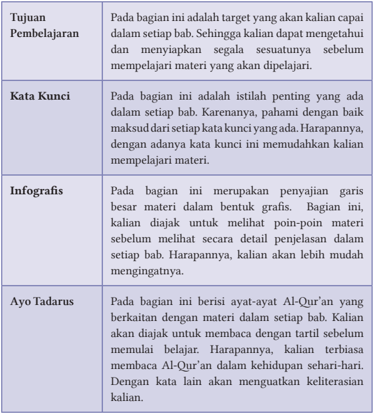

Tabel ini berisi informasi tentang tujuan pembelajaran, kata kunci, infografis, dan ayat-ayat Al-Qur'an yang berkaitan dengan setiap bab dalam buku pelajaran. Topik utama tabel adalah pembelajaran materi yang akan dipelajari. Kolom-kolomnya mencakup tujuan pembelajaran, kata kunci, infografis, dan ayat-ayat Al-Qur'an. Data penting yang terlihat adalah bahwa tujuan pembelajaran adalah untuk mencapai target yang ditetapkan, kata kunci penting untuk memahami materi, infografis membantu memahami materi secara visual, dan ayat-ayat Al-Qur'an yang relevan untuk memperkuat pemahaman.

ini,

 

---
## 📄 Halaman 15

---
**📊 Tabel**

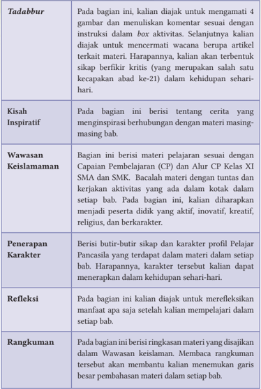

Tabel ini berisi instruksi untuk mengamati dan menulis komentar tentang 4 gambar yang diberikan dalam setiap bab dari buku pelajaran. Topik utama tabel adalah pembelajaran berbasis gambar (Tadabbur), cerita inspiratif (Kisah Inspiratif), materi pelajaran sesuai dengan Capaian Pembelajaran (CP) dan Alur CP (Wawasan Keislaman), penerapan karakter (Penerapan Karakter), refleksi (Refleksi), dan rangkuman (Rangkuman). Kolom-kolomnya mencakup bagaimana mengamati gambar, membuat komentar, dan menganalisis materi yang disajikan. Data penting yang terlihat adalah bahwa setiap bab memiliki instruksi yang berbeda untuk mengamati dan menulis komentar tentang gambar, serta bagaimana materi tersebut harus diintegrasikan ke dalam kehidupan sehari-hari.

 

---
## 📄 Halaman 16

---
**📊 Tabel**

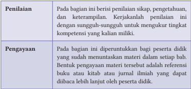

Tabel ini berisi informasi tentang proses penilaian dan pengayaan materi dalam kurikulum. Topik utamanya adalah tentang bagaimana penilaian dan pengayaan materi dilakukan. Dalam bagian penilaian, penilaian dikatakan berisi sikap, pengetahuan, dan keterampilan. Penilaian ini dilakukan dengan sungguh-sungguh untuk mengukur tingkat kompetensi individu. Sedangkan dalam bagian pengayaan, materi diperuntukkan bagi peserta didik yang sudah menuntaskan materi dalam setiap bab. Pengayaan materi tersebut adalah referensi buku atau kitab atau jurnal ilmiah yang dapat dihabiskan lebih lanjut oleh peserta didik.

Selamat belajar menggunakan buku ini. Semoga kalian menjadi pelajar yang beriman dan bertakwa kepada Allah Swt., berakhlak mulia, berilmu, menebarkan  Islam  yang rahmatan lil ālamīn ,  moderat,  kreatif,  mandiri, dan  menjadi  warga  negara  yang  cinta  kepada  Negara  Kesatuan  Republik Indonesia.

 

---
## 📄 Halaman 17

### Pedoman Transliterasi

Buku Pendidikan  Agama Islam  dan  Budi  Pekerti  Kelas  XI  ini  tidak  lepas dari penulisan transliterasi. Adapun pedoman transliterasinya berdasarkan atas  Keputusan  Bersama  Menteri  Agama  dan  Menteri  Pendidikan  dan Kebudayaan Republik Indonesia No. 158 Tahun 1987 dan No. 0543 b/u/1987 sebagai berikut.

### 1. Penulisan Huruf (Konsonan)

---
**📊 Tabel**

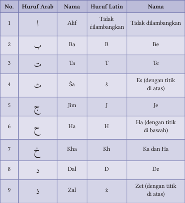

Tabel ini berisi informasi tentang huruf Arab dan huruf Latin yang digunakan dalam bahasa Arab. Topik utamanya adalah perbandingan huruf Arab dengan huruf Latin, termasuk huruf yang tidak dilambangkan, huruf yang memiliki titik di atas, dan huruf yang memiliki titik di bawah. Kolom-kolomnya meliputi nomor urut, huruf Arab, nama huruf Arab, huruf Latin, dan nama huruf Latin. Data penting yang terlihat adalah bahwa beberapa huruf Arab memiliki variasi huruf Latin yang sama, seperti huruf 'A' yang diterjemahkan menjadi huruf 'A', 'B', 'C', 'D', 'E', 'F', 'G', 'H', 'I', 'J', 'K', 'L', 'M', 'N', 'O', 'P', 'Q', 'R', 'S', 'T', 'U', 'V', 'W', 'X', 'Y', 'Z'.

 

---
## 📄 Halaman 18

ر

---
**📊 Tabel**

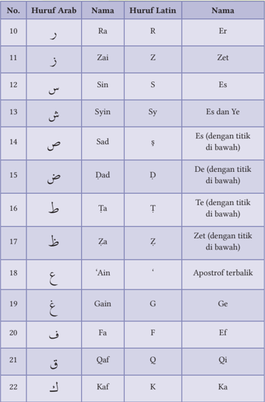

Tabel ini berisi informasi tentang huruf-huruf Arab, huruf Latin yang sesuai dengan huruf Arab, dan nama-nama huruf tersebut dalam bahasa Indonesia. Topik utama tabel adalah sistem penulisan huruf Arab ke huruf Latin dan sebaliknya. Kolom-kolom yang ada meliputi nomor urut, huruf Arab, huruf Latin, dan nama huruf dalam bahasa Indonesia. Data penting yang terlihat adalah bahwa beberapa huruf Arab memiliki lebih dari satu huruf Latin yang sesuai, seperti 'S' untuk huruf Sin dan 'Z' untuk huruf Zai. Selain itu, beberapa huruf Arab memiliki dua nama dalam bahasa Indonesia, seperti 'Syin' yang juga dikenal sebagai 'Es dan Ye'.

 

---
## 📄 Halaman 19

---
**📊 Tabel**

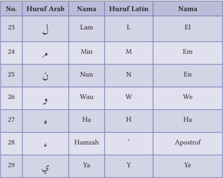

Tabel ini berisi informasi tentang huruf-huruf Arab dan huruf Latin yang sering digunakan dalam bahasa Arab. Topik utama tabel adalah hubungan antara huruf Arab dengan huruf Latin. Tabel memiliki tiga kolom: Huruf Arab, Nama, dan Huruf Latin. Data dalam tabel menunjukkan bahwa beberapa huruf Arab memiliki nama yang sama dengan huruf Latin, seperti 'L' (Lam) yang berarti 'El', 'M' (Min) yang berarti 'Em', dan 'N' (Nun) yang berarti 'En'. Selain itu, tabel juga mencakup huruf-huruf khusus seperti 'W' (Wau), 'H' (Ha), dan 'Y' (Ya), yang memiliki nama yang unik dalam bahasa Arab, yaitu 'We', 'Ha', dan 'Ye'. Ini menunjukkan bahwa huruf-huruf khusus dalam bahasa Arab memiliki nama yang unik dan tidak langsung berarti dengan huruf Latin yang sama.

### 2. Vokal Pendek

---
**📊 Tabel**

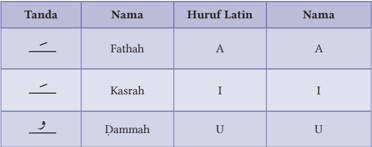

Tabel ini menunjukkan informasi tentang tanda-tanda Arab, huruf Latin yang mewakili mereka, dan nama-nama yang diberikan untuk setiap tanda. Topik utama tabel adalah penjelasan tentang tanda-tanda Arab dan huruf Latin yang mereka representasikan. Kolom-kolomnya meliputi "Tanda", "Nama", "Huruf Latin", dan "Nama". Data penting yang terlihat adalah bahwa tanda Fathahah diberi huruf Latin A dan nama A, kasrah diberi huruf Latin I dan nama I, serta dammah diberi huruf Latin U dan nama U. Ini menunjukkan hubungan antara tanda-tanda Arab, huruf Latin, dan nama-nama yang digunakan dalam bahasa Arab.

Contoh:

: maliki

: lirabbika

: min syarri

ِ

ل ِك م

َ

َ

ّ

َ

ِ ك ب ِ ر ل

َ

ْ

ر ّ ش م ِ ن

ِ

 

---
## 📄 Halaman 20

### 3. Vokal Panjang

ْ

---
**📊 Tabel**

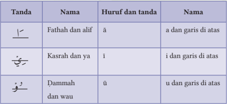

Tabel ini berisi informasi tentang tanda-tanda dalam bahasa Arab, termasuk fathah dan alif, kasrah dan ya', serta dammah dan wau'. Kolom pertama menunjukkan nama tanda-tanda tersebut, sedangkan kolom kedua memberikan penjelasan singkat tentang apa itu tanda tersebut. Kolom ketiga menyajikan huruf dan tanda yang digunakan untuk menulis tanda tersebut, sementara kolom keempat memberikan penjelasan lebih lanjut tentang tanda tersebut. Topik utama tabel ini adalah penjelasan tentang tanda-tanda dalam bahasa Arab, dengan fokus pada tiga tanda utama: fathah dan alif, kasrah dan ya', serta dammah dan wau'. Data penting yang terlihat adalah bahwa setiap tanda memiliki huruf dan tanda tertentu yang digunakan untuk menulisnya, serta penjelasan singkat tentang apa itu tanda tersebut.

waswāsi

: nasta'īnu

: sudūri

Contoh: َ اس و َ س و :

ِ

ْ

### 4. Diftong

ْ

ي ْ

Contoh: م ْ ه ي ل ع :

ِ

َ

َ

' alaihim

yaumiddīn

ُ

ْ ن ي ع ِ ت س ْ ن

َ

ْ

ّ

ْ

َ

ن ي م ِ  الد و ي :

ِ

َ

ْ

ُ

ر و د ص ُ

ِ

 

---
## 📄 Halaman 21

KEMENTERIAN PENDIDIKAN, KEBUDAYAAN, RISET, DAN TEKNOLOGI REPUBLIK INDONESIA 2021

Pendidikan Agama Islam dan Budi Pekerti untuk SMA/SMK Kelas XI

Penulis:

Abd. Rahman dan Hery Nugroho

ISBN:

978-602-244-684-2

### Bab 1

### Membiasakan Berpikir Kritis dan Semangat Mencintai Iptek

---
**🖼️ Gambar/Diagram**

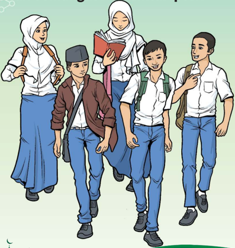

> **Deskripsi Visual:** Gambar ini adalah ilustrasi yang menampilkan empat orang siswa sedang berjalan menuju sekolah. Mereka semua mengenakan pakaian sekolah yang berbeda, termasuk seragam putih dengan celana biru dan hijab. Siswa pertama memegang sebuah buku, sementara siswi kedua sedang membawa tas ransel. Siswa ketiga dan keempat tampak lebih aktif, dengan posisi tubuh yang lebih terbuka dan bahasa tubuh yang lebih positif.

Elemen-elemen utama dalam gambar ini adalah empat siswa, pakaian mereka, dan peralatan sekolah mereka. Relasi antara elemen-elemen ini adalah bahwa semua siswa sedang berada dalam situasi yang sama, yaitu perjalanan menuju sekolah. Siswa-siswa tersebut juga memiliki peralatan sekolah yang berbeda, seperti buku, tas ransel, dan tas tangan.

Teks, angka, atau label penting tidak ada dalam gambar ini. Namun, informasi kunci yang dapat diambil pembaca adalah bahwa gambar ini mungkin digunakan untuk menggambarkan tema tentang perjalanan ke sekolah atau kegiatan belajar di sekolah.

 

---
## 📄 Halaman 22

### Tujuan Pembelajaran

Setelah mempelajari materi ini, kalian dapat:

- Membaca dengan tartil  Q.S.  Ali  'Imrān/3:  190-191  dan QS. ar-Rahmān/55: 33,  serta  Hadis  tentang  berpikir  kritis  dan  semangat  mencintai  ilmu pengetahuan dan teknologi (iptek).
- Menghafalkan dengan fasih  dan  lancar  Q.S.  Ali  'Imrān/3:  190-191  dan QS. ar-Rahmān/55: 33, serta Hadis tentang berpikir kritis dan semangat mencintai ilmu pengetahuan dan teknologi.
- Mempresentasikan  tentang  Q.S.  Ali  'Imrān/3:  190-191  dan  Q.S.  arRahmān/55:  33,  serta Hadis  tentang  berpikir  kritis  dan  semangat mencintai ilmu pengetahuan dan teknologi, sehingga terbiasa membaca Al-Qur'an.
- Meyakini bahwa berpikir kritis dan semangat mencintai ilmu pengetahuan dan teknologi adalah perintah agama.
- Membiasakan  rasa  ingin  tahu,  berpikir  kritis,  kreatif,  dan  adaptif terhadap perkembangan ilmu pengetahuan dan teknologi.
- Menganalisis Q.S. Ali 'Imrān/3: 190-191 dan Q.S. ar-Rahmān/55: 33, serta Hadis tentang berpikir kritis dan semangat mencintai ilmu pengetahuan dan teknologi.

### B

### Kata Kunci

- Berpikir Kritis
- Tadarrus
- Iptek
- Tadabbur
- Membaca Tartil
- Ulil Albab
- Ilmu Tajwid
- Ayat Qauliyah
- Makharijul Huruf

 

---
## 📄 Halaman 23

### MEMBIASAKAN BERPIKIR KRITIS DAN SEMANGAT MENCINTAI IPTEK

### Mengidentifikasi tajwid

Q.S. Ali 'Imrān/3: 190-191 dan Q.S. ar-Rahmān/58: 33 terkait

### Menganalisis

Q.S. Ali 'Imrān/3: 190-191 dan Q.S. ar- Rahmān/58: 33, serta Hadis terkait

### Menghafal

Q.S. Ali 'Imrān/3: 190-191 dan Q.S. ar-Rahmān/58: 33

### Mempresentasikan

Q.S. Ali 'Imrān/3: 190-191 Q.S. ar-Rahmān/58: 33, serta Hadis

### Membiasakan nilai-nilai yang terkandung

Q.S. Ali 'Imrān/3: 190-191 dan Q.S. ar-Rahmān/58: 33, serta Hadis dalam kehidupan sehari-hari

---
**🖼️ Gambar/Diagram**

> **Deskripsi Visual:** Gambar ini adalah ilustrasi yang menunjukkan seorang wanita sedang membaca buku. Ilustrasi ini menggambarkan tindakan belajar dan pengetahuan. 

1. Apa yang ditampilkan secara keseluruhan: Gambar ini menampilkan seorang wanita yang sedang duduk dan membaca buku. Ia tampak tenang dan fokus pada buku tersebut.

2. Elemen-elemen utama dan relasinya: Elemen utama dalam gambar ini adalah wanita, buku, dan lingkungan sekitarnya. Wanita adalah subjek utama yang memegang buku. Lingkungan sekitarnya tampak tenang dan tidak bergerak, menunjukkan suasana yang tenang dan fokus.

3. Teks, angka, atau label penting yang terlihat: Dalam gambar ini, tidak ada teks, angka, atau label yang jelas. Namun, elemen-elemen seperti wanita, buku, dan lingkungan sekitarnya sangat penting untuk memahami konteks gambar.

4. Informasi kunci yang dapat diambil pembaca: Gambar ini menggambarkan konsep belajar dan pengetahuan. Wanita sedang membaca buku, yang menunjukkan bahwa ia sedang belajar atau mempelajari sesuatu. Lingkungan sekitarnya yang tenang menunjukkan bahwa ia fokus pada tugas belajar tersebut.

Dengan demikian, gambar ini menggambarkan konsep belajar dan pengetahuan melalui tindakan membaca buku oleh seorang wanita.

### Membaca dengan tartil

Q.S. ar-Rahmān/58: 33, serta Hadis terkait

Q.S. Ali 'Imrān/3: 190-191 dan

---
**🖼️ Gambar/Diagram**

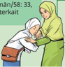

> **Deskripsi Visual:** Gambar ini adalah ilustrasi yang menunjukkan seorang ibu dan anak berbicara dengan bahasa Arab. Ibu sedang mengenakan jubah hijau dan memegang tangan anak kecil yang juga berbusana hijau. Anak kecil tampak sangat serius dan menunjukkan empati. Gambar ini mungkin digunakan untuk membantu pembaca memahami hubungan antara orang tua dan anak dalam konteks budaya Arab.

Elemen-elemen utama dalam gambar ini meliputi:
1. Orang tua (ibu) dan anak.
2. Bahasa Arab yang digunakan dalam percakapan.
3. Kebiasaan dan gaya pakaian yang umum dikenakan oleh orang tua dan anak di negara-negara Arab.

Teks, angka, atau label penting yang terlihat dalam gambar ini tidak ada, karena gambar hanya menggambarkan adegan tanpa teks atau angka yang spesifik.

Informasi kunci yang dapat diambil pembaca dari gambar ini adalah bahwa hubungan antara orang tua dan anak dalam konteks budaya Arab seringkali dipengaruhi oleh bahasa dan perilaku sosial yang khas. Gambar ini mungkin digunakan untuk membantu pembaca memahami bagaimana orang tua dan anak berkomunikasi dan berinteraksi dalam lingkungan mereka.

D

### Tadabbur

### Aktivitas 1.2

### Aktivitas Peserta Didik:

Amati gambar atau ilustrasi berikut ini! Lalu berilah tanggapan kalian yang dikaitkan dengan materi ajar yang dipelajari, yakni: Menelaah Q.S. Ali 'Imrān/3: 190-191 dan Q.S. ar-Rahmān/55: 33 tentang berpikir kritis dan semangat mencintai iptek!

 

---
## 📄 Halaman 24

---
**🖼️ Gambar/Diagram**

> **Deskripsi Visual:** Gambar ini adalah ilustrasi yang menampilkan pemandangan alam. Gambar ini menunjukkan sebuah hutan dengan pohon-pohon besar yang tumbuh di sepanjang tepi sebuah sungai. Di belakang hutan, terlihat gunung dengan puncak tertinggi yang tampak seperti sebuah bintang. Langit cerah dengan beberapa awan kecil berada di atas gunung. Sungai ini tampak jernih dan tenang, dengan air yang jernih dan hijau. Pemandangan ini menunjukkan keindahan alam yang tenang dan damai.

E

### Kisah Inspiratif

### Aktivitas 1.3

Aktivitas Peserta Didik:

Pahami dan renungkan artikel berikut ini, sebagai bagian dari pemahaman dari materi ajar yang akan dipelajari!

---
**🖼️ Gambar/Diagram**

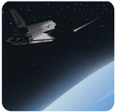

> **Deskripsi Visual:** Gambar ini adalah ilustrasi yang menunjukkan pesawat ruang angkasa (space shuttle) sedang menjalani misi luar angkasa. Pesawat ruang angkasa tersebut tampak seperti sebuah kapal angkasa besar dengan bagian depan yang ramping dan bagian belakang yang lebih lebar. Pesawat tersebut tampaknya sedang bergerak melintasi permukaan bumi yang tampak jernih dan biru, menunjukkan bahwa ia berada di luar atmosfer bumi.

Elemen utama dalam gambar ini adalah pesawat ruang angkasa dan permukaan bumi. Pesawat ruang angkasa tampak sebagai objek utama yang dilihat dari dekat, sementara permukaan bumi tampak sebagai latar belakang yang menunjukkan bahwa pesawat tersebut berada di luar angkasa. Relasi antara kedua elemen ini adalah bahwa pesawat ruang angkasa bergerak melintasi permukaan bumi, menunjukkan bahwa ia sedang melakukan misi luar angkasa.

Teks, angka, atau label penting tidak terlihat dalam gambar ini. Namun, informasi kunci yang dapat diambil pembaca adalah bahwa pesawat ruang angkasa tersebut sedang melakukan misi luar angkasa, menunjukkan bahwa ia berada di luar atmosfer bumi dan telah berhasil mencapai orbit.

yang terlibat?

 

---
## 📄 Halaman 25

ْ

### Bijak Terhadap Informasi Rasulullah Saw. bersabda: ء ِ م َ ر ال ى ب ف : ك م َّ ل َ س ه ِ  و ي ل ع ى الل َّ ل ِ ص الل ْ ل و َ س ر ال : ق ال ق ة ْ ر ي ر َ ِ ي ه ب أ ن ْ ع (رواه مسلم) م ِ ع ا س م ل ِ ك ب ِث د ح ي ن ا أ ب ذ ِ ك

ْ

ِ

َ

َ

َ

َ

ْ

َ

َ

ُ

ّٰ

َ

ّٰ

ُ

ُ

َ

َ

َ

َ

َ

َ

ُ

َ

َ

َ

َ

َ

ِ

ّ

ُ

َ

ّ

َ

ُ

ْ

َ

ً

َ

Artinya: Diriwayatkan  dari  Abu  Hurairah  ia  berkata  Rasulullah  Saw. Bersabda: 'Cukuplah seseorang disebut pendusta orang yang mengatakan (membicarakan) semua yang ia dengar' (HR. Muslim).

### Penjelasan:

Jika seseorang mendapatkan  berita, lalu diungkapkan  seluruh informasinya  tanpa  landasan  syariah  yang  benar,  maka  Rasulullah Saw.  menyebutnya  sebagai  pendusta.  Hal  ini,  karena  siapa  saja  yang mendengar berita, tanpa adanya seleksi, maka sama saja berdusta.

ُ

Hadis ini, memberi pelajaran penting, agar membiasakan menyaring informasi.  Jika  mempunyai    berita  dan  ilmu,  semestinya  disampaikan kepada pihak lain, namun harus tetap mengikuti prinsip-prinsip yang sudah digariskan oleh Allah Swt. Dalam Q.S. az-Zumar/39: 18 Allah berfirman: الل م ىه د ه ن ي ذ ِ َّ ال ى ِٕك ول ۗ ا ه ن ح ْ س ا ْ ن و ب ِ ع َّ ت ي ف ْ ل و ق ال ْ ن و م ِ ع ت س ْ ي ن ي ذ ِ َّ ﴿ ال ) 18 : 39/ ( الز مر ﴾ َ اب ب ل ا وا ال ول ا م ه ى ِٕك ول ا و

ّٰ

ُ

ُ

ٰ

َ

َ

ْ

َ

ٰۤ

ُ

ٗ

َ

َ

َ

َ

ُ

َ

َ

َ

َ

ْ

َ

ُ

َ

َ

َ

ْ

ِ

ْ

َ

ْ

ُ

ُ

ْ

ُ

َ

ٰۤ

ُ

َ

Artinya: (yaitu)  mereka  yang  mendengarkan  perkataan,  lalu  mengikuti apa yang paling baik di antaranya. Mereka itulah orang-orang yang telah diberi petunjuk oleh Allah dan mereka itulah orang-orang yang mempunyai akal sehat (Q.S. az-Zumar/39: 18)

Ayat ini mengandung penjelaskan, yakni: (1) Ciri ulil  albab ,  yaitu orang yang gemar mengumpulkan beragam informasi, tetapi berusaha memilah dan memilihnya yang terbaik dan paling membawa maslahat/

 

---
## 📄 Halaman 26

kebaikan. (2) Berisi informasi tentang ketuhanan, ajaran akhlak-moral, prinsip hidup dari berbagai sumber. (3) Selalu melakukan tabayyun atau konfirmasi.

َ

Tabayyun itu sangat penting, karena segala sesuatu yang diucapkan, dengar,  dan  disampaikan,  harus  dipertanggungjawabkan  di  sisi  Allah Swt.  Hal  ini  sejalan  dengan  Q.S.  al-Isrā'/17:  36. ى ِٕك ول ا ل ك اد ؤ ف ال و ر َ َ ص ب ال و م ْ ع َّ الس َّ ۗا ِ ن م ِ ل ه ٖ  ع ب ك َ ل ْ س ي ا  ل م ْ ف ق ا  ت ل ﴿  و ) 36 : 17/ ء ( الاسر ا ا ﴾ ل ـ ُٔ و َ س م ه ن ع ان ك

ٰۤ

َ

َ

َ

َ

َ

َ

ٌ

ِ

َ

َ

َ

َ

ۤ

ً

ْ

ْ

ُ

ْ

َ

َ

َ

Artinya: Dan janganlah kamu mengikuti sesuatu yang tidak kamu ketahui. Karena pendengaran, penglihatan dan hati nurani, semua itu akan diminta pertanggungjawabannya (Q.S. al-Isrā'/17: 36)

Bukan hanya itu, tabayyun juga dapat menjauhkan dari prasangka buruk,  fitnah  dan ghibah .  Sebagai  makhluk  sosial,  manusia  banyak melakukan  interaksi.  Menjadi  sangat  indah,  jika  interkasi  tersebut, yang  diserap  hanya  informasi  secara  baik.  Ini  penting  sekali,  karena saat ini arus informasi yang masuk semakin deras. Jangan ditelan bulatbulat seluruh informasi yang diterima, tetapi harus ada proses seleksi, karena informasi menjadi sarana paling efektif memengaruhi pola pikir seseorang.

Pola pikir inilah yang membentuk tingkah laku. Jika informasi yang diserapnya tidak baik, maka besar kemungkinan perilaku yang muncul akan buruk. Sebaliknya, bila informasi yang diserapnya  sarat dengan kebaikan, maka sikap dan perilaku orang tersebut akan baik. Sebab itu, patut  sekali  bila  di  tengah  derasnya  informasi,  kita  memohon  kepada Allah Swt. agar diberi kemampuan untuk tetap konsisten dalam kebaikan, agar keimanan terjaga dari segala distorsi .

Disadur dari sumber: Republika Online/Bunga Rampai Taushiyah 3

ُ

ُّ

ُ

ُ

ْ

ْ

ْ

َ

َ

ُ

َ

 

---
## 📄 Halaman 27

َ

### Aktivitas 1.4

Aktivitas Peserta Didik:

Bentuk  kelas kalian menjadi 3 kelompok.  Lalu, setiap  kelompok mendapatkan  sub-materi  dari  materi  ajar  yang  akan  dipelajari:  (1) membaca secara tartil (sesuai ilmu tajwid dan makharijul huruf ) Q.S. Ali 'Imrān/3: 190-191 dan Hadis yang terkait; (2) menganalisis isi kandungan Q.S.  Ali  Imrān/3:  190-191  dan Hadis yangterkait; (3) Menghafalkan dengan fasih  dan  lancar  Q.S.  Ali  Imrān/3:  190-191.  Hasilnya  dipresentasikan  oleh masing-masing kelompok!

### 1. Telaah Q.S. Ali Imrān/3: 190-191 tentang Berpikir Kritis

- Tilawah Q.S. Ali 'Imrān/3: 190-191

### Aktivitas 1.5

Aktivitas Peserta Didik:

Mari  membaca  dengan fasih dan benar Q.S. Ali 'Imrān/3: 190-191 berikut ini. Sesuaikan bacannya dengan menggunakan Ilmu Tajwid dan Makharijul huruf! َّ َّ َّ َّ

ِ

َ

ى ول ِ ا ل ٰ ت ي ا ل ار ه الن و ْ ل ي ال اف ت ِ ل اخ و ر ْ ض ا ال و ٰ ت م ٰ و الس ق ِ ل ْ  خ ِ ي ف ﴿ ا ِ ن ْ ن ر ُ و َّ ك ف ت ي و م ِ ه ب و ن ى ج ل ع َّ ا و د و ع ق َّ ا و ام ق ِ ي الل ْ ن ر ُ و ك َ ذ ي ن ي ذ ِ َّ ۙ  ١٩٠ ال َ اب ب ل ا ال ا ق ِ ن ف َ ك ن ْ ح ب اۚ  س اط ِ ل ا  ب ذ ه ْ ت ق ل ا خ ا م ن َّ ب ۚ  ر ر ْ ض ا ال و ٰ ت م ٰ و َّ الس ق ِ ل ْ  خ ِ ي ف ) 190 -191 : 3/ (ا ٰل عمر ان ١٩١ ﴾ ار َّ الن اب ذ ع

ِ

ُ

ّ

ٍ

ٰ

َ

ِ

َ

َ

َ

َ

َ

ْ

ِ

ْ

َ

َ

َ

ٰ

ُ

ً

َ

َ

ِ

ْ

َ

ِ

َ

ِ

َ

ً

ْ

ُ

ُ

ً

َ

َ

ّٰ

َ

ُ

ْ

َ

ْ

ِ

ْ

َ

ْ

ٰ

َ

َ

َ

َ

َ

َ

ِ

َ

ْ

َ

ِ

ْ

َ

ُ

َ

ُ

َ

ِ

ٰ

َ

َ

َ

َ

ْ

ْ

 

---
## 📄 Halaman 28

### b. Mengidentifikasi Tajwid

### Aktivitas 1.6

Aktivitas Peserta Didik:

Mari perhatikan dengan cermat teks Q.S. Ali 'Imrān/3: 190-191. Buatlah kajian dari  aspek  ilmu  tajwidnya.  Berikut  ini  ada  beberapa  contoh,  selanjutnya kembangkan untuk kalimat atau lafal yang lain dari ayat tersebut!

ّ

ِ

ِ

َ

َ

َ

---
**📊 Tabel**

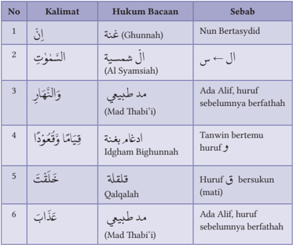

Tabel ini berisi informasi tentang kalimat-kalimat dalam bahasa Arab yang memiliki hukum bacaan tertentu. Topik utamanya adalah penjelasan tentang hukum bacaan dalam Al-Qur'an, termasuk hukum bacaan Ghunnah, Al-Syamsiah, Mad Thabibi'i, Idgah Bighunnah, Qalqalah, dan Mad Thabibi'i. Kolom-kolomnya meliputi nomor urut, kalimat, hukum bacaannya, dan sebabnya. Data penting yang terlihat adalah bahwa hukum bacaan Ghunnah disebabkan oleh Nun Bertasydidid, hukum bacaan Al-Syamsiah disebabkan oleh Alif, hukum bacaan Mad Thabibi'i disebabkan oleh Alif, hukum bacaan Idgah Bighunnah disebabkan oleh Tanwin bertemu huruf, hukum bacaan Qalqalah disebabkan oleh Huruf berkisar (mati), dan hukum bacaan Mad Thabibi'i disebabkan oleh Alif, huruf sebelumnya berfathah.

َ

َ

َ

ً

ْ

ُ

ُ

ً

َ

َ

َ

### c. Mengartikan Perkata

### Aktivitas 1.7

Aktivitas Peserta Didik:

Coba cermati teks Q.S. Ali 'Imrān/3: 190-191. kata per kata. Maknai dari kata atau lafal dari ayat tersebut yang belum ada artinya!

ْ

 

---
## 📄 Halaman 29

ْ

---
**📊 Tabel**

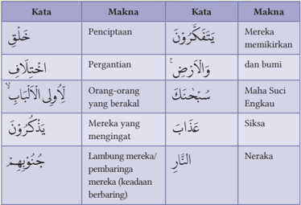

Tabel ini berisi makna dari beberapa kata dalam bahasa Arab, disajikan dalam format tabel dengan dua kolom: "Kata" dan "Makna". Topik utama tabel ini adalah penjelasan makna dari berbagai kata dalam bahasa Arab. Kolom pertama ("Kata") menyajikan kata-kata yang diberikan dalam bahasa Arab, sementara kolom kedua ("Makna") memberikan penjelasan maknanya. Data penting yang terlihat dalam tabel ini meliputi:

1. Kata "خَلِقُ" memiliki makna "Penciptaan".
2. Kata "يَتَّبَعُونَ" memiliki makna "Mereka memikitikan".
3. Kata "وَالْأَرْضُ" memiliki makna "dan bumi".
4. Kata "اَلْأَنْبَائِ" memiliki makna "Orang-orang yang berakal".
5. Kata "سَيَحْكُمُ" memiliki makna "Siksa".
6. Kata "يَتَّبَعُونَ" memiliki makna "Mereka yang meninggat".
7. Kata "نَجْوُوْهُنَ" memiliki makna "Neraka".

Tabel ini membantu pembaca untuk memahami arti dari kata-kata dalam bahasa Arab dengan cara yang sistematis dan mudah dipahami.

َ

ُ

ْ

ل

ِ

خ

ْ

ُ

### d. Menerjemahkan Ayat

Sesungguhnya dalam penciptaan langit dan bumi, dan pergantian malam dan siang terdapat tanda-tanda (kebesaran Allah) bagi orang yang berakal (Q.S. Ali 'Imrān/3: 190).

(yaitu) orang-orang yang mengingat Allah sambil berdiri, duduk atau dalam keadaan  berbaring,  dan  mereka  memikirkan  tentang  penciptaan  langit dan  bumi  (seraya  berkata),  'Ya  Tuhan  kami,  tidaklah  Engkau  menciptakan semua  ini  sia-sia;  Mahasuci  Engkau,  lindungilah  kami  dari  azab  neraka. (Q.S. Ali 'Imrān/3: 191).

### e. Asbabun Nuzul

Diriwayatkan dari Aisyah Ra. bahwa Rasulullah Saw. bersabda: 'Ya Aisyah, saya malam ini ingin beribadah kepada Allah.' Dijawab oleh Aisyah, 'Sungguh saya senang berada di sampingmu, saya tidak keberatan. Maka bangunlah Rasulullah,  mengambil  air  wudhu,  lalu  shalat  yang  lama  sekali.  Beliau menangis  sampai  membasahi  pakaiannya,  disebabkan  sangat  dalamnya merenungkan isi kandungan Al-Qur'an yang dibaca. Hal itu dilakukan berkali-kali,  sampai  menjelang  adzan  shubuh,  dan  saat  Bilal  hadir,  masih melihat kondisi Nabi yang menangis. Lalu Bilal bertanya, 'Ya Rasulullah,

ِ

ِ

ْ

َ

َ

ْ

َ

ْ

ْ

ِ

ُ

ّ

َ

ْ ن

ر ُ و

َ

ِ

َ

َ

ِ

ٰ

َّ

ك

َ

َ

ْ

َ

ف

َ

َ

ت

َ

ي

 

---
## 📄 Halaman 30

kenapa  Anda  masih  menangis.  Bukankah  Allah  Swt.  sudah  mengampuni semua dosa engkau, baik terdahulu maupun yang akan datang,' lalu dijawab oleh Nabi: 'Tidak pantaskah saya ini menjadi hamba Allah yang bersyukur, apalagi di malam ini Allah menurunkan ayat yang alangkah ruginya, jika dibaca ayat ini, namun tidak dihayati makna dan isi kandungannya.' Ayatayat tersebut adalah termasuk Q.S. Ali 'Imrān/3: 190-191.

### f. Isi dan Kandungan Ayat

Memahami ayat Al-Qur'an, tidak cukup hanya berdasar terjemah saja, tetapi harus berlandaskan kepada buku tafsir yang mu'tabar (otoritatif). Berikut ini, kandungan isi Q.S. Ali Imrān/3: 190-191:

- Begitu banyak tanda-tanda kebesaran Allah Swt. yang dibentangkan di langit dan bumi, termasuk pada diri manusia, semua itu harus dijadikan sebagai sarana  berpikir bagi umat manusia, khususnya orang beriman, agar  dapat  mengambil  manfaat,  faedah,  dan  hikmah  dari  keberadaan alam semesta.
- Penciptaan alam semesta, meliputi silih bergantinya siang dan malam, pusaran  angin,  keteraturan  lintasan  benda-benda  langit,  dan  bumi dengan segala isinya, semua itu jangan hanya dijadikan sebagai peristiwa biasa,  tanpa  hikmah  dan  tujuan,  tetapi  harus  dipikirkan,  diteliti,  dan dieksplorasi, sehingga keberadannya semakin terbuka dan dapat diambil sisi  positif  dan  negatifnya  melalui  akal  pikiran  serta  akal  budi  yang dimiliki oleh setiap orang;
- Semua manfaat, faedah, dan hikmah dari beragam peristiwa yang tersebar di alam semesta tersebut, hanya dapat dipahami oleh orang-orang yang memiliki akal pikiran yang sehat serta akal budi yang dikenal dengan istilah ulil albab atau ulul albab;
- Ulil Albab adalah orang yang memiliki akal pikiran yang lurus, nurani yang  bersih,  serta  menjadi  hamba  Allah  Swt.  yang  mengisi  setiap waktunya untuk memikirkan segala penciptaan dan peristiwa di alam raya ini, sehingga menghasilkan kesimpulan bahwa semua ini membawa manfaat,  tidak  ada  yang  sia-sia,  akhirnya  hidupnya  semakin  dekat (taqarrub) kepada Allah Swt.;
- Tanda lain Ulil Albab adalah mereka yang dalam kondisi apapun (duduk, berdiri, dan berbaring) yang artinya juga saat mampu, kaya, atau terpuruk,

 

---
## 📄 Halaman 31

kondisi  riang  gembira,  atau  sedih,  semua  itu  tidak  menghalangi  untuk mengambil maslahat dari segala ciptaan Allah Swt. baik untuk diri sendiri, lingkungan yang mengitarinya, maupun masyarakat secara luas;

- Ulil Albab juga melakukan pemikiran kritis, utuh, obyektif, dan seimbang terhadap segala problema yang muncul, sehingga buah pemikirannya memberi  banyak  manfaat,  jauh  dari  kebencian  dan  sengketa,  apalagi kecancuan dan kebimbangan, akhirnya  memunculkan  kedamaian, kesejukan, serta solusi terbaik bagi semuanya;
- Setiap orang beriman sangat dituntut, agar penggunaan akal pikiran dan akal  budinya,  menghasilkan  kesadaran  diri  bahwa  semua  penciptaan itu  bersumber  dari  Allah.  Selanjutnya,  mengajak  diri  dan  orang  lain, agar  semakin dekat (taqarrub) kepada Allah Swt. Melalui pendekatan tersebut,  keselamatan  dan  kesuksesan  dunia  akhirat  dapat  diraih, akhirnya terhindar dari kesengsaraan, kegagalan dan kehinaan;
- Seperti  peran  dari  ulil  albab,  Ayat  ini  mengajak  juga  agar  di  setiap komunitas dan masyarakat, bahkan dalam lingkup yang lebih luas, ada kelompok  orang  yang  berperan  sebagai  pemikir  dan  penengah  dari problema yang muncul, sehingga terhindar dari  hoax,  berita  bohong, dan informasi yang tidak benar.
َ

### 2. Telaah Hadis dan Penjelasan Lain tentang Berpikir Kritis a. Teks Hadis: : م َّ ل َ س ه ِ  و ي ل ع ى الل َّ ل ِ ص الل ْ ل و َ س ر ال : ق ال ، ق ه ن ع َ  الل ِ ي َ ض ر ر ِ ي ذ ب أ ن ع ا (رواه ابو الشيخ) و ل ِك ه ت ِ  ف الل ات ِ ِ ي ذ وا ف ر ُ َّ ك ف ا ت ل ِ  و الل ق ِ ل ِ ي خ ا ف ر ُ و َّ ك ف ت

َ

ْ

َ

َ

ُ

ّٰ

### b. Makna Kata:

ِ

---
**📊 Tabel**

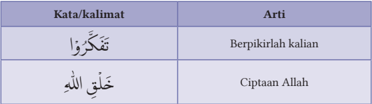

Tabel ini berisi dua baris dengan dua kolom masing-masing. Topik utama tabel adalah tentang definisi kata-kata dalam bahasa Arab. Kolom pertama berisi kata-kata atau kalimat dalam bahasa Arab, sedangkan kolom kedua berisi arti dari kata-kata tersebut. Dari tabel ini, kita dapat melihat bahwa kata "تَذْكَرُوا" memiliki arti "Berpikirlalah kalian", sementara "خَلِقَيْ اللهُ" memiliki arti "Ciptaan Allah". Pola penting yang terlihat adalah bahwa tabel ini memberikan penjelasan singkat tentang definisi kata-kata dalam konteks bahasa Arab, yang dapat membantu pembaca memahami makna dari setiap kata tersebut.

ّٰ

ا

ْ

ر ُ و

َ

ْ

ُ

َّ

ك

َ

ف

َ

ت

ْ

ّٰ

َ

َ

ُ

ّٰ

ُ

َ

َ

َ

َ

َ

ُ

َ

َ

ْ

َ

َ

َ

ُ

ّٰ

ّٰ

ْ

َ

ٍ

ّ

َ

ْ

َ

ْ

َ

َ

َ

ْ

َ

 

---
## 📄 Halaman 32

ِ

---
**📊 Tabel**

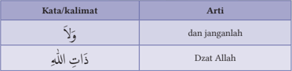

Tabel ini berisi dua baris dengan dua kolom: "Kata/kalimat" dan "Arti". Topik utama tabel adalah definisi atau arti dari beberapa kata dan kalimat dalam bahasa Arab. Dalam baris pertama, kata "وَلاً" memiliki arti "dan janganlah", sementara dalam baris kedua, "دَزَاتُ اللَّهِ" memiliki arti "Dzat Allah". Pola penting yang terlihat adalah bahwa tabel ini menyediakan penjelasan singkat tentang definisi atau arti dari beberapa istilah dalam bahasa Arab, membantu pembaca memahami konsep-konsep tersebut dengan lebih baik.

ّٰ

َ

لا

َ

و

### c. Terjemah Hadis

Artinya: Dari Abi Dzar r.a.  Nabi Saw. bersabda: 'Pikirkanlah mengenai segala sesuatu (yang diciptakan Allah), tetapi janganlah kalian memikirkan tentang Dzat Allah, karena kalian akan rusak' (H.R. Abu Syeikh).

### d. Isi Kandungan Hadis

- Isi  Hadis  ini  membimbing kepada kita agar selalu berpikir kritis atau berpikir  positif  ( positive  thinking ),  yakni  memikirkan  tentang  ciptaan Allah  Swt.  Maksudnya,  kita  digalakkan  untuk  berpikir,  meneliti  dan mengkaji segala hal yang terkait dengan makhluk ciptaan-Nya, tetapi dilarang memikirkan Dzat-Nya.
- Terlarang memikirkan Dzat Allah Swt. itu disebabkan: jika dipikir Dzat Allah, pasti akal dan segala potensi yang dimiliki manusia tidak mampu mencapainya.  Sebagaimana  Rasulullah  Saw.  menuntun  kita  dalam menggunakan akal dan kalbu yang dipikirkan hanya makhluk-Nya saja, agar tidak sesat pikir, yang akhirnya menjadi sesat jalan.
- Harus  menjadi  kesadaran  bersama,  bahwa  berilmu,  yang  awalnya dimulai dari proses berpikir, obyeknya hanya di seputar makhluk dan alam  semesta,  termasuk  dirinya  sendiri.  Jangan  sampai  melampaui kapasitas akal, yakni berpikir tentang Dzat Allah Swt.
- Berpikir itu ada batasnya, tidak sebebas-bebasnya. Ada batas yang tidak boleh dilalui dan harus berhenti, karena jika tidak, manusia sendiri yang mengalami kebingungan dan kekacauan dalam hidupnya. Ini tentu tidak dikehendaki, karena penggunaan akal pikiran dan akal budi, bermuara kepada  semakin  dekatnya  kepada  Allah  Swt.,  bukan  malah  menjauh dari-Nya.
َ

 

---
## 📄 Halaman 33

### e. Penjelasan Lebih Luas tentang Berpikir Kritis

ِ

Berpikir  menjadi  ciri  khas  manusia.  Disebabkan  kemampuan  berpikir, manusia menjadi makhluk yang dimuliakan Allah Swt. sebagaimana Q.S. al-Isrā'/17:  70    sebagai  berikut: ٰ ت ب ي َّ الط ِ ن م م ه ن ق ز ر و ر ِ َ ح ب ال و ر ب ى ال ف م ه ن ل م ح و م د ا ن ِ ي ا  ب ن َّ م ر ك د ق ل ﴿ و ) 70 : 17/ ء ( الاسر ا ا ࣖ ﴾ ْ ل ي ْ ض ف ا ت ن ق ل خ َّ ن م ر ٍ ث ِ ي ى ك ل ع م ه ن ل َّ َ ض ف و

ِ

ّ

َ

ّ

ْ

ُ

ٰ

َ

َ

َ

ْ

َ

ِ

ّ

َ

ِ

ْ

ُ

ٰ

َ

َ

َ

َ

َ

ْ

ٓ

َ

َ

ْ

ْ

َ

ۤ

ً

ِ

َ

َ

ْ

َ

َ

ْ

ِ

ّ

ْ

َ

ٰ

َ

ْ

ُ

ٰ

ْ

َ

Artinya: Dan sungguh, Kami telah memuliakan anak cucu Adam, dan Kami angkut mereka di darat dan di laut, dan Kami beri mereka rezeki dari yang baik-baik  dan  Kami  lebihkan  mereka  di  atas  banyak  makhluk  yang  Kami ciptakan dengan kelebihan yang sempurna. (Q.S. al-Isrā'/17: 70)

Peran  sebagai khalifah ,  diamanahkan kepada manusia, karena faktor berpikir juga. Karena, kemampuan berpikirlah, akan  diserap,  didapat  dan  ditemukan  ilmu pengetahuan dan teknologi. Al-Qur'an Surat Al-Baqarah/2: 30 menggambarkan dialog  antara  Malaikat,  Adam,  dan  Allah Swt.  tentang  terpilihnya  manusia  menjadi khalifah di muka bumi, dikarenakan unggulnya ilmu yang dimiliki Adam.

Menarik untuk merenungkan dialog  tersebut  bahwa  segala  seuatu  itu sebelum diputuskan, harus ada dialog dan musyawarah terlebih dahulu. Lalu diputuskan  mana  argumen  dan  pemikiran

---
**🖼️ Gambar/Diagram**

> **Deskripsi Visual:** Gambar ini adalah ilustrasi yang menunjukkan kelompok orang sedang berbicara di sekeliling meja. Ilustrasi ini menunjukkan tiga orang yang duduk di kursi di sebelah kanan dan dua orang yang berdiri di sebelah kiri. Mereka semua menghadap ke arah meja, menunjukkan bahwa mereka sedang berbicara atau mendengarkan sesuatu. Ilustrasi ini menunjukkan hubungan sosial dan komunikasi antar individu dalam situasi yang serius atau penting.

yang paling matang dan unggul untuk dipakai sebagai sebuah keputusan. Itu artinya Islam sangat menekankan  adanya  berpikir  kritis,  silakan menyodorkan argumen yang sahih, dan proses dialog yang bijak, sehingga hasilnya membawa kebaikan untuk semua. الفكر

Berpikir  terambil  dari  bahasa  Arab,  yakni ,  berarti  kekuatan yang menembus suatu obyek, sehingga menghasilkan pengetahuan. Jika

ْ

ْ

ْ

ْ

ٰ

َ

َ

َ

 

---
## 📄 Halaman 34

ّ

pengetahuan itu didukung bukti-bukti kuat, dinamakan علم / ' ilm (Q.S. atTakātsur/102: 3-5). Jika buktinya belum meyakinkan, namun kebenarannya lebih dominan, disebut ظن ّ ( dhann /dugaan)/Q.S. al-Hujurāt/49: 12. Selanjutnya, jika kemungkinan benar dan salahnya seimbang disebut شك ( syakk /keraguan). Sementara jika tidak didukung bukti, atau bukti tersebut lemah, sehingga kemungkinan salahnya lebih besar disebut وهم (wahm).

Banyak ditemukan ayat Al-Qur'an yang berbicara tentang pengetahuan yang bersumber pada akal pikiran atau rasio. Perintah untuk menggunakan akal  dengan  berbagai  macam  bentuk  kalimat  dan  ungkapan  merupakan suatu indikasi yang jelas untuk hal ini. Tetapi, tidak sedikit paparan ayatayat yang mengungkap tentang pengetahuan yang bersumber pada intuisi (hati atau perasaan) terdalam

Menata  ulang  cara  berpikir,  mendayagunakan  akal,  dan  menimbangnimbang  sebuah  problematika  untuk  mencari  solusi  dan  menemukan kebenaran, menjadi hal yang niscaya. Itulah sebabnya, Islam menekankan agar akal pikiran harus dijaga betul, jangan sampai diperlemah, baik berasal dari  faktor  internal  maupun  eksternal,  misalnya  tidak  mendayagunakan, karena faktor kemalasan; minim ikhtiar , apalagi mengkonsumsi minuman keras, narkoba atau zat adiktif lainnya.

### 3. Telaah Q.S. ar-Rahmān/55: 33 tentang Mencintai Iptek

### Aktivitas 1.8

### Aktivitas Peserta Didik:

Pahami dan renungkan artikel berikut ini, sebagai bagian dari pemahaman dari materi ajar yang akan dipelajari!

### Ilmu dan Amal

Harus  dipahami,  bahwa  ilmu  itu  yang  pertama,  setelah  itu  baru  amal.  Dokter  harus berilmu dulu, sebelum praktik mengobati pasien. Ilmu yang benar melahirkan keselamatan. Ilmu yang salah, menjadi penyebab kegagalan, kehinaan, bahkan kehancuran. Berdasarkan Q.S. al-Hajj/22: 54 Allah Swt. menjelaskan, ''Ilmu itu harus dipandu oleh iman, agar jika terjadi keraguan dan kebimbangan, segera kembali kepada sistem keimanan. Sebab, kebenaran itu jelas dan nampak nyata, sebaliknya keburukan juga nyata dan semestinya dihindari.

 

---
## 📄 Halaman 35

Itu  artinya,  ilmu  seiring  dan  sejalan  dengan  iman,  dan  dari  iman, muncul  ketundukan  hati  dan  kepasrahan.  Hal  ini,  sejalan  dengan  Q.S. Muhammad/47: 19 yang menjelaskan dengan nada perintah, ' 'fa'lam '  yang berarti ketahulilah bahwa sesungguhnya tidak ada Tuhan, melainkan Allah, dan mintalah ampun bagi dosamu dan bagi orang-orang mukmin. Perhatikan kata ' 'fa'lam' ' didahulukan atas perintah beriman dan beramal.

Imam al-Bukhari dalam Hadisnya meletakkan bab yang berjudul ' 'Bābul 'ilmi qablal qauli wal amal'' (Bab ilmu sebelum perkataan dan perbuatan). Para ulama melihat ilmu sebagai syarat sahnya perkataan dan perbuatan. Banyak sekali orang ikhlas, tetapi karena kurangnya ilmu, mereka sering menganggap yang salah jadi benar, dan yang benar jadi salah, atau yang sunnah jadi bid'ah dan yang bid'ah jadi sunnah.

Anehnya,  mereka  tidak  merasa  salah,  seperti  kandungan  Q.S.  alKahfi/18: 103-104 'Katakanlah: Apakah akan Kami beritahukan kepadamu tentang  orang-orang  yang  paling  merugi  dalam  perbuatannya?  Yaitu,  orangorang  yang  telah  sia-sia  perbuatannya  dalam  kehidupan  dunia  ini,  sedangkan mereka  menyangka  bahwa  mereka  berbuat  sebaik-baiknya.'

Kita juga diingatkan oleh Q.S. Fāthir/35: 8 bahwa setan memengaruhi  orang-orang  yang  tidak  berilmu,  sehingga  ia  menganggap perbuatannya--sekalipun salah--menjadi benar, 'Maka apakah orang yang ditipu itu menganggap baik pekerjaannya yang buruk, sehingga ia meyakini bahwa pekerjaannya itu baik?'.

Sebuah doa yang selalu kita panjatkan, 'Ya Allah tunjukkan kami bahwa yang benar itu benar, dan berilah kami kekuatan untuk mengikutinya, dan tunjukkan  (juga)  bahwa  yang  batil  itu  memang  batil,  dan  berilah  kami kekuatan untuk menjauhinya'.

Berdasarkan untaian doa tersebut, kita dibimbing untuk  mendapatkan ilmu,  lalu  memohon  kekuatan  untuk  mengamalkannya.  Imam  Al-Ghazali dalam bukunya Minhājul 'Abidīn menyebutkan beberapa tangga yang harus ditempuh  menuju  Allah  Swt.,  dan  tangga  pertama  adalah  ilmu.  Khalifah Umar bin Abdul Aziz mengatakan bahwa perbuatan tanpa dibekali  ilmu, hakikatnya merusak, bukan memperbaiki.

Diadaptasi dari sumber: Republika Online/Bunga Rampai 3

mudah

 

---
## 📄 Halaman 36

### a. Tilawah Q.S. ar-Rahmān/55: 33

### Aktivitas 1.9

Aktivitas Peserta Didik:

ِ

Mari  membaca  dengan fasih  dan  benar  Q.S.  ar-Rahmān/55:  33  berikut  ini. Sesuaikan bacannya dengan menggunakan Ilmu Tajwid dan Makharijul huruf! ٰ ت م ٰ و َّ الس ار ْ ط ق ا ا م ِ ن و ذ ف ن ت ن ا م ت ع َ ط ت اس ا ِ ن س ِ ن ا ِ ال و ِ ن ج ال ر َ ْ ش م َ ع ﴿ ي ) 33 : 55/ (الر حمن ۚ  ﴾ ن ٍ ط ٰ ل ا ب ِ س َّ ا ِ ل ْ ن و ذ ف ن ا ت ۗ  ل ا و ذ ف ان ف ر ْ ض ا ال و

ِ

َ

َ

ْ

ْ

ُ

ُ

ْ

َ

### b. Mengidentifikasi Tajwid

### Aktivitas 1.10

Aktivitas Peserta Didik:

Mari perhatikan dengan cermat teks Q.S. ar-Rahmān/55: 33. Buatlah kajian dari aspek ilmu tajwidnya. Berikut ini ada beberapa contoh, selanjutnya kembangkan untuk kalimat atau lafal yang lain dari ayat tersebut!

ْ

ْ

ْ

َ

ِ

َ

ْ

َ

ُ

ْ

ْ

ُ

ُ

ُ

ُ

ْ

ْ

َ

َ

ْ

ْ

َ

َ

ْ

ْ

---
**📊 Tabel**

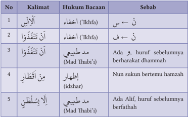

Tabel ini berisi informasi tentang hukum bacaan dalam bahasa Arab, yang disajikan dalam format tabel dengan kolom-kolom berbeda. Topik utama tabel adalah tentang cara membaca kalimat dalam bahasa Arab, termasuk hukum bacaan, sebab, dan contoh-contoh kalimat yang memerlukan perhatian khusus. Kolom-kolomnya meliputi nomor urutan (No.), kalimat yang diberikan, hukum bacaannya, dan sebab mengapa hukum tersebut berlaku. Data penting yang terlihat antara lain bahwa beberapa kalimat memerlukan hukum bacaan khusus seperti "أَنْ تَنْتَفَعُوا" (hukum bacaan "نَهْر") karena huruf sebelumnya berharakat dhammah, dan "مَدْ طَبِيعي" (hukum bacaan "مَدْ") karena ada Alif, huruf sebelumnya berfathah. Ini menunjukkan bahwa pembacaan dalam bahasa Arab memerlukan pemahaman mendalam tentang struktur huruf dan huruf-huruf yang berbeda dalam suku kata.

ْ

َ

ْ

ُ

ْ

ْ

ُ

َ

ْ

َ

ِ

ُ

ُ

ْ

َ

ْ

ْ

َ

َ

ْ

ُ

ِ

ّ

ُ

ْ

ْ

َ

َ

ِ

َ

ٰ

ْ

َ

 

---
## 📄 Halaman 37

### c. Mengartikan Perkata

### Aktivitas 1.11

Aktivitas Peserta Didik:

Coba cermati teks Q.S. ar-Rahmān/55: 33 kata per kata. Maknai dari kata atau lafal dari ayat tersebut yang belum ada artinya!

ْ

---
**📊 Tabel**

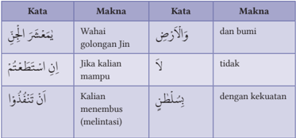

Tabel ini berisi perbandingan kata dalam bahasa Arab dengan maknanya dalam bahasa Indonesia. Topik utamanya adalah perbandingan kata-kata dalam dua bahasa tersebut. Kolom pertama berisi kata dalam bahasa Arab, sedangkan kolom kedua berisi makna dari kata tersebut dalam bahasa Indonesia. Data penting yang terlihat adalah bahwa beberapa kata memiliki makna yang sama dalam kedua bahasa, seperti "wahai" yang berarti "jalan" dalam bahasa Arab dan "dan bumi" dalam bahasa Indonesia. Sementara itu, beberapa kata memiliki makna yang berbeda, seperti "jika kalian mampu" yang berarti "jika kalian dapat" dalam bahasa Arab dan "tidak" dalam bahasa Indonesia. Tabel ini membantu memahami hubungan antara dua bahasa tersebut dan memudahkan dalam mempelajari bahasa Arab.

ُ

ْ

َ

ْ

ِ

ْ

ُ

ُ

ْ

ر َ

َ

ْ ش

ْ

َ

### d. Menerjemahkan Ayat

Artinya: Wahai golongan jin dan manusia! Jika kalian sanggup menembus (melintasi)  penjuru  langit  dan  bumi,  maka  tembuslah.  Kalian  tidak  akan mampu  menembusnya,  kecuali  dengan  kekuatan  (dari  Allah) (Q.S.  arRahmān/55:  33).

### e. Asbabun Nuzul

Tidak  ada  sebab  khusus  tentang  turunnya  ayat  ini,  tetapi  secara  umum, seperti  yang  dipaparkan  M.  Quraish  Shihab  (Pakar  Tafsir  Indonesia)  dalam karyanya berjudul Tafsir Al Mishbah, Surat ini diturunkan, karena tanggapan negatif kaum musyrik Makkah saat mereka diperintah untuk sujud kepada Allah yang ar-Rahmān.

Hal  ini  sejalan  dengan  Q.S.  al-Furqān/25:  60  yang  artinya  adalah: Dan apabila  dikatakan  kepada  mereka:  'Sujudlah  kepada  ar-Rahman,'  mereka menjawab: 'Siapakah ar-Rahman itu?' Jika riwayat ini diterima, maka semakin jelas dan tepat jika Surat ini dinamai dengan nama yang populer tersebut.

ِ

ّ

َ

ٰ

َ

ِ

َ

َ

ْ

ْ

ُ

ْ

 

---
## 📄 Halaman 38

### f. Isi dan Kandungan Ayat

Berikut ini, kandungan isi Q.S. ar-Rahmān/55: 33:

- Allah Swt. mengancam kepada jin dan manusia, bahwa kelak di akhirat mereka  tidak  bisa  mengelak  akan  pertanggung  jawaban  dari  semua nikmat yang sudah diberikan. Meskipun mereka berusaha lari ke segala penjuru langit dan bumi, Sementara langit dan bumi serta alam semesta ini dimiliki dan berada dalam kekuasaan Allah Swt. Jika tidak percaya, silakan menembus dan melintasi ke semua penjuru alam raya ini, pasti mereka tidak mampu melakukan.
- Jika saat ini muncul kelompok manusia yang mampu melintasi  beberapa  planet  di angkasa dengan kekuatan dan ilmu  yang  didapat,  itu  hanya seberapa, tidak sebanding dengan luasnya alam semesta, dan harus diingat agar menjadi kesadaran bersama, bahwa kecanggihan  ilmu  pengetahuan dan teknologi (iptek) harus semakin menumbuhkan kesadaran keimanan kepada

---
**🖼️ Gambar/Diagram**

> **Deskripsi Visual:** Gambar ini adalah ilustrasi yang menunjukkan seorang astronot berjalan di permukaan bulan. Gambar ini menggambarkan beberapa elemen utama:

1. Astronot: Astronot tersebut dikenakan seragam berwarna putih dengan topi berwarna merah, serta helm berwarna biru. Astronot tersebut sedang berjalan dengan posisi tangan di samping tubuh.

2. Bulan: Di latar belakang, terlihat permukaan bulan dengan pemandangan langit biru dan bintang-bintang.

3. Bumi: Di sebelah kiri gambar, terlihat bagian dari bumi yang tampak seperti sebuah bola besar dengan warna hijau dan biru.

4. Penanda: Di kanan atas gambar, terdapat penanda berwarna merah dengan tulisan "M" yang tampak seperti sebuah bendera.

5. Latar Belakang: Latar belakang yang gelap menunjukkan bahwa gambar ini mungkin digunakan untuk menunjukkan keadaan di luar angkasa.

Informasi kunci yang dapat diambil pembaca melalui gambar ini adalah bahwa astronot sedang melakukan eksplorasi di permukaan bulan, dengan bumi tampak jelas di latar belakangnya. Ini menunjukkan bahwa astronot tersebut sedang berada di luar angkasa dan telah mencapai permukaan bulan.

Allah  Swt.  Itu  artinya,  semakin  luas  dan  dalamnya  ilmu  yang  dimiliki, hidupnya harus semakin dekat kepada-Nya, bahwa semuanya merupakan nikmat yang pasti akan diminta pertanggung jawaban.

- Didahulukan penyebutan jin baru manusia, karena jin lebih memiliki kemampuan  menembus  luar  angkasa,  begitu  juga  perannya  di  bumi, meski  lebih  terbatas  (Q.S. Jin/72: 9).  Sebaliknya,  saat  Allah  Swt. memberi  tantangan  untuk  membuat  semisal  Al-Qur'an  (Q.S  al-Isrā':  88), penyebutan manusia lebih didahulukan dibanding jin. Hal ini disebabkan kemampuan  manusia  lebih  tinggi  dibanding  jin,  apalagi  yang  paling ingkar  menolak  Al-Qur'an  adalah  jenis  manusia.
- Sebagian  ulama  menjadikan  ayat  ini  sebagai  isyarat  ilmiah  bahwa kekuatan dan penguasaan ilmu menjadi hal yang mutlak dimiliki, jika ingin menjadi umat, golongan atau kelompok yang sukses merengkuh

 

---
## 📄 Halaman 39

- dunia, apalagi akhirat, dan Islam sangat menekankan tentang ilmu, baik ilmu dunia maupun ilmu akhirat. Seperi yang kita dapati sekarang ini, bahwa peradaban maju, pasti berbasis kepada ilmu, termasuk negaranegara maju, disebabkan kemampuan dan kemajuan di bidang ipteknya.
- Harus dipahami bahwa majunya sebuah negara (sebut saja Singapura, Korea, Jepang, termasuk beberapa negara Eropa dan Amerika) disebabkan  besarnya  investasi  pada  kualitas  manusia  (sering  disebut SDM),  termasuk  keberhasilan  menjelajahi  ruang  angkasa.  Itu  semua membutuhkan dana yang tidak sedikit, termasuk kerjasama di pelbagai disiplin  ilmu,  bahkan  antar  negara,  misalnya  ilmu  astronomi,  teknik, matematika, seni, geologi dan lain-lain.
ُ

4. Telaah Hadis dan Penjelasan lain tentang Berpikir Kritis a. Teks Hadis ى َّ ل ِ ص الل ْ ل و َ س ر ْ ت م ِ ع : س ول ق ، ي َ اص ع ال ْ ن و ب م ْ ر ع ْ ن ِ  ب الل ْ د ب ع ْ ت م ِ ع س َ َّ اس الن م ِ ن ه ز ِ ع ت ن ا ي اع ت ِ ز ان م ع ِ ل ال ب ِض ق ا ي ل الل َّ ِ ن : إ ول ق ، ي م َّ ل َ س ه ِ  و ي ل ع الل َّ اس الن ذ خ َّ ا ات ال ِ م ع ُ ك ر ت ي م ا ل ِ ذ ى إ َّ ت اء ِ  ح م ل ع ال ْ ض ب ِ ق ب م ع ِ ل ال ب ِض ق ي ك ِ ن ل و ا (رواه مسلم) و ل ض َ أ ا و و ل َ ض ف م ٍ ع ِ ل ر ِ ي ِ غ ا ب و ت ف أ وا ف ئ ِ ل س ُ ا ف ال َّ ه ا ج ُ وس ء ر

ِ

َ

َ

َ

ُ

ُ

ً

َ

ْ

َ

َ

ْ

ُّ

ً

ْ

َ

َ

ْ

### b. Makna Kata Hadis

ً

ِ

---
**📊 Tabel**

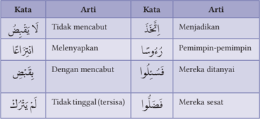

Tabel ini berisi definisi beberapa kata dalam bahasa Arab, dengan kolom "Kata" untuk menunjukkan kata dan kolom "Arti" untuk menjelaskan artinya. Topik utama tabel ini adalah pengenalan dan pemahaman dasar bahasa Arab. Dari data yang terlihat, kita dapat melihat bahwa beberapa kata memiliki arti yang sangat spesifik, seperti "لا يَبْقُضُ" yang berarti "tidak mencabut", "مَنْتَزِعَا" yang berarti "melenyapkan", dan "يَبْقُضُ" yang berarti "dengan mencabut". Selain itu, tabel juga mencakup beberapa kata yang memiliki arti umum, seperti "منْتَزِعَا" yang berarti "penimipin-pemimpin", "يَبْقُضُ" yang berarti "mereka ditanyai", dan "لمْ يَتَّركُ" yang berarti "mereka sesat". Ini menunjukkan bahwa bahasa Arab memiliki banyak kata yang memiliki arti yang kompleks dan spesifik, yang memerlukan pemahaman mendalam untuk digunakan dengan benar dalam berkomunikasi.

َ

ْ

ْ

ْ

َ

ْ

َ

َ

ُ

ْ

َ

َ

َ

َ

ِ

ْ

ْ

َّ

َ

ّٰ

َ

ُ

ُ

ْ

َ

َ

ْ

َ

َ

ْ

ُ

َ

ْ

ُ

َ

ُ

َ

ِ

ْ

َ

َ

ْ

َ

َ

َ

ُ

ّٰ

ِ

َ

َ

ُ

َ

َ

ُ

ْ

َ

ّٰ

ْ

َ

َ

َ

ُ

َ

ْ

ْ

َ

ُ

َ

َ

ْ

ُ

ّٰ

َ

َ

َ

ْ

ُّ

َ

ْ

ْ

َ

ً

ُ

ُّ

َ

ُ

َ

َ

ْ

َ

ِ

َ

ُ

َ

ً

ُ

ً

ُ

 

---
## 📄 Halaman 40

### c. Terjemah Hadis

Artinya: Diriwayatkan dari Abdullah bin Umar bin 'Ash r.a. : 'Aku mendengar Rasulullah Saw. bersabda: 'Sesungguhnya, Allah tidak mencabut ilmu dengan melenyapkannya dari dada manusia, tetapi dengan mewafatkan ulama, sehingga setelah tidak ada seorang pun ulama, mereka manusia mengangkat orang-orang bodoh menjadi pemimpin. Mereka ditanya, tetapi mereka (pemimpin-pemimpin yang bodoh itu) memberikan petunjuk tanpa ilmu, kemudian tersesatlah mereka, dan menyesatkan orang lain pula.' (HR. Muslim).

### d. Isi Kandungan Hadis

- Hadis  ini  membicarakan  pentingnya  penguasaan  ilmu  pengetahuan yang  terkumpul  dalam  diri  pada  ulama.  Menjadi  ulama  bukan  hal mudah,  seperti  terlihat  dari  kisah  para  ulama  saat  menuntut  ilmu, misalnya  Imam  al-Ghazali,  Imam  al-Bukhari,  Imam  an-Nawawi,  dan Buya Hamka setelah mencurahkan segala tenaga, pikiran, waktu dan meghadapi pelbagai cobaan dan rintangan dalam menutut ilmu. Mereka semua menjadi ulama yang produktif dalam berkarya, sehingga karyakarya mereka menginspirasi dan dapat dibaca, diteliti dan ditelusuri isi kandungannya, sehingga generasi saat ini, bahkan generasi mendatang masih dapat mengambil manfaatnya.
- Rentang sejarah para ulama dari satu generasi ke generasi selanjutnya, baik dari buah karyanya maupun kisah ( biografi) hidupnya, masih dapat diambil menjadi teladan, contoh, dan pelajaran tentang bagaimana cara mereka mencari ilmu dengan sungguh-sungguh, penuh keikhlasan dan kesabaran,  olah  batin  yang  dijalani,  sehingga  ilmu  para  ulama  dapat memberi manfaat sampai saat ini.
- Sekarang ini, kita rasakan semakin sedikit ulama akibat diwafatkan oleh Allah  Swt.  Sehingga  kita  kehilangan  ilmu  yang  dimiliki  sang  ulama, dan berpengaruh terhadap kehidupan kita. Hal ini terbukti saat ini kita semakin  susah  menemukan  teladan  yang  dapat  dicontoh,  akibatnya problematika dunia saat ini semakin banyak dan susah dicari solusinya.
- Wafatnya para ulama berpengaruh juga kepada tokoh-tokoh yang muncul di  seputar  kehidupan kita, sosoknya kelihatan lebih pintar, hebat dan meyakinkan, namun jika ditelaah secara mendalam dari sudut pandang kebenaran, tenyata menipu dan membodohi kita. Itulah pentingnya kita

 

---
## 📄 Halaman 41

- harus pandai-pandai memilih guru, sehingga ilmu yang didapat dapat membentengi kita dari jalan yang keliru dan menyesatkan.
- Coba  amati  dengan  seksama,  kehidupan  di  sekeliling  kita,  ada  tokoh masyarakat,  bahkan  agamawan  yang  terkenal,  sangat  populer  bagi sebagian  masyarakat  dengan  nasihat  dan  gaya  panggungnya  sangat meyakinkan,  tetapi  tidak  lama  kemudian  ditangkap  polisi,  karena melanggar  aturan  hukum  yang  berlaku.  Misalnya,  mengaku  sebagai 'nabi'  akhir  zaman  (nabi  palsu);  berbuat  asusila  yang  disembunyikan, padahal di antara mereka itu, banyak juga pengikutnya.
- Rajin, cinta, dan semangat kepada ilmu itu mutlak, tetapi penting sekali melakukan seleksi ilmu dan guru, agar terhindar dari hal-hal yang tidak diinginkan, akibat kebodohan (minim ilmu) diri, atau dibodohi pihak lain, namun tanpa sadar, bahwa kita sebenarnya sedang ditipu, baik di bidang duniawi, dan lebih parah lagi, jika itu berurusan dengan masalah ukhrawi.

### e. Penjelasan lebih luas tentang iptek

Memiliki semangat dan mencintai ilmu, seperti tema utama bahan ajar ini, ada baiknya kita hubungkan uraiannya dengan isi kandungan Q.S. al-'Alaq/96: 1-5  yang  terkenal  dengan  istilah  Surat  Iqra',  sebuah  kata  yang  merupakan perintah Allah Swt. kepada manusia untuk membaca (mempelajari, meneliti, atau mengeksplorasi) yang obyeknya tidak disebutkan, namun jelas obyeknya tentang apa saja yang diciptakan oleh Allah Swt. baik ayat-ayat yang tersurat (qauliyah) maupun ayat-ayat yang tersirat, yakni alam semesta (kauniyah).

Membaca,  meneliti  dan  menuntut  ilmu  itu  harus  berlandaskan  nama Allah Swt., sehingga terjadi keserasian hubungan antara pencinta ilmu dan Pemberi  Ilmu,  yakni  Allah  Swt.  Artinya  ridha-Nya  yang  didapatkan,  dan dengan bertambahnya ilmu semakin mendekatkan dirinya (taqarrub) hanya kepada-Nya.  Jika  ini  yang  dilakukan,  hasilnya  tentu  membawa  kebaikan untuk  semua  dan  terhindar  dari  ilmu  yang  membawa  kerusakan  dan kehancuran bagi manusia dan alam semesta.

Allah  Swt.  melalui  Surat  Iqra'  mengungkapkan  bagaimana  proses tahapan penciptaan manusia, yakni sebagai makhluk mulia yang melekat di dalam dirinya, dan diberi kesanggupan menguasai segala sesuatu yang ada di alam raya ini, serta menundukkannya untuk keperluan hidupnya melalui ilmu dimiliki.

 

---
## 📄 Halaman 42

Berkali-kali Allah Swt. memerintahkan  kembali kepada manusia, khususnya  umat  Islam  agar  selalu  membaca,  karena  bacaan  tidak  dapat melekat  pada  diri  seseorang,  kecuali  dengan  mengulang-ngulangi  dan membiasakannya, maka seakan-akan perintah mengulangi bacaan itu berarti mengulang-ulangi  bacaan  yang  dibaca  dengan  demikian  isi  bacaan  itu menjadi satu dengan jiwa seseorang.

Melalui rangkaian ayat ini, Allah Swt. menerangkan bahwa membaca itu berkaitan dengan qalam (pena) sebagai alat untuk menulis, sehingga  tulisan  itu  menjadi  penghubung  antar manusia walaupun mereka berjauhan tempat, sebagaimana mereka berhubungan dengan perantaraan lisan. Qalam sebagai benda padat yang tidak dapat bergerak dijadikan alat informasi dan komunikasi, sehingga dapat pula dijadikan sebagai sarana belajar dan mengajar.

Allah Swt. menyatakan bahwa manusia diajari untuk berkomunikasi dengan perantara qalam . Lalu pandai  membaca  yang  memunculkan  bermacammacam ilmu pengetahuan yang bermanfaat baginya

---
**🖼️ Gambar/Diagram**

> **Deskripsi Visual:** Gambar ini adalah ilustrasi yang menunjukkan seorang siswa sedang membaca buku. Siswa tersebut duduk dengan posisi nyaman, memegang buku dengan kedua tangan dan menggarisbawahi halaman dengan pensil hijau. Wajah siswa tampak fokus dan serius, menunjukkan minat yang kuat terhadap materi yang dibaca.

Elemen utama dalam gambar meliputi siswa, buku, pensil, dan lingkungan belajar. Siswa adalah subjek utama yang menunjukkan aktivitas belajar. Buku merupakan objek penting yang menunjukkan subjek pembelajaran. Pensil digunakan untuk menandai halaman, menunjukkan proses belajar aktif. Lingkungan belajar yang sederhana menekankan fokus pada aktivitas belajar siswa.

Teks, angka, atau label penting tidak terlihat dalam gambar ini karena tidak ada teks atau angka yang ditampilkan. Namun, elemen-elemen ini dapat diinterpretasikan sebagai bagian dari konteks pembelajaran yang lebih luas.

Informasi kunci yang dapat diambil pembaca adalah bahwa siswa sedang aktif belajar, menunjukkan kecenderungan belajar yang aktif dan fokus. Ini menunjukkan bahwa pembelajaran tidak hanya tentang membaca, tetapi juga tentang interaksi dengan materi belajar.

yang  menyebabkan  dia  lebih  utama  dibanding  makhluk  lain,  sedangkan manusia  pada  permulaan  hidupnya  tidak  mengetahui  apa-apa.

Melalui ayat-ayat ini, terbukti tingginya nilai  membaca,  menulis dan  berilmu  pengetahuan.  Jika  tidak  karena  qalam,  niscaya  banyak  ilmu pengetahuan  yang  tidak  terpelihara,  penelitian  yang  tidak  tercatat,  dan banyak ajaran agama hilang, serta pengetahuan orang terdahulu tidak dapat dikenal oleh orang-orang sekarang.

Begitu pula tanpa qalam, tidak dapat diketahui sejarah orang-orang yang berbuat baik atau yang berbuat buruk, tidak ada pula ilmu pengetahuan yang menjadi pelita bagi orang-orang yang datang kemudian. Selain itu, melalui ayat-ayat ini menjadi bukti bahwa manusia yang berasal dari unsur yang mati dan awalnya belum berbentuk secara lengkap, akhirnya dijadikan Allah Swt.  menjadi  manusia yang sangat berguna dengan mengajarinya pandai membaca,  menulis,  dan  berkomunikasi,  serta  mengetahui  segala  macam ilmu yang belum pernah diketahui dan dikenalnya.

 

---
## 📄 Halaman 43

### Aktivitas 1.12

### Aktivitas Peserta Didik:

Silakan  baca  berulang-ulang  Q.S.  Ali  'Imrān/3:  190-191  dan  Q.S.  alRahmān/55: 33 menurut ilmu tajwid dan makharijul huruf sampai kalian hafal.  Gunakan  HP  kalian  atau  media  komunikasi  lain  untuk  proses menghafal dengan mendengarkan berkali-kali dari tilawah sang qari'/ qariah, lalu cocokkan dengan hafalan kalian.

Demonstrasikan hasil hafalan kalian kepada teman kalian atau pihak lain (tutor/mentor) yang sudah mahir.

Perhatikan aspek-aspek yang dinilai, antara lain: kesesuaian dengan ilmu tajwid, ketepatan makharijul huruf, dan kelancarannya.

G

### Penerapan Karakter

Setelah menelaah materi Q.S. Ali 'Imrān/3: 190-191 dan Q.S. al-Rahmān/55: 33,  serta  Hadis  tentang  berpikir  kritis,  ilmu  pengetahuan  dan  teknologi, diharapkan  peserta  didik  dapat  membiasakan  karakter  dalam  kehidupan sehari-hari, sebagai berikut.

 

---
## 📄 Halaman 44

---
**📊 Tabel**

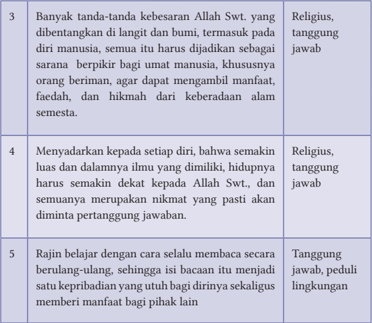

Tabel ini berisi informasi tentang tiga prinsip atau nilai-nilai yang penting dalam kehidupan seorang manusia. Topik utamanya adalah tentang kebesaran Allah Swt., pengetahuan ilmu, dan belajar secara berulang-ulang. Kolom pertama menunjukkan tanda-tanda kebesaran Allah Swt. yang dilihat di langit dan bumi, serta peranannya sebagai sumber keberadaan manusia. Kolom kedua menjelaskan bahwa setiap individu harus menjadikan Allah Swt. sebagai tujuan hidupnya dan mempertahankan kebenaran. Kolom ketiga mengajarkan bahwa setiap orang harus belajar dengan cara yang berulang-ulang untuk menjadi seorang yang berpengetahuan dan bertanggung jawab. Pola penting yang terlihat adalah bahwa semua tiga prinsip ini berkaitan erat dengan kepercayaan pada Allah Swt., pengetahuan ilmu, dan belajar secara berulang-ulang.

### H Refleksi

Memiliki semangat untuk mencintai ilmu pengetahuan dan teknologi, mutlak dimiliki generasi muslim. Jika mengacu kepada Q.S. al-'Alaq/96: 1-5 yang terkenal dengan sebutan Surat Iqra', kita diajak dan dibimbing untuk  untuk  membaca,  mempelajari,  meneliti,  atau  mengeksplorasi obyeknya  tidak  disebutkan.  Coba  pikirkan,  kenapa  tidak  disebutkan obyeknya. Cari jawabannya melalui buku-buku tafsir yang ada (minimal 3 buku tafsir). Setiap jawaban harus disertai rujukan yang jelas (Nama dan cover buku tafsirnya, dan jawabannya di halaman berapa?)

 

---
## 📄 Halaman 45

- Isi  kandungan  Q.S.  Ali  'Imrān/3:  190-191  dan  hadis  terkait,  di antaranya:
- Penciptaan alam semesta, dan silih bergantinya siang dan malam, pusaran  angin,  keteraturan  lintasan  benda-benda  langit,  dan bumi dengan segala isinya, semua itu jangan dijadikan sebagai peristiwa biasa, tanpa hikmah dan tujuan, tetapi harus dipikirkan, sehingga keberadannya dapat diambil sisi positif dan negatifnya melalui akal pikiran serta akal budi yang dimiliki seseorang.
- Kecanggihan  ilmu  pengetahuan  dan  teknologi  (iptek) harus semakin menumbuhkan kedekatan ( taqarrub )  kepada Allah Swt. Itu artinya, semakin banyak ilmu yang dimiliki seseorang, hidupnya harus semakin baik dan benar di sisi Allah Swt., termasuk semua nikmat yang diterima, pasti akan diminta pertanggungjawaban.
- Berpikir  menjadi  ciri  khas  manusia.  Disebabkan  kemampuan berpikir, manusia menjadi makhluk yang dimuliakan Allah Swt.
- Peran  sebagai khalifah ,  diamanahkan  kepada  manusia,  karena faktor berpikir juga.  Karena  kemampuan  berpikirlah,  ilmu pengetahuan dan teknologi akan diserap didapat dan ditemukan. الفكر
ّ

- Isi kandungan Q.S. arl-Rahmān/55: 33 dan hadis terkait, di antaranya:
- Berpikir ( ) , berarti kekuatan yang menembus suatu obyek, sehingga  menghasilkan  pengetahuan.  Jika  pengetahuan  itu, didukung  bukti-bukti  kuat  dinamakan علم / ' ilm .  Jika  buktinya belum meyakinkan, namun  kebenarannya lebih dominan, disebut ظن ّ ( dhann /dugaan).  Selanjutnya,  jika  kemungkinan benar dan salahnya seimbang disebut شك ( syakk /keraguan).
- Rajin, cinta, dan semangat menuntut ilmu itu mutlak dilakukan, tetapi  penting  sekali  melakukan  seleksi  ilmu  dan  guru,  agar terhindar dari hal-hal yang tidak diinginkan, akibat kebodohan diri, atau dibodohi pihak lain.
- Membaca itu berkaitan dengan qalam (pena) sebagai alat untuk menulis, sehingga tulisan itu menjadi penghubung antar manusia

 

---
## 📄 Halaman 46

- walaupun mereka berjauhan tempat, sebagaimana mereka berhubungan dengan perantaraan lisan.
- Setiap  orang  harus  bercita-cita  memiliki  iptek  yang  tinggi, sebagaimana  peran  para  ulama,  sehingga  sampai  kini,  meski sudah wafat, ilmu masih bermanfaat untuk generasi akan datang, dan  harus  menjadi  kesadaran  bersama,  bahwa  untuk  menjadi ulama itu bukan hal mudah.
- Saat ini, semakin sedikit ulama akibat diwafatkan oleh Allah Swt. dan itu berpengaruh kepada hilangnya ilmu yang dimiliki para ulama yang berakibat bagi kehidupan, sehingga semakin susah menemukan teladan yang dapat dicontoh.

### 1. Penilaian Sikap

Penilaian Diri

Berilah tanda centang (√) pada kolom berikut dan berikan alasannya!

 

---
## 📄 Halaman 47

---
**📊 Tabel**

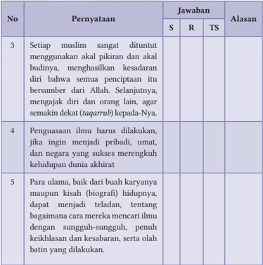

Tabel ini berisi tiga pernyataan yang disertai dengan jawaban singkat (S), ringkasan (R), dan tanda tanya (TS) serta alasan untuk setiap pernyataan. Topik utama tabel adalah tentang pemahaman dan pengembangan ilmu pengetahuan di kalangan umat Islam. Kolom-kolomnya mencakup pernyataan, jawaban S, R, TS, dan alasan. Data penting yang terlihat meliputi bahwa setiap Muslim diharapkan menggunakan pikiran dan kebijaksanaan mereka untuk mencapai kesadaran diri yang berasal dari Allah. Penggunaan ilmu harus dilakukan dengan cara yang baik dan bertanggung jawab, serta para ulama dapat menjadi teladan bagi generasi mendatang tentang bagaimana mencari ilmu dengan sungguh-sungguh dan memahami kehidupan dunia dan akhirat.

S= Setuju, R= Ragu, TS= Tidak setuju

Catatan:

### 2. Penilainan Pengetahuan

Berilah tanda silang (X) pada huruf A, B, C, D atau E pada pernyataan di bawah ini sebagai jawaban yang paling tepat!

- Saat itu Rasulullah Saw. bersama istrinya, Aisyah Ra. lalu beliau minta izin  untuk  beribadah.  Lama  sekali  sampai  menjelang  subuh,  bahkan menangis tersedu-sedu, karena begitu dalamnya perenungan ayat yang dibaca. Adapun ayat yang dibaca adalah … .
- Q.S. al-Baqarah/2: 190-191
- Q.S. Ali 'Imrān/3: 190-191
- Q.S. an-Nisā'/4: 150-151

 

---
## 📄 Halaman 48

- Q.S. al-Maidah/5: 109-110
ٍ

- Q.S. al-An'ām/6: 145-146 2. Perhatikan Q.S. Ali 'Imrān/3: 190 ini! ٰ ت ي ا ل ار ه َّ الن و ْ ل ي َّ ال اف ت ِ ل اخ و ر ْ ض ا ال و ٰ ت م ٰ و َّ الس ق ِ ل ْ  خ ِ ي ف َّ ﴿  ا ِ ن ) 190 : 3/ ( ا ٰل عمر ان ۙ   ﴾ َ اب ب ل ا ى  ال ول ِ ا ل
ٰ

َ

ِ

َ

َ

ِ

ِ

َ

ْ

َ

ِ

َ

ْ

َ

ِ

ْ

َ

ِ

ْ

َ

ْ

ُ

ّ

Berdasarkan ayat tersebut, kata yang menunjukkan hukum bacaan Mad Thabi'i adalah ….

ِ

- A ق ِ ل خ B ٰ ت م ٰ و

---
**📊 Tabel**

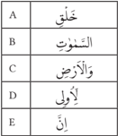

Tabel ini menunjukkan daftar kata-kata dalam bahasa Arab yang biasanya digunakan dalam kalimat. Topik utamanya adalah "الحروف" (huruf), yang berarti "huruf". Kolom pertama, A, menunjukkan huruf-huruf yang mungkin digunakan dalam kalimat. Kolom kedua, B, menunjukkan huruf-huruf yang sering digunakan untuk membentuk kata-kata. Kolom ketiga, C, menunjukkan huruf-huruf yang sering digunakan untuk membentuk kata-kata dalam kalimat. Kolom keempat, D, menunjukkan huruf-huruf yang sering digunakan untuk membentuk kata-kata dalam kalimat. Kolom kelima, E, menunjukkan huruf-huruf yang sering digunakan untuk membentuk kata-kata dalam kalimat. Pola penting yang terlihat adalah bahwa banyak huruf-huruf dalam tabel ini sering digunakan dalam kalimat, yang menunjukkan bahwa huruf-huruf ini penting dalam pembuatan kata-kata dalam bahasa Arab.

ِ

َ

ْ

َ

ُ

ّ

- Perhatikan potongan Q.S. Ali 'Imrān/3: 191 berikut ini!
ِ

``

ً

َ

َ

ٰ

َ

َ

َ

َ

َ

َ

Berdasarkan potongan ayat tersebut, yang termasuk isi dan kandungannya adalah … .

- penciptaan yang beraneka ragam dan berwarna
- menyelimuti kelompok dari kebimbangan dan keraguan
- keimanan itu membuahkan ketenangan, serta kebahagiaan
- berpikir kritis yang menghasilkan kesimpulan tidak ada yang sia-sia
- kemerdekaan berpikir kritis, agar menghasilkan wawasan yang utuh
- Orang-orang yang memiliki akal pikiran yang sehat serta akal budi yang bersih dikenal dengan istilah ulil albab. Di antara tanda-tandanya adalah…
ْ

َ

 

---
## 📄 Halaman 49

- keterlibatannya dalam berbagai peristiwa
- peduli aspek pendidikan dalam meningkatkan martabat
- pemikirannya mendalam tetapi membawa kesimpulan yang sia-sia
- semua kondisi yang menimpanya, menghasilkan banyak sekali manfaat
- daya kritisnya utuh, sehingga tidak didapati keinginan yang meresap
- Islam sangat menggalakkan untuk berpikir kritis, meneliti dan mengkaji segala  hal  yang  terkait  dengan  makhluk  ciptaan  Allah  Swt.,  tetapi dilarang memikirkan tentang ….
- qadha dan segala takdir-Nya
- nama-nama-Nya yang indah
- al-Asmaul Husna yang 99
- sifat-sifat-Nya yang utuh
- Dzat-Nya atau Hakikat-Nya
- Berpikir  itu  ada  batasnya.  Jika  tidak,  banyak  kekacauan  yang  terjadi, termasuk yang terjadi di seputar kehidupan umat manusia. Di antara dampak negatifnya adalah … .
- indahnya dunia yang terus diperbaiki
- semakin banyak hasil perenungan yang didapatkan
- kehidupan dunia tetap berjalan sesuai kehendak manusia
- banyak manusia yang tidak mengakui keberadaan Tuhannya
- akal pikirannya menjadi tumpul dan minim martabat yang didapat
- Setiap  orang  harus  bercita-cita  memiliki  ilmu  setinggi  langit.  Namun harus disadari bahwa Ilmu yang salah, menjadi penyebab kegagalan dan kehancuran. Sebab itu, ilmu harus dipandu oleh … .
- landasan yang rinci seluas problema manusia
- kembali dan menyatunya jati diri bersama pihak lain
- sistem kepercayaan yang dapat diterima oleh orang banyak
- kematangan berpikir dan dalamnya penghayatan yang dilakukan
- iman yang kuat dan cara beribadah yang benar
- Perhatikan potongan Q.S. ar-Rahmān/55: 33 berikut ini!
ا

ْ

و

ُ

ذ

ُ

ف

ْ

ن

َ

ت

ْ

ن

َ

ا

ْ

م

ُ

ت

ْ

ع

َ

َ ط

ت

ْ

اس

ِ

ا ِ ن

س ِ

ْ

ن

ا ِ

ْ

ال

َ

و

ِ

ّ

ِ ن

ج

ْ

ال

ر َ

َ

ْ ش

م َ ع

ٰ

ي

 

---
## 📄 Halaman 50

Berdasarkan potongan ayat tersebut, yang termasuk isi dan kandungannya adalah … .

- perintah Allah Swt. kepada jin dan manusia untuk melintasi penjuru langit
- kebebasan bagi jin dan manusia untuk kerjasama untuk hal yang baik
- tidak semua jin dan manusia mampu mengendalikan nafsunya
- kehinaan bagi siapa saja yang menuhankan semesta raya
- luasnya penjuru langit dan bumi serta di antara keduanya
- Berdasarkan Hadis Nabi Saw., silih bergantinya tahun dan bulan, bukan sekedar berubahnya waktu, namun itu cara Allah Swt. mengambil ilmuNya dengan cara … .
- timbul kemalasan di sebagian besar para penuntut iptek
- jauhnya umat dari para pakar yang membidangi ilmu tersebut
- mewafatkan para ulama dengan ilmu yang dimilikinya
- minimnya kehadiran umat di seputar ulama
- berkurangnya para tokoh yang menguasai
- Cinta  dan  semangat  menuntut  ilmu,  itu  menjadi  keharusan.  Namun, ada  faktor  lain  yang  harus  diperhatikan  bagi  penuntut  ilmu.  Hal  itu adalah … .
- melakukan seleksi guru dan ilmu yang ingin dipelajari
- kapasitas akal yang naik turun sesuai banyak tidaknya ilmu
- jumlah dana yang dibutuhkan dengan dana orang tua
- olah batin yang menurunkan semangat lahir/fisik
- keamanan dan kesehatan yang melingkupinya
ْ

ُ

ُ

ْ

َ

ْ

َ

ْ

ُ

ّ

Terjemahkan potongan ayat tersebut!

- Jawablah pertanyaan berikut dengan singkat dan benar! 1. Sebutkan tingkatan berpikir, sehingga seseorang itu sudah sampai taraf علم / ' ilm , ظن ّ ( dhann /dugaan), dan شك ( syakk /keraguan)? 2. Perhatikan potongan Q.S. ar-Rahmān/55: 33 berikut ini! ا و ذ ف ن ت ن ا م ت ع َ ط ت اس ا ِ ن س ِ ن ا ِ ال و ِ ن ج ال ر َ ْ ش م َ ع ي
- Sebutkan 3 ciri dari ulil albab ?
ْ

َ

ْ

ِ

ْ

ْ

َ

ِ

ّ

ْ

َ

ٰ

 

---
## 📄 Halaman 51

ْ

- Amati dengan cermat Hadis ini! ه ِ ي ل ع ى الل َّ ل ِ ص الل ْ ل و َ س ر ال : ق ال ق ه ن ع َ  الل ِ ي َ ض ر ر ِ ي ذ ب أ ن ْ ع ا و ل ِك ه ت ِ   ف الل ات ِ ِ ي ذ ا  ف ر ُ و َّ ك ف ا  ت ل ِ و الل ق ِ ل ا  ف ِ ي خ ر ُ و َّ ك ف :  ت م َّ ل َ س و (رواه ابو الشيخ)
ْ

َ

َ

ُ

ّٰ

َ

ّٰ

ُ

ُ

َ

َ

َ

َ

ُ

ْ

َ

ُ

ّٰ

ٍ

ّ

َ

َ

َ

ُ

ْ

َ

َ

ّٰ

َ

ْ

َ

َ

َ

َ

ّٰ

ْ

َ

ْ

َ

َ

َ

َ

Berdasarkan Hadis tersebut, jelaskan 3 (tiga) kandungan isinya!

- Tulis kembali Q.S. Ali Imran/3: 191 dengan benar!

### 3. Penilaian Keterampilan

- Penilaian Proyek

### Aktivitas 1.13

### Aktivitas Peserta Didik:

Ini kerja pribadi, bukan kelompok. Perintahnya adalah buatlah kaligrafi dari Q.S. Ali 'Imran/3: 190, dan 191, atau Q.S. ar-Rahman/55: 33. Silakan dipilih ayatnya, setiap peserta didik hanya milih 1 (satu) ayat saja dari 3 (tiga) pilihan yang ada. Dibuat di kertas ukuran A4, pekan depan dikumpulkan.

### b. Penilaian Praktik

### Kelompok:

Kelas  dibagi  5  kelompok,  sesuai  dengan  Penilaian  Proyek  yang  sudah dilaksanakan.  Lalu  setiap  kelompok  menilai  kaligrafi  yang  dibuat  oleh masing-masing peserta didik. Penilaian harus berdasarkan kesepakatan seluruh anggota  di kelompok  tersebut, berdasarkan  kriteria  yang dijelaskan  oleh  GPAI.  Buat  rekap  nilainya  dengan  benar.  Hasilnya diserahkan kepada GPAI.

### Individual:

Setiap kelas ada 1 peserta didik (sebagai Juara 1) yang memperagakan pembuatan dasar-dasar pembuatan kaligrafi. Sementara itu, GPAI bersama peserta didik lainnya memberikan tanggapan dan penilaian.

 

---
## 📄 Halaman 52

### c. Penilaian Portofolio

Tuliskanlah semua aktivitas keagamaan kalian, baik di sekolah, rumah, maupun masyarakat pada buku Penilaian Pendidikan Agama Islam dan Budi Pekerti!

Perhatikan Tugas berikut ini!

- Tugas ini berkaitan dengan hasil tes baca Al-Qur'an di kelas kalian;
- Kelompokkan hasil tes tersebut menjadi 3 (tiga), yakni: mahir,  sedang dan belum ;
- Bagi  kelompok mahir ,  membimbing  kelompok sedang dan belum . Namun, prioritaskan kelompok yang belum
- Selesaikan tugas tersebut selama 3 bulan dengan menggunakan metode IQRA', AL-BARQY, TILAWATI, atau metode lain yang kalian kuasai
- Koordinasikan  semua  kegiatan  tersebut  dengan  GPAI,  Mentor,  Tutor, atau siapa saja yang ditunjuk oleh GPAI kalian.
- Niatkan semua kegiatan tersebut hanya mencari ridha Allah Swt.

 

---
## 📄 Halaman 53

KEMENTERIAN PENDIDIKAN, KEBUDAYAAN, RISET, DAN TEKNOLOGI REPUBLIK INDONESIA 2021

Pendidikan Agama Islam dan Budi Pekerti untuk SMA/SMK Kelas XI

Penulis:

Abd. Rahman dan Hery Nugroho

ISBN:

978-602-244-684-2

### Bab 2

Bukti Beriman: Memenuhi Janji, Mensyukuri Nikmat,  Memelihara Lisan, Menutupi Aib Orang Lain

---
**🖼️ Gambar/Diagram**

> **Deskripsi Visual:** Gambar ini adalah ilustrasi yang menunjukkan dua orang yang sedang bekerja sama. Pada gambar tersebut, seorang pria dengan rambut pendek dan baju kuning sedang menulis di sebuah lembar kertas yang diletakkan di meja. Sementara itu, seorang pria lain dengan rambut pendek dan baju putih sedang memegang lembar kertas tersebut. Di sebelah kiri gambar, terdapat beberapa buku yang tampaknya berisi materi belajar. Gambar ini menunjukkan hubungan kerja sama antara dua orang dalam proses belajar atau pekerjaan. Informasi kunci yang dapat diambil dari gambar ini adalah bahwa ada dua orang yang sedang bekerja sama untuk menyelesaikan tugas atau proyek.

 

---
## 📄 Halaman 54

### Tujuan Pembelajaran

### Peserta didik dapat:

- Menganalisis cabang iman: memenuhi  janji, mensyukuri nikmat, memelihara lisan, menutupi aib orang lain.
- Mempresentasikan tentang memenuhi janji, mensyukuri nikmat, memelihara  lisan,  menutupi  aib  orang  lain,  sehingga  dapat  meyakini bahwa cabang iman tersebut adalah bagian dari ajaran agama.
- Membiasakan  sikap  tanggung  jawab,  memenuhi  janji,  mensyukuri nikmat, memelihara lisan, menutupi aib orang lain.

### B Kata Kunci

- Syukur Nikmat
- Akad
- Aib
C

### Infografis

### BUKTI BERIMAN: MEMENUHI JANJI, MENSYUKURI NIKMAT, MEMELIHARA LISAN, MENUTUPI AIB ORANG LAIN

- Rukun dan Cabang Iman
- Iman Membutuhkan Bukti yang Jelas
2

### Bukti dari Iman, antara lain:

- (a)  Memenuhi Janji
- (b)  Mensyukuri Nikmat
- Fitrah
- Akidah
- Shuhuf/Shahifah
- Syariah
- Ghibah
- Akhlak
- (c)  Memelihara Lisan
- (d)  Menutupi Aib Orang Lain

---
**🖼️ Gambar/Diagram**

> **Deskripsi Visual:** Gambar ini adalah ilustrasi yang menunjukkan tiga orang yang sedang berbicara dan saling menghadap. Mereka tampaknya berada dalam situasi profesional atau kerja sama. Pada gambar tersebut, elemen utama adalah tiga orang yang terlibat dalam percakapan. Relasi antara mereka adalah saling berkomunikasi dan berinteraksi, yang menunjukkan hubungan kerja atau kerjasama. Teks, angka, atau label penting tidak ada pada gambar ini karena ia hanya menggambarkan tindakan manusia tanpa detail eksternal lainnya. Informasi kunci yang dapat diambil dari gambar ini adalah bahwa ada tiga individu yang berkomunikasi dalam situasi profesional atau kerja sama.

 

---
## 📄 Halaman 55

### D Ayo Tadarus

- Ayo  membiasakan  tadarus  Al-Qur'an,  baik  materi  ajarnya  aspek  AlQur'an dan Hadis, maupun aspek Keimanan, Fikih, Akhlak, dan Sejarah Peradaban Islam (SPI) sebelum pembelajaran dimulai.
- Mari  tadarus  Al-Qur'an  dengan  baik  dan  benar  sesuai  dengan  ilmu tajwid dan makharijul huruf. Semoga melalui pembiasaan ini, Allah Swt. selalu memberikan petunjuk dan kemudahan dalam memahami materi ajar ini, dan mampu menerapkan nilai-nilai yang dikandungnya dalam kehidupan sehari-hari. Āmīn.

### Aktivitas 2.1

َ

ْ

ُ

ْ

َ

ّ

ْ

ُ

ُ

َ

َ

ٰ

ْ

َ

ْ

َ

ُ

ٰ

َ

ْ

ُ

َ

َ

َ

ٰٓ

َ

ٰ

ْ

ٰٓ

َ

َ

ْ

ْ

َ

ۤ

ْ

ُ

ُ

َ

َ

ْ

ُ

َ

َ

ُ

ْ

ْ

َ

َ

ً

ْ

َ

ُ

َ

ْ

َ

َ

ْ

ُ

ُ

ُ

ْ

َ

ْ

َ

َ

ّٰ

ْ

ُ

َ

ٌ

ُ

ُ

ُ

ْ

ْ

َ

ُ

َ

ُ

ْ

ِ

ا ل و م ا ِ ث الظ ع ب ِ ۖ  ا ِ ن الظ ِ ن ا م ر ث ِ ي ا ك و ن ِ ب ت وا اج ن م ا ن ي ذ ِ ا ال ي ا ﴿ ي ه ِ ي خ ِ ا م ح ل ل ك أ َّ ي ن ا م ُ ك د ح َ ا ح ِب ي ۗ  ا ا ْ ض ع ب م ُ ك ْ ض ع َّ ب َ ب ت َ غ ا ي ل ا و و َّ س َ س ج ت ﴾ م ي َّ ح ر َّ اب و ت الل َّ ۗا ِ ن وا الل ق َّ ات ۗ  و ه م ُ و ت ر ِ ه ك ا ف ت ي م

Aktivitas Peserta Didik: Saatnya, kita tadarus Q.S. al-Māidah/5: 1, Q.S  al-Hujurāt/49: 12 berikut ini, lalu salah satu peserta didik membacakan terjemahnya! ا ا م َّ ِ ل ام ِ  ا ع ن ا ال ة م َ ي ه ِ ب م ك ل ت ْ َّ ل ح ِ د ِ ۗ  ا و ق ع ال ا  ب و ف و ٓا ا و ن م ا ن ي ذ ِ َّ ا  ال ُّ ه ي ا ﴿ ي ﴾ ْ د ي ُ ر ا ي م م ك ح ي الل َّ ۗ  ا ِ ن ر ُ م ْ  ح م ت ن ا ْ د ِ  و ي َّ ِ ى الص ِ ل ح م ر ي غ م ْ ك ي ل ى ع ل ت ي ) 1 : 5/ ئدة ( الما َّ ن ّ َّ ْ ض َّ ن ّ َّ َّ ُّ ه

49/ ( الحجر ٰت

) 12 :

ِ

ْ

َ

ٌ

َ

ْ

َ

ْ

َ

ِ

َ

ُ

ْ

َ

ْ

َ

َ

ْ

ٌ

ُ

ْ

ِ

َ

ٌ

ُّ

َ

َ

ّ

ُ

َ

َ

ّٰ

ً

ْ

ً

َ

َ

ْ

َ

ْ

ُ

ّٰ

ُ

َ

ْ

ُ

 

---
## 📄 Halaman 56

### Aktivitas 2.2

Aktivitas Peserta Didik:

Amati  gambar  atau  ilustrasi  berikut  ini!  Lalu  berilah  tanggapan  kalian yang dikaitkan dengan materi ajar yang dipelajari, yakni: Memenuhi Janji, Mensyukuri Nikmat, Memelihara Lisan, dan Menutupi Aib Orang Lain.

---
**🖼️ Gambar/Diagram**

> **Deskripsi Visual:** Gambar ini adalah ilustrasi yang menunjukkan dua orang yang sedang berbicara di depan meja kerja. Meja tersebut dilengkapi dengan laptop, sebuah buku, dan beberapa papan tulis. Orang pertama duduk di sebelah kiri, sedangkan orang kedua berdiri di sebelah kanan. Kedua orang tersebut tampaknya sedang berbicara tentang sesuatu yang ditulis di papan tulis di depan mereka. Gambar ini menunjukkan hubungan antara dua orang yang mungkin berada dalam situasi kerja atau belajar bersama-sama.

---
**🖼️ Gambar/Diagram**

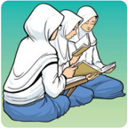

> **Deskripsi Visual:** Gambar ini adalah ilustrasi yang menunjukkan dua orang anak sedang belajar. Mereka duduk di lantai dengan posisi santai, menghadap ke arah sebuah buku yang mereka baca bersama-sama. Kedua anak tersebut mengenakan pakaian tradisional, yang mencerminkan budaya atau konteks lokal. Ilustrasi ini menunjukkan hubungan antara dua individu dalam proses belajar, yang merupakan elemen penting dalam pembelajaran. Teks, angka, atau label tidak ada dalam gambar ini, sehingga fokus utama adalah pada tindakan dan posisi anak-anak dalam situasi belajar. Informasi kunci yang dapat diambil dari gambar ini adalah bahwa belajar berlangsung dalam lingkungan yang nyaman dan harmonis, dengan dua orang yang saling mendukung dalam proses pembelajaran.

---
**🖼️ Gambar/Diagram**

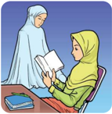

> **Deskripsi Visual:** Gambar ini adalah ilustrasi yang menunjukkan dua orang wanita sedang belajar. Pada gambar tersebut, salah satu wanita sedang membaca buku sementara yang lainnya berdiri di sebelahnya. Kedua wanita tersebut mengenakan hijab, yang menunjukkan bahwa mereka mungkin berada dalam lingkungan yang memerlukan aturan atau norma tertentu. Buku yang dibaca oleh wanita yang sedang duduk tampak besar dan jelas, menunjukkan bahwa ia sedang fokus pada materi yang dia baca. Warna-warna yang digunakan dalam gambar, seperti hijau dan putih, memberikan kesan tenang dan serius, yang sesuai dengan tema belajar. Gambar ini mungkin digunakan untuk menggambarkan konsep tentang pendidikan, keberagaman, atau hubungan antara guru dan murid.

---
**🖼️ Gambar/Diagram**

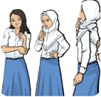

> **Deskripsi Visual:** Gambar ini adalah ilustrasi yang menunjukkan tiga orang wanita berdiri di depan sebuah papan tulis. Setiap wanita mengenakan hijab dan baju putih dengan celana biru. Pada papan tulis, terdapat beberapa teks yang tidak jelas dan beberapa simbol atau huruf yang tampak seperti kode atau notasi matematika. Elemen-elemen utama dalam gambar ini adalah tiga wanita, papan tulis, dan teks yang ada di atasnya. Relasi antara elemen-elemen tersebut adalah bahwa wanita-wanita tersebut sedang berada di depan papan tulis yang memiliki informasi tertulis. Informasi kunci yang dapat diambil dari gambar ini adalah bahwa ini mungkin merupakan bagian dari materi pembelajaran tentang matematika atau ilmu pengetahuan lainnya, karena adanya teks dan simbol yang tampak seperti kode atau notasi matematika.

 

---
## 📄 Halaman 57

### Aktivitas 2.3

Aktivitas Peserta Didik:

Pahami dan renungkan artikel berikut ini, sebagai bagian dari pemahaman dari materi ajar yang akan dipelajari!

### Menyebarkan Salam

Oleh: Busman Edyar

R asulullah  Saw.  bersabda, ''Kalian tak akan masuk surga, sampai kalian  beriman  dan  saling  mencintai.  Maukah  kalian  aku  tunjukkan satu  amalan,  jika  dilakukan  membuat  kalian  saling  mencintai?  Itu  adalah sebarkan  salam'' (HR. Muslim).

Berlandaskan Hadis tersebut, selain iman, syarat masuk surga adalah adanya  suasana  yang  saling  mencintai  antarsesama  manusia.  Saling mencintai baru terasa, apabila salam sudah disebarkan. Bahkan, terhadap orang  yang  belum  dikenal.  Rasulullah  juga  bersabda, ''Berikan  salam kepada  orang  yang  kalian  kenal,  dan  orang  yang  tidak  dikenal.'' (HR. AlBukhari dan Muslim).

Menyebarkan salam berarti  menyebarkan  kedamaian.  Sebab,  kata salam mengandung  makna  kedamaian,  keselamatan,  dan  keamanan. Karena itu, orang yang mengucapkan salam, hakikatnya mengucapkan doa kepada pihak yang diberi salam, agar senantiasa mendapat kedamaian, kasih sayang, dan berkah dari Allah Swt.

Setiap  muslim  yang  mengucapkan  salam,  akan  diganjar  dengan kebaikan  (pahala).  Setiap  ucapan,  ''Assalamu  'alaikum.'' Sabda Rasulullah Saw., ''Orang ini mendapat 10 kebaikan . ''  Jika  ada  yang  mengucapkan, ''Assalamu'alaikum wa rahmatullah.'' Orang ini, mendapat 20 kebaikan.'' Begitu juga, jika ada lagi yang mengucapkan, ''Assalamu 'alaikum wa

 

---
## 📄 Halaman 58

rahmatullah wa barakatuh.'' Orang terakhir ini mendapat 30 kebaikan.'' (HR. Ibnu Hibban dari Abu Hurairah).

Begitu pentingnya menyebarkan salam, sehingga yang berkendara memberi salam kepada yang berjalan kaki. Orang yang berjalan kaki, mengucapkan salam kepada yang duduk. Dua orang yang bertemu di jalan dan saling memberikan salam, maka yang lebih dahulu memulai, itu lebih utama. (HR. al-Bazzar dan Ibnu Hibban).

Jika sehari-hari, kita sudah terbiasa mengucapkan salam, seharusnya tidak  ada  lagi  yang  sampai  hati  berbuat  zalim,  menipu,  membuka  aib orang lain. Sebab, semua perilaku tersebut sangat bertentangan dengan hakikat salam . Yakni, memberikan kedamaian, ketenteraman dan keselamatan, termasuk memohon keberkahan dari Allah Swt.

Begitulah,  melalui  hakikat  dan  makna salam ,  semua  kegiatan diarahkan untuk mewujudkan keselamatan, kedamaian, atau memenuhi janji (sebagai bagian dari syukur nikmat), bukan mengumbar lidah untuk menyakiti, membuka aib, atau bentuk kezaliman yang lain.

Disadur dari Republika (dipublikasikan pada 6 Juli 2005)

### Wawasan Keislaman

### Aktivitas 2.4

Aktivitas Peserta Didik:

Bentuk kelas kalian menjadi 4 kelompok. Lalu, setiap kelompok mendapatkan  sub-materi  dari  materi  ajar  yang  akan  dipelajari,  yakni Memenuhi  Janji,  Mensyukuri  Nikmat,  Memelihara  Lisan,  dan  Menutupi  Aib Orang  Lain , agar dikaji, dipahami dan dipelajari. Hasilnya dipresentasikan!

Secara  garis  besar,  Dinul  Islam  terdiri  dari  3  pokok  (rukun)  ajaran,  yaitu: Pertama : Akidah ,  yaitu pokok-pokok ajaran tentang keimanan yang dikenal dengan sebutan 6 Rukun Iman . Kedua; Syariah, yakni pokok-pokok ajaran tentang hukum Islam yang dikenal dengan istilah 5 Rukun Islam . Selanjutnya yang Ketiga : Akhlak , yaitu etika atau moralitas hidup manusia yang bersumber dari wahyu Allah Swt.

 

---
## 📄 Halaman 59

Ketiganya (Akidah, Syariah dan Akhlak) harus menyatu dan tidak boleh terpisah.  Akidah  ( Iman )  menghasilkan  Syariah  ( Islam ),  dan  Syariah  tidak melupakan Akhlak ( Ihsan ).  Tentunya, penyatuan tersebut memiliki makna yang amat dalam, bahwa kepribadian muslim itu ditopang oleh Iman, Islam dan Akhlak.

M. Quraish Shihab dalam karyanya 'Mutiara Hati' memaparkan bahwa iman itu bertingkat-tingkat yang secara berturut-turut dimulai pengetahuan yang  disertai  rasa  takut,  harapan,  kekaguman,  keyakinan,  lalu  cinta  yang ditandai  hubungan  harmonis,  dan  puncaknya  adalah  leburnya  hati  dan pikiran.  Iman  adalah  ketundukan  hati  kepada  kebenaran,  ketulusan  lisan dalam pembenaran, dan patuhnya anggota tubuh dalam kebenaran'.

Al-Qur'án menggariskan, misalnya yang tersurat dalam Q.S. al-A'rāf/7: 96,  Q.S.  Ibrahīm/14: 23, dan Q.S. Yūnus/10: 9, bahwa orang beriman yang dibarengi  dengan  amal  shaleh  (sebagai  realisasi  Syariah  dan  Akhlak), dijanjikan  kehidupan  dunianya  penuh  dengan  kebahagiaan,  keberkahan, kemuliaan, dan di akhirat nanti dimasukkan ke dalam surga.

Di samping itu, Rasulullah Saw. juga bersabda: (رواه البخاري) ان ِ م إ ِ ي ال م ِ ن ة ب ع ُ  ش ء يا ح ال و ة ب ع ش ْ ن و ت َ س و ع ِ ض ب ان م إ ِ ي ل ا

َ

ْ

ْ

َ

ً

َ

ْ

ُ

َ

َ

ْ

َ

ً

َ

ْ

ُ

َ

ُّ

ِ

ٌ

ْ

ُ

َ

ْ

ْ

َ

Artinya: Iman itu memiliki 63 cabang, sedangkan malu menjadi bagian dari cabang iman. (HR. al-Bukhāri)

Hadits ini menjelaskan, bahwa iman itu memiliki 63 cabang (bagian). Di  antara  cabang  iman  yang  dibahas,  sesuai  materi  ajar  ada  4,  yakni:  (1) Memenuhi  Janji,  (2)  Mensyukuri  Nikmat,  (3)  Memelihara  Lisan,  dan  (4) Menutupi  Aib  Orang  Lain.  Berikut  ini,  mari  kita  kaji  bersama  tentang keempat cabang iman tersebut:

### 1. Memenuhi Janji

### a. Pengertian

Salah  satu  bukti  berimannnya  seseorang  adalah  memenuhi  janji,  dan  ia menjadi bagian dari akhlak terpuji yang seharusnya menghiasi pribadi setiap orang beriman. Adapun padanan kata Janji dalam bahasa Arab adalah ' aqad '

 

---
## 📄 Halaman 60

( عقد ).  Melalui kata ini, muncul kata yang sering kita dengar, yakni akad, akidah , atau akad nikah .

ۤ

Menurut  bahasa, akad berarti  perjanjian  atau  ikatan  yang  kuat.  Jadi memenuhi  janji merupakan kewajiban dan menjadi tanda orang itu beriman atau tidak. Itu sebabnya, jika dikaitkan dengan makna bahasa, maka janji itu harus ditepati dan dipenuhi, dan kita diingatkan bahwa setiap janji akan diminta pertanggung jawaban, sebagaimana Firman Allah Swt.: )34 :17/ ء ( الاسر ا ا ل ـ ُٔ و َ س م ان ك ْ د ه ع ال َّ ا ِ ن ْ د ِۖ ه ع ال ا ب و ف و ا ..... و

ً

ْ

ْ

َ

َ

َ

َ

ْ

َ

ْ

ِ

ْ

ُ

ْ

َ

َ

Artinya:…. dan penuhilah janji,  karena  janji  itu  pasti  diminta  pertanggungjawabannya. (Q.S. al-Isrā'/17: 34).

Perhatikan juga, isi dan kandungan Q.S. al-Māidah/5: 1 dan Q.S. an-Nisā'/4: 32).

Memenuhi janji menjadi faktor penting keberhasilan dan kesuksesan seseorang. Begitu juga sebaliknya. Coba amati di sekeliling kalian, orang yang selalu menepati janjinya, akan dipercaya semua orang; selalu dicari keberadaannya, karena jiwa amanahnya sudah membekas di hati banyak orang. Jika tidak ada modal, banyak menyodori untuk membantunya, dan masih  banyak  lagi  keuntungan  yang  didapatkan.  Belum  lagi  di  akhirat nanti.

Sebaliknya, orang tidak menepati janji, hidupnya sangat mengenaskan, tidak dipercaya orang. Boleh jadi, ada orang yang bisa mengelabui semua orang,  tetapi  si  pelaku  ini,  tidak  akan  bisa  kembali  kepada  orang-orang yang  sudah  ditipu,  apalagi  di  zaman  sekarang  ini,  dunia  komunikasi begitu  mudahnya  dapat  diakses,  hancur  sudah  karirnya,  dan  sangat  sulit mengembalikan reputasi yang sudah dibangun bertahun-tahun.

Itu  sebabnya,  jika  ditinjau  dari  sudut  pandang  Islam,  memenuhi  janji harus  diperhatikan  dengan  sungguh-sungguh.  Jika  tidak!  Seseorang  itu, sudah terlibat dalam dosa. Sementara dosa sendiri, mengakibatkan suram dan terhalangnya kegiatan yang sudah dirancang. Artinya susah dan sulit mencapai keberhasilan. Lalu, kita diingatkan, bahwa salah satu tanda orang munafik adalah tidak amanah akan janji yang sudah diikrarkan.

 

---
## 📄 Halaman 61

### b. Pembagian Janji

Janji terbagi menjadi 2 bagian, yaitu:

### 1. Janji kepada Allah Swt.

ٰٓ

Mungkin terasa ganjil dan ada yang bertanya, kapan saya berjanji kepada Allah  Swt.  Jawabannya,  ternyata  sudah  dijelaskan  di  dalam  Al-Qur'an, bahwa semua manusia tak terkecuali pernah melakukan penjanjian kepada Allah Swt. (di alam ruh/rahim) dan bentuk janjinya adalah nanti jika sudah di  dunia  akan  mengimani  Allah  sebagai Rabb -Nya  dan  berjanji  menjadi hamba-Nya  yang  taat.  Sebagaimana  firmannya: ل ع م ه َ د ه ش ا و م ه ت َّ ي ر ذ ر و ه ظ م ِ ن م د ن ِ ي ۢ   ب م ِ ن ُّ ك ب ر ذ خ ا ا ِ ذ ﴿   و

### ى ِ ه ِ م ٓ   ا ن ْ ا  ع َّ ن ا  ك َّ ن ة ِ  ا م َ ق ِ ي ال م و ا  ي و ل و ق ت ن ا   ۛا ن ه ِ د ىۛ ش ل ا  ب و ال ۗ  ق م ِ ك ب ِ ر ب س ْ ت ل ۚ  ا م س ِ ه ف ن ا ) 172 : 7/ ( الاعر اف ۙ  ﴾ ْ ن ِ ي ف ِ ل ا غ ذ ه

َ

ْ

ُ

َ

ْ

َ

َ

ْ

ُ

َ

ِ

ّ

ُ

ْ

ْ

ُ

ُ

ْ

َ

َ

ٰ

ْ

َ

ْ

َ

َ

َ

َ

َ

ْ

َ

َ

ُ

ِ

ٰ

ْ

َ

ْ

َ

ْ

ُ

ْ

ُ

َ

ْ

َ

َ

ْ

َ

ٰ

َ

ْ

ُ

َ

ْ

ُ

ّ

َ

ُ

َ

َ

ْ

ِ

ُ

ْ

َ

َ

ٰ

َ

ٰ

Artinya: Dan  (ingatlah)  ketika  Tuhanmu  mengeluarkan  dari  sulbi  (tulang belakang) anak cucu Adam keturunan mereka dan Allah mengambil kesaksian terhadap  roh  mereka  (seraya  berfirman),  'Bukankah  Aku  ini  Tuhanmu?' Mereka  menjawab,  'Betul  (Engkau  Tuhan  kami),  kami  bersaksi.'  (Kami lakukan yang demikian itu) agar di hari Kiamat kamu tidak mengatakan, 'Sesungguhnya ketika itu kami lengah terhadap ini.' (Q.S. al-A'rāf/7: 172)

Ayat ini dengan jelas menyampaikan bahwa setiap manusia saat berada di  alam  ruh/rahim  sudah  menyampaikan  janji  setia  untuk  bertauhid  dan menjalani hidup di dunia yang didasari fitrah , karena fitrah itu sebenarnya jati diri manusia (pahami juga isi kandungan Q.S. ar-Rum/30: 30).

Misalnya  saat  kita  melakukan  kebaikan  (amal  shaleh),  hati  menjadi tenteram, sebaliknya setiap melakukan keburukan atau dosa, kebimbangan dan keresahan hati yang didapat. Itulah fitrah yang seharusnya memandu setiap langkah manusia dalam kehidupan sehari-hari.

### 2. Janji kepada sesama manusia.

Janji kepada manusia adalah janji-janji yang sudah dibuat dan disepakati, baik sebagai pribadi maupun dengan lembaga atau pihak lain. Melalui janji-

 

---
## 📄 Halaman 62

janji inilah reputasi dan nama baik dipertaruhkan. Sekali atau beberapa kali janji  tidak  ditepati,  tanggung  sendiri  akibatnya. Seperti paparan di muka, sulit  sekali  menumbuhkan kepercayaan, jika orang atau pihak lain sudah pernah dicederai atau dilukai, akibat janji yang tidak ditepati.

Hanya Islam menggariskan, bahwa tidak semua janji itu ditunaikan. Janji yang  dibuat  di  antara  sesama  manusia,  seperti  perdagangan,  perniagaan, pernikahan dan sebagainya, silakan ditunaikan, asalkan tidak ada penjanjian yang  bertentangan  dengan  syariat  Islam.  Seperti  Sabda  Rasulullah  Saw .: 'Setiap  syarat  (ikatan  janji)  yang  tidak  sesuai  dengan  Kitabullah,  menjadi batil,  meskipun  seratus  macam  syarat.' (HR. Al-Bukhari dan Muslim).

### c. Balasan Memenuhi Janji

Jika kalian melihat dengan cermat, keadaan di sekitar kalian, nampak jelas balasan orang yang memenuhi janji, dan orang yang tidak memenuhi janji. Orang yang berhasil, tentu memiliki prinsip hidup yang kuat dan kokoh, termasuk memenuhi janji. Sebaliknya, orang yang terpuruk dan terhempas, biasanya hidupnya kurang kuat dalam memegang prinsip. Saatnya kalian memilih yang mana?

Al-Qur'an sering memberi tamtsil atau contoh untuk dijadikan pelajaran. Misalnya yang terjadi pada Bani Israil yang sering mengingkari janjinya, akibatnya ketidaktentraman hidup yang didapat, bahkan nilai-nilai keimanan diingkari  juga,  termasuk  memusuhi  dan  dan  membunuh  sebagian  para rasul yang diutus kepada mereka. Tentu kisah buruk ini, semestinya jangan dicontoh. Pahami lebih lanjut Q.S. al-An'ām/6: 152 dan Q.S ar-Ra'd/13: 20.

Berikut ini, manfaat memenuhi janji, antara lain:

- Mendapatkan predikat sebagai muttaqin dan menjadi sebab tergapainya sifat muttaqin (Q.S. Ali Imrān/3: 76).
- Menjadi  sebab  datangnya  keberhasilan,  keamanan  dan  ketenteraman, serta  jauh  adanya  konflik  dan  perselisihan.
- Menghindari pertumpahan darah, dan terjaga dari mengambil hak orang lain, baik dari pihak muslim atau non muslim (Q.S. al-Anfāl/8: 72).
- Dapat menghapus kesalahan, dan menjadi sebab dimasukkan ke dalam surga (Q.S. al-Baqarah/2: 40, dan Q.S al-Māidah/5: 12).

 

---
## 📄 Halaman 63

### 2. Mensyukuri Nikmat

### a. Pengertian

ٌ

Ada  2  kata  dasar  yang  digunakan,  yakni: Syukur dan Nikmat .  Syukur, menurut bahasa berarti membuka atau menampakkan. Lawan dari syukur adalah kufur yang berarti menutup dan menyembunyikan .  Perhatikan Q.S. Ibrahīm/14: 7, yaitu: ﴾ ْ د ي د ِ ش ل اب ذ ع َّ ا ِ ن م ت ر ْ ف ك ىِٕن ل و م ك َّ ن ْ د ي ز ا ل م ت ر ْ ك ش ىِٕن ل م ُّ ك ب ر ن َّ ذ ا ت ا ِ ذ ﴿ و

َ

َ

ْ

``

َ

َ

ْ

ُ

َ

َ

ْ

َ

َ

ْ

ُ

َ

ِ

َ

َ

ْ

ُ

َ

َ

ْ

َ

ْ

ُ

َ

َ

َ

َ

ْ

َ

Artinya: Dan (ingatlah) ketika Tuhanmu memaklumkan, 'Sesungguhnya jika kamu bersyukur,  niscaya  Aku  akan  menambah  (nikmat)  kepadamu,  tetapi jika  kamu  mengingkari  (nikmat-Ku),  maka  pasti  azab-Ku  sangat  berat.' (Q.S. Ibrahīm/14: 7).

Syukur merupakan  bentuk  keridhaan  atau  pengakuan  terhadap  rahmat Allah Swt. dengan setulus hati. Makna lainnya adalah pujian atau pengakuan terhadap segala nikmat Allah Swt. yang dibuktikan dengan kerendahan hati dan ketulusan menerimanya yang diwujudkan melalui ucapan, sikap, dan perilaku.

Sementara makna nikmat , menurut bahasa adalah pemberian, anugerah, kebaikan, dan kesenangan yang diberikan manusia, baik berupa rezeki, harta, keluarga, maupun segala kesenangan yang lain. Seringkali kita diingatkan oleh  khatib  atau  dai,  bahwa  nikmat  terbesar  itu  adalah  Iman  dan  Islam, termasuk juga nikmat sehat wal 'afiat.

Berdasarkan penjelasan tersebut, mensyukuri nikmat adalah berterima kasih  kepada  Allah  Swt.  atas  segala  nikmat  yang  telah  dianugerahkan kepada kita. Caranya adalah  menggunakan segala nikmat tersebut, sesuai dengan  tujuan  nikmat  itu  diberikan.  Misalnya  nikmat  tangan,  mata,  dan kaki,  semuanya digunakan untuk hal-hal yang benar menurut Allah Swt, bukan keinginan nafsu, syahwat, apalagi perbuatan maksiat.

Contoh  tidak  baik  dilakukan  umat  Yahudi,  yang  dikisahkan  oleh  AlQur'an  (misalnya  dalam  Q.S.  al-Baqarah/2:  49,  dan  Q.S.  al-Qashas/28:  4), sebagai  umat  yang  paling  kufur  nikmat.  Bersama  Nabi  Musa  a.s.  umat Yahudi menikmati begitu banyak nikmat, khususnya nikmat keberhasilan

 

---
## 📄 Halaman 64

menghadapi  Fir'aun  dan  bala  tentaranya  yang  menindas  dan  membunuh setiap  anak  laki-lakinya  yang  baru  lahir.  Lalu  Allah  Swt.  menyelamatkan mereka,  namun semua itu diingkari,  bahkan  di  satu  masa,  sampai  berani membunuh nabi mereka.

Melalui gambaran ini, kita sebagai umat Islam diingatkan, agar jangan menjadi umat yang kufur nikmat. Jadilah umat atau pribadi yang pandai mensyukuri nikmat (Q.S al-Baqarah/2: 152 dan 172). Sadar dan paham bahwa begitu banyak nikmat Allah Swt. yang sudah dianugerahkan kepada kita.

Hanya sayangnya, seringkali kita memahami nikmat itu hanya berupa harta  benda,  uang,  dan  fasilitas  mewah  lainnnya,  padahal  yang  termasuk nikmat  adalah  hidup  sehat,  keluarga  bahagia,  menjalankan  shalat  secara istiqamah,  terhindar  dari  segala  cobaan,  terhalang  melakukan  dosa  dan kemaksiatan.

### b. Perwujudan Syukur

Tidak  terhitung  banyaknya  nikmat  yang  sudah  kita  terima  (Perhatikan isi  kandungan  Q.S.  Ibrahīm/14:  34),  lalu  bagaimana  caranya  mewujudkan bahwa  kita  menjadi  pribadi  yang  bersyukur?  Jawabannya  adalah  syukur harus dilakukan dengan 3 hal, yakni: melalui lisan, hati , dan anggota badan .

Pribadi yang bersyukur kepada Allah Swt., ditandai dengan pengakuan, kerelaan,  dan kepuasan  hati atas  segala  nikmat  yang  diterima,  dilanjutan dengan lisan  yang  selalu  mengucapkan  syukur ,  misalnya  banyak-banyak mengucapkan hamdalah dan  kalimat-kalimat  pujian  yang  disampaikan (Q.S.  ad-Dhuhā/93:  11).  Setelah  itu,  semua  nikmat  tersebut diwujudkan  dan difungsikan  oleh  anggota  tubuhnya dalam ketaatan hanya kepada Allah Swt.

Imam al-Ghazali membagi syukur itu, menjadi 3 bagian, yaitu: ilmu, hal (keadaan),  dan amal (perbuatan).  Melalui ilmu nya,  seseorang  menyadari bahwa segala nikmat yang diterima itu semata-mata berasal dari Allah Swt. Keadaan nya  menyatakan  kegembiraan.  Selanjutnya, amal perbuatannya sesuai dan sejalan dengan fungsi nikmat tersebut diberikan.

Tersimpul  bahwa,  wujud  syukur  harus  menyatu  antara  hati,  lisan  dan perbuatan. Bukan bersyukur yang benar, jika sering mengucapkan hamdalah , lalu hatinya masih belum puas dengan yang diterima, atau masih iri dan dengki dengan harta benda milik tetangga. Begitu juga, jika kalian memiliki akal yang

 

---
## 📄 Halaman 65

cerdas, tetapi kelebihan itu hanya disimpan sendiri, tidak disebarkan kepada teman kalian yang masih membutuhkan bantuan dan bimbingan.

Jadi,  pribadi  yang  bersyukur  itu,  ditandai  menyatunya  hati,  lisan  dan perbuatan. Tidak boleh terpisah, atau terpotong-potong, sehingga jika kesatuan itu  dapat  dilakukan,  muncul  kepribadian  muslim yang utuh, bukan pribadi pecah yang hanya sesuai, misalnya antara lisan dan perbuatan, melupakan hati. Begitu juga, hati dan lisan menyatu, tetapi perbuatannya tidak sesuai.

### c. Keuntungan Menjadi Orang Bersyukur

Penjelasan  sebelumnya  memberi  hikmah  kepada  kita,  agar  kita  menjadi pribadi yang pandai besyukur. Beberapa keuntungannya, dapat disebutkan berikut ini:

### 1. Jauh Lebih Produktif

Saat menghadapi problem, orang yang bersyukur, masih dapat memanfaatkan peluang yang tersisa, sekecil apapun, untuk menangkap peluang yang lain. Tidak menghabiskan waktunya untuk mengeluh dan sesal  diri.  Apa  untungnya  menyesali diri?  Bangkit  dari  keterpurukan, itulah cara terbaik menghadapi problema.

### 2. Lebih Bahagia dan Optimis

Pribadi pesimis, hanya akan sibuk meratapi kegagalan dan nyinyir pada kesuksesan  pihak  lain.  Sementara,  orang  yang  bersyukur,  emosinya stabil,  dan itu menjadikannya lebih bahagia, sigap mencari solusi dan alternatif  terbaik,  dan  melokalisasi  persoalan,  bukan  melebarkannya, apalagi  menyalahkan  pihak  lain.  Semuanya,  diambil  hikmah  dan pelajaran dari peristiwa yang terjadi.

### 3. Mafaatnya kembali ke Diri Sendiri

Coba kalian pikirkan berkali-kali. Dunia ini sudah jutaan atau ribuan tahun, tetapi rahmat dan kasih Allah Swt. masih tetap dilimpahkan ke seluruh  makhluknya,  dan  semuanya  tercukupi.  Jika  ada  kelaparan  di satu tempat, itu karena kesalahan pengelolaan, atau ada pihak lain yang mengambil berlebih dari yang semestinya.

Ambil contoh, di sebuah pesta pernikahan, betapa banyaknya makanan dan minuman tersisa yang akhirnya menjadi sampah, padahal masih banyak saudara kita yang mengais makanan dan belum bisa makan.

 

---
## 📄 Halaman 66

Hendaklah kita pahami bersama, berlimpahnya rahmat dan nikmat itu, tetap diberikan kepada mereka (boleh jadi orang beriman, atau orang-orang kafir) yang berbuat aniaya, lalim, dan ingkar kepada Allah Swt. Itu semua, tidak  menghalangi  Allah  Swt.  untuk  menghentikan  curahan  rahmat  dan nikmatnya kepada seluruh makhluk.

Jadi,  kembali  kepada  kalian  semua.  Jika  kalian  menjadi  hamba  yang bersyukur, maka manfaat dan maslahatnya, kembali ke Anda sendiri. Sebaliknya, jika kalian kufur, maka tunggulah kegagalan dan kesengsaraan dunia, apalagi pedihnya neraka, akan kalian rasakan sendiri (Q.S. Ibrahīm/14: 7).

ٌ

Allah Swt. juga berfirman: ه ٖ ۚ س ِ ف ِ ن ل ر ُ ك ش ا ي م َّ ن ا ِ ف ر ْ ك ش َّ ي َ ن م ۗو ِ لل ر ْ ك اش ن ِ ا ة م َ ح ِك ال م ٰ ن ق ا ل ن ي ت ا د ق ل ﴿ و ) 12 : 31/ ٰ ن ( لقم ﴾ ْ د م ِ ي ح ن ِ ي غ الل َّ ا ِ ن ف ر َ ف ك َ ن م و

ْ

َ

ُ

ْ

َ

َ

َ

ُ

ْ

ْ

َ

ّٰ

ِ

ُ

ْ

َ

َ

ْ

ْ

َ

ْ

ُ

َ

ْ

َ

ٰ

ْ

َ

َ

َ

َ

ٌّ

َ

َ

ّٰ

َ

َ

َ

ْ

َ

Artinya: Dan sungguh, telah Kami berikan hikmah kepada Lukman, yaitu, 'Bersyukurlah  kepada  Allah!  Dan  barangsiapa  bersyukur  (kepada  Allah), maka sesungguhnya dia bersyukur untuk dirinya sendiri; dan barangsiapa tidak bersyukur (kufur), maka sesungguhnya Allah Mahakaya, Maha Terpuji.' (Q.S. Luqmān/31: 12)

### 3. Memelihara Lisan

### a. Pentingnya Menjaga Lidah

Lidah atau lisan bisa dikatakan sebagai bagian anggota tubuh yang sangat berharga. Betapa tidak! Melalui lisan yang tidak tertata, muncul pertengkaran dan perselisihan. Lisan juga, bisa membuat malapetaka yang besar, bahkan pembunuhan yang tidak terkira akibatnya. Selanjutnya, penggunaan lisan yang  tidak  terjaga,  menjadikan  perang  yang  menimbulkan  korban  jiwa mulai dari hitungan yang kecil, sampai mencapai ribuan, bahkan jutaan.

Sebaliknya,  melalui  lisan  juga  muncul  pelbagai  macam  kedamaian, kesejukan,  cinta  dan  harapan  yang  tersemai  di  lubuk  jiwa  untuk  satuan, puluhan,  ribuan,  jutaan  bahkan  milyaran  umat  manusia.  Masih  banyak manusia yang tetap memelihara harapan, meski kondisinya memprihatinkan dan mengenaskan, karena masih percaya kepada janji-janji yang disampaikan.

 

---
## 📄 Halaman 67

Misalnya, melalui lisan para nabi dan rasul, dalam bentuk wahyu atau shuhuf ( shahifah ), saat kini masih banyak dijumpai manusia beriman dengan segala plus minusnya. Karena itu, kita semua, termasuk sebagai pelajar harus tetap rajin belajar dan sungguh menuntut ilmu, meskipun di sekitar kalian muncul pelbagai macam berita dan informasi negatif tentang kondisi negara dan dunia yang semakin mengkhawatirkan, akibat problema yang semakin menumpuk, dunia yang memasuki jurang resesi, ditambah adanya penyakit yang masuk ke dalam kelompok pandemi (misalnya Covid 19).

َ

Berlandaskan paparan tersebut, lidah dan lisan kita harus tetap dijaga dengan baik (Q.S. al-Ahzāb/33: 70-71). Tipis sekali perbedaan antara bahagia dan celaka serta senang susah, hanya dari penggunaan lidah. Apalagi jika dikaitkan  dengan  ajaran  Islam  yang  sudah  memberi  rambu-rambu  dalam penggunan lidah.  Kita  diingatkan  oleh  Allah  Swt.  dengan  fiman-Nya,  yakni: ﴾ ْ ن و ل م َ َ ع ا  ي و ان ا  ك ب م ه ل ْ ج ر ا و م ْ ه ِ ي ْ د ي ا و م ه ت ن ل ا م ْ ه ي ل ع َ د ه ش ت م و َّ ﴿  ي

ُ

ْ

ْ

ُ

َ

َ

ْ

ُ

ُ

ُ

َ

َ

ْ

ِ

َ

َ

ْ

ُ

ُ

َ

ْ

َ

ْ

ِ

َ

َ

ُ

ْ

َ

َ

ْ

Artinya: Pada hari, (ketika) lidah, tangan dan kaki mereka menjadi saksi atas mereka terhadap apa yang dahulu mereka kerjakan (Q.S. an-Nūr/24: 24).

``

Ayat  ini  menjelaskan,  saat  orang-orang  yang  begelimang  dosa  akan diazab oleh Allah Swt. di akhirat nanti, mereka membantah dan mengingkari perbuatan  buruk  mereka,  maka  anggota  tubuhnya  menjadi  saksi.  Lidah, lisan, tangan dan kaki mereka menjadi saksi dan menceritakan dengan rinci apa saja yang mereka lakukan, sehingga tidak bisa berdalih lagi.

Bahkan  di  ayat  lain  (khususnya  di  Q.S.  Yāsīn), lisan  dan  mulut  akan dikunci, termasuk diingatkan juga, bahwa lisan itu adalah anugerah Allah, kita semua dapat berbicara juga atas karunianya, lalu kenapa disalahgunakan? (perhatikan isi kandungan Q.S. Fushshilat/41: 21).

ۤ

َ

ُ

ْ

Allah Swt. berfirman di Q.S. Yāsīn/36: 65 ا و ان ا ك ِ م ب م ه ل ْ ج ر ا َ د ه ش ت و م ْ ه ِ ي ْ د ي آ ا ن ِ م ل ك ت و م اه ِ ه و ف ى ا ل ع ت ِ م خ ن م و ي ل ﴿ ا ) 65 : 36/ ( ي ٰس ﴾ ْ ن و ب س ِ َ ك ي

ْ

ُ

َ

َ

ْ

َ

ْ

َ

ُ

ُ

ُ

َ

ُ

ْ

َ

َ

ْ

ِ

َ

َ

ُ

ّ

َ

ُ

َ

ْ

ِ

َ

ْ

َ

ٰٓ

َ

ُ

ْ

َ

َ

ْ

 

---
## 📄 Halaman 68

Artinya: Pada hari ini, Kami tutup mulut mereka; tangan mereka akan berkata kepada Kami dan kaki mereka akan memberi kesaksian terhadap apa yang dahulu mereka kerjakan (Q.S. Yāsīn/36: 65).

ْ

Rasulullah Saw. juga mengingatkan kita, bahwa keselamatan manusia tergantung pada kemampuannya dalam menjaga lisannya. Seperti makna dasar Islam sendiri yang berarti selamat dan aman . Semua itu, mengajarkan kepada  kita  bahwa  lidah  dan  lisan  ini,  harus  digunakan  dengan  benar, sehingga  diri  sendiri  terselamatkan,  apalagi  pihak  lain.  Rasulullah  Saw. bersabda: َّ ْ ل َ س َ  الل َ ض ْ ر ر َ ن ْ

ه ِ ي ل ع ى الل ل ِ ص الل و ر ال : ق ال ، ق ه ن ع ِ ي ر ة ي ِ ي ه ب أ ع م ُ ت َ ص ل ِ ي و ا أ ر ي خ ل ق ي ل ف ِ ر م ِ  الآخ و الي ِ و ِ الل ب م ِ ن ؤ ي ان ك َ ن : م م َّ ل َ س و (رواه البخاري)

ْ

َ

َ

ُ

ّٰ

َ

ّٰ

ُ

ُ

َ

َ

َ

َ

ُ

ْ

َ

ُ

ّٰ

َ

َ

ُ

َ

َ

ْ

ْ

َ

ً

ْ

َ

ْ

ُ

َ

ْ

َ

ِ

ْ

َ

َ

ّٰ

ُ

ْ

ُ

َ

َ

ْ

َ

َ

Artinya: Diriwayatkan dari Abu Hurairah r.a, Rasulullah Saw. bersabda: 'barang siapa yang beriman kepada Allah dan Hari Akhir, maka hendaklah berbiacara yang baik, atau (jika tidak mampu) maka diamlah.' (HR. al-Bukhāri)

### b. Lisan: Antara Fitnah, Ghibah, dan Buhtan

Penggunaan lisan yang tidak pada tempatnya, mengakibatkan 3 hal ( fitnah, ghibah, dan buhtan) yang menjerumuskan diri sendiri, pihak lain, bahkan sampai level negara dan dunia. Mari kita pahami, kenapa itu terjadi? Lisan yang tidak terjaga, menghasilkan fitnah. Mendengar kata fitnah saja, kalian sudah geleng-geleng kepala, betapa ngeri akibat fitnah.

ِ

َ

ْ

َ

ُ

َ

ْ

َ

ُ

َ

ْ

ْ

َ

Fitnah adalah bahasa Arab yang terdapat dalam al-Qur'an  dan  dipakai oleh  orang  Indonesia,  tetapi  makna  fitnah  yang  dipahami  oleh  orang Indonesia  berbeda  dengan  makna  fitnah  yang  terdapat  dalam  Al-Qur'an. Dalam  Al-Qur'an  kata  fitnah  memiliki  beberapa  arti,  antara  lain  cobaan, ujian, musibah dan ada juga yang berarti siksa di akhirat, seperti terdapat dalam Surah al-Baqarah ayat 217 ( ْ ل ت ق ال م ِ ن ر ب ك ا ة ن ف ِ ت ال و ) . Ini artinya siksa bagi orang kafir kelak di akhirat lebih besar dari pada pembunuhan. Demikian penjelasan M. Quraish Shihab.

 

---
## 📄 Halaman 69

Sedangkan  makna  fitnah  yang  dipahami  masyarakat  di  Indonesia berdasarkan KBBI  adalah perkataan bohong  atau tanpa berdasarkan kebenaran  yang  disebarkan  dengan  maksud  menjelekkan  orang  (seperti menodai nama baik, merugikan kehormatan orang). Dalam pembahasan bab ini, maksud dari fitnah adalah yang dipahami masyarakat Indonesia, yakni merupakan  komunikasi  satu  orang  atau  lebih  yang  bertujuan  untuk memberikan stigma negatif atas suatu peristiwa yang dilakukan oleh pihak lain  berdasarkan  fakta  palsu  yang  dapat  mempengaruhi  penghormatan, wibawa, atau reputasi seseorang.

Islam  melarang  perbuatan  fitnah,  karena banyak bahaya yang ditimbulkan, antara lain: penderitaan menyebar kemana-mana, dan jangan  lupa  bahwa  tangisan  dan  rintian  doa orang  yang  difitnah  (termasuk  orang  dizalimi), doanya  cepat  diterima  oleh  Allah  Swt;  dan mencelakai  diri  sendiri,  baik  cepat  maupun lambat.

Selanjutnya, melalui lidah yang tidak tertata juga, muncul ghibah (lihat isi kandungan  Q.S.  al-Hujurat/49:  12), termasuk buhtan .  Keduanya  sama-sama  menimbulkan perselisihan,  pertengkaran,  dan  akibat  buruk lain yang lebih besar. Pada titik inilah, sekali lagi,  sangat  penting  bagi  kita  semua,  agar pandai-pandai menjaga lidah dan lisan.

Ghibah adalah membicarakan orang lain  yang  tidak  hadir,  sesuatu  yang  tidak disenanginya. Termasuk yang dibicarakan itu, sesuai dengan keadaan orang yang dibicarakan. Jika yang dibicarakan itu, keburukan orang yang disebut, tidak  disandang  oleh  yang  bersangkutan,  itulah  yang  dinamakan buhtan/ بهتان ( bohong besar ).

Hadis  berikut  ini,  menambah  pemahaman  kita  tentang  ketiga  istilah tersebut, yaitu:

Lidah yang kasar dan tajam, pasti melukai batin, dan sulit disembuhkan. Sebaliknya, boleh jadi satu pujian, akan mengangkat rasa percaya diri dan tumbuh kembang seseorang. Jadi, kenapa pelit memberikan pujian?

 

---
## 📄 Halaman 70

ُ

ُ

َ

ْ

َ

َ

ْ

َ

َ

ُ

ْ

ّٰ

َ

َ

َ

ْ

ُ

ْ

ُ

َ

َ

ْ

ُ

َ

َ

َ

ْ

ْ

َ

ْ

َ

َ

َ

َ

ْ

َ

ْ

ُ

ْ

َ

َ

َ

ُ

ُ

َ

َ

َ

َ

َ

ْ

َ

َ

ْ

َ

ْ

َ

َ

َ

َ

ُ

َ

ُ

ْ

َ

ُ

ُ

َ

ُ

ُ

ْ

َ

Artinya: Diriwayatkan  dari  Abu  Hurairah  sesungguhnya  Rasulullah  Saw bersabda: tahukah kalian apa itu ghibah? Para sahabat menjawab Allah dan Rasulnya lebih tahu. Rasul menjawab, 'kamu menyebut saudaramu sesuatu yang  tidak  disukainya.'  Lalu  para  sahabat  bertanya,  'Bagaimana  jika yang disebutkan itu benar? Rasulullah menjawab, 'jika yang disebutkan itu benar, maka kamu telah melakukan ghibah (membicarakan aib orang). Dan sekiranya  yang  disebutkan  itu  tidak  benar,  maka  engkau  telah  melakukan buhtan (kebohongan).' (HR. Muslim)

ا م ْ ن و ر د ت :  أ ال ق م َّ ل َ س ه ِ  و ي ل ع ى الل َّ ل ِ ص الل ْ ل و َ س ر َّ ن أ ة ْ ر ي ر َ ِ ي ه ب أ ن ْ ع ْ ل ق ِ ي ه ر َ َ ك ا  ي ِ م ب اك خ أ ر ُ ك :  ذ ِك ال ق م ل ع أ ه ل و َ س ر و ا:  الل و ال ؟  ق ة ب غ ِ ي ال ه ت ب ت د ِ  اغ ق ف ْ ل و ق ا ت ه ِ  م ف ِ ي ان ك ِ ن : إ ال ق ول ق ا أ م خ ِ ي أ ِ ي ف ان ك ِ ن إ ْ ت ي أ ر َ ف أ (رواه مسلم) ه َّ ت ه ب د ق ف ِ يه ِ  ف ن ْ َ ك ي م ل ِ ن إ و

### c. Petunjuk Menjaga Lisan

Berikut ini, beberapa petunjuk Islam dalam penggunaan lisan, antara lain:

- Menjauhi kebiasaan berkata bohong dan tidak bermanfaat. Jangan pula berbicara yang berlebihan.
- Jauhi pembicaraan yang batil, kotor, dan jorok
- Jangan berbicara dusta atau palsu. Ingat! Tanda-tanda orang munafik, salah satunya, jika berbicara berdusta atau bohong.
- Jangan gunakan lisanmu untuk menggunjing (Q.S. al-Hujurāt/49: 12)
- Jangan  berkata  kasar  (Q.S.  Ali  Imrān/3:  159).  Jauhi  pula  melakukan celaan dan melaknat orang lain.
- Jangan mengadu domba, dan jangan pula mudah marah
- Jawablah panggilan orang tua dengan sopan dan santun (Q.S. al-Isrā'/17: 28), serta jauhi banyak berbantah-bantahan.

### 4. Menutup Aib Orang Lain

### a. Pengertian

Aib  adalah  cela,  cacat,  nista,  noda,  perilaku  hina,  atau  ada  juga  bermakna kiasan,  yaitu: arang  di  muka .  Biasanya  digunakan dalam kalimat, bagaikan

َ

َ

ُ

ْ

َ

َ

َ

َ

َ

َ

ْ

َ

َ

ُ

ّٰ

َ

ّٰ

َ

ُ

َ

َ

َ

ُ

َ

َ

 

---
## 📄 Halaman 71

menaruh arang di muka . Melalui kalimat itu, yang bersangkutan sudah dibuka aibnya, sehingga sangat malunya, hancur lebur martabat dan nama baiknya, seakan-akan sudah runtuh hidupnya, disebabkan aibnya dibuka atau tersebar.

Begitu beratnya keburukan akibat aib yang dibuka, maka siapa pun kita, jika mengetahui aib, maka hendaklah kita menutupi dan menyimpan rapatrapat aib tersebut, jangan sampai malah disebar ke khalayak ramai. Kenapa bisa begitu? Jawabannya jika kita sendiri mempunyai aib, inginnya aib itu disimpan rapat-rapat dan enggan jika aib itu tersiar.

Tidak  ada  satu  pun  manusia  yang  ingin  aib dibuka. Aib adalah keburukan yang bersifat rahasia. Disebabkan sifatnya yang rahasia, biasanya hanya diketahui oleh yang bersangkutan, atau  beberapa  orang  tertentu.  Mayoritas  orang, bahkan  bisa  dikatakan  'orang  gila',  ingin  aibnya terus  tersembunyi,  tidak  ada  yang  ingin  aibnya terbuka atau disiarkan pihak lain.

Setiap manusia, tampil dengan kelebihan dan  kekurangan.  Itu  sifat  dasar  yang  dimiliki setiap  orang.  Hal  terbaik  yang  dapat  dilakukan seseorang, sepanjang hidupnya adalah terus

Allah Swt. banyak sekali menutup aib hamba-Nya, lalu kenapa banyak manusia malah membuka aib sesamanya?

menemukan kelebihan,  dan  di  saat  yang  bersamaan  mampu  mengurangi kekurangan dirinya. Di antara kekurangan itu, muncul aib-aib yang harus ditutupi, dikarenakan pelbagai macam sebab dan alasan.

### b. Macam-Macam Aib

Jika ditinjau  dari sifatnya, maka aib dibagi menjadi 2, yakni:

- Aib Dzahir , yaitu: aib yang nampak dan dapat diketahui secara lahir, jika diperhatikan  betul.  Misalnya  cacat  pada  barang-barang  perdagangan, contohnya buah-buahan yang busuk, atau mebeler yang kelihatan cacatnya.
- Aib Tersembunyi , yaitu aib yang tidak nampak, karena disembunyikan. Tidak terlihat, meski sudah diperhatikan betul-betul. Ambil contoh, beras yang sudah dicampur antara beras premium, super, dengan golongan yang biasa. Atau kacang-kacangan yang bagus atasnya, sementara yang bawah  kondisinya  kurang  baik.  Semuanya  tidak  kelihatan,  jika  tidak diurai atau dibuka semuanya.

 

---
## 📄 Halaman 72

Kedua macam aib ini, dapat disematkan kepada manusia, meski yang banyak dibicarakan adalah aib yang masuk kelompok kedua. Kedua aib inilah yang ingin disembunyikan dan ditutupi, jangan sampai tersiar ke khalayak ramai, karena menimbulkan malu, bahkan bisa menyebabkan minder.

### c. Aib dan Medsos

Dunia modern dengan kecanggihan teknologinya, menambah beban lagi bagi manusia, meskipun melalui teknologi pula, manusia dimudahkan hidupnya. Di  titik  inilah,  pentingnya  teknologi  itu  tetap  dipandu  norma  agama  dan aturan moral, sehingga orang tidak mudah menyalahgunakan teknologi.

Di  antara  penyalahgunaan  teknologi  adalah  orang  begitu  mudah membuka aib orang lain. Hal ini boleh jadi dilatarbelakangi adanya rivalitas (persaingan),  persinggungan  kepentingan,  bahkan  sifat  iri  dengki  yang dimiliki. Saat ini, orang begitu mudah tumbang nama baik dan martabatnya dari  penyalahgunaan  media  sosial  (medsos),  baik  dari WhatsApp,  Twitter, Instagram maupun Facebook, Telegram, bahkan Blog .

Contohnya, ada raja, presiden atau calon presiden, perdana menteri, atau tokoh berpengaruh, bisa turun tahta sendiri atau diturunkan oleh rakyatnya, akibat aibnya dibuka di tengah-tengah masyarakatnya, melalui medsos atau media internet lainnya. Hal ini bukan hanya terjadi di negara kita, tetapi juga terjadi di negara-negara lain.

Peristiwa  tersebut,  membawa  kesadaran  kepada  kita,  agar  hidup  ini jangan banyak kesalahan, dosa dan kemaksiatan (baik pelanggaran menurut pandangan    Allah  Swt.  maupun  manusia).  Sebab,  banyaknya  kesalahan sama saja dengan menumpuk aib dan berakibat hidupnya banyak dilakukan hanya  untuk  menutupi  aib,  akhirnya  tidak  menemukan  ketenangan  dan ketenteraman dalam hidupnya.

Pada  titik  inilah,  Islam  membimbing  kita,  bahkan  sejak  kecil,  kita diajarkan  untuk  menjauhi  perbuatan  dosa  dan  kemaksiatan.  Jikalau  juga melakukannya, segera dan cepat bertaubat, agar aibnya terkikis, sehingga hidupnya produktif dan optimal, akhirnya keberhasilan demi keberhasilan yang didapatkan.

Tersimpul, bahwa aib itu harus ditutupi. Jangan mudah menggerakkan jari  yang  dikaitkan  dengan  medsos.  Teliti  dan  selektiflah  dalam  menerima

 

---
## 📄 Halaman 73

ً

َ

ْ

ُ

َ

ّٰ

ّٰ

َ

ْ

َ

ْ

ُّ

ْ

ْ

َ

ُ

َ

َ

ْ

ْ

ً

ْ

ْ

ْ

ُ

ُ

َ

َ

َ

َ

َ

َ

َ

ُ

َ

ُ

ْ

ِ

ٌ

ُ

ٰٓ

َ

َ

ّ

ً

ْ

ْ

ْ

َ

َ

ْ

ُ

َ

َ

informasi.  Jika  itu  benar, share !  Sebaliknya,  jika  tidak,  ya  jangan dishare . Begitu juga, tercela sekali, jika ada orang yang mencari-cari kesalahan atau aib seseorang. Kita diingatkan oleh Allah Swt. melalui firmannya, yaitu: ا ل َّ و م ِ ث ا ن ّ َّ الظ ْ ض ع ب َّ ِ ۖ   ا ِ ن ن ّ َّ الظ ِ ن ا م ر ث ِ ي ا ك و ن ِ ب ت وا اج ن م ا ن ي ذ ِ َّ ا  ال ُّ ه ي ا ﴿  ي ا ت ي ه ِ  م ي خ ِ ا م ح ل ل ك أ َّ ي ن ا م ُ ك د ح َ ا ح ِب ي ۗ  ا ا ْ ض ع ب م ُ ك ْ ض ع َّ ب َ ب ت َ غ ا ي ل ا و و َّ س َ س ج ت ) 12 : 49/ ( الحجر ٰت ١٢ ﴾ م ي َّ ح ر َّ اب و ت الل َّ ۗا ِ ن وا الل ق َّ ات ۗ  و ه م ُ و ت ر ِ ه ك ف

---
**🖼️ Gambar/Diagram**

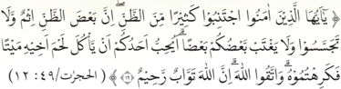

> **Deskripsi Visual:** Gambar ini adalah ilustrasi dari sebuah ayat Al-Quran yang ditampilkan dalam buku pelajaran. Gambar ini menunjukkan ayat Al-Quran yang ditulis dalam tulisan Arab yang ditransliterasi ke dalam huruf Latin. Ayat tersebut berada pada bagian tengah gambar dan ditandai dengan nomor ayat Al-Quran (14:9). Di sebelah kiri ayat tersebut ada gambar dua orang yang sedang berbicara, mungkin sebagai penjelasan atau interpretasi dari ayat tersebut. Di sebelah kanan ayat tersebut ada gambar dua orang yang sedang berjalan, mungkin juga sebagai penjelasan atau interpretasi dari ayat tersebut. Gambar ini menggunakan warna-warna dasar seperti hitam, putih, dan coklat untuk menambahkan efek visual. Gambar ini memiliki tujuan untuk membantu pembaca memahami ayat Al-Quran tersebut dengan lebih baik melalui penggambaran visual.

ِ

ٌ

ْ

ٌ

َ

َ

َ

ُ

ْ

ُ

Artinya: Wahai orang-orang yang beriman! Jauhilah banyak dari prasangka, sesungguhnya sebagian prasangka itu dosa, dan janganlah kamu mencari-cari kesalahan orang lain , dan janganlah ada di antara kamu yang menggunjing sebagian yang lain. Apakah ada di antara kamu yang suka memakan daging saudaranya  yang  sudah  mati?  Tentu  kamu  merasa  jijik.  Dan  bertakwalah kepada Allah, sesungguhnya Allah Maha Penerima taubat, Maha Penyayang (Q.S. al-Hujurāt/49: 12) .

َ

َ

َ

َ

َ

َ

ُ

ُ

ْ

ْ

َ

َ

َ

َ

َ

َ

ُ

َ

َ

َ

ّٰ

ّٰ

َ

ُ

َ

َ

َ

Melalui  ayat  ini,  Allah  Swt.  melarang  orang  beriman  melakukan  prasangka buruk, mencari-cari kesalahan pihak lain, dan melarang bergunjing. Bahkan, bagi  yang  gemar  bergunjing  diumpamakan  seperti  orang  yang  memakan daging saudaranya yang sudah meninggal. Sungguh perilaku yang bukan saja menimbulkan dosa, tetapi juga amat menjijikkan. Rasulullah Saw Bersabda: ى ل ع ر ت س َ ن : م م َّ ل َ س ه ِ  و ي ل ع ى الل َّ ل ِ ص الل ْ ل و َ س ر ال : ق ال ق ة ْ ر ي ر َ ِ ي ه ب أ ن ْ َع ة ِ  (رواه مسلم) ِ ر الآخ ا و ي ن ِ ي الد ف الل ه ر ت ٍ ، س ل ِ م ُ س م

َ

َ

ْ

ُّ

ُ

ّٰ

ُ

َ

َ

َ

ْ

Artinya: Dari Abu Hurairah berkata, Rasulullah Saw. Bersabda : Barang siapa menutupi aib saudaranya di dunia, maka Allah akan menutupi aibnya di dunia dan akhirat.' (HR. Muslim).

Berdasarkan penjelasan tersebut, janganlah kita menjadi pribadi yang suka membuka aib orang. Meskipun jika dikaitkan dengan kondisi saat ini di Indonesia, muncul begitu banyak infotainment yang mengulas gaya hidup

َ

ْ

َ

َ

ٰ

َ

 

---
## 📄 Halaman 74

para  selebriti,  baik  yang  ditayangkan  di  televisi  maupun  di  majalah  atau koran, yang mayoritas mengumbar aib diri sendiri maupun orang lain.

Disebabkan madharatnya yang begitu besar bagi perkembangan masyarakat luas, MUI (Majelis Ulama Indonesia) memfatwakan haramnya melihat tayangan infotainment tertentu yang isinya mengumbar aib. MUI dengan  jelas  menyatakan  infotainment  haram,  karena  merusak  keluarga, masyarakat dan negara, terkecuali untuk kepentingan hukum atau penyelidikan. Fatwa ini dikeluarkan pada bulan Oktober 2012.

### d. Akibat Aib

Aib  bukan  saja  membawa madharat (bahaya) kepada yang bersangkutan, tetapi juga pihak lain, termasuk  masyarakat  luas.  Kisah  Nabi  Musa  a.s. dengan umatnya dapat dijadikan ibrah (pelajaran). Secara  umum,  kisahnya  sebagai  berikut:  Terjadi kemarau panjang, lalu Sang Nabi mengajak umatnya  untuk Shalat Istisqa' .  Anehnya  setelah dilakukan, ternyata hujan tidak turun-turun.

Membuka aib orang lain, sama saja dengan membuka aib diri sendiri.

Akhirnya Shalat Istisqa' dilakukan  berkalikali, namun tidak kunjung turun hujan juga. Lalu Nabi Musa a.s mengadu kepada Allah Swt. kenapa tidak turun hujan? Dijawab oleh Allah Swt., hal itu disebabkan ada di antara umatmu yang suka berbuat dosa dan maksiat. Syarat hujan akan turun, jika peserta itu, harus keluar.

Nabi Musa a.s menyampaikan pidato di depan umatnya tentang hal itu. Namun, jamaah yang merasa dialah orangnya, malu jika keluar dari jamaah. Takut dipermalukan banyak orang, disebabkan aib yang dimiliki. Akhirnya orang tersebut, tidak mau keluar, tetapi bertaubat dengan sungguh-sungguh kepada Allah Swt. lalu diterima tobatnya, lalu tidak lama kemudian turunlah hujan.

### Aktivitas 2.5

Aktivitas Peserta Didik:

Kelas dibagi menjadi 5 kelompok, lalu carilah data tentang penyalahgunaan medsos yang merusak dunia pendidikan di Indonesia, khususnya akibat

 

---
## 📄 Halaman 75

bocornya kunci jawaban saat UN (Ujian Nasional). Agar fokus, peristiwanya dimulai tahun 2014. Jadi kelompok 1 mengambil data tahun 2014, kelompok 2 tahun 2015, dan begitu seterusnya. Persiapkan juga buku catatan, atau laptop yang kalian miliki untuk presentasi. Lalu setelah mengetahui data yang ada, apa yang harus kalian lakukan, agar tidak terjadi penyalahgunaan medsos bagi diri sendiri, keluarga dan sekolah kalian!

H

### Penerapan Karakter

Setelah  menelaah  materi Cabang Iman: Memenuhi Janji, Mensyukuri Nikmat, Memelihara Lisan, dan Menutupi Aib Orang Lain ,  diharapkan peserta didik dapat membiasakan karakter dalam kehidupan sehari-hari, sebagai berikut.

---
**📊 Tabel**

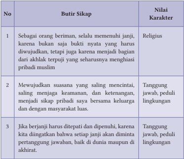

Tabel ini berisi 3 butir sikap yang dianggap penting dalam karakteristik seseorang, dengan nilai-nilai karakter yang diharapkan. Topik utama tabel ini adalah tentang sikap dan karakteristik yang diharapkan dalam masyarakat. Kolom pertama berisi 3 butir sikap, sedangkan kolom kedua berisi nilai-nilai karakter yang diharapkan. Data penting yang terlihat adalah bahwa semua 3 butir sikap tersebut memiliki nilai karakter yang sama, yaitu tanggung jawab, peduli lingkungan, dan religius. Ini menunjukkan bahwa dalam masyarakat, sikap-sikap yang dianggap penting memiliki nilai-nilai karakter yang sama, yang mencerminkan nilai-nilai yang diharapkan dalam masyarakat.

 

---
## 📄 Halaman 76

---
**📊 Tabel**

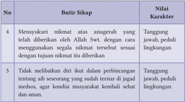

Tabel ini berisi dua butir sikap yang diukur melalui nilai karakter. Topik utamanya adalah sikap yang positif terhadap nikmat dan penggunaan sumber daya alamiah. Kolom pertama berisi nomor dan butir sikap, sedangkan kolom kedua berisi nilai karakter yang diukur. Butir sikap pertama adalah "Mensyukuri nikmat atas anugerah yang telah diberikan oleh Allah Swt. dengan menggunakan segala nikmat tersebut sesuai dengan tujuan nikmat itu diberikan", yang diukur dengan nilai karakter Tanggung jawab dan peduli lingkungan. Butir sikap kedua adalah "Tidak melibatkan diri ikut dalam perbincangan tentang aib sesorang yang sudah tiarsa di jagat mesos, agar kondisi masyarakat kembali sehat dan aman", juga diukur dengan nilai karakter Tanggung jawab dan peduli lingkungan. Data atau pola penting yang terlihat adalah bahwa kedua butir sikap tersebut memiliki nilai karakter yang sama, yaitu Tanggung jawab dan peduli lingkungan.

### I Refleksi

Sejak manusia berada di bumi, Allah Swt. terus menerus menurunkan rahmat dan nikmatnya, sehingga bumi tetap dapat memberikan segala kebutuhan manusia.

Namun, kenapa di dunia ini, masih ada kelaparan dan kemiskinan. Coba lakukan  telaah,  kenapa  bisa  terjadi  seperti  itu!  Jawabannya  cukup  1 lembar saja yang diperkaya dengan data, gambar, atau ilustrasi!

J

### Rangkuman

- Dinul  Islam  terdiri  dari  3  pokok/rukun. Pertama : Akidah ,  yaitu pokok-pokok ajaran tentang keimanan yang dikenal dengan sebutan 6 Rukun Iman . Kedua; Syariah, yakni pokok-pokok ajaran tentang hukum Islam yang dikenal dengan istilah 5 Rukun Islam . Selanjutnya K etiga : Akhlak , yaitu tata, etika atau moralitas hidup manusia yang bersumber dari wahyu Allah Swt.
- Iman itu memiliki 63 cabang atau bagian. Di antara cabang iman yang dibahas, sesuai materi ajar ada 4 cabang iman, yakni: (1) Memenuhi

 

---
## 📄 Halaman 77

- Janji, (2) Mensyukuri Nikmat, (3) Memelihara Lisan, dan (4) Menutupi Aib Orang Lain.
- Memenuhi janji merupakan kewajiban dan menjadi tanda orang itu beriman atau tidak. Janji itu harus ditepati dan dipenuhi, dan setiap janji  akan diminta pertanggung jawaban. Memenuhi janji menjadi faktor penting keberhasilan dan kesuksesan seseorang.
- Syukur merupakan  bentuk  keridhaan  atau  pengakuan  terhadap rahmat Allah Swt. dengan setulus hati. Bentuk syukur bisa berupa pujian  atau  pengakuan  terhadap  segala  nikmat  Allah  Swt.  yang dibuktikan  dengan  kerendahan  hati  dan  ketulusan  menerimanya yang diwujudkan melalui ucapan, sikap, dan perilaku.
- Lidah atau lisan menjadi bagian tubuh yang sangat berharga. Melalui lisan yang tidak tertata, muncul pertengkaran dan perselisihan. Lisan juga,  bisa  membuat  malapetaka  yang  besar,  bahkan  pembunuhan yang tidak terkira akibatnya.
- Sebaliknya, melalui lisan juga, muncul pelbagai macam kedamaian, kesejukan,  cinta  dan  harapan  yang  tersemai  di  lubuk  jiwa  untuk satuan,  puluhan,  ribuan,  jutaan  bahkan  milyaran  umat  manusia. Saat  ini,  masih  banyak  manusia  yang  tetap  memelihara  harapan, meski kondisinya memprihatinkan dan mengenaskan, karena masih percaya kepada janji-janji yang disampaikan.
- Lidah dan lisan kita harus dijaga betul. Tipis sekali perbedaan antara bahagia dan celaka serta senang susah, hanya dari penggunaan lidah. Apalagi  jika  dikaitkan  dengan  ajaran  Islam  yang  sudah  memberi rambu-rambu dalam penggunaan lidah.
- Aib adalah cela, noda, dan perilaku hina. Jika aib itu terbuka, maka sama saja dengan menaruh arang di muka . Jadi, yang bersangkutan sudah dibuka aibnya,  sehingga  akan  merasa  sangat  malu,  hancur lebur  martabat  dan  nama  baiknya,  seakan-akan  sudah  runtuh hidupnya.
- Begitu  beratnya  aib  yang  dibuka,  maka  siapa  pun  kita,  jika mengetahui aib, maka hendaklah kita menutupi dan menyimpan rapat-rapat aib tersebut, jangan sampai malah disebar ke khalayak

 

---
## 📄 Halaman 78

- ramai. Seperti diri kita sendiri yang tidak ingin aibnya diketahui pihak lain.
- Di antara penyalahgunaan teknologi, orang begitu mudah membuka aib  orang  lain.  Boleh  jadi  dilatarbelakangi  rivalitas  (persaingan), persinggungan  kepentingan,  bahkan  sifat iri dengki. Saat ini, orang  begitu  mudah  tumbang  nama  baik  dan  martabatnya  dari penyalahgunaan media sosial (medsos), baik dari WhatsApp, Twitter, Instagram maupun Facebook, Telegram, bahkan Blog .

### 1. Penilaian Sikap

### a. Penilaian Diri

Berilah tanda centang (√) pada kolom berikut dan berikan alasannya!

---
**📊 Tabel**

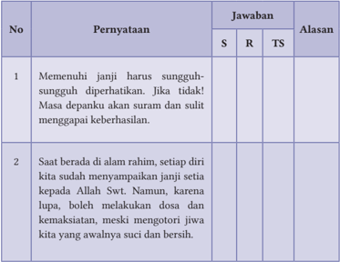

Tabel ini berisi dua pernyataan yang dianggap penting oleh para siswa, dengan jawaban yang diberikan melalui tiga pilihan: S (Sangat), R (Rendah), dan TS (Tidak Sangat). Pernyataan pertama mengajarkan bahwa setiap janji harus dihormati sepenuhnya, dan jika tidak, akan ada masa depanku yang panjang dan sulit untuk mencapai keberhasilan. Pernyataan kedua menekankan bahwa ketika kita berada dalam amalan rahim, kita harus menyampaikan janji kita kepada Allah Swt. Namun, jika kita lupa dan melakukan dosa atau kemaksiatan, meski kita memantau jiwa kita yang awalnya suci dan bersih, kita tetap harus menjaga diri dan tidak mengabaikan janji kita. Dari tabel ini, dapat disimpulkan bahwa topik utamanya adalah tentang pentingnya menjaga janji dan menjaga integritas dalam amalan. Kolom-kolom yang ada adalah No, Pernyataan, Jawaban, dan Alasan. Data atau pola penting yang terlihat adalah bahwa para siswa memiliki pandangan yang beragam tentang bagaimana menjaga janji dan menjaga integritas dalam amalan.

 

---
## 📄 Halaman 79

---
**📊 Tabel**

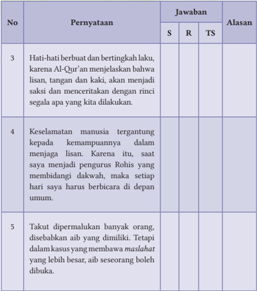

Tabel ini berisi pernyataan dan jawaban yang diberikan oleh seorang pengurus Rohis tentang tugas dan tanggung jawabnya. Topik utama tabel adalah tentang tanggung jawab dan perilaku yang harus diikuti oleh pengurus Rohis. Kolom-kolom yang ada meliputi No, Pernyataan, Jawaban S, R, TS, dan Alasan. Data penting yang terlihat adalah bahwa pengurus Rohis harus hati-hati dalam berbuat dan bertingkah laku karena Al-Qur'an menjelaskan bahwa lisan, tangan, dan kaki akan menjadi saksi dan menceritakan dengan rinci apa yang kita dilakukan. Selain itu, pengurus harus menjaga lisan mereka sendiri dan tidak membuang-buang waktu dengan berbicara di depan umum setiap hari. Selain itu, pengurus juga harus bisa menahan diri dari kebencian dan tidak membuang-buang waktu dengan berbicara di depan orang banyak.

Catatan: S= Setuju, R=Ragu, TS= Tidak setuju

### 2. Penilainan Pengetahuan

Berilah tanda silang (X) pada huruf A, B, C, D atau E pada pernyataan di bawah ini sebagai jawaban yang paling tepat!

- Hakikat Islam adalah menebar  keselamatan dan kedaimaian. Itu sebabnya, setiap muslim dilarang melakukan …

 

---
## 📄 Halaman 80

- khiyar dalam bertransaksi
- teror dan menakuti pihak lain
- hubungan yang ideal dengan non muslim
- hubungan yang mengalihkan peribadatan
- jasa timbal balik yang saling menguntungkan
- Gunakan lisan  dengan  sopan  dan  ditata  dengan  baik!  Kenapa?  Karena membawa banyak maslahat . Berikut ini, maslahat yang didapat, kecuali …
- banyak orang menyukai orang tersebut
- keadilan nampak bagi seluruh masyarakat
- tertariknya orang sangat dipengaruhi lisan
- mendamaikan pihak-pihak yang berselisih
- mendekatnya pergaulan yang harmonis
- Jika aib itu terbuka, maka sama saja dengan menaruh  arang  di  muka . Makna dari kiasan tersebut adalah  …
- pentingnya melihat keadaan setiap orang
- terbatasnya kemurnian hati dari pribadi yang terpilih
- betapa malunya siapa saja yang terbuka aibnya
- martabat seseorang di atas segala-galanya
- melakukan kebaikan jauh dari bermanfaat
- Teknologi bagai pisau bermata dua. Di satu sisi, banyak memudahkan hidup,  tetapi  disisi  lain,  disalahgunakan  untuk  hal-hal  yang  negatif, antara lain: … .
- salah pergaulan diakibatkan memilih twitter
- keamanan negara menjadi rapuh dan lumpuh
- mencari-cari ke absahan sistem nilai yang ingin dicari
- menjatuhkan nama baik dan martabat seseorang
- digunakan penelitian untuk meng kloning hewan
- Saat berada di alam rahim, setiap diri sudah menyampaikan janji setia kepada Allah Swt. Di antara janji tersebut adalah … .
- kembali ke jalan yang dijanjikan
- menjauhi gaya hidup yang seimbang

 

---
## 📄 Halaman 81

- tidak lupa akan keberadaan dunia dan akhirat
- akan kembali ke alam akhirat sesuai batas waktunya
- menjadi hamba Allah yang baik dan tetap hidup di jalan fitrah
- Keselamatan manusia tergantung kepada kemampuannya dalam menjaga lisan. Itulah sebabnya, Rasulullah Saw. bersabda: Tanda muslim sejati adalah … .
- tersedianya sandang dan pangan
- keamanan yang melingkupi keluarga
- memberikan sedekah sekedar kemampuan
- selamatnya pihak lain dari ganngguannya
- terhindarnya keadaan yang melelahkan
- Aib berasal dari salah, dosa dan kemaksiatan yang dilakukan. Bertumpuknya dosa sama saja dengan menumpuk aib. Namun, selalu ada waktu untuk memperbaiki. Berikut ini yang diperbolehkan untuk membuka aib seseorang, yaitu: … .
- menggunakan bukti-bukti yang handal
- mengerem keinginan pihak-pihak yang terlibat
- bertujuan menyelidiki untuk kebaikan masyarakat
- coba-coba mengusut kasus yang membawa mesteri
- memperlakukan lembaga yang faham tentang masalah
- Saat  ini,  membuka  aib  bukan  sekedar  dari  lisan,  tetapi  melalui  jarijari  pada  media sosial (medsos) masing-masing. Itu sebabnya, sebagai muslim harus selektif menggunakannya, yaitu
- bersumber dari pemerintah
- benar isinya dan sumbernya jelas
- isinya mengubah tatanan masyrakat
- ada dalil yang menguatkan tentang itu
- susunan kalimatnya sangat bagus dan teratur
- Memenuhi janji  menjadi  faktor  penting  keberhasilan  dan  kesuksesan seseorang. Rasulullah mencari contoh terbaik tentang itu. Berikut ini, keuntungan orang menepati janji, kecuali … .

 

---
## 📄 Halaman 82

- terus dicari keberadaanya, karena amanah sekali
- hidupnya menjadi berkah dan tidak pernah kurang
- dikembalikan fungsi imannya ke dalam dada manusia
- jauh dari keresaan dan kebimbangan dalam hidupnya
- hilang kekhawatiran dan kecemasan di segala situasi
- Mensyukuri  nikmat  yang  ada,  menjadi  kunci  kebahagiaan.  Hanya sayangnya, seringkali banyak manusia yang tidak menghargai apa yang sudah dimiliki, akibatnya … .
- tidak menyatunya nurani, kalbu dan hati
- jiwanya menjadi rendah dan rusak jasadnya
- jiwanya selalu melayang sampai ke ujung dunia
- mencari-cari lagi sampai semua keluarganya merasa puas
- hidupnya menjadi gelisah, bahkan mencari yang tidak halal

### Jawablah pertanyaan berikut dengan singkat dan benar!

- Rasulullah Saw. bersabda, ''Kalian tak akan masuk surga, sampai kalian beriman dan saling mencintai. Maukah kalian aku tunjukkan satu amalan, jika  dilakukan membuat kalian saling mencintai? Itu adalah sebarkan salam''  (HR.  Muslim dari Abu Hurairah). Sebutkan 3 kandungan makna dari kalimat sebarkan salam''?
- Sebutkan hubungan antara Iman (Akidah), Islam (Syariah), dan Ihsan (Akhlak)?
- Tulislah teks hadis yang menjelaskan bahwa cabang iman itu berjumlah 63, dan sebutkan 3 cabang iman yang lain, selain 4 cabang iman yang sudah dipelajari?
- Buatlah  kisah  nyata  tentang  runtuhnya  karir  seseorang  disebabkan penggunaan  medsos  yang  salah,  dan  apa  saja  pelajaran  yang  kalian ambil!
- Sebutkan 3 isi kandungan Q.S. Ibrāhīm/14: 7, khususnya yang dihubungkan dengan kata syukr dan kufr?

 

---
## 📄 Halaman 83

### 3. Penilaian Keterampilan

### a. Penilaian Proyek

### Aktivitas 2.6

### Aktivitas Peserta Didik:

Setiap kelas dibagi menjadi 4 kelompok. Buatlah true story dari 4 cabang iman  yang  dipelajari, yakni Memenuhi Janji, Mensyukuri Nikmat, Memelihara Lisan, dan Menutupi Aib Orang Lain .  Setiap  kelompok melakukan telaah:

- Kelompok  I  tentang  keberhasilan  orang/lembaga  yang Memenuhi Janji .
- Kelompok II tentang akibat buruk yang diterima orang/lembaga yang tidak Mensyukuri Nikmat.
- Kelompok  III  tentang  suksesnya  orang/lembaga  yang Memelihara Lisan.
- Kelompok  IV  tentang  akibat  buruk  yang  diterima  orang/lembaga yang tidak Menutupi Aib Pihak Lain .

### b. Penilaian Praktik

### Kelompok:

Kelas  dibagi  4  kelompok,  sesuai  dengan  Penilaian  Proyek  yang  sudah dilaksanakan.  Lalu  dipresentasikan  dan  didiskusikan  sesuai  dengan tugasnya, lalu membuat kesimpulan tentang kesuksesan atau kegagalan dari  4  cabang  iman  yang  dipelajari, sementara  itu  GPAI  memberikan penilaian dari masing-masing kelompok .

### Individual:

Setiap  peserta  didik  di  masing-masing  kelas,  membuat  telaah  tentang pengalaman  pribadi  terkait  4  cabang  iman  yang  dipelajari.  Hasilnya dikumpulkan 1 pekan ke depan! Sementara itu, GPAI bersama peserta didik  lainnya  (yang  ditugaskan)  untuk  memberikan  tanggapan  dan penilaian dari setiap peserta didik dari masing-masing kelas.

 

---
## 📄 Halaman 84

### c. Penilaian Portofolio

Tuliskanlah semua aktivitas keagamaan kalian, baik di sekolah, rumah, maupun di masyarakat pada buku Penilaian Pendidikan Agama Islam dan Budi Pekerti!

L

### Pengayaan

Syukur menjadi kunci utama dari kebahagiaan. Kenapa manusia modern saat ini, yang jika dikaji dari kemudahan hidup dan berlimpahnya barangbarang sandang, pangan, dan papan, namun hidupnya menjadi terasing, semakin lupa bahkan ingkar kepada Allah Swt. Lakukan analisis yang mendalam tentang problematika tersebut. Perkaya analisa kalian dengan kisah-kisah nyata.

Boleh ditulis tangan, atau cara yang lain. Cukup 1-2 lembar saja. Jangan lupa, sertakan sumber rujukannya ya!

 

---
## 📄 Halaman 85

KEMENTERIAN PENDIDIKAN, KEBUDAYAAN, RISET, DAN TEKNOLOGI REPUBLIK INDONESIA 2021

Pendidikan Agama Islam dan Budi Pekerti untuk SMA/SMK Kelas XI

Penulis:

Abd. Rahman dan Hery Nugroho

ISBN:

978-602-244-684-2

Bab 3

### Menghindari Perkelahian Pelajar, Minuman Keras, dan Narkoba

---
**🖼️ Gambar/Diagram**

> **Deskripsi Visual:** Gambar ini adalah ilustrasi yang menunjukkan tiga karakter utama dalam situasi yang serius. Di sebelah kiri, seorang polisi dengan topi berwarna cokelat dan kacamata hitam sedang menghentikan seorang pria muda yang berjalan dengan hoodie biru. Pria muda tersebut tampak sedikit ragu atau takut. Di tengah, ada dua pria lainnya yang sedang berbicara. Pria yang berada di depan menggenggam jari telunjuknya ke arah pria yang sedang ditegur oleh polisi, menunjukkan sikap penolakan atau kecemasan. Pria yang berada di belakang tampak lebih tenang dan berdiri teguh. Gambar ini menunjukkan hubungan antara polisi dan pria muda yang sedang ditegur, serta interaksi antara dua pria lainnya yang tampaknya sedang berbicara tentang situasi tersebut. Teks, angka, atau label penting tidak terlihat dalam gambar ini. Informasi kunci yang dapat diambil pembaca adalah bahwa ada konflik antara polisi dan pria muda, serta interaksi sosial antara dua pria lainnya.

川P

 

---
## 📄 Halaman 86

### Tujuan Pembelajaran

Setelah mempelajarari materi ini, kalian dapat:

- Memecahkan masalah perkelahian antarpelajar, minuman keras (miras), narkoba dalam perspektif Islam.
- Membuat konten tentang cara mengatasi masalah perkelahian antarpelajar, miras dan narkoba, serta diposting di media sosial,
- Meyakini bahwa agama melarang melakukan perkelahian antarpelajar, dan melakukan perusakan fasilitas umum, minuman keras, dan narkoba.
- Membiasakan sikap taat pada aturan, peduli sosial, tanggung jawab dan cinta damai.

### B Kata Kunci

- Miras
- Khamr
- Narkoba
C

### Infografis

### MENJAUHI PERKELAHIAN PELAJAR, MINUMAN KERAS DAN NARKOBA

---
**🖼️ Gambar/Diagram**

> **Deskripsi Visual:** Gambar ini adalah ilustrasi yang menunjukkan dua orang yang sedang berbicara. Pada gambar tersebut, seorang wanita dengan hijab merah sedang berbicara kepada seorang pria yang sedang membaca buku. Wanita tersebut memegang sebuah buku kecil dan tampaknya sedang memberikan informasi atau menjelaskan sesuatu kepada pria tersebut. Pria tersebut tampaknya tertarik pada apa yang disampaikan oleh wanita tersebut dan sedang mendengarkan dengan teliti.

Elemen-elemen utama dalam gambar ini adalah dua orang yang sedang berbicara, buku yang dimiliki oleh wanita, dan pakaian mereka. Wanita tersebut menggunakan hijab merah dan memegang buku kecil, sementara pria tersebut sedang membaca buku dan tampaknya tertarik pada apa yang disampaikan oleh wanita tersebut.

Teks, angka, atau label penting yang terlihat dalam gambar ini adalah tidak ada. Namun, informasi kunci yang dapat diambil pembaca adalah bahwa ada interaksi antara dua orang yang sedang berbicara, dan pria tersebut tampaknya tertarik pada apa yang disampaikan oleh wanita tersebut.

1

- Pelajar yang dicari Islam
- Menjauhi kekerasan (anarkis)
- Alkohol
- Perkelahian
- Rijs
- Tawuran
- Psikotropika
- Anarkis
- Menemukan Jati Diri
2

- Tuntunan Islam kepada Pelajar
Hal penting yang harus dihindari pelajar:

Narkoba

3

 

---
## 📄 Halaman 87

### D Ayo Tadarus

- Ayo  membiasakan  tadarus  Al-Qur'an,  baik  materi  ajarnya  aspek  AlQur'an dan Hadis, maupun aspek Keimanan, Fikih, Akhlak dan Sejarah Peradaban Islam (SPI) sebelum pembelajaran dimulai.
- Mari  tadarus  Al-Qur'an  dengan  baik  dan  benar  sesuai  dengan  ilmu tajwid dan makhārijul huruf. Semoga melalui pembiasaan ini, Allah Swt. selalu memberikan petunjuk dan kemudahan dalam memahami materi ajar  ini,  dan  kita  mampu  menerapkan  nilai-nilai  yang  dikandungnya dalam  kehidupan  sehari-hari.  Āmīn.

### Aktivitas  3.1

### Aktivitas Peserta Didik:

ٌ

ْ

ّ

ٌ

َ

ّ

َ

َ

ّ

َ

ُ

ٰۤ

َ

َ

ٗ

ّٰ

َ

َ

ٗ

َ

َ

ُ

َ

َ

َ

َ

َ

َ

ْ

َ

َ

ُ

ِ ج ر ام ل ز ا ال و اب ن ا ال و ِ ر ي ال و م ْ ر خ ا ال م ن ٓا ا و ن م ا ن ي ذ ِ ا ال ي ا ﴿ ي ن ُ ْ ط ي َّ الش ْ د ي ُ ر ا ي م َّ ٩٠ ا ِ ن ْ ن و ل ِ ح ف ت م ك َّ ل ع ل ه و ن ِ ب ت اج ف ن ِ ْ ط ي َّ الش م َ ل ع ِ ن م ن ْ ع م َّ ك د َ ص ي و ِ ر ْ س ي م َ ال و م ْ ر خ ى  ال ف اۤء ْ ض َ غ ب ال و ة او د ع ال م ك ن ي ب ق ِ ع و ي ن ا ) 90 -91 : 5/ ئدة ( الما ٩١ ﴾ ْ ن و ه ت ن م م ت ن ا َ ل ه وة ِ  ف ل َّ الص ن ِ َ ع ِ  و الل ر ِ ذ ِك

َ

ٰ

ْ

ُ

ُ

َ

ُ

ْ

ّ

ْ

َ

Saatnya, kita tadarus Q.S. asy-Syūrā/42: 40 dan Q.S. al-Māidah/5: 90-91, berikut ini, lalu salah satu peserta didik membacakan terjemahnya! ا ل ه َّ ن ۗا ِ ِ ى الل ل ع ه ر ُ ج ْ ا ف ح ل ص ْ ا ا و ف ع م َ ن ا  ۚف ه ل ِ ث م ة ئ ي ة ٍ  س ئ ي ا س ؤ ز َ ج ﴿ و ) 40 : 42/ ( الشورى ﴾ ْ ن ي ل ِ م الظ ح ِب ي ْ س ْ ص ْ س م َ َّ َّ ُّ ه

ِ

ُ

َ

ْ

َ

َ

ْ

ِ

ۤ

َ

ُ

َ

ْ

ُّ

ْ

ُ

ْ

َ

ْ

َ

ٰ

َ

ّٰ

ْ

َ

ُ

ْ

َ

َ

َ

َ

ِ

ْ

َ

َ

ْ

ُ

ُ

ْ

ُ

ِ

ْ

َ

ْ

ُ

َ

َ

َ

ُ

َ

ُ

َ

ْ

ْ

ْ

ُ

َ

َ

َ

َ

َ

ْ

ِ

َ

َ

ِ

َ

ْ

ْ

ُ

َ

ٰ

ُ

ٰ

َ

ُ

ِ

َ

ْ

َ

ِ

ْ

َ

ّٰ

َ

ِ

َ

ْ

َ

ُّ

ُّ

َ

ٰٓ

 

---
## 📄 Halaman 88

### Aktivitas 3.2

Aktivitas Peserta Didik:

Amati gambar atau ilustrasi berikut ini! Lalu berilah tanggapan kalian yang  dikaitkan  dengan  materi  ajar  yang  dipelajari,  yakni:  Menjauhi Perkelahian Antarpelajar, Minuman Keras (Miras) dan Narkoba

---
**🖼️ Gambar/Diagram**

> **Deskripsi Visual:** Gambar ini adalah ilustrasi yang menunjukkan seseorang sedang menggambarkan tangan mereka yang terlihat lemah dan lembut, dengan tulisan "JANGAN BUAH LEMBARAN HITAM HIDUPMU DENGAN NARKOBA!" di sebelahnya. Ilustrasi ini menggunakan warna hitam dan putih untuk menonjolkan perbedaan antara tangan yang lemah dan tangan yang kuat. Teks tersebut berfungsi sebagai pesan penting yang harus diperhatikan oleh pembaca, mengingatkan mereka tentang bahaya narkoba terhadap kesehatan mental dan fisik.

---
**🖼️ Gambar/Diagram**

> **Deskripsi Visual:** Gambar ini adalah ilustrasi yang menunjukkan tiga orang yang sedang berbicara di sebuah ruangan. Pada bagian atas, ada seorang pria tua dengan topi berwarna merah muda, sedang berbicara kepada dua orang remaja di bawahnya. Pria tua tersebut tampaknya sedang memberikan nasihat atau saran kepada remaja-remaja tersebut. Di sebelah kiri, ada seorang wanita dengan rambut panjang yang sedang mendengarkan dengan teliti. Di sebelah kanan, ada seorang pria muda yang tampaknya sedang menghadapi masalah atau kebingungan, karena dia sedang memegang kepala dan tampak sedih. Dalam gambar ini, elemen-elemen utama adalah tiga orang yang sedang berbicara dan berinteraksi satu sama lain. Relasi antara mereka adalah interaksi sosial, dimana pria tua sedang memberikan nasihat kepada remaja-remaja. Teks, angka, atau label penting tidak terlihat pada gambar ini. Informasi kunci yang dapat diambil pembaca adalah tentang hubungan sosial dan interaksi antar individu dalam situasi tertentu.

---
**🖼️ Gambar/Diagram**

> **Deskripsi Visual:** Gambar ini adalah ilustrasi yang menunjukkan dua karakter: seorang polisi dan seorang pria yang sedang diamankan. Polisi berdiri di depan pria yang dikenakan jaket hitam dengan lengan panjang dan celana biru. Pria tersebut tampak sedang diamankan oleh polisi, dengan tangan di belakang kepala dan posisi tubuh yang menunjukkan ketidakbebasan. Latar belakang menunjukkan ruangan penjara dengan pintu berlubang.

Elemen utama dalam gambar adalah dua karakter utama: polisi dan pria yang diamankan. Relasi antara mereka adalah hubungan kontrol dan diamankan. Polisi memiliki posisi dominan karena posisinya yang lebih tinggi dan lebih dekat dengan pria yang diamankan.

Teks, angka, atau label penting tidak ada dalam gambar ini. Namun, informasi kunci yang dapat diambil pembaca melalui gambar adalah tentang situasi keamanan dan kontrol sosial dalam konteks penjara atau pengadilan.

 

---
## 📄 Halaman 89

### Aktivitas 3.3

Aktivitas Peserta Didik:

Pahami dan renungkan artikel berikut ini, sebagai bagian dari pemahaman dari materi ajar yang akan dipelajari!

### Memilih Hidup

W ahai anakku!  Hidup  ini  memang  memilih,  dan  setiap  pilihan pasti diminta pertanggungjawaban. Di sela-sela beraktifitas, kalian  dapat  memilih  kegiatan  positif  (misalnya  rajin  menuntut  ilmu, berolah raga, berteman dengan yang baik-baik saja, atau ikut kegiatan keagamaan)  maupun  negatif  (terlibat  perkelahian,  sering dugem dan miras, bahkan narkoba.

Hanya harus disadari dan menjadi pengingat bagi semua, yakni akibat yang ditimbulkan sebagai konsekuensi pilihan yang diambil. Kalian bisa lihat sendiri, betapa banyak keterpurukan dan kehancuran hidup, akibat perkelahian  dan  tawuran,  terlibat  dalam  miras  dan  narkoba.  Itu  baru sanksi dunia. Bagaimana nasib kalian di akhirat? Tidak terbayangkan kan! Semua itu, semestinya dapat menahan kita dari berbuat yang tidak benar, meskipun ada kebebasan memilih kemana langkah kaki harus diarahkan, tetapi jangan salah memilih hidup. Orang bijak menyampaikan, hidup itu perjuangan yang harus dimenangkan, bukan terpuruk di jeruji penjara, badan kurus kering, karena narkoba, atau miras yang menghempaskan cita dan asa bagi diri sendiri, keluarga, bangsa dan negara.

Karena  itu,  miliki  cita  dan  asa  yang  besar,  berpikir  yang  maju! Sebenarnya  Allah  Swt,  telah  menjadikan  keberadaan  kita  ini  sebagai bibit  unggul ,  sehingga jangan sampai menjadi orang yang kalah, gagal dan  terpuruk.  Semestinya,  setiap  langkah  yang  diayunkan,  usahakan merupakan langkah menuju kesuksesan dan kemenangan.

 

---
## 📄 Halaman 90

Perhatikan sekitar kalian! Ada rekan, sahabat, atau anggota keluarga yang derajat dan martabatnya naik turun, akibat pilihan hidupnya. Itulah hidup. Kenapa naik, karena kesesuaian hidupnya dengan aturan Allah Swt. dan prinsip hidup yang dijalani memang benar. Sebaliknya kenapa turun,  karena  hidup  yang  dijalani  tidak  sesuainya  dengan  aturan  dan norma hidup.

Diadaptasi dari: Yesi Elsandra/yelsandra@yahoo.com Sumber: eramuslim

G

### Wawasan Keislaman

### Aktivitas 3.4

Aktivitas Peserta Didik:

Bentuk  kelas kalian menjadi 3 kelompok.  Lalu, setiap  kelompok mendapatkan  sub-materi  dari  materi  ajar  yang  akan  dipelajari,  yakni Menjauhi  P erkelahian Antarpelajar; Miras dan Narkoba ,  agar  dikaji, dipahami dan dipelajari. Hasilnya dipresentasikan!

Berikut ini, mari kita kaji bersama tentang ketiga hal tersebut:

### 1. Perkelahian Antarpelajar

### a. Pelajar yang dicari Islam

Islam itu menyelamatkan dan mendamaikan dunia, (termasuk bagi para  pelajar),  bukan  membuat  keonaran,  perilaku  menyimpang,  apalagi melakukan tawuran dan perkelahian. Islam itu juga datang dengan solusi, bukan  menambah  problema.  Tatap  dunia  ini  dengan  jernih,  maka  kalian akan mendapatkan jalan hidup yang menakjubkan dan mencengangkan.

Di  dunia  pendidikan,  khususnya  para  pelajar,  sudah  banyak  tinta emas  ditorehkan oleh para pelajar muslim  dengan  segenap  prestasi yang  diraihnya.  Kenapa  mereka  bisa  begitu?  Jawabannya  karena  Islam mengilhami  dan  menginspirasi  seluruh  tatanan  hidupnya,  agar  hidup  itu bermanfaat sebanyak-banyaknya untuk orang lain. Seperti yang disabdakan

 

---
## 📄 Halaman 91

oleh Rasulullah Saw., yakni: Sebaik-baik manusia adalah yang paling banyak manfaatnya untuk orang lain .

Prestasi  itu  tidak  hanya  berupa  capaian  yang  memiliki  level  dunia, nasional, provinsi atau kabupaten kota, tetapi hidup dengan benar berlandaskan  ajaran  Islam  bagi  diri  dan  lingkungan  terkecil,  termasuk  di sekolah juga, merupakan prestasi yang membanggakan. Buat apa berprestasi besar, sementara shalat tidak dilaksanakan.  Tampan bukan main, bahkan menjadi rebutan para gadis, tetapi tidak mampu membaca Al-Qur'an dengan benar.

Buat apa berkelahi dan terlibat tawuran, apa untungnya? Tidak ada kan! Bahkan kerugian yang didapatkan, termasuk sanksi akhirat sudah menunggu. Dunia ini penuh problema, jangan ditambah lagi dengan cara melarikan diri dari masalah. Jika ada masalah, cari solusinya tahap demi tahap, jika belum juga selesai, tetaplah optimis seraca memohon kepada Allah agar memberikan solusi terbaik, tetap bersandar kepada Allah Swt. Apapun keadaannya, susah senang  dan  sedih  gembira  selalu  bersama  Allah  Swt.  Jika  itu  bisa  kalian lakukan, niscaya dunia akhirat sudah berada di genggaman kalian.

### b. Definisi Perkelahian dan Tawuran Pelajar

Ada beberapa istilah yang sering dipakai untuk mengidentifikasi perilaku menyimpang yang biasanya dilakukan oleh pelajar, yaitu perkelahian dan tawuran. Keduanya  bagian  dari  problema  dunia  pendidikan,  utamanya terjadi di kota-kota besar, dan harus dicari solusi yang tepat, agar perilaku ini  tidak  dijadikan  kebiasaan  yang lumrah sebagai  bagian  dari  kenakalan pelajar atau remaja.

Perkelahian  antarpelajar  atau  remaja  adalah  suatu  bentuk  tindakan kekerasan atau agresi yang dilakukan oleh suatu kelompok pelajar dengan kelompok  pelajar  lain  yang  berusaha  untuk  menyingkirkan  pihak  lawan dengan menghancurkan atau membuat pihak mereka tidak berdaya.

Sementara  makna  dari tawuran  pelajar adalah perkelahian  yang melibatkan banyak pelajar, atau perkelahian yang dilakukan oleh sekelompok orang yang mana perkelahian tersebut dilakukan oleh orang yang sedang berstatus  sebagai  pelajar.  Secara  psikologis,  perkelahian  yang  melibatkan pelajar usia remaja digolongkan sebagai salah satu bentuk kenakalan remaja ( juvenile delinquency ).

 

---
## 📄 Halaman 92

Kenakalan  pelajar  atau  remaja,  menurut  Sarlito  W.  Sarwono  adalah tindakan  oleh  seseorang  yang  belum  dewasa  yang  sengaja  melanggar hukum dan yang diketahui oleh anak itu sendiri bahwa jika perbuatannya itu sempat diketahui oleh petugas hukum ia bisa dikenai hukuman.

Kenakalan remaja, termasuk perkelahian pelajar, dapat dibagi menjadi 2 jenis, yaitu:

- Delikuensi Situasional ,  yakni perkelahian terjadi karena adanya situasi yang mengharuskan mereka  untuk  berkelahi.  Keharusan  itu  biasanya dipicu adanya kebutuhan untuk memecahkan masalah secara tepat.
- Delikuensi Sistematik, yakni: para pelajar yang terlibat dalam perkelahian itu berada di dalam suatu organisasi tertentu atau geng yang memiliki aturan  dan  kebiasaan  tertentu  yang  harus  diikuti  oleh  anggotanya, termasuk berkelahi, melukai, mencuri dan tindak pidana yang lain.

### c. Faktor Penting Adanya Perkelahian Pelajar.

Jika kita sepakat bahwa perkelahian pelajar menjadi bagian dari kenakalan remaja, termasuk kelainan perilaku remaja pada umumnya, maka banyak faktor penting adanya perkelahian pelajar, antara lain:

- Rational  Choice ,  yaitu  adanya  perkelahian  pelajar  disebabkan  faktor individu,  motivasi,  pilihan  dan  kemauannya  sendiri.  Di  Indonesia, banyak yang menyetujui pendapat ini, misalnya anak nakal ditaruh di pesantren, agar imannya mantap, sehingga tidak nakal lagi.
- Social  Disorganization ,  yaitu  adanya  perkelahian  pelajar  disebabkan faktor lingkungan. Berkurangnya atau hilangnya pranata budaya yang selama ini menopang harmoni sosial. Misalnya orang tua yang semakin sibuk,  melupakan  pendidikan  anak-anaknya,  atau  guru  yang  terlalu banyak memberikan peer, dan abai dengan bimbingan dan arahannya.
- Strain, yaitu adanya perkelahian pelajar disebabkan faktor tekanan yang besar dari masyarakat, misalnya kemiskinan di satu sisi, sementara di pihak lain orang kaya yang sering mempertontonkan kekayaannya.
- Differential  Association ,  yaitu  adanya  perkelahian  pelajar  disebabkan faktor salah pergaulan. Pelajar yang terbiasa bergaul dengan pelajar yang tukang tawuran, anak yang malas belajar, suka mencuri, bolos belajar, maka semua itu menjadi perekat bagi pelajar yang awalnya baik-baik saja.

 

---
## 📄 Halaman 93

- Labbeling ,  yaitu adanya perkelahian pelajar disebabkan faktor terbiasa dicap  sebagai  pelajar  yang  nakal.  Jika  seorang  pelajar  sering  dilabeli sebagai pelajar nakal oleh banyak pihak, maka label tersebut merasuk di dalam dada, akibatnya jadilah pelajar yang nakal.
- Male Phenomenon , yaitu adanya perkelahian pelajar disebabkan faktor jenis kelamin, bahwa anak laki-laki lebih nakal dibanding anak perempuan.  Alasannya  anak  laki-laki, biasanya lebih nakal, atau besarnya budaya maskulin , sehingga wajar jika anak laki-laki itu nakal.

### d. Ikhtiar Mencegah Perilaku Menyimpang

Perilaku menyimpang, termasuk perkelahian pelajar, harus segera dihentikan, jangan dianggap remeh dan lumrah, agar tidak terjadi skala yang lebih besar. Ingat kebakaran besar, dimulai dari titik api yang kecil. Berikut ini beberapa upaya pencegahan yang dapat dilakukan, yaitu:

- Beri  kesempatan  yang  banyak  agar  pelajar  dapat  mengembangkan segala minat, bakat dan potensinya, sehingga optimal menemukan jati dirinya dan orientasi hidup yang dituju, serta wujudkan kondisi sekitar yang sehat, aman dan tenteram.
- Wujudkan kehidupan keluarga yang harmonis. Hubungan antar keluarga berjalan baik. Jaga betul keutuhan dan ketenteraman di antara keluarga. Begitu juga, jika anak berada dalam asrama atau tempat tertentu.
- Setiap anak itu unik, bahkan yang lahir kembar sekalipun. Karena itu, jangan  membiasakan  menyamaratakan  potensi  anak,  meski  dengan saudaranya  sendiri,  justru  itu  menjadi  pemicu  iri  hati.  Jika  akan mengambil keputusan, bentangkan segala alternatif yang ada, lalu suruh yang bersangkutan memilih atas kesadaran sendiri. Itu jalan terbaik dan tepat yang perlu dilakukan.
- Di  samping  faktor  keluarga,  pengembangan  pribadi  yang  optimal melalui pendidikan di sekolah, memiliki pengaruh yang besar. Melalui pendidikan yang baik, anak akan mampu mengontrol gejolak jiwanya, sehingga tidak melampiaskan ke hal-hal yang tidak perlu.
- Bentuk perkembangan pelajar di lingkungan sekolah dengan baik. Sebab, sekolah  berfungsi  sebagai  sarana  pendidikan,  bimbingan  dan  sebagai tempat perlindungan, jika ada problema yang muncul. Itulah pentingnya Guru  BP  dan  guru  senior  yang  memiliki  banyak  pengalaman  hidup,

 

---
## 📄 Halaman 94

- sehingga dapat ditransformasikan ke dalam jiwa anak yang menghadapi masalah.
- Pentingnya membentuk banyak organisasi atau lembaga yang mewadahi aktivitas  pelajar  atau  anak,  baik  di  lingkup  sekolah  (misalnya  OSIS dengan segala sub-unitnya) maupun di lingkungan tempat tinggal sang pelajar, seperti: Karang Taruna, Majelis Ta'lim Remaja, Kelompok Belajar dan semacamnya.
- Melakukan usaha untuk meningkatkan kemampuan pelajar atau remaja di  bidang  tertentu  sesuai  minat  dan  bakat  masing-masing,  sehingga semakin tumbuh kepercayaan dirinya, karena di mata teman-temannya dia  memiliki  skill  dan  keterampilan  yang  memadai.  Tidak  seperti  di kebanyakan sekolah yang orientasinya hanya nilai, angka rapot bagus, atau berapa rangkingnya.

### e. Penanganan Pelajar yang Menyimpang

Minimal ada 5 penanganan terhadap pelajar yang menyimpang, yaitu:

- Kepercayaan .  Sang  pelajar  harus  memiliki kepercayaan kepada pihakpihak yang mau membantunya (wali kelas, guru BP, guru agama, dan lainnya).  Mereka  para  pelajar  yakin  akan  ditolong  dan  tidak  akan dibohongi.  Jika  pelajar  itu  lebih  memilih  'pihak  luar',  ya  tidak  apa-apa, karena biasanya 'pihak dalam' ada kepentingan lain atau tidak tulus untuk menolongnya.
- Kemurnian Hati . Pelajar itu sudah percaya bahwa penanganan ini tidak bersyarat.  Buat  pelajar  atau  remaja,  urusan  membantu,  ya  membantu saja.  Tidak  perlu  ditambahi,  'tetapi  tetapi'.  Sebab  itu,  pelajar  lebih mempercayai  teman-temannya  sendiri,  jika  menghadapi  problema, meski terkadang nasehatnya tidak utuh dan solusinya bersifat parsial atau sepotong-potong.
- Kemampuan mengerti dan menghayati (empathy) perasaan pelajar atau remaja .  Disebabkan posisi yang berbeda antara anak (pelajar) dengan orang  dewasa  (orang  tua,  guru),  sulit  bagi  orang  dewasa  berempati kepada  pelajar,  karena  kepentingan  yang  susah  dikalahkan.  Biasanya orang dewasa merasa lebih unggul dan kurang menghargai posisi pelajar.
- Kejujuran . Ini penting dilakukan, karena sang pelajar ingin keterbukaan, termasuk sanksi yang diterima, meskipun tidak menyenangkan. Katakan

 

---
## 📄 Halaman 95

yang benar itu benar. Sebaliknya, yang salah itu salah. Jangan sampai terjadi,  ini  salah  bagi  pelajar,  sementara bagi orang dewasa itu benar. Jika ini yang terjadi, maka runtuhlah kepercayaan pelajar kepada orang dewasa.

- Mengutamakan  persepsi  pelajar  sendiri .  Pelajar  itu  akan  memandang persoalan dari sudut pandangnya sendiri. Terlepas dari kenyataan yang ada, sang pelajar akan bereaksi sesuai sudut pandangnya sendiri. Karena itu,  kemampuan  untuk  memahami  pandangan  pelajar,  sangat  berarti untuk membangun empati terhadap pelajar atau remaja.
Berdasarkan semua paparan tersebut, Islam mengambil sudut pandang yang berbeda tentang perkelahian pelajar. Kuncinya kepada posisi balig, jika seseorang itu sudah balig, maka semua perbuatanya (baik dan buruk) menjadi tanggung jawabnya. Tidak seperti hukum positif di Indonesia, yang biasanya sanksi atas perbuatan dikenakan jika usianya antara 17 atau 18 tahun.

Sebab itu, sejak dini Islam mengarahkan orang tua agar membimbing dan  mendidik  puta  putrinya  sejak  kecil  tentang al-ahkamul  al-kham sah, yakni 5 hukum, meliputi: wajib, sunnah, mubah, makruh dan haram. Melalui jalan tersebut, sejak kecil anak-anak diajarkan untuk tidak melakukan tindak kekerasan, termasuk perkelahian atau tawuran pelajar. Ajaran Islam dengan tegas tidak pernah mengajarkan kekerasan ( anarkis ).

ۤ

Apapun alasannya, mengambil jalan kekerasan, tidak dibenarkan dalam Islam.  Tindakan  kekerasan  itu,  bukan  perwujudan  dari  Islam.  Jika  ingin membela kebenaran, harus menggunakan cara-cara yang benar juga. Tidak asal  bela  saja,  sementara  kebenaran  disampingkan.  Sebab,  sebagai  pelajar muslim, kita semua diingatkan dengan visi dan misi Islam sebagai agama yang damai, santun, dan menjadi rahmat untuk semesta alam ( Islam  yang rahmatan lil 'ālamin ),  sebagaimana firman Allah Swt: ) 107 : 21/ ء ( الانبيا ﴾ ْ ن ي م ِ ل ع ِل ل ة م ح ا ر َّ ا ِ ل ٰ ك ن ل ْ س ر آ ا م ﴿ و

َ

َ

ٰ

ْ

ّ

ً

َ

ْ

َ

َ

ْ

َ

َ

َ

َ

Artinya: dan tiadalah Kami mengutus kamu (Muhammad), melainkan untuk (menjadi) rahmat bagi semesta alam. (Q.S. al-Anbiyā'/21: 107)

Sekarang ini, Islam dihadapkan pada problema besar, yakni membumikan sekaligus mewujudkan Islam sebagai rahmat bagi alam semesta . Pertanyaan

 

---
## 📄 Halaman 96

yang  segera  muncul  adalah  apa  kiat  dan  strateginya,  sehingga  Islam  itu benar-benar  mampu  menjawab  realitas  problematika  kemanusian,  damai untuk semua, dan menebar keselamatan dan ketenteraman untuk sesama?

Tentu, bukan persoalan mudah untuk menjawab problematika tersebut, namun  yang  terpenting  adalah  komitmen  semua  umat  Islam,  apapun profesinya (termasuk pelajar muslim), memerankan visi dan misinya dengan benar--di  tengah  problematika  dunia  yang  semakin  kompleks--sejalan dengan risalah Islam seperti yang pernah dicontohkan oleh Rasulullah Saw. melalui Piagam Madinah.

Melalui Piagam Madinah inilah, Islam mampu menghadirkan kedamaian, ketenteraman dan harmoni yang tidak menimbulkan luka, apalagi merusak. Sebuah manajemen hidup yang saling berdampingan secara harmonis antar satu sama lain, tanpa perlu mengorbankan nyawa, melukai fisik dan jiwa, merusak harta benda, dan prinsip-prinsip keagamaan yang sudah disepakati bersama.

2. Minuman Keras (Miras) a. Pengertian Khamr ( خمر ) adalah jenis minuman dan makanan yang dapat memabukkan dan  menghilangkan  kesadaran  seseorang.  Makna  lainnya  adalah  segala apapun yang memabukkan atau merusak akal sehat. Berlandaskan pengertian tersebut, segala jenis narkoba termasuk makna dari khamr . Rasulullah Saw. bersabda: ' Setiap yang memabukkan adalah khamr, dan setiap khamr adalah diharamkan '. (HR. Ahmad dan Abu Daud)

Termasuk jenis khamr adalah alkohol yang merupakan zat kimia yang dipergunakan untuk beragam keperluan  di  dunia  medis,  antara  lain  disinfektan, pembersih, pelarut, bahan bakar, dan sebagai campuran zat  kimia  lainnya.  Penggunaan  alkohol  dalam  makna terakhir,  tidak  masuk  dalam  kategore khamr ,  dan  itu berarti diperbolehkan (tidak haram)

Miras menjadi induk segala kemaksiatan

Sebaliknya, jenis-jenis obat psikotropika dan narkotika, meski tidak mengandung alkohol, ia tetap haram digunakan. Sebab, dampak  negatifnya  sangat  buruk  sekali,  baik  dilihat  dari  sisi  akal  pikiran, kesehatan, harta benda maupun kepribadian bagi semua.

 

---
## 📄 Halaman 97

Itulah  sebabnya khamr menurut  istilah Al-Qur'an  disebut رجس / rijs (perilaku  yang  sangat  buruk,  jijik,  kotor,  bahkan  najis).  Perhatikan  isi kandungan Q.S. al-Maidah/5: 90.

Begitu  besarnya  kerugian  akibat khamr ,  antara  lain:  menjadi  sumber penyakit, merusak saraf dan mental, bersifat racun/meracuni, merusak liver, merusak akhlak dan sumber segala kerusakan.

Itulah  sebabnya,  Islam  mengelompokkan  perilaku  tersebut,  sebagai bagian  dari  perbuatan  setan,  dan  Al-Qur'an  secara  tegas  menyebutkan  bahwa setan itu musuh  utama  manusia  (Q.S. al-Isrā'/17: 26-27). Itulah sebabnya, perilaku tersebut harus dihindari dan dijauhi, jangan pernah untuk mencobacoba, khususnya pada khamr .

ْ

### b. Khamr Berdasarkan Telaah Q.S. al-Māidah/5: 90-91. 1. Bacaan ِ ن م ْ س ِ ج ر ام ل ز ا ال و اب ْ ص ن ا ال و ِ ر ْ س ي م َ ال و م ْ ر خ ا ال م َّ ن ٓا ا و ن م ا ن ي ذ ِ َّ ا ال ُّ ه ي ا ﴿ ي ن ا ن ُ ْ ط ي َّ الش ْ د ي ُ ر ا  ي م َّ ن ٩٠  ا ِ ْ ن و ل ِ ح ف ت م ك َّ ل ع ل ه و ن ِ ب ت اج ف ن ِ ْ ط ي َّ الش م َ ل ع ِ الل ر ِ ذ ِك ن ْ ع م َّ ك د َ ص ي و ِ ر ْ س ي م َ ال و م ْ ر خ ِ ى ال ف اۤء ْ ض َ غ ب ال و ة او د ع ال م ك ن ي ب ق ِ ع و ي ) 90 -91 : 5/ ئدة ( الما ٩١ ﴾ ْ ن و ه ت ن م م ت ن ا َ ل ه وة ِ  ف ل َّ الص ن ِ َ ع و

ْ

ّٰ

َ

ّ

ٌ

ْ

ٰ

َ

ُ

ْ

َ

ُ

ُ

ْ

َ

ِ

ْ

### 2. Terjemah Ayat

Artinya: Wahai orang-orang yang beriman! Sesungguhnya minuman keras, berjudi,  (berkurban  untuk)  berhala,  dan  mengundi  nasib  dengan  anak panah, adalah perbuatan keji dan termasuk perbuatan setan. Maka jauhilah (perbuatan-perbuatan) itu, agar kamu beruntung. (Q.S. al-Māidah/5: 90)

Dengan minuman keras dan judi itu, setan hanyalah bermaksud menimbulkan permusuhan dan kebencian di antara kamu, dan menghalang-halangi kamu dari  mengingat  Allah  dan  melaksanakan  shalat,  maka  tidakkah  kamu  mau berhenti?. (Q.S. al-Māidah/5: 91)

ُ

َ

َ

َ

ُ

َ

ْ

َ

َ

َ

ُ

ُ

َ

ْ

ْ

ُ

ْ

َ

ُ

َ

ُ

َ

َ

َ

َ

ُ

ْ

ْ

ُ

َ

َ

َ

ِ

َ

ْ

َ

ْ

ُ

َ

َ

َ

َ

ْ

َ

ٰ

ْ

ُ

ُ

َ

ْ

َ

َ

َ

ِ

ٰٓ

ْ

َ

ُّ

َ

ْ

ْ

ْ

ٰ

َ

ِ

ۤ

ِ

َ

ُ

َ

ْ

ُّ

ْ

ُ

ْ

َ

ْ

َ

ٰ

َ

 

---
## 📄 Halaman 98

### 3. Asbabun Nuzul

Diriwayatkan  dari  Abu  Hurairah  r.a.:  Saat  Rasulullah  Saw.  datang  di Madinah,  masih  banyak  yang  meminum khamr dan  makan  dari  hasil judi. Mereka bertanya tentang kedua hal tersebut, maka turunlah Q.S. alBaqarah/2:  219.  Dipahami  oleh  sebagian  mereka  bahwa  itu  hanya  dosa besar, bukan haram.

al-

Karena dipahami seperti itu, kebiasaan buruk ini masih tetap dilanjutkan. Ketika  ada  kaum  muhajirin  menjadi  imam  shalat  dalam  keadaan  mabuk, terjadilah kesalahan dalam  membaca  Al-Qur'an.  Lalu  turunlah Q.S. Nisā'/4:  43  yang  berisi  larangan  mengerjakan  shalat  dalam  keadaan  mabuk.

Meskipun sudah turun ayat ini, yang memberi isyarat lebih jelas dan tegas, agar dihindari, dijauhi dan tidak dilakukan, kebiasaan buruk itu masih juga dilakukan. Akhirnya turunlah Q.S. al-Māidah/5: 90-91, yang menegaskan keharaman khamr sehingga mereka pun berkata, 'Ya Allah, kami (bertekad) berhenti dari meminumnya'.

Selanjutnya,  mereka  bertanya  kepada  Rasulullah  Saw.:  bagaimana orang-orang terdahulu yang terbunuh di jalan Allah Swt. atau mereka yang meninggal di tempat tidur, padahal dahulunya, mereka itu suka meminum khamr atau makan hasil perjudian, padahal keduanya kini telah ditetapkan sebagai perbuatan keji dan perbuatan setan. Lalu turunlah Q.S. al-Māidah {5}: 93 yang menjelaskan bahwa apa yang telah dilakukan umat muslim sebelum datangnya larangan ini tidak dinilai sebagai suatu dosa.

### c. Kandungan Isi

Isi dan kandungan ayat-ayat ini, antara lain:

- Ayat ini merupakan ayat terakhir yang membincang tentang keharaman khamr dan  judi.  Melalui  ayat  ini  nyata,  jelas,  dan  tegas  tentang keharamannya, sudah tidak ada toleransi lagi. Seperti telah dikemukakan terdahulu (pahami kembali Q.S. al-Baqarah/ 2: 219).
- Allah Swt. tidak serta merta mengharamkan sesuatu, tetapi terlebih dahulu mengajak  pola  pikir  dan  jiwa  manusia  untuk  bersama-sama  menilai kenapa  sesuatu  itu  menjadi  wajib  atau  diharamkan.  Hal  ini  menjadi bagian pendidikan bagi umat/manusia, agar muncul kesadaran diri sendiri tentang pentingnya ajaran agama itu dilaksanakan atau dijauhi.

 

---
## 📄 Halaman 99

- Kedua ayat ini merupakan rangkaian aturan bagi umat, agar menjauhi khamr (miras), judi, berkorban atau mempersembahkan sesuatu untuk berhala, mengundi nasib dengan anak panah, semua itu adalah tradisi jahiliah yang sia-sia, dan termasuk rijs, yakni perbuatan keji, kotor, jijik dan bukti nyata kebobrokan akhlak/moral jika itu semua dilakukan.
- Larangan  perbuatan  yang  berurutan  (dimulai khamr (miras,  narkoba) sampai mengundi nasib), menurut Imam al-Bukhari, ada hikmah dan maknanya,  antara  lain: khamr menjadi  cara  yang  paling  mudah menghabiskan  harta; disusul dengan perjudian yang akan cepat membinasakan harta; lalu pengagungan sesuatu (berhala) yang semestinya bukan tuhan yang merupakan pembinasaan agama. Semua larangan ini dulu, kini, dan esok, dampak negatifnya sudah terbukti.
- Pelajaran berharga yang dapat diambil dari  ayat  ini,  adalah  sistem  Islam  dalam memberi solusi dari perilaku buruk tersebut yang berasaskan akidah. Dimulai dari basis keimanan, pondasi (baca: iman/akidah umat dibimbing terlebih dahulu) diperbuat terlebih dahulu, selanjutnya di bidang syariah/ ibadah, lalu akhlak.
- Hikmah lainnya adalah siapa pun orang tua, guru,  pendidik,  ulama,  atau  mubalig,  jika ingin memperbaiki individu atau kelompok masyarakat,  materi  pembinaan  yang  harus
- didahulukan  adalah  bidang  yang  ada  hubungannya  dengan  akidah/ keimanan.  Hal  ini  sejalan  dengan  dakwah  Rasulullah  Saw.  selama  di Makkah (13 tahun lamanya, bandingkan dengan periode Madinah yang lebih  sedikit,  yakni  10  tahun)    masalah  akidah/keimanan  itulah  yang diprioritaskan.
- Salah satu keistimewaan manusia dibanding makhluk lain adalah akal pikirnya. Jika akalnya saja tidak berfungsi atau hilang keseimbangannya disebabkan khamr ,  apa  saja  dampak  negatif  yang  ditimbulkannya? Jawabannya tentu banyak sekali, mulai dari madharat bagi dirinya, lalu menimpa pula keluarga, bahkan menjalar ke masyarakat luas.
Bahaya khamr, akan susulmenyusul, sampai seseorang dengan penuh kesadaran sendiri menghentikannya

 

---
## 📄 Halaman 100

- Betapa pun majunya zaman sekarang ini, yang namanya berhala modern masih menjangkiti masyarakat luas, tak terkecuali sebagian umat Islam. Itulah sebabnya, ayat ini juga mengingatkkan tentang peran akal atau rasio dan kalbu (hati nurani) yang sangat penting. Jangan sampai terjadi benda  yang  tidak  bernyawa  (berhala)  yang  tidak  membawa  manfaat atau madharat sedikit pun, di tahbis kan memiliki sifat-sifat ketuhanan, tentu sikap dan perilaku tersebut sangat bodoh dan irasional .

### d. Sikap terhadap Khamr

Begitu berbahayanya khamr dalam kehidupan pribadi, keluarga, masyarakat, termasuk kelangsungan bangsa dan negara, maka sikap tepat yang perlu dilakukan adalah:

- Tidak  coba-coba  memakai  atau  meminum khamr (miras),  karena bahaya dan madharatnya sangat besar, baik bagi diri sendiri, keluarga, masyarakat, bangsa dan negara.
- Khamr ,  judi,  berkorban  atau  mempersembahkan  sesuatu  untuk  berhala, dan mengundi nasib, semua itu adalah rijs, yakni sikap dan perbuatan yang amat sangat tercela, buruk, keji, jijik, kotor, bahkan bisa bermakna najis.
- Bagi pihak yang berperan dalam pembinaan umat, pentingnya melakukan pentahapan dari mulai yang ringan, sedang, dan berat; bersama-sama menemukan  kenapa  ini  boleh  dan  itu tidak boleh;  menghindari pendekatan  memaksa  atau hitam putih ;  dan  mendahulukan  materi akidah atau keimanan berlanjut ke materi syariah dan akhlak.
- Mengedepankan pola hidup bersih lahir batin;  menjauhi  sikap  dan  perilaku  yang menjadikan kehidupan rugi secara cepat dan drastis;  tetap  menjaga  akalnya,  agar  tetap sehat (tidak dikotori dengan khamr ; mencari rezeki yang halal dan berkah; serta timbulnya kesadaran sendiri untuk menjalankan aturan agama secara baik dan benar.
Begitu besarnya kerugian, akibat khamr , termasuk narkoba, maka Islam mengelompokkan perilaku tersebut, sebagai bagian dari perbuatan setan, dan Al-Qur'an dengan tegas  menyatakan  bahwa  setan  itu  musuh  utama  manusia  (Q.S.  al-Isrā'/17:

Indahnya dunia, jangan sampai menjadi kelam, karena ulah kita sendiri yang coba-coba khamr

 

---
## 📄 Halaman 101

26-27). Itulah sebabnya, perilaku tersebut harus dihindari dan dijauhi, jangan pernah untuk mencoba-coba, khususnya pada khamr ( miras ) .

### 3.  Narkoba

### a. Narkoba Ditinjaui dari Islam

Istilah narkoba, di dalam Al-Qur'an memang tidak ditemukan padanannya. Meskipun begitu, tidak berarti Islam tidak menjelaskannya. Istilah ini harus didekati melalui qiyas ,  yakni  satu  masalah  yang  belum  ada nash -nya, dicarikan padanan dengan masalah yang sudah ada nash nya, disebabkan persamaan illat (sebab, landasan, motivasi hukum). Dalam hal narkoba, maka disamakan dengan khamr karena  sama-sama  memabukkan dan membahayakan atau merugikan. Oleh karena itu, narkoba disamakan dengan khamr . خمر

ٍ

Khamr ( ) adalah jenis minuman dan makanan yang dapat memabukkan  dan  menghilangkan  kesadaran  seseorang.  Pengertian  yang lain adalah segala jenis apapun yang memabukkan atau merusak akal sehat. Itulah sebabnya, segala jenis narkoba termasuk makna dari Khamr . Hal tersebut sejalan dengan sabda Rasulullah Saw.: ْ ك ِ ر ُ س م ل : ك م َّ ل َ س ه ِ  و ي ل ع ى الل َّ ل ِ ص الل ْ ل و َ س ر ال : ق ال ق م َ ر ع ْ ن اب ن ِ ع (رواه ابو داود) ام ر َ ح ْ ك ِ ر ُ س م ل َ ك و ر ٌ م خ

ُّ

ُ

َ

َ

ْ

َ

َ

ُ

ّٰ

َ

ّٰ

ُ

ُ

َ

َ

َ

َ

َ

ُ

ِ

َ

ٌ

َ

ٍ

ُّ

ُ

ْ

َ

Artinya: Dari Ibnu 'Umar dia berkata, Rasulullah Saw. bersabda: ' Setiap yang memabukkan adalah khamr, dan setiap yang memabukkan  adalah diharamkan '. (HR. Abu Daud).

Begitu juga, jenis-jenis obatan psikotropika dan narkotika, meski tidak mengandung alkohol, ia tetap haram digunakan. Sebab, dampak negatifnya sangat buruk sekali, baik dilihat dari sisi akal pikiran, kesehatan, harta benda maupun kepribadian bagi semua. Sebab itu, khamr menurut  istilah  Al-Qur'an disebut rijs (perilaku yang sangat buruk, jijik, kotor, bahkan najis).

Sebagai bagian untuk memperjelas pemahaman kita tentang narkoba, mari kita telaah ayat-ayat yang berbicara tentang khamr .  Terdapat urutan turunnya ayat-ayat yang berbicara tentang khamr ,  yakni ada 4 ayat yang dapat disimpulkan sebagai berikut:

 

---
## 📄 Halaman 102

- Ayat-ayat  tersebut  merupakan  kelanjutan  dari  kesadaran  umat  Islam (Periode Madinah), agar hidupnya disesuaikan dengan tuntunan Allah Swt. sesudah jelas dan nampak bukti-bukti kebenaran Islam.
- Urutan  ayat  tentang khamr adalah:  (1).  Q.S.  an-Nahl/16:  67,  bahwa kurma dan anggur dapat menghasilkan 2 (dua) hal yang berbeda, yakni khamr dan rezeki yang halal . (2). Q.S. al-Baqarah/2: 219 yang memberi isyarat lebih tegas agar khamr dijauhi dan dihindari. (3) Q.S. an-Nisā'/4: 43  yang  tegas  melarang,  agar  tidak  mabuk,  saat  mendekati  waktu shalat.  (4).  Q.S.  al-Māidah/5:  90)  dengan  tegas  mengharamkan khamr sepanjang waktu.
- Sebagai khalifah di  bumi,  manusia  diajak  oleh  Allah  Swt.,  agar  selalu menggunakan akal sehatnya, sehingga setiap manusia memiliki pilihan jalan mana yang akan ditempuh, baik atau buruk, benar atau salah, patut atau tidak patut (Q.S. asy-Syams /91: 8-10, Q.S. al-Balad/90: 8-10. Melalui cara ini, jangan salahkan pihak lain, jika ada manusia yang mendapatkan kesengsaraan  dunia  dan  akhirat  (Q.S.  al-Ghāsyiyah/88:  1-8,  Q.S.  anNaba'/78: 21-30).
- Manusia diajak berpikir, kenapa khamr diharamkan? Itulah sebabnya, Allah  Swt.  membentangkan  informasi  atau  penjelasan  tentang  dosa, madharat, dan bahaya yang ditimbulkan, meski disebutkan juga ada sisi manfaat dan keuntungannya.
- Islam menuntun  umatnya,  agar  selalu  menyibukkan  diri  dengan aktivitas yang positif (Q.S. al-Insyirāh/94: 7-8); sungguh-sungguh mencari dan menggapai kehidupan yang serba cukup, bahkan berlebih. Sebab, timbulnya khamr (segala sesuatu yang memabukkan, termasuk narkoba) dialami oleh manusia yang lari dari kenyataan, pengangguran, dan mereka yang belum tahu bagaimana hidup ini harus dijalani.
- Khamr itu merupakan  adat  dan  kebiasaan  (buruk).  Karena  itu,  perlu diluruskan secara bertahap, seperti kebiasaan buruk lainnya. Pelurusan itu dimulai dengan menggerakkan rasa keagamaan dan jiwa manusia, agar dapat menghentikan kebiasaan buruk tersebut.
- Akhir  ayat  ini  dipenuhi  pesan,  agar  umat  Islam  memiliki  cita  dan harapan, jika  diberi  kehidupan  (rezeki)  yang  berlebih,  melebihi  kadar kecukupan, memperbanyak membantu pihak lain yang membutuhkan (baik melalui zakat, infak, maupun sedekah).

 

---
## 📄 Halaman 103

Begitu besarnya kerugian dan madharat akibat khamr /narkoba, maka Islam mengelompokkan perilaku tersebut, sebagai bagian dari perbuatan setan, dan Al-Qur'an dengan tegas menyebutkan bahwa setan itu musuh utama manusia (Q.S.  al-Isrā'  {17}:  26-27).  Itulah  sebabnya,  perilaku  tersebut  harus  dihindari dan dijauhi, jangan pernah mendekati apalagi  berusaha mencoba-coba.

### b. Narkoba Ditinjaui dari Hukum Indonesia

### 1. Pengertian

Narkoba adalah singkatan dari nar = Narkoba; ko = Psikotropika; dan ba =  Bahan-bahan  adiktif  (misalnya  alkohol,  rokok,  kopi,  dan  lain sebagainya).

Narkotika adalah  zat  atau  obat    yang  berasal dari  tanaman  atau  bukan  tanaman,  baik  sintesis maupun semi sintetis, yang menyebabkan penurunan atau perubahan kesadaran, hilangnya rasa,  mengurangi  sampai  menghilangkan  rasa nyeri,  dan  dapat  menimbulkan  ketergantungan, yang dibedakan ke dalam golongan-golongan (sebagaimana  terlampir  dalam  UU  Nomor  35 Tahun 2009 tentang Narkotika).

Berani katakan tidak kepada narkoba

Psikotropika adalah zat atau obat, baik alamiah maupun sintetis, bukan narkotika,  yang  berkhasiat  psikoaktif  melalui  pengaruh  selektif  pada susunan saraf pusat yang menyebabkan perubahan khas pada aktivitas mental dan perilaku (UU Nomor 5 Tahun 1997 tentang Psikotropika).

Zat Adiktif adalah obat serta bahan-bahan aktif yang apabila dikonsumsi oleh  organisme  hidup,  maka  dapat  menyebabkan  kerja  biologi  serta menimbulkan  ketergantungan  atau  adiksi  yang  sulit  dihentikan  dan berefek ingin menggunakannya secara terus menerus.

Tersedianya zat yang berkhasiat menghilangkan  rasa sakit, atau menimbulkan perubahan suasana batin dan perilaku, merupakan bagian dari kemurahan Allah Swt. yang menciptakan rasa sakit atau letih, dan pada waktu yang sama menyediakan obat atau penawarnya.

Hanya yang menjadi masalah, jika zat tersebut disalahgunakan (digunakan  secara  berlebihan  dan  berulangka  kali  di  luar  tujuan

 

---
## 📄 Halaman 104

pengobatan, atau tanpa melalui konsultasi dan pengawasan dokter) akan menimbulkan dampak ketergantungan atau kecanduan. Ketergantungan kepada  zat  tertentu,  dapat  menimbulkan  gangguan  jasmani,  rohani, termasuk penderitaan yang mengakibatkan kematian.

Manusia,  apalagi  sebagai  orang  beriman,  yang  diberikan  anugerah keimanan  dan  akal  pikir  yang  sehat,  seharusnya  mampu  menghindari narkoba. Dua sampai tiga dasawarsa terakhir, penggunaan dan peredaran narkoba secara ilegal  di  berbagai  belahan  dunia  termasuk  di  Indonesia menunjukkan peningkatan yang tajam, merambah semua kalangan, tidak terkecuali di dunia pendidikan, serta meminta banyak korban berjatuhan.

Di sisi  lain,  penyalahgunaan narkoba juga berkaitan dengan beragam tindak kejahatan, kecelakaan lalu lintas, kecelakaan kerja, putus sekolah, PHK (Pemutusan Hubungan Kerja), hancurnya masa depan, termasuk di dalamnya penularan HIV/AIDS.

Begitu  juga,  dampak  negatif  lain,  sampai  pada rusaknya organ vital seperti: otak, jantung, paru-paru,  hati,  ginjal,  organ  reproduksi,  serta beragam gangguan rohani, seperti perasaan, pikiran,  kepribadian,  sikap  dan  perilaku.  Semua itu, menjadi sebab kita dilarang menyalahgunakan narkoba yang tidak sesuai dengan ketentuan medis dan melanggar hukum.

### 2. Penyalahgunaan Narkoba

Penyalahgunaan Narkoba adalah penggunaan narkoba di luar keperluan medis, tanpa pengawasan dokter, dan merupakan perbuatan melanggar hukum (Pasal 59, UU Nomor 5 Tahun 1997 tentang Psikotropika; serta Pasal 84, 85, dan 86 UU Nomor 22 Tahun 1997 tentang Narkotika.

Penyalahgunaan Narkoba merupakan gangguan perilaku dan perbuatan anti  sosial,  seperti:  berbohong,  membolos,  malas,  sex  bebas,  mencuri, melanggar aturan, tidak disiplin, merusak, melawan orang tua dan guru, suka  mengancam  dan  berkelahi,  sehingga  mengganggu  ketertiban, ketenteraman dan keamanan bagi banyak pihak.

Penyalahgunaan Narkoba meliputi: taraf coba-coba, hiburan, penggunaan secara  teratur,  sampai  taraf  ketergantungan.  Boleh  jadi,  baru  taraf

Coba sekali! Kamu tidak pernah bisa kembali.

 

---
## 📄 Halaman 105

coba-coba, tetapi langsung ketergantungan, karena sifat narkoba yang mempunyai daya ketergantungan yang tinggi.

Penyalahgunaan Narkoba dilakukan  dengan  cara  ditelan,  disuntikkan dengan  jarum  suntik,  rokok,  dihisap  dengan  hidung,  semua  cara  itu tergantung  jenis  narkoba  yang  digunakan.  Jika  dengan  jarum  suntik, yang dipakai beramai-ramai bisa menjadi sebab penularan HIV/AIDS, Hepatitis B dan C, termasuk penyakit mematikan yang sampai sekarang belum ada obatnya.

Sekali mencoba narkoba, menimbulkan keinginan untuk mencoba lagi, sampai ketagihan dan menderita ketergantungan. Sebab  itu,  harus  berani  menyatakan  tidak! jauhi  dan  hindari!  Umumnya,  baru  muncul keinginan menjauhi, tetapi sudah terlambat, seperti dicengkeram sesuatu yang tidak bisa melepaskan lagi.

Narkoba cuma akan menjadi lembaran hitam dalam hidupmu

Ketergantungan narkoba menimbulkan gejala putus obat (para pecandu biasa menyebut ' sakaw ' yang maknanya 'sakit'. Keadaan tersebut, sangat menyakitkan dan menimbulkan penderitaan yang luar biasa. Disebabkan harga narkoba itu sangat mahal, maka biaya merawatnya sangat tinggi, sehingga andaikata orang tua/keluarganya kaya, niscaya semuanya akan terkuras habis dan bangkrut, apalagi bagi yang berstatus miskin.

### 3. Berbagai Jenis Narkoba yang disalahgunakan

### a. Jenis Narkotika

### Jenis ini, antara lain:

- Morfin ,  yaitu:  alkaloida  yang  terdapat  dalam  opium  yang  bentuknya serbuk  putih.  Sejenis  analagesik  yang  kuat  khasiatnya,  tidak  berbau, berbentuk  kristal,  berwarna  putih,  bisa  berubah  warnanya  menjadi kecoklatan.  Sebagian  besar  opium  diolah  menjadi  morfin.
- Putaw ,  yaitu:  nama  jalanan  dari  heroin,  berwarna  putih  dan  rasanya pahit  jika  disalahgunakan.  Di  pasar  gelap,  heroin  dipasarkan  dalam beragam  bentuk  yang  dicampur  dengan  bahan  lainnya,  seperti  gula, coklat, tepung, susu, dan lain-lain.

 

---
## 📄 Halaman 106

- Ganja, Cimeng, Marijuana , atau Cannabis Sativa , yaitu: tumbuhan perdu liar yang tumbuh di daerah beriklim tropis atau sedang. Misalnya, negara India, Nepal, Thailand, Laos, Kamboja, Indonesia, Columbia, Jamaica, termasuk juga Rusia Bagian Selatan, Korea, dan Iowa (AS).
- Hasish ,  yaitu:  getah  ganja  yang  dikeringkan  dan  dipadatkan  menjadi lempengan.
- Kokain ,  yaitu: alkaloida dari jenis tumbuhan Erythroxylon  Coca ,  yakni tumbuhan  di  lereng  Pegunungan  Andes  di  Amerika  Selatan.  Sejak berabad  silam,  orang  Indian  Inca  suka  mengunyah  daun  coca  dalam upacara ritual, menahan lapar dan letih.
- Kokain ini menjadi narkoba yang sangat membahayakan, sebab dampak ketergantungannya sangat tinggi, bahkan saat dilakukan percobaan pada binatang di  laboratorium,  binatang  itu  memilih  kokain,  dibandingkan dengan makanannya sendiri, sampai akhirnya mati, karena overdosis.
- Opium , yaitu: getah dari kotak biji tumbuhan Papaver Somniferum yang belum matang. Bila kotak biji tersebut diiris, maka keluarlah getah yang berwarna putih, seperti air susu, yang jika dikeringkan akan menjadi sejenis karet berwarna kecoklatan.

### b. Jenis Psikotropika

Jenis ini, antara lain:

- Amphetamine dan ATS (Amphetamine Type Stimulant) adalah stimulan susunan  syaraf  pusat,  seperti:  kokain,  kafein,  nekotin,  dan  chatine. Semua  bahan  tersebut,  digunakan  manusia  sebagai  sarana  mengatasi ketegangan jiwa.
- Shabu, itu adalah nama lain dari amfetamin.
- Obat tidur atau obat penenang, seperti: Nipam, Megadon, dan Pil BK, termasuk  zat  yang  dapat  menimbulkan  halusinasi,  antara  lain:  LSD, Psilosibin, dan Mushroom.
- Ice (baca ais), ini bentuk baru dari Amphetamine, biasanya dalam bentuk Kristal yang dapat dihisab.
- Inhalansia, merupakan kelompok bahan kimia yang menghasilkan uap, sehingga  dapat  mengubah  perilaku,  seperti:  aerosol,  bensin,  perekat, solvent, dan butyl nitrites (pengharum ruangan).

 

---
## 📄 Halaman 107

### c. Jenis Zat Adiktif

Jenis ini, meliputi:

- Nicotin,  ia  bagian  dari  tembakau.  Setiap  satu batang rokok, terdapat 1.1 mg nikotin, sementara nikotin sendiri menjadi stimulan susunan syaraf pusat.  Selain  nikotin,  daun  tembakau  terdapat ratusan zat lainnya, misalnya Tar .
- Alkohol, di dalamnya ada etanol. Kadar alkohol, diperoleh  dari  fermentasi.  Di  antara  alkohol yang sangat beracun adalah metyil alcohol .

### 4. Pencegahan Penyalahgunaan Narkoba

Banyak  cara  yang  dapat  dilakukan,  agar  tidak  terjadi  penyalahgunaan narkoba, baik yang berasal dari internal pribadi, orang tua/keluarga, maupun masyarakat. Khusus dari diri sendiri, hal yang dapat dilakukan, antara lain:

- Mencintai dan mensyukuri hidup yang merupakan anugerah Allah Swt.
- Temu-kenali dan kembangkan daya, minat, dan bakat, serta hobi kalian.
- Setiap orang memiliki problema tersendiri. Hadapi dan cari solusinya dengan  benar,  jangan  malah  dihindari  dan  lari  dari  masalah,  apalagi pelariannya ke narkoba.
- Memiliki teman akrab itu pilihan, hanya yang menjadi masalah adalah mengorbankan diri demi pertemanan, padahal jelas-jelas itu tidak benar. Dibuai oleh ajakan, bujukan dan paksaan teman.
- Berani berkata tidak, serta menolak ajakan teman untuk penyalahgunaan narkoba,  atau  perbuatan  lainnya  yang  menentang  ajaran  agama  dan hukum.
- Pencegahan  penyalahgunaan  narkoba  dimulai  dari  lingkungan  orang tua/keluarga, sekolah, komunitas, tempat kerja sampai pada masyarakat luas,  melalui  kegiatan  komunikasi,  informasi,  dan  edukasi  dengan menggunakan beragam media.
- Ciptakan lingkungan keluarga dan sekolah yang sehat, harmonis, peduli, terbuka, penuh perhatian dan tanggung jawab serta kasih dan sayang.
- Jangan  merokok  dan  minum  minuman  keras  (miras),  karena  menjadi pintu awal penyalahgunaan narkoba. Di seluruh dunia, setiap hari ada
Narkoba! Jarum kematian sia-sia.

 

---
## 📄 Halaman 108

10.000 orang mati karena merokok, sedangkan di Indonesia setiap tahun ada 57.000 yang mati disebabkan merokok.

Data berikut  ini  (meskipun  data  ini  agak  lama,  tentu  lebih  memprihatinkan lagi  jika  ditelaah  data  terbaru),  menggambarkan  betapa  narkoba,  sudah sangat membahayakan bagi kelangsungan negara Indonesia. BNN (Badan Narkotika Nasional) sendiri bertekad Indonesia harus bebas narkotika tahun 2015 (tekad yang sangat meleset), karena buku ini disusun tahun 2020.

Data ini diperoleh dari Editorial Media Indonesia tanggal 31 Mei 2012, yaitu:

INDONESIA dalam situasi darurat narkoba. Serbuan barang laknat itu dari luar negeri kian menjadi-jadi. Peredarannya semakin menggila dan menjerat seluruh lapisan masyarakat.

Kini,  tidak  ada  satu  pun  tempat  di  negeri  ini  yang  steril  dari  narkoba. Indonesia  yang  dulu  cuma  dijadikan  transit  oleh  sindikat  internasional sekarang naik kelas menjadi destinasi penjualan. Narkoba bahkan mulai diproduksi di dalam negeri.

Serbuan narkoba dari mancanegara bak banjir bandang. Pada pertengahan Mei lalu, misalnya, sabu asal China seberat 351 kg senilai sekitar Rp702 miliar disita jajaran Polda Metro Jaya. Sabu yang bisa meracuni lebih dari 3 juta jiwa itu sempat lolos dari Pelabuhan Tanjung Priok.

Dua pekan berselang, giliran Badan Narkotika Nasional (BNN) menyita hampir 1,5 juta butir ekstasi. Nilai pil gedhek yang juga berasal dari China itu tak tanggung-tanggung pula, lebih dari Rp 400 miliar.

Dari dua kasus yang terungkap itu saja cukup membuat kita geleng-geleng kepala. Belum lagi penangkapan-penangkapan yang lain.

Narkoba yang diperkirakan lolos jauh lebih besar. Data BNN menunjukkan 49,5 ton sabu, 147 juta butir ekstasi, 242 ton ganja, dan hampir 2 ton heroin lepas dari jerat petugas sepanjang 2011. Barang haram bermacam jenis itu mengalir deras, membius pecandu, dan mencari mangsa baru.

Bagi  mafia  narkoba  internasional,  Indonesia  ibarat  surga.  Ratusan  juta penduduk  merupakan  pasar  empuk  untuk  mengeruk  fulus.  Tak  kurang

 

---
## 📄 Halaman 109

dari Rp1 triliun setiap hari mereka kantongi dengan tumbal 15 ribu warga Indonesia setiap tahun mati.

Ironisnya,  penegak  hukum  terus  saja  lembek  menghadapi  keberingasan sindikat narkoba. Sengaja atau tidak, kemudahan demi kemudahan diobral buat para penghancur masa depan bangsa itu. Masih sering kita dapati hakim memvonis ringan bandar, padahal undang-undang mengamanatkan kepada mereka untuk menghukum seberat-beratnya pelaku kejahatan narkoba.

Terpidana  narkotika  juga  nyaman  di  balik  jeruji  besi.  Penjara  yang semestinya  membuat  mereka  jera  malah  menjadi  tempat  paling  aman untuk mengendalikan bisnis terlarang itu.

Penjahat  narkotika  kini  bahkan  punya  benteng  terakhir  bernama  grasi. Contohnya  pun  belum  lama  terpampang,  yakni  ketika  Schapelle  Corby mendapat hadiah pengurangan hukuman lima tahun oleh Presiden Susilo Bambang Yudhoyono.

Berkali-kali  kita  diingatkan  bahwa  narkoba  merupakan  extraordinary crime, kejahatan luar biasa, sehingga mutlak disikapi dengan ketegasan yang luar biasa pula. Narkoba merupakan malapetaka yang nyata, tetapi penegak hukum hingga Presiden malah lunglai memberangusnya.

Dalam lirik tembang Koes Plus, orang bilang tanah kita tanah surga karena keindahan dan kesuburan alamnya. Sayang, Indonesia kini juga menjadi surga narkoba. Lebih celaka lagi, surga itu ikut diciptakan pengelola negara yang semestinya menghadirkan neraka bagi penjahat narkotika.

hingga

Narkoba menjadi hal serius. Jika tidak ditangani komprehensif (terpadu dan  menyeluruh),  bukan  hanya  mengakibatkan  kerugian  ekonomi,  tetapi juga  degradasi sumber daya manusia, lost generation ,  termausk  juga kejahatan ikutannya seperti korupsi, pencucian uang, pejambretan, perampokan. Belum lagi persebaran HIV AIDS dan Hepatitis.

Perlu  kita  sadari  bersama,  bahwa  lokasi  Indonesia  sangat  strategis  dalam peredaran  narkoba  internasional,  sehingga  risiko  narkoba  yang  bakal  masuk ke  Indonesia  pun  semakin  besar.  Mengutip  data  dari  BNN,  khususnya  dari Direktorat Tindak Pidana Narkoba, per Maret 2012 telah disita ganja dengan total 23.891.244,25 gr, pohon ganja (stalks) 1.839.664, luas area penanaman ganja 305,83

 

---
## 📄 Halaman 110

Ha, dan bibit ganja 4,38 gr. Data ini, menjadi realitas yang sangat memprihatinkan dan menyesakkan dada bagi siapa saja yang mencintai Indonesia.

Berdasarkan  gambaran  tersebut,  setiap  kita,  siapa  pun  orangnya, harus  menyadari  madharat/bahaya  besar khamr ,  karena  bahaya  latennya melingkupi  keluarga  kita,  yang  terkena  tidak  mengenal  batas  usia,  jenis profesi, bahkan agama.

Sebab itu, Islam memberi solusi yang integratif dan komprehensif, baik dilihat dari sanksi hukum; narkoba di dunia, serta ketetapan pidana yang terkait dengan narkoba yang dikelompokkan menjadi 10. Mereka itu adalah produsen,  distributor,  pemakai,  kurir,  penjual,  pemesan,  pembayaran  dan pemakai hasil narkoba.

### Aktivitas 3.5

### Aktivitas Peserta Didik:

Kelas dibagi menjadi 3 kelompok, lalu silakan pelajari data penyalahgunaan narkoba di  kalangan  pelajar,  lalu  bagaimana  dampak negatifnya bagi dunia pendidikan di Indonesia menyongsong Generasi Emas Indonesia. Persiapkan juga buku catatan, atau laptop yang kalian miliki untuk presentasi. Lalu setelah mengetahui data yang ada, apa yang harus kalian lakukan, agar tidak terjadi penyalahgunaan narkoba bagi diri sendiri, keluarga dan lingkungan sekolah kalian!

H

### Penerapan Karakter

Setelah  menelaah  materi  Menjauhi  Perkelahian  Antarpelajar,  Miras  dan Narkoba,  diharapkan  peserta  didik  dapat  membiasakan  karakter  dalam kehidupan sehari-hari, sebagai berikut.

---
**📊 Tabel**

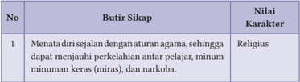

Tabel ini menunjukkan butir sikap dan nilai karakter yang harus diterapkan oleh individu dalam berbagai situasi. Topik utama tabel adalah tentang sikap dan perilaku yang sesuai dengan agama, seperti menjauhi minuman keras (miras) dan narkoba. Dalam kolom "Butir Sikap", terdapat satu butir yang disebutkan, yaitu "Menata diri sejalan dengan aturan agama". Sedangkan dalam kolom "Nilai Karakter", ditunjukkan bahwa sikap tersebut memiliki nilai karakter yang tinggi, yaitu "Religius". Ini menunjukkan bahwa sikap menjauhi minuman keras dan narkoba merupakan bagian dari sikap religius yang harus dijalani oleh individu.

 

---
## 📄 Halaman 111

---
**📊 Tabel**

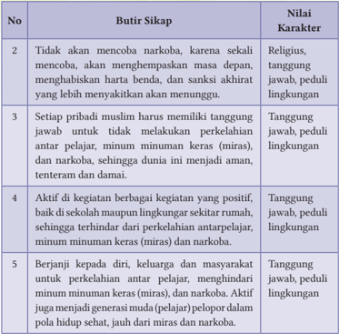

Tabel ini berisi 5 butir sikap yang dianggap penting oleh individu, dengan nilai-nilai karakter yang diharapkan untuk setiap butir tersebut. Topik utama tabel adalah tentang sikap dan karakter yang dianjurkan untuk mencegah dan menghindari penggunaan narkoba, minuman keras, miras, dan perilaku yang merusak lingkungan. Kolom-kolomnya mencakup butir sikap dan nilai karakter yang diharapkan. Data penting yang terlihat adalah bahwa semua butir sikap membutuhkan tingkat tanggung jawab, peduli lingkungan, dan keberanian untuk berjuang melawan perilaku negatif. Ini menunjukkan bahwa sikap yang positif dan bertanggung jawab adalah kunci untuk mencegah penggunaan narkoba dan minuman keras, serta menjaga lingkungan kita tetap aman dan sehat.

I

### Refleksi

Perkelahian  pelajar,  kata  sebagian  orang  menjadi  hal  yang  lumrah, meskipun jika ditelaah dari sudut pandang Islam, perbuatan itu harus dipertanggungjawabkan, karena pelakunya sudah balig.

Di setiap kelas, pasti ada yang menjadi pengurus OSIS, maka dibantu Ketua cobalah menyusun makalah sebanyak 3 lembar saja, boleh ditulis tangan atau cara yang lain tentang apa faktor, mengapa, siapa dan tempatnya di mana, sehingga terjadi perkelahian pelajar di internal atau eksternal sekolah kalian! Hasilnya dipresentasikan, sementara guru dan perwakilan kelas menilai dan memberi tanggapan atas presentasi yang dilakukan!

 

---
## 📄 Halaman 112

### Rangkuman

- Perkelahian pelajar, dapat dibagi menjadi 2 jenis, yaitu: (1) Delikuensi Situasional ,  yakni  perkelahian  terjadi  karena  adanya  situasi  yang mengharuskan mereka untuk berkelahi, dan (2) Delikuensi  Sistematik, yakni:  para  pelajar  yang  terlibat  dalam  perkelahian  itu  berada  di dalam suatu organisasi tertentu atau Geng.
Faktor penting adanya perkelahian pelajar, antara lain:

- Rational  Choice ,  yaitu  adanya  perkelahian  pelajar  disebabkan faktor individu.
- Social Disorganization , yaitu adanya perkelahian pelajar disebabkan faktor lingkungan.
- Strain, yaitu  adanya  perkelahian  pelajar  disebabkan  faktor tekanan yang besar dari masyarakat.
- Differential Association , yaitu adanya perkelahian pelajar disebabkan faktor salah pergaulan.
- Labbeling ,  yaitu  adanya  perkelahian  pelajar  disebabkan  faktor terbiasa dicap sebagai pelajar yang nakal.
- Khamr adalah jenis minuman dan makanan yang dapat memabukkan dan menghilangkan kesadaran seseorang. Makna lain adalah segala apapun yang memabukkan atau merusak akal sehat. Berlandaskan pengertian tersebut, segala jenis narkoba, minuman keras termasuk makna dari khamr.
- Termasuk jenis khamr adalah alkohol yang merupakan zat kimia yang dipergunakan untuk beragam keperluan di dunia medis, antara lain disinfektan, pembersih, pelarut, bahan bakar, dan sebagai campuran zat kimia lainnya. Penggunaan alkohol dalam makna terakhir, tidak masuk dalam kategore khamr , dan itu berarti diperbolehkan (tidak haram)
- Tidak  pernah  coba-coba  memakai  atau  meminum khamr ,  karena bahaya dan madharatnya sangat besar, baik bagi diri sendiri, keluarga, masyarakat, bangsa dan negara. Khamr termasuk rijs, yakni sikap dan  perbuatan  yang  amat  sangat  tercela,  buruk,  keji,  jijik,  kotor, bahkan bisa bermakna najis.

 

---
## 📄 Halaman 113

- Narkoba adalah singkatan dari nar = Narkoba; ko = Psikotropika; dan ba = Bahan-bahan adiktif (alkohol, rokok, kopi, dan lain sebagainya).
- Narkotika  adalah  zat  atau  obat  yang  berasal  dari  tanaman  atau bukan  yang  menyebabkan  penurunan  atau  perubahan  kesadaran, hilangnya rasa, mengurangi sampai menghilangkan rasa nyeri, dan dapat menimbulkan ketergantungan.
- Psikotropika adalah zat atau obat, baik alamiah maupun sintetis yang berkhasiat psikoaktif melalui pengaruh selektif pada susunan saraf pusat yang menyebabkan perubahan khas pada aktivitas mental dan perilaku.
- Zat Adiktif adalah obat serta bahan-bahan aktif yang jika dikonsumsi oleh organisme hidup, menyebabkan kerja biologi serta menimbulkan ketergantungan atau adiksi yang sulit dihentikan dan berefek ingin menggunakannya secara terus menerus
- Segala jenis  obat  psikotropika  dan  narkotika,  meski  tidak  mengandung alkohol, ia tetap haram digunakan. Sebab, dampak negatifnya sangat buruk sekali, baik dilihat dari sisi akal pikiran, kesehatan, harta benda maupun kepribadian bagi semua.

### 1. Penilaian Sikap

Penilaian Diri

Berilah tanda centang (√) pada kolom berikut dan berikan alasannya!

---
**📊 Tabel**

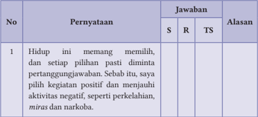

Tabel ini berisi pernyataan tentang pilihan hidup yang positif dan negatif. Kolom "Pernyataan" menyajikan pernyataan utama, sedangkan kolom "Jawaban" menunjukkan tiga opsi jawaban: S (Sangat), R (Rendah), dan TS (Tidak Setuju). Kolom "Alasan" memberikan penjelasan untuk setiap jawaban. Topik utama tabel adalah tentang pilihan hidup yang positif dan negatif, dengan fokus pada kegiatan positif dan negatif yang dapat mempengaruhi kesejahteraan individu. Data penting yang terlihat adalah bahwa pernyataan tersebut mendukung pilihan hidup yang positif, seperti menjauhi aktivitas negatif seperti perkelahian, miras, dan narkoba.

 

---
## 📄 Halaman 114

---
**📊 Tabel**

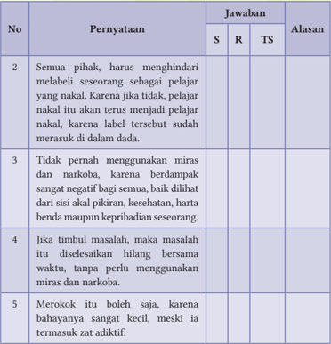

Tabel ini berisi pernyataan tentang saran dan aturan dalam konteks label seseorang sebagai pelajar nakal. Kolom "Pernyataan" menyajikan berbagai pernyataan yang disampaikan, sedangkan kolom "Jawaban" menunjukkan tiga pilihan jawaban: S (Sangat), R (Rendah), dan TS (Tidak Setuju). Kolom "Alasan" memberikan penjelasan mengapa setiap pilihan jawaban diberikan.

Topik utama tabel ini adalah tentang penggunaan label seseorang sebagai pelajar nakal dan bagaimana harus menghadapi situasi tersebut. Data penting yang terlihat adalah bahwa semua pihak harus menghindari melabeli seseorang sebagai pelajar nakal karena hal tersebut dapat mempengaruhi kinerja mereka di masa depan. Selain itu, tidak boleh menggunakan miras dan narkoba karena dampak negatifnya yang sangat besar pada kesehatan dan kehidupan sosial. Jika timbul masalah, harus diselesaikan dengan baik tanpa menggunakan miras dan narkoba. Terakhir, merokok juga dianggap sebagai zat adiktif yang harus dihindari.

Catatan:

S= Setuju, R=Ragu, TS= Tidak setuju

### 2. Penilainan Pengetahuan

Berilah tanda silang (X) pada huruf A, B, C, D atau E pada pernyataan di bawah ini sebagai jawaban yang paling tepat!

- Kenakalan  pelajar  atau  remaja,  menurut  Sarlito  W.  Sarwono  adalah tindakan oleh seseorang yang belum dewasa yang sengaja melanggar hukum yang bentuknya adalah …
- diketahui sendiri hukumannya
- tidak diketahui sanksinya
- melanggar disiplin
- melawan petugas
- ikut-ikutan

 

---
## 📄 Halaman 115

- Adanya perkelahian pelajar dipengaruhi banyak faktor. Salah satunya karena faktor yang dikenal dengan sebutan Social Disorganization yang maksudnya adalah … .
- faktor tekanan yang besar dari masyarakat
- disebabkan faktor individu dan keinginan pribadi
- perkelahian pelajar disebabkan faktor lingkungan
- pelajar itu sendiri yang salah memilih pergaulan
- beragam penyebab yang multi fungsi
- Penanganan  pelajar  yang  menyimpang,  membutuhkan  banyak  cara yang intinya difokuskan kepada pribadi pelajar, antara lain: … .
- kepentingan besar dari yang empunya kebutuhan
- kemurnian hati dan tidak bersyarat bagi yang menangani
- melibatkan banyak unsur yang menangani situasi dan kondisi
- posisi pelajar sendiri dengan problema yang dibuat
- kebesaran niat untuk melakukan perbaikan
- Khamr adalah  segala  apapun  yang  memabukkan  atau  merusak  akal sehat.  Berlandaskan  pengertian  tersebut,  yang  termasuk  makna  dari khamr adalah … .
- segala jenis narkoba termasuk makna dari khamr
- zat yang mempengaruhi perasaan dan keinginan
- jenis bahan yang dapat mengubah kekalutan
- bahan-bahan tanaman yang tumbuh di bukit
- semua jenis zat yang merusak keimanan
- Berdasarkan Q.S. al-Māidah/5: 91, banyak akibat buruk yang didapatkan, apabila seseorang itu meminum khamr dan melakukan maisir, yaitu: … .
- derajat dan martabatnya jauh dari jalan Allah Swt.
- pola pikirnya runtuh dan kemalasan yang terus menerus
- kepentingan jangka pendek dan jauh semakin berpadu
- iman yang menjadi penopang mencari rezeki menjadi turun
- tidak shalat, jauh dari Allah, timbul permusuhan dan kebencian
- Allah  Swt.  tidak  serta  merta  mengharamkan  sesuatu,  tetapi  terlebih dahulu  pola  pikir  dan  jiwa  manusia  diajak  untuk  bersama-sama

 

---
## 📄 Halaman 116

menilainya, sehingga ini wajib dan itu haram. Berikut ini, merupakan ayat yang terakhir menjelaskan tentang khamr , yakni:

- Q.S. al-Māidah/5: 90
- Q.S. al-Māidah/5: 191
- Q.S. al-Māidah/5: 195
- Begitu berbahayanya khamr dalam kehidupan pribadi, keluarga, masyarakat,  termasuk  kelangsungan  bangsa  dan  negara,  maka  sikap tepat yang perlu dilakukan adalah … .
- keandalan dalam menggunakan zat dan bahan
- mengerem kehendak dan keinginan yang berlebih
- lebih jitu dalam memperlakukan semua hal yang terkait
- tidak pernah coba-coba memakai atau meminum khamr
- memperlakukan zat atau bahan tersebut secara wajar
- Melalui Q.S. al-Nahl/16: 67, terdapat 2 buah yang diterangkan oleh Allah Swt.  kepada  manusia,  yang  dari  buah-buahan  tersebut  bisa  dijadikan sebagai khamr atau rezeki yang halal . Dua buah tersebut adalah … .
- delima dan anggur
- mangga dan kurma
- kurma dan anggur
- Khamr itu kebiasaan  (buruk).  Karena  itu,  perlu  diluruskan  secara bertahap. Berikut ini, cara yang dicoba diluruskan, yaitu:
- menggerakkan rasa keagamaan dan jiwa manusia, agar berhenti
- berpalingnya kebiasaan yang menopang perilaku manusia
- dikembalikan fungsi iman ke dalam dada manusia
- ketahanan diri dan keluarga menghadapi ujian
- menumbuhkan perasaan malu dan peduli
- Penyalahgunaan narkoba merupakan gangguan perilaku dan perbuatan anti sosial. Berikut ini tanda-tandanya, yaitu: … .
- ide dan gagasan yang tidak menyatu
- tekad rendah dan minat yang bertambah
- jiwa yang kurang dan sentimen bertambah
- anggur dan mangga
- tin dan zaitun
- Q.S. al-Māidah/5: 196
- Q.S. al-Māidah/5: 197

 

---
## 📄 Halaman 117

- berbohong, membolos, minggat , dan malas
- berubah fungsi dan keinginan yang optimal

### Jawablah pertanyaan berikut dengan singkat dan benar!

ٌ

- Sebutkan 3 usaha, agar tidak terjadi perilaku menyimpang di kalangan pelajar? 2. Perhatikan dengan cermat Q.S. al-Māidah/5: 90 ini! ْ س ِ ج ر ام ل ز ا ال و اب ْ ص ن ا ال و ِ ر ْ س ي م َ ال و م ْ ر خ ا ال م َّ ن ٓا ا و ن م ا ن ي ذ ِ َّ ا ال ُّ ه ي ا ﴿ ي ) 90 : 5/ ئدة ( الما ﴾ ْ ن و ل ِ ح ف ت م ك َّ ل ع ل ه و ن ِ ب ت اج ف ن ِ ْ ط ي َّ الش م َ ل ع ِ ن م
ُ

ْ

َ

ُ

َ

َ

ُ

َ

ُ

َ

ۤ

َ

ُ

ْ

ُ

ْ

ُ

َ

َ

ُ

ْ

Sebutkan 3 isi dan kandungan ayat tersebut!

- Sebutkan masing-masing dari jenis narkotika dan psikotropika?
- Di antara 2 jenis zat adiktif adalah nikotin dan alkohol, jelaskan secara singkat dampak negatif bagi yang menggunakan!
- Sebutkan 5 cara mencegah penyalahgunaan narkoba?

### 3. Penilaian Keterampilan

- Penilaian Proyek

### Aktivitas 3.6

### Aktivitas Peserta Didik:

Setiap  kelas  dibagi  menjadi  6  kelompok.  Buatlah  telaah  tentang  data terakhir  (2020)  pelajar  6  provinsi  Indonesia  yang  menyalahgunakan narkoba. Setiap kelompok melakukan telaah di povinsi:

- Kelompok I di provinsi DKI Jakarta
- Kelompok II di provinsi Bali
- Kelompok III di provinsi Sumatera Utara (Sumut)
- Kelompok IV di provinsi Kalimantan Barat (Kalbar)
- Kelompok V di provinsi Sulawesi Tenggara (Sultra)
- Kelompok VI di provinsi Papua
َ

َ

ْ

َ

ْ

ْ

ْ

ُ

َ

َ

ْ

ِ

َ

ْ

ُ

َ

ٰ

ٰ

َ

ْ

ِ

َ

َ

َ

ٰٓ

ْ

ّ

 

---
## 📄 Halaman 118

### b. Penilaian Praktik

### Kelompok:

Kelas  dibagi  6  kelompok,  sesuai  dengan  Penilaian  Proyek  yang  sudah dilaksanakan. Lalu dipresentasikan dan didiskusikan sesuai dengan tugasnya, lalu membuat kesimpulan tentang kondisi narkoba di 6 provinsi tersebut, sementara itu GPAI memberikan penilaian dari masing-masing kelompok .

### Individual:

Setiap peserta didik di masing-masing kelas, membuat telaah tentang data perkelahian pelajar di  kabupaten/kotanya. Hasilnya dikumpulkan 10 hari ke depan! Sementara itu, GPAI bersama siswa lainnya memberikan tanggapan dan penilaian dari presentasi 6 kelompok dari masing-masing kelas.

### c. Penilaian Portofolio

Tuliskanlah semua aktivitas keagamaan kalian, baik di sekolah, rumah, maupun masyarakat pada buku Penilaian  Pendidikan  Agama  Islam  dan Budi Pekerti !

L

### Pengayaan

Miras  merupakan nenek moyang (induk)  dari  segala  kejahatan  dan kemaksiatan. Coba buktikan kebenarannya, baik dikaji dari sudut nash ( dalil naqli ) maupun realitas masa kini. Jawabannya harus kisah nyata.

Boleh ditulis tangan, atau cara yang lain. Cukup 2-3 lembar saja. Sumber rujukannya harus ditulis lengkap!

 

---
## 📄 Halaman 119

KEMENTERIAN PENDIDIKAN, KEBUDAYAAN, RISET, DAN TEKNOLOGI REPUBLIK INDONESIA 2021

Pendidikan Agama Islam dan Budi Pekerti untuk SMA/SMK Kelas XI

Penulis:

Abd. Rahman dan Hery Nugroho

ISBN:

978-602-244-684-2

### Bab 4

Menebarkan Islam dengan Santun dan Damai Melalui Dakwah, Khutbah, dan Tablig

---
**🖼️ Gambar/Diagram**

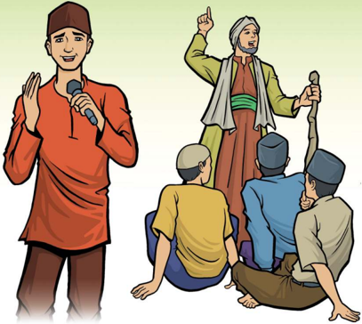

> **Deskripsi Visual:** Gambar ini adalah ilustrasi yang menunjukkan dua karakter utama dan beberapa orang lainnya dalam situasi yang serupa. Karakter utama adalah seorang pria tua dengan topi berwarna hijau dan pakaian tradisional, serta seorang pria muda dengan topi berwarna merah dan pakaian warna-warni. Pria tua sedang berdiri dan menggerakkan tangan kanannya ke atas, sementara pria muda berdiri di depan mereka dan menggerakkan tangan kanannya ke bawah. Beberapa orang lainnya duduk di tanah, tampaknya mendengarkan atau menunggu. Ilustrasi ini menunjukkan hubungan sosial dan interaksi antara karakter-karakter tersebut, mungkin dalam konteks diskusi atau presentasi.

 

---
## 📄 Halaman 120

A

### Tujuan Pembelajaran

Setelah mempelajari materi ini, kalian dapat:

- Menganalisis ketentuan dakwah, khutbah, dan tablig.
- Menyusun teks khutbah dengan tema nilai-nilai Islam rahmatan lil 'alamin .
- Menerapkan ketentuan dakwah, khutbah, dan tablig.
- Membiasakan sikap menebarkan Islam rahmatan lil 'alamin .

### B Kata Kunci

- Dakwah
- Tawasuth
- Khutbah
C

### Infografis

### MENEBARKAN ISLAM SECARA SANTUN DAN DAMAI MELALUI DAKWAH, KHUTBAH, DAN TABLIG

### Dakwah 1

- Pengertian
- Adab tablig
- Dalil naqli
- Sasaran dan tujuan dakwah
- metode dakwah
- Syarat dan
- Media dan manajemen dakwah

### Khutbah 2

- Pengertian
- Syarat dua khutbah
- Syarat khatib
- Rukun khutbah
- Adab shalat jumat
- Sunnah khutbah
- Adab shalat idhain
- Praktik khutbah
- Hadats
- Tablig
- Syahadatain
- Radikal
- Mujadalah
- Teror

---
**🖼️ Gambar/Diagram**

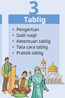

> **Deskripsi Visual:** Gambar ini adalah ilustrasi yang menunjukkan topik tentang tablig dalam konteks agama Islam. Gambar ini terdiri dari dua orang yang sedang berbicara, di mana salah satu orang tampaknya sedang memberikan penjelasan atau pengajaran kepada orang lain. Di sebelah kanan, terdapat tulisan "Tablig" dengan nomor 3 di atasnya, yang menunjukkan bahwa ini mungkin merupakan bagian dari sebuah bab atau topik tertentu dalam buku pelajaran.

Elemen utama dalam gambar ini meliputi dua orang yang sedang berbicara, sebuah masjid yang tampak di latar belakang, dan beberapa teks yang menjelaskan topik tablig. Orang yang sedang berbicara tampaknya adalah guru atau pemateri, sementara yang mendengarkan tampaknya adalah murid atau peserta kursus. Masjid yang ada di latar belakang menunjukkan bahwa topik ini berkaitan dengan kegiatan atau acara yang biasanya dilakukan di masjid.

Teks penting yang terlihat dalam gambar ini adalah "Tablig", yang menunjukkan topik utama dari gambar ini. Selain itu, terdapat beberapa teks tambahan seperti "Pengajaran", "Daili naqli", "Ketentuan tablig", dan "Tata cara tablig", yang mungkin merujuk pada aspek-aspek penting dari tablig dalam konteks agama Islam. Informasi kunci yang dapat diambil dari gambar ini adalah bahwa tablig adalah suatu kegiatan atau acara yang dilakukan dalam konteks agama Islam, yang melibatkan pengajaran atau penyebaran ilmu dan praktek yang sesuai dengan ketentuan yang telah ditetapkan.

 

---
## 📄 Halaman 121

### Ayo Tadarus

- Ayo  membiasakan  tadarus  Al-Qur'an,  baik  materi  ajarnya  aspek  AlQur'an dan Hadis, maupun aspek Keimanan, Fikih, Akhlak, dan Sejarah Peradaban Islam (SPI) sebelum pembelajaran dimulai.
- Mari  tadarus  Al-Qur'an  dengan  baik  dan  benar  sesuai  dengan  ilmu tajwid dan makhārijul huruf. Semoga melalui pembiasaan ini, Allah Swt. selalu memberikan petunjuk dan kemudahan dalam memahami materi ajar ini, dan mampu menerapkan nilai-nilai yang dikandungnya dalam kehidupan sehari-hari. Āmīn.

### Aktivitas 4.1

َ

ْ

ْ

ُ

ْ

ِ

َ

َ

َ

ْ

َ

ْ

ْ

َ

ِ

ُ

ْ

َ

ْ

َ

ْ

ِ

َ

َ

َ

### E Tadabbur

### Aktivitas  4.2

### Aktivitas Peserta Didik:

Amati gambar atau ilustrasi berikut ini! Lalu berilah tanggapan kalian yang  dikaitkan  dengan  materi  ajar  yang  dipelajari,  yakni:  Dakwah, Khutbah, dan Tablig!

Aktivitas Peserta Didik: Saatnya,  kita tadarrus  Q.S.  Ali-Imrān/3:  104,  dan  Q.S.  al-Nahl/16:  125 berikut ini, lalu salah satu peserta didik membacakan terjemahnya! ْ ن و ه ن ي و ْ ف ر ُ و م َ ع ال ب ْ ن ر ُ و م أ ي و ر ِ ي خ ى ال ل ا ِ ْ ن و ع َّ د ي ة َّ م ا م ك ِ ن م ن ْ َ ك ت ل ﴿ و ) 104 : 3/ ( ا ٰل عمر ان ﴾ ْ ن و ل ِ ح ف م ُ ال م ه ى ِٕك ول ا ۗ و ر ِ ك ن م ُ ال ن ِ ع ه ِ ي ِ ي ت َّ ال ب م ه ل اد ِ َ ج ة ِ  و ن َ س ح ة ِ  ال ع ِ ظ م َ و ال ة ِ  و م َ ح ِك ِ ال ب ِ ك ب ر ْ ل ي ب ى س ل ا ِ ْ ع د ﴿ ا ﴾ ْ ن ي د ِ ت م ُ ه ال ب م ل ع ا و َ ه ٖ  و ل ِ ه ي ب س ن ْ ع َّ َ ل ض َ ن ِ م ب م ل ع ا و ه َّ ك ب ر َّ ۗ  ا ِ ن ن ُ ح ْ س ا

ُ

ْ

ُ

ْ

ّ

ُ

ْ

َ

ِ

َ

َ

َ

ِ

َ

ُ

ٰ

َ

ْ

ُ

َ

ْ

َ

ّ

ٰۤ

َ

ُ

ُ

َ

َ

) 125 : 16/ ( النحل

ْ

ِ

َ

ُ

َ

َ

ْ

ُ

ْ

ِ

َ

َ

َ

َ

ْ

ْ

َ

َ

َ

ْ

ْ

َ

ُ

َ

ْ

ْ

َ

ْ

ْ

ْ

ُ

ُ

ُ

َ

ُ

ْ

ْ

َ

َ

َ

ٌ

 

---
## 📄 Halaman 122

---
**🖼️ Gambar/Diagram**

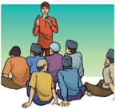

> **Deskripsi Visual:** Gambar ini adalah ilustrasi yang menunjukkan sebuah acara sosialisasi atau seminar. Gambar ini menggambarkan sekelompok orang yang sedang mendengarkan seseorang yang berbicara di depan mereka. Orang-orang tersebut tampak tertarik dan berada dalam posisi yang menunjukkan bahwa mereka sedang fokus pada pembicara.

Elemen utama dalam gambar ini meliputi:
1. Orang-orang yang sedang mendengarkan (elemen utama)
2. Pembicara yang berbicara di depan (elemen utama)
3. Latar belakang yang menunjukkan tempat acara (elemen utama)

Relasi antara elemen-elemen ini adalah:
- Pembicara berada di tengah-tengah orang-orang yang mendengarkan.
- Orang-orang tersebut tampak tertarik dan berada dalam posisi yang menunjukkan kehadiran dan perhatian mereka terhadap pembicara.

Teks, angka, atau label penting yang terlihat dalam gambar ini tidak ada, karena gambar ini hanya menggambarkan situasi tanpa teks atau angka yang spesifik.

Informasi kunci yang dapat diambil pembaca dari gambar ini adalah bahwa ada acara sosialisasi atau seminar yang sedang berlangsung dengan peserta yang tertarik dan berada dalam posisi yang menunjukkan kehadiran dan perhatian mereka terhadap pembicara.

berkecimpung di bidang dakwah

---
**🖼️ Gambar/Diagram**

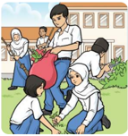

> **Deskripsi Visual:** Gambar ini adalah ilustrasi yang menunjukkan aktivitas belajar di sekolah. Gambar ini menggambarkan beberapa siswa sedang belajar di ruang kelas sementara guru berdiri di belakang mereka, membantu atau memberikan perbendaharaan. Siswa-siswa tersebut menggunakan buku tulis, pensil, dan papan tulis untuk belajar. Di sebelah kiri, ada seorang guru yang sedang berbicara dengan salah satu siswa. Di sebelah kanan, ada seorang siswi yang sedang menulis di papan tulis. Seluruh gambar menunjukkan suasana belajar yang aktif dan interaktif.

F

### Kisah Inspiratif

### Aktivitas   4.3

Aktivitas Peserta Didik:

Pahami dan renungkan artikel berikut ini, sebagai bagian dari pemahaman materi ajar yang akan dipelajari!

---
**🖼️ Gambar/Diagram**

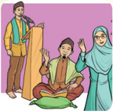

> **Deskripsi Visual:** Gambar ini adalah ilustrasi yang menunjukkan tiga orang yang sedang berbicara. Pada gambar tersebut, dua orang berdiri di sebelah kiri dan kanan, sedangkan satu orang duduk di tengah. Mereka semua tampaknya sedang berbicara dengan penuh semangat. Di sebelah kiri, ada seorang pria yang sedang berbicara dengan gestur tangan yang kuat, sementara di sebelah kanan, seorang wanita dengan hijab berbicara dengan penuh semangat. Sementara itu, di tengah, seorang pria lainnya duduk dan tampaknya mendengarkan dengan penuh minat. Semua orang tampaknya berada dalam situasi yang serius dan mendalam. Gambar ini mungkin digunakan untuk menggambarkan konsep komunikasi, dialog, atau diskusi dalam konteks sosial.

---
**🖼️ Gambar/Diagram**

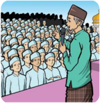

> **Deskripsi Visual:** Gambar ini adalah ilustrasi yang menunjukkan sebuah acara publik dengan tema agama. Gambar ini menggambarkan seorang pemimpin agama sedang berbicara kepada massa yang sangat besar. Massa tersebut terdiri dari banyak orang yang tampak seperti umat Islam, karena mereka semua memakai jubah berwarna putih dan topi berbintik hitam. Pemimpin agama tersebut sedang berdiri di tengah massa dan menggunakan mikrofon untuk memberikan pidato. Di sebelah kiri, ada beberapa orang yang tampak seperti pengawas atau penjaga yang juga memakai jubah putih dan topi hitam.

Elemen-elemen utama dalam gambar ini adalah pemimpin agama, massa, dan pengawas. Pemimpin agama adalah elemen yang paling dominan dan menjadi pusat perhatian dalam gambar. Massa yang sangat besar menunjukkan bahwa acara ini memiliki jumlah peserta yang signifikan. Pengawas yang ada di sebelah kiri tampak sebagai elemen pendukung yang penting dalam konteks ini, membantu menjaga keamanan dan keseimbangan dalam acara tersebut.

Teks, angka, atau label penting yang terlihat dalam gambar ini tidak ada, karena gambar hanya menggambarkan situasi tanpa teks atau angka yang spesifik. Informasi kunci yang dapat diambil pembaca melalui gambar ini adalah bahwa acara ini mungkin merupakan suatu kegiatan religius atau politik yang besar, dengan pemimpin agama sebagai tokoh utama dan massa yang sangat besar sebagai bagian dari acara tersebut.

 

---
## 📄 Halaman 123

### Dai Pemberani

K ekalahan umat Islam di perang Uhud, membangkitkan kemarahan orang  badui  di  sekitar  Madinah  tentang  dendam  lama  yang terpendam. Namun tanpa curiga, Rasulullah Saw. memberikan sambutan baik bagi yang ingin memeluk Islam. Karena itu, mereka meminta para juru dakwah (dai) hadir di kampungnya. Akhirnya, diutus enam sahabat. Mereka berangkat bersama para pedagang Arab.

Sesampai di kampung ar-Raji, wilayah kekuasaan suku Huzail, para pedagang  itu  tiba-tiba  melakukan  penyerangan  kepada  enam  sahabat tersebut, sambil meminta bantuan kepada kaum Huzail. Keenam dai itu siap melakukan perlawanan, setelah sadar mereka dijebak.

Para  pedagang  licik  itu  berteriak,  'Sabar!  Kami  tidak  bermaksud membunuh atau menganiaya kalian. Cuma ingin menangkap untuk dijual ke Makkah sebagai budak. Keenam sahabat dalam posisi sulit, bahkan bisa jadi terbunuh. Mereka bertakbir sambil menyerang dengan tangkas.

Terjadilah pertempuran yang seru antara enam lawan begitu banyak orang. Pihak pedagang sudah banyak yang menjadi korban. Akhirnya, tiga sahabat tertusuk musuh dan langsung gugur. Seorang lagi menyusul syahid. Akhirnya, sisa dua orang; Zaid bin Addutsunah dan Khubaib bin Adi.

Apa daya dua orang pejuang, menghadapi begitu banyak musuh? Selang beberapa saat, keduanya dapat dilumpuhkan dan ditawan. Lalu diangkut menuju pasar budak di Makkah. Zaid dibeli oleh Shafwan bin Umayyah. Ayah Shafwan, Umayyah bin Khalaf, adalah majikan Bilal dan Amir bin Fuhairah.

Umayyah  terkenal  kejam  kepada  budak-budaknya.  Bilal  pernah dijemur di tengah terik matahari dengan badan ditindih batu. Untung Bilal  ditebus  oleh  Abu  Bakar  dan  dimerdekakan.  Orang  Habsyi  ini kemudian terkenal sebagai sahabat dekat Rasulullah Saw. dan diangkat sebagai muadzin.

Saat  perang Badar, Umayyah berhadap-hadapan dengan Bilal, dan berhasil membunuhnya, sedangkan Khubaib diambil oleh Uqbah bin al-

 

---
## 📄 Halaman 124

Harits dengan tujuan yang sama, seperti maksud Shafwan membeli Zaid, yakni balas dendam kepada umat Islam.

Lalu  orang  Quraisy  menyeret  Zaid  menuju  Tan'im  (tempat  miqat umrah).  Di  tempat  itu,  Zaid  menjalani  hukuman  pancung.  Menjelang algojo  melaksanakan tugasnya, pemimpin kaum musyrik, Abu Sufyan bertanya,  'Zaid,  apakah  Anda  senang  seandainya  di  tempatmu  ini digantikan  Muhammad,  sedangkan  Anda  hidup  tenteram  bersama keluargamu di rumah?'

'Janganlah begitu,' bantah Zaid dengan keras. 'Meski dalam keadaan begini,  aku  tidak  rela  Rasulullah  tertusuk  duri  yang  paling  kecil  di rumahnya.'  Abu  Sufyan  marah.  Zaid  akhirnya  menyusul  temannya menjadi  syuhada.  Di  hati  Abu  Sufyan  dan  orang  Quraisy  timbul  keheranan akan kesetiaan para sahabat kepada Muhammad. Abu Sufyan berucap kagum, 'Aku tidak pernah menemukan seorang yang begitu dicintai oleh para sahabat, seperti Muhammad'.

'Sesudah  Zaid  gugur,  rombongan  lain  menyeret  Khubaib.  Sesuai dengan hukum qishas , ia diberi hak menyampaikan permohonan terakhir. Ia meminta izin shalat sunnah 2 rakaat. Permohonan dikabulkan, Khubaib melaksanakan ibadahnya dengan baik. Setelah salam, ia berkata, 'Demi Allah. Andaikata bukan karena takut disangka aku gentar menghadapi maut, maka shalatku akan kulakukan lebih panjang.'

Akhirnya Khubaib menjadi syahid, menyusul lima sahabat lainnya.  Namun,  semangat  dakwah  yang  dilandasi  keikhlasan  untuk menyebarkan ajaran kebenaran, takkan pernah padam dari permukaan bumi.  Semangat  itu  terus  bergema,  sehingga  makin  banyak  jumlah pendakwah yang dengan  kekuatan  sendiri,  menyelusup  keluar-masuk pedalaman, berbatu-batu karang atau berhutan-hutan belantara, untuk menyampaikan dakwah atau melakukan tablig.

(Sumber: Disadur dari 1001 Kisah Teladan, Islamic Electronic Book)

 

---
## 📄 Halaman 125

### Aktivitas  4.4

Aktivitas Peserta Didik:

Bentuk  kelas kalian menjadi 3 kelompok.  Lalu, setiap  kelompok mendapatkan  sub-materi  dari  materi  ajar  yang  akan  dipelajari,  yakni Dakwah,  Khutbah,  dan  Tablig,  agar  dikaji,  dipahami  dan  dipelajari. Hasilnya dipresentasikan!

### Menjadi Duta Islam yang Damai

Hanya ulah sebagian oknum atau kelompok yang mengatasnamakan Islam, Islam  dituduh  yang  bukan-bukan,  misalnya Islam itu keras, kasar, tidak toleran,  reaktif,  dan  tidak  santun . Tuduhan tersebut memang menyakitkan, maka jika  ingin  membela  Islam,  kita  harus  menggunakan  cara-cara  yang benar,  santun,  dan  mendamaikan.  Bukan  malah  menambah  cara  yang membabi buta, tidak santun, apalagi menakutkan.

Mayoritas  umat  Islam,  banyak  yang  memilih  diam,  jika  berhadapan dengan  persoalan  yang  rumit,  contohnya  aksi  teror  bom  oleh  sebagian oknum; ikhtiar memerangi kemaksiatan dengan cara-cara yang kasar dan menakutkan; mau menang sendiri saat mengutarakan argumen atau lebih unggul  karena  mayoritas,  serta  sangat  abai  dengan  keberagaman.  Semua pandangan itu tentu tidak benar, dan harus dicari solusi yang tepat.

ّ

ُ

ْ

َ

ْ

َ

ْ

ّ

ُّ

ٌ

َ

َ

Belajar  dari Sirah Rasulullah  Saw.,  kita  mendapatkan  banyak  hikmah tentang  bagaimana  Islam  itu  harus  dibawa  dan  diperjuangkan.  Islam diajarkan oleh beliau dengan kelemahlembutan, santun, damai dan akhlak yang baik. Bahkan tidak pernah menggunakan cara-cara tetor dan menakutkan. Melalui cara seperti itu, akhirnya banyak pihak atau kelompok yang awalnya antipati kepada Islam, berubah menjadi pemeluk dan pembela Islam yang sejati. Sabda Rasulullah Saw.: ِ ه ِ  (رواه البخاري) ل ك ر ِ م الأ ِ ي ف ق ف الر ح ِب ي ْ ق ف ِ ي ر الل َّ ِ ن إ

ّٰ

ِ

ُ

 

---
## 📄 Halaman 126

Artinya: Sesungguhnya Allah adalah Dzat Yang Maha Lembut, dan mencintai kelembutan dalam segala hal.' (HR. al-Bukhāri)

Harus kita sadari bersama bahwa saat ini kita (umat Islam) kurang duta Islam yang damai .  Mayoritas umat, memang bersikap damai, hanya sikap mayoritas diam, maka panggung sejarah (media) dimanfaatkan sekelompok kecil yang anarkis, tidak toleran, dan wajah muslim yang marah. Sebab itu, diperlukan upaya bersama untuk melawan kesewenang-wenangan tersebut, dan upaya ini harus dilakukan oleh mayoritas umat.

Lalu, dimulainya dari mana, dan forum apa yang dapat dipakai untuk membendung  citra  Islam  yang  kurang  bagus?  Jawabannya,  tentu  dari sekelompok umat yang mengambil peran sebagah dai, khatib, dan mubalig, mereka  inilah  yang  berada  di  garda  terdepan  mendakwahkan  Islam, kelompok  profesi  yang  banyak  menyuarakan  nilai-nilai  Islam,  melalui beragam kegiatan  yang  dilakukan,  misalnya  dalam  forum  Majelis-majelis Dakwah, Khutbah Jum'at, dan Tablig Akbar.

Dakwah, khutbah, dan tablig membutuhkan manajemen yang profesional. Sebab, ketiganya memadukan  beragam  sumber  daya  yang  ada  untuk mengajak pihak internal dan pihak eksternal untuk memeluk, mencintai, dan mengamalkan ajaran Islam, atau menyempurnakan nilai ajaran yang sudah terhujam di dada setiap muslim (internal). Di antara faktor penting keberhasilan ketiganya  adalah  memulai  dan  mengamalkan  terlebih  dahulu  ajaran  Islam kepada diri sendiri, keluarga terdekat, baru kemudian mengajak pihak lain.

Ketidakberhasilan  dakwah,  khutbah,  dan  tablig  dewasa  ini,  banyak disebabkan karena mereka yang semestinya menjadi contoh atau panutan, malah menerjang dan tidak mematuhi ajaran yang disampaikan. Laksana pagar makan tanaman, tidak satunya kata dengan perbuatan. Pepatah bijak mengatakan: 'Semestinya  ia menerangi  orang  lain,  namun  yang  terjadi  ia malah terbakar sendiri.'

Berikut ini, rincian tentang Dakwah, Khutbah dan Tablig, yaitu:

### 1. Dakwah

a. Pengertian Merujuk arti bahasa, kata 'dakwah' merupakan mashdar (kata dasar) dari kata da'a ( ة و ع - د و ع َ د ى  - ي ع د ) yang mempunyai arti mengajak, memanggil,

ً

َ

ْ

َ

ْ

ُ

ْ

َ

َ

 

---
## 📄 Halaman 127

dan menyeru untuk hal tertentu. Orang yang melakukan pekerjaan dakwah disebut dai ( laki-laki ) dan daiyah ( perempuan ) .

Jika ditinjau dari makna istilah, ada beberapa pengertian dakwah, yaitu:

- Setiap  kegiatan  yang  mengajak, menyeru, dan memanggil orang atau kelompok orang untuk beriman kepada Allah Swt. sesuai dengan ajaran akidah (keimanan), syariah (hukum) dan akhlak Islam.
- Kegiatan  mengajak  orang  lain  ke  jalan  Allah  Swt.  secara  lisan  atau perbuatan  untuk  kemudian  diamalkan  dalam  kehidupan  sehari-hari supaya mendapat kebahagiaan dunia dan akhirat.
- Kegiatan  mengajak  orang-orang  untuk  mengamalkan  ajaran  Islam  di dalam kehidupan sehari-hari.
- Seruan atau ajakan kepada keinsafan atau usaha untuk mengubah agar keadaannya lebih baik lagi, baik sebagai pribadi maupun masyarakat.
Tersimpul dari pengertian tersebut, dakwah adalah mengajak orang lain untuk meyakini kebenaran ajaran Islam dan mengamalkan syariat Islam, agar  tercapai  pola  hidupnya  lebih  baik,  sehingga  tercapai  kebahagiaan dunia dan akhirat. Dakwah tidak hanya berupa tablig, khutbah, dan majelis taklim.

Dakwah  cakupannya  sangat  luas,  seluas  kehidupan  setiap  muslim. Dakwah tidak mesti berbicara dan berceramah, tetapi setiap perbuatan seharihari yang mencerminkan tata nilai Islam, seperti berpakaian menutup aurat, tidak menyontek saat ujian, berbicara yang santun yang sopan, menghindari berita hoax, rajin bersilaturahmi, semua itu sudah bagian dari dakwah.

Keberhasilan  dakwah  sangat  ditentukan  oleh  amaliah  dan  akhlakul karimah  yang  dipantulkan  dari  setiap  muslim,  apalagi  yang  berprofesi menjadi dai atau daiyah ,  tentu  banyak  faktor  lain  yang  memengaruhi. Menjadi  hal  yang  aneh,  jika  seorang  dai  tidak  mengamalkan  apa  yang disampaikan, dan tidak satunya kata dengan perbuatan.

Faktor tersebut yang kini banyak menjangkiti para dai, sehingga hasil dakwah tidak banyak memberi pengaruh positif dalam perbaikan kualitas keberagamaan masyarakat, apalagi jika dikaitkan dengan gejala munculnya para dai yang dibesarkan oleh media, misalnya para dai yang biasa dipanggil dengan sebutan ustad seleb (Perhatikan kandungan isi Q.S. ash-Shaf/61: 2-3).

 

---
## 📄 Halaman 128

َ

### b. Dalil Perlunya Dakwah ن ِ ع ْ ن و ه ن ي و ْ ف ر ُ و م َ ع ال ب ْ ن ر ُ و م أ ي و ر ِ ي خ ى ال ل ا ِ ْ ن و ع َّ د ي ة َّ م ا م ك ِ ن م ن ْ َ ك ت ل ﴿ و ) 104 : 3/ ( ا ٰل عمر ان ﴾ ْ ن و ل ِ ح ف م ُ ال م ه ى ِٕك ول ا ۗ و ر ِ ك ن م ُ ال

َ

َ

ْ

َ

َ

ِ

ْ

ْ

ِ

َ

ُ

ْ

َ

َ

ْ

َ

ْ

َ

َ

ُ

ْ

ٌ

ُ

ْ

ُ

ْ

ّ

ُ

ْ

َ

َ

ُ

ْ

ْ

ُ

ُ

َ

ٰۤ

ُ

َ

َ

ْ

ْ

Artinya: Dan  hendaklah  di  antara  kamu  ada  segolongan  orang  yang menyeru kepada kebajikan, menyuruh (berbuat) yang ma'ruf, dan mencegah dari  yang  mungkar.  Dan  mereka  itulah  orang-orang  yang  beruntung. (Q.S. Ali 'Imrān/3: 104) .

Perhatikan juga isi kandungan dari beberapa Q.S. Q.S. al-Nahl/16: 125, Q.S. al-Hajj/22: 67, Q.S. al-Qashash/28: 87 yang isinya tentang segala yang terkait dengan dakwah.

Dakwah itu bagian kehidupan beragama.  Ia  merupakan  kewajiban agama  bagi  para  pemeluknya.  Itulah sebabnya, dakwah bukan sekadar dari inisiatif pribadi, tetapi harus ada sekelompok orang ( tha'ifah ) yang menjadi juru dakwah. Wujud dakwah juga bukan hanya usaha peningkatan kapasitas  keberagamaan, tetapi harus menembus aspek kehidupan, sehingga gerakan dakwah mencakup aspek ekonomi, sosial, politik, dan keamanan.

Melalui pemahaman tersebut, dakwah  harus  menyasar  ke  banyak  aspek  kehidupan.  Misalnya  harus menyentuh di bidang politik; mengentaskan kemiskinan; memberdayakan lembaga pendidikan, menekan angka DO ( Drop Out ) atau bantuan beasiswa; mengedukasi masyarakat agar saling membantu dan bekerja sama, termasuk juga terlibat aktif dalam memerangi ujaran kebencian dan berita-berita hoax .

### c. Adab Berdakwah

Adab atau etika dakwah yang harus diperhatikan, antara lain:

---
**🖼️ Gambar/Diagram**

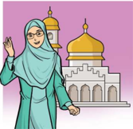

> **Deskripsi Visual:** Gambar ini adalah ilustrasi yang menampilkan seorang wanita berjubah hijau yang sedang menghadap ke sebuah masjid dengan arsitektur tradisional. Gambar ini menunjukkan beberapa elemen penting:

1. **Apa yang Ditampilkan Secara Keseluruhan**: Gambar ini menampilkan seorang wanita berjubah hijau yang sedang menghadap ke sebuah masjid dengan arsitektur tradisional.

2. **Elemen-Elemen Utama dan Relasinya**: 
   - **Wanita**: Dalam gambar ini, wanita tersebut adalah elemen utama yang menunjukkan seseorang yang mungkin berbicara atau berdoa.
   - **Masjid**: Masjid dengan arsitektur tradisional adalah elemen utama lainnya yang menunjukkan tempat ibadah atau tempat yang biasanya digunakan untuk beribadah.
   - **Jubah Hijau**: Jubah hijau yang dikenakan oleh wanita tersebut adalah elemen yang menunjukkan penampilan atau identitas sosial dari individu tersebut.

3. **Teks, Angka, atau Label Penting yang Terlihat**: Dalam gambar ini, tidak ada teks, angka, atau label yang terlihat. Gambar hanya menunjukkan dua objek utama: wanita dan masjid.

4. **Informasi Kunci yang Bisa Diambil Pembaca**: Gambar ini mungkin menunjukkan hubungan antara wanita dan masjid, yang bisa menjadi informasi penting tentang kegiatan atau peristiwa tertentu yang terjadi di masjid tersebut. Misalnya, wanita tersebut mungkin sedang beribadah atau berbicara di depan masjid.

Dengan demikian, gambar ini menunjukkan seorang wanita berjubah hijau yang sedang menghadap ke sebuah masjid dengan arsitektur tradisional, yang mungkin menunjukkan hubungan antara wanita dan masjid.

 

---
## 📄 Halaman 129

- Dakwah dengan cara hikmah , yaitu ucapan yang jelas, tegas, dan sikap yang bijaksana.
- Dakwah menggunakan cara mauidzatul hasanah atau nasihat yang baik, yaitu cara-cara persuasif (damai dan menenteramkan, tanpa kekerasan) dan edukatif (memberikan pengajaran, i'tibar dan pelajaran hidup).
- Dakwah dengan cara mujadalah , yaitu diskusi atau tukar pikiran yang berjalan secara dinamis dan santun dengan menghargai pendapat orang lain.
َ

- Dakwah melalui teladan yang baik ( uswatun hasanah ). Allah Swt. berfirman: ه ِ ي ِ ي ت َّ ال ب م ه ل اد ِ َ ج ة ِ  و ن َ س ح ة ِ  ال ع ِ ظ م َ و ال ة ِ  و م َ ح ِك ِ ال ب ِ ك ب ر ْ ل ي ب ى س ل ا ِ ْ ع د ﴿ ا ﴾ ْ ن ي د ِ ت م ُ ه ال ب م ل ع ا و َ ه ٖ  و ل ِ ه ي ب س ن ْ ع َّ َ ل ض َ ن ِ م ب م ل ع ا و ه َّ ك ب ر َّ ۗ  ا ِ ن ن ُ ح ْ س ا
ْ

ِ

ْ

ُ

ْ

َ

َ

َ

ْ

َ

ْ

ْ

َ

ْ

ْ

َ

ّ

َ

ِ

ِ

َ

ٰ

ُ

ُ

َ

َ

ْ

ْ

ِ

ُ

َ

ْ

َ

َ

ُ

ْ

ِ

َ

َ

ْ

ُ

َ

ْ

َ

َ

ُ

َ

َ

َ

َ

Artinya: Serulah (manusia) kepada jalan Tuhanmu dengan hikmah dan pengajaran yang baik, dan berdebatlah dengan mereka dengan cara yang terbaik.  Sesungguhnya  Tuhanmu,  Dialah  yang  lebih  mengetahui  siapa yang sesat dari jalan-Nya dan Dialah yang lebih mengetahui siapa yang mendapat petunjuk (Q.S. an-Nahl/16: 125).

### d. Tujuan dan Sasaran Dakwah

Sasaran dan tujuan dakwah--sejak zaman dulu (mulai Nabi Adam a.s sampai Nabi Muhammad Saw.), bahkan sampai berakhirnya kehidupan--memiliki sasaran yang jelas dan tetap, yakni sebagai berikut:

### 1. Sasaran Dakwah

- Memberi  semangat  kepada  manusia  agar  selalu  meningkatkan kualitas  dan  kuantitas  amalnya,  dari  baik  menjadi  terbaik,  sudah banyak  amalnya  agar  diperbanyak  lagi,  serta  dari  yang  sekadar mengejar  formalitas  menuju  ke  substansi,  sehingga  profil  mukmin yang sejati menjadi nyata adanya.
- Mengubah  jalan  hidup  yang  tidak  baik  menjadi  baik,  serta  yang menyimpang  dari  aturan  Allah  Swt.  agar  kembali  ke  jalan-Nya

 

---
## 📄 Halaman 130

(melalui taubatan nashūhā ), sehingga derajat, harkat, dan martabat manusia  yang  sudah  terpuruk  dan  jatuh  ke  lembah  nista  dapat terangkat kembali, dan menjalani kehidupan secara benar.

Perhatikan isi kandungan Q.S. al-An'ām/6: 48, dan Q.S. al-Kahfi/18: 57.

Banyak contoh yang dapat diketengahkan, misalnya silih bergantinya umat sebelum Nabi Muhammad Saw. Kita kenal kaum Tsamud, kaum 'Ad, umat Nabi Nuh a.s. dan umat Nabi Luth a.s. Mereka semua dimusnahkan akibat  kemaksiatan  dan  dosa  yang  dilakukan,  kita  sebagai  umat  terakhir, hanya bisa mengambil i'tibar (pelajaran).

Contoh lain yang jaraknya terdekat dengan kita baru sekitar 15 abad yang lalu, yakni kaum  kafir Quraisy, khususnya di periode Makkah, mayoritas mereka tidak mengenal tatanan yang benar, mulai perbudakan yang merajalela; merebaknya khamr dan perzinaan, sampai derajat manusia dihargai hanya dengan banyaknya kekayaan dan kekuasaan, tanpa mengenal kehormatan dan kemuliaan, lalu diubah menjadi 180% oleh Rasulullah Saw. hanya dalam waktu + 23 tahun.

Keberhasilan  tersebut  dinilai  secara  tepat  oleh  Sir  George  Bernard Shaw  dalam  karyanya  ' The Genuine Islam ': (Muhammad  Saw.)  sukses mengubah Jazirah Arab dari paganisme dan pemuja makhluk menjadi para pemuja Tuhan, dari  peperangan  dan  perpecahan  antar  suku  menjadi  umat yang bersatu, dari kaum pemabuk dan pengacau menjadi kaum pemikir dan penyabar, dari kaum yang tidak berhukum dan anarkis menjadi kaum yang teratur … . Sejarah manusia yang tidak pernah terjadi atau sedahsyat ini, dan bayangkan ini terjadi hanya dalam waktu 23 tahun.'

### 2. Tujuan Dakwah

Jika  merujuk  kepada  Q.S.  an-Nūr/24:  55,  maka  tujuan dakwah  adalah menyeru dan mengajak segenap manusia agar konsisten/istiqamah dalam:

- Beriman hanya kepada Allah Swt. dan tidak melakukan kemusyrikan (tauhid/akidah);
- Menjadikan  seluruh  aktivitasnya  hanya  beribadah  kepada  Allah  Swt. (ikhlas/syariah);
- Mengerjakan amal shaleh dalam arti yang seluas-luasnya (amal ibadah/ muamalah);

 

---
## 📄 Halaman 131

- Berakhlak  mulia  yang  tolok  ukurnya  adalah  akhlak  Rasulullah  Saw. (akhlak/ihsan).
Tersimpul  bahwa  tujuan  dakwah  adalah  mengajak  segenap  manusia keluar dari jalan kesesatan yang dimurkai, menuju jalan yang benar yang diridhai Allah Swt. (Perhatikan isi dan kandungan Q.S. al-Jin/72: 23; dan Q.S. al-Fajr/89: 27-30).

### e. Syarat dan Metode Dakwah

Banyak faktor  yang  memengaruhi  keberhasilan  dakwah.  Faktor  terpentingnya adalah inayah Allah Swt., di samping tentu saja dari kepribadian dan karakter dai sendiri, yang menghiasi pribadinya, melebar ke keluarga terdekat, lalu ke masyarakat luas.

Itulah sebabnya, seorang dai jika ingin sukses harus memenuhi syarat seperti yang telah dilakukan oleh para rasul, yaitu sebagai berikut:

- Satunya  kata  dengan  perbuatan,  sikap,  perilaku  dan  tingkah  lakunya benar-benar menjadi teladan ( uswatun hasanah).
- Memahami  objek  dakwahnya,  sehingga  dakwahnya  tepat  sasaran (Perhatikan isi kandungan  Q.S. Ibrāhīm/14: 4), dan Hadis yang artinya: 'Berbicaralah kepada manusia sesuai kadar akal mereka.'
- Memiliki  keberanian  dan  ketegasan,  namun  tetap  bijak  dan  santun dalam  berdakwah.  Jalan  yang  dipilih  adalah  jalan  tengah  ( tawasuth ), damai, dan menenteramkan, meski tidak hilang sikap tegasnya. Kenapa harus santun dan damai dalam berdakwah? Ada beberapa jawaban yang dapat diketengahkan, yaitu:
- Dakwah itu untuk agama Allah Swt. bukan untuk pribadi dai sendiri, golongan dan kelompok atau kaumnya.
- Dakwah itu hakikatnya mengajak, jika disampaikan dengan marah, pihak lain akan menghindar terlebih dahulu, akibatnya bukan dekat, tetapi menjauh.
- Jika dakwah dilakukan denga marah, itu sama artinya menutupi inti Islam  sebagai  agama  yang  menyelamatkan,  menenteramkan,  dan membahagiakan.
- Memiliki  ketabahan  dan  kesabaran  yang  tinggi  dalam  menghadapi segala tantangan dan rintangan akibat dakwah yang dilakukan.

 

---
## 📄 Halaman 132

- Menyadari dengan sepenuh hati bahwa tugasnya hanyalah menyampaikan, mengajak, dan menyeru, tentang hasilnya diserahkan sepenuhnya hanya kepada Allah Swt. (Q.S. al-An'ām/6: 159).
- Selalu berdoa kepada Allah Swt. agar dakwahnya mencapai kesuksesan.
Sementara  itu,  perihal  metode  dakwah  yang  harus  dilaksanakan,  jika mengacu kepada Q.S. al-Nahl/16: 125, maka acuannya sebagai berikut:

- Meluruskan niat, bahwa dakwah itu bertujuan hanya kepada Allah Swt., bukan kepentingan lain, tetapi hanya mencari ridha-Nya.
- Dakwah itu harus bijak ( hikmah) ,  mengetahui betul kondisi umat/ jamaahnya,  sehingga  materi  dan  metode  yang  disampaikan  tepat mengenai sararan.
- Hindari  cara-cara  yang  memaksa,  menakutkan  apalagi  cara  teror, tetapi kedepankan cara mau'idhah hasanah, yakni cara yang damai, indah, santun, menenteramkan dan menyenangkan, sehingga materi dakwah dapat masuk dalam relung hati yang paling dalam. Hal ini, tentu tidak mudah, namun dengan bertambahnya pengalaman, serta selalu memperbaharui rujukan atau bacaan, maka capaian tersebut bukan hal yang mustahil.
- Lakukan dakwah dengan cara bermujadalah , yakni melalui dialog, diskusi, bahkan boleh juga berdebat, tetapi tetap menggunakan cara yang  beradab,  berlandaskan  etika  diskusi  yang  baik,  serta  tidak melakukan debat kusir , apalagi mau menang sendiri.

### f. Metode Al-Qur'an dalam Menyajikan Materi Dakwah

Disebabkan objek dakwah itu manusia, yang memiliki unsur jasmani, akal dan jiwa, maka pendekatan dakwah yang dilakukan juga harus memperlakukan manusia secara utuh. Karena itu, Al-Qur'an menggariskan ciri-ciri sebagai berikut:

- Saat  manusia  mendapatkan  puncak  kesucian  (saat  menerima  wahyu, atau  hasil  olah  batin),  Al-Qur'an  membawa  yang  bersangkutan  dalam situasi  yang  bersifat  material  (Perhatikan  Q.S.  Thāhā/20:  17,  Q.S.  alQiyāmah/75:  16,  dan  Q.S.  al-Najm/53:  17).
- Menggunakan  benda-benda  alam,  meski  ukurannya  kecil,  sebagai penghubung antara manusia dengan Allah Swt. atau sebagai gambaran

 

---
## 📄 Halaman 133

- tentang  sikap  kejiwaannya  (Perhatikan  Q.S.  az-Zumar/39:  5,  Q.S.  alBaqarah/2: 264).
- Menekankan bahwa segala sesuatu yang terjadi di bawah kekuasaan, pengetahuan, dan pengaturan Allah Swt. (Perhatikan Q.S. al-Anfāl/8: 17, Q.S.  al-An'ām/6:  59,  dan  Q.S.  a r -Ra'd/13: 15).

### g. Media Dakwah

Penggunaan media dakwah tentu menjadi hal yang niscaya, apalagi kondisi masyarakat  modern  yang  ingin  serba  cepat,  canggih,  dan  mudah.  Sebab itu,  media  dakwah  yang  digunakan  mencirikan  anak  zamannya,  tidak konvensional,  apalagi  hanya  sekadar  ceramah  dan  mengumpulkan  massa dalam jumlah yang besar, setelah itu bubar tanpa bekas.

Meskipun demikian, media dakwah yang dapat dipakai bisa dalam bentuk yang  paling  sederhana,  misalnya  terbatas  pada  media  lisan  dan  tulisan, tetapi  semakin  majunya  ilmu  pengetahuan  dan  teknologi,  media  dakwah pun semakin lengkap, beragam, multi aspek dan sektor, serta memiliki daya jangkau yang semakin luas.

Dakwah  itu  maknanya  luas,  tidak  hanya  ceramah  dan  berbicara  di panggung  atau  mimbar.  Dakwah  itu  meliputi:  tutur  kata  yang  sopan; berpakaian menutup aurat dan rapih; bekerja secara halal dan beretos kerja yang tinggi; menjadi karyawan yang disiplin, jujur dan amanah; konsisten shalat 5 waktu ditambah shalat-shalat sunnah; serta beraneka ragam kegiatan manusia yang sejalan dengan tuntunan Allah Swt.

Selanjutnya, media dakwah untuk masa kini dapat menggunakan: (a) Media elektronik, beragam media sosial, TV, radio dan internet. (b) Media cetak,  antara  lain:  buku,  jurnal,  surat  kabar,  majalah,  spanduk,  brosur, pamflet  dan  lain  sebagainya.

### h. Manajemen  Dakwah

Faktor lain dari kesuksesan seorang dai, sangat tergantung dengan manajemen  dan  pola  yang  digunakan,  yang  namanya  manajemen  tidak terlepas  dari  perencanan,  pelaksanakan,  dan  evaluasi,  ditambah  prinsipprinsip lain yang mendukung keberhasilan dakwah.

Jika ingin berhasil, setiap dai harus mengacu kepada teladan yang sudah diterapkan  oleh  Rasulullah  Saw.  baik  ketika  di  periode  Makkah  maupun

 

---
## 📄 Halaman 134

Madinah, yang dikenal dengan istilah Sirah  Nabawiyah .  Pemahaman sirah harus lengkap dan utuh, karena jika tidak! Akibatnya menjadi fatal.

Misalnya,  apa  dan  dari  mana  rujukannya,  sehingga  ada  seorang dai  bisa  menyuruh  anak  didikannya  untuk  melakukan bom bunuh diri , menghancurkan  siapa  saja,  termasuk  orang  tuanya,  dan  rekan  sesama muslim  di  negara  yang  damai  (tidak  dalam  kondisi  konflik/peperangan).  Apa yang mendasari sikap dan perilaku mereka? Padahal Rasulullah Saw. tidak pernah mencontohkan yang demikian.

Hal ini harus menjadi perhatian bersama, karena di negara Indonesia yang kita cintai, selama 2 dekade belakangan ini, muncul gerakan teror dan radikal yang meresahkan semua pihak, termasuk seluruh umat beragama, padahal semua agama tidak mentolerir, mengutuk secara tegas, dan tidak sedikitpun merestui gerakan tersebut.

Jika becermin dari dakwah yang dilakukan Rasulullah Saw., semuanya dimulai dari diri sendiri melalui sikap dan perilaku/akhlak yang terbaik, tutur kata yang santun dan sopan, pergaulan yang damai dan menenteramkan, sampai  pada  menghindari  cara-cara  kekerasan,  ketakutan,  dan  paksaan (Perhatikan isi dan kandungan Q.S. al-Qalam/68: 4), Q.S. al-Fath/48: 8, dan Q.S. at-Taubah {9}: 128).

Saat berdakwah Rasulullah Saw menerapkan hal-hal sebagai berikut.

- Lemah lembut dalam menjalankan dakwah
- Bermusyawarah dalam segala urusan, termasuk urusan dakwah
- Menyampaikan dakwah sesuai dengan objek dakwah
- Lapang dada dan sabar
- Kebulatan tekad
- Bertawakal

### i. Strategi Dakwah

Prinsipnya, dakwah itu dapat menggunakan strategi yang beraneka ragam, sesuai dengan objek dakwah. Berdakwah harus berpatokan kepada Q.S. anNahl/16: 125. Adapun dakwah (secara formal) menggunakan aturan-aturan (ini tidak baku), sebagai berikut.

 

---
## 📄 Halaman 135

- Pembukaan, antara lain:
- Mengucapkan salam yang dibarengi dengan membaca hamdalah.
- Membaca shalawat kepada Nabi Saw.
- Isi, terdiri dari:
- Maksud dan tujuan dakwah
- Sasaran  dakwah:  Objek  dakwah  adalah  orang  yang  didakwahi. Artinya, orang yang diajak kepada agama  Allah Swt., agar meningkatkan kualitas iman dan taqwanya, serta kembali ke jalan kebenaran dan kebaikan. Objek dakwah mencakup seluruh manusia, tak terkecuali si pendakwah itu sendiri.
- Materi  dakwah:  Umumnya,  materi  dakwah  mencakup  4  hal, yaitu: akidah (keimanan); syariah (hukum); akhlak (perilaku); dan muamalah (hubungan sosial); yang kesemuanya berlandaskan AlQur'an, Hadis, dan rujukan lain yang memiliki dasar hukum yang kuat dan jelas sumbernya.
- Penutup

### 2. Khutbah

- Jika berasal dari kata ' al-khatbu ' ( ) berarti 'perkara besar yang diperbincangkan'; dan
- Pengertian Merujuk makna bahasa, ada beberapa pengertian, yakni: 1. Kata khutbah ( خطبة ),  jika  berasal  dari  kata mukhathabah ( مخاطبة ) berarti 'pembicaraan'; الخطب
- Khutbah dapat juga bermakna memberi peringatan, pembelajaran atau nasehat dalam kegiatan ibadah.
Sementara, jika ditinjau dari pengertian istilah, khutbah adalah:

- Menyampaikan pesan tentang takwa sesuai dengan perintah Allah Swt. dengan syarat dan rukun tertentu;
- Kegiatan nasihat yang disampaikan kepada kaum muslim dengan syarat dan  rukun  tertentu  yang  erat  kaitannya dengan  sah  atau  sunnahnya ibadah,  sedangkan  orang  yang melakukan  khutbah  dikenal  dengan istilah khatib.

 

---
## 📄 Halaman 136

Umumnya, pelaksanaan  khutbah,  jika  dikaitkan  dengan  shalat,  dapat dikelompokkan menjadi 3 bagian, yaitu:

- Khutbah yang dilakukan sebelum shalat, misalnya Khutbah Jum'at
- Khutbah yang dilakukan sesudah shalat, misalnya Khutbah Shalat 'Idain (Idul  Fitri  dan  Idul  Adha), Shalat  Khusuf (Gerhana  Bulan)  dan Shalat Kusuf (Gerhana  Matahari), Shalat Istisqa' (shalat  minta  hujan),  dan khutbah saat Wukuf di Padang Arafah (tanggal 9 Dzulhijjah).
- Khutbah yang tidak berkaitan dengan shalat, misalnya Khutbah Nikah.
Di  antara  beragam  jenis  khutbah,  ada  hal  yang  terpenting  untuk diketahui, yakni Khutbah Jum'at. Sebab, Khutbah Jumat memerlukan rukun yang harus dipenuhi agar ibadahnya menjadi sah, dan sesuai dengan aturan. Jika, salah satu rukun tidak terpenuhi, maka khutbahnya tidak sah.

Sejalan  dengan  itu,  Khutbah  Jumat  itu  terdiri  dari  2  bagian:  Khutbah Pertama, dan Khutbah Kedua, yang di antara keduanya dipisahkan dengan duduk di antara dua khutbah.

### b. Syarat Khatib

- Islam yang sudah balig dan berakal sehat.
- Mengetahui syarat, rukun, dan sunnah khutbah.
- Suci dari hadats, baik badan maupun pakaian, serta auratnya tertutup.
- Tartil dan fasih saat mengucapkan ayat Al-Qur'an dan Hadis.
- Memiliki akhlak yang baik dan tidak tercela di mata masyarakat.
- Suaranya jelas dan dapat dipahami oleh jamaah.
- Berpenampilan rapi dan sopan.

### c. Syarat-syarat dua khutbah

- Khutbah  Shalat  Jum'at  dilaksanakan  sesuda h  masuk  waktu  Dhuhur. Selesai  khutbah,  dilanjutkan  dengan  shalat.  Berbeda  dengan  Khutbah Shalat 'Idain, Shalat Khusuf dan Shalat Kusuf, serta Shalat Istisqa yang dilaksanakan setelah selesai shalat.
- Khutbah  dilakukan  dengan  berdiri.  Namun,  jika  tidak  mampu,  boleh dilakukan dengan duduk.
- Duduk sebentar di antara dua khutbah.

 

---
## 📄 Halaman 137

ُ

ِ

- Suara khutbah harus jelas dan dapat didengar oleh jamaah. Saat sekarang ini, pengurus masjid dapat menggunakan pengeras suara, televisi, atau monitor sehingga jamaah yang berada jauh atau di ruangan lain dapat melihat dan mendengar sang khatib. 5. Tertib, yakni dimulai khutbah pertama, dilanjutkan ke khutbah kedua. ُ ب ْ ط خ ي ان ك م َّ ل َ س ه ِ  و ي ل ع ى  الل َّ ل َّ  ص ي ب َّ الن َّ ن أ ة م ُ ر س ْ ن ب ِ ر اب ج ن ْ ع (رواه احمد) ْ ن ي ت ب ُ ط خ ال ْ ن ي ب ل ِس ج َ ي ا، و ائ ِ م ق
ُ

ٍ

ُ

َ

ً

َ

َ

َ

ْ

ْ

َ

َ

ْ

ِ

ِ

ِ

َ

َ

َ

َ

ُ

ْ

َ

َ

َ

َ

َ

َ

ّٰ

َ

َ

َ

َ

Artinya: Dari Jabir bin Samurah sesungguhnya Nabi  Saw.  berkhutbah dengan berdiri dan beliau duduk di antara dua khutbah' (H.R. Ahmad). Hadits lain menyebutkan: م َّ ل َ س ه ِ  و ي ل ع ى الل َّ ل ِ ص الل ْ ل و َ س ر ان : ك ال ِ ، ق د ِ  الل ب ع ْ ن ب ِ ر اب ج ن ْ ع ه َّ ن أ ى ك َّ ت ، ح ه ب ض َ غ َّ د ت اش ، و ه ت و ا ص ل َ ع ، و اه ن ي ع َّ ت ر م اح َ ب َ ط ا خ ِ ذ إ ) (رواه مسلم م اك َّ َ س م و م ك َّ ح ب : ص ول ق ي ْ ش ي ج ذ ِ ر ن م

ْ

َ

ْ

َ

ُ

ُ

َ

َ

َ

ْ

ُ

ُ

ُ

ُ

ُ

َ

َ

ْ

ُ

َ

ُ

ُ

َ

َ

َ

ْ

ْ

ْ

َ

ُ

َ

َ

ْ

َ

َ

َ

َ

َ

ِ

ِ

َ

َ

ُ

ْ

ُ

ْ

َ

َ

َ

' Artinya : Dari Jabir bin 'Abdullah berkata: Bila Rasulullah Saw. berkhutbah, kedua matanya merah, tinggi suaranya, dan penuh semangat bagai seorang panglima yang memperingatkan datangnya musuh yang menyergap di saat pagi atau sore.' (H.R. Muslim).

### d. Rukun Khutbah

- Membaca Hamdalah pada kedua Khutbah.
- Membaca Shalawat kepada Nabi Muhammad Saw.
- Berwasiat tentang taqwa kepada diri dan jamaah.
- Membaca satu atau beberapa ayat suci Al-Qur'an pada kedua khutbah. Ayat yang dibaca biasanya disesuaikan dengan topik yang akan disampaikan.
- Berdoa pada khutbah kedua untuk memohon ampunan, kesejahteraan, dan  keselamatan  bagi  kaum  muslimin  dan  muslimat  baik  di  dunia maupun akhirat.
َ

ّٰ

ّٰ

ُ

َ

َ

َ

َ

ّٰ

َ

َ

 

---
## 📄 Halaman 138

### e. Sunnah Khutbah

- Khatib  memberi  salam  pada  awal  khutbah,  dan  menghadap  ke  arah jamaah.
- Khutbah disampaikan di tempat yang lebih tinggi (di atas mimbar).
- Khutbah disampaikan dengan kalimat yang jelas, sistematis dan temanya disesuaikan dengan situasi dan kondisi aktual yang saat itu terjadi.
- Khatib hendaklah memperpendek khutbahnya, jangan terlalu panjang, sebaliknya Shalat Jum'atnya saja yang diperpanjang.
- Khatib disunnahkan membaca Q.S. al-Ikhlas saat duduk di antara dua khutbah.
- Khatib  menertibkan  rukun-rukun  khutbah,  yaitu  dimulai  membaca hamdalah sampai  rukun  yang  terakhir,  yakni  berdoa  untuk  kaum muslimin.
ْ

- Adab Shalat Jum'at 1. Menyegerakan berangkat ke masjid lebih awal. Allah Swt. berfirman: ر ِ ى  ذ ِك ل ا ا ِ و ع اس ة ِ  ف م ُ ع ج م ِ  ال و َّ ي م ِ ن وة ِ ل َّ لِلص د ِي و ا ن ِ ذ ٓا ا و ن م ا ن ي ذ ِ َّ ا ال ُّ ه ي ا ﴿ ي ) 9 : 62/ ( الجمعة ﴾ ْ ن م ُ و ل ع ت م ت ن ك ا ِ ن م ك َّ ل ر ي خ م لِك ۗ  ذ ع ي ب وا ال ر ذ ِ  و الل
ْ

ٰ

َ

ْ

َ

َ

ُ

ْ

ْ

ْ

ٰ

َ

ْ

ُ

َ

ْ

ُ

َ

ٰ

َ

ْ

َ

َ

ٰٓ

َ

َ

ْ

َ

ْ

ُ

ْ

ُ

ْ

ْ

ُ

ٌ

ْ

َ

ْ

ُ

ٰ

َ

ْ

َ

ْ

ُ

َ

َ

ّٰ

Artinya: Wahai orang-orang yang beriman! Apabila telah diseru untuk melaksanakan shalat pada hari Jum'at, maka segeralah kamu mengingat Allah dan tinggalkanlah jual beli. Yang demikian itu lebih baik bagimu, jika kamu mengetahui (Q.S. al-Jumu'ah/62: 9)

Hindari hadir sesudah khatib sudah berada di atas mimbar dan sudah berkhutbah, karena jika itu dilakukan, tidak dicatat sebagai orang yang mendapatkan  keutamaan  mendatangi  jumat  lebih  awal.  Sebagaimana Hadis yang diriwayatkan Imam al-Bukhari.

- Membiasakan mengisi shaf terdepan yang masih kosong, lalu lakukan shalat 'Tahiyatul  Masjid' atau Shalat  Qabliah  Jum'at sebanyak  dua rakaat.

 

---
## 📄 Halaman 139

- Memperbanyak  dzikir  dan  doa,  membaca  shalawat  Nabi  Saw.  atau membaca  Al-Qur'an  dengan  suara  pelan,  sebelum  khatib  naik  mimbar.
َ

- Mendengarkan khutbah dengan  seksama.  Jangan  berbicara,  termasuk menegur jamaah lain, apalagi mengantuk atau tidur, akibatnya jum'atnya menjadi sia-sia, termasuk tidak memahami isi khutbah. Sabda Rasulullah Saw.: ا َّ َ س َّ ْ ل َ س َّ ْ ر ر َ َّ
َ

ِ ذ : إ ال ق م ل ه ِ  و ي ل ع ى الل ل ِ ص الل و ر ن : أ ه ر ب خ ، أ ة ي ا ه ب أ ن أ ْ ت و غ ل د ق ، ف ُ ب ْ ط خ ي ام الإ ِ م ، و ِ ت ْ ص ن ة ِ : أ م ُ ع الج م و ي ب ِ ك اح ِ ل ِص ت َ ل ق (رواه البخاري)

َ

َ

َ

َ

ْ

َ

َ

ُ

ّٰ

َ

ّٰ

َ

ُ

َ

ُ

َ

َ

ْ

َ

َ

َ

ُ

َ

َ

َ

َ

َ

ْ

َ

َ

ُ

َ

ُ

َ

َ

ْ

َ

َ

ُ

َ

ْ

َ

َ

َ

ْ

ُ

Artinya: 'Sesungguhnya  Abu  Hurairah  menceritakan  kepada  Sa'id  bin al-Musayyab:  Sesungguhnya  Rasulullah  Saw  bersaba:  Apabila  engkau berbicara kepada temanmu (saat pelaksanaan) Shalat Jum'at; 'diamlah' padahal  imam  sedang  menyampaikan  khutbahnya,  maka  Jum'atmu sia-sia  (meninggalkan  adab  shalat  jumat  dan  berkurang  pahalanya)'. (HR. al-Bukhāri)

### g. Praktik Khutbah I (Pertama)

Urutan khutbah sebagai berikut.

- Khatib berdiri di mimbar yang diawali dengan ucapan salam.
- Khatib duduk kembali saat dikumandangkan adzan.
- Selesai adzan, khatib berdiri dan membaca rangkaian dari rukun-rukun khutbah secara tertib (berurutan yang dimulai hamdalah, shalawat, dan seterusnya). Adapun contoh teks khutbah sebagai berikut.

 

---
## 📄 Halaman 140

ِ

---
**🖼️ Gambar/Diagram**

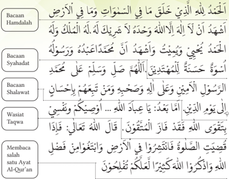

> **Deskripsi Visual:** Gambar ini adalah diagram yang menunjukkan berbagai bacaan dan wajah dari Al-Qur'an. Diagram ini terdiri dari beberapa baris yang masing-masing menunjukkan jenis bacaan dan wajah yang harus dipelajari. Setiap baris memiliki judul yang menjelaskan jenis bacaan tersebut, seperti "Bacaan Hamdalah", "Bacaan Syahadat", "Bacaan Shalawat", "Wasiat", dan "Taqwa". Untuk setiap jenis bacaan, ada juga penjelasan tentang apa yang harus dipelajari, seperti "Membaca salah satu Ayat Al-Qur'an" untuk wajah "Membaca salah satu Ayat Al-Qur'an". Diagram ini membantu pembaca untuk memahami struktur dan konten dari Al-Qur'an dengan cara yang sistematis dan mudah dipahami.

ُ

ْ

َ

ْ

ْ

ُ

ْ

ْ

َ

ُ

ْ

َ

ِ

َ

ك ُ

َ

ُ

َ

ِ

ر ْ ض

َ

ُ

َ

ُ

َ

ُ

َ

َ

ِ ي الس

ا  ف

ّ

َ

َ

ْ

َ

ْ

ْ

ِ   ال

َّ

لل

َ

َ

ّ

ِ

ْ

ِ

ّ

َ

ْ

َ

ْ

م ْ د

َ د

ُ

ُ

ُ

ْ

َ

ُ

َ

ٌ

ِ

َ

ُ

ّٰ

ق

َ

ل

ُ

ً

ْ

َ

ْ

َ ح

ْ

م

َ

َ

َ

َ ات

و

َ

ّ

َ

ّٰ

م ٰ و

ْ ك

َ

ِ

ْ

َ

َ

ِ

ّ

ُ

ِ

ّٰ

ِ

ُ

ُ

ْ

ْ

ّٰ

ُ

َ

ِ

ِ

ُ

ْ

خ

َ

َّ

ذ ِ ي

َ

َ

َ

ْ

َ

ُ

َ

ْ

ْ

َ

ٰ

َ

ِ

ٌ

ّ

ّٰ

ل

ْ

ْ

ْ

ْ

ٰ

ّٰ

ُ

َ

ِ

ُ

َ

َ

ْ

َ

َ

ٰ

ْ

م ُ

ي  ا

ِ

ْ

ُ

لا

َ

َ

ْ

ُ

َ

ُ

ْ

ا  ف

ْ

ٰ

ْ

َ

ْ

ُ

َ

ِ

ُ

ْ

َ

ْ

م

َ

ْ

ُ

َ

َ

ُ

ُ

ْ

َ

َ

ٰ

َ

َ

َ

ٰ

ْ

َ

َ

َ

َ

ُ

َ

َ

ٰ

َ

ْ

َ

َ

ّٰ

َ

َ

ْ

- Materi khutbah, hendaklah disesuaikan dengan situasi dan kondisi yang sedang aktual atau terkini,  yang  diperkuat  dengan  rujukan  atau  dalil yang kuat,  khususnya yang bersumber dari Al-Qur'an dan Hadis. 5. Penutup khutbah I (Pertama), contohnya: َ ات ي ا ال ه ِ   م ِ ن ا  ف ِ ي ِ م ب م اك َّ ي إ و ن ِ ي ع ف ن و م ِ ي َ ظ ع ال ن ِ ا ر ْ ق ي  ال ف م ك ل و ِ ي ل الل َ ك ار ب م ل ِ ي ع ال ع م ِ ي َّ الس و ه ه َّ ن إ ه ت او ِ ل ت م ك م ِ ن ْ  و ِ ي م ِ ن َّ ل ب ق ت م ِ  و ك ِ ي ح ال ر ِ ك الذ ِ و َ ات ل ِ م م ُ س ال و ْ ن ي ل ِ م م ُ س ال ِ ر ائ ِ س ل و م ك ل ْ  و ِ ي ل الل ف ِ ر غ ت اس و ذا ي ه ل و ق ْ ل و ق ا م ي َّ ح الر ر و ف غ ال و ه ه َّ ن إ ه ُ و ف ِ ر غ ت اس ف ات ِ م ِ ن م ُ ؤ ال و ْ ن م ِ ني م ُ ؤ ال و
ِ

ِ

ُ

ْ

ُ

ْ

ْ

ِ

ُ

ِ

َ

ُ

ْ

َ

ِ

ْ

َ

ً

ُ

َ

َ

َ

َ

َ

ُ

### h. Praktik Khutbah II (Kedua)

- Selesai khutbah pertama, khatib duduk sebentar (sambil berdoa mohon ampun untuk diri dan kedua orang tua), lalu berdiri untuk khutbah kedua.
- Khutbah kedua ini, membaca rukun-rukun khutbah mulai dari membaca hamdalah sampai berdoa. Contohnya adalah:
َ

ُ

ُ

ْ

َ

َ

ِ

ِ

ٰ

ْ

َ

ْ

َ

ِ

َ

َ

َ

ْ

َ

ْ

ُ

ُ

َ

ْ

َ

ْ

ِ

َ

ْ

َ

ّٰ

ّ

ٰ

ُ

ُ

َ

ْ

ْ

َ

ْ

ِ

َ

ْ

َ

ُ

َ

ْ

َ

َ

َ

َ

ْ

ْ

ُ

ّٰ

ْ

َ

ْ

َ

ُ

ّ

ُ

ا

َ

ُ

َ

َ

َ

َ

ُ

ُ

ْ

ُ

ْ

ُ

َ

ُ

ُ

ْ

ْ

ّٰ

َ

ْ

َ

َ

َ

َ

ْ

ْ

َ

َ

ِ

ْ

َ

ح

َ

ْ

َ

 

---
## 📄 Halaman 141

ْ

َ

َ

َ

َ

َ

ْ

َ

ُّ

َ

ْ

ُ

َ

ُ

َ

َ

َ

َ

َ

ّ

ْ

َ

َ

ْ

َ

َ

َ

َ

َ

َ

َ

َ

َ

ّٰ

َ

َ

َ

َ

ْ

ْ

ُ

َ

ْ

َ

َ

َ

َ

ّٰ

َ

ْ

ُ

ْ

َ

ِ

ِ

َ

َ

َ

ُّ

َ

ُ

َ

َ

َ

َ

ً

ّٰ

ُ

َ

َ

َ

َ

ّٰ

ٰ

ّ

َ

َ

َ

َ

ْ

- Setelah itu diakhiri dengan membaca doa 4. Kalimat penutup khutbah kedua, contohnya: ى ه ن ي ي و ب ر ْ ق ال اء ِ  ذ ِي ت ي إ و ان ِ ْ س ا ِ ح ال و ل ِ د ع ال ب ر ُ م أ ي الل َّ ِ ن ِ ، إ الل اد ع ِ ب ا ر ُ و ك اذ . ف ْ ن ر ُ و َّ ك ذ ت م ك َّ ل ع ل م ك ع ِ ظ ي ي غ ب ال و ر ِ ك ن م ُ ال اء ِ  و ش ح ف ال ن ِ ع ِ ل ِ ه َ ض ف م ِ ن ه و ل ئ اس و م ك د َ ز ه ِ  ي م ِ ى ن ِ ع ل ع ه ر ُ و ك اش و م ر ْ ك ك َ ذ ي م ي َ ظ ع ال الل ر ب ك ِ  أ الل ر ُ ذ ِ ك ل و م ِ ك ْ ط ُ ع ي
لا ه د َ ح و االل َّ ا ِ ل ه ل ا ا ِ َّ ل ن ا َ د ه ش ا . و ر َ م ا ا م ا ك ر ث ِ ي ا ك ْ د م ِ ح لل م ْ د ح ل ا ه ْ د ب اع َّ د م ح ا م ن ِ د ي س َّ ن ا َ د ه ش ا . و ر َ ف َ ك ه ِ  و ب د َ ح ج َ ن ا ل ِ م ام غ ا ِ ر ه ل ْ ك ي ر ش ى ل ع َّ د ٍ  و م ح ا م ن ِ د ي ى س ل ع ِ م ل َ س و ل َُّ  ص ر ِ .ا َ ش ب ال و س ِ ن إ ِ ال ِ د ي س ه ل و َ س ر و ّ اس ا الن ُّ ه ي ا أ ي : ف د ع ا  ب َّ م .ا ر ٍ ب خ ب ن ذ أ و ر ٍ َ ظ ِ ن ب ْ ن ي ع ت ْ ل َّ ص ا ات ه ِ  م ب ِ َ ح َ ص ِ  و ل ِه ا م ر َ ك م ا الل َّ ن اا م ُ و ل اع . و ن َ َ ط ا  ب م و ر َ ه اظ م اح ِ ش و ف اال و ر ذ و االل و ق َّ ت إ الل َّ ِ ن ي:    إ ال ع ت ال ق ه ِ . ف س ِ د ِ ق ب ة ِ ِ ح ب م ُ س ال ة ِ ئ ِ ك لا ِ م ي  ب ن ث ه ِ   . و س ِ ف ِ ن ب أ َ د ب ر ٍ م أ ب ا م ل ِ ي س ْ ا  ت ُ و ِ م ل َ س ه ِ   و ي ل ا  ع و ل ا ص و ن م أ ن ي ذ ِ َّ ا  ال ُّ ه ي اأ ي ي ّ ب َّ ى  الن ل ع ْ ن و ل ُ ص ي ه ت ئ ِ ك لا م و

ْ

َ

َ

َ

ْ

ْ

ُ

ُ

ْ

ِ

َ

َ

ْ

ُ

َ

ُ

ٰ

َ

َ

ُ

ِ

ْ

ْ

َ

ُ

ْ

ُ

َ

ْ

َ

َ

َ

ْ

ْ

ْ

َ

َ

ْ

َ

ْ

َ

ْ

ُ

ُ

ْ

َ

ْ

ِ

ْ

َ

ّٰ

َ

ّٰ

ْ

َ

َ

ْ

ُ

ْ

ُ

ْ

ْ

َ

ُ

َ

ْ

ُ

َ

ْ

- Khatib turun dari mimbar, dan bersamaan  dengan  itu, muadzin mengumandangkan ikamah .

### Aktivitas  4.5

### Aktivitas Peserta Didik:

Bentuk kelas Anda menjadi 5 kelompok. Lalu, setiap kelompok menyusun naskah (teks) khutbah dengan tema nilai-nilai Islam rahmatan lil 'alamin . Hasilnya  dipresentasikan,  dan  setiap  kelompok  memberi  penilaian apakah temanya sudah bernilai Islam yang rahmatan lil 'alamin !

ِ

ِ

ُ

َ

ُ

ٰ

ُ

ٰ

ْ

َ

ُ

ْ

َ

َ

َ

َ

َ

ْ

ً

َ

ْ

ٰ

َ

َ

ُ

ُ

َ

ُ

ّٰ

ُ

ْ

َ

َ

َ

َ

َ

ِ

َ

ْ

ّ

ّ

ُ

ْ

َ

َ

َ

ٰ

ْ

َ

ٰ

ْ

َ

َ

َ

ْ

َ

ْ

ُ

ْ

َ

ّ

َ

َ

َ

ْ

َ

ْ

ُ

ِ

َ

َ

َ

ٌ

ِ

ّ

ْ

ُ

َ

َ

ُ

َ

َ

َ

ْ

َ

َ

ّٰ

َ

َ

َ

َ

ِ

ْ

َ

َ

َ

َ

ٌ

َ

ْ

ِ

َ

َ

ِ

َ

ْ

ً

َ

ُ

ْ

ْ

ْ

َ

َ

َ

َ

َ

ْ

ّٰ

ْ

ً

ً

َ

َ

ُ

َ

ْ

ّ

َ

ُ

ّٰ

ْ

َ

ّٰ

ُ

ِ

ُ

َ

ْ

ُ

َ

ُ

َ

َ

ِ

ْ

َ

َ

َ

َ

َ

ٰ

 

---
## 📄 Halaman 142

### i. Persamaan dan Perbedaan Dakwah dan Khutbah

Berikut ini, persamaan dan perbedaan keduanya, yaitu:

---
**📊 Tabel**

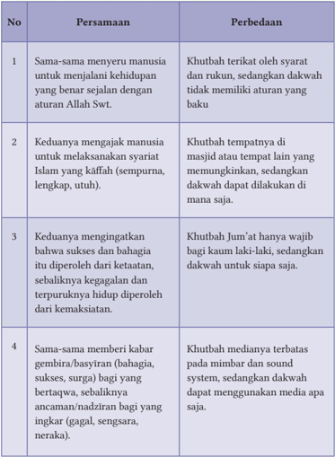

Tabel ini membandingkan dua aspek penting dalam khutbah dan dakwah: tujuan, tempat, keadaan, dan cara memberi kabar. Topik utama tabel adalah perbedaan antara khutbah dan dakwah. Kolom pertama berisi nomor urut, sedangkan kolom kedua dan ketiga berisi deskripsi persamaan dan perbedaan masing-masing. Data penting yang terlihat adalah bahwa khutbah dan dakwah memiliki tujuan yang sama, yaitu untuk menjalani kehidupan dengan sejalan dengan aturan Allah Swt., tetapi khutbah dilakukan di masjid atau tempat yang memungkinkan, sementara dakwah dapat dilakukan di mana saja. Khutbah Jum'at wajib bagi kaum laki-laki, sedangkan dakwah untuk siapa saja. Khutbah memberikan kabar gembira/basiran (bahagia, sukses, surga) bagi yang bertaqwa, sedangkan dakwah memberikan ancaman/nadzir bagi yang ingkar (gagal, sengsara, neraka). Khutbah mediatanya terbatas pada mimbar dan sound system, sedangkan dakwah dapat menggunakan media apa saja.

 

---
## 📄 Halaman 143

ً

3. Tablig a. Pengertian Menurut tinjauan bahasa, kata tablig berasal dari kata ballagha ا ْ غ ل ِ ي ب -ت ِ غ ل ب -ي غ َّ ل ب yang  artinya menyampaikan atau  memberitahukan  pesan  atau  ceramah secara lisan atau perkataan.

ْ

َ

ُ

ّ

َ

ُ

َ

َ

Makna lainnya adalah ceramah yang tidak disertai dengan rukun seperti khutbah. Bukan sekadar ceramah atau pesan biasa, tetapi sebuah ceramah yang sumbernya dari ajaran Islam yang disampaikan kepada satu orang atau banyak orang, agar mengamalkan isi pesan tersebut.

Disebabkan  fokusnya  kepada  pengamalan  isi  pesan,  maka  tablig  harus dikemas agar menarik, tidak membosankan, tidak menggurui, tidak menyimpang dari  substansi  dan  disampaikan  secara  sopan.  Adapun  pelaku  penyampai ceramah atau pesan disebut mubalig (laki-laki) atau mubaligah (perempuan).

Namun, jika ditinjau dari pengertian istilah, tablig memiliki beberapa makna, antara lain:

- Menyampaikan aturan Islam baik dari yang termaktub dalam Al-Qur'an maupun Hadis yang ditujukan kepada umat manusia.
- Menyampaikan  ajaran  Islam  kepada  umat  manusia  untuk  dijadikan pedoman agar memperoleh kebahagiaan dunia dan akhirat.
- Bagian dari dakwah islamiyah dalam bentuk khusus (lisan dan tulisan) untuk disampaikan kepada pihak lain.
- Menyampaikan 'pesan' Allah Swt. secara lisan kepada satu orang atau lebih untuk diketahui dan dipahami, lalu diamalkan isinya.

 

---
## 📄 Halaman 144

- Sebuah profesi yang dilakukan untuk menyampaikan atau menyiarkan agama Islam kepada umat.
Berdasarkan  pengertian  tersebut,  tersimpul  bahwa  tablig  merupakan bagian dari  dakwah. Tablig  lebih  banyak  berisi  pesan  atau  ceramah  lisan dan perkataan, sementara dakwah lebih luas, tidak hanya lisan tetapi juga perilaku dalam kehidupan sehari-hari.

ٰ

Khusus  di  Indonesia,  konsep  tablig  tidak  hanya  berisi  ceramah  lisan, tetapi juga berisi kegiatan keagamaan lainnya. Misalnya kita kenal istilah tablig akbar yang biasanya dilaksanakan di tempat yang luas dan dihadiri lebih banyak peserta, serta biasanya diisi dengan dzikir bersama, sehingga terjadi perbedaan konsep atau persinggungan makna dan istilah yang dipakai yang tertanam pada benak masyarakat umum. b. Dalil Adanya Tablig ى ف َ ك ۗو ا الل َّ ا ا ِ ل د ح َ ا ْ ن و ش خ ا ي ل و ه ن و ش خ َ ي ِ  و الل ت ِ ل ِ س ر ْ ن و ِ غ ل ب ي ن ي ذ ِ َّ ال ﴿ ) 39 : 33/ ( الاحز اب ا ﴾ ب ي َ س ِ ح ِ الل ب

َ

َ

ّٰ

ً

َ

َ

َ

ْ

َ

َ

َ

ٗ

َ

ْ

َ

ْ

َ

ّٰ

ٰ

ٰ

َ

ُ

ّ

َ

ُ

َ

ْ

ۨ

ً

ْ

ِ

ّٰ

Artinya: (yaitu) orang-orang yang menyampaikan risalah-risalah Allah (para rasul yang menyampaikan syariat-syariat Allah kepada manusia), mereka takut kepada-Nya dan tidak merasa takut kepada siapa pun selain kepada Allah. Dan cukuplah Allah sebagai pembuat perhitungan (Q.S. al-Ahzāb/33: 39).

Perhatikan juga isi kandungan dari beberapa ayat Al-Qur'an berikut ini, misalnya Q.S. al-Māidah/5: 99, Q.S. ar-Ra'd/13: 40, dan Q.S. al-Nahl/16: 35 yang isinya tentang tablig.

### c. Ketentuan Tablig

Ada  beberapa  ketentuan  dan  tara  cata  yang  harus  diperhatikan,  terkait dengan pelaksanaan tablig, yaitu:

### 1. Ketentuan Tablig

- Dilakukan dengan cara yang sopan, lemah lembut, tidak kasar, dan tidak merusak.
- Menggunakan bahasa yang mudah dimengerti oleh jamaah.

 

---
## 📄 Halaman 145

- Mengedepankan  musyawarah  dan  berdiskusi  untuk  memperoleh kesepakatan bersama.
- Materi  tablig  yang  disampaikan  harus  mempunyai  rujukan  yang kuat dan jelas sumbernya.
- Disampaikan  dengan  penuh  keikhlasan  dan  kesabaran,  sejalan dengan situasi dan kondisi masyarakat, termasuk aspek psikologis dan sosiologis para jamaah.
- Tidak menghasut orang lain untuk bermusuhan, berselisih, merusak, dan mencari-cari kesalahan orang lain.

### 2. Tata Cara

Tata  cara/strategi  tablig  harus  merujuk  teladan  Rasulullah  Saw.  dan  para sahabatnya dalam melaksanakan dakwah atau tablig. Jika tidak, tablig yang bertujuan baik, malah berubah menjadikan citra Islam tidak baik, bahkan merusak citra, tentu semua itu harus menjadi kesadaran bersama.

Sejarah Islam pun telah memberi teladan dalam bertablig, yaitu:

- Mengajak  orang  terdekat  terlebih  dahulu,  menuju  profil  muslim yang  menyatu  antara  kata  dan  perbuatan,  lalu  mengajak  kepada masyarakat luas. Sebab, keluarga merupakan kunci sukses, karena pihak lain akan melihat dulu pribadi dan keluarganya. Perhatikan isi kandungan Q.S. ash-Shaf/61: 2-3, dan Q.S. Luqmān/31: 12-19)!
- Dekati  pihak  lain  sesuai  dengan  kapasitas  ilmu  dan  martabatnya. Karena  itu,  perlu  pendekatan  dan  strategi  yang  beragam,  apalagi kondisi  saat  ini  yang  serba  cepat,  praktis,  dan  canggih.  Semua itu mengharuskan adanya perubahan dalam tablig (Q.S. alMuddatstsir/74}: 1-7).
- Mengajak diri  dan  pihak  lain  untuk  saling  membantu  agar  tablig dapat terlaksana dengan baik, bertahap, berkesinambungan, menjangkau semua lapisan masyarakat, serta adanya segmen tablig yang jelas antara mubalig satu dengan yang lain, sehingga semua lapisan masyarakat terkena sasaran tablig (Q.S. al-Māidah/5}: 2).
Di samping itu, ada beberapa hal yang patut dijadikan pedoman dalam tablig, yaitu kekuatan keimanan dan kesabaran. Artinya, kesuksesan tablig sangat dilandasi kuatnya iman, sekaligus dibarengi adanya pola manajemen yang handal. Hal ini dapat dicontoh dari cara dan strategi yang dilakukan para

 

---
## 📄 Halaman 146

Walisongo dan tokoh lainnya dalam menyebarluaskan Islam di Indonesia, khususnya di pulau Jawa.

Hanya sayangnya, sekarang strategi  ini  sudah  mulai  ditinggalkan  oleh para mubalig, sehingga realitas memberi bukti, meski tidak semua, tablig yang dilakukan  lebih  bersifat  seremonial  belaka,  lebih  banyak  unsur  humornya, melupakan tujuan dan substansi, akibatnya tampak kehilangan ruh dan jiwa, serta kurang memberi dampak positif dalam mengubah perilaku masyarakat.

Oleh sebab itu, kembalilah kepada semangat tablig yang baik dan benar. Berikut ini ada beberapa kepribadian dai yang mesti diubah, yakni: (a) Lemah Sikap atau tidak tegas, sehingga mengantarkan hancurnya kedisiplinan. (b) Lemah Hati sehingga menyebabkan rapuhnya cita-cita. (c) Lemah  Pikiran , menjadikan problematika tak cepat terselesaikan, dan yang paling penting (d). Lemah Iman , yang mengakibatkan begitu mudah masuknya bujuk rayu, nafsu, dan godaan duniawi.

Itulah sebabnya, sangat perlu adanya perubahan strategi tablig dalam masyarakat  modern,  apalagi  didasari  realitas  tentang  adanya  tantangantantangan sosial dan budaya yang semakin kompleks, sehingga model dan pola tablig relevan dengan kebutuhan zaman, akhirnya umat ini memiliki jatidiri yang mantap yang ditandai dengan ciri-ciri sebagai berikut.

- Kepribadian umat yang teguh, kokoh, dan kuat; serta seimbang capaian lahir batin, dunia akhirat; sekaligus terpadu iman taqwanya, baik amal ibadahnya, serta santun akhlaknya ( syāmil dan kāffah ).
- Pola hidupnya selalu menebar kedamaian untuk semua, tegak lurus di atas  kebenaran  dan  keadilan,  serta  bersemangat  menerapkan  ajaran Islam  yang rahmatan  lil  'ālamīn (damai,  santun,  dan  menenteramkan untuk semua) .
- Mengedepankan model atau pola tablig yang bernafaskan bil  hikmah wal mau'idhatil hasanah (bijak, beradab, dan modern) . Sedang tata caranya perlu diwujudkan melalui tindakan nyata ( bil lisāni wal hāl ), contoh dan teladan ( uswatun hasanah ), dan manajemen yang baik ( amal jamā'ī ).

### 3. Peragaan/Praktik Tablig

Setiap  orang  yang  memilih  profesi  tablig,  harus  benar-benar  menata kepribadiannya,  sehingga  pihak  lain  yang  menjadi  objek  tablig  tertarik dan  bersedia  ikut  dengan  kerelaan  hati.  Itu  sebabnya  diperlukan  banyak

 

---
## 📄 Halaman 147

persyaratan yang harus dipenuhi, seperti paparan yang sudah disebutkan, juga  banyak  menempuh  jalan  persuasif  dan  mengedepankan  pendekatan budaya masyarakatnya.

Sebaliknya,  hindari  menempuh  jalan konfrontatif, teror, dan radikal , yang akibatnya pihak lain memberi label yang kurang bagus kepada Islam dan kaum muslim; bukannya semakin dekat, tetapi malah menjauh; bukan simpati yang didapat, malah antipati dan benci. Oleh karena itu, sekali lagi penting sekali ditempuh seruan dan ajakan yang damai, sejuk, santun, dan menenteramkan.

Sebagai bagian dari peragaan atau praktik bertablig, maka ada tahapan langkah-langkah yang harus diikuti, yaitu:

- Tahap persiapan
Rujuklah dan pelajari materi tablig, agar sesuai dengan kebutuhan jamaah atau audiens

- Tahap pelaksanaan
Saat tablig, maka informasi yang disampaikan harus yang praktis, singkat dan serba cepat, dengan tetap mengedepankan bahasa yang sederhana, mengajak jamaah berdiskusi dan mengandalkan logika dan akal sehat, melibatkan juga mata hati, serta menghindari gaya yang menggurui, menekan, apalagi memaksa.

Islam  itu  kebenaran,  maka  materi  tablig  juga  harus  disampaikan secara terbuka, utuh, dan komprehensif, sehingga jamaah dengan kesadaran  sendiri  dapat  menerima  ajaran  Islam  dan  menemukan sendiri kebenaran itu.

Memang  cara  itu  terasa  sulit,  tetapi  sangat  elegan  dan  pantas dikedepankan, karena Islam sendiri hadir bukan di ruang hampa, tetapi sejak awal sudah berhadapan dengan beragam realitas yang umumnya berbeda, dan berdasarkan S irah Rasulllah Saw., ternyata realitas  yang  berbeda  tersebut  mampu  diadaptasi,  diubah,  dan dicegah sehingga sejalan dengan ajaran Islam.

Tercapainya  keberhasilan  memang  perlu  waktu,  kesabaran  yang tinggi,  dan  menggunakan  beragam  metode  dan  strategi,  serta mendayagunakan sarana penunjang yang memadai/mendukung.

 

---
## 📄 Halaman 148

### H

Jangan lupa hindari upaya memaksa, apalagi menggunakan kekerasan, tidak terkesan menggurui, dan mempertimbangkan juga waktu yang tersedia.  Gunakan  pula  metode  yang  menyenangkan dengan prinsip 3  F  ( Fun,  Fresh, dan Focus) ,  serta  tidak  berlebihan dalam menggunakan humor dan jenaka.

### c) Tahap Konsolidasi

Sebagai  tahap  akhir,  upayakan  adanya  pemantapan  pemahaman materi  tablig  dalam  bentuk  kesimpulan  atau resume ,  dan  hal-hal apa saja yang harus ditindaklanjuti, biasanya dikenal dengan RTL ( Rencana Tindak Lanjut ).

Hal ini perlu dilakukan agar setiap jamaah ada kesadaran diri untuk melakukan  perbaikan  dan  peningkatan  kualitas  amal,  dan  tidak kalah pentingnya tidak terjadi bias pemahaman bagi jamaah atau audiens, sebelum mengakhiri kegiatan tablig.

### Penerapan Karakter

Setelah menelaah materi Dakwah, Khutbah dan Tablig, diharapkan peserta didik  dapat  membiasakan  karakter  dalam  kehidupan  sehari-hari,  sebagai berikut.

---
**📊 Tabel**

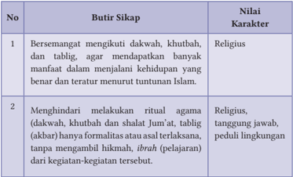

Tabel ini berisi dua baris dan tiga kolom, dengan judul "Butir Sikap" di baris pertama dan "Nilai Karakter" di baris kedua. Kolom pertama berisi nomor urut dari 1 hingga 2, sedangkan kolom kedua berisi butir sikap yang harus dilakukan oleh individu untuk meningkatkan karakter mereka. Kolom ketiga berisi nilai-nilai karakter yang diharapkan dari individu tersebut. Topik utama tabel ini adalah tentang cara individu dapat meningkatkan karakter mereka melalui berbagai tindakan dan sikap. Data penting yang terlihat dalam tabel ini adalah bahwa sikap-sikap tersebut harus dilakukan secara rutin dan teratur agar dapat meningkatkan karakter seseorang.

 

---
## 📄 Halaman 149

---
**📊 Tabel**

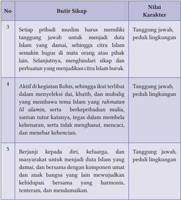

Tabel ini berisi informasi tentang nilai karakter yang diharapkan dari para pribadi Muslim, terutama dalam konteks menjadi duta Islam yang damai. Topik utama tabel adalah tentang sikap dan perilaku yang diharapkan untuk menciptakan citra Islam yang damai dan bermartabat. Kolom-kolomnya meliputi No, Butir Sikap, dan Nilai Karakter. Data penting yang terlihat adalah bahwa setiap pribadi Muslim harus memiliki tanggung jawab untuk menjadi duta Islam yang damai, sehingga citra Islam semakin bagus dalam mata orang atau pihak lain. Selanjutnya, aktivitas di kegiatan Rohis, seperti ikut terlibat dalam menyelenggarakan kegiatan, mubalig, dan membawa tema Islam yang rahmatan lil alamin, serta berpribadian mulia, sangat penting. Selain itu, berjanji kepada diri, keluarga, dan masyarakat untuk menjadi duta Islam yang damai bersama dengan komponen umat dan anak bangsa juga merupakan nilai penting yang diharapkan.

I

### Refleksi

Kelas dibagi menjadi 3 kelompok, lalu silakan unduh di internet, atau referensi yang tepercaya tentang ceramah KH. Mustofa Bisri (Gus Mus), KH. Zainuddin, MZ. (alm), dan Aa Gym. Persiapkan juga buku catatan, atau  laptop  yang  kalian  miliki.  Lalu  pilih  dari  3  kisah  hidup  dai  atau mubaligh tersebut yang paling menggetarkan jiwa atau batin kalian, lalu masing-masing kelompok mempresentasikan hasilnya!

 

---
## 📄 Halaman 150

### Rangkuman

- Dibanding khutbah dan tablig, cakupan dakwah itu lebih luas, seluas segala aspek kehidupan setiap muslim. Dakwah tidak mesti berbicara dan  berceramah,  tetapi  melakukan  perbuatan  sehari-hari  yang mencerminkan tata nilai Islam, bahkan diam pun demi menegakkan kebenaran, dapat juga bagian dari dakwah.
- Syarat dai: (a) satunya kata dengan perbuatan; (b) memahami objek dakwahnya; (c) berani dan tegas, tetapi tetap bijak dan santun dalam berdakwah; (d) memiliki ketabahan dan kesabaran yang kokoh; (e) tugasnya hanyalah menyampaikan,  tidak memastikan hasilnya; dan (f ) terus berdoa agar dakwahnya berhasil.
- Khutbah jika dikaitkan dengan shalat dapat dibagi menjadi 3 bagian, yaitu:  (a)  Khutbah  sebelum  shalat,  misalnya Khutbah  Jum'at.  (b) Khutbah  sesudah  shalat,  misalnya Khutbah  Shalat  'Idain, Shalat Khusuf dan Shalat Kusuf, Shalat Istisqa',  dan  khutbah saat Wukuf di  Arafah;  dan  (c)  Khutbah  yang  tidak  berkaitan  dengan  shalat, misalnya Khutbah Nikah.
- Rukun  Khutbah:  Membaca hamdalah; membaca  s halawat Nabi; berwasiat taqwa kepada diri dan jamaah; membaca satu atau beberapa ayat al-Qur'an; dan berdoa kepada kaum muslimin dan muslimat.
- Tablig  bukan  sekadar  ceramah  atau  pesan  biasa,  tetapi  sebuah ceramah yang datangnya dari Allah Swt. yang disampaikan kepada satu orang atau banyak orang agar mengamalkan pesan tersebut.
- Ketentuan tablig: (a) menggunakan cara yang sopan, lemah lembut, tidak  kasar,  dan  tidak  merusak;  (b)  menggunakan  bahasa  yang mudah  dimengerti;  (c)  mengutamakan  musyawarah  dan  diskusi; (d) materinya menggunakan rujukan yang kuat dan jelas sumbernya; (e)  dilandasi  keikhlasan  dan  kesabaran;  dan  (f).  tidak  menghasut untuk bermusuhan, berselisih, merusak, dan mencari-cari kesalahan orang lain.

 

---
## 📄 Halaman 151

### 1. Penilaian Sikap

### Penilaian Diri

### Berilah tanda centang (v) pada kolom berikut dan berikan alasannya!

---
**📊 Tabel**

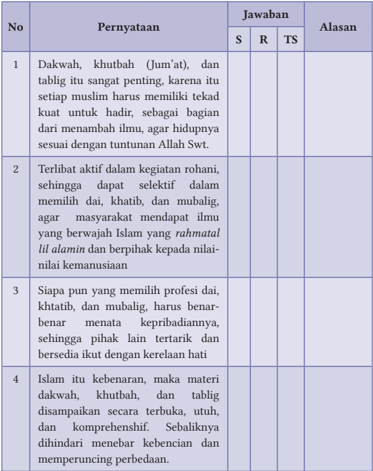

Tabel ini berisi pernyataan tentang dakwah, khutbah, dan tablig, dengan jawaban yang diberikan oleh siswa (S), guru (R), dan tim penilai (TS). Topik utama tabel adalah tentang pentingnya dakwah, khutbah, dan tablig dalam kehidupan sehari-hari seorang Muslim. Kolom-kolom yang ada meliputi nomor pernyataan, pernyataan itu sendiri, jawaban S, R, dan TS, serta alasan untuk setiap jawaban. Data penting yang terlihat adalah bahwa semua pernyataan memiliki jawaban yang sama, yaitu "Ya" untuk pernyataan 1, 2, dan 4, sedangkan pernyataan 3 memiliki jawaban "Tidak". Alasan untuk setiap jawaban juga serupa, menunjukkan kesamaan pandangan antara siswa, guru, dan tim penilai tentang pentingnya dakwah, khutbah, dan tablig dalam kehidupan sehari-hari.

 

---
## 📄 Halaman 152

---
**📊 Tabel**

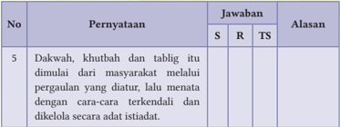

Tabel ini berisi informasi tentang proses dakwah, khutbah, dan tablig yang dimulai dari masyarakat melalui pergaulan yang diatur. Kolom "Pernyataan" menyajikan pernyataan yang diberikan, kolom "Jawaban" menunjukkan jawaban yang sesuai dengan pernyataan tersebut (S = Sesuai, R = Salah, TS = Tidak Sempurna), dan kolom "Alasan" memberikan alasan untuk setiap jawaban. Topik utama tabel ini adalah proses dakwah, khutbah, dan tablig yang dimulai dari masyarakat melalui pergaulan yang diatur. Data penting yang terlihat adalah bahwa semua pernyataan dianggap sesuai (S) oleh para penilai.

Catatan: S= Setuju, R=Ragu, TS= Tidak setuju

### 2. Penilainan Pengetahuan

Berilah tanda silang (X) pada huruf A, B, C, D atau E pada pernyataan di bawah ini sebagai jawaban yang paling tepat!

- Hendaknya khutbah, tablig dan dakwah yang dilakukan tidak bersifat seremonial, tetapi mencapai sasaran. Sebab itu, semuanya perlu wujud nyata melalui hal-hal berikut ini, kecuali … .
- bil lisāni wal hāl
- uswatun hasanah
- mau'idhah hasanah
- bil hikmah
- bil ra'yi
- Mulai  zaman  Nabi  Adam  As.  sampai  zaman  Rasulullah  Saw.  serta diteruskan oleh generasi sampai akhir zaman, tujuan Dakwah Islamiyah tidak akan pernah berubah, yaitu … .
- mengajar orang agar bisa membaca Al-Qur'an dengan tartil
- mengubah perilaku manusia yang telah menyimpang dari aturan Allah
- mengajak manusia mentaati perintah Allah dan menjauhi larangan-Nya
- menyeru manusia tentang indahnya surga dan seramnya neraka
- menerapkan kaidah hukum fiqh dalam semua aspek kehidupan
- Dakwah harus memiliki sasaran yang jelas, karena itu harus menggunakan   metode.  Berlandaskan  Q.S.  al-Nahl/16:  125,  dijelaskan metode yang dilakukan dai berikut ini, kecuali … .

 

---
## 📄 Halaman 153

- dakwah disampaikan dengan cara hikmah
- dalam berdakwah harus di jalan Allah Swt.
- dengan cara yang indah dan menyenangkan
- apabila diperlukan boleh dengan cara berdebat kusir
- adanya dialog yang baik antara dai dan yang didakwahi
Banyak hal yang memengaruhi keberhasilan tablig. Namun, ada hal terpenting, sesuai dengan isi kandungan Hadis, yaitu: .. .

- Perhatikan Hadis di bawah ini! ة آي و ل ِ ي و ن وا ع ِ غ ل ب
ً

َ

ْ

َ

َ

ّ

َ

ُ

ّ

َ

- ketenteraman saat melakukan tablig
- metode, strategi, dan cara yang dipakai
- keterlibatan semua pihak menggalang dana
- tablig itu tidak mengenal derajat dan martabat
ْ

- kewajiban setiap mubalig menyesuaikan kemampuan 5. Perhatikan Q.S. al-Jumu'ah/62: 9 berikut ini! ر ِ ى  ذ ِك ل ا ا ِ و ع اس ة ِ  ف م ُ ع ج م ِ  ال و َّ ي م ِ ن وة ِ ل َّ لِلص د ِي و ا ن ِ ذ ٓا ا و ن م ا ن ي ذ ِ َّ ا ال ُّ ه ي ا ﴿ ي ) 9 : 62/ ( الجمعة ﴾ ْ ن م ُ و ل ع ت م ت ن ك ا ِ ن م ك َّ ل ر ي خ م لِك ۗ  ذ ع ي ب وا ال ر ذ ِ  و الل
ْ

ٰ

َ

ْ

َ

َ

ُ

ْ

ْ

ْ

ٰ

َ

ْ

ُ

َ

َ

ْ

َ

ْ

ُ

ْ

ُ

ْ

ْ

ُ

ٌ

ْ

َ

Isi yang terkandung dari ayat tersebut adalah … .

- kewajiban melakukan shalat
- menghentikan kegiatan jual beli
- bersiap-siap mendengarkan khutbah
- segera ke masjid untuk Shalat Jum'at
- kewajiban melakukan 2 kali khutbah
- Adanya khutbah menjadi bagian penting dari Shalat Jum'at. Khutbah bukan sekadar dilaksanakan, namun ada juga fungsi lain dari khutbah, yaitu … .
- mengingatkan kembali tentang kehidupan yang benar
- timbulnya kesadaran mendalam tentang kewajiban shalat
- membebaskan seorang muslim dari kewajiban shalat
- gugurnya kewajiban shalat bagi seorang muslim
- terbebasnya kewajiban karena ada udzur
ْ

َ

ُ

ْ

ٰ

ُ

َ

َ

ْ

ٰ

َ

ْ

َ

ْ

ُ

َ

َ

َ

َ

ٰٓ

ّٰ

 

---
## 📄 Halaman 154

- Dakwah itu diwajibkan bagi setiap muslim. Ketentuan menjadi dai lebih longgar  dibanding  khatib.  Salah  satu  yang bukan syarat  menjadi  dai adalah … .
- memiliki ilmu dan pengetahuan yang memadai
- mengembangkan wawasan ke-Islam-an dan kebangsaan
- memilah ilmu sesuai dengan besar kecilnya manfaat yang didapat
- hidupnya harus sejalan dengan ajaran Islam yang disampaikan
- memberikan contoh dan teladan bagi diri dan pihak lain
- Hanya orang tertentu yang dapat menjadi khatib. Di antara ketentuannya adalah muslim yang sudah balig, berakal sehat dan taat beribadah. Semua itu bagian dari …
- rukun khutbah
- syarat khutbah
- tata tertib khatib
- adab khutbah
- syarat khatib
- Menjadi  pemimpin  yang  adil,  begitu  juga  menjadi  rakyat  yang  taat, menjadi  harapan  kita  semua.  Jika  ada  persoalan  yang  belum  dapat dipecahkan,  harus  tetap  dicari  solusinya  secara  adil,  yang  maknanya adalah … .
- mencari solusi dari beberapa pilihan yang sama-sama menyulitkan
- keterlibatan beberapa komponen masyarakat yang bersatu padu
- semua orang tanpa kecuali diperlakukan sama di mata hukum
- bersikap menyatukan dan mendamaikan masyarakat
- tertibnya lingkungan dari kesadaran masyarakat
- Kehidupan  saat  ini  sering  kita  temukan  konflik  kepentingan  antar berbagai  kelompok  masyarakat.  Semua  itu  harus  kita  hadapi  dengan adil dan bijak. Jika tidak, muncul kelompok penyusup yang berdampak negatif bagi … .
- kerusakan fasilitas umum dan kerugian fisik serta materi
- berlalunya waktu dan sumber daya masyarakat yang mengitari

 

---
## 📄 Halaman 155

- keamanan menjadi kondusif dan belum dapat dipisahkan
- sikap dari sebagian masyarakat yang ingin damai
- kelompok yang ingin terhindar dari problema

### Jawablah pertanyaan berikut dengan singkat dan benar!

- Pelaksanaan Khutbah Jum'at dapat dikelompokkan menjadi 2 bagian. Sebutkan!
- Sebutkan 3 rukun Khutbah Jum'at?
- Ada  beberapa persyaratan yang harus diindahkan bagi mubalig, agar  jamaah  memiliki  kerelaan  hati  untuk  mengamalkan  apa  yang disampaikan. Sebutkan syarat-syarat itu!
- Jika  kalian  ingin  berprofesi  sebagai  seorang  dai  yang  sukses,  maka harus memenuhi syarat seperti yang sudah diperankan oleh para Rasul, sebutkan 3 syarat yang paling utama!
- Saat ini beragam kepentingan masyarakat ingin dipenuhi secara cepat. Banyak  juga  problema  yang  diderita.  Bagaimana  strategi  kalian  (jika menjadi dai, khatib atau mubalig, sehingga masyarakat bisa tenang dan tenteram!

### 3. Penilaian Keterampilan

- Penilaian Proyek

### Aktivitas 4.6

### Aktivitas Peserta Didik:

Setiap kelas dibagi menjadi 6 kelompok. Buatlah telaah tentang visi, misi, dan tujuan dari beberapa Ormas Islam di Indonesia yang dikaitkan dengan Islam yang rahmatan lil 'alamin . Ormas tersebut adalah

- Kelompok I tentang Nahdlatul Ulama (NU)
- Kelompok II tentang Muhammadiyah (MD)
- Kelompok III tentang Persatuan Islam (Persis)
- Kelompok IV tentang Nahdlatul Wathon (NW)
- Kelompok V tentang Jamiatul Khairat
- Kelompok VI tentang Al Washliyah

 

---
## 📄 Halaman 156

### b. Penilaian Praktik

### Kelompok:

Kelas  dibagi  6  kelompok,  sesuai  dengan  Penilaian  Proyek  yang  sudah dilaksanakan. Lalu mempresentasikan dan mendiskusikan pembahasan sesuai  dengan  tugasnya,  lalu  membuat  kesimpulan  tentang Nahdlatul Ulama (NU) ,  Muhammadiyah, Persis,  Nahdlatul  Wathan  (NW),  Jamiatul Khairat dan Al  Washliyah. sementara itu  GPAI  memberikan penilaian dari masing-masing kelompok .

### Individual :

Setiap kelas ada 1 peserta didik (laki-laki) yang memperagakan sebagai khatib  Jum'at,  sementara  1  peserta  didik  (perempuan)  memperagakan sebagai  daiyah  atau  mubaligah.  Sementara  itu,  GPAI  bersama  peserta didik lainnya memberikan tanggapan dan penilaian

### c. Penilaian Portofolio

Tuliskanlah semua aktivitas keagamaan kalian, baik di sekolah, rumah, maupun masyarakat pada buku Penilaian  Pendidikan  Agama  Islam  dan Budi Pekerti !

L

### Pengayaan

Kalian sebagai generasi milenial, tentu memiliki idola pada seorang atau beberapa dai atau mubalig masa kini. Coba sebutkan 3 dai atau mubalig tersebut, sekaligus sebutkan 5 alasannya, kenapa kalian memilihnya!

 

---
## 📄 Halaman 157

KEMENTERIAN PENDIDIKAN, KEBUDAYAAN, RISET, DAN TEKNOLOGI REPUBLIK INDONESIA 2021

Pendidikan Agama Islam dan Budi Pekerti untuk SMA/SMK Kelas XI

Penulis:

Abd. Rahman dan Hery Nugroho

ISBN:

978-602-244-684-2

### Bab 5

### Meneladani Jejak Langkah Ulama Indonesia yang Mendunia

---
**🖼️ Gambar/Diagram**

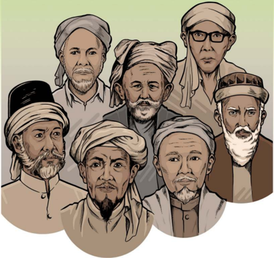

> **Deskripsi Visual:** Gambar ini adalah ilustrasi yang menampilkan lima tokoh berbusana tradisional. Setiap tokoh memiliki penampilan unik dengan topi dan pakaian yang berbeda, menunjukkan variasi budaya atau profesi mereka. Tokoh-tokoh ini tampak serasi dan saling berhubungan, mungkin menunjukkan hubungan sosial atau kerjasama antara mereka. Tanpa teks atau angka yang spesifik, informasi kunci yang dapat diambil dari gambar ini adalah bahwa ini mungkin menggambarkan kelompok atau komunitas tertentu, mungkin dalam konteks sejarah atau budaya.

 

---
## 📄 Halaman 158

### Tujuan Pembelajaran

Setelah mempelajari materi ini, kalian dapat:

- Menganalisis peran dan keteladanan tokoh ulama Islam di Indonesia: Hamzah  al-Fansuri,  Nuruddin  bin  Ali  ar-Raniri,  Syekh  Abdurauf  bin Ali al-Singkili, Syaikh Yusuf Abul Mahasin Tajul Khalwati al-Makasari, Abdus  Samad  bin  Abdullah  al-Jawi  al-Palimbani,  Abu  Abdul  Mu'thi Nawawi  al-Tanari  al-Bantani,  dan  Muhammad  Sholeh  bin  Umar  alSamarani.
- Mempresentasikan paparan mengenai peran dan keteladaan ulama Islam tersebut.
- Mengakui keteladanan tokoh ulama Islam di Indonesia.
- Membiasakan sikap gemar membaca, menulis, berprestasi, kerja keras, tanggung jawab, literasi dan produktif dalam berkarya.

### B Kata Kunci

- Nusantara
- Tuanta Salamaka ri Gowa
- Mufti
- Aswaja
- Sunni
- Ukhuwah Wathaniyah
- Bustanus alShalathin
- Sayyidul Hijaz
- Aswaja

 

---
## 📄 Halaman 159

### Infografis

---
**🖼️ Gambar/Diagram**

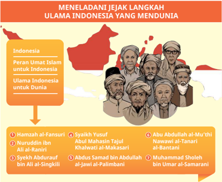

> **Deskripsi Visual:** Gambar ini adalah diagram yang menunjukkan peran ulama Indonesia untuk Indonesia dan dunia. Gambar ini terdiri dari dua bagian utama: bagian atas menunjukkan peta Indonesia dengan beberapa titik merah yang menandai lokasi ulama Indonesia, dan bagian bawah yang berisi daftar nama-nama ulama tersebut.

Elemen utama dalam gambar ini adalah nama-nama ulama yang disebutkan dalam daftar di bawah peta. Nama-nama ini terbagi menjadi dua kategori utama: "Peran Umat Islam untuk Indonesia" dan "Ulama Indonesia untuk Dunia". Setiap kategori ini memiliki beberapa nama ulama yang disertakan dalam daftar.

Teks penting dalam gambar ini meliputi judul gambar "MENELADANI JEJAK LANGKAH ULAMA INDONESIA YANG MENDUNIA", nama-nama ulama yang disebutkan dalam daftar, dan informasi tentang peran mereka dalam konteks Indonesia dan dunia.

Informasi kunci yang dapat diambil pembaca meliputi bahwa gambar ini menggambarkan peran ulama Indonesia dalam membantu Indonesia dan dunia, serta memberikan daftar nama-nama ulama yang telah berkontribusi dalam hal tersebut.

D

### Ayo Tadarus

- Ayo  membiasakan  tadarus  Al-Qur'an,  baik  materi  ajarnya  aspek  AlQur'an dan Hadis, maupun aspek Keimanan, Fikih, Akhlak, dan Sejarah Peradaban Islam (SPI) sebelum pembelajaran dimulai.
- Mari tadarrus  Al-Qur'an  dengan  baik  dan  benar  sesuai  dengan  ilmu tajwid dan makhārijul huruf. Semoga melalui pembiasaan ini, Allah Swt. selalu memberikan petunjuk dan kemudahan dalam memahami materi ajar ini, dan mampu menerapkan nilai-nilai yang dikandungnya dalam kehidupan sehari-hari. Āmīn.

 

---
## 📄 Halaman 160

### Aktivitas 5.1

### Aktivitas Peserta Didik:

ُّ

ٰ

َ

ْ

َ

Saatnya, kita tadarus Q.S. Yūsuf/12: 111, Q.S  al-Qashash/28: 25, lalu salah satu peserta didik membacakan terjemahnya! ى ر ت ف ا ي ث ي د ِ ح ان ا ك ۗ  م َ اب ب ل ا ى  ال ول ِ ا ل ة ر ع ِ ب م ه ِ َ ص َ ص ْ  ق ِ ي ف ان ك د ق ﴿  ل م ٍ و ِ ق ل ة م ح ر َّ ى و د َّ ه ٍ  و ي ْ ء ش ل ك ْ ل ي ْ ص ف ت ه ِ  و ي َ د ي ْ ن ي ب ذ ِ ي َّ ال ْ ق ي د ِ َ ص ت ك ِ ن ل و ) 111 : 12/ ( يوسف ࣖ ﴾ ْ ن و م ِ ن ؤ ي ْ ك و ع َ د ي ِ ي ب ا َّ ا ِ ن ت ْ ال ۖق اۤء ي ت ِ ح ى  اس ل ع ي ْ م ْ ش ا  ت م ىه د ا ِ ح ه ت اۤء ج َ ﴿  ف ا ل ال ۙ  ق َ ص َ ص ق ه ِ  ال ي ل ع َّ َ ص ق و ه اۤء ا ج َّ م ل ۗ  ف ا ن ل ْ ت ي ق ا س م ر َ ج ْ ا َ ك ي ز َ ج ل ِ ي

ِ

ّ

ُ

ْ

َ

ْ

َ

ِ

ِ

ُ

َ

ّ

َ

ٌ

َ

ْ

ْ

َ

ْ

َ

َ

ِ

ْ

َ

َ

ْ

َ

َ

ْ

ْ

ُ

َ

َ

ٰ

ْ

َ

ُّ

ْ

َ

ّ

ً

ً

َ

ْ

َ

ً

َ

ُ

َ

َ

ْ

َ

َ

ْ

َ

ِ

) 25 : 28/ ( القصص ٢٥ ﴾ ْ ن ي ل ِ م م ِ  الظ و ق ال م ِ ن ْ ت و ج ۗ  ن َ ف خ ت

ُ

ْ

َ

َ

َ

ْ

ْ

َ

### E Tadabbur

### Aktivitas  5.2

Aktivitas Peserta Didik:

Amati gambar atau ilustrasi berikut ini! Lalu berilah tanggapan kalian yang dikaitkan  dengan  materi  ajar  yang  dipelajari,  yakni:  Meneladani  Ulama Indonesia,  yakni: Hamzah  al-Fansuri,  Nuruddin  bin  Ali  ar-Raniri,  Syekh Abdurauf  bin  Ali  al-Singkili,  Syaikh  Yusuf  Abul  Mahasin  Tajul  Khalwati al-Makasari,  Abdus  Samad  bin  Abdullah  al-Jawi  al-Palimbani,  Abu  Abdul Mu'thi  Nawawi  al-Tanari  al-Bantani,  dan  Muhammad  Sholeh  bin  Umar  alSamarani.

َ

َ

َ

َ

ٍ

َ

َ

ْ

ٗ

َ

ْ

َ

َ

َ

َ

َ

َ

ِ

َ

َ

ّٰ

ِ

َ

َ

َ

ْ

َ

َ

َ

ْ

ُ

َ

ٰ

َ

ْ

َ

َ

ُ

ْ

َ

َ

َ

َ

ِ

َ

ْ

ْ

َ

 

---
## 📄 Halaman 161

---
**🖼️ Gambar/Diagram**

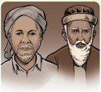

> **Deskripsi Visual:** Gambar ini adalah ilustrasi yang menampilkan dua orang tua berkepala besar. Mereka tampak tua dengan rambut berwarna gelap dan mata berbulu. Kedua orang tua tersebut tampak serasi dan memiliki ekspresi yang tenang. Gambar ini mungkin digunakan untuk menggambarkan hubungan antara dua orang tua dalam konteks sosial atau keluarga.

Elemen-elemen utama dalam gambar ini adalah dua orang tua yang tampak tua dan berkepala besar. Relasi mereka tampak erat dan harmonis, menunjukkan hubungan yang kuat antara kedua orang tua tersebut.

Teks, angka, atau label penting tidak ada dalam gambar ini. Informasi kunci yang dapat diambil pembaca melalui gambar ini adalah bahwa gambar ini mungkin digunakan untuk menggambarkan hubungan antara dua orang tua dalam konteks sosial atau keluarga.

F

### Kisah Inspiratif

### Aktivitas   5.3

Aktivitas Peserta Didik:

Pahami dan renungkan artikel berikut ini, sebagai bagian dari pemahaman dari materi ajar yang akan dipelajari!

 

---
## 📄 Halaman 162

### Peran Ulama di Nusantara

'Ulama tak cuma berperan dalam agama, tetapi juga politik. Keberadaannya mengukuhkan kekuasaan politik.'

Saat jayanya kerajaan-kerajaan Islam, peran ulama sangat menonjol sekali  dalam  pemerintahan  yang  fungsinya  memperkokoh  kedudukan para  pemimpin. Khusus  di  Asia  Tenggara,  apalagi  Nusantara-Indonesia, hubungan  yang  erat  tersebut  bukan  hal  yang  aneh.  Contohnya  di Kerajaan  Samudera  Pasai.

Buku Sejarah  Hukum  Islam  Nusantara  Abad  XIV-XIX  M memaparkan, di Samudera Pasai, pemerintah menunjuk para ulama sebagai mufti . Hal ini, berdasarkan informasi Ibnu Batutah yang pernah tinggal selama 15 hari di Samudera Pasai  pada tahun  1345  M.  Di  bukunya  yang  berjudul al-Rihlāt, Ibnu Batutah menyebut fungsi mufti sangat penting dalam kesultanan.

Kerajaan  Islam Aceh  juga  memiliki majelis  fatwa yang  dipimpin seorang mufti yang  tugasnya  menangani  persoalan  hukum  agama. Kedudukannya  di  atas  kementerian  kehakiman.  Sistem  ini,  berlanjut hingga  ke  masa  pembentukan  Kesultanan  Samudera  Pasai,'

Gambaran  lebih  jelas,  dapat  ditelusuri  pada  abad  16.  Misalya Hamzah  Fansuri,  yang  peninggalannya  relatif  masih  lengkap  yang mencakup biografi dan karya keislaman. Begitu juga, ulama terkemuka yang meninggalkan karya monumental lainnya seperti: Syamsuddin alSumaterani  (w.  1693  M),  Nuruddin  ar-Raniri  (w.  1658  M),  Abdul  Rauf al-Sinkili (w. 1693 M), dan Yusuf al-Makassari (w. 1699 M). Selanjutnya, pada abad 18 muncul Abdus Samad al-Falimbani (w. 1789 M) dan Syekh Daud al-Fatani (w. 1847 M).

Fungsi  lainnya,  dari  para  ulama  adalah  memberi  nasihat  spiritual sekaligus  memberi  legitimasi  politik  di  tengah  rakyatnya  yang  beralih menjadi muslim. Ulama juga memegang peran penting dalam menentukan kehidupan keagamaan. Mereka biasanya sebagai kadi atau penghulu di  Jawa.

Lebih  jauh  tentang  lembaga kadi , kita dapatkan lewat  catatan perjalanan wakil khusus Inggris ke Aceh pada 1602 M. Sir James Lancaster, yang  menggambarkan  peran  penting  Hamzah  Fansuri,  misalnya  dia

 

---
## 📄 Halaman 163

diangkat  raja  untuk  memimpin  perundingan  damai  dan  persahabatan antara Aceh dan Inggris.

Begitu  juga  Nuruddin  ar-Raniri,  pernah  menengahi  protes  keras Belanda  atas  regulasi  perdagangan  kerajaan  yang  menguntungkan pedagang Gujarat. Melalui otoritas yang dimiliki, dia berhasil meyakinkan raja Safiyyatuddin (1641-1675 M), untuk menarik regulasi itu.

Di Jawa, lembaga itu bisa ditemui di Kerajaan Demak. Sultan-sultan Demak  dibantu  para  ulama.  Mereka  bertindak  sebagai ahlul  halli  wal 'aqdi. Lembaga itu menjadi wadah musyawah kerajaan yang punya hak ikut memutuskan masalah agama, kenegaraan, dan segala urusan kaum muslimin.

Sunan Giri pernah menduduki ahlul halli wal 'aqdi. Wewenangnya antara lain: (1) mengesahkan dan memberi gelar sultan kepada penguasa kerajaan Islam di Jawa. (2) menentukan  juga  garis  besar  politik pemerintahan. (3) bertanggung jawab di bidang keamanan muslim dan kerajaan Islam, dan yang terakhir (4) berhak mencabut kedudukan sultan, bila menyimpang dari kebijakan para wali.

Tak hanya sebagai penasihat raja, para ulama juga menjadi penerjemah Islam  ke  dalam  sistem  budaya  Indonesia.  Melalui  tugas itu, ulama berkontribusi dalam memberi legitimasi pada budaya politik Melayu berorientasi kerajaan.

Karya-karya  para  ulama  menjadi  sumber  legitimasi  bagi  kerajaan. Misalnya, ar-Raniri memiliki pandangan yang lebih rinci tentang hubungan ulama dan raja.  Lewat karyanya, Bustan al-Salatin yang  ditulis sekitar tahun 1630 M dan didedikasikan kepada Iskandar Tsani, dia menjabarkan cara seorang ulama sufi berhadapan dengan isu politik kerajaan.

Ar-Raniri juga menekankan untuk mematuhi raja sebagai kewajiban agama.  Kepatuhan  kepada  raja  sama  saja  dengan  mengikuti  perintah Allah Swt. Melalui cara tersebut, para raja diberikan otoritas politik yang sah, sehingga harus diakui oleh umat Islam.

Tersimpul bahwa Islam sudah memberi sumbangan bagi pembentukan kerajaan Melayu-Indonesia pra-kolonial. Semakin mapan ulama dalam elite kerajaan, makin mantap Islam  sebagai  ideologi  politik  kerajaan. Pada

 

---
## 📄 Halaman 164

periode itu, tercatat raja-raja seperti Sultan Iskandar Muda dan Iskandar Tsani  di  Aceh,  Sultan  Agung  di  Mataram,  dan  Sultan  Hasanuddin  di Makassar.

(Artikel  tersebut  disadur dari  tulisan Risa  Herdahita  Putri |  22  Agustus 2018 dari: https://historia.id/kuno/articles/peran-ulama).

G

### Wawasan Keislaman

### Aktivitas  5.4

Aktivitas Peserta Didik:

Bentuk  kelas kalian menjadi 7 kelompok.  Lalu, setiap  kelompok mendapatkan  1  tokoh  ulama  sesuai  materi  ajar  yang  akan  dipelajari Meneladani  Ulama  Indonesia ,  yakni: Hamzah  al-Fansuri,  Nuruddin  bin Ali ar-Raniri, Syekh  Abdurauf  bin  Ali al-Singkili,  Syaikh  Yusuf  Abul Mahasin  Tajul Khalwati  al-Makasari,  Abdus  Samad  bin  Abdullah  alJawi  al-Palimbani,  Abu  Abdul  Mu'thi  Nawawi  al-Tanari  al-Bantani,  dan Muhammad Sholeh  bin  Umar  al-Samarani. Hasilnya dipresentasikan!

### 1. Indonesia

Cendekiawan dan tokoh-tokoh kenamaan dunia, jika pernah berkunjung atau singgah di Indonesia (istilah lebih awal adalah Nusantara), pasti memberi komentar dan penilaian yang baik tentang Indonesia. Hal ini, bisa ditelaah dari budayanya yang santun, murah senyum, mudah bergaul. Apalagi jika dikaitkan dengan keindahan alam dan sumber daya yang melimpah.

Luas Nusantara Indonesia, terbentang dari Barat, yakni Sabang (Provinsi NAD/Nanggro Aceh Darussalam) sampai Timur, yakni Merauke (Provinsi Papua). Sementara dari Utara adalah Kepulauan Talaud (Provinsi Sulawesi Utara), sedangkan dari Selatan adalah Pulau Rote (Provinsi Nusa Tenggara Timur).

Begitu luasnya Indonesia, sehingga bisa disamakan seperti luas Inggris melampauhi Eropa hingga Irak. Batas Barat Indonesia berada di Grenenwich

 

---
## 📄 Halaman 165

London,  sedangkan  batas  Timurnya  berada  di  Baghdad  Irak.  Sementara, batas Utaranya di Jerman, sedangkan batas Selatannya berada di Aljazair.

Di  wilayah  seluas  itu,  matahari  harus  terbit  sampai  3  kali.  Akibatnya, menimbulkan perbedaan 3 waktu, yakni WIB (Waktu Indonesia Barat), WITA (Waktu Indonesia Tengah), dan WIT ((Waktu Indonesia Timur). Itu artinya matahari terbit lebih awal 2 jam dibanding WIB, dan 1 Jam dibanding WITA.

### 2. Umat Islam Indonesia

Indah  nian  sikap  beragama  bangsa  Indonesia,  terutama  sikap  umat  Islam Indonesia sebagai mayoritas. Betapa tidak! Tahun 2020, diperkirakan jumlah penduduk  Indonesia  sekitar  273,5  juta,  sementara  pada  tahun  2020  ini, jumlah umat Islamnya berjumlah berjumlah 229 juta jiwa, atau 87,2 %.

Itu artinya, Umat Islam mampu mengayomi saudaranya yang lain (baik Katolik,  Kristen,  Hindu,  Budha,  maupun  Konghucu)  yang  berjumlah  12,8 %  (sekitar  44,5  juta).  Semuanya  hidup  rukun  dan  tenteram  membentuk keindahan berperilaku sebagai bangsa Indonesia yang besar.

Kondisi  tersebut,  menjadi  prestasi  yang  sangat  membanggakan.  Tata perilakunya, mencerminkan ketulusan hati dan kedamaian hidup. Keramahan dan  toleransi,  menjadi  sikap  dan  perilaku  umat  beragama  di  Indonesia. Belum lagi, jika dikaji dari sudut pandang keragaman yang lain, misalnya suku bangsa ada 740; ada 500 etnik yang menggunakan lebih 250 bahasa, dan jumlah pulaunya + 12.504 (2870 sudah memiliki nama, sementara 9.634 yang tidak memiliki nama)

Bandingkan  dengan  negara-negara  lain,  baik  di  dataran  Eropa,  Asia, Timur  Tengah  maupun  di  Amerika.  Agamanya  boleh  jadi  sama,  hanya berbeda sedikit sukunya; atau agama dan sukunya sama; bahkan ada yang agama, bahasa, suku, tanah airnya sama; mereka saling bertikai, berselisih sampai berperang tidak habis-habisnya, dan itu memakan waktu yang lama, bahkan tidak berhenti sampai kini.

Membandingkan kondisi tersebut, tentu kita sebagai umat Islam, harus mensyukuri  keadaan  di  Indonesia,  mari  bersama  anak  bangsa  yang  lain, untuk saling mempererat persahabatan dan persaudaraan, baik antar agama ( Ukhuwah Islamiyah ), sesama anak bangsa ( Ukhuwah Wathaniyah ), maupun sesama warga dunia ( Ukhuwah Basyariyah ).

 

---
## 📄 Halaman 166

### 3. Ulama Indonesia untuk Dunia

Indonesia  merdeka  tidak  lepas  dari  peran  para  Ulama  Indonesia.  Banyak sekali nama-nama yang dapat kita sodorkan dan menjadi pengingat tentang jejak mereka dalam memerdekakan Indonesia, yang sudah kita kenal, antara lain:  Pangeran  Diponegoro,  Cut  Nyak  Dien,  Pangeran  Antasari,  dan  lain sebagainya.

Namun kali  ini,  yang  akan  disajikan  adalah  para  Ulama  Indonesia  yang tidak hanya memberi sumbangsih besar untuk Indonesia, tetapi mewarnai wajah dunia sampai saat ini. Mereka itu, antara lain: Abu Abdul Mu'thi Nawawi alTanari al-Bantani, Syaikh Yusuf Abul Mahasin Tajul Khalwati al-Makasari, Abdus Samad bin Abdullah al-Jawi al-Palimbani, Nuruddin bin Ali ar-Raniri, Syekh Abdurauf bin Ali al-Singkili, Muhammad Sholeh bin Umar al-Samarani, Hamzah al-Fansuri . Mari kita urai jejak dan langkahnya satu per satu.

### a. Abu Abdul Mu'thi Nawawi al-Tanari al-Bantani

### 1. Riwayat Hidupnya

Nama  lengkap beliau adalah Abu  Abdul Mu'ti Muhammad bin Umar al-Tanara Jawi  al-Bantani.  Dikenal  juga  dengan  nama Muhammad Nawawi al-Jawi al-Bantani. Lebih terkenal  dengan  nama  Syekh  atau  Imam Nawawi  Banten.  Ayahnya  adalah  Umar  bin Arabi  yang  merupakan  seorang  ulama  di Banten.

Dikisahkan juga, bahwa Syekh Nawawi masih keturunan dari Sunan Gunung Jati (salah  satu  Wali  Songo)  dari  Sultan Banten I, yakni Maulana Hasanuddin. Imam Nawawi juga dikabarkan masih memiliki jalur nasab dari  Sayyidina  Husein r.a,  salah  satu  cucu  Rasulullah  Saw.  selain Sayyidina Hasan r.a.

Sebutan al-Jawi,  menunjukkan bahwa beliau berasal dari Pulau Jawa, sebab Banten menjadi bagian dari Pulau Jawa. Namun, di seantero dunia,

 

---
## 📄 Halaman 167

beliau diberi gelar Sayyidul  Hijaz (Maha Guru Jazirah Arab, Saudi Arabia sekarang).  Kebesaran  nama Imam  Nawawi  sepadan  dengan  Imam  Syafi'i (salah  satu  tokoh  madzhab,  sehingga  dikenal  dengan  Madzhab  Syafi'i).

Beliau dilahirkan di Kampung Tanara, Serang, Banten pada ahun 1815 Masehi, atau 1230 Hijriah, dan beliau wafat pada tanggal 25 Syawal 1314 Hijriah, atau 1897 Masehi. Imam Nawawi menghembuskan nafasnya yang terakhir pada usia 84 tahun.

Di  Makkah,  Imam  Nawawi  giat  menghadiri majelis-majelis ilmu, khususnya di Masjidil Haram.  Hingga,  setelah  dilihat  kedalaman  ilmu ( Faqih )  oleh  imam masjid utama tersebut, yakni Syekh  Ahmad  Khatib  Sambas  (ini  juga  tokoh Indonesia yang kaliber dunia) memintanya untuk menggantikan posisinya

Mulailah Imam Nawawi menjadi pengajar dan membuka majelis ilmu sendiri di Masjidil Haram. Semakin  hari,  murid  atau  santrinya  semakin banyak.  Bahkan,  beberapa  di  antara  muridnya merupakan  pemuda  asal  Indonesia  juga,  yakni Hadratusy Syeikh KH.  Hasyim  Asy'ari sebagai pendiri Nadlatul Ulama (NU).

### 2. Teladan yang dapat dicontoh

Syekh  Nawawi  pernah  menjadi  imam  di  Masjidil  Haram,  mengajar  di Haramain (sebutan lain dari Makkah Madinah), dan karya-karyanya tersebar juga  di  Timur  Tengah.  Di  kawasan  Asia  Tenggara,  khususnya  di  dunia pesantren,  karya-karyanya  masih  dipelajari,  dikaji,  dan  ditelaah,  bahkan sampai kini menjadi kurikulum tetap di pesantren.

Gelar Sayyidul  Hijaz bukan  sembarang  gelar,  dan  itu  diperoleh  di wilayah Timur Tengah, tepatnya di seputar Jazirah Arab (Makkah-Madinah saat itu), dan Masjidil Haram, khususnya Ka'bah yang menjadi jantung atau pusatnya ajaran Islam. Hal ini, menjadikan kita sebagai bangsa Indonesia, merasa bangga dan kagum atas capaian yang diperoleh oleh beliau. Sebab itu,  kalian  sebagai  generasi  penerus  dapat  mencontoh  jejak  dan  langkah Imam Nawawi.

Imam Nawawi Banten merupakan putra pertama Nusantara Indonesia yang menjadi Imam Masjidil Haram, dan mendapat gelar 'Sayyidul Hijaz'.

 

---
## 📄 Halaman 168

### 3. Karya Tulisnya

Sejak  tahun  1870  M,  kesibukan  Imam  Nawawi  semakin  bertambah, karena harus banyak menulis kitab. Inisiatif menulis, lebih banyak datang dari desakan sebagian koleganya dan para sahabatnya dari Jawa. Kitab-kitab yang  ditulisnya  sebagian  besar  adalah  kitab-kitab  komentar  ( syarh )  dari karya-karya ulama sebelumnya yang populer dan dianggap sulit dipahami.

Alasan menulis syarh , selain karena permintaan pihak lain,  Imam  Nawawi  juga berkeinginan untuk melestarikan karya pendahulunya yang sering mengalami perubahan ( tahrif ) dan pengurangan. Saat menyusun karyanya,  beliau  selalu  berkonsultasi  dengan ulama-ulama  besar  lainnya,  termasuk  sebelum naskahnya naik cetak. Karya-karya beliau cepat tersiar ke berbagai penjuru dunia, karena karyakaryanya mudah dipahami dan mendalam isinya.

Karya  tulis  beliau  banyak  yang  diterbitkan di  Mesir,  seringkali  beliau  hanya  mengirimkan manuskripnya, setelah itu tidak memperdulikan lagi bagaimana penerbit menyebarkan hasil karyanya,  termasuk  hak  cipta  dan  royaltinya,

Karya Imam Nawawi berjumlah + 115, dan sampai saat ini masih dipelajari bukan hanya di wilayah Asia Tenggara, tetapi juga di kawasan Timur Tengah.

selanjutnya kitab-kitab beliau itu menjadi bagian dari kurikulum Pendidikan Agama di seluruh pesantren  di  Indonesia,  bahkan  Malaysia,  Filipina,  Thailand dan juga negara-negara di Timur Tengah.

Menurut  Ray  Salam  T.  Mangondana,  peneliti  di  Institut  Studi  Islam, Universitas of Philippines, ada sekitar 40 sekolah agama tradisional di Filipina yang  menggunakan  karya  Imam  Nawawi  sebagai  kurikulum  belajarnya. Selain  itu  Sulaiman  Yasin,  dosen  di  Fakultas  Studi  Islam  Universitas Kebangsaan Malaysia juga menggunakan karya beliau untuk mengajar di kuliahnya.

Tepat tahun 1870 M, para ulama Universitas Al-Azhar Kairo Mesir pernah mengundang beliau untuk memberikan kuliah singkat di suatu forum diskusi ilmiah. Mereka tertarik untuk mengundang beliau, karena sudah dikenal di seantero dunia. Semua karya beliau, berbahasa Arab.

 

---
## 📄 Halaman 169

Bagi para murid/santri yang pernah sekolah ( mondok ) di pesantren, tentu karya atau kitab yang disusun oleh Syekh Nawawi sudah pernah dipelajari. Berikut ini, 10 nama kitab karya beliau dari total karya beliau yang berjumlah 115 yang mengupas tentang Fiqh, Tasawuf, Tafsir, dan Hadis, yaitu:

- Sullam al-Munājah syarah Safīnah al-Shalāh
- Bahjah al-Wasāil syarah al-Risālah al-Jāmi'ah bayn al-Usūl wa al-Fiqh wa al-Tasawwuf
- al-Tausyīh/Quwt al-Habīb al-Gharīb syarah Fath al-Qarīb al-Mujīb
- Marāqi al-'Ubūdiyyah syarah Matan Bidāyah al-Hidāyah
- Nashāih al-'Ibād syarah al-Manbahātu 'ala al-Isti'dād li yaum al-Mi'ād
- Qāmi' al-Thugyān syarah Mandhūmah Syu'bu al-Imān
- al-Tafsir al-Munīr li al-Mu'ālim al-Tanzīl al-Mufassir 'an wujūĥ mahāsin al-Ta΄wil musammā Marāh Labīd li Kasyaf Ma'nā Qur΄an Majīd
- Nur al-Dhalām 'ala Mandhūmah al-Musammāh bi 'Aqīdah al-'Awwām
- Tanqîh al-Qaul al-Hatsîts syarah Lubâb al-Hadîts
- 'Uqūd al-Lujain fi Bayān Huqūq al-Zaujain.

### b. Syaikh Yusuf Abul Mahasin Tajul Khalwati al-Makasari

### 1. Riwayat Hidupnya

Nama lengkapnya Syekh Yusuf Abul Mahasin Tajul Khalwati al-Makasari. Beliau dilahirkan di  Gowa,  Sulawesi  Selatan,  pada  tanggal  3 Juli  1626,  sedangkan  tempat  wafatnya  di Cape Town, Afrika Selatan, pada tanggal 23 Mei 1699 pada usia 72 tahun. Beliau dijadikan sebagai pahlawan nasional Indonesia. Sementara di kalangan rakyat Sulawesi Selatan,  mendapatkan  gelar  sebagai Tuanta Salamaka  ri Gowa ('tuan  guru  penyelamat kita dari Gowa').

Syekh Yusuf lahir dari ayah-ibu bernama Abdullah dan Aminah. Nama saat dilahirkan adalah  Muhammad Yusuf. Konon, nama ini

---
**🖼️ Gambar/Diagram**

> **Deskripsi Visual:** Gambar ini adalah ilustrasi yang menampilkan wajah seorang pria tua dengan rambut pendek dan topi berwarna coklat. Pria tersebut memiliki bibir tebal dan mulut kecil, serta hidung yang pendek dan lebar. Wajahnya tampak tua dan berkerut, menunjukkan usia yang cukup tinggi. Ilustrasi ini mungkin digunakan untuk menggambarkan tokoh dalam sebuah cerita atau buku pelajaran, namun tanpa konteks tambahan, sulit untuk menentukan siapa tokoh tersebut.

 

---
## 📄 Halaman 170

diberikan oleh Sultan Alauddin (berkuasa sejak 1593M, wafat 15 Juni 1639 M, raja Gowa pertama yang masuk Islam, yang masih kerabat dari ibu Syekh Yusuf. Pendidikan agama diperolehnya sejak berusia 15 tahun di Gowa. Syekh Yusuf juga berguru pada Sayyid Ba Alawi bin Abdul al-Allamah Attahir dan Sayyid Jalaludin Al-Aidid.

Kembali dari Gowa, Syekh Yusuf menikah dengan putri Sultan Gowa, lalu saat usianya 18 tahun, Syekh Yusuf pergi ke Banten dan Aceh. Di Banten, sahabatnya  adalah  Sultan  Ageng  Tirtayasa,  yang  kelak  mengangkatnya sebagai Mufti Kesultanan Banten. Selanjutnya, Di Aceh, Syekh Yusuf berguru pada Syekh Nuruddin ar-Raniri dan mendalami tarekat Qadiriyah.

Tahun  1644  M,  Syekh  Yusuf  menunaikan  ibadah  haji  dan  tinggal  di Makkah  untuk  beberapa  lama,  lalu  belajar  kepada  ulama  terkemuka  di Makkah dan Madinah, termasuk juga memperdalam ilmu ke Yaman, berguru pula kepada Syekh Abdullah Muhammad bin Abdul Baqi, dan ke Damaskus (Suriah) untuk berguru pada Syekh Abu al-Barakat Ayyub bin Ahmad bin Ayyub al-Khalwati Al-Quraisyi.

### 2. Teladan yang dapat dicontoh

Ketekunan, penjelajahan, dan ikhtiarnya dalam menuntut ilmu, dapat kita jadikan    contoh.  Betapa  tidak!  Syekh  Yusuf  mempelajari  Islam  sekitar  20 tahun di Timur Tengah. Pencapaian itu, sangat luar biasa, apalagi jika kita kaji dari sisi waktu, Syekh Yusuf melakukan itu sekitar abad 17. Lagi-lagi, kalian sebagai penerus bangsa, dapat meneladani jejak langkah Syekh Yusuf dalam ikhtiarnya saat menuntut ilmu.

Saat Kesultanan Gowa kalah perang dari Belanda, Syekh Yusuf pindah ke Banten. Pada periode ini, Kesultanan Banten menjadi pusat pendidikan agama Islam, dan Syekh Yusuf memiliki murid dari berbagai daerah, termasuk 400 orang asal Makassar yang dipimpin oleh Ali Karaeng Bisai.

Pada  September  1684  M,  Syekh  Yusuf  ditangkap  dan  diasingkan  ke Srilanka.  Di  negeri  itu,  Syekh  Yusuf  tetap  berdakwah,  sehingga  memiliki murid ratusan yang berasal dari India Selatan. Salah satu ulama besar India, yang merupakan santrinya adalah Syekh Ibrahim bin Mi'an.

Melalui jamaah haji yang singgah di Srilanka, Syekh Yusuf masih dapat berkomunikasi  dengan  para  pengikutnya  di  Nusantara,  akhirnya  oleh

 

---
## 📄 Halaman 171

Belanda, diasingkan yang lebih jauh lagi. yakni Afrika Selatan yang terjadi pada bulan Juli 1693.

Lagi-lagi  Syekh  Yusuf  masih  tetap  berdakwah  Di  Afrika  Selatan, pengikutnya  banyak  sekali.  Saat  beliau  wafat  tanggal  23  Mei  1699  M, pengikutnya  menjadikan  hari  wafatnya  sebagai  hari  peringatan.  Bahkan, Nelson  Mandela,  mantan  presiden  Afrika  Selatan,  menyebutnya  sebagai 'Salah  Seorang  Putra  Afrika  Terbaik '.

Jenazah Syekh Yusuf Tajul Khalwati dibawa ke Gowa atas permintaan Sultan Abdul Jalil (1677-1709 M) dan dimakamkan kembali di Lakiung, pada April 1705 M. Kemudian Syekh Yusuf dianugerahi gelar Pahlawan Nasional oleh Presiden Soeharto.

Selanjutnya,  pada  tahun  2009,  Syech  Yusuf  dianugerahi  penghargaan Oliver Thambo, yaitu penghargaan sebagai Pahlawan Nasional Afrika Selatan oleh  Presiden  Afrika  Selatan  Thabo  Mbeki  kepada  ahli  warisnya  yang disaksikan oleh Wapres RI pada waktu, M. Yusuf Kalla di Pretoria Afrika Selatan.

### 3. Karya Tulisnya

Syekh Yusuf dikenal juga sebagai mursyid (pembimbing) tarekat Khalwatiyah. Beliau juga  mengajarkan tarekat lainnya, antara lain: Qadiriyah, Naqshabandiyah, Ba'lawiyah, dan Syathariyah. Itu semua sesuai ijazah yang pernah diterimanya.

Ajaran pokoknya adalah usaha manusia untuk mendekatkan diri kepada Allah  Swt.  yang  mengacu  pada  peningkatan  kualitas  akhlak  yang  mulia serta  penekanan  amal  shalih  dan  dzikir,  baik  secara  perorangan  maupun kelompok.  Penjelasan  lebih  rinci  dapat  ditemukan  pada  risalahnya  yang berjudul An-Nafhatu  As  Sailaniyah.

Khusus berkaitan dengan tata cara melakukan dzikir, salah satu amalan terpenting dalam tarekat, diuraikan dalam risalahnya berjudul Kaifiyāt alDzikir (Cara-cara  Berdzikir).  Menurutnya,  ada  20  macam adab  berdzikir. Lima  di  antaranya  mengenai  hal-hal  yang  hendaknya  dilakukan  sebelum berdzikir. Lima macam itu, sebagai berikut.

Pertama , bertaubat dari segala dosa; Kedua , berwudhu jika hadas (besar dan  kecil), Ketiga ,  mandi  jika  junub; Keempat ,  berdiam  diri  tidak  bicara,

 

---
## 📄 Halaman 172

kecuali mengucapkan kalimat dzikir; serta Kelima , memohon (berdoa) hanya kepada Allah Swt.

Selain  beberapa  risalah  tersebut,  sedikitnya  ada  20  judul  buku  yang ditulis Syekh Yusuf. Hampir semuanya berbahasa Arab. Di antaranya sebagai berikut:

- Zubdād al-Asrār fī Tahqīq Ba'd Masyārib al-Akhyār.
- Tāj al-Asrar fī Tahqīq Masyrab Al 'Ārifīn min Ahl al-Istibshār.
- Mathālib as-Sālikīn , Fath Kaifiyyah az-Dzikr .
- Safīnat an-Najah , menjadi karyanya yang paling populer, yang hingga kini masih banyak diajarkan di berbagai pesantren. Di Museum Pusat Jakarta, juga didapati sekitar 10 manuskrip Syekh Yusuf yang belum diterjemahkan.

### c. Jejak dan Langkah Abdus Samad bin Abdullah al-Jawi al-Palimbani

### 1. Riwayat Hidupnya

Syekh Abdus Samad dilahirkan di Palembang (kini masuk wilayah Sumatera Selatan) pada tahun 1116 H/1704 M, dan wafat pada tahun 1203  H/1789 M dalam usia 85 tahun. Beliau mendapat  pendidikan  dasar  dari  ayahnya sendiri di Palembang atau Kedah (Malaysia).

Jika  ditelaah  dari  silsilah, nasab Syekh Abdus Samad berketurunan Arab, dari jalur ayah.  Nama  ayahnya  adalah  Syeikh  Abdul Jalil,  yang  merupakan  ulama  yang  berasal dari Yaman, yang dilantik menjadi Mufti Negeri Kedah (kini Malaysia) pada awal abad ke-18.  Sementara  ibunya,  bernama  Radin Ranti, adalah wanita asli Palembang.

---
**🖼️ Gambar/Diagram**

> **Deskripsi Visual:** Gambar ini adalah ilustrasi yang menampilkan seorang pria tua dengan rambut pendek dan kumis yang tebal. Pria tersebut mengenakan baju tradisional yang berwarna coklat dan topi berbentuk bulat. Wajahnya tampak tua dan penuh pengalaman, dengan bibir yang tebal dan mata yang lebar. Ilustrasi ini mungkin digunakan untuk membantu pembaca memahami karakter atau tokoh dalam konteks cerita atau buku pelajaran tertentu.

Sementara, nama panjangnya terdapat 3 versi, yakni: Abdus Samad al-Jawi al-Falembani, Abdus Samad bin Abdullah al-Jawi al-Falembani , dan Sayyid Abdus Samad bin Abdurrahman al-Jawi .

Pendidikannya dilanjutkan di salah satu pondok di Negeri Pattani (kini masuk wilayah Thailand Selatan). Saat itu, di Pattani menjadi pusat menempa

 

---
## 📄 Halaman 173

ilmu-ilmu keislaman, setelah dari Pattani, beliau langsung belajar ke Arab (Makkah dan Madinah).

Di Pattani, beliau mendapatkan ilmu-ilmu dasar, seperti hafalan Matan Ilmu-Ilmu  Arabiyah ,  dilanjutkan  di  bidang Syariat  Islam dimulai  dengan matan-matan ilmu  fiqh  yang  bermadzhab  Imam  Syafi'i.

Selanjutnya, di bidang tauhid dimulai dengan menghafal matan-matan ilmu kalam / ushuluddin menurut faham Ahlus Sunnah wal Jamaah ( Aswaja/Sunni ) yang bersumber dari Syekh Abul Hasan al-Asy'ari dan Syeikh Abu Mansur al-Maturidi, karena kecerdasannya saat di Pattani, beliau sudah diperbolehkan sebagai pengajar, meskipun masih sebatas menjadi Mentor atau Tutor .

Syekh Muhammad bin Samman menjadi gurunya, Sykh Abdus Samad mendalami juga kitab-kitab tasawuf kepada Syeikh Abdul Rauf Singkel dan Samsuddin al-Sumaterani, kedua-duanya dari Aceh. Sejak kecil, beliau lebih mendalami ilmu tasawuf,  maka  sejarah  mencatatnya  sebagai  ulama  yang memiliki kepakaran dan keistimewaan di cabang ilmu tersebut.

Syekh Abdus Samad merupakan salah satu kunci pembuka dan pelopor perkembangan intelektualisme Nusantara Indonesia. Ketokohannya melengkapi nama-nama ulama dan intelektual berpengaruh seangkatannya, misalnya  Nuruddin  ar-Raniri,  Muhammad  Arsyad  al-Banjari,  Hamzah Fansuri, Yusuf al-Makasari, dan masih banyak lainnya.

### 2. Teladan yang dapat dicontoh

Sesampai  di  Makkah  dan  Madinah,  semangat  belajarnya  semakin  giat. Ia  mmpelahari  dan  menyerap  beberapa  ilmu  yang  belum  dikuasai,  dan memperdalam ilmu-ilmu yang sudah dikuasainya dari guru dan ulama yang terkenal  dengan  sebutan  Jazirah  Arab.  Namun,  beliau  tidak  melupakan negeri asalnya. Syekh Abdus Samad tetap memberikan perhatian besar pada perkembangan sosial, politik, dan keagamaan di Nusantara Indonesia.

Beliau mengalami perubahan besar berkaitan dengan intelektualitas dan spiritual.  Capaian  itu  tidak  terlepas  dari  semangat  dan  proses  pencerahan  yang diberikan para gurunya. Beberapa gurunya yang masyhur dan berwibawa dalam proses tersebut, antara lain Muhammad bin Abdul Karim al-Sammani, Muhammad bin Sulayman al-Kurdi (Irak), dan Abdul al-Mun´im Damanhuri.

Selain itu, tercatat juga dalam sejarah bahwa beliau berguru juga kepada ulama besar  yang  lain,  di  antaranya  Ibrahim  al-Rais,  Muhammad  Murad,

 

---
## 📄 Halaman 174

Muhammad al-Jawhari, dan Athaullah al-Mashri (Mesir). Hasilnya tidak siasia,  perjuangannya  menuntut  ilmu  di  Masjidil  Haram  dan  tempat-tempat lainnya, mengangkat dirinya menjadi salah seorang ulama Nusantara yang disegani dan dihormati di kalangan ulama Arab, juga Nusantara Indonesia.

Berdasarkan jejak langkahnya, kita menjadi sadar bahwa capaian besar, diperoleh dari ikhtiar dan usaha yang penuh kesungguhan, bertanggung jawab, serta selektif dalam memilih guru. Itu baru usaha lahir, sedangkan usaha dan olah batin tentu tidak dilupakan, baik dari pribadi maupun mohon doa dari para guru-gurunya. Berkat capaian Syekh Abdus Samad, sekali membuktikan bahwa bangsa Indonesia tidak kalah prestasinya dengan bangsa lain di dunia.

### 3. Karya Tulisnya

Syekh Abdus Samad termasuk pengarang yang produktif. Karyanya yang terkenal dan sampai saat ini masih dipergunakan adalah Hidayatus Salikin dan Siyarus Salikin . Kedua kitab tersebut, merupakan penjelasan dari 2 kitab karya Hujjatul Islam Imam al-Ghazali, yakni Bidāyat al-Hidāyah dan Lubāb Ihyā` 'Ulūm al-Dīn.

Adapun kitab dan karyanya yang lain, sebagai berikut:

- Zahratul Murīd fi Bayāni Kalimah al-Tauhīd , 1178 H/1764 M.
- Risalah  Pada  Menyatakan  Sebab  Yang  Diharamkan  Bagi  Nikah ,  1179 H/1765 M.
- Hidāyatus Sālikīn fī Sulūki Maslakil Muttaqīn , 1192 H/1778 M.
- Siyārus Sālikīn ilā 'Ibādati Rabbil  'Alamīn , 1194  H/1780  M-1203 H/1788 M.
- Al-'Urwatul Wutsqā wa Silsilatu Waliyil Atqā .
- Ratib Sheikh 'Abdus Shamad al-Falimbani.
- Nashīhatul Muslimīna wa Tazkiratul Mu'minīna fi Fadhāilil Jihādi wa Karāmatil Mujtahidīna fī Sabīlillah.
- Ar-Risālatu fī Kaifiyatir Rītib Lailatil Jum'ah
- Mulhiqun fī Bayāni Fawaidin Nafi'ah fī Jihādi fī Sabīlillah
- Zātul Muttaqin fī Tauhidi Rabbil 'Alamīn
- 'Ilmut Tasawuf
- Mulkhishut Tuhbatil Mafdhah minar Rahmatil Mahdah 'Alaihis Shalātu was Salām

 

---
## 📄 Halaman 175

- Kitab Mi'raj
- Anisul Muttaqin
- Puisi Kemenangan Kedah

### d.  Jejak dan Langkah Nuruddin bin Ali ar-Raniri

### 1. Riwayat Hidupnya

Nama lengkapnya Syekh Nuruddin Muhammad bin 'Ali bin Hasanji bin Muhammad Hamid ar-Raniri al-Quraisyi. ditelaah dari namanya, beliau memiliki darah keturunan  ( nasab)  dari  suku  Quraisy,  suku yang  juga  menurunkan  Nabi  Muhammad Saw.

Ayahnya adalah seorang pedagang Arab yang bergiat dalam pendidikan agama, sedangkan  nama  populernya  adalah  Syekh Nuruddin  Ar-Raniri  atau  Syekh  Nuruddin, beliau  adalah  ulama  penasehat  Kesultanan Aceh pada masa kepemimpinan Sultan Iskandar Tsani (Iskandar II).

Syekh Nuruddin diperkirakan lahir sekitar akhir abad ke-16 di kota Ranir, wilayah Gujarat India, dan wafat pada 21 September 1658 M. Pada tahun 1637 M, ia datang ke Aceh, dan kemudian menjadi penasehat kesultanan di daerah tersebut sampai tahun 1644 M.

Syekh Nuruddin mula-mula mempelajari bahasa Melayu di Aceh, lalu memperdalam pengetahuan agama saat beribadah haji ke Makkah. Sepulang dari  Makkah,  didapati  bahwa  pengaruh  Syamsuddin  as-Sumatrani  sangat besar  di  Aceh.  Karena  tidak  cocok  dengan  aliran  wujudiyah  (salah  satu aliran  tasawuf),  Syekh  Nuruddin  pindah  ke  Semenanjung  Malaka  untuk memperdalam ilmu agama dan bahasa Melayu.

### 2. Teladan yang dapat dicontoh

Pengetahuan  Syekh  Nuruddin  tak  terbatas  dalam  satu  cabang  ilmu  saja, namun  sangat  luas  yang  meliputi  bidang  sejarah,  politik,  sastra,  filsafat,  fikih,

 

---
## 📄 Halaman 176

dan mistisisme (tasawuf).  Beliau  adalah  negarawan,  ahli  fikih,  teolog,  sufi, sejarawan dan sastrawan penting dalam sejarah Melayu pada abad ke-17.

Peranan  Syekh  Nuruddin  dalam  perkembangan  Islam  di  Nusantara tidak dapat diabaikan. Dia berperan membawa tradisi besar Islam sembari mengurangi masuknya tradisi lokal ke dalam tradisi yang dibawanya. Tanpa mengabaikan  peran  ulama  lain  yang  lebih  dulu  menyebarkan  Islam  di wilayah ini, beliau berupaya menghubungkan satu mata rantai tradisi Islam di Timur Tengah dengan tradisi Islam Nusantara.

Bahkan, Syekh Nuruddin merupakan ulama pertama yang membedakan penafsiran doktrin dan praktik sufi yang salah dan benar. Saat baru tiba di Aceh, di wilayah tersebut telah berkembang luas paham wujudiyah . Paham ini dianut dan dikembangkan oleh Syekh Hamzah Fansuri dan Syamsuddin as-Sumatrani.

Pada tahun 1637 M, ia kembali ke Aceh dan tinggal selama tujuh tahun. Saat itu Syekh Syamsuddin as-Sumatrani telah meninggal. Berkat keluasan pengetahuannya, Sultan Iskandar Tani (1636 M-1641 M) mempercayainya untuk  mengisi  jabatan  yang  ditinggalkan  oleh  Syamsuddin.  Nuruddin menjabat  sebagai  Kadi  Malik  al-Adil,  Mufti  Besar,  ditambah  jabatan  sebagai Syekh  di  Masjid  Bait  al-Rahmān.

### 3. Karya Tulisnya

Syekh Nuruddin menulis beberapa buah kitab. Ia juga membaca Hikayat Seri Rama dan Hikayat Inderaputera, yang kemudian dikritiknya dengan tajam, serta  Hikayat  Iskandar  Zulkarnain.  Beliau  juga  membaca Tāj as-Salātīn karya  Bukhari  al-Jauhari  dan Sulālat  as-Salātīn yang  populer  pada  masa itu. Kedua karya ini, memberi pengaruh yang besar pada karyanya sendiri, yakni Bustān as-Salātīn.

Sebagai  ikhtiar  menyanggah  pendapat  dan  paham  wujudiyah,  Syekh Nuruddin  menulis  beberapa  kitab,  antara  lain Asrār al-'Ārifīn (Rahasia Orang  yang  Mencapai  Pengetahuan  Sanubari), Syarāb  al-'Asyiqīn (Minuman Para  Kekasih),  dan Al-Muntahi (Pencapai  Puncak).  Di  samping  itu,  ia  juga menyanggah  ajaran  Hamzah  Fanzuri  melalui  polemik-polemik  terbuka dengan para pengikut wujudiyah.

Sesudah berpolemik selama sekitar satu bulan, Syekh Nuruddin terpaksa meninggalkan Aceh untuk kembali ke tanah kelahirannya di Ranir, daerah

 

---
## 📄 Halaman 177

Gujarat India,  sehingga  ia  tidak  sempat  menyelesaikan  karangannya yang berjudul Jawāhir  al-'Ulūm  fī  Kasyfi  al-Ma'lūm (Hakikat  Ilmu  dalam Menyingkap Objek Pengetahuan).

Syekh Nuruddin juga menulis beberapa kitab khusus untuk melawan aliran wujudiyah, antara lain Hill  az-Dzill (Sifat Bayang-bayang), Syifā  alQulb (Pengobatan  Hati), Tibyān  fī  Ma'rifāt  al-Adyān (Penjelasan  tentang Kepercayaan), Hujjāt al-Siddiq li Daf az-Zindiq (Pembuktian Ulama dalam Membantah  Penyokong  Bid'ah), Asrār  al-Insān  fī  Ma'rifāt  ar-Rūh  wal  arRahmān (Rahasia Manusia dalam Pengenalan Ruh dan Yang Maha Pengasih).

Secara  keseluruhan,  Nuruddin  Ar-Raniri  menulis  sekitar  30  naskah buku, di antaranya adalah:

- Al-Shirāth al-Mustaqīm
- Durrat al-Farāid bi syarh al-'Aqāid an-Nasafiyah
- Hidāyat al-Hābib fi al Targhib wa'l-Tarhib
- Bustanus al-Shalathin fī Dzikr al-Awwālin wa al-Ākhirīn
- Nubdzah fi Da'wah al-Dzill ma'a Shāhibihi
- Lathā'if al-Asrār
- Asrāl an-Insān fī Ma'rifāt al-Rūh wa al-Rahmān
- Tibyān fī Ma'rifat al-Adyān
- Akhbār al-Ākhirah fi Ahwāl al-Qiyāmah
- Hill al-Dzhill
- Ma'u'l Hayat li Ahl al-Mamāt
- Jawāhir al-'Ulūm fī Kasyfi' al-Ma'lūm
- Aina'l-'Alam Qabl an-Yukhlaq
- Syifā' al-Qulūb
- Hujjat al-Shiddīq li daf'i al-Zindīq
- Al-Fat-hu'l-Mubīn 'a'l-Mulhiddīn
- Al-Lama'an fi Takfir Man Qala bi Khalg al-Qur'an
- Shawarim al-Shiddīq li Qath'i al-Zindīq
- Rahīq al-Muhammadiyyah fī Tharīq al-Shufiyyah
- Ba'du Khalq al-samawāt wa al-Ardh
- Kaifiyat al-Shalāt

 

---
## 📄 Halaman 178

- Hidāyat al-Īmān bi Fadhli al-Manān
- 'Aqā'id al-Shufiyyat al-MuwahhiddĪn
- 'Alaqat Allah bi al-'Alam
- Al-Fat-hu'l-Wadūd fī Bayān Wahdat al-Wujūd
- 'Ain al-Jawād fī Bayān Wahdāt al-Wujūd
- Awdhah al-Sabīl wa al-Dalil laisal li Abathil al-Mulhiddīn Ta'wīl
- Awdhah al-Sabīl laisan li Abathil al-Mulhiddīn Ta'wīl .
- Syadar al-Mazīd

### e. Jejak dan Langkah Syekh Abdurauf bin Ali al-Singkili

### 1. Riwayat Hidupnya

Nama  populernya  adalah  Syekh  Abdurrauf  bin  Ali  al-Fansuri  as-Singkili (Singkil, Aceh). Tahun lahirnya adalah 1024 H/1615 M, sementara wafatnya di Kuala Aceh, Aceh Tahun 1105 H/1693 M). Beliau adalah ulama besar Aceh, dan memiliki pengaruh besar dalam penyebaran agama Islam di Sumatra dan Nusantara pada umumnya. Sebutan gelarnya yang juga terkenal ialah Tengku Syiah Kuala (bahasa Aceh, artinya Syekh Ulama di Kuala).

---
**🖼️ Gambar/Diagram**

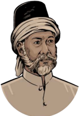

> **Deskripsi Visual:** Gambar ini adalah ilustrasi yang menampilkan wajah seorang pria tua dengan rambut berwarna gelap dan kumis yang tebal. Pria tersebut mengenakan topi tradisional dengan penutupan yang lebar, serta baju berwarna cokelat muda dengan detail kancing di depan. Wajahnya tampak tua dan penuh pengalaman, dengan mata yang menunjukkan kecerdasan dan pengalaman. Ilustrasi ini mungkin digunakan untuk membantu pembaca memahami karakter atau tokoh dalam konteks cerita atau buku pelajaran tertentu.

Adapun nama lengkapnya  ialah Aminuddin Abdul Rauf bin Ali al-Jawi Tsumal Fansuri as-Singkili .  Sebagian  riwayat  menyebutkan, keluarganya  berasal  dari  Persia  atau  Arabia, yang  datang  dan  menetap  di  Singkil,  Aceh, pada akhir abad ke-13. Namun, belum dapat dipastikan karena minimnya catatan sejarah, serta  tidak  didukung  nama  keluarga  yang mencirikan keturunan Arab ataupun Persia.

Beberapa ahli berpendapat, beliau merupakan putra asli pribumi beretnis Minang Pesisir  di  Singkil  yang  yang  telah  menganut agama  Islam  pada  masa  itu.  Pendapat  lain, mengatakan  berasal  dari  etnis  Batak  Singkil yang beragama Islam yang tidak diketahui lagi marganya.

 

---
## 📄 Halaman 179

Pada  masa  mudanya,  mula-mula  belajar  kepada  ayahnya  sendiri. Kemudian  belajar kepada ulama-ulama di Fansur dan Banda Aceh. Selanjutnya, pergi menunaikan ibadah haji, dan dalam proses lawatannya, belajar juga kepada banyak ulama di Timur Tengah.

### 2. Teladan yang dapat dicontoh

Diperkirakan Syekh Abdul Rauf kembali ke Aceh sekitar tahun 1083 H/1662 M,  dan  mengajarkan  serta  mengembangkan Tarekat Syathariah yang diperolehnya. Banyak santri dan murid yang berguru kepadanya, dan berasal dari Aceh serta wilayah Nusantara lainnya. Beberapa yang menjadi ulama terkenal ialah Syekh Burhanuddin Ulakan (dari Pariaman, Sumatra Barat) dan Syekh Abdul Muhyi Pamijahan (dari Tasikmalaya, Jawa Barat).

Syekh Abdul Rauf menjadi rujukan penting para mubalig yang merintis dakwah ke berbagai daerah di Nusantara. Hal itu sejalan dengan sifat strategis Aceh sebagai poros peradaban Islam di Kepulauan Indonesia. Saat itu, Aceh merupakan tempat persinggahan para calon jamaah haji asal Sumatra, Jawa, Kalimantan, Sulawesi, dan lain-lain.

Disebabkan  peran  besar  tersebut,  Syekh  Abdul  Rauf  dapat  dikatakan sebagai Poros sejumlah ulama Nusantara. Salah seorang muridnya adalah Syekh Burhanudin Ulakan (1646 M-1692 M). Setelah belajar di Aceh, mubalig asal  Pariaman  itu  berangkat  ke  Tanah  Suci.  Sepulangnya  dari  Haramain, dia  mendirikan  surau  di  Ulakan.  Jasanya  yang  paling  dikenang  adalah mendakwahkan Islam kepada kaum bangsawan Kerajaan Pagaruyung.

Murid lainnya adalah Syekh Abdul Muhyi. Mubaligh asal Jawa Barat itu pernah bermukim di Aceh, untuk kemudian berangkat ke Tanah Suci untuk mendalami ilmu-ilmu agama. Sempat pula dia berkunjung ke Baghdad (Irak) untuk  berziarah  ke  makam  Syekh  Abdul  Qadir  Jailani  (1077  M-1166  M). Sepulangnya  dari rihlah keilmuan itu, Abdul Muhyi menyebarkan dakwah Islam, termasuk tarekat Syathariyah, di Jawa Barat.

Tokoh  berikutnya  adalah  Abdul  Malik  bin  Abdullah  (1678-1736)  dari Semenanjung Melayu dan Dawud al-Jawi ar-Rumi. Keduanya juga berangkat ke  Tanah  Suci  untuk  beribadah  haji  sekaligus  pengembangan  keilmuan. Akhirnya  kiprah  Abdul  Malik  banyak  di  bidang  syariat  dan  fikih.  Sementara, Dawud al-Jawi yang diduga berasal dari Turki, dijadikan sebagai wakil utama dari tarekat Syathariyah sepeninggal wafatnya Syekh Abdur Rauf.

 

---
## 📄 Halaman 180

### 3. Karya Tulisnya

Menurut  Azyumardi  Azra  (Akademisi  UIN  Jakarta)  menyatakan  bahwa banyak karya-karya Syekh Abdurrauf Singkil yang sempat dipublikasikan melalui murid-muridnya. Di antaranya adalah:

- Mir'at al-Thullāb fī Tasyil Mawā'iz al-Badî'rifat al-Ahkām al-Syar'iyyah li  Mālik  al-Wahhāb ,  karya  ini  berisi  tentang  bidang  fiqh  atau  hukum Islam, yang ditulis atas permintaan Sultanah Safiyatuddin.
- Tarjuman  al-Mustafīd ,  merupakan  naskah  pertama  Tafsir  Al-Qur'an yang lengkap berbahasa Melayu.
- Terjemahan Hadits Arba'in karya Imam  al-Nawawi, ditulis atas permintaan Sultanah Zakiyyatuddin.
- Mawā'iz  al-Badī' ,  berisi  sejumlah  nasihat  penting  dalam  pembinaan akhlak.
- Tanbīh  al-Masyi , merupakan naskah tasawuf yang memuat pengajaran tentang martabat tujuh.
- Kifāyat  al-Muhtajin  ilā  Masyrah  al-Muwahhidīn  al-Qāilīn  bi  Wahdatil Wujūd , memuat penjelasan tentang konsep wahdatul wujud .
- Daqāiq al-Hurf , pengajaran mengenai tasawuf dan ilmu kalam (akidah).
Di antara karya besar Syekh Abdu Rauf adalah Tarjuman al-Mustafīd . Itulah terjemahan dan tafsir Al-Qur'an pertama dalam bahasa Melayu. Kitab tersebut  banyak  dipengaruhi  karya  Abdullah  bin  Umar  bin  Muhammad Syairazi  al-Baidawi  (w.  1286  H),  yakni Tafsir  Anwār  al-Tanzil  wa  Asrār  alTa'wīl ,  yang dalam bahasa Arab dan memang sudah legendaris di penjuru dunia.

Namun, karya tulis syekh asal Aceh itu juga tidak kalah terkenal. Sebagai contoh, Tarjuman al-Mustafīd diketahui pernah terbit pada 1884 M/1885 M dalam edisi dua jilid di Istanbul, Turki.

Adapun karya-karyanya yang lain juga menjadi bacaan penting, baik oleh  alim ulama maupun  sultan-sultan  Melayu.  Di  samping  itu,  mubalig kelahiran  Singkel  ini,  juga  kerap  memanfaatkan  sastra  sebagai  medium penyebaran gagasan sufistik. Sebuah syair karyanya yang terkenal adalah Syair Ma'rifat yang salinannya ditulis di Bukittinggi pada tahun M.

1859

 

---
## 📄 Halaman 181

### f. Jejak Langkah Muhammad Sholeh bin Umar al-Samarani

### 1. Riwayat Hidupnya

Di  kalangan  ulama  atau  masyarakat  awam, orang  sering  menyebutnya  dengan  nama Mbah  Sholeh Darat . Kata 'Darat' pada akhir nama  beliau,  disebabkan  beliau  tinggal  di daerah  yang  bernama  Darat,  yaitu  suatu daerah  di  pantai  utara  Semarang.  Saat  ini, daerah  Darat  termasuk  wilayah  Semarang Barat.

Mbah  Sholeh  Darat  dilahirkan  di  desa Kedung Cumpleng, Kecamatan Mayong, Kabupaten Jepara, Jawa Tengah, sekitar 1820 M.  Sementara,  informasi yang  lain menyebutkan, beliau lahir di Dukuh Kedung Cumpleng, Desa Ngroto, Kecamatan Mayong, Jepara.  Beliau  wafat  di  Semarang  pada  28 Ramadan  1321  H/18  Desember  1903  M.

Nama lengkapnya adalah Al-'Alim Al-'Allamah Asy-Syaikh Muhammad Sholeh  bin  Umar  al-Samarani  al-Jawi  asy-Syafi'i .  Jika  dari  namanya  yang panjang,  mengindikasikan bahwa beliau merupakan seorang Ulama Besar di Jawa. Nama Ayahnya adalah Kiyai Umar yang merupakan salah seorang pejuang dan orang kepercayaan Pangeran Diponegoro di Jawa Bagian Utara Semarang.

Hasil  didikan  Mbah  Sholeh  Darat,  dapat  ditelusuri  dari  nama-nama berikut  ini,  yang  merupakan  tokoh-tokoh  besar  Indonesia,  antara  lain: Hadratu  Syekh KH  Hasyim  Asy'ari  (Pendiri  NU),  KH  Ahmad  Dahlan (Pendiri Muhammadiyah), KH Amir Idris (pekalongan), KH Dahlan Tremas, KH Dimyathi Tremas, KH Dalhar Watucongol (Magelang).

Selanjutnya, KH Bisri Syansuri (Jombang), KH Kholil (Lasem Rembang), KH  Sya'ban  (semarang),  KH  Abdus  Syakur  Senorita  (Tuban),  KH  Yasir Jekulo (Kudus), dan KH Thoyib (Mranggen Demak). Jangan dilupakan juga, termasuk hasil  didikan  beliau  adalah  tokoh  emansipasi  wanita  Indonesia, yakni R.A. Kartini.

 

---
## 📄 Halaman 182

Kiai  Sholeh  juga  menjadi  salah  satu  pengajar  di  Makkah.  Muridnya berasal dari seluruh penjuru dunia, termasuk dari Jawa dan Melayu. Hal ini tentu  membanggakan, kita sebagai generasi penerus telah disuguhi banyak tokoh  besar  Indonesia,  karena  itu  menjadi  kewajiban  kita  untuk  dapat mencontoh dan meneladani capaian dan keberhasilan mereka, baik di level nasional, regional maupun mancanegara.

### 2. Teladan yang dapat dicontoh

Kiai Sholeh Darat menimba ilmu di pesantren-pesantren pada zamannya, beliau  banyak  berjumpa dengan kiai-kiai masyhur yang dikenal memiliki kedalaman  serta  keluasan  ilmu  batin  (tasawuf),  yang  kemudian  dijadikan sebagai  gurunya  di  Nusantara  Indonesia,  antara  lain  KH.  M.  Sahid  yang merupakan cucu dari Syaikh Ahmad Mutamakkin, seorang ulama besar dari daerah Pati Jawa Tengah sekitar abad ke-18.

Beliau  juga  berguru  kepada  KH.  Syahid  Waturoyo,  KH.  Muhammad Shaleh  Asnawi  (Kudus),  KH.  Haji  Ishaq  Damaran,  KH  Abu  Abdillah Muhammad Hadi Baguni, KH Ahmad Bafaqih Ba'alawi, dan KH Ghani Bima.

Beliau juga menimba ilmu ke gurunya yang di mancanegara, khususnya di wilayah Hijaz (Jazirah Arab Saudi Arabia), antara lain Syeikh Muhammad al-Muqri,  Syeikh  Muhammad  bin  Sulaiman  Hasbullah  al-Makki,  Sayyid Ahmad bin Zaini Dahlan, Syeikh Ahmad Nahrowi, Sayid Muhammad Saleh bin Sayid Abdur Rahman Az-Zawawi, Syeikh Zahid, Syeikh Umar asy-Syami (Suriah dan Palestina) Syeikh Yusuf al-Mishri (Mesir).

Berdasarkan penjelasan tersebut, banyak hal yang dapat dicontoh dari Syekh Shaleh Darat, antara lain:

- Pengembaraan ilmunya melalui guru atau ulama yang sudah masyhur, berguru kepada ulama yang bukan sekedar dalam ilmunya, tetapi juga memiliki sangat baik amal ibadah dan akhlak yang dimiliki guru-gurunya.
- Tidak puas hanya menimba ilmu ulama dari Nusantara, tetapi sampai ke mancanegara, khususnya negara-negara di kawasan Timur Tengah, karena pusat Islam pada waktu adalah di wilayah-wilayah tersebut.
- Beliau  juga  mendidik  wanita-wanita  muslim,  terbukti  beliau  berhasil melambungkan  nama  RA.  Kartini  menjadi  tokoh  emansipasi  wanita Indonesia, padahal pada waktu itu Nusantara masih di bawah
Abdul

 

---
## 📄 Halaman 183

cengkeraman  penjajah  Belanda  yang  umumnya  menjadikan  wanita sebagai warga ''kelas dua'.

### 3. Karya Tulisnya

Syekh Kyai Sholeh Darat termasuk ulama yang produktif, banyak karya lahir darinya. Di antara kitab atau karya tulis beliau adalah:

- Kitab Munjiyat , tentang tasawuf, ringkasan dari penjelasan kitab Ihya' `Ulum ad-Din karangan Imam al-Ghazali.
- Syarh Kitab al-Hikam , juga tentang tasawuf, merupakan penjelasan dari kitab al-Hikam karangan Syekh Ibnu Atha'illah al-Askandari.
- Latha'if at-Thaharah tentang hukum bersuci.
- Kitab ash-Shalah , membicarakan tata cara mengerjakan shalat.
- Tarjamah Sabil al-`Abid `ala Jauharah at-Tauhid , menjelasakan akidah Ahli Sunnah wal Jamaah dengan mengacu Imam Abul Hasan al-Asy`ari dan Imam Abu Manshur al-Maturidi.
- Mursyid al-Wajiz , kandungannya membicarakan tasawuf atau akhlak.
- Minhaj al-Atqiya', juga tentang tasawuf dan akhlak.
- Kitab Hadis al-Mi'raj , tentang perjalanan Nabi Muhammad s.a.w untuk menerima perintah shlata fardhu.
- Kitab  Asrar  al-Shalah ,  kandungannya  membicarakan  rahasia-rahasia shalat.
- Faid  ar-Rahman  fi  Tarjamah  Tafsir  al-Kalam  al-malik  al-Dayyan yang merupakan  tafsir pertama di Nusantara dalam bahasa Jawa dengan aksara Arab. Dan kitab ini pula yang dihadiahkannya kepada R.A. Kartini pada saat dia menikah dengan R.M. Joyodiningrat, seroang Bupati Rembang.
- Kitab  Manasik  al-Haj  wa  al-Umrah  wa  Adab  al-Ziyarah  li  Sayyid  alMursalin .  Kitab  ini,  membahas  ibadah  haji  dan  umrah  yang  berisi  64 halaman dengan 17 topik yang dikupas dimulai dari bab Kitab Haj wa al-Umrah hingga al-Khatimah (penutup). Kitab ini diterbitkan di Bombai India pada tahun 1340 H/1922 M.
- Kitab  Majmu'ah  al-Syari'ah  al-Kafiyah  li  al-'Awam .  Isinya  hampir mirip  dengan  karyanya  yang  terdahulu,  yakni  tentang  haji.  Kitab  ini diterbitkan oleh penerbit Karya Toha Putra Semarang, sayangnya tidak ditemukan tahun kapan diterbitkan.

 

---
## 📄 Halaman 184

### g. Jejak dan Langkah Hamzah al-Fansuri

### 1. Riwayat Hidupnya

Nama  populernya  Syekh  Hamzah  Fansuri, atau  Hamzah  al-Fansuri.  Nama  al-Fansuri sendiri  berasal  dari Arabisasi kata  Pancur, sebuah  kota  kecil  di  pantai  Barat  Sumatra yang kini terletak antara Singkil (Aceh) dan Sibolga  (Sumatra  Utara).  Merujuk  zaman Kerajaan Aceh Darussalam, kampung Fansur itu  terkenal  sebagai  pusat  pendidikan Islam di bagian Aceh Selatan.

Beliau  berasal  dari  Barus  (saat  ini  di provinsi Sumatera  Utara). Di jaman  itu, wilayah Barus sering disinggahi para saudagar dan musafir dari mancanegara. Bahkan, disebut oleh Sastrawan Abdul Hadi, signifikansinya sudah tercantum dalam naskah sejarah Yunani Kuno yang ditulis pada abad kedua sebelum Masehi (SM).

Seperti

Namun,  ada  pula  yang  berpendapat  lain,  bahwa  Hamzah  Fansuri dilahirkan di Ayuthia, ibukota lama kerajaan Siam (Thailand). pendapat Syed Naguib al-Attas,  bahwa keluarganya memang berasal dari Barus, tetapi dirinya sendiri lahir di Syahr Nawi, yakni Ayuthia, ibu kota Kerajaan Siam yang berdiri pada 1350.

Sepanjang hayatnya, Syekh Hamzah Fansuri tidak hanya fasih berbahasa Melayu,  tetapi  juga  Jawa,  Siam,  Hindi,  Arab,  dan  Persia.  Bahasa  Arab  dan Persia merupakan bahasa penting pada abad ke-16. Saat itu, di Barus sudah berkembang suatu dialek bahasa Melayu yang unggul, di samping dialek Malaka dan Pasai. Oleh karena itu, bahasa Melayu yang dipakai Hamzah Fansuri dalam karya-karyanya dapat dianggap contoh terbaik ragam bahasa Melayu.

### 2. Teladan yang dapat dicontoh

Sepanjang hayatnya, Syekh Hamzah Fansuri tidak hanya fasih berbahasa Melayu, tetapi juga Jawa, Siam, Hindi, Arab, dan Persia. Bahasa Arab dan Persia,  merupakan  bahasa  penting  pada  abad  ke-16,  termasuk  mengenai tasawuf Islam.

 

---
## 📄 Halaman 185

Di Barus pada masa itu, sudah berkembang suatu dialek bahasa Melayu yang unggul, di samping dialek Malaka dan Pasai. Oleh karena itu, bahasa Melayu yang dipakai Hamzah Fansuri dalam karya-karyanya dapat dianggap contoh terbaik ragam bahasa Melayu Barus.

Semua pegiat Sastra Nusantara menyebut bahwa Hamzah Fansuri adalah penyair agung di rantau Sumatera. Disebutkan oleh A Teeuw, ketika Valentijn (seorang sarjana Belanda) mengunjungi Barus pada 1706, ia membuat catatan yang menunjukkan kekagumannya kepada sang penyair.

''Seorang  penyair  Melayu,  Hamzah  Pansur,  adalah  sosok  terkemuka di  lingkungan  orang-orang  Melayu,  karena  syair  dan  puisinya  yang menakjubkan.  Kita  dibuat  dekat  kembali  dengan  kota  kelahiran  sang penyair,  jika  mengangkat  naik  timbunan  debu  kebesaran  dan  kemegahan masa lampau,''  tulis  Valentijn .

### 3. Karya Tulisnya

Syekh Hamzah Fansuri merupakan figur penting dalam sejarah kebudayaan Melayu-Indonesia. Kemasyhurannya meliputi banyak bidang, yakni kesusastraan,  tasawuf,  dan  dakwah  Islam.  Namun,  sedikit  sekali  yang dapat memastikan detail riwayat hidup sang perintis tradisi penulisan syair berbahasa Melayu itu.

Berikut ini, sedikir rincian karya beliau yang terkait dengan kesusatraan Melayu:

Syair Hamzah Fansuri terdiri atas 13-21 bait. Setiap bait terdiri atas empat baris, yang berima a-a-a-a. Pada umumnya jumlah kata tiap baris ada empat, meskipun terdapat pengecualian. Syair Hamzah al-Fansuri banyak dipengaruhi puisi-puisi Arab dan Persia (seperti rubaiyat karya Umar Khayyam), namun tetap ada perbedaan, yakni: Rima Rubaiyat adalah a-a-b-a , sedangkan Hamzah al-Fansuri memakai rima a-a-a-a .

Selanjutnya,  jika  ditelaah  dari  segi  tema  setiap  syair  yang  dikarang Hamzah  al-Fansuri,  lebih  banyak  membahas  tentang  aspek  tasawuf.  Hal ini, dikarenakan bidang lain yang diminati adalah tasawuf, selain sastra dan dakwah Islam.

Hamzah Fansuri banyak melakukan kreasi atau inovasi baru, yang  sebelumnya  tidak  dikenal  dalam  sastra  Melayu  lama.  Misalnya, memperkenalkan  bentuk  puisi  baru  untuk  mengekspresikan  diri.  Inovasi

 

---
## 📄 Halaman 186

lain  adalah  pemakaian bahasa yang kreatif. Hamzah Fansuri tidak segansegan meminjam kata-kata dari bahasa Arab dan Persia dalam puisinya.

Adapun karya-karya Syekh Hamzah Fansuri yang sampai saat ini masih dapat ditelaah, dikaji dan dinikmati adalah:

### Kelompok Puisi

- Syair Burung Unggas
- Syair Dagang
- Syair Perahu
- Syair Si Burung pipit
- Syair Si Burung Pungguk
- Syair Sidang Fakir

### Kelompok Prosa

- Asrār al-'Ārifīn
- Sharab al-'Āsyikīn
- Kitab al-Muntahi/Zinat al-Muwahidīn

### Aktivitas 5.5

### Aktivitas Peserta Didik:

Kelas  dibagi  menjadi  4  kelompok,  lalu  susun  makalah  dalam  bentuk ppt .  yang  mengisahkan Ulama Nusantara Indonesia yang menorehkan catatan emas di dunia, yaitu: (1) Syekh Muhammad Arsyad al-Banjari; (2) Syekh Ahmad Khatib al-Minangkabawi; (3) Syekh Muhammad Yasin alFadani; dan (4) Syekh Sulaiman ar-Rasuli al-Minangkabawi; Persiapkan juga buku catatan, atau laptop yang kalian miliki untuk presentasi. Lalu setelah  mengetahui  profil  Ulama  Nusantara  tersebut,  apa  yang  harus kalian lakukan, agar dapat meneladani dalam upaya mencari ilmu!

H

### Penerapan Karakter

Setelah menelaah materi Meneladani  Jejak  Langkah  Ulama  Indonesia  Yang Mendunia ,  diharapkan  peserta  didik  dapat  membiasakan  karakter  dalam kehidupan sehari-hari, sebagai berikut.

### Syair Hamzah Fansuri

8888888888888888888888888888888888888888888888888888

Hamzah Fansuri di dalam Makkah

Mencari Tuhan di Bait-Ka'bah

Di Barus ke Qudus terlalu payah

Akhirnya dijumpa di dalam rumah

 

---
## 📄 Halaman 187

I

### Refleksi

Jika kalian kaji jejak langkah 7 Ulama Nusantara Indonesia yang sudah dipelajari, sebutkan 5 faktor yang menjadi penyebab para ulama tersebut, meraih capaian yang begitu unggul.

Jawabannya  ditulis  tangan,  dan  cukup  2  lembar  saja  yang  diperkaya dengan data, gambar, atau ilustrasi! Ini tugas pribadi atau individual ya!

 

---
## 📄 Halaman 188

### Rangkuman

- Indonesia  merdeka  tidak  lepas  dari  peran  para  Ulama  Indonesia. Banyak sekali  nama-nama  yang  dapat  kita  sodorkan  dan  menjadi pengingat  tentang  jejak  mereka  dalam  memerdekakan  Indonesia, yang sudah kita kenal, antara lain: Pangeran Diponegoro, Cut Nyak Dien, Pangeran Antasari, dll.
- Materi ajar ini, agak berbeda yakni Ulama Indonesia yang bukan hanya memberi  sumbangsih  besar  untuk  Indonesia,  tetapi  mewarnai  wajah dunia sampai saat ini. Mereka itu, antara lain: Abu Abdul Mu'thi Nawawi al-Tanari al-Bantani, Syaikh Yusuf Abul Mahasin Tajul Khalwati alMakasari, Abdus Samad bin Abdullah al-Jawi al-Palimbani, Nuruddin bin  Ali  ar-Raniri,  Syekh  Abdurauf  bin  Ali  al-Singkili,  Muhammad Sholeh bin Umar al-Samarani, Hamzah al-Fansuri .
- Syekh Nawawi pernah menjadi imam di Masjidil Haram. Gelarnya Sayyidul  Hijaz .  Di  kawasan  Asia  Tenggara,  khususnya  di  dunia pesantren, karya-karyanya masih dipelajari, dikaji, dan ditelaah.
- Jejak  dakwah  Syekh  Yusuf  Tajul  Khalwati  dimulai  dari  Gowa, Sulawesi  Selatan,  lalu  diasingkan  ke  Srilanka  (Asia  Selatan,  dekat India)  ke  Afrika  Selatan.  Presiden  Nelson  Mandela  menyebutnya sebagai 'Salah Seorang Putra Afrika Terbaik '.
- Syekh Abdus Samad merupakan pelopor perkembangan intelektualisme  Nusantara  Indonesia.  Ketokohannya  melengkapi ulama  seangkatannya,  misalnya  Nuruddin  ar-Raniri,  Muhammad Arsyad al-Banjari,  Hamzah  Fansuri,  Yusuf  al-Makasari,  dan  masih banyak lainnya.
- Ilmu  Syekh  Nuruddin  sangat  luas  yang  meliputi  bidang  sejarah, politik, sastra, filsafat, fikih,  dan mistisisme (tasawuf).  Beliau  juga negarawan,  ahli  fikih,  teolog,  sufi,  sejarawan  dan  sastrawan  penting dalam sejarah Melayu pada abad ke-17.
- Syekh Nuruddin menulis beberapa kitab. Mendalami juga Hikayat Seri  Rama  dan  Hikayat  Inderaputera,  yang  kemudian  dikritiknya

 

---
## 📄 Halaman 189

- dengan  tajam,  serta  Hikayat  Iskandar  Zulkarnain.  Didalami  pula buku Tāj as-Salātīn karya Bukhari al-Jauhari dan Sulālat as-Salātīn .
- Syekh  Abdul  Rauf  menjadi  rujukan  penting  para  mubalig  yang merintis dakwah ke berbagai daerah di Nusantara. Hal itu sejalan dengan  sifat  strategis  Aceh  sebagai  poros  peradaban  Islam  di Nusantara. Saat itu, Aceh menjadi tempat persinggahan calon jamaah haji asal Sumatra, Jawa, Kalimantan, Sulawesi, dan lain-lain.
- Kiai Sholeh Darat menjadi salah satu pengajar di Makkah. Muridnya berasal dari seluruh penjuru dunia, termasuk dari Jawa dan Melayu,  antara  lain:  Hadratu  Syekh KH  Hasyim  Asy'ari  (Pendiri NU), KH Ahmad Dahlan (Pendiri Muhammadiyah), KH Amir Idris (pekalongan), KH Dahlan Tremas, KH Dimyathi Tremas, KH Dalhar Watucongol (Magelang), dan masih banyak lagi.
- Sepanjang  hayatnya,  Syekh  Hamzah  Fansuri  tidak  hanya  fasih berbahasa Melayu, tetapi juga Jawa, Siam, Hindi, Arab, dan Persia. Bahasa Arab dan Persia merupakan bahasa penting pada abad ke16. Saat itu, di Barus sudah berkembang suatu dialek bahasa Melayu yang unggul, di samping dialek Malaka dan Pasai.

### 1. Penilaian Sikap

### Penilaian Diri

Berilah tanda centang ( pada kolom berikut dan berikan alasannya! √ (

---
**📊 Tabel**

Tabel ini berisi dua pernyataan yang disertai dengan jawaban singkat (S), jawaban ringan (R), jawaban tinggi (TS), dan alasan untuk setiap jawaban. Topik utama tabel adalah tentang pemahaman tentang Nusantara Indonesia dan perkembangan Islam di Banten. Kolom-kolomnya meliputi nomor urut (No.), pernyataan, jawaban, dan alasan. Data penting yang terlihat adalah bahwa pernyataan pertama menyatakan bahwa hanya 7 ulama Nusantara Indonesia yang mendunia, sementara pernyataan kedua menyatakan bahwa Syekh Nawawi Banten berperan penting dalam perkembangan Islam di Indonesia.

BAB 5: Meneladani Jejak Langkah Ulama Indonesia yang Mendunia

 

---
## 📄 Halaman 190

---
**📊 Tabel**

Tabel ini berisi tiga pernyataan yang disertai dengan jawaban singkat (S), jawaban ringkasan (R), jawaban terstruktur (TS), dan alasan untuk setiap jawaban. Topik utama tabel adalah tentang literasi, abadi, dan inspirasi ulama Nusantara Indonesia. Kolom-kolomnya mencakup pernyataan, jawaban S, jawaban R, jawaban TS, dan alasan. Data penting yang terlihat meliputi bahwa ulama Indonesia memperlihatkan kebijaksanaan dalam menangani tantangan literasi dan abadi, serta memberikan inspirasi bagi generasi mendatang.

Catatan: S= Setuju, R=Ragu, TS= Tidak setuju

### 2. Penilainan Pengetahuan

Berilah tanda silang (X) pada huruf A, B, C, D atau E pada pernyataan di bawah ini sebagai jawaban yang paling tepat!

- Saat  jayanya  kerajaan Islam,  peran  ulama  sangat  menonjol  sebagai bagian  dari  pejabat  elite.  Adapun  perannya  yang  paling  penting adalah … .
- duduk menemani para pemimpin yang membidangi pemerintahan
- berbeda-beda peran sesuai wilayah atau daerah yang dikuasai
- menjadi penasehat di bidang keagamaan bagi kerajaan
- mempengaruhi pemimpin agar menegakkan aturan
- dikembalikan aturan bernegara yang menyimpang
- Syekh  Nawawi  pernah  menjadi  imam  di  Masjidil  Haram,  mengajar di  Haramain,  dan  mendapatkan  gelar Sayyidul Hijaz .  Saat  itu,  yang termasuk Hijaz adalah wilayah … .
- Timur Tengah seluruhnya
- Makkah, Madinah, dan Damaskus

 

---
## 📄 Halaman 191

- Palestina, Yordania dan Yaman
- Saudi Arabia, Irak dan Iran
- Jazirah Arab, Makkah, Madinah
- Sampai saat ini, karya-karya beliau masih dipelajari, dikaji, dan ditelaah di  pesantren.  Misalnya  kitab Sullam  al-Munâjah  syarah  Safînah  alShalâh dan Nashâih al-'Ibâd syarah al-Manbaĥâtu 'ala al-Isti'dâd li yaum al-Mi'âd . Itu adalah karya tulis dari … .
- Abu Abdul Mu'thi Nawawi al-Tanari al-Bantani
- Syaikh Yusuf Abul Mahasin Tajul Khalwati al-Makasari
- Abdus Samad bin Abdullah al-Jawi al-Palimbani
- Muhammad Sholeh bin Umar al-Samarani
- Nuruddin bin Ali ar-Raniri
- Setiap tanah yang  dipijak,  selalu  melakukan  dakwah,  bahkan  saat diasingkan, beliau bahkan diberi gelar oleh Nelson Madela (Presiden Afrika Selatan) sebagai 'Salah Seorang Putra Afrika Terbaik '. Beliau adalah … .
- Syaikh Yusuf Abul Mahasin Tajul Khalwati al-Makasari
- Abdus Samad bin Abdullah al-Jawi al-Palimbani
- Muhammad Sholeh bin Umar al-Samarani
- Nuruddin bin Ali ar-Raniri
- Hamzah Fansuri
- Syekh  Abdus  Samad  merupakan  tokoh  kunci  pembuka  dan  pelopor perkembangan intelektualisme Nusantara Indonesia.  Jumlah karyanya + 20 kitab/buku. Namun, karyanya yang terkenal dan sampai saat ini masih dipergunakan adalah … .
- Kaifiyāt al-Dzikir
- Al-Tafsir al-Munîr li al-Mu'âlim
- Al-Tausyîh/Quwt al-Habîb al-Gharîb
- Hidayatus Salikin dan Siyarus Salikin
- An-Nafhatu As Sailaniyah.
- Beliau adalah negarawan, ahli fikih, teolog, sufi, sejarawan dan sastrawan penting dalam sejarah Melayu  pada  abad ke-17. Perannya  dalam perkembangan Islam di Nusantara tidak dapat diabaikan. Beliau adalah … .

 

---
## 📄 Halaman 192

- Abu Abdul Mu'thi Nawawi al-Tanari al-Bantani
- Syekh Yusuf Abul Mahasin Tajul Khalwati al-Makasari
- Abdus Samad bin Abdullah al-Jawi al-Palimbani
- Muhammad Sholeh bin Umar al-Samarani
- Syekh Nuruddin bin Ali ar-Raniri
- Syekh  Abdul  Rauf  dapat  dikatakan  sebagai  poros  sejumlah  ulama Nusantara.  Adapun  nama  muridnya  yang  paling  berjasa,  sehingga mampu  mendakwahkan  Islam  kepada  kaum  bangsawan  Kerajaan Pagaruyung adalah … .
- Abu Abdul Mu'thi Nawawi
- Abul Mahasin Tajul Khalwati
- Syekh Burhanudin Ulakan
- Kiai  Sholeh  Darat  menjadi  salah  satu  pengajar  di  Makkah.  Muridnya berasal  dari  seluruh  penjuru  dunia,  termasuk  dari  Jawa  dan  Melayu. Berikut ini, murid dan santrinya yang berhasil di didik, kecuali … .
- Hadratu Syekh KH Hasyim Asy'ari
- KH Ahmad Dahlan
- RA. Kartini
- Iskandar Zulkarnain
- KH Amir Idris
- Sepanjang hayatnya, beliau tidak hanya fasih berbahasa Melayu, tetapi juga  Jawa,  Siam  (Thailand),  Hindi, Arab,  dan  Persia.  Namun,  karya tulisnya menggunakan Bahasa Melayu. Beliau adalah … .
- Mbah Sholeh Darat
- Muhammad Arsyad
- Bukhari al-Jauhari
- Ajaran pokok tarekat Syekh Yusuf berkisar pada usaha manusia untuk mendekatkan diri kepada Allah Swt. Di antara risalah yang ditulisnya berjudul a n-Nafhatu as-Sailaniyah yang pokok isinya tentang … .
- memohon (berdoa) itu semestinya hanya kepada Allah Swt
- petunjuk-petunjuk bagi orang yang akan mulai memasuki tarekat
- berdiam diri tidak bicara, kecuali mengucapkan kalimat dzikir
- berwudhu terlebih dahulu, jika ada hadas (besar dan kecil)
- ada 20 macam adab berdzikir
- Syekh Hamzah Fansuri
- KH Dahlan Tremas
- Sholeh bin Umar
- Ali ar-Raniri

 

---
## 📄 Halaman 193

### Jawablah pertanyaan berikut dengan singkat dan benar!

- Ulama  Indonesia  ini  pernah  diundang  untuk  presentasi  di  hadapan para ulama Universitas Al-Azhar Kairo Mesir, tepatnya tahun 1870 M. Siapakah Beliau ini?
- Syekh  Yusuf  pada  tahun  1644,  menunaikan  ibadah  haji  dan  tinggal di  Makkah  untuk  beberapa  lama,  lalu  belajar  kepada  ulama-ulama terkemuka di berbagai negara. Sebutkan di negara-negara manakah itu?
- Syekh  Abdus  Samad  termasuk  pengarang  yang  produktif.  Sebutkan kedua karyanya yang terkenal dan sampai saat ini masih dipergunakan?
- Syekh Nuruddin awalnya belajar bahasa Melayu di Aceh, lalu memperdalam ilmu agamanya saat beribadah haji ke Makkah. Sepulang dari Makkah, didapati bahwa di Aceh, aliran wujudiyah sudah berkembang. Jelaskan apa itu aliran wujudiyah ?
- Banyak karya-karya Syekh Abdul Rauf Singkil yang sempat dipublikasikan  melalui  murid-muridnya,  di  antaranya Tarjuman  alMustafīd . Sebutkan isi garis besar dari isi kitab tersebut?

### 3. Penilaian Keterampilan

### a. Penilaian Proyek

### Aktivitas 5.6

### Aktivitas Peserta Didik:

Setiap  kelas  dibagi  menjadi  7  kelompok.  Buatlah resume atau  resensi tentang karya-karya berikut ini yang merupakan karya tulis dari 7 ulama Nusantara Indonesia yang sudah kalian pelajari:

- Kelompok I: Kitab dari Abu Abdul Mu'thi Nawawi al-Bantani yang judulnya Nashâih al-'Ibâd
- Kelompok  II:  Kitab  dari  Syaikh  Yusuf  al-Makasari  yang  judulnya Safīnat an-Najah
- Kelompok III: Kitab dari Abdus Samad al-Palimbani yang judulnya Hidāyatus Sālikīn
- Kelompok IV: Kitab dari Nuruddin ar-Raniri yang judulnya Syifā al-Qulb
- Kelompok V: Kitab dari Syekh Abdurauf al-Singkili yang judulnya Tarjuman al-Mustafīd

 

---
## 📄 Halaman 194

- Kelompok  VII:  Kitab  dari  Muhammad  Sholeh  al-Samarani  yang judulnya Kitab Majmu'ah al-Syari'ah
- Kelompok VIII: Kitab dari Hamzah  al-Fansuri  yang  judulnya  Asrār al-'Ārifīn

### b. Penilaian Praktik

### Kelompok:

Kelas  dibagi  7  kelompok,  sesuai  dengan  Penilaian  Proyek  yang  sudah dilaksanakan.  Lalu  dipresentasikan  dan  didiskusikan  sesuai  dengan tugasnya, lalu membuat kesimpulan tentang isi kitab atau karya tersebut, sementara itu GPAI memberikan penilaian dari masing-masing kelompok .

### Individual:

Setiap peserta didik di masing-masing kelas, membuat tulisan tentang pengalaman pribadi (cukup 1 lembar dan ditulis tangan sendiri) terkait 7 ulama Nusantara Indonesia yang sudah dipelajari. Hasilnya dikumpulkan 1 pekan ke depan! Sementara itu, GPAI bersama peserta didik lainnya (yang  ditugaskan)  untuk  memberikan  tanggapan  dan  penilaian  dari setiap peserta didik dari masing-masing kelas.

### c. Penilaian Portofolio

Tuliskanlah semua aktivitas keagamaan kalian, baik di sekolah, rumah, maupun masyarakat pada buku Penilaian  Pendidikan  Agama  Islam  dan Budi Pekerti !

L

### Pengayaan

Terdapat 7 ulama Nusantara Indonesia yang memiliki reputasi dunia, adakah di  antara  karya-karyanya yang pernah kalian pelajari dan telaah, baik di lingkungan sekolah, rumah, lingkungan sekitar, atau di pondok pesantren? Jawabannya harus jujur ya! Perkaya juga dengan tanggapan kalian tentang peran dan karya-karya mereka untuk kemajuan Indonesia ke depan. Boleh ditulis tangan, atau cara yang lain. Cukup 1-2 lembar saja. Jangan lupa, sertakan sumber rujukannya ya!

 

---
## 📄 Halaman 195

KEMENTERIAN PENDIDIKAN, KEBUDAYAAN, RISET, DAN TEKNOLOGI REPUBLIK INDONESIA 2021

Pendidikan Agama Islam dan Budi Pekerti untuk SMA/SMK Kelas XI

Penulis:

Abd. Rahman dan Hery Nugroho

ISBN:

978-602-244-684-2

### Bab 6

Menguatkan Kerukunan melalui Toleransi dan Memelihara Kehidupan Manusia

---
**🖼️ Gambar/Diagram**

> **Deskripsi Visual:** Gambar ini adalah ilustrasi yang menunjukkan berbagai kelompok etnis dan agama di Indonesia. Gambar ini menggambarkan lima orang yang mewakili berbagai etnis dan agama di Indonesia, termasuk budaya Hindu, Islam, Kristen, dan Budha. Mereka berdiri di depan bendera Indonesia, yang menunjukkan bahwa mereka semua merupakan bagian dari bangsa Indonesia. Setiap individu memiliki pakaian tradisional yang menunjukkan keberagaman budaya mereka. Gambar ini menunjukkan bahwa Indonesia adalah negara yang beragam dan berbeda, dengan berbagai kelompok etnis dan agama hidup bersama dalam harmoni.

 

---
## 📄 Halaman 196

### Tujuan Pembelajaran

Dalam bab ini, tujuan pembelajarannya adalah:

- Membaca Q.S.  Yūnus/10:  40-41  dan  Q.S.  al-Māidah/5:  32,  serta Hadis tentang toleransi dan memelihara kehidupan manusia dengan tartil;
- Mengidentifikasi tajwid dalam Q.S. Yūnus/10: 40-41 dan Q.S. al-Māidah/5: 32, serta Hadis tentang toleransi dan memelihara kehidupan manusia;
- Menerjemahkan dalam Q.S. Yūnus/10: 40-41 dan Q.S. al-Māidah/5: 32, serta Hadis tentang toleransi dan memelihara kehidupan manusia;
- Menganalisis Q.S. Yūnus/10: 40-41 dan Q.S. al-Māidah/5: 32, serta Hadis tentang toleransi dan memelihara kehidupan manusia;
- Membiasakan membaca al-Quran dengan meyakini bahwa toleransi dan memelihara kehidupan manusia adalah perintah agama
- Membiasakan sikap toleransi dan peduli sosial, cinta damai, semangat kebangsaan,  dan  tanggung  jawab  sebagai  implementasi  dari  Q.S. Yūnus/10: 40-41 dan Q.S. al-Māidah/5: 32, serta Hadis tentang toleransi dan memelihara kehidupan manusia;
- Menulis kembali Q.S.  Yūnus/10:  40-41  dan  Q.S.  al-Māidah/5:  32,  serta Hadis  tentang  toleransi  dan  memelihara  kehidupan  manusia  dengan baik dan benar;
- Mendemonstrasikan hafalan Q.S. Yūnus/10: 40-41 dan Q.S. al-Māidah/5: 32, serta Hadis tentang toleransi dan memelihara kehidupan manusia;
- Menyajikan tentang Q.S. Yūnus/10: 40-41 dan Q.S. al-Māidah/5: 32, serta Hadis tentang toleransi dan memelihara kehidupan manusia.

### B Kata Kunci

- Al-Qur'an
- Toleransi
- Hadis
- Kerukunan
- Tajwid
- Tartil
- Memelihara kehidupan Manusia
- Perdamaian

 

---
## 📄 Halaman 197

### C Infografis

---
**🖼️ Gambar/Diagram**

> **Deskripsi Visual:** Gambar ini adalah diagram yang menunjukkan proses pembelajaran tentang Al-Qur'an dan Hadits. Diagram ini terdiri dari berbagai elemen yang saling terkait dan membentuk jalur yang mengarah ke tujuan akhir.

Pertama, elemen utama yang ditampilkan adalah jalur yang melambangkan proses pembelajaran. Jalur ini terbagi menjadi beberapa bagian, masing-masing menunjukkan tahapan yang harus dilalui dalam pembelajaran tersebut. Setiap bagian memiliki teks yang menjelaskan apa yang harus dilakukan pada tahap tersebut.

Elemen-elemen lain yang ada dalam diagram ini adalah ikon-ikon yang menunjukkan tindakan-tindakan yang harus dilakukan dalam setiap tahap. Misalnya, ada ikon buku yang menunjukkan bahwa harus membaca Al-Qur'an dan Hadits, dan ada ikon papan tulis yang menunjukkan bahwa harus menyajikan Al-Qur'an dan Hadits.

Teks, angka, atau label penting yang terlihat dalam diagram ini adalah nama-nama Al-Qur'an dan Hadits yang akan dipelajari, seperti Al-Qur'an Yunus dan Al-Maidah. Angka-angka ini digunakan untuk menunjukkan urutan materi yang akan dipelajari.

Informasi kunci yang dapat diambil pembaca dari gambar ini adalah bahwa proses pembelajaran ini melibatkan banyak tahap dan harus dilakukan dengan cara yang tepat untuk mempelajari Al-Qur'an dan Hadits dengan baik.

D

### Tadabbur

---
**🖼️ Gambar/Diagram**

> **Deskripsi Visual:** Gambar 6.2 adalah ilustrasi yang menunjukkan masyarakat Indonesia yang terdiri dari berbagai suku. Gambar ini menggambarkan tiga individu yang berasal dari suku-suku yang berbeda, yang terlihat dengan pakaian tradisional mereka. Mereka tampak saling berkomunikasi dan berinteraksi, menunjukkan keberagaman budaya dan kehidupan masyarakat Indonesia. Ilustrasi ini mencerminkan bahwa Indonesia memiliki keunikan dan keberagaman yang kuat, yang merupakan ciri khas dari negara ini.

BAB 6: Menguatkan Kerukunan melalui Toleransi  dan Memelihara Kehidupan Manusia

 

---
## 📄 Halaman 198

---
**🖼️ Gambar/Diagram**

> **Deskripsi Visual:** Gambar ini adalah ilustrasi yang menunjukkan sekelompok orang yang sedang berjalan-jalan di sekitar sebuah kota. Gambar ini menggambarkan aktivitas sehari-hari di kota dengan detail yang cukup. Di bagian atas gambar, ada tulisan "Pertama tentukan jenisnya: diagram, grafik, foto, ilustrasi, atau rumus". Ini menunjukkan bahwa gambar tersebut merupakan ilustrasi.

1. Gambar ini menunjukkan sekelompok orang yang sedang berjalan-jalan di sekitar sebuah kota.
2. Elemen-elemen utama yang terlihat adalah orang-orang yang sedang berjalan-jalan, bangunan-bangunan di sekitar kota, dan jalan-jalan yang membentuk lingkungan kota. Relasi antara elemen-elemen ini adalah bahwa orang-orang tersebut sedang bergerak di sekitar lingkungan kota yang terdiri dari bangunan dan jalan.
3. Teks, angka, atau label penting yang terlihat adalah "Pertama tentukan jenisnya: diagram, grafik, foto, ilustrasi, atau rumus" yang terletak di bagian atas gambar.
4. Informasi kunci yang dapat diambil pembaca adalah bahwa gambar ini menunjukkan aktivitas sehari-hari di kota, dengan orang-orang sedang berjalan-jalan di sekitar lingkungan kota yang terdiri dari bangunan dan jalan.

Dengan demikian, gambar ini menunjukkan aktivitas sehari-hari di kota dengan detail yang cukup, dengan orang-orang sedang bergerak di sekitar lingkungan kota yang terdiri dari bangunan dan jalan.

kepada anak yatim piatu

### Aktivitas 6.1

Dari gambar 6.1 dan 6.2 di atas, bagaimana hubungannya dengan toleransi? Dari  gambar  6.3  dan  6.4  di  atas,  bagaimana  hubungannya  dengan memelihara kehidupan manusia?

E

### Kisah Inspiratif

Perhatikan bacaan di bawah ini!

### Toleransi dalam Lintasan Sejarah Muslim

M asyarakat di Madinah pada zaman Nabi Muhammad Saw. adalah multietnis  dan  multiagama.  Masyarakat  ini  kemudian  disatukan dalam sebuah wadah negara dan konstitusi yang dikenal dengan piagam Madinah.  Piagam  Madinah  memberikan  kebebasan  beragama  sesuai dengan  ajaran  masing-masing.  Rasulullah  Saw.  berusaha  menegakkan keadilan kepada semua komunitas etnis dan agama yang ada, sehingga tercipta suasana kedamaian dan ketenteraman. Selain itu, di dalamnya berisi aturan-aturan berkenaan dengan orang-orang Muhajirin, Anshar, dan Yahudi yang bersedia hidup berdampingan dengan kaum muslim. Penghargaan terhadap keberadaan komunitas etnis dan pemeluk agama yang ada di Madinah, merupakan salah satu indikator adanya masyarakat yang harmonis, penuh pengertian, damai, dan sejahtera.

---
**🖼️ Gambar/Diagram**

> **Deskripsi Visual:** Gambar ini adalah ilustrasi yang menunjukkan tiga orang yang sedang berjalan di jalan raya. Mereka semua mengenakan pakaian tradisional, dengan dua orang wanita yang memakai hijab dan pakaian berwarna putih, serta seorang pria yang memakai baju berwarna abu-abu. Mereka sedang berjalan di atas jalur pejalan kaki, yang tampak jelas di bagian bawah gambar. Gambar ini menunjukkan hubungan sosial antara individu dalam situasi sehari-hari, mungkin menekankan tema kebersamaan atau persahabatan. Teks, angka, atau label penting tidak terlihat pada gambar ini. Informasi kunci yang dapat diambil pembaca adalah bahwa gambar ini mungkin digunakan untuk membahas tentang budaya lokal, kebersamaan kelompok, atau perjalanan sehari-hari.

orang tua di jalan raya

 

---
## 📄 Halaman 199

Pada  masa  khalifah  Abu  Bakar  al-Shidiq  dan  Umar  bin  Khathab, usaha menegakkannya terus dilakukan. Bahkan kedua sahabat besar ini yang sebelum muslim merupakan orang yang terpandang dan terhormat dari  sosial  dan  ekonomi.  Dalam  satu  riwayat  disebutkan,  ketika  Abu Bakar al-Shidiq  menjadi  khalifah,  ia  menjadi  miskin.  Untuk  menutupi kehidupannya,  ia  berusaha  bekerja  sendiri  dengan  berjualan  di  salah satu pasar yang ada di kota Madinah. Harta dan kekayaannya digunakan untuk  melakukan  gerakan  keagamaan  agar  masyarakat  terhindar  dari kemiskinan dan ketidakadilan.

Melihat kenyataan ini Umar bin Khathab menegur dan meminta Abu Bakar al-Shidiq mengambil sebagian kecil dari harta yang tersimpan di Bait  al-Mal, karena ia juga sebenarnya mempunyai hak di situ. Tetapi Abu  Bakar  al-Shidiq  tidak  mau,  bahkan  berkata:  'Dia  akan  sangat tersiksa  apabila  melihat  umat  dan  masyarakat  yang  berada  di  bawah kepemimpinannya  sengsara.  Ia  tidak  mau  memikul  beban  dosa  yang begitu besar nanti.'

Kenyataan  sejarah  tersebut  dapat  dipahami  bahwa  keadilan  dan pengakuan terhadap hak-hak orang lain, merupakan salah satu bentuk dakwah yang sebenarnya menuju masyarakat madani. Islam mengajarkan nilai-nilai keadilan ( 'adalah ), amanah, dan toleransi (tasamuh). Nilai-nilai inilah yang semestinya dikembangkan oleh penganut agama yang baik dalam kehidupan bermasyarakat, berbangsa,dan bernegara.

Sumber: disarikan dari Buku Deradikalisasi Pemahahaman al-Qur'an dan Hadis yang ditulis oleh Prof. Dr. H. Nasarudin Umar, MA (2014: 360-364)

### Aktivitas 6.2

Dari bacaan di atas, buatlah tiga kata  kunci dan jelaskan maksudnya!

F

### Wawasan Keislaman

Ada yang tahu pengertian toleransi? Mengapa manusia perlu sikap toleran dan memelihara kehidupan manusia? Untuk mendalami materi tersebut, silahkan kalian  pelajari  materi  ini  dengan  baik  sampai  selesai  ya.  Pada  pembahasan

 

---
## 📄 Halaman 200

materi ini, fokusnya adalah Q.S. Yūnus /10 : 40-41 serta Hadis tentang toleransi dan Q.S. al-Māidah/5: 32 serta Hadis tentang memelihara kehidupan manusia.

### 1. Mengkaji Q.S. Yūnus/10: 40-41 tentang toleransi

Dalam  mengkaji  Q.S.  Yūnus/10:  40-41  ada  enam  tahapan  yang  kalian  akan lakukan,  yaitu:  pertama,  membaca.  Kedua,  mengidentifikasi tajwid.  Ketiga, mengartikan perkata. Keempat, menerjemahkan ayat. Kelima, menganalisis isi. Keenam, penerapan Q.S. Yūnus/10: 40-41. Mari bersama membahas satu persatu.

۠

َ

َ

َ

a. Membaca Q.S. Yūnus/10 : 40-41 dengan tartil Perhatikan teks lengkap Q.S. Y ū nus/10 : 40-41 di bawah ini! ࣖ ْ ن ي س ِ د ف م ُ ال ب م ل ع ا ُّ ك ب ر ه ٖ ۗ  و ب م ِ ن ؤ ا  ي َّ ل َّ ن م م ه م ِ ن ه ٖ  و ب م ِ ن ؤ ي َّ ن م م ه م ِ ن ﴿ و ا ن ا و م َ ل ع آ ا َّ م ْ ن ـ ُٔ و يۤ َ ر ب م ت ن ۚ  ا م ك ل م َ ع م ك ل ْ  و ِ ي ل م َ ْ  ع ِ ي ل ل ق ف ْ ك و ب َّ ذ ك ا ِن ٤٠ و ) 40 -41 : 10/ ( يونس ٤١ ﴾ ْ ن و ل م َ ع ا ت َّ م ء ِ ي ۤ َ ر ب

َ

ِ

ْ

ْ

ِ

ُ

ُ

ْ

َ

ِ

### Aktivitas 6.3

Bacalah Q.S. Y ū nus/10 : 40-41 dengan tartil. Cara membacanya adalah dengan berpasangan bersama teman kalian satu meja! Apabila jumlah siswa ganjil, maka kelompok terakhir jumlahnya tiga. Satu siswa membaca, sedangkan temannya  menyimak.  Apabila  ada  bacaan  yang  kurang  tepat,  temannya mengingatkan. Setelah selesai, bergantian membaca dan menyimak.

### b. Mengidentifikasi Tajwid dalam Q.S. Yūnus /10 : 40-41

Setelah  membaca  dengan tartil,  mari  mengidentifikasi tajwid  dalam  Q.S. Y ūnus /10 : 40-41. Identifikasi tajwid ini merupakan penerapan materi tajwid yang  pernah  kalian  pelajari  pada  kelas  sebelumnya.  Perhatikan  petunjuk mengerjakannya yang ada kotak di bawah ini!

### Aktivitas 6.4

Isilah  titik-titik pada tabel dibawah ini, yaitu pada kolom hukum bacaan dan alasan sebagaimana seperti di contoh.

َ

ْ

ِ

ْ

ُ

ْ

َ

ِ

ْ

ُ

ُ

َ

ْ

ُ

َ

َ

َ

ّ

ِ

ْ

ُ

َ

َ

َ

ُ

ُ

ْ

َ

َ

ْ

ّ

ِ

ٌ

َ

ْ

َ

ْ

َ

َ

َ

َ

ُ

ْ

ُ

ْ

ْ

ُ

ْ

َ

ُ

ْ

ُّ

ْ

ْ

ُ

ْ

َ

 

---
## 📄 Halaman 201

ْ

َ

َ

ُ

َ

ْ

ُ

ُ

---
**📊 Tabel**

Tabel ini berisi informasi tentang hukum bacaan beberapa lafadz dalam bahasa Arab, termasuk Idzhar Khalqi, yang merupakan sukuh bertemu dengan huruf ha. Tabel ini terdiri dari 10 baris, masing-masing menunjukkan satu lafadz dan hukum bacaannya. Kolom "Lafadz" menyajikan lafadz yang dianalisis, sedangkan kolom "Hukum Bacaan" memberikan penjelasan tentang bagaimana lafadz tersebut harus dibaca. Kolom "Alasan" memberikan alasan mengapa lafadz tersebut memiliki hukum bacaan tertentu. Topik utama tabel ini adalah analisis hukum bacaan lafadz dalam konteks sukuh bertemu dengan huruf ha.

ْ

َ

َ

ُ

ْ

َ

BAB 6: Menguatkan Kerukunan melalui Toleransi  dan Memelihara Kehidupan Manusia

ُ

ْ

ُ

ِ

ْ

ُ

ْ

ْ

ْ

َ

ْ

ِ

َ

ُّ

ُ

ْ

ْ

ْ

ْ

َ

ْ

َ

ْ

ُ

ْ

ُ

ْ

َ

َ

ْ

ِ

َ

َ

َ

 

---
## 📄 Halaman 202

### c. Mengartikan Perkata Q.S. Yūnus /10 : 40-41

Sebelum menerjemahkan Q.S. Y ū nus/10: 40-41 secara utuh, lebih baik kalian memahami arti perkatanya terlebih dahulu. Dengan memahami terjemahan perkata,  kalian  akan  belajar  Bahasa  Arab  sekaligus.  Adapun  arti  perkata dalam  Q.S. Y ū nus /10 : 40-41 adalah:

ْ

ُ

ُ

ْ

ُّ

َ

ْ

---
**📊 Tabel**

Tabel ini berisi daftar kata-kata Arab dengan arti dalam bahasa Indonesia. Topik utamanya adalah perbandingan antara kata-kata dalam bahasa Arab dan artinya dalam bahasa Indonesia. Kolom pertama menunjukkan kata-kata dalam bahasa Arab, sementara kolom kedua menunjukkan arti dari kata-kata tersebut dalam bahasa Indonesia. Data penting yang terlihat adalah bahwa beberapa kata memiliki arti yang mirip, seperti "dan" (اللَّهُمْ) dan "dan" (وَ) yang memiliki arti yang sama, serta "lebih" (أَعْلَمُ) dan "dengan" (بِالْفَصِيدِيَّة) yang memiliki arti yang berbeda tetapi memiliki hubungan yang serupa dalam konteks bahasa Arab.

ْ

ُ

ْ

ْ

ْ

َ

ُ

ْ

َ

َ

َ

َ

ْ

ْ

َ

َ

َ

ّ

ُ

َ

ِ

َ

ُ

َ

َ

َ

ْ

ْ

ِ

 

---
## 📄 Halaman 203

ۚ

ْ

م

َ

ٌ

ُ

ُ

ك

ْ

ُ

ل

ْ

م َ

َ

ْ

ِ

َ

ع

ْ

م

۠

َ

َ

ُ

ت

َ

ْ

ن

َ

ا

ُ

ْ

َ

### Ingat

Alhamdulilah dari tabel di atas, kalian secara tidak langsung belajar mengenal 22 mufradāt (kosa kata) baru dalam bahasa Arab  sekaligus  memahami  bahasa al-Qur'an. Sebenarnya jumlahnya lebih dari itu, tapi karena ada sekitar 8 mufradāt yang  diulang,  sehingga  tidak  ditulis  dalam  tabel  di  atas. Apabila  hafal  kosa  kata  di  atas,  insyā'  Allah  kalian  akan  mudah menerjemahkan Q.S. Y ū nus/10:40-41.

### d. Menerjemahkan Q.S. Yūnus/10:40-41

Di bawah ini adalah terjemahan lengkap Q.S. Yūnus/10:40:

'Dan di antara mereka ada orang-orang yang beriman kepadanya (al-Qur'an), dan  di  antaranya  ada  (pula)  orang-orang  yang  tidak  beriman  kepadanya. Sedangkan  Tuhanmu  lebih  mengetahui  tentang  orang-orang  yang  berbuat kerusakan.'

Sedangkan terjemahan lengkap Q.S. Yūnus/10:41 adalah:

'Dan jika mereka (tetap) mendustakanmu (Muhammad), maka katakanlah, 'Bagiku  pekerjaanku  dan  bagimu  pekerjaanmu.  Kamu  tidak  bertanggung jawab terhadap apa yang aku kerjakan dan aku pun tidak bertanggung jawab terhadap apa yang kamu kerjakan.'

 

---
## 📄 Halaman 204

### Aktivitas 6.5

Silahkan kalian menerjemahkan Q.S. Yūnus /10 : 40-41.  Caranya mengartikan per kata dalam ayat 40 terlebih dahulu, setelah itu menerjemahkan  satu  ayat  penuh.  Kemudian  lanjutkan  untuk menerjemahkan ayat 41 dengan cara seperti ayat sebelumnya.

### e. Penjelasan Isi Q.S. Yūnus /10 : 40-41 serta hadis terkait tentang toleransi

### 1) Penjelasan Tafsir

Menurut Jalāluddin Muhammad bin Ahmad al-Mahali dan Jalāluddin 'Abdurrahman bin Abu Bakar al-Suyuthi dalam Kitab Tafsir  al-Jalalain , bahwa Q.S.  Yūnus/10:  40  menjelaskan  tentang  penduduk Makkah  pada  masa  Nabi Muhammad Saw. terbagi menjadi dua kelompok, yaitu: Pertama, orang-orang yang beriman kepada al-Qur'an; Kedua , orang-orang yang tidak beriman selamanya. م ه م ِ ن و

َ

Kemudian  maksud  kata (dan  diantara  mereka),  menurut  pakar tafsir,  Prof.  Dr.  H.  M.  Quraish  Shihab  menjelaskan  di  antara kaum musyrikin, ada  orang  yang  percaya  kepadanya,  tetapi  menolak  kebenaran al-Qur'an karena  keras  kepala  dan  demi  mempertahankan  kedudukan  sosial  mereka. Selain itu diantara mereka ada juga memang benar-benar lahir dan batin tidak percaya kepadanya serta enggan memerhatikannya karena hati mereka telah terkunci. Tuhanmu Pemelihara dan Pembimbingmu, wahai Muhammad, lebih mengetahui tentang para perusak yang telah mendarah daging dalam jiwanya yang sedikitpun tidak menerima kebenaran tuntunan ilahi. ْ ن ي س ِ د ف م ُ ال ب م ل ع ا ُّ ك ب ر و

ْ

ُ

ْ

َ

Sedangkan maksud dari ( sedangkan  Tuhanmu lebih  mengetahui  orang-orang  yang  membuat  kerusakan ).  Menurut  Ibnu 'Asyur kalimat ini merupakan peringatan sekaligus ancaman bagi kelompok yang tidak beriman. Sementara itu, Ibnu Katsir berpendapat bahwa Allah Swt. lebih mengetahui siapa yang akan mendapat hidayah dan siapa yang memilih kesesatan.  Sedangkan  menurut  al-Maraghi  menjelaskan  bahwa  Allah  Swt. paling mengetahui kerusakan yang mereka perbuat dengan perbuatan syirik, dzalim dan melampaui batas. Allah Swt. akan memberikan balasan kepada mereka di dunia dan akhirat, serta menolong Nabi dan umatnya yang beriman.

ِ

ْ

ْ

ِ

ُ

َ

ْ

َ

َ

َ

َ

Dalam  menyikapi  kelompok  kedua  tersebut  (orang  yang  tetap  dalam kekufuran) Allah Swt. memerintahkan Nabi menyampaikan kepada mereka

 

---
## 📄 Halaman 205

bahwa  Nabi  telah  menyampaikan  ajaran-Nya  melalui  kabar  gembira  dan peringatan Nabi tidak dapat memaksa mereka untuk beriman, dan apapun balasan  dari  perbuatan  mereka  akan  ditanggung  oleh  mereka  sendiri. Menurut  al-Sya'rawi  ayat  ini  menunjukkan  kepada  kita  bahwa  sesungguhnya keimanan adalah perbuatan hati, bukan perbuatan yang dzahir ,  maka kita tidak  bisa  mengetahui  apa  yang  ada  di  hati  seseorang.  Oleh  karena  itu di  akhir  ayat  40,  Allah  Swt.  menegaskan  Dialah  yang  lebih  mengetahui perbuatan orang-orang yang berbuat kerusakan dengan tidak beriman dan mendustakan ajaran Nabi Muhammad Saw.

Ayat ini juga diturunkan untuk menghibur Nabi dari sikap orang yang tidak mau beriman kepada ajaran-Nya. Allah Swt. mengetahui bahwa Nabi telah melaksanakan tugas menyampaikan ajaran Islam dengan baik kepada umatnya. Oleh karena itu, pada ayat 41 Allah Swt. menegaskan bahwa Nabi dan  umat  yang  beriman  tidak  akan  dimintai  pertanggungjawaban  atas kedurhakaan  umat  yang  tidak  mau  beriman.  Kelak  di  akhirat  Allah  Swt. akan memberikan balasan kepada orang yang tidak beriman, karena setiap manusia akan mempertanggungjawabkan perbuatannya.

### Aktivitas 6.6

Carilah penjelasan Q.S. Yūnus /10 : 40-41 dari Kitab tafsir karya ulama' dari Indonesia selain yang sudah dijelaskan di atas.

- Q.S. Yūnus /10 : 40-41 dan Hubungannya dengan Toleransi Dari penjelasan tafsir di atas, Q.S. Yūnus/10: 40-14 erat kaitannya dengan toleransi.  Sebelum  membahas  kaitan  antara  keduanya, alangkah baiknya, kalian mengetahui maksud toleransi, mengapa toleransi penting bagi umat manusia?

### Pengertian toleransi

Dalam Kamus Besar Bahasa Indonesia, toleransi artinya sifat toleran; batas ukur untuk penambahan atau pengurangan yang masih diperbolehkan. Sifat toleran di sini maksudnya bersifat atau bersikap menenggang (menghargai, membiarkan, membolehkan) pendirian (pendapat, pandangan, kepercayaan, kebiasaan,  kelakuan,  dan  sebagainya)  yang  berbeda  atau  bertentangan dengan pendirian sendiri. Sedangkan dalam Bahasa Inggris disebut dengan kata tolerance yang berarti toleransi, kesabaran, dan kelapangan dada.

 

---
## 📄 Halaman 206

Sedangkan  toleransi  dalam  bahasa  Arab  sebagaimana  dalam Mu'jam Maqayis  al-Lughah disebut  dengan  istilah tasamuh. Kata  tasamuh adalah bentukan dari kata samaha, yang secara bahasa berarti lembut dan mudah. Sedangkan  menurut  Dr.  KH.  Ahsin  Sakho  Muhammad, tasamuh berarti berkisar  antara  kemurahan  hati,  mudah  memaafkan,  lapang  dada,  kesabaran, ketahanan  emosional,  menenggang  rasa,  menghargai,  dan  sebagainya. Selain  tasamuh,  toleransi  dalam  Bahasa  arab  disebut  dengan  kata alsamhah. Menurut Ibnu Manzhur dalam Lisan al-'Arab, samhah berarti tidak menyusahkan  dan  tidak  memberatkan.  Berdasarkan  hal  tersebut samhah sama dengan moderat, yakni berada di pertengahan, tidak condong pada salah  satu  sisi.  Kemoderatannya  ditunjukkan  dengan  ajaran  Islam  yang mudah, tidak menyusahkan dan memberatkan umatnya.

Dari pengertian tersebut kata kunci dari toleransi adalah menghargai orang  lain  yang  berbeda  baik  pendapat,  kepercayaan,  kebiasaan,  dan sebagainya dengan pendirian sendiri. Orang yang toleran adalah orang yang memiliki kesabaran, kelapangan dada, dan daya tahan.

ِ

Sedangkan  dasar toleransi dalam  Islam, sebagaimana  hadis Nabi Muhammad Saw. berikut. َ ان ي د أ ال ي ُّ : أ م َّ ل َ س ه ِ  و ي ل ع ى الل َّ ل ِ ص الل ْ ل و َ س ِ ر ل ْ ل : ق ِ ي ال ق َّ اس ب ع ْ ن اب ن ِ ع (رواه احمد) ة م ْ ح َّ الس ة َّ ف ِ ي ن ِ ي ح ل : ا ال ِ  ق ى الل ل إ ح َ ب أ

ْ

َ

ْ

َ

َ

َ

ْ

َ

َ

ُ

ّٰ

َ

ّٰ

ِ

ُ

َ

َ

َ

ٍ

َ

ِ

َ

ُ

َ

ُ

ْ

َ

ْ

َ

َ

َ

ّٰ

َ

ِ

ُّ

َ

Artinya: 'Dari Ibnu 'Abbas, ia mengatakan seseorang bertanya kepada Nabi, ajaran agama Islam apakah yang paling dicintai Allah? Rasulullah menjawab: ajaran yang al-hanifiyyah dan al-samhah.' (H.R. Ahmad)

Dari Hadis tersebut, para ulama menjelaskan bahwa dari sekian banyak ajaran agama Islam, yang paling dicintai Allah adalah ajaran al-hanifiyyah dan al-samhah. Maksud al-hanifiyyah adalah  ajaran  kebaikan  yang  jauh dari  keburukan  atau  kebatilan.  Sedangkan al-samhah (toleran)  adalah perilaku yang memudahkan, tidak mengandung ajaran yang memaksa atau memberatkan  umatnya. Al-Samhah dibangun  di  atas  prinsip  kemudahan, berdasarkan  firman  Allah  Swt.: 'Dan  Dia  tidak  menjadikan  kesukaran  bagi kalian  dalam  agama  ini…' (Q.S. al-Hajj: 78).

 

---
## 📄 Halaman 207

### Contoh-Contoh Sikap Toleransi

Untuk  memantabkan  pemahaman  bahwa  Islam  mengajarkan  tentang toleransi, silahkan kalian perhatikan contoh sikap toleransi yang dilakukan Nabi Muhammad Saw. dan ulama' di Indonesia. Secara umum, dalam contoh ini  dibagi  menjadi  dua,  yaitu  toleransi  internal  (sesama  umat  Islam)  dan eksternal (antarumat beragama) yang dijelaskan sebagai berikut.

### a) Toleransi internal umat Islam

ْ

ْ

َ

ُ

َ

ِ

َ

ْ

َ

َ

ْ

ْ

ّ

ً

َ

ْ

َ

َ

ِ

َ

َ

ِ

ِ

َ

ْ

َ

Contoh toleransi untuk sesama umat Islam, sebagaimana dalam hadis Nabi Muhammad Saw. ِ ك ر د أ اد ك أ ِ  لا الل ْ ل و َ س ا ر ي ل َ ج ر ال : ق ال ق ِ ي ار ْ ص ن د ٍ  الأ و ع َ س ِ ي م ب أ ن ْ ع ِ ي ف م َّ ل َ س ه ِ  و ي ل ع ى الل َّ ل َّ  ص ي ب َّ الن ْ ت ي أ ا ر م ف ن لا ا ف ِ ن ب ِ ل و ُ ط ا  ي َّ م ة لا َّ الص م َ ن ف ْ ن ُ و ِ ر ف ن م م ك َّ ن إ َّ اس ا الن ُّ ه ي : أ ال ق ٍ  ف ِ ذ م ِ ئ و ي ا   م ِ ن ب ض َ غ َّ د ش ة ٍ  أ ع ِ ظ و م ة ِ اج ا  الح ذ و ْ ف ع ِ ي َّ الض و ْ ض ي م َ ر ال م ْ ه ف ِ ي َّ ِ ن إ ف ِف ف ُ خ ي ل ف َّ اس الن ى   ب َّ ل ص َ (رواه البخاري)

َ

َ

َ

َ

َ

ّ

َ

َ

ُ

ْ

َ

ُ

ِ

ُ

َ

َ

ِ

َ

ُ

ِ

َ

Artinya: 'Diceritakan  dari  Abi  Mas'ud  al-Anshari,  bahwa seorang  sahabat bertanya: 'Wahai Rasulullah, aku hampir tidak sanggup shalat yang dipimpin seseorang dengan bacaannya yang panjang.' Maka aku belum pernah melihat Nabi Saw memberi peringatan dengan lebih marah dari yang disampaikannya hari  itu  seraya  bersabda:  'Wahai  manusia,  kalian  membuat  orang  lari menjauh.  Maka  barangsiapa  shalat  mengimami  orang-orang  ringankanlah (tidak melamakan) shalatnya. Karena di antara mereka ada orang sakit, orang lemah dan orang yang punya keperluan.' (H.R. Al-Bukhāri).

Hadis tersebut menurut Ahmad bin 'Ali bin Hajar al-'Asqalani bercerita tentang sahabat yang menjadi imam dan memanjangkan shalatnya (menurut sebagian  ulama  adalah  Mu'adz  bin  Jabal),  sehingga  salah  satu  sahabat (menurut sebagian ulama adalah Hazm bin Ubay bin Ka'ab) melaporkan kejadian tersebut kepada Nabi Muhammad Saw. Hazm menceritakan bahwa

َ

َ

ْ

َ

َ

ّٰ

َ

ُ

ْ

ُ

ُ

َ

َ

َ

ّٰ

َ

ُ

َ

ٌ

ُ

َ

َ

َ

َ

ّ

َ

َ

ْ

ُ

ْ

َ

َ

ُ

َ

َ

َ

َ

ٌ

َ

ِ

ُ

َ

ُ

ّ

َ

َ

َ

 

---
## 📄 Halaman 208

karena  panjangnya  shalat  Mu'adz,  ia  enggan  mengikuti  jama'ah,  dan terkadang  mengikuti shalat jama'ah tidak dari awal.

Mendengar aduan Hazm, Nabi sangat marah. Kemarahan Nabi disebabkan sebelumnya sudah ada kejadian yang serupa. Menurut sebagian ulama Nabi menampakkan kemarahannya agar para sahabat memperhatikan penjelasan Nabi  sehingga  kejadian  tersebut  tidak  terulang  lagi.  Nabi  menjelaskan bahwa  yang  dilakukan  Mu'adz  dan  sahabat  lain  yang  memanjangkan  shalat ketika  menjadi  imam  dapat  menimbulkan  fitnah,  menjauhkan  orang-orang dari agama. Kemudian Nabi memberikan panduan bagi sahabat yang akan menjadi imam, bahwa hendaknya para imam meringankan shalatnya (tidak memanjangkan  shalat),  karena  kondisi  para  makmum  berbeda-beda,  ada yang lemah, seperti orang yang telah tua, sedang sakit, mempunyai kondisi fisik yang berbeda dari orang pada umumnya, ataupun orang yang sedang mempunyai hajat/kebutuhan lain.

Marahnya  Nabi  Saw  bukan  karena  haramnya  memanjangkan  shalat, tetapi karena melihat kondisi makmum yang berbeda-beda. sesungguhnya Nabi menghendaki kasih sayang dan kemudahan bagi kaumnya. Ini adalah ketentuan  seseorang  ketika  menjadi  imam.  Berbeda  ketika  seseorang melaksanakan  shalat secara munfarid (tidak berjama'ah), maka  Nabi menyampaikan  dalam  hadis  lain  seseorang  dipersilakan  memanjangkan shalat sesuai yang dia inginkan.

Contoh  sikap  toleransi  lain  adalah  yang  dilakukan  ulama  Indonesia KH.  Hasyim  Asy'ari  dan  KH.  Abdullah  Faqih  Maskumambang.  KH.  Hasyim Asy'ari menggunakan bedug di masjid Pesantren Tebuireng. Hal ini bertentangan dengan pendapat KH. Abdullah Faqih Maskumambang Gresik yang tidak menggunakan bedug di masjid pondoknya, namun menggunakan kentongan. Saat Kiai Hasyim berkunjung ke Kiai Maskumambang, Kiai Faqih yang berbeda pendapat dengan Kiai Hasyim justru memerintahkan kepada pengurus mushalla dan masjid di sekitar Maskumambang untuk sementara mengganti kentongan yang ada dengan bedug. Begitu pula dengan sebaliknya saat kiai tersebut berkunjung ke Tebuireng.

### b) Toleransi antarumat beragama

Adapun  tuntunan  agama  tentang  toleransi  antarumat  beragama  dapat ditemukan Q.S.  al-Mumtahanah ayat  8  berikut  ini: 'Allah  tidak  melarang

 

---
## 📄 Halaman 209

kamu  berbuat  baik  dan  berlaku  adil  terhadap  orang-orang  yang  tidak memerangimu dalam urusan agama dan tidak mengusir kamu dari kampung halamanmu. Sesungguhnya Allah mencintai orang-orang yang berlaku adil.' (Q.S. al-Mumtahanah/60: 8).

Dalam ayat  tersebut,  Allah  Swt.  menegaskan  tidak  melarang  berbuat baik  dan  berlaku  adil  kepada  orang-orang  yang  berbeda  agama  yang tidak memerangi dan tidak mengusir dari tempat tinggal. Melalui ayat ini, Allah Swt. ingin menghilangkan keraguan umat muslim dalam kaitannya hubungan  mereka  dengan  orang  kafir  yang  tidak  memerangi  dalam  hal agama dan mengusir umat muslim dari tempat tinggal mereka.

Dengan demikian, dalam hubungan sosial seorang muslim juga dapat  menjalin  hubungan  baik  dengan  orang  nonmuslim.  Dalam  ayat ini  mengajarkan  agar  umat  muslim  dapat  berbuat  baik  dan  memberikan keadilan kepada mereka. Inilah tuntunan yang diajarkan al-Qur'an  dalam kaitannya  membangun  toleransi,  saling  menghargai  antarumat  beragama dalam kehidupan sosial kemasyarakatan.

َ

Contoh sikap toleransi yang dilakukan Nabi Muhammad Saw. kepada nonmuslim tertuang dalam Hadis, yaitu. ي ّ ب َّ ى  الن ل و إ م ْ ر ع ْ ن ب ْ ل ي ف الط اء : ج ال ، ق ه ن ع َ  الل ِ ي َ ض ر ة ْ ر ي ر َ ِ ي ه ب أ ن ْ ع الل ْ ع اد ف َ ت ب أ و َ ت َ ص ع ت ْ ك ل ه د ا ق ْ س و د َّ ِ ن : إ ال ق ف م َّ ل َ س ه ِ  و ي ل ع ى الل َّ ل ص َ (رواه البخاري) م ِ ه ب ت ِ أ ا و ْ س و د ِ  د اه ُ َّ : ا ال ق ، ف م ْ ه ي ل ع

ِ

ِ

ِ

ٍ

ُ

َ

ُ

َ

ّٰ

ُ

َ

ْ

َ

َ

ْ

َ

َ

َ

ْ

َ

ً

َ

َ

َ

َ

َ

َ

ْ

َ

َ

ُ

ّٰ

ْ

ِ

ْ

َ

ً

َ

ْ

ّٰ

َ

َ

َ

ْ

ِ

َ

َ

Artinya: Dari Abu Hurairah r.a., bahwa al-Thufail bin 'Amr menemui Nabi Muhammad Saw. dan menceritakan bahwa Daus (salah satu kabilah Yaman) telah  durhaka  dan  menolak  ajaran  dakwahnya,  dan  meminta  agar  Nabi mendoakan  mereka  binasa.  Lalu  Nabi  berdoa,  'Ya  Allah  berilah  petunjuk kepada kabilah Daus dan datangkanlah mereka bersama orang muslim (masuk Islam).' (H.R. Al-Bukhāri)

Dalam hadis lain dijelaskan para sahabat menyangka Nabi Muhammad Saw. akan mendoakan kebinasaan untuk kabilah Daus. Kenyataannya justru

َ

َ

ُ

َ

ُّ

َ

َ

َ

ُ

ْ

َ

ّٰ

َ

ُ

َ

َ

 

---
## 📄 Halaman 210

sebaliknya, Nabi tidak mendoakan mereka binasa, tetapi mendoakan agar mereka mendapat hidayah dan masuk Islam.

ُ

Kemudian dalam hadis yang lain disebutkan: ا ه ل ام ق ف ة از ن ا ج ِ ن ب َّ ر : م ال ا ق م ه ن ع َ  الل ِ ي َ ض ِ ر د ِ  الل ب ع ْ ن ب ِ ر اب ج ن ْ ع ة از ن ا ج ه َّ ن ِ  إ الل ْ ل و َ س ا ر ا: ي ن ل ق ه ِ  ف ا  ب ن م ْ ق و م َّ ل َ س ه ِ  و ي ل ع ى الل َّ ل ي ُّ  ص ب َّ الن ا   (رواه البخاري) و وم ق ف ة از ن ج ال م ت ي أ ا ر ِ ذ : إ ال ق د ِي و َ ه ي

ْ

َ

َ

َ

َ

َ

ٌ

َ

َ

َ

َ

َ

َ

َ

َ

ُ

ْ

َ

ُ

ّٰ

ّٰ

ْ

َ

ِ

ِ

َ

َ

َ

َ

َ

َ

ِ

ّٰ

َ

ُ

َ

َ

ْ

ُ

َ

ِ

َ

ُ

َ

َ

َ

ْ

َ

َ

ُ

ّٰ

َ

ِ

ْ

ُ

ُ

َ

َ

َ

َ

َ

ْ

ُ

ُ

ْ

َ

َ

َ

َ

َ

ّ

ْ

ُ

Artinya: 'Diriwayatkan  dari  Jabir  bin  'Abdillah  r.a.,  dia  berkata,  'Suatu ketika lewat di hadapan kami orang-orang yang membawa jenazah seorang Yahudi.  Nabi  Saw.  lalu  berdiri  dan  kamipun  segera  mengikutinya.  Setelah itu kami berkata, 'Wahai Rasulullah, sesungguhnya yang lewat tadi adalah jenazah seorang Yahudi.' Rasulullah kemudian menjawab: Jika kamu sekalian melihat orang yang sedang lewat membawa jenazah, maka berdirilah.' (H.R. Al-Bukhāri). ا س ً ف ن َ ت ْ س ي ل أ

Dalam hadis lain disebutkan Nabi menjawab (bukankah dia juga manusia). Al-Zabidi memberi penjelasan bahwa menghormati jenazah dengan cara berdiri saat iring-iringan yang membawa jenazah, merupakan hal  yang  dianjurkan  sekalipun  jenazah  tersebut  nonmuslim.  Dengan  kata lain,  penghormatan  Nabi  dan  para  sahabat  pada  waktu  itu  sebenarnya didasarkan pada pertimbangan kemanusiaan.

َ

ْ

َ

َ

Kemudian untuk contoh toleransi dengan agama lain, kalian bisa belajar dari Sunan Kudus. Himbauan Sunan Kudus untuk tidak menyembelih sapi sebagai  lauk  di  kedai-kedai  makanan.  Hal  ini  sebagai  bentuk  toleransi terhadap  pemeluk  agama  lain.  Himbauan  tersebut  sama  sekali  tidak mengorbankan keyakinan agama Islam, tetapi bentuk penghargaan sosial terhadap pemeluk agama lain.

Dari penjelasan di  atas,  diketahui  bahwa  toleransi  dengan  umat  agama  lain diperbolehkan selama berkaitan dengan hubungan sosial kemasyarakatan, sedangkan toleransi dalam hal akidah atau ibadah tidak boleh dilakukan. Hal  ini  didasarkan  pada  Q.S.  al-Kāfirūn/109:  1-6    ' Katakanlah (Muhammad), 'Wahai  orang-orang  kafir!  aku  tidak  akan  menyembah  apa  yang  kamu

 

---
## 📄 Halaman 211

sembah; dan kamu bukan penyembah apa yang aku sembah; dan aku tidak pernah menjadi penyembah apa yang kamu sembah; dan kamu tidak pernah (pula) menjadi penyembah apa yang aku sembah; Untukmu agamamu, dan untukku agamaku.'

### Aktivitas 6.7

Carilah contoh-contoh praktik baik toleransi yang dilakukan ulama'  di  Indonesia  selain  yang  sudah  ada  di  dalam  buku  ini baik dengan sesama muslim dan umat antaragama

### Pesan dalam Q.S. Y ū nus /10: 40-41

Pesan  yang  terkandung  dalam Q.S.  Yūnus/10:40-41 ,  Apabila dikaitkan dengan kehidupan saat ini, khususnya dalam menciptakan toleransi, adalah:

- Ayat-ayat  yang  berbicara  tentang  akidah  atau  keimanan,  hendaknya dijadikan panduan bagi kalian sebagai individu, bukan untuk mengukur dan  menilai  keimanan  orang  lain.  Sebagaimana  dijelaskan  sebelumnya, keimanan adalah perbuatan hati yang kalian tidak dapat mengetahuinya dengan panca indera. Hanya Allah Swt. yang berhak menilainya;
- Sebagai  individu  yang  beriman,  tetap  punya  tanggung  jawab  mengajak kepada  kebaikan  dengan  bijak,  tanpa  disertai  dengan  paksaan.  Adapun hasilnya diserahkan kepada Allah Swt. Seseorang tidak perlu memaksakan kehendak  bahkan  sampai  marah  ketika  ada  orang  yang  tidak  dapat menerima ajakan kebaikan yang kalian lakukan;
- Menghargai orang lain dalam semua perbedaan. Jika ingin dihargai orang lain,  maka  kalian  juga  harus  menghargai  orang  lain.  Toleransi  kepada orang lain dalam berinteraksi sosial menjadi pondasi untuk mewujudkan kedamaian dan kerukunan di masyarakat.
Dari  penjelasan  Q.S.  Yūnus/10:  40-41  dan  hadis  terkait  sebelumnya, menjadi dasar bagi kalian, calon pemimpin bangsa masa depan mempunyai dan membiasakan sikap toleransi baik sesama umat Islam maupun dengan antaragama  lain  dalam  kehidupan  sehari-hari.  Sikap  toleransi  ini  penting dimiliki  dan  menjadi  budaya  pelajar  SMA/SMK,  karena  negara  Indonesia, masyarakatnya beranekaragam suku, bahasa, budaya, dan agama.

 

---
## 📄 Halaman 212

Menurut  data  Puslitbang  Bimbingan  Masyarakat  Agama  dan  Layanan Keagamaan  Tahun  2019,  toleransi  merupakan  salah  satu  indikator  paling penting untuk menciptakan kerukunan umat beragama, yaitu sebuah kondisi kehidupan umat beragama yang berinteraksi secara harmonis, toleran, damai, saling menghargai, dan menghormati perbedaan agama dan kebebasan menjalankan ibadat masing  masing. Karenanya, toleransi menjadi salah satu karakter yang dikembangkan dalam Penguatan Pendidikan Karakter,  Profil  Pelajar  Pancasila,  dan  Moderasi Beragama untuk dimiliki pelajar SMA dan SMK di Indonesia. Melalui sikap toleransi akan terwujud perdamaian,  kerukunan,  dan  kesatuan  Bangsa Indonesia. Tidak hanya bermanfaat di Indonesia, tetapi juga untuk perdamaian seluruh dunia.

Sikap toleransi merupakan salah satu pilar dalam mewujudkan perdamaian, kerukunan, dan persatuan Negara Kesatuan Republik Indonesia

- Mengkaji  Q.S.  al-Māidah/5  :  32,  serta  Hadis  tentang memelihara kehidupan manusia
ْ

a. Membaca Q.S. al-Māidah/5:32 dengan tartil ْ س ف ن ر ِ ي ِ غ ا ۢ  ب س ً ف ن َ ل ت ق َ ن م ه َّ ن ا ْ ل ِ ي اۤء ر َ ا ِ س ن ِ ي ى ب ل ا ع ن ب ت ۛ ك لِك ذ ل ِ ج ْ ا ﴿ م ِ ن آ م َّ ن ا ك ا ف اه ي ح ْ ا َ ن م ۗ  و ا ْ ع م ِ ي ج َّ اس الن َ ل ت ا ق م َّ ن ا ك ف ر ْ ض ا ى  ال اد ٍ  ف س َ ف و ا م ه ِ ن ا م ر ث ِ ي ك َّ ا ِ ن َّ م ث ٰ ت ن ي ب ال ا ب ن ل ُ س ر م ه ُ ت اۤء ج د ق ل ۗو ا ْ ع م ِ ي ج َّ اس ا الن ي ح ْ ا ) 32 : 5/ ئدة ( الما ٣٢ ﴾ ْ ن و ف ر م ُ س ل ر ْ ض ا ى  ال ف لِك ذ د ع ب

َ

ُ

ٍ

َ

ْ

َ

َ

ّ

َ

ْ

ً

ْ

َ

َ

### Aktifitas 6.8

Bacalah Q.S. Al-Māidah/5: 32 dengan tartil.  Cara  membacanya  adalah dengan berpasangan bersama teman kalian! Apabila jumlah siswa ganjil, maka kelompok terakhir jumlahnya tiga. Satu siswa membaca, sedangkan temannya menyimak. Apabila ada bacaan yang kurang tepat, temannya mengingatkan. Setelah selesai, bergantian membaca dan menyimak.

َ

َ

َ

ْ

ُ

َ

ِ

ً

ِ

ّ

َ

ْ

ِ

َ

َ

ُ

َ

ُ

ْ

َ

ْ

َ

َ

َ

ُ

َ

َ

ْ

َ

َ

ْ

َ

َ

َ

َ

ٰ

َ

َ

ِ

َ

ْ

ِ

َ

ٰ

َ

َ

ً

ِ

َ

َ

ْ

َ

ِ

َ

َ

ْ

ْ

َ

َ

َ

َ

ْ

َ

َ

ْ

ْ

َ

َ

َ

ْ

ٗ

َ

َ

ْ

ٓ

ْ

َ

ٰ

ۤ

ِ

َ

 

---
## 📄 Halaman 213

### b. Mengidentifikasi Tajwid dalam QS. al-Māidah/5 : 32

### Aktivitas 6.9

Setelah  selesai  membaca,  silahkan  kalian  mengidentifikasi tajwid dalam Q.S. al-M ā idah/5 : 32 dengan cara mengisikan titik-titik pada tabel dibawah ini seperti di contoh.

Identifikasi tajwid  ini  merupakan  penerapan  materi  tajwid yang pernah kalian pelajari pada kelas sebelumnya.

َ

ْ

َ

َ

َ

ْ

---
**📊 Tabel**

Tabel ini berisi informasi tentang lafadz, hukum bacaan, dan alasan untuk setiap lafadz dalam bahasa Arab. Topik utama tabel adalah pengetahuan tentang cara membaca dan menulis huruf-huruf dalam bahasa Arab, khususnya mengenai lafadz. Kolom-kolom yang ada meliputi nomor urut (No), lafadz, hukum bacaan, dan alasan. Data penting yang terlihat antara lain bahwa lafadz "من" memiliki hukum bacaan "Idzhaz khalqi" karena nun sukun bertemu dengan huruf alif, sedangkan lafadz "كنتَ" memiliki hukum bacaan "كتَّابًا". Pola penting lainnya adalah bahwa beberapa lafadz memiliki alasan yang sama, seperti "من" dan "من" yang memiliki alasan "نون سكون بيت الحرف".

ً

َ

ْ

َ

َ

َ

َ

َ

َ

ٍ

َ

ْ

َ

ْ

َ

ْ

ٓ

ْ

َ

َ

 

---
## 📄 Halaman 214

ٗ

َ

َ

ٍ

ْ

َ

---
**📊 Tabel**

Tabel ini berisi informasi tentang lafadz, hukum bacaan, dan alasan untuk setiap lafadz yang diberikan. Topik utama tabel adalah pengetahuan tentang lafadz dalam bahasa Arab. Kolom-kolomnya meliputi nomor (No), lafadz, hukum bacaan, dan alasan. Data penting yang terlihat adalah bahwa beberapa lafadz memiliki hukum bacaan yang sama, seperti "وَلَدَ" dan "مِنْهُمْ بَعْدًا", yang menunjukkan bahwa mereka memiliki karakteristik yang serupa dalam penggunaannya. Selain itu, tabel juga memberikan alasan untuk setiap lafadz, yang menambahkan konteks dan pemahaman lebih lanjut tentang penggunaan dan makna dari setiap lafadz tersebut.

ْ

َ

ْ

ُ

ْ

ّ

َ

ُ

ِ

ْ

َ

### c. Mengartikan Perkata Q.S. al-Māidah/5 : 32

ٰ

َ

ٰ

َ

َ

---
**📊 Tabel**

Tabel ini berisi daftar lafadz (kata dasar) dalam bahasa Arab dengan artinya dalam bahasa Indonesia. Topik utama tabel adalah istilah-istilah dalam bahasa Arab dan artinya dalam bahasa Indonesia. Kolom pertama berisi nomor urut lafadz, kolom kedua berisi lafadz, dan kolom ketiga berisi arti lafadz tersebut dalam bahasa Indonesia. Data penting yang terlihat antara lain bahwa beberapa lafadz memiliki lebih dari satu arti dalam bahasa Indonesia, seperti "بَيْنَ" yang memiliki arti "antara" dan "bukan karena". Selain itu, beberapa lafadz memiliki arti yang mirip, seperti "بَيْنَ" yang juga memiliki arti "antara" dan "bukan karena".

ْ

َ

َ

َ

َ

َ

َ

َ

ْ

َ

ِ

ْ

ْ

ْ

َ

َ

َ

ْ

ْ

َ

ْ

َ

ٓ

ْ

ِ

َ

 

---
## 📄 Halaman 215

ْ

َ

َ

ِ

َ

ً

ْ

َ

َ

ْ

َ

َ

ِ

ّ

َ

َ

َ

َ

ْ

َ

ِ

َ

َ

ً

ْ

ُ

ْ

َ

ُ

ْ

َ

ِ

ُ

َ

ُ

َ

َ

َ

ْ

َ

---
**📊 Tabel**

Tabel ini berisi definisi bahasa Arab untuk beberapa kata dalam bahasa Indonesia. Topik utama tabel adalah definisi kata-kata dalam bahasa Arab yang memiliki arti dalam bahasa Indonesia. Kolom pertama menunjukkan nomor urut, kolom kedua menunjukkan kata dalam bahasa Arab, kolom ketiga menunjukkan arti kata tersebut dalam bahasa Indonesia, kolom keempat menunjukkan nomor urut, kolom kelima menunjukkan kata dalam bahasa Arab, dan kolom keenam menunjukkan arti kata tersebut dalam bahasa Indonesia. Data penting yang terlihat adalah bahwa banyak kata dalam bahasa Arab memiliki arti yang mirip dengan kata-kata dalam bahasa Indonesia, seperti "manusia" yang memiliki arti "seakan-akan mempunyai" dalam bahasa Arab.

### Ingat

Alhamdulilah  dari  tabel  di  atas,  kalian  secara  tidak  langsung  belajar memahami  28 mufradāt (kosa kata) baru bahasa Arab sekaligus memahami bahasa al-Qur'an. Apabila hafal kosa kata di atas, insyā' Allah kalian akan dapat mudah menerjemahkan Q.S. al-Māidah/5 : 32 dengan sendirinya.

 

---
## 📄 Halaman 216

### d. Menerjemahkan Q.S. al-Māidah/5 : 32

Di bawah ini adalah terjemahan lengkap Q.S. al-Māidah/5 : 32

'Oleh  karena  itu  Kami  tetapkan  (suatu  hukum)  bagi  Bani  Israil,  bahwa barangsiapa membunuh seseorang, bukan karena orang itu membunuh orang lain,  atau  bukan  karena  berbuat  kerusakan  di  bumi,  maka  seakan-akan dia  telah  membunuh  semua  manusia.  Barangsiapa  memelihara  kehidupan seorang manusia, maka seakan-akan dia telah memelihara kehidupan semua manusia. Sesungguhnya para rasul Kami telah datang kepada mereka dengan (membawa) keterangan-keterangan  yang  jelas.  Tetapi  kemudian  banyak  di antara mereka setelah itu melampaui batas di bumi.'

### Aktivitas 6.10

Silahkan  kalian  menerjemahkan  Q.S.  Yūnus  /10  :  40-41.  Caranya mengartikan  per  kata  dalam  ayat  40  terlebih  dahulu,  setelah  itu menerjemahkan satu ayat penuh. Kemudian lanjutkan untuk menerjemahkan ayat 41 dengan cara seperti sebelumnya.

### e. Menganalisis Kandungan Q.S. al-Māidah/5: 32 dan hadis tentang Memelihara Kehidupan Manusia

### 1) Tafsir Q.S. al-Māidah/5: 32

Dalam  Tafsir  al-Mishbāh,  ayat  ini  dijelaskan  setelah  menguraikan  kisah pembunuhan secara aniaya yang pertama serta dampak-dampaknya yang sangat buruk. Maksud kisah ini, Ibnu Katsir menjelaskan bahwa anak Nabi Adam telah  melakukan  pembunuhan  terhadap  saudaranya  sendiri  secara dzalim  dan  melampaui  batas.  Kemudian  Quraish  Shihab  dalam  lanjutan tafsirnya  setelah  terbukti  melalui  kisah  ini  betapa  tergesa-gesa  manusia, ayat 32 menegaskan bahwa: oleh karena kejahatan yang terjadi dan dampakdampaknya yang sangat buruk dan perilaku Bani Israil, maka Kami Yang Maha Agung menetapkan suatu hukum menyangkut suatu persoalan yang besar dan hukum itu Kami sampaikan kepada Bani Israil bahwa: Barangsiapa yang membunuh satu jiwa salah seorang putra putri Adam, bukan karena orang  itu  membunuh  jiwa  orang  yang  lain  yang  memang  wajar  sesuai hukum  untuk  dibunuh,  atau  bukan  karena  membuat  kerusakan  di  muka bumi, yang menurut hukum boleh dibunuh, seperti dalam peperangan atau

 

---
## 📄 Halaman 217

membela  diri  dari  pembunuhan,  maka  seakan-akan  dia  telah  membunuh manusia seluruhnya.

Barangsiapa  yang  memelihara  kehidupan  seorang  manusia,  misalnya dengan  memaafkan  pembunuh  keluarganya  atau  menyelamatkan  nyawa seseorang  dari  bencana,  atau  membela  seseorang  yang  dapat  terbunuh secara aniaya, maka seakan-akan dia telah memelihara kehidupan manusia semuanya. Sesungguhnya telah datang kepada mereka para rasul dengan  membawa  keterangan-keterangan  yang  jelas,  yang  membuktikan kebenaran para rasul dan kebenaran petunjuk-petunjuk. Tetapi, kemudian sesungguhnya banyak di antara mereka sesudah itu sungguh-sungguh telah membudaya pada dirinya sikap dan perilaku melampaui batas dalam berbuat kerusakan di muka bumi.

Sedangkan maksud syari'at di atas, menurut ulama tafsir Ibnu 'Asyur dalam kitab al-Tahrir wa al-Tanwir disebutkan sudah ditentukan sejak masa Bani Isra'il. Tujuannya untuk memberitahukan kepada umat muslim bahwa syari'at  tersebut  telah  ditentukan  Allah  sejak  lama.  Mengetahui  sejarah syari'at bisa menguatkan perasaan umat muslim dalam menerima perintah dan  mengungkapkan mashlahah ( kebaikan) yang  ada  di  dalam  hukum tersebut.  Hukum  yang  terkandung  dalam  ayat  ini  telah  ditetapkan  Allah kepada  Bani  Isra'il  dan  berlaku  juga  bagi  umat  muslim.

Sementara  itu,  dalam  Tafsir  al-Azhar  terkait  disebutkannya  ayat  ini untuk Bani Israil, Hamka menjelaskan bahwa tentu sudah diketahui bahwa jarak diantara zaman Bani Israil dengan kedua anak Nabi Adam berkelahi itu sangat jauh, memakan waktu beribu tahun. Tidaklah mungkin peraturan ini baru berlaku kepada Bani Israil sebab kejadian itu. Sudah banyak kejadian pembunuhan  kepada  sesama  manusia  di  antara  zaman  kedua  anak  Nabi Adam dengan Bani Israil. Penekanan kepada Bani Israil, ialah sebab tujuan ayat sedang dihadapkan kepada mereka. Sebab Bani Israil di zaman itu sangat mudah membunuh orang karena dengki dan sakit hati, bahkan banyak para nabi yang mereka bunuh.

Kemudian untuk pembunuhan yang dilarang pada ayat ini, menurut alMaraghi dalam Kitab Tafsir al-Maraghi adalah pembunuhan yang dilakukan karena  kejahatan,  permusuhan,  dan  pembunuhan  yang  bukan  karena menegakkan hukuman pidana . Adapun maksud membuat kerusakan dalam ayat ini adalah menghilangkan rasa aman bagi orang lain, merusak lahan

 

---
## 📄 Halaman 218

ً

pertanian, merusak keturunan. Misalnya para pencuri bersenjata, merampas harta dan merusak fasilitas negara. Sedangkan  maksud  dari ا م ِ يع اس   ج َّ ا   الن ي ح ْ ا   أ م َّ ن أ ك ا   ف اه ي ح ْ أ َ ن م و (Dan barangsiapa memelihara kehidupan seorang manusia, maka seakan-akan dia telah  memelihara  kehidupan  semua  manusia) adalah  orang  yang  menjadi sebab hidupnya satu nyawa dengan menyelamatkan dari kematian, maka ia adalah orang yang terhormat, karena orang tersebut mampu menyelamatkan seluruh manusia dengan sifat-sifat yang mulia, yakni kasih sayang, cinta, memuliakan  hak  hidup  manusia  dan  melaksanakan  perintah  syari'at.  Ayat ini  menurut  al-Maraghi  menunjukkan  keharusan  menjaga  persatuan  dan memperhatikan kemanusiaan dalam kehidupan sosial, serta menjauhi dari sesuatu yang membahayakan individu. Merusak kehormatan individu sama dengan  merusak  kehormatan  seluruh  individu/masyarakat.  sebaliknya, menjaga  hak  individu  berarti  sama  dengan  menjaga  hak  seluruh  seluruh individu/masyarakat.  Bahkan  dalam al-Qur'an  banyak  dijumpai  petunjuk yang mengajak kepada persatuan umat dan saling menjaga. Inilah landasan para umat terdahulu hingga sekarang.

َ

Secara  singkat  larangan  tersebut  adalah membunuh  orang  lain  tanpa  alasan  yang dibenarkan  agama  dan  membuat  kerusakan di  bumi.  Keduanya  sangat  penting  dalam mewujudkan persatuan dan jaminan keamanan  dalam  kehidupan  bermasyarakat. Bagi seorang muslim, tidak hanya diwajibkan menjaga  nyawa  sesama  muslim,  tetapi  juga menjaga nyawa orang nonmuslim yang tidak  memerangi  umat  muslim,  atau  orang nonmuslim yang hidup damai dalam sebuah negara.

َ

َ

َ

َ

َ

َ

َ

َ

ْ

َ

---
**🖼️ Gambar/Diagram**

> **Deskripsi Visual:** Gambar ini adalah ilustrasi yang menunjukkan aksi sosial di depan sebuah sekolah. Gambar ini menggambarkan beberapa orang yang sedang berjalan menuju sekolah, sementara beberapa orang lainnya tampak sedang berbicara atau bermain di sekitar area sekolah. Di sebelah kiri, ada tanda "PASUKAN BANTUAN" yang menunjukkan bahwa ada tim bantuan yang sedang bertugas di lokasi tersebut. Gambar ini menunjukkan interaksi antara siswa dengan lingkungan sekolah dan juga menunjukkan bagaimana masyarakat lokal berpartisipasi dalam kegiatan bakti sosial.

### 2) Hadis yang terkait dengan Menjaga Kehidupan Manusia

Di  antara  hadis  yang  berhubungan  dengan  menjaga  kehidupan  manusia adalah hadits yang yang diceritakan oleh 'Abdullah bin 'Amr bahwa Rasul melarang membunuh mu'ahad. Seperti diriwayatkan al-Bukhari dalam Kitab al-Jami' al-Shahih Juz 4 disebutkan.

َ

 

---
## 📄 Halaman 219

ً

### ا س ً ف ن َ ل ت ق َ ن م ال ق م َّ ل َ س ه ِ  و ي ل ع ى الل َّ ل ص ي ّ ب َّ الن ن ِ و ع م ْ ر ع ْ ن ِ  ب د ِ  الل ب ع ن ْ ع ا ام ع ْ ن ي ع ِ ب ر ة ِ  أ ر ي َ س م م ِ ن د ُ وج ي ا ل ه ح ِ ي ر َّ ِ ن إ ة ِ  و َّ ن ج ال ة ح ائ ر ِ ح َ ر ي م ا ل د اه ع م (رواه البخاري)

ِ

ِ

ْ

َ

َ

ْ

َ

َ

ْ

ْ

َ

ُ

َ

َ

َ

َ

ْ

ُ

َ

َ

َ

ً

َ

َ

ْ

َ

َ

ْ

َ

ِ

ِ

ِ

ٍ

َ

َ

ْ

ُ

ْ

ْ

َ

َ

َ

َ

َ

َ

َ

ْ

َ

َ

ّٰ

ّٰ

َ

َ

َ

Artinya: Diriwatkan  dari  'Abdullah  bin  'Amr,  dari  Nabi  Muhammad  Saw, beliau  bersabda:  barangsiapa  yang  membunuh  mu'ahad  (orang  nonmuslim yang mendapatkan janji jaminan keamanan dari orang muslim) tidak akan dapat  mencium  harumnya  surga,  padahal  harumnya  dapat  dicium  dari perjalanan empat puluh tahun. (H.R. Al-Bukhāri).

Dalam hadis lain Nabi Saw. juga menjelaskan larangan seorang muslim menzhalimi mu'ahad (tidak memerangi orang muslim dan mendapat jaminan keamanan). Sebagaimana diriwayatkan Abu Dawud yang tertulis dalam Kitab Sunan  Abi  Dawud  Juz  3 disebutkan, Rasul Saw. mengingatkan beberapa hal yang tidak boleh dilakukan kepada mu'ahad ,  yakni: tidak boleh menzhaliminya, melanggar janji yang telah diberikan untuk memberi keamanan kepada mereka, membebani  sesuatu  di  atas  kemampuan  mereka  dan  mengambil  sesuatu milik mereka tanpa ada kerelaan dari mereka. Nabi mengancam bahwa yang melakukan itu akan dituntut oleh beliau kelak di hari kiamat.

ْ

Yang  menarik  lagi  dalam  agama  Islam  adalah  suatu  perbuatan  yang memberikan  isyarat  mengancam  kepada  saudaranya  termasuk  perbuatan yang dilarang. Sebagaimana Hadis Nabi Muhammad Saw. disebutkan: َ ن : م م َّ ل َ س ه ِ  و ي ل ع ى الل َّ ل ِ ص الل ْ ل و َ س ر م ِ اس ق و ال ب ا ال ق ْ ل و ق ي ة ْ ر ي ر َ ْ  ه ِ ي ب ا ن ْ ع ه ِ ِ ي ب لأ اه خ أ ان ك ِ ن إ ى و َّ ت ح ه ن ع ل ت ة ئ ِ ك لا م َ ال َّ ِ ن إ ة ٍ  ف ْ د ي د ِ ح ه ِ ب ي خ ِ ى  أ ل إ ار ش أ ) ل ِ م ُ س م اه و ه ِ  (ر م أ و

ْ

َ

ُ

ُ

َ

َ

ُ

َ

َ

ْ

َ

ْ

َ

َ

ِ

َ

َ

َ

ُ

َ

ُ

ْ

ُ

َ

َ

َ

ُ

َ

َ

َ

َ

َ

ْ

َ

َ

َ

ِ

ْ

َ

َ

ِ

َ

َ

َ

ْ

ْ

ُ

َ

َ

ِ

ّ

ُ

َ

Artinya: Dari Abu Hurairah ia berkata: Rasulullah Saw. bersabda: 'Barangsiapa yang  memberi  isyarat  (mengacungkan)  senjata  tajam  kepada  saudaranya, maka sungguh para malaikat melaknatnya meskipun saudaranya itu saudara kandung sebapak seibu.' (H.R. Muslim)

َ

ّٰ

ّٰ

ُ

َ

ْ

َ

َ

َ

ُ

ُ

َ

 

---
## 📄 Halaman 220

َ

ُ

ْ

َ

َ

َ

َ

َ

َ

َ

َ

َ

َ

َ

َ

َ

َ

ُ

َ

ْ

َ

َ

َ

َ

ُ

ّٰ

َ

ْ

َ

َ

ّٰ

ُ

َ

ْ

ُ

ْ

َ

َ

َ

ُ

َ

َ

Dari hadis di atas menjelaskan sangat berharganya kehormatan seorang muslim  sehingga  dilarang  keras  untuk  menakut-nakuti  dan  membawa sesuatu apapun yang akan menyakiti dan mengganggu orang lain. Kemudian bagi orang yang menumpahkan darah, dalam hadis Nabi Muhammad Saw, ditegaskan nanti di akhirat dia termasuk orang yang bangkrut, meskipun dia dalam hidup di dunia rajin salat, puasa, dan zakat. Sebagaimana dalam hadis Nabi Muhammad Saw. ْ ن َّ َ س َّ ْ ل َ س َّ ْ ر ن ْ

َ

ُ

ْ

َ

َ

َ

ْ

ْ

َ

ِ

َ

َ

َ

ْ

ُ

ْ

َ

َ

ِ

َ

َ

ْ

َ

َ

َ

َ

و ر د ت :  أ ال ق م ل ه ِ   و ي ل ع ى  الل ل ِ ص الل و ر ن أ ة ي ر َ ِ ى  ه ب أ ع َّ ِ ن :  إ ال ق ف اع ت م لا و ه ل م ْ ه د ِ ر لا َ ن ا م ف ِ ين ل ِس ف م ُ ا:  ال و ال . ق ل ِس ف م ُ ال َ ن م د ى   ق ت أ ي اة ٍ   و ك ز ام ٍ   و ي َ ص ة ٍ   و لا ِ ص ب ة ِ ام ق ِ ي ال م و ى   ي ت أ ي ِ ى ت َّ م أ م ِ ن ل ِس ف م ُ ال ا ذ ه ر َ ب َ ض ا و ذ ه م د َ ك ف َ س ا و ذ ه ال م ل ك ا وأ ذ ه َ ف ذ ق ا و ذ ه م ت ش ْ ل ب ق ه ات ن َ س ح َ ت ن ِ ي ف ِ ن إ ه ِ  ف ات ن َ س ح ا  م ِ ن ذ َ ه ه ِ  و ات ن َ س ح ا  م ِ ن ذ ى ه ْ ط ُ ع ي ف . ار َّ ى  الن ف ر ِ ح ط َّ م ه ِ  ث ي ل ع َ ت ر ِ ح ط ُ ف م اه اي َ ط خ م ِ ن خ ِ ذ ه ِ  أ ي ل ا ع ى م ْ ض ق ي ن أ ) ل ِ م ُ س م اه و ( ر

َ

َ

ْ

َ

ُ

ْ

َ

َ

َ

َ

ُ

ْ

َ

ْ

ْ

ُ

َ

َ

ِ

َ

ُ

ُ

ِ

َ

َ

َ

ُ

ْ

Artinya : Dari Abu Hurairah r.a. bahwasanya Rasulullah Saw. bersabda: 'Tahukah kamu siapakah orang yang bangkrut itu? Para sahabat menjawab: 'Orang yang bangkrut  di  antara  kami  adalah  orang  yang  tidak  mempunyai  dirham  dan harta benda.' Maka beliau bersabda: 'Sesungguhnya orang yang bangkrut dari umatku adalah orang yang datang pada hari kiamat membawa shalat, puasa dan zakat. Tetapi di samping itu juga pernah mencaci si ini, menuduh si ini, makan harta si ini, menumpahkan darah si ini, dan memukul si ini. Maka kebaikannya diberikan ke si ini dan kebaikannya diberikan ke si ini, maka apabila telah habis kebaikannya  sedangkan  belum  terbayar  semua  tuntutan  orang-orang  yang lainnya, diambilkanlah dosa-dosa orang yang pernah didzalimi untuk dipikulkan kepadanya, kemudian ia dilemparkan ke neraka.' (H.R. Muslim).

Dari  penjelasan  Q.S.  al-Maidah/5:  32  dan  hadis-hadis  terkait  dengan memelihara kehidupan manusia di atas merupakan dasar bagi kalian sebagai

َ

َ

َ

َ

َ

َ

َ

َ

َ

َ

َ

َ

َ

َ

َ

َ

َ

َ

َ

َ

َ

َ

َ

َ

َ

َ

ْ

َ

ِ

ْ

َ

َ

َ

َ

َ

َ

ِ

َ

َ

َ

َ

ْ

َ

ْ

َ

َ

ِ

ْ

َ

ْ

ْ

ُ

َ

ُ

ْ

ُ

ْ

َ

ْ

ْ

ِ

ْ

 

---
## 📄 Halaman 221

pelajar SMA dan SMK dan calon pemimpin muslim masa depan, seharusnya menjadi duta dalam menebarkan kedamaian di Negara Kesatuan Republik Indonesia (NKRI) maupun di seluruh dunia. Setidaknya hal tersebut dimulai dari diri kalian sendiri, mulai dari yang kecil, dan mulai sekarang juga untuk menebarkan Islam yang rahmatan lil ālamīn .

### Penerapan Karakter

Setelah mempelajari Q.S. Y ū nus/10:40-41 serta Hadis tentang toleransi dan Q.S. al-M ā idah/5:32 serta Hadis terkait tentang memelihara kehidupan manusia serta hadis terkait, kalian dapat menerapkan isi  kandungannya  dalam  kehidupan sehari-hari baik di lingkungan keluarga, sekolah, dan masyarakat. Apa saja  bentuk  penerapannya?  Silahkan dilihat dalam tabel berikut ini.

---
**🖼️ Gambar/Diagram**

> **Deskripsi Visual:** Gambar ini adalah ilustrasi yang menunjukkan tiga orang siswa berdiri di depan sekolah. Setiap siswa mengenakan seragam sekolah dengan topi berwarna merah, baju putih, celana biru, dan sepatu hitam. Siswa di tengah memiliki pita merah di leher, menandakan bahwa mereka mungkin merupakan anggota tim atletik atau perwakilan dari sekolah. Siswa di sisi kiri dan kanan juga mengenakan pita merah, menunjukkan bahwa mereka mungkin merupakan anggota tim olahraga lainnya atau perwakilan dari sekolah. Gambar ini menunjukkan hubungan antara siswa-siswa dengan seragam yang sama dan pita merah yang menunjukkan keanggotaan atau peran mereka dalam tim atau organisasi sekolah.

---
**📊 Tabel**

Tabel ini menunjukkan contoh perilaku yang dapat membentuk karakteristik positif dalam kehidupan sehari-hari. Topik utamanya adalah bagaimana perilaku kita dapat mempengaruhi karakteristik kita sendiri dan orang lain. Kolom pertama berisi contoh perilaku, sedangkan kolom kedua berisi nilai-nilai karakteristik yang diharapkan. Data penting yang terlihat adalah bahwa semua contoh perilaku tersebut berkaitan dengan karakter religius, beriman, bertaqwa kepada Allah Swt., toleransi, berkebinekaan global, dan mendengarkan orang lain. Ini menunjukkan bahwa perilaku yang baik dapat membentuk karakteristik positif yang mendalam dalam diri seseorang.

 

---
## 📄 Halaman 222

---
**📊 Tabel**

Tabel ini menunjukkan berbagai contoh perilaku yang dianggap baik dan bagus dalam konteks kehidupan sosial dan lingkungan. Topik utamanya adalah tentang karakteristik atau nilai-nilai yang diharapkan dalam masyarakat. Kolom pertama berisi nomor yang menggambarkan setiap contoh perilaku, sedangkan kolom kedua berisi deskripsi perilaku tersebut. Kolom ketiga menyajikan nilai-nilai atau karakteristik yang diharapkan dari perilaku tersebut. Misalnya, contoh 6 mengajarkan karakter toleransi/berkebinekaan global, sementara contoh 7 mengajarkan mandiri/memelihara kehidupan manusia. Pola penting yang terlihat adalah bahwa semua contoh perilaku tersebut berkaitan dengan peduli lingkungan, memelihara kehidupan manusia, dan membantu orang lain. Ini menunjukkan bahwa nilai-nilai positif dalam masyarakat seringkali berkaitan dengan kepedulian terhadap lingkungan dan komunitas.

H

### Refleksi

Setelah  mempelajari  materi  Q.S.  Yūnus/10:  40-41  tentang toleransi  dan Q.S.  al-Māidah/5:  32  tentang  memelihara  kehidupan  manusia,  manfaat apa saja yang kalian rasakan dalam kehidupan sehari-hari?

Tuliskan tiga manfaatnya di bawah ini.

1. ……………………………………………………………………………..……………………..

2……………………………………………………………………………………………………..

3……………………………………………………………………………………………………..

I

### Rangkuman

Dari penjelasan materi tentang Q.S. Yūnus/10: 40-41 dan Q.S. al-Māidah/5: 32 dapat dirangkum sebagai berikut:

- Islam  mengajarkan  tentang  toleransi.  Hal  ini  tertuang  dalam  Q.S. Y ū nus/10: 40 - 41;
- Isi  Q.S.  Y ū nus/10:  40  -  41  adalah, pertama: penduduk  Makkah pada  masa  Nabi  Muhammad  Saw.  terbagi  menjadi  dua  kelompok,

 

---
## 📄 Halaman 223

yaitu:  orang  yang  beriman  terhadap  Al-Qur'an  dan  orang  yang tidak  beriman  selamanya. Kedua, Allah  lebih  mengetahui  tentang perbuatan manusia. Ketiga, perbuatan setiap manusia di dunia akan dipertanggungjawabkan kepada Allah Swt. di akhirat;

- Islam adalah agama yang menjamin kehidupan seluruh manusia. Hal ini termaktub dalam Q.S. al-Māidah/5: 32.
- Isi  Q.S.  al-M ā idah/5:  32  adalah: Pertama, Islam  melarang  manusia melakukan kekerasan; Kedua, Islam mengajarkan untuk memelihara kehidupan  manusia.  Memelihara  seorang  manusia,  maka  seakanakan memelihara kehidupan semua manusia.
- Toleransi  dan  memelihara  kehidupan  manusia  adalah  sikap  yang harus dimiliki pelajar SMA dan SMK untuk menguatkan kerukunan dan persatuan bangsa Indonesia.

### Petunjuk Mengerjakan

Jawablah pernyataan pada tabel di bawah ini sesuai dengan kondisi kalian. Caranya dengan mencentang (√) pada kolom!

### 1. Penilaian Sikap

---
**📊 Tabel**

Tabel ini berisi 3 poin yang bertujuan untuk menilai tingkat penghormatan dan penghargian teman-teman yang berbeda dalam berbagai aspek, seperti organisasi masyarakat, agama, dan pendapat. Setiap poin memiliki nilai yang dapat diberikan oleh penilai, yaitu 1 (kurang), 2 (sedang), 3 (tinggi), dan 4 (terbaik). Topik utama tabel ini adalah tentang keberagaman dan toleransi antar individu dalam berbagai aspek hidup. Kolom-kolomnya mencakup poin-poin yang harus dijelaskan, sedangkan nilai yang diberikan menunjukkan tingkat keberhasilan dalam menjalankan prinsip-prinsip tersebut. Pola penting yang terlihat adalah bahwa setiap poin memiliki nilai yang berbeda-beda, menunjukkan bahwa setiap aspek keberagaman memerlukan penilaian yang berbeda.

 

---
## 📄 Halaman 224

---
**📊 Tabel**

Tabel ini berisi pernyataan tentang perilaku dan sikap yang diharapkan dalam situasi sosial, dengan nilai 1 hingga 4 untuk setiap pernyataan. Topik utama tabel adalah tentang etika dan sikap positif dalam interaksi sosial. Kolom-kolomnya meliputi nomor pernyataan (No), pernyataan itu sendiri, dan nilai yang diberikan untuk setiap pernyataan. Data penting yang terlihat adalah bahwa semua pernyataan memiliki nilai 1, menunjukkan bahwa semua pernyataan tersebut dianggap sangat penting atau wajib dilakukan oleh individu dalam situasi sosial.

### Keterangan:

1 = tidak pernah   2 = kadang-kadang   3 = sering   4 = selalu

### 2. Penilaian Pengetahuan

Untuk menguji pengetahuan kalian dalam mempelajari Bab 6 ini, silahkan mengerjakan soal yang berjumlah 10 pilihan ganda dan 5 uraian. Selamat mengerjakan. Semoga sukses. Āmīn.

### a. Soal Pilihan Ganda

Petunjuk Mengerjakan

Jawablah pertanyaan di bawah ini dengan memberikan tanda (X) pada pilihan a, b, c, d, atau e!

 

---
## 📄 Halaman 225

- Perhatikan Q.S. Y ū nus/10: 40, di bawah ini!
ُ

ِ ه ٖ ۗ  و

.…

ب

ر

ب

م ِ ن

ؤ

ا ي

ل

م

م

َ

َ

ُ

ْ

ُّ ك

َّ ن

ُ

ْ

ْ

َ

َّ

Sambungan ayat di atas yang tepat adalah ….

- ْ ن ـ ُٔ و يۤ َ ر ب م ت ن ا
- م َ ل ع آ ا َّ م ِ
ٌ

َ

ْ

َ

۠

َ

ْ

َ

َ

ُ

ِ

- ْ ن ي س ِ د ف م ُ ال ب م ل ع D. ْ ن و ل م َ ع ا ت َّ م ِ E. ء ِ ي ۤ َ ر ب ا ن ا و
َ

ْ

ْ

ِ

- Dalam  Q.S. Y
ْ

ه

َ

ب

ُ

م ِ ن

َ

ه ٖ  و

ْ

م ِ ن

ّ

Terjemahan yang tepat untuk kalimat di atas adalah ….

ا

ُ

ْ

َ

َ

ْ

ْ

ُ

ْ

َ

َ

ْ

َ

- ū nus/10: 41 ada kalimat  … ِ ي ل م َ ْ  ع ِ ي ل ل ق ف
- maka dengarkanlah, 'Bagiku pekerjaanku…
- maka dengarkanlah, Bagimu pekerjaanku…
- maka katakanlah, 'Bagimu pekerjaanku…
- maka katakanlah, 'Bagiku pekerjaanmu…
- maka katakanlah, 'Bagiku pekerjaanku…
- Diantara isi Q.S. Y ū nus/10: 40-41 adalah agar umat Islam mempunyai sikap ….
- wira'i
- zuhud
- qana'ah
- samhah
َ

- syaja'ah 4. Perhatikan ayat di bawah ini! ا ن ا و م َ ل ع آ ا َّ م ْ ن ـ ُٔ و يۤ َ ر ب م ت ن ۚ  ا م ك ل م َ ع م ك ل ْ  و ِ ي ل م َ ْ  ع ِ ي ل ل ق ف ْ ك و ب َّ ذ ك ا ِن ﴿و ﴾ ْ ن و ل م َ ع ا ت َّ م ء ِ ي ۤ َ ر ب
۠

َ

َ

ُ

ْ

َ

ْ

َ

ٌ

ْ

ِ

ّ

ِ

َ

ْ

ِ

ْ

ُ

ْ

َ

ْ

ُ

ُ

َ

ْ

ُ

َ

َ

ُ

ْ

َ

َ

ّ

ْ

ِ

َ

ُ

ُ

َ

ُ

ْ

ؤ

َ

ُّ

ي

ْ

ْ

َّ ن

َ

ُ

م

َ

ِ

ّ

ْ

م

ُ

ه

ْ

م ِ ن

َ

و

 

---
## 📄 Halaman 226

Dari ayat yang digaris bawahi di atas bacaan tajwid yang benar dan urut adalah….

- idzhar syafawi, ikhfa', ghunnah dan mad wajib munfasil
- ikhfa' syafawi, ikhfa', ghunnah, dan mad jaiz munfasil
- ikhfa, ikhfa' syafawi, mad jaiz munfasil, dan ghunnah
- mad wajib muttasil, ghunnah, ikhfa, ikhfa' syafawi
- ikhfa', idzhar syafawi, ghunnah, dan mad jaiz munfasil
- Dalam Hadis Nabi Muhammad Saw., dari Abu Hurairah r.a., bahwa alThufail  bin  'Amr  menemui  Nabi  Muhammad  Saw.  dan  menceritakan bahwa  Daus  (salah  satu  kabilah  Yaman)  telah  durhaka  dan  menolak ajaran dakwahnya, dan meminta agar Nabi mendoakan mereka binasa. Terhadap  hal  tersebut,  respon  Nabi  Muhammad  Saw.  Sesuai  dengan hadis tersebut adalah ….
- Nabi  berdoa,  'Ya  Allah  berilah  azab  kepada  kabilah  Daus  dan datangkanlah (mereka) bersama orang yang binasa.'
- Nabi  berdoa,  'Ya  Allah  berilah  azab  kepada  kabilah  Daus  dan datangkanlah (mereka) bersama orang yang kufur.'
- Nabi berdoa, 'Ya Allah berilah petunjuk kepada kabilah Daus dan datangkanlah (mereka) bersama orang muslim (masuk Islam).'
- Nabi berdoa, 'Ya Allah berilah petunjuk kepada kabilah Daus dan datangkanlah (mereka) bersama orang yang ahl al-ilmi . '
ً

- Nabi berdoa, 'Ya Allah berilah petunjuk kepada kabilah Daus dan datangkanlah (mereka) bersama pemimpin yang adil.' 6. Perhatikan ayat di bawah ini! ا م ِ يع ج َّ اس ا الن ي ح ْ ا أ م َّ ن أ ك ا ف اه ي ح ْ أ َ ن م
َ

َ

َ

Terjemahan yang tepat dari ayat di atas adalah ….

- Barangsiapa memelihara kehidupan seorang manusia, maka seakanakan dia telah memelihara kehidupan semua manusia
- Barangsiapa memelihara kehidupan seorang manusia, maka seakanakan dia telah memelihara kehidupan banyak manusia
- Barangsiapa memelihara kehidupan yang ada di bumi, maka seakanakan dia telah memelihara kehidupan semua makhluk
َ

َ

َ

َ

َ

َ

َ

َ

ْ

 

---
## 📄 Halaman 227

- Barangsiapa memelihara kehidupan seluruh makhluk, maka seakanakan dia telah memelihara kehidupan di alam semesta
- Barangsiapa memelihara kehidupan banyak manusia, maka seakanakan dia telah memelihara kehidupan seluruh manusia
ٍ

- Perhatikan Q.S. Al-Maidah/ 5: 32 di bawah ini! ْ س ف ن ر ِ ي ِ غ ا ۢ  ب س ً ف ن َ ل ت ق َ ن م ه َّ ن ا ْ ل ِ ي اۤء ر َ ا ِ س ن ِ ي ى ب ل ا ع ن ب ت ۛ ك لِك ذ ل ِ ج ْ ا م ِ ن ا ۗ ْ ع م ِ ي ج َّ اس الن َ ل ت ا ق م َّ ن ا ك ف ر ْ ض ا ى  ال ف اد ٍ س َ ف و ا
َ

ْ

َ

ْ

َ

َ

َ

ْ

ٗ

َ

َ

ْ

ْ

ٓ

َ

ٰ

َ

َ

ْ

َ

َ

َ

ٰ

َ

ْ

ً

َ

َ

َ

َ

َ

َ

َ

َ

ِ

َ

ْ

ِ

َ

ْ

َ

Dari ayat di atas yang digarisbawahi mempunyai bacaan tajwid secara urut adalah ….

- idzhar khalqi, qalqalah sughra, ikhfa', ghunnah, dan mad thabi'i
- idzhar khalqi, qalqalah kubra, ikhfa', ghunnah, dan mad thabi'i
- idzhar khalqi, qalqalah sughra, ikhfa' syafawi, ghunnah, dan mad thabi'i
- idzhar khalqi, qalqalah sughra, ikhfa', iqlab, dan mad thabi'i
- idzhar khalqi, qalqalah sughra, ikhfa', ghunnah, dan mad 'arid
- Pernyataan  di  bawah  ini  yang  merupakan  penerapan  dari  Q.S.  AlMaidah/ 5: 32 adalah ….
- melaksanakan shalat lima waktu di awal waktu
- melaksanakan shalat tahajud pada sepertiga malam
- memberikan santunan kepada anak yatim piatu
- berpuasa sunah setiap hari senin dan kamis
- membaca al-Quran setiap hari di rumah dan masjid
- Diriwatkan dari 'Abdullah bin 'Amr, dari Nabi Muhammad Saw., beliau bersabda:  'Barangsiapa  yang  membunuh mu'ahid (nonmuslim  yang mendapatkan janji jaminan keamanan dari orang muslim) tidak akan dapat mencium harumnya surga, padahal harumnya dapat dicium dari perjalanan ….
- sepuluh tahun
- dua puluh tahun

 

---
## 📄 Halaman 228

- tiga puluh tahun
- empat puluh tahun
- lima puluh tahun
- Dalam hadis riwayat Muslim, bahwa Nabi Muhammad Saw. menyebutkan bahwa orang yang datang pada hari kiamat membawa shalat, puasa dan zakat.  Tetapi  di  samping  itu  juga  pernah  mencaci  si  ini,  menuduh  si ini, makan harta si ini, menumpahkan darah si ini, dan memukul si ini. Dalam hadis tersebut disebut dengan orang yang ….
- al-mukhlis
- al-muflis
- al-muhsin
- al -dzalim
- al-'ashi

### b. Soal Uraian

ِ

### Jawablah pertanyaan di bawah ini dengan yang benar! 1. Perhatikan Q.S. Yūnus/10: 40! ࣖ ﴾ ْ ن ي س ِ د ف م ُ ال ب م ل ع ا ُّ ك ب ر ِ ه ٖ ۗ  و ب م ِ ن ؤ ا ي َّ ل َّ ن م م ه م ِ ن ه ٖ  و ب م ِ ن ؤ ي َّ ن م م ه م ِ ن ﴿ و ) 40 : 10/ ( يونس

َ

ْ

ْ

ِ

ُ

َ

ْ

َ

َ

َ

َ

ُ

ْ

ُ

ْ

ْ

ُ

ْ

َ

ِ

ُ

ْ

ُّ

ْ

ْ

ُ

ْ

َ

Dari  ayat  di  atas  carilah  bacaan  hukum  bacaan  nun  sukun  dan  mim sukun!

- Bagaimana isi kandungan Q.S. Yūnus/10: 40-41 !
- Bagaimana cara menerapkan isi kandungan Q.S. Yūnus/10: 40-41 dalam kehidupan sehari-hari! Jelaskan minimal tiga!
- Bagaimana isi kandungan Q.S. Al-Māidah/5: 32! Jelaskan minimal tiga!
- Pasa  saat  ada  pandemi  Covid-19,  pemerintah  mengeluarkan  protokol kesehatan, yaitu menganjurkan masyarakat memakai masker, menjaga jarak,  dan  menghindari  kerumunan.  Bagaimana  pendapatmu  tentang kebijakan  tersebut  dihubungkan  dengan  isi  Q.S.  Al-Māidah/5:  32!

 

---
## 📄 Halaman 229

### 3. Penilaian Keterampilan

- Tulislah Q.S. Yūnus/10: 40-41 dan Q.S. al-Māidah/5: 32 dengan benar dan dibuat seni kaligrafi. Untuk peserta didik dengan nomor urut presensi kelas ganjil menulis Q.S. Yūnus/10: 40-41 dan nomor urut presensi kelas genap menulis Q.S. al-Māidah/5: 32.
- Peserta didik maju satu persatu untuk setoran membaca dan menghafal Q.S.  Yūnus/10: 40-41 dan Q.S. al-Māidah/5: 32 ke guru PAI dan BP di sekolah dengan tartil.
- Peserta dibagi menjadi empat kelompok dengan pembagian sebagai berikut:
- kelompok I membahas tentang Q.S. Yūnus/10: 40-41 tentang toleransi (tafsir, kandungan, dan penerapan);
- kelompok II membahas tentang hadis tentang toleransi (penjelasan, kandungan, dan penerapan);
- kelompok  III  membahas  tentang  Q.S.  al-Māidah/5:  32  tentang memelihara kehidupan manusia (penjelasan, kandungan, dan penerapan);
- kelompok IV membahas tentang hadis tentang memelihara kehidupan manusia (penjelasan, kandungan, dan penerapan).

### Ketentuan dalam mengerjakan sebagai berikut:

- masing-masing  membuat  peta  konsep  sesuai  dengan  pembagian tugas di kertas folio atau karton;
- guru memandu  agar  dalam setiap  kelompok  bermusyawarah berbagi  tugas:  ada  yang  bertugas  menjadi  pedagang  dan  pembeli materi.  Pedagang  berfungsi  sebagai  juru  bicara  kelompok  apabila ada kelompok lain hadir di kelompok, maka juru bicaranya wajib memberikan  penjelasan  materi  yang  telah  dibuat  dengan  baik. Sedangkan pembeli berfungsi untuk berbelanja materi ke kelompok selain kelompoknya.
- guru  memberi  waktu  sesuai  dengan  kesepakatan  bersama  untuk berbelanja materi;
- setelah selesai berbelanja, yang berbelanja kembali ke kelompoknya untuk menyampaikan hasil belanjaannya kepada teman yang tidak ikut berbelanja;

 

---
## 📄 Halaman 230

- masing-masing kelompok menyampaikan hasil belanjanya di depan kelas.

### Pengayaan

Bagi kalian yang sudah memahami materi tentang Q.S. Yūnus/10: 40-41 dan Q.S. al-Māidah/5: 32, kalian bisa memperkaya lebih lanjut dengan membaca buku di bawah ini.

- Ahsin Sakho Muhammad. 2010. Keberkahan al-Quran: Memahami Tematema Penting Kehidupan dalam Terang Kitab Suci, Jakarta:  Qaf  Media Kreativa;
- Muhammad, Jalaluddin bin Ahmad al-Mahali dan Jalaluddin 'Abdurrahman bin Abu Bakar al-Suyuthi, Tafsir al-Jalalain juz 1, Kairo, Darul Hadits, tanpa tahun;
- Muhammad Mutawali al-Sya'rawi. 1997. Tafsir al-Sya'rawi, juz 10, Kairo: Muthabi' Akhbar al-yaum;
- Shihab, Quraish, 2007. Tafsir Al-Mishbah: Pesan, Kesan, dan Keserasian Al-Qur'an. Jakarta: Lentera Hati;
- Tim Penyusun Kementerian Agama RI. 2019. Moderasi Beragama. Badan Litbang dan Diklat Kementerian Agama RI.

 

---
## 📄 Halaman 231

KEMENTERIAN PENDIDIKAN, KEBUDAYAAN, RISET, DAN TEKNOLOGI REPUBLIK INDONESIA 2021

Pendidikan Agama Islam dan Budi Pekerti untuk SMA/SMK Kelas XI

Penulis:

Abd. Rahman dan Hery Nugroho

ISBN:

978-602-244-684-2

### Bab 7

Menguatkan Iman dengan Menjaga Kehormatan, Ikhlas, Malu, dan Zuhud

---
**🖼️ Gambar/Diagram**

> **Deskripsi Visual:** Gambar ini adalah ilustrasi yang menunjukkan tindakan bersih-bersih di sebuah ruangan. Ilustrasi ini menggambarkan empat orang yang sedang bekerja sama membersihkan ruangan. 

1. **Apa yang ditampilkan secara keseluruhan**: Gambar ini menunjukkan empat orang yang sedang berada di dalam sebuah ruangan. Mereka sedang melakukan tugas-tugas bersih-bersih seperti membersihkan lantai dengan menggunakan broom, membersihkan meja dengan menggunakan air dan sapu, dan membersihkan dinding dengan menggunakan air dan sapu.

2. **Elemen-elemen utama dan relasinya**: 
   - **Orang-orang**: Ada empat orang yang terlibat dalam kegiatan bersih-bersih.
   - **Alat-alat**: Ada broom, sapu, dan air yang digunakan untuk membersihkan.
   - **Objek**: Lantai, meja, dan dinding yang harus dibersihkan.

3. **Teks, angka, atau label penting yang terlihat**: 
   - Ada beberapa elemen teks yang tidak jelas dalam gambar, mungkin merupakan nama-nama orang atau pernyataan yang tidak dapat dilihat secara jelas.

4. **Informasi kunci yang dapat diambil pembaca**: 
   - Gambar ini menunjukkan bahwa kebersihan dan kerja sama sangat penting dalam menjaga kebersihan lingkungan.
   - Mereka sedang bekerja sama untuk mencapai tujuan bersih-bersih yang lebih efektif.
   - Ini juga menunjukkan bahwa setiap individu memiliki peran yang penting dalam kegiatan bersih-bersih.

Dengan demikian, gambar ini menggambarkan kegiatan bersih-bersih yang dilakukan oleh empat orang dalam sebuah ruangan, menekankan pentingnya kerja sama dan kebersihan dalam lingkungan.

 

---
## 📄 Halaman 232

A

### Tujuan Pembelajaran

Tujuan pembelajaran pada bab ini adalah kalian mampu:

- Menjelaskan  pengertian  cabang  iman,  yaitu:  menjaga  kehormatan, ikhlas, malu, dan zuhud;
- Menjelaskan  dasar  naqli  cabang  iman,  yaitu:  menjaga  kehormatan, ikhlas, malu, dan zuhud;
- Menganalisis cabang iman, yaitu: menjaga kehormatan, ikhlas, malu, dan zuhud;
- Membiasakan  sikap  menjaga  kehormatan,  ikhlas,  malu,  dan  hidup sederhana  sebagai  bentuk  implementasi  cabang  Iman  di  lingkungan keluarga, sekolah, dan masyarakat;
- Mempresentasikan paparan cabang iman, yaitu: menjaga kehormatan, ikhlas, malu, dan zuhud.

### B Kata Kunci

- Cabang Iman
- Ikhlas
- Zuhud
Diantara Cabang Iman: menjaga kehormatan, ikhlas, malu, dan zuhud

---
**🖼️ Gambar/Diagram**

> **Deskripsi Visual:** Gambar ini adalah diagram yang menunjukkan proses pengertian, dalil, dan penjelasan dalam Zuhud, Malu, Menjaga Kehormatan, dan Ikhlas. Diagram ini terdiri dari empat bagian utama yang masing-masing menunjukkan proses pengertian, dalil, dan penjelasan untuk setiap konsep. Setiap bagian memiliki warna yang berbeda dan dilengkapi dengan teks yang menjelaskan proses tersebut.

Elemen utama dalam diagram ini meliputi:
1. Zuhud - Warna merah, menunjukkan proses pengertian, dalil, dan penjelasan.
2. Malu - Warna biru, menunjukkan proses pengertian, dalil, dan penjelasan.
3. Menjaga Kehormatan - Warna hijau, menunjukkan proses pengertian, dalil, dan penjelasan.
4. Ikhlas - Warna oranye, menunjukkan proses pengertian, dalil, dan penjelasan.

Teks penting yang terlihat dalam diagram ini meliputi:
- "Zuhud"
- "Malu"
- "Menjaga Kehormatan"
- "Ikhlas"

Informasi kunci yang dapat diambil pembaca meliputi:
- Proses pengertian, dalil, dan penjelasan yang harus dilalui dalam setiap konsep (Zuhud, Malu, Menjaga Kehormatan, dan Ikhlas).
- Warna-warna yang digunakan untuk menandai setiap konsep.
- Penggunaan teks untuk menjelaskan proses pengertian, dalil, dan penjelasan untuk setiap konsep.

- Iffah
- Menjaga Kehormatan
- Malu
- Muru'ah
- Mahabbah
- Taqarrub

 

---
## 📄 Halaman 233

### Aktivitas 7.1

ُ

Sebelum mempelajari materi tentang menguatkan iman dengan menjaga kehormatan, ikhlas, malu, dan zuhud, mari bersama-sama membaca Q.S. Al-A'raf/7: 27-29 di bawah ini dengan tartil!  Siap? ز ِ ع ن ة ِ  ي َّ ن ج ال ِ ن م م ْ ك ي و ب ا ر َ ج خ آ ا م ك ن ُ ْ ط ي َّ الش م ك َّ ن ت ِ ن ف ا ي ل م د ٓ  ا ن ِ ي ب ﴿ ي

َ

ْ

َ

َ

َ

ُ

ْ

ٗ

َ

ُ

َ

َ

َ

َ

ْ

ْ

َ

ا ل ْ ث ي ح م ِ ن ه ل ي ب ق و و ه م ٰ ىك َ ر ي ه َّ ن ۗا ِ ا ِ م ِ ه ت ء و ا س م َ ه ي ر ِ ا ل ِ ي م ه اس ا ل ِ ب م ه ن ع ا و ل ع ا ف ا ِ ذ ٢٧ و ْ ن و م ِ ن ؤ ا ي ل ن ي ذ ِ َّ ل ِل اۤء ل ِ ي و ا ْ ن ي ٰ ط ي َّ ا الش ن ل ع ا ج َّ ن ۗ  ا م ه ُ ن ر َ و ت ر ُ م أ ا ي ل الل َّ ا ِ ن ل ۗ  ق ا ِ ه ا ب ن ر َ م ا الل ا و ن اۤء ب آ ا ْ ه ي ل ا ع ن د َ ج ا و و ال ق ة اح ِ ش ف ۗ ْ ط ق ِ س ال ب ِ ي ب ر ر َ م ا ل ٢٨ ق ْ ن م ُ و ل ع ا ت ا ل ِ  م ى الل ل ع ْ ن و ل و ق ت ِ ۗ  ا اۤء ش ح ف ال ب ا م ۗ ك ە ن ي الد ه ل ْ ن ي ل ِص خ م ه و ع اد َّ ِ د ٍ  و ْ ج َ س م ل ك د ع ِ ن م ك ْ ه و ُ ج ا و م ُ و ق ِ ي ا و )27-29 :7/ ( الاعر اف ۗ  ٢٩ ﴾ ْ ن و د و ع ت م ك ا َ د ب

ِ

ْ

ِ

ْ

ّ

َ

َ

َ

ْ

َ

َ

ْ

ْ

َ

ّٰ

ُ

ْ

َ

ِ

ْ

َ

ِ

ّ

ُ

َ

َ

ُ

َ

َ

ُ

### E Tadabbur

---
**🖼️ Gambar/Diagram**

> **Deskripsi Visual:** Gambar ini adalah ilustrasi yang menunjukkan tiga orang siswa berjalan menuju sebuah bangunan sekolah. Bangunan tersebut memiliki atap merah dan pintu berwarna putih. Di depan bangunan terdapat papan tulis berwarna merah dengan tulisan "Sekolah" yang jelas. Siswa-siswa tampak tertawa dan berbicara, menunjukkan suasana yang positif dan ceria. Gambar ini mungkin digunakan untuk menggambarkan kegiatan belajar di sekolah atau kegiatan sosial antar siswa.

Elemen-elemen utama dalam gambar ini adalah tiga siswa, bangunan sekolah, papan tulis, dan suasana yang positif. Siswa-siswa merupakan elemen utama yang menunjukkan aktivitas belajar atau sosial, sementara bangunan sekolah dan papan tulis menunjukkan tempat dan lingkungan belajar. Suasana yang positif diwakili oleh gerakan dan ekspresi wajah siswa.

Teks, angka, atau label penting yang terlihat dalam gambar ini adalah "Sekolah" pada papan tulis. Ini menunjukkan bahwa bangunan tersebut adalah sekolah. Informasi kunci yang dapat diambil pembaca adalah bahwa gambar ini mungkin menggambarkan kegiatan belajar atau sosial di sekolah, serta suasana yang positif di lingkungan sekolah.

ُ

ْ

َ

ُ

ُ

َ

ْ

َ

ُ

َ

ْ

ُ

َ

ّٰ

ْ

َ

َ

َ

َ

َ

َ

َ

َ

ُ

ْ

ُ

َ

َ

َ

ْ

ْ

ُ

َ

ُ

ْ

ْ

َ

ُ

ْ

ُ

َ

ْ

ُ

ّٰ

َ

ِ

ّ

ُ

َ

ْ

---
**🖼️ Gambar/Diagram**

> **Deskripsi Visual:** Gambar ini adalah ilustrasi yang menunjukkan tiga siswa perempuan berbicara di depan sebuah sekolah. Siswa pertama sedang berbicara dengan dua siswi lainnya. Semua siswi tersebut tampak senang dan tertawa. Di atas gambar tersebut ada tulisan "Pertemuan Asisten Senedika".

1. Gambar ini menunjukkan tiga siswi perempuan yang sedang berbicara di depan sekolah.
2. Elemen utama adalah tiga siswi perempuan, sekolah, dan tulisan "Pertemuan Asisten Senedika". Relasi antara mereka adalah bahwa mereka sedang berbicara di depan sekolah.
3. Teks penting adalah "Pertemuan Asisten Senedika" yang terletak di atas gambar.
4. Informasi kunci yang dapat diambil pembaca adalah bahwa ada pertemuan asisten senedika di sekolah tersebut.

Dalam gambar ini, tiga siswi perempuan tampak senang dan tertawa saat berbicara di depan sekolah. Ini menunjukkan suasana yang positif dan harmonis di lingkungan sekolah.

َ

َ

َ

َ

َ

ْ

َ

ْ

َ

ً

َ

َ

َ

ْ

َ

َ

ِ

ّ

ْ

ُ

ِ

َ

ُ

َ

َ

َ

َ

ْ

ُ

ُ

َ

ْ

َ

ُ

ْ

َ

َ

ْ

َ

َ

ٗ

َ

َ

َ

َ

ْ

ٰ

َ

ٰ

ٰ

َ

ْ

َ

ِ

ُ

َ

ُ

ُ

َ

ُ

َ

ْ

ْ

َ

َ

َ

َ

َ

ُ

َ

َ

ُ

َ

ِ

ٰ

َ

ْ

ْ

َ

َ

َ

ُ

ْ

ٰ

َ

ْ

َ

َ

َ

 

---
## 📄 Halaman 234

---
**🖼️ Gambar/Diagram**

> **Deskripsi Visual:** Gambar ini adalah ilustrasi yang menunjukkan sebuah pertemuan antara sekelompok orang yang terdiri dari beberapa orang dewasa dan anak-anak. Orang dewasa tampaknya sedang berbicara dengan anak-anak, mungkin memberikan nasihat atau menjelaskan sesuatu. Semua individu tampak serius dan fokus pada interaksi mereka. Ilustrasi ini mungkin digunakan untuk menggambarkan konsep sosial, pendidikan, atau interaksi antar generasi.

### Aktivitas 7.2

Dari gambar di atas, bagaimana kaitannya dengan cabang iman, yaitu: menjaga kehormatan, ikhlas, malu, dan zuhud.

F

### Kisah Inspiratif

Bacalah kisah di bawah ini dengan baik!

### Kezuhudan dan Kesabaran Sayyidah Fathimah dan Ali bin Abi Thalib

K ehidupan Sayyidah Fathimah, putri Nabi Muhammad Saw. mencerminkan sikap sangat sederhana dan jauh dari kemewahan. Kisah ini menjadi salah satu contoh kenyataan hidup serba sulit yang dihadapi Fathimah, ketika ia meminta pembantu kepada bapaknya yang tiada lain adalah Rasulullah Saw.

Suatu saat, Fathimah mendatangi Rasulullah untuk menyampaikan kondisinya. 'Ada  apa  wahai  putriku,' tanya Rasulullah.  Fathimah menjawab,  'Saya  datang  untuk  mengucapkan  salam  kepadamu  wahai bapakku.' Fathimah merasa malu menyampaikan permintaannya kepada bapaknya,  sehingga dia langsung  pulang. Melihat  kedatangannya,

---
**🖼️ Gambar/Diagram**

> **Deskripsi Visual:** Gambar ini adalah ilustrasi yang menunjukkan tiga orang bersepeda di jalan raya. Gambar ini menunjukkan beberapa elemen penting:

1. **Apa yang Ditampilkan Secara Keseluruhan**: Gambar ini menampilkan tiga orang yang sedang bersepeda di jalan raya. Mereka tampak senang dan bergerak maju ke arah yang sama.

2. **Elemen-Elemen Utama dan Relasinya**: 
   - **Orang-orang**: Ada tiga orang yang bersepeda.
   - **Sepeda**: Setiap orang memiliki sepeda dengan roda depan dan belakang.
   - **Jalan Raya**: Jalan raya yang melintasi kota.
   - **Pemandangan Latar**: Terdapat bangunan-bangunan tinggi, pohon-pohon, dan sejumlah kendaraan lain yang juga berada di jalan raya.

3. **Teks, Angka, atau Label Penting yang Terlihat**: 
   - Tidak ada teks, angka, atau label spesifik yang terlihat pada gambar ini.

4. **Informasi Kunci yang Bisa Diambil Pembaca**: 
   - Gambar ini menunjukkan aktivitas sepeda sebagai bentuk transportasi yang populer di kota.
   - Menunjukkan bahwa orang-orang di kota ini aktif dan bergerak untuk mencapai tujuan mereka.
   - Menunjukkan bahwa infrastruktur kota, seperti jalan raya dan bangunan, telah dirancang untuk mendukung mobilitas warga.

Dengan demikian, gambar ini menggambarkan suasana kota yang dinamis dan ramah lingkungan, di mana transportasi bersepeda menjadi pilihan transportasi yang populer dan sehat.

 

---
## 📄 Halaman 235

Ali  bin  Abi  Thalib  bertanya  kepada  istrinya,  'Apa  yang  telah  engkau lakukan terhadap keinginan bapakmu?' Ia menjawab, 'Saya malu untuk menyampaikan keinginanku meminta seorang pembantu.'

Singkat  cerita,  Ali  dan  Fathimah  menghadap  Rasulullah  Saw.  Ali berkata,  'Wahai  Rasulullah,  saya  selalu  mengambil  air  sendiri  untuk dibawa ke rumah sehingga hal tersebut membuat dadaku terasa sakit.' Kemudian Fathimah juga menyampaikan, 'Aku juga sering menumbuk gandum  dengan  tanganku  sendiri  sehingga  tanganku  menjadi  kasar. Sementara Engkau wahai ayahku dikarunia oleh Allah banyak tawanan, maka berilah aku seorang untuk menjadi pembantu di rumahku.'

Mendengar  permintaan  Ali  dan  Fathimah,  Rasululullah Saw. menjawab,  'Demi  Allah  aku  tidak  akan  memberikan  kepada  kalian apa yang kalian minta dan aku membiarkan  para ahlu shuffah terlantar kelaparan dengan mengganjal perut mereka karena aku tidak mendapatkan  apa  yang  harus  aku  berikan  kepada  mereka.  Tetapi ketahuilah, sesungguhnya budak-budak yang ada itu aku jual, lalu hasil dari  penjualan  mereka  digunakan  untuk  memberi  nafkah  para ahlu shuffah yang lebih membutuhkan.

Pendidikan dari Nabi Muhammad Saw seperti inilah yang kemudian hari  sangat  mempengaruhi  kepribadian  Ali  bin  Abi  Thalib.  Termasuk saat Ali mendapatkan amanah menjadi pemimpin bagi kaum muslimin. Pendidikan yang ia dapatkan selama bersama Rasulullah Saw. menjadikan sosok yang tidak serakah terhadap kenikmatan dan gemerlap dunia.

(Diadaptasi dari Buku Biografi Ali bin Abi Thalib r.a. karya Prof. Dr. Ali Muhammad Ash Shallabi, Jakarta: Pustaka Al-Kautsar, 2014: 61-62)

### Aktivitas 7.3

Setelah kalian membaca artikel di atas, jawablah pertanyaan di bawah ini.

- Tuliskan satu kata kunci karakter yang ada dalam artikel di atas!
- Jelaskan maksudnya!
- Bagaimana cara kalian dapat menerapkannya dalam kehidupan seharihari?

 

---
## 📄 Halaman 236

َ

ً

ْ

### Wawasan Keislaman

Pada semester sebelumnya, kalian sudah belajar tentang cabang iman, yaitu memenuhi  janji,  menyukuri  nikmat,  memelihara  lisan,  dan  menutup  aib orang lain. Sekarang, pada semester ini kalian mempelajari materi cabang iman  yang  lain,  yaitu:  menjaga  kehormatan,  ikhlas,  malu,  dan  zuhud. Bagaimana penjelasannya? Mari bersama-sama memahami dengan baik ya!

### 1. Menjaga Kehormatan

Maksud dari menjaga kehormatan adalah menjaga harga diri, nama baik, dan kemuliaan diri. Dengan kata lain menjaga harkat, martabat dan harga diri  manusia.  Menjaga  kehormatan  dalam  Bahasa  Arab  disebut  dengan muru'ah.  Muru'ah adalah  proses  penjagaan  tingkah  laku  seseorang  agar sejalan  dengan  ajaran  agama,  menghiasi  diri  dengan  akhlak  terpuji  dan menjauhi  segala  bentuk  keburukan.  Ada  juga  yang  memberi  definisi  sebagai kemampuan  untuk  menghindari  perbuatan  yang  negatif/buruk,  sehingga dapat menjaga harkat, martabat, harga diri, dan kehormatan diri.

ْ

َ

َ

ِ

َ

ّٰ

ّ

َ

َ

ِ

ّٰ

َ

َ

َ

ّ

َ

ٰ

ْ

َ

Selain muru'ah juga disebut dengan istilah 'iffah . Secara bahasa, istilah 'iffah berarti mencegah dari sesuatu yang tidak bermanfaat atau menjauhi hal  yang  buruk dan terlarang. Sedangkan secara istilah berarti sifat yang menjadikan seseorang dapat menghindar dari menuruti hawa nafsunya. Sikap menjaga kehormatan, terdapat dalam Q.S. Al-Ahzab/33: 35, yaitu: ٰ ت ن ِ ت ق ال و ْ ن ِ ي ن ِ ت ق ال و ٰ ت م ِ ن م ُ ؤ ال و ْ ن ِ ي م ِ ن م ُ ؤ ال و ٰ ت ل ِ م م ُ س ال و ْ ن ي ل ِ م م ُ س ال َّ ﴿  ا ِ ن ٰ ت ش ِ ع خ ال و ْ ن ي ش ِ ع خ ال و ٰ ت ِ ر ب الص و ْ ن ي ِ ر ب الص و ٰ ت د ِ ق الص و ْ ن ِ ي د ِ ق الص و م ه ْ ج ر ُ و ف ْ ن ي ف ِ ظ ح ال و ٰ ت ىِٕم الص و ْ ن ي اۤىِٕم َّ الص و ٰ ت ِ ق د َ ص ت م ُ ال و ْ ن ِ ق ِ ي د َ ص ت م ُ ال و ا ر ً ج ْ ا َّ و ة ف ِ ر غ َّ م م ه ل الل َّ د ع ا ٰ ت ك ِ ر الذ َّ ا و ر ث ِ ي ك الل ْ ن ي ك ِ ر الذ و ٰ ت ِ ف ِ ظ ح ال و ) 35 : 33/ ( الاحز اب ا ﴾ م ي َ ظ ع

ُ

َ

ً

َ

َ

ْ

ِ

ْ

ٰ

ُ

َ

ُ

َ

ّٰ

ِ

َ

َ

ّٰۤ

ِ

َ

َ

ّٰ

ِ

َ

ً

ْ

ِ

Artinya: 'Sesungguhnya  laki-laki  dan  perempuan  yang  muslim,  laki-laki dan  perempuan  yang  mukmin,  laki-laki  dan  perempuan  yang  tetap  dalam

ِ

ِ

ٰ

ْ

ٰ

ْ

َ

ُ

َ

َ

َ

ٰ

ِ

ْ

ْ

َ

ٰ

ْ

ِ

َ

ْ

ِ

ْ

َ

ّٰ

َ

َ

ْ

َ

ْ

ِ

َ

ّٰ

ِ

َ

ْ

ِ

ْ

َ

ْ

ّٰ

َ

َ

ِ

ْ

َ

ْ

ّٰ

ْ

َ

 

---
## 📄 Halaman 237

ketaatannya, laki-laki dan perempuan yang benar, laki-laki dan perempuan yang sabar, laki-laki dan perempuan yang khusyu´, laki-laki dan perempuan yang  bersedekah,  laki-laki  dan  perempuan  yang  berpuasa,  laki-laki  dan perempuan yang memelihara kehormatannya, laki-laki dan perempuan yang banyak  menyebut  (nama)  Allah,  Allah  telah  menyediakan  untuk  mereka ampunan dan pahala yang besar (Q.S. Al-Ahzab/33: 35)

Sikap Muru'ah dibagi menjadi tiga macam, yaitu:

- Muru'ah terhadap  diri  sendiri.  Maksudnya  adalah  mempertahankan serta melaksanakan perilaku yang mulia dan menghindari perilaku yang tercela di manapun dan kapanpun meskipun dalam keadaan sendiri;
- Muru'ah terhadap sesama makhluk. Maksudnya adalah menjaga perilaku yang mulia dan menghindari perilaku yang tercela kepada orang lain baik di lingkungan keluarga, sekolah, dan  masyarakat;
- Muru'ah terhadap  Allah  Swt.  Maksudnya  merasa  malu  kepada  Allah Swt.  sehingga  membuat  seseorang  untuk  selalu  melaksanakan  semua perintah-Nya, menjauhi semua larangan-Nya, dan merasa malu apabila berbuat bermaksiat kepada-Nya.
Sekarang, bagaimana  contoh menjaga muru'ah ? Diantara contoh muru'ah dalam kehidupan sehari-hari adalah:

- Menjaga perkataan dengan tidak mengejek teman ataupun berkata kasar;
- Menggunakan pakaian yang mencerminkan syariat Islam bukan menggunakan pakaian yang menampakkan lekuk tubuh;
- Menjauhi pergaulan bebas dan zina;
- Menjauhi makan dan minuman yang haram;
- Mempergunakan  harta  di  jalan  yang  baik.  Diantaranya  bisa  dengan bersedekah, menyantuni anak yatim, memberikan beasiswa;
- Tidak menyalahgunakan jabatan yang dimiliki.
Contoh-contoh  di  atas  merupakan muru'ah dalam  diri  seseorang. Menurut al-Jurjani dalam Kitab al-Ta'rifat bahwa muru'ah adalah kekuatan hati yang menjadi sumber lahirnya sifat-sifat terpuji baik secara dalil syar'i, akal dan tradisi. Oleh karena itu, betul yang telah disampaikan Nabi Saw. bahwa kekayaan yang sejati adalah kekayaan hati. Sebagaimana diriwayatkan oleh Abu Hurairah:

 

---
## 📄 Halaman 238

َ

### ة ِ ر ث ك ن ْ ى ع غ ِ ن ال ْ س ي : ل ال ق م َّ ل َ س ه ِ  و ي ل ع ى الل َّ ل ص ي ّ ب َّ الن ن ِ ع ة ْ ر ي ر َ ِ ي ه ب أ ن ْ ع ) (رواه البخاري ْ س ف َّ ى الن ى غ ِ ن غ ِ ن ال َّ ك ِ ن ل و ر َ ض الع

ْ

َ

َ

َ

ْ

َ

َ

َ

َ

َ

َ

ْ

َ

َ

ُ

ّٰ

َ

ِ

ِ

َ

َ

َ

ُ

َ

َ

ِ

َ

َ

ْ

َ

َ

ِ

َ

Artinya: Dari Abu Hurairah: dari Nabi Saw. bersabda: kekayaan bukanlah dari banyaknya harta, tetapi kekayaan adalah kekayaan hati. (H.R. Al-Bukhāri)

### Aktivitas 7.4

Buatlah  dua  contoh  yang  mencerminkan  sikap  menjaga  kehormatan dalam kehidupan sehari-hari!

### 2. Ikhlas

Kata ikhlas dari bahasa Arab. Secara bahasa kata ikhlas berarti murni, tidak bercampur,  bersih,    jernih,  mengosongkan  dan  membersihkan  sesuatu. Ikhlas berarti suci dalam berniat, bersihnya batin dalam beramal, tidak ada pura-pura,  lurusnya  hati  dalam  bertindak,  jauh  dari  penyakit  riya'  serta mengharap  ridha  Allah  semata.  Kaitannya  ibadah,  secara  bahasa  ikhlas berarti  tidak  memperlihatkan  amal  kepada  orang  lain.  Sedangkan  secara istilah, al-Jurjani dalam kitabnya al-Ta'rifat memberikan pengertian ikhlas adalah  membersihkan  amal  perbuatan  dari  hal-hal  yang  mengotorinya seperti mengharap pujian dari makhluk atau tujuan-tujuan lain selain dari Allah. termasuk juga tidak mengharap amalnya disaksikan oleh selain Allah.

Dengan kata lain ikhlas adalah sikap yang dilakukan seseorang dalam melaksanakan perintah-perintah Allah Swt. dan tidak mengharap sesuatu apapun, kecuali ridha Allah Swt. Jadi, ikhlas merupakan sesuatu hal yang sifatnya batin dan ia merupakan perasaan halus yang tidak dapat diketahui oleh siapapun kecuali pelakunya dan Allah Swt.

Salah satu ayat yang mengajarkan untuk ikhlas adalah Q.S. Az-Zumar/39: 2 berikut ini. ) 2 : 39/ (  الز مر ۗ  ﴾ ن ي الد ه َّ ا   ل ل ِص خ م ُ د ِ  الل ب اع ف َ ق ح ِ ال ب ٰ ب ك ِ ت ال ْ ك ي ل آ ا ن ل ز ن آ ا َّ ن ﴿ ا ِ

َ

ْ

َ

ْ

َ

ِ

ِ

ِ

َ

ْ

ّ

ُ

ً

ْ

ُ

َ

ّٰ

ْ

َ

ّ

ْ

َ

ْ

َ

َ

 

---
## 📄 Halaman 239

Artinya: Sesungghunya Kami  telah menurunkan kepadamu (Muhammad) alKitab (al-Qur'an) dengan benar, maka sembahlah Allah dengan memurnikan ketaatan (ibadah) kepadanya. (Q.S. Az-Zumar/39: 2)

Ali Abdul Halim (2010) mengatakan bahwa ikhlas dapat dibagi menjadi tiga tingkatan yaitu.

- Orang awam (umum).  Pada  tingkatan  ini  seseorang  beribadah  kepada Allah Swt., tujuannya mencari dan menghitung keuntungan dunia dan akhirat.  Contohnya:  seseorang  melakukan  ibadah  shalat  atau  memberi shadaqah kepada anak yatim dengan tujuan ingin agar badannya sehat, hartanya banyak, mendapat bidadari dan nanti di akhirat masuk surga.
- Orang khawash (khusus).  Pada  tingkatan  ini,  seseorang  beribadah hanya  untuk mencari keuntungan akhirat bukan lagi berorientasi pada keuntungan  dunia.  Seseorang  pada  tingkatan  ini,  beribadah  sambil hatinya  berharap  untuk  memperoleh  pahala,  surga,  dan  semua  yang berorientasi pada akhirat.
- Orang khawashul khawas ( excellent ). Seseorang masuk dalam tingkatan ini, apabila ia beribadah tidak ada motivasi apa pun, kecuali mengharap ridha dari Allah Swt. Ia beribadah setiap hari bukan sebagai kewajiban, tetapi  menjadi  kebutuhan  sebagai  seorang  hamba.  Dengan  kata  lain Ia  beribadah  tidak  lagi  didasari  keinginan  dunia  maupun  akhirat, melainkan didasari oleh rasa mahabbah (cinta) dan rindu kepada Allah Swt.  Sehingga  orang  pada  tingkatan  ini  mencapai  kenikmatan  dalam setiap ibadah yang dikerjakan.
Kemudian bagaimana cara agar dapat memiliki sifat ikhlas? Imam Dzun Nun menjelaskan, yaitu seseorang harus bersungguh-sungguh, sabar serta terus menerus/istiqamah dalam beramal, sehingga ia akan terbiasa dengan perbuatan  baik.  Menurutnya  ada  tiga  ciri  seseorang  yang  ikhlas  dalam beramal:

- Tidak lagi mengharap/menghiraukan pujian dan hinaan orang lain
- Tidak lagi melihat kepada manfaat dan bahaya perbuatan, tetapi pada hakikat  perbuatan,  misalnya  bahwa  amal  yang  kita  lakukan  adalah perintah Allah.
- Tidak mengingat pahala dari perbuatan yang dilakukan.

 

---
## 📄 Halaman 240

Sekarang,  apa  manfaatnya,  kalau  kalian  mempunyai  sikap  ikhlas?  Di antara  manfaatnya  adalah  terhindar  dari  tipu  daya  setan/iblis.  Sehingga kalian  dapat  selamat  dari  berbagai  macam  godaan  dan  tipu  daya  yang menyebabkan  kalian  jauh  dari  petunjuk  agama.  Manfaat  lain  dari  ikhlas adalah akan selamat dari siksa dan akan mendapatkan derajat yang tinggi kelak di akhirat.

### Aktivitas 7.5

Buatlah dua contoh yang mencerminkan sikap ikhlas dalam kehidupan sehari-hari!

ُ

3. Malu Malu  dalam  bahasa  Arab  disebut  kata al-haya' ( اء ي الح ).  Malu  disebutkan oleh Nabi Saw sebagai cabang dari iman karena dengan sifat malu seseorang dapat tergerak melakukan kebaikan dan menghindari keburukan. Sifat malu akan  selalu  mengantarkan  seseorang  pada  kebaikan.  Jika  ada  seseorang yang tidak berani melakukan kebaikan, maka sebabnya bukanlah sifat malu yang dimilikinya, tetapi itu disebabkan sifat penakut dan kelemahan yang dimiliki seseorang tersebut. Demikian Imam an-Nawawi menjelaskan dalam kitabnya Syarh Shahih Muslim. Dalam hadis Nabi Muhammad Saw: م َّ ل َ س ه ِ  و ي ل ع ى الل َّ ل ي ُّ  ص ب َّ الن َّ ر ا م م ه ن ع َ  الل ِ ي َ ض ر م َ ر ع ْ ن ِ  ب د ِ  الل ب ع ن ْ ع ه َّ ن أ ى ك َّ ت ي ح ي َ ح ت س ْ ت ل َّ ك ن : إ ول ق اء ِ ، ي ي ح ِ ي ال ف اه خ أ ات ِب ُ ع ي و َ ه ، و ل ٍ َ ج ى ر ل ع َّ ِ ن إ ف ه ع : د م َّ ل َ س ه ِ  و ي ل ع ى الل َّ ل ِ ص الل ْ ل و َ س ر ال ق ، ف ِ ك ب َّ ر ض َ أ د : ق ول ق ي (رواه البخاري) ان ِ م الإ ِ ي م ِ ن اء ي ح ال

َ

َ

َ

ِ

ْ

َ

َ

َ

ِ

ُ

ُ

َ

َ

َ

ْ

ُ

َ

َ

ُ

َ

َ

ُ

ُ

َ

َ

َ

ُ

ْ

َ

َ

َ

ْ

َ

َ

ُ

ّٰ

َ

ّٰ

ُ

ُ

َ

َ

َ

َ

َ

ْ

َ

ُ

ُ

َ

َ

ْ

َ

َ

َ

َ

ْ

Artinya: Dari  'Abdullah  bin  'Umar:  suatu  saat  Nabi  saw  bertemu  seorang laki-laki  yang  mencela  saudaranya  yang  pemalu.  Bahkan  lelaki  tersebut mengatakan rasa malu telah membahayakanmu. Maka Rasulullah bersabda: berhentilah kamu mencela saudaramu, karena malu adalah bagian dari iman. (H.R. Al-Bukhāri).

َ

َ

ْ

َ

َ

ُ

ّٰ

َ

ِ

َ

َ

ُ

ْ

َ

ُ

ّٰ

َ

ُ

ِ

ّٰ

ْ

َ

َ

ُ

َ

َ

 

---
## 📄 Halaman 241

Dalam hadis tersebut Nabi Muhammad Saw. menegur seorang laki-laki yang sedang mencela sifat malu yang dimiliki saudaranya. Sifat malu dalam hadis tersebut adalah bagian dari cabang iman. Mengapa? Karena sifat malu dapat menghindarkan seseorang dari perbuatan maksiat dan hal-hal yang dilarang agama (Badruddin Abi Muhammad Mahmud bin Ahmad al-'Aini dalam Kitab 'Umdah al-Qari Syarh Shahih al-Bukhari juz 1).

Menurut Ibnu Hajar penulis kitab Fath al-Bari, malu dibagi menjadi dua, yaitu.

- Malu naluri ( gharizah )  yakni sifat malu yang Allah ciptakan pada diri hamba sehingga mengantarkan hamba tersebut melakukan kebaikan dan menghindari  keburukan  serta  memotivasi  untuk  berbuat  yang  indah. Inilah yang termasuk cabang dari iman, karena bisa menjadi perantara menaiki derajat iman.
- Malu yang dicari/dilatih ( muktasab ).  Sifat  malu  ini  adakalanya bagian dari iman, seperti rasa malu sebagai hamba di hadapan Allah pada hari kiamat, sehingga menjadikannya mempersiapkan bekal untuk menemui Allah di akhirat nanti. Adakalanya juga malu ini bagian dari ihsan, seperti malunya hamba karena adanya rasa taqarrub atau merasa selalu dalam pengawasan Allah, inilah puncak dari macam-macam cabang iman.
Dengan demikian, sifat malu sangat penting dimiliki oleh setiap manusia, karena  dapat  menjadi  perantara  meningkatkan  keimanan  sampai  pada puncaknya. Supian Sauri (2019) menegaskan bahwa manusia yang memiliki sifat malu ( haya' ) ialah manusia yang mampu untuk menahan dan menutup diri dari hal-hal yang akan dapat mendatangkan aib atau keburukan pada dirinya.  Dengan  demikian,  jika  pada  masa  sekarang  ini  banyak  perilaku buruk  yang  muncul  dari  umat  beragama,  seperti  pencurian,  penipuan, bahkan kasus korupsi, maka itu tidak lain karena sudah menipisnya rasa malu dari seorang hamba tersebut.

ِ

Tentang malu ini, dijelaskan oleh Nabi Muhammad Saw. menjelaskan dalam hadisnya: م َّ ل َ س ه ِ  و ي ل ع ى الل َّ ل ِ ص الل ْ ل و َ س ر ال : ق ال ود ٍ  ق ع َ س م ْ ن ِ   ب د ِ  الل ب ع ن ْ ع ي ي َ ح ت س ْ ا  ن َّ ن ِ   إ الل ْ ل و َ س ا  ر ا  ي ن ل ق ال اء ِ   ق ي ح ال َّ َ ق ِ ح الل ا  م ِ ن و ي َ ح ت اس

َ

َ

ْ

َ

ْ

َ

َ

َ

ْ

ْ

ِ

ّٰ

َ

ُ

َ

َ

ْ

ُ

َ

َ

َ

َ

ْ

ّٰ

ِ

َ

ْ

ُ

َ

ُ

ّٰ

َ

ّٰ

ُ

ُ

َ

َ

َ

َ

ُ

ْ

ّٰ

ْ

 

---
## 📄 Halaman 242

ْ

ْ

ن أ اء ِ ي ح ال َّ َ ق ِ ح الل م ِ ن اء ي ت ِ ح ال ِ اس َّ ك ِ ن ل و اك ذ ْ س ي ل ال ِ  ق لل م ْ د ح ال و َ ن م ى و ل ب ِ ال و ْ ت م َ و ال ر ْ ك ذ ت ل ى و َ و ا ح م و ن َ َ ط ب ال ى و َ ع ا و م و س َ أ َّ الر َ ظ ف ح ت َّ َ ق ِ ح الل ا م ِ ن ي َ ح ت اس د ق ف لِك ذ َ ل ع ف م َ ن ا ف ي ن الد ة ين ز ر َ ك ت ة آخ ِ ر ال اد ر أ اء ِ  (رواه الترمذي) ي ح ال

َ

َ

ْ

َ

َ

ْ

ُ

ْ

َ

ْ

َ

َ

َ

َ

ْ

ْ

َ

َ

َ

َ

ْ

َ

ْ

َ

ّٰ

َ

َ

ْ

ْ

ْ

َ

َ

َ

َ

َ

َ

ْ

َ

َ

ْ

ُّ

َ

َ

ِ

َ

َ

َ

َ

ْ

َ

َ

َ

َ

َ

ْ

Artinya: 'Dari  Abdullah  bin  Mas'ud  berkata:  Rasulullah  saw  bersabda: 'Malulah pada Allah dengan sebenarnya.' Berkata Ibnu Mas'ud: Kami berkata: Wahai Rasulullah,  kami  malu,  alhamdulillah.  Beliau  bersabda:  'Bukan  itu, tetapi malu kepada Allah dengan sebenarnya adalah kau menjaga kepala dan apa yang dipahami dan perut beserta isinya, mengingat kematian dan segala kemusnahan, barangsiapa menginginkan akhirat, ia meninggalkan perhiasan dunia, barangsiapa melakukannya, ia malu kepada Allah dengan sebenarnya.' (H.R. Al-Tirmidzī).

Dari hadis tersebut, Nabi Muhammad Saw. memerintahkan untuk malu kepada Allah Swt. dengan sebenarnya. Maksudnya menjaga seluruh anggota badan  dari  perbuatan  yang  dilarang  oleh  ajaran  agama  Islam.  Kemudian mengingat kematian dan meninggalkan perhiasan dunia.

### Aktivitas 7.6

Buatlah dua contoh yang mencerminkan sikap malu dalam kehidupan sehari-hari!

### 4. Zuhud

Zuhud secara bahasa berarti sesuatu yang sedikit, tidak tertarik terhadap sesuatu  dan  meninggalkannya.  Jadi,  zuhud  berarti  meninggalkan  dari kesenangan dunia untuk lebih mementingkan ibadah. Orang yang melakukan zuhud disebut dengan zāhid.

Dalam  kaitannya  dunia,  zuhud  diartikan  meninggalkan  dunia  dan menganggap dunia adalah hal yang hina. Meskipun demikian perlu diingat, perilaku  zuhud  bukan  berarti  tidak  memperhatikan  urusan  duniawi,  atau

َ

َ

َ

ْ

ّٰ

َ

َ

َ

ْ

ْ

َ

َ

َ

َ

َ

َ

َ

َ

ّٰ

ِ

ُ

َ

ْ

َ

 

---
## 📄 Halaman 243

bukan berarti tidak memiliki harta dan mengasingkan diri dari dunia. Para ulama menjelaskan bahwa hal tersebut bukanlah maksud dari zuhud.

Menurut Abu Sulaiman ad-Darani, zuhud adalah meninggalkan sesuatu yang  dapat  menyibukkan  diri  kita  sehingga  melalaikan  Allah.  Dengan kata  lain  menurut  Abu  Said  bin  al-A'rabi  dari  para  gurunya, zuhud adalah mengeluarkan kemuliaan harta dari dalam hati kita, maksudnya harta yang dimiliki tidak menjadikan hati ini jauh dan lalai dari Allah. Bahkan ulama lain menambahkan bahwa harta yang kita miliki harusnya dapat menjadi sarana/alat mendekatkan diri kepada Allah.

Raghib al-Ishfahani menjelaskan bahwa zuhud bukan berarti meninggalkan  usaha  untuk  menghasilkan  sesuatu,  seperti  yang  banyak disalahpahami orang, karena yang seperti itu mengantarkan pada kerusakan alam  dan  bertentangan  dengan  takdir  dan  peraturan  Allah.  Menurutnya, orang yang zuhud terhadap dunia adalah orang yang cinta kepada akhirat, sehingga ia menjadikan dunia untuk akhirat. Yakni menjadikan harta duniawi untuk kebutuhan dan keperluan akhirat. Sehingga harta yang dimiliki dapat mengantarkan kebahagiaan dan manfaat baginya di akhirat.

Haidar Bagir mengutip Imam al-Ghazali dalam kitabnya Ihya  'Ulumuddin diriwayatkan  bahwa  suatu  saat  Rasulullah  sedang  berjalan  bersama  para sahabat sampai di suatu tempat Rasulullah menunjuk kepada seonggokan benda. Kemudian Rasulullah bertanya apa itu? Kemudian sahabat menjawab,  'Bangkai  anjing  ya  Rasul.'  Rasul  bertanya  kembali  kepada sahabat,  'Bagaimana sikap kalian terhadapnya?' Kami merasa jijik jawab para sahabat. Maka Rasulullah pun bersabda, 'Begitulah seharusnya Sikap seorang mukmin terhadap dunia.'

Anjuran  zuhud  dalam  bertasawuf  dilatarbelakangi  oleh  keyakinan kalangan sufi bahwa  manusia  cenderung  terlalu menikmati  hal-hal bersifat  keduniaan  yang  mubah.  Sehingga  akhirnya  dapat  menyebabkan manusia terjerumus ke sikap berlebihan sebagaimana penjelasan sebelumnya.

Lebih lanjut Rasul juga menyebutkan salah satu bahaya seseorang yang tidak  berlaku  zuhud,  yaitu  dapat  dijangkiti  penyakit wahn, sebagaimana sabda beliau:

yang

 

---
## 📄 Halaman 244

ٍ

َ

َ

ُّ

َ

ُ

َ

َ

ُّ

ُ

ْ

ْ

َ

ّٰ

َ

َ

ْ

ْ

َ

ِ

َ

َ

ْ

ْ

ّ

ْ

ُ

َ

َ

َ

ى اع د ت ن أ م م أ ال ِ ك ُ وش ي م َّ ل َ س ه ِ   و ي ل ع ى  الل َّ ل ِ ص الل ْ ل و َ س ر ال ق : ال ق ان ب و ث ن ْ ع ئ ِ ذ م و ي ن ُ ح ة ٍ  ن َّ ق ِ ل م ِ ن و ائ ِ ل ق ال ق ا ف ت ِ ه ع َ ص ى ق ل إ ة ل ك أ ى  ال اع د ا ت م ك م ْ ك ي ل ع م ِ ن الل َّ ن ع ز ن ي ل و ْ ل ي َّ اء ِ  الس ث غ ك اء ث غ م ك َّ ك ِ ن ل و ث ِ ير ٍ  ك ئ ِ ذ م و ي م ت ن أ َ ل ب ال ق ا ي ائ ِ ل ق ال ق ف ن َ َ ه و ال م ِ ك وب ل ِ ي ق ف الل َّ ن ذ ِ ف ق ي ل و م ك م ِ ن ة اب م َ ه ال م ِ ك و د ع ر و د ص ُ (رواه ابو داود) ْ ت م َ و ال ة اه ِ ي ر َ َ ك ا و ي ن الد ُ ب ح ال ق ن ُ َ ه و ا ال م ِ  و الل ْ ل و َ س ر

buih di

dan

ْ

ُ

ُ

َ

ُ

ْ

َ

ّٰ

ُ

َ

ُ

ْ

ُ

ٌ

ْ

ُ

َ

َ

َ

ٌ

َ

ْ

َ

ْ

ُ

ْ

ْ

ٌ

ُ

َ

َ

َ

َ

َ

َ

ْ

َ

ْ

َ

ِ

ْ

ِ

ُ

ُ

Artinya:  'Dari  Tsauban,  ia  berkata ,'Rasulullah saw bersabda: 'Hampirhampir bangsa-bangsa memperebutkan kalian (umat Islam), layaknya memperebutkan  makanan  yang  berada  di  mangkuk.'  Seorang  laki-laki  berkata, 'Apakah  kami  waktu  itu  berjumlah  sedikit?'  beliau  menjawab:  'tidak,  bahkan jumlah  kalian pada  waktu  itu sangat banyak,  namun  kalian  seperti genangan  air.  Sungguh  Allah  akan  mencabut  rasa  takut  kepada  kalian,  dan akan menanamkan  ke  dalam  hati kalian al-wahn.' Seseorang lalu berkata, 'Wahai Rasulullah, apa itu al-wahn?' beliau menjawab: 'Cinta dunia takut  mati.' (H.R.  Abu  Dāwud)

Dalam Islam, cinta dunia bukan berarti meninggalkan harta duniawi. Imam  Ghazali  dalam  Kitab Ihya' 'Ulumudin menjelaskan  bahwa  zuhud bukan berarti meninggalkan harta duniawi. Perilaku zuhud adalah seseorang mampu  mendapatkan/menikmati  dunia  tanpa  menjadikan  dirinya  hina, tanpa  menjadikan  nama  baiknya  buruk,  tanpa  mengalahkan  kebutuhan rohani dan tanpa menjadikannya jauh dari Allah.

َ

ْ

ُ

َ

َ

َ

َ

َ

َ

ْ

ْ

َ

ِ

َ

ْ

ْ

ُّ

ِ

َ

َ

َ

ْ

َ

َ

ُ

َ

َ

َ

ْ

َ

َ

َ

ِ

ُ

َ

ّٰ

ْ

َ

َ

َ

َ

ْ

َ

ِ

ِ

َ

ِ

َ

َ

َ

ْ

ِ

َ

َ

َ

َ

َ

ْ

Dalam hadis Nabi Muhammad Saw. yang diriwayatkan oleh Abu Dzar al-Ghifari disebutkan: َ ت ْ س ي ا ل ي ن ِ ي الد ف ة اد ه َّ الز ال ق م َّ ل َ س ه ِ  و ي ل ع ى الل َّ ل ص ي ّ ب َّ الن ن ِ ع ر ِ ي ذ ب أ ن ْ ع ْ ن و ك ا ت ل ن ا أ ي ن ِ ي الد ف ة اد ه َّ الز َّ ك ِ ن ل و ال م ة ِ  ال اع ِ ض ا إ ل و ال ل ح م ِ  ال ي ر ِ َ ح ِ ت ب ْ ت ن ا أ ِ ذ ة ِ  إ ب ي م ُ ص ال َ اب و ث ِ ي ف ْ ن و ك ت ن أ ِ  و د ِ  الل ي ِ ي ا ف َّ م ق ث و أ ْ ك ي َ د ي ِ ي ا ف ِ م ب (رواه الترمذي) ك َ ل َ ت ق ِ ي ب ا أ ه َّ ن أ و ا ل ْ ه ف ِ ي َ ب ْ غ ر ا أ ِ ه ب ْ ت ب ص ِ أ

ُ

ْ

َ

َ

ْ

ْ

َ

َ

ٍ

َ

َ

ْ

ُّ

ُ

َ

َ

َ

َ

َ

َ

ْ

َ

َ

ُ

ّٰ

َ

َ

ّ

َ

َ

َ

َ

َ

ْ

َ

ّٰ

َ

َ

ْ

َ

ْ

ُ

َ

َ

ُ

ْ

َ

ُ

ْ

َ

َ

ٌ

َ

َ

َ

ْ

َ

َ

َ

َ

َ

ُ

ّٰ

َ

ْ

ُ

َ

ْ

ْ

ُ

َ

َ

ّٰ

َ

َ

ِ

ْ

ُ

ُ

َ

َ

َ

َ

ُ

َ

ْ

َ

َ

َ

َ

َ

َ

َ

َ

َ

َ

َ

َ

َ

ْ

ْ

ْ

ُ

َ

َ

َ

َ

َ

َ

 

---
## 📄 Halaman 245

Artinya: 'Dari  Abu  Dzar  al-Ghifari  dari  Nabi  saw  bersabda:  zuhud  terhadap dunia  bukan  berarti  mengharamkan  yang  halal  dan  menyia-nyiakan  harta. Tetapi  zuhud  terhadap  dunia  adalah  engkau  lebih  yakin  terhadap  kekuasaan Allah daripada apa yang ada di tanganmu. Zuhud juga berarti ketika engkau tertimpa musibah, engkau lebih mengharap mendapat pahala dari musibah itu daripada dikembalikannya harta itu kepadamu.' (H.R. Al-Tirmidzī).

Dengan  demikian,  zuhud  bukan  dilihat  dari  pakaian  atau  harta  apa yang  dimiliki  seseorang,  tetapi  terkait  cara  memperoleh  harta  dunia  dan menyikapi  harta  tersebut  sesuai  tuntunan  agama,  seperti  mencari  harta secara halal, harta yang dimiliki tidak menjadikan seseorang sombong dan jauh dari Allah.

Zuhud terhadap dunia sebagaimana yang diamalkan Rasulullah Saw. dan para sahabat bukanlah mengharamkan hal-hal yang baik dan mengabaikan harta. Selain itu orang yang zuhud tidak selalu identik dengan berpakaian yang kumal penuh tambalan. Zuhud juga bukan duduk bersantai-santai di rumah menunggu sedekah, karena sesungguhnya amal, usaha, dan mencari nafkah yang halal adalah ibadah yang akan mendekatkan seorang hamba kepada Allah. Sehingga harta tidak memperbudak dirinya.

### Aktivitas 7.6

Buatlah dua contoh yang mencerminkan sikap zuhud dalam kehidupan sehari-hari!

H

### Penerapan Karakter

Alhamdulilah  kalian  sudah  selesai  belajar  bab  manisnya  iman  dengan menjaga kehormatan, ikhlas, malu, dan zuhud. Setelah mempelajari materi ini, kalian dapat menerapkan karakter dalam kehidupan sehari-hari sebagai berikut:

 

---
## 📄 Halaman 246

---
**📊 Tabel**

Tabel ini menunjukkan berbagai butir sikap yang diharapkan dalam konteks karakter pembelajaran, dengan nilai-nilai karakter yang relevan untuk setiap butir. Topik utama tabel adalah tentang sikap dan karakteristik yang diharapkan dalam proses belajar. Kolom pertama berisi nomor dan butir sikap, sedangkan kolom kedua berisi nilai karakter yang sesuai denganแต่ละ butir sikap tersebut. Data penting yang terlihat adalah bahwa tabel mencakup berbagai aspek seperti keberanian, komitmen, kreativitas, dan komunikasi, yang semua merupakan bagian penting dari pembelajaran dan perkembangan karakter individu.

 

---
## 📄 Halaman 247

### Refleksi

Setelah mempelajari materi manisnya Iman dengan menjaga kehormatan, ikhlas,  malu,  dan  zuhud,  manfaat  apa  saja  yang  kalian  rasakan  dalam kehidupan sehari-hari?

Tuliskan 3  manfaatnya di bawah ini!

1. ……………………………………………………………………………………………………

2……………………………………………………………………………………………………..

3……………………………………………………………………………………………………..

J

### Rangkuman

- Diantara cabang Iman adalah: menjaga kehormatan, ikhlas, malu, dan zuhud.
- Menjaga kehormatan adalah proses penjagaan tingkah laku seseorang agar sejalan dengan ajaran agama, menghiasi diri dengan akhlak terpuji dan menjauhi segala bentuk keburukan.
- Ikhlas adalah beribadah karena Allah bukan karena selainnya.
- Malu ( haya' ) ialah seseorang yang mampu menahan dan menutup diri dari hal-hal yang akan dapat mendatangkan aib atau keburukan pada dirinya.  Sifat  malu  sebagai  cabang  iman  seseorang  dapat  tergerak melakukan kebaikan dan menghindari keburukan.
- Zuhud meninggalkan dari kesenangan dunia untuk lebih mementingkan ibadah. Dengan kata lain zuhud adalah cara kita menyikapi harta dunia yang kita miliki tidak menjadikan kita lalai dan jauh dari ajaran agama Islam.

### 1. Penilaian Sikap

### Petunjuk Mengerjakan

Jawablah  pernyataan  di  bawah  sesuai  dengan  kondisi  yang  ada  dengan mencentang  (√)  di  kolom!

 

---
## 📄 Halaman 248

---
**📊 Tabel**

Tabel ini berisi keterangan tentang perilaku belajar dan nilai yang diberikan kepada siswa. Topik utamanya adalah tentang bagaimana siswa berinteraksi dengan materi pelajaran, partisipasi dalam diskusi, dan hubungan dengan orang lain. Kolom-kolomnya meliputi keterangan (kriteria penilaian) dan nilai yang diberikan (1-4). Data penting yang terlihat adalah bahwa banyak kriteria memiliki nilai 3, menunjukkan bahwa siswa sering kali memenuhi kriteria tersebut. Sementara itu, beberapa kriteria seperti "Saya berdoa terlebih dahulu sebelum mengikuti pelajaran" dan "Saya menutup aurat dimanapun berada" memiliki nilai 2, menunjukkan bahwa siswa sering kali tidak memenuhi kriteria tersebut.

### Keterangan:

1 = tidak pernah   2 = kadang-kadang   3 = sering   4 = selalu

 

---
## 📄 Halaman 249

### 2. Penilaian Pengetahuan

- Pilihlah salah satu jawaban yang tepat pada salah satu huruf jawaban a, b, c, d atau e
- Dalam Hadis  Nabi  Muhammad  Saw.  yang  diriwayatkan  Al-Bukhāri, bahwa maksudnya kekayaan itu adalah ….
- kekayaan harta
- kekayaan hati
- kekayaan pikiran
- kekayaan materi
َ

ِ

ِ

ّٰ

ّ

َ

َ

َ

ٰ

ْ

َ

َ

ّ

ْ

ُ

َ

َ

َ

ُ

ً

ْ

ِ

َ

ً

َ

ْ

- kekayaan intelektual 2. Perhatikan Q.S. Al-Ahzab/33: 35 di bawah ini! ٰ ت ن ِ ت ق ال و ْ ن ِ ي ن ِ ت ق ال و ٰ ت م ِ ن م ُ ؤ ال و ْ ن ِ ي م ِ ن م ُ ؤ ال و ٰ ت ل ِ م م ُ س ال و ْ ن ي ل ِ م م ُ س ال َّ ﴿  ا ِ ن ٰ ت ش ِ ع خ ال و ْ ن ي ش ِ ع خ ال و ٰ ت ِ ر ب الص و ْ ن ي ِ ر ب الص و ٰ ت د ِ ق الص و ْ ن ِ ي د ِ ق الص و ْ ن ي ف ِ ظ ح ال و ٰ ت ىِٕم الص و ْ ن ي اۤىِٕم َّ الص و ٰ ت ِ ق د َ ص ت م ُ ال و ْ ن ِ ق ِ ي د َ ص ت م ُ ال و م ه ل الل َّ د ع ا ٰ ت ك ِ ر الذ َّ ا و ر ث ِ ي ك الل ْ ن ي ك ِ ر الذ و ٰ ت ِ ف ِ ظ ح ال و م ه ْ ج ر ُ و ف ) 35 : 33/ ( الاحز اب ا ﴾ م ي َ ظ ا ع ر ً ج ْ ا َّ و ة ف ِ ر غ َّ م
َ

َ

ٰ

ٰ

ْ

ْ

ْ

ُ

َ

ِ

ُ

ّٰ

ٰ

َ

َ

َ

ِ

ْ

ِ

ّٰۤ

ّٰ

َ

ً

َ

ْ

ِ

َ

َ

ّٰ

َ

َ

Dari ayat di atas, merupakan dalil naqli tentang salah satu cabang iman yaitu ….

- menjaga kehormatan
- ikhlas
- malu
- zuhud
- taqarrub
- Di  bawah  ini  yang  merupakan  pemahaman  yang  benar  tentang  sifat zuhud adalah . . . .
- tidak boleh memiliki harta karena akan melalaikan kepada Allah
- mencari harta dengan optimal untuk keluarga mumpung masih hidup
ِ

ِ

ٰ

ْ

َ

َ

ِ

َ

ٰ

ْ

ِ

َ

ِ

ْ

ْ

َ

ّٰ

َ

َ

َ

ْ

ِ

ْ

َ

ّٰ

ِ

َ

ِ

ْ

ْ

ْ

َ

ّٰ

َ

َ

ِ

َ

ْ

ْ

ّٰ

ْ

َ

 

---
## 📄 Halaman 250

- mengesampingkan kewajiban kerja dengan selalu beribadah
- mencari nafkah sepanjang waktu dalam hidup karena waktu adalah uang
- menjadikan harta dunia untuk mengantarkan kebahagiaan di akhirat
- Meninggalkan  kenikmatan  duniawi  untuk  mendapatkan  kenikmatan akhirat  merupakan  salah  satu  ciri  orang  yang  memiliki  sifat  zuhud. Namun tidak hanya itu, orang yang memiliki sifat zuhud memiliki ciri lain yaitu . . . .
- senang mencela dan susah untuk memuji orang lain
- membenci orang yang memberikan celaan kepadanya
- marah-marah ketika mendapat pujian orang lain
- sangat senang akan pujian yang datang dari orang lain
- bersikap sederhana baik saat dipuji maupun saat dicela
- Di bawah ini merupakan tingkatan ikhlas dengan urut adalah ….
- awam, khas, dan khawasul khas
- awam, khawasul khawas, dan khawas
- awam, khawas, dan khawasul khawas
- awam, khas, dan khawasul khawas
- awam, khawas, dan khawasul khas
- Di bawah ini yang termasuk ciri-ciri orang ikhlas adalah ….
- malas beribadah jika sendirian dan rajin dihadapan banyak orang
- senantiasa beramal dan bersungguh-sungguh dalam beramal
- bergairah beribadah ketika dipuji dan tidak bersemangat jika dicela
- melakukan segala sesuatu yang dilarang oleh Allah Swt.
- membedakan antara amal yang rewardnya besar dan kecil
- Di bawah ini merupakan manfaat ikhlas adalah ….
- menambah kekayaan di dunia
- terhindar dari tipu daya setan
- menjadi orang yang terkenal
- mendapatkan pujian dari teman
- dicari banyak orang untuk dibantu

 

---
## 📄 Halaman 251

- Dalam Hadis  Nabi  Muhammad  Saw.  yang  diriwayatkan  Al-Tirmidzī bahwa yang termasuk malu kepada Allah dengan sebenarnya adalah ….
- menjaga seluruh jiwanya dengan mengikutsertakan program asuransi
- menjaga harta benda yang dimilikinya dengan menabung di Bank Syari'ah
- menjaga seluruh anggota badan dari perbuatan yang dilarang oleh agama Islam
- menjaga seluruh keluarga dengan memasang CCTV di dalam dan di luar rumah
- menjaga lingkungan sekitar dengan melakukan jaga malam secara bergantian
- Perhatikan pernyataan di bawah ini!
- menghindari dari perbuatan maksiat
- menghantarkan hambanya melakukan kebaikan
- mengurangi rezeki
- lebih dekat dengan Allah Swt.
- tidak mendapatkan pekerjaan
Dari  pernyataan  di  atas,  yang  termasuk  manfaat  sikap  malu  sebagai cabang Iman adalah ….

- 1), 2), dan 3)
- 1), 3), dan 4)
- 2), 3), dan 4)
- Malu merupakan tanda baik atau tidaknya iman seseorang. Malu berbeda dengan tidak percaya diri. Oleh karenanya, malu ini harus ditempatkan pada posisi yang tepat. Salah satu penerapan sifat malu yang tepat di bawah ini adalah….
- malu tidak mengerjakan tugas
- malu menghadiri pengajian umum
- malu diejek teman apabila berjilbab
- malu salat berjama'ah di masjid
- malu tidak mempunyai HP terbaru
- 2), 4), dan 1)
- 3), 5), dan 1)

 

---
## 📄 Halaman 252

### b. Jawablah pertanyaan-pertanyaan di bawah ini dengan jelas dan tepat!

- Jelaskan pengertian muru'ah baik dari segi bahasa maupun istilah!
- Bagaimana cara menerapkan muru'ah bagi pelajar? Sebutkan tiga cara!
- Bagaimana  bentuk  zuhud  orang  yang  memiliki  rezeki  melimpah? Sebutkan tiga.
- Jelaskan tiga ciri orang yang memiliki sikap ikhlas!
- Jelaskan tiga manfaat sifat  malu dalam kehidupan seseorang!

### 3. Penilaian Keterampilan

- Carilah kisah tokoh muslim dalam kehidupan nyata tentang menjaga kehormatan, ikhlas, malu, dan zuhud!
- Kisah tersebut ditulis maksimal satu halaman ukuran A4.
- Presentasikan hasil pekerjaan kalian di depan kelas.

### Pengayaan

Setelah kalian memahami tentang cabang iman, yaitu: menjaga kehormatan, ikhlas,  malu,  dan  zuhud,  kalian  dapat.  Kalian  dapat  menambah  wawasan kalian dengan membaca buku/kitab di bawah ini:

- Basalamah, Rima Nasir. Al-Haya' Sebagai Solusi  bagi  Permasalahan  Moral Bangsa.  Jurnal Raushan Fikr Vol. 3 No. 2. Januari 2014.
- Al-Ghazali, Abi Hamid. t.th. Ihya' 'Ulumudiin, Kairo: Dar al-Syu'b
- Al-Muhasibi, Al-Harits. 2013. Belajar Ikhlas. Jakarta: Zaman.
- Nawawi, Syaikh Muhammad. t.th. Qami'ut Tughyan ala Manzumat Shu'b al-Iman . Indonesia: al-Haramain.
- Nasution,  Kasron . Konsistensi Taubat dan Ikhlas dalam Menjalankan Hidup  Sebagai  Hamba  Allah . Jurnal ITTIHAD, Vol. III, No.1 Januari-Juni 2019

 

---
## 📄 Halaman 253

KEMENTERIAN PENDIDIKAN, KEBUDAYAAN, RISET, DAN TEKNOLOGI REPUBLIK INDONESIA 2021

Pendidikan Agama Islam dan Budi Pekerti untuk SMA/SMK Kelas XI

Penulis:

Abd. Rahman dan Hery Nugroho

ISBN:

978-602-244-684-2

Bab 8

### Adab Menggunakan Media Sosial

---
**🖼️ Gambar/Diagram**

> **Deskripsi Visual:** Gambar ini adalah ilustrasi yang menunjukkan empat orang yang sedang berinteraksi dengan perangkat elektronik. Mereka semua menggunakan ponsel untuk berkomunikasi, dengan dua orang menggunakan ponsel untuk berbicara dan dua orang lainnya menggunakan laptop. Pria pertama sedang memegang ponsel dan menunjuknya ke arah dua orang lainnya, sementara dua orang lainnya sedang berbicara dengan ponsel mereka. Semua orang tersebut tampaknya sedang berada di dalam ruangan dengan latar belakang hijau.

 

---
## 📄 Halaman 254

### Tujuan Pembelajaran

Dalam bab ini, tujuan pembelajaran adalah:

- Menjelaskan adab menggunakan media sosial;
- Menjelaskan dalil naqli adab menggunakan media sosial;
- Menganalisis adab menggunakan media sosial dalam Islam;
- Membuat postingan dan komentar yang positif di media sosial;
- Meyakini  bahwa  adab  menggunakan  media  sosial  dalam  Islam  dapat memberi keselamatan bagi individu dan masyarakat;
- Membiasakan  sikap  menggunakan  media  sosial  yang  santun,  saling menghormati, bertanggung jawab, semangat kebangsaan, dan cinta damai.

### B

### Kata Kunci

- Adab
- Online
- Su'udzan

### C Infografis

---
**🖼️ Gambar/Diagram**

> **Deskripsi Visual:** Gambar ini adalah ilustrasi yang menunjukkan pengertian dan dalil naqli dalam konteks penggunaan media sosial. Gambar ini terdiri dari beberapa elemen utama:

1. **Pengertian**: Dibagi menjadi dua bagian utama: "Adab menggunakan media sosial" dan "Hikmah adab bermedia sosial". Setiap bagian ini memiliki teks yang menjelaskan konsep tersebut.

2. **Dalil naqli**: Ini terletak di bagian atas gambar dan merupakan titik fokus utama. Dalil naqli ini menggambarkan praktik menggunakan media sosial dengan karakter setelah mempelajari bab ini.

3. **Elemen-elemen utama dan relasinya**: Ilustrasi ini menggunakan warna-warna cerah dan elemen visual seperti emoji dan ikon untuk menambahkan aspek estetika. Teks di setiap bagian digunakan untuk memberikan informasi yang spesifik tentang pengertian dan dalil naqli.

4. **Teks, angka, atau label penting**: Teks penting yang terlihat meliputi "Pengertian", "Dalil naqli", "Adab menggunakan media sosial", "Hikmah adab bermedia sosial", dan "Praktik menggunakan media sosial". Label ini membantu pembaca untuk memahami konteks dan hubungan antara elemen-elemen lainnya.

5. **Informasi kunci yang dapat diambil pembaca**: Gambar ini memberikan pemahaman umum tentang pengertian dan dalil naqli dalam konteks penggunaan media sosial. Ini membantu pembaca untuk memahami bagaimana praktik menggunakan media sosial harus dilakukan dengan cara yang benar dan bermanfaat.

Dengan demikian, gambar ini efektif dalam menyampaikan informasi tentang pengertian dan dalil naqli dalam konteks penggunaan media sosial, menggunakan kombinasi visual dan teks yang jelas dan mudah dipahami.

- Ghibah
- Media Sosial
- Hoax
- Tajassus
- Ujaran kebencian
- Tabayun

 

---
## 📄 Halaman 255

ْ

ٗ

ٌ

َ

ْ

ْ

D

### Ayo Tadarus

ْ

Sebelum mempelajari bab delapan tentang adab dalam bermedia sosial, mari membaca bersama-sama Q.S. An-Nūr/24: 11-13 dibawah ini! ر ي خ و ه َ ل ۗ  ب م ك َّ ا ل ر ًّ ش ه و ب ْ س ح ا ت ۗ  ل م ك ِ ن م ة ب ُ ص ْ ك ِ  ع ا ِ ف ال ب ُ و اۤء ج ن ي ذ ِ َّ ال َّ ﴿ ا ِ ن ه ل م ه م ِ ن ه ر ى ك ِ ب ل و ت ذ ِ ي َّ ال ۚ  و م ِ ث ا ِ ال م ِ ن س َ ب ت ا اك َّ م م ه ِ ن م ر ِ ئ ام ل ۗ   لِك م ك َّ ل م س ِ ه ف ن ا ب ٰ ت م ِ ن م ُ ؤ ال و ْ ن و م ِ ن م ُ ؤ ال َّ ن ظ ه م ُ و ت م ِ ع س ِ ذ آ ا ل و ١١ ل م ي َ ظ ع اب ذ ع ا و ت أ ي م ل ا ِ ذ ۚ  ف اۤء َ د ه ة ِ  ش ع ب ر ا ب ه ِ ي ل ع ُ و اۤء ا ج ل و ١٢  ل ْ ن ي ب ِ م ْ ك ِ ف آ ا ذ ا ه و ال ق َّ ا ۙ  و ر ي خ ) 11 -13 : 24/ ّ ور ( الن ١٣ ﴾ ْ ن و ب ذ ِ ك ال م ِ ه الل د ع ِ ن ى ِٕك ول ا ِ  ف اۤء َ د ه ِ الش ب

ٗ

َ

َ

ُ

ْ

ُ

ْ

ُ

ْ

َ

ُ

َ

َ

ْ

ْ

َ

َ

ْ

ِ

ِ

ْ

ُ

َ

ُ

ْ

َ

ْ

ُ

َ

ْ

َ

َ

ْ

َ

### Aktivitas 8.1

Bacalah Q.S. An-Nūr/24: 11-13  di atas bersama-sama dengan tartil!

### E Tadabbur

---
**🖼️ Gambar/Diagram**

> **Deskripsi Visual:** Gambar ini adalah ilustrasi yang menunjukkan dua orang siswa sedang berbicara di ruangan belajar. Ruangan tersebut dilengkapi dengan meja belajar, kursi, dan papan tulis. Siswa di sebelah kiri sedang menggunakan ponsel, sementara yang di sebelah kanan sedang memegang buku pelajaran. Di latar belakang, terlihat jendela yang menghadap ke luar, memberikan pencahayaan alami ke ruangan. Ilustrasi ini menunjukkan hubungan antara siswa dan alat-alat belajar mereka, serta suasana belajar yang serius namun juga santai.

ُ

َ

َ

ْ

َ

ْ

َ

ّٰ

ِ

ُ

ُ

َ

َ

ْ

ْ

َ

َ

ْ

ْ

َ

ْ

ْ

َ

َ

ْ

َ

َ

ُ

َ

ُ

ُ

ْ

ْ

ٰ

ّ

َ

َ

ْ

ْ

ُ

ٌ

َ

َ

ْ

ُ

َ

ْ

ُ

ْ

َ

ٌ

ّٰ

ْ

ُّ

َ

ْ

َ

ٌ

ْ

ْ

ُ

ْ

َ

ْ

ِ

ّ

ْ

َ

ٍ

َ

ٰۤ

ٌ

ٰ

َ

ْ

ُ

ْ

َ

ْ

َ

ِ

ْ

ُ

َ

ِ

ّ

َ

ُ

ٌ

---
**🖼️ Gambar/Diagram**

> **Deskripsi Visual:** Gambar ini adalah ilustrasi yang menunjukkan sebuah pertemuan antara beberapa orang di sebuah ruangan. Ruangan tersebut tampak seperti ruang kerja atau kantor dengan meja, kursi, dan peralatan komputer. Di tengah-tengah gambar, ada tiga orang yang sedang berbicara dan menunjukkan sesuatu pada dua orang lainnya yang duduk di sebelah mereka. Orang-orang tersebut tampak serius dan terlibat dalam diskusi. Di belakang mereka, ada seorang pria yang sedang berbicara ke dua orang di depannya. Pada sudut kanan atas gambar, terdapat sebuah laptop yang tampak sedang digunakan oleh salah satu orang. Gambar ini menunjukkan hubungan sosial dan komunikasi antar individu dalam suatu situasi kerja atau studi.

ً

ْ

ُّ

ْ

َ

ُ

َ

َ

 

---
## 📄 Halaman 256

---
**🖼️ Gambar/Diagram**

> **Deskripsi Visual:** Gambar ini adalah ilustrasi yang menunjukkan dua orang wanita berbicara di luar sebuah bangunan. Pemandangan sekitar menunjukkan pohon dan langit cerah, menunjukkan bahwa gambar ini mungkin diambil pada hari yang baik. Kedua wanita tersebut sedang berbicara dengan penuh perhatian, tampaknya berbicara tentang sesuatu yang penting. Wanita yang berdiri di depan tampak lebih tua dan mengenakan jilbab, sementara wanita yang berdiri di belakang tampak lebih muda dan mengenakan jaket. Gambar ini mungkin digunakan untuk membantu pembaca memahami konsep interaksi sosial atau komunikasi dalam lingkungan tertentu.

### Kisah Inspiratif

### Tabayun pada Era Media Sosial

S aat  berjalan-jalan  di  suatu  tempat,  tiba-tiba  ada  yang  berteriak sambil menunjuk ke kalian, 'Copeeeeet….' Banyak orang yang ada sekelilingmu  menghakimi  kalian,  tanpa  ada  konfirmasi  sebelumnya. Padahal, kalian tidak menjadi  pelakunya.  Kalau  kejadian  tersebut menimpamu, Bagaimana perasaanmu?

Peristiwa  di  atas,  bisa  saja  terjadi  di  dunia  media  sosial  kalian.  Walaupun sudah  menggunakan smartphone dengan  teknologi  yang  canggih , di media  sosial  seringkali  bersifat  reaktif  tanpa  melakukan  penyaringan dan  konfirmasi.  Dalam  bahasa  agama Islam, saat mendapatkan informasi dari media sosial, seringkali sengaja atau tidak, langsung di forward ke berbagai grup, tanpa ditashih dan tabayun terlebih dahulu.

Sekarang ini, dengan kecanggihan teknologi, dalam hitungan detik, sebuah  informasi  akan  cepat  menyebar  ke  seluruh  dunia.  Padahal dalam ajaran Islam diajarkan untuk: tabayyun terlebih dahulu, jangan menggunjing, jangan mencari-cari kesalahan orang lain, jangan mempermalukan  orang  lain  di  depan  umum,  jangan  bersikap  kasar,

---
**🖼️ Gambar/Diagram**

> **Deskripsi Visual:** Gambar ini adalah ilustrasi yang menunjukkan tiga orang yang sedang berbicara di sekitar meja kerja. Mereka tampaknya sedang diskusi tentang sesuatu yang ditulis di atas meja. Di sisi kanan, ada seorang pria yang sedang mengetik di komputer. Di sisi kiri, ada dua orang lainnya yang sedang berbicara dengan pria tersebut. Meja mereka dilengkapi dengan beberapa peralatan seperti papan tulis, buku, dan papan tulis. Gambar ini menunjukkan hubungan kerja antara individu-individu tersebut dan fokus pada proses komunikasi dan kerja tim.

 

---
## 📄 Halaman 257

jangan  bersikap  sombong,  jangan  merusak  kehormatan  orang  lain, jangan  menganggap  diri  kalian  suci,  jangan  mengafirkan  sesama  orang lain, jangan berbohong, dan seterusnya.

Terkadang  interaksi  di  media  sosial  menjadi  sama  'berisiknya' seperti interaksi di pasar. Hanya bedanya, saat media sosial menggunakan smartphone zaman  now , cara  berkomunikasinya  masih  sama  dengan interaksi  di  pasar.  Terkadang  apabila  ada  berita  baik  maupun  buruk tentang  seorang  tokoh,  tanpa  ada  verifikasi  maupun  tabayun  kebenaran informasi tersebut, langsung di share .  Jadi yang menentukan benar dan salahnya  bukan  isi  berita,  melainkan  apakah  senang  atau  tidaknya dengan tokoh yang dibicarakan. Dalam ajaran agama Islam, kita semua diingatkan  untuk  bersikap  adil  meski  terhadap  kelompok  atau  orang yang tidak kita sukai.

(Sumber: Prof. Nadirsyah Hosen. 2019. Saring Sebelum Sharing. Yogyakarta: Bentang. 305-306 )

### Aktivitas 8.2

Dari bacaan di atas, tulislah 3 kata kunci. Kemudian jelaskan maksudnya.

G

### Wawasan Keislaman

Semangat pagi calon pemimpin bangsa. Dalam kehidupan sehari-hari, kalian tidak bisa terlepas dari media sosial. Data We are Social Hootsuite Tahun 2020 bahwa pengguna aktif media sosial (medsos) di Indonesia sebesar 160 Juta. Dari fungsinya, ada yang menggunakan untuk kegiatan positif dan negatif. Media sosial bisa bermanfaat atau tidak tergantung pada penggunanya.

### Aktivitas 8.3

Jawablah pertanyaan ini dengan jujur sesuai kondisi kalian

- Selama ini, HP kalian dimanfaatkan untuk apa saja?
- Selama ini, media sosial apa saja yang kalian ikuti ?
- Dari media sosial yang kalian ikuti apa manfaat dan dampak negatifnya?

 

---
## 📄 Halaman 258

Untuk bisa memanfaatkan dan meminimalisir kelemahan, maka belajar adab dalam menggunakan media sosial dalam bab ini sangat penting untuk kalian. Adab ini tentunya tidak hanya teori, tetapi setelah itu bisa diterapkan dalam kehidupan sehari-hari. Penasaran, seperti apa adabnya, mari bersamasama belajar materi ini dengan baik.

### 1. Pentingnya Adab menggunakan Media Sosial

Seiring dengan perkembangan teknologi dan internet, telah menghubungkan setiap  manusia  ke  dalam  sebuah  dunia  baru,  dunia  digital  tanpa  batas. Internet  dapat  menghubungkan  berbagai  belahan  dunia  yang  tidak  kenal sebelumnya  dengan  cara  mengoneksikan  komputer/HP  dengan  jaringan internet.  Saat  berinteraksi  dengan  pengguna  internet  di  dalam  jaringan, naluri manusia sebagai makhluk sosial muncul. Hal ini yang menjadi dasar munculnya media online (termasuk media sosial) yang mampu mewadahi para pengguna internet di seluruh dunia.

Medsos sangat mempengaruhi kehidupan manusia. Dari bangun tidur sampai mau tidur, medsos berada dalam genggaman. Medsos mempunyai dampak positif  dan  negatif.  Di  antara  manfaatnya  adalah  memudahkan dalam berkomunikasi, bersilaturahmi,  dan  kemudahan  mendapatkan informasi.  Selain  itu  medsos  juga  bermanfaat  untuk  media  belajar  dan bisnis.

Di sisi lain, medsos juga dapat berdampak negatif bagi penggunanya. Seperti  hoaks, ujaran kebencian, perkelahian, pornografi, radikalisme, terorisme, dan lain-lain. Contoh nyata adalah hasil pantauan tim AIS Ditjen Aptika Kementerian Komunikasi dan Informatika per tanggal 5 Mei 2020 ada  1.401  konten  hoaks  dan  disinformasi  tentang  Covid-19  yang  beredar di masyarakat. Sedangkan dalam ujaran kebencian, data dari media tempo. co tanggal 20 November 2020, bahwa salah satu media sosial terbesar dari sepuluh  ribu  penayangan  konten  sepanjang  bulan  Juli-September  2020, terdapat  sepuluh  sampai  sebelas  unggahan  yang  mengandung  ujaran kebencian.

Dari penjelasan di atas, dalam bermedia sosial perlu ada adab. Adab ini untuk menghindari dari dampak negatif yang merugikan diri sendiri dan orang lain. Harapannya dengan adab bermedia sosial ini, semua penggunanya aman dan nyaman serta lebih bermanfaat.

 

---
## 📄 Halaman 259

### 2. Pengertian Adab menggunakan Media Sosial

Secara bahasa, adab artinya adat istiadat; ia menunjukkan suatu kebiasaan, etiket,  pola  perilaku  yang  ditiru  dari  orang-orang  yang  dianggap  sebagai model. Secara istilah adab adalah kebiasaan dan aturan tingkah laku praktis yang mempunyai muatan nilai baik yang diwariskan dari satu generasi ke generasi berikutnya.

Sedangkan media sosial yakni media berbasis Internet yang memungkinkan pengguna berkesempatan untuk berinteraksi dengan orang lain dan mempresentasikan dirinya  dengan khalayak luas maupun terbatas yang  dapat  mendorong  persepsi  interaksi  dengan  orang  lain.  (Hendra  A. Setyawan, 2017). Lebih lanjut ia menyatakan bahwa media sosial merupakan konten online yang dibuat dengan teknologi penerbitan yang sangat mudah diakses dan terukur.

Kemajuan teknologi sekarang berdampak pada cara komunikasi seseorang, berbagi berita, mencari informasi, gaya belajar, dan konten. Jenis media  sosial  yang  banyak  digunakan  oleh  masyarakat  adalah  facebook, instagram,  twitter,  telegram,  whatsapp,  kaskus,  dan  lain-lain.

Dari  penjelasan  tersebut,  maksud  adab  menggunakan  media  sosial adalah suatu sikap dan perilaku yang harus dikedepankan ketika berinteraksi dengan orang lain ketika menggunakan media sosial.

### 3. Dasar Naqli

ً

Meskipun,  zaman  Nabi  Muhammad  Saw.  belum  ada  media  sosial,  tetapi rambu-rambu  dalam  berinteraksinya  diajarkan  dalam  Al-Qur'an  dan Hadis. Di antara dalil naqli tentang menggunakan media sosial terdapat  dalam Q.S. Al-Hujurat/49: 6 berikut ini. ُ ص َّ َ ك َّ ُّ ه

ا ۢ م و ا  ق و ب ي ت ن ٓا  ا و ن ي ب ت ف ا ٍ ب ن ۢ  ب ِ ق اس ف م اۤء ج ٓا  ا ِ ن و ن م ا ن ي ذ ِ ا  ال ي ا ﴿  ي ) 6 : 49/ ( الحجر ٰت ﴾ ْ ن ِ ي د ِ م ن م ت ل ع ا ف ى م ل ا ع و ب ِ ح ُ ص ت ة ٍ  ف ال ه ج ب ِ

ْ

َ

ْ

ُ

ْ

ِ

ْ

َ

ْ

ُ

َ

َ

َ

َ

َ

ِ

ٌ

َ

ْ

ُ

َ

ْ

ْ

ُ

َ

ٰ

َ

ْ

َ

َ

ٰٓ

َ

ٰ

ْ

ُ

ْ

َ

َ

َ

ٰ

َ

ْ

ُ

ْ

َ

َ

َ

َ

Artinya: Wahai orang-orang yang beriman! Jika seseorang yang fasik datang kepadamu membawa suatu berita, maka telitilah kebenarannya, agar kalian

 

---
## 📄 Halaman 260

tidak  mencelakakan  suatu  kaum  karena  kebodohan  (kecerobohan),  yang akhirnya kamu menyesali perbuatanmu itu. (Q.S. Al-Hujurāt/49:6).

Dari ayat di atas dapat diketahui bahwa ketika menerima sebuah informasi termasuk di dalamnya mendapatkan informasi dari media sosial, maka perlu dicek kebenaran informasi yang kalian terima. Pengecekan informasi tersebut bisa  menanyakan ke pemberi informasi atau  mengecek ke  sumber-sumber resmi yang  bisa  dipertanggungjawabkan.  Apabila  kalian  mendapatkan  informasi tanpa diteliti kebenarannya, seperti yang dijelaskan Q.S. Al-Hujurat/49: 6 agar kamu tidak mencelakakan suatu kaum karena kebodohannya yang akhirnya kalian akan menyesali perbuatan yang telah dilakukan.

َ

Sedangkan  dalam  hadis  Nabi  Muhammad  Saw.  memberikan  arahan dalam menggunakan media sosial sebagai berikut. ا ُ ل َ ج ر َّ ِ ن إ ْ ل و ق ي َ اص ع ال ْ ن و  ب م ْ ر ع ْ ن ِ   ب الل ْ د ب ع م ِ ع س ه َّ ن ر أ ي خ ِ ي ال ب أ ن ْ ع ل ِ م س َ ن م ال ؟ ق ر ي خ ِ ين ل ِ م م ُ س ال ي ُّ أ م َّ ل َ س ه ِ  و ي ل ع ى الل َّ ل ِ ص الل ْ ل و َ س ر ل أ س َ د ِ ه ِ  (رواه مسلم) ي ه ِ  و ان ِ ل ِس م ِ ن ْ ن ُ و ل ِ م م ُ س ال

ً

ُ

ُ

َ

ِ

ْ

ِ

ِ

َ

َ

ّٰ

َ

َ

َ

َ

ُ

َ

ْ

َ

ْ

َ

َ

َ

ْ

َ

َ

ٌ

ْ

َ

َ

ْ

ْ

َ

َ

َ

ْ

َ

َ

ُ

ّٰ

َ

ّٰ

َ

ُ

َ

َ

َ

َ

َ

ْ

َ

ْ

ْ

Artinya: Dari  Abu  al-Khair  bahwa  dia  mendengar  'Abdullah  bin  Amr  bin al-Ash keduanya berkata, 'Sesungguhnya seorang laki-laki bertanya kepada Rasulullah saw, 'Muslim yang bagaimana yang paling baik?' Beliau menjawab: 'Yaitu seorang muslim yang orang lain merasa aman dari gangguan lisan dan tangannya.' (H.R. Muslim)

Dari hadis di atas dikaitkan dengan adab dalam menggunakan media sosial, agar seorang muslim dalam berinteraksi dengan orang lain merasakan aman dari gangguan dalam bentuk lisan maupun update status atau komentar dalam menggunakan media sosial.

### Aktivitas 8.4

Carilah dasar naqli selain satu ayat Al-Qur'an atau hadis, selain yang ada di atas. Kemudian jelaskan kaitannya dengan adab dalam bermedia sosial.

 

---
## 📄 Halaman 261

### 4. Adab menggunakan Media Sosial

Dalam menggunakan media sosial perlu adab bagi penggunanya. Apa saja adabnya, silahkan kalian simak penjelasan berikut ini.

### a. Niat yang baik

َ

Dalam agama Islam, kedudukan niat sangatlah penting, tidak hanya karena merupakan rukun dari suatu ibadah, tetapi niat akan membimbing kesadaran dan sikap seorang muslim dalam melakukan kegiatan sehari-hari. Bahkan dengan nilai suatu perbuatan akan ditentukan sesuai dengan niatnya. Seperti sabda Rasulullah Saw.: َّ َّ َ س َّ ْ ل َ س َّ َ ط ْ ن ن ْ

ْ

ِ

ُ

ّٰ

ُ

َ

ِ

ْ

ِ

َ

ُ

ُ

َ

ِ

َ

ْ

ُ

َ

ِ

َ

َ

َ

ْ

ُ

َ

َ

ْ

ا م ن : إ م ل ه ِ  و ي ل ع ى الل ل ِ ص الل و ر ال : ق ال ق اب خ ال ب م َ ر ع ع ِ ى الل ل إ ه ت ر َ ه ِ ج َ ت ان ك م َ ن ى ف و ا  ن م ر ِ ئ ام ل ِ ا  لِك م َّ ن إ و َّ ات ِ ي الن ب ال م ع أ ال و ِ ا أ ُ ه ب ي ُ ص ا ي ي ن ل ِد ه ت ر َ ه ِ ج َ ت ان ك َ ن م لِه ِ ، و و َ س ر ِ  و ى الل ل إ ه ت ر َ ه ِ ج لِه ِ ، ف و َ س ر و ه ِ  (رواه مسلم) ي ل إ ر َ اج ا ه ى م ل إ ه ت ر َ ه ِ ج ا ف ه َّ ج و ز ت ة ٍ  ي أ ر َ ام

َ

َ

ِ

ْ

َ

ِ

َ

ْ

ُ

ُ

ُ

ْ

ْ

ْ

َ

َ

ْ

َ

ِ

َ

َ

َ

ٍ

َ

ْ

ْ

ُ

َ

َ

َ

Artinya: Dari 'Umar bin al-Khattab ra ia berkata, Rasulullah Saw. bersabda, sesungguhnya  amal  perbuatan  ditentukan  dengan  niatnya.  Sesungguhnya setiap orang mendapatkan sesuai dengan niatnya. Siapa yang hijrah dengan niat kepada Allah dan Rasulnya, maka hijrahnya kepada Allah dan rasulnya. Dan siapa yang hijrah dengan niat memperoleh dunia atau menikahi seorang perempuan, maka hijrahnya sesuai dengan yang ia niatkan. (H.R. Muslim).

Imam  al-Nawawi  menjelaskan  maksud  hadis  di  atas  adalah  amal perbuatan dinilai sesuai dengan niatnya. Dalam hadits tersebut dicontohkan bahwa  seseorang  yang  hijrah  dengan  niat  karena  Allah  dan  Rasulullah, pahala dari hijrah itu akan didapatkannya kelak di akhirat. Apabila ada yang berniat  hijrah  untuk  mendapatkan harta atau perempuan, maka ia hanya akan  memperoleh  balasan  duniawi  sesuai  yang  dia  niatkan.  Karenanya dalam bermedia sosial diniatkan lillāhi ta'āla. Hal ini sesuai dengan Q.S. AlAn'am/6: 162-163.

ّٰ

ِ

َ

َ

ُ

َ

ُ

ْ

ْ

َ

ْ

ُ

ّٰ

َ

َ

َ

ّٰ

َ

ُ

ُ

َ

َ

ّ

ُ

َ

َ

َ

ِ

ْ

ّ

ِ

َ

ُ

َ

ُ

ْ

َ

ْ

َ

 

---
## 📄 Halaman 262

### Aktivitas 8.5

Carilah teks Q.S. Al-An'am/6: 162-163, terjemahan, tafsir dan bagaimana hubungannya dengan bermedia sosial!

Penjelasan di atas menunjukkan pentingnya sebuah niat. Dalam Kitab Ta'lim al-Muta'alim ,  Imam al-Zarnuji menyebutkan banyak perbuatan yang secara lahiriah adalah amal duniawi, tetapi karena baiknya niat akan menjadi amal akhirat (bernilai ibadah) jika diniati dengan niat yang baik. Sebaliknya amal akhirat (ibadah) jika niatnya tidak baik akan menjadi amal dunia (tidak dinilai sebagai ibadah yang berpahala).

Dari hadis dan penjelasan di atas dihubungkan dengan menggunakan media sosial pun perlu diniati dengan baik agar mempunyai nilai ibadah dan mendatangkan manfaat bagi diri sendiri maupun orang lain.

### b. Memilih teman yang baik

Dalam bermedia sosial, tentu kalian akan bertemu dan berinteraksi dengan banyak  orang  dari  berbagai  negara.  Pilihlah  teman  di  media  sosial  yang baik untuk menambah silaturrahim, saling berbagi informasi yang baik, dan saling mengingatkan untuk melakukan perbuatan positif. Apabila ada teman di media sosial mengajak ke hal yang bertentangan ajaran agama dan norma sosial, maka kalian harus berani mengatakan TIDAK. Banyak kasus dalam pertemanan di media sosial, terjerumus ke perbuatan yang dilarang agama dan hukum yang berlaku di Indonesia.

ُ

Terkait  memilih  teman,  Nabi  Muhammad  Saw.  telah  memberikan gambaran perbedaan antara teman yang baik dan yang tidak baik: ل ث : م ال ق م َّ ل َ س ه ِ  و ي ل ع ى الل َّ ل ص ي ّ ب َّ الن ن ِ ع ه ن ع َ  الل ِ ي َ ض ى ر ُ وس ِ ي م ب أ ن ْ ع : ْ ك ِ م ِ س ال ام ِ ل ح ف ر ِ ي ك ِ ال اف ِخ ن ْ ك ِ  و م ِ س ال ام ِ ل ح ء ِ  ك و َّ الس و ال ِ ح َّ الص ْ س ل ِ ي الج اف ِخ ن و ة ب ي ا ط ح ِ ي ر ه م ِ ن ِ د ج ت ن ا أ َّ ِ م إ و ه م ِ ن اع ت ب ت ن ا أ َّ ِ م إ و َ ك ي ذ ِ ح ي ن ا أ َّ ِ م إ (رواه البخاري) ة ث ي ب ا خ ح ِ ي ر ِ د ج ت ن ا أ َّ ِ م إ و َ ك اب ث ِي ر ِ ق ح ي ن ا أ َّ ِ م : إ ر ِ ي ك ِ ال

ُ

َ

َ

َ

َ

ْ

ُ

ِ

ْ

َ

ْ

َ

ْ

ً

ْ

َ

ِ

ّ

ُ

َ

َ

ً

َ

ْ

ً

ُ

ْ

َ

ْ

ْ

َ

َ

ِ

ً

َ

َ

ْ

َ

ْ

َ

َ

ِ

َ

ِ

َ

ْ

ْ

ُ

َ

ْ

ِ

َ

َ

َ

َ

َ

ْ

َ

ْ

ْ

َ

َ

ْ

َ

ُ

ِ

َ

ْ

َ

َ

َ

َ

َ

ْ

َ

َ

ُ

ّٰ

َ

ْ

ِ

َ

َ

ُ

ْ

َ

ُ

َ

ّٰ

َ

َ

َ

َ

 

---
## 📄 Halaman 263

Artinya: Dari Abi Musa ra., dari Nabi Saw. bersabda: perumpamaan teman duduk yang baik  dengan  teman  duduk  yang  buruk  adalah  seperti  penjual  minyak misik (yang wangi) dan seorang pandai besi. Penjual minyak misik terkadang ia menawarkan minyaknya dan terkadang ia akan menjualnya kepadamu dan terkadang kamu yang akan mendapatkan aroma wanginya. Adapun pandai besi adakalanya ia akan membakar pakaianmu dan adakalanya kamu akan mendapatkan bau yang tidak sedap. (H.R. Al-Bukhāri)

### c. Meneliti fakta  atau kebenaran informasi yang diterima

Dalam berinteraksi media sosial, kalian pasti pernah menerima informasi dari  teman,  baik  berupa  teks/tulisan,  foto  atau  video.  Terkadang  setelah menerima  informasi  tersebut,  kalian  ingin  mengirim  kembali  informasi tersebut ke berbagai grup lain. Sebelum mengirim, teliti kebenaran beritanya.

Meneliti  kebenaran  berita  yang  didapat  dari  media  sosial  merupakan hal yang paling utama. Saring sebelum sharing ke media sosial. Kebenaran ini akan menjadikan apa yang kalian sampaikan di medsos bisa dipertanggungjawabkan  baik  di  dunia  dan  akhirat.  Hal  ini  sebagaimana dijelaskan dalam Q.S. Al-Hujurat/49: 6 pada halaman sebelumnya.

### d. Menyampaikan informasi tanpa rekayasa atau manipulasi

Berita  bohong  atau hoax biasa  dimulai  dari  mengedit,  merekayasa  dan memanipulasi  informasi  yang  ada  di  dalam  sebuah  berita.  Padahal  hal ini  dilarang  dalam  Islam.  Maka  sebagai  muslim  yang  baik,  hendaknya tidak merekayasa dan memanipulasi informasi. Hal ini sebagaimana yang dijelaskan dalam Q.S. Al-Hajj/22: 30 di bawah ini: ) 30 : 22/ ( الحج ۙ﴾ ر و الز ْ ل و ا ق و ن ِ ب ت اج .... و

'Jauhilah olehmu perkataan-perkataan dusta.'

### e. Mengajak kepada kebaikan

Media  sosial  tidak  hanya  media  untuk  bersilaturrahmi  dengan  berbagai kalangan.  Tetapi  juga  dapat  dijadikan  sebagai  media  mengajak  kepada kebaikan secara lebih luas. Terlebih lagi data Kementerian Komunikasi dan Informatika per tanggal 5 Mei 2020 ada 1.401 konten hoaks dan disinformasi tentang  Covid-19  yang  beredar  di  masyarakat.  Sedangkan  dalam  ujaran

ِ

ْ

ُّ

َ

َ

ْ

ُ

َ

ْ

َ

 

---
## 📄 Halaman 264

َ

kebencian, data dari media tempo.co tanggal 20 November 2020, bahwa salah satu media sosial terbesar dari sepuluh ribu penayangan konten sepanjang bulan Juli-September 2020, terdapat sepuluh sampai sebelas unggahan yang mengandung ujaran kebencian. Dari data tersebut, seharusnya media sosial menjadi ladang dakwah kalian untuk menyeru kebaikan dan menebarkan perdamaian.  Sehingga  orang-orang  akan  tetap  tergerak  hatinya  untuk mengikuti kebaikan. Nabi Muhammad Saw. bersabda: : م َّ ل َ س ه ِ  و ي ل ع ى الل َّ ل ِ ص الل ْ ل و َ س ر ال ق ......ف ار ْ ص ن أ ل ود ٍ  ا ع َ س ب أ ن ْ ع

َ

ْ

َ

َ

ُ

ّٰ

َ

ّٰ

ُ

ُ

َ

َ

َ

ِ

ّ

``

َ

َ

ْ

َ

ُ

ْ

َ

َ

َ

َ

ُ

ْ

ُ

َ

َ

ْ

َ

َ

َ

َ

ْ

Artinya: Dari  Abi  Mas'ud  al-Anshari………lalu  Rasulullah  Saw.  bersabda: Barangsiapa yang menunjukkan kepada kebaikan, maka orang tersebut akan mendapatkan pahala sama seperti orang yang menjalankan kebaikan tersebut . (H.R. Muslim).

Melalui hadis ini Nabi menjelaskan keutamaan orang yang menunjukkan kebaikan kepada orang lain, yaitu akan mendapatkan pahala sama seperti orang  yang  melakukan  kebaikan  tersebut  sebab  amal  yang  dia  lakukan (menunjukkan  kebaikan).  Oleh  karena  itu,  dalam  bermedsos  seorang muslim harus berperan aktif mengajak kepada kebaikan, misalnya dengan memposting kegiatan-kegiatan positif, meluruskan informasi bohong atau hoaks yang sudah menyebar, dan membuat konten positif.

### f. Menyampaikan informasi atau memberikan komentar sebaiknya dengan cara yang baik.

َ

Dalam menggunakan media sosial, seringkali kalian menyampaikan informasi.  Sampaikan  informasi  di  media  sosial  kalian  dengan  cara  yang baik.  Begitu  juga  saat  memberikan  komentar  teman  kalian,  sampaikan dengan  cara  yang  baik  pula.  Hal  ini  sesuai  dengan  firman  Allah  Swt.  dalam Q.S. An-Nahl/16: 125: َّ َ ج َ س م َ ْ ل ْ ع

ِ ي ه ِ ي ت ال ب م ه ل اد ِ ة ِ   و ن ح ة ِ   ال ع ِ ظ م َ و ال ة ِ   و ح ِك ِ ال ب ِ ك ب ر ي ب ى س ل ا ِ د ا ْ ن ي د ِ ت م ُ ه ال ب م ل ع ا و َ ه ل ِ ه ٖ  و ي ب س ن ْ ع َّ َ ل ض َ ن ِ م ب م ل ع ا و ه َّ ك ب ر َّ ۗ   ا ِ ن ن ُ ح ْ س ا

ْ

َ

َ

َ

ٰ

ُ

ُ

َ

َ

ْ

ْ

ِ

ْ

ُ

ُ

َ

ْ

َ

َ

َ

ُ

َ

ْ

ِ

َ

َ

ْ

ْ

َ

َ

َ

ِ

ْ

َ

ْ

َ

ْ

َ

ْ

ُ

َ

ْ

ْ

َ

ُ

ّ

َ

ِ

َ

ِ

 

---
## 📄 Halaman 265

Artinya: 'Serulah (manusia) kepada jalan Tuhan-mu  dengan hikmah dan  pelajaran  yang  baik  dan  bantahlah  mereka  dengan  cara  yang  baik. Sesungguhnya Tuhanmu Dialah yang lebih mengetahui tentang siapa yang tersesat dari jalan-Nya dan Dialah yang lebih mengetahui orang-orang yang mendapat petunjuk' (QS. An-Nahl/16: 125).

### g. Dalam menggunakan media sosial, hindarilah bahasa yang menyinggung atau menyakiti atau menghina orang lain

َ

َ

ْ

ٍ

ُ

ُ

ُ

َ

َ

ُ

ْ

َ

ْ

َ

َ

َ

َ

َ

َ

َ

َ

َ

ُ

ْ

ُ

ُ

َ

ْ

ْ

َ

َ

َ

َ

ْ

ُ

َ

ّٰ

ْ

َ

َ

ْ

ْ

َ

ُ

ّٰ

َ

َ

ُ

َ

ُ

َ

ْ

َ

ُ

ْ

ْ

ً

َ

َ

َ

َ

ْ

َ

َ

َ

َ

َ

ّٰ

َ

َ

َ

ْ

َ

َ

ُ

ُ

ْ

َ

ُ

َ

َ

ْ

ُ

َ

َ

Menggunakan media sosial dengan bahasa yang menyinggung atau menyakiti atau mencaci-maki, atau menghina  orang lain  dapat  menumbuhkan kebencian dan pertikaian dengan orang lain. Dengan kata lain segala bentuk perbuatan  buruk  harus  dihindari  dalam  berinteraksi  baik  di  dunia  nyata ataupun di media sosial, seperti: menghasut, ujaran kebencian, menyebarkan berita bohong, dan acuh-tak acuh. Sebagaimana dijelaskan Nabi Muhammad Saw. dalam hadis berikut ini: َّ َ س َّ ْ ل َ س ْ ر ر َ ن ْ

َ

َ

ُ

ُ

َ

َ

ْ

ُ

ُ

ْ

َ

َ

َ

ْ

َ

ْ

َ

ِ

ُ

ُ

ا، و د اس ح ا ت : ل م ل ه ِ  و ي ل ع ى الل ل ِ ص الل و ر ال : ق ال ، ق ة ي ْ  ه ِ ي ب أ ع ، ْ ض ع ب ع ِ ي ى ب ل ع م ُ ك ْ ض ع ب ب ِ ع ا ي ل ا و ُ و َ ر اب د ا ت ل ا و و ض ُ اغ ب ا ت ل ا و و َ ش اج ن ا ت ل و ا ل و ه ل ذ خ ا ي ل و ه ل ِ م َ ظ ا ي ل ل ِ م م ُ س و ال خ أ ل ِ م م ُ س ا ال ان و ِ خ ِ  إ الل اد ا ع ِ ب و ن و َ ك و م ِ ن ر ِ ئ ام ْ ب َ س ح ٍ  ب َّ ات ر م اث ل ه ِ  ث ر د ى ص ل إ ر ي ش ِ ي ا و ن اه َ ى ه و ق َّ الت ه ق ِ ر ح ي ، ه ال م و ه م د ام ر َ ِ  ح ل ِ م م ُ س ى ال ل ع ل ِ م م ُ س ال ل ك ل ِ م م ُ س ال اه خ أ ق ِ ر ح ي ن أ ر ّ َّ الش (رواه مسلم) ه ْ ض ِ ر َ ع و

ُ

ُ

َ

َ

ُ

ُ

َ

ٌ

َ

ْ

ْ

َ

َ

َ

َ

َ

ِ

ِ

ْ

ْ

ْ

َ

َ

ُّ

ِ

ُ

ُ

َ

ْ

ْ

ُ

َ

ْ

ٍ

ْ

ِ

ِ

َ

Artinya: Dari  Abu  Hurairah  berkata,  Rasulullas  Saw.  bersabda:  janganlah kalian  semua  saling  hasad/iri  dengki,  saling  menipu,  saling  membenci, saling  acuh  tak  acuh,  dan  janganlah  sebagian  dari  kalian  menjual  barang yang sudah dijual ke orang lain (sudah ditawar dan akan dibeli orang lain), jadilah kalian semua hamba-hamba Allah yang bersaudara. Seorang muslim adalah  saudara  bagi  muslim  yang  lainnya,  janganlah  seorang  muslim menzhaliminya, jangan menipunya dan janganlah menghinanya. Taqwa ada di sini, Rasul sambil menunjuk pada dada beliau tiga kali. Cukuplah seseorang

َ

ِ

 

---
## 📄 Halaman 266

dinilai buruk jika ia merendahkan/menghina saudaranya yang muslim. Setiap muslim bagi muslim yang lain haram darahnya, hartanya, dan harga dirinya. (H.R. Muslim).

### h. Bersikap Bijak

ْ

Muslim  yang  baik  tentu  mereka  yang  bijak  dalam  menggunakan  media sosial. Caranya dengan mengedepankan logika dan perasaan ketika berbagi nasihat  yang  baik  ataupun  status  di  medsos.  Bijak  dalam  bermedsos berarti  memahami  bahwa  setiap  orang  yang  menjalin  pertemanan  di medsos, memiliki latar belakang yang berbeda. Mereka memiliki karakter, pengetahuan, wawasan serta pola pikir yang berbeda-beda, sehingga ketika mengirim  informasi  ke  media  sosial  harus  lebih  berhati-hati  agar  tidak ada  yang  tersinggung.  Tidak  hanya  itu,  termasuk  bersikap  bijak  dalam menggunakan media sosial  adalah kalian dapat menjauhkan diri dari segala hal  yang  tidak  bermanfaat.  Hal  ini  merupakan  salah  satu  karakter  dari seorang muslim adalah dapat meninggalkan sesuatu yang tidak bermanfaat. Rasulullah saw bersabda: ُ س َّ َ س َّ ْ ل َ س ْ ر ر َ ن ْ

``

ْ

َ

َ

ْ

َ

َ

ُ

ّٰ

َ

ّٰ

ُ

ُ

َ

َ

َ

َ

َ

َ

ُ

َ

َ

ْ

ْ

َ

َ

ُ

ُ

َ

ْ

ْ

َ

Artinya: Dari  Abu  Hurairah  berkata,  Rasulullah  Saw.  bersabda  sebagian dari  kebaikan  Islam  seseorang  adalah  ia  meninggalkan  sesuatu  yang  tidak bermanfaat baginya. (H.R. Al-Tirmidzī)

### i. Dapat mengambil hikmah (kebaikan)

Apa yang ada di media sosial, tidak seluruhnya baik, dan tidak seluruhnya buruk. Dengan kata lain ada yang buruk dan ada yang baik. Pada penjelasan sebelumnya, kalian sebagai muslim diajarkan untuk bisa meninggalkan halhal buruk yang tidak memberikan manfaat. Selain itu, karena media sosial juga mengandung banyak kebaikan dan hal-hal positif bagi umat muslim, maka kalian harus selalu bisa mengambil manfaat dan kebaikan dari media sosial. hal ini sudah dianjurkan Rasulullah Saw. sebagaimana dalam hadits berikut ini:

 

---
## 📄 Halaman 267

ُ

### ة ل ِ م ك ل :  ا م َّ ل َ س ه ِ   و ي ل ع ى  الل َّ ل ِ ص الل ْ ل و َ س ر ال :  ق ال ،  ق ة ْ ر ي ر َ ِ ي ه ب أ ن ْ ع ا (رواه الترمذي) ِ ه ب ح َ ق أ و ه ا ف ه د َ ج و ْ ث ي ح ف م ِ ن م ُ ؤ ال ة َّ ال ض ة م َ ح ِك ال

َ

َ

ْ

َ

َ

َ

ْ

َ

َ

ُ

ّٰ

َ

ّٰ

ُ

ُ

َ

َ

َ

َ

َ

َ

ُ

َ

َ

َ

ُّ

َ

َ

ُ

َ

َ

َ

َ

ُ

َ

َ

ِ

ْ

ْ

ُ

َ

ُ

ْ

ْ

Artinya: Dari  Abu  Hurairah  berkata,  Rasulullah  Saw.  bersabda:  kalimat yang mengandung hikmah (kebaikan) adalah sesuatu yang hilang dari orang mukmin, maka ketika seorang mukmin menemukannya ia lebih berhak untuk mengambilnya . (HR. Al-Tirmidzi)

Dari hadis tersebut Nabi memberikan motivasi kepada umat muslim agar selalu mencari dan mengambil kebaikan dari segala sumber. Dalam hadis ini disebutkan 'sesuatu yang hilang dari orang mukmin' ini  menunjukkan bahwa dalam mencari kebaikan harus dengan keinginan yang kuat seperti ketika mencari barang milik kalian yang hilang. Selain itu, hadis ini mengajarkan bahwa seorang mukmin tidak hanya cukup mengajarkan kebaikan, tetapi harus selalu mencari kebaikan-kebaikan juga.

### Aktivitas 8.6

Setelah mempelajari adab bermedia sosial, buatlah flyer tentang ajakan untuk berbuat baik kepada sesama. Setelah itu hasilnya dishare di media sosial yang kalian punya.

### 5.  Penerapan Karakter dalam Adab Bermedia Sosial

Ada  beberapa  hal  yang  dapat  diterapkankan  dalam  menggunakan  media sosial agar tetap nyaman, yaitu.

- Dalam berinteraksi di media sosial, saling menghormati dan menghargai antaranggota  grup  atau  netizen.  Gunakan  bahasa  yang  santun,  tidak menyinggung perasaan anggota dalam media sosial;
- Menghindari update status atau mengupload berita berburuk sangka ( su'udzan) ,  mencari-cari  kesalahan  orang  lain ( tajassus), dan menggunjing orang lain ( ghibah) . Hal ini sesuai firman Allah Swt. dalam Q.S. Al-Hujurāt/49: 12.

 

---
## 📄 Halaman 268

َ

ْ

### ا ل َّ و م ا ِ ث ن ّ َّ الظ ْ ض ع ب َّ ِ ۖ  ا ِ ن ن ّ َّ الظ ِ ن ا م ر ث ِ ي ا ك و ن ِ ب ت وا اج ن م ا ن ي ذ ِ َّ ا ال ُّ ه ي ا ﴿ ي ه ِ ي خ ِ ا م ح ل ل ك أ َّ ي ن ا م ُ ك د ح َ ا ح ِب ي ۗ  ا ا ْ ض ع ب م ُ ك ْ ض ع َّ ب َ ب ت َ غ ا ي ل ا و و َّ س َ س ج ت ) 12 : 49/ (الحجر ٰت ﴾ م ي َّ ح ر َّ اب و ت الل َّ ۗا ِ ن وا الل ق َّ ات ۗ  و ه م ُ و ت ر ِ ه ك ا ف ت ي م

ٌ

ِ

َ

َ

َ

ّ

ً

ْ

ْ

ُ

ْ

ُ

َ

َ

ْ

َ

ٰٓ

َ

َ

ْ

َ

َ

ُ

ْ

ْ

َ

ْ

ُ

َ

ُّ

ُ

َ

ً

َ

ْ

ُ

ْ

ْ

َ

َ

ْ

ُ

َ

ٌ

ْ

ِ

ٌ

َ

َ

ّٰ

َ

ّٰ

ُ

َ

ُ

ْ

ُ

ْ

َ

َ

ً

ْ

َ

Artinya: 'Hai  orang-orang  yang  beriman,  jauhilah  kebanyakan  purbasangka  (kecurigaan),  karena  sebagian  dari  prasangka  itu  dosa.  Dan janganlah mencari-cari keburukan orang dan janganlah menggunjingkan satu  sama  lain.  Adakah  seorang  diantara  kamu  yang  suka  memakan daging saudaranya yang sudah mati? Maka tentulah kamu merasa jijik kepadanya. Dan bertakwalah kepada Allah. Sesungguhnya Allah Maha Penerima Taubat lagi Maha Penyayang.' ( Q.S. Al-Hujurāt/49: 12).

- Gunakan  media  sosial  yang  sehat  dengan  mengupload  status  atau informasi di grup yang bermanfaat bagi anggota. Hindarkan isi status atau  komentar  yang  menyinggung  SARA  (suku,  agama,  ras,  dan antargolongan). Selain itu jangan ada muatan radikalisme, intoleransi, kekerasan, dan terorisme;
- Apabila dalam interaksi di media sosial ada perbedaan pendapat, anggota grup  harus  saling  menghormati.  Utamakan  persatuan.  Jangan  sampai perbedaan pendapat di grup berdampak pada hubungan secara langsung maupun tidak langsung;
- Tidak memproduksi dan menyebarkan berita bohong (hoax) dan ujaran kebencian (hatespeech) di media sosial.

### 6.  Hikmah Adab Bermedia Sosial

Ada beberapa hikmah yang akan kalian dapatkan apabila mematuhi adab dalam bermedia sosial, yaitu:

- Terhindar dari berita hoax;
- Mendapatkan kepercayaan dari orang lain;
- Orang  lain  merasa  nyaman  ketika  melakukan  silaturahmi  di  media sosial;
- Terjalin hubungan yang harmonis dengan sesama;
ْ

َ

َ

ٰ

َ

 

---
## 📄 Halaman 269

- Terhindar  dari  tindakan  yang  diskriminatif  utamanya  menyangkut unsur SARA.
H

### Penerapan Karakter

---
**📊 Tabel**

Tabel ini menunjukkan berbagai butir sikap yang dianggap penting dalam pembelajaran dan karakteristik yang diharapkan. Topik utamanya adalah tentang sikap dan nilai-nilai yang diperlukan untuk menjadi siswa yang baik dan mandiri. Kolom pertama berisi nomor urut dari 1 hingga 8, yang masing-masing menunjukkan sebuah butir sikap. Kolom kedua berisi deskripsi singkat tentangแต่ละ butir sikap tersebut. Kolom ketiga berisi nilai-nilai karakteristik yang diharapkan dari seseorang yang memiliki sikap tersebut. Misalnya, butir sikap "Berdoa sebelum mengikuti pelajaran" dianggap sebagai tanda bertakwa kepada Allah Swt., sedangkan "Mempelajari materi abad bermedsos tanpa harus disuruh terlebih dahulu" dianggap sebagai tanda mandiri. Dari tabel ini, dapat dilihat bahwa sikap-sikap yang dianggap penting dalam pembelajaran mencakup berbagai aspek seperti keberagaman, komitmen, gotong royong, kebinekaan, dan mandiri.

 

---
## 📄 Halaman 270

---
**📊 Tabel**

Tabel ini berisi dua baris yang masing-masing menunjukkan keterampilan atau kegiatan yang harus dilakukan dalam konteks media sosial. Topik utama tabel adalah bagaimana seseorang dapat berinteraksi dengan orang lain secara efektif dan positif di media sosial. Kolom pertama menyatakan tugas atau kegiatan yang harus dilakukan, sedangkan kolom kedua memberikan deskripsi atau definisi tentang apa yang dimaksud oleh tugas tersebut. Data atau pola penting yang terlihat adalah bahwa kedua tugas tersebut berkaitan erat dengan keterampilan kreatif dan komunikatif. Misalnya, aktif memberikan ide atau pemikiran dalam memecahkan persoalan yang muncul ketika diskusi di media sosial melibatkan kreativitas, sementara menjalin relasi yang baik dengan orang lain di media sosial melibatkan komunikasi yang efektif.

I

### Refleksi

Setelah mempelajari materi tentang Adab bermedia sosial, manfaat apa saja yang kalian rasakan dalam kehidupan sehari-hari? Tuliskan 3 manfaatnya di bawah ini.

1. ……………………………………………………………………………..

2………………………………………………………………………………

3………………………………………………………………………………

J

### Rangkuman

- Adab menggunakan media sosial adalah  suatu  sikap  dan  perilaku yang  harus  dikedepankan  ketika  berinteraksi  dengan  orang  lain ketika menggunakan media sosial.
- Adab  dalam  menggunakan  media  sosial,  diantaranya  adalah:  a) Niat yang baik; b) memilih teman yang baik; c) meneliti kebenaran informasi yang diterima; d) menyampaikan informasi tanpa rekayasa atau manipulasi; e) mengajak kepada kebaikan; f) menyampaikan informasi atau memberikan komentar sebaiknya dengan cara yang baik; g) dalam menggunakan media sosial, hindarilah bahasa yang menyinggung atau menyakiti atau menghina orang lain; h) bersikap bijak; i) dapat mengambil hikmah.
- Contoh  penerapan  adab  dalam  menggunakan  media  sosial,  di antaranya  adalah  a)  dalam  berinteraksi  di  media  sosial,  saling

 

---
## 📄 Halaman 271

- menghormati  dan  menghargai  antaranggota  grup  atau  netizen di  media  sosial,  b)  menghindari  update  status  atau  mengupload berita  berburuk  sangka ( su'udzan) ,  mencari-cari  kesalahan  orang lain ( tajassus), dan menggunjing  orang  lain ( ghibah) ;  c)  gunakan media sosial yang sehat dengan mengupload status atau informasi di  grup  yang  bermanfaat  bagi  anggota;  d)  apabila  dalam  interaksi di media sosial ada perbedaan pendapat, anggota grup harus saling menghormati; e) tidak memproduksi dan menyebarkan berita bohong (hoax) dan ujaran kebencian ( hatespeech ) di media sosial.
- Diantara hikmah adab dalam menggunakan media sosial adalah: a) mendapatkan kepercayaan dari orang lain; b) terhindar dari berita hoax;  c)  orang  lain  merasa  nyaman  ketika  melakukan  silaturahmi media sosial; d) terjalin hubungan yang harmonis dengan sesama.

### Penilaian

### 1. Penilaian Diri

---
**📊 Tabel**

Tabel ini berisi 5 pernyataan yang dianggap penting oleh siswa untuk memenuhi standar perilaku digital yang baik. Kolom "Ya" dan "Tidak" menunjukkan apakah siswa setuju dengan masing-masing pernyataan. Topik utama tabel adalah tentang perilaku digital yang sehat dan bertanggung jawab. Data penting yang terlihat adalah bahwa sebagian besar siswa (dalam kasus ini 4 dari 5) setuju bahwa mereka tidak menyebarkan hoaks atau ujaran kebencian di media sosial, dan sebagian besar juga setuju bahwa mereka dapat bekerja sama dengan teman sekelas ketika diskusi di media sosial berlangsung. Ini menunjukkan bahwa banyak siswa memiliki pemahaman yang baik tentang pentingnya perilaku digital yang positif dan tanggung jawab.

 

---
## 📄 Halaman 272

---
**📊 Tabel**

Tabel ini berisi pertanyaan-pertanyaan yang mungkin diajukan oleh seorang siswa dalam konteks pembelajaran tentang adab bermedia sosial. Topik utamanya adalah bagaimana siswa merespons situasi-situasi di media sosial, termasuk mengajukan pertanyaan, menjaga keruhanan dalam kehidupan bermasyarakat, mempelajari materi adab bermedia sosial, serta aktif memberikan ide atau pemikiran dalam memecahkan persoalan yang muncul di media sosial. Kolom-kolomnya mencakup pernyataan yang harus dijawab oleh siswa, seperti "Saya mengajukan pertanyaan terhadap persoalan yang memerlukan jawaban kepada guru tentang adab bermedsos" dan "Saya aktif menjalin relasi yang baik dengan orang lain di kehidupan sosial dan media sosial". Data atau pola penting yang terlihat adalah bahwa siswa diharapkan untuk memiliki keterampilan berpikir kritis, kemampuan untuk berkomunikasi efektif, dan kemampuan untuk menyelesaikan masalah secara kreatif dalam konteks media sosial.

### 2. Penilaian Pengetahuan

### a. Pilihlah salah satu jawaban yang tepat pada salah satu huruf jawaban A, B, C, D atau E

- Adab  dari  segi  bahasa  menunjuk  kepada  sesuatu  yang  sudah  lama dikakukan  dan  sudah  membudaya  dalm  kehidupan.  Dari  sini  dapat diketahui bahwa makna dari adab adalah kecuali….
- adat istiadat
- kebiasaan
- etika
- norma
ً

- kehendak 2. Perhatikan Q.S. Al-Hujurāt/49: 6 dibawah ini! ا ۢ م و ا ق و ب ي ُ ص ت ن ٓا ا و ن َّ ي ب ت ا ٍ  ف ب ن ۢ ب ِ ق اس ف م َ ك اۤء ج ٓا ا ِ ن و ن م ا ن ي ذ ِ َّ ا ال ُّ ه ي ا ﴿ ي ) 6 : 49/ ( الحجر ٰت ﴾ ْ ن ِ ي د ِ م ن م ت ل ع ا ف ى م ل ا ع و ب ِ ح ُ ص ت ة ٍ  ف ال ه ج ب ِ
ْ

َ

ْ

ُ

ْ

َ

َ

ٰٓ

َ

َ

َ

َ

ِ

ْ

َ

ْ

ُ

َ

َ

َ

َ

َ

ِ

َ

ٌ

ٰ

َ

ْ

ْ

ُ

ُ

ْ

َ

َ

َ

َ

ْ

ٰ

َ

ْ

ُ

ْ

َ

ٰ

ُ

َ

ْ

ْ

 

---
## 📄 Halaman 273

Dari  ayat  di  atas  dapat  diketahui  bahwa  apabila  seorang  yang  fasik datang kepadamu membawa suatu berita, maka kalian hendaknya ….

- mengamati kebenaran beritanya
- mengembalikan kembali ke orang tersebut
- menyerahkan orang lain untuk menerimanya
- meneliti kebenaran beritanya
ْ

- meneruskan berita tersebut kepada orang lain 3. Perhatikan hadis Nabi Muhammad Saw. di bawah ini! ا ُ ل َ ج ر َّ ِ ن إ ْ ل و ق ي َ اص ع ال ْ ن و ب م ْ ر ع ْ ن ِ  ب الل ْ د ب ع م ِ ع س ه َّ ن أ ر ِ ي خ ْ  ال ِ ي ب أ ن ْ ع َ ن م ال ق ر ي خ ْ ن ي ل ِ م م ُ س ال ي ُّ أ م َّ ل َ س ه ِ  و ي ل ع ى الل َّ ل ِ ص الل ْ ل و َ س ر ل أ س َ د ِ ه ِ  (رواه مسلم) ي ه ِ  و ان ِ ل ِس م ِ ن ْ ن ُ و ل ِ م م ُ س ال ل ِ م س َ
ً

ُ

ُ

َ

ِ

ْ

ِ

ِ

َ

َ

ّٰ

َ

َ

َ

َ

ُ

َ

ْ

َ

ْ

َ

َ

َ

َ

ٌ

ْ

َ

َ

ِ

ْ

ْ

َ

َ

َ

ْ

َ

َ

ُ

ّٰ

َ

ّٰ

َ

ُ

َ

َ

َ

َ

َ

ْ

َ

ْ

ْ

َ

Dari hadis di atas dapat diketahui bahwa maksud muslim yang paling baik adalah ….

- seorang muslim yang keluarganya merasa aman dari gangguan lisan dan tangannya
- seorang muslim yang orang lain merasa aman dari gangguan lisan dan tangannya
- seorang  muslim  yang  kelompoknya  merasa  aman  dari  gangguan lisan dan tangannya
- seorang muslim yang temannya merasa aman dari gangguan lisan dan tangannya
- seorang muslim yang adiknya merasa aman dari gangguan lisan dan tangannya
- Al-Qur'an  memberikan  panduan  dalam  menggunakan  media  sosial. Diantaranya  adalah  dalam  Q.S.  Al-Haj/22:  30.  Dalam  ayat  tersebut, hendaknya  kalian mematuhi adab menggunakan media sosial, yaitu ….
- meneliti fakta atau kebenaran informasi yang diterima
- menyampaikan informasi tanpa rekayasa atau manipulasi
- bersikap bijak dalam menerima informasi atau berkomentar

 

---
## 📄 Halaman 274

- berniat yang baik dalam menggunakan media sosial
- dapat mengambil hikmah dalam menggunakan media sosial
- Dalam mengupdate status atau mengunggah tulisan di media sosial, umat Islam harus mengikuti perintah dalam Al-Qur'an. Diantaranya dalam Q.S. Al-Hujurāt/49: 12. Di bawah ini adalah isi perintahnya, yaitu….
- menghindari husnudzan , tajassus, dan ghibah
- melaksanakan husnudzan , tajassus, dan ghibah
- menghindari su'udzan , tajassus, dan melaksanakan ghibah
- menghindari su'udzan , dan melaksanakan tajassus, dan ghibah
- menghindari su'udzan , tajassus, dan ghibah
- Perhatikan pernyataan di bawah ini!
- mengajak kepara orang lain untuk berbuat kebaikan
- memilih teman bermain dari daerahnya sendiri
- menyampaikan argumentasi dengan cara yang baik
- berniat yang baik dalam menggunakan media sosial
- memproduksi konten yang bersifat hate speech
Dari  pernyataan  tersebut,  yang  termasuk  adab  menggunakan  media sosial adalah ….

- 1), 2), dan 3)
- 1), 2), dan 4)
- 2), 3), dan 5)
- Dalam Hadis Nabi Muhammad Saw. yang diriwayatkan oleh Tirmidzī disebutkan  bahwa  maksud  sebagian  dari  kebaikan  Islam  seseorang adalah ….
- meninggalkan daerahnya untuk mencari rezeki
- meninggalkan teman yang berbuat kemaksiatan
- meninggalkan kemaksiatan menuju ketakwaan
- meninggalkan sesuatu yang tidak bermanfaat baginya
- meninggalkan kampungnya untuk menuntut ilmu
- Dalam Hadis Nabi Muhammad Saw. yang diriwayatkan Muslim bahwa barangsiapa yang menunjukkan kepada kebaikan, maka ….
- 3), 4), dan 5)
- 3), 4), dan 1)

 

---
## 📄 Halaman 275

- orang  tersebut  akan  mendapatkan  pahala  yang  lebih  besar  orang yang menjalankan kebaikan tersebut
- orang tersebut akan mendapatkan pahala yang sama seperti orang yang menjalankan kebaikan tersebut
- orang tersebut  akan  mendapatkan pahala kurang lebih sama dari orang yang menjalankan kebaikan tersebut
- orang tersebut akan mendapatkan pahala dua kali lipat dari orang yang menjalankan kebaikan tersebut
- orang tersebut akan mendapatkan pahala tiga kali lipat dari orang yang menjalankan kebaikan tersebut
- Saat ini banyak para ustadz dan artis menggunakan media sosial untuk mengupload  kegiatan  kajian  keislaman.  Hal  ini  menunjukkan  bahwa media sosial  dapat bermanfaat sebagai ….
- media pertunjukkan ibadah
- sarana dalam berdakwah
- media menunjukkan status
- perantara datangnya rizki
- menaikkan popularitas
- Di bawah ini adalah bentuk penerapan adab dalam menggunakan media sosial yang benar, yaitu ….
- saling menghormati dan menghargai antaranggota dalam satu grup
- mengirimkan berita di media sosial yang mengandung unsur tajassus
- menanggapi komentar teman satu daerah saja di media sosial
- mengajak teman untuk menyebarkan informasi yang belum tahu sumbernya
- menghindari informasi yang mengajak untuk berbuat baik kepada sesama

### b. Jawablah pertanyaan-pertanyaan di bawah ini dengan jelas dan tepat!

- Jelaskan apa yang dimaksud dengan adab bermedia sosial ?
- Mengapa dalam Islam, bermedia sosial perlu adab! Jelaskan tiga alasanmu!
- Sebutkan tiga adab dalam bermedia sosial! Jelaskan.

 

---
## 📄 Halaman 276

- Jelaskan tiga dampak positif dari media sosial dalam kehidupan seharihari!
- Jelaskan tiga hikmah melaksanakan adab menggunakan media sosial!

### 3. Penilaian Keterampilan

- Silakan kalian membuat video pendek yang mengandung pesan  ajakan untuk  berbuat  baik  kepada  sesama  bagi  peserta  didik  yang  nomor urutnya  ganjil,  sedangkan  bagi  yang  nomor  urutnya  genap  membuat video tentang ajakan untuk meningkatkan ibadah kepada Allah Swt.
- Kemudian posting video tersebut di akun medsos kalian dan dikirim di grup kelas yang ada guru PAI kalian
- Kemudian  posting  video-poster  tersebut  di  salah  satu  akun  medsos kalian
- Tunjukkan kepada guru kalian untuk dinilai

### Pengayaan

Setelah kalian selesai mempelajari materi adab bermedia sosial, kalian bisa menambah pengetahuan kalian dengan membaca buku-buku dibawah ini:

- Harjani Hefni. 2017. Komunikasi Islam. Jakarta: Prenadamedia Grup.
- Hosen, Nadirsyah. 2019. Saring Sebelum Sharing. Yogyakarta: Bentang.
- Juminem. Adab Bermedia Sosial dalam Pandangan Islam . Jurnal Pendidikan Agama Islam. Vol. 6 No. 1 (Januari-Juni 2019).
- Setyawan, Hendra A. 2017. Fikih  Informasi  di  Era  Media  Sosial  dalam Membangun Komunikasi Beretika . Makalah disampaikan  pada  Seminar Nasional dengan Tema Membangun    Etika    Sosial    Politik    Menuju  147 Masyarakat  Yang  Berkeadilan .    Dilaksanakan  oleh  FISIP  Universitas Lampung pada 18 Oktober 2017 di Hotel Swiss Bell Bandar Lampung.
- Sumadi,  Eko. Dakwah dan Media Sosial :  Menebar  Kebaikan  Tanpa Diskrimasi.   AT-TABSYIR: Jurnal Komunikasi Penyiaran Islam. Vol. 4, No. 1 Juni 2016.

 

---
## 📄 Halaman 277

KEMENTERIAN PENDIDIKAN, KEBUDAYAAN, RISET, DAN TEKNOLOGI REPUBLIK INDONESIA 2021

Pendidikan Agama Islam dan Budi Pekerti untuk SMA/SMK Kelas XI

Penulis:

Abd. Rahman dan Hery Nugroho

ISBN:

978-602-244-684-2

### Bab 9

### Ketentuan Pernikahan dalam Islam

---
**🖼️ Gambar/Diagram**

> **Deskripsi Visual:** Gambar ini adalah ilustrasi yang menunjukkan sebuah pertemuan formal antara beberapa orang. Gambar ini menggambarkan tiga orang yang duduk di sekitar meja berwarna hijau, sedangkan dua orang lainnya berdiri di belakang mereka. Orang yang duduk tampaknya sedang berbicara kepada dua orang yang berdiri, sementara yang berdiri tampaknya sedang mendengarkan dengan serius.

Elemen-elemen utama dalam gambar ini meliputi:
1. Tiga orang yang duduk di sekitar meja.
2. Dua orang yang berdiri di belakang mereka.
3. Meja berwarna hijau yang digunakan untuk pertemuan.
4. Orang-orang tersebut tampaknya sedang berbicara dan mendengarkan.

Teks, angka, atau label penting yang terlihat dalam gambar ini tidak ada, karena gambar ini hanya menggambarkan situasi tanpa teks atau angka tambahan.

Informasi kunci yang dapat diambil pembaca dari gambar ini adalah bahwa ada pertemuan formal yang sedang berlangsung, mungkin dalam konteks pendidikan atau seminar, karena penampilan mereka yang formal dan posisi mereka yang menunjukkan peran mereka dalam pertemuan tersebut.

 

---
## 📄 Halaman 278

### Tujuan Pembelajaran

Dalam bab ini, tujuan pembelajarannya adalah:

- Menjelaskan tentang pengertian pernikahan;
- Menjelaskan dalil naqli pernikahan;
- Menganalisis ketentuan pernikahan dalam Islam;
- Menyimpulkan hikmah pernikahan dalam Islam;
- Meyakini kebenaran ketentuan pernikahan dalam Islam;
- Membiasakan sikap komitmen, bertanggung jawab, bersatu, dan menepati  janji  sebagai  bentuk  implementasi  ketentuan  pernikahan dalam Islam;
- Menyajikan ketentuan pernikahan dalam Islam.

### B Kata Kunci

- Pernikahan
- Sakinah
- Mawadah
- Rahmah
- Ijab Qabul
- Mahram
- Mahar
- Iddah
- Shalihah

 

---
## 📄 Halaman 279

### Infografis

---
**🖼️ Gambar/Diagram**

> **Deskripsi Visual:** Gambar ini adalah diagram yang menunjukkan proses pernikahan dalam Islam. Diagram ini terdiri dari beberapa elemen utama:

1. **Pernikahan dalam Islam**:
   - Terdapat tiga langkah utama: memilih pasangan dalam pernikahan, talak (batal pernikahan), dan iddah (waktu untuk meminta maaf).
   - Setiap langkah ini memiliki konteks dan ketentuan spesifik dalam Islam.

2. **Ketentuan dalam Pernikahan**:
   - Rukun dan syarat pernikahan.
   - Orang-orang yang tidak boleh dinikahi.
   - Hak dan kewajiban istri.
   - Resepsi pernikahan.

3. **Sikap Komitmen, Bertanggung Jawab, Bersatu, dan Menepati Janji**:
   - Ini merupakan hikmah pernikahan dalam Islam.

4. **Pernikahan Menurut UU No. 16 Tahun 1974 dan UU No. 16 Tahun 2019**:
   - Ini menunjukkan bahwa pernikahan dalam Islam juga harus sesuai dengan undang-undang nasional.

Informasi kunci yang dapat diambil pembaca melalui gambar ini adalah bahwa pernikahan dalam Islam melibatkan langkah-langkah tertentu, memiliki ketentuan spesifik, dan harus memenuhi prinsip-prinsip moral dan hukum yang ditetapkan dalam Islam serta undang-undang nasional.

D

### Ayo Tadarus

Sebelum memulai pembelajaran ini, silahkan kalian tadarus al-Qur'an.  Hal ini dapat menjadi pembiasaan kalian untuk membaca al-Qur'an setiap hari. Tujuannya, menguatkan literasi sekaligus berdoa kepada Allah Swt., semoga dalam setiap langkah kalian mendapatkan bimbingan, taufiq, dan ridha-Nya. Āmīn Yā Rabbal Ālamīn.

 

---
## 📄 Halaman 280

### Aktivitas 9.1

َ

ُ

ُ

ْ

َ

َ

َ

َ

ْ

ِ

ْ

ُ

ْ

Bacalah Q.S. al-Rum/30: 19-21 di bawah ini dengan tartil dan dilakukan bersama-sama. Siap? د ع ب ر ْ ض ا ال ي ح َ ي و ي ّ ح ال م ِ ن ِ ت ي م َ ال ر ِ ج خ َ ي و ِ ت ي م َ ال م ِ ن َّ ي ح ال ر ِ ج خ ﴿ ي آ ا ِ ذ َّ م ث ر َ اب ت ِ ن م م ك ق ل خ ن ا ت ِ ه ٖ ي ا م ِ ن ١٩ و ࣖ ْ ن و ر َ ج خ ت لِك ذ َ ك ۗو ا ت ِه و م ا اج و ز ا م س ِ ك ف ن ا ِ ن م م ك ل ق ل خ ن ا ت ِ ه ٖ ي ا م ِ ن ٢٠ و ْ ن ُ و ش ِ ر ت ن ت ر ٌ ش ب م ت ن ا م ٍ و ِ ق ل ٰ ت ي ا ل لِك ْ  ذ ِ ي ف َّ ۗا ِ ن ة م ح ر َّ و ة َّ د و َّ م م ك ن ي ب َ ل ع َ ج ا و ْ ه ي ل ٓا  ا و ن س ْ ك ِ ت ل ) 19 -21 : 30/ وم ّ ( الر ٢١ ﴾ ْ ن ر ُ و َّ ك ف ت َّ ي

َ

َ

ٰ

َ

ّ

َ

ْ

ً

ْ

َ

ُ

ٍ

ُ

ٍ

ٰ

ْ

ُ

َ

ْ

ّ

ْ

ْ

### E Tadabbur

---
**🖼️ Gambar/Diagram**

> **Deskripsi Visual:** Gambar ini adalah ilustrasi yang menunjukkan keluarga sedang bersantai di ruangan tamu. Ilustrasi ini menggambarkan empat orang dewasa dan dua anak muda. Orang tua berada di sebelah kiri, sedangkan anak-anak berada di sebelah kanan. Mereka semua tampak senang dan santai, duduk di sofa dan meja kopi. Di depan mereka ada sebuah televisi dan beberapa peralatan makan seperti piring, gelas, dan buku. Ilustrasi ini menunjukkan suasana hangat dan damai dalam keluarga, dengan elemen-elemen seperti sofa, televisi, dan peralatan makan yang menunjukkan kebersamaan dan kehangatan dalam keluarga.

ّ

ِ

َ

َ

ْ

ْ

َ

ُ

َ

َ

ً

َ

َ

ْ

َ

ْ

َ

َ

ٓ

َ

َ

َ

ّ

ٰ

ْ

ٰ

ً

َ

ْ

ْ

َ

ٓ

ُ

َ

ٰ

َ

ٰ

ْ

َ

َ

ْ

َ

َ

َ

ْ

ْ

ُ

َ

ْ

َ

َ

ْ

ُ

ِ

ّ

ْ

َ

َ

ْ

ُ

ْ

َ

َ

َ

ِ

ْ

ُ

ُ

َ

---
**🖼️ Gambar/Diagram**

> **Deskripsi Visual:** Gambar ini adalah ilustrasi yang menunjukkan sebuah pertemuan antara beberapa orang di sebuah ruangan. Ruangan tersebut tampak seperti ruang rapat atau kantor kecil dengan meja berdiri di tengah-tengah dan beberapa kursi di sekelilingnya. Di belakang mereka, terdapat papan tulis dengan beberapa diagram dan teks yang tidak jelas.

Elemen utama dalam gambar ini adalah kelompok orang yang sedang berbicara dan berinteraksi. Mereka tampak serius dan terlibat dalam diskusi. Di sebelah kanan, ada seorang pria tua yang sedang berbicara kepada kelompok orang lain. Di sebelah kiri, ada dua orang yang tampaknya mendengarkan dengan teliti.

Teks, angka, atau label penting yang terlihat pada gambar ini adalah diagram yang terdapat di papan tulis di belakang mereka. Diagram tersebut tampak seperti grafik atau diagram sederhana yang mungkin menunjukkan data atau informasi tertentu.

Informasi kunci yang dapat diambil pembaca dari gambar ini adalah bahwa ada diskusi atau pertemuan yang sedang berlangsung di antara kelompok orang tersebut. Mereka tampaknya sedang berbicara tentang sesuatu yang penting dan serius.

َ

ُ

ْ

ُ

َ

ٰ

َ

َ

ُ

َ

ُ

ْ

َ

ْ

َ

َ

َ

ّ

 

---
## 📄 Halaman 281

---
**🖼️ Gambar/Diagram**

> **Deskripsi Visual:** Gambar ini adalah ilustrasi yang menunjukkan sebuah acara pernikahan tradisional. Gambar ini menggambarkan beberapa orang yang sedang berdiri di sekeliling meja pengantin, tampaknya sedang menyanyi atau berbicara. Di tengah-tengah, ada dua orang yang sedang berdiri di atas meja pengantin, tampaknya sedang menikah. Seorang pria dan seorang wanita sedang berdiri di samping meja pengantin, tampaknya sedang menyapa pengantin. Di sebelah kiri, ada beberapa orang yang sedang berdiri di tepi jalan, tampaknya sedang menyaksikan acara tersebut. Di sebelah kanan, ada beberapa orang yang sedang berdiri di tepi jalan, tampaknya sedang menyaksikan acara tersebut. Di tengah-tengah, ada beberapa orang yang sedang berdiri di tepi jalan, tampaknya sedang menyaksikan acara tersebut. Di sebelah kiri, ada beberapa orang yang sedang berdiri di tepi jalan, tampaknya sedang menyaksikan acara tersebut. Di sebelah kanan, ada beberapa orang yang sedang berdiri di tepi jalan, tampaknya sedang menyaksikan acara tersebut. Di tengah-tengah, ada beberapa orang yang sedang berdiri di tepi jalan, tampaknya sedang menyaksikan acara tersebut. Di sebelah kiri, ada beberapa orang yang sedang berdiri di tepi jalan, tampaknya sedang menyaksikan acara tersebut. Di sebelah kanan, ada beberapa orang yang sedang berdiri di tepi jalan, tampaknya sedang menyaksikan acara tersebut. Di tengah-tengah, ada beberapa orang yang sedang berdiri di tepi jalan, tampaknya sedang menyaksikan acara tersebut. Di sebelah kiri, ada beberapa orang yang sedang berdiri di tepi jalan, tampaknya sedang menyaksikan acara tersebut. Di sebelah kanan, ada beberapa orang yang sedang berdiri di tepi jalan, tampaknya sedang menyaksikan acara tersebut. Di tengah-tengah, ada beberapa orang yang sed

### Aktivitas 9.2

Bagaimana pendapat kalian tentang gambar di atas dihubungkan dengan materi pernikahan dalam Islam?

F

### Kisah Inspiratif

### Ibu Hajar, Istri Shalihah

N abi Ibrahim membawa pergi Ibu Hajar dan Ismail ke Baitullah Makkah. Kemudian  mereka  tinggal  di  samping  pohon  besar  dekat  sumur Zamzam di sekitar Masjidil Haram. Pada waktu itu, Kota Mekah masih sepi,  tidak  ada  seorangpun yang hidup di sana. Hal ini bisa dimaklumi, karena tidak ada air sama sekali. Nabi Ibrahim a.s. membawa segerabah kurma dan air secukupnya sebagai bekal hidup Ibu Hajar dan Ismail.

Selang  beberapa  waktu,  lantas  Nabi  Ibrahim  mendapatkan  wahyu untuk  kembali berdakwah  ke  Palestina. Nabi Ibrahim harus rela meninggalkan  tempat  tersebut.  Tiba  saatnya  Nabi  Ibrahim  berangkat, Ibu  Hajar  dengan  hati  yang  gelisah  mengikuti  dan  berkata,  'Wahai Nabi  Ibrahim,  hendak  ke  mana  engkau  pergi?  Apakah  engkau  tega meninggalkan  kami  di  lembah  ini,  yang  tidak  ada  seorang  pun  dan tidak ada sesuatupun di sini? Ibu Hajar mengatakannya berulang kali.

---
**🖼️ Gambar/Diagram**

> **Deskripsi Visual:** Gambar ini adalah ilustrasi yang menampilkan keluarga berbentuk lingkaran. Keluarga tersebut terdiri dari sepuluh orang, termasuk dua orang dewasa, tiga orang anak, dan tiga orang nenek. Setiap anggota keluarga diperlihatkan dengan pakaian tradisional, yang mencerminkan budaya atau etnis mereka. Ilustrasi ini menunjukkan hubungan sosial dan keluarga yang kuat, dengan semua anggota keluarga berada dalam lingkaran yang menggambarkan hubungan satu sama lain.

Elemen-elemen utama dalam gambar ini adalah keluarga yang terdiri dari sepuluh orang, pakaian tradisional yang menunjukkan budaya atau etnis, dan lingkaran yang menggambarkan hubungan sosial. Relasi antara elemen-elemen ini adalah bahwa semua anggota keluarga terhubung satu sama lain melalui lingkaran, menunjukkan hubungan yang kuat dan saling bergantung.

Teks, angka, atau label penting yang terlihat dalam gambar ini adalah jumlah anggota keluarga (sepuluh orang) dan pakaian tradisional yang menunjukkan budaya atau etnis. Informasi kunci yang dapat diambil pembaca adalah bahwa gambar ini menunjukkan keluarga yang kuat dan saling bergantung, serta menunjukkan budaya atau etnis melalui pakaian tradisional.

 

---
## 📄 Halaman 282

Akan tetapi Nabi Ibrahim tidak menoleh sedikitpun. Ibu Hajar bertanya kembali, 'Apakah Allah yang memerintahkannya?' Lalu Nabi Ibrahim menjawab, 'Benar, Allahlah yang memberikan perintah ini.' Ibu Hajar lantas  mengatakan,  'Kalau  begitu  Allah  tidak  akan  menyia-nyiakan kami.' Kemudian Siti Hajar pun kembali ke tempat semula.

Nabi  Ibrahim  terus  berjalan  sampai  pada  suatu  tempat  dan  tidak bisa melihat rumah istri dan anak yang ia tinggalkan. Kemudian Ibrahim menghadap ke arah Baitullah, dengan mengangkat kedua tangannya dan berdoa kepada Allah Swt.:

Ya  Tuhan  kami,  sesungguhnya  aku  telah  menempatkan  sebagian keturunanku di lembah yang tidak mempunyai tanam-tanaman di dekat rumah Engkau (Baitullah) yang dihormati, ya Tuhan kami (yang demikian itu)  agar  mereka  mendirikan  shalat,  maka  jadikanlah  hati  sebagian manusia cenderung kepada mereka dan berilah rizki mereka dari buahbuahan, mudah-mudahan mereka bersyukur.' (Q.S. Ibrahīm/14: 37).

Ibu  Hajar  kembali  menyusui  anaknya  dan  minum  dari  air  yang dibawakan oleh Ibrahim. Saat air habis, Ia pun merasakan haus. Kondisi ini  juga  dialami  anaknya.  Ibu  Hajar  melihat  anaknya  menghentakhentakkan kakinya karena merasakan haus. Setelah itu, ibu Hajar segera mencari air untuk minum anaknya.

Ibu  Hajar  pergi  ke  Bukit  Shafa.  Ia  berdiri  di  atas  Shafa,  melihat  ke arah Lembah, siapa tahu ada orang di sana. Ternyata tidak ada orang yang dilihatnya.  Kemudian  turun,  berlari-lari  kecil  menuju  bukit  Marwah.  Ibu Hajar berdiri melihat ke arah lembah siapa tahu ada orang. Lagi-lagi, ia tidak melihat seorangpun. Hal ini dilakukannya sebanyak 7 Kali. Oleh karena itu, orang Islam yang melakukan ibadah haji, melakukan sa'i dari sofa ke Marwah.

Setelah ia tidak menemukan apapun, ia berserah diri kepada Allah. Kemudian  atas  ijin  Allah  dengan  injakan  kaki  Ismail  muncullah  air Zamzam. Air Zamzam inilah yang kemudian menjadi daya tarik orangorang  untuk  tinggal  di  kota  Makkah.  Alhasil  setelah  beberapa  waktu Makkah menjadi kota pusat peradaban sampai sekarang.

(Sumber: al-Hafizh Ibnu Katsir. 2007. Kisah Para Nabi dan Rasul. Jakarta: Pustaka as-Sunnah )

 

---
## 📄 Halaman 283

### Aktivitas 9.3

- Setelah kalian membaca kisah di atas, apa pelajaran yang dapat kalian ambil dari kisah di atas?
- Bagaimana tanggapan kalian terhadap sikap Ibu Hajar?

### Wawasan Keislaman

### 1.  Pengertian Pernikahan

Imam Ahmad bin Umar Asy-Syatiri dalam Kitab al-Yaqut al-Nafis (2011: 215) mendefinisikan nikah secara bahasa berarti menggabungkan dan berkumpul. Sedangkan menurut  istilah syariat, nikah ialah suatu akad yang menjadikan bolehnya seorang laki-laki dan perempuan melakukan hubungan suami dan istri.

Sedangkan dalam Undang-undang Nomor 1 Tahun 1974 menjelaskan bahwa  pernikahan  adalah  ikatan  lahir  batin  antara  seorang  pria  dan seorang  wanita  sebagai  suami  istri  dengan  tujuan  membentuk  keluarga atau rumah tangga yang bahagia dan kekal berdasarkan Ketuhanan Yang Maha Esa.

Dengan kata lain pernikahan adalah ikatan lahir batin antara seorang laki-laki dan perempuan untuk hidup bersama dalam suatu rumah tangga melalui  akad  yang  dilakukan  menurut  aturan  hukum  syariat  Islam  yang mengakibatkan  timbulnya  hak  dan  kewajiban  di  antara  masing-masing pihak.

َ

2. Dalil Naqli tentang Pernikahan Adapun dalil naqli tentang pernikahan dalam Q.S. al-Rūm/30: 21 َ ل ع َ ج ا و ْ ه ي ل ٓا ا و ن س ْ ك ِ ت ا  ل اج و ز ا م س ِ ك ف ن ا ِ ن م م ك ل ق ل خ ن ٓ  ا ت ِ ه ٖ ي ا م ِ ن ﴿ و ) 21 : 30/ وم ّ ( الر ﴾ ْ ن ر ُ و َّ ك ف ت َّ ي م ٍ و ِ ق ل ٰ ت ي ا ل لِك ذ ِ ي ف َّ ۗا ِ ن ة م ح ر َّ و ة َّ د و َّ م م ك ن ي ب

َ

َ

َ

ْ

ُ

َ

ْ

َ

َ

ِ

ْ

ُ

ُ

َ

َ

ّ

ً

َ

َ

َ

ْ

َ

ْ

ْ

َ

ُ

ّ

ٍ

ُ

ْ

َ

ٰ

َ

ْ

َ

ّ

ٰ

ْ

ُ

ْ

َ

َ

َ

ً

َ

َ

ْ

ْ

َ

َ

ً

ٰ

َ

ٰ

ْ

 

---
## 📄 Halaman 284

Artinya: 'Dan di antara tanda-tanda kekuasaan-Nya ialah Dia menciptakan untukmu istri-istri dari jenismu sendiri, supaya kamu cenderung dan merasa tenteram kepadanya, dan dijadikan-Nya diantaramu rasa kasih dan sayang. Sesungguhnya pada yang demikian itu benar-benar terdapat tanda-tanda bagi kaum yang berfikir.' (Q.S. al-Rūm/30: 21).

ُ

َ

َ

َ

َ

َ

ً

َ

َ

َ

َ

َ

ْ

َ

َ

َ

Sedangkan Nabi Muhammad Saw. tentang anjuran menikah bagi yang sudah mampu termaktub dalam Kitab al-Jami' al-Shahih , juz 3 Nomor 5066 disebutkan: ْ د ِ ب ى ع ل د ِ  ع و س ْ أ ال و ة م َ ق ل ع ع م ت ُ ل خ : د ال ق يد َ ز ي ْ ن ب َ ن م َّ ح ْ د ِ  الر ب ع ن ْ ع

ْ

ُ

ِ

َ

َ

ْ

َ

َ

َ

ْ

ُ

َ

َ

َ

َ

ْ

َ

َ

ْ

ِ د ج ن ا لا اب ب َ  ش م َّ ل َ س ه ِ  و ي ل ع ى الل َّ ل ص ي ّ ب َّ الن ع ا م َّ ن ِ : ك الل ْ د ب ع ال ق ِ  ف الل َ ن م َ اب ب َّ الش ر َ ْ ش ع ا م ي م َّ ل َ س ه ِ  و ي ل ع ى الل َّ ل ِ ص الل ْ ل و َ س ا ر ن ل ال ق ا ف ئ ي ش م ل َ ن م و ر ْ ج ف ل ِل ن ُ ح ْ ص أ و ر َ ص ب ل ِل َ ض غ أ ه َّ ن إ ، ف َّ ج و ز ت ي ل ف ة اء ب ال اع َ ط ت اس (رواه البخارى) اء ِ ج و ه ل ه َّ ن إ م ِ  ف و َّ ِ الص ه ِ  ب ي ل ع ف ِ ع َ ط ت س ْ ي

ِ

َ

ْ

ِ

َ

ِ

َ

ْ

َ

َ

َ

َ

َ

ِ

َ

َ

ْ

ْ

ُّ

ُ

َ

ٌ

َ

ُ

َ

ُ

ِ

َ

ْ

ْ

َ

َ

َ

ْ

َ

Artinya: Dari 'Abdurrahman bin Yazid, ia berkata, aku bersama 'Alqamah dan Aswad menemui 'Abdullah, lalu 'Abdullah berkata kami bersama Nabi Muhammad  saw  sebagai  pemuda  yang  tidak  mempunyai  apa-apa,  maka Rasulullah  saw  berkata  kepada  kami  'Hai  para  pemuda,  barang  siapa  di antara  kamu  telah  sanggup  menikah,  maka  nikahlah.  Karena  nikah  itu dapat menundukkan mata dan memelihara faraj (kelamin) dan barang siapa tidak sanggup maka hendaklah berpuasa karena puasa itu dapat menjagamu (melemahkan syahwat).' (HR. Al-Bukhāri)

### 3. Tujuan Pernikahan

Seseorang harus memiliki tujuan yang  baik ketika  akan  melakukan pernikahan.  Karena  tujuan  inilah  yang  akan  memengaruhi  kehidupan setelah menikah. Tujuan menikah yang baik ialah sebagai berikut:

- Untuk  memperoleh  kebahagiaan  dan  ketenangan  hidup  (sakinah). Ketenteraman dan kebahagiaan adalah idaman setiap orang. Menikah merupakan salah satu cara supaya hidup menjadi bahagia  dan tenteram.
َ

ْ

َ

َ

ْ

َ

َ

ُ

َ

ّٰ

َ

َ

َ

ْ

َ

َ

ّٰ

َ

ِ

ِ

َ

َ

َ

َ

َ

ّٰ

ُ

ُ

ّٰ

ُ

َ

َ

َ

َ

َ

َ

َ

َ

َ

ً

ْ

ّٰ

َ

ِ

ِ

ِ

ْ

َ

َ

 

---
## 📄 Halaman 285

- Untuk  membina  rasa  cinta  dan  kasih  sayang.  Menikah  merupakan salah satu cara untuk membina kasih sayang antara suami, istri dan anak.
َ

َ

َ

َ

َ

َ

َ

َ

ْ

َ

َ

ُ

ّٰ

َ

ِ

َ

َ

َ

َ

َ

َ

ُ

ْ

ُ

- Untuk memenuhi kebutuhan biologis  yang sah dan diridhai Allah Swt. 4) Melaksanakan perintah Allah Swt. dan Rasul-Nya. Sebagaimana sabda beliau dalam Kitab Shahih Muslim Nomor 1401 disebutkan: ال ق م َّ ل َ س ه ِ  و ي ل ع ى الل َّ ل ِ ص الل ْ ل و َ س ر اب ص ْ ح أ ا  م ِ ن ر ً ف ن َّ ن أ س ٍ ن أ ن ْ ع ا ل و وم ص ُ أ م ه ْ ض ع ب ال ق و ام ن ا أ ل ِ ي و ل ص َ أ م ه ْ ض ع ب ال ق و َّ ج و ز ت ا أ ل م ه ْ ض ع ب ا ذ ا ك و ال ام ٍ  ق و ق أ ال ا ب م ال ق ف م َّ ل َ س ه ِ  و ي ل ع ى الل َّ ل َّ  ص ي ب َّ الن لِك ذ غ ل ب ف ط ِ ر ف أ ن ْ ع غ ِ ب ر م َ ن ف اء ِ س الن َّ ج و ز ت أ و ام ن أ ِ ي و ل ص َ أ و ط ِ ر ف أ و م و ص ُ ي أ ك ِ ن ا ل ذ َ ك و (رواه مسلم) ِ ي م ِ ن ْ س ي ل ف ِ ي ت َّ ن س ُ
َ

َ

َ

َ

ُ

َ

َ

َ

ّ

ُ

َ

ُ

ْ

ُ

َ

ُ

ْ

َ

ِ

ّ

َ

َ

َ

ْ

ّ

َ

َ

َ

ْ

---
**🖼️ Gambar/Diagram**

> **Deskripsi Visual:** Gambar ini adalah ilustrasi yang menunjukkan bagian dari sebuah teks Al-Quran dalam bahasa Arab. Gambar ini menggambarkan beberapa ayat Al-Quran yang ditulis dengan tulisan khat tajwid, yang merupakan gaya tulisan khusus untuk membaca Al-Quran. Ayat-ayat tersebut ditulis dengan huruf-huruf yang berbeda-beda, menunjukkan variasi dalam penulisan kata-kata dalam Al-Quran. Di sekeliling gambar, terdapat teks dalam bahasa Arab yang memberikan penjelasan tentang ayat-ayat tersebut. Elemen-elemen utama dalam gambar ini meliputi ayat-ayat Al-Quran, tulisan khat tajwid, dan teks penjelasan. Informasi kunci yang dapat diambil dari gambar ini adalah bahwa gambar ini menunjukkan bagian dari Al-Quran yang ditulis dengan tulisan khat tajwid dan memiliki penjelasan tentang ayat-ayat tersebut.

َ

َ

َ

ْ

ُ

َ

َ

ْ

َ

ْ

َ

َ

َ

ُ

َ

َ

ّ

َ

ُ

Artinya: Dari Anas bin Malik, ada beberapa sahabat Rasulullah saw berkata; saya  tidak  akan  menikah,  sebagian  lagi  berkata;  saya  akan  selalu  shalat dan tidak tidur,  sebagian  lagi  berkata;  saya  akan  terus  berpuasa  dan  tidak berbuka. Berita ini sampai kepada Nabi saw, hingga (Beliau saw) bersabda, 'Apa  alasannya  ada  yang  berkata  begini-begitu?  Padahal  saya  berpuasa dan berbuka, aku shalat dan tidur, dan aku juga menikahi perempuan, dan barangsiapa yang membenci sunnahku maka ia tidak termasuk golonganku.' (HR. Muslim)

- Untuk  memperoleh keturunan yang sah.
Melalui pernikahan, pasangan suami istri akan mendapatkan keturunan

- yang mendapatkan ridha Allah Swt. dan pengakuan dari negara.
Menikah bukan hanya untuk bersenang-senang semata, tapi benar-benar bertanggung jawab kepada Allah Swt. Karenanya, jauhkan diri kalian dari pergaulan bebas dan fokus belajar dan belajar.

َ

َ

ُ

َ

َ

َ

ْ

ُ

ْ

َ

ُ

َ

ُ

َ

ّٰ

َ

َ

َ

َ

ُ

َ

َ

ّٰ

َ

َ

ِ

ّ

ُ

ُ

ْ

ِ

ُ

ُ

َ

َ

َ

َ

ْ

َ

َ

ُ

َ

َ

َ

َ

َ

َ

َ

ْ

َ

ُ

َ

ُ

َ

َ

 

---
## 📄 Halaman 286

### 4. Hukum Pernikahan

Hukum asal melaksanakan pernikahan adalah mubah (boleh). Hukum ini dapat berubah disebabkan pada keadaan tertentu. Berikut penjelasan ringkas terkait hukum menikah:

- Sunah.  Hukum  sunah  menikah  ditujukan  untuk  orang  yang  sudah mampu dari segi lahir dan batin untuk menikah namun masih sanggup mengendalikan dirinya dari godaan yang menjurus kepada perzinaan.
- Wajib. Hukum wajib menikah ditujukan untuk orang yang telah mampu menikah. Mampu dari segi lahir maupun batin. Sedangkan apabila seseorang tersebut tidak menikah, ia khawatir akan  terjerumus ke dalam perzinaan.
- Mubah, artinya dibolehkan. Seseorang dihukumi mubah untuk menikah apabila faktor-faktor yang mengharuskan maupun menghalangi terlaksananya pernikahan tidak ada pada diri seseorang tersebut.
- Makruh.  Hukum  menikah  menjadi  makruh  apabila  orang  yang  akan melakukan pernikahan telah memiliki keinginan atau hasrat tetapi ia hanya memiliki bekal untuk biaya pernikahan namun belum mempunyai bekal untuk memberikan nafkah.
- Haram, hukum menikah menjadi haram bagi orang yang akan melakukan pernikahan tetapi ia mempunyai niat yang buruk, seperti niat menyakiti perempuan  atau  niat  buruk  lainnya.  Hukum  menikah  juga  haram apabila seseorang yang hendak menikah namun tidak memiliki biaya untuk melaksanakan perkawinan dan dipastikan tidak mampu memberi nafkah dan hak-hak istri serta keluarganya.

### 5.  Memilih Pasangan dalam Pernikahan

Nabi  Muhammad  Saw.  memberikan  tuntunan  dalam  memilih  pasangan dalam pernikahan, yaitu dengan mempertimbangkan karena:

- Hartanya;
- Keturunannya;
- Kecantikan/ketampanannya;
- Agamanya.
Hal  ini  sesuai  dengan  hadis  Nabi  Muhammad  Saw.  yang  termaktub dalam Kitab al-Jami' al-Shahih , juz 3 nomor 5090, yaitu:

 

---
## 📄 Halaman 287

ُ

### ح ك ن ت ال ق م َّ ل َ س ه ِ  و ي ل ع ى الل َّ ل ص ي ّ ب َّ ن الن ع ه ن ع َ  الل ِ ي َ ض ر ة ْ ر ي ر َ ْ  ه ِ ي ب أ ن ْ ع َ ت ب ر ِ ت ن ِ ي الد ات ِ ِ ذ ب ر ْ ف اظ ا ف ن ِ ه ي لِد ا و ال ِ ه م ج ا و ب ِ ه َ س ح َ ل ا و ال ِ ه ِ م ل ع ٍ ب ر ل ِ أ ة أ م َ ر ال (رواه البخاري) اك َ د ي

َ

َ

ِ

ِ

ِ

ْ

ْ

َ

َ

َ

ْ

َ

َ

َ

َ

َ

َ

َ

ْ

ُ

ْ

ْ

ّ

َ

َ

َ

َ

َ

َ

ْ

َ

ِ

ِ

َ

َ

َ

ُ

ُ

ْ

َ

ُ

َ

َ

ْ

ْ

ُ

َ

َ

ُ

َ

َ

ّٰ

ّٰ

َ

َ

َ

َ

Artinya: Dari Abu Hurairah ra, dari Nabi saw, beliau bersabda: 'Wanita itu dinikahi karena empat hal: karena hartanya, karena keturunannya, karena kecantikannya  dan  karena  agamanya.  Maka  pilihlah  karena  agamanya, niscaya kamu akan beruntung. (HR. Al-Bukhāri)

ۤ

ِ

Dari  hadis  tersebut  memberikan  bimbingan  dalam  memilih  pasangan mempertimbangkan empat hal. Hanya saja, di akhir hadis tersebut disebutkan 'Pilihlah  karena  agamanya,  niscaya  kamu  akan  beruntung.'  Ini  adalah tuntunan Nabi Muhammad Saw. agar dari keempat pertimbangan tersebut agar memilih karena agamanya. Mengapa memilih agama? Karena dengan agama, kebahagiaan yang sejati akan dapat terwujud, salah satunya ketika agamanya kuat, maka pasangan suami atau istri akan taat kepada Allah dan dapat memelihara dirinya. Dalam Q.S. al-Nisa'/4: 34, dijelaskan: ) 34 : 4/ ء ( النسا ۗ الل ف ِظ ا ح ِ م ب ْ ب ي غ ِل ل ٰ ت ف ِ ظ ح ٰ ت ن ِ ت ق ٰ ت ل ِ ح الص ف

ُ

َ

َ

ٰ

ّٰ

َ

ٌ

ٌ

ُ

َ

ٰ

َ

ّٰ

ْ

ّ

Artinya: 'Sebab itu maka wanita yang shalihah, ialah yang taat kepada Allah lagi  memelihara  diri  ketika  suaminya  tidak  ada,  oleh  karena  Allah  telah memelihara (mereka).' (Q.S. al-Nisa'/4: 34)

َ

Selain itu untuk wanita shalihah merupakan sebaik-baiknya perhiasan dunia bagi suaminya. Hal ini dijelaskan dalam kitab Shahih Muslim , nomor 1467, Nabi Muhammad Saw. bersabda: ا ي ن الد ال ق م َّ ل َ س ه ِ  و ي ل ع ى الل َّ ل ِ ص الل ْ ل و َ س ر َّ ن وأ م ْ ر ع ْ ن ِ  ب د ِ  الل ب ع ن ْ ع (رواه مسلم) ة ح ال ِ َّ الص ة أ م َ ر ا ال ي ن الد اع ت م ر ي َ خ و اع ت م

ِ

ٍ

َ

َ

ُ

ُ

ْ

َ

َ

ُّ

ْ

َ

َ

ّٰ

ّٰ

َ

َ

َ

َ

ّٰ

ْ

َ

َ

ُ

َ

ُ

َ

ْ

ْ

َ

ْ

ُّ

ِ

َ

َ

ُ

ْ

َ

ٌ

َ

َ

Artinya: Dari Abdullah bin 'Amr bahwasannya Rasulullah Saw. bersabda: 'Dunia adalah perhiasan dan sebaik-baik perhiasan adalah wanita shalihah.' (HR. Muslim)

 

---
## 📄 Halaman 288

### 6. Ketentuan Pernikahan

### a. Rukun Pernikahan dan Syarat Pernikahan

Rukun  ialah  hal  yang  harus  ada  ketika  pelaksanaan  suatu  perbuatan. Sedangkan  syarat  dalam  fikih  merupakan  hal  yang  harus  terpenuhi  sebelum melakukan suatu perbuatan tertentu. Rukun menikah ada lima, yaitu: calon suami, calon Istri, wali, dua orang saksi, dan sighat ( Ijab dan Qabul ). Adapun masing-masing akan dijelaskan sebagai berikut.

- Calon Suami. Ada beberapa syarat yang harus terpenuhi untuk seorang calon suami, yaitu:
- Calon suami benar-benar laki-laki;
- Calon  suami  bukanlah  orang  yang  haram  dinikahi  bagi  calon istri,  baik  haram  karena  nasab,  sepersusuan,  atau  karena  ikatan pernikahan;
- Tidak terpaksa. Tidak sah menikah tanpa ada kehendak sendiri;
- Calon  suami  diketahui  jelas  identitasnya.  Sudah  diketahui  nama beserta orangnya;
- Tidak sedang melakukan ihram.
- Calon Istri. Ada beberapa syarat yang harus terpenuhi untuk calon istri, yaitu:
- Benar-benar perempuan;
- Bukan wanita yang haram dinikahi, baik karena nasab, sepersusuan, atau karena ikatan pernikahan;
- Jelas identitasnya, sudah diketahui nama serta yang mana orangnya oleh calon suami;
- Tidak sedang melakukan ihram, atau dalam masa 'iddah.
- Wali, syarat menjadi wali pernikahan ialah sebagai berikut:
- Islam;
- Baligh (sudah dewasa), tidak sah anak kecil menjadi wali nikah;
- Berakal sehat;
- Merdeka, bukan seorang budak;
- Laki-laki, tidak sah wali dari perempuan;

 

---
## 📄 Halaman 289

- Adil, bukan orang fasiq;
- Urutan  wali  adalah  Bapak,  kakek,  saudara  laki-laki  sekandung, saudara laki-laki sebapak, saudara laki-laki seibu, anak laki-laki dari saudara seayah, anak laki-laki dari saudara kandung, anak laki-laki dari saudara seibu, paman, anak laki-laki paman;
- Bagi  perempuan  yang  tidak  memiliki  wali,  misalnya  wali  sudah meninggal, maka walinya adalah pemimpin di daerah tersebut, jika di Indonesia adalah dari pegawai Kantor Urusan Agama (KUA).

### 4) Dua orang saksi

Syarat dua orang saksi ini juga hampir sama dengan wali, yakni:

- Islam;
- Baligh (sudah dewasa), tidak sah anak kecil menjadi saksi nikah;
- Berakal sehat;
- Merdeka, bukan seorang budak;
- Laki-laki, tidak sah saksi dari perempuan.
- Adil, bukan orang fasiq.

### 5) Sighat ( Ijab dan Qabul )

Syarat dari ijab-qabul dalam pernikahan adalah:

- Ijab-qabul dilaksanakan dalam keadaan bersambung. Artinya: antara pelafalan ijab dengan qabul (penerimaan) tidak berselang lama.
- Tidak ditambahi dengan keterangan jangka waktu tertentu. Misalnya saya terima nikah si fulanah dalam waktu sebulan.
- Lafadz  jelas  maksudnya,  dan  tidak  disangkutkan  dengan  makna yang  lain.  Misalnya  saya  nikahkan  engkau  dengan  anakku  jika engkau tetap menjadi pengusaha.
- Ijab dan qabul menggunakan kalimat ' nikah,  tazwij , atau turunannya yang semakna.'
- Boleh menggunakan bahasa selain bahasa Arab

 

---
## 📄 Halaman 290

### Contoh Ijab Qabul

ً

ً

---
**📊 Tabel**

Tabel ini berisi contoh peribahasa dalam Bahasa Arab dan Indonesia, yang membahas konsep "ijab" dan "qabul". Topik utama tabel adalah penggunaan peribahasa dalam bahasa Arab untuk menjelaskan konsep pernikahan dalam Islam. Kolom pertama berisi contoh peribahasa dalam Bahasa Arab, sementara kolom kedua berisi penjelasan dalam Bahasa Indonesia. Data penting yang terlihat adalah bahwa "ijab" merujuk pada wali perempuan atau penghulu yang berbakti kepada pengantin laki-laki, sedangkan "qabul" merujuk pada calon suami yang menyetujui pernikahan tersebut.

ْ

َ

َ

َ

ِ

ْ

َ

ْ

ُ

ُ

ْ

ْ

ْ

ِ

ِ

ْ

ِ

ْ

ِ

ْ

َ

ِ

َ

ً

َ

ْ

ْ

ُ

ُ

َ

َ

َ

َ

ْ

َ

َ

ْ

َ

َ

َ

َ

ْ

َ

َ

َ

َ

َ

َ

َ

ِ

ْ

َ

ْ

َ

َ

َ

 

---
## 📄 Halaman 291

### b. Orang-orang yang tidak boleh dinikahi

Adapun orang-orang yang tidak boleh dinikahi  dapat  dilihat  dalam  tabel berikut ini.

---
**📊 Tabel**

Tabel ini membahas tentang perempuan-perempuan yang dianggap haram untuk dinikahi dalam konteks Islam, dengan membedakannya menjadi dua kategori utama: Mu'abbad (haram selamanya) dan Ghairu Mu'abbad (haram selamanya jika ada ikatan pernikahan). Kategori Mu'abbad meliputi 7 senasab (keturunan), sedangkan Ghairu Mu'abbad hanya memiliki satu senasab. Setiap senasab dijelaskan dengan radha'ah (sepersusuan) dan ikatan pernikahan yang berlaku. Selain itu, tabel juga mencakup keterangan tentang dinikahih kedua-duanya. Topik utama tabel ini adalah tentang etika dan hukum dalam perkawinan Islam, dengan fokus pada perempuan-perempuan yang dianggap tidak layak untuk dinikahi.

 

---
## 📄 Halaman 292

### c. Pernikahan yang tidak sah

Di  antara  pernikahan  yang  tidak  sah  dan  dilarang  oleh  Rasulullah  Saw. adalah sebagai berikut.

ْ

ي ل ع ى الل ل ِ ص الل و ر ن أ ه ن ع ِ ي ر ال ِب ِ ي ب أ ب ِ ي ل ع ع ة ِ َّ ي س ِ ن الإ ِ م ُ ر ح وم ِ  ال ح ل ل ِ ك أ ن ْ َ ع و ر ب ي خ م و ي اء ِ ِ س ة ِ  الن ع ت م ن ْ ى ع ه ن م َّ ل َ س و (رواه البخاري)

ِ

َ

َ

ْ

َ

َ

َ

َ

ْ

ُ

َ

َ

ْ

َ

ُ

ُ

َ

َ

َ

َ

ّ

ْ

ْ

ْ

ُ

َ

ِ

ِ

ٍ

- Pernikahan Mut`ah , yaitu pernikahan yang dibatasi untuk jangka waktu tertentu,  baik  sebentar  ataupun  lama.  Imam  Madzhab  empat  sepakat bahwa pernikahan ini haram dilakukan. Secara historis diperbolehkannya nikah mut'ah oleh Rasul ini karena umat Islam waktu itu berada dalam masa transisi, yaitu peralihan dari masa Jahiliyah menuju Islam. Praktik perzinaan  pada  masa  jahiliyah  sudah  membudaya,  sementara  Islam datang dan Rasul menyeru umat Islam untuk berperang, maka keadaan jauhnya pejuang muslim dari istri-istri  mereka  tentu  saja  merupakan suatu penderitaan tersendiri. Kebolehan ini berlangsung hingga datangnya hadis Nabi sebagai nasikh (penghapus) atas kebolehan nikah tersebut. Dasarnya adalah hadis yang terdapat dalam Kitab al-Jami' alShahih Juz 3 Nomor 4216 berikut ini: ه ِ َّ ْ ل َ س َّ َ  الل َ ض ْ  ط ْ ن ن ْ
ّ

ُ

ُ

ُ

َ

ُ

َ

َ

َ

ْ

َ

َ

ّٰ

ّٰ

ّٰ

َ

َ

َ

َ

Artinya: Dari 'Ali bin Abu Thalib ra bahwa Rasulullah saw melarang nikah mut'ah  (perkawinan  dengan  waktu  terbatas  semata  untuk  bersenangsenang) dan melarang makan daging keledai jinak pada perang Khaibar . (HR. al-Bukhāri).

ِ

- Pernikahan syighar , yaitu pernikahan dengan persyaratan barter tanpa pemberian mahar. Dasarnya adalah hadis nomor 1415 yang disebutkan dalam Kitab Shahih Muslim berikut: ار ِ غ الش ن ْ ى ع ه ن م َّ ل َ س ه ِ  و ي ل ع ى الل َّ ل ِ ص الل ْ ل و َ س ر َّ ن أ م َ ر ع ْ ن اب ن ْ ع ا م ه ن ي ب ْ س ي ل و ه ت ن اب ه ِ ج و ُ ز ي ن ى أ ل ع ه ت ن اب ل َّ ج الر ِ ج و ُ ز ي ن أ ار ِ غ الش و (رواه مسلم) اق د ص َ
َ

ُ

َ

َ

ّ

ْ

َ

َ

َ

َ

َ

ُ

َ

َ

َ

َ

ْ

َ

ُ

َ

َ

ّ

َ

ْ

َ

َ

ْ

ُ

َ

ّٰ

َ

َ

ُ

َ

َ

َ

ْ

ّٰ

ُ

ُ

َ

ُ

َ

ّ

َ

َ

َ

ْ

َ

ُ

ُ

ِ

َ

ٌ

ّ

َ

َ

َ

 

---
## 📄 Halaman 293

Artinya: 'Dari Ibnu ‹Umar bahwa Rasulullah saw melarang nikah syighar, yaitu seseorang menikah dengan putri orang lain dengan syarat putrinya harus menikah dengannya tanpa ada maskawin.' (HR. Muslim)

َ

- Pernikahan muhallil ,  yaitu  seseorang  menikahi  wanita  yang  telah dicerai tiga kali oleh suaminya untuk diceraikan lagi agar halal dinikahi kembali oleh suaminya yang pertama, dan ini dilakukan atas perintah suami pertama tersebut.  Hal ini ditegaskan dalam hadis Nomor 1120 dalam Kitab Sunan al-Tirmidzi Juz 3 disebutkan: َّ َ س َّ ْ ل َ س ن َ َ س ْ ن ن ْ
م ل ه ِ  و ي ل ع ى الل ل ِ ص الل و ر ع ل ال د ٍ  ق و ع م ِ  ب د ِ  الل ب ع ع (رواه الترمذي) ه ل ل َّ ل م ُ ح ال و ِل ل م ُ ح ال

َ

ْ

َ

َ

ُ

ّٰ

َ

ّٰ

ُ

ُ

َ

َ

َ

َ

ْ

ُ

ْ

ِ

ّٰ

ْ

َ

َ

ُ

َ

َ

َ

ْ

َ

َ

ّ

َ

ْ

Artinya: 'Dari 'Abdullah bin Mas'ud berkata: 'Rasulullah saw. melaknat muhallil dan muhallal lahu . ' (HR. al-Tirmidzī)

ُ

- Pernikahan orang yang sedang ihram, baik ihram Haji atau Umrah serta belum  memasuki  waktu  tahallul.  Dalam  Kitab Shahih  Muslim ,  Nabi Muhammad Saw. bersabda: َّ ْ ل َ س ْ ل َّ ْ ن ْ ت
ّٰ

ى الل ل ِ ص الل و ر ال ق و ق ي ان ف ع ب ان م ث ع م ِ ع س ان ب أ ال ق ف (رواه مسلم) ُ ب ْ ط خ ا ي ل و ح ك ن ا ي ل و م ر ِ م ُ ح ال ك ِ ح ن ا ي ل م َّ ل َ س ه ِ  و ي ل ع

َ

ّٰ

ُ

ُ

َ

َ

ُ

ُ

َ

َ

َ

َ

َ

َ

ْ

ُ

ُ

َ

ُ

َ

َ

َ

َ

َ

ُ

َ

َ

َ

ُ

َ

ْ

ُ

َ

َ

ُ

ْ

ْ

ُ

ْ

َ

َ

َ

َ

ْ

َ

َ

Artinya: Aban  berkata,'Saya  pernah  mendengar  Utsman  bin  Affan mengatakan  bahwa  Rasulullah  saw  bersabda,  'Orang  yang  sedang berihram tidak diperbolehkan untuk menikahkan, dinikahkan dan meminang.' (HR. Muslim)

- Pernikahan  dalam  masa iddah ,  yaitu  pernikahan  seorang  laki-laki dengan seorang perempuan yang masih dalam masa iddah , baik karena bercerai atau suami meninggal dunia. Allah Swt. berfirman:

 

---
## 📄 Halaman 294

َ

ّٰ

َ

ْ

ٌ

َ

ْ

ْ

َ

َ

ٗ

ٌ

َ

ْ

ُ

َ

َ

َ

ُ

ّٰ

ْ

َ

َ

ْ

ُ

ْ

َ

َ

ْ

َ

ّٰ

ُ

َ

ْ

ُ

َ

َ

ْ

ّ

َ

ْ

َ

ُ

َ

ُ

َ

ْ

ْ

ُ

َ

َ

ِ

َ

ْ

ُ

ْ

َ

ُ

### الل َّ ن ٓا ا م ُ و ل اع ۗو ه ل ج َ ا ٰ ب ك ِ ت ال غ ل ب ى ي ت ِ  ح اح ِ ك الن ة د ق ا ع و م ز ع ا  ت ل و ࣖ ﴾ م ل ِ ي ح ر و ف غ الل َّ ن ٓا ا م ُ و ل اع ۚو ه و ر ذ اح ف م س ِ ك ف ن ٓ  ا ِ ي ا ف م م ل َ ع ي

ْ

َ

ْ

) 235 :

2/ (  البقر ة

' Dan janganlah kamu berazam (bertetap hati) untuk berakad nikah, sebelum habis ´iddahnya. Dan ketahuilah bahwasanya Allah mengetahui apa yang ada  dalam  hatimu;  maka  takutlah  kepada-Nya,  dan  ketahuilah  bahwa Allah Maha Pengampun lagi Maha Penyantun.' (Q.S. al-Baqarah/2:235).

- Pernikahan tanpa wali, yaitu pernikahan yang dilakukan seorang laki-laki dengan seorang wanita tanpa dihadiri walinya. Rasulullah saw. Bersabda yang tertulis di dalam Kitab Sunan Abi Dawud, juz 2 nomor 2085 : َّ َّ َ س َّ َّ  ص َّ َّ ُ وس ْ  م ن ْ
ٍ

ِ

ِ

``

ّ

َ

َ

ُ

َ

ْ

َ

َ

َ

َ

َ

َ

ّٰ

َ

َ

َ

َ

َ

َ

Artinya: Dari Abu Musa bahwa Nabi saw bersabda: "Tidak ada (tidak sah) pernikahan kecuali dengan wali." (HR. Abu Dāud).

ْ

ْ

- Pernikahan dengan wanita musyrik (menyekutukan Allah), berdasarkan firman Allah Swt.: و ل َّ ة ٍ  و ِ ك ر ُّ ش م ِ ن م ر ي خ ة م ِ ن ؤ م ة م ا ل ۗ و َّ م ِ ن ؤ ى ي ت ح ت ِ ِ ك ر م ُ ش وا ال ك ِ ح ن ا ت ل و ) 221 : 2/ ( البقر ة ۚ م ْ ك ت ب ج َ ع ا
ّ

ٌ

ْ

ْ

َ

َ

َ

ٌ

َ

ْ

ُّ

ٌ

َ

َ

َ

َ

ْ

ُ

ّٰ

َ

ٰ

ْ

ْ

ُ

ْ

َ

َ

َ

ْ

ُ

َ

ْ

َ

Artinya: 'Dan janganlah kamu menikahi wanita-wanita musyrik, sebelum mereka beriman. Sesungguhnya wanita budak yang mukmin lebih baik dari wanita musyrik, walaupun dia menarik hatimu. (Q.S. al-Baqarah/2:221)

- Menikahi  mahram,  baik  mahram  untuk  selamanya,  mahram  karena pernikahan  atau  karena  sepersusuan.  Sebagaimana  Rasulullah  Saw. bersabda:

 

---
## 📄 Halaman 295

َ

### َّ ِ ن : إ م َّ ل َ س ه ِ  و ي ل ع ى الل َّ ل ِ ص الل ْ ل و َ س ر ال : ق ال ق ال ِب ْ  ط ِ ي ب أ ْ ن ب ِ ي ل ع ن ْ ع (رواه الترمذي) س َ ب َّ الن م ِ ن َّ م ر ا ح م اع َّ ض الر م ِ ن َّ م ر ح الل

َ

ْ

َ

َ

ُ

ّٰ

َ

ّٰ

ُ

ُ

َ

َ

َ

َ

ٍ

َ

َ

ِ

ِ

ّ

َ

َ

ِ

َ

َ

َ

َ

ِ

َ

َ

َ

َ

َ

ّٰ

Artinya: 'Dari 'Ali bin Abi Thalib, ia berkata, Rasulullah Saw. bersabda sesungguhnya Allah mengharamkan  sebab persusuan seperti yang diharamkan sebab keturunan (HR. at-Tirmidzī)

Adapun siapa saja mahram yang dilarang dinikahi terdapat dalam Q.S. alNisa'/4:22-23 sebagaimana telah disebutkan dalam pembahasan sebelumnya dalam tabel orang-orang yang haram dinikahi.

### d. Hak dan Kewajiban Suami Istri

Untuk mewujudkan keluarga yang sakinah  mawaddah  wa rahmah ,  suami dan istri harus saling memahami hak dan kewajiban sebagai suami istri.

Adapun kewajiban suami kepada istri, yaitu:

- Memberi  tempat  tinggal yang layak kepada istri sesuai dengan kemampuan  (lihat Q.S. al-Thalaq/65: 6);
- Memberi  nafkah  istri  menurut  kemampuan  suami    (lihat  Q.S.  alThalaq/65: 7);
- Berinteraksi dengan istri secara ma'ruf (baik),  yaitu dengan  cara  yang  baik dan penuh  kasih  sayang, saling menghargai, dan memahami kondisi istri;
- Menjadi pemimpin keluarga, dengan cara membimbing, mengarahkan, mendidik, memelihara  seluruh anggota keluarga  dengan  penuh tanggung jawab; (Lihat Q.S. al-Nisā'/4: 34);
- Membantu istri dalam melaksanakan tugas sehari-hari, terutama dalam merawat, memelihara, dan mendidik putra putrinya agar menjadi anak yang shaleh dan shalehah. (Lihat Q.S. al-Tahrīm/66:6).

### Sedangkan kewajiban istri kepada suami adalah:

- Patuh dan taat kepada suami sesuai dengan ajaran agama Islam. Apabila suami memerintahkan untuk melakukan hal yang bertentangan dengan ajaran Islam, maka istri tidak wajib ditaati;
- Memelihara dan menjaga kehormatan diri sebagai seorang istri dan keluarga serta harta benda suami, baik suami berada di rumah atau di luar rumah;

 

---
## 📄 Halaman 296

- Mengelola rumah tangga dengan baik sesuai dengan tugas dan fungsi sebagai seorang istri;
- Memelihara, merawat, dan mendidik anak terutama pendidikan agama. Allah Swt., berfirman yang artinya: 'Hai orang-orang yang beriman, peliharalah dirimu dan keluargamu dari api neraka.' (Q.S.  At-Tahrīm/66: 6).         .

### e. Mahar (Maskawin)

Mahar atau maskawin terkadang disebut nihlah atau shadaq, yang berarti sesuatu yang diwajibkan karena pernikahan, yakni harta atau apapun yang diberikan oleh laki-laki dan menjadi hak milik perempuan/istri. Taqiyuddin Abu Bakar bin Muhammad al-Husaini al-Hashni dalam Kifayah al-Akhyar fi Hilli Ghayah al-Ikhtishar menjelaskan bahwa walaupun menyebutkan mahar dalam akad nikah sunnah hukumnya, tetapi wajib diberikan oleh laki-laki dalam sebuah pernikahan. Sebagaimana firman Allah Swt: ) 4 : 4/ ء ( النسا ... ۗ ة ل ح ن َّ ِ ن ت ِ ه ق د َ  ص اۤء ِ س وا الن ت ا و

َ

َ

َ

ِ

َ

ّ

ُ

َ

ِ

َ

ْ

َ

َ

َ

ٌ

َ

َ

َ

َ

ْ

َ

َ

َ

َ

ً

ُ

َ

ْ

ْ

ً

ۤ

َ

ِ

ٰ

ُ

َ

َ

ّ

ُ

ٰ

َ

Artinya: Berikanlah  maskawin  kepada  perempuan-perempuan  yang  kamu nikahi sebagai pemberian dengan penuh kerelaan… (Q.S. al-Nisa'/4: 4) Dalam hadis pun Nabi Muhammad Saw. menjelaskan: ا ه َّ ن :  إ ت ْ ال ق ،  ف ة أ ر َ ام م َّ ل َ س ه ِ   و ي ل ع ى  الل َّ ل َّ  ص ي ب َّ الن َ ت ت :  أ ال ،  ق د ٍ ع س ْ ن ب ْ ل ه س ن ْ ع اء ِ ِ س ي  الن ف ِ ي ا  ل : م ال ق ، ف م َّ ل َ س ه ِ  و ي ل ع ى الل َّ ل لِه ِ  ص و َ س ِ ر ل و ا لل ه س َ ف ن َ ت ب َ ه و د ق : ال ، ق ج ِ د أ :  لا ال ا  ، ق ب و ا  ث ِ ه ْ ط ع :  أ ال ا، ق ْ ه ن ِ ي ِ ج و : ز ل َ ج ر ال ق ة ٍ   ، ف اج ح م ِ ن : ال ؟  ق ر ْ آن ق ال م ِ ن َ ك ع ا  م :  م ال ق ،  ف ه ل َّ َ ل ت اع ،  ف » د ِ يد ح ا  م ِ ن م ات خ و ل ا و ِ ه ْ ط ع أ (رواه البخاري) ر ْ آن ق ال م ِ ن َ ك ع ا م ِ م ا ب ه ُ ك ت َّ ج و ز د ق : ف ال ا، ق ذ َ ك ا و ذ ك

ِ

َ

َ

َ

َ

ْ

َ

ْ

َ

ُ

ْ

َ

ِ

ٍ

َ

َ

َ

َ

ْ

ْ

َ

َ

ُ

ً

َ

َ

َ

ْ

َ

ُ

َ

َ

َ

َ

َ

ْ

َ

َ

َ

ّ

ْ

َ

َ

َ

َ

َ

َ

َ

َ

َ

َ

Artinya: Diriwayatkan  dari  Sahal  bin  Sa'ad,  ia  berkata:  seorang  perempuan datang kepada Nabi saw, ia berkata saya memberikan diri saya untuk Allah dan Rasul-Nya, lalu Nabi menjawab saya tidak ada kebutuhan kepada perempuan ini. Salah satu sahabat berkata nikahkanlah ia denganku wahai Rasul. Maka Nabi

َ

َ

َ

َ

ْ

َ

َ

ُ

ْ

َ

ّٰ

َ

َ

ُ

َ

ّٰ

َ

َ

ِ

َ

ْ

ْ

ِ

َ

ُ

َ

ٌ

َ

َ

ُ

َ

ّٰ

ِ

َ

َ

ْ

َ

َ

َ

ْ

َ

ِ

ْ

ِ

َ

َ

َ

ْ

َ

َ

 

---
## 📄 Halaman 297

saw  menjawab  berilah  perempuan  ini  pakaian.  Sahabat  tadi  menjawab,  saya tidak memilikinya. Nabi berkata lagi berikanlah kepada perempuan ini meskipun cincin  besi.  Sahabat  tadi  pun  memberikan  alasannya  kepada  Nabi.  Lalu  Nabi bertanya surat apakah yang kamu hafal dari al-Qur'an. sahabat tadi menjawab surat ini dan itu. Maka Nabi pun berkata saya nikahkan kamu dengan perempuan ini dengan hafalan surat al-Qur'an yang kamu miliki (HR. Al-Bukhāri).

Bentuk dan besaran mahar diserahkan kepada kepada calon mempelai laki-laki dan perempuan. Tidak ada keharusan apakah harus sama, melebihi ataupun  kurang  dari  mahar  yang  menjadi  kebiasaan  di  daerah  tersebut, karena  yang  dijadikan  ukuran  dari  sebuah  mahar  adalah  kerelaan  antara kedua  calon  pengantin.  Tidak  ada  batasan  maksimal  ataupun  minimal sebuah mahar. Segala sesuatu baik  uang,  benda,  atau  apapun  yang  dapat memberikan manfaat dapat dijadikan sebagai mahar pernikahan.

### f. Resepsi Pernikahan ( walimatul 'urs )

ً

Walimatul 'urs atau sering disebut dengan resepsi pernikahan. Kata Walimah secara bahasa berarti berkumpul. Sedangkan menurut istilah syari'ah yang dijelaskan Ahmad bin 'Umar al-Syathiri dalam kitab al-Yaqut al-Nafis adalah nama untuk setiap undangan atau makananan dan minuman yang diadakan karena  adanya  kebahagiaan  atau  lainnya.  Hukum  mengadakan  walimah menurut  Mushthafa  Dib  al-Bugha'  dalam kitab al-Tadzhib fi Adillah Matn al-Ghayah  wa  al-Taqrib adalah  sunnah,  dan  wajib  hukumnya  memenuhi undangan walimah tersebut, kecuali jika ada 'udzur/ halangan. Nabi Muhammad Saw. pernah bersabda: ْ ن ب َ ن م َّ ح ْ د ِ  الر ب ى ع ل ى ع أ ر م َّ ل َ س ه ِ  و ي ل ع ى الل َّ ل َّ  ص ي ب َّ الن َّ ن أ الِك م ْ ن ب س ِ ن أ ن ْ ع ة أ ر َ ام ْ ت َّ ج و ز ت ِ ي ن ِ ، إ الل ْ ل و َ س ا ر : ي ال ا ق ذ ا ه : م ال ق ة ٍ ، ف ر َ ف ر َ  ص ث أ ْ ف و ع اة ٍ   (رواه مسلم) ب ِ ش و ل و ِ م ل و أ ك َ ل الل َ ك ار ب : ف ال ، ق َ ب ه ذ م ِ ن اة ٍ و ن ن ِ ز ى و ل ع

ِ

ِ

َ

َ

َ

ْ

ُ

ِ

ٍ

َ

ِ

َ

ْ

ُ

َ

َ

ْ

ّ

ِ

ّٰ

َ

ُ

َ

َ

َ

َ

َ

َ

َ

َ

َ

ْ

ُ

َ

َ

ٍ

َ

َ

ْ

َ

َ

ْ

ْ

َ

َ

ُ

ّٰ

َ

َ

َ

َ

َ

ٍ

َ

ْ

َ

َ

ْ

َ

َ

َ

Artinya: Dari  Anas  bin  Malik,  sesungguhnya  Nabi  saw  melihat  bekas kekuningan pada 'Abdurrahman bin 'Auf, lalu beliau bertanya, apakah ini? 'Abdurrahman  bin  'Auf  menjawab  ya  Rasulullah  sesungguhnya  aku  telah menikahi  perempuan  dengan  maskawin  senilai  satu  biji  emas.  Nabi  saw

ْ

َ

َ

َ

َ

َ

َ

ّٰ

َ

َ

َ

َ

َ

 

---
## 📄 Halaman 298

berkata: semoga Allah memberkahimu, selenggarakanlah walimah walaupun hanya dengan seekor kambing. (HR. Muslim).

Hadis di atas menjelaskan walimah dapat dilakukan dengan makanan yang sangat sederhana, tidak ada batasan khusus tentang makanan yang akan disajikan, tetapi menurut pendapat ulama yang lebih utama sekurangkurangnya dengan menyembelih satu ekor kambing. Walimah disunnahkan bagi mempelai laki-laki juga perempuan, karena adanya kebahagiaan dari kedua belah pihak. Seseorang yang mengadakan walimah wajib menjauhkan diri dari berlebihan/mubadzir.

َ

Tujuan  dari  walimah  adalah  untuk  mengumumkan  pernikahan  dan sebagai bentuk syukur atas kebahagiaan yang diperoleh dengan cara berbagi dengan sesama. Sebagaimana disebutkan dalam sebuah hadis: ا ذ ا ه و ل ِ ن ع :  أ م َّ ل َ س ه ِ  و ي ل ع ى الل َّ ل ِ ص الل ْ ل و َ س ر ال : ق ت ْ ال ق ة ائ ِ ش ع ن ْ ع (رواه الترمذي) ْ ف و ف الد ه ِ  ب ي ل ا ع و ب ر َ اض ِ د ِ  و اج م َ س ي ال ف ه و ل ع اج و اح ِ ك الن

َ

ْ

ُ

ْ

َ

َ

َ

ْ

َ

َ

ُ

ّٰ

َ

ّٰ

ُ

ُ

َ

َ

َ

َ

َ

َ

َ

َ

ِ

ُ

ُّ

ِ

ْ

َ

َ

ْ

ُ

ِ

ْ

َ

ْ

ِ

ُ

ْ

ُ

َ

ْ

َ

َ

َ

ّ

Artinya: Diriwayatkan dari 'Aisyah ra, Rasulullah saw bersabda, siarkanlah pernikahan  ini  dan  lakukanlah  di  masjid-masjid  dan  mainkanlah  dengan rebana. (HR. Al-Tirmidzī)

### 7.  Talak dan Iddah

### a. Talak

ّٰ

Talak dari segi bahasa artinya melepaskan ikatan. Maksudnya di sini ialah melepaskan  ikatan  pernikahan.  Hukum  melakukan  talak  ialah  makruh. Sebagaimana hadis Rasul Muhammad Saw. ِ ى الل ل إ ال ل ح ال َ ض غ ب أ ال ق م َّ ل َ س ه ِ  و ي ل ع ى الل َّ ل ص ي ّ ب َّ الن ن ِ ع م َ ر ع ْ ن اب ن ِ ع (رواه ابو داود) اق ل َّ ى الط ال ع ت

َ

ِ

ِ

َ

َ

ْ

ُ

ْ

َ

َ

َ

َ

َ

ْ

َ

َ

ُ

ّٰ

َ

ِ

ِ

َ

َ

ُ

ِ

َ

ُ

َ

َ

َ

َ

Dari Ibnu Umar ra. dari Nabi saw beliau bersabda: 'Perkara halal yang paling Allah benci adalah perceraian.' (HR. Abu Daud)

 

---
## 📄 Halaman 299

Namun, hukum tersebut dapat berubah sesuai dengan kemaslahatan dan kemudaratan keberlangsungan ikatan pernikahan:

- Wajib. Talak menjadi wajib ketika bercerai lebih baik mempertahankan pernikahan. Artinya jika ikatan pernikahan dipertahankan namun hanya akan  saling  menyakiti  ataupun  mendatangkan  bahaya,  maka  hukum talak menjadi wajib;
- Sunah. Apabila sang suami sudah tidak sanggup memberikan kewajiban nafkah,  sang  istri  tidak  menjaga  kehormatan  dirinya  atau  karena  istri mengabaikan kewajibannya kepada Allah Swt., contohnya istri tidak mau melaksanakan shalat atau ada kewajiban lain yang dilanggar oleh istri;
- Haram. Haram menjatuhkan talak jika merugikan salah satu pihak. Talak juga haram dijatuhkan apabila sang istri dalam keadaan haid. Selain itu, talak hukumnya haram dilakukan ketika sang istri dalam keadaan suci sesudah dicampuri.
- Makruh.  Makruh  merupakan  hukum  asal  dari  talak.  Talak  dihukumi makruh,  apabila  tidak  disertai  dengan  alasan  yang  dibenarkan  dalam ajaran agama Islam. Karena dengan talak dapat merusak pernikahan.

### b. Macam-macam Talak

Talak, dilihat dilihat dari macamnya dibagi menjadi tiga, yaitu:

### 1) Talak dari segi kalimat yang digunakan

Talak  ditinjau  dari  segi  kalimat  yang  diucapkan  bisa  dilakukan  dengan kalimat yang terang/jelas dan talak dengan menggunakan sindiran. Talak dengan kalimat yang terang adalah talak yang diucapkan dengan terus terang, mengandung  kalimat  yang  sudah  jelas  dan  sudah  dipahami  maksudnya. Contohnya: 'Saya talak kamu sekarang.'

Talak dengan kalimat yang terang dianggap sah tanpa harus disertai dengan niat  untuk  memastikan  apa  sebenarnya  yang  diinginkan  dari  kalimat  yang diucapkannya. Mengapa? karena kalimat tersebut jelas tujuan dan maknanya.

Sedangkan talak dengan kalimat sindiran adalah kalimat yang diucapkan mengandung makna talak dan makna lain, seperti 'Semua urusanmu sekarang, ada di  tanganmu sendiri.'  Kalimat  ini  dapat  diartikan  bahwa  istri  memiliki kuasa untuk mengurusi dirinya sendiri dan melepaskan diri dari tanggung jawab suami. Kalimat ini juga dapat diartikan bahwa istri bebas melakukan

 

---
## 📄 Halaman 300

tindakan apa pun sesuai yang dia inginkan. Talak yang menggunakan kalimat sindiran dinyatakan tidak sah, kecuali apabila disertai dengan niat.

### 2) Talak dari segi sesuai atau tidak dengan aturan syari'at

Jika dilihat dari sesuai tidaknya dengan aturan syari'at, talak dibagi ke dalam talak sunni dan bid'i. Talak sunni ialah talak yang dilakukan sesuai syariat Islam,  yang  dilakukan ketika sang istri dalam keadaan suci (tidak sedang haid). Talak bid'i yaitu talak yang tidak sesuai dengan ketentuan agama Islam. Contohnya, suami yang menalak istrinya sebanyak tiga kali talak dengan 1 kali ucapan atau suami menalak istrinya saat sedang haid atau nifas.

### 3) Talak dari segi  boleh dan tidaknya ruju'

Dilihat  dari  segi  boleh  dan  tidaknya  ruju'  dibagi  menjadi  2,  yaitu  talak raj'i dan ba'in . Talak raj'i adalah talak yang dijatuhkan oleh suami kepada istrinya tanpa didahului oleh talak sebelumnya (talak pertama), atau pernah diucapkan satu  kali  talak  sebelumnya  (talak  kedua).  Pada  saat  talak raj'i , suami masih diperbolehkan untuk ruju' dengan istri baik pada massa ' iddah maupun di luar massa ' iddah.  Namun apabila ruju' dilakukan di luar masa 'iddah harus melakukan akad nikah yang baru.

Sedangkan talak ba'in dibagi menjadi dua, yaitu, pertama : ba'in shughra. Talak ba'in sughra ialah talak yang dijatuhkan oleh suami atas permintaan sang  istri.  Dalam  talak  ini  berlaku  ketentuan  seorang  suami  tidak  boleh meminta ruju' walaupun masih dalam masa iddah. Suami hanya boleh ruju' ketika sudah selesai masa 'iddahnya dengan akad yang baru.

Kedua, talak ba'in  kubra mempunyai hukum yang sama dengan talak ba'in shughra, yaitu sama-sama memutuskan ikatan perkawinan. Talak ba'in kubra atau talak untuk ketiga kalinya berarti menjadikannya terpisah untuk selama-lamanya dan tidak diperbolehkan kembali lagi ke suaminya, kecuali apabila dia telah menikah dengan lelaki lain dan pernah berhubungan.

### c. Masa 'iddah

Iddah  adalah  masa  menanti  yang  diwajibkan  kepada  perempuan  yang ingin menikah lagi setelah diceraikan oleh suaminya, baik cerai hidup atau cerai mati. Diantara tujuannya untuk diketahui kandungannya berisi atau tidak.  Menurut sebagian ulama, masa 'iddah juga bertujuan sebagai masa perenungan  dan  introspeksi  diri.  Imam  al-Sya'rawi  menjelaskan  salah  satu

 

---
## 📄 Halaman 301

hikmah  dari  masa  iddah  adalah  sebagai  penghormatan  atas  hubungan pernikahan yang pernah dijalin sebelumnya. Penjelasan masa iddah ialah sebagai berikut:

ِ

- Perempuan  yang  hamil,  masa  iddahnya  sampai  lahir  anak  yang dikandungnya  sebagaimana  firman  Allah  swt: ) 4 : 65/ ( الطلاق ... َّ ۗ ُ ن ه ل م ح ن َ ع َّ ض ي ن ا َّ ُ ن ه ل ج َ ا ال م ح ا ال ت ُ ول ا ... و
َ

ْ

َ

ْ

َ

َ

ْ

ْ

َ

ْ

َ

ُ

َ

َ

ٰ

ُ

Artinya: '…  dan  perempuan-perempuan  yang  sedang  hamil  (baik ditinggal mati suami ataupun ditalak) maka masa 'iddahnya sampai ia melahirkan kandungannya…' (Q.S. al-Thalaq/65: 4)

َ

``

ُ

ْ

ْ

َ

َ

ِ

- Perempuan yang tidak hamil ada kalanya cerai hidup atau cerai mati (suami meninggal). Untuk cerai mati massa iddahnya empat bulan sepuluh hari. Sebagaimana firman Allah Swt: ة ع ب ر ا َّ س ِ ه ف ن ا ب ن َ َّ ص ب ر ت َّ ا  ي اج و ز ا ْ ن و ر َ ذ ي و م ك م ِ ن ْ ن و َّ ف و ت ي ن ي َّ ال ﴿ و
ْ

َ

ُ

َ

ْ

ُ

َ

َ

َ

ً

َ

َ

ْ

ْ

َ

َ

ْ

ْ

ْ

َ

ُ

َ

َ

َ

َ

َ

َ

ُ

Artinya: 'Dan orang-orang yang meninggal dunia dan meninggalkan istri-istri maka masa 'iddah  istri mereka adalah empat bulan sepuluh hari…' (Q.S. al-Baqarah/2: 234)

ْ

Sedangkan  untuk  masa  iddah  cerai  hidup  ialah  tiga  kali  suci.  Jika perempuan yang diceraikan sudah tidak mengalami haid, maka 'iddahnya tiga bulan.  Telah difirmankan Allah dalam al-Qur'an: ) 228 : 2/ ( البقر ة ... ٍ ۗ ۤ ء ر ُ و ق ة ث ل ث َّ ِ ن س ِ ه ف ن ا ب ن َ َّ ص ب ر ت ي ٰ ت ق َّ ل م ُ ط ال ﴿ و

ِ

ِ

ِ

ِ

َ

َ

ْ

ّٰۤ

َ

َ

ْ

َ

ُ

ْ

َ

َ

َ

ُ

َ

ُ

َ

ٰ

Artinya: Dan perempuan-perempuan yang diceraikan, maka mereka menunggu menahan dirinya (masa 'iddah)  3 kali masa suci… ' (Q.S. al-Baqarah/2: 228) ... ۙ ر ٍ ه ش ا ة ث ل ث َّ ُ ن ه ت َّ ع ِ د ف م ت ب ت ار ا ِ ن م اۤىِٕك ِ س ن م ِ ن ْ ض ي م َ ح ال م ِ ن ن َ ىِٕس ي ـ ٔ ِ ي ال ﴿ و ) 4 : 65/ ( الطلاق

ُ

ْ

ُ

َ

َ

ٰ

َ

ُ

َ

ْ

ُ

ْ

َ

ْ

ْ

ُ

َ

ّ

ْ

ْ

َ

ْ

َ

ْ

 

---
## 📄 Halaman 302

Artinya: Dan  apabila  perempuan-perempuan  yang  telah  memasuki  masa tidak haid, jika kalian ragu maka masa 'iddah mereka adalah tiga bulan… (Q.S. al-Thalaq/65: 4)

### 8.  Rujuk

ُ

ٍ

ْ

ً

َ

ْ

ْ

َ

َ

ُ

ُ

ُ

َ

ّ

ُ

ٍ

َ

ْ

َ

َ

ُ

َ

ْ

ُ

َ

ُ

َ

ْ

ُ

َ

ّ

ْ

َ

َ

َ

َ

َ

َ

ُ

َ

Kata rujuk dalam bahasa Arab disebut dengan raj'ah , artinya kembali. Suami yang rujuk dengan istrinya, berarti ia telah kembali pada istrinya. Sedangkan secara  istilah  sebagaimana  dalam  Kitab Mughni  al-Muhtaj ,  rujuk  adalah mengembalikan istri yang masih dalam masa ' iddah talak raj'i bukan ba'in . Dengan kata lain rujuk hanya dapat dilakukan pada saat istri dijatuhkan talak  raj'i  (bukan  ba'in)  dan  selama  pada  masa  ' iddah. Dalam al-Qur'an, Allah Swt. berfirman: َّ ن ْ ه و ِ ح ر ّ س و ا ْ ف ر ُ و َ ع ِ م ب َّ ن ْ ه و ِ ك ْ س م ا ف َّ ُ ن ه ل ج َ ا ن َ غ ل ب ف اۤء ِ س الن م ت ق َّ ل ا ط ا ِ ذ ﴿ و ) 231 : 2/ ( البقر ة ... ۚ ا و د ت ع ِ ت ا ل ار ر َ ض ِ َّ ن ْ ه و ِ ك م ْ س ا ت ل ۗ  و ْ ف ر ُ و َ ع ِ م ب

Artinya: 'Apabila kamu menceraikan istrimu, hingga (hampir) berakhir masa idahnya, tahanlah (rujuk) mereka dengan cara yang patut atau ceraikanlah mereka  dengan  cara  yang  patut  (pula).  Janganlah  kamu  menahan  (rujuk) mereka  untuk  memberi  kemudaratan  sehingga  kamu  melampaui  batas.' (Q.S. al-Baqarah/2: 231)

ِ

ّٰ

َ

ْ

ُ

ُ

َ

ْ

ُ

ِ

َ

ِ

َ

َ

ْ

َ

ٍ

ْ

َ

ُ

ُ

ْ

َ

ٰ

ِ

ْ

َ

ُ

ْ

ُ

َ

ْ

َ

ُ

Dalam ayat lain Allah Swt. menjelaskan tentang kebolehan rujuk jika masih talak satu dan dua. Sebagaimana ayat berikut ini: م ك ل ح ِل ا ي ل ۗ و ان ٍ ْ س ا ِ ح ۢ ب ْ ح ي ر س ْ ت و ا ْ ف ر ُ و َ ع ِ م ۢ ب اك ْ س ا ِ م ۖ ف ن ِ ت َّ ر م اق ل َّ لط ﴿ ا … ۗ الل د و د ا ح م ق ِ ي ا ي َّ ل آ ا اف خ َّ ي ن آ ا َّ ِ ل ـ ًٔ ا ا ي ش َّ ن ْ ه م ُ و ت ي ت آ ا َّ ا م و ذ خ أ ت ن ا

ٰ

َ

َ

Artinya: 'Talak  (yang  dapat  dirujuk)  itu  dua  kali.  (Setelah  itu  suami  dapat) menahan (rujuk) dengan cara yang patut atau melepaskan (menceraikan) dengan baik.  Tidak  halal  bagi  kamu  mengambil  kembali  sesuatu  (mahar)  yang  telah kamu berikan kepada mereka, kecuali keduanya (suami dan istri) khawatir tidak mampu menjalankan batas-batas ketentuan Allah…' (QS. Al-Baqarah/2: 229)

ْ

ُ

َ

ُّ

َ

َ

َ

َ

ٌ

َ

ْ

َ

ْ

ٌ

َ

َ

 

---
## 📄 Halaman 303

Pada ayat di atas menjelaskan jika seorang suami mentalak istri pertama kali dan kedua, suami masih bisa rujuk. Jika suami mentalak istri untuk ketiga kalinya,  maka  suami  tidak  bisa  langsung  rujuk  dengan  istrinya.  Kecuali setelah  istrinya  menikah  lagi  dengan  pria  lain  dan  sudah  berhubungan. Setelah  itu  suami  pertama  dapat  menikahi  istrinya  tersebut.  Ini  pun  jika istrinya bercerai dari suami keduanya tanpa ada paksaan atau direncanakan.

### Syarat dan Rukun Rujuk

Syarat rujuk sama dengan waktu menikah, yaitu: baligh, berakal, atas kehendak sendiri, dan bukan seorang yang murtad. Apabila orang yang merujuk adalah murtad, belum baligh, dan orang yang terpaksa, maka hukumnya tidak sah, sebagaimana dijelaskan oleh al-Syirbini dalam Kitab Mughni al-Muhtaj juz 3.

Sedangkan rukun rujuk sebagaimana ditulis  oleh  Syaikh  Abi  Zakaria Yahya bin Syaraf al-Nawawi al-Dimasyqi dalam Kitab Raudhatul  Thalibin, ada empat, yaitu:

- Ada perceraian/talak;
- Orang merujuk (suami);
- Sighat,  yakni  ucapan  yang  digunakan  untuk  rujuk,  ucapan  ini  harus dikaitkan dengan pernikahan, contoh: raja'tuki ila nikahi (aku mengembalikan  engkau  ke  pernikahanku)  atau raja'tuki ila zaujati (aku  mengembalikan  engkau  sebagai  istriku).  Ucapan  rujuk  juga  bisa memakai bahasa selain Arab;
- Orang yang akan dirujuk (istri).

### 9.  Pernikahan Menurut Undang-Undang No. 1 Tahun 1974 dan Undang-Undang No. 16 Tahun 2019

Pemerintah  Indonesia  yang  mengatur  tentang  Perkawinan  tertulis  di Undang-Undang. No. 1 Tahun 1974. Dalam Undang-Undang ini dijelaskan bahwa  tujuan  Pernikahan  ialah  untuk  membentuk  keluarga  atau  rumah tangga yang bahagia dan kekal berdasarkan Ketuhanan Yang Maha Esa.

Di dalam Undang-Undang. No. 1 Tahun 1974 juga diterangkan bahwa pencatatan  pernikahan  yang  sah  menurut  negara  hanya  dapat  dilakukan oleh Petugas Pencatat Nikah (PPN) yang berada di wilayah masing-masing. Perincian  tentang  pencatatan  pernikahan  diatur  pada  Undang-Undang.

 

---
## 📄 Halaman 304

Nomor 32 tahun 1954. Hal ini supaya nikah, talak dan rujuk menurut agama Islam supaya dicatat agar mendapat kepastian hukum. Selain itu perkawinan akan berdampak pada waris, sehingga perkawinan perlu dicatat agar jangan sampai ada perselisihan.

Sedangkan Undang-Undang No. 16 Tahun 2019  merupakan perubahan atas  Undang-Undang  No.  1  Tahun  1974.  Di  antara  perubahannya  adalah perkawinan hanya diizinkan apabila pria dan wanita sudah mencapai umur 19 (sembilan belas) tahun. Pada bagian penjelasan disebutkan bahwa batas minimal umur perkawinan bagi wanita dipersamakan dengan batas minimal umur  perkawinan  bagi  pria,  yaitu  19  (sembilan  belas)  tahun.  Batas  usia dimaksud dinilai  telah  matang  jiwa  raganya  untuk  dapat  melangsungkan perkawinan  agar dapat mewujudkan  tujuan  perkawinan  secara  baik tanpa berakhir pada perceraian dan mendapat keturunan yang sehat dan berkualitas.  Diharapkan  juga  kenaikan  batas  umur  yang  lebih  tinggi  dari 16 (enam belas) tahun bagi wanita untuk kawin akan mengakibatkan laju kelahiran yang lebih rendah dan menurunkan resiko kematian ibu dan anak. Selain  itu  dapat  terpenuhinya  hak-hak  anak  sehingga  mengoptimalkan tumbuh kembang anak termasuk pendampingan orang tua serta memberikan akses anak terhadap pendidikan setinggi mungkin.

Oleh karena itu, sebagai warga negara yang baik, hendaknya kalian bisa mematuhi Undang-Undang yang berlaku. Jangan sampai kalian terjerumus dalam  pergaulan  bebas  yang  mengesampingkan  aturan  yang  berlaku. Menikah  bukan  hanya  persoalan  bersenang-senang,  namun  merupakan sebuah komitmen untuk menjadi hamba yang taat kepada perintah Allah Swt., Rasululullah Saw., dan pemerintah untuk membentuk keluarga yang sakinah , mawaddah , wa rahmah .  Apabila  keluarganya  kuat,  maka  negara Indonesia juga akan menjadi kuat dan maju.

### 10. Hikmah Pernikahan dalam Islam

Dari uraian di atas, hikmah pernikahan dalam Islam adalah:

- Dapat melaksanakan perintah Allah Swt. dan Rasul-Nya;
- Terbentuknya keluarga bahagia dan saling menyayangi;
- Terjalinnya hubungan yang diridhai oleh Allah Swt. Antara laki-laki dan perempuan;
- Mendapatkan generasi penerus yang sah;

 

---
## 📄 Halaman 305

- Mendatangkan pahala dan menjauhkan dari dosa besar zina;
- Terjalinnya tali silaturahmi antarkeluarga dari pihak suami dan istri;
- Membukakan pintu rezeki dari Allah Swt.

### Penerapan Karakter

Alhamdulilah  sudah  selesai  belajar  bab  ini.  Setelah  mempelajari  materi tentang  Ketentuan  Pernikahan  dalam  Islam,  kalian  dapat  menerapkan karakter dalam kehidupan sehari-hari sebagai berikut:

---
**📊 Tabel**

Tabel ini berisi 10 butir sikap yang dianggap penting untuk karakteristik positif seseorang, dengan nilai-nilai karakter yang relevan. Topik utama tabel adalah tentang sikap dan karakteristik yang diperlukan untuk menjadi individu yang baik dan bermanfaat bagi masyarakat. Kolom pertama berisi nomor 1 hingga 10, yang menunjukkan butir sikap yang harus dimiliki. Kolom kedua berisi nilai-nilai karakter yang diharapkan, seperti bertakwa kepada Allah Swt., tanggung jawab, komitmen, gotong royong, berpikir kritis, kebinaaan, mandiri, kreatif, dan komunikatif. Data atau pola penting yang terlihat adalah bahwa semua butir sikap memiliki nilai karakter yang berbeda-beda, menunjukkan bahwa setiap sikap memiliki kontribusi unik dalam menciptakan karakteristik positif.

 

---
## 📄 Halaman 306

### Refleksi

Setelah mempelajari materi ketentuan Pernikahan dalam Islam, manfaat apa saja yang kalian rasakan dalam kehidupan sehari-hari? Tuliskan 3 manfaatnya di bawah ini.

1. ……………………………………………………………………………..

2………………………………………………………………………………

3………………………………………………………………………………

J

### Rangkuman

- Pernikahan  adalah  ikatan  lahir  batin  antara  seorang  laki-laki  dan perempuan untuk hidup bersama dalam suatu rumah tangga melalui akad  yang  dilakukan  menurut  aturan  hukum  syariat  Islam  yang mengakibatkan  timbulnya  hak  dan  kewajiban  di  antara  masingmasing  pihak.  Hukum  pernikahan  dapat  berubah  disebabkan  pada keadaan tertentu mulai dari wajib, sunah, mubah, makruh, dan haram;
- Pertimbangan  dalam  memilih  pasangan  adalah  kecantikan  atau ketampanan, kekayaan, nasab/keturunan dan agama. Dari keempat hal tersebut agama menjadi pertimbangan utama;
- Rukun pernikahan ada 5, yaitu: calon suami, calon istri, wali, dua orang saksi laki-laki, dan ijab-qabul (akad);
- Golongan  perempuan  yang  haram  dinikah  ada  yang  disebabkan karena ikatan nasab, saudara sepersusuan, ikatan pernikahan, dan haram untuk dinikahi bersamaan keduanya;
- Jenis pernikahan yang dilarang oleh Rasul di antaranya mut'ah , syighar, muhallil ,  menikahi  orang  yang  sedang  berihram,  menikahi  wanita yang masih dalam masa iddah, menikah tanpa wali, menikah dengan nonmuslim dan menikahi wanita yang masih memiliki ikatan mahram;
- Kewajiban suami di antaranya memberikan nafkah dan bergaul dengan istri dengan cara yang baik. Kewajiban istri ialah taat dan patuh terhadap suami, mendidik anak dan menjaga kehormatan serta nama baik suami.

 

---
## 📄 Halaman 307

- Talak merupakan perbuatan yang dibenci oleh Allah dan hukumnya makruh (sangat dibenci oleh Allah). Talak dapat terjadi dengan katakata yang jelas atau sindiran.  Talak dari segi sesuai dengan syariat atau tidak ada talak sunny dan bid'i . Talak dari segi boleh tidaknya ruju' antara suami dan istri ada talak raj'i dan talak ba'in . Masa iddah ialah masa menanti yang diwajibkan kepada perempuan yang ingin menikah lagi setelah diceraikan oleh suaminya.
- Rujuk adalah mengembalikan istri yang masih dalam masa ' iddah talak raj'i bukan ba'in;
- Regulasi tentang perkawinan diatur dalam Undang-undang Nomor 1 tahun 1974. Diantara isinya adalah pencatatan perkawinan dilakukan oleh Petugas Pencatat Perkawinan (PPN). Kemudian regulasi tersebut dirubah  dalam  UU  No.  16  Tahun  2019.  Diantara  isinya  batasan minimal usia menikah baik pria maupun wanita adalah 19 tahun;
- Diantara hikmah  pernikahan adalah: dapat melaksanakan perintah Allah  Swt.  dan  Rasul-Nya,  terbentuk  keluarga  bahagia  dan  saling menyayangi,  terjalinnya  hubungan  yang  diridhai  oleh  Allah  Swt. antara  laki-laki  dan  perempuan,  mendapatkan  generasi  penerus yang sah. Selain itu juga mendatangkan pahala dan menjauhkan dari dosa besar zina, terjalinnya tali silaturahmi antarkeluarga dari pihak suami dan istri dan membukakan pintu rezeki dari Allah Swt.

### 1. Penilaian Sikap

### Petunjuk Mengerjakan

Jawablah  keterangan  di  bawah  sesuai  dengan  kondisi  yang  ada  dengan mencentang  (√)  di  kolom!

---
**📊 Tabel**

Tabel ini menunjukkan keterangan tentang tingkat keberhasilan siswa dalam berdoa sebelum mengikuti pelajaran. Kolom "Keterangan" mencakup empat pilihan jawaban: "Saya berdoa sebelum mengikuti pelajaran", "Saya berdoa setelah mengikuti pelajaran", "Saya tidak berdoa sebelum mengikuti pelajaran", dan "Saya tidak berdoa setelah mengikuti pelajaran". Kolom "Nilai" menunjukkan skor untuk setiap pilihan jawaban, dengan skor 1 untuk "Saya berdoa sebelum mengikuti pelajaran", 2 untuk "Saya berdoa setelah mengikuti pelajaran", 3 untuk "Saya tidak berdoa sebelum mengikuti pelajaran", dan 4 untuk "Saya tidak berdoa setelah mengikuti pelajaran". Data penting yang terlihat adalah bahwa pilihan jawaban "Saya berdoa sebelum mengikuti pelajaran" memiliki skor tertinggi, menunjukkan bahwa sebagian besar siswa lebih suka berdoa sebelum mengikuti pelajaran.

 

---
## 📄 Halaman 308

---
**📊 Tabel**

Tabel ini berisi kriteria evaluasi yang digunakan untuk menilai perilaku siswa dalam berbagai aspek kehidupan sekolah dan pribadi. Topik utama tabel adalah "Keterangkannya" yang mencakup 10 kriteria yang diukur dengan skor 1 hingga 4. Kolom-kolomnya meliputi nomor urutan (No), keterangan (Keterangan), dan nilai (Nilai). Data penting yang terlihat adalah bahwa setiap kriteria memiliki skor yang berbeda-beda, menunjukkan bahwa evaluasi ini mencakup berbagai aspek yang berbeda dari perilaku siswa. Misalnya, kriteria "Saya menghormati orang tua" diberikan skor 3, sementara "Saya menghormati orang yang lebih tua" diberikan skor 2. Ini menunjukkan bahwa evaluasi ini mencakup berbagai tingkat kehormatan dan penghormatan yang berbeda.

### Keterangan:

1 = tidak pernah     2 = kadang-kadang     3 = sering     4 = selalu

### 2. Penilaian Pengetahuan

ٌ

- Pilihlah salah satu jawaban yang tepat pada salah satu huruf jawaban a, b, c, d atau e 1. Perhatikan hadis di bawah ini! َ ض غ أ ه َّ ن إ ف َّ ج و ز ت ي ل ف ة اء ب ال م ك م ِ ن اع َ ط ت اس َ ن م َ اب ب َّ الش ر َ ْ ش ع ا م ي اء ِ ج و ه ل ه َّ ن إ م ِ  ف و َّ ِ الص ه ِ  ب ي ل ع ف ِ ع َ ط ت س ْ ي م ل َ ن م و ر ْ ج ف ل ِل ن ُ ح ْ ص أ و ر َ ص ب ل ِل (رواه البخارى)
ُّ

َ

ُ

ِ

َ

ْ

َ

َ

َ

ْ

َ

َ

َ

َ

ْ

ُ

ُ

ْ

َ

َ

ْ

ِ

ِ

َ

َ

َ

َ

ُ

َ

ُ

ِ

َ

ْ

ْ

َ

َ

َ

ْ

َ

ْ

َ

ْ

َ

ِ

َ

ْ

َ

َ

َ

ِ

َ

ْ

Hadis di atas menjadi dasar penetapan hukum menikah bagi seorang lakilaki. Sesuai hadis tersebut, menikah hukumnya wajib bagi orang yang….

 

---
## 📄 Halaman 309

- sudah memiliki pekerjaan tetap dan memiliki rumah sendiri serta memiliki tabungan
- tidak ada alasan untuk menolak ataupun menerima dilakukannya sebuah pernikahan
- sudah  mampu  menikah  secara  lahir  batin  serta  tidak  sanggup menghindar dari zina
- sudah mampu menikah secara lahir batin dan mampu menghindar dari zina
- sudah memiliki syarat-syarat sesuai dengan peraturan di lingkungan masyarakat
- Seorang pria dan wanitia pergi melaksanakan umrah ke tanah suci. Diselasela  ibadah  umrah,  sebelum  melakukan  tahalul,  dia  melangsungkan pernikahan  yang  disaksikan  oleh  dua  orang  saksi.  Dari  peristiwa tersebut, hukum pernikahannya adalah ….
- sunah
- haram
- wajib
- Perhatikan pernyataan di bawah ini!
- harta
- status
- jabatan
- mubah
- makruh
- agama
- kecantikan/ketampanan
- keturunan
Dari pernyataan di atas yang termasuk pertimbangan dalam menikah sebagaimana yang dituntunkan oleh Nabi Muhammad Saw. adalah ….

- 1), 2),  3), dan 6)
- 1), 2),  4), dan 6)
- 1), 2), 5), dan 6)
- Rukun  nikah adalah suatu perkara yang harus dipenuhi dalam pelaksanaan nikah, jika tidak maka nikahnya tidak sah. Rukun nikah itu adalah sebagai berikut, kecuali ….
- calon suami
- calon istri
- ijab kabul
- dua orang saksi
- bapak calon istri
- 4), 5), 6), dan 1)
- 4), 5), 6), dan 2)

 

---
## 📄 Halaman 310

- Kewajiban material suami kepada istrinya adalah ….
- memberi perlindungan keselamatan kepada istrinya
- memberi kesehatan badan dan rohani istri
- memberi nafkah istri sesuai kemampuannya
- memperhatikan keadaan istrinya dan melindungi istri
- meningkatkan mutu keislaman istrinya
- Di bawah ini yang bukan merupakan tujuan nikah adalah …..
- supaya hidup manusia tenteram dan bahagia
- melaksanakan perintah Allah Swt.
- membina rumah tangga dengan kasih sayang
- mengikuti sunah Rasulullah Saw.
- terpenuhinya kebutuhan biologis semata
- Perhatikan daftar di bawah ini!
- Calon suami;
- Calon Istri;
- Mahar;
- Wali;
Dari  daftar  di  atas,  yang  termasuk  rukun  menikah  ditunjukkan  pada nomor ….

- 1), 2), 3), 4), 5)
- 1), 2), 3), 5), 6)
- 1), 2), 3), 6), 7)
- Batas  usia  minimal  menurut  UU  No.  16  Tahun  2019    baik  laki-laki maupun perempuan adalah …
- 17 tahun
- 18 tahun
- 19 tahun
- Hukum menikah ditujukan untuk orang yang sudah mampu dari segi lahir dan batin untuk menikah namun masih sanggup mengendalikan dirinya dari godaan yang menjurus kepada perzinaan adalah ….
- 20 tahun
- 21 tahun
- 1), 2), 4), 5), 6)
- 1, 2), 4), 5), 7)
- 2 orang saksi;
- Walimah
- Ijab qabul

 

---
## 📄 Halaman 311

- wajib
- sunah
- haram

### 10.  Di bawah ini yang bukan termasuk hikmah dalam pernikahan adalah ….

- dapat melaksanakan perintah Allah Swt. dan Rasul-Nya;
- terbentuknya keluarga bahagia dan saling menyayangi;
- terhindar dari bahan ejekan dari masyarakat
- terjalinnya hubungan yang diridhai oleh Allah Swt.
- mendatangkan pahala dan menjauhkan dari dosa besar

### b. Jawablah pertanyaan-pertanyaan di bawah ini dengan jelas dan tepat!

- Sebelum menikah seharusnya calon suami mengetahui akan identitas calon istri. Hal ini agar tidak terjadi kesalahan menikah dengan wanita yang haram di nikah dalam Islam. Maka pengetahuan akan wanita yang dilarang dinikah menjadi sangat penting. Sebutkan masing-masing dua wanita yang haram dinikah dari sebab ikatan pernikahan ( mushaharah ) dan sepersusuan ( radha'ah )!
- Menikah merupakan anjuran agama, sebagaimana yang dianjurkan oleh Rasulullah  Saw.  Akan  tetapi  ada  beberapa  pernikahan  yang  dilarang oleh agama Islam. Jelaskan secara singkat tiga macam pernikahan yang dilarang oleh agama Islam!
- Jelaskan empat hal yang dapat merusak hubungan pernikahan!
- Jelaskan perbedaan antara talak sunny , talak bid'i , talak raj'i dan talak ba'in !
- Wali nikah merupakan rukun dalam pernikahan. Sebutkan 4 orang yang berhak menjadi wali nikah!

### 3. Penilaian Keterampilan

Untuk penilaian keterampilan ini, perhatikan ketentuan berikut ini.

- Kalian  akan  dibagi  ke  dalam  5  kelompok  dengan  pembagian pembahasan dibawah ini.
- Kelompok  I  membahas  tentang  rukun,  syarat  pernikahan  dan orang-orang yang tidak boleh dinikahi
- mubah
- makruh

 

---
## 📄 Halaman 312

- Pernikahan yang tidak sah, hak dan kewajiban suami dan istri
- Mahar, resepsi pernikahan, dan talak
- Iddah, rujuk, pernikahan dalam UU No. 1 Tahun 1974 tahun dan No. 16 Tahun 2019, dan hikmah pernikahan.
- Masing-masing  dari  kelompok  membaca  dan  mempelajari  sesuai tema yang akan dibahas;
- Dari  hasil  diskusi  kelompok,  dituangkan  ke  dalam mindmap (peta konsep) di kertas;
- Masing-masing  kelompok  bermusyawarah  untuk  berbagi  tugas dengan yaitu ada yang menjadi juru bicara kelompok dan berbelanja materi ke kelompok lain. Juru bicara kelompok bertugas menjelaskan kepada kelompok lain yang berkunjung, sedangkan yang berbelanja materi  adalah  mengunjungi  kelompok  lain  dan  mencatat  hasil kunjungannya dan meloporkan kembali ke kelompoknya;
- Guru mengatur jalannya berbelanja materi ke kelompok lain dengan mengatur waktunya;
- Siswa kembali ke kelompoknya dan melaporkan hasilnya;
- Masing-masing kelompok menyampaikan hasil belanja materi dengan berdiri di depan kelas atau tempat duduk kelompoknya.
L

### Pengayaan

Bagi  yang  sudah  mencapai  kompetensi  minimal,  kalian  dapat  mendalami lebih lanjut buku/kitab pengayaan di bawah ini:

- Rasjid, Sulaiman. Fiqh Islam. Bandung: Sinar Baru algesindo. 2019;
- Al-Ghazi, Abi 'Abdillah  Syamsuddin  Muhammad  bin  Qasim  bin Muhammad. Fath al-Qarib al-Mujib, Beirut: Dar Ibnu Hazm. 2005;
- al-Hashni, Taqiyuddin Abu Bakar bin Muhammad al-Husaini. Kifayah alAkhyar fi Hilli Ghayah al-Ikhtishar , Beirut: Dar al-Kutub al-'Ilmiah, 2001;
- al-Syathiri, Ahmad bin 'Umar, al-Yaqut al-Nafis , Jeddah: Darul Minhaj, 2011;
- al-Syirbini, Syaikh Syamsuddin Muhammad bin al-Khathib, Mughni alMuhtaj Juz 3, Beirut: Dar al-Ma'rifah, 1997.

 

---
## 📄 Halaman 313

KEMENTERIAN PENDIDIKAN, KEBUDAYAAN, RISET, DAN TEKNOLOGI REPUBLIK INDONESIA 2021

Pendidikan Agama Islam dan Budi Pekerti untuk SMA/SMK Kelas XI

Penulis:

Abd. Rahman dan Hery Nugroho

ISBN:

978-602-244-684-2

### Bab 10

### Peradaban Islam pada Masa Modern

---
**🖼️ Gambar/Diagram**

> **Deskripsi Visual:** Gambar ini adalah ilustrasi yang menunjukkan tiga orang yang sedang bekerja di ruang laboratorium. Dua orang pria sedang berada di depan sebuah komputer, sedangkan satu orang wanita sedang menggunakan mikroskop. Semua orang tersebut mengenakan seragam putih dengan logo di lengan dan pinggul mereka. Komputer di depan mereka menampilkan beberapa informasi, termasuk grafik dan tabel. Mikroskop yang digunakan oleh wanita tersebut tampak besar dan memiliki lensa besar. Ruangan yang mereka tempati tampak bersih dan teratur, dengan meja yang cukup luas untuk melakukan pekerjaan mereka. Gambar ini menunjukkan kegiatan kerja yang serius dan fokus, mungkin dalam bidang ilmu pengetahuan atau teknologi.

川P

 

---
## 📄 Halaman 314

A

### Tujuan Pembelajaran

Dalam bab ini, tujuan pembelajarannya adalah:

- Menjelaskan peradaban Islam pada Masa Modern;
- Menganalisis pemikiran tokoh-tokoh Islam pada Masa Modern;
- Menelaah perkembangan peradaban Islam pada Masa Modern;
- Mempresentasikan tentang perkembangan peradaban Islam pada Masa Modern;
- Meyakini kebenaran perkembangan peradaban Islam pada Masa Modern;
- Membiasakan berpikiran terbuka, bernalar kritis, semangat kebangsaan, dan berkebinekaan global.

### B Kata Kunci

- Masa Klasik
- Masa Pertengahan
- Masa Modern
- Ilmu Pengetahuan
- Ijtihad
- Kitab
- Nasionalisme
- Pesantren
- Peradaban

 

---
## 📄 Halaman 315

C

### Infografis

---
**🖼️ Gambar/Diagram**

> **Deskripsi Visual:** Gambar ini adalah diagram yang menunjukkan peran tokoh-tokoh Islam pada masa modern di seluruh dunia. Diagram ini terdiri dari berbagai jalur warna yang menghubungkan tokoh-tokoh tersebut ke lokasi geografis mereka. Setiap jalur memiliki nama tokoh dan periode hidupnya. Tokoh-tokoh ini termasuk Muhammad Ali Pascha (1765-1849 M), Muhammad Abduh (1849-1905 M), Rasyid Ridha (1865-1935 M), Sultan Mahmud II (1785-1839 M), KH Ahmad Dahlan (1868-1923 M), KH Hasyim Asy'ari (1871-1947 M), Jamaludin Al-Afghani (1838-1897 M), dan Muhammad Iqbal (1877-1938 M). Setiap tokoh memiliki label yang memberikan informasi tentang periode hidupnya dan lokasi geografis di mana mereka berkontribusi. Diagram ini membantu pembaca memahami hubungan antara tokoh-tokoh Islam dan lokasi geografis mereka serta periode hidup mereka.

 

---
## 📄 Halaman 316

ْ

َ

ٍ

ٰ

ْ

َ

ْ

ٓ

ْ

َ

ْ

ْ

َ

### Ayo Tadarus

### Aktivitas 10.1

ُ

َ

َ

َ

ّٰ

ْ

َ

َ

َ

ُ

ِ

Sebelum mempelajari bab 10 tentang peradaban Islam pada masa modern, mari membaca Q.S. Al-Hasyr/59: 18-21 di bawah ini bersama-sama dengan tartil! وا الل ق َّ ات د ٍ ۚ  و ل ِ غ َ ت م َّ د ا ق َّ م ْ س ف ن ر ْ ْ ظ ن ت ل و وا الل ق َّ وا ات ن م ا ن ي ذ ِ َّ ا ال ُّ ه ي ا ﴿ ي م ىه س ٰ ن ا ف وا الل س ُ ن ن ي ذ ِ َّ ال ا ك و ن و ك ا  ت ل ١٨ و ْ ن و ل م َ ع ا  ت ِ م ۢب ر ي ب ِ َ  خ الل َّ ۗا ِ ن ٰ ب ص ْ ح ا و ار َّ الن ٰ ب ص ْ ح ا ِ ي و ت س ْ ا  ي ١٩  ل ْ ن و ق س ِ ف ال م ه ى ِٕك ول ۗ   ا م ه س َ ف ن ا َ ل ب ى ج ل ع ن ا ر ْ ق ا ال ذ ا ه ن ل ز ن ا و ٢٠ ل ْ ن و اۤىِٕز ف ال م ة ِ  ه َّ ن ج ال ٰ ب ص ْ ح ا ة ِۗ َّ ن ج ال اس َّ ا  ل ِلن ه ب ر َ ض ن ال ث م ا ال ك َ ت ِ ل ِ   ۗو ة ِ  الل ي ش خ ِ ن ا م ِ ع د َ ص ت ا م اش ِ ع خ ه ت ي ا ر َ َّ ل ) 18 -21 : 59/ ( الحشر ٢١ ﴾ ْ ن ر ُ و َّ ك ف ت ي م ه َّ ل ع ل

َ

َ

E

ُ

ْ

ٰ

َ

َ

ِ

ُ

ْ

ْ

َ

ُ

َ

َ

ُ

َ

ٰ

ْ

ِ

ُ

َ

### Tadabbur

Amatilah gambar di bawah ini!

---
**🖼️ Gambar/Diagram**

> **Deskripsi Visual:** Gambar ini adalah ilustrasi yang menunjukkan tiga orang anak muda berbincang dengan seorang guru atau pemimpin agama. Pemimpin agama sedang memegang sebuah buku besar dan tampaknya sedang memberikan penjelasan atau petunjuk kepada anak-anak tersebut. Anak-anak tampak tertarik dan menghormati pemimpin mereka.

Elemen-elemen utama dalam gambar ini meliputi:
1. Tiga anak muda yang sedang berbicara dengan pemimpin agama.
2. Pemimpin agama yang sedang memegang buku besar.
3. Lingkungan yang menunjukkan tempat belajar atau tempat pertemuan.

Teks, angka, atau label penting yang terlihat dalam gambar ini tidak ada, karena gambar hanya menggambarkan situasi tanpa teks atau angka yang spesifik.

Informasi kunci yang dapat diambil pembaca dari gambar ini adalah bahwa ada interaksi antara anak-anak dengan pemimpin agama, yang mungkin merupakan bagian dari proses pembelajaran atau pengajaran dalam konteks agama atau pendidikan.

ّٰ

َ

ْ

َ

َ

َ

ٌ

ْ

َ

َ

ُ

ْ

ْ

َ

َ

ُ

َ

ّٰ

َ

ُ

َ

َ

َ

َ

َ

َ

ْ

َ

َ

ّٰ

َ

ُ

ُ

ْ

َ

ُ

َ

َ

ٰ

ٌ

ْ

َ

ْ

َ

َ

ّٰ

َ

ْ

َ

ْ

ّ

ُ

ً

ّ

ُّ

َ

ُ

ً

َ

َ

َ

َ

ٗ

ْ

َ

ْ

ُ

َ

ْ

ُ

َ

---
**🖼️ Gambar/Diagram**

> **Deskripsi Visual:** Gambar ini adalah ilustrasi yang menunjukkan sebuah kelas belajar. Dalam gambar tersebut, ada beberapa elemen utama:

1. **Pertama**: Gambar ini menunjukkan sebuah kelas dengan beberapa siswa yang sedang belajar.
2. **Elemen Utama dan Relasinya**: 
   - Siswa di depan kelas sedang menulis di papan tulis, menunjukkan aktivitas belajar aktif.
   - Siswa di belakang kelas sedang berdiri, mungkin sedang bertanya atau mengajukan pertanyaan.
   - Ada papan tulis besar di tengah kelas, digunakan untuk menuliskan materi pembelajaran.
   - Ada jendela di belakang kelas, menunjukkan bahwa kelas ini mungkin berada di lantai atas atau tinggi.
3. **Teks, Angka, atau Label Penting**:
   - Teks tidak terlihat dalam gambar ini, tetapi jika ada, mungkin akan mencakup judul kelas, nama guru, atau informasi lain tentang pembelajaran.
   - Angka atau label penting tidak ada dalam gambar ini.
4. **Informasi Kunci yang Bisa Diambil Pembaca**:
   - Kegiatan belajar aktif di kelas.
   - Ada interaksi antara siswa dan guru.
   - Kondisi ruang belajar yang nyaman dan terbuka.

Dengan demikian, gambar ini menunjukkan suasana belajar yang aktif dan interaktif di kelas, dengan siswa yang berpartisipasi aktif dalam proses belajar.

َ

ُ

ٰ

ْ

ُ

ُ

َ

ٰۤ

ُ

ْ

ُ

َ

ُ

َ

ْ

ٰٓ

َ

َ

ُ

ْ

َ

ْ

َ

َ

 

---
## 📄 Halaman 317

---
**🖼️ Gambar/Diagram**

> **Deskripsi Visual:** Gambar ini adalah ilustrasi yang menunjukkan tiga orang yang sedang berbicara di sebuah ruangan yang tampak seperti kantor atau sekolah. Pada bagian depan, seorang pria tua dengan topi hitam sedang berbicara kepada dua orang wanita muda yang berdiri di belakangnya. Pria tua tersebut tampaknya sedang memberikan informasi atau menjawab pertanyaan kepada kedua wanita tersebut.

Elemen-elemen utama dalam gambar ini meliputi:
1. Tiga orang yang sedang berbicara.
2. Ruangan yang tampak seperti kantor atau sekolah.
3. Pria tua dengan topi hitam.
4. Dua orang wanita muda yang berdiri di belakang pria tua.

Teks, angka, atau label penting yang terlihat dalam gambar ini tidak ada, sehingga informasi kunci yang dapat diambil pembaca hanya dari visual saja.

Informasi kunci yang dapat diambil pembaca adalah bahwa ada diskusi atau pertemuan yang sedang berlangsung antara pria tua dan dua orang wanita muda di ruangan yang tampak seperti kantor atau sekolah.

### Aktivitas 10.2

Bagaimana  pendapatmu  tentang  gambar  di  atas  dihubungkan  dengan Peradaban Islam pada Masa Modern?

F

### Kisah Inspiratif

Bacalah artikel di bawah ini dengan baik!

### Islam dan Peradaban

I slam menampilkan peradaban baru yang esensinya berbeda dengan  peradaban  sebelumnya.  Peradaban  yang  ditinggalkan  Nabi Muhammad  misalnya,  jelas  sangat  berbeda  dengan  peradaban  Arab di  zaman jahiliyah. Dengan demikian, Islam telah melahirkan revolusi kebudayaan dan peradaban. Meskipun demikian, pengaruh lokal adalah proses alami yang tidak dapat dihindarkan. Akan tetapi, pengaruh ini justru  memperkaya  peradaban  Islam  itu  sendiri.  Contoh:  masjid  yang dibangun  Umar  bin  Khattab, Dome  of  the  Rock, terletak  di  Yerusalem, ternyata memiliki arsitektur kombinasi antara Persia dan Romawi.

Contoh yang lebih dekat lagi dan telah berusia berabad-abad adalah Menara  Kudus  yang  merupakan  akulturasi  unik  persentuhan  dua

---
**🖼️ Gambar/Diagram**

> **Deskripsi Visual:** Gambar ini adalah ilustrasi yang menunjukkan tiga orang profesional medis sedang bekerja di sebuah ruangan laboratorium. Mereka menggunakan perangkat keras seperti laptop dan mikroskop untuk melakukan analisis. Ilustrasi ini menunjukkan hubungan antara pekerjaan medis dan teknologi modern dalam bidang kedokteran. Teks, angka, atau label penting yang terlihat pada gambar meliputi nama-nama perangkat yang digunakan oleh para profesional medis, seperti laptop dan mikroskop. Informasi kunci yang dapat diambil pembaca adalah pentingnya integrasi teknologi dalam proses pengolahan data dan penelitian dalam dunia kedokteran.

 

---
## 📄 Halaman 318

kebudayaan. Menurut Ricklefs, ahli sejarah Islam Jawa menyimpulkan bahwa kehadiran  Islam  di  Jawa  sangat  diwarnai  dengan  proses  harmonisasi dan tidak mengusik elemen-elemen Hindu-Budha, maka Menara Kudus sesungguhnya  sangat  relevan  jika  diangkat  sebagai  simbol  kehidupan masyarakat yang cinta akan hidup berdampingan dalam perbedaan.

Salah  satu  yang  mengesankan  dalam  sendi-sendi  peradaban  Islam adalah pendidikan seumur hidup (life-long education) yang terukir dalam sejarah sekaligus sabda Nabi Muhammad Saw. 'Carilah ilmu dari sejak bayi sampai ke liang lahat.' Islam menempatkan ilmu dalam tempat yang khusus dan memberi nilai lebih terhadap ilmu. Saksinya adalah ratusan hadis  dan  ayat-ayat  Al-Qur'an  yang  berhubungann  dengan  ilmu.  Hal tersebut masih diperkuat lagi dengan fakta sejarah.

Contohnya: sepanjang abad ke-12 dan sebagian abad ke-13, karyakarya  kaum  muslim  telah  diterjemahkan  ke  dalam  bahasa  Latin. Penerjemahan  ini  memperkaya  kurikulum  Pendidikan  dunia  Barat. Tidak  hanya  itu  sarjana-sarjana  Eropa  belajar  diberbagai  lembaga pendidikan tinggi dunia Islam dan mentransfer ilmu pengetahuan ke dunia Barat.

Sejarah peradaban Islam ditandai dengan hubungan yang harmonis dan dialogis antara ilmu dan nonagama. Kedua disiplin ilmu ini ternyata saling  melengkapi.  Ilmu-ilmu  agama  berkembang  terlebih  dahulu  dan seolah-olah  mengisyaratkan  bahwa  manusia  dan  peradabannya  harus dilandasi  dengan  bangunan  keagamaan  dan  keimanan  yang  kokoh sebelum ilmu-ilmu lain mewarnai dirinya.

(Ringkasan  tulisan  Prof.  H.  Abdurrahman  Mas'ud,  MA,  Ph.D.  Kata Pengantar  dalam  Buku  Sejarah  Peradaban  Islam  karya  Samsul  Munir Amin, Jakarta: AMZAH).

### Aktivitas 10.3

Dari tulisan di atas,  tulislah  tiga  kata  kunci.  Setelah  itu  jelaskan  maksudnya dan bagaimana penerapannya saat sekarang ini?

 

---
## 📄 Halaman 319

### Wawasan Keislaman

Sebelum membahas peradaban Islam pada masa modern lebih lanjut, alangkah baiknya  kalian  mengetahui  periodisasi  secara  umum.  Hal  ini  bertujuan bahwa materi  ini  tidak  lepas  dari  pembahasan  sejarah  Islam  sebelumnya dan kalian akan mempunyai kerangka pikir yang utuh dan integratif. Dalam periodisasi sejarah Islam, Prof. Dr. H. Harun Nasution, pakar studi Islam, membagi menjadi  tiga.  Apa  saja  pembagiannya?  Silahkan  disimak  dalam tabel berikut ini!

---
**📊 Tabel**

Tabel ini membahas sejarah Islam dari masa klasik hingga modern, dibagi menjadi tiga periode utama: Klasik (650-1250 M), Pertengahan (1250-1500 M), dan Modern (1800 M - sekarang). Periode Klasik dibagi menjadi dua masa: masa kemajuan Islam I (antara tahun 650-1000 M) dan masa disintegrasian (antara tahun 1000-1250 M). Periode Pertengahan juga dibagi menjadi dua masa: masa kemunduran I (antara tahun 1250-1500 M) dan masa tiga kerajaan besar, di mana Usmani di Turki, Safawi di Persia, dan Mughal di India merupakan kerajaan besar tersebut. Periode Modern menandai masa kebangkitan Islam yang berlangsung dari tahun 1800 M hingga saat ini.

Dari  periode  tersebut,  sekarang  kalian  akan  fokus  belajar  Islam  pada masa modern. Penjabaran lebih lanjut, silahkan dipelajari  dengan  baik  di bawah ini.

 

---
## 📄 Halaman 320

### 1. Kondisi Islam pada Masa Modern

Sebagaimana pendapat pakar studi  Islam,  Prof.  Dr.  H.  Harun Nasution bahwa Islam pada masa modern dimulai dari tahun 1800sekarang. Untuk mengawali pembahasan ini, alangkah baiknya kalian memahami bagaimana kondisi  umat  Islam  pada  awal periode tersebut. Di awal periode ini kondisi dunia  Islam secara politis  berada  di  bawah  kendali kolonial.  Pada  saat  itu  di  Eropa mengalami kemajuan dalam ilmu pengetahuan.

---
**🖼️ Gambar/Diagram**

> **Deskripsi Visual:** Gambar ini adalah ilustrasi yang menunjukkan tiga kapal perang berlayar di laut. Kapal-kapal tersebut memiliki empat layar besar dan berwarna putih dengan bendera merah di atas setiap layar. Kapal terdepan memiliki bendera merah dan biru, sedangkan kapal kedua dan ketiga hanya memiliki bendera merah. Lautan di sekitar kapal tampak gelap, menunjukkan bahwa kapal sedang berlayar di malam hari. Ilustrasi ini mungkin digunakan untuk menggambarkan perjalanan atau pertempuran kapal perang dalam sejarah perang dunia pertama.

Di  antara  kemajuannya  adalah  dengan  adanya  penemuan  mesin  uap yang kemudian melahirkan revolusi industri di Eropa semakin memantapkan kemajuannya. Teknologi perkapalan dan militer berkembang pesat. Sehingga Eropa  menjadi  penguasa  lautan  dan  bebas  melakukan  kegiatan  ekonomi dan  perdagangan  dari  dan  ke  seluruh  dunia,  tanpa  mendapat  hambatan berarti dari lawan-lawan mereka. Bahkan satu demi satu negeri Islam jatuh kekuasaannya sebagai negeri jajahan.

Sementara  itu  pada  awal  abad  ke-18,  kerajaan  Safawi  dan  Kerajaan Mughal hancur pada paro kedua abad ke-19 M ditangan Inggris. Kekuatan yang terakhir masih disegani adalah Kerajaan Usmani di Turki. Akan tetapi, pada saat itu terus mengalami kemunduran, sehingga dijuluki sebagai the sick man of Europe (orang sakit dari Eropa). Kelemahan kerajaan-kerajaan Islam itu menyebabkan Eropa dapat menjajah negeri-negeri Islam dengan mudah.

Baru pada abad ke-20 M, dunia Islam bangkit memerdekakan negerinya dari penjajah Barat. Padahal  pada  periode  klasik  (650-1200M),  Islam mengalami  masa  keemasan.  Kondisi  ini  sangat  kontras  dengan  negaranegara Barat pada masa itu masih berada pada masa kegelapan. Karenanya, pada masa modern ini muncul kesadaran umat Islam terhadap kelemahan dirinya dan adanya dorongan untuk memperoleh kemajuan dalam berbagai bidang, khususnya dalam bidang ilmu pengetahuan dan teknologi.

 

---
## 📄 Halaman 321

Menyadari  kondisi  tersebut  menjadi  spirit  kebangkitan  dunia  Islam dalam  bidang  ilmu  pengetahuan,  pendidikan,  politik,  maupun  melawan penjajah. Usaha untuk memulihkan kembali kekuatan Islam dikenal dengan gerakan modernisasi atau pembaruan yang didorong, setidaknya ada tiga faktor. Apa saja faktornya? Silahkan disimak tabel berikut ini.

- Pemurnian  ajaran  Islam  dan  unsur-unsur  asing  yang  dipandang sebagai penyebab kemunduran Islam.
- Menimba gagasan-gagasan pembaruan dan ilmu pengetahuan dari Barat. Hal ini dengan pengiriman para pelajar muslim oleh penguasa Turki,  Mesir,  dan  India  ke  negara-negara  Eropa  untuk  menimba ilmu  pengetahuan  dilanjutkan  dengan  gerakan  penerjemahan karya-karya Barat ke dalam bahasa Arab.
- Kondisi negara-negara Arab, seperti Mesir, Turki di bawah jajahan negara-negara Eropa, khususnya Perancis.
Pembaruan di beberapa negara tidak terlepas dari peran tokoh-tokohnya yang akan dibahas dalam bab ini adalah:

- Muhamammad Ali Pasya; 2) Rifa'ah Baidawi Rafi'at  at-Tahtawi,  3) Jamaludin  al-Afghani,  4)  Muhammad  Abduh,  5)  Rasyid  Ridha,  6)  Sultan Mahmud II,  7)  Muhammad  Iqbal,  8)  KH.  Ahmad  Dahlan,  9)  KH.  Hasyim Asy'ari.

### Aktivitas  10.4

Sebenarnya tokoh-tokoh Islam pada Masa Modern, selain di atas, masih banyak yang lain. Carilah tiga tokoh Islam yang hidup pada masa abad 18- sekarang yang berpengaruh sampai sekarang!

Dari nama-nama tersebut, bagaimana sosok tokoh tersebut, pemikiran, dan kontribusi bagi peradaban Islam sekarang ini? Silahkan dipelajari uraian materi di bawah ini dengan baik!

 

---
## 📄 Halaman 322

### 2. Tokoh-Tokoh Islam pada Masa Modern

### a. Muhammad Ali Pasya (1765 - 1849 M)

Nama lengkapnya adalah Muhammad Ali  Pasya  atau  dikenal  dengan  Pasya  atau Muhammad Ali. Pasya adalah pelopor kebangkitan Islam di Mesir yang lahir pada bulan  Januari  1765  M  di  Kawalla  (bagian utara  Yunani).  Ayahnya  bernama  Ibrahim Agha,  dari  Turki,  termasuk  keluarga  yang tidak mampu. Karena kondisi tersebut, sejak kecil Pasya bekerja membantu perekonomian  keluarganya  dan  tidak  bisa mengenyam pendidikan sebagaimana anakanak kebanyakan.

Meskipun begitu, Pasya termasuk anak

yang cerdas, pemberani, dan gigih dalam bekerja. Karakter ini yang menempa dan mengantarkannya menjadi pemimpin di Mesir. Salah satu jasa besarnya adalah berhasil membebaskan Mesir dari kekuasaan Napoleon dari Perancis. Sehingga Sultan di Turki merestui Muhammad Ali Pasya menjadi wali Mesir.

Kemudian pemikiran Muhammad Ali Pasya adalah.

- Mengirimkan pelajar Mesir untuk belajar ke Perancis, Italia, Inggris, dan Austria sebanyak 311 antara tahun 1813 - 1849;
- Dalam bidang militer, Pasya melakukan inovasi dengan mendatangkan seorang  perwira  tinggi  Perancis  untuk  melatih  tentara  militer  Mesir. Tidak  hanya  itu,  Pasya  juga  mengirimkan  pelajar  terbaiknya  untuk belajar  kemiliteran  di  Perancis.  Setelah  lulus,  mereka  diminta  untuk mengajar di sekolah militer di Mesir;
- Dalam bidang ekonomi dan pertanian, Pasya melakukan beberapa inovasi di  antaranya:  memperbaiki irigasi  lama,  membangun irigasi  baru,  menanam kapas, mendatangkan ahli dari Eropa, membuka sekolah pertanian.
- Dalam bidang pendidikan, Pasya melakukan inovasi dengan mendirikan sekolah  modern, yaitu: Sekolah Militer, Sekolah Teknik, Sekolah Kedokteran, Sekolah Apoteker, Sekolah Pertambangan, Sekolah

 

---
## 📄 Halaman 323

Pertanian,  Sekolah  Penerjemahan,  Sekolah  Dasar,  Sekolah  Menengah, Politeknik,  Sekolah  Akunting,  Sekolah  Sipil,  Sekolah  Irigasi,  Sekolah Industri,  Sekolah  Administrasi,  Sekolah  Pertanian,  Sekolah  Perwira Angkatan Laut, Sekolah Industri Bahari, Sekolah Tinggi Kedokteran.

Inovasi lain yang dilakukan Pasya adalah memasukkan ilmu modern ke dalam  kurikulum  pendidikan.  Pasya  mengelompokkan  ilmu  pengetahuan menjadi lima, yaitu:

- Ilmu pengetahuan bahasa terdiri dari: bahasa Italia, Perancis, Turki, dan Persia;
- Ilmu pengetahuan  sosial terdiri dari: sejarah, geografi, ekonomi, antropologi, administrasi negara, pendidikan negara, pendidikan kemasyarakatan, filsafat, militer, dan hukum;
- Ilmu  pengetahuan  alam  terdiri  dari:  fisika,  farmasi,  ilmu  alam,  ilmu kedokteran, ilmu teknik, aristek, dan kimia;
- Matematika dengan pelajaran utama: aritmatika dan matematika;
- Pengetahuan keterampilan yang terdiri dari: keterampilan umum dan pendidikan kesejahteraan keluarga.
Inovasi yang dilakukan Pasya ini sangat berpengaruh pada perkembangan Mesir  pada  periode  selanjutnya.  Di  antara  pengaruhnya  adalah  berhasil menjaga  stabilitas  ekonomi  Mesir  sehingga  berkembang  dengan  pesat, seperti  di  Kairo  dan  Alexandria.  Selain  itu,  dari  inovasi  tersebut,  menjadi landasan munculnya tokoh pembaharuan Islam pada masa berikutnya.

### b. Rifa'ah Baidawi Rafi'at at-Tahtawi (1801 - 1873)

Nama  lengkapnya adalah Rifa'ah Baidawi Rafi'at at-Tahtawi.  Nama panggilannya  adalah  At-Tahtawi.  Saat  umur  16  tahun,  At-Tahtawi  telah menyelesaikan  belajarnya  di  Universitas  Al-Azhar  Kairo.  Setelah  itu,  AtTahtawi  melanjutkan  pendidikan  masternya  di  Egyptian  Army  Mesir. Kemudian, ia  belajar selama lima tahun di Perancis. Selama di Perancis, AtTahtawi menerjemahkan 12 buku dan risalah.

Setelah menyelesaikan studi di Perancis, At-Tahtawi diangkat menjadi direktur  sekolah  penerjemahan  pada  masa  pemerintahan  Muhamad  Ali Pasya. Sekolah penerjemahan berfungsi sebagaimana Baitul Hikmah pada

 

---
## 📄 Halaman 324

masa kejayaan Dinasti Abasiyah, yaitu sebagai pusat penerjemahan bukubuku dari Eropa ke dalam bahasa Mesir. At-Tahtawi berhasil menerjemahkan sekitar 20 buku berbahasa Perancis dan mengedit puluhan karya terjemahan lainnya.

Pokok-pokok pemikiran at-Tahtawi dibagi menjadi beberapa bidang, yaitu.

- Bidang pendidikan meliputi dua hal, yaitu:  pendidikan  harus  universal  dan emansipasi wanita. Pendidikan adalah hak semua  golongan,  baik  laki-laki  maupun perempuan, tanpa membedakan  status ataupun jenis kelamin. Pemikiran ini memiliki  dua  dampak,  yaitu  pemerataan pendidikan dan emansipasi wanita. Selain itu, pendidikan tidak hanya mengajarkan ilmu pengetahuan, tetapi juga membentuk kepribadian dan menanamkan sikap rasa cinta terhadap bangsa;
- Bidang  ekonomi,  yaitu  orang  Mesir  dahulu  terkenal  kaya  lantaran tergantung  pada  tanah  yang  subur.  Oleh  karena  itu  perlu  melakukan perbaikan  dalam  pertanian,  yaitu  dengan  menanam  pohon  kapas, anggur,  zaitun,  pemeliharaan  lebah,  ulat  sutra,  termasuk  pengadaan pupuk tanaman yang murah, perbaikan irigasi. Selain itu, menganjurkan untuk melakukan perbaikan jalan yang menghubungkan satu tempat ke tempat lain, membangun jembatan dan alat komunikasi;
- Bidang kesejahteraan. At-Tahtawi berpandangan bahwa, kesejahteraan masyarakat atau negara dapat tercapai dengan dua jalan, yaitu: berpegang teguh pada ajaran agama (Islam), dan berbudi pekerti yang baik sehingga mampu melahirkan generasi yang memajukan perekonomian;
- Bidang pemerintahan. Menurutnya, contoh pemerintahan yang paling ideal adalah pemerintahan pada masa Rasulullah Saw. dan para sahabat. Pemerintahan  harus  dijalankan  dengan  adil  berdasarkan  undangundang. At-Tahtawi berpendapat bahwa untuk kelancaran pelaksanaan undang-undang tersebut, setidaknya harus ada tiga badan yang terpisah, yaitu legislatif, eksekutif, dan yudikatif;

---
**🖼️ Gambar/Diagram**

> **Deskripsi Visual:** Gambar ini adalah ilustrasi yang menampilkan seorang pria tua dengan rambut pendek dan berambut gelap. Dia mengenakan jubah putih dan topi berwarna cokelat muda. Wajahnya tampak tua dan penuh pengalaman, dengan bibir yang tebal dan mata yang besar. Ilustrasi ini tampaknya digunakan untuk membantu pembaca memahami karakter atau tokoh dalam konteks yang lebih luas, mungkin dalam konteks sejarah atau literatur.

 

---
## 📄 Halaman 325

- Dalam  cinta  tanah  air  atau  patriotisme,  At-Tahtawi  berpandangan bahwa tanah air adalah tanah tumpah darah seseorang, bukan seluruh dunia  Islam.  Dengan  patriotisme  ini,  At-Tahtawi  berpendapat  bahwa selain  adanya  persaudaraan  seagama,  juga  ada  persaudaraan  setanah air.  Persaudaraan  satu  tanah  air  ini  ternyata  lebih  dominan  sehingga patriotisme  menjadi  dasar  kuat  untuk  mendorong  seseorang  atau golongan untuk mendirikan tatanan masyarakat yang beradab.
- Dalam berijtihad, menurut At-Tahtawi bahwa, ijtihad masih terbuka bagi umat Islam. Ijtihad harus dilakukan oleh para ulama yang memenuhi syarat. Konsep ijtihadnya ditulis dalam kitabnya al-Qaul  al-Sadid  fi  alIjtihad wa taqlid;
- Bidang sains modern, menurutnya antara sains dan pemikiran rasional tidak  bertentangan  dengan  syariat  Islam.  Sains  modern  memiliki  dua peran  penting  bagi  kemajuan  peradaban  Islam,  yaitu:  sains  modern berperan  penting  dalam  meningkatkan  kualitas  umat  Islam  dalam melakukan ijtihad, dan sains modern sangat menunjang kesejahteraan kehidupan kaum muslimin di dunia, sebagaimana telah dikembangkan di Eropa.

### Di antara Kitab yang ditulis At-Tahtawi adalah:

- Manahijul  Albab  al-Misriyah  fi  Manahijil  Adab  al-Asriyyah (Jalan bagi Orang Mesir untuk Mengetahui Literatur Modern);
- Al-Mursyidul Amin lil Banati wal Banin (Petunjuk Pendidikan bagi laki-laki dan perempuan);
- Al-Qaul as-Sadid fi al-Ijtihad wa taqlid (Perkataan yang benar tentang Ijtihad dan taklid)
- Al-Madzahib al-Arba' fi al-Fiqih (Madzhab Empat dalam Fiqih)

### Aktivitas 10.5

Dari keterangan sosok Muhammad Ali Pasya dan Rifa'ah Baidawi Rafi'at al-Tahtawi  di  atas,  hal-hal  apa  saja  yang  cocok  untuk  mewujudkan Indonesia Emas Tahun 2045!

 

---
## 📄 Halaman 326

### c. Jamaludin Al-Afghani (1838 - 1897 M)

Jamaludin al-Afghani lahir di Kabul Afghanistan pada tahun 1838 M dan meninggal dunia di Istanbul pada tahun 1897 M. Jamaludin adalah  pemimpin  pembaharuan  Islam  yang tempat  tinggal  dan  aktivitasnya  berpindahpindah dari satu negara ke negara yang lain. Pengaruh  pemikiran  dan  pembaharuannya yang  paling  besar  dan  nyata  ialah  di  Mesir. Oleh  karena  itu,  meskipun  masa  kecilnya dihabiskan di Afghanistan,  perjuangannya lebih  banyak  di  Mesir,  Hijaz,  Yaman,  Rusia, Turki, Inggris, India, dan Perancis.

Jamaludin merupakan seorang yang cerdas.  Pada  usia  yang  masih  muda,  yakni  18  tahun,  ia  sudah  menguasai berbagai  disiplin  keilmuan,  seperti:  ilmu  agama,  filsafat,  hukum,  sejarah, metafisika,  kedokteran,  sains,  astronomi,  dan  astrologi.  Dalam  kariernya, Jamaludin pernah menjabat sebagai perdana menteri di Afghanistan. Tetapi, saat  itu  Inggris  mencampuri  masalah  politik  dalam  negeri,  Jamaludin meninggalkan  Kabul,  dan  pergi  ke  India.  Di  India,  ternyata  juga  sudah diintervensi Inggris sehingga ia berpindah ke Mesir pada tahun 1871 M.

Adapun pokok-pokok pemikiran Jamaludin al-Afghani adalah:

- Penyebab kemunduran Islam disebabkan beberapa hal, yaitu: akhlak yang buruk dan acuh terhadap ilmu pengetahuan, kelemahan umat Islam dalam segala  sektor,  dan  kurangnya  usaha  dalam  mencerdaskan  umat,  baik untuk  menekuni  dasar-dasar  ilmu  agama  maupun  upaya  transformasi ilmu pengetahuan. Penyebab yang lain adalah adanya intepretasi tentang makna qadha dan qadar yang salah sehingga memalingkan dari usaha dan kerja  keras,  kekeliruan  dalam  memahami  hadis  Nabi  Muhammad  Saw. bahwa umat Islam akan mengamalami kemunduran pada akhir zaman. Kesalahan  ini  menyebabkan  umat  Islam  tidak  mau  berusaha  untuk memperbaiki nasib dan lemahnya ukhuwah Islam;
- Menggagas ide pan-Islamisme, yaitu paham yang bertujuan mempersatukan seluruh umat Islam di dunia. Hal yang melatarbelakangi

 

---
## 📄 Halaman 327

- pemikiran tersebut adalah dominasi kolonial Barat di dunia Islam pada masa itu;
- Antara  laki-laki  dan  perempuan  memiliki  kedudukan  yang  sama. Keduanya  memiliki  akal  untuk  berpikir.  Ide  pembaruannya  tentang kesetaraan gender ini pun berdampak pada emansipasi wanita;
- Berusaha mengubah sistem pemerintahan autokrasi menjadi demokrasi.
Di antara Kitab yang ditulis Jamaludin al-Afghani adalah:

- Ar-Raddu 'alad dahriyyin tentang jawaban kepada kaum Ateis;
- Al-Qadha wa al-Qadar tentang Qadha dan Qadar;
- Risalah  Raddi  Nahuriyah tentang  jawaban  atas  pertanyaan  yang diajukan oleh Muhammad Wasil, Guru Madrasah Muizzah;
- Falsafah Syahadat hadhrat sayyid al-Syuhda tentang filsafat;
- Mubahasat al-Ernest Renan Dar Tawafuq Islam tentang kumpulan percakapan  antara  Jamaludin  al-Afghani  dengan  Renan  tentang Islam.

### d.  Muhammad Abduh (1849 - 1905 M)

Nama lengkapnya adalah Muhammad Abduh Hasan Khairullah. Abduh dilahirkan di  Mahallat  Nasr,  Syubra  Khit,  al-Bahirah Mesir  tahun  1849  M  dan  masih  keturunan Umar bin Khatab dari garis ibunya. Abduh belajar agama ke Syekh Ahmad pada tahun 1862. Kemudian melanjutkan ke Universitas Al-Azhar  Kairo  pada  tahun  1866.  Setelah menyelesaikan studinya, ia mengajar di AlAzhar.  Puncak  kariernya,  Abduh  menjadi mufti  pertama  di Mesir pada tanggal 3 Juni 1899.  Muhammad  Abduh  meninggal  pada tanggal 11 Juli 1905.

Sedangkan ide pokok pikiran Muhammad Abduh adalah sebagai berikut.

 

---
## 📄 Halaman 328

- Dalam  bidang  pendidikan,  yaitu:  menawarkan  agar  dilakukan  lintas disiplin ilmu, yakni antara kurikulum madrasah dan sekolah. Tujuannya untuk  menghilangkan  dikotomi  antara  ulama  dan  ilmuwan  modern; mengembangkan  kelembagaan  pendidikan,  yaitu  mendirikan  sekolah menengah pemerintahan dalam berbagai bidang. Misalnya: administrasi, militer,  kesehatan,  perindustrian,  dan  sebagainya.  Kemudian,  Abduh melakukan pengembangan kurikulum sekolah dasar, menengah, kejuruan, dan universitas di Al-Azhar. Selain itu, ia  melakukan pembaruan dalam pendidikan Islam, yaitu: memasukkan mata pelajaran matematika, geometri, algebra, geografi, sejarah, dan seni khat ke dalam pendidikan  non-formal;  mewujudkan  farmasi  khusus  untuk  pelajar Universitas Al-Azhar; menyediakan dana khusus untuk gaji guru yang diambil  dari  perbendaharaan  negara  dan  waqaf  negara;  memasukkan mata  kuliah  filsafat,  logika,  dan  ilmu  pengetahuan  modern  ke  dalam kurikulum Universitas Al-Azhar;
- Pintu ijtihad masih terbuka lebar bagi umat Islam. Ijtihad merupakan dasar penting dalam menafsirkan kembali ajaran Islam;
- Islam  adalah  ajaran  rasional  yang  sejalan  dengan  akal.  Dengan  akal, maka ilmu pengetahuan menjadi maju;
- Kekuasanaan  negara  harus  dibatasi  oleh  konstitusi  yang  dibuat  oleh negara yang bersangkutan.

### Di antara Kitab yang ditulis Muhammad Abduh adalah:

- Tafsir  al-Manar (penulisan  kitab  diselesaikan  oleh  muridnya,  yaitu Rasyid Ridha)
- Risalah tauhid
- Syarh Nahjil Balaghah
- Ishlahu al-Mahakim al-Syar'iyyah
- Al-Islam ar al-Radd 'ala Muntaqidihi

### Aktivitas 10.6

Dari penjelasan sosok Jamaludin al-Afghani dan Muhammad Abduh di atas, apa persamaan dan perbedaan pemikirannya?

 

---
## 📄 Halaman 329

### e. Rasyid Ridha (1865 - 1935 M)

Nama lengkapnya adalah Muhammad Rasyid bin Ali Ridha bin Syamsudin bin  Baha'uddin  al-Qalmuni  al-Husaini.  Nama  populernya  adalah  Rasyid Ridha. Ia dilahirkan di Qalamun, yang tidak jauh dari Kota Tripoli Lebanon pada tanggal 23 September 1865 M. Ridha termasuk anak yang rajin. Pada saat itu, anak-anak seusianya asyik main, ia justru menghabiskan waktunya untuk  membaca  buku.  Setelah  menyelesaikan  pendidikan  di  Qalamun,  ia melanjutkan belajarnya di Madrasah al-Wathaniyah al-Islamiyah (Sekolah Nasional Islam) di Tripol i.

Latar  belakang  pemikiran  Ridha  adalah tuntutan zaman yang menuntut adanya perubahan. Pada masa itu kondisi umat Islam berada pada posisi yang sangat buruk, kemunduran di berbagai bidang. Dalam pemikirannya, Ridha terpengaruh dengan pemikiran dari Jamaludin al-Afghani dan Muhammad  Abduh.  Setelah  Jamaludin  alAfghani  wafat,  Ridha  ingin  sekali  bertemu Muhammad  Abduh  untuk  belajar  langsung dan mengetahui pandangannya tentang reformasi Islam. Kemudian, pada tahun 1897, Ridha  bertemu  dengan  Muhammad  Abduh. Atas  persetujuan  Abduh,  Ridha  menerbitkan

majalah al-Manar . Tujuan  penerbitan  tersebut  adalah  untuk  menjadi corong bagi gerakan pembaruan Islam dalam memajukan umat Islam dan membebaskan dari belenggu penjajah.

Adapun pokok-pokok pemikiran Rasyid Ridha adalah sebagai berikut.

- Kemunduran  umat  Islam  dalam  berbagai  aspek  kehidupan  adalah karena umat Islam yang berpaling dari ajaran-ajaran Islam, karenanya umat Islam dalam mengejar ketertinggalan dari bangsa Eropa dengan satu syarat, yaitu harus kembali kepada ajaran Islam sebenarnya yang diajarkan Rasulullah Saw. dan dipraktikkan oleh para sahabat;
- Penyebab  lain  kemunduran  umat  Islam  adalah  merebaknya  paham fatalisme di dunia Islam. Padahal, ajaran agama  Islam sejatinya mendorong umatnya bersifat dinamis;

 

---
## 📄 Halaman 330

- Ilmu  pengetahuan  modern  tidak  bertentangan  dengan  agama  Islam. Karena itu, sudah sepantasnya umat Islam yang  mendambakan kemajuan, harus siap mempelajari ilmu-ilmu modern. Bahkan, belajar ilmu modern sebenarnya adalah mengambil kembali pengetahuan yang pernah dimiliki umat Islam;
- Hukum-hukum  fiqih  yang  berkenaan  dengan  kemasyarakatan  tidak boleh  dianggap  absolut.  Hukum-hukum  itu  ditetapkan  sesuai  dengan tempat dan zaman. Karenanya, Ridha menganjurkan untuk berijtihad. Menurutnya, ijtihad sebagai modal awal demi keberlangsungan syariat Islam yang memenuhi seluruh kebutuhan pembaruan;
- Apabila umat Islam ingin maju, maka umat Islam harus terlebih dahulu mewujudkan persatuan dan kesatuan.

### Di antara Kitab yang ditulis Rasyid Rida adalah adalah

- Tarikh al-Ustadz al-Imam al-Syekh Muhammad Abduh (Biografi Imam Muhammad Abduh
- Nida' li jins al-latif (panggilan terhadap kaum wanita)
- Al-Wahyu Muhammad (Wahyu Nabi Muhammad)
- Yusr  al-Islam  wa  ushul  al-Tasyri'  al  'am (Kemudahan  Islam  dan Prinsip-prinsip umum dalam syariat)
- Huquq al-Mar'ah al-Shalihah (Hak-Hak Wanita Muslim)

### f. Muhammad Iqbal (1877 - 1938 M)

Muhammad  Iqbal  lahir  di  Kota  Sialkot  di Punjab pada tanggal 9 Nopember 1877 M. Iqbal berasal  dari  keluarga  kelas  menengah  yang sederhana. Pendidikan agama didapatkan dari orang tuanya yang juga tokoh di  India.  Setelah  itu,  ia  belajar  di  Maktab (surau).  Pendidikan  formalnya  ditempuh  di Scottish  Mission  School  di  Sialkot,  kemudian dilanjutkan di Government College di Lahore. Iqbal mendapatkan gelar Bachelor of Art (B.A.) pada  tahun  1897  M.  Dua  tahun  kemudian

 

---
## 📄 Halaman 331

mendapatkan gelar Master of Art (M.A.) dengan memperoleh medali emas. Setelah itu, Iqbal belajar di Universitas Cambridge London dan Philosophy of  Doctor (Ph.D.) dari Universitas Munich Jerman. Puncak kariernya, Iqbal terpilih menjadi Presiden Liga Muslim pada tahun 1930.  Liga Muslim ini memiliki peran yang strategis dalam pergerakan kemerdekan India. Selain itu,  ia  menjadi  kunci  utama  dalam  pendirian  Negara  Pakistan,  sebagai sebuah  negara  Islam  yang  terpisah  dari  Negara  India.  Meskipun  tidak sempat menyaksikan langsung pendirian berdirinya Negara Pakistan, tetapi karena jasanya, Iqbal tetap dikenang menjadi pahlawan nasional di Pakistan. Namanya diabadikan menjadi nama bandar udara internasional Muhammad Iqbal di Lahore, Pakistan.

Sedangkan pokok-pokok pikirannya adalah sebagai berikut.

- Bercita-cita  membangun  sebuah  peradaban  baru  yang  anggun,  yaitu perpaduan  antara  peradaban  Barat  dan  Timur.  Keduanya  dipadukan antara penalaran (ziraki) dan cinta (isyq). Menurutnya, apabila cinta dan penalaran berpadu niscaya akan tercipta sebuah dunia baru. Kekurangan Barat diisi Timur, dan kekurangan Timur diisi Barat;
- Al-Qur'an merupakan kitab yang lebih mengutamakan amal daripada cita-cita. Al-Qur'an sebagai landasan dalam membentuk sebuah peradaban baru dan kehidupan sebagai suatu proses cipta yang kreatif dan progesif;
- Pintu ijtihad masih  terbuka. Ijtihad bagi Iqbal  merupakan  dasar pergerakan dalam Islam. Ijtihad dibutuhkan pada setiap zaman untuk menyesuaikan ajaran Islam dengan tuntutan zaman;
- Mencita-citakan kebangkitan kembali umat Islam dari 'tidur panjangnya' dan berharap agar umat Islam dapat menerima kehidupan yang dinamis. Karakter berpikir dinamis, menurutnya adalah: menganut pola pikir yang kompleks, yaitu pola pikir yang kritis dan kreatif, pikir maju  dan  berkembang,  memiliki  pertahanan  diri  yang  lebih  besar, memiliki  psikodinamika  yang  kompleks,  dan  memiliki  kepribadian yang luas.
- Tujuan pendidikan adalah memperkokoh dan memperkuat individualitasi dari  peserta  didik  sehingga  mereka  menyadari  segala  kemungkinan menimpa dirinya.

 

---
## 📄 Halaman 332

Di antara karya Muhammad Iqbal adalah sebagai berikut.

- The Development of Metaphysic in Persia Tahun 1908
- Asraai Khudi Tahun 1916
- The Reconstruction or Religious Thought in Islam Tahun 1934
- Musafir Tahun 1936
- Zarbi Kalim Tahun 1937

### Aktivitas 10.7

Dari  sosok  dan  pemikiran  Rasyid  Rida  dan  Muhammad  Iqbal  di  atas, bagaimana kelebihan dan kelemahan apabila diterapkan di Indonesia?

### g. KH. Ahmad Dahlan (1868 - 1923 M)

KH. Ahmad Dahlan lahir di Kauman Yogyakarta pada tanggal 1 Agustus 1868 dari pasangan KH. Abu Bakar bin Haji Sulaiman dengan Siti Aminah  binti KH. Ibrahim. Menurut sumber lain, misalnya Prof. Abdul Munir Mulkhan, Kiai Dahlan lahir pada tahun 1869.  Nama  kecilnya  adalah  Muhammad Darwis.  Ia  baru  dipanggil  Ahmad  Dahlan setelah pulang dari menunaikan ibadah haji dan menuntut ilmu.

Kiai Dahlan belajar Al-Qur'an dan berbagai  dasar  keislaman  langsung  dengan bapaknya yang juga sebagai ketib (khatib) di Masjid Gedhe Kauman Yogyakarta dan masih

keturunan Sunan Giri. Selain belajar dengan bapaknya, Dahlan juga belajar dengan  KH.  Muhammad Saleh, Kiai  Muhammad Nur, KH. Abdul Hamid, Kiai Muhsin (Yogyakarta) dan KH. Sholeh Darat (Semarang). Waktu belajar dengan KH. Sholeh Darat bersama KH. Hasyim Asy'ari, pendiri Nahdlatul Ulama.

 

---
## 📄 Halaman 333

Pada  saat  itu  Kiai  Dahlan  umurnya  lebih  tua  daripada  Kiai  Hasyim. Karenanya, Kiai Dahlan memanggil Kiai Hasyim dengan Adik. Sebaliknya Kiai Hasyim memanggil dengan Mas (Kakak).

Tidak  puas  belajar  di  dalam  negeri,  Kiai  Dahlan  melanjutkan  menimba  ilmu ke Makkah. Di antara gurunya adalah Syaikh Ahmad Khatib Minangkabawi, Syaikh Nahrawi al-Banyumasi, Syaikh Bakri as-Syatha, Syaikh Nawawi alBantani, Syaikh Mahfudz at-Tarmasi, dan pernah bertukar pikiran langsung dengan Rasyid Ridha. Selama belajar di Makkah, Dahlan mempelajari tafsir Al-Manar karya Muhammad Abduh secara tekun dan serius.

Melalui  perkenalannya  dengan  para  pembaru,  kemudian  meresap  ke dalam jiwa Dahlan. Ide tersebut kemudian digabungkan dengan dasar ilmuilmu  yang  didalaminya  di  Makkah.  Pada  akhirnya,  pertautan  dari  semua komponen tersebut mendorong melakukan melakukan perubahan-perubahan yang berarti dalam kehidupan  keagamaan kaum muslim di Indonesia.

Salah  satu  kesuksesan  pembaruannya  ditandai  dengan  berdirinya organisasi  masyarakat  yang  bernama    Muhammadiyah di  Indonesia  pada tanggal 18 November 1912. Penjelasan terkait dengan Muhammadiyah akan dijelaskan tersendiri pada kelas XII.

Adapun di antara pokok-pokok pemikiran KH. Ahmad Dahlan adalah.

- Tujuan  utama  pendidikan  Islam  adalah  membentuk  manusia  yang berbudi luhur, alim dalam agama, memiliki pandangan luas, dan paham tentang masalah  ilmu  keduniaan.  Untuk  menererapkannya,  perlu diajarkan ilmu agama dan umum di madrasah Muhammadiyah;
- Pendidikan harus mencetak manusia-manusia yang berjiwa nasionalisme dan patriotisme, sehingga bersedia berjuang untuk kemajuan masyarakat;
- Materi  pendidikan  harus  meliputi:  pendidikan  moral  dan  akhlak, pendidikan individu, dan pendidikan kemasyarakatan;
- Model  pendidikan  memadukan  dua  jenis  pendidikan,  yaitu  pesantren dan  sekolah  umum.  Dalam  pengajarannya  menggabungkan  antara sistem pengajaran pesantren dengan pendidikan Barat. Usaha tersebut diwujudkan dalam bentuk lembaga pendidikan yang bersifat spesifik, yaitu mengadopsi  sistem  persekolahan  Barat,  tetapi  dimodifikasi  sedemikian rupa sehingga berjiwa nusantara yang mempunyai misi Islami. Selain itu, Kiai Dahlan juga mendirikan Panti Asuhan Yatim Piatu Muhammadiyyah,

 

---
## 📄 Halaman 334

Kepanduan Hizbul Wathan bagi kalangan angkatan muda. Dalam bidang pendidikan, Kiai Dahlan diantaranya mendirikan sekolah calon guru AlQismul  Arqa,  Mu'allimin,  Mu'allimat  Muhammadiyyah, tabligh  school dan Kulliyah  Muballighin .  Dalam  mengelola  organisasi,  KH.  Ahmad Dahlan menerapkan sistem administrasi dan organisasi seperti halnya lembaga modern. Manajemen amal usaha pendidikan ditata agar berada di  bawah  organisasi,  bukan  milik  pribadi.    Dalam  pemikirannya  tidak terlepas dari  Al-Qur'an  dan  Hadis.  Di  antara  surat  Al-Qur'an  yang menjadi  inspirasinya    adalah  Q.S.  Al-Mā'ūn.  Terkait  hal  ini  ada  kisah yang menarik untuk dicermati berikut.

### Mengulang-ngulang surah Al-Mā'ūn

Pada suatu ketika dalam sebuah majelis ilmu yang diampu langsung oleh KH.  Ahmad  Dahlan,  jamaah  bertanya,  'Kenapa  Kiai  selalu  mengulang ulang surah Al-Mā'ūn? Padahal, masih banyak surah lain di dalam AlQur'an yang belum kita bahas.'

KH. Ahmad Dahlan diam sejenak, kemudian menjawab, 'Saya akan terus mengulang-ngulang  surah  ini  sebelum  kalian  benar-benar  paham  dan melaksanakan isinya dengan terjun ke masyarakat untuk menolong orangorang yang kesusahan.

Kiai Dahlan tidak hanya menekankan kepada jamaahnya untuk bergerak sesuai isi kandungan Q.S. Al-Mā'ūn, tetapi juga terjun langsung dengan memberi contoh nyata. Meskipun bukan termasuk orang yang mempunyai harta melimpah, Kiai Dahlan terkenal dengan kedermawanan, terutama kepada anak yatim dan masyarat kurang mampu.

Sumber: Buku  Karya  Abdul  Wali  Kusno  yang  berjudul  KH.  Ahmad Dahlan:  Nasionalisme  dan  Kepemimpinan  Pembaharu  Islam  Tanah  Air yang Menginspirasi (2020:104)

### h.  KH. Hasyim Asy'ari (1871-1947)

Kiai Hasyim dilahirkan di Gedang Jombang Jawa Timur pada hari Selasa Kliwon, 24 Dzulqa'dah 1287 H, bertepatan dengan 14 Februari 1871 M. Kiai Hasyim lahir dari pasangan Kiai Asy'ari dan Nyai Halimah dan masih keturunan Sunan Giri.

 

---
## 📄 Halaman 335

Dalam mencari ilmu, Kiai Hasyim termasuk sosok yang tidak mengenal kata menyerah. Kiai Hasyim belajar ilmu agama langsung dengan bapak dan kakeknya yang sekaligus pengasuh pondok pesantren. Kemudian melanjutkan ke belajar ke berbagai Pondok Pesantren di Jawa. Di antaranya adalah  Pondok  Pesantren  Wonorejo  Mojokerto,  Wonokoyo  Probolinggo, Langitan  Tuban,  Tenggilis  Surabaya,  Kademangan  Bangkalan  Madura, Siwalan  Panji  Buduran  Sidoarjo,  dan  Semarang.  Waktu  mondok  di  KH. Sholeh Darat Semarang, KH Hasyim belajar ilmu agama bersama KH. Ahmad Dahlan, pendiri Muhammadiyah.

---
**🖼️ Gambar/Diagram**

> **Deskripsi Visual:** Gambar ini adalah ilustrasi yang menampilkan wajah seorang lansia dengan rambut pendek dan perangkap. Wajahnya tampak tua dan penuh pengalaman, dengan mata yang lebar dan mulut yang sedikit tertutup. Ilustrasi ini mungkin digunakan untuk menggambarkan karakter atau tokoh dalam sebuah cerita atau buku pelajaran.

Elemen-elemen utama dalam gambar ini adalah wajah lansia dan rambutnya. Rambutnya pendek dan berwarna gelap, sementara wajahnya tampak tua dan penuh pengalaman. Ilustrasi ini mungkin digunakan untuk menggambarkan karakter atau tokoh dalam sebuah cerita atau buku pelajaran.

Teks, angka, atau label penting tidak terlihat dalam gambar ini. Namun, informasi kunci yang dapat diambil pembaca adalah bahwa gambar ini mungkin digunakan untuk menggambarkan karakter atau tokoh dalam sebuah cerita atau buku pelajaran.

Untuk  memantapkan  ilmu  agama,  Kiai Hasyim  belajar  sampai  ke  Makkah  Arab Saudi selama tujuh tahun. Di antara gurunya adalah  Syaikh  Mahfudz  al-Tirmisi,  Syaikh Ahmad    Khatib  al-Minankabawi,  Syaikh Nawawi  al-Bantani,  Syaikh  Ahmad  Khatib al-Sambasi, Syaikh Ahmad Amin al-Athtar, Sayyid Sulthan bin Hasyim, Sayyid Ahmad Nawawi, Sayyid Husain al-Habsyi yang saat itu  menjadi mufti di Mekkah, dan masih banyak yang lain.  Prestasi Kiai Hasyim yang menonjol selama belajar di Makkah adalah memperoleh  kepercayaan  untuk  mengajar di Masjidil Haram. Beberapa ulama dari berbagai negara yang pernah belajar dengan Kiai Hasyim adalah: Syaikh Sa'dullah al-Maymani (mufti di Bombai India), Syaikh Umar Hamdan (ahli hadis di Mekkah), al-Syihab Ahmad bin Abdullah  (Syiria),  KH.  Wahab  Hasbullah  (Tambakberas),  KH.  R.  Asnawi (Kudus), dan masih banyak yang lain.

Di  antara  bentuk  pembaharuan  yang  dilakukan  oleh  Kiai  Hasyim  yang sekarang masih bisa dilihat adalah mendirikan Pondok Pesantren Tebuireng Jombang Jawa Timur yang saat itu dusun Tebuireng penuh dengan perjudian, prostitusi, minuman keras, pencurian maupun perampokan. Dengan kesabaran Kiai Hasyim dalam mewujudkan gagasan, tidak menggunakan kekerasan dalam berdakwah  menyebabkan  masyarakat  yang  awalnya  menentang,  akhirnya menghentikan  aksinya  dan  mendukung  adanya  pondok  pesantren.  Selain itu  juga  Kiai  Hasyim  merupakan  pendiri  organisasi  Nahdlatul  Ulama  (NU). Penjelasan lebih lanjut tentang NU akan dijelaskan tersendiri pada kelas XII.

 

---
## 📄 Halaman 336

Di antara pemikiran KH. Hasyim Asy'ari adalah:

- Dalam bidang tasawuf, Kiai Hasyim banyak dipengaruhi oleh al-Ghazali. Menurutnya, tasawuf bertujuan memperbaiki perilaku umat Islam yang sesuai dengan prinsip ajaran Islam;
- Dalam melawan penjajah Belanda, Kiai Hasyim menginisasi resolusi Jihad yang dicetuskan pada tanggal 22 Oktober 1945 yang sekarang diperingati menjadi Hari Santri Nasional. Adapun isi resolusi jihad ada dibawah ini.

### Resolusi Jihad

- Kemerdekaan  Indonesia  yang diproklamirkan pada tanggal 17 Agustus 1945 wajib dipertahankan;
- Republik  Indonesia  sebagai  satu-satunya  pemerintahan  yang  sah, wajib dibela dan diselamatkan;
- Musuh Republik Indonesia, terutama Belanda yang datang membonceng  tugas-tugas  tentara  sekutu  (Inggris)  dalam  masalah tawanan perang bangsa Jepang tentulah akan menggunakan kesempatan politik dan militer untuk kembali menjajah Indonesia;
- Umat  Islam  terutama  Nahdlatul  Ulama  wajib  mengangkat  senjata melawan  Belanda  dan  kawan-kawannya  yang  hendak  kembali menjajah Indonesia,
- Kewajiban tersebut adalah suatu jihad yang menjadi yang menjadi kewajiban tiap-tiap orang Islam (fardhu 'ain) yang berada pada jarak radius 94 km (jarak di mana umat Islam diperkenankan sembahyang jama' dan qasar. Adapun mereka yang berada diluar jarak tersebut berkewajiban  membantu  saudara-saudaranya  yang  berada  dalam jarak radius 94 km tersebut.
- Dalam bidang politik, Kiai Hasyim mengajak kepada umat Islam untuk membangun  dan  menjaga  persatuan. Menurutnya fondasi dalam pemerintahan dalam Islam mempunyai tujuan memberi persamaan bagi setiap  muslim,  melayani  kepentingan  dengan  cara  perundingan,  dan menjaga keadilan;
- Dalam  bidang  pendidikan,  tujuan  pendidikan  menurut  Kiai  Hasyim selain pemahaman terhadap pengetahuan adalah pembentukan karakter

 

---
## 📄 Halaman 337

yang baik yang penuh dengan pemahaman secara benar dan sempurna terhadap  ajaran-ajaran  Islam  serta  mampu  mengaktualisasikan  dalam kehidupan sehari-hari secara konsisten. Segala perbuatan, tindakan, dan ucapan berdasarkan atas ilmu yang telah diperoleh.

Sosok Kiai Hasyim termasuk 'ulama yang produktif menulis. Di antara karyanya yang sampai sekarang masih bisa dikaji adalah:

- Adab  al-Alim  wa  al-Muta'allim (berisi  tentang  keutamaan  ilmu  dan akhlak murid kepada guru
- Al-Nur al-Mubin (berisi tentang pentingnya beriman dan mencintai kepada Nabi Muhammad Saw. Beserta segala akibat dari keimanan tersebut)
- Al-Tanbihat  wa  al-Wajibat (berisi  tentang  reaksi  dan  kecaman  Kiai Hasyim terhadap praktek-praktek peringatan Maulid Nabi Muhammad Saw. Yang dijumpai di masyarakat sekitar pesantren yang diramaikan dengan hal-hal maksiat)
- Al-Durar al-Muntatsirah (berisi tentang hakikat dari orang-orang pilihan (waliyullah) dan praktek-praktek sufi dan thariqah secara benar;
- Al-Tibyan (berisi  tentang  pemikiran  Kiai  Hasyim  tentang  tata  cara menjalin tali  silaturrahim,  bahaya  memutuskan,  dan  arti  membangun interksi sosial)
- Al-Mawa'idz (berisi pentingnya persatuan dan kesatuan di antara sesama umat Islam dalam merespon upaya-upaya yang telah dilakukan Belanda;
- Risalah fi Ta'akud al-Akhdz bi Madzahib al-A'immah al-Arba'ah (berisi pentingnya berpegang teguh kepada salah satu madzhab yang empat, metode ijtihad, dan metodologi pengambilan hukum.
Selain kitab di atas, masih banyak lagi karyanya yang lain. Padahal kalau direnungkan pada saat itu belum ada teknologi smartphone atau laptop, Kiai Hasyim memberikan teladan untuk produktif menulis.

### Aktivitas 10.8

- Bagaimana hubungan antara KH. Ahmad Dahlan dan KH. Hasyim Asy'ari!
- Bagaimana pengaruh pemikiran dan kiprah sosok KH. Ahmad Dahlan dan KH. Hasyim Asy'ari bagi umat Islam di Indonesia sekarang!

 

---
## 📄 Halaman 338

### 3. Pengaruh Islam Masa Modern bagi Indonesia

Adanya  gerakan  pembaruan  dalam  Islam,  khususnya  pada  masa  modern adalah wujud kesadaran umat Islam dari ketertinggalan dari Barat. Padahal, pada  masa  klasik,  Islam  mengalami  zaman  keemasan.  Di  antara  gagasan cendekiawan  muslim  pada  masa  tersebut  adalah  Pan-Islamisme  yang digaungkan  Jamaludin  al-Afghani  merupakan  cikal  bakal  dari  gerakan kesatuan untuk menentang penjajah.

Begitu  juga  di  Indonesia,  hal  itu  menjadi  inspirasi  agar  di  Indonesia dapat  terlepas  dari  penjajah.  Setidaknya  sejak  dibukanya  Terusan  Suez tahun 1869, setiap tahun ribuan umat Islam Indonesia menunaikan ibadah haji. Pada saat itu, umat Islam tidak hanya menunaikan ibadah haji, tetapi juga belajar dengan 'ulama di Makkah, seperti K.H. Ahmad Dahlan dan K.H. Hasyim Asy'ari.

Setelah belajar dari Makkah, KH. Ahmad Dahlan mendirikan Muhammadiyyah dan KH. Hasyim Asy'ari mendirikan Nahdlatul Kedua organisasi tersebut sampai sekarang berpengaruh di Indonesia maupun dunia.

Ulama.

Banyak  para  haji  dan  ulama  yang  melakukan  perlawanan  terhadap penjajah.  Selama  di  Makkah,  menurut  Deliar  Noer,  mereka  memperoleh bacaan-bacaan di tempat-tempat pendidikan agama dan turut serta dalam kehidupan dan usaha-usaha Pan-Islamisme. Di antara perang yang dimotori ulama  melawan  penjajah  Belanda  adalah  Perang  Padri  di  Minangkbau (1821-1837 M.), Perang Diponegoro di Jawa (1825-1830 M.), Perang Banjar di Kalimantan (1854-1864 M.), Perang Jambi (1858-1907 M.), Perang Aceh di Aceh (1873-1904 M.), pemberontakan rakyat di Cilegon Banten (1888 M.), dan lain-lain.

Selain  itu,  pengaruh  yang  lain  adalah  berdirinya  beberapa  organisasi masyarakat yang berbasis Islam. Di antaranya: Nahdlatul Ulama, Muhammadiyah, Al-Irsyad Al-Islamiyyah, Al-Jam'iyyah Al-Washliyyah, Persatuan Islam, Mathlaul Anwar, Pergerakan Tarbiyah, Nahdlatul Wathan, Al-Khairat, dan organisasi Islam lainnya. Pembahasan lebih lanjut tentang hal tersebut akan dibahas pada kelas XII.

Kemudian  dalam  bidang  pendidikan  Islam,  berdiri  perguruan  tinggi keislaman  di  Indonesia  yang  membuka  jurusan  keagamaan  dan  umum.

 

---
## 📄 Halaman 339

Perguruan tinggi Islam yang pertama kali yang berdiri adalah Universitas Islam Indonesia (UII), pada tanggal 20 Februari 1951. Pada perkembangan selanjutnya, khusus  Fakultas Agama,  diambil  oleh pemerintah,  yang kemudian  berdiri  perguruan  tinggi  baru  dengan  nama  Perguruan  Tinggi Agama  Islam  Negeri  (PTAIN)  tanggal  26  September  1951  di  bawah pengawasan Kementerian Agama.

Dari  nama  PTAIN  kemudian  berubah  menjadi  Insitut  Agama  Islam Negeri (IAIN) pada tahun 1960. Untuk menghadapi perubahan zaman, IAIN berubah menjadi Universitas Islam Negeri (UIN) yang membuka program studi  agama  dan  program  studi  umum.  Kemudian  untuk  Sekolah  Tinggi Agama Islam Negeri (STAIN) berubah menjadi IAIN.

### 4. Hikmah Belajar Peradaban Islam pada Masa Modern

Setelah  mempelajari  materi  Peradaban  Islam  pada  masa  modern,  hikmah yang dapat diperoleh adalah:

- Dalam  menguasai  ilmu  pengetahuan  dan  teknologi  harus  dilandasi dengan agama yang kokoh akan mengantarkan kemajuan umat Islam di masa yang akan datang;
- Mengkaji Al-Qur'an, hadis, dan ijtihad para ulama sebagai fondasi untuk membangun peradaban umat Islam yang rahmatan lil aalamiin di masa yang akan datang;
- Mengkaji ilmu-ilmu keislaman (nahwu, sharaf, fiqih, ushul fiqih, mantiq, bahasa  arab,  ulum  al-Quran,  ulum  al-Hadits  dan  sebagainya) sebagai fondasi untuk memahami Islam dengan komprehensif;
- Belajar sejarah pada masa modern, kalian akan mengetahui kelebihan dan kelemahan pada masa lalu. Hal ini menjadi bahan introspeksi untuk menatap masa depan umat Islam;
- Berpikir  dinamis  sesuai  dengan  perkembangan  zaman  baik  sekarang maupun pada masa yang akan datang. Umat Islam seharusnya menjadi pelopor perubahan sebagaimana termaktub dalam Q.S. al-Ra'du/13: 11;
- Memperkuat semangat ukhuwah Islamiyah (persaudaraan sesama umat Islam), ukhuwah wathaniyah (persaudaraan sesama warga negara), dan ukhuwah basyariyah (persaudaraan dengan sesama manusia);

 

---
## 📄 Halaman 340

- Semangat  untuk  berkarya,  baik  melalui  kebijakan  yang  progresif maupun  kitab  atau  buku  atau  majalah  untuk  menebarkan  ide-ide kreatif dan inovatif untuk perubahan yang lebih baik di masa yang akan datang.

### H

### Penerapan Karakter

Setelah  mempelajari  bab  peradaban  Islam  pada  masa  modern,  kalian diharapkan  dapat  menerapkan  karakter  dalam  kehidupan  sehari-hari,  di antaranya sebagai berikut.

---
**📊 Tabel**

Tabel ini menunjukkan berbagai butir sikap yang dianggap penting dalam karakteristik seorang pelajar Islam. Topik utamanya adalah sikap-sikap yang dianjurkan dalam pendidikan agama Islam, seperti mendalami Al-Qur'an, Hadis, dan buku-buku keislaman lainnya, serta semangat belajar di sekolah maupun di luar sekolah. Kolom pertama berisi butir sikap, sementara kolom kedua berisi nilai-nilai karakteristik yang diharapkan. Data penting yang terlihat adalah bahwa semua butir sikap dianggap memiliki nilai-nilai karakteristik yang sama, yaitu religius, tanggung jawab, kerja keras, disiplin, kreatif, dan nasionalisme. Ini menunjukkan bahwa pendidikan agama Islam diharapkan dapat membentuk karakter yang kuat dan berpengetahuan.

 

---
## 📄 Halaman 341

### Refleksi

Setelah mempelajari materi Perdaban Islam pada Masa Modern, manfaat apa saja yang kalian rasakan dalam kehidupan sehari-hari?

Tuliskan 3 manfaatnya di bawah ini.

1. ……………………………………………………………………………………………………

2…………………………………………………………………………………………………….

3…………………………………………………………………………………………………….

### J Rangkuman

- Islam  pada  masa  modern  ini  ditandai  dengan  adanya  kesadaran umat  Islam  dari  ketertinggalan,  karena  adanya  penjajahan  dari Eropa.  Selain  itu  adanya  dorongan  untuk  memperoleh  kemajuan dalam  berbagai  bidang,  khususnya  dalam  ilmu  pengetahuan  dan teknologi;
- Di antara tokoh-tokoh pembaharu Islam pada masa modern adalah Muhamammad  Ali Pasya, Rifa'ah Baidawi Rafi'at at-Tahtawi, Jamaludin  Al-Afghani,  Muhammad  Abduh,  Rasyid  Ridha,  Sayyid Ahmad  Khan,  Muhammad  Iqbal,  K.H.  Ahmad  Dahlan,  dan  K.H. Hasyim  Asy'ari;
- Di antara pengaruh Islam pada Masa Modern bagi Indonesia adalah: menjadi  inspirasi  agar  dapat  terlepas  dari  penjajahan,  berdirinya organisasi masyarakat yang berbasis Islam yang sangat berkontribusi bagi  kemerdekaan  dan  pembangunan  bangsa  Indonesia  sampai sekarang, berdirinya perguruan tinggi Islam yang membuka program studi keagamaan maupun umum;
- Di  antara  hikmah  belajar  peradaban  Islam  pada  masa  modern adalah:  untuk  menguasai  ilmu  pengetahuan  dan  teknologi  harus dilandasi  dengan  agama  yang  kokoh;  Mengkaji  Al-Qur'an,  hadis, dan ijtihad para ulama sebagai fondasi untuk membangun peradaban umat Islam yang rahmatan lil aalamiin di masa yang akan datang;

 

---
## 📄 Halaman 342

Mengkaji ilmu-ilmu keislaman yang komprehensif sebagai fondasi dalam memahami Islam yang rahmatan lil aalamiin ; Semangat untuk berkarya, baik melalui kebijakan yang progresif maupun kitab atau buku atau  majalah  untuk  menebarkan  ide-ide  kreatif  dan  inovatif untuk perubahan yang lebih baik di masa yang akan datang.

### 1. Penilaian Sikap

### Petunjuk Mengerjakan

Jawablah  keterangan  di  bawah  sesuai  dengan  kondisi  yang  ada  dengan mencentang di kolom

---
**📊 Tabel**

Tabel ini berisi keterangan tentang nilai-nilai yang harus diperoleh oleh siswa dalam mempelajari agama Islam. Topik utamanya adalah keterampilan dan perilaku yang diharapkan, seperti melaksanakan salat Fardhu dengan berjamaah, membaca Al-Qur'an, memberikan infak, dan menulis karya ilmiah. Kolom-kolomnya mencakup nilai 1 hingga 4, yang menunjukkan tingkat keberhasilan siswa dalam memenuhi keterampilan tersebut. Data penting yang terlihat adalah bahwa semua keterampilan memiliki nilai 4, menunjukkan bahwa setiap siswa harus memenuhi semua kriteria untuk mendapatkan nilai tertinggi.

### Keterangan:

1 = tidak pernah     2 = kadang-kadang    3 = sering    4 = selalu

 

---
## 📄 Halaman 343

### 2. Uji Pengetahuan

### a. Jawablah pertanyaan di bawah ini dengan menyilang (X) pada a atau b atau c atau d atau e.

- Ajaran  Islam  bukan  hanya  mementingkan  soal  akhirat,  tetapi  juga soal  dunia.  Umat  Islam  juga  harus  memperhatikan  kehidupan  dunia. Pemikiran ini dikemukakan oleh ….
- Jamaludin al-Afghani
- Muhammad Rasyid Ridha
- Muhammad Abduh

### 2. Perhatikan tokoh di bawah ini!

- Muhammad Ali Pasya
- Muhammad Abduh
- Rifa'ah Baidawi Rafi'at at-Tahtawi
- KH. Ahmad Dahlan
- KH. Hasyim Asy'ari
- Muhammad Iqbal
Dari tokoh Islam pada masa modern yang berkiprah di Mesir adalah ….

- 1), 2), dan 3)
- 2), 3), dan 4)
- 3), 4, dan 5)
- Menurut Harun Nasution, membagi sejarah Islam ke dalam tiga periode besar. Di antaranya masa tahun 1800 sampai sekarang. Pada masa itu oleh Harun Nasution disebut dengan ….
- masa klasik
- masa pertengahan
- masa transisi
- Pintu ijtihad masih terbuka lebar bagi umat Islam. Ijtihad merupakan dasar  penting  dalam  menafsirkan  kembali  ajaran  Islam.  Pemikiran tersebut dikemukakan oleh….
- Jamaludin al-Afghani dan Sayyid Ahmad Khan
- Muhammad Rasyid Ridha dan Jamaludin al-Afghani
- Muhammad Abduh dan Muhammad Iqbal
- masa modern
- masa kejayaan
- 4), 5), dan 6)
- 5), 6), dan 1)
- Sultan Mahmud II
- Rifa'ah Baidawi R. al-Tahtawi

 

---
## 📄 Halaman 344

- Sultan Mahmud II dan Namik Kemal
- Rifa'ah Baidawi dan Muhammad Ali Pasya
- Tokoh pembaharu pada abad ke-18 yang mendirikan sekolah Maktebi Ma'aarif dan Maktebi  Ulum'i  edibiyet dan sekolah kedokteran, militer, dan teknik adalah…
- Jamaludin al-Afghani
- Muhammad Rasyid Ridha
- Muhammad Abduh
- Perhatikan kitab di bawah ini
- Al-Qadha wa al-Qadar
- Risalah tauhid
- Syarh Nahjil Balaghah
- Ishlahu al-Mahakim al-Syar'iyyah
- Adab al-Alim wa al-Muta'allim
Dari kitab di atas yang merupakan karya Muhammad Abduh adalah ….

- 1), 2), dan 3)
- 2), 3), dan 4)
- 3), 4, dan 5)
- Di  bawah  ini  adalah  tokoh  pembaharu  yang  dikenal  dengan  bapak pendiri Negara Pakistan adalah ….
- Jamaludin al-Afghani
- Muhammad Rasyid Ridha
- Muhammad Abduh
- Di bawah ini adalah pokok-pokok pikiran KH. Ahmad Dahlan adalah kecuali ….
- fondasi dalam pemerintahan dalam Islam  mempunyai  tujuan memberi  persamaan  bagi  setiap  muslim,  melayani  kepentingan dengan cara perundingan, dan menjaga keadilan
- model pendidikan memadukan dua jenis yatu pesantren dan sekolah umum. Dalam pengajarannya menggabungkan antara sistem pengajaran pesantren dan Pendidikan Barat
- Sultan Mahmud II
- Muhammad Iqbal
- 4), 5), dan 1)
- 5), 1), dan 2)
- Sultan Mahmud II
- Rifa'ah Baidawi

 

---
## 📄 Halaman 345

- tujuan utama pendidikan Islam adalah membentuk manusia yang berbudi  luhur,  alim  dalam  agama,  memiliki  pandangan  luas,  dan paham tentang masalah ilmu keduniaan
- pendidikan harus mencetak manusia-manusia yang berjiwa nasionalisme  dan  patriotisme,  sehingga  bersedia  berjuang  untuk kemajuan masyarakat
- materi  pendidikan  harus  meliputi:  pendidikan  moral  dan  akhlak, pendidikan individu, dan pendidikan kemasyarakatan
- KH. Hasyim Asy'ari adalah sosok yang produktif menulis kitab. Karya beliau yang berisi tentang pentingnya persatuan dan kesatuan di antara sesama umat Islam dalam merespon upaya-upaya yang telah dilakukan Belanda adalah….
- Adab al-alim wa al-muta'allim
- Al-Mawa'idz
- Al-Nur al-Mubin
- Al-Tanbihat wa al-wajibat
- Al-Durar al-Muntatsirah
- Di bawah ini yang bukan merupakan hikmah mempelajari perkembangan Islam pada abad modern, adalah ….
- mendorong umat Islam untuk menguasai IPTEK
- mendorong umat Islam untuk menjadi orang kaya
- mendorong semangat untuk berjuang
- mendorong umat Islam meraih kemajuan yang hakiki
- mendorong umat Islam memiliki prinsip hidup yang kuat

### b. Jawablah pertanyaan di bawah ini dengan benar!

- Jelaskan kondisi umat Islam pada tahun 1800!
- Bagaimana persamaan pemikiran dari Muhammad Abdul dengan Rasyid Rida?
- Bagaimana dampak pembaruan Islam pada masa modern bagi bangsa Indonesia?
- Bagaimana hasil peradaban Islam pada masa modern! Jelaskan!
- Jelaskan  3  hikmah  yang  dapat  diambil  dari  pemikiran  tokoh-tokoh

 

---
## 📄 Halaman 346

pembaharu  Islam  pada  masa  modern,  khususnya  pelajaran  sekarang dalam kehidupan sehari-hari !

### 3. Penilaian Keterampilan

Dalam mengerjakan penilaian keterampilan ini, silahkan kalian perhatikan petunjuk di bawah ini!

- Silahkan kalian memilih salah satu tokoh yang terkait dengan materi yang dipelajari,  yaitu:  Muhamammad Ali Pasya, Rifa'ah Baidawi Rafi'at at-Tahtawi, Jamaludin al-Afghani, Muhammad Abduh, Rasyid Ridha, Muhammad Iqbal, K.H. Ahmad Dahlan, dan K.H. Hasyim Asy'ari dengan arahan dari guru. Kemudian pelajari tentang biografi tokoh yang kalian pilih;
- Carilah gambar tokoh tersebut di internet kemudian diprint dan ditempel pada kertas karton, setelah itu buatlah topeng yang bisa kalian pakai;
- Topeng yang kalian buat, silahkan dipakai dan jelaskan kepada temantemanmu tentang biografinya di depan kelas. Hal ini dilakukan secara bergantian dengan teman yang lain. Untuk jalannnya presentasi akan dipandu oleh guru kalian di kelas.

### Pengayaan

Bagi  kalian  yang  sudah  memahami materi tentang Peradaban Islam pada Masa Modern, kalian bisa memperkaya lebih lanjut dengan membaca buku di bawah ini.

- Aizid, Rizem. 2017. Para Pelopor Kebangkitan Islam. Yogyakarta: DIVA Press.
- Akarhanaf. 2018. Hadratussyaikh KH. M. Hasyim Asy'ari Bapak Umat Islam Indonesia. Jombang: Pustaka Tebuireng.
- Kusno,  Abdul  Wali.  2020.  KH.  Ahmad  Dahlan:  Nasionalisme  dan Kepemimpinan Pembaharu Islam Tanah Air yang Menginspirasi
- Mas'ud, Abdurrahman. 2016. Islam dan Peradaban (Kata Pengantar) dalam Buku Sejarah Peradaban Islam karya Samsul Munir Amin, Jakarta: AMZAH.
- Mukani.  2016.  Berguru  Ke  Sang  Kiai:  Pemikiran  Pendidikan  KH.  M. Hasyim  Asy'ari.  Yogyakarta:  KALIMEDIA.

 

---
## 📄 Halaman 347

### Glosarium

adab: Menurut bahasa berarti kesopanan, sopan santun, tatakrama, moral, nilai-nilai, yang dianggap baik oleh masyarakat. Adab menurut Rasulullah Saw adalah pendidikan tentang kebajikan. Makna lainnya, adalah aturan atau norma mengenai sopan santun yang didasarkan atas aturan agama, terutama Agama Islam.

- alkaloid: Sebuah  golongan  senyawa  basa  benitrogen  yang  kebanyakan keterosiklik dan terdapat di tetumbuhan. Tidak termasuk adalah asam amino, protein, dan gula amino.
- aib: Cela, malu, arang di muka, node, nista, salah, keliru. Aib adalah sesuatu hal yang membuat seseorang itu malu jika diketahui oleh orang lain.
- berhala modern: Berbeda berhala di  jaman  dahulu  yang  disembah,  kini muncul berhala modern yang mampu membuat umat manusia berpaling, sehingga menduakan Allah Swt. Makna masa kini adalah perwujudan yang bersifat fisik benda atau boleh jadi non fisik yang membuat manusia lupa akan tujuan hidupnya kepada Allah Swt.
- buhtan: Memfitnah  dan  mengada-ngadakan  keburukan  seseorang.  Arti lainnya membicarakan tentang apa yang tidak dilakukan orang lain.
- cooperative  learning: adalah  metode  atau  strategi  pembelajaran  yang menekankan kepada sikap atau perilaku bersama. Jumlahnya sekitar 2-5 peserta didik yang sal-ing memotivasi dan membantu, agar tujuannya tercapai secara maksimal.
dalil naqli: Dalil yang berasal dari Al-Qur'an maupun Hadis.

demonstrasi: merupakan cara penyajian pembelajaran dengan meragakan dan mempertunjukkan suatu proses, situasi atau benda tertentu yang sedang dipelajari.

diklat: Pendidikan dan Pelatihan.

 

---
## 📄 Halaman 348

- distorsi: Pemutarbalikan  suatu  fakta,  aturan,  dan  penyimpangan.  Makna lainnya  suatu  kondisi  terjadinya  kekacauan  dan  penyimpangan  yang dapat mengakibatkan terganggunya proses pencapaian sebuah tujuan.
eksplorasi: Penjelajahan  atau  pencarian  adalah  tindakan  mencari  atau melakukan penjelajahan  dengan tujuan menemukan sesuatu, misalnya daerah tak dikenal, termasuk antariksa, minyak bumi, air, dan lain-lain.

etimologi: Secara Bahasa.

faqih: Orang yang faham terhadap aturan atau Syariah Islam. Kumpulan orang faqih, biasa disebut Ulama.

fitrah: Arti bahasanya adalah membuka atau menguak. Makna lainnya asal kejadian, keadaan yang suci, dan kembali asal kejadian.

ghibah: Menyebutkan sesuatu yang terdapat pada diri seseorang  yang tidak disukainya, baik dalam soal jasmani, kekayaan, hati, dan akhlaknya.

hadats: Keadaan tidak suci yang dialami manusia, sehingga menyebabkan terhalang  untuk  melaksanakan  ibadah,  seperti  shalat,  membaca  AlQur'an,  thawaf,  dan  lain-lain.

hakiki:

Sesungguhnya.

haya': Malu.

hoaks:

Berita Bohong.

H.R.: Hadis Riwayat.

ijab:

Penyerahan.

ikhlas: Beribadah hanya karena Allah Swt.

ihsan: Mencurahkan kebaikan dan menahan diri untuk tidak mengganggu orang  lain.  Makna  lainnya  seseorang  yang  menyembah  Allah  Swt. solah-olah  ia  melihat-Nya,  dan  jika  tidak  mampu  melihat-Nya,  maka bayangkanlah bahwa sesungguhnya Allah Swt. Melihat-Nya.

infotainmen: Berita ringan yang menghibur atau informasi hiburan.

illat: Kemanfaatan  yang  dipelihara  atau  diperhatikan  syara'  di  dalam menyuruh suatu pekerjaan atau mencegahnya.

irasional: Tidak selaras dengan atau berlawanan dengan rasio, atau tidak berdasarkan akal (penalaran) yang sehat.

 

---
## 📄 Halaman 349

- istiqamah: Tetap  di  dalam  ketaatan,  atau  seseorang  senantiasa  ada  di  dalam ketaatan  dan di jalan lurus di dalam menjalankan ketaatan kepada Allah Swt.
kaffah: Sempurna,  paripurna  atau  menyeluruh.  Jika  dikaitkan  dengan muslim menjadi muslim yang kaffah yakni muslim yang sempurna, bukan  muslim  yang  'setengah-tengah'  atau  tidak  'sepotong-potong'.

kauniyah: Ayat-Ayat  Allah  yang  membicarakan  fenomena  alam,  atau Ayat-ayat Allah Swt. yang tidak terfirmankan atau terucapkan tertuliskan, namun bisa dibuktikan melalui keadaan atau pun kejadian.

khalifah: Pemimpin,  penguasa,  atau  orang  yang  memegang  tampuk pemerintahan.

khiyar: Istilah  dalam  fikih  yang  artinya  hak  memilih  yang  dimiliki  oleh pihak-pihak yang terlibat dalam transaksi jual beli, apa mau melanjutkan atau membatalkan konfrontatif: Konfrontasi  yang  kerap  digunakan  untuk menggambarkan suatu  hal  yang  bertentangan  antara  dua  belah  pihak,  atau  perihal berhadap-hadapan langsung.

mahram: Orang yang haram untuk dinikahi ma'rifat: Mengetahui Allah Swt. dari dekat. Makna lainnya mengenal Allah Swt dengan sebenar-benarnya, baik asma, sifat, maupun af'al-Nya.

mashlahah: Kebaikan muabbad: Haram selamanya

mukhlis : Orang yang Ikhlas muru'ah : Menjaga Kehormatan

mushaharah :

Haram dinikah sebab ikatan pernikahan mufti: Orang yang diberi wewenang untuk menjawab fatwa dengan cara ijtihad. Mereka adalah para ulama yang harus memiliki ilmu di bidangnya dan banyak pengalaman hidup.

mujahadah: Ikhtiar  yang  sungguh-sungguh  untuk  mengubah  keadaan dalam  berbagai  aspek  kehidupan,  termasuk  mengendalikan  diri  dari nafsu yang tidak benar

atau

 

---
## 📄 Halaman 350

- mursyid : Pemberi petunjuk atau mengajarkan. Maknanya adalah seseorang yang ahli memberi petunjuk untuk mendekatkan diri kepada Allah Swt.
- mu'tabar : Diperhitungkan atau dipercaya. Jika dikaitkan dengan kitab tafsir, hadis, atau fikih, maka maknanya adalah kitab-kitab yang sudah menjadi rujukan banyak ulama, misalnya di fikih berarti kitab-kitab yang disusun empat imam madzhab (Imam Syafi'i, Hanafi, Maliki, dan Hambali).
- nash: Wahyu Allah Swt. atau teks yang ada dalam Al-Qur'an dan Hadis yang langsung diterima oleh Nabi Muhammad Saw. Nash adalah sebagai petunjuk bagi manusia.
puslitbang: Pusat Penelitian dan Pengembangan.

qabul: Penerimaan.

- qalam: Sejenis pena yang terbuat dari rumput buluh atau sejenis gelegah, yang digunakan dalam seni kaligrafi Islam.
- qauliyah: Ayat-ayat yang berupa firman Allah Swt. yang bisa kita jumpai dalam kitab suci Al-Qur'an. Makna lainnya adalah ayat atau surat yang terhimpun  dalam  mushaf  Al-Qur'an  yang  diawali  Surat  Al-Fatihah sampai Surat An-Nās.
- qiyas: Penetapan  hukum  yang  belum  ada  nash  pastinya,  tetapi  memiliki kesamaan dalam illat dengan hukum yang sudah ada ketetapannya.
- radikal: Secara  mendasar  (sampai  hal-hal  yang  prinsip),  atau  perubahan yang  amat  keras  agar  terjadi  perubahan  dalam  undang-undang  atau dalam sistem pemerintahan.
- resitasi: merupakan metode atau cara pembelajaran yang dilakukan dengan memberikan  tugas  kepada  peserta  didik,  sehingga  muncul  tanggung jawab sekaligus memepermudah dalam memahami materi pelajaran.
- rihlah: Praktik  menempuh  perjalanan  panjang,  bahkan  sampai  ke  luar negeri. Makna lainnya sebuah perjuangan untuk mencari ilmu agama.
- rijs: Najis, kotor, jelek, buruk, kejam, jahat dan jijik yang harus dijauhi.
- role  playing: merupakan  model  pembelajaran  sosialyang  menugaskan peserta  didik  memerankan  suatu  tokoh  yang  ada  dalam  materi  atau peristiwa yang diungkapkan dalam bentuk cerita sederhana.

 

---
## 📄 Halaman 351

sakaw: Gejala fisik dan mental yang terjadi setelah berhenti atau mengurangi asupan obat. Biasanya dapat berupa kecemasan, kelelahan, berkeringat, muntah, depresi, kejang dan halusinasi.

sakinah: Ketenangan.

saw.: Sallāhu 'alaihi wa al-salām .

sukhriyah: Mengolok-olok orang lain.

sirah: Kebiasaan, cara, jalan, dan tingkah laku. Perincian hidup seseorang. Biasanya disandingkan dengan Rasulullah Saw.

shuhuf: Wahyu  Allah  Swt.  yang  disampaikan  kepada  para  Rasul,  tetapi tidak wajib disampaikan atau diajarkan kepada manusia. Beberapa Nabi yang mendapatkan shuhuf, antara lain Nabi Adam a.s, Nabi Idris a.s dan Nabi Musa a.s.

storyboard: adalah  desain  sketsa  gambar  yang  disusun  berurutan  sesuai dengan naskah cerita yang telah dibuat, sehingga dapat menyampaikan pesan atau ide dengan lebih mudah kepada orang lain, termasuk maksud dan tujuannya.

swt.: Subhānahu wa ta'āla tabayyun: Teliti terlebih dahulu. Saat menerima informasi, harus dilakukan cek dan ricek, dikonfirmasi dulu, agar tidak terjadi masalah yang tidak diinginkan.

tadabbur: Mencermati atau berfikir dengan melihat akhirnya. Arti lainnya adalah  perenungan  yang  menyeluruh  untuk  mengetahui  maksud  dan makna dari suatu ungkapan secara mendalam terminologi: Secara Istilah

thaifah: Kelompok orang yang berjuang di dalam kebenaran; para ahli hukum agama; atau para ahli ibadah yang tidak terlalu mementingkan dunia zahid: Orang yang Zuhud

 

---
## 📄 Halaman 352

### Daftar Pustaka

- Abdullah, Mal An, Syaikh Abdus Samad al-Palimbani: Biografi dan Warisan , Pustaka Pesantren
- Abdus Salam, Syaikh al-'Izz bin, Syajaratul  Ma'ārif:  Tangga  Munuju  Ihsan . 2020 Jakarta: Pustaka Al-Kautsar.
- Ahmad, Khader dan Ishak hj. Sulaiman, Syaikh Abdus Samad al-Palimbani , Malaysia
- Alavi,  SM  Zainuddin. 2003. Pemikiran  Pendidikan  Islam  pada  Abad  Klasik dan Pertengahan . Bandung: Angkasa.
- Al-Ashari,  Fauzan  dan  Abdurrahman  Madjrie, Hukuman  Bagi  Komsumen Miras  dan  Narkoba . 2002. Khairul Bayan.
- Azra, Azyumardi. 2002. Pendidikan  Islam:  Tradisi  dan  Modernisasi  Menuju Milenium Baru . Jakarta: Logos.
- BNN. 2003. Bahaya  Penyalahgunaan  Narkoba  (Penyebab,  Pencegahan,  dan Perawatannya) . Jakarta: BNN.
- Damanhuri, Akhlak Perspektif Tasawuf Syekh Abdurrauf as-Singkili , Jakarta: Puslitbang Lektur dan Khazanah Keagamaan, Kemenag RI.
- Daudi, Ahmad. 1978. Syeikh Nuruddin ar-Raniri . Jakarta, Bulan Bintang.
- Departemen Agama RI. 1995. Al Qur'an dan Terjemahnya . Semarang: Karya Toha Putra.
- Depdikbud, Petunjuk Pelaksanaan OSIS . 1997. Jakarta: Ditjen Dikdasmen.
- Dimyathi, Sholeh, dkk. 2010. High Performing PAI Pada Sekolah. Jakarta: AGPAII.
- Dimyati, HA Sholeh dan Faisal Ghozali. 2018 Buku Siswa Pendidikan Agama Islam dan Budi Pekerti. Jakarta: Kementerian Pendidikan dan kebudayaan.
- Djamas,  Nurhayati.  2009. Dinamika Pendidikan Islam di Indonesia Pasca Kemerdekaan. Jakarta: Rajawali Pers.
- Faridh, Miftah Farid. 2003. Islam dalam Berbagai Aspeknya . Bandung: Pustaka.

 

---
## 📄 Halaman 353

- Ghaniem, AKA. 1993. Belajar  Membaca  dan  Menulis  Al-Qur'an  Versi  Salsabila. Jakarta: DD Republika.
- Al-Ghazali, Muhammad. 2007. Nahw Tafsịr Maudhūi lis al-Suwar al-Qur'an al-Karīm , Terj. oleh Akhmad Syaikho dan Erwan Nurtawab, Menikmati Jamuan Allah Jakarta: Serambi.
- Hadi W.M, Abdul dan L.K.Ara, Hamzah Fansuri Penyair Sufi Aceh , Lotkala
- Hafiun,  Muhammad. Zuhud dalam Ajaran Tasawuf. HISBAH: Jurnal Bimbingan Konseling dan Dakwah Islam Vol. 14 No. 1 Juni 2017.
- Hasiah. Peranan Ikhlas dalam Perspektif Al-Qur'an. Jurnal Darul 'Ilmi Vol. 01, No. 02 Juli 2013.
- Haekal, Muhammad Husain. 2007. Hayāt Muhammad . Terj. Oleh Ali Audah, Sejarah Hidup Muhammad . Bogor: Pustaka Litera AntarNusa,
- Hamka. 2015. Tafsir Al-Azhar. Depok: Gema Insani.
- Hanafie, Rukmini, 2009. Pengaruh Mentoring Sebaya Terhadap Peningkatan Kemampuan Membaca Al Qur'an Siswa: Suatu Studi  Pada  Siswa  SMK Negeri 39 Jakarta Skripsi: Uniat.
Hardian, Novi & Tim, Super Mentoring Senior . Bandung: Syamil, 2005.

- Hatta, Ahmad. 2009. Tafsir Qur'an Per Kata. Jakarta: Maghfirah.
- Hawari, Dadang, K onsep Islam Memerangi AIDS dan NAZA . 1999. Jogyakarta. PT Dana Bhakti Prima Yasa.
- ---------------------, D arurat Miras (Pembunuh Nomor 1) , Mental Health Center Hawari & Associates. Jakarta
Hefni, Harjani. 2017. Komunikasi Islam. Jakarta: Prenadamedia Grup.

Hosen, Nadirsyah. 2019. Saring Sebelum Sharing. Yogyakarta: Bentang.

- --------------------------. 2019. Tafsir Al-Qur'an di Medsos . Jakarta: Bentang.
- Al-Husni,  Fiidhallah.  t.th Fath al-Rahman Lit Thālibi Ayātil al-Qur'an . Indonesia: Maktabah Dahlan,
- Ibnu  'Asyur,  Muhammad  al-Thahir.  1983. al-Tahrir  wa  al-Tanwir  Juz  11. Tunisia: al-Dar al-Tunisiyah.
Idris, Fahira. 2014. Say No, Thank: Wujudkan Mimpimu, Jauhi Dia .  Jakarta. 'Imaduddin' Abdulrahim, Muhammad, Kuliah Tauhid ; Jakarta: Al-Ummah.

 

---
## 📄 Halaman 354

- Imam Ashori Saleh, Tawuran Pelajar (Fakta Sosial yang tidak berkesudahan di Jakarta ), IRCIsod.
- Irawan, Sarlito W, Psikologi Remaja (Edisi Revisi). 2018. Jakarta: Rajawali Press.
- Juminem. Adab Bermedia Sosial Dalam Pandangan Islam . Jurnal Pendidikan Agama Islam. Vol. 6, No. 1 (Januari-Juni) 2019.
- Juliati, Internalisasi Nilai Toleransi Melalui Pengajaran Telling Story Pendidikan Kewarganegaraan  Untuk  Mencegah  Perkelahian-Tawuran  (Studi  Kasus Tawuran Pelajar Sekolah Menengah di Kota Sukabumi . 2014 dari UPI.
- Khatib,  Abdul  Majid.  2003. Rahasia Sufi Syaikh 'Abd al-Qadir Jilani . Yogyakarta: Pustaka Sufi. hlm.
- Katsir, al-Hafizh Ibnu. 2007. Kisah Para Nabi dan Rasul. Jakarta: Pustaka asSunnah.
- Kementerian  Agama.  2019. Qur'an Kemenag in Microsoft Word. Jakarta: Lajnah  Pentashihan  Mushaf  Al-Qur'an  Badan  Litbang  dan  Diklat Kementerian Agama.
- Kementerian Agama. 2017. Panduan Penulisan  Buku  Teks  PAI  dan  Budi  Pekerti pada Sekolah dan PTU. Jakarta: Direktorat PAI Kementerian Agama.
- Kemenag, Buku Siswa PAI-BP Kls XI . 2019. Ditpai Ditjen Pendidikan Islam.
- Kementerian Pendidikan dan Kebudayaan. 2020. Panduan Penyusunan Buku Teks  Pelajaran  SMP/SMA  (Buku  Siswa  dan  Buku  Guru). Jakarta:  Pusat Kurikulum dan Perbukuan Kemdikbud.
- Kemendikbud, Buku Siswa PAI-BP Kls XI . 2020. Puskurbuk.
- -----------------, Bahaya Rokok, Minuman Keras, dan Narkoba .  2018. Jakarta: Dikdasmen.
- Khalid Al 'Amir, Najib, Min Asalib al Rasul fi al Tarbiyah. 1996. Terj. oleh Ibnu Muhamad dan Fakhruddin, Tarbiyah Rasululah , Jakarta: Gema Insani Pres.
- Khaled, Amr, Buku Pintar Akhlak , 2010. Jakarta: Zaman
- Khozin. 2006. Jejak-Jejak Pendidikan Islam di Indonesia . Malang: UMM Pres.
- Koesmawanti dan Nugroho W. 2002 Dakwah Sekolah di Era Baru . Solo: Era Intermedia.

 

---
## 📄 Halaman 355

- Kumolohadi,  Retno.  2007. Efektivitas Pelatihan Komunikasi Interpersonal Untuk  Mengurangi  rasa  Malu  (Shyness) .  Naskah  Publikasi  Universitas Islam Indonesia.
- Kusno, Abdul Wali.  2020. KH.  Ahmad  Dahlan:  Nasionalisme  dan  Kepemimpinan Pembaharu Islam Tanah Air  yang  Menginspirasi
- Labbiri, Tusalama: Menguak Kisah Inspiratif Syekh Yusuf al-Makasari yang Penuh Makna Bagi Generasi Zaman Now '. Jakarta: LIPI.
- Madjid, Nurcholis. 2007. Khazanah Intelektual Islam . Jakarta: Bulan Bintang.
- Al-Mahalli, Jalāluddin dan Jalāluddin as Suyūtï. 2009. Tafsir al Jalālaïn , Terj. Bahrun Abubakar, Terjemahan  Tafsir  Jalalain  Berikut  Asbābun  Nuzūl . Bandung: Sinar Baru.
- Mahmud, Ali Abdul Halim. 2010. Rukun  Ikhlas .  Surakarta  :  Era  Adicitra  Intermedia.
- Mansur Suryanegara, Ahmad. 2017. Api Sejarah Jilid I dan II . Surya Dinasti.
- Manzhur, Ibnu. t.th. Lisan al-'Arab , juz 21. Kairo: Dar al-Ma'arif, t.t.
- Mas'ud, Abdurrahman. 2016. Islam dan Peradaban (Kata  Pengantar) dalam Buku Sejarah Peradaban Islam karya Samsul Munir Amin, Jakarta: AMZAH.
- Mubarak,  M.  Zaki.  2008. Genealogi Islam Radikal Di Indonesia:  Gerakan, Pemikiran  dan  Prospek  Demokrasi . Jakarta: LP3ES.
- Muhaimin.  2004. Paradigma Pendidikan Islam: Upaya Mengefektivkan Pendidikan Agama  Islam di Sekolah. Bandung: Rosyda.
- Mukani. 2016. Berguru  Ke  Sang  Kiai:  Pemikiran  Pendidikan  KH.  M.  Hasyim Asy'ari. Yogyakarta: KALIMEDIA.
- Muhammad, Jalaluddin bin Ahmad al-Mahali dan Jalaluddin 'Abdurrahman bin Abu Bakar al-Suyuthi, t.th. Tafsir  al-Jalalain,  Juz  1 . Kairo: Darul Hadits.
- Mukani. Toleransi Perspektif KH. M. Hasyim Asy'ari dan Peran Pendidikan Islam  Sebagai  Upaya  Deradikalisasi  di  Indonesia. Jurnal  AL-MURABBI Volume 4, Nomor 2, Januari 2018.
- Muliana, Farid & Tim. , 2004. Super Mentoring 2 . Bandung: Syamil.
- Munawar-Rachman, Budhy. 2015. Pendidikan Karakter . Jakarta: TAF, LSAF, ALIVE Indonesia.

 

---
## 📄 Halaman 356

- Munawar, Slamet. 2008. Pengaruh Pendekatan Dakwah Sistem Langsung (DSL) terhadap  Peningkatan  Hasil  Belajar  Pendidikan  Agama  Islam  (Action Research pada SMKN 10 Jakarta. Tesis: PPs UIJ.
- Muslim, Imam. T.th Shahih Muslim . Qana'ah,
- An-Nahlawi, Abdurrahman. 1995. Ushūlut al-Tarbiyah Islāmiyah wa Asābiliha fil al-Baiti wal Madrasati wal Mujtama' . Terj. oleh Shihabuddin, Pendidikan Islam Di Rumah, sekolah, dan Masyarakat. Jakarta: Gema Insani Press.
- Nasution, Kasron .  Konsistensi Taubat dan Ikhlas Dalam Menjalankan Hidup Sebagai Hamba Allah . Jurnal ITTIHAD, Vol. III, No.1 Januari-Juni 2019. hlm. 79.
- Nawawi, Syaikh Muhammad. T.th. Qami'ut  Tughyan  ala  Manzumat  Shu'b al-Iman . Indonesia: al-Haramyn.
- Nasution, Harun. 1985. Jakarta: UI Press.
- Nizar, Samsul (ed.). 2008.
- Islam  Ditinjau  dari  berbagai  Aspeknya. Sejarah Pendidikan Islam. Jakarta: Kencana.
- Noer,  Ali,  Syahraini  Tambak,  dan  Azin  Sarumpaet .  Konsep  Adab  Peserta  Didik dalam Pembelajaran menurut Az-Zarnuji dan Implikasinya terhadap Pendidikan karakter  di  Indonesia .    Jurnal Al-hikmah Vol. 14 Nomor 2 Oktober 2017.
- Nugroho, Ardinoto. 2002. Paradigma  Sosial  Masyarakat  Indonesia .  Yogyakarta: Mata Bangsa.
- Nurwijaya, Hartati, Zullies Ikawati, dkk., Bahaya Alkohol dan Cara Mencegah Kecanduannya , Jakarta.
- Pratama, I Putu Agus Eka. 2020. Social Media dan Social Network. Bandung: Informatika.
- Putra Daulay, Haidar. 2007. Sejarah Pertumbuhan dan Pembaharuan Pendidikan Islam di Indonesia . Jakarta: Kencana.
- -----------------------------. 2009 Dinamika Pendidikan Islam di Asia Tenggara . Jakarta: Rineka Cipta.
Islam

- Qodariah,  Siti. Hubungan Self-Control Dengan Muru'ah Pada Anggota Gerakan Pemuda  Hijrah di Masjid TSM  Bandung. Jurnal Psikologi Vol. 4 No. 2. 2017.
- Qutb, Sayyid, Fi Zhilālil al-Qur'an . 2000. Terjemah  oleh As'ad Yasin,  Abdul Aziz Salim B, dan Muchotob Hamzah, Tafsir Fi Zhilalil Qur'an . Jakarta: Gema Insani Press.

 

---
## 📄 Halaman 357

Rahman, H. Abd. dkk. 2010. Integrasi  Nilai-nilai  Multikultural  Pada  Pendidikan Agama Islam di SD, SMP, SMA, dan SMK . Jakarta: Kirana Cakra Buana.

----------------------------. 2019. Buku Siswa PAI-BP Kls XI . Jakarta: Erlangga.

Rahardjo, M. Dawam (ed.). 1985. Pergulatan Dunia Pesantren . 1985. Jakarta: P3M. Rusmiyati, dkk. 2003. Panduan Mentoring Agama Islam . Jakarta: IQRA Club. Rasjid, Sulaiman. 2019. Fiqh Islam. Bandung: Sinar Baru algesindo.

Ridha,  Muhammad  Rasyid.  T.th. Tafsir  al-Qur'an  al-Hakim  Juz  11 .  Kairo: Mathba'ah  al-Manar.

Sabiq, Sayyid. 2007. Fikih Sunah. Bandung: al-Ma'arif.

Samsul, Munir Amin. 2016. Sejarah Peradaban Islam. Jakarta: AMZAH.

- Sauri Supian. Urgensi Pendidikan Sifat Malu dalam Hadits ( Telaah Hadits Imran Ibn Husain tentang Sifat Malu dalam Kitab Musnad Ahmad Ibn Hanbal). Jurnal Studi dan Penelitian Pendidikan Islam Volume 2 Nomor 2 Agustus 2019.
- Setyawan,  Hendra  A.  2017. Fikih Informasi di Era Media Sosial dalam Membangun  Komunikasi  Beretika . Makalah disampaikan  pada  Seminar Nasional dengan Tema Membangun    Etika    Sosial    Politik    Menuju  147 Masyarakat  Yang  Berkeadilan .    Dilaksanakan  oleh  FISIP  Universitas Lampung pada 18 Oktober 2017 di Hotel Swiss Bell Bandar Lampung.
- Shihab, Quraish. 2007. Tafsir Al-Mishbah: Pesan, Kesan, dan Keserasian AlQur'an. Jakarta: Lentera Hati.
- ----------------------. 1999. Menyingkap Tabir Ilahi . Jakarta: Lentera Hati. ----------------------. Membumikan Al Qur'an: Fungsi dan Peran Wahyu
- 1992, dalam Kehidupan Masyarakat . Bandung: Mizan.
- ----------------------. 2014. Mutiara Hati, 2014. Jakarta: Lentera Hati Steenbrink, Karel A. 1986. Pesantren,  Madrasah,  Sekolah . 1986. Jakarta: LP3ES.
Suwendi. 2005. Konsep Pendidikan KH. M. Hasyim Asy'ari . Ciputat: Lekdis.

- Suwito  dan  Fauzan  (ed).  2005. Sejarah  Pemikiran  Para  Tokoh  Pendidikan . Jakarta: Prenada Media.
- ---------------------------------. 2004. Perkembangan Pendidikan Islam di Nusantara: Studi Perkembangan Sejarah dari Abad 13 hingga  Abad  20  M . Bandung: Angkasa, 2004.

 

---
## 📄 Halaman 358

- Sumadi, Eko. Dakwah dan Media Sosial : Menebar Kebaikan Tanpa Diskrimasi. AT-TABSYIR: Jurnal Komunikasi Penyiaran Islam. Vol. 4, No. 1 Juni 2016.
- Sumbulah, Umi, Kholil Akhmad, dan Nasrullah. 2016. Studi  al-Qur'an  dan Hadis. Malang: UIN Maliki Press.
- Suwito dan Fauzan (ed.), Sejarah Pemikiran Para Tokoh Pendidikan ', Angkasa Bandung.
- Syafi'i, A. Mas'ud. 1967. Ilmu Tajwid . 1967. Semarang: MG. Semarang.
- Tafsir,  Ahmad.  2008. Ilmu Pendidikan dalam Perspektif Islam .  Bandung: Remaja Rosdakarya.
- Tolkhah,  Imam  dan  Ahmad  Barizi.  2004. Membuka Jendela Pendidikan . Jakarta: PT Rajagrafindo Persada.
- Tim Syamil. 2009. Syaamil Al Qur'an: The Miracle 15 in 1 . Bandung: Sygma Examedia Arkanleema.
- Tim Redaksi, Awas Miras Narkoba . Bandung: Pusaka Buku.
- TIM IMTAQ MGMP PAI SMK. 2007. Modul Bahan Ajar PAI di SMA dan SMK Tingkat X, XI dan XII {Berdasarkan Kurikulun Tingkat Satuan Pendidikan (KTSP)} . Jakarta: Kirana Cakra Buana.
- ---------------------------------------. 2004. Buku Absensi dan Nilai PAI. Kirana Cakra Buana, Jakarta.
- ---------------------------------------.  2009. Buku  Praktikum  dan  Penilaian  PAI (Dengan Pendekatan DSL) Kelas X, XI dan XII. Kirana Cakra Buana, Jakarta.
- ---------------------------------------. 2009. Kurikulum  PAI  SMK/SMA:  Silabi dan RPP . Jakarta: Tim Imtaq.
- ---------------------------------------. 2004. Program  dan  SAP  Mata  Diklat  PAI . Jakarta: Kirana Cakra Buana.
- Tim  Penyusun  Kementerian  Agama  RI.  2019. Moderasi  Beragama. Badan Litbang dan Diklat Kementerian Agama RI.
- Trenggono, Heppy. 2009. Menjadi Bangsa Pintar . Jakarta: Penerbit Republika.
- Umar,  Nasarudin.  2014. Deradikalisasi Pemahaman  al-Qur'an dan Hadis. Jakarta: Elex Media Komputindo.

 

---
## 📄 Halaman 359

- Ulum, Amirul. Syaikh Nawawi al-Bantani: Penghulu Ulama di Negeri Hijaz , Global Press.
- --------------------Syekh  Yusuf  al-Makasari:  Mutiara  Indonesia  di  Afrika Selatan , Global Press.
- --------------------KH  Muhammad  Sholeh  Darat  al-Samarani:  Maha  Guru Ulama Nusantara , Semarang: Global Prees.
Undang-Undang Nomor 1 Tahun 1974 tentang Perkawinan.

- Undang-Undang  Nomor  16  Tahun  2019  revisi  Undang-Undang  Nomor  1 Tahun 1974  Tentang Perkawinan.
- Warsito, Toto. 2018. Model-Model Pembelajaran Kreatif. Cirebon: Eduvision
- Wijdan  SZ,  Ade,  dkk.  2007. Pemikiran  dan  Peradaban  Islam (Yogjakarta: Safiria  Insania  Press.
- Ziyad.  2007. Inspiring  Qur'an:  Inspirasi  Pengembangan  Diri  Menuju  Sukses Sejati. Surakarta: Ziyad Visi Media.
- Zaki a-Din, al-Hafizh Abd al ʻAzhïm al- Mundziri. 2008. Muhktashar Shahïh Muslim, Terj.  oleh Syinqithy  Djamaluddin  dan  HM.  Muchtar  Zoerni, Ringkasan  Shahih  Muslim. Bandung: Mizan.
- Yatim, Badri. 2018. Sejarah Peradaban Islam. Depok: Rajawali Press
- Yunahar Ilyas. 2009. Kuliah  Akhlaq .  Yogyakarta: Lembaga Pengkajian dan Pengamalan Islam (LPPI).

### Internet

- https://aptika.kominfo.go.id/2020/05/kominfo-temukan-1-401-sebaran-isuhoaks-terkait-covid-19/ diunduh pada tanggal 23 Nopember 2020
- https://tekno.tempo.co/read/1407178/facebook-identifikasi-22-jutaunggahan-ujaran-kebencian-juli-september/full&view=ok diunduh pada tanggal 23 Nopember 2020
- http://library.fip.uny.ac.id/opac/index.php?p=show_detail&id =8417&keywords=, K.H  Ahmad  Dahlan.  Biografi  Singkat  (1869-1923) diunduh pada tanggal 23 Nopember 2020

 

---
## 📄 Halaman 360

### TV Komunitas, Youtube

---
**📊 Tabel**

Tabel ini menyajikan informasi tentang penggunaan narkoba oleh beberapa tokoh terkenal di Indonesia, termasuk penyihir, ulama, dan tokoh masyarakat. Topik utama tabel adalah "Ciri Pengguna Narkoba" dan "Pemusnahan Miras dan Narkoba". Kolom-kolomnya mencakup nama tokoh, ciri-ciri penggunaan narkoba, dan pemerintah yang bertanggung jawab atas pemusnahan miras dan narkoba. Data penting yang terlihat adalah bahwa banyak tokoh terkenal menggunakan narkoba, seperti penyihir Reliq (Orien) dan Habib Al Zaini Abdulin dalam "Pentingnya Menjaga Lisan". Selain itu, pemerintah Indonesia telah melakukan upaya untuk memerangi narkoba melalui pemusnahan miras dan narkoba.

 

---
## 📄 Halaman 361

### A

Abdus  Samad  al-Palimbani    173, 332, 339

Abu Hurairah  5, 38, 48, 50, 53, 62, 78, 119, 189, 199, 200, 206, 217, 218, 245, 246, 247, 267

### Indeks

147, 148, 152, 153, 154, 155, 158, 160, 162, 163, 164, 165, 166, 167, 169, 171, 172, 182, 183, 186, 195, 216, 218, 220, 269, 270, 282, 283, 297, 301, 315, 335

Aceh    142,  143,  144,  150,  153,  155, 156, 158, 159, 160, 164, 169, 173, 318, 333, 339

Adab    xii,  119,  134,  151,  172,  234, 235, 238, 239, 240, 241, 247, 248, 249, 250, 251, 252, 253, 254, 255, 256, 327

Adiktif  14, 83, 93, 94, 97

Akad nikah  40, 276, 280

Akal budi  10, 12, 25, 28

Akhlak  6, 39, 55, 77, 79, 80, 105, 107, 111, 114, 115, 116, 151, 160, 162,

163, 216, 227, 306, 313, 317, 325 Akidah  34, 38, 39, 56, 62

Al-Azhar  148, 173, 303, 307, 308, 333 Al-Qur'an    48,  130,  157,  179,  183, 184, 189, 195, 198, 219, 259, 277, 281, 282, 332, 333, 336, 337, 338, 350

Amal  14, 15, 39, 41, 44, 110, 126, 128, 151, 162, 182, 183, 218, 219, 225, 230, 241, 242, 244, 311, 314 anarkis  66

Arab  xvii, xviii, 13, 40, 48, 103, 110,

### B

Bid'ah  15

Biografi  20, 27, 142, 326

Blog  52, 58

Buhtan  48

Buya Hamka  20

### C

Cabang iman  34, 39, 56, 57, 62, 63, 212, 214, 216, 221, 226, 227, 229, 232

### D

Dai  103, 123

Dakwah  59, 79, 100, 102, 103, 104,

106, 107, 108, 109, 110, 111, 112,

113, 114, 115, 122, 123, 124, 125,

128, 130, 131, 132, 133, 159, 165,

168, 169, 171, 179, 244

Dhann  14, 25, 30

Diposting  66

Dishare  53, 237, 247

ditahbiskan  80

dugem  69

Dzat Allah  12

 

---
## 📄 Halaman 362

HIV  84, 85, 89

### F

Faedah  10, 24

Fa'lam  15

Fasih  2, 7, 16, 116, 164, 169, 172

Fathah  xix, xx

Fikih  35, 67, 101, 139, 256, 336

Fitnah  48

Fitrah  41, 61, 328

### G

Ganja  86 Ghibah  6, 48, 49, 50, 247, 251, 254,

328

Ghunnah  206, 207

Gowa  138, 149, 150, 151, 168

### H

Hadis  ix, xi, 2, 3, 5, 7, 11, 12, 19, 20, 23, 30, 31, 35, 37, 49, 67, 101, 111, 115, 116, 118, 120, 123, 133, 139, 149, 163, 176, 177, 179, 180, 186, 187, 189, 192, 198, 199, 201, 206, 229, 231, 239, 254, 278, 288, 314, 320, 327, 328, 329, 337, 338

Halal  62, 80,  82,  96,  113,  225,  273, 278, 282

Hamdalah  44, 115, 118, 119, 121, 130 Hamzah  al-Fansuri    138,  139,  140, 141, 144, 146, 164, 165, 168, 174, 339

Hasish  86

Hikmah  10, 24, 25, 45, 46, 79, 105, 109, 112, 126, 128, 132, 133, 245, 246, 247, 248, 250, 251, 254, 256, 258, 281, 284, 287, 291, 292, 319, 321, 325, 335

Hoax  11, 23, 107, 108, 243, 248, 251

### I

Ibrah  54, 128 Iddah  268, 273, 280, 281, 282, 286, 287

Idgham Bighunnah  8

Idzhar  16, 206, 207

Iffah  212

Ihsan  111, 221, 328

Ijab Qabul  258, 270

Ijtihad  305, 308, 310, 311, 317, 319, 321, 323, 329

Ikhfa'  16

Ikhlas    15,  110,  212,  213,  214,  216, 218, 219, 220, 225, 227, 229, 230, 232, 328

Illat  81, 328, 330

Ilm  14, 25, 30

Ilmu Pengetahuan  294

Ilmu Tajwid  2, 7, 16, 337

Imam al-Bukhari  15, 20, 79, 118

Imam Al-Ghazali  15

Imam Nawawi  146, 147, 148, 339

Iman  xi,  34,  38,  39,  43,  55,  56,  62, 126, 211, 212, 213, 215, 217, 219, 221, 223, 225, 227, 229, 231, 232, 335

Infotainment  53, 54

IPTEK  3, 325

Irasional  80, 328

### K

Kauniyah  21, 329

Kerukunan    xi,  175,  176,  177,  179,

 

---
## 📄 Halaman 363

181, 183, 185, 187, 189, 191, 193, 195, 197, 199, 201, 203, 205, 207, 209

Khalifah  13, 25, 82, 179, 329

Khamr  76, 77, 78, 79, 80, 81, 82, 83, 90, 92, 95, 96, 110

Khatib  116, 118, 119, 121, 147, 166, 313, 315, 334

Khiyar  60, 329

Khutbah  x,  99,  100,  101,  103,  105, 106, 107, 109, 111, 113, 115, 116, 117, 118, 119, 120, 121, 122, 123, 125, 127, 128, 129, 130, 131, 133, 135

Kitab    xvi,  148,  149,  153,  154,  156, 157, 163, 167, 168, 171, 173, 174, 197, 221, 232, 267, 277, 292, 308, 311, 317, 320, 322, 324, 325, 329, 330, 348

Kreatif    v,  vii,  xv,  xvi,  2,  165,  311, 320, 322

Kritis  v, vii, xv, 2, 3, 11, 12, 13, 23, 28, 29, 226, 249, 285, 294, 311 Kufur  43, 44, 46, 206

### L

Lafal  8, 16, 17

Lisan  22, 26, 34, 39, 44, 45, 46, 47, 48, 49, 50, 57, 59, 60, 61, 107, 113, 123, 124, 216, 240, 253

### M

Madharat  54, 79, 80, 82, 83, 90 Madinah  76, 78, 79, 82, 103, 114, 147, 150, 153, 170, 171, 178, 179, 345 Mad Thabi'i  8, 16, 28

Mahabbah  212

Mahar  259, 272, 276, 277, 282

Mahram  274, 275, 286, 329

Makharijul Huruf  2

Makkah  17, 79, 103, 110, 114, 147, 150, 153, 155, 162, 166, 169, 170, 171, 172, 173, 184, 202, 261, 262, 263, 313, 315, 318

Malu  39, 52, 54, 57, 96, 212, 213, 214, 215, 216, 217, 220, 221, 222, 225, 227, 228, 229, 231, 232, 327

Ma'ruf  108, 275

Masa klasik  318, 323 Masa  modern    296,  299,  300,  318,

319, 320, 321, 323, 325, 326

Masa pertengahan  323

Masjidil Haram  147, 154, 168, 170, 261, 315

Maslahat  5, 11, 59, 60

Mau'idhah hasanah  112, 132

Mawaddah  275, 284

Medsos  52, 238, 333

Mempresentasikan    2,  3,  34,  138, 212, 294

Menganalisis  2, 3, 34, 100, 138, 176, 177, 196, 212, 234, 258, 294

Mengeksplorasi  21, 24

Menghafal  23, 153, 209

Mengidentifikasi  3, 8, 16, 176, 177, 180, 193

Mentor  23

Mesir  148, 153, 162, 173, 301, 302, 303, 304, 305, 306, 307, 323

Metode IQRA'  32

Mubalig  79, 106, 123, 125, 126, 129,

 

---
## 📄 Halaman 364

131, 133, 135, 136, 159, 160, 169 Mufti  142, 307, 315, 329

Mursyid  151, 329

Muru'ah  212, 216, 217, 336

Musyrik  17, 104, 274

Mu'tabar  10, 329

Muttaqin  42

### N

Nabi Musa a.s.  43, 54, 331 Najis  330

Narkoba  x, 65, 66, 67, 68, 69, 70, 71, 73, 75, 77, 79, 81, 83, 84, 85, 87, 88, 89, 90, 91, 92, 93, 95, 97, 332, 334, 337, 339

Nasab  146, 152, 155, 268, 286

Nash  81, 98, 329, 330

Nasionalisme    294,  314,  320,  326, 334

Nikmat  ix, 33, 34, 35, 36, 37, 38, 39, 41, 43, 45, 47, 49, 51, 53, 55, 57, 59, 61, 63

Nuruddin  ar-Raniri    142,  150,  153, 168, 173, 332, 339

### O

Online  238, 239

### P

Pattani  152, 153

Peradaban  vi, 19, 159, 169, 263, 294, 296, 297, 298, 299, 301, 305, 311, 319, 320, 321, 325

Perdamaian  192, 201, 244

Pernikahan  xiii, 257, 258, 259, 261,

263, 264, 265, 266, 267, 268, 269,

271, 272, 273, 274, 275, 277, 279,

281, 283, 284, 285, 286, 287, 289, 291, 292

Pesantren    72,  147,  148,  149,  152, 162, 168, 171, 174, 313, 315, 316, 317, 324

### Q

Qadha  307, 324

Qalam  22, 25, 330

Qari'  23

Qiyas  81, 330

### R

Rabb  41

Rahim  41, 58, 60

Rahmat  43, 45, 46, 56, 57, 75

Rational Choice  72, 92

Rijs  77, 79, 80, 81, 92, 330

Ruh  41, 126

### S

Sabang  144

Sabda  37, 42, 105, 119

Sakinah  265, 275, 284, 330 Salam  vii, 37, 38, 62, 104, 115, 118, 119, 204, 214, 322

Sarlito W. Sarwono  72, 94

Sayyidul Hijaz  138, 147, 168, 170

Sejarah  Peradaban  Islam    35,  67,

101, 139, 298, 326, 335, 336, 338,

347

Shalat Istisqa'  54, 116, 130

Shalat Khusuf  116, 130

Shalat Kusuf  116, 130

Shalawat  vii, 117, 120

Shalihah  258, 261, 310

Shuhuf  34

 

---
## 📄 Halaman 365

Sirah  105, 114, 127, 339 Sunnah  100, 118, 153, 163, 263, 334 Su'udzan  247, 251, 254 Syair  160, 165 Syakk  14, 25, 30 Syariah  34, 38, 39, 56, 62, 328

Syekh Abdurauf al-Singkili  173

Syukur Nikmat  34

### T

Tabayyun  6, 236, 331

Tablig  x, 99, 100, 101, 102, 103, 105,

106, 107, 109, 111, 113, 115, 117,

119, 121, 123, 124, 125, 126, 127,

128, 129, 130, 131, 133, 135

Tadarrus  101, 139

Tafsir Al-Mishbah  210, 336

Tajassus  247, 251, 254, 255

Tajwid  3, 7, 23, 35, 67, 101, 139, 176,

177, 180, 193, 206, 207

Takdir  29, 223

Tamtsil  42

Tanwin  8

Taqarrub  10, 11, 21, 25, 27, 221, 229

Tartil  xiv, 2, 3, 7, 132, 176, 180, 192,

209, 213, 235, 260, 296

Tasawuf  149, 154, 332, 333

Taushiyah  6

Tha'ifah  108

Timur  Tengah    145,  147,  148,  150, 156, 159, 162, 170

Toleransi  xi, 78, 145, 176, 178, 179,

180, 184, 185, 186, 187, 188, 189,

190, 191, 192, 201, 202, 209

Tutor  32, 153

U

Ujaran kebencian  108, 238, 243, 244, 245, 248, 251

Ukhuwah  138, 145

Ulul albab  10

Umar bin Abdul Aziz  15

Uswatun  hasanah    109,  111,  126, 132

W

Wahn  223, 224

Y

Yahudi  43, 178, 190

Z

Zuhud  205, 212, 213, 214, 216, 222,

223, 224, 225, 227, 229, 230, 232

 

---
## 📄 Halaman 366

### Profil Penulis

Nama Lengkap

: Drs. H. Abd. Rahman, MA

Email

: abda01808@gmail.com

Instansi

: SMK Negeri 29 Jakarta

Alamat Instansi

: Jl. Prof. Jokosutono SH No. 1 Kebayoran Baru Jakarta Selatan Kode Pos 12170

Bidang Keahlian

: Pendidikan Agama Islam

### Riwayat Pekerjaan/Profesi (10 Tahun Terakhir)

- 1992-2008
: SMK Negeri 8 (RSBI) Jl. Raya Pejaten Pasar Minggu Jakarta Selatan 12510 Tlp. (021) 7996493, Fax. 7948246

- 2009- 2010
: SMAN Unggulan Moh. Husni Thamrin (RSBI) Jln Bambu Wulung  Kel. Bambu Apus Kec.Cipayung Jakarta Timur Tlp. 84596769, 84597845  Fax, 84597916

- 2010-2015
: SMK Negeri 8 (RSBI) Jl. Raya Pejaten Pasar Minggu Jakarta Selatan 12510 Tlp. (021) 7996493, Fax. 7948246

4.  2016-sekarang  : SMKN 29 (Penerbangan/RSBI) Jl Prof Jokosutono SH No 1 Kebayoran Baru Jakarta Selatan Tlp. (021) 7222471

### Riwayat Pendidikan dan Tahun Belajar

- S D
: MI 'Miftahul Ulum' Gresik Jawa Timur (1979)

- S L T P
: MTs 'Al Mukarromin' Gresik Jawa Timur (1982)

- S L T A
: MA 'As-Sa'adah' Gresik Jawa Timur (1985)

- Perguruan Tinggi
- Sarjana Muda
- Sarjana  (S1)
: IAIN Jakarta/Pendidikan Agama (PA) (1991)

- Magister (S2)
: UIN Jakarta/Pendidikan Agama Islam (PAI) (2010)

- Doktor (S3)

 

---
## 📄 Halaman 367

### Judul Buku dan Tahun Terbit (10 Tahun Terakhir)

- Modul Bahan Ajar Pendidikan Agama Islam Tingkat X, XI, XII (KTSP 2006) untuk SMK: Pengembangan Materi PAI Berbasis Al Qur'an
- Silabi dan RPP Pendidikan Agama Islam (PAI) Berkarakter Bangsa dan Lingkungan Hidup SMA dan SMK
- Silabi dan RPP Pendidikan Agama Islam (PAI) Berkarakter Bangsa dan Lingkungan Hidup SMA dan SMK (Standar Isi 2011)
- Pembelajaran PAI Berbasis ICT Kelas X
- Paradigma Baru Pembelajaran PAI di Sekolah (Telaah Model DSL)
- Pembelajaran PAI dan Budi Pekerti Berbasis ICT Kelas XI
- Model RPP PAI dan Budi Pekerti Kurikulum 2013 kelas X, XI, dan XII
- Buku  Teks  Siswa  PAI  dan  Budi  Pekerti  Berdasarkan  Kurikulum  2013 Kelas X, XI, dan XII
- Buku Mandiri Teks Siswa PAI dan Budi Pekerti Berdasarkan Kurikulum 2013 Kelas X, XI, dan XII
- Buku Praktikum dan Penilaian PAI dan Budi Pekerti (Berbasis Penilaian Otentik) Kelas X, XI dan XII
- Pembelajaran PAI dan Budi Pekerti Berbasis ICT Kelas XII
- Buku Teks PAI-BP Kelas XI (Kemenag RI)
- Pembelajaran Jarak Jauh (PJJ) PAI-BP
- Panduan Praktis PKG dan PKG GPAI
- Pembelajaran PAI Di Masa Pandemi

 

---
## 📄 Halaman 368

### Profil Penulis

Nama Lengkap

: Hery Nugroho, M.S.I., M.Si.

Email

: herynugrohoyes@yahoo.com

Instansi

: SMA Negeri 3 Semarang

Alamat Instansi

: Jl. Pemuda 149 Semarang

Bidang Keahlian

: Pendidikan Agama Islam

### Riwayat Pekerjaan/Profesi (10 Tahun Terakhir):

- Guru PAI dan BP SMA Negeri 3 Semarang
- Wakil Ketua MGMP PAI SMA Kota Semarang Tahun 2016-2019
- Pengurus MGMP PAI SMA Propinsi Jawa Tengah Tahun 2016 -2019
- Sekretaris DPW AGPAII Jawa Tengah Tahun 2018-2023
- Wakil Sekretaris PW Pergunu Jawa Tengah Tahun 2018-2023
- Tim Pengembang Pendidikan Agama Islam SMA Kanwil Kementerian Agama Provinsi Jawa Tengah Tahun 2014
- Wakil  Pemimpin  Redaksi  Jurnal  PAIS  Kanwil  Kementerian  Agama Provinsi Jawa Tengah Tahun 2016 - 2019

### Riwayat Pendidikan dan Tahun Belajar:

- Program S 1 PAI (2002), S2  PAI (2012) IAIN Walisongo Semarang, Program S2 MAP UNDIP Semarang (Tahun 2012)dan sedang studi Program Studi Islam S3 di UIN WS (2018-sekarang)
- Pondok Pesantren Assujudiyyah Demak (1997) dan Raudlatuth Thalibin Semarang (2002)
- Short  Course di  Heartland  International  Chichago  USA  (Tahun  2007) dan Metodologi Pembelajaran di Oxford University UK (Tahun 2014), International  Islamic  University  Malaysia    (IIUM,  2019),  Prince  of Songkla  University  Thailand  (2019)

 

---
## 📄 Halaman 369

### Judul Buku dan Tahun Terbit (10 Tahun Terakhir):

Rahman dan Pengemis Tua yang diterbitkan oleh Direktorat Pembinaan TK dan SD Kementerian Pendidikan Nasional, Kegelisahan Seorang Guru, 30 Hari, CES Publishing Semarang, 30 Hari Membuat Majalah Sekolah, Kemdikbud, Jurus Jitu menjadi Pelajar yang Sukses di Era Global, Kemdikbud, Asyiknya Berbuat  Jujur,  Cara  Mudah  Belajar  Salat,  Cara  Mudah  Mengatasi  Masalah Pelajar di Era Global, Asyiknya Belajar Pendidikan Agama Islam, Cara Mudah Menjadi Guru Penulis, Modul PAI dan Budi Pekerti X SMA, Panduan Media Pembelajaran untuk Guru PAI SMA, Direktorat PAI Kemenag RI, Panduan Pendidikan Akhlak Mulia SMA, Direktorat PAI, Kemenag RI, E-Modul PAI SMA Direktorat Pembinaan SMA Kemdikbud, Buku Pengayaan PAI dan BP SMA Kementerian Agama, Buku Teks PAI SMA Kelas XI.

### Judul Penelitian dan Tahun Terbit (10 Tahun Terakhir):

Implementasi KBK di SMP Negeri 7 Semarang , Implementasi Pemanfaatan ICT dalam pembelajaran PAI di SMP Negeri 7 Semarang , Implementasi Pendidikan Karakter dalam PAI di SMAN 3 Semarang, Peningkatan Hasil Pembelajaran Materi Pokok Meneladani Perjuangan Rasulullah Saw. di Madinah Melalui Multimedia Interaktif dan Webblog di Kelas X Olimpiade SMA 3 Semarang, Peningkatan Hasil Pembelajaran Materi Pokok Muamalam melalui Metode Pasar di Kelas XI IPA 6 SMA Negeri 3 Semarang, SMALL M6: Memahami Materi Indahnya Busana Muslim dan Muslimah, dan yang lainnya.

### Prestasi

Di antara prestasinya adalah:

- Juara III Sayembara Penulisan Naskah Buku Pengayaan Tingkat Nasional yang diselenggarakan Pusat Perbukuan Depdiknas RI tahun 2008
- Juara I  Sayembara Penulisan Buku Pengayaan Tingkat Nasional yang diselenggarakan Pusat Perbukuan Depdiknas RI tahun 2009
- Juara  I  Sayembara  Penulisan  Buku  Bacaan  Kelas  Rendah  Tingkat Nasional,  Direktorat  Pembinaan  TK  SD,  Direktorat  Mandikdasmen Depdiknas RI, 2009
- Penghargaan P3SWOT dari PKLN Setjend Kemdiknas RI tahun 2010 dan 2013
- Juara  I  Apresiasi  Guru  PAI  Tingkat  Nasional  yang  diselenggarakan Kementerian Agama RI Tahun 2015

 

---
## 📄 Halaman 370

### Profil Penelaah

Prof.  Dr. H. Fatah Syukur, M.Ag. adalah guru besar Ilmu Manajemen Pendidikan di Pasca Sarjana dan Fakultas Ilmu Tarbiyah dan Keguruan Universitas Islam Negeri Walisongo Semarang.  Mengajar  di  Program  S-1,  S-2  dan  S-3.  Pernah menjadi pemakalah di International Islamic University Malaysia  (IIUM)  tahun  2010  dan  di  Nagoya  University tahun 2011. Mengikuti Training  Capacity  Building  of  Lecture

and  Officers  for  UIN  Walisongo  Semarang  on  Educational  Leadership  and Management in Colombo Plan Staff College for  Technician  Education  (CPSC) Manila  Philipina  tahun  2014.  Training  Higher  Education  Management Program (HEM) di University of Newcastle Australia tahun 2015, mengikuti Post Doctoral Research di Nagoya University Jepang, tahun 2016, Roundtabel Discussion di Princes Songla University, Thailand (2018), Training Improving Quality of Journals Publishing in UIN Walisongo, di Universiti Putra Malaysia, 2018

Dalam  bidang  jurnalistik,  pernah  menjadi  Pemimpin  Umum  Majalah GEMA (1985-1987),  Pemimpin  Redaksi  SKM  Amanat  (1989-1992),  pendiri Majalah Edukasi dan menjadi Redaktur Pelaksana di majalah tersebut (19911992),  Redaktur  Pelaksana  Majalah  Media  (1992-2000).  Redaktur  Jurnal Pendidikan  Islami (2000-2003), Sekretaris Jurnal Penelitian  Walisongo (1997-2003) dan Vice Editor in Chief International Journal Ihya Ulum al-Din (1998-sekarang).

Ketua KMA-PBS ( Keluarga  Mahasiswa  dan  Alumni  Penerima  Beasiswa Supersemar )  IAIN  Walisongo  (1993-1995),  Ketua  Umum  KMKS  ( Keluarga Mahasiswa Kudus di Semarang, 1989-1991),  Sekretaris  Komisariat  PMII Walisongo  Semarang  (1990-1992),  Sekretaris  Koordinator  Cabang  PMII Jawa  Tengah  (1992-1995),  Wakil  Sekretaris  PW  GP  Ansor  Jawa  Tengah (1997-2000),  PW  Lembaga  Pendidikan  Ma'arif  NU  Jawa  Tengah  (2013-2018), Direktur  LaPIP  ( Lembaga  Pengkajian  Islam  dan  Pendidikan )  Tahun  1994-

 

---
## 📄 Halaman 371

1998, Sekretaris Ekskutif pada Pesantren and Madrasah Development Center (PMDC) ,  Ketua Ikatan Alumni Fakultas Ilmu Tarbiyah dan Keguruan UIN Walisongo (2018-2023) dan Ketua DPD ADRI (Perkumpulan Ahli dan Dosen Republik Indonesia) Propinsi Jawa Tengah (2017-2022).

Karier  kerja  diawali  sejak  dari  Guru  Taman  Pendidikan  Islam  AsSalam  Semarang  (1993-1995),  Dosen  IKIP  Veteran  Semarang  (1994-1997), Wartawan  Majalah  Krida  Semarang  (1994-1997),  Dosen  Fakultas  Ilmu Tarbiyah dan Keguruan UIN Walisongo Semarang (1994-sekarang), Staf Ahli Rektor IAIN Walisongo (1997-1998), Ketua Program Pendidikan  AKTA IV Fakultas  Tarbiyah  IAIN  Walisongo  Semarang  tahun  2001-2002,  Sekretaris Jurusan  Kependidikan  Islam  (1998-2003),  Ketua  Program  MIPA  Fakultas Tarbiyah IAIN Walisongo tahun 2003-2004, dan Ketua Jurusan Tadris MIPA dan Bahasa Inggris, 2004-2007, Kepala Laboratorium Pendidikan di Fakultas Tarbiyah  IAIN  Walisongo  Semarang  (2011),  Ketua  Jurusan  Studi  Islam Program  S-2  Pasca  Sarjana  IAIN  Walisongo  Semarang  (20112013),  Wakil Dekan Bidang Kemahasiswaan dan Kerjasama Fakultas Ilmu Tarbiyah dan Keguruan Uiniversitas Islam Negeri Walisongo Semarang (2014) dan Wakil Dekan bidang Akademik (2015 - 2019). Sekarang sebagai Ketua Program Studi Doktor Studi Islam di UIN Walisongo. Selain itu menjadi Pembina DPW AGPAII Jawa Tengah, Penasehat KKGPAI SD, Dewan Pakar Pergunu Jateng, Dewan Pakar Perma Pendis (Perkumpulan Manajer Pendidikan Islam)

Buku-buku yang pernah ditulis: Dinamika Madrasah (2004), Teknologi Pendidikan (2005), Metodik Khusus Pendidikan Agama Islam (2005), Sejarah Peradaban  Islam  (2009),  Sejarah  Pendidikan  Islam  (2010),  Manajemen Pendidikan Berbasis Madrasah (2011), Manajemen Sumber Daya Manusia Pendidikan (2012),  Rekonstruksi  Supervisi  Pendidikan  Islam  (2015),  Menengok Manajemen Pendidikan Sekolah di Jepang (2017) dan Pengembangan Profesi Guru Berbasis Unity of Sciences (2018). email : fsyukur@walisongo.ac.id ***

 

---
## 📄 Halaman 372

### Profil Penelaah

https://twitter.com/achmadzayadi6

Nama Lengkap

: Achmad Zayadi

Alamat email

: achmadzayadi77@gmail.com

Website :

http://zayadi.com/

FB :

https://www.facebook.com/adjie.zayadi

Twitter

:

IG

: https://www.instagram.com/zayadia

Youtube :

https://www.youtube.com/user/achmadzayadi

Spotify

: https://spoti.fi/2K42yy2 ; https://anchor.fm/zayadi

Lahir di Situbondo Jawa Timur

Alamat: Pondok Cabe Ilir Jl. Lengkeng No 40 A Pamulang Tangerang Selatan

Propinsi Banten

### Pendidikan

S3 & S2       :  Program Studi Penelitian dan Evaluasi Pendidikan Universitas Negeri Jakarta

S1               :  Fakultas Tarbiyah Universitas Ibrahimy Situbondo Jawa Timur

Pesantren   :  Pesantren Salafiyah Syafiiyah Situbondo Jawa Timur

### Judul Buku ( Link karya tulis: http://bit.ly/2vNMych )

- Wawasan Pancasila dalam Al-Quran (2020)
- Tafsir Tarbawi: Pesan dan Kesan dari QS. Luqman (2019)
- Anugerah yang harus dijaga, tafsir kitab suci tentang cinta (2020)
- Diskursus budak : konsepsi, ideologi, dan tafsirnya dalam Al-Qur'an dan media sosial (2019)
- Ulama dalam perspektif (2019)

 

---
## 📄 Halaman 373

### Pengalaman dan Tanggungjawab

- Staf Pengajar di STAI Alhikmah Jakarta (2006-sekarang)
- Penulis Draf Kurikulum PAI 2020 di Kemendikbud
- Penulis Draf Alur Capaian Pembelajaran PAI 2020 di Kemendikbud
- Konsultan  Pendidikan  'Program  Kebinekaan'  di  Kemendikbud  tahun 2020
- Manager Program dan Staf Peneliti di Pusat Studi Al-Quran (PSQ) Jakarta
- Penanggungjawab Academi Tafsir Jakarta
- Penanggungjawab Daurah Tafsir for Beginner
- Pengurus Pesantren & Masjid Bayt Al-Quran Pondok Cabe Ciputat
- Pengembang program-program Pendidikan Islam (IslamEdu) di platform sekolah.mu

 

---
## 📄 Halaman 374

### Profil Editor

Nama Lengkap

: Agus Imam Kharomen, M.Ag.

Email

:  agusimamkharomen@walisongo.ac.id.

Instansi

:  UIN Walisongo Semarang

Alamat Instansi

:  Jalan Prof. Dr. Hamka Km. 01, Ngaliyan Semarang 50189 Jawa Tengah

Bidang Keahlian

:  Ilmu Al-Qur'an dan Tafsir

### Riwayat Pekerjaan/Profesi (10 Tahun Terakhir):

- Redaksi Penerbit Tafsir Al-Qur'an Perkata KALIM (2013-2015)
- Dosen Institut Agama Islam Bunga Bangsa Cirebon (2016-2019)
- Dosen UIN Walisongo Semarang (2019-sekarang)
- Pengurus LPBKI MUI Pusat (2020-sekarang)

### Riwayat Pendidikan dan Tahun Belajar

- S1 IAIN Walisongo Semarang (2009-2012)
- S2 UIN Syarif Hidayatullah Jakarta (2013-2015)
- S3 UIN Walisongo Semarang (2018-sekarang)
- Short Course Pendidikan Kader Mufassir PSQ Jakarta (2014-2015)
- Pondok Pesantren Futuhiyyah Mranggen Demak (2002-2013)

### Judul Buku dan tahun Terbit (10 Tahun Terakhir)

- Metode Alternatif dalam Menafsirkan Ayat-ayat beredaksi Mirip (Rekonstruksi atas Metode Penafsiran Nashruddin Baidan (2015)
- Penafsiran  Ibnu  'Āsyūr  terhadap  Ayat-ayat  Antropomorfisme  dalam Kitab al-Tahrīr wa al-Tanwīr (2017)

### Judul Penelitian dan Tahun Terbit (10 Tahun Terakhir)

- Bias Penciptaan Perempuan Dalam Tafsir Al-Qur'an: Perspektif Tekstualis Dan Kontekstualis (2018)
- Kedudukan Anak dan Relasinya dengan Orang Tua Perspektif Al-Qur'an Perspektif Tafsir Tematik (2019)
- Kajian Kisah al-Qur'an dalam Pemikiran Muhammad Ahmad Khalafullah (2019)
- Metode Pembelajaran Tafsir di Sekolah Berbasis 'Ulum Al-Qur'an (2020)

 

---
## 📄 Halaman 375

### Profil Desainer

Nama Lengkap

: Maspuq Muin

Email

: maspuq@gmail.com

Alamat

: Pabuaran, Bojonggede

Bogor, Jawa Barat

Bidang Keahlian

: Desain Grafis

### Riwayat Pekerjaan/Profesi:

- Desain Grafis Harian Semarang Post (2003)
- Desain Grafis Indopos (2004-2005)
- Desain Grafis KORAN SINDO  (2005-sekarang)

### Riwayat Pendidikan dan Tahun Belajar:

- MTs Bakti Satria Subang (1990-1993)
- MAN Sukamanah Tasikmalaya (1993-1996)
- UIN Walisongo Semarang (1998-2003)

### Judul Buku dan Tahun Terbit (10 Tahun Terakhir):

- Buletin Share & Care Bank Muamalat
- Buletin Save The Children
- Majalah Jurnal Patroli
- Majalah JENDELA Kemendikbud
- Smart Personality
- Ekonomi Pancasila Jejak Perlawanan Ekonom-Politik Konstitusi Melawan Neoliberal
- Sufisme Lokal di Jawa
- Indonesia Visionary Leader
- Reinventing The Best Human Capital Strategy and Execution, PT Angkasa Pura I
- Annual Report PT KBN (Persero)
- Annual Report GAPPRI
- Company Profile HAS Consultan Asia
- Company Profile PT Gemilang Teknik Indonesia

 

---
## 📄 Halaman 376

### Profil Ilustrator

Nama Lengkap

: Aji Mei Supiyanto, S.Pd.

Email

: aji.mei83@gmail.com

Instansi

: SMP N 19 Semarang

Alamat Instansi

: Jl. Abdulrahman Saleh, Semarang

Bidang Keahlian

: Ilustrasi

### Riwayat Pekerjaan/Profesi (10 Tahun Terakhir):

- Ilustrator & desainer di Dreamlight World Media (2008)
- Ilustrator di CV. Aneka Ilmu (2009)
- Guru Mapel Seni Budaya di SMP N 19 Semarang (2010- sekarang)

### Riwayat Pendidikan dan Tahun Belajar:

- SD N Panggung 01 Semarang (1991-1996)
- SMP N 7 Semarang (1996-1999)
- SMK N 7 Semarang (1999-2003)
- Jurusan Pend.Seni Rupa UNNES (2003-2008)

### Judul Buku dan Tahun Terbit (10 Tahun Terakhir):

- Ilustrator, Mengenal Huruf Bersama Dinosaurus, KIDDO (2013)
- Ilustrator, Mengenal Angka Bersama Dinosaurus, KIDDO (2013)
- Ilustrator, Cerita Rakyat Nusantara, Penerbit BIP (2013)
- Menulis di Kumpulan Cerpen JEJAK MULA (2020)

### Pengalaman:

Mengajar Seni Budaya (Seni Rupa) di SMP N 19 Semarang, ilustrator lepas di berbagai media dan penerbit.

---

*📊 Statistik: 127 visual berhasil, 31 dilewati, 0 gagal | Durasi: 33m 9s*