# Kelas 10 Hindu BG press

*Diekstrak: 18 May 2026, 14:34*

---

---
## 📄 Halaman 1

### Buku Guru Pendidikan Agama Hindu dan Budi Pekerti

 

---
## 📄 Halaman 2

### Hak Cipta © 201 7 pada Kementerian Pendidikan dan Kebudayaan Dilindungi Undang-Undang

Disklaimer: Buku ini merupakan buku guru yang dipersiapkan Pemerintah dalam rangka implementasi Kurikulum 2013. Buku guru ini disusun dan ditelaah oleh berbagai pihak di bawah koordinasi Kementerian Pendidikan dan Kebudayaan, dan dipergunakan dalam tahap awal penerapan Kurikulum 2013. Buku ini merupakan 'dokumen hidup' yang senantiasa diperbaiki,  diperbaharui,  dan  dimutakhirkan  sesuai  dengan  dinamika  kebutuhan  dan perubahan zaman. Masukan dari berbagai kalangan yang dialamatkan kepada penulis dan laman http://buku.kemdikbud.go.id atau melalui email buku@kemdikbud.go.id diharapkan dapat meningkatkan kualitas buku ini.

### Katalog Dalam Terbitan (KDT)

### Indonesia. Kementerian Pendidikan dan Kebudayaan.

Pendidikan Agama Hindu dan Budi Pekerti : buku guru/ Kementerian Pendidikan dan Kebudayaan.-- . Edisi Revisi Jakarta : Kementerian Pendidikan dan Kebudayaan, 201 7 .

viii, 96 hlm. : ilus. ; 25 cm.

Untuk SMA/SMK Kelas X

ISBN  978-602-427-070-4 (jilid lengkap)

ISBN  978-602-427-071-1 (jilid 1)

- Hindu -- Studi dan Pengajaran
- Kementerian Pendidikan dan Kebudayaan
Penulis

:  I Nyoman Yoga Segara dan Ida Bagus Sudirga.

Penelaah

: I Wayan Paramartha, I Made Sutresna dan K.S. Arsana.

Penyelia Penerbitan : Pusat Kurikulum dan Perbukuan, Balitbang, Kem en dikbud.

Cetakan Ke-1, 2014

ISBN 978-602-282-430-5 (jilid 1)

Cetakan Ke-2, 2016 (Edisi Revisi)

Cetakan Ke-3, 2017 (Edisi Revisi)

Disusun dengan huruf Times New Roman, 11pt

I. Judul

294.5

 

---
## 📄 Halaman 3

### Kata Pengantar

Puji syukur disampaikan ke hadapan Ida Sang Hyang Widhi (Tuhan Yang Maha Esa) bahwa Buku Guru Pendidikan Agama Hindu dan Budi Pekerti Kelas X ini dapat diselesaikan. Buku Guru ini adalah pegangan bagi para guru dalam menyampaikan materi  Buku  Siswa.  Mengingat  Buku  Guru  dan  Buku  Siswa  diselesaikan  secara paralel, maka materi yang disajikan dalam Buku Guru ini tidak berbeda. Hanya saja, sebagai  buku  pegangan,  Buku  Guru  ini  diperkaya  dengan  beberapa  aspek  teknis dengan maksud memperjelas isi Buku Siswa.

Aspek teknis yang menjadi pengayaan Buku Siswa adalah prosedur penilaian, peta  konsep,  teknik  pembelajaran  alur  saintiik,  remedial,  bahan-bahan  tambahan, dan  interaksi  dengan  orang  tua.  Aspek-aspek  teknis  ini  tergambar  dari  kerangka dalam petunjuk teknis proses pembelajaran. Dengan demikian, tujuan pembelajaran baik yang disusun melalui Kompetensi Inti maupun Kompetensi Dasar dapat dicapai. Terlebih utama pembentukan sikap dan perilaku yang luhur sesuai ajaran agama.

Tersusunnya Buku Guru ini diharapkan dapat menjadi inspirasi bagi para guru untuk mengembangkannya sesuai karakteristik siswa maupun lingkungan sekolah. Sehingga Buku Guru ini juga tetap dipandang menjadi standar minimal di mana para guru memiliki peluang besar untuk memperkaya materinya serta melaksanakannya sesuai kemampuan yang dimiliki.

Buku  Guru  yang  disusun  pada  2016  ini  mengalami  perubahan  yang  cukup signiikan  dari  Buku  Guru  yang  pernah  disusun  sebelumnya,  dan  masih  memiliki beberapa  kelemahan.  Untuk  itu, Tim  Penulis  mengharapkan  saran  perbaikan  baik kepada umat Hindu pada umumnya, maupun para praktisi, akademisi dan terutama guru yang menggunakan buku ini di kelas.

Dengan terbitnya Buku Guru ini, Tim Penulis mengucapkan terima kasih kepada Kementerian Pendidikan dan Kebudayaan  yang  telah memfasilitasi kegiatan penyusunan Buku Guru dan Buku Siswa Pendidikan Agama Hindu dan Budi Pekerti Kelas X, para penelaah yang memberikan catatan perbaikan, serta rekan sejawat dan para guru yang memberikan saran-saran penyempurnaan. Semoga isi Buku Guru ini semakin sesuai dengan kebutuhan dan tujuan Kurikulum 2013.

Jakarta, Januari 2016

Tim Penulis

 

---
## 📄 Halaman 4

### Daftar Isi

Pendidikan

 

---
## 📄 Halaman 6

6

 

---
## 📄 Halaman 7

 

---
## 📄 Halaman 8

GARUDA WISNU KENCANA

 

---
## 📄 Halaman 9

### BAB I Pendahuluan

### A. Latar Belakang

Pembelajaran adalah proses interaksi antar peserta didik, antara peserta didik dengan  guru  dan  sumber  belajar  pada  suatu  lingkungan  belajar.  Dalam  proses pembelajaran, guru memiliki peran yang sangat penting dalam menyampaikan materi pelajaran. Dalam rangka mengembangkan dan meningkatkan kemampuan dan kualitas pendidik dalam melaksanakan proses pembelajaran sesuai kurikulum 2013  perlu  disusun  Buku  Panduan  Guru  Pendidikan  Agama  Hindu  dan  Budi Pekerti.

Buku  Panduan  Guru  ini  disusun  untuk  dapat  dijadikan  acuan  bagi  guru dalam  memahami  kurikulum  dan  pengembangannya  ke  dalam  bentuk  proses pembelajaran, sebab keberhasilan proses pembelajaran Pendidikan Agama Hindu dan  Budi  Pekerti  di  samping  dipengaruhi  oleh  keaktifan  peserta  didik  dalam proses pembelajaran, sarana dan prasarana yang mendukung, juga dipengaruhi oleh kompetensi dan profesionalisme guru dalam mengajar.

Guru yang profesional dituntut untuk mampu menerapkan dan melaksanakan proses  pembelajaran  dengan  baik.  Dalam  proses  pembelajaran,  guru  memiliki peran  penting,  bahkan  menempati  posisi  kunci  berhasil  atau  tidaknya  proses pembelajaran  tersebut. Adapun  peran  guru  dalam  pembelajaran,  yakni  sebagai pendidik, pengajar, pembimbing, pelatih, penasehat, pembaharu, teladan, pribadi, pendorong kreativitas, pembangkit pandangan, pekerja rutin, pembawa cerita, peneliti, aktor, emansipator, inovator, motivator , dinamisator, fasilitator, evaluator, mediator, dan penguat.

Proses pembelajaran yang dilaksanakan oleh guru Pendidikan  Agama Hindu  dan  Budi  Pekerti  hendaknya  selalu  merujuk  pada  ruh  kurikulum  2013, dan menggunakan buku baik buku utama dan penunjang sebagai referensinya. Untuk  menjembatani  keinginan  ideal  seperti  itu  dengan  kondisi  yang  selama dialami guru, maka diperlukan buku panduan operasional untuk membantu guru memahami Kurikulum 2013 serta cara melaksanakan Pendidikan Agama Hindu dan Budi Pekerti di sekolah.

 

---
## 📄 Halaman 10

Hal  ini  penting  karena  implementasinya  di  sekolah  maupun  di  masyarakat, Pendidikan Agama  Hindu  dan  Budi  Pekerti  memiliki  karakteristik  yang  khas dan mengakomodir budaya-budaya setempat menjadi bahan dan media belajar, sehingga diperlukan upaya-upaya maksimal dan semangat yang kuat bagi seorang pendidik  dalam  mengimplementasikan  Pendidikan  Agama  Hindu  dan  Budi Pekerti  ke  dalam  proses  pembelajaran.  Buku  Panduan  Guru  ini  dapat  menjadi jembatan terhadap usaha pendidik untuk mendisain pembelajaran agar terarah dan mencapai tujuan yang telah ditetapkan.

Buku Panduan Guru ini dibutuhkan karena guru dalam setiap kegiatan belajar mengajar  harus  mempunyai  sasaran  atau  tujuan  yang  jelas,  terukur  mencapai kompotensi  yang  diharapkan.  Tujuan  itu  bertahap  dan  berjenjang,  mulai  dari yang sangat operasional dan konkrit, yakni tujuan pembelajaran khusus, tujuan pembelajaran umum, tujuan kurikuler, tujuan pendidikan nasional, sampai pada tujuan yang bersifat universal.

Belajar mengajar sebagai suatu sistem instruksional mengacu kepada pengertian  sebagai  seperangkat  komponen  yang  saling  bergantung  satu  sama lain  untuk  mencapai  tujuan.  Sebagai  suatu  sistem  belajar  mengajar  meliputi sejumlah komponen antara lain tujuan pelajaran, bahan ajar, peserta didik yang menerima pelayanan belajar, guru, metode dan pendekatan, situasi dan evaluasi kemajuan belajar. Agar tujuan itu dapat tercapai, semua komponen yang ada harus diorganisasikan dengan baik.

Untuk  mewujudkan  tujuan  tersebut,  guru  harus  memahami  segenap  aspek pribadi  anak  didik,  seperti  (1)  kecerdasan  dan  bakat  khusus,  (2)  prestasi  sejak permu-laan sekolah, (3) perkembangan jasmani dan kesehatan, (4) kecenderungan emosi dan karakternya, (5) sikap dan minat belajar, (6) cita-cita, (7) kebiasaan belajar  dan  bekerja,  (8)  hobi  dan  penggunaan  waktu  senggang,  (9)  hubungan sosial  di  sekolah  dan  di  rumah,  (10)  latar  belakang  keluarga,  (11)  lingkungan tempat tinggal, dan (12) sifat-sifat khusus dalam kesulitan belajar anak didik.

### B. Dasar Hukum

- Undang-Undang Nomor 20 Tahun 2003 tentang Sistem Pendidikan Nasional
- Peraturan Pemerintah Nomor 32 Tahun 2013 tentang Perubahan  Atas Peraturan Pemerintah Nomor 19 Tahun 2005 tentang Standar Nasional Pendidikan.
- Peraturan Pemerintah Nomor 55 Tahun 2007 tentang Pendidikan Agama dan Pendidikan Keagamaan.
- Peraturan Menteri Pendidikan dan Kebudayaan Nomor 54 Tahun 2013 tentang Standar Kompetensi Lulusan Pendidikan Dasar dan Menengah.
- Peraturan Menteri Pendidikan dan Kebudayaan Nomor 64 Tahun 2013 tentang Standar Isi Pendidikan Dasar dan Menengah.

 

---
## 📄 Halaman 11

- Peraturan Menteri Pendidikan dan Kebudayaan Nomor 65 Tahun 2013 tentang Standar Proses Pendidikan Dasar dan Menengah.
- Peraturan Menteri Pendidikan dan Kebudayaan Nomor 66 Tahun 2013 tentang Standar Penilaian Pendidikan.
- Peraturan Menteri Pendidikan dan Kebudayaan Nomor 67 Tahun 2013 tentang Kerangka Dasar dan Struktur Kurikulum Sekolah Dasar/Madrasah Ibtidayah.
- Peraturan  Menteri  Pendidikan  dan  Kebudayaan  Nomor  68  Tahun  2013 tentang Kerangka Dasar dan Struktur Kurikulum Sekolah Pertama/ Madrasah Tsanawiyah.
- Peraturan Menteri Pendidikan dan Kebudayaan Nomor 69 Tahun 2013 tentang Kerangka Dasar dan Struktur Kurikulum Sekolah Menengah Atas/ Madrasah Aliyah.
- Peraturan Menteri Pendidikan dan Kebudayaan Nomor 70 Tahun 2013 tentang Kerangka  Dasar  dan  Struktur  Kurikulum  Sekolah  Menengah  Kejuruan/ Madrasah Aliyah Kejuruan.
- Peraturan Menteri Pendidikan dan Kebudayaan Nomor 71 Tahun 2013 tentang Buku Teks Pelajaran dan Buku Panduan Guru Untuk Pendidikan Dasar dan Menengah.
- Peraturan  Menteri  Agama  Nomor  16  Tahun  2010  tentang  Pengelolaan Pendidikan Agama.
- Surat  Keputusan  Dirjen  Bimas  Hindu  Nomor  DJ.V/92/SK/2003,  tanggal 30 September 2003 tentang Penunjukan Parisada Hindu Dharma Indonesia, Pasraman,  dan  Sekolah  Minggu  Agama  Hindu  sebagai  Penyelenggara Pendidikan Agama Hindu di Tingkat Sekolah Menengah Atas (SMA/SMK) sampai dengan Perguruan Tinggi.
- Peraturan Menteri Pendidikan dan Kebudayaan Nomor 53 Tahun 2015 tentang Penilaian Hasil Belajar oleh Pendidik dan Satuan Pendidikan pada Pendidikan Dasar dan Menengah.

### C. Tujuan

Buku Panduan Guru Pendidikan Agama Hindu dan Budi Pekerti SMA/SMK Kelas X ini disusun dengan tujuan:

- Membantu guru dalam melaksanakan proses pembelajaran di sekolah atau di kelas sejalan dengan Kurikulum 2013.
- Membantu guru memahami komponen, tujuan dan materi dalam Kurikulum 2013.

 

---
## 📄 Halaman 12

- Memberikan panduan kepada guru dalam menumbuhkan budaya belajar agama Hindu  yang  aktif,  positif  untuk  meningkatkan  pemahaman  peserta  didik terhadap pengertahuan Agama Hindu.
- Membantu guru dalam merencanakan, mengorganisasikan, melaksanakan  dan menilai kegiatan belajar mengajar  sesuai dengan tuntutan Kuruikulum 2013.
- Membantu guru dalam menjelaskan kualiikasi bahan atau materi pelajaran, pola  pengajaran  dan  evaluasi  yang  harus  dilakukan  sesuai  dengan  model kurikulum 2013
- Memberikan arah yang tepat bagi para guru dalam mencapai target atau sasaran yang ingin dicapai sesuai dengan tujuan kurikulum 2013.
- Memberikan inspirasi kepada guru dalam menanamkan dan mengembangkan bahan atau materi pembelajaran sesuai dengan tingkat perkembangan peserta didiknya.

### D. Ruang Lingkup

Ruang lingkup dari Buku Panduan Guru ini adalah:

Bab I

: Pendahuluan

Bab II

: Petunjuk Umum

Bab III

: Petunjuk Khusus Proses Pembelajaran

Bab IV

: Penutup

### E. Sasaran

Sasaran  yang  ingin  dicapai  dalam  Buku  Panduan  Guru  Pendidikan Agama Hindu dan Budi Pekerti SMA/SMK Kelas X ini, antara lain:

- Guru mampu memahami dan menerapkan kurikulum 2013 dengan benar.
- Guru  memiliki  pemahaman  yang  mendalam  tentang  kurikulum  2013  dan komponen-komponennya.
- Guru mampu menyusun rencana kegiatan pembelajaran dengan baik.
- Guru mampu memiliki wawasan yang luas dan mendalam mengenai modelmodel pembelajaran yang dapat digunakan dalam proses pembelajaran.
- Guru  memiliki  kemampuan  menanamkan  budaya  belajar  positif  kepada peserta didik.

 

---
## 📄 Halaman 13

### BAB II Petunjuk Umum

### A. Gambaran Umum Tentang Buku Panduan Guru

Secara umum, bedasarkan ruang lingkupnya, Buku Panduan Guru ini terdiri dari empat bab, yakni:

### 1.  Pendahuluan

Dalam bab ini diuraikan latar belakang, dasar hukum, tujuan, ruang lingkup dan sasaran

### 2.  Petunjuk Umum

Pada  bab  ini  berisi  gambaran  umum  tentang  Buku  Panduan  Guru,  ruang lingkup,  aspek-aspek  dan  standar  pengamalan  pendidikan  Agama  Hindu, kerangka dasar kurikulum, SKL yang ingin dicapai, KI yang ingin dicapai, dan penilaian

### 3.  Petunjuk Proses Pembelajaran

Uraian  dalam  bab  ini  meliputi  pelajaran  yang  akan  disampaikan  dengan memuat KI dan KD, tujuan pembelajaran, peta konsep, proses pembelajaran, evaluasi, pengayaan, remedial dan interaksi dengan orang tua.

### 4.  Penutup

Bab ini adalah penutup dari penjelasan buku yang berisi kesimpulan dan saran-saran

### B. Ruang  Lingkup,  Aspek-Aspek  dan  Standar Pengalaman Pendidikan Agama Hindu

Ruang  lingkup  Pendidikan  Agama  Hindu  dan  Budi  Pekerti  menekankan pada Tri Kerangka Dasar Agama Hindu, seperti T attwa, Susila, dan Acara yang diwujudkan melalui konsep Tri Hita Karana , yaitu:

- Hubungan manusia dengan Ida Sang Hyang Widhi Wasa.
- Hubungan manusia dengan manusia.
- Hubungan manusia dengan alam lingkungan.

 

---
## 📄 Halaman 14

Aspek-aspek  Pendidikan  Agama  Hindu  dan  Budhi  Pekerti  pada  Sekolah Menengah Atas sebagaimana tertuang dalam Kurikulum 2013, meliputi:

- Kitab Suci Veda yang menekankan kepada pemahaman Veda sebagai Kitab suci, melalui pengenalan pada kitab-kitab: Bhagavadgita Ramayana, Mahabharata, Veda Sruti, Veda Smerti dan untuk menumbuhkan pemimpin yang berkarakter sesuai kitab suci Veda.
- Tattwa merupakan pemahaman tentang alam semesta dengan  mengenal namanama planet dalam tata surya, pokok-pokok keyakinan yaitu Panca Sraddha yang meliputi Brahman, Atman, Karmaphala, Punarbhava, dan Moksha .
- Susila pembiasaaan berperilaku jujur, saling menghargai yang penekanannya pada  penguasaan  tentang  ajaran  Subha  Asubha,  Tat  Twam  Asi,  Tri  Kaya Parisudha, Tri Parartha, Catur Guru, dan upaya menghindari perilaku Tri Mala, Catur Pataka, dan Sad Ripu, sehingga memiliki etika dan budi pekerti yang baik.
- Acara  yaitu  melakukan  pembiasaan  dengan  pengucapan  Dainika  Upasana (doa  sehari-hari)  dan    pengenalan  serta  pemahaman  tentang  Dharmagita, antara Tri  Profan  dengan Tari  Sakral,  Orang  Suci,  Hari  Suci, Tempat  Suci, serta penekanan pada sikap dan praktik ber-Yajña dalam kehidupan sehari-hari seperti  melakukan  Panca Yajña  sehingga  kehidupan  menjadi  harmonis,  dan seimbang.
- Sejarah Agama Hindu yang menekankan kepada sejarah perkembangan Agama Hindu di Indonesia
Standar Pengamalan Pendidikan Agama Hindu dan Budi Pekerti meliputi:

- Hubungan  manusia  dengan  Sang  Hyang  Widhi  melalui  Parhyangan  dapat dilaksanakan dengan cara:
- Melaksanakan kewajiban dengan melakukan persembahnyangan Tri Sandhya tiga kali setiap hari
- Membiasakan melakukan japa mantra dan namasmaranam setiap selesai sembahyang
- Membiasakan  membaca  doa  terlebih  dahulu  sebelum  beraktivitas  dan belajar
- Rajin  dan  aktif  dalam  kegiatan  keagamaan  baik  dilingkungan  keluarga maupun dimasyarakat
- Bersembahyang  pada  hari  Purnama,  Tilem  dan  hari-hari  suci/hari  Raya seperti Galungan, Kuningan Saraswati, Siwaratri, Nyepi dan kegiatan hari keagamaan lainnya

 

---
## 📄 Halaman 15

- Hubungan  Manusia  dengan  Manusia  melalui  Pawongan  dapat  dilakukan dengan cara:
- Membiasakan  diri  bersikap  jujur  dan  sopan,  santun  terhadap  sesama manusia.
- Membiasakan diri disiplin dan bertanggung jawab dalam ucapan, perbuatan/ prilaku dan pikiran dalam kehidupan sehari-hari.
- Membiasakan diri untuk berpakaian bersih dan rapi.
- Membiasakan diri  peduli  dan  saling  menolong,  saling  menyayangi  serta mengasihi antar sesama manusia.
- Selalu peduli terhadap orang-orang yang sedang dilanda musibah, kesusahan dalam kehidupannya.
- Hubungan Manusia dengan alam Lingkungan sekitarnya melalui Palemahan dapat dilakukan dengan cara:
- Menanamkan cara-cara menjaga kebersihan lingkungan sekitarnya
- Membiasakan diri untuk peduli terhadap hewan-hewan disekitar dan idak menyakiti binatang-binatang serta mahluk hidup lainnya.
- Membiasakan diri untuk peduli terhadap tumbuh-tumbuhan dengan   cara merawat dan menyiram serta memeliharanya.
- Membudayakan diri untuk melestarikan warisan-warisan leluhur (tempat suci,  Pura,  Candi,  seni,  buku-buku  /  sastra-sastra  Hindu,  Lontar  dan  lainlain).

### C. Kerangka Dasar Kurikulum

Berdasarkan  Peraturan  Menteri  Pendidikan  Pendidikan  dan  Kebudayaan Republik  Indonesia  Nomor  69  Tahun  2013  tentang  Kerangka  Dasar  dan Struktur  Kurikulum  Sekolah  Menengah  Atas/Madrasah  Aliyah,  pada  Pasal  1 dijelaskan bahwa kerangka dasar kurikulum Sekolah Menengah Atas/Madrasah Aliyah  merupakan  landasan  ilosois,  sosiologis,  psikopedagogis,  dan  yuridis yang  berfungsi  sebagai  acuan  pengembangan  struktur  kurikulum  pada  tingkat nasional  dan  pengembangan  muatan  lokal  pada  tingkat  daerah  serta  pedoman pengembangan kurikulum pada Sekolah Menengah Atas.

Adapun landasan kerangka dasar kurikulum untuk Sekolah Menengah Atas/ Madrasah Aliyah  adalah:

### 1.  Landasan Filosois

Landasan ilosois dalam pengembangan kurikulum menentukan kualitas peserta  didik  yang  akan  dicapai  kurikulum,  sumber  dan  isi  dari  kurikulum, proses  pembelajaran,  posisi  peserta  didik,  penilaian  hasil  belajar,  hubungan peserta didik dengan masyarakat dan lingkungan alam di sekitarnya.

 

---
## 📄 Halaman 16

Kurikulum 2013 dikembangkan dengan landasan ilosois yang memberikan dasar  bagi  pengembangan  seluruh  potensi  peserta  didik  menjadi  manusia Indonesia berkualitas yang tercantum dalam tujuan pendidikan nasional.

Pada dasarnya tidak ada satupun ilosoi pendidikan yang dapat digunakan secara  spesiik  untuk  pengembangan  kurikulum  yang  dapat  menghasilkan manusia yang berkualitas. Berdasarkan hal tersebut, Kurikulum 2013 dikembangkan menggunakan ilosoi sebagai berikut:

- Pendidikan  berakar  pada  budaya  bangsa  untuk  membangun  kehidupan bangsa  masa  kini  dan  masa  mendatang.  Pandangan  ini  menjadikan Kurikulum 2013 dikembangkan berdasarkan budaya bangsa Indonesia yang beragam,  diarahkan  untuk  membangun  kehidupan  masa  kini,  dan  untuk membangun dasar bagi kehidupan bangsa yang lebih baik di masa depan. Mempersiapkan peserta didik untuk kehidupan masa depan selalu menjadi kepedulian kurikulum, hal ini mengandung makna bahwa kurikulum adalah rancangan  pendidikan  untuk  mempersiapkan  kehidupan  generasi  muda bangsa.  Dengan  demikian,  tugas  mempersiapkan  generasi  muda  bangsa menjadi tugas utama suatu kurikulum. Untuk mempersiapkan kehidupan masa kini dan masa depan peserta didik, Kurikulum 2013 mengembangkan pengalaman belajar yang memberikan kesempatan luas bagi peserta didik untuk  menguasai  kompetensi  yang  diperlukan  bagi  kehidupan  di  masa kini  dan  masa  depan,  dan  pada  waktu bersamaan tetap mengembangkan kemampuan mereka sebagai pewaris budaya bangsa dan orang yang peduli terhadap permasalahan masyarakat dan bangsa masa kini.
- Peserta  didik  adalah  pewaris  budaya  bangsa  yang  kreatif.  Menurut pandangan ilosoi ini, prestasi bangsa di berbagai bidang kehidupan di  masa  lampau  adalah  sesuatu  yang  harus  termuat  dalam  isi  kurikulum untuk  dipelajari  peserta  didik.  Proses  pendidikan  adalah  suatu  proses yang  memberi  kesempatan  kepada  peserta  didik  untuk  mengembangkan potensi dirinya menjadi kemampuan berpikir rasional dan kecemerlangan akademik dengan memberikan makna terhadap apa yang dilihat, didengar, dibaca, dipelajari dari warisan budaya berdasarkan makna yang ditentukan oleh  lensa  budayanya  dan  sesuai  dengan  tingkat  kematangan  psikologis serta  kematangan  isik  peserta  didik.  Selain  mengembangkan  kemampuan berpikir rasional dan cemerlang dalam akademik, Kurikulum  2013 memposisikan keunggulan budaya tersebut dipelajari untuk menimbulkan rasa bangga, diaplikasikan dan dimanifestasikan dalam kehidupan pribadi, dalam  interaksi  sosial  di  masyarakat  sekitarnya,  dan  dalam  kehidupan berbangsa masa kini.
- Pendidikan  ditujukan  untuk  mengembangkan  kecerdasan  intelektual  dan kecemerlangan  akademik  melalui  pendidikan  disiplin  ilmu.  Filosoi  ini menentukan bahwa isi kurikulum adalah disiplin ilmu dan pembelajaran

 

---
## 📄 Halaman 17

adalah pembelajaran disiplin ilmu ( essentialism ).  Filosoi  ini  mewajibkan kurikulum memiliki nama mata pelajaran yang sama dengan nama disiplin ilmu, selalu bertujuan untuk mengembangkan kemampuan intelektual dan kecemerlangan akademik.

ini,

- Pendidikan  untuk  membangun  kehidupan  masa  kini  dan  masa  depan yang lebih baik dari masa lalu dengan berbagai kemampuan intelektual, kemampuan  berkomunikasi,  sikap  sosial,  kepedulian,  dan  berpartisipasi untuk  membangun  kehidupan  masyarakat  dan  bangsa  yang  lebih  baik ( experimentalism and social reconstructivism ). Dengan ilosoi Kurikulum 2013 bermaksud untuk mengembangkan potensi peserta didik menjadi  kemampuan  dalam  berpikir  relektif  bagi  penyelesaian  masalah sosial  di  masyarakat,  dan  untuk  membangun  kehidupan  masyarakat demokratis yang lebih baik.
Dengan demikian, Kurikulum 2013 menggunakan ilosoi sebagaimana di atas dalam mengembangkan kehidupan individu peserta didik dalam beragama, seni, kreativitas, berkomunikasi, nilai dan berbagai dimensi inteligensi yang sesuai dengan diri seorang peserta didik dan diperlukan masyarakat, bangsa dan umat manusia.

### 2.  Landasan Teoritis

Kurikulum 2013 dikembangkan atas teori 'pendidikan berdasarkan standar' (standard-based education) , dan teori kurikulum berbasis kompetensi (competency-based curriculum) . Pendidikan berdasarkan standar menetapkan adanya standar nasional sebagai kualitas minimal warga negara yang dirinci menjadi standar isi, standar proses, standar kompetensi lulusan, standar pendidik dan tenaga kependidikan, standar sarana dan prasarana, standar pengelolaan, standar  pembiayaan,  dan  standar  penilaian  pendidikan.  Kurikulum  berbasis kompetensi dirancang untuk memberikan pengalaman belajar seluas-luasnya bagi  peserta  didik  dalam  mengembangkan  kemampuan  untuk  bersikap, berpengetahuan, berketerampilan, dan bertindak.

Kurikulum  2013  menganut:  (1)  pembelajaan  yang  dilakukan  guru (taught curriculum) dalam bentuk proses yang dikembangkan  berupa kegiatan pembelajaran di sekolah, kelas, dan masyarakat; dan (2) pengalaman belajar langsung  peserta  didik  (l earned-curriculum )  sesuai  dengan  latar  belakang, karakteristik, dan kemampuan awal peserta didik. Pengalaman belajar langsung individual  peserta  didik  menjadi  hasil  belajar  bagi  dirinya,  sedangkan  hasil belajar seluruh peserta didik menjadi hasil kurikulum.

 

---
## 📄 Halaman 18

### 3.  Landasan Yuridis

Landasan yuridis Kurikulum 2013 adalah:

- Undang-Undang Dasar Negara Republik Indonesia Tahun 1945;
- Undang-undang Nomor  20  Tahun  2003  tentang Sistem Pendidikan Nasional;
- Undang-undang  Nomor  17  Tahun  2005  tentang  Rencana  Pembangunan Jangka  Panjang  Nasional,  beserta  segala  ketentuan  yang  dituangkan Rencana Pembangunan Jangka Menengah Nasional; dan
- Peraturan  Pemerintah  Nomor  19  Tahun  2005  tentang  Standar  Nasional Pendidikan sebagaimana telah diubah dengan Peraturan Pemerintah Nomor 32 Tahun 2013 tentang Perubahan Atas Peraturan Pemerintah Nomor 19 Tahun 2005 tentang Standar Nasional Pendidikan.

### D. Standar Kompetensi Lulusan (SKL) yang Diinginkan

SKL pada jenjang Pendidikan Dasar dan Menengah sejalan dengan Peraturan Menteri  Pendidikan  dan  Kebudayaan  Nomor  54 Tahun  2013  di  mana  disetiap dimensi memiliki kualiikasi kemampuan sebagaimana tertera dalam tabe l berikut:

---
**📊 Tabel**

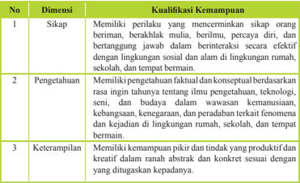

Tabel ini membahas kualifikasi kemampuan dalam konteks pendidikan, mencakup tiga dimensi utama: sikap, pengetahuan, dan keterampilan. Dimensi pertama, sikap, meliputi memiliki perilaku yang mendorong orang lain untuk beriman, berakhlak mulia, berlindungi, percaya diri, dan bertanggung jawab dalam berinteraksi secara efektif dengan lingkungan sosial dan lingkungan rumah, sekolah, dan tempat lainnya. Dimensi kedua, pengetahuan, mencakup pengetahuan faktil dan konseptual berdasarkan asas-asas ilmu pengetahuan, teknologi, seni, budaya dalam wawasan kemanusiaan, kehormatan, keagamaan, dan peradaban terkait fenomena kehidupan di lingkungan rumah, sekolah, dan tempat lainnya. Dimensi ketiga, keterampilan, mencakup kemampuan pikiran dan tindakan yang produktif dan kreatif dalam ranah abstrak dan konkrit sesuai dengan yang ditugaskan kepada diri. Pola penting yang terlihat adalah bahwa setiap dimensi memiliki tujuan dan tujuan yang spesifik dalam konteks pendidikan, mencakup aspek-aspek seperti sikap, pengetahuan, dan keterampilan.

 

---
## 📄 Halaman 19

### E. KI yang Ingin Dicapai

Berdasarkan  Peraturan  Pemerintah  Nomor  32  Tahun  2013  tentang  Standar Nasional Pendidikan (SNP) disebutkan bahwa KI Tingkat SMA/SMK adalah:

- Kompetensi adalah seperangkat sikap, pengetahuan, dan keterampilan yang harus dimiliki, dihayati, dan dikuasai oleh peserta didik setelah mempelajari suatu muatan pembelajaran, menamatkan suatu program, atau menyelesaikan Satuan Pendidikan tertentu.
- Kompetensi Inti adalah tingkat kemampuan untuk mencapai Standar Kompetensi  Lulusan  yang  harus  dimiliki  seorang  peserta  didik  pada  setiap tingkat kelas atau program.
- Kompetensi  Inti  sebagaimana  dimaksud  pada  ayat  (1)  mencakup:  sikap spiritual, sikap sosial, pengetahuan, dan keterampilan yang berfungsi sebagai pengintegrasi  muatan  pembelajaran,  mata  pelajaran  atau  program  dalam mencapai Standar Kompetensi Lulusan. Kompetensi Inti sebagaimana dimaksud  pada  ayat  (1)  merupakan  tingkat  kemampuan  untuk  mencapai Standar Kompetensi Lulusan yang harus dimiliki seorang peserta didik pada setiap  tingkat  kelas  atau  program  yang  menjadi  landasan  pengembangan Kompetensi Dasar (KD).
Lebih lanjut dalam pasal 77H ayat (1) penjelasan dari Kompetenisi Inti (KI) sebagai berikut:

- Yang  dimaksud  dengan  'Pengembangan Kompetensi Spiritual Keagamaan' mencakup perwujudan suasana belajar untuk meletakkan dasar perilaku baik yang bersumber dari nilai-nilai agama dan moral dalam konteks belajar dan berinteraksi sosial.
- Yang dimaksud dengan 'Pengembangan Sikap Personal dan Sosial' mencakup perwujudan suasana untuk meletakkan dasar kematangan sikap personal dan sosial dalam konteks belajar dan berinteraksi sosial.
- Yang dimaksud dengan 'Pengembangan Pengetahuan' mencakup perwujudan suasana untuk meletakkan dasar kematangan proses berikir dalam konteks belajar dan berinteraksi sosial.
- Yang dimaksud dengan 'Pengembangan Keterampilan' mencakup perwujudan suasana  untuk  meletakkan  dasar  keterampilan  dalam  konteks  belajar  dan berinteraksi sosial.

 

---
## 📄 Halaman 20

### Berikut adalah KI Tingkat SMA/SMK

Satuan Pendidikan

: SMA

Kelas/Program

: X

Kompetensi Inti :

KI 1

:  Menghayati dan mengamalkan ajaran agama yang dianutnya

KI 2

:  Menghayati  dan  mengamalkan  perilaku  jujur,  disiplin, tanggungjawab, peduli (gotong royong, kerjasama, toleran, damai), santun, responsif dan pro-aktif dan menunjukkan sikap sebagai bagian dari solusi atas berbagai permasalahan dalam berinteraksi secara efektif dengan lingkungan sosial dan alam serta dalam menempatkan diri sebagai cerminan bangsa dalam pergaulan dunia.

KI 3

:  Memahami, menerapkan, menganalisis pengetahuan faktual, konseptual, prosedural berdasarkan rasa ingintahunya tentang ilmu  pengetahuan,  teknologi,  seni,  budaya,  dan  humaniora dengan  wawasan  kemanusiaan,  kebangsaan,  kenegaraan, dan  peradaban  terkait  penyebab  fenomena  dan  kejadian, serta menerapkan  pengetahuan prosedural pada bidang kajian yang spesiik sesuai dengan bakat dan minatnya memecahkan masalah.

KI 4 :  Mengolah,  menalar,  dan  menyaji  dalam  ranah  konkret dan  ranah  abstrak    terkait  dengan  pengembangan  dari yang dipelajarinya di sekolah secara mandiri, dan mampu

menggunakan metoda sesuai kaidah keilmuan.

untuk

 

---
## 📄 Halaman 21

### F. Penilaian

### 1. Penilaian Sikap

### a.  Pengertian

Penilaian  sikap  adalah  penilaian  terhadap  kecenderungan  perilaku  siswa sebagai hasil pendidikan, baik di dalam kelas maupun di luar kelas. Penilaian sikap memiliki karakteristik yang berbeda dengan penilaian pengetahuan dan keterampilan, sehingga teknik penilaian yang digunakan juga berbeda. Dalam hal  ini,  penilaian  sikap  ditujukan  untuk  mengetahui  capaian  dan  membina perilaku serta budi pekerti siswa sesuai butir-butir  sikap dalam KD pada KI-1 dan KI-2.

Pada  mata  pelajaran    Pendidikan  Agama  dan  Budi  Pekerti,  dan  mata pelajaran Pendidikan Pancasila dan Kewarganegaraan (PPKn), KD pada KI-1 dan KD pada KI-2 disusun secara koheren dan linier dengan KD pada KI-3 dan KD pada KI-4. Sedangkan untuk mata pelajaran lain, KD pada KI-1 dan KD pada KI-2 dirumuskan secara umum dan terakumulasi menjadi satu KD pada KI-1 dan satu KD pada KI-2.

Penilaian sikap  spiritual dan sikap sosial dilakukan secara berkelanjutan oleh  guru  mata  pelajaran,  guru  bimbingan  konseling  (BK),  dan  wali  kelas dengan menggunakan observasi dan informasi lain yang valid dan relevan dari berbagai sumber. Penanaman sikap diintegrasikan pada setiap pembelajaran KD  dari  KI-3  dan  KI-4.  Selain  itu,  dapat  dilakukan  penilaian  diri (self assessment) dan penilaian antarteman (peer assessment) dalam  rangka pembinaan dan pembentukan karakter siswa, yang hasilnya dapat dijadikan sebagai salah satu data untuk konirmasi hasil penilaian sikap oleh guru. Hasi l penilaian sikap selama periode satu semester ditulis dalam bentuk deskripsi yang menggambarkan perilaku siswa.

Melalui  pembiasaan  dan  pembudayaan  sikap  spiritual  dan  sikap  sosial diharapkan siswa memiliki keseimbangan dalam hubungannya dengan Tuhan (ketakwaan) dan hubungannya dengan sesama serta lingkungan (budi pekerti luhur dan peduli lingkungan).

### b.  Teknik Penilaian Sikap

Penilaian sikap terutama dilakukan oleh guru mata  pelajaran, guru bimbingan  konseling  (BK),  dan  wali  kelas,  melalui  observasi  yang  dicatat dalam jurnal berupa catatan anekdot (anecdotal record) dan catatan kejadian tertentu (incidental record).

Dalam  pelaksanaan  penilaian  sikap  diasumsikan  setiap  siswa  memiliki perilaku yang baik, sehingga jika tidak dijumpai perilaku yang sangat baik atau kurang baik maka sikap siswa tersebut dianggap baik, sesuai dengan indikator yang  diharapkan.  Perilaku  sangat  baik  atau  kurang  baik  yang  dijumpai  di

 

---
## 📄 Halaman 22

kelas selama proses pembelajaran dicatat dalam jurnal guru mata pelajaran. Sedangkan perilaku siswa yang sangat baik atau kurang baik dan informasi lain  yang valid dan relevandi luar kelas, selain dicatat guru mata pelajaran, juga  menjadi  catatan  guru  BK  dan  wali  kelas.  Penilaian  diri  dan  penilaian antarteman dilakukan sebagai penunjang dan hasilnya digunakan untuk bahan konirmasi dalam rangka pembinaan dan pembentukan karakter siswa.

Rangkuman hasil penilaian sikap oleh guru mata pelajaran dan guru BK selama  satu  semester  dikumpulkan  kepada  walikelas,  kemudian  wali  kelas menggabungkan dan merangkum dalam bentuk deskripsi  yang akan diisikan ke dalam rapor setiap siswa di kelasnya. Skema penilaian sikap dapat dilihat pada gambar berikut.

---
**🖼️ Gambar/Diagram**

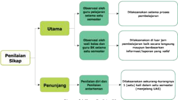

> **Deskripsi Visual:** Gambar ini adalah diagram yang menunjukkan proses penilaian sikap dan penunjang dalam kurikulum. Diagram ini terdiri dari tiga bagian utama: Utama, Penilaian Sikap, dan Penunjang. 

Pertama, bagian Utama menggambarkan langkah-langkah utama dalam proses penilaian, termasuk observasi guru, dilaksanakannya satu atau lebih proses pembelajaran, dan observasi oleh tujuan pembelajaran. 

Kedua, bagian Penilaian Sikap menunjukkan langkah-langkah untuk menilai sikap, seperti observasi sikap siswa, dilaksanakannya satu atau lebih proses pembelajaran, dan observasi oleh tujuan pembelajaran.

Terakhir, bagian Penunjang menunjukkan langkah-langkah untuk menilai penunjang, seperti penilaian diri dan antartematik, dilaksanakannya satu atau lebih proses pembelajaran, dan observasi oleh tujuan pembelajaran.

Teks, angka, atau label penting yang terlihat dalam diagram ini meliputi "Utama", "Penilaian Sikap", dan "Penunjang". Informasi kunci yang dapat diambil pembaca adalah bahwa proses penilaian sikap dan penunjang melibatkan observasi guru, dilaksanakannya proses pembelajaran, dan observasi oleh tujuan pembelajaran.

Berikut ini adalah penjelasan diagram 2.1 di atas.

### 1.  Observasi

Observasi dalam penilaian sikap siswa merupakan teknik yang dilakukan secara berkesinambungan melalui pengamatan perilaku yang sangat baik (positif) atau kurang baik (negatif) yang berkaitan dengan indikator sikap spiritual dan sikap sosial. Instrumen yang digunakan dalam observasi adalah lembar  observasi  atau  jurnal.  Hasil  observasi  dicatat  dalam  jurnal  yang dibuat selama satu semester oleh guru mata pelajaran, guru BK, dan wali kelas. Jurnal memuat catatan sikap atau perilaku siswa yang sangat baik atau  kurang  baik,  dilengkapi  dengan  waktu  terjadinya  perilaku  tersebut, dan butir-butir sikap. Berdasarkan catatan tersebut guru membuat deskripsi penilaian sikap siswa selama satu semester.

Beberapa  hal  yang  perlu  diperhatikan  dalam  melaksanakan  penilaian sikap dengan teknik observasi:

 

---
## 📄 Halaman 23

- Jurnal  digunakan  oleh  guru  mata  pelajaran,  guru  BK,  dan  wali  kelas selama periode satu semester.
- Jurnal  oleh  guru  mata  pelajaran  dibuat  untuk  seluruh  siswa  yang mengikuti mata pelajarannya. Jurnal oleh guru BK dibuat untuk semua siswa yang menjadi tanggung jawab bimbingannya, dan jurnal oleh wali kelas digunakan untuk 1 (satu) kelas yang menjadi tanggung jawabnya.
- Hasil  observasi  guru  mata  pelajaran  dan  guru  BK  diserahkan  kepada wali kelas untuk diolah lebih lanjut.
- Perilaku sangat baik atau kurang baik yang dicatat dalam jurnal tidak terbatas pada  butir-butir  sikap  (perilaku)  yang  hendak  ditumbuhkan melalui  pembelajaran  yang  saat  itu  sedang  berlangsung  sebagaimana dirancang dalam RPP, tetapi dapat mencakup butir-butir sikap lainnya yang  ditanamkan  dalam  semester  itu  jika  butir-butir    sikap  tersebut muncul/ditunjukkan oleh siswa melalui perilakunya.
- Catatan  dalam  jurnal  dilakukan  selama  satu  semester  sehingga  ada kemungkinan dalam satu hari perilaku yang sangat baik dan/atau kurang baik muncul lebwih dari satu kali atau tidak muncul sama sekali.
- perilaku siswa yang tidak menonjol (sangat baik atau kurang baik) tidak perlu dicatat dan dianggap siswa tersebut menunjukkan perilaku baik atau sesuai dengan yang diharapkan.
Nama Sekolah  : SMA Cipete, Jakarta Selatan

Tahun pelajaran : 2014/2015

Kelas/Semester   : X / Semester I

Mata Pelajaran  : Agama Hindu

---
**📊 Tabel**

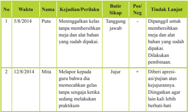

Tabel ini menunjukkan dua kasus kejadian dan perilaku siswa Putu dan Mita pada tahun 2014. Topik utama tabel adalah tindakan dan respons terhadap kejadian. Kolom-kolomnya meliputi nomor urut, waktu, nama siswa, kejadian/perilaku, butir sikap, posisi positif atau negatif, dan tindakan lanjutan. Data penting yang terlihat adalah bahwa Putu mengingatkan kelas tentang meja dan alat yang sudah dipakai, sedangkan Mita melaporkan guru tentang kesalahan dalam memecahkan gelas tanpa senjata. Kedua siswa tersebut diberi penilaian positif karena mereka berusaha menghormati aturan dan mengambil tindakan yang tepat.

 

---
## 📄 Halaman 24

---
**📊 Tabel**

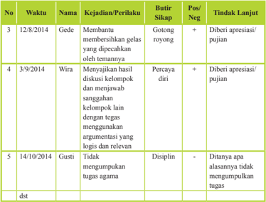

Tabel ini menunjukkan berbagai kejadian dan perilaku siswa di sekolah, dengan detail tentang waktu, nama siswa, kejadian/penilaian, butir sikap, posisi (Pos/Neg), dan tindakan lanjut. Topik utama adalah pengembangan karakter dan perilaku siswa. Kolom-kolomnya meliputi No., Waktu, Nama, Kejadian/Perilaku, Butir Sikap, Pos/Neg, dan Tindakan Lanjut. Data penting yang terlihat antara lain bahwa Gede membutuhkan bimbingan dalam mengembangkan sikap gotong-royong, Wira perlu diberi apresiasi karena percaya dirinya, dan Gusti perlu diberi motivasi untuk mengumpulkan tugas agama.

Jika seorang siswa menunjukkan perilaku yang kurang baik, guru harus segera menindaklanjutinya dengan melakukan pendekatan dan pembinaan, sehingga secara bertahap siswa tersebut dapat menyadari dan memperbaiki sendiri perilakunya menjadi lebih baik.

Tabel 2.2 dan Tabel 2.3 berturut-turut menyajikan contoh jurnal penilaian sikap spiritual dan sikap sosial yang dibuat oleh wali kelas dan/atau guru BK. Satu jurnal digunakan untuk satu kelas.

Nama Sekolah  : SMA Cipete

Kelas/Semester : X/Semester I

Tahun pelajaran : 2014/2015

---
**📊 Tabel**

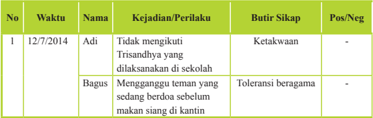

Tabel ini menunjukkan data tentang kejadian atau perilaku yang dilaporkan oleh seorang siswa bernama Adi pada tanggal 12 Desember 2014. Topik utama tabel adalah tentang sikap dan perilaku Adi terhadap orang lain dan lingkungan sekitarnya. Kolom-kolom yang ada dalam tabel meliputi nomor urut, waktu, nama, kejadian/perilaku, butir sikap, dan posisi negatif atau positif. Data penting yang terlihat dalam tabel adalah bahwa Adi tidak mengikuti Trisandhyana yang dilaksanakan di sekolahnya, namun bagus menganggurkan teman yang sedang berdoa sebelum makan siang di kantin. Sementara itu, butir sikap Adi adalah ketakwaan dan toleransi beragama.

 

---
## 📄 Halaman 25

---
**📊 Tabel**

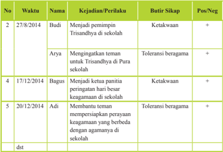

Tabel ini menunjukkan berbagai tindakan positif yang dilakukan oleh beberapa siswa di sekolah pada tahun 2014. Topik utama tabel adalah keberhasilan dan peran siswa dalam membangun lingkungan yang harmonis dan toleran beragama. Kolom-kolom yang ada meliputi nomor urut, waktu, nama siswa, kejadian/perilaku, butir sikap, dan posisi atau negatifnya. Data penting yang terlihat adalah bahwa Budi menjadi pemimpin Trisandhyda di sekolah, Arya mengingatkan teman untuk Trisandhyda di Pura sekolah, Bagus menjadi ketua panitia peringatan hari besar keagamaan di sekolah, dan Adi membantu teman mempersiapkan perayaan keagamaan yang berbeda dengan agamanya di sekolah. Pola umum yang terlihat adalah bahwa semua tindakan tersebut mencerminkan sikap ketakwaan dan toleransi beragama, yang merupakan nilai-nilai penting yang harus dimiliki oleh setiap individu dalam masyarakat.

Nama Sekolah  : SMA Cipete

Kelas/Semester : X/Semester I

Tahun pelajaran : 2014/2015

---
**📊 Tabel**

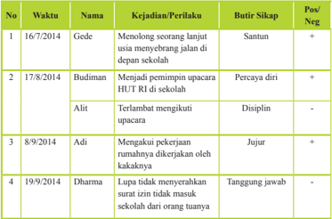

Tabel ini menunjukkan laporan perilaku siswa di sekolah selama beberapa bulan. Topik utamanya adalah perilaku dan sikap siswa terhadap tugas dan tanggung jawab mereka. Kolom-kolomnya meliputi nomor urut, waktu, nama siswa, kejadian atau perilaku yang dilaporkan, butir sikap, posisi atau negatif, dan posisi atau negatif. Data penting yang terlihat adalah bahwa Gede menganggap usia sebagai alasan untuk tidak menyelesaikan tugas, Budiman percaya diri dalam mengambil keputusan, Alit disiplin dalam mengikuti upacara, Adi jujur dalam mengakui pekerjaannya, dan Dharma tidak tanggung jawab dalam menyelesaikan tugas karena tidak menerima surat izin dari orang tuanya.

 

---
## 📄 Halaman 26

---
**📊 Tabel**

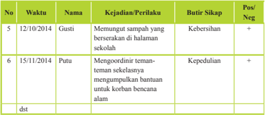

Tabel ini menunjukkan data tentang kegiatan dan perilaku siswa di sekolah pada dua tanggal tertentu. Topik utama tabel adalah kegiatan dan perilaku siswa, termasuk kebersihan, kedisiplinan, dan koordinasi tim. Kolom-kolom yang ada meliputi nomor urut, waktu, nama siswa, kejadian/penilaian, butir sikap, dan posisi siswa (Pos/Neg). Data penting yang terlihat adalah bahwa Gusti memanggil sampah dengan baik, sedangkan Putu mengkoordinir teman-temannya untuk membantu korban bencana alam. Pola umumnya menunjukkan bahwa siswa memiliki sikap positif dan disiplin dalam menjalankan tugas mereka.

### 2.  Penilaian diri

Penilaian diri dalam penilaian sikap merupakan penilaian dengan cara meminta siswa untuk mengemukakan kelebihan dan kekurangan dirinya dalam  berperilaku.  Hasil  penilaian  diri  siswa  dapat  digunakan  sebagai data konirmasi. Penilaiandiri dapat memberi dampak positif terhadap perkembangan kepribadian siswa, antara lain:

- dapat  menumbuhkan  rasa  percaya  diri  siswa,  karena  mereka  diberi kepercayaan untuk menilai dirinya sendiri;
- siswa menyadari kekuatan dan kelemahan dirinya, karena ketika mereka melakukan penilaian, harus melakukan introspeksi terhadap kekuatan dan  kelemahan yang dimiliki;
- dapat  mendorong,  membiasakan,  dan  melatih  siswa  untuk  berbuat jujur, karena mereka dituntut untuk jujur dan objektif dalam melakukan penilaian.
Instrumen yang digunakan untuk penilaian diri berupa lembar penilaian diri yang dirumuskan secara sederhana, namun jelas dan tidak bermakna ganda, dengan bahasa lugas yang dapat dipahami siswa, dan menggunakan format  sederhana  yang  mudah  diisi  siswa.  Lembar  penilaian  diri  dibuat sedemikian rupa sehingga dapat menunjukkan sikap siswa dalam situasi yang nyata/sebenarnya, bermakna, dan mengarahkan siswa  mengidentiikasi kekuatan atau kelemahannya. Hal ini untuk menghilangkan kecenderungan siswa  menilai  dirinya  secara    subjektif.  Penilaian  diri  oleh  siswa  perlu dilakukan melalui langkah-langkah sebagai berikut:

- Menjelaskan kepada siswa tujuan penilaian diri.
- Menentukan indikator yang akan dinilai.
- Menentukan kriteria penilaian yang akan digunakan.
- Merumuskan format penilaian, dapat berupa daftar cek (checklist) atau skala penilaian (rating scale) .

 

---
## 📄 Halaman 27

### Contoh 1: lembar penilaian diri menggunakan daftar cek (checklist) :

Nama

: ...............................................

Kelas/Semester : ..................../..........................

Petunjuk:

- Bacalah baik-baik setiap pernyataan dan berilah tanda √ pada kolom yang sesuai dengan keadaan dirimu yang sebenarnya!
- Serahkan kembali format yang sudah kamu isi kepada bapak/ibu guru!

---
**📊 Tabel**

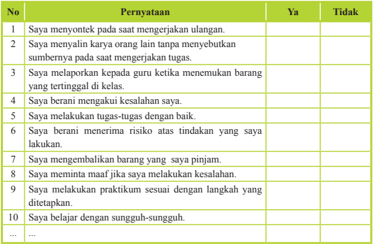

Tabel ini berisi pernyataan tentang perilaku positif dan negatif dalam proses belajar mengajar. Topik utamanya adalah tentang sikap dan perilaku yang diharapkan dari siswa dalam menghadapi ujian atau tugas. Kolom "Ya" menunjukkan perilaku yang dianggap positif, sedangkan kolom "Tidak" menunjukkan perilaku yang dianggap negatif. Data penting yang terlihat adalah bahwa sebagian besar pernyataan (9 dari 10) dianggap positif oleh siswa, menunjukkan bahwa mereka cenderung memiliki sikap positif dalam menghadapi ujian atau tugas.

Pernyataan pada format di atas hanya contoh. Pernyataan tersebut ada yang bersifat positif (No.3 s.d.10) dan ada yang bersifat negatif (no.1, 2). Pada waktu membuat rekapitulasi, guru perlu memilahnya dengan bijaksana. Guru hendaknya berkreasi menyusun sendiri pernyataan atau  pertanyaan yang lebih sesuai untuk format penilaian diri siswanya.

Penilaian diri  tidak  hanya  digunakan untuk menilai sikap, tetapi juga dapat digunakan untuk menilai kompetensi pengetahuan dan keterampilan.

 

---
## 📄 Halaman 28

Contoh 2 :  lembar  penilaian  diri  menggunakan  skala  penilaian (rating scale) pada waktu kegiatan kelompok

Nama

: ...............................................

Kelas/Semester : ..................../..........................

Petunjuk :

- Bacalah baik-baik setiap pernyataan dan dengan keadaan dirimu yang sebenarnya! Keterangan angka pada setiap kolom sebagai berikut: 4 artinya selalu; 3 = sering; 2 = jarang, dan 1 = tidak pernah.
- Serahkan kembali format yang sudah kamu isi kepada bapak/ibu guru!

### 3.  Penilaian antarsiswa/antarteman

Penilaian  antarsiswa/antarteman  merupakan  penilaian  dengan  cara meminta  siswa  untuk  saling  menilai  perilaku  temannya.  Sebagaimana penilaian  diri,  hasil  penilaian  antarteman  dapat  digunakan  sebagai  data konirmasi. Instrumen yang digunakan berupa lembar penilaian antarteman. Kriteria instrumen penilaian antarteman:

- Sesuai dengan indikator yang akan diukur.
- Indikator dapat diukur melalui pengamatan siswa.
- Kriteria penilaian dirumuskan secara sederhana, namun jelas dan tidak berpotensi munculnya penafsiran makna ganda/berbeda.
- Menggunakan bahasa lugas yang dapat dipahami siswa.
- Menggunakan format sederhana dan mudah digunakan oleh siswa.
- Indikator menunjukkan sikap/perilaku siswa dalam situasi yang nyata atau sebenarnya dan dapat diukur.
Penilaian antarteman paling cocok dilakukan pada saat siswa mengerjakan kegiatan kelompok. Misalnya setiap siswa diminta melakukan pengamatan/penilaian  terhadap  dua  orang  temannya,  dan  dia  juga  akan dinilai oleh dua orang teman dalam kelompoknya, sebagaimana diagram pada gambar berikut.

berilah tand

 

---
## 📄 Halaman 29

Diagram di atas menggambarkan saling menilai sikap/perilaku antarteman.

- Siswa A mengamati dan menilai B dan E; A juga dinilai oleh B dan E
- Siswa B mengamati dan menilai A dan C; B juga dinilai oleh A dan C
- Siswa C mengamati dan menilai B dan D; C juga dinilai oleh B dan D
- Siswa D mengamati dan menilai C dan E; D juga dinilai oleh C dan E
- Siswa E mengamati dan menilai D dan A; E juga dinilai oleh D dan A Contoh  instrumen  penilaian  (lembar  pengamatan)  antarteman (peer assessment) menggunakan  daftar  cek (checklist) pada  waktu  bekerja kelompok.

### Petunjuk:

- Amatilah perilaku 2 orang temanmu  selama  mengikuti  kegiatan kelompok!
- Isilah kolom yang tersedia dengan tanda cek (√) jika menunjukkan perilaku yang sesuai dengan pernyataan untuk indikator yang kamu amati atau tanda strip (-) jika temanmu tidak menunjukkan perilaku tersebut!
- Serahkan hasil pengamatan kepada bapak/ibu guru!
Nama teman yang dinilai

: 1. ………………2. ……………

Nama penilai

: ………………………………….

Kelas/Semester

: ………………………………….

temanmu

 

---
## 📄 Halaman 30

Pernyataan-pernyataan untuk Indikator yang diamati pada format di atas hanya contoh. Pernyataan tersebut ada yang bersifat positif (nomor 1, 2, 3, 6, 8) dan ada yang bersifat negatif (nomor 4, 5, dan 7). Guru hendaknya dapat berkreasi membuat sendiri pernyataan atau pertanyaan yang lebih sesuai untuk indikator yang diamati dengan memperhatikan kriteria instrumen penilaian antarteman.

Lembar penilaian diri dan penilaian antarteman yang telah diisi dikumpulkan kepada guru, selanjutnya dipilah dan dibuat rekapitulasinya untuk ditindaklanjuti. Guru  dapat  menganalisis  jurnal  atau  data/informasi  hasil  observasi  penilaian sikap yang dilakukannya dengan data/informasi hasil penilaian diri dan penilaian antarteman  ( triangulasi )  sebagai  bahan  pembinaan.  Hasil  analisis  dinyatakan dalam deskripsi sikap spiritual dan sikap sosial yang perlu segera ditindaklanjuti. Kepada siswa yang menunjukkan banyak perilaku positif diberi apresiasi/pujian dan siswa yang menunjukkan banyak perilaku negatif diberi motivasi sehingga selanjutnya siswa tersebut dapat membiasakan diri berperilaku baik (positif).

### 2. Penilaian Pengetahuan

### a.  Pengertian Penilaian Pengetahuan

Penilaian  pengetahuan  merupakan  penilaian  untuk  mengukur  kemampuan siswa yang meliputi pengetahuan faktual, konseptual, prosedural, dan metakognitif serta kecakapan berpikir tingkat rendah hingga tinggi. Penilaian ini berkaitan dengan ketercapaian Kompetensi Dasar pada KI-3 yang dilakukan oleh  guru  mata  pelajaran.Penilaian  pengetahuan  dilakukan  dengan  berbagai teknik penilaian. Guru memilih teknik penilaian yang sesuai dengan karakteristik kompetensi  yang  akan  dinilai.  Penilaian  dimulai  dengan  perencanaan  yang dilakukan pada saat menyusun rencana pelaksanaan pembelajaran (RPP) yang mengacu pada silabus.

Penilaian  pengetahuan,  selain  untuk  mengetahui  apakah  siswa  telah mencapai ketuntasan belajar (mastery learning) ,  juga  untuk  mengidentiikasi kelemahan  dan  kekuatan penguasaan  pengetahuan  siswa dalam  proses pembelajaran (diagnostic). Untuk  itu,  pemberian  umpan  balik (feedback) kepada  siswa  dan  guru  merupakan  hal  yang  sangat  penting,  sehingga  hasil penilaian dapat segera digunakan untuk perbaikan mutu pembelajaran. Hasil penilaian pengetahuan yang dilakukan selama dan setelah proses pembelajaran dinyatakan dalam bentuk angka dengan rentang 0-100.

Ketuntasan belajar untuk kompetensi pengetahuan paling rendah 60. Namun secara  bertahap  sekolah  harus  meningkatkan  kriteria    ketuntasan  di  atas  60 dengan mempertimbangkan kondisi siswa dan pendukung pembelajaran.

 

---
## 📄 Halaman 31

### b.  Teknik Penilaian Pengetahuan

Berbagai teknik penilaian pada kompetensi pengetahuan dapat digunakan sesuai dengan karakteristik masing-masing KD. Teknik yang biasa digunakan adalah tes tertulis, tes lisan,  dan  penugasan. Namun tidak menutup kemungkinan digunakan teknik lain yang sesuai, misalnya portofolio dan observasi. Skema penilaian pengetahuan dapat dilihat pada gambar berikut.

---
**🖼️ Gambar/Diagram**

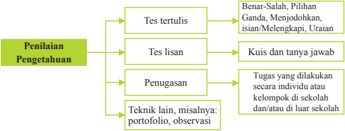

> **Deskripsi Visual:** Gambar ini adalah diagram yang menunjukkan struktur penilaian pengetahuan dalam kurikulum. Diagram ini terdiri dari empat bagian utama: Tes tertulis, Tes isian, Penugasan, dan Teknik lain, misalnya/portfolio/observasi. 

Tes tertulis terdiri dari dua pilihan: Benar-Salah dan Pilihan Ganda. Untuk tes tertulis, ada dua opsi jawaban: benar atau salah. Sedangkan untuk tes ganda, peserta didik harus memilih satu jawaban dari beberapa pilihan yang diberikan.

Tes isian juga memiliki dua pilihan: Kuis dan Tanya Jawab. Dalam kuis, peserta didik harus menjawab pertanyaan dengan mengisi kisi yang disediakan. Sementara dalam tanya jawab, peserta didik harus menjawab pertanyaan yang diberikan oleh pengajar.

Penugasan mencakup tugas yang dilakukan secara individu atau kelompok di sekolah dan/atau luar sekolah. Tugas ini bisa berupa observasi, misalnya, atau portofolio.

Teknik lain, misalnya/portfolio/observasi, mencakup metode penilaian lain seperti observasi atau portofolio.

Elemen-elemen utama dalam diagram ini adalah tes tertulis, tes isian, penugasan, dan teknik lain. Relasi antara elemen-elemen ini adalah bahwa setiap jenis penilaian memiliki tujuan dan cara penilaian yang berbeda-beda. Tes tertulis dan tes isian digunakan untuk menilai pengetahuan seseorang, sedangkan penugasan dan teknik lain digunakan untuk menilai keterampilan dan kemampuan seseorang.

Teks, angka, atau label penting yang terlihat dalam diagram ini adalah jenis penilaian (tes tertulis, tes isian, penugasan, dan teknik lain), dan informasi tentang cara penilaian masing-masing jenis penilaian.

Informasi kunci yang dapat diambil pembaca adalah bahwa penilaian pengetahuan dalam kurikulum meliputi berbagai jenis penilaian, termasuk tes tertulis, tes isian, penugasan, dan teknik lain. Setiap jenis penilaian memiliki tujuan dan cara penilaian yang berbeda

Berikut ini adalah penjelasan dari skema pada diagram di atas.

### a)  Tes Tertulis

Tes tertulis adalah tes yang soal dan jawaban disajikan secara tertulis untuk mengukur atau memperoleh informasi tentang kemampuan peserta tes.  Tes  tertulis  menuntut  adanya  respons  dari  peserta  tes  yang  dapat dijadikan sebagai representasi dari kemampuan yang dimilikinya.

Instrumen tes tertulis dapat berupa soal pilihan ganda, isian, jawaban singkat,  benar-salah,  menjodohkan,  dan  uraian.Pengembangan instrumen tes tertulis mengikuti langkah-langkah berikut:

- Menetapkan tujuan tes, apakah tujuan tes untuk seleksi, penempatan, diagnostik, formatif, atau sumatif.
- Menyusun  kisi-kisi.  Kisi-kisi  merupakan  spesiikasi  yang  digunakan sebagai acuan menulis soal. Di dalam kisi-kisi tertuang rambu-rambu tentang kriteria soal yang akan ditulis, meliputi KD yang akan diukur, materi, indikator soal, bentuk soal, dan nomor soal. Dengan adanya kisikisi,  penulisan soal lebih terarah karena sesuai dengan tujuan tes dan proporsi soal per KD atau materi yang hendak diukur lebih tepat.
- Menulis soal berdasarkan kisi-kisi dan kaidah penulisan soal.
- Menyusun pedoman  penskoran sesuai dengan bentuk soal yang digunakan. Untuk soal pilihan ganda, isian, menjodohkan, dan jawaban singkat disediakan kunci jawaban karena jawabannya sudah pasti dan dapat  diskor  dengan  objektif.  Untuk  soal  uraian  disediakan  pedoman

 

---
## 📄 Halaman 32

penskoran  yang  berisi  alternatif  jawaban  dan  rubrik  dengan  rentang skornya.

- Melakukan analisis kualitatif (telaah soal) sebelum soal diujikan.
Bentuk soal yang sering digunakan di SMA adalah pilihan ganda (PG) dan uraian.

### Contoh Kisi-Kisi

Nama Sekolah   : SMA Cipete - Jakarta selatan

Kelas/Semester : X /Semester 2

Tahun pelajaran : 2014/2015

Mata Pelajaran  : Agama Hindu

---
**📊 Tabel**

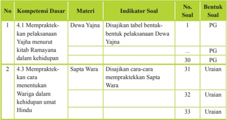

Tabel ini berisi informasi tentang kompetensi dasar yang harus dipelajari oleh siswa dalam mempraktekkan prinsip-prinsip keagamaan Hindu. Topik utama tabel adalah "Mempraktekkan pelaksanaan Yajna" dan "Mempraktekkan wariga dalam kehidupan umat Hindu". Tabel dibagi menjadi tiga kolom: No., Materi, dan Indikator Soal. Kolom No. menunjukkan nomor urut soal, materi, atau indikator soal. Kolom Materi menyebutkan topik yang akan dipelajari, seperti Dewa Yajna dan Saptara Wara. Kolom Indikator Soal memberikan detail tentang apa yang harus dipelajari, seperti disajikan tabel bentuk-bentuk pelaksanaan Dewa Yajna dan disajikan cara-cara mempraktekkan Saptara Wara. Data penting yang terlihat adalah bahwa tabel ini mencakup 33 soal yang harus dipelajari, dengan 12 soal berkaitan dengan Dewa Yajna dan 21 soal berkaitan dengan Saptara Wara.

Selanjutnya  dalam  mengembangkan  butir  soal  perlu  memperhatikan kaidah penulisan butir soal yang meliputi substansi/materi, konstruksi, dan bahasa.

### 1)  Tes tulis bentuk pilihan ganda

Butir  soal  pilihan  ganda  terdiri  atas  pokok  soal  ( stem )  dan  pilihan jawaban  ( option ).  Untuk  tingkat  SMA  biasanya  digunakan  5  (lima) pilihan jawaban. Dari kelima pilihan jawaban tersebut, salah satu adalah kunci  ( key )  yaitu  jawaban  yang  benar  atau  paling  tepat,  dan  lainnya disebut pengecoh ( distractor ).

Kaidahpenulisan soal bentuk pilihan ganda sebagai berikut:

- Substansi/Materi
- → Soal sesuai dengan indikator (menuntut tes bentuk PG).
- → Materi yang diukur sesuai dengan kompetensi (UKRK: Urgensi,

 

---
## 📄 Halaman 33

- Keberlanjutan, Relevansi, dan Keterpakaian).
- → Pilihan jawaban homogen dan logis.
- → Hanya ada satu kunci jawaban yang tepat.

### ●  Konstruksi

- → Pokok soal dirumuskan dengan singkat, jelas, dan tegas.
- → Rumusan pokok soal dan pilihan jawaban merupakan pernyataan yang diperlukan saja.
- → Pokok soal tidak memberi petunjuk kunci jawaban.
- → Pokok soal tidak menggunakan pernyataan negatif ganda.
- → Gambar/graik/tabel/diagram dan sebagainya jelas dan berfungsi.
- → Panjang rumusan pilihan jawaban relatif sama.
- → Pilihan jawaban tidak menggunakan pernyataan 'semua jawaban benar' atau 'semua jawaban salah'.
- → Pilihan jawaban yang berbentuk angka atau waktu disusun berdasarkan besar kecilnya angka atau kronologis kejadian.
- → Butir soal tidak bergantung pada jawaban soal sebelumnya.

### ●  Bahasa

- → Menggunakan bahasa yang sesuai dengan kaidah Bahasa Indonesia.
- → Menggunakan bahasa yang komunikatif.
- → Pilihan jawaban tidak mengulang kata/kelompok kata yang sama, kecuali merupakan satu kesatuan pengertian.
- → Tidak menggunakan bahasa yang berlaku setempat/tabu.

### Contoh  butir  soal  pilihan  ganda  mata  pelajaran Agama  Hindu  berdasarkan contoh kisi-kisi di atas

### Rumusan butir soal:

Perhatikan data mempraktekkan Yajna

 

---
## 📄 Halaman 34

### 2)  Tes tulis bentuk uraian

Tes tulis  bentuk  uraian  atau  esai  menuntut  siswa  untuk  mengorganisasikan dan menuliskan jawaban dengan kalimatnya sendiri.

Kaidah penulisan soal bentuk uraian sebagai berikut:

### ●  Substansi/Materi

- → Soal sesuai dengan indikator (menuntut tes bentuk uraian)
- → Batasan pertanyaan dan jawaban yang diharapkan sesuai
- → Materi yang diukur sesuai dengan kompetensi (UKRK)
- → Isi materi yang ditanyakan sesuai dengan jenjang, jenis sekolah, dan tingkat kelas

### ●  Konstruksi

- → Ada petunjuk yang jelas mengenai cara mengerjakan soal
- → Rumusan kalimat soal/pertanyaan menggunakan kata tanya atau perintah yang menuntut jawaban terurai
- → Gambar/graik/tabel/diagram dan sejenisnya harus jelas dan berfungsi
- → Ada pedoman penskoran

### ●  Bahasa

- → Rumusan kalimat soal/pertanyaan komunikatif
- → Butir soal menggunakan bahasa Indonesia yang baku
- → Tidak mengandung kata-kata/kalimat yang menimbulkan penafsiran ganda atau salah pengertian
- → Tidak mengandung kata yang menyinggung perasaan
- → Tidak menggunakan bahasa yang berlaku setempat/tabu

### Contoh Rumusan butir soal uraian berdasarkan contoh kisi-kisi di atas:

Perhatikan informasi berikut untuk menjawab pertanyaan nomor 31.

Siswa kelas X SMA Cipete Jakarta Selatan secara berkelompok melakukan praktek menentukan padewasan. Setelah melakukan pengamatan hasil praktek, mereka  mencatat  data,  mengolah,  dan  menginterpretasikannya.  Selanjutnya perwakilan kelompok menyajikan hasil perhitungan di depan kelas dan ditanggapi kelompok lain.

Kelompok satu menanggapi hasil perhitungan  kelompok  tiga  yang  berbeda dengan hasil praktek mereka. Menurut kelompok satu ada hal yang perlu diperiksa ulang karena hasil perhitungan kurang tepat, sehingga kesimpulannya meragukan.

### Pertanyaan:

Tunjukkan data perhitungan yang kurang tepat dan beri lima alasan terhadap jawabanmu yang berkaitan dengan praktek menentukan padewasan.

 

---
## 📄 Halaman 35

### Pedoman penskoran

---
**📊 Tabel**

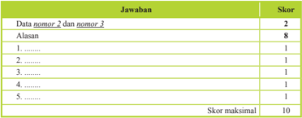

Tabel ini menunjukkan skor untuk dua nomor soal, yaitu nomor 2 dan nomor 3. Skor maksimal untuk kedua soal adalah 10 poin. Soal nomor 2 diberikan skor 8 poin, sedangkan soal nomor 3 diberikan skor 2 poin. Dalam tabel ini, setiap jawaban memiliki skor tertentu, dengan skor tertinggi 8 poin dan skor terendah 1 poin. Topik utama tabel ini adalah penilaian atau skor untuk dua soal tertentu dalam sebuah ujian atau tes. Kolom-kolom yang ada dalam tabel ini meliputi nomor soal (2 dan 3), jawaban, dan skor. Data penting yang terlihat dalam tabel ini adalah bahwa skor maksimal untuk kedua soal adalah 10 poin, dan skor tertinggi yang diberikan adalah 8 poin untuk soal nomor 2.

### b)  Tes lisan

Tes lisan merupakan pemberian soal/pertanyaan yang menuntut siswa menjawabnya secara lisan, dan dapat diberikan secara klasikal pada waktu pembelajaran.  Jawaban  siswa  dapat  berupa  kata,  frase,  kalimat  maupun paragraf. Tes lisan menumbuhkan sikap siswa untuk berani berpendapat. Rambu-rambu pelaksanaan tes lisan:

- Tes  lisan  dapat  digunakan  untuk  mengambil  nilai  ( assessment  of learning )  dan  dapat  juga  digunakan  sebagai  fungsi  diagnostik  untuk mengetahui pemahaman siswa terhadap kompetensi dan materi pembelajaran ( assessment for learning ).
- Pertanyaan harus sesuai dengan tingkat kompetensi dan lingkup materi pada kompetensi dasar yang dinilai
- Pertanyaan  diharapkan  dapat  mendorong  siswa  dalam  mengonstruksi jawabannya sendiri.
- Pertanyaan disusun dari yang sederhana ke yang lebih komplek.

### c)  Penugasan

Penugasan  adalah  pemberian  tugas  kepada  siswa  untuk  mengukur dan/atau  meningkatkan  pengetahuan.  Penugasan  yang  digunakan  untuk mengukur kompetensi pengetahuan (assessment of  learning) dapat  dilakukan setelah proses pembelajaran sedangkan penugasan yang digunakan untuk meningkatkan pengetahuan (assessment  for  learning) diberikan  sebelum dan/atau  selama  proses  pembelajaran.Penugasan  dapat  berupa  pekerjaan rumah  dan/atau  proyek  yang  dikerjakan  secara  individu  atau  kelompok sesuai dengan karakteristik tugas.Penugasan lebih ditekankan pada pemecahan masalah dan tugas produktif  lainnya.

 

---
## 📄 Halaman 36

Rambu-rambu penugasan:

- Tugas mengarah pada pencapaian indikator hasil belajar.
- Tugas  dapat  dikerjakan  oleh  siswa,  selama  proses  pembelajaran  atau merupakan bagian dari pembelajaran mandiri.
- Pemberian tugas disesuaikan dengan taraf perkembangan siswa.
- Materi penugasan harus sesuai dengan cakupan kurikulum.
- Penugasan  ditujukan  untuk  memberikan  kesempatan  kepada  siswa menunjukkan  kompetensi  individualnya  meskipun  tugas  diberikan secara kelompok.
- Untuk  tugas  kelompok,  perlu  dijelaskan  rincian  tugas  setiap  anggota kelompok.
- Tampilan kualitas hasil tugas yang diharapkan disampaikan secara jelas.
- Penugasan harus mencantumkan rentang waktu pengerjaan tugas.

### Contoh penugasan

Mata Pelajaran

: Agama Hindu

Kelas/Semester

: X/1

Tahun Pelajaran

: 2014/2015

Kompetensi Dasar

: 1.1 Menghayati nilai-nilai Yajňa yang terkandung dalam Kitab Ramayana.

Indikator

: Menunjukkan nilai-nilai Yajňa apa saja yang terkandung dalam Kitab Ramayana.

Rincian tugas :

- Mencari sloka yang menggambarkan nilai Yajna
- Mencari bagian-bagian cerita Ramayana yang menggambarkan adanya nilai Yajna.
- Buatlah  laporan  hasil  penghayatan  nilai-nilai  Yajna  yang  terdapat  dalam Ramayana dengan tampilan yang menarik dan menggunakan bahasa Indonesia yang benar sehingga mudah dipahami. Laporan meliputi pendahuluan (latar belakang, identiikasi masalah, tujuan dan manfaat penyusunan laporan, slokasloka dan bagian-bagian cerita yang terdapat dalam Ramayana) dan prakteknya dalam kehidupan.

 

---
## 📄 Halaman 37

---
**📊 Tabel**

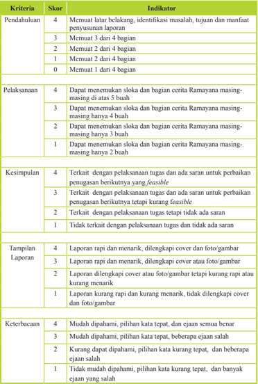

Tabel ini menunjukkan kriteria evaluasi untuk penulisan laporan, dengan skor dan indikator yang ditentukan untuk setiap kriteria. Topik utama tabel adalah proses penulisan laporan, yang meliputi pendahuluan, pelaksanaan, kesimpulan, tampilan laporan, dan keterbacaan. Kolom-kolomnya mencakup skor (4 hingga 0) dan indikator yang harus dicapai untuk mendapatkan skor tertentu. Data penting yang terlihat adalah bahwa skor tertinggi adalah 4, yang berarti semua indikator harus dicapai untuk mendapatkan skor tertinggi. Skor 3 juga cukup tinggi, menunjukkan bahwa sebagian besar indikator harus dicapai. Skor 2 dan 1 menunjukkan bahwa beberapa indikator masih harus dicapai, sementara skor 0 menunjukkan bahwa semua indikator belum dicapai.

 

---
## 📄 Halaman 38

### Contoh pengisian hasil penilaian tugas

---
**🖼️ Gambar/Diagram**

> **Deskripsi Visual:** Gambar ini adalah diagram yang menunjukkan skor siswa Adi dalam berbagai aspek pembelajaran. Diagram ini terdiri dari kolom-kolom yang mencakup nama siswa, aspek pembelajaran (Pendidikan, Pelaksanaan, Keterampilan, Tampilan, Keterampilan), jumlah skor untuk setiap aspek, dan nilai akhir. Untuk Adi, skor tertinggi diperoleh dalam aspek Pendidikan dengan 4, sedangkan skor terendah diperoleh dalam aspek Pelaksanaan dengan 2. Nilai akhir Adi adalah 70. Diagram ini memberikan gambaran umum tentang performa Adi dalam berbagai aspek pembelajaran.

---
**📊 Tabel**

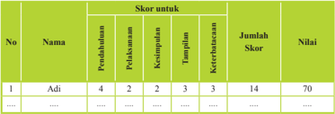

Tabel ini menunjukkan detail evaluasi siswa bernama Adi dalam berbagai aspek pembelajaran. Topik utama tabel adalah skor yang diberikan kepada Adi untuk berbagai kriteria pembelajaran, seperti pendahuluan, pelaksanaan, kestabilan, tampilan, dan keterampilan. Kolom-kolomnya mencakup nomor urut (No), nama siswa (Nama), skor untuk setiap kriteria pembelajaran, jumlah skor keseluruhan, dan nilai akhir (Nilai). Data penting yang terlihat adalah bahwa Adi mendapatkan skor tertinggi pada kriteria tampilan dengan 3 poin, sedangkan skor terendahnya adalah pada kriteria kestabilan dengan 2 poin. Nilai akhir Adi adalah 70, yang menunjukkan bahwa ia telah memperoleh penilaian yang cukup baik dalam berbagai aspek pembelajaran.

### Keterangan:

- Skor maksimal = banyaknya kriteria x skor tertinggi setiap kriteria. Pada contoh di atas, skor maksimal  = 5 x 4= 20.
- Nilai tugas = (Jumlah skor perolehan: skor maks) x 100.
- Pada contoh di atas nilai tugas Adi = (14 : 20) x 100 = 70.
- Observasi
Observasi bukan hanya dilakukan untuk menilai sikap, namun penilaian terhadap pengetahuan siswa dapat juga dilakukan melalui observasi selama proses pembelajaran, misalnya pada waktu  diskusi atau kegiatan kelompok. Teknik ini adalah cerminan dari penilaian autentik.

### Contoh format observasi terhadap diskusi kelompok

---
**📊 Tabel**

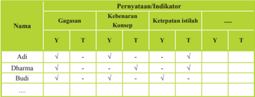

Tabel ini menunjukkan keragaman gagasan, kebenaran konsep, ketepatan istilah, dan kesesuaian (K) untuk tiga kata kunci: Adi, Dharma, dan Budi. Topik utama tabel adalah analisis kualitas gagasan, kebenaran konsep, dan ketepatan istilah dalam konteks teks tertentu. Kolom-kolomnya meliputi:

1. Nama: Menunjukkan kata kunci yang akan diuji.
2. Gagasan: Menyatakan apakah gagasan tersebut benar (Y), tidak benar (T), atau tidak diketahui (-).
3. Kebenaran Konsep: Menyatakan apakah gagasan tersebut benar secara konseptual (Y), tidak benar (T), atau tidak diketahui (-).
4. Ketepatan Istilah: Menyatakan apakah istilah yang digunakan tepat (Y), tidak tepat (T), atau tidak diketahui (-).
5. Kesesuaian (K): Menyatakan apakah gagasan, kebenaran konsep, dan ketepatan istilah saling sesuai (Y), tidak sesuai (T), atau tidak diketahui (-).

Data penting yang terlihat adalah bahwa gagasan, kebenaran konsep, dan ketepatan istilah sering kali tidak saling sesuai, dengan beberapa kasus di mana gagasan dan kebenaran konsep tidak sesuai tetapi ketepatan istilah sesuai, dan sebaliknya. Ini menunjukkan adanya perbedaan antara pemahaman teks secara harfiah dan pemahaman konseptual.

### Keterangan:

Diisi tanda cek (√) : Y = ya/benar/tepat; T = tidak tepat

Hasil  yang  diperoleh  dari  observasi  digunakan  untuk  mendeteksi  kelemahan/ kekuatan penguasaan kompetensi pengetahuan dan memperbaiki proses pembelajaran khususnya pada indikator yang belum muncul.

 

---
## 📄 Halaman 39

### 3. Penilaian Keterampilan

### a.  Pengertian Penilaian Keterampilan

Penilaian  keterampilan  adalah  penilaian  untuk  mengukur  pencapaian kompetensi siswa terhadap kompetensi dasar pada KI-4. Penilaian keterampilan menuntut siswa  mendemonstrasikan  suatu  kompetensi  tertentu.Penilaian  ini dimaksudkan  untuk  mengetahui  apakah  pengetahuan  yang  sudah  dikuasai siswa  dapat  digunakan  untuk  mengenal  dan  menyelesaikan  masalah  dalam kehidupan sesungguhnya ( real life ).

Ketuntasan  belajar  untuk  kompetensi  keterampilan  dibuat  dalam  bentuk angka 0 - 100. Ketuntasan belajar untuk kompetensi keterampilan optimum paling  rendah  60.  Secara  bertahap  satuan  pendidikan  dapat  menetapkan ketuntasan belajardi atas 60.

### b.  Teknik Penilaian Keterampilan

Penilaian keterampilan dapat dilakukan dengan berbagai teknik antara lain penilaian praktik/kinerja, proyek, dan portofolio. Teknik penilaian lain dapat digunakan sesuai dengan karakteristik KD pada KI-4 pada mata pelajaran yang akan diukur. Instrumen yang digunakan berupa daftar cek atau skala penilaian ( rating scale ) yang dilengkapi rubrik.

Skema penilaian keterampilan dapat dilihat pada gambar berikut:

---
**🖼️ Gambar/Diagram**

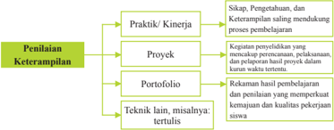

> **Deskripsi Visual:** Gambar ini adalah diagram yang menunjukkan struktur penilaian keterampilan dalam konteks pembelajaran. Diagram ini terdiri dari empat bagian utama: Praktik/Kinerja, Proyek, Portofolio, dan Teknik lain, misalnya tertulis. Setiap bagian memiliki subbagian yang lebih spesifik untuk mendiskusikan metode penilaian.

1. **Apa yang ditampilkan secara keseluruhan**: Gambar ini menunjukkan struktur penilaian keterampilan dalam proses pembelajaran, yang melibatkan berbagai metode penilaian seperti praktik/kinerja, proyek, portofolio, dan teknik tertulis.

2. **Elemen-elemen utama dan relasinya**: 
   - **Praktik/Kinerja** adalah bagian utama yang mencakup sikap, pengetahuan, dan keterampilan saling mendukung dalam proses pembelajaran.
   - **Proyek** dan **Portofolio** merupakan dua subbagian yang lebih spesifik dari praktik/kinerja, masing-masing menekankan penilaian yang lebih mendalam dan berkelanjutan.
   - **Teknik lain, misalnya tertulis** adalah bagian yang lebih spesifik yang mencakup metode penilaian tertulis.

3. **Teks, angka, atau label penting yang terlihat**: 
   - **Teks penting**: "Penilaian Keterampilan", "Praktik/Kinerja", "Proyek", "Portofolio", "Teknik lain, misalnya tertulis".
   - **Angka penting**: Ada tiga subbagian utama (Praktik/Kinerja, Proyek, Portofolio) dan satu subbagian spesifik (Teknik lain, misalnya tertulis).

4. **Informasi kunci yang dapat diambil pembaca**: Gambar ini memberikan panduan tentang berbagai metode penilaian keterampilan dalam proses pembelajaran, mencakup praktik/kinerja, proyek, portofolio, dan teknik tertulis. Ini membantu pembaca memahami struktur dan komponen penilaian keterampilan yang digunakan dalam pembelajaran.

Penjelasan diagram gambar di atas sebagai berikut.

### a)  Penilaian Kinerja

Penilaian  kinerja  digunakan  untuk  mengukur  capaian  pembelajaran yang berupa keterampilan proses dan/atau hasil (produk). Penilaian kinerja yang  menekankan  pada  hasil  (produk)  biasa  disebut  penilaian  produk, sedangkan  penilaian  kinerja  yang  menekankan  pada  proses  dan  produk dapat disebut penilaian praktik. Aspek yang dinilai dalam penilaian kinerja

 

---
## 📄 Halaman 40

adalah proses pengerjaannya atau kualitas produknya atau kedua-duanya. Sebagai contoh: (1) keterampilan menggunakan alat dan atau bahan serta prosedur kerja dalam menghasilkan suatu produk; (2) kualitas produk yang dihasilkan berdasarkan kriteria teknis dan estetik.

Contoh penilaian kinerja yang menekankan pada proses adalah berpidato,  membaca  karya  sastra,  memanipulasi  peralatan  laboratorium sesuai  keperluan,  dan  memainkan  alat  musik.  Contoh  penilaian  proses yang  melibatkan  aktivitas  isik  adalah  melempar/menendang  bola,  bermain tenis, berenang, koreograi, dan menari. Contoh  penilaian kinerja yang menekankan  pada  produk  misalnya  menyusun  karangan,  melukis,  dan menyulam. Contoh penilaian kinerja yang menekankan pada proses dan produk misalnya  pembuatan makanan tradisional.

Langkah-langkah  yang  perlu  diperhatikan  dalam  penilaian  kinerja adalah:

- mengidentiikasi semua langkah-langkah penting yang mempengaruhi hasil akhir (output) .
- menuliskan dan mengurutkan semua aspek kemampuan spesiik yang penting dan diperlukan untuk menyelesaikan tugas dan menghasilkan hasil akhir (output) yang terbaik.
- mendeinisikan dengan jelas semua aspek kemampuan yang akan diukur. Kemampuan  atau produk yang akan dihasilkan tersebut  tidak perlu terlalu banyak atau rinci, yang penting harus dapat diamati (observable).
- memeriksa  dan  membandingkan  kembali  semua  aspek  kemampuan yang sudah dibuat  sebelumnya  oleh  orang  lain  di  lapangan  (jika  ada pembandingnya).
Dalam pelaksanaan penilaian kinerja perlu disiapkan format observasi dan rubrik penilaian untuk mengamati perilaku siswa  dalam melakukan praktik atau produk yang dihasilkan.

akan

 

---
## 📄 Halaman 41

### Contoh penilaian kinerja/praktik

Mata Pelajaran

: Agama Hindu

Kelas/Semester

: X/2

Tahun Pelajaran

: 2014/2015

Kompetensi Dasar

:  4.1  Mempraktikkan  pelaksanaan  Yajňa  menurut kitab Ramayana dalam kehidupan

### Rubrik penilaian kinerja/praktik

---
**📊 Tabel**

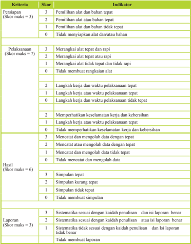

Tabel ini menunjukkan skor maksimal dan kriteria untuk setiap aspek dalam proses penulisan, mulai dari persiapan, pelaksanaan, hingga hasil. Topik utama tabel adalah evaluasi kualitas penulisan, dengan kolom-kolom yang mencakup persiapan (Skor maks 3), pelaksanaan (Skor maks 7), dan hasil (Skor maks 6). Data penting yang terlihat meliputi skor maksimal masing-masing aspek, kriteria yang harus dipenuhi, dan indikator yang digunakan untuk menilai setiap aspek. Misalnya, persiapan memerlukan alat dan bahan tepat, sedangkan pelaksanaan memerlukan langkah kerja dan waktu yang tepat. Hasil juga memerlukan menerbitkan data dengan tepat dan simpulan yang benar. Tabel ini membantu dalam menilai kualitas penulisan berdasarkan standar yang ditetapkan.

 

---
## 📄 Halaman 42

### Contoh pengisian format penilaian kinerja/praktik Agama Hindu

### Keterangan:

- Skor maksimal = jumlah skor tertinggi setiap kriteria. Pada contoh di atas, skor maksimal  = 3 + 7 + 6 + 3= 19.
- Nilai praktik = (Jumlah skor perolehan: skor maks) x 100.
- Pada contoh di atas nilai  praktik Adi  =  (14 : 19) x 100 = 73,6 8 dibulatkan menjadi 74.
Dalam  penilaian  kinerja  dapat  juga  dibuat  pembobotan  pada  aspek yang dinilai,  misalnya  persiapan  20%,  pelaksanaan dan hasil 50%, serta pelaporan 30%.

### a.  Penilaian Proyek

Penilaian  proyek  merupakan  kegiatan  penilaian  terhadap  suatu tugas yang meliputi kegiatan perancangan, pelaksanaan, dan pelaporan, yangharus  diselesaikan  dalam  periode/waktu  tertentu.  Tugas  tersebut berupa suatu investigasi sejak dari perencanaan, pengumpulan data,  pengorganisasian,  pengolahan  dan  penyajian  data.  Penilaian proyek  dapat  digunakan  untuk  mengetahui  pemahaman,  kemampuan mengaplikasikan,  inovasi  dan  kreativitas,  kemampuan  penyelidikan dan kemampuan siswa menginformasikan matapelajaran tertentu secara jelas.

Penilaian  proyek  dapat  dilakukan  dalam  satu  atau  lebih  KD,  satu mata  pelajaran,  beberapa  mata  pelajaran  serumpun  atau  lintas  mata pelajaran yang bukan serumpun.

Penilaian proyek umumnya menggunakan metode belajar pemecahan masalah sebagai langkah awal dalam pengumpulan dan mengintegrasikan pengetahuan  baru  berdasarkan  pengalamannya  dalam  beraktiitas  secara nyata.Dalam penilaian proyek setidaknya ada 4 (empat) hal yang perlu dipertimbangkan  yaitu  pengelolaan,  relevansi,  keaslian,  serta  inovasi dan kreativitas.

- Pengelolaan yaitu kemampuan siswa dalam memilih topik, mencari informasi dan mengelola waktu pengumpulan data serta penulisan laporan.
- Relevansi yaitu kesesuaian topik, data, dan hasilnya dengan KD atau mata pelajaran.
- Keaslian.  proyek  yang  dilakukan  siswa  harus  merupakan  hasil karyanya  sendiri  dengan  mempertimbangkan  kontribusi  guru  dan

 

---
## 📄 Halaman 43

- pihak lain berupa bimbingan dan dukungan terhadap proyek yang dilakukan siswa.
- Inovasi dan kreativitas. Proyek yang dilakukan siswa terdapat unsurunsur baru (kekinian) dan sesuatu yang unik, berbeda dari biasanya.

### Contoh Penilaian Proyek

Mata Pelajaran

: Agama Hindu

Kelas/Semester

: X / 1

Kompetensi Dasar

: 3.1 Memahami hakekat dan nilai-nilai Yajňa yang terkandung dalam kitab Ramayana

Rumusan tugas proyek :

- Lakukan  penelitian  mengenai  permasalahan  sosial  yang  berkembang  pada masyarakat  di  lingkungan  sekitar  tempat  tinggalmu,  misalnya  pengaruh keberadaan mal bagi masyarakat sekitarnya (kamu bisa memilih masalah lain yang sedang berkembang di lingkunganmu).
- Tugas dikumpulkan sebulan setelah hari ini. Tuliskan rencana penelitianmu, lakukan,  dan  buatlah  laporannya.  Dalam  membuat  laporan  perhatikan  latar belakang, perumusan masalah, kebenaran informasi/data, kelengkapan data, sistematika laporan, penggunaan bahasa, dan tampilan laporan!

### Rubrik penilaian proyek:

---
**📊 Tabel**

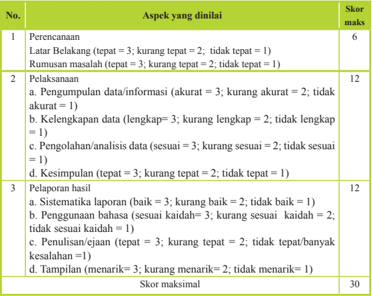

Tabel ini menunjukkan skor maksimal untuk setiap aspek penilaian dalam proses belajar mengajar. Topik utama tabel adalah aspek-aspek yang dianalisis dalam proses belajar, seperti perencanaan, pelaksanaan, dan pelaporan hasil. Kolom-kolomnya mencakup skor maksimal untuk setiap aspek tersebut. Misalnya, skor maksimal untuk aspek perencanaan adalah 6, sedangkan untuk aspek pelaksanaan adalah 12. Pola penting yang terlihat adalah bahwa skor maksimal untuk pelaksanaan lebih tinggi dibandingkan dengan perencanaan dan pelaporan hasil, yang masing-masing memiliki skor maksimal 12 dan 10. Ini menunjukkan bahwa proses pelaksanaan dianggap lebih penting daripada perencanaan dan pelaporan hasil dalam proses belajar.

 

---
## 📄 Halaman 44

Nilai proyek = (skor perolehan : skor maksimal) x 100.

Dapat juga dibuat pembobotan pada aspek yang dinilai, misalnya perencanaan 20%, pelaksanaan 40%, dan pelaporan 40%.

### b. Penilaian Portofolio

Portofolio merupakan penilaian berkelanjutan yang didasarkan pada kumpulan informasi yang bersifat relektif-integratif yang menunjukkan perkembangan  kemampuan  siswa  dalam  satu  periode  tertentu.Ada beberapa tipe portofolio yaitu portofolio dokumentasi, portofolio proses, dan portofolio pameran. Guru dapat memilih tipe portofolio yang sesuai dengan karakteristik kompetensi dasar dan/atau konteks mata pelajaran.

Pada  akhir  suatu  periode  hasil  karya  tersebut  dikumpulkan  dan dinilai oleh guru bersama siswa. Berdasarkan informasi perkembangan tersebut,  guru  dan  siswa  dapat  menilai  perkembangan  kemampuan siswa  dan  terus  melakukan  perbaikan.Dengan  demikian,  portofolio dapat memperlihatkan perkembangan kemajuan belajar siswa melalui karyanya.  Portofolio  siswa  disimpan  dalam  suatu  folder  dan  diberi tanggal  pembuatan  sehingga  dapat  dilihat  perkembangan  kualitasnya dari waktu ke waktu.

Dalam  kurikulum  2013,  portofolio  digunakan  sebagai  salah  satu bahan penilaian. Hasil penilaian portofolio bersama dengan penilaian yang  lain  dipertimbangkan  untuk  pengisian  rapor/laporan  penilaian kompetensi siswa. Portofolio merupakan bagian dari penilaian autentik, yang langsung dapat menyentuh sikap, pengetahuan, dan keterampilan siswa.

Penilaian  portofolio  dilakukan  untuk  menilai  karya-karya  siswa secara  bertahap  dan  pada  akhir  suatu  periode  hasil  karya  tersebut dikumpulkan  dan  dipilih  bersama  oleh  guru  dan  siswa.  Karya-karya terpilih  yang  menurut  guru  dan  siswa  adalah  karya-karya  terbaik disimpan dalam buku besar/album/stofmap sebagai dokumen portofolio. Guru dan siswa harus sama-sama memahami alasan mengapa karyakarya tersebut disimpan di dalam koleksi portofolio. Setiap karya pada dokumen portofolio harus memiliki makna atau kegunaan bagi siswa, guru, dan orang lain yang mengamati.Selain itu, diperlukan komentar dan  releksi  dari  guru,  orangtua  siswa,  atau  pengamat  pendidikan  yang memiliki keterkaitan dengan karya-karya yang dikoleksi.

Karya siswa yang dapat disimpan sebagi dokumen portofolio antara lain: karangan, puisi, gambar/lukisan, surat penghargaan/piagam, fotofoto prestasi, dsb.

 

---
## 📄 Halaman 45

Dokumen portofolio dapat menumbuhkan rasa bangga yang mendorong siswa mencapai hasil belajar yang lebih baik. Guru dapat memanfaatkan portofolio untuk mendorong siswa mencapai sukses dan membangun kebanggaan diri. Secara tidak langsung, hal ini berdampak pada  peningkatan  upaya  siswa  untuk  mencapai  tujuan  individualnya. Di samping itu guru pun akan merasa lebih mantap dalam mengambil keputusan  penilaian  karena  didukung  oleh  bukti-bukti  autentik  yang telah dicapai dan dikumpulkan siswanya.

Agar  penilaian  portofolio  menjadi  efektif,  guru  dan  siswa    perlu menentukan hal-hal yang harus dilakukan dalam menggunakan portofolio sebagai berikut:

- Setiap siswa memiliki dokumen portofolio sendiri yang di dalamnya memuat  hasil  belajar    pada  setiap  mata  pelajaran  atau  setiap kompetensi.
- Menentukan hasil kerja/karya apa yang perlu dikumpulkan/disimpan.
- Guru memberi catatan berisi komentar dan masukan untuk ditindaklanjuti siswa.
- Siswa  harus  membaca  catatan  guru  dan  dengan  kesadaran  sendiri dan  menindaklanjuti  masukan  yang  diberikan  guru  dalam  rangka memperbaiki  hasil kayanya.
- Catatan guru dan perbaikan hasil kerja yang dilakukan siswa perlu diberi  tanggal,  sehingga  dapat  dilihat  perkembangan  kemajuan belajar siswa.
Rambu-rambu penyusunan dokumen portofolio.

- Dokumen portofolio berupa karya/tugas siswa dalam periode tertentu dikumpulkan  dan  digunakan  oleh  guru  untuk  mendeskripsikan capaian kompetensi keterampilan.
- Dokumen  portofolio disertakan pada waktu  penerimaan  rapor kepada  orangtua/wali  siswa,  sehingga  orangtua/wali  mengetahui perkembangan belajar putera/puterinya. Orangtua/wali siswa diharapkan dapat memberi komentar/catatan pada dokumen portofolio sebelum dikembalikan ke sekolah.
- Guru pada kelas berikutnya menggunakan portofolio sebagai informasi awal siswa yang bersangkutan.

 

---
## 📄 Halaman 46

 

---
## 📄 Halaman 47

### BAB III Petunjuk Khusus Proses Pembelajaran

### A. Pelajaran 1: Nilai-Nilai Yajña Dalam Rāmāyana

### 1. KI dan KD

---
**📊 Tabel**

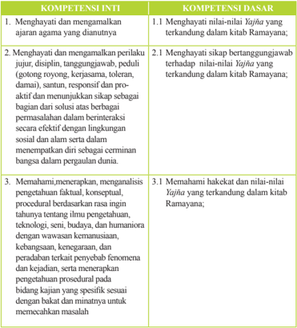

Tabel ini berisi informasi tentang kompetensi inti dan dasar yang harus dipenuhi oleh siswa dalam mempelajari agama. Topik utamanya adalah menghargai dan mengamalkan nilai-nilai Yāhuja yang terkandung dalam kitab Ramayana. Tabel dibagi menjadi dua kolom: Kompetensi Inti dan Kompetensi Dasar. Kompetensi Inti mencakup empat poin utama, yaitu menghargai dan mengamalkan nilai-nilai Yāhuja, menghargai dan mengamalkan perilaku suci, memahami dan menerapkan pengetahuan faktil, konseptual, dan prosedural, serta memahami hakekat dan nilai-nilai Yāhuja. Kompetensi Dasar mencakup 21 poin yang lebih spesifik, termasuk sikap bertanggungjawab, respon sensitif dan proaktif, dan menunjukkan sikap sebagai bagian dari solusi dalam berinteraksi secara efektif dengan lingkungan sosial dan alam. Data penting yang terlihat adalah bahwa setiap kompetensi inti memiliki beberapa poin yang lebih spesifik untuk dipenuhi, menunjukkan bahwa pembelajaran ini melibatkan pemahaman mendalam dan praktik yang konsisten.

 

---
## 📄 Halaman 48

---
**📊 Tabel**

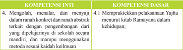

Tabel ini membandingkan dua kompetensi: Kompetensi Inti (4.1) dan Kompetensi Dasar (4.1). Topik utama tabel adalah tentang pengembangan keterampilan dan pengetahuan dalam berbagai aspek kehidupan. Kolom pertama, "Kompetensi Inti," mencakup empat poin utama yang melibatkan mengolah, mentalis, dan menyajikan informasi secara konkret dan abstrak. Poin-poin ini berkaitan dengan kemampuan untuk menguasai materi yang diperoleh di sekolah dan mampu menggunakan metode yang sesuai dalam kehidupan. Kolom kedua, "Kompetensi Dasar," menunjukkan praktik langsung dalam menguasai Al-Qur'an dan Ajaran Islam, seperti mempraktekkan pelaksanaan Yaj'ha menuju kitab Ramayana dalam kehidupan. Data atau pola penting yang terlihat adalah bahwa kedua kolom ini saling terkait dan membahas bagaimana seseorang dapat mengembangkan keterampilan dan pengetahuan mereka dalam berbagai aspek kehidupan, baik itu secara inti maupun dasar.

### 2. Tujuan Pembelajaran

- Menjelaskan Pengertian Yajna
- Menyebutkan Pembagian Yajna
- Menunjukkan Bentuk-Bentuk Pelaksanaan Yajna dalam Kehidupan Sehari-Hari
- Membuat Ringkasan Cerita Ramayana
- Mempraktikkan nilai-nilai yajna dalam cerita Ramayana

### 3. Peta Konsep

---
**🖼️ Gambar/Diagram**

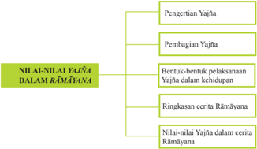

> **Deskripsi Visual:** Gambar ini adalah diagram yang menunjukkan struktur dan konten dari topik "Nilai-nilai Yajña dalam Rāmīyāna". Diagram ini dibagi menjadi dua bagian utama: "Pengertian Yajña" dan "Bentuk-bentuk pelaksanaan Yajña dalam kehidupan". Untuk setiap sub-topik, ada beberapa elemen yang disebutkan, seperti "Ringkasan cerita Rāmīyāna" dan "Nilai-nilai Yajña dalam cerita Rāmīyāna".

Elemen utama dalam diagram ini adalah topik-topsik tersebut, yang saling terhubung melalui relasi hierarkis. Teks penting dalam diagram ini mencakup definisi dan penjelasan tentang pengertian Yajña, pembagian Yajña, bentuk-bentuk pelaksanaannya, ringkasan cerita Rāmīyāna, dan nilai-nilai Yajña dalam cerita tersebut.

Informasi kunci yang dapat diambil pembaca melalui diagram ini adalah bahwa topik ini membahas tentang pengertian, pembagian, bentuk-bentuk, ringkasan, dan nilai-nilai Yajña dalam konteks cerita Rāmīyāna. Diagram ini memberikan panduan struktural yang jelas untuk memahami bagaimana topik ini disusun dan dianalisis.

### 4. Proses Pembelajaran

Mengawali materi pokok ini, guru mengajak peserta didik untuk melakukan perenungan bersama agar guru dan peserta didik dapat dengan mudah menerima pelajaran  serta  memahami  materi  yang  akan  diajarkan,  serta  sebagai  evaluasi diri  atas  materi  yang  diajarkan.  Perenungan  dapat  mengambil  berbagai  tema tentang yajna, misalnya jasa orang tua kepada anaknya, jasa guru kepada muridmuridnya, keagungan Tuhan terhadap makhluk ciptaanNya,  atau bawalah pikiran peserta didik jika berada di puncak gunung atau ditepi pantai seorang diri. Dari perenungan semacam ini, mintalah peserta didik untuk menceritakan apa yang

 

---
## 📄 Halaman 49

mereka  alami  dan  rasakan.  Guru  dapat  mengarahkannya  sebagai  bentuk  rasa syukur dan wujud terima kasih kepada orang tua, guru dan Tuhan. Rasa syukur itu diwujudkan dalam bentuk yajna, entah Dewa Yajna, Manusa Yajna, Bhuta Yajna, Rsi Yajna, Pitra Yajna.

Dalam bab I ini akan dimulai dengan membahas terlebih dahulu pengertian yajna. Beberapa sumber sastra dijadikan landasan untuk menjelaskan Yajna, seperti Rgveda,  Bhagavadgita  dan  susastra  Veda  lainnya.  Setelah  selesai  menjelaskan pengertian yajna ini, dilanjutkan dengan membahas pembagian Yajna berdasarkan beberapa  kitab  suci,  antara  lain  kitab Sataphata Brāhmana, Bhagavadgītā, Mānawa  Dharma  Śāstra dan Gautama Dharma Śāstra serta beberapa tambahan teks suci lainnya.

Untuk materi pengertian Yajna, guru sebelumnya bisa meminta peserta didik untuk mencari sendiri pengertian  Yajna, berikan mereka kesempatan untuk mencari sendiri. Lalu biarkan mereka menyampaikan sendiri makna dan pengertian Yajna yang mereka ketahui. Dari beberapa presentasi peserta didik, guru menyimpulkan dan membuat pengertian berdasarkan pustaka suci yang digunakan. Lalu minta kepada  peserta  didik  untuk  menuliskan  kembali  pengertian-pengertian  Yajna berdasarkan pustaka suci yang telah dijelaskan.

Pembelajaran  dilanjutkan  dengan  menjelaskan  bentuk-bentuk  pelaksanaan Yajña dalam kehidupan sehari-hari. Dalam materi ini dijelaskan beberapa bentuk Yajna , seperti Nityᾱ Yajña , yaitu Yajña yang dilaksanakan setiap hari. Contohnya Tri Sandhya, Yajña Śeṣa/masaiban/ngejot dan Jñāna Yajña dan Naimittika Yajña , yaitu Yajña yang  dilakukan  pada  waktu-waktu  tertentu  yang  sudah  dijadwal yang didasarkan atas 1) perhitungan wara, seperti hari  Kajeng Kliwon, Budha wage, Budha Kliwon, Anggara kasih dan lain sebagainya, 2) penghitungan Wuku, seperti  Galungan,  Pagerwesi,  Saraswati,  Kuningan,  dan  3)  berdasarkan  atas penghitungan  Sasih, seperti Purnama,  Tilem,  Nyepi,  Śiwa  Rātri.  Bentuk  Yajna yang terakhir adalah insidental. Bentuk yajna ini didasarkan atas adanya peristiwa atau  kejadian-kejadian  tertentu  yang  tidak  terjadwal,  dan  dipandang  perlu untuk melaksanakanya Yajña .  Dianggap perlu dibuatkan upacara persembahan. Melaksanakan Yajña diharapkan  menyesuaikan  dengan    keadaan,  kemampuan, situasi  (Deśa,  Kāla, Awastha).

Berdasarkan materi di atas, guru dapat meminta peserta didik untuk memberikan contoh-contoh  sederhana  berkenaan  dengan  bentuk-bentuk  pelaksanaan Yajna, baik yang mereka lakukan sendiri mupun orang tua serta yang mereka lihat dan alami selama ini.

Mengingat  materi  pokok  bab  ini  adalah  nilai-nilai Yajna  dalam  Ramayana, maka  saatnya  guru  menjelaskan  terlebih  dahulu  ringkasan  cerita Rāmāyana. Untuk dapat menyampaikan ringkasan cerita ini, guru diminta untuk menceritakan secara singkat tujuh kanda, mulai dari Bālakānda, Ayodhyākāṇḍa, Āraṇyakāṇḍa, Kiṣkindhakāṇḍa, Sundarakāṇḍa, Yuddhakāṇḍa, dan Uttarakāṇḍa . Berikan kesempatan peserta didik untuk bertanya kalau ada yang tidak mereka ketahui,

 

---
## 📄 Halaman 50

dan  minta  mereka  sinopsis  atau  ringkasan  cerita  agar  ingatan  mereka  tentang cerita dari masing-masing kanda tidak lekas hilang.

Setelah cerita singkat Ramayana disampaikan, saatnya guru mengajak peserta didik untuk bersama-sama mencari nilai-nilai Yajna yang terkandung dalam cerita Ramayana. Dalam mengajarkan materi ini, guru mencari nilai-nilai yajna dengan menafsirkan  simbol-simbol  tertentu,  baik  berupa  kata-kata  maupun  sebuah peristiwa  dalam cerita  yang  mengandung Yajna. Guru baik juga menggunakan sumber sastranya, salah satu yang utama adalah kekawin Ramayana. Sebagai satu contoh  saja,  ketika  menjelaskan  Dewa Yajña dapat  dibaca  dalam  pelaksanaan Homa  Yajña yang  dilaksanakan  oleh  Prabu Daśaratha . Homa Yajña atau Agni Hotra sesuai dengan asal katanya Agni berarti api dan Hotra berarti penyucian. Upacara ini dimaknai sebagai upaya penyucian melalui perantara Dewa Agni . Hal yang sama dapat dilakukan untuk mengetahui panca Yajna lainnya.

Agar  peserta  didik  bisa  langsung  mengerti,  mintalah  mereka  mengulang kembali  nilai  dan  makna-makna  Yajna  yang  terdapat  dalam  cerita  Ramayana. Biarkan mereka mencatat dan menceritakan kembali nilai dan makna Yajna yang terkandung dalam Ramayana serta mintalah mereka mencari sebanyak mungkin bentuk-bentuk Yajna yang dilakukan para tokoh dalam cerita, atau mereka bisa diajak bermain peran sesuai dengan tokoh-tokoh yang ada dalam cerita.

Agar memenuhi saintiik, guru bisa menjalankan proses belajar sebagai berikut:

### Mengamati:

Guru mengajak peserta didik untuk:

- Menunjukkan beberapa sumber-sumber atau sloka yang mewajibkan melaksanakan Yajňa
- Belajar mengamati pelaksanaan Yajňa dan nilai-nilai yang terkandung dalam kitab Ramayana
- ………dst

### Menanya:

Guru mengajak peserta didik untuk:

- Menunjukkan sarana yang dapat dipakai sebagai Yajňa
- Memancing peserta didik untuk menanyakan jenis-jenis Yajňa yang terdapat dalam kitab Ramayana
- ……..dst

### Mengeksperimen/mengeksplorasikan:

Guru mengajak peserta didik untuk:

- Mendorong peserta didik untuk mencari contoh Yajňa yang tepat sesuai cerita Ramayana
- Melakukan  eskperimen  dengan  menuliskan  macam-macam Yajňa yang terdapat dalam kitab Ramayana
- ……..dst

 

---
## 📄 Halaman 51

### Mengasosiasi:

Guru mengajak peserta didik untuk:

- Melakukan  analisis  berbagai  macam  hal  yang  dihadapi  dalam  pelaksanaan Yajňa dalam cerita Ramayana
- Belajar menyimpulkan pelaksanaan Yajňa dalam Kitab Ramayana
- …….dst

### Mengomunikasikan:

Guru mengajak peserta didik untuk:

- Menunjukkan gambar/foto terkait kegiatan pelaksanaan Yajňa ,  menonton dalam cerita Ramayana
- Mau  menyampaikan  dalam  bentuk  tulisan  pelaksanaan Yajňa dalam  Kitab Ramayana
- ……..dst

### 5. Evaluasi

Secara operasional, guru dapat memberikan penilaian atas materi ini dengan berbagai langkah, antara lain:

- Tugas:  Membuat  ringkasan  materi  Yajňa  yang  terkandung  dalam  Kitab Ramayana
- Observasi:  Mengumpulkan  hasil  mengamati  pelaksanaan  Yajňa  yang terkandung dalam Kitab Ramayana dan masyarakat
- Portofolio: Membuat laporan pelaksanaan Yajňa yang terkandung dalam Kitab Ramayana di masyarakat
- Tes:  Tertulis, lisan nilai-nilai Yajňa

### 6. Pengayaaan

Guru diharapkan dapat memberikan pengayaan materi agar siswa memiliki pemahanan yang semakin jelas dan lengkap.

Nilai-nilai  Yajna  yang  terdapat  dalam  cerita  Ramayana  adalah  sebagai berikut:

- Manusa Yadnya, digambarkan ketika Bharata melaksanakan upacara penobatan sebagai raja.
- Pitra Yajna, digambarkan ketika Dasarata dikremasi.
- Pitra Yajna, digambarkan melalui sikap Rama yang berbakti kepada ayahnya dengan mentaati sumpah ayahnya.
- Manusa Yajna, tergambar dalam bentuk persahabatan antara Rama dengan Sugriwa untuk saling tolong menolong.
- Dewa Yajna, digambarkan ketika Sita melakukan pemujaan pada Dewa Agni, dan lain sebagainya

 

---
## 📄 Halaman 52

### Contoh Wirama:

Hana sira Ratu dibya rēngőn, praçāsta ring rāt, musuhnira praņata, jaya paņdhita, ringaji kabèh, Sang Daçaratha, nāma tā moli Artinya:

Ada seorang raja besar, dengarkanlah. Terkenal di dunia, musuh baginda semua  tunduk.  Cukup  mahir  akan  segala  ilsafat  agama,  Prabhu  Dasarata gelar Sri Baginda, tiada bandingannya

Sira ta Triwikrama pita, pinaka bapa, Bhaţāra Wişņnu mangjanma inakan -ing bhuwana kabèh, yatra dōnira nimittaning janma. Artinya:

Beliau ayah Sang Triwikrama, maksudnya ayah Bhatara Wisnu yang sedang menjelma akan menyelamatkan dunia seluruhnya. Demikian tujuan Sang Hyang Wisnu menjelma menjadi manusia.

Guņa mānta Sang Daçaratha, wruh sira ring Wéda, bhakti ring Déwa, tar malupeng pitra pūja, māsih ta sirêng swagotra kabèh.

Artinya:

Cukup berprestasi Sang Dasarata. Ia mahir mempelajari Veda dan berbakti kepada para Dewa, tak lupa kepada para leluhur. Ia sayang kepada seluruh sanak keluarga

Sumber: http://rah-toem.blogspot.co.id/2013/09/nilai-nilai-yadnya-yangada-dalam.html diakses tanggal 4 Desember 2015, pukul 08.10

### 7. Remedial

Untuk mengetahui berhasil tidaknya kegiatan remedial yang telah dilaksanakan, harus dilakukan penilaian. Penilaian ini dapat dilakukan dengan cara mengkaji kemajuan  belajar  peserta  didik.  Apabila  peserta  didik  mengalami  kemauan belajar sesuai yang diharapkan, berarti kegiatan remedial yang direncanakan dan dilaksanakan cukup efektif membantu peserta didik yang mengalami kesulitan belajar. Tetapi, apabila peserta didik tidak mengalami kemajuan dalam belajarnya berarti  kegiatan  remedial  yang  direncanakan  dan  dilaksanakan  kurang  efektif. Untuk itu guru harus menganalisis setiap komponen pembelajaran.

Beberapa teknik dan strategi yang dipergunakan dalam pelaksanaan pembelajaran remedial antara lain, (1) pemberian tugas/pembelajaran individu (2) diskusi/tanya jawab (3) kerja kelompok (4) tutor sebaya (5) menggunakan sumber lain.

 

---
## 📄 Halaman 53

### Contoh Program Pembelajaran Remedial

Sekolah

: SMA/SMK……………………

Mata Pelajaran

: Agama Hindu dan Budhi Pekerti

Kelas

: X

Ulangan ke

: ………..

Tanggal ulangan ulang

: ………..

Bentuk soal

: Uraian

Materi ulangan (KD/Indikator):

- 1.1 Memahami  hakekat  dan  nilai-nilai  Yajňa  yang  terkandung  dalam  kitab Ramayana:
- Mampu menjelaskan pengertian Yajna
- Mampu menyebutkan pembagian Yajna
- Mampu menceritakan secara singkat isi cerita Ramayana
- Mampu menyebutkan nilai-nilai yajna yang terkandung dalam kitab Ramayana Rencana ulangan ulang : ……..
KKM Mapel

: 75

---
**📊 Tabel**

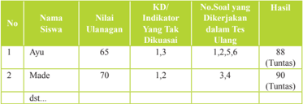

Tabel ini menunjukkan informasi tentang hasil ulangan siswa di sekolah. Topik utamanya adalah penilaian ulangan siswa berdasarkan nilai ujian, indikator yang tidak dikuasai, dan hasil tes ulang. Kolom-kolomnya meliputi nomor siswa, nama siswa, nilai ujian, indikator yang tidak dikuasai, nomor soal yang dikerjakan dalam tes ulang, dan hasil tes ulang. Data penting yang terlihat adalah bahwa Ayu mendapatkan nilai 65 dan tidak menguasai indikator 1,3, sedangkan Made mendapatkan nilai 70 dan tidak menguasai indikator 1,2. Hasil tes ulang Ayu adalah 88 dan Made adalah 90, kedua siswa tersebut berhasil mencapai kualifikasi untuk ulangan.

### Keterangan:

Pada kolom nomor soal yang akan dikerjakan,setiap indikator telah di breakdown menjadi soal-soal dengan tingkat kesukarannya.

Misalnya :

Indikator 1 menjadi 2 soal yaitu nomor soal 1, 2

Indikator 2 menjadi 2 soal yaitu nomor soal 3, 4

Indikator 3 menjadi 2 soal yaitu nomor soal 5, 6

Pada kolom hasil diisi nilai hasil ulangan ulang, walaupun nilai yang nantinya diolah adalah sebatas tuntas

 

---
## 📄 Halaman 54

### 8. Interaksi dengan Orang Tua

Guru dapat melakukan interaksi dengan orang tua. Interaksi dapat dilakukan melalui  komunikasi  melalui  telepon,  email,  dan  media  sosial  lainnya  serta kunjungan  ke  rumah.  Guru  juga  dapat  melakukan  interaksi  melalui  lembar kerja peserta didik yang harus ditanda tangani oleh orang tua siswa baik untuk aspek  pengetahuan,  sikap  dan  keterampilan.  Melalui  interaksi  ini  orang  dapat mengtetahui  perkembangan  baik  mental,  sosial  dan  intelektual.  Guru  dapat memberikan tugas kepada peserta didik, lalu mereka mendiskusikan dengan orang tuanya, dan pekerjaan peserta didik ditanda tangani atau diparaf oleh orang tua.

Carilah  bagian-bagian  cerita  dalam  Ramayana  yang  menggambarkan pelaksanaan  Dewa  Yajna.  Setelah  itu,  diskusikan  dengan  orang  tuamu  apa saja praktek Dewa Yajna dalam kehidupan. Mintalah tanda tangan atau paraf orang tuamu

### B. Pelajaran 2: Upaveda

### 1. KI dan KD

---
**📊 Tabel**

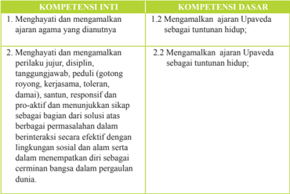

Tabel ini berisi informasi tentang kompetensi inti dan kompetensi dasar yang berkaitan dengan Upavada, sebuah prinsip kehidupan yang dianut oleh beberapa masyarakat di Asia Tenggara. Topik utama tabel adalah Upavada dan bagaimana menerapkannya dalam kehidupan sehari-hari. Kolom pertama menunjukkan kompetensi inti, sementara kolom kedua menunjukkan kompetensi dasar. Data penting yang terlihat adalah bahwa Upavada mencakup dua aspek utama: menghargai dan mengamalkan ajaran Upavada sebagai tuntunan hidup, serta menghargai dan mengamalkan perilaku jujur, disiplin, tanggungjawab, gotong royong, kerjasama, toleransi, damai, santun, responsif, dan proaktif dalam berinteraksi secara efektif dengan lingkungan sosial dan alam serta menempatkan diri sebagai cerminan bangsa dalam pergaulan dunia.

 

---
## 📄 Halaman 55

---
**📊 Tabel**

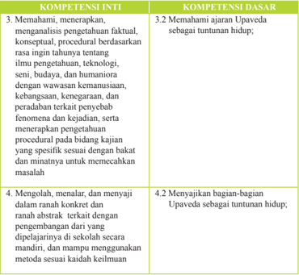

Tabel ini membandingkan dua kompetensi: Kompetensi Inti dan Kompetensi Dasar. Topik utama tabel adalah Upaveda sebagai tuntunan hidup. Kolom-kolomnya mencakup empat baris dengan informasi tentang kompetensi tersebut. Data penting yang terlihat meliputi:

1. Kompetensi Inti:
   - Mengamati, menerapkan, dan analisis pengetahuan faktil, konseptual, dan prosedural.
   - Memahami Upaveda sebagai tuntunan hidup.

2. Kompetensi Dasar:
   - Mengamati, menerapkan, dan analisis pengetahuan faktil, konseptual, dan prosedural.
   - Memahami Upaveda sebagai tuntunan hidup.

Pola penting yang terlihat adalah bahwa kedua kompetensi memiliki sebagian besar informasi yang sama, hanya sedikit perbedaan dalam deskripsi. Ini menunjukkan bahwa Upaveda memiliki beberapa aspek yang serupa dalam konteks pengetahuan dan tuntunan hidup.

### 2. Tujuan Pembelajaran

- Memahami Pengertian Upaveda
- Memahami Kedudukan Upaveda dalam Veda
- Menjelaskan Itihasa
- Menjelaskan Purana
- Menjelaskan Arthasastra
- Menjelaskan Ayur Veda
- Menjelaskan Gandharwa Veda
- Menjelaskan Dhanur Veda

 

---
## 📄 Halaman 56

### 3. Peta Konsep

---
**🖼️ Gambar/Diagram**

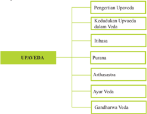

> **Deskripsi Visual:** Gambar ini adalah diagram yang menunjukkan struktur dan konten Upaveda dalam Veda. Diagram ini dibagi menjadi dua bagian utama: "Pengertian Upaveda" dan "UPAVEDA". Bagian "Pengertian Upaveda" meliputi "Kedudukan Upaveda dalam Veda", "Ithahasa", dan "Putraana". Bagian "UPAVEDA" mencakup "Arthasastra", "Ayur Veda", dan "Gandharwa Veda".

Elemen utama dalam diagram ini adalah teks yang menjelaskan setiap bagian dan sub-bagian Upaveda. Relasi antara elemen-elemen ini adalah hierarki, dengan Upaveda sebagai topik utama yang dikelompokkan menjadi beberapa sub-topik.

Teks penting yang terlihat dalam diagram ini meliputi "Pengertian Upaveda", "Kedudukan Upaveda dalam Veda", "Ithahasa", "Putraana", "Arthasastra", "Ayur Veda", dan "Gandharwa Veda". Angka atau label penting tidak ada dalam diagram ini.

Informasi kunci yang dapat diambil pembaca meliputi bahwa Upaveda merupakan bagian dari Veda, memiliki sejarah (Ithahasa), dan terdiri dari beberapa sub-kategori seperti Putraana, Arthasastra, Ayur Veda, dan Gandharwa Veda. Diagram ini memberikan pemahaman umum tentang struktur dan konten Upaveda dalam konteks Veda.

### 4. Proses Pembelajaran

Sebelum  memulai  pelajaran,  ajaklah  peserta  didik  melakukan  perenungan tentang  bagaimana  para  Maha Rsi di masa lalu melakukan kodiikasi dan penyusunan kitab-kitab suci. Betapa besar karya mereka yang diwariskan kepada generasi Hindu selanjutnya. Ajaklah peserta didik untuk menghormati kitab suci dan berusaha belajar menyelami isinya. Terlebih lagi kitab Upaveda sebagai bagian tak  terpisahkan  dari  Kitab  Suci  Veda.  Mintalah  peserta  didik  menyampaikan perasaan  mereka  terhadap  para  Maha  Rsi  yang  telah  berhasil  mengkodiikasi  Veda, dan tanyakan secara appersepsi apa saja yang mereka ketahui tentang Upaveda.

Bab  ini  akan  dimulai  dengan  menjelaskan  pengertian  Upadaveda.  Materi penting  diberikan  agar  peserta  didik  semakin  memahami  apa  yang  dimaksud dengan  Upaveda  dan  bagaimana  kedudukan  Upaveda  dalam  kitab  suci  Veda, yang lebih lengkap diberikan dalam sub bab kedudukan Upaveda dalam Veda . Untuk dapat menjelaskan materi ini, guru perlu menjelaskan kodiikasi Veda yang telah dilakukan oleh para maharsi dan baik juga menunjukkan peta atau kerangka kodiikasi agar kedudukan Upaveda semakin jelas bagi peserta didik.

Pada saat menjelaskan materi tersebut, guru dapat membawa media kerangka atau  peta  konsep  kodiikasi Veda.  Jika  waktunya  cukup,  mintalah  peserta  didik menyalin  kembali  kodiikasi  Veda  yang  dibuat  guru,  lalu  berikan  kesempatan kepada  mereka  menunjukkan  di  mana  posisi  atau  kedudukan  Upaveda  dalam Veda, serta kitab apa saja yang menjadi bagian dari Kitab Upaveda. Sebelumnya minta mereka menyiapkan kertas, penggaris dan pensil untuk membuat kerangka atau peta kodiikasi Veda. Selain telah ada dijual, peta kodiikasi Veda  bisa diambil di kalender Bali yang dikarang Bambang Gde Rawi pada bagian belakang.

 

---
## 📄 Halaman 57

Materi dilanjutkan dengan menjelaskan Itihasa yang di dalamnya menceritakan dua epos besar, yakni Ramayana dan Mahabharata. Pada saat menjelaskan materi ini, guru sebaiknya menceritakan isi dua epos tersebut secara singkat namun jelas dengan beberapa hikmah yang penting untuk diambil oleh peserta didik. Materi lain yang tak kalah penting untuk dijelaskan dalam materi Upaveda adalah Purana. Dalam menjelaskan Purana perlu dijelaskan terlebih dahulu pengertiannya, pokokpokok isi Purāna , pembagian jenis Purāna .

Saat menjelaskan materi ini, awali dengan appersepsi sejauhmana pengetahuan mereka tentang Itihasa, atau mulai dari sebuah kalimat dari Rsi Walmiki yang mengatakan 'sepanjang gunung berdiri tegak, sepanjang aliran sungai mengalir, maka Ramayana akan tetap ada secara abadi'. Kalimat ini perlu disampaikan agar tumbuh  kecintaan  kepada  cerita  kepahlawanan. Ajak  juga  mereka  mengenang kembali perang saudara yang sangat dahsyat di medan Kuruksetra antara Pandawa dan Korawa. Atau jika kesulitan, guru untuk menerangkan materi ini bisa mulai dari  sifat-sifat  Pandawa  dan  Korawa  dan  kenapa  terjadi  peperangan  di  antara mereka. Setelah dirangkum lalu jelaskan bahwa Rama dan Pandawa adalah tokohtokoh yang perlu diteladani dan tokoho-tokoh tersebut mewakili epos Ramayana dan Mahabharata.

Agar penjelasan dalam materi ini semakin lengkap, maka kitab lain yang perlu dijelaskan  guru  adalah  kitab Arthasastra,  sebuah  kitab  yang  menguraikan  ilmu tentang  politik  atau  ilmu  tentang  pemerintahan,  kitab Āyur  Veda sebuah  kitab yang  membahas  ilmu  pengobatan,  dan  terakhir  kitab  Gandharwa  Veda,  yakni kitab yang menguraikan tentang tari, music, bangunan atau seni suara.

Dalam penjelasannya, guru harus menumbuhkan kecintaan dan kebanggaan pada  diri  peserta  didik  bahwa  dalam  Hindu  juga  banyak  menjelaskan  tentang sendi-sendi kehidupan, termasuk ilmu politik, kepemimpinan dan kepemerintahan yang  terdapat  dalam  Kitab  Arthasastra.  Juga  tentang  ilmu  pengobatan  yang terdapat  dalam  Kitab  Ayur  Veda  serta  ilmu  tentang  seni  yang  terdapat  dalam Kitab Gandharwa Veda. Berikan peserta didik kesempatan untuk melihat kitabkitab tersebut. Guru dapat memperlihatkan melalui buku-buku terjemahan. Agar penjelasannya  dapat  dipahami  dengan  baik,  guru  dapat  mengaitkan  beberapa isi  kitab  Arthasastra,  Ayur  Veda  dan  Gandharwa  Veda  dengan  contoh  dalam kehidupan sehari-hari dan biarkan peserta didik memperkayanya dengan mencari contoh-contoh lain.

 

---
## 📄 Halaman 58

Agar memenuhi saintiik, guru bisa menjalankan proses belajar sebagai berikut:

### Mengamati:

Guru mengajak peserta didik untuk:

- Mengamati penerapan Upaveda dalam kehidupan
- Mendengarkan dengan seksama penjelasan Upaveda
- ………dst

### Menanya:

Guru mengajak peserta didik untuk:

- Menunjukkan pentingnya penerapan Upaveda dalam kehidupan
- Berani menanyakan bagian-bagian Upaveda yang belum diketahui
- …………dst

### Mengeksperimen/mengeksplorasikan:

Guru mengajak peserta didik untuk:

- Mencari  contoh  sebanyak  mungkin  sari-sari  Itihasa  yang  berkaitan  dengan kehidupan
- Membuat struktur dalam bentuk peta konsep bagian-bagian Upaveda
- ………..dst

### Mengasosiasi:

Guru mengajak peserta didik untuk:

- Mengenal tokoh-tokoh yang Dharma  dan Adharma dalam Itihasa
- Membuat sipnosis cerita Ramayana dan Mahabharata, bagian dari Upaveda
- Menceritakan tokoh-tokoh yang Dharma yang patut diteladani
- ……….dst

### Mengomunikasikan:

Guru mengajak peserta didik untuk:

- Menyampaikan dalam bentuk tulisan bermain peran seperti tokoh-tokoh yang terdapat dalam Ramayana dan Mahabharata
- Membuat dalam bentuk gambar-gambar, peta Konsep, diagram bagian-bagian dari Upaveda
- Mau memajang gambar-gambar yang dibuat
- ……..dst

### 5. Evaluasi

Untuk materi bab ini, ada beberapa langkah yang dapat digunakan guru untuk melakukan penilaian, misalnya:

- Tugas: Membuat ringkasan dan peta konsep Upaveda
- Observasi: Menuliskan hasil mengamati pelaksanaan Upaveda dalam masyarakat Hindu setempat
- Portofolio:  Membuat  laporan  pelaksanaan  dan  penerapan  Upaveda  dalam masyarakat
- Tes: Tertulis dan lisan materi Upaveda

 

---
## 📄 Halaman 59

### 6. Pengayaan

Guru diharapkan dapat memberikan pengayaan materi agar siswa memiliki pemahanan yang semakin jelas dan lengkap.

Dalam memahami Veda dan kitab-kitab yang terkait dengan Veda, kita mengenal istilah Veda dan susastra Veda, susastera Veda adalah kitab-kitab bukan wahyu Tuhan atau kitab-kitab yang tergolong kitab-kitab smrti. Dalam pengertian  sempit,  kitab-kitab  yang  dimaksud  susastra Veda  adalah  kitabkitab Vedanga dan Upaveda. Dalam pengertian luas Vedangga meliputi pula kitab Dharmasastra, Itihasa, Purana, Agama/Tantra dan Darsana.

Vedanga adalah kitab-kitab berisi petunjuk-petunjuk tertentu untuk mendalami Veda, yang terdiri atas:

astrologi

- Siksa
: ilmu Phonetika

Veda

- Vyakarana
: ilmu tata

bahasa

- Nirukta
: ilmu etimologi

- Chanda
: ilmu

irama

- Jyotisa
: ilmu astronomi dan

- Kalpa
: ilmu tentang upacara

korban

Upaveda adalah  kitab-kita  yang  menunjang  pemahaman  Veda.  Masingmasing  Kitab  Catur  Veda  memiliki  kitab  upaveda:

- RgVeda;  Ayurveda  :  ilmu  tentang  kesehatan
- Yajurveda;  Dhanurveda  :  ilmu  perang
- Samaveda; Gandharvaveda : ilmu pengetahuan samagana (melagukan mantra Samaveda) dan seni musik pada umumnya.
- Artharvaveda;  Arthaveda : ilmu tentang pemerintahan, ekonomi, pertanian, ilmu sosial
Dharmasastra .  Kitab  ini  secara  garis  besar  merupakan  Dharmasastra merupakan  hasil  karya  manusia  yang  berisi  penjelasan  dan  penerapan dari  kitab-kitab  sruti  namun  isinya  Tidak  boleh  bertentangan  dengan sruti. Kelompok Dharmasastra itu antara lain: Manawadharmasastra, Yajnavalkyasmrti,  Samkhalikhitasmrti dan Parasarasmrti

Itihãsa adalah kitab yang terdiri dari epos besar Ramayana dan Mahabharata.

Purãna .  Dalam  Purana  ada  18  Mahapurana  dan  18  Upapurana  Purana (Mahapurana) terdiri atas lima topik Utama (Panca Laksana) yaitu:

- Tentang Penciptaan semesta (pratisarga, sarga dan Pralaya),
- Geograi
- Kisah kisah Para Dewa dan berbagai kisah lainnya
- Manvantara (waktu, jaman yuga dan Manu)
- Silsilah (Suryawamsa dan Chandrawamsa)
Darshana adalah kitab yang membicarakan llmu ke-ilsafat-an dalam ajaran Hindu tertuang dalam apa yang disebut 'Dharsana'. Dharsana, sebagai ilmu sekaligus  seni  olah-pikir,  dalam  Dharma  bukanlah  sembarang  ilmu  yang dapat  dipelajari  dengan  mudah. Ada  6  aliran  ilsafat  yang  terkait  langsung

 

---
## 📄 Halaman 60

dengan keberadaan Hinduisme, yaitu: Samkhya, Yoga, Mimamsa, Vaisiseka, Nyaya dan Vedanta

Agama adalah kitab kitab agama yang secara garis besar dikelompok atas:

- V aishnawa
- Saiwa
- Sakta
Diadaptasi dan diedit  dari:  http://indonesiaindonesia.com/f/45938-veda-kitab-sucihindu/  diakses  tanggal  4  Desember  2015,  pukul  08.45

### 7. Remedial

### Contoh Program Pembelajaran Remedial

Sekolah

: SMA/SMK……………………

Mata Pelajaran

: Agama Hindu dan Budhi Pekerti

Kelas

: X

Ulangan ke

: ………..

Tanggal ulangan ulang

: ………..

Bentuk soal

: Uraian

Materi ulangan (KD/Indikator) :

- 1.2 Mengamalkan ajaran Upaveda sebagai tuntunan hidup
- Memahami Pengertian Upaveda
- Memahami Kedudukan Upaveda dalam Veda
- Menjelaskan Itihasa
- Menjelaskan Purana
- Menjelaskan Arthasastra
- Menjelaskan Ayur Veda
- Menjelaskan Gandharwa Veda
Rencana ulangan ulang

: ……..

KKM Mapel

: 75

 

---
## 📄 Halaman 61

### Keterangan:

Pada kolom nomor soal yang akan dikerjakan, masing masing indikator telah di breakdown menjadi soal-soal dengan tingkat kesukaran masing masing.

Misalnya :   Indikator 1 menjadi 2 soal yaitu nomor soal 1, 2

Indikator 2 menjadi 2 soal yaitu nomor soal 3, 4

Indikator 3 menjadi 2 soal yaitu nomor soal 5, 6

Pada kolom hasil diisi nilai hasil ulangan ulang, walaupun nilai yang nantinya diolah adalah sebatas tuntas.

### 8. Interaksi dengan Orang Tua

Cobalah  kalian  cari  skema  atau  kodiikasi  Veda  yang  terdapat  dalam berbagai sumber. Kalian dapat mengguntingnya lalu tempel pada sebuah kertas, dan berilah tanda dengan warna posisi dari Upaveda dan bagianbagiannya. Diskusikan dengan orang tuamu apakah tugas itu sudah benar dan  buatlah  kesimpulan  dari  bagian-bagian  Upaveda.  Mintalah  tanda tangan atau paraf orang tuamu.

### C. Pelajaran 3: Wariga

### 1. KI dan KD

---
**📊 Tabel**

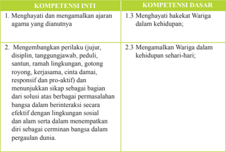

Tabel ini berisi informasi tentang kompetensi inti dan dasar yang berkaitan dengan agama dan perilaku sosial. Topik utamanya adalah pengembangan sikap dan perilaku yang positif dalam kehidupan sehari-hari, termasuk menghormati hakekat Wariga, menjunjung tinggi nilai-nilai warisan agama, serta membangun sikap yang proaktif dan responsif dalam berinteraksi dengan lingkungan sosial dan alam. Kolom-kolomnya mencakup dua bagian utama: kompetensi inti yang lebih umum dan kompetensi dasar yang lebih spesifik. Data penting yang terlihat adalah bahwa kompetensi inti meliputi dua poin utama, sedangkan kompetensi dasar mencakup tiga poin. Ini menunjukkan bahwa tabel ini dirancang untuk memberikan panduan yang lebih detail tentang apa yang perlu dikembangkan dalam konteks agama dan perilaku sosial.

 

---
## 📄 Halaman 62

---
**📊 Tabel**

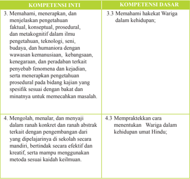

Tabel ini berisi informasi tentang kompetensi inti dan dasar yang harus dipenuhi oleh siswa dalam pembelajaran Wariga, sebuah kegiatan yang berkaitan dengan budaya, keagamaan, dan peradaban. Topik utama tabel adalah tentang pengetahuan, teknologi, seni, budaya, dan humaniora dalam konteks warisan budaya. Kolom-kolomnya mencakup dua bagian utama: Kompetensi Inti dan Kompetensi Dasar. Kompetensi Inti meliputi pemahaman, penerapan, dan menjelaskan pengetahuan faktil, konseptual, prosedural, dan metakognitif dalam berbagai bidang studi. Kompetensi Dasar mencakup pemahaman hakekat Wariga dalam kehidupan, pengenalan fenomena penyebab fenomena, dan praktik Wariga dalam kehidupan umat Hindu. Data penting yang terlihat adalah bahwa siswa diharapkan dapat mengeksplorasi Wariga secara mandiri, berinteraksi efektif dan kreatif, serta menggunakan metode sesuai keilmuan.

### 2. Tujuan Pembelajaran

- Memahami Pengertian Padewasan
- Memahami Hakikat Padewasan
- Mempraktekkan cara menentukan Padewasan
- Memahami Macam-Macam Padewasan untuk Upacara Agama
- Memahami Macam-Macam Padewasan untuk Bidang Pertanian
- Mengetahui Dampak Padewasan

 

---
## 📄 Halaman 63

### 3. Peta Konsep

---
**🖼️ Gambar/Diagram**

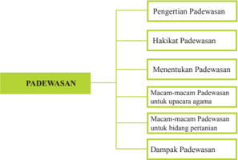

> **Deskripsi Visual:** Gambar ini adalah diagram yang menunjukkan struktur topik tentang Padewasan dalam buku pelajaran. Diagram ini terdiri dari empat cabang utama yang masing-masing menjelaskan aspek berbeda dari Padewasan:

1. **Pengertian Padewasan** - Ini merupakan cabang pertama yang menjelaskan definisi dan konsep dasar tentang Padewasan.

2. **Hakikat Padewasan** - Cabang ini membahas sifat dan karakteristik Padewasan, termasuk bagaimana ia berkaitan dengan kehidupan masyarakat dan lingkungan.

3. **Menentukan Padewasan** - Cabang ini menguraikan proses atau metode yang digunakan untuk menentukan atau mengidentifikasi Padewasan.

4. **Dampak Padewasan** - Cabang terakhir ini membahas konsekuensi atau efek positif dan negatif dari Padewasan pada masyarakat dan lingkungan.

Elemen-elemen utama dalam diagram ini adalah cabang-cabang tersebut, yang saling terhubung melalui ikatan horizontal. Teks, angka, atau label penting yang terlihat adalah nama-nama cabang dan subcabang yang menjelaskan topik-topik utama. Informasi kunci yang dapat diambil pembaca adalah bahwa buku ini menyajikan pemahaman mendalam tentang Padewasan, mencakup definisi, karakteristik, proses pengidentifikasian, dan dampaknya.

### 4. Proses Pembelajaran

Seperti biasa, ajaklah peserta didik melakukan perenungan. Bisa dimulai dengan kembali  melihat  peta  konsep  kodiikasi  V eda  di  mana  salah  satu  bagian  dari kitab Vedanga,  yakni  Jyotisa  menceritakan  tentang  astronomi.  Renungan  lain  adalah mengajak  mereka  merenung  tentang  keadaan  cuaca  yang  tidak  menentu  akhirakhir ini, atau berbagai penyakit datang pada cuaca-cuaca tertentu. Perenungan ini mengantarkan peserta didik untuk memahami bahwa semua hari dan waktu memiliki dampak pada kehidupan baik alam maupun manusia.

Bab ini  akan  diawali  dengan  penjelasan  pengertian  padewasan.  Hal  ini  sangat penting diajarkan karena materi padewasan merupakan materi yang penuh dengan perhitungan dan  tidak semua peserta didik akan memahaminya dengan mudah. Guru dapat  memulainya  dengan  menceritakan  padewasan  dalam  sumber  aslinya,  yakni Vedangga, serta menjelaskan secara jelas pengertian padewasan itu sendiri, hakikat padewasan, serta bagaimana guru mengajak peserta didik untuk belajar menentukan padewasan, baik yang dimulai dengan wewaran, wuku, penanggal dan pangglong, sasih, dan dauh .

Karena materi tersebut tidak mudah, guru harus menjelaskan selengkap mungkin dan bila perlu dijelangkan berulang kali beberapa istilah Bali dalam Padewasan. Ajak peserta didik mencari sendiri padanannya dalam bahasa daerah tentang istilah-istilah tersebut. Dan seperti biasa, guru dapat mengawali materi ini dengan mengajak peserta didik  menguraikan  arti  kata  Padewasan  mulai  dari  akar-akar  kata  lalu  sesuaikan atau cari dalam kamus agar pemahaman peserta didik makin kaya. Guru juga harus memberikan penjelasan Padewasan dari sumber aslinya. Namun yang lebih penting

 

---
## 📄 Halaman 64

lagi, ajaklah peserta didik untuk mencari tahu bagaimana cara menentukan wewaran, wuku, penanggal, panglong, sasih dan dauh. Mintalah peserta didik untuk mencarinya melalui telapak tangan.

Selanjutnya  penjelasan  materi  yang  akan  diberikan  adalah  macam-macam Padewasan untuk Upacara Agama, karena bagaimana pun sebuah hari bisa menjadi baik atau buruk untuk melaksanakan sebuah upacara agama, termasuk dampaknya pada kehidupan sehari-hari, termasuk macam-macam padewasan bidang pertanian, perkawinan, jodoh, kesehatan dan lain-lain.

Untuk  menjelaskan  materi  ini,  guru  meminta  peserta  didik  untuk  mencari padewasan  setiap  upacara  agama  yang  mereka  ketahui,  baik  wewaran  maupun pawukonnya.  Berikan  kesempatan  mereka  mencari  sendiri,  tidak  perlu  dibatasi, berapa  banyak  mereka  mampu  lakukan.  Selanjutnya,  guru  menjelaskan  dampak baik atau dampak buruk dari setiap padewasan, terutama berkenaan dengan berbagai bidang kehidupan, termasuk pertanian, jodoh, perkawinan, kesehatan dan lain-lain. Ajaklah mereka berlatih dengan mencari sebanyak mungkin dampak padewasan ini pada kehidupan sehari-hari. Sebaiknya dalam menjelaskan semua materi di atas selain menggunakan kalender juga menggunakan Tika.

Agar memenuhi saintiik, guru bisa menjalankan proses belajar sebagai berikut:

### Mengamati:

Guru mengajak peserta didik untuk:

- Menyimak penjelasan hakekat Padewasan dalam kehidupan masyarakat secara seksama
- Mengamati kalender Hindu dalam rangka pemahaman Padewasan (Wariga)
- ………dst

### Menanya:

Guru mengajak peserta didik untuk:

- Menanyakan  cara-cara  menentukan  Pedewasan  agar  segala  sesuatu  yang dikerjakan berhasil dengan baik
- Menanya dampak baik dan negative terhadap penerapan Padewasan (Wariga)
- ……….dst

### Mengeksperimen/mengeksplorasikan:

Guru mengajak peserta didik untuk:

- Mengumpulkan data macam-macam pedewasan, baik untuk Upacara keagamaan maupun dalam kegiatan kemasyarakatan
- Mengumpulkan data-data untuk mendukung penerapan Padewasan (Wariga)
- Bereskperimen dengan belajar sendiri mencari padewasan
- Menunjukkan data-data yang ditemukan
- ………….dst

### Mengasosiasi:

Guru mengajak peserta didik untuk:

- Menentukan manfaat Padewasan dan akibat baik dan buruk dalam pelaksanaannya

 

---
## 📄 Halaman 65

- Menganalisis berbagai macam hal yang dihadapi dalam penerapan Padewasan (Wariga)
- ………..dst

### Mengomunikasikan:

Guru mengajak peserta didik untuk:

- Menyampaikan hasil belajar  dalam bentuk tulisan dampak positf dan negatif dalam pelaksanaan Padewasan
- Membuat dalam bentuk gambar-gambar/foto kegiatan yang dilakukan sesuai dengan penerapan Padewasan
- …………dst

### 5. Evaluasi

Selanjutnya, guru dapat menggunakan berbagai cara untuk menilai, antar lain:

### a. Tugas:

- Membuat ringkasan  Padewasan (wariga)
- Menuliskan Pawukon dan Sasih secara berurutan
- Observasi:  Menuliskan  hasil  mengamati  pelaksanaan  Padewasan  (wariga) dalam masyarakat Hindu sesuai dengan daerah setempat
- Portofolio: Membuat  laporan    pelaksanaan Padewasan  (wariga)  dalam masyarakat Hindu sesuai dengan daerah setempat
- Tes: Tertulis, lisan materi Wariga/padewasan

### 6. Pengayaan

Guru  diharapkan  dapat  memberikan  pengayaan  materi  agar  siswa  memiliki pemahanan yang semakin jelas dan lengkap.

### Wariga dan Dewasa, merupakan Ilmu Astronomi ala Bali

Wariga dan dewasa adalah dua istilah yang paling umum diperhatikan oleh umat hindu khususnya di bali bila ingin mencapai kesempurnaan dan keberhasilan. Kedua ilmu itu merupakan salah satu cabang ilmu agama yang  dihubungkan  dengan  ilmu  astronomi  atau  'Jyotisa  Sastra'  sebagai salah  satu  wedangga. Walaupun  kedua  ilmu  tersebut  sebagai  salah  satu cabang ilmu weda, namun pendalamannya tidak banyak diketahui kecuali untuk  tujuan  praktis  pegangan  oleh  para  pendeta  dalam  memberikan petunjuk baik buruknya hari dalam hubungannya untuk melakukan usaha agar supaya berhasil dengan mengingat hari atau waktu dalam sistim sradha hindu yang dipengaruhi oleh unsur kekuatan tertentu dan planet-planet itu.

Dalam lontar yang disebut 'Keputusan Sunari' mengatakan bahwa kata wariga berasal dari dua kata, yaitu 'wara' yang berarti puncak/istimewa

 

---
## 📄 Halaman 66

dan 'ga' yang berarti terang. Sebagai penjelasan dikemukakan '….iki uttamaning  pati  lawan  urip,  manemu  marga  wakasing  apadadang,  ike tegesing wariga'. dari penjelasan ini jelas bahwa yang dimaksud dengan wariga adalah jalan untuk mendapatkan ke'terang'an dalam usaha untuk mencapai tujuan dengan memperhatikan hidup matinya hari.

Disamping masalah itu, penentuan hari baik berdasarkan perhitungan menurut  wariga  disebut  padewasan  (dewasa).  Jadi  dewasa  tidak  lepas dari ilmu wariga dimana di dalam wariga, urip hari telah terperinci secara baku. Ini harus dipegang sebagai keyakinan kepercayaan. Dasarnya adalah percaya adan inilah agama.

Kata  'dewasa'  terdiri  dari  kata;  'de'  yang  berarti  dewa  guru,  'wa' yang  berarti  apadang/lapang dan 'sa' yang  berarti ayu/baik.  Dengan demikian  jelas  bahwa  dewasa  adalah  satu  pegangan  yang  berhubungan dengan  pemilihan  hari  yang  tepat  agar  semua  jalan  atau  perbuatan  itu lapang jalannya, baik akibatnya dan tiada aral rintangan.

Masalah  wariga  dan  dewasa  mencakup  pengertian  pemilihan  hari dan  saat  yang  baik,  ada  perlu  diperhatikan  beberapa  ketentuan  yang menyangkut masalah 'wewaran, wuku, tanggal, sasih dan dauh' dimana kedudukan masing-masing waktu itu secara relative mempunyai pengaruh, didalilkan sebagai berikut:

- Wuku dikalahkan oleh tanggal panglong
- Wewaran dikalahkan oleh wuku
- Tanggal panglong dikalahkan oleh sasih
- Dauh dikalahkan oleh de Ning (keheningan hati) .
- Sasih dikalahkan oleh dauh
Untuk dapat memahami hubungan kesemuanya itu perlu mempelajari arti wewaran dan hubungannya dengan alam ghaib.

### Wuku

Disamping  perhitungan  hari  berdawarkan  wara  sistim  kalender  yang dipergunakan  dalam  wariga  dikenal  pula  perhitungan  atas  dasar  wuku (buku) dimana satu wuku memilihi umur tujuh hari, dimulai hari minggu (raditya/redite). 1 tahun kalender pawukon = 30 wuku, sehingga 1 tahun wuku  =  30  x  7  hari  =  210  hari. Adapun  nama-nama  wukunya  sebagai berikut: Sita, landep, ukir, kilantir, taulu, gumbreg, wariga, warigadean, julungwangi, sungsang, dunggulan, kuningan, langkir, medangsia, pujut, Pahang,  krulut,  merakih,  tambir,  medangkungan,  matal,  uye,  menial, prangbakat, bala, ugu, wayang, klawu, dukut dan watugunung.

### Wewaran

Wewaran berasal dari kata 'wara' yang dapat diartikan sebagai hari, seperti hari senin, selasa dan seterusnya. Masa perputaran satu siklus tidak sama cara menghimpunnya. Siklus ini dikenal misalnya dalam sistim kalender hindu dengan istilah bilangan, sebagai berikut;

 

---
## 📄 Halaman 67

- Eka wara ; luang (tunggal)
- Dwi wara ; menga (terbuka), pepet (tertutup).
- Tri wara ; pasah, beteng, kajeng.
- Catur wara ;  sri  (makmur),  laba  (pemberian),  jaya  (unggul),  menala (sekitar daerah).
- Panca wara ;  umanis  (penggerak), paing (pencipta), pon (penguasa), wage (pemelihara), kliwon (pelebur).
- Sad  wara ;  tungleh  (tak  kekal),  aryang  (kurus),  urukung  (punah), paniron (gemuk), was (kuat), maulu (membiak).
- Sapta wara ;  redite  (minggu), soma (senin), Anggara (selasa), budha (rabu),  wrihaspati  (kamis),  sukra  (jumat),  saniscara  (sabtu).  Jejepan; mina (ikan), Taru (kayu), sato (binatang), patra ( tumbuhan menjalar), wong (manusia), paksi (burung).
- Asta wara ; sri (makmur), indra (indah), guru (tuntunan), yama (adil), ludra (pelebur), brahma (pencipta), kala (nilai), uma (pemelihara).
- Sanga wara ; dangu (antara terang dan gelap), jangur (antara jadi dan batal),  gigis  (sederhana),  nohan  (gembira),  ogan  (bingung),  erangan (dendam),  urungan  (batal),  tulus  (langsung/lancar),  dadi  (jadi).
- Dasa wara ; pandita (bijaksana), pati (dinamis), suka (periang), duka (jiwa seni/mudah tersinggung), sri (kewanitaan), manuh (taat/menurut), manusa (sosial), eraja (kepemimpinan), dewa (berbudi luhur), raksasa (keras)
Disamping pembagian siklus yang merupakan pembagian masa dengan nama-namanya,  lebih  jauh  tiap  wewaran  dianggap  memiliki  nilai  yang dipergunakan untuk menentuk ukuran baik buruknya suatu hari. Nilai itu disebut  'urip'  atau  neptu  yang  bersifat  tetap.  Karena  itu  nilainya  harus dihafalkan.

### Tanggal dan Panglong

Selain perhitungan wuku dan wewaran ada juga disebut dengan Penanggal dan  panglong.  Masing  masing  siklusnya  adalah  15  hari.  Perhitungan penanggal  dimulai  1  hari  setelah  (H+1)  hari  Tilem  (bulan  Mati)  dan panglong dimulai 1 hari setelah (H+1) hari purnama (bulan penuh).

### Sasih

Sasih secara haraiahnya sama diartikan dengan bulan. Sama sepertinya kalender internasional, sasih juga ada sebanyak 12 sasih selama setahun, perhitungannya  menggunakan  'perhitungan  Rasi'  sesuai  dengan  tahun surya (12 rasi = 365/366 hari) dimulai dari 21 Maret. Adapun pembagian sasih tersebut adalah:

- Jiyestha = Wresaba = April - Mei.
- Kedasa = Mesa = Maret - April.
- Sadha = Mintuna = Mei - Juni.

 

---
## 📄 Halaman 68

- Kasa = Rekata = Juni- Juli.
- Ketiga = Kania = Agustus - September.
- Karo = Singa = Juli -Agustus.
- Kapat = Tula = September - Oktober.
- Kenem = Danuh = November - Desember.
- Kelima = Mercika = Oktober - November.
- Kepitu = Mekara = Desember - Januari.
- Kesanga = Mina = Februari - Maret.
- Kewulu = Kumba = Januari - Februari.
Sumber dan diadaptasi dari: https://www.facebook.com/notes/hindu-bali/ wariga-dan-dewasa-merupakan-ilmu-astronomi-ala-bali/481661075189877 diakses tanggal 4 Desember 2015, pukul 09.14

### 7. Remedial

### Contoh Program Pembelajaran Remedial

Sekolah

: SMA/SMK……………………

Mata Pelajaran

: Agama Hindu dan Budhi Pekerti

Kelas

: X

Ulangan ke

: ………..

Tanggal ulangan ulang

: ………..

Bentuk soal

: Uraian

Materi ulangan (KD/Indikator):

- 1.3 Memahami hakekat wariga dalam kehidupan umat Hindu
- Memahami Pengertian Padewasan
- Memahami Hakikat Padewasan
- Mempraktekkan cara menentukan Padewasan
- Memahami Macam-Macam Padewasan untuk Upacara Agama
- Memahami Macam-Macam Padewasan untuk Bidang Pertanian
- Mengetahui Dampak Padewasan
Rencana ulangan ulang

: ……..

KKM Mapel

: 75

---
**📊 Tabel**

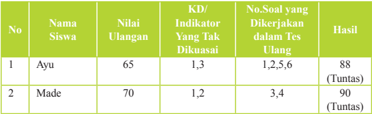

Tabel ini menunjukkan hasil ulangan siswa Nana Ayu dan Made, dengan berbagai indikator dan soal yang dikerjakan dalam tes ulangannya. Topik utama tabel adalah hasil ulangan siswa tersebut. Kolom-kolomnya meliputi nomor siswa, nilai ulangan, indikator yang tidak dikuasai, soal yang dikerjakan dalam tes ulang, dan hasil tes ulang. Data penting yang terlihat adalah bahwa kedua siswa mendapatkan nilai 88 dan 90, masing-masing, dan mereka berhasil menyelesaikan semua soal yang diberikan dalam tes ulang mereka. Ini menunjukkan bahwa kedua siswa telah memperbaiki pengetahuan mereka dan telah berhasil menyelesaikan semua soal yang diberikan dalam tes ulang mereka.

 

---
## 📄 Halaman 69

### Keterangan:

Pada kolom nomor soal yang akan dikerjakan, setiap indikator telah di breakdown menjadi soal-soal dengan tingkat kesukaran masing masing.

Misalnya :   Indikator 1 menjadi 2 soal yaitu nomor soal 1, 2

Indikator 2 menjadi 2 soal yaitu nomor soal 3, 4

Indikator 3 menjadi 2 soal yaitu nomor soal 5, 6

Pada  kolom  hasil  diisi  nilai  hasil  ulangan  ulang,  walaupun  nilai  yang  nantinya diolah adalah sebatas tuntas

### 8. Interaksi dengan Orang Tua

Berdasarkan  materi yang  telah kalian pelajari, cobalah cari sebanyak mungkin hari-hari baik apa saja untuk bercocok tanam. Mintalah  orang  tuamu  untuk  membantu  mencari  informasi,  baik dari orang yang mengerti tentang wariga atau jika kalian tinggal disekitar para petani, ada baiknya bertanya kepada mereka. Setelah itu, mintalah orang tuamu menandatangi tugas ini.

### D. Pelajaran 4: Darsana

### 1. KI dan KD

---
**📊 Tabel**

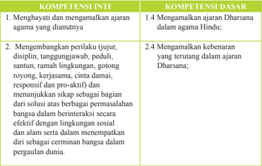

Tabel ini berisi informasi tentang kompetensi inti dan dasar yang berkaitan dengan ajaran agama Hindu. Topik utamanya adalah menghentikan dan mengamalkan ajaran agama yang dianutnya, serta mengembangkan perilaku yang sesuai dengan prinsip-prinsip ajaran tersebut. Kolom-kolom yang ada meliputi 1. Menghentikan dan mengamalkan ajaran agama yang dianutnya, 2. Mengembangkan perilaku (jujur, disiplin, tanggungjawab, peduli, santun, ramah lingkungan, gotong royong, kerjasama, responsif dan proaktif), dan 3. Mengamalkan kebenaran yang terutama dalam ajaran Dharmasana. Data penting yang terlihat adalah bahwa semua kompetensi ini berkaitan dengan pengembangan perilaku yang sesuai dengan prinsip-prinsip ajaran agama Hindu.

 

---
## 📄 Halaman 70

### KOMPETENSI INTI

- Memahami, menerapkan, dan menjelaskan pengetahuan faktual, konseptual, prosedural, dan metakognitif dalam ilmu pengetahuan, teknologi, seni, budaya, dan humaniora dengan wawasan kemanusiaan,  kebangsaan, kenegaraan, dan peradaban terkait penyebab fenomena dan kejadian, serta menerapkan pengetahuan prosedural pada bidang kajian yang spesiik sesuai dengan bakat dan minatnya untuk memecahkan masalah.
- Mengolah, menalar, dan menyaji dalam ranah konkret dan ranah abstrak terkait dengan pengembangan dari yang dipelajarinya di sekolah secara mandiri, bertindak secara efektif dan kreatif, serta mampu menggunakan metoda sesuai kaidah keilmuan.

### 2. Tujuan Pembelajaran

- Menjelaskan Sistem Filsafat Hindu
- Menyajikan Sad Darsana sebagai bagian dalam Filsafat Hindu

### 3. Peta Konsep

---
**🖼️ Gambar/Diagram**

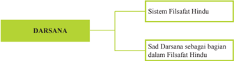

> **Deskripsi Visual:** Gambar ini adalah diagram yang menunjukkan struktur teks tentang Darsana dalam sistem filsafat Hindu. Diagram ini terdiri dari dua cabang utama: Sistem Filsafat Hindu dan Sad Darsana sebagai bagian dalam Filsafat Hindu. Cabang utama ini dikelompokkan menjadi dua subcabang, yaitu Darsana dan Sad Darsana.

Elemen utama dalam diagram ini adalah dua cabang utama yang menggambarkan struktur teks tentang Darsana dalam sistem filsafat Hindu. Cabang utama ini terbagi menjadi dua subcabang, yaitu Darsana dan Sad Darsana. Cabang subcabang ini menunjukkan bahwa Sad Darsana merupakan bagian dari sistem filsafat Hindu.

Teks, angka, atau label penting yang terlihat dalam diagram ini adalah cabang utama dan subcabang yang menggambarkan struktur teks tentang Darsana dalam sistem filsafat Hindu. Cabang utama ini terbagi menjadi dua subcabang, yaitu Darsana dan Sad Darsana. Cabang subcabang ini menunjukkan bahwa Sad Darsana merupakan bagian dari sistem filsafat Hindu.

Informasi kunci yang dapat diambil pembaca dari gambar ini adalah bahwa Darsana adalah cabang utama dalam sistem filsafat Hindu, sedangkan Sad Darsana merupakan bagian dari sistem filsafat Hindu. Ini menunjukkan bahwa Sad Darsana merupakan bagian dari sistem filsafat Hindu, yang juga merupakan cabang utama dalam sistem filsafat Hindu.

### KOMPETENSI DASAR

- 3.4 Memahami ajaran Dharsana dalam Agama Hindu;
- 4.4 Menyajikan bagian-bagian ajaran Dharsana sebagai bagian dalam ilsafat Hindu

 

---
## 📄 Halaman 71

### 4. Proses Pembelajaran

Sebelum memulai pelajaran, ajaklah peserta didik merenung tentang mengapa mereka bisa lahir ke dunia, ke mana mereka akan kembali, atau membayangkan alam semesta yang sangat luas, dan lain-lain. Lalu minta mereka menanyakan kembali tentang itu semua, bantu mereka untuk mempertanyakan karena bertanya adalah salah satu ciri berpikir secara ilsafat. Mengapa matahari bersina r waktu siang hari, mengapa bisa turun hujan, mengapa mawar ada yang merah, putih, kuning dan sebanyak mungkin pertanyaan kritis. Setelah itu, jelaskan bahwa cara berpikir  seperti  itu  juga  ada  dalam  khasanah  pengetahuan  Hindu  yang  disebut tattwa. Atau untuk lebih mudahnya, carilah dalam cerita tentang hal yang sama, seperti dalam Upanisad saat seorang anak dijelaskan tentang Brahman tetapi sang ayah tidak langsung menjelaskan apa, siapa dan dimana itu Brahman. Anaknya justru diminta terlebih dahulu memasukkan garam ke air. Ketika dicipi air yang sudah asin karena larutan garam itu, sang ayah menjelaskan bahwa baik di dasar gelas, di tengah gelas maupun di permukaan gelas, semua air terasa asin, begitulah sifat Tuhan yang dapat dirasakan tetapi tidak dijumpai isiknya dan berada di m anamana. Ini adalah contoh cara berpikir ilsafat.

Dalam  bab  ini  diawali  dengan  pengertian  darsana  dan    keterkaitan  antara kata  tattva  dengan  ilsafat,  bagaimana  persamaan  dan  perbedaan  antara  tattw a dengan  ilsafat  barat.  Pengertian    ini  penting  bagi  guru  untuk  menjelaskan  materi berikutnya,  yakni  sistem  ilsafat  Hindu.  Dalam  materi  ini  dijelaskan  ali ran  ilsafat materialistis dari Cārvāka ,  sistem  ilsafat Jaina ,  aliran  ilsafat Buddha .  Selanjutnya dijelaskan enam ilsafat Hindu yang dikenal dengan Ṣaḍ Darśana adalah enam sistem  ilsafat  orthodox  yang  merupakan  enam  cara  mencari  kebenaran,  yaitu: Nyāyā, Sāṁkya, Yoga, Vaisiseka, Mīmāmsā, dan Vedānta.

Agar lebih mudah, guru dapat menjelaskan materi tersebut dengan meminta terlebih dahulu arti kata ilsafat dan tattwa. Biarkan mereka mencari berdas arkan buku-buku yang ada diperpustakaan. Lalu minta mereka menyampaikan sendiri. Setelah  itu,  guru  menyimpulkan  dan  menceritakan  kembali  bahwa  sistem ilsafat Hindu itu sangat kaya, yang disebut Nawa  Darsana. Lebih khusus, menjelaskan Sad Darsana.

Untuk  semakin  jelasnya  sistem  ilsafat  Hindu,  materi  selanjutnya  adalah menjelaskan isi Ṣaḍ Darśana. Untuk menjelaskan Sad Darsana, guru mengajarkan mulai dari siapa pendirinya, sumber ajaran, sifat ajaran dan pokok-pokok ajarannya serta contoh-contoh nyata dalam kehidupan. Saat menjelaskan Sad Darsana, guru dapat membawa gambar tokoh masing-masing Sad Darsana, serta mintalah pserta didik untuk membuat matrik:

guru

 

---
## 📄 Halaman 72

---
**📊 Tabel**

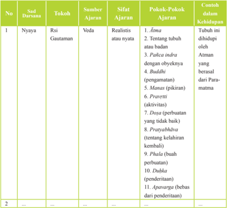

Tabel ini berisi informasi tentang sifat-sifat dariajaran yang disampaikan dalam kurikulum, dengan fokus pada prinsip-prinsip realistis atau nyata dalam pendidikan. Kolom-kolomnya meliputi nomor urutan (No.), sub jenjang (Saat Darwana), tokoh yang menyampaikan (Rsi), sumber ajaran (Ajaran), sifat ajaran (Realistis atau nyata), pokok-pokok ajaran yang terkait, dan contoh dalam kehidupan. Topik utama tabel ini adalah pengembangan pemahaman tentang realisme dan nyata dalam pendidikan, dengan mencakup berbagai aspek seperti prinsip-prinsip, pokok-pokok ajaran, dan contoh dalam kehidupan. Data penting yang terlihat adalah bahwa banyak aspek dariajaran tersebut terkait dengan prinsip-prinsip realistik atau nyata, seperti Atrmanu, Patiça indra, Budhā, Manas, Pravetti, Dīzasa, Prayāṣṭhābhava, Phala, Dukkha, dan Apavarga.

Agar memenuhi saintiik, guru bisa menjalankan proses belajar sebagai berikut:

### Mengamati:

Guru mengajak peserta didik untuk:

- Mendengarkan pendidik menjelaskan  bagian-bagian Dharsana
- Menyimak dengan seksama penjelasan Dharsana
- …………..dst

### Menanya:

Guru mengajak peserta didik untuk:

- Memberikan  kesempatan  kepada  peserta  didik  untuk  menyebutkan  tokohtokoh utama dari Dharsana
- Menanyakan bagian-bagian Dharsana
- ………….dst

### Mengeksperimen/mengeksplorasikan:

Guru mengajak peserta didik untuk:

- Mengumpulkan data tokoh-tokoh utama yang berperan dalam Dharsana

 

---
## 📄 Halaman 73

- Mengumpulkan sumber-sumber sastra untuk mendukung Dharsana
- ………..dst

### Mengasosiasi:

Guru mengajak peserta didik untuk:

- Menganalisis berbagai macam hal yang dihadapi dalam ajaran Dharsana
- Mendiskusikan persamaan dan perbedaan pandangan dalam ajaran Dharsana
- …………..dst

### Mengomunikasikan:

Guru mengajak peserta didik untuk:

- Menyampaikan  dalam  bentuk  tulisan  hakekat  ajaran  Dharsana  berkaitan dengan Sraddha dalam agama Hindu
- Membuat  dalam  bentuk  bagan  yang  memuat  hal-hal  yang  ditonjolkan  dari masing-masing Sad Dharsana
- …………dst

### 5. Evaluasi

Guru juga dapat mengembangkan penilaiannya dengan cara seperti di bawah:

- Observasi: Membuat hasil pengamatan Dharsana dalam masyarakat
- Tugas: Peserta didik membuat ringkasan Dharsana
- Portofolio:  Membuat  laporan  pandangan Dharsana dan tanggapannya terhadap Veda sebagai ajaran Hindu
- Tes: Tertulis, lisan ilsafat Dharsana

### 6. Pengayaan

Guru diharapkan dapat memberikan pengayaan materi agar siswa memiliki pemahanan yang semakin jelas dan lengkap.

### DARSANA

Tak sedikit orang yang menganggap bahwa ilsafat itu tak lebih dari omong kosong, abstrak, obrolan yang mengawang-awang belaka. Padahal ilsafat adalah landasan untuk mengembangkan pengetahuan yang sangat berguna bagi peradaban. Melihat situasi saat ini yang mengalami kemunduran  dalam  berbagai  hal,  termasuk  dalam  cara  berilsafat,  maka kita  butuh  bangkit  dengan menggunakan ilsafat yang benar, yaitu ilsafat yang progresif, dialektis, rasional, logis, dan kritis. Filsafat seperti ini akan membantu kita untuk bangkit. Di tengah fatalisme, orang harus diajak untuk bersikap rasional agar tahu apa masalahnya dan bagaimana menjelaskan dunia  secara  akal  sehat  agar  bisa  mengubahnya  menjadi  sesuatu  yang berguna bagi kehidupannya. Filsafat membuat  kita mandiri dan tidak bergantung  pada  orang  lain.  Filsafat  membantu  kita  untuk  berpikir  kritis dan analitis. Dengan demikian, kita akan dipandu untuk memahami dunia bersama  misteri-misterinya,  dunia  seakan  menjadi  gambling  dengan

 

---
## 📄 Halaman 74

permasalahan-permasalahannya.  Ini  juga  akan  membantu  kita  untuk mudah  menghadapi  masalah,  dan  kadang  juga  membuat  kita  mudah mengembangkan pengetahuan serta menggapai keterampilan teknis.

Kata Tattva berasal dari bahasa Sanskerta 'Tat' yang artinya 'Itu', yang maksudnya  adalah  hakikat  atau  kebenaran (Thatnees) .  Dalam  sumber lainnya, kata Tattva juga berarti falsafah (ilsafat agama), yakni ilmu yang mempelajari  kebenaran  sedalamdalamnya  (sebenarnya)  tentang  sesuatu seperti mencari kebenaran tentang Tuhan, tentang atma, serta yang lainya sampai pada proses kebenaran tentang reinkarnasi dan karmapala . Dalam ajaran Tattva ,  kebenaran  yang  dicari  adalah  hakikat  tentang  Brahman (Tuhan) dan segala sesuatu yang terkait dengan kemahakuasaan Tuhan. Dalam buku Theologi Hindu, kata Tattva berarti hakikat tentang Tat atau Itu (yaitu Tuhan dalam bentuk Nirguṇa Brahman ).

Penggunaan kata Tat sebagai  kata  yang  artinya Tuhan,  adalah  untuk menunjukkan  kepada  Tuhan  yang  jauh  dengan  manusia.  Kata  'Itu' dibedakan  dengan  kata  'Idam'  yang  artinya  menunjuk  pada  kata  benda yang  dekat  (pada  semua  ciptaan  Tuhan).  Deinisi  tersebut  berdasarkan pada pengertian bahwa Tuhan atau Brahman adalah asal segala yang ada, Brahman  merupakan  primacosa  yang  adanya  bersifat  mutlak.  Karena sumber  atas  semua  yang  ada,  tanpa  ada  Brahman  maka  tidak  mungkin semuanya ada. Tattva juga dapat diartikan kebenaran yang sejati dan hakiki.

jika

Penggunaan kata Tattva ini  adalah  istilah  dalam  ilsafat  yang  didasarkan atas  tujuan  yang  hendak  dicapai  yakni  kebenaran  tertinggi  dan  hakiki. Dalam  lontar-lontar  di  Bali,  kata Tattva lebih sering diguṇakan dibandingkan  dengan  istilah  ilsafat  yang  lainnya.

Dengan pengertian ini dapat diartikan bahwa Tattva adalah suatu istilah dalam ilsafat agama yang diartikan sebagai kebenaran sejati dan hakiki yang  didasari  perenungan  mendalam  dan  memerlukan  pemikiran  yang cemerlang  agar  sampai  kepada  hakikat  dan  sifat  kodrati. Ajaran  Hindu kaya akan Tattva , dan secara khusus disebut Darśana .

Kata Darśana berasal dari urat kata dṛś yang artinya melihat, menjadi kata Darśana (kata  benda)  yang  artinya  penglihatan  atau  pandangan. Kata  Darśana  dalam  hubungan  ini  berarti  pandangan  tentang  kebenaran (ilsafat). Filsafat adalah ilmu yang mempelajari bagaimana caranya mengungkapkan  nilai-nilai  kebenaran  hakiki  yang  dijadikan  landasan untuk  hidup  yang  dicita-citakan.  Demikian  juga  halnya  dengan  Darśana yang berusaha mengungkap nilai-nilai kebenaran dengan bersumber pada kitab  suci Veda. Dalam  Agama  Hindu  terdapat  sembilan  cabang  ilsafat yang disebut Nawa Darśana .

Pada  masa Upaniṣad,  Darśana dibagi  menjadi  dua  kelompok  besar, yaitu astika (kelompok yang mengakui Veda sebagai  ajaran  tertinggi)

 

---
## 📄 Halaman 75

dan nastika (kelompok  yang  tidak  mengakui Veda ajaran  tertinggi. Terdapat  enam  cabang  ilsafat  yang  mengakui Veda yang  disebut Ṣaḍ Darśana (Nyāyā, Sāṁkya, Yoga, Mīmāmsā, Vaisiseka, dan Vedānta) dan tiga cabang ilsafat yang menentang Veda yaitu Jaina,  Carvaka dan Buddha . Darśana merupakan bagian penulisan Hindu yang memerlukan kecerdasan yang tajam, penalaran serta perasaan, karena masalah pokok yang dibahasnya merupakan

Inti  sari  dari  ajaran Veda secara  menyeluruh  dibidang  ilsafat,  yakni aspek rasional dari agama dan merupakan satu bagian integral dari agama. Nama  atau  istilah  lain  dari Darśana adalah Mananaśāstra (pemikiran atau renungan ilsafat), Vicaraśāstra (menyelidiki  tentang  kebenaran ilsafat), tarka (spekulasi), Śraddhā (keyakinan atau keimanan). Filsafat juga merupakan pencarian rasional ke dalam sifat kebenaran atau realitas yang  juga  memberikan  pemecahan  yang  jelas  dalam  mengemukakan permasalahanpermasalahan yang  lembut  dari  kehidupan  ini,  di  mana  ia juga  menunjukkan  jalan  untuk  mendapatkan  pembebasan  abadi  dari penderitaan akibat kelahiran dan kematian.

Filsafat bermula dari keperluan praktis umat manusia yang menginginkan  untuk  mengetahui  masalah-masalah  transendental  ketika ia  berada  dalam  perenungan tentang hakikat kehidupan itu sendiri. Ada dorongan dalam dirinya untuk mengetahui rahasia kematian, kekekalan, sifat  dari jīva (roh),  dan  sang  pencipta  alam  semesta  ini.  Dalam  hal  ini ilsafat  dapat  membantu  untuk  mengetahui  semua  permasalahan  yang dihadapi,  karena  ilsafat  merupakan  ekspresi  diri  dari  pertumbuhan  jiwa manusia,  sedangkan  ilsuf  adalah  wujud  lahiriahnya.  Para  pemikir  kreatif dan  para  ilsuf  merupakan  wujud  yang  muncul  pada  setiap  zaman  dan mereka mengangkat atau mengilhami umat manusia.

Pemikiran tentang kematian selalu menjadi daya penggerak yang paling kuat  dari  ajaran  agama  dan  kehidupan  keagamaan.  Manusia  takut  akan kematian dan tidak menginginkan untuk mati. Inilah yang merupakan titik awal dari ilsafat, karena ilsafat berusaha mencari dan menyelidikinya. Pemahaman yang jelas dari manusia dalam hubungannya dengan Tuhan, merupakan  masalah  yang  sangat  penting  bagi  para  pelajar  ilsafat  dan bagi para calon spiritual (sādhaka) sehingga  berbagai  aliran  ilsafat  dan bermacam-macam  aliran  kepercayaan  keagamaan  yang  berbeda  telah muncul  dan  berkembang  dalam  kehidupan  umat  manusia.  Filsafat  Hindu bukan hanya merupakan spekulasi atau dugaan belaka, namun ia memiliki nilai yang sangat luhur, mulia, khas, dan sistematis yang didasarkan atas pengalaman spiritual mistis yang dikenal sebagai Aparokṣa Anubhūti .

Para  pengamat  spiritual,  para  orang  bijak,  dan  para Ṛṣi yang  telah mengarahkan  persepsi  intuitif  dari  kebenaran  adalah  para  pendiri  dari berbagai sistem ilsafat yang berbeda-beda, yang secara langsung

 

---
## 📄 Halaman 76

maupun tidak langsung mendasarkan semuanya pada Veda . Mereka yang telah  mempelajari  kitab-kitab Upaniṣad secara  tekun  dan  hati-hati  akan menemukan  keselarasan  antara  wahyu-wahyu Śruti dengan  kesimpulan ilsafat. Ṣaḍ Darśana yang merupakan enam sistem ilsafat Hindu merupakan enam sarana pengajaran yang benar atau enam cara pembuktian kebenaran.  Masing-masing  kelompok Darśana telah  mengembangkan, mensistematisir serta menghubungkan berbagai bagian dari Veda , dengan caranya  masing-masing,  sehingga  masing-masing  kelompok  tersebut memiliki seorang atau beberapa orang Sūtrakāra , yaitu penyusun doktrindoktrin dalam ungkapan-ungkapan pendek (aphorisma) yang disebut Sūtra .

Sumber: http://mgmplampung.blogspot.co.id/2014/11/sad-darsana-dan- pembagianya.html diakses tanggal 4 Desember 2015 diakses 10.35

### 7. Remedial

### Contoh Program Pembelajaran Remedial

Sekolah

: SMA/SMK……………………

Mata Pelajaran

: Agama Hindu dan Budhi Pekerti

Kelas

: X

Ulangan ke

: ………..

Tanggal ulangan

:  ………..

Bentuk soal

: Uraian

- 1.4   Mengamalkan ajaran Dharsana dalam Agama Hindu:
Materi ulangan (KD/Indikator) :

- Menjelaskan Sistem Filsafat Hindu
- Menyajikan Sad Darsana sebagai bagian dalam Filsafat Hindu Rencana ulangan ulang : ……..
KKM Mapel

: 75

---
**📊 Tabel**

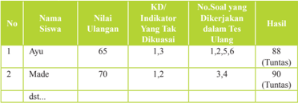

Tabel ini menunjukkan informasi tentang hasil ulangan siswa dengan berbagai indikator keterampilan (KD) yang tidak dikuasai. Topik utama tabel adalah penilaian ulangan siswa dan hasil tes ulangannya. Kolom-kolom yang ada meliputi nomor siswa, nama siswa, nilai ulangan, indikator KD yang tidak dikuasai, nomor soal yang dikerjakan dalam tes ulangan, dan hasil tes ulangannya. Data penting yang terlihat adalah bahwa semua siswa memiliki nilai ulangan di atas 65, dengan Ayu mendapatkan nilai tertinggi sebesar 88 dan Made mendapatkan nilai tertinggi sebesar 90. Selain itu, banyak siswa memiliki indikator KD yang tidak dikuasai, seperti Ayu yang memiliki 3 indikator dan Made memiliki 2 indikator. Hasil tes ulangan untuk semua siswa adalah "Tuntas".

 

---
## 📄 Halaman 77

### Keterangan:

Pada kolom nomor soal yang akan dikerjakan, setiap indikator telah di breakdown menjadi soal-soal dengan tingkat kesukarannya.

Misalnya :   Indikator 1 menjadi 2 soal yaitu nomor soal 1, 2

Indikator 2 menjadi 2 soal yaitu nomor soal 3, 4

Indikator 3 menjadi 2 soal yaitu nomor soal 5, 6

Pada  kolom  hasil  diisi  nilai  hasil  ulangan  ulang,  walaupun  nilai  yang  nantinya diolah adalah sebatas tuntas

### 8. Interaksi dengan Orang Tua

Bersama orang tuamu, cobalah membuat matrik yang isinya gambar para tokoh darsana, ringkasan pemikirannya dan apa yang bisa diamalkan dari pikiran ilosois mereka dalam kehidupan nyata. Diskusikan lalu tugas ini minta ditanda tangani atau diparaf orang tuamu

### E. Pelajaran 5: Catur Asrama

### 1. KI dan KD

---
**📊 Tabel**

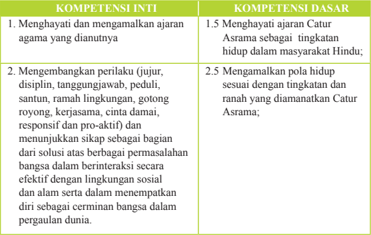

Tabel ini membandingkan dua kompetensi: Kompetensi Inti dan Kompetensi Dasar. Topik utamanya adalah tentang pengembangan perilaku yang diharapkan dalam masyarakat Hindu, khususnya dalam konteks Catur Asrama. Kolom pertama berisi Kompetensi Inti, yang mencakup empat poin utama: menghargai dan mengamalkan ajaran agama, mengembangkan perilaku yang jujur, disiplin, tanggungjawab, peduli, santun, ramah lingkungan, gotong royong, kerjasama, damai, responsif, dan proaktif. Kolom kedua berisi Kompetensi Dasar, yang mencakup empat poin utama: menghargai Catur Asrama sebagai tingkatan hidup dalam masyarakat Hindu, membangun pola hidup sesuai dengan tingkatannya, menunjukkan sikap yang positif dalam berinteraksi secara efektif dengan lingkungan sosial dan alam, serta mempertahankan diri sebagai cerminan bangsa dalam pergaulan dunia. Data penting yang terlihat adalah bahwa setiap kompetensi dasar memiliki empat poin yang harus dicapai, menunjukkan bahwa pembelajaran ini fokus pada全面发展 karakter dan perilaku yang baik dalam konteks budaya dan nilai-nilai masyarakat Hindu.

 

---
## 📄 Halaman 78

### KOMPETENSI INTI

- Memahami, menerapkan, dan menjelaskan pengetahuan faktual, konseptual, prosedural, dan metakognitif dalam ilmu pengetahuan, teknologi, seni, budaya, dan humaniora dengan wawasan kemanusiaan,  kebangsaan, kenegaraan, dan peradaban terkait penyebab fenomena dan kejadian, serta menerapkan pengetahuan prosedural pada bidang kajian yang spesiik sesuai dengan bakat dan minatnya untuk memecahkan masalah.
- Mengolah, menalar, dan menyaji dalam ranah konkret dan ranah abstrak terkait dengan pengembangan dari yang dipelajarinya di sekolah secara mandiri, bertindak secara efektif dan kreatif, serta mampu menggunakan metoda sesuai kaidah keilmuan.

### 2. Tujuan Pembelajaran

- Memahami Pengertian Catur Asrama
- Menyajikan Bagian-Bagian Catur Asrama dan Kewajibannya

### 3. Peta Konsep

---
**🖼️ Gambar/Diagram**

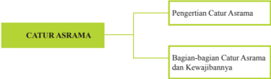

> **Deskripsi Visual:** Gambar ini adalah diagram yang menunjukkan struktur topik tentang Catur Asrama dalam sebuah buku pelajaran. Diagram ini dibagi menjadi dua bagian utama: "Pengertian Catur Asrama" dan "Bagian-bagian Catur Asrama dan Kewajibannya". 

1. **Apa yang Ditampilkan Secara Keseluruhan**: Gambar ini menunjukkan struktur topik utama tentang Catur Asrama dalam buku pelajaran tersebut.

2. **Elemen-Elemen Utama dan Relasinya**: 
   - **Topik Utama**: Dua topik utama yang ditampilkan adalah "Pengertian Catur Asrama" dan "Bagian-bagian Catur Asrama dan Kewajibannya".
   - **Relasi**: Topik "Pengertian Catur Asrama" berada di atas topik "Bagian-bagian Catur Asrama dan Kewajibannya", menunjukkan bahwa pengertian catur asrama merupakan dasar atau fondasi untuk memahami bagian-bagian dan kewajiban catur asrama.

3. **Teks, Angka, atau Label Penting yang Terlihat**:
   - **Teks Penting**: "CATUR ASRAMA", "Pengertian Catur Asrama", "Bagian-bagian Catur Asrama dan Kewajibannya".
   - **Angka**: Ada angka 1 dan 2 yang menunjukkan urutan atau level dalam struktur topik.
   - **Label Penting**: "Untuk memahami lebih lanjut tentang Catur Asrama, silakan lihat bagian-bagian dan kewajibannya."

4. **Informasi Kunci yang Bisa Diambil Pembaca**:
   - Pembaca dapat mengerti bahwa struktur buku ini membahas dua aspek utama tentang catur asrama: pemahaman umum tentang catur asrama dan detail tentang bagian-bagian dan kewajiban catur asrama.

Dengan demikian, gambar ini memberikan pemahaman umum tentang struktur topik tentang catur asrama dalam buku pelajaran tersebut, dengan menjelaskan dua aspek utama yang harus dipelajari sebelum memahami bagian-bagian dan kewajiban catur asrama.

### KOMPETENSI DASAR

- 3.5 Memahami pengetahuan konseptual tentang ajaran Catur Asrama;
- 4.5 Menyajikan ajaran Catur Asrama dalam tatanan hidup;

 

---
## 📄 Halaman 79

### 4. Proses Pembelajaran

Sebelum pelajaran  dimulai,  guru  mengajak  peserta  didik  merenung  tentang tahapan-tahapan kehidupan yang mereka lalui, dari dalam kandungan, lahir, besar, bersekolah  seperti  saat  ini.  Lalu  ajaklah  mereka  memperhatikan  orang  ketika sudah  cukup  dewasa,  orang  akan  menikah.  Setelah  itu  mintalah  peserta  didik memperhatikan orang yang sudah berumur akan terlihat semakin tua dan menjauhi kehidupan seperti layaknya anak muda, dan selanjutnya mintalah peserta didik memperhatikan para rohaniwan. Tahapan seperti bersekolah, menikah, mulai tua dan menjadi rohaniwan adalah cara mudah untuk mengajarkan salah satu ajaran dalam Agama Hindu, Catur Asrama.

Seperti biasa, materi ini diawali dengan pengertian Catur Asrama agar peserta didik  memiliki  pemahaman  yang  jelas  dan  lengkap.  Setelah  penjelasan  Catur Asrama  lalu  dilanjutkan  dengan  penjelasan  bagian-bagian  Catur  Asrama  dan kewajibannya. Dalam menjelaskan materi ini, guru dapat menggunakan beberapa kitab  suci  yang  menjelaskan  Catur Asrama, salah satunya kitab Silakrama dan naskah-naskah suci lainnya. Untuk semakin peserta didik memahami materi Catur Asrama, guru menjelaskan kewajiban masing-masing tingkatan dalam kehidupan nyata.

Agar  semakin  jelas  dan  kaya  pemahaman  peserta  didik,  saat  menjelaskan materi ini, guru meminta peserta didik mencari sendiri apa saja kewajiban yang dilakukan oleh masing-masing tahapan dalam kehidupan. Penugasan ini mereka lakukan dengan melakukan pengamatan sendiri atau pengalaman sendiri. Lebih mudahnya, mereka bisa diminta membuat matrik:

---
**📊 Tabel**

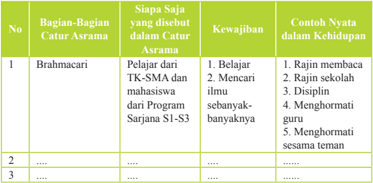

Tabel ini membahas tentang bagian-bagian catur asrama dan kewajiban yang harus dilakukan oleh siapa saja yang berada di dalamnya. Topik utamanya adalah tentang pembagian catur asrama dan kewajiban yang harus dilaksanakan oleh setiap individu yang berada di dalamnya. Kolom-kolom yang ada dalam tabel tersebut meliputi No, Bagian-Bagian Catur Asrama, Siapa Saja yang Disebutkan dalam Catur Asrama, Kewajiban, dan Contoh Nyata dalam Kehidupan. Data atau pola penting yang terlihat dalam tabel tersebut adalah bahwa Brahmacari merupakan bagian dari catur asrama yang melibatkan pelajar dari TK-SMA dan mahasiswa dari Program Sarjana S1-S3. Selain itu, kewajiban yang harus dilaksanakan oleh siapa saja yang berada di dalam catur asrama tersebut meliputi belajar, mencari ilmu sebanyak-banyaknya, disiplin, menghormati guru, dan menghormati sesama teman.

 

---
## 📄 Halaman 80

Agar memenuhi saintiik, guru bisa menjalankan proses belajar sebagai berikut:

### Mengamati:

Guru mengajak peserta didik untuk:

- Menyimak dengan seksama penjelasan ajaran Catur Asrama
- Membaca manfaat menjalani tahapan hidup dalam Catur Asrama
- ………..dst

### Menanya:

Guru mengajak peserta didik untuk:

- Menanyakan bagian-bagian Catur Asrama
- Memberikan kesempatan bertanya kepada peserta didik kewajiban yang harus dilakukan  terhadap  orang  yang  melaksanakan  tahapan  hidup  sesuai  dengan ajaran Catur Asrama
- ……….dst

### Mengeksperimen/mengeksplorasikan:

Guru mengajak peserta didik untuk:

- Mengungkapkan contoh kewajiban masing-masing bagian Catur Asrama
- Mengumpulkan data-data dimasyarakat terkait pelaksanaan Catur Asrama
- ………….dst

### Mengasosiasi:

Guru mengajak peserta didik untuk:

- Mendiskusikan  kewajiban  dan  tanggungjawab  dalam  bagian-bagian  Catur Asrama  jika  dihubungkan  dengan  budaya,  adat  istiadat,  dalam  kehidupan global
- Menganalisis  berbagai  macam  hal  yang  dihadapi  dalam  penerapan  Catur Asrama dalam masyarakat
- ………..dst

### Mengomunikasikan:

Guru mengajak peserta didik untuk:

- Menyampaikan  dalam  bentuk  tulisan  manfaat  dan  tanggung  jawab  setiap bagian Catur Asrama
- Menunjukkan gambar /foto kegiatan setiap tahapan hidup dalam Catur  Asrama
- …………dst

 

---
## 📄 Halaman 81

### 5. Evaluasi

Selain penugasan seperti di atas, guru juga dapat memberikan penilaian dengan cara sebagai berikut:

### 1. Tugas:

- Peserta didik membuat ringkasan Catur Asrama
- Peserta  didik  menuliskan  hak  dan  kewajiban  sesuai  denga  masa  Brahmacarya
- Observasi: Membuat hasil mengamati pemahaman dan pelaksanaan Catur Asrama dalam masyarakat Hindu sesuai dengan budaya Hindu daerah setempat
- Portofolio: Membuat laporan  pelaksanaan Catur Asrama berkaitan dengan hak dan kewajiban sebagai umat Hindu  dalam masyarakat setempat
- Tes:  Tertulis, lisan Catur Asrama.

### 6. Pengayaan

Guru diharapkan dapat memberikan pengayaan materi agar siswa memiliki pemahanan yang semakin jelas dan lengkap.

### CATUR ASRAMA

Catur Asrama (Dewanagari: ; IAST: caturāśrama ) adalah empat tingkatan kehidupan atas dasar keharmonisan hidup dalam ajaran Hindu. Setiap tingkatan kehidupan manusia di bedakan berdasarkan atas tugas dan kewajiban manusia dalam menjalani kehidupannya, namun terikat dalam satu kesatuan yang tidak bisa dipisahkan. Sebagai contohnya, perbedaan kewajiban antara orang tua dan anak.

### Pembagian

Di bawah sistem asrama, kehidupan manusia terbagi menjadi empat periode atau rentang waktu. Tujuan dari setiap periode adalah pencapaian ideal dari setiap tahap kehidupan.

---
**📊 Tabel**

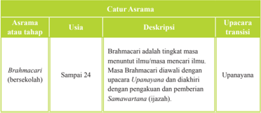

Tabel ini menjelaskan asrama atau tahap dalam kehidupan seorang Brahmacari (bersekolah) dari usia sampai 24 tahun. Topik utamanya adalah tentang tahapan penguatan ilmu dan spiritualitas dalam masa Brahmacari. Kolom-kolomnya meliputi Asrama atau tahap, Usia, Deskripsi, dan Upacara transisi. Data penting yang terlihat adalah bahwa Brahmacari adalah tingkat masa menuntut ilmu atau mencari ilmu, dimulai dari usia 18 tahun hingga 24 tahun. Masa Brahmacari diawali dengan upacara Upanayana dan diakhiri dengan pemberian Samavartana (ijazah).

 

---
## 📄 Halaman 82

---
**📊 Tabel**

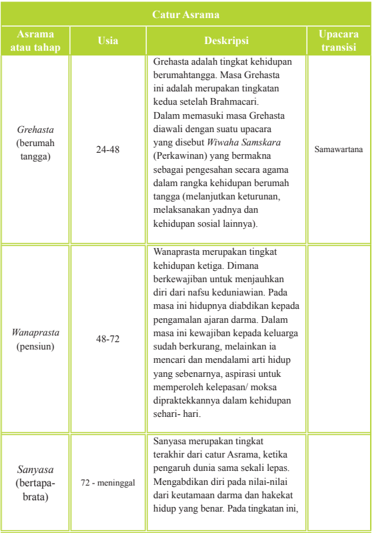

Tabel ini menjelaskan empat tingkat kehidupan spiritual dalam budaya Hindu, disebut Asrama, yang mencakup periode berumur 24 hingga 72 tahun. Topik utama tabel adalah perubahan asrama atau tahap kehidupan spiritual yang dijalani oleh individu sepanjang hidupnya. Tabel ini terdiri dari tiga kolom: Asrama atau tahap, Usia, Deskripsi, dan Upacara transisi. Data penting yang terlihat adalah bahwa Grehasta (berumah tangga) adalah tingkat kehidupan pertama, dimana individu berusia 24-48 tahun, dan menghadapi tantangan seperti menikah dan memiliki anak. Wanaprastha (pensiun) adalah tingkat kehidupan kedua, dimana individu berusia 48-72 tahun, dan fokus pada mempertahankan hubungan keluarga dan memperoleh kelepasan. Sanjaya (bertapa-brata) adalah tingkat kehidupan ketiga, dimana individu berusia 72 tahun atau lebih, dan fokus pada pengembangan diri dan hakekat hidup yang benar. Upacara transisi untuk setiap asrama juga disebutkan, seperti Samawartana untuk Grehasta, dan Sanjaya untuk Sanjaya.

 

---
## 📄 Halaman 83

### Catur Asrama

---
**📊 Tabel**

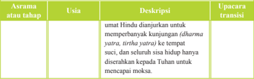

Tabel ini berisi informasi tentang asrama atau tahap dalam upacara transisi bagi umat Hindu yang akan melakukan kunjungan ke tempat suci. Topik utama tabel adalah proses peregangan (dharma yatra, tirtha yatra) untuk mencapai moksa. Kolom-kolomnya meliputi usia, deskripsi, dan upacara/transisi. Data penting yang terlihat adalah bahwa umat Hindu dijanjikan untuk melakukan kunjungan ke tempat suci, seluruh sisa hidupnya diserahkan kepada Tuhan, dan proses ini dilakukan pada usia tertentu.

Sistem asrama diyakini oleh umat Hindu dapat melengkapi purusarta atau tujuan kehidupan, yaitu Darma (kebenaran), Arta (kemakmuran), Kama (kenikmatan), dan Moksa (kebebasan).

---
**📊 Tabel**

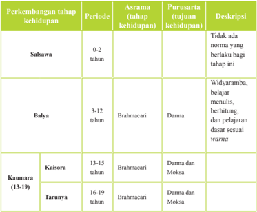

Tabel ini menunjukkan perkembangan tahap kehidupan seorang individu dari usia 0 hingga 19 tahun, dengan fokus pada asrama (tahap kehidupan) dan purusarta (tujuan kehidupan). Topik utama tabel ini adalah perubahan dalam asrama dan tujuan kehidupan sepanjang masa tumbuh kembang seseorang. Kolom-kolom yang ada meliputi periode waktu, asrama, purusarta, dan deskripsi. Data penting yang terlihat adalah bahwa selama tahap Sabsawa (0-2 tahun), tidak ada norma yang berlaku, sedangkan pada tahap Balya (3-12 tahun), individu belajar untuk widyarana, membaca, menulis, berhitung, dan belajar dasar warna. Pada tahap Kaisora (13-15 tahun), individu berpura-pura menjadi Brahmacari dan belajar Dharma dan Moksa. Tahap Tarunya (16-19 tahun) juga berpura-pura menjadi Brahmacari dan belajar Dharma dan Moksa.

 

---
## 📄 Halaman 84

---
**📊 Tabel**

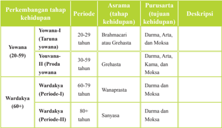

Tabel ini menjelaskan perkembangan tahap kehidupan dalam budaya Hindu, terutama dalam konteks pernikahan dan perkawinan. Topik utamanya adalah tahap-tahap kehidupan yang dijalani oleh pria dan wanita setelah menikah, mulai dari tahap awal hingga tahap akhir. Tabel ini terdiri dari kolom Periode, Asrama (tahap kehidupan), Purusarta (tujuan kehidupan), dan Deskripsi.

Dalam periode 20-29 tahun, pria dan wanita berada di tahap Brahmacari atau Greghasta, yang bertujuan untuk mencari pasangan sejati. Pada periode 30-59 tahun, mereka berada di tahap Greghasta, yang bertujuan untuk membangun hubungan emosional dan moral dengan pasangannya. Pada periode 60-79 tahun, mereka berada di tahap Wanaprasata, yang bertujuan untuk membangun rumah tangga dan mempersiapkan generasi mendatang. Sementara itu, pada periode 80+ tahun, mereka berada di tahap Sanyasa, yang bertujuan untuk mempersiapkan diri untuk meninggalkan dunia dan merayakan hidupnya.

Data penting yang terlihat adalah bahwa tahap-tahap kehidupan ini tidak hanya berdasarkan usia, tetapi juga berdasarkan tujuan dan tugas yang diharapkan dari setiap tahap. Misalnya, tahap Greghasta bertujuan untuk membangun hubungan emosional dan moral, sedangkan tahap Wanaprasata bertujuan untuk mempersiapkan rumah tangga dan generasi mendatang. Ini menunjukkan bahwa perkembangan kehidupan dalam budaya Hindu tidak hanya berkaitan dengan usia, tetapi juga dengan tujuan dan tugas yang diharapkan dari setiap tahap kehidupan.

Sumber: https://id.wikipedia.org/wiki/Caturasrama

### 7. Remedial

### Contoh Program Pembelajaran Remedial

Sekolah

: SMA/SMK……………………

Mata Pelajaran

: Agama Hindu dan Budhi Pekerti

Kelas

: X

Ulangan ke

: ………..

Tanggal ulangan

: ………..

Bentuk soal

:  Uraian

Materi ulangan (KD/ Indikator):

- 1.5  Menghayati ajaran Catur Asrama sebagai  tingkatan hidup dalam masyarakat Hindu:
- Memahami Pengertian Catur Asrama
- Menyajikan bagian-bagian catur asrama dan kewajibannya
Rencana ulangan ulang

KKM Mapel

: ……..

: 75

 

---
## 📄 Halaman 85

---
**📊 Tabel**

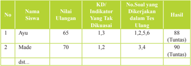

Tabel ini menunjukkan hasil ulangan siswa dengan berbagai indikator keterampilan (KD) dan nilai ulangannya. Topik utama tabel adalah penilaian kinerja siswa dalam ujian ulang. Kolom-kolom yang ada meliputi nomor siswa, nama siswa, nilai ulangannya, indikator KD yang tidak dikuasai, no soal yang dikerjakan dalam tes ulang, dan hasil akhir. Data penting yang terlihat adalah bahwa semua siswa mencapai nilai akhir 80 atau lebih, dengan Ayu mendapatkan nilai tertinggi 90. Siswa-siswa yang memiliki indikator KD yang lebih banyak juga memiliki nilai ulang yang lebih tinggi.

### Keterangan:

Pada kolom nomor soal yang akan dikerjakan, masing masing indikator telah di breakdown menjadi soal-soal dengan tingkat kesukaran masing masing.

Misalnya :   Indikator 1 menjadi 2 soal yaitu nomor soal 1, 2

Indikator 2 menjadi 2 soal yaitu nomor soal 3, 4

Indikator 3 menjadi 2 soal yaitu nomor soal 5, 6

Pada kolom hasil diisi nilai hasil ulangan ulang, walaupun nilai yang nantinya diolah adalah sebatas tuntas.

### 8. Interaksi dengan Orang Tua

Cobalah  kalian amati kehidupan orang-orang dirumahmu,  buatlah klasiikasi  siapa  saja  yang  masuk  golongan  brahmacari,  grahasta, vanaprastha dan bhiksuka. Diskusikan lebih lanjut dengan orang tuamu tugas dari masing-masing golongan itu. Setelahnya minta orang tuamu menandatangangi tugas inti

 

---
## 📄 Halaman 86

### F. Pelajaran 6: Catur Warna

### 1. KI dan KD

---
**📊 Tabel**

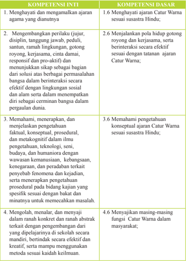

Tabel ini berisi informasi tentang kompetensi inti dan kompetensi dasar yang terkait dengan ajaran Catur Warna dalam konteks pendidikan agama Hindu. Topik utama tabel adalah pengembangan perilaku, pemahaman konsepual, dan penggunaan metode belajar yang efektif. Kolom-kolomnya mencakup 10 baris, masing-masing menunjukkan satu pasang kompetensi inti dan kompetensi dasar. Data penting yang terlihat meliputi: 1) Menghargai dan mengamalkan ajaran agama yang dianutnya; 2) Mengembangkan perilaku (jujur, disiplin, tanggung jawab, peduli, santun, ramah lingkungan, gotong royong, kerjasama); 3) Menemukan solusi atas permasalahan bangsa; 4) Memahami, menerapkan, dan menjalankan pengetahuan faktil, konseptual, prosedural, dan metafiknogitif; 5) Mengolah, menalar, dan menyajikan konsep secara konsisten; serta 6) Menyajikan masing-masing fungsi Catur Warna dalam masyarakat. Pola penting yang terlihat adalah bahwa setiap pasang kompetensi inti dan dasar mencakup aspek-aspek yang berbeda dari pembelajaran dan pengembangan karakteristik peserta didik.

 

---
## 📄 Halaman 87

### 2. Tujuan Pembelajaran

- Memahami Pengertian Catur Warna
- Mendeskripsikan bagian-bagian Catur Warna
- Memahami kewajiban masing-masing Warna
- Menyajikan setiap fungsi Catur Warna dan profesionalisme

### 3. Peta Konsep

---
**🖼️ Gambar/Diagram**

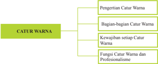

> **Deskripsi Visual:** Gambar ini adalah diagram yang menunjukkan struktur dan fungsi catur warna dalam permainan catur. Diagram ini dibagi menjadi empat bagian utama:

1. Pengertian Catur Warna: Ini menjelaskan apa itu catur warna dan bagaimana mereka berfungsi dalam permainan.

2. Bagian-bagian Catur Warna: Mencakup penjelasan tentang setiap catur warna dan bagaimana mereka berbeda satu sama lain.

3. Kewajiban Setiap Catur Warna: Menyajikan informasi tentang tugas dan tanggung jawab masing-masing catur warna dalam permainan.

4. Fungsi Catur Warna dan Professionalisme: Ini membahas bagaimana catur warna memainkan peran penting dalam permainan dan mengajarkan profesionalisme dalam bermain catur.

Elemen-elemen utama dalam diagram ini adalah teks yang menjelaskan setiap bagian dan bagian-bagian catur warna. Label penting seperti "Pengertian Catur Warna", "Bagian-bagian Catur Warna", "Kewajiban Setiap Catur Warna", dan "Fungsi Catur Warna dan Professionalisme" membantu pembaca memahami struktur dan fungsi catur warna secara jelas. Informasi kunci yang dapat diambil pembaca meliputi pemahaman dasar catur warna, pengetahuan tentang bagian-bagian catur, tanggung jawab setiap catur, dan pentingnya profesionalisme dalam bermain catur.

### 4. Proses Pembelajaran

Ajaklah peserta didik merenung terlebih dahulu tentang profesi dan pekerjaan manusia dalam kehidupan. Setelah itu mereka diminta menyampaikan berbagai profesi  dan  menyimpulkan  sendiri  dengan  membuat  klasiikasi  pekerjaan  atau profesi yang mereka lihat dan alami sendiri. Hasil renungan ini akan mengantar guru dan peserta didik memasuki pengertian dan makna dari Catur Warna.

Bab  ini  dimulai  dengan  pengertian  Catur  Warna  dengan  cara  menjelaskan arti  kata  Catur Warna berdasarkan akar kata, tetapi tetap peserta didik diminta mengartikan terlebih dahulu berdasarkan pengetahuan yang mereka miliki selama ini. Materi ini harus diberikan agar peserta didik dapat membedakan antara Catur Warna dengan Catur Kasta dan semakin memahami Catur Warna sebagai salah satu ajaran dalam kitab suci. Salah satu kitab yang banyak menerangkan Catur Warna  adalah  Bhagavadgita.  Beberapa  sloka  dalam  kitab  ini  dapat  dijadikan contoh. Kitab yang lain adalah Nitisastra.

Setelah penjelasan pengertian Catur Warna, dilanjutkan dengan bagian-bagian Catur Warna, mulai dari Brahmana warna, Kesatriya warna, Vaisya warna dan Sudra warna, yang dilanjutkan dengan kewajiban masing-masing warna dalam kehidupan. Agar peserta didik semakin tahu makna Catur Warna, guru juga dapat menjelaskan bagaimana hubungan Catur Warna dan profesionalisme.

Untuk membuat pemahaman peserta didik semakin dalam, mintalah mereka membuat matrik berdasarkan contoh yang mereka lihat dan alami sendiri, lalu presentasikan.

 

---
## 📄 Halaman 88

---
**📊 Tabel**

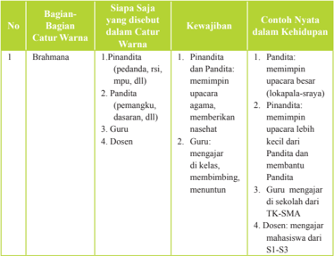

Tabel ini membahas tentang bagian-bagian catur warna dalam konteks kehidupan sehari-hari, dengan fokus pada kewajiban dan contoh nyata dalam kehidupan. Topik utamanya adalah bagaimana setiap bagian catur warna memiliki peran dan tanggung jawab yang berbeda dalam kehidupan. Tabel ini terdiri dari kolom No, Bagian Saja yang disebutkan dalam Catur Warna, Kewajiban, dan Contoh Nyata dalam Kehidupan. Kolom No memberikan nomor urutan untuk setiap baris. Kolom Bagian Saja yang disebutkan dalam Catur Warna mencakup Brahmana (Pinandita, Pandita, Pemangku, Guru, Dosen), sedangkan kolom Kewajiban menunjukkan tanggung jawab masing-masing bagian tersebut. Kolom Contoh Nyata dalam Kehidupan menyajikan contoh nyata dari tanggung jawab masing-masing bagian dalam kehidupan sehari-hari. Misalnya, Pinandita dan Pandita bertanggung jawab untuk memimpin upacara besar, sementara guru bertanggung jawab untuk mengajar di kelas dan membimbing siswa.

Agar memenuhi saintiik, guru bisa menjalankan proses belajar sebagai berikut:

### Mengamati:

Guru mengajak peserta didik untuk:

- Menyimak dengan seksama ajaran Catur Warna
- Mendengarkan  pendidik  menjelaskan  peran  Catur  Warna  dalam  fungsi  dan tugasnya dalam masyarakat
- ………….dst

### Menanya:

Guru mengajak peserta didik untuk:

- Menanyakan penjelasan bagian-bagian Catur Warna
- Memberikan  kesempatan  untuk  memjawab  perbedaan  Catur  Warna  dengan Catur Kasta
- …………dst

### Mengeksperimen/mengeksplorasikan:

Guru mengajak peserta didik untuk:

- Mengungkapkan contoh kewajiban dari masing-masing bagian Catur Warna
- Mengumpulkan data-data pendukung pelaksanaan Catur Warna dalam kehidupan
- …………dst

 

---
## 📄 Halaman 89

### Mengasosiasi:

Guru mengajak peserta didik untuk:

- Mendiskusikan  hubungan  peran  setiapWarna  menurut  Agama  Hindu  bila dihubungkan dengan budaya adat istiadat, dan kehidupan global
- Menganalisis  berbagai  macam  hal  yang  dihadapi  dalam  penerapan  Catur Warna dalam masyarakat
- ………..dst

### Mengomunikasikan:

Guru mengajak peserta didik untuk:

- Menyampaikan dalam bentuk tulisan peranan dan tanggung jawab setiap Warna sesuai ajaran Catur Warna dalam masyarakat, adat budaya, hidup berbangsa dan bernegara
- Menunjukkan gambar /foto kegiatan setiap Warna
- ……………dst

### 5. Evaluasi

Selain  contoh  di  atas,  guru  juga  bisa  melakukan  tindakan  penilaian  dalam bentuk  lain,  yaitu:

### 1.  Tugas:

- Peserta didik membuat ringkasan Catur Warna
- Peserta didik mengidentipikasi pelaksanaan Catur Warna dalam masyarakat dan dalam hubungan hidup berbangsa dan bernegara
- Observasi:  Membuat  hasil  mengamati  pemahaman  dan  pelaksanaan    Catur Warna dalam masyarakat Hindu dalam kerangka tegaknya NKRI
- Portofolio:  Membuat  laporan    pelaksanaan  Catur  Warna  dan  tanggapannya dalam masyarakat
- Tes:  Tertulis, lisan materi Catur Warna

### 6. Pengayaaan

Guru diharapkan dapat memberikan pengayaan materi agar siswa memiliki pemahanan yang semakin jelas dan lengkap.

### PENYIMPANGAN

Banyak  orang  yang  menganggap  Catur  Warna  sama  dengan  Kasta yang  memberikan  seseorang  sebuah  status  dalam  masyarakat  semenjak ia lahir. Namun dalam kenyataannya, status dalam sistem Warna didapat setelah  seseorang  menekuni  suatu  bidang/profesi  tertentu.  Sistem  Warna juga dianggap membeda-bedakan kedudukan seseorang. Namun dalam

 

---
## 📄 Halaman 90

ajarannya,  sistem  Warna  menginginkan  agar  seseorang  melaksanakan kewajiban sebaik-baiknya.

Kadangkala  seseorang  lahir  dalam  keluarga  yang  memiliki  status sosial  yang  tinggi  dan  membuat  anaknya  lebih  bangga  dengan  status sosial  daripada  pelaksanaan  kewajibannya.  Sistem  Warna  mengajarkan seseorang agar tidak membanggakan ataupun memikirkan status sosialnya, melainkan diharapkan mereka melakukan kewajiban sesuai dengan status yang disandang karena status tersebut tidak didapat sejak lahir, melainkan berdasarkan keahlian mereka. Jadi, mereka dituntut untuk lebih bertanggung jawab dengan status yang disandang daripada membanggakannya.

Di Indonesia (khususnya di Bali) sendiri pun terjadi kesalahpahaman terhadap sistem Catur Warna. Catur Warna harus secara tegas dipisahkan dari pengertian kasta. Pandangan tersebut dikemukakan oleh Drs. I Gusti Agung  Gde  Putera,  waktu  itu  Dekan  Fakultas  Agama  dan  Kebudayaan Institut  Hindu  Dharma  Denpasar  pada  rapat  Desa  Adat  se-kabupaten Badung  tahun  1974.  Gde  Putera  yang  kini  Dirjen  Bimas  Hindu  dan  Buddha Departemen  Agama  mengemukakan:

'Kasta-kasta  dengan  segala  macam titel -nya  yang  kita  jumpai sekarang di Bali adalah suatu anugerah kehormatan yang diberikan oleh  Dalem  (Penguasa  daerah  Bali),  oleh  karena  jasa-jasa  dan kedudukannya  dalam  bidang  pemerintahan  atau  negara  maupun di  masyarakat.  Dan  hal  ini  diwarisi  secara  turun  temurun  oleh anak cucunya yang dianggap sebagai hak, walaupun ia tidak lagi memegang jabatan itu. Marilah jangan dicampur-adukkan soal titel ini  dengan  agama,  karena  titel  ini  adalah  persoalan  masyarakat, persoalan jasa, persoalan jabatan yang dianugerahkan oleh raja pada zaman dahulu. Dalam agama, bukan kasta yang dikenal, melainkan 'warna' dimana ada empat warna atau Caturwarna yang membagi manusia  atas  tugas-tugas  (fungsi)  yang  sesuai  dengan  bakatnya. Pembagian  empat  warna  ini  ada  sepanjang  zaman.'

Menurut  I  Gusti  Agung  Gede  Putera,  kebanggaan  terhadap  sebuah gelar  walaupun  jabatan  tersebut  sudah  tidak  dipegang  lagi  merupakan kesalahpahaman  masyarakat  Bali  turun-temurun.  Menurutnya,  agama Hindu  tidak  pernah  mengajarkan  sistem  kasta  melainkan  yang  dipakai adalah sistem Warna.

Sumber: https://id.wikipedia.org/wiki/Warna_(Hindu)

 

---
## 📄 Halaman 91

### 7. Contoh Program Pembelajaran Remedial

Sekolah

: SMA/SMK……………………

Mata Pelajaran

: Agama Hindu dan Budhi Pekerti

Kelas

: X

Ulangan ke

: ………..

Tanggal ulangan

: ………..

Bentuk soal

: Uraian

Materi ulangan (KD/Indikator) :

### 1.6 Menghayati ajaran Catur Warna sesuai susastera Hindu:

- Memahami Pengertian Catur Warna
- Mendeskripsikan bagian-bagian Catur Warna
- Memahami kewajiban setaip Warna
- Menyajikan masing-masing fungsi Catur Warna dan profesionalisme Rencana ulangan ulang : ……..
KKM Mapel

: 75

---
**📊 Tabel**

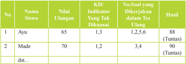

Tabel ini menunjukkan informasi tentang hasil ulangan siswa di sekolah. Topik utamanya adalah penilaian ulang dan analisis indikator yang tidak dikuasai oleh siswa. Kolom-kolom yang ada meliputi nomor siswa, nama siswa, nilai ulangan, indikator yang tidak dikuasai, no soal yang dikerjakan dalam tes ulangan, dan hasil tes ulangan. Data penting yang terlihat adalah bahwa Ayu mendapatkan nilai 65 dan tidak mampu menjawab indikator 1,3, tetapi berhasil menjawab 88 soal dari 90 soal yang dikerjakannya dalam tes ulangan, sehingga mendapatkan nilai 88. Sementara itu, Made mendapatkan nilai 70 dan tidak mampu menjawab indikator 1,2, tetapi berhasil menjawab 90 soal dari 90 soal yang dikerjakannya dalam tes ulangan, sehingga mendapatkan nilai 90. Kedua siswa ini semua mendapatkan nilai ulangan yang tinggi, yaitu 88 dan 90, yang menunjukkan bahwa mereka berhasil menjawab sebagian besar soal yang dikerjakannya dalam tes ulangan.

### Keterangan:

Pada kolom nomor soal yang akan dikerjakan, setiap indikator telah di breakdown menjadi soal-soal dengan tingkat kesukaran masing masing.

Misalnya :   Indikator 1 menjadi 2 soal yaitu nomor soal 1, 2

Indikator 2 menjadi 2 soal yaitu nomor soal 3, 4

Indikator 3 menjadi 2 soal yaitu nomor soal 5, 6

Pada kolom hasil diisi nilai hasil ulangan ulang, walaupun nilai yang nantinya diolah adalah sebatas tuntas.

 

---
## 📄 Halaman 92

### 8. Interaksi dengan Orang Tua

Cobalah kalian amati orang-orang yang ada disekitarmu, berdasarkan materi yang kalian telah pelajari, siapa yang masuk golongan sudra, wesya, ksatria dan brahmana dan mengapa mereka dapat  digolongkan  seperti  bagian-bagian  catur  warna,  apakah karena pekerjaannya atau kelahirannya. Diskusikan kembali pekerjaanmu  dengan  orang  tua,  lalu  minta  untuk  ditandatangani atau paraf

 

---
## 📄 Halaman 93

### BAB IV Penutup

### A. Simpulan

Isi  Buku  Panduan  Guru  ini  masih  merupakan  petunjuk  umum  bagi  para guru sehingga mereka  diharapkan tidak berdiam diri, namun  sebaliknya, berusaha menjadikan petunjuk umum menjadi petunjuk teknis yang operasional. Untuk  dapat  digunakan  secara  efektif,  disarankan  para  guru  harus  mampu mengembangkan petunjuk umum ini sesuai dengan karakteristik para peserta didik dan menyesuaikan dengan kebutuhan yang ada serta daerah setempat di mana guru dan peserta didik berada. Hal ini mengingat apa yang diberikan dalam buku panduan masih sangat mungkin untuk dikembangkan, diperdalam dan diperkaya.

Buku Panduan Guru ini harus juga menjadi satu pegangan umum sehingga para guru dapat merujuknya. Namun demikian, bagaimana petunjuk umum dalam buku  ini  diterapan  diserahkan  sepenuhnya  kepada  para  guru.  Hanya  dengan cara seperti ini, buku ini akan menjadi berguna terutama dalam mencapai tujuan pembelajaran secara umum.

### B. Saran-saran

Agar  buku  panduan  ini  dapat  digunakan,  ada  beberapa  saran  yang  dapat diajukan, antara lain:

- Buku  ini  harus  di breakdown menjadi  buku  pegangan  teknis  sesuai  dengan materi yang akan diajarkan guru
- Guru harus mempersiapkan diri dengan cara membaca berbagai referensi serta belajar terus menerus baik melalui berbagai pelatihan maupun penjenjangan pendidikan. Hal ini penting untuk meningkatkan kompetensi guru sehingga dapat  mengaplikasikan  petunjuk  umum  dalam  buku  panduan  ini  menjadi lebih  teknis  lagi,  terutama  dalam  mengembangkan  metode  dan  media pembelajarannya.
- Guru  dapat  mengembangkan  sendiri  secara  kreatif  beberapa  contoh  yang diberikan dalam Buku Panduan ini, sehingga benar-benar terimplementasikan dalam  proses  belajar.  Dengan  demikian,  guru  memiliki  kesempatan  untuk mengaktualisasikan kreativitasnya berdasarkan karakter daerah, peserta didik dan situasi yang dihadapi guru di lapangan.

 

---
## 📄 Halaman 94

### Kunci Jawaban dari soal-soal dalam Buku Siswa:

- A
- C
- B
- C
- C
- B
- C
- B
- B
- A
- C
- C
- A
- B
- A
- B
- C
- C
- C
- D

 

---
## 📄 Halaman 95

### GLOSARIUM

- advaita vedanta bagian dari ajaran Hindu yaitu Darsana
- agni api yang sangat erat kaitannya dengan upacara atau Dewa pelindung yang selalu dipuja oleh umat Hindu
- daitya Raksasa, Danawa, Asura keturunan Diti yang merupakan lawan dari para Dewa.
- agni hotra persembahan terhadap Dewa Agni, nama suatu upacara yang sangat penting di dalam ajaran Veda
- ahimsa tidak melakukan kejahatan dan membunuh
- ambika ibu dari alam semesta, yang senang membunuh. Korban raksasa siluman. Nama Dewi Padi, Durga, dan Parwati.
- asvameda upacara korban kuda yang dilakukan oleh golongan Hindu jaman dahulu
- avidya kebodohan penyebab atman terikat pada kehidupan dunia atau neraka.
- ayodhya kota kuno di tepi sungai Gogra yang diperintah oleh Iksvaku atau Manu dari dinasti Surya.
- bhagavadgita nyanyian Tuhan. Ajaran Sang Krisna dalam Mahabharata
- bhakti persembahan atau penyerahan diri menurut petunjuk agama dalam usaha mencapai kebebasan jiwa.
- candra bulan atau Dewi Bulan.
- carvaka nama salah satu Darsana yang membicarakan masalah matrialis yang bersumber pada ajaran Barhaspati Sutra.
- daksina pemberian yang diberikan kepada pendeta yang menyelesaikan suatu upacara. Kekuatan atau sakti dari upacara Yjana.
- dandaka hutan tempat Sang Rama, Laksmana dan Dewi Sita berkelana
- dharana jiwa yang telah menemukan alam surge.
- dharma moral yang diperintahkan oleh ajaran agama.
- grhasutra buku suci yang mengandung masalah hukum kemasyarakatan dan upacara-upacara.
- himsa pembunuhan
- homa upacara selamtan pada dewadewa dengan menaburkan Ghrta pada api suci.
- isvara Tuhan sebagai penguasa Pramesvara
- jaya Yajna Upacara kemenangan
- jnana ilmu pengetahuan tentang kebebasan
- kalpa satu hari Brahman
- laksa pohon yang digunakan sebagai obat untuk menyembuhkan luka
- maharsi Rsi agung yang sangat terkenal seperti sapta rsi.

 

---
## 📄 Halaman 96

- moksa ketenangan dan kebahagiaan spiritual yang kekal abadi yang merupakan tujuan akhir dari umat Hindu.
- natya veda ilmu tentang tari-tarian
- niyama kontrol terhadap pikiran yang dilakukan olhe para Yogi.
nirvikalpa samādhi keadaan supra sadar transenden.

- purana berarti tua atau kuno. Merupakan salah satu bagian dari kitab Itihasa yang memuat catatan kisah sejarah agama Hindu.
- prakrti jenis wanita, kekuatan aktif, sakti
- purohita pendeta pilihan atau berfungsi sebagai pelindung untuk melawan kekuatan magik
- rajasika aktif terhadap pengontrolan terhadap pikiran
- sadasiva Tuhan yang memiliki sifat aktif
- samsara ikatan terhadap dunia, lahir kembali
- sastra ilmu hukum dan lain-lainnya
- sidhisvara Dewa Siwa dengan kekuatan luar biasa
- sloka bait-bait yang terdapat dalam Weda.
- rsi orang-orang suci yang langsung mengetahui mantra-mantra veda dari Tuhan.
- upanayana penyucian untuk seorang murid yang baru belajar Weda yang dilakukan oleh guru.
- vidya ilmu pengetahuan
- yogini wanita yang memuja sakti atau Bhairawa
- catur warna empat profesi kehidupan manusia berdasarkan keahlian 'guna dan   karma', yang terdiri dari: Brahmana warna, Ksatriya warna, Waisya warna, dan Sudra warna.
- suklapaksa/penanggal perhitungan hari-harinya dimulai sesudah bulan mati (tilem) sampai dengan purnama (bulan sempurna).
- krsnapaksa/panglong perhitungan hari dimulai  sesudah purnama yang lamanya juga 15 hari dari panglong 1 sampai dengan pangglong 15.
- padewasan ilmu tentang hari yang baik. Dewasa Ayu artinya hari yang baik

 

---
## 📄 Halaman 97

### Daftar Pustaka

- Aryana,  IB  Putra  Manik.  2009. Tenung  Wariga  Kunci  Ramalan  Astrologi  Bali. Denpasar: Bali Aga.
- __________. 2009. Dasar Wariga Kearifan Alam dalam Sistem Tarikh Bali. Denpasar: Bali Aga.
- Awanita, Made. 2011. Panduan Guru Mengajar Pendidikan Agama Hindu Sekolah Menengah Atas (SMA). Surabaya: Paramita.
- Bajrayasa, dkk .1981. Acara I (Sad Acara). Jakarta :Mayasari.
- Bangli, IB. 2005. Wariga Dewasa Praktis . Surabaya, Paramitha.
- Gambar, I Made. 1986. Prembon Serba Guna, Dalil Kelahiran Pertemuan Jodohan Suami Istri, Padewasan. Denpasar: Cempaka 2.
- Kajeng, I Nyoman, dkk.  2001. Sarasamuscaya. Tanpa Penerbit.
- Mantra, IB. Bhagavadgita. Pemda TK I Bali.
- Maswinara, I Wayan. 2006. Sistem Filsafat Hindu. Surabaya: Paramita.
- ________. (penterjemah). 2004. Rgveda Samhita, Mandala V, V, VI, VII . Surabaya: Paramitha.
- Musna, I Wayan. 1991. Kamus Agama Hindu. Denpasar: Upada Sastra.
- Namayuda,  IB.  1996. Wariga .  Proyek  Bimbingan  dan  Penyuluhan  Kehidupan Beragama Tersebar di 9 Daerah Tingkat II Se Bali.
- ________. 2001. Dasar Pengetahuan Tentang Wariga . Kumpulan Materi Pendalaman Sradha Bagi Yowana Semeton siwa Budha Se Bali.
- Nurkancana,  Wayan.  2010. Ramayana  Kisah  Kasih  Perjalanan  Rama. Denpasar: Pustaka Bali Post.
- Ngurah,  I  Gusti  Made.  2006. Buku  Pendidikan  Agama  Hindu  Untuk  Perguruan Tinggi. Surabaya: Paramita.

 

---
## 📄 Halaman 98

Pendit, Nyoman S. Bhagavadgita. Denpasar: Dharma Bakti.

PGAHN 6 Thn. Singaraja.  1971. Nitisastra , Pemerintah Daerah TK. I Bali.

- Pudja, G. dan Tjokorda Rai Sudharta. 2010. Manava Dharmasastra ( Veda Smerti ). Surabaya: Paramita.
Rudia Adiputra, I Gede dkk. 1990. Tattwa Darsana .  Jakarta: Yayasan Dharma Sarathi.

Sudarsana, IB. Putu.  2003. Ajaran Agama Hindu ( Samkhya Yoga ). Tanpa Penerbit.

Sudharta, Tjokorda Rai. Pengantar Weda. Jakarta: Maya Sari.

Sudirga, Ida Bagus, dkk. 2007. Widya Dharma Agama Hindu. Jakarta:Ganeca Exact.

_________. 2011. Widya Dharma Agama Hindu untuk SMA . Jakarta: Ganeca Exact.

Suja, I Wayan. 2011. Ritual Veda Homa Tattwa Jnana. Surabaya: Paramita.

- Simamora, Roymond H. 2009. Buku Ajar Pendidikan Dalam Keperawatan . Jakarta: Egc.
- Tim  Penyusun.  2013. Buku  Guru  Pendidikan  Agama  Hindu  dan  Budi  Pekerti Kurikulum 2013 . Jakarta: Kementerian Pendidikan dan Kebudayaan.
Tim Penyusun. 2002. Panca Yadny. Pemrintah Provinsi Bali.

Titib, I Made. 1996. Pengantar Weda . Jakarta: Hanuman Sakti.

- ___________.  2003. Teologi  dan  Simbol-simbol  dalam  Agama  Hindu .  Surabaya: Paramita.
- ___________. 2003. Purana, sumber ajaran Hindu konprehensi. Surabaya: Paramita.
- ___________.  2008. Itihasa  Ramayana  dan  Mahabharata  Kajian  Kritis  Sumber Agama Hindu . Surabaya: Paramitha.
- Tim  Penyusun.  1992. Buku  Bacaan  Agama  Hindu  untuk  SMA  Kelas  I .  Jakarta: Hanoman Sakti.
- Tim Penulis.1990. Pelajaran Agama Hindu untuk Sekolah Menengah Tingkat Atas Kelas III : Yayasan Dharma Sarathi.
- Tim Penyusun. 1990. Kamus Besar Bahasa Indonesia . Jakarta: Balai Pustaka.
- Tim Penyusun.1997. Budhi Pekerti Dalam Ceritra Yang Bernafaskan Hindu Untuk S.M.U. Kelas I dan yang Sederajat . Bali:  MGMP Agama Hindu SMU Propinsi Bali.
Tim Penyusun. 2002. Panca Yadnya . Pemerintah Propinsi Bali.

 

---
## 📄 Halaman 99

- Tonjaya Bendesa, I Nym Gd. 1994. Dharmaning Pemaculan . Denpasar: Ria.
- Uno, Hamzah B. 2009. Model Pembelajaran . Jakarta: Bumi Aksara.
- Watra, I Wayan. 2007. Pengantar Filsafat Hindu (Tattwa I). Surabaya: . Paramita
- Wiana,  I  Ketut.  2006. Memahami  Perbedaan  Catur  Varna,  Kasta  dan  Wangsa . Surabaya: Paramita.
- ___________.  1993. Kasta  Dalam  Hindu  :  Kesalahpahaman  Berabad-abad . Denpasar: Yayasan Dharma Naradha.
- Yayasan Satya Hindu Dharma. 1992. Kunci Wariga Dewasa. Denpasar: Upada Sastra.
- ___________.  2005. Penelusuran  Modern  Wariga  Warisan  Budaya  Adiluhun. Denpasar: Panakom.

### Sumber Gambar:

- Diakses tanggal 4 Desember 2015, pukul 10.45, https://id.wikipedia.org/wiki/ Caturasrama
- Diakses tanggal 4 Desember 2015 pukul 11.00, https://id.wikipedia.org/wiki/ Warna_(Hindu)
- Diakses 25 Oktober 2013 http://belajarpsikologi.com/macam-macam-metodepembelajaran
- Diakses 25 Oktober 2013 , http://yogabudibhakti.wordpress.com/2012/03/14/ remedial-dan-pengayaan
- Diakses 25 Oktober 2013, http://ayatussyifa260391.wordpress.com/2012/03/28/ komponen-pembelajaran
- Diakses 25 Ooktober 2013, http://www.academia.edu/4394403/HUBUNGAN_ KERJASAMA_ANTARA_GURU_DAN_ORANGTUA

 

---
## 📄 Halaman 100

### Profil Penulis

Nama Lengkap  :  Drs.Ida Bagus Sudirga,M.Pd.H

Telp. Kantor/HP :   (0361485363)/ 081338327723

E-mail

:   sugabadir@yahoo.co.id

Akun Facebook :  sugabadir@gmail.com

Alamat Kantor

:   Jl Gunung Rinjani Monang Maning

Denpasar

Bidang Keahlian:  Mengajar Pendidikan Agama Hindu dan Budi Pekerti

### Riwayat pekerjaan/profesi dalam 10 tahun terakhir:

- Sebagai Guru di SMA Negeri 4 Denpasar
- Sebagai Guru di SMA PGRI 2 Denpasar

### Riwayat Pendidikan Tinggi dan Tahun Belajar:

- 2009 - 2011, S2 Fakultas Dharma Acarya /jurusan/program studi Pendidikan Agama Hindu Institut Hindu Dharma Negeri  ( IHDN ) Denpasar .
- 1984 - 1988 S1 Fakultas Pendidikan Agama /jurusan/program studi  Ilmu Pendidikan Agama Hindu, Institut Hindu Dharma Denpasar.

### Judul Buku dan Tahun Terbit (10 Tahun Terakhir):

- Dasar-Dasar Pendidikan (2010);
- Buku Teks Pelajaran Pendidikan Kewarganegaraan (PKn) untuk SMA Kelas X, XI, dan XII (2006).
- Widya Dharma Agama Hindu untuk SMA,yang diterbitkan oleh Ganeca Exact Jakarta tahun 2007.

### Judul Penelitian dan Tahun Terbit (10 Tahun Terakhir):

Widya Dharma Agama Hindu untuk SMA,yang diterbitkan oleh Ganeca Exact Jakarta tahun 2007

 

---
## 📄 Halaman 101

### Profil Penulis

Nama Lengkap  :  Dr. I Nyoman Yoga Segara, M.Hum.

Telp. Kantor/HP :   0361-232980/08129050995

E-mail

:   yogasegara@yahoo.com

Akun Facebook :  yogasegara@yahoo.com

Alamat Kantor

:   Pascasarjana IHDN Denpasar,

Jl. Kenyeri 57 Denpasar

Bidang Keahlian:  Antropologi dan Ilmu Filsafat

### Riwayat pekerjaan/profesi dalam 10 tahun terakhir:

- 2006 - 2014, Widyaiswara Pusdiklat Tenaga Administrasi, Badan Litbang dan Diklat Kementerian Agama.
- 2014 - 2015, Peneliti Pusat Kehidupan Keagamaan, Badan Litbang dan Diklat Kementerian Agama.
- 2015 - sekarang, Dosen Institut Hindu Dharma Negeri (IHDN) Denpasar.

### Riwayat Pendidikan Tinggi dan Tahun Belajar:

- 2008 - 2011, S3 FISIP/Pascasarjana/Ilmu Antropologi/Universitas Indonesia.
- 2001 - 2004, S2 FIB/Pascasarjana/Ilmu Filsafat/Universitas Indonesia.
- 1993 - 1998, S1 FIA/Filsafat Agama/Sastra dan Filsafat Hindu/Universitas Hindu Indonesia.

### Judul Buku dan Tahun Terbit (10 Tahun Terakhir):

- Pengawasan dengan Pendekatan Agama, 2013. Jakarta: Itjen Press.
- Bagaimana Umat Hindu Melestarikan Lingkungan, 2013. Jakarta: KLH dan PHDI Pusat.
- Perkawinan Nyerod: Kontestasi, Negosiasi dan Komodifikasi di Atas Mozaik Kebudayaan Bali, 2015. Jakarta: Saadah Cipta Mandiri.

### Judul Penelitian dan Tahun Terbit (10 Tahun Terakhir):

- Refleksi Filsafat Politik dalam Kautilya Arthasastra, 2012. STAHDN Jakarta.
- Biaya Perkawinan di Kantor Urusan Agama (KUA) Kecamatan Semarang Barat dan Kecamatan Mijen, Jawa Tengah Pasca Ditetapkannya PP Nomor 48 Tahun 2014 dan PMA Nomor 24 Tahun 2014, 2014. Puslitbang Kehidupan Keagamaan.
- Model-Model Pemberdayaan Rumah Ibadat, 2014. Puslitbang Kehidupan Keagamaan.
- Tren Cerai Gugat Dikalangan Muslim Indonesia, 2015. Puslitbang Kehidupan Keagamaan.
- Survei Kerukunan Umat Beragama di Indonesia Tahun 2015, 2015. Puslitbang Kehidupan Keagamaan.
- Aktualisasi Nilai-Nilai Agama dalam Pencegahan Tindakan Korupsi, 2015. Puslitbang Kehidupan Keagamaan.
- PERWALI: Oasis di Tengah Sengkarut Pengelolaan Zakat di Kota Surakarta, 2015. Puslitbang Kehidupan Keagamaan.
- Pelaksanaan Bimbingan Manasik Haji oleh KUA, 2015. Puslitbang Kehidupan Keagamaan.
- Analisis Hubungan Persepsi Terhadap Keluarnya Peraturan Menteri Agama Nomor 56 Tahun 2014 dengan Tingkat Kesiapan Pengelola Pasraman, Masyarakat, dan Pemerintah, 2015. STAHDN Jakarta.

 

---
## 📄 Halaman 102

### Profil Penelaah

Nama Lengkap  :  Dr. Wayan Paramartha,SH.,M.Pd.

Telp. Kantor/HP :

(0361485363)/ 081338327723

E-mail

:   wayan_Paramartha@ yahoo.com

Akun Facebook :  Wayan Paramartha

Alamat Kantor

:   Jl. Sangalangit, Tembau Penatih Denpasar. Tilp.

(0361)464700, 464800

Bidang Keahlian:  Manajemen pendidikan, telaah kurikulum, evaluasi pendidikan,  metodologi penelitian pendidikan, landasan pendidikan dan teori pendidikan

### Riwayat pekerjaan/profesi dalam 10 tahun terakhir:

- Sebagai Asdir II Pascasarjana Universitas Hindu Indonesia- 2004-2008
- Sebagai Wakil Rektor III -2008
- Sebagai Kaprodi Magister (S2) Pendidikan Agama Dan Evaluasi Pendidikan Agama Pascasarjana Universitas Hindu Indonesia- 2011- Semarang.
- Sebagai Editor Modul Metodologi Penelitian, Modul Evaluasi Pendidikan - 2008.
- Menyusul Modul Majemen Pendidikan-Dirjen Bimas Hindu Kemenag RI-2008
- Instruktur PLPG Guru Agama Hindu- Dirjen Bimas Hindu Kemenag RI-2008, 2011.
- Sebagai Penelaah Buku Pendidikan Agama Hindu dan Budi Pekerti (BG,BS) Tk.Dasar dan Mengah th. 2013, 2014, 2015, 2016.

### Riwayat Pendidikan Tinggi dan Tahun Belajar:

- S3:  Universitas Negeri Malang, Program Pascasarjana, Program Studi Manajemen Pendidikan, tahun masuk 2008, tahun lulus 2011.
- S2:  IKIP Negeri Singaraja, Program Pascasarjana (S2) jurusan/Program Studi Penelitian Dan Evaluasi Pendidikan tahun masuk 2001, tahun lulus 2003;
- S1:  Univ. Mahendradata, Fakultas Hukum, jurusan/program studi, Hukum Keperdataan tahun masuk 1991, tahun lulus 1994.
- S1:   Universitas Udayana Denpasar, FKIP , jurusan/program studi  Pendidikan Ilmu Pengetahuan Sosial/Sejarah/Anthropologi, tahun masuk 1980, tahun lulus 1985;

### Judul Buku dan Tahun Terbit (10 Tahun Terakhir):

- Modul Metodologi Penelitian th. 2007, Kemenag.
- Modul  Evaluasi Pendidikan th. 2007, Kemenag.
- Manajemen Pendidikan the. 2012, Kemenag
- Buku Guru dan Buku Siswa Pendidikan Agama Hindu Dan Budi Pekerti, th. 2013, 2014, dan 2015,  Kemendikbud.

### Judul Penelitian dan Tahun Terbit (10 Tahun Terakhir):

- Menggungkap Model Pendidikan Hindu Bali Tradisional Aguron-guron th.2014, Kemenristek Dikti.
- Menggungkap Model Pendidikan Hindu Bali Tradsional Aguron-guron th. 2015, Kemenristek Dikti.

 

---
## 📄 Halaman 103

### Profil Penelaah

Nama Lengkap  :  K.S. Arsana, S.Psi

Telp. Kantor/HP :   021-4711870/082254134898.

E-mail

:    ksarsana@gmail.com

Akun Facebook :   OareSaga (Arsana)

Alamat Kantor

:    PT Sato Human Dynamics,

Perkantoran Graha Mas Pemuda Blok AD-5, Jalan Pemuda, Rawamangun, Jakarta Timur

Bidang Keahlian:  Pelatihan dan Pengembangan SDM,

Manajemen Strategik, dan Filsafat Hindu

### Riwayat pekerjaan/profesi dalam 10 tahun terakhir:

- Januari 2004 - Sekarang: Pendiri dan Managing Director PT Sato Human Dynamics
- Juli 2014 - Sekarang: Dosen dan Ketua LP3M STAH 'Dharma Nusantara' , Jakarta
- Maret 2015 - Sekarang: Anggota Tim Panel Ahli di Kementerian Komunikasi dan Informatika RI

### Riwayat Pendidikan Tinggi dan Tahun Belajar:

- S1:   Ilmu Psikologi, Universitas Gadjah Mada, 1983 - 1988.

### Judul Buku yang Pernah Ditelaah (10 Tahun Terakhir):

- The Arts of Leadership - Seni Kepemimpinan
- Nature Wisdom - Inspirasi Kebijaksanaan Alam
- The Essence of Spiritual Leadership
- The Joy of Giving and Forgiving

### Judul Penelitian dan Tahun Terbit (10 Tahun Terakhir):

- Tidak ada
Sebagai Inspirator, Public Speaker, dan Trainer, selain di Indonesia penulis telah berbagi pengetahuan dan pengalaman di berbagai negara di lima (5) benua.

 

---
## 📄 Halaman 104

### Profil Editor

Nama Lengkap  :   Andi S. Fatmawati, SH.

Telp. Kantor/HP :    021-3804248

E-mail

:    andinana62@gmail.com

Akun Facebook :

Alamat Kantor

:    Jl. Gunung Sahari Raya No. 4, Jakarta Pusat

Bidang Keahlian:   Copy Editor

### Riwayat pekerjaan/profesi dalam 10 tahun terakhir:

- 2015 - 2016: Staf bidang Perbukuan di Pusat Kurikulum dan Perbukuan, Balitbang, Kemdikbud.
- 2011 - 2015: Staf bidang  PAUDNI di Pusat Kurikulum dan Perbukuan, Balitbang, Kemdikbud.
- 2006 - 2011: Pembantu Pimpinan di Bidang Informasi Pusat Perbukuan, Setjen, Depdiknas.

### Riwayat Pendidikan Tinggi dan Tahun Belajar:

- S1: Hukum Perdata, Universitas Tarumanegara (1991)

### Judul Buku yang Pernah Di edit (10 Tahun Terakhir):

- Buku Pendidikan Agama Khonghucu dan Budi Pekerti Kelas IV SD Tahun 2016.

### Judul Penelitian dan Tahun Terbit (10 Tahun Terakhir):

Tidak ada

---

*📊 Statistik: 47 visual berhasil, 11 dilewati, 0 gagal | Durasi: 8m 30s*