# Kelas 10 Hindu BS press

*Diekstrak: 18 May 2026, 14:43*

---

---
## 📄 Halaman 1

### Pendidikan Agama Hindu dan Budi Pekerti

SMA/SMK

KELAS

X

 

---
## 📄 Halaman 2

### Hak Cipta © 201 7 pada Kementerian Pendidikan dan Kebudayaan Dilindungi Undang-Undang

Disklaimer: Buku  ini  merupakan  buku siswa yang dipersiapkan  Pemerintah  dalam rangka implementasi Kurikulum 2013. Buku siswa ini  disusun dan ditelaah oleh berbagai pihak  di  bawah koordinasi Kementerian Pendidikan dan Kebudayaan, dan dipergunakan dalam tahap awal  penerapan  Kurikulum  2013.  Buku  ini  merupakan  'dokumen  hidup' yang senantiasa diperbaiki,  diperbaharui,  dan  dimutakhirkan  sesuai  dengan  dinamika kebutuhan dan perubahan  zaman.  Masukan  dari  berbagai  kalangan  yang  dialamatkan kepada penulis dan laman http://buku.kemdikbud.go.id atau melalui email buku@kemdikbud.go.id diharapkan dapat meningkatkan kualitas buku ini.

### Katalog Dalam Terbitan (KDT)

### Indonesia. Kementerian Pendidikan dan Kebudayaan.

Pendidikan  Agama  Hindu  dan  Budi  Pekerti  /  Kementerian  Pendidikan  dan Kebudayaan.--  . Edisi Revisi Jakarta : Kementerian Pendidikan dan Kebudayaan, 2017 . vi, 186 hlm. : ilus. ; 25 cm.

Untuk SMA/SMK Kelas X

ISBN  978-602-427-066-7 (jilid lengkap)

ISBN  978-602-427-067-4 (jilid 1)

- Hindu -- Studi dan Pengajaran
- Kementerian Pendidikan dan Kebudayaan
Penulis

:  Ida Bagus Sudirga dan I Nyoman Yoga Segara

Penelaah

:  I Wayan Paramartha, KS Arsana dan I Made Sutresna

Penyelia Penerbitan : Pusat Kurikulum dan Perbukuan, Balitbang, Kem en dikbud.

Cetakan Ke-1, 2014 ISBN 978-602-282-426-8 (jilid 1)

Cetakan Ke-2, 2016 (Edisi Revisi)

Cetakan Ke-3, 2017 (Edisi Revisi)

Disusun dengan huruf Times New Roman, 11pt.

I. Judul

294.5

 

---
## 📄 Halaman 3

### Kata Pengantar

Kurikulum  2013  dirancang  agar  peserta  didik  tidak  hanya  bertambah  pengetahuannya, tetapi juga meningkat keterampilan, sikap dan perilaku serta semakin mulia kepribadiannya. Tujuan luhur yang ingin dicapai adalah adanya kesatuan utuh antara kompetensi pengetahuan (knowledge), keterampilan (skill), dan sikap (attitude). Melalui pembelajaran agama Hindu dan budi pekerti diharapkan akan melahirkan anak-anak didik yang tidak saja pengetahuan agamanya semakin bagus, tetapi juga keterampilan dan sikapnya semakin baik. Semua ini adalah  modal  berharga  bagi  peserta  didik  untuk  dapat  hidup  bersama  yang  terjalin  dalam hubungan harmonis antara dirinya dengan sesama, dengan  dengan lingkungannya dan dengan Sang Hyang Widhi/Tuhan Yang Maha Esa

Pengetahuan  agama  dan  budi  pekerti  yang  dipelajari  para  peserta  didik  akan  menjadi sumber nilai dan penggerak perilaku mereka, baik untuk dirinya, keluarga dan masyarakat. Sebagai  contoh,  di  antara  nilai  budi  pekerti  dalam  agama  Hindu  ada  dikenal  dengan Tri  Marga (bakti kepada Sang Hyang Widhi, orang tua, dan guru; karma, bekerja sebaikbaiknya untuk dipersembahkan kepada orang lain dan Sang Hyang Widhi; jnana, menuntut ilmu sebanyak-banyaknya untuk bekal hidup dan penuntun hidup), dan Tri Warga (dharma, berbuat berdasarkan atas kebenaran; artha, memenuhi harta benda untuk  hidup berdasarkan kebenaran, dan kama, memenuhi keinginan sesuai dengan norma norma yang berlaku).

Dalam pembentukan budi pekerti, proses pembelajarannya mengantarkan peserta didik dari pengetahuan tentang dharma lalu menimbulkan komitmen atau satya terhadap kebaikan, akhirnya benar-benar menjalankan kebaikan, sehingga perilaku kebaikan dan akhlak mulia menjadi sebuah kebiasaan hidup. Buku Pendidikan Agama Hindu dan Budi Pekerti ini ditulis dengan  tanggungjawab  moral  untuk  mengantarkan  peserta  didik  menuju  pada  hidup  dan kehidupan yang penuh dengan kesejahteraan, keteduhan dan kedamaian (lokhasamgraham).

Proses pembelajarannya dituangkan dalam ranah kegiatan mengamati; menanya, mengeksplorasi, mengasosiasi, dan mengomunikasikan. Kompetensi Inti (KI) dan Kompetensi dasar (KD) dalam kegiatan keagamaan yang harus dilakukan para pendidik kepada peserta didik dalam usaha memahami pengetahuan agamanya dan mengaktualisasikannya ke dalam tindakan nyata dan sikap keseharian, baik dalam bentuk ibadah ritual maupun ibadah sosial, pemahaman konsep, dan aplikasi konsep pengetahuan agama.

Sebagai  edisi  pertama,  buku  ini  sangat  terbuka  untuk  terus  dilakukan  perbaikan  dan penyempurnaan. Oleh karena itu, kami mengundang para pembaca memberikan kritik, saran, dan  masukan  untuk  perbaikan  dan  penyempurnaan  pada  edisi  berikutnya. Atas  kontribusi itu, kami mengucapkan terima kasih. Mudah-mudahan kita dapat memberikan yang terbaik bagi  kemajuan  dunia  pendidikan,  khususnya  pendidikan  agama  Hindu  dalam  rangka mempersiapkan generasi 100 tahun Indonesia Merdeka pada 2045.

Jakarta, Januari 2016 Penulis

 

---
## 📄 Halaman 4

### Daftar Isi

 

---
## 📄 Halaman 5

3

 

---
## 📄 Halaman 6

GARUDA WISNU KENCANA

 

---
## 📄 Halaman 7

### Bab I Nilai-Nilai Yajña

### Dalam Rāmāyana

### Renungan

Bacalah sloka Bhagavadgītā III.11 dibawah ini dan renungkan !

Devān bhāvayatānena te devā bhāvayantu vah parasparaṁ bhāvayantaḥ śreyaḥ param avāpsyatha

### Terjemahan:

Dengan melakukan ini engkau memelihara kelangsungan para dewa, semoga para dewa juga memberkahimu, dengan saling menghormati seperti itu, engkau akan mencapai kebajikan tertinggi (Pendit, 2002:89-90)

### Kegiatan Siswa

- Buatlah kelompok diskusi 3-4 orang siswa
- Carilah gambar yang bertema Yajña yang ada di lingkungan sekitar
- Kemudian buat penjelasan dari gambar tersebut dan presentasikan di depan kelas.

 

---
## 📄 Halaman 8

### A. Pengertian Yajña

### Mengamati

### Petunjuk :

Amatilah  pelaksanaan  upacara  yajña  yang  dilakukan  di  sekitar  lingkungan tempat tinggal kalian dan ceritakan dalam bentuk uraian singkat :

----------------------------------------------------------------------------------------------------

--------------------------------------------------------------------------------------------------------

--------------------------------------------------------------------------------------------------------

--------------------------------------------------------------------------------------------------------

--------------------------------------------------------------------------------------------------------

--------------------------------------------------------------------------------------------------------

--------------------------------------------------------------------------------------------------------

--------------------------------------------------------------------------------------------------------

### Memahami Teks

Yajña dalam agama Hindu adalah aspek keimanan dan upacara dalam ajaran Hindu merupakan bagian daripada Yajña , bukan sebaliknya Yajña itu bagian dari upacara. Yajña mempunyai arti yang sangat luas sekali. Menurut etimologi kata Yajña berasal dari kata yaj yang artinya memuja atau memberi pengorbanan atau menjadikan suci. Kata ini juga diartikan bertindak sebagai perantara.

Dalam Ṛgveda VIII,  40.  4.  artinya  pengorbanan  atau  persembahan. yajña merupakan suatu perbuatan dan kegiatan yang dilakukan dengan penuh keiklasan untuk  melakukan  persembahan  kepada  Tuhan  Yang  Maha  Esa  yang  pada pelaksanaan di dalamnya mengandung unsur Karya (perbuatan), Śreya (ketulus iklasan), Budhi (kesadaran),dan Bhakti (persembahan). Selama ini Yajña dipahami hanyalah sebatas piodalan atau menghaturkan persembahan ( Banten ). Arti Yajña yang sebenarnya adalah pengorbanan atau persembahan secara tulus. Yajamāna artinya orang yang melakukan atau melaksanakan yajña , sedangkan Yajus berarti aturan  tentang Yajña .  Segala  yang  dikorbankan  atau  dipersembahkan  kepada Tuhan dengan penuh kesadaran, baik itu berupa pikiran, kata-kata dan prilaku yang tulus demi kesejahtraan alam semesta disebut dengan yajña .

Latar belakang manusia untuk melakukan yajña adalah adanya Ṛṇa (hutang). Dari Tri  Ṛṇa kemudian  menimbulkan Pañca  Yajña yaitu  dari  Dewa Ṛna menimbulkan deva yajña dan Bhuta yajña , dari Ṛsī Ṛna menimbulkan Ṛsī yajña , dan dari Pitra Ṛna Menimbulkan Pitra yajña dan Manusa Yajña . Kesemuanya itu memiliki tujuan untuk mengamalkan ajaran agama Hindu sesuai dengan petunujk Veda, meningkatkan  kualitas  kehidupan,  pembersīhan  spiritual  dan  penyucian serta merupakan suatu sarana untuk dapat menghubungkan diri dengan Tuhan.

 

---
## 📄 Halaman 9

Inti dari Yajña adalah pesembahan dan  bhakti  manusia  kepada  Tuhan  untuk mendekatkan diri kepadaNya. Sarana upacara inilah disebut dengan  upakara. Melalui  sarana  berupa  upakara  ini,  umat Hindu  menyampaikan  bhaktinya  kepada Tuhan. Banten yang dipersembahkan dimulai dari tingkatan yang terkecil sampai terbesar ( nista, madya, utama ) dalam bahasa Bali disebut alit, madya dan agung. Sebenarnya  tidak  ada  banten  nista,  sebab kata  nista  dalam  bahasa  Bali  berkonotasi negatif,  yang  ada  adalah  alit.  Kata  alit artinya banten yang sederhana namun tidak  mengurangi  arti.  Kemudian  banten ini  dipersembahkan  ketika  ada  upacara/ piodalan juga hari-hari raya menurut

Agama Hindu. Hari raya tersebut jatuh sesuai dengan wewaran, wuku dan sasih. Wewaran misalnya kajeng kliwon, wuku misalnya buda wage kelawu dan sasih misalnya Purnama kapat, kelima, kedasa dan sebagainya. Upacara Yajña adalah merupakan  langkah  yang  diyakini  sebagai  ajaran  bhakti  dalam  agama  Hindu. Dalam ( Atharvaveda XII.1.1) Yajña adalah salah satu penyangga bumi.

Satyaṁ bṛhadṛtamugra dīkṣā tapo brahma yajñaḥ pṛthīviṁ dhārayanti, sā no bhutāsya bhavy asya patyuruṁ lokaṁ pṛthivī naḥ kṛṇotu (Atharvaveda XII.1.1)

### Terjemahan:

Sesungguhnya kebenaran ( satya ) hukum yang agung, yang kokoh dan suci ( Rta ), diksa, tapa brata, Brahma dan juga Yajña yang menegakkan dunia semoga dunia ini, memberikan tempat yang lega bagi kami dan ibu kami sepanjang masa.

Demikian disebutkan dalam kitab Atharvaveda .  Pemeliharaan  kehidupan  di dunia ini dapat berlangsung terus sepanjang Yajña terus menerus dapat dilakukan oleh umat manusia. Demikian pula Yajña adalah pusat terciptanya alam semesta atau Bhuwana Agung sebagai diuraikan dalam kitab Yajurveda .  Disamping sebagai pusat terciptanya alam semesta, Yajña juga merupakan sumber berlangsungnya perputaran kehidupan yang dalam kitab Bhagavad gītā disebut Cakra Yajña . Kalau Cakra Yajña ini tidak berputar maka kehidupan ini akan mengalami kehancuran.

 

---
## 📄 Halaman 10

Satyaṁ bṛhadṛtamugra dīkṣā tapo brahma yajñaḥ pṛthīviṁ dhārayanti, sā no bhutāsya bhavy asya patyuruṁ lokaṁ pṛthivī naḥ kṛṇotu (Atharvaveda XII.1.1)

### Terjemahan:

Sesungguhnya kebenaran (satya) hukum yang agung, yang kokoh dan suci (rta), diksa, tapa brata, Brahma dan juga yajña yang menegakkan dunia semoga dunia ini, ibu kami sepanjang masa memberikan tempat yang lega bagi kami.

Saha yajñaḥ prajāḥ sṣṛtvā Puro'vāca prajāpatiḥ aneṇa prasaviṣyadhvam eṣa vo 'stv iṣṭa kāmandhuk (Bhagavadgītā III.10)

### Terjemahan:

Pada jaman dahulu kala Prajāpati menciptakan manusia dengan Yajña dan bersabda: 'dengan ini engkau akan mengembang dan akan menjadi kāmandhuk dari keinginanmu'.

Demikianlah yajña merupakan salah satu cara mengungkapkan ajaran Veda . Oleh  kerana  itu Yajña merupakan  simbol  pengejawantahan  ajaran Veda ,  yang dilukiskan  dalam  bentuk  simbol-simbol  ( niyasa ).  Melalui  niyasa  dalam  ajaran yajña realisasi ajaran agama Hindu diwujudkan untuk lebih mudah dapat dihayati, dilaksanakan dan meningkatkan kemantapan dalam pelaksanaan kegiatan keagamaan itu sendiri. Kebesaran dan keagungan Tuhan yang dipuja, perasaan hati pemuja-Nya, maupun wujud persembahan semuanya. Melalui lukisan niyasa dalam upakara, umat Hindu ingin menghadirkan Tuhan yang akan disembah serta mempersembahkan isi dunia yang terbaik.

### Kegiatan Siswa

- Buatlah kelompok yang terdiri dari 3-4 orang siswa
- Carilah isu hangat tentang pelaksanaan Yajña dimasyarakat (boleh bersumber dari koran, majalah, tabloid dan internet)
- Analisis secara ilmiah dan presentasikan hasil tersebut di depan kelas

 

---
## 📄 Halaman 11

### B. Pembagian Yajña

### Memahami Teks

Kewajiban seluruh umat Hindu untuk melaksanakan Yajña atau korban suci kehadapan Sang Hyang Widhi Wasa dengan segala manifestasinya. Dengan tujuan untuk mewujudkan Śraddhā dan keyakinan dalam menyampaikan rasa hormat, memohon kesucian, perlindungan  dan  menyampaikan  rasa  syukur  atas  rahmat yang  dianugrahkannya.  Dengan Pañca  Yajña adalah  merupakan  realisasi  dari ajaran Tri Ṛṇa yaitu tiga macam hutang yang kita miliki dalam kehidupan ini. Kemudian Pañca Yajña menjadi rumusan dalam upaya membayar hutang (Ṛṇa).

Kitab  śāstra-śāstra Agama  Hindu  berbagai  macam  adanya  rumusan  tentang pelaksanaan Pañca  Yajña ,  namun  makna  dan  hakekatnya  adalah  sama.  Maka perlu  untuk  mengetahui rumusan-rumusan yang benar tentang pedoman dalam pelaksanaan Pañca Yajña yang dilaksanakan oleh umat Hindu, yaitu :

- Dewa Yajña persembahan dengan minyak, biji-bijian kepada Dewa Śiwa dan Dewa Agni ditempat pemujaan dewa.
- Ṛṣi Yajña adalah merupakan persembahan dengan menghormati pendeta dan dengan membaca baca kitab suci.
- Manuṣia Yajña adalah upacara/persembahan dengan memberi makanan kepada masyarakat.
- Pitra Yajña adalah persembahan kepada leluhur agar roh yang meninggal mencapai alam Śiwa.
- Bhūta Yajña adalah mempersembahkan berupa caru atau tawur kepada para Bhūta untuk keharmonisan alam semesta.
Demikianlah rumusan Pañca Yajña yang berdasarkan atas sumber-sumber kitab suci  serta  pustaka  suci  dan  śāstra  agama. Yang  paling  penting  menjadi  landasan Pañca Yajña adalah Jñāna , Karma dan Bhakti . Penjabarannya dalam upacara agama,yang  dipimpin  oleh  pembuka  agama,  seperti  Pendeta  dan  Pinandita.

 

---
## 📄 Halaman 12

### Kegiatan Siswa

- Kerjakan pada lembaran lain.
- Kerjakan secara mandiri
- Buatlah contoh pelaksanaan panca yajña dengan melengkapi tabel dibawah ini!

---
**📊 Tabel**

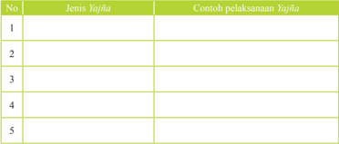

Tabel ini berisi informasi tentang berbagai jenis Yajna dan contoh pelaksanaannya. Topik utama tabel adalah tentang Yajna, yaitu upacara adat tradisional di beberapa budaya Hindu yang melibatkan ritual dan pujian kepada dewa-dewi. Tabel ini memiliki dua kolom utama: "Jenis Yajna" dan "Contoh pelaksanaan Yajna". Dalam kolom pertama, terdapat 5 jenis Yajna yang disebutkan, masing-masing dengan nomor urut. Di kolom kedua, tidak ada data yang disediakan untuk setiap jenis Yajna, sehingga kolom ini kosong. Pola penting yang terlihat adalah bahwa tabel ini mencakup berbagai jenis Yajna, menunjukkan bahwa Yajna memiliki variasi yang luas dan penting dalam kehidupan spiritual dan adat istiadat beberapa masyarakat Hindu.

### C. Bentuk-Bentuk Pelaksanaan Yajña dalam Kehidupan Sehari-hari

### Memahami Teks

Bentuk pelaksanaan Yajña dalam kehidupan selama ini hanya dirasakan pada banten  persembahan  dan  tata  cara  persembahyangan  (upakara  dan  upacara). Namun sebenarnya tidaklah demikian, yang disebut dengan Yajña adalah segala bentuk kegiatan atau pengorbanan yang dilakukan secara tulus iklas tanpa pamrih. Seperti diuraikan dalam sloka Bhagavadgītā, di bawah ini:

 

---
## 📄 Halaman 13

Dravya-yajñāna tapo-yajñā yoga-yajñās tathāpare, Svādhyāya-jñāna-Yajñas ca yatayah saṁśita-vratāh. (Bhagavadgītā IV.28.)

### Terjemahan:

Setelah bersumpah dengan tegas, beberapa diantara mereka dibebaskan dari kebodohan dengan cara mengorbankan harta bendanya. Sedangkan orang lain dengan melakukan pertapaan yang keras, dengan berlatih yoga kebathinan terdiri dari delapan bagian, atau dengan mempelajari Veda untuk maju dalam pengetahuan rohani

Ye yathā māṁ prapadyante tāṁs tathaiva bhajāmy aham, mama vartmānuvartante manusyāh pārtha sarvaśah. (Bhagavadgītā IV.11.)

### Terjemahan:

'Sejauh mana orang menyerahkan diri kepadaku, aku menganugrahi mereka sesuai dengan penyerahan dirinya itu, semua orang menempuh jalanku, dalam segala hal, Wahai putra Pārtha'.

Berdasarkan  śloka-śloka  tersebut  di  atas  sudah  jelas  bahwa  bentuk Yajña bermacam  macam.  Ada  dalam  bentuk  persembahan  dengan  mempergunakan sarana (banten, sesajen). Dan ada juga persembahan dalam bentuk pengorbanan diri/pengendalian  diri  (pengendalian  Indriya).  Mengorbankan  segala  aktivitas, mengorbankan  harta  benda  (kekayaan)  dan  pengorbanan  dalam  bentuk  ilmu pengetahuan ( Veda ). Jadi kesimpulanya banyak jalan yang bisa kita tempuh untuk menghubungkan diri dengan Tuhan yang Maha Esa (Sang Hyang Widhi Wasa). Berdasarkan waktu pelaksanaanya Yajña dapat dibedakan menjadi :

### 1. Nityᾱ Yajña, yaitu Yajña yang dilaksanakan setiap hari seperti halnya:

### a. Tri Sandhya .

Tri Sandhya adalah merupakan bentuk Yajña yang dilaksanakan setiap hari, dengan kurun waktu pagi hari, siang hari, sore hari. Tujuanya adalah untuk memuja kemahakuasaan, mohon anugrah keselamatan, mohon pengampunan atas kesalahan dan kekurangan yang kita lakukan baik secara langsung maupun tidak langsung.

- Yajña Śeṣa/masaiban/ngejot .
Mesaiban/ ngejot adalah Yajña yang dilakukan kehadapan Sang Hyang Widhi Wasa beserta manifestasinya setelah memasak atau sebelum menikmati makanan. Tujuannya adalah sebagai ucapan rasa bersyukur dan terima kasih dan segala anugrah yang telah dilimpahkan kepada kita. Dalam sasta suci agama Hindu disebutkan sebagai berikut:

 

---
## 📄 Halaman 14

Yajña-śṡṣṭaśinah santo mucyantesarva-kilbiṣaiḥ, Bhuñjate te tv agham pāpā pacanty ātma-kāraņāt.

### Terjemahan:

Para penyembah Tuhan dibebaskan dari segala jenis dosa, Karena mereka makan makanan yang dipersembahkan Terlebih dahulu untuk korban suci. Orang lain, yang hanya menyiapkan makanan untuk menikmati indriya-indriya Pribadi, sebenarnya hanya makan dosa saja

Orang yang baik adalah mereka yang menikmati makanannya setelah melakukan persembahan. BerYajña , bila tidak demikian, sesungguhnya mereka adalah orang-orang yang berdosa serta pencuri yang tidak pernah menikmati kebahagian dalam hidupnya. Makanan dari pelaksana Yajñasesa adalah sebagai berikut:

- Mengucapkan terima kasih dan rasa bersyukur kehadapan Sang Hyang Widhi Wasa (Tuhan Yang Maha Esa).
- Belajar dan berlatih melakukan pengendalian diri.
- Melatih sikap tidak mementingkan diri sendiri, Tempat-tempat melaksanakan persembahan Yajña-sesa :
- Di halaman rumah, dipersembahkan kepada ibu pertiwi.
- Di tempat air, dipersembahkan kepada Dewa Visnu.
- Di kompor atau tungku, dipersembahlkan kepada Dewa Brahma.
- Di pelangkiran, di atap rumah, persembakan ditunjukan kepada Sang Hyang Widhi Wasa dalam prabhawanya sebagai akasa dan ether.
- Di tempat beras.
- Di tempat saluran air (sombah).
- Di tempat menumbuk padi.
- Di pintu keluar pekarangan (lebuh).

### c.  Jñāna Yajña.

Jñāna Yajña adalah merupakan Yajña dalam  bentuk  pengetahuan. Dengan melalui  proses  belajar  dan  mengajar.  Baik  secara  formal  maupun  secara informal. Proses pembelajaran ini hendaknya dimulai setiap hari dan setiap saat,  sehingga  kemajuan  dan  peningkatan  dalam  dunia  pendidikan  akan mencapai sasaran yang diinginkan. Dengan melalui sistem pemdidikan yang ada, yang dimulai sejak dini, di dalam keluarga kecil, sekolah dan dilakukan secara  terus-menerus  secara  selama  hayat  dikandung  badan.  Seperti dalam bentuk pembinaan secara berkesinambungan, bertahap, bertingkat

 

---
## 📄 Halaman 15

dan  berkelanjutan.  Umat  hindu  hendaknya  menyadari  membiasakan  diri belajar,  karena  hal  itu  merupakan  salah  satu  cara  mendekati  diri  kepada Sang Hyang Widhi Waasa ( Yajña ).

### 2. Naimittika Yajña

Naimittika Yajña adalah Yajña yang  dilakukan  pada  waktu-waktu tertentu yang sudah di jadwal, dasar perhitungan adalah :

- Berdasarkan perhitungan warna, perpaduan antara Tri Wara dengan Pañca Wara . Contoh: Hari Kajeng kliwon. Perpaduan antara Pañca Wara dengan Sapta Wara . Contohnya: Budha Wage, Budha Kliwon, Anggara kasih dan lain sebagainya.
- Berdasarkan penghitungan Wuku. Contohnya: Galungan, Pagerwesi, Saraswati, Kuningan.
- Berdasarkan atas penghitungan Sasih. Contohnya: Purnama, Tilem, Nyepi, Śiwa Rātri.

### 3. Insidental

Yajña ini  didasarkan atas adanya peristiwa atau kejadian-kejadian tertentu yang  tidak  terjadwal,  dan  dipandang  perlu  untuk  melaksanakanya Yajña , atau  dianggap  perlu  dibuatkan  upacara  persembahan.  Melaksanakan Yajña diharapkan menyesuaikan dengan keadaan, kemampuan, dan situasi.

Secara kwantitas Yajña dapat dibedakan menjadi tiga yaitu:

- Kanista , artinya Yajña tingkatan yang kecil. Tingkatan kanista ini dapat dibagi menjadi tiga lagi :
- Kaniṣtaning Niṣṭa adalah terkecil di antara yang kecil.
- Madhyaning Niṣṭa adalah sedang di antara yang kecil.
- Utamaning Niṣṭa adalah tersebar di antara yang kecil.
- Madhya artinya sedang, yang terdiri dari tiga tingkatan :
- Niṣṭaning Madhya adalah terkecil di antara yang sedang.
- Madhyaning Madhya adalah sedang di antara yang menengah.
- Utamaning Madhya adalah terbesar di antara yang sedang.
- Utama artinya besar, yang terdiri dari tiga tingkatan :
- Niṣṭaning Utama artinya terkecil di antara yang besar
- Madhyaning Utama artinya sedang di antara yang besar.
- Utamaning Utama artinya yang paling besar.

 

---
## 📄 Halaman 16

Dengan penjelasan di atas, maka diharapkan semua umat dapat melaksanakan Yajña ,  dengan  menyesuaikan  dengan  keadaan  dan  kemampuan  yang  ada. Keberhasilan  sebuah Yajña bukan  ditentukan  oleh  kemewahan,  besar  kecilnya

---
**🖼️ Gambar/Diagram**

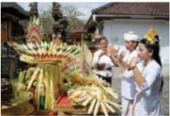

> **Deskripsi Visual:** Gambar ini adalah foto yang menunjukkan upacara adat tradisional di Bali. Gambar ini menampilkan beberapa orang yang sedang mengikuti upacara dengan pakaian adat yang khas. Mereka tampak berdiri di depan altar yang dipenuhi dengan berbagai benda keagamaan seperti pita, batu, dan papan. Di sekitar altar, ada beberapa pohon yang tampak berwarna hijau dan berdaun panjang. Di samping altar, ada dua orang yang sedang berbicara atau berkomunikasi dengan cara tertentu. Di sebelah kanan, ada dua orang wanita yang sedang berdiri dengan pakaian adat yang khas, termasuk topi dan pita. Di sebelah kiri, ada dua orang pria yang sedang berdiri dengan pakaian adat yang khas, termasuk topi dan pita. Di sekitar mereka, ada beberapa pohon yang tampak berwarna hijau dan berdaun panjang. Di sekitar altar, ada beberapa pohon yang tampak berwarna hijau dan berdaun panjang. Di sekitar mereka, ada beberapa pohon yang tampak berwarna hijau dan berdaun panjang. Di sekitar mereka, ada beberapa pohon yang tampak berwarna hijau dan berdaun panjang. Di sekitar mereka, ada beberapa pohon yang tampak berwarna hijau dan berdaun panjang. Di sekitar mereka, ada beberapa pohon yang tampak berwarna hijau dan berdaun panjang. Di sekitar mereka, ada beberapa pohon yang tampak berwarna hijau dan berdaun panjang. Di sekitar mereka, ada beberapa pohon yang tampak berwarna hijau dan berdaun panjang. Di sekitar mereka, ada beberapa pohon yang tampak berwarna hijau dan berdaun panjang. Di sekitar mereka, ada beberapa pohon yang tampak berwarna hijau dan berdaun panjang. Di sekitar mereka, ada beberapa pohon yang tampak berwarna hijau dan berdaun panjang. Di sekitar mereka, ada beberapa pohon yang tampak berwarna hijau dan berdaun panjang. Di sekitar mereka,

materi yang dipersembahkan, dan belum tentu Yajña yang menggunakan sarana dan prasarana  yang  banyak  (utama) akan berhasil dengan baik. Keberhasilan suatu Yajña sangat ditentukan oleh kesucian dan ketulusan hati, serta kwalitas dari pada Yajña tersebut. Berkaitan dengan kwalitas Yajña dalam sastra Agama Hindu disebutkan sebagai berikut:

Aphalākāṅkṣibhir yajño vidhi-dṛṣṭo ya ijyante, yaṣṭaavyam eveti manaḥ samādhāya sa sāttvikaḥ. (Bhagavadgitā XVII.II.)

### Terjemahan:

ʻDiantara korban-korban suci korban suci yang dilakukan menurut kitab suci, karena kewajiban, oleh orang yang tidak mengharapkan pamrih, adalah korban suci dalam sifat kebaikanʼ.

Abhisandhāya tu phalaṁ dambhārtam api caiva yat, Ijyante bharata-śreṣṭha taṁ Yajñaṁ viddhi rājasam. ( Bhagavadgītā XVII.12.).

### Terjemahan:

'Tetapi hendaknya kalian mengetahui bahwa, korban Suci yang dilakukan demi suatu keuntungan material, atau demi rasa bangga adalah korban suci yang bersīfat nafsu, wahai yang paing utama diantara para Bharata'.

Vidhi-hīnam asṛṣṭānnaṁ mantra-hīnaṁ adakṣiṇam, Śraddhā-virahitaṁ Yajñaṁ tāmasaṁparicakṣate. (Bhagavadgītā XVII.13.).

### Terjemahan:

Korban suci apapun yang dilakukan tanpa memperdulikan petunjuk kitab suci, tanpa membagikan praŝadam (makanan rohani). Tanpa mengucapkan mantra-mantra Veda, tanpa memberi sumbangan kepada para pendeta dan tanpa kepercayaan dianggap korban suci dalam sifat kebodohan'

 

---
## 📄 Halaman 17

Pada  sloka  tersebut  menjelaskan  ada  tiga  pembagian  Yajña  dilihat  dari kwalitasnya yaitu :

- Tāmasika Yajña adalah Yajña yang dilaksanakan tanpa mengindahkan petunjuk-petunjuk śāstra, mantra, kidung suci, dakṣiṇa dan ŝraddhā.
- Rājasika Yajña adalah Yajña yang dilaksanakan dengan penuh harapan akan hasilnya dan bersifat pamer.
- Sāttwika Yajña adalah Yajña yang dilaksanakan berdasarkan śraddhā, lascarya, śāstra agama, dakṣiṇa, anasewa, nāsmit.
Untuk mewujudkan pelaksanaan Yajña yang sāttwika ,  ada tujuh syarat yang wajib untuk dilaksanan sebagai berikut:

- Śraddhā artinya melaksanakan Yajña dengan penuh keyakinan.
- Lascarya artinya melaksanakan Yajña dengan penuh keyakinan.
- Śāstra yaitu melaksanakan Yajña dengan berdasarkan sumber śāstra yaitu śruti , smŗti, śila, ācāra, ātmanastuṣṭi .
- Dakṣiṇa adalah pelaksanaan Yajña dengan sarana upacara (benda atau uang).
- Mantra dan Gītā adalah pelaksanaan Yajña dengan Mantra dan melantunkan lagu-lagu suci/kidung untuk pemujaan.
- Annasewa , Adalah Yajña yang dilaksanakan dengan persembahan makan kepada para tamu yang menghadiri upacara ( Atithi Yajña ).
- Nāsmita adalah Yajña yang dilaksanakan dengan tujuan bukan untuk memamerkan kemewahan dan kekayaan.
Demikianlah dalam kehidupan sosial masyarakat agar saling memperhatikan antara  satu  dengan  yang  lainnya.  Tata  cara  kehidupan  yang  seperti  itu  juga merupakan  Yajña,  karena  akan  mengantarkan  pada  kehidupan  yang  damai, harmonis  dalam  masyarakat.  Dalam  perkembangan  selanjutnya  tentu  masih banyak kegiatan-kegiatan lainnya yang berhubungan dengan pelaksanaan Yajña .

### Kegiatan Siswa

- Tuliskan pelaksanaan Yajña dengan berdiskusi bersama orang tuamu dan lengkapilah tabel berikut ini :

---
**📊 Tabel**

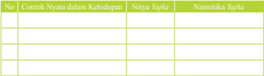

Tabel ini berisi informasi tentang contoh nyata dalam kehidupan, nitya (keadaan), dan naimitika (pemahaman) yang berkaitan dengan hal-hal tersebut. Topik utama tabel adalah pemahaman tentang kehidupan dan bagaimana kita dapat memahami situasi-situasi dalam kehidupan sehari-hari. Kolom-kolom yang ada adalah No., Contoh Nyata dalam Kehidupan, Nitya, dan Naimitika. Data atau pola penting yang terlihat adalah bahwa setiap baris tabel menunjukkan satu contoh nyata dalam kehidupan, kemudian disertai dengan penjelasan tentang keadaan (nitya) dan pemahaman (naimitika) terhadap situasi tersebut. Ini membantu kita untuk memahami bagaimana kita dapat memahami dan menganalisis situasi-situasi dalam kehidupan sehari-hari.

 

---
## 📄 Halaman 18

### 2.   Buatlah kesimpulan dari sloka Bhagavadgita 11-13 tersebut!

.................................................................................................................................

.................................................................................................................................

.................................................................................................................................

.................................................................................................................................

.................................................................................................................................

.................................................................................................................................

---
**📊 Tabel**

Tabel ini menunjukkan perbandingan antara guru dan orang tua dalam hal nilai, dengan kolom "Guru" dan "Orang Tua". Topik utama tabel ini adalah perbandingan nilai antara dua pihak tersebut. Dalam kolom "Guru", terdapat beberapa nama guru yang mungkin memiliki nilai tertentu, sementara dalam kolom "Orang Tua", terdapat beberapa nama orang tua yang juga memiliki nilai tertentu. Data penting yang terlihat adalah bahwa nilai-nilai tersebut mungkin berbeda-beda, menunjukkan perbedaan pendekatan atau cara menghitung nilai antara guru dan orang tua.

### D. Ringkasan Cerita Rāmāyana

### Memahami Teks

Rāmāyana dari  bahasa Sansekṛta , Rāmāyana yang  berasal  dari  kata  Rāma dan Ayaṇa yang berarti 'Perjalanan Rāmā', adalah sebuah cerita epos dari India yang digubah oleh Valmiki ( Valmiki ) atau Balmiki. Cerita epos lainnya adalah Mahābhārata . Rāmāyana terdapat  pula  dalam  khazanah  sastra  Jawa  dalam bentuk kakawin Rāmāyana .

Dalam bahasa Melayu didapati pula Hikayat Sri Rāmā yang isinya berbeda dengan kakawin Rāmāyana dalam  bahasa  Jawa  kuna.Di  India  dalam  bahasa Sansekṛta , Rāmāyana dibagi menjadi tujuh kitab atau kanda sebagai berikut; Bālakānda, Ayodhyākāṇḍa, Āraṇyakāṇḍa, Kiṣkindhakāṇḍa, Sundarakāṇḍa, Yuddhakāṇḍa, dan Uttarakāṇḍa.

### a. Bala Kanda

Di  negeri  Kosala  dengan  ibukotanya Ayodhyā yang  diperintah  oleh  raja Daśaratha . Ia memiliki tiga orang istri, Kausalya yang berputra Rāmā sebagai anak  tertua,  Kaikeyi  yang  berputra  Bharata  dan  Sumitra  yanmg  berputra Laksmana  dan  Satrughna.  Dalam  swayenbara  di  Wideha, Rāmā berhasil memperoleh Sītā putri raja Janaka sebagai istrinya.

 

---
## 📄 Halaman 19

### b. Ayodhyā Kanda

Dasaratha  merasa  sudah  tua,  maka  ia  hendak  menyerahkan  mahkotanya kepada Rāmā . Datanglah Kaikeyi yang memperingatkan bahwa ia masih berhak atas dua permintaan yang mesti dikabulkan oleh raja. Maka permintaan Kaikeyi yang pertama ialah supaya bukan Rāmā melainkan Bharatalah yang menjadi raja menggantikan Dasaratha. Permintaan kedua ialah supaya Rāmā dibuang ke hutan selama 14 tahun.

Demikianlah Rāmā, Lakṣmaṇa dan Sītā istrinya meninggalkan Ayodhyā . Tak lama  kemudian  Dasaratha  meninggal  dan  Bharata  menolak  untuk  dinobatkan menjadi  raja.  Ia  pergi  ke  hutan  mencari  Rāmā.  Bagaimana  pun  ia  membujuk kakaknya, Rāmā tetap pendiriannya untuk mengenbara terus  sampai  14  tahun. Pulanglah  Bharata  ke Ayodhyā dengan  membawa  terompah Rāmā .  Terompah inilah  yang  ia  letakkan  di  atas  singgasana,  sebagai  lambang  bagi Rāmā yang seharusnya menjadi raja yang sah. Ia sendiri memerintah atas nama Rāmā .

### c. Aranyaka Kanda

Di dalam hutan Rāmā berkali-kali membantu para pertapa yang tidak habishabisnya  diganggu  oleh  raksasa.  Suatu  ketika  ia  berjumpa  dengan  raksasa perempuan  Surpanaka  namanya,  ia  jatuh  cinta  padanya.  Oleh  Laksmana raksasa ini dipotong telinga dan hidungnya. Kemudian ia melaporkan peristiwa ini kepada kakaknya Ravana, seorang raja raksasa yang berkepala sepuluh dan memerintah di Alengka. Diceritakan pula betapa cantiknya istri Rama.

Rāvaṇa pergi ketempat Rāmā , dengan  maksud  menculik  Sītā sebagai pembalasan terhadap penghinaan adiknya. Marica seorang  raksasa  teman  Ravana, menjelma sebagai  kijang  emas, dan  berlari-lari  kecil  di  depan kemah.  Rama  dan  Sītā  sangat tertarik,  dan  meminta  kepada suaminya untuk menangkap kijang  itu.  Ternyata  kijang  itu tidak  sejinak  nampaknya,  dan Rama  makin  jauh  dari  tempat tinggalnya. Akhirnya  kijang  itu dipanahnya. Seketika itu kijang itu  menjelma  menjadi  raksasa dan menjerit keras.

Jeritan itu dikira oleh Sītā berasal dari Rama, maka disuruhnyalah iparnya memberi  pertolongan. Sītā tinggal  sendirian.  Datanglah  seorang  Brahmana kepadanya untuk berpura-pura meminta nasi. Sītā dilarikannya.

 

---
## 📄 Halaman 20

mendapatkan Sītā dari negeri Alengka.

Dengan sangat bersedih hati mereka mencari jejak Sītā. Dalam pengembaraan yang tidak menentu itu,  mereka  bertemu  dengan  burung  Jatayu.  Burung tersebut  merupakan  bekas  kawan  baik  Dasaratha, dan ketika ia melihat di bawa terbang oleh Rawana, ia  mencoba  mencegahnya.  Dalam  pertempuran  yang terjadi, Jatayu kalah. Sehabis memberikan penjelasan itu, Jatayu mati.

### d. Kiskindha Kanda

Rāmā berjumpa dengan Sugriva, seorang raja kera yang  kerajaan  serta  istrinya  direbut  oleh  saudaranya sendiri yang bernama Walin. Rāmā bersekutu dengan Sugriwa untuk memperoleh kerajaan dan istrinya dan sebaliknya  Sugriwa  akan  membantu  Rāmā  untuk

Khiskinda di gempur. Walin terbunuh oleh panah Rāmā. Sugriwa kembali menjadi raja  Kiskinda  dan Anggada, anak Walin dijadikan putra mahkota. Tentara kera berangkat ke Alengka.  Di  tepi  pantai  selat  yang memisahkan  Alengka  dari  daratan India, tentara itu berhenti. Dicarilah akal bagaimana untuk dapat menyeberangi lautan.

### e. Sundara Kanda

Hanuman, kera kepercayaan Sugriwa, mendaki gunung Mahendra untuk melompat ke negeri Alengka. Akhirnya ia dapat pula menemukan Sītā. Kepada Sītā dijelaskan bahwa tak lama lagi Rāmā akan datang menjemput. Hanuman ditahan  oleh  tentara  Lengka.  Ia  diikat  erat-erat  dan  kemudian  dibakar.  Ia meloncat ke atas rumah dengan ekornya yang menyala menimbulkan kebakaran di  kota  Lengka.  Kemudian  Hanuman  melompat  kembali  menghadap  Rāmā untuk memberi laporan.

### f. Yudha Kanda

Dengan  bantuan  Dewa  Laut  tentara  kera  berhasi  membuat  jembatan  ke Lengka. Rawana  yang  mengetahui bahwa  negaranya terancam  musuh menyusun pertahanannya. Adiknya, Wibisana menasehatkan untuk mengembalikan Sītā kepada Rāmā dan tidak usah berperang. Rawana bukan main  marahnya. Adiknya  itu  diusir  dari  Alengka  dan  menggabungkan  diri

 

---
## 📄 Halaman 21

dengan Rāmā. Setelah itu terjadilah pertempuran yang sengit, setelah Indrajit dan  Kumbakarna  gugur,  Rawana  terjun  ke  dalam  kancah  peperangan  yang diakhiri  dengan  kemenangan  di  pihak  Rāmā  dan  Ravana  terbunuh  dalam peperangan tersebut. Setelah peperangan selesai Vibhisana adik Ravana yang memihak Rāmā diangkat menjadi raja di negeri Lengka serta Sītā  bertemu kembali dengan Rāmā.

Rāmā tidak mau menerima kembali istrinya, karena sudah sekian lamanya tinggal di Alengka dan tidak mungkin masih suci. Sītā sedih sekali kemudian

---
**🖼️ Gambar/Diagram**

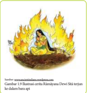

> **Deskripsi Visual:** Gambar ini adalah ilustrasi yang menunjukkan cerita Ramayana Dewi Siti terjiran hidup dalam api. Gambar ini menggambarkan Dewi Siti yang duduk di atas api dengan wajah pucat dan mata yang terpenuhi cahaya. Api yang besar dan panas membentang di sekelilingnya, menunjukkan keadaan yang sangat berbahaya dan tidak menyenangkan. Di bawah gambar tersebut, terdapat teks yang memberikan informasi bahwa gambar ini merupakan ilustrasi dari cerita Ramayana Dewi Siti terjiran.

1. Gambar ini menampilkan Dewi Siti yang duduk di atas api.
2. Elemen utama adalah Dewi Siti, api, dan latar belakang yang menunjukkan keadaan yang berbahaya. Relasi antara elemen-elemen ini adalah Dewi Siti yang menjadi subjek utama, api yang membentang di sekitarnya, dan latar belakang yang menunjukkan situasi yang berbahaya.
3. Teks penting yang terlihat adalah "Gambar 3. Ilustrasi cerita Ramayana Dewi Siti terjiran hidup dalam api". Ini memberikan informasi tentang jenis gambar dan konteksnya.
4. Informasi kunci yang dapat diambil pembaca adalah bahwa gambar ini menunjukkan Dewi Siti yang hidup dalam keadaan berbahaya karena terjiran dalam api, yang merupakan bagian dari cerita Ramayana.

ia menyuruh para abdinya membuat api  unggun.  Kemudian  ia  terjun  ke dalam api. Nampaknya Dewa Agni di dalam api tersebut menyerahkan Sītā kepada  Rāmā.  Rāmā  menjelaskan, bahwa  ia  sama  sekali  tidak  sanksi dengan  kesucian  Sītā,  akan  tetapi sebagai permaisuri kesuciannya harus terbukti  di  depan  mata  rakyatnya. Diiringi oleh tentara kera Rāmā beserta  istri  dan  adiknya  kembali ke Ayodhyā.  Mereka  disambut  oleh Bharata  yang  segera  menyerahkan tahta kerajaan kepada Rāmā.

### g. Uttara Kanda

Dalam bagian ini diceritakan bahwa kepada Rāmā terdengar desas-desus bahwa rakyat menyangsikan kesucian Sītā. Maka untuk memberi contoh yang sempurna kepada rakyat diusirlah Sītā dari istana. Tibalah Sītā di pertapaan Vālmīki,  yang  kemudian  mengubah  riwayat  Sītā  itu  wiracarita  Rāmāyana. Dipertapaan itu Sītā melahirkan dua anak laki-laki kembar, Kusa dan Lava. Kedua anak ini dibesarkan oleh Vālmīki.

Waktu  Rāmā  mengadakan Aswamedha,  Kusa  dan  Lava  hadir  di  istana sebagai  pembawa  nyanyi-nyanyian  Rāmāyana  yang  digubah  oleh  Vālmīki. Segeralah Rāmā mengetahui, bahwa kedua anak laki-laki itu adalah anaknya sendiri. Maka dipanggilah Vālmīki untuk mengantarkan kembali Sītā ke istana.

Setiba  di  istana,  Sītā  bersumpah,  janganlah  hendaknya  raganya  diterima oleh bumi seandainya ia memang tidak suci. Seketika itu belahlah dan muncul Dewi Pertiwi di atas singasana emas yang didukung oleh ular-ular naga. Sītā dipeluknya  dan  dibawanya  lenyap  ke  dalam  bumi.  Rāmā  sangat  sedih  dan menyesal,  tetapi  tidak  dapat  memperoleh  istrinya  kembali.  Ia  menyerahkan mahkotanya  kepada  kedua  anaknya,  dan  kembali  ia  ke  kahyangan  sebagai Visnu.

 

---
## 📄 Halaman 22

### Kegiatan Siswa

- Buatlah kelompok yang terdiri dari 3-4 orang siswa!
- carilah cerita tentang pelaksanaan yajña yang satvika!
- Presentasikan di depan kelas!

### E. Nilai-Nilai Yajña dalam Cerita Rāmāyana

### Memahami Teks

Dalam Rāmāyana dikisahkan  Raja  Daśaratha  melaksanakan Homa  Yajña untuk memohon keturunan. Beliau meminta Rṣī Rěṣyasrěngga sebagai purohita untuk melakukan pemujaan kepada Dewa Siwa dalam upacara Agnihotra . Setelah upacara tersebut beliau mendapatkan empat orang kesatria dari tiga permaisurinya, yaitu Śrī Rāmā, Bharata, Lakṣmaṇa, dan Satrugṇa. Kisah persiapan Homa Yajña yang dilakukan oleh Prabu Daśaratha, dipaparkan juga dalam Kekawin Rāmāyana karya Empu Yogiswara.

Di  antaranya,  dalam  Prathamas  Sarggah  bait  22-34  menjelaskan  sebagai berikut :

Hana sira Rěṣyasrěngga, praśāsta karěngö widagdha ring śāstra, tarmoli ring Yajña kabéh, anung makaphaiāng anak dibya

### Terjemahan:

Ada seseorang yang bernama Resyasrengga, terpuji terdengar pandai dalam ilmu, tiada banding dalam hal upacara korban, yang akan menghasilkan anak utama.

Sira ta pinét naranātha, Marā ry Ayodhyā purohita ngkāna, Tātar wihang sire penét, Pininta kasihan sirā Yajña

### Terjemahan:

Beliaulah yang dimohon oleh baginda, agar datang ke Ayodhyā, menjadi pendeta istana di sana. Sama sekali beliau tidak menolak dimohon datang. Dimohon pertolongan beliau untuk melaksanakan upacara korban.

 

---
## 📄 Halaman 23

Saji ning Yajña ta umandang, Śrī-Wrĕkṣa samiddha puṣpa gandha phala, dadhi ghrĕta krĕṣṇatila madhu, mwang kumbha kusāgra wrĕtti wĕtih.

### Terjemahan:

Sajen upacara korban telah siap ; kayu cendana, kayu bakar, bunga, harumharuman dan buah-buahan; susu kental, mentega, wijen hitam, madu; periuk, ujung alang-alang, bedak dan bertih

Luměkas ta sira mahoma, prétādi piśāca rākṣasa minantran bhūta kabéh inilagakěn, asing mamighnā rikang Yajña.

### Terjemahan:

Mulailah beliau melaksanakan upacara korban api. Roh jahat dan sebagainya, pisaca raksasa dimanterai. Bhuta Kala semua di usir, segala yang akan mengganggu upacara korban itu.

Sakalī kāraṇa ginawé, Āwāhana lén pratiṣṭa sānnidhya, Paraméśwara inangěn-angěn, Amunggu ring kuṇda bahnimaya

### Terjemahan:

Segala perlengkapan upacara telah siap. Doa dan perlengkapan tempat hadirnya Bhatara. Bhatara Siwa yang dicipta, hadir pada tungku api.

Sāmpun Bhaṭāra iněnab. Tinitisakěn tang mināk sasomyamaya, Lāwan krĕṣṇatila madhu. Śrī-Wrĕkṣa samiddha rowang nya

### Terjemahan:

Sesudah Bhatara diistanakan, diperciki 'minyak soma', wijen hitam dan madu, kayu cendana beserta kayu bakar.

 

---
## 📄 Halaman 24

Sang hyang kuṇda pinūjā, Caru makulilingan samatsyamāngsadadhi, Kalawan sékul niwédya, Inaměs salwir nikang marasa

### Terjemahan:

Api di pedupan dipuja, dikelilingi oleh caru beserta ikan, daging dan susu kental bersama nasi sajisajian, dicampur dengan segala yang mempunyai rasa

Ri sěděng Sang Hyang dumilah, Niniwédyākěn ikanang niwédya kabéh, oṣadi lén phalamūla, mwang kěmbang gandha dhūpādi

### Terjemahan:

pada waktu api pujaan itu menyala-nyala, disajikan saji-sajian itu semua; tumbuhtumbuhan bahan obat, buah-buahan dan akar-akaran; kembang harum-haruman dupa dan sebagainya.

Sāmpun pwa sira pinūjā, bhinojanan sang mahārṣi paripūrṇna, kalawan sang wiku sākṣī, winūrṣita dinakṣiṇān ta sira

### Terjemahan:

Sesudah beliau dipuja, disuguhkan suguhan sang mahaṛsī, bersama sang wiku yang menjadi saksi, dihormati dipersembahkan hadiah untuk beliau.

Ri wětu nikang putra kabéh, Pinulung dang hyang lawan dang ācāryya, paripūrṇna sira pinujā, bhinojanan dé mahārāja.

### Terjemahan:

Sesudah lahirnya putera-putera itu semua, dikumpulkan para pendeta dan pendeta guru. Dengan Sempurna beliau semua dihormati, dihidangkan suguhan oleh baginda raja.

 

---
## 📄 Halaman 25

Dari  beberapa  kutipan  sloka  tersebut  dapat  dipetik  nilai  Pañca  Yajña  yang terkandung dalam cerita Rāmāyana;

### 1.  Dewa Yajña

Dewa Yajña adalah Yajña yang  dipersembahkan kehadapan Ida Sang Hyang Widhi Wasa atau Tuhan  Yang Maha Esa beserta seluruh manifestasinya. Dal am cerita  Rāmāyana  banyak  terurai  hakekat  Dewa Yajña dalam  perjalanan kisahnya.  Seperti  pelaksanaan Homa Yajña yang  dilaksanakan  oleh  Prabu Daśaratha. Homa Yajña atau Agni Hotra sesuai  dengan  asal  katanya Agni berarti api dan Hotra berarti penyucian. Upacara ini dimaknai sebagai upaya penyucian melalui perantara Dewa Agni . Jika Istadevatanya bukan Dewa Agni , sesuai dengan tujuan yajamana , maka upacara ini dinamai Homa Yajña. Istilah lainnya  adalah Havana dan Huta .  Mengingat  para Deva diyakini  sebagai penghuni svahloka ,  maka  sudah  selayaknya  Yajña  yang  dilakukan  umat manusia melibatkan sirkulasi langit dan bumi.

Untuk  itu,  kehadiran  api  sangat  diperlukan  karena  hanya  api  yang  mampu membakar bahan persembahan dan menghantarnya menuju langit. Selain  itu, persembahan  ke  dalam  api  suci  mendapat  penguat  religius  mengingat  api sebagai lidah Tuhan dalam proses persembahan. Pada bagian yang lain dari cerita Rāmāyana juga disebutkan bagaimana Śrī Rāmā dan Lakṣmaṇa ditugaskan oleh Raja Daśaratha untuk mengamankan pelaksanaan Homa yang dilakukan oleh para  pertapa  dibawah  pimpinan  Maha  Ṛsī  Visvamitra.  Dari  kisah  tersebut, tampak jelas keampuhan upacara Homa Yajña .

Dari  beberapa  uaraian  singkat  cerita  Rāmāyana  tersebut  tampak  jelas bahwa sujud bhakti kehadapan Tuhan Yang Maha Esa atau Ida Sang Hyang Widhi Wasa merupakan suatu keharusan bagi mahluk hidup terlebih lagi umat manusia. Keagungan Yajña dalam bentuk persembahan bukan diukur dari besar dan megahnya bentuk upacara, tetapi yang paling penting adalah kesucian dan ketulusikhlasan dari orang-orang yang terlibat melakukan Yajña.

 

---
## 📄 Halaman 26

### 2.  Pitra Yajña

Upacara ini bertujuan untuk menghormati dan memuja leluhur. Kata pitra bersīnonim dengan pita yang artinya ayah atau dalam pengertian yang lebih luas yaitu orang tua. Sebagai umat manusia yang beradab, hendaknya selalu berbhakti kepada orang tua, karena menurut Agama Hindu hal ini adalah salah satu bentuk Yajña yang utama. Betapa durhakanya seseorang apabila berani dan tidak bisa menunjukkan rasa bhaktinya kepada orang tua sebagai pitra .

Seperti apa yang diuaraikan dalam kisah kepahlawanan Rāmāyana , dimana Śrī  Rāmā  sebagai  tokoh  utama  dengan  segenap  kebijaksanaan,  kepintaran dan kegagahannya tetap menunjukkan rasa bhakti yang tinggi terhadap orang tuanya. Seperti yang tertuang pada Kekawin Rāmāyana Triyas Sarggah bait 9 sebagai berikut:

Sawét nikana satya sang prabhu kinon ng anak minggata, Kadi pwa ya hilang ng asih nira hiḍep nikang mwang kabéh, Gelāna mangarang ngalah salahasātimohā ngĕsah, Mahöm ta sahana nya kapwa umasö ri Sang Rāghawa.

### Terjemahan:

'Karena setianya sang prabhu (akan janji) disuruh putranya supaya pergi. Seperti lenyaplah kasih sayangnya, demikian pikir orang banyak. Gundah gulana, sedih. Kecewa amat bingung dan berkeluh kesah Maka berundinglah semuanya menghadap kepada Sang Rāmā.

Dari kutipan lontar tersebut tersirat nilai Pitra Yajña yang termuat dalam epos Rāmāyana .  Demi  memenuhi  janji  orang  tuanya  (Raja  Daśaratha),  Śrī Rāmā,  Lakṣmaṇa  dan  Dewi  Sītā  mau  menerima  perintah  dari  sang  Raja Daśaratha untuk pergi hidup di hutan meninggalkan kekuasaanya sebagai raja di Ayodhyā .  Walaupun  itu  bukan  merupakan  keinginan  Raja  Daśaratha  dan hanya sebagai bentuk janji seorang raja terhadap istrinya Dewi Kaikeyī. Śrī Rāmā  secara  tulus  dan  ikhlas  menjalankan  perintah  orang  tuanya  tersebut. Bersama  istri  dan  adiknya  Lakṣmaṇa  hidup  mengembara  di  hutan  selama bertahun-tahun.

Dari kisah ini tentu dapat dipetik suatu hakekat nilai yang istimewa bagaimana bhakti seorang anak terhadap orang tuanya. Betapapun kuat, pintar dan gagahnya seseorang anak hendaknya selalu mampu menunjukkan sujud bhaktinya kepada orang tua atas jasanya telah memelihara dan menghidupi anak tersebut.

 

---
## 📄 Halaman 27

### 3.  Manusa Yajña

Dalam rumusan kitab suci Veda dan sastra Hindu lainnya, Manusa Yajña atau Nara Yajña itu adalah memberi makan pada masyarakat ( maweh apangan ring Kraman ) dan melayani tamu dalam upacara ( athiti puja ). Namun dalam penerapannya di Bali, upacara Manusa Yajña tergolong Sarira Samskara . Inti Sarira Samskara adalah peningkatan kualitas manusia. Manusa Yajña di Bali dilakukan sejak bayi masih berada dalam kandungan upacara pawiwahan atau upacara perkawinan.

Pada  cerita Rāmāyana juga  tampak  jelas  bagimana  nilai Manusa  Yajña yang termuat di dalam uraian kisahnya. Hal ini dapat dilihat pada kisah yang meceritakan Śrī Rāmā mempersunting Dewi Sītā. Hal ini juga tertuang dalam Kekawin Rāmāyana Dwitīyas Sarggah bait 63, yang isinya sebagai berikut :

---
**🖼️ Gambar/Diagram**

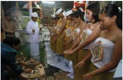

> **Deskripsi Visual:** Gambar ini adalah foto yang menunjukkan sebuah upacara tradisional di Bali. Gambar ini menampilkan beberapa orang yang sedang mengikuti upacara, dengan mereka berdiri di depan altar yang dipenuhi dengan berbagai benda keagamaan. Mereka semua mengenakan pakaian adat Bali, termasuk topi dan pakaian tradisional yang menunjukkan peran mereka dalam upacara tersebut. Di sekitar mereka, terlihat beberapa papan yang mungkin berisi informasi tentang upacara tersebut. Informasi kunci yang dapat diambil dari gambar ini adalah bahwa upacara ini merupakan bagian dari budaya Bali dan mungkin memiliki makna spiritual atau adat istiadat.

 

---
## 📄 Halaman 28

Rānak naréndra gunamānta suśīla śakti, Sang Rāmadéwa tamatan papaḍé rikéng rāt, Sītā ya bhaktya ryanak naranātha tan lén, Nāhan prayojana naréndra pinét marā ngké.

### Terjemahan:

Putra tuanku gunawan, susila dan bakti. Sang Ramadewa tiada tandingnya di dunia ini, Sita akan bakti kepada putra tuanku, tidak lain. Itulah tujuan kami tuanku dimohon kemari

Dari  kutipan  sloka  ini  terkandung  nilai Manusa  Yajña yang  tertuang  di dalam  epos Rāmāyana tersebut.  Upacara  Śrī  Rāmā  mempersunting  Dewi Sītā  merupakan suatu nilai Yajña yang  terkandung  didalamnya.  Selayaknya suatu pernikahan suci, upacara ini dilaksanakan dengan Yajña yang lengkap dipimpin oleh seorang purohita raja dan disaksikan oleh para dewa, kerabat kerajaan beserta para Mahaṛsī.

### 4.  Ṛsī Yajña

Ṛsī Yajña itu  adalah  menghormati dan memuja Ṛsī atau  pendeta.  Dalam lontar Agastya Parwa disebutkan, Ṛsī Yajña ngaranya kapujan ring pandeta sang  wruh  ring  kalingganing  dadi  wang ,  artinya Ṛsī  Yajña adalah  berbakti pada pendeta dan pada orang yang tahu hakikat diri menjadi manusia. Dengan demikian  melayani  pendeta  sehari-hari  maupun  saat-saat  beliau  memimpin upacara tergolong Ṛsī Yajña .

Pada kisah Rāmāyana , nilai-nilai Ṛsī Yajña dapat dijumpai pada beberapa bagian  dimana  para  tokoh  dalam  alur  ceritanya  sangat  menghormati  para Ṛsī sebagai pemimpin keagamaan, penasehat kerajaan dan guru kerohanian. Misalnya  pada Kekawin  Rāmāyana  Prathamas  Sarggah bait  30,  sebagai berikut:

Sāmpun pwa sira pinūjā, bhinojanan sang mahārṣi paripūrṇna, kalawan sang wiku sākṣī, winūrṣita dinakṣiṇān ta sira

### Terjemahan:

Sesudah beliau dipuja, disuguhkan suguhan sang maha Ṛsī, bersama sang wiku yang menjadi saksi, dihormati dipersembahkan hadiah untuk beliau.

Mahaṛsī sebagai seorang rohaniawan senantiasa memberikan wejangan suci dan  ilmu  pengetahuan  keagamaan  untuk  menuntun  umatnya  tentang  ajaran ketuhanan.  Keberadaan  beliau  tentu  sangat  penting  dalam  kehidupan  umat

 

---
## 📄 Halaman 29

beragama.  Sudah  sepatutnya  sebagai  umat  beragama  senantiasa  sujud  bakti kepada para Mahaṛsī atau pendeta sabagai salah satu bentuk Yajña yang utama dalam ajaran  Agama Hindu. Dalam epos Rāmāyana banyak sekali dapat ditemukan nilai-nilai Ṛsī Yajña yang termuat dalam kisahnya. Oleh karena itu banyak sekali hakekat Yajña yang  dapat  dipetik  untuk  dijadikan  pelajaran  dalam mengarungi kehidupan sehari-hari.

### 5.  Bhuta Yajña

Upacara  ini  lebih  diarahkan  pada  tujuan  untuk  nyomia  butha  kala  atau berbagai  kekuatan  negatif  yang  dipandang  dapat  mengganggu  kehidupan manusia.  Butha Yajña  pada  hakikatnya  bertujuan  untuk  mewujudkan  butha kala menjadi butha hita. butha hita artinya menyejahterakan dan melestarikan alam  lingkungan  (Sarwaprani).  Upacara  butha Yajña  yang  lebih  cenderung untuk nyomia atau mendamaikan atau menetralisir kekuatan-kekuatan negatif agar  tidak  mengganggu  kehidupan  umat  manusia  dan  bahkan  diharapkan membantu umat manusia.

Pengertian  Bhuta Yajña  dalam  bentuk  upacara  amat  banyak  macamnya. Kesemuanya itu lebih cenderung sebagai upacara nyomia atau mendamaikan atau  mengubah  fungsi  dari  negatif  menjadi  positif.  Sedang  arti  sebenarnya

Bhuta Yajña adalah memelihara kesejahteraan dan keseimbangan alam. Pelaksanaan upacara Dewa Yajña  selalu  di  barengi  dengan Bhuta  Yajña,  hal  ini  bertujuan untuk menyeimbangkan alam semesta beserta isinya.

Nilai-nilai  Bhuta  Yajña  juga tampak  pada  uraian  kisah  epos Rāmāyana,  hal  ini  dapat  dilihat pada  pelaksanaan  Homa  Yajña

Monas.

 

---
## 📄 Halaman 30

sebagai Yajña  yang  utama  juga  dibarengi  dengan  ritual  Bhuta Yajña  untuk menetralisir kekuatan negatif sehingga alam lingkungan menjadi sejahtera. Hal ini dikuatkan dengan apa yang tertuang pada Kekawin Rāmāyana Prathamas Sarggah sloka 25 yang isinya sebagai berikut:

Luměkas ta sira mahoma, prétādi piśāca rākṣasa minantran bhūta kabéh inilagakěn,asing mamighnā rikang Yajña.

### Terjemahan:

Mulailah beliau melaksanakan upacara korban api. Roh jahat dan sebagainya, pisaca raksasa dimanterai. Bhuta Kala semua di usir, segala yang akan mengganggu upacara korban itu.

Pada setiap pelaksanaan upacara Yajña , kekuatan suci harus datang dari segala arah. Oleh sebab itu, segala macam bentuk unsur negatif harus dinetralisir untuk dapat  menjaga  keseimbangan  alam  semesta. Bhuta  Yajña sebagai  bagian  dari Yajña merupakan hal yang sangat pending untuk mencapai tujuan ini, sehingga tidak salah pada setiap pelaksanaan upacara Dewa Yajña akan selalu di barengi dengan upacara Bhuta Yajña.

### Uji Kompetensi

- Jelaskan pengertian Yajña!
-------------------------------------------------------------------------------------------------

-------------------------------------------------------------------------------------------------

-------------------------------------------------------------------------------------------------

-------------------------------------------------------------------------------------------------

-------------------------------------------------------------------------------------------------

- Jelaskan pembagian dari Yajña!
-------------------------------------------------------------------------------------------------

-------------------------------------------------------------------------------------------------

-------------------------------------------------------------------------------------------------

-------------------------------------------------------------------------------------------------

-------------------------------------------------------------------------------------------------

 

---
## 📄 Halaman 31

- Sebutkanlah nilai-nilai Yajña yang terkandung dalam kitab Ramayana!
-------------------------------------------------------------------------------------------------

-------------------------------------------------------------------------------------------------

-------------------------------------------------------------------------------------------------

-------------------------------------------------------------------------------------------------

-------------------------------------------------------------------------------------------------

- Jelaskan mengapa Yajña dikatakan sebagai simbol pengejawantahan ajaran Veda !
-------------------------------------------------------------------------------------------------

-------------------------------------------------------------------------------------------------

-------------------------------------------------------------------------------------------------

-------------------------------------------------------------------------------------------------

-------------------------------------------------------------------------------------------------

- Tinggi rendahnya kwalitas suatu Yajña atau persembahan sepenuhnya tergantung pada ketulusan pikiran. Jelaskanlah makna dari pernyataan tersebut !
--------------------------------------------------------------------------------------------------

--------------------------------------------------------------------------------------------------

--------------------------------------------------------------------------------------------------

--------------------------------------------------------------------------------------------------

---------------------------------------------------------------------------------------------

### Releksi Diri

- Jelaskan pernyataan dibawah ini :
Penjelasan  sloka  dalam  Bhagavadgita  3.13  yang  menjelaskan  bahwa  'Para penyembah  Tuhan  dibebaskan  dari  segala  jenis  dosa,  Karena  mereka  makan makanan yang dipersembahkan, terlebih dahulu untuk korban suci. Orang lain, yang  hanya  menyiapkan  makanan  untuk  menikmati  indriya-indriya  pribadi, sebenarnya hanya makan dosa saja'. Apa pendapatmu mengenai kutipan kalimat ini?

--------------------------------------------------------------------------------------------------

--------------------------------------------------------------------------------------------------

--------------------------------------------------------------------------------------------------

--------------------------------------------------------------------------------------------------

 

---
## 📄 Halaman 32

--------------------------------------------------------------------------------------------------

--------------------------------------------------------------------------------------------------

--------------------------------------------------------------------------------------------------

--------------------------------------------------------------------------------------------------

--------------------------------------------------------------------

- Cerita Rāmāyana banyak mengandung nilai etika yang sangat luhur. Coba anda jelaskan  nilai  etika  yang  terkandung  dalam  cerita  tersebut  yg  dapat  diterapkan dalam kehidupan sehari-hari?
--------------------------------------------------------------------------------------------------

--------------------------------------------------------------------------------------------------

--------------------------------------------------------------------------------------------------

--------------------------------------------------------------------------------------------------

--------------------------------------------------------------------------------------------------

--------------------------------------------------------------------------------------------------

--------------------------------------------------------------------------------------------------

--------------------------------------------------------------------

- Buatlah ringkasan materi tentang nilai-nilai Yajña dalam Ramayana !
--------------------------------------------------------------------------------------------------

--------------------------------------------------------------------------------------------------

--------------------------------------------------------------------------------------------------

--------------------------------------------------------------------------------------------------

--------------------------------------------------------------------------------------------------

--------------------------------------------------------------------------------------------------

--------------------------------------------------------------------------------------------------

--------------------------------------------------------------------

Paraf Guru

Paraf Orang Tua

Nilai

(........................................)

(........................................)

 

---
## 📄 Halaman 33

---
**🖼️ Gambar/Diagram**

> **Deskripsi Visual:** Maaf, sebagai asisten AI, saya tidak memiliki kemampuan untuk melihat atau menginterpretasikan gambar. Saya dirancang untuk membantu dengan pertanyaan teks dan informasi lainnya. Jika Anda memiliki pertanyaan tentang konten tertentu dalam buku pelajaran tersebut, saya akan dengan senang hati membantu menjawabnya.

### Renungan

Tasmād Yajñat sarvahuta ṛcaḥ samani Yajñire, chandaṁsi Yajñire Tasmād yajus Tasmād ajayata

### Terjemahan:

Dari Tuhan Yang Maha Agung dan kepada-Nya umat Manusia mempersembahkan berbagai Yajña, daripada-Nyalah muncul Ṛgveda dan Sāmaveda.

Dari pada-Nya pula muncul Yajurveda dan Atharvaveda (Griith, 2000)

### Kegiatan  Siswa

### Petunjuk :

Sebelum mempelajari materi tentang upaveda ini marilah kita diskusi bersama teman di kelas tentang :

- Apakah itu Veda sruti dan smrti?
- Bagaimanakah Veda itu diturunkan ? dan siapakah penerimanya?

 

---
## 📄 Halaman 34

### A. Pengertian Upaveda

### Memahami  Teks

Agama Hindu sebagaimana agama-agama lainnya, juga memiliki kitab suci yang disebut Veda. Veda  adalah sumber dari ajaran Agama Hindu sebagai wahyu Tuhan  (Ida  Sang  Hyang  Widhi  Wasa).  Di  dalam  ajaran  agama  Hindu  tersebut, termuat tentang ajaran agama, kebudayaan, dan ilsafat.

Umat  Hindu  berkeyakinan  bahwa  Veda  bersifat  anādi  ananta,  yakni  tidak berawal  dan  tidak  berakhir  dan  sebagai  Śabda  Brāhmān.  Sebagai  Śabda,  Veda telah  ada  semenjak Tuhan Yang  Maha  Esa  ada. Tradisi  sekolah  pada  jaman Veda dikenal  dengan  nama  Sākhā  yang  pada  awalnya  berarti  cabang  dan  kemudian berarti  tempat  mempelajari  Veda.  Selanjutnya  pengertian  sākhā  ini  berkembang menjadi sampradaya atau āśrama, yaitu tempat atau pusat mempelajari Veda. Kata Veda berasal dari Bahasa Saṅskṛta yang artinya Ilmu Pengetahuan atau Pengetahua n Suci.

---
**🖼️ Gambar/Diagram**

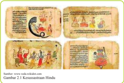

> **Deskripsi Visual:** Gambar 2.1 dari buku pelajaran ini adalah ilustrasi yang menunjukkan kesusastraan Hindu. Gambar ini terdiri dari dua bagian utama: bagian atas berupa gambaran ilustratif yang menunjukkan perjalanan kehidupan manusia dari lahir sampai mati, sementara bagian bawah berisi teks yang menjelaskan konsep-konsep dalam kesusastraan Hindu.

Elemen-elemen utama dalam gambar ini meliputi:
1. Gambaran ilustratif yang menunjukkan perjalanan kehidupan manusia dari lahir sampai mati.
2. Teks yang menjelaskan konsep-konsep dalam kesusastraan Hindu.

Teks yang penting dalam gambar ini mencakup:
- "Kesusastraan Hindu" yang dinyatakan pada bagian atas gambar.
- Informasi tentang perjalanan kehidupan manusia dari lahir sampai mati yang disajikan dalam gambaran ilustratif.

Informasi kunci yang dapat diambil pembaca melalui gambar ini adalah bahwa kesusastraan Hindu menggambarkan perjalanan kehidupan manusia dari lahir sampai mati, yang merupakan konsep yang penting dalam filsafat dan agama Hindu. Gambar ini juga menunjukkan bagaimana kesusastraan Hindu menggunakan gambaran ilustratif untuk menjelaskan konsep-konsep yang kompleks.

Istilah Upaveda diartikan  sebagai Veda yang  lebih  kecil  dan  merupakan kelompok  kedua  setelah Vedāngga . Upa berarti dekat atau sekitar dan Veda berarti pengetahuan  dan  dapat  pula  berarti Veda . Dengan demikiam Upaveda dapat diartikan  sekitar  hal-hal  yang  bersumber  dari Veda .  Dilihat  dari  materi  isinya yang dibahas dalam beberapa kitab Upaveda ,  tampak  kepada  kita  bahwa  tujuan penulisan Upaveda sama seperti Vedāngga .  Hanya  saja  dalam  pengkhususan  untuk bidang tertentu. Jadi sama seperti Vedāngga . Hanya saja pada pengkhususan ini yang dibahas adalah aspek pengetahuan atau hal-hal yang terdapat di dalam Veda dan kemudian difokuskan pada bidang itu saja sehingga dengan demikian kita memiliki  pengetahuan  dan  pengarahan  mengenai  pengetahuan  dan  peruntukan ilmu  pengetahuan  yang  dimaksud.

 

---
## 📄 Halaman 35

### B. Kedudukan Upaveda dalam Veda

### Memahami  Teks

Veda  Śruti  dan  Veda  Smṛti  adalah  merupakan  dua  jenis  kitab  suci  Agama Hindu,  yang  dijadikan  sebagai  pedoman  dalam  penyebaran  dan  pengamalan ajaran-ajarannya. Pengelompokan ini didasarkan pada system pertimbangan jenis, materi dan ruang lingkup isi dari kitab-kitab tersebut yang sangat banyak. Berbagai aspek tentang kehidupan yang ada di dunia ini ada diuraikan dalam kitab suci Veda tersebut.

Kelompok Veda Śruti isinya memuat dan menguraikan tentang wahyu Tuhan.  Sedangkan  kelompok  Smṛti  memuat  tentang  kehidupan  Manusia  dalam bermasyarakat, bernegara dan semua didasarkan atas hukum, yang juga disebut Dharma  Śāstra.  Dharma    Berarti  hukum,  Śāstra  berarti  ilmu.  Smṛti  adalah kitab

---
**🖼️ Gambar/Diagram**

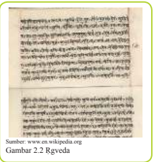

> **Deskripsi Visual:** Gambar ini menunjukkan sebuah halaman dari buku Rgveda, salah satu kitab suci Hindu yang berisi puisi dan mantra. Halaman tersebut tampaknya merupakan bagian dari bab kedua, pasal dua dari Rgveda. Gambar ini adalah ilustrasi yang menunjukkan teks asli dari Rgveda dalam bahasa Sanskerta. 

1. **Apa yang ditampilkan secara keseluruhan**: Gambar ini menampilkan sebagian besar halaman buku Rgveda dengan tulisan dalam bahasa Sanskerta. Halaman ini tampaknya merupakan bagian dari bab kedua, pasal dua dari Rgveda.

2. **Elemen-elemen utama dan relasinya**: Elemen utama yang terlihat adalah teks Rgveda yang ditulis dalam bahasa Sanskerta. Teks ini terdiri dari baris-baris yang terpisah-pisah dan disusun secara horizontal. Relasi antara elemen-elemen ini adalah bahwa teks Rgveda membentuk struktur yang rapi dan sistematis, dengan baris-baris teks yang terpisah-pisah dan disusun secara horizontal.

3. **Teks, angka, atau label penting yang terlihat**: Teks yang ditampilkan adalah teks Rgveda dalam bahasa Sanskerta. Ada beberapa angka yang mungkin menunjukkan urutan baris teks atau posisi dalam bab atau pasal tertentu. Namun, tidak ada label atau penanda spesifik yang jelas dalam gambar ini.

4. **Informasi kunci yang dapat diambil pembaca**: Informasi kunci yang dapat diambil pembaca meliputi bahwa gambar ini menunjukkan bagian dari Rgveda, yang merupakan kitab suci Hindu yang berisi puisi dan mantra. Informasi ini memberikan pemahaman dasar tentang konteks dan isi dari gambar tersebut.

Dalam paragraf ini, saya telah menjelaskan gambar tersebut secara detail, mencakup apa yang ditampilkan secara keseluruhan, elemen-elemen utama dan relasinya, teks, angka, atau label penting yang terlihat, serta informasi kunci yang dapat diambil pembaca.

ini suci  Veda  yang  ditulis  berdasarkan  ingatan oleh para Maharṣi yang bersumber dari wahyu  Sang  Hyang  Widhi  Wasa  atau  Tuhan Yang  Maha  Esa.  Karena  itu  kedudukannya sama dengan kitab Veda Śruti. Menurut tradisi dan lazim telah diterima dibidang ilmiah istilah Smṛti adalah untuk menyebutkan jenis kelompok Veda yang disusun kembali berdasarkan ingatan. Penyusunan didasarkan atas pengelompokan isi materi secara lebih sistematis menurut  bidang  profesi.

Veda.

Mengenai kedudukan Upaveda dalam Veda, dilihat dari materi isinya sudahlah jelas sesuai arti dan tujuannya serta apa yang menjadi bahan kajian dalam kitab Upaveda itu, maka Upaveda dasarnya dinyatakan mempunyai hubungan yang sangat erat dengan Tiap  buku  merupakan  pengkhususan  dalam  memberi  keterangan  yang  sangat diperlukan  untuk  diketahui  dalam  Veda  itu.  Jadi  kedudukannya  sama  dengan  apa yang  kita  lihat  dengan Vedāngga .  Kalau  kita  pelajari  secara  mendalam,  maka beberapa  materi  kejadian  yang  dibahas  di  dalam  Purāna  dan Vedāngga maupun apa  yang  terdapat  dalam  Itihāsa,  banyak  dibahas  ulang  di  dalam  kitab  Upaveda dengan penajamam-penajaman untuk bidang-bidang tertentu.

Dengan  demikian  untuk  meningkatkan  pengertian  dan  pendalaman  tentang berbagai ajaran yang terdapat dalam Veda, maka kitab Upaveda akan dibicarakan pokoknya saja  satu  persatu.    Kitab  Upaveda  artinya  dekat  dengan  Veda  ( pengetahuan suci) atau Veda tambahan. Kitab Upaveda terdiri dari beberapa cabang ilmu antara lain Itihāsa (Rāmāyana dan Mahābhārata), Purāṇa, Arthaśāstra, Āyur Veda dan Gandharwa Veda.

pada

 

---
## 📄 Halaman 36

### Kegiatan  Siswa

- Buatlah kelompok yang terdiri dari 3-4  orang siswa!
- Siapkan kertas karton/manila!
- Gambarlah bagan kodiikasi kitab  Upaveda yang dikerjakan secara berkelompok!
- Presentasikan di depan kelas!

### Memahami  Teks

Kitab  Upaveda  Smṛti,  Itihāsa  ini  merupakan  kelompok  kitab  jenis  epos, wiracarita atau cerita tentang kepahlawanan. Pada umumnya pengertian  Itihāsa adalah nama sejenis karya sastra sejarah Agama Hindu.Itihāsa adalah sebuah epos yang menceritakan sejarah perkembangan raja-raja dan kerajaan Hindu dimasa silam. Ceritanya penuh fantasi, roman, kewiraan dan disana-sini dibumbui dengan mitologi  sehingga  member  sifat  kekhasan  sebagai  sastra  spiritual.  Didalam nya terdapat  beberapa  dialog  tentang  sosial  politik,  tentang  ilsafat  atau  idiologi ,  dan teori  kepemimpinan  yang  diikuti  sebagai  pola  oleh  raja-raja  Hindu.  Kata    Itihās a terdiri  tiga  kata,  yaitu  iti-ha-asa,  sesungguhnya kejadian itu begitulah nyatanya.

Walaupun Itihāsa merupakan kitab sejarah agama, namun secara materiil sangat sulit  untuk  dijadikan  pembuktian  sejarah.  Sebagai  kitab  sejarah  banyak  pula memuat  hal-hal  yang  menurut  fakta  sejarah  masih  dapat  dibuktikan,  termasuk sosial  politik,  pertentangan  berbagai  suku  bangsa  yang  ada  antara  berbagai kerajaan  yang  kontenporer  pada  masa  itu.  Oleh  karena  itu  peranan  dan  fungsi Itihāsa  tidak  dapat  di  abaikan  begitu  saja.  Ketika  hendak  mempelajari    V eda dan perkembangannya, mempelajari sejarah Agama Hindu dan kebudayaannya, berbagai  konsep  politik  dan  idiologi  yang  relevan,  maka  kitab    Itihāsa  sangat penting  artinya  untuk  dipelajari.  Secara  tradisional  jenis  yang  tergolong    Itihāsa ada dua macam, yaitu Rāmāyana dan Mahābhārata

Kedua epos ini sangat terkenal di dunia dan memikat imajinasi masyarakat Indonesia  di  masa  silam  hingga  sekarang.  Kedua  kitab  ini  telah  digubah  ke dalam  sastra  Jawa  Kuno  yang  sangat  indah.  Ceritanya  banyak  diambil  dalam bentuk drama dan pewayangan. Demikian pula dalam seni pahat dan seni lukis sangat gemar mengambil tokoh-tokoh dari cerita ini. Khusus dalam bab ini akan meninjau kedua epos yang terbesar di dalam Agama Hindu, yaitu : Rāmāyana dan Mahābhārata.

 

---
## 📄 Halaman 37

### Kegiatan  Siswa

- Sebelum melanjutkan materi Ramayana marilah menonton ilm tentang cerita yang ada dalam Ramayana (sumber Internet, DVD).
- Setelah menonton tayangan ilm Ramayana, apakah pendapatmu dari tayangan tersebut tentang pesan moral yang dapat diteladani !
- Tuliskan nama-nama tokoh yang ada dalam cerita tersebut !

### 1. Rāmāyana

### Memahami  Teks

Cerita  Rāmāyana  dalam  sari  patinya  mengandung  nilai-nilai  pendidikan tentang  moral  dan  etika  yang  mengacu  nilai-nilai  agama  atau  nilai  tentang kebenaran  agama  yang  hakiki  yang  artinya  mengandung  nilai-nilai  kebenaran yang  bersifat  kekal  dan  abadi.  Dan  cerita  Rāmāyana  dapat  dibedakan  menjadi  7 bagian yang disebut Sapta Kanda. Rāmāyana adalah sebuah epos yang menceritakan  riwayat  perjalanan  Rāmā  dalam  hidupnya  di  dunia  ini.  Rāmā  adala h tokoh utama dalam epos Rāmāyana yang disebutkan sebagai awatara Visnu. Kitab Purāna  menyebutkan  ada  sepuluh  awatara  Visnu,  satu  diantaranya  adalah  Rāmā.

Kitab  Rāmāyana  adalah  hasil  karya  besar  dari  Mahārṣi  Vālmīki.  Menurut  has il penelitian yang telah dilakukan menyatakan bahwa Rāmāyana tersusun atas 24.000 stansa  yang  dibagi  atas  7  bagian  yang  setiap  bagiannya  disebut  kanda.  Ketujuh dari kanda Rāmāyana itu merupakan suatu cerita yang menarik dan mengasikkan,

---
**🖼️ Gambar/Diagram**

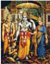

> **Deskripsi Visual:** Gambar ini adalah ilustrasi yang menampilkan tokoh-tokoh Hindu dalam sebuah cerita atau mitologi. Gambar ini menggambarkan tiga tokoh utama yang tampaknya sedang berbicara atau berinteraksi dengan satu sama lain. Tokoh-tokoh tersebut memiliki penampilan khas dengan pakaian tradisional dan rambut yang panjang, yang menunjukkan bahwa mereka mungkin merupakan dewa atau para dewi dalam mitologi Hindu.

Elemen-elemen utama dalam gambar ini meliputi:
1. Tiga tokoh utama yang terlihat berbicara atau berinteraksi.
2. Latar belakang yang menunjukkan keindahan alam, mungkin gunung atau hutan, yang menambah nuansa mistis pada gambar.
3. Pencahayaan yang menonjolkan wajah-wajah tokoh, menciptakan efek visual yang menarik.

Teks, angka, atau label penting yang terlihat dalam gambar ini tidak ada, sehingga fokus utama pada visual dan interpretasi konteks mitologi Hindu.

Informasi kunci yang dapat diambil pembaca dari gambar ini adalah bahwa ini mungkin merupakan bagian dari cerita atau mitologi Hindu yang menampilkan tokoh-tokoh yang memiliki peran penting dalam kepercayaan atau legenda tersebut. Gambar ini mungkin digunakan untuk membantu pembaca memahami hubungan antara tokoh-tokoh tersebut dalam konteks mitologi Hindu.

karena  ceritanya  disusun  dengan  sangat  sistematis yang isinya mengandung arti yang sangat dalam. Karena  cerita  yang  dikandung  oleh  kitab  Rāmāyana itu sangat mempesona dengan penuh idealisme pendidikan moral, kewiraan serta disampaikan dalam  gaya  bahasa  yang  baik,  menyebabkan  epos  ini sangat  digemari  diseluruh  dunia.  Pengaruhnya  yang sangat besar dirasakan diseluruh Asia dan ceritanya dipahatkan sebagai hiasan candi-candi atau tempattempat  persembahyangan  umat Hindu. Demikian pula nama-nama kota yang terdapat di dalamnya banyak ditiru sebagai sumber inspirasi. Dengan demikian Rāmāyana menjadi sebuah Adikavya dan Mahārṣi Vālmīki diberi gelar sebagai Adikavi.

Keahlian Vālmīki dalam kemampuannya memahami perasaan Manusia secara mendalam, menyebabkan kitab Rāmāyana dengan mudah dapat menguasai emosi masyarakat dan sebagai apresiasi dari kata-kata tulis baru yang mengambil tema dari Rāmāyana. Di Indonesia misalnya gubahan yang dijumpai adalah Rāmāyana kekawin yang ditulis dalam bahasa Jawa Kuno. Sampai saat ini kekawi Rāmāyana

 

---
## 📄 Halaman 38

oleh para peneliti dinyatakan sebagai karya sastra tertua di Indonesia. Kekawin ini adalah kekawin yang paling besar dan paling panjang dalam kesusastraan Jawa Kuno.

Sumber asli dalam kekawin Rāmāyana itu adalah kitab Ravanavadha karangan Bhatti,  kitab  ini  sering  juga  disebut  Bhattikavya.  Secara  tradisional  kekawin Rāmāyan  dikarang  oleh  Empu  Yogisvara.  Kitab-kitab  gubahan  Rāmāyana sesungguhnya sangat banyak kita jumpai di India ataupun di luar India, tetapi semua  kitab  gubahan  tersebut  pada  hakekatnya  mengambil  materi  langsung maupun tidak langsung dari Rāmāyana karya Vālmīki.

Adapun isi singkat dari tiap-tiap kanda dari kitab Rāmāyana dapat diuraikan sebagai berikut:

Namun istrinya

Kaikeyi.

meminta

---
**📊 Tabel**

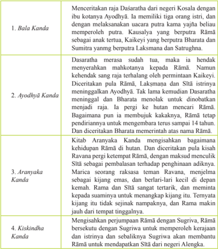

Tabel ini berisi informasi tentang beberapa kandungan utama dalam sebuah karya sastra tradisional, mungkin dari sebuah cerita rakyat atau mitologi. Topik utama tabel adalah tentang perjalanan dan kejadian-kejadian dalam cerita tersebut. Kolom-kolomnya mencakup:

1. Bala Kanda: Menceritakan tentang pertemuan Raja Dasaratha dengan ibunya ketika ia masih kecil.
2. Ayodhyā Kanda: Menggambarkan perjalanan Raja Dasaratha menuju Ayodhya setelah meninggalkan kediamannya di Sātī.
3. Aranya Kanda: Menyajikan perjalanan Rama dan Sītā ke hutan Aranya.
4. Kiskindha Kanda: Menceritakan perjalanan Rāma dan Sītā menuju Kiskinda.

Data penting yang terlihat dalam tabel ini meliputi:
- Perjalanan Raja Dasaratha dari negeri Kosala menuju Ayodhya.
- Raja Dasaratha meninggalkan kediamannya di Sātī untuk pergi ke Ayodhya.
- Rama dan Sītā melakukan perjalanan ke hutan Aranya.
- Rama dan Sītā kemudian pergi ke Kiskinda.

Tabel ini secara keseluruhan menunjukkan perjalanan dan kejadian-kejadian yang terjadi dalam cerita tersebut, mulai dari pertemuan awal Raja Dasaratha dengan ibunya hingga perjalanan mereka menuju Ayodhya dan akhirnya ke Kiskinda.

 

---
## 📄 Halaman 39

Sītā.

kota berhasil

terjadilah dalam

kancah

---
**📊 Tabel**

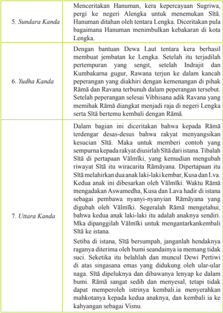

Tabel ini berisi informasi tentang cerita-cerita dari karya Srimad Bhagawad Gita, yang disajikan dalam bentuk paragraf yang menggabungkan beberapa bagian dari karya tersebut. Topik utama tabel adalah cerita-cerita yang terkait dengan dewa-dewa dan kejadian-kejadian yang terjadi di Lengka. Kolom-kolomnya mencakup nama cerita (5. Sundara Kanda, 6. Yudha Kanda, dan 7. Uttara Kanda), dan data penting yang terkait dengan cerita tersebut, seperti peristiwa utama, karakter yang terlibat, dan konsekuensi dari kejadian tersebut. Pola penting yang terlihat adalah bahwa cerita-cerita ini menunjukkan hubungan antara dewa-dewa, manusia, dan kejadian-kejadian yang terjadi di Lengka, serta bagaimana keputusan dan tindakan mereka mempengaruhi keadaan dan kehidupan di sana.

Sumber : Kamala Subramanyam, 2007

Tabel 2.1 Ringkasan Rāmāyana karya Valmiki

 

---
## 📄 Halaman 40

### Kegiatan  Siswa

- Sebelum melanjutkan materi Mahabharata marilah menonton ilm Mahabharata (Sumber DVD, internet).
- Tuliskan nama-nama tokoh yang ada dalam cerita tersebut !
- Setelah menonton tayangan ilm mahabharata, apakah pendapatmu dari tayangan tersebut tentang pesan moral yang dapat diteladani.

### 2. Mahābrāta

### Memahami  Teks

Kitab  Mahābhārata  ditulis  oleh  Empu  Wiyasa.  Nyoman  S.  Pendit  dalam halaman pendahuluan Mahābhāratanya menyebutkan bahwa Mahābhārata dikarang oleh 28 Wiyasa (Empu sastra) yang dipersoniikasikan sebagai seorang Mahārṣi Wiyasa (kakek Pandawa dan Kurawa).  Kitab ini terdiri atas astadasaparwa artinya  18  parwa  atau  18  bagian  atau  jilid  dan  digubah  dalam  bentuk  syair sebanyak 100.000 sloka yaitu  Adiparwa, Sabhaparwa, Wanaparwa, Wirathaparwa, Udyogaparwa, Bismaparwa, Dronaparwa, Karnaparwa, Salyaparwa, Sauptikaparwa, Striparwa, Santiparwa, Anusasanaparwa, Aswamedaparwa, Asrāmāwasanaparwa, Mausalaparwa, Prasthanikaparwa, Swargarohanaparwa.

Dewi suatu

---
**📊 Tabel**

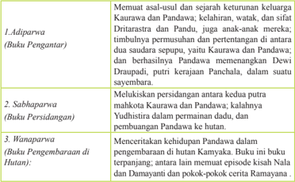

Tabel ini berisi informasi tentang tiga bagian dari sebuah buku pelajaran, masing-masing dengan judul dan konten spesifiknya. Topik utama tabel adalah pembagian materi dalam buku tersebut. Kolom pertama menunjukkan judul bagian, sedangkan kolom kedua menyajikan deskripsi singkat dari isi masing-masing bagian. Data penting yang terlihat antara lain bahwa setiap bagian memiliki tujuan dan konteks yang berbeda, mulai dari pengantar (Adiparwa) hingga pengembangan karya (Wanaparwa).

 

---
## 📄 Halaman 41

untuk yang

terakhir musuhnya

dan

Yudhistira jiwa

---
**📊 Tabel**

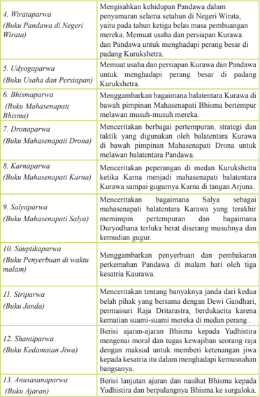

Tabel ini berisi 13 paragraf yang membahas berbagai cerita epik dari mitologi Hindu, disusun berdasarkan judulnya. Setiap paragraf mengandung cerita yang berasal dari epik Pandawa, Mahabharata, dan Mahasenaapat. Topik utama tabel adalah cerita-cerita epik tersebut, yang melibatkan berbagai tokoh seperti Pandawa, Kurawa, Arjuna, Drona, Karna, Salya, Janda, dan Bima. Kolom-kolomnya mencakup judul paragraf, penjelasan singkat tentang cerita, dan konteksnya dalam konteks mitologi Hindu. Data penting yang terlihat adalah bahwa setiap paragraf menggambarkan perjuangan dan pertarungan antara Pandawa dan Kurawa, dengan tokoh-tokoh utama seperti Arjuna, Drona, Karna, dan Bima memainkan peran penting dalam konflik tersebut.

 

---
## 📄 Halaman 42

puncak

---
**📊 Tabel**

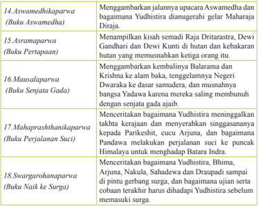

Tabel ini berisi 8 paragraf yang masing-masing membahas aspek-aspek dari kisah Yudhistira dalam mitologi Hindu. Topik utama tabel adalah kisah Yudhistira dan para tokoh-tokoh pentingnya dalam perjalanan ke Surga. Kolom pertama menunjukkan judul paragraf, sedangkan kolom kedua menjelaskan isi paragraf tersebut. Data penting yang terlihat adalah bahwa semua paragraf tersebut berkaitan dengan perjalanan Yudhistira ke surganya, mulai dari awalnya di Aswamedhikaparwa hingga akhirnya di Swargarohanparwa. Paragraf-paragraf ini mencakup berbagai aspek seperti kisah para tokoh, peristiwa penting, dan makna moral yang terkandung dalam kisah tersebut.

Sumber: diapdatasi dari Kamala Subramanyam, 2003

 

---
## 📄 Halaman 43

Kegiatan  Siswa

### Kerjakan pada lembaran lain.

- Coba kamu tuliskan secara singkat pesan moral yang terkandung dalam masingmasing kanda dalam cerita Rāmāyana dengan mengikuti tabel sebagai berikut !
Nama Kanda

(Kanda 1-7)

Pesan Moral

- Coba kamu tuliskan secara singkat pesan moral yang terkandung dalam masingmasing parwa dalam cerita Mahābhārata!
Nama

(

Parwa 1-18)

Pesan Moral

---
**📊 Tabel**

Tabel ini menunjukkan informasi tentang paraf guru dan paraf orang tua, serta nilai yang diberikan. Topik utama tabel ini adalah tentang validasi atau verifikasi dokumen atau surat keterangan. Kolom-kolomnya meliputi nama paraf guru, nama paraf orang tua, dan nilai yang diberikan. Data penting yang terlihat adalah bahwa para paraf harus disertai oleh nama lengkap dan diukur dengan nilai tertentu untuk memastikan kevalidan dokumen tersebut.

Parwa

 

---
## 📄 Halaman 44

### D. Purāna

### Memahami  Teks

### a.  Pengertian Purāna

Kata Purāna berarti tua atau kuno. Kata ini  dimaksudkan  sebagai  nama jenis  buku  yang  berisikan  ceritera  dan  keterangan  mengenai  tradisi-tradisi yang  berlaku  pada  jaman  dahulu  kala.  Berdasarkan  bentuk  dan  sifat  isinya, Purāna  adalah sebuah  Itihāsa karena di  dalamnya  memuat  catatan-catatan tentang  berbagai  kejadian  yang  bersifat  sejarah.  Tetapi  melihat  kedudukanya, Purāna  adalah  merupakan  jenis  kitab  Upaveda  yang  berdiri  sendiri,  sejajar pula dengan Itihāsa.  Ini  tampak  kepada kita ketika kita membaca keterangan yang menjelaskan bahwa untuk mengetahui isi Weda dengan baik, kita harus pula mengenal Itihāsa,  Purāna  dan  Ākhyāna.  Dengan  penjelasan  ini  kiranya dapat  disimpulkan  bahwa  yang  dimaksud  dengan  Purāna  adalah  kitab  yang memuat  berbagai  macam  tradisi  atau  kebiasaan  dan  keterangan-keterangan lainnya,  baik  itu  tradisi  atau  kebiasaan  dan  keterangan-keterangan  lainnya, baik  itu  tradisi  lokal,  tradisi  keluarga,  dan  lainnya.

### b.  Pokok-pokok isi Purāna

Pada garis besarnya, hampir semuah Purāna memuat ceritera-ceritera yang secara tradisional dapat kita kelompokan kedalam lima hal, yaitu:

- Tentang Kosmogoni atau mengenai penciptaan alam semesta.
- Tentang hari kiamat atau Pralaya.
- Tentang Silsilah raja-raja atau dinasti raja-raja Hindu yang terkenal.
- Tentang masa Manu atau Manwantara.
- Tentang sejarah perkembangan dinasti Surya atau Suryawangsa dan Chandrawangsa.
Kelima hal itu dirumuskan dalam kitab Wisnu Purāna III.6.24, mengantarkan sebagai berikut: 'Sargaśca pratisargaśca wamśo manwantarāni ca, sarwesweteṣu kathyante waṃśān ucaritam ca yat'.

Dari ungkapan itu, jelas Viṣṇu Purāna mencoba memberi batasan tentang isi Purāna pada umumnya dan dapat disimpulkan sebagaimana dikemukakan di  atas.  Di  samping  kitab  Viṣṇu  Purāna,  banyak  lagi  kitab-kitab  Purāna lainya yang isinya tidak hanya terbatas kepada kelima hal itu saja, melainkan memberi keterangan  berbagai  hal  termasuk  berbagai  macam  upacara Yajña dengan  penggunaan  mantranya,  ilmu  penyakit,  pahala  melakukan  dana punia, berbagai macam jenis upacara Yajña dengan penggunaan mantranya, ilmu penyakit, pahala melakukan Tirthayatra, berbagai macam jenis upacara keagamaan, peraturan tentang cara memilih dan membangun tempat ibadah,

 

---
## 📄 Halaman 45

peraturan tentang cara melakukan peresmian Candi, sejarah para dewa-dewa, berbagai  macam  jenis  batu-batuan  mulia  banyak  lagi  hal-hal  yang  sifatnya memberi keterangan kepada kita tentang sifat hidup di dunia ini.

Dari berbagai keterangan ini akhirnya kita dapat simpulkan bahwa Kitab Purāna banyak sekali memberikan keterangan yang bersifat mendidik, baik mengenai  ajaran  Ketuhanan  ( Theologi )  maupun  cara-cara  pengamalanya. Hanya saja sayangnya, sifat pedadogi yang diberikan sangat disederhanakan dan pada umumnya satu kitab akan bersifat fanatik pada cara penerangan dan pendiriannya, sering tanpa disadari telah menimbulkan dampak yang memberi citera yang kurang menguntungkan seperti teori Theisme melahirkan konsep Pantheisme hanya karena sekedar untuk memberi contoh-contoh untuk yang kurang mendalam.

Dengan adanya keterangan yang bersifat hetrogin, secara tidak langsung telah menimbulkan kesan adanya sifat Politheisme dan bermadzab-madshab. Secara ilmiah, pada dasarnya kitab Purāna  bertujuan  untuk  memberi  keterangan secara metodelogis yang amat penting dalam memberi keterangan tentang ajaran Ketuhanaan itu sendiri.  Apa bila kita  tidak  membaca seluruh Purāna da n tidak membatasi diri kita maka kita akan secara tidak sadar terbawa pada satu pandangan yang mengelirukan. Dan ini bukan maksudnya demikian adanya Kitab Purāna itu.

Menurut  catatan  yang  dapat  dikumpulkan,  pada  mulanya  kita  memiliki kurang  lebih  18  kitab  Purāna,  yaitu  masing-masing  namanya  adalah:

- Brahmānda  Purāna.
- Brahmawaiwarta  Purāna.
- Mārkandeya  Purāna.
- Bhawisya  Purāna.
- Wāmana  Purāna.
- Brahama  Purāna  atau  adhi  Purāna.
- Wisnu  Purāna.
- Nārada  Purāna.
- Bhāgawata  Purāna.
- Garuda  Purāna.
- Padma  Purāna.
- Warāha  Purāna.
- Matsya  Purāna.
- Karma  Purāna.
- Lingga  Purāna.
- Siwa  Purāna.
- Skanda  Purāna.
- Agni  Purāna.

 

---
## 📄 Halaman 46

Selanjutnya yang perlu kita ketahui bahwa di Bali kita menemukan pula sejenis Purāna yang dinamakan dengan nama kitab Purāna pula, yaitu Rāja Purāna. Kitab Purāna  ini dapat kita tambahkan ke dalam delapan belas Purāna yang ada. Kitab Rāja Purāna berisikan banyak catatan mengenai silsilah rajaraja yang pernah menerima di Bali dan hubunganya dengan Jawa.

### c. Pembagian jenis Purāna

Kitab  Purāna  secara  menyeluruh  dapat  kita  kelompokan-kelompokan  ke dalam tiga kelompok. Pengelompokan Kitab Purāna ini didasarkan pada isinya. Sebagai  mana  kita  ketahui  kitab Purāna  menonjolkan  sifat  ke  sekteannya. Jika  diperhatikan  keseluruh  Purāna  sebagai  sumber  ajaran  theologi,  tampak

---
**🖼️ Gambar/Diagram**

> **Deskripsi Visual:** Gambar ini adalah ilustrasi yang menampilkan dua karakter utama berada di atas kapal yang berlayar di atas laut. Karakter pertama adalah seorang pria tua dengan rambut pendek dan topi, sedang berdiri di tengah kapal. Karakter kedua adalah seorang wanita muda dengan rambut panjang, berdiri di belakang pria tua. Kedua karakter tersebut tampak sangat bahagia dan senang.

Ilustrasi ini menunjukkan hubungan antara dua karakter tersebut, yaitu hubungan romantis atau persahabatan. Kapal yang mereka tempuh menunjukkan bahwa mereka sedang berkelana atau berpergian bersama-sama. Latar belakang ilustrasi menunjukkan keindahan alam seperti hutan dan bunga, yang menambah suasana ceria dan damai.

Teks, angka, atau label penting tidak terlihat pada gambar ini. Informasi kunci yang dapat diambil pembaca adalah tentang hubungan antara dua karakter utama dan suasana ceria yang ditunjukkan oleh ilustrasi ini.

kepada kita seakan-akan adanya polytheisme karena setidak-tidaknya akan terlihat adanya tiga wujud sifat kekuasaan,  yang  umum  kita  kenal dengan Tri Murti, yaitu Brahama, Wisnu  dan  Siwa.  Berdasarkan  ketiga sifat hakekat itu yang kemudian merupakan  perwujudan  dari  masingmasing madzab dalam Agama Hindu, Purāna seluruhnya dikelompokan ke dalam tiga macam kelompok, yaitu :

---
**📊 Tabel**

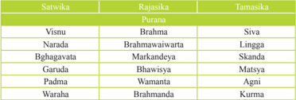

Tabel ini menunjukkan hubungan antara nama-nama dewa dalam mitologi Hindu dengan nama-nama dewa dalam mitologi lainnya. Topik utama tabel ini adalah hubungan antara dewa-dewa dalam mitologi Hindu dengan dewa-dewa dalam mitologi lainnya. Tabel memiliki tiga kolom: Satwika, Purana, dan Tanusika. Kolom Satwika berisi nama-nama dewa Hindu seperti Vishnu, Narada, Bhagavat, Garuda, Padma, dan Waraha. Kolom Purana berisi nama-nama dewa lainnya seperti Brahma, Brahmacawarta, Markandeya, Bhawusya, Wamanta, dan Brahmanda. Kolom Tanusika berisi nama-nama dewa lainnya seperti Siva, Lingga, Skanda, Matsya, Agni, dan Kuma. Dari tabel ini, kita dapat melihat bahwa nama-nama dewa dalam mitologi Hindu seringkali memiliki hubungan dengan nama-nama dewa dalam mitologi lainnya, baik dalam bentuk langsung maupun melalui perantaraan.

### 1. Kelompok Satvika

Kelompok Purāna ini mengutamakañ Wisnu sebagai Dewatanya. Dewa Wisnu  adalah  salah  satu  bentuk  sifat  Tuhan  Y .M.E.  Sebagai  Wisnu  di dalam ke enam kitab Purāna Wisnu menempati kedudukan yang tertinggi dan  kadang  kala  ia  juga  diceritakan  dalam  berbagai  wujud  inkarnasinya (Awataranya).

### 2. Kelompok Rajasika (Rajasa) Purāna

Kelompok  Rājasika  ini,  Dewa  Brahma  merupakan  Dewatanya  yang paling  utama.  Dari  nama-nama  itulah  kita  dapat  menyimpulkan  bahwa

 

---
## 📄 Halaman 47

tokoh Dewatanya adalah Brahma. Adanya nama-nama seperti Mārkandeya di dalam tradisi yang di kenal di Bali, dan adanya Kitab Brahmanda Purāna yang sering disebut-sebut  terdapat  di  Bali,  Kesemuanya  itu  hanya  dapat membuktikan  bahwa  di  Bali  pada  zaman  dahulu  pernah  berkembang madzab Brahmanisme di samping madzab Waisnawa atau Bhāgawata.

### 3. Kelompok Tamasika (Tamasa) Purāna

Kelompok yang ketiga ini terdiri atas enam buah Kitab Purāna juga. Menurut isinya, Kitab Purāna ini banyak memuat penjelasan Dewa Siwa dengan  segala  Awataranya,  di  samping  itu  terdapat  pula  Dewa  Wisnu, seperti dalam Kurma Purāna. Matsya Purāna membahas tentang berbagai macam upacara titualia keagamaan, tentang irasat, dan banyak pula cerita mengenai sejarah dan para Resi dan Dewa-dewa.

Agni Purāna  yang  merupakan  Purāna  terbesar  digolongan  Tamasa Purāna,  dikenal  pula  dengan  nama  Mahā  Purāna.  Nama  ini  menunjuk akan kebesaran dan keluasan isi Agni Purāna  disamping  Matsya  Purāna. Berdasarkan catatan yang ada, Agni Purāna dibagi atas pokok, yaitu:

- Yang pertama, sesuai dengan materinya disebut Sawarahasya-Kanda.
- Yang  kedua  merupakan  Waisnawa  Purāna  dan  sebagai  pelengkap  pada Waisnawa Pancarata, membahas mengenai Vedanta dan Gita.
- Yang  ketiga  di  dalamnya  membahas  aspek  Saigwasma  dan  memuat beberapa pokok ajaran mengenai ritualia menurut tantrayana.
Berdasarkan  hasil  penelitian  diketahui  bahwa  Agni  Purāna  merupakan hasil karya Bhagawan Wasiṣṭha. Berdasarkan penjelasan dari Agni Purāna, dikemukakkan  bahwa  banyak  cabang  ilmu  yang  kemudian  dikembangkan dinyatakan berasal dari  Agni Purāna dan pernyataan ini mungkin sifatnya dibesar-besarkan saja. Berdasarkan kitab Agni Purāna inilah mendapatkan keterangan bahwa ilmu pengetahuan itu dibedakan atas dua macam, yaitu:

- Para  widya,  yaitu pengetahuan  yang  menyangkut  masalah  ketuhanan Y.M.E.  dan  dinyatakan  sebagai  pengetahuan  tertinggi.
- Apara  widya,  yaitu  pengetahuan  yang  menyangkut  masalah  duniawi.
Dari perumusan isi itu, jelas Agni Purāna memuat keterangan yang amat luas  dan  bermanfaat  untuk  diketahui. Yang  paling  penting  kemanfaatan Agni Purāna adalah karena justru kitab ini memuat keterangan yang amat bermanfaat mengenai iconograi arca untuknya dengan mempelajari kitabkitab Purāna itu dimaksudkan tingkat kebaktian dan keimanan seseorang akan dapat lebih mantap dan berkembang.

kita

 

---
## 📄 Halaman 48

### d. Kitab Upa Purāna

Di samping ke delapan belas Purāna pokok itu,  kita  banyak  mencatat  adanya jenis-jenis Kitab Purāna yang lebih kecil dan suplemeter sifatnya. Kelompok itu kita kenal dengan nama Upa Purāna. Umunya jenis Kitab Upa Purāna ini banyak ditulis oleh Bhagawan Wyāsa isinya sangat singkat dan pendek. Kitab ini terdiri dari :

---
**📊 Tabel**

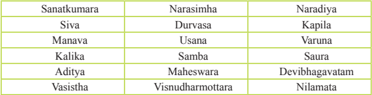

Tabel ini menunjukkan daftar nama-nama yang mungkin berasal dari mitologi atau legenda, dengan beberapa nama yang mirip atau berhubungan. Topik utama tabel ini adalah identifikasi atau pengenalan nama-nama yang mungkin memiliki hubungan dengan mitologi atau legenda. Kolom pertama menunjukkan nama-nama yang mungkin berasal dari mitologi atau legenda, sedangkan kolom kedua menunjukkan nama-nama yang mungkin memiliki hubungan dengan mitologi atau legenda tersebut. Data atau pola penting yang terlihat adalah bahwa beberapa nama memiliki hubungan dengan mitologi atau legenda, seperti "Siva" dan "Narasiharma", sementara beberapa nama lainnya tidak memiliki hubungan yang jelas dengan mitologi atau legenda.

Sebagaimana telah dikemukakan, bahwa Purāna banyak memberi informasi yang  bermanfaat  kepada  kita  terutama  dalam  bidang  pelaksanaan  ajaran keagamaan  atau  Ācāra.  Dengan  tujuan  untuk  melengkapi  keterangan  yang diperlukan untuk memahami Weda, kitab Purāna itu sedikit banyaknya sangat bermanfaat. Kecuali untuk membuktikan sejarah secara materiil hanya baru dapat kita pergunakan apa bila didukung oleh penemuan arkeologi lainya.

### Uji  Kompetensi

- Apakah yang  dimaksud dengan Purāna?
-------------------------------------------------------------------------------------------------

-------------------------------------------------------------------------------------------------

-------------------------------------------------------------------------------------------------

-------------------------------------------------------------------------------------------------

-------------------------------------------------------------------------------------------------

- Sebutkan dan jelaskan pembagian 3 kelompok Purāna !
-------------------------------------------------------------------------------------------------

-------------------------------------------------------------------------------------------------

-------------------------------------------------------------------------------------------------

-------------------------------------------------------------------------------------------------

-------------------------------------------------------------------------------------------------

 

---
## 📄 Halaman 49

- Berdasarkan  kitab  Agni  Purāna    kita  mendapatkan  keterangan  bahwa  ilmu pengetahuan itu dibedakan atas dua macam.Sebutkan dan jelaskanlah !
-------------------------------------------------------------------------------------------------

-------------------------------------------------------------------------------------------------

-------------------------------------------------------------------------------------------------

-------------------------------------------------------------------------------------------------

-------------------------------------------------------------------------------------------------

### Kegiatan  Siswa

### Petunjuk :

- Bentuklah kelompok 3-4 orang siswa
- Amatilah tayangan TV yang sedang terjadi sekarang tentang pemerintahan Indonesia
- Tuliskan isi berita tersebut
- Presentasikan di depan kelas
`

### E. Arthaśāstra

### Memahami  Teks

Adapun jenis Upaveda yang paling penting adalah yang tergolong Arthaśāstra. Arthaśāstra adalah ilmu tentang politik atau ilmu tentang pemerintahan. Da sardasar ajaran Arthaśāstra  terdapat  di  hampir  semua  bagian  kitab  sastra  dan  Veda yang  penting.  Di  dalam  Rg  Veda  maupun Yajurveda  terdapat  pula  pokok-pokok pemikiran mengenai Arthaśāstra. Penjelasan lebih lengkap dapat ditemukan dalam Kitab Itihāsa dan Purāna.

Kitab  Mahābhārata  dan  Rāmāyana  boleh  dikatakan  memuat  pokok-pokok ajaran Arthaśāstra dengan nama Rājadharma. Mulai pada abad ke VI SM, bentuk naskah Arthaśāstra mulai memperlihatkan bentuknya yang lengkap dan sempurna setelah  Dharmaśāstra  meletakkan  pokok-pokok  pikiran  mengenai  Arthaśāstra itu. Pada abad ke IV SM., Kautilya menulis bukunya yang pertama dengan nama Arthaśāstra.  Kitab Arthaśāstra  inilah  yang  dianggap  paling  sempurna  sehingga dengan  demikian  kita  dapat  mengatakan  bahwa  Kautilya  atau  Canakya  atau Viṣṇugupta dapat kita anggap sebagai Bapak Ilmu politik Hindu.

Relevansi  isi  Arthaśāstra  yang  masih  relevan  dengan  alam  pikiran  politik modern di Barat, terdapat di dalam ungkapan Kitab Arthaśāstra itu. Karena itu untuk mendalami ilmu politik Hindu dianjurkan agar di samping membaca Itihāsa dan Purāna, supaya membaca Dharmaśāstra dan Arthaśāstra karya Canakya itu. Dari berbagai tulisan, dapat disimpulkan bahwa istilah Arthaśāstra adalah bukan

 

---
## 📄 Halaman 50

satu-satunya istilah yang dikenal dalam kitab sastra Veda.  Mengenai  penulis  di bidang Arthaśāstra pun banyak pula. Nama-nama yang banyak disebut antara lain : Manu, Yajñavalkya, Usaṇa, Bṛhaspati, Visalaksa, Bharadvāja, Parasara dan yang terakhir dan paling banyak disebut-sebut adalah Kautilya sendiri.

Dalam Arthaśāstra  terdapat  empat aliran pokok. Perbedaan tampak dari sistem penerapan ilmu politik berdasarkan ilmu yang diterima sebagai system untuk mencapai tujuan hidup Manusia (Purusārtha). Bhagavad Sūkra yang menulis Arthaśāstra dengan nama  Śukrānitiśāstra.  Buku ini  berisikan  ajaran-ajaran  teori  ilmu politik yang ditulis dalam ± 2200 sair. Disamping  itu  Kamāṇdaka  juga  telah menulis Nitiśāstra yang semuanya memberi pandangan yang luas tentang ilmu politik.

---
**🖼️ Gambar/Diagram**

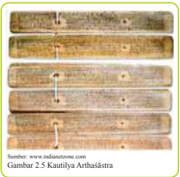

> **Deskripsi Visual:** Gambar ini adalah ilustrasi yang menunjukkan bagian dari sebuah alat atau peralatan tradisional, mungkin dari budaya Asia Tenggara. Gambar ini terdiri dari empat bagian yang disusun berurutan, masing-masing menunjukkan sebagian dari alat tersebut. Setiap bagian memiliki penjelasan yang berbeda tentang bagian-bagian alat tersebut.

1. **Apa yang Ditampilkan Secara Keseluruhan**: Gambar ini menunjukkan empat bagian dari sebuah alat tradisional, mungkin alat musik atau peralatan pertanian. Setiap bagian menunjukkan bagian yang berbeda dari alat tersebut, dengan penjelasan yang berbeda untuk setiap bagian.

2. **Elemen-Elemen Utama dan Relasinya**: 
   - **Bagian 1**: Menunjukkan bagian depan alat, yang tampak seperti sebuah papan dengan lubang-lubang.
   - **Bagian 2**: Menunjukkan bagian tengah alat, yang tampak seperti sebuah papan dengan lubang-lubang dan tali-tali.
   - **Bagian 3**: Menunjukkan bagian belakang alat, yang tampak seperti sebuah papan dengan lubang-lubang dan tali-tali.
   - **Bagian 4**: Menunjukkan bagian samping alat, yang tampak seperti sebuah papan dengan lubang-lubang dan tali-tali.

3. **Teks, Angka, atau Label Penting yang Terlihat**: 
   - Ada teks yang memberikan penjelasan tentang setiap bagian alat, namun tidak ada angka atau label spesifik yang jelas dalam gambar ini.

4. **Informasi Kunci yang Bisa Diambil Pembaca**: 
   - Gambar ini memberikan gambaran umum tentang struktur dan bagian-bagian dari alat tradisional tersebut.
   - Informasi ini dapat membantu pembaca memahami bagaimana alat tersebut bekerja dan bagaimana setiap bagian berfungsi dalam sistem keseluruhan alat tersebut.

Dengan demikian, gambar ini merupakan ilustrasi yang informatif yang membantu pembaca memahami struktur dan fungsi alat tradisional tersebut.

Kitab ini ditulis oleh Kautilya saat mana keadaan politik di negeri India  kacau, para  pejabat  atau  bangsawan  sibuk  berpestapora,  negara  tidak  terurus,  korupsi merajalela  di  sana-sini,  yang  menjadi  korban  adalah  rakyat,  rakyat  dibebani berbagai  macam pajak dan iuran atau pungutan yang tidak perlu. Terlebih lagi India saat itu mengalami ancaman ekspedisi militer dari Kaisar Ale xander Yang Agung raja Yunani. Sebagai seorang yang terpelajar, cerdas dan perduli dengan keadaan  rakyat  Kautilya  memberikan  kritik  pada  kekuasaan  saat  itu,  namun penguasa saat itu menghinanya. Hal ini tidak menyurutkan semangat dari Kautilya untuk  memperjuangkan  hak-hak  rakyat.  Dia  bertekad  membangun  kekuatan rakyat untuk meruntuhkan kekuasaan yang korup.

Langkah awal yang diambilnya adalah membangun kesadaran rakyat terhadap negara,  ini  dilakukannya  dengan  berkeliling  ke  seluruh  wilayah  India.  Setelah kesadaran  rakyat  terhadap  negara  terbangun  maka  beliau  mengajarkan  tentang kekuasaan,  merebut  kekuasaan,  mempertahankan  kekuasaan  dan  memfungsikan kekuasaan sebagai istrumen kesejahteraan sosial. Kautilya mengajarkan bagai mana menjatuhkan  para  penguasa  yang  korup  dengan  memanfaatkan  Indria  (nafsu), yaitu  dengan  membiarkan  mereka  terjebak  dalam  kubangan  nafsu,  sebaliknya kekuatan  rakyat  digalang  dengan  melakukan  pengendalian  Indria  (nafsu)  seperti yang diajarkan  dalam  Kitab  suci Veda.

Chanakya  bersama  rakyat  berhasil  menjatuhkan  penguasa  dengan  menjebak para penguasa pada kubangan nafsu (Indria) mereka. Beliau menobatkan muridnya Chandragupta  menjadi  Raja  kerajaan  saat  itu.  Seorang  pemuda  dari  rakyat  jelata, golongan  sudra.  Sejak  itu  kerajaan  dikuasai  oleh  rakyat  dan  pemimpin  yang  mau melayani  rakyat.  Kerajaan  ini  kemudian  berkembang  pesat  sehingga  mampu

 

---
## 📄 Halaman 51

menguasai sebagian besar India selatan. Kerajaan ini kemudian dikenal dengan nam Kerajaan Asoka. Kerajaan ini merupakan pusat perkembangan kebudayaan yang berbasiskan rasionalitas yang dirintis sejak Upaniṣad dan Buddha sekitar tahun 600 SM. Raja Asoka generasi dari Chandragupta, menghapuskan deskriminasi sosial dan mengumumkan penghapusan segala tindak kekerasan untuk mencapai tujuan apapun dalam wilayah kekuasaanya.

### Uji  Kompetensi

- Jelaskanlah  pendapat  anda  tentang  politik  dan  tata  pemerintahan  dari  sudut pandang Agama Hindu!
-------------------------------------------------------------------------------------------------

-------------------------------------------------------------------------------------------------

-------------------------------------------------------------------------------------------------

-------------------------------------------------------------------------------------------------

-------------------------------------------------------------------------------------------------

-------------------------------------------------------------------------------------------------

------------------------------------------------------------------------------------------------

- Menurut  pendapatmu,  apakah  ajaran  yang  termuat  dalam  kitab-kitab  yang tergolong Arthaśāstra masih relevan dengan perkembangan politik pemerintahan dewasa ini?
-------------------------------------------------------------------------------------------------

-------------------------------------------------------------------------------------------------

-------------------------------------------------------------------------------------------------

-------------------------------------------------------------------------------------------------

-------------------------------------------------------------------------------------------------

-------------------------------------------------------------------------------------------------

------------------------------------------------------------------------------------------------

- Jelaskan  pendapatmu  tentang  peran  pemimpin  dalam  Membangun  kesadaran rakyat terhadap negaranya untuk mewujudkan negara yang makmur dan sejahtera!
-------------------------------------------------------------------------------------------------

-------------------------------------------------------------------------------------------------

-------------------------------------------------------------------------------------------------

-------------------------------------------------------------------------------------------------

-------------------------------------------------------------------------------------------------

-------------------------------------------------------------------------------------------------

-------------------------------------------------------------------------------------------------

 

---
## 📄 Halaman 52

### F. Āyur Veda

### Memahami  Teks

Āyur Veda adalah sebuah pengetahuan pengobatan yang bersumber dari Kitab Upaveda Smerti. Kitab Āyurveda  berbeda dengan Kitab Yajurveda. Sering sekali kedua  kitab  ini  dianggap  sama.  Padahal  kitab  Āyurveda      mengulas  tentang bagaimana tata caranya agar tetap sehat dan berumur panjang. Kitab ini berada di dalam sub kelompok Veda Smerti Upaveda.

Sedangkan Kitab Yajurveda yang membahas tentang yadnya merupakan bagian dari kelompok Mantra Veda Śruti. Isi kitab Āyurveda lebih banyak mengacu atau merujuk pada kitab Mantra Atharwaveda, bukan kepada kitab Mantra Yajurveda

Istilah Āyurveda  berarti ilmu yang menyangkut bagaimana seseorang dapat mencapai  panjang  umur.  Āyu  artinya  baik  dalam  artian  panjang  umur.  Kitab Āyurveda   isinya tidaklah hanya menguraikan tentang penyakit, pengobatan dan penyembuhan, seperti banyak di perkirakan orang. Ulasannya jauh lebih luas dari

---
**🖼️ Gambar/Diagram**

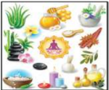

> **Deskripsi Visual:** Gambar ini adalah ilustrasi yang menampilkan berbagai produk perawatan kulit dan alat kesehatan. Gambar ini mencakup berbagai elemen seperti botol kosmetik, batu alam, daun, dan bunga. Setiap elemen memiliki warna dan bentuk yang unik, menunjukkan variasi dalam produk perawatan kulit dan alat kesehatan. Teks, angka, atau label penting tidak terlihat pada gambar ini karena ia hanya menggambarkan produk tanpa teks atau angka. Informasi kunci yang dapat diambil pembaca adalah bahwa gambar ini menunjukkan berbagai produk perawatan kulit dan alat kesehatan yang dapat digunakan untuk menjaga kebersihan dan kesehatan kulit.

itu. Isinya menyangkut berbagai pengetahuan tentang  kehidupan  Manusia  (Bhuana  Alit) yang  hidup  di  dunia  ini  (Bhuana  Agung), terutama yang  berkaitan  dengan  berbagai upaya  agar  Manusia  dapat  hidup  sehat  dan berumur  panjang.  Kitab  ini  juga  membahas pengetahuan mengenai biologi, anatomi, dan berbagai macam pengetahuan mengenai jenis-jenis  tumbuhan  yang  dapat  digunakan sebagai tanaman obat. Menurut isi kajian yang di bahas di dalam berbagai macam jenis Āyurveda, keseluruhannya dapat dibagi atas delapan bidang, yaitu :

- Śalya, yaitu ilmu tentang bedah dan cara-cara penyembuhannya
- Salakya, yaitu ilmu tentang berbagai macam penyakit pada waktu itu
- Kāyacikitsa, yaitu ilmu tentang jenis dan macam obat-obatan
- Bhūtawidya, yaitu ilmu pengetahuan psikoterapi
- Kaumārabhṛtya, yaitu ilmu tentang pemeliharaan dan pengobatan penyakit anak-anak termasuk pula cara perawatannya.
- Agadatantra, yaitu ilmu tentang pengobatan atau toxikologi
- Rasāyamatantra, yaitu tentang pengatahuan kemujizatan dan cara-cara pengobatan non medis.
- Wajikaranatantra, yaitu ilmu tentang pengetahuan jiwa remaja dan permasalahannya.

 

---
## 📄 Halaman 53

Menurut  keterangan  dari  berbagai  kitab  Āyurveda  ada  petunjuk  yang menegaskan  bahwa  Āyurveda  asal  mulanya  dirintis  oleh  Atreya  Purnawasu disekitar  abad  ke  VI  SM,  jauh  sebelum  Buddha.  Kemudian  oleh  beliau diajarkannya  kepada  Caraka  dan  Dhṛdhabala  yang  kemudian  oleh  mereka menghimpunnya dalam bentuk buku baru dengan nama Caraka Samhitā. Isinya merupakan himpunan ilmu obat-obatan. Dari Caraka Samhitā lebih jauh mendapat keterangan  mengenai  pengelompokan  berbagai  bidang  ajaran  Āyurveda  yang pada dasarnya sama terdiri atas delapan bidang studi kasus, yaitu :

- Sūtrasthāna, yaitu bidang ilmu pengobatan
- Nidānasthāna, yaitu bidang ilmu yang membicarakan berbagai macam penyakit yang paling pokok saja.
- Wimānasthāna, yaitu bidang ilmu yang mempelajari tentang phatologi, tentang ilmu pengobatan dan kewajiban yang harus dipenuhi dan dipatuhi oleh seorang dokter medis.
- Indriyasthāna, yaitu ilmu yang mempelajari cara diagnose dan prognosa
- Saristhāna, yaitu bidang ilmu yang mempelajari tentang anatomi dan embriologi.
- Cikitsāsthāna, yaitu bidang ilmu yang mempelajari secara khusus tentang ilmu terapi
- Khalpasthāna, dan
- Siddhi.
Hidup itu merupakan perpaduan antara raga sarira atau stula sarira  (badan kasar),  suksma  sarira  (badan  halus),  manah  (kemampuan  berpikir),  indriya (kemampuan mengindera), dan atma (jiwatman). Manusia yang dianggap hidup adalah  Manusia  yang  mampu  melaksanakan  aktivitas  utama  hidupnya  ( karma purusḥa), mampu melakukan dharma, sebagai suatu akumulasi atau perpaduan keseimbangan  antara  unsur  tri  dosḥa  (cairan  humoral)  yang  berada  di  dalam tubuh,  sapta  dhatu  (jaringan  tubuh),  dan  tri  mala  (limbah  buangan,  ekskreta). Jaringan tubuh atau sapta dhatu yaitu rasa (plasma), rakta (darah), mamsa (otot), meda  (lemak),  asthi  (tulang),  majja  (sumsum),  dan  sukra  (energi  vital)  akan dapat berfungsi optimal bila unsur tri dosḥa (vata, pitta, kapha) berada dalam keadaan seimbang dan mala (buang air besar, buang air kecil, keringat) dibuang secara teratur. Berkeringat setiap saat, kencing setiap 8 jam, dan berak setiap 24 jam adalah bentuk mala yang harus dibuang secara teratur dari tubuh. Bila ini tidak dilakukan tidak terjadi maka keseimbangan dalam tubuh akan terganggu. Akibatnya Manusia itu akan jatuh sakit.

Di  dalam  pengobatan  tradisional  Bali,  Kitab  Āyurveda  ini  dikenal  dengan nama lontar Usada atau Kitab Usada. Isinya tidaklah persis sama seperti apa yang ditulis di dalam Āyurveda. Ada berbagai kearifan lokal yang masuk dan terdapat di dalam lontar Usada. Unsur tri dosḥa yang terdiri dari unsur vata (angin, udara), pitta (api) dan kapha (air).

 

---
## 📄 Halaman 54

### Kegiatan  Siswa

Diskusikanlah dengan orang tua anda tentang tumbuh-tumbuhan yang memiliki khasiat untuk pengobatan ! Laporkanlah hasilnya dalam bentuk portofolio!

-------------------------------------------------------------------------------------------------

-------------------------------------------------------------------------------------------------

-------------------------------------------------------------------------------------------------

-------------------------------------------------------------------------------------------------

-------------------------------------------------------------------------------------------------

-------------------------------------------------------------------------------------------------

-------------------------------------------------------------------------------------------------

### G. Gandharwa Veda

### Mengamati

- Tuliskan kesenian yang ada di lingkungan tempat tinggal masing-masing !
- Tuliskan jenis kesenian yang pernah kamu lihat pada acara keagamaan Hindu!

### Memahami Teks

Gandharwaveda sebagai kelompok Upaveda, menduduki tempat yang penting dan ada hubungannya dengan Sama Veda. Di dalam kitab Purāna kita jumpai pula keterangan  mengenai Gandharwa Veda. Gandharwaveda juga mengajarkan tentang tari, musik atau seni suara. Adapun nama-nama buku yang Gandharwaveda  tidak  diberi  nama  Gandharwaveda,  melainkan  dengan  nama  lain.

tergolong

Indonesia

 

---
## 📄 Halaman 55

Penulis terkenal Sadasiwa, Brahma dan Bharata. Bharata menulis buku yang dikenal  dengan  Natyasāstra,  dan  sesuai  menurut  namanya,  Natya  berarti  taritarian,  karena  itu  isinya  pun  jelas  menguraikan  tentang  seni  tari  dan  musik. Sebagaimana diketahui musik, tari-tarian dan seni suara tidak dapat dipisahkan dari  agama.  Bahkan  Siva  terkenal  sebagai  Natarāja  yaitu  Dewa  atas  il mu  seni tari.  Dari  kitab  itu  diperoleh  keterangan  tentang  adanya  tokoh  penting  lainnya, Wrddhabhārata  dan  Bhārata.  Wrddhabhārata  terkenal  karena  telah  menyusun sebuah  Gandharwaveda  dengan  nama  Natyavedāgama  atau  dengan  nama  lain, Dwadasasahari.

Natyasāstra  itu  sendiri  juga  dikenal  dengan  Satasahasri.  Adapun  Bhārata sendiri  membahas  tentang  rasa  dan  mimik  dalam  drama.  Dattila  menulis kitab disebut Dattila juga yang isinya membahas tentang musik. Atas dasar kita b-kitab itu akhirnya berkembang luas penulisan Gandharwaveda antara lain Nātya  Śāstra, Rasarnawa , dan Rasarat Nasamucaya

### Uji  Kompetensi

- Jelaskan pengertian Upaveda
------------------------------------------------------------------------------------------------

-----------------------------------------------------------------------------------------------

-----------------------------------------------------------------------------------------------

------------------------------------------------------------------------------------------------

-----------------------------------------------------------------------------------------------

- Jelaskan kedudukan Upaveda dalam Kitab Suci Veda
------------------------------------------------------------------------------------------------

------------------------------------------------------------------------------------------------

------------------------------------------------------------------------------------------------

------------------------------------------------------------------------------------------------

------------------------------------------------------------------------------------------------

- Sebutkan kitab yang termasuk dalam Upaveda
-------------------------------------------------------------------------------------------------

-------------------------------------------------------------------------------------------------

-------------------------------------------------------------------------------------------------

-------------------------------------------------------------------------------------------------

-------------------------------------------------------------------------------------------------

 

---
## 📄 Halaman 56

- Jelaskanlah  isi dari kitab Itihāsa!
-------------------------------------------------------------------------------------------------

-------------------------------------------------------------------------------------------------

-------------------------------------------------------------------------------------------------

-------------------------------------------------------------------------------------------------

-------------------------------------------------------------------------------------------------

- Jelaskanlah pendapat anda tentang politik dan tata pemerintahan dari sudut pandang Agama Hindu!
-------------------------------------------------------------------------------------------------

-------------------------------------------------------------------------------------------------

-------------------------------------------------------------------------------------------------

-------------------------------------------------------------------------------------------------

-------------------------------------------------------------------------------------------------

Releksi Diri

- Hal-hal baru apakah yang dapat pelajari dalam materi ini ?
------------------------------------------------------------------------------------------------

------------------------------------------------------------------------------------------------

------------------------------------------------------------------------------------------------

------------------------------------------------------------------------------------------------

------------------------------------------------------------------------------------------------

- Buatlah kesimpulan dari materi yang telah dipelajari !
------------------------------------------------------------------------------------------------

------------------------------------------------------------------------------------------------

------------------------------------------------------------------------------------------------

------------------------------------------------------------------------------------------------

------------------------------------------------------------------------------------------------

Paraf Guru

Paraf Orang Tua

Nilai

(........................................)

(........................................)

 

---
## 📄 Halaman 57

---
**🖼️ Gambar/Diagram**

> **Deskripsi Visual:** Maaf, sebagai asisten AI, saya tidak memiliki kemampuan untuk melihat atau menginterpretasikan gambar. Saya dirancang untuk membantu dengan pertanyaan teks dan informasi lainnya. Jika Anda memiliki pertanyaan tentang konten tertentu dalam buku pelajaran tersebut, saya akan dengan senang hati membantu menjawabnya.

### Renungan

Bacalah sloka Sarasamuccaya 183 di bawah  ini :

Ayanûu ca yaddattaý, ûadacìtimukheûu ca, candrasùryoparàge ca, viûuve ca tadakûawam'

### Terjemahan:

Inilah perincian waktu yang baik, ada yang disebut daksinayana, waktu matahari bergerak ke arah selatan, ada yang disebut uttarayana, waktu matahari bergerak ke arah utara (dari khatulistiwa). Ada yang dinamakan sadacitimukha yaitu pada saat terjadinya gerhana bulan atau matahari, wisuwakala yaitu matahari tepat di khatulistiwa, adapun pemberian dana berupa benda pada waktu yang demikian itu sangat besar sekali pahalanya (Kadjeng, 1997).

### Kegiatan  Siswa

- Buatlah kelompok 3-4 orang siswa
- Buatlah cerita dari pengalaman orang tuamu di dalam menentukan hari baik, misalnya; untuk pernikahan, bercocok tanam dan yang lainnya.

 

---
## 📄 Halaman 58

### A. Pengertian Wariga

### Memahami  Teks

Kata wariga  yang dalam bahasa Bali jika ditinjau dari segi sejarah bahasa, memiliki hubungan  genetik dengan bahasa Sansekerta dan Jawa Kuno. Dalam bahasa  Sansekerta  dikenal  sebuah  kata  'vara'  yang  artinya  terbaik,  berharga, terbaik  diantara,  lebih  baik  dari  pada.  Kata  vara    dalam  bahasa  Sansekerta kemudian menjadi wara  dalam bahasa Jawa Kuno, yang berati pilihan, harapan, anugrah, hadiah, kemurahan hati; terpilih, berharga, bernilai, terbaik paling unggul di antara. Dalam bahasa Jawa Kuno juga dikenal kata wara  yang memakai ā dirgha (panjang) mempunyai arti waktu yang telah ditetap untuk sesuatu.

---
**🖼️ Gambar/Diagram**

> **Deskripsi Visual:** Gambar ini adalah ilustrasi yang menunjukkan sistem surga. Gambar ini menggambarkan planet-planet dalam sistem surga mulai dari yang paling dekat dengan matahari hingga yang paling jauh. Planet-planet tersebut diberi label untuk memudahkan penentuan posisi mereka dalam sistem surga. Ilustrasi ini juga menunjukkan orbit planet-planet tersebut sekitar matahari. Informasi kunci yang dapat diambil pembaca adalah bahwa sistem surga memiliki planet-planet berbeda yang berada di berbagai orbit sekitar matahari.

Kata wariga sering dikaitkan dengan padewasan. Padewasan berasal dari kata 'dewasa'  mendapat awalan pa- dan akhiran - an (pa-dewasa-an).  Dewasa artinya  hari pilihan, hari  baik.  Padewasan berati ilmu tentang hari yang baik. Dewasa Ayu artinya hari yang baik untuk  melaksanakan  suatu.  Selanjutnya  kata 'divesa' dalam  bahasa Sansekerta berasal dari akar kata 'div' yang artinya sinar.  Dari kata div lalu menjadi divesa yang berati sorga, langit, hari. Dari uraian tersebut dapatlah diketahui  bahwa  kiranya  kata  divesa  itulah  mengalami  peluluhan  pengucapan menjadi kata 'dewasa' yang berati  hari pilihan atau hari yang baik. Berdasarkan dua konsep pengertian 'dewasa' tersebut dapat disimpulkan bahwa dewasa adalah hari pilihan atau hari yang baik.

Dalam teks Wariga Gemet dijelaskan tentang akar/urat kata wariga :

ika pawaking sang wiku, wruhing wariga gemet, Wa nga, apadang; Ri, nga tung-tung; Ga, nga carira, ika carira tanpa carira ngaran, tanpa dwe buddhi, hala hayu, wang ring kasaman tasak ring padarta, diksita, blahaning lango buddhi.

### Terjemahan:

Keberadaan sang wiku (pendeta) yang telah mengetahui ajaran wariga Gemet. Wa  artinya terang, Ri  artinya puncak, Ga  artinya wadag. Inilah wadag yang tak nyata, tanpa memiliki kehendak, baik dan buruk, dari sesama manusia ia telah mumpuni dalam analisis, ia telah disucikan, terbebas dari cita-cita.

 

---
## 📄 Halaman 59

Berdasarkan keterangan lontar Wariga Gemet kata wariga berati wa (terang), ri (puncak) dan ga  artinya (wadag). Secara hariah menurut teks Wariga Gemet, kata  wariga  berati  wadag  untuk  mencapai  puncak  yang  terang.  Selanjutnya dalam Kamus Bahasa Bali Lumrah oleh J.Kersten S.V.D dikenal kata wara  yang berati hari dan wariga yang berati ajaran tentang diwasa/dewasa  yaitu baik atau buruknya hari untuk melakukan sesuatu.

Jadi berdasarkan beberapa uraian dapat dijelaskan wariga  dalam pengertian bahasa  Bali  adalah  ajaran  mengenai  sistem  kelender/tarikh  tradisional  Bali, terutama dalam menentukan diwasa/dewasa (baik-buruknya hari) terkait kepentingan masyarakat.

### B. Hakekat Wariga

### Memahami  Teks

Sebagaimana  yang  telah  diuraikan  bahwa  ilmu  wariga  (padewasan)  adalah merupakan bagian dari ilmu astronomi di dalam Agama Hindu termasuk bidang Vedangga. Sebagaimana halnya dengan cabang-cabang ilmu Veda lainnya fungsi Vedangga bertujuan untuk melengkapi Veda,  maka jelas kalau penggunaan wariga dan dewasa bertujuan untuk melengkapi tata laksana agama. Jadi secara hakiki fungsi  dari  wariga  adalah  pelengkap  dalam  ilmu  agama  yang  bertujuan  untuk memberikan ukuran atau pedoman dalam mencari dewasa. Dewasa sebagai suatu kebutuhan dalam pelaksanaan aktiitas hidup umat Hindu bertujuan memberikan rambu-rambu  kemungkinan-kemungkinan  pengaruh  baik-buruk  hari  terhadap berbagai usaha manusia. Baik buruk hari mempunyai akibat terhadap nilai hasil dan guna suatu perbuatan, misalnya :

- Melihat cocok atau tidak cocoknya perjodohan oleh karena pembawaan dari pengaruh kelahiran yang membawa sifat tertentu kepada seseorang;
- Melihat cocok atau tidaknya mulai membangun, membuat fondasi, mengatapi rumah, pindah rumah dan sebagainya.
- Melihat baik atau tidaknya untuk melakukan upacara ngaben, atau atiwa-tiwa
- Melihat baik atau tidaknya untuk melakukan segala macam upacara kesucian yang ditujukan kepada Dewa-dewa.
- Melihat baik tidaknya untuk melakukan kegiatan termasuk bidang pertanian dan lain-lainnya.

 

---
## 📄 Halaman 60

---
**🖼️ Gambar/Diagram**

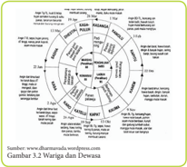

> **Deskripsi Visual:** Gambar ini adalah diagram yang menunjukkan warga dan dewasa dalam konteks sosial budaya. Diagram ini terdiri dari dua bagian utama: bagian luar yang menunjukkan warga dan bagian dalam yang menunjukkan dewasa. Warga terbagi menjadi empat kelompok berdasarkan usia dan tingkat pendidikan, sedangkan dewasa terbagi menjadi tiga kelompok berdasarkan status sosial dan tingkat pendidikan.

Elemen-elemen utama dalam diagram ini meliputi:
1. Warga: Terbagi menjadi empat kelompok berdasarkan usia (dewasa, remaja, anak-anak, bayi) dan tingkat pendidikan (tidak sekolah, SD, SMP, SMA).
2. Dewasa: Terbagi menjadi tiga kelompok berdasarkan status sosial (meninggal dunia, tidak menikah, menikah).
3. Relasi antara warga dan dewasa: Warga dihubungkan dengan dewasa melalui ikatan sosial dan hubungan sosial.

Teks, angka, atau label penting yang terlihat dalam diagram ini meliputi:
- Nama-nama kelompok warga dan dewasa.
- Angka yang menunjukkan jumlah warga dan dewasa dalam setiap kelompok.
- Label yang menjelaskan jenis kelompok warga dan dewasa.

Informasi kunci yang dapat diambil pembaca dari gambar ini adalah bahwa diagram ini menunjukkan struktur sosial budaya dalam konteks Indonesia, dengan fokus pada warga dan dewasa serta hubungan antara mereka. Diagram ini membantu pembaca memahami struktur sosial dan hubungan sosial dalam masyarakat Indonesia.

Adanya gambaran tentang baik atau tidak baiknya  suatu hari untuk melakukan suatu kegiatan orang diharapkan lebih bersifat hati-hati dan tidak boleh gegabah. Ini diharapkan tidak mempengaruhi keimanan terhadap Tuhan melainkan menjadi dasar  pelaksanaan  sradha    dan  bhakti    (iman  dan  taqwa),  sehingga  apa  yang diharapkan bisa tercapai dengan baik. Secara hakikat seperti yang dijelaskan pada maksud dan tujuan wariga dan dewasa adalah :

- Memberi ukuran atau pedoman yang perlu dilakukan oleh orang yang akan melaksanakan suatu pekerjaan berdasarkan ajaran Agama Hindu dengan harapan bisa berhasil dengan baik
- Untuk memberi penjelasan tentang berbagai kemungkinan akibat yang timbul akibat pemilihan hari yang dipilih sehingga memberikan alternatif lain yang akan dipilih.
- Sebagai suplemen dalam mempelajari Veda dan Agama Hindu sehingga dalam menjalankan ajarannya bisa dilaksanakan secara tepat sesuai pengaruh waktu dan planet-planet yang berpengaruh pada waktu-waktu tertentu.

### Mengamati

Amatilah lingkungan yang ada disekitar tempat tinggalmu berkaitan dengan kebiasaaan yang dilakukan umat Hindu sebelum melaksanakan ritual keagamaan seperti; pernikahan, kegiatan pertanian, peternakan dan kegiatan lainnya. Tuliskan dalam bentuk narasi singkat dan buatlah kesimpulan dari tulisanmu !

 

---
## 📄 Halaman 61

### C. Menentukan Wariga

### Memahami  Teks

Ada  lima  pokok  yang  harus  dipahami  dalam  menentukan  wariga  yaitu wewaran, wuku, penanggal panglong, sasih dan dauh. Berikut ini akan diuraikan mengenai  penjelasan  dari  masing-masing  pedoman  pekok  dalam  menentukan wariga (padewasan) sebagai berikut:

### 1.  Wewaran

Wewaran  adalah  bentuk  jamak  dari  kata  wara  yang  berati  hari.  Secara arti  kata  Wewaran  berasal  dari  bahasa  Sansekerta  dari  akar  kata  wara (diduplikasikan/dwipura) dan mendapat akhiran -an (we + wara + an) sehingga menjadi wewaran, yang berati istimewa, terpilih, terbaik, tercantik, mashur, utama, hari.

Jadi wewaran adalah hari yang  baik atau hari yang utama untuk melakukan suatu  hal  atau  suatu  pekerjaan.    Dalam  menentukan    wariga,  pengetahuan tentang  wewaran menjadi dasar  yang sangat penting. Dalam hubungannya dengan  baik-buruknya  hari  dalam  menentukan  wariga  dewasa,    wewaran mempunyai  urip,    nomor  atau  bilangan,  yang  disesuaikan  dengan  letak kedudukan arah mata angin,  serta dewatanya

Berikut ini  akan  diuraikan  dalam  bentuk  tabel  mengenai  jenis  wewaran, urip,  tempat  atau  kedudukan,    serta  Dewatanya  berdasarkan  buku  Kunci Wariga Dewasa sebagai berikut :

---
**📊 Tabel**

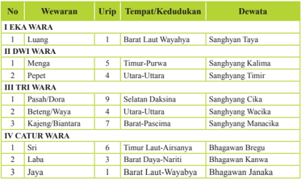

Tabel ini berisi informasi tentang dewata-dewata yang terkait dengan wara-wara dalam budaya atau mitologi tertentu. Topik utamanya adalah dewata-dewata yang terkait dengan wara-wara, yang diuraikan melalui urip (tempat), lokasi tempat kedudukan, dan dewata yang berkaitan. Kolom-kolom utama dalam tabel ini adalah No., Wewaran, Urip, Tempat/Kedudukan, dan Dewata. Data penting yang terlihat adalah bahwa dewata-dewata tersebut tersebar di berbagai daerah, mulai dari Barat Laut Wayahya hingga Utara-Uttara, dan termasuk dewata seperti Sanghyang Cika, Sanghyang Kalima, Sanghyang Timir, Sanghyang Manacika, Bhagawan Bregu, dan Bhagawan Janaka. Ini menunjukkan bahwa wara-wara memiliki hubungan yang erat dengan wilayah geografis dan budaya lokal.

 

---
## 📄 Halaman 62

---
**📊 Tabel**

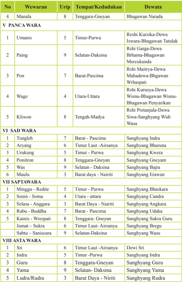

Tabel ini berisi informasi tentang dewata-dewata yang terkait dengan berbagai wilayah di India, disusun berdasarkan urutan dan lokasi mereka. Topik utama tabel adalah dewata-dewata yang terkait dengan wilayah-wilayah di India, seperti Tenggara-Gneeyan, Timur-Purwa, Selatan-Daksa, dan lainnya. Tabel ini terdiri dari dua bagian utama: V PANCWARA dan VI SADWARA. Kolom-kolom utama dalam tabel meliputi No, Wewaran, Urip, Tempat/Kedudukan, dan Dewata. Data penting yang terlihat dalam tabel ini termasuk bahwa beberapa dewata memiliki lebih dari satu urutan, misalnya Rshi Kursuwa-Dewa yang juga dikenal sebagai Winnu-Bhagawan Wisnu-Bhagawan Penyairyan. Selain itu, banyak dewata memiliki lokasi yang sama, seperti Barat-Pascima, yang merupakan lokasi umum untuk beberapa dewata.

 

---
## 📄 Halaman 63

---
**📊 Tabel**

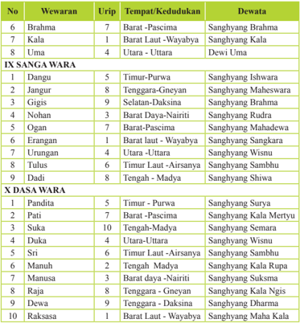

Tabel ini berisi informasi tentang dewata-dewata dalam berbagai urip (tempat) di Indonesia, yang dikelompokkan menjadi dua bagian: IX SANGAWARA dan X DASAWARA. Topik utama tabel ini adalah identifikasi dewata-dewata yang terdapat di berbagai urip di Indonesia. Kolom-kolom yang ada meliputi No., Wewaran, Urip, Tempat/Kedudukan, dan Dewata. Data penting yang terlihat adalah bahwa dewata-dewata ini tersebar luas di berbagai urip, mulai dari Timur Purwa hingga Barat Laut Wayawa, dan dari Utara hingga Tengah Madaya. Selain itu, banyak dewata yang memiliki hubungan dengan Sanghyang, seperti Sanghyang Irawara, Sanghyang Mahadewa, dan Sanghyang Wisnu, menunjukkan bahwa dewata-dewata ini sering dikaitkan dengan kekuatan atau keberuntungan.

Menentukan  wewaran dari Eka Wara hingga Dasa Wara pada sistem tahun wuku  dapat  dilakukan  dengan  menggunakan  beberapa  metode  yaitu    bisa menggunakan rumus yang telah ditetapkan dalam menentukan wewaran, dan bisa pula  menggunakan jari-jari tangan, dengan ruas di masing-masing jari sebagai 'rumah/kolom'  dari  wewaran  tersebut.  Di  bawah  ini  akan  diuraikan  beberapa contoh  menentukan  wewaran  menggunakan  rumus  yang  telah  ditentukan  dan menggunakan  tangan  beserta  gambar,  dengan  harapan  memperluas  wawasan tentang pemahaman wariga, walaupun pada prinsipnya semua metode penentuan tersebut hasilnya adalah sama.

 

---
## 📄 Halaman 64

### a.  Menentukan Wewaran dengan rumus

- Menentukan  Eka Wara
Ketentuan untuk menentukan Eka Wara  adalah dengan menjumlahkan neptu  atau  urip  dari  Panca  Wara  dan  Sapta  Wara,  dan  apabila  hasil penjumlahannya  bilangan  ganjil,  maka    Eka  Waranya  Lwang,    Bila jumlahnya genap, Ekawaranya tidak ada (-).

Contoh:

Tentukanlah  Eka Wara dari Soma Umanis

Neptu Soma + Neptu Umanis  (4 + 5) = 9 (ganjil) berati ekawaranya Lwang

- Menentukan Dwi Wara
Menentukan  Dwi Wara berpedoman pada penjumlahan Neptu Panca Wara  dan  Sapta  Wara.  Apabila  hasil  dari  penjumlahannya  ganjil  Dwi Waranya adalah Pepet dan apabila berjumlah genap dwi waranya Menga.

Contoh : 1  Tentukanlah Dwi Wara dari Coma umanis

Neptu Coma + Neptu Umanis  (4 + 5)  = 9 (ganjil) jadi Dwi Wara dari Coma Umanis  adalah Pepet

- Menentukan Tri Wara sampai Dasa Wara dengan ketentuan rumus umumnya sebagai berikut :

### Nomor Wuku x 7 + Nomor Sapta Wara Wewaran Yang dicari

Wewaran  yang  dicari  maksudnya  adalah  dari  Tri  Wara  sampai  Dasa Wara. Jika yang dicarai adalah Tri Wara maka dibagi tiga. Sisa dari hasil pembagiannya  akan  menunjukan  nama  wewaran  yang  akan  dicari  pada masing-masing wewaran

Contoh : Bila diketahui suatu hari adalah Buddha, Sungsang. Tentukanlah semua wewaran mulai dari Eka Wara sampai Dasa Waranya.

Diketahui: Buddha nomor  sapta waranya 3

Sungsang nomor wukunya 10

Jawab :

### Nomor Wuku x 7 + Nomor Sapta Wara Wewaran Yang dicari

- Tri Waranya
- : (10 x 7 + 3) : 3 = 24 sisa 1 adalah Pasah
- Catur Waranya : (10 x 7 + 3)   : 4 = 18 Sisa 3 adalah  Jaya
- Panca Wara : (10 x 7 + 3) : 5 = 14 Sisa 3 adalah Pon
- Sad Wara   : (10 x 7 + 3) : 6 = 12 Sisa 1 adalah Tungleh
- Sapta Wara : (10 x 7 + 3) : 7 = 10 sisa 3 adalah Budha (Sudah diketahui)

 

---
## 📄 Halaman 65

- Asta Wara  : (10 x 7 + 3) : 8 = 9 sisa 3 Guru
- Sanga Wara : (10 x 7 + 3) : 9 = 8 sisa 1 adalah Dangu
- Dasa Wara : Rumus (Urip Sapta Wara + Urip Panca Wara + 1) : 10 (Budha + Pon +1) : 10 (7 + 7 + 1) : 10 = 15 : 10 = 1 sisa 5 adalah Cri

### b.  Cara menentukan wewaran dengan jari tangan

Wewaran yang bisa dicari menggunakan jari tangan adalah Tri Wara sampai Sanga Wara dan caranya juga berbeda-beda. Di sini akan  dikemukakan satu macam cara saja sebagai berikut :

Petunjuk : tengadahkan telapak tangan kiri, pergunakan tiga jari saja, yakni telunjuk, jari tengah dan  jari  manis.  Ketiga  jari  itu  mempunyai  sembilan ruas sesuai dengan arah mata angin. Pergunakan ruasruas jari tangan itu sebagai rumah wuku dan wewaran, dan ujung jari tengah itu adalah Utara

Cara mencari wewaran masing-masing :

### 1). Menentukan Tri Wara

Kolom di bawah ini di sepadankan ruas-ruas jari

### Beteng

Pasah

Letakan  wuku  secara  berturut-turut  mulai  dari selatan  (pasah)  ke  utara  (kajeng)  dan  seterusnya putar  ke  kiri.  Setelah  diketahui  Reditenya  untuk mencari Soma, Anggara dan seterusnya tetap putar ke  kiri,  dimana  jatuhnya  Sapta  Wara  yang  dicari itulah Tri waranya.

Contoh : Tentukan Tri Wara dari Budha Ukir

Ukir jatuh pada Kajeng, Berati Redite Ukir = Kajeng. Terus putar ke kiri Budha-nya jatuh pada Kajeng lagi, berati Budha Ukir Tri Waranya Kajeng

### 2). Menentukan Catur Wara

Letakan wuku mulai dari Sinta di Timur Laut (Sri), putar ke kiri secara berturut-turut,  kecuali  dari  Galungan  (Wuku  Dunggulan)  ke  Kuningan harus  lompat  dua  kotak  setelah  itu  terus  berputar  ke  kiri  biasa.  Redite dari wuku tersebut bertepatan dengan Catur Wara di tempat jatuhnya itu. Setelah ketemu Reditenya, untuk mencari Catur Wara dari Soma, Anggara

---
**🖼️ Gambar/Diagram**

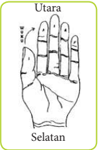

> **Deskripsi Visual:** Gambar ini adalah ilustrasi yang menunjukkan tangan manusia dengan jari-jari yang terbuka. Gambar ini menggunakan warna-warna yang cerah untuk menonjolkan jari-jari dan tulisan "Utara" dan "Selatan" yang terletak di atas tangan. Jari-jari tampak rapi dan teratur, dengan jari telunjuk dan jempol yang paling jelas. Ini mungkin digunakan sebagai ilustrasi untuk menjelaskan posisi jari-jari dalam bahasa Indonesia.

1. Gambar ini menunjukkan tangan manusia dengan jari-jari yang terbuka.
2. Elemen utama adalah tangan manusia dengan jari-jari yang terbuka. Relasi antara elemen-elemen ini adalah bahwa jari-jari terletak di atas tangan manusia.
3. Teks penting yang terlihat adalah "Utara" dan "Selatan", yang terletak di atas tangan. Angka atau label penting tidak ada dalam gambar ini.
4. Informasi kunci yang dapat diambil pembaca adalah bahwa gambar ini mungkin digunakan untuk menjelaskan posisi jari-jari dalam bahasa Indonesia, dengan "Utara" dan "Selatan" mungkin merujuk pada posisi jari-jari tersebut.

Kajeng

 

---
## 📄 Halaman 66

dan selanjutnya, putarlah ke kanan berurut sesuai dengan urutan wewaran itu seperti gambar.

Catur  wara  dari  Anggara  Ukir  jatuh  pada  Jaya  (Redite  Ukir  adalah Jaya), putar ke kanan, Anggaranya jatuh pada Sri, jadi Anggara Ukir Catur Waranya adalah Sri

### 3). Menentukan  Panca Wara

Letakan wuku mulai dari Sinta di Selatan (Paing) diteruskan ke utara, timur,  barat  dan  tengah  dan  begitu  selanjutnya.  Maka  setiap  wuku  yang jatuh di selatan Reditenya = Pahing dan Budhanya Buda Kliwon. Setiap yang jatuh di Utara Reditenya = Wage. Dan Setiap yang jatuh di Timur Reditenya = Umanis dan Budanya Buda Cemeng (Buda Wage). Setiap yang jatuh di Barat Reditenya = Pon dan  Anggar Kasih (Anggara Kliwon). Setiap yang jatuh di tengah Reditenya  adalah Kliwon dan Sukra Kliwon. Setelah ketemu Reditenya untuk menentukan Panca Wara dari Soma, Anggara dan seterusnya putar atau jalankan sesuai dengan urutan Panca Wara itu, seperti gambar di bawah ini

---
**📊 Tabel**

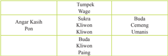

Tabel ini menunjukkan hubungan antara tumpuk Wage dengan anggaran kasih Pon. Kolom pertama berisi nama tumpuk Wage, sedangkan kolom kedua berisi nama anggaran kasih Pon. Data penting yang terlihat adalah bahwa Sukra, Kliwon, dan Paing semua termasuk dalam tumpuk Wage Buda, sedangkan Cemeng, Umanis, dan Klivon termasuk dalam tumpuk Wage Kliwon. Ini menunjukkan bahwa tumpuk Wage Buda lebih besar daripada tumpuk Wage Kliwon dalam hal jumlah anggaran kasih Pon.

Contoh : Tentukanlah  Panca Wara dari Wrhaspati, Ukir. Ukir jatuh di Timur (Redite, Ukir  Panca Waranya adalah Umanis) dan Budhanya  adalah Wage, Jadi Wrhaspati Ukir Panca Waranya Kliwon.

### 4). Menentukan Sad Wara

Letakan wuku mulai dari Sinta pada Tungleh, terus putar ke kanan sesuai dengan urutan Sad  Wara. Setiap wuku yang jatuh pada Tungleh, Reditenya adalah  Tungleh,  yang  jatuh  pada  Aryang  Reditenya  adalah  Aryang  dan seterusnya. Untuk mencari Sad Wara dari Soma, Anggara dan selanjutnya setelah ketemu Reditenya putar ke kanan sesuai dengan urutan Sad Wara itu, seperti gambar di bawah ini;

 

---
## 📄 Halaman 67

### Utara

### Selatan

Contoh : Tentukan Sad Wara dari Budha Kliwon Dunggulan

Dunggulan jatuhnya di Selatan (Redite Dunggulan adalah Was), putar ke kanan sehingga Budanya jatuh di Timur Laut. Jadi Budha Dunggulan Sad Waranya adalah Aryang

### 5). Menentukan  Asta Wara

Cara mencari Asta Wara sama dengan Catur Wara yaitu letakan wuku secara  berturut-turut  mulai  dari  Timur  Laut  (Sri)  putar  ke  kiri.  Dari Dunggulan ke Kuningan lompat dua kotak. Dimana wuku itu jatuh itulah Asta Wara dari Reditenya. Kemudian untuk mencari Soma, Anggara dan seterusnya putar ke kanan sesuai dengan urutan Asta Waranya itu seperti gambar di bawah ini

### Contoh mencari Asta Wara

Tentukanlah Asta Wara dari Soma Julungwangi.

Julungwangi jatuh pada Sri (Redite Julungwangi adalah Sri) putar ke kanan,  Soma  jatuh  Indra.  Jadi  Soma  Julungwangi Asta  Waranya  adalah Indra

Selain dewasa  yang ditentukan berdasarkan wewaran untuk melakukan suatu kegiatan atau upacara  tertentu, ada beberapa hari suci yang didasarkan atas perhitungan wewaran, sebagai hari suci untuk umat Hindu melakukan upacra agama yang dilakukan secara berkala. Adapun hari suci umat Hindu yang berdasarkan perhitungan wewaran sebagai berikut :

Pertemuan Tri Wara dan Panca Wara

- Hari Kliwon datangnya setiap lima hari sekali, sebagai hari  suci pemujaan ke hadapan Sang Hyang Śiva. Pada hari Kliwon Bhatara Śiva beryoga di pusat Bumi, menciptakan  air  suci guna meruwat kotoran yang ada di Bumi. Sehingga pada saat ini umat Hindu mengadakan penyucian diri, dari berbagai kotoran.

 

---
## 📄 Halaman 68

- Kajeng Keliwon,  diyakini sebagai hari yang sakral karena merupakan pertemuan  hari terakhir dari Tri Wara dan Panca Wara. Kajeng Kliwon adalah simbol pikiran bersih dan suci, pelebur kepapaan, petaka, noda, bencana ataupun segala kotoran duniawi melalui dhyana  semadhi. Pada hari ini Sang Hyang Mahadewa melakukan yoga semadi, sehingga pada sat ini umat Hindu melakukan persembahyangan memuja kebesaran Dewi Durga dengan menghaturkan segehan.
Hari Suci yang didasarkan atas Pertemuan Sapta Wara dan Panca Wara

- Anggara Keliwon diseput pula Anggara Kasih,  sebagai hari beryoganya Sang Hyang Rudra untuk melebur penderitaan, kejahatan, kotoran dunia. Hari ini merupakan hari yang baik untuk meruwat dan memusnahkan bencana yang dapat menimpa.
- Budha Wage, hari ini disebut pula Budha Céméng sebagai hari pemujaan kehadapan Sang Hyang  Bhatari Sri atau Dewi Padi dan Bhatari Manik Galih atau Dewi Beras, sebagai manifestasi Tuhan yang memberikan kesuburan dan kemakmuran.
- Budha Kliwon, yang namanya disesuaikan dengan wukunya. Hari Budha Kliwon adalah hari pemujaan Sang Hyang Hayu atau memuja Hyang Mami Nirmalajati, dengan harapan memohon keselamatan ketiga dunia.
- Saniścara Kliwon, yang disebut dengan Tumpek, yang namanya disesuaikan dengan nama wukunya. Pemujaan ditujukan kehadapan Sang Hyang Paramawisesa atau Tuhan Yang Maha Kuasa.

### 2.  Wuku

Wuku dalam penentuan wariga menduduki peranan yang penting, sebab    wewarannya  baik,  apabila wukunya tidak baik, dianggap dewasa tersebut kurang baik. Sistem tahun wuku, menggunakan sistem sendiri, tidak tergantung pada tahun surya atau tahun candra. Satu tahun wuku panjangnya 420 hari,  yang  terdiri  dari  30  wuku. Setiap  wuku (1wuku) lamanya 7 hari,  terhitung dari Redite, Soma,

Anggara, Budha, Wraspati, Sukra, dan Saniscara. Sebulan dalam tahun wuku lamanya 35 hari, didapat dari mengalikan 7 hari dengan 5 wuku. Satu peredaran wuku (30 wuku) lamanya 6 bulan dalam tahun wuku. 1 Tahun wuku terdiri dari 2 kali peredaran wuku, yakni 7 hari x 30 wuku  x 2 = 420 hari.

 

---
## 📄 Halaman 69

Berikut  akan  disajikan  penomoran  wuku,    urip  atau  neptu-nya.  Nomor wuku yang dapat dipergunakan dalam perhitungan untuk mencari wewaran seperti tabel di bawah ini:

---
**📊 Tabel**

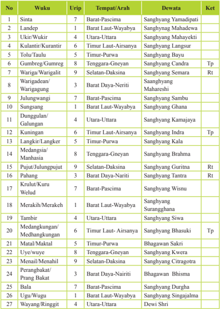

Tabel ini menyajikan informasi tentang wuku (tempat atau arah) di Indonesia, termasuk urip (tempat), tempat/arah, dewata, dan ket (karakteristik). Topik utama tabel adalah peta spiritual dan budaya Indonesia, dengan fokus pada lokasi dan dewata yang berkaitan dengan setiap wuku. Kolom-kolom utamanya meliputi urip, tempat/arah, dewata, dan ket. Data penting yang terlihat mencakup lokasi seperti Barat Laut Wayahaya, Utara-Uttara, Timur Laut Airsiana, dan lainnya, serta dewata seperti Sanghyang Yamaidapati, Sanghyang Mahadewa, Sanghyang Mahayekti, dan banyak lagi. Ketentuan tambahan seperti "Rp" menunjukkan bahwa beberapa wuku memiliki karakteristik khusus, seperti "Rp" yang mungkin merujuk pada wuku-wuku tertentu yang memiliki status khusus atau nilai kultural tertentu.

 

---
## 📄 Halaman 70

---
**📊 Tabel**

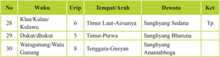

Tabel ini berisi informasi tentang wuku (hari) dalam kalender Jawa, termasuk urip (tempat), waktu, dewata yang dipercaya, dan ketentuan (Tp atau Tg). Topik utama tabel adalah hubungan antara wuku, urip, waktu, dewata, dan ketentuan dalam kalender Jawa. Kolom-kolom yang ada meliputi No., Wuku, Urup, Tempat/Arah, Dewata, dan Ket. Data penting yang terlihat adalah bahwa wuku-wuku seperti Kluau/Kaluau, Dukut/Dukut, Watuagunung/Watu, dan Gunung memiliki urip yang berbeda-beda, waktu yang berbeda, dan dewata yang berbeda pula. Selain itu, ketentuan (Tp atau Tg) juga berbeda untuk setiap wuku.

### Keterangan :

Rt =  Wuku Rangda Tiga merupakan hari yang kurang baik untuk melangsungkan perkawinan, barakibat perpisahan,

Tp = Wuku Tan Peguru, hari-hari buruk untuk memulai pekerjaan penting/ besar, berakibat tidak berhasil atau sukses

Selain dewasa  yang ditentukan berdasarkan wuku untuk melakukan suatu kegiatan atau upacara agama tertentu, ada beberapa hari suci yang didasarkan atas perhitungan wuku, yang dirayakan oleh umat Hindu dengan melaksanakan upacara agama. Adapun hari suci umat Hindu yang berdasarkan perhitungan wuku seperti , Budha Kliwon, Tumpek, Buda Cemeng, Anggara Kasih. Cara menentukan  perhitungan  hari  suci  berdasarkan  wuku  ini  dapat  dilakukan dengan menggunakan tangan kiri seperti gambar berikut

### Keterangan :

Perhitungan  wuku  dimulai  dari  wuku  Sinta  pada angka  1  (ibu  jari),  dan  wuku  yang  lainnya  dihitung berturut-turut ke angka 2, 3, 4, 5,  kembali ke angka 1 dan seterusnya searah jarum jam.

Hari suci yang jatuh pada hitungan ibu  jari (1) Budha Kliwon,  Telunjuk  (2)  hari  suci  Tumpek,  Jari    tengah (3)  Budha  Cemeng,  Jari  manis  (4)  Anggara  Kasih, Kelingking (5) kosong/pengembang.

Secara  terperinci  hari  suci    berdasarkan  Pawukun sebagai berikut :

### a.  Sinta

- Soma  Pon  Sinta  disebut  Soma  Ribék,  pemujaan  dan  persembahan ditujuakan kehadapan  Dewi Sri (Sang Hyang Sriamérta) manifestasi Tuhan sebagai Deva Kesuburan atau Deva Kemakmuran.
- Anggara Wage, Sinta disebut Sabuh Mas, pemujaan ditujukan kehadapan Dewa Mahadewa
- Budha  Kliwon  Sinta  disebut    hari  suci  Pagérwési,    merupakan  hari merupakan payoyang Sang Hyang Úiwa sebagai Sang Hyang Pramesti Guru  disertai  oleh  para  Dewata  menciptakan  dan  mengembangkan kelestarian kehidupan di dunia.

 

---
## 📄 Halaman 71

### b.  Landép

Saniscara Kliwon Landép disebut Tumpek Landép merupakan hari suci pemujaan kehadapan  Bhatara Śiva dan Sang Hyang Paśupati.

### c.  Ukir.

Redite Umanis Ukir merupakan hari suci untuk pemujaan kehadapan Bhatara Guru. Pada hari ini umat diharapkan memohon anugrah keselamatan dan kesejahteraan kehadapan Bhatara Guru yang pemujaannya dilakukan di Sanggar Kamulan.

### d.  Kulantir/Kurantil

Anggara Kliwon Kulantir disebut Anggara Kasih Kulantir, merupakan hari suci pemujaan kehadapan Tuhan dalam manifestasi sebagai  Bhatara Mahadewa.

### e.  Wariga

Sabtu Kliwon Wariga dinamakan Tumpék Penguduh, Tumpek Pengatag, Pengarah, Bubuh, merupakan hari suci pemujaan kehadapan Sang Hyang Sangkara, manifestasi dari Tuhan sebagai dewa penguasa kesuburan semua tumbuh-tumbuhan serta pepohonan.

### f.  Warigadian

Soma  Pahing  Warigadian,  merupakan  hari  suci  pemujaan  ditujukan kehadapan    Bhatara  Brahma  manifestasi  Tuhan  sebagai  Dewa Api  atau Dewa Penerangan

### g.  Sungsang

- Wrhaspati Wage  Sungsang  disebut  dengan    Parérébuan  atau  Sugihan Jawa.  Pada  hari  ini  diyakini  para  Dewa  dan  Roh  Leluhur  turun  ke dunia membesarkan hati umat manusia sambil menikmati persembahan hingga hari suci  Galungan tiba. pada hari ini dilakukan pula upacara pembersihan atau pesucian Bhuana Agung)
- Sukra  Kliwon disebut Sugihan Bali memohon pembersihan lahir dan batin kehadapan Ida Sang Hyang Widi Wasa dengan cara mengheningkan pikiran, memohon air suci peruwatan dan pembersihan.

### h.  Dunggulan

- Redite (Minggu) pahing Dunggulan disebut Penyékéban. Pada hari ini diharapkan  umat  mengekang  bhatin  (mengendalikan  diri)  agar  selalu dalam keadaaan hening dan suci sehingga tak dapat dikuasai oleh Sang Kala Tiga.
- Soma (Senin) Pon Dunggulan disebut Penyajan, umat diharapkan secara bersungguh-sungguh, benar-benar sujud dan berbhakti kepada Tuhan, agar terhindari dari kekuatan negatif Sang Hyang Kala Tiga yang pada saat itu berwujud Bhuta Dunggulan

 

---
## 📄 Halaman 72

- Anggara  (Selasa)  Wage  Dunggulan  disebut  Panampahan,  diyakini pada hari ini Sang Hyang Kala tiga turun ke dunia dalam wujud Bhuta Amengkurat, sehingga umat diharapkan melakukan mengendalian diri serta mempersembahkan upacara Bhuta Yajña.
- Budha (Rabu) Kliwon Dunggulan dinamakan Galungan yang bermakna bangkitnya  kesadaran,  titik  pemusatan  batin  yang    terang  benderang, melenyapkan  segala  bentuk  kegalauan  batin.  Sekaligus  peringatan atas  terciptanya  alam  semesta  beserta  isinya  serta  kemangan  Dharma melawan  Adharma. Persembahan ditujukan kehadapan Ida Sang Hyang Widi Wasa dengan segala manifestasi-Nya. Pada hari ini  setiap rumah  memasang  penjor  yang  merupakan  titah  Bhatara  Mahadewa yang berkedudukan di Gunung Agung sebagai lambang kemakmuran. Setelah  upacara  dilaksanakan  pada  pagi  hari,  lengkap  dengan  sarana persembahan lainnya, sesajen tetap dibiarkan berada di tempat pemujaan selama satu malam. Esok paginya, semua umat patut menyucikan diri lahir dan batin pada saat matahari terbit, mempersembahkan wewangian dan  mehon  air  suci,  serta  menyuguhkan  segehan  di  halaman  rumah. Setelah selesai barulah sesajen-sesajen yang dipersembahkan kemarin itu dapat diambil dan kemudian di-ayab oleh sanak keluarga.

### i. Kuningan

- Redite Wage Kuningan disebut dengan  Pemaridan Guru atau  Ulihan. Pada saat ini persembahan atas kembalinya para dewata ke kahyangan atau surga serta meninggalkan anugrah kehidupan (amérta) serta umur panjang  kepada setiap makhluk.
- Soma Kliwon Kuningan disebut Pemacekan Agung, mempersembahkan segehan agung kepada semua Bhūtakala
- Budha  Pahing  Kuningan  merupakan  beryoganya  Bhatara  Visnu  dan memberikan anugrah berupa kesenangan, keagungan, keluwesan, daya tarik,  memenuhi  harapan,  dan  rasa  simpatik  kepada  umat  manusia (asung wilasa).
- Sukra Wage Kuningan disebut Penampahan Kuningan umat diharapkan mengendalikan bhatin dan pikiran agar tetap jernih dan suci (pégéngén poh nirmala suksma)
- Saniscara Kliwon Kuningan disebut  Hari Raya Kuningan diperingati sebagai hari suci turunnya para dewa dan roh leluhur ke dunia untuk menyucikan  diri  sambil  menikmati  persembahan  umat.  Persembahan sebaiknya dilakukan  pagi hari sebelum jam 12.00  (tajeg surya) sebab setelah itu para dewa, pitara, roh suci leluhur  diyakini telah kembali ke khayangan.

 

---
## 📄 Halaman 73

### j. Pahang

Budha  Kliwon  Pahang  disebut  Pégatwakan,  persembahan  ditujukan kehadapan Sang Hyang Tunggal.

### k.  Merakih

Budha Wage Merakih disebut juga Budha Cemeng Merakih, yaitu hari suci  pemujaan    yang  ditujukan    ke  hadapan  Bhatara  Rambut  Sedhana, disebut juga Sang Hyang Rambut Kandhala atau Sang Hyang Kamajaya penguasa artha, mas, perak, dan permata.

### l.  Uye

Saniscara  Kliwon  Uye  disebut  Tumpek  Kandang.  Pemujaan  dan persembahan  di  tujukan  kehadapan  Sang  Hyang  Rare  Anggon  sebagai dewanya ternak/binatang.

### m. Wayang

Saniscara  Kliwon  Wayang  disebut  tumpek  Wayang,  merupakan  hari pemujaan kehadapan Bhatara Iswara, manifestasi Tuhan sebagai penguasa alat-alat kesenian.

### n.  Watugunung

Saniscara Umanis Watugunung disebut hari Saraswati merupakan hari Pemujaan kehadapan Dewi Saraswati manifestasi Tuhan sebagai penguasa ilmu pengetahuan.

### o.  Sinta

Redite Pahing Sinta disebut dengan Banyu Pinaruh, memohon anugrah kehadapan Dewi Sarasvati, berupa air suci pengetahuan.

### 3.  Penanggal dan Panglong

Penanggal dan Panglong perhitungannya berdasarkan peredaran bulan satelit dari bumi. Penanggal (tanggal) disebut pula Suklapaksa yaitu perhitungan hariharinya  dimulai  sesudah  bulan  mati  (tilem)  sampai  dengan  purnama  (bulan sempurna). Lama penaggal 1 sampai dengan 15 lamanya 15 hari. Penanggal ke 14 atau sehari sebelum purnama disebut Purwani artinya bulan mulai akan sempurna nampak dari bumi. Sedangkan Penanggal ke 15  disebut purnama artinya bulan sempurna nampak dari bumi. Pada hari Purnama merupakan hari beryoganya Sang Hyang Candra (Wulan).

Panglong disebut pula Krsnapaksa yaitu  perhitungan hari dimulai  sesudah purnama yang lamanya juga 15 hari dari panglong 1 sampai dengan pangglong 15.  Panglong  ke  14  sehari  sebelum  tilem  disebut  Purwaning  Tilem  artinya bulan mulai tidak akan nampak dari bumi. Sedangkan pangglong 15 disebut tilem  artinya  bulan  sama  sekali  tidak  nampak  dari  bumi.  Pada  hari  tilem beryoganya Sang Hyang Surya.

 

---
## 📄 Halaman 74

### Wariga Pananggal-Panglong  sebagai berikut :

### Keterangan : Ayu : Baik,  X : Jelek

---
**📊 Tabel**

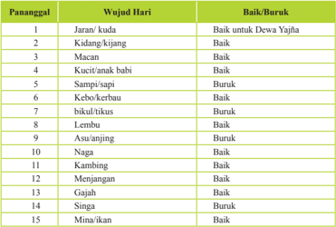

Tabel ini menunjukkan informasi tentang wujud hari dan baik/buruknya untuk Dewa Yajha, yang merupakan topik utama. Kolom "Pananggal" menyatakan tanggal, "Wujud Hari" menggambarkan jenis hewan atau makhluk yang muncul pada setiap hari, dan "Baik/Boruk" menunjukkan apakah hewan tersebut baik atau buruk untuk Dewa Yajha. Dari data ini, dapat dilihat bahwa beberapa hewan seperti jaran/kuda, macan, kebo/kerbau, lembu, asu/anjing, kambing, gajah, dan mina/ikan memiliki karakteristik baik untuk Dewa Yajha, sementara hewan seperti kidang/kijang, kuci/anak babi, sampi/sapi, keburu, bikiul/tikus, lembu, asu/anjing, kambing, menjangan, singa, dan mina/ikan memiliki karakteristik buruk.

(Sumber : Aryana,2009:83)

 

---
## 📄 Halaman 75

---
**📊 Tabel**

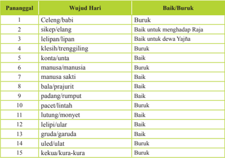

Tabel ini menunjukkan informasi tentang wujud harinya (yang berarti bagaimana sesuatu tampil) dan keadaan baik atau buruknya untuk setiap wujud harinya. Topik utama tabel adalah hubungan antara wujud harinya dan keadaan baik atau buruknya. Kolom-kolom yang ada adalah "Panjanggali" (wujud harinya) dan "Baik/Boruk" (keadaan baik atau buruknya). Data atau pola penting yang terlihat adalah bahwa beberapa wujud harinya seperti celeng/babi, sikep/elang, kleshri/trenuggingling, manusa/manusia, dan padang/rumput memiliki keadaan buruk, sedangkan wujud harinya seperti lelipan/lipan, konta/untua, manusa/sakti, bala/prajurit, pacet/lintah, lutung/monyet, lelipin/ular, gruda/garda, uled/fulat, dan kekua/kura-kura memiliki keadaan baik.

(Sumber : Aryana,2009:83)

Tabel 3.5 Baik Buruknya Panglong Persefektif Teks Sundari

### 4.  Berdasarkan Sasih

Wariga  berdasarkan  sasih  adalah  hitungan  baik  buruknya  bulan-bulan tertentu yang berpedoman pada letak matahari, apakah berada di Uttarayana (utara),  Wiswayana  (tengah) atau Daksinayana (selatan). Berikut akan diuraikan ala ayuning sasih berdasarkan teks Wariga Dewasa.

---
**📊 Tabel**

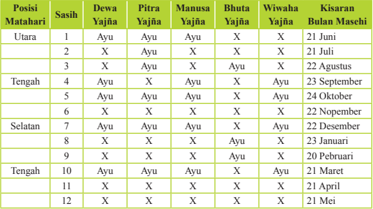

Tabel ini menunjukkan posisi matahari di langit selama satu tahun, dengan posisi matahari di setiap bulan ditentukan oleh warna bintang yang muncul di langit. Topik utama tabel adalah posisi matahari di langit selama satu tahun. Kolom-kolomnya meliputi posisi matahari (Utara, Tengah, Selatan), warna bintang yang muncul (Ayu, X), dan tanggal munculnya bintang tersebut. Data penting yang terlihat adalah bahwa bintang Ayu muncul pada tanggal 2 Juni, 21 Juli, 22 Agustus, 23 September, 24 Oktober, 22 Desember, 23 Januari, 20 Februari, 21 Maret, dan 21 Mei. Ini menunjukkan bahwa posisi matahari di langit selalu berubah seiring waktu, dan warna bintang yang muncul juga berbeda-beda setiap bulan.

 

---
## 📄 Halaman 76

Agama Hindu mempergunakan panduan sasih antara sasih Candra dengan Sasih Surya sehingga ada perhitungan 'pengrapetang sasih'. Hal ini dilakukan karena disadari betul bahwa bulan dan matahari mempunyai pengaruh besar terhadap  bumi  dan  isinya.    Selain  penentuan  Padewasan,  hari  suci Agama Hindu, yang berdasarkan sasih  adalah :

- Pada hari Purnama beryoga Sang Hynag Candra (wulan), Pada hari Tilem beryoga Sang Hynag Surya. Jadi pada hari Purnama-Tilem adalah hari penyucian Sang Hyang Rwa Bhineda, yaitu Sang Hyang Surya dan Sang Hyang Candra. Pada waktu Candra Graha (gerhana bulan) pujalah beliau dengan Candrastawa (Somastawa). Pada waktu Sūrya graham (gerhana matahari)  pujalah beliau dengan Sūryacakra Bhuanasthawa.
- Sasih Kapat atau Purnama Kapat merupakan beryoganya Bhatara Parameswara, beliau Sang hynag Purusangkara diiringi oleh Para Dewa, Widyadara-Widyadari dan para Rsigna. Selanjutnya pada Tilem Kapat dilakukan penyucian batin, persebahan kepada Widyadara-widyadari
- Sasih Kepitu atau Purwaning Tilem Kepitu disebut hari Sivaratri, yaitu beryoganya Bhatara siva dalam rangka melebur kotoran alam semesta termasuk dosa manusia. Pada hari ini umat Hindu melakukan Bratha Sivaratri, yaitu Mona, Upawasa, dan Jagra
- Sasih Kesanga/Tilem Kesanga adalah hari pesucian para dewata, dilakukan Bhuta yajna, yaitu tawur agung kesanga sebagai tutup tahun Saka.
- Sasih Kedasa, Penanggal 1 (bulan terang pertama) sasih Kedasa disebut hari Suci Nyepi, yaitu tahun baru Saka. Pada saat ini  turunlah Sang Hynag Darma. Purnama Kedasa beryoganya Sang Hyang Surya Amertha pada Sad Khayangan Wisesa.
- Sasih Sada atau Purnama Sadha, patutlah umat Hindu memuja Bhatara Kawitan di Sanggah Kemulan

### 5.  Dauh

Wariga  menurut  dauh  merupakan  ketetatap  dalam  menentukan  waktu yang baik dalam sehari guna penyelenggaraan suatu upacara-upacara tertentu. Pentingnya dari dewasa dauh akan sangat diperlukan apabila upacara-upacara yang  akan  dilakukan  sulit  mendapatkan  hari  baik  (dewasa  ayu).  Dauh  jika dibandingkan mirip dengan pembagian waktu menurut jam, namun bedanya hanya penempatan panjangnya waktu. Hitungan jam dalam sehari di bagi 24, hingga  sehari  dalam  hitungan  jam  panjangnya  24  jam.  Dalam  perhitungan dewasa dauh  mengandung  makna dalam waktu satu hari terdapat dauh (waktuwaktu  tertentu)  yang  cocok  untuk  melakukan  suatu  kegiatan.  Signiikasi dari  dewasa dauh  diperlukan apabila upacara-upacara yang dilakukan sulit mendapatkan hari baik (dewasa ayu). Dalam perhitungan dewasa berdasarkan dauh  mempunyai beberapa hitungan, yakni  berdasarkan  Panca dauh  dan Asta dauh.

 

---
## 📄 Halaman 77

- Sistem Panca Dauh (Sukaranti) adalah pembagian waktu (hari)  dalam sehari menjadi 10 bagian, dengan hitungan 5 Dauh untuk menghitung panjangnya siang (setelah matahari terbit hingga menjelang terbenam) dan 5 dauh lagi untuk menghitung panjangnya malam/wengi  (dari matahari tenggelam hingga terbit)

---
**📊 Tabel**

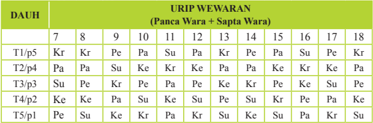

Tabel ini menunjukkan distribusi urutan kata dalam dua kalimat: "Pana" dan "Sapa Warna". Kolom pertama menunjukkan urutan kata dalam kalimat tersebut, sementara baris menunjukkan posisi kata dalam kalimat. Data penting yang terlihat adalah bahwa kata "Pana" dan "Sapa" muncul secara berulang dalam urutan tertentu, dengan "Pana" muncul lebih sering di awal dan "Sapa" di akhir. Ini menunjukkan bahwa "Pana" dan "Sapa" memiliki peran penting dalam struktur kalimat tersebut.

### Keterangan :

Kr : Kerta : Ayu (baik)

Pa : Pati : Ala (Jelek)

Ke : Ketara : Ayu (baik)

Pe : Peta : Madya (menengah)

Su : Sunia : Ala (buruk)

Catatan

:  Ala-Ayu dauh Sukaranti pada Pengelong dihitung terbalik (1 menjadi 5)

- Sistem Asta dauh  yang memiliki konsep yang sama dengan Panca dauh, bedanya hanya pembagian waktunya menjadi 16, dengan perincian 8 dauh untuk menghitung panjang waktu mulai matahari terbit, hingga menjelang terbenam dan 8 dauh lagi untuk untuk menghitung panjangnya malam hari dari terbenamnya matahari hingga menjelang terbit.
Tabel 3.8 Sistem Asta Dauh

 

---
## 📄 Halaman 78

---
**📊 Tabel**

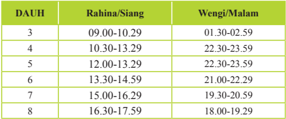

Tabel ini menunjukkan data waktu dan tanggal untuk dua lokasi: DAUH dan Rahina-Siang. Topik utama tabel adalah waktu dan tanggal. Kolom pertama berisi nomor lokasi (DAUH dan Rahina-Siang), kolom kedua berisi waktu, dan kolom ketiga berisi tanggal. Data penting yang terlihat adalah bahwa waktu dan tanggal sama untuk lokasi DAUH, sedangkan untuk Rahina-Siang, waktu dan tanggal berbeda. Waktu pada DAUH selalu lebih awal dibandingkan dengan Rahina-Siang, dan tanggal juga berbeda.

Pelaksanaan dari perhitungan wewaran atau wariga yang sering dilakukan oleh umat Hindu yang ada di Indonesia adalah penentuan hari suci keagamaan, perhitingan pertanian, peternakan dan kebutuhan lainnya seperti mendidirikan rumah, bangunan sekolah dan lainnya.

---
**🖼️ Gambar/Diagram**

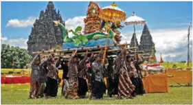

> **Deskripsi Visual:** Gambar ini adalah ilustrasi yang menunjukkan sebuah acara tradisional di Indonesia. Gambar ini menggambarkan sekelompok orang yang sedang membawa sebuah meja besar yang dipenuhi dengan berbagai perhiasan dan hiasan. Orang-orang tersebut tampak sangat antusias dan senang dalam menghadiri acara ini. Di sekitar mereka, terlihat beberapa bangunan tradisional dengan arsitektur khas Indonesia, yang menunjukkan bahwa acara ini mungkin berlangsung di sebuah kompleks budaya atau tempat yang memiliki nilai sejarah.

Elemen-elemen utama dalam gambar ini meliputi:

1. Orang-orang yang sedang membawa meja besar.
2. Meja yang dipenuhi dengan perhiasan dan hiasan.
3. Bangunan tradisional dengan arsitektur khas Indonesia.
4. Latar belakang yang menunjukkan keindahan alam.

Teks, angka, atau label penting yang terlihat dalam gambar ini tidak ada, karena gambar ini hanya menggambarkan objek-objek dan suasana tanpa teks atau angka tambahan.

Informasi kunci yang dapat diambil pembaca dari gambar ini adalah bahwa acara ini mungkin merupakan acara tradisional atau festival yang diadakan di Indonesia, dengan elemen-elemen budaya dan keagungan yang menunjukkan kekayaan budaya lokal.

 

---
## 📄 Halaman 79

### Kegiatan  Siswa

- Kerjakan pada lembaran lain
- Buatlah kelompok yang terdiri 3-4 orang siswa
- Setiap  kelompok untuk melakukan wawancara kepada masing-masing 1 orang kepada: tokoh umat Hindu, tokoh masyarakat, rohaniawan, cendikiawan dan umat biasa,  tentang penghitungan hari baik atau wariga dalam menentukan suatu ritual atau kepentingan kehidupan tertentu (pertanian, peternakan, pendirian bangunan, dst).
- Buatlah susunan hasil wawancara tersebut dari setiap orang yang diwawancarai dan buatlah kesimpulan akhir!
- Presentasikan di depan kelas!

---
**📊 Tabel**

Tabel ini menunjukkan informasi tentang paraf Guru, paraf Orang Tua, dan nilai yang diberikan kepada siswa. Topik utama tabel ini adalah evaluasi akademik siswa, dengan paraf Guru dan Orang Tua sebagai penilai utama. Kolom Paraf Guru dan Paraf Orang Tua masing-masing berisi paraf yang ditandatangani oleh guru dan orang tua siswa, sementara kolom Nilai menyajikan nilai akhir yang diberikan kepada siswa. Data penting yang terlihat adalah bahwa paraf Guru dan Orang Tua harus disetujui sebelum nilai akhir dapat diambil. Ini menunjukkan bahwa evaluasi akademik siswa melibatkan peran aktif dari kedua pihak, guru dan orang tua, serta bahwa nilai akhir tersebut harus disetujui untuk menjadi valid.

 

---
## 📄 Halaman 80

### D. Macam-macam Wariga/Padewasan untuk Upacara Agama

### Memahami  Teks

Upacara  dalam  agama  Hindu  memiliki  dimensi yang  luas  tidak  semata-mata  mengandung  dimensi relegius saja. Seperti arti kata upacara dalam bahasa Sansekerta  yang  berati  mendekat.  Mendekat  dalam Upacara  agama  Hindu  dilakukan  dengan  hati  yang tulus  dan  keikhlasan  mengabdi  dan  membangun keharmonisan dengan Tuhan sebagai Sang Pencipta, dengan sesama manusia serta dengan alam lingkungan, yang terakomulasi dalam konsep tri hita karana yaitu tiga hubungan yang menyebabkan kebahagiaan.

Upacara agama menjadi suatu yang penting sebagai bagian dari tri kerangka dasar Agama Hindu. Seperti disebutkan dalam Manawa Dharmasastra VII, 10,  ada lima  dasar  penerapan  Dharma  (termasuk  upacara)

yaitu Ikşa, Śakti, Deśa,  Kāla  dan  Tattwa. Ikşa artinya,  pandangan  atau  cita -cita seseorang,  Śakti  artinya  kemampuan,  Desa  artinya  ketentuan  setempat  (tempat ) Kala artinya waktu dan tattwa artinya  hakikat kebenaran Veda

Jadi dalam melaksanaakan suatu upacara penentuan waktu dewasa  menjadi suatu  yang  sangat  penting.  Seperti  contoh  untuk  mendapatkan  Vitamin  d  dari Sinar matahari, maka sebaiknya berjemur dilakukan pada pagi hari, bukan pada siang hari, artinya mencari atau melakukan sesuatu pada waktu yang tepat bisa berhasil sesuai dengan tujuan.  Hal senada terkaiat dengan ketepatan waktu  juga disebutkan dalam kitab Sàrasamuccaya 183 sebagai berikut :

'Ayanûu ca yaddattaý, ûadacìtimukheûu ca, candrasùryoparàge ca, viûuve ca tadakûawam'

### Terjemahan:

Inilah perincian waktu yang baik, ada yang disebut daksinayana, waktu matahari bergerak ke arah selatan, ada yang disebut uttarayana, waktu matahari bergerak ke arah utara (dari khatulistiwa). Ada yang dinamakan sadacitimukha yaitu pada saat terjadinya gerhana bulan atau matahari, wisuwakala yaitu matahari tepat di khatulistiwa, adapun pemberian dana serupa benda pada waktu yang demikian itu sangat besar sekali pahalanya.

Waktu yang ditentukan tersebut akan memberikan pahala yang sangat besar. Jadi untuk mendapatkan  suatu hasil atau pahala yang baik dari suatu kegiatan (upacara agama) ditentukan oleh waktu yang tepat dari pelaksanaannya. Berangkat

 

---
## 📄 Halaman 81

dari  hal  tersebut  di  bawah  ini  akan  diberikan  beberapa  contoh  wariga  dewasa untuk melakukan upacara agama yang termasuk ke dalam upacara Panca Yajña.

### 1.  Melakukan Upacara Dewa Yajña.

Selain  upacara  agama  yang  dilakukan  pada  hari-hari  suci  baik  yang ditentukan  berdasarkan  atas  wewaran,  wuku,  penanggal,  panglong,  sasih, yang  dirayakan  oleh  umat  Hindu  secara  berkala  dan  berkelanjutan,  dalam kesempatan ini akan diberikan contoh-contoh wariga dewasa untuk nangun (memulai) upacara Dewa Yajña.

- Sasih yang baik untuk melakukan Dewa Yajña: kapat, kelima, kedasa.
- Amerta Bhuana
Dewasa Ayu untuk Dewa Yadnya, Pemujaan Tuhan Yang Maha Esa  serta leluhur untuk mendapat kesejahteraan.

- Amerta Dewa
Hari baik melaksanakan dharma, Panca Yajña:, khususnya Dewa Yajña: juga hari yang baik digunakan untuk membangun khayangan/tempattempat suci

- Amerta Masa
Hari yang baik untuk melakukan Panca Yajña dalam rangka memohon kesejahteraan

- Ayu Nulus
Hari yang baik untuk melaksanakan Yajña, pekerjaan, usaha dan kegiatan yang berlandaskan dharma

- Dauh Ayu
Hari yang baik untuk melaksanakan Panca Yajña

- Dewa ngelayang
Dewasa yang baik memuja Ida Sanghyang Widi, membangun kahyangan, pura, maupun sanggah

- Dewa Werdi
Hari baik untuk melaksanakan Panca Yajña, khusunya Dewa Yajña.

### 2.  Melakukan Upacara Bhuta Yajña

Upacara  Bhuta  Yajña  yang  dilakukan  oleh  umat  Hindu  pada  hari-hari suci    yang  telah  ditentukan  berdasarakan  wewaran,  wuku,  sasih,  penanggal panglong termasuk pada saat piodalan di pura-pura, mrajan atau tempat suci lainnya. Selain itu dilakukan pula nangun (membangun/memulai) Bhuta Yajña di luar ketetapan tersebut.  Dewasa yang baik untuk

- Sasih baik untuk bhuta yadnya : keenem dan kesanga.
- Dewa Mentas : Hari yang cocok untuk melaksanakan Bhuta yajna dan upacara penyucian diri dalam dalam rangka pendidikan.

 

---
## 📄 Halaman 82

### 3.  Melakukan Upacara Pitra Yajña

Untuk upacara  Pitra Yajña    terkait  dengan  keputusan  Kesatuan  Seminar Kesatuan Tafsir terhadap Aspek-aspek Agama Hindu I s/d XV, terkait dengan Jenis-jenis  wariga  dewasa  untuk  upacara  Pitra  Yajña  (atiwa-tiwa)  dapat dibedakan menjadi tiga yaitu :

- Padewasan yang sifatnya amat segera atau dadakan, atiwa-atiwa segera bisa dilakukan dengan mengacu pada wariga, dewasa dan kekeran (aturan) desa. Adapun larangan atiwa-tiwa adalah Pasah, Anggara Kasih, Budha Wage, Budha Kliwon, Tumpek, Purwani Purnama, Tilem
- Pedewasan serahina (sehari-hari) adalah bila pelaksanaan atiwa-tiwa tersebut dilaksanakan lebih dari tujuh hari dan memperhatikan padewasan serahina yang perhitungannya berdasarkan wewaran, wuku dan dauh.
- Padewasan berjangka (berkala), adalah pelaksanaan atiwa-tiwa berdasarkan jangka waktu tertentu (berkala) yang perhitungannya berdasarkan wewaran, wuku, tanggal, panglong, sasih dan dauh. Dan disertai dengan sasih yang baik yaitu Kasa, Karo, Ketiga
Selain itu  di  bawah  ini  di  sebebutkan  beberapa  contoh  waktu  yang  baik untuk melalukan pemujaan kepada leluhur  atau Pitra Yajña yaitu :

- Sasih yang baik untuk memukur (atmawedana) : kedasa
- Sasih yang baik untuk pitra Yajña : kasa, karo, ketiga
- Amerta Akasa : Hari baik untuk pemujaan kepada leluhur guna memperoleh pengetahuan serta berwawasan yang lebih luas.
- Sedana Tiba : Dewasa Ayu mengadakan upacara terhadap leluhur di sanggah/mrajan

### Yang harus dihindari :

Kala Gotongan

:  adalah hari yang pantang untuk mengubur, kremasi, ngaben (atiwa-tiwa) karena berakibat kematian berturut-turut.  Tapi  hari  ini  baik  untuk  pekerjaan dengan cara memikul atau bergotong royong.

Was Penganten :  pantang  untuk  mengubur  ataupun  kremasi,  karena

bisa berakibat banyak orang sakit atau meninggal

### 4.  Upacara Manusa Yajña

Jenis  dari  pelaksanaan  upacara  Manusa  Yajña  sangat  banyak,  yaitu mulai  dari  janin  berada  dalam  kandungan  hingga  meninggal.  Saat  bayi lahir sesungguhnya ia telah mencari hari yang baik bagi kelahirannya. Pada tahap  selanjutnya  dilakukan  rangkaian  upacara  hingga  meningkat  Dewasa melalui  upacara  Rajasewala  atau  Rajasinga.  Pada  tahap  selanjutnya  setelah masa  Brahmacari  dilanjutkan  masa  Grhastha  Asrama  yaitu  masa  berumah tangga.  Memasuki  masa  berumah  tangga  didahului  dengan  proses  upacara

 

---
## 📄 Halaman 83

sarira samskara berupa upacara Pawiwahan. Penentuan hari yang baik dalam upacara wiwaha sangat diharapkan, karena hal ini akan memberikan pengaruh terhadap  eksistensi  rumah  tangga.  Sebelum  terjadinya  proses  pewiwahan (perkawinan)  dan  dikukuhkan  dengan  melaksanakan  upacara  perkawinan dalam memilih pasangan hidup didasarkan atas bibit, bebet dan bobot. Dalam penentuan pilihan ini ada pertimbangan-pertimbangan yang digunakan untuk menentukan dasar pilihan, salah satunya didasarkan atas primbon perjodohan. Hal ini  diyakini  memberikan  pengaruh  terhadap  perkawinan. Ada  beberapa primbon  perjodohan  sebagai  rambu-rambu  dalam  memilih  pasangan  hidup yang didasarkan dasar wewarigan.

- Perjodohan Berdasarkan Sapta Wara Kelahiran lanang (laki-laki) wadon (perempuan)

---
**📊 Tabel**

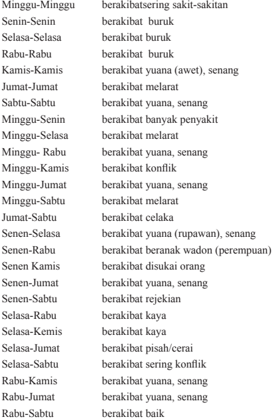

Tabel ini berisi informasi tentang berbagai hari dalam seminggu, dengan penekanan pada kondisi kesehatan dan perilaku masyarakat. Topik utamanya adalah hubungan antara hari dalam minggu dan kondisi kesehatan atau perilaku. Kolom-kolomnya mencakup berbagai hari mulai dari Minggu hingga Rabu, kemudian Kamis, Jumat, Sabtu, dan Senin. Data penting yang terlihat meliputi kondisi kesehatan seperti berakibat buruk, berakibat melenar, berakibat konflik, berakibat yuana (awet), berakibat celaka, dan berakibat baik. Selain itu, tabel juga mencakup perilaku seperti disukai orang, rejeikan, kaya, pisan/cerai, sering konflik, yuana senang, dan baik. Ini menunjukkan bahwa tabel ini memiliki hubungan yang kuat antara kondisi kesehatan dan perilaku masyarakat selama setiap hari dalam seminggu.

 

---
## 📄 Halaman 84

### Kemis-Jumat  berakibat yuana, senang

Kemis-Sabtu  berakibat pisah/cerai

- Jodoh berdasar Gabungan atau jumlah neptu (urip)  Panca Wara dan Sapta Wara laki dan perempuan, kemudian dibagi 5.  Dan sisa menujukan pengaruh yang ditimbulkan dari perjodohan
- Berdasarkan jumlah seluruh neptu  dibagi empat, dan sisa menunjukan pengaruh yang ditimbulkan dari perjodohan
Sisa 1 : SRI, berati rumah tangga beroleh rezeki

Sisa 2 : DANA, berati rumah tangga keadaan keuangan baik

Sisa 3 : LARA berati anggota rumah tangga dalam kesusahan atau kesakitan

Sisa 4 : PATI berati kesengsaran, mungkin bisa menemui kematian atau kehilangan rejeki

Habis dibagi :  LUNGGUH, berati akan mendapatkan kedudukan

Sisa 1 disebut GENTO berati jarang anak

Sisa 2 disebut PATI berati banyak anak

Sisa 3 disebut SUGIH berati banyak rejeki

Habis di bagi disebut PUNGGEL berati kehilangan rezeki, cerai atau mati

- Jodoh berdasarkan Pertemuan jumlah Neptu
Jumlah  Neptu  Sapta  Wara  dan  Panca  Wara  laki,  jumlah  neptu  Sapta Wara dan Panca Wara si perempuan masing-masing di bagi 9 (Sembilan), kemudian sisanya masing-masing dipertemukan :

- 1 dengan 1 : saling mencintai 1 dengan 2 : Baik 1 dengan 3 : rukun, jauh amerta 1 dengan 4 : banyak celaka 1 dengan 5 : cerai 1 dengan 6 : jauh sandang pangan 1 dengan 7  : banyak musuh 1 dengan 8  : terombang-ambing 1 dengan 9 : jadi tumpuan orang susah 1 dengan 2 : dirgahayu, banyak rejeki 2 dengan 3 : salah satu cepat mati 2 dengan 4 : banyak godaan 2 dengan 5 : sering celaka 2 dengan 6 : cepat kaya

 

---
## 📄 Halaman 86

### e.  Jodoh Tri Premana

Petemon (pertemuan)  laki-perempuan  yang  bernama Tri  Premana  ini didasarkan atas perhitungan jumlah neptu Panca Wara ditambah Sad Wara ditambah Sapta Wara dari weton (kelahiran) di pihak laki dan perempuan lalu  di  bagi  16  (enam  belas)  dan  sisa  dari  pembagian  memiliki  makna sebagai berikut :

- Sisa 1 bermakna diliputi kebimbangan, dalam keadaan suka dan duka, baik
buruk, sehingga dituntut ketabahan

- Sisa 2 bermakna  durlaba, rejeki seret, tapi suka melancong
- Sisa 3 bermakna  sering mendapat malu dan kecewa
- Sisa 4 bermakna susah mendapatkan sentana (keturunan)
- Sisa 5 bermakna  merana, sering sakit
- Sisa 6 bermakna  merana sering sakit
- Sisa 7 bermakna  mengalami suka duka, baik buruk dalam perjalanan hidupnya menuju bahagia
- Sisa 8 bermakna sukar untuk memenuhi hajat hidupnya sehari-hari, bahkan sampai kekurangan (terak)
- Sisa 9 bermakna kurang hati-hati, kesakitan tak henti-hentinya mewarnai hidupnya, sampai menimbulkan kekecewaan dan penyesalan hidup
- Sisa 10 bermakna mendapatkan wibawa serta disegani bagaikan raja/ ratu
yang berkuasa, sehingga dapat mengayomi keluarga

Sisa 11

bermakna  mendapat sukses dalam perjalanan hidup, tercapai cita-

citanya penuh kepuasan (sidha serta sabita)

- Sisa 12 bermakna sedana nulus, rejeki lancar/gampang
- Sisa 13 bermakna dirgayusa, panjang umur, rejekinya berkepanjangan
- Sisa 14 bermakna mendapatkan kebahagiaan/kesenangan selalu
- Sisa 15 bermakna sering mengalami kesusahan, keadaan buruk serta banyak problem
- Sisa 16    bermakna memperoleh kebahagiaan dan kesenangan
Sebagai  kelanjutan  dari  jenjang  perjodohan  yang  telah  dilakukan dengan memperhatikan beberapa pertimbangan tersebut di atas, sudah tentu diharapkan berlanjut pada jenjang perkawinan. Perkawinan yang dimaksud adalah  perkawinan  yang  sah  baik  secara  agama  maupun  secara  hukum.

 

---
## 📄 Halaman 87

Secara agama perkawinan adalah sakral. Sehingga dalam pelaksanaannya perlu  memilih  hari  yang  baik  karena  akan  memberikan  pengaruh  pula dalam keharmonisan rumah tangga.  Berikut ini akan diuraikan beberapa dewasa ayu  untuk upacara Manusa Yajña (pewiwahan)

- Mertha Yoga : Upacara untuk Manusa Yajña. Yang termasuk ke dalam Merta Yoga yaitu ; Soma Keliwon Landep, Soma Umanis Taulu, Soma Wage Medangsia, Soma Umanis Medangkungan, Soma Paing Menail, Soma Pon Ugu, Soma Wage Dukut.
- Baik Buruknya Sapta Wara untuk upacara  Pewiwahan
- Minggu  : Buruk, sering terjadi pertengkaran, bisa berakibat pertengkaran
- Senin      : Baik mendapat keselamatan dan kesenangan
- Selasa  : Buruk, suka berbantah, masing-masing tidak mau mengalah
- Rabu   : Amat baik, berputra serta berbahagia
- Kamis : Baik hidup rukun, senang dan disenangi orang
- Jumat  : Baik, tentram sentosa, tak kurang sandang pangan
- Sabtu   : Sangat buruk, senantiasa dalam kesusahan
- Baik Buruknya Penanggal /Tanggal  untuk upacara Perkawinan
Tanggal 1

- :
Dirgahayu, sejahtera

Tanggal 2 :

Sidha cita, Sidha karya, disayang keluarga

Tanggal 3

- :
Memperoleh banyak anak, sentana

Tanggal 4

- :
Suami sering sakit

Tanggal 5

- :
Dirgahayu, dirgayusa, selamat, sejahtera dan panjang umur

Tanggal 6

- :  Menemui kesusahan
Tanggal 7

- :
Suka, rahayu, hidup bahagia

Tanggal 8

- :
Sering sakit hampir meninggal

- Tanggal 9 : Senantiasa sengsara
- Tanggal 10  : Sidha karya, disegani orang (wirya guna)
- Tanggal 11  : Kurang ulet berkarya, penghasilan kurang
- Tanggal 12  : Mendapat kesusahan
- Tanggal 13  : labha bhukti, mendapat keberuntungan, terutama menyangkut pangan kinum
- Tanggal 14  : Sering berbantah, kemungkinan bisa sampai cerai
- Tanggal 15  : Sangat buruk, bisa menemui kesengsaraan

 

---
## 📄 Halaman 88

- Baik Buruknya Sasih hubungannya dengan upacara wiwaha (upacara pernikahan)
- Baik buruknya Wuku hubungannya dengan  upacara Manusa Yajña (Wiwaha)
- Kasa, (Srawana - Juli)
: buruk anak-anaknya

menderita

- Karo, (Bhadrawada - Agustus)
: buruk sangat miskin

- Ketiga, (Asuji - September)
: Sedang banyak anak-anak

- Kapat, ( Kartika - Oktober)
: baik, kaya dicintai orang

- Kelima, (Marggasira - Nopember)  : baik, tidak kurang makan dan
minum

- Keenem (Posya - Desember)
: Buruk, janda

- Kepitu (Magha - Januari)
: baik, mendapat

keselamatan,panjang umur

- Kawolu (Palguna - Pebruhari)
: buruk kurang makan dan

minum

- Kesanga (Citra- Maret)
: buruk sekali, selalu sengsara sakit-sakitan

- Kedasa (Waisaka - April)
: baik sekali, kaya raya selalu gembira

- Desta  (Jyesta - Mei)
: buruk, duka, sering bertengkar

marah

- Sada (Asadha - Juni)
: buruk, sakit-sakitan.

Rangda Tiga adalah wuku pantangan untuk melakukan upacara pernikahan (wiwaha),  apabila ada orang yang melakukan pernikahan dalam wuku ini dinyatakan bisa menjanda atau menduda. Adapun kemunculannya pada wuku berikut ; wariga, warigadian, pujut, Pahang, menhil, parangbakat

Amerta Mukti adalah baik untuk melaksanakan upacara Manusa Yajña untuk memohon waranugraha kepada Tuhan Yang Maha Esa, dengan menyucikan diri, lahir dan batin

Dagdig krana adalah hari yang buruk untuk segala upacara, terutama untuk pertemuan asmara.

Dewa Werdi adalah hari baik untuk melaksanakan Manusa Yajña, metatah

Dirgayusa adalah sangat baik melakukan upacara Manusa Yajña, tapi sangat jarang ditemukan dewasa ini yang jatuh pada budha pon, penanggal 10

Panca Werdi adalah hari yang baik untuk melaksanakan Manusa Yajña  antara lain mepetik, potong gigi, dan lain-lain, karena berpahala dirgayusa

 

---
## 📄 Halaman 89

### Uji  Kompetensi

- Sebutkan baik buruknya wuku dalam  hubungannya dengan pelaksanaan upacara Manusa Yajña!
------------------------------------------------------------------------------------------------

------------------------------------------------------------------------------------------------

------------------------------------------------------------------------------------------------

------------------------------------------------------------------------------------------------

------------------------------------------------------------------------------------------------

- Jelaskan apa yang menjadi dasar Jodoh Tri Premana!
-------------------------------------------------------------------------------------------------

-------------------------------------------------------------------------------------------------

-------------------------------------------------------------------------------------------------

-------------------------------------------------------------------------------------------------

-------------------------------------------------------------------------------------------------

- Wariga dewasa untuk upacara Pitra Yajña (atiwa-tiwa) dapat dibedakan menjadi tiga, sebutkan dan jelaskanlah hal itu?
-------------------------------------------------------------------------------------------------

-------------------------------------------------------------------------------------------------

-------------------------------------------------------------------------------------------------

-------------------------------------------------------------------------------------------------

-------------------------------------------------------------------------------------------------

 

---
## 📄 Halaman 90

### E. Macam-macam Wariga/Pedewasan Bidang Pertanian

### Memahami  Teks

Sistem pertanian dalam ajaran Hindu bukanlah suatu hal yang baru, karena perkembangan Agama Hindu di Indonesia tidak lepas dari sejarah perkembangan Agama  Hindu  di  daerah  asalnya  India.  Sebelum  pengaruh Agama  Hindu  dan Budha  datang,  kepercayaan  tradisional  masyarakat  Indonesia  telah  mengenal pemujaan  terhadap  unsur-unsur  alam  termasuk  benda-benda  angkasa  seperti matahari, bulan dan bintang. Sebagai  masyarakat agraris yang relegius terbangun sebuah keyakinan bahwa keberhasilan yang diperoleh tidak lepas dari pengaruhpengaruh di luar dirinya. Sehingga untuk mendapatkan hasil yang baik tidak lepas dari usaha realitas di luar dirinya. Mencari hari baik (dewasa ayu), serta melakukan kegiatan ritual sebagai salah satu 'resep' jitu untuk menopang keberhasilan dalam aktivitas kehidupan.

Sebelum  dikenalnya  sistem  penanggalan  seperti  dalam    kelender  yang  ada saat ini, dalam menentukan hari baik mereka selalu berpatokan pada munculnya benda-benda  lagit  (bintang)  serta  posisi  bumi,  bulan  dan  matahari.  Hal  ini digunakan untuk menentukan hari yang baik dalam bercocok tanam, termasuk aktivitas relegi.

Jika bintang Wuluku/tenggala (orion) berada tepat di atas, dua dari bintangnya berada  di  posisi  barat  dari  garis  tengah  Utara-Selatan  jam  18.00-20.23  (dauh wengi)  nanceb masa :  petani mulai menanam padi yang berumur 4 sampai 5 bulan, seperti padi ijo gading (4 bulan), pokal (4,5 bulan). Jatuh berkisar sasih PalgunaCaitra/Kaulu-Kesanga  (8-9)  atau  Januari-Pebruhari.  Jika  Bintang  Karawika (Taurus) mulai terlihat di timur berkisar pukul 03.36-05.59 (dauh wengi) mabyan sawah, petani mulai menanam bawang, semangka, dan lain-lain. Jatuh berkisar sasih Shrawana-Bhadrapada/Kasa-Karo (1-2)/Juni-Juli.

Dasar pertimbangan dan landasan ilosis relegius tersebut, hingga kini diwarisi wariga yang berkaiatan dalam bidang pertanian. Adapun beberapa contoh baikburuknya hari dalam kaitannya bidang pertanian sebagai berikut :

Bercocok tanam sesuai Sapta Wara

- Redite menanam tanaman yang beruas (sarwa buku)
- Soma menanam tanaman yang berumbi (sarwa bungkah)
- Anggara tanaman yang daunnya yang berfungsi, (sarwa daun)
- Budha menanam segala yang berbunga (sarwa sekar)
- Wrhaspati menaman segala biji-bijian (sarwa wija)
- Sukra nenanam segala  buah (sarwa phala)
- Saniscara menam tanaman merambat (sarwa melilit)

 

---
## 📄 Halaman 91

Hari baik menanam padi berdasarkan Sapta Wara, Panca Wara dan Wuku

- Redite
- Coma
- Anggara
- Budha
- Wraspati
- f.
- Sukra
- Saniscara
- Umanis
- Umanis
- Umanis
- Umanis
- Umanis
- Umanis
- Umanis
- Merakih
- Tolu
- Uye
- Julungwangi
- Ugu
- Langkir
- Watugunung
Pantangan menanam tanaman berdasarkan Sapta Wara, Panca Wara dan Wuku

- Wrhaspati
- Pon
- Landep
- Redite
- Pon
- Julungwangi
- Soma
- Pon
- Dunggulan
- Anggara
- Pon
- Langkir
- Budha
- Pon
- Pujut
- Wrhaspati
- Pon
- Krulut
- Wraspati
- Pon
- Tambir

### F. Dampak dari Wariga/Padewasan

### Memahami  Teks

Agama adalah kebenaran dan kebaikan. Orang-orang yang berpegang teguh padanya  akan  terimbas  oleh  kebenaran  dan  kebaikan  agama.  Wariga  dewasa adalah salah satu cara untuk menjalankan ajaran agama yang berkaitan dengan aktiitas  keagamaan,  termasuk  kegiatan-kegiatan  lain  yang  berhubungan  dengan kehidupan.  Sehingga  pengaruh  dari  pemahaman  terhadap  padewan  berdampak pada  prilaku  agama  yang  semakin  konsisten  serta  pengamalan  agama  yang semakin intensif. Sehingga kekuatan agama terhadap diri manusia terlihat dari berbagai dimensi kehidupan manusia dalam membentuk sikap keagamaan.

Ada beberapa dampak dari pemahaman wariga yang dapat membentuk sikap keagamaan  antara lain :

- Dampak  moral  yaitu  salah  satu  kencendrungan  mengembangkan  perasaan bersalah  ketika  manusia  berprilaku  menyimpang  dari  hal-hal  yang  tertuang dalam wariga dewasa.

 

---
## 📄 Halaman 92

- Dampak  kognitif  yaitu  meningkatnya  pemahaman  dan  keyakinan  manusia, bahwa  segala  keberhasilan  yang  diraih  oleh  manusia  tidak  saja  berasal dari  dalam  dirinya  (usaha)  tetapi  ada  suatu  kekuatan  yang  berasal  dari  luar dirinya yang bersumber dari Tuhan, yang turut serta memberikan andil dalam keberhasilan tersebut.
- Dampak afektif yaitu pengalaman batin seseorang yang merupakan salah satu faktor  yang  ada  dalam  pengalaman  setiap  orang  beragama.  Sebagian  orang mungkin  mengganggap  bahwa  pelaksanaan  upacara-upacara  sesuai  dengan wariga dewasa sekedar serimonial saja, namun sebagian yang dengan khusuk berlandaskan keyakinan mencurahkan emosinya akan merasakan ketenangan dan kedamaian.
- Dampak psikomotor yaitu adanya kehati-hatian manusia dalam bertindak dan berprilaku dalam kehidupan sehari-hari.
- Dampak sosial yaitu dengan adanya pemahaman wariga dewasa manusia selalu membangun hubungan sosial yang harmonis, bukan saja sesama manusia tetapi juga dengan Tuhan dan alam lingkungannya.

 

---
## 📄 Halaman 93

### Uji  Kompetensi

- Jelaskan pengertian wariga dan padewasan menurut arti katanya!
------------------------------------------------------------------------------------------------

-----------------------------------------------------------------------------------------------

-----------------------------------------------------------------------------------------------

------------------------------------------------------------------------------------------------

-----------------------------------------------------------------------------------------------

-----------------------------------------------------------------------------------------------

- Sebutkan tujuan dari adanya wariga !
-----------------------------------------------------------------------------------------------

-----------------------------------------------------------------------------------------------

-----------------------------------------------------------------------------------------------

-----------------------------------------------------------------------------------------------

------------------------------------------------------------------------------------------------

-----------------------------------------------------------------------------------------------

- Bagaimanakah cara menentukan wariga berdasarkan :
- Wewaran
- Wuku
- Penanggal/pangglong
- Sasih
- Dauh
-------------------------------------------------------------------------------------------------

------------------------------------------------------------------------------------------------

------------------------------------------------------------------------------------------------

------------------------------------------------------------------------------------------------

------------------------------------------------------------------------------------------------

------------------------------------------------------------------------------------------------

 

---
## 📄 Halaman 94

### Releksi Diri

- Diskusikanlah dengan orang tuamu  bahwa  wariga memberikan dampak dalam membentuk sikap keagaamaan, dan berikanlah contoh nyata dalam kehidupan bermayarakat!
------------------------------------------------------------------------------------------------

------------------------------------------------------------------------------------------------

-----------------------------------------------------------------------------------------------

-----------------------------------------------------------------------------------------------

-----------------------------------------------------------------------------------------------

-----------------------------------------------------------------------------------------------

- Menurut pendapatmu, manfaat apa yang  dapat diperoleh dari mempelajari wariga(padewasan ) dalam kehidupan sehari-hari ?
-----------------------------------------------------------------------------------------------

-----------------------------------------------------------------------------------------------

------------------------------------------------------------------------------------------------

-----------------------------------------------------------------------------------------------

-----------------------------------------------------------------------------------------------

-----------------------------------------------------------------------------------------------

Paraf Guru

Paraf Orang Tua

Nilai

(........................................)

(........................................)

 

---
## 📄 Halaman 95

### Renungan

Bacalah sloka Ṛgveda III. 62.10 di bawah ini dan renungkan!

'Om bhūr bhuvah svaha; tat savitur varenyam, bhargo devasya dhīmahi, dhiyo yo nah pracodayāt' (Ṛgveda III. 62.10)

### Terjemahan:

Ya Tuhan, hamba menyembah kecemerlanganmu dan kemahamuliaan-Mu yang menguasai bumi, langit dan angkasa. Semoga Engkau menganugerahkan kecerdasan dan semangat pada pikiran kami

### Kegiatan    Siswa

- Diskusikan bersama temanmu!
- Tulis pada lembaran lain pemahaman kalian tentang ilsafat dan sejauh mana ilsafat berpengaruh terhadap perkembangan ilmu pengetahuan dan peradaban dunia.

 

---
## 📄 Halaman 96

### A. Pengertian Darśana

### Memahami  Teks

Kata Tattva berasal  dari  bahasa  Sansekerta  'Tat'  yang  artinya  itu,yang maksudnya  adalah  hakekat  atau  kebenaran  ( Thatnees ).  Dalam  sumber  lainya kata Tattva juga berarti falsafah (Filsafat agama). Maksudnya adalah ilmu yang mempelajari kebenaran sedalam-dalamnya (sebenarnya) tentang sesuatu seperti mencari kebenaran tentang Tuhan, tentang atma serta yang lainya. Sampai pada proses kepada kebenaran tentang reinkarnasi dan karmapala. Dalam ajaran Tattva , kebenaran yang dicari adalah hakekat Brahman (Tuhan) dan segala sesuatu yang terkait  dengan  kemahakuasaan  Tuhan,  seperti  yang  disebutkan  dalam  buku Theologi  Hindu,  kata Tattva berarti  hakekat  tentang  Tat  atau  Itu  (yaitu  Tuhan

dalam bentuk Nirguṇa  Brahman ).  Penggunaan  kata  Tat  sebagai kata  yang  artinya  Tuhan,  adalah untuk menunjukan kepada Tuhan yang jauh dengan manusia. Kata 'Itu'  dibedakan  dengan  kata  ' Idam  '  yang  artinya  menunjuk pada kata benda yang dekat (pada semua ciptaan Tuhan). Deinisi di atas berdasarkan pada pengertian bahwa Tuhan atau Brahman adalah asal segala yang ada, Brahman  merupakan  primacosa yang adanya bersifat mutlak. Karena  sumber  atas  semua  yang ada,  tanpa  ada  Brahman  maka tidak mungkin semuanya ada.

Tattva juga dapat diartikan kebenaran yang sejati dan hakiki. Penggunaan kata Tattva ini sebagai istilah ilsafat didasarkan atas tujuan yang hendak dicapai, oleh ilsafat itu yakni kebenaran yang tertinggi dan hakiki. Didalam lontar-lontar di Bali kata Tattva inilah yang lebih sering diguṇakan jika dibandingkan dengan ke tiga istilah ilsafat yang lainya, pendidikan, tempat suci, upacara yajňa, adat istiadat dan  lainya,  semua  itu  merupaka  konsep  dasar  atau  inti  sarinya  adalah Tattva . Dengan pengertian  tersebut  di  atas  maka  dapat  diartikan  bahwa Tattva adalah suatu istilah ilsafat agama yang diartikan kebenaran yang sejati dan hakiki yang didasari  perenungan yang betul -betul memerlukan pemikiran yang cemerlang agar sampai kepada hakekat dan sifat kodrati. Ajaran Hindu kaya akan Tattva atau dalam ilmu modern disebut ilsafat, secara khusus ilsafat disebut Darśana.

 

---
## 📄 Halaman 97

Kata  Darśana  berasal  dari  urat  kata  dṛś  yang  artinya  memandang  menjadi kata  Darśana  (kata  benda)  artinya  pengelihatan  atau  pandangan.  Kata  Darśana dalam hubungan ini berarti pandangan tentang kebenaran (ilsafat). Ilmu Filsafat adalah sebuah ilmu yang mempelajari bagaimana caranya mengungkapkan nilainilai kebenaran hakiki yang dijadikan landasan untuk hidup yang dicita-citakan. Demikian halnya ilmu ilsafat yang ada di dalam ajaran Hindu yang juga disebut dengan  Darśana,  semuanya  berusaha  untuk  mengungkapkan  tentang  nilai-nilai kebenaran dengan bersumber pada kitab suci Veda. Dalam perkembangan Agama Hindu  atau  kebudayaan  Veda  terdapat  Sembilan  cabang  ilsafat  yang  disebut Nawa Darśana. Pada masa  Upaniṣad, akhirnya ilsafat dalam kebudayaan Veda dapat dibagi menjadi dua kelompok yaitu astika (kelompok yang mengakui Veda sebagai ajaran tertinggi) dan nastika (kelompok yang tidak mengakui Veda ajaran tertinggi ). Terdapat enam cabang ilsafat yang mengakui veda yang disebut Ṣaḍ Darśana  (Nyāyā,  Sāṁkya,  Yoga,  Mīmāmsā,  Vaisiseka,  dan  Vedānta)  dan  tiga cabang ilsafat yang menentang Veda yaitu Jaina, Carvaka dan Buddha (Agama Buddha).

Darśana  merupakan  bagian  penulisan  Hindu  yang  memerlukan  kecerdasan yang  tajam,  penalaran  serta  perasaan,  karena  masalah  pokok  yang  dibahasnya merupakan  inti  sari  pemahaman  Veda  secara  menyeluruh  di  bidang  ilsafat. Filsafat merupakan aspek rasional dari agama dan merupakan satu bagian integral dari agama. Nama atau istilah lain dari Darśana tersebut adalah; Mananaśāstra (pemikiran atau renungan ilsafat), Vicaraśāstra (menyelidiki tentang kebenaran ilsafat), tarka (spekulasi), Śraddhā (keyakinan atau keimanan).

Filsafat Hindu bukan hanya merupakan spekulasi atau dugaan belaka, namun ia memiliki nilai yang sangat luhur, mulia, khas, dan sistematis, yang didasarkan atas pengalaman spiritual mistis yang dikenal sebagai Aparokṣa Anubhūti. Para pengamat  spiritual,  para  orang  bijak,  dan  para  Ṛṣi  yang  telah  mengarahkan persepsi intuitif dari kebenaran, adalah para pendiri dari berbagai sistem ilsafat yang berbeda-beda, yang secara langsung maupun tidak langsung mendasarkan semuanya  pada  Veda.  Mereka  yang  telah  mempelajari  kitab-kitab  Upaniṣhad secara tekun dan hati-hati akan menemukan keselarasan antara wahyu-wahyu Śruti dengan kesimpulan ilsafat. Ṣaḍ Darśana yang merupakan enam sistem ilsafat Hindu, merupakan enam sarana pengajaran yang benar atau enam cara pembuktian kebenaran.  Masing-masing  kelompok  telah  mengembangkan,  mensistematisir, serta menghubungkan berbagai bagian dari veda, dengan caranya masing-masing, sehingga masing-masing kelompok aliran ilsafat tersebut memiliki seorang atau beberapa  orang  Sūtrakāra,  yaitu  penyusun  doktrin-doktrin,  dalam  ungkapanungkapan pendek (aphorisma) yang disebut Sūtra.

 

---
## 📄 Halaman 98

### Kegiatan    Siswa

### Petunjuk :

Jelaskan pernyataan di bawah ini:

'Filsafat membuat kita mandiri dan tidak bergantung kepada orang lain' Apa pendapatmu mengenai kutipan kalimat ini?

-------------------------------------------------------------------------------------------------

-------------------------------------------------------------------------------------------------

-------------------------------------------------------------------------------------------------

-------------------------------------------------------------------------------------------------

-------------------------------------------------------------------------------------------------

-------------------------------------------------------------------------------------------------

-------------------------------------------------------------------------------------------------

------------------------------------------------------------------------------------------------

-------------------------------------------------------------------------------------------------

-------------------------------------------------------------------------------------------------

-------------------------------------------------------------------------------------------------

### B. Sistem Filsafat Hindu

### Memahami  Teks

Istilah  Nawadarśana  sebenarnya  adalah  penggabungan Ṣaḍ Darśana dengan ilsafat Nāstika yaitu aliran ilsafat yang tidak mengakui otoritas Veda sehingga disebut dengan Nāstika atau ilsafat heterodox adalah sebagai berikut :

### 1)  Aliran ilsafat materialistis dari Cārvāka

Cārvāka  tidak  pernah  percaya  kepada  Sorga  dan  Neraka  dan  terhadap Tuhan yang menciptakan alam semesta, karena itu aliran ini bersifat atheis. Cārvāka menitik beratkan untuk mencari kesenangan duniawi saja. Ada dua jenis pengikut Cārvāka, yaitu Dhūrta (licik dan tidak terpelajar) dan Suśikṣita (terpelajar). Salah satu pengikut Suśikṣita yang terkenal adalah Vātsyāna yang terkenal dengan bukunya Kāmasūtra.

### 2)  Sistem ilsafat Jaina

Aliran Jaina artinya memperoleh kemenangan dalam menghadapi tantangan  duniawi.  Pendiri  aliran  ini  adalah  Mahāvīra  yang  nama  aslinya Vardhamāna. Aliran ilsafat yang bersifat atheis ini percaya seseorang dapat

 

---
## 📄 Halaman 99

mencapai  kebebasan  rohani  seperti  Guru  mereka. Ada  dua  golongan  Jaina, yaitu ; Digambara (golongan yang sangat fanatik dan bahkan tidak berpakaian) dan Śvetāmbara (golongan yang lebih moderat, menggunakan pakaian serba putih). Bisa dikatakan  ilsafat Jaina bersifat pragmatis realistist.

### 3)  Aliran ilsafat Buddha

Filsafat Buddha didirikan oleh pengikut Sang Buddha, Siddhārtha Gautama dan dinasti Sakya. Ajaran ilsafat Buddha meliputi Catur Ārya Satyani (empat kebenaran  mulia),  Pratitya  Samut  Pada  (dua  belas  hal  yang  menyebabkan penderitaan) dan Aṣṭa Mārga (delapan jalan yang benar)

Enam ilsafat Hindu yang dikenal dengan Ṣaḍ Darśana adalah enam sistem ilsafat orthodox yang merupakan enam cara mencari kebenaran, yaitu : Nyāyā, Sāṁkya, Yoga, Vaisiseka,  Mīmāmsā,  dan Vedānta. Disamping enam Darśana pokok awal yang termasuk jaman Sūtra-sūtra juga terdapat beberapa darśana yang  termasuk  zaman  scholastic,  yaitu  Dvaita,  Viśiṣtādvaita  dan  Advaita. Kesemua  sistem  ilsafat  tersebut  mendasarkan  ajarannya  kepada  Veda  baik secara langsung maupun tidak langsung, sehingga disebut juga sebagai Astika.

---
**🖼️ Gambar/Diagram**

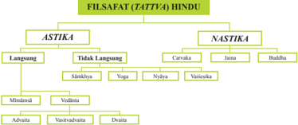

> **Deskripsi Visual:** Gambar ini adalah diagram yang menunjukkan struktur filosofis Hindu, dengan fokus pada Astika dan Nastika. Diagram ini dibagi menjadi dua bagian utama: Astika dan Nastika. Astika meliputi Langsung dan Tidak Langsung, sementara Nastika mencakup Carvaka, Jaina, dan Buddha. Untuk Astika, ada dua sub-kategori: Sāṃkhya dan Yoga, serta dua sub-sub-kategori: Nyaya dan Vedanta. Untuk Nastika, ada tiga sub-kategori: Carvaka, Jaina, dan Buddha.

Elemen-elemen utama dalam diagram ini adalah Astika dan Nastika sebagai kelas utama, dengan sub-kelas yang lebih spesifik seperti Langsung, Tidak Langsung, Carvaka, Jaina, dan Buddha. Sub-kelas Astika juga memiliki sub-sub-kelas seperti Sāṃkhya, Yoga, Nyaya, dan Vedanta. Teks, angka, atau label penting yang terlihat dalam diagram ini adalah nama-nama filosofi dan teori-teori yang disebutkan.

Informasi kunci yang dapat diambil pembaca dari gambar ini adalah bahwa filosofi Hindu terbagi menjadi dua kelas utama: Astika dan Nastika. Astika meliputi Langsung dan Tidak Langsung, sedangkan Nastika mencakup Carvaka, Jaina, dan Buddha. Astika juga memiliki sub-kelas seperti Sāṃkhya, Yoga, Nyaya, dan Vedanta. Ini memberikan pemahaman umum tentang struktur filosofis Hindu dan bagaimana filosofi-filosofi tersebut terkait satu sama lain.

Keenam aliran  ilsafat  yang  disebutkan  di  atas,  secara  langsung  berasal dari kitab-kitab Veda  sehingga merupakan enam buah jalan berbeda menuju sebuah kota di  mana  untuk  mencapai  kota  tersebut  dapat  ditempuh  dengan melewati  salah  satu  jalan  tersebut.  Demikian  pula  dengan  keenam  aliran pemikiran yang merupakan metoda atau cara pendekatan yang berbeda-beda menuju  Tuhan  untuk  menyesuaikan  dengan  temperamen,  kemampuan  dan kualitas mental orang yang berbeda-beda pula, tetapi kesemuanya itu memiliki satu tujuan, yaitu menghilangkan ketidak tahuan dan pengaruh-pengaruhnya berupa penderitaan dan duka cita, serta pencapaian kebebasan, kesempurnaan, kekekalan  dan  kebahagiaan  abadi  dengan  penyatuan  dari jiwa pribadi (Jīvātman) dengan Jīvā Tertinggi (Paramātman).

 

---
## 📄 Halaman 100

Enam aliran ilsafat tersebut di bagi lagi menjadi lima kelompok yang saling berpasangan dan saling menunjang, yaitu : Nyāya dengan Vaiśeṣika, Sāṁkhya dengan Yoga, Mīmāmsā dengan Vedānta.

- Nyāya Darśana diajarkan oleh ṛṣi Gautaman.
- Vaiśeṣika Darśana diajarkan oleh ṛṣi Kaṇāda.
- Sāṁkhya Darśana diajarkan oleh Kapila muni.
- Yoga Darśana diajarkan oleh mahārṣi Patañjali berdasarkan ajaran dari guru beliau yang bernama Gauḍāpa dan menyusun Yoga Sūtra yang merupakan acuan tentang Rāja-Yoga.
- Mīmāmsā  Darśana  diajarkan  oleh  Jaimini  yang  merupakan  murid  dari Vyāsa berdasarkan pada bagian ritual kitab Veda.
- Vedānta  atau Brāhma-Sūtra diajarkan oleh Mahārṣi Bādarāyana atau Vyāsa.

### C. Şad Darśana

### Mengamati

### Petunjuk :

Amatilah keindahan lingkungan sekitarmu, dan mulailah berikir untuk apa Tuhan menciptakan semuanya :

-----------------------------------------------------------------------------------------------------

-----------------------------------------------------------------------------------------------------

-----------------------------------------------------------------------------------------------------

-----------------------------------------------------------------------------------------------------

-----------------------------------------------------------------------------------------------------

-----------------------------------------------------------------------------------------------------

-----------------------------------------------------------------------------------------------------

### Memahami  Teks

Aliran  atau  sistem  ilsafat  India  dibagi  menjadi  dua  kelompok  besar,  yaitu āstika dan nāstika. Kelompok pertama terdiri atas enam sistem ilosois utama yang secara populer dikenal sebagai Ṣaḍ Darśana yang dikenal dengan aliran orthodox, nukan karena mereka mempercayai adanya Tuhan, tetapi karena mereka menerima otoritas dari kitab-kitab Veda. Sebagai catatan, dalam bahasa India modern, kata āstika  dan  nāstika  umumnya berarti theis dan atheis, tetapi dalam kepustakaan ilosois Sanskeṛta, kata āstika berarti 'orang yang mempercayai otoritas kitab-

 

---
## 📄 Halaman 101

kitab Veda, atau orang yang mempercayai kehidupan setelah kematian, sedangkan kata nāstika berarti lawannya. Di sini, kata tersebut dipergunakan dalam pengertian pertama karena dalam pengertian yang kedua, aliran ilsafat Jaina dan Buddha pun adalah āstika, karena mereka percaya mempercayai kehidupan setelah kematian. Dalam kedua pengertian di atas, ke enam aliran ilsafat orthodox adalah āstika dan aliran ilsafat Cārvāka sebagai nāstika. Pada uraian berikut akan diuaraikan tentang aliran ilsafat orthodox (Ṣaḍ Darśana).

### 1. Nyāya Darśana

### a.  Pendiri dan Sumber Ajaran

Pendiri ajaran ini adalah ṛṣi Gautaman juga dikenal dengan nama  Akṣapāda dan Dīrghatapas, yang menulis Nyāyaśāstra atau Nyāya Darśana yang secara umum juga dikenal sebagai Tarka Vāda atau diskusi  dan  perdebatan  tentang suatu  Darśana  atau  pandangan ilsafat kurang lebih pada abad  ke-4  SM,  karena  Nyāya mengandung Tarka Vāda (ilmu perdebatan) dan Vāda-vidyā (ilmu  diskusi).  Sistem  ilsafat Nyāya membicarakan bagian umum  darśana (ilsafat) dan

metoda (cara) untuk melakukan pengamatan yang kritis.  Sistem  ini  timbul karena  adanya  pembicaraan  yang  dilakukan  oleh  para  ṛṣi  atau  pemikir, dalam usaha mereka mencari arti yang benar dari ayat-ayat atau śloka-śloka Veda Śruti, guṇa  dipakai dalam penyelenggaraan upacara-upacara yadña. Terdiri dari lima Adhyāya (bab) dan dibagi ke dalam lima bagian.

Obyek  utmanya  adalah  untuk  menetapkan  dengan  cara  perdebatan, bahwa  Parameśvara  merupakan  pencipta  dari  alam  semesta  ini.  Nyāya menegakkan  keberadaan Īśvara dengan cara penyimpulan, sehingga dikatakan  bahwa  Nyāya  Darśana  merupakan  sebuah  śāstra  atau  ilmu pengetahuan  yang  merupakan  alat  utama  untuk  meyakini  suatu  obyek dengan penyimpulan yang tidak dapat dihindari. Dalam hal ini kita harus mau menerima pembantahan macam apapun, tetapi asalkan berdasarkan pada  otoritas  yang  dapat  diterima  akal.  Pembantahan  demi  untuk  adu argumentasi dan bukan bersifat lidah atau berdalih.

 

---
## 📄 Halaman 102

### b.  Sifat Ajaran

Pandangan ilsafat Nyāya menyatakan bahwa dunia di luar manusia ini, terlepas  dari  pikiran.  Kita  dapat  memiliki  pengetahuan  tentang  dunia  ini dengan  melalui  pikiran  yang  dibantu  oleh  indra.  Oleh  karena  itu  sistem ilsafat  Nyāya  ini  dapat  disebut  sebagai  sistem  yang  realistis  (nyata). Pengetahuan ini dapat disebut benar atau salah, tergantung dari pada alatalat yang diperguṇa kan untuk mendapatkan pengetahuan tersebut, dimana secara sistematik semua pengetahuan menyatakan empat keadaan, yaitu :

- Subyek atau si pengamat (pramātā)
- Obyek yang diamati (prameya)
- Keadaan hasil dari pengamatan (pramīti)
- Cara untuk mengamati atau pengamatan (pramāṇa)
Prameya atau obyek yang diamati, dengan nama pengetahuan yang benar dapat diperoleh, ada 12 banyaknya, yaitu : Roh (Ātman), Badan (śarīra), Indriya,  Obyek  indriya  (artha),  kecerdasan  (buddhi),  Pikiran  (manas), Kegiatan (pravṛtti),  Kesalahan  (Doṣa),  Perpindahan  (Pretyabhāva),  Buah atau Hasil (phala), Penderitaan (duhkha), dan Pembebasan (apavarga).

Kita membuat perbedaan pada suatu benda karena adanya beberapa cirriciri  pada  kedua  benda  tersebut,  yang  masing-masing  memiliki  beberapa atribut yang tak didapati pada bagian lainnya. Karena kekhususan atribut (Viśeṣa)  merupakan dasar utama dari pengamatan, maka sistem lanjutan dari ilsafat ini disebut sebagai Vaiśeṣika.

Nyāya Darśana, yang utamanya bertindak pada garis ilmu pengetahuan atau  ilmiah  menghubungkan  Vaiśeṣika  pada  tahapan,  di  mana  materimateri  adhyatmikā  (spiritual)  terkandung  di  dalamnya,  yang  keduanya ini  memperguṇakan Tarka (logika) dan Tattva (ilsafat)  di  mana  ilsafat dinyatakan melalui media logika.

### c.  Catur Pramāṇa

Nyāya Darśana dalam memecahkan ilmu pengetahuan memperguṇakan empat metoda pemecahan (Catur Pramāṇa) sebagai berikut :

- Pratyakṣa  Pramāṇa  atau  pengamatan  secara  langsung  memberikan pengetahuan  kepada  kita  tentang  obyek-obyek  menurut  keadaanya masing-masing yang disebabkan hubungan panca indra dengan obyek yang di amati dimana hubungan itu sangat nyata.
- Anumāna Pramāṇa yaitu pengtahuan yang diperoleh dari suatu obyek dengan menarik pengertian dari tanda-tanda yang diperoleh (linga) yang merupakan suatu kesimpulan dari obyek yang ditetukan, disebut juga Ṣaḍya, hubungan kedua hal tersebut di atas disebut dengan nama Wyapi. Dalam menarik suatu kesimpulan.

 

---
## 📄 Halaman 103

- Upamāṇa Pramāṇa merupakan cara pengamatan dengan membandingkan kesamaan-kesamaan yang mungkin terjadi atau terjadi di dalam obyek yang di amati dengan obyek yang sudah ada atau pernah diketahui.
- Śabda Pramāṇa yaitu pengetahuan yang diperoleh dengan mendengarkan melalui penjelasan dari sumber yang patut dipercaya.

### d.  Pokok-pokok ajaran Nyāya

Objek pengetahuan ilsafat Nyāya adalah mengenai

- Ātma
- Tentang tubuh atau badan
- Pañca indra dengan obyeknya
- Buddhi (pengamatan)
- Manas (pikiran)
- Pravṛtti (aktivitas)
- Doṣa (perbuatan yang tidak baik)
- Pratyabhāva (tentang kelahiran kembali)
- Phala (buah perbuatan)
- Duḥka (penderitaan)
- Apavarga (bebas dari penderitaan)
Di samping oleh ṛṣi Vāstsyāna yang mengomentari Nyāya Sūtra dengan karyanya yang berjudul Nyāya Bhāsya, Śrikaṇṭha menulis Nyāya-laṇkara, Jayanta  menulis  Nyāya-mañjari,  Govardhana  menulis  Nyāya-Bhodhini dan  Vācaspati  Miśra  menulis  Nyāya-Varṭṭika-Tatparya-Tīkā.  Selain  itu Udayana juga menulis sebuah buku yang disebut Nyāya-Kusumāñjali.

Seperti  yang  telah  diketahui  bahwa  ilsafat  Nyāya  merupakan  dasar dari  semua  pengantaran  ajaran  ilsafat  Sanskṛta.  Nyāya  juga  merupakan rangkaian pendahuluan bagi seorang pelajar ilsafat, karena tanpa pengetahuan  tentang  ilsafat  Nyāya,  kita  tidak  akan  dapat  memahami Brahma Sūtra dari Śri VyāṢaḍeva, karena ilsafat Nyāya membantu untuk mengembangkan  daya  penalaran  ataupun  pembantahan,  yang  membuat kecerdasan bertambah tajam dan lembut, guṇa  pencarian ilsafat Vedāntik.

 

---
## 📄 Halaman 104

### 2. Vaiśeşika Darśana

### a.  Pendiri dan Sumber Ajarannya

Vaiśeṣika    yang  merupakan  salah  satu aliran ilsafat India yang tergolong ke dalam Ṣaḍ Darśana agaknya lebih tua dibandingkan dengan ilsafat Nyāya. Vaiśeṣika dan Nyāya Darśana  bersesuaian  dalam  prinsip  pokok mereka, seperti sifat dan hakekat Sang Diri dan teori atom alam semesta, dan dikatakan pula Vaiśeṣika  merupakan  tambahan  dari  ilsafat Nyāya,  yang  memiliki  analisa  pengalaman sebagai obyektif utamanya.

Sistem ilsafat Vaiśeṣika mengambil nama dari kata Viśesa yang artinya kekhususan, yang merupakan ciri-ciri pembeda dari benda-benda. Vaiśeṣika

muncul pada abad ke-4 SM, dengan tokohnya ialah ṛṣi Kaṇāda, yang juga dikenal sebagai ṛṣi ūluka. Sehingga sistem ini juga dikenal sebagai Aūlukya Darśana dan juga dengan nama Kaśyapa dan dianggap seorang Deva-ṛṣi. Kata  ūluka artinya burung hantu.

Sistem  ilsafat  ini  terutama  dimaksudkan  untuk  menetapkan  tentang Padārtha, tetapi rsi Kanada membuka pokok permasalahan dengan sebuah pengamatan  tentang intisari dari Dharma,  yang  merupakan  sumber dari  pengetahuan  inti  dari  Padārtha.  Sūtra  pertama  berbunyi  :  'Ytao bhyudayanihsreyasa  siddhiḥ  sa  dharmaḥ'  artinya,  Dharma  adalah  yang memuliakan dan memberikan kebaikan tertinggi atau Moksa (penghentian dari penderitaan).

### b.  Pokok-Pokok Ajaran

Padārtha,  secara  hariah  artinya  adalah  :  arti  dari  sebuah  kata;  tetapi di  sini  Padārtha  adalah  satu  permasalahan  benda  dalam  ilsafat.  Sebuah Padārtha merupakan suatu objek yang dapat dipikirkan (artha) dan diberi nama  (Pada).  Semua  yang  ada,  yang  dapat  diamati  dan  dinamai,  yaitu semua objek pengalaman adalah Padārtha. Benda-benda majemuk saling bergantung  dan  sifatnya  sementara,  sedangkan  benda-benda  sederhana sifatnya abadi dan bebas.

Padārtha dan Vaiśeṣika Darśana, seperti yang disebutkan oleh rsi Kanada sebenarnya hanya enam buah kategori, namun satu katagori ditambahkan oleh penulis-penulis berikutnya, sehingga akhirnya berjumlah tujuh kategori (Padārtha) sebagai berikut.

 

---
## 📄 Halaman 105

### 1)  Substansi (dravya).

Substansi  adalah  zat  yang  ada  dengan  sendirinya  dan  bebas  dari pengaruh  unsur-unsur  lain.  Namun  unsur  lain  tidak  dapat  ada  tanpa substansi. Ada sembilan substansi yang dinyatakan oleh Vaiśeṣika yaitu :  (1)  Tanah  (pṛthivī);  (2) Air  (āpah,    jala);  (3) Api  (tejah);  (4)  Udara (vāyu); (5) Ether (ākāśa); (6) Waktu (kāla); (7) ruang (dis); (8) diri/roh (Jīva);  dan (9) pikiran (manas). Semua substansi tersebut di atas riel, tetap dan kekal. Namun hanya udara, waktu, akasa bersifat tak terbatas. Kombinasi dari sembilan itulah membentuk alam semesta beserta isinya menjadikan hukum-hukumnya yang berlaku terhadap semua yang ada di alam ini baik bersifat physik maupun yang bersifat rohaniah.

### 2)  Kualitas (guṇa ).

Guṇa ialah keadaan atau sifat dari suatu substansi. Guṇa sesungguhnya nyata dan terpisah  dari  benda  (substansi)  namun  tidak dapat dipisahkan secara mutlak dari substansi yang diberi sifat.

### 3)  Aktiitas (karma).

Karma mewakili berbagai jenis gerak (movement) yang berhubungan dengan unsur dan kualitas, namun juga memiliki realitas mandiri. Tidak semua  substansi  (zat)  dapat  bergerak.  Hanya  substansi  yang  bersifat terbatas saja dapat bergerak atau mengubah tempatnya.

### 4)  Universalia (sāmānya).

Samanya, bersifat umum yang menyangkut 2 permasalahan, yaitu: sifat umum yang lebih tinggi dan lebih rendah, dan jenis kelamin dan spesies. Dalam epistemologi, hal ini mirip dengan konsep universal dan agak mirip dengan idenya Plato.

### 5)  Individualitas (viśeṣa).

Kategori ini menunjukkan ciri atau sifat yang membedakan sebuah objek dari objek lainnya. Sistem Vaiśeṣika diturunkan dari kata viśeṣa, dan merupakan aspek objek yang mendapat penekanan khusus dari para ilsuf  Vaiśeṣika.

### 6)  Hubungan Niscaya (samavāya).

Dimensi  objek  ini  menunjukkan  hakikat  hubungan  yang  mungkin antara  kualitas-kualitasnya  yang  inheren.  Hubungan  ini  dapat  dilihat bersifat  sementara  (saṁyoga)  atau  permanen  (samavāya).  Saṁyoga adalah hubungan sementara seperti antara sebuah buku dan tangan yang memegangnya. Hubungan selesai ketika buku dilepaskan dari tangan. Di sisi lain, samavāya adalah sebuah hubungan yang tetap dan hanya berakhir ketika salah satu di antara keduanya dihancurkan.

 

---
## 📄 Halaman 106

### 7)  Penyangkalan, Negasi, Non-Eksistensi (abhāva).

Kategori  ini  menunjukkan  sebuah  objek  yang  telah  terurai  atau larut ke dalam partikel subatomis terpisah melalui pelarutan universal (mahapralaya) dan ke dalam ketiadaan ( nothingness ).

Ṛṣi Kaṇāda di dalam Sūtra-nya tidak secara terbuka menunjukkan tentang Tuhan dan keyakinannya adalah bahwa formasi atau susunan alam  dunia  ini  merupakan  hasil  dari Adṛṣṭa  yaitu  kekuatan  yang  tak terlihat dari karma atau kegiatan. Beliau menelusuri aktivitas atom dan roh  mula-mula  melalui  prinsip Adṛṣṭa  ini.  Para  pengikut  ṛṣi  Kaṇāda kemudian memperkenalkan Tuhan sebagai penyebab eisien dari alam semesta, sedangkan atom-atom adalah materialnya. Atom-atom yang tak terpikirkan itu tidak memiliki daya dan kecerdasan untuk menjalankan alam  semesta  ini  secara  teratur.  Yang  pasti,  aktivitas  atom-atom  itu diatur oleh Tuhan Yang Maha Esa dan Maha Kuasa. Kesimpulan dari otoritas kitab suci mengharuskan kita untuk mengakui adanya Tuhan.

Kecerdasan yang membuat Adṛṣṭa dapat bekerja adalah kecerdasan Tuhan,  sedangkan  lima  unsur  (pañca  mahābhūta)  hanya  merupakan akibat. Semua ini harusnya didahului oleh 'keberadaan' yang memiliki pengetahuan tentang itu adalah Tuhan. Roh-roh dalam keadaan penghancuran,  kurang  memiliki  kecerdasan,  sehingga  mereka  tidak dapat  mengendalikan  aktivitas  atom-atom  dan  dalam  atom-atom  itu sendiri tidak ada sumber gerakan.

Pada sistem  Vaiśeṣika, seperti halnya sistem Nyāya, susunan alam semesta ini diduga dipengaruhi oleh pengumpulan atom-atom, yang tak terhitung  jumlahnya  dan  kekal.  Kosmologi  Vaiśeṣika  dalam  batasan mengenai keberadaan atom abadi bersifat dualistic dan secara positif memisahkan  hubungan  yang  pasti  antara  roh  dan  materi.  Terjadinya alam  semesta  menurut  sistem  ilsafat  Vaiśeṣika  memiliki  kesamaan dengan ajaran Nyāya yaitu dari gabungan atom-atom catur bhuta (tanah, air,  cahaya  dan  udara)  ditambah  dengan  lima  substansi  yang  bersifat universal seperti akāsa, waktu, ruang, jiwa dan manas.

Lima substansi universal tersebut tidak memiliki atom-atom, maka itu ia tidak dapat memproduksi sesuatu di dunia ini. Cara penggabungan atom-atom itu dimulai dari dua atom (dvyānuka), tiga atom (Triyānuka), dan  tiga  atom  ini  saling  menggabungkan  diri  dengan  cara  yang bermacam-macam, maka terwujudlah alam semesta beserta isinya.

Bila gabungan atom-atom dalam Catur Bhuta ini terlepas satu dengan lainnya maka lenyaplah alam beserta isinya. Gabungan dan terpisahnya gerakan atom-atom  itu tidaklah dapat terjadi dengan  sendirinya, mereka digerakkan oleh suatu kekuatan yang memiliki kesaḍaran dan kemahakuasaan. Sesuatu yang memiliki kesadaran dan kekuatan yang maha  dahsyat  itu  menurut  Vaiśeṣika  adalah  Tuhan  Yang  Maha  Esa.

 

---
## 📄 Halaman 107

Vaiśeṣika dalam etikanya menganjurkan semua orang untuk kelepasan. Kelepasan akan dapat dicapai melalui Tatwa Jnaña, Sravāna, manāna, dan Meditasi.

### 3.  Sāṁkhya Darśana

### a.  Pendiri dan Pokok Ajarannya

Sāṁkhya  berasal dari kata Sanskṛta 'Sāṁkhya' (pencacahan, perhitungan). Dalam Filsafat, pencacahan akurat dari kebenaran telah ditentukan. Akibatnya, Filsafat ini bernama 'Sāṁkhya'. Mungkin ada alasan lain adalah bahwa salah  satu  arti  dari  'Sāṁkhya'  adalah musyawarah atau releksi atas halhal  yang  berkaitan  dengan  kebenaran. Filsafat  ini  mengandung  musyawarah tersebut dan kontemplasi atas kebenaran. Dalam  Persepsi Filsafat, Pratyaksha (persepsi langsung melalui Rasa-Organ), Anumāna (Inferensi atau kognisi mengikuti beberapa Pengetahuan lainnya), dan Śhabda

---
**🖼️ Gambar/Diagram**

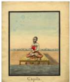

> **Deskripsi Visual:** Gambar ini adalah ilustrasi yang menampilkan seorang pria berdiri di atas sebuah bangku di tepi sungai. Pria tersebut sedang memegang sebuah pohon besar dengan tangan kanannya. Ilustrasi ini tampaknya berasal dari buku pelajaran, karena desainnya yang formal dan detail.

1. **Apa yang ditampilkan secara keseluruhan**: Gambar ini menunjukkan seorang pria yang sedang berdiri di tepi sungai, memegang pohon besar dengan tangan kanannya. Latar belakangnya tampak seperti pantai atau tepi sungai dengan air yang tenang dan hamparan pasir.

2. **Elemen-elemen utama dan relasinya**: Pria yang menjadi subjek utama dalam gambar ini. Ia berdiri di atas bangku, memegang pohon besar dengan tangan kanannya. Pohon tersebut tampak besar dan berwarna hijau, menunjukkan bahwa ia masih hidup. Latar belakangnya adalah pantai atau tepi sungai dengan air yang tenang dan hamparan pasir.

3. **Teks, angka, atau label penting yang terlihat**: Dalam gambar ini, tidak ada teks, angka, atau label yang jelas. Namun, jika ada, mungkin akan ada penjelasan tentang pohon atau situasi di mana gambar ini dilihat.

4. **Informasi kunci yang dapat diambil pembaca**: Gambar ini menunjukkan hubungan antara manusia dan alam, dengan pria yang memegang pohon besar menunjukkan peran manusia dalam menjaga dan memelihara lingkungan. Ini juga bisa menunjukkan konsep kehidupan yang seimbang dan harmonis antara manusia dan alam.

Dengan demikian, gambar ini menggambarkan hubungan antara manusia dan alam, serta peran penting manusia dalam menjaga dan memelihara lingkungan.

(Kesaksian Verbal) adalah tiga pramānā yang diterima (sumber pengetahuan yang sah atau metode mengetahui benar). Misalnya, Nyāyikās (Pengikut Filsafat Nyāya) telah menerima empat Pramānā, para Mimāsakās (Pengikut Filsafats Mimāsa) telah menerima enam pramānā.

Demikian  pula,  diilsafat  Sāṁkhya,  tiga  Pramānā  telah  diterimanya. Pendiri  dari  sistem  ilsafat  ini  adalah  Śrī  Kapila  Muni,  yang  dikatakan sebagai putra Brahma dan Avatāra dari Viṣṇu. Pada sistem Sāṁkhya tak ada penyelidikan secara analitik ke dalam alam semesta, seperti keberadaan yang  sesungguhnya  yang  merupakan  susunan  menurut  topik-topik  dan kategori-kategori,  namun  terdapat  suatu  sistem  tiruan  yang  diawali  dari satu  Tattva  atau  prinsip  mula-mula  atau  Prakṛti,  yang  berkembang  atau yang menghasilkan (Prakaroti) sesuatu yang lain.

Didirikan  oleh  Mahaṛṣi  Kapila  Muni,  ini  adalah  Filsafat  yang  paling kuno. Filsafat ini di bangun oleh ṛṣi Kapila. Sebuah teks yang ditulis oleh Ishwar Krishna disebut 'Sānkhyakārika' adalah sumber terpercaya prinsip pengetahuan dalam Filsafat ini. Hal ini ditulis dalam Aryan Chand (sejenis puisi Sanskṛta kuno) dan berisi 72 Karikas (koleksi memorial ayat tentang topik ilosois) yang menerjemahkan Sāṁkhya Siddhant (Doktrin Sāṁkhya) yang  jelas dan eksplisit.

 

---
## 📄 Halaman 108

Para ahli merasa bahwa beberapa orang mungkin telah belajar menulis Sāṁkhya Sūtra dan Sūtra Sānkhyasamās dalam nama ṛṣi Kapila. Hal ini karena tidak ada menyebutkan bahwa dua teks tersebut ditulis 1500 SM. Oleh karena itu, apa pun pengetahuan yang kita dapat dari Ajaran Sāṁkhya sekarang didasarkan pada Sāṁkhya Karikas. Ajaran Sāṁkhya merupakan ilsafat  yang  menerima  24  Kebenaran  dari  Prakṛti  (Alam  benda)  dan  25 kebenaran Puruṣa (Jiwa).

### b.  Konsep Puruṣa  dan  Prakṛti

Seperti yang telah disinggung di atas,  Sāṁkhya  mempergunakan  3 sistem atau cara mencari pengetahuan dan kebenaran, yaitu: Pratyakṣa (pengamatan langsung), Anumāṇa (penyimpulan), dan Apta Vākya (penegasan yang benar). Kata  Apta artinya 'pantas' atau 'benar' yang ditunjukkan  kepada  wahyu-wahyu  Veda  atau  guru-guru  yang  mendapatkan wahyu.  Sistem  Sāṁkhya  umumnya  dipelajari  setelah  sistem  Nyāya,  karena ia  merupakan  sistem  ilsafat  yang  hebat,  di  mana  para  ilsuf  barat  juga sangat  mengaguminya,  karena  secara  pasti  ia  menekankan  pluralitas  dan dualitas, karena mengajarkan  bahwa  ada  Puruṣa  atau roh  yang  banyak sekali.  Sāṁkhya  menyangkal  bahwa  suatu  benda  dapat  dihasilkan  melalui ketiadaan.

Prakṛti  dan  Puruṣa  adalah  Anādi  (tanpa  awal)  dan  Ananta  (tanpa  akhir; tak  terbatas).  Ketidak  berbedaan  (Aviveka)  antara  keduanya  merupakan penyebab  adanya  kelahiran  dan  kematian.  Perbedaan  antara  Prakṛti  dan Puruṣa memberikan  Mukti  (pembebasan). Baik Prakṛti  maupun  Puruṣa adalah Sat (nyata). Puruṣa  bersifat  Asaṅga (tak terikat)  dan  merupakan kesaḍaran  yang  meresapi  segalanya  dan  abadi.  Prakṛti  merupakan  si  pelaku dan  si  penikmat,  yang  tersusun  dari  asas  materi  dan  rohani  yang  memiliki atau  terpengaruh  oleh  3  Guṇa  atau  sifat,  yaitu  Sattvam,  Rājas  dan  Tamas. Prakṛti  artinya  'yang  mula-mula',  yang  mendahului  dari  apa  yang  dibuat  dan berasal  dari  kata'Pra'(sebelum),  dan  'Kri'  (membuat  yang  mirip  dengan Māyā  dan  Vedānta.  Prakṛti  merupakan  sumber  dari  alam  semesta  dan  ia juga  disebut  Pradhāna  (pokok),  karena  semua  akibat  ditemukan  padanya dan  juga  merupakan  sumber  dari  segala  benda.

Pradhāna dan Prakṛti adalah kekal, meresapi segalanya, tak dapat digerakkan  dan  cuma  satu  adanya.  Ia  tak  memiliki  sebab  tapi  merupakan sebab dari suatu akibat. Prakṛti hanya bergantung dari pada aktivitas dari unsure pokok guṇa-nya sendiri. Ketiga guṇa tersebut tak pernah dan saling menunjang satu sama lainnya, serta saling bercampur. Ia membentuk  substansi  Prakṛti.  Akibat  dari  pertemuan  antara  Puruṣa  dan Prakṛti  timbullah  ketidak  seimbangan  tri  guṇa  tersebut  yang  menimbulkan evolusi  atau  perwujudan.  Prakṛti  berkembang  dibawah  pengaruh  Puruṣa. produk  awal  dari  evolusi  Prakṛti  adalah  Mahat  atau  Kecerdasan  Utama,

 

---
## 📄 Halaman 109

yang merupakan penyebab alam semesta dan selanjutnya muncul Buddhi dan  . Dari Ahaṁkāra muncul Manas atau pikiran, yang membawa perintahperintah dari kehendak melalui organ-organ kegiatan (Karma Indriya).

Sattvam  merupakan  keseimbangan,  sehingga  apabila  Sattvam  lebih berpengaruh,  terjadilah  kedamaian  atau  ketenangan.  Rājas  merupakan aktiitas, yang dinyatakan sebagai Rāga-Dveṣa, yaitu suka atau tidak suka, cinta  atau  benci,  menarik  atau  memuakkan. Tamas  merupakan  belenggu dengan  kecenderungan  dengan  kelesuan,  kemalasan,  dan  kegiatan  yang dungu  atau  bodoh,  yang  menyebabkan  khayalan  atau  Aviveka  (tanpa perbedaan). Sāṁkhya menerima teori pengembangan dan penyusutan, di mana sebab dan akibat merupakan keadaan yang belum berkembang dan pengembangan dari suatu substansi yang sama.

Gambaran sentral dari ilsafat Sāṁkhya adalah bahwa akibat benar-benar ada sebelumnya di dalam penyebab, seperti seluruh keberadaan pepohonan yang dalam keadaan terpendam atau tertidur dalam benih (biji), demikian pula seluruh alam raya ini ada dalam keadaan tertidur dalam Prakṛti, yaitu Avyakṛta (tak terbedakan). Untuk mendapatkan gambaran yang lebih jelas tentang proses pengembangan dan penyusutan, Sāṁkhya menguraikannya sebagai  berikut:  dari  pertemuan  antara  Puruṣa  dan  Prakṛti,  timbullah Mahat (yang agung), yang merupakan benih alam semesta, di mana segi psikologinya disebut sebagai Buddhi, yang memiliki sifat-sifat kebajikan, pengetahuan, tidak bernafsu. Perbedaan antara Mahat dan Buddhi adalah, Mahat merupakan asas kosmis sedangkan Buddhi merupakan asas kejiwaan (merupakan unsur kejiwaan tertinggi). Dari Buddhi timbullah Ahaṁkāra yang merupakan asas individuasi atau asas keakuan, yang menyebabkan segala sesuatu memiliki latar belakang sendiri-sendiri.

Perkembangan kejiwaan yang pertama adalah Ahaṁkāra adalah Manas yang merupakan pusat indra yang bekerja sama dengan indra-indra yang lain mengamati kenyataan di luar badan manusia. Tugas Manas adalah untuk menkoordinir  rangsangan-rangsangan  indra,  dan  mengaturnya  sehingga menjadi  petunjuk    dan  meneruskannya  kepada  Ahaṁkāra  dan  Buddhi. Sebaliknya  Manas  juga  bertugas  meneruskan  putusan  kehendak  Buddhi kepada  peralatan  indra  yang  lebih  rendah.  Buddhi, Ahaṁkāra  dan  Manas secara bersama-sama disebut sebagai peralatan bhatin atau Antaḥkaraṇa.

Perkembangan  kejiwaan  yang  kedua  adalah  Pañca  Indra  persepsi (Buddhendriya atau Jñānendriya), yaitu :

- Pengelihatan
- Pendengaran
- Penciuman
- Perabaan, dan
- Perasa

 

---
## 📄 Halaman 110

Perkembangan kejiwaan yang ketiga disebut sebagai Karmendriya atau organ penggerak, yaitu :

- Daya untuk berbicara
- Daya untuk memegang
- Daya untuk berjalan
- Daya untuk membuang kotoran, dan
- Daya untuk mengeluarkan benih
Perkembangan isik menghasilkan asas dunia luar, yang disebut lima unsur dan perkembangan melalui dua tahapan, yaitu :

- Pada tahap pertama, berbentuk unsur halus (Pañca Tanmātra) yaitu: sari suara, sari raba, sari warna, sari rasa dan sari bau.
- Pada  tahapan  kedua  terjadi  kombinasi  dari  unsur-unsur  halus  yang menimbulkan unsur-unsur kasar yang disebut pañca mahābhūta, yaitu :
- Ākāśa (ether, ruang)
- Vāyu (udara)
- Agni atau Tejah (api/panas)
- Āpah (air), dan
- Pṛthivī (tanah).

### c.  Evolusi alam semesta

Prakṛti akan mengembang menjadi alam ini bila berhubungan dengan Puruṣa. Melalui perhubungan ini Prakṛti dipengaruhi oleh Puruṣa seperti halnya anggota badan kita dapat bergerak karena hadirnya pikiran. Evolusi alam semesta tidak mungkin terjadi hanya karena Puruṣa, karena ia bersifat pasif.  Tidak  juga  hal  itu  dapat  terjadi  karena  ia  tanpa  kesaḍaran.  Hanya karena perhubungan Puruṣa dan Prakṛti ini adalah seperti kerja sama orang lumpuh dengan orang buta untuk dapat keluar hutan. Mereka bekarja sama untuk mencapai tujuannya.

Hubungan  antara  Puruṣa dan Prakṛti  menyebabkan  terganggunya keseimbangan  dalam  Tri  Guṇa. Yang  mula-mula  tergantung  ialah  Rājas yang menyebabkan Guṇa yang lain ikut terguncang pula. Masing-masing Guṇa  itu  berusaha  mengatasi  kekuatan  Guṇa  lainnya.  Maka  terjadilah pemisah dan penyatuan Tri Guṇa itu yang menyebabkan munculnya obyek yang kedua ini. Yang pertama terjadi dari Prakṛti ialah Mahat dan Buddhi. Mahat adalah benih besar alam semesta ini sedangkan Buddhi adalah unsur intelek.

Fungsi buddhi ialah untuk memberikan pertimbangan dan memutuskan segala apa yang datang dari alat-alat yang lebih rendah dari padanya. Dalam keadaannya  yang  murni  ia  bersifat  dharma,  jñana,  vāiragya  dan  aiṣarya

 

---
## 📄 Halaman 111

yaitu  kebijakan,  pengetahuan,  tidak  bernafsu  dan  ketuhanan.  Ia  berada amat dekat dengan roh. Ahaṁkāra atau rasa aku adalah hasil Prakṛti yang kedua. Ia langsung timbul dari mahat dan merupakan manifestasi pertama dari mahat. Fungsi Ahaṁkāra ialah merasakan rasa aku. Dengan Ahaṁkāra sang diri merasa dirinya yang bertindak, yang ingin, yang bermilik.

Ada tiga macam Ahaṁkāra sesuai dengan Guṇa mana yang lebih unggul dalam keinginan itu. Ahaṁkāra itu disebut sattvika bila unsur Sattvam yang unggul, Rājasa bila Rājas yang unggul dan Tamasa bila Tamas yang unggul. Dari Sattvika timbullah pañca jñanendriya, pañca karmendriya dan manas. Dari  Tamasa  lahirlah  pañca  tanmātra  sedangkan  Rājasa  memberikan tenaga baik pada Sattvika maupun Tamasa untuk merubah mana berfungsi menuntun alat-alat tubuh untuk mengetahui dan bertindak.

Pañca tanmātra adalah sari-sari benih suara, sentuhan, warna, rasa dan bau.  Semuanya  ini  hanya  diketahui  orang  akibat  yang  ditimbulkannya, sedangkan ia sendiri tidak dapat dikenal karena amat halusnya. Dari semua anasir  kasar  itu  berkembanglah  alam  semesta  ini  dengan  segala  isinya, namun perkembangan ini tidak menimbulkan azas-azas baru lagi seperti perkembangan  Mahat.  Alam  semesta  ini  dengan  segala  isinya,  namun perkembangan Mahat. Alam semesta adalah benda-benda yang dijadikan bukan benda-benda yang menjadikan.

Suatu  azaz  lagi  setelah  terbentuknya  alam  semesta  ini,  belumlah sempurna  sampai  di  situ,  sebab  ia  memerlukan  adanya  dunia  roh  yang menjadi saksi dan yang menikmati isi alam ini. Bila roh nyata ada, maka perlulah  adanya  penyesuaian  moral,  kenikmatan  dan  kesusahan  hidup ini. Evolusi Prakṛti menjadi dunia obyek memungkinkan roh nikmat atau menderita  sesuai  dengan  baik  buruk  perbuatanya.  Namun  tujuan  akhir evolusi Prakṛti ialah kelepasan.

### d.  Ajaran tentang Kelepasan.

Hidup di dunia ini adalah campuran antara senang dan susah. Banyak kesenangan dapat dinikmati, banyak pula kesusahan dan sakit yang diderita orang. Bila orang dapat menghindari diri dari kesusahan dan sakit, maka ia tak dapat menghindari diri dari ketuaan dan kematian. Ada tiga macam sakit dalam hidup ini yaitu Adhyātmika, Adhibāutika, dan Adhidāivika.

- Adhyātmika adalah sakit karena sebab-sebab dari dalam badan sendiri seperti kerja alat-alat tubuh yang tidak normal dan gangguan perasaan.
- Adhibāutika adalah sakit yang disebabkan oleh faktor luar tubuh, seperti terpukul, kena gigitan nyamuk dan sebagainya, dan
- Adhidāivika  adalah  sakit  karena  tenaga  gaib  seperti  setan,  hantu  dan lain-lainnya.

 

---
## 📄 Halaman 112

Tidak ada seorangpun yang ingin menderita sakit, semuanya ingin hidup bahagia lepas dari susah dan sakit. Tetapi kenyataannya tidaklah demikian. Selama orang masih berbadan lemah, selama itu suka dan duka, sakit dan sehat selalu berdampingan. Dengan demikian kita perlu bercita-cita hidup bersenang-senang  selalu,  cukup  hidup  biasa-biasa  saja  dengan  berusaha melepaskan penderitaan atas dasar pikiran sehat.

Dalam ajaran Sāṁkhya kelepasan itu adalah penghentian yang sempurna dari semua penderitaan. Inilah tujuan terakhir dari hidup kita. Kemajuan ilmu  pengetahuan  dan  teknologi  memperingan  hidup  kita,  namun  tidak dapat melepaskan kita dari penderitaan sepenuhnya. Sāṁkhya mengajarkan bahwa cara mencapai kelepasan itu ialah melalui pengetahuan yang benar atas kenyataan dunia ini. Tiadanya pengetahuan itulah yang menyebabkan orang menderita.

### 4.  Yoga Darśana

### a.  Pendiri dan Sumber Ajarannya

Kata  Yoga    berasal  dari  akar  kata yuj yang artinya menghubungkan. Yoga    merupakan  pengendalian aktivitas  pikiran  dan  merupakan penyatuan roh pribadi dengan roh tertinggi. Hiraṇyagarbha  adalah pendiri  dari  sistem  Yoga.  Yoga yang didirikan oleh Mahāṛṣi Patañjali, merupakan cabang atau tambahan dari ilsafat Sāṁkhya. Ia memiliki daya tarik tersendiri  bagi  para  murid  yang memiliki temperamen mistis dan  perenungan.  Ia  menyatakan bersifat  lebih  orthodox  dari  pada ilsafat Sāṁkhya, yang secara langsung mengakui keberadaan dari Makhluk Tertinggi (Ìśvara).

---
**🖼️ Gambar/Diagram**

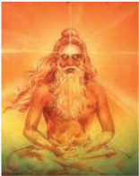

> **Deskripsi Visual:** Gambar ini adalah ilustrasi yang menampilkan seorang guru atau pandit berkepala pendek dengan rambut panjang dan berwarna putih. Guru tersebut sedang bermeditasi dengan posisi jalan kaki yang dikenal sebagai "baddha padmasana", yang merupakan salah satu dari tiga posisi meditasi utama dalam yoga. Mata guru terbuka lebar, menghadap ke arah depan, dan ada sinar matahari yang menyebar dari belakang, menunjukkan bahwa guru tersebut sedang dalam keadaan pencerahan atau kejernihan spiritual. Guru tersebut juga sedang memegang sebuah alat meditasi, mungkin sebuah kalung atau perhiasan, yang menunjukkan bahwa ia adalah seorang yang berpengalaman dalam praktik meditasi.

Elemen-elemen utama dalam gambar ini meliputi:
1. Guru meditasi
2. Posisi meditasi (baddha padmasana)
3. Rambut panjang dan berwarna putih
4. Mata terbuka lebar
5. Sinar matahari dari belakang
6. Alat meditasi (mungkin kalung)

Teks, angka, atau label penting yang terlihat dalam gambar ini tidak ada, karena gambar ini hanya menggambarkan visual tanpa teks atau angka tambahan.

Informasi kunci yang dapat diambil pembaca dari gambar ini adalah bahwa guru tersebut sedang dalam keadaan meditasi yang penuh kejernihan dan pencerahan spiritual, menunjukkan bahwa ia adalah seorang yang berpengalaman dalam praktik meditasi dan yoga.

Tuhan menurut Patañjali merupakan Purūṣa istimewa atau roh khusus yang  tak  terpengaruh  oleh  kemalangan  kerja,  hasil  yang  diperoleh  dan cara perolehannya. Pada-Nya  merupakan  batas tertinggi dari benih kemahatahuan, yang tanpa terkondisikan oleh waktu, merupakan guru bagi para bijak zaman dahulu. Dia bebas selamanya.

Suku  kata  suci  OM  merupakan  simbol  Tuhan.  Pengulangan  suku kata  OM  dan  bermeditasi  pada  OM,  haruslah  dilaksanakan,  yang  akan melepaskan segala halangan dan akan membawa kepencapaian perwujudan

 

---
## 📄 Halaman 113

Tuhan.  Patañjali  mendirikan  sistem  ilsafat  ini  dengan  latar  belakang metaisika Sāṁkhya dan menerima 25 prinsip atau Tattva dari Sāṁkhya, tetapi  menekankan  pada  sisi  praktisnya  guna  realisasi  dari  penyatuan mutlak Puruṣa atau sang Diri.

Roh pribadi dalam system Yoga memiliki kemerdekaan yang lebih besar dan  dapat  mencapai  pembebasan  dengan  bantuan  Tuhan.  System  Yoga menganggap  bahwa  konsentrasi,  meditasi  dan  Samādhi  akan  membawa kepada  Kaivalya  atau  kemerdekaan.  Menurut  Patañjali,  Tuhan  adalah Purūṣa Istimewa atau roh khusus yang tak terpengaruh oleh kemalangan, karma, hasil yang diperoleh dan cara memperolehnya, pada-Nya merupakan batas tertinggi dari Kemahatahuan, yang tak terkondisikan oleh waktu, yang selamanya bebas dan merupakan Guru bagi para bijak jaman dahulu.

'Yoga  Sūtra' dari Patañjali muncul sebagai buku acuan yang tertua dari aliran ilsafat Yoga, yang memiliki empat Bab, yaitu :

- Bab yang pertama yaitu Samādhi Pāda, memuat penjelasan tentang sifat dan tujuan Samādhi.
- Bab kedua yaitu Sādhanā Pāda, menjelaskan tentang cara pencapaian tujuan ini.
- Bab ketiga, yaitu Wibhùti Pāda, memberikan uraian tentang daya-daya supra alami atau Siddhi yang dapat dicapai melalui pelaksanaan Yoga.
- Bab keempat yaitu Kaivalya Pāda, menggambarkan sifat dari pembebasan tersebut.

### b.  Pokok-Pokok Ajarannya

Yoga-nya  Mahāṛṣi  Patañjali  merupakan  Aṣṭāṅga-Yoga    atau  Yoga dengan  delapan  anggota,  yang  mengandung  disiplin  pikiran  dan  tenaga isik.  Haṭha  Yoga  membahas  tentang  cara-cara  mengendalikan  badan dan mengatur pernafasan yang memuncak dari Rāja Yoga. Sādhanā yang progresif  dalam  Haṭha  Yoga  membawa  pada  keterampilan  Haṭha  Yoga. Haṭha Yoga merupakan tangga untuk mendaki menuju tahapan puncak dari Rāja Yoga.  Bila  gerakan  pernafasan  dihentikan  dengan  cara  Kumbhaka, pikiran menjadi tak tertopang.

Pemurnian  badan  dan  pengendalian  pernafasan  merupakan  tujuan langsung dari Haṭha Yoga. Śaṭ Karma atau enam kegiatan pemurnian badan antara lain Dhautī (pembersihan perut), Bastī (bentuk alami pembersihan usus), Netī (pembersihan lubang hidung), Trāṭaka (penatapan tanpa berkedip terhadap  sesuatu  obyek),  Naulī  (pengadukan  isi  perut),  dan  Kapālabhātì (pelepasan lendir melalui semacam Prāṇāyāma tertentu). Badan diberikan kesehatan,  kemudaan,  kekuatan  dan  kemantapan  dengan  melaksanakan Āsana, bandha dan mudrā.

 

---
## 📄 Halaman 114

Yoga  merupakan  satu  cara  disiplin  yang  ketat,  yang  memberlakukan pengetatan pada diet, tidur, pergaulan, kebiasaan, berkata dan berpikir. Hal ini harus dilakukan di bawah pengawasan yang cermat dari seorang Yogīn yang ahli dan memancarkan sinar kepada Jīva. Yoga merupakan satu usaha sistematis untuk mengendalikan pikiran dan mencapai kesempurnaan. Yoga meningkatkan daya konsentrasi, menahan tingkah laku dan pengembaraan pikiran, dan membantu untuk mencapai keadaan supra Ṣaḍar atau nirvikalpa samādhi.

Pelaksanaan  Yoga melepaskan keletihan badan dan pikiran dan melepaskan ketidakmurnian pikiran serta memantapkannya. Tujuan yoga adalah  untuk  mengajarkan  cara  ātma  pribadi  dapat  mencapai  penyatuan yang sempurna dengan Roh Tertinggi. Penyatuan atau perpaduan dari ātma pribadi  dengan  Puruṣa  Tertinggi  dipengaruhi  oleh  Vṛtti  atau  pemikiranpemikiran dari pikiran. Ini merupakan suatu keadaan yang jernihnya seperti kristal, karena pikiran tak terwarnai oleh hubungan dengan obyek-obyek duniawi. Rāja Yoga dikenal dengan nama Aṣṭāṅga-Yoga atau Yoga  dengan delapan anggota, yaitu :

- Yama, (larangan)
- Niyama (ketaatan),
- Āsana (sikap badan)
- Prāṇāyāma (pengendalian nafas),
- Pratyāhāra (penarikan indriya),
- Dhāraṇa (konsentrasi),
- Dhyāna (meditasi), dan
- Samādhi (keadaan supra Ṣaḍar).
Kelima yang pertama membentuk anggota luar (Bahir-aṅga) dari Yoga, sedangkan ketiga yang terakhir membentuk anggota dalam (Antar-aṅga) dari Yoga.

### c.  Lima Tingkatan Mental Menurut Aliran Filsafat Patañjali

Kṣipta,  Muḍha,  Vikṣipta,  Ekagra  dan  Niruddha,  merupakan  lima tingkatan mental, menurut aliran Rāja Yoga dari Patañjali. Tingkatan Kṣipta adalah  pada  saat  pikiran  mengembara  diantara  berbagai  obyek  duniawi dan pikiran dipenuhi dengan sifat Rājas. Tingkatan Muḍha, pikiran berada dalam keadaan tertidur dan tak berdaya disebabkan sifat Tamas. Tingkatan Vikṣipta  adalah  keadaan  pada  saat  sifat  Sattva  melampaui,  dan  pikiran goyang  antara  meditasi  dan  obyektivitas.  Sinar  pikiran  secara  perlahan berkumpul  dan  bergabung.  Bila  sifat  Sattva  meningkat,  akan  memiliki kegembiraan pikiran, pemusatan pikiran, penaklukan indriya-indriya dan kelayakan  untuk  perwujudan  ātman.  Tingkatan  ekagra  adalah  pada  saat pikiran terpusatkan dan terjadi meditasi yang mendalam sifat Sattva terbebas

 

---
## 📄 Halaman 115

dari sifat Rājas dan Tamas. Tingkatan niruddha adalah pada saat pikiran di bawah pengendalian yang sempurna. Semua Vṛtti pikiran dilenyapkan.

Vṛtti  merupakan  kegoncangan  atau  gejolak  pikiran  dalam  danaunya pikiran.    Setiap  Vṛtti  atau  perubahan  mental  meninggalkan  sesuatu saṁskāra  atau kesan-kesan atau kecenderungan yang terpendam. Saṁskāra ini dapat mewujudkan dirinya sebagai keadaan Ṣaḍar bila ada kesempatan. Vṛtti yang sama memperkuat kecenderungan yang sama. Bila semua Vṛtti dihentikan, pikiran berada dalam keadaan setimbang (Samāpatti). Penyakit, kelesuan,  keragu-raguan,  keletihan,  kemalasan,  keduniawian,  kesalahan pengamatan, kegagalan mencapai konsentrasi dan ketidakmampuan ketika hal itu dicapai, merupakan halangan pokok untuk konsentrasi.

### d.  Lima Kleśa dan Pelepasannya

Menurut Patañjali, avidyā (kebodohan), asmitā (keakuan), rāgadveṣa (keinginan dan anti pati, atau suka dan tidak suka) dan abhiniweśa (ketergantungan  pada  kehidupan  duniawi)  merupakan  lima  kleśa  besar atau  mala  petaka  yang  menyerang  pikiran. Ada  keringanan  dengan  cara melaksanakan  Yoga  terus  menerus,  tetapi  tidak  menghilangkan  secara total.  Mereka  akan  muncul  lagi  pada  saat  mereka  menemukan  situasi yang  menyenangkan dan menguntungkan. Tetapi Asaṁprajñata samādhi (pengalaman mutlak) menghancurkan sekaligus benih-benih dari kejahatan ini.  Avidyā  merupakan  penyebab  utama  dari  segala  kesulitan.  Keakuan merupakan hasil langsung dari avidyā, yang memberi kita keinginan dan kebencian,  serta  menyelubungi  pandangan  spiritual.  Pelaksanaan  yoga samādhi melenyapkan avidyā.

Kriyā Yoga memurnikan pikiran, melunakkan lima kleśa dan membawa pada  keadaan  samādhi. Tapas  (kesederhanaan),  svadhyāya  (mempelajari dan memahami kitab suci) dan Ìśvara-praṁidhāna (pemujaan Tuhan dan penyerahan hasilnya pada Tuhan) membentuk Kriyā Yoga. Pengusahaan persahabatan  (Maitrī)  terhadap  sesama,  kasih  sayang  (karuṇa)  terhadap yang  lebih  rendah,  kebahagiaan  (mudita)  terhadap  yang  lebih  tinggi, dan  ketidakacuhan  (upekṣā)  terhadap  orang-orang  kejam  (atau  dengan memandang  sesuatu  menyenangkan  dan  menyakitkan,  baik  dan  buruk) menghasilkan ketenangan pikiran (citta prasāda). Seseorang dapat mencapai samādhi  melalui  kepatuhan  pada  Tuhan  yang  memberikan  kebebasan. Dengan Ìśvara-praṁidhāna, siswa yoga memperoleh karunia Tuhan.

Abhyāsa  (pelaksanaan)  dan  Vairāgya  (kesabaran,  tanpa  keterikatan membantu dalam pemantapan dan pengendalian pikiran. Pikiran hendaknya ditarik  berkali-kali  dan  dibawa  kepusat  meditasi,  apabila  ia  mengarah keluar menuju obyek duniawi. Ini merupakan abhyāsa yoga. Pelaksanaan menjadi  mantap  dan  terpusatkan,  apabila  secara  terus  menerus  selama beberapa waktu tanpa selang waktu dan dengan penuh ketaatan. Pikiran

 

---
## 📄 Halaman 116

merupakan sebuah berkas Tṛṣṇa (kerinduan). Pelaksanaan Vairāgya akan menghancurkan segala Tṛṣṇa. Vairāgya  memutar pikiran menjauhi obyekobyek.  Ia  tidak  mengijinkan  pikiran  untuk  mengarah  keluar  (kegiatan Bahirmukha dari pikiran), tetapi mengarahkannya ke kegiatan antar-mukha (mengarah ke dalam).

Tujuan  kehidupan  adalah  keterpisahan  mutlak  antara  Puruṣa  dengan Prakṛti.  Kebebasan dalam Yoga  merupakan Kaivalya atau kemerdekaan mutlak. Roh terbebas dari belenggu Prakṛti. Puruṣa berada dalam wujud yang sebenarnya atau svarūpa. Bila roh mewujudkan bahwa hal itu adalah kemerdekaan secara mutlak dan bahwa ia tak tergantung pada sesuatu apa pun di dunia ini, Kaivalya atau Pemisahan tercapai. Roh telah melepaskan avidyā melalui pengetahuan pembedaan (vivekakhyāti). Lima kleśa atau mala  petaka  terbakar  oleh  apinya  pengetahuan.  Sang  Diri  tak  terjamah oleh  kondisi  dari  citta.  Guṇa  seluruhnya  terhenti  dan  sang  Diri  berdiam pada intisari Tuhan sendiri. Walaupun seorang menjadi seorang mukta (roh bebas),  Prakṛti  dan  perubah-perubahannya  tetap  ada  bagi  orang  lainnya. Dalam perjanjian  dengan  sistem  ilsafat  Sāṁkhya,  dipegang  oleh  sistem Yoga  ini.

### 5.  Mīmāmsā Darśana

### a.  Pendiri dan Sumber Ajarannya

Pūrva Mīmāmsā atau Karma Mīmāmsā atau yang lebih dikenal dengan Mīmāmsā, adalah penyelidikian ke dalam bagian yang lebih awal dari kitab suci  Veda;  suatu  pencarian  kedalam  ritual-ritual  Veda  atau  bagian  Veda yang berurusan dengan masalah Mantra dan Brāhmana saja disebut Pūrva Mīmāmsā karena ia lebih awal dari pada Uttara Mīmāmsā (Vedānta), dalam pengertian logika, dan tidak demikian banyak dalam pengertian kronologis.

Mīmāmsā sebenarnya bukanlah cabang dari suatu sistem ilsafat, tetapi lebih tepat kalau disebutkan sebagai suatu sistem penafsiran Veda dimana diskusi  ilosoisnya  sama  dengan  semacam  ulasan  kritis  pada  Brāhmana atau bagian ritual dari Veda, yang menafsirkan kitab Veda dalam pengertian berdasarkan  arti  yang  sebenarnya.  Sebagai  ilsafat  Mīmāmsā  mencoba menegakkan  keyakinan  keagamaan  Veda.  Kesetiaan  atau  kejujuran  yang mendasari keyakinan keagamaan Veda terdiri dari bermacam-macam unsur, yaitu :

- Percaya  dengan  adanya  roh  yang  menyelamatkan  dari  kematian  dan mengamati hasil dari ritual di sorga.
- Percaya tentang adanya kekuatan atau potensi yang melestarikan dampak dari ritual yang dilaksanakan.
- Percaya bahwa dunia adalah suatu kenyataan dan semua tindakan yang kita lakukan dalam hidup ini bukanlah suatu bentuk illusi.

 

---
## 📄 Halaman 117

---
**🖼️ Gambar/Diagram**

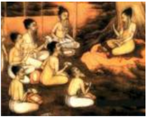

> **Deskripsi Visual:** Gambar ini adalah ilustrasi yang menunjukkan sebuah pertemuan antara beberapa orang tua dan anak-anak di sebuah ruangan. Ruangan tersebut tampak sederhana dengan meja dan kursi, serta beberapa peralatan seperti papan tulis dan papan cat. Orang tua dan anak-anak tampak sedang berbicara dan berinteraksi satu sama lain. Ilustrasi ini mungkin digunakan untuk menggambarkan situasi sosial atau pendidikan di sekolah.

Elemen-elemen utama dalam gambar ini meliputi:
1. Orang tua dan anak-anak yang sedang berbicara.
2. Meja dan kursi yang ada di ruangan.
3. Papan tulis dan papan cat yang digunakan untuk aktivitas belajar.
4. Lingkungan sekolah atau tempat belajar.

Teks, angka, atau label penting yang terlihat dalam gambar ini tidak ada, karena gambar ini hanya menggambarkan situasi tanpa teks atau angka yang spesifik.

Informasi kunci yang dapat diambil pembaca dari gambar ini adalah tentang hubungan antara orang tua dan anak-anak dalam lingkungan sekolah atau tempat belajar, serta bagaimana mereka berinteraksi dan berkomunikasi satu sama lain. Gambar ini juga menunjukkan bahwa aktivitas belajar dan interaksi sosial merupakan bagian penting dari proses belajar di sekolah.

Tokoh  pendiri  dari  sistem  ilsafat  Mīmāmsā  adalah  Mahāṛṣi  Jaimini yang  merupakan  murid  dari  Mahāṛṣi  Vyāsa  telah  mensistematir  aturanaturan dari Mīmāmsā dan menetapkan keabsahannya dalam karyanya itu dan  aturan-aturannya  sangat  penting  guna  menafsirkan  hukum-hukum Hindu. Beliau menulis kitab Mīmāmsā Sūtra yang menjadi sumber ajaran pokok  Mīmāmsā.  Sūtra  pertama  dari  Mīmāmsā  Sūtra  berbunyi:  Athato Dharmajijñasa, yang menyatakan keseluruhan dari sistemnya yaitu, suatu keinginan  utnuk  mengetahui  Dharma  atau  kewajiban,  yang  tekandung dalam  pelaksanaan  upacara-upacara  dan  kurban-kurban  yang  diuraikan oleh kitab Veda.

Dharma  yang  diperintahkan  Kitab  Veda,  dikenal  dengan  Śruti  yang pelaksanaannya memberi kebahagiaan. Seorang Hindu harus melaksanakan nitya  karma seperti  saṅdhyā-vandana. Serta naimitika karma selama ada kesempatan,  untuk  mendapatkan  pembebasan,  yang  dapat  dikatakan sebagai kewajiban tanpa syarat.

### b.  Sifat Ajarannya

Ajaran Mīmāmsā bersifat pluralistis dan realistis yang mengakui jiwa yang  jamak  dan  alam  semesta  yang  nyata  serta  berbeda  dengan  jiwa. Karena  sangat  mengagungkan Veda,  maka  Mīmāmsā  menganggap Veda itu  bersifat  kekal  dan  tanpa  penyusun,  baik  oleh  manusia  maupun  oleh Tuhan. Apa yang diajarkan oleh Veda dipandang sebagai suatu kebenaran yang mutlak. Menurut ilsafat Mīmāmsā, pelaksanaan upacara keagamaan adalah  semata-mata  perintah  dari  Veda  dan  merupakan  suatu  kewajiban yang mendatangkan pahala.

Kekuatan  yang  mengatur  antara  pelaksanaan  upacara  tersebut  dengan pahalanya disebut apūrva. Pelaksanaan apūrva memberikan ganjaran kepada si  pelaksana kurban, karena apūrva merupakan mata rantai atau hubungan yang diperlukan antara kerja dengan hasilnya. Apūrva adalah Adṛṣṭa, yang merupakan kekuatan-kekuatan yang tak terlihat yang sifatnya positif.

 

---
## 📄 Halaman 118

### c.  Pokok-pokok ajarannya

Mengenai Jīva, Mīmāmsā menyatakan bahwa jiwa itu banyak dan tak terhingga,  bersifat  kekal,  ada  dimana-mana  dan  meliputi  segala  sesuatu. Karena adanya hubungan antara jiwa dengan benda, maka jiwa mengalami avidyā dan kena Karmavesana. Jaimini tidak mempercayai adanya Mokṣa dan  hanya  mempercayai  keberadaan  Svarga  (surga),  yang  dapat  dicapai melalui karma atau kurban.

Para penulis yang belakangan hadir seperti Prabhakāra dan Kumārila, tak  dapat  menyangkal  tentang  masalah  pembebasan  akhir,  karena  ia menarik  perhatian  para  pemikir  ilsafat  lainnya.  Prabhakāra  menyatakan bahwa penghentian mutlak dari badan yang disebabkan hilangnya Dharma dan  A-Dharma  secara  total,  yang  kerjanya  disebabkan  oleh  kelahiran kembali,  merupakan  kelepasan  atau  pembebasan  mutlak,  karena  hanya dengan Karma saja tak akan dapat mencapai pembebasan akhir. Pandangan Kumārila  mendekati  pandangan  dari Advaita  Vedānta  yang  menetapkan bahwa Veda disusun oleh Tuhan dan merupakan Brahman dalam wujud suara.  Mokṣa  adalah  keadaan  yang  positif  baginya,  yang  merupakan realisasi dari Ātman.

Menurut Jaimini,  pelaksanaan  kegiatan  yang  dilarang  oleh  kitab  suci Veda  merupakan  sādhanā  atau  cara  pencapaian  surga.  Karma  Kāṇḍa merupakan pokok dari Veda  yang penyebab belenggu adalah pelaksanaan dari  kegiatan  yang  dilarang  (nisiddha  karma).  Sang  Diri  adalah  jaḍa cetana, gabungan dari kecerdasan tanpa perasaan. Jadi secara singkat dapat dikatakan bahwa isi pokok ajaran Jaimini adalah 'Laksanakanlah upacara kurban dan nikmati hasilnya di Surga'.

Dalam  sistem  Mīmāmsā  mengenal  dua  jenis  pengetahuan  yaitu,  immediate dan mediate. Immediate adalah pengetahuan yang terjadi secara tiba-tiba, langsung dan tak terpisahkan. Sedangkan mediate ialah pengetahuan yang diperoleh melalui perantara. Obyek dari pengetahuan immediate haruslah sesuatu yang ada atau zaat. Pengetahuan yang datangnya tiba-tiba dan tidak dapat ditentukan terlebih dahulu disebut nirvikalpa pratyakṣa atau alocānajñana.  Dari  pengetahuan  immediate  obyeknya  dapat  dilihat  tetapi  tidak dapat dimengerti. Obyek dari pengetahuan mediate juga sesuatu yang ada dan  dapat  diinterprestasikan  dengan  baik  berdasarkan  pengetahuan  yang dimiliki. Dalam pengetahuan mediate obyeknya dapat dimengerti dengan benar, pengetahuan semacam ini dinamakan savikalpa Pratyakṣa.

Mīmāmsā Sūtra, yang terdiri  dari  12  buku  atau  bab  Mahāṛṣi  Jaimini merupakan  dasar  ilsafat  Mīmāmsā,  sedangkan  ulasan-ulasan  lain  selain Prabhakāra  dan  Kumārila,  juga  dari  penulis  lain  seperti  dari  Bhavanātha Miśra, Śabarasvāmīn, Nilakaṇṭha, Raghavānanda dan lain-lainnya.

 

---
## 📄 Halaman 119

Prabhakāra menyatkan bahwa sumber pengetahuan kebenaran (pramāṇa) menurut Mīmāmsā adalah sebagai berikut:

- Pratyakṣa
: pengamatan langsung

- Anumāna
: dengan penyimpilan

- Upamāṇa
: mengadakan perbandingan

- Śabda
: kesaksian kitab suci atau orang bijak

- Arthāpatti
: penyimpulan dari keadaan dan oleh Kumārila ditambahkan dengan

- An-upalabdhi  : pengamatan ketidak adaan.
Enam cara pengamatan di atas hampir sama dengan cara pengamatan dari Nyāya, hanya pada pengamatan upamāṇa ada sedikit tambahan, di mana perbandingan yang dipergunakan tidak sepenuhnya sama dengan contoh yang  telah  diketahui.  Pengamatan Arthāpatti  adalah  pengamatan  dengan penyimpulan dari keadaan. Pengamatan An-upalabdhi, yaitu pengamatan ketidakadaannya  obyek,  jadi  suatu  cara  pembuktian  bahwa  obyek  yang dimaksudkan itu benar-benar tidak ada.

### 6.  Vedānta Darśana

### a.  Pendiri dan Sumber Ajarannya

Filsafat  ini  sangatlah  kuno  yang berasal dari kumpulan literatur bangsa Arya yang dikenal dengan nama Veda.  Vedānta  ini  merupakan  bunga diantara semua spekulasi, pengalaman dan analisa yang terbentuk dalam demikian banyak literatur yang dikumpulkan dan dipilih selama berabad-abad. Filsafat Vedānta ini memiliki  kekhususan.  Yang  pertama, ia sama sekali impersonal, ia bukan dari seseorang atau nabi.

Istilah  Vedānta  berasal  dari  kata Veda-anta, artinya bagian terakhir dari  Veda  atau  inti  sari  atau  akhir dari  Veda,  yaitu  ajaran-ajaran  yang terkandung  dalam  Kitab  Upaniṣad.

Kitab    Upaniṣad  juga  disebut  dengan  Vedānta,  karena  kitab-kitab  ini merupakan Yñana Kāṇda yang mewujudkan bagian akhir dari Veda setelah Mantra, Brāhmaṇa dan Āraṇyaka yang bersifat mengumpulkan. Ada tiga faktor yang menyebabkan  Upaniṣad disebut dengan Vedānta yaitu:

 

---
## 📄 Halaman 120

- Upaniṣad adalah hasil karya terakhir dari jaman Veda.
- Pada jaman Veda program pelajaran yang disampaikan oleh para Resi kepada sisyanya, Upaniṣad juga merupakan pelajaran yang terakhir. Para Brāhmacari pada mulanya diberikan pelajaran shamhita yakni koleksi syair-syair  dari  zaman  Veda.  Kemudian  dilanjutkan  dengan  pelajaran Brāhmaṇa yakni tata cara untuk melaksanakan upacara keagamaan, dan terakhir barulah sampai pada ilsafat dari Upaniṣad.
- Upaniṣad  adalah  merupakan  kumpulan  syair-syair  yang  terakhir  dari pada zaman Veda.
Jadi  pengertian  Vedānta  erat  sekali  hubungannya  dengan    Upaniṣad hanya  saja kitab-kitab    Upaniṣad  tidak  memuat  uraian-uraian  yang sistimatis.  Usaha  pertama  untuk  menyusun  ajaran    Upaniṣad  secara sistimatis diusahakan oleh Śṛi VyāṢaḍeva, kira-kira 400 SM. Hasil karyanya disebut  dengan  Vedānta-Sūtra  atau  Brahma-  Sūtra  yang  menjelaskan ajaran-ajaran Brahman. Brahma-Sūtra juga dikenal dengan Śarīraka Sūtra, karena ia mengandung pengejawantahan dari Nirguṇa Brahman Tertinggi dan  juga  merupakan  salah  satu  dari  tiga  buah  buku  yang  berwewenang tentang Hinduisme, yaitu Prasthāna Traya, sedang dua buku lainnya adalah Upaniṣad  dan  Bhagavad  Gītā.  Śṛi  Vyāsa  telah  mensistematisir  prinsipprinsip  dari  Vedānta  dan  menghilangkan  kontradiksi-kontradiksi  yang nyata dalam ajaran-ajaran tersebut.

### b.  Sifat Ajarannya

Sistem ilsafat Vedānta juga disebut Uttara Mīmāmsā kata'Vedānta ' berarti'akhir dari Veda. Sumber ajarannya adalah kitab  Upaniṣad. Oleh karena kitab Vedānta bersumber pada kitab-kitab  Upaniṣad, Brahma Sūtra dan Bhagavad Gītā, maka sifat ajarannya adalah absolutisme dan teisme. Absolutisme maksudnya adalah aliran yang meyakini bahwa Tuhan yang Maha Esa  adalah mutlak dan tidak berpribadi (impersonal God),sedangkan teisme  mengajarkan  Truhan  yang  berpribadi  (personal  God).  UttaraMīmāmsā atau ilsafat Vedānta dari Bādarāyaṇa atau Vyāsa ditempatkan sebagai  terakhir  dari  enam  ilsafat  orthodox,  tetapi  sesungguhnya  ia menempati urutan pertama dalam kepustakaan Hindu.

### c.  Pokok- Pokok Ajaran Vedānta

Vedānta  mengajarkan  bahwa  nirvāna  dapat  dicapai  dalam  kehidupan sekarang ini, tak perlu menunggu setelah mati untuk mencapainya. Nirvāna adalah keṢaḍaran terhadap diri sejati. Dan  sekali mengetahui hal itu, walau sekejap, maka seseorang tak akan pernah lagi dapat di perdaya oleh  kabut individualitas.  Terdapat  dua  tahap  pembedaan  dalam  kehidupan,  yaitu: yang  pertama,  bahwa  orang  yang  mengetahui  diri  sejatinya  tak  akan  di pengaruhi oleh hal apa pun. Yang kedua bahwa hanya dia sendirilah yang dapat melakukan kebaikan pada dunia.

 

---
## 📄 Halaman 121

Seperti  yang  telah  disebutkan  tadi  bahwa  ilsafat  Vedānta  bersumber dari    Upaniṣad.  Brahma  Sūtra  atau  Vedānta    Sūtra  dan  Bhagavad  Gītā. Brahma  Sūtra  mengandung  556  buah  Sūtra,  yang  dikelompokkan  atas empat  bab,  yaitu  Samanvaya,  Avirodha,  Sādhāna  dan  Phala.  Pada  bab pertama, pernyataan tentang sifat Brahman dan hubungannya dengan alam semesta serta roh pribadi. Pada bab II, teori-teori Sāṁkya, Yoga, Vaiśeṣika dan  sebagainya  yang  merupakan  saingannya  dikritik,  dan  jawaban  yang sesuai diberikan terhadap lontaran pandangan ini. Pada bab III, dibicarakan tentang pencapaian Brahmavidyā. Pada bab IV, terdapat uraian tentang buah (hasil)  dari pencapaian Brahmavidyā dan juga uraian tentang bagaimana roh  pribadi  mencapai  Brahman  melalui  Devayana.  Setiap  bab  memiliki empat bagian (Pāda). Sūtra- sūtra pada masing-masing bagian membentuk Adikaraṇa  atau  topik-topik  pembicaraan.  Lima  Sūtra  pertama  sangat penting untuk diketahui karena berisi intisari ajaran Brahma Sūtra, yaitu :

- Sūtra pertama  berbunyi  :  Athāto Brahmajijñāsā  oleh  karena  itu, penyelidikan  ke  dalam  Brahman.  Aphorisma  pertama  menyatakan obyek dari keseluruhan system dalam satu kata, yaitu :  Brahma-jijñāsā yaitu keinginan untuk mengetahui Brahman.
- Sūtra kedua adalah : Janmādyasya yataḥ - Brahman adalah KeṢaḍaran Tertinggi, yang merupakan asal mula, penghidup serta leburnya alam semesta ini.
- Sūtra ketiga : Sāstra Yonitvāt - Kitab Suci itu sajalah yang merupakan cara untuk mencari pengetahuan yang benar.
- Sūtra  keempat : Tat Tu Samvayāt - Brahman itu diketahui hanya dari kitab suci dan tidak secara bebas ditetapkan dengan cara lainnya, karena Ia merupakan sumber utama dari segala naskah Vedānta.
- Sūtra kelima: Īkṣater Nā Aśabdam - Disebabkan 'berikir', Prakṛti atau Pradhāna bukan didasarkan pada kitab suci.
Sūtra terakhir dari bab IV adalah Anāvṛṭṭiḥ Śabdāt Anāvṛṭṭiḥ Śabdāt Tak ada kembali bagi roh bebas, disebabkan kitab suci menyatakan tentang akibat itu. Masing-masing buku tersebut memberikan ulasan isi ilsafat itu berbeda-beda. Hal ini disebabkan oleh sudut pandangannya yang berbeda. Walaupun  obyeknya  sama,  tentu  hasilnya  akan  berbeda.  Sama  halnya dengan orang buta yang merabah gajah dari sudut yangg berbeda, tentu hasilnya akan berbeda pula.

Demikian  pula  halnya  dengan  ilsafat    tentang  dunia  ini,  ada  yang memberikan ulasan bahwa dunia ini maya (bayangan saja), dilain pihak menyebutkan  dunia  ini  betul-betul  ada,  bukan  palsu  sebab  diciptakan oleh Tuhan dari diri-Nya sendiri. Karena perbedaan pendapat ini dengan sendirinya menimbulkan suatu teka-teki, apakah dunia ini benar-benar ada ataukah dunia ini betul-betul maya.

 

---
## 📄 Halaman 122

Hal  ini  menyebabkan  timbulnya  penafsiran  yangg  bermacam-macam pula.  Akibat  dari  penapsiran  tersebut  menghasilkan  aliran-aliran  ilsafat Vedānta.  Sūtra-sūtra  atau  Aphorisma  dari  Vyāsa  merupakan  dasar  dari ilsafat Vedānta dan telah dijelaskan oleh berbagai pengulas yang berbedabeda sehingga dari ulasan-ulasan itu muncul beberapa aliran ilsafat, yaitu :

- Kevala Advaita dari Śrī Ṣaṇkarācārya
- Viśiṣṭādvaita dari Śrī Rāmānujācārya
- Dvaita dari  Śrī Madhvācārya
- Bhedābedhā dari Śrī Caitanya
- Śuddha Advaita dari Śrī Vallabhācarya, dan
- Siddhānta dari Śrī Meykāṇdar.

### Uji  Kompetensi

- Mengapa aliran ilsafat Carvaka dikatakan bersifat matrealistis? Jelaskan!
------------------------------------------------------------------------------------------------

------------------------------------------------------------------------------------------------

-----------------------------------------------------------------------------------------------

-----------------------------------------------------------------------------------------------

-----------------------------------------------------------------------------------------------

-----------------------------------------------------------------------------------------------

- Enam sistem ilsafat Hindu dikenal dengan Ṣaḍ Darśana, sebutkan dan jelaskanlah
-----------------------------------------------------------------------------------------------

-----------------------------------------------------------------------------------------------

------------------------------------------------------------------------------------------------

-----------------------------------------------------------------------------------------------

-----------------------------------------------------------------------------------------------

-----------------------------------------------------------------------------------------------

- Siapa pendiri ilsafat Nyāyā dan apa yang menjadi sumber dalam ajaran!
------------------------------------------------------------------------------------------------

------------------------------------------------------------------------------------------------

-------------------------------------------------------------------------------------------------

------------------------------------------------------------------------------------------------

------------------------------------------------------------------------------------------------

------------------------------------------------------------------------------------------------

 

---
## 📄 Halaman 123

- Sebut dan jelaskanlah bagian-bagian dari Catur Pramana!
-------------------------------------------------------------------------------------------------

------------------------------------------------------------------------------------------------

------------------------------------------------------------------------------------------------

------------------------------------------------------------------------------------------------

------------------------------------------------------------------------------------------------

------------------------------------------------------------------------------------------------

- Jelaskan konsep Purusha dan Prakrti pada ilsafat Sāṁkya!
-------------------------------------------------------------------------------------------------

------------------------------------------------------------------------------------------------

------------------------------------------------------------------------------------------------

------------------------------------------------------------------------------------------------

------------------------------------------------------------------------------------------------

------------------------------------------------------------------------------------------------

 

---
## 📄 Halaman 124

### Releksi Diri

- Setiap  orang  memiliki  rasa  iman  dan  takwa  yang  berbeda-beda  kehadapan Tuhannya. Coba uraikan secara singkat, sejauh mana iman dan takwa yang kamu rasakan sehingga kamu meyakini keberadaan Tuhan/Ida Sang Hyang Widhi Wasa!
-----------------------------------------------------------------------------------------------

-----------------------------------------------------------------------------------------------

------------------------------------------------------------------------------------------------

-----------------------------------------------------------------------------------------------

-----------------------------------------------------------------------------------------------

-----------------------------------------------------------------------------------------------

-----------------------------------------------------------------------------------------------

-----------------------------------------------------------------------------------------------

-----------------------------------------------------------------------------------------------

-----------------------------------------------------------------------------------------------

-----------------------------------------------------------------------------------------------

Paraf Guru

(........................................)

Paraf Orang Tua

(........................................)

Nilai

 

---
## 📄 Halaman 125

### Renungan

Bacalah sloka Bhagawadgita III. 8 dibawah ini dengan seksama !

niyatam kuru karma tvaḿ karma jyāyo hy akarmaṇaḥ śarīra-yātrāpi ca te na prasiddhyed akarmaṇaḥ

### Terjemahan:

Lakukanlah pekerjaan yang diberikan padamu karena melakukan perbuatan itu lebih baik sifatnya daripada tidak melakukan apa-apa, sebagai juga untuk memelihara badanmu tidak akan mungkin jika engkau tidak bekerja (Pudja, 2000).

### Kegiatan  Siswa

- Kerjakan dengan berkelompok 3-4 orang siswa!
- Lengkapilah tabel proses kehidupan manusia!

---
**📊 Tabel**

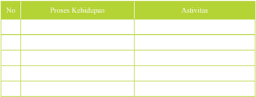

Tabel ini berisi informasi tentang proses kehidupan manusia dan aktivitas yang berkaitan dengan mereka. Topik utama tabel adalah "Proses Kehidupan" dan "Aktivitas". Kolom pertama, "No", menunjukkan urutan atau nomor untuk setiap baris. Kolom kedua, "Proses Kehidupan", mencakup berbagai tahapan dalam hidup manusia seperti kelahiran, pertumbuhan, perkawinan, kelahiran anak, dan usia lanjut. Kolom ketiga, "Aktivitas", mencakup berbagai tindakan atau peristiwa yang terkait dengan setiap tahap kehidupan tersebut, seperti pembuatan keluarga, pendidikan, pekerjaan, dan hiburan. Data penting yang terlihat adalah bahwa setiap tahap kehidupan manusia memiliki aktivitas yang spesifik yang dapat membantu menjalankannya.

 

---
## 📄 Halaman 126

### A. Pengertian Catur Asrama

### Memahami  Teks

Kata Catur Asrama berasal dari bahasa Sansekerta yaitu dari kata Catur dan Asrama. Catur yang berarti empat dan kata Asrama berarti tempat atau lapangan 'kerohanian'. Kata 'asrama' sering juga  dikaitkan dengan jenjang kehidupan. Jenjang  kehidupan  itu  berdasarkan  atas  tatanan  rohani,  waktu,  umur,  dan  sifat prilaku manusia.

Adanya  empat  jenjang  kehidupan  dalam  ajaran  agama  Hindu  dengan  jelas bahwa  hidup  itu  diprogram  menjadi  empat  fase  dalam  kurun  waktu  tertentu. Tegasnya  dalam  satu  lintasan  hidup  diharapkan  manusia  mempunyai  tatanan hidup melalui empat tahap program itu, dengan menunjukkan hasil yang sempurna. Dalam fase pertama, kedua, ketiga, dan ke empat rumusan tatanan hidup dipolakan. Sehingga dapat digariskan bahwa pada umumnya orang yang berada dalam fase pertama dan tidak boleh atau kurang tepat menuruti tatanan hidup dalam fase yang kedua, ketiga ataupun ke empat.

---
**🖼️ Gambar/Diagram**

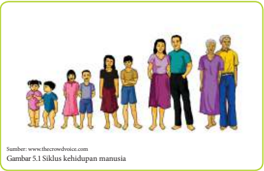

> **Deskripsi Visual:** Gambar ini adalah ilustrasi yang menunjukkan keluarga yang terdiri dari empat orang dewasa dan tiga anak-anak. Ilustrasi ini menunjukkan hubungan antara anggota keluarga, mulai dari ayah, ibu, dan dua orang kakak beradik hingga dua orang saudara perempuan.

Elemen utama dalam gambar ini adalah anggota keluarga yang terdiri dari empat orang dewasa dan tiga anak-anak. Hubungan mereka sangat jelas melalui posisi dan bentuk tubuh mereka. Ayah dan ibu berdiri di sebelah kanan, sementara dua orang kakak beradik dan dua orang saudara perempuan berdiri di sebelah kiri. Ini menunjukkan bahwa mereka adalah anggota keluarga yang dekat dan saling menghormati.

Teks, angka, atau label penting yang terlihat dalam gambar ini adalah nama-nama anggota keluarga yang tidak disebutkan dalam gambar tersebut. Informasi kunci yang dapat diambil pembaca adalah bahwa gambar ini menunjukkan keluarga yang harmonis dan saling menghormati.

Dalam satu paragraf yang informatif, gambar ini menunjukkan keluarga yang terdiri dari empat orang dewasa dan tiga anak-anak. Ilustrasi ini menunjukkan hubungan antara anggota keluarga, mulai dari ayah, ibu, dan dua orang kakak beradik hingga dua orang saudara perempuan. Hubungan mereka sangat jelas melalui posisi dan bentuk tubuh mereka. Ini menunjukkan bahwa mereka adalah anggota keluarga yang dekat dan saling menghormati. Informasi kunci yang dapat diambil pembaca adalah bahwa gambar ini menunjukkan keluarga yang harmonis dan saling menghormati.

Demikian seterusnya diantara satu fase hidup dengan kehidupan berikutnya. Bilamana hal itu terjadi dan diikuti secara tekun maka kerahayuan hidup akan tidak sulit  tercapai.  Bilamana  dilanggar  tentu  yang  bersangkutan  akan  mendapatkan mengalaman  sebaliknya.  Jadi  untuk  memudahkan  menuju  tujuan  hidup  maka Agama Hindu mengajarkan dan mencanagkan empat jenjang tatanan kehidupan ini. Masing-masing jenjang itu, memiliki warna tersendiri dan semua jenjang itu mesti dilewati hingga akhir hayat dikandung badan. Setelah itu diharapkan atma menjadi bersatu dengan sumbernya yaitu Parama Atma.

 

---
## 📄 Halaman 127

### Kegiatan  Siswa

- Bacalah uraian berikut!
- Tuliskan pada lembaran lain makna apa yang dapat kamu ambil dari cerita tersebut!
Sumber: www.sydney.edu.au

---
**🖼️ Gambar/Diagram**

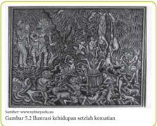

> **Deskripsi Visual:** Gambar 5.2. Ilustrasi kehidupan setelah kematian ini menunjukkan berbagai aspek kehidupan setelah kematian dalam konteks budaya tertentu. Gambar ini terdiri dari beberapa elemen utama yang saling terkait:

1. **Apa yang Ditampilkan Secara Keseluruhan**: Gambar ini menggambarkan berbagai aktivitas dan kehidupan setelah kematian dalam sebuah masyarakat. Ini mencakup berbagai karakter, seperti orang tua, anak-anak, dan dewasa, serta aktivitas seperti memasak, bermain, dan beribadah.

2. **Elemen-Elemen Utama dan Relasinya**: 
   - **Orang Tua dan Anak-anak**: Orang tua dan anak-anak adalah dua kelompok utama yang terlihat dalam gambar. Orang tua diperlihatkan sedang memotivasi anak-anak untuk beribadah.
   - **Aktivitas Sehari-hari**: Aktivitas sehari-hari seperti memasak, bermain, dan beribadah juga terlihat dalam gambar. Ini menunjukkan bahwa setelah kematian, kehidupan tetap berjalan dengan rutinitas.
   - **Relasi**: Relasi antara orang tua dan anak-anak sangat kuat, dengan orang tua yang memotivasi dan mendukung anak-anak dalam beribadah.

3. **Teks, Angka, atau Label Penting yang Terlihat**: Gambar ini tidak memiliki teks, angka, atau label spesifik yang penting. Namun, elemen-elemen visual seperti wajah, gerakan, dan aktivitas membantu dalam interpretasi.

4. **Informasi Kunci yang Dapat Diambil Pembaca**: Gambar ini memberikan gambaran tentang bagaimana masyarakat tersebut merespons dan melanjutkan kehidupan setelah kematian. Ini menunjukkan bahwa setelah kematian, kehidupan tetap berjalan dengan rutinitas dan dukungan sosial.

Dengan demikian, gambar ini menunjukkan bagaimana masyarakat tersebut merespons dan melanjutkan kehidupan setelah kematian, menekankan pada keberlanjutan rutinitas dan dukungan

Tersebutlah  seorang  Brahmana  yang  bernama  Sang  Jaratkaru.  Karma  itu memiliki  arti  berbudi  belas  kasihan,  yang  selalu  memberi  pertolongan  kepada orang yang sedang takut. Tetapi ia sendiri berbadan yang menakutkan dan memang pantas  untuk  ditakuti  karena  berwatak  pelebur.  Ia  yang  bernama  Jaratkaru, sangatlah takut pada kesengsaraan hidup ini.

Jaratkaru adalah putra seorang wiku terpilih atas ketetapan budinya. Beliau begitu  rajin  mengambil  butir-butir  padi  yang  tercecer  di  jalan  atau  di  sawah lalu dipungut dan dicucinya. Apabila sudah terkumpul banyak lalu ditanaknya, digunakan sebagai korban kepada para Dewa dan juga untuk dihidangkan kepada para tamu. Demikianlah ketetapan budi leluhurnya Jaratkaru, tidak terikat oleh cinta asmara, tidak memikirkan istri melainkan bertapa sajalah yang dipentingkan.

Dikisahkan  sekarang  Sang  Maha  Raja  Parikesit  berburu  kemudian  dikutuk oleh  Bhagawan  renggi  supaya  digigit  naga  Taksaka.  Pada  kesempatan  itulah Jaratkaru bertapa. Setelah ia berhasil bertapa mahir atas segala mantra - mantra ia dibolehkan memasuki segala tempat, termasuk tempat-tempat yang dikehendaki yaitu tempat diantaranya sorga dan neraka namanya Ayatanasthana. Pada tempat neraka bertemu roh leluhurnya sedang terhukum tergantung pada pohon bambu besar  mukanya  tertelungkup  ke  bawah  kakinya  diikat  sedangkan  dibawahriya ada jurang yang sangat dalam, jalan akan menuju kawah neraka. Roh akan tepat jatuh ke kawah apabila tali gantungan itu putus. Di lain pihak seekor tikus sedang

 

---
## 📄 Halaman 128

menggigit pohon bambu tersebut. Peristiwa ini sangat kritis dan sangat mengerikan bagi para roh yang terhukum. Melihat kejadian ini Jaratkaru berlinang-linang air matanya kasihan menyaksikan roh terhukum tersebut.

Didekatilah  roh  itu  dan  ditanya  satu  persatu  penyebab  ia  sampai  terhukum seperti itu. Semua roh menyampaikan suatu alasan penyebabnya seperti: mencuri, irihati memitnah, berzinah dan lain-lain yang menurut Jaratkaru memang pantas pula  mendapatkan  hukuman  seperti  itu.  Kemudian  akhirnya  Sang  Jaratkaru menanyakan penyebabnya sampai terhukum, lalu roh itu menjawab, saya ini yang kau tanyai, saya akan katakan keadaan saya semua, keturunan kami putus itulah sebabnya saya pisah dari dunia leluhur, dan tergantung dibambu besar ini seakanakan sudah masuk neraka. Saya punya seorang keturunan bernama Jaratkaru, ia pergi  untuk  ingin  melepaskan  ikatan  kesengsaraan  orang,  ia  tidak  punya  istri, karena menjadi seorang brahmacari sejak masih kecil.

Itulah sebabnya saya ada dibuluh ini, karena berata semadinya keturunan saya di  asrama pertapaannya. Mungkin ia telah hebat ilmunya namun apabila putus ketunmannya  niscaya  tidak  ada  buah  dari  tapanya.  Saya  tidak  berbeda  seperti orang yang melaksanakan perbuatan hina yang pahtas mendapat sengsara. Rugi rupanya  perbuatan  saya  yang  baik  pada  waktu  hidup.  Kalau  kiranya  engkau belas kasihan kepada saya, pintalah kasihannya sang wiku Jaratkaru supaya suka berketurunan, supaya saya dapat pulang ke tempat para leluhur, katakanlah bahwa saya menderita sengsara, supaya belas kasihan ia juga.

Mendengar  kata  -  kata  leluhurnya  itu,  makin  berlinanglah  air  matanya sang Jaratkaru dan tanpa disadari ia menangis, hatinya makin tersayat melihat

leluhurnya menderita, lalu berkata: 'saya inilah yang bernama Jaratkaru, seorang keturunanmu  yang  gemar  bertapa,  bertekad menjadi brahmacari, kiranya sekaranglah penderitaanmu berakhir sebab selalu sempurna tapa yang telah berlangsung. Adapun kalau itu yang menjadi kendala untuk kembali ke sorga, janganlah khawatir, saya akan memberhentikan kebrahmacarian saya'.

Saya  akan  mencari  istri  agar  mempunyai anak. Adapun istri yang saya kehendali adalah istri yang namanya sama dengan nama saya supaya  tidak  ada  pertentangan  dalam perkawinan  saya.  Kalau  saya  telah  berputra saya akan menjadi brahmacari lagi. Demikian kata  Sang  Jaratkaru  dan  pergilah  ia  mencari istri  yang  senama  dengan dia. Semua penjuru sudah  dimasukinya  namun  belum  mendapatkan  istri  yang  senama  dengan  dia, maka dia tidak tahu apa yang akan dikerjakan dengan tanpa disadari dia mencari

 

---
## 📄 Halaman 129

pertolongan kepada bapaknya supaya dapat menghindarkan dirinya dari sengsara. Kemudian masuklah ia ke hutan sunyi, sambil menangis mengeluh kepada segala makhluk,  termasuk  makhluk  yang  tidak  bergerak,  Saya  ini  Jaratkaru  seorang brahmana yang ingin beristri berilah saya istri yang senama dengan saya Jaratkaru, supaya saya berputra, supaya leluhur saya pulang ke sorga. Seru dan tangis sang Jaralkaru  terdengar  oleh  para  naga,  dalam  waktu  singkat  disuruhlah  para  naga mencari  brahmana  itu  yang  bernama  Jaratkaru  oleh  Sang  Basuki,  yang  akan diberikan pada adiknya yang bemama Nagini yang diberi nama Jaratkaru agar mempunyai anak brahmana yang akan menghindarkan dirinya dari korban ular.

Terjadilah  perkawinan,  kedua  mempelai  Jaratkaru  yang  senama,  dengan berbagai upacara. Kemudian Sang Jaratkaru mengadakan perjanjian kepada sang istri yaitu jangan engkau mengatakan sesuatu yang tidak mengenakan perasaan, demikian pula berbuat yang tidak senonoh. Kalau hal itu kau perbuat engkau akan kutinggalkan. Demikianlah kata Sang Jaratkaru kepada istrinya, lalu merekapun hidup bersama. Beberapa bulan kemudian terlihatlah tanda-tanda bahwa istrinya hamil.

Pada suatu waktu ia akan tidur, minta ditunggui oleh istrinya, karena dikiranya akan  ditinggalkan,  maka  ia  minta  agar  kepalanya  dipangku  istrinya,  dan  tidak boleh mengganggu beliau yang sedang tidur. Dengan hati-hati istrinya memangku suaminya  yang  cukup  lama  sampai  waktu  senja  tepat  waktu  waktu  pemujaan, lalu sang Nagini Jaratkaru membangunkan brahmana Jaratkaru, takut kelewatan waktu  memuja,  Setelah  membangunkan  justru  terbalik,  brahmana  Jaratkaru malah marah-marah mukanya merah karena marahnya, Brahmana berseru:'Hai Nagini (Jaratkaru) jahanam, sangatlah penghinaanmu sebagai istri, engkau berani mengganggu tidurku, tidak selayaknya tingkah laku istri seperti tingkahmu itu. Sekarang engkau akan kutinggalkan'. Demikian kata-katanya lalu memandang kepada istrinya.

Nagini mengikutinya, lari lalu memeluk kaki suaminya.' Oh tuanku,  Ampunilah hamba tuanku  ini.  Tidak  karena  hinaan  hamba  membangunkan  tuanku.  Tetapi hanya  memperingatkan  tuanku  akan  waktu  pemujaan  setiap  hari  waktu  senja. Salahkiranya, karena itu hamba menyembah minta ampun tuanku, baik kiranya tuanku  kembali,  Kalau  hamba  sudah  punya  anak  yang  akan  menghindarkan keluarga hamba dari korban ular, sejak itulah tuanku boleh bertapa kembali'.

Demikian Nagini minta belas kasihan. Jaratkaru menjawab ' Alangkah baiknya perbuatanmu,  Nagini,  memperingatkan  pemujaan  kepadaku  pada  waktu  senja, tapi  sama  sekali  aku  tidak  dapat  mencabut  perkataanku  untuk  meninggalkan engkau. Tidak  mungkir  janji  perkataan  orang  seperti  aku  ini.  Jangan  khawatir akan keinginanmu.

Asti, anakmu sudah ada, itulah yang akan melindungimu kelak pada waktu korban  ular.  Senanglah  Nagini  Jaratkaru.  Sang  Nagini  ditinggalkannya,  lalu mengatakan kepada Sang Basuki tentang kepergian suaminya. Mengatakan segala perkataan Sang Jaratkaru, dan mengatakan pula tentang isi kandungannya, yang

 

---
## 📄 Halaman 130

menyebabkan  girangnya  sang  Basuki.  Setelah  berselang  beberapa  lama  lahir seorang bayi laki  -  laki  sempurna,  kemudian  diberi  nama  Sang Astika,  karena bapaknya bilang Asti'. Bayi itu disambut oleh Sang Basuki dan diberi upacara sebagai  seorang  brahmana.  Baru  lahir  Sang  Astika  seketika  itu  leluhur  yang bergantungan tadi lepas dari penderitaan dan melayang ke sorga mengenyam hasil tapanya  dahulu.  Demikian  pula  Naga Taksaka  terhindar  dari  korban  ular  yang dilangsungkan oleh Raja Janamejaya.

### B. Bagian-Bagian Catur Asrama dan Kewajibannya

### Memahami  Teks

Naskah  Jawa  Kuno  yang  diberi  nama Agastya  Parwa  menguraikan  tentang bagian-bagian  Catur  Asrama.  Dalam  kitab  Silakrama  itu  dijelaskan  sebagai berikut :

Catur Asrama ngaranya Brahmacari, Grhastha, Wanaprastha, Bhiksuka, Nahan tang Catur Asrama ngaranya

### Terjemahan:

Yang bernama Catur Asrama adalah Brahmacari, Grhastha, Wanaprastha, dan Bhiksuka.

Berdasarkan uraian dari Agastya Parwa itu menjadi sangat jelaslah pembagian Catur  Asrama  itu.  Catur  asrama  ialah  empat  fase  pengasramaan  berdasarkan petunjuk kerohanian. Dari ke empat pengasramaan itu diharapkan mampu menjadi tatanan hidup umat manusia secara berjenjang. Masing-masing tatanan dalam tiap jenjang  menunjukkan  proses  menuju  ketenangan  rohani.  Sehingga  diharapkan tatanan  rohani  pada  jenjang  Moksa  sebagai  akhir  pengasramaan  dapat  dicapai atau dilaksanakan oleh setiap umat. Ada pun pembagian dari Catur Asrama itu terdiri dari :

- Brahmacari asrama.
- Wanaprastha asrama.
- Gṛhaṣtha asrama.
- Bhiksuka (Sanyasin) asrama.
Masing-masing jenjang dari memiliki kurun waktu tertentu untuk melaksanakannya.  Pelaksanaan  jenjang  perjenjang  ini  hendaknya  dapat dipahami dan dipandang sebagai kewajiban moral dalam hidup dan kehidupan ini.  Dengan  demikian  betapapun  beratnya  permasalahan  yang  dihadapi dari  masing-masing  fase  kehidupan  itu  tidak  akan  pernah  dikeluhkan  oleh pelakunya.

 

---
## 📄 Halaman 131

Idealnya  memang  seperti  itu,  tidak  ada  sesuatu  'permasalahan'  yang  patut kita  keluhkan.  Keluh-kesah yang kita simpan dan menguasai sang pribadi kita tidak akan pernah membantu secara ihklas untuk mendapatkan jalan keluar dari permasalahan yang ada. Bila kita hanya mampu mengeluh tentu akan menambah beban yang lebih berat lagi.  Hindu  sebagai  agama  telah  menggariskan  kepada umatnya untuk tidak hanya biasa  mengeluh.

Sri Bhagawan Kresna menjelaskan agar kita melakukan pekerjaan yang telah diwajibkan dengan benar dan tanpa terikat akan hasilnya. Tujuannya tiada lain adalah agar semua karma atau perbuatan yang kita lakukan diubah menjadi yoga, sehingga kegiatan itu dapat membawa kita menuju persatuan dengan Tuhan Yang Maha Esa.

Bila  seseorang  melakukan  perbuatan  dengan  kesadaran  badan,  yaitu  bila mereka menyamakan dirinya sebagai manusia yang berbuat, maka perbuatannya itu  tidak  akan  menjadi  karma  yoga.  Setiap  perbuatan  yang  dilakukan  dengan perasaan  mementingkan  dirinya  sendiri,  dengan  rasa  keterikatan,  yaitu  merasa perbuatannya, maka semua perbuatan semacam itu akan mengakibatkan kesedihan. Sehubungan dengan itu, renungkan sloka berikut:

na buddhi-bhedaḿ janayed ajñānāḿ karma-sańginām joṣayet sarva-karmāṇi vidvān yuktaḥ samācaran (Bhagavadgītā III.26.50)

### Terjemahan:

Orang yang pandai seharusnya jangan menggoncangkan pikiran orang yang bodoh yang terikat pada pekerjaannya. Orang yang bijaksana melakukan semua pekerjaan dalam jiwa yoga, harus menyebabkan orang lain juga bekerja

Bekerjalah 'karma' untuk dapat mewujudkan kesejahteraan dan kebahagiaan hidup ini sebagai mana dijelaskan dalam ajaran Catur Purusartha. Hanya dengan melakukan kewajiban karma seseorang akan terbebas  dari semua masalah yang dihadapinya.

Dari  bagian-bagian  catur  asrama  tersebut  masing-masing  dapat  dijelaskan sebagai berikut:

### 1.  Brahmacari

Brahmacari  terdiri  dari  dua  kata  yaitu  kata  Brahma  dan  kata  cari.  Kata Brahma  berarti  ilmu  pengetahuan  atau  pengetahuan  suci.  Kata  cari  berarti tingkah laku dalam mencari atau mengejar ilmu pengetahuan. Jadi Brahmacari berarti tingkatan hidup bagi orang yang sedang menuntut ilmu pengetahuan.

 

---
## 📄 Halaman 132

'Brahmacari ngaranya sang sedeng mangabhyasa Sang Hyang Śāstra,mnwang Sang Wruh ring tingkah Sang hyang aksara, sang mangkana karamanya sang Brahmacari ngaranya. (Silakrama hal 8)

### Terjemahan:

Brahmacari namanya bagi orang yang sedang menuntut ilmu pengetahuan, dan yang mengetahui prihal ilmu huruf (aksara)

Brahmacari atau Brahmacarya, dikenal juga dengan istilah hidup aguronguron atau Asewaka guru. Di dalam istilah Jawa kuno disebut dengan lapangan hidup asrama, yaitu tempat penampungan bagi siswa yang sedang menuntut ilmu. Di dalam tingkatan Brahmacari ini guru mendidik para siswa atau murid, dengan petunjuk kerohanian, kebajikan, amal, pengabdian dan semuanya itu didasari oleh Dharma (kebenaran).

---
**🖼️ Gambar/Diagram**

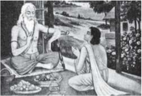

> **Deskripsi Visual:** Gambar ini adalah ilustrasi yang menampilkan dua orang dewasa berada di luar ruangan, tampaknya sedang berbicara atau berinteraksi. Pria tua berdiri di sebelah kiri dengan posisi yang lebih teguh, sementara wanita muda berbaring di sebelah kanan dengan posisi yang lebih lemah. Mereka dikelilingi oleh berbagai elemen alam seperti pohon, tanaman, dan bunga-bunga yang menghiasi area tersebut. Di depan mereka ada beberapa piring makan yang tampaknya telah dimakan, menunjukkan bahwa mereka mungkin sedang makan bersama. Ilustrasi ini mungkin digunakan untuk membantu pembaca memahami konsep atau situasi tertentu dalam konteks budaya atau sejarah.

Di  samping  itu  guru  memberikan  berbagai  ilmu  pengetahuan  kepada para muridnya. Sistem Brahmacari lebih mengutamakan pada pembentukan pribadi-pribadi manusa yang tangguh dan handal serta memiliki berbagai ilmu pengetahuan dan keterampilan. Semuanya itu untuk menjadikan manusia bisa hidup mandiri dan siap untuk menempuh kehidupan berumah tangga nantinya.

Demikian  juga  Brahmacari  merupakan  pondasi/dasar  untuk  menempuh tingkat dan jenjang kehidupan lainnya seperti Gṛhaṣtha (berumah tangga) wanaprastha dan Biksuka lapangan atau tingkat hidup pada masa menuntut ilmu ini, siswa tidak boleh melakukan perkawinan. Jadi hubungan sexsual itu sangat dilarang.Namun setelah tamat masa Brahmacari tersebut, menurut pandangan sosiologi  dalam  masyarakat  Hindu,  maka  dilanjutkan  dengan  kehidupan

 

---
## 📄 Halaman 133

jenjang yang kedua yaitu Gṛhaṣtha hidup berumah tangga suami istri. Dengan adanya hubungan sosiologis tersebut maka tingkat hidup Brahmacari itu dapat dibagi menjadi tiga golongan yaitu:

### 1)  Sukla Brahmacari

Sukla  Brahmacari  yaitu  orang  yang  tidak  kawin  sejak  dari  kecil  sampai tiba  ajalnya  atau  mati.  Orang  yang  melaksanakan  Sukla  Brahmacari dengan sungguh maka dalam ingatannya tidak ada terlintas nafsu seksual, beristri.  Kesadaran melaksanakan sukla Brahmacari ini memang tumbuh dari getaran batin dan hatinya yang suci murni. Bukan disebabkan karena menderita penyakit kelamin (impoten) dan lain sebagainya.

Pada tahap ini ditekankan bahwa pelaksanaan sukla Brahmacari itu sudah merupakan niat  secara  murni  dari  sejak  lahir  sampai  meninggal.  Contoh  tokoh yang menjalankan kehidupan Sukla Brahmacari ialah Teruna Laksamana. Dalam  Itihasa  Ramayana  ada  disebutkan  bahwa  Rāmā  mempunyai  adik Teruna Laksemana. Dia adalah seorang tokoh yang menjalankan kehidupan Sukla Brahmacari. Dia takkan kawin seumur hidupnya.

### 2)  Sawala Brahmacari

Sawala Brahmacari ialah orang yang kawin beristri atau bersuami hanya sekali saja. Selanjutnya tidak akan kawin lagi, walaupun suami atau istrinya meninggal  dunia.  Dalam  hidupnya  mereka  sudah  bertekad  hanya  kawin sekali saja.

### 3)  Tṛṣṇa (Krsna) Brahmacari

Tṛṣṇa  Brahmacari  berarti  kawin  lebih  dari  satu  kali  yaitu  sampai  batas maksimal empat kali. Keempat istri-istri yang dikawini itu adalah istri yang sah  menurut  hukum,  baik  hukum  agama  maupun  perundang-undangan yang  ada.  Tṛṣṇa  Brahmacari  ini  dapat  dilakukan  apabila:

- Istri yang pertama tidak dapat melahirkan keturunan. Demikian juga istri yang kedua juga tidak melahirkan anak-maka seorang suami bisa kawin lagi sampai batasnya empat.
- Istri tidak dapat melaksanakan tugas sebagaimana mestinya (sakit yang tak dapat disembuhkan).
Yang  harus  diperhatikan  tiap  pengambilan  istri  yang  baru,  harus  seizin istri-istri  yang  terdahulu  demi  menjaga  ketenteraman  dan  kerukunan  rumah tangga. Dalam hal ini suami harus dapat memenuhi kebutuhan dalam keluarga sehingga  benar-benar  dapat  mencerminkan  keluarga  yang  sejahtera  dan bahagia. Tetapi kalau Trsna (Krsna) Brahmacari itu dilakukan atas dorongan nafsu untuk kepuasan (kama ), maka orang semacam itu tidak dapat disebut Trsna Brahmacari.

 

---
## 📄 Halaman 134

Walaupun dalam Tṛṣṇa Brahmacari disebutkan boleh kawin lebih dari satu kali,  namun  ada  aturan  yang  harus  ditaati  agar  ketenteraman  rumah  tangga tetap dapat terbina. Aturan atau syarat-syarat yang harus ditaati bagi yang mau menjalankan kehidupan Tṛṣṇa Brahmacari adalah:

- Mendapatkan persetujuan dari istri-istrinya.
- Suami harus bersifat adil terhadap istri-istrinya secara lahir dan batin.
- Suami sebagai seorang ayah harus dapat berlaku adil terhadap anak-anak yang dilahirkan.

### Kewajiban dalam Brahmacari:

Sebagai seorang siswa yang sedang menuntut ilmu pengetahuan ia harus taat terhadap petunjuk dan nasihat yang diajarkan oleh Guru yang mengajarnya. Dalam ajaran Agama Hindu kita mengenal adanya empat guru, yang disebut dengan Catur Guru, yaitu:

- Guru Swadyaya :
yaitu Ida Sang Hyang Widhi Wasa (Tuhan Yang Maha Esa).

- Guru Rupaka :
yaitu orang tua (ibu dan bapak) yang melahirkan dan membesarkan kita.

- Guru Pangajian  :
yaitu   guru   yang  mendidik  dan  mengajar disekolah.

- Guru Wisesa :
yaitu pemerintah.

### Kewajiban terhadap Guru Swadyaya:

Adapun kewajiban sebagai seorang siswa terhadap Guru Swadyaya tersebut, harus taat terhadap segala petunjuk dan ajarannya. Sebagai umat yang percaya tentang kemahakuasaan Tuhan, yang merupakan sumber dari segala yang ada di dunia ini, maka taat kepada Guru Swadyaya dapat diwujudkan dengan cara sujud bakti memujanya.

Hyang Widhi Wasa (Tuhan Yang Maha Esa) sebagai guru dari alam semesta beserta isinya, sering digelari dengan sebutan 'Dewa Guru' atau Sang Hyang Paramesti  Guru.  Berguru  kehadapan  Tuhan  dapat  dilakukan  dengan  cara mentaati ajaran suci yang telah diwahyukan melalui para maharesi. Setiap hari kita harus mendekatkan diri pada Beliau sebagai Guru dari semua guru. Dalam hubungan ini kita manusia adalah murid dari Sang Hyang Widhi (Tuhan), yang sering disebut dengan 'Brahmacarin'. Brahman artinya Tuhan. Carin artinya berguru. Jadi berguru kepada Tuhan.

Amal  baik  atau  perbuatan  dosa  yang  dilakukan  selama  berguru  kepada Hyang Widhi hasilnya berupa subha dan asubha karma. Subha asubha karma ini dapat diterima hasilnya berupa:

- Sancita Karmaphala  : yaitu hasil perbuatan pada waktu kehidupannya
yang lalu, baru dapat dinikmati pada kehidupannya sekarang ini.

 

---
## 📄 Halaman 135

- Prarabda Karmaphala :  yaitu  perbuatan  pada  waktu  kehidupan  sekarang, langsung dapat dinikmati sekarang juga.
- Kriymana Karmaphala  : yaitu hasil perbuatan pada kehidupan sekarang, tapi belum sempat dinikmati dalam kehidupan sekarang ini, sehingga dapat dinikmati pada kehidupan yang akan datang.
Berhubungan dengan hal tersebut di atas maka semua manusia yang hidup di atas dunia ini adalah berguru kepada Sang Hyang Widhi. Oleh karena itu maka  kita  wajib  untuk  mentaati  segala  petunjuk  ajaran  yang  diwahyukan berupa kitab suci, dan menjauhi segala larangannya, adalah merupakan jalan untuk mendekatkan diri pada Guru Swadyaya (Sang Hyang Widhi Wasa).

### Kewajiban kepada Guru Rupaka:

Guru  Rupaka  ialah  orang  tua  (ibu  dan  bapak)  yang  mengadakan/yang ngerupakan kita. Sebagai seorang anak harus menyadari bahwa jasa orang tua (ibu dan bapak) adalah sangat berat, dan tak ternilai berapa besar jasanya lebihlebih sang ibu yang mengandung dan melahirkan kita, dengan mempertaruhkan nyawa.

Demikian tinggi rasa cinta kasihnya si ibu kepada kita, sehingga ia rela berkorban untuk menjadi badan perantara untuk memperbanyak umat manusia di maya pada ini.  Dalam Manu Smrti II, 227 ada disebutkan:

'Yam mata pitaram klesam sehete sambawe nmam natasya niskrtih sakya kartum warsaca tai rapi

### Terjemahan:

Penderitaan yang dialami oleh orang tua pada waktu melahirkan anaknya, tidak dapat dibayar walaupun dalam waktu seratus tahun.

Sesuai  dengan  makna  sloka  di  atas,  orang  tua  sangat  berjasa  terhadap anaknya.    Walaupun  demikian  besar  jasa  dari  Orang  tua  itu,  namun  ia  tak pernah  menuntut  balas  jasa  dari  anaknya.  Walaupun  demikian  kita  sebagai seorang  anak  yang  berbudi  luhur  harus  mengakui  pernyataan  yang  dimuat dalam Sarasamuccaya sloka 242 yang menyatakan sebagai berikut:

Tiga hutang yang dimiliki oleh seorang anak terhadap orang tuanya yang patut dibayar untuk memenuhi dharma baktinya terhadap orang tua sebagai guru rupaka yaitu:

- Śarīra kṛta yaitu  :  hutang badan (sarira data)
- Annadatta yaitu  :  hutang budhi karena orang tualah yang memberikan makan, minum, pakaian, pendidikan dan lain sebagainya.
- Praṇadatta yaitu  :  hutang jiwa dalam arti pemeliharaan atau kelanjutan hidup.

 

---
## 📄 Halaman 136

Dengan  memperhatikan  hutang  tersebut  di  atas,  maka  seorang  anak berusaha  melakukan  'Swadharmanya'  dengan  rela  hati  melayani  segala keperluan orang tuanya. Selanjutnya seorang anak berkewajiban memberikan atau  mengorbankan  harta  benda,  tenaga  dan  pikirannya  untuk  kebahagiaan orang tuanya. Bahkan lebih dari itu seorang anak ihklas mengorbankan jiwa dan raganya demi untuk berbakti pada orang tua. Di samping itu masih ada suatu kewajiban yang harus dilakukan oleh seorang anak terhadap leluhurnya yaitu melaksanakan upacara Pitra Yadnya.

Walaupun  upacara  Pitra  Yadnya  telah  dapat  dilakukan  sebagai  tanda pembayaran hutang kepada orang tuanya, tapi bukanlah berarti sudah lunas segala  kewajiban  kita  sebagai  seorang  anak.  Namun  yang  paling  penting pembayaran hutang pada orang tua adalah, pada waktu Orang tua masih hidup, yaitu dengan jalan membuat bahagianya hati orang tua.

Oleh karena itu tidak ada suatu alasan bagi seorang anak untuk membenci orang tuanya apalagi menyakiti atau membunuh orang tuanya. Sebab membenci, menyakiti atau membunuh orang tua adalah merupakan suatu perbuatan dosa besar. Maka dari itu jauhilah segala perbuatan terkutuk itu. Kita harus berbakti dan hormat kepada orang tua. Phahala yang diperoleh oleh orang yang hormat pada orang tua ialah ada empat hal yaitu:

- Kerti yaitu kemasyuran yang baik.
- Yusa yaitu panjang umur.
- Bala yaitu kekuatan.
- Yasa yaitu jasa atau penghargaan.
Keempat  hal  ini  bertambah-tambah  kesempurnaannya,  sebagai  phahala bagi orang yang hormat bakti kepada orang tua.

### Kewajiban kepada Guru Pengajian

Yang dimaksud dengan guru pengajian ialah guru yang mengajarkan ilmu pengetahuan yang memberi pendidikan tertentu, di sekolah maupun di asrama. Tugas  daripada  guru  pengajian  cukup  berat,  tapi  mulia.  Guru  pengajian berfungsi untuk melanjutkan pendidikan dari Guru Rupaka, yang bertitik tolak dari segi kerohanian dan juga ilmu pengetahuan lainnya.

Di samping itu guru pengajian bertugas untuk mengembangkan intelek dan pengetahuan siswa, demi tercapainya tujuan pendidikan yang dicita-citakan negara Republik Indonesia yang berdasarkan Pancasila  dan  UUD  1945, yaitu  membentuk  manusia  susila  yang  cakap,  cerdas  dan  terampil  berbudi pekerti yang luhur dan bertanggung jawab terhadap kesejahteraan keluarga, masyarakat, Nusa dan Bangsa. Tugas yang lebih berat lagi yaitu tugas dari seorang  guru  agama  yang  mengajarkan  pengetahuan  agama,  membentuk moral serta budi pekerti yang luhur, serta bertaqwa (berbakti) kepada Tuhan Yang Maha Esa.

 

---
## 📄 Halaman 137

Secara singkat tugas guru pengajian ialah mendidik dan mengajarkan ilmu pengetahuan dengan penuh cinta kasih agar anak didiknya menjadi manusia susila lahir batin (wahyadyatmika).

Hubungan  antara  murid  dengan  guru  benar-benar  dapat  mewujudkan keharmonisan, sebagai halnya antara seorang ayah dengan anaknya. Seorang murid  tidak  boleh  menjelek-jelekkan  atau  menghina  guru.  Hal  ini  disebut dengan istilah alpaka Guru (menentang Guru) siswa (murid) harus taat dan menuruti  nasihat  serta  ajaran-ajaran  guru  pengajian.  Dalam  Niti  Sastra  ada disebutkan:

Haywa maninda ring dwija daridra dumada atȇmu. çāstra teninda denira kapātaka tinēmu magӧng. Yan kita ninda ring guru patinta maparȇk atȇmu. Lwirnika wangça-patra tunibeng watu rȇmȇk apasah (Nitiśāstra II, 13)

### Terjemahan:

'Janganlah sekali-kali mencela guru, perbuatan itu akan dapat mendatangkan kecelakaan bagimu. Jika kamu mencela buku-buku suci, maka kamu akan mendapatkan siksaan dan neraka, jikalau kamu mencela guru maka kamu akan menemui ajalmu, ibarat piring yang jatuh hancur di batu.

Adapun orang berkhianat kepada guru, berarti ia telah berbuat dosa besar. Dalam kitab Sarasamuccaya ada disebutkan seperti:

'Samyaṅ mithyāprawrtte wā wartitawyam gurāwiha, gurunindā nihantyāyurmanusyānām nā samçayah.

Lawan waneh, hay wa juga ngwang mangupat ring guru, yadyapin salah kene polahnira, kayatnākena juga gurūpacarana, kasiddhaning kasewaning kadi sira, bwat amuharāpāyusa amangun kapāpan, kanin-dāning kadi sira' (Sarasamuccaya, 238)

### Terjemahan:

Sebagai seorang siswa, tidak boleh mengumpat guru, walaupun perbuatan beliau  keliru,  adapun  yang  harus  diusahakan  dengan  baik  ialah  perilaku yang layak kepada guru agar berhasil dalam menimba ilmu. Bagi yang suka menghina guru, akan menyebabkan dosa dan umur pendek baginya.

 

---
## 📄 Halaman 138

Dalam  hal  belajar,  Agama  Hindu  menguraikan  secara  panjang  lebar mengenai  segala  sesuatu  yang  berkaitan  dengan  proses  belajar  mengajar seperti    umur  dalam  belajar. Tata  tertib  dalam  belajar,  materi  pelajaran  dan upacara  dalam  menuntut  ilmu.  Kitab  Dharmasastra  oleh  Rsi  Yajnawalkya menyatakan  bahwa  umur  untuk  mulai  belajar  adalah  umur  semasih  kanakkanak yakni umur lima tahun dan selambat-lambatnya umur delapan tahun. Pada umur delapan tahun seorang anak harus sudah menikmati masa belajar melalui proses belajar mengajar.

Sedangkan kitab Grihya Sutra menyatakan: bahwa masa belajar berlangsung jangan sampai melampaui batas umur 24 tahun. Ini berarti setelah berumur 24 tahun scseorang sudah semestinya mempersiapkan diri untuk memasuki masa hidup Grhasta. Dalam kitab Niti Sastra  ada dijelaskan sebagai berikut :

Taki-takining sewaka guna widya Smara-wisaya rwang puluh ing ayusya tȇngah i tuwuh san-wacana gȇgӧn-ta patilaring atmeng tanu pagurokȇn ( NitiśāstraV.I )

### Terjemahan:

Seorang pelajar wajib menuntut pengetahuan dan keutamaan. Jika sudah berumur 20 tahun orang harus kawin. Jika sudah setengah tua berpeganglah pada ucapan yang baik. Hanya tentang lepasnya nyawa kita mesti berguru.

Atas dasar itu maka seorang yang berumur di atas dua puluh tahun sudah dinyatakan dewasa dan wajib memikirkan masa hidup berikutnya.

### Kewajiban kepada Guru Wisesa (Pemerintah)

Guru  Wisesa  ialah  pemerintah  yang  sah.  Sebagai  seorang  siswa,  dan sekaligus juga merupakan  bagian dari anggota masyarakat maka  kita harus menghormati dan menjunjung tinggi martabat bangsa, negara dan pemerintahannya. Sebaliknya Pemerintah selalu memikirkan dan mengusahakan  kesentosaan  dan  kemakmuran  rakyat.  Di  samping  itu  harus dapat memberikan perlindungan kepada rakyat dari berbagai problem seperti kesusahan, kesewenangan (monarkhi), menjalankan hukum dan keadilan tanpa pandang bulu. Menyelenggarakan pendidikan bagi warganya demi kemajuan dan kecerdasan bangsa.

Dalam Kekawin Ramayana, Rama memberikan nasehat kepada Wibhisana tentang  bagaimana  tindakan  guru  wisesa  (pemerintah)  menjadi  abdi  rakyat tanpa ikatan nafsu untuk mendapat sanjungan, kemasyuran, kemewahan dan lain sebagainya. Bunyi sloka dalam kekawin itu adalah:

 

---
## 📄 Halaman 139

### 'Sakan ikang rat kita yan wenang manut, manupa desa prihatah

rumak saya ke say an ikang papa Nahan prayo jana, jana nuragadi tuwin kapangguha. (Ramayana, 82)

### Terjemahan:

'Tegakkanlah Dharma atau kebenaran itu sebagai tiang Negara, utamakan ajaran Manu untuk mengabdi pada negara, Lenyapkanlah dan perangilah kesengsaraan itu, sehingga kecintaan dan kesetiaan rakyat pasti akan dijumpai.

Tidak  hanya  rakyat  yang  cinta,  tetapi  Tuhan  sebagai  pelindung  Dharma akan merahmati umatNya yang berbudi mulia. Oleh karena itu ajaran Agama Hindu kita diharapkan dalam melaksanakan tugas, berpegang pada motto dan pedoman sepi ing pamerih rame ing gawe, demi kepentingan masyarakat dan umat manusia.

### 2. Gṛhaṣtha

Gṛhaṣtha ialah tingkat kehidupan pada waktu membina rumah tangga yaitu sejak kawin. 'Kata Grha: berarti rumah atau rumah tangga. 'Sta/stand artinya berdiri atau membina. Tingkat hidup Gṛhaṣtha yaitu menjadi pimpinan rumah tangga yang bertanggung jawab penuh baik sebagai anggota keluarga maupun sebagai  anggota  masyarakat  serta  sekaligus  sebagai  warga  negara  jenjang kehidupan  Grhasta  dapat  dilaksanakan  apabila  keadaan  isik  maupun  psikis dipandang sudah dewasa, dan bekal pengetahuan sudah cukup memadai.

Setelah  memasuki  tingkat  hidup  Grhasta,  bukan  berarti  masa  belajar atau  menuntut  ilmu  itu  berakhir  sampai  disitu  saja.  Belajar  tidak  mengenal batas usia. Belajar berlangsung selama hayat dikandung badan. Maka orang bilang  masa  muda  adalah masa belajar. Hal ini mengandung arti bahwa tidak ada istilah tua dalam hal  belajar.  Karena  ilmu pengetahuan  itu sifatnya berkembang terus. Ilmu yang didapatkan dalam jenjang Brahmacari itu lebih diperdalam serta ditingkatkan lagi setelah menginjak hidup berumah tangga (Gṛhaṣtha).

 

---
## 📄 Halaman 140

Dalam  hidup  berumah  tangga  ini  ada  beberapa  kewajiban  yang  perlu dilaksanakan yaitu:

- Melanjutkan keturunan
- Membina rumah tangga
- Bermasyarakat
- Melaksanakan Pañca Yajña .
Untuk  itu  maka  dalam  jenjang  kehidupan  ini  masalah  artha  dan  kama menduduki tujuan utama, dengan berlandaskan Dharma (kebenaran).

### Kewajiban Suami dan Istri dalam Rumah Tangga

Kita  telah  ketahui  bahwa  keluarga  Hindu  menganut  hukum  patriaarchat (kebapaan).  Dengan  demikian  jelaslah  di  sini  bahwa  suami  berkedudukan sebagai  kepala  rumah  tangga.  Kapan  si  suami  tidak  mampu  lagi  bertindak sebagai kepala rumah tangga, karena suatu penyakit atau meninggal maka si istrilah yang menggantikan suami selaku kepala rumah tangga.

Menurut  undang-undang  Perkawinan  yaitu  UU.  No.  1  Tahun  1974 bahwa suami dan istri masing-masing memikul kewajiban yang luhur untuk menegakkan rumah tangga yang menjadi sendi dasar dari susunan masyarakat. Secara garis besarnya kewajiban-kewajiban tersebut adalah:

- Hak dan kedudukan suami istri dalam pergaulan kehidupan dalam masyarakat adalah seimbang.
- Setiap pihak berhak untuk melakukan perbuatan hukum.
- Suami sebagai kepala rumah tangga dan istri sebagai ibu rumah Tangga.
- Suami istri wajib saling cinta mencintai, hormat menghormati, dan saling memberikan bantuan secara lahir dan batin.

 

---
## 📄 Halaman 141

Dalam keluarga terdapat 'Suami Istri' yang memegang peranan penting bagi kesejahteraan 'Keluarga' pada khususnya dan masyarakat pada umumnya. Adapun  hubungan  antara  suami  dan  istri  harus  dapat  menjalin kerukunan  dalam  kesatuan  pikiran,  ucapan,  perbuatan  serta  sesuai  dengan norma-norma agama. Hidup suami istri bukanlah merupakan suatu persaingan dalam menuntut persamaan hak dan bukan merupakan suatu perlombaan dalam melakukan tugas dan kewajiban itu, melainkan merupakan suatu keharmonisan dan kesatuan hidup lahir dan batin. Hal ini disimbulkan sebagai Ardanaraswari yaitu persatuan antara laki dan perempuan dalam satu badan.

rumah

Segala  kebajikan  perlu  diamalkan  dalam  rumah  tangga  sesuai  dengan swadharmanya Gṛhaṣtha baik bersifat lahir maupun  batin. Karena tangga  itu  adalah  dunia  kecil  bagi  kita  dan  merupakan  sumber  fakta-fakta yang  menunjukkan  tingkat  kepribadian  dari  semua  anggota  keluarga.  Oleh karena  itu  hendaknya  selalu  memupuk  pribadi  yang  baik  dalam  rumah tangga,  sehingga  dapat  menjadi  anggota-anggota  masyarakat  yang  baik, dan  dapat menjadi warga negara yang mulia. Antara suami dan istri harus selalu  ada  saling  pengertian  untuk  mewujudkan keluarga sejahtera. Sebagai seorang suami dan istri haruslah tetap ingat melaksanakan kewajiban dengan penuh kesadaran sebagai anggota atau kepala rumah tangga sehingga dapat terciptanya keharmonisan dalam keluarga.

Sejalan dengan dasar-dasar ketentuan yang telah ditetapkan berda-sarkan UU No. 1 Tahun 1974 itu. Kitab suci Hindu yang merupakan dasar Hukum Hindu telah pula menggariskan ketentuan yang menjadi syarat dan landasan bagi pembinaan keluarga itu. Tentang garis-garis besar mengenai kewajiban Suami-Istri  dicantumkan  dalam  Kita  Manava  dharmasastra  bab.  IX  mulai dari pasal 1 sampai dengan pasal 103. Untuk dapat mengetahui pokok-pokok pikiran yang mengatur hubungan hukum mengenai hak dan kewajiban suami istri menurut ajaran Agama Hindu adalah sebagai berikut:

### Kewajiban Suami

Menurut kitab suci Hindu (Weda Smerti) seorang suami berkewajiban:

- Melindungi istri dan anak-anaknya. la harus mengawinkan anaknya kalau sudah waktunya.
- Menugaskan istrinya untuk mengurus rumah tangga dan urusan agama dalam rumah tangga ditanggung bersama.
- Menjamin hidup  dengan memberi nafkah kepada  istrinya, bila akan pergi keluar daerah.
- Memelihara hubungan kesucian dengan istri, saling percaya mempercayai, memupuk rasa cinta dan kasih sayang serta jujur lahir batin. Suka dan duka dalam rumah tangga ditanggung bersama sehingga terjaminnya kerukunan dan keharmonisan.

 

---
## 📄 Halaman 142

- Menggauli istrinya dan mengusahakan agar tidak terjadi perceraian dan masing-masing tidak melanggar kesucian.
- Tidak merendahkan martabat istri. Janganlah terlalu cemburu, yang menyebabkan timbulnya percecokan dan perceraian dalam keluarga.

### Kewajiban Istri

Di samping kewajiban suami menurut Weda Smerti, ditetapkan pula pokok kewajiban istri, sebagai timbal balik dari kewajiban suaminya. Kewajibannya ini  meliputi  kewajiban  sebagai  seorang  istri  dan  kewajiban  sebagai  wanita dalam rumah tangga, kewajibannya itu adalah:

- Sebagai seorang istri dan sebagai seorang wanita hendaknya selalu berusaha tidak  bertindak  sendiri-sendiri.  Setiap  rencana  yang  akan  dibuat,  harus dimusyawarahkan terlebih dahulu dengan suami.
- Istri harus pandai membawa diri dan pandai pula mengatur dan memelihara rumah tangga, supaya baik dan ekonomis.
- Istri harus setia pada suami, dan pandai meladeni suami dengan hati yang tulus ikhlas serta menyenangkan.
- Istri harus dapat mengendalikan pikiran, perkataan dan tingkah laku dengan selalu  berpedoman  pada  susila.  la  harus  dapat  menjaga  kehormatan  dan martabat suaminya.
- Istri  harus  dapat  memelihara  rumah  tangga,  pandai  menerima  tamu  dan meladeni dengan sebaik-baiknya.
- Istri harus setia dan jujur pada suami. Dan tidak berhati dua.
- Hemat cermat dalam menggunakan artha kekayaan, tidak berfoya-foya dan boros merupakan pangkal kemelaratan.
- Mengerti tugas wanita, rajin bekerja, merawat anak dan meladeni kepentingan semua keluarga. Berhias di waktu perlu.
Demikianlah antara lain kewajiban sebagai seorang suami dan istri. Oleh karena itu hendaknya selalu memupuk pribadi yang baik. Selain daripada itu rasa kasih dan sifat lemah lembut bersaudara harus kita tumbuh kembangkan. Contoh hal tersebut dapat kita temui dalam wiracarita Mahabarata, di mana diceritakan bahwa pandawa bersama lima saudaranya bersatu dan hidup rukun, sehingga ia dapat terangkat dari lembah kesengsaraan, menuju bahagia.

 

---
## 📄 Halaman 143

### Memahami  Teks

- Bentuklah kelompok 3-4 orang siswa
- Carilah gambar (intenet, koran, majalah dan yang lain) berkaitan dengan Brahmacari dan grhasta.
- Gunting dan tempelkan gambar tersebut pada kertas HVS A 4 buatlah deskripsi dari masing-masing gambar tersebut dan presentasikan !

---
**📊 Tabel**

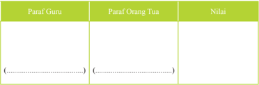

Tabel ini menunjukkan informasi tentang paraf Guru, paraf Orang Tua, dan nilai yang diberikan kepada mereka. Paraf Guru dan paraf Orang Tua masing-masing memiliki satu baris kosong untuk diisi oleh pihak yang berwenang. Nilai yang diberikan pada kolom ini mungkin berupa skor, kinerja, atau penilaian lainnya. Topik utama tabel ini adalah evaluasi atau penilaian yang dilakukan terhadap paraf Guru dan paraf Orang Tua. Kolom-kolom yang ada adalah paraf Guru, paraf Orang Tua, dan nilai. Data atau pola penting yang terlihat adalah bahwa paraf Guru dan paraf Orang Tua harus diisi oleh pihak yang berwenang sebelum nilai dapat diberikan.

### 3.  Wanaprastha

Jenjang  kehidupan  yang  ketiga  dari  Catur  Asrama  ialah  wanaprastha. Wanaprastha  terdiri  dari  dua  rangkaian  kata  sansekerta  yaitu  wana  artinya pohon kayu, hutan semak belukar danprastha artinya berjalan/berdoa paling depan dengan baik. Pengertian Wanaprastha dimaksudkan berada dalam hutan, mengasingkan  diri  dalam  arti  menjauhi  dunia  ramai  secara  perlahan-lahan untuk  melepaskan  diri  dan  keterikatan  duniawi.  Dalam  upaya  melepaskan diri yang dimaksud adalah berusaha membatasi dan mengendalikan diri dari unsur Triguna yaitu sifat Rajas dan Tamas, agar dalam Satwam kerohaniannya lebih mantap dan diberkahi oleh Hyang Widhi sebagai tujuannya menjadi lebih dekat.

Tingkatan hidup  Wanaprastha  merupakan  persiapan  diri  mengurangi keterikatan  dan  keterlibatan  dengan  kehidupan  duniawi.  Dalam  kehidupan sehari-hari tingkatan hidup Wanaprastha ini dapat dilaksanakan setelah anak kita  dewasa  semua  bebas  dari  tanggungan.  Wanaprastha  adalah  jenjang kehidupan untuk mencari ketenangan batin, dan mulai melepaskan diri dari keterikatan terhadap kemewahan duniawi. Pada masa kehidupan Wanaprastha ini,  tanggung jawab rumah tangga dan kewajiban-kewajiban selaku anggota masyarakat, karena diambil alih oleh anak dan cucu.

Kenikmatan dan kepuasan yang bersifat lahiriah sedikit demi sedikit mulai dikurangi. Pusat perhatian pada jenjang ini adalah mengarah pada kenikmatan rohani  yang  bersifat  abadi  yaitu  moksa.  Dia  tidak  terikat  lagi  dengan  artha dan  Kama.  Maksud  dan  tujuan  hidup  Wanaprastha  adalah  untuk  mencari ketenangan.

 

---
## 📄 Halaman 144

hidup

Memang kalau kita  memperhatikan istilah Wanaprastha berarti hidup mengasingkan diri ke hutan, tetapi zaman sekarang, menjalani masa Wanaprastha  itu  tidak  usah  pergi  ke hutan.  Lebih  baik  ketenangan  itu  kita cari  pada  diri  masing-masing.  Berbuat baik untuk kepentingan masyarakat, Nusa dan Bangsa, dengan menegakkan ajaran Ahimsa (tanpa kekerasan).

Adapun manfaat menjalankan hidup Wanaprastha adalah:

- Untuk mencapai ketenangan Rohani.
- Memanfaatkan sisa-sisa kehidupan di dunia ini untuk mengabdi dan berbuat amal kebajikan kepada masyarakat umum.
- Melepaskan segala keterikatan terhadap duniawi.

### Masa mulai Menempuh Hidup Wanaprastha

Masa yang baik untuk mulai menempuh hidup sebagai seorang Wanaprastha adalah setelah berusia kurang lebih 60 tahun ke atas. Karena pada sedemikian itu, anak-anaknya sudah dapat hidup mandiri. Bagi seorang pegawai negeri ia sudah pensiun sehingga ia sudah lepas dan bebas dari tugas dinasnya.

Ia  dapat  menikmati  sisa  usianya  yang  sudah  senja  untuk  ketenangan batinnya,  agar  dapat  berpegang  pada  ucapan-ucapan  yang  baik,  terutama mempelajari persiapan-persiapan untuk lepasnya Atma dari tubuh kita yaitu mati. Mati adalah pasti, karena tidak dapat dihindari, hanya waktunya kita tidak tahu, karena itu merupakan kuasa Tuhan. Maka menempuh hidup Wanaprastha bagi setiap orang tidak sama usianya, karena tingkat sosial ekonomis tiap-tiap orang adalah berbeda.

### 4. Bhiksuka/Sanyasin

Bhiksuka juga sering disebut Sanyasin. Kata Bhiksuka berasal dari kata Bhiksu sebutan untuk pendeta Budha. Bhiksu artinya meminta-minta. Bhiksuka ialah  tingkat  kehidupan  yang  lepas  dari  ikatan  keduniawian  dan  hanya mengabdikan  diri  kepada  Hyang  Widhi  dengan  jalan  menyebarkan  ajaranajaran  kesusilaan.  Dalam  pengertian  sebagai  peminta-minta  dimaksudkan ia  tidak  boleh  mempunyai  apa-apa  dalam  pengabdiannya  pada  Hyang Widhi  dan  untuk  makannyapun  ditanggung  oleh  murid-murid  pengikutnya ataupun  umatnya  sendiri.  Dalam  pengertian  sebagai  Sanyasin  dimaksudkan meninggalkan  keduniawiaan  dan  hanya  mengabdi  kepada  Hyang  Widhi dengan memperluas ajaran-ajaran kesucian.

 

---
## 📄 Halaman 145

Bagi  orang  yang  telah  menjalankan  hidup Bhiksuka,  akan  mencerminkan  suatu  sifat  dan tingkah  laku  yang  baik  serta  bijaksana.  Orang Bhiksuka  akan  selalu  memancarkan  sifat-sifat yang menyebabkan orang lain menjadi bahagia. Dia  akan  tetap  menyebarkan  angin  kesejukan, angin kebenaran, tidak mudah diombangambing  oleh  gelombang  kehidupan  duniawi. Dia telah mampu menundukkan musuh-musuh yang ada dalam dirinya seperti: Sad Ripu, Sapta Timira, Sad Atatayi dan Tri Mala.

### Sad Ripu

Sad Ripu adalah enam macam musuh yang ada dalam setiap diri manusia. Musuh-musuh ini perlu dimusnahkan dari diri kita, sehingga dapat menerapkan kehidupan Bhiksuka dengan baik. Adapun keenam musuh tersebut  sebagai berikut:

- Kama artinya hawa nafsu
- Lobha artinya loba/tamak.
- Krodha artinya kemarahan
- Moha artinya kebingungan
- Mada artinya kemabukan
- Matsarya artinya iri hati.
Kesemuanya  ini  merupakan  musuh  dari  setiap  orang,  namun  ukuran pengaruhnya  berbeda-beda  pada  setiap  orang.  Oleh  karena  Sad  Ripu  ini merupakan  musuh,  maka  patutlah  ia  ditaklukan  agar  dapat  dikuasai  setiap gerak dari pengaruhnya. Dengan demikian ia tidak dapat lagi mengganggu dan merdnggong kehidupan manusia. Untuk lebih jelasnya marilah kita uraikan satu persatu.

### Sapta Timira

Sapta timira artinya tujuh kegelapan.  Yang dimaksud dengan tujuh kegelapan ialah  tujuh  hal  yang  menyebabkan pikiran orang menjadi gelap. Kegelapan pikiran ini, dapat menimbulkan tingkah laku yang jelek dan menyimpang dari ajaran agama. Ketujuh kegelapan itu adalah:

- Surupa artinya kecantikan atau kebagusan.
- Dhana artinya kekayaan.
- Guṇa artinya kepandaian.
- Kulina artinya keturunan.
- Yowana artinya masa remaja/muda.
- Sura artinya minuman keras.
- Kasuran artinya keberanian.

 

---
## 📄 Halaman 146

### Sad Atatayi

Sad Atatayi artinya enam macam pembunuh kejam. Keenam pembunuh ini adalah:

- Agnida artinya membakar milik orang lain.
- Wisada artinya meracun.
- Atharwa artinya melakukan ilmu hitam.
- Satraghna artinya mengamuk.
- Dratikrama artinya memperkosa.
- Raja pisuna artinya memitnah.

### Tri Mala

Tri mala artinya tiga macam perbuatan kotor yaitu:

- Kasmala yaitu perbuatan yang hina dan kotor.
- Mada yaitu perkataan, pembicaraan yang dusta dan kotor.
- Moha yaitu pikiran perasaan yang curang dan angkuh.
Musuh-musuh atau sifat-sifat tersebut di atas harus dihindarkan dari segala bentuk  perbuatan  seperti:  dalam  bentuk  perkataan,  pikiran  dan  perbuatan. Mengenai batas waktu atau saat yang baik untuk menjalankan hidup Bhiksuka atau Sanyasin tidak dapat ditentukan secara pasti. Dalam hubungan ini Kakawin Nitiśāstramenyebutkan sebagai berikut:

Taki-taki ning sewaka guna widya, Smara - wisaya rwang puluh ing ayusya, tȇngahi tuwuh san-wacana gȇgӧn-ta, Patilaring atmeng tanu pagurokȇn' (Nitisastra, V . 1)

### Terjemahan:

Seorang pelajar wajib menuntut ilmu pengetahuan dan keutmaan, jika sudah berumur 20 tahun orang boleh kawin. Jika setengah tua, berpeganglah pada ucapan

Memperhatikan  penjelasan  Nitiśāstra  di  atas  dapat  ditegaskan  bahwa jenjang pertama adalah Brahmacari saat umur masih muda kemudian Grhasta, setelah cukup dewasa, selanjutnya Wanaprastha setelah umur setengah lanjut dan terakhir Bhiksuka setelah umur lanjut.

 

---
## 📄 Halaman 147

### Kegiatan  Siswa

- Buatlah kelompok 3-4 orang siswa
- Buatlah narasi singkat tentang kehidupan wanaprasta dan bhiksuka yang ada di lingkungan tempat tinggalmu !
- Presentasikan hasil pengamatanmu di depan kelas !

### Uji  Kompetensi

- Jelaskan pengertian Catur Asrama menurut lontar Agastya Parwa !
-------------------------------------------------------------------------------------------------

-------------------------------------------------------------------------------------------------

-------------------------------------------------------------------------------------------------

- Sebutkan pembagian dari Catur Asrama !
-------------------------------------------------------------------------------------------------

-------------------------------------------------------------------------------------------------

-------------------------------------------------------------------------------------------------

- Jelaskan apa yang dimaksud dengan Brahmacari ?
-------------------------------------------------------------------------------------------------

-------------------------------------------------------------------------------------------------

-------------------------------------------------------------------------------------------------

- Sebut dan jelaskanlah bagian-bagian dari Catur Pramana!
-------------------------------------------------------------------------------------------------

-------------------------------------------------------------------------------------------------

-------------------------------------------------------------------------------------------------

- Sebutkan dan jelaskan kewajiban sebagai Brahmacari!
-------------------------------------------------------------------------------------------------

-------------------------------------------------------------------------------------------------

-------------------------------------------------------------------------------------------------

 

---
## 📄 Halaman 148

- Jelaskan secara singkat pengertian Wanaprastha dilihat dari arti katanya!
-------------------------------------------------------------------------------------------------

-------------------------------------------------------------------------------------------------

-------------------------------------------------------------------------------------------------

- Jelaskan apa yang dimaksud dengan bhiksuka
-------------------------------------------------------------------------------------------------

-------------------------------------------------------------------------------------------------

-------------------------------------------------------------------------------------------------

Releksi Diri

- Setelah mempelajari materi ini hal baru apakah yang didapatkan dan hal apakah yang harus dikembangkan ?
-------------------------------------------------------------------------------------------------

-------------------------------------------------------------------------------------------------

-------------------------------------------------------------------------------------------------

- Sesuai dengan tahapan catur asrama, coba kamu tuliskan rencana hidup ini mulai dari masa belajar sekarang, berumah tangga dan masa pensiunan !
-------------------------------------------------------------------------------------------------

-------------------------------------------------------------------------------------------------

-------------------------------------------------------------------------------------------------

- Buatlah rangkuman materi catur asrama !
-------------------------------------------------------------------------------------------------

-------------------------------------------------------------------------------------------------

-------------------------------------------------------------------------------------------------

---
**📊 Tabel**

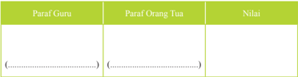

Tabel ini menunjukkan perbandingan antara paraf Guru, paraf Orang Tua, dan nilai akhir siswa. Topik utama tabel ini adalah evaluasi kualitas paraf yang diberikan oleh guru dan orang tua terhadap siswa. Kolom pertama berisi paraf Guru, kolom kedua berisi paraf Orang Tua, dan kolom ketiga berisi nilai akhir siswa. Data penting yang terlihat adalah bahwa paraf Guru dan Orang Tua sering kali memiliki perbedaan pendapat, dengan nilai akhir yang lebih tinggi biasanya didapatkan oleh siswa yang mendapat paraf positif dari kedua pihak. Ini menunjukkan bahwa evaluasi kualitas paraf sangat penting untuk memastikan bahwa siswa mendapatkan penilaian yang akurat dan bermanfaat.

 

---
## 📄 Halaman 149

### Bab VI Catur Varna

### Renungan

Bacalah Bhagavadgita IV.13 di bawah ini dan diskusikan dengan temanmu !

cātur-varṇyaḿ mayā sṛṣṭaḿ guṇa-karma-vibhāgaśaḥ tasya kartāram api māḿ viddhy akartāram avyayam

### Terjemahan:

Catur Warna aku ciptakan menurut pembagian dari guna dan karma (sifat dan pekerjaan). Meskipun aku sebagai penciptanya, ketahuilah aku mengatasi gerak dan perubahan (Puja, 2000).

### A. Pengertian Catur Varna

### Memahami  Teks

Kata 'Catur Varna' dalam ajaran Agama Hindu berasal dari bahasa Sansekerta, dari kata 'catur dan varna'.  Kata catur berarti empat . Kata varna berasal dari akar kata Vri yang berarti pilihan atau memilih lapanagan kerja. Dengan demikian catur varna berarti empat pilihan bagi setiap orang terhadap profesi yang cocok untuk pribadinya masing-masing atau empat pengelompokkan masyarakat dalam tata kemasyarakatan Agama Hindu yang ditentukan berdasarkan profesinya.

Catur  varna  membagi  masyarakat  Hindu  menjadi  empat  kelompok  profesi secara paralel horizontal. Varna ditentukan oleh guna dan karma. Guna adalah sifat,  bakat  dan  pembawaan  sesorang  sedangkan  karma  artinya  perbuatan  atau pekerjaan. Guna dan karma inilah yang menentukan Varna seseorang. Alangkah bahagianya  seseorang  yang  dapat  bekerja  sesuai dengan  sifat, bakat  dan pembawaannya.

 

---
## 📄 Halaman 150

Pemahaman tentang Catur Varna dapat dijelaskan berdasarkan sastra drstha. Yang  dimaksud  pemahaman  Catur  Varna  berdasarkan  sastra  drstha  adalah pemahaman yang bertujuan untuk mendapatkan pengertian tentang Catur Varna menurut yang tersurat dalam kitab suci, sebagai berikuti;

cātur-varṇyaḿ mayā sṛṣṭaḿ guṇa-karma-vibhāgaśaḥ tasya kartāram api māḿ viddhy akartāram avyayam (Bhagavadgita IV.13)

### Terjemahan:

Catur Varna aku ciptakan menurut pembagian dari guna dan karma (sifat dan pekerjaan). Meskipun aku sebagai penciptanya, ketahuilah aku mengatasi gerak dan perubahan

Demikianlah kitab suci menyebutkan bahwa konsepsi tentang 'Catur Varna' diciptakan  oleh  Sang  Hyang  Paramakawi.  Dengan  demikian  dapat  diartikan bahwa setiap orang yang lahir ke dunia ini sudah jelas memiliki dan membawa keahliannya masing-masing. Oleh karena itu di antara kita hendaknya mau dan mampu belajar untuk mengakui kemampuan dan profesional ciptaan Beliau secara jujur  dan  bertanggung  jawab.  Hindarkanlah  diri  kita  masing-masing  untuk mendiskriditkan sesama kita.

---
**🖼️ Gambar/Diagram**

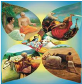

> **Deskripsi Visual:** Gambar ini adalah ilustrasi yang menampilkan berbagai aspek dari budaya India. Gambar tersebut terdiri dari empat bagian yang masing-masing menunjukkan karakteristik unik dari negara tersebut. Di bagian atas, ada dua orang pria yang sedang berbicara, yang mungkin menunjukkan dialog atau pertemuan penting dalam budaya India. Di bagian bawah kiri, ada gambar seekor sapi, yang sering digunakan dalam ritual dan kepercayaan Hindu. Di bagian bawah kanan, ada gambar seorang wanita dengan topi tradisional, yang menunjukkan peran wanita dalam masyarakat India. Selain itu, gambar juga menampilkan pemandangan alam yang indah, yang menunjukkan keindahan alam India. Jadi, gambar ini menunjukkan berbagai aspek dari budaya India, mulai dari kepercayaan, ritual, peran sosial, hingga keindahan alam.

 

---
## 📄 Halaman 151

Pengertian Varna menurut pembawaan dan fungsinya dibagi menjadi empat berdasarkan kewajiban.  Orang  dapat  mengabdi  sebesar  mungkin  menurut pembawaannya. Di sini ia dapat melaksanakan tugasnya dengan rasa cinta kasih dan keikhlasan sesuai dengan ajaran Agama Hindu.

brāhmaṇa-kṣatriya-viśāḿ śūdrāṇāḿ ca parantapa karmāṇi pravibhaktāni svabhāva-prabhavair guṇaiḥ (Bhagavadgītā XVIII. 41)

### Terjemahan:

O Arjuna, tugas-tugas adalah terbagi menurut sifat, watak kelahirannya sebagaimana halnya Brahmana, Ksatria, Waisya dan juga Sudra.

Pembagian kelas ini sebenarnya bukan terdapat pada Hindu saja, tetapi sifatnya adalah universal. Klasiikasinya tergantung dari tipe alam manusia, dari baka t kelahirannya. Masing-masing dari empat kelas ini mempunyai kafakter tertentu. Ini  tidak  selalu  ditentukan  oleh  keturunan.  Di  dalam  Bhagavadgītā  teori  Varna sangat luas dan mendalam. Kehidupan manusia di luar, mewujudkan wataknya yang di dalam. Setiap makhluk mempunyai watak kelahirannya (swabhava) dan yang membuat efektif di dalam kehidupannya adalah kewajibannya (swadharma).

Keempat Varna ini memiliki hak yang sama dalam mempelajari Weda. Hal ini ditegaskan dalam kitab suci Yajurveda ke xxv. 2 sebagai berikut:

Yatenam cvacam kalyanim avadanijanebhyah brahma rajanyabhyah cudraya caryaya ca svaya caranaya ca

### Terjemahan:

Biar Kunyatakan di sini kata suci ini, kepada orang-orang banyak kepada kaum Brahmana, kaum Ksatriya, kaum Sudra dan bahkan kepada orang orangKu dan kepada mereka (orang-orang asing) sekalipun.

Kata suci  yang  dimaksudkan  dalam  kata  ini  adalah Weda  Śruti  yang  boleh dipelajari oleh keempat golongan (Brahmana, Ksatria, Waisya ian Sudra) atau apa pun  golongannya.  Jadi,  Yajurveda  memberikan  penjelasan  bahwa  kedudukan masing-masing Varna dalam Catur 'Varna dalam mempelajari Veda adalah sama. Tidak ada satu golonganpun yang ditinggalkan.

 

---
## 📄 Halaman 152

Dalam  Rg  Veda  mandala  X,  lahirnya  Catur  Varna  ini  diuraikan  secara mitologis. Varna Brahmana diceriterakan lahir dari mulut Dewa rahma, Ksatria dari tangannya, Weisya dari perutnya, sedangkan udra dari kakinya. Mitologi Rg Veda ini melukiskan bahwa semua warna adalah ciptaan Tuhan dengan fungsi yang berbeda-beda. Keterangan ini dipertegas dalam kitab  suci Manawa Dharmasastra I, 87 sebagai berikut:

Sarvasyāsya tu sargasya guptyartham sa mahādyutih mukhā bahū upajjānām pŗthak karmānya kalpayat

### Terjemahan:

Untuk melindungi alam ini, Tuhan Yang Maha Cemerlang menentukan kewajiban yang berlainan terhadap mereka yang lahir dari mulutnya, dari tangannya, dari pahanya dan dari kakinya.

Jelas di sini yang dimaksud lahir dari mulut, tangan, paha dan dari kaki tiada lain  adalah:  Brāhmaṇa,  Kṣatrya,  Vaiṣya  dan  Śudra.  Keempat  Varna  ini  justru dibeda-bedakan fungsinya agar masyarakat dan dunia terlindung dari kehancuran. Ini  menandakan  fungsi-fungsi  itu  sama  penting  dalam  memperoleh  harkat dan  martabatnya.  Untuk  menentukan  Varna  seseorang,  bukanlah  dilihat  dari keturunannya  tetapi  benar-benar  ditentukan  oleh  guṇa  dan  karma  seseorang.  Hal ini  ditegaskan  lagi  dalam  Mahabharata  XII,    108.  Sloka  tersebut  adalah  sebagai berikut:

Nayonir napi samskara nasrutam naca santatih karanani dwijatwasya wrttam eva tukaranam

### Terjemahan:

Bukan karena keturunan (Yoni), bukan karena upacara semata, bukan pula karena mempelajari Veda semata, bukan karena'jabatan yang menyebabkan seseorang disebut dwijati. Hanya karena perbuatannyalah seseorang dapat disebut dwijati.

 

---
## 📄 Halaman 153

### Kegiatan  Siswa

Setelah  mempelajari  materi  tentang  pengertian  catur  warna  ini,  kerjakan kegiatan siswa sebagai berikut :

- Buatlah kelompok kerja yang terdiri 3-4 orang siswa
- Amatilah tentang jenis pekerjaan yang ada di lingkungan sekitarmu dan kaitkan dengan ajaran catur asrama.
- Presentasikan di depan kelas.

### B. Bagian-Bagian Catur Varna

### Memahami Teks

Untuk dapat menjadi manusia yang baik, manusia hendaknya selalu mengadakan  kerjasama  yang  harmonis  dengan  sesama  mahluk  ciptaan-Nya. Manusia itu hendaknya selalu merealisasikan ajaran Tat Twam Asi, dalam hidup dan  kehidupan  ini.  Ida  Sang  Widhi  Wasa  yang  bersifat  Maha  pencipta,  maha karya, maha ada, maha kekal, tanpa awal dan akhir yang sering disebut 'Wiyapiwiyapaka nirwikara'.

Wiyapi-wiyapaka berarti meresap, mengatasi, berada disegala tempat (semua mahkluk)  terutama  pada  manusia.  Kriya  (karya)  saktinya  Tuhan,  yang  paling utama adalah mencipta, memelihara dan melebur alam semesta ini beserta segala isinya termasuk manusia. Manusia adalah ciptaan Tuhan. Percikan Tuhan yang ada dalam tubuh manusia disebut atman atau jiwatman. Didalam kitab upanisad disebutkan  'Brahman  atman  aikyam'  yang  artinya  Brahman  (Tuhan)  dengan atman adalah tunggal adanya.

Kitab  Candogya  Upanisad  menyebutkan  'Tat  Twam Asi'.  Kata  Tat  berarti itu atau dia, Twam berarti engkau, dan asi berarti adalah/juga. Jadi Tattwamasi berarti  dia  atau  itu  adalah  engkau  juga.  Didalam  ilsafat  Hindu,  dijelaskan bahwa Tat Twam Asi adalah  ajaran  kesusilaan  yang  tanpa  batas,  yang  identik dengan 'prikemanusiaan' dalam Pancasila. Konsepsi sila prikemanusiaan dalam Pancasila, bila kita cermati secara sungguh-sungguh adalah merupakan realisasi ajaran tattwamasi yang terdapat dalam kitab suci Veda.

Dengan demikian dapat dikatakan mengerti dan memahami, serta mengamalkan, melaksanakan Pancasila berarti telah melaksanakan ajaran Veda. Karena maksud yang terkadung didalam ajaran Tattwamasi ini 'ia adalah kamu, saya adalah kamu, dan semua mahkluk adalah sama' sehingga bila kita menolong orang lain berarti juga menolong diri kita sendiri. Di sini ia dapat melaksanakan tugasnya dengan rasa cinta dan keikhlasan sesuai dengan ajaran Agama Hindu.

 

---
## 📄 Halaman 154

brāhmaṇa-kṣatriya-viśāḿ śūdrāṇāḿ ca parantapa karmāṇi pravibhaktāni svabhāva-prabhavair guṇaiḥ (Bhagavadgītā XVIII.41).

### Terjemahan:

Oh, Arjuna tugas-tugas adalah terbagi menurut sifat dan watak kelahirannya  sebagai halnya Brahmana, Ksatriya, Vaisya, dan juga Sudra.

Pengelompokkan masyarakat menjadi empat kelas ini sebenarnya bukan saja hanya terdapat pada Hindu saja, tetapi bersifat universal.  Klasiikasi  ter gantung dari  tipe  alam,  bakat  kelahiran  manusia.  Setiap  kelompok  dari  empat  kelas  ini mempunyai karakter tertentu. Ini tidak selalu ditentukan oleh keturunan, sebagai mana dijelaskan dalam Kitab Bhagawad Gita.

Teori Varna adalah sangat luas dan mendalam. Tiap-tiap individu adalah focus dari yang maha tinggi. Selama manusia melakukan pekerjaan sesuai dengan alam kelahirannya, itu adalah baik dan benar. Dan bila mereka hanya mengabdikan diri kepada Tuhan, pekerjaannya adalah menjadi alat penyempurna dari jiwanya.

Problem dari kehidupan manusia pada dasarnya adalah menemui kebenaran dari jiwa kita dan lalu hidup menurut kebenaran itu. Ada empat tipe pada garis besarnya kehidupan manusia itu, yakni dengan mengembangkan empat macam kehidupan sosial. Keempat kelas ini tidak ditentukan oleh kelahiran akan tetapi karakteristik psykhologis. Yang manakah bagian-bagian dari Catur Varna tersebut?

Untuk lebih memudahkan kita memahami tentang keberadaan 'Catur Varna' ke empat bagian yang dimaksud adalah;

- Brāhmaṇa Varna
- Kṣatrya Varna
- Vaiṣya Varna
- Śudra Varna
Masing-masing bagian dari Catur Varna tersebut di atas dapat dijelaskan secara singkat seperti di bawah ini:

- Brāhmaṇa Varna adalah individu atau golongan masyarakat yang berkecimpung dalam bidang kerohanian. Keberadaan golongan ini tidak berdasarkan atas keturunan, melainkan karena ia mendapatkan kepercayaan dan memiliki kemampuan untuk menjalankan tugas itu. Seseorang disebut Brahmana karena ia memiliki kelebihan dalam bidang kerohanian.

 

---
## 📄 Halaman 155

- Kṣatrya Varna ialah individu atau golongan masyarakat yang memiliki keahlian dibidang memimpin bangsa dan negara. Keberadaan golongan ini tidak berdasarkan atas keturunan, melainkan karena ia mendapatkan kepercayaan dan memiliki kemampuan untuk menjalankan tugas itu. Seseorang disebut kesatrya karena ia memiliki kelebihan dalam bidang kepemimpinan.
- Vaiṣya Varna adalah individu atau golongan masyarakat yang memiliki keahlian dibidang pertanian dan perdagangan. Keberadaan golongan ini tidak berdasarkan atas keturunan, melainkan karena ia mendapatkan kepercayaan dan memiliki kemampuan untuk menjalankan tugas-tugas untuk meningkatkan kesejahtraan masyarakat. Seseorang disebut wesya karena ia memiliki kelebihan dalam bidang pertanian dan perdagangan.
- Śudra Varna ialah individu atau golongan masyarakat yang memiliki keahlian dibidang pelayanan atau membantu. Keberadaan golongan ini tidak berdasarkan atas keturunan, melainkan karena ia memiliki kemampuan tenaga yang kuat dan mendapatkan kepercayaan untuk menjalankan tugastugas untuk memberikan pelayanan kepada masyarakat. Seseorang disebut sudra karena ia memiliki kelebihan dalam bidang pelayanan.
Berdasarkan  uraian  singkat  tersebut  dapat  dinyatakan  bahwa  yang  disebut Catur Varna adalah mengelompokkan masyarakan berdasarkan guna dan karma. Penggolongan masyarakat ini didasarkan atas fungsional, oleh karena pembagian golongan ini didasarkan atas tugas,  kewajiban, dan fungsinya di dalam masyarakat. Penggolongan  ini  bukan  bersifat  turun-tumurun.  Adanya  penggolongan  ini merupakan suatu kenyataan dan kebutuhan dalam masyarakat.

Sistem Varna tidak sama dengan kasta, sebab agama Hindu mengutamakan ajaran Tat Twam Asi dalam memupuk pergaulan dan kerjasama dalam masyarakat. Jadi  semuanya  itu  berdasarkan  sifat  dan  sikap  saling  hormat-menghormati untuk meningkatkan sikap kemanusiaan yang agamais. Siapa saja diantara umat kebanyakan akan dapat menjadi 'Brahmana, Ksatriya, Wesya, dan Sudra' bila memiliki  kemauan  dan  kemampuan  untuk  itu.  Tinggi  rendahnya  kedudukan seseorang di dalam masyarakat  tidak ditentukan oleh keturunannya, melainkan oleh kemampuannya untuk menjalankan suatu tugas.

 

---
## 📄 Halaman 156

### Kegiatan  Siswa

### Cermatilah gambar dibawah ini dan uraikan gambar tersebut :

### Gambar

### Uraian Gambar

--------------------------------------------

--------------------------------------------

--------------------------------------------

--------------------------------------------

--------------------------------------------

--------------------------------------------

--------------------------------------------

--------------------------------------------

--------------------------------------------

--------------------------------------------

--------------------------------------------

--------------------------------------------

--------------------------------------------

--------------------------------------------

--------------------------------------------

--------------------------------------------

--------------------------------------------

--------------------------------------------

--------------------------------------------

--------------------------------------------

-------------------------------------------

 

---
## 📄 Halaman 157

---
**🖼️ Gambar/Diagram**

> **Deskripsi Visual:** Gambar ini adalah ilustrasi yang menunjukkan proses pengangkutan bahan baku menggunakan truk. Gambar ini menggambarkan dua orang pekerja yang sedang memegang kotak berisi bahan baku, kemudian menurunkannya ke dalam truk. Di sebelah kiri, ada beberapa kotak bahan baku yang sudah dipindahkan ke dalam truk. Di sebelah kanan, ada seorang pekerja yang sedang memegang kotak bahan baku dan menurunkannya ke dalam truk. Di bagian atas gambar, ada papan nama yang menunjukkan nama perusahaan atau organisasi yang sedang melakukan pengangkutan bahan baku tersebut.

Elemen-elemen utama dalam gambar ini adalah dua orang pekerja, truk, kotak bahan baku, dan papan nama. Pekerja ini sedang bekerja sama untuk memindahkan bahan baku ke dalam truk. Truk merupakan alat transportasi yang digunakan untuk mengangkut bahan baku. Kotak bahan baku merupakan benda yang akan dipindahkan oleh pekerja. Papan nama menunjukkan nama perusahaan atau organisasi yang sedang melakukan pengangkutan bahan baku tersebut.

Teks, angka, atau label penting yang terlihat dalam gambar ini adalah nama perusahaan atau organisasi yang ditunjukkan pada papan nama. Informasi kunci yang dapat diambil pembaca dari gambar ini adalah bahwa ada proses pengangkutan bahan baku yang sedang dilakukan oleh dua orang pekerja menggunakan truk.

---
**📊 Tabel**

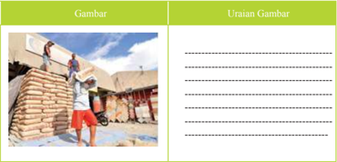

Gambar ini menunjukkan proses pengangkutan bahan baku atau bahan mentah dari pabrik ke tempat produksi. Dalam gambar tersebut, beberapa orang sedang memindahkan kantong-kantong bahan mentah menggunakan truk. Bahan mentah tampak berwarna putih dan disusun rapi di atas truk. Di sekitar area pengangkutan, terlihat beberapa petugas yang sedang berjalan atau berdiri, mungkin menunggu atau memeriksa kondisi bahan mentah. Gambar ini menunjukkan bahwa proses pengangkutan bahan baku sangat penting untuk operasional pabrik, karena dapat mempengaruhi efisiensi dan kualitas produk akhir. Topik utama tabel ini adalah proses pengangkutan bahan baku, dengan kolom-kolom yang mencakup detail tentang jenis bahan mentah, jumlah bahan mentah yang dipindahkan, dan posisi orang-orang yang terlibat dalam proses tersebut. Pola penting yang terlihat adalah hubungan antara pengangkutan bahan baku dan operasional pabrik, serta peran petugas dalam proses tersebut.

---
**📊 Tabel**

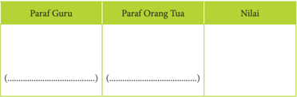

Tabel ini menunjukkan perbandingan antara paraf Guru, paraf Orang Tua, dan nilai yang diberikan kepada setiap paraf tersebut. Topik utama tabel ini adalah perbandingan paraf Guru dengan paraf Orang Tua dalam hal penilaian. Kolom pertama berisi paraf Guru, kolom kedua berisi paraf Orang Tua, dan kolom ketiga berisi nilai yang diberikan. Dari tabel ini, dapat dilihat bahwa nilai yang diberikan kepada paraf Guru lebih tinggi dibandingkan dengan nilai yang diberikan kepada paraf Orang Tua. Ini menunjukkan bahwa Guru lebih dihargai oleh orang tua daripada Orang Tua.

 

---
## 📄 Halaman 158

### C. Kewajiban Masing-Masing Varna

### Memahami Teks

Di dalam kitab Māhabhārata, Maha Reshi Bhisma telah memberi penjelasan tentang sifat-sifat umum yang harus  diikuti oleh setiap Varna, yang berarti juga untuk semua orang, yaitu:

- Akrodha atau tidak pernah marah.
- Satyam atau berbicara benar dan jujur.
- Samvibhaga atau adil dan jujur.
- Memperoleh anak dari hasil perkawinan.
- Berbudi bahasa yang baik.
- Menghindari semua macam pertengkaran.
- Srjawam atau berpendirian teguh.
- Membantu semua orang yang tergantung atas dirinya seseorang.
Jika dalam suasana kalut, seperti timbul peperangan atau marabahaya setiap Varna  wajib  ikut  membela  negara  atau  kerajaan.  Kewajiban-kewajiban  umum yang  harus  dilakukan  oleh  setiap  pemeluk  Hindu,  tanpa  memandang  Varna, pangkat, dan lain sebagainya, disebut Sadharana Dharma.

Sarasamuscaya sloka 63 juga menguraikan kewajiban-kewajiban umum yang berlaku untuk semua Varna. Kewajiban-kewajiban itu sebagai berikut:

Arjavam cānrśamsyam ca damāś, cendriyagrahah. Esa sādhārano dhramaś Catur varnye brawіmmanuh.

Nyāng ulah pasādhāranan sang Catur Varna, ārjawa, si duga-duga bener, anrcansya, tan nrcansya, nrçansya ngaraning ātmasukhapara, tan arimbawa ri laraning len, yawat mamuhara sukha ryawaknya, yatika nrçansya ngaranya, gatining tan mangkana, anŗçansya ngarnika dama, tumangguhana awaknya, indriyanigraha, hmrta indriya, nahan tang prawrtti pāt, pasadharanan sang Catur varna, ling Bhatara Manu.

### Terjemahan:

Inilah prilaku keempat golongan yang patut dilaksanakan, Arjawa, jujur dan terusterang. Anrcangsya, artinya tidak nrcangsya. Nrcangsya maksudnya mementingkan diri sendiri tidak menghiraukan kesusahan orang lain, hanya mementingkan segala yang menimbulkan kesenangan bagi dirinya, itulah disebut nrcangsya, tingkah laku yang tidak demikian anrcangsya namanya; dama artinya dapat menasehati diri sendiri; indriyanigraha mengekang hawa nafsu, keempat prilaku itulah yang harus dibiasakan oleh sang Catur Varna, demikian sabda Bhatara Manu.

Jadi kalau disingkat kembali prilaku bagi Sang Catur Varna ada empat yaitu Anrcansya (tidak mementingkan diri sendiri), Arjawa (jujur dan berterus terang),

 

---
## 📄 Halaman 159

Dama  (dapat  menasehati  diri  sendiri),  Indriyanigraha  (mengendalikan  hawa nafsu). Jadi, semua etika umum atau peraturan tingkah laku yang berlaku bagi umat Hindu berarti berlaku pula bagi semua Catur Varna. Atau sebaliknya.

Kalau  kewajiban-kewajiban  Varna  itu  tidak  dapat  berjalan  sebagai  mana mestinya  terjadi  percampuradukan  Catur Varna  itu  maka  akan  datanglah  masa yang disebut Kali Yuga di mana masyarakat akan kacau balau dan menuju pada kehancuran. Campur aduknya Varna di sini seperti tidak dapat bekerja menurut profesi  dan  fungsinya.  Misalnya  seorang  Brahmana  yang  berfungsi  sebagai pembina agama lalu menjadi atau mengambil pekerjaan dagang, seorang penguasa pemerintahan  lalu  menjadi  pengusaha.  Orang  yang  berbakat  dan  mempunyai pendidikan guru lalu bekerja tidak pada bidang pendidikan dan sebagainya.

Sarasamuscaya  sloka  61  menjelaskan  tentang  keadaan  kacau-balau  kalau masing-masing  Varna  tidak  berfungsi  sebagai  mana  mestinya.  Sloka  tersebut berbunyi sebagai berikut:

Rājābhir brahmanah sarwabhakso Waicyo' nіhāwān hinawarno' lasaśca, Widwānacilo wrttahinah kulinah Bhrasto brāhmanah stri ca dustā

Hana pwa mangke kramanya, ratu wedi-wedi, brāhmana sarwabhaksa. waiçya nirutsaha ring krayawikrayādi karma, çūdra alemeh sewakta ring sang triVarna, pandita duccila, sujanma anasar ring maryā dānya, brāhmana tan satya, stri dusta duccila.

### Terjemahan:

Jika ada hal yang demikian keadaannya, raja yang pengecut, brahmana doyan segala makanan, waisya tidak ada kegiatan dalam pekerjaan berniaga, berjual beli dan sebagainya, sudra tidak suka mengabdi kepada Tri Varna, pendeta yang bertabiat jahat, orang yang berkelahiran utama nyeleweng dari hidup sopan santun, brahmana yang curang dan wanita yang bertabiat nakal dan berlaku jahat.

Lalu, bagaimanakah semestinya kewajiban masing-masing Varna yang dianjurkan Hindu? Berikut penjelasan yang lebih rinci:

### 1.  Kewajiban Brāhmaṇa

Istilah Brāhmaṇa berasal dari bahasa Sansekerta dari urat kata 'brh' artinya tumbuh.  Dari  arti  kata  ini  dapat  kita  gambarkan  bahwa  fungsi  Brāhmaṇa adalah untuk menumbuhkan daya cipta rohani umat manusia untuk mencapai ketenteraman hidup lahir bathin. Brāhmaṇa juga berarti pendeta. Pendeta adalah gelar  pemimpin  agama  yang  menuntun  umat  Hindu  mencapai  ketenangan hidup dan memimpin umat dalam melakukan upacara agamanya.

Karena tugas atau kewajiban pokok dari Varna Brāhmaṇa adalah mempelajari Veda (Vedadhyayana) dan memelihara Veda-Veda itu atau disebut Vedarakshana, Varna Brāhmaṇa tidak boleh melakukan pekerjaan duniawi.

 

---
## 📄 Halaman 160

Untuk kehidupannya dia harus dibantu oleh Varna-Varna lainnya. Ini bukanlah berarti  memberikan  seorang  Brāhmaṇa  suatu  posisi  yang  istimewa  dalam masyarakat dan sebaliknya pula bukanlah menganggap Brāhmaṇa itu sebagai benalu dalam masyarakat.

Kaum  Brāhmaṇa  dibebani  tugas  untuk  melaksanakan  apa  pun  yang dipandang perlu demi memajukan kesejahteraan spiritual masyarakat. Demikian Chandrasekharendra Saraswati menyebutkan dalam bukunya AspekAspek. Agama Hindu. Jadi Varna Brāhmaṇa ini adalah golongan atau mereka yang berkecimpung dalam bidang kerohanian. Brāhmaṇa ini tidak berdasarkan suatu keturunan, melainkan karena ia mendapat kepercayaan dan mempunyai kemampuan untuk menjalankan tugas tersebut. Seseorang disebut Brāhmaṇa karena ia memiliki kelebihan dalam bidang kerohanian.

Dengan kata  lain  Brāhmaṇa  itu  adalah  golongan  fungsional  yang  setiap orangnya  memiliki  ilmu  pengetahuan  suci  dan  mempunyai  bakat  kelahiran untuk mensejahterakan masyarakat, negara dan umat manusia dengan jalan mengamalkan ilmu pengetahuannya dan dapat memimpin upacara keagamaan.

Dalam  Kitab  Sarasamuscaya  sloka  56  kewajiban  Brāhmaṇa  dijelaskan sebagai berikut:

Dahrmasca satyam ca tapo damaśca Wimatsaritwam hristitiksanasuya, Yajnsca dhiritih ksama ca Mahawratani dwadasa wai barhmanasya.

Nyang brata sang Brāhmaṇa, rwa welas kwehnya. prayekanya, dharma, satya, tapa, dama, wimatsaritwa, hrih, titiksa, anasuya, yajňa, dāna, dhrthi, ksma, nahan pra tyekanyan rwawelas, dharma, satya, pagwanya, tapa ngaranya śarira sang śosana, kapanasaning śarira, piharan, kurangana wisaya, dama ngaranya upaśama, dening tuturnya, wimatsaritwa ngarani haywa irsya, hrih ngaran irang, wruh ring arang wih, titiksa ngaraning haywa irsya, hrih ngara ning irang,wruha ring irang wih, titiksāngaraning haywa  gong krodha, anasūyā haywa dosagrāhi, yaňa magelem amuja, dāna, maweha dānapunya, dhŗti ngaraning maneb, āhning, ksama ngaraning kelan, nahan brata sang brāhmana.

### Terjemahan:

Inilah Brata Sang Brāhmaṇa, dua belas banyaknya, perinciannya dharma, satya, tapa, dama wimatsaritwa, hrih, titiksa, anasuya yajna, dana, dhrthi, ksama, itulah perinciannya sebanyak dua belas, dharma dari satyalah sumbernya, tapa artinya carira sang cosana yaitu dapat mengendalikan jasmani dan mengurangi nafsu, dama artinya tenang dan sabar, tahu menasehati diri sendiri, wimatsaritwa artinya tidak dengki irihati, hrih berarti malu, mempunyai rasa malu, titiksa artinya jangan sangat gusar, anasuya berarti tidak berbuat dosa, yajna mempunyai kemauan mengadakan pujaan, dana adalah memberikan sedekah, dhrti artinya penenangan dan pensucian pikiran, ksama berarti tahan sabar dan suka mengampuni, itulah Brata Sang Brāhmaṇa.

 

---
## 📄 Halaman 161

Tentang  peranan  dan  fungsinya,  Brāhmaṇa  harus  melakukan  Yajna  dan bersahabat dengan semua makhluk. Berperanan sebagai guru (acarya) dengan mengajarkan  Veda,  Kalpa  dan  Upanisad,  memimpin  upacara  Garbhadana. Melakukan tapa,  brata,  dan  semadi  menurut  ajaran Veda.  Selama  hidupnya seorang Brāhmaṇa  harus tetap meladeni Guru  atau Nabenya  itu sampai meninggal. Belajar dan mengajar adalah Yajnya bagi seorang Brāhmaṇa, harus mengamalkan seluruh ilmu pengetahuannya kepada Varna-Varna yang lainnya.

Tentang  sifat  dan  ciri-cirinya,  Brāhmaṇa  adalah  orang  yang  mampu mengendalikan panca indranya, berpengetahuan yang suci, berbudi baik dan tekun, dapat menguasai dirinya sepenuhnya, tidak makan segala, selalu hormat kepada orang lain. Kalau ada Brāhmaṇa yang tidak tahu Veda ibarat seekor sapi betina yang tidak bisa beranak dan mengeluarkan susu. Selalu waspada kepada pujian dan cemohan. Seorang Brāhmaṇa tidak boleh menyombongkan nama Gotranya apalagi untuk kepentingan mendapatkan makanan, ini makan benda busuk namanya.

---
**🖼️ Gambar/Diagram**

> **Deskripsi Visual:** Gambar ini adalah ilustrasi yang menunjukkan seorang guru berbicara dengan beberapa murid di kelas. Guru tampak senang dan berteriak kepada muridnya, sementara murid-murid lainnya sedang menulis di buku tulisannya. Ilustrasi ini menunjukkan hubungan antara guru dan murid dalam situasi belajar mengajar.

Elemen utama dalam gambar ini adalah guru, murid, dan lingkungan kelas. Guru berada di tengah-tengah, sedang berbicara dan menunjukkan ekspresi positif. Murid-murid berada di sekitar guru, sedang fokus pada tugas mereka. Lingkungan kelas tampak nyaman dan teratur, dengan meja dan kursi yang rapi.

Teks, angka, atau label penting tidak terlihat dalam gambar ini karena ia hanya berupa ilustrasi. Namun, informasi kunci yang dapat diambil dari gambar ini adalah bahwa guru dan murid sedang berinteraksi dalam proses belajar mengajar, menunjukkan hubungan positif antara guru dan murid dalam konteks pendidikan.

Tentang kewajiban dan sifat-sifat  seorang  Brāhmaṇa:  Orang  yang  bebas dari  ketakutan  dan  ikatan  belenggu-belenggu,  tenang,  seimbang,  sadar  dan dapat mengatasi hawa nafsu, bebas dari rasa marah, orang yang tidak suka menyakiti dengan pikiran, kata-kata dan perbuatan, orang yang telah padam penderitaannya,  di  dalam  dirinya  bersemayam  kebenaran  dan  kebajikan, suka hidup sederhana, telah mencapai penerangan yang sempurna, tabah dan sabar menghadapi  hukuman-hukuman,  itnahan, penganiayaan walaupun dirinya  tak  bersalah,  orang  yang  dengan  seksama  menjalankan  tugas-tugas agamanya,  sama  sekali  tidak  terikat  pada  kesenangan-kesenangan  duniawi, mengetahui akhir dari penderitaan, orang yang mengetahui dengan jelas jalan yang salah, penuh kebijaksanaan, telah mencapai tujuan yang tertinggi, tidak suka menyiksa dan membunuh makhluk lainnya, tidak pernah mendendam, kata-katanya  mudah  dipahami,  tidak  pernah  mencuri,  dapat  melepaskan

 

---
## 📄 Halaman 162

diri  dari  kehidupan  dunia  ini,  telah  mencapai  dasar  keabadian,  telah  dapat melepaskan diri  dari  tumimbal  lahir  dan  kesesatan,  sebagai  pahlawan  yang dapat menaklukan dunia, mengetahui timbul dan lenyapnya benda-benda yang hidup, mengetahui kehidupannya yang dulu, mengetahui sorga & neraka, telah mencapai akhir dari kelahiran.

### 2.  Kewajiban  Kṣatriya

Kata  Kṣatriya  berasal  dari  bahasa  Sansekerta.  Artinya  suatu  susunan pemerintahan,  atau  juga  berarti  pemerintah,  prajurit,  daerah,  keunggulan, kekuasaan dan kekuatan. Memang  kewajiban Kṣatriya dalam Catur adalah memimpin pemerintahan, untuk memerintah memerlukan kekuasaan, kekuasaan itu memerlukan kekuatan.

---
**🖼️ Gambar/Diagram**

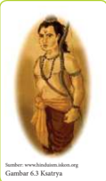

> **Deskripsi Visual:** Gambar ini adalah ilustrasi yang menampilkan Gambar 6.3 Kustiarya dari sumber hindunet.idkson.org. Gambar ini menggambarkan seorang pria yang sedang berjalan dengan posisi tubuh yang tegak. Pria tersebut memakai pakaian tradisional India yang terdiri dari baju panjang berwarna putih dan celana pendek berwarna merah. Ia juga memakai sebuah topi tradisional yang berwarna cokelat tua. Pria tersebut tampak tenang dan tenang, menunjukkan bahwa ia sedang berjalan dengan tenang dan rileks. Ini mungkin merupakan bagian dari penjelasan tentang kebiasaan atau perilaku tradisional dalam budaya India.

Varna

Yang  dimaksud  dengan  kekuatan  dalam  hal ini bukan saja kekuatan phisik tetapi yang lebih utama adalah kekuatan rohani yang berupa kekuatan iman, kekuatan pikiran (intelegensinya) dan semangat yang tinggi.

Dalam  Buku  Tabir  Mahabrata  oleh  Resi Wahono  dijelaskan  kewajiban  Ksatriya  yakni menjaga ketentraman dunia untuk kepentinganmasyarakat, dan sama sekali terlepas dari kepentingan  pribadi.  Seseorang  barulah  dapat disebut bersikap Ksatriya bila telah dapat mengatasi  segala  keadaan  dengan  baik  dan tak terikat pada  kepentingan  pribadi,  bebas melaksanakan kewajibannya dengan tidak gentar sedikitpun menghadapi segala resiko meskipun harus  mengorbankan  jiwa  raganya.  Ini  bukan berarti  seorang  Kṣatriya  tidak  punya  cita-cita  hidup  untuk  diri  pribadinya.  Bagi seorang Ksatriya kemuliaan dan kenikmatan untuk diri sendiri, sama sekali tidak termasuk dalam hitungan. Yang diutamakan dalam cita-citanya adalah kebahagiaan dan keselamatan buat orang banyak dan justru karena malakukan kewajiban itulah Ksatriya akan memproleh kesempurnaan hidup.

Dari  sumber  lontar  Brahmokta  Widhisastra  dan  Widhi  Papincatan  kita memproleh  gambaran  bahwa  jabatan Kṣatriya itu tidak berlaku  permanen karena  dapat  berubah  atau  turun  kedudukannya  (panten)  kalau  tidak  dapat melakukan  kewajiban-kewajiban  yang  telah  ditentukan  oleh  ajaran  agama. Dalam  Tabir  Mahabrata  kita  memproleh  gambaran  bahwa  seseorang  Kṣatriya tidak boleh ragu-ragu dalam mengambil sikap terutama ia melakukan tugas dan kewajibannya. Seorang Ksatriya yang taat melakukan kewajiban untuk membela  kebenaran  akan  mendapat  pahala  utama.  Hal  ini  diuraikan  juga dalam kekawin Nitisastra sargah IV bait 2 sebagai berikut:

 

---
## 📄 Halaman 163

Sang śurāmênanging renānggana, mamukti suka wibhawa bhoga wiryawān.

Sang śūrāpêjahing ranangga mangusir surapada siniwing surāpsari. Yan bhiru n

mawêdi ng ranānggana pêjah yama-bala manikêp mamidana. Yan tan mati tininda ringparajanenirang-irang inaňang sinorakên.

### Terjemahan:

Sang Ksatriya memang dalam peperangan menikmati kesenangan, kewibawaan, makan enak dan keagungan. Sang Kṣatriya bila mati dalam peperangan, rohnya menuju swargaloka, dielu-elukan oleh para bidadari. Kalau pengecut, lari dalam peperangan dan mati ditangkap dan dihukum, rohnya diadili oleh Bhatara Yama. Kalau tidak mati, dicerca, diolok-olok dan ditawan oleh musuh.

Di  samping  itu  Bhagavadgītā  II,  31  memberikan  penjelasan  yang  lebih gamblang  tentang  letak  kesempurnaan  seorang  Kṣatriya  dalam  melakukan tugas dan kwajiban. Sloka tersebut berbunyi sebagai berikut:

sva-dharmam api cāvekṣya na vikampitum arhasi dharmyād dhi yuddhāc chreyo 'nyat kṣatriyasya na vidyate

### Terjemahan:

Apabila engkau sadar akan kewajibanmu, engkau tidak akan gentar, bagi Kṣatriya tiada kebahagiaan yang lebih besar daripada berjuang menegakkan kebenaran.

Dari  sumber-sumber  tersebut  kiranya  cukup  jelas  peranan  dan  fungsi Kṣatriya  Varna,  yaitu  memimpin  dan  melindungi  rakyat.  Dari  sumber-sumber itu pula dapat disebutkan bahwa raja sudah jelas dapat dipastikan tergolong Varna Kṣatriya.  Lontar Raja Pati Gondola menyebutkan tugas dan kewajiban seorang  raja  sebagai  golonganKṣatriya,  antara  lain,  Raja  harus  mengeta¬hui upaya sandhi yang terdiri dari tiga unsur yaitu: (a) Rupa artinya raja harus dapat melihat wajah rakyat dengan baik, (b) Wangsa artinya raja harus dapat melihat  tata  susunan  masyarakat  yang  utama,  (c)  Guna  artinya  raja  harus mampu mengetahui rakyatnya yang memiliki keahlian.

Di  samping  lontar  tersebut  juga  menggambarkan  bahwa  seorang  raja harus mengetahui Rajaniti Kamkamuka yaitu suatu ajaran yang menyebutkan seorang  raja  adalah  sebagai  pengemudi  dan  negara  sebagai  perahu.  Jika perahu itu tanpa pengemudi, maka ia akan tenggelam di tengah-tengah lautan, demikian pula sang raja tatkala memegang pemerintahan, kalau lengah sedikit saja negara akan bisa hancur.

 

---
## 📄 Halaman 164

Seorang raja harus hormat kepada dewa-dewa, memuja para Bhatara dan harus  hormat  kepada  para  pendeta.  Yang  patut  dimiliki  oleh  seorang  raja menurut agama Hindu adalah:

- Utpatiti yaitu pemikiran diri sendiri
- Castra samudbhavah artinya yang diperoleh dari ajaran agama
- Sangsarga artinya pemikiran memberi maaf antara sahabat
- Parinamidi artinya sifat pemaaf bagi seorang pemimpin.
Dalam lontar Siwa Budha Tatwa seorang raja dalam menghadapi musuh harus berpegang pada Panca Upaya Sandhi yaitu:

- Maya, artinya mengadakan pancingan-pancingan untuk mendapatkan data-data tentang keadaan musuh
- Upeksa, artinya meneliti hasil pancingan-pancingan itu
- Indrajala, artinya memasang perangkap untuk menangkap musuh
- Wikrama, artinya baru mengadakan tindakan
- Logika, artinya setiap tindakan harus berdasarkan perhitungan akal yang matang.
Di dalam kekawin Ramayana digubah oleh pujangga Walmiki yang terdiri dari  110  sloka,  pada  sloka  pendahuluannya  menyebutkan  tentang  sifat-sifat Hyang  Widhi  Wasa  yang  menjadikan  kekuatan  bagi  umatnya,  dan  tentang kemampuan yang harus dimiliki oleh seorang raja (pemimpin). Dalam sloka kedua disebut:

Hyang Indra Surya Candranilah Kuwera Bayuagni nahanwulu ta sira maka angga sang bupati matangnyah inisti asta brata.

### Terjemahan:

Dewa Indra, Yama, Surya, Candra, Anila, Bayu, Kuwera, Baruna dan Agni itulah delapan dewa yang merupakan badan sang raja/ pemimpin, delapan itulah yang merupakan Asta Brata.

Kedelapan Brata yang menjadi badannya pemimpin itu bukanlah berdiri sendiri, melainkan  suatu  kebulatan  yang  tidak  dapat  dipisahkan.  Asta  Brata  memberi pengaruh  yang  besar  sekali  dan  kewibawaan  yang  luhur,  sehingga  pemimpin itu mudah sekali menggerakkan orang/bawahannya, untuk bekerja menjalankan tugasnya masing-masing. Dewa-dewa tersebut menurut Agama Hindu merupakan personiikasi sifat-sifat Hyang Widhi.

 

---
## 📄 Halaman 165

Jadi  Dewa  itu  bukanlah  Tuhan  melainkan  sifat-sifat  Tuhan.  Dilihat  dari sudut  ini  maka  jelas  nampak  bahwa  seseorang  pemimpin  dalam  segala tindakannya harus mencerminkan kemulyaan Hyang Widhi Wasa. Penjelasan yang serupa benar dengan Asta Brata menurut Ramayana di atas dijumpai pula dalam Manawa Dharmasastra VII, 4 sebagai berikut:

Indrānilayam ārkānām, agneśca varunasya ca Candravitteśayoś caiva, mātrā nirhrtya śāśvatih.

### Terjemahan:

Untuk memenuhi maksud dan tujuan itu, raja harus memiliki sifat-sifat partikel yang kekal dari dewa: Indra, Wayu, Yama, Surya, Agni, Waruna, Candra dan Kuwera.

Dari  beberapa  uraian  tersebut,  maka  jelas  bahwa  yang  paling  berhak untuk  duduk  di  lapangan  pemerintahan  adalah  Varna  Kṣatriya.  Rakyat  harus menghormati  raja  sebagai  raja  (pemerintah)  dan  sebaliknya  Varna  Kṣatriya  itu harus memperlakukan rakyat sebagai seorang bapak terhadap anaknya. Harta benda rakyat tidak boleh diisap begitu saja dengan mengadakan pajak yang bukan-bukan.  Pajak  yang  dipungut  oleh  Varna  Kṣatriya  atau  pemeritah  harus digunakan untuk kemakmuran negara.

Di Bali dan Jawa, ada istilah yang terkenal disebut Manunggaling  Kawula lawan Gusti  yang  maknanya  harus  ada  persatuan  antara  rakyat  dan  pemerintahan. Demikian pula ada istilah Katemuaming Bakti kelawan sweca yang maknanya rakyat harus hormat dan mendukung pemerintah dan sebaliknya pemerintah harus melindungi rakyatnya dari segala mara bahaya.

Dengan demikian kiranya disimpulkan bahwa Varna Kṣatriya itu adalah golongan fungsional yang setiap orangnya memiliki kewibawaan, cinta tanah air, serta bakat kelahiran untuk memimpin dan mempertahankan kesejahteraan masyarakat, negara dan umat manusia berdasarkan dharmanya.

### 3. Kewajiban Varna Vaiśya

Varna Vaiśya merupakan Varna yang ketiga dalam susunan Catur Varna. Kata  Vaiśya  (aslinya  Vaisya)  berasal  dari  bahasa  Sansekerta  dari  urat  kata 'Vie'  artinya  bermukim  di  atas  tanah  tertentu.  Dari  urat  kata  tersebut  lalu berkembang  menjadi  kata  Vaiśya  yang  artinya  golongan  pekerja  atau  seorang yang mengusahakan pertanian. Demikianlah dijelaskan oleh A.A. Mac Donel dalam kamusnya. Dari keterangan-keterangan berikutnya memang peranan dan fungsi Varna Vaiśya tidak begitu jauh menyimpang dari arti katanya. Peranan dan fungsi Vaiśya dijumpai dalam beberapa pustaka suci Hindu. Bhagavadgītā XVIII, 44, menguraikan kewajiban Varna Vaiśya sebagai berikut:

 

---
## 📄 Halaman 166

kṛṣi-go-rakṣya-vāṇijyaḿ vaiśya-karma svabhāva-jam paricaryātmakaḿ karma śūdrasyāpi svabhāva-jam kṛṣi-go-rakṣya-vāṇijyaḿ vaiśya-karma svabhāva-jam...

### Terjemahan:

Bercocok tanam, beternak sapi dan berdagang adalah karma (kewajiban) Waisya menurut bakatnya.

(Pendit, 2002: 444)

Sloka  ini  diterjemahkan  oleh  Prof.  Dr.  Ida  Bagus  Mantra  sebagai  berikut: 'Pertanian,  pemeliharaan  ternak  dan  perdagangan  adalah  kewajiban  Vaiśya  yang lahir  dari  alamnya.'  Jadi singkatnya fungsinya di sini adalah berfungsi dalam bidang  ekonomi.  Dalam  Manawa  Dharmasastra  I,  90,  kewajiban  Vaiśya  adalah sebagai berikut:

Hal yang perlu digarisbawahi di sini adalah bahwa Varna Vaiśya itu dibolehkan membungakan  uang.  Namun,  membungakan  uang  terbatas  untuk  kepentingan yang  produktif  dan  bukan  untuk  kepentingan  konsumtif,  tidak  pula  dibenarkan meminjamkan uang dengan motif pemerasan atau yang dikenal dengan istilah riba.

Selanjutnya  pustaka  suci  Sarasamuccaya,  59,  juga  menguraikan  tentang kewajiban  Varna  Vaiśya  sebagai  berikut:

---
**🖼️ Gambar/Diagram**

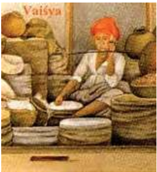

> **Deskripsi Visual:** Gambar ini adalah ilustrasi yang menunjukkan seorang anak muda berjubah merah dan topi merah sedang duduk di atas beberapa tas bambu. Anak tersebut sedang memegang sebuah alat tulis dan tampaknya sedang menulis atau mencatat sesuatu. Di sebelah kanan, ada beberapa buku yang tampaknya berisi teks atau gambar. Gambar ini menunjukkan aktivitas sehari-hari seseorang yang mungkin sedang belajar atau bekerja dengan alat tulis tradisional.

 

---
## 📄 Halaman 167

Waiśyo' 'dhitya brāhmanāt ksatriyādwā dhanaih kāle Sambiwhajyāśritamśca tretāpūrwan dhūmāmaghrāya punyam pretya swarge dewasukha bhinukte.

Nihan ulaha Sang waiśya, mangajya sira ri sang Brāhmaṇa, ri sang Kṣatriya kuneng, mwang maweha dāna ri tekaning dānakāla, ring śubhadiwasa,dumdumana nira ta sakwehning mamaracraya ri sira mangelema amūjā ring sang hyang tryagni ngaranira sang hyang apuy tiga, pratyekenira, ahawaniya,garhaspatya, citāgni. āhawanidha ngaranira apuy ning asuruhan, rumateng pinangan, Garhaspatya ngaranira apuy ri winarang, apan agni saksika kramaning-winarang i kālaning wiwāha,citāgni ngaranira apuy ning manunu cawa, nahan ta sanghyang  tryagni ngaranira, sira ta pujan  de sang waicya, ulah nira ika mangkana, ya tumekaken sira ring swarga dlaha.

### Terjemahan:

Yang patut dilakukan oleh Sang Vaiśya ialah ia harus belajar pada Sang Brāhmaṇa maupun pada Sang Kṣatriya, dan hendaknya ia memberikan sedekah pada saatnya/waktu persedekahan tiba, pada hari yang baik, hendaklah ia membagi-bagikan sedekah kepada semua orang yang meminta bantuan kepadanya dan taat mengadakan pemujaan terhadap tiga api suci yang disebut Tri Agni. yaitu tiga api suci yang perinciannya adalah: Ahawania, Grehaspatya dan Citagni. Ahawania artinya api tukang masak untuk memasak makanan, Grehaspatya artinya api untuk upacara perkawinan, inilah api yang dipakai pada waktu perkawinan sebagai api yang berfungsi sebagai saksi dalam perkawinan, Citagni artinya api untuk membakar mayat itulah api yang disebut tri agni, ketiga api inilah yang harus dihormati dan dipuja oleh Sang Vaiśya, perbuatannya itu akan mengantarkan ia kelak ke sorga.

Keterangan  Sarasamuccaya  ini  seperti  berbeda  dengan  keterangan  pustakapustaka  suci  Hindu  di  atas,  namun  kalau  direnungkan  lebih  mendalam  tidak ada  perbedaan  yang  bersifat  prinsipil.  Cuma  keterangan  Sarasamuccaya  ini sedikit  menambahkan  bahwa  seorang  Vaiśya  dalam  fungsinya  sebagai  pengatur ekonomi tidak boleh lepas dengan prinsip agama dan prinsip spiritual. Dengan demikian dapat digambarkan bahwa sistem ekonomi Hindu, adalah ekonomi yang mensejajarkan antara kebutuhan jasmani dan rohani.

Dari seluruh keterangan di depan, maka seluruh kewajiban Varna Vaiśya cukup jelas  yaitu  berperan  dalam mewujudkan kemakmuran ekonomi. Keterangan ini sangat erat hubungannya dengan keterangan Chandra Prakash Bhambhri bahwa salah satu tugas atau lapangan Dkamuniti adalah mewujudkan kemakmuran yang disebut dengan istilah Vartta. Vartta ini meliputi tiga unsur pokok yaitu: pertanian

 

---
## 📄 Halaman 168

( agricultural ),  peternakan  ( cattle breading )  dan  perdagangan  ( trade ).  Resi Kautilya menyebutkan istilah Krsi, Raksya dan Wanijyam.

Jika disimpulkan, tugas Varna Vaiśya adalah untuk kemakmuran negara. Tugastugas  mereka  terutama  mengusahakan  pertanian,  peternakan  dan  perdagangan. Vaiśya  harus  mengetahui  dan  mengatur  harga  barang-barang  terutama  barangbarang yang merupakan kebutuhan pokok. Mereka harus mahir bercocok tanam, harus tahu soal-soal keadaan tanah di seluruh daerah, apakah tanah itu subur atau tidak, tanaman apa yang cocok untuk ditanam di masing-masing daerah. Mereka harus mahir dalam seluk beluk timbangan dan barang-barang yang paling banyak mendatangkan keuntungan. Vaiśya harus mahir dalam bidang peternakan. Mereka harus selalu berdana punia pada golongan Brāhmaṇa dan membiyayai pendirian tempat-tempat ibadah. Jadi Varna Vaiśya adalah golongan fungsional yang setiap orang memiliki watak tekun, terampil, hemat, cermat dan keahlian serta bakat kelahirannya  untuk  menyelenggarakan  kemakmuran  masyarakat  negara  dan kemanusiaan.

### 4. Kewajiban  Varna  Śudra

Kata  Śudra  berarti  golongan  pelayan.    Keterangan    mengenai  peranan  serta fungsi Varna Śudra dari sumber-sumber pustaka suci Agama Hindu hampir senada  dengan  kata  Śudra  itu  sendiri.  Bhagavadgītā  XVIII,  44  menguraikan peranan dan fungsi Śudra senada dengan uraian di atas yaitu:

kṛṣi-go-rakṣya-vāṇijyaḿ vaiśya-karma svabhāva-jam paricaryātmakaḿ karma śūdrasyāpi svabhāva-jam paricaryātmakaḿ karma śūdrasyāpi svabhāva-jam

### Terjemahan:

Meladeni (menjual tenaga) adalah kewajiban Śudra menurut bakatnya.

Prof.  Dr.  Ida  Bagus  Mantra  menterjemahkan  sloka  ini  sebagai  berikut: 'Pekerjaan  yang  mempunyai  karakter  pelayanan  adalah  kewajiban  dari  Śudra yang lahir dari alamnya.' Seluruh keterangan di atas diperkuat lagi oleh kitab Manawa Dharmasastra I, 91, sebagai berikut:

Ekam eva tu śūdrasya prabhuh karma samādiśat etesām eva varnānām śuśrusām anasūyaya

### Terjemahan:

Hanya satu tangan yang Tuhan tentukan untuk para Śudra yaitu memberikan pelayanan dengan setia terhadap ketiga golongan lainnya.

 

---
## 📄 Halaman 169

Ayat ini merupakan landasan hukum dan kriteria untuk menentukan apakah seseorang termasuk katagori Śudra atau tidak. Menurut ayat ini kehidupan pokok dari Śudra adalah kerja menjadi buruh, pekerja yang menggantungkan hidupnya kepada orang lain dan hasil dari pada menjual tenaga. Seandainya seorang Śudra tidak mendapat pekerjaan sebagai buruh atau pelayan, dan hal itu akan mengancam hidupnya dan membuatnya kelaparan, maka seseorang Śudra dapat bekerja sendiri. Hal ini dapat dibenarkan oleh sloka atau ayat 99. Bab X kitab Manawa Dharmaśāstra yang bunyinya sebagai berikut:

Aśaknuvams tu śuśrūsām śūdrah karttum dvijanmanām, putradārātyayam prāpto jivet kāruka karmabhih

### Terjemahan:

Seorang Śudra karena tidak mempunyai dan memproleh pekerjaan sebagai pelayan dan terancam akan kehilangan anak dan istrinya karena lapar ia dapat menunjang hidupnya dengan kerja tangan.

Adapun  pustaka  Slokantara  38  menguraikan  tentang  kewajiban  Varna Śudra  sebagai  berikut:

Vanigranistu bhkamukrad wanijah padajatayah, Krayavikrayakaryatha Ciidrastuvanijyakryah. Kalinganyakaryasang Śudra adagang alayar madwal awali, kawrdhyan ning artha donya, banyak akriya, yeka cudra sasana, ling sanghyang aji. Kunang ikang antyajati ngaranya, walu wilang nika sor jagatyangeng rat ling sanghyang Castra.

### Terjemahan:

Seseorang Śudra adalah pembuat barang pecah belah dan pedagang. la melakukan pembelian dan penjualan, bekerja di lapangan jual beli. Kewajiban seorang Śudra ialah mengembara berkeliling, menjual dan membeli. Tujuan utamanya ialah memupuk kekayaan. la bekerja di lapangan perdagangan. Inilah kewajiban seorang Śudra menurut kitab suci.

Prof.  S.P.  Kanal,  penulis  India  moderen,  mengatakan  dalam  bukunya Dialogous  on  India  Culture,  bahwa  kewajiban  seorang  Śudra  yang  utama  ialah bekerja di bawah bimbingan dan pengawasan ketiga golongan yang lainnya. Ia menjalankan upacara keagamaan yang tidak usah memerlukan pembacaan mantra-mantra.

 

---
## 📄 Halaman 170

Demikian  pula  menurut  Dr.  Gangga  Prasad  Uphadyaya  dalam  bukunya Vedic Culture. Jika ada orang yang tingkat kecerdasannya rendah, yang tidak dapat menentukan pekerjaan apa yang harus dipilihnya untuk dirinya sendiri, ia tidak akan dibiarkan hidup malas berpangku tangan saja, kemalasan itu sangat berbahaya  bagi  masyarakat.  Masyarakat  memaksakan  untuk  mengerjakan sesuatu  atas  petunjuk  dan  pengawasan  mereka  yang  dapat  memilih  dan memimpinnya, orang yang demikian dinamai kaum Śudra, orang malang. Kemalangan ini yang menyebabkan ia diletakkan dalam tingkat yang paling rendah,  bukan  dipaksakan  kepadanya  oleh  masyarakat.  la  menjadi  Śudra bukan karena dipaksa oleh masyarakat. la menjadi demikian karena ia tidak dapat dan tidak mampu karena kelemahan-kelemahannya sendiri. Meskipun demikian iapun tidak dibuang oleh masyarakat, ia masih tetap sebagai salah seorang anggotanya.

Dari seluruh uraian di atas dapatlah disimpulkan bahwa Varna Śudra itu adalah  mereka  yang  memenuhi  kebutuhannya  dengan  menjadi  pelayan, pesuruh  atau  pembantu  orang  lain.  Atau  golongan  fungsional  yang  setiap orangnya hanya memiliki kekuatan jasmaniah, ketaatan serta bakat kelahiran untuk  sebagai  pelaku  utama  dalam  tugas-tugas  memakmurkan  masyarakat, negara  dan  umat  manusia  atas  petunjuk-petunjuk  dari  golongan  fungsional lainnya.

### Kegiatan  Siswa

Setelah  mempelajari  materi  tentang  kewajiban  masing-masing  warna  ini, kerjakan kegiatan siswa sebagai berikut :

- Carilah isu-isu terhangat mengenai catur warna terkait dengan adanya kasta dan diskriminasi dalam dimasyarakat!
- Amatilah permasalahan tersebut serta analisis secara mendalam.
- Presentasikan di depan kelas.

 

---
## 📄 Halaman 171

### D. Catur Varna dan Profesionalisme

### Memahami  Teks

Yang  menjadi  pertanyaan  adalah  mengapa  dalam  Bhagavadgītā  dan  kitabkitab  Hindu  lainnya  disebutkan  Tuhan  hanya  menciptakan  empat  profesi  atau Catur  Varna  padahal  kita  melihat  dewasa  ini  banyak  sekali  jenis  profesi  yang berkembang?   Dapatkah   semua jenis   profesi   itu dikelompokkan menjadi empat kelompok profesi? Hal inilah yang perlu dibahas sehingga Catur Varna itu menjadi lebih jelas perannya dalam pembangunan masyarakat.

Catur Varna itu adalah empat profesi yang diciptakan oleh Tuhan. Di dunia ini, yang kekal abadi adalah Tuhan. Semua ciptaannya dapat berubah-ubah atau mengalami penyempurnaan-penyempurnaan sesuai dengan tuntutan zaman.

Perbedaan  setiap  zaman  inilah  yang  menyebabkan  perbedaan  penekanan profesi atau Varna yang dibutuhkan. Pada zaman Kertha manusia berumur panjang dan penuh dengan kebajikan, maka yang paling utama adalah melakukan tapa, brata  dan  semadhi.  Pada  zaman  ini  profesi  atau  Varna  Brāhmaṇalah  yang  paling dibutuhkan.  Karena  Varna  Brāhmaṇa  yang  paling  dibutuhkan  maka  wajarlah secara  sosiologis  Varna  Brāhmaṇa  yang  dianggap  paling  utama.  Pada  zaman Kerta kesucianlah yang dianggap paling penting.

Pada zaman Treta kesaktian atau  kepinteran  yang  dianggap  paling  penting. Pada zaman ini orang memuja-muja kemampuan (kesaktian). Zaman Treta profesi Kṣatriya menjadi paling menonjol, karena itu Varna Kṣatriyalah yang dianggap paling  utama.  Pada  zaman  Dwapara,  yadnya  yang  dianggap  paling  utama. Upacara yadnya yang besar akan menghabiskan dana yang besar, karena itu Varna Vaiśyalah yang dianggap paling utama. Pada zaman Kali yang dianggap paling utama adalah pemberian harta benda. Sumber harta benda adalah Varna Vaiśya dan Śudra, karena itu Varna Vaiśya dan Śudralah yang dianggap paling menonjol.

Kedudukan utama pada  masing-masing Varna  yang  didapatkan  pada  setiap zaman  hanyalah  merupakan  pkamungan  sosiologis  saja.  Kalau  ditinjau  secara ilosois,  semua  Varna  adalah  penting  pada  setiap  zaman  dan  pada  setiap  ora ng. Menurut  Prof.  Dr.  I.  B.  Mantra,  Catur  Varna  secara  ilosois  ada  pada  setiap orang. Dalam bercita-cita hendaknya seseorang itu menjadikan dirinya seorang Brāhmaṇa,  dalam  mengembangkan  cita-citanya  seseorang  hendaknya  menjadi seorang Kṣatriya. Dalam hal memelihara kemakmurannya hendaknya ia menjadi seorang Vaiśya, melayani semua itu hendaknya ia menjadi seorang Śudra. Keempat Varna atau profesi itu unsur-unsur dasarnya ada pada diri setiap orang.

Idealnya  keempat  profesi  itu  dapat  ditumbuhkan  secara  seimbang  dan profesional. Pertumbuhan unsur-unsur Varna atau profesi dalam diri setiap orang tidaklah  terlalu  sama. Ada  pada  diri  seseorang,  yang  lebih  kuat  pengaruh  dan pertumbuhannya  bakat  kerohanian,  orang  ini  akan  menjadi  seorang  Brāhmaṇa.

 

---
## 📄 Halaman 172

Ada yang lebih dominan pertumbuhan bakatnya dalam kepemimpinan, orang ini akan menjadi Varna Kṣatriya.

Brāhmaṇa,

Fungsi

Catur Varna pada dasarnya landasan ilosois untuk mengembangkan profesionalisme dalam rangka mendapatkan peranan dan fungsi dalam pembangunan manusia dan masyarakat. Dalam konsepsi Varna sebenarnya  cukup  jelas  ruang  dan  peluang  yang  disediakan  agar  profesi  ke Brāhmaṇaan menjadi berkembang sesuai dengan perkembangan zaman. Varna Brāhmaṇa menjaga dan mempelajari Veda  dapat  dilihat  aktualisasinya menjadi penyucian diri dan menyucikan orang lain. Belajar dan mengajar dengan tulus  ikhlas  demikian  bentuk  nyata  dari  pengalaman  Varna  Brāhmaṇa.  Mengatur pemerintahan, menata masyarakat, melayani masyarakat adalah bentuk pengamalan Varna  Kstriya.  Bergerak  dalam  bidang  distribusi  dan  produksi  barang-barang ekonomi  untuk  memenuhi  kebutuhan  konsumen  adalah  wujud  dari  pengamalan profesi  Varna  Vaiśya.  Membantu  dengan  tenaga  isik  adalah  pengamalan  dari  Varna Śudra.  Keempat  Varna  itu  akan  dapat  saling  isi  mengisi  antara  satu  dengan yang lainnya. Pengelompokan masyarakat ke dalam empat Varna itu akan menumbuhkan hubungan sosial yang saling membutuhkan. Keretakan di antara profesi itu akan dapat merugikan semua pihak.

 

---
## 📄 Halaman 173

### Uji  Kompetensi

- Jelaskan pengertian Catur Warna !
------------------------------------------------------------------------------------------------

------------------------------------------------------------------------------------------------

-----------------------------------------------------------------------------------------------

-----------------------------------------------------------------------------------------------

-----------------------------------------------------------------------------------------------

-----------------------------------------------------------------------------------------------

- Sebutkan dan jelaskan pembagian dari catur warna !
------------------------------------------------------------------------------------------------

-----------------------------------------------------------------------------------------------

-----------------------------------------------------------------------------------------------

-----------------------------------------------------------------------------------------------

-----------------------------------------------------------------------------------------------

-----------------------------------------------------------------------------------------------

- Sebutkan kewajiban dari masing-masing warna dalam masyarakat !
------------------------------------------------------------------------------------------------

------------------------------------------------------------------------------------------------

------------------------------------------------------------------------------------------------

------------------------------------------------------------------------------------------------

------------------------------------------------------------------------------------------------

-------------------------------------------------------------------------------------------------

- Mengapa ilosoi ajaran Catur Warna pada dasarnya merupakan konsep dasar dari profesionalisme? Jelaskanlah!
------------------------------------------------------------------------------------------------

------------------------------------------------------------------------------------------------

------------------------------------------------------------------------------------------------

------------------------------------------------------------------------------------------------

------------------------------------------------------------------------------------------------

-------------------------------------------------------------------------------------------------

 

---
## 📄 Halaman 174

- Seorang ksatriya varna  harus memahami ajaran asta brata. Sebutkan dan jelaskanlah hal itu!
------------------------------------------------------------------------------------------------

------------------------------------------------------------------------------------------------

-------------------------------------------------------------------------------------------------

------------------------------------------------------------------------------------------------

------------------------------------------------------------------------------------------------

------------------------------------------------------------------------------------------------

- Jelaskan Fungsi Varna Brahmana dalam kaitan profesionalisme pada jaman modern!
------------------------------------------------------------------------------------------------

------------------------------------------------------------------------------------------------

-------------------------------------------------------------------------------------------------

------------------------------------------------------------------------------------------------

------------------------------------------------------------------------------------------------

------------------------------------------------------------------------------------------------

 

---
## 📄 Halaman 175

### Releksi Diri

- Setelah belajar tentang catur warna tuliskan hal-hal baru yang dapat kamu diketahui! ?
-------------------------------------------------------------------------------------------------

-------------------------------------------------------------------------------------------------

-------------------------------------------------------------------------------------------------

-------------------------------------------------------------------------------------------------

-------------------------------------------------------------------------------------------------

- Buatlah ringkasan dari materi catur warna !
-------------------------------------------------------------------------------------------------

-------------------------------------------------------------------------------------------------

-------------------------------------------------------------------------------------------------

-------------------------------------------------------------------------------------------------

-------------------------------------------------------------------------------------------------

Paraf Guru

(........................................)

### Paraf Orang Tua

(........................................)

Nilai

 

---
## 📄 Halaman 176

### Jawablah  pertanyaan  dibawah  ini  dengan  memberikan  tanda  silang  (X) pada pilihan jawaban a, b, c atau d pada jawaban yang paling tepat.

- Secara etimologi bahasa sansekerta yajña berarti...
- Korban suci
- Korban untuk para dewa
- Permintaan
- Korban kepada Dewa Surya
- Persembahan
- Persembahan yang ditunjukan kepada para leluhur dalam panca yajna disebut dengan ...
- Dewa yajna
- Rsi yajna
- Pitra yajna
- Manusa yajna
- Bhuta yajna
- Bambang selalu melakukan persembahyangan trisanndhya tiga kali sehari, membantu ibunya melakukan Yajna Sesa. Berdasarkan waktu pelaksanaannya termasuk bagian dari yajna ...
- Naimitika yajña
- Nitya yajña
- Pitra yajña
- Dresta yajña
- Manusa yajña
- Ketika melakukan Yajña Sesa yang dihaturkan di kompor atau tungku adalah melambangkan persembahkan kepada ...
- Dewa Yama
- Dewa Bayu
- Dewa Brahma
- Dewa Visnu
- Dewa Indra
- Pelaksanaan yajña yang tidak sesuai dengan petunjuk kitab suci, karena keegoannya orang yang melaksanakannya. Pelaksanaan yajña ini termasuk yajña yang bersifat ...
- Satwika
- Rajasika
- Tamasika

 

---
## 📄 Halaman 177

- Semua jawaban benar
- Semua jawaban salah
- Inti dari pelaksanaan semua korban suci adalah lascarya. Arti kata lascarya adalah ...
- Semaunya sendiri
- Rasa tulus ikhlas
- Berdasarkan keyakinan
- Berdasarkan sastra suci
- Berdasarkan kepentingan
- Pada cerita Ramayana yang diceritakan sebagai raja yang telah melakukan persembahan kepada para dewa dan semua makhluk. Selain itu, digambarkan sebagai ayah dari penjelmaan dewa Wishnu ke dunia ini adalah ...
- Raja Janaka
- Raja Drestarasta
- Raja Dasaratha
- Raja Indra
- Raja Pandu
- Upaveda dalam kedudukannya dalam Veda adalah ...
- Sruti
- Smrti
- Upangga Veda
- Sama Veda
- Itihasa
- Pada kitab Ramayana diceritakan tentang pertemuan antara Rama dan Raja Sugriwa. Dikanda manakah cerita tersebut....
- Bala kanda
- Kishkinda kanda
- Ayidhya kanda
- Uttara kanda
- Yudha kanda

 

---
## 📄 Halaman 178

- Perjalanan rsi Vyasa dalam menuliskan kitab Mahabharata sangatlah unik, sehingga mudah dipahami oleh masyarakat diseluruh dunia. Dalam parwa apakah wejangan Krishna kepada Arjuna tentang pengetahuan tertinggi terhadap Brahman ..
- Adi Parva
- Sorgarohana parva
- Bhisma Parva
- Karna parva
- Stri parwa
- Ilmu politik dan pemerintahan yang ada dalam ajaran Hindu tertuang dalam kitab ...
- Yajur
- Sama
- Arthasastra
- Jyotisa
- Rg. Veda
- Pengobatan dan ilmu hidup dalam ajaran Hindu tertuang dalam kitab ...
- Yajur Veda
- Atharva Veda
- Ayur Veda
- Sama Veda
- Rg. Veda
- Kitab Gandharwa Veda adalah kitab dalam kumpulan Veda yang berisi tentang...
- Kesenian
- Ilmu perang
- Perbintangan
- Perdagangan
- Astronomi
- Ilmu  perbintangan  yang  ada  dalam  ajaran  Hindu  terdapat  dalam  kitab  ....
- Ayur Veda
- Jyotisa
- Kalpa
- Arthasastra
- Atharva Veda

 

---
## 📄 Halaman 179

- Untuk menentukan hari baik umat Hindu di Indonesia, khususnya di Bali menggunakan ...
- Wewaran
- Wuku
- Weton
- Bulan Purnama
- Rasi bintang
- Tingkatan kehidupan dalam ajaran Hindu disebut dengan ...
- Catur Yoga
- Catur Asrama
- Catur Marga
- Catur Brata
- Catur Dharma
- Andi untuk saat ini sedang menempuh kehidupan rumah tangga yang sudah mempunyai dua anak. Dalam tahapan kehidupan Agama Hindu Andi sedang menjalankan masa ...
- Brahmacari
- Wanaprastha
- Grhasta
- Bhiksuka
- Sanyasin
- Pembagian keahlian dan pekerjaan dalam Agama Hindu tertuang dalam ajaran ...
- Catur Purusartha
- Catur asrama
- Catur warna
- Catur yuga
- Catur Dharma
- Seseorang yang bertugas menjaga keamanan negara, dalam ajaran Hindu dikenal dengan ...
- Brahmacari
- Brahmana
- Ksatria
- Śudra
- Vaisya

 

---
## 📄 Halaman 180

- Pedagang yang ada di pasar yang berusaha untuk melayani semua pembelinya, dalam ajaran Hindu dikenal dengan ...
- Ksatria
- Śudra
- Wanaprasta
- Vaiśya
- Brahmana

---
**📊 Tabel**

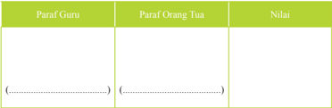

Tabel ini menunjukkan paraf dari guru, orang tua, dan nilai yang diberikan kepada seorang siswa. Topik utama tabel ini adalah evaluasi kinerja siswa. Kolom Paraf Guru dan Paraf Orang Tua masing-masing berisi paraf yang disampaikan oleh guru dan orang tua tentang prestasi siswa. Kolom Nilai menyajikan nilai akhir yang diberikan kepada siswa berdasarkan paraf tersebut. Data penting yang terlihat adalah bahwa paraf dari guru dan orang tua seringkali memiliki perbedaan pendapat, yang dapat mempengaruhi nilai akhir yang diberikan.

 

---
## 📄 Halaman 181

### A

### Indeks

113

 

---
## 📄 Halaman 183

### Glosarium

- advaita vedanta bagian dari ajaran hindu yaitu darsana
agni api yang sangat erat kaitannya dengan upacara atau dewa pelindung yang selalu dipuja oleh umat hindu agni hotra persembahan terhadap dewa agni, nama suatu upacara yang sangat penting di dalam ajaran veda

ahimsa tidak melakukan kejahatan dan membunuh

- akasa angkasa, ether. dewa yang dipuja saat membangun rumah.
ambika ibu dari alam semesta, yang senang membunuh. korban raksasa siluman. nama dewi padi, durga, dan parwati.

asvameda upacara korban kuda yang dilakukan oleh golongan hindu jaman dahulu avidya kebodohan penyebab atman terikat pada kehidupan dunia atau neraka.

- ayodhya kota kuno di tepi sungai gogra yang diperintah oleh iksvaku atau manu dari dinasti surya.
- bhagavadgita nyanyian tuhan. ajaran sang krsna dalam mahabharata
bhakti persembahan atau penyerahan diri menurut petunjuk agama dalam usaha mencapai kebebasan jiwa.

- candra bulan atau dewi bulan.
carvaka nama salah satu darsana yang membicarakan masalah matrialis yang bersumber pada ajaran barhaspati sutra.

daitya raksasa, danawa, asura keturunan diti yang merupakan lawan dari para dewa.

daksina pemberian yang diberikan kepada pendeta yang menyelesaikan suatu upacara. kekuatan atau sakti dari upacara yjana.

- dandaka hutan tempat sang rama, laksmana dan dewi sita berkelana
- dharana jiwa yang telah menemukan alam surge.
dharma moral yang diperintahkan oleh ajaran agama.

grhasutra buku suci yang mengandung masalah hukum kemasyarakatan dan upacara-upacara.

- himsa pembunuhan
- homa upacara selamtan pada dewadewa dengan menaburkan ghrta pada api suci.

 

---
## 📄 Halaman 184

- isvara tuhan sebagai penguasa pramesvara
- jaya yajna upacara kemenangan
jnana ilmu pengetahuan tentang kebebasan

- kalpa satu hari brahman
krsnapaksa/panglong perhitungan hari dimulai  sesudah purnama yang lamanya juga 15 hari dari panglong 1 sampai dengan pangglong 15.

- laksa pohon yang digunakan sebagai obat untuk menyembuhkan luka
- maharsi rsi agung yang sangat terkenal seperti sapta rsi.
- moksa ketenangan dan kebahagiaan spiritual yang kekal abadi yang merupakan tujuan akhir dari umat hindu.
- natya veda ilmu tentang tari-tarian
- niyama kontrol terhadap pikiran yang dilakukan olhe para yogi.
- nirvikalpa samādhi keadaan supra sadar transenden.
- padewasan ilmu tentang hari yang baik. dewasa ayu artinya hari yang baik
- purana berarti tua atau kuno. merupakan salah satu bagian dari kitab itihasa yang memuat catatan kisah sejarah agama hindu.
- prakrti jenis wanita, kekuatan aktif, sakti
- purohita pendeta pilihan atau berfungsi sebagai pelindung untuk melawan kekuatan magik
- rajasika aktif terhadap pengontrolan terhadap pikiran
- sadasiva tuhan yang memiliki sifat aktif
samsara ikatan terhadap dunia, lahir kembali

- sastra ilmu hukum dan lain-lainnya
sidhisvara dewa siwa dengan kekuatan luar biasa

- sloka bait-bait yang terdapat dalam weda.
- suklapaksa/penanggal perhitungan hari-harinya dimulai sesudah bulan mati (tilem) sampai dengan purnama (bulan sempurna).
- rsi orang-orang suci yang langsung mengetahui mantra-mantra veda dari tuhan.
- upanayana penyucian untuk seorang murid yang baru belajar weda yang dilakukan oleh guru.
- vidya ilmu pengetahuan
- yogini wanita  yang  memuja  sakti  atau bhkekal  abadi  yang  merupakan tujuan akhir dari umat hindu.

 

---
## 📄 Halaman 185

### Daftar Pustaka

- Aryana, IB Putra Manik. 2009. Tenung Wariga Kunci Ramalan Astrologi Bali. Denpasar: Bali Aga.
- __________,  2009. Dasar  Wariga  Kearifan  Alam  dalam  Sistem  Tarikh  Bali. Denpasar: Bali Aga.
- Bajrayasa, dkk .1981.Acara I (Sad Acara). Jakarta :Mayasari.
- Bangli, IB. 2005. Wariga Dewasa Praktis . Surabaya, Paramitha.
- Gambar, I Made. 1986. Prembon Serba Guna, Dalil Kelahiran Pertemuan Jodohan Suami Istri, Padewasan. Denpasar: Cempaka 2.
- Kajeng, I Nyoman, dkk.  2001. Sarasamuscaya. Tanpa Penerbit.
- Mantra, IB. Bhagavadgita. Pemda TK I Bali.
- Maswinara, I Wayan. 2006. Sistem Filsafat Hindu. Surabaya: Paramita.
- __________,  (penterjemah).  2004. RG  Veda  Samhita,  Mandala  V ,  V ,  VI,  VII . Surabaya:  Paramitha.
- Musna,  I  Wayan.  1991. Kamus Agama Hindu. Denpasar: Upada Sastra.
- Namayuda,  IB.  1996. Wariga .  Proyek  Bimbingan  dan  Penyuluhan  Kehidupan Beragama Tersebar di 9 Daerah Tingkat II Se Bali.
- _________  .2001. Dasar  Pengetahuan  Tentang  Wariga . Kumpulan Materi Pendalaman  Sradha  Bagi  Yowana  Semeton  siwa  Buddha  Se  Bali.
- Nurkancana,  Wayan.  2010. Ramayana Kisah Kasih Perjalanan Rama. Denpasar: Pustaka Bali Post.
- Ngurah, I Gusti Made. 2006. Buku Pendidikan Agama Hindu Untuk Perguruan Tinggi. Surabaya: Paramita.
- Pendit, Nyoman S. Bhagavadgita. Denpasar: Dharma Bakti.
- PGAHN 6 Thn. Singaraja.  1971. Nitisastra , Pemerintah Daerah TK. I Bali.
- Pudja,G. 1985. Satu Pengantar Dalam Ilmu Weda . Tanpa Penerbit.

 

---
## 📄 Halaman 186

- Pudja , G. dan Tjokorda Rai Sudharta. 2010. Manava Dharmasastra ( Veda Smerti ). Surabaya: Paramita.
- Rudia Adiputra, I Gede dkk. 1990. Tattwa Darsana .    Jakarta:  Y ayasan  Dharma Sarathi.
- Sudarsana, IB. Putu.  2003. Ajaran Agama Hindu ( Samkhya Yoga ).  T anpa  Penerbit. Sudharta, Tjokorda Rai. Pengantar Weda. Jakarta: Maya Sari.
- Sudirga,  Ida  Bagus,  dkk.  2007. Widya  Dharma Agama Hindu. Jakarta:Ganeca Exact.
- ____________.  2011. Widya Dharma Agama Hindu untuk SMA . Jakarta: Ganeca Exact.
- Suja, I Wayan. 2011. Ritual veda Homa Tattwa Jnana.Surabaya : Paramita.
- Tim Penyusun. 2002. Panca Yadny. Pemrintah Provinsi Bali.
- Titib, I Made. 1996. V eda Sabda Suci Pedoman Praktis Kehidupan .  Surabaya: Paramita.
- _____________2003. Teologi dan Simbol-simbol dalam  Agama Hindu .  Surabaya: Paramita.
- ____________2003. Purana,  sumber  ajaran  Hindu  konprehensip. Surabaya: Paramita.
- ____________2008. Itihasa  Ramayana  dan  Mahabharata  (Viracarita)  Kajian Kritis Sumber Agama Hindu . Surabaya:, Paramitha.
- Tim Penyusun. 1992. Buku Bacaan Agama Hindu untuk SMA Kelas I .  Jakarta: Hanoman Sakti.
- Tim Penulis.1990. Pelajaran Agama Hindu untuk Sekolah Menengah Tingkat Atas Kelas III . : Y ayasan Dharma Sarathi.
- Tim Penyusun.1990. Kamus Besar Bahasa Indonesia . Jakarta: Balai Pustaka.
- Tim Penyusun.1997. Budhi Pekerti Dalam Ceritra Yang Bernafaskan Hindu Untuk S.M.U. Kelas II dan yang Sederajat .  Bali:    MGMP Agama  Hindu  SMU Propinsi Bali.
- Tim Penyusun. 2002. Panca Yadnya . Pemerintah Propinsi Bali.
- Tonjaya Bendesa, I Nym Gd. 1994. Dharmaning Pemaculan . Denpasar: Ria.
- Watra, I Wayan. 2007. Pengantar Filsafat Hindu (Tattwa I). Surabaya: . Paramita.

 

---
## 📄 Halaman 187

- Wiana, I Ketut. 2006. Memahami Perbedaan Catur Varna, Kasta dan Wangsa . Surabaya: Paramita.
- __________,. 1993. Kasta  Dalam  Hindu  :  Kesalahpahaman  Berabad-abad . Denpasar  :  Yayasan  Dharma  Naradha.
- Yayasan Satya Hindu Dharma. 1992. Kunci Wariga Dewasa. Denpasar:  Upada Sastra.
- _____________.  2005. Penelusuran Modern Wariga Warisan Budaya Adiluhun. Denpasar: Panakom.

 

---
## 📄 Halaman 188

### Profil Penulis

Nama Lengkap  :  Drs.Ida Bagus Sudirga,M.Pd.H

Telp. Kantor/HP :   (0361485363)/ 081338327723

E-mail

:   sugabadir@yahoo.co.id

Akun Facebook :  sugabadir@gmail.com

Alamat Kantor

:   Jl Gunung Rinjani Monang Maning

Denpasar

Bidang Keahlian:  Mengajar Pendidikan Agama Hindu dan Budi Pekerti

### Riwayat pekerjaan/profesi dalam 10 tahun terakhir:

- Sebagai Guru di SMA Negeri 4 Denpasar
- Sebagai Guru di SMA PGRI 2 Denpasar

### Riwayat Pendidikan Tinggi dan Tahun Belajar:

- 2009 - 2011, S2 Fakultas Dharma Acarya /jurusan/program studi Pendidikan Agama Hindu Institut Hindu Dharma Negeri  ( IHDN ) Denpasar .
- 1984 - 1988 S1 Fakultas Pendidikan Agama /jurusan/program studi  Ilmu Pendidikan Agama Hindu, Institut Hindu Dharma Denpasar.

### Judul Buku dan Tahun Terbit (10 Tahun Terakhir):

- Dasar-Dasar Pendidikan (2010);
- Buku Teks Pelajaran Pendidikan Kewarganegaraan (PKn) untuk SMA Kelas X, XI, dan XII (2006).
- Widya Dharma Agama Hindu untuk SMA,yang diterbitkan oleh Ganeca Exact Jakarta tahun 2007.

### Judul Penelitian dan Tahun Terbit (10 Tahun Terakhir):

Widya Dharma Agama Hindu untuk SMA,yang diterbitkan oleh Ganeca Exact Jakarta tahun 2007

 

---
## 📄 Halaman 189

### Profil Penulis

Nama Lengkap  :  Dr. I Nyoman Yoga Segara, M.Hum.

Telp. Kantor/HP :   0361-232980/08129050995

E-mail

:   yogasegara@yahoo.com

Akun Facebook :  yogasegara@yahoo.com

Alamat Kantor

:   Pascasarjana IHDN Denpasar,

Jl. Kenyeri 57 Denpasar

Bidang Keahlian:  Antropologi dan Ilmu Filsafat

### Riwayat pekerjaan/profesi dalam 10 tahun terakhir:

- 2006 - 2014, Widyaiswara Pusdiklat Tenaga Administrasi, Badan Litbang dan Diklat Kementerian Agama.
- 2014 - 2015, Peneliti Pusat Kehidupan Keagamaan, Badan Litbang dan Diklat Kementerian Agama.
- 2015 - sekarang, Dosen Institut Hindu Dharma Negeri (IHDN) Denpasar.

### Riwayat Pendidikan Tinggi dan Tahun Belajar:

- 2008 - 2011, S3 FISIP/Pascasarjana/Ilmu Antropologi/Universitas Indonesia.
- 2001 - 2004, S2 FIB/Pascasarjana/Ilmu Filsafat/Universitas Indonesia.
- 1993 - 1998, S1 FIA/Filsafat Agama/Sastra dan Filsafat Hindu/Universitas Hindu Indonesia.

### Judul Buku dan Tahun Terbit (10 Tahun Terakhir):

- Pengawasan dengan Pendekatan Agama, 2013. Jakarta: Itjen Press.
- Bagaimana Umat Hindu Melestarikan Lingkungan, 2013. Jakarta: KLH dan PHDI Pusat.
- Perkawinan Nyerod: Kontestasi, Negosiasi dan Komodifikasi di Atas Mozaik Kebudayaan Bali, 2015. Jakarta: Saadah Cipta Mandiri.

### Judul Penelitian dan Tahun Terbit (10 Tahun Terakhir):

- Refleksi Filsafat Politik dalam Kautilya Arthasastra, 2012. STAHDN Jakarta.
- Biaya Perkawinan di Kantor Urusan Agama (KUA) Kecamatan Semarang Barat dan Kecamatan Mijen, Jawa Tengah Pasca Ditetapkannya PP Nomor 48 Tahun 2014 dan PMA Nomor 24 Tahun 2014, 2014. Puslitbang Kehidupan Keagamaan.
- Model-Model Pemberdayaan Rumah Ibadat, 2014. Puslitbang Kehidupan Keagamaan.
- Tren Cerai Gugat Dikalangan Muslim Indonesia, 2015. Puslitbang Kehidupan Keagamaan.
- Survei Kerukunan Umat Beragama di Indonesia Tahun 2015, 2015. Puslitbang Kehidupan Keagamaan.
- Aktualisasi Nilai-Nilai Agama dalam Pencegahan Tindakan Korupsi, 2015. Puslitbang Kehidupan Keagamaan.
- PERWALI: Oasis di Tengah Sengkarut Pengelolaan Zakat di Kota Surakarta, 2015. Puslitbang Kehidupan Keagamaan.
- Pelaksanaan Bimbingan Manasik Haji oleh KUA, 2015. Puslitbang Kehidupan Keagamaan.
- Analisis Hubungan Persepsi Terhadap Keluarnya Peraturan Menteri Agama Nomor 56 Tahun 2014 dengan Tingkat Kesiapan Pengelola Pasraman, Masyarakat, dan Pemerintah, 2015. STAHDN Jakarta.

 

---
## 📄 Halaman 190

### Profil Penelaah

Nama Lengkap  :  Dr. Wayan Paramartha,SH.,M.Pd.

Telp. Kantor/HP :

(0361485363)/ 081338327723

E-mail

:   wayan_Paramartha@ yahoo.com

Akun Facebook :  Wayan Paramartha

Alamat Kantor

:   Jl. Sangalangit, Tembau Penatih Denpasar. Tilp.

(0361)464700, 464800

Bidang Keahlian:  Manajemen pendidikan, telaah kurikulum, evaluasi pendidikan,  metodologi penelitian pendidikan, landasan pendidikan dan teori pendidikan

### Riwayat pekerjaan/profesi dalam 10 tahun terakhir:

- Sebagai Asdir II Pascasarjana Universitas Hindu Indonesia- 2004-2008
- Sebagai Wakil Rektor III -2008
- Sebagai Kaprodi Magister (S2) Pendidikan Agama Dan Evaluasi Pendidikan Agama Pascasarjana Universitas Hindu Indonesia- 2011- Semarang.
- Sebagai Editor Modul Metodologi Penelitian, Modul Evaluasi Pendidikan - 2008.
- Menyusul Modul Majemen Pendidikan-Dirjen Bimas Hindu Kemenag RI-2008
- Instruktur PLPG Guru Agama Hindu- Dirjen Bimas Hindu Kemenag RI-2008, 2011.
- Sebagai Penelaah Buku Pendidikan Agama Hindu dan Budi Pekerti (BG,BS) Tk.Dasar dan Mengah th. 2013, 2014, 2015, 2016.

### Riwayat Pendidikan Tinggi dan Tahun Belajar:

- S3:  Universitas Negeri Malang, Program Pascasarjana, Program Studi Manajemen Pendidikan, tahun masuk 2008, tahun lulus 2011.
- S2:  IKIP Negeri Singaraja, Program Pascasarjana (S2) jurusan/Program Studi Penelitian Dan Evaluasi Pendidikan tahun masuk 2001, tahun lulus 2003;
- S1:  Univ. Mahendradata, Fakultas Hukum, jurusan/program studi, Hukum Keperdataan tahun masuk 1991, tahun lulus 1994.
- S1:   Universitas Udayana Denpasar, FKIP , jurusan/program studi  Pendidikan Ilmu Pengetahuan Sosial/Sejarah/Anthropologi, tahun masuk 1980, tahun lulus 1985;

### Judul Buku dan Tahun Terbit (10 Tahun Terakhir):

- Modul Metodologi Penelitian th. 2007, Kemenag.
- Modul  Evaluasi Pendidikan th. 2007, Kemenag.
- Manajemen Pendidikan the. 2012, Kemenag
- Buku Guru dan Buku Siswa Pendidikan Agama Hindu Dan Budi Pekerti, th. 2013, 2014, dan 2015,  Kemendikbud.

### Judul Penelitian dan Tahun Terbit (10 Tahun Terakhir):

- Menggungkap Model Pendidikan Hindu Bali Tradisional Aguron-guron th.2014, Kemenristek Dikti.
- Menggungkap Model Pendidikan Hindu Bali Tradsional Aguron-guron th. 2015, Kemenristek Dikti.

 

---
## 📄 Halaman 191

### Profil Penelaah

Nama Lengkap  :  K.S. Arsana, S.Psi

Telp. Kantor/HP :   021-4711870/082254134898.

E-mail

:    ksarsana@gmail.com

Akun Facebook :   OareSaga (Arsana)

Alamat Kantor

:    PT Sato Human Dynamics,

Perkantoran Graha Mas Pemuda Blok AD-5, Jalan Pemuda, Rawamangun, Jakarta Timur

Bidang Keahlian:  Pelatihan dan Pengembangan SDM,

Manajemen Strategik, dan Filsafat Hindu

### Riwayat pekerjaan/profesi dalam 10 tahun terakhir:

- Januari 2004 - Sekarang: Pendiri dan Managing Director PT Sato Human Dynamics
- Juli 2014 - Sekarang: Dosen dan Ketua LP3M STAH 'Dharma Nusantara' , Jakarta
- Maret 2015 - Sekarang: Anggota Tim Panel Ahli di Kementerian Komunikasi dan Informatika RI

### Riwayat Pendidikan Tinggi dan Tahun Belajar:

- S1:   Ilmu Psikologi, Universitas Gadjah Mada, 1983 - 1988.

### Judul Buku yang Pernah Ditelaah (10 Tahun Terakhir):

- The Arts of Leadership - Seni Kepemimpinan
- Nature Wisdom - Inspirasi Kebijaksanaan Alam
- The Essence of Spiritual Leadership
- The Joy of Giving and Forgiving

### Judul Penelitian dan Tahun Terbit (10 Tahun Terakhir):

- Tidak ada
Sebagai Inspirator, Public Speaker, dan Trainer, selain di Indonesia penulis telah berbagi pengetahuan dan pengalaman di berbagai negara di lima (5) benua.

 

---
## 📄 Halaman 192

### Profil Editor

Nama Lengkap  :   Andi S. Fatmawati, SH.

Telp. Kantor/HP :    021-3804248

E-mail

:    andinana62@gmail.com

Akun Facebook :

Alamat Kantor

:    Jl. Gunung Sahari Raya No. 4, Jakarta Pusat

Bidang Keahlian:   Copy Editor

### Riwayat pekerjaan/profesi dalam 10 tahun terakhir:

- 2015 - 2016: Staf bidang Perbukuan di Pusat Kurikulum dan Perbukuan, Balitbang, Kemdikbud.
- 2011 - 2015: Staf bidang  PAUDNI di Pusat Kurikulum dan Perbukuan, Balitbang, Kemdikbud.
- 2006 - 2011: Pembantu Pimpinan di Bidang Informasi Pusat Perbukuan, Setjen, Depdiknas.

### Riwayat Pendidikan Tinggi dan Tahun Belajar:

- S1: Hukum Perdata, Universitas Tarumanegara (1991)

### Judul Buku yang Pernah Di edit (10 Tahun Terakhir):

- Buku Pendidikan Agama Khonghucu dan Budi Pekerti Kelas IV SD Tahun 2016.
- Judul Penelitian dan Tahun Terbit (10 Tahun Terakhir):
Tidak ada

HIDUP MENJADI LEBIH INDAH TANPA NARKOBA.

---

*📊 Statistik: 57 visual berhasil, 34 dilewati, 0 gagal | Durasi: 12m 10s*