# Kelas 10 Islam BG press

*Diekstrak: 18 May 2026, 14:55*

---

---
## 📄 Halaman 1

### Buku Guru Pendidikan Agama Islam dan Budi Pekerti

 

---
## 📄 Halaman 2

### Hak Cipta © 201 7 pada Kementerian Pendidikan dan Kebudayaan Dilindungi Undang-Undang

Disklaimer: Buku ini merupakan buku guru yang dipersiapkan Pemerintah dalam rangka implementasi Kurikulum 2013. Buku guru ini disusun dan ditelaah oleh berbagai pihak di bawah koordinasi Kementerian Pendidikan dan Kebudayaan, dan dipergunakan dalam tahap awal penerapan Kurikulum 2013. Buku ini merupakan 'dokumen hidup' yang senantiasa diperbaiki,  diperbaharui,  dan  dimutakhirkan  sesuai  dengan  dinamika  kebutuhan  dan perubahan zaman. Masukan dari berbagai kalangan yang dialamatkan kepada penulis dan laman http://buku.kemdikbud.go.id atau melalui email buku@kemdikbud.go.id diharapkan dapat meningkatkan kualitas buku ini.

### Katalog Dalam Terbitan (KDT)

### Indonesia. Kementerian Pendidikan dan Kebudayaan.

Pendidikan Agama Islam dan Budi Pekerti : buku guru/ Kementerian Pendidikan dan Kebudayaan.--. Edisi Revisi Jakarta : Kementerian Pendidikan dan Kebudayaan, 201 7 .

viii, 256 hlm. : ilus. ; 25 cm.

Untuk SMA/MA/SMK/MAK Kelas X ISBN  978-602-427-046-9 (jilid lengkap) ISBN  978-602-427-047-6 (jilid 1)

- Islam -- Studi dan Pengajaran
- Kementerian Pendidikan dan Kebudayaan
Penulis

:  Nelty Khairiyah dan Endi Suhendi Zen.

Penelaah

:  Muh. Saerozi, Yusuf A. Hasan, Nurhayati Djamas, dan Asep Nursobah.

Penyelia Penerbitan :  Pusat Kurikulum dan Perbukuan, Balitbang, Kem en dikbud.

Cetakan Ke-1, 2014

ISBN 978-602-282-406-0 (Jilid 1)

Cetakan Ke-2, 2016 (Edisi Revisi)

Cetakan Ke-3, 2017 (Edisi Revisi)

Disusun dengan huruf Myriad Pro, 11 pt.

I. Judul

297.07

 

---
## 📄 Halaman 3

### Kata Pengantar

Pembelajaran yang aktif, kreatif, inovatif, efektif, produktif, dan menyenangkan diproses dalam pembelajaran terpadu yang direncanakan, dirancang, dilaksanakan dengan penuh pengawasan dan penilaian, untuk melihat sejauh mana peserta didik  melahirkan  nilai,  akhlak  dan  moral  dalam  berbagai  perilakunya  sehingga terciptalah pembelajaran yang kondusif dan bermakna. Hal  ini dituangkan secara umum, agar guru dan para pendidik dapat memanfaatkan Buku Guru ini, untuk melaksanakan dan mengembangkan proses pembelajaran peserta didik dengan baik dan benar.

Buku  guru  ini  menyadarkan  fungsi  dan  peran  guru,  sebagai  pendidik  yang melaksanakan  peran  dan  tugasnya  sebagai  fasilitator,  pembimbing,  pengarah, dan evaluator. Bahkan, terkait dengan tujuan Pendidikan Agama Islam dan Budi Pekerti, guru Pendidikan Agama Islam dan Budi Pekerti harus sekaligus berfungsi sebagai sumber keteladanan agar peserta didik benar-benar dapat menghayati dan mengamalkan ajaran agamanya.

Guru  yang  memiliki  fungsi  dan  peran  seperti  ini,  mampu  mengembangkan perilaku peserta didik untuk berperilaku jujur, disiplin, tanggung jawab, peduli, santun,  ramah  lingkungan,  gotong  royong,  kerja  sama,  cinta  damai,  responsif dan pro-aktif, dan menunjukkan sikap sebagai bagian dari solusi atas berbagai permasalahan  bangsa  dalam  berinteraksi  secara  efektif  dengan  lingkungan sosial. Buku Guru Pendidikan Agama Islam dan Budi Pekerti Kelas X ini memuat bahan kajian dan langkah-langkah secara standar dan berintegrasi dengan buku peserta  didik,  guna  mengantarkan  guru  dan  para  pendidik  dapat  memproses dan  mengembangkan  pembelajaran,  agar  peserta  didik  dapat  memahami, menerapkan, menganalisis, menghayati dan mengamalkan ajaran Agama Islam dengan baik dan benar.

Jakarta, Februari 2016

Penulis

 

---
## 📄 Halaman 4

### Daftar Isi

iv

 

---
## 📄 Halaman 5

v

 

---
## 📄 Halaman 6

91

 

---
## 📄 Halaman 7

vii

 

---
## 📄 Halaman 9

### Pendahuluan

Pembelajaran  aktif,  kreatif,  inovatif,  efektif,  produktif,  dan  menyenangkan, dengan tetap mengacu kepada tujuan Pendidikan Nasional merupakan arah dan tujuan pembelajaran. Hal ini maksudnya adalah mengembangkan potensi peserta didik agar menjadi manusia yang beriman dan bertakwa kepada Tuhan Yang Maha Esa, berakhlak mulia, sehat, berilmu, cakap, kreatif, mandiri, dan menjadi warga yang demokratis serta bertanggung jawab (Pasal 3 UU Sisdiknas 2003), hal ini juga merupakan bagian dari kebijakan penyusunan Kurikulum 2013.

Pembelajaran yang aktif, kreatif, inovatif, efektif, produktif, dan menyenangkan ini  juga  diproses  dalam  pembelajaran  terpadu  yang  direncanakan,  dirancang, dan dilaksanakan dengan penuh pengawasan dan penilaian. Maksudnya untuk melihat  seberapa  jauh  peserta  didik  melahirkan  nilai,  serta  akhlak  dan  moral dalam  berbagai  perilakunya  sehingga  terciptalah  pembelajaran  yang  kondusif dan bermakna.

Menyadari hal tersebut di atas maka, fungsi dan peran guru sebagai pendidik tidak  semata-mata  sebagai    narasumber  saja,  tetapi  harus  lebih  memahami fungsi  dan  perannya  sebagai  fasilitator,  pembimbing,  pengarah,  dan  evaluator. Bahkan, terkait dengan kualitas Pendidikan Agama Islam dan Budi Pekerti, guru Pendidikan  Agama  Islam  dan  Budi  Pekerti  harus  sekaligus  berfungsi  sebagai sumber  keteladanan  agar  peserta  didik  benar-benar  dapat    menghayati  dan mengamalkan ajaran agama yang dianutnya.

Guru yang memiliki fungsi dan peran  seperti ini, mampu mengembangkan perilaku peserta didik untuk berperilaku jujur, disiplin, tanggung jawab, peduli, santun, ramah lingkungan, gotong royong, kerja sama, cinta damai, responsif dan proaktif. Selain itu juga menunjukkan sikap sebagai bagian dari solusi atas berbagai permasalahan  bangsa  dalam  berinteraksi  secara  efektif  dengan  lingkungan sosial dan alam serta dalam menempatkan diri sebagai cerminan bangsa dalam pergaulan dunia.

Buku  Guru  Pendidikan  Agama  Islam  dan  Budi  Pekerti  Kelas  X  ini  memuat bahan  kajian  dan    langkah-langkah    secara  standar  dan  berintegrasi  dengan buku peserta didik. Tujuan penulisan buku guru ini untuk  mengantarkan guru dan para pendidik dapat memproses dan mengembangkan pembelajaran, agar

1

 

---
## 📄 Halaman 10

peserta  didik  dapat  memahami,  menerapkan  dan  menganalisis  pengetahuan faktual, konseptual, prosedural dalam ilmu pengetahuan, teknologi, seni, budaya, dan  humaniora  dengan  wawasan  kemanusiaan,  kebangsaan,  kenegaraan,  dan peradaban terkait fenomena dan kejadian. Selain itu, menerapkan pengetahuan prosedural pada bidang kajian yang spesifik sesuai dengan bakat dan minatnya untuk memecahkan masalah. Bahkan, peserta didik mampu mengolah, menalar, dan menyajikan dalam ranah konkret dan ranah abstrak terkait dengan pengembangan dari yang dipelajarinya di sekolah secara mandiri, dan mampu menggunakan metode sesuai kaidah keilmuan, sebagaimana yang menjadi acuan Kompetensi Inti Kurikulum 2013.

Guru dan para pendidik seperti ini, akan siap  memproses pembelajaran melalui model pembelajaran  yang berorientasi  kepada  peserta  didik  ( student centered instruction ),  peserta didik terlibat aktif dalam pembelajaran ( active learning )  dan pencapaian  pembelajaran  juga  mengarah  kepada  pemenuhan  dan  keseimbangan antara pengetahuan (kognitif ), sikap (afektif ), dan keterampilan ( soft skill dan hard skill ),    dengan  memuat  strategi pembelajaran, metode pembelajaran yang bervariatif dengan menggunakan teknologi kekinian, dan teknik pembelajaran  yang  spesifik, individu, dan unik.

2

 

---
## 📄 Halaman 11

### KOMPETENSI  INTI DAN KOMPETENSI DASAR

### A.	Kompetensi	Inti

Isi  Kurikulum  2013  dikembangkan  dalam  bentuk  Kompetensi  Inti  (KI) dan  Kompetensi  Dasar  (KD).  Kompetensi  Inti  dikembangkan  dari  Standar Kompetensi  Lulusan  (SKL)  dan  merupakan  kualitas  minimal  yang  harus dikuasai peserta didik di kelas untuk setiap mata pelajaran. Kompetensi Inti terdiri atas jenjang kompetensi minimal yang harus dikuasai peserta didik di kelas tertentu, isi umum materi pembelajaran, dan ruang lingkup penerapan kompetensi yang dipelajari.

Jenjang  kompetensi  dalam  KI  meningkat  untuk  kelas-kelas  berikutnya,  KI  tidak  memuat  konten  khusus  mata  pelajaran  tetapi  konten  umum, yaitu  fakta,  konsep,  prosedur,  metakognitif  dan  kemampuan  menerapkan pengetahuan  yang  terkandung  dalam  setiap  mata  pelajaran.  Perluasan penerapan  kompetensi  yang  dipelajari  dinyatakan  dalam  KI,  dimulai  dari lingkungan  terdekat  sampai  ke  lingkungan  global.  Dalam  desain  Kurikulum 2013, KI berfungsi sebagai pengikat bagi KD. Dalam fungsi sebagai pengikat, setiap  KD  yang  dikembangkan  untuk  setiap  mata  pelajaran  di  setiap  kelas harus mengacu kepada KI.

Kompetensi  Inti terdiri atas  empat  dimensi  yang  satu  sama  lain saling  terkait,  yaitu  sikap  spiritual  (KI  1),  sikap  sosial  (KI  2),  pengetahuan  (KI 3),  dan  keterampilan  (KI  4).  Keempat  dimensi  tersebut  tercantum  dalam pengembangan KD, silabus, dan RPP. Dalam proses pembelajaran, KI 1 dan KI 2 dikembangkan dalam proses pendidikan di setiap kegiatan di sekolah (kelas dan luar sekolah) dengan pendekatan pembelajaran tidak langsung. KI 3 dan KI 4 dikembangkan oleh setiap mata pelajaran dalam pendekatan pembelajaran langsung.

Kompetensi Inti (KI 3) menitikberatkan pada pengembangan pengetahuan  (faktual,  konseptual,  prosedural,  dan  metakognitif)  dalam  jenjang kemampuan kognitif dari mengingat sampai mencipta. KI 4 merupakan perencanaan kegiatan belajar untuk menerapkan apa yang dipelajari di KI 3 dalam suatu proses pembelajaran yang terintegrasi ataupun terpisah.

 

---
## 📄 Halaman 12

Terintegrasi mengandung arti bahwa proses pembelajaran KI 3 dan KI 4 dilakukan pada waktu bersamaan baik di kelas, laboratorium PAI, maupun di luar sekolah. Terpisah mengandung makna bahwa pembelajaran mengenai KI 3 terpisah dalam waktu dan/atau tempat dengan KI 4. Keputusan mengenai pembelajaran terintegrasi atau terpisah ditentukan sepenuhnya dalam silabus dan RPP, berdasarkan pertimbangan mengenai konten KD untuk KI 3 dan KD untuk KI 4.

Kompetensi Inti 1 (KI 1) berkaitan dengan sikap spiritual. KI 2 berkaitan dengan sikap sosial. KI 3 berkaitan dengan pengetahuan, dan KI 4 berkaitan dengan keterampilan. Setiap KI dijabarkan lebih lanjut dalam bentuk Kompetensi Dasar (KD). Kompetensi Dasar (KD) dari setiap KI menjadi rujukan guru dalam pengembangan Rencana Pelaksanaan Pembelajaran (RPP). RPP merupakan rencana kegiatan pembelajaran tatap muka untuk satu pertemuan atau lebih. RPP dikembangkan dari silabus untuk mengarahkan kegiatan pembelajaran peserta didik dalam upaya mencapai KD.

Lingkup  kompetensi  minimal  pada  jenjang  SMA/SMK  Kelas  X  sampai XII  meliputi  lingkungan  keluarga,  teman,  guru,  dan  tetangga.  Kompetensi minimal  tersebut  dapat  dikembangkan  lebih  lanjut  oleh  satuan  pendidikan yang telah memenuhi standar nasional pendidikan.

### B.  Kompetensi Dasar

Kompetensi Dasar (KD) adalah kemampuan untuk mencapai KI yang harus diperoleh peserta didik melalui pembelajaran. Kompetensi Dasar setiap mata pelajaran dikembangkan dengan merujuk kepada KI  dan  setiap  KI  memiliki  KD  yang  sesuai.  Dengan  perkataan  lain,  KI  1 memiliki  KD  yang  berkaitan  dengan  sikap  spiritual,  KI  2  memiliki  KD  yang berkaitan  dengan  sikap  sosial,  KI  3  memiliki  KD  yang  berkaitan  dengan pengetahuan,  dan  KI  4  memiliki  KD  yang  berkaitan  dengan  keterampilan.

KI  1,  KI  2,  dan  KI  4  dikembangkan melalui proses pembelajaran setiap materi  pokok  yang  tercantum  dalam  KI  3,  KI  1,  dan  KI  2  tidak  diajarkan langsung, tetapi indirect teaching pada setiap kegiatan pembelajaran.

Setiap Kompetensi berimplikasi terhadap tuntutan proses pembelajaran dan  penilaian.  Hal  ini  bermakna  bahwa  pembelajaran  dan  penilaian  pada tingkat yang sama memiliki karakteristik yang relatif sama dan memungkinkan terjadinya  akselerasi  belajar  dalam  1  (satu)  tingkat  kompetensi.  Selain  itu, untuk tingkat kompetensi yang berbeda menuntut pembelajaran dan penilaian  dengan  fokus  dan  penekanan  yang  berbeda  pula.  Semakin  tinggi

4

 

---
## 📄 Halaman 13

tingkat kompetensi, semakin kompleks intensitas pengalaman belajar peserta didik  dan  proses  pembelajaran  serta  penilaian  KI  dan  KD  yang  dimaksud di  atas  mulai  dari  jenjang  SMA/SMK  Kelas  X  sampai  dengan  Kelas  XII.

Kompetensi  Inti dan  Kompetensi  Dasar yang dimaksud  di atas mulai dari Kelas  X sampai dengan Kelas XII sebagaimana terdapat dalam tabel-tabel berikut ini.

### Kelas X

---
**📊 Tabel**

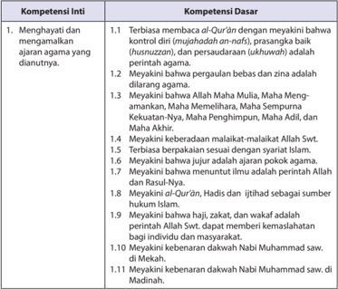

Tabel ini berisi informasi tentang kompetensi inti dan dasar dalam menghayati dan memahami ajaran agama Islam. Topik utamanya adalah tentang kepercayaan dan prinsip-prinsip agama yang dianut oleh umat Islam. Kolom-kolomnya mencakup dua bagian utama: Kompetensi Inti dan Kompetensi Dasar. Kompetensi Inti meliputi tujuh poin yang membahas tentang kepercayaan pada Al-Qur'an, Allah, dan kebijaksanaan dalam beragama. Kompetensi Dasar juga memiliki tujuh poin yang lebih spesifik, mencakup prinsip-prinsip agama seperti perbuatan baik (nuzul), pengucapan (ikhwanah), dan kepercayaan pada Allah dan Nabi Muhammad saw. Data penting yang terlihat adalah bahwa setiap kompetensi inti dan dasar memiliki tujuh poin yang disebutkan, menunjukkan bahwa pembelajaran ini fokus pada pemahaman mendalam tentang prinsip-prinsip agama Islam.

 

---
## 📄 Halaman 14

---
**📊 Tabel**

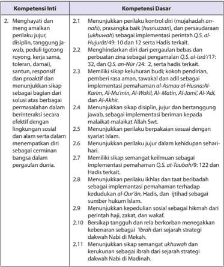

Tabel ini berisi informasi tentang kompetensi inti dan dasar yang relevan dengan prinsip-prinsip Islam. Topik utamanya adalah tentang bagaimana menjaga dan membangun hubungan harmonis dalam masyarakat, termasuk menjaga perilaku jujur, disiplin, dan saling menghormati antara individu. Kolom-kolomnya mencakup dua bagian utama: Kompetensi Inti dan Kompetensi Dasar. Kompetensi Inti meliputi tujuh poin yang berkaitan dengan menjaga dan membangun hubungan yang baik, seperti menjaga kontrol diri, menjaga perilaku jujur, dan saling menghormati. Kompetensi Dasar mencakup empat poin yang lebih spesifik, seperti menunjukkan sikap yang positif, menjaga hubungan harmonis, dan menjaga integritas dalam berkomunikasi. Data penting yang terlihat adalah bahwa semua poin dalam tabel memiliki implikasi dari Al-Quran dan Hadits, menunjukkan bahwa prinsip-prinsip yang dinyatakan dalam Al-Quran dan Hadits sangat penting untuk menjaga dan membangun hubungan yang baik dalam masyarakat.

 

---
## 📄 Halaman 15

---
**📊 Tabel**

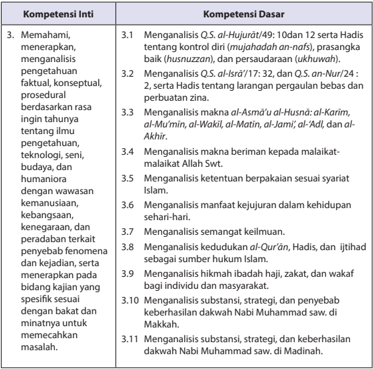

Tabel ini berisi informasi tentang kompetensi inti dan dasar yang berkaitan dengan ilmu pengetahuan Islam. Topik utamanya adalah analisis dan pemahaman tentang berbagai aspek ilmiah dan praktis dalam agama Islam. Kolom-kolomnya mencakup berbagai aspek seperti kontrol diri, prasangka baik, persaudaraan, dan kebijaksanaan. Data penting yang terlihat adalah bahwa setiap kompetensi inti memiliki beberapa kompetensi dasar yang relevan, menunjukkan hubungan antara dua level kompetensi tersebut. Ini membantu dalam memahami bagaimana ilmu pengetahuan Islam dapat diterapkan dalam berbagai aspek kehidupan.

 

---
## 📄 Halaman 16

---
**📊 Tabel**

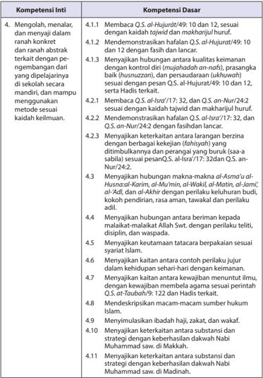

Tabel ini berisi informasi tentang kompetensi inti dan dasar yang harus dipenuhi oleh siswa dalam mempelajari Al-Qur'an dan Hadits. Topik utama tabel adalah tentang keterampilan membaca, menafsirkan, dan menjelaskan Al-Qur'an dan Hadits. Kolom-kolomnya mencakup 4.1. Mengolah, menalar, dan menyaji dalam ranah konkrit dan ranah abstrak, serta 4.2. Mendemonstrasikan hafalan Al-Qur'an dan Hadits. Data penting yang terlihat adalah bahwa siswa harus mampu membaca Al-Qur'an dan Hadits dengan baik, menafsirkan ayat-ayat dengan tepat, dan menyajikan pengetahuan mereka secara jelas dan bermakna. Selain itu, mereka juga diharapkan untuk mampu menjelaskan hubungan antara ayat-ayat Al-Qur'an dan Hadits, serta keterampilan mereka dalam menafsirkan makna dari ayat-ayat tersebut.

 

---
## 📄 Halaman 17

### Pemetaan Kompetensi Inti dan Kompetensi Dasar

Kompetensi Inti (KI) dan Kompetensi Dasar (KD) merupakan   kemampuan yang harus dikembangkan dalam proses pembelajaran  Pendidikan Agama Islam dan Budi Pekerti Kelas X, pada Buku Guru ini terpetakan sebagaimana terdapat dalam tabel-tabel berikut:

### Kelas X

---
**📊 Tabel**

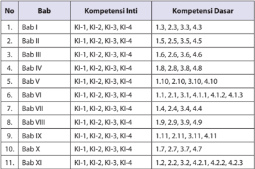

Tabel ini menunjukkan hubungan antara bab-bab dalam sebuah buku pelajaran dengan kompetensi inti dan kompetensi dasar yang relevan. Topik utama tabel adalah pembelajaran yang dilakukan dalam setiap bab, yang mencakup berbagai keterampilan dan pengetahuan dasar. Kolom "Bab" menyatakan nomor bab dalam buku pelajaran, sedangkan kolom "Kompetensi Inti" dan "Kompetensi Dasar" menunjukkan keterampilan atau pengetahuan yang harus dikuasai oleh siswa setelah menyelesaikan setiap bab.

Data penting yang terlihat dalam tabel ini adalah bahwa setiap bab memiliki beberapa bab yang berbeda, dan setiap bab memiliki keterampilan atau pengetahuan yang berbeda. Misalnya, Bab I memiliki keterampilan dan pengetahuan dasar yang berbeda dengan Bab II, Bab III, dan seterusnya. Ini menunjukkan bahwa setiap bab memiliki tujuan pembelajaran yang berbeda dan harus dijaminkan secara mendalam untuk memastikan siswa memahami materi yang diberikan.

Tabel ini juga menunjukkan bahwa setiap bab memiliki keterampilan dan pengetahuan dasar yang berbeda, yang menunjukkan bahwa setiap bab memiliki tujuan pembelajaran yang berbeda dan harus dijaminkan secara mendalam untuk memastikan siswa memahami materi yang diberikan. Ini menunjukkan bahwa setiap bab memiliki tujuan pembelajaran yang berbeda dan harus dijaminkan secara mendalam untuk memastikan siswa memahami materi yang diberikan.

 

---
## 📄 Halaman 18

### Bagian Satu Petunjuk Umum

 

---
## 📄 Halaman 19

### Petunjuk Penggunaan Buku

### A. Kurikulum 2013

### 1.	 Karakteristik	Kurikulum	2013

Mengingat  tujuan  dari  kurikulum  2013  ini  adalah  untuk  mempersiapkan manusia Indonesia agar memiliki kemampuan hidup sebagai pribadi dan warga negara  yang  beriman,  produktif,  kreatif,  inovatif,  dan  afektif  serta  mampu berkontribusi  pada  kehidupan  bermasyarakat,  berbangsa,  bernegara,  dan peradaban dunia. Kurikulum 2013 mempunyai karakter yang berorientasi pada tujuan  dan  fokus  pada  proses,  sehingga  bisa  menghasilkan  sebuah  sistem pendidikan  yang  tepat  guna  dan  efektif.  Secara  lebih  jelasnya,  karakteristik Kurikulum 2013 adalah:

- Menyiapkan  Kompetensi  Inti  (KI)  yang  merupakan  gambaran  secara kategorial  mengenai  kompetensi  dalam  aspek  sikap,  pengetahuan,  dan keterampilan  (kognitif  dan  psikomotor)  yang  harus  dipelajari  peserta didik  untuk  suatu  jenjang  sekolah,  kelas  dan  mata  pelajaran.  Sekaligus merupakan kualitas yang harus dimiliki seorang peserta didik untuk setiap kelas, melalui pembelajaran Kompetensi Dasar yang diorganisasikan dalam proses pembelajaran peserta didik aktif.
- Mengembangkan  keseimbangan  tujuan  dan  proses  pembelajaran  antara pengembangan sikap spiritual dan sosial, rasa ingin tahu, kreativitas, kerja sama dengan kemampuan intelektual dan psikomotorik;
- Mengembangkan  secara  utuh  pembelajaran  sikap,  pengetahuan,  dan keterampilan peserta didik, yang kemudian  menerapkannya dalam berbagai situasi di sekolah dan masyarakat;
- Sekolah merupakan bagian dari masyarakat yang memberikan pengalaman belajar terencana di mana peserta didik menerapkan apa yang dipelajari di sekolah ke masyarakat dan memanfaatkan masyarakat sebagai sumber belajar.
- Menerapkan penilaian autentik dapat dikelompokkan menjadi:
- Memandang penilaian dan pembelajaran merupakan hal yang saling  berkaitan.
- Mencerminkan masalah dunia nyata, bukan semata dunia sekolah.
- Menggunakan berbagai cara dan kriteria penilain.
- Holistik  (kompetensi  utuh  merefleksikan  pengetahuan,  keterampilan, dan sikap).

 

---
## 📄 Halaman 20

- Penilaian autentik tidak hanya mengukur hal yang diketahui oleh peserta didik, tetapi lebih menekankan mengukur hal yang dapat dilakukan oleh peserta didik.

### 2 . Kompetensi	Inti	(KI)

Kompetensi Inti, merupakan kompetensi utama yang dikelompokkan ke  dalam  aspek  sikap,  pengetahuan,  dan  keterampilan  (afektif,  kognitif,  dan psikomotor) yang harus dipelajari peserta didik untuk suatu jenjang sekolah, kelas  dan  mata  pelajaran.  Kompetensi  Inti,  harus  menggambarkan  kualitas yang seimbang antara pencapaian hard skills dan soft skills .  Kompetensi Inti, berfungsi  sebagai  unsur  pengorganisasi  ( organizing  element )  kompetensi dasar.  Sebagai  unsur  pengorganisasi,  Kompetensi  Inti  merupakan  pengikat untuk organisasi vertikal dan organisasi horizontal Kompetensi Dasar.

Organisasi  vertikal  Kompetensi  Dasar,  adalah  keterkaitan  antara  konten Kompetensi  Dasar  satu  kelas  atau  jenjang  pendidikan  ke  kelas/jenjang  di atasnya sehingga memenuhi prinsip belajar yaitu terjadi suatu akumulasi yang berkesinambungan antara konten yang dipelajari peserta didik.

Kompetensi  Inti  dirancang  dalam  empat  kelompok  yang  saling  terkait yaitu,  berkenaan  dengan  sikap  keagamaan  (kompetensi  inti  1),  sikap  sosial (kompetensi 2), pengetahuan (kompetensi inti 3), dan penerapan pengetahuan (kompetensi 4). Keempat kelompok itu menjadi acuan dari Kompetensi Dasar dan harus dikembangkan dalam setiap peristiwa pembelajaran secara integratif.

### Kompetensi	Inti	SMA/SMK

### Kompetensi	Inti	1

Menghayati dan mengamalkan ajaran agama yang dianutnya.

### Kompetensi	Inti	2

Menghayati  dan  mengamalkan  perilaku  jujur,  disiplin,  tanggungjawab, peduli  (gotong  royong,  kerjasama,  toleran,  damai)  santun,  responsif  dan proaktif  dan  menunjukkan  sikap  sebagai  bagian  dari  solusi  atas  berbagai permasalahan  dalam  berinteraksi  secara  efektif  dengan  lingkungan  sosial dan alam serta dalam menempatkan diri sebagai cerminan bangsa dalam pergaulan dunia.

 

---
## 📄 Halaman 21

### Kompetensi	Inti	3

Memahami, menerapkan, dan menganalisis pengetahuan faktual, konseptual,  prosedural,  berdasarkan  rasa  ingin  tahunya  tentang  ilmu pengetahuan,  teknologi,  seni,  budaya,  dan  humaniora  dengan  wawasan kemanusiaan,  kebangsaan,  kenegaraan,  dan  peradaban  terkait  penyebab fenomena dan kejadian, serta menerapkan pengetahuan prosedural pada bidang  kajian  yang  spesifik  sesuai  dengan  bakat  dan  minatnya  untuk memecahkan masalah.

### Kompetensi	Inti	4

Mengolah, menalar, dan menyaji dalam ranah konkret dan ranah abstrak terkait  dengan  pengembangan  dari  yang  dipelajarinya  di  sekolah  secara mandiri, dan mampu menggunakan metode sesuai kaidah keilmuan.

### 3.	 Kompetensi	Dasar	(KD)

Kompetensi  Dasar  merupakan  kompetensi  setiap  mata  pelajaran  untuk setiap kelas yang diturunkan dari Kompetensi Inti. Kompetensi Dasar adalah konten atau kompetensi yang terdiri atas sikap, pengetahuan, dan ketrampilan yang  bersumber  pada  kompetensi  inti  yang  harus  dikuasai  peserta  didik. Kompetensi  tersebut  dikembangkan  dengan  memperhatikan  karakteristik peserta didik, kemampuan awal, serta ciri dari suatu mata pelajaran.

Kompetensi  Dasar  merupakan  kemampuan  untuk  mencapai  Kompetensi Inti yang harus diperoleh oleh peserta didik melalui pembelajaran. Kompetensi Dasar adalah konten atau kompetensi yang terdiri atas sikap, pengetahuan, dan ketrampilan yang bersumber pada kompetensi inti yang harus dikuasai peserta didik. Kompetensi tersebut dikembangkan dengan memperhatikan karakteristik peserta didik, kemampuan awal, serta ciri dari suatu mata pelajaran.

Rumusan Kompetensi Dasar dikembangkan dengan memperhatikan karakteristik  dan  kemampuan  peserta  didik,  dan  kekhasan  masing-masing mata  pelajaran.  Kompetensi  Dasar  meliputi  empat  kelompok  sesuai  dengan pengelompokan Kompetensi Inti sebagai berikut:

- Kelompok Kompetensi Dasar sikap spiritual dalam rangka menjabarkan KI1;
- Kelompok Kompetensi Dasar sikap sosial dalam rangka menjabarkan KI-2;
- Kompetensi Dasar pengetahuan dalam rangka menjabarkan KI-3; dan
- Kompetensi Dasar keterampilan dalam rangka menjabarkan KI-4.

 

---
## 📄 Halaman 22

### 4 . Kaitan antara KI, KD, dan Pembelajaran.

Sejalan  dengan  UU,  khususnya  Permen  53  tahun2015,  kompetensi  inti ibarat  anak  tangga  yang  harus  ditapaki  peserta  didik  untuk  sampai  pada kompetensi  lulusan  jenjang  satuan  pendidikan.  Kompetensi  inti  meningkat seiring meningkatnya usia peserta didik yang dinyatakan dengan meningkatnya kelas.  Melalui  kompetensi  inti,  yang  merupakan  anak  tangga  menuju  ke kompetensi lulusan, integrasi vertikal antar kompetensi dasar dapat dijamin, dan peningkatan kemampuan peserta dari kelas ke kelas dapat direncanakan.

Sebagai anak tangga menuju ke kompetensi lulusan multidimensi, kompetensi inti juga memiliki multidimensi. Untuk kemudahan operasionalnya, kompetensi lulusan pada ranah sikap dipecah menjadi dua, yaitu sikap spiritual terkait  tujuan  membentuk  peserta  didik  yang  beriman  dan  bertakwa,  dan kompetensi sikap sosial terkait tujuan membentuk peserta didik yang berakhlak mulia, mandiri, demokratis, dan bertanggung jawab.

Kompetensi Inti bukan untuk diajarkan, melainkan untuk dibentuk melalui pembelajaran  mata  pelajaran-mata  pelajaran  yang  relevan.  Setiap  mata pelajaran harus tunduk pada kompetensi inti yang telah dirumuskan. Dengan kata lain, semua mata pelajaran yang diajarkan dan dipelajari pada kelas tersebut harus berkontribusi terhadap pembentukan kompetensi inti.  Kompetensi inti merupakan  pengikat  kompetensi-kompetensi  yang  harus  dihasilkan  dengan mempelajari  setiap  mata  pelajaran.  Berperan  sebagai integrator  horizontal antar mata pelajaran. Dengan pengertian ini, kompetensi inti adalah bebas dari mata pelajaran karena tidak mewakili mata pelajaran tertentu.

Kompetensi Inti merupakan kebutuhan kompetensi peserta didik, sedangkan mata pelajaran adalah pasokan kompetensi dasar yang akan diserap peserta  didik  melalui  proses  pembelajaran  yang  tepat,  menjadi  kompetensi inti.  Capaian  pembelajaran  mata  pelajaran,  diuraikan  menjadi  kompetensi dasar-kompetensi  dasar  yang  dikelompokkan  menjadi  empat.  Ini    sesuai dengan  rumusan  kompetensi  inti  yang  didukungnya,  yaitu  dalam  kelompok kompetensi sikap spiritual, kompetensi sikap sosial, kompetensi pengetahuan, dan kompetensi keterampilan.

Uraian  kompetensi  dasar  sedetail  ini  adalah  untuk  memastikan  bahwa capaian  pembelajaran  tidak  berhenti  sampai  pengetahuan  saja,  melainkan harus  berlanjut  ke  keterampilan,  dan  bermuara  pada  sikap.  Kompetensi  ini dikembangkan dengan memperhatikan karakteristik peserta didik, kemampuan awal, serta ciri dari suatu mata pelajaran.

Melalui  pembelajaran  yang  kontekstual,  peserta  didik  sekaligus  dilatih menyajikan bermacam kompetensi dasar secara logis dan sistematis. Mengatakan kompetensi dasar, yang memuat penyusunan teks untuk menjelaskan  pemahaman  peserta  didik,  terhadap  ilmu  pengetahuan  pada bidang pelajaran tertentu.

 

---
## 📄 Halaman 23

### 5. Struktur	KI	dan	KD	Pendidikan	Agama	Islam	dan	Budi	Pekerti

### Kelas X

### KI-KD	Mata	Pelajaran:	Pendidikan	Agama	Islam	dan	Budi	Pekerti Kelas	X	SMA/SMK/MA:

### Kompetensi	Inti	dan	Kompetensi	Dasar	SMA/SMK

### Kompeteni	Inti	1

- Menghayati dan mengamalkan ajaran agama yang dianutnya.

### KD Pada KI-1

- 1.1 Terbiasa membaca al-Quran dengan meyakini bahwa kontrol diri (mujahadah an-nafs), prasangka baik (husnuzzan), dan persaudaraan (ukhuwah) adalah perintah agama.
- 1.2 Meyakini bahwa pergaulan bebas dan zina adalah dilarang agama.
- 1.3 Meyakini bahwa Allah Maha Mulia, Maha Mengamankan, Maha Meme -lihara, Maha Sempurna Kekuatan-Nya, Maha Penghimpun, Maha Adil dan Maha Akhir.
- 1.4 Meyakini keberadaan malaikat-malaikat Allah Swt.
- 1.5 Terbiasa berpakaian sesuai dengan syariat Islam.
- 1.6 Meyakini bahwa jujur adalah ajaran pokok agama
- 1.7 Meyakini bahwa menuntut ilmu adalah perintah Allah serta Rasul-Nya.
- 1.8 Meyakini al-Qur'ān , Hadis dan  ijtihad sebagai sumber hukum Islam.
- 1.9 Meyakini bahwa haji, zakat, dan wakaf adalah perintah Allah Swt. dapat memberi kemaslahatan bagi individu dan masyarakat.
- 1.10 Meyakini kebenaran dakwah Nabi Muhammad saw. di Mekah.
- 1.11 Meyakini kebenaran dakwah Nabi Muhammad saw. di Madinah.

 

---
## 📄 Halaman 24

### Kompeteni	Inti

- Menghayati  dan  mengamalkan  perilaku  jujur,  disiplin,  tanggungjawab, peduli (gotong royong, kerjasama, toleran, damai) santun, responsif dan proaktif dan menunjukkan sikap sebagai bagian dari solusi atas berbagai permasalahan dalam berinteraksi secara efektif dengan lingkungan sosial dan alam serta dalam menempatkan diri sebagai cerminan bangsa dalam pergaulan dunia.

### KD Pada KI-2

- 2.1 Menunjukkan perilaku kontrol diri (mujahadah an-nafs), prasangka baik (husnuz-zan), dan persaudaraan (ukhuwah) sebagai implementasi dari perintah Q.S. Al-Hujurat /49: 10 dan 12 serta hadis terkait.
- 2.2 Menghindarkan diri dari pergaulan bebas dan perbuatan zina sebagai pengamalan  Q.S.  Al-Isra'/17:  32,  dan Q.S.  An-Nur /24:    2,  serta  hadis terkait.
- 2.3 Memiliki  sikap  keluhuran  budi;  kokoh  pendirian,  pemberi  rasa  aman, tawakal dan adil sebagai implementasi dari pemahaman Asmaul Husna al-Karim, al-Mu'min, al-Wakil, al-Matin, al-Jami', al-'Adl, dan al-Akhir .
- 2.4 Menunjukkan  sikap  disiplin,  jujur  dan  bertanggung  jawab,  sebagai implementasi dari beriman kepada malaikat-malaikat Allah Swt.
- 2.5 Menunjukkan perilaku berpakaian sesuai dengan syariat Islam.
- 2.6 Menunjukkan perilaku jujur dalam kehidupan sehari-hari.
- 2.7 Memiliki sikap semangat keilmuan sebagai implementasi dari pemahaman Q.S. At-Taubah /9: 122 dan hadis terkait.
- 2.8 Menunjuk-kan perilaku ikhlas dan taat beribadah  sebagai implemantasi pemahaman terhadap kedudukan al-Qur'ān , hadis, dan  ijtihad sebagai sumber hukum Islam.
- 2.9 Menunjuk-kan  kepedulian  social  sebagai  hikmah  dari  perintah  haji, zakat, dan wakaf.
- 2.10 Bersikap tangguh dan rela berkorban menegakkan kebenaran sebagai 'ibrah dari sejarah strategi dakwah Nabi di Mekah.
- 2.11 Menunjukkan sikap semangat ukhuwah dan kerukunan sebagai ibrah dari sejarah strategi dakwah Nabi di Madinah.

 

---
## 📄 Halaman 25

### Kompeteni	Inti

- Memahami, menerapkan, dan menganalisis pengetahuan faktual, konseptual,  prosedural,  berdasarkan  rasa  ingin  tahunya  tentang  ilmu pengetahuan, teknologi, seni, budaya, dan humaniora dengan wawasan kemanusiaan, kebangsaan, kenegaraan, dan peradaban terkait penyebab fenomena  dan  kejadian,  serta  menerapkan  pengetahuan  prosedural pada bidang kajian yang spesifik sesuai dengan bakat dan minatnya untuk memecahkan masalah.

### KD Pada KI-3

- 3.1 Menganalisis Q.S. Al-Hujurat/49: 1 0 dan 1 2 ; serta hadis tentang kontrol diri (mujahadah an-nafs), prasangka baik (husnuzzan), dan persaudaraan (ukhuwah).
- 3.2 Menganalisis Q.S.  Al-Isra' /17:  32,  dan Q.S.  An-Nur /24  :  2,  serta  hadis tentang larangan pergaulan bebas dan perbuatan zina.
- 3.3 Menganalisis  makna  Asmaul  Husna: al-Karim,  al-Mu'min,  al-Wakil,  alMatin, al-Jami', al-'Adl, dan al-Akhir .
- 3.4 Menganalisis makna beriman kepada malaikat-malaikat Allah Swt.
- 3.5 Menganalisis ketentuan berpakaian sesuai syariat Islam.
- 3.6 Menganalisis manfaat kejujuran dalam kehidupan sehari-hari.
- 3.7 Menganalisis semangat keilmuan.
- 3.8 Menganalisis kedudukan al-Qur'ān ,  hadis,  dan    ijtihad  sebagai  sumber hukum Islam.
- 3.9 Menganalisis  hikmah  ibadah  haji,  zakat,  dan  wakaf  bagi  individu  dan masyarakat.
- 3.10 Menganalisis  substansi,  strategi,  dan  penyebab  keberhasilan  dakwah Nabi Muhammad saw. di Mekah.
- 3.11 Menganalisis substansi, strategi, dan keberhasilan dakwah Nabi Muhammad saw. di Madinah.

 

---
## 📄 Halaman 26

### Kompeteni	Inti

- Mengolah, menalar, dan menyaji dalam ranah konkret dan ranah abstrak terkait dengan pengembangan dari yang dipelajarinya di sekolah secara mandiri, dan mampu menggunakan metode sesuai kaidah ke -ilmuan.

### KD	Pada	KI-4

- 4.1.1  Membaca Q.S. Al-Hujurat /49: 10 dan 12, sesuai dengan kaidah tajwid dan makharijul huruf .
- 4.1.2  Mendemonstrasikan hafalan Q.S. Al-Hujurat /49: 10 dan 12 dengan fasih dan lancar.
- 4.1.3  Menyajikan  hubungan  antara  kualitas  keimanan  dengan  kontrol  diri (mujahadah  an-nafs), prasangka  baik (husnuzzan), dan  persaudaraan (ukhuwah) sesuai  dengan  pesan Q.S.  al-Hujurat /49:  10  dan  12,  serta hadis terkait .
- 4.2.1  Membaca Q.S.  Al-Isra' /17:  32,  dan  Q.S.  An-Nur/24:2  sesuai  dengan kaidah tajwid dan makharijul huruf .
- 4.2.2  Mendemonstrasikan hafalan Q.S. Al-Isra' /17: 32, dan Q.S. An-Nur /24:2 dengan fasihdan lancar.
- 4.2.3  Menyajikan keterkaitan antara larangan berzina  dengan  berbagai kekejian (fahisyah) yang ditimbulkannya dan perangai yang buruk ( saa-a sabila ) sesuai pesan Q.S. Al-Isra '/17: 32, dan Q.S. An-Nur /24:2
- 4.3    Menyajikan hubungan makna-makna Asmaul Husna al-Karim, al-Mu'min, al-Wakil, al-Matin, al-Jami', al-'Adl, dan al-Akhir dengan  perilaku keluhuran budi, kokoh pendirian, rasa aman, tawakal dan perilaku adil.
- 4.4 Menyajikan hubungan antara beriman kepada malaikat-malaikat Allah Swt. dengan perilaku teliti, disiplin, dan waspada.
- 4.5 Menyajikan keutamaan tata cara berpakaian sesuai syariat Islam.
- 4.6 Menyajikan kaitan antara contoh perilaku jujur dalam kehidupan seharihari dengan keimanan
- 4.7 Menyajikan kaitan antara kewajiban menuntut ilmu, dengan kewajiban membela  agama  sesuai  perintah Q.S.  At-Taubah /9:  122  dan  hadis terkait.
- 4.8       Mendeskripsikan macam-macam sumber hukum Islam.
- 4.9 Menyimulasikan ibadah haji, zakat, dan wakaf.
- 4.10    Menyajikan keterkaitan antara substansi dan strategi dengan keberhasilan dakwah Nabi Muhammad saw.di Mekah.
- 4.11 Menyajikan keterkaitan antara substansi dan strategi dengan
- keberhasilan dakwah Nabi Muhammad saw. di Madinah.

 

---
## 📄 Halaman 27

### B. Karakteristik	Mata	Pelajaran	Pendidikan	Agama	Islam	dan Budi	Pekerti	Kelas	X

### 1.	 Hakikat	Mata	Pelajaran	Pendidikan	Agama	Islam	dan	Budi Pekerti	Kelas	X

Pendidikan Agama Islam adalah pendidikan yang memberikan pengetahuan dan membentuk  sikap, kepribadian, dan keterampilan peserta  didik  dalam  mengamalkan  ajaran  agamanya,  yang  dilaksanakan sekurang-kurangnya melalui mata pelajaran pada semua jalur, jenjang dan jenis pendidikan.

Pendidikan  Agama  Islam  memiliki  peran  yang  amat  penting  dalam kehidupan  umat  manusia,  menjadi  pemandu  dalam  upaya  mewujudkan suatu kehidupan yang bermakna, damai dan bermartabat.

### 2.	 Fungsi	dan	Tujuan	Mata	Pelajaran	Pendidikan	Agama	Islam	dan Budi	Pekerti	Kelas	X.

untuk :

- Memperdalam dan memperluas pengetahuan dan wawasan keberagamaan peserta didik;
- Mendorong  peserta  didik  agar  taat  menjalankan  ajaran  agamanya dalam kehidupan sehari-hari;
- Menjadikan  agama  sebagai  landasan  akhlak  mulia  dalam  kehidupan pribadi, berkeluarga, bermasyarakat, berbangsa dan bernegara;
- Membangun sikap mental peserta didik untuk bersikap dan berprilaku jujur, amanah, disiplin, bekerja keras, mandiri, percaya diri, kompetitif, kooperatif, ikhlas, dan bertanggung jawab; serta mewujudkan kerukunan antar umat beragama.

### 3.	 Ruang	Lingkup	Mata	Pelajaran	Pendidikan	Agama	Islam	dan	Budi Pekerti	Kelas	X,	melingkupi	dan	mengandung	aspek	Al-Qur'an, Aqidah,	Akhlaq,	Fiqih	dan	Sejarah	Kebudayaan	dan	Peradaban Islam:

### a. Menyandingkan	pendidikan	akal	dengan	agama

Islam  mengarahkan  seseorang  untuk  menyingkap  sekian  banyak fakta. kemudian mengkajinya dari segi petunjuknya terhadap penciptaan hal  baru  dan  kreativitas,  serta  segala  hal  yang  menunjukkan  kepada adanya  Sang  Maha  Pencipta  yang  Bijaksana.  Oleh  sebab  itu,  banyak ayat-ayat al Qur' ā n yang menunjukkan manusia kepada fakta.

 

---
## 📄 Halaman 28

Manusia  selalu  mengarahkan  pandangan  bahwa,  dalam  semua kejadian alam ini terdapat petunjuk tentang penciptaan yang dilakukan oleh Allah Swt Yang Maha Bijaksana. Sebagai contoh, bumi yang berputar sedemikian cepatnya namun tidak bisa dirasakan perputarannya oleh manusia.

Hal  ini  membuktikan  adanya  kekuatan  Allah  Swt.  yang  Maha Unggul, yang menciptakan semua kejadian yang manakjubkan di luar jangkauan  akal  fikiran  manusia.  Oleh  sebab  itu,  hal-hal  yang  di  luar jangkauan akal manusia hanya dapat diselesaikan dengan agama, yakni memadukan antara akal dan agama sehingga manusia akan mengetahui dan memahami kebesaran dan kekuasaan Allah Swt. Yang Maha Agung.

### b. Tujuan jangka panjang dari pendidikan dalam pandangan Islam adalah kesempurnaan akhlak.

Kepribadian manusia  yang terdidik, yakni dia harus menjadi manusia  yang  baik,  yang  menggunakan  ilmu  dan  hidupnya  dalam kebaikan. Semua itu harus diletakkan oleh setiap pendidik dan peserta didik dalam kerangka satu prinsip yaitu belajar dan mempelajari ilmu, harus bertujuan demi mencapai ridha Allah Swt, bukan untuk tujuan dan kepentingan duniawi, seperti; untuk mencari harta.

### c. Obyek	 pendidikan	 Islam	 adalah	 peserta	 didik	 dengan	 segala	 yang tercakup  dalam  kata  'manusia'  berupa  makna  kesiapan  dalam pandangan Islam.

Keistimewaan  pendidikan  Islam  pada  obyek  ini,  dapat  diringkas dalam  ungkapan  'pendidikan  Islam  adalah  pendidikan  kemanusiaan yang terpadu dan menyeluruh' agar peserta didik dapat hidup dengan kehidupan  manusiawi  yang  sempurna  sebagaimana  yang  ditetapkan sejak awal penciptaanNya.

### C.	 Pembelajaran	Pendidikan	Agama	Islam	dan	Budi	Pekerti Kelas X.

### 1.	 Persyaratan	Pelaksanaan	Proses	Pembelajaran.

Terpenuhinya unsur-unsur proses pendidikan dengan baik; guru, peserta didik,  sarana  dan  fasilitas  serta  lingkungan  positif  yang  mendukung,  untuk terselenggaranya    serangkaian  kegiatan  proses  pembelajaran    yang  sengaja diciptakan  dengan  tujuan  untuk  memudahkan  terjadinya  proses  belajar melalui  proses  pembelajaran    ranah  sikap,  pengetahuan,    dan  keterampilan

 

---
## 📄 Halaman 29

yang  dikembangkan  pada  setiap  satuan  pendidikan  sesuai  dengan  strategi implementasi kurikulum 2013 dengan menggunakan pendekatan scientific dan penilaian authentic .

Menerapkan  proses  pembelajaran  yang  sitematis,  logis,  dan  terpadu meliputi kegiatan pendahuluan, kegiatan inti, terdiri atas: mengamati, menanya, mengeksplorasi/eksperimen,  assosisasi  dan  komunikasi,  dilanjutkan  dengan kegiatan penutup.

### 2.  Pelaksanaan Pembelajaran

### a.  Kegiatan Pendahuluan

- Pembelajaran dimulai. Guru mengucapkan salam, menyapa, berdoa, dan tadarus: membaca al-Qur'ān surah pendek pilihan atau ayat hafalan yang sudah dipelajari dengan lancar dan benar (atau surat yang sesuai dengan program  pembiasaan  yang  ditentukan  sebelumnya);  shalat  Dhuha  (atau shalat sunat lainnya, bila memungkinkan, sebagai modifikasi pembukaan pembelajaran, guna pembentukan sikap dan perilaku peserta didik) secara bersama-sama (berjama'ah).
- Memperhatikan kesiapan dan semangat peserta didik, dengan memeriksa kehadiran, kerapihan berpakaian, dan mengorganisir kelas dan posisi tempat duduk disesuaikan dengan kegiatan pembelajaran yang akan diterapkan, berdasarkan metode dan model pembelajaran.
- Menyampaikan  tujuan  pembelajaran  atau  kompetensi  dasar  yang  akan dicapai dari materi pembelajaran.
- Memberi  motivasi  peserta  didik  secara  kontekstual  sesuai  manfaat  dan aplikasi materi kajian atau tema pembelajaran.
- Memahami dan menyadari bahwa, peran guru dalam peroses pembelajaran ini  berfungsi  sebagai  sebagai  fasilitator,  pembimbing,  narasumber,  dan evaluator:
- (a)  Memfalisitasi pesera didik dalam merencanakan dan mempersiapkan pembelajaran dengan segala kebutuhannya, mulai dari materi pelajaran baik cetak maupun elektronik, sampai kepada penggunaan alat praga manual  (teks  ayat al-Qur'ān dan  Hadis  dikarton,  guntingan  karton, sketsa, dll) dan segala media ICT yang dibutuhkan (MP 3, video, LCD, dll)
- (b)  Membimbing  peserta  didik  dalam  proses  pembelajaran  dan  upaya mencapai tujuan pembelajaran dengan baik dan benar.
- (c)  Sebagai narasumber, guru harus menambahkan, mengembangkan dan memperkuat materi pembelajaran berdasarkan materi kajian atau tema pembelajaran secara logis, penuh hikmah, baik dan benar.

 

---
## 📄 Halaman 30

- Sebagai evaluator, guru harus mempersiapkan dan mengembangkan instrument  evaluasi  yang  obyektif,  valid,  efektif  dan measurable serta lainnya, terkait dengan  prinsip-prinsip penilaian, terkait dengan materi kajian atau tema pembelajaran.
- ii) Merencanakan model pengajaran dan metode pembelajaran yang relevan dengan materi kajian atau tema pembelajaran, yang kemudian menuangkannya ke dalam langkah-langkah dan strategi pembelajaran.

### b.	 Kegiatan	Inti.

Pada  kegiatan  inti  ini,  pembelajaran  berlangsung  dengan  menerapkan model pembelajaran, metode pembelajaran, media pembelajaran, dan sumber belajar yang disesuaikan dengan aspek, karakteristik materi kajian atau tema yang  umumnya  berdasarkan  pada  Kompetesi  Dasar.  Guru  memfasilitasi, membimbing,  mengarahkan,  mendidik  dan  memberi  keteladanan  kepada peserta didik untuk:

### 1)	 Mengamati

- Memberi motivasi peserta didik secara kontekstual untuk mengamati setiap  kolom  pembelajaran,  khususnya    yang  terdapat  dalam  buku teks  peserta  didik,    sesuai  manfaat  dan  aplikasi  materi    kajian  atau tema  pembelajaran  yang  umumnya  berdasarkan  Kompetensi  Dasar. Khususnya pada kolom 'membuka relung kalbu, mengkritisi sekitar kita, memperkaya khazanah peserta didik dan menerapkan perilaku mulia' yang terdapat pada buku peserta didik.
- Menyajikan proses pengamatan, yang menjelaskan materi kajian atau tema  pembelajaran  baik  melalui  penayangan  video,  film,  gambar, cerita,  atau    dengan  memperlihatkan  guntingan  kertas  yang  sudah dibuat  ( media by design )  atau  fenomena  yang  terjadi  yang  berisikan penjelasan materi  kajian atau tema pembelajaran.
- Peserta didik secara individual maupun klasikal diminta untuk melihat dan mencermatinya dengan baik dan teliti.
- Berdasarkan  tayangan  video,  film, gambar,  cerita,  atau    dengan memperlihatkan guntingan kertas yang sudah dibuat ( media by desain ) yang berisikan penjelasan materi kajian atau tema pembelajaran, guru memberikan  penguatan  dan  penjelasan  kepada  peserta  didik,  agar proses  mengamati  dan  mencermati  baik  secara  individual  ataupun klasikal berlangsung secara lengkap, baik dan benar.

 

---
## 📄 Halaman 31

### 2)	 Menanya

- Guru  berusaha  membangkitkan  peserta  didik  agar  responsif  dan proaktif dengan beragam pertanyaan, dan menunjukkan sikap sebagai bagian dari solusi atas berbagai permasalahan dalam berinteraksi secara efektif dengan lingkungan sosial dan alam serta dalam menempatkan diri sebagai cerminan bangsa dalam pergaulan dunia.
- Proses meresponsif dan mempro-aktifkan peserta didik dengan beragam pertanyaan, dapat pula dilakukan berdasarkan tayangan video, film,  gambar,  cerita,  atau    dengan  memperlihatkan  guntingan  kertas yang sudah dibuat ( media by design )  atau  fenomena  yang berisikan penjelasan materi kajian atau tema pembelajaran.
- Membagi peserta didik ke dalam beberapa kelompok, kemudiansetiap kelompok  diminta  untuk  mempersiapkan  pertanyaan  yang  berkaitan dengan  materi    kajian  atau  tema  pembelajaran,  atau  berdasarkan tayangan  video,  film,  gambar,  cerita  atau    dengan  memperlihatkan guntingan kertas yang sudah dibuat ( media by design )  yang berisikan penjelasan terkait materi  kajian atau tema pembelajaran, atau untuk dapat mengetahui keberhasilan proses pengamati materi kajian yang telah dilakukan peserta didik
- Setiap  peserta  didik  atau  wakil  kelompok  mengajukan  pertanyaanpertanyaan yang telah dipersiapkan.
- Peserta didik atau kelompok lain menanggapi dan menjawab pertanyaan-pertanyaan, sekaligus berfungsi melahirkan kritisasi befikir dan membangun dinamika, dan kreativitas proses pembelajaran.
- Memberikan  penguatan  dan  penjelasan  jawaban  dari  pertanyaanpertanyaan,  agar  lebih  logis,  terinci,  dan  sistematis  terkait  dengan pertanyaan-pertanyaan peserta didik,  berdasarkan materi  kajian atau tema pembelajaran.

### 3)	 	Eksplorasi

- Memotivasi dan menggerakkan peserta didik untuk melakukan pencarian data dari berbagai macam sumber belajar, baik media cetak maupun media elektronik, atau sumber langsung secara inquiri.
- Memberikan penjelasan dan pengembangan materi kajian atau pembelajaran secara logis dan sistematis.
- Peserta didik baik secara individu maupun kelompok mengidentifikasi materi kajian atau pembelajaran dengan baik dan benar.
- Membagi peserta didik ke dalam beberapa kelompok untuk melatih  dan  mendiskusikan    materi  kajian  atau  pembelajaran  untuk lebih mendapatkan penguatan terhadap penjelasan materi dari penayangan yang telah disampaikan, serta mengembangkannya, untuk

 

---
## 📄 Halaman 32

mendapatkan fakta dan data serta keluasan pemahaman materi kajian atau pembelajaran, dengan:

- Mengingatkan  tema  diskusi  memahami  yang  berkaitan  dengan materi kajian atau pembelajaran.
- Mengorganisir peserta didik menjadi beberapa kelompok.
- Mengarahkan, membimbing, dan memfasilitasi peserta didik untuk mendapatkan dan  menemukan bahan-bahan kajian dari beragam sumber belajar, baik media cetak maupun media elektronik yang relevan dengan materi  kajian atau tema pembelajaran.
- Memberikan penguatan dan pengembangan, sekaligus melakukan penilaian  berdasarkan  proses  dan  perkembangan  pembelajaran melalui diskusi atau simulasi peserta didik.

### 4)	 Asosiasi

- Memotivasi  dan  menggerakkan  peserta  didik  untuk  menganalisis, menghubungkan,  dan  menyimpulkan  data-data  dan  fakta  dari  hasil diskusi  dan  simulasi  atau  penemuannya  secara  inquiri  yang  didapat, berdasarkan materi  kajian atau tema pembelajaran.
- Secara individual maupun kelompok, peserta didik melakukan kolaborasi  pemahaman,  penguatan,  dan  keterkaitan  materi  dengan sumber  lainnya,  khususnya al-Qur'ān dan  hadis  yang  terkait  dengan materi kajian atau pembelajaran.
- Mengendalikan  diskusi  simulasi  atau    demontrasi    dengan  menunjuk perwakilan dari setiap kelompok untuk mengatur, mengendalikan, dan menemukan penjelasan lebih rinci dalam memahami materi kajian atau pembelajaran  sehingga  lebih  mendapatkan  penguatan  terhadap  fakta, data,  penjelasan  materi  dan  penayangan  yang  telah  ditemui,  didapat dan disampaikan, kemudian mengembangkannya, untuk mendapatkan pemahaman yang logis dan sistematis  dengan:
- (a)  Meminta masing-masing kelompok menyampaikan hasil diskusi atau simulasi,  baik  dalam  bentuk  presentasi,  demontrasi  atau  bermain peran  (terkait  dengan  aspek  dan  karakteristik  materi  kajian  atau pembelajaran).
- (b)  Memotivasi kelompok lainnya untuk memperhatikan, menyimak dan memberikan tanggapan.
- (c)  Membimbing peserta didik  untuk  menyimpulkan  hasil  diskusi  atau simulasi.
- Memberikan  penguatan  dan  pengembangan  penjelasan  yang  lebih logis, obyektif, terinci, dan sistematis terkait dengan  upaya mencermati dan memahami  materi  kajian atau pembelajaran, dan sekaligus melakukan  penilaian  perilaku  peserta  didik  terhadap  proses  asosiasi yang berkembang.

 

---
## 📄 Halaman 33

### 5)	 Komunikasi

- Peserta didik  menyampaikan, mengemukakan dan mempresentasikan hasil diskusi, simulasi dan demontrasi tentang  macam-macam temuan, identifikasi dan pengembangan pemikiran, penjelasan, sehingga lebih mendapatkan  penguatan  terhadap  pemahaman  terkait  materi  kajian atau pembelajaran baik secara kelompok maupun individual.
- Peserta  didik  yang  lain  baik  secara  individual  maupun  kelompok, menanggapi  hasil  presentasi  (menanya,  menyanggah,  melengkapi, mengkonfirmasi, memperkuat dan menambahkah) sehingga lebih logis, obyektif, dan adanya kreatifitas pemikiran dan pemahaman.
- Peserta didik membuat kesimpulan, dibantu dan dibimbing oleh guru tentang materi kajian atau pembelajaran.
- Guru memberikan penguatan dan penjelasan tambahan, serta penilaian.

### c.  Kegiatan Penutup

Dalam  kegiatan  penutup,  guru  bersama  peserta  didik  baik  secara individual maupun kelompok, menyimpulkan intisari dari pelajaran tersebut sesuai dengan yang terdapat dalam buku teks peserta didik pada kolom rangkuman, dan melakukan penilaian dari proses komunikasi yang berkembang.

Melakukan  refleksi  untuk  mengevaluasi  seluruh  rangkaian  aktivitas pembelajaran  dan  hasil-hasil  yang  diperoleh  untuk  selanjutnya  secara bersama menemukan manfaat langsung maupun tidak langsung dari hasil pembelajaran yang telah berlangsung:

- Melaksanakan  refleksi  dan  kesimpulan  penilaian,  serta  mengajukan pertanyaan  atau  tanggapan  peserta  didik  dari  kegiatan  yang  telah dilaksanakan sebagai bahan masukan untuk perbaikan langkah selanjutnya.
- Pada kolom 'Evaluasi', guru:
- Meminta  peserta  didik  untuk  mengerjakan  penilaian  kompetensi pengetahuan, ketrampilan dan sikap.
- Membimbing peserta didik untuk mengamati dirinya sendiri tentang perilaku  mulia  yang  mencerminkan  sifat  dan  kepribadian  yang diaharapkan di lingkungannya: rumah, sekolah dan masyarakat.
- Membimbing peserta didik untuk mengisi 'Refleksi' dengan memberikan  tanda  (  )  pada  kolom  'selalu',  'sering,  'jarang',  atau 'tidak pernah'.
- Merencanakan kegiatan tindak lanjut dengan memberikan tugas, baik secara individu maupun kelompok. Peserta didik yang belum menguasai materi pembelajaran, melakukan remedial, atau pengembangan materi bagi peserta didik yang lebih berkembang secara kreatif,  inovatif dan produktif.
- Menyampaikan rencana p embelajaran pada per  temuan berikutnya.

 

---
## 📄 Halaman 34

### 3.  Pengawasan Proses Pembelajaran

Pada tahapan pengawasan proses pembelajaran ini, Tujuan Pembelajaran, Pengembangan Materi, Proses Pembelajaran, Penilaian, Pengayaan, Remedial, Interaksi Guru dan Orang Tua, menuju pada pembentukan perilaku yang lebih nyata. Hasil pemahaman teoritis yang  telah diperoleh  peserta didik, beserta aktifitas ketrampilan yang memungkinkan  teraplikasikan, harus terawasi dengan baik dan benar.

Guru harus memahami dan  menyadari bahwa, peran guru dalam peroses pembelajaran ini,  tidak hanya sebagai pembimbing, pengarah, nara sumber dan  fasilitator,  tetapi  benar-benar  berfungsi  sebagai    pendidik  dan  sumber suri tauladan untuk melahirkan perilaku-perilaku  mulia peserta didik, baik di sekolah, rumah dan masyarakat.

Pengawasan dengan baik dan benar serta berkelanjutan terhadap seluruh rangkaian kegiatan mendidik, membimbing, mengarahkan memfasilitasi dan  menteladani,  yang  sarat  dengan  tahapan  pembelajaran:  mengolah, menalar, dan menyaji dalam ranah konkret dan ranah abstrak terkait dengan pengembangan dari yang dipelajarinya di sekolah secara mandiri, dan mampu menggunakan metode sesuai kaidah keilmuan, perlu dilakukan oleh pendidik yang bersangkutan atau bila memungkinkan seluruh pihak yang terkait.

### D.	 Penilaian	Pendidikan	Agama	Islam	dan	Budi	Pekerti	Kelas	X

Penilaian  yang  meliputi  penilaian  sikap,  pengetahuan,  dan  keterampilan, yang dilakukan menggunakan berbagai cara, antara lain observasi, penilaian proyek,  portofolio, dan lainnya, terhadap proses pembelajaran yang berbasis aktivitas, diharapkan akan menghasilkan insan Indonesia yang produktif, kreatif, inovatif, dan afektif melalui penguatan sikap, pengetahuan, dan keterampilan yang terintegrasi.

Penilaian  merupakan  bagian  dari  proses  pembelajaran  yang  meliputi pemantauan,  supervisi,  evaluasi,  pelaporan,  dan  tindak  lanjut  perbaikan pembelajaran,  sebagai  bentuk  pertanggungjawaban  penyelenggaraan  pendidikan agama Islam.

Penilaian hasil belajar peserta didik memperhatikan prinsip-prinsip penilaian sebagai berikut:

- sahih, berarti penilaian didasarkan pada data yang mencerminkan kemampuan yang diukur.
- objektif, berarti penilaian didasarkan pada prosedur dan kriteria yang jelas, tidak dipengaruhi subjektivitas penilai.
- adil, berarti penilaian tidak menguntungkan atau merugikan peserta didik karena berkebutuhan khusus serta perbedaan latar belakang agama, suku, budaya, adat istiadat, status sosial ekonomi, dan gender.

 

---
## 📄 Halaman 35

- terpadu,  berarti  penilaian  merupakan  salah  satu  komponen  yang  tidak terpisahkan dari kegiatan pembelajaran.
- terbuka,  berarti  prosedur  penilaian,  kriteria  penilaian,  dan  dasar  pengambilan keputusan dapat diketahui oleh pihak-pihak yang berkepentingan.
- menyeluruh  dan  berkesinambungan,  berarti  penilaian  mencakup  semua aspek  kompetensi  dengan  menggunakan  berbagai  teknik  penilaian  yang sesuai, untuk memantau perkembangan kemampuan peserta didik.
- sistematis,  berarti  penilaian  dilakukan  secara  terencana  dan  bertahap dengan mengikuti langkah-langkah baku.
- mengacu  kriteria,  berarti  penilaian  didasarkan  pada  ukuran  pencapaian kompetensi yang ditetapkan. dan
- akuntabel, berarti penilaian dapat dipertanggungjawabkan, baik dari segi teknik, prosedur, maupun hasilnya.

### E.	 Konsep	Penilaian	dalam	Pembelajaran	Pendidikan	Agama Islam	dan	Budi	Pekerti	Kelas	X

Penilaian  pembelajaran  Pendidikan  Agama  Islam  dan  Budi  Pekerti  Kelas X adalah, penilaian yang dilakukan secara terencana dan berkelanjutan oleh pendidik  dan  satuan  pendidikan,  untuk  mengukur  tingkat  penguasaan  dan pencapaian      Kompetensi  Dasar  yang  mencakup  aspek  Al-Qur'an,  Aqidah, Akhlaq, Fiqih dan Sejarah Kebudayaan dan Peradaban Islam, pada Kompetensi Inti (KI-1, KI-2, KI-3, dan KI-4).

Hasil  penilaian  seorang  peserta  didik,  baik  formatif  maupun  sumatif, tidak  dibandingkan  dengan  hasil  peserta  didik  lainnya,  namun  dibandingkan dengan penguasaan kompetensi yang ditetapkan. Kompetensi yang ditetapkan merupakan  ketuntasan  belajar  minimal  yang  disebut  juga  dengan  Kriteria Ketuntasan Minimal (KKM).

Oleh karena itu, penilaian yang dilakukan pendidik tidak hanya penilaian atas  pembelajaran  ( assessment  of  learning), yaitu,  penilaian  yang  dilakukan untuk  mengukur  capaian  peserta  didik  terhadap  kompetensi  yang  telah ditetapkan. Selain itu, penilaian untuk pembelajaran ( assessment for learning ), yaitu  penilaian yang memungkinkan pendidik menggunakan informasi kondisi peserta didik untuk memperbaiki pembelajaran, dan penilaian sebagai pembelajaran ( assessment as learning) yaitu,  penilaian  yang  memungkinkan peserta  didik  melihat  capaian  dan  kemajuan  belajarnya  untuk  menentukan target belajar.

 

---
## 📄 Halaman 36

### F.	 Karakteristik	Penilaian	Pembelajaran	Pendidikan	Agama Islam	dan	Budi	Pekerti	Kelas	X.

Penilaian  merupakan  serangkaian  kegiatan  yang  dilakukan  guru  untuk memperoleh,  menganalisis  dan  menafsirkan  data  tentang  proses  dan  hasil belajar  peserta  didik  secara  berkesinambungan  sehingga  menjadi  sebuah informasi  yang  bermakna  dalam  pengambilan  keputusan.  Oleh  sebab  itu penilaian ini sangat menekankan pada pencapaian seluruh aspek; aspek sikap, pengetahuan dan keterampilan.

Penilaian harus berdasarkan pada:

- Penilaian authentic, yang diarahkan pada seluruh pencapaian Kompetensi Dasar pada Kompetensi Inti (KI-1, KI-2, KI-3, dan KI-4).
- Sistim  penilaian  disesuaikan  dengan  pengalaman  belajar  peserta  didik dalam  proses  pembelajaran  (Jika  pembelajaran  dengan  praktik  maka evaluasi harus praktik)
- Adanya  acuan  kreteria  yang  dilakukan  peserta  didik  dalam  proses pembelajaran,
- Hasil penilaian harus dianalisis untuk menentukan tindak lanjut, apakah peserta didik itu remedial atau pengayaan.

### 1.  Teknik dan Instrumen Penilaian.

### a.		Penilaian	Sikap

Penilaian  terhadap  kecenderungan  perilaku  peserta  didik  sebagai hasil pendidikan, baik di dalam kelas maupun di luar kelas. Penilaian sikap memiliki  karakteristik  yang  berbeda  dengan  penilaian  pengetahuan  dan keterampilan, sehingga teknik penilaian yang digunakan juga berbeda.

Dalam hal ini, penilaian sikap ditujukan untuk mengetahui capaian dan membina perilaku serta budi pekerti peserta didik sesuai butir-butir sikap dalam Kompetensi Dasar (KD) pada Kompetensi Inti Sikap Spiritual (KI-1) dan Kompetensi Inti Sikap Sosial (KI-2). disusun secara koheren dan linier dengan KD pada KI-3 dan KD pada KI-4.

Penilaian  sikap  merupakan  bagian  dari  pembinaan  dan  penanaman/ pembentukan sikap spiritual dan sikap sosial peserta didik yang menjadi tugas  dari  setiap  pendidik.  Penanaman  sikap  diintegrasikan  pada  setiap pembelajaran KD dari KI-3 dan KI-4.Selain itu, dapat dilakukan penilaian diri ( selfassessment )  dan penilaian antar teman ( peer assessment )  dalam rangka pembinaan dan pembentukan karakter peserta didik, yang hasilnya dapat  dijadikan  sebagai  salah  satu  data  untuk  konfirmasi  hasil  penilaian sikap  oleh  pendidik.  Hasil  penilaian  sikap  selama  periode  satu  semester, ditulis dalam bentuk deskripsi yang menggambarkan perilaku peserta didik.

 

---
## 📄 Halaman 37

### Teknik	Penilaian	Sikap

Penilaian  sikap  dilakukan  melalui  observasi  yang  dicatat  dalam  jurnal. Teknik penilaian sikap dijelaskan pada skema berikut:

---
**🖼️ Gambar/Diagram**

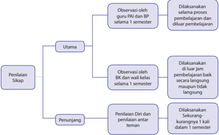

> **Deskripsi Visual:** Gambar ini adalah diagram yang menunjukkan struktur penilaian sikap dalam proses pembelajaran. Diagram ini terdiri dari dua bagian utama: Penilaian Sikap Utama dan Penilaian Diri serta penilaian antar teman. Untuk Penilaian Sikap Utama, observasi dilakukan oleh guru PN dan BP selama satu semester. Sedangkan untuk Penilaian Diri dan penilaian antar teman, observasi dilakukan oleh BK dan wali kelas selama satu semester. Informasi penting lainnya adalah bahwa Penilaian Sikap Utama dilakukan secara langsung dan diluar jaminan pedagogis baik secara langsung maupun tidak langsung. Penilaian Diri dan penilaian antar teman dilakukan secara kurangnya sekali dalam satu semester.

### 1)			Observasi

Observasi  dalam  penilaian  sikap  peserta  didik,  merupakan  teknik  yang dilakukan secara berkesinambungan melalui pengamatan perilaku. Asumsinya, setiap  peserta  didik  pada  dasarnya  berperilaku  baik,  sehingga  yang  perlu dicatat hanya perilaku yang sangat baik(positif) atau kurang baik (negatif) yang berkaitan  dengan  indikator  sikap  spiritual  dan  sikap  sosial.  Catatan,  hal-hal positif dan menonjol digunakan untuk menguatkan perilaku positif, sedangkan perilaku negatif digunakan untuk pembinaan. Instrumen yang digunakan dalam observasi adalah lembar observasi atau jurnal.

Hasil  observasi  dicatat  dalam  jurnal  yang  dibuat  selama  satu  semester. Jurnal  memuat  catatan  sikap  atau  perilaku  peserta  didik  yang  sangat  baik atau kurang baik, dilengkapi dengan waktu terjadinya perilaku tersebut, dan butir-butir  sikap.  Berdasarkan catatan tersebut, pendidik membuat deskripsi penilaian sikap peserta didik selama satu semester. Beberapa hal yang perlu diperhatikan dalam melaksanakan penilaian sikap dengan teknik observasi:

- Jurnal digunakan selama periode satu semester.
- Jurnal dibuat untuk seluruh peserta didik yang mengikuti mata pelajarannya.
- Hasil observasi sikap, untuk diolah lebih lanjut ke dalam penilaian sikap.

 

---
## 📄 Halaman 38

- Perilaku  sangat  baik  atau  kurang  baik  yang  dicatat  dalam  jurnal,  tidak terbatas  pada  butir-butir  sikap  (perilaku)  yang  hendak  ditumbuhkan melalui  pembelajaran  yang  saat  itu  sedang  berlangsung  sebagaimana dirancang dalam RPP, tetapi dapat mencakup butir-butir sikap lainnya yang ditanamkan  dalam  semester  itu,  jika  butir-butir  sikap  tersebut  muncul/ ditunjukkan oleh peserta didik melalui perilakunya.
- Catatan  dalam  jurnal  dilakukan  selama  satu  semester  sehingga  ada kemungkinan dalam satu hari perilaku yang sangat baik dan/atau kurang baik muncul lebih dari satu kali atau tidak muncul sama sekali.
- Perilaku peserta didik yang tidak menonjol (sangat baik atau kurang baik) tidak  perlu  dicatat  dan  dianggap  peserta  didik  tersebut  menunjukkan perilaku baik atau sesuai dengan norma yang diharapkan.
Nama Satuan pendidikan  :   SMAN 87 Jakarta

Tahun pelajaran

:   2014/2015

Kelas/Semester

:   X / Semester I

Mata Pelajaran

:   Pendidikan Agama Islam dan Budi Pekerti

---
**📊 Tabel**

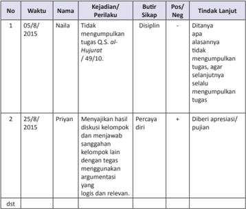

Tabel ini menunjukkan data tentang tindakan disiplin dan tindakan lanjut yang diberikan kepada dua orang siswa, Naila dan Priyan, pada tanggal 5 Agustus 2015 dan 25 Agustus 2015. Topik utama tabel adalah tindakan disiplin dan tindakan lanjut yang diberikan kepada siswa. Kolom-kolom yang ada meliputi nomor, waktu, nama siswa, kejadian/perilaku, butir sikap, posisi positif atau negatif, dan tindakan lanjut. Data penting yang terlihat adalah bahwa Naila tidak mengumpulkan tugas, sehingga diberikan tindakan disiplin. Sementara itu, Priyan menunjukkan sikap percaya diri dengan menyajikan hasil diskusi kelompok dan menjawab pertanyaan dengan argumen yang logis dan relevan, sehingga diberikan tindakan apresiasi/pujian.

 

---
## 📄 Halaman 39

Jika  seorang  peserta  didik  menunjukkan  perilaku  yang  kurang  baik, pendidik  harus  segera  menindaklanjuti  dengan  melakukan  pendekatan  dan pembinaan,  secara  bertahap  peserta  didik  tersebut  dapat  menyadari  dan memperbaiki sendiri perilakunya sehingga menjadi lebih baik. Tabel 2.2 dan Tabel 2.3 berturut-turut menyajikan contoh jurnal penilaian sikap spiritual dan sikap sosial yang dibuat oleh wali kelas dan/atau guru BK. Satu jurnal digunakan untuk satu kelas jangka waktu satu semester.

### Tabel	2.2	Contoh	Jurnal	Penilaian	Sikap	Spiritual	yang	dibuat	guru	BK	atau wali kelas.

Nama Satuan pendidikan  :   SMA X, Jakarta

Kelas/Semester

:   X/Semester I

Tahun pelajaran

:   2014/2015

---
**📊 Tabel**

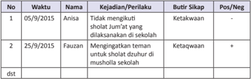

Tabel ini menunjukkan data tentang kejadian dan perilaku siswa di sekolah, dengan kolom "No", "Waktu", "Nama", "Kejadian/Perilaku", "Butir Sikap", dan "Pos/Neg". Topik utama tabel adalah perilaku dan sikap siswa terhadap sholat Jumat dan dzuhur di musholla sekolah. Data penting yang terlihat adalah bahwa Anisa tidak mengikuti sholat Jumat di musholla karena dilaksanakan di sekolah, sementara Fauzan mengingatkan untuk sholat dzuhur di musholla sekolah. Butir sikap Anisa adalah ketakwaan, sedangkan butir sikap Fauzan juga adalah ketakwaan namun dengan tambahan positif.

Nama Satuan pendidikan  :   SMA X, Jakarta

Kelas/Semester

:   X/ Semester I

Tahun pelajaran

:   2014/ 2015

---
**📊 Tabel**

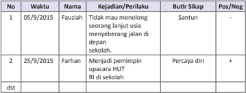

Tabel ini menunjukkan data tentang kejadian atau perilaku siswa yang berbeda pada tanggal 5 September dan 25 September 2015. Topik utama tabel adalah perubahan perilaku siswa tersebut. Kolom-kolom yang ada meliputi nomor urut, waktu, nama siswa, kejadian/keperluan, butir sikap, dan posisi positif atau negatif. Data penting yang terlihat adalah bahwa Fauziah tidak mau menolong seorang temannya yang sedang berjalan di depan sekolah, sementara Farhan menjadi pemimpin upacara HUT RI di sekolah. Kedua siswa tersebut memiliki sikap yang positif, dengan Fauziah yang santun dan Farhan yang percaya diri.

 

---
## 📄 Halaman 40

### 2.   Penilaian diri

Penilaian diri dilakukan dengan cara meminta  peserta didik untuk mengemukakan kelebihan dan kekurangan dirinya dalam berperilaku. Selain itu, penilaian diri juga dapat digunakan untuk membentuk sikap peserta didik terhadap mata pelajaran. Hasil penilaian diri peserta didik  dapat digunakan sebagai data konfirmasi. Penilaian diri dapat memberi dampak positif terhadap perkembangan kepribadian peserta didik, antara lain:

- Menumbuhkan rasa percaya diri, karena diberi kepercayaan untuk menilai diri sendiri.
- Menyadari kekuatan dan kelemahan diri, karena ketika melakukan penilaian harus  melakukan  introspeksi  terhadap  kekuatan  dan  kelemahan  yang dimiliki.
- Mendorong, membiasakan, dan melatih peserta didik untuk berbuat jujur, karena dituntut untuk jujur dan objektif dalam melakukan penilaian.
- Membentuk sikap terhadap mata pelajaran/pengetahuan. Instrumen yang  digunakan  untuk  penilaian  diri  berupa  lembar  penilaian  diri  yang dirumuskan  secara  sederhana,  namun  jelas  dan  tidak  bermakna  ganda, dengan bahasa lugas yang dapat dipahami peserta didik, dan menggunakan format sederhana yang mudah diisi peserta didik.
Lembar penilaian diri dibuat sedemikian rupa sehingga dapat menunjukkan sikap  peserta  didik  dalam  situasi  yang  nyata/sebenarnya,  bermakna,  dan mengarahkan peserta didik mengidentifikasi kekuatan atau kelemahannya. Hal ini untuk menghilangkan kecenderungan peserta didik menilai dirinya secara subjektif.

Penilaian  diri  oleh  peserta  didik  dilakukan  melalui  langkah-langkah  sebagai berikut.

- Menjelaskan kepada peserta didik tujuan penilaian diri.
- Menentukan indikator yang akan dinilai.
- Menentukan kriteria penilaian yang akan digunakan.
- Merumuskan  format  penilaian,  berupa  daftar  cek  ( checklist )  atau  skala penilaian ( rating scale ), atau dalam bentuk esai untuk mendorong peserta didik mengenali diri dan potensinya.

 

---
## 📄 Halaman 41

### Contoh	Lembar	Penilaian	Diri	menggunakan	daftar	cek	(checklist)	pada	waktu kegiatan kelompok.

Nama

: ...............................................

Kelas/Semester : ..................../..........................

Petunjuk:

- Bacalah baik-baik setiap pernyataan dan berilah tanda (  ) pada kolom yang sesuai dengan keadaan dirimu yang sebenarnya.
- Serahkan kembali format yang sudah kamu isi kepada bapak/ibu guru.

---
**📊 Tabel**

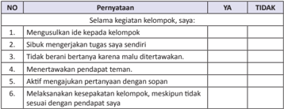

Tabel ini berisi 6 poin yang mungkin menjadi pertanyaan untuk menilai keterampilan komunikasi dan kerjasama dalam kelompok belajar. Kolom "YA" dan "TIDAK" digunakan untuk mengevaluasi apakah seseorang menguasai atau tidak menguasai setiap poin tersebut. Topik utama tabel ini adalah keterampilan komunikasi dan kerjasama dalam kelompok belajar. Data penting yang terlihat adalah bahwa setiap poin memiliki kolom "YA" dan "TIDAK", yang menunjukkan bahwa evaluasi ini dilakukan secara objektif dan sistematis.

Penilain diri tidak hanya digunakan untuk menilai sikap peserta didik semata, tetapi  juga  dapat  digunakan  untuk  menilai  sikap  terhadap  pengetahuan  dan keterampilan serta kesulitan belajar peserta didik.

### c.   Penilaian antarteman

Penilaian  antarteman  adalah  penilaian  dengan  cara  peserta  didik  saling menilai  perilaku  temannya.  Penilaian  antarteman  dapat  mendorong:  (a). objektifitas peserta didik, (b). empati, (c). mengapresiasi keragaman/perbedaan, dan (d).  refleksi  diri.  Sebagaimana  penilaian  diri,  hasil  penilaian  antarteman dapat digunakan sebagai data konfirmasi. Instrumen yang digunakan berupa lembar penilaian antarteman. Kriteria penyusunan instrumen penilaian antarteman sebagai berikut.

- Sesuai dengan indikator yang akan diukur.
- Indikator dapat diukur melalui pengamatan peserta didik.
- Kriteria  penilaian  dirumuskan  secara  sederhana,  namun  jelas  dan  tidak berpotensi munculnya penafsiran makna ganda/berbeda.
- Menggunakan bahasa lugas yang dapat dipahami peserta didik.
- Menggunakan format sederhana dan mudah digunakan oleh peserta didik.
- Indikator  menunjukkan  sikap/perilaku  peserta  didik  dalam  situasi  yang nyata atau sebenarnya dan dapat diukur.

 

---
## 📄 Halaman 42

Penilaian  antarteman  paling  cocok  dilakukan  pada  saat  peserta  didik melakukan kegiatan kelompok, misalnya setiap peserta didik diminta mengamati/menilai dua orang temannya, dan dia juga dinilai oleh dua orang teman lainnya dalam kelompoknya, sebagaimana diagram pada gambar berikut.

---
**🖼️ Gambar/Diagram**

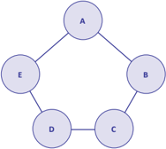

> **Deskripsi Visual:** Gambar ini adalah sebuah diagram yang menunjukkan hubungan antara beberapa objek atau konsep. Diagram ini berbentuk siklus dengan lima titik (A, B, C, D, dan E) yang saling terhubung oleh garis lurus. Setiap titik mungkin menggambarkan suatu konsep atau objek, dan garis yang menghubungkan mereka menunjukkan hubungan atau interaksi antara mereka.

Elemen utama dalam diagram ini adalah lima titik yang diberi label A, B, C, D, dan E. Titik-titik ini saling terhubung oleh empat garis lurus, menunjukkan bahwa setiap titik memiliki hubungan dengan dua titik lainnya. Ini menunjukkan bahwa diagram ini mungkin menunjukkan hubungan komunikasi atau interaksi antara objek-objek tersebut.

Teks, angka, atau label penting yang terlihat dalam diagram ini adalah label A, B, C, D, dan E untuk masing-masing titik. Label ini membantu pembaca untuk memahami apa yang ditunjukkan oleh setiap titik dalam diagram.

Informasi kunci yang dapat diambil pembaca dari diagram ini adalah bahwa ada lima objek atau konsep yang saling terhubung dalam hubungan komunikasi atau interaksi. Diagram ini mungkin digunakan untuk menunjukkan struktur organisasi, hubungan antar individu dalam sebuah kelompok, atau interaksi antar objek dalam suatu sistem.

Diagram pada Gambar 2.2 di atas menggambarkan aktivitas saling menilai sikap/perilaku antarteman.

- Peserta didik A mengamati dan menilai B dan E. A juga dinilai oleh B dan E
- Peserta didik B mengamati dan menilai A dan C. B juga dinilai oleh A dan C
- Peserta didik C mengamati dan menilai B dan D. C juga dinilai oleh B dan D
- Peserta didik D mengamati dan menilai C dan E. D juga dinilai oleh C dan E
- Peserta didik E mengamati dan menilai D dan A. E juga dinilai oleh D danA Contoh  instrumen  penilaian  (lembar  pengamatan)  antarteman  ( peer assessment ) menggunakan daftar cek ( checklist ) pada waktu kerja kelompok.

### Petunjuk:

- Amati perilaku 2 orang temanmu selama mengikuti kegiatan kelompok.
- Isilah kolom yang tersedia dengan tanda cek (  ) jika temanmu menunjukkan perilaku yang sesuai dengan pernyataan untuk indikator yang kamu amati atau tanda strip (-) jika temanmu tidak menunjukkan perilaku tersebut.
- Serahkan hasil pengamatan kepada bapak/ibu pendidik.

 

---
## 📄 Halaman 43

Nama Teman

:  1. …………………. 2. ……………….

Nama Penilai

:  ………………………………….

Kelas/Semester  :  ………………………………….

---
**📊 Tabel**

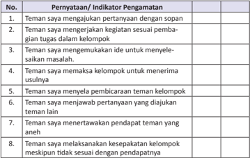

Tabel ini berisi 8 pertanyaan atau indikator pengamatan tentang perilaku teman dalam kelompok belajar. Topik utama tabel ini adalah bagaimana teman-teman bekerja sama dan saling mendukung dalam proses belajar. Kolom pertama berisi nomor pertanyaan atau indikator pengamatan, sedangkan kolom kedua berisi deskripsi atau penjelasan tentang setiap pertanyaan tersebut. Data atau pola penting yang terlihat adalah bahwa semua pertanyaan mengarah pada aspek-aspek positif dalam kerjasama kelompok, seperti partisipasi aktif, komunikasi efektif, dan dukungan satu sama lain.

Pernyataan-pernyataan untuk indikator yang diamati pada format di atas merupakan contoh. Pernyataan tersebut bersifat positif (nomor 1, 2, 3, 6, 8) dan bersifat negatif (nomor 4, 5, dan 7). Pendidik dapat berkreasi membuat sendiri pernyataan atau pertanyaan dengan memperhatikan kriteria instrumen penilaian antarteman.

Lembar penilaian diri dan penilaian antarteman yang telah diisi dikumpulkan kepada pendidik, selanjutnya dipilah dan direkapitulasi sebagai bahan tindak lanjut. Pendidik dapat menganalisis jurnal atau data/informasi hasil observasi penilaian  sikap  dengan  data/informasi  hasil  penilaian  diri  dan  penilaian antarteman sebagai bahan pembinaan.

Hasil analisis dinyatakan dalam deskripsi sikap spiritual dan sikap sosial yang perlu segera ditindaklanjuti. Peserta didik yang menunjukkan banyak perilaku positif  diberi  apresiasi/pujian  dan  peserta  didik  yang  menunjukkan  banyak perilaku  negatif  diberi  motivasi/pembinaan,  sehingga  peserta  didik  tersebut dapat membiasakan diri berperilaku baik (positif).

 

---
## 📄 Halaman 44

### b.   Penilaian Pengetahuan

Penilaian pengetahuan merupakan penilaian untuk mengukur kemampuan peserta didik berupa  pengetahuan  faktual,  konseptual, prosedural,  dan metakognitif, serta kecakapan berpikir tingkat rendah sampai tinggi. Penilaian ini berkaitan dengan ketercapaian Kompetensi Dasar pada KI-3 yang dilakukan oleh guru mata pelajaran. Penilaian pengetahuan dilakukan dengan berbagai teknik penilaian.  Pendidik  menetapkan teknik penilaian sesuai dengan karakteristik kompetensi yang akan dinilai. Penilaian dimulai dengan perencanaan pada saat menyusun Rencana Pelaksanaan Pembelajaran (RPP) dengan mengacu pada silabus.

Penilaian  pengetahuan,  selain  untuk  mengetahui  apakah  peserta  didik telah mencapai ke tuntasan belajar, juga untuk mengidentifikasi kelemahan dan kekuatan penguasaan pengetahuan peserta didik dalam proses pembelajaran ( diagnostic ).  Oleh  karena  itu,  pemberian  umpan  balik  ( feedback )  kepada peserta didik oleh pendidik merupakan hal yang sangat penting, sehingga hasil penilaian dapat segera digunakan untuk perbaikan mutu pembelajaran.

Ketuntasan belajar untuk pengetahuan ditentukan oleh satuan pendidikan dengan  mempertimbangkan  batas  standar  minimal  nilai  Ujian Nasional yang ditetapkan oleh Pemerintah. Secara bertahap, satuan pendidikan terus meningkatkan kriteria ketuntasan belajar dengan mempertimbangkan potensi dan karakteristik masing-masing satuan pendidikan sebagai bentuk peningkatan kualitas hasil belajar.

### Teknik Penilaian Pengetahuan

Berbagai  teknik  penilaian  pengetahuan  dapat  digunakan  sesuai  dengan karakteristik masing-masing KD. Teknik yang biasa digunakan adalah tes tertulis, tes  lisan,  dan  penugasan.  Namun,  tidak  menutup  kemungkinan  digunakan teknik  lain  yang  sesuai,  misalnya  portofolio  dan  observasi.  Skema  penilaian pengetahuan dapat dilihat pada gambar berikut.

 

---
## 📄 Halaman 45

---
**🖼️ Gambar/Diagram**

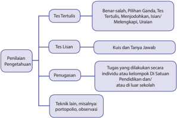

> **Deskripsi Visual:** Gambar ini adalah diagram yang menunjukkan berbagai metode penilaian pengetahuan. Diagram ini terdiri dari tiga bagian utama:

1. Tes Tertulis: Ini mencakup beberapa jenis tes seperti pilihan ganda, tes tertulis, menunjukkan ilusi, melengkapi urutan, dan lain-lain.

2. Tes Lisans: Ini termasuk kuis dan tanya jawab.

3. Penugasan: Ini mencakup tugas yang dilakukan oleh individu atau kelompok di sekolah atau luar sekolah.

Elemen-elemen utama dalam diagram ini adalah jenis-jenis penilaian tersebut, yang disusun secara hierarkis dari atas ke bawah. Teks penting dalam diagram ini adalah judul setiap jenis penilaian dan deskripsi singkat tentang apa yang dimaksud dengan setiap jenis penilaian tersebut.

Informasi kunci yang dapat diambil pembaca adalah bahwa ada berbagai metode penilaian pengetahuan yang digunakan dalam pendidikan, mulai dari tes tertulis hingga penugasan individu atau kelompok.

### Berikut penjelasan Gambar 2.3

### 1.   Tes Tertulis

Tes tertulis  adalah  tes  dengan soal dan jawaban disajikan secara tertulis untuk mengukur atau memperoleh informasi tentang kemampuan peserta tes. Tes  tertulis  menuntut  respons  dari  peserta  tes  yang  dapat  dijadikan  sebagai representasi  dari  kemampuan  yang  dimiliki.  Instrumen  tes  tertulis  dapat berupa soal pilihan ganda, isian, jawaban singkat, benar-salah, menjodohkan, dan uraian. Pengembangan instrumen tes tertulis mengikuti langkah-langkah sebagai berikut.

- Menetapkan  tujuan  tes,  yaitu  untuk  seleksi,  penempatan,  diagnostik, formatif, atau sumatif.
- Menyusun kisi-kisi, yaitu spesifikasi yang digunakan sebagai acuan menulis soal. Kisi-kisi memuat rambu-rambu tentang kriteria soal yang akan ditulis, meliputi  KD  yang  akan  diukur,  materi,  indikator  soal,  bentuk  soal,  dan nomor soal.  Dengan  adanya  kisi-kisi,  penulisan  soal  lebih  terarah  sesuai dengan tujuan tes dan proporsisoal per KD atau materi yang hendak diukur lebih tepat.
- Menulis soal berdasarkan kisi-kisi dan kaidah penulisan soal.
- Menyusun pedoman penskoran sesuai dengan bentuk soal yang digunakan. Pada soal pilihan ganda, isian, menjodohkan,  dan  jawaban  singkat disediakan  kunci  jawaban  karena  jawaban  dapat  diskor  dengan  objektif. Sedangkan untuk soal uraian disediakan pedoman penskoran yang berisi alternatif jawaban dan rubrik dengan rentang skor.
- Melakukan analisis kualitatif (telaah soal) sebelum soal diujikan.

 

---
## 📄 Halaman 46

Kaidah  penulisan  butir  soal  meliputi  substansi/materi,  konstruksi,  dan bahasa.

### (1) Tes tulis bentuk pilihan ganda.

Butir soal pilihan ganda terdiri atas pokok soal (stem) dan pilihan jawaban (option). Untuk tingkat SMA biasanya digunakan 5 (lima) pilihan jawaban. Dari kelima pilihan jawaban tersebut, salah satu adalah kunci ( key )  yaitu jawaban  yang  benar  atau  paling  tepat,  dan  lainnya  disebut  pengecoh ( distractor ).

Kaidah penulisan soal bentuk pilihan ganda sebagai berikut.

### (a) Substansi/Materi

- Soal sesuai dengan indikator (menuntut tes bentuk PG).
- Materi  yang  diukur  sesuai  dengan  kompetensi  (UKRK:  urgensi, keberlanjutan, relevansi, dan keterpakaian).
- Pilihan jawaban homogen dan logis.
- Hanya ada satu kunci jawaban yang tepat.

### (b) Konstruksi

- Pokok soal dirumuskan dengan singkat, jelas, dan tegas.
- Rumusan  pokok  soal  dan  pilihan  jawaban  merupakan  pernyataan yang    diperlukan saja.
- Pokok soal tidak memberi petunjuk kunci jawaban.
- Pokok soal tidak menggunakan pernyataan negatif ganda.
- Gambar/grafik/tabel/diagram dan sebagainya jelas dan berfungsi.
- Panjang rumusan pilihan jawaban relatif sama.
- Pilihan  jawaban  tidak  menggunakan  pernyataan  'semua  jawaban benar'   atau 'semua jawaban salah'.
- Pilihan jawaban yang berbentuk angka atau waktu disusun berdasarkan besar kecilnya angka atau kronologis kejadian.
- Butir soal tidak bergantung pada jawaban soal sebelumnya.

### (c) Bahasa

- Menggunakan bahasa sesuai dengan kaidah Bahasa Indonesia.
- Menggunakan bahasa yang komunikatif.
- Pilihan  jawaban  tidak  mengulang  kata/kelompok  kata  yang  sama, kecuali merupakan satu kesatuan pengertian.
- Tidak menggunakan bahasa yang berlaku setempat/tabu.

### (2)  Tes tulis bentuk uraian

Tes tulis bentuk uraian atau esai menuntut peserta didik untuk mengorganisasikan  dan  menuliskan  jawaban  dengan  kalimatnya  sendiri. Kaidah penulisan soal bentuk uraian sebagai berikut.

 

---
## 📄 Halaman 47

### (a)  Substansi/materi

- Soal sesuai dengan indikator (menuntut tes bentuk uraian)
- Batasan pertanyaan dan jawaban yang diharapkan sesuai
- Materi yang diukur sesuai dengan kompetensi (UKRK)
- Isi  materi  yang  ditanyakan  sesuai  dengan  jenjang,  jenis  satuan pendidikan, dan tingkat kelas

### (b) Konstruksi

- Ada petunjuk yang jelas mengenai cara mengerjakan soal
- Rumusan  kalimat  soal/pertanyaan  menggunakan  kata  tanya  atau perintah yang menuntut jawaban terurai
- Gambar/grafik/tabel/diagram dan sejenisnya harus jelas dan berfungsi
- Ada pedoman penskoran

### (c) Bahasa

- Rumusan kalimat soal/pertanyaan komunikatif
- Butir soal menggunakan bahasa Indonesia yang baku
- Tidak mengandung kata-kata/kalimat yang menimbulkan penafsiran ganda atau salah pengertian.
- Tidak mengandung kata yang menyinggung perasaan.
- Tidak menggunakan bahasa yang berlaku setempat/tabu.

### 2.   Tes lisan

Tes  lisan  merupakan pemberian soal/pertanyaan yang menuntut peserta didik  menjawab  secara  lisan,  dan  dapat  diberikan  secara  klasikal  ketika pembelajaran.  Jawaban  peserta  didik  dapat  berupa  kata,  frase,  kalimat maupun paragraf.  Tes  lisan  menumbuhkan  sikap  peserta  didik  untuk  berani berpendapat. Rambu-rambu pelaksanaan tes lisan sebagai berikut.

- Tes lisan dapat digunakan untuk mengambil nilai ( assessment of learning ) dan  dapat  juga  digunakan  sebagai  fungsi  diagnostik  untuk  mengetahui pemahaman peserta didik terhadap kompetensi dan materi pembelajaran ( assessment for learning ).
- Pertanyaan harus sesuai dengan tingkat kompetensi dan lingkup materi pada kompetensi dasar yang dinilai.
- Pertanyaan diharapkan dapat mendorong peserta didik dalam mengonstruksi jawaban sendiri.
- Pertanyaan disusun dari yang sederhana ke yang lebih komplek.

### 3.   Penugasan

Penugasan adalah pemberian tugas kepada peserta didik untuk mengukur dan/atau  meningkatkan  pengetahuan.  Penugasan  yang  digunakan  untuk mengukur pengetahuan ( assessment of learning )  dapat dilakukan setelah proses

 

---
## 📄 Halaman 48

pembelajaran,  sedangkan  penugasan  yang  digunakan  untuk  meningkatkan pengetahuan  ( assessment  for  learning )  diberikan  sebelum  dan/atau  selama proses pembelajaran.

Penugasan dapat berupa pekerjaan rumah dan/atau proyek yang dikerjakan secara individu atau kelompok sesuai dengan karakteristik tugas. Penugasan lebih  ditekankan  pada  pemecahan  masalah  dan  tugas  produktif  lainnya. Rambu-rambu penugasan.

- Tugas mengarah pada pencapaian indikator hasil belajar.
- Tugas dapat dikerjakan oleh peserta didik, selama proses pembelajaran atau merupakan bagian dari pembelajaran mandiri.
- Pemberian tugas disesuaikan dengan taraf perkembangan peserta didik.
- Materi penugasan harus sesuai dengan cakupan kurikulum.
- Penugasan ditujukan untuk memberikan kesempatan kepada peserta didik menunjukkan kompetensi individualnya meskipun tugas diberikan secara kelompok.
- Pada  tugas  kelompok,  perlu  dijelaskan  rincian  tugas  setiap  anggota kelompok.
- Tampilan kualitas hasil tugas yang diharapkan disampaikan secara jelas.
- Penugasan harus mencantumkan rentang waktu pengerjaan tugas.

### 4.		 Observasi

Observasi  selama  proses  pembelajaran  selain  dilakukan  untuk  penilaian sikap, juga dapat dilakukan untuk penilaian pengetahuan, misalnya pada waktu diskusi atau kegiatan kelompok. Teknik ini merupakan cerminan dari penilaian autentik.

Contoh format observasi terhadap diskusi kelompok.

---
**📊 Tabel**

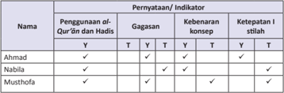

Tabel ini menunjukkan analisis penggunaan Al-Qur'an dan Hadits oleh tiga individu: Ahmad, Nabila, dan Musthofa. Kolom-kolomnya mencakup nama individu, penggunaan Al-Qur'an dan Hadits, gagasan, kebenaran konsep, dan ketepatan stilah. Data penting menunjukkan bahwa semua individu memiliki penggunaan Al-Qur'an dan Hadits yang baik, dengan semua memiliki gagasan yang benar, kebenaran konsep yang baik, dan ketepatan stilah yang tinggi. Ini menunjukkan bahwa mereka mampu menggunakan Al-Qur'an dan Hadits dengan benar dan tepat dalam konteksnya.

### Keterangan:

Diisi tanda cek (  ): Y = ya/benar/tepat. T = tidak tepat

Hasil observasi digunakan untuk mendeteksi kelemahan/kekuatan penguasaan kompetensi  pengetahuan  dan  memperbaiki  proses  pembelajaran  khususnya pada indikator yang belum muncul.

 

---
## 📄 Halaman 49

### c.   Penilaian Keterampilan

Penilaian  keterampilan  adalah  penilaian  untuk  mengukur  pencapaian kompetensi  peserta  didik  terhadap  kompetensi  dasar  pada  KI-4.  Penilaian keterampilan menuntut peserta didik mendemonstrasikan suatu kompetensi tertentu.  Penilaian  ini  dimaksudkan  untuk  mengetahui  apakah  pengetahuan yang  sudah  dikuasai  peserta  didik  dapat  digunakan  untuk  mengenal  dan menyelesaikan masalah dalam kehidupan sesungguhnya ( real life ).

Ketuntasan belajar untuk keterampilan ditentukan oleh satuan pendidikan, secara  bertahap  satuan  pendidikan  terus  meningkatkan  kriteria  ketuntasan belajar dengan mempertimbangkan potensi dan karakteristik masing-masing satuan pendidikan sebagai bentuk peningkatan kualitas hasil belajar.

### Teknik Penilaian Keterampilan

Penilaian keterampilan dapat dilakukan dengan berbagai teknik antara lain penilaian praktik/kinerja, proyek, dan portofolio. Teknik penilaian lain dapat digunakan sesuai dengan karakteristik KD pada KI-4 pada mata pelajaran yang akan diukur. Instrumen yang digunakan berupa daftar cek atau skala penilaian ( rating scale ) yang dilengkapi rubrik.

Skema penilaian keterampilan dapat dilihat pada gambar berikut.

 

---
## 📄 Halaman 50

---
**🖼️ Gambar/Diagram**

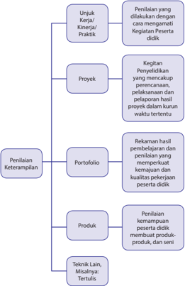

> **Deskripsi Visual:** Gambar ini adalah diagram yang menunjukkan struktur dan proses penilaian keterampilan peserta didik. Diagram ini terdiri dari empat bagian utama:

1. **Proyek**: Ini mencakup proses penelitian, pelaksanaan proyek, dan pelaporan hasil proyek dalam kurun waktu tertentu.

2. **Penilaian Keterampilan**: Ini meliputi penilaian keterampilan peserta didik melalui portofolio, produk, teknik lain (misalnya, tertiulis), dan misalnya.

3. **Kegiatan Penyelidikan**: Ini mencakup proses perencanaan, pelaksanaan, dan pelaporan hasil proyek dalam kurun waktu tertentu.

4. **Penilaian Kerja/ Kinerja/ Praktik**: Ini melibatkan penilaian yang dilakukan dengan cara mengamati kinerja peserta didik.

Elemen-elemen utama ini saling terkait dan membentuk proses penilaian keterampilan peserta didik. Teks, angka, atau label penting yang terlihat termasuk "Proyek", "Penilaian Keterampilan", "Kegiatan Penyelidikan", dan "Penilaian Kerja/ Kinerja/ Praktik". Informasi kunci yang dapat diambil pembaca adalah bahwa penilaian keterampilan peserta didik melibatkan berbagai metode seperti penilaian portofolio, produk, dan kegiatan penyelidikan.

### Penjelasan Gambar 2.3 sebagai berikut.

### 1.		Penilaian	Unjuk	kerja/kinerja/praktik

Penilaian unjuk kerja/kinerja/praktik, dilakukan dengan cara mengamati kegiatan  peserta  didik  dalam  melakukan  sesuatu.  Penilaian  ini  cocok digunakan untuk menilai ketercapaian kompetensi yang menuntut peserta didik melakukan tugas tertentu seperti: praktikum di laboratorium, praktik ibadah,  praktik  olahraga,  presentasi,  bermain  peran,  memainkan  alat musik,  bernyanyi,  dan  membaca  puisi/deklamasi.  Penilaian  unjuk  kerja/ kinerja/praktik perlu mempertimbangkan hal-hal berikut.

 

---
## 📄 Halaman 51

- Langkah-langkah  kinerja  yang  perlu  dilakukan  peserta  didik  untuk menunjukkan kinerja dari suatu kompetensi.
- Kelengkapan  dan  ketepatan  aspek  yang  akan  dinilai  dalam  kinerja tersebut.
- Kemampuan-kemampuan khusus yang diperlukan untuk menyelesaikan tugas.
- Kemampuan  yang  akan  dinilai  tidak  terlalu  banyak,  sehingga  dapat diamati.
- Kemampuan  yang  akan  dinilai,  selanjutnya  diurutkan  berdasarkan langkah-langkah pekerjaan yang akan diamati.
Pengamatan unjuk kerja/kinerja/praktik perlu dilakukan dalam berbagai konteks  untuk  menetapkan  tingkat  pencapaian  kemampuan  tertentu. Misalnya,  untuk  menilai  kemampuan  berbicara  yang  beragam  dilakukan pengamatan terhadap kegiatan-kegiatan seperti: diskusi dalam kelompok kecil,  berpidato,  bercerita,  dan  wawancara.  Dengan  demikian,  gambaran kemampuan peserta didik akan lebih utuh.

### 2. Penilaian	proyek

Penilaian  proyek  merupakan  kegiatan  penilaian  terhadap  suatu  tugas meliputi  kegiatan  perancangan,  pelaksanaan,  dan  pelaporan,  yang  harus diselesaikan  dalam  periode/waktu  tertentu.  Tugas  tersebut  berupa  suatu investigasi  mulai  dari  perencanaan,  pengumpulan  data,  pengorganisasian, pengolahan dan penyajian data.

Penilaian  proyek  dapat  digunakan  untuk  mengetahui  pemahaman, kemampuan mengaplikasikan, inovasi dan kreativitas, kemampuan penyelidikan dan kemampuan peserta didik menginformasikan mata pelajaran tertentu secara jelas. Penilaian proyek dapat dilakukan dalam satu atau lebih KD, satu mata pelajaran, beberapa mata pelajaran serumpun atau lintas mata pelajaran yang bukan serumpun.

Penilaian  proyek  umumnya  menggunakan  metode  belajar  pemecahan masalah sebagai langkah awal dalam pengumpulan dan mengintegrasikan pengetahuan baru berdasarkan pengalamannya dalam beraktifitas secara nyata. Pada penilaian proyek, setidaknya ada empat hal yang perlu dipertimbangkan  yaitu  pengelolaan,  relevansi,  keaslian,  dan  inovasi  dan kreativitas.

- Pengelolaan,  yaitu  kemampuan  peserta  didik  dalam  memilih  topik, mencari  informasi  dan  mengelola  waktu  pengumpulan  data  serta penulisan laporan.

 

---
## 📄 Halaman 52

- Relevansi,  yaitu  kesesuaian  topik,  data,  dan  hasilnya  dengan  KD  atau mata pelajaran.
- Keaslian,  yaitu  proyek  yang  dilakukan  peserta  didik  harus  merupakan hasilkarya sendiri dengan mempertimbangkan kontribusi pendidik dan pihak lain berupa bimbingan dan dukungan terhadap proyek yang dikerjakan peserta didik.
- Inovasi  dan  kreativitas,  yaitu  proyek  yang  dilakukan  peserta  didik terdapat  unsur-unsur  baru  (kekinian)  dan  sesuatu  yang  unik,  berbeda dari biasanya.

### 2.  Pengolahan Hasil Penilaian

### a. Nilai	Sikap	Spiritual	dan	Sikap	Sosial

Penilaian sikap spiritual dilakukan untuk mengetahui perkembangan sikap peserta didik dalam menghargai, menghayati, dan mengamalkan ajaran agama yang dianutnya serta toleransi terhadap agama lain. Indikator sikap spiritual diturunkan  dari  KD  pada  KI-1  dengan  memperhatikan  butir-butir  nilai  sikap yang tersurat.

Seiring dengan penilaian sikap sosial, dilakukan untuk mengetahui perkembangan sikap sosial peserta didik dalam menghargai, menghayati, dan berperilaku jujur, disiplin, tanggung jawab, peduli (toleransi, gotong royong), santun,  percaya  diri,  dalam  berinteraksi  secara  efektif  dengan  lingkungan sosial  dan  alam  dalam  jangkauan  pergaulan  dan  keberadaanya.  Sikap  sosial ini  dikembangkan  dari  Indikator  KD  dari  KI-2  dirumuskan  dalam  perilaku spesifik sebagaimana tersurat di dalam rumusan KD dari KI-2. Langkah-langkah menyusun rekapitulasi penilaian sikap untuk satu semester:

- Wali kelas, guru mata pelajaran, dan guru BK mengelompokkan (menandai) catatan-catatan jurnal ke dalam sikap spiritual dan sikap sosial.
- Wali kelas, guru mata pelajaran, dan guru BK membuat rumusan deskripsi singkat sikap spiritual dan sikap sosial sesuai dengan catatan-catatan jurnal untuk  setiap  peserta  didik  yang  ditulis  dengan  kalimat  positif.  Deskripsi tersebut  menyebutkan  sikap/perilaku  yang  sangat  baik  dan/atau  kurang baik dan yang perlu bimbingan.
- Wali kelas mengumpulkan deskripsi singkat (rekap) sikap dari guru mata pelajaran dan guru BK. Wali kelas menyimpulkan (merumuskan deskripsi) capaian sikap spiritual dan sosial setiap peserta didik, berdasarkan deskripsi singkat sikap spiritual dan sosial dari guru mata pelajaran, guru BK, dan wali kelas yang bersangkutan.
- Deskripsi yang ditulis pada sikap spiritual dan sikap sosial adalah perilaku yang  menonjol,  sedangkan  sikap  spiritual  dan  sikap  sosial  yang  belum mencapai  kriteria  (indikator)  dideskripsikan  sebagai  perilaku  yang  perlu pembimbingan.

 

---
## 📄 Halaman 53

- Dalam hal peserta didik tidak ada catatan apapun dalam jurnal, sikap peserta didik tersebut diasumsikan berperilaku sesuai indikator kompetensi.
- Rekap hasil observasi sikap spritual dan sikap sosial yang dilakukan oleh wali  kelas  sebagai  deskripsi  untuk  mengisi  buku  rapor  pada  kolom  hasil belajar sikap.
Rambu-rambu deskripsi pencapaian sikap:

- Sikap yang ditulis adalah sikap spritual dan sikap sosial.
- Deskripsi  sikap  terdiri  atas  keberhasilan  dan/atau  ketercapaian  sikap yang  diinginkan  dan  belum  tercapai  yang  memerlukan  pembinaan  dan pembimbingan.
- Substansi sikap spiritual adalah hal-hal yang berkaitan dengan menghayati dan mengamalkan ajaran agama yang dianutnya.
- Substansi  sikap  sosial  adalah  hal-hal  yang  berkaitan  dengan  menghayati dan mengamalkan perilaku jujur, disiplin, tanggungjawab, peduli, santun, responsif dan pro-aktif dan menunjukkan sikap sebagai bagian dari solusi atas  berbagai  permasalahan  dalam  berinteraksi  secara  efektif  dengan lingkungan sosial dan alam serta dalam menempatkan diri sebagai cerminan bangsa dalam pergaulan dunia.
- Hasil penilaian pencapaian sikap dalam bentuk predikat dan deskripsi.
- Predikat untuk sikap spiritual dan sikap sosial dinyatakan dengan A= sangat baik,  B=  baik,  C=  cukup,  dan  D=  kurang.  Deskripsi  dalam  bentuk  kalimat positif, memotivasi dan bahan refleksi.
Berikut contoh kesimpulan hasil deskripsi sikap spiritual oleh wali kelas.

### Gilang:

Selalu bersyukur dan berdoa sebelum melakukan kegiatan serta memiliki toleran pada agama yang berbeda; ketaatan beribadah mulai berkembang.

Contoh kesimpulan hasil deskripsi sikap sosial oleh wali kelas:

### Gilang:

Memiliki sikap santun, disiplin, dan tanggung jawab yang baik, responsif dalam pergaulan; sikap kepedulian mulai meningkat.

### Catatan:

Kriteria  penilaian  sikap,  dibuat  oleh  satuan  pendidikan  disesuaikan  dengan peraturan dan karakteristik satuan pendidikan sebagai rujukan untuk menentukan nilai akhir deskripsi sikap peserta didik pada rapor.

 

---
## 📄 Halaman 54

### 2. Nilai Pengetahuan

Nilai  pengetahuan  diperoleh  dari  hasil  penilaian  harian  selama  satu semester untuk mengetahui pencapaian kompetensi pada setiap KD pada KI-

3.  Penilaian harian dapat dilakukan melalui tes tertulis dan/atau penugasan, maupun  lisan,  dan  lain  lain  sesuai  dengan  karakteristik  masing-masing  KD. Pelaksanaan  penilaian  harian  dapat  dilakukan  setelah  pembelajaran  satu KD atau lebih. Penilaian harian dapat dilakukan lebih dari satu kali untuk KD dengan cakupan materi luas dan komplek sehingga penilaian harian tidak perlu menunggu pembelajaran KD tersebut selesai. Berikut contoh pengolahan nilai KD pada KI-3.

Hasil penilaian pengetahuan yang dilakukan oleh pendidik dengan berbagai teknik  penilaian  dalam  satu  semester,  direkap  dan  didokumentasikan  pada tabel  pengolahan  nilai  sesuai  dengan  KD  yang  dinilai.  Jika  dalam  satu  KD dilakukan penilaian lebih dari satu kali, maka nilai akhir KD tersebut merupakan nilai rerata.

Nilai  akhir  pencapaian  pengetahuan  mata  pelajaran  tersebut,  diperoleh dengan  cara  merata-ratakan  hasil  pencapaian  kompetensi  setiap  KD  selama satu semester. Nilai akhir selama satu semester pada rapor, ditulis dalam bentuk angka pada skala 0 - 100 dan predikat serta dilengkapi dengan deskripsi singkat kompetensi yang menonjol berdasarkan pencapaian KD selama satu semester.

### Contoh	pengolahan	nilai	pengetahuan	mata	pelajaran	Matematika	kelas	X	semester	I.

---
**📊 Tabel**

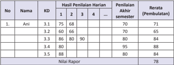

Tabel ini menunjukkan hasil penilaian harian dan akhir semester untuk lima siswa, dengan nilai rerata (pembulatan) di akhir semester. Topik utama tabel adalah penilaian akademik siswa. Kolom-kolomnya meliputi nomor siswa, nama siswa, kode mata pelajaran (KD), hasil penilaian harian, penilaian akhir semester, dan nilai rerata (pembulatan). Data penting yang terlihat adalah bahwa Ani memiliki nilai tertinggi 95 di penilaian akhir semester, sedangkan Nirlapor memiliki nilai tertinggi 88. Selain itu, Ani juga memiliki nilai tertinggi 80 di penilaian harian.

### Keterangan:

- Penilaian harian dilakukan oleh pendidik dengan cakupan meliputi seluruh indikator dari satu kompetensi dasar.
- Penilaian akhir semester merupakan kegiatan yang dilakukan oleh satuan pendidikan untuk mengukur pencapaian kompetensi peserta didik pada  akhir  semester.  Cakupan  penilaian  meliputi  seluruh  indikator  yang merepresentasikan semua KD pada semester tersebut.

 

---
## 📄 Halaman 55

- KD 3.1 dilakukan tagihan penilaian sebanyak 3 kali, maka nilai pengetahuan pada KD 3.1= 75 + 68 + 70  = 71
3

- Nilai Rapor = 71 + 65 + 84 + 88 + 84 = 78 5
- Deskripsi  berisi  kompetensi  yang  sangat  baik  dikuasai  oleh  peserta  didik dan/atau kompetensi yang masih perlu ditingkatkan.

### c. Nilai Keterampilan

Nilai  keterampilan  diperoleh  dari  hasil  penilaian  unjuk  kerja/kinerja/ praktik,  proyek,  produk,  portofolio,  dan  bentuk  lain  sesuai  karakteristik  KD mata pelajaran. Hasil penilaian pada setiap KD pada KI-4 adalah nilai optimal jika  penilaian  dilakukan  dengan  teknik  yang  sama  dan  objek  KD  yang  sama. Penilaian KD yang sama yang dilakukan dengan proyek dan produk atau praktik dan produk, maka hasil akhir penilaian KD tersebut dirata-ratakan.

Nilai  akhir  keterampilan  pada  setiap  mata  pelajaran  adalah  rerata  dari semua nilai KD pada KI-4 dalam satu semester. Selanjutnya, penulisan capaian keterampilan pada rapor menggunakan angka pada skala 0 - 100 dan predikat serta dilengkapi deskripsi singkat capaian kompetensi.

### Contoh 1:

Berikut cara pengolahan nilai keterampilan kelas X yang dilakukan melalui praktik pada KD 4.9 sebanyak 1 kali, dinilai melalui produk 1 kali. dinilai melalui proyek sebanyak 1 kali, juga dinilai melalui portofolio satu kali.

---
**📊 Tabel**

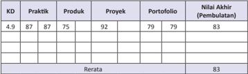

Tabel ini menunjukkan data akhir pembelajaran (Pembulatan) untuk berbagai kriteria (KD), yaitu Praktik, Produk, Proyek, Portofolio, dan Rerata. Setiap kriteria memiliki nilai tertentu, seperti Praktik dengan nilai 87, Produk dengan nilai 75, Proyek dengan nilai 92, Portofolio dengan nilai 79, dan Rerata dengan nilai 83. Nilai akhir pembulatan untuk setiap kriteria ditampilkan di bagian bawah tabel, sementara nilai rata-rata untuk semua kriteria disajikan di bagian bawah tabel juga. Pola penting yang terlihat adalah bahwa Proyek memiliki nilai tertinggi (92), sedangkan Produk memiliki nilai terendah (75).

### Keterangan:

- Pada KD 4.9 Nilai Akhir diperoleh nilai praktik dan portofolio berdasarkan nilai optimum, sedangkan untuk produk dan proyek diperoleh berdasarkan rata-rata karena menggunakan proyek dan produk.
- Nilai akhir semester didapat dengan cara merata-ratakan nilai akhir pada setiap KD.
- Skor dan Nilai.

 

---
## 📄 Halaman 56

### Skor	dan	Nilai

Penilaian  kompetensi  hasil  belajar  mencakup  kompetensi  sikap,  pengetahuan dan keterampilan yang dilakukan secara terpisah karena karakternya berbeda. Laporan  hasil  penilaian  sikap  berupa  deskripsi  yang  menggambarkan  sikap yang menonjol dalam satu semester. Hasil penilaian pencapaian pengetahuan dan  keterampilan  dilaporkan  dalam  bentuk  bilangan  bulat  (skala  0  -  100) dan predikat serta dilengkapi dengan deskripsi singkat yang menggambarkan capaian kompetensi yang menonjol dalam satu semester.

Predikat  pada  pengetahuan  dan  keterampilan  dinyatakan  dengan  angka bulat  dengan  skala  0-100,  ditentukan  berdasarkan  interval  predikat  yang disusun dan ditetapkan oleh satuan pendidikan.

---
**📊 Tabel**

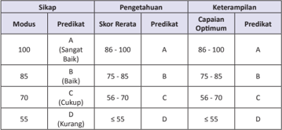

Tabel ini menunjukkan skor predikat berdasarkan modus sikap, pengetahuan, dan keterampilan. Topik utamanya adalah evaluasi kinerja individu berdasarkan tiga aspek: sikap, pengetahuan, dan keterampilan. Kolom-kolomnya meliputi modus (100, 85, 70, 55), predikat (A, B, C, D), skor rerata, dan predikat optimal. Data penting yang terlihat adalah bahwa skor rerata dan predikat optimal untuk modus 100 adalah A, sedangkan untuk modus 55 adalah D. Pola yang jelas adalah semakin rendahnya modus, semakin rendahnya skor rerata dan predikat optimal.

### G. Remedial

Kegiatan pembelajaran yang  ditujukan untuk membantu peserta didik yang mengalami kesulitan dalam memahami materi pelajaran. Guru melaksanakan perubahan  dalam  kegiatan  pembelajarannya  sesuai  dengan  kesulitan  yang dihadapi para peserta didik. Proses perbaikan dan pengulangan pembelajaran, berdasarkan tahapan hasil penilaian yang belum mencukupi target penilaian minimal.

Bagi peserta didik yang belum menguasai materi pelajaran tertentu, guru menjelaskan  kembali  materi  pelajaran  tersebut,  dan  melakukan  penilaian dengan  soal  yang  sejenis  atau  mendekati.  Kegiatan  pembelajaran  tersebut ditujukan  untuk  membantu  peserta  didik  yang  mengalami  kesulitan  dalam memahami materi pelajaran. Guru melaksanakan perubahan dalam kegiatan pembelajarannya sesuai dengan kesulitan yang dihadapi para peserta didik.

 

---
## 📄 Halaman 57

Remedial merupakan  kegiatan pembelajaran  yang berfungsi sebagai korektif, sebagai penguatan pemahaman,  sebagai fungsi akselerasi( percepatan belajar), dan berfungsi sebagai trapiutik. Melalui kegiatan remedial, guru dapat membantu mengatasi kesulitan belajar peserta didik  yang  berkaitan  dengan aspek sosial dan aspek pribadi, seperti merasa dirinya kurang berhasil dalam belajar, sering merasa rendah diri, atau terisolasi dalam pergaulan dan teman sejawatnya. Melalui remedial, dapat membantu rasa percaya diri peserta didik, sehingga yang bersangkutan dapat meningkatkan hasil belajar dengan baik.

Remedial  dilaksanakan  pada  waktu  dan  hari  tertentu  yang  disesuaikan, boleh  pada  saat  pembelajaran  apabila  masih  ada  waktu  atau  di  luar  jam pelajaran, pada umumnya 30 menit setelah pulang sekolah.

### 1.  Prinsip-Prinsip Kegiatan Remedial

Memberikan bantuan sesuai dengan keadaan peserta didik. Jika beberapa peserta didik mengalami kesulitan yang sama, pembelajaran remedial dapat diberikan  secara  bersama-sama  (berkelompok).  Jika  kesulitan  yang  dihadapi peserta  didik  berbeda-beda,  maka  guru  memberikan  bantuan  yang  bersifat individual. Jika  kesulitan yang dihadapi peserta didik sama tetapi penyebabnya berbeda, maka guru memberikan bantuan secara individual.

### a. Tentukan Proporsi Bantuan.

Bantuan yang diberikan kepada peserta didik hendaknya disesuaikan dengan tingkat kesulitan dan kemampuan yang dialaminya. Untuk dapat melaksanakan hal itu, guru harus benar-benar memahami tingkat kesulitan dan kemampuan peserta  didiknya  agar  proporsi  pembelajaran  remedial  yang  dilaksanakan sesuai  dan  tepat  dengan  kebutuhan  peserta  didik.  Tidak  memberikan  tugas yang  terlalu  banyak  kepada  peserta  didik,  karena  tindakan  itu  tidak  akan membantunya tapi justru menjadi beban yang dapat menyulitkan peserta didik dalam mencapai kompetensi yang belum dikuasainya.

### b. Menentukan	Pelaksana	Pembelajaran	Remedial.

Pelaksanaan  pembelajaran  remedial  dilakukan  oleh  guru,  atau  boleh meminta peserta didik lain yang telah lebih dulu menguasai kompetensi, atau dilaksanakan oleh peserta didik sendiri.  Untuk itu, dalam menentukan bentuk kegiatan, guru harus mempertimbangkan jenis kesulitan yang dialami peserta didik serta faktor penyebab kesulitan tersebut, sehingga dapat mempermudah guru dalam menentukan siapa yang akan melaksanakan kegiatan pembelajaran remedial yang dimaksud.

 

---
## 📄 Halaman 58

### c. Pemilihan	metode	yang	sesuai.

Pilihlah  metode  yang  mampu  membangkitkan  motivasi  belajar  peserta didik agar lebih rajin dan giat belajar sehingga memudahkan dalam menguasai kompetensi yang belum dikuasainya. Penerapan metode pembelajaran remedial disesuaikan  pula  dengan  tingkat  kesulitan  dan  kemampuan  peserta  didik. Dengan pemilihan dan penerapan metode yang sesuai tersebut, diharapkan akan dapat membantu peserta didik untuk menguasai kompetensi berikutnya.

### 2.  Langkah-LangkahKegiatan Remedial.

Dalam  melaksanakan  kegiatan  remedial  sebaiknya  mengikuti  langkahlangkah:

### a. Analisis Hasil Diagnosis

Guru melakukan suatu proses pemeriksaan terhadap peserta didik yang diduga mengalami kesulitan dalam belajar. Melalui kegiatan diagnosis ini, guru akan mengetahui para peserta didik yang perlu mendapatkan bantuan.

Tentu yang menjadi fokus perhatian adalah peserta didik-peserta didik yang mengalami kesulitan dalam belajar yang ditunjukkan tidak tercapainya kriteria keberhasilan belajar tertentu.

Apabila kriteria keberhasilan telah ditentukan, maka peserta didik yang dianggap  berhasil,  jika  mencapai  tingkat  penguasaan  tersebut,  ke  atas. Sedangkan peserta didik yang mencapai tingkat penguasaannya di bawah ketentuan tersebut, dikategorikan belum berhasil. Mereka inilah yang perlu mendapatkan remedial.

Setelah guru mengetahui peserta didik mana yang harus mendapatkan remedial,  informasi  selanjutnya  yang  harus  diketahui  guru  adalah  topik atau materi apa yang belum dikuasai oleh peserta didik tersebut.

Guru  berusaha  dapat  melihat  kesulitan  belajar  peserta  didik  secara individual.  Hal  ini  dikarenakan  ada  kemungkinan  masalah  yang  dihadapi peserta didik satu dengan peserta didik yang lainnnya tidak sama.

### b.		 Menemukan	Penyebab	Kesulitan

Sebelum  guru  merancang  kegiatan  remedial,  terlebih  dahulu  harus mengetahui mengapa peserta didik mengalami kesulitan dalam menguasai materi pelajaran.

Faktor penyebab kesulitan ini harus diidentifikasi terlebih dahulu, karena gejala yang sama yang ditunjukkan oleh peserta didik, dapat ditimbulkan dengan  sebab  yang  berbeda  dan  faktor  penyebab  ini  akan  berpengaruh terhadap pemilihan jenis kegiatan remedial.

 

---
## 📄 Halaman 59

### 3.		 Menyusun	Rencana	Kegiatan	Remedial

Setelah diketahui peserta didik peserta didik yang perlu mendapatkan remedial,  topik  yang  belum  dikuasai  setiap  peserta  didik,  serta  faktor penyebab kesulitan, langkah selanjutnya adalah menyusun rencana pembelajaran.

Sama halnya pada pembelajaran pada umumnya, komponen-komponen yang  harus  direncanakan  dalam  melaksanakan  kegiatan  remedial  adalah sebagai berikut;

- Merumuskan indikator hasil belajar
- Menentukan materi yang sesuai dengan indikator hasil belajar
- Memilih strategi dan metode yang sesuai dengan karakteristik peserta didik yang akan diremedial.
- Merencanakan waktu yang diperlukan
- Menentukan jenis, prosedur dan alat penilaian.

### d.		 Melaksanakan	Kegiatan	Remedial

Setelah  kegiatan  perencanaan  remedial  disusun,  langkah  berikutnya adalah melaksanakan kegiatan remedial. Sebaiknya pelaksanaan kegiatan remedial dilakukan sesegera mungkin, karena semakin cepat peserta didik dibantu mengatasi kesulitan yang dihadapinya, semakin besar kemungkinan peserta didik tersebut berhasil dalam belajarnya.

### e.		 Menilai	Kegiatan	Remedial

Penilaian  remedial  dapat  dilakukan  dengan  cara  mengkaji  kemajuan belajar  peserta  didik.  Apabila  peserta  didik  mengalami  kemauan  dan kemajuan belajar sesuai yang diharapkan, berarti kegiatan remedial yang direncanakan dan dilaksanakan cukup efektif membantu peserta didik yang mengalami kesulitan belajar.

Tetapi, apabila peserta didik tidak mengalami kemajuan dalam belajarnya, berarti kegiatan remedial yang direncanakan dan dilaksanakan kurang efektif. Untuk itu guru harus menganalisis setiap komponen pembelajaran.

### H.	Pengayaan

Secara umum  pengayaan  dapat  diartikan sebagai pengalaman  atau kegiatan peserta didik yang melampaui persyaratan minimal yang ditentukan oleh  kurikulum.  Setelah  kegiatan  pembelajaran  berlangsung  sampai  kepada menjawab serangkaian evaluasi maka, bagi peserta didik yang sudah menguasai materi, peserta didik tersebut mengerjakan soal pengayaan yang telah disiapkan oleh guru berupa pertanyaan-pertanyaan dan bentuk-bentuk penugasan.

 

---
## 📄 Halaman 60

Penilaian pada pengayaan ini, sebagai rangkaian proses pembelajaran yang menggambarkan  tingkat  keberhasilan  pembelajaran  dan  sekaligus  kualitas pengajaran yang mengacu kepada perkembangan hasil pembelajaran peserta didik.

### 1.	 Prinsip-Prinsip	Kegiatan	Pengayaan.

Prinsip-prinsip program pengayaan yang perlu diperhatikan dalam program kegiatan pengayaan:

### a. Inovasi.

Guru perlu menyesuaikan program yang diterapkannya dengan kekhasan peserta didik, karakteristik kelas serta lingkungan dan budaya peserta didik.

### b. Kegiatan	yang	memperkaya	dan	mengembangkan	kreativitas.

Dalam  menyusun  materi  dan  mendisain  pembelajaran  pengayaan, kembangkan dengan kegiatan yang menyenangkan, membangkitkan minat, merangsang pertanyaan, dan sumber-sumber yang bervariasi dan memperkaya.

### c. Merencanakan	metodologi	yang	luas	dan	metode	yang	lebih	bervariasi.

Memberikan  project,  pengembangan  minat  dan  aktivitas-akitivitas menggugah ( playful ). Menerapkan informasi terbaru, hasil-hasil penelitian atau kemajuan program-program pendidikan terkini.

### d Memperhatikan keluasan dan kedalaman dari pendekatan yang digunakan.

Pendekatan  dan  materi  yang  diberikan  tidak  hanya  berisi  hal-hal yang  sederhana  saja,  tetapi  diberikan  dengan  lebih  menyeluruh  dan lebih  mendalam.  Pembelajaran    tidak  hanya  memberikan  hal-hal  yang sederhana, tetapi mulai dari rumus dan pemecahan soal,  juga memberikan pemahaman  yang  luas,  dari  mulai  sejarah  terbentuknya,  hukum-hukum dan bagaimana penerapan prinsip tersebut dalam kehidupan sehari-hari.

### e Tempo dan kecepatan dalam melaksanakan program.

Sesuaikan cara pemberian materi dengan tempo dan kecepatan peserta didik  dalam  menangkap materi yang diajarkan. Hal ini berkaitan dengan kecepatan daya tangkap yang dimiliki peserta didik sehingga materi dapat diberikan  dengan  lebih  mendalam  dan  lebih  dinamis  untuk  menghindari kebosanan  karena  peserta  didik  yang  telah  menguasai  materi  pelajaran yang diberikan di kelas.

### f. Memperhatikan	isi	dan	tujuan	dari	materi	yang	diberikan.

Hal ini bertujuan agar kurikulum yang dirancang lebih tepat guna dan responsif terhadap kebutuhan peserta didik. Renzulli (1979) menyatakan bahwa  program  pengayaan  berbeda  dengan  program  akselerasi  karena pengayaan dirancang dengan lebih memperhatikan keunikan dan kebutuhan individual dari peserta didik.

 

---
## 📄 Halaman 61

### 2.	 Ragam	Kegiatan	Pengayaan.

Ada tiga jenis pembelajaran pengayaan, yaitu:

- Kegiatan eksploratori yang disajikan kepada peserta didik berupa peristiwa sejarah, buku, tokoh masyarakat, dan sebagainya yang secara regular tidak tercakup dalam kurikulum.
- Keterampilan proses yang diperlukan oleh peserta didik agar berhasil dalam melakukan pendalaman topik yang diminati dalam bentuk pembelajaran mandiri.
- Pemecahan masalah oleh peserta didik yang memiliki kemampuan belajar cepat, berupa pemecahan masalah nyata dengan menggunakan pendekatan pemecahan masalah yang  ditandai dengan:
- Identifikasi masalah yang akan dipecahkan
- Penentuan fokus masalah/problem yang akan dipecahkan
- Penggunaan berbagai sumber pendukung
- Pengumpulan data menggunakan teknik yang relevan
- Analisis data
- Penyimpulan hasil.
Dalam merancang dan melaksanakan kegiatan pengayaan, guru menerapkan pendekatan individu. Kegiatan pengayaan lebih bersifat fleksibel dibandingkan dengan kegiatan remedial. Artinya, kegiatan pengayaan dalam rangka  memanfaatkan  sisa  waktu  merupakan  kegiatan  yang  menyenangkan dan dapat merangsang kreatifitas peserta didik secara mandiri.

Ada beberapa kegiatan yang dapat dirancang dan dilaksanakan oleh guru dalam kaitannya dengan pengayaan, diantaranya:

### 1)		 Tutor	Sebaya.

Selain  efektif  dalam  kegiatan  remedial,  tutor  sebaya  juga  efektif digunakan  dalam  kegiatan  pengayaan.  Melalui  kegiatan  tutor  sebaya, pemahaman peserta didik terhadap suatu konsep akan meningkat karena selain mereka harus menguasai konsep yang akan dijelaskan mereka juga harus  mencari  teknik  menjelaskan  konsep  tersebut  kepada  temannya. Selain itu, tutor sebaya juga dapat mengembangkan kemampuan kognitif tingkat tinggi.

### 2)		 Mengembangkan	Latihan.

Peserta didik kelompok cepat, dapat diminta untuk mengembangkan latihan praktis yang dapat dilaksanakan oleh teman-temannya yang lambat. Kegiatan  ini  dapat  dilakukan  untuk  pendalaman  materi  yang  menuntut banyak latihan, misalnya pada mata pelajaran matematika. Guru juga bisa meminta  peserta  didik  cepat  untuk  membuat  soal-soal  latihan  beserta

 

---
## 📄 Halaman 62

jawabannya  yang  akan  digunakan  dalam  kegiatan  remedial  atau  sebagai bahan latihan dalam kegiatan tutor sebaya.

### 3)	 Mengembangkan	Media	dan	Sumber	belajar.

Peserta  didik  diberi  kesempatan  untuk  membuat  hasil  karya  berupa model,  permainan  atau  karya  tulis  yang  berkaitan  dengan  materi  yang dipelajari,  kemudian  dimanfaatkan  sebagai  sumber  belajar  bagi  peserta didik yang perlu melakukan remedial.

### 4) Melakukan	Proyek.

Keterlibatan  peserta  didik  dalam  suatu  proyek  atau  mempersiapkan suatu  laporan  khusus  berkaitan  dengan  materi  yang  sedang  dipelajari, merupakan kegiatan pengayaan yang paling menyenangkan. Kegiatan ini mampu  meningkatkan  motivasi  belajar,  kesempatan  mengembangkan bakat, dan menambah wawasan baru bagi peserta didik yang cepat.

### 5) Memberikan	Permainan,	Masalah	atau	Kompetensi	Antarpeserta	didik.

Dalam kegiatan ini, guru dapat memberikan tugas kepada peserta didik untuk memecahkan suatu masalah atau permainan yang berkaitan dengan materi  pelajaran  agar  mereka  merasa  tertantang.  Melalui  kegiatan  ini, mereka akan berusaha untuk memecahkan masalah atau permainan dan mereka juga akan belajar satu sama lain dengan membandingkan strategi/ teknik  yang  mereka  gunakan  dalam  memecahkan  permasalahan  atau permainan yang diberikan.

Itulah beberapa jenis pembelajaran pengayaan dan kegiatan pengayaan yang dapat dirancang dan dilaksanakan oleh guru, dalam rangka membantu peserta didik untuk  mengembangkan  wawasan  sehingga  potensinya berkembang optimal. Guru dapat menentukan dan memilih sendiri kegiatan pengayaan asalkan sesuai dengan karakteristik kegiatan pengayaan.

### 3.	 Langkah-Langkah	Kegiatan	Pengayaan.

Secara umum  pengayaan  dapat  diartikan sebagai pengalaman  atau kegiatan peserta didik yang melampaui persyaratan minimal yang ditentukan oleh kurikulum dan tidak semua peserta didik dapat melakukannya. Langkahlangkah kegiatan pembelajaran  pengayaan diantaranya:

- Identifikasi kemampuan belajar berdasarkan jenis serta tingkat kelebihan belajar peserta didik. Misalnya belajar lebih cepat, menyimpan informasi lebih  mudah,  keingintahuan  lebih  tinggi,  berpikir  mandiri,  superior  dan berpikir abstrak, memiliki banyak minat.
- Identifikasi kemampuan berlebih peserta didik, dapat dilakukan antara lain melalui: tes IQ, tes inventori, wawancara, pengamatan, dsb.
- Pelaksanaan pembelajaran pengayaan.

 

---
## 📄 Halaman 63

- Belajar Kelompok.
- Belajar Mandiri.
- Pembelajaran Berbasis Tema.
- Pemadatan Kurikulum.
Pemberian  pembelajaran  hanya  untuk  kompetensi/materi  yang  belum diketahui peserta didik. Dengan demikian, tersedia waktu bagi peserta didik untuk memperoleh kompetensi/materi baru, atau bekerja dalam proyek secara mandiri sesuai dengan kapasitas maupun kapabilitas masing-masing.

Pembelajaran pengayaan dapat pula dikaitkan dengan kegiatan penugasan terstruktur  dan  kegiatan  mandiri  tidak  terstruktur.  Pembelajaran  pengayaan diintegrasikan  dengan  kegiatan  penugasan  terstruktur  dan  kegiatan  mandiri tidak terstruktur.Penilaian hasil belajar kegiatan pengayaan, dihargai sebagai nilai tambah (lebih) dari peserta didik yang normal.

### I. Interaksi Guru dengan Orang Tua.

Interaksi  baik  secara  langsung  maupun  tidak  langsung  terhadap  proses dan tahapan pembelajaran yang berlangsung, antara guru dengan orang tua perlu dilakukan, untuk kesuksesan proses pembelajaran. Orang tua diharapkan dapat memberikan input, perhatian dan informasi terhadap kemajuan proses pembelajaran  peserta  didik,  minimal  berupa  komentar  dan  paraf,  atau komunikasi langsung.

Penggunaan  buku  penghubung  kepada  orang  tua  untuk  menyampaikan perubahan  perilaku  peserta  didik  setelah  mengikuti  kegiatan  pembelajaran. Selain itu, guru dapat berkomunikasi langsung, melalui telepon atau dengan memuat surat pernyataan tertulis untuk melaporkan perkembangan kemampuan  dan  hasil  proses  pembelajaran  peserta  didik,  terkait  dengan materi  yang  disajikan.  Terutama  dalam  penanaman  dan  penerapan  Perilaku Mulia peserta didik.

Proses pembelajaran ini, diharapkan peserta didik dapat menghayati dan mengamalkan ajaran agama Islam dengan baik dan benar. Peserta didik dapat mengembangkan perilaku jujur, disiplin, tanggung jawab, peduli, santun, ramah lingkungan,  gotong  royong,  kerjasama,  cinta  damai,  responsif  dan  proaktif, dan  menunjukkan sikap sebagai bagian dari solusi atas berbagai permasalahan bangsa, dalam  berinteraksi secara efektif dengan lingkungan sosial dan alam serta  dalam    menempatkan  diri  sebagai  cerminan  bangsa  dalam  pergaulan dunia.

Buku  Guru  Pendidikan  Agama  Islam  dan  Budi  Pekerti  SMA/SMK  kelas X  ini,  berfungsi  sebagai  buku  pegangan  bagi  guru    dalam    memproses pembelajarannya seefektif dan seefisien mungkin agar, sesuai dengan durasi pembelajaran untuk tingkat SMA/SMK Kelas X, yakni 3 jam pelajaran. Buku ini

 

---
## 📄 Halaman 64

memuat bahan kajian dan  langkah-langkah  secara standar dan berintegrasi dengan buku peserta didik, guna mengantarkan  guru dan para pendidik dapat memproses dan  mengembangkan pembelajarannya.

Diharapkan  dengan  buku  ini,  guru  dapat  mengantarkan  peserta  didik untuk dapat memahami, menerapkan dan  menganalisis pengetahuan faktual, konseptual,  prosedural  dalam  ilmu  pengetahuan,  teknologi,  seni,  budaya, dan humaniora dengan wawasan kemanusiaan, kebangsaan, kenegaraan, dan peradaban  terkait  fenomena  dan  kejadian,  serta  menerapkan  pengetahuan prosedural pada bidang kajian yang spesifik sesuai dengan bakat dan minatnya untuk  memecahkan  masalah.  Bahkan,  peserta  didik  diharapkan  mampu mengolah, menalar, dan menyaji dalam ranah konkret dan  ranah abstrak terkait dengan pengembangan dari yang dipelajarinya di sekolah secara mandiri, dan mampu  menggunakan  metode  sesuai  kaidah  keilmuan,  sebagaimana  yang menjadi acuan Kompetensi Inti Kurikulum 13.

Pendidikan Agama Islam dan Budi Pekerti adalah pendidikan yang ditujukan untuk  dapat    menyerasikan,  menyelaraskan,  dan  menyeimbangkan  antara iman, Islam, dan ihsan yang diwujudkan dalam 5 (lima) aspek pembelajaran, yaitu: Al-Qur'ān , Aqidah, Akhlak, Fiqih dan Sejarah Kebudayaan dan Peradaban Islam,  yang  tampil  dalam    bentuk  bab  dan  tema-tema  besar.    Pembelajaran Pendidikan Agama Islam dan Budi Pekerti ini, dimaksudkan agar peserta didik dapat memahami  dan berfungsi sebagai makhluk Allah Swt. yang mempunyai hubungan  dengan  Allah  Swt.,  hubungan  dengan  dirinya  sendiri,  hubungan dengan  sesama  manusia,  dan  hubungan  manusia  dengan  lingkungan  alam sekitarnya.

 

---
## 📄 Halaman 65

### Tujuan,	Sasaran,	dan	Ruang	Lingkup	Buku

### A. Tujuan

Tujuan penyusunan buku guru  ini untuk:

- Dapat  menjadi  salah  satu  acuan  dan  sekaligus  buku  pegangan  yang memberikan arahan bagi para guru Pendidikan Agama Islam dan Budi Pekerti dalam merencanakan, mengembangkan,  melaksanakan proses dan melakukan penilaian hasil pembelajaran.
- Dapat mempermudah guru dalam  mendampingi  peserta didik dalam menggunakan  dan  mempelajari  buku  pegangan  peserta  didiknya, karena buku guru ini memuat bahan  kajian dan  langkah-langkah  secara standar dan berintegrasi dengan  buku peserta didik
- Dapat meningkatkan kualitas pengajaran Pendidikan Agama Islam dan Budi Pekerti di sekolah sesuai dengan arah kebijakan Kurikulum 2013, yang  tentunya  sekaligus  dapat  meningkatkan  profesionalisme  guru dalam mengimplementasikan Kurikulum Pendidikan Agama Islam dan Budi Pekerti 2013.

### B.	 Sasaran

Sasaran  yang  hendak  dicapai  agar  guru  dan  para  pendidik  mata pelajaran  Pendidikan  Agama  Islam  dan  Budi  Pekerti  dapat  memproses, mengembangkan,  dan  menciptakan  pembelajaran  yang  aktif,  kreatif, inovatif,  produktif  dan  menyenangkan.  Pembelajaran  yang  dimaksud, mencakup pengembangan  dan mengedepankan ranah sikap dan perilaku, sebagaimana yang terdapat pada Kompetensi Inti 1 dan 2, melalui proses pembelajaran  ranah pengetahuan, dan  keterampilan yang dikembangkan pada  setiap  satuan  pendidikan  sesuai  dengan  strategi  implementasi Kurikulum 2013 dengan menggunakan pendekatan saintifik dan penilaian autentik.

### C.  Ruang Lingkup Buku Guru

Buku Guru ini terdiri atas dua belas  bab yang  merupakan perwujudan dari 5 (lima) aspek pembelajaran, yaitu: al-Qur'ān , Akidah, Akhlak, Fiqih dan Sejarah Kebudayaan dan Peradaban Islam, yang ditampilkan dalam bentuk tema-tema pembelajaran Pendidikan Agama Islam dan Budi Pekerti. Ruang lingkup buku guru ini adalah sebagai berikut.

- Terdiri atas bab-bab yang memuat kegiatan pembelajaran secara standar dan berintegrasi dengan buku peserta didik, guna mengantarkan  guru dan para pendidik dapat memproses dan mengembangkan pembelajarannya, agar  peserta  didik  dapat  memahami,  menerapkan,  dan  menganalisis pengetahuan  faktual,  konseptual,  prosedural  dalam  ilmu  pengetahuan, teknologi,  seni,  budaya,  dan  humaniora  dengan  wawasan  kemanusiaan, kebangsaan, kenegaraan, dan peradaban terkait fenomena dan kejadian.

 

---
## 📄 Halaman 66

- Memperkaya  Khazanah,  merupakan  bahan  kajian  untuk  memproses pembelajaran  yang  menuju  pada  upaya  memfasilitasi,  mengarahkan, membimbing,  peserta  didik  untuk  memahami  dan  menguasai  materi pembelajaran pada setiap bab dan tema-tema besar tersebut. Pada buku peserta didik, sebelum penyajian Memperkaya Khazanah, didahului dengan penyajian  Membuka  Relung  Kalbu  dan  Mengkritisi  Sekitar  Kita,  yang bertujuan agar bersih suci hatinya, dan kritis pemikirannya.

### 3. Buku guru ini memiliki rangkaian sebagai berikut.

### a. Kompetensi	Inti	(KI)

Kompetensi Inti terdiri atas empat dimensi yang satu sama lain saling terkait, yaitu sikap spiritual (KI 1), sikap sosial (KI 2), pengetahuan (KI 3), dan keterampilan (KI 4). Keempat dimensi tersebut tercantum dalam pengembangan  Kompetensi  Dasar,  silabus,  dan  RPP.  Dalam  proses pembelajaran, KI 1 dan KI 2 dikembangkan dalam proses pendidikan di setiap kegiatan di sekolah (kelas dan luar sekolah) dengan pendekatan pembelajaran tidak langsung. KI 3 dan KI 4 dikembangkan oleh setiap mata pelajaran dalam pendekatan pembelajaran  langsung.

Proses  pembelajaran dalam Memperkaya Khazanah ini, cenderung merupakan  upaya  menerapkan  KI  3,  yang  menitikberatkan  pada pengembangan  pengetahuan  (faktual,  konseptual,  prosedural,  dan metakognitif)  dalam  jenjang  kemampuan  kognitif  dari  mengingat sampai mencipta.

### b. Kompetensi	Dasar	(KD)

Kompetensi Dasar (KD) adalah kemampuan untuk mencapai KI yang harus diperoleh peserta didik melalui pembelajaran. Kompetensi Dasar setiap  mata  pelajaran  dikembangkan  dengan  merujuk  kepada  KI  dan setiap KI memiliki KD yang sesuai. Dengan perkataan lain, KI 1 memiliki KD  yang  berkaitan  dengan  sikap  spiritual,  KI  2  memiliki  KD  yang berkaitan dengan sikap sosial, KI 3 memiliki KD yang berkaitan dengan pengetahuan dan KI 4 memiliki KD yang berkaitan dengan keterampilan.

### c. Tujuan Pembelajaran

Kompetensi atau kemampuan yang harus dimiliki oleh peserta didik, setelah menempuh  proses pembelajaran.

### d. Pengembangan	Materi

Merupakan upaya guru  dalam memfasilitasi peserta didik dalam menciptakan pengembangan pembelajaran seaktif mungkin sehingga peserta didik dapat menikmati pembelajarannya dengan penuh kreativitas  dan  inovasi,  dalam  mengakses  beragam  sumber  belajar yang mengantarkan peserta didik menemukan nilai-nilai dan kualitas pembelajaran, yang  dapat dipahaminya dengan baik dan benar.

### e. Proses Pembelajaran

Serangkaian kegiatan  yang sengaja diciptakan dengan tujuan untuk memudahkan  terjadinya proses belajar melalui proses pembelajaran

 

---
## 📄 Halaman 67

ranah pengetahuan, keterampilan, dan sikap yang dikembangkan pada setiap satuan pendidikan sesuai dengan strategi implementasi Kurikulum 2013 dengan menggunakan pendekatan saintifik dan penilaian autentik, dengan  menerapkan  proses  pembelajaran:  kegiatan  pendahuluan, kegiatan  inti,  terdiri  atas:  mengamati,  menanya,  mengeksplorasi/ eksperimen,  asosisasi,  dan  komunikasi,  dilanjutkan  dengan  kegiatan penutup,

Kegiatan penutup, merupakan  kegiatan yang  merencanakan kegiatan tindak lanjut dengan memberikan tugas baik secara individu maupun kelompok. Bagi Peserta Didik yang belum menguasai materi pembelajaran  mengikuti  kegiatan  remedial.  Pengembangan  materi bagi peserta didik yang lebih berkembang secara kreatif,  inovatif dan produktif, selanjutnya menyampaikan rencana pembelajaran pada pertemuan berikutnya.

### f. Penilaian

Penilaian  autentik,  sebagai  rangkaian  proses  pembelajaran  yang menggambarkan  tingkat  keberhasilan  pembelajaran  dan  sekaligus kualitas  pengajaran,  dalam  memahami  materi  pembelajaran  yang disajikan.  Guru  dapat  melakukan  penilaian  pada:  kolom  membaca dengan  tartil,  diskusi,  kolom  penerapan  membaca,  menyalin  dan mencari  hukum tajwid ,  jika  terkait  dengan  penerapan  ayat-ayat alQur'ān dan hadis terkait.

### g. Pengayaan

Pengayaan diberikan kepada peserta didik  yang sudah menguasai materi.  Pengayaan  tersebut  dapat  berupa  pertanyaan    atau  tugas yang telah disiapkan oleh guru. Penilaian pada pengayaan ini sebagai rangkaian proses pembelajaran yang menggambarkan tingkat keberhasilan    pembelajaran  dan  sekaligus  kualitas  pengajaran  yang mengacu kepada perkembangan hasil pembelajaran peserta didik.

### h. Remedial

Remedial  diberikan  kepada  peserta  didik  yang  belum  menguasai materi  pelajaran  tertentu.    Guru  dapat  menjelaskan  kembali  materi pelajaran  tersebut,  dan  melakukan  penilaian  dengan  soal  atau  tugas yang sejenis atau mendekati. Remedial dilaksanakan pada waktu dan hari tertentu yang disesuaikan atau 30 menit setelah pulang sekolah.

### i. Interaksi Guru dan Orang Tua

Guru  meminta  peserta  didik  memperlihatkan  kolom  'Membaca dengan Tartil' dalam buku teks kepada orang tuanya dengan memberikan komentar dan paraf. Dapat pula dengan  menggunakan buku  penghubung  kepada  orang  tua  untuk  menyampaikantentang perubahan perilaku peserta didik, setelah mengikuti kegiatan pembelajaran. Selain itu, guru dapat berkomunikasi langsung melalui telepon, dengan pernyataan tertulis untuk melaporkan perkembangan kemampuan  membaca  dan  menghafal  peserta  didik,  terkait  dengan materi yang disajikan.

 

---
## 📄 Halaman 68

### Bagian Dua Petunjuk Khusus Proses Pembelajaran

 

---
## 📄 Halaman 69

### Aku Selalu Dekat dengan  ALLAH  Swt.

### A.   Kompetensi Inti (KI)

KI-1:

Menghayati dan mengamalkan ajaran agama yang dianutnya.

- KI 2: Menghayati  dan  mengamalkan  perilaku  jujur,  disiplin,  tanggung  jawab, peduli (gotong royong, kerja sama, toleran, damai) santun, responsif dan pro-aktif dan menunjukkan sikap sebagai bagian dari solusi atas berbagai permasalahan dalam berinteraksi secara efektif dengan lingkungan sosial dan alam serta dalam menempatkan diri sebagai cerminan bangsa dalam pergaulan dunia.
- KI 3: Memahami, menerapkan, dan menganalisis pengetahuan faktual, konseptual,  prosedural,  berdasarkan  rasa  ingin  tahunya  tentang  ilmu pengetahuan,  teknologi,  seni,  budaya,  dan  humaniora  dengan  wawasan kemanusiaan, kebangsaan, kenegaraan, dan peradaban terkait penyebab fenomena dan kejadian, serta menerapkan pengetahuan prosedural pada bidang  kajian  yang  spesifik  sesuai  dengan  bakat  dan  minatnya  untuk memecahkan masalah.
- KI 4: Mengolah, menalar, dan menyaji dalam ranah konkret dan ranah abstrak terkait  dengan  pengembangan  dari  yang  dipelajarinya  di  sekolah  secara mandiri, dan mampu menggunakan metode sesuai kaidah keilmuan.

 

---
## 📄 Halaman 70

### B.   Kompetensi Dasar (KD)

- 1.3 Meyakini bahwa Allah Maha Mulia, Maha Mengamankan, Maha Memelihara, Maha Sempurna Kekuatan-Nya, Maha Penghimpun, Maha Adil, dan Maha Akhir.
- 2.3 Memiliki sikap keluhuran budi; kokoh pendirian, pemberi rasa aman, tawakal dan adil sebagai implementasi pemahaman a l-Asmau al-Husna: Al-Karim, AlMu'min, Al-Wakil, Al- Matin, Al-Jami' , Al-'Adl, dan Al-Akhir.
- 3.3 Menganalisis  makna al-Asma'u  al-Husna:  al-Karim,  al-Mu'min,  al-Wakil,  alMatin, al-Jami' , al-'Adl, dan al-Akhir.
- 4.3 Menyajikan  hubungan  makna-makna al-Asma'u  al-Husna:  al-Karim,  alMu'min,  al-Wakil,  al-Matin,  al-Jami' ,  al-'Adl, dan al-Akhir dengan  perilaku keluhuran budi, kokoh pendirian, rasa aman, tawakal dan perilaku adil.

### C.   Tujuan Pembelajaran

### Peserta didik mampu:

- Meyakini  bahwa  Allah  Maha  Mulia,  Maha  Mengamankan,  Maha  Memelihara, Maha Sempurna Kekuatan-Nya, Maha Penghimpun, Maha Adil, dan Maha Akhir.
- Memiliki sikap keluhuran budi; kokoh pendirian, pemberi rasa aman, tawakal dan adil sebagai implementasi pemahama n al-Asmau al-Husna: Al-Karim, AlMu'min, Al-Wakil, Al- Matin, Al-Jami' , Al-'Adl, dan Al-Akhir.
- Menganalisis  makna al-Asma'u  al-Husna:  al-Karim,  al-Mu'min,  al-Wakil,  alMatin, al-Jami' , al-'Adl, dan al-Akhir.
- Menyajikan  hubungan  makna-makna al-Asma'u  al-Husna:  al-Karim,  alMu'min,  al-Wakil,  al-Matin,  al-Jami' ,  al-'Adl, dan al-Akhir dengan  perilaku keluhuran budi, kokoh pendirian, rasa aman, tawakal dan perilaku adil.

 

---
## 📄 Halaman 71

### D.   Pengembangan Materi

Pengembangan materi tentang al-Asmā'u al-¦ usnā antara lain, sebagai berikut.

- Meneliti  secara  lebih  mendalam  pemahaman al-Asmā'u  al-¦ usnā , Q.S.  alA'rāf/7:180,  Q.S.  al-Infi ¯ ār:6,  Q.S.  al-An'ām/6:82,  Q.S.  aż-Żariyat/5:58,  Q.S.  Āli 'Imrān/3:9, Q.S. al-An'ām/6:115, dan Q.S. al-¦ ad ³ d/57:3, tentang al-Asmā'u al-¦ usnā , dengan menggunakan IT.
- Menjelaskan makna isi al-Asmā'u al-¦ usnā , Q.S. al-A'rāf/7:180, Q.S. al-Infiţār:6, Q.S. al-An'ām/6:82, Q.S. aż-Żariyat/5:58, Q.S. Āli 'Imrān/3:9, Q.S. al-An'ām/6:115, dan Q.S. al-¦ ad ³ d/57:3 , tentang al-Asmā'u al-¦ usnā dengan menggunakan IT.
- Mendemonstrasikan hafalan al-Asmā'u al-¦ usnā dengan menerapkan berbagai jenis nada bacaan secara baik dan lancar.
- Memberikan tambahan bacaan ayat al-Qur'ān dan Hadis-hadis yang mendukung lainnya, tentang al-Asmā'u al-¦ usnā .
- Meneliti secara lebih mendalam bentuk perilaku tentang al-Asmā'u al-¦usnā , Q.S. al-A'rāf/7:180, Q.S. al-Infi¯ār:6, Q.S. al-An'ām/6:82, Q.S. aż-Żariyat/5:58, Q.S. Āli 'Imrān/3:9, Q.S. al-An'ām/6:115, dan Q.S. al-¦ad³d/57:3 sebagai dasar dalam menerapkan al-Asmā'u al-¦usnā , dengan menggunakan IT.
- Menampilkan  contoh  perilaku  berdasarkan al-Asmā'u  al-¦ usnā , Q.S.  alA'rāf/7:180,  Q.S.  al-Infi ¯ ār:6,  Q.S.  al-An'ām/6:82,  Q.S.  aż-Żariyat/5:58,  Q.S.  Āli 'Imrān/3:9, Q.S. al-An'ām/6:115, dan Q.S. al-¦ ad ³ d/57:3 ayat al-Qur'ān dan hadishadis yang mendukung lainnya, sebagai dasar dalam menerapkan al-Asmā'u al-¦ usnā melalui  presentasi,  demonstrasi  dan  bersimulasi,  dalam  bentuk powerpoint, video atau CD pembelajaran.

### E.   Proses Pembelajaran

### 1. Persiapan

- Guru  memulai  pembelajaran  dengan  mengucapkan  salam,  menyapa, berdoa, dan  tadarus: membaca al-Qur'ān surah pendek pilihan atau ayat hafalan yang sudah dipelajari, dengan lancar dan benar (atau surat yang sesuai dengan program pembiasaan yang ditentukan sebelumnya), śalat « u ¥ ā' (atau śalat sunnah lainnya, jika memungkinkan, sebagai modifikasi pembukaan  pembelajaran,  guna  pembentukan  sikap  dan  perilaku peserta didik) secara bersama-sama (berjama'ah).

 

---
## 📄 Halaman 72

- Memperhatikan  kesiapan,  semangat  dan  kelengkapan  peserta  didik, dengan memeriksa kehadiran, kerapian berpakaian, dan mengorganisir kelas dan posisi tempat duduk disesuaikan dengan kegiatan pembelajaran yang akan diterapkan, berdasarkan metode dan model pembelajaran.
- Menyampaikan tujuan pembelajaran atau kompetensi dasar yang akan dicapai dari materi pembelajaran, yaitu: 'Aku selalu dekat dengan Allah Swt.'  berdasarkan  pemahaman  makna  dan  pengamalan al-Asmā'u  al-¦ usnā .
- Model pengajaran yang dapat dipersiapkan dan digunakan sebagai alternatif dalam  kompetensi  ini adalah, puzzle,  role  playing, mengembangkan kemampuan dan keterampilan ( skill ) peserta didik.

### 2. Pelaksanaan

Pada  kegiatan  ini,  pembelajaran  berlangsung  dan  dikembangkan  dengan menerapkan  beragam  model  pembelajaran, metode  pembelajaran, media pembelajaran, dan sumber belajar yang disesuaikan dengan karakteristik dan 'Aku selalu dekat dengan Allah Swt.' berdasarkan pemahaman makna dan pengamalan al-Asmā'u al-¦ usnā , sebagai salah satu wujud beriman kepada Allah Swt.

### a) Membuka Relung Hati

- Guru memberi motivasi peserta didik secara kontekstual sesuai manfaat dan aplikasi materi   dengan menyajikan kajian 'Membuka Relung Hati' yang terdapat pada setiap awal bab penyajian buku peserta didik, dalam hal ini kajian tentang, beragam cara yang ditempuh oleh manusia untuk mendekatkan  diri  kepada  sang  pencipta,  yaitu  Allah  Swt.  Ada  yang melalui jalan merenung atau ber tafakkur atau ber © ikir .
- Guru mengadakan pengembangan pembelajaran dengan menyajikannya sebagai proses pengamatan yang menjelaskan bahan kajian 'Aku selalu dekat dengan Allah Swt.' berdasarkan makna al-Asmā'u al-¦ usnā ,  sebagai dasar  dan  awal  pembentukan    pemahaman  dan  penghayatan  agama peserta didik.
- 'Membuka Relung Hati' ini dapat pula dikembangkan melalui penayangan video, film, gambar, cerita, atau  dengan memperlihatkan guntingan  kertas  yang  sudah  dibuat  ( media by  design )  yang  berisikan penjelasan yang setara, atau yang lebih kreatif dan inovatif.
- Peserta didik secara individu maupun klasikal diminta untuk melihat dan mencermati kajian 'Membuka Relung Hati'  tentang  'Aku selalu dekat dengan Allah Swt. berdasarkan al-Asmā'u al-¦ usnā ' .

 

---
## 📄 Halaman 73

Dapat pula disajikan dalam bentuk tayangan video, film, gambar, cerita, atau guntingan kertas yang sudah dibuat ( media by design ) yang berisikan penjelasan 'Aku selalu dekat dengan Allah Swt. berdasarkan pemahaman makna al-Asmā'u  al-¦ usnā ,  kemudian  menjadikannya  sebagai  bahan penanaman pembentukan dan pengembangan penghayatan dan pengamalan ajaran agama berdasarkan tema kajian.

- Berdasarkan  wacana  dan  tayangan  video,  film,  gambar,  cerita,  atau dengan  memperlihatkan  guntingan  kertas  yang  sudah  dibuat  ( media by design )  yang berisikan penjelasan tentang 'Aku selalu dekat dengan Allah  Swt.  berdasarkan  makna al-Asmā'u  al-¦ usnā' ,  guru  memberikan penguatan dan penjelasan kepada peserta didik agar proses mencermati baik secara individu ataupun klasikal berlangsung secara lengkap, baik dan benar.

### Aktivitas 1

Pada kolom 'Aktivitas Siswa' guru memfasilitasi peserta didik untuk'Kamu tentu  pernah  mengalami  sakit  atau  musibah  baik  ringan  atau  berat. Ceritakan  pengalamanmu  tersebut,  kemudian  bagaimana  cara  kamu menyikapi kehadiran Allah Swt. saat itu? Apakah Allah Swt. akan hadir dengan  pertolongan-Nya,  ataukah  Allah  Swt.  akan  membiarkanmu dalam kesusahan?'

### b) Mengkritisi Sekitar Kita

- Guru meminta peserta didik untuk memperhatikan kajian yang terdapat pada  kolom 'Mengkritisi  Sekitar  Kita'  berdasarkan  kajian  yang  terdapat pada buku peserta didik, yang merupakan kajian fenomena sosial yang timbul dan berkembang, terkait dengan masalah 'Aku selalu dekat dengan Allah Swt. berdasarkan makna al-Asmā'u al-¦ usnā ' .
Menyajikan kajian 'manusia adalah makhluk yang sering lupa dan berbuat kesalahan, sebagai makhluk yang beriman, bersegeralah  untuk kembali ke jalan yang benar dengan bertobat dan tidak mengulanginya lagi.'

- Guru  dapat  mengembangkan  bahan  kajian  yang  terdapat  pada  kolom 'Mengkritisi  Sekitar  Kita'  dalam  bentuk  kajian  melalui  tayangan  video, film, gambar, cerita atau  dengan memperlihatkan guntingan kertas yang sudah  dibuat  ( media by design )  yang  berisikan  penjelasan  tentang 'Aku selalu dekat dengan Allah Swt., berdasarkan makna al-Asmā'u al-¦ usnā' , yang berisikan penjelasan yang setara, atau yang lebih kreatif dan inovatif.
- Guru  membagi  peserta  didik  ke  dalam  beberapa  kelompok,  kemudian setiap kelompok diminta untuk mempersiapkan pertanyaan yang berkaitan dengan bahan kajian yang terdapat pada kolom 'Mengkritisi Sekitar Kita' atau tayangan video, film, gambar, cerita atau  dengan memperlihatkan guntingan  kertas  yang  sudah  dibuat  ( media  by  design )  yang  setara

 

---
## 📄 Halaman 74

isinya  dengan  penjelasan  tentang    aku  selalu  dekat  dengan  Allah  Swt. berdasarkan al-Asmā'u  al-¦ usnā' ,  untuk  dapat  diketahui  keberhasilan proses mengamati materi kajian yang telah dilakukan peserta didik.

- Setiap  peserta  didik  atau  wakil  kelompok,  mengajukan  pertanyaanpertanyaan  yang  telah  dipersiapkan.  Peserta  didik  atau  kelompok  lain menanggapi dan menjawab pertanyaan-pertanyaan, sekaligus berfungsi melahirkan  berpikir  kritis  dan  membangun  dinamika,  dan  kreativitas proses  pembelajaran  dalam  menanamkan  dan  mengembangkan  jiwa sosial peserta didik.
- Guru memberikan pengarahan, penguatan dan penjelasan jawaban dari pertanyaan-pertanyaan  yang  berkembang,  agar  lebih  logis,  terinci,  dan sistematis  terkait  dengan  pertanyaan-pertanyaan  peserta  didik,  dalam upaya  mencermati  dan  memahami  kajian  tentang  'Aku  selalu  dekat dengan Allah Swt. berdasarkan makna al-Asmā'u al-¦ usnā' .

### Aktivitas 2

Pada kolom 'Aktivitas Siswa' guru memfasilitasi atau meminta peserta didik untuk dapat mengemukakan kesalahan apa saja yang sering dilakukan, kemudian bagaimana upaya agar kesalahan tersebut tidak terulang lagi.

### 3) Memperkaya Khazanah

Dalam  kajian  'Memperkaya  Khazanah' ,  guru  memfasilitasi,  membimbing dan mengarahkan peserta didik untuk mampu menemukan dan melahirkan analisis  kajian   'Aku  selalu  dekat  dengan  Allah  Swt.  berdasarkan  makna alAsmā'u al-¦ usnā' .

Guru sangat diharapkan dapat memberikan kebebasan kepada peserta didik dalam mengakses beragam sumber belajar,  yang mengantarkan peserta didik menemukan nilai-nilai  dan  kualitas  pemahaman 'Aku  selalu  dekat  dengan Allah Swt., berdasarkan makna al-Asmā'u al-¦ usnā' ,  yang bermanfaat baik di rumah, di sekolah maupun di masyarakat.

- Dapat pula dikembangkan  melalui penayangan video, film, gambar, cerita, atau  dengan memperlihatkan guntingan kertas yang sudah dibuat ( media by design )  yang berisikan penjelasan yang setara, atau yang lebih kreatif dan inovatif.
- Peserta didik secara individu maupun klasikal, diminta untuk melihat dan mencermati kajian  'Membuka Relung Hati'  tentang  aku selalu dekat dengan Allah  Swt.,  berdasarkan al-Asmā'u  al-¦ usnā '  atau  tayangan  video,  film, gambar, cerita,  atau guntingan kertas yang sudah dibuat ( media by design ) yang berisikan penjelasan aku selalu dekat dengan Allah Swt., berdasarkan pemahaman makna al-Asmā'u al-¦ usnā ,  kemudian menjadikannya sebagai bahan penanaman pembentukan dan pengembangan penghayatan dan pengamalan ajaran agama berdasarkan tema kajian.

 

---
## 📄 Halaman 75

- Berdasarkan wacana dan tayangan video, film, gambar, cerita, atau  dengan memperlihatkan guntingan kertas yang sudah dibuat ( media by design ) yang  berisikan  penjelasan  tentang    aku  selalu  dekat  dengan  Allah  Swt. berdasarkan  makna al-Asmā'u  al-¦ usnā ,  guru  memberikan  penguatan dan penjelasan kepada peserta didik, agar proses mencermati baik secara individu ataupun klasikal berlangsung secara lengkap, baik dan benar.

### Aktivitas 3

Pada  kolom 'Aktivitas  Siswa'  guru  memfasilitasi  atau  meminta  peserta didik  untuk  dapat  memperkuat  penjelasan  yang  terdapat  pada  kolom memperkaya khazanah peserta didik, dengan mencari dalil-dalil lain baik ayat al- Qur'ān maupun  hadis tentang al-Asmā'u al-¦ usnā.

- Agar  peserta  didik    dapat  lebih  kreatif  dalam  menganalisis  makna  al -Asma'u al-Husna: al-Karim, al-Mu'min, al-Wakil, al-Matin, al-Jami' , al-'Adl , dan al-Akhir , guru membagi peserta didik ke dalam beberapa kelompok untuk mendiskusikan kajian tentang pemahaman aku selalu dekat dengan Allah Swt. berdasarkan al- Asmā'u al-Husnā , berdasarkan Q.S. al-A'rāf /7:180, Q.S. al-Infi¯ār :6,  Q.S.  al-An'ām/6:82,  Q.S. aż-  Żumar /39:62, Q.S.  aż-Żariyat /5:58, Q.S. Āli 'Imrān /3:9, Q.S. al- An'ām/ 6:115, dan Q.S. al-Hadid /57:3.
- Guru mengingatkan tema diskusi yaitu, memahami kajian  aku selalu dekat dengan Allah Swt. berdasarkan Q.S. al-A'rāf/7:180, Q.S. al-Infi ¯ ār:6, Q.S. al-An'ām/6:82, Q.S. aż-Żariyat/5:58, Q.S. Āli 'Imrān/3:9, Q.S. alAn'ām/6:115, dan Q.S. al-¦ ad ³ d/57:3 kemudian guru membagi peserta didik ke dalam beberapa kelompok.
- Guru  mengarahkan  dan  mengendalikan  diskusi  dengan  menunjuk perwakilan dari setiap kelompok untuk mengatur, mengendalikan dan menemukan penjelasan lebih rinci dalam memahami ketentuan dan manfaat  'Aku selalu dekat dengan Allah Swt. berdasarkan makna alAsmā'u al-¦ usnā' .
- Guru  meminta  peserta  didik  menyampaikan,  mengemukakan  dan mempresentasikan  hasil diskusi  tentang  macam-macam  temuan, identifikasi dan pengembangan pemikiran, penjelasan, sehingga lebih mendapatkan  penguatan  ter-hadap pemahaman,  terkait  dengan tujuan  dan manfaat 'Aku selalu dekat dengan Allah Swt. berdasarkan makna al-Asmā'u al-¦ usnā' dapat dipahami dengan baik dan benar.
- Memotivasi kelompok lainnya untuk memperhatikan, menyimak, dan memberikan tanggapan.
- Di  dalam  pelaksanaannya,  guru  langsung  menilai  semua  aktivitas pembelajaran dan diskusi peserta didik yang berlangsung.
- f )  Membimbing  peserta  didik  untuk  menyimpulkan  hasil  diskusi,  hasil presentasi sehingga lebih aplikatif dalam memahami  'Aku selalu dekat dengan Allah Swt. berdasarkan makna al-Asmā'u al-¦ usnā' .

 

---
## 📄 Halaman 76

- Guru memberikan penguatan, penjelasan tambahan dan sekaligus hasil penilaian  berdasarkan  proses  perkembangan  diskusi  yang  dilakukan peserta didik.

### Aktivitas 4

Pada kolom 'Aktivitas Siswa' guru memfasilitasi atau meminta peserta didik  untuk  dapat  mencari  ayat-ayat al-Qur'ān atau  hadis  Nabi  saw. yang menjelaskan sifat Allah Swt. dalam al-Asmā'u al-Husnā: al-Karim, al- Mu'min, al-Wakil, al-Matin, al-Jāmi' , al-'Adl, dan al-Akhir !

Membimbing peserta didik untuk mengkaji pesan-pesan mulia tentang Kisah Nabi Ibrahim a.s. Mencari Tuhan, yang terdapat dalam buku teks peserta didik.

### Aktivitas 5

Pada kolom 'Aktivitas Siswa' guru memfasilitasi atau meminta peserta didik untuk dapat mencari dan mengemukakan hikmah yang terkandung di dalamnya dan bagaimana cara merealisasikannya dalam kehidupan sehari-hari.

### d) Menerapkan Perilaku Mulia

Guru  menekankan  makna al-Asmā'u  al-¦ usnā agar  peserta  didik  dapat berperilaku yang mencontohkan keluhuran budi, kokoh pendirian, pemberi rasa aman, tawakkal dan perilaku adil sebagai implementasi dari pemahaman makna a l-Asmā'u al-Husnā: al-Karim, al-Mu'min, al-Wakil, al-Matin, al-Jāmi' , al'Adl, dan al-Akhir , kemudian mengembangkannya ke dalam langkah-langkah pembelajaran:

- Meneliti secara lebih mendalam bentuk dan contoh perilaku  'Aku selalu dekat  dengan  Allah  Swt.  berdasarkan al-Asmā'u  al-¦ usnā' ,  berdasarkan Q.S.  al-A'rāf/7:180,  Q.S.  al-Infiţār:6,  Q.S.  al-An'ām/6:82,  Q.S.  aż-Żariyat/5:58, Q.S.  Āli  'Imrān/3:9,  Q.S.  al-An'ām/6:115, dan Q.S.  al-¦ ad ³ d/57:3 melalui sumber-sumber belajar lainnya baik cetak maupun elektronik, atau dengan menggunakan IT,
- Menampilkan  contoh  perilaku  'Aku  selalu  dekat  dengan  Allah  Swt. berdasarkan pengamalan al-Asmā'u al-¦ usnā' , berdasarkan Q.S. alA'rāf/7:180,  Q.S.  alInfi ¯ ār :6,  Q.S.  al-An'ām/6:82,  Q.S.  aż-Żariyat/5:58,  Q.S.  Āli 'Imrān/3:9, Q.S. al-An'ām/6:115, dan Q.S. al-¦ ad ³ d/57:3 melalui presentasi, demonstrasi dan simulasi.
- Memberikan contoh-contoh perilaku  'Aku selalu dekat dengan Allah Swt. berdasarkan al-Asmā'u al-¦ usnā' ,  berdasarkan tambahan bacaan ayat alQur'ān dan hadis-hadis yang mendukung lainnya.
- Agar peserta didik dapat lebih kreatif dalam menunjukkan dan menerapkan  perilaku 'Aku  selalu  dekat  dengan  Allah  Swt.  berdasarkan pengamalan al-Asmā'u al-¦ usnā' ,  guru membagi peserta didik ke dalam

 

---
## 📄 Halaman 77

beberapa  kelompok  untuk  mendiskusikan  dan  menyimulasikan  kajian tentang bentuk dan contoh perilaku  aku selalu dekat dengan Allah Swt. berdasarkan makna al-Asmā'u al-¦ usnā dengan:

- Mengingatkan  tema  diskusi  yaitu,  menunjukkan  dan  menerapkan perilaku 'Aku selalu dekat dengan Allah Swt. berdasarkan pengamalan al-Asmā'u  al-¦ usnā' ,  yang  bersumber  dari Q.S.  al-A'rāf/7:180,  Q.S.  alInfi ¯ ār:6, Q.S. al-An'ām/6:82, Q.S. aż-Żariyat/5:58, Q.S. Āli 'Imrān/3:9, Q.S. alAn'ām/6:115, dan Q.S. al-¦ad³ d/57:3, kemudian guru membagi peserta didik ke dalam beberapa kelompok.
- Guru  mengarahkan  dan  mengendalikan  diskusi  dengan  menunjuk perwakilan  dari  setiap  kelompok  untuk  mengatur,  mengendalikan dan menemukan penjelasan lebih rinci dalam memahami ayat-ayat alQur'ān tentang 'Aku selalu dekat dengan Allah Swt. berdasarkan makna al-Asmā'u al-¦ usnā' .
- Guru  meminta  peserta  didik  menyampaikan,  mengemukakan  dan mempresentasikan  serta  mendemonstrasikan  hasil  diskusi  tentang macam-macam  temuan,  identifikasi  dan  pengembangan  pemikiran penjelasan  sehingga  lebih  mendapatkan  penguatan  bentuk  perilaku 'Aku selalu dekat dengan Allah Swt. berdasarkan makna al-Asmā'u al-¦ usnā' , untuk dapat diterapkan dengan baik dan benar, baik di sekolah, di rumah, maupun di masyarakat.
- Guru memotivasi kelompok lainnya untuk memperhatikan, menyimak dan memberikan tanggapan.
- Di  dalam  pelaksanaannya,  guru  langsung  menilai  semua  aktivitas pembelajaran dan diskusi peserta didik yang berlangsung.
- f )  Guru  membimbing  peserta  didik  untuk  menyimpulkan  hasil  diskusi, hasil  presentasi  sehingga  lebih  aplikatif  dalam  menerapkan  perilaku 'Aku selalu dekat dengan Allah Swt. berdasarkan al-Asmā'u al-¦ usnā' .
- Guru memberikan penguatan, penjelasan tambahan dan sekaligus hasil penilaian  berdasarkan  proses  perkembangan  diskusi  yang  dilakukan peserta didik.

### Aktivitas 6

Pada  kolom 'Aktivitas  Siswa'  guru  memfasilitasi  atau  meminta  peserta didik untuk dapat menyebutkan perilaku yang mencerminkan mengimani dan meneladani sifat Allah Swt. dalam al-Karim, al-Mu'min, alWakil, al-Matin, al-Jāmi' , al-'Adl, dan al-Akhir , baik di lingkungan keluarga, sekolah, maupun mayarakat.

 

---
## 📄 Halaman 78

### 3. Penutup

Dalam kegiatan penutup, guru bersama peserta didik  baik  secara  individu maupun  kelompok,  menyimpulkan  intisari  dari  pelajaran  tersebut  sesuai dengan yang terdapat dalam buku teks peserta didik pada kolom rangkuman, dan melakukan penilaian dari  proses  komunikasi  yang  berkembang.  Melakukan refleksi  untuk  mengevaluasi  semua  rangkaian  aktivitas  pembelajaran  dan hasil-hasil  yang  diperoleh  dan  selanjutnya  secara  bersama  menemukan manfaat langsung maupun tidak langsung dari hasil pembelajaran yang telah berlangsung.

- Melaksanakan  refleksi  dan  kesimpulan  sebagaimana    yang  terdapat dalam buku teks peserta didik pada kolom 'rangkuman dan refleksi' , serta mengajukan pertanyaan atau tanggapan peserta didik dari kegiatan yang telah  dilaksanakan,  sebagai  bahan  masukan  untuk  perbaikan  langkah selanjutnya dalam menerapkan perilaku  'Aku selalu dekat dengan Allah Swt.  berdasarkan  makna al-Asmā'u al-¦ usnā' ,  baik  di  rumah,  di  sekolah maupun di masyarakat.
- Guru  dan  peserta  didik  menyimpulkan  intisari  dari  pelajaran  tersebut. Guru  membimbing    peserta  didik  untuk  memberikan  tanda  (  )  pada kolom 'selalu' , 'sering' , 'jarang'  atau 'sudah  menerapkannya  dengan  baik' , 'kadang-kadang menerapkannya, 'akan menerapkannya', dll. (guru dapat mengembangkannya berdasarkan situasi dan kondisi).
- Merencanakan  kegiatan  tindak  lanjut  dengan  memberikan  tugas  baik secara individu maupun kelompok. peserta didik yang belum menguasai pembelajaran  'Aku selalu dekat dengan Allah Swt. berdasarkan al-Asmā'u al-¦ usnā' , melakukan kegiatan remedial, atau pengembangan materi bagi peserta didik yang lebih berkembang secara kreatif,  inovatif, dan produktif.
- Menyampaikan tema dan rencana pembelajaran pada pertemuan berikutnya.

### F.   Penilaian

Penilaian  sebagai  rangkaian  proses  pembelajaran  yang  menggambarkan tingkat  keberhasilan  pembelajaran  dan  sekaligus  kualitas  pengajaran,  dalam hal pemahaman dan menerapkan perilaku mulia, aku selalu dekat dengan Allah Swt.  berdasarkan Q.S.  al-A'rāf/7:180,  Q.S.  al-Infi ¯ ār:6,  Q.S.  al-An'ām/6:82,  Q.S.  ażŻariyat/5:58,  Q.S.  Āli  'Imrān/3:9,  Q.S.  al-An'ām/6:115,  dan  Q.S.  al¦ad³ d/57:3 .  Guru dapat melakukan penilaian berdasarkan sajian evaluasi yang terdapat pada buku peserta didik, berupa Uji Pemahaman, Uji Penerapan dan Refleksi, serta  melakukan pengembangan penilaian sebagaimana contoh berikut.

 

---
## 📄 Halaman 79

### a.  Skala Sikap

Berilah tanda 'centang' (  ) yang sesuai dengan kebiasaan kamu terhadap pernyataan-pernyataan yang tersedia!

---
**📊 Tabel**

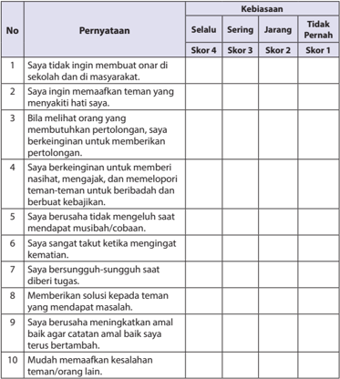

Tabel ini menunjukkan skor yang diberikan kepada responden berdasarkan kebiasaan mereka dalam beberapa situasi sosial. Kolom "Selalu" menunjukkan skor 4, "Sering" menunjukkan skor 3, "Jangkauan" menunjukkan skor 2, dan "Tidak Pernah" menunjukkan skor 1. Topik utama tabel ini adalah tentang perilaku sosial dan interaksi antar individu. Data penting yang terlihat adalah bahwa banyak responden memiliki kebiasaan negatif seperti tidak ingin membuat onar di sekolah dan di masyarakat, serta tidak memaafkan teman yang menghakimi hati mereka. Ini menunjukkan adanya tantangan dalam menjaga hubungan sosial yang baik dan saling menghormati.

``

skor tertinggi 4

 

---
## 📄 Halaman 80

### 2.  Kolom 'Membaca dengan Tartĩl '

Rubrik Pengamatannya sebagai berikut:

---
**📊 Tabel**

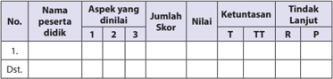

Tabel ini menunjukkan data evaluasi pelaksanaan aspek-aspek pendidikan untuk satu peserta didik. Topik utama tabel adalah evaluasi pelaksanaan aspek pendidikan. Kolom-kolom yang ada meliputi No., Nama peserta didik, Aspek yang dinilai, Jumlah Skor, Nilai, Ketentasan, Tindakan Lanjut, dan R. Data penting yang terlihat adalah bahwa peserta didik tersebut telah melaksanakan beberapa aspek pendidikan, seperti aspek 1, 2, dan 3, dengan jumlah skor tertentu. Nilai yang diberikan juga berbeda-beda untuk setiap aspek pendidikan. Selain itu, tabel juga mencakup ketentasan dan tindakan lanjut yang harus dilakukan oleh peserta didik untuk meningkatkan pengetahuan dan keterampilannya.

Aspek yang dinilai :

- Kelancaran
Skor 25 a 100

- Artinya
Skor 25 a 100

- Isi
Skor 25 a 100

Skor maksimal….

100

Rubrik penilaiannya adalah:.

### a)  Kelancaran

- Jika peserta didik dapat membaca al-Asmā'u al-¦ usnā sangat lancar, skor 100.
- Jika peserta didik dapat membaca al-Asmā'u al-¦ usnā lancar, skor 75.
- Jika peserta didik dapat membaca al-Asmā'u al-¦ usnā tidak lancar dan kurang sempurna, skor 50.
- Jika peserta didik tidak dapat membaca al-Asmā'u al-¦ usnā

### b)  Arti

- Jika  peserta  didik  dapat  mengartikan al-Asmā'u al-Husnā , al-Kar ³ m, alMu'm ³ n,  al-Wak ³ l,  al-Matin,  al-Jāmi' ,  al-'Adl, dan al-Akh ³ r dengan  benar, skor 100.
- Jika peserta didik dapat mengartikan al-Asmā'u al-Karim, al-Mu'm ³ n, alWak � l,  al-Mat ³ n, al-Jāmi' , al-'Adl, dan al-Akh ³ r dengan benar dan  kurang sempurna, skor 75.
- Jika peserta didik tidak benar mengartikan al-Asmā'u al-¦ usnā : al-Kar � m, al-Mu'm ³ n, al-Wak � l, al-Mat ³ n, al-Jāmi' , al-'Adl, dan al-Akh � r , skor 50.
- Jika peserta didik  tidak dapat mengartikan al-Asmā'u al-¦ usnā : al-Kar ³ m, al-Mu'm ³ n, al-Wak ³ l, al-Mat ³ n, al-Jāmi' , al-'Adl, dan al-Akh ³ r , skor 25.

### 2)  Isi

- Jika peserta didik dapat menjelaskan al-Asmā'u al-¦ usnā berdasarkan isi Q.S. al-A'rāf/7:180  dengan benar, skor 100.
- Jika peserta didik  dapat menjelaskan a l-Asmā'u al-¦ usnā berdasarkan isi Q.S. al-A'rāf/7:180  dengan mendekati benar, skor  75.
- , skor 25

 

---
## 📄 Halaman 81

- Jika peserta didik dapat menjelaskan al-Asmā'u al-¦ usnā berdasarkan isi Q .S. al-A'rāf/ 7:180  dengan tidak benar, skor  50.
- Jika  peserta  didik    tidak  dapat  menjelaskan al-Asmā'u  al-¦ usnā ,  berdasarkan isi Q.S. al-A'rāf/ 7:180, skor 25.

### 3.  Diskusi

Peserta  didik  berdiskusi  tentang  memahami  makna al-Asmā'u  al-¦ usnā : alKar � m, al-Mu'm ³ n,  al-Wak ³ l,  al-Mat ³ n,  al-Jāmi' ,  al-'Adl, dan al-Akh³ r berdasarkan isi, Q.S. al-A'rāf/7:180, Q.S. al-Infi ¯ ār:6, Q.S. al-An'ām/6:82, Q.S. aż-Żariyat/5:58, Q.S. Āli 'Imrān/3:9, Q.S. al-An'ām/6:115, dan Q.S. al-Ĥ ad³ d/57:3.

### Aspek dan rubrik  penilaian:

### a) Kejelasan dan ke dalaman informasi

- Jika  kelompok  tersebut  dapat  memberikan  kejelasan  dan  ke  dalaman informasi lengkap dan sempurna, skor 100.
- Jika kelompok tersebut dapat memberikan penjelasan dan ke dalaman informasi lengkap dan  kurang sempurna,  skor 75.
- Jika kelompok tersebut dapat memberikan penjelasan dan ke dalaman informasi  kurang lengkap, skor 50.
- Jika  kelompok  tersebut    tidak  dapat  memberikan  penjelasan  dan  ke dalaman informasi, skor 25.

### Contoh Tabel:

---
**📊 Tabel**

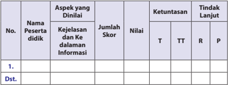

Tabel ini menunjukkan hasil evaluasi keberhasilan peserta didik dalam aspek informasi. Topik utama adalah kejelasan dan keandalan informasi. Kolom-kolomnya meliputi nama peserta didik, aspek yang dinilai, jumlah skor, nilai, ketuntasan (T, TT, R), dan tindakan lanjut (P). Data penting yang terlihat adalah bahwa beberapa nama peserta didik telah dinyatakan sebagai "dst." (data tidak tersedia) dan masih belum memiliki nilai atau tindakan lanjut.

### b) Keaktifan dalam diskusi

- Jika kelompok tersebut berperan sangat aktif  dalam diskusi, skor 100.
- Jika kelompok tersebut berperan  aktif dalam diskusi, skor 75.
- Jika kelompok tersebut kurang aktif dalam diskusi, skor 50.
- Jika kelompok tersebut tidak aktif dalam diskusi, skor 25.

 

---
## 📄 Halaman 82

### Contoh Tabel:

---
**📊 Tabel**

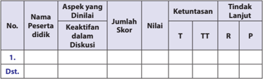

Tabel ini menunjukkan hasil evaluasi peserta didik dalam diskusi, dengan kolom-kolom seperti Nama Peserta Didik, Aspek yang Dinilai, Jumlah Skor, Nilai, Ketuntasan (T), Tindakan Lanjut (R), dan Pola Penilaian (TT). Topik utama tabel adalah penilaian keaktifan peserta didik dalam diskusi. Data penting yang terlihat adalah bahwa beberapa peserta didik mendapatkan skor tinggi dalam aspek keaktifan mereka, sementara beberapa lainnya memiliki nilai rendah. Selain itu, tabel juga menunjukkan tindakan lanjut yang diberikan kepada peserta didik yang memerlukan perbaikan.

### c)  Kejelasan dan kerapian presentasi/ resume

- Jika kelompok tersebut dapat mempresentasikan/resume dengan sangat jelas dan rapi, skor 100.
- Jika kelompok tersebut dapat mempresentasikan/resume  dengan jelas dan rapi, skor 75.
- Jika kelompok tersebut dapat mempresentasikan/resume dengan sangat jelas dan  kurang rapi, skor 50.
- Jika kelompok tersebut dapat mempresentasikan/resume dengan kurang  jelas dan  tidak rapi, skor 25.
Contoh Tabel:

---
**📊 Tabel**

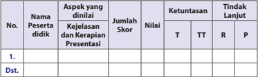

Tabel ini menunjukkan evaluasi penilaian pelaksanaan aspek yang dinilai oleh peserta didik dalam kejelasan, kerapian, dan presentasi. Topik utama tabel adalah penilaian pelaksanaan aspek tersebut. Kolom-kolom yang ada meliputi No., Nama Peserta Didik, Aspek yang Dinilai, Jumlah Skor, Nilai, Ketuntasan (T, TT, R), dan Tindak Lanjut (P). Data penting yang terlihat adalah bahwa beberapa kolom seperti Aspek yang Dinilai, Jumlah Skor, Nilai, dan Tindak Lanjut tampak kosong, sementara kolom lainnya memiliki data yang lengkap. Ini menunjukkan bahwa tabel ini sedang dalam tahap pengisian atau belum selesai.

### Saran

Guru dapat mengembangkan dan menetapkan nilai setiap skor yang diperoleh peserta didik.

 

---
## 📄 Halaman 83

### G.   Pengayaan

Pembelajaran  memahami  kajian  'Aku  selalu  dekat  dengan  Allah  Swt.' berdasarkan  pemahaman  makna al-Asmā'u  al-¦ usnā:  al-Kar ³ m,  al-Mu'm ³ n,  alWak ³ l, al-Mat ³ n, al-Jāmi' , al-'Adl , dan al-Akh ³ r ; dan berperilaku yang mencontohkan keluhuran budi, kokoh pendirian, pemberi rasa aman, tawakal dan perilaku adil sebagai implementasi dari pemahaman makna al-Asmā'u al-¦ usnā: al-Kar ³ m, alMu'm ³ n,  al-Wak ³ l,  al-Mat ³ n,  al-Jāmi' ,  al-'Adl, dan al-Akh ³ r ,  perlu  diperkaya  dengan penuh inovasi dan kreativitas.

Peserta didik yang sudah menguasai materi dengan baik dapat mengerjakan soal pengayaan yang telah disiapkan oleh guru berupa pertanyaan-pertanyaan dan tugas-tugas yang berkaitan dengan pemahaman makna al-Kar ³ m, al-Mu'm ³ n, al-Wak ³ l, al-Mat ³ n, al-Jāmi' , al-'Adl, dan al-Akh ³ r atau model-model pengembangan lainnya,  khususnya  yang  terkait  dengan  kajian  dan  tugas  yang  terdapat  pada kolom  Pengembangan  Materi.  Kemudian,  guru  mencatat  dan  memberikan tambahan nilai bagi  peserta didik  yang berhasil dalam pengayaan.

### H.   Remedial

Bagi  peserta  didik  yang  belum  menguasai  materi  memahami  makna  dan menerapkan perilaku al-Kar ³ m, al-Mu'm ³ n,  al-Wak ³ l,  al-Mat ³ n,  al-Jāmi' ,  al-'Adl, dan al-Akh³ r berdasarkan Q.S. al-A'rāf/7:180, Q.S. al-Infi ¯ ār:6, Q.S. al-An'ām/6:82, Q.S. ażŻariyat/5:58, Q.S. Āli 'Imrān/3:9, Q.S. al-An'ām/6:115, dan Q.S. al¦ad³ d/57:3 ,  dalam al-Asmā'u al-¦ usnā ,  guru  menjelaskan kembali materi tersebut, dan melakukan penilaian kembali (lihat poin 6) dengan soal yang sejenis atau setara. Remedial dilaksanakan  pada  waktu  dan  hari  tertentu  yang  disesuaikan,  seperti:    boleh pada saat pembelajaran apabila masih ada waktu atau diluar jam pelajaran, pada umumnya 30 menit setelah pulang sekolah.

Usahakan guru dapat   menjelaskan dan menekankan kembali materi tentang penerapan perilaku 'Aku selalu dekat dengan Allah Swt.' berdasarkan pemahaman makna al-Asmā'u al-¦usnā: al-Kar³m, al-Mu'm³n, al-Wak³l, al-Mat³n, al- Jāmi' , al-'Adl , dan al-Akh³r dan melakukan penilaian kembali  dengan soal yang sejenis (yang telah  diujikan)  atau  yang  dikembangkan  dan  setara  bobotnya,  sesuai  dengan situasi yang berkembang.

 

---
## 📄 Halaman 84

### I.   Interaksi Guru dengan Orang Tua

Interaksi  guru  dengan  orang  tua  perlu  dilakukan,  salah  satunya  adalah guru meminta peserta didik memperlihatkan kolom 'Evaluasi' atau guru dapat melakukannya  berdasarkan  tugas-tugas  dari  beragam  aktivitas  yang  diminta kepada peserta didik untuk menanggapi, melakukan dan menyelesaikan tugas, yang berada pada setiap kajian dalam buku teks peserta didik, kemudian orang tuanya turut memberikan komentar dan paraf. Dapat juga dengan menggunakan buku penghubung kepada orang tua tentang perubahan perilaku peserta didik setelah mengikuti kegiatan pembelajaran atau berkomunikasi langsung, dengan pernyataan  tertulis  atau  lewat  telepon.  Begitupula  tentang  perkembangan kemampuan membaca dan memahami peserta didik, terkait dengan materi 'Aku selalu dekat dengan Allah Swt.' berdasarkan pemahaman makna dan pengamalan a l-Asmā'u al-¦ usnā.

Untuk mengetahui keberhasilan peserta didik dalam pengamalan agamanya, khususnya penerapan perilaku selalu dekat dengan Allah Swt, melalui pemahaman,  'Aku  selalu  dekat  dengan  Allah  Swt.'  berdasarkan  pemahaman makna dan pengamalan al-Asmā'u al-¦ usnā, guru dapat menerapkannya dengan memfasilitasi  peserta  didik  untuk  memperhatikan  kolom 'Menerapkan Perilaku Mulia' .

Guru  mengarahkan  dan  membimbing    peserta  didik  untuk  memberikan tanda (  ) pada kolom 'selalu' , 'sering' , 'jarang' atau 'sudah menerapkannya dengan baik' ,  'kadang-kadang  menerapkannya,  'akan  menerapkannya' ,  dll  (guru  dapat mengembangkannya berdasarkan situasi dan kondisi) dalam buku teks peserta didik kepada orang tuanya dengan memberikan komentar dan paraf.

Pergunakan  buku  penghubung  kepada  orang  tua  untuk  menyampaikan tentang perubahan perilaku peserta didik, setelah mengikuti kegiatan pembelajaran,  Selain itu, guru dapat berkomunikasi langsung, melalui telepon atau  dengan  membuat  pernyataan  tertulis,  untuk  melaporkan  perkembangan perilaku peserta didik, berkaitan dengan upaya melahirkan perilaku 'Aku selalu dekat dengan Allah Swt.' berdasarkan pemahaman makna dan pengamalan alAsmā'u al-¦ usnā.

 

---
## 📄 Halaman 85

### Berbusana Muslim dan Muslimah Merupakan Cermin Kepribadian dan Keindahan Diri

### A.   Kompetensi Inti (KI)

KI-1:

Menghayati dan mengamalkan ajaran agama yang dianutnya.

KI 2: Menghayati  dan  mengamalkan  perilaku  jujur,  disiplin,  tanggung  jawab, peduli (gotong royong, kerja sama, toleran, damai) santun, responsif dan pro-aktif dan menunjukkan sikap sebagai bagian dari solusi atas berbagai permasalahan dalam berinteraksi secara efektif dengan lingkungan sosial dan alam serta dalam menempatkan diri sebagai cerminan bangsa dalam pergaulan dunia.

KI 3: Memahami, menerapkan, dan menganalisis pengetahuan faktual, konseptual,  prosedural,  berdasarkan  rasa  ingin  tahunya  tentang  ilmu pengetahuan, teknologi, seni, budaya, dan humaniora dengan wawasan kemanusiaan, kebangsaan, kenegaraan, dan peradaban terkait penyebab fenomena dan kejadian, serta menerapkan pengetahuan prosedural pada bidang  kajian  yang  spesifik  sesuai  dengan  bakat  dan  minatnya  untuk memecahkan masalah.

KI 4: Mengolah, menalar, dan menyaji dalam ranah konkret dan ranah abstrak terkait dengan pengembangan dari yang dipelajarinya di sekolah secara mandiri, dan mampu menggunakan metode sesuai kaidah keilmuan.

 

---
## 📄 Halaman 86

### B.   Kompetensi Dasar (KD)

- 1.5 Terbiasa berpakaian sesuai dengan syariat Islam.
- 2.5 Menunjukkan perilaku berpakaian sesuai dengan syariat Islam.
- 3.5 Menganalisis ketentuan berpakaian sesuai syariat Islam.
- 4.5 Menyajikan keutamaan tata cara berpakaian sesuai syariat Islam.

### C.   Tujuan Pembelajaran

### Peserta didik mampu:

- Terbiasa berpakaian sesuai dengan syariat Islam.
- Menunjukkan perilaku berpakaian sesuai dengan syariat Islam.
- Menganalisis ketentuan berpakaian sesuai syariat Islam.
- Menyajikan keutamaan tata cara berpakaian sesuai syariat Islam.

### D.   Pengembangan Materi

Pengembangan materi 'Berbusana Muslim dan Muslimah merupakan Cermin Kepribadian dan Keindahan Diri' disajikan sebagai bahan pengayaan, bagi guru untuk  memfasilitasi  peserta  didik  dalam  menciptakan  proses  pembelajaran yang aktif, sehingga peserta didik dapat   menikmati   pembelajarannya   dengan penuh   kreativitas   dan inovasi, dalam memahami ketentuan berbusana muslim dan muslimah.

Guru  sangat  diharapkan,  dapat  memberikan  kebebasan  kepada  peserta didik,  dalam  mengakses beragam sumber belajar yang mengantarkan perserta didik menemukan nilai-nilai yang terkandung di dalam al-Aĥzāb /33:59, dan anNur /24:31 tentang berbusana muslim dan muslimah yang baik dan benar.

Pengembangan  materi    'Berbusana  Muslim  dan  Muslimah  merupakan Cermin  Kepribadian  dan  Keindahan  Diri'  tersebut,  diharapkan  dapat  menjadi dasar pemahaman dan analisis agar peserta didik mampu menerapkan  perilaku berbusana  muslim  dan  muslimah  dengan  baik dan benar baik di rumah, di sekolah, maupun di masyarakat. Proses pengembangan  dan  penerapan  perilaku dapat  berhasil  dan  terjadi, jika guru memfasilitasi peserta didik dengan hikmah dan keteladanan. Pengembangan materi tersebut antara lain:

- Meneliti  secara  lebih  mendalam  pemahaman Q.S. al-A'hzab /33:59,  31, dan anNur /24:31 tentang berbusana muslim dan muslimah, dengan menggunakan IT.

 

---
## 📄 Halaman 87

- Menjelaskan makna  yang terkandung dalam al-Ahzāb /33:59, dan anNur /24:31 tentang berbusana muslim dan muslimah dengan menggunakan IT.
- Menampilkan  contoh  perilaku  berdasarkan, Q.S.  al-  Ahzāb /33:59,  dan anNur /24:31 sebagai dasar dalam menerapkan berbusana muslim dan muslimah melalui presentasi, demonstrasi dan simulasi dengan menggunakan IT.
- Memberikan  contoh-contoh  perilaku,  berdasarkan  ayat-ayat al-Qur'ān dan hadis-hadis lainnya sebagai dasar dalam menerapkan berbusana muslim dan muslimah.

### E.   Proses Pembelajaran

### 1. Persiapan

- Guru  memulai  pembelajaran  dengan  mengucapkan  salam,  menyapa, berdoa, dan  tadarus: membaca al-Qur'ān surah  pendek pilihan atau ayat hafalan  yang  sudah  dipelajari;  dengan  lancar  dan  benar  (atau  surat  yang sesuai  dengan  program  pembiasaan  yang  ditentukan  sebelumnya), śalat «u¥ ā' (atau śalat sunnah lainnya,  jika  memungkinkan,  sebagai  modifikasi pembukaan pembelajaran, guna pembentukan sikap dan perilaku peserta didik) secara bersama-sama (berjama'ah).
- Memperhatikan  kesiapan,  semangat  dan  kelengkapan  peserta  didik, dengan memeriksa kehadiran, kerapian berpakaian, dan mengorganisir kelas dan posisi tempat duduk disesuaikan dengan kegiatan pembelajaran yang akan diterapkan, berdasarkan metode dan model pembelajaran.
- Menyampaikan tujuan pembelajaran atau kompetensi dasar yang akan dicapai dari materi pembelajaran, yaitu:  'Berbusana Muslim dan Muslimah merupakan Cermin Kepribadian dan Keindahan Diri' .
- Model  pengajaran  yang  dapat  dipersiapkan  dan  digunakan    sebagai alternatif    dalam  kompetensi  ini  adalah, puzzle,  role  playing, mengembangkan kemampuan dan keterampilan ( skill ) peserta didik.

### 2. Pelaksanaan

Pada  kegiatan  ini,  guru  dapat  mengembangkan  pembelajaran  dengan menerapkan model pembelajaran, metode pembelajaran, media pembelajaran, dan sumber belajar yang disesuaikan dengan karakteristik dan materi 'Berbusana Muslim dan Muslimah merupakan Cermin Kepribadian dan Keindahan Diri' .

 

---
## 📄 Halaman 88

### a. Membuka Relung Hati

- Guru memberi motivasi peserta didik secara kontekstual sesuai manfaat dan aplikasi materi   dengan menyajikan kajian 'Membuka Relung Hati' yang terdapat pada setiap awal bab penyajian buku peserta didik. Dalam hal ini, kajian tentang keinginan seseorang yang memakai jilbab sematamata karena panggilan hati mengikuti jalan Allah Swt.
- Guru  menyajikannya  sebagai  proses  pengamatan  yang  menjelaskan bahan  kajian  'Berbusana  Muslim  dan  Muslimah  merupakan  Cermin Kepribadian dan Keindahan Diri' , sebagai dasar dan awal pembentukan pemahaman dan penghayatan agama peserta didik.
- 'Membuka  Relung Hati' ini, dapat pula dikembangkan melalui penayangan video, film, gambar, cerita, atau  dengan memperlihatkan guntingan  kertas  yang  sudah  dibuat  ( media by  design )  yang  berisikan penjelasan yang setara, atau yang lebih kreatif dan inovatif.
- Peserta didik secara individu maupun klasikal, diminta untuk melihat  dan mencermati  kajian 'Membuka  Relung  Hati' tentang berbusana muslim dan muslimah merupakan cermin kepribadian dan keindahan diri atau tayangan video, film, gambar,  cerita,     atau  guntingan  kertas  yang sudah  dibuat ( media by design )  yang  berisikan  penjelasan 'Berbusana Muslim dan Muslimah merupakan Cermin Kepribadian dan Keindahan Diri' ..
- Berdasarkan  wacana  dan  tayangan  video,  film,  gambar,  cerita,  atau dengan  memperlihatkan  guntingan  kertas  yang  sudah  dibuat  ( media by  design )  yang  berisikan  penjelasan  tentang  berbusana  muslim  dan muslimah  merupakan  cermin  kepribadian  dan  keindahan  diri,  guru memberikan  penguatan  dan  penjelasan  kepada  peserta  didik,  agar proses  mencermati  baik  secara  individu  ataupun  klasikal  berlangsung secara lengkap, baik, dan benar.

### Aktivitas 1

Pada  kolom 'Aktivitas  Siswa'  guru  memfasilitasi  atau  meminta  peserta didik  untuk  dapat  berargumentasi  dan  mengemukakan  pendapatnya, berdasarkan al-Qur'ān dan hadis terkait anggapan bahwa, menutup aurat merupakan bagian dari hak individu bukan kewajiban.

### b) Mengkritisi Sekitar Kita

- Guru meminta peserta didik untuk memperhatikan kajian yang terdapat pada kolom 'Mengkritisi Sekitar Kita' berdasarkan kajian yang terdapat pada buku peserta didik, yang merupakan kajian fenomena sosial yang timbul dan berkembang, terkait dengan masalah 'Berbusana Muslim dan Muslimah merupakan Cermin Kepribadian dan Keindahan Diri' .

 

---
## 📄 Halaman 89

- Guru dapat mengembangkan bahan kajian yang terdapat pada kolom 'Mengkritisi Sekitar Kita' dalam bentuk kajian yang setara berdasarkan wacana  dan  tayangan  video,  film,  gambar,  cerita  atau  dengan  memperlihatkan guntingan kertas yang sudah dibuat (media by design) yang berisikan penjelasan tentang berbusana muslim dan muslimah.
- Guru membagi peserta didik ke dalam beberapa kelompok, kemudian setiap kelompok  diminta untuk mempersiapkan  pertanyaan yang berkaitan dengan bahan kajian yang terdapat pada kolom 'Mengkritisi Sekitar  Kita'  atau  tayangan  video,  film,  gambar,  cerita  atau  dengan memperlihatkan guntingan kertas yang sudah dibuat ( media by design ) yang setara berisikan penjelasan tentang berbusana muslim dan muslimah.
- Setiap  peserta  didik  atau  wakil  kelompok  mengajukan pertanyaanpertanyaan  yang  telah  dipersiapkan.  Peserta  didik  atau  kelompok lain menanggapi  dan  menjawab  pertanyaan-pertanyaan, sekaligus berfungsi     untuk memberi kesempatan berpikir kritis serta membangun dinamika dan kreativitas proses pembelajaran dalam menanamkan dan mengembangkan jiwa sosial peserta didik.
- Guru memberikan pengarahan, penguatan dan penjelasan jawaban dari pertanyaan-pertanyaan yang berkembang agar lebih logis, terinci, dan sistematis  terkait  dengan  pertanyaan-pertanyaan  peserta  didik,  dalam upaya  mencermati  dan  memahami  kajian  tentang 'Berbusana  Muslim dan Muslimah Merupakan Cermin Kepribadian dan Keindahan Diri' .

### Aktivitas 2

Pada kolom 'Aktivitas Siswa' guru memfasilitasi atau meminta peserta didik untuk dapat menetukan diri, apakah peserta didik sudah membiasakan diri berbusana  secara  Islami,  serta  dapat  mengemukakan  pendapatnya  dalam suasana diskusi, tentang pernyataan 'lebih baik tidak berhijab tetapi sopan daripada berhijab tetapi masih suka membicarakan aib atau kejelekan orang lain' .

### 3)    Memperkaya Khazanah

Dalam  kajian  'Memperkaya  Khasanah'  guru  memfasilitasi,  membimbing dan mengarahkan peserta didik kajian 'Memperkaya Khazanah', untuk mampu menemukan  dan  melahirkan  analisis  kajian  berbusana  muslim  dan  muslimah yang merupakan cermin kepribadian dan keindahan diri.

Guru  sangat  diharapkan  dapat  memberikan  kebebasan  kepada  peserta didik, dalam mengakses beragam sumber belajar, yang mengantarkan perserta

 

---
## 📄 Halaman 90

didik menemukan  nilai-nilai dan kualitas pemahaman  berbusana  muslim dan  muslimah  yang  merupakan  cermin  kepribadian  dan  keindahan  diri,  yang bermanfaat, di rumah, di sekolah dan di masyarakat. Untuk memberi pemahaman dan penganalisaan  yang mendalam kepada peserta didik mengenai:

### 1.    Makna Jilbab dan Busana Muslimah

- Ayat-ayat al-Qur'ān Q.S. al-Ahzāb /  33:59,  dan an-Nur /  24:31  dan  Hadis  dari Ummu  'Atiyyah  yang  diriwayatkan  oleh  Imam  Muslim  tentang  perintah berbusana muslim/muslimah.
Guru menekankan makna yang terkandung di dalam Q.S. al- Ahzāb /  33:59, dan an-Nur /  24:31  dan  hadis  dari Ummu 'Atiyyah yang  diriwayatkan oleh Imam Muslim,  tentang  dasar  kajian  berbusana  muslim  dan  muslimah,  kemudian mengembangkannya ke dalam langkah-langkah pembelajaran berikut:

- Meneliti  secara  lebih  mendalam  kajian  'Berbusana  Muslim dan Muslimah Merupakan  Cermin  Kepribadian  dan  Keindahan  Diri' ,  berdasarkan Q.S.  alAhzāb /33:59, dan an-Nur/ 24:31 melalui sumber-sumber belajar lainnya, baik cetak maupun elektronik, atau dengan menggunakan IT.
- Menampilkan contoh pemahaman  'Berbusana Muslim dan Muslimah Merupakan   Cermin   Kepribadian   dan   Keindahan Diri' ,  berdasarkan Q.S. alAhzāb /33:59, dan an-Nur /24:31 melalui presentasi, demonstrasi dan simulasi.
- Memberikan  contoh-contoh  pemahaman 'Berbusana  Muslim dan Muslimah Merupakan Cermin Kepribadian dan Keindahan Diri' , berdasarkan tambahan bacaan ayat al-Qur'ān dan Hadis- hadis yang mendukung lainnya.
- Agar peserta didik dapat lebih kreatif dalam menunjukkan dan menerapkan perilaku  terbiasa  berpakaian  sesuai  dengan  syariat  Islam,  guru  membagi peserta  didik  ke  dalam  beberapa  kelompok  untuk  mendiskusikan  kajian tentang pemahaman  'Berbusana  Muslim  dan  Muslimah  Merupakan Cermin Kepribadian dan Keindahan Diri' , berdasarkan Q.S. al- Ahzāb / 33:59, dan anNur / 24:31 dengan:
- Mengingatkan    tema    diskusi    yaitu,    memahami    kajian 'Berbusana Muslim dan Muslimah Merupakan Cermin Kepribadian dan Keindahan Diri' , berdasarkan Q.S. al- Ahzāb /33:59, dan an-Nur / 24:31,  kemudian guru membagi peserta didik ke dalam beberapa kelompok.
- Mengarahkan dan mengendalikan diskusi dengan menunjuk, perwakilan dari setiap kelompok untuk mengatur, mengendalikan dan menemukan penjelasan lebih rinci dalam memahami  ketentuan dan manfaat berbusana muslim dan muslimah.
- Guru  meminta  peserta  didik  menyampaikan,  mengemukakan,  dan mempresentasikan hasil diskusi tentang macam-macam temuan, identifikasi  dan  pengembangan pemikiran, penjelasan. Sehingga lebih mendapatkan  penguatan  terhadap  pemahaman  dan  analisis,  terkait dengan ketentuan dan tujuan  'Berbusana Muslim dan Muslimah Merupakan Cermin Kepribadian dan Keindahan Diri' .

 

---
## 📄 Halaman 91

- Memotivasi  kelompok  lainnya  untuk  memperhatikan,  menyimak  dan memberikan tanggapan.
- Di  dalam    pelaksanaannya,  guru  langsung  menilai  semua  aktivitas pembelajaran dan diskusi peserta didik yang berlangsung.
- Membimbing  peserta  didik  untuk  menyimpulkan  hasil  diskusi,  hasil presentasi sehingga lebih aplikatif dalam memahami 'Berbusana Muslim dan Muslimah Merupakan Cermin Kepribadian dan Keindahan Diri' .
- Guru    memberikan    penguatan,  penjelasan    tambahan    dan  sekaligus hasil penilaian berdasarkan proses perkembangan diskusi yang dilakukan peserta didik.

### Aktivitas 3

Pada kolom 'Aktivitas Siswa' guru memfasilitasi atau meminta peserta didik untuk  dapat  mencari  ayat al-Qur'ān maupun  hadis  yang  berhubungan dengan perintah mengenakan busana muslim dan muslimah atau perintah menutup aurat.

### d)    Menerapkan Perilaku Mulia

Guru menekankan makna busana yang sesuai dengan syari'at Islam bertujuan agar  manusia  terjaga  kehormatannya.  Ajaran  Islam  tidak  bermaksud  untuk membatasi atau mempersulit gerak dan langkah umatnya. Akan tetapi, dengan aturan dan syari'at tersebut, manusia akan terhindar dari berbagai kemungkinan yang akan mendatangkan bencana dan kemudaratan bagi dirinya.

Memfasilitasi  dan  mengedepankan  beberapa  perilaku  mulia  yang  harus dilakukan sebagai pengamalan berbusana sesuai syari'at Islam, baik di lingkungan keluarga,  sekolah,  maupun  masyarakat,    Sopan-santun  dan  ramah-tamah,  jujur dan  amanah,  gemar  beribadah,  gemar  menolong  sesama,  menjalankan  amar makruf dan nahi munkar.  Sebagai dasar dari penanaman dan penerapan perilaku mulia, kemudian mengembangkannya ke dalam langkah-langkah pembelajaran berikut.

- Meneliti  secara  lebih  mendalam  bentuk  dan  contoh  perilaku  'Berbusana Muslim dan Muslimah Merupakan Cermin Kepribadian dan Keindahan Diri', berdasarkan Q.S. al-Ahzāb / 33:59, dan an-Nur / 24:31 melalui sumber-sumber belajar lainnya baik cetak maupun elektronik, atau dengan menggunakan IT.
- Menampilkan   contoh   perilaku   'Berbusana  Muslim dan Muslimah   Merupakan Cermin   Kepribadian   dan   Keindahan Diri' ,  berdasarkan Q.S. al-Ahzāb / 33:59, dan an-Nur / 24:31 melalui presentasi, demonstrasi dan bersimulasi.

 

---
## 📄 Halaman 92

- Memberikan  contoh-contoh  perilaku  'Berbusana  Muslim  dan  Muslimah Merupakan Cermin Kepribadian dan Keindahan Diri' , berdasarkan tambahan bacaan  ayat al-Qur'ān dan  hadis-hadis  yang  mendukung  lainnya,  tentang berbusana muslim dan muslimah.
- Memotivasi kelompok lainnya untuk memperhatikan, menyimak, dan memberikan tanggapan dari presentasi, demonstrasi dan bersimulasi yang berkembang.
- Di dalam pelaksanaannya guru langsung menilai semua aktivitas pembelajaran peserta didik yang berlangsung.
- Membimbing peserta didik untuk menyimpulkan hasil diskusi, hasil presentasi sehingga lebih aplikatif dalam menerapkan perilaku 'Berbusana Muslim dan Muslimah Merupakan Cermin Kepribadian dan Keindahan Diri' .
- Guru  memberikan  penguatan,    penjelasan  tambahan  dan  sekaligus  hasil penilaian berdasarkan proses perkembangan diskusi yang dilakukan peserta didik.

### 3. Penutup

Dalam kegiatan penutup, guru bersama peserta didik, baik secara individu maupun kelompok menyimpulkan intisari dari pelajaran tersebut sesuai dengan yang  terdapat  dalam  buku  teks  peserta  didik  pada  kolom  rangkuman,  dan melakukan  penilaian  dari  proses  komunikasi  yang  berkembang.  Melakukan refleksi untuk mengevaluasi semua rangkaian aktivitas pembelajaran dan hasilhasil  yang  diperoleh  untuk  selanjutnya  secara  bersama  menemukan  manfaat langsung maupun tidak langsung dari hasil pembelajaran yang telah berlangsung.

- Melaksanakan refleksi  dan  kesimpulan  sebagaimana    yang  terdapat  dalam buku teks peserta didik pada kolom   'rangkuman' , serta mengajukan pertanyaan atau tanggapan peserta didik dari kegiatan yang telah dilaksanakan sebagai bahan masukan untuk perbaikan langkah selanjutnya. Dalam menerapkan perilaku  berbusana muslim dan muslimah, merupakan cermin kepribadian dan keindahan diri, baik di rumah, di sekolah maupun di masyarakat.
- Merencanakan  kegiatan  tindak  lanjut  dengan  memberikan  tugas  baik secara  individu  maupun  kelompok.  Peserta  didik  yang  belum  menguasai pembelajaran 'Berbusana Muslim dan Muslimah Merupakan Cermin Kepribadian dan Keindahan Diri' , melakukan kegiatan remedial, atau pengembangan  materi  bagi  peserta  didik  yang  lebih  berkembang  secara kreatif,  inovatif, dan produktif.
- Menyampaikan tema dan rencana pembelajaran pada pertemuan berikutnya.

 

---
## 📄 Halaman 93

### F.   Penilaian

### 1. Skala Sikap

Guru dapat melakukan pengembangan penilaian berdasarkan sajian evaluasi yang  terdapat  pada  buku  peserta  didik,  berupa  Uji  Pemahaman,  Unjuk  kerja, Penilaian Guru, Porto Polio/ Project dan Refleksi, serta  melakukan pengembangan penilaian sebagaimana contoh di bawah ini:

Contoh penilaian dengan menggunakan Rating Scale Format Penilaian

Berpakaian secara Islami

Nama peserta didik/Kelas : ______________ Kelas: X

### Kompetensi Dasar :

9.3 Berpakaian dan berhias secara Islami dalam kehidupan sehari-hari

---
**📊 Tabel**

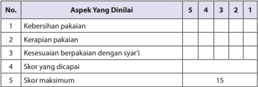

Tabel ini menunjukkan skor yang diberikan untuk berbagai aspek kebersihan pakaian dalam sebuah evaluasi. Topik utama tabel adalah aspek-aspek kebersihan pakaian, seperti kebersihan, kerapihan, kesesuaian berpakaian dengan syar'i, dan skor yang dicapai. Kolom-kolomnya mencakup skor 5, 4, 3, 2, dan 1, yang masing-masing menunjukkan tingkat kebersihan pakaian. Skor maksimum yang ditentukan adalah 15. Pola penting yang terlihat adalah bahwa skor tertinggi (5) diberikan pada aspek kebersihan pakaian, sedangkan skor terendah (1) diberikan pada aspek kesesuaian berpakaian dengan syar'i. Ini menunjukkan bahwa kebersihan pakaian merupakan aspek yang paling penting dalam evaluasi ini.

### Keterangan:

5 = sangat baik

2 = kurang

4 = Baik

1 = sangat kurang

3 = cukup

Kriteria penilaian dapat dilakukan sebagai berikut:

- Jika seorang peserta didik memperoleh skor 13-15, dapat ditetapkan sangat baik.
- Jika seorang peserta didik memperoleh skor 10-12, dapat ditetapkan baik.
- Jika seorang peserta didik memperoleh skor 8-9, dapat ditetapkan cukup.
- Jika seorang peserta didik memperoleh skor 6-7, dapat ditetapkan kurang.
- Jika  seorang  peserta  didik  memperoleh  skor  1-5,  dapat  ditetapkan  sangat kurang.

 

---
## 📄 Halaman 94

### 2. Diskusi

Pada saat peserta didik diskusi tentang makna isi Q.S. al-Ahzāb /33:59, dan anNur /24:31.

Contoh aspek dan rubrik  penilaian:

### a. Kejelasan dan ke dalaman informasi

- Jika  kelompok  tersebut  dapat  memberikan  kejelasan  dan  ke  dalaman informasi lengkap dan sempurna, skor 100.
- Jika kelompok tersebut dapat memberikan penjelasan dan ke dalaman informasi lengkap dan  kurang sempurna, skor 75.
- Jika kelompok tersebut dapat memberikan penjelasan dan ke dalaman informasi  kurang lengkap, skor 50.
- Jika  kelompok  tersebut    tidak  dapat  memberikan  penjelasan  dan  ke dalaman informasi, skor 25.

### Contoh Tabel:

---
**📊 Tabel**

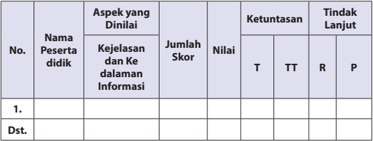

Tabel ini menunjukkan hasil evaluasi penilaian aspek kejelasan dan ke dalam informasi bagi beberapa peserta didik. Kolom-kolomnya meliputi nomor peserta didik, nama peserta didik, aspek yang dinilai, jumlah skor, nilai, ketuntasan (T, TT, R), dan tindak lanjut (P). Topik utama tabel adalah penilaian kejelasan dan ke dalam informasi peserta didik. Data penting yang terlihat adalah bahwa beberapa peserta didik memiliki skor yang lebih tinggi dibandingkan dengan yang lain, dan ada beberapa peserta didik yang belum mencapai standar tertentu dalam hal kejelasan dan ke dalam informasi. Tindak lanjut juga ditetapkan untuk setiap peserta didik, menunjukkan langkah-langkah yang akan diambil untuk meningkatkan kinerja mereka.

### b) Keaktifan dalam diskusi

- Jika kelompok tersebut  berperan sangat aktif  dalam diskusi, skor 100.
- Jika kelompok tersebut berperan  aktif dalam diskusi, skor 75.
- Jika kelompok tersebut kurang aktif dalam diskusi, skor 50.
- Jika kelompok tersebut tidak aktif dalam diskusi, skor 25.

 

---
## 📄 Halaman 95

### Contoh Tabel:

---
**📊 Tabel**

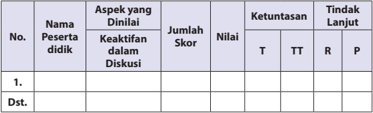

Tabel ini menunjukkan hasil evaluasi keaktifan peserta didik dalam diskusi. Kolom-kolomnya meliputi nomor peserta, nama peserta, aspek yang dinilai, jumlah skor, nilai, ketuntasan, dan tindakan lanjut. Topik utama adalah keaktifan peserta didik dalam diskusi. Data penting yang terlihat adalah bahwa beberapa peserta didik mendapatkan nilai tinggi (T) dalam aspek aspek yang dinilai, sementara beberapa lainnya mendapatkan nilai rendah (R). Tindakan lanjut juga ditentukan untuk setiap peserta didik, menunjukkan langkah-langkah yang akan diambil berdasarkan hasil evaluasi ini.

### c) Kejelasan dan kerapian presentasi/resume

- Jika kelompok tersebut dapat mempresentasikan/resume  dengan sangat jelas dan rapi, skor 100.
- Jika kelompok tersebut dapat mempresentasikan/resume   dengan jelas dan rapi, skor 75.
- Jika kelompok tersebut dapat mempresentasikan/resume  dengan sangat jelas tetapi kurang rapi, skor 50.
- Jika kelompok tersebut dapat mempresentasikan/resume dengan kurang jelas dan kurang rapi, skor 20.

### Contoh Tabel:

---
**📊 Tabel**

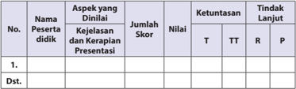

Tabel ini menunjukkan hasil penilaian aspek-aspek pendidikan untuk beberapa peserta didik. Topik utama tabel adalah penilaian kejelasan, kekerapan, dan presentasi. Kolom-kolomnya meliputi nomor peserta didik, nama peserta didik, aspek yang dinilai (kejelasan, kekerapan, dan presentasi), jumlah skor, nilai, ketuntasan (T, TT, R), dan tindakan lanjut. Data penting yang terlihat adalah bahwa beberapa peserta didik memiliki nilai yang tinggi di semua aspek, sementara beberapa lainnya memiliki nilai yang lebih rendah. Tindakan lanjut juga ditentukan untuk setiap peserta didik, menunjukkan langkah-langkah yang akan diambil untuk meningkatkan kinerja mereka.

 

---
## 📄 Halaman 96

### 3. Uraian

### Rubrik Penilaian

``

### Saran

Guru dapat mengembangkan dan menetapkan nilai setiap skor yang diperoleh peserta didik.

 

---
## 📄 Halaman 97

### G.   Pengayaan

Bagi  peserta  didik  yang  sudah  menguasai  materi  dengan  baik  tentang pemahaman berbusana muslim dan muslimah, dapat mengerjakan soal pengayaan yang telah disiapkan oleh guru berupa pertanyaan-pertanyaan yang berkaitan  dengan  pemahaman  berbusana  muslim  dan  muslimah  atau  modelmodel  pengembangan  pembelajaran  lainnya,  khususnya  yang  terkait  dengan pengembangan materi. Kemudian, guru  mencatat dan memberikan tambahan nilai bagi peserta didik yang berhasil dalam pengayaan.

Begitu  pula  dalam  kegiatan  menerapkan  perilaku  berbusana  muslim  dan muslimah,  bagi  peserta  didik  yang  sudah  menguasai  materi,  dibimbing  dan diarahkan  untuk  mengerjakan  soal  pengayaan  yang  telah  disiapkan  oleh  guru berupa pertanyaan-pertanyaan dan bentuk-bentuk penugasan. Penilaian sebagai rangkaian  proses  pembelajaran  yang  menggambarkan  tingkat  keberhasilan pembelajaran dan sekaligus kualitas pengajaran, harus mengacu  kepada perkembangan hasil pembelajara peserta didik, khususnya dalam hal menerapkan perilaku mulia berdasarkan. Q.S. al-A ¥ zāb/33:59, dan Q.S. an-Nur/ 24: 31 tentang berbusana muslim dan muslimah. Guru dapat melakukan penilaian pada berbagai macam bentuk, kemudian guru  mencatat dan memberikan tambahan nilai bagi peserta didik  yang berhasil dalam pengayaan.

### H.   Remedial

Bagi peserta didik yang belum menguasai materi membaca dan memahami Q.S. al-A ¥ zāb /33:59, dan Q.S. an-Nur / 24: 31 guru diharapkan untuk menjelaskan dan menegaskan kembali secara singkat materi tentang  'Membaca dan memahami Q.S. al-A ¥ zāb /33:59, dan Q.S. an-Nur /  24:  31'  tersebut,  dan  melakukan penilaian kembali (lihat poin 6) dengan soal yang sejenis atau setara.

Begitu  pula  bagi  peserta  didik  yang  belum  dapat  menerapkan  perilaku berbusana muslim dan muslimah berdasarkan Q.S. al-A ¥ zāb /33:59, dan Q.S. anNur /  24:  31,  guru  diharapkan  untuk  menjelaskan  tentang  berbusana  muslim dan  muslimah  perilaku  dan  melakukan  penilaian  kembali  dengan  soal  yang sejenis, setara atau lebih dikembangkan lagi, sesuai dengan situasi dan kondisi yang  berkembang.  Remedial  dilaksanakan  pada  waktu  dan  hari  tertentu  yang disesuaikan, contohnya: boleh pada saat pembelajaran apabila masih ada waktu atau diluar jam pelajaran, umumnya 30 menit setelah pulang sekolah.

 

---
## 📄 Halaman 98

### I.   Interaksi Guru dengan Orang Tua

Adanya  interaksi  guru  dengan  orang  tua  perlu  dilakukan,  salah  satunya adalah, guru meminta peserta didik memperlihatkan kolom 'Membaca dengan Tartil' dalam buku teks peserta didik kepada orang tuanya dengan memberikan komentar dan paraf. Dapat juga dengan mengunakan buku penghubung kepada orang tua tentang perubahan perilaku peserta didik setelah mengikuti kegiatan pembelajaran  atau  berkomunikasi  langsung,  dengan  pernyataan  tertulis  atau lewat  telepon  tentang  perkembangan  kemampuan  membaca  dan  memahami peserta didik, terkait dengan materi membaca dan memahami Q.S. al-A¥ zāb/33:59, dan Q.S. an-Nur/ 24: 31 tentang berbusana muslim dan muslimah.

Untuk mengetahui keberhasilan peserta didik dalam pengamalan agamanya, khususnya penerapan perilaku dalam berbusana muslim dan muslimah, guru  memperlihatkan  kolom  'Menerapkan  Perilaku  Mulia' .    Kemudian,  guru mengarahkan  dan  membimbing    peserta  didik  untuk  memberikan  tanda  (  ) pada  kolom  'selalu' ,  'sering' ,  'jarang'  atau  'sudah  menerapkannya  dengan  baik' , 'kadang-kadang menerapkannya,' 'akan menerapkannya', dll. (guru dapat mengembangkannya berdasarkan situasi dan kondisi) dalam buku teks kepada orang  tuanya  dengan  memberikan  komentar  dan  paraf.  Dapat  pula  dengan menggunakan buku penghubung kepada orang tua untuk melaporkan tentang perubahan  perilaku  peserta  didik,    setelah  mengikuti  kegiatan  pembelajaran. Selain itu, berkomunikasi langsung melalui telepon, atau membuat pernyataan tertulis  untuk  melaporkan    perkembangan  perilaku  peserta  didik,  berkaitan dengan  upaya  melahirkan  perilaku,  berbusana  muslim  dan  muslimah  sebagai cermin  dan  keindahan  kepribadian,  dalam    menerapkan  pengamalan Q.S.  alA¥ zāb/33:59, dan Q.S. an-Nur/ 24: 31 tentang berbusana muslim dan muslima h.

 

---
## 📄 Halaman 99

### Mempertahankan Kejujuran sebagai Cermin Kepribadian

### A.   Kompetensi Inti (KI)

KI-1:

Menghayati dan mengamalkan ajaran agama yang dianutnya.

KI 2: Menghayati  dan  mengamalkan  perilaku  jujur,  disiplin,  tanggungjawab, peduli (gotong royong, kerjasama, toleran, damai) santun, responsif dan pro-aktif dan menunjukkan sikap sebagai bagian dari solusi atas berbagai permasalahan dalam berinteraksi secara efektif dengan lingkungan sosial dan alam serta dalam menempatkan diri sebagai cerminan bangsa dalam pergaulan dunia.

KI 3: Memahami, menerapkan, dan menganalisis pengetahuan faktual, konseptual,  prosedural,  berdasarkan  rasa  ingin  tahunya  tentang  ilmu pengetahuan, teknologi, seni, budaya, dan humaniora dengan wawasan kemanusiaan, kebangsaan, kenegaraan, dan peradaban terkait penyebab fenomena dan kejadian, serta menerapkan pengetahuan prosedural pada bidang  kajian  yang  spesifik  sesuai  dengan  bakat  dan  minatnya  untuk memecahkan masalah.

- KI 4: Mengolah, menalar, dan menyaji dalam ranah konkret dan ranah abstrak terkait dengan pengembangan dari yang dipelajarinya di sekolah secara mandiri, dan mampu menggunakan metode sesuai kaidah keilmuan.

 

---
## 📄 Halaman 100

### B.   Kompetensi Dasar (KD)

- 1.6    Meyakini bahwa jujur adalah ajaran pokok agama.
- 2.6    Menunjukkan perilaku jujur dalam kehidupan sehari-hari.
- 3.6    Menganalisis manfaat kejujuran dalam kehidupan sehari-hari.
- 4.6    Menyajikan kaitan antara contoh perilaku jujur dalam kehidupan sehari-hari dengan keimanan.

### C.   Tujuan Pembelajaran

### Peserta didik mampu:

- Meyakini bahwa jujur adalah ajaran pokok agama.
- Menunjukkan perilaku jujur dalam kehidupan sehari-hari.
- Menganalisis manfaat kejujuran dalam kehidupan sehari-hari.
- Menyajikan kaitan antara contoh perilaku jujur dalam kehidupan sehari-hari dengan keimanan.

### D.   Pengembangan Materi

Guru  memberikan  kebebasan  kepada  peserta  didik  dalam  mengakses beragam  sumber  belajar  yang  mengantarkan  peserta  didik  menemukan  nilainilai kejujuran yang dapat dipahaminya dengan baik dan benar. Pengembangan materi kejujuran tersebut antara lain sebagai berikut.

- Meneliti  secara  lebih  mendalam  pemahaman Q.S.  al-Māidah/5:8 , Q.S.  atTaubah/9:119 , Q.S. al-Anfāl/8:58, dan Q.S. an-Nahl/16:105 tentang kejujuran, dengan menggunakan IT.
- Menjelaskan  makna  yang  terkandung  dalam Q.S.  al-Māidah/5:8 , Q.S.  atTaubah/9:119 , Q.S. al-Anfāl/8:58, dan Q.S. an-Nahl/16:105 tentang  kejujuran dengan menggunakan IT.
- Memberikan tambahan bacaan ayat al-Qur'ān dan  hadis-hadis    yang  mendukung lainnya tentang kejujuran.

 

---
## 📄 Halaman 101

### E.   Proses Pembelajaran

### 1. Persiapan

- Guru  memulai  pembelajaran  dengan  mengucapkan  salam,  menyapa, berdoa, dan tadarus : membaca al-Qur'ān surah pendek pilihan atau ayat hafalan yang sudah dipelajari; dengan lancar dan benar (atau surat yang sesuai dengan program pembiasaan yang ditentukan sebelumnya), śalat duhā' (atau śalat sunnah lainnya, jika memungkinkan, sebagai modifikasi pembukaan  pembelajaran,  guna  pembentukan  sikap  dan  perilaku peserta didik) secara bersama-sama (berjama'ah).
- Memperhatikan kesiapan dan semangat peserta didik, dengan memeriksa kehadiran, kerapian berpakaian, dan mengorganisir kelas dan posisi  tempat  duduk  disesuaikan  dengan  kegiatan  pembelajaran  yang akan diterapkan, berdasarkan metode dan model pembelajaran.
- Menyampaikan tujuan pembelajaran atau kompetensi dasar yang akan dicapai  dari  materi  pembelajaran,  yaitu:  'Mempertahankan  kejujuran sebagai  cermin  kepribadian'  berdasarkan Q.S.  al-Māidah/5:8 , Q.S.  atTaubah/9:119 , Q.S. al-Anfāl/8:58, dan Q.S. an-Nahl/16:105 .
- Model pengajaran yang dapat dipersiapkan dan digunakankan sebagai alternatif dalam kompetensi ini adalah, puzzle, role play, mengembangkan kemampuan dan keterampilan ( skill )  peserta  didik  dalam membaca alQur'ān dengan menggunakan metode drill (latihan dengan mengulangulang bacaan).

### 2. Pelaksanaan

Pada kegiatan ini, guru mengembangkan pembelajaran  dengan menerapkan beragam  model  pembelajaran,  metode  pembelajaran,  media  pembelajaran, dan sumber belajar yang disesuaikan dengan karakteristik dan materi 'Mempertahankan  kejujuran  sebagai  cermin  kepribadian'  berdasarkan Q.S.  alMāidah/5:8 , Q.S. at-Taubah/9:119 , Q.S. al-Anfāl/8:58, dan Q.S. an-Nahl/16:105 .

### a) Membuka Relung Hati

- Guru memberi motivasi peserta didik secara kontekstual sesuai manfaat dan aplikasi materi   dengan menyajikan kajian 'Membuka Relung Hati' yang terdapat pada setiap awal bab penyajian buku peserta didik, dalam hal  ini  kisah  tentang,  seorang  sahabat  Rasulullah  saw.  yang  bernama Wasilah bin Iqsa yang sedang berada di pasar ternak.

 

---
## 📄 Halaman 102

- Guru  menyajikannya  sebagai  proses  pengamatan  yang  menjelaskan bahan  kajian  mempertahankan  kejujuran  sebagai  cermin  kepribadian, sebagai dasar dan awal pembentukan  pemahaman peserta didik.
- 'Membuka Relung Hati' ini, dapat pula dikembangkan melalui penayangan video, film, gambar, cerita, atau  dengan memperlihatkan guntingan  kertas  yang  sudah  dibuat  ( media by  design )  yang  berisikan penjelasan yang setara, atau yang lebih kreatif dan inovatif.
- Peserta didik secara individu maupun klasikal diminta untuk melihat dan mencermati kajian 'Membuka Relung Hati'  berisikan pemahaman dan penjelasan tentang kejujuan atau melalui tayangan video, film, gambar, cerita,  atau guntingan kertas yang sudah dibuat ( media by design ) yang setara, kemudian menjadikannya sebagai bahan penanaman dan proses pembentukan penghayatan dan pengamalan ajaran agama berdasarkan tema kajian, yang setara, atau lebih kreatif dan inovatif.
- Berdasarkan tayangan video, film, gambar, cerita, atau dengan memperlihatkan guntingan kertas yang sudah dibuat ( media by design ) tersebut, yang berisikan pemahaman dan penjelasan tentang kejujuan, guru memberikan penguatan dan penjelasan kepada peserta didik agar proses  mencermati  baik  secara  individu  ataupun  klasikal  berlangsung secara lengkap, baik dan benar.

### Aktivitas 1

Pada kolom 'Aktivitas Siswa' guru memfasilitasi atau meminta peserta didik setelah membaca wacana, dapat:

- menentukan  sikap,  tetap  berlaku  jujur  meskipun  akan  menanggung risiko yang berat, ataukah akan melakukan kecurangan ketika orang lain tidak mengetahui.
- Menceritakan contoh nyata yang pernah diketahuinya baik yang terjadi pada orang-orang yang dikenal maupun orang lain.

### b) Mengkritisi Sekitar Kita

- Guru meminta peserta didik untuk memperhatikan kajian yang terdapat pada kolom 'Mengkritisi Sekitar Kita' berdasarkan kajian yang terdapat pada buku peserta didik yaitu, berani jujur itu hebat! yang merupakan kajian  fenomena  sosial  yang  timbul  dan  berkembang,  terkait  dengan masalah  'Mempertahankan kejujuran sebagai cermin kepribadian' berdasarkan Q.S.  al-Māidah/5:8,  Q.S.  at-Taubah/9:119,  Q.S.  al-Anfāl/8:58, dan Q.S. an-Nahl/16:105.

 

---
## 📄 Halaman 103

- Guru dapat mengembangkan bahan kajian yang terdapat pada kolom 'Mengkritisi  Sekitar  Kita'  dalam  bentuk  tayangan  video,  film,  gambar, cerita atau  dengan memperlihatkan guntingan kertas yang sudah dibuat ( media by design )  yang  berisikan  pemahaman  dan  penjelasan  tentang kejujuran yang setara, atau lebih kreatif dan inovatif.
- Guru membagi peserta didik ke dalam beberapa kelompok, kemudian setiap kelompok  diminta untuk mempersiapkan  pertanyaan yang berkaitan dengan bahan kajian yang terdapat pada kolom 'Mengkritisi Sekitar  Kita'  atau  tayangan  video,  film,  gambar,  cerita  atau    dengan memperlihatkan guntingan kertas yang sudah dibuat ( media by design ) yang setara berisikan penjelasan tentang kejujuran, untuk dapat mengetahui  keberhasilan  proses  mengamati  materi  kajian  yang  telah dilakukan peserta didik.
- Setiap  peserta  didik  atau  wakil  kelompok  mengajukan  pertanyaanpertanyaan  yang  telah  dipersiapkan.  Peserta  didik  atau  kelompok  lain menanggapi dan menjawab pertanyaan-pertanyaan, sekaligus berfungsi melahirkan  berpikir  kritis  dan  membangun  dinamika,  dan  kreativitas proses  pembelajaran  dalam  menanamkan  dan  mengembangkan  jiwa sosial peserta didik.
- Guru memberikan pengarahan, penguatan, dan penjelasan jawaban dari pertanyaan-pertanyaan yang berkembang agar lebih logis, terinci, dan sistematis  terkait  dengan  pertanyaan-pertanyaan  peserta  didik,  dalam upaya mencermati dan memahami nilai-nilai kejujuran yang berkembang di tengah masyarakat.

### Aktivitas 2

Pada  kolom  'Aktivitas  Siswa'  guru  memfasilitasi  atau  meminta  peserta didik    untuk  dapat  menjelaskan  perilaku  yang  tidak  jujur,  yang  mungkin sering dilakukan sejak kecil, baik di lingkungan keluarga, sekolah, maupun masyarakat, yang merupakan awal terjadinya tindakan korupsi.

### 3) Memperkaya Khazanah

Dalam kajian 'Memperkaya Khazanah', guru memfasilitasi, membimbing dan mengarahkan peserta didik untuk mampu menemukan dan melahirkan analisis kajian mempertahankan kejujuran sebagai cermin kepribadian. Oleh karena itu, pada  proses pembelajaran materi ini, guru sangat diharapkan dapat memberikan kebebasan kepada peserta didik dalam mengakses beragam sumber belajar yang mengantarkan  peserta  didik  menemukan  nilai-nilai  dan  kualitas  pemahaman mempertahankan  kejujuran  yang  bermanfaat  sebagai  cermin  kepribadian,  di

 

---
## 📄 Halaman 104

rumah,  di  sekolah,  dan  di  masyarakat.  Guru  menyajikan  pembelajaran  dengan hal-hal berikut.

- Memahami  makna  kejujuran,  dengan    menjelaskan  pengertian  jujur  dan pembagian  sifat  jujur,  menurut  Imam  al-Gazali  serta  mengembangkannya dengan  menyajikan  kisah  teladan  tentang,  Contoh  Bukti  Kejujuran  Nabi Muhammad saw.
Guru memfasilitasi peserta didik untuk menanggapi,  melakukan, dan melasanakan tugas yang terdapat pada buku peserta didik.

### Aktivitas 3

Pada  kolom  'Aktivitas  Siswa'  guru  memfasilitasi  atau  meminta  peserta  didik setelah mengetahui pembagian sifat jujur, dapat mengemukakan contoh setiap sifat jujur menurut imam al-Gazali.

- Menyajikan ayat-ayat al-Qur'ān dan hadis tentang kejujuran: Q. S. Al-Ahzab / 33; 70, Q.S. as-Saff / 61: 2-3, Q.S. al-Māidah /5:8, Q.S. dan at-Taubah /9:119  beserta kandunganya, serta hadis dari Abdullah bin Mas'ud ra. dan kandungannya.
Guru  dapat  mengembangkan  bahan  kajian  yang  terdapat  pada  kolom 'Memperkaya Khazanah' dalam bentuk tayangan video, film, gambar, cerita atau dengan memperlihatkan guntingan kertas yang sudah dibuat ( media by design ) yang berisikan pemahaman dan penjelasan tentang kejujuran yang setara, atau lebih kreatif dan inovatif.

- Guru membagi peserta didik ke dalam beberapa kelompok, kemudian setiap kelompok diminta untuk mempersiapkan pertanyaan yang berkaitan dengan bahan  kajian  yang  terdapat  pada  kolom  'Memperkaya  Khazanah'  atau melalaui tayangan video, film, gambar, cerita atau dengan memperlihatkan guntingan kertas yang sudah dibuat ( media by design ) yang setara, atau lebih kreatif dan inovatif, yang berisikan penjelasan tentang kejujuran..
- Setiap peserta didik atau wakil kelompok mengajukan pertanyaan-pertanyaan yang telah dipersiapkan. Peserta didik atau kelompok lain menanggapi dan menjawab pertanyaan-pertanyaan, sekaligus berfungsi melahirkan berpikir kritis serta membangun dinamika dan kreativitas proses pembelajaran dalam menanamkan dan mengembangkan jiwa sosial peserta didik.
- Guru  memberikan  pengarahan,  penguatan,  dan  penjelasan  jawaban  dari pertanyaan-pertanyaan  yang  berkembang,  agar  lebih  logis,  terinci,  dan sistematis terkait dengan pertanyaan-pertanyaan peserta didik, dalam upaya mencermati dan memahami nilai-nilai kejujuran yang berkembang tengah di masyarakat.

 

---
## 📄 Halaman 105

- Agar peserta didik dapat lebih logis, objektif, dan analitis dalam memahami dan  menerapkan  perilaku  jujur,  guru  membagi  pe-serta  didik  ke  dalam beberapa  kelompok  untuk  mendiskusikan  atau  menyimulasikan  kajian tentang 'Mempertahankan Kejujuran sebagai Cermin Kepribadian' , berdasarkan Q.S.  al-Māidah/5:8 dan Q.S.  at-Taubah/9:119 ,  dengan  langkahlangkah sebagaimana berikut:
- Mengingatkan  tema  diskusi  atau  simulasi,  yaitu  memahami  kajian 'Mempertahankan Kejujuran sebagai Cermin Kepribadian' , berdasarkan Q.S.  al-Māidah/5:8 dan Q.S.  at-Taubah/9:119 kemudian  guru  membagi peserta didik ke dalam beberapa kelompok.
- Mengarahkan  dan  mengendalikan  diskusi,  demonstrasi  atau  simulasi, dengan  menunjuk  perwakilan  dari  setiap  kelompok  untuk  mengatur, mengendalikan dan menemukan penjelasan lebih rinci dalam memahami penjelasan dan manfaat kejujuran.
- Guru  meminta  peserta  didik  menyampaikan,  mengemukakan,  dan mempresentasikan  hasil  diskusi,  demonstrasi  atau  simulasi  tentang macam-macam  temuan,  identifikasi  dan  pengembangan  pemikiran, penjelasan sehingga lebih mendapatkan penguatan terhadap pemahaman  dan  analisis,  terkait  dengan 'Mempertahankan  Kejujuran sebagai  Cermin  Kepribadian' ,  agar  dapat  diterapkan  dalam  kehidupan sehari-hari dengan baik dan benar, baik di sekolah, di rumah, maupun di masyarakat.
- Memotivasi  kelompok  lainnya  untuk  memperhatikan,  menyimak  dan memberikan tanggapan.
- Di dalam  pelaksanaannya,  guru  langsung  menilai  semua  aktivitas pembelajaran dalam diskusi atau simulasi peserta didik yang berlangsung.
- Membimbing  peserta  didik  untuk  menyimpulkan  hasil  diskusi,  hasil presentasi dan simulasi, sehingga lebih logis, objektif dan analitis dalam memahami 'Mempertahankan Kejujuran sebagai Cermin Kepribadian'.
- Guru memberikan penguatan, penjelasan tambahan, dan sekaligus hasil penilaian berdasarkan proses perkembangan diskusi atau simulasi yang dilakukan peserta didik.

### Aktivitas 4

Pada kolom 'Aktivitas Siswa' guru memfasilitasi atau meminta peserta didik  untuk dapat  mencari  ayat al-Qur'ān dan  hadis  yang  berhubungan  dengan  kejujuran, selain ayat dan hadis yang telah dijelaskan.

 

---
## 📄 Halaman 106

### d) Menerapkan Perilaku Mulia

Dalam kajian 'Menerapkan Perilaku Mulia' , guru memfasilitasi, membimbing dan  mengarahkan  peserta  didik  untuk  mampu  melahirkan  perilaku  senantiasa jujur, sehingga kejujuran merupakan cermin kepribadian dimana saja peserta didik itu berada. Hal  ini akan dapat lebih berhasil dan terjadi, jika guru memfasilitasi dan membimbing peserta didik dengan hikmah dan keteladanan.

Guru sangat diharapkan dapat memberikan kebebasan kepada peserta didik dalam  mengakses  beragam  sumber  belajar  yang  mengantarkan  perserta  didik menemukan nilai-nilai dan kualitas perilaku 'Mempertahankan Kejujuran sebagai Cermin  Kepribadian' ,  berdasarkan Q.S.  al-Māidah/5:8 dan Q.S.  at-Taubah/9:119 yang kemudian peserta didik dapat menerapkannya dengan baik dan benar di rumah, di sekolah maupun di masyarakat.

Guru  dapat  mengembangkan  bahan  kajian  yang  terdapat  pada  kolom 'Menerapkan Perilaku Mulia' dalam bentuk tayangan video, film, gambar, cerita atau    dengan  memperlihatkan  guntingan  kertas  yang  sudah  dibuat  ( media by design ) yang berisikan pemahaman dan penjelasan tentang kejujuran yang setara, atau lebih kreatif dan inovatif:

- Guru membagi peserta didik ke dalam beberapa kelompok, kemudian setiap kelompok diminta untuk mempersiapkan pertanyaan yang berkaitan dengan bahan kajian  yang  terdapat  pada  kolom 'Menerapkan  Perilaku  Mulia'  atau melalui  tayangan  video,  film,  gambar,  cerita  atau  dengan  memperlihatkan guntingan kertas yang sudah dibuat ( media by design ) yang setara, atau lebih kreatif dan inovatif, yang berisikan penjelasan tentang kejujuran.
- Setiap peserta didik atau wakil kelompok mengajukan pertanyaan-pertanyaan yang telah dipersiapkan. Peserta didik atau kelompok lain menanggapi dan menjawab pertanyaan-pertanyaan, sekaligus berfungsi melahirkan berpikir kritis dan membangun dinamika, dan kreativitas proses pembelajaran dalam menanamkan dan mengembangkan perilaku mulia peserta didik.
- Guru  memberikan  pengarahan,  penguatan,  dan  penjelasan  jawaban  dari pertanyaan-pertanyaan yang berkembang agar lebih logis, terinci, sistematis dan  aplikatif,  terkait  dengan  pertanyaan-pertanyaan  peserta  didik,    dalam upaya mencermati dan memahami nilai-nilai kejujuran yang berkembang di tengah masyarakat.
- Di dalam pelaksanaannya, guru langsung menilai semua aktivitas pembelajaran dan diskusi yang berlangsung.
- Guru  juga  dapat  mengarahkan  dan  membimbing  peserta  didik  untuk mengembangkan pembelajaran dalam bentuk demonstrasi dan simulasi.
- Guru  menyimpulkan  hasil  demonstrasi  dan  simulasi  sehingga  lebih  logis, analisis, dan aplikatif.

 

---
## 📄 Halaman 107

- Guru  memberikan  penguatan,  penjelasan  tambahan  dan  sekaligus  hasil penilaian berdasarkan proses perkembangan diskusi yang dilakukan peserta didik. Terutama  dalam  hal  menerapkan  bentuk-bentuk penerapan perilaku jujur  dalam  kehidupan  sehari-hari,  baik  di  lingkungan  keluarga,  sekolah, maupun masyarakat, misalnya seperti berikut.
- Meminta izin  atau  berpamitan  kepada  orang  tua  ketika  akan  pergi  ke mana pun.
- Tidak meminta sesuatu di luar kemampuan kedua orang tua.
- Mengembalikan  uang  sisa  belanja  meskipun  kedua  orang  tua  tidak mengetahuinya.
- Melaporkan prestasi  hasil  belajar,  meskipun  dengan  nilai  yang  kurang memuaskan.
- Tidak  memberi  atau  meminta  jawaban  kepada  teman  ketika  sedang ulangan atau ujian sekolah.
- f ) Mengatakan  dengan  sejujurnya  alasan  keterlambatan  datang  atau ketidakhadiran ke sekolah.
- Mengembalikan  barang-barang  yang  dipinjam  dari  teman  atau  orang lain, meskipun barang tersebut tampak tidak begitu berharga.
- Memenuhi  undangan  orang  lain  ketika  tidak  ada  hal  yang  dapat menghalanginya.
- Tidak menjanjikan sesuatu yang dia tidak dapat memenuhi janji tersebut.
- Mengembalikan barang yang ditemukan kepada pemiliknya atau melalui pihak yang bertanggung jawab.
- Membayar sesuatu sesuai dengan harga yang telah disepakati.

### 3. Penutup

Dalam kegiatan penutup, guru bersama peserta didik  baik  secara  individu maupun kelompok, menyimpulkan intisari dari pelajaran tersebut sesuai dengan yang  terdapat  dalam  buku  teks  peserta  didik  pada  kolom  rangkuman,  dan melakukan  penilaian  dari  proses  komunikasi  yang  berkembang.  Melakukan refleksi untuk mengevaluasi semua rangkaian aktivitas pembelajaran dan hasilhasil  yang  diperoleh,  untuk  selanjutnya  secara  bersama  menemukan  manfaat langsung maupun tidak langsung dari hasil pembelajaran yang telah berlangsung.

- Melaksanakan refleksi  dan  kesimpulan  sebagaimana    yang  terdapat  dalam buku teks peserta didik pada kolom  'rangkuman' , serta mengajukan pertanyaan atau tanggapan peserta didik dari kegiatan yang telah dilaksanakan sebagai bahan  masukan  untuk  perbaikan  langkah  selanjutnya,  dalam  menerapkan perilaku jujur, baik di rumah, sekolah dan maupun di masyarakat.

 

---
## 📄 Halaman 108

- Merencanakan kegiatan tindak lanjut dengan memberikan tugas baik secara individu  maupun  kelompok.  Peserta  didik  yang  belum  menguasai  materi pembelajaran,  melakukan  kegiatan  remedial,  atau  pengembangan  materi dilakukan bagi peserta didik yang lebih berkembang secara kreatif, inovatif, dan produktif.
- Menyampaikan tema dan rencana pembelajaran pada pertemuan berikutnya.

### F.   Penilaian

Penilaian  sebagai  rangkaian  proses  pembelajaran  yang  menggambarkan tingkat  keberhasilan  pembelajaran  dan  sekaligus  kualitas  pengajaran,  dalam hal  menerapkan  perilaku  mulia  berdasarkan Q.S.  al-Māidah /5:8  dan Q.S.  atTaubah /9:119  tentang  kejujuran.  Guru  dapat  melakukan  penilaian  berdasarkan sajian  evaluasi  yang terdapat pada buku peserta didik, berupa Uji Pemahaman dan Refleksi, serta melakukan pengembangan penilaian seperti  Uji Penerapan, Unjuk kerja, Portofolio/Projek, dll.

### 4. Refleksi

Berilah  tanda  'cek'  (  )  yang  sesuai  dengan  kebiasaan  kamu  terhadap pernyataan-pernyataan yang tersedia!

---
**📊 Tabel**

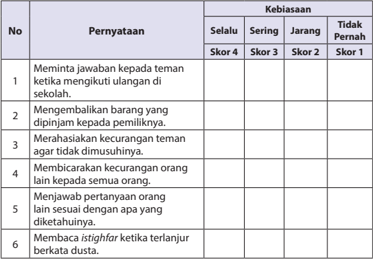

Tabel ini menunjukkan kebiasaan belajar dan perilaku sosial siswa di sekolah, dengan skor yang menunjukkan frekuensi kebiasaan tersebut. Topik utama tabel adalah kebiasaan belajar dan perilaku sosial siswa. Kolom-kolomnya meliputi "Pernyataan" (yang berisi pernyataan tentang kebiasaan), "Kebiasaan" (yang berisi tiga skor: Selalu, Sering, Jangkau, dan Tidak Pernah), dan "Skor" (yang berisi nilai skor untuk setiap kebiasaan). Data penting yang terlihat adalah bahwa kebiasaan belajar seperti meminta jawaban kepada teman ketika mengikuti ulangan di sekolah dan merasakan kecurangan teman agar tidak dimusuhinya sering dilakukan oleh siswa. Sementara itu, kebiasaan belajar seperti membaca ijtihaf ketika terlanjur berkata dusta dan menjawab pertanyaan orang lain sesuai dengan apa yang diketahuinya tidak sering dilakukan oleh siswa.

 

---
## 📄 Halaman 109

---
**📊 Tabel**

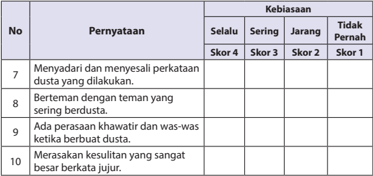

Tabel ini menunjukkan pernyataan tentang kebiasaan berbicara dengan orang lain, terutama tentang dusta (berbicara secara tidak sopan atau tidak sopan). Tabel dibagi menjadi dua kolom: "Selalu" dan "Tidak Pernah", serta empat skor yang berbeda untuk setiap pernyataan. Topik utama tabel adalah tentang perilaku berbicara yang tidak sopan atau tidak sopan. Data penting yang terlihat adalah bahwa beberapa pernyataan memiliki skor yang lebih tinggi di kolom "Selalu" dibandingkan dengan "Tidak Pernah", menunjukkan bahwa kebiasaan berbicara tidak sopan atau tidak sopan sering dilakukan oleh individu tersebut.

``

### 2. Diskusi

Pada saat peserta didik diskusi tentang makna yang terkandung dalam Q.S. al-Māidah/5:8 dan Q.S. at-Taubah/9:119 tentang Kejujuran

Contoh aspek dan rubrik  penilaian:

### a) Kejelasan dan ke dalaman informasi

- Jika  kelompok  tersebut  dapat  memberikan  kejelasan  dan  ke  dalaman informasi lengkap dan sempurna, skor 100.
- Jika kelompok tersebut dapat memberikan penjelasan dan ke dalaman informasi lengkap dan  kurang sempurna, skor 75.
- Jika kelompok tersebut dapat memberikan penjelasan dan ke dalaman informasi  kurang lengkap, skor 50.
- Jika  kelompok  tersebut  tidak  dapat  memberikan  penjelasan  dan  ke dalaman informasi, skor 25.

### Contoh Tabel:

---
**📊 Tabel**

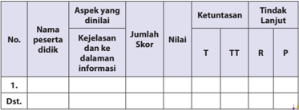

Tabel ini menunjukkan data tentang penilaian aspek kejelasan dan ke dalamannya pada informasi oleh peserta didik. Kolom-kolomnya meliputi nomor peserta didik, nama peserta didik, aspek yang dinilai, jumlah skor, nilai, ketuntasan (T, TT, R), dan tindakan lanjut (P). Topik utama tabel ini adalah penilaian aspek kejelasan dan ke dalamannya pada informasi. Data penting yang terlihat adalah bahwa beberapa peserta didik telah dinyatakan sebagai "dst." (dalam standar), sementara yang lain memiliki skor dan nilai yang berbeda. Tindakan lanjut juga ditentukan untuk setiap peserta didik.

skor tertinggi 4

 

---
## 📄 Halaman 110

### b) Keaktifan dalam diskusi

- Jika kelompok tersebut berperan sangat aktif dalam diskusi, skor 100.
- Jika kelompok tersebut berperan aktif dalam diskusi, skor 75.
- Jika kelompok tersebut kurang aktif dalam diskusi, skor 50.
- Jika kelompok tersebut tidak aktif dalam diskusi, skor 25.

### Contoh Tabel:

---
**📊 Tabel**

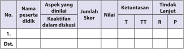

Tabel ini menunjukkan data evaluasi peserta didik dalam diskusi, dengan kolom-kolom seperti No., Nama Peserta Didik, Aspek yang Dinilai, Keaktifan dalam Diskusi, Jumlah Skor, Nilai, Ketuntasan (T, TT, R), dan Tindak Lanjut. Topik utama adalah evaluasi keaktifan peserta didik dalam diskusi. Data penting yang terlihat adalah bahwa beberapa peserta didik memiliki skor tinggi dalam aspek keaktifan mereka, sementara beberapa lainnya memiliki skor rendah. Ini menunjukkan perbedaan dalam partisipasi dan kontribusi mereka dalam diskusi.

### c) Kejelasan dan kerapian presentasi/resume

- Jika kelompok tersebut dapat mempresentasikan/resume  dengan sangat jelas dan rapi, skor 100.
- Jika kelompok tersebut dapat mempresentasikan/resume   dengan jelas dan rapi, skor 75.
- Jika kelompok tersebut dapat mempresentasikan/resume  dengan sangat jelas tetapi kurang rapi, skor 50.
- Jika kelompok tersebut dapat mempresentasikan/resume dengan kurang jelas dan kurang rapi, skor 25.

### Contoh Tabel:

---
**📊 Tabel**

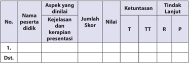

Tabel ini menunjukkan hasil evaluasi presentasi oleh seorang peserta didik. Topik utama adalah aspek-aspek yang dinilai dalam presentasi, seperti kejelasan dan kerapihan. Kolom-kolomnya meliputi nomor peserta, nama peserta, aspek yang dinilai, jumlah skor, nilai, ketuntasan (T, TT, R), dan tindakan lanjut. Data penting yang terlihat adalah bahwa beberapa aspek seperti kejelasan dan kerapihan mendapatkan nilai tinggi, sementara beberapa aspek lainnya memiliki nilai rendah. Tindakan lanjut juga ditentukan untuk setiap aspek yang dinyatakan rendah.

 

---
## 📄 Halaman 111

### 3. Uraian

Rubrik Penilaian

---
**📊 Tabel**

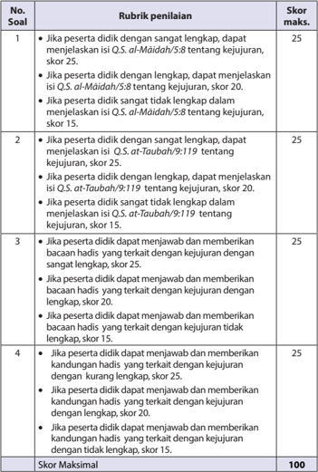

Tabel ini menunjukkan rubrik penilaian untuk sebuah soal yang berkaitan dengan kejujuran dan kandungan hadis. Topik utama tabel adalah tentang penilaian kejujuran dan kandungan hadis. Tabel memiliki empat baris (soal) dan tiga kolom: Rubrik penilaian, Skor maksimal, dan Skor. Rubrik penilaian berisi instruksi tentang bagaimana penilaian dilakukan, sementara Skor maksimal menunjukkan skor tertinggi yang dapat diberikan. Skor ditentukan berdasarkan tingkat kejujuran dan kandungan hadis yang diberikan oleh peserta. Pola penting yang terlihat adalah bahwa skor tertinggi adalah 25 poin, dan skor minimum adalah 15 poin.

 

---
## 📄 Halaman 112

``

### 4. Kolom 'Menerapkan Perilaku Mulia' di rumah, di sekolah maupun di masyarakat, berdasarkan Q.S. al-Māidah/5:8 dan Q.S. at-Taubah/9:119 tentang kejujuran dengan baik.

Contoh Rubrik Pengamatan Perilaku Jujur di rumah

---
**📊 Tabel**

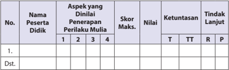

Tabel ini menunjukkan hasil penilaian perilaku siswa dalam beberapa aspek, dengan skor maksimal 4 untuk setiap aspek. Kolom-kolomnya meliputi nomor peserta didik, nama peserta didik, aspek yang dinilai, skor maksimal, nilai, ketuntasan (T untuk telah memperbaiki, TT untuk masih perlu diperbaiki, R untuk belum memperbaiki, P untuk tidak memperbaiki), dan tindakan lanjut. Topik utama tabel adalah penilaian perilaku siswa dalam berbagai aspek. Data penting yang terlihat adalah bahwa sebagian besar siswa telah memperbaiki perilaku mereka, namun masih ada yang memerlukan perbaikan lebih lanjut.

Aspek yang dinilai :

- Sudah
a skor 100

- Kadang-kadang
a skor 85

- Akan
a skor 75

- Dan lain-lain
a

Skor Maksimal

100

### Rubrik penilaiannya adalah:

### a. Sudah:

Peserta didik akan mendapat skor 100 jika peserta didik tersebut sudah terbiasa dan sering menerapkan perilaku jujur berdasarkan Q.S. alMāidah/5:8 dan Q.S. at-Taubah/9:119 tersebut dengan baik.

### b. Kadang-kadang:

Peserta didik akan mendapat skor 85 jika peserta didik tersebut kadangkadang menerapkan perilaku jujur berdasarkan Q.S. al-Māidah/5:8 dan Q.S. at-Taubah/9:119 .

### c. Akan:

Peserta didik akan mendapat skor 75 jika peserta didik tersebut akan menerapkan perilaku jujur berdasarkan Q.S. al-Māidah/5:8 dan Q.S. atTaubah/9:119 .

### d. Dan lain-lain

Guru dapat mengembangkan skor tersebut jika ditemui kriteria penilaian lain berdasarkan bentuk perilaku peserta didik pada situasi dan kondisi yang berkembang, terkait dengan penerapan perilaku jujur berdasarkan Q.S. al-Māidah/5:8 dan Q.S. at-Taubah/9:119 tersebut.

 

---
## 📄 Halaman 113

### Saran

Guru  dapat  mengembangkan  dan  menetapkan  nilai  setiap  skor  yang diperoleh peserta didik.

### G.   Pengayaan

Dalam kegiatan pembelajaran membaca dengan tartil Q.S. al-Māidah/5:8 dan Q.S. at-Taubah/9:119  tentang kejujuran bagi peserta didik yang sudah menguasai materi dengan baik, peserta didik dapat mengerjakan soal pengayaan yang telah disiapkan  oleh  guru  berupa  pertanyaan-pertanyaan  yang  berkaitan  dengan hukum  bacaan,  atau  model-model  pengembangan  lainnya,  khususnya  yang terkait dengan pengembangan materi.

Proses pengayaan pembelajaran ini, merupakan kesempatan terbaik bagi guru untuk menerapkan semaksimal mungkin mengembangan materi pembelajaran yang  direncanakan.  Upaya  memfasilitasi  peserta  didik  dalam  menciptakan proses pembelajaran seaktif mungkin merupakan tanggung jawab guru sebagai fasilitator  agar  peserta  didik  dapat  menikmati  pembelajarannya dengan penuh kreativitas dan inovasi, dalam memahami kejujuran.

Pengarahan  dalam  mengakses  beragam  sumber  dengan  menggunakan IT  perlu  dilakukan  agar  perserta  didik  menemukan  pemahaman  nilai-nilai dan  kualitas  kejujuran  dengan  baik  dan  benar.  Kemudian  guru    mencatat  dan memberikan tambahan nilai bagi  peserta didik yang berhasil dalam pengayaan.

Penilaian  sebagai  rangkaian  proses  pembelajaran  yang  menggambarkan tingkat  keberhasilan  pembelajaran  dan  sekaligus  kualitas  pengajaran,  harus mengacu  kepada  perkembangan  hasil  pembelajaran  peserta  didik,  khususnya dalam hal menerapkan perilaku mulia berdasarkan. Q.S. al- Māidah/5:8 dan Q.S. atTaubah/9:119 tentang kejujuran. Guru dapat melakukan penilaian pada berbagai macam bentuk penilaian, kemudian guru mencatat dan memberikan tambahan nilai bagi peserta didik yang berhasil dalam pengayaan.

### H.   Remedial

Bagi  peserta  didik  yang  belum  menguasai  materi  membaca  dengan tartil dan mengartikan Q.S. al-Māidah/5:8 dan Q.S. at-Taubah/9:119, guru menjelaskan kembali materi tentang pemahaman dan penerapan perilaku 'Mempertahankan Kejujuran sebagai Cermin Kepribadian' tersebut, dan melakukan penilaian kembali dengan soal yang sejenis.

 

---
## 📄 Halaman 114

Remedial  dilaksanakan  pada  waktu  dan  hari  tertentu  yang  disesuaikan, seperti: boleh pada saat pembelajaran apabila masih ada waktu atau diluar jam pelajaran, pada umumnya 30 menit setelah pulang sekolah.

### I.   Interaksi Guru dengan Orang Tua

Interaksi guru dengan orang tua perlu dilakukan, salah satunya adalah, guru meminta peserta didik memperlihatkan kolom 'Membaca dengan Tartil' dalam buku teks peserta didik kepada orang tuanya dengan memberikan komentar dan paraf.

Bentuk interaksi dengan menggunakan buku penghubung kepada orang  tua,  untuk  mengembangkan  perubahan  perilaku  peserta  didik  setelah mengikuti kegiatan pembelajaran. Selain itu, guru dapat berkomunikasi langsung melalui  telepon  atau  dengan  membuat  pernyataan  tertulis  untuk  melaporkan perkembangan  kemampuan  membaca  dan  memahami  peserta  didik,  terkait dengan  materi  memahami  kajian  mempertahankan  kejujuran  sebagai  cermin kepribadian.

Untuk mengetahui keberhasilan peserta didik dalam pengamalan agamanya, khususnya  penerapan  perilaku  mempertahankan  kejujuran  sebagai  cermin kepribadian,  guru  memfasilitasi  peserta  didik  untuk  memperhatikan  kolom 'Menerapkan Perilaku Mulia' . kemudian mengarahkan dan membimbing   peserta didik      untuk      memberikan  tanda  (  )  pada  kolom 'selalu' , 'sering' , 'jarang'  atau 'sudah  menerapkannya  dengan    baik' , 'kadang-kadang    menerapkannya, 'akan menerapkannya',  dll  (guru  dapat  mengembangkannya  berdasarkan  situasi  dan kondisi) dalam buku teks kepada orang tuanya dengan memberikan komentar dan paraf.

 

---
## 📄 Halaman 115

### Al-Qur'ān dan Hadis adalah Pedoman Hidupku

### A.   Kompetensi Inti (KI)

KI-1:

Menghayati dan mengamalkan ajaran agama yang dianutnya.

KI 2: Menghayati  dan  mengamalkan  perilaku  jujur,  disiplin,  tanggungjawab, peduli (gotong royong, kerjasama, toleran, damai) santun, responsif dan pro-aktif dan menunjukkan sikap sebagai bagian dari solusi atas berbagai permasalahan dalam berinteraksi secara efektif dengan lingkungan sosial dan alam serta dalam menempatkan diri sebagai cerminan bangsa dalam pergaulan dunia.

- KI 3: Memahami, menerapkan, dan menganalisis pengetahuan faktual, konseptual,  prosedural,  berdasarkan  rasa  ingin  tahunya  tentang  ilmu pengetahuan, teknologi, seni, budaya, dan humaniora dengan wawasan kemanusiaan, kebangsaan, kenegaraan, dan peradaban terkait penyebab fenomena dan kejadian, serta menerapkan pengetahuan prosedural pada bidang  kajian  yang  spesifik  sesuai  dengan  bakat  dan  minatnya  untuk memecahkan masalah.
- KI 4: Mengolah, menalar, dan menyaji dalam ranah konkret dan ranah abstrak terkait dengan pengembangan dari yang dipelajarinya di sekolah secara mandiri, dan mampu menggunakan metode sesuai kaidah keilmuan.

 

---
## 📄 Halaman 116

### B.   Kompetensi Dasar (KD)

- 1.8   Meyakini al-Qur'an , Hadis dan  ijtihad sebagai sumber hukum Islam.
- 2.8   Menunjukkan  perilaku  ikhlas  dan  taat  beribadah  sebagai  implemantasi pemahaman  terhadap  kedudukan al-Qur'an ,  Hadis,  dan ijtihad sebagai sumber hukum Islam.
- 3.8   Menganalisis kedudukan al-Qur'an , Hadis, dan  ijtihad sebagai sumber hukum Islam.
- 4.8   Mendeskripsikan macam-macam sumber hukum Islam.

### C.   Tujuan Pembelajaran

### Peserta didik mampu:

- Meyakini al-Qur'an ,  Hadis dan ijtihad sebagai sumber hukum Islam.
- Menunjukkan    perilaku    ikhlas    dan    taat    beribadah    sebagai implemantasi pemahaman terhadap kedudukan al-Qur'an , Hadis, dan  ijtihad sebagai sumber hukum Islam.
- Menganalisis  kedudukan al-Qur'an , Hadis, dan ijtihad sebagai sumber hukum Islam.
- Mendeskripsikan macam-macam sumber hukum Islam.

### D.   Pengembangan Materi

Guru  memberikan  kebebasan  kepada  peserta  didiknya  dalam  mengakses beragam sumber belajar yang mengantarkan perserta didik menemukan nilainilai keyakinan menjadikan al-Qur'ān dan hadis sebagai pedoman hidup. Peserta didik juga menjadikan al-Qur'ān ,  hadis, dan ijtihād sebagai sumber hukum yang dapat  dipahaminya  dengan  baik  dan  benar.  Pengembangan  materi  tersebut, antara lain sebagai berikut.

- Meneliti  secara  lebih  mendalam  pemahaman Q.S.  al-Isrā'/17:9 dan Q.S.  anNisā/4:59,  105 tentang al-Qur'ān ,  hadis  dan ijtihād sebagai  sumber  hukum Islam, dengan menggunakan ICT .
- Menyajikan model-model, jenis, dan cara membaca indah ayat-ayat al-Qur'ān tentang al-Qur'ān sebagai pedoman hidup.
- Menjelaskan makna isi al-Qur'ān ,  hadis  dan ijtihād sebagai  sumber  hukum Islam dengan menggunakan ICT .
Kelas X SMA/MA/SMK/MAK

 

---
## 📄 Halaman 117

- Memberikan tambahan bacaan ayat al-Qur'ān dan hadis-hadis yang mendukung  lainnya,  tentang al-Qur'ān ,  hadis  dan ijtihād sebagai  sumber hukum Islam.
- Meneliti  secara  lebih  mendalam  bentuk  perilaku  tentang, Q.S.  al-Isrā'/17:9 dan Q.S. an-Nisā/4:59, 105 sebagai dasar dalam menjadikan al-Qur'ān sebagai pedoman hidup dan sumber hukum Islam dengan menggunakan IT.
- Memberikan contoh-contoh perilaku, berdasarkan bacaan ayat al-Qur'ān dan hadis-hadis  lainnya  yang  mendukung  dan  menjadikannya  sebagai  sumber hukum dan pedoman hidup.

### E.   Proses Pembelajaran

### 1. Persiapan

- Guru  memulai  pembelajaran  dengan  mengucapkan  salam,  menyapa, berdoa, dan  tadarus: membaca al-Qur'ān surah pendek pilihan atau ayat hafalan yang sudah dipelajari dengan lancar dan benar (atau surat yang sesuai dengan program pembiasaan yang ditentukan sebelumnya), śalat duĥā' (atau śalat sunnah lainnya, jika memungkinkan, sebagai modifikasi pembukaan  pembelajaran,  guna  pembentukan  sikap  dan  perilaku peserta didik) secara bersama-sama (berjama'ah).
- Memperhatikan  kesiapan,  semangat  dan  kelengkapan  peserta  didik, dengan memeriksa kehadiran, kerapian berpakaian, dan mengorganisir kelas dan posisi tempat duduk disesuaikan dengan kegiatan pembelajaran yang akan diterapkan, berdasarkan metode dan model pembelajaran.
- Menyampaikan tujuan pembelajaran atau kompetensi dasar yang akan dicapai  dari  materi  pembelajaran,  yaitu:  ' Al-Qur'ān dan  hadis  adalah pedoman hidupku'.
- Model pengajaran yang dapat dipersiapkan dan digunakankan sebagai alternatif    dalam  kompetensi  ini  adalah, Debate  Learning,  Zig  Show, Cooperative Learning , untuk mengembangkan pemahaman, kemampuan menganalisis dan keterampilan ( skill ) peserta didik.

### b. Pelaksanaan

Pada  kegiatan  ini,  guru  dapat  mengembangkan  pembelajaran  dengan menerapkan  beragam  model  pembelajaran, metode  pembelajaran, media pembelajaran,  dan  sumber  belajar  yang  disesuaikan  dengan  karakteristik  dan materi al-Qur'ān dan hadis sebagai sumber hukum Islam dan sekaligus merupakan pedoman  hidup,  yang  menjadi  dasar  dari  tema  ' Al-Qur'ān dan  hadis  adalah Pedoman Hidupku'.

 

---
## 📄 Halaman 118

### a) Membuka Relung Hati

- Guru memberi motivasi peserta didik secara kontekstual, sesuai manfaat dan aplikasi materi   dengan menyajikan kajian 'Membuka Relung Hati' yang terdapat pada setiap awal bab penyajian buku peserta didik. Dalam hal ini, disajikan cerita 'Seorang pengembara, yang dianalogikan dengan kehidupan manusia ibarat pengembara yang hidup di hutan belantara. Seandainya  saja  tidak  ada 'utusan'  yang  membawa  petunjuk,  tentulah kita akan tersesat dan kebingungan dalam mengarungi hidup ini. Maka bersyukurlah  kita  yang  mendapatkan  petunjuk  dari  utusan  Allah  Swt. yaitu  Muhammad  saw.  yang  menyampaikan  kabar  gembira,  memberi peringatan, dan menerangkan hakikat penciptaan kita di dunia, melalui al-Qur'ān sebagai pedoman hidup.'
- Guru menyajikannya sebagai proses pengamatan dan menjelaskan bahan kajian al-Qur'ān dan  hadis  sebagai sumber hukum Islam dan sekaligus merupakan pedoman hidup,  dalam pembentukan  pemahaman,  penghayatan, dan pengamalan agama peserta didik.
- 'Membuka  Relung Hati' ini, dapat pula dikembangkan melalui penayangan video, film, gambar, cerita, atau  dengan memperlihatkan guntingan  kertas  yang  sudah  dibuat  ( media by  design )  yang  berisikan penjelasan  yang  setara,  atau  yang  lebih  kreatif  dan  inovatif,  sebagai bahan pemahaman penghayatan dan pengamalan ajaran agama peserta didik.
- Guru memberikan penguatan dan penjelasan kepada peserta didik, agar proses  mencermati  baik  secara  individu  ataupun  klasikal  berlangsung secara lengkap, baik dan benar.

### Aktivitas 1

Pada kolom 'Aktivitas Siswa' , guru memfasilitasi atau meminta peserta didik untuk  mencari  beberapa  sumber  tentang  kemu'jizatan al-Qur'ān .  Apa  saja kemu'jizatan al-Qur'ān tersebut,  sehingga  dijadikan  sumber  segala  hukum dan pedoman hidup umat Islam.

### b) Mengkritisi Sekitar Kita

- Guru meminta peserta didik untuk memperhatikan kajian pada kolom 'Mengkritisi  Sekitar  Kita' .  Berdasarkan  kajian  pada  buku  peserta  didik, merupakan kajian fenomena sosial yang timbul dan berkembang, terkait dengan  pemahaman  dan  pengamalan al-Qur'ān dan  hadis  sebagai sumber hukum Islam, sekaligus merupakan pedoman hidup. Dalam hal ini, disajikan wacana, masih banyak orang yang mengaku beriman, belum

 

---
## 📄 Halaman 119

- menjadikan al-Qur'ān dan hadis sebagai pedoman hidupnya, sehingga banyak terjadi  pelanggaran  terhadap  hukum Islam,  seperti:  pencurian, perampokan, korupsi, perzinaan, dan kemaksiatan lainnya.
- Guru dapat mengembangkan bahan terdapat pada kolom 'Mengkritisi Sekitar Kita' dalam bentuk kajian yang setara, atau yang lebih kreatif dan inovatif. Guru juga dapat mengembangkan melalui tayangan video, film, gambar,  cerita  atau    dengan  memperlihatkan  guntingan  kertas  yang sudah  dibuat  ( media  by  design )  yang  berisikan  penjelasan  tentang alQur'ān dan hadis sebagai sumber hukum Islam dan sekaligus merupakan pedoman hidup.
- Guru membagi peserta didik ke dalam beberapa kelompok. Kemudian, setiap kelompok  diminta untuk mempersiapkan  pertanyaan yang berkaitan dengan bahan kajian yang terdapat pada kolom 'Mengkritisi Sekitar Kita' . Dapat pula dilakukan melalui tayangan video, film, gambar, cerita  atau    dengan  memperlihatkan  guntingan  kertas  yang  sudah dibuat ( media by design ),  untuk dapat mengetahui keberhasilan proses mengamati materi kajian yang telah dilakukan peserta didik.
- Setiap  peserta  didik  atau  wakil  kelompok,  mengajukan  pertanyaanpertanyaan  yang  telah  dipersiapkan.  Peserta  didik  atau  kelompok  lain menanggapi dan menjawab pertanyaan-pertanyaan, sekaligus berfungsi melahirkan  berpikir  kritis  dan  membangun  dinamika,  dan  kreativitas pembelajaran  dalam  menanamkan  dan  mengembangkan  jiwa  sosial peserta didik.
- Guru memberikan pengarahan, penguatan dan penjelasan jawaban dari pertanyaan-pertanyaan dan pernyataan yang berkembang, secara logis, terinci,  dan  sistematis  terkait  dengan  pertanyaan-pertanyaan  peserta didik,  dalam upaya mencermati dan memahami kajian tentang al-Qur'ān dan hadis sebagai pedoman hidup.

### Aktivitas 2

Pada kolom 'Aktivitas Siswa' , guru memfasilitasi atau meminta peserta didik untuk  mencari  dan  mendiskusikan  hukum-hukum  apa  saja    yang  terdapat dalam al-Qur'an dan  hadis.  Apakah  hukum  tersebut  bertentangan  dengan hukum yang selama ini berlaku dalam kehidupan kita.  Bagaimana solusi agar kita  terhindar dari golongan orang-orang kafir sebagaimana yang tersebut dalam Q.S. al-Maidah / 5:44.

 

---
## 📄 Halaman 120

### 3) Memperkaya Khazanah

Dalam kajian 'Memperkaya Khazanah', guru memfasilitasi, membimbing dan mengarahkan peserta didik untuk mampu menemukan dan melahirkan analisis kajian al-Qur'ān dan hadis sebagai sumber hukum Islam dan sekaligus merupakan pedoman hidup.

Berikan kebebasan kepada peserta didik dalam mengakses beragam sumber belajar,  agar  dapat  mengantarkan  perserta  didik  menemukan  nilai-nilai  dan kualitas  pemahaman al-Qur'ān dan  hadis  sebagai  sumber  hukum  Islam  dan sekaligus merupakan pedoman hidup.

Untuk Memperkaya Khazanah, fasilitasi, bimbing, arahkan dan didik peserta didik untuk menganalisis  kedudukan al-Qur'ān ,    hadis,    dan        ijtihad    sebagai sumber hukum Islam, dan mendeskripsikan macam-macam sumber hukum Islam.

Memahami pengertian dan kedudukan al-Qur'ān ,  hadis, dan ijtihād sebagai sumber hukum Islam. Para ulama, mengelompokkan hukum yang terdapat dalam al-Qur'ān ke dalam tiga bagian, yaitu:

- Akidah atau Keimanan
- Syari'ah atau Ibadah
- Hukum Ibadah
- Hukum Mu'amalah
- Akhlak atau Budi Pekerti
Hadis atau sunnah, bagian-bagian  hadis  tersebut  antara  lain  adalah: Sanad, Matan, Rawi . Kedudukan Hadis atau sunnah sebagai sumber hukum Islam. Fungsi hadis terhadap al-Qur'ān :

- Menjelaskan   ayat-ayat al-Qur'ān yang   masih   bersifat umum.
- Memperkuat pernyataan yang ada dalam al-Qur'ān .
- Menerangkan maksud dan tujuan ayat.
- Menetapkan hukum baru yang tidak terdapat dalam al- Qur'ān .
Ijtihād sebagai upaya memahami al-Qur'ān dan hadis

- Syarat-syarat berijtihād.
- Kedudukan Ijtihād.
- Bentuk-bentuk Ijtihād: Ijma' , Qiyas, Maslahah Mursalah .
- Guru memfasilitasi peserta didik untuk menanggapi, melakukan dan menyelesaikan tugas yang terdapat pada buku peserta didik.

### Aktivitas 3

Pada  kolom 'Aktivitas  Siswa' ,    guru  memfasilitasi  atau  meminta  peserta  didik untuk membuat  satu tabel yang memuat hukum-hukum yang bersumber dari al-Qur'ān, hadis, dan ijtihād tersebut.

 

---
## 📄 Halaman 121

Guru dapat mengembangkan pembelajaran dengan menekankan makna isi Q.S. al-Isrā' /17:9 dan Q.S. an-Nisā / 4:59, 80 dan  105 tentang dasar kajian al-Qur'ān dan  hadis  sebagai  sumber  hukum,  dan  sekaligus  merupakan  pedoman  hidup, sebagai dasar dari   pemahaman analisis, ke dalam langkah-langkah pembelajaran.

- Meneliti secara lebih mendalam kajian al-Qur'ān dan hadis sebagai sumber hukum Islam dan sekaligus merupakan pedoman hidup, berdasarkan Q.S. alIsrā' /17:9 dan Q.S. an-Nisā / 4:59, 80 dan  105 melalui sumber-sumber belajar lainnya, baik cetak maupun elektronik, atau dengan menggunakan IT.
- Menampilkan  contoh  pemahaman al-Qur'ān dan  hadis  sebagai  sumber hukum Islam dan sekaligus merupakan pedoman hidup, berdasarkan QS. alIsrā' /17:9 dan Q.S. an-Nisā/ 4:59, 80 dan  105 melalui presentasi, demonstrasi dan simulasi.
- Memberikan  contoh-contoh  pemahaman al-Qur'ān dan hadis sebagai sumber hukum Islam dan sekaligus merupakan pedoman hidup, berdasarkan tambahan bacaan ayat al-Qur'ān dan hadis- hadis yang mendukung lainnya.
- Agar peserta didik dapat lebih kreatif, dalam menunjukkan dan menerapkan pemahaman analisis, al-Qur'ān dan hadis sebagai sumber hukum Islam dan sekaligus merupakan pedoman hidup, berdasarkan Q.S. al-Isrā' /17:9 dan Q.S. an-Nisā / 4:59, 80 dan 105, guru dapat mengembangkan pembelajaran melalui diskusi.
- Guru  membagi  kelompok  dan  mengingatkan  tema  diskusi,  yaitu  memahami kajian al-Qur'ān dan  hadis  sebagai  sumber  hukum  Islam  dan sekaligus merupakan pedoman hidup, berdasarkan Q.S. al-Isrā' /17:9 dan Q.S. an-Nisā/ 4:59, 80 dan 105.
- Guru  mengarahkan  dan  mengendalikan  diskusi  dengan,  menunjuk perwakilan dari setiap kelompok untuk mengatur, mengendalikan dan menemukan  penjelasan  lebih  rinci  dalam  memahami  ketentuan  dan manfaat kajian materi.
- Guru meminta peserta didik menyampaikan, mengemukakan, dan mempresentasikan hasil diskusi tentang macam-macam temuan, identifikasi, dan  pengembangan  pemikiran,  sehingga  mendapatkan  penguatan terhadap  pemahaman, terkait  dengan  hikmah  dan  tujuan  menjadikan al-Qur'ān dan    hadis    sebagai    sumber    hukum  Islam  dan  sekaligus merupakan pedoman hidup. Peserta didik diharapkan memahami dan dapat mengaflikasikannya dalam kehidupan sehari-hari dengan baik dan benar, baik di sekolah, di rumah, maupun di masyarakat.
- Memotivasi   kelompok   lainnya   untuk   memperhatikan, menyimak dan memberikan tanggapan.
- Dalam  pelaksanaannya,  guru  langsung  menilai  semua  aktivitas  pembelajaran peserta didik yang berlangsung.

 

---
## 📄 Halaman 122

- Membimbing   peserta   didik   untuk   menyimpulkan   hasil diskusi dan hasil presentasi, sehingga lebih aplikatif dalam memahami al-Qur'ān dan hadis sebaai sumber hukum Islam, sekaligus merupakan pedoman hidup, serta menjadi sumber pemahaman dan pengamalan bagi peserta didik.

### 4) Menerapkan Perilaku Mulia

Dalam kajian 'Menerapkan Perilaku Mulia' , guru memfasilitasi, membimbing dan mengarahkan peserta didik untuk mampu melahirkan perilaku, senantiasa menjadikan Al-Qur'ān dan hadis sebagai sumber hukum Islam yang merupakan pedoman hidup.

Perilaku mulia ini akan terbentuk, jika guru  memfasilitasi dan membimbing peserta  didik  dengan  hikmah  dan  keteladanan.  Selain  itu,  guru  diharapkan dapat memberikan kebebasan kepada peserta didik dalam mengakses beragam sumber  belajar,  sehingga  dapat  menambah  pengetahuan,  pemahaman  dan keyakinan perserta didik untuk menerapkan perilaku senantiasa menjadikan alQur'ān dan hadis sebagai sumber hukum Islam dan pedoman hidup,  kemudian dapat meneterapkannya dengan baik dan benar di rumah, di sekolah maupun di masyarakat.

Guru  dapat  mengembangkan  bahan  kajian  yang  terdapat  pada  kolom 'Menerapkan Perilaku Mulia' dalam bentuk tayangan video, film, gambar, cerita atau    dengan  memperlihatkan  guntingan  kertas  yang  sudah  dibuat  ( media by design ),  dan  berisikan  penjelasan  tentang al-Qur'ān dan  hadis  sebagai  sumber hukum Islam dan sekaligus  pedoman  hidup,  menjadi  kajian  yang  setara,  lebih kreatif, dan inovatif sebagai dasar dari penanaman dan penerapan perilaku mulia. Selanjutnya, guru mengembangkannya ke dalam langkah-langkah pembelajaran sebagai berikut.

- Meneliti secara lebih mendalam bentuk dan contoh perilaku al-Qur'ān dan hadis  adalah  pedoman  hidupku,  berdasarkan Q.S.  al-Isrā'/17:9 dan Q.S.  anNisā/4:59,  105 melalui  sumber-sumber  belajar  lainnya,  baik  cetak  maupun elektronik, atau dengan menggunakan IT,
- Menampilkan  contoh  perilaku  senantiasa  menjadikan al-Qur'ān dan  hadis sebagai sumber hukum Islam yang merupakan pedoman hidup, berdasarkan Q.S. al-Isrā'/17:9 dan Q.S. an-Nisā/4:59, 105 berdasarkan tambahan bacaan ayat al-Qur'ān dan hadis-hadis yang mendukung lainnya, tentang al-Qur'ān dan hadis sebagai pedoman hidup, melalui presentasi, demonstrasi dan simulasi.
- Di dalam pelaksanaannya, guru langsung menilai semua aktivitas  presentasi, demonstrasi dan simulasi peserta didik yang sedang berlangsung.
- Membimbing peserta didik untuk menyimpulkan hasil presentasi, demonstrasi dan simulasi sehingga lebih aplikatif dalam menerapkan perilaku senantiasa menjadikan al-Qur'ān dan hadis sebagai sumber hukum Islam dan pedoman hidup, yang merupakan sumber kemuliaan diri.

 

---
## 📄 Halaman 123

- Guru  memberikan  penguatan,  penjelasan  tambahan  dan  sekaligus  hasil penilaian  berdasarkan  proses  perkembangan  presentasi,  demonstrasi,  dan simulasi yang dilakukan peserta didik.
- Guru memfasilitasi kajian materi, perilaku mulia dari pemahaman terhadap al-Qur'ān dan  hadis,  dan ijtihād sebagai  sumber  hukum  Islam  yang  dapat tergambar dalam aktivitas, sebagai berikut:
- Gemar  membaca  dan  mempelajari al-Qur'ān dan  hadis,  baik  ketika sedang sibuk ataupun santai.
- Berusaha sekuat tenaga untuk merealisasikan ajaran-ajaran al-Qur'ān dan hadis.
- Selalu mengkonfirmasi segala persoalan yang dihadapi dengan merujuk kepada al-Qur'ān dan  hadis,  baik  dengan  mempelajari  sendiri  atau bertanya kepada yang ahli di bidangnya.
- Mencintai  orang-orang  yang  senantiasa  berusaha  mempelajari  dan mengamalkan ajaran-ajaran al-Qur'ān dan hadis.
- Kritis terhadap persoalan-persoalan yang dihadapi dengan terus-menerus berupaya agar tidak keluar dari ajaran-ajaran al-Qur'ān dan hadis.
- f ) Membiasakan diri berpikir secara rasional dengan tetap berpegang teguh kepada al-Qur'ān dan hadis.
- Aktif  bertanya  dan  berdiskusi  dengan  orang-orang  yang  dianggap memiliki keahlian agama dan berakhlak mulia.
- Berhati-hati dalam bertindak dan melaksanakan sesuatu, apakah boleh dikerjakan ataukah ditinggalkan.
- Selalu berusaha keras untuk mengerjakan segala kewajiban, meninggalkan dan menjauhi segala larangan.
- Membiasakan  diri  untuk  mengerjakan  ibadah-ibadah  sunnah,  sebagai upaya menyempurnakan ibadah wajib karena khawatir belum sempurna.

### c. Penutup

Dalam kegiatan penutup, guru bersama peserta didik, baik secara individu maupun kelompok menyimpulkan intisari dari pelajaran tersebut sesuai dengan yang  terdapat  dalam  buku  teks  peserta  didik  pada  kolom  rangkuman,  dan melakukan  penilaian  dari  proses  komunikasi  yang  berkembang.  Melakukan refleksi  untuk mengevaluasi semua rangkaian aktivitas pembelajaran dan hasilhasil  yang  diperoleh,  untuk  selanjutnya  secara  bersama  menemukan  manfaat langsung maupun tidak langsung dari hasil pembelajaran yang telah berlangsung.

- Melaksanakan refleksi  dan  kesimpulan  sebagaimana    yang  terdapat  dalam buku teks peserta didik pada kolom 'rangkuman' ,  mengajukan pertanyaan atau tanggapan peserta didik dari kegiatan yang telah dilaksanakan sebagai

 

---
## 📄 Halaman 124

bahan  masukan  untuk  perbaikan  langkah  selanjutnya,  dalam  menerapkan perilaku senantiasa menjadikan Al-Qur'ān dan Hadis sebagai sumber hukum Islam yang merupakan pedoman hidup, baik di rumah, sekolah dan maupun di masyarakat.

- Guru dan peserta didik menyimpulkan intisari dari pelajaran tersebut pada kolom 'Menerapkan Perilaku Mulia' . Guru membimbing peserta didik untuk memberikan  tanda  (  ) pada  kolom  'selalu' ,  'sering' ,  'jarang'  atau  'sudah menerapkannya dengan baik' , 'kadang-kadang menerapkannya, 'akan menerapkannya', dan lain-lain. (guru dapat mengembangkannya berdasarkan situasi dan kondisi)
- Merencanakan kegiatan tindak lanjut dengan memberikan tugas, baik secara individu  maupun  kelompok,  bagi  peserta  didik  yang  belum  menguasai pembelajaran  senantiasa  menjadikan al-Qur'ān dan  hadis  sebagai  sumber hukum Islam yang merupakan pedoman hidup, melakukan kegiatan remedial, atau pengembangan materi bagi peserta didik yang lebih berkembang secara kreatif, inovatif dan produktif.
- Menyampaikan tema dan rencana pembelajaran pada pertemuan berikutnya.

### F.   Penilaian

Guru dapat melakukan penilaian berdasarkan sajian evaluasi yang terdapat pada  buku  peserta  didik,  berupa  Uji  Pemahaman,  Uji  Penerapan  perilaku  dan Refleksi,  serta  melakukan  pengembangan  penilaian  sebagaimana  contoh  di bawah ini.

### 1. Refleksi

Berilah  tanda  'cek'  (  )  yang  sesuai  dengan  kebiasaan  kamu  terhadap pernyataan-pernyataan yang tersedia!

---
**📊 Tabel**

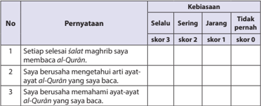

Tabel ini menunjukkan pernyataan tentang kebiasaan membaca Al-Qur'an setelah shalat Maghrib, dengan kategori kebiasaan yang berbeda-beda. Topik utama tabel adalah tentang kebiasaan membaca Al-Qur'an setelah shalat Maghrib. Kolom-kolomnya meliputi "Selalu", "Sering", "Jarang", dan "Tidak pernah". Data penting yang terlihat adalah bahwa sebagian besar responden (sekitar 75%) selalu atau sering membaca Al-Qur'an setelah shalat Maghrib, sedangkan hanya sekitar 25% yang tidak pernah membaca Al-Qur'an setelah shalat Maghrib. Ini menunjukkan bahwa kebiasaan membaca Al-Qur'an setelah shalat Maghrib cukup umum di kalangan responden.

 

---
## 📄 Halaman 125

---
**📊 Tabel**

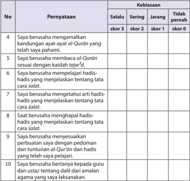

Tabel ini menunjukkan kebiasaan seseorang dalam berusaha mengamalkan kandungan ayat-ayat Al-Quran yang telah saya pahami. Tabel ini terdiri dari kolom "No", "Pernyataan", "Kebiasaan", "Selalu", "Sering", "Jangkau", dan "Tidak pernah". Topik utama tabel ini adalah kebiasaan seseorang dalam berusaha mengamalkan kandungan Al-Quran. Data penting yang terlihat adalah bahwa sebagian besar pilihan jawaban adalah "Tidak pernah" untuk semua poin dalam tabel ini, menunjukkan bahwa kebanyakan orang tidak sering atau selalu berusaha mengamalkan kandungan Al-Quran yang telah mereka pahami.

``

### 2. Diskusi

Aspek dan rubrik penilaian:

- Kejelasan dan ke dalaman informasi
- Jika  kelompok  tersebut  dapat  memberikan  kejelasan  dan  ke  dalaman informasi lengkap dan sempurna, skor 100.
- Jika kelompok tersebut dapat memberikan penjelasan dan ke dalaman informasi lengkap dan  kurang sempurna, skor 75.
- Jika kelompok tersebut dapat memberikan penjelasan dan ke dalaman informasi  kurang lengkap, skor 50.
- Jika  kelompok  tersebut    tidak  dapat  memberikan  penjelasan  dan  ke dalaman informasi, skor 25.

 

---
## 📄 Halaman 126

### Contoh Tabel:

---
**📊 Tabel**

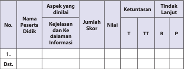

Tabel ini menunjukkan informasi tentang partisipan didik dalam proses belajar mengajar. Kolom-kolomnya meliputi nomor partisipan, nama partisipan, aspek yang dinilai, jumlah skor, nilai, ketuntasan, dan tindakan lanjut. Topik utama tabel adalah evaluasi partisipan didik dalam kegiatan belajar mengajar. Data penting yang terlihat adalah bahwa setiap partisipan didik memiliki skor, nilai, dan tindakan lanjut yang berbeda-beda, menunjukkan variasi dalam penilaian dan pembelajaran.

### b) Keaktifan dalam diskusi.

- Jika kelompok tersebut  berperan sangat aktif  dalam diskusi, skor 100.
- Jika kelompok tersebut berperan  aktif dalam diskusi, skor 75.
- Jika kelompok tersebut kurang aktif dalam diskusi, skor 50.
- Jika kelompok tersebut tidak aktif dalam diskusi, skor 25.
Contoh Tabel:

---
**📊 Tabel**

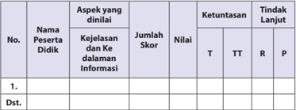

Tabel ini menunjukkan hasil penilaian aspek kejelasan dan kedalamannya informasi oleh seorang peserta didik. Kolom-kolomnya meliputi nomor, nama peserta didik, aspek yang dinilai, jumlah skor, nilai, ketuntasan (T, TT, R), dan tindakan lanjut (P). Data penting yang terlihat adalah bahwa peserta didik tersebut telah menunjukkan pengetahuan dan pemahaman yang baik tentang aspek kejelasan dan kedalamannya informasi, dengan nilai yang tinggi. Tindakan lanjut yang diberikan menunjukkan bahwa peserta didik diberi kesempatan untuk memperluas pengetahuan dan kemampuannya dalam bidang ini.

### c) Kejelasan dan kerapian presentasi/resume

- Jika kelompok tersebut dapat mempresentasikan/resume  dengan sangat jelas dan rapi, skor 100.
- Jika kelompok tersebut dapat mempresentasikan/resume   dengan jelas dan rapi, skor 75.
- Jika kelompok tersebut dapat mempresentasikan/resume  dengan sangat jelas tetapi kurang rapi, skor 50.
- Jika  kelompok  tersebut  dapat  mempresentasikan/resume dengan kurang jelas dan kurang rapi, skor 25.

 

---
## 📄 Halaman 127

### Contoh Tabel:

---
**📊 Tabel**

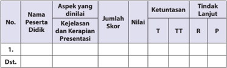

Tabel ini menunjukkan evaluasi penilaian terhadap kejelasan, kerapihan, dan presentasi dari beberapa peserta didik. Topik utama tabel adalah penilaian kinerja peserta didik dalam hal ini. Kolom-kolom yang ada meliputi nomor peserta didik, nama peserta didik, aspek yang dinilai (kejelasan, kerapihan, dan presentasi), jumlah skor, nilai, ketuntasan (T untuk terima, TT untuk tidak terima, R untuk lanjut), dan tindakan lanjut. Data penting yang terlihat adalah bahwa beberapa peserta didik mendapatkan nilai T (terima) dalam semua aspek penilaian, sementara beberapa lainnya mendapatkan nilai TT (tidak terima) atau R (lanjut). Ini menunjukkan variasi dalam kinerja peserta didik dalam hal ini.

### Saran

Guru  dapat  mengembangkan  dan  menetapkan  nilai  setiap  skor  yang diperoleh peserta didik.

### G.   Pengayaan

Peserta  didik  yang  telah  menguasai  materi  pembelajaran  mengerjakan tugas dan soal pengayaan yang telah disiapkan oleh guru berupa pertanyaanpertanyaan sebagaimana yang terkait dengan kajian pengembangan materi, yang lebih fenomenal dan inovatif, seperti masalah fiqh modern, hukum bayi tabung yang telah disiapkan guru. (Guru mencatat dan memberikan tambahan nilai bagi peserta didik yang berhasil dalam pengayaan)

Peserta didik yang telah menguasai materi, dapat melaksanakan tugas dan mengerjakan soal pengayaan yang telah disiapkan oleh guru berupa pertanyaanpertanyaan yang lebih fenomenal dan inovatif, seperti:

- Meneliti secara lebih mendalam bentuk perilaku tentang, Q.S. al-Isrā'/17:9 dan Q.S. an-Nisā/4:59 , 105 sebagai dasar dalam menerapkan menjadikan al-Qur'ān sebagai pedoman hidup dan sumber hukum Islam , dengan menggunakan IT.
- Menampilkan contoh perilaku menjadikan al-Qur'ān sebagai pedoman hidup dan sumber hukum berdasarkan, Q.S . al-Isrā' /17:9 dan Q.S. an-Nisā /4:59, 105 melalui presentasi, demonstrasi dan simulasi.
- Kemudian, guru mencatat dan memberikan tambahan nilai bagi peserta didik yang berhasil dalam pengayaan.

 

---
## 📄 Halaman 128

### H.   Remedial

Peserta didik yang belum menguasai tentang materi pembelajaran menjadikan al-Qur'ān dan hadis sebagai sumber hukum Islam yang merupakan pedoman  hidup,  diharapkan  guru  dapat  menjelaskan  kembali  tentang  materi pemahaman dan penganalisisan ' al-Qur'ān dan Hadis Pedoman Hidupku'. Guru akan  melakukan  penilaian  kembali  dengan  soal  yang  sejenis  (lihat  poin  6), setara  dan  yang  dikembangkan  berdasarkan  situasi  dan  kondisi,  atau  dengan memberikan tugas individu. Remedial dilaksanakan pada waktu dan hari tertentu yang disesuaikan, contoh: pada saat jam belajar, apabila masih ada waktu, atau di luar jam pelajaran (30 menit setelah jam pelajaran selesai).

### I.   Interaksi Guru dengan Orang Tua

Interaksi guru dengan orang tua perlu dilakukan, salah satunya adalah, guru meminta peserta didik memperlihatkan kolom 'Membaca dengan Tartil' dalam buku teks peserta didik kepada orang tuanya dengan memberikan komentar dan paraf.

Dapat  pula  dengan  menggunakan  buku  penghubung  kepada  orang  tua, untuk menyampaikan tentang perubahan perilaku peserta didik setelah mengikuti kegiatan pembelajaran. Selain itu, guru dapat berkomunikasi langsung melalui telepon, atau dengan membuat pernyataan tertulis untuk melaporkan tentang perkembangan kemampuan membaca ayat al-Qur'ān dan hadis dan pemahaman peserta  didik,  terkait  dengan  materi  menjadikan al-Qur'ān dan  hadis  sebagai sumber hukum Islam dan pedoman hidup.

Untuk  mengetahui  keberhasilan  peserta  didik  dalam  pemahaman  dan pengamalan agamanya, khususnya penerapan perilaku perkembangan kemampuan membaca ayat a-Qur'ān dan hadis serta pemahaman peserta didik, terkait dengan materi al-Qur'ān dan Hadis sebagai sumber hukum Islam dan pedoman hidup, guru dapat memberikan tugas-tugas dari beragam aktivitas dan meminta peserta  didik  untuk  menanggapi,  melakukan,  dan  menyelesaikan  tugas,  yang berada pada setiap kajian buku teks peserta didik, kemudian orang tuanya turut memberikan komentar dan paraf.

 

---
## 📄 Halaman 129

### Meneladani Perjuangan Rasulullah saw di Mekah

### A.   Kompetensi Inti (KI)

- KI-1:
Menghayati dan mengamalkan ajaran agama yang dianutnya.

- KI 2: Menghayati  dan  mengamalkan  perilaku  jujur,  disiplin,  tanggung  jawab, peduli (gotong royong, kerja sama, toleran, damai) santun, responsif dan pro-aktif dan menunjukkan sikap sebagai bagian dari solusi atas berbagai permasalahan dalam berinteraksi secara efektif dengan lingkungan sosial dan alam serta dalam menempatkan diri sebagai cerminan bangsa dalam pergaulan dunia.
- KI 3: Memahami, menerapkan, dan menganalisis pengetahuan faktual, konseptual,  prosedural,  berdasarkan  rasa  ingin  tahunya  tentang  ilmu pengetahuan, teknologi, seni, budaya, dan humaniora dengan wawasan kemanusiaan, kebangsaan, kenegaraan, dan peradaban terkait penyebab fenomena dan kejadian, serta menerapkan pengetahuan prosedural pada bidang  kajian  yang  spesifik  sesuai  dengan  bakat  dan  minatnya  untuk memecahkan masalah.
- KI 4: Mengolah, menalar, dan menyaji dalam ranah konkret dan ranah abstrak terkait dengan pengembangan dari yang dipelajarinya di sekolah secara mandiri, dan mampu menggunakan metode sesuai kaidah keilmuan.

 

---
## 📄 Halaman 130

### B.   Kompetensi Dasar (KD)

- 1.10 Meyakini kebenaran dakwah Nabi Muhammad saw di Mekah.
- 2.10 Bersikap  tangguh  dan  rela  berkorban  menegakkan  kebenaran  sebagai 'ibrah dari sejarah strategi dakwah Nabi di Mekah.
- 3.10 Menganalisis substansi, strategi, dan penyebab keberhasilan dakwah Nabi Muhammad saw di Mekah.
- 4.10 Menyajikan keterkaitan antara substansi dan strategi dengan keberhasilan dakwah Nabi Muhammad saw di Mekah.

### C.   Tujuan Pembelajaran

### Peserta didik mampu:

- Meyakini kebenaran dakwah Nabi Muhammad saw di Mekah.
- Bersikap  tangguh  dan  rela  berkorban  menegakkan  kebenaran sebagai 'ibrah dari sejarah strategi dakwah Nabi di Mekah.
- Menganalisis   substansi,   strategi,   dan   penyebab   keberhasilan dakwah Nabi Muhammad saw di Mekah.
- Menyajikan  keterkaitan  antara  substansi  dan  strategi  dengan keberhasilan dakwah Nabi Muhammad saw di Mekah.

### D.   Pengembangan Materi

Pengembangan  materi  ini disajikan sebagai  bahan  pengayaan  dalam menerapkan  perilaku  perjuangan  dakwah  yang  dilakukan  Rasulullah  saw.  di Mekah. Oleh karena itu, harus dilakukan dengan baik, benar, dan berkelanjutan agar peserta didik benar-benar dapat menghayati dan mengamalkan ajaran agama yang  dianutnya,  bahkan  dalam  berinteraksi  secara  efektif  dengan  lingkungan sosial dan alam dalam jangkauan pergaulan dan keberadaannya.

Proses penerapan perilaku mulia, khususnya dalam hal mampu menerapkan perilaku perjuangan dakwah yang dilakukan Rasulullah saw. di Mekah ini dapat diteladani oleh peserta didik, jika guru memfasilitasi peserta didik dengan hikmah dan keteladanan. Pengembangan materi substansi dan strategi dakwah Rasulullah saw. di Mekah, serta perilaku yang patut diteladani dari perjuangan dakwah yang dilakukan Rasulullah saw. di Mekah tersebut, antara lain sebagai berikut.

- Menganalisis perjuangan dakwah yang dilakukan Rasulullah saw. di Mekah dari berbagai sumber, baik media cetak maupun elektronik.

 

---
## 📄 Halaman 131

- Membacakan  dalil-dalil naqli sebagai dasar  perjuangan  dakwah  yang dilakukan Rasulullah saw. di Mekah dengan nada yang khidmad, menarik, dan indah.
- Menyebutkan silsilah keturunan Rasulullah saw.
- Menjelaskan makna perjuangan dakwah yang dilakukan Rasulullah saw. di Mekah dengan menggunakan ICT.
- Menjelaskan contoh dakwah yang dilakukan Rasulullah saw. di Mekah dengan menerapkan berbagai jenis cara berdakwah, yang lebih mengantarkan pada kreativitas dan inovasi pembelajaran.
- Mendemonstrasikan bacaan hadis-hadis yang terkait dan mendukung lainnya, tentang perjuangan dakwah yang dilakukan Rasulullah saw. di Mekah.
- Meneliti  secara  lebih  mendalam  bentuk  perilaku  yang  patut  diteladani dari  perjuangan  dakwah  yang  dilakukan  Rasulullah  saw.  di  Mekah  dengan menggunakan IT.
- Menjelaskan makna perilaku perjuangan dakwah yang dilakukan Rasulullah saw. di Mekah yang patut diteladani dengan menggunakan IT.
- Mengembangkan  contoh  perilaku yang patut diteladani dari sejarah perjuangan Rasulullah saw. di Mekah, menjadi pengembangan pembelajaran dengan  menggunakan  IT,  membuat powerpoint, animasi,  demonstrasi, simulasi menjadi video atau film pembelajaran Pendidikan Agama Islam dan Budi  Pekerti,  sebagai  sumber  inspirasi  pengembangan  pembelajaran  dan sumber keteladanan, bahkan untuk meraih cita-cita.

### E.   Proses Pembelajaran

### 1. Persiapan

- Guru  memulai  pembelajaran  dengan  mengucapkan  salam,  menyapa, berdoa, dan  tadarus: membaca al-Qur'ān surah pendek pilihan atau ayat hafalan yang sudah dipelajari; dengan lancar dan benar (atau surat yang sesuai dengan program pembiasaan yang ditentukan sebelumnya), śalat «u¥ ā' (atau śalat sunnah lainnya, jika memungkinkan, sebagai modifikasi pembukaan  pembelajaran,  guna  pembentukan  sikap  dan  perilaku peserta didik) secara bersama-sama (berjama'ah).
- Memperhatikan  kesiapan,  semangat  dan  kelengkapan  peserta  didik, dengan memeriksa kehadiran, kerapian berpakaian, dan mengorganisir kelas dan posisi tempat duduk disesuaikan dengan kegiatan pembelajaran yang akan diterapkan, berdasarkan metode dan model pembelajaran.
- Menyampaikan tujuan pembelajaran atau kompetensi dasar yang akan dicapai dari materi pembelajaran, yaitu: ' perjuangan dakwah Rasulullah saw. di Mekah' .

 

---
## 📄 Halaman 132

- Model  pengajaran  yang  dapat  dipersiapkan  dan  digunakankan sebagai alternatif  dalam kompetensi ini adalah, Debate Learning, Jig Show, Role Playing ,  mengembangkan kemampuan dan keterampilan ( skill ) peserta didik.

### 2. Pelaksanaan

Pada  kegiatan  ini  guru  dapat  mengembangkan  pembelajaran  dengan menerapkan model pembelajaran, metode pembelajaran, media pembelajaran, dan  sumber  belajar  serta  penilaian  yang  disesuaikan  dengan  karakteristik  dan tujuan materi 'perjuangan dakwah Rasulullah saw. di Mekah' , berdasarkan situasi dan kondisi.

### a) Membuka Relung Hati

Guru memberi motivasi peserta didik secara kontekstual sesuai manfaat dan aplikasi materi   dengan menyajikan kajian 'Membuka Relung Hati'  yang terdapat pada setiap awal bab penyajian buku peserta didik.

Dalam hal ini, buku teks peserta didik menyajikan kisah 'Cahaya Ilahi di Hati Pembunuh  Bayaran',  yang  menjelaskan  perilaku  kejahatan  Suraqah  bin  Malik terhadap  Rasulullah  saw.   Tatkala  Rasulullah  saw  dalam  perjalanan  dari  Mekah untuk hijrah ke Madinah, tapi Suraqah bin Malik ingin membunuh Rasulullah saw. tetapi justru Rasulullah saw. membalasnya dengan 'kemuliaan' .

Guru menyajikan kisah ini,  sebagai proses pengamatan  awal pembentukan pemahaman terhadap penghayatan dan pengamalan agama peserta didik, yang terkait dengan  kajian 'Perjuangan dakwah Rasulullah saw. di Mekah' .

'Membuka Relung Hati' ini dapat pula dikembangkan  melalui penayangan video, film, gambar, cerita, atau  dengan memperlihatkan guntingan kertas yang telah dibuat ( media by design ), berisikan penjelasan yang setara, atau yang lebih kreatif dan inovatif, terkait dengan  kajian ' Perjuangan dakwah Rasulullah saw. di Mekah, dengan langkah-langkah sebagai berikut.

- Peserta didik secara individu maupun klasikal melihat dan mencermati kajian 'Membuka  Relung  Hati' ,    tentang    perjuangan  dakwah  Rasulullah  saw.  di Mekah melalui tayangan video, film, gambar, cerita,  atau guntingan kertas yang telah dibuat ( media by design ) berdasarkan tema kajian.
- Guru  meminta  peserta  didik  untuk  menanggapi  dengan  pertanyaan  atau pernyataan, baik secara individu maupun kelompok.
- Berdasarkan tayangan video, film, gambar, cerita, atau  dengan memperlihatkan  guntingan  kertas  yang  sudah  dibuat  ( media by design )  yang  berisikan penjelasan  tentang    perjuangan  dakwah  Rasulullah  saw.  di  Mekah.  Guru memberikan  penguatan  dan  penjelasan  kepada  peserta  didik  agar  proses mencermati  dalam  kajian  'Membuka  Relung  Hati'    baik  secara  individu ataupun klasikal berlangsung secara lengkap, baik, dan benar.

 

---
## 📄 Halaman 133

### Aktivitas 1

Pada kolom 'Aktivitas Siswa' , guru memfasilitasi atau meminta peserta didik untuk  dapat  mengemukakan  pendapat  tentang  kisah  Cahaya  Ilahi  di  Hati Pembunuh Bayaran,  serta pelajaran apa saja yang dapat dipetik dari kisah tersebut.

### B) Mengkritisi Sekitar Kita

- Guru meminta peserta didik untuk memperhatikan kajian yang terdapat pada  kolom  'Mengkritisi  Sekitar  Kita' .  Berdasarkan  kajian  pada  buku peserta  didik,  merupakan  kajian  fenomena  sosial  yang  timbul  dan berkembang,  terkait  dengan  masalah 'perjuangan  dakwah  Rasulullah saw.  di  Mekah' ,  yaitu  dengan  mencermati  wacana  'Kegigihan  adalah semangat  pantang  menyerah  yang  harus    dimiliki  untuk  mencapai kesuksesan' .
- Kemudian, guru memfasilitasi peserta didik untuk menanggapi, melakukan dan mengerjakan tugas.
- Guru dapat mengembangkan bahan kajian yang terdapat pada kolom 'Mengkritisi Sekitar Kita' dalam bentuk kajian yang setara atau yang lebih kreatif dan inovatif, terkait dengan kajian 'Perjuangan dakwah Rasulullah saw. di Mekah' , melalui tayangan video, film, gambar, cerita atau  dengan memperlihatkan guntingan kertas yang telah dibuat ( media by design ).
- Guru  membagi  peserta  didik  ke  dalam  beberapa  kelompok.  Setiap kelompok  diminta  untuk  mempersiapkan  pertanyaan  yang  berkaitan dengan bahan kajian pada kolom 'Mengkritisi Sekitar Kita' atau tayangan video,  film,  gambar,  cerita  atau  dengan  memperlihatkan  guntingan kertas yang telah dibuat ( media by design ), melalui metodeini, diharapkan penjelasan tentang  perjuangan dakwah Rasulullah saw. di Mekah, untuk dapat  mengetahui  keberhasilan  proses  mengamati  materi  kajian  yang telah dilakukan peserta didik.
- Setiap  peserta  didik  atau  wakil  kelompok  mengajukan  pertanyaanpertanyaan  yang  telah  dipersiapkan.  Peserta  didik  atau  kelompok  lain menanggapi dan menjawab pertanyaan-pertanyaan, sekaligus berfungsi melahirkan  berpikir  kritis  dan  membangun  dinamika,  dan  kreativitas proses  pembelajaran  dalam  menanamkan  dan  mengembangkan  jiwa sosial peserta didik.
- Guru memberikan pengarahan, penguatan dan penjelasan jawaban dari pertanyaan-pertanyaan yang berkembang, agar lebih logis, terinci, dan sistematis  terkait  dengan  pertanyaan-pertanyaan  peserta  didik,  dalam upaya mencermati dan memahami kajian tentang  perjuangan dakwah Rasulullah saw. di Mekah.

 

---
## 📄 Halaman 134

### Aktivitas 2

Pada kolom 'Aktivitas Siswa' , guru memfasilitasi atau meminta peserta didik untuk  mencari  beberapa  literatur  tentang  orang-orang  yang  sukses  dalam hidupnya. Orang tersebut boleh dari kalangan sahabat Nabi atau generasi berikutnya hingga orang yang masih hidup saat ini. Usahakan antara peserta didik yang satu dengan yang lainnya berbeda tokoh.

### C) Memperkaya Khazanah

Dalam kajian 'Memperkaya Khazanah', guru memfasilitasi, membimbing dan mengarahkan peserta didik untuk mampu menemukan dan melakukan analisis kajian    perjuangan  dakwah  Rasulullah  saw.  di  Mekah.  Oleh  karena  itu,  pada proses pembelajaran  materi ini, guru diharapkan dapat memberikan kebebasan kepada  peserta  didik  mengakses  beragam  sumber  belajar,  sehingga  peserta didik dapat menemukan nilai-nilai dan kualitas pemahaman, tujuan dan hikmah perjuangan dakwah Rasulullah saw. di Mekah dapat diterapkan, baik di rumah, di sekolah maupun di masyarakat. Dalam hal ini, pada buku teks peserta didik untuk memperkaya khazanah disajikan bahan kajian sebagai berikut.

- 1). Memahami Substansi dan Strategi Dakwah Rasulullah saw. di Mekah.
- Substansi Dakwah Rasulullah saw. di Mekah.
- Kerasulan Nabi Muhammad saw. dan Wahyu Pertama
- Ajaran-ajaran Pokok Rasulullah saw. di Mekah
- (a) Akidah
- (b) Akhlak Mulia
- Strategi Dakwah Rasululah saw. di Mekah
- Dakwah secara rahasia/fiam-diam ( al-Da'wah bi al-Sirr).
Berdakwah  secara  diam-diam  atau  rahasia  (al-da'wah  bi  al-sirr)  ini dilaksanakan Rasulullah saw. selama lebih kurang tiga tahun.

Setelah memperoleh pengikut dan dukungan dari keluarga dan para sahabat, selanjutnya Rasulullah saw. mengatur strategi dan rencana agar ajaran Islam dapat diajarkan dan disebarluaskan secara terbuka.

- Dakwah secara terang-terangan ( al-Da'wah bi al-Jahr )
Dakwah  secara terang-terangan dimulai ketika Rasulullah saw. menyeru kepada orang-orang Mekah. Seiring dengan itu, turun pula wahyu Allah Swt. agar Rasulullah saw. melakukannya secara terangterangan dan terbuka.

Mengenai  hal  tersebut,  Allah  Swt.  berfirman,  yang  artinya:  ' Maka sampaikanlah  (Muhammad)  secara  terang-terangan  segala  apa  yang diperintahkan (kepadamu) dan berpalinglah dari orang yang musyrik . ' ( Q.S. al-Hijr /15:94). Baca pula  firman  Allah  Swt  dalam Q.S.  asySyu'āra /26:214-216.

 

---
## 📄 Halaman 135

- 2). Reaksi Kafir Quraisy terhadap Dakwah Rasulullah saw. dan alasan kaum kafir menolak  dan  menentang  ajaran  yang  dibawa  Rasulullas  saw,  diantaranya adalah:
- Kesombongan dan keangkuhan
- Fanatisme buta terhadap leluhur
- Eksistensi dan Persaingan Kekuasaan
- Contoh-contoh  Penyiksaan  Quraisy  terhadap  Rasulullah  saw.  dan  para pengikutnya:
- Perlakuan penghinaan, kasar, keji dan kotor dari  Abu Jahl, Uqbah bin Abi Mu'it, Abu Lahab beserta istrinya Ummul Jamil.
- Adanya pemboikotan Quraisy atas kaum muslimin.
- Perjanjian Aqabah
- Peristiwa Hij rah Kaum Muslimin
- Hijrah ke Abisinia (Habsyi)
- Hijrah ke Madinah
Kemudian  guru  memfasilitasi peserta  didik  untuk  menanggapi, melakukan dan mengerjakan tugas:

Guru  menekankan  tujuan  dan  hikmah  tentang  dasar  kajian    perjuangan dakwah  Rasulullah  saw.  di  Mekah,  sebagai  dasar  dari    pemahaman  dan penganalisisan, kemudian mengembangkannya  ke  dalam  langkah-langkah pembelajaran berikut.

- Meneliti secara lebih mendalam kajian  perjuangan dakwah Rasulullah saw. di  Mekah,  berdasarkan  tujuan  dan  hikmah  melalui  sumber-sumber  belajar lainnya baik cetak maupun elektronik, atau dengan menggunakan IT.
- Agar peserta didik dapat lebih kreatif dalam menunjukkan dan menerapkan pemahaman  yang  bermanfaat,  guru  membagi  peserta  didik  ke  dalam beberapa kelompok untuk mendiskusikan kajian tentang pemahaman  dan penganalisisan terhadap tujuan dan hikmah perjuangan dakwah Rasulullah saw. di Mekah, dengan cara sebagai berikut.
- Mengingatkan tema diskusi yaitu, memahami kajian  perjuangan dakwah Rasulullah  saw.  di  Mekah,  kemudian  guru  membagi  peserta  didik  ke dalam beberapa kelompok.
- Mengarahkan dan mengendalikan diskusi dengan, menunjuk perwakilan dari setiap kelompok untuk mengatur, mengendalikan dan menemukan penjelasan  lebih  rinci  dalam  memahami  dan  menganalisis  tujuan  dan hikmah perjuangan dakwah Rasulullah saw. di Mekah.
- Guru meminta peserta didik menyampaikan, mengemukakan dan mempresentasikan hasil diskusi tentang  macam-macam temuan, identifikasi dan  pengembangan  pemikiran  penjelasan  sehingga  lebih  mendapatkan

 

---
## 📄 Halaman 136

penguatan terhadap pemahaman dan penganalisisan, terkait dengan tujuan dan hikmah perjuangan dakwah Rasulullah saw. di Mekah sehingga dapat diterapkan dalam memahami kehidupan sehari-hari dengan baik dan benar, baik di sekolah, di rumah, maupun di masyarakat.

- Memotivasi kelompok lainnya untuk memperhatikan, menyimak dan memberikan tanggapan.
- Di dalam pelaksanaannya guru langsung menilai semua aktivitas pembelajaran dan diskusi peserta didik yang berlangsung.
- Membimbing  peserta  didik  untuk  menyimpulkan  hasil  diskusi  dan  hasil presentasi sehingga lebih aplikatif dalam memahami dan menganalisis tujuan dan hikmah perjuangan dakwah Rasulullah saw. di Mekah.
- Guru  memberikan  penguatan,  penjelasan  tambahan  dan  sekaligus  hasil penilaian berdasarkan proses perkembangan diskusi yang dilakukan peserta didik.

### Aktivitas 3

Pada kolom 'Aktivitas Siswa' , guru memfasilitasi atau meminta peserta didik  untuk dapat  membuat  tabel  tentang  perjuangan  dakwah  Rasulullah  saw  di  Mekah. Supaya  ingatan  peserta  didik  tentang  sejarah  perjuangan  dakwah  di  Mekah semakin melekat.

### d) Menerapkan Perilaku Mulia

Dalam  kajian  'Menerapkan  Perilaku  Mulia' ,  guru  dapat  mengembangkan proses  pembelajaran  dengan  memfasilitasi,  membimbing  dan  mengarahkan peserta didik untuk mampu  melahirkan perilaku senantiasa meneladani perjuangan dakwah Rasulullah saw. di Mekah. Hal  ini akan dapat lebih berhasil dan  terjadi,  jika  guru  memfasilitasi  dan  membimbing  peserta  didik  dengan hikmah dan keteladanan.

Guru  diharapkan  dapat  memberikan  kebebasan  kepada  peserta  didik dalam  mengakses  beragam  sumber  belajar  yang  mengantarkan  perserta  didik menemukan  nilai-nilai  dan  kualitas  perilaku  teladan  Rasulullah  saw.  dalam perjuangan dakwah Rasulullah saw. di Mekah, kemudian dapat menerapkannya dengan baik dan benar di rumah, sekolah, dan masyarakat.

Guru melaksanakan proses pembelajaran dengan memfasilitasi peserta didik dalam kajian 'Menerapkan Perilaku Mulia' ,  yaitu perilaku yang dapat diteladani dari perjuangan dakwah Rasulullah saw. pada periode Mekah di antaranya adalah:

### 1) Memiliki Sikap Tangguh.

Dalam  upaya  meraih  kesuksesan  diperlukan  sikap  tangguh  dan  pantang menyerah sebagaimana yang dicontohkan oleh Rasulullah saw. ketika ia berjuang memberantas kemusyrikan.

 

---
## 📄 Halaman 137

Sikap  tangguh  dalam  kehidupan  sehari-hari,  baik  di  lingkungan  keluarga, sekolah, maupun masyarakat di antaranya:

- Menggunakan waktu untuk belajar dengan sungguh-sungguh agar mendapatkan prestasi yang tinggi.
- Secara terus-menerus mencoba sesuatu yang belum dapat dikerjakan sampai ditemukan solusi untuk mengatasinya.
- Melaksanakan segala peraturan di sekolah sebagai bentuk pengamalan sikap disiplin dan tanggung jawab.
- Menjalankan  segala  perintah  agama  dan  menjauhi  larangannya  dengan penuh keikhlasan.
- Tidak putus asa ketika mengalami kegagalan dalam meraih suatu keinginan. Jadikanlah  kegagalan  sebagai  cambuk  agar  tidak  mengalaminya  lagi  di kemudian hari.

### 2) Memiliki Jiwa Berkorban.

Pengorbanan mereka tidak hanya berupa harta, keluarga yang ditinggalkan, bahkan rela meregang nyawa untuk memperjuangkan kemerdekaan beragama dan berbangsa.

Perilaku  yang  mencerminkan  jiwa  berkorban  dalam  kehidupan  sehari-hari misalnya berupa:

- Menyisihkan waktu sebaik mungkin untuk kegiatan yang bermanfaat.
- Mendahulukan kepentingan bersama  di atas kepentingan pribadi.
- Menyisihkan sebagian harta untuk membantu orang lain yang membutuhkan.
Guru  dapat  mengembangkan  bahan  kajian  yang  terdapat  pada  kolom 'Menerapkan Perilaku Mulia' dalam bentuk tayangan video, film, gambar, cerita atau dengan memperlihatkan guntingan kertas yang telah dibuat ( media by design ), berisikan penjelasan tentang perilaku teladan Rasulullah saw., dalam perjuangan dakwah Rasulullah  saw.  di  Mekah,  sebagai  kajian  yang  setara,  atau  yang  lebih kreatif dan inovatif, sebagai dasar dari penanaman dan penerapan perilaku mulia, kemudian mengembangkannya ke dalam langkah-langkah pembelajaran:

- Meneliti  secara  lebih  mendalam  bentuk  perilaku  teladan  Rasulullah  saw, dalam perjuangan dakwah Rasulullah saw. di Mekah melalui sumber-sumber belajar lainnya baik cetak maupun elektronik, atau dengan menggunakan IT,
- Menampilkan contoh perilaku teladan berdasarkan tambahan bacaan ayat alQur'ān dan hadis-hadis serta kisah-kisah teladan yang mendukung lainnya, tentang perilaku teladan Rasulullah saw, dalam perjuangan dakwah Rasulullah saw. di Mekah, melalui presentasi, demonstrasi dan simulasi.
- Di dalam pelaksanaannya, guru langsung menilai semua aktivitas  presentasi, demonstrasi dan simulasi peserta didik.

 

---
## 📄 Halaman 138

- Membimbing peserta didik untuk menyimpulkan hasil presentasi, demonstrasi dan  simulasi,  sehingga  lebih  aplikatif  dalam  menerapkan  perilaku  teladan Rasulullah saw, dalam perjuangan dakwah Rasulullah saw. di Mekah, sebagai sumber kemuliaan diri.
- Guru  memberikan  penguatan,  penjelasan  tambahan  dan  sekaligus  hasil penilaian  berdasarkan  proses  perkembangan  presentasi,  demonstrasi  dan simulasi yang dilakukan peserta didik.

### 3. Penutup

Dalam kegiatan penutup, guru bersama peserta didik  baik  secara  individu maupun kelompok,  menyimpulkan  intisari  dari  pelajaran  tersebut  sesuai  buku teks peserta didik pada kolom rangkuman, dan melakukan penilaian dari proses komunikasi yang berkembang.

Melakukan  refleksi  untuk  mengevaluasi  semua  rangkaian  aktivitas  pembelajaran  dan  hasil-hasil  yang  diperoleh  untuk  selanjutnya  secara  bersama menemukan manfaat langsung maupun tidak langsung dari hasil pembelajaran yang telah berlangsung:

- Melaksanakan refleksi  dan  kesimpulan  sebagaimana    yang  terdapat  dalam buku  teks  peserta  didik  pada  kolom 'rangkuman' .  Mengajukan  pertanyaan atau tanggapan peserta didik dari kegiatan yang telah dilaksanakan, sebagai bahan  masukan  untuk  perbaikan  langkah  selanjutnya,  dalam  menerapkan perilaku  perjuangan  dakwah  Rasulullah  saw.  di  Mekah,  baik  di  rumah,  di sekolah maupun di masyarakat.
- Guru dan peserta didik menyimpulkan intisari dari pelajaran tersebut pada kolom  'Menerapkan  Perilaku  Mulia' ,  Guru  membimbing    peserta  didik untuk memberikan tanda (  ) pada kolom 'selalu' , 'sering' , 'jarang' atau 'sudah menerapkannya dengan baik' , 'kadang-kadang menerapkannya, 'akan menerapkannya',  dll  (guru  dapat  mengembangkannya  berdasarkan  situasi dan kondisi).
- Merencanakan kegiatan tindak lanjut dengan memberikan tugas baik secara individu maupun kelompok. Bagi Peserta didik yang belum menguasai  materi pembelajaran  perjuangan  dakwah  Rasulullah  saw.  di  Mekah,  melakukan kegiatan remedial, atau pengembangan materi bagi peserta didik yang lebih berkembang secara kreatif,  inovatif dan produktif.
- Menyampaikan tema dan rencana pembelajaran pada pertemuan berikutnya.

 

---
## 📄 Halaman 139

### F.   Penilaian

Guru dapat melakukan penilaian berdasarkan sajian evaluasi yang terdapat pada  buku  peserta  didik,  berupa  Uji  Pemahaman,  Uji  Penerapan  perilaku  dan Refleksi,  serta  melakukan  pengembangan  penilaian  sebagaimana  contoh  di bawah ini:

### 1. Refleksi

Berilah  tanda  'cek'  (  )  yang  sesuai  dengan  kebiasaan  kamu  terhadap pernyataan-pernyataan yang tersedia!

---
**📊 Tabel**

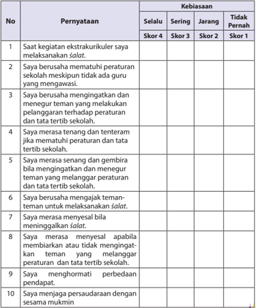

Tabel ini menunjukkan pernyataan tentang kebiasaan siswa dalam berbagai situasi sekolah, di mana mereka sering, jarang, atau tidak pernah melakukan tindakan tertentu. Topik utama tabel adalah kebiasaan siswa dalam berbagai situasi sekolah, seperti melakukan salat, mematuhi peraturan sekolah, mengingatkan teman yang melanggar, merasa tenang dan tenteram, menjaga teman-teman, menyenangkan diri saat melakukan salat, membela teman yang melanggar, menghormati perbedaan pendapat, dan menjaga persaudaraan. Kolom-kolomnya mencakup skor 4 (sering), skor 3 (jarang), skor 2 (tidak pernah), dan skor 1 (tidak pernah). Data penting yang terlihat adalah bahwa banyak siswa sering melakukan tindakan tertentu, seperti melakukan salat, mematuhi peraturan sekolah, dan menjaga persaudaraan, sementara mereka jarang atau tidak pernah melakukan tindakan lainnya.

 

---
## 📄 Halaman 140

### 2. Penilaian pengamatan

Refleksi: skor penilaiannya:

Selalu

: skor 4

Sering

: skor 3

Jarang

: skor 2

Tidak Pernah

: skor 1

`Nilai akhir   = jumlah skor yang diperoleh peserta didik skor tertinggi 4 × 100`

### 3. Diskusi

### Aspek dan rubrik penilaian:

- Kejelasan dan kedalaman informasi
- Jika kelompok tersebut dapat memberikan kejelasan dan kedalaman informasi lengkap dan sempurna, skor 100.
- Jika kelompok tersebut dapat memberikan penjelasan dan kedalaman informasi lengkap dan  kurang sempurna, skor 75.
- Jika kelompok tersebut dapat memberikan penjelasan dan kedalaman informasi  kurang lengkap, skor 50.
- Jika  kelompok  tersebut    tidak  dapat  memberikan  penjelasan  dan kedalaman informasi, skor 25.

### Contoh Tabel:

---
**📊 Tabel**

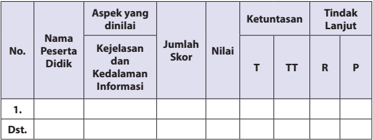

Tabel ini menunjukkan data evaluasi pelaksanaan kegiatan belajar mengajar untuk satu peserta didik. Topik utama adalah aspek kejelasan dan kedalaman informasi. Kolom-kolomnya meliputi No., Nama Peserta Didik, Aspek yang dinilai, Jumlah Skor, Nilai, Ketuntasan (T, TT, R, P), dan Tindak Lanjut. Data penting yang terlihat adalah bahwa peserta didik tersebut telah menyelesaikan aspek kejelasan dan kedalaman informasi dengan skor 100%. Nilai yang diberikan adalah 100%, dengan ketuntasan tinggi (T). Tindak lanjut yang ditetapkan adalah peningkatan keterampilan berpikir kritis dan analitis.

### b)  Keaktifan dalam diskusi

- Jika kelompok tersebut  berperan sangat aktif  dalam diskusi, skor 100.
- Jika kelompok tersebut berperan  aktif dalam diskusi, skor 75.
- Jika kelompok tersebut kurang aktif dalam diskusi, skor 50.
- Jika kelo mpok tersebut tidak aktif dalam diskusi, skor 25.

 

---
## 📄 Halaman 141

### Contoh Tabel:

---
**📊 Tabel**

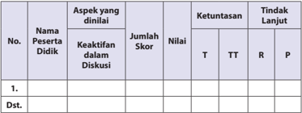

Tabel ini menunjukkan analisis partisipasi dan keterlibatan peserta didik dalam diskusi. Kolom-kolomnya meliputi nomor peserta, nama peserta, aspek yang dinilai, jumlah skor, nilai, ketuntasan (T, TT, R, P), dan tindakan lanjut. Topik utama adalah evaluasi partisipasi peserta didik dalam diskusi. Data penting yang terlihat adalah bahwa beberapa peserta didik memiliki skor yang tinggi dalam aspek keaktifan dalam diskusi, sementara beberapa lainnya memiliki skor yang rendah. Tabel ini membantu dalam memahami bagaimana partisipasi dan keterlibatan peserta didik dapat ditingkatkan dengan memberikan tindakan lanjut sesuai dengan hasil penilaian.

### c) Kejelasan dan kerapian presentasi/resume

- Jika kelompok tersebut dapat mempresentasikan/resume dengan sangat jelas dan rapi, skor 100.
- Jika  kelompok  tersebut  dapat  mempresentasikan/resume      dengan jelas dan rapi, skor 75.
- Jika  kelompok  tersebut  dapat  mempresentasikan/resume    dengan sangat jelas tetapi kurang rapi, skor 50.
- Jika  kelompok  tersebut  dapat  mempresentasikan/resume  dengan kurang jelas dan kurang rapi, skor 25.

### Contoh Tabel:

---
**📊 Tabel**

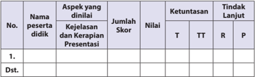

Tabel ini menunjukkan hasil evaluasi kejelasan, kerapihan, dan presentasi dari beberapa peserta didik. Kolom-kolomnya meliputi nomor peserta, nama peserta, aspek yang dinilai (kejelasan, kerapihan, dan presentasi), jumlah skor, nilai, ketuntasan (T untuk terima, TT untuk tidak terima, R untuk tidak dapat dilanjutkan), dan tindakan lanjutan. Data penting yang terlihat adalah bahwa beberapa peserta didik mendapatkan nilai tinggi di semua aspek, sementara beberapa lainnya memerlukan perbaikan. Tindakan lanjutan mencakup penilaian ulang, pembelajaran tambahan, dan pengambilan tindakan khusus untuk peserta yang memerlukan perbaikan. Topik utama tabel adalah evaluasi kinerja peserta didik dalam hal kejelasan, kerapihan, dan presentasi.

### Saran

Guru  dapat  mengembangkan  dan  menetapkan  nilai  setiap  skor  yang diperoleh peserta didik.

 

---
## 📄 Halaman 142

### G.   Pengayaan

Bagi peserta didik yang  telah  menguasai  materi  dengan  baik,  dapat mengerjakan soal pengayaan  yang telah disiapkan oleh guru berupa pertanyaanpertanyaan  dan  tugas  yang  berkaitan  dengan  pengembangan  materi,  dalam menerapkan perilaku keteladanan, atau model-model pengembangan lainnya.

Proses  pengayaan  pembelajaran  ini,  merupakan  kesempatan  terbaik  bagi guru untuk menerapkan semaksimal mungkin penerapan pengembangan materi pembelajaran  yang  direncanakan,  Upaya  memfasilitasi  peserta  didik  dalam menciptakan proses pembelajaran seaktif mungkin, merupakan tanggung jawab guru  sebagai  fasilitator  agar  peserta  didik  dapat  menikmati  pembelajarannya dengan  penuh  kreativitas  dan  inovasi,  dalam  meneladani  sejarah  perjuangan dakwah Rasulullah saw. di Mekah.

Pengarahan  dalam  mengakses  beragam  sumber  dengan  menggunakan ICT, perlu dilakukan agar perserta didik menemukan pemahaman nilai- nilai dan kualitas  keteladanan  dengan  baik  dan  benar.  Kemudian,  guru    mencatat  dan memberikan tambahan nilai bagi  peserta didik  yang berhasil dalam pengayaan.

### H.   Remedial

Bagi  peserta  didik  yang  belum  menguasai  materi  memahami 'Meneladani sejarah perjuangan dakwah Rasulullah saw. di Mekah' , guru menjelaskan kembali materi tentang pemahaman  dan  penerapan  perilaku  'Meneladani sejarah perjuangan  dakwah  Rasulullah  saw.  di  Mekah'  tersebut.  Melakukan    penilaian kembali    dengan    soal    yang    sejenis  atau  setara.  Remedial  dilaksanakan  pada waktu dan hari tertentu yang disesuaikan, seperti: boleh pada saat pembelajaran apabila  masih  ada  waktu  atau  di  luar  jam  pelajaran,  pada  umumnya  30  menit setelah pulang sekolah.

Usahakan guru dapat menjelaskan dan menekankan kembali materi tentang penerapan perilaku keteladanan berdasarkan kajian, 'Meneladani sejarah perjuangan dakwah Rasulullah saw. di Mekah' dan melakukan penilaian kembali dengan  soal  yang  sejenis  (yang  telah  diujikan)  atau  yang  dikembangkan  dan setara bobotnya, sesuai dengan situasi yang berkembang.

 

---
## 📄 Halaman 143

### I.   Interaksi Guru dengan Orang Tua

Interaksi  guru  dengan  orang  tua  perlu  dilakukan.  Salah  satunya  adalah guru meminta peserta didik memperlihatkan kolom 'Evaluasi' atau guru dapat melakukannya berdasarkan tugas-tugas dari beragam aktivitas meminta kepada peserta  didik  untuk  menanggapi,  melakukan  dan  menyelesaikan  tugas,  pada setiap  kajian  dalam  buku  teks  peserta  didik,  kemudian  orang  tuanya  turut memberikan komentar dan paraf.

Dapat  pula  menggunakan  buku  penghubung  kepada  orang  tua,  untuk menyampaikan  perubahan  perilaku  peserta  didik  setelah  mengikuti  kegiatan pembelajaran.  Selain itu, guru dapat berkomunikasi langsung melalui telepon, atau pernyataan tertulis untuk melaporkan tentang perkembangan kemampuan membaca  dan  memahami  peserta  didik,  terkait  dengan  materi  'Meneladani sejarah perjuangan dakwah Rasulullah saw. di Mekah.

Untuk mengetahui keberhasilan peserta didik dalam pengamalan agamanya,  khususnya  penerapan  perilaku  keteladanan,  melalui  pemahaman, meneladani sejarah  perjuangan dakwah Rasulullah saw. di Mekah, guru dapat mengembangkannya  dengan  memfasilitasi  peserta  didik  untuk  meperhatikan kolom 'Menerapkan Perilaku Mulia' . Kemudian mengarahkan dan membimbing peserta didik untuk memberikan tanda (  ) pada kolom 'selalu' ,  'sering' ,  'jarang' atau 'sudah  menerapkannya  dengan    baik' , 'kadang-kadang    menerapkannya, 'akan menerapkannya',  dll  (guru  dapat  mengembangkannya  berdasarkan  situasi  dan kondisi).

Pergunakan buku penghubung kepada orang tua tentang perubahan perilaku peserta  didik  setelah  mengikuti  kegiatan  pembelajaran,  atau  berkomunikasi langsung, dengan pernyataan tertulis, atau lewat telepon tentang perkembangan perilaku peserta didik, berkaitan dengan upaya melahirkan perilaku keteladanan, terkait dengan materi 'Meneladani sejarah perjuangan dakwah Rasulullah saw. di Mekah'.

 

---
## 📄 Halaman 144

---
**🖼️ Gambar/Diagram**

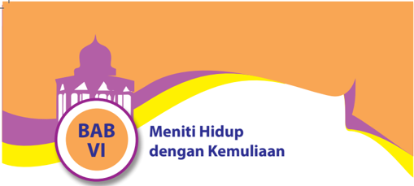

> **Deskripsi Visual:** Gambar ini adalah ilustrasi yang menampilkan judul bab "Meniti Hidup dengan Kemuliaan" dari buku pelajaran. Gambar ini terdiri dari beberapa elemen utama:

1. Judul Bab: "Meniti Hidup dengan Kemuliaan" terletak di bagian tengah gambar dalam kotak berwarna biru.
2. Lambang Masjid: Terdapat lambang masjid yang berada di bagian kiri atas gambar, menggambarkan tema keagamaan dalam bab tersebut.
3. Warna: Gambar menggunakan warna-warna cerah seperti orange, ungu, kuning, dan putih, yang memberikan kesan ceria dan semangat.
4. Latar Belakang: Latar belakang berupa bentuk bintang yang membentuk lingkaran, yang mungkin merujuk pada konsep kehidupan yang berkelanjutan.

Elemen-elemen ini saling terhubung dan membentuk gambar yang menarik dan informatif, yang bertujuan untuk memperkenalkan tema bab tersebut kepada pembaca.

### A.   Kompetensi Inti (KI)

- KI-1: Menghayati dan mengamalkan ajaran agama yang dianutnya.
KI 2: Menghayati  dan  mengamalkan  perilaku  jujur,  disiplin,  tanggung  jawab, peduli (gotong royong, kerja sama, toleran, damai) santun, responsif dan pro-aktif dan menunjukkan sikap sebagai bagian dari solusi atas berbagai permasalahan dalam berinteraksi secara efektif dengan lingkungan sosial dan alam serta dalam menempatkan diri sebagai cerminan bangsa dalam pergaulan dunia.

- KI 3: Memahami, menerapkan, dan menganalisis pengetahuan faktual, konseptual,  prosedural,  berdasarkan  rasa  ingin  tahunya  tentang  ilmu pengetahuan, teknologi, seni, budaya, dan humaniora dengan wawasan kemanusiaan, kebangsaan, kenegaraan, dan peradaban terkait penyebab fenomena dan kejadian, serta menerapkan pengetahuan prosedural pada bidang  kajian  yang  spesifik  sesuai  dengan  bakat  dan  minatnya  untuk memecahkan masalah.
- KI 4: Mengolah, menalar, dan menyaji dalam ranah konkret dan ranah abstrak terkait dengan pengembangan dari yang dipelajarinya di sekolah secara mandiri, dan mampu menggunakan metode sesuai kaidah keilmuan.

 

---
## 📄 Halaman 145

### B.   Kompetensi Dasar (KD)

- 1.1 Terbiasa membaca al-Qur'an dengan meyakini bahwa kontrol diri (mujahadah  an-nafs),  prasangka  baik  ( husnuzzan) ,  dan  persaudaraan ( ukhuwah ) adalah perintah agama.
- 2.1 Menunjukkan  perilaku  kontrol  diri  ( mujahadah  an-nafs ),  prasangka  baik ( husnuzzan ), dan persaudaraan ( ukhuwah ) sebagai implementasi perintah Q.S. al- Hujurat /49: 10 dan 12 serta Hadis terkait.
- 3.1 Menganalisis Q.S.  al-Hujurat /49:  10  dan  12  serta  Hadis  tentang  kontrol diri  ( mujahadah an-nafs ),  prasangka  baik  ( husnuzzan ),  dan  persaudaraan ( ukhuwah ).
- 4.1.1   Membaca Q.S. al-Hujurat /49: 10 dan 12, sesuai dengan kaidah tajwid dan makharijul huruf.
- 4.1.2   Mendemonstrasikan hafalan Q.S. al-Hujurat /49: 10 dan 12 dengan fasih dan lancar.
- 4.1.3 Menyajikan  hubungan  antara  kualitas  keimanan  dengan  kontrol  diri ( mujahadah  an-nafs ), prasangka  baik ( husnuzzan ),  dan  persaudaraan ( ukhuwah ) sesuai dengan pesan Q.S. al-Hujurat /49: 10 dan 12, serta Hadis terkait.

### C.   Tujuan Pembelajaran

### Peserta didik mampu:

- Terbiasa membaca al-Qur'an dengan   meyakini   bahwa   kontrol diri ( mujahadah an-nafs ),  prasangka  baik  ( husnuzzan ),  dan  persaudaraan  ( ukhuwah )  adalah perintah agama.
- Menunjukkan  perilaku  kontrol  diri  ( mujahadah  an-nafs ),  prasangka  baik ( husnuzzan ),    dan    persaudaraan    ( ukhuwah )    sebagai implementasi perintah Q.S. al- Hujurat /49: 10 dan 12 serta Hadis terkait.
- Menganalisis  Q.S.  al-Hujurat/49:  10  dan  12  serta  Hadis  tentang kontrol diri ( mujahadah  an-nafs ),  prasangka  baik (husnuzzan ),  dan  persaudaraan ( ukhuwah ).
- Membaca Q.S.  al-Hujurat /49:  10  dan  12,  sesuai  dengan  kaidah tajwid dan makharijul huruf
- Mendemonstrasikan hafalan Q.S. al-Hujurat /  49:  10  dan  12  dengan fasih dan lancar.
- Menyajikan hubungan antara kualitas keimanan dengan kontrol diri ( mujahadah an-nafs ),  prasangka  baik  ( husnuzzan ),  dan  persaudaraan  ( ukhuwah )  sesuai dengan pesan Q.S. al-Hujura t/ 49: 10 dan 12, serta Hadis terkait.

 

---
## 📄 Halaman 146

### D.   Pengembangan Materi

Guru  memberikan  kebebasan  kepada  peserta  didik,  dalam  mengakses beragam sumber belajar yang mengantarkan perserta didik menemukan nilainilai  dan  kualitas Q.S.  al-Hujurāt/49:12 dan Q.S.  al-Hujurāt  /49:10 sebagai  dasar pemahaman dan pembentukan perilaku meniti hidup dengan kemuliaan, dengan kontrol diri ( mujāhadah an-nafs ), prasangka baik ( husnużżhan ), dan persaudaraan ( ukhuwwah ). Pengembangan materi tersebut antara lain sebagai berikut:

- Menyajikan model-model, jenis dan cara membaca indah Q.S. al-Hujurāt/49:12 dan Q.S. al-Hujurāt /49:10 tentang kontrol diri ( mujāhadah an-nafs ), prasangka baik ( husnużżhan ), dan persaudaraan ( ukhuwwah ).
- Menjelaskan makna  isi Q.S.  al-Hujurāt/49:12 dan Q.S.  al-Hujurāt  /49:10 tentang kontrol diri ( mujāhadah an-nafs ),  prasangka baik ( husnużżhan ),  dan persaudaraan ( ukhuwwah ) dengan menggunakan IT.
- Mendemonstrasikan hafalan Q.S.  al-Hujurāt/49:12 dan Q.S.  al-Hujurāt  /49:10 tentang kontrol diri ( mujāhadah an-nafs ),  prasangka baik ( husnużżhan ),  dan persaudaraan ( ukhuwwah ) dengan menerapkan berbagai jenis nada bacaan secara baik dan lancar.
- Memberikan tambahan bacaan ayat al-Qur'ān dan hadis-hadis yang mendukung  lainnya,  tentang  kontrol  diri  ( mujāhadah  an-nafs ),  prasangka baik ( husnużżhan ), dan persaudaraan ( ukhuwwah ).
- Meneliti  secara  lebih  mendalam  pemahaman  dan  pembentukan  perilaku berdasarkan Q.S. al-Hujurāt/49:12 dan Q.S. al-Hujurāt /49:10 tentang  kontrol diri  ( mujāhadah  an-nafs ),  prasangka  baik  ( husnużżhan ),  dan  persaudaraan ( ukhuwwah )  dengan  menggunakan  IT  yang  dapat  dilakukan  peserta  didik dengan  tidak  terikat  oleh  waktu  tatap  muka  di  dalam  kelas,  seperti:  di perpustakaan, di luar kelas, di rumah, dll.

### E.   Proses Pembelajaran

### 1. Persiapan

- Guru  memulai  pembelajaran  dengan  mengucapkan  salam,  menyapa, berdoa, dan  tadarus: membaca al-Qur'ān surah pendek pilihan atau ayat hafalan yang sudah dipelajari; dengan lancar dan benar (atau surat yang sesuai dengan program pembiasaan yang ditentukan sebelumnya), śalat duĥā' (atau śalat sunnah lainnya, jika memungkinkan, sebagai modifikasi pembukaan  pembelajaran,  guna  pembentukan  sikap  dan  perilaku peserta didik) secara bersama-sama ( berjama'ah ).

 

---
## 📄 Halaman 147

- Memperhatikan kesiapan dan semangat peserta didik, dengan memeriksa kehadiran, kerapian berpakaian, dan mengorganisir kelas dan posisi  tempat  duduk  disesuaikan  dengan  kegiatan  pembelajaran  yang akan diterapkan, berdasarkan metode dan model pembelajaran.
- Menyampaikan tujuan pembelajaran atau kompetensi dasar yang akan dicapai dari materi pembelajaran.
- Model pengajaran yang dapat dipersiapkan dan digunakankan sebagai  alternatif  dalam  kompetensi  ini  adalah,  puzzle,  tutor  sebaya, mengembangkan  kemampuan  dan  keterampilan  ( skill )  peserta  didik dalam membaca al-Qur'ān dengan menggunakan metode drill (  latihan dengan mengulang-ulang bacaan).

### 2. Pelaksanaan

Pada kegiatan ini, pembelajaran berlangsung dengan menerapkan beragam model pembelajaran, metode pembelajaran, media pembelajaran, dan sumber belajar yang disesuaikan dengan karakteristik dan materi 'Meniti hidup dengan kemuliaan' berdasarkan, Q.S. al-Hujurāt /49:12 dan Q.S. al-Hujurāt /49:10  tentang kontrol diri ( mujāhadah an-nafs ), prasangka baik ( husnużżhan ), dan persaudaraan ( ukhuwwah ).

### a) Membuka Relung Hati

- Guru   memberi   motivasi   peserta   didik   secara   kontekstual sesuai manfaat  dan  aplikasi  materi        dengan  menyajikan  kajian  'Membuka Relung  Hati'    yang  terdapat  pada  setiap  awal  bab  penyajian  buku peserta didik. Dalam hal ini, memotivasi peserta didik untuk mencermati kajian hidup mulia atau mati syahid, merupakan ungkapan yang selalu memotivasi orang yang beriman agar selalu berada di jalan Allah Swt.. Hal ini dapat dicermati melalui pengalaman hidup Nabi Yusuf a.s.
- Guru   menyajikannya   sebagai   proses   pembelajaran   yang menjelaskan bahan kajian meniti hidup dengan kemuliaan, sebagai dasar dan awal pembentukan  pemahaman perilaku mulia peserta didik, berdasarkan, Q.S. al-Hujurāt / 49:12 dan Q.S. al-Hujurāt / 49:10.
- 'Membuka   Relung   Hati'  ini,   dapat   pula   dikembangkan melalui penayangan video, film, gambar, cerita, atau  dengan memperlihatkan guntingan  kertas  yang  sudah  dibuat  ( media by  design )  yang  berisikan penjelasan yang setara, atau yang lebih
- Peserta didik secara individu maupun klasikal diminta untuk melihat dan mencermati materi kajian 'Membuka Relung Hati' atau melalui tayangan video,  film,  gambar,  cerita,  atau  guntingan  kertas  yang  telah  dibuat ( media by design ) yang berisikan penjelasan kontrol diri, prasangka baik dan persaudaraan, kemudian menjadikannya sebagai bahan penanaman

 

---
## 📄 Halaman 148

dan proses pembentukan penghayatan dan pengamalan ajaran agama tentang  kontrol  diri,  prasangka  baik  dan  persaudaraan,  berlangsung secara lengkap, baik, dan benar.

### Aktivitas 1

Pada kolom 'Aktivitas Siswa' , guru memfasilitasi atau meminta peserta didik untuk  dapat  mengemukakan  pendapat  tentang  kisah  pengalaman  hidup Nabi Yusuf a.s, apa yang kamu lakukan jika hal tersebut menimpa diri kamu? Apakah akan menuruti 'ajakan setan' untuk memenuhi hawa nafsu, ataukah melawannya dengan segala daya dan upaya?

### b) Mengkritisi Sekitar Kita

- Guru meminta peserta didik untuk memperhatikan kajian yang terdapat pada kolom 'Mengkritisi Sekitar Kita' berdasarkan kajian yang terdapat pada buku peserta didik, yang merupakan kajian fenomena sosial yang timbul dan berkembang.
Dalam hal ini, peserta didik diminta untuk memperhatikan berbagai gejala yang  terjadi  di  masyarakat  kita.  Keserakahan  manusia  dalam  berbagai usaha  eksploitasi  alam,  telah  menimbulkan  bencana  yang  mengerikan dan telah 'membunuh' ribuan manusia.

Tidak  hanya  oleh  bencana  alam,  banyaknya  kematian  manusia  secara sia-sia; disebabkan oleh penggunaan jalan raya dengan semena- mena, konsumsi minuman dan obat-obatan terlarang, kekerasan dan bentrokan antarkeyakinan, antardesa, dan bahkan antarsaudara.

- Guru  dapat  mengembangkan  bahan  kajian  yang  terdapat  pada  kolom 'Mengkritisi Sekitar Kita' dalam bentuk kajian yang setara  atau  yang  lebih kreatif  dan  inovatif. Dapat pula melalui  tayangan video, film, gambar, cerita atau dengan memperlihatkan guntingan kertas yang sudah dibuat (media by design) yang berisikan penjelasan tentang pentingnya kontrol diri,  prasangka  baik  dan  persaudaraan,  dalam  meniti  kemuliaan  hidup manusia, berdasarkan Q.S. al-Hujurāt /49:12 dan Q.S. al-Hujurāt /49:10.
- Guru  membagi  peserta  didik  ke  dalam  beberapa  kelompok.  Setiap kelompok  diminta  untuk  mempersiapkan  pertanyaan  yang  berkaitan dengan bahan kajian yang terdapat pada kolom 'Mengkritisi Sekitar Kita' atau video, film, gambar, cerita atau dengan memperlihatkan guntingan kertas  yang  sudah  dibuat  ( media  by  design )  yang  berisikan  penjelasan kontrol diri, prasangka baik, dan persaudaraan untuk dapat mengetahui keberhasilan  proses  mencermati  materi  kajian  yang  dilakukan  peserta didik.
- Setiap  peserta  didik  atau  wakil  kelompok,  mengajukan pertanyaanpertanyaan  yang  telah  dipersiapkan.  Peserta  didik  atau  kelompok  lain menanggapi dan menjawab pertanyaan- pertanyaan, sekaligus berfungsi melahirkan  berpikir  kritis  dan  membangun  dinamika,  dan  kreativitas

 

---
## 📄 Halaman 149

- proses  pembelajaran  dalam  menanamkan  dan  mengembangkan  jiwa sosial peserta didik.
- Guru memberikan pengarahan, penguatan dan penjelasan jawaban dari pertanyaan-pertanyaan dan pernyataan- pernyataan yang berkembang, agar lebih logis, obyektif, terinci, dan sistematis, dalam upaya mencermati dan memahami kontrol diri, prasangka baik, dan persaudaraan.

### Aktivitas 2

Pada  kolom  'Aktivitas  Siswa' ,  guru  memfasilitasi  atau  meminta  peserta didik    untuk  dapat  mengamati berbagai gejala yang terjadi di masyarakat kita.  Keserakahan  manusia  dalam  berbagai  usaha  eksploitasi  alam  telah menimbulkan  bencana  yang  mengerikan  dan  telah  'membunuh'  ribuan manusia. Buatlah kemungkinan-kemungkinan apa penyebab semua fenomena itu terjadi. Apa pula kemungkinan- kemungkinan yang bisa kamu lakukan untuk mencegah atau mengurangi semua itu? Tulislah pendapatmu!

### c. Memperkaya Khazanah

- Pada kajian'Memperkaya Khazanah', sebagaimana yang terdapat pada buku peserta didik, guru  memfasilitasi,  membimbing, dan mengarahkan  peserta  didik  untuk  mendapatkan  pemahaman  dan kemampuan  membaca,  menerapkan  hukum tajwĩd ,  mengartikan  dan memahami  isi,  melalui  penayangan,  penjelasan  dan  pengembangan materi Q.S. al-Hujurāt /49:12 dan Q.S. al-Hujurāt /49:10 tentang kontrol diri, prasangka baik, dan persaudaraan.
- Guru  memfasilitasi  peserta  didik  dengan  bahan  kajian  yang  terdapat dalam kolom Memperkaya Khazanah, memahami  makna  Pengendalian Diri,  Prasangka  Baik, Husnużżan dan Persaudaraan ( Ukhuwah ), dan ayatayat al-Qur'ān beserta artinya tentang Pengendalian Diri, Prasangka   Baik, dan Persaudaraan ( ukhuwah ).

### a. Lafal ayat dan arti Q.S. al-Hujurāt / 49:12

### Aktivitas 3

Pada kolom 'Aktivitas Siswa' guru memfasilitasi atau meminta peserta didik untuk dapat:

- Membaca Q.S. al-Hujurāt /49:12 dengan tartil sesuai dengan kaidah tajw³d yang benar. Lakukan bersama teman-teman sekelas secara berpasangan dan bergantian.
- Menghafalkan Q.S. al-Hujurāt / 49:12 untuk memperkaya perbendaharaan hafalan ayat dengan menggunakan bantuan alat perekam ataupun saling memperdengarkan dengan sesama teman di kelas.

 

---
## 📄 Halaman 150

- Menghafalkan arti Q.S. al-Hujurāt /49:12 agar makin menambah kecintaan kepada al- Qur'ān dan menambah keimanan kepada Allah Swt.
- Mencari ayat lain yang berhubungan dengan perilaku Husnuzzan .

### Hukum Tajw³d.

### Aktivitas 4

Pada kolom 'Aktivitas Siswa' , guru memfasilitasi atau meminta peserta didik untuk dapat menemukan hukum tajwĩd lainnya yang terkandung di dalam Q.S. al-Hujurāt /49:12, baik itu berupa mad, izhar, ikhfa, iqlab, idgam bigunnah, idgam bilagunah, izhar syafawi, ikhfa syafawi, idgam mutamasilain, dan lainnya.

### Lafal ayat dan arti Q.S. al-Hujurāt /49:10

### Aktivitas 5

Pada kolom 'Aktivitas Siswa' , guru memfasilitasi atau meminta peserta didik untuk dapat:

- Membaca Q.S. al-Hujurāt /49:10 dengan tartil sesuai dengan kaidah tajwĩd yang benar. Lakukan bersama teman-teman sekelas secara berpasangan dan bergantian.
- Menghafalkan Q.S. al-Hujurāt /49:10 untuk memperkaya perbendaharaan hafalan ayat dengan menggunakan bantuan alat perekam ataupun saling memperdengarkan dengan sesama teman di kelas.
- Menghafalkan arti Q.S. al-Hujurāt /49:10 agar makin menambah kecintaan kepada al- Qur'ān dan menambah keimanan kepada Allah Swt.
- Mencari ayat lain yang berhubungan dengan perilaku persaudaraan.

### Hukum Tajw ³ d.

### Aktivitas 6

Pada kolom 'Aktivitas Siswa' , guru memfasilitasi atau meminta peserta didik untuk dapat menemukan hukum tajw ³ d lainnya yang terkandung di dalam Q.S. al-Hujurāt /49:10, baik itu berupa mad, izhar, ikhfa, iqlab, idgam bigunnah, idgam bilagunah, izhar syafawi, ikhfa syafawi, idgam mutamasilain , dan lainnya.

### Kandungan Ayat

Guru memfasilitasi, membimbing, mengarahkan dan menanamkan pemahaman  kandungan  ayat,  menegaskan  ada  dua  hal pokok yang perlu  diketahui.  Pertama,  bahwa  sesungguhnya  orang-orang  mukmin  itu bersaudara. Kedua, jika terdapat perselisihan antarsaudara, kita diperintahkan oleh Allah Swt. untuk melakukan iślah (upaya perbaikan atau perdamaian).

 

---
## 📄 Halaman 151

### Aktivitas 7

Pada kolom 'Aktivitas Siswa' , guru memfasilitasi atau meminta peserta didik untuk dapat mendiskusikan bagaimana cara yang harus dilakukan jika di kelas ada teman yang sedang 'marahan' sehingga antara satu dan yang lainnya tidak saling bertegur sapa dan berinteraksi.

### b. Hadis tentang Pengendalian Diri, Prasangka Baik, dan Persaudaraan.

### Aktivitas 8

Pada kolom 'Aktivitas Siswa' ,  guru  memfasilitasi  atau  meminta  peserta didik  untuk dapat menghafalkan salah satu hadis tentang pengendalian diri, prasangka baik dan persaudaraan, beserta artinya.

Guru  membimbing  dan  mengarahkan  peserta  didik  untuk  menyimak dan  mencermati  secara  saksama,  pelajaran  yang  terkandung  di  dalam Pesan-Pesan Mulia, tentang Kisah Habil dan Qabil.

### Aktivitas 9

Pada  kolom 'Aktivitas  Siswa'  guru  memfasilitasi  atau  meminta  peserta didik    untuk  dapat  mendiskusikan  dan  kemukakan,  hubungan  sifat pengendalian  diri,  prasangka  baik,  dan  persaudaraan  sesuai  dengan kisah Habil dan Qabil.

- Untuk    pencapaian    tujuan    mendemonstrasikan    bacaan dan hafalan, guru dapat mengembangkan pembelajaran dengan menerapkan metode drill, agar pengulangan proses bacaan menuju pada penghafalan Q.S. al- Hujurāt /49:12 dan Q.S. al-Hujurāt /49:10 dapat terkontrol dan terpenuhi, atau dapat pula melalui penerapan pembelajaran tutor sebaya.
- Selanjutnya,  peserta  didik  baik  secara  individu  maupun  kelompok dapat mendemonstrasikan bacaan dan hafalan Q.S.  al-Hujurāt /49:12 dan Q.S.  al-Hujurāt /49:10  tentang kontrol diri, prasangka baik dan persaudaraan secara tartil.  Guru  menilai  proses  pendemonstrasian bacaan dan hafalan yang berlangsung.

### d. Menerapkan Perilaku Mulia

Dalam kajian 'Menerapkan Perilaku Mulia' , guru memfasilitasi, membimbing dan mengarahkan peserta didik untuk mampu melahirkan dan mengembangkan perilaku senantiasa mengontrol diri ( mujāhadah an-nafs ), berprasangka baik ( husnużżhan ),  dan memperkuat persaudaraan ( ukhuwwah ).

Hal  ini  akan  dapat  lebih  berhasil  dan  terjadi,  jika  guru  memfasilitasi dan membimbing peserta   didik   dengan   hikmah   dan   keteladanan.

 

---
## 📄 Halaman 152

Oleh   karena itu, pada  pengembangan materi ini, guru diharapkan dapat memberikan kebebasan kepada peserta didik  dalam mengakses beragam sumber  belajar  yang  mengantarkan  perserta  didik  menemukan  bentuk perilaku kontrol diri,  berprasangka baik dan persaudaraan, yang kemudian dapat meneterapkannya dengan baik dan benar di rumah, di sekolah dan di masyarakat.

Pada buku peserta didik dalam kajian menerapkan perilaku mulia, guru diminta untuk memfasilitasi peserta didik untuk  mengamati kisah pendek yang berjudul Aku Ingin Satu Angka Lagi. Kemudian peserta didik diminta untuk menganalisis nilai-nilai dan sikap mulia yang terkandung di dalamnya.

Dilanjutkan dengan menganalisis beberapa contoh perilaku yang mencerminkan sikap pengendalian diri, berprasangka baik, dan persaudaraan, baik di lingkungan keluarga, sekolah, masyarakat sekitar, hingga masyarakat dunia, berdasarkan contoh-contoh perilaku yang tersedia.

Guru  dapat  mengembangkan  bahan  kajian  yang  terdapat  pada  kolom 'Menerapkan  Perilaku  Mulia'  dalam  bentuk  tayangan  video,  film,  gambar, cerita  atau  dengan  memperlihatkan  guntingan  kertas  yang  sudah  dibuat (media  by  design)  yang  berisikan  penjelasan  tentang  perilaku  senantiasa mengontrol diri ( mujāhadah an-nafs ),  berprasangka baik ( husnużżhan ),  dan memperkuat  persaudaraan  ( ukhuwwah ),  sebagai  kajian  yang  setara,  atau yang lebih kreatif dan inovatif, sebagai dasar dari penanaman dan penerapan perilaku  mulia,  kemudian  mengembangkannya  ke  dalam  langkah-langkah pembelajaran:

- Meneliti secara lebih mendalam bentuk dan contoh perilaku senantiasa mampu  mengontrol diri ( mujāhadah  an-nafs ), berprasangka baik ( husnużżhan ),  dan  memperkuat  persaudaraan  ( ukhuwwah ), melalui sumber-sumber  belajar  lainnya  baik  cetak  maupun  elektronik,  atau dengan menggunakan IT,
- Menampilkan  contoh  perilaku senantiasa  mampu  mengontrol  diri ( mujāhadah an-nafs ), berprasangka baik ( husnużżhan ), dan memperkuat persaudaraan (ukhuwwah), berdasarkan tambahan bacaan ayat al-Qur'ān dan hadis-hadis yang mendukung lainnya, tentang al-Qur'ān dan hadis sebagai pedoman hidup, melalui presentasi, demonstrasi dan simulasi.
- Di dalam  pelaksanaannya,  guru  langsung  menilai  semua  aktivitas presentasi, demonstrasi dan simulasi peserta didik yang berlangsung.
- Membimbing   peserta   didik   untuk   menyimpulkan   hasil presentasi, demonstrasi dan simulasi, sehingga lebih aplikatif dalam  menerapkan perilaku  senantiasa  mampu  mengontrol  diri  ( mujāhadah      an-nafs ), berprasangka baik ( husnużżhan ), dan memperkuat persaudaraan ( ukhuwwah) , sebagai sumber kemuliaan diri.

 

---
## 📄 Halaman 153

- Guru memberikan penguatan, penjelasan tambahan dan sekaligus hasil penilaian  berdasarkan  proses  perkembangan  presentasi,  demonstrasi dan simulasi yang dilakukan peserta didik.

### 3. Penutup

Dalam kegiatan penutup, guru bersama peserta didik  baik  secara  individu maupun kelompok menyimpulkan intisari dari pelajaran tersebut sesuai dengan yang  terdapat  dalam  buku  teks  peserta  didik  pada  kolom  rangkuman,  dan melakukan penilaian dari proses komunikasi yang berkembang. Guru melakukan refleksi untuk mengevaluasi semua rangkaian aktivitas pembelajaran dan hasilhasil  yang  diperoleh  untuk  selanjutnya  secara  bersama  menemukan  manfaat langsung maupun tidak langsung dari hasil pembelajaran  yang telah berlangsung.

- Melaksanakan  refleksi  dan  kesimpulan  sebagaimana  yang  terdapat  dalam buku teks peserta didik pada kolom 'rangkuman' .  Mengajukan pertanyaan atau tanggapan peserta didik dari kegiatan yang telah dilaksanakan sebagai bahan  masukan  untuk  perbaikan  langkah  selanjutnya,  dalam  menerapkan perilaku kontrol diri, prasangka baik dan persaudaraan, di rumah, di sekolah dan di masyarakat.
- Guru dan peserta didik menyimpulkan intisari dari pelajaran tersebut pada kolom 'Menerapkan Perilaku Mulia' . Guru membimbing peserta didik untuk memberikan  tanda  (  ) pada  kolom  'selalu' ,  'sering' ,  'jarang'  atau  'sudah menerapkannya dengan baik' , 'kadang-kadang menerapkannya, 'akan menerapkannya',  dll.  (guru  dapat  mengembangkannya  berdasarkan  situasi dan kondisi).
- Merencanakan  kegiatan  tindak  lanjut  dengan  memberikan  tugas,  baik secara  individu  maupun  kelompok.  Peserta  didik  yang  belum  menguasai pembelajaran, melakukan remedial, atau pengembangan materi bagi peserta didik yang lebih berkembang secara kreatif,  inovatif, dan produktif.
- Menyampaikan tema dan rencana pembelajaran pada pertemuan berikutnya.

### F.   Penilaian

Penilaian sebagai hasil rangkaian proses pembelajaran yang menggambarkan tingkat keberhasilan pembelajaran dan sekaligus kualitas pengajaran, dalam hal memahami dan menerapkan perilaku mulia berdasarkan Q.S. al-Hujurāt/49:12 dan Q.S. al-Hujurāt /49:10 .

Pada umumnya, semua kegiatan peserta didik untuk menanggapi, melakukan dan menyelesaikan tugas pada setiap bahan kajian dapat dijadikan sebagai bahan penilaian.  Guru  dapat  pula  melakukan  penilaian  berdasarkan  sajian  evaluasi

 

---
## 📄 Halaman 154

yang terdapat pada buku peserta didik, berupa Uji Pemahaman, Uji Penerapan dan Refleksi, serta  melakukan pengembangan penilaian sebagaimana contoh di bawah ini:

### 1. Refleksi /Masukin Uji Penerapan  Hal 102 dan 103

Berilah tanda 'cek' (  ) yang sesuai dengan kebiasaan kamu terhadap pernyataan-pernyataan yang tersedia!

---
**📊 Tabel**

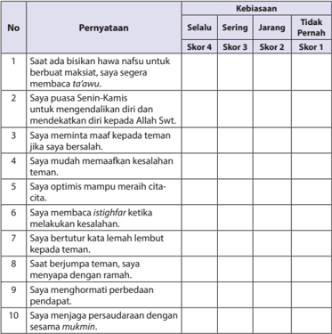

Tabel ini menunjukkan pernyataan tentang kebiasaan individu dalam berbagai situasi dan perilaku. Topik utamanya adalah tentang sikap dan perilaku yang positif dan negatif dalam hubungan sosial. Kolom "Kebiasaan" mencakup selalu, sering, jarang, dan tidak pernah. Data penting yang terlihat adalah bahwa individu sering meminta maaf kepada teman jika bersalah, memahami kesalahan teman, dan menghormati perbedaan pendapat. Sementara itu, mereka jarang atau tidak pernah meminta maaf ketika melakukan kesalahan sendiri.

 

---
## 📄 Halaman 155

### 2. Kolom 'Membaca dengan Tartil'

Rubrik pengamatannya sebagai berikut:

---
**📊 Tabel**

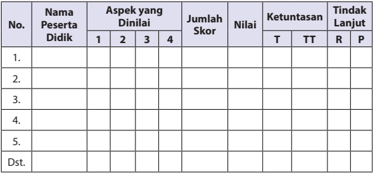

Tabel ini merupakan alat evaluasi yang digunakan untuk menilai perkembangan peserta didik dalam berbagai aspek. Topik utamanya adalah penilaian perkembangan peserta didik dalam berbagai aspek. Kolom-kolom yang ada meliputi Nama Peserta Didik, Aspek yang Diniail, Jumlah Skor, Nilai, Ketuntasan, dan Tindakan Lanjut. Data penting yang terlihat adalah bahwa setiap peserta didik memiliki satu baris di tabel, dengan informasi tentang aspek-aspek yang diniaili, jumlah skor yang diperoleh, nilai yang diberikan, tingkat ketuntasannya, dan tindakan lanjut yang diambil. Ini membantu dalam memantau perkembangan peserta didik secara holistik dan memberikan panduan untuk tindakan lanjut yang efektif.

Aspek yang dinilai :

- Tajw ³ d
Skor 25 a 100

- Kelancaran
Skor 25 a 100

- Artinya
Skor 25 a 100

- Isi
Skor 25 a 100

Skor Maksimal….

100

### Rubrik penilaiannya adalah:

### a) Tajwĩd

- Jika peserta didik dapat menyebutkan hukum bacaan lebih dari 5, skor 100.
- Jika peserta didik dapat menyebutkan 4 hukum bacaan, skor 75.
- Jika peserta didik dapat menyebutkan 3 hukum bacaan, skor 50.
- Jika peserta didik dapat menyebutkan 2 hukum bacaan, skor 25.

### b) Kelancaran

- Jika peserta didik dapat membaca Q.S. al-Hujurāt/49:12 dan Q.S. al-Hujurāt /49:10 dengan lancar dan tartil , skor 100.
- Jika  peserta  didik  dapat  membaca, Q.S.  al-Hujurāt/49:12 dan Q.S.  alHujurāt /49:10 dengan lancar tetapi  kurang tartil, skor 75.
- Jika peserta didik dapat membaca Q.S. al-Hujurāt/49:12 dan Q.S. al-Hujurāt /49:10 tartil tetapi kurang lancar, skor 50.
- Jika peserta didik tidak  dapat membaca Q.S. al-Hujurāt/49:12 dan Q.S. alHujurāt /49:10, kurang lancar dan  kurang tartil skor 25.

 

---
## 📄 Halaman 156

### c) Arti

- Jika  peserta  didik  dapat  mengartikan Q.S.  al-Hujurāt/49:12 dan Q.S.  alHujurāt /49:10 dengan benar dan sempurna, skor 100.
- Jika  peserta  didik  dapat  mengartikan Q.S.  al-Hujurāt/49:12 dan Q.S.  alHujurāt /49:10 dengan benar tetapi  kurang sempurna, skor 75.
- Jika  peserta  didik  dapat  mengartikan Q.S.  al-Hujurāt/49:12 dan Q.S.  alHujurāt /49:10 tetapi tidak benar, skor 50.
- Jika peserta didik  tidak dapat mengartikan Q.S. al-Hujurāt/49:12 dan Q.S. al-Hujurāt /49:10, skor 25.

### d. Isi

- Jika peserta didik dapat menjelaskan isi Q.S. al-Hujurāt/ 49:12 dan Q.S. alHujurāt /49:10 dengan benar dan sempurna, skor 100
- Jika peserta didik dapat menjelaskan isi Q.S. al-Hujurāt /49:12 dan Q.S. alHujurāt /49:10 dengan benar tetapi kurang sempurna, skor 75.
- Jika peserta didik dapat menjelaskan isi Q.S. al-Hujurāt /49:12 tetapi Q.S. al-Hujurāt /49:10 tidak  benar skor 50.
- Jika peserta didik  tidak dapat menjelaskan isi, Q.S. al-Hujurāt / 49:12 dan Q.S. al-Hujurāt /49:10 skor 25.

### 3. Diskusi

Pada saat peserta didik diskusi tentang makna isi Q.S. al-Hujurāt/49:12 dan Q.S. al-Hujurāt /49:10 .

### Aspek dan rubrik  penilaian:

### a. Kejelasan dan kedalaman informasi

- Jika  kelompok  tersebut  dapat  memberikan  kejelasan  dan  kedalaman informasi lengkap dan sempurna, skor 100.
- Jika  kelompok tersebut dapat memberikan penjelasan dan kedalaman informasi lengkap dan  kurang sempurna, skor 75.
- Jika  kelompok tersebut dapat memberikan penjelasan dan kedalaman informasi  kurang lengkap, skor 50.
- Jika  kelompok  tersebut    tidak  dapat  memberikan  penjelasan  dan kedalaman informasi, skor 25.

 

---
## 📄 Halaman 157

### Contoh Tabel:

---
**📊 Tabel**

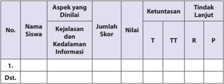

Tabel ini menunjukkan data evaluasi siswa berdasarkan aspek-aspek informasi mereka. Topik utama tabel adalah kejelasan dan kedalaman informasi yang dianalisis oleh siswa. Kolom-kolomnya meliputi Nama Siswa, Aspek yang Dinilai, Jumlah Skor, Nilai, Ketuntasan (T, TT, R, P), dan Tindak Lanjut. Data penting yang terlihat adalah bahwa beberapa siswa memiliki skor tinggi dalam aspek informasi, sementara yang lain masih memerlukan peningkatan. Nilai yang diberikan menunjukkan tingkat ketuntasan siswa dalam aspek tersebut, dengan T mewakili tingkat tertinggi, TT sedang, R rendah, dan P sangat rendah. Tindak lanjut menunjukkan langkah-langkah yang akan diambil untuk membantu siswa meningkatkan kemampuan mereka dalam aspek informasi tersebut.

### b. Keaktifan dalam diskusi

- Jika	 kelompok	tersebut		berperan	sangat	aktif		dalam	diskusi,	skor 100.
- Jika	kelompok	tersebut	berperan		aktif	dalam	diskusi,	skor	75.
- Jika	kelompok	tersebut	kurang	aktif	dalam	diskusi,	skor	50.
- Jika	kelompok	tersebut	tidak	aktif	dalam	diskusi,	skor	25.

### Contoh Tabel:

---
**📊 Tabel**

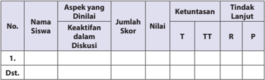

Tabel ini menunjukkan data evaluasi siswa berdasarkan aspek-aspek tertentu dalam diskusi. Kolom-kolomnya meliputi nama siswa, aspek yang dinilai, keaktifan dalam diskusi, jumlah skor, nilai, ketuntasan (T untuk terima, TT untuk tidak terima, R untuk rendah, P untuk paling rendah), dan tindakan lanjut. Topik utama tabel adalah evaluasi kinerja siswa dalam diskusi. Data penting yang terlihat adalah bahwa beberapa siswa memiliki nilai rendah atau tidak terima dalam aspek tertentu, sementara beberapa siswa memiliki nilai tinggi. Ini menunjukkan perluannya untuk memberikan bimbingan atau latihan tambahan kepada siswa dengan nilai rendah.

### c. Kejelasan dan kerapian presentasi/resume

- Jika	 kelompok	 tersebut	 dapat	 mempresentasikan/resume	 dengan sangat	jelas	dan	rapi,	skor	100.
- Jika	 kelompok	 tersebut	 dapat	 mempresentasikan/resume	 dengan jelas	dan	rapi,	skor	75.
- Jika	 kelompok	 tersebut	 dapat	 mempresentasikan/resume	 dengan sangat	jelas	tetapi	kurang	rapi,	skor	50.
- Jika	 kelompok	 tersebut	 dapat	 mempresentasikan/resume	 dengan kurang	jelas	dan	kurang	rapi,	skor	25.

 

---
## 📄 Halaman 158

### Contoh Tabel:

---
**📊 Tabel**

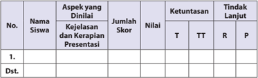

Tabel ini menunjukkan hasil penilaian aspek-aspek dinilai siswa dalam kejelasan dan kerapihan presentasi. Kolom-kolomnya meliputi nomor siswa, nama siswa, aspek yang dinilai, jumlah skor, nilai, ketuntasan (T), tingkat tindak lanjut (TT), dan reaksi (R). Data penting yang terlihat adalah bahwa beberapa siswa memiliki skor rendah pada aspek aspek tersebut, sementara yang lain memiliki skor yang lebih baik. Selain itu, tabel juga menunjukkan tingkat ketuntasan dan tindakan lanjut yang diambil oleh guru untuk meningkatkan kualitas presentasi siswa.

### d. Menulis dan mencari hukum tajw ³ d .

Aspek dan rubrik  penilaian:

### 1) Sesuai Kaidah Penulisan

- Jika peserta didik dapat  menulis sesuai dengan kaidah penulisan, skor 100.
- Jika peserta didik dapat  menulis sesuai dengan kaidah penulisan tetapi kurang baik, skor 85
- Jika peserta didik  menulis  tidak sesuai dengan kaidah penulisan skor 75

### Format Penilaiannya:

---
**📊 Tabel**

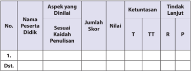

Tabel ini menunjukkan hasil penilaian aspek kaidah penulisan bagi beberapa peserta didik. Kolom-kolomnya meliputi nomor peserta, nama peserta, aspek yang dinaikkan, jumlah skor, nilai, ketuntasan (T untuk terima, TT untuk terima tetapi perlu perbaikan, R untuk perbaikan, P untuk perbaikan yang belum cukup), dan tindakan lanjut. Topik utama tabel adalah evaluasi kualitas penulisan peserta didik. Data penting yang terlihat adalah bahwa beberapa peserta didik memerlukan perbaikan lebih lanjut dalam aspek kaidah penulisan mereka.

### 2)    Kerapian Penulisan

- Jika peserta didik dapat  menulis sangat rapi, skor 100.
- Jika peserta didik dapat  menulis  rapi, skor 85.
- Jika peserta didik dapat menulis kurang rapi, skor 75.

 

---
## 📄 Halaman 159

### Format Penilaiannya:

---
**📊 Tabel**

Tabel ini menunjukkan hasil penilaian kerapihan penulisan bagi beberapa peserta didik. Topik utama tabel adalah penilaian kerapihan penulisan peserta didik. Kolom-kolom yang ada meliputi nama peserta didik, aspek yang dinilai (kerapihan penulisan), jumlah skor, nilai, ketuntasan (T untuk terima, TT untuk tidak terima, R untuk rekomendasi, P untuk penilaian), dan tindakan lanjut. Data penting yang terlihat adalah bahwa beberapa peserta didik diberikan nilai T (terima) dan TTT (tidak terima), sementara satu peserta didik diberikan nilai R (rekomendasi). Tabel ini membantu dalam memantau perkembangan kerapihan penulisan peserta didik dan memberikan saran untuk tindakan lanjut jika diperlukan.

### 3)    Mencari Hukum Tajw ³ d

- Apabila Peserta didik dapat menemukan 4 hukum  bacaan, skor 100.
- Apabila Peserta didik dapat menemukan 3 hukum bacaan, skor 75.
- Apabila Peserta didik dapat menemukan 2 hukum bacaan, skor 50.
- Apabila Peserta didik dapat menemukan 1 hukum bacaan, skor 25.
- Apabila Peserta didik dapat  tidak menemukan hukum bacaan skor 0. Jumlah skor maksimal  = 100

 

---
## 📄 Halaman 160

### 4. Kolom Menerapkan Perilaku Mulia

- Tabel dan rubrik pengamatan perilaku berprasangka baik berdasarkan Q.S. alHujurāt/49:12

---
**📊 Tabel**

Tabel ini menunjukkan hasil evaluasi pelaporan perilaku siswa dalam aspek berprestasikan baik. Terdiri dari kolom No., Nama Peserta Didik, Aspek yang Dinilai, Skor, Nilai, Ketuntasan, dan Tindak Lanjut. Topik utama adalah evaluasi perilaku siswa dalam aspek berprestasikan baik. Data penting yang terlihat adalah bahwa sebagian besar siswa mendapatkan skor 2 atau 3, dengan nilai rata-rata sekitar 2.5. Siswa yang dinyatakan ketuntasan T (Tidak Memenuhi) lebih banyak dibandingkan dengan TT (Tidak Memenuhi dan Tidak Memperbaiki), sedangkan siswa yang dinyatakan Tindak Lanjut P (Perbaikan) paling sedikit. Ini menunjukkan bahwa masih ada ruang untuk peningkatan perilaku siswa dalam aspek berprestasikan baik.

Aspek yang dinilai :

- Sudah
a skor 100

- Kadang-kadang
a

skor 85

- Akan
a skor 75

- Dan lain-lain
a skor dikembangkan

Skor Maksimal

100

### Rubrik penilaiannya adalah:

- Sudah:
Skor 100 jika peserta didik tersebut sudah terbiasa dan sering menerapkan perilaku berprasangka baik berdasarkan Q.S. al-Hujurāt /49:10 tersebut dengan baik.

- Kadang-kadang:
Skor 85 jika peserta didik tersebut kadang-kadang menerapkan perilaku berprasangka baik berdasarkan Q.S. al-Hujurāt /49:10 .

- Akan:
Skor 75 jika peserta didik tersebut akan menerapkan perilaku berprasangka baik berdasarkan Q.S. al-Hujurāt /49:10 .

- Dan lain-lain
Guru dapat mengembangkan skor tersebut jika ditemui kriteria penilaian lain berdasarkan bentuk perilaku peserta didik pada situasi dan kondisi yang berkembang, terkait dengan penerapan  perilaku berprasangka baik berdasarkan Q.S. al-Hujurāt /49:10 tersebut.

- Tabel  dan  rubrik  Pengamatan  Perilaku  Persaudaraan  berdasarkan Q.S.  alHujurāt /49:10

 

---
## 📄 Halaman 161

---
**📊 Tabel**

Tabel ini menunjukkan hasil penilaian aspek-aspek penerapan perusahaan mulia oleh peserta didik. Kolom-kolomnya meliputi nomor peserta didik, nama peserta didik, aspek yang dianalisis, skor yang diberikan (1 hingga 4), nilai, ketuntasan (T untuk telah memahami, TT untuk masih memerlukan pemahaman tambahan, R untuk belum memahami, P untuk tidak dapat memahami), dan tindakan lanjut yang diambil. Data penting yang terlihat adalah bahwa beberapa peserta didik memiliki skor yang lebih tinggi pada aspek tertentu, sementara yang lain masih memerlukan pemahaman tambahan.

Aspek yang dinilai :

- Sudah a skor 100
- Kadang-kadang
a

skor 85

- Akan a skor 75
- Dan lain-lain
a skor dikembangkan

Skor Maksimal….

100

### Rubrik penilaiannya adalah:

- Sudah:
Skor 100 jika peserta didik tersebut sudah terbiasa dan sering menerapkan perilaku persaudaraan berdasarkan Q.S. al-Hujurāt /49:10 tersebut dengan baik

- 2)
- Kadang-kadang:
Skor 85 jika peserta didik tersebut kadang-kadang menerapkan perilaku persaudaraan berdasarkan Q.S. al-Hujurāt /49:10 .

- Akan:
Skor 75 jika peserta didik tersebut akan menerapkan perilaku persaudaraan berdasarkan Q.S. al-Hujurāt /49:10 .

- Dan lain-lain
Guru dapat mengembangkan skor tersebut jika ditemui kriteria penilaian lain berdasarkan bentuk perilaku peserta didik pada situasi dan kondisi yang berkembang, terkait dengan penerapan  perilaku persaudaraan berdasarkan Q.S. al-Hujurāt /49:10 tersebut.

### Saran

Guru dapat mengembangkan dan menetapkan nilai setiap skor yang diperoleh peserta didik.

 

---
## 📄 Halaman 162

### G.   Pengayaan

Dalam   kegiatan   pembelajaran   membaca   dengan   tartil,   memahami dan menerapkan perilaku mulia Q.S.  al-Hujurāt /49:12  dan Q.S.  al-Hujurāt /49:10 tentang  kontrol  diri,  berprasangka  baik,  dan  persaudaraan.  Peserta  didik  yang sudah menguasai materi dengan baik, peserta didik dapat melanjutkan proses pengayaan yang telah disiapkan oleh guru berupa tugas-tugas atau pertanyaanpertanyaan yang berkaitan dengan  bacaan ayat-ayat al-Qur'ān dan  hadis  atau model-  model  pengembangan  lainnya,  khususnya  yang  terkait  dengan  bahan kajian, penugasan, dan soal-soal yang bersumber dari pengembangan materi.

Tugas  guru  berikutnya  adalah,  mencatat  dan  memberikan  tambahan  nilai bagi  peserta didik yang berhasil dalam pengayaan. Penilaian pada pengayaan ini,  sebagai  rangkaian  proses  pembelajaran  yang  menggambarkan  tingkat keberhasilan  pembelajaran  dan  sekaligus  kualitas  pengajaran  yang  mengacu kepada perkembangan penerapan perilaku mulia berdasarkan Q.S.   al-Hujurāt/ 49:12 dan Q.S. al-Hujurāt /49:10.  Dalam hal ini, guru dapat melakukan penilaian pada berbagai macam bentuk, kemudian guru mencatat dan memberikan tambahan nilai bagi peserta didik yang berhasil dalam proses pengayaan.

### H.   Remedial

Bagi peserta didik yang belum menguasai materi membaca dan menghafal dengan  tartil Q.S.  al-Hujurāt /49:12 dan Q.S. al-Hujurāt /49:10 guru menjelaskan kembali materi tentang pemahaman dan penerapan perilaku 'Mempertahankan Kejujuran sebagai Cermin Kepribadian' tersebut, dan melakukan penilaian kembali dengan soal yang sejenis atau setara.

Remedial  dilaksanakan  pada  waktu  dan  hari  tertentu  yang  disesuaikan, seperti:  boleh pada saat pembelajaran apabila masih ada waktu atau diluar jam pelajaran, pada umumnya 30 menit setelah pulang sekolah.

Usahakan guru dapat menjelaskan dan menekankan kembali materi tentang penerapan perilaku kontrol diri, berprasangka baik, dan persaudaraan berdasarkan, Q.S. al-Hujurāt /49:12 dan Q.S. al-Hujurāt /49:10 dan melakukan penilaian kembali dengan  soal  yang  sejenis  (yang  telah  diujikan)  atau  yang  dikembangkan  dan setara bobotnya, sesuai dengan situasi yang berkembang.

 

---
## 📄 Halaman 163

### I.   Interaksi Guru dengan Orang Tua

Interaksi guru dengan orang tua perlu dilakukan, salah satunya adalah, guru meminta peserta didik memperlihatkan kolom 'Membaca dengan Tartil' dalam buku teks peserta didik kepada orang tuanya dengan memberikan komentar dan paraf.

Dapat pula dengan mengunakan buku penghubung kepada orang tua untuk menyampaikan  perubahan  perilaku  peserta  didik  setelah  mengikuti  kegiatan pembelajaran.  Selain  itu,  guru  dapat  berkomunikasi  langsung  melalui  telepon, atau  dengan  membuat  pernyataan  tertulisuntuk  melaporkan  perkembangan kemampuan membaca, menghafal, dan memahami peserta didik, terkait dengan materi  memahami  kajian  meniti  hidup  dengan  kemuliaan, berdasarkan, Q.S. al-Hujurāt /49:12  dan Q.S. al-Hujurāt /49:10.

Untuk mengetahui keberhasilan peserta didik dalam pengamalan agamanya, khususnya   penerapan   perilaku   kontrol   diri,   prasangka baik dan persaudaraan, melalui  pemahaman,  meniti  hidup  dengan  kemuliaan,  berdasarkan, Q.S.  alHujurāt /49:12 dan Q.S. al-Hujurāt /49:10  guru dapat melakukannya berdasarkan tugas-tugas  dari  beragam  aktivitas  dan  meminta  kepada  peserta  didik  untuk menanggapi,  melakukan,  dan  menyelesaikan  tugas,  yang  berada  pada  setiap kajian, kemudian orang tuanya turut memberikan komentar dan paraf.

Guru dapat mengembangkannya dengan memfasilitasi peserta didik untuk  memperhatikan  kolom  'Menerapkan  Perilaku  Mulia' .  Kemudian,  guru mengarahkan  dan  membimbing    peserta  didik  untuk  memberikan  tanda  (  ) pada  kolom 'selalu' , 'sering' , 'jarang'  atau 'sudah  menerapkannya  dengan    baik' , 'kadang-kadang    menerapkannya,  'akan    menerapkannya' ,  dll.  (guru  dapat mengembangkannya berdasarkan situasi dan kondisi) dalam buku teks peserta didik  kepada  orang  tuanya  dengan  memberikan  komentar  dan  paraf,  tentang kontrol diri ( mujāhadah an-nafs ),  prasangka baik ( husnużżan ),  dan persaudaraan ( ukhuwwah ).

 

---
## 📄 Halaman 164

### Malaikat Selalu Bersamaku

### A.   Kompetensi Inti (KI)

KI-1:

Menghayati dan mengamalkan ajaran agama yang dianutnya.

- KI 2: Menghayati  dan  mengamalkan  perilaku  jujur,  disiplin,  tanggung  jawab, peduli (gotong royong, kerja sama, toleran, damai) santun, responsif dan pro-aktif dan menunjukkan sikap sebagai bagian dari solusi atas berbagai permasalahan dalam berinteraksi secara efektif dengan lingkungan sosial dan alam serta dalam menempatkan diri sebagai cerminan bangsa dalam pergaulan dunia.
- KI 3: Memahami, menerapkan, dan menganalisis pengetahuan faktual, konseptual,  prosedural,  berdasarkan  rasa  ingin  tahunya  tentang  ilmu pengetahuan, teknologi, seni, budaya, dan humaniora dengan wawasan kemanusiaan, kebangsaan, kenegaraan, dan peradaban terkait penyebab fenomena dan kejadian, serta menerapkan pengetahuan prosedural pada bidang  kajian  yang  spesifik  sesuai  dengan  bakat  dan  minatnya  untuk memecahkan masalah.
- KI 4: Mengolah, menalar, dan menyaji dalam ranah konkret dan ranah abstrak terkait dengan pengembangan dari yang dipelajarinya di sekolah secara mandiri, dan mampu menggunakan metode sesuai kaidah keilmuan.

 

---
## 📄 Halaman 165

### B.   Kompetensi Dasar (KD)

- 1.4 Meyakini keberadaan malaikat-malaikat Allah Swt.
- 2.4 Menunjukkan  sikap disiplin, jujur dan bertanggung  jawab, sebagai implementasi beriman kepada malaikat-malaikat Allah Swt.
- 3.4 Menganalisis makna beriman kepada malaikat-malaikat Allah Swt.
- 4.4 Menyajikan hubungan antara beriman kepada malaikat-malaikat Allah Swt. dengan perilaku teliti, disiplin, dan waspada.

### C.   Tujuan Pembelajaran

### Peserta didik mampu:

- Meyakini keberadaan malaikat-malaikat Allah Swt.
- Menunjukkan sikap disiplin, jujur dan bertanggung jawab, sebagai implementasi beriman kepada malaikat-malaikat Allah Swt.
- Menganalisis makna beriman kepada malaikat-malaikat Allah Swt.
- Menyajikan hubungan antara beriman kepada malaikat-malaikat Allah Swt. dengan perilaku teliti, disiplin, dan waspada.

### D.   Pengembangan Materi

Dalam pengembangan materi ini, guru sangat diharapkan dapat memberikan kebebasan kepada peserta didiknya, dalam mengakses beragam sumber belajar yang mengantarkan perserta didik menemukan nilai-nilai dan kualitas beriman kepada  malaikat-malaikat  Allah  Swt..  Pengembangan  materi  beriman  kepada malaikat-malaikat Allah Swt. tersebut, antara lain seperti berikut:

- Meneliti secara lebih mendalam pemahaman Q.S. Al-Baqārah/2:285 dan Q.S. an-Nisā'/4:136 tentang beriman kepada malaikat-malaikat Allah Swt., dengan menggunakan IT.
- Menyajikan model-model, jenis,  dan cara membaca indah Q.S.  Al-Baqārah/2:285 dan Q.S. an-Nisā'/4:136 tentang beriman kepada malaikat-malaikat Allah Swt.
- Membacakan sari tilawah Q.S. al-Baqārah/2:285 dan Q.S. an-Nisā'/4:136 tentang iman  kepada  malaikat-malaikat  Allah  Swt.      dengan  nada  yang  khidmad, menarik, dan indah.

 

---
## 📄 Halaman 166

- Menjelaskan makna isi Q.S. al-Baqārah/2:285 dan Q.S. an-Nisā'/4:136, tentang beriman kepada malaikat-malaikat Allah Swt. dengan menggunakan IT.
- Mendemonstrasikan  hafalan Q.S.  al-Baqārah/2:285 dan Q.S.  an-Nisā'/4:136, tentang beriman kepada malaikat-malaikat Allah Swt.   dengan menerapkan berbagai jenis nada bacaan secara lancar.
- Memberikan tambahan bacaan ayat al-Qur'ān dan Hadis-hadis yang mendukung lainnya, tentang beriman kepada malaikat-malaikat Allah Swt.
- Menjelaskan makna isi Q.S. al-Baqārah/2:285 dan Q.S. an-Nisā'/4:136 perilaku beriman kepada malaikatdengan menggunakan IT.
- Mendemonstrasikan  hafalan Q.S.  al-Baqārah/2:285 dan Q.S.  an-Nisā'/4:136 tentang beriman kepada malaikatdengan menerapkan berbagai jenis nada bacaan (nagham) secara baik dan lancar.
- Meneliti secara lebih  mendalam  isi Q.S.  al-Baqārah/2:285 dan Q.S.  anNisā'/4:136 sebagai  dasar  dalam  menerapkan  beriman  kepada  malaikat, dengan menggunakan IT.
- Menampilkan  contoh  perilaku  berdasarkan Q.S.  al-Baqārah/2:285 dan Q.S. an-Nisā'/4:136 sebagai  dasar  dalam  menerapkan  beriman  kepada  malaikat melalui presentasi, demonstrasi dan bersimulasi.
- Memberikan  contoh-contoh  perilaku,  berdasarkan  tambahan  bacaan  ayat al-Qur'ān dan  hadis-hadis  yang  mendukung  lainnya,  sebagai  dasar  dalam menerapkan beriman kepada malaikat, dalam perilaku sehari-hari.

### E.   Proses Pembelajaran

### 1. Persiapan

- Guru memulai pembelajaran dengan mengucapkan salam, menyapa, berdoa, dan  tadarus: membaca al-Qur'ān surah pendek pilihan atau ayat hafalan yang sudah dipelajari;  dengan  lancar  dan  benar  (atau  surat  yang  sesuai  dengan program  pembiasaan  yang  ditentukan  sebelumnya), śalat «u¥ ā' (atau śalat sunnah lainnya,  jika  memungkinkan,  sebagai  modifikasi  pembukaan pembelajaran, guna pembentukan sikap dan perilaku peserta didik) secara bersama-sama (berjama'ah).
- Memperhatikan kesiapan, semangat dan kelengkapan peserta didik, dengan memeriksa kehadiran, kerapian berpakaian, mengorganisir kelas dan posisi tempat  duduk  disesuaikan dengan  kegiatan  pembelajaran  yang  akan diterapkan, berdasarkan metode dan model pembelajaran.
- Menyampaikan  tujuan  pembelajaran  atau  kompetensi  dasar  yang  akan dicapai dari materi pembelajaran, yaitu: 'Malaikat selalu bersamaku' .

 

---
## 📄 Halaman 167

- Model pembelajaran yang dapat dipersiapkan dan digunakankan sebagai  alternatif    dalam  kompetensi  ini  adalah, Jig  Show,  role  playing, mengembangkan pengalaman keagamaan dan keterampilan ( skill )  peserta didik.

### 2. Pelaksanaan

Pada  kegiatan  ini,  pembelajaran  dapat  berlangsung  dan  dikembangkan dengan  menerapkan  beragam  model  pembelajaran,  metode  pembelajaran, media pembelajaran, dan sumber belajar yang disesuaikan dengan karakteristik dan materi 'Malaikat selalu bersamaku' .

### a) Membuka Relung Hati

Guru memberi motivasi peserta didik secara kontekstual sesuai manfaat dan aplikasi materi   dengan menyajikan kajian 'Membuka Relung Hati'  yang terdapat pada setiap awal bab penyajian buku peserta didik. Dalam hal ini, peserta didik diminta untuk mencermati wacana, di ruangan atau satu tempat yang terdapat closed circuit television (CCTV),  alat  yang  merekam segala sesuatu yang tampak olehnya.

Pada umumnya, alat ini mengantarkan manusia untuk selalu ingin berhatihati  dan  tidak  sembarang  melakukan  sesuatu,  apalagi  perbuatan  yang  akan menimbulkan  aib  atau  perbuatan  konyol  yang  dapat  merugikan  diri  sendiri maupun orang lain.

Demikian pula orang yang meyakini keberadaan malaikat yang senantiasa mengawasi dan mencatat segala gerak-gerik dan tingkah laku manusia. Orang yang beriman kepada malaikat, akan merasa selalu diawasi ( muraqabah ) oleh para malaikat Allah Swt., sehingga segala tindak-tanduknya tersebut akan terkontrol dan terjaga. Akibatnya, ia tidak akan melakukan hal-hal konyol meskipun tidak ada orang lain yang melihatnya.

- Guru menyajikannya sebagai proses pengamatan yang menjelaskan bahan kajian 'Malaikat  selalu  bersamaku' ,    sebagai  dasar  dan  awal  pembentukan pemahaman terhadap  penghayatan dan pengamalan agama peserta didik, khususnya dalam menanamkan kewajiban beriman kepada malaikat.
- 'Membuka Relung Hati' ini dapat pula dikembangkan  melalui penayangan video, film, gambar, cerita, atau  dengan memperlihatkan guntingan kertas yang sudah dibuat ( media by design ) yang berisikan penjelasan yang setara, atau  yang  lebih  kreatif  dan  inovatif,  yang  dapat  dijadikan  sebagai  bahan penanaman dan proses pembentukan penghayatan dan pengamalan ajaran agama peserta didik berdasarkan tema kajian.
- Berdasarkan wacana atau tayangan video, film, gambar, cerita, atau  dengan memperlihatkan  guntingan  kertas  yang  sudah  dibuat  ( media  by  design )

 

---
## 📄 Halaman 168

yang  berisikan  penjelasan  tentang  Malaikat  selalu  bersamaku,  peserta didik  mengajukan pertanyaan dan memberi tanggapan. Peserta didik atau kelompok lain menjawab dan menanggapinya.

- Guru  memberikan  penguatan  dan  penjelasan  kepada  peserta  didik  agar proses mencermati, baik secara individu ataupun klasikal berlangsung secara lengkap, baik dan benar.

### Aktivitas 1

Pada kolom 'Aktivitas Siswa' , guru memfasilitasi atau meminta peserta didik  untuk dapat  membuat  satu  instrumen  wawancara,  kemudian  melakukan  wawancara singkat  dengan orang-orang yang ada di sekitarnya, bagaimana mereka dapat menghindari diri dari perbuatan-perbuatan tercela? Buatlah kesimpulan apakah ada kaitannya dengan keimanan kepada malaikat?

### b) Mengkritisi Sekitar Kita

Guru meminta peserta didik untuk memperhatikan kajian yang terdapat pada kolom 'Mengkritisi Sekitar Kita' . Berdasarkan kajian pada buku peserta didik, yang merupakan kajian fenomena sosial yang timbul dan berkembang, terkait dengan kajian 'Malaikat selalu bersamaku' .

Guru memfasilitasi peserta didik untuk mengkritisi wacana, dugaan manusia pada umumnya bahwa ketika ia melakukan suatu kejahatan yang tidak dilihat oleh orang lain, ia akan merasa aman dan selamat. Padahal sama sekali tidak, ia tetap dilihat oleh dua malaikat Allah Swt. yang selalu standby setiap saat, tak pernah tidur dan tak pernah lalai.

Dua malaikat itu  adalah  Rakib  dan  Atid.  Mereka  memang  diperintah  Allah Swt. untuk selalu mencatat perbuatan baik dan perbuatan buruk manusia. Mereka selalu patuh kepada Allah Swt. dan tidak pernah sekalipun membangkang.

- Guru  dapat  mengembangkan  bahan  kajian  yang  terdapat  pada  kolom 'Mengkritisi Sekitar Kita' dalam bentuk kajian yang setara melalui tayangan video, film,  gambar, cerita atau  dengan memperlihatkan guntingan kertas yang  telah  dibuat  ( media by design )  berisikan  penjelasan  tentang  Malaikat selalu  bersamaku,  dengan  penjelasan  yang  setara,  atau  yang  lebih  kreatif dan  inovatif.  Hal  ini  dimaksudkan  sebagai  bahan  penanaman  dan  proses pembentukan  penghayatan  dan  pengamalan  ajaran  agama  peserta  didik berdasarkan tema kajian.
- Guru membagi peserta didik ke dalam beberapa kelompok. Setiap kelompok diminta  untuk  mempersiapkan  pertanyaan  yang  berkaitan  dengan  bahan kajian  pada  kolom 'Mengkritisi  Sekitar  Kita' .  Dapat  pula  melalui  tayangan video,  film,  gambar,  cerita  atau  dengan  memperlihatkan  guntingan  kertas yang  telah  dibuat  ( media by design )  berisikan  penjelasan  tentang  Malaikat selalu bersamaku.

 

---
## 📄 Halaman 169

- Setiap peserta didik atau wakil  kelompok,  mengajukan  pertanyaanper  tanyaan  yang  telah  dipersiapkan.  Peserta  didik  atau  kelompok  lain menanggapi  dan  menjawab  pertanyaan-pertanyaan,  sekaligus  berfungsi melahirkan berpikir kritis dan membangun dinamika, dan kreativitas proses pembelajaran dalam menanamkan dan mengembangkan jiwa sosial peserta didik.
- Guru  memberikan  pengarahan,  penguatan  dan  penjelasan  jawaban  dari pertanyaan-pertanyaan  yang  berkembang,  agar  lebih  logis,  terinci,  dan sistematis terkait dengan pertanyaan-pertanyaan peserta didik, dalam upaya mengkritisi dan memahami kajian tentang Malaikat selalu bersamaku.

### Aktivitas 2

Pada  kolom 'Aktivitas  Siswa' ,    guru  memfasilitasi  atau  meminta  peserta  didik untuk  dapat  menyebutkan  perbuatan  tercela  apa  saja  yang  dapat  di  lakakuan orang pada saat tidak ada orang lain di sekitarnya, dan kemukakan mengapa hal tersebut dapat terjadi.

### c) Memperkaya Khazanah

Dalam kajian 'Memperkaya Khazanah', guru memfasilitasi, membimbing, dan mengarahkan peserta didik untuk mampu menemukan dan melahirkan analisis kajian Malaikat selalu bersamaku.

Pada proses pembelajaran ini, guru diharapkan dapat  memberikan kebebasan  kepada  peserta  didik  dalam  mengakses  beragam  sumber  belajar. Hal  ini  dimaksudkan  perserta  didik  dapat  menemukan  nilai-nilai  dan  kualitas pemahaman  Malaikat  selalu  bersamaku  yang  merupakan  cermin  kepribadian dan keindahan diri,  yang dapat diterapkan, baik di rumah, di sekolah maupun di masyarakat.

Guru menyajikan materi yang terdapat pada buku teks peserta didik:

### 1. Memahami Makna Iman kepada Malaikat dan Tugas-tugasnya

- Pengertian Iman kepada Malaikat.
- Hukum Beriman kepada Malaikat.
- Tentang Penciptaan Malaikat.
- Perbedaan Malaikat dengan Manusia dan Jin.
- Jumlah Malaikat.
- f ) Nama Malaikat dan Tugasnya Masing-masing.

### Aktivitas 3

Pada  kolom  'Aktivitas  Siswa' ,  guru  memfasilitasi  atau  meminta  peserta  didik untuk dapat mencari melalui literatur lain dan terpercaya tentang sepuluh nama malaikat  dengan  tugasnya  masing-masing,  serta  mencantumkan  sumber  yang menjadi rujukannya.

 

---
## 📄 Halaman 170

### 2. Hikmah Beriman kepada Malaikat

Hikmah beriman kepada malaikat-malaikat Allah Swt., antara lain:

- Menambah keimanan dan ketakwaan kepada Allah Swt.
- Senantiasa hati-hati dalam setiap ucapan dan perbuatan sebab segala apa yang dilakukan manusia tidak luput dari pengamatan malaikat Allah Swt.
- Menambah kesadaran terhadap alam wujud yang tidak yang tidak terjangkau oleh panca indera.
- Menambah rasya syukur kepada Allah Swt. karena melalui malaikat-malaikayNya manusia memperoleh banyak karunia.
- Menambah  semangat  dan  ikhlas  dalam  beribadah  walaupun  tidak  dilihat oleh orang lain ketika melakukannya.
- f ) Menumbuhkan cinta kepada amal shaleh karena malaikat selalu siap mencatat amal manusia.
- Semakin giat dalam berusaha, karena tidak ada rizki yang diturunkan oleh malaikat Allah Swt. tanpa usaha dan kerja keras.
Pesan-pesan  Mulia  melalui  Kisah  Dua  Malaikat  Pencuci  Hati  Nabi:  Allah Swt.  memerintahkan malaikat untuk membersihkan dan menyucikan hati Nabi Muhammad saw. ketika ia masih kecil.

Guru memfasilitasi peserta didik untuk menanggapi, melakukan dan menyelesaikan tugas.

### Aktivitas 4

Pada kolom 'Aktivitas Siswa' guru memfasilitasi atau meminta peserta didik  untuk dapat menjelaskan pelajaran yang dapat dipetik dari kisah Dua Malaikat Pencuci Hati Nabi,  dan mencari kisah tersebut dengan merujuk ke literatur lain.

Guru dapat mengembangkan pembelajaran dengan menekankan makna isi Q.S. al-Baqārah/2:285 dan Q.S. an-Nisā'/4:136 tentang dasar kajian Malaikat selalu bersamaku,  sebagai  dasar  dari    pemahaman  kewajiban  beriman  kepada  Allah Swt., kemudian mengembangkannya ke dalam langkah-langkah pembelajaran:

- Meneliti secara lebih mendalam kajian Malaikat selalu bersamaku, berdasarkan Q.S. al-Baqārah/2:285 dan Q.S. an-Nisā'/4:136 melalui sumber-sumber belajar lainnya baik cetak maupun elektronik, atau dengan menggunakan IT.
- Menampilkan contoh pemahaman Malaikat selalu bersamaku,  berdasarkan Q.S. al-Baqārah/2:285 dan Q.S. an-Nisā'/4:136 melalui presentasi, demonstrasi dan simulasi.
- Memberikan contoh-contoh pemahaman kewajiban beriman kepada Malaikat, berdasarkan tambahan bacaan ayat al-Qur'ān dan hadis-hadis yang mendukung  lainnya,  berdasarkan  pemahaman  makna  penghayatan  dan pengamalan kewajiban beriman kepada malaikat.

 

---
## 📄 Halaman 171

- Agar peserta didik dapat lebih kreatif dalam menunjukkan dan menerapkan perilaku Malaikat selalu bersamaku, guru membagi peserta didik ke dalam beberapa  kelompok  untuk  mendiskusikan  kajian  tentang  pemahaman Malaikat  selalu  bersamaku,  berdasarkan Q.S.  al-Baqārah/2:285 dan Q.S.  anNisā'/4:136 dengan cara berikut:
- Mengingatkan  tema  diskusi,  yaitu  memahami  kajian  Malaikat  selalu bersamaku,  berdasarkan Q.S.  al-Baqārah/2:285 dan Q.S.  an-Nisā'/4:136, kemudian guru membagi peserta didik ke dalam beberapa kelompok.
- Mengarahkan dan mengendalikan diskusi dengan menunjuk perwakilan dari setiap kelompok untuk mengatur, mengendalikan dan menemukan penjelasan  lebih  rinci  dalam  memahami  tujuan  dan  hikmah  beriman kepada  malaikat  sehingga  dalam  kehidupan  sehari-hari  peserta  didik selalu merasakan keberadaan malaikat bersamanya.
- Guru  meminta  peserta  didik  menyampaikan,  mengemukakan,  dan mempresentasikan hasil diskusi tentang macam-macam temuan, identifikasi,  dan  pengembangan  pemikiran  dan  penjelasan  sehingga lebih  mendapatkan  penguatan  terhadap  pemahaman,  terkait  dengan tujuan  dan  hikmah  beriman  kepada  malaikat  yang  dapat  diterapkan dalam  kehidupan  sehari-hari  dengan  baik  dan  benar,  baik  di  sekolah, rumah, maupun di masyarakat.
- Memotivasi  kelompok  lainnya  untuk  memperhatikan,  menyimak,  dan memberikan tanggapan.
- Di dalam  pelaksanaannya,  guru  langsung  menilai  semua  aktivitas pembelajaran dan diskusi peserta didik yang sedang berlangsung.
- f ) Membimbing  peserta  didik  untuk  menyimpulkan  hasil  diskusi,  hasil presentasi  sehingga  lebih  aplikatif  dalam  memahami  Malaikat  selalu bersamaku sebagai cermin kepribadian dan keindahan diri.
- Guru memberikan penguatan, penjelasan tambahan dan sekaligus hasil penilaian  berdasarkan  proses  perkembangan  diskusi  yang  dilakukan peserta didik

### d) Menerapkan Perilaku Mulia

Dalam kajian 'Menerapkan Perilaku Mulia' , guru memfasilitasi, membimbing, dan  mengarahkan  peserta  didik  untuk  mampu  melahirkan  perilaku  senantiasa Malaikat selalu bersamaku. Perilaku ini akan terwujud, jika guru memfasilitasi dan membimbing peserta didik dengan hikmah dan keteladanan.

Pada pengembangan  materi  ini, guru diharapkan  dapat  memberikan kebebasan kepada peserta didik dalam mengakses beragam sumber belajar untuk memudahkan perserta didik menemukan nilai-nilai dan kualitas perilaku Malaikat

 

---
## 📄 Halaman 172

selalu bersamaku,  yang kemudian dapat diterapkannya dengan baik dan benar di rumah, di sekolah dan di masyarakat.

Guru  menyajikan  materi  Menerapkan  Perilaku  Mulia,  sebagaimana  yang terdapat pada buku teks peserta didik. Untuk dapat  menghadirkan dan meneladani sifat-sifat malaikat dalam kehidupan, kita akan melakukan hal-hal berikut.

- Berkata dan berbuat jujur karena di mana dan ke mana pun malaikat-malaikat pasti mengawasi kita.
- Patuh dan  taat terhadap hukum-hukum Allah Swt. dan peraturan yang dibuat oleh pemerintah.
- Melaksanakan tugas yang diembankan kepada kita dengan penuh tanggung jawab keikhlasan.
- Bertindak hati-hati serta penuh perhitungan dalam perkataan dan perbuatan.
- Memiliki  rasa  empati  dengan  memberikan  bantuan  kepada  orang  yang sedang membutuhkan bantuan (kepedulian sosial).
- Perilaku yang ditampilkan mampu menjadi suri teladan bagi lingkungannya.
- Selalu berusaha untuk memperbaiki diri sendiri dari waktu ke waktu.
- Berusaha sekuat tenaga untuk menghindari berbagai perbuatan buruk.
- Tidak bersikap sombong ( riya' ) dalam berbuat kebaikan.
Hadirkanlah malaikat dalam kehidupanmu, yakinkan pada diri bahwa semua perbuatan kita akan dicatat oleh Malaikat Allah Swt. dan kelak akan mendapat balasannya. Kamu pasti akan hidup bahagia di dunia dan di akhirat.

Guru  dapat  mengembangkan  bahan  kajian  yang  terdapat  pada  kolom 'Menerapkan Perilaku Mulia' dalam bentuk tayangan video, film, gambar, cerita atau  dengan  memperlihatkan  guntingan  kertas  yang  telah  dibuat  ( media by  design )  sebagai  kajian  yang    setara,  atau  yang  lebih  kreatif  dan  inovatif, sebagai  dasar  dari  penanaman  dan  penerapan  perilaku  mulia.  Kemudian mengembangkannya ke dalam langkah-langkah pembelajaran:

- Meneliti secara lebih mendalam bentuk dan contoh perilaku Malaikat selalu bersamaku  melalui  sumber-sumber  belajar  lainnya  baik  cetak  maupun elektronik, atau dengan menggunakan IT, berdasarkan pemahaman makna penghayatan dan pengamalan kewajiban beriman kepada malaikat.
- Menampilkan contoh perilaku senantiasa menjadikan Malaikat selalu bersamaku  berdasarkan  tambahan  bacaan  ayat al-Qur'ān dan  hadis-hadis yang  mendukung  lainnya,  tentang  kewajiban  beriman  kepada  malaikat, melalui presentasi, demonstrasi dan simulasi.
- Di dalam pelaksanaannya guru langsung menilai semua aktivitas  presentasi, demonstrasi dan simulasi peserta didik yang berlangsung .
- Membimbing peserta didik untuk menyimpulkan hasil presentasi, demonstrasi dan simulasi sehingga lebih aplikatif dalam menerapkan perilaku senantiasa menjadikan Malaikat selalu bersamaku, sebagai bukti kemuliaan diri.

 

---
## 📄 Halaman 173

- Guru  memberikan  penguatan,  penjelasan  tambahan  dan  sekaligus  hasil penilaian  berdasarkan  proses  perkembangan  presentasi,  demonstrasi,  dan simulasi yang dilakukan peserta didik.

### 3. Penutup

Dalam kegiatan penutup, guru bersama peserta didik  baik  secara  individu maupun kelompok, menyimpulkan intisari dari pelajaran tersebut sesuai dengan buku teks peserta didik pada kolom rangkuman, dan melakukan penilaian dari proses komunikasi yang berkembang.

Guru  melakukan  refleksi  untuk  mengevaluasi  semua  rangkaian  aktivitas pembelajaran dan hasil-hasil yang diperoleh, untuk selanjutnya secara bersama menemukan manfaat langsung maupun tidak langsung dari hasil pembelajaran yang telah berlangsung.

- Melaksanakan  refleksi  dan  kesimpulan  sebagaimana  yang  terdapat  dalam buku  teks  peserta  didik  pada  kolom 'rangkuman' .  Mengajukan  pertanyaan atau tanggapan peserta didik dari kegiatan yang telah dilaksanakan, sebagai bahan  masukan  untuk  perbaikan  langkah  selanjutnya,  dalam  menerapkan perilaku  Malaikat  selalu  bersamaku,  baik  di  rumah,  di  sekolah  maupun  di masyarakat.
- Guru dan peserta didik menyimpulkan intisari dari pelajaran tersebut pada kolom 'Menerapkan Perilaku Mulia' . Guru membimbing  peserta didik untuk memberikan tanda (  ) pada kolom 'selalu' , 'sering' , 'jarang' , 'tidak pernah' atau 'sudah menerapkannya dengan baik', 'kadang-kadang menerapkannya, 'akan menerapkannya',  dll.  (guru  dapat  mengembangkannya  berdasarkan  situasi dan kondisi).
- Merencanakan  kegiatan  tindak  lanjut  dengan  memberikan  tugas,  baik secara  individu  maupun  kelompok.  Peserta  didik  yang  belum  menguasai pembelajaran Malaikat selalu bersamaku, melakukan kegiatan remedial, atau pengembangan  materi  bagi  peserta  didik  yang  lebih  berkembang  secara kreatif,  inovatif dan produktif.
- Menyampaikan tema dan rencana pembelajaran pada pertemuan berikutnya.

### F.   Penilaian

Penilaian sebagai rangkaian proses pembelajaran, menggambarkan tingkat  keberhasilan  pembelajaran  dan  sekaligus  kualitas  pembelajaran,  dalam menerapkan perilaku mulia berdasarkan kualitas penghayatan dan pengamalan beriman kepada malaikat dalam kehidupan sehari-hari. Guru dapat melakukan penilaian berdasarkan sajian evaluasi yang terdapat pada buku peserta

 

---
## 📄 Halaman 174

didik,  berupa  Uji  Pemahaman,  Uji  Penerapan  dan  Refleksi,  serta  melakukan pengembangan penilaian sebagaimana contoh di bawah ini.

### 1. Uji Pemahaman

Jawablah pertanyaan-pertanyaan berikut ini !

- Mengapa malaikat selalu taat Allah Swt., sedangkan manusia tidak?
- Tuliskan  sebuah  ayat  beserta  terjemahnya  yang  menjelaskan  gambaran malaikat!
- Jelaskan tentang malaikat Jibril!
- Sebutkan  beberapa  (minimal  5)  contoh  pengamalan  dari  iman  kepada Malaikat!
- Mengapa kita harus mengimani malaikat Allah Swt.?

### 2. Refleksi

Berilah  tanda  'cek'  (  )  yang  sesuai  dengan  kebiasaan  kamu  terhadap pernyataan-pernyataan yang tersedia !

---
**📊 Tabel**

Tabel ini menunjukkan pernyataan tentang kebiasaan yang dianggap baik atau buruk oleh siswa. Kolom "Kebiasaan" berisi tiga pilihan: Selalu, Sering, Jangkau, dan Tidak Pernah. Setiap pernyataan diurutkan dalam urutan nomor 1 hingga 10. Data dalam tabel menunjukkan skor yang diberikan kepada setiap pernyataan, dengan skor 4 untuk selalu, 3 untuk sering, 2 untuk jangkau, dan 1 untuk tidak pernah. Topik utama tabel ini adalah penilaian kebiasaan siswa terhadap berbagai situasi dan perilaku mereka. Pola penting yang terlihat adalah bahwa banyak pernyataan memiliki skor 4 (selalu), menunjukkan bahwa kebiasaan tersebut dianggap sangat baik oleh sebagian besar siswa.

 

---
## 📄 Halaman 175

``

### 3. Diskusi

Pada saat peserta didik diskusi tentang beriman kepada Malaikat. Aspek dan rubrik  penilaian:

- Kejelasan dan kedalaman informasi
- Jika  kelompok  tersebut  dapat  memberikan  kejelasan  dan  kedalaman informasi lengkap dan sempurna, skor 100.
- Jika  kelompok tersebut dapat memberikan penjelasan dan kedalaman informasi lengkap dan  kurang sempurna, skor 75.
- Jika  kelompok tersebut dapat memberikan penjelasan dan kedalaman informasi  kurang lengkap, skor 50.
- Jika  kelompok  tersebut    tidak  dapat  memberikan  penjelasan  dan kedalaman informasi, skor 25.

### Contoh Tabel:

---
**📊 Tabel**

Tabel ini menunjukkan data kekeluargaan dan informasi tentang keadaan kesehatan anak-anak di sebuah desa. Kolom-kolomnya meliputi nama anak, jenis kelamin, usia, tingkat pendidikan, status keluarga, dan kondisi kesehatan. Data tersebut diperoleh melalui survei dan dilaporkan oleh warga desa. Tabel ini membantu pemerintah untuk memahami kebutuhan dan permasalahan masyarakat secara umum.

### b. Keaktifan dalam diskusi

- Jika  kelompok tersebut  berperan sangat aktif  dalam diskusi, skor 100.
- Jika kelompok tersebut berperan  aktif dalam diskusi, skor 75.
- Jika kelompok tersebut kurang aktif dalam diskusi, skor 50.
- Jika kelompok tersebut tidak aktif dalam diskusi, skor 25.

 

---
## 📄 Halaman 176

### Contoh Tabel:

---
**📊 Tabel**

Tabel ini menunjukkan data evaluasi siswa berdasarkan aspek-aspek yang dinilai dalam diskusi. Kolom-kolomnya meliputi Nama Siswa, Aspek yang Dinilai, Jumlah Skor Keaktifan di Diskusi, Nilai, Ketuntasan, dan Tindakan Lanjut. Data penting yang terlihat adalah bahwa setiap siswa memiliki aspek yang berbeda untuk dinilai, jumlah skor keaktifannya, dan tindakan lanjut yang mereka ambil sesuai dengan hasil penilaian. Ini menunjukkan bahwa evaluasi ini mencakup berbagai aspek dan tidak hanya mengandalkan nilai akhir saja.

- Kejelasan dan kerapian presentasi/resume
- Jika  kelompok  tersebut  dapat  mempresentasikan/resume    dengan sangat jelas dan rapi, skor 100.
- Jika kelompok tersebut dapat mempresentasikan/resume   dengan jelas dan rapi, skor 75.
- Jika  kelompok  tersebut  dapat  mempresentasikan/resume    dengan sangat jelas tetapi kurang rapi, skor 50.
- Jika  kelompok  tersebut  dapat  mempresentasikan/resume  dengan kurang jelas dan kurang rapi, skor 25 .

### Contoh Tabel:

---
**📊 Tabel**

Tabel ini menunjukkan hasil evaluasi aspek yang dinilai oleh siswa dalam kejelasan dan kerapihan presentasi. Kolom-kolomnya meliputi nomor siswa, nama siswa, aspek yang dinilai, jumlah skor, nilai, ketuntasan (T, TT, R), dan tindakan lanjut (dst.). Data penting yang terlihat adalah bahwa beberapa siswa memiliki skor tinggi dalam aspek tersebut, sementara beberapa lainnya memiliki skor rendah. Nilai yang diberikan mencakup ketuntasan (T, TT, R) dan tindakan lanjut yang diambil untuk meningkatkan penilaian selanjutnya.

### Saran

Guru dapat mengembangkan dan menetapkan nilai setiap skor yang diperoleh peserta didik.

 

---
## 📄 Halaman 177

### G.   Pengayaan

Upaya  agar  dalam  kegiatan  pembelajaran  tertanam  nilai  dan  kesadaran bahwa,  'Malaikat  Selalu  Bersamaku' ,  dapat  dikembangkan  lebih  jauh  dalam proses  pengayaan,  terutama  bagi  peserta  didik  yang  sudah  menguasai  materi dengan baik, dengan menyajikan sejumlah materi dan kajian yang terdapat pada pengembangan materi.

Peserta didik dibimbing dan diarahkan untuk mengerjakan materi pengayaan yang  telah  disiapkan  oleh  guru,  baik  berupa  tugas,  pertanyaan-pertanyaan atau  model-model  pengembangan  lainnya,  khususnya  yang  terkait  dengan Pengembangan Materi (poin 4).

Proses  pengayaan  pembelajaran  ini,  merupakan  kesempatan  terbaik  bagi guru,  untuk  menerapkan  semaksimal  mungkin  penerapan  pengembangan materi  pembelajaran  yang  direncanakan,  karena  upaya  memfasilitasi  peserta didik dalam menciptakan proses pembelajaran seaktif mungkin yang merupakan tanggung  jawab  guru  sebagai  fasilitator  dan  pembimbing,  agar  peserta  didik dapat menikmati pembelajarannya dengan penuh kreativitas dan inovasi, dalam memahami kewajiban beriman kepada malaikat.

Pengarahan  dalam  mengakses  beragam  sumber  dengan  menggunakan ICT perlu dilakukan, agar perserta didik menemukan pemahaman nilai-nilai dan kualitas kewajiban beriman kepada malaikat, sampai dapat teraplikasikan dalam bentuk perilaku mulia yaitu, Malaikat selalu bersamaku, dapat diperoleh dengan baik dan benar di sekolah, rumah dan masyarakat.

Kemudian Guru  mencatat dan memberikan tambahan nilai atau penghargaan tertentu bagi  peserta didik  yang berhasil dalam pengayaan.

### H.   Remedial

Bagi  peserta  didik  yang  belum  menguasai  materi  memahami  makna  dan menerapkan    perilaku   'Malaikat    Selalu    Bersamaku' ,    guru    menjelaskan  dan menekankan  kembali  nilai-nilai  pemahaman  dan  penerapan  materi  kewajiban beriman kepada malaikat, dan melakukan penilaian kembali dengan soal yang sejenis atau (yang telah diujikan) atau yang dikembangkan dan setara bobotnya, sesuai dengan situasi yang berkembang.

Remedial  dilaksanakan  pada  waktu  dan  hari  tertentu  yang  disesuaikan, seperti:  boleh pada saat pembelajaran apabila masih ada waktu atau diluar jam pelajaran, pada umumnya 30 menit setelah pulang sekolah.

 

---
## 📄 Halaman 178

Usahakan guru dapat   menjelaskan dan menekankan kembali materi tentang pentingnya  penerapan  perilaku  menjadikan  malaikat  sebagai  sumber  inspirasi dalam berperilaku, berdasarkan kajian, 'Malaikat Selalu Bersamaku' berdasarkan pemahaman makna kewajiban beriman kepada malaikat.

### I.   Interaksi Guru dengan Orang Tua

Interaksi  guru  dengan  orang  tua  perlu  dilakukan,  salah  satunya  adalah guru meminta peserta didik memperlihatkan kolom 'Evaluasi' atau guru dapat melakukannya  berdasarkan  tugas-tugas  dari  beragam  aktivitas  yang  diminta kepada peserta didik untuk menanggapi, melakukan dan menyelesaikan tugas, yang berada pada setiap kajian dalam buku teks peserta didik, kemudian orang tuanya turut memberikan komentar dan paraf.

Dapat  pula  mengumpulkan  menggunakan  buku  penghubung  kepada orang tua, tuntuk perubahan perilaku peserta didik setelah mengikuti kegiatan pembelajaran.  Selain  itu,  guru  dapat  berkomunikasi  langsung  melalui  telepon, atau  dengan  membuat  pernyataan  tertulis,  untuk  melaporkan  perkembangan kemampuan  memahami  bahan  kajian  materi  'Malaikat selalu bersamaku' berdasarkan  makna  penghayatan  dan  pengamalan  kewajiban  beriman  kepada malaikat.

Untuk mengetahui keberhasilan peserta didik dalam pengamalan agamanya, khususnya penerapan perilaku menjadikan malaikat sebagai sumber   inspirasi dalam      berperilaku,  dapat  melalui  pemahaman,  'Malaikat  selalu  bersamaku' . Berdasarkan  pemahaman  makna  penghayatan  dan  pengamalan  kewajiban beriman kepada malaikat, guru dapat mengembangkannya dengan memfasilitasi peserta didik untuk memperhatikan kolom 'Menerapkan Perilaku Mulia' .

Arahkan dan membimbing  peserta didik untuk memberikan tanda (  ) pada kolom'selalu' , 'sering' , 'jarang' atau 'sudah menerapkannya dengan baik' , 'kadangkadang  menerapkannya',  'akan menerapkannya', dan lain-lain. (guru dapat mengembangkannya berdasarkan situasi dan kondisi) dalam buku teks peserta didik kepada orang tuanya dengan memberikan komentar dan paraf, atau dengan mengunakan buku penghubung kepada orang tua tentang perubahan perilaku peserta didik.

 

---
## 📄 Halaman 179

### Hikmah Ibadah Haji, Zakat, dan Wakaf dalam Kehidupan

### A.   Kompetensi Inti (KI)

- KI-1:
Menghayati dan mengamalkan ajaran agama yang dianutnya.

- KI-2. Menghayati  dan  mengamalkan  perilaku  jujur,  disiplin,  tanggung  jawab, peduli (gotong royong, kerja sama, toleran, damai), santun, responsif dan proaktif dan menunjukkan sikap sebagai bagian dari solusi atas berbagai permasalahan dalam berinteraksi secara efektif dengan lingkungan sosial dan alam serta dalam menempatkan diri sebagai cerminan bangsa dalam pergaulan dunia.
- KI-3. Memahami, menerapkan, dan menganalisis pengetahuan faktual, konseptual, prosedural, dan metakognitif berdasarkan rasa ingin tahunya tentang  ilmu  pengetahuan,  teknologi,  seni,  budaya,  dan  humaniora dengan wawasan kemanusiaan, kebangsaan, kenegaraan, dan peradaban terkait penyebab fenomena dan kejadian, serta menerapkan pengetahuan prosedural  pada  bidang  kajian  yang  spesifik  sesuai  dengan  bakat  dan minatnya untuk memecahkan masalah.
- KI-4. Mengolah, menalar, dan menyaji dalam ranah konkret dan ranah abstrak terkait dengan pengembangan dari yang dipelajarinya di sekolah secara mandiri, dan mampu menggunakan metode sesuai kaidah keilmuan.

 

---
## 📄 Halaman 180

### B.   Kompetensi Dasar (KD)

- 1.9 Meyakini bahwa haji, zakat dan wakaf adalah perintah Allah dapat memberi kemaslahatan bagi individu dan masyarakat.
- 2.9 Menunjukkan kepedulian sosial sebagai hikmah dari perintah haji, zakat, dan wakaf.
- 3.9 Menganalisis  hikmah  ibadah  haji,  zakat,  dan  wakaf  bagi  individu  dan masyarakat.
- 4.9 Menyimulasikan ibadah haji, zakat, dan wakaf.

### C.   Tujuan Pembelajaran

### Peserta didik mampu:

- Meyakini bahwa haji, zakat dan wakaf adalah perintah Allah dapat memberi kemaslahatan bagi individu dan masyarakat.
- Menunjukkan kepedulian sosial sebagai hikmah dari perintah haji, zakat, dan wakaf.
- Menganalisis  hikmah  ibadah  haji,  zakat,  dan  wakaf  bagi  individu  dan masyarakat.
- Menyimulasikan ibadah haji, zakat, dan wakaf.

### D.   Pengembangan Materi

Pengembangan materi disajikan sebagai bahan pengayaan dalam memahami 'hikmah  ibadah  haji,  zakat,  dan  wakaf  dalam  kehidupan' ,  guna  memfasilitasi peserta didik dalam menciptakan proses pembelajaran seaktif mungkin, sehingga peserta didik dapat menikmati pembelajarannya dengan penuh kreatifitas dan inovasi.

Memfasilitasi dan membimbing peserta didik untuk dapat memahami hikmah ibadah haji, zakat, dan wakaf dalam membentuk kepedulian sosial secara faktual, konseptual, dan prosedural, yang perlu dilakukan.

Penerapan pengembangan materi ini, diharapkan dapat menjadi kebebasan peserta  didik  dalam  mengakses  beragam  sumber  belajar,  yang  mengantarkan peserta didik menemukan nilai-nilai, kualitas dan hikmah ibadah haji, zakat, dan wakaf yang dapat dipahaminya dengan baik dan benar. Pengembangan materi

 

---
## 📄 Halaman 181

hikmah  ibadah  haji,    zakat,  dan  wakaf  dalam  membentuk  kepedulian  sosial tersebut antara lain:

- Menganalisis  pengelolaan  hikmah  ibadah  haji,  zakat,  dan  wakaf  dalam membentuk  kepedulian  sosial,  dari  berbagai  sumber  baik  media  cetak maupun elektronik.
- Menjelaskan makna hikmah ibadah haji, zakat, dan wakaf dalam membentuk kepedulian sosial, baik dan benar dengan menggunakan IT.
- Menjelaskan hikmah ibadah haji, zakat, dan wakaf dalam kehidupan, dengan menerapkan berbagai jenis cara pengelolaan, yang lebih mengantarkan pada kreatifitas dan inovasi pembelajaran.
- Mendemontrasikan bacaan hadis-hadis yang terkait dan mendukung lainnya, tentang hikmah ibadah haji, zakat, dan wakaf dalam kehidupan.
- Menjelaskan makna isi kandungan Q.S. al-Imran/ 3: 92 dan Q.S. al-Maidah/ 5: 8   tentang hikmah ibadah haji, zakat, dan wakaf dalam kehidupan dengan menggunakan IT.
- Mendemontrasikan bentuk-bentuk pengelolaan ibadah haji, zakat, dan wakaf dalam kehidupan dari hasil penemuannya melalui internet.

### E.   Proses Pembelajaran

### 1. Persiapan

- Guru  memulai  pembelajaran  dengan  mengucapkan  salam,  menyapa, berdoa,  dan    tadarus:  membaca al-Qur'an surah  pendek  pilihan  atau ayat hafalan yang sudah dipelajari; dengan lancar dan benar (atau surat yang sesuai dengan program pembiasaan yang ditentukan sebelumnya), shalat  Dhuha  (atau  shalat  sunat  lainnya,  bila  memungkinkan,  sebagai modifikasi  pembukaan  pembelajaran,  guna  pembentukan  sikap  dan perilaku peserta didik) secara bersama-sama (berjama'ah).
- Memperhatikan  kesiapan,  semangat  dan  kelengkapan  peserta  didik, dengan memeriksa kehadiran, kerapihan berpakaian, dan mengorganisir kelas dan posisi tempat duduk disesuaikan dengan kegiatan pembelajaran yang akan diterapkan, berdasarkan metode dan model pembelajaran.
- Menyampaikan tujuan pembelajaran atau kompetensi dasar yang akan dicapai dari materi pembelajaran, yaitu: 'hikmah ibadah haji, zakat, dan wakaf dalam kehidupan'.
- Model pengajaran yang dapat dipersiapkan dan digunakankan sebagai alternatif    dalam  kompetensi ini adalah, role playing ,  mengembangkan kemampuan dan keterampilan (skill) peserta didik.

 

---
## 📄 Halaman 182

### 2. Pelaksanaan

Pada  kegiatan  ini,  pembelajaran  dapat  berlangsung  dan  dikembangkan dengan  menerapkan  beragam  model  pembelajaran,  metode  pembelajaran, media pembelajaran, dan sumber belajar yang disesuaikan dengan karakteristik dan materi 'hikmah ibadah haji, zakat, dan wakaf dalam kehidupan' .

### a)  Membuka Relung Hati

Guru memberi motivasi peserta didik secara kontekstual sesuai manfaat dan aplikasi materi   dengan menyajikan kajian 'Membuka Relung Hati'  yang terdapat pada setiap awal bab penyajian buku peserta didik.

Peserta didik diminta untuk mencermati wacana, meningkatnya orang-orang kaya muslim tentu perlu mendapat apresiasi dari semua kalangan. Hal tersebut diharapkan mampu menjadi solusi dari sebagian masyarakat Indonesia yang masih hidup dalam kemiskinan. Dari mereka diharapkan terjadi jembatan penghubung antara orang-orang kaya ( agniya) dengan orang-orang miskin (kaum du'afa ).

Guru  dapat  mengembangkan  bahan  kajian  yang  terdapat pada kolom 'Mengkritisi Sekitar Kita' , dalam bentuk kajian yang setara berdasarkan tayangan video, film, gambar, cerita atau   dengan memperlihatkan guntingan kertas yang sudah dibuat ( media by desain ) berisikan penjelasan tentang hikmah ibadah haji, zakat, dan wakaf dalam kehidupan, yang berisikan penjelasan yang setara, atau yang lebih kreatif dan inovatif, untuk dicermati.

### Aktivitas 1

Pada kolom 'Aktivitas Siswa' , guru memfasilitasi atau meminta peserta didik  untuk dapat mencari  informasi tentang orang-orang kaya Indonesia yang mewakafkan hartanya baik dalam bentuk harta tetap (tidak bergerak) maupun yang bergerak.

### b) Mengkritisi Sekitar Kita

Guru meminta peserta didik untuk memperhatikan kajian yang terdapat pada kolom 'mengkritisi sekitar kita' berdasarkan kajian yang terdapat pada buku siswa, yang merupakan kajian fenomena sosial yang timbul dan berkembang, terkait dengan masalah 'hikmah ibadah haji, zakat, dan wakaf dalam kehidupan' .

Pada buku teks siswa disajikan wacana, jika saja keberadaan orang- orang kaya tersebut benar-benar melaksanakan ajaran Islam, terutama anjuran melaksanakan haji, zakat dan berwakaf, maka bisa dipastikan problem-problem kemasyarakatan seperti  kekurangan  sarana  pendidikan,  tempat  pembuangan  sampah,  sarana ibadah, sarana kesehatan dan lainnya akan dengan mudah dapat diatasi.

 

---
## 📄 Halaman 183

Hikmah  ibadah  haji,  zakat,  dan  wakaf  dalam  kehidupan  berupa  tempattempat  atau  sarana-sarana  umum  yang  dibutuhkan  masyarakat,  akan  mampu menciptakan kondisi masyarakat yang sehat, damai dan sejahtera.

- Guru  dapat  mengembangkan  bahan  kajian  yang  terdapat pada kolom 'Mengkritisi  Sekitar  Kita'  dalam  bentuk  kajian  yang  setara  berdasarkan tayangan video, film, gambar, cerita atau dengan memperlihatkan guntingan kertas  yang  telah  dibuat  ( media  by  desain )  berisikan  penjelasan  tentang hikmah  ibadah  haji,  zakat,  dan  wakaf  dalam  kehidupan,  yang  berisikan penjelasan yang setara, atau yang lebih kreatif dan inovatif, untuk dicermati.
- Guru membagi peserta didik ke dalam beberapa kelompok. Setiap kelompok diminta  untuk  mempersiapkan  pertanyaan  yang  berkaitan  dengan  bahan kajian  yang  terdapat  pada  kolom 'Mengkritisi  Sekitar  Kita'  atau  tayangan video, film, gambar, cerita atau   dengan memperlihatkan guntingan kertas yang sudah dibuat ( media by design )  berisikan  penjelasan  tentang  hikmah ibadah  haji,  zakat,  dan  wakaf  dalam  kehidupan,  untuk  dapat  mengetahui keberhasilan  proses  pengamati  materi  kajian  yang  telah  dilakukan  peserta didik.
- Setiap peserta didik atau wakil  kelompok, mengajukan pertanyaan-pertanyaan yang telah dipersiapkan. Peserta didik atau kelompok lain menanggapi dan menjawab pertanyaan- pertanyaan, sekaligus berfungsi melahirkan kritisasi bepikir  dan  membangun  dinamika,  dan  kreativitas  proses  pembelajaran dalam menanamkan dan mengembangkan jiwa sosial peserta didik.
- Guru  memberikan  pengarahan,  penguatan  dan  penjelasan  jawaban  dari pertanyaan-pertanyaan  yang  berkembang,  agar  lebih  logis,  dan  sistematis terkait  dengan  pertanyaan-pertanyaan  peserta  didik,  dalam  upaya  mencermati dan memahami kajian tentang hikmah ibadah haji, zakat, dan wakaf dalam kehidupan.

### Aktivitas 2

Pada kolom 'Aktivitas Siswa' , guru memfasilitasi atau meminta peserta didik  untuk dapat mencari dalil atau sumber disyari'atkannya berwakaf, baik yang bersumber dari al-Qur'an maupun dari hadis. Hasil temuan di laporkan kepada guru.

### c) Memperkaya Khazanah Peserta Didik

Dalam  kajian  'Memperkaya  Khazanah  Peserta  Didik' ,  guru  memfasilitasi, membimbing dan mengarahkan peserta didik untuk mampu menemukan dan melahirkan analisa kajian hikmah ibadah haji, zakat, dan wakaf dalam kehidupan.

Berikan  kebebasan  kepada  peserta  didik dalam mengakses beragam sumber belajar  yang  mengantarkan  perserta  didik  menemukan  nilai-nilai  dan  kualitas pemahaman hikmah ibadah haji, zakat, dan wakaf merupakan cermin kepribadian yang mulia dan bermanfaat, baik di rumah, sekolah dan masyarakat.

 

---
## 📄 Halaman 184

Guru memperkaya khazanah peserta didik dengan menyajikan serangkaian materi  hikmah  ibadah  haji,  zakat,  dan  wakaf  untuk  menimbulkan  kepedulian sosial, yang terdapat pada buku teks siswa.

Guru  memfasilitasi,  membimbing,  mengarahkan,  mendidik  dalam  rangka memahami makna haji, zakat, dan wakaf, mulai dari pengertian, hukum, syarat dan rukun, jenis-jenisnya, dan segala sesuatu terkait hikmah haji, zakat dan wakaf dalam kehidupan, sehingga timbul pemahaman untuk peduli dengan lingkungan sosial peserta didik dengan baik dan benar.

Memahami Makna Haji, Zakat dan Wakaf  sebagai Syari'at Islam

- Pengertian  Haji,  Zakat  dan  Wakaf,  amal  ibadah  yang  sangat  mulia  dan dianjurkan oleh Allah Swt. Berdasarkan, firman  Allah Swt. Q.S. Āli 'Imrān /  3: 97, Q.S. al-Baqarah / 2: 43 dan Q.S.Āli 'Imrā n/3:92.
- Hukum Haji, Zakat dan Wakaf.
- Rukun dan Syarat Haji, Zakat dan Wakaf.
Syarat  haji  terbagi  ke  dalam  dua  bagian  yaitu  syarat  wajib  haji  dan  syarat sah  haji.  Syarat  haji  ialah  perbuatan-perbuatan  yang  harus  di  penuhi  sebelum ibadah  haji  dilaksanakan.  Apabila  syarat-syaratnya  tidak  terpenuhi,  gugurlah kewajiban haji seseorang. Adapun rukun haji adalah perbuatan-perbuatan yang harus dilaksanakan atau dikerjakan sewaktu melaksanakan ibadah haji. Apabila ditinggalkan, ibadah hajinya tidak sah.

Syarat dalam ibadah zakat yaitu syarat yang berkaitan dengan subjek zakat/ muzakki (orang yang mengeluarkan zakat) dan objek zakat (harta yang dizakati).

Adapun rukun wakaf ada empat, yaitu:

- Orang yang berwakaf ( al-wakif ),
- Benda yang diwakafkan ( al-mauquf )
- Orang  yang  menerima  manfaat  wakaf  ( al-mauquf 'alaihi )  atau  sekelompok orang/badan hukum yang disertai tugas mengurus dan memelihara barang wakaf ( nadzir ),
- Lafaz atau ikrar wakaf ( sigat ).

### Keutamaan Haji, Zakat dan Wakaf.

Setiap ibadah yang diperintahkan Allah Swt. memiliki hikmah dan keutamaankeutamaan  yang  satu  dengan  lainnya  berbeda-beda  sebagai  bentuk  saling melengkapi dan menyempurnakan. Adapun haji yang mabrur maksudnya adalah orang  yang  sekembalinya  dari  melaksanakan  ibadah  haji  perilakunya  berubah menjadi lebih baik.

Banyak sekali hikmah  dan keutamaan  ibadah zakat yang Allah Swt. perintahkan  kepada  hamba-Nya  dan kaum  muslimin.  Di  dalam al-Qur'an Surat At-Taubah /9:103  Allah  Swt.  berfirman,  ' ambillah  (sebagian)  dari  harta  mereka menjadi  sedekah  (zakat),  dengan  zakat  itu  kamu  membersihkan  dan  menyucikan mereka …. ' .

 

---
## 📄 Halaman 185

### Harta Wakaf dan Pemanfaatannya

Salah  satu  keutamaan  wakaf  adalah  bahwa  ia  dicatat  dan  dihitung  sebagai  amal  jariyah  yang  pahalanya  akan  terus  mengalir  sampai  orang  yang mewakafkannya meninggal dunia. Artinya, ia akan tetap menerima pahala selama wakafnya dimanfaatkan oleh orang lain.

Guru dapat mengembangkan pembelajaran memperkaya khazanah peserta didik ini dengan menekankan makna isi kandungan Q.S. Āli 'Imrān / 3: 97, Q.S. alBaqarah / 2: 43 dan Q.S. Āli 'Imrān / 3:92 sebagai dasar pemahaman kajian ibadah haji,  zakat,  dan  wakaf,  kemudian  menerapkannya  ke  dalam  langkah-langkah pembelajaran sebagai berikut.

- Guru  dapat  mengembangkan  bahan  kajian  yang  terdapat  pada  kolom 'Memperkaya Khazanah Peserta Didik'  dalam   bentuk kajian yang bersumber dari  kandungan  Q.S. Āli  'Imrān /  3:  97,  Q.S. al-Baqarah /  2:  43  dan  Q.S. Āli 'Imrān /  3:92  atau  berupa  tayangan  video,  film,  gambar,  cerita  atau  dengan memperlihatkan  guntingan  kertas  yang  telah  dibuat  ( media  by  design ) berisikan  penjelasan  tentang  hikmah  ibadah  haji,  zakat,  dan  wakaf,  yang setara, atau yang lebih kreatif dan inovatif, untuk dicermati.
- Guru memfasilitasi peserta didik dengan memberikan contoh-contoh pemahaman hikmah ibadah  haji,  zakat,  dan  wakaf  dalam  kehidupan,  berdasarkan tambahan bacaan ayat al-Qur'ān dan hadis-hadis yang mendukung lainnya.
- Agar peserta didik dapat lebih kreatif dalam menunjukkan dan menerapkan perilaku  hikmah  ibadah  haji,  zakat,  dan  wakaf  dalam  kehidupan,  guru membagi peserta didik ke dalam beberapa kelompok untuk berdikusidengan langkah-langkah antara lain.
- Mengarahkan dan mengendalikan diskusi dengan menunjuk perwakilan dari setiap kelompok untuk mengatur, mengendalikan dan menemukan penjelasan lebih rinci dalam memahami ketentuan dan manfaat ibadah haji, zakat, dan wakaf.
- Guru meminta peserta didik mempresentasikan dan mendemontrasi  kan hasil diskusi tentang macam-macam temuan, identifikasi dan penjelasan pengembangan  pemikiran,  sehingga  lebih  mendapatkan  penguatan terhadap pemahaman, terkait dengan ketentuan dan tujuan ibadah haji, zakat,  dan  wakaf  yang  merupakan  cermin  kepribadian  dan  keindahan diri,  sehingga  dapat  diterapkan  dalam  kehidupan  sehari-hari  dengan baik dan benar, baik disekolah, dirumah, maupun dimasyarakat.
- Memotivasi  kelompok  lainnya  untuk  memperhatikan,  menyimak  dan memberikan pertanyaan dan tanggapan.
- Didalam pelaksanaannya guru langsung menilai seluruh aktifitas pembelajaran dan perdiskusian peserta didik yang berlangsung.

 

---
## 📄 Halaman 186

- Membimbing   peserta   didik   untuk   menyimpulkan   hasil diskusi, hasil presentasi sehingga lebih aplikatif dalam memahami hikmah ibadah haji, zakat,  dan  wakaf  dalam  kehidupan,  sebagai  cermin  kepribadian  yang mulia.
- f ) Guru  memberikan  penguatan,  penjelasan  tambahan  dan sekaligus hasil  penilaian  berdasarkan  peroses  perkembangan  perdiskusian  yang dilakukan peserta didik.

### Aktivitas 3

Pada kolom 'Aktivitas Siswa' , guru memfasilitasi atau meminta peserta  didik    untuk  dapat  mencari  contoh-contoh  wakaf  yang  ada  di lingkungannya, baik yang tetap maupun yang bergerak. Mintalah hasil dokumentasi dan laporan hasil penemuannya.

- Guru  memfasilitasi  perserta  didik  dengan pesan-pesan  mulia  tentang, Kedermawanan Nabi saw. dan Para Sahabat.

### Aktivitas 4

Pada kolom 'Aktivitas Siswa' ,  guru  memfasilitasi  atau  meminta  peserta didik  untuk dapat mencoba temukan contoh kedermawanan Nabi saw. dan para sahabat dengan merujuk literatur yang terpercaya. Hasil temuan tersebut, disampaikan kepada guru.

### d) Menerapkan Perilaku Mulia

Dalam  kajian  'Menerapkan  perilaku  mulia' ,  guru  memfasilitasi,  mendidik, membimbing dan mengarahkan peserta didik untuk mampu melahirkan perilaku senantiasa menerapkan hikmah ibadah haji, zakat, dan wakaf dalam kehidupan. Hal ini berhasil dan terjadi, bila guru  memfasilitasi dan membimbing peserta didik dengan hikmah dan keteladanan.

Pada  pengembangan  materi  ini,  guru  diharapkan  dapat  memberikan  kebebasan kepada peserta didik dalam mengakses beragam sumber belajar yang mengantarkan perserta didik menemukan perilaku hikmah melaksanakan ibadah haji,  zakat,  dan  wakaf  dalam  kehidupan,  yang  kemudian  dapat  diterapkannya dengan baik dan benar di rumah, sekolah dan masyarakat.

Guru  memfasilitasi  kajian  yang  terdapat  pada  menerapkan  perilaku  mulia berupa wacana, tangan di atas lebih baik dari pada tangan di bawah, adalah sebuah ungkapan  yang  menjelaskan  tentang  pentingnya  berbagi.  Islam  menghendaki orang-orang yang memiliki kelebihan harta (kaya) untuk menyisihkan sebagian hartanya bagi mereka yang membutuhkan (miskin). Dalam ilmu fikih,

 

---
## 📄 Halaman 187

membelanjakan atau memberikan sebagian harta yang dimiliki dapat dilakukan dengan  berbagai  cara.  Cara-cara  yang  biasa  dilakukan  oleh  kaum  muslimin  di antaranya adalah: zakat, infak, sadaqah, dan wakaf.

Masing-masing cara tersebut memiliki ketentuan masing-masing. Kemudian mengingatkan,  banyaknya  keuntungan  yang  diperoleh  dari  orang-orang  yang memberikan zakat dan wakaf untuk kepentingan umat, serta melaksanakan ibadah haji.  Berikut  adalah  contoh  perilaku  yang  mencerminkan  sifat  kedermawanan dalam membantu orang lain dalam bentuk zakat dan wakaf di antaranya, adalah:

- Mewakafkan buku-buku pelajaran untuk diberikan ke perpustaan sekolah.
- Mewakafkan pakaian laik pakai, termasuk seragam sekolah yang tidak dipakai lagi kepada yang membutuhkan.
- Mewakafkan al-Qur'an untuk diberikan kepada masjid terdekat.
- Mewakafkan  mukena,  kaun  sarung,  kapet  dan  sebagainya  sebagai  sarana perlengkapan salat.
- Mewakafkan sebidang tanah untuk dijadikan fasilitas umum.
Guru  dapat  mengembangkan  bahan  kajian  yang  terdapat  pada  kolom 'Menerap  kan Perilaku Mulia' dalam bentuk tayangan video, film, gambar,  cerita atau dengan memperlihatkan guntingan kertas yang telah dibuat ( media by design ) berisikan penjelasan tentang senantiasa mampu melakukan hikmah ibadah haji, zakat, dan wakaf dalam kehidupan, sebagai kajian yang setara, atau yang lebih kreatif dan inovatif, sebagai dasar dari penanaman dan penerapan perilaku mulia lainnya  seperti:  zakat,  infak,  sadaqah,  kemudian  mengembangkannya  kedalam langkah-langkah pembelajaran:

- Meneliti  secara  lebih  mendalam  bentuk  dan  contoh  perilaku  mampu melakukan  ibadah  haji,  dan  wakaf  dalam  kehidupan,  sebagai  dasar  dari penanaman  dan  penerapan  perilaku  mulia  lainnya,  seperti:  menunaikan zakat,  infak,  sadaqah,  melalui  sumber-sumber  belajar  lainnya  baik  cetak maupun elektronik, atau dengan menggunakan IT.
- Menampilkan  contoh  perilaku  senantiasa  mampu  melakukan  ibadah  haji, dan wakaf dalam kehidupan, sebagai dasar dari penanaman dan penerapan perilaku mulia lainnya seperti: menunaikan zakat, infak, sadaqah, berdasarkan tambahan bacaan ayat al-Qur'ān dan hadis-hadis yang mendukung lainnya, tentang  hikmah  ibadah  haji,  zakat,  dan  wakaf  dalam  kehidupan,  melalui presentasi, demontrasi dan simulasi.
- Di dalam pelaksanaannya, guru langsung menilai seluruh aktifitas  presentasi, demontrasi dan simulasi peserta didik yang sedang berlangsung.
- Membimbing peserta didik untuk menyimpulkan hasil presentasi, demontrasi dan simulasi, sehingga lebih aplikatif dalam menerapkan perilaku senantiasa mampu  melakukan  hikmah  ibadah  haji,  dan  wakaf  dalam  kehidupan,  sebagai dasar dari penanaman dan penerapan perilaku mulia lainnya seperti: menunaikan infak, sadaqah, yang merupakan sumber kemuliaan diri.

 

---
## 📄 Halaman 188

- Guru  memberikan  penguatan,  penjelasan  tambahan  dan  sekaligus  hasil penilaian  berdasarkan  peroses  perkembangan  presentasi,  demontrasi  dan simulasi yang dilakukan peserta didik.

### 3. Penutup

Dalam kegiatan penutup, guru bersama peserta didik baik secara individual maupun kelompok menyimpulkan intisari dari pelajaran tersebut, sesuai dengan yang terdapat dalam buku teks siswa pada kolom rangkuman, dan melakukan penilaian dari proses komunikasi yang berkembang.

Melakukan refleksi, mengevaluasi seluruh rangkaian aktivitas pem  belajaran dan  hasil-hasil  yang  diperoleh,  untuk  selanjutnya  secara  bersama  menemukan manfaat  langsung  maupun  tidak  langsung  dari  hasil  pembelajaran  yang  telah berlangsung:

- Melaksanakan  refleksi  dan  kesimpulan  sebagaimana  yang  terdapat  dalam buku  teks  siswa  pada  kolom  'rangkuman' .  Mengajukan  pertanyaan  atau tanggapan peserta didik dari kegiatan yang telah dilaksanakan sebagai bahan masukan untuk perbaikan langkah selanjutnya.
- Membimbing dan mengingatkan peserta didik untuk menerapkan hikmah melaksanakan ibadah haji, zakat, dan wakaf dalam kehidupan, sebagai dasar dari penanaman dan penerapan perilaku mulia lainnya seperti: menunaikan zakat, infak, sadaqah, baik dirumah, sekolah dan maupun masyarakat.
- Guru  dan  peserta  didik  menyimpulkan  intisari  dari  pelajaran  tersebut pada  kolom  'Menerapkan  Prilaku  Mulia' .  Guru  membimbing    peserta didik  untuk  memberikan  tanda  (  )  pada  kolom  'selalu' ,  'sering' ,  kadangkadang', 'tidak  pernah'  atau 'sudah  menerapkannya  dengan  baik' , 'kadangkadang  menerapkannya,  akan  menerapkannya' ,  dan  lain-lain  (guru  dapat mengembangkanya berdasarkan situasi dan kondisi).
- Merencanakan  kegiatan  tindak  lanjut  dengan  memberikan tugas  baik  secara individu    maupun    kelompok,    bagi    peserta  didik  yang  belum  menguasai pembelajaran  hikmah  ibadah  haji,  zakat,  dan  wakaf  dalam  kehidupan, melakukan kegiatan remedial, atau pengembangan materi bagi peserta didik yang lebih berkembang secara kreatif, inovatif dan produktif.
- Menyampaikan tema dan rencana pembelajaran pada pertemuan berikutnya.

 

---
## 📄 Halaman 189

### F.   Penilaian

Guru dapat melakukan penilaian berdasarkan sajian evaluasi yang terdapat pada buku siswa, berupa Uji Pemahaman, dan Refleksi, serta melakukan pengembangan penilaian sebagaimana contoh di bawah ini:

### 1. Uji Pemahaman

Jawablah pertanyaan-pertanyaan berikut ini !

- Jelaskan arti wakaf menurut bahasa dan istilah !
- Sebutkan rukun-rukun wakaf !
- Siapa nazhir wakaf itu ?
- Jelaskan syarat harta yang diwakafkan itu !
- Buatlah laporan melalui teknik wawancara dengan nadzir masjid  yang ada di wilayah tempat tinggal Anda!

### 2. Refleksi

Berilah tanda 'cek' (  ) yang sesuai dengan dorongan hati kamu menanggapi pernyataan-pernyataan yang tersedia!

---
**📊 Tabel**

Tabel ini menunjukkan pernyataan tentang kebiasaan seseorang dalam berbagi dan membantu orang lain. Kolom "Selalu" menunjukkan bahwa seseorang melakukan pernyataan tersebut dengan sangat sering, kolom "Sering" menunjukkan bahwa mereka melakukan hal tersebut dengan lebih sering, kolom "kadang-kadang" menunjukkan bahwa mereka melakukan hal tersebut dengan sedikitnya, dan kolom "Tidak Pernah" menunjukkan bahwa mereka tidak melakukan hal tersebut sama sekali. Topik utama tabel ini adalah tentang kebiasaan seseorang dalam berbagi dan membantu orang lain. Data penting yang terlihat adalah bahwa sebagian besar orang memiliki kebiasaan baik dalam hal ini, seperti setiap hari mereka shadaqah (berbagi), memberikan barang yang paling mereka sukai, dan membantu teman-teman mereka. Namun, masih ada beberapa orang yang kurang aktif dalam hal ini, seperti mereka tidak membeli buku untuk perpustakaan atau tidak memakai barang teman tanpa izin.

 

---
## 📄 Halaman 190

---
**📊 Tabel**

Tabel ini menunjukkan pernyataan tentang pengelolaan wakaf dan keinginan untuk mewakafkan ilmu. Kolom "Kebiasaan" membandingkan tingkat kebiasaan dengan skor yang diberikan. Topik utama tabel adalah tentang perilaku dan keinginan individu dalam hal pengelolaan wakaf dan mewakafkan ilmu. Data penting yang terlihat adalah bahwa sebagian besar responden (90%) selalu atau sering melakukan pengelolaan wakaf, sementara hanya 10% tidak pernah melakukan hal tersebut. Ini menunjukkan bahwa pengelolaan wakaf adalah kebiasaan yang umum di kalangan responden. Selain itu, 80% responden memiliki keinginan untuk mewakafkan ilmu mereka, menunjukkan bahwa mereka memiliki nilai-nilai yang kuat terhadap mewakafkan ilmu.

### a. Penilaian pengamatan.

Refleksi.

skor penilaiannya:

Selalu

: skor 4

Sering

: skor 3

Jarang

: skor 2

Tidak Pernah

: skor 1

Nilai akhir   =

jumlah skor yang diperoleh peserta didik × 100

Jumlah skor maksimal (4)

### Bermain peran

---
**📊 Tabel**

Tabel ini menunjukkan informasi tentang penilaian siswa berdasarkan aspek-aspek tertentu. Topik utama tabel adalah penilaian siswa dalam beberapa aspek yang telah ditinjau oleh guru. Kolom-kolom yang ada meliputi nomor siswa, nama siswa, aspek yang dinilai, jumlah skor, nilai, ketuntasan, dan tingkat lanjut. Data penting yang terlihat adalah bahwa setiap siswa diberikan nilai untuk tiga aspek penilaian, dengan total skor mencapai 100 poin. Selain itu, tabel juga menunjukkan tingkat ketuntasan dan tingkat lanjut setiap siswa, yang dapat membantu guru dalam menentukan apakah siswa memerlukan bantuan tambahan atau sudah siap untuk lanjutan.

### Aspek dan rubrik penilaian.

- Kejelasan dan kedalaman informasi.
- Jika  kelompok  tersebut  dapat  memberikan  kejelasan  dan  kedalaman informasi lengkap dan sempurna, skor 30.
- Jika  kelompok tersebut dapat memberikan penjelasan dan kedalaman informasi lengkap dan kurang sempurna, skor 20.
- Jika  kelompok tersebut dapat memberikan penjelasan dan kedalaman informasi kurang lengkap, skor 10.

### 2) Penghayatan peran.

- Jika kelompok tersebut berperan sangat aktif dalam diskusi, skor 30.
- Jika kelompok tersebut berperan aktif dalam diskusi, skor 20.
- Jika kelompok tersebut kurang aktif dalam diskusi, skor 10.

 

---
## 📄 Halaman 191

- Kejelasan dan kerapian presentasi
- Jika kelompok tersebut dapat bekerja sama dengan sangat baik, skor 40.
- Jika kelompok tersebut dapat bekerja sama dengan baik, skor 30.
- Jika kelompok tersebut kerja samanya kurang baik, skor 20.
- Jika kelompok tersebut kerja samanya tidak baik, skor 10.

### b. Diskusi

Pada saat peserta didik diskusi tentang pemahaman dan pengamalan ibadah haji, zakat, dan wakaf berdasarkan, Q.S. Āli-'Imrān / 3: 97, Q.S. al-Baqarah / 2: 43 dan Q.S.Āli 'Imrān / 3:92:

### Aspek dan rubrik penilaian:

- Kejelasan dan kedalaman informasi.
- Jika  kelompok  tersebut  dapat  memberikan  kejelasan  dan  kedalaman informasi lengkap dan sempurna, skor 30.
- Jika  kelompok tersebut dapat memberikan penjelasan dan kedalaman informasi lengkap dan kurang sempurna, skor 20.
- Jika  kelompok tersebut dapat memberikan penjelasan dan kedalaman informasi kurang lengkap, skor 10.

### 2) Keaktifan dalam diskusi.

- Jika kelompok tersebut berperan sangat aktif dalam diskusi, skor 30.
- Jika kelompok tersebut berperan aktif dalam diskusi, skor 20.
- Jika kelompok tersebut kurang aktif dalam diskusi, skor 10.

### 3) Kejelasan dan kerapian presentasi

- Jika  kelompok  tersebut  dapat  mempresentasikan  dengan  sangat  jelas dan rapi, skor 40.
- Jika kelompok tersebut dapat mempresentasikan dengan jelas dan rapi, skor 30.
- kelompok tersebut  dapat  mempresentasikan  dengan  sangat  jelas  dan kurang rapi, skor 20.
- kelompok tersebut dapat mempresentasikan dengan kurang jelas dan tidak rapi, skor 10.

 

---
## 📄 Halaman 192

### G.   Pengayaan

Pada  kegiatan  pembelajaran 'Hikmah  ibadah  haji,  zakat,  dan  wakaf  dalam kehidupan', bagi peserta didik yang sudah menguasai materi dengan baik, peserta didik dapat melanjutkan mengerjakan soal pengayaan yang telah disediakan oleh guru  berupa  pertanyaan-pertanyaan  atau  tugas-tugas  yang  berkaitan  dengan pengembangan penerapan perilaku, atau model-model pengembangan lainnya, khususnya yang terkait dengan pengembangan materi (poin 4).

Proses  pengayaan  pembelajaran  ini  merupakan  kesempatan  terbaik  bagi guru untuk menerapkan semaksimal mungkin penerapan pengembangan materi pembelajaran yang direncanakan, karena upaya memfasilitasi dan membimbing peserta didik dalam menciptakan proses pembelajaran seaktif mungkin merupakan tanggung jawab guru sebagai fasilitator, pendidik, pembimbing dan sekaligus  narasumber,  agar  peserta  didik  dapat  menikmati  pembelajarannya dengan penuh kreatifitas dan inovasi.

Pengarahan dalam mengakses beragam sumber belajar dengan menggunakan IT perlu dilakukan, agar peserta didik dapat menemukan pemahaman nilainilai  dan  kualitas  penghayatan  dan  pengamalan  menerapkan  perilaku  hikmah melaksanakan    ibadah  haji,  zakat,  dan  wakaf,  dapat  diperoleh  dengan  cepat, baik dan benar. Kemudian guru  mencatat dan memberikan tambahan nilai bagi peserta didik  yang berhasil dalam pengayaan.

### H.   Remedial

Bagi peserta didik yang belum menguasai pemahaman kajian dan penerapan 'hikmah  melaksanakan    ibadah  haji,  zakat,  dan  wakaf  dalam  kehidupan' ,  guru menjelaskan kembali materi tentang, membaca dan  memahami ketentuan dan dalil  naqli  terkait  dengan  materi  tersebut,  dan  melakukan  penilaian  kembali dengan soal yang sejenis.

Remedial  dilaksanakan  pada  waktu  dan  hari  tertentu  yang  disesuaikan, seperti:  boleh pada saat pembelajaran apabila masih ada waktu atau di luar jam pelajaran, pada umumnya 30 menit setelah pulang sekolah.

Usahakan guru dapat  menjelaskan dan menekankan kembali materi tentang pe  nerapan perilaku yang menunjukkan hikmah melaksanakan  ibadah haji, zakat, dan wakaf, dan kemudian guru melakukan penilaian kembali  dengan soal yang sejenis (yang telah diujikan) atau yang dikembangkan dan setara bobotnya, sesuai dengan situasi yang berkembang.

 

---
## 📄 Halaman 193

### I.   Interaksi Guru dengan Orang Tua

Interaksi  guru  dengan  orang  tua  perlu  dilakukan,  salah  satunya  adalah guru meminta peserta didik memperlihatkan kolom 'Evaluasi' atau guru dapat melakukannya berdasarkan tugas-tugas dari beragam aktivitas meminta kepada peserta  didik  untuk  menanggapi,  melakukan  dan  menyelesaikan  tugas,  yang berada pada setiap kajian dalam buku teks siswa, kemudian orang tuanya turut memberikan komentar dan paraf.

Dapat  pula  menggunakan  buku  penghubung  kepada  orang  tua,  untuk menyampaikan  perubahan  perilaku  pesert  didik  setelah  mengikuti  kegiatan pembelajaran. Selain itu, guru dapat  berkomunikasi langsung melalui telepon, atau membuat pernyataan tertulis tentang perkembangan kemampuan peserta didik dalam mema  hami, menerapkan dan mengamalkan materi 'Mengelola Wakaf dengan Penuh Amanah'.

Keberhasilan  peserta  didik  dalam  pengamalan  agamanya,  khususnya  penerapan hikmah melaksanakan  ibadah haji, zakat, dan wakaf, dapat diketahui melalui  pemahaman  dan  pengamalan  serta  pelaksanaan  tugasnya  sehari-hari, baik di sekolah, rumah, maupun masyarakat.

Guru dapat mengembangkannya dengan memfasilitasi peserta didik pada kolom 'Menerapkan Prilaku Mulia' .  Kemudian mengarahkan, membimbing dan memfailitasi  peserta  didik  untuk  memberikan  tanda  (  )  pada  kolom  'selalu' , 'sering' , 'jarang' ,  'tidak pernah' atau 'sudah menerapkannya dengan baik' , 'kadangkadang menerapkannya,  'akan menerapkannya', dan lain-lain (guru dapat mengembangkanya  berdasarkan  situasi  dan  kondisi)  dalam  buku  teks  siswa kepada orang tuanya dengan memberikan komentar dan paraf.

Dapat  pula  dengan    menggunakan  buku  penghubung  kepada  orang  tua tentang perubahan perilaku siswa  setelah mengikuti kegiatan pembelajaran atau berkomunikasi  langsung  melalui  telepon,  atau  dengan  membuat  pernyataan tertulis  untuk  melaporkan  perkembangan  perilaku  peserta  didik,  berkaitan dengan upaya menunjukkan beberapa perilaku  mulia, sebagai implementasi dari pemahaman hikmah melaksanakan  ibadah haji, zakat, dan wakaf.

 

---
## 📄 Halaman 194

### Meneladani Perjuangan Dakwah Rasulullah saw. di Madinah

### A.   Kompetensi Inti (KI)

- KI-1:
Menghayati dan mengamalkan ajaran agama yang dianutnya.

- KI 2: Menghayati  dan  mengamalkan  perilaku  jujur,  disiplin,  tanggung  jawab, peduli (gotong royong, kerja sama, toleran, damai) santun, responsif dan pro-aktif dan menunjukkan sikap sebagai bagian dari solusi atas berbagai permasalahan dalam berinteraksi secara efektif dengan lingkungan sosial dan alam serta dalam menempatkan diri sebagai cerminan bangsa dalam pergaulan dunia.
- KI 3: Memahami, menerapkan, dan menganalisis pengetahuan faktual, konseptual,  prosedural,  berdasarkan  rasa  ingin  tahunya  tentang  ilmu pengetahuan, teknologi, seni, budaya, dan humaniora dengan wawasan kemanusiaan, kebangsaan, kenegaraan, dan peradaban terkait penyebab fenomena dan kejadian, serta menerapkan pengetahuan prosedural pada bidang  kajian  yang  spesifik  sesuai  dengan  bakat  dan  minatnya  untuk memecahkan masalah.
- KI 4: Mengolah, menalar, dan menyaji dalam ranah konkret dan ranah abstrak terkait dengan pengembangan dari yang dipelajarinya di sekolah secara mandiri, dan mampu menggunakan metode sesuai kaidah keilmuan.

 

---
## 📄 Halaman 195

### B.   Kompetensi Dasar (KD)

- 1.11 Meyakini kebenaran dakwah Nabi Muhammad saw di Madinah.
- 2.11 Menunjukkan sikap semangat ukhuwah dan kerukunan sebagai ibrah dari sejarah strategi dakwah Nabi di Madinah.
- 3.11 Menganalisis substansi, strategi, dan keberhasilan dakwah Nabi Muhammad saw di Madinah.
- 4.11 Menyajikan keterkaitan antara substansi dan strategi dengan keberhasilan dakwah Nabi Muhammad saw di Madinah.

### C.   Tujuan Pembelajaran

### Peserta didik mampu:

- Meyakini kebenaran dakwah Nabi Muhammad saw di Madinah.
- Menunjukkan sikap semangat ukhuwah dan kerukunan sebagai ibrah dari sejarah strategi dakwah Nabi di Madinah.
- Menganalisis substansi, strategi, dan keberhasilan dakwah Nabi Muhammad saw. di Madinah.
- Menyajikan  keterkaitan  antara  substansi  dan  strategi  dengan keberhasilan dakwah Nabi Muhammad saw di Madinah.

### D.   Pengembangan Materi

Pengembangan materi disajikan sebagai bahan pengayaan materi pembelajaran  'Meneladani  perjuangan  dakwah  Rasulullah  saw.  di  Madinah' . Berdasarkan pemahaman, substansi dan strategi dakwah Rasullullah saw. di Madinah perlu  dilakukan  untuk  memfasilitasi  peserta  didik  dalam  menciptakan  proses pembelajaran  yang  aktif  sehingga  peserta  didik  dapat  menikmati  pembelajaran dengan  penuh  kreativitas  dan  inovasi,  dalam  memahami  substansi  dan  strategi dakwah Rasullullah saw. di Madinah.

Guru  diharapkan  dapat  memberikan  kebebasan  kepada  peserta  didik dalam  mengakses  beragam  sumber  belajar  yang  mengantarkan  peserta  didik menemukan nilai-nilai dan kualitas perilaku perjuangan dakwah yang dilakukan Rasulullah saw. di Madinah, yang kemudian dapat diterapkannya dengan baik dan benar di rumah, di sekolah maupun di masyarakat.

 

---
## 📄 Halaman 196

Pengembangan materi perilaku perjuangan dakwah yang dilakukan Rasulullah saw. di Madinah tersebut, antara lain sebagai berikut.

- Menganalisis  substansi  dan  strategi  perjuangan  dakwah  yang  dilakukan Rasulullah saw. di Madinah dari berbagai sumber, baik media cetak maupun elektronik  dengan  menggunakan  IT,  kemudian  ditampilkan  dalam  bentuk powerpoint.
- Menjelaskan  contoh  perjuangan  dakwah  yang  dilakukan  Rasulullah  saw. di  Madinah,  dengan  menerapkan  berbagai  jenis  cara  berdakwah,  yang lebih  mengantarkan  pada  kreativitas  dan  inovasi  pembelajaran,  kemudian ditampilkam dalam bentuk powerpoint.
- Meneliti secara lebih mendalam, bentuk perilaku yang patut diteladani  dari perjuangan  dakwah  yang  dilakukan  Rasulullah  saw.  di  Madinah  dengan menggunakan ICT, kemudian ditampilkam dalam bentuk powerpoint.
- Mengembangkan  contoh  perilaku  yang  patut  diteladani    dari  sejarah perjuangan  dakwah  Rasulullah  saw.  di  Madinah  menjadi  pengembangan pembelajaran  dengan  menggunakan  IT.  Membuat  powerpoint,  animasi, demonstrasi, dan simulasi menjadi video atau film pembelajaran Pendidikan Agama  Islam  dan  Budi  Pekerti,  sebagai  sumber  inspirasi  pengembangan pembelajaran dan sumber keteladanan, bahkan untuk meraih cita-cita.

### E.   Proses Pembelajaran

### 1. Persiapan

- Guru  memulai  pembelajaran  dengan  mengucapkan  salam,  menyapa, berdoa, dan  tadarus: membaca al-Qur'ān surah pendek pilihan atau ayat hafalan yang sudah dipelajari; dengan lancar dan benar (atau surat yang sesuai dengan program pembiasaan yang ditentukan sebelumnya), śalat « u ¥ ā' (atau śalat sunnah lainnya, jika memungkinkan, sebagai modifikasi pembukaan  pembelajaran,  guna  pembentukan  sikap  dan  perilaku peserta didik) secara bersama-sama (berjama'ah).
- Memperhatikan  kesiapan,  semangat  dan  kelengkapan  peserta  didik, dengan memeriksa kehadiran, kerapian berpakaian, dan mengorganisir kelas dan posisi tempat duduk disesuaikan dengan kegiatan pembelajaran yang akan diterapkan, berdasarkan metode dan model pembelajaran.
- Menyampaikan tujuan pembelajaran atau kompetensi dasar yang akan dicapai dari materi pembelajaran, yaitu: 'Perjuangan Dakwah Rasulullah saw. di Madinah' .

 

---
## 📄 Halaman 197

- Model pengajaran yang dapat dipersiapkan dan digunakankan sebagai  alternatif    dalam  kompetensi  ini  adalah, puzzle,  role  playing, mengembangkan kemampuan dan keterampilan ( skill ) peserta didik

### 2. Pelaksanaan

Pada  kegiatan  ini,  pembelajaran  dapat  berlangsung  dan  dikembangkan dengan  menerapkan  beragam  model  pembelajaran,  metode  pembelajaran, media pembelajaran, dan sumber belajar yang disesuaikan dengan karakteristik dan materi 'Perjuangan Dakwah Rasulullah saw. di Madinah' .

### a) Membuka Relung Hati

Guru memberi motivasi peserta didik secara kontekstual sesuai manfaat dan aplikasi materi   dengan menyajikan kajian 'Membuka Relung Hati' ,  yang terdapat pada setiap awal bab penyajian buku teks siswa.

Dalam hal ini, guru memfasilitasi peserta didik wacana: Keteladan Rasulullah saw. dalam membina lingkungannya, mestilah menjadi perhatian kaum muslimin sebagai  umatnya.    Rasulullah  saw.  mengajarkan  bagaimana  sikap  yang  harus ditunjukkan  oleh  orang-orang  yang  beriman,  agar  ia  tidak  ikut  terbawa  arus negatif lingkungan sekitarnya. Ia bahkan diwajibkan menjadi bagian perubahan positif bagi lingkungan sekelilingnya. Tentu saja hal tersebut memerlukan usahausaha cerdas agar  mencapai hasil yang maksimal.

Hijrahnya  Rasulullah  saw.  ke  Madinah,  sesungguhnya  adalah  upaya  cerdas beliau  dalam  membangun  kekuatan  dakwah  yang  lebih  baik.  Kekuatan  dan strategi  yang beliau bangun atas dasar keimanan dan ketakwaan kepada Allah Swt. mampu mengubah keadaan Mekah menjadi masyarakat yang hidup dalam kedamaian dan rahmat Allah Swt..

Guru menyajikannya sebagai proses pengamatan yang menjelaskan bahan kajian 'Perjuangan Dakwah Rasulullah saw. di Madinah' ,  sebagai dasar dan awal pembentukan  penghargaan dan penghayatan agama peserta didik.

### Aktivitas 1

Pada kolom 'Aktivitas Siswa' , guru memfasilitasi atau meminta peserta didik  untuk dapat menganalisis, apakah hijrah yang dahulu dilakukan oleh Rasulullah saw. dan  para  sahabat  masih  relevan  atau  sesuai  untuk  dilakukan  saat  ini.  Jelaskan manfaat dari hijrah yang dilakukan!

### b) Mengkritisi Sekitar Kita

Guru  meminta  peserta  didik  untuk  memperhatikan  kajian  yang  terdapat pada  kolom 'Mengkritisi  Sekitar  Kita' ,  berdasarkan  kajian  yang  terdapat  pada buku  peserta  didik,  yang  merupakan  kajian  fenomena  sosial  yang  timbul  dan berkembang,  terkait  dengan  masalah  'Perjuangan  Dakwah  Rasulullah  saw.  di Madinah'.

 

---
## 📄 Halaman 198

Fasilitasi peserta didik dengan  wacana: Kepedulian kaum muslimin terhadap muslimin yang lainnya merupakan sebuah kewajiban. Ibarat satu tubuh, jika salah satu anggota tubuh sakit, maka seluruh tubuh akan merasakan sakit. Demikianlah yang dilakukan kaum Anshar terhadap  kaum  Muhajirin  beberapa  abad yang silam.  Marilah  kita  renungkan  dengan  jernih  agar  saudara-saudara  kita  sesama muslim dapat hidup dengan aman dan damai.

- Guru   dapat   mengembangkan  bahan  kajian  yang  terdapat pada kolom 'Mengkritisi  Sekitar  Kita'  dalam  bentuk  kajian  yang  setara  berdasarkan tayangan video, film, gambar, cerita atau   dengan memperlihatkan guntingan kertas yang telah dibuat ( media by design ) yang berisikan penjelasan tentang perjuangan dakwah Rasulullah saw. di Madinah.
- Guru membagi peserta didik ke dalam beberapa kelompok. Setiap kelompok diminta  untuk  mempersiapkan  pertanyaan  yang  berkaitan  dengan  bahan kajian  yang  terdapat  pada  kolom 'Mengkritisi  Sekitar  Kita'  atau  tayangan video, film, gambar, cerita atau   dengan memperlihatkan guntingan kertas yang telah dibuat ( media by design ) yang setara atau lebih kreatif dan inovatif, berisikan penjelasan tentang perjuangan dakwah Rasulullah saw. di Madinah.
- Setiap    peserta    didik    atau    wakil    kelompok,    mengajukan  pertanyaanper  tanyaan  yang  telah  dipersiapkan.  Peserta  didik  atau  kelompok  lain, menanggapi  dan  menjawab  pertanyaan-pertanyaan,  sekaligus  berfungsi melahirkan berpikir kritis dan membangun dinamika dan kreativitas proses pembelajaran dalam menanamkan dan mengembangkan jiwa sosial peserta didik.
- Guru  memberikan  pengarahan,  penguatan,  dan  penjelasan  jawaban  dari pertanyaan-pertanyaan  yang  berkembang  agar  lebih  logis,  terinci,  dan sistematis terkait dengan pertanyaan- pertanyaan peserta didik, dalam upaya mencermati dan memahami kajian tentang perjuangan dakwah Rasulullah saw. di Madinah.

### Aktivitas 2

Pada kolom 'Aktivitas Siswa' , guru memfasilitasi atau meminta peserta didik  untuk dapat  mengemukakan  pendapatnya,  bagaimana  upaya  yang  harus  dilakukan untuk membantu saudara sesama muslim seperti yang ada di Rohingya! Diskusikan dan  konfirmasikan!

### c) Memperkaya Khazanah

Dalam kajian 'Memperkaya Khazanah', guru memfasilitasi, membimbing dan mengarahkan peserta didik untuk mampu menemukan dan melahirkan analisis kajian perjuangan dakwah Rasulullah saw. di Madinah.

 

---
## 📄 Halaman 199

Berikan kebebasan kepada peserta didik dalam mengakses beragam sumber belajar  yang  mengantarkan  perserta  didik  menemukan  nilai-nilai  dan  kualitas pemahaman perjuangan dakwah Rasulullah saw. di Madinah yang bermanfaat, baik di rumah, di sekolah maupun di masyarakat.

Guru   memfasilitasi   peserta   didik   dengan bahan   kajian,   memahami perjuangan Dakwah Nabi Muhammad saw.

### Hijrah, Titik Awal Dakwah Rasulullah saw. di Madinah

Beberapa faktor yang mendorong Rasulullah saw. hijrah ke Madinah, antara lain:

- Pada tahun 621 M, telah datang tiga belas orang penduduk Madinah menemui Rasulullah saw. di Bukit Aqaba. Mereka berikrar memeluk agama Islam.
- Pada tahun berikutnya, 622 M datang lagi sebanyak 73 orang dari Madinah ke Mekah yang terdiri dari suku Aus dan Khazraj yang pada awalnya mereka datang untuk melakukan ibadah haji, tetapi kemudian menjumpai Rasulullah saw.  dan  mengajak  beliau  agar  hijrah  ke  Madinah.  Mereka  berjanji  akan membela  dan  mempertahankan  Rasulullah  saw.  dan  pengikutnya,  serta melindungi keluarganya seperti mereka melindungi anak dan istri mereka.
Faktor lain yang mendorong Rasulullah saw. untuk hijrah dari Kota Mekah, adalah  pemboikotan  yang  dilakukan  oleh  kafir  Quraisy  kepada  Rasulullah  saw. dan para pengikutnya (Bani Hasyim dan Bani Muthallib), di antaranya adalah:

- Melarang  setiap  perdagangan  dan  bisnis  dengan  pendukung  Muhammad saw.
- Tidak  seorang  pun  berhak  mengadakan  ikatan  perkawinan  dengan  orang muslim;
- Melarang keras bergaul dengan kaum muslim;
- Musuh Muhammad saw. harus didukung dalam keadaan bagaimana pun.

### Substansi Dakwah Nabi di Madinah

- Membina Persaudaraan antara Kaum Ansar dan Kaum Muhajirin Secara  terperinci  isi  perjanjian  yang  dibuat  Nabi  Muhammad  saw.  dengan kaum Yahudi sebagai berikut:
- Kaum Yahudi hidup damai bersama-sama dengan kaum Muslimin.
- Kedua belah pihak bebas memeluk dan menjalankan agamanya masingmasing.
- Kaum  muslimin  dan kaum  Yahudi wajib tolong-menolong  dalam melawan siapa saja yang memerangi mereka.
- Orang-orang Yahudi memikul tanggung jawab belanja mereka sendiri, dan sebaliknya kaum muslimin juga memikul belanja mereka sendiri.

 

---
## 📄 Halaman 200

- Kaum Yahudi dan kaum muslimin wajib, saling menasehati dan tolongmenolong dalam mengerjakan kebajikan dan keutamaan
- f ) Kota  Madinah,  adalah  kota  suci  yang  wajib  dijaga  dan  dihormati  oleh mereka yang terikat dengan perjanjian itu
- Kalau terjadi perselisihan diantara kaum yahudi dan kaum Muslimin yang dikhawatirkan akan mengakibatkan hal-hal yang tidak diinginkan, maka urusan itu hendaklah diserahkan kepada Allah Swt. dan Rasul-Nya.
- Siapa  saja  yang  tinggal  di  dalam  ataupun  di  luar  kota  Madinah,  wajib dilindungi  keamanan  dirinya  kecuali  orang  zalim  dan  bersalah,  sebab Allah Swt. menjadi pelindung bagi orang-orang yang baik dan berbakti.
- Membentuk masyaakat yang berlandaskan ajaran Islam
- Kebebasan Beragama
- Prinsip-prinsip Kemanusiaan.
- Mengajarkan Pendidikan Politik, Ekonomi dan Sosial.

### Strategi Dakwah Nabi saw. di Madinah

- Meletakkan dasar-dasar kehidupan bermasyarakat.
- Membangun masjid. Masjid yang dibangun Nabi saw.  tidak saja dijadikan sebagai pusat kehidupan beragama (beribadah), tetapi sebagai tempat bermusyawarah, tempat mempersatukan kaum muslimin agar memiliki jiwa yang kuat, dan berfungsi sebagai pusat pemerintahan.
- Membangun ukhuwwah Islamiyah. Dalam hal ini, Nabi saw. mempersaudarakan  kaum  Ansar  (Muslim Madinah)  dengan  kaum Muhajirin (Muslim Mekah).
- Menjalin persahabatan dengan pihak-pihak lain yang nonmuslim. Untuk menjaga  stabilitas  di  Madinah,  Nabi  menjalin  persahabatan  dengan orang-orang Yahudi dan Arab.
- Peperangan yang dilakukan Rasulullah saw, diantaranya; Perang Badar, Perang Uhud, Perang A ¥ zāb /Khandaq, Perang Hunain, Perang Tabuk.
- Surat Nabi saw. kepada para Raja.
- Penaklukan Mekah.
Guru  dapat  mengembangkan  pembelajaran  dengan  menekankan  pada tujuan dan hikmah perjuangan dakwah Rasulullah saw. di Madinah, sebagai dasar dari  pemahaman terhadap penghayatan dan pengamalan agama peserta didik, kemudian menerapkannya ke dalam langkah-langkah pembelajaran.

- Guru  memfasilitasi  peserta  didik  untuk  meneliti  dan  menampilkan  contoh pemahaman perjuangan dakwah Rasulullah  saw.  di  Madinah,  berdasarkan tujuan dan hikmah perjuangan dakwah Rasulullah saw. di Madinah.

 

---
## 📄 Halaman 201

- Memberikan  contoh-contoh  pemahaman  perjuangan  dakwah  Rasulullah saw.  di  Madinah,  berdasarkan  tambahan  bacaan  ayat al-Qur'ān dan  hadishadis yang mendukung lainnya.
- Agar peserta didik dapat lebih kreatif dalam menunjukkan dan menerapkan perilaku yang penuh dengan keteladanan, guru membagi peserta didik ke dalam beberapa kelompok untuk mendiskusikan kajian tentang pemahaman Perjuangan  dakwah  Rasulullah  saw.  di  Madinah,  berdasarkan  tujuan  dan hikmah Perjuangan dakwah Rasulullah saw. di Madinah dengan:
- Mengingatkan tema diskusi, yaitu memahami kajian perjuangan dakwah Rasulullah saw. di Madinah berdasarkan tujuan dan hikmah  perjuangan dakwah Rasulullah saw. di Madinah,  kemudian guru membagi peserta didik ke dalam beberapa kelompok.
- Mengarahkan dan mengendalikan diskusi dengan menunjuk perwakilan dari setiap kelompok untuk mengatur, mengendalikan, dan menemukan pen-jelasan lebih rinci dalam memahami tujuan dan hikmah  perjuangan dakwah Rasulullah saw. di Madinah.
- Guru  meminta  peserta  didik  menyampaikan,  mengemukakan,  dan mempresentasikan hasil diskusi tentang macam-macam temuan, identifikasi  dan  pengembangan  pemikiran  penjelasan  sehingga  lebih mendapatkan penguatan terhadap pemahaman, terkait dengan tujuan dan  hikmah  perjuangan  dakwah  Rasulullah  saw.  di  Madinah  melalui presentasi, demonstrasi dan simulasi sehingga dapat diterapkan dalam kehidupan sehari-hari dengan baik dan benar, baik di sekolah, di rumah, maupun di masyarakat.
- Guru memotivasi kelompok lainnya untuk memperhatikan, menyimak, dan memberikan tanggapan.
- Di dalam pelaksanaannya, guru langsung menilai semua aktivitas  pembelajaran dan diskusi peserta didik yang sedang berlangsung.
- Guru membimbing peserta didik untuk menyimpulkan hasil diskusi, hasil presentasi sehingga lebih aplikatif dalam memahami perjuangan dakwah Rasulullah saw. di Madinah sebagai cermin kepribadian yang mulia.
- Guru memberikan penguatan, penjelasan tambahan dan sekaligus hasil penilaian  berdasarkan  proses  perkembangan  diskusi  yang  dilakukan peserta didik.
- Guru memfasilitasi  peserta  didik  untuk  menanggapi  dan  mengerjakan tugas:

### Aktivitas 3

Pada kolom 'Aktivitas Siswa' , guru memfasilitasi atau meminta peserta didik untuk dapat menganalisis sikap apa saja yang harus dicontoh atau diteladani dari  perjuangan  dakwah  tersebut,  baik  dari  kaum  Ansar  maupun  kaum Muhajirin.

 

---
## 📄 Halaman 202

### d) Menerapkan Perilaku Mulia

Dalam kajian 'Menerapkan Perilaku Mulia' , guru memfasilitasi, membimbing dan  mengarahkan  peserta  didik  untuk  mampu  melahirkan  perilaku  senantiasa meneladani perjuangan dakwah Rasulullah saw. di Madinah. Hal  ini akan berhasil dan  terwujud,  jika  guru  memfasilitasi  dan  membimbing  peserta  didik  dengan hikmah dan keteladanan.

Guru  diharapkan,  dapat  memberikan  kebebasan  kepada  peserta  didik dalam mengakses beragam sumber belajar, yang mengantarkan perserta didik menemukan nilai-nilai dan kualitas perilaku perjuangan dakwah Rasulullah saw. di Madinah,   yang kemudian dapat diterapkannya dengan baik dan benar di rumah, di sekolah maupun di masyarakat.

Guru memfasilitasi peserta didik melalui wacana: tersenyumlah kepada setiap orang. Jalinlah persahabatan dan persaudaraan sebanyak- banyaknya. Kamu pasti akan menemukan banyak keuntungan dan kemudahan. Ingatlah selalu keteladan yang ditunjukkan oleh Nabi Muhammad saw. ketika ia membangun Madinah.

Ia  persatukan  suku  Aus  dan  Khazraj,  ia  persaudarakan  kaum  Ansar  dan Muhajirin,  dan  ia  buat  perjanjian  damai  dengan  orang  Yahudi  Madinah  serta dengan suku-suku yang ada di sekitar Madinah. Hasilnya, Nabi Muhammad saw. berhasil  meraih kejayaan dan Islam pun memancarkan sinarnya ke semua penjuru dunia.

Itulah sebabnya Madinah diberi gelar munawwarah (memancarkan cahaya/ bersinar), sehingga ada yang menyebutnya dengan al Madinah al Munawwarah. Jadi, dengan persahabatan dan persaudaraan yang kukuh, berbagai kesulitanmu akan hilang, duniamu menjadi lapang, dan bintang terang akan menghampirimu serta harapan dan cita-citamu akan tercapai.

Guru  dapat  mengembangkan  bahan  kajian  yang  terdapat  pada  kolom 'Menerapkan Perilaku Mulia' dalam bentuk tayangan video, film, gambar, cerita atau  dengan  memperlihatkan  guntingan  kertas  yang  telah  dibuat  ( media  by design ) yang berisikan penjelasan tentang perilaku teladan Rasulullah saw. dalam perjuangan dakwah  Rasulullah  saw.  di  Madinah  sebagai  kajian  yang  setara, atau yang lebih kreatif dan inovatif, sebagai dasar dari penanaman dan penerapan perilaku  mulia,  kemudian  mengembangkannya  ke  dalam  langkah-langkah pembelajaran sebagai berikut.

- Meneliti secara lebih mendalam bentuk dan contoh perilaku-perilaku teladan yang  diterapkan  dalam  perjuangan  dakwah  Rasulullah  saw.  di  Madinah, melalui sumber-sumber belajar lainnya baik cetak maupun elektronik, atau dengan menggunakan IT,
- Menampilkan contoh perilaku senantiasa menerapkan perilaku teladan yang diterapkan dalam perjuangan dakwah Rasulullah saw. di Madinah,  berdasar-

 

---
## 📄 Halaman 203

- kan  tambahan  bacaan  ayat al-Qur'ān dan  hadis-hadis  yang  mendukung lainnya,  tentang al-Qur'ān dan  hadis  sebagai  pedoman  hidup,  melalui presentasi, demonstrasi, dan simulasi.
- Di dalam pelaksanaannya, guru langsung menilai semua aktivitas  presentasi, demonstrasi, dan simulasi peserta didik yang sedang berlangsung.
- Guru  membimbing  peserta  didik  untuk  menyimpulkan  hasil  presentasi, demonstrasi dan simulasi, sehingga lebih aplikatif dalam menerapkan perilaku senantiasa menjadikan perilaku teladan yang diterapkan dalam perjuangan dakwah Rasulullah saw. di Madinah, sebagai sumber kemuliaan diri dalam kehidupan sehari-hari.
- Guru  memberikan  penguatan,  penjelasan  tambahan,  dan  sekaligus  hasil penilaian  berdasarkan  proses  perkembangan  presentasi,  demonstrasi  dan simulasi yang dilakukan peserta didik.

### 3. Penutup

Dalam kegiatan penutup, guru bersama peserta didik  baik  secara  individu maupun kelompok menyimpulkan intisari dari pelajaran tersebut sesuai dengan yang terdapat dalam buku teks siswa pada kolom rangkuman, dan melakukan penilaian  dari  proses  komunikasi  yang  berkembang.  Melakukan  refleksi  untuk mengevaluasi  semua  rangkaian  aktivitas  pembelajaran  dan  hasil-hasil  yang diperoleh,  untuk  selanjutnya  secara  bersama  menemukan  manfaat  langsung maupun tidak langsung dari hasil pembelajaran yang telah berlangsung.

- Melaksanakan refleksi  dan  kesimpulan  sebagaimana    yang  terdapat  dalam buku teks siswa pada kolom 'rangkuman' , serta mengajukan pertanyaan atau tanggapan peserta didik dari kegiatan yang telah dilaksanakan sebagai bahan masukan untuk perbaikan langkah selanjutnya, dalam menerapkan perilaku perjuangan dakwah Rasulullah saw. di Madinah, baik di rumah, di sekolah, dan maupun di masyarakat.
- Guru  dan  peserta  didik  menyimpulkan  intisari  dari  pelajaran  tersebut pada  kolom  'Menerapkan  Perilaku  Mulia' .  Guru  membimbing    peserta didik  untuk  memberikan  tanda  (  )  pada  kolom  'selalu' ,  sering' ,  'kadangkadang',  'tidak  pernah'  atau 'sudah  menerapkannya  dengan  baik' , 'kadangkadang  menerapkannya, 'akan  menerapkannya' ,  dan  lain-lain  (guru  dapat mengembangkannya berdasarkan situasi dan kondisi).
- Merencanakan  kegiatan  tindak  lanjut  dengan  memberikan  tugas,  baik secara  individu  maupun  kelompok.  Peserta  didik  yang  belum  menguasai pembelajaran  perjuangan  dakwah  Rasulullah  saw.  di  Madinah,  melakukan kegiatan remedial, atau pengembangan materi bagi peserta didik yang lebih berkembang secara kreatif,  inovatif dan produktif.
- Menyampaikan tema dan rencana pembelajaran pada pertemuan berikutnya.

 

---
## 📄 Halaman 204

### F.   Penilaian

Guru dapat melakukan penilaian berdasarkan sajian evaluasi yang terdapat pada buku peserta didik, berupa Uji Pemahaman, Uji Penerapan dan Refleksi, serta melakukan pengembangan penilaian sebagaimana contoh di bawah ini.

### 1. Uji Pemahaman

Fasilitasi peserta didik dengan menguji pemahamannya tentang:

- Menyebutkan isi perjanjian Hudaibiyah.
- Menuliskan lafaz adzan.
- Menjelaskan isi khutbah wada.
- Menjelaskan  dasar-dasar  kehidupan  bermasyarakat  yang  dibangun Nabi saw. di Madinah.
- Menjelaskan latar belakang terjadinya Perang Tabuk.

### 2. Refleksi

Berilah tanda  'cek' (  )  yang  sesuai  dengan  dorongan  hatimu  untuk menanggapi pernyataan-pernyataan berikut ini!

---
**📊 Tabel**

Tabel ini menunjukkan pernyataan tentang kebiasaan sosial dan empati, di mana setiap pernyataan dianalisis berdasarkan tingkat kebiasaan (selalu, sering, jarang, tidak pernah). Topik utama tabel adalah tentang bagaimana seseorang berinteraksi dengan orang lain, terutama ketika mereka merasa sedih atau membutuhkan bantuan. Kolom-kolomnya mencakup skor 1 hingga skor 5, yang menunjukkan tingkat kebiasaan dari pernyataan tersebut. Data penting yang terlihat adalah bahwa pernyataan 1 dan 2 memiliki skor tertinggi, menunjukkan bahwa sebagian besar responden sering atau selalu membantu orang lain yang sedih. Sementara itu, pernyataan 4 dan 5 memiliki skor yang lebih rendah, menunjukkan bahwa sebagian besar responden jarang atau tidak pernah ikut serta dalam kegiatan kerja bakti atau berusaha mengucapkan salam dan bertegur-salag kepada teman-teman mereka.

 

---
## 📄 Halaman 205

---
**📊 Tabel**

Tabel ini menunjukkan hasil pengukuran kebiasaan seseorang dalam berinteraksi dengan teman sejak lama. Kolom "Pernyataan" berisi pernyataan yang diuji, sedangkan kolom "Kebiasaan" menunjukkan tingkat kebiasaan setiap pernyataan. Skor 4 menunjukkan bahwa seseorang selalu melakukan pernyataan tersebut, skor 3 sering melakukannya, skor 2 jarang melakukannya, dan skor 1 tidak pernah melakukannya. Topik utama tabel ini adalah kebiasaan seseorang dalam berinteraksi dengan teman, termasuk memaafkan teman yang mengejek, berturut-turut kata lemah, membantu kesulitan teman, menghormati perbedaan pendapat, dan menjaga persaudaraan. Data penting yang terlihat adalah bahwa banyak orang memiliki kebiasaan baik dalam berinteraksi dengan teman, seperti memaafkan teman yang mengejek dan membantu kesulitan mereka. Namun, masih ada beberapa orang yang jarang atau bahkan tidak pernah melakukan hal-hal tersebut.

jumlah skor yang diperoleh skor tertinggi 4

``

### 3. Bermain peran

Pada  saat  peserta  didik  bermain  peran  tentang  meneladani  perjuangan dakwah Rasulullah saw. di Madinah:

---
**📊 Tabel**

Tabel ini menunjukkan evaluasi perilaku siswa dalam aspek tertentu, dengan berbagai skor yang diberikan oleh penerimaan perilaku mulia. Kolom-kolomnya meliputi nomor peserta didik, nama peserta didik, aspek yang dinilai, jumlah skor, nilai, ketuntasan, dan tindakan lanjut. Topik utama tabel adalah evaluasi perilaku siswa. Data penting yang terlihat adalah bahwa setiap peserta didik memiliki skor yang berbeda-beda untuk setiap aspek, dengan nilai yang ditentukan berdasarkan skor tersebut. Selain itu, tabel juga mencakup tindakan lanjut yang diambil sesuai dengan ketuntasan peserta didik.

### Aspek dan rubrik penilaian

### a. Kejelasan dan ke dalaman informasi

- Jika  kelompok  tersebut  dapat  memberikan  kejelasan  dan  kedalaman informasi lengkap dan sempurna, skor 100.
- Jika  kelompok tersebut dapat memberikan penjelasan dan kedalaman informasi lengkap dan  kurang sempurna, skor 75.
- Jika  kelompok tersebut dapat memberikan penjelasan dan kedalaman informasi  kurang lengkap, skor 50.
- Jika  kelompok  tersebut    tidak  dapat  memberikan  penjelasan  dan kedalaman informasi, skor 25.

---
**🖼️ Gambar/Diagram**

> **Deskripsi Visual:** Gambar ini adalah ilustrasi yang menunjukkan sebuah bangunan dengan struktur tinggi dan berlapis-lapis warna-warna yang menunjukkan periode waktu. Bangunan tersebut tampak seperti sebuah masjid dengan minaret yang menjulang ke langit. Di bagian bawah, ada tulisan "dan" yang mungkin merujuk pada periode awal atau awal masa pembangunan bangunan tersebut. Angka "197" tampak di bagian tengah, yang mungkin menunjukkan tahun pembangunan atau peristiwa penting yang terkait dengan bangunan tersebut.

Ilustrasi ini menggambarkan proses pembangunan bangunan yang kompleks dan membutuhkan banyak waktu. Struktur bangunan yang berlapis-lapis menunjukkan bahwa pembangunan ini mungkin melibatkan beberapa tahap atau proyek yang berbeda. Informasi ini penting untuk memahami sejarah dan perkembangan bangunan tersebut, serta bagaimana struktur bangunan ini berkaitan dengan periode waktu tertentu.

 

---
## 📄 Halaman 206

### b. Penghayatan peran

- Jika kelompok tersebut  berperan sangat aktif  dalam diskusi, skor 100.
- Jika kelompok tersebut berperan  aktif dalam diskusi, skor 75.
- Jika kelompok tersebut kurang aktif dalam diskusi, skor 50.
- Jika kelompok tersebut tidak aktif dalam diskusi, skor 25.

### c. Kerja sama

- Jika kelompok tersebut dapat bekerja sama  dengan sangat jelas dan rapi, skor 100.
- Jika kelompok tersebut dapat bekerja sama dengan jelas dan rapi, skor 75.
- Jika kelompok tersebut dapat bekerja sama dengan sangat jelas tetapi kurang rapi, skor 50.
- Jika  kelompok  tersebut  dapat  bekerja  sama  dengan  kurang  jelas  dan kurang rapi, skor 25.

### 4. Diskusi

Pada  saat  peserta  didik  diskusi  tentang  meneladani  perjuangan  dakwah Rasulullah saw. di Madinah:

Aspek dan rubrik  penilaian:

### a. Kejelasan dan ke dalaman informasi

- Jika  kelompok  tersebut  dapat  memberikan  kejelasan  dan  ke  dalaman informasi lengkap dan sempurna, skor 100.
- Jika kelompok tersebut dapat memberikan penjelasan dan ke dalaman informasi lengkap tetapi kurang sempurna, skor 75.
- Jika kelompok tersebut dapat memberikan penjelasan dan ke dalaman informasi  kurang lengkap,  skor 50.
- Jika  kelompok  tersebut    tidak  dapat  memberikan  penjelasan  dan  ke dalaman informasi, skor 25.

---
**📊 Tabel**

Tabel ini menunjukkan informasi tentang kegiatan belajar siswa, termasuk nama peserta didik, kejelasan dan kerapihan informasi, jumlah skor, nilai, ketuntasan, dan tindakan lanjut. Topik utama tabel adalah proses pembelajaran dan evaluasi siswa. Kolom-kolomnya meliputi nama peserta didik, kejelasan dan kerapihan informasi, jumlah skor, nilai, ketuntasan (T untuk tinggi, TT untuk tingkat tinggi, R untuk rendah, P untuk perbaikan), dan tindakan lanjut. Data penting yang terlihat adalah bahwa beberapa siswa memiliki nilai rendah (R) dan perlu melakukan perbaikan (P). Sementara itu, beberapa siswa memiliki nilai tinggi (T) atau tingkat tinggi (TT), yang menunjukkan mereka telah memahami materi dengan baik.

 

---
## 📄 Halaman 207

### b. Keaktifan dalam diskusi

- Jika kelompok tersebut  berperan sangat aktif  dalam diskusi, skor 100.
- Jika kelompok tersebut berperan  aktif dalam diskusi, skor 75.
- Jika kelompok tersebut kurang aktif dalam diskusi, skor 50.
- Jika kelompok tersebut tidak aktif dalam diskusi, skor 25.

---
**📊 Tabel**

Tabel ini menunjukkan informasi tentang partisipan diskusi, keaktifannya dalam diskusi, jumlah skor yang diberikan, nilai yang diberikan, ketuntasan (T untuk telah, TT untuk tidak tuntas, R untuk belum, P untuk perlu penambahan), dan tindakan lanjut yang diambil. Topik utama tabel adalah evaluasi partisipan diskusi. Kolom-kolomnya meliputi nomor peserta didik, nama peserta didik, keaktifan dalam diskusi, jumlah skor, nilai, ketuntasan, dan tindakan lanjut. Data penting yang terlihat adalah bahwa beberapa peserta didik belum dapat menyelesaikan tugas mereka, seperti yang ditunjukkan oleh catatan "R" untuk belum dan "P" untuk perlu penambahan. Ini menunjukkan bahwa masih ada kesulitan dalam proses pembelajaran diskusi tersebut.

### c. Kejelasan dan kerapian presentasi/resume

- Jika kelompok tersebut dapat mempresentasikan/resume  dengan sangat jelas dan rapi, skor 100.
- Jika kelompok tersebut dapat mempresentasikan/resume   dengan jelas dan rapi, skor 75.
- Jika kelompok tersebut dapat mempresentasikan/resume  dengan sangat jelas tetapi kurang rapi, skor 50.
- Jika kelompok tersebut dapat mempresentasikan/resume dengan kurang jelas dan kurang rapi, skor 25.

---
**📊 Tabel**

Tabel ini menunjukkan informasi tentang partisipan dalam kegiatan pre-sentasi, termasuk nama peserta, deskripsi dan kerapihan pre-sentasi, skor, nilai, ketuntasan, dan tindakan lanjut. Topik utama tabel adalah evaluasi partisipan dalam proses pre-sentasi. Kolom-kolom yang ada meliputi nomor partisipan, nama peserta, deskripsi dan kerapihan pre-sentasi, jumlah skor, nilai, ketuntasan (T untuk terlambat, TT untuk terlambat tapi tetap, R untuk rampung, P untuk perbaikan), dan tindakan lanjut. Data penting yang terlihat adalah bahwa beberapa partisipan belum selesai pre-sentasi (terlambat) dan masih perlu melakukan perbaikan (P).

### Saran

Guru dapat mengembangkan dan menetapkan nilai setiap skor yang diperoleh peserta didik.

 

---
## 📄 Halaman 208

### G.   Pengayaan

Dalam  kegiatan   pembelajaran 'Mengkritisi    Sekitar    Kita'  tentang    materi' meneladani sejarah perjuangan dakwah Rasulullah saw. di Madinah' , bagi peserta didik yang sudah menguasai materi dengan baik, peserta didik dapat melanjutkan mengerjakan soal pengayaan yang telah disiapkan oleh guru berupa pertanyaanpertanyaan  yang  berkaitan  dengan  perjuangan  dakwah  Rasulullah  saw.  di Madinah  atau  model-model  pengembangan  pembelajaran  lainnya,  khususnya yang terkait dengan pengembangan materi.

Bagi  peserta  didik  yang  sudah  menguasai  materi  dengan  baik,  dalam menerapkan perilaku, atau model-model pengembangan lainnya. Guru   mencatat dan memberikan tambahan nilai bagi  peserta didik yang telah berhasil dalam proses  pengayaan.

Proses  pengayaan  pembelajaran  ini  merupakan  kesempatan  terbaik  bagi guru untuk menerapkan semaksimal mungkin penerapan pengembangan materi pembelajaran yang direncanakan, karena upaya memfasilitasi peserta didik dalam menciptakan proses pembelajaran seaktif mungkin, merupakan tanggung jawab guru  sebagai  fasilitator  agar  peserta  didik  dapat  menikmati  pembelajarannya dengan  penuh  kreativitas  dan  inovasi,  dalam  meneladani  sejarah  perjuangan dakwah Rasulullah saw. di Madinah.

Pengarahan dalam mengakses beragam sumber keteladanan dengan menggunakan  ICT  perlu  dilakukan,  agar  perserta  didik  dapat  menemukan pemahaman  nilai-  nilai  dan  kualitas  keteladanan  diperoleh  dengan  baik  dan benar. Kemudian, guru mencatat dan memberikan tambahan nilai bagi peserta didik    yang  berhasil  dalam  mengakses  beragam  sumber  keteladanan  dengan menggunakan ICT.

### H.   Remedial

Bagi  peserta  didik  yang  belum  menguasai  materi  memahami 'Meneladani sejarah  perjuangan  dakwah  Rasulullah  saw.  di  Madinah' ,  guru  menjelaskan kembali materi tentang pemahaman dan penerapan perilaku 'Meneladani sejarah perjuangan  dakwah  Rasulullah  saw.  di  Madinah' .    Kemudian,  guru  melakukan penilaian  kembali,  dengan  soal  yang  sejenis atau setara. Remedial dilaksanakan pada  waktu  dan  hari  tertentu  yang  disesuaikan,  seperti:    boleh  pada  saat pembelajaran apabila masih ada waktu atau diluar jam pelajaran, pada umumnya 30 menit setelah pulang sekolah.

 

---
## 📄 Halaman 209

Usahakan guru dapat menjelaskan dan menekankan kembali materi tentang penerapan perilaku keteladanan berdasarkan kajian, 'Meneladani sejarah perjuangan dakwah Rasulullah saw. di Madinah' dan melakukan penilaian kembali dengan  soal  yang  sejenis  (yang  telah  diujikan)  atau  yang  dikembangkan  dan setara bobotnya, sesuai dengan situasi yang berkembang.

### I.   Interaksi Guru dengan Orang Tua

Adanya  interaksi  guru  dengan  orang  tua  perlu  dilakukan,  salah  satunya adalah guru meminta peserta didik memperlihatkan kolom 'Evaluasi' atau guru dapat  melakukannya  berdasarkan  tugas-tugas  dari  beragam  aktivitas  meminta kepada peserta didik untuk menanggapi, melakukan dan menyelesaikan tugas, yang berada pada setiap kajian dalam buku teks peserta didik, kemudian orang tuanya turut memberikan komentar dan paraf.

Dapat  pula  menggunakan  buku  penghubung  kepada  orang  tua  untuk menyampaikan  perubahan  perilaku  peserta  didik  setelah  mengikuti  kegiatan pembelajaran. Selain itu, guru dapat berkomunikasi langsung melalui telepon, atau dengan membuat pernyataan tertulis untukmelaporkan  tentang perkembangan kemampuan peserta didik dalam membaca dan memahami materi 'Meneladani sejarah perjuangan dakwah Rasulullah saw. di Madinah.

Begitupula, untuk mengetahui keberhasilan peserta didik dalam pengamalan agamanya,  khususnya  penerapan  perilaku  keteladanan,  melalui  pemahaman, meneladani sejarah   perjuangan dakwah Rasulullah saw. di Madinah, guru dapat mengembangkannya dengan memfasilitasi peserta didik untuk memperhatikan kolom 'Menerapkan Perilaku Mulia' .

Kemudian,  guru  mengarahkan  dan  membimbing    peserta  didik  untuk memberikan tanda (  ) pada kolom 'selalu' , 'sering' , 'jarang' atau 'sudah menerapkannya dengan baik' , 'kadang-kadang menerapkannya, 'akan menerapkannya',  dan  lain-lain  (guru  dapat  mengembangkannya  berdasarkan situasi dan kondisi) dalam buku teks peserta didik kepada orang tuanya dengan memberikan komentar dan paraf.

 

---
## 📄 Halaman 210

### Nikmatnya Mencari Ilmu dan Indahnya Berbagi Pengetahuan

### A.   Kompetensi Inti (KI)

- KI-1:
Menghayati dan mengamalkan ajaran agama yang dianutnya.

- KI 2: Menghayati  dan  mengamalkan  perilaku  jujur,  disiplin,  tanggung  jawab, peduli (gotong royong, kerja sama, toleran, damai) santun, responsif dan pro-aktif dan menunjukkan sikap sebagai bagian dari solusi atas berbagai permasalahan dalam berinteraksi secara efektif dengan lingkungan sosial dan alam serta dalam menempatkan diri sebagai cerminan bangsa dalam pergaulan dunia.
- KI 3: Memahami, menerapkan, dan menganalisis pengetahuan faktual, konseptual,  prosedural,  berdasarkan  rasa  ingin  tahunya  tentang  ilmu pengetahuan, teknologi, seni, budaya, dan humaniora dengan wawasan kemanusiaan, kebangsaan, kenegaraan, dan peradaban terkait penyebab fenomena dan kejadian, serta menerapkan pengetahuan prosedural pada bidang  kajian  yang  spesifik  sesuai  dengan  bakat  dan  minatnya  untuk memecahkan masalah.
- KI 4: Mengolah, menalar, dan menyaji dalam ranah konkret dan ranah abstrak terkait dengan pengembangan dari yang dipelajarinya di sekolah secara mandiri, dan mampu menggunakan metoda sesuai kaidah keilmuan.
Kelas X SMA/MA/SMK/MAK

 

---
## 📄 Halaman 211

### B.   Kompetensi Dasar (KD)

- 1.7 Menganalisis semangat keilmuan.
- 2.7 Menyajikan  kaitan  antara  kewajiban  menuntut  ilmu,  dengan  kewajiban membela agama sesuai perintah Q.S. at-Taubah /9: 122 dan hadis terkait.
- 3.7 Menganalisis  kedudukan al-Qur'ān ,  hadis,  dan  ijtihad  sebagai  sumber hukum Islam.
- 4.7 Menyajikan  kaitan  antara  kewajiban  menuntut  ilmu,  dengan  kewajiban membela agama sesuai perintah Q.S. at-Taubah /9: 122  adan hadis terkait.

### C.   Tujuan Pembelajaran

### Peserta didik mampu:

- Menganalisis semangat keilmuan.
- Menyajikan   kaitan  antara  kewajiban  menuntut  ilmu,  dengan kewajiban membela agama sesuai perintah Q.S. at-Taubah /9: 122 dan hadis terkait.
- Menganalisis  kedudukan al-Qur'an , hadis, dan ijtihad  sebagai sumber hukum Islam.
- Menyajikan   kaitan  antara  kewajiban  menuntut  ilmu,  dengan kewajiban membela agama sesuai perintah Q.S. at-Taubah /9: 122 dan hadis terkait.

### D.   Pengembangan Materi

Guru  memberikan  kebebasan  kepada  peserta  didik,  dalam  mengakses beragam sumber belajar yang mengantarkan peserta didik menemukan nilai-nilai, kualitas,  dan  hikmah  ilmu  pengetahuan  sehingga  dapat  dipahaminya  dengan baik dan benar. Pengembangan materi Q.S. at-Taubah/9:122 tentang nikmatnya mencari ilmu dan indahnya berbagi pengetahuan tersebut, antara lain:

- Menjelaskan makna isi Q.S. at-Taubah/9:122 tentang nikmatnya mencari ilmu dan indahnya berbagi pengetahuan dengan menggunakan ICT .
- Memberikan tambahan bacaan ayat al-Qur'ān dan hadis-hadis yang mendukung lainnya, tentang gemar menuntut ilmu.
- Mendemonstrasikan hafalan Q.S. at-Taubah/9:122 tentang nikmatnya mencari ilmu dan indahnya berbagi pengetahuan dengan menerapkan berbagai jenis nada bacaan secara baik dan lancar.

 

---
## 📄 Halaman 212

- Meneliti secara lebih mendalam bentuk perilaku, tentang Q.S. at-Taubah/9:122 sebagai  dasar  dalam  menerapkan  nikmatnya  mencari  ilmu  dan  indahnya berbagi pengetahuan, dengan menggunakan IT (powerpoint, video, CD).
- Memberikan  contoh-contoh  perilaku,  berdasarkan  tambahan  bacaan  ayat al-Qur'ān dan  hadis-hadis  yang  mendukung  lainnya, Q.S.  at-Taubah/9:122 , Q.S. al-Mujadilah/ 58: 11 dan Q.S. al-Baqarah/ 2: 31-32 sebagai  dasar  dalam menerapkan nikmatnya mencari ilmu dan indahnya berbagi pengetahuan.

### E.   Proses Pembelajaran

### 1. Persiapan

- Guru  memulai  pembelajaran  dengan  mengucapkan  salam,  menyapa, berdoa, dan  tadarus: membaca al-Qur'ān surah pendek pilihan atau ayat hafalan yang sudah dipelajari; dengan lancar dan benar (atau surat yang sesuai dengan program pembiasaan yang ditentukan sebelumnya), śalat « u ¥ ā' (atau śalat sunnah lainnya, jika memungkinkan, sebagai modifikasi pembukaan  pembelajaran,  guna  pembentukan  sikap  dan  perilaku peserta didik) secara bersama-sama (berjama'ah).
- Memperhatikan  kesiapan,  semangat  dan  kelengkapan  peserta  didik, dengan memeriksa kehadiran, kerapian berpakaian, dan mengorganisir kelas dan posisi tempat duduk disesuaikan dengan kegiatan pembelajaran yang akan diterapkan, berdasarkan metode dan model pembelajaran.
- Menyampaikan tujuan pembelajaran atau kompetensi dasar yang akan dicapai  dari  materi  pembelajaran,  yaitu: 'Nikmatnya  Mencari  Ilmu  dan Indahnya Berbagi Pengetahuan' .
- Model pembelajaran yang dapat dipersiapkan dan digunakankan sebagai  alternatif    dalam  kompetensi  ini  adalah, puzzle,  role  playing, mengembangkan kemampuan dan keterampilan ( skill ) peserta didik.

### 2. Pelaksanaan

Pada  kegiatan  ini,  pembelajaran  berlangsung  dan  dikembangkan  dengan menerapkan  beragam  model  pembelajaran, metode  pembelajaran, media pembelajaran,  dan  sumber  belajar  yang  disesuaikan  dengan  karakteristik  dan materi 'Nikmatnya Mencari Ilmu dan Indahnya Berbagi Pengetahuan' .

### a. Membuka Relung Hati

Guru memberi motivasi peserta didik secara kontekstual sesuai manfaat dan aplikasi materi   dengan menyajikan kajian 'Membuka Relung Hati'  yang terdapat

 

---
## 📄 Halaman 213

pada setiap awal bab penyajian buku teks siswa. Dalam hal ini, guru memfasilitasi peserta didik dengan materi kajian, 'Ilmu adalah cahaya kehidupan. Ilmu ibarat cahaya  yang  menyinari  dalam  kegelapan  yang  menunjukkan  arah  menuju jalan yang ditempuh. Tanpa ilmu seseorang akan tersesat jauh ke dalam jurang kebodohan.  Kelebihannya  manusia  dibandingkan  dengan  makhluk  lainnya adalah karena akal dan ilmu pengetahuannya. Dengan ilmu pengetahuan jarak yang jauh  terasa  dekat,  waktu  yang  lama  terasa  singkat,  pekerjaan  yang  berat menjadi ringan. Dengan ilmu, manusia memperoleh segala yang ia cita-citakan. Ilmu adalah sumber kehidupan.'

- Guru menyajikannya sebagai proses pengamatan yang menjelaskan bahan kajian 'Nikmatnya Mencari Ilmu dan Indahnya Berbagi Pengetahuan' , sebagai dasar dan awal pembentukan  penghayatan dan pengamalan agama peserta didik.
- 'Membuka   Relung   Hati'  ini,   dapat   pula   dikembangkan melalui penayangan video, film, gambar, cerita, atau  dengan memperlihatkan guntingan kertas yang sudah dibuat ( media by design )  yang berisikan penjelasan yang setara atau yang lebih kreatif dan inovatif.
- Peserta  didik  secara  individu  maupun  klasikal  diminta  untuk  melihat  dan mencermati kajian 'Membuka Relung Hati' tentang nikmatnya mencari ilmu dan  indahnya  berbagi  pengetahuan,  atau  tayangan  video,  film,  gambar, cerita,  atau  guntingan  kertas  yang  sudah  dibuat  (media  by  design)  yang berisikan penjelasan  'Nikmatnya Mencari Ilmu dan Indahnya Berbagi Pengetahuan',  kemudian  menjadikannya  sebagai  bahan  penanaman  dan proses pembentukan penghayatan dan pengamalan ajaran agama.
- Berdasarkan tayangan video, film, gambar, cerita, atau dengan memperlihatkan  guntingan  kertas  yang  sudah  dibuat  ( media by design )  yang  berisikan penjelasan tentang nikmatnya mencari ilmu dan indahnya berbagi pengetahuan, guru memberikan penguatan dan penjelasan kepada peserta didik, agar proses mencermati baik secara individu ataupun klasikal berlangsung secara lengkap, baik dan benar.

### Aktivitas 1

Pada kolom 'Aktivitas Siswa' , guru memfasilitasi atau meminta peserta didik  untuk dapat mencari tokoh-tokoh Islam yang memiliki keahlian dalam ilmu pengetahuan di berbagai bidang! Kemudian, meminta peserta didik membandingkan dengan kenyataan umat Islam saat ini.

 

---
## 📄 Halaman 214

### b. Mengkritisi Sekitar Kita

Guru  meminta  peserta  didik  untuk  memperhatikan  kajian  yang  terdapat pada   kolom   'Mengkritisi   Sekitar   Kita'   berdasarkan kajian yang terdapat pada buku  peserta  didik,  yang  merupakan  kajian  fenomena  sosial  yang  timbul  dan berkembang,  terkait  dengan  masalah 'Nikmatnya  Mencari  Ilmu  dan  Indahnya Berbagi Pengetahuan' .

Dalam  hal  ini,  guru  memfasilitasi  peserta  didik  dengan  kajian  'Di  zaman yang serbacepat, canggih, dan serbapraktis ini, seseorang dituntut untuk dapat memanfaatan  kecanggihan  hasil  rekayasa  manusia  dalam  bidang  teknologi dengan sebaik- baiknya. Betapa tidak, tanpa mempedulikan hal tersebut, seseorang akan  tertinggal  jauh  ke  belakang  dalam  melakukan  kegiatan-kegiatan  sosial kemanusiaan. Selain itu, kemampuan menguasai dan menggunakan perangkat teknologi dapat terhindar dari upaya-upaya jahat yang dapat merugikan dirinya, seperti penipuan, pemerkosaan, penganiayaan, dan sebagainya.'

- Guru  dapat  mengembangkan  bahan  kajian  yang  terdapat  pada  kolom 'Mengkritisi  Sekitar  Kita'  dalam  bentuk  kajian  yang  setara  atau  yang  lebih kreatif  dan  inovatif  berdasarkan  video,  film,  gambar,  cerita  atau    dengan memperlihatkan  guntingan  kertas  yang  telah  dibuat  ( media  by  design ) berisikan penjelasan tentang nikmatnya mencari ilmu dan indahnya berbagi pengetahuan.
- Guru  membagi  peserta  didik  ke  dalam  beberapa  kelompok.  Kemudian setiap kelompok diminta untuk mempersiapkan pertanyaan yang berkaitan dengan bahan kajian yang terdapat pada kolom 'Mengkritisi Sekitar Kita' atau tayangan video, film, gambar, cerita atau  dengan memperlihatkan guntingan kertas yang telah dibuat ( media by design ) yang setara, berisikan penjelasan tentang nikmatnya mencari ilmu dan indahnya berbagi pengetahuan, untuk dapat mengetahui keberhasilan proses mengamati materi kajian yang telah dilakukan peserta didik.
- Setiap peserta didik atau wakil kelompok, mengajukan pertanyaan-pertanyaan yang telah dipersiapkan. Peserta didik atau kelompok lain menanggapi dan menjawab pertanyaan-pertanyaan, sekaligus berfungsi melahirkan berpikir kritis dan membangun dinamika dan kreativitas proses pembelajaran dalam menanamkan dan mengembangkan jiwa sosial peserta didik.
- Guru  memberikan  pengarahan,  penguatan,  dan  penjelasan  jawaban  dari pertanyaan-pertanyaan  yang  berkembang  agar  lebih  logis,  terinci,  dan sistematis terkait dengan pertanyaan-pertanyaan peserta didik,  dalam upaya mencermati  dan  memahami  kajian  tentang  nikmatnya  mencari  ilmu  dan indahnya berbagi pengetahuan.

 

---
## 📄 Halaman 215

### Aktivitas 2

Pada kolom 'Aktivitas Siswa' , guru memfasilitasi atau meminta peserta didik  untuk dapat mengemukakan pendapat tentang manfaat yang dihasilkan dari kemajuan teknologi.  Apakah  teknologi  yang  modern  dan  canggih  dapat  mempermudah kehidupan  manusia?  Apa  saja  manfaat  lain  dari  kemajuan  teknologi?  Tuliskan pula  dampak negatif yang ditimbulkan dari kemajuan dalam bidang teknologi tersebut! Tuliskan komentar kamu dalam ruang komentar yang telah disediakan.

### c. Memperkaya Khazanah

Dalam kajian 'Memperkaya Khazanah', guru memfasilitasi, membimbing, dan mengarahkan peserta didik untuk mampu menemukan dan melahirkan analisis kajian nikmatnya mencari ilmu dan indahnya berbagi pengetahuan. Oleh karena itu, pada  proses pembelajaran  materi ini, guru diharapkan dapat memberikan kebebasan kepada peserta didiknya dalam mengakses beragam sumber belajar  yang  mengantarkan  perserta  didik  menemukan  nilai-nilai  dan  kualitas pemahaman nikmatnya mencari ilmu dan indahnya berbagi pengetahuan, yang merupakan cermin kepribadian  tangguh  dan  mulia,    yang  bermanfaat,  baik  di rumah, di sekolah dan di masyarakat.

Guru  memfasilitasi  materi  kajian,  memahami  makna  menuntut  ilmu  dan keutamaannya, kemudian meminta peserta didik untuk mengkaji:

- Kewajiban Menuntut Ilmu
- Hukum Menuntut Ilmu
- Fardu Kifayah
Hukum menuntut ilmu fardu kifayah berlaku untuk ilmu-ilmu yang harus ada  di  kalangan  umat  Islam  sebagaimana  juga  dimiliki  dan  dikuasai golongan umat lain, seperti ilmu kedokteran, perindustrian, ilmu falaq, ilmu eksakta, serta ilmu-ilmu lainnya.

- Fardu 'Ain
Hukum  mencari  ilmu  menjadi  fardu  'ain,  jika  ilmu  itu  tidak  boleh ditinggalkan oleh setiap muslim dan muslimah dalam segala situasi dan kondisi, seperti ilmu mengenal Allah Swt. dengan segala sifat-Nya, ilmu tentang tatacara beribadah, dan sebagainya.

- Keutamaan Orang yang Menuntut Ilmu
- Diberikan derajat yang tinggi di sisi Allah Swt.
- Diberikan pahala yang besar di hari kiamat nanti.
- Merupakan sedekah yangg paling utama.
- Lebih utama dari pada seorang ahli ibadah.
- Lebih utama dari śalat seribu raka'at
- f ) Diberikan  pahala  seperti  pahala  orang  yang  sedang  berjihad  di  jalan Allah Swt.

 

---
## 📄 Halaman 216

- Dinaungi  oleh  malaikat  pembawa  rahmat  dan  dimudahkan  menuju surga.

### Aktivitas 3

Pada  kolom  'Aktivitas  Siswa' ,  guru  memfasilitasi  atau  meminta  peserta  didik untuk dapat mengemukakan beberapa argumentasi, mengapa umat Islam saat ini  jauh  tertinggal  dengan  umat  yang  beragama  lain,  padahal  dahulu  mereka belajar dari Islam? Bagaimana solusinya agar umat Islam kembali menguasai ilmu pengetahuan seperta masa lalu?

### Ayat-Ayat al-Qur'ān tentang Ilmu Pengetahuan

Q.S. at-Taubah /9: 122, lafal ayat dan artinya.

### Aktivitas 4

Pada kolom 'Aktivitas Siswa' , guru memfasilitasi atau meminta peserta didik  untuk dapat :

- Membaca Q.S. at-Taubah /9: 122   dengan tartil, dan hafalkan artinya.
- Mencari  ayat lain yangberkaitan dengan ilmu pengetahuan.

### Hukum Tajwid .

Guru memfasilitasi peserta didik untuk mengenal dan memahami hukum tajwid yang terdapat dalam Q.S. at-Taubah/ 9: 122

### Aktivitas 5

Pada kolom 'Aktivitas Siswa' , guru memfasilitasi atau meminta peserta didik  untuk dapat mengidentifikasi hukum tajwíd yang ada pada ayat di atas, sebagaimana contoh yang ada di dalam tabel.

### d.    Isi Kandungan

Dalam  ayat  ini,  Allah  Swt.  menerangkan  bahwa  tidak perlu semua orang mukmin berangkat ke medan perang, jika peperangan itu dapat dilakukan oleh sebagian kaum muslimin saja.

Harus ada pembagian tugas dalam masyarakat, sebagian berangkat ke medan perang,  dan  sebagian  lagi  bertekun  menuntut  ilmu  dan  mendalami  ilmu-ilmu agama   Islam   supaya   ajaran-ajaran   agama itu dapat diajarkan secara merata, dan dakwah dapat dilakukan dengan cara yang lebih efektif dan bermanfaat, serta kecerdasan umat Islam dapat ditingkatkan.

 

---
## 📄 Halaman 217

### Hadis tentang Mencari Ilmu dan Keutamaannya

Hadis Ibnu Abdul Barr.

Artinya: 'Rasulullah saaw. bersabda; Mencari ilmu itu wajib bagi setiap muslim. Dan sesungguhnya segala sesuatu hingga makhluk hidup di lautan memintakan ampun bagi penuntut ilmu' (H.R. Ibnu Abdul Barr)

### Aktivitas 6

Pada kolom 'Aktivitas Siswa' , guru memfasilitasi atau meminta peserta didik untuk dapat:

- Menghafal    hadis  dengan  artinya!  Lakukan  dengan  cara  berpasangan kemudian menghafal bergantian, setelah hafal, setorkan kepada guru hasil hafalan.
- Mencari  hadis lain tentang menuntut ilmu.
Guru memfasilitasi peserta didik untuk mencermati pesan-pesan mulia.

### Anak dari Batu

Sebelum menjadi ulama besar yang sangat produktif dalam menghasilkan berbagai  karya,  Ibnu  Hajar  saat  masih  menunutut  ilmu,  terkenal  sebagai seorang anak yang bodoh dan bebal. Ia pernah merasa putus asa dan lari dari tempat ia belajar karena merasa sangat tidak paham dengan ilmu yang diberikan guru kepadanya. Semakin ia di beri penjelasan, maka semakin ia tidak  mengerti maksudnya. Waktunya lebih banyak untuk menyendiri dan merenung di pinggir sungai. Pada saat merenung, mendadak ia tersentak oleh tetesan air pada batu yang didudukinya itu. Ternyata pada satu sisi batu di mana air tersebut menetes, terlihat ada lubang di sana. Dari situ kemudian tumbuh lagi semangatnya untuk belajar, karena ia berkeyakinan jika batu saja  dapat  berlubang  oleh  tetsan  air,  tentu  hati  manusia  yang  lunak  akan tertembus pula oleh siraman ilmu pengetahuan.

Kemudian guru memfasilitasi peserta didik untuk menanggapi, melakukan dan melaksanakan tugas:

### Aktivitas 7

Pada kolom 'Aktivitas Siswa' , guru memfasilitasi atau meminta peserta didik  untuk dapat mengemukakan pelajaran apa yang dapat diperoleh dari kisah di atas.

 

---
## 📄 Halaman 218

Guru  dapat  mengembangkan  pembelajaran  dengan  menekankan  makna isi  Q.S. at-Taubah /9:122  serta  hadis  terkait,  sebagai    dasar    kajian    pemahaman nikmatnya  mencari  ilmu dan indahnya berbagi pengetahuan yang merupakan cermin kepribadian mulia, yang dikembangkan  melalui penayangan video, film, gambar, cerita, atau dengan memperlihatkan guntingan kertas yang telah dibuat (media by design) yang berisikan penjelasan yang setara, atau yang lebih kreatif dan inovatif, kemudian menerapkannya ke dalam langkah-langkah pembelajaran:

- Peserta  didik  secara  individu  maupun  klasikal  diminta  untuk  melihat  dan mencermati  kajian  'Memperkaya  Khazanah' ,  tentang  nikmatnya  mencari ilmu  dan  indahnya  berbagi  pengetahuan  atau  melalui  tayangan  video, film, gambar, cerita,  atau  guntingan  kertas  yang  telah  dibuat  ( media by design )  tersebut, kemudian menjadikannya sebagai bahan penanaman dan proses pembentukan penanaman pemahaman dan analisis penghayatan dan pengamalan ajaran agama peserta didik berdasarkan tema kajian.
- Berdasarkan wacana atau melalui tayangan video, film, gambar, cerita, atau dengan  memperlihatkan  guntingan  kertas  yang  telah  dibuat  ( media  by design) tersebut, guru memberikan kesempatan kepada peserta didik untuk bertanya, menanggapi dan menambahkan, yang dikembangkan alam diskusi.
- Guru  mengarahkan  dan  mengendalikan  diskusi,  dengan  menunjuk  perwakilan  dari  setiap  kelompok  untuk  mengatur,  mengendalikan,  dan  menemukan  penjelasan  lebih  rinci  dalam  memahami  tujuan  dan  manfaat nikmatnya mencari ilmu dan indahnya berbagi pengetahuan.
- Guru  meminta  peserta  didik  mempresentasikan,  mendemonstrasikan  dan menyimulasikan  hasil  diskusi  tentang  macam-macam  temuan,  identifikasi pengembangan  pemikiran  dan  penjelasan,  sehingga  lebih  mendapatkan penguatan  terhadap  pemahaman  dan  analisis,  terkait  dengan  tujuan  dan hikmah nikmatnya mencari ilmu dan indahnya berbagi pengetahuan.
- Guru memotivasi kelompok lainnya untuk memperhatikan, menyimak, dan memberikan tanggapan.
- Di  dalam  pelaksanaannya,  guru  langsung  menilai  semua  aktivitas  pembelajaran dan diskusi peserta didik yang sedang berlangsung.
- Membimbing   peserta   didik   untuk   menyimpulkan   hasil diskusi, hasil presentasi sehingga lebih aplikatif dalam memahami nikmatnya mencari ilmu dan indahnya berbagi pengetahuan sebagai cermin kepribadian yang mulia.
- Guru   memberikan   penguatan,   penjelasan   tambahan, kesimpulan dan sekaligus  hasil  penilaian  berdasarkan  proses  perkembangan  diskusi  yang dilakukan peserta didik.

 

---
## 📄 Halaman 219

### d. Menerapkan Perilaku Mulia

Dalam kajian 'Menerapkan Perilaku Mulia' , guru memfasilitasi, membimbing dan  mengarahkan  peserta  didik  untuk  mampu  melahirkan  perilaku  senantiasa nikmatnya  mencari  ilmu  dan  indahnya  berbagi  pengetahuan.  Perilaku  ini, merupakan  cermin  kepribadian  yang  tangguh  dan  mulia,  sehingga  dapat diterapkan dalam kehidupan sehari-hari dengan baik dan benar, baik di sekolah, di rumah, maupun di masyarakat.

Guru memfasilitasi peserta didik, melalui bahan kajian perilaku yang mencerminkan sikap memahami QS. at-Taubah/9: 122 , di antaranya tergambar dalam aktivitas-aktivitas sebagai berikut:

- Jadilah  orang  yang  berilmu  (pandai),  sehingga  dengan  ilmu  yang  dimiliki seorang  muslim  dapat  mengajarkan  ilmu  yang  dimilikinya  kepada  orangorang yang ada disekitarnya. Dengan demikian, kebodohan yang ada dilingkungannya bisa terkikis habis dan berubah menjadi masyarakat yang beradab dan memiliki wawasan yang luas.
- Jika tidak bisa menjadi orang pandai yang mengajarkan ilmunya kepada umat manusia, jadilah sebagai orang yang mau belajar dari lingkungan sekitar dan dari orang-orang pandai
- Jika tidak bisa menjadi orang yang belajar, jadilah sebagai orang yang mau mendengarkan ilmu pengetahuan. Setidaknya, jika kita mau mendengarkan ilmu pengetahun kita bisa mengambil hikmah dari apa yang kita dengar.
- Jika menjadi pendengar juga masih tidak bisa, maka jadilah sebagai orang yang menyukai ilmu pengetahun, diantaranya dengan cara membantu dan memuliakan  orang-orang  yang  berilmu,  memfasilitasi  aktivitas  keilmuan seperti menyediakan tempat untuk pelaksanaan pengajian dan lain-lain.
- Janganlah menjadi orang yang kelima, yaitu yang tidak berilmu, tidak belajar, tidak mau mendengar, dan tidak menyukai ilmu. Jika diantara kita memilih yang kelima ini akan menjadi orang yang celaka.
Guru  dapat  mengembangkan  pembelajaran  dengan  menekankan  makna isi Q.S. at-Taubah/9:122 serta  hadis  terkait,      sebagai  dasar  kajian  pembentukan dan pengembangan perilaku peserta didik dalam menerapkan kajian nikmatnya mencari  ilmu  dan  indahnya  berbagi  pengetahuan.  Hal  ini,  merupakan  cermin kepribadian yang tangguh dan mulia, yang dikembangkan  melalui penayangan video, film, gambar, cerita, atau  dengan memperlihatkan guntingan kertas yang telah dibuat ( media by design )  yang berisikan penjelasan yang setara, atau yang lebih kreatif dan inovatif, kemudian menerapkannya ke dalam langkah-langkah pembelajaran.

- Meneliti  secara  lebih  mendalam  bentuk  dan  contoh  perilaku  nikmatnya mencari ilmu dan indahnya berbagi pengetahuan, yang merupakan cermin kepribadian yang tangguh dan mulia, melalui sumber-sumber belajar lainnya baik cetak maupun elektronik, atau dengan menggunakan IT.

 

---
## 📄 Halaman 220

- Menampilkan  contoh  perilaku  senantiasa  menerapkan  perilaku  nikmatnya mencari ilmu dan indahnya berbagi pengetahuan, yang merupakan cermin kepribadian  yang  tangguh  dan  mulia,  berdasarkan  tambahan  bacaan  ayat al-Qur'ān dan  hadis-hadis  yang  mendukung  lainnya,  tentang  kewajiban menuntut ilmu, melalui presentasi, demonstrasi dan simulasi.
- Di dalam pelaksanaannya, guru langsung menilai semua aktivitas  presentasi, demonstrasi, dan simulasi peserta didik yang sedang berlangsung.
- Membimbing peserta didik untuk menyimpulkan hasil presentasi, demonstrasi, dan simulasi sehingga lebih aplikatif dalam menerapkan perilaku senantiasa menerapkan  nikmatnya  mencari  ilmu  dan  indahnya  berbagi  pengetahuan yang merupakan cermin kepribadian yang tangguh dan mulia.
- Guru  memberikan  penguatan,  penjelasan  tambahan  dan  sekaligus  hasil penilaian  berdasarkan  proses  perkembangan  presentasi,  demonstrasi,  dan simulasi yang dilakukan peserta didik.

### 3. Penutup

Dalam kegiatan penutup, guru bersama peserta didik  baik  secara  individu maupun kelompok menyimpulkan intisari dari pelajaran tersebut sesuai dengan yang terdapat dalam buku teks siswa pada kolom rangkuman, dan melakukan penilaian dari proses komunikasi yang berkembang.

Guru  melakukan  refleksi  untuk  mengevaluasi  semua  rangkaian  aktivitas pembelajaran  dan  hasil-hasil yang  diperoleh. Selanjutnya, secara  bersama menemukan manfaat langsung maupun tidak langsung dari hasil pembelajaran yang sedang berlangsung:

- Melaksanakan refleksi  dan  kesimpulan  sebagaimana    yang  terdapat  dalam buku  teks  siswa  pada  kolom  'rangkuman' .  Mengajukan  pertanyaan  atau tanggapan peserta didik dari kegiatan yang telah dilaksanakan sebagai bahan masukan untuk perbaikan langkah selanjutnya, dalam menerapkan perilaku nikmatnya mencari ilmu dan indahnya berbagi pengetahuan, baik di rumah, di sekolah dan di masyarakat.
- Guru dan peserta didik menyimpulkan intisari dari pelajaran tersebut pada kolom 'Menerapkan Perilaku Mulia' , guru membimbing  peserta didik untuk memberikan  tanda  (  )  pada  kolom  'sudah  menerapkannya  dengan  baik' , 'kadang-kadang  menerapkannya,  'akan  menerapkannya' ,  dll.  (guru  dapat mengembangkannya berdasarkan situasi dan kondisi).
- Merencanakan  kegiatan  tindak  lanjut  dengan  memberikan  tugas,  baik secara  individu  maupun  kelompok.  Peserta  didik  yang  belum  menguasai pembelajaran nikmatnya mencari ilmu dan indahnya berbagi pengetahuan, melakukan kegiatan remedial, atau pengembangan materi bagi peserta didik yang lebih berkembang secara kreatif,  inovatif dan produktif.
d.

- Menyampaikan tema dan rencana pembelajaran pada pertemuan berikutnya.

 

---
## 📄 Halaman 221

### F.   Penilaian

Guru dapat melakukan penilaian berdasarkan sajian evaluasi yang terdapat pada buku teks siswa, berupa Uji Pemahaman, Uji Penerapan dan Refleksi, serta melakukan pengembangan penilaian sebagaimana contoh di bawah ini.

### 1. Uji Pemahaman

---
**📊 Tabel**

Tabel ini menunjukkan skor kemampuan para guru dalam berbagai aspek, termasuk membaca dengan lancar, melakukan kesalahan tajwid dan makhraj, dan kelancaran dalam membaca ayat al-Qur'an dan hadits. Topik utama tabel adalah kemampuan para guru dalam berbahasa Arab. Kolom-kolomnya meliputi aspek yang dinilai (misalnya, membaca dengan lancar), indikator kemampuan (misalnya, tidak melakukan kesalahan tajwid dan makhraj), nilai, dan paraf guru. Data penting yang terlihat adalah bahwa para guru harus mencapai nilai 100 untuk membaca dengan lancar, sedangkan mereka hanya memerlukan nilai 50 untuk melakukan lebih dari 20 kesalahan tajwid dan makhraj. Ini menunjukkan bahwa kemampuan para guru dalam membaca dengan lancar sangat penting dan harus diukur dengan ketat.

### 2. Refleksi

Berilah  tanda  'cek'  (  )  yang  sesuai  dengan  kebiasaan  kamu  terhadap pernyataan-pernyataan yang tersedia!

---
**📊 Tabel**

Tabel ini menunjukkan pernyataan tentang kebiasaan belajar dan skor yang diberikan berdasarkan tingkat kebiasaan tersebut. Topik utama tabel adalah tentang kebiasaan belajar dan bagaimana mereka mempengaruhi skor. Kolom-kolomnya meliputi "Saat berkeinginan untuk terus belajar" dengan skor 4 (Selalu), 3 (Sering), 2 (Jangkau), dan 1 (Tidak pernah). Data penting yang terlihat adalah bahwa skor 4 (Selalu) memiliki tingkat kebiasaan belajar yang paling tinggi, sedangkan skor 1 (Tidak pernah) memiliki tingkat kebiasaan belajar yang paling rendah. Ini menunjukkan hubungan positif antara tingkat kebiasaan belajar dan skor yang diberikan.

 

---
## 📄 Halaman 222

---
**📊 Tabel**

Tabel ini menunjukkan pernyataan tentang kebiasaan belajar dan interaksi sosial siswa. Kolom "Pernyataan" berisi 10 pernyataan yang diuji, sementara kolom "Kebiasaan" memuat skor untuk setiap pernyataan, mulai dari "Selalu" hingga "Tidak pernah". Topik utama tabel ini adalah kebiasaan belajar dan interaksi sosial siswa. Data penting yang terlihat adalah bahwa sebagian besar pernyataan memiliki skor "Sering" atau "Jangkau", menunjukkan bahwa kebanyakan siswa sering belajar sendiri di rumah, aktif dalam organisasi sekolah, dan bersikap ramah terhadap teman-temannya. Sementara itu, beberapa pernyataan seperti "Saya mengaji di rumah" dan "Saya mengerjakan pekerjaan rumah" memiliki skor "Selalu", menunjukkan bahwa kebanyakan siswa sering melakukan tugas rumah dan mengaji di rumah.

Nilai   = × 100

jumlah skor yang diperoleh

skor tertinggi 4

### 3. Membaca dengan tartil Q.S. at-Taubah/9:122 .

---
**📊 Tabel**

Tabel ini merupakan alat evaluasi yang digunakan untuk menilai perkembangan peserta didik dalam berbagai aspek. Topik utamanya adalah penilaian perkembangan peserta didik dalam berbagai aspek. Kolom-kolom yang ada meliputi No., Nama peserta didik, Aspek yang dinilai, Jumlah Skor, Nilai, Ketuntasan, dan Tidak Lanjut. Data penting yang terlihat adalah bahwa setiap peserta didik memiliki satu baris di tabel, dengan nama peserta didik, aspek-aspek yang dinilai, jumlah skor, nilai, ketuntasan, dan apakah mereka diterima atau tidak lanjut. Ini membantu dalam memantau perkembangan peserta didik secara terperinci dan memberikan informasi tentang kemampuan mereka dalam berbagai aspek.

Aspek yang dinilai :

1. Tajw³d

Skor 25 a 100

- Kelancaran
Skor 25 a 100

- Artinya
Skor 25 a 100

4.  Isi

Skor 25 a 100

Skor Maksimal 100

Kelas X SMA/MA/SMK/MAK

 

---
## 📄 Halaman 223

### Rubrik penilaiannya adalah:

### a. Tajw ³ d

- Jika peserta didik dapat menyebutkan lebih dari 5 contoh hukum tajw ³ d Q.S. at-Taubah/9:122 , skor 100.
- Jika peserta didik dapat menyebutkan 4 contoh hukum tajw ³ d pada Q.S. at-Taubah/9:122 , skor 75.
- Jika peserta didik dapat menyebutkan 3 contoh hukum tajw ³ d pada Q.S. at-Taubah/9:122 , skor 50.
- Jika peserta didik dapat menyebutkan 2 contoh hukum tajw ³ d pada Q.S. at-Taubah/9:122 , skor 25.

### b. Kelancaran

- Jika peserta didik dapat membaca Q.S. at-Taubah/9:122 dengan lancar dan tartil, skor 100.
- Jika peserta didik dapat membaca Q.S. at-Taubah/9:122 dengan lancar dan kurang tartil, skor 75.
- Jika peserta didik dapat membaca Q.S. at-Taubah/9:122 kurang  lancar dan kurang tartil, skor 50.
- Jika peserta didik tidak lancar membaca Q.S. at-Taubah/9:122 , skor 25.

### c. Arti

- Jika peserta didik dapat mengartikan Q.S. at-Taubah/9:122 dengan benar dan sempurna, skor 100.
- Jika  peserta  didik  dapat  mengartikan  Q Q.S.  at-Taubah/9:122 dengan benar dan kurang sempurna, skor 75.
- Jika peserta didik dapat mengartikan Q.S. at-Taubah/9:122 dengan tidak benar, skor 50.
- Jika peserta didik tidak dapat mengartikan Q.S. at-Taubah/9:122 , skor 25.

### d. Isi

- Jika  peserta  didik  dapat  menjelaskan  isi Q.S.  at-Taubah/9:122 dengan benar dan sempurna, skor 100.
- Jika  peserta  didik  dapat  menjelaskan  isi Q.S.  at-Taubah/9:122 dengan benar dan kurang sempurna, skor 75.
- Jika  peserta  didik  dapat  menjelaskan  isi Q.S.  at-Taubah/9:122 dengan tidak benar, skor 50.
- Jika peserta didik tidak dapat menjelaskan isi Q.S. at-Taubah/9:122 ,  skor 25.

 

---
## 📄 Halaman 224

### 4. Diskusi

Pada saat peserta didik diskusi tentang nikmatnya mencari ilmu dan indahnya berbagi pengetahuan.

### Aspek dan rubrik  penilaian:

### a. Kejelasan dan ke dalaman informasi

- Jika  kelompok  tersebut  dapat  memberikan  kejelasan  dan  ke  dalaman informasi lengkap dan sempurna, skor 100.
- Jika kelompok tersebut dapat memberikan penjelasan dan ke dalaman informasi lengkap tetapi kurang sempurna, skor 75.
- Jika kelompok tersebut dapat memberikan penjelasan dan ke dalaman informasi  kurang lengkap,  skor 50.
- Jika  kelompok  tersebut    tidak  dapat  memberikan  penjelasan  dan  ke dalaman informasi, skor 25.

---
**📊 Tabel**

Tabel ini menunjukkan informasi tentang partisipan pelatihan informasi dan komunikasi, termasuk nama peserta didik, kejelasan dan kerapihan informasi, jumlah skor, nilai, ketuntasan, dan tindak lanjut. Topik utama tabel adalah evaluasi partisipan pelatihan informasi dan komunikasi. Kolom-kolom yang ada meliputi nama peserta didik, kejelasan dan kerapihan informasi, jumlah skor, nilai, ketuntasan, dan tindak lanjut. Data atau pola penting yang terlihat adalah bahwa beberapa peserta didik memiliki nilai yang tinggi, sedangkan beberapa lainnya memiliki nilai yang rendah. Selain itu, banyak peserta didik memiliki tindak lanjut yang baik, seperti melakukan penelitian lebih lanjut atau mengikuti kursus lanjutan.

### b. Keaktifan dalam diskusi

- Jika kelompok tersebut  berperan sangat aktif  dalam diskusi, skor 100.
- Jika kelompok tersebut berperan  aktif dalam diskusi, skor 75.
- Jika kelompok tersebut kurang aktif dalam diskusi, skor 50.
- Jika kelompok tersebut tidak aktif dalam diskusi, skor 25.

---
**📊 Tabel**

Tabel ini menunjukkan informasi tentang partisipan diskusi, keaktifannya dalam diskusi, skor diskusi, jumlah skor, nilai, ketuntasan, dan tindakan lanjut. Topik utama tabel adalah partisipan diskusi dan bagaimana mereka berinteraksi dalam proses tersebut. Kolom-kolomnya mencakup nama peserta didik, keaktifan dalam diskusi, jumlah skor, nilai, ketuntasan, dan tindakan lanjut. Data penting yang terlihat adalah bahwa beberapa peserta didik memiliki skor yang tinggi dan nilai yang baik, sementara beberapa lainnya memiliki skor rendah dan nilai yang lebih rendah. Tindakan lanjut juga ditampilkan untuk setiap peserta didik, menunjukkan apa yang dilakukan setelah diskusi selesai.

### c. Kejelasan dan kerapian presentasi/resume

- Jika kelompok tersebut dapat mempresentasikan/resume  dengan sangat jelas dan rapi, skor 100.

 

---
## 📄 Halaman 225

- Jika kelompok tersebut dapat mempresentasikan/resume   dengan jelas dan rapi, skor 75.
- Jika kelompok tersebut dapat mempresentasikan/resume  dengan sangat jelas tetapi kurang rapi, skor 50.
- Jika kelompok tersebut dapat mempresentasikan/resume dengan kurang jelas dan kurang rapi, skor 25.

---
**📊 Tabel**

Tabel ini menunjukkan hasil evaluasi presentasi oleh peserta didik dalam sebuah kegiatan kerja sama. Topik utama tabel adalah penilaian presentasi peserta didik, termasuk nama peserta didik, kejelasan dan kerapihan presentasi, jumlah skor, nilai, ketuntasan, dan tindakan lanjut. Kolom-kolom yang ada meliputi No., Nama Peserta Didik, Kejelasan dan Kerapihan Presentasi, Jumlah Skor, Nilai, Ketuntasan (T, TT, R), dan Tindakan Lanjut (P). Data penting yang terlihat adalah bahwa beberapa peserta didik memiliki nilai yang tinggi, sementara beberapa lainnya memiliki nilai yang rendah. Selain itu, tabel juga menunjukkan bahwa beberapa peserta didik memiliki tindakan lanjut yang diberikan, seperti perbaikan presentasi atau pengambilan kembali.

### Saran

Guru dapat mengembangkan dan menetapkan nilai setiap skor yang diperoleh peserta didik.

### G.   Pengayaan

Bagi  peserta  didik  yang  telah  menguasai  materi  yang  telah  disiapkan pada  pengembangan  materi 'Nikmatnya  Mencari  Ilmu  dan  Indahnya  Berbagi Pengetahuan', dapat melanjutkan pembelajaran untuk mengerjakan soal pengayaan  yang  telah  disiapkan  oleh  guru,  berupa  pertanyaan-pertanyaan yang berkaitan dengan pengembangan penerapan perilaku, atau model-model pengembangan lainnya, khususnya yang terkait dengan pengembangan materi.

Proses  pengayaan  pembelajaran  ini,  merupakan  kesempatan  terbaik  bagi guru untuk menerapkan semaksimal mungkin penerapan pengembangan materi pembelajaran yang direncanakan, karena upaya memfasilitasi peserta didik dalam menciptakan proses pembelajaran seaktif mungkin merupakan tanggung jawab guru  sebagai  fasilitator  dan  pembimbing,  agar  peserta  didik  dapat  menikmati pembelajarannya  dengan  penuh  kreativitas  dan  inovasi,  dalam  menerapkan perilaku menuntut ilmu.

Pengarahan dalam mengakses beragam sumber belajar perlu dilakukan, agar perserta didik menemukan pemahaman nilai-nilai dan kualitas penghayatan dan pengamalan menuntut ilmu, dapat diperoleh dengan baik dan benar. Kemudian guru mencatat dan memberikan tambahan nilai bagi   peserta didik   yang telah berhasil dalam proses pengayaan tersebut.

 

---
## 📄 Halaman 226

### H.   Remedial

Bagi    peserta    didik    yang    belum    menguasai    pemahaman    kajian dan penerapan menunjukkan sikap semangat menuntut ilmu dan menyampaikannya kepada  sesama  sebagai  implementasi  dari  pemahaman Q.S.  at-Taubah /9:122 dan  hadis  terkait,  guru  menjelaskan  kembali  materi  tentang,  membaca  dan memahami, nikmatnya menuntut ilmu dan menyampaikannya kepada sesama, sebagai  implementasi  dari  pemahaman Q.S.  at-Taubah /9:122  dan  hadis  terkait tersebut, dan melakukan penilaian kembali, dengan soal yang sejenis.

Remedial  dilaksanakan  pada  waktu  dan  hari  tertentu  yang  disesuaikan, seperti:  boleh pada saat pembelajaran apabila masih ada waktu atau diluar jam pelajaran, pada umumnya 30 menit setelah pulang sekolah.

Usahakan guru dapat menjelaskan dan menekankan  kembali, materi tentang penerapan perilaku menunjukkan sikap semangat menuntut ilmu dan menyampaikannya  kepada  sesama,  sebagai  implementasi  dari  pemahaman Q.S. at-Taubah /9:122 dan hadis terkait, dan kemudian guru melakukan penilaian kembali   dengan soal yang sejenis (yang telah diujikan) atau yang dikembangkan dan setara bobotnya, sesuai dengan situasi yang berkembang.

### I.   Interaksi Guru dengan Orang Tua

Adanya  interaksi  guru  dengan  orang  tua  perlu  dilakukan,  salah  satunya adalah guru meminta peserta didik memperlihatkan kolom 'Evaluasi' atau guru dapat  melakukannya  berdasarkan  tugas-tugas  dari  beragam  aktivitas  meminta kepada peserta didik untuk menanggapi, melakukan dan menyelesaikan tugas, yang berada pada setiap kajian dalam buku teks siswa, kemudian orang tuanya turut memberikan komentar dan paraf.

Dapat pula dengan menggunakan buku penghubung kepada orang tua untuk menyampaikan  perubahan  perilaku  peserta  didik  setelah  mengikuti  kegiatan pembelajaran.  Selain  itu,  guru  dapat  berkomunikasi  langsung  melalui  telepon, atau  dengan  pernyataan  membuat  tertulis  untuk  melaporkan  perkembangan kemampuan peserta didik dalam membaca dan memaham materi memahami, menerapkan dan mengamalkan Q.S. at-Taubah /9:122 dan hadis terkait, sebagai dasar kajian 'Nikmatnya Mencari Ilmu dan Indahnya Berbagi Pengetahuan' .

Untuk mengetahui keberhasilan peserta didik dalam pengamalan agamanya,  khususnya  penerapan  perilaku  semangat  menuntut  ilmu,  melalui pemahaman  dan  pengamalan Q.S.  at-Taubah /9:122  dan  hadis  terkait,  guru dapat  mengembangkannya  dengan  memfasilitasi  peserta  didik  pada  kolom 'Menerapkan   Perilaku   Mulia' .

 

---
## 📄 Halaman 227

Kemudian   mengarahkan dan  membimbing    peserta  didik  untuk  memberikan tanda  (  )  pada kolom 'selalu' , 'sering' , 'jarang' atau 'sudah menerapkannya dengan baik' , 'kadang-kadang menerapkannya' , 'akan menerapkannya' , dan lain-lain (guru dapat  mengembangkannya  berdasarkan  situasi  dan  kondisi)  dalam  buku  teks siswa kepada orang tua dengan memberikan komentar dan paraf.

 

---
## 📄 Halaman 228

### Menjaga Martabat Manusia dengan Menjauhi Pergaulan Bebas dan Zina

### A.   Kompetensi Inti (KI)

- KI-1:
Menghayati dan mengamalkan ajaran agama yang dianutnya.

- KI 2: Menghayati  dan  mengamalkan  perilaku  jujur,  disiplin,  tanggung  jawab, peduli (gotong royong, kerjasama, toleran, damai) santun, responsif dan pro-aktif dan menunjukkan sikap sebagai bagian dari solusi atas berbagai permasalahan dalam berinteraksi secara efektif dengan lingkungan sosial dan alam serta dalam menempatkan diri sebagai cerminan bangsa dalam pergaulan dunia.
- KI 3: Memahami, menerapkan, dan menganalisis pengetahuan faktual, konseptual,  prosedural,  berdasarkan  rasa  ingin  tahunya  tentang  ilmu pengetahuan, teknologi, seni, budaya, dan humaniora dengan wawasan kemanusiaan, kebangsaan, kenegaraan, dan peradaban terkait penyebab fenomena dan kejadian, serta menerapkan pengetahuan prosedural pada bidang  kajian  yang  spesifik  sesuai  dengan  bakat  dan  minatnya  untuk memecahkan masalah.
- KI 4: Mengolah, menalar, dan menyaji dalam ranah konkret dan ranah abstrak terkait dengan pengembangan dari yang dipelajarinya di sekolah secara mandiri, dan mampu menggunakan metoda sesuai kaidah keilmuan.

 

---
## 📄 Halaman 229

### B.   Kompetensi Dasar (KD)

- 1.2 Meyakini bahwa pergaulan bebas dan zina adalah dilarang agama.
- 2.2 Menghindarkan  diri  dari  pergaulan  bebas  dan  perbuatan  zina  sebagai pengamalan Q.S. al-Isra'/17: 32 , dan Q.S. an-Nur /24:  2, serta Hadis terkait.
- 3.2 Menganalisis Q.S. al-Isra' /17: 32, dan Q.S. an-Nu r/24 : 2, serta Hadis tentang larangan pergaulan bebas dan perbuatan zina.
- 4.2.1   Membaca Q.S.  al-Isra' /17:  32,  dan Q.S.  an-Nur /24:2  sesuai  dengan  kaidah tajwid dan makharijul huruf.
- 4.2.2   Mendemonstrasikan  hafalan Q.S. al-Isra' /17: 32,  dan Q.S.  an-Nur /24:2 dengan fasihdan lancar.
- 4.2.3    Menyajikan keterkaitan antara larangan berzina dengan berbagai kekejian ( fahisyah )  yang  ditimbulkannya  dan  perangai  yang  buruk  ( saa-a  sabila ) sesuai pesan Q.S. al-Isra '/17: 32 dan Q.S. an-Nur /24:2.

### C.   Tujuan Pembelajaran

### Peserta didik mampu:

- Meyakini bahwa pergaulan bebas dan zina adalah dilarang agama.
- Menghindarkan  diri  dari  pergaulan  bebas  dan  perbuatan  zina sebagai pengamalan Q.S. al-Isra' /17: 32, dan Q.S. an-Nur /24: 2, serta hadis terkait.
- Menganalisis Q.S. al-Isra' /17:  32,  dan Q.S. an-Nur /24 :  2,  serta  hadis  tentang larangan pergaulan bebas dan perbuatan zina.
- Membaca Q.S. al-Isra' /17: 32, dan Q.S. an-Nur /24:2 sesuai dengan kaidah tajwid dan makharijul huruf.
- Mendemonstrasikan hafalan Q.S. al-Isra' /17: 32, dan Q.S. an- Nur /24:2 dengan fasih dan lancar.
- Menyajikan  keterkaitan  antara  larangan  berzina  dengan  berbagai  kekejian ( fahisyah ) yang ditimbulkannya dan perangai yang buruk ( saa-a sabila ) sesuai pesan Q.S. al-Isra' /17: 32 dan Q.S. an-Nur /24:2.

### D.   Pengembangan Materi

Pada pengembangan materi ini, guru sangat diharapkan dapat memberikan kebebasan  kepada  peserta  didik,  dalam  mengakses  beragam  sumber  belajar yang mengantarkan perserta didik menemukan nilai-nilai dan hikmah larangan pergaulan bebas dan perbuatan zina yang dapat dipahaminya dengan baik dan benar.

 

---
## 📄 Halaman 230

Pengembangan  materi Q.S. al-Isrā'/17:32 dan Q.S.  an-N µ r/24:2 tentang larangan pergaulan bebas dan perbuatan zina tersebut, antara lain:

- Meneliti secara lebih mendalam pemahaman Q.S. al-Isrā'/17:32 dan Q.S. anN µ r/24:2 , tentang larangan pergaulan bebas dan perbuatan zina.
- Menyajikan model-model, jenis, dan cara membaca indah tentang larangan pergaulan bebas dan perbuatan zina, .
- Membacakan sari tilawah dengan nada yang khidmad, menarik dan indah, Q.S. al-Isrā'/17:32 dan Q.S. an-N µ r/24:2 tentang larangan pergaulan bebas dan perbuatan zina.
- Meneliti  makna  larangan  pergaulan  bebas  dan  perbuatan  zina  dengan menggunakan IT, Q.S. al-Isrā'/17:32 dan Q.S. an-N µ r/24:2 .
- Memberikan tambahan bacaan ayat Al-Qur'ān dan hadis-hadis yang mendukung  lainnya,  tentang  memelihara  diri  dengan  larangan  pergaulan bebas dan perbuatan zina.
Sebagai bahan pengayaan, penerapan perilaku 'Menjaga martabat manusia dengan Menjauhi Pergaulan Bebas dan Perbuatan Zina', sebagaimana yang  terdapat  dalam, Q.S.  al-Isrā'/17:32 dan Q.S.  an-N µ r/24:2 ,  perlu  dilakukan dengan baik, benar dan berkelanjutan, supaya peserta didik benar-benar dapat menghayati  dan  mengamalkan  ajaran  agama  yang  dianutnya,  bahkan  dalam berinteraksi secara efektif dengan lingkungan sosial dan alam dalam jangkauan pergaulan dan keberadaannya.

Proses penerapan perilaku mulia, khususnya dalam hal mampu menerapkan perilaku menjauhi larangan pergaulan bebas dan perbuatan zina dapat berhasil dan  terwujud,  jika  guru    memfasilitasi  peserta  didik  dengan  hikmah  dan keteladanan.

Berikan kebebasan kepada peserta didik dalam mengakses beragam sumber belajar  yang  mengantarkan  peserta  didik  menemukan  nilai-nilai  dan  kualitas perilaku  larangan  pergaulan  bebas  dan  perbuatan  zina,  yang  kemudian  dapat diterapkannya dengan baik dan benar di rumah, di sekolah maupun di masyarakat.

Pengembangan  materi  perilaku  larangan  pergaulan  bebas  dan  perbuatan zina tersebut, antara lain:

- Menjelaskan makna  isi Q.S. al-Isrā'/17:32 dan Q.S. an-Nµ r/24:2 tentang perilaku larangan pergaulan bebas dan perbuatan zina dengan menggunakan IT
- Mendemonstrasikan hafalan Q.S. al-Isrā'/17:32 dan Q.S. an-Nµ r/24:2 ,  tentang larangan pergaulan bebas dan perbuatan zina dengan menerapkan berbagai jenis nada bacaan (nagham) secara baik danlancar.
- Meneliti secara lebih mendalam bentuk perilaku tentang , Q.S. al-Isrā'/17:32 dan Q.S. an-Nµ r/24:2 ,  sebagai dasar dalam menerapkan larangan pergaulan bebas dan perbuatan zina , dengan menggunakan IT.

 

---
## 📄 Halaman 231

- Menampilkan  contoh  perilaku  berdasarkan  , Q.S.  al-Isrā'/17:32 dan Q.S.  anNµ r/24:2 sebagai  dasar  dalam  menerapkan  larangan  pergaulan  bebas  dan perbuatan zina melalui presentasi, demonstrasi dan simulasi.
- Memberikan contoh-contoh perilaku, berdasarkan tambahan bacaan ayat alQur'ān dan Hadis-hadis yang mendukung lainnya, Q.S. al-Isrā'/17:32 dan Q.S. an-Nµ r/24:2 sebagai dasar dalam menerapkan larangan pergaulan bebas dan perbuatan zina.

### E.   Proses Pembelajaran

### 1. Persiapan

- Guru  memulai  pembelajaran  dengan  mengucapkan  salam,  menyapa, berdoa, dan  tadarus: membaca al-Qur'ān surah pendek pilihan atau ayat hafalan yang sudah dipelajari; dengan lancar dan benar (atau surat yang sesuai dengan program pembiasaan yang ditentukan sebelumnya), śalat duhā' (atau śalat sunnah lainnya, jika memungkinkan, sebagai modifikasi pembukaan  pembelajaran,  guna  pembentukan  sikap  dan  perilaku peserta didik) secara bersama-sama (berjama'ah).
- Memperhatikan  kesiapan,  semangat  dan  kelengkapan  peserta  didik, dengan memeriksa kehadiran, kerapian berpakaian, dan mengorganisir kelas dan posisi tempat duduk disesuaikan dengan kegiatan pembelajaran yang akan diterapkan, berdasarkan metode dan model pembelajaran.
- Menyampaikan tujuan pembelajaran atau kompetensi dasar yang akan dicapai  dari  materi  pembelajaran,  yaitu:  'Menjaga  martabat  manusia dengan menjauhi pergaulan bebas dan perbuatan zina' .
- Model  pembelajaran  yang  dapat  dipersiapkan  dan  digunakan  sebagai  alternatif  dalam  kompetensi  ini  adalah, puzzle ,  tutor  sebaya, mengembangkan  kemampuan  dan  keterampilan  ( skill )  peserta  didik dalam membaca al-Qur'ān dengan menggunakan metode drill (latihan dengan mengulang-ulang bacaan).

### 2. Pelaksanaan

Pada  kegiatan  ini,  pembelajaran  berlangsung  dengan  menerapkan  model pembelajaran, metode pembelajaran, media pembelajaran, dan sumber belajar yang disesuaikan dengan karakteristik materi 'Menjaga Martabat Manusia dengan Menjauhi Pergaulan Bebas dan Perbuatan Zina' .

 

---
## 📄 Halaman 232

### a. Membuka Relung Hati

Guru memberi motivasi peserta didik secara kontekstual sesuai manfaat dan aplikasi materi   dengan menyajikan kajian 'Membuka Relung Hati' ,  yang terdapat pada setiap awal bab penyajian buku peserta didik. Dalam hal ini guru memfasilitasi peserta  didik  bahan  kajian, 'Upaya  meregenerasi  manusia  melalui  pernikahan, merupakan tata kehidupan yang berlangsung secara baik, benar, terhormat dan bermartabat. Dari sinilah agama Islam melarang segala bentuk hubungan seksual yang tidak dilakukan secara sah dan benar sesuai syari'at Islam, yang dikatakan dengan  perbuatan  zina.  Selain  melanggar  aturan  agama,  perbuatan  zina  juga tidak  sesuai  dengan  posisi  manusia  sebagai  makhluk  yang  bermartabat  dan terhormat.  Dalam  agama-agama  samawi  perzinahan  dianggap  sebagai  salah satu  bentuk  kejahatan  terbesar  dan  terkotor  terhadap  nilai-nilai  kemanusiaan, sekaligus pangkal timbulnya kehancuran bagi sendi-sendi kemasyarakatan.'

- Guru memfasilitasi bahan kajian ini, sebagai proses pengamatan yang dapat dijadikan sebagai dasar dan awal pembentukan dan penguatan  penghayatan dan pengamalan agama peserta didik.
- 'Membuka Relung Hati' ini, dapat pula dikembangkan  melalui penayangan video, film, gambar, cerita, atau  dengan memperlihatkan guntingan kertas yang telah dibuat ( media by design )  berisikan  penjelasan  yang  setara,  atau yang lebih kreatif dan inovatif.
- Peserta  didik  secara  individu  maupun  klasikal,  diminta  untuk  melihat  dan mencermati  kajian  'Membuka  Relung  Hati'  tentang  Menjaga  martabat manusia dengan menjauhi pergaulan bebas dan perbuatan zina atau melalui tayangan video, film, gambar, cerita,  atau guntingan kertas yang telah dibuat ( media by design )  tersebut,  kemudian,  supaya  menjadi  proses  pengamatan yang dapat dijadikan sebagai dasar dan awal pembentukan dan penguatan penghayatan dan pengamalan agamanya, peserta didik diberi kesempatan untuk bertanya, menanggapi, menambahkan, dan menyimpulkan.
- Berdasarkan  bahan  kajian  atau  tayangan  video,  film,  gambar,  cerita,  atau dengan memperlihatkan guntingan kertas yang sudah telah ( media by design ), berisikan penjelasan tentang menjaga martabat manusia dengan menjauhi pergaulan bebas dan perbuatan zina, guru memberikan penguatan terhadap hasil  pertanyaan,  tanggapan,  penambahan  penjelasan  dan  kesimpulan peserta didik.
- Guru  memberikan  penguatan,  penjelasan  dan  kesimpulan,  agar  proses mencermati baik secara individu ataupun klasikal sebagai bahan penanaman pemahaman dan proses pembentukan penghayatan dan pengamalan ajaran agama peserta didik, berlangsung secara lengkap, baik dan benar.

 

---
## 📄 Halaman 233

### Aktivitas 1

Pada  kolom  'Aktivitas  Siswa' ,  guru  memfasilitasi  atau  meminta  peserta  didik untuk  dapat  menyebutkan  dampak-dampak  negatif  yang  ditimbulkan  akibat perbuatan zina atau pergaulan bebas, selain dosa besar dengan azab Allah Swt. yang menantinya. Kemudian bagaimana upaya pencegahannya.

### b. Mengkritisi Sekitar Kita

- Guru meminta peserta didik untuk memperhatikan kajian yang terdapat pada kolom 'Mengkritisi Sekitar Kita' . Berdasarkan kajian yang terdapat pada buku siswa, yang merupakan kajian fenomena sosial yang timbul dan berkembang, terkait dengan masalah 'Menjaga martabat manusia dengan menjauhi pergaulan bebas dan perbuatan zina' .
- Guru  memfasilitasi  peserta  didik  dengan  wacana,  'perbuatan  zina dianggap  sebagai  perbuatan  yang  sangat  memalukan,  menjijikkan, sekaligus nista di dalam peradaban manusia. Banyak orang yang telah meraih  kesuksesan  hidup,  baik  sebagai  pejabat  negara,  pengusaha, politisi,  bahkan  publik  figur  seperti  aktris  atau  musisi  yang  karirnya hancur berantakan karena perbuatan nista yang dilakukannya. Perbuatan tersebut telah meluluhlantahkan karir yang selama ini mereka raih dengan susah payah. Untuk itu diperlukan kehati-hatian dalam bergaul agar tidak terjerumus ke dalam perbuatan zina. Mendekatinya saja dilarang, apalagi melakukannya'.
- Guru dapat mengembangkan bahan kajian yang terdapat pada kolom 'Mengkritisi  Sekitar  Kita'  dalam  bentuk  tayangan  video,  film,  gambar, cerita atau  dengan memperlihatkan guntingan kertas yang telah dibuat ( media  by  design ),  berisikan  penjelasan  yang  setara,  atau  yang  lebih kreatif dan inovatif, terkait dengan penjelasan tentang menjaga martabat manusia dengan menjauhi pergaulan bebas dan perbuatan zina.
- Guru  memfasilitasi  setiap  peserta  didik  atau  wakil  kelompok,  untuk mengajukan  pertanyaan,  dan  tanggapan  yang  telah  dipersiapkan. Peserta didik atau kelompok lain, menjawab pertanyaan dan tanggapan yang  berkembang,  untuk  melahirkan  berpikir  kritis  dan  membangun dinamika, serta kreativitas proses pembelajaran dalam menanamkan dan mengembangkan jiwa sosial peserta didik.
- Guru memberikan bimbingan, penguatan dan penjelasan  dari pertanyaan dan tanggapan peserta didik yang berkembang, agar lebih logis, terinci, dan  sistematis  terkait  dengan  pertanyaan,  tanggapan    peserta  didik. Hal  ini  dimaksudkan,  untuk  menanamkan  dan  mengembangkan  jiwa sosial peserta didik dalam memahami kajian tentang menjaga martabat manusia dengan  menjauhi  pergaulan bebas dan perbuatan zina, berlangsung secara lengkap, baik dan benar.

 

---
## 📄 Halaman 234

### Aktivitas 2

Pada kolom 'Aktivitas Siswa' ,  guru memfasilitasi atau meminta peserta didik  untuk dapat menganalisis kemudian mengemukakan apa saja yang dapat menyebabkan seseorang terjerumus ke dalam pergaulan bebas dan perbuatan zina.

### c. Memperkaya Khazanah

Dalam  kajian  'Memperkaya  Khazanah' ,  guru  memfasilitasi,  membimbing dan  mengarahkan  peserta  didik  untuk  mampu  menemukan  dan  melahirkan analisis kajian menjaga martabat manusia dengan menjauhi pergaulan bebas dan perbuatan zina.

Berikan kebebasan kepada peserta didik dalam mengakses beragam sumber belajar  yang  mengantarkan  perserta  didik  menemukan  nilai-nilai  dan  kualitas pemahaman  menjaga  martabat  manusia  dengan  menjauhi  pergaulan  bebas dan perbuatan zina yang merupakan cermin kepribadian dan kesucian diri,  yang bermanfaat, baik di rumah, di sekolah maupun di masyarakat. Kegiatan tersebut, antara lain:

- Guru memfasilitasi peserta didik untuk memahami dan menganalisis makna larangan    pergaulan  bebas  dan  perbuatan  zina.  Pergaulan  bebas  yang dimaksud pada bagian ini, adalah pergaulan yang tidak dibatasi oleh aturan agama  maupun  susila.  Salah  satu  dampak  negatif  dari  pergaulan  bebas adalah perilaku yang sangat dilarang oleh agama Islam, yaitu zina. Hal inilah yang menjadi fokus bahasan pada bagian ini.
- Pengertian Zina
- Hukum Zina
- Kategori Zina
Perbuatan zina dikategorikan menjadi dua bagian, yaitu:

- Zina  Muhsan,  yaitu  pezina  sudah  balig,  berakal,  merdeka,  sudah pernah  menikah.  Hukuman  terhadap  zina  muhsan  adalah  didera seratus  kali  dan  rajam  (dilempari  dengan  batu  sederhana  sampai meninggal).
- Zina Gairu Muhsan, yaitu pezina masih lajang, belum pernah menikah. Hukumannya adalah didera seratus kali dan diasingkan selama satu tahun.
- Hukuman bagi Pezina
- Hukuman bagi yang Menuduh Zina ( Qazaf ).

 

---
## 📄 Halaman 235

Di antara dampak negatif zina adalah sebagai berikut :

- Mendapat laknat dari Allah swt. dan rasul-Nya.
- Dijauhi dan dikucilkan oleh masyarakat.
- Nasab menjadi tidak jelas.
- Anak hasil zina tidak bisa dinasabkan kepada bapaknya.
- Anak hasil zina tidak berhak mendapat warisan.
Ayat-ayat al-Qur'ān dan Hadis tentang Larangan Mendekati Zina:

### a) Q.S. Al-Isra'/17: 32.

Guru memfasilitasi, membimbing dan menanamkan proses pembacaan  lafal ayat   dan   arti   Q.S. Al-Isra'/17: 32.

' Dan  janganlah  kamu  mendekati  zina;  (zina)  itu  sungguh suatu perbuatan keji, dan suatu jalan yang buruk . '

### Aktivitas 3

Pada kolom 'Aktivitas Siswa' , guru memfasilitasi atau meminta peserta didik  untuk dapat:

- Membaca Q.S. Al-Isra' /17: 32 dengan tartil sesuai dengan kaidah tajwid .
- Menghafalkan Q.S. Al-Isra'/ 17: 32 berikut artinya.  Lakukan secara berpasangan dengan teman anda secara bergantian.

### Hukum T a jwid

Guru  memfasilitasi,  membimbing  dan  menanamkan  pemahaman  kepada peserta didik hukum tajwid yang terdapat dalam Q.S. Al-Isra' /17: 32.

### Aktivitas 4

Pada kolom 'Aktivitas Siswa' guru memfasilitasi atau meminta peserta didik  untuk dapat  mencari  hukum tajwid pada  ayat  di  atas  seperti  pada  contoh  yang  ada dalam tabel.

### Isi Kandungan

Secara umum Q.S. al-Isra'/ 17: 32 mengandung larangan mendekati zina serta penegasan bahwa zina merupakan perbuatan keji, dan suatu jalan yang buruk.

Imam Sayuti dalam kitabnya al-Jami' al-Kabir menuliskan bahwa perbuatan zina dapat mengakibatkan 3 dampak negatif menimpa pada saat di dunia dan 3 dampak lagi akan ditimpakan kelak di akhirat.

 

---
## 📄 Halaman 236

- Dampak di dunia
- (a)  Menghilangkan wibawa.
- (b)  Mengakibatkan kefakiran,
- (c)  Mengurangi umur.
- Dampak yang akan dijatuhkan di akhirat :
- (a)  Mendapat murka dari Allah Swt.
- (b)  Hisab yang jelek (banyak dosa)
- (c)  Siksaan di neraka.

### b.    Q.S. an-Nūr/24: 2

Guru memfasilitasi, membimbing dan menanamkan proses pembacaan  lafal ayat dan arti Q.S. an-Nur /24: 2.

### Aktivitas 5

Pada kolom 'Aktivitas Siswa' , guru memfasilitasi atau meminta peserta didik untuk dapat:

- Membaca Q.S. an-N µ r /24: 2 dengan tartil sesuai dengan kaidah tajw ³ d .
- Menghafalkan  ayat  di  atas  berikut  artinya.  Lakukan  secara  berpasangan dengan teman anda secara bergantian.

### Hukum Tajw ³ d

Guru  memfasilitasi,  membimbing  dan  menanamkan  pemahaman  kepada peserta didik hukum tajw ³ d yang terdapat dalam Guru memfasilitasi, membimbing dan menanamkan pemahaman kepada peserta didik hukum tajw ³ d yang terdapat dalam Q.S. an-N µ r /24: 2.

### Aktivitas 6

Pada kolom 'Aktivitas Siswa' guru memfasilitasi atau meminta peserta didik  untuk dapat  mencari  hukum tajw ³ d pada  ayat  di  atas  seperti  pada  contoh  yang  ada dalam tabel.

### Isi Kandungan Q.S. An-Nur/24: 2.

- Perintah  Allah  Swt.  untuk  mendera  pezina  perempuan  dan  pezina  laki-laki masing-masing seratus kali.
- Orang  yang  beriman  dilarang  berbelas  kasihan  kepada  keduanya  untuk melaksanakan hukum Allah Swt.
- Pelaksanaan hukuman tersebut disaksikan oleh  sebagian  orang-orang  yang beriman.

 

---
## 📄 Halaman 237

### Aktivitas 7

Pada  kolom  'Aktivitas  Siswa' ,  guru  memfasilitasi  atau  meminta  peserta  didik untuk dapat mencari ayat al-Qur'ān selain kedua ayat di atas yang mengandung larangan melakukan perbuatan zina. Kemudian tulis ke dalam kertas atau buku latihan.

### c. Hadis tentang Larangan Mendekati Zina

' Barangsiapa beriman kepada Allah Swt. dan hari akhir maka janganlah berduaduaan  dengan  wanita  yang  tidak  bersama  mahramnya  karena  yang  ketiga adalah setan . '  (H.R. Ahmad).

### Aktivitas 8

Pada kolom 'Aktivitas Siswa' , guru memfasilitasi atau meminta peserta didik untuk dapat:

- Membaca  hadis H.R. Ahmad dengan benar.
- Menghafalkan hadis H.R. Ahmad berikut artinya. Lakukan secara secara bergantian.
- Mencari hadis Rasulullah saw. selain hadis di atas yang berisi larangan berbuat  zina. Cari di kitab Sahih Bukhari atau Sahih Muslim.
- Untuk  pencapaian  tujuan  pembelajaran,  dalam  hal mendemonstrasikan bacaan  dan  hafalan,  guru  dapat  mengembangkan  pembelajaran  dengan menerapkan  metode    drill,    agar    pengulangan    proses    bacaan    menuju pada penghafalan Q.S. al-Isrā'/ 17:32 dan Q.S. an-Nur /24:2 tentang larangan pergaulan bebas dan perbuatan zina, dapat terkontrol dan terpenuhi, atau dapat pula melalui penerapan pembelajaran tutor sebaya.
- Selanjutnya,  peserta  didik  baik  secara  individu  maupun  kelompok  dapat mendemonstrasikan  bacaan  dan  hafalan Q.S.  al-Isrā' /17:32  dan Q.S.  anN µ r /24:2 tentang larangan pergaulan bebas dan perbuatan zina.
- Guru menilai proses pendemonstrasian bacaan dan hafalan yang    berlangsung.
- Agar peserta didik dapat lebih kreatif dalam memahami dan menganalisis, menjauhi pergaulan bebas dan perbuatan zina, guru membagi peserta didik ke dalam beberapa kelompok untuk mendiskusikan berdasarkan isi Q.S. alIsrā' /17:32 dan Q.S. an-N µ r /24:2 dengan:
- Mengarahkan  dan  mengendalikan  diskusi.  Menunjuk  perwakilan  dari setiap  kelompok  untuk  mengatur,  mengendalikan  dan  menemukan penjelasan  lebih  rinci  dalam  memahami  tujuan  dan  manfaat  menjaga martabat  manusia  dengan  menjauhi  pergaulan  bebas  dan  perbuatan zina, berdasarkan isi Q.S. al-Isrā'/ 17:32  dan Q.S. an-N µ r /24:2.

 

---
## 📄 Halaman 238

- Guru  meminta  peserta  didik  menyampaikan,  mengemukakan  dan mempresentasikan hasil diskusi tentang macam-macam temuan, identifikasi dan pengembangan pemikiran penjelasan, sehingga lebih  mendapatkan  penguatan  terhadap  pemahaman,  terkait  dengan ketentuan  dan  tujuan  menjaga  martabat  manusia  dengan  menjauhi pergaulan bebas dan perbuatan zina, sehingga dapat diterapkan dalam kehidupan sehari-hari dengan baik dan benar, baik di sekolah, di rumah, maupun di masyarakat.
- Memotivasi   kelompok   lainnya   untuk   memperhatikan,   menyimak dan memberikan tanggapan.
- Di dalam pelaksanaannya, guru langsung menilai semua aktivitas pembelajaran dan diskusi peserta didik yang sedang berlangsung.
- Membimbing  peserta  didik  untuk    menyimpulkan  hasil  diskusi,  hasil presentasi sehingga lebih aplikatif dalam memahami menjaga martabat manusia dengan menjauhi pergaulan bebas dan perbuatan zina, sebagai cermin kepribadian dan keindahan diri.
- f ) Guru memberikan penguatan, penjelasan tambahan dan sekaligus hasil penilaian  berdasarkan  proses  perkembangan  diskusi  yang  dilakukan peserta didik.

### d) Menerapkan Perilaku Mulia

Dalam kajian 'Menerapkan Perilaku Mulia' , guru memfasilitasi, membimbing dan  mengarahkan  peserta  didik  untuk  mampu  melahirkan  perilaku  senantiasa menjaga martabat manusia dengan menjauhi pergaulan bebas dan perbuatan zina. Hal  ini akan  berhasil dan terwujud, jika guru memfasilitasi dan membimbing peserta didik dengan hikmah dan keteladanan.

Memberikan kebebasan kepada peserta  didik,  dalam  mengakses  beragam sumber  belajar  yang  mengantarkan  perserta  didik  menemukan  nilai-nilai  dan kualitas perilaku menjaga martabat manusia dengan menjauhi pergaulan bebas dan perbuatan zina, kemudian dapat diterapkannya dengan baik dan benar di rumah, di sekolah maupun di masyarakat. Kegiatan tersebut antara lain:

- Guru memfasilitasi bahan kajian, perilaku menjaga martabat manusia dengan menjauhi pergaulan bebas dan perbuatan zina, merupakan salah satu akhlak yang  sangat  penting  dalam  Islam,  karena  merupakan  cermin  kepribadian dan kesucian diri seseorang. Pernerapan perilaku tersebut dalam pergaulan sehari-hari antara lain dapat dilakukan dengan cara sebagai berikut:
- Menjaga pergaulan yang sehat.
- Menjaga aurat.
- Menjaga pandangan.
- Menjaga kehormatan.
- Meningkatkan aktivitas dan rajin berpuasa.

 

---
## 📄 Halaman 239

### Aktivitas 9

Pada kolom 'Aktivitas Siswa' , guru memfasilitasi atau meminta peserta didik  untuk dapat mendiskusikan perilaku saja selain yang telah telah disebutkan, yang dapat menghindari diri anda dari pergaulan bebas yang dapat menyebabkan perzinaan.

- Guru  dapat  mengembangkan  bahan  kajian  yang  terdapat  pada  kolom 'Menerapkan  Perilaku  Mulia'  dalam  bentuk  tayangan  video,  film,  gambar, cerita  atau    dengan  memperlihatkan  guntingan  kertas  yang  telah  dibuat ( media by design )  yang  berisikan  penjelasan  tentang  nilai-nilai  dan  kualitas perilaku menjaga martabat manusia dengan menjauhi pergaulan bebas dan perbuatan zina, sebagai kajian yang setara, atau yang lebih kreatif dan inovatif, sebagai  dasar  dari  penanaman  dan  penerapan  perilaku  mulia,  kemudian mengembangkannya ke dalam langkah-langkah pembelajaran:
- Meneliti  secara  lebih  mendalam  bentuk  dan  contoh  perilaku  nilai-nilai dan  kualitas  perilaku  menjaga  martabat  manusia  dengan  menjauhi pergaulan  bebas  dan  perbuatan  zina,  melalui  sumber-sumber  belajar lainnya baik cetak maupun elektronik, atau dengan menggunakan IT,
- Menampilkan  contoh  perilaku  senantiasa  menerapkan  nilai-nilai  dan kualitas perilaku menjaga martabat manusia dengan menjauhi pergaulan bebas dan perbuatan zina, berdasarkan tambahan bacaan ayat al-Qur'ān dan hadis-hadis yang mendukung lainnya, tentang larangan melakukan pergaulan  bebas  dan  perbuatan  zina,  melalui  presentasi,  demonstrasi dan simulasi.
- Di dalam  pelaksanaannya,  guru  langsung  menilai  semua  aktivitas presentasi, demonstrasi dan simulasi peserta didik yang sedang berlangsung.
- Membimbing  peserta  didik untuk menyimpulkan  hasil presentasi, demonstrasi  dan  simulasi,  sehingga  lebih  aplikatif  dalam  menerapkan nilai-nilai  dan  kualitas  perilaku  menjaga  martabat  manusia  dengan menjauhi pergaulan bebas dan perbuatan zina, sebagai sumber kemuliaan diri.
- Guru memberikan penguatan, penjelasan tambahan dan sekaligus hasil penilaian  berdasarkan  proses  perkembangan  presentasi,  demonstrasi dan simulasi yang dilakukan peserta didik.

### 3. Penutup

Dalam kegiatan penutup, guru bersama peserta didik  baik  secara  individu maupun kelompok menyimpulkan intisari dari pelajaran tersebut sesuai dengan yang terdapat dalam buku teks siswa pada kolom rangkuman, dan melakukan penilaian  dari  proses  komunikasi  yang  berkembang.  Melakukan  refleksi  untuk mengevaluasi  semua  rangkaian  aktivitas  pembelajaran  dan  hasil-hasil  yang

 

---
## 📄 Halaman 240

diperoleh,  untuk  selanjutnya  secara  bersama  menemukan  manfaat  langsung maupun tidak langsung dari hasil pembelajaran yang telah berlangsung:

- Melaksanakan refleksi  dan  kesimpulan  sebagaimana    yang  terdapat  dalam buku  teks  siswa  pada  kolom  'rangkuman' ,  serta  mengajukan  pertanyaan atau tanggapan peserta didik dari kegiatan yang telah dilaksanakan sebagai bahan masukan untuk perbaikan langkah selanjutnya. Dalam menerapkan perilaku menjaga martabat manusia dengan menjauhi pergaulan bebas dan perbuatan zina, peserta didik dapat menerapkannya baik di rumah, sekolah dan maupun masyarakat.
- Guru dan peserta didik menyimpulkan intisari dari pelajaran tersebut pada kolom 'Menerapkan Perilaku Mulia' . Guru membimbing  peserta didik untuk memberikan tanda (  ) pada kolom 'sering' , 'selalu' , 'jarang' , 'tidak pernah' atau 'sudah menerapkannya dengan baik', 'kadang-kadang menerapkannya, 'akan menerapkannya', dan lain-lain (guru dapat mengembangkannya berdasarkan situasi dan kondisi).
- Merencanakan  kegiatan  tindak  lanjut  dengan  memberikan  tugas,  baik secara  individu  maupun  kelompok.  Peserta  didik  yang  belum  menguasai pembelajaran menjaga martabat manusia dengan menjauhi pergaulan bebas dan  perbuatan  zina,  melakukan  kegiatan  remedial,  atau  pengembangan materi bagi peserta didik yang lebih berkembang secara kreatif,  inovatif dan produktif.
- Menyampaikan tema dan rencana pembelajaran pada pertemuan berikutnya.

### F.   Penilaian

Guru dapat melakukan penilaian berdasarkan sajian evaluasi yang terdapat pada buku peserta didik, berupa Uji Pemahaman, Uji Penerapan dan Refleksi, serta melakukan pengembangan penilaian sebagaimana contoh di bawah ini:

### 1. Uji Pemahaman ayat

- Mempraktikan bacaan Q.S. al-Isra /17 : 32

 

---
## 📄 Halaman 241

### b. Mempraktikan bacaan Q.S. an-N µ r/ : 24

Skala nilai:

Tartil

: 91 - 100

Kurang tartil

: 71 - 80

Cukup tartil

: 81 - 90

Tidak tartil

: 61 - 70

### 2. Uji Pemahaman isi

Fasilitasi peserta didik dengan menguji pemahamannya tentang:

- Menjelaskan pengertian zina.
- Hukuman bagi orang yang berzina.
- Dampak negatif dari pergaulan bebas.
- Contoh-contoh nyata dari bentuk pergaulan bebas saat ini.
- Cara menghindari zina bagi remaja dan kawula muda

### 3. Refleksi

Berilah  tanda  'cek'  (  )  yang  sesuai  dengan  kebiasaan  kamu  terhadap pernyataan-pernyataan yang tersedia!

---
**📊 Tabel**

Tabel ini menunjukkan kebiasaan berbagai perilaku di antara siswa, dengan skor yang menunjukkan frekuensi kebiasaan tersebut. Topik utama tabel adalah kebiasaan perilaku siswa, termasuk merokok, mengunjungi klub malam, mengikuti geng motor, begadang, dan melihat pornografi. Kolom-kolomnya mencakup skor 1 (selalu), skor 2 (sering), skor 3 (jarang), dan skor 4 (tidak pernah). Data penting yang terlihat adalah bahwa banyak siswa sering merokok, mengunjungi klub malam, dan melihat pornografi, sementara mereka jarang atau tidak pernah mengikuti geng motor atau begadang. Ini menunjukkan variasi dalam perilaku siswa dalam hal kebiasaan berbahaya dan tidak sehat.

 

---
## 📄 Halaman 242

---
**📊 Tabel**

Tabel ini menunjukkan skor untuk berbagai aktivitas dan kegiatan yang diharapkan dalam kurikulum. Topik utama tabel adalah tentang keterampilan dan pengetahuan yang harus dikuasai oleh siswa. Kolom-kolomnya mencakup: 6 Salat lima waktu, Puasa sunnah, Olahraga, Membaca al-Qur'an, dan Ekstrakurikuler. Data penting yang terlihat adalah bahwa semua aktivitas tersebut memiliki skor 4, menunjukkan bahwa semua aktivitas tersebut merupakan bagian integral dari kurikulum dan harus dikuasai oleh siswa dengan baik.

``

skor tertinggi 4

### 4. Membaca dengan tartil

Rubrik penilaiannya adalah:

### a) Tajwid

- Jika peserta didik dapat menyebutkan hukum bacaan lebih dari lima  skor 100.
- Jika peserta didik dapat menyebutkan 3 hukum bacaan   skor 90.
- Jika peserta didik dapat menyebutkan 2 hukum bacaan  skor 85.
- Jika peserta didik dapat menyebutkan  1 hukum bacaan   skor 75.

---
**📊 Tabel**

Tabel ini menunjukkan data evaluasi pelaksanaan Tajwid oleh peserta didik dalam sebuah kursus. Topik utama tabel adalah pelaksanaan Tajwid, yang meliputi aspek-aspek seperti skor, jumlah skor, nilai, ketuntasan, dan tindakan lanjut. Kolom-kolomnya mencakup nomor peserta didik, nama peserta didik, aspek Tajwid yang dinilai, jumlah skor, nilai, ketuntasan (T untuk tinggi, TT untuk tingkat tinggi, R untuk rendah, P untuk perbaikan), dan tindakan lanjut. Data penting yang terlihat adalah bahwa beberapa peserta didik memiliki skor yang rendah pada aspek Tajwid, dengan nilai yang juga rendah, yang menunjukkan bahwa mereka memerlukan perbaikan. Selain itu, beberapa peserta didik telah melakukan tindakan lanjut seperti perbaikan atau peningkatan, yang menunjukkan bahwa mereka berusaha meningkatkan keterampilan Tajwid mereka.

### b) Kelancaran

- Jika peserta didik dapat membaca Q.S. al-Isrā'/17:32 dan Q.S. an-N µ r/24:2 dengan lancar dan tartil  skor 100.
- Jika peserta didik dapat membaca Q.S. al-Isrā'/17:32 dan Q.S. an-N µ r/24:2 dengan lancar dan  kurang  tartil  skor 85.
- Jika peserta didik dapat membaca Q.S. al-Isrā'/17:32 dan Q.S. an-N µ r/24:2 kurang lancar dan  kurang tartil  skor 75.
- Jika peserta didik tidak  dapat membaca Q.S. al-Isrā'/17:32 dan Q.S. anN µ r/24:2 skor 0.

 

---
## 📄 Halaman 243

---
**📊 Tabel**

Tabel ini menunjukkan data evaluasi pelaksanaan aspek yang dinilai oleh para peserta didik. Topik utama tabel adalah aspek yang dinilai, yaitu kelancaran. Kolom-kolom yang ada meliputi No., Nama peserta didik, Aspek yang dinilai, Kelancaran, Jumlah Skor, Nilai, Ketetasan, T, RR, R, dan P. Data penting yang terlihat adalah bahwa setiap peserta didik memiliki satu baris di tabel, dengan informasi tentang aspek yang dinilai, skor, nilai, dan tindakan lanjutan yang diberikan. Ini menunjukkan bahwa tabel ini digunakan untuk mengumpulkan dan menyajikan data evaluasi pelaksanaan aspek yang dinilai oleh peserta didik.

### c) Arti

- Jika  peserta  didik  dapat  mengartikan Q.S.  al-Isrā'/17:32 dan Q.S.  anN µ r/24:2 dengan benar dan sempurna  skor 100.
- Jika  peserta  didik  dapat  mengartikan  Q  .S.  al-Isra'/  17:  32  dan Q.S.  anN µ r/24:2 dengan benar dan  kurang sempurna  skor 85.
- Jika  peserta  didik  dapat  mengartikan  Q  .S.  al-Isra'/  17:  32  dan Q.S.  anN µ r/24:2 tidak benar   skor 70 atau sesuai dengan KKM.
- Jika peserta didik  tidak dapat mengartikan Q .S. al-Isra'/ 17: 32 dan Q.S. an-N µ r/24:2 skor 50.

---
**📊 Tabel**

Tabel ini menunjukkan hasil penilaian aspek-aspek tertentu pada beberapa peserta didik. Kolom-kolomnya meliputi nomor peserta didik, nama peserta didik, aspek yang dinilai, jumlah skor, nilai, ketuntasan (T untuk telah, TT untuk tidak terlampaui, R untuk belum, P untuk perlu), dan tindakan lanjut. Topik utama tabel adalah penilaian aspek-aspek tertentu pada peserta didik. Data penting yang terlihat adalah bahwa beberapa peserta didik belum mencapai ketuntasan tertentu dalam beberapa aspek, seperti "T" untuk telah dan "R" untuk belum. Ini menunjukkan bahwa masih ada ruang untuk peningkatan dalam beberapa aspek penilaian tersebut.

### 4) Isi

- Jika  peserta  didik  dapat  menjelaskan  isi Q.S.  al-Isrā'/17:32 dan Q.S.  anN µ r/24:2 dengan benar dan sempurna  skor 100.
- Jika  peserta  didik  dapat  menjelaskan  isi Q.S.  al-Isrā'/17:32 dan Q.S.  anN µ r/24:2 dengan benar dan  kurang sempurna  skor 85.
- Jika  peserta  didik  dapat  menjelaskan  isi Q.S.  al-Isrā'/17:32 dan Q.S.  anN µ r/24:2 tidak  benar  skor 75.
- Jika peserta didik  tidak dapat menjelaskan isi Q.S. al-Isrā'/17:32 dan Q.S. an-N µ r/24:2 skor 0.

 

---
## 📄 Halaman 244

---
**📊 Tabel**

Tabel ini menunjukkan hasil penilaian aspek-aspek tertentu pada beberapa peserta didik. Topik utama tabel adalah penilaian aspek-aspek tertentu seperti Isi, Jumlah Skor, Nilai, Ketuntasan, Tindakan Lanjut, dan Dst. Kolom-kolomnya meliputi Nama Peserta Didik, Aspek yang Dinilai, Jumlah Skor, Nilai, Ketuntasan (T, TT, R), dan Tindakan Lanjut (P). Data penting yang terlihat adalah bahwa setiap peserta didik memiliki aspek yang berbeda untuk dinilai, jumlah skor yang berbeda, dan nilai yang berbeda. Selain itu, ketuntasan dan tindakan lanjut juga berbeda-beda untuk setiap peserta didik.

### 5. Diskusi

Pada saat peserta didik diskusi tentang makna isi Q.S. al-Isrā'/17:32 dan Q.S. an-Nur/24:2

Aspek dan rubrik  penilaian:

### a) Kejelasan dan ke dalaman informasi

- Jika kelompok tersebut memberikan kejelasan dan ke dalaman informasi lengkap dan sempurna  skor 100.
- Jika kelompok  tersebut memberikan  penjelasan dan ke  dalaman informasi lengkap dan kurang sempurna  skor 85.
- Jika kelompok  tersebut memberikan  penjelasan dan ke  dalaman informasi  kurang lengkap skor 75.

---
**📊 Tabel**

Tabel ini menunjukkan informasi tentang kegiatan belajar siswa, termasuk nama siswa, deskripsi tugas, skor, nilai, ketuntasan, dan tindakan lanjut. Topik utama tabel adalah evaluasi kinerja siswa dalam proses belajar. Kolom-kolomnya meliputi nama siswa, deskripsi tugas atau kegiatan belajar, skor, nilai, ketuntasan (T untuk telah, TT untuk tidak terlampaui, R untuk belum, P untuk perlu penambahan), dan tindakan lanjut. Data penting yang terlihat adalah bahwa beberapa siswa belum mencapai ketuntasan tertentu, seperti T atau TT, yang menunjukkan masih ada ruang untuk peningkatan. Sementara itu, beberapa siswa telah mencapai ketuntasan (T) dan perlu tindakan lanjut untuk memastikan mereka memahami materi dengan baik.

### b) Keaktifan dalam diskusi

- Jika kelompok tersebut  berperan sangat aktif  dalam diskusi  skor 100.
- Jika kelompok tersebut berperan  aktif dalam diskusi  skor 85.
- Jika kelompok tersebut kurang aktif dalam diskusi  skor 75.

 

---
## 📄 Halaman 245

---
**📊 Tabel**

Tabel ini menunjukkan informasi tentang partisipan dalam diskusi, termasuk nama peserta didik, keaktifannya dalam diskusi, jumlah skor, nilai, ketuntasan, dan tindakan lanjut. Topik utama tabel adalah evaluasi partisipan dalam diskusi. Kolom-kolomnya meliputi nama peserta didik, keaktifan dalam diskusi, jumlah skor, nilai, ketuntasan (T untuk Tidak, TT untuk Tidak Tetapi, R untuk Relatif, P untuk Paling), dan tindakan lanjut. Data penting yang terlihat adalah bahwa beberapa peserta didik memiliki nilai tinggi dalam ketuntasan, sementara beberapa lainnya memiliki nilai rendah. Tindakan lanjut juga diberikan untuk beberapa peserta didik, menunjukkan bahwa mereka telah melakukan tindakan tertentu setelah diskusi.

### c) Kejelasan dan kerapian presentasi/ resume

- Jika  kelompok  tersebut  dapat  mempresentasikan/resume    sangat jelas dan rapi  skor 100.
- Jika kelompok tersebut dapat mempresentasikan/resume   jelas dan rapi  skor 90.
- Jika  kelompok  tersebut  dapat  mempresentasikan/resume    sangat jelas dan  kurang rapi  skor 80.
- Jika  kelompok  tersebut  dapat  mempresentasikan/resume  kurang jelas dan  tidak rapi  skor 75.

---
**📊 Tabel**

Tabel ini menunjukkan informasi tentang kejelasan dan ke dalamannya dari informasi yang diberikan kepada peserta didik. Kolom-kolomnya meliputi Nama Peserta Didik, Kejelasan dan Ke dalamannya Informasi, Jumlah Skor, Nilai, Ketuntasan (T, TT, R), dan Tindakan Lanjut (P). Topik utama tabel ini adalah penilaian kejelasan dan ke dalamannya dari informasi yang diberikan kepada peserta didik. Data penting yang terlihat adalah bahwa beberapa kolom masih kosong, menunjukkan bahwa informasi tersebut belum sepenuhnya disampaikan kepada peserta didik.

### Saran

Guru dapat mengembangkan dan menetapkan nilai setiap skor yang diperoleh peserta didik.

### G.   Pengayaan

Dalam kegiatan pembelajaran membaca dengan tartil Q.S. al-Isrā' /17:32 dan Q.S. an-N µ r /24:2 tentang larangan pergaulan bebas dan perbuatan zina, peserta didik  yang  sudah  menguasai  materi  dengan  baik,  dapat  mengerjakan  soal pengayaan yang telah disiapkan oleh guru berupa pertanyaan-pertanyaan dan tugas-tugas  yang  berkaitan  dengan  larangan  pergaulan  bebas  dan  perbuatan zina, atau model-model pengembangan lainnya, khususnya yang terkait dengan Pengembangan Materi. Kemudian Guru  mencatat dan memberikan tambahan nilai bagi  peserta didik yang berhasil dalam pengayaan.

 

---
## 📄 Halaman 246

Penilaian  sebagai  rangkaian  proses  pembelajaran  yang  menggambarkan tingkat  keberhasilan  pembelajaran  dan  sekaligus  kualitas  pengajaran,  harus mengacu  kepada  perkembangan  hasil  pembelajara  peserta  didik,  khususnya dalam hal menerapkan perilaku mulia berdasarkan Q.S. al- Isrā' /17:32 dan Q.S. anNur /24:2 tentang larangan pergaulan bebas dan perbuatan zina.

### H.   Remedial

Bagi  peserta  didik  yang  belum  menguasai  materi  membaca  dengan  tartil Q.S. al-Isrā' /17:32 dan Q.S. an-Nur /24:2, guru menjelaskan kembali materi tentang 'Membaca dan memahami Q.S. al-Isrā' /17:32 dan Q.S. an-Nur /24:2' tersebut, dan melakukan penilaian dengan soal yang sejenis atau setara. Remedial dilaksanakan pada  waktu  dan  hari  tertentu  yang  disesuaikan,  seperti:    boleh  pada  saat pembelajaran apabila masih ada waktu atau diluar jam pelajaran, pada umumnya 30 menit setelah pulang sekolah.

Usahakan  guru  dapat      menjelaskan  dan  menekankan  kembali  materi tentang penerapan perilaku menghindari pergaulan bebas dan perbuatan zina berdasarkan kajian 'larangan pergaulan bebas dan perbuatan zina berdasarkan Q.S. al-Isrā' /17:32 dan Q.S. an-Nur /24:2' dan melakukan penilaian kembali  dengan soal  yang  sejenis  (yang  telah  diujikan)  atau  yang  dikembangkan  dan  setara bobotnya, sesuai dengan situasi yang berkembang.

### I.   Interaksi Guru dengan Orang Tua

Adanya  interaksi  guru  dengan  orang  tua  perlu  dilakukan,  salah  satunya adalah, guru meminta peserta didik memperlihatkan kolom 'Membaca dengan Tartil' dalam buku teks siswa kepada orang tuanya dengan memberikan komentar dan paraf. Dapat pula dengan menggunakan buku penghubung kepada orang tua,  untuk  menyampaikan perubahan perilaku peserta didik setelah mengikuti kegiatan pembelajaran. Selain itu, guru dapat berkomunikasi langsung melalui  telepon,  atau  dengan  membuat  pernyataan  tertulis  untuk  melaporkan perkembangan kemampuan membaca, menghafal dan memahami peserta didik, terkait  dengan materi menjaga martabat manusia dengan menjauhi pergaulan bebas dan perbuatan zina, berdasarkan, Q.S. al-Isrā' /17:32 dan Q.S. an- Nur /24:2.

 

---
## 📄 Halaman 247

Untuk mengetahui keberhasilan peserta didik dalam pengamalan agamanya, khususnya  penerapan  perilaku  menjaga  martabat  manusia  dengan  menjauhi pergaulan  bebas  dan  perbuatan  zina,  berdasarkan, Q.S.  al-Isrā' /17:32  dan Q.S. an-Nur /24:2.  guru  dapat  melakukannya  berdasarkan  tugas-tugas  dari  beragam aktivitas  meminta  kepada  peserta  didik  untuk  menanggapi,  melakukan  dan menyelesaikan tugas,  yang  berada  pada  setiap  kajian,  kemudian  orang  tuanya turut memberikan komentar dan paraf.

Guru dapat mengembangkannya dengan memfasilitasi peserta didik kolom 'Menerapkan Perilaku Mulia' . Kemudian mengarahkan dan membimbing   peserta didik untuk memberikan tanda (  )  pada kolom 'selalu' ,   'sering' ,   'jarang'   atau 'sudah   menerapkannya   dengan   baik' , 'kadang-kadang menerapkannya, 'akan menerapkannya',  dan  lain-lain  (guru  dapat  mengembangkannya  berdasarkan situasi dan kondisi) dalam buku teks peserta didik kepada orang tuanya dengan memberikan komentar dan paraf.

 

---
## 📄 Halaman 248

### DAFTAR PUSTAKA

- Ali, Muhammad. (2001). Guru Dalam Proses Belajar Mengajar . Cet. 12. Bandung: Sinar Baru Algensindo.
Ahma.Nurwadjah. (2007). Tafsir Ayat-Ayat Pendidikan . Bandung: Marja

- Barnawi dan Arifin, M, (2012), Strategi dan Kebijakan Pembelajaran Pendidikan Karakter , Cet.1,    AR-RUZZ MEDIA, Sleman, Jogjakarta.
- Uno.  Hamzah.  (2006). Perencanaan  Pembelajaran .  Jakarta:  Bumi  Aksara. Campbell,  Linda,  Campbell,  Bruce  and  Dickinson,  Dee,  (2004),  Metode Praktis  Pembelajaran  Berbasis  Multiple  Intellegensies,  Penerjemah:  Tim Intuisi, Intuisi  Press, Depok.
- Chotib, Munif,  (2012), Sekolahnya Manusia, Sekolah Berbasis Multiple Intelligences di Indonesia , Cet. XIV, PT, Mizan Pustaka, Bandung.
- Departemen  Agama  RI.  (2007). Standar  Isi  &  Standar  Kelulusan  Pendidikan Agama Islam SMA/SMK ,  Jakarta: Direktorat PAIS.
- Departemen  Agama  RI.  (2007). Pedoman  Kurikulum  PAI    SMA/SMK ,  Jakarta: Direktorat PAIS
- Departemen Pendidikan Nasional Direktotat Jendral Pendidikan Tinggi Direktorat  Pembinaan  Pendidikan Tenaga  Kependidikan  Dan  Ketenagaan Perguruan Tinggi, (2005), Peningkatan Kualitas Pembelajaran .
- Gagnonn  Jr,  George.  W  &  Collai  Michelle,  (2001), Designing  for  Learning,  Six Elemens in Constructivist Classroom, Corwin Press, Inc, A Sage Publications Company, Thousands Oaks, California.
- Hafiz.  Abdul  dkk.  (1998). Manhājul  Tarbiyah  al-Nabawiyah  li  al-Ţifl,  Terj.  oleh Kuswandani , dkk, Mendidik Anak Bersama Rasulullah. Jakarta: Al Bayan
- Hamalik. Oemar. (2003). Proses Belajar Mengajar . Cet. 2. Jakarta: Bumi Aksara.
- Harnowo. (2001). Mengikat Makna
- . Bandung: Kaifa.
- Harijanto. (2006). Perencanaan Pengajaran . Jakarta: PT Asdi Mahasatya
- Johnson,  Elaine.B,  (2010), CTL  Contextual  Teaching  &  Learning,  Menjadikan Kegiatan Belajar-Mengajar Mengasyik dan Bermakna , Cet.1, Kaifa, Bandung.
- Lynn Hamilton, Mary, (1998), Reconceptualizing Teaching Practice, Self-study in Teacher Education , Cet. 1, Falmer Press, Graphic Craft, Typesetters Ltd, Hong Kong.
- Muhaimin, et.al. (1993). Pemikiran Pendidikan Islam: Kajian Filosofis dan Kerangka Dasar Operasionalnya . Bandung: Trigenda Karya.
- Nawawi,  Hadari.  (1989). Organisasi  Sekolah  dan  Pengelolaan  Kelas .  Cet.  3. Jakarta: CV Haji Masagung.

 

---
## 📄 Halaman 249

- Nurdin,  Syafrudin.  (2005). Guru Profesional dan Implementasi Kurikulum .  Jakarta: Quantum Teaching.
- Pribadi, Benny. A, (2009), Langkah Penting Merancang Kegiatan Pembelajaran yang Efektif dan Berkualitas. Model Desain Sistem Pembelajaran ,  Cet. 1, Dian Rakyat, Jakarta.
- Rasyad,  Aminuddin,  (2006), Teori  Belajar  dan  Pembelajaran,  UHAMKA  PRESS  dan YAYASAN PEP-EX 8 , CET KE 5, Jakarta.
- Rohani, Ahmad. (1997). Media Instruksional Edukatif . Jakarta: Rineka Cipta.
- Rosyada, Dede. (2004). Paradigma Pendidikan Demokratis, Sebuah Model Pelibatan Masyarakat dalam Penyelenggaraan Pendidikan . Jakarta: Prenada Media.
- Rusman,  (2012), Seri  Manajemen  Sekolah  Berrmutu,  Model-model  Pembelajaran, Mengembangkan Profesionalisme Guru ,  PT Rajafindo Persada, Depok.
- Sabri, Ahmad. (2005). Strategi Belajar Mengajar Micro Teaching . Jakarta: Quantum Teaching.
- Sapa'at,  Asep,  (2011), Pendidikan  Humanis,  Inspirasi  dari  Sekolah  Unggul  bebas biaya, Dompet Dhuafa, Jakarta.
- Sa'ud.  Udin  Saefudin  dkk..  (2006),  P erencanaa  Pendidikan  Suatu  Pendekatan Komprehensif . Bandung: PT Remaja Rosda Karya
- Shaleh,  Abdul  Rahman.  (2005). Pendidikan  Agama  dan  Pembangunan  Watak . Jakarta: Raja Grafindo Persada.
- Silberman,  Mel,  (  2009), Active  Learning,  101  Strategi  Pembelajaran  Aktif ,  Cet.  6, Pustaka Insan Madani dan YAPPENDIS, Yogyakarta.
- Slameto. (1988). Evaluasi Pendidikan . Jakarta: Bumi Aksara.
- Suparman,  Atwi.  (2001). Desain  Instruksional. Jakarta:  PAU-PPAI,  Ditjen  Dikti Departemen Pendidikan nasional.
- Suparno, A. Suhaenah, (2001), Membangun Kompetensi Belajar , Direktorat Jenderal Pendidikan Tinggi, Departemen Pendidikan Nasional, Jakarta.
- Sutrisno.  (2005). Revolusi Pendidikan di Indonesia, Membedah Metode dan Teknik Pendidikan Berbasis Kompetensi . Yogyakarta: Ar-Ruzz.
- Thoha, M.Gholib. (2003). Teknik Evaluasi Pendidikan. Cet. 5. Jakarta: Raja Grafindo Persada.
- The Liang Gie. (2002). Cara Belajar yang Efisien .  Jilid  1,  Edisi  Kelima. Yogyakarta: PUBIB.
- Usman,  Mohammad  Uzer.  (2005). Menjadi  Guru  Profesional. Cet.17.  Bandung: Remaja Rosdakarya. Hal.97-102;
- Zaini,    Hisyam,  Munthe,  Bermawy, dan Ayu Aryani Sekar, Strategy Pembelajaran Aktif di Perguruan Tinggi ,  Cet.1, CTSD Center For Teaching Staff Development, IAIN Sunan Kali Jaga, Jogjakarta.

 

---
## 📄 Halaman 250

### Glosarium

Aib :

Malu; cela; noda; salah; keliru.

Afektif :

Kemampuan untuk memilih suatu tindakan dalam menghadapi situasi yang bersifat spesifik.

Akhlak :

Budi pekerti; kelakuan.

Al-Qur'ān :

Kitab yang diturunkan kepada Nabi Muhammad saw. dalam Arab, yang sampai kepada kita secara mutawattir , dimulai dengan surah al-Fāti¥ah dan diakhiri dengan surah an-Nās , membacanya berfungsi sebagai ibadah, dan merupakan mu'jizat terbesar Nabi Muhammad saw.

'Amaliyah :

Berkaitan dengan amal, amal perbuatan

Amal jariah :

Perbuatan baik untuk kepentingan masyarakat (umum) yang dilakukan terus-menerus dan tanpa pamrih; perbuatan sosial.

Analisis :

Kamampuan dalam  mengurai konsep dan menjelaskan keterkaitas  komponen yang terdapat didalamnya.

Analisis kebututuhan :

Analisis yang dilakukan  untuk mengetahui masalah kinerja yang sebenarnya sedang dihadapi okeh organisasi atau perusahaan. Masalah yang ditemukan dapat menggambarkan bentuk solusi yang diperlukan, yaitu pelatihan dan non pelatihan.

Analisis tugas :

Analisis yang dilakukan  terhadap prosedur pelaksanaan suatu  tugas dan pekerjaan untuk memperoleh gambaran  tentang kompetensi yang diperlukan untuk melaksanakan tugas dan pekerjaan tersebut.

Analitis karakteristik siswa :

Analisis yang dilakukan untuk lebih mengenal kemampuan dan potensi siswa yang akan berperan serta dalam  program pembelajaran yang didesain.

An£ār :

Para pembantu perjuangan (sahabat) Nabi Muhammad saw. dari kalangan penduduk Medinah setelah beliau hijrah dari Mekah ke Madinah

Anugerah :

Pemberian atau ganjaran dari seseorang kepada orang lain; karunia dari Allah Swt.

Aplikasi :

Kemampuan dalam menerapkan prinsip,aturan, konsep, dan pengetahuan yang telah dipelajari.

Al-Asmā'u al-¦usnā :

Nama-nama yang baik lagi indah yang hanya dimiliki oleh Allah Swt. yang berjumlah 99

Atheis :

Orang yang tidak percaya akan adanya Tuhan.

Aurat :

Bagian badan yang tidak boleh kelihatan (menurut hukum Islam).

A©ab :

Siksa Allah Swt. yang diganjarkan kepada manusia yang melanggar larangan agama

Kelas X SMA/MA/SMK/MAK

 

---
## 📄 Halaman 251

Baiat :

Pengucapan sumpah setia kepada imam (pemimpin)

Behavioristik :

Teori belajar yang  menekankan pada pentingnya konsep keterkaitan antara stimulus dan respon dalam kegiatan  pembelajaran.

Belajar :

Proses alami yang dapat membawa perubahan  pada pengetahuan, tindakan, dan perilaku seseorang.

Berhala :

Patung dewa atau sesuatu yang didewakan yang disembah dan dipuja.

Dalil :

Keterangan yang dijadikan bukti atau alasan suatu kebenaran (terutama berdasarkan ayat al-Qur'ān dan hadis).

Dermawanan :

Pemurah hati; orang yang suka berderma (beramal, bersedekah).

Desain :

Gambaran secara keseluruhan, struktur, kerangka atau outline, dan urutan atau sistematika kegiatan.

Desain sistem pembelajaran :

Proses sistematik yang dilakukan dengan cara menerjemahkan  prinsip-prinsip belajar dan pembelajaran  menjadi  rancangan  yang dapat diimplementasikan dalam bahan  dan  aktivitas pembelajaran.

Doa :

Permohonan (harapan, permintaan, pujian) kepada Allah Swt.

Dosa :

Perbuatan yang melanggar hukum Allah atau agama

Dera :

Pukulan (dengan rotan, cemeti, dsb) sebagai hukuman.

Egois :

Orang yang selalu mementingkan diri sendiri.

Eksploitasi :

Pengusahaan; pendayagunaan; pemanfaatan untuk keuntungan sendiri; pengisapan; pemerasan (tenaga orang)

Etimologi :

Cabang ilmu bahasa yang menyelidiki asal-usul kata serta perubahan dalam bentuk dan makna.

Evaluasi :

Proses pengumpulan data dan  informasi yang dilakukan untuk menilai dan mengambil keputusan. Istilah ini juga digunakan untuk mendeskripsikan ranah kognitif tingkat tertinggi berupa kemampuan dalam memutuskan dan memberi nilai terhadap objek atau peristiwa.

Evaluasi formatif :

Proses evaluasi untuk memperoleh informasi tentang keunggulan  dan keterbatasan sebuah program dengan tujuan untuk melakukan  revisi dan penyempurnaan.

Evaluasi sumatif :

Penilaian efektifitas dan efisiensi program utnuk menentukan kelanjutan penggunaan program.

Evaluasi lapangan :

Uji coba program terhadap  sekelompok besar calon  pengguna program  sebelum program tersebut digunakan dalam situasi  pembelajran yang sesungguhnya.

Fana :

Dapat rusak (hilang, mati); tidak kekal.

Fanatisme :

Keyakinan (kepercayaan) yang terlalu kuat terhadap ajaran (politik, agama, dsb).

 

---
## 📄 Halaman 252

---
**📊 Tabel**

Tabel ini berisi informasi tentang berbagai jenis kebijakan dan fenomena dalam pendidikan Islam, dengan topik utama "Fenomena" dan "Faktif". Kolom-kolomnya mencakup berbagai aspek seperti kewajiban, kifayah, fikih, fitnah, gaib, gaya belajar, hadis, ilham, individualis, jahliah, jilbab, jihad, kabilah, kafalah, dan kiamaluh. Data penting yang terlihat meliputi bahwa kewajiban dan kifayah dibedakan berdasarkan subjek individu dan kelompok, fenomena seperti fitnah dan gaib dapat ditentukan secara diri sendiri, dan gaya belajar ada berbagai macam seperti belajar aditori, kinestetik, visual, dan individualis. Selain itu, tabel juga mencakup beberapa aspek fikih seperti persetujuan fikih, ketidakmampuan menepati nabi, dan perbedaan antara kebaikan dan kebohodhan.

 

---
## 📄 Halaman 253

---
**📊 Tabel**

Tabel ini berisi informasi tentang karakteristik siswa, kelayakan, khazanah, kiamat, kognitif, kompetensi dasar, kompetensi inti, dan komunikasi. Topik utamanya adalah tentang aspek-aspek yang mempengaruhi perkembangan dan kemampuan siswa. Kolom-kolomnya mencakup berbagai aspek seperti karakteristik, kelayakan, khazanah, kiamat, kognitif, kompetensi dasar, kompetensi inti, dan komunikasi. Data penting yang terlihat meliputi bahwa siswa harus memiliki berbagai kemampuan seperti berpikir, berkomunikasi, dan berinteraksi dengan lingkungan sekitar mereka. Selain itu, tabel juga menunjukkan bahwa siswa harus memiliki keterampilan dan pengetahuan dasar yang diperlukan untuk belajar dan berkembang.

 

---
## 📄 Halaman 254

Korupsi :

Penyelewengan atau penyalahgunaan uang negara (perusahaan dsb) untuk keuntungan pribadi atau orang lain.

Konstruktivistik :

Pendekatan dalam pembelajaaran yang berangapan bahwa siswa sebagai  individu pembangun

pengetahuan berdasarkan pengalaman yang dialami.

Kritis :

Persifat tidak lekas percaya;  bersifat selalu berusaha menemukan kesalahan atau kekeliruan;  tajam dalam penganalisisan.

Ma¥syar :

Tempat berkumpul di akhirat

Maslahat :

Sesuatu yang mendatangkan kebaikan (keselamatan dsb); faedah; guna.

Materialis :

Orang yang mementingkan kebendaan (harta, uang, dsb).membanting tulang : bekerja keras, bekerja tanpa mengenal lelah.

Misi :

Tugas yang dirasakan orang sbg suatu kewajiban untuk melakukannya demi agama, ideologi, patriotisme, dsb

Muhājirin :

Pengikut Nabi Muhammad saw. yang ikut hijrah dari Mekah ke Medinah.

Multimedia :

Program yang  mampu  menampilkan  unsur gambar, teks, suara, animasi, dan video dalam sebuah tampilan yang dikontrol melalui program computer.

Munafik :

Berpura-pura percaya atau setia dsb kepada agama dsb, tetapi sebenarnya dalam hatinya tidak; suka (selalu) mengatakan sesuatu yang tidak sesuai dengan perbuatannya; bermuka dua.

Mus¥af :

Bagian naskah al-Qur'ān yang bertulis tangan.

Muśallā :

Tempat salat; langgar; surau.

Mu'jizat :

Kejadian (peristiwa) ajaib yang sukar dijangkau oleh kemampuan akal manusia.

Pahala :

Ganjaran Tuhan atas perbuatan baik manusia; buah perbuatan baik

Pakaian i¥rām :

Selembar kain putih yang tidak berjahit yang khusus dipakai pada saat pelaksanaan ibadah haji atau umrah.

Pemahaman :

Kemampuan dalam  menjelaskan dan mengartikan konsep yang dipelajari.

Pembelajaran :

Serangkaian kegiatan  yang  sengaja diciptakan dengan tujuan untuk memudahkan terjadinya proses belajar.

Pendekatan  sistem :

Cara pandang dan penglihatan sesuatu sebagai suatu keseluruhan  dan  sistematik.

Pengetahuan :

Tingkat kemampuan kognitif terendah , yaitu kecakapan melakukan identifikasi dan  mengenal fakta dan data factual

Peradaban :

Kemajuan (kecerdasan, kebudayaan) lahir batin.

Perawi :

Orang yang meriwayatkan hadis.

Popularitas :

Kepopuleran, keterkenalan.

Psikomotor :

Kemampuan dalam  mengoordinasikan gerakan tubuh untuk mencapai tujuan yang spesifik.

 

---
## 📄 Halaman 255

---
**📊 Tabel**

Tabel ini berisi informasi tentang berbagai aspek dari suatu keadaan atau situasi, mungkin dalam konteks hukum atau etika. Topik utamanya adalah "Situasi" atau "Kondisi", yang mencakup berbagai aspek seperti "Rajam", "Rekزي", "Samawi", "Sanad", "Sangakala", "Sayembara", "Sedekah", "Sengketa", "Sensitif", "Sidratul Muntaha", "Sintetis", dan "Strategi pembelajaran". Kolom-kolomnya mencakup berbagai aspek yang berkaitan dengan situasi tersebut, seperti "Dikenali bai'at; terkenal.", "Hukuman atau sisaan badai bagi pelanggar hukum agama (misal orang berzin)", "Cerminan; gambaran.", "Menyeringut; buah pikiran.", "Segala sesuatu yang dipakai untuk memelihara kehidupan (yang diberikan oleh Tuhan: makanan (sehari-hari); nafas; penghidupan; pendapatan (uang dsb untuk memelihara kehidupan); keuntungan; kesempatan mendapat makna.", "Ajarkan, tutunannya.", "Bertalian dengan lantang atau ketuhanan.", "Sandaran, hubungan, atau rangkaian perkara yang dapat dipercaya; rentetan wali hadis sampai kepada Malaikat Jibril.", "Trompet (dari kuli kerang; dsb); trompet berkala atau bunyi berkala.", "Peribahan ikarang-menganggar dsb) dengan memperbuatkannya.", "Pemberian sesuatu kepada fakir miskin atau yang berhak menerima, di luar kewajiban zakat dan zakat fitrah sesuai dengan kemampuan pemberi; demsa.", "Sesuatu yang menyebabkan perbedaan pendapat; perbedaan pendapat yang tidak adil yang menjadi rebutan (polong pertengkaran); pertikalan; perkelahan; perkara. (dalam pengadilan).", "Cepat menerima rangsangan; pekamudah

 

---
## 📄 Halaman 256

Sumber  belajar :

Sumber informasi dan  pengetahuan yang dapat digunakan untuk belajar, meliputi orang, prosedur, tehnik, bahan, dan peralatan, serta tempat atau lingkungan.

Suku Aus dan Khazraj :

Dua suku besar yang terdapat di Madinah.

Syahid :

Saksi (dalam usaha menegakkan atau mempertahankan kebenaran agama); orang yang mati karena membela agama

Syari'at :

Hukum agama yang menetapkan peraturan hidup manusia, hubungan manusia dengan Allah Swt., hubungan manusia dengan manusia dan alam sekitar berdasarkan al-Qur'ān dan hadis; baik dibalas dengan baik, jahat dibalas dengan jahat;

Syukur :

Asa terima kasih kepada Allah.

Tabi'³n :

Penganut ajaran Nabi Muhammad saw. yang merupakan generasi kedua dari jemaah muslimin setelah generasi para sahabat yang hidup sezaman dengan Nabi Muhammad saw.

Tafakkur :

Renungan; perenungan;  perihal merenung, memikirkan, atau menimbang-nimbang dengan sungguh-sungguh.

Taubat :

Sadar dan menyesal akan dosa (perbuatan yang salah atau jahat) dan berniat akan memperbaiki tingkah laku dan perbuatan ; kembali kepada agama (jalan, hal) yang benar ; jera (tidak akan berbuat lagi).

Tauhid :

Keesaan Allah Swt.

Tawā«u' :

Rendah hati.

Tawakkal :

Berserah diri kepada Allah  Swt. melalui usaha dan kerja keras.

Terminologi :

Ilmu mengenai batasan atau definisi istilah.

Tipu muslihat :

Siasat; ilmu (perang dsb).

Tren :

Bergaya mutakhir; bergaya modern.

Tujuan pembelajaran :

Kompetensi atau  kemampuan  yang dimiliki oleh seseorang setelah menempuh proses pembelajaran.

ªāhir :

Sesuatu yang nampak.

ªikir :

Mengingat; puji-pujian kepada Allah Swt. yang diucapkan berulang-ulang; doa atau puji-pujian berlagu (dilakukan pada perayaan Maulid Nabi); perbuatan mengucapkan zikir.

 

---
## 📄 Halaman 257

### Profil Penulis

Nama Lengkap

:   Dra. Hj. Nelty Khairiyah, M.Ag.

Telp. Kantor/HP

:   081380980808

E-mail

:   neltyk@gmail.com

Akun Facebook

:   Nelty Khairiyah@yahoo.co.id

Alamat Kantor

:   Jln. Mawar II, Bintaro, Jakarta Selatan.

Bidang Keahlian  :   Pendidikan Agama Islam

### Riwayat Pekerjaan/Profesi dalam 10 tahun terakhir:

- 2014-sekarang Guru Pendidikan Agama Islam SMA Negeri 87 Jakarta
- 2011-2014  Guru Pendidikan Agama Islam SMA Negeri 35 Jakarta
- 1984-2010 Guru Pendidikan Agama Islam SMK Jakarta Pusat I
- 1985-1987 Guru MTs. YASPINA
- 2003 - sekarang  Kepala TK Babussalam
- 2003-2004 Dosen UNIVERSITAS ISLAM Al-AZHAR Jakarta
- 2004 - 2005 Dosen STIEBI PITALOKA Jakarta

### Riwayat Pendidikan Tinggi dan Tahun Belajar:

- Sarjana Muda Fak. Tarbiyah PAI - IAIN Jakarta, (1982-1985)
- Sarjana Fak. Tarbiyah PAI - IAIN Jakarta, (1985-1988)
- S2 Prog. Pendidikan Islam- UMJ, (1996-2000)

### Judul Buku dan Tahun Terbit (10 Tahun Terakhir):

- Buku Siswa  Pendidikan Agama Islam dan Budi Pekerti SMA/ SMK Kurikulum 2013, Puskurbuk Kemendikbud RI, (2013).
- Buku Buku Guru Pendidikan Agama Islam dan Budi Pekerti SMA/ SMK Kurikulum 2013, Puskurbuk Kemendikbud RI, (2013).
- Buku Siswa  Pendidikan Agama Islam dan Budi Pekerti SMA/ SMK Kurikulum 2013 (2013), Kelas X, XI, XII, Penerbit Dongpong, (2013).
- Buku Siswa dan Buku Guru Pendidikan Agama Islam dan Budi Pekerti SMALB Tunadaksa, Tunanetra dan Autis Kurikulum 2013, PKLK Kemendikbud RI (2016).
- Buku Pedoman Umum Pengembangan Kurikulum Pendidikan Agama Islam Berbasis Kurikulum 2013, Direktorat PAIS Kemenag RI, (2013).
- Buku Pedoman Umum Pengembangan Kurikulum Pendidikan Agama Islam Berbasis Multikultural, Direktorat PAIS Kemenag RI, (2010).
- Buku Pedoman Pengembangan Teknik Evaluasi Pendidikan Agama Islam, Direktorat PAIS Kemenag RI, (2009).

### Judul Penelitian dan Tahun Terbit (10 Tahun Terakhir):

Tidak ada.

 

---
## 📄 Halaman 258

Nama Lengkap

:   Endi Suhendi Zen, MA

Telp. Kantor/HP

:   021-7560956/081399309951

E-mail

:   endiszen@gmail.com

Akun Facebook

:   Endi Suhendi Zen

Alamat Kantor

:   Jl. Raya Serpong - Puspiptek , Tangerang Selatan 15314

Bidang Keahlian  :   Pendidikan Agama Islam

### Riwayat Pekerjaan/Profesi dalam 10 tahun terakhir:

- 2014 - 2016: Guru PAI di SMAN 2 Tangerang Selatan
- 2008 - 2013: Guru PAI di SMKN 1 Tangerang Selatan.
- 2005 - 2015: Guru PAI di SMPN 11 Tangerang Selatan.

### Riwayat Pendidikan Tinggi dan Tahun Belajar:

- S2: Pascasarjana/Study Islam/Pendidikan Agama Islam/Universitas Islam Negeri (UIN) Syarif Hidayatullah Jakarta (2008 - 2010)
- S1: Tarbiyah/Pendidikan Agama Islam/IAIN Syarif Hidayatullah Jakarta (19952000)

### Judul Buku dan Tahun Terbit (10 Tahun Terakhir):

- Pendidikan Agama Islam dan Budi Pekerti SMA, 2014
- Pendidikan Agama Islam SMP, 2011
- Panduan Baca Tulis al-Qur'an, 2010
- Pendidikan Islam Masyarakat Terpencil; Studi Kasus Masyarakat Cicakal Girang Baduy, 2009.

### Judul Penelitian dan Tahun Terbit (10 Tahun Terakhir):

Tidak ada.

 

---
## 📄 Halaman 259

### Profil Penelaah

Nama Lengkap

:   Dr. Muh Saerozi, M.Ag.

Telp. Kantor/HP

:   (0298) 323706/ 08122925420

E-mail

:   saerozi2010@yahoo.com

Akun Facebook :   -

Alamat Kantor

:   Jalan Tentara Pelajar 02, Salatiga

Bidang Keahlian:  Ilmu Pendidikan Islam

### Riwayat Pekerjaan/Profesi dalam 10 tahun terakhir:

- Sebagai Dosen tetap IAIN Salatiga, Fakultas Tarbiyah dan Ilmu Keguruan, sejak tahun 1991-sekarang.
- Sebagai dosen tetap IAIN Salatiga, Program Pasca sarjana, Pendidikan Agama Islam sejak tahun 2012-sekarang.
- Sebagai dosen tidak  tetap Program Pascasarjana (Pendidikan Islam) Universitas sultan Agung Semarang sejak tahun 2011-sekarang
- Sebagai wakil Ketua Bidang Akademik STAIN Salatiga sejak 2006-2010.
- Sebagai asesor Pengembangan Bahan Diklat di Pusdiklat Tenaga Teknis Keagamaan dan Pendidikan Kementerian Agama RI, sejak 2007-2013.
- Sebagai asesor di Badan Akreditasi Nasional Perguruan Tinggi (BAN-PT) Kemristek Dikti sejak 2014-sekarang.

### Riwayat Pendidikan Tinggi dan Tahun Belajar:

- S3  IAIN Sunan Kalijaga Yogyakarta, Program Pascasarjana, Konsentrasi Pengembangan Pemikiran Islam, tahun masuk 1995, tahun lulus 2003.
- S2  IAIN Sunan Kalijaga Yogyakarta, Program Pascasarjana, Konsentrasi Pendidikan Islam, tahun masuk 1992, tahun lulus 1994.
- S1 IAIN Walisongo Salatiga, Program Studi Pendidikan Agama Islam, Fakultas Tarbiyah, tahun masuk 1985, tahun lulus 1990.

### Judul Buku dan Tahun Terbit (10 Tahun Terakhir):

- Sebagai penelaah modul mata diklat Keislaman di Pusdiklat kementerian Agama RI, tahun 2007-2013.
- Sebagai penelaah buku non-teks Pendidikan Agama Islam SD, SMP, dan SMA di Pusbuk/ Puskurbuk kemdikbud RI. (Buku tentang salat Buku tentang zakat, Buku tentang Sodaqoh, Buku Cerita Islami, buku Bahasa Arab, Buku Riwayat Nabi, dan Rasul, buku Buku Ensiklopedi Islam, Buku tentang Haji, tahun 2010, 2012, 2014, 2015)
- Sebagai penelaah buku teks Pendidikan Agama Islam SD, SMP, dan SMA di Pusbuk/ Puskurbuk kemdikbud RI tahun 2013-2016.

### Judul Penelitian dan Tahun Terbit (10 Tahun Terakhir):

- Catatan Pinggir Seorang Guru diterbitkan oleh Mitra Cendekia Yogyakarta bekerja sama dengan STAINSalatiga Press, tahun 2007.
- Orang Indonesia Naik Haji (Tuntunan Perjalanan), diternbitkan oleh Tiara Wacana Yogyakarta, tahun 2009.

 

---
## 📄 Halaman 260

- Reduksi Pluralitas Agama (Studi terhadap Buku Ajar TK/ RA), diterbitkan dalam Jurnal Attarbiyah, No. 1 Tahun XVII, tahun 2006.
- Kebijakan Pendirian Masjid dan Gereja di Indonesia (1511-2007), diterbitkan dalam Jurnal Miqot, Vol. XXXI, No. 2, tahun 2007.
- Politik Pendidikan Anak Usia Dini di Indonesia, diterbitkan dalam jurnal Analytica Islamica, Vol.10. No.1, 2008.
- Pasang surut  komposisi  pluralitas pendidikan Agama  Di  Indonesia  (19452008), diterbitkan dalam jurnal  Mukaddimah, Vol. XIV, No. 25, tahun 2009.
- Khotbah Nikah Perspektif Teoretis, diterbitkan oleh Tiara Wacana Yogyakarta, tahun 2011.
- Jihadisme Salafi versus Pemikiran Mubaligh dan Guru Agama, diterbitkan dalam jurnal Jurnal ijtihad Vol. 12, No. 1, Juni 2012, ISSN 1411-9544. Terakreditasi  B oleh  Dikti Kemdiknas RI No. 83/DIKTI/ 2009.
- Pergeseran Posisi Agama dalam Undang-Undang Pendidikan di Indonesia, diterbitkn dalam Jurnal MIQOT ( Ilmu-Ilmu Keislaman) Vol. XXXVII No. 1 Januari-Juni 2013. ISSN 0852-0720. Terakreditasi B oleh Dikti Kemdiknas, No. 64a/DIKTI/ Kep./2010.
- Pembaruan Pendidikan Islam : Studi Historis Indonesia dan Malaysia 1900 1942, diterbitkan oleh Tiara Wacana Yogyakarta tahun 2013.
- Teknik Pembelajaran Kolaboratif untuk Memandirikan Calon Jamaah Haji pada Kelompok Haji Masjid Istiqomah Ungaran, dterbitkan dalam Jurnal Inferensi Vol. 8 No, 1 Juni 2014 ISSN  1978-7332. Terakreditasi B oleh Dikti Kemdikbud, SK No. 56/ DIKTI/kep./2012.
- Historical Study on the Changes of Religious and Moral Education in Indonesia, diteritkan dalam Journal of Indonesia Islam, Vol. 8, number 01, Juni 2014. Terakreditasi A oleh dikti kemdiknas SK No. 58/DIKTI/Kep/2013.
- Model of Strategies in Developing Islamic Thoght  through Curriculum: a Study of Sumatra Thawalib 1900-1942, diterbitkan dalam Indonesian Journal of Islam and Muslim Societies, Vo. 4 Number 2 December 2014. E-ISNN 2406825X. ISSN2089-1490.
Nama Lengkap

:   Drs. Yusuf A. Hasan, M.Ag.

Telp. Kantor/HP

:   0274-387656/08122720604

E-mail

:   yah_lies@yahoo.com

Akun Facebook

:   -

Alamat Kantor

:   Kampus Terpadu Universitas Muhammadiyah Yogyakarta, Jl. Lingkar Selatan Tamantirto, Kasihan, Bantul, DI Yogyakarta 55183

Bidang Keahlian:  Pendidikan Agama Islam

### Riwayat Pekerjaan/Profesi dalam 10 tahun terakhir:

- Dosen Tetap Program Studi Pendidikan Agama Islam, Fakulas Agama Islam Universitas Muhammadiyah Yogyakarta sejak 1989
- Dosen Pendidikan Agama Islam pada Akademi Keperawatan Notokusumo Yogyakarta sejak 1994
- Dosen Pendidikan Agama Islam pada Sekolah Tinggi Ilmu Administrasi Notokusumo Yogyakarta sejak 1994
Kelas X SMA/MA/SMK/MAK

 

---
## 📄 Halaman 261

- Penilai Buku Teks Pelajaran Pendidikan Agama Islam SD, SMP, SMA/SMK, Badan Standar Nasional Pendidikan (BSNP) tahun 2010
- Konsultan Program BERMUTU (Better Education trough Reformed Management and Universal Teacher Upgrading) kerjasama Kemendiknas, Pemerintah Belanda dan World Bank tahun 2010-2014
- Anggota Tim Pengembang Konten Pembelajaran Pendidikan Agama Islam pada perguruan tinggi melalui program Pembelajaran Daring Indonesia Terbuka dan Terpadu (PDITT), Direktorat Pembelajaran dan Kemahasiswaan (Belmawa), Kemenristek, tahun 2014 sampai sekarang.

### Riwayat Pendidikan Tinggi dan Tahun Belajar:

- S3: Program Studi Ilmu Pendidikan, Program Pascasarjana Universitas Negeri Yogyakarta (dalam proses)
- S2: Program Studi Sosial-budaya Islam, Magister Studi Islam Universitas Muhammadiyah Surakarta (1997 - 2000).
- S1: Program Studi Pendidikan Bahasa Arab, Fakultas Tarbiyah IAIN Sunan Kalijaga Yogyakarta (1979-1988)

### Judul Buku dan Tahun Terbit (10 Tahun Terakhir):

- Buku Siswa Pendidikan Agama Islam dan Budi Pekerti SD/MI
- Buku Siswa Pendidikan Agama Islam dan Budi Pekerti SMP/MTs
- Buku Siswa Pendidikan Agama Islam dan Budi Pekerti SMA/SMK/MA
- Buku Guru Pendidikan Agama Islam dan Budi Pekerti SD/MI
- Buku Guru Pendidikan Agama Islam dan Budi Pekerti SMP/MTs
- Buku Guru Pendidikan Agama Islam dan Budi Pekerti SMA/SMK/MA
- Pendidikan Agama Islam untuk Perguruan Tinggi (Direktorat Pembelajaran dan Kemahasiswaan, Ditjen Dikti, Kemendiknas)

### Judul Penelitian dan Tahun Terbit (10 Tahun Terakhir):

Tidak ada

Nama Lengkap

:   Prof. Dr. Nurhayati Djamas, MA, M.Si

Telp. Kantor/HP

:   021-7300281 / 0811874441 dan 081316291153

E-mail

:   n.djamas@yahoo.com dan nurhayati_djamas@uai.ac.id

Akun Facebook :   -

Alamat Kantor

:   Jl. KH Mas Mansyur no 47 Pinang, Kota Tangerang

Bidang Keahlian:  Pendidikan Agama Islam dan Psikologi Anak

### Riwayat Pekerjaan/Profesi dalam 10 tahun terakhir:

- Kepada Pusat Kajian dan Penerapan Nilai-nilai Islam Universitas al Azhar Indonesia (UAI) (2009 sampai sekarang).
- Peneliti Senior pada Puslitbang Pendidikan Agama, Badan Litbang dan Diklat Kemenag (2012-2016), sebelumnya sejak tahun 1991-2011, sebagai pejabat structural di Kemenag.
- Dosen Fakultas Psikologi dan Pendidikan Universitas al Azhar Indonesia, 2006-sekarang .

### Riwayat Pendidikan Tinggi dan Tahun Belajar:

- S3: Program Pascasarjana Universitas Islam Negeri Syarif Hidayatullah Jakarta, Bidang Kajian Islam dan Konsentrasi pada Pendidikan Islam, 2002-2005

 

---
## 📄 Halaman 262

- S2: Program Pascasarjana Fakultas Psikologi, Konsentrasi Psikologi Anak Usia Dini,  Universitas Indonesia, tahun 2009-2012 .
- S2: Asian Studies Cornell University, Ithaca, New York, Amerika Serikat, 19891991
- S1: Fakultas Syariah, IAIN Syarif Hidayatullah Jakarta, 1979.

### Judul Buku dan Tahun Terbit (10 Tahun Terakhir):

- Buku PAI untuk Guru dan Siswa  SD kelas 1.
- Buku PAI untuk Guru dan Siswa SMP, kelas 7.
- Buku PAI untuk Guru dan Siswa SMA, kelas 10.

### Judul Penelitian dan Tahun Terbit (10 Tahun Terakhir):

- (Nurhayati Djamas, dkk); 2008, Islam dalam Realitas Kontekstual, UAI Press, 2008
- Nurhayati Djamas, 2009, Dinamika Pendidikan Islam di Indonesia Paska Kemerdekaan, Rajawali Press Raja Grafindo, 2009
- Nurhayati Djamas, 2009, 'Pendidikan Islam sebagai Media  Menjalankan Misi al Qur'an' dalam Marwan Saridjo (ed.,), Pendidikan Islam : Sebuah Bunga Rampai, Raja Grafindo Persada.
- Nurhayati Djamas, 2013, Madrasah Unggulan Diniyah Puteri Padang Panjang, Puslitbang Pendidikan Agama, Kemenag
- Nurhayati Djamas, 2014, Pendidikan Karakter pada Madrasah Ibtidaiyah Negeri Cempaka Putih, Ciputat, Tangerang Selatan, Puslitbang Pendidikan Agama, Kemenag
Nama Lengkap

:   Dr. Asep Nursobah, S.Ag,

Telp. Kantor/HP

:   022-7802276/ 08179235489

E-mail

:   kangasnur@gmail.com; kangasnur@uinsgd.ac.id

Akun Facebook

:   Asep Nursobah (facebook.com/asep.nursobah)

Alamat Kantor

:   Jl. A.H. Nasution 105 Cibiru Bandung

Bidang Keahlian:  Kurikulum dan Pembelajaran PAI

### Riwayat Pekerjaan/Profesi dalam 10 tahun terakhir:

- Dosen Fakultas Tarbiyah dan Kegurun UIN Sunan Gunung Djati Bandung (2000-sekarang)
- Sekretaris Prodi Pendidikan Islam S.3 Program Pascasarjana UIN Sunan Gunung Djati Bandung (2009-2015)
- Angota Badan Akreditasi Propinsi Sekolah/Madrasah (BAP S/M) Jawa Barat (2012-2017)

### Riwayat Pendidikan Tinggi dan Tahun Belajar:

- S3: Program Pascasarjana/Program Studi Teknologi Pendidikan Universitas Negeri Jakarta  (1999 - 2009).
- S2: Program Pascasarjana/Program Studi Teknologi Pendidikan Universitas Negeri Jakarta  (1998-1999).
- S1: Fakultas Ushuluddin/Jurusan Dakwah Institut Agama Islam Darussalam (IAID) Ciamis (1990-1994).

 

---
## 📄 Halaman 263

### Judul Buku dan Tahun Terbit (10 Tahun Terakhir):

- Buku Teks PAI Kelas II
- Buku Teks PAI Kelas VIII
- Buku Teks PAI Kelas XI

### Judul Penelitian dan Tahun Terbit (10 Tahun Terakhir):

---
**📊 Tabel**

Tabel ini menunjukkan berbagai penelitian yang dilakukan pada tahun-tahun tertentu, dengan fokus pada hubungan antara pendidikan agama Islam dengan aspek-aspek lainnya. Topik utama adalah integrasi antara pendidikan agama Islam dengan komunikasi interpersonal, budaya, dan nilai-nilai sosial. Data yang diperoleh meliputi penelitian tentang hubungan antara pendidikan agama Islam dengan identitas sosial (2009), integrasi antara pendidikan agama Islam dengan sains, teknologi, dan lingkungan (2009), budaya Muda Pendidikan di Madrasah di Jawa Barat (2014), dan nilai-nilai pendidikan Madrasah PUI di Kabupaten Ciamis (2014). Pola penting yang terlihat adalah bahwa penelitian-penelitian ini mencakup berbagai aspek pendidikan agama Islam, mulai dari interaksi sosial hingga budaya lokal, menunjukkan bahwa pendidikan agama Islam tidak hanya berkaitan dengan materi teksual, tetapi juga dengan aspek-aspek sosial dan budaya.

 

---
## 📄 Halaman 264

### Profil Editor

Nama Lengkap

:   Drs. Mustain.

Telp. Kantor/HP

:   021 3804248.

E-mail

:   dahlan.mustain@gmail.com

Akun Facebook :   -

Alamat Kantor

:    Jalan Gunung Sahari Raya N0. 4, Jakarta.

Bidang Keahlian  :   Copy Editor.

### Riwayat Pekerjaan/Profesi dalam 10 tahun terakhir:

- 1988  -  2005
:   Staf Subbidang Informasi Pusat Perbukuan, Depdiknas.

- 2006 - 2010
:   Staf Subbag Keuangan/Perencanaan Pusat Perbukuan, Depdiknas.

- 2011 - 2015
:   Staf Bidang Pendidikan Dasar, Pusat Kurikulum dan

Perbukuan,   Balitbang-Kemdikbud.

- 2015 - 2016
:   Staf Bidang Perbukuan, Pusat Kurikulum dan Perbukuan, Balitbang-Kemdikbud.

### Riwayat Pendidikan Tinggi dan Tahun Belajar:

S1: Jurusan Komunikasi, Universitas Hasanuddin (1982 - 1987).

### Judul Buku yang Pernah direview  (10 Tahun Terakhir):

- Buku Pendidikan Agama Islam dan Budi Pekerti kelas III (Buku Siswa dan Guru).
- Buku Pendidikan Agama Islam dan Budi Pekerti kelas I (Buku Siswa dan Guru).
- Buku Pendidikan Agama Islam dan Budi Pekerti kelas X (Buku Guru).

---

*📊 Statistik: 87 visual berhasil, 71 dilewati, 0 gagal | Durasi: 16m 50s*