# Kelas 10 Islam BS press

*Diekstrak: 18 May 2026, 15:12*

---

---
## 📄 Halaman 1

### Pendidikan Agama Islam dan Budi Pekerti

MNMAE

 

---
## 📄 Halaman 2

### Hak Cipta © 201 7 pada Kementerian Pendidikan dan Kebudayaan Dilindungi Undang-Undang

Disklaimer: Buku  ini  merupakan  buku  siswa  yang  dipersiapkan  Pemerintah  dalam rangka implementasi Kurikulum 2013. Buku siswa ini disusun dan ditelaah oleh berbagai pihak di bawah koordinasi Kementerian Pendidikan dan Kebudayaan, dan dipergunakan dalam tahap awal penerapan Kurikulum 2013. Buku ini merupakan 'dokumen hidup' yang senantiasa diperbaiki,  diperbaharui,  dan  dimutakhirkan  sesuai  dengan  dinamika kebutuhan dan perubahan zaman. Masukan dari berbagai kalangan yang dialamatkan kepada  penulis  dan  laman  http://buku.kemdikbud.go.id  atau  melalui  email  buku@ kemdikbud.go.id diharapkan dapat meningkatkan kualitas buku ini.

### Katalog Dalam Terbitan (KDT)

Indonesia. Kementerian Pendidikan dan Kebudayaan.

Pendidikan Agama Islam dan Budi Pekerti / Kementerian Pendidikan dan Kebudayaan. --

Jakarta: Kementerian Pendidikan dan Kebudayaan, 201 7 .

vi, 202 hlm. : ilus. ; 25 cm.

Untuk SMA/MA/SMK/MAK Kelas X

ISBN 978-602-427-042-1 (jilid lengkap) ISBN 978-602-427-043-8 (jilid 1)

- Islam - Studi dan Pengajaran
- Kementerian Pendidikan dan Kebudayaan
I. Judul

297.07

Penulis

: Nelty Khairiyah dan Endi Suhendi Zen.

Penelaah

: Muh. Saerozi, Yusuf A. Hasan, Nurhayati Djamas,

Penyelia Penerbitan

dan Asep Nursobah.

: Pusat Kurikulum dan Perbukuan, Balitbang, Kem en dikbud.

Cetakan Ke-1, 2014 ISBN 978-602-282-402-2 (jilid 1)

Cetakan Ke-2, 2016 (Edisi Revisi)

Cetakan Ke-3, 2017 (Edisi Revisi)

Disusun dengan huruf Calibri, 11 pt

 

---
## 📄 Halaman 3

### Kata Pengantar

Segala  puji  bagi  Allah  Swt.  atas  segala  karunia  dan  nikmat-Nya  sehingga Alhamdulillah  penulisan  buku  teks  siswa  Pendidikan  Agamas  Islam  dan  Budi Pekeri  Kelas  X  ini  dapat  diselesaikan  sesuai  dengan    harapan.

Buku  ini  disusun  berdasarkan  amanat  Permendikbud  Nomor  59  Tahun 2014  tentang  Standar  Isi  Kurikulum  2013.  Sedangkan  siste maika  penyusunan buku  didasarkan  pada  Permendikbud  Nomor  65  Tahun  2013  tentang  Standar Proses. Dalam standar proses, pembelajaran dilakukan dengan memaksimalkan kemapuan siswa melalui pendekatan sainiik melalui langkah-lan gkah mengamai, menanya, mencoba, menalar, dan mengomunikasikan. S elanjutnya, langkah-langkah  tersebut  diintegrasikan  ke  dalam  penulisan  buku  melalui proses dan rubrikasi Membuka Relung Hai (mengamai),  Meng kriisi Sekitar Kita  (menanya),  Memperkaya  Khazanah  Peserta  Didik  (menalar),  Menerapkan Perilaku Mulia (mencoba dan mengomunikasikan).

Penulisan buku ini juga meniikberatkan pada lima aspek Pendidikan Agama Islam,  yaitu  aspek al-Qur'ān -  Hadis,  aspek  akidah/keimanan,  aspek  akhlak, aspek  ikih/ibadah,  dan  aspek  tarikh/sejarah  peradaban  Islam  den gan  cakupan materi masing-masing aspek sebagai berikut.

- Aspek al-Qur'ān - Hadis melipui:
- Al-Qur'ān surat al-Ḥujurat/49:  10  dan  12 serta Hadis tentang kontrol diri, prasangka baik, dan persaudaraan.
- Al-Qur'ān surat al-Isra'/17:  32,  dan  Q.S.  an-Nûr/24  :  2, serta  Hadis tentang larangan pergaulan bebas dan perbuatan zina.
- Aspek akidah/keimanan melipui:
- A l -Asma'u al-Husna: al-Karim, al-Mu'min, al-Wakil, al-Main, al-Jami', al-'Adl, dan al-Akhir.
- Iman kepada malaikat-malaikat Allah Swt.
- Aspek akhlak melipui:
- Ketentuan berpakaian sesuai syariat Islam.
- Manfaat kejujuran dalam kehidupan sehari-hari.
- Semangat keilmuan.
- Aspek ikih/ibadah melipui:
- Kedudukan al-Qur'ān , Hadis, dan ijihad sebagai sumber hukum Islam.
- Hikmah ibadah haji, zakat, dan wakaf bagi individu dan masyarakat.
- Aspek tarikh/sejarah peradaban Islam melipui:
- Substansi, strategi, dan penyebab keberhasilan dakwah Nabi Muhammad saw di Makkah.
- Substansi, strategi, dan keberhasilan dakwah Nabi Muhammad saw. di Madinah.

 

---
## 📄 Halaman 4

Semua materi di atas ditulis dan disusun secara sederhana namun sistemais sesuai  dengan  ingkat  kebutuhan  dan  kompetensi  peserta  didik  pada  jenjang SMA kelas X.

Akhirnya, penulis menyadari sepenuh hai bahwa dalam penulisan buku ini masih banyak terdapat kekurangan dan kelemahan baik dari segi cakupan materi maupun  sistemaika  dan  pemilhan  bahasa  yang  digunakan.  Oleh  karena  itu, kepada para pembaca atau pengguna buku ini baik siswa maupun guru sangat diharapkan  kriik  dan  saran  untuk  penyempurnaan  buku  ini  dan  k epada  Allah Swt. kami berserah diri.

Jakarta, Maret 2016 Tim Penulis

 

---
## 📄 Halaman 5

### Datar Isi

 

---
## 📄 Halaman 7

### Aku Selalu Dekat dengan  ALLAH  Swt.

### Bagan Alir

---
**🖼️ Gambar/Diagram**

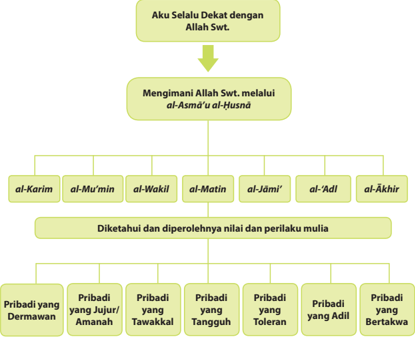

> **Deskripsi Visual:** Gambar ini adalah diagram yang menunjukkan hubungan antara kepercayaan kepada Allah Swt. melalui al-Asmā'ul-Husnā dan nilai-nilai peribadi yang baik. Diagram ini dibagi menjadi dua bagian utama: pertama, menggambarkan langkah-langkah dalam mengimani Allah Swt.; kedua, menjelaskan bagaimana nilai-nilai tersebut diketahui dan diperoleh.

Elemen utama dalam diagram ini adalah:

1. Aku Selalu Dekat dengan Allah Swt.
2. Mengimani Allah Swt. melalui al-Asmā'ul-Husnā
   - al-Karim
   - al-Mu'min
   - al-Wakil
   - al-Matin
   - al-Jāmi'
   - al-'Adl
   - al-Akhir

3. Diketahui dan diperolehnya nilai-nilai perilaku mulia
   - Pribadi yang Dermawa
   - Pribadi yang Jujur/Amanah
   - Pribadi yang Tawakkal
   - Pribadi yang Tangguh
   - Pribadi yang Toleran
   - Pribadi yang Adil
   - Pribadi yang Bertakwa

Teks, angka, atau label penting yang terlihat dalam diagram ini adalah:

- "Aku Selalu Dekat dengan Allah Swt."
- "Mengimani Allah Swt. melalui al-Asmā'ul-Husnā"
- "Diketahui dan diperolehnya nilai-nilai perilaku mulia"

Informasi kunci yang dapat diambil pembaca dari gambar ini adalah bahwa mengimani Allah Swt. melalui al-Asmā'ul-Husnā mempengaruhi perilaku dan karakter seseorang, sehingga mereka menjadi pribadi yang baik dan memiliki nilai-nilai yang baik.

1

 

---
## 📄 Halaman 8

### Membuka Relung Hai

### Cermai wacana dan gambar berikut.

Beragam cara ditempuh oleh manusia untuk mendekatkan diri kepada  Sang  Pencipta,  yaitu  Allah Swt. Cara tersebut ada yang melalui jalan merenung atau bertafakkur atau  ber żikir . Ada  pula  seseorang menjadi dekat dengan Allah Swt. yang disebabkan oleh musibah yang menimpanya. Demikianlah Allah Swt.  membuka  cara  atau  jalan  bagi manusia  yang  ingin  dekat  denganNya.  Sebagai  orang  yang  beriman,

Sumber:  Dok.  Kemendikbud

tentu saja kita harus mampu menempuh cara apa pun agar dekat dengan Allah Swt.

Kedekatan seorang hamba dengan Tuhannya tentu saja akan mengantarkannya mendapatkan berbagai fasilitas hidup, yaitu kesenangan dan kenikmatan yang iada tara. Bukankah seorang anak yang dekat dengan orang tuanya atau seorang pegawai  bawahan  dengan  atasannya  akan  memberikan  peluang  atas  segala kemudahan yang akan dicapainya.

Selain melalui żikir , mendekatkan diri kepada Allah Swt. dapat pula dilakukan melalui  perbuatan  atau amaliah sehari-hari,  yaitu  dengan  selalu  meniatkan bahwa yang kita lakukan semata-mata hanya karena taat mematuhi aturan mainNya. Misalnya, kita berbuat baik kepada tetangga bukan karena tetangga baik kepada kita, tetapi semata-mata karena Allah Swt. menyuruh kita untuk berbuat baik.  Kita  bersedekah  bukan  karena  kasihan,  tetapi  semata-mata  karena  Allah Swt. memerintahkan kita untuk mengeluarkan sedekah membantu meringankan beban orang yang sedang mengalami kesulitan. Hal ini  seharusnya  dapat  kita

Jalan  lain  untuk  mendekatkan  diri  kepada  Allah  Swt.  adalah  melalui żikir . Żikir arinya mengingat Allah Swt. dengan menyebut dan memuji nam a-Nya. Syarat yang sangat fundamental yang diperlukan untuk mendekatkan diri kepada Allah Swt. melalui żikir adalah kemampuan dalam menguasai nafsu, selanjutnya bila  menyebut nama Allah Swt. ( al-Asmā'u  al-Husnā )  berulang-ulang di dalam hai  akan  menghadirkan  rasa  rendah  hai  ( tawadhu' ) yang disertai dengan rasa takut karena merasakan keagungan-Nya. Żikir dapat dilakukan kapan saja dan di mana saja. Ber żikir idak  perlu  menghitung  berapa  jumlah  bilangan  yang  harus di żikir kan,  namun  yang  pening  adalah żikir harus benar-benar menghujam di dalam kalbu.

 

---
## 📄 Halaman 9

lakukan karena pada waktu kecil kita patuh melaksanakan perintah dan nasihat orang  tua,  bukan?  Mengapa  sekarang  kita  idak  patuh  pada  perintah-p erintah Allah  Swt?  Jika śalat dapat  kita  kerjakan  karena  semata-mata  taat  mematuhi perintah  Allah  Swt.,  maka  rasanya  mustahil  apabila  kita  idak  dapat bersikap demikian pada perbuatan-perbuatan lainnya.

Kamu tentu pernah mengalami sakit atau musibah baik ringan atau berat. Ceritakan  pengalamanmu. Bagaimana  cara  kamu  menyikapi  kehadiran Allah Swt. saat terkena musibah? Apakah Allah Swt. akan hadir dengan pertolongan-Nya, ataukah Allah Swt. akan membiarkanmu  dalam kesusahan?

### Mengkriisi Sekitar Kita

### Cermai wacana berikut.

Manusia adalah makhluk yang sering lupa dan sering berbuat kesalahan. ' AlIns ānu maĥallul khaţā wa an-nisyan .' Demikian sebuah ungkapan dalam bahasa Arab  yang  arinya,  'manusia  itu  tempatnya  salah  dan  lupa.'  Dalam  sebuah hadisnya,  Rasulullah  saw.  bersabda,  ' Kullu Ban i  Ādama kha ţţāun wa  khairul kha ţţāina  at-t āibū na .'  (Seiap  keturunan  Adam  as.  pasi  melakukan  kesalahan, dan orang yang baik adalah yang kembali dari kesalahan/dosa).

Berdasarkan ungkapan dan hadis di atas, manusia memiliki sifat dan karakter yaitu  sering  berbuat  kesalahan  dan  lupa.  Arinya,  idak  ada  seorang  pun  yang terbebas dari kesalahan dan lupa. Namun demikian, idaklah benar jika dikatakan bahwa idak mengapa seseorang melakukan kesalahan dengan dalih bahwa hal tersebut merupakan sifat manusia.

Sebagai seorang yang beriman, kita dituntut untuk selalu melakukan releksi dan perenungan terhadap apa yang telah kita perbuat. Keika seseorang terlanjur melakukan kesalahan, bersegeralah untuk kembali ke jalan yang benar dengan bertaubat dan idak mengulanginya lagi. Demikian pula dengan s ifat lupa, kadang menjadi sebuah nikmat dan juga bencana. Lupa dapat menjadi nikmat manakala seseorang  terlupa  dengan  kejadian  sedih  yang  pernah  menimpanya.  Dapat

 

---
## 📄 Halaman 10

dibayangkan, betapa sengsaranya jika seseorang idak dapat melupakan kisah sedih yang pernah dialaminya. Lupa juga dapat menjadi bencana, yaitu keika dengan  lupa  tersebut  mengakibatkan  kecerobohan  dan  kerusakan.  Banyak  di antara manusia karena lupa melakukan sesuatu mengakibatkan manusia tersebut akan melakukan kesalahan yang dapat merugikan dirinya dan orang lain.

Sebutkan  kesalahan-kesalahan  yang  sering  kamu  lakukan.  Bagaimana upaya  kamu  agar  kesalahan  tersebut  tidak  terulang  lagi?  Sebutkan sebanyak-banyaknya dengan sebenar-benarnya.

### Memperkaya Khazanah Peserta Didik

### A.  Memahami Makna al-Asmā'u al-Ĥusnā : al-Kar īm, al-Mu'm i n, al-Wak i l,  alMat i n, al-Jām i ' , al-'Adl, dan al-Ākh ir .)

### 1.  Pengerian al-Asmā'u al-Ĥusnā

Al-Asmā'u  al-Ĥusnā terdiri  atas  dua  kata,  yaitu asmā yang berari nama-nama, dan ĥ usna yang  berari  baik  atau  indah.  Jadi, al-Asmā'u  alĤusnā dapat diarikan sebagai nama-nama yang baik lagi indah yang hanya dimiliki  oleh  Allah  Swt.  sebagai  buki  keagungan-Nya.  Kata al-Asmā'u  alĤusnā diambil dari ayat al-Qur'ān Q.S. Ţāhā/20:8 . yang arinya, ' Allah Swt. idak ada Tuhan melainkan Dia. Dia memiliki al-Asmā'u al-Ĥusnā (namanama baik). '

### 2.  Dalil tentang al-Asmā'u al-Ĥusnā

- Firman Allah Swt. dalam Q.S. al-A'rāf/7:180
Arinya: 'Dan Allah Swt. memiliki asmā'ul ĥusna, maka bermohonlah kepada-Nya  dengan  (menyebut)  nama-nama-Nya  yang  baik  itu  dan

 

---
## 📄 Halaman 11

inggalkanlah  orang-orang  yang  menyimpang  dalam  (menyebu t) nama-nama-Nya. Nani mereka akan mendapat balasan terhada p apa yang mereka kerjakan.' (Q.S. al A'rāf/7:180)

Dalam ayat lain  dijelaskan  bahwa al-Asmā'u  al-Ĥusnā merupakan amalan  yang  bermanfaat  dan  mempunyai  nilai  yang  tak  terhingga ingginya. Berdoa dengan menyebut al-Asmā'u al-Ĥusnā sangat dianjurkan menurut ayat tersebut.

### b. Hadis Rasulullah saw. yang diriwayatkan Imam Bukhari

``

Arinya: 'Dari Abu Hurairah ra. sesungguhnya Rasulullah saw. bersabda: Sesungguhnya Allah Swt. mempunyai sembilan puluh sembilan  nama,  seratus  kurang  satu,  barang  siapa  yang menghafalkannya, maka ia akan masuk surga'. (H.R. Bukhari)

Berdasarkan hadis di atas,  menghafalkan al-Asmā'u al-Ĥusnā akan  mengantarkan  orang  yang  melakukannya  masuk  ke  dalam surga  Allah  Swt.  Apakah  hanya  dengan  menghafalkannya  seseorang dengan  mudah  akan  masuk  ke  dalam  surga?  Jawabnya,  tentu  saja idak. Karena menghafalkan al-Asmā'u al-Ĥusnā harus  diiringi  juga dengan menjaganya, baik menjaga hafalannya dengan terus-menerus men żikir kannya,  maupun  menjaganya  dengan  menghindari  perilakuperilaku  yang  bertentangan  dengan  sifat-sifat  Allah  Swt.  dalam alAsmā'u  al-Ĥusnā tersebut.

Untuk memperkuat penjelasan di atas, carilah dalil lain baik yang ada di dalam ayat al-Qur'±n maupun Hadis tentang al-Asm±'u al-¦usn± .

- Memahami makna al-Asmā'u al-¦ usnā : al-Kar i m, al-Mu'm i n, al-Wak i l,  alMat i n, al-Jām i ' , al-'Adl, dan al-Ākh i r . Mari pelajari dan pahami satu persatu asmā'ul husna tersebut!

### 1. Al-Kar i m

Secara bahasa, al-Kar i m mempunyai  ari  Yang  Mahamulia,  Yang  Maha Dermawan  atau  Yang  Maha  Pemurah.  Secara  isilah, al-Kar i m diarikan

 

---
## 📄 Halaman 12

bahwa  Allah  Swt.  Yang  Mahamulia  lagi  Maha  Pemurah  yang  memberi anugerah atau rezeki kepada semua makhluk-Nya. Dapat pula dimaknai sebagai  Zat  yang  sangat  banyak  memiliki  kebaikan,  Maha  Pemurah, Pemberi Nikmat dan keutamaan, baik keika diminta  maupun  idak. Hal tersebut  sesuai  dengan  irman-Nya:

Arinya: 'Hai manusia apakah yang telah memperdayakanmu terhadap Tuhan Yang Maha Pemurah?' (Q.S. al-Iniţār:6)

Al-Kar i m dimaknai Maha Pemberi karena Allah  Swt.  senaniasa  memberi,  idak  pernah terheni pemberian-Nya. Manusia idak boleh  berputus  asa  dari  kedermawanan Allah  Swt.  jika  miskin  dalam  harta,  karena kedermawanan-Nya  idak  hanya  dari  harta yang  diiipkan  melainkan  melipui  segala hal. Manusia yang berharta dan dermawan hendaklah idak sombong karena telah memiliki sifat dermawan karena Allah Swt. idak menyukai kesombongan. Dengan demikian, bagi orang yang diberikan harta melimpah  maupun  orang  idak  dianugerahi harta oleh Allah Swt., maka keduanya harus selalu  bersyukur  kepada-Nya karena orang yang  miskin  pun  telah  diberikan  nikmat selain harta.

Al-Kar i m juga dimaknai Yang Maha Pemberi Maaf karena Allah Swt. memaakan dosa para hamba dalam menunaikan kewajiban kepada Allah

yang lalai Sumber: Dok. Kemendikbud Gambar 1.2 Memberikan santunan kepada anak yatim dan kaum dhu'afa sebagai perilaku mencontoh Alkarim

Swt., kemudian hamba itu mau bertaubat kepada Allah Swt. Bagi hamba yang berdosa, Allah Swt. adalah Yang Maha Pengampun. Allah Swt. ak an mengampuni  seberapa  pun  besar  dosa  hamba-Nya  selama  hambanya idak  meragukan  kasih  sayang  dan  kemurahan-Nya.

Menurut  imam  al-Gazali, al-Kar i m adalah  Dia  yang  apabila  berjanji, menepai  janjinya,  bila  memberi,  melampaui  batas  harapan,  idak peduli berapa  dan  kepada  siapa  Dia  memberi  dan  idak  rela  bila  ada  kebutu han hambanya memohon kepada selain-Nya, meminta pada orang lain.  Dia yang bila  kecil  hai  menegur  tanpa  berlebih,  idak  mengabaik an  siapa  yang menuju dan berlindung  kepada-Nya,  dan  idak  membutuhkan  sarana atau perantara.

 

---
## 📄 Halaman 13

### 2. Al-Mu'm i n

Al-Mu'mi n secara  bahasa  berasal  dari  kata amina yang  berari  pembenaran,  ketenangan  hai,  dan  aman.  Allah  Swt. al-Mu'mi n arinya  Dia Maha Pemberi rasa aman kepada semua makhluk-Nya, terutama kepada manusia.  Dengan  demikian,  hai  manusia  menjadi  tenang.  Kehid upan ini penuh dengan berbagai permasalahan, tantangan, dan cobaan. Jika bukan karena Allah Swt. yang memberikan rasa aman dalam hai, niscaya kita akan senaniasa gelisah, takut, dan cemas. Perhaikan irman Allah  Swt. berikut ini.

Arinya:  'Orang-orang  yang  beriman  dan  idak  mencampuradukkan iman mereka dengan syirik, mereka itulah orang-orang yang mendapat rasa aman dan mereka mendapat petunjuk.' (Q.S. al-An'ām/6:82)

Keika kita  akan  menyeru  dan  berdoa kepada  Allah  Swt.  dengan  nama-Nya al-Mu'min, berari kita memohon diberikan keamanan, dihindarkan dari itnah, bencana, dan siksa. Karena Dialah Yang Maha Memberikan keamanan, Dia yang Maha Pengaman. Dalam nama al-Mu'min terdapat kekuatan yang dahsyat dan luar biasa. Ada  pertolongan  dan  perlindungan, ada jaminan ( insurance ), dan ada bala bantuan.

Ber żikir dengan  nama  Allah  Swt. al-Mu'mi n di samping me-numbuhkan dan  memperkuat  keyakinan  dan  ke- kepada orang lain sebagai perilaku mencontoh al-Mu'min

imanan  kita,  bahwa  keamanan  dan  rasa  aman  yang  dirasakan  manusia sebagai  makhluk  adalah  suatu  rahmat  dan  karunia  yang  diberikan  dari sisi Allah Swt. Sebagai al-Mu'mi n ,    yaitu  Tuhan  Yang  Maha  Pemberi  Rasa Aman  juga  terkandung  pengerian  bahwa  sebagai  hamba  yang  beriman , seorang mukmin dituntut mampu menjadi bagian dari pertumbuhan dan perkembangan rasa aman terhadap lingkungannya.

Mengamalkan dan meneladani al-Asmā'u al-Ĥusnā al-Mu'mi n ,  arinya bahwa  seorang  yang  beriman  harus  menjadikan  orang  yang  ada  di sekelilingnya aman dari gangguan lidah dan tangannya. Berkaitan dengan itu,  Rasulullah  saw.  bersabda:  'Demi  Allah  idak  beriman.  Dem i  Allah idak  beriman.  Demi  Allah  idak  beriman.  Para  sahabat  bertanya,  ' Siapa ya Rasulullah saw.?' Rasulullah saw. menjawab, 'Orang yang te tangganya merasa idak aman dari gangguannya.' (H.R. Bukhari dan Muslim).

 

---
## 📄 Halaman 14

### 3. Al-Wak i l

Kata  ' al-Wak i l ' mengandung ari Maha Mewakili atau Pemelihara. Al-Wak i l (Yang Maha  Mewakili  atau Pemelihara), yaitu Allah Swt. memelihara dan mengurusi segala kebutuhan makhluk-Nya, baik itu dalam urusan dunia maupun urusan akhirat. Dia menyelesaikan segala sesuatu yang  diserahkan  hambanya  tanpa  membiarkan  apa  pun  terbengkalai. Firman-Nya dalam al-Qur'ān :

Arinya: 'Allah Swt. pencipta segala sesuatu dan Dia Maha Pemelihara atas segala sesuatu.' (Q.S. az-Zumar/39:62)

akan

Dengan demikian, orang yang mempercayakan segala urusannya kepada Allah Swt., akan memiliki kepasian bahwa semua diselesaikan dengan sebaik-baiknya. Hal  itu  hanya  dapat  dilakukan  oleh hamba yang mengetahui bahwa Allah Swt. yang Mahakuasa, Maha Pengasih adalah satu-satunya yang dapat dipercaya oleh para hamba-Nya. Seseorang  yang  melakukan  urusannya dengan  sebaik-baiknya  dan  kemudian akan menyerahkan segala urusan kepada  Allah  Swt.  untuk  menentukan karunia-Nya.

Menyerahkan  segala  urusan  hanya  kepada  Allah  Swt.  melahirkan sikap tawakkal . Tawakkal bukan berari mengabaikan sebabsebab  dari  suatu  kejadian.  Berdiam  diri  dan  idak  peduli  terhadap sebab itu dan akibatnya adalah sikap malas.  Ke tawakkal an dapat diibaratkan dengan menyadari sebab-akibat. Orang harus beru saha untuk mendapatkan apa yang diinginkannya. Rasulullah saw. ber  sabda, 'Ikatlah untamu dan ber tawakkal lah kepada Allah Swt.' Manusia  harus  menyadari  bahwa  semua  usahanya  adalah  sebuah  doa yang  akif  dan  harapan  akan  adanya  pertolongan-Nya.  Allah  Swt.  beri rman yang  arinya,  '(Yang  memiliki  sifat-sifat  yang)  demikian  itu ialah  Allah  Swt. Tuhan  kamu;  idak  ada  Tuhan  (yang  berhak  disembah)  selain  Dia; Pencipta segala  sesuatu,  maka  sembahlah  Dia  dan  Dia  adalah  Pemelihara  segala sesuatu.' ( Q.S. al-An'ām/6:102 ).

Hamba al-Wak il adalah  yang  bertawakkal  kepada  Allah  Swt.  Keika hamba tersebut telah melihat 'tangan' Allah Swt. dalam sebab-sebab dan alasan  segala  sesuatu,  dia  menyerahkan  seluruh  hidupnya  di  tangan alWak i l .

yang

 

---
## 📄 Halaman 15

### 4. Al-Mat i n

Al-Mati n arinya Mahakukuh. Allah Swt. adalah Mahasempurna dalam kekuatan  dan  kekukuhan-Nya.  Kekukuhan  dalam  prinsip  sifat-sifat-Nya. Allah  Swt.  juga  Mahakukuh  dalam  kekuatan-kekuatan-Nya.  Oleh  kar ena itu,  sifat al-Main adalah  kehebatan  perbuatan  yang  sangat  kokoh  dari kekuatan  yang  idak  ada  taranya.  Dengan  demikian,  kekukuhan  All ah  Swt. yang  memiliki  rahmat  dan  azab  terbuki  keika  Allah  Swt.  membe rikan rahmat  kepada  hamba-hamba-Nya.  Tidak  ada  apa  pun  yang  dapat menghalangi  rahmat  ini  untuk  iba  kepada  sasarannya.  Demikian  jug a  idak ada kekuatan yang dapat mencegah pembalasan-Nya.

Oleh

Seseorang  yang  menemukan  kekuatan dan kekukuhan Allah Swt. akan  membuatnya  menjadi  manusia yang tawakkal ,  memiliki  kepercayaan dalam jiwanya dan idak merasa rendah di hadapan manusia lain. manusia  akan  selalu  merasa  rendah di  hadapan  Allah  Swt.  Hanya  Allah Swt. yang Maha Menilai. karena itu, Allah Swt. melarang manusia  bersikap  atau  merasa  lebih dari saudaranya. Karena hanya Allah  Swt.  yang  Maha  Mengetahui simbol kekokohan .

baik  buruknya  seorang  hamba.  Allah  Swt.  juga  menganjurkan  manusia bersabar.  Karena  Allah  Swt.  Mahatahu  apa  yang  terbaik  untuk  hambaNya.  Kekuatan  dan  kekukuhan-Nya  idak  terhingga  dan  idak  terb ayangkan oleh  manusia  yang  lemah  dan  idak  memiliki  daya  upaya.  Jadi, karena kekukuhan-Nya, Allah Swt. idak terkalahkan dan idak terg oyahkan. Siapakah  yang  paling  kuat  dan  kukuh  selain  Allah  Swt?  Tidak  ada satu  makhluk  pun  yang  dapat  menundukkan  Allah  Swt.  meskipun seluruh makhluk di bumi ini bekerja sama. Allah Swt. rman: beri

Arinya:  'Sungguh Allah Swt., Dialah pemberi rezeki yang mempunyai kekuatan lagi sangat kukuh.'  (Q.S. aż-Żāriyāt/51:58)

Dengan demikian, akhlak kita terhadap sifat al-Mati n adalah  dengan ber isiqamah (meneguhkan  pendirian),  beribadah  dengan  kesungguhan hai,  idak  tergoyahkan  oleh  bisikan  menyesatkan,  terus  ber usaha  dan idak  putus  asa  serta  bekerja  sama  dengan  orang  lain  sehingga  me njadi lebih kuat.

 

---
## 📄 Halaman 16

### 5. Al-Jāmi'

Al-Jāmi' secara  bahasa  arinya  Yang  Maha  Mengumpulkan/Menghimpun, yaitu bahwa Allah Swt. Maha Mengumpulkan/Menghimpun segala sesuatu yang tersebar atau terserak. Allah Swt. Maha Mengumpulkan apa yang dikehendaki-Nya dan di mana pun Allah Swt. berkehendak.

Penghimpunan ini ada berbagai macam bentuknya, di antaranya adalah mengumpulkan seluruh makhluk yang beraneka ragam, termasuk manusia dan  lain-lainnya,  di  permukaan  bumi  ini  dan  kemudian  mengumpulkan mereka di padang mahsyar pada hari kiamat. Allah Swt. berirman:

Arinya: 'Ya Tuhan kami, sesungguhnya  Engkau  mengumpulkan manusia untuk (menerima pembalasan pada) hari yang tak ada keraguan padanya'.  Sesungguhnya  Allah  Swt.  idak  menyalahi  janji.'(Q.S. Ali Imrān/3:9).

Allah Swt. akan menghimpun manusia di akhirat kelak sama dengan orang-orang yang satu golongan di dunia. Hal ini dapat dijadikan sebagai barometer , kepada siapa kita  berkumpul  di  dunia  itulah  yang akan  menjadi  teman  kita  di  akhirat. Walaupun  kita  berjauhan  secara  isik, akan tetapi hai kita terhimpun, akhirat kelak kita juga akan terhimpun dengan mereka. Begitupun sebaliknya, walaupun kita berdekatan secara isik akan tetapi hai kita jauh, maka kita juga  idak  akan  berkumpul  dengan mereka.

di

Sumber: Dok. Kemendikbud Gambar 1.6 Jabal Rahmah, tempat dikumpulkannya kembali Nabi Adam dan Hawa oleh Allah Swt. al-J±mi'.

Oleh  sebab  itu,  apabila  di  dunia  hai  kita  terhimpun  dengan orang-orang yang  selalu  memperturutkan  hawa  nafsunya,  di  akhirat  kelak  kita  akan berkumpul dengan mereka di dalam neraka. Karena orang-orang yang selalu memperturutkan hawa nafsunya, tempatnya adalah di neraka.

Begitupun sebaliknya, apabila ke  cenderungan hai kita terhimpun dengan  orang-orang  yang  beriman,  bertakwa  dan  orang-orang  saleh, di akhirat kelak  kita  juga  akan  ter  himpun  dengan  mereka.  Karena idaklah  mungkin  orang-orang  beriman  hainya  terhimpun  deng an orangorang kair dan orang-orang kair juga idak mungkin terhimp un dengan orang-orang beriman.

Allah Swt. juga mengumpulkan di dalam diri seorang hamba ada yang lahir di anggota tubuh dan hakikat bain di dalam hai. Barang s iapa yang

 

---
## 📄 Halaman 17

sempurna ma'rifat nya  dan  baik  ingkah  lakunya,  maka  ia  disebut  juga sebagai al-Jāmi'. Dikatakan bahwa al-Jāmi' ialah  orang  yang  idak  padam cahaya ma'rifat nya.

### 6. Al-'Adl

Al-'Adl arinya  Mahaadil.  Keadilan  Allah  Swt.  bersifat  mutlak,  idak dipengaruhi oleh apa pun dan oleh siapa pun.  Keadilan Allah Swt. juga didasari  dengan  ilmu  Allah  Swt.  yang  Maha  Luas.  Dengan  demikian ,  idak mungkin keputusan-Nya itu salah.  Allah Swt. berirman:

Arinya:  'Telah  sempurnalah  kalimat  Tuhanmu  (al-Qur'ān,  sebagai kalimat yang benar dan adil. Tidak ada yang dapat mengubah kalimatkalimat-Nya dan Dia-lah yang Maha Mendengar lagi Maha Mengetahui.' (Q.S. al-An'ām/6:115).

idak

Al-'Adl berasal dari kata 'adala yang berari  lurus  dan  sama.  Orang  yang adil adalah orang yang berjalan lurus dan sikapnya selalu menggunakan ukuran yang sama, bukan ukuran ganda.  Persamaan  inilah  yang  menunjuk  kan orang yang adil berpihak  kepada  salah  seorang  yang berselisih. Adil juga dimaknai sebagai penempatan  sesuatu pada tempat yang semesinya.

Allah  Swt.  dinamai al-'Adl karena

keadilan  Allah  Swt.  adalah  sempurna.  Dengan  demikian,  semua  yang diciptakan dan ditentukan oleh Allah Swt. sudah menunjukkan keadilan yang  sempurna.  Hanya  saja,  banyak  di  antara  kita  yang  idak  menyadar i atau  idak  mampu  menangkap  keadilan  Allah  Swt.  terhadap  apa  yang menimpa makhluk-Nya.  Oleh  karena  itu,  sebelum  menilai  sesu atu  itu  adil atau idak, kita harus dapat memperhaikan dan mengetahui segal a sesuatu yang  berkaitan  dengan  kasus  yang  akan  dinilai.  Akal  manusia  idak dapat menembus semua dimensi tersebut. Seringkali keika manusi a memandang sesuatu  secara  sepintas  dinilainya  buruk,  jahat,  atau  idak  adi l,  tetapi  jika dipandangnya secara luas dan menyeluruh, justru sebaliknya, merupakan suatu  keindahan,  kebaikan,  atau  keadilan.  Tahi  lalat  secara  sepintas terlihat buruk, namun jika berada di tengah-tengah wajah seseorang dapat terlihat indah. Begitu juga memotong kaki seseorang ( amputasi )  terlihat kejam,  namun  keika  dikaitkan  dengan  penyakit  yang  mengharuskann ya untuk dipotong, hal tersebut merupakan suatu kebaikan. Di situlah makna keadilan yang idak gampang menilainya.

 

---
## 📄 Halaman 18

Allah  Swt.  Mahaadil.  Dia  menempatkan  semua  manusia  pada  posisi yang sama dan sederajat. Tidak ada yang diinggikan hanya karena keturunan, kekayaan, atau karena jabatan. Dekat jauhnya posisi seseorang dengan  Allah  Swt.  hanya  diukur  dari  seberapa  besar  mereka  berusaha meningkatkan takwanya. Makin inggi takwa seseorang, makin  ingg i pula  posisinya,  makin  mulia  dan  dimuliakan  oleh  Allah  Swt.,  begitupun sebaliknya.

Sebagian  dari  keadilan-Nya,  Dia  hanya  menghukum  dan  memberi sanksi  kepada  mereka  yang  terlibat  langsung  dalam  perbuatan  maksiat atau  dosa.  Isilah  dosa  turunan,    hukum  karma,  dan  lain  semisal nya  idak dikenal dalam syari'at Islam. Semua manusia di hadapan Allah Swt. akan mem  pertanggungjawabkan dirinya sendiri.

Lebih  dari  itu,  keadilan  Allah  Swt.  selalu  disertai  dengan  sifat  kasih sayang.  Dia  memberi  pahala  sejak  seseorang  berniat  berbuat  baik dan  melipatgandakan  pahalanya  jika  kemudian  direalisasikan  dalam amal perbuatan. Sebaliknya, Dia idak langsung memberi an  catat dosa selagi masih berupa niat berbuat jahat. Sebuah dosa baru dicatat apabila seseorang telah benar-benar berlaku jahat.

### 7. Al-Ākhir

Al-Ākhir arinya  Yang  Mahaakhir  yang  idak  ada  sesuatu  pun  setelah Allah  Swt.  Dia  Mahakekal  tatkala  semua  makhluk  hancur,  Mahakekal dengan kekekalan-Nya. Adapun kekekalan makhluk-Nya adalah kekekalan yang terbatas, seperi halnya kekekalan surga, neraka, dan apa y ang ada di  dalamnya.  Surga  adalah  makhluk  yang  Allah  Swt.  ciptakan  dengan ketentuan,  kehendak,  dan  perintah-Nya.  Nama  ini  disebutkan  di  dalam irman-Nya:

Arinya:  'Dialah  Yang  Awal  dan Akhir Yang Żahir dan Yang Bain, dan  Dia  Maha  Mengetahui  segala sesuatu'. (Q.S. al-Ĥ ad id/57:3).

Allah Swt. berkehendak untuk menetapkan  makhluk  yang  kekal  dan yang  idak,  namun  kekekalan  makhluk itu  idak  secara  zat  dan tabi'at . Karena secara tabi'at dan zat, seluruh makhluk ciptaan  Allah  Swt.  adalah fana (idak kekal). Sifat kekal idak dimiliki oleh makhluk,  kekekalan  yang  ada  hanya sebatas  kekal  untuk  beberapa  masa sesuai dengan ketentuan-Nya.

 

---
## 📄 Halaman 19

Orang yang mengesakan al-Ākhir akan menjadikan Allah Swt. sebagai satu-satunya  tujuan  hidup  yang  iada  tujuan  hidup  selain-Nya,  id ak  ada permintaan  kepada  selain-Nya,  dan  segala  kesudahan  tertuju  hanya kepada-Nya.  Oleh  sebab  itu,  jadikanlah  akhir  kesudahan  kita  hany a  kepadaNya. Karena sungguh akhir kesudahan hanya kepada Rabb kita, seluruh sebab dan tujuan jalan akan berujung ke haribaan-Nya semata.

Orang  yang  mengesakan al-Ākhir akan  selalu  merasa  membutuhkan Rabb -nya, ia akan selalu mendasarkan apa yang diperbuatnya kepada apa yang telah ditetapkan oleh Allah Swt. untuk hamba-Nya, karena manusia mengetahui bahwa Allah Swt. adalah pemilik segala kehendak, ha i,  dan niat.

Kamu tentu telah memahami makna al-Karim,  al-Mu'min,  al-Wakil,  alMatin,  al-Jami',  al-'Adl,  dan  al-±khir .  Carilah  ayat-ayat al-Qur'±n atau hadis Nabi saw. yang menjelaskan sifat Allah Swt. dalam al-Asm±'u al¦usn± .

### Kisah Nabi Ibrahim as. Mencari Tuhan

Nabi  Ibrahim  as.  adalah  putra  Azar.  Ia dilahirkan di wilayah Kerajaan Babylonia yang saat itu diperintah oleh Raja Namrud. Namrud  adalah  raja  yang  sangat  sombong yang  mengaku  dirinya  adalah  Tuhan.  Raja Namrud  juga  dikenal  sangat  kejam  kepada siapa saja yang menentang kekuasaannya.

---
**🖼️ Gambar/Diagram**

> **Deskripsi Visual:** Gambar ini adalah foto yang menunjukkan pemandangan matahari terbenam di tepi sungai. Pada bagian atas gambar, matahari sedang menghampiri permukaan laut, menciptakan warna-warna merah, orange, dan ungu yang indah. Sungai berada di bagian tengah gambar, dengan air yang cerah dan jernih. Di sepanjang tepi sungai, terdapat beberapa bangunan kecil yang tampak seperti rumah-rumah tradisional atau istana kecil. Di bagian bawah gambar, terlihat sebuah perahu kecil yang berlayar di atas sungai, menambah nuansa kehidupan dan aktivitas di area tersebut. Gambar ini menunjukkan hubungan antara alam (sungai, matahari, dan permukaan laut) dengan kehidupan manusia (bangunan dan perahu).

Gambar 1.9 Melalui proses perenungan dan berfikir yang mendalam, Nabi Ibrahim mengenal Sang Pencipta, Allah Swt..

Suatu saat ia bermimpi. Dalam mimpinya itu,  ia  melihat  seorang  anak  laki-laki  yang memasuki  kamarnya  kemudian  mengambil mahkotanya.  Kemudian,  ia  pun  memanggil tukang  ramal  yang  sangat  terkenal  untuk mengarikan mimpinya tersebut. Tukang

 

---
## 📄 Halaman 20

ramal mengarikan bahwa anak yang hadir dalam mimpinya tersebut kelak akan meruntuhkan kerajaannya. Mendengar hal tersebut, Namrud murka. Akhirnya, diperintahkannya  kepada  seluruh  tentara  kerajaan  agar  membunuh seiap  bayi laki-laki yang dilahirkan.

Azar yang istrinya saat itu sedang mengandung bayi yang kelak dinamakan Ibrahim  begitu  khawair  akan  keselamatan  bayi  yang  sedang  di kandung istrinya. Ia  khawair  bahwa  bayi  yang  ada  dalam  perut  istrinya  adalah  seorang bayi  lakilaki  yang  selama  ini  ia  idam-idamkan.  Oleh  karena  itu,  untuk  me nyelamatkan calon  bayinya  tersebut  diam-diam  ia  mengajak  istrinya  ke  dalam  sebuah  gua yang jauh dari keramaian. Di gua itulah kemudian bayi Ibrahim dilahirkan. Agar idak  diketahui  oleh  khalayak  ramai,  Azar  dan  istrinya  meningg alkan  Ibrahim yang masih bayi di dalam gua dan sesekali datang untuk melihat keadaannya. Hal itu terus dilakukan hingga Ibrahim menjadi anak kecil yang tumbuh sehat dan kuat atas izin Allah Swt. Bagaimana Ibrahim dapat hidup di dalam gua, padahal idak  ada  makanan  dan  minuman  yang  diberikan?  Jawabannya  karena  All ah Swt. menganugerahkan Ibrahim untuk menghisap jari tangannya yang dari situ keluarlah air susu yang sangat baik. Itulah mukjizat pertama yang diberikan Allah kepada Nabi Ibrahim as.

Lama hidup di dalam gua tentu membuat  Ibrahim sangat terbatas pengetahuannya tentang alam sekitar. Oleh karena itu, di saat erdapat kesempatan untuk keluar dari gua, Ibrahim pun melakukannya. Betapa terkejutnya ia, ternyata alam di luar gua begitu luas dan indah. Di dalam ketakjubannya itu, Ibrahim berpikir bahwa alam yang luas dan indah berikut isinya termasuk manusia, pasi ada yang menciptakannya. Kemudian, Nabi Ibrahim berjalan u ntuk mencari Tuhan. Ia mengamai lingkungan sekelilingnya. Namun, ia idak menemukan sesuatu yang membuatnya kagum dan merasa harus dijadikan Tuhannya.

Di siang hari, Ibrahim melihat cerahnya matahari menyinari bumi. Ia berpikir, mungkin  matahari  adalah  tuhan  yang  ia  cari.  Tetapi  keika  senja  d atang  dan matahari  tenggelam  di  ufuknya,  gugurlah  keyakinan  Ibrahim  akan  matahari sebagai tuhan. Sampai akhirnya, malam pun datang menjelang. Bintang di langit bermunculan  dengan  indahnya.  Sinarnya  berkelap-kelip  membuat  suasana malam menjadi lebih indah dan cerah. 'Apakah ini Tuhan yang aku cari?' Kata Ibrahim  dengan  gembira.  Ditatapnya  bintang-bintang  itu  dengan  penuh  rasa bangga.  Tetapi  ternyata,  keika  malam  beranjak  pagi,  bintang-bi ntang  itu  pun beranjak satu persatu. Dengan pandangan kecewa, Nabi Ibrahim melihat satu persatu  bintang-bintang  itu  menghilang.  'Aku  idak  menyukai Tuhan  yang  dapat menghilang dan tenggelam karena waktu,' gumamnya dengan perasaan kecewa.

Nabi  Ibrahim  pun  mencoba  mencari  Tuhan  yang  lain.  Memasuki  malam berikutnya,  bulan  pun  muncul  dan  bersinar  memancarkan  cahayanya  yang keemasan.  Ia  pun  menduga,  'Inikah  Tuhan  yang  aku  cari?'  namun ,  keika  pagi datang menjelang, bulan pun hilang tanpa alasan. Seperi halny a terhadap matahari dan bintang, Ibrahim pun memasikan bahwa bukanlah mat ahari, bintang, dan bulan yang menjadi Tuhan untuk disembah, tetapi pasi ada satu kekuatan Yang Mahaperkasa dan Mahaagung yang menggerakkan menghidupkan  semua  yang  ada.  Ibrahim  pun  menyimpulkan  bahwa Tuhan  idak lain adalah Allah Swt.

t

dan

 

---
## 📄 Halaman 21

Keika keyakinan Nabi Ibrahim as. kepada Allah Swt. betul-betul merasuki jiwanya,  mulailah  ia  mengajak  orang-orang  di  sekitarnya  untuk  meninggalkan penyembahan  terhadap  berhala.  Karena  berhala  idak  memiliki  kek uatan  apa pun  dan  idak  pula  memberi  manfaat.  Orang  pertama  yang  ia  ajak  han ya  untuk menyembah Allah Swt. adalah Azar, ayahnya yang berprofesi sebagai pembuat patung untuk disembah. Mendengar ajakan Ibrahim, Azar marah karena apa yang dilakukannya  semata-mata  apa  yang  sudah  dilakukan  oleh  nenek  moyangnya dahulu.  Azar  meminta  Ibrahim  untuk  idak  menghina  dan  melece hkan  berhala yang  seharusnya  ia  sembah.  'Wahai  saudaraku!  Patung-patung  itu  hanyalah buatan manusia yang idak dapat bergerak dan idak memberi manfaa t sedikitpun. Mengapa kalian sembah dengan memohon kepadanya?' Demikian ajakan Ibrahim kepada umatnya. Akan tetapi, kaumnya idak mau mend engarkan dan mengikui ajakan Nabi Ibrahim as., bahkan mereka mencemooh dan memaki Ibrahim.

Menyadari bahwa ajakannya untuk menyembah hanya kepada Allah Swt. idak mendapatkan respon dari umatnya, Nabi Ibrahim as. mengatur cara bagaimana melakukan  dakwah  secara  cerdas  dan  lebih  efekif.  Oleh  karena  itu,  tatkala seluruh  penduduk  negeri  termasuk  Raja  Namrud  pergi  untuk  berburu,  Nabi Ibrahim masuk ke dalam kuil penyembahan berhala kemudian menghancurkan semua berhala yang ada dengan sebuah kapak besar yang telah disiapkan. Semua berhala hancur kecuali berhala yang paling besar yang ia sisakan. Pada berhala besar itu, ia gantungkan kapak di lehernya.

Sekembalinya  dari  perburuan,  semua  penduduk  negeri  termasuk  Namrud, terkejut luar biasa. Mereka dengan sangat marah mencari tahu siapa yang berani melakukan  perbuatan  tersebut.  Mengetahui  bahwa  Ibrahimlah  satu-satunya lelaki  yang  idak  ikut  serta  dalam  perburuan,  Raja  memerintahkan semua  tentara untuk  memanggil  dan  menangkap  Ibrahim  untuk  dihadapkan  kepada  dirinya. Sesampainya di hadapan Raja Namrud, Ibrahim berdiri dengan tegak dan penuh percaya diri.

'Hai Ibrahim, apakah kamu yang menghancurkan berhala-berhala itu?' tanya Raja Namrud.

'Tidak, saya idak melakukannya,' jawab Ibrahim as.

'Jangan mengelak, wahai Ibrahim, bukankah kamu satu-satunya orang yang berada di negeri saat semuanya pergi berburu?' sergah Raja Namrud.

'Sekali lagi idak! Bukan aku yang melakukannya, tetapi berhala besar itu yang melakukannya,' jawab Ibrahim as. dengan tenang.

Mendengar jawaban Nabi Ibrahim, Raja Namrud marah seraya berkata, 'Mana mungkin berhala yang idak dapat bergerak engkau tuduh sebagai penghancur berhala lainnya?'

Mendengar  perkataan  Raja  Namrud,  Ibrahim  as.  tersenyum  kemudian berkata,  'Sekarang  Anda  tahu  dan  Anda  yang  mengatakannya  sendiri  bahwa berhala-berhala  itu  idak  dapat  bergerak  dan  memberikan  bantuan  apaapa. Lalu, mengapa Anda sembah berhala-berhala itu?'

 

---
## 📄 Halaman 22

Mendengar jawaban  Ibrahim  as.  yang  idak  disangka-sangka,  Namrud  sebetulnya menyadari hal tersebut. Namun, karena kebodohan dan kesombongannya, ia tetap saja idak memedulikan argumentasi Ibrahim as. Ia kemudian mem erintahkan semua tentaranya untuk membakar Ibrahim hidup-hidup sebagai hukuman atas perlakuannya kepada berhala-berhala yang mereka sembah.

Setelah  semua  persiapan  untuk  membakar  Ibrahim  as.  telah  lengkap, dilemparkanlah Ibarahim ke dalam api yang berkobar sangat besar dan panas. Apa  yang  terjadi  kemudian?  Allah  Swt.  menunjukkan  Kemahakuasaan-Nya dengan  meminta  api  agar  dingin  untuk  menyelamatkan  Ibrahim  as.  Api  pun dingin  sehingga  idak  sedikit  pun  Ibrahim  as.  terluka  kare nanya.  Itulah mu'jizat terbesar yang diterima Nabi Ibrahim, yaitu idak terluka saat dibakar dengan api yang sangat panas.

Dari kisah Nabi Ibrahim as. di atas, banyak pelajaran yang  dapat  kita ambil. Apa saja hikmah yang terkandung di dalamnya? Coba kemukakan. Realisasikan keimananmu kepada Allah Swt. dalam kehidupanmu seharihari.

### Menerapkan Perilaku Mulia

Setelah mempelajari keimanan kepada Allah Swt. melalui sifat-sifatnya dalam al-Asmā'u al-Ĥusnā ,  sebagai  orang  yang  beriman,  kita  wajib  merealisaikannya agar  memperoleh  kebahagiaan  hidup  di  dunia  dan  di  akhirat.  Perilaku  yang mencerminkan sikap memahami al-Asmā'u al-Ĥusnā ,  tergambar dalam akivitasakivitas berikut.

### 1.  Menjadi orang yang dermawan

Sifat dermawan adalah sifat Allah Swt. al-Kar i m (Maha Pemurah), sehingga sebagai  wujud  keimanan  tersebut,  kita  harus  menjadi  orang  yang  pandai membagi kebahagiaan kepada orang lain baik dalam bentuk harta atau bukan. Wujud kedermawanan tersebut, misalnya seperi berikut.

- Selalu menyisihkan uang jajan untuk kotak amal seiap hari Ju m'at yang diedarkan oleh petugas Rohis.
- Membantu teman yang sedang dalam kesulitan.
- Menjamu tamu yang datang ke rumah sesuai dengan kemampuan.

 

---
## 📄 Halaman 23

- Menjadi orang yang jujur dan dapat memberikan rasa aman Wujud dari meneladani sifat Allah Swt al-Mu'mi n adalah seperi berikut.
- Menolong teman/orang lain yang sedang dalam bahaya atau ketakutan.
- Menyingkirkan duri, paku, atau benda lain yang ada di jalan yang dapat membahayakan pengguna jalan.
- Membantu orang tua atau anak-anak yang akan menyeberangi jalan raya.

### 3.  Senaniasa ber tawakkal kepada Allah Swt.

Wujud dari meneladani sifat Allah Swt. al-Wak i l dapat berupa hal-hal berikut.

- Menjadi pribadi yang mandiri, melakukan pekerjaan tanpa harus merepotkan orang lain.
- Bekerja/belajar  dengan  sunguh-sungguh  karena  Allah  Swt.  idak  akan mengubah nasib seseorang apabila orang tersebut idak mau berusaha.

### 4.  Menjadi pribadi yang kuat dan teguh pendirian

Perwujudan meneladani dari sifat Allah Swt. al-Mati n dapat berupa hal-hal berikut.

- Tidak  mudah  terpengaruh  oleh  rayuan  atau  ajakan  orang  lain  untuk melakukan perbuatan tercela.
- Kuat dan sabar dalam menghadapi seiap ujian dan cobaan yang dihadapi.

### 5.  Berkarakter pemimpin

Pewujudan meneladani sifat Allah Swt. al-Jāmi', di antaranya seperi berikut.

- Mempersatukan orang-orang yang sedang berselisih.
- Rajin melaksanakan śalat berjama'ah.
- Hidup bermasyarakat agar dapat memberikan manfaat kepada orang lain.

### 6.  Berlaku adil

Perwujudan meneladani sifat Allah Swt. al-'Adl, misalnya seperi berikut.

- Tidak  memihak  atau  membela  orang  yang  bersalah,  meskipun  orang tersebut saudara atau teman kita.
- Menjaga diri sendiri, orang lain, dan lingkungan sekitar dari kezaliman.

### 7.  Menjadi orang yang bertakwa

- Selalu melaksanakan perintah Allah Swt. seperi śalat lima waktu, patuh dan hormat kepada orang tua dan guru, puasa, dan kewajiban lainnya.
Meneladani sifat Allah Swt. al-Ākhir adalah dengan cara seperi berikut.

- Meninggalkan dan menjauhi semua larangan Allah Swt. seperi mencuri, minum-minuman  keras,  berjudi,  pergaulan  bebas,  melawan  orang  tua, dan larangan lainnya.

 

---
## 📄 Halaman 24

Melalui pengamatan, baik di lingkungan keluarga, sekolah, atau mayarakat, sebutkan perilaku yang mencerminkan mengimani dan meneladani sifat Allah  Swt.  dalam Asm±ul  Husna : al-Kari m,  al-Mu'm i n,  al-Wak i l,  alMat i n, al-J±mi', al-'Adl, dan al-Ãkhir (masing-masing satu contoh dan boleh lebih dari satu).

### Rangkuman

- Al-Asmā'u al-Ĥusnā arinya adalah nama-nama yang baik dan indah yang hanya  dimiliki  oleh  Allah  Swt.  sebagai  buki  keagungan-Nya.  Nama-nama Allah  Swt.  yang  agung  dan  mulia  itu  merupakan  suatu  kesatuan  yang menyatu dalam kebesaran dan keagungan-Nya.
- Dalam al-Asmā'u al-Ĥusnā terdapat sifat-sifat Allah Swt. yang wajib dipercayai kebenarannya dan dijadikan petunjuk jalan oleh orang yang beriman dalam bersikap dan berperilaku.
- Orang  yang  beriman  akan  menjadikan  tujuh  sifat  Allah  Swt.  dalam alAsmā'u  al-Ĥusnā sebagai  pedoman  hidupnya,  dengan  berperilaku  adil, pemaaf, bijaksana, menjadi pemimpin yang baik, selalu berintrospeksi diri, berbuat baik dan berkasih sayang, bertakwa, menjaga kesucian, menjaga keselamatan  diri,  berusaha  menjadi  orang  yang  terpercaya,  memberikan rasa aman pada orang lain, suka bersedekah, dan sebagainya.
- Al-Kar i m mempunyai ari Yang Mahamulia, Yang Mahadermawan atau Yang Maha Pemurah. Allah Mahamulia di atas segala-galanya, sehingga apabila seluruh  makhluk-Nya  idak  ada  satu  pun  yang  taat  kepada-Nya,  idak akan mengurangi sedikitpun kemuliaan-Nya.
- Al-Mu'mi n dapat  dimaknai  Allah  sebagai  Maha  Pemberi  rasa  aman  bagi makhluk ciptaan-Nya dari perbuatan żalim .  Allah Swt. adalah sumber rasa aman dan keamanan dengan menjelaskan sebab-sebabnya.
- Al-Wak i l mempunyai ari Yang Maha Pemelihara atau Yang Maha Terpercaya. Allah memelihara dan menyelesaikan segala urusan yang diserahkan oleh hamba kepada-Nya tanpa membiarkan apa pun terbengkalai.
- Al-Mati n berari  bahwa  Allah  Swt.  Mahasempurna  dalam  kekuatan  dan kekukuhan-Nya.  Kekukuhan  dalam  prinsip  sifat-sifat-Nya,  Allah  Swt.  idak akan melemahkan sifat-sifat-Nya. Allah juga Mahakukuh dalam kekuatankekuatan-Nya.

 

---
## 📄 Halaman 25

- Al-Jāmi' berari Allah Maha Mengumpulkan dan mempunyai kemampuan untuk  mengumpulkan  segala  sesuatu  yang  ada  di  langit  dan  di  bumi. Kemampuan  Allah  Swt.  tersebut  tentu  idak  terbatas,  sehingga Allah  mampu mengumpulkan segala sesuatu, baik yang serupa maupun yang berbeda, yang nyata maupun yang gaib, yang terjangkau oleh manusia maupun yang idak dapat dijangkau oleh manusia, dan lain sebagainya.
- Al-Ākhir berari Żat Yang Mahaakhir. Mahaakhir di sini dapat diarikan bahwa Allah Swt. adalah Ż at yang paling kekal. Tidak ada  sesuatu pun setelah-Nya. Tatkala semua makhluk, bumi seisinya hancur lebur, Allah Swt. tetap ada dan kekal.
- Al-Adl berari Mahaadil. Keadilan Allah Swt. bersifat mutlak, idak dipengaruhi  apa  pun  dan  siapa  pun.  Allah  Swt.  Mahaadil  karena  Allah selalu  menempatkan  sesuatu  pada  tempat  yang  semesinya,  sesuai dengan keadilan-Nya yang Mahasempurna.

### A.  Uji Pemahaman

Jawablah pertanyaan-pertanyaan berikut dengan jelas.

- Bagaimana cara kita meneladani al-Asmā'u al-Ĥusnā al-Kar i m ?
- Bagaimana cara kita untuk meneladani al-Asmā'u al-Ĥusnā al-Adl .
- Jelaskan manfaat dari meneladani al-Asmā'u al-Ĥusnā al-Wak i l .
- Bagaimana  strategi  kita  untuk  dapat  meneladani al-Asmā'u  al-Ĥusnā  alMat i n ?
- Jelaskan manfaat dari meneladani al-Asmā'u al-Ĥusnā al-Ākhir .

### B.  Releksi

Berilah tanda checklist (  ) yang sesuai dengan dorongan hai menanggapi pernyataan-pernyataan berikut.

---
**📊 Tabel**

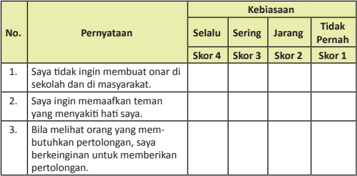

Tabel ini menunjukkan pernyataan tentang kebiasaan belajar dan perilaku sosial, dengan skor yang menunjukkan tingkat kebiasaan setiap pernyataan. Topik utama tabel adalah tentang kebiasaan belajar dan perilaku sosial. Kolom-kolomnya meliputi pernyataan (No.), kebiasaan (Sering, Jarang, Tidak Pernah), dan skor yang menunjukkan tingkat kebiasaan setiap pernyataan. Data penting yang terlihat adalah bahwa pernyataan 1 dan 2 memiliki skor 4 untuk kebiasaan sering, sementara pernyataan 3 memiliki skor 4 untuk kebiasan jarang. Ini menunjukkan bahwa banyak orang sering tidak ingin membuat onar di sekolah dan masyarakat, serta ingin memaafkan teman yang menyakitkan hati mereka, tetapi hanya sedikit orang yang berkeinginan untuk memberikan pertolongan kepada orang yang membutuhkannya.

kamu

 

---
## 📄 Halaman 26

---
**📊 Tabel**

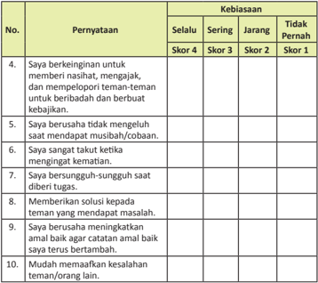

Tabel ini berisi 10 pernyataan yang diuji keberadaan kebiasaan baik atau buruk seseorang dalam berinteraksi dengan teman-temannya. Kolom "Selalu" menunjukkan bahwa pribadi tersebut melakukan kebiasaan tersebut secara rutin, "Jarang" menunjukkan kebiasaan tersebut dilakukan dengan sedikitnya, "Tidak Pernah" menunjukkan kebiasaan tersebut tidak pernah dilakukan, dan "Skor 4" menunjukkan bahwa pribadi tersebut memiliki kebiasaan yang sangat baik, "Skor 3" menunjukkan kebiasaan yang baik, "Skor 2" menunjukkan kebiasaan yang sedang, dan "Skor 1" menunjukkan kebiasaan yang buruk. Topik utama tabel ini adalah tentang kebiasaan baik dan buruk dalam hubungan sosial dengan teman-teman. Data penting yang terlihat adalah bahwa pribadi yang memiliki kebiasaan baik dalam berinteraksi dengan teman-temannya cenderung memiliki skor tinggi pada kolom "Selalu", "Jarang", dan "Tidak Pernah". Ini menunjukkan bahwa kebiasaan baik dalam berinteraksi dengan teman-teman dapat mempengaruhi skor yang diberikan pada tabel ini.

 

---
## 📄 Halaman 27

### Berbusana Muslim dan Muslimah Cermin Kepribadian dan Keindahan

### Bagan Alir

---
**🖼️ Gambar/Diagram**

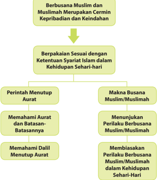

> **Deskripsi Visual:** Gambar ini adalah diagram yang menunjukkan struktur dan konten dari materi pelajaran tentang busana Muslim dan Muslimah. Diagram ini terdiri dari dua tingkatan utama:

1. Tingkat pertama: Berbusana Muslim dan Muslimah merupakan cerminan kepribadian dan keindahan.
2. Tingkat kedua: Berpakaian sesuai dengan ketentuan syariat Islam dalam kehidupan sehari-hari.

Dalam tingkat kedua, ada empat sub-lembaran utama:

1. Perintah Menutup Aurat
   - Memahami Aurat dan Batasan-Batasannya
   - Memahami Dalil Menutup Aurat

2. Makna Busana Muslim/Muslimah
   - Menunjukkan Perilaku Berbusana Muslim/Muslimah
   - Membiasakan Perilaku Berbusana Muslim/Muslimah dalam Kehidupan Sehari-Hari

Teks, angka, atau label penting yang terlihat dalam diagram ini meliputi:
- "Berbusana Muslim dan Muslimah merupakan cerminan kepribadian dan keindahan"
- "Berpakaian sesuai dengan ketentuan syariat Islam dalam kehidupan sehari-hari"
- "Perintah Menutup Aurat"
- "Makna Busana Muslim/Muslimah"

Informasi kunci yang dapat diambil pembaca meliputi:
- Pentingnya busana dalam memperlihatkan kepribadian dan keindahan seseorang
- Perluasan pengetahuan tentang aurat dan batasan-batasannya
- Pentingnya menunjukkan dan membiasakan perilaku berbusana yang sesuai dengan syariat Islam dalam kehidupan sehari-hari

 

---
## 📄 Halaman 28

### Membuka Relung Hai

### Cermai kisah dan gambar berikut!

Islam adalah agama yang sempurna yang  ajarannya  mencakup  seluruh  aspek kehidupan manusia. Ajaran Islam mengatur semua urusan manusia agar terwujud kehidupan yang aman, nyaman, dan damai. Dalam  hal  berbusana,  Islam  mengajarkan bahwa busana memiliki fungsi utama sebagai  penutup  aurat  selain  fungsi-fungsi yang  lain  seperi  fungsi  sebagai  hiasan  dan penahan  rasa  panas  atau  dingin.  Dengan demikian, maka bagi orang-orang yang beriman busana adalah sesuatu yang sangat pening  untuk  diperhaikan  terutama  bagi kalangan perempuan.

---
**🖼️ Gambar/Diagram**

> **Deskripsi Visual:** Gambar ini adalah foto yang menunjukkan dua orang wanita sedang berdandan atau memamerkan pakaian tradisional. Kedua wanita tersebut mengenakan pakaian yang berwarna-warni dengan detail yang rumit, termasuk baju dengan motif batik dan pashmina merah. Pakaian mereka tampak sangat detail dan menunjukkan kekayaan budaya lokal. Di sekitar mereka, terlihat beberapa elemen lain seperti latar belakang yang gelap dan lampu yang menyala, yang membuat fokus pada penampilan mereka. Teks, angka, atau label tidak terlihat dalam gambar ini. Informasi kunci yang dapat diambil pembaca adalah bahwa gambar ini mungkin digunakan untuk tujuan pendidikan atau promosi budaya lokal.

Hal  ini  tentu  saja  menjadi  tantangan tersendiri bagi kaum perempuan, terutama di tengah-tengah kepungan budaya modern yang sangat mengesampingkan masalah syari'at  agama.  Banyak  yang  beranggapan bahwa urusan busana atau berpakaian adalah urusan ' privacy ' seiap orang, merupakan  bagian  dari  hak  asasi  manusia yang  idak  boleh  orang  lain  atau  kelompok lain ikut mengatur urusan tersebut.

menggunakan busana muslimah.

Namun demikian, apapun alasan yang dikemukakan oleh orang-orang tentang ajaran Islam yang satu ini, bagi kita bahwa gaya modern dan gay a yang  idak harus membuka aurat. Tidak ada kaitannya antara modernitas suatu kelompok atau masyarakat dengan busana atau pakaian yang membuka aurat. Dalam hal ini, kita dapat melihat dan meniru bangsa Jepang yang sangat maju dan modern dengan tetap melestarikan budayanya termasuk dalam berpakaian.

Dalam konteks berbusana, menutup aurat bukan saja baik dan saran, bahkan para perempuan akan jauh terlihat lebih canik, anggun dan berwibawa dengan busana  yang  menutup  aurat,  Selain  itu,  pemakainya  juga  akan  terhindar  dari itnah  dan  perbuatan  idak  menyenangkan  dari  orang  yang  akan  berb uat  jahat seperi berbuat seksual. Bukankah imbulnya kejahatan-kejahat n seksual seperi kejahatan pemerkosaan, perzinaan, bahkan pelecehan seksual yang dilakukan di tempat-tempat umum atau keramaian, pemicunya karena tergoda dengan cara berbusana kaum perempuan yang sangat seksi?

 

---
## 📄 Halaman 29

Ada yang beranggapan bahwa menutup aurat itu bagian dari hak individu, bukan  kewajiban.  Bagaimana  menurut  pendapat  kalian?  Kemukakan dengan  argumentasi  yang  bersumber  kepada al-Qur'±n dan  hadis  dan diskusikan bersama teman dan gurumu.

### Mengkriisi Sekitar Kita

### Cermai wacana dan gambar berikut.

atau public igure yang menyadari peningnya melaksanakan salah satu ajaran Islam mengenai menutup aurat .

Tren berbusana muslimah di kalangan perempuan Indonesia beberapa tahun terakhir ini merupakan fenomena yang menggembirakan. Tentu hal ini sangat berbeda dengan kondisi  sebelumnya. Semangat perempuan Indonesia untuk mengenakan jilbab hampir dapat  dijumpai  di  semua  area publik, baik di lingkungan pemerintahan maupun di lingkungan  swasta.  Fenomena ini merupakan dampak posiif media yang memberikan informasi  tentang  para  aktris

Namun demikian, jika perilaku berbusana muslimah hanya disebabkan tren dan bukan karena kesadaran keagamaan yang memerintahkan kaum hawa harus menutup aurat ,  maka  dikhawairkan  akan  dapat  mencederai  ajaran  Islam  itu sendiri. Betapa idak, banyak dijumpai para perempuan yang secara ż ahir sudah berbusana  secara  Islami,  tetapi  akhlak  dan  perilakunya  belum  mencerminkan

 

---
## 📄 Halaman 30

makna hakiki dari ajaran Islam untuk menutup aurat .  Misalnya, masih banyak perempuan  berjilbab  yang  berpacaraan,  berboncengan  motor  dengan  orang yang bukan ma ĥ ram nya dengan begitu mesra, dan lain sebagainya. Tentu saja hal  tersebut  sangat  idak  sesuai  dengan  hakekat  menutup aurat .  Idealnya, para perempuan muslim yang telah berbusana sesuai dengan perintah agama, mampu  menampilkan pribadi yang dapat menjadikan contoh bagi orang yang belum memakai busana muslimah.

Sebagai renungan bersama, mari diskusikan pernyataan yang sering muncul di  tengah-tengah  masyarakat,  ' Lebih baik idak  berjilbab,  tetapi  sopan  pada sesama,  menjaga  perkataan  dusta  dan  gibah,  serta  lain nya  daripada  berjilbab tetapi  idak  berakhlak  baik  pada  sesama .' Bagaimana pendapatmu tentang hal tersebut?

Apakah  kamu  termasuk  siswa/siswi  yang  sudah  membiasakan  diri berbusana  secara  Islam?  Bagaimana  pendapatmu  dengan  pernyataan 'lebih  baik  tidak  berhijab  tetapi  sopan  daripada  berhijab  tetapi  masih suka membicarakan aib atau kejelekan orang lain?' Diskusikan bersama teman-temanmu dan kemukakan kepada gurumu.

### Memperkaya Khazanah Peserta Didik

### A.  Memahami Makna Busana Muslim/Muslimah dan Menutup Aurat

### 1.  Makna Aurat

Menurut bahasa, aurat berai malu, aib, dan buruk. Kata aurat berasal dari kata awira yang arinya hilang perasaan. Jika digunakan untuk mata, berari  hilang  cahayanya  dan  lenyap  pandangannya.  Pada  umumnya, kata  ini  memberi  ari  yang  idak  baik  dipandang,  memalukan,  dan mengecewakan. Menurut isilah dalam hukum Islam, aurat adalah batas minimal dari bagian tubuh yang wajib ditutupi karena perintah Allah Swt.

 

---
## 📄 Halaman 31

### 2.  Makna  Jilbab  dan  Busana  Muslimah

Secara eimologi ,  jilbab  adalah  sebuah  pakaian  yang  longgar  untuk menutup  seluruh  tubuh  perempuan  kecuali  muka  dan  kedua  telapak tangan. Dalam  bahasa  Arab,  jilbab  dikenal dengan  isilah khimar ,    dan dalam  bahasa  Inggris  jilbab  dikenal  dengan  isilah veil .  Selain kata jilbab untuk menutup bagian dada hingga kepala wanita untuk menutup aurat perempuan, dikenal pula isilah kerudung , ĥijab , dan sebagainya.

Pakaian  adalah  barang  yang  dipakai  (baju,  celana,  dan  sebagainya). Dalam  bahasa  Indonesia,  pakaian  juga  disebut  busana.    Jadi,  busana muslimah arinya pakaian yang dipakai oleh perempuan. Pakaian perempuan yang beragama Islam disebut busana muslimah. Berdasarkan makna  tersebut,  busana muslimah  dapat  diarikan sebagai pakaian wanita  Islam  yang  dapat  menutup aurat yang  diwajibkan  agama  untuk menutupinya, gunanya untuk kemaslahatan dan kebaikan bagi wanita itu sendiri serta masyarakat di mana ia berada.

Perintah menutup aurat sesungguhnya adalah perintah Allah Swt. yang dilakukan secara bertahap. Perintah menutup aurat bagi kaum perempuan pertama kali diperintahkan kepada istri-istri Nabi Muhammad saw. agar idak  berbuat  seperi  kebanyakan  perempuan  pada  waktu  itu  ( Q.S.  alA ĥzāb/33:  32-33 ).  Setelah  itu,  Allah  Swt.  memerintahkan  kepada  istri-istri Nabi  saw.  agar  idak  berhadapan  langsung  dengan  laki-laki  yang  b ukan mahram nya  ( Q.S. al-A ĥzāb/33:53 ).

Selanjutnya, karena istri-istri Nabi Muhammad saw. juga perlu keluar rumah  untuk  mencari  kebutuhan  rumah  tangganya,  maka  Allah  Swt. memerintahkan  mereka  untuk  menutup aurat apabila  hendak    keluar rumah  ( Q.S. al-A ĥzāb/33:59 ).  Dalam  ayat  ini,  Allah  Swt.  memerintahkan untuk  memakai  jilbab,  bukan  hanya  kepada  istri-istri  Nabi  Muhammad saw.  dan  anak-anak  perempuannya,  tetapi  juga  kepada  istri-istri  orangorang yang beriman. Dengan demikian, menutup aurat atau  berbusana muslimah adalah wajib hukumnya bagi seluruh wanita yang beriman.

### B.  Ayat-Ayat  Al-Qur'ān  dan  Hadis  tentang  Perintah  Berbusana  Muslim/ Muslimah

### 1. Q.S. al-A ĥ zab/33:59

'Wahai Nabi! Katakanlah kepada istri-istrimu, anak-anak perempuanmu dan istri-istri  orang  mukmin,  'Hendaklah mereka menutupkan jilbabnya ke  seluruh  tubuh  mereka.  Yang  demikian  itu  agar  mereka  lebih  mudah

 

---
## 📄 Halaman 32

untuk  dikenali  sehingga  mereka  idak  diganggu.  Dan  Allah  Swt.  Maha Pengampun, Maha Penyayang.'

### 2. Q.S. An-N ū r/24:31

'Dan katakanlah kepada para perempuan yang beriman, agar mereka menjaga pandangannya, dan memelihara kemaluannya, dan janganlah menampakkan  perhiasannya  (aurat-nya),  kecuali  yang  (biasa)  terlihat. Dan  hendaklah  mereka  menutupkan  kain  kerudung  ke  dadanya,  dan janganlah menampakkan perhiasannya (auratnya), kecuali kepada suami mereka, atau ayah mereka, atau ayah suami mereka, atau putraputra  mereka,  atau  putra-putra  suami  mereka,  atau  saudara-saudara laki-laki  mereka, atau putra-putra saudara laki-laki mereka, atau putraputra saudara perempuan mereka, atau para perempuan (sesama Islam) mereka, atau hamba sahaya yang mereka miliki, atau para pelayan lakilaki  (tua)  yang  idak  mempunyai  keinginan  (terhadap  perempuan)  atau anak-anak yang belum mengeri tentang aurat perempuan. Dan janganlah mereka menghentakkan kakinya agar diketahui perhiasan yang mereka sembunyikan. Dan bertobatlah kamu semua kepada Allah wahai orangorang yang beriman, agar kamu beruntung.'

### Kandungan Q.S. al-A ĥzāb/33:59

Dalam  ayat  ini,  Rasulullah  saw.  diperintahkan  untuk  menyampaikan kepada  para  istrinya  dan  juga  sekalian  wanita  mukminah  termasuk anak-anak perempuan beliau untuk memanjangkan jilbab mereka dengan  maksud  agar  dikenali  dan  membedakan  dengan  perempuan non mukminah. Hikmah lain adalah agar mereka idak diganggu. dengan  mengenakan  jilbab,  orang  lain  mengetahui  bahwa  dia  adalah seorang mukminah yang baik.

Karena

Pesan al-Qur'ān ini datang menanggapi adanya gangguan kair Quraisy terhadap  para  mukminah  terutama  para  istri  Nabi  Muhammad  saw.

 

---
## 📄 Halaman 33

yang menyamakan mereka dengan budak. Karena pada masa itu, budak idak mengenakan jilbab. Oleh karena itulah, dalam rangka melind ungi kehormatan dan kenyamanan para wanita, ayat ini diturunkan.

Islam begitu melindungi kepeningan perempuan dan memperhaikan kenyamanan  mereka  dalam  bersosialisasi.  Banyak  kasus  terjadi  karena seorang  individu  itu  sendiri  yang  idak  menyambut  ajakan al-Qur'ān untuk berjilbab. Kita pun masih melihat di sekeliling kita, mereka yang mengaku dirinya  muslimah,  masih  tanpa  malu  mengumbar aurat nya. Padahal Rasulullah saw. bersabda: 'Sesungguhnya rasa malu dan keimanan selalu bergandengan  kedua-duanya.  Jika  salah  satunya  diangkat,  maka  akan terangkat kedua-duanya.' (Hadis Sa ĥ i ĥ berdasarkan syarah Syeikh Albani dalam kitab Adabul Mufrad ).

### Kandungan Q.S. an-Nūr/24:31

Dalam ayat ini, Allah Swt. berirman kepada seluruh hamba-Nya yang mukminah agar menjaga kehormatan diri mereka dengan cara menjaga pandangan,  menjaga  kemaluan,  dan  menjaga aurat .  Dengan  menjaga keiga  hal  tersebut,  dipasikan  kehormatan  mukminah  akan  terjag a.  Ayat ini merupakan kelanjutan dari perintah Allah Swt. kepada hamba-Nya yang mukmin untuk menjaga pandangan dan menjaga kemaluan. Ayat ini Allah Swt. khususkan untuk hamba-Nya yang beriman, berikut penjelasannya.

Pertama, menjaga pandangan. Pandangan diibaratkan 'panah setan' yang  siap  ditembakkan  kepada  siapa  saja.  'Panah  setan'  ini  adalah panah yang jahat yang merusakan dua pihak sekaligus, si pemanah dan yang terkena panah. Rasulullah saw. juga bersabda pada hadis yang lain, 'Pandangan mata itu merupakan anak panah yang beracun y ang terlepas dari busur iblis, barangsiapa meninggalkannya karena  takut kepada Allah Swt.,  maka  Allah  Swt.  akan  memberinya  gani  dengan  manisny a  iman  di dalam  hainya.' (Lafal  hadis  yang  disebutkan  tercantum  dalam  kitab AdDa'wa Dawa' karya Ibnul Qayyim).

Panah  yang  dimaksud  adalah  pandangan  liar  yang  idak  menghargai kehormatan diri sendiri dan orang lain. Zina mata adalah pandangan haram. Al-Qur'ān memerintahkan agar menjaga pandangan ini agar idak merusak keimanan karena mata adalah jendela hai. Jika matanya banyak meli hat maksiat yang dilarang, hasilnya akan langsung masuk ke hai dan merusak hai.  Dalam  hal  keidaksengajaan  memandang  sesuatu  yang  haram, Rasulullah  saw.  bersabda  kepada  Ali  ra., 'Wahai  Ali,  janganlah  engkau mengikui  pandangan  (pertama  yang  idak  sengaja)  dengan pandangan (berikutnya),  karena  bagi  engkau  pandangan  yang  pert ama  dan  idak boleh  bagimu  pandangan  yang  terakhir  (pandangan  yang kedua)' (H.R. Abu Dawud dan At-Tirmidzi, dihasan -kan oleh Syaikh al-Albani).

 

---
## 📄 Halaman 34

Kedua, menjaga kemaluan. Orang yang idak dapat menjaga kemaluannya  pasi  idak  dapat  menjaga  pandangannya.  Hal  ini  karena menjaga  kemaluan  idak  akan  dapat  dilakukan  jika  seseorang  idak dapat  menjaga  pandangannya.  Menjaga  kemaluan  dari  zina  adalah hal yang sangat pening dalam menjaga kehormatan. Karena terjerumusnya ke dalam zina, bukan hanya harga dirinya yang rusak, orang terdekat di sekitarnya seperi orang tua, istri/suami, dan anak  akan ikut tercemar. 'Dan,  orang-orang  yang  memelihara  kemaluannya.  Kecuali terhadap istri-istri  mereka  atau  budak-budak  yang  mereka  miliki.  Maka sesungguhnya, mereka dalam hal ini iada tercela. Barangsiapa mencari yang sebaliknya, mereka itulah orang-orang yang melampaui batas.' (Q.S. al-Ma'ārij/70:29-31)

dengan

Allah Swt. sangat melaknat orang yang berbuat zina, dan menyamaratakan  nya dengan orang yang berbuat syirik dan membunuh. Sungguh,  iga  perbuatan  dosa  besar  yang  amat  sangat  dibenci  o leh  Allah Swt. Firman-Nya: 'Dan,  janganlah  kalian  mendekai  zina.  Sesungguhnya, zina  itu  adalah  suatu  perbuatan  yang  keji  dan  suatu  jal an  yang  buruk.' (Q.S. al-Isrā'/17:32).

Keiga, menjaga batasan aurat yang telah dijelaskan dengan rinci dalam hadis-hadis  Nabi.  Allah  Swt.  memerintahkan  kepada  seiap  mukmi nah untuk  menutup aurat nya  kepada  mereka  yang  bukan ma ¥ ram ,  kecuali yang  biasa  tampak  dengan  memberikan  penjelasan  siapa  saja  boleh melihat.  Di antaranya adalah suami, mertua, saudara laki-laki, anaknya, saudara perempuan, anaknya yang laki-laki, hamba sahaya, dan pelayan tua yang idak ada hasrat terhadap wanita.

Di  samping keiga hal di atas, Allah Swt. menegaskan bahwa walau pun aurat nya sudah ditutup namun jika berusaha untuk ditampakkan dengan berbagai cara termasuk dengan menghentakkan kaki supaya gemerincing perhiasannya terdengar, hal itu sama saja dengan membuka aurat .  Oleh karena  itu,  ayat  ini  ditutup  dengan  perintah  untuk  bertaubat  karena hanya dengan taubat  dari kesalahan yang dilakukan dan berjanji untuk mengubah sikap, maka kita akan beruntung.

### 3.  Hadis dari Ummu 'Aţiyyah

 

---
## 📄 Halaman 35

Dari Umu 'A ¯ iyah, ia berkata, 'Rasulullah saw. memerintahkan kami untuk keluar pada Hari Fi ¯ ri dan A «¥ a, baik gadis yang menginjak akil balig, wanita-wanita yang sedang haid, maupun wanita -wanita pingitan. Wanita  yang  sedang  haid  tetap  meninggalkan  śalat,  namu n  mereka  dapat menyaksikan kebaikan dan dakwah kaum Muslim. Aku bertanya, 'Wahai Rasulullah saw., salah seorang di antara kami ada yan g idak memiliki jilbab?'  Rasulullah saw. menjawab, 'Hendaklah saudari nya meminjamkan jilbabnya  kepadanya.'' (H.R.  Muslim).

### Kandungan Hadis

Kandungan  hadis  di  atas  adalah  perintah  Allah  Swt.  kepada  para  wan ita untuk  menghadiri  prosesi śalat 'Īdul  Fiţ ri dan 'Īdul  Adĥ a ,  walaupun  dia sedang  haid,  sedang  dipingit,  atau  idak  memiliki  jilbab.  B agi  yang  sedang haid,  maka  cukup  mendengarkan khutbah tanpa  perlu  melakukan  śalat berjama'ah  seperi  yang  lain.  Wanita  yang  idak  mempunyai  jilbab pun dapat meminjamnya dari wanita lain.

Hal ini menunjukkan peningnya dakwah /khutbah kedua śalat 'idain .  Kandungan hadis yang kedua, yang diriwayatkan oleh Ibnu Umar berisi  tentang  kemurkaan  Allah  Swt.  terhadap  orang  yang  menjulurkan pakaiannya dengan maksud menyombongkan diri.

Carilah  ayat al-Qur'±n dan  hadis  yang  berhubungan  dengan  perintah mengenakan busana muslim dan muslimah atau perintah menutup aurat .

### Menerapkan Perilaku Mulia

Mengenakan  busana  yang  sesuai  dengan syari'at Islam  bertujuan  agar manusia  terjaga  kehormatannya.  Ajaran  Islam  idak  bermaksud  un tuk  membatasi atau mempersulit gerak dan langkah umatnya. Akan tetapi dengan aturan dan syari'at tersebut manusia akan terhindar dari berbagai kemungkinan yang akan mendatangkan bencana dan kemudaratan bagi dirinya.

Berikut ini beberapa perilaku mulia yang harus dilakukan sebagai pengamalan berbusana sesuai syari'at Islam,  baik  di  lingkungan  keluarga,  sekolah,  maupun masyarakat.

 

---
## 📄 Halaman 36

### 1.  Sopan-santun dan ramah-tamah

Sopan-santun  dan  ramah-tamah  merupakan  ciri  mendasar  orang  yang beriman. Mengapa demikian? Karena hal ini merupakan salah satu ak hlak  yang dicontohkan  oleh  Rasulullah  saw.  sebagai  teladan  dan  panutan.  Rasulullah saw. adalah orang yang santun dan lembut perkataannya serta ramah-tamah perilakunya.  Hal  itu  ditunjukkan  oleh  Rasulullah  saw.  bukan  saja  kepada keluarga  dan  sahabat-sahabatnya, tetapi  kepada  orang  lain  bahkan  kepada orang yang memusuhinya sekalipun.

### 2.  Jujur dan amanah

Jujur dan amanah adalah sifat orang-orang yang beriman dan saleh. Tidak akan keluar perkataan dusta dan perilaku khianat jika seseorang benar-benar beriman kepada Allah Swt. Orang yang membiasakan diri dengan hidup jujur dan amanah, maka hidupnya akan dilipui dengan kebahagiaan. Betapa idak, banyak orang yang hidupnya gelisah dan menderita karena hidupnya penuh dengan dusta. Dusta adalah seburuk-buruk perkataan.

### 3.  Gemar beribadah

Beribadah adalah kebutuhan rokhani bagi manusia sebagaimana olahraga, makan, minum, dan isirahat sebagai kebutuhan jasmaninya. Karena i badah adalah  kebutuhan,  maka  idak  ada  alasan  orang  yang  beriman  untuk melalaikan atau meninggalkannya. Orang yang beriman akan dengan  senang hai melakukannya tanpa ada rasa keterpaksaan sedikitpun.

### 4.  Gemar menolong sesama

Menolong orang lain pada hakikatnya adalah menolong diri sendiri. Bagi orang yang beriman, menolong dengan niat ikhlas karena Allah Swt. sematamata akan mendatangkan rahmat dan karunia yang iada tara. Berapa bany ak orang  yang  gemar  membantu  orang  lain  hidupnya  mulia  dan  terhormat. Namun  sebaliknya,  bagi  orang-orang  yang  kikir  dan  enggan  membantu orang  lain,  dapat  dipasikan  ia  akan  mengalami  kesulitan  hidup  d dunia  ini. Tolonglah orang lain, niscaya pertolongan akan datang kepadamu meskipun bukan berasal dari orang yang kamu tolong.

### 5.  Menjalankan amar  makruf dan nahi munkar

Maksud amar makruf dan nahi  munkar adalah mengajak dan menyeru orang  lain  untuk  berbuat  kebaikan  dan  mencegah  orang  lain  melakukan ke munkar an/kemaksiatan.  Hal  ini  dapat  dilakukan  dengan  efekif  jika  ia telah memberikan contoh yang baik bagi orang lain yang diserunya. Tugas mulia tersebut  haruslah  dilakukan  oleh  seiap  orang  yang  beriman.  A jaklah  orang lain berbuat kebaikan dan cegahlah ia dari ke munkar an!

 

---
## 📄 Halaman 37

### Rangkuman

- Menutup aurat adalah kewajiban agama yang ditegaskan dalam al-Qur'ān maupun hadis Rasulullah saw.
itu

- Kewajiban  menutup aurat di syari'at kan untuk kepeningan manusia sendiri sebagai wujud kasih sayang dan perhaian Allah Swt. terhadap kemaslahatan hamba-Nya di muka bumi.
- Kewajiban bagi kaum mukminah untuk mengenakan jilbab untuk menutup aurat nya kecuali terhadap beberapa golongan.
- Dalam Q.S.  al-A ĥzāb/33:39 ditegaskan  perintah  menggunakan  jilbab  dan memanjangkannya hingga ke dada, dengan tujuan untuk memberikan rasa nyaman dan aman kepada seiap mukminah. Sementara yang idak memil ki jilbab, dia bisa meminjamnya dari saudara seiman.
- Allah Swt. berirman dalam Q.S. an-N µ r/24:31 untuk menjaga pandangan, memelihara  kemaluan,  dan  idak  menampakkan aurat ,  kecuali  kepada: suami, ayah suami, anak laki-laki suami, saudara laki-laki, anak laki saudara laki-laki,  anak  lelaki  saudara  perempuan,  perempuan  mukminah,  hamba sahaya,  pembantu  tua  yang  idak  lagi  memiliki  hasrat  terhadap  wani ta.
- Hadis dari  Ummu  Aţiyyah  berisi  anjuran  kepada  seiap  muslimah  untuk menghadiri śalat 'Īdul  Fiţ ri dan 'Īdul  Adĥ a meskipun  sedang  haid  atau dipingit.
- Allah  Swt.  memerintahkan  seiap  mukmin  dan  mukminah  di dua  ayat  ini untuk bertaubat untuk memperoleh keberuntungan.

### A.  Uji Pemahaman

Jawablah pertanyaan-pertanyaan berikut dengan jelas.

- Tulislah salah satu ayat yang berhubungan dengan memanjangkan jilbab hingga ke dada lengkap dengan arinya.
- Tulislah salah satu Hadis tentang batasan pakaian wanita lengkap dengan arinya.
- Tuliskan beberapa manfaat menggunakan jilbab.
- Sebutkan sikapmu yang harus ditunjukkan keika terlihat oleh mata ada kemaksiatan.
- Tuliskan 3 (iga) dampak negaif akibat membuka aurat .

 

---
## 📄 Halaman 38

### B.  Releksi

Berilah  tanda checklist (  ) yang sesuai dengan dorongan haimu untuk menanggapi pernyataan-pernyataan berikut.

---
**📊 Tabel**

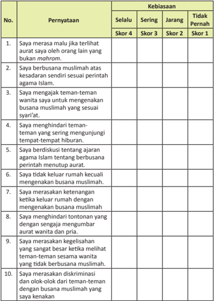

Tabel ini menunjukkan pernyataan yang dianggap sebagai kebiasaan atau tidak kebiasaan oleh siswa dalam berbagai situasi sosial. Kolom "Selalu" menunjukkan pernyataan yang dianggap kebiasaan, "Sering" menunjukkan pernyataan yang dianggap sering terjadi, "Jarang" menunjukkan pernyataan yang dianggap jarang terjadi, dan "Tidak Penah" menunjukkan pernyataan yang dianggap tidak pernah terjadi. Topik utama tabel ini adalah perilaku dan sikap siswa dalam berbagai situasi sosial, termasuk hal-hal seperti merasa malu jika terlihat aurat, berbusana muslimah, menghina teman-teman, berdiskusi tentang agama Islam, dan merasa ketegangan ketika keluar rumah dengan busana muslimah. Data penting yang terlihat adalah bahwa banyak pernyataan dianggap kebiasaan atau sering terjadi oleh siswa, menunjukkan adanya kesadaran diri yang rendah dan kurangnya pemahaman tentang etika dan norma sosial dalam berbusana.

 

---
## 📄 Halaman 39

### Mempertahankan Kejujuran sebagai Cermin Kepribadian

### Bagan Alir

---
**🖼️ Gambar/Diagram**

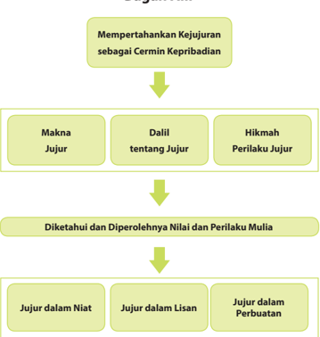

> **Deskripsi Visual:** Gambar ini adalah diagram yang menunjukkan proses mempertahankan kejujuran sebagai cermin kepribadian. Diagram ini terdiri dari empat bagian utama:

1. **Makna Jujur**: Ini merupakan elemen pertama yang menunjukkan bahwa kejujuran memiliki makna yang mendalam dalam kehidupan manusia.

2. **Dalil tentang Jujur**: Bagian ini membahas berbagai dalil atau alasan mengapa kejujuran penting dalam kehidupan.

3. **Hikmah Perilaku Jujur**: Ini menekankan bahwa kejujuran juga memiliki hikmah dalam perilaku dan perbuatan seseorang.

4. **Diketahui dan Diperolehnya Nilai dan Perilaku Mulia**: Bagian ini menggambarkan bagaimana kejujuran harus diketahui dan diperoleh sebagai nilai-nilai dan perilaku yang baik.

5. **Jujur dalam Niat**: Ini menunjukkan bahwa kejujuran harus dimulai dengan niat yang jujur.

6. **Jujur dalam Lisan**: Ini menekankan pentingnya kejujuran dalam percakapan atau komunikasi.

7. **Jujur dalam Perbuatan**: Ini menekankan pentingnya kejujuran dalam tindakan atau perbuatan.

Setiap elemen dalam diagram ini memiliki hubungan dengan elemen lainnya, membentuk suatu proses yang mengarah pada tujuan akhir yaitu mempertahankan kejujuran sebagai cermin kepribadian.

 

---
## 📄 Halaman 40

### Membuka Relung Hai

### Cermai gambar dan wacana berikut.

kehalalan barang yang dijualnya.

Kisah menarik berikut ini mungkin dapat menginspirasi dan memoivasi kita agar selalu mempertahankan kejujuran dalam segala kondisi. Simaklah kisahnya sebagai berikut.

Suatu keika seorang sahabat Rasulullah saw. yang bernama Wasilah bin Iqsa sedang berada di pasar ternak. Tiba-iba saja ia menyaksikan seseorang tengah menawar unta. Keika ia lengah, pembeli itu telah menuntun unta yang telah dibelinya dengan harga 300 dirham .  Wasilah bergegas mendapatkan si pembeli tersebut seraya bertanya, 'Apakah unta yang engkau beli itu u nta untuk disembelih atau  sebagai  tunggangan?'  Si  pembeli  menjawab,  'Unta  ini  un tuk  dikendarai.' Kemudian Wasilah memberikan nasihat bahwa unta tersebut idak ak an tahan lama karena di kakinya ada lubang karena cacat. Pembeli itu pun bergegas kembali menemui si penjual  dan  menggugat,  sehingga  akhirnya  terjad i  pengurangan harga 100 dirham .

Si  penjual  merasa  jengkel  kepada  Wasilah  seraya  mengatakan,  'Semoga engkau dikasihi Allah Swt., dan jual-beliku telah engkau rusak.' Mendengar ucapan tersebut, Wasilah menimpalinya, 'Kami sudah ber bai'at kepada Rasulullah saw. untuk berlaku jujur kepada seiap muslim, sebagaimana Rasulullah saw. bersabda, 'Tiada halal bagi siapa pun yang menjual barangnya kecuali dengan menjelaskan cacatnya, dan iada halal bagi yang mengetahui itu kecuali menjelaskannya.' (H.R. Hakim, Baihaki, dan Muslim dari Wasilah).'

Itulah nilai-nilai kejujuran, walaupun berisiko, namun tetap harus dijunjung inggi dalam kehidupan. Kejujuran itu sangat mudah diucapkan oleh seiap orang, tetapi sedikit sekali yang dapat menerapkannya.

 

---
## 📄 Halaman 41

- Setelah kamu membaca wacana di atas, bagaimana jika hal tersebut terjadi pada dirimu? Apakah kamu akan tetap berlaku jujur meskipun akan menanggung risiko yang berat, ataukah kamu akan melakukan kecurangan ketika orang lain tidak mengetahui?
- Ceritakan contoh nyata yang pernah kamu ketahui baik yang terjadi pada orang-orang yang kamu kenal maupun pada orang lain.

### Mengkriisi Sekitar Kita

### Cermai gambar dan wacana berikut.

Sumber: www.kendaripos.co.id

Berbagai cara dilakukan oleh sebagian orang untuk memenuhi keinginan dan kebutuhan hidupnya. Ada yang melakukannya dengan memoivasi diri dengan bekerja keras dan menaai aturan yang ada. Tentu hal tersebut merupakan caracara yang memang seharusnya ditempuh. Akan tetapi, idak sedikit orang yang menempuh  cara-cara  yang  bertentangan  dengan  hukum  dan  peraturan  yang berlaku,  baik  hukum  agama  maupun  peraturan  yang  berlaku  yang  d ibuat  oleh pemerintah.  Mereka  jauh  dari  nilai-nilai  kejujuran.  Bagi  mer eka,  cara  apa  pun boleh  yang  pening  tujuannya  tercapai.

 

---
## 📄 Halaman 42

Berani  jujur  hebat!  Kalimat  tersebut  adalah  sebuah  slogan  yang  marak disuarakan oleh para akivis anikorupsi untuk mendukung  kerja Komisi Pemberantas  Korupsi  (KPK)  dalam  menjalankan  tugasnya  'menangkap'  para koruptor.  Sebagaimana  yang  kita  ketahui  bahwa,  semenjak  dibentuknya  KPK, sudah banyak penjahat 'kerah puih' yang menggerogoi uang rakyat dengan cara  licik  dan  kejam.  Mereka  sudah  memperoleh  jabatan  yang  inggi  dengan segenap  fasilitas  yang  diberikan  negara,  tetapi  masih  saja  melakukan  prakikprakik kotor dengan cara memanipulasi, melambungkan harga belanja barang, laporan keuangan ikif, dan sebagainya. Namun demikian, idak semua pejabat berperilaku seperi itu. Banyak di antara pejabat di negeri ini yang masih memiliki hai  nurani  dengan  berperilaku  jujur  dan  amanah.  Mereka  hidup  bersahaja dengan penghasilan yang sah diberikan oleh negara.

Korupsi  dimulai  dari  perilaku  yang  tidak  jujur  yang  mungkin  sering dilakukan  sejak  kecil,  baik  di  lingkungan  keluarga,  sekolah,  maupun masyarakat.

Apa saja perbuatan yang sering dilakukan sebagai perbuatan tidak jujur, baik di lingkungan keluarga, sekolah, maupun masyarakat? Coba analisis. Apa saja upaya yang dilakukan untuk menghindari hal tersebut?

### Memperkaya Khazanah Peserta Didik

### A.  Memahami Makna Kejujuran

### 1.  Pengerian Jujur

Dalam bahasa Arab, kata jujur semakna dengan ' aś-śidqu ' atau ' śiddiq ' yang berari benar, nyata, atau berkata benar. Lawan kata ini adalah dusta, atau  dalam  bahasa  Arab  ' al-ka © ibu '.  Secara  isilah,  jujur  atau aś-śidqu bermakna  (1)  kesesuaian  antara  ucapan  dan  perbuatan;  (2)  kesesuaian antara informasi dan kenyataan; (3) ketegasan dan kemantapan hai; dan (4) sesuatu yang baik yang idak dicampuri kedustaan.

 

---
## 📄 Halaman 43

### 2.  Pembagian  Sifat  Jujur

Imam al-Gazali  membagi  sifat  jujur  atau  benar  ( śiddiq )  sebagai  berikut.

- Jujur  dalam  niat  atau  berkehendak,  yaitu  iada  dorongan  bagi seseorang dalam segala indakan dan gerakannya selain dorongan karena Allah Swt.
- Jujur dalam perkataan (lisan), yaitu sesuainya berita yang diterima dengan  yang  disampaikan.  Seiap  orang  harus  dapat  memelihara perkataannya. Ia idak berkata kecuali dengan jujur. Barangsiap a yang menjaga lidahnya dengan cara selalu menyampaikan berita yang sesuai dengan fakta yang sebenarnya, ia termasuk jujur jenis ini.  Menepai janji termasuk jujur jenis ini.
- Jujur  dalam  perbuatan/amaliah,  yaitu  beramal  dengan  sungguhsungguh sehingga perbuatan ż ahir nya idak menunjukkan sesuatu yang ada dalam bainnya dan menjadi tabiat bagi dirinya.
Kejujuran merupakan fondasi atas tegaknya suatu nilai-nilai k ebenaran, karena jujur idenik dengan kebenaran. Allah Swt. berirman:

Arinya: 'Wahai orang-orang yang beriman! Bertakwalah kamu kepada Allah Swt. dan ucapkanlah perkataan yang benar.' (Q.S. al-Ahzāb/33:70)

Orang yang beriman perkataannya harus sesuai dengan perbuatannya karena sangat berdosa besar bagi orang-orang  yang  idak  mampu menyesuaikan perkataannya dengan perbuatan, atau berbeda apa y ang di lidah dan apa yang diperbuat. Allah Swt. berirman, 'Wahai orang-orang yang  beriman!  Mengapa  kamu  mengatakan  sesuatu  yang  idak kamu kerjakan?  (Itu) sangatlah dibenci di sisi Allah jika  kamu mengatakan apaapa yang idak kamu kerjakan.' (Q.S. aś-Śaf/61:2-3)

Pesan moral ayat tersebut idak lain memerintahkan satunya per kataan dengan perbuatan. Dosa besar di sisi Allah Swt., mengucapk an sesuatu yang idak disertai dengan perbuatannya. Perilaku jujur dapat men ghantarkan pelakunya  menuju  kesuksesan  dunia  dan  akhirat.  Bahkan,  sifat jujur adalah sifat yang wajib dimiliki oleh seiap nabi dan rasul. A rinya, orangorang yang selalu isiqamah atau  konsisten  mempertahankan  kejujuran, sesungguhnya ia telah memiliki separuh dari sifat kenabian.

Jujur  adalah  sikap  yang  tulus  dalam  melaksanakan  sesuatu  yang diamanatkan, baik berupa harta maupun tanggung jawab. Orang melaksanakan amanat disebut al-Amin , yakni orang yang terpercaya, jujur, dan seia. Dinamakan demikian karena segala sesuatu yang diamanatk an kepadanya  menjadi  aman  dan  terjamin  dari  segala  bentuk  gangguan, baik yang datang dari dirinya sendiri maupun dari orang lain. Sifat jujur dan  terpercaya  merupakan  sesuatu  yang  sangat  pening  dalam  seg ala yang

 

---
## 📄 Halaman 44

aspek  kehidupan,  seperi  dalam  kehidupan  rumah  tangga,  perniagaan, perusahaan, dan hidup bermasyarakat.

Di  antara  faktor  yang  menyebabkan  Nabi  Muhammad  saw.  berhasil dalam  membangun  masyarakat  Islam  adalah  karena sifat-sifat dan akhlaknya yang sangat terpuji. Salah satu sifatnya yang menonjol adalah kejujurannya sejak masa kecil sampai akhir hayatnya, sehingga ia mendapat gelar al-Amin (orang yang dapat dipercaya atau jujur).

Kejujuran  akan  mengantarkan  seseorang  mendapatkan  cinta  kasih dan keridaan Allah Swt. Kebohongan  adalah kejahatan iada tara,  yang merupakan faktor terkuat yang mendorong seseorang berbuat kemunkaran dan menjerumuskannya ke jurang neraka.

Kejujuran sebagai sumber keberhasilan, kebahagian, serta ketenteraman, harus dimiliki oleh seiap muslim. Bahkan, seorang muslim wajib  pula  menanamkan  nilai  kejujuran  tersebut  kepada  anak-anaknya sejak  dini  hingga  pada  akhirnya  mereka  menjadi  generasi  yang  meraih sukses  dalam  mengarungi  kehidupan.  Adapun  kebohongan  adalah muara dari  segala  keburukan  dan  sumber  dari  segala  kecaman  akibat  yang diimbulkannya adalah kejelekan, dan hasil akhirnya adalah kekeji an. Akibat yang diimbulkan oleh kebohongan adalan namimah (mengadu domba),  sedangkan namimah dapat melahirkan kebencian. Demikian pula kebencian adalah awal dari permusuhan. Dalam permusuhan idak ad a keamanan dan kedamaian. Dapat dikatakan bahwa, 'orang yang sedikit kejujurannya niscaya akan sedikit temannya.'

### Contoh Buki Kejujuran Nabi Muhammad saw.

Keika Nabi Muhammad saw. hendak memulai dakwah secara terbuka dan  terang-terangan,  langkah  pertama  yang  dilakukan,  Rasulullah  saw. berdiri  di  atas  bukit,  kemudian  memanggil-manggil kaum Quraisy untuk berkumpul,  'Wahai  kaum  Quraisy,  kemarilah  kalian  semua.  Aku  akan memberikan sebuah berita kepada kalian semua!'

Mendengar panggilan lantang dari Rasulullah saw., berduyun-duyunlah kaum Quraisy berdatangan, berkumpul untuk mendengarkan berita dari manusia jujur penuh pujian. Setelah masyarakat berkumpul dalam jumlah besar, beliau tersenyum kemudian bersabda, 'Saudara-saudaraku, jika aku memberi kabar kepadamu, jika di balik bukit ini ada musuh yang sudah siaga  hendak  menyerang  kalian,  apakah  kalian  semua  percaya?'  Tanpa ragu semuanya menjawab mantap, 'Percaya!'

Kemudian,  Rasulullah  kembali  bertanya,  'Mengapa  kalian  langsung percaya tanpa membukikannya terlebih dahulu?' Tanpa ragu-ragu orang yang hadir  di  sana  kembali  menjawab  mantap,  'Engkau  sekalipun  idak pernah  berbohong,  wahai al-Amin .  Engkau  adalah  manusia  yang  paling jujur yang kami kenal.'

 

---
## 📄 Halaman 45

Dari pembagian sifat jujur di atas, kemukakan contoh masing-masing sifat jujur menurut Imam al-Gazali tersebut.

### B.  Ayat-Ayat Al-Qur'ān dan Hadis tentang Perintah Berlaku Jujur

### 1. Q.S. al-Māidah/5:8

``

'Wahai  orang-orang  yang  beriman!  Jadilah  kamu  sebagai  penegak keadilan karena Allah (keika) menjadi saksi dengan adil. Dan janganlah kebencianmu terhadap suatu kaum mendorong kamu untuk berlaku idak adil.  Berlaku  adillah.  Karena  (adil)  itu  lebih  dekat  kepada  takwa.  Dan bertakwalah kepada Allah, sungguh, Allah Mahatelii terhadap apa yang kamu kerjakan.'

### 2. Q.S. at-Taubah/9:119

'Wahai orang-orang yang beriman! Bertakwalah kepada Allah Swt., dan bersamalah kamu dengan orang-orang yang benar.'

### Kandungan Q.S. al-Māidah/5:8

Ayat  ini  memerintahkan  kepada  orang  mukmin  agar  melaksanakan amal  dan  pekerjaan  mereka  dengan  cermat,  jujur,  dan  ikhlas  karena Allah Swt., baik pekerjaan yang bertalian dengan urusan agama maupun pekerjaan  yang  bertalian  dengan  urusan  kehidupan  duniawi.  Karena hanya dengan demikianlah mereka dapat sukses dan memperoleh hasil balasan  yang  mereka  harapkan.  Dalam  persaksian,  mereka  harus  adil menerangkan  apa  yang  sebenarnya,  tanpa  memandang  siapa  orangnya, sekalipun akan menguntungkan lawan dan merugikan sahabat dan kerabatnya  sendiri.  Ayat  ini  seirama  dengan Q.S.  an-Nisā/4:153, yaitu sama-sama  menerangkan  tentang  seorang  yang  berlaku  adil  dan  jujur

 

---
## 📄 Halaman 46

dalam persaksian.  Perbedaannya  ialah  dalam  ayat  tersebut  diterangkan kewajiban  berlaku  adil  dan  jujur  dalam  persaksian  walaupun  kes aksian  itu akan  merugikan  diri  sendiri,  ibu,  bapak,  dan  kerabat.  Selanj utnya,  dalam ayat  ini  diterangkan  bahwa  kebencian  terhadap  sesuatu  kaum  id ak  boleh mendorong  seseorang  untuk  memberikan  persaksian  yang  idak adil  dan idak  jujur,  walaupun  terhadap  lawan.

Menurut  Ibnu  Kașir,  maksud  ayat  di  atas  adalah  agar  orang-orang yang beriman  menjadi  penegak  kebenaran  karena  Allah  Swt.,  bukan  kar ena manusia  atau  karena  mencari  popularitas.  Mereka  dapat  menjadi  sak si dengan  adil  dan  idak  curang,  jangan  pula  kebencian  kepada  suatu kaum menjadikan kalian berbuat idak adil terhadap mereka, Terapkanlah keadilan  itu  kepada  seiap  orang,  baik  teman  ataupun  musuh  kare na sesungguhnya  perbuatan  adil  menghantarkan  pelakunya  memperoleh derajat  takwa.

Terkait  dengan  menjadi  saksi  dengan  adil,  ditegaskan  dari  Nu' man  bin Basyir,  'Ayahku  pernah  memberiku  suatu  hadiah.  Kemudian  ib uku,  'Amrah bini  Rawahah,  berkata,  'Aku  idak  rela  sehingga  engkau  mempe rsaksikan hadiah  itu  kepada  Rasulullah  saw.  Kemudian,  ayahku  mendatangi beliau dan  meminta  beliau  menjadi  saksi  atas  hadiah  itu.  Kemudian  Rasu lullah saw.  pun  bersabda:

Arinya: 'Apakah seiap anakmu  engkau beri hadiah seperi itu juga? 'Tidak', jawabnya. Maka beliau pun bersabda, 'Bertakwalah kepada Allah Swt., dan berbuat adillah terhadap anak-anak kalian!' lebih lanjut beliau bersabda, 'Sesungguhnya, aku idak mau bersaksi atas suatu keidakadilan.' Kemudian ayahku pulang dan menarik kembali pemberian tersebut.'

### Kandungan Q.S. at-Taubah/9:119

Dalam ayat ini, Allah Swt. menunjukkan seruan-Nya dan memberikan bimbingan kepada orang-orang yang beriman kepada-Nya dan Rasul-Nya. Mereka diharapkan tetap dalam ketakwaan serta mengharapkan rida -Nya, dengan  cara  menunaikan  segala  kewajiban  yang  telah  ditetapkan-Nya, dan menjauhi segala larangan yang telah ditentukan-Nya, dan hendaklah senaniasa bersama orang-orang yang benar dan jujur, mengikui ketakwaan,  kebenaran  dan  kejujuran  mereka.  Dan  jangan  bergabung kepada kaum munaik, yang selalu menutupi kemunaikan mereka dengan kata-kata  dan  perbuatan  bohong  serta  ditambah  pula  dengan  sumpah palsu  dan  alasan-alasan  yang  idak  benar.

 

---
## 📄 Halaman 47

### 3.  Hadis  dari  Abdullah  bin  Mas'ud  ra.

Diriwayatkan dari 'Abdullah bin Mas'ud ra., Rasulullah saw. bersabda, 'Hendaklah  kamu  berlaku  jujur  karena  kejujuran  menuntunmu  pada kebenaran,  dan  kebenaran  menuntunmu  ke  surga.  Dan  sesaniasa seseorang berlaku jujur dan selalu jujur sehingga dia tercatat di sisi Allah Swt. sebagai orang yang jujur. Dan hindarilah olehmu berlaku dusta karena kedustaan menuntunmu pada kejahatan, dan kejahatan menuntunmu ke neraka. Dan seseorang senaniasa berlaku dusta dan selalu dusta sehingga dia tercatat di sisi Allah Swt. sebagai pendusta.' (H.R. Muslim)

### Kandungan Hadis

Dalam  sebuah  hadis  panjang  yang  berasal  dari  Syihab  diceritakan bahwa  keika  Rasulullah  saw.  akan  melakukan gazwah (penyerangan)  ke Tabuk  untuk  menyerang  tentara  Romawi  dan  orang-orang  Kriste n  di  Syam, salah  seorang  sahabat  yang  bernama  Ka'ab  bin  Malik  mangkir  dari  pas ukan perang.  Ka'ab  menceritakan  bahwa  mangkirnya  ia  dari  peperangan  t er sebut bukan  karena  sakit  ataupun  ada  suatu  masalah  tertentu.  Menurutnya, hari itu  justru  ia  sedang  dalam  kondisi  prima  dan  lebih  prima  dari  hari-hari sebelumnya. Tetapi entah mengapa ia merasa enggan untuk bergabung bersama  pasukan  Rasulullah  saw.  sampai  akhirnya  ia  diinggalkan  ol eh pasukan Rasulullah saw. Sekembalinya pasukan Rasulullah saw. ke Madinah,  ia  pun  bergegas  menemui  Rasulullah  saw.  dan  berkata jujur tentang  apa  yang  ia  lakukan.  Akibatnya,  Rasul  menjadi  murka,  beg itu  pula sahabat-sahabat  lainnya.  Ia  pun  dikucilkan  bahkan  diperlakukan  s eperi bukan  orang  Islam,  sampai-sampai  Rasulullah  saw.  memerintahkann ya untuk berpisah dengan istrinya. Setelah lima puluh hari ber selang, turunlah  wahyu  kepada  Rasulullah  saw.  yang  menjelaskan  bahwa  All ah Swt. telah menerima taubat Ka'ab dan dua orang lainnya. Allah Sw t.  benarbenar  telah  menerima  taubat  Nabi,  orang-orang Muhajirin dan Anśar yang mengikuinya dalam saat-saat sulit setelah hingga saja hai sebagian mereka bermasalah. Kemudian, Allah Swt. menerima taubat mereka dan taubat iga orang yang mangkir dari jihad sampai-sampai mereka merasa sumpek  dan  menderita.  Sesungguhnya  Allah  Swt.  Maha  Pengasih dan Penyayang.

 

---
## 📄 Halaman 48

Keika  ia  diberi  kabar  gembira  bahwa  Allah  Swt.  telah  menerima taubatnya, dan Rasulullah saw. telah memaakannya, Ka'ab berkata, 'Demi Allah Swt. idak ada nikmat terbesar dari Allah Swt. setelah nikmat hidayah Islam selain kejujuranku kepada Rasulullah saw. dan keidakbohonganku kepada  beliau,  sehingga  saya  idak  binasa  seperi  orang-orang  yang berdusta, sesungguhnya Allah Swt. berkata tentang mereka yang berdusta dengan seburuk-buruk perkataan.

Carilah ayat al-Qur'±n dan  hadis  yang  berhubungan dengan kejujuran, selain ayat dan hadis di atas.

### Jujur Meskipun dalam Canda

Siapa  yang  meragukan  kejujuran  Rasulullah  saw.?  Ia  adalah  manusia yang  sangat  terpercaya.  Hal  tersebut  diakui  oleh  orang-orang  yang memusuhinya sekalipun, seperi Abu Jahal dan lainnya. Kejujuran Rasulullah saw. idak hanya keika serius berbicara, keika bercanda pun ia  idak  pernah  meninggalkan  kejujurannya.  Bagaimana  ia  jujur  dalam bercanda? Simak kisahnya berikut ini.

### 1.  Naik Anak Unta

Seorang datang kepada Nabi Muhammad saw. dan meminta kepada Nabi untuk dinaikkan kendaraan. 'Aku akan naikkan kamu pada anak unta.' Laki-laki itu heran seraya berkata, 'Wahai Rasulullah, apa yang aku perbuat dengan anak unta?' Rasulullah menjawab, 'Tidakkah unta hanya melahirkan anak unta?' (Maksudnya, bukankah anak unta itu juga unta dewasa).

- Seorang nenek-nenek mendatangi Rasulullah saw. dan berkata, 'Wahai Rasulullah, doakanlah agar memasukkan aku ke dalam surga.' Rasulullah saw. menjawab, 'Wahai Ummu Fulan, sesungguhnya wanita tua idak

 

---
## 📄 Halaman 49

### Menerapkan Perilaku Mulia

Jujur adalah perilaku yang sangat mulia. Jujur adalah sifat yang wajib dimiliki oleh  para  nabi  dan  rasul  Allah  Swt.  sehingga  separuh  gelar  kenabian  akan disandangkan kepada orang-orang yang senaniasa menerapkan perilaku jujur.

Penerapan  perilaku  jujur  dalam  kehidupan  sehari-hari  baik  di  lingkungan keluarga,  sekolah,  maupun  masyarakat  misalnya  seperi  berikut.

- Tidak  meminta  sesuatu  di  luar  kemampuan  kedua  orang  tua.
- Meminta  izin  atau  berpamitan  kepada  orang  tua  keika  akan  perg i ke  mana  pun.
- Mengembalikan uang sisa belanja meskipun kedua orang tua ak id mengetahuinya.
- Melaporkan  prestasi  hasil  belajar  kepada  orang  tua  meskipun dengan  nilai yang kurang memuaskan.
- Tidak memberi atau meminta jawaban kepada teman keika sedang ulangan atau ujian sekolah.
- Mengatakan dengan sejujurnya alasan keterlambatan datang atau keidakhadiran ke sekolah.
- Memenuhi undangan orang lain keika idak ada hal yang dapat menghalanginya.
- Mengembalikan barang-barang yang dipinjam dari teman atau orang lain, meskipun barang tersebut tampak idak begitu berharga.
- Tidak menjanjikan sesuatu yang kita idak dapat memenuhi janji tersebut.
- Membayar sesuatu sesuai dengan harga yang telah disepakai.
- Mengembalikan  barang  yang  ditemukan  kepada  pemiliknya  atau  melalui pihak yang bertanggung jawab.
akan masuk ke dalam surga.' Maka, perempuan tua itu berpaling dan menangis. Rasulullah kemudian bersabda, 'Beri tahu ia idak akan masuk  surga  dalam  keadaan  tua.  Allah  Swt.  berirman,  'Se sungguhnya Kami menciptakan mereka (bidadari-bidadari) dengan lang sung dan Kami  jadikan  mereka  gadis-gadis  perawan.'  (Q.S.  al-Wā qi'ah/56:35-36)

 

---
## 📄 Halaman 50

### Rangkuman

- Jujur  ( aś-śidqu )  adalah  mengatakan  sesuatu  sesuai  dengan  kenyataan, sedangkan dusta ( al-każ ibu ) adalah mengatakan sesuatu idak sesuai dengan kenyataan.
- Kejujuran merupakan  petunjuk dan jalan menuju  surga Allah Swt., sedangkan dusta adalah petunjuk dan jalan menuju neraka.
- Jujur  adalah sifat  para  nabi  dan  rasul  Allah  Swt.,  sedangkan  bohong  atau dusta adalah ciri atau sifat orang-orang munaik.
- Kejujuran akan menciptakan ketenangan, kedamaian, keselamatan, kesejahteraan, dan kenikmatan lahir bain baik di dunia maupun di akhirat kelak.  Sementara,  kedustaan  menimbulkan  kegoncangan,  kegelisahan, konlik sosial, kekacauan, kehinaan, dan kesengsaraan lahir dan bain baik di dunia apalagi di akhirat.
- Diperbolehkan  dusta  hanya  untuk  iga  hal  saja,  yaitu  keika  seorang  istri memuji suaminya atau sebaliknya. Keika seseorang yang akan mencelakai orang  yang  idak  bersalah  dengan  mengatakan  bahwa  orang  yang  dicari idak ada. Keika ucapan dusta untuk mendamaikan dua orang yang sedang berikai agar damai dan rukun kembali.

### A.  Uji Pemahaman

Jawablah pertanyaan-pertanyaan berikut dengan jelas.

- Tulislah  salah  satu  ayat  yang  berhubungan  dengan  kejujuran  lengkap dengan  arinya.
- Tulislah  salah  satu  hadis  tentang  perilaku  jujur  lengk ap  dengan  arinya.
- Tuliskan beberapa keuntungan di dunia sebagai buah dari perilaku jujur.
- Sebutkan sikap yang harus ditunjukkan agar terhindar dari perilaku dusta.
- Tuliskan 3 (iga) dampak negaif akibat perilaku dusta yang dilakukan.

 

---
## 📄 Halaman 51

### B. Releksi

Berilah  tanda checklist (  )  yang  sesuai  dengan  dorongan  haimu  untuk menanggapi pernyataan-pernyataan berikut ini.

---
**📊 Tabel**

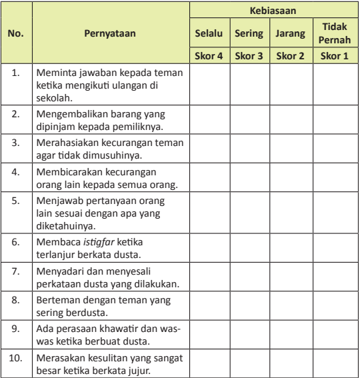

Tabel ini menunjukkan kebiasaan dan perilaku yang sering dilakukan oleh individu dalam berbagai situasi. Kolom "Pernyataan" berisi pernyataan yang mungkin diperlakukan sebagai indikator kebiasaan, seperti meminta jawaban kepada teman ketika mengikuti ulangan di sekolah, merahasiakan kecurangan teman agar tidak dimusuhinya, dan sebagainya. Kolom "Kebiasaan" mencakup empat skor: Selalu (Skor 4), Sering (Skor 3), Jarang (Skor 2), dan Tidak Pernah (Skor 1). Data dalam tabel menunjukkan bahwa beberapa perilaku, seperti meminta jawaban kepada teman ketika mengikuti ulangan di sekolah, sering dilakukan (Skor 4), sementara perilaku lainnya, seperti merahasiakan kecurangan teman agar tidak dimusuhinya, jarang dilakukan (Skor 2). Ini menunjukkan bahwa perilaku tertentu lebih sering dilakukan daripada yang lain, menunjukkan pola perilaku yang dapat diketahui dan dipelajari.

 

---
## 📄 Halaman 52

### Al-Qur'ān dan Hadis adalah Pedoman Hidupku

### Bagan Alir

---
**🖼️ Gambar/Diagram**

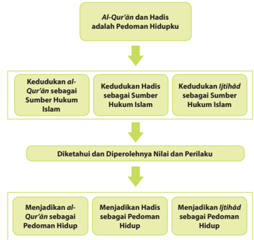

> **Deskripsi Visual:** Gambar ini adalah diagram yang menunjukkan struktur pedoman hidup berdasarkan Al-Qur'an, Hadis, dan Ijtihad. Diagram ini dibagi menjadi dua bagian utama: Kedudukan Al-Qur'an sebagai Sumber Hukum Islam, Hadis sebagai Sumber Hukum Islam, dan Ijtihad sebagai Sumber Hukum Islam. Setiap bagian tersebut kemudian dikaitkan dengan Diketahui dan Diperolehnya Nilai dan Perilaku, yang merupakan langkah-langkah untuk menjadi pedoman hidup berdasarkan Al-Qur'an, Hadis, dan Ijtihad. Teks penting dalam diagram ini meliputi "Al-Qur'an dan Hadis adalah Pedoman Hidupku", "Kedudukan Al-Qur'an sebagai Sumber Hukum Islam", "Kedudukan Hadis sebagai Sumber Hukum Islam", "Kedudukan Ijtihad sebagai Sumber Hukum Islam", "Diketahui dan Diperolehnya Nilai dan Perilaku", "Menjadi al-Qur'an sebagai Pedoman Hidup", "Menjadi Hadis sebagai Pedoman Hidup", dan "Menjadi Ijtihad sebagai Pedoman Hidup". Gambar ini membantu pembaca memahami hubungan antara sumber-sumber hukum Islam dan bagaimana mereka dapat digunakan sebagai pedoman hidup.

 

---
## 📄 Halaman 53

### Cermai gambar dan wacana berikut.

Alkisah, terdapatlah seorang pengembara yang terbangun dari keadaan idak sadar dan mendapai dirinya di tengah hutan. Dia idak tahu di mana ia berada, dari mana dia berasal, siapa dia, dan untuk apa dia ada di hutan itu. Namun yang dia tahu adalah bahwa dia berada di sebuah hutan belantara, dikelilingi semak belukar  lebat,  pepohonan,  binatang  liar,  dan  tanpa  ada  seorang  manusia  pun untuk  tempat  bertanya.  Di  sekitar  tempat  dirinya  terbangun, idak  dia  temukan apa pun yang dapat mengingatkan dirinya akan asal-usulnya, dan kenapa dia ada di tempat itu.

Seiring waktu berjalan, dia mencapai iik lelah untuk mencari  siapa dirinya, dan  mengapa  dia  berada  di  tempat  itu.  Akhirnya,  yang  ia  lakukan dalam keseharian hanyalah bertahan hidup, tanpa tujuan dan arah yang pasi . Hingga suatu  keika  datang  seseorang  yang  mengaku  sebagai  utusan  maharaj a,  yang menerangkan jai dirinya melalui sebuah surat dari sang raja,  bahwa dia adalah seorang  pangeran  yang  berasal  dari  suatu  negeri,  diutus  ke  tempat  ini  untuk mencari  harta  karun.  Bukinya  adalah  secarik  kertas  kecil  yang diselipkan  di bajunya,  berisi  catatan  tentang  siapa  dia  dan  misi  apa  yang  di a  bawa  di  hutan.

Cerita pengembara di atas, jika dianalogikan dengan kehidupan kita sebagai manusia ibarat 'pengembara' yang hidup di 'hutan dunia'. Sean dainya saja idak ada utusan yang membawa petunjuk, tentulah kita akan tersesat dan kebingungan dalam mengarungi hidup ini. Sebagaimana mereka yang idak beri man seperi kaum materialis, ateis, dan hedonis yang  hidup  dalam  kesesatan.  Oleh  karena itu,  bersyukurlah  kita  yang  mendapatkan  petunjuk  dari  utusan  A llah  Swt.  yaitu

 

---
## 📄 Halaman 54

Muhammad saw. yang menyampaikan kabar gembira, memberi peringatan, dan menerangkan hakikat penciptaan kita di dunia. Bersama beliau, diturunkanlah al-Qur'ān sebagai pedoman hidup.

Dikuip dari: www.alrasikh.uii.ac.id

petunjuk umat Islam.

### Mengkriisi Sekitar Kita

### Cermai gambar dan wacana berikut.

Dalam al-Qur'ān Allah Swt. berirman, '... barangsiapa idak memutuskan dengan apa yang diturunkan Allah, maka mereka itulah orang-orang  kair.'  (Q.S.  al-Mā'idah/5:44) . Ayat tersebut mendorong manusia, terutama orang-orang yang beriman agar menjadikan al-Qur'ān sebagai  sumber  hukum  dalam memutuskan suatu perkara, sehingga siapa pun yang idak menjadikannya sebagai sumber hukum untuk memutuskan perkara, maka manusia dianggap idak beriman.

dimaksudkan  untuk  kemaslahatan  dan  kepeningan  hidup  manusia  i tu sendiri. Allah Swt. sebagai pencipta manusia dan alam semesta Maha Mengetahu i terhadap  apa  yang  diperlukan  agar  manusia  hidup  damai,  aman,  dan  s entosa.

Hukum-hukum Allah Swt. yang tercantum  di  dalam al-Qur'ān sesungguhnya

Bukankah  para  ahli  teknologi  yang  membuat  barang-barang  canggih ,  seperi pesawat terbang, mobil,  komputer, handphone ,  dan  barang-barang  elektronik lainnya selalu memberikan buku petunjuk penggunaan atau pemakaian kepada para pemiliknya? Apa tujuan produsen atau para ahli tersebut menerbitkan buku tersebut?  Jawabannya  bahwa  tanpa  menggunakan  buku  petunjuk  tersebut, dikhawairkan barang-barang yang digunakan akan cepat rusak. Beg itulah Allah  Swt.  menurunkan  Kitab  Suci-Nya, al-Qur'ān ,  agar  manusia  terbebas  dari kerusakan, baik yang bersifat kerusakan lahir maupun kerusakan bain.

Namun  demikian,  masih  banyak  orang  yang  mengaku  beriman  yang belum menjadikan al-Qur'ān dan hadis sebagai pedoman hidupnya. Banyaknya pelanggaran  terhadap  hukum  Islam,  seperi  pencurian,  perampo kan,  korupsi, perzinaan, dan kemaksiatan lainnya merupakan buki nyata dari hal -hal tersebut.

 

---
## 📄 Halaman 55

Cari dan diskusikan hukum-hukum yang terdapat dalam al-Qur'±n atau hadis. Sebutkan hukum-hukum tersebut. Apakah hukum-hukum tersebut bertentangan dengan hukum yang selama ini berlaku di dalam kehidupan kita? Jika ya, bagaimana solusi agar kita terhindar dari golongan orangorang kafir sebagaimana disebutkan dalam ayat di atas?

### Memperkaya Khazanah Peserta Didik

### A.  Memahami Al-Qur'ān , Hadis, dan Ijihād sebagai Sumber Hukum Islam

Sumber  hukum  Islam  merupakan  suatu  rujukan,  landasan,  atau  dasar yang  utama  dalam  pengambilan  hukum  Islam.  Hal  tersebut  menjadi pokok ajaran  Islam  sehingga  segala  sesuatu  haruslah  bersumber  atau  berpatokan kepadanya.  Hal  tersebut  menjadi  pangkal  dan  tempat  kembalinya  s egala sesuatu.  Ia  juga  menjadi  pusat  tempat  mengalirnya  sesuatu.  O leh  karena  itu, sebagai sumber  yang baik dan sempurna, hendaklah ia memiliki sifat dinamis, benar,  dan  mutlak.  Dinamis  maksudnya  adalah al-Qur'ān dapat  berlaku di mana  saja, kapan saja, dan kepada siapa saja. Benar arinya al-Qur'ān mengandung  kebenaran  yang  dibukikan  dengan  fakta  dan  kejadian  yang sebenarnya.  Mutlak  arinya al-Qur'ān idak diragukan lagi kebenarannya serta idak akan terbantahkan.

Adapun yang menjadi sumber hukum Islam, yaitu al-Qur'ān , Hadis, dan Ijihād .

### Al-Qur'ānul Karim

### 1.  Pengerian al-Qur'ān

Dari segi bahasa, al-Qur'ān berasal dari kata qara'a - yaqra'u - qirā'atan -qur'ānan , yang berari sesuatu yang  dibaca  atau  bacaan.  Dari  segi isilah, al-Qur'ān adalah Kalamullah

 

---
## 📄 Halaman 56

yang diturunkan kepada Nabi Muhammad saw. dalam bahasa Arab, yang sampai  kepada  kita  secara mutawair ,  ditulis  dalam mus ḥ af ,  dimulai dengan surah al-Fāiḥ a ¥ dan diakhiri dengan surah an-Nās , membacanya berfungsi  sebagai  ibadah,  sebagai mukjizat Nabi  Muhammad  saw.  dan sebagai hidayah atau petunjuk bagi umat manusia. Allah Swt. berirman:

``

Arinya:  'Sungguh, al-Qur'ān ini memberi petunjuk ke (jalan) yang paling lurus dan memberi kabar gembira kepada orang mukmin yang mengerjakan kebajikan,  bahwa  mereka  akan  mendapat  pahala  yang  besar.'  (Q.S.  alIsrā/17:9)

### 2.  Kedudukan al-Qur'ān sebagai Sumber Hukum Islam

Sebagai  sumber  hukum  Islam, al-Qur'ān memiliki  kedudukan  yang sangat  inggi. Al-Qur'ān merupakan sumber utama dan pertama sehingga semua  persoalan  harus  merujuk  dan  berpedoman  kepadanya.  Hal  i ni sesuai dengan irman Allah Swt. dalam al-Qur'ān :

``

Arinya: 'Wahai orang-orang yang beriman! Ta'ailah Allah dan ta'ailah Rasul-Nya (Muhammad), dan Ulil Amri (pemegang kekuasaan) di antara kamu.  Kemudian,  jika  kamu  berbeda  pendapat  tentang  sesuatu,  maka kembalikanlah kepada Allah Swt. (al-Qur'ān) dan Rasu-Nyal (sunnah), jika kamu beriman kepada Allah dan hari kemudian. Yang demikian itu lebih utama (bagimu) dan lebih baik akibatnya.'  (Q.S. an-Nisā'/4:59)

Dalam ayat yang lain Allah Swt. menyatakan:

``

Arinya: 'Sungguh, Kami telah menurunkan Kitab (al-Qur'ān) kepadamu (Muhammad)  membawa  kebenaran,  agar  engkau  mengadili  antara manusia dan apa yang telah diajarkan Allah kepadamu, dan janganlah engkau menjadi penentang (orang yang idak bersalah), karena (membela) orang yang berkhianat.' (Q.S. an-Nisā'/4:105)

Dalam  sebuah  hadis  yang  bersumber  dari  Imam  Bukhari  dan  Imam Muslim, Rasulullah saw. bersabda:

``

 

---
## 📄 Halaman 57

Arinya:  '...  Amma  ba'du  wahai  sekalian  manusia,  bukank ah  aku sebagaimana  manusia  biasa  yang  diangkat  menjadi  rasul  d an  saya inggalkan  bagi  kalian  semua  ada  dua  perkara  utama/bes ar,  yang  pertama adalah kitab Allah yang di dalamnya terdapat petunjuk dan cahaya/ penerang, maka ikuilah kitab Allah (al-Qur'ān) dan b erpegang teguhlah kepadanya ...  (H.R.  Muslim)

Berdasarkan  dua  ayat  dan  hadis  di  atas,  jelaslah  bahwa al-Qur'ān adalah kitab yang berisi sebagai petunjuk dan peringatan bagi orang-orang yang beriman. Al-Qur'ān sumber dari segala sumber hukum baik dalam konteks kehidupan di dunia maupun di akhirat kelak. Namun demikian, hukumhukum yang terdapat dalam Kitab Suci al-Qur'ān ada  yang bersifat rinci dan sangat jelas maksudnya, dan ada yang masih bersifat umum dan perlu pemahaman mendalam untuk memahaminya.

### 3.  Kandungan Hukum dalam al-Qur'ān

Para ulama mengelompokkan hukum yang terdapat dalam al-Qur'ān ke dalam iga bagian, yaitu seperi berikut.

### a.  Akidah atau Keimanan

Akidah  atau  keimanan  adalah  keyakinan  yang  tertancap  kuat  di dalam  hai.  Akidah  terkait  dengan  keimanan  terhadap  hal-hal  yang gaib yang terangkum dalam rukun iman ( arkānu  �mān ), yaitu iman kepada Allah Swt. malaikat, kitab suci, para rasul, hari kiamat, dan qada/qadar Allah Swt.

### b. Syari'ah atau Ibadah

Hukum ini mengatur tentang tata cara ibadah baik yang berhubungan  langsung  dengan al-Khāliq (Pencipta),  yaitu  Allah  Swt. yang  disebut 'ibadah  ma ḥḍ ah ,  maupun  yang  berhubungan  dengan sesama makhluknya yang disebut dengan ibadah gairu ma ḥḍ ah .  Ilmu yang mempelajari tata cara ibadah dinamakan ilmu ikih .

### 1)  Hukum Ibadah

Hukum  ini  mengatur  bagaimana  seharusnya  melaksanakan ibadah  yang  sesuai  dengan  ajaran  Islam.  Hukum  ini  mengandung perintah  untuk  mengerjakan śalat ,  haji,  zakat,  puasa,  dan  lain sebagainya.

### 2)    Hukum  Mu'amalah

Hukum  ini mengatur  interaksi  antara  manusia  dan  sesamanya, seperi hukum  tentang tata cara jual-beli, hukum  pidana,  hu kum perdata,  hukum  warisan,  pernikahan,  poliik,  dan  lain  sebagai nya.

 

---
## 📄 Halaman 58

### c.  Akhlak atau Budi Pekeri

Selain berisi  hukum-hukum tentang akidah dan ibadah, al-Qur'ān juga berisi hukum-hukum tentang akhlak. Al-Qur'ān menuntun bagaimana seharusnya manusia berakhlak atau berperilaku, baik berakhlak kepada Allah  Swt.,  kepada  sesama  manusia,  dan  akhlak  terhadap  makhluk Allah  Swt.  yang  lain.  Pendeknya,  berakhlak  adalah  tuntunan  dalam hubungan antara manusia dengan Allah Swt. hubungan antara manusia dan manusia dan hubungan manusia dengan alam semesta. Hukum in i tecermin dalam konsep perbuatan manusia yang tampak, mulai dari gerakan mulut (ucapan), tangan, dan kaki.

### Hadis  atau  Sunnah

### 1. Pengerian  Hadis  atau  Sunnah

Secara bahasa, hadis berari perkataan atau ucapan. Menurut isilah, hadis adalah segala perkataan, perbuatan, dan ketetapan ( taqrir ) yang dilakukan oleh Nabi Muhammad saw.  Hadis    juga  dinamakan sunnah . Namun demikian, ulama hadis membedakan  hadis  dengan sunnah . Hadis adalah ucapan  atau perkataan Rasulullah saw., sedangkan sunnah adalah segala apa yang dilakukan oleh Rasulullah saw. yang menjadi sumber hukum Islam.

Hadis  dalam  ari  perkataan  atau ucapan  Rasulullah  saw.  terdiri  atas beberapa  bagian  yang  saling  terkait satu sama lain. Bagian-bagian hadis tersebut  antara  lain  sebagai  berikut.

Kitab Hadis sebagai sumber hukum Islam setelah al-Qur'±n.

- Sanad ,  yaitu  sekelompok  orang  atau seseorang yang menyampaikan hadis dari Rasulullah saw. kepada kita sekarang ini.

### Gambar 4.4

sampai

- Matan , yaitu isi atau materi hadis yang disampaikan
- Rawi , yaitu orang yang meriwayatkan
hadis.

Rasulullah saw.

 

---
## 📄 Halaman 59

### 2.  Kedudukan Hadis  atau  Sunnah  sebagai  Sumber  Hukum Islam

Sebagai sumber hukum Islam, hadis berada satu ingkat di baw ah alQur'ān .  Arinya,  jika  sebuah  perkara  hukumnya  idak  terdapat  di  dalam alQur'ān , yang harus dijadikan sandaran berikutnya adalah hadis tersebut. Hal  ini  sebagaimana  irman  Allah  Swt:

Arinya:  '...  dan  apa-apa  yang  diberikan  Rasul  kepadamu  maka terimalah ia. Dan apa-apa yang dilarangnya, maka inggalkanlah.' (Q.S. alḤasyr/59:7)

Demikian pula irman Allah Swt. dalam ayat yang lain:

Arinya: 'Barangsiapa menaai Rasul (Muhammad), maka sesungguhnya  ia  telah  menaai  Allah  Swt.  Dan  barangsiapa  berpaling (darinya), maka (ketahuilah) Kami idak mengutusmu (Muhammad) untuk menjadi pemelihara mereka.' (Q.S. an-Nisā'/4:80)

Sekarang,  kamu  sudah  paham  tentang  peran  pening  hadis  sebagai sumber  hukum  Islam  kedua  setelah al-Qur'ān, bukan?  Mari  kita  lihat kedudukan hadis terhadap sumber hukum Islam pertama, yaitu al-Qur'ān .

### 3.  Fungsi Hadis terhadap al-Qur'ān

Rasulullah saw. sebagai pembawa risalah Allah Swt. bertugas menjelaskan ajaran yang diturunkan Allah Swt. melalui al-Qur'ān kepada umat manusia. Oleh karena itu, hadis berfungsi untuk menjel askan ( bayan ) serta menguatkan hukum-hukum yang terdapat dalam al-Qur'ān .

Fungsi hadis terhadap al-Qur'ān dapat dikelompokkan menjadi empat yaitu sebagai berikut.

### a.  Menjelaskan ayat-ayat al-Qur'ān yang masih bersifat umum

Contohnya adalah ayat al-Qur'ān yang  memerintahkan śalat .  Perintah śalat dalam al-Qur'ān masih bersifat umum sehingga diperjelas dengan hadis-hadis  Rasulullah  saw.  tentang śalat ,  baik  tentang  tata  caranya maupun jumlah bilangan raka'at-nya. Untuk menjelaskan perintah śalat tersebut,  misalnya  keluarlah  sebuah  hadis  yang  berbunyi, 'Śalatlah kalian  sebagaimana  kalian  melihat  aku  śalat'. (H.R.  Bukhari)

 

---
## 📄 Halaman 60

### b.  Memperkuat pernyataan yang ada dalam al-Qur'ān

Seperi dalam al-Qur'ān terdapat ayat yang menyatakan, 'Barangsiapa di antara kalian melihat bulan, maka berp uasalah!' Kemudian ayat tersebut diperkuat oleh sebuah hadis yang berbunyi, ' ... berpuasalah karena melihat bulan dan berbukalah karena melihatnya ...' (H.R. Bukhari dan Muslim)

- Menerangkan maksud dan tujuan ayat yang ada dalam al-Qur'ān Misal,  dalam Q.S.  at-Taubah/9:34 dikatakan, jalan  Allah  Swt.,  gembirakanlah  mereka  dengan  azab  yan g  pedih!' ini dijelaskan oleh hadis yang berbunyi, zakat kecuali supaya menjadi baik harta-hartamu yang su
'Orang-orang  yang menyimpan  emas  dan  perak,  kemudian  idak  membelanjakannya di Ayat 'Allah  Swt.  idak  mewajibkan dah dizakai.' (H.R. Baihaqi)

- Menetapkan hukum baru yang idak terdapat dalam al-Qur'ān
Maksudnya adalah bahwa jika suatu masalah idak terdapat hukumnya dalam al-Qur'ān ,  diambil  dari  hadis  yang  sesuai.  Misalnya, bagaimana hukumnya seorang laki-laki yang menikahi saudara perempuan istrinya. Hal tersebut dijelaskan dalam sebuah Rasulullah saw.:

Arinya: 'Dari Abi Hurairah ra. Rasulullah saw. bersabda: 'Dilarang seseorang mengumpulkan  (mengawini secara bersama) seorang perempuan dengan saudara dari ayahnya serta seorang perempuan dengan saudara perempuan dari ibunya.' (H.R.  Bukhari)

### 4.  Macam-Macam Hadis

Diinjau  dari  segi  perawinya,  hadis  terbagi  ke  dalam  iga  bagi an,  yaitu seperi berikut.

### a. Hadis Mutawair

Hadis mutawair adalah  hadis  yang  diriwayatkan  oleh  banyak perawi, baik dari kalangan para sahabat maupun generasi sesudahnya dan  dipasikan  di  antara  mereka  idak  bersepakat  dusta.  Contohny a adalah hadis yang berbunyi:

hadis

 

---
## 📄 Halaman 61

Arinya: 'Dari Abu Hurairah ra. bahwa Rasulullah saw. bersabda: Barangsiapa berdusta atas namaku dengan sengaja, maka tempatnya adalah neraka.' (H.R. Bukhari, Muslim)

### b.  Hadis Masyhur

Hadis masyhur adalah  hadis  yang  diriwayatkan  oleh  dua  orang sahabat atau lebih yang idak mencapai  derajat mutawair, namun setelah  itu  tersebar  dan  diriwayatkan  oleh  sekian  banyak tabi'³n sehingga idak mungkin bersepakat dusta. Contoh hadis jenis ini adalah hadis  yang  arinya, 'Orang  Islam  adalah  orang-orang  yang  idak mengganggu orang lain dengan lidah dan tangannya.' (H.R. Bukhari, Muslim dan Tirmizi)

### c.  Hadis Aĥ ad

Hadis a ḥ ad adalah  hadis  yang  hanya  diriwayatkan  oleh  satu  atau dua orang pe rawi, sehingga idak mencapai derajat mutawair . Dilihat dari segi kualitas orang yang meriwayatkannya ( perawi ), hadis dibagi ke dalam iga bagian, yaitu sebagai berikut.

- Hadis Śaḥ i ḥ adalah hadis yang diriwayatkan oleh perawi yang adil, kuat hafalannya, tajam peneliiannya, sanadnya bersambung kepada Rasulullah saw.,  idak  tercela,  dan  idak  bertentangan  dengan riwayat  orang  yang  lebih  terpercaya.  Hadis  ini  dijadikan  s ebagai sumber hukum dalam beribadah ( hujjah ).
- Hadis Ḥ asan , adalah hadis yang diriwayatkan oleh pe rawi yang adil, tetapi kurang kuat hafalannya, sanad nya  bersambung,  idak  cacat, dan idak bertentangan. Sama seperi hadis śaḥ i ḥ , hadis ini dijadikan sebagai landasan mengerjakan amal ibadah.
- Hadis da' ī f , yaitu hadis yang idak memenuhi kualitas hadis śaḥī i ḥ dan  hadis Ḥ asan .  Para  ulama  mengatakan  bahwa  hadis  ini  idak dapat  dijadikan  sebagai hujjah ,  tetapi  dapat  dijadikan  sebagai moivasi  dalam  beribadah.
- Hadis Mau du' , yaitu hadis yang bukan bersumber kepada Rasulullah saw. atau hadis palsu. Dikatakan hadis padahal sama sekali bukan hadis. Hadis ini jelas idak dapat dijadikan landasan hukum, had is ini tertolak.

 

---
## 📄 Halaman 62

### Ijihād sebagai upaya memahami al-Qur'ān dan Hadis

### 1.  Pengerian Ijihād

Kata ijihād berasal bahasa Arab ijtahada-yajtahidu-ijihādan yang berari mengerahkan segala kemampuan, bersungguh-sungguh  mencurahkan  tenaga, atau bekerja secara opimal. Secara isilah, ijihād adalah mencurahkan segenap tenaga dan  pikiran  secara  sungguh-sungguh  dalam menetapkan suatu hukum. Orang yang melakukan ijihād dinamakan mujtahid .

### 2.  Syarat-Syarat ber ijihād

Karena ijihād sangat  bergantung  pada kecakapan dan keahlian para mujtahid , dimungkinkan hasil ijihād antara satu ulama dengan ulama lainnya berbeda hukum yang dihasilkannya. Oleh itu, idak semua orang dapat ijihād dan menghasilkan hukum yang Berikut beberapa syarat yang harus seseorang untuk melakukan ijihād .

dimiliki hukum selain al-Qur'±n Hadis.

- Memiliki pengetahuan yang luas dan mendalam.
- Memiliki pemahaman mendalam tentang bahasa Arab, ilmu tafsir , usul ikih , dan tarikh (sejarah).
- Memahami cara merumuskan hukum ( isinbaţ ).
- Memiliki keluhuran akhlak mulia.

### 3.  Kedudukan Ijihād

Ijihād memiliki  kedudukan  sebagai  sumber  hukum  Islam  setelah alQur'ān dan  hadis. Ijihād dilakukan  jika  suatu  persoalan  idak  ditemukan hukumnya  dalam al-Qur'ān dan hadis. Namun  demikian,  hukum  yang dihasilkan dari ijihād idak boleh bertentangan dengan al-Qur'ān maupun hadis. Hal ini sesuai dengan sabda Rasulullah saw.:

 

---
## 📄 Halaman 63

Arinya:  'Dari  Mu'az,  bahwasanya  Nabi  Muhammad  saw.  keika mengutusnya ke Yaman, ia bersabda, 'Bagaimana engkau akan memutuskan  suatu  perkara  yang  dibawa  orang  kepadamu?'  Muaz berkata,  'Saya  akan  memutuskan  menurut  Kitabullah  (al-Qur'ān).'  Lalu Nabi  berkata,  'Dan  jika  di  dalam  Kitabullah  engkau  idak  menemukan sesuatu  mengenai  soal  itu?'  Muaz  menjawab,  'Jika  begitu  saya  akan memutuskan menurut Sunnah Rasulullah saw.' Kemudian, Nabi bertanya lagi, 'Dan jika engkau idak menemukan sesuatu hal itu di dalam sunnah?' Muaz menjawab, 'Saya akan mempergunakan perimbangan akal pikiran sendiri  (ijihādu  bi  ra'yi)  tanpa  bimbang  sedikitpun.'  Kemudian,  Nabi bersabda,  'Maha  suci  Allah  Swt.  yang  memberikan  bimbingan  kepada utusan  Rasul-Nya  dengan  suatu  sikap  yang  disetujui  Rasul-Nya.' (H.R. Darami)

Rasulullah  saw.  juga  mengatakan  bahwa  seseorang  yang  ber ijihād sesuai dengan kemampuan dan ilmunya, kemudian ijihād nya itu benar, maka ia mendapatkan dua pahala, Jika kemudian ijihād nya itu salah maka ia mendapatkan satu pahala.

Hal tersebut ditegaskan melalui sebuah hadis:

``

Arinya: 'Dari Amr bin Aś, sesungguhnya Rasulullah saw . Bersabda, 'Apabila seorang hakim berijihād dalam memutuskan suatu p ersoalan, ternyata  ijihādnya  benar,  maka  ia  mendapatkan  dua  paha la,  dan  apabila dia  berijihād,  kemudian  ijihādnya  salah,  maka  ia  menda pat  satu  pahala.' (H.R. Bukhari dan Muslim)

### 4.  Bentuk-Bentuk Ijihād

Ijihād sebagai sebuah metode atau cara dalam menghasilkan sebuah hukum terbagi ke dalam beberapa bagian, yaitu sebagai berikut.

 

---
## 📄 Halaman 64

### a. Ijma'

Ijma' adalah kesepakatan para ulama ahli ijihād dalam memutuskan suatu  perkara  atau  hukum.  Contoh ijma' di  masa  sahabat  adalah kesepakatan untuk menghimpun wahyu Ilahi yang berbentuk lembaranlembaran terpisah menjadi sebuah mus ¥ af al-Qur'ān yang seperi kita saksikan sekarang ini.

### b. Qiyas

Qiyas adalah mempersamakan/menganalogikan masalah baru yang idak terdapat dalam al-Qur'ān atau hadis dengan yang sudah terdapat hukumnya  dalam al-Qur'ān dan  hadis  karena  kesamaan  sifat  atau karakternya. Contoh qiyas adalah  mengharamkan  hukum  minuman keras  selain khamr seperi brendy, wisky, topi  miring, vodka ,  dan narkoba karena memiliki kesamaan sifat dan karakter dengan khamr, yaitu memabukkan. Khamr dalam al-Qur'ān diharamkan, sebagaimana irman Allah Swt:

Arinya: 'Wahai orang-orang yang beriman! Sesungguhnya minuman  keras,  berjudi,  (berkurban  untuk)  berhala,  dan  mengundi nasib  dengan  anak  panah  adalah  perbuatan  keji  dan  termasuk perbuatan setan. Maka jauhilah (perbuatan-perbuatan) itu agar kamu beruntung.' (Q.S. al-Maidah/5:90)

### c. Maślaĥah Mursalah

Maślaḥ ah mursalah arinya  penetapan  hukum  yang  meniikberatkan pada  kemanfaatan  suatu  perbuatan  dan  tujuan  hakiki-universal terhadap syari'at Islam.  Misalkan,  seseorang  wajib  menggani  atau membayar  kerugaian  atas  kerugian  kepada  pemilik  barang  karena kerusakan  di  luar  kesepakatan  yang  telah  ditetapkan.

### Pembagian  Hukum  Islam

Para ulama membagi hukum Islam ke dalam dua bagian, yaitu hukum taklii dan hukum wad'i .  Hukum taklii adalah  tuntunan  Allah  Swt.  yang berkaitan  dengan  perintah  dan  larangan.  Hukum wad'i adalah  perintah Allah  Swt.  yang  merupakan  sebab,  syarat,  atau  penghalang  bagi adanya sesuatu.

 

---
## 📄 Halaman 65

### Hukum Taklii

Hukum taklii terbagi ke dalam lima bagian, yaitu sebagai berikut.

- Wajib ( far ḍ u ), yaitu aturan Allah Swt. yang harus dikerjakan, dengan konsekuensi bahwa jika dikerjakan akan mendapatkan pahala, dan jika  diinggalkan  akan  berakibat  dosa.  Pahala  adalah  sesuatu  yang akan membawa seseorang kepada kenikmatan (surga), sedangkan dosa  adalah  sesuatu  yang  akan  membawa  seseorang  ke  dalam kesengsaraan  (neraka).  Misalnya,  perintah  wajib śalat , puasa, zakat, haji, dan sebagainya.
- Sunnah ( mandub ), yaitu tuntutan untuk melakukan suatu perbuatan dengan konsekuensi jika dikerjakan akan mendapatkan pahala dan jika diinggalkan karena berat untuk melakukannya idaklah berdos a. Misalnya ibadah śalat rawaib , puasa Senin-Kamis, dan sebagainya.
- Haram ( ta ḥ rim ), yaitu larangan untuk mengerjakan suatu pekerjaan atau perbuatan. Konsekuesinya adalah jika larangan tersebut dilakukan akan mendapatkan pahala, dan jika tetap dilakukan akan mendapatkan  dosa  dan  hukuman.  Akibat  yang  diimbulkan  dari mengerjakan  larangan  Allah  Swt.  ini  dapat  langsung  mendapat hukuman di dunia, ada pula yang dibalasnya di akhirat kelak.
- Misalnya larangan meminum  minuman keras/narkoba/ khamr , larangan berzina, larangan berjudi, dan sebagainya.
disukai.

- Makruh ( Karahah ), yaitu tuntutan untuk meninggalkan  suatu perbuatan. Makruh arinya sesuatu yang dibenci atau idak Konsekuensi  hukum  ini  adalah  jika  dikerjakan  idaklah  berdos a,  akan tetapi jika diinggalkan  akan  mendapatkan  pahala.
- Misalnya, mengonsumsi makanan yang beraroma idak karena zatnya atau sifatnya.
sedap

- Mubaḥ ( al-Iba ḥ a ḥ ),  yaitu  sesuatu  yang  boleh  untuk  dikerjakan dan  boleh  untuk  diinggalkan.  Tidaklah  berdosa  dan  berpahala  ji ka dikerjakan  ataupun  diinggalkan.
- Misalnya  makan  roi,  minum  susu,  idur  di  kasur,  dan  sebagainy a.
Pelajari al-Qur'±n ,  hadis,  dan ijtih±d sebagai  sumber  hukum  Islam. Buatlah  satu  tabel  yang  berisi  hukum-hukum  yang  bersumber  dari alQur'±n , hadis, dan ijtih±d tersebut.

 

---
## 📄 Halaman 66

### Pesan-Pesan Mulia

### Bacalah kisah berikut!

Umar  bin  Khaṭṭab  keluar  dari  rumahnya  bermaksud  membunuh  Nabi Muhammad  saw.  yang  dinilainya  telah  memecah-belah  masyarakat  serta merendahkan  sesembahan    leluhur.  Dalam  perjalanannya  mencari  Nabi,  ia bertemu dengan seseorang yang menanyakan tujuannya. Orang itu kemudian berkata,  'Tidak  usah  Muhammad  saw.  yang  kaubunuh,  adikmu  yang  telah mengikuinya  (masuk  Islam),  yang  lebih  wajar  engkau  urus.'  Umar  kemudian menemui adiknya, Faimah, yang sedang bersama suaminya membaca lembaran ayat-ayat al-Qur'ān .  Ditamparnya  sang  adik  hingga  bercucuran  darah  dari wajahnya.  Diperlakukan  seperi  itu,  Faimah  idaklah  gentar,  ia  b ahkan  balik menantang saudara laki-lakinya tersebut. 'Memang benar kami telah memeluk Islam dan telah beriman kepada Allah dan Rasul-Nya. Berbuatlah s ekehendakmu!'

Mendengar  suara  adik  kesayangannya  tersebut,  hai  umar  tersentuh.  Ia menyesali perbuatan kasar terhadap saudara perempuannya. Umar lalu berkata, 'Berikan kepadaku lembaran ayat-ayat yang kalian baca itu! Aku  ingin mengetahui ajaran yang dibawa oleh Muhammad.'

'Wahai  saudaraku!'  kata  Faimah  dengan  lembut.  'Engkau adalah  kotor karena  engkau  orang  musyrik,  sedangkan al-Qur'ān idak boleh disentuh kecuali  oleh  orang-orang  yang  telah  suci.'  Mendengar  kata-k at adiknya  tersebut, Umar  segera  bergegas  untuk  bersuci.  Kemudian  Faimah  menye rahkan  lembaran ayat-ayat al-Qur'ān surah Ţāhā .  Setelah  selesai  membacanya,  Umar  berkata, 'Alangkah  indah  dan  agungnya  kalimat-kalimat  ini!'  Umar  pun kemudian  segera mencari  Rasulullah  saw.  untuk  menyatakan  keislamannya.

### Menerapkan Perilaku Mulia

Perilaku mulia dari pemahaman terhadap al-Qur'ān , hadis, dan ijihād sebagai sumber hukum Islam tergambar dalam akivitas sebagai berikut.

- Berusaha sekuat tenaga untuk merealisasikan ajaran-ajaran al-Qur'ān dan hadis.
- Gemar membaca dan mempelajari al-Qur'ān dan hadis baik keika sedang sibuk ataupun santai.
- Selalu  mengkonirmasi  segala  persoalan  yang  dihadapi  deng an  merujuk kepada al-Qur'ān dan hadis, baik dengan mempelajari sendiri atau bertanya kepada yang ahli di bidangnya.

 

---
## 📄 Halaman 67

- Mencintai orang-orang yang senaniasa berusaha mempelajari dan mengamalkan ajaran-ajaran al-Qur'ān dan Sunnah .
- Membiasakan diri berpikir secara rasional dengan tetap berpegang teguh kepada al-Qur'ān dan hadis.
- Kriis  terhadap  persoalan-persoalan  yang  dihadapi  dengan  terus-menerus berupaya agar idak keluar dari ajaran-ajaran al-Qur'ān dan Sunnah .
- Akif bertanya dan berdiskusi dengan orang-orang yang dianggap memiliki keahlian agama dan berakhlak mulia.
- Selalu berusaha keras untuk mengerjakan segala kewajiban serta meninggalkan dan menjauhi segala larangan.
- Berhai-hai dalam berindak dan melaksanakan sesuatu, apakah hal tersebut boleh dikerjakan ataukah hal tersebut boleh diinggalkan.
- Membiasakan diri untuk mengerjakan ibadah-ibadah sunnah sebagai upaya untuk menyempurnakan ibadah wajib karena khawair belum sempurna.

### Rangkuman

- Al-Qur'ān adalah kalam Allah Swt. (wahyu) yang disampaikan kepada Nabi Muhammad saw. melalui Malaikat Jibril dan diajarkan kepada umatnya, dan membacanya merupakan ibadah.
- Al-Qur'ān adalah  sumber  hukum  utama  selain  sebagai  kitab  suci.  Oleh karena itu, semua ketentuan hukum yang berlaku idak boleh be rtentangan dengan hukum-hukum yang terdapat dalam al-Qur'ān .
- Hadis atau sunnah adalah segala ucapan atau perkataan, perbuatan, serta ketetapan ( taqrir )  Nabi Muhammad saw. yang terlepas dari hawa nafsu dan perkara-perkara tercela.
- Hadis merupakan sumber hukum kedua setelah al-Qur'ān . Dengan demikian, hadis  memiliki  fungsi  yang  sangat  pening  dalam  hukum  Islam.  Di  antara fungsi hadis, yaitu untuk menegaskan ketentuan yang telah ada dalam alQur'ān ,  menjelaskan ayat al-Qur'ān ( bayan tafsir ),  dan  menjelaskan ayatayat al-Qur'ān yang bersifat umum ( bayan takhśiś ).
- Bersikap rasional, kriis, dan logis dalam beragama berari selalu menanyakan landasan dan dasar ( dalil )  atas  seiap  amalan  keagamaan  yang  dilakukan. Dengan  cara  ini,  seseorang  akan  dapat  terbebas  dari taqlid .  Lawan taqlid adalah iiba,' yaitu  melaksanakan  amalan-amalan  keagamaan  dengan mengetahui  landasan  dan  dasarnya  (dalil).
- Ijihād arinya  bersungguh-sungguh atau mencurahkan segala kemampuan . Ijihād, yaitu  upaya  sungguh-sungguh mengerahkan segenap kemampuan akal  untuk  mendapatkan  hukum-hukum syari'at pada  masalah-masalah yang  idak  ada nash nya. Ijihād dilakukan dengan mencurahkan kemampuan untuk  mendapatkan  hukum syara' atau  ketentuan  hukum  yang  bersifat operasional  dengan  mengambil  kesimpulan  dari  prinsip  dan  aturan  yang telah ada dalam al-Qur'ān dan Sunnah Nabi Muhammad saw.

 

---
## 📄 Halaman 68

- Merealisasikan  dan  menerapkan  hukum-hukum  Islam  dalam  kehidupan akan  membawa manfaat besar bagi manusia. Semua aturan atau hukum yang  bersumber  dari  Allah  Swt.  dan  Rasul-Nya  merupakan  suatu  aturan yang dapat membawa ke masla ¥ at an hidup di dunia dan akhirat.

### A.  Uji Pemahaman

Jelaskan pertanyaan-pertanyaan berikut dengan jelas.

- Jelaskan isilah tentang pengerian al-Qur'ān dan hadis.
- Apakah yang dimaksud dengan hadis mutawair, hadis masyhur, dan hadis a ḥ ad ?
- Jelaskan syarat-syarat ber ijihād menurut Yusuf al-Qaradawi.
- Sebutkan dan jelaskan macam-macam hukum taklii .
- Perlukah ijihād dilakukan saat ini? Jelaskan dengan alasan yang tepat.

### B. Releksi

Berilah  tanda checklist (  ) yang sesuai dengan dorongan haimu menanggapi  pernyataan-pernyataan  berikut  ini.

dalam

 

---
## 📄 Halaman 69

 

---
## 📄 Halaman 70

### Meneladani Perjuangan Rasulullah saw di Mekah

### Bagan Alir

---
**🖼️ Gambar/Diagram**

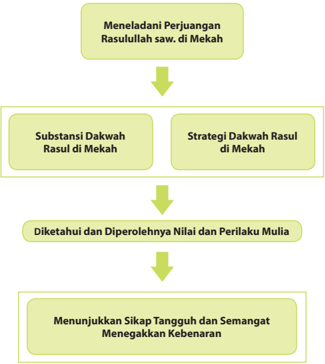

> **Deskripsi Visual:** Gambar ini adalah diagram yang menunjukkan proses pengembangan nilai-nilai dan sikap yang diperoleh dari meneladani perjuangan Rasulullah saw. di Mekah. Diagram ini terdiri dari empat tahap utama:

1. **Meneladani Perjuangan Rasulullah saw. di Mekah** - Ini adalah awal proses, di mana pembaca diminta untuk memahami situasi dan tantangan yang dihadapi oleh Rasulullah saw. di Mekah.

2. **Substansi Dakwah Rasul di Mekah** - Tahap ini membahas tentang prinsip-prinsip dan strategi yang digunakan oleh Rasulullah saw. dalam mengajarkan agama Islam di Mekah.

3. **Diketahui dan Diperolehnya Nilai dan Perilaku Mulia** - Di sini, pembaca diajak untuk mempelajari nilai-nilai dan perilaku yang diperoleh dari pengalaman Rasulullah saw. di Mekah.

4. **Menunjukkan Sikap Tangguh dan Semangat Menegakkan Kebenaran** - Akhirnya, pembaca diajak untuk menunjukkan sikap yang kuat dan semangat dalam menjaga kebenaran sesuai dengan apa yang telah dipelajari.

Elemen-elemen utama dalam diagram ini adalah empat tahap yang saling terkait dan berjalan secara bertahap. Teks, angka, atau label penting yang terlihat meliputi "Meneladani Perjuangan", "Substansi Dakwah", "Diketahui dan Diperolehnya Nilai dan Perilaku Mulia", dan "Menunjukkan Sikap Tangguh dan Semangat". Informasi kunci yang dapat diambil pembaca adalah bahwa proses ini mencakup pemahaman situasi, pengetahuan substansi dakwah, pemahaman nilai-nilai, dan akhirnya menunjukkan sikap yang kuat dan semangat dalam menjaga kebenaran.

 

---
## 📄 Halaman 71

### Cermai gambar dan wacana berikut!

### Cahaya Ilahi di Hai Pembunuh Bayaran

Tatkala Rasulullah saw. dalam perjalanan dari Mekah untuk hijrah ke Madinah, berkumpullah orang-orang kair Mekah Darun Nadwah (nama tempat pertemuan) di  rumah  Abu  Jahal.  Dalam  pertemuan tersebut,  diputuskan  untuk  mengadakan sayembara,  'Barangsiapa  berhasil  membawa Muhammad saw. kepada kami, atau berhasil  membawa  kepalanya,  maka  kami (tokoh  kair  Quraisy)  akan  memberi  hadiah 100 unta merah yang hitam biji matanya.'

Kemudian, berdirilah  seorang di antara mereka,  namanya  Suraqah  bin  Malik.  Ia berkata, 'Aku  yang  sanggup  membawa Muhammad  saw.'  Setelah  itu  ia  langsung keluar untuk mengejar Rasulullah saw.

Keika berhasil menemukan Rasulullah saw., tanpa membuang waktu, Suraqah langsung menghunus pedangnya hendak membunuh Rasulullah saw. Pada saat itulah, Allah Swt. menunjukkan kekuasaan-Nya. Allah Swt. memerintahkan bumi untuk  patuh  kepada  perintah  Rasulullah  saw.  Rasulullah  saw.  memerintahkan bumi untuk menahan Suraqah, sehingga ia dan kudanya terperosok ke dalam bumi sampai sebatas lututnya.

Keika melihat kudanya idak dapat bangun, Suraqah memohon pertolongan kepada Rasulullah saw. seraya berkata, 'Wahai Muhammad, amankanlah diriku! Amankanlah  diriku!'  Maka,  Rasulullah  saw.  berdoa  kepada  Allah  Swt.  untuk menolong Suraqah yang hampir tertelan bumi. Akhirnya, Suraqah pun terbebas dari bahaya yang hampir merenggut nyawanya.

Setelah  menyelamatkan  Suraqah,  Rasulullah  saw.  kembali  melanjutkan perjalanannya menuju Madinah. Namun, Suraqah kembali mengejarnya dengan pedang terhunus di tangannya. Ternyata Suraqah masih tetap ingin membunuh Rasulullah  saw.  Seperi  sebelumnya,  Allah  pun  kembali  meme rintahkan  bumi untuk  menelan  kaki  kuda  Suraqah.  Bahkan,  kini  amblasnya  hingga  ke  batas pusarnya. Karena takut ditelan bumi, Suraqah kembali memohon pertolongan Rasulullah  saw.  dengan  amat  memelas.  'Wahai  Muhammad,  selamatkanlah diriku.  Aku  idak  akan  menyakiimu  lagi  setelah  ini.'

 

---
## 📄 Halaman 72

Karena mendengar permohonan Suraqah yang demikian memilukan, Rasulullah saw. pun memohon kepada Allah Swt. agar menyelamatkan Suraqah. Setelah selamat untuk yang kedua kalinya, Suraqah kemudian turun dari kudanya dan menghadap Rasulullah saw. untuk memohon ampun atas perbuatan jahatnya. Dengan penuh kelembutan, Rasulullah  saw.  pun  memakannya.  S uraqah akhirnya menyatakan keislamannya di hadapan Rasulullah saw.

(Dikuip dari berbagai sumber)

Setelah  membaca  kisah  di  atas,  kemukakan  pendapatmu  tentang  kisah tersebut. Pelajaran apa saja yang dapat dipetik dari kisah di atas ?

### Mengkriisi Sekitar Kita

### Cermai wacana berikut.

Banyak orang yang sukses sebagai pengusaha  atau  pejabat  di  negeri  ini yang berasal dari keluarga  dengan ekonomi yang kurang beruntung. Mereka berjuang menggapai kesuksesan  nya  dengan  'peras  keringat baning tulang', bekerja dengan sangat sungguh-sungguh tanpa mengenal  lelah.  Sebut  saja  misalnya seorang pengusaha sangat sukses yang bernama Chairul Tanjung. Ia adalah pengusaha yang berhasil membangun 'kerajaan' bisnisnya karena kegigihannya dalam berusaha, bukan karena warisan ataupun keberuntungan secara iba-iba.

Chairul Tanjung lahir di Jakarta pada tanggal 16 Juni 1962. Awalnya keluarga Chairul Tanjung adalah keluarga yang berlebih, ayahnya seorang wartawan yang menerbitkan majalah lokal yang oplahnya lumayan besar. Namun pada saat era orde baru, surat kabar dari ayah Chairul Tanjung dicurigai sebagai antek orde lama dan akhirnya dipaksa untuk tutup.

 

---
## 📄 Halaman 73

Dari  sinilah  perekonomian  keluarganya  menjadi  berubah  seratus  delapan puluh derajat. Rumah yang cukup luas yang didiami keluarganya terpaksa harus dijual  untuk  membayar  hutang  dan  memenuhi  kebutuhan  hidup.  Akhirnya, Chairul  Tanjung  bersama  saudara  dan  orang  tuanya  harus  pindah  ke  kamar losmen yang sempit.

Untuk menopang uang sakunya yang jauh dari cukup, Chairul pun berkuliah sambil berbisnis. Awalnya ia berjualan buku kuliah stensilan, kemudian berjualan kaos. Kemudian bersama temannya membuka usaha foto kopi di kampusnya. Ia juga membuka kios di daerah Senen Raya Jakarta Pusat yang menyediakan aneka kebutuhan dan peralatan kedokteran dan laboratorium.

Walaupun ia harus membagi waktu antara kuliah dan berbisnis, namun Chairul dapat  menyelesaikan  kuliahnya  di  kedokteran  gigi  dengan  baik.  Ia  kemudian menyandang  gelar  sarjana  kedokteran  di  belakang  namanya.  Namun,  karena darah bisnis rupanya lebih kental, ia kemudian memutuskan untuk menjemput rezeki dari bisnis, bukan sebagai dokter gigi.

Kemudian Chairul lebih memantapkan bisnisnya dengan mendirikan PT Pariari Shindutama bersama iga temannya pada tahun 1987. Bisnis ini bermodalkan hutangan dari bank Exim sebesar 150 juta. Perusahaan Chairul dan temannya ini memproduksi sepatu anak-anak untuk diekspor. Mereka patut berbangga karena begitu mendirikan usaha ini, mereka langsung menerima order sebesar 160 ribu pasang sepatu dari Itali. Namun, Chairul kemudian memutuskan untuk berpisah dan  mendirikan  usaha  sendiri,  karena  ternyata  keiga  temannya memiliki  visi yang berbeda dengan dirinya.

Chairul Tanjung kemudian mendirikan perusahaann sendiri yang bergerak di bidang media, yaitu mendirikan Trans TV. Chairul Tanjung sangat pandai dalam membangun jaringan. Perusahaannya ini  semakin  maju  dan  akhirnya  berhasil membuat  suatu  konglomerasi  yang  kemudian  diberi  nama  Para  Group.  Para Group  sendiri  kemudian  membagi  iga  ladang  usahanya  yaitu  dibi dang  keuangan, properi,  dan  mulimedia.

Dikuip  dari  berbagai  sumber

Setelah  membaca  wacana  di  atas,  carilah  melalui  beberapa  literatur tentang orang-orang yang sukses dalam hidupnya. Orang-orang tersebut dapat dari kalangan sahabat Nabi saw. atau generasi berikutnya hingga orang-orang  yang  masih  hidup  saat  ini.  Usahakan  satu  dengan  yang lainnya berbeda tokohnya.

 

---
## 📄 Halaman 74

### Memperkaya Khazanah Peserta Didik

### A.  Memahami Al-Qur'ān , Hadis, dan Ijihād sebagai Sumber Hukum Islam

### 1.  Substansi Dakwah Rasulullah saw. di Mekah

### a.  Kerasulan Nabi Muhammad saw. dan Wahyu  Pertama

Menurut  beberapa  riwayat  yang śaĥ i ĥ ,  Nabi  Muhammad  saw. pertama  kali  diangkat  menjadi  rasul  pada  malam  hari  tanggal  17  Ram a « an saat usianya 40 tahun. Malaikat Jibril datang untuk membacakan wahyu pertama yang disampaikan kepada Nabi Muhammad saw., yaitu Q.S. al-'Alāq .  Nabi  Muhammad  saw.  diperintahkan  membacanya,  namun Rasulullah  saw.  berkata  bahwa  ia  idak  dapat  membaca.  Malaikat  Jibri l mengulangi permintaannya, tetapi jawabannya tetap sama. Kemudian, Jibril menyampaikan irman Allah Swt. yaitu Q.S. al-'Alāq/96:1-5 sebagai berikut.

Arinya: 'Bacalah dengan menyebut nama Tuhanmu yang menciptakan  manusia  dari  segumpal  darah.  Bacalah,  dengan  nama Tuhanmu  yang  Maha  Pemurah,  yang  mengajar  manusia  dengan perantaraan (menulis, membaca). Dia mengajarkan kepada manusia apa yang idak diketahuinya.' (Q.S. al-'Alaq/96:1-5)

Itulah  wahyu  pertama  yang  diterima  oleh  Nabi  Muhammad  saw. sebagai awal diangkatnya sebagai rasul. Kemudian, Nabi Muhammad saw.  menerima  ayat-ayat al-Qur'ān secara  berangsur-angsur  dalam jangka  waktu  23  tahun.  Ayat-ayat  tersebut  diturunkan  berdasarkan kejadian faktual yang sedang terjadi, sehingga hampir seiap at ay al-Qur'ān turun  disertai  oleh Asbābun Nuz ûl (sebab/kejadian  yang mendasari turunnya ayat). Ayat-ayat yang turun sejauh itu dikumpulkan sebagai kompilasi bernama al-Musḥ af yang juga dinamakan al-Qur'ān .

 

---
## 📄 Halaman 75

### b.  Ajaran-Ajaran  Pokok  Rasulullah  saw.  di  Mekah

### 1) Aqidah

Rasulullah saw. diutus oleh Allah Swt. untuk membawa ajaran tauĥ id . Masyarakat Arab yang saat ia dilahirkan bahkan jauh sebelum ia  lahir,  hidup  dalam  prakik  kemusyrikan.  Ia  sampaikan  kepada  k aum Quraisy bahwa Allah Swt. Maha Pencipta. Segala sesuatu di alam ini, langit, bumi, matahari, bintang-bintang, laut, gunung, manusia, hewan,  tumbuhan,  batu-batuan,  air,  api,  dan  lain  sebagainya  itu merupakan  ciptaan  Allah  Swt.  Karena  itu,  Allah  Swt.  Mahakuasa atas  segala  sesuatu,  sedangkan  manusia  lemah  tak  berdaya.  Ia Mahaagung (Mulia),  sedangkan  manusia  rendah  dan  hina.  Selain Maha Pencipta dan Mahakuasa, Ia pelihara seluruh makhluk-Nya dan Ia sediakan seluruh kebutuhannya, termasuk manusia. Selanjutnya, Nabi Muhammad saw. juga mengajarkan bahwa Allah Swt. itu Maha Mengetahui. Allah Swt. mengajarkan manusia berbagai macam ilmu pengetahuan  yang  idak  diketahuinya  dan  cara  memperoleh  dan mengembangkan ilmu pengetahuan tersebut.

Ajaran  keimanan  merupakan  ajaran  utama  yang  diembankan kepada  Rasulullah  saw.  yang  bersumber  kepada  wahyu-wahyu Ilahi.  Banyak  sekali  ayat al-Qur'ān yang  memerintahkan  beliau agar  menyampaikan  keimanan  sebagai  pokok  ajaran  Islam  yang sempurna. Allah Swt. berirman yang arinya: 'Katakanlah (Muhammad),  'Dialah  Allah  Swt.,  Yang  Maha  Esa.  Allah  Swt. tempat meminta  segala  sesuatu.  (Allah  Swt.)  idak  beranak  dan  i dak  pula diperanakkan.  Dan  idak  ada  sesuatu  yang  setara  denga n  Dia.'  (Q.S. al-Ikhlaś/112:1-4)

Ajaran tauĥ id ini  berbekas sangat dalam di hai Nabi dan para pengikutnya, sehingga menimbulkan keyakinan yang kuat, mapan, dan  tak  tergoyahkan.  Dengan  keyakinan  ini,  para  sahabat  sangat percaya  bahwa  Allah  Swt.  idak  akan  membiarkan  mereka  dalam kesulitan  dan  penderitaan.  Dengan  keyakinan  ini  pula,  mereka percaya  bahwa  Allah  Swt.  akan  memberikan  kebahagiaan  hidup kepada mereka. Dengan keyakinan ini pula, para sahabat terbebas dari pengaruh kekayaan dan kesenangan duniawi. Dengan keyakinan ini  pula,  para  sahabat  mampu  bersabar dan bertahan serta tetap berpegang teguh pada agama keika mereka mendapatkan tantangan dan siksaan yang amat keji dari pemuka-pemuka Quraisy. Dengan  keyakinan  seperi  ini  pulalah,  Nabi  Muhammad  saw.  dapat mengatakan dengan mantap kepada Abu Ţ alib, 'Paman, demi Allah, kalaupun  mereka  meletakkan  matahari  di  tangan  kananku  dan rembulan di tangan kiriku agar aku meninggalkan tugas ini, sungguh idak  akan  aku  inggalkan.  Biarlah  nani  Allah  Swt.  yang  akan

 

---
## 📄 Halaman 76

membukikan  apakah  saya  memperoleh  kemenangan  (berhasil) atau binasa karenanya'.

Ini  pula yang menjadi rahasia mengapa Bilal bin Rabbah dapat bertahan atas siksaan yang ia terima dengan tetap mengucapkan 'Allah Maha Esa' secara berulang-ulang.

### 2)  Akhlak Mulia

Dalam hal akhlak, Nabi Muhammad saw. tampil sebagai teladan yang  baik  (ideal).  Sejak  sebelum  menjadi  nabi,  ia  telah  tampil sebagai sosok yang jujur sehingga diberi gelar oleh masyarakatnya sebagai al-Amin (yang dapat dipercaya). Selain itu, Nabi Muhammad saw.  merupakan  sosok  yang  suka  menolong  dan  meringankan beban orang lain. Ia juga membangun dan memelihara hubungan kekeluargaan  serta  persahabatan.  Nabi  Muhammad  saw.  tampil sebagai  sosok  yang  sopan,  lembut,  menghormai  seiap  orang, dan memuliakan  tamu.  Selain  itu,  Nabi  Muhammad  saw.  juga  tampil sebagai  sosok  yang  berani  dalam  membela  kebenaran,  teguh pendirian, dan tekun dalam beribadah.

i pribad

Nabi  Muhammad saw. mengajak agar sikap dan perilaku yang idak terpuji yang dilakukan masyarakat Arab seperi berjudi, meminum  minuman  keras  ( khamr ),  berzina,  membunuh,  dan kebiasaan buruk lainnya untuk diinggalkan. Selain karena Nabi Muhammad saw. dengan akhlaknya yang luhur, ajaran untuk memperbaiki akhlak juga bersumber dari Allah Swt. dalam FirmanNya, 'S esungguhnya  orang-orang  mukmin  itu  bersaudara,  karena itu  damaikanlah  antara  kedua  saudaramu  (yang  berselisi h)  dan bertakwallah  kepada  Allah  Swt.  agar  kamu  mendapat  rahmat. ' (Q.S. al-Ḥujurāt/49:10)

Keterangan di atas memberikan penjelasan kepada kita, bagaimana Rasulullah saw. memadukan teori dengan prakik. mengajarkan  akhlak  mulia  kepada  masyarakatnya,  sekaligus  juga membukikannya  dengan  perilakunya yang sangat luhur. Akhlak Rasulullah  saw.  adalah  apa  yang  dimuat  di  dalam al-Qur'ān itu sendiri. Ia idak hanya mengajarkan, tetapi juga mencontohkan dengan  akhlak  terpuji.  Hal  ini  diakui  oleh  seorang  penulis  Barat, Michael  H.  Hart  dalam  bukunya  yang  berjudul  '100  Tokoh  Paling Berpengaruh  di  Dunia'  dengan  menempatkan  Rasulullah  saw. sebagai manusia tersukses mengubah perilaku manusia yang biadab menjadi manusia yang beradab.

Ia

 

---
## 📄 Halaman 77

### 2.  Strategi  Dakwah  Rasululah  saw.  di  Mekah

Dalam  mendakwahkan ajaran-ajaran Islam yang sangat fundamental dan universal , Rasulullah saw. idak sertamerta  melakukannya  dengan  tergesagesa. Ia mengeri benar bagaimana kondisi  masyarakat  Arab  saat  itu  yang bergelimang  dengan  ke maksiat an  dan prakik-prakik ke munkar an.  Mengubah pola pikir dan kebiasaan-kebiasaan atau adat-isiadat bangsa Arab khususnya kaum Quraisy  bukanlah  perkara  mudah. Kebiasaan  yang  telah  dilakukan  secara turun-temurun sejak ratusan tahun silam,  ditambah  lagi  dengan  pengaruh agama Nasrani dan Yahudi yang  sudah dikenal lama bahkan sudah banyak penganutnya.

melakukan strategi dakwah.

Ada  dua  tahapan  yang  dilakukan  Rasulullah  saw.  dalam  menjalankan misi dakwah tersebut, yaitu dakwah secara sembunyi-sembunyi yang hanya terbatas di kalangan keluarga dan sahabat terdekat dan dakwah secara terangterangan kepada khalayak ramai.

### a.  Dakwah secara Rahasia/Diam-Diam ( al-Da'wah bi al-Sirr )

mereka

Agar  idak  menimbulkan  keresahan  dan  kekacauan  di  kalangan masyarakat Quraisy, Rasulullah saw.  memulai  dakwahnya  secara sembunyi-sembunyi  ( al-Da'wah bi al-Sirr ).  Hal  tersebut  dilakukan mengingat kerasnya watak suku Quraisy dan keteguhan berpegang  pada  keyakinan  dan  penyembahan berhala .  Pada  tahap ini, Rasulullah saw. memfokuskan dakwah Islam hanya kepada orangorang terdekat, yaitu keluarga dan para sahabatnya. Rumah Rasulullah saw  ( Dārul Arqam )  dijadikan  sebagai  pusat  kegiatan  dakwah.  Di tempat itulah, ia menyampaikan risalah-risalah tauḥ i ḍ dan ajaran Islam lainnya yang diwahyukan Allah Swt. kepadanya. Rasulullah saw. secara langsung menyampaikan dan memberikan penjelasan tentang ajaran Islam  dan  mengajak  pengikutnya  untuk  meninggalkan  agama  nenek moyang mereka, yaitu dari menyembah berhala menuju penyembahan kepada Allah Swt. Karena sifat dan pribadinya yang sangat terpercaya dan terjaga dari hal-hal tercela, tanpa ragu para pengikutnya, baik dari kalangan keluarga maupun para sahabat menyatakan ke tauĥīd an dan keislaman mereka di hadapan Rasulullah saw.

Orang-orang pertama ( as-sābiqunal awwalū n ) yang  mengakui kerasulan  Nabi  Muhammad  saw.  dan  menyatakan  keislamannya adalah Sii Khadijah (istri), Ali bin Abi Ţ halib  (adik  sepupu),  Zaid  bin

 

---
## 📄 Halaman 78

Ĥ ari ș ah (pembantu yang diangkat menjadi anak), dan Abu Bakar Siddik (sahabat). Selanjutnya secara perlahan tetapi pasi, pengikut Rasulullah saw.  makin  bertambah.  Di  antara  mereka  adalah  U ¡ man  bin  Afan, Zubair bin Awwam, Said bin Abi Waqas, Abdurrahman bin 'Auf, Ṭ aha bin  Ubaidillah,  Abu  Ubaidillah  bin  Jarrah,  Faimah  bin  Khatab  dan suaminya Said bin Zaid al-Adawi, Arqam bin Abil Arqam, dan beberapa orang lainnya yang berasal dari suku Quraisy .

Bagaimana ajaran Islam dapat diterima dan dianut oleh mereka yang sebelumnya terbiasa dengan adat-isiadat masyarakat Arab yang beg itu mengakar kuat? Bagaimana mereka meyakini agama baru yang dibawa oleh Rasulullah saw. sebagai agama yang paling benar dan sempurna kemudian  menjadi  pemeluknya?  Bagaimana  pula  reaksi  orang-orang yang  mengetahui  bahwa  mereka  telah  meninggalkan  agama  nenek moyang, yaitu menyembah berhala ?

Jawaban atas pertanyaan-pertanyaan tersebut di antaranya adalah seperi berikut.

- Pribadi Rasulullah saw. yang begitu luhur dan agung. Tidak pernah ia melakukan hal-hal yang tercela dan hina. Ia adalah pribadi yang sangat  jujur  dan  amanah  ( al-Amin ),  sabar,  bijaksana,  dan  lemahlembut dalam menyampaikan ajakan serta ajaran Islam.
- Ajaran Islam yang rasional, logis, dan universal , menghargai hak-hak asasi manusia, memberikan hak yang sama, keadilan, dan kepasian hidup setelah mai.
- Menyempurnakan  ajaran-ajaran  sebelumnya,  yaitu  ajaran-ajaran yang  dibawa  oleh  para  rasul  terdahulu  berupa  penyembahan terhadap  Allah  Swt.,  berbuat  baik  terhadap  sesama,  menjaga kerukunan,  larangan  perbuatan  tercela  seperi  membunuh,  be rzina, dan lain sebagainya.
- Kesadaran akan tradisi dan kebiasaan-kebiasaan lama yang begitu jauh dari nilai-nilai ketuhanan dan nilai-nilai kemanusiaan.
Berdakwah secara diam-diam atau rahasia ( al-Da'wah bi al-Sirr ) ini dilaksanakan  Rasulullah  saw.  selama  lebih  kurang  iga  tahun.  Set elah memperoleh pengikut dan dukungan dari keluarga dan para sahabat, selanjutnya Rasulullah saw. mengatur strategi dan rencana agar ajaran Islam dapat diajarkan dan disebarluaskan secara terbuka.

### b.  Dakwah secara Terang-terangan ( al-Da'wah bi al-Jahr )

Dakwah  secara  terang-terangan  ( al-Da'wah bi al-Jahr )  dimulai keika Rasulullah saw. menyeru  kepada  orang-orang  Mekah.  Ia  ber diri di  atas  sebuah  bukit  dan  berteriak  dengan  suara  lantang  memanggil mereka. Beberapa keluarga Quraisy menyambut  seruannya. Kemud ian, ia berpaling kepada sekumpulan orang sambil berkata, 'Wahai orang-

 

---
## 📄 Halaman 79

orang!  Akankah  kalian  percaya  jika  saya  katakan  bahwa  musuh Anda  sekalian  telah  bersiaga  di  sebelah  bukit  ( Śafa )  ini  dan  berniat menyerang  nyawa  dan  harta  kalian?'  Mereka  menjawab,  'Kami  tak mendengar Anda berbohong sepanjang hayat kami.' Ia lalu berkata, 'Wahai  bangsa  Quraisy!  Selamatkanlah  dirimu  dari  neraka.  Saya  t ak dapat menolong Anda di hadapan Allah Swt. Saya peringatkan Anda sekalian akan siksaan yang pedih!' Ia menambahkan, 'Kedudukan saya seperi penjaga, yang mengamai musuh dari jauh dan segera berlari kepada kaumnya untuk menyelamatkan dan memperingatkan mereka tentang bahaya yang akan datang.'

Seriring  dengan  itu,  turun  pula  wahyu  Allah  Swt.  agar  Rasulullah saw.  melakukannya  secara  terang-terangan  dan  terbuka.  Mengenai hal  tersebut,  Allah  Swt.  berirman,  yang  arinya: 'Maka  sampaikanlah (Muhammad)  secara  terang-terangan  segala  apa  yang  dipe rintahkan (kepadamu) dan berpalinglah dari orang yang musyrik.' (Q.S. alḤijr/15:94) .  Baca  pula  irman  Allah  dalam Q.S.  asy-Syua'ara/26:214-216 .

Berdasarkan  ayat-ayat  di  atas, Rasulullah saw. yakin bahwa sudah saatnya  ia  dan  para  pengikutnya untuk menyebarluaskan ajaran Islam  secara  terbuka  dan  terangterangan. Dengan dukungan istrinya Sii Khadijah, paman yang seia membelanya, yaitu Abu ° alib, serta para sahabat dan pengikutnya yang seia ditambah pula dengan keyakinan bahwa

Allah Swt. senaniasa menyertai, dimulailah dakwah suci ini. ertamatama  dakwah  dilakukan  kepada  sanak  keluarga,  kemudian  kepada kaumnya, dan penduduk Kota Mekah yang saat itu penyembahannya kepada berhala begitu kuat.

P

Dari  kalangan  keluarga,  ia  mengajak  paman-pamannya  termasuk Abu  Lahab  dan  Abu  Jahal  yang  terkenal  sangat  menentang  dakwah Rasul. Mereka menolak mentah-mentah ajakan Rasulullah saw. dengan mengatakan  bahwa  agama  merekalah  yang  paling  benar.  Penolakan yang  disertai  ejekan,    cemoohan,  hinaan  bahkan  ancaman  tersebut idak  lantas  membuat  Rasulullah  saw. berputus asa dan berheni melakukan  dakwah.  Namun,  beliau  makin  tertantang  untuk  terus mengajak masyarakat memeluk agama tauĥīd .

Melihat kenyataan tersebut, Abu Lahab, Abu Sufyan, dan kalangan bangsawan  serta  pemuka  Quraisy  lainnya  meminta  para  penyairpenyair Quraisy untuk mengolok-olok dan mengejek Nabi Muh ammad saw. Selain itu, mereka juga menuntut Muhammad untuk menampilkan

 

---
## 📄 Halaman 80

mukjizat nya seperi apa yang telah ditampilkan oleh Musa as. dan Isa as. Seperi menjadikan bukit Śafa dan Marwah berubah menjadi bukit emas, menghidupkan orang yang sudah mai, menghalau bukit-bukit yang mengelilingi Mekah, memancarkan mata air yang lebih baik dari zam-zam.  Tidak  sampai  di  situ,  bahkan  mereka  mengolok-olok  Nabi dengan  menyatakan  mengapa  Allah  Swt.  idak  menurunkan  wahyu tentang harga barang-barang dagangan agar mereka dapat berspekulasi.

prakik-

Semua  cemoohan,  ejekan,  dan  ancaman  yang  ditujukan  kepada Rasulullah saw.  dan  para  pengikutnya  makin  melecut  semangat Rasulullah  saw.  dengan  terus  bertambahnya  jumlah  pengikutnya. Pelan tetapi pasi,  pengaruh  Rasulullah saw. dan  ajaran Islam  se makin diterima oleh masyarakat Mekah yang telah muak dengan prakik  kotor jahiliah .

kembali

Kenyataan ini mendorong para pemuka Quraisy datang kepada Abu ° alib,  paman yang selalu membela Rasul. Mereka membawa seorang pemuda yang gagah yang bernama Umarah bin al-Walid bin alMugirah untuk ditukarkan dengan Nabi Muhammad saw. yang ditolak oleh Abu Ţ alib. Nabi Muhammad saw. terus saja berdakwah.

Untuk yang keiga kalinya, para pembesar Quraisy datang kepada Abu Ţ alib.  Mereka  berkata,  'Wahai  Abu Ţ alib,  Anda  orang    yang terhormat dan terpandang di kalangan kami. Kami telah meminta Anda untuk menghenikan kemenakanmu, tetapi Anda idak juga memenu hi tuntutan kami! Kami idak akan inggal diam menghadapi orang yang memaki  nenek  moyang  kami,  idak  menghormai  harapan-harapan kami, dan mencaci-maki berhala-berhala kami. Sebaiknya,  Anda sendirilah yang menghenikan kemenakan Anda, atau jika idak, kami akan lawan hingga salah satu pihak binasa'.

Sejak  saat  itu,  orang-orang  Quraisy  mencaci-maki  dan  menyiksa kaum  muslimin  idak  terkecuali  Nabi  sendiri.  Perisiwa  yang  paling terkenal adalah penyiksaan Bilal (seorang budak dari Abisinia). Ia dipaksa untuk melepaskan agama, dicambuk, dicampakkan di padang pasir, dan dadanya diindih dengan batu yang lebih besar dari badannya. D alam siksaan semacam itu, Bilal tetap teguh dengan keyakinannya; mulutnya terus mengucapkan Ahad, Ahad, ... (Allah Maha Esa, Allah Maha Esa). Bilal terus menerus mengalami siksaan hingga ia dibeli oleh Abu Bakar Siddik.  Sebagai  orang  kaya,  Abu  Bakar  banyak  sekali  memerdekakan budak di antaranya adalah budak perempuan Umar bin Kha ¯¯ ab.

Meskipun Nabi Muhammad saw. telah mendapat perlindungan dari Banu Hasyim dan Banu Mu ţ alib, ia masih juga mengalami penyiksaan. Ummu Jamil, istri Abu Lahab, melemparkan najis ke depan rumahnya. Demikian juga Abu Jahal yang melemparkan isi perut kambing kepada Nabi Muhammad saw. keika ia sedang śalat . Inimidasi dan penyiksaan

 

---
## 📄 Halaman 81

yang  dialami  oleh  Nabi  Muhammad  saw.  dan  para  pengikutnya berlangsung dalam kurun waktu yang cukup lama. Kian hari kian keji siksaan  yang  mereka  terima.  Namun  demikian,  Nabi  Muhammad saw.  dan  para  sahabatnya  tetap  tabah  dan  terus  memelihara  dan meningkatkan keyakinan dan keimanan mereka.

Demikianlah,  seiap  hari  jumlah  pengikut  Nabi  Muhammad  saw. terus  bertambah.  Kenyataan  ini  menyesakkan  dada  kaum  Quraisy. Oleh karena itu, mereka mengutus Utbah bin Rabi'ah untuk bertemu dengan  Nabi  Muhammad  saw.  Dalam  pertemuannya  dengan  Nabi Muhammad saw. ia mengatakan,  'Wahai anakku, dari segi keturunan engkau  mempunyai  tempat  (bermartabat)  di  kalangan  kami.  Kini engkau membawa perkara besar yang menyebabkan kaum Quraisy terpecah belah. Kini dengarkanlah, kami akan menawarkan beberapa hal.  Kalau  engkau  menginginkan  harta,  kami  siap  mengumpulkan harta kami sehingga engkau menjadi yang terkaya di antara kami. Jika engkau menginginkan pangkat atau jabatan, kami akan angkat engkau menjadi pemimpin kami; kami tak akan memutus satu perkara tanpa persetujuanmu.  Kalau  kedudukan  raja  yang  engkau  cari,  kami  akan menobatkan  engkau  menjadi  raja.  Jika  engkau  mengidap  penyakit syaraf  yang  idak  dapat  engkau  sembuhkan,  maka  akan  kami  usahakan penyembuhannya  dengan  biaya  yang  kami  tanggung  sendiri  hingga engkau  sembuh'.  Mendengar  tawaran  itu,  Nabi  Muhammad  saw. membacakan surat al-Sajdah kepada Utbah. Ia terdiam dan tertegun serta insaf bahwa ia berhadapan dengan seorang yang idak gila harta, idak berambisi pada kekuasaan, dan bukan pula orang yang gila.

Utbah kembali kepada Quraisy dan menceritakan pengalamannya keika  bertemu  dengan  Nabi  Muhammad  saw.  serta  menyarankan agar mereka membiarkan Nabi Muhammad saw. berhubungan secara bebas dengan semua orang Arab. Usul Utbah tentu idak dapat mer eka terima, sebab mereka belum merasa puas jika belum mengalahkan Nabi Muhammad saw. Oleh karena itu, mereka meningkatkan penyiksaan baik kepada Nabi Muhammad saw. maupun kepada para pengikutnya.

Dengan  semangat  kerasulannya  serta  keyakinan  akan  kebenaran ajaran  Ilahi,  gerakan  dakwah  Rasulullah  saw.  makin  tersebar  luas. Teman,  sahabat,  bahkan  orang  yang  idak  dikenalnya,  baik  dari  kalan gan bangsawan  terhormat  maupun  dari  golongan  hamba  sahaya  banyak yang  mendengar  dan  memahami  ajaran  Islam,  kemudian  memeluk agama  Islam  dan  beriman  kepada  Allah  Swt.  Rasulullah  saw.  makin tegas,  lantang  dan  berani,  tetapi  tetap  komitmen  terhadap  tugas, fungsi, dan wewenangnya sebagai rasul utusan Allah Swt.

 

---
## 📄 Halaman 82

### B.  Reaksi Kair Quraisy terhadap Dakwah Rasulullah saw.

Sebagaimana  yang  telah  disinggung  pada  bagian  sebelumnya,  kaum kair  Quraisy  terus  berupaya  menggalang  kekuatan  agar  Rasulul lah saw.  dan upayanya  dalam  penyebaran  ajaran  Islam dapat dihenikan. Berbagai  u paya mereka lakukan, mulai mengajak berdialog dengan mengiming-imingi berbagai bantuan hingga kekerasan yang dilakukan terhadap Rasulullah saw. dan para sahabat serta pengikut ajarannya. Puncak dari kejengkelan mereka dengan cara memboikot Rasulullah saw. dan para sahabatnya serta pengikutnya dari boikot ekonomi dan poliik.

Apa  yang  menyebabkan  mereka  begitu  keras  menolak  dan  geram terhadap ajaran yang dibawa Rasulullah saw.? Apa yang salah dengan ajaran tentang kebenaran dan kasih sayang yang merupakan idaman semua manusia beradab? Sebetulnya mereka mengetahui dan memahami betul bahwa ajaran Ilahi yang dibawa Rasulullah saw. adalah ajaran yang lurus, benar, dan haq .

Ada  beberapa  alasan  kaum  kair  menolak  dan  menentang  ajaran  yang dibawa Rasulullah saw, di antaranya adalah sebagai berikut.

### 1.  Kesombongan dan Keangkuhan

Bangsa  Arab jahiliah dikenal  sebagai  bangsa  yang  sangat  angkuh  dan sombong. Mereka menganggap bahwa semua yang telah mereka lakukan adalah  sesuatu  yang  benar.  Mereka  menganggap  bahwa  idak  salah dengan apa yang mereka lakukan. Kesombongan mereka tercermin dari sya'ir-sya'ir yang  mereka  buat,  terutama  kesombongan  kaum  Quraisy yang merasa suku mereka yang paling terhormat dan paling berpengaruh. Mereka memandang bahwa mereka lebih mulia dan inggi derajatnya dari golongan bangsa Arab lainnya. Mereka idak menerima ajaran persamaan hak  dan  derajat  yang  dibawa  Islam.  Oleh  karenanya,  mengakui  dan menerima ajaran Islam yang dibawa oleh Rasulullah saw. akan menurunkan dan  menjatuhkan  derajat  dan  martabat  serta  mengancam  kedudukan mereka.

### 2. Fanaisme  Buta  terhadap  Leluhur

Kebiasaan  yang  telah  mengakar  kuat  dan  turun-temurun  dalam melaksanakan penyembahan berhala dan kemusyrikan lainnya, menyebabkan mereka sangat sulit menerima ajaran tauĥ id dan  menyembah Allah Swt.  yang Ahad .  Kebiasaan  tersebut  sudah  mengkristal  dan  berakar, mereka sangat sulit diberikan pemahaman ber tauĥī d . Tuhan bagi mereka diwujudkan dalam bentuk berhala-berhala yang mereka buat sendiri sejak ratusan  tahun  lalu. Fanaisme terhadap  ajaran  leluhur  jelas-jelas  telah menenggelamkan mereka ke dalam kesesatan yang nyata.

Fakta tersebut ditegaskan oleh Allah Swt. dalam irmannya: 'Dan apabila dikatakan kepada mereka, 'Marilah (mengikui) apa yang diturunkan Allah Swt.  dan  (mengikui)  Rasul.'  Mereka  menjawab,  'Cukuplah  bagi  kami

 

---
## 📄 Halaman 83

apa yang kami dapai nenek moyang kami (mengerjakannya). ' Apakah (mereka akan mengikui) juga nenek moyang mereka walaupu n nenek moyang mereka itu idak mengetahui apa-apa dan idak (pul a)  mendapat petunjuk?'  (Q.S.  al-Mā'idah/5:104)

### 3.  Eksistensi  dan  Persaingan  Kekuasaan

Penolakan mereka terhadap ajaran  Rasulullah  saw.  secara  poliis  d apat melemahkan  eksistensi  dan  pengaruh  kekuasaan  mereka.  Jika  mereka menerima Rasulullah saw. dengan ajaran yang dibawanya, tentu saja akan berakibat  pada  lemahnya  pengaruh  dan  kekuasaan  mereka.  Kekuasaan dan  pengaruh  yang  selama  ini  mereka  dapatkan  dengan  menghalalkan berbagai cara, tentu sangat bertolak belakang dengan ajaran Rasulullah saw.  Itulah  sebabnya,  mereka  'mai-maian'  mempertahankan  eksi stensi dan keberadaan mereka untuk menolak Rasulullah saw.

### C.  Contoh-Contoh  Penyiksaan  Quraisy  terhadap  Rasulullah  saw.  dan  Para Pengikutnya

Berikut adalah contoh-contoh penyiksaan kair Quraisy terhadap Rasulullah saw. dan para pengikutnya.

- Suatu  hari,  Abu  Jahal  melihat  Rasulullah  saw.  di Śafa ,  ia  mencerca  dan menghina  tetapi  idak  ditanggapi  oleh  Rasulullah  saw.  dan  ia  b eranjak pulang. Kemudian, Abu Jahal pun bergabung dengan kelompoknya kaum Quraisy di samping Ka'bah. Mendengar kejadian tersebut, Hamzah , paman Rasulullah  saw.,  marah  seraya  bangkit  mencari  Abu  Jahal.  Ia  kemudian menemukan  Abu  Jahal  yang  sedang  duduk  di  samping  Ka'bah  dengan kelompoknya  kaum  Quraisy.  Tanpa  banyak  bicara,  ia  langsung  men gangkat busur  dan  memukulkannya  ke  kepala  Abu  Jahal  hingga  tengkoraknya terluka.  'Engkau  mencerca  dia  (Rasulullah  saw.),  padahal  aku  sudah memeluk agamanya. Aku menempuh jalan yang ia tempuh. Jika mampu, ayo, lawan aku!' tantang Hamzah.
- Suatu  hari,  Uqbah  bin  Abi  Mu'iţ  melihat  Rasulullah  saw.  ber ţawaf ,  lalu menyiksanya.  Ia  menjerat  leher  Rasulullah  saw.  dengan  sorbannya  dan menyeret  ke  luar  masjid.  Beberapa  orang  datang  menolong  Rasulullah saw. karena takut kepada Bani Hasyim.
- Penyiksaan  lain  dilakukan  oleh  pamannya  sendiri,  yaitu  Abu  Lahab  dan istrinya  Ummu  Jamil  yang  iada  tara  kejinya.  Rasulullah  saw.  ber tetangga dengan mereka. Mereka tak pernah berheni melemparkan barang-b arang kotor  kepadanya.  Suatu  hari  mereka  melemparkan  kotoran  domba  ke kepala Nabi. Sekali lagi Hamzah membalasnya dengan menimpakan barang yang sama ke kepala Abu Lahab.

### 4.  Quraisy memboikot kaum muslimin

Kau m Quraisy memutuskan segala bentuk hubungan perkawinan dan perdagangan  dengan  Bani  Hasyim.  Persetujuan  pemboikotan  ini  dibuat dalam  bentuk  piagam,  ditandatangani  bersama  dan  digantungkan  di

 

---
## 📄 Halaman 84

Ka'bah.  Perisiwa ini  terjadi  pada  tahun  ke-7  kenabian  dan  berlangsung selama iga tahun. Pemboikotan ini mengakibatkan kelaparan, kemiskinan, dan kesengsaraan bagi kaum muslimin. Untuk meringankan penderitaan kaum muslimin, mereka pindah ke suatu lembah di luar Kota Mekah.

### D.  Perjanjian Aqabah

Kerasnya penolakan dan perlawanan Quraisy, mendorong Nabi Muhammad saw. melancarkan dakwahnya kepada kabilah-kabilah Arab  di  luar  suku  Quraisy. Dalam melakukan dakwah ini, Nabi Muhammad saw. idak saja menemui mereka di Ka'bah pada saat musim haji, ia juga mendatangi perkampungan dan tempat inggal para kepala suku. Tanpa diketahui oleh seor ang pun, Nabi Muhammad saw. pergi ke Ţ aif.  Di  sana  ia  menemui Ţ aqif  dengan  harapan agar ia dan masyarakatnya mau menerimanya dan memeluk Islam. Ţ aqif dan masyarakatnya menolak Nabi dengan kejam. Meski demikian, Nabi berlapang dada dan meminta Ţaqif untuk idak menceritakan kedatangannya ke Ţ aif agar ia idak mendapat malu dari orang Quraisy. Permintaan itu idak d ihiraukan oleh Ţ aqif, bahkan ia menghasut masyarakatnya untuk mengejek, menyoraki, mengusir, dan melempari Nabi. Selain itu, Nabi mendatangi Bani Kindah, Bani Kalb, Bani Hanifah, dan Bani Amir bin Sa'sa'ah ke rumah-rumah mereka. Tak seorang  pun  dari  mereka  yang  mau  menyambut  dan  mendengar  dakwah Nabi. Bahkan, Bani  Hanifah menolak dengan cara yang sangat buruk. Amir menunjukkan ambisinya, ia mau menerima ajakan Nabi dengan syarat jika Nabi memperoleh kemenangan, kekuasaan harus berada di tangannya.

Pengalaman tersebut mendorong Nabi Muhammad saw. berkesimpulan bahwa  idak  mungkin  lagi  mendapat  dukungan  dari  Quraisy  dan kabilahkabilah Arab  lainnya.  Oleh  karena  itu,  Nabi  Muhammad  saw.  mengalihkan dakwahnya kepada kabilah-kabilah lain yang ada di sekitar Mekah yang datang ber ziarah seiap tahun ke Mekah. Jika musim ziarah iba, Nabi Muhammad saw.  pun  mendatangi kabilah-kabilah itu  dan  mengajak  mereka  untuk memeluk Islam. Tak berapa lama kemudian, tanda-tanda kemenangan datang dari  Ya ș rib  (Madinah).  Nabi  Muhammad  saw.  sesungguhnya  mempunyai hubungan  emosional  dengan  Ya ¡ rib.  Di  sanalah  ayahnya  dimakamkan,  di sana pula terdapat famili-familinya dari Bani Najjar yang merupakan keluarga kakeknya, Abdul Mu ¯¯ alib dari pihak ibu. Oleh karena itu, idak mengherankan apabila di tempat ini kelak Nabi Muhammad saw. mendapat kemenangan dan Islam berkembang dengan amat pesat.

Ya ¡ rib merupakan kota yang dihuni oleh orang Yahudi dan  Arab dari suku Aus dan Khazraj . Kedua suku ini selalu berperang merebut kekuasaan. Hubungan Aus dan Khazraj dengan Yahudi membuat  mereka  memiliki  pengetahuan tentang  agama samawi .  Inilah  salah  satu  faktor  yang  menyebabkan  kedua suku Arab tersebut lebih mudah menerima kehadiran Nabi Muhammad saw. Keika Yahudi mengalami kekalahan, suku Aus dan Khazraj menjadi penguasa

 

---
## 📄 Halaman 85

di Ya ș rib. Yahudi idak inggal diam, mereka berusaha mengadu domba Aus dan Khazraj yang akhirnya menimbulkan perang saudara yang dimenangkan oleh Aus .  Sejak saat itu, orang-orang Yahudi yang sebelumnya terusir dapat kembali inggal di Ya ¡ rib. Aus dan Khazraj menyadari derita dan kerugian yang mereka alami akibat permusuhan mereka. Oleh karena itu, mereka sepakat mengangkat Abdullah bin Muhammad dari suku Khazraj sebagai pemimpin. Namun, hal itu  idak  terlaksana.  Hal  ini  disebabkan  beberapa  oran g Khazraj pergi ke Mekah pada musim ziarah (haji).

Kedatangan orang-orang Khazraj ke  Mekah diketahui oleh Nabi Muhammad saw., dan ia pun segera menemui mereka. Setelah Nabi berbicara dan mengajak mereka untuk memeluk agama Islam, mereka pun saling berpandangan dan salah seorang dari mereka berkata,'Sungguh inilah Nabi yang pernah dijanjikan oleh  orang-orang Yahudi kepada  kita,  dan  jangan  sampai  mereka  ( Yahudi ) mendahului kita.' Setelah itu, mereka kembali ke Ya ș rib dan menyampaikan berita kenabian Muhammad saw. Mereka menyatakan kepada masyarakatnya bahwa mereka telah menganut Islam. Berita dan pernyataan yang mereka sampaikan  mendapat  sambutan  yang  baik  dari  masyarakat.  Pada  musim ziarah tahun berikutnya, datanglah 12 orang penduduk Ya ș rib menemui Nabi Muhammad saw. di Aqabah . Di tempat ini mereka berikrar kepada Nabi yang kemudian dikenal dengan Perjanjian Aqabah I. Pada Perjanjian Aqabah I ini, orang-orang Ya șrib  berjanji  kepada  Nabi  untuk  idak  menyekutukan  Tuhan, idak  mencuri,  idak  berzina,  idak  membunuh  anak-anak,  idak  men gumpat dan  memitnah,  baik  di  depan  atau  di  belakang,  jangan  menolak  b erbuat kebaikan. Siapa mematuhi semua itu akan mendapat pahala surga dan kalau ada yang melanggar, persoalannya kembali kepada Allah Swt.

Selanjutnya, Nabi menugaskan Mus'ab bin Umair untuk membacakan alQur'ān , mengajarkan Islam serta seluk-beluk agama Islam kepada penduduk Ya șrib. Sejak itu, Mus'ab inggal di Yaș rib. Jika musim ziarah iba, ia berangkat ke Mekah dan menemui Nabi Muhammad saw. Dalam pertemuan itu, Mus'ab menceritakan  perkembangan  masyarakat  muslim  Ya ș rib  yang  tangguh  dan kuat. Berita ini sungguh menggembirakan Nabi dan menimbulkan keinginan dalam hai Nabi untuk hijrah ke sana.

Pada tahun 622 M, pe ziarah Ya ¡ rib  yang  datang  ke  Mekah  berjumlah  75 orang, dua orang di antaranya perempuan. Kesempatan ini digunakan Nabi melakukan pertemuan rahasia dengan para pemimpin mereka. Pertemuan Nabi dengan para pemimpin Ya ș rib  yang  ber ziarah ke  Mekah  disepakai  di Aqabah pada tengah malam pada hari-hari Tasyriq (idak  sama  dengan  hari Tasyriq yang  sekarang).  Malam  itu,  Nabi  Muhammad  saw.  ditemani  oleh pamannya, Abbas bin  Abdul  Mu ṭṭ alib  (yang  masih  memeluk  agama  nenek moyangnya) menemui orang-orang Ya ș rib.  Pertemuan malam itu kemudian dikenal dalam sejarah sebagai Perjanjian Aqabah II. Pada malam itu, mereka berikrar  kepada  Nabi  sebagai  berikut,  'Kami  berikrar,  bahwa  kami  sudah mendengar  dan  seia  di  waktu  suka  dan  duka,  di  waktu  bahagia  dan  s engsara,

 

---
## 📄 Halaman 86

kami hanya akan berkata yang benar di mana saja kami berada, dan di jalan Allah Swt. ini kami idak gentar terhadap ejekan dan celaan siap apun.'

Setelah masyarakat Ya ș rib menyatakan ikrar mereka, Nabi berkata kepada mereka, 'Pilihkan buat saya dua belas orang pemimpin dari kalangan kalian yang menjadi penanggung jawab masyarakatnya'. Mereka memilih sembilan orang dari Khazraj dan iga orang dari Aus. Kepada dua belas orang  itu, Nabi mengatakan,  'Kalian  adalah  penanggung  jawab  masyarakat  kalian  sepe ri pertangungjawaban pengikut-pengikut Isa bin Maryam. Terhadap masyarakat saya,  sayalah  yang  bertanggung  jawab.  'Setelah  ikrar  selesai ,  iba-iba terdengar teriakan yang ditujukan kepada kaum Quraisy, 'Muhammad dan orang-orang murtad itu sudah berkumpul akan memerangi kamu!'. Semua kaget  dan  terdiam.  Tiba-iba  Abbas  bin  Ubadah,  salah  seorang  pes erta  ikrar, berkata  kepada  Nabi,  'Demi  Allah  Swt.  yang  mengutus  Anda  berdasarkan kebenaran, jika Nabi mengizinkan, besok penduduk Mina akan kami 'habisi' dengan  pedang  kami.'  Lalu,  Nabi  Muhammad  saw.  menjawab,  'Kit a  idak diperintahkan  untuk  itu,  kembalilah  ke  kemah  kalian!'  Keesokan  harinya, mereka bangun pagi-pagi sekali dan segera bergegas pulang ke Ya ș rib.

### E.  Perisiwa Hijrah Kaum Muslimin

### 1. Hijrah ke Abisinia (Habsyi)

Untuk menghindari bahaya penyiksaan, Nabi Muhammad  saw. menyarankan  para  pengikutnya  untuk hijrah ke  Abisinia  (Habsyi).  Para sahabat pergi ke Abisinia dengan dua kali hijrah . Hijrah pertama sebanyak 15  orang;  sebelas  orang  laki-laki  dan  empat  orang  perempuan.  Mereka berangkat secara sembunyi-sembunyi dan sesampainya di sana, mereka mendapatkan  perlindungan  yang  baik  dari  Najasyi  (sebutan  untuk  Raja Abisinia).  Keika  mendengar  keadaan  Mekah  telah  aman,  mereka  pun kembali lagi. Namun, mereka kembali mendapatkan siksaan melebihi dari sebelumnya. Karena itu, mereka kembali hijrah untuk yang kedua kalinya ke Abisinia (tahun kelima dari kenabian atau tahun 615 M). Kali ini mereka berangkat sebanyak 80 orang  laki-laki, dipimpin oleh Ja'far bin Abi Ţ alib. Mereka inggal di sana hingga sesudah Nabi hijrah ke  Ya ș rib  (Madinah). Perisiwa hijrah ke  Abisinia  ini  dipandang  sebagai hijrah pertama dalam Islam.

Perisiwa hijrah ke  Abisinia  ini  sungguh  idak  menyenangkan  kaum Quraisy  dan  menimbulkan  kekhawairan  yang  sangat  besar.  Ada  d ua  hal yang  dikhawairkan  oleh  kaum  Quraisy,  yaitu  pertama,  kaum  mus limin akan dapat menjalin hubungan yang luas dengan masyarakat Arab kedua, kaum muslimin akan menjadi kuat dan kembali ke Mekah untuk menuntut balas.  Oleh  karena itu,  mereka mengutus Amr bin 'A ș dan  Abdullah  bin Rabi'ah  kepada  Najasyi  agar  mau  menyerahkan  kaum  muslimin  yang ber hijrah ke sana. Dengan mempersembahkan hadiah yang besar kepada

 

---
## 📄 Halaman 87

Najasyi,  kedua  utusan  itu  berkata,  'Paduka  Raja,  mereka  yang  datang ke negeri tuan ini adalah budak-budak kami yang idak mempunyai malu. Mereka  meninggalkan agama  nenek  moyang  mereka  dan idak pula  menganut  agama  Paduka;  mereka  membawa  agama  yang  mereka ciptakan  sendiri,  yang  idak  kami  kenal  dan  idak  juga  Paduka  pah ami. Kami diutus oleh pemimpin-pemimpin mereka, orang-orang tua mereka, paman-paman  mereka,  dan  keluarga-keluarga  mereka  supaya  Paduka sudi mengembalikan orang-orang itu kepada pemimpin-pemimpin kami. Mereka  lebih  mengetahui  betapa  orang-orang  itu  mencemarkan  dan mencerca agama mereka.'

Najasyi  kemudian  memanggil  kaum  muslimin  dan  bertanya  kepada mereka,  'Agama  apa  ini  sampai  membuat  tuan-tuan  meninggalkan masyarakat tuan-tuan sendiri?' Kaum muslimin yang diwakili oleh Ja'far bin Abi Ţ alib menjawab, 'Paduka Raja, masyarakat kami masyarakat yang bodoh,  menyembah  berhala,  memakan  bangkai,  melakukan  berbagai macam kejahatan, memutuskan hubungan dengan kerabat, idak dengan tetangga; yang kuat menindas yang lemah. Demikianlah keadaan masyarakat kami hingga Allah Swt. mengutus seorang rasul dari kalangan kami  sendiri  yang  kami  kenal  asal  usulnya,  jujur,  dapat  dipercaya,  dan bersih. Ia mengajak kami hanya menyembah kepada Allah Swt. Yang Maha Esa, meninggalkan batu-batu dan patung-patung yang selama ini kami dan nenek moyang kami sembah. Ia melarang kami berdusta, menganjurkan untuk berlaku jujur, menjalin hubungan kekerabatan, bersikap baik kepada tetangga,  dan  menghenikan  pertumpahan  darah.  Ia  melarang  kami melakukan segala perbuatan jahat, menggunakan kata-kata dusta dan keji, memakan harta anak yaim, dan mencemarkan nama baik perempuan yang  tak  bersalah.  Ia  meminta  kami  menyembah  Allah  Swt.  dan  id ak mempersekutukan-Nya.  Jadi,  yang  kami  sembah  hanya  Allah  Swt.  Yang Tunggal,  idak  mempersekutukan-Nya  dengan  apa  dan  siapa  pun.  Se gala yang  diharamkan  kami  jauhi  dan  yang  dihalalkan  kami  lakukan.  Karena itulah kami dimusuhi, dipaksa meninggalkan agama kami. Karena mereka memaksa kami, menganiaya dan menekan kami, kami pun keluar menuju negeri Paduka ini. Padukalah yang menjadi pilihan kami. Senang sekali kami berada di dekat Paduka, dengan harapan di sini idak ada pengania yaan'.

Mendengar  pernyataan  yang  demikian fasih dan  santun,  akhirnya Raja  Najasyi  memberikan  perlindungan  kepada  kaum  muslimin  hingga kemudian mereka hidup untuk beberapa lama di negeri yang jauh dari tanah kelahirannya.

### 2. Hijrah ke Madinah

Perisiwa Ikrar Aqabah II ini diketahui oleh orang-orang Quraisy. Sejak itu  tekanan,  inimidasi,  dan  siksaan  terhadap  kaum  muslimin  makin meningkat.  Kenyataaan  ini  mendorong  Nabi  segera  memerintahkan sahabat-sahabatnya untuk hijrah ke Ya ș rib. Dalam waktu dua bulan saja, baik

 

---
## 📄 Halaman 88

hampir semua kaum muslimin, sekitar 150 orang telah berangkat ke Ya ș rib. Hanya Abu bakar dan Ali yang masih menjaga dan membela Nabi di Mekah. Akhirnya, Nabi pun hijrah setelah mendengar rencana Quraisy yang ingin membunuhnya.

Nabi Muhammad saw. dengan ditemani oleh Abu Bakar ber hijrah ke Ya ¡ rib.  Sesampai  di  Quba,  5  km  dari  Yașrib,  Nabi  berisirahat  d an  inggal di sana selama beberapa hari. Nabi menginap di rumah Umi Kalsum bin Hindun.  Di  halaman  rumah  ini  Nabi  membangun  sebuah  masjid.  Inilah masjid pertama yang dibangun pada masa Islam yang kemudian dikenal dengan  Masjid  Quba.  Tak  lama  kemudian,  Ali  datang  menyusul  s etelah menyelesaikan  amanah  yang  diserahkan  Nabi  kepadanya  pada  saat berangkat hijrah.

Keika  Nabi  memasuki  Yaș rib,  ia  dielu-elukan  oleh  penduduk  kota itu  dan  menyambut  kedatangannya  dengan  penuh  kegembiraan.  Sejak itu, nama Ya ¡ rib  digani  dengan Madinatun  Nabi (kota Nabi) atau sering pula  disebut  dengan Madinatun  Munawwarah (kota  yang  bercahaya). Dikatakan demikian karena memang dari sanalah sinar Islam memancar ke seluruh penjuru dunia.

Agar  ingatanmu  tentang  sejarah  perjuangan  dakwah  di  Mekah  makin melekat, cobalah buat tabel tentang perjuangan dakwah di atas. Mintalah petunjuk gurumu untuk mengajarinya.

### Menerapkan Perilaku Mulia

Perilaku yang dapat diteladani dari perjuangan dakwah Rasulullah saw. pada periode Mekah di antaranya adalah seperi berikut.

### 1.  Memiliki Sikap Tangguh

Dalam upaya meraih kesuksesan, diperlukan sikap tangguh dan pantang menyerah  sebagaimana  yang  dicontohkan  oleh  Rasulullah  saw.  ke ika  ia berjuang memberantas ke musyrik an. Lihat pula bagaimana orang-orang yang sukses meraih cita-citanya, mereka bersusah-payah berusaha terus-menerus tanpa mengenal lelah, sehingga mereka menjadi orang yang berhasil dalam

 

---
## 📄 Halaman 89

cita-citanya. Tidak ada perjuangan tanpa pengorbanan dan idak ada p ula kesuksesan tanpa kerja keras dan tangguh pantang menyerah.

Ketangguhan datang dengan sendirinya. Ia memerlukan pembelajaran dan laihan ( riya dah ) secara terusmenerus. Ketangguhan juga harus didukung oleh kesehatan isik pemahaman  yang  benar.  Kedua-duanya harus berjalan beriringan dan saling mendukung. Kekuatan isik dibarengi dengan  pemahaman  yang  benar  akan melahirkan manfaat yang besar, demikian pula sebaliknya.

sehari-hari,  baik  di  lingkungan  keluarga,  sekolah,  maupun  masyarakat  di

Sikap tangguh dalam kehidupan antaranya.  seperi  berikut.

- Menggunakan waktu untuk belajar dengan sungguh-sungguh agar mendapat kan prestasi yang inggi.
- Secara  terus-menerus  mencoba  sesuatu  yang  belum  dapat  dikerjakan sampai ditemukan solusi untuk mengatasinya.
- Melaksanakan  segala  peraturan  di  sekolah  sebagai  bentuk  pengamalan sikap disiplin dan tanggung jawab.
- Menjalankan  segala  perintah  agama  dan  menjauhi  larangannya  dengan penuh keikhlasan.
- Tidak putus asa keika mengalami kegagalan dalam meraih suatu keinginan. Jadikanlah  kegagalan  sebagai  cambuk  agar  idak  mengalaminya  lagi  di kemudian hari.

### 2.  Memiliki Jiwa Berkorban

Perhaikan  bagaimana  para  pahlawan yang berjuang untuk kemerdekaan bangsa ini. Selain mereka berjuang dengan tangguh  dan  pantang  menyerah,  mereka rela  mengorbankan  apa  saja  untuk  kemerdekaan bangsa ini. Perngorbanan mereka idak hanya berupa harta, yang diinggalkan, bahkan mereka meregang nyawa untuk memperjuangkan kemerdekaan beragama dan berbangsa.

Oleh karena itu, janganlah merasa berjuang tanpa memberikan pengorbanan yang berari. Perilaku yang mencerminkan

bentuk rela berkorban kepada

jiwa berkorban dalam kehidupan sehari-hari, misalnya seperi berikut.

 

---
## 📄 Halaman 90

- Menyisihkan waktu sebaik mungkin untuk kegiatan yang bermanfaat.
Hal ini pening mengingat waktu yang kita miliki sangatlah terbatas. Jika waktu yang kita gunakan lebih banyak untuk kegiatan yang percuma, siapsiaplah untuk menyesal karena waktu yang telah lewat idak akan kembali lagi.

Misalkan karena kamu idak belajar dengan sungguh-sungguh sementara kamu ingin lulus dengan nilai yang inggi, kamu akan menyesal karena mendapatkan nilai yang rendah dan harus mengulang lagi.

- Mendahulukan kepeningan bersama  di atas kepeningan pribadi.
Sebagai

Kepeningan  bersama  di  atas  segala-galanya.  Itulah  kalimat  yang sering diungkapkan oleh kebanyakan manusia. Akan tetapi, kenyataannya belum tentu demikian. Kebanyakan manusia lebih mengutamakan kepeningan pribadinya daripada kepeningan orang banyak. orang yang beriman, tentu kita idak boleh termasuk ke dalam golongan orang yang demikian. Rasulullah saw. mencontohkan, bagaimana k eika ia hendak berbuka puasa dengan sepotong roi, sementara ada orang yang datang untuk meminta roi tersebut karena sangat kelaparan, Rasul dan memberikan roi tersebut kepada orang itu.

Dalam kehidupan sehari-hari, perilaku yang dapat kita lakukan dalam hal ini misalnya saat antre di tempat umum, di bank, loket pembayaran, berkendara di mana lampu lalu lintas sedang menunjukkan warna merah menyala, dan lain sebagainya.

- Menyisihkan sebagian harta untuk membantu orang lain yang membutuhkan.
Dalam harta kita terdapat sebagian hak orang lain yang membutuhkannya. Islam mengajarkan bahwa bersedekah itu mengurangi harta sedikit pun, bahkan ia akan mendatangkan harta yang lebih banyak lagi.

idak akan

 

---
## 📄 Halaman 91

### Rangkuman

- Keika Nabi Muhammad saw. menerima wahyu pertama, yaitu ayat 1-5 surah al-'Alaq pada tanggal 17 Rama « an, sejak itu ia diangkat menjadi nabi. Keika ia  menerima ayat 1-7 surah al-Mudda șș ir ,  ia  pun  diangkat  menjadi  rasul. Setelah  itu,  wahyu  terputus.  Nabi  Muhammad  saw.  merasa  gelisah  dan bertanya-tanya, apa yang harus disampaikan, bagaimana menyampaikannya, dan kepada siapa disampaikan? Dalam kegelisahannya, turunlah surah adDuĥā.
- Pada  awalnya  Nabi  saw.  berdakwah  secara  rahasia  dan  hanya  mengajak orang-orang  terdekat  saja.  Orang  pertama  yang  menerima  dakwah  Nabi adalah Khadijah, istrinya, kemudian Ali bin Abi Ţ alib, sepupunya, dan Zaid bin Hari ¡ ah, bekas budaknya. Sementara itu, laki-laki dewasa yang pertama memeluk Islam adalah Abu Bakar bin Quhafah. Melalui ajakan Abu Bakar, beberapa orang menerima ajakannya, yaitu Usman bin 'Afan, Abdur Rahman bin 'Auf, Ţ alhah bin 'Ubaidillah, Sa'ad bin Abi Waqqas, Zubair bin 'Awwam. Setelah itu, Abu 'Ubaidah bin Jarrah dan beberapa penduduk Mekah turut pula menyatakan keislamannya dan menerima ajaran yang dibawa oleh Nabi Muhammad saw. Kegiatan dakwah secara rahasia ini berlangsung selama iga tahun.
dan

- Setelah  perintah  Allah  Swt.  turun  melalui  Surah asy-Syu'arā/26:214-216 dan  Surah alĤijr/15:94, Nabi  Muhammad  saw.  pun  melakukan  dakwah secara  terang-terangan  (terbuka).  Nabi  Muhammad  saw.  mengumpulkan keluarganya  di  rumahnya.  Setelah  selesai  makan,  ia  pun  menyampaikan maksudnya. Tiba-iba Abu Jahal menghenikan pembicaraan Nabi mengajak orang-orang untuk meninggalkan tempat. Keesokan harinya, Nabi kembali megundang keluarganya. Setelah makan, Nabi pun menyampaikan maksudnya dan kembali Abu Jahal mengacaukan suasana dan mereka yang hadir  pun  tertawa.  Dalam  keadaan  riuh  itu,  Ali  bin  Abi Ţ alib  bangkit  dan berkata, 'Wahai Rasulullah! Saya akan membantu Anda, saya adalah lawan bagi siapa saja yang menentangmu.'
- Gagal  mengajak  kerabatnya,  Nabi  pun  mengalihkan  dakwahnya  kepada masyarakat  Quraisy.  Ia  naik  ke  bukit Śafa dan menyeru manusia. Orang-orang pun berkumpul dan Nabi Muhammad saw. pun menyampaikan dakwahnya. Tiba-iba Abu Jahal berteriak, 'Celakalah engkau, hai Muhammad! Apakah karena  ini  engkau  mengumpulkan  kami?'  Nabi  Muhammad  saw.  hanya terdiam sambil memandangi pamannya. Sesaat kemudian turunlah surah al-Lahab .
- Dakwah  Nabi  mendapatkan  tantangan  dan  perlawanan  dari  Quraisy. Nabi dan sahabat-sahabatnya diejek, dicaci, dan disiksa. Tidak cukup sampai di situ, mereka juga membujuk Nabi dan menawarkan kekayaan, kehormatan, dan jabatan. Setelah ejekan, siksaan, dan ancaman idak dapat mencegah dakwah Nabi, orang-orang Quraisy memboikot Nabi dan sahabatsahabatnya. Untuk menghindari siksaan, Nabi memerintahkan sahabatnya hijrah ke Abisinia.

 

---
## 📄 Halaman 92

- Setelah  orang-orang  Quraisy  idak  mau  menerima  dakwah  Nabi,  ia pun mengalihkan dakwahnya kepada kabilah-kabilah Arab  di  luar  Quraisy.  Nabi mencoba mengajak orang-orang Ț aif, namun ia ditolak, bahkan diejek, diusir, dan dilempari. Nabi idak berputus asa. Ia terus menyampaikan d akwahnya kepada kabilah-kabilah Arab  yang  datang  ber ziarah ke Mekah seiap tahunnya.  Dakwah  Nabi  mendapat  sambutan  dari  orang-orang  Madinah dan Nabi pun mengadakan Perjanjian Aqabah (pertama dan kedua). Setelah Perjanjian Aqabah kedua, Nabi pun ber hijrah ke Madinah.
- Dakwah  Nabi  di  Mekah  berlangsung  selama  13  tahun.  Selama  itu  Nabi menanamkan  nilai-nilai tauhid dan  mengajarkan  akhlak  mulia.  Nilai-nilai ketauhidan ini membuat Nabi dan sahabat-sahabatnya tangguh menghadapi berbagai kesulitan dan rintangan serta tetap bersemangat menyampaikan kebenaran.

### A.  Uji Pemahaman

Jawablah pertanyaan-pertanyaan berikut dan jelaskan.

- Apakah yang dimaksud dengan sikap tangguh?
- Jelaskan manfaat ber tawakkal .
- Apakah kebenaran itu dan mengapa harus ditegakkan?
- Tuliskan ayat 1 - 5 Surah al-'Alaq .
- Terjemahkan ayat 1 - 7 Surah al-Mudda șș ir .

### B. Releksi

Berilah  tanda checklist (  ) yang sesuai  dengan  dorongan  haimu  untuk menanggapi pernyataan-pernyataan berikut ini.

---
**📊 Tabel**

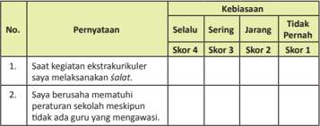

Tabel ini menunjukkan kriteria kebisaan dalam pelaksanaan salat dan peraturan sekolah, dengan skor 1 hingga 4 untuk setiap peryataan. Topik utama adalah tentang kebisaan dalam melakukan salat dan mematuhi peraturan sekolah. Kolom "Selalu" menunjukkan bahwa peryataan tersebut selalu terpenuhi, "Sering" menunjukkan peryataan tersebut sering terpenuhi, "Jangkang" menunjukkan peryataan tersebut jarang terpenuhi, dan "Tidak Pernah" menunjukkan peryataan tersebut tidak pernah terpenuhi. Data penting yang terlihat adalah bahwa peryataan pertama selalu terpenuhi (Skor 4), sedangkan peryataan kedua jarang terpenuhi (Skor 2).

 

---
## 📄 Halaman 93

---
**📊 Tabel**

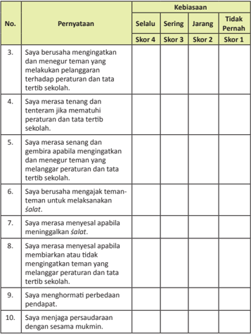

Tabel ini berisi pernyataan tentang kebiasaan siswa dalam menjaga tata tertib sekolah dan persaudaraan. Kolom "Selalu", "Sering", "Jangkang", dan "Tidak Pernah" menunjukkan tingkat kebiasaan siswa dalam melakukan pernyataan tersebut. Topik utama tabel adalah kebiasaan siswa dalam menjaga tata tertib sekolah dan persaudaraan. Data penting yang terlihat adalah bahwa sebagian besar siswa sering atau selalu melakukan pernyataan tersebut, sementara siswa yang tidak pernah melakukan pernyataan tersebut sangat sedikit.

 

---
## 📄 Halaman 94

---
**🖼️ Gambar/Diagram**

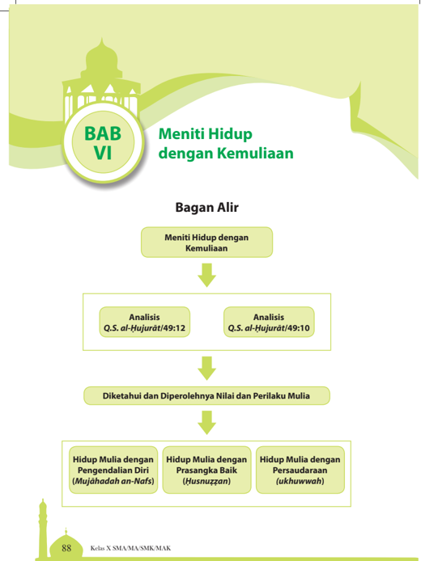

> **Deskripsi Visual:** Gambar ini adalah diagram yang menunjukkan struktur bab ke-6 dari buku pelajaran dengan judul "Meniti Hidup dengan Kemuliaan". Diagram ini terdiri dari beberapa elemen utama:

1. **Judul Bab**: "Meniti Hidup dengan Kemuliaan" terletak di bagian atas diagram.
2. **Bagan Alir**: Ini adalah alur yang menghubungkan berbagai poin penting dalam bab tersebut.
3. **Analisis Al-Qur'an**: Ada dua analisis yang disajikan, yaitu Q.S. al-Hujurat/49:12 dan Q.S. al-Hujurat/49:10.
4. **Diketahui dan Diperoleh Nilai dan Perilaku Mulia**: Ini merupakan titik penyeberangan antara analisis Al-Qur'an dan penerapan nilai-nilai mulia dalam hidup.
5. **Hidup Mulia dengan Pengendalian Diri (Mujahadah an-Nafs)**, **Hidup Mulia dengan Prasangka Baik (Husnuzzan)**, dan **Hidup Mulia dengan Persaudaraan (ukhuwwah)**: Ini adalah tiga poin utama yang muncul setelah diketahui dan diperoleh nilai-nilai mulia.

Elemen-elemen ini saling terkait melalui alur bagan alir, menunjukkan proses analisis Al-Qur'an dan kemudian penerapannya dalam kehidupan sehari-hari. Teks, angka, atau label penting seperti "BAB VI", "Meniti Hidup dengan Kemuliaan", dan nomor ayat Al-Qur'an membantu pembaca memahami konteks dan isi bab tersebut.

 

---
## 📄 Halaman 95

### Membuka Relung Hai

### Cermai kisah berikut.

Hidup  mulia  atau  mai syahid !  Sebuah ungkapan yang bermakna ajakan untuk hidup secara mulia atau mai secara syahid . Jika direnungkan, ungkapan tersebut memiliki  makna  yang  sangat  dalam.  Hidup mulia adalah dambaan seiap manusia keika  hidup  di  dunia.  Mai syahid adalah salah satu cara mendapatkan anugerah Allah Swt. kelak di akhirat, yaitu surga yang penuh dengan  kenikmatan.  Jadi,  hidup  mulia  dan mai syahid adalah  ungkapan  yang  selalu memoivasi  orang  yang  beriman  agar  selalu berada  di  jalan  Allah  Swt.  Agar  lebih  jelas memahami  ungkapan  tersebut,  cermailah pengalaman hidup  Nabi Yusuf  as. berikut ini.

Keika  usianya  masih  sangat  belia,  ia dicemplungkan  dengan  sengaja  ke  sebuah perigi oleh  saudara-saudaranya  sendiri.  Ia memang  selamat  setelah  ditemukan  oleh serombongan kailah . Namun, mereka membawa Yusuf kecil ke Mesir

dan men-

jualnya  sebagai hamba  sahaya .  Untuk  beberapa  lama  ia  pun  hidup  sebagai pembantu  di  rumah  seorang  pejabat  Mesir.

Sejalan  dengan  usianya  yang  tumbuh  menanjak  dewasa,  ujian  pun  mendatanginya.  Istri  si  pejabat  bersiasat  merayu  dan  menggoda  Si  Tampan  Yusuf. Inilah  ujian  yang  amat  berat  karena  pada  akhirnya,  Yusuf-lah  yang  kemudian menjadi tertuduh melakukan perbuatan mesum kepada majikannya. Kata Yusuf, 'Wahai  Tuhanku,  penjara  lebih  aku  sukai  daripada  mem enuhi  ajakan  mereka kepadaku...' (Q.S. Yusuf/12:33). Seperi yang kalian ketahui, Nabi Yusuf as.  pun akhirnya memang dipenjara. Inilah episode memilukan dari kehidupan manusia.

Apa yang selanjutnya terjadi terhadap Nabi Yusuf as., apakah ia terpuruk dan tenggelam dalam kesengsaraan? Tidak! Tetapi lihatlah, penjara justru menjadi batu ujian terhadap kenabian Yusuf as. hal yang lebih membahagiakannya adalah melalui episode itu, Allah Swt. mempertemukan kembali Yusuf dengan orang tua dan saudara-saudaranya.

 

---
## 📄 Halaman 96

Catatlah  iga  isilah  kunci  ini  yaitu pengendalian  diri,  prasangka  baik,  dan persaudaraan .  Nabi  Yusuf  as.  adalah  sosok  terpuji  karena  kemampuannya mengendalikan diri untuk idak memenuhi nafsu setan istri seorang pejabat Mesir. Lagi, ia pun berhasil mengendalikan diri untuk idak secara semenamena menuntut balas atas saudara-saudaranya yang telah berbuat keji tehadap dirinya. Padahal, kalau mau sebagai pejabat inggi pasi sangat mud ah baginya menuntut balas. Di saat-saat ia menanggung cobaan berat dengan dibuang ke perigi , kemudian dilelang sebagai hamba sahaya , dan dipenjara karena dituduh memerkosa, idaklah pernah ia berprasangka buruk kepada Allah S wt. atas takdir yang  menimpanya.  Ia  pun  idak  menaruh  prasangka  buruk  terhadap  saudarasaudaranya yang keji. Bahkan Nabi Yusuf as. memilih untuk menghimpun mereka dalam keutuhan keluarga yang penuh persaudaraan.

Setelah  kamu  membaca  kisah  di  atas,  bagaimana  pendapatmu  tentang kisah tersebut? Apa yang kamu lakukan jika hal tersebut menimpa dirimu? Apakah akan menuruti 'ajakan setan' untuk memenuhi hawa nafsumu ataukah melawannya dengan segala daya dan upaya?

### Mengkriisi Sekitar Kita

### Cermai gambar dan wacana berikut!

sakit.

 

---
## 📄 Halaman 97

Perhaikan berbagai gejala  yang  terjadi  di  masyarakat  kita.  Kese rakahan manusia  dalam  berbagai  usaha  eksploitasi  alam,  telah  menimbulkan  bencana yang  mengerikan,  dan  telah  'membunuh'  ribuan  manusia.  Tidak  hanya  oleh bencana  alam,  kemaian  banyak  manusia  secara  sia-sia  juga  disebabkan oleh penggunaan  jalan  raya  dengan  semena-mena,  konsumsi  minuman  dan  obatobatan  terlarang,  kekerasan  dan  bentrokan  antarkeyakinan,  antardesa,  dan bahkan antarsaudara.

Angka kriminalitas pun makin menanjak inggi, berjalan secara paralel dengan perilaku korupsi yang mungkin lebih inggi. Pada sisi lain, sebagian masyarakat hidup dengan perasaan sensiif, saling curiga, beringas, egois, dan individualis.

Semua  hal  tersebut  di  atas  telah  menimbulkan  kerugian  yang  sangat  luar biasa. Kerugian tersebut idak saja bersifat materi, tetapi j uga nonmateri. Kerugian  materi  berupa  ingginya  biaya  hidup,  biaya  untuk berobat,  kehilangan sumber penghasilan, dan lain sebagainya mungkin dapat diatasi dengan berbagai bantuan dari pihak lain. Akan tetapi, kerugian nonmateri, se peri hilangnya rasa aman dan nyaman, hidup dalam ketakutan, hingga hilangnya nyawa dengan siasia, tentu saja idak dapat digani atau dibayar dengan benda yang  sangat mahal sekalipun.

Oleh karena itu, untuk mencegah hal tersebut idak ada jalan atau  cara lain yang harus ditempuh kecuali selalu menjalankan perintah agama serta aturanaturan  yang  berlaku  di  masyarakat,  baik  yang  tertulis  maupun  id ak  tertulis. Berupa  peraturan-peraturan  pemerintah,  dan  berupa  nilai-nilai moral-eik  yang ada di masyarakat.

Amati  berbagai  gejala  di  atas. Buatlah  kemungkinan-kemungkinannya. Apa  penyebab  semua  fenomena  itu  dapat  terjadi?  Apa  kemungkinankemungkinan yang dapat kamu lakukan untuk mencegah atau mengurangi semua itu?

 

---
## 📄 Halaman 98

### Memperkaya Khazanah Peserta Didik

### A.  Memahami  Makna  Pengendalian  Diri,  Prasangka  Baik, Husnużżan dan Persaudaraan ( Ukhuwah )

### 1.  Pengendalian Diri ( Mujāhadah an-Nafs )

Pengendalian  diri atau kontrol diri ( Mujāhadah an-Nafs ) adalah menahan diri dari segala perilaku yang dapat merugikan diri sendiri dan juga  orang  lain,  seperi  sifat  serakah  atau  tamak.  Dalam  litera tur  Islam, pengendalian diri dikenal dengan isilah aś-śaum , atau puasa. Puasa adalah salah  satu  sarana  mengendalikan  diri.  Hal  tersebut  berdasarkan  hadis Rasulullah  saw.  yang  arinya: 'Wahai  golongan  pemuda!  Barangsiapa  dari antaramu  mampu  menikah,  hendaklah  dia  nikah,  yang  demiki an  itu  amat menundukkan  pemandangan  dan  amat  memelihara  kehormatan,  te tapi barangsiapa  idak  mampu,  maka  hendaklah  dia  puasa,  kare na  (puasa)  itu menahan nafsu baginya.' (H.R. Bukhari)

Jadi, jelaslah bahwa pengendalian diri diperlukan oleh seiap manusia agar dirinya terjaga dari hal-hal yang dilarang oleh Allah Swt.

Dapatkah kamu memberikan contoh perilaku yang menunjukkan sikap pengendalian diri? Diskusikan dengan teman-temanmu.

### 2.  Prasangka Baik ( � usnu żżan )

Prasangka baik atau ĥ usnu żż an berasal dari kata Arab, yaitu ĥ usnu yang arinya baik, dan ż an yang  arinya prasangka. Jadi, prasangka baik atau posiive thinking dalam terminologi Islam dikenal dengan isilah ĥ usnu żż an . Isilah ĥ usnu żż an adalah sikap orang yang selalu berpikir posiif terhadap apa  yang  telah  diperbuat  oleh  orang  lain.  Lawan  dari  sifat  ini  adalah buruk sangka ( su'u żż an ),  yaitu  menyangka  orang  lain  melakukan  hal-hal buruk  tanpa  adanya  buki  yang  benar.  Dalam  ilmu  akhlak, ĥ usnu żż an dikelompokkan ke dalam iga bagian, yaitu ĥ usnu żż an kepada Allah Swt. ĥ usnu żż an kepada diri sendiri, dan ĥ usnu żż an kepada orang lain.

Prasangka  baik  adalah  sifat  yang  sangat  pening  untuk  dimiliki  oleh seiap  orang  yang  beriman.  Sebaliknya,  prasangka  buruk  adalah  sifat yang  harus  dijauhi  dan  dihindari.  Mengapa  demikian?  Dapatkah  kamu menjelaskan dan mengemukakan dampak posiif dari perilaku ĥ usnu żż an , serta dampak negaif dari perilaku su'u żż an ?

 

---
## 📄 Halaman 99

### 3.  Persaudaraan  ( ukhuwwah )

Persaudaraan  ( ukhuwwah )  dalam  Islam  dimaksudkan  bukan  sebatas hubungan  kekerabatan  karena  faktor  keturunan,  tetapi  yang  dimaksud dengan persaudaraan dalam Islam adalah persaudaraan yang diikat oleh tali aqidah (sesama muslim) dan persaudaraan karena fungsi kemanusiaan (sesama manusia makhluk Allah Swt.). Kedua persaudaraan tersebut sangat jelas dicontohkan oleh Rasulullah saw., yaitu mempersaudarakan antara kaum Muhajirin dan kaum An ș ar, serta menjalin hubungan persaudaraan dengan  suku-suku  lain  yang  idak  seiman  dan  melakukan  kerja  s ama dengan mereka.

### B.  Ayat-Ayat al-Qur'ān tentang Pengendalian Diri, Prasangka Baik, dan Persaudaraan ( ukhuwah )

### 1. Q.S. al-฀ujurāt/49:12

- Lafal Ayat dan Arinya
'Wahai orang-orang yang beriman! Jauhilah banyak dari prasangka, sesungguhnya  sebagian  prasangka  itu  dosa  dan  janganlah  kamu mencari-cari kesalahan orang lain dan janganlah ada di antara kamu yang  menggunjing  sebagian  yang  lain.  Apakah  ada  di  antara  kamu yang suka memakan daging saudaranya yang sudah mai? Tentu kamu merasa jijik. Dan bertakwalah kepada Allah, sesungguhnya Allah Maha Penerima tobat, Maha Penyayang.'

- Bacalah ayat di atas dengan tartil sesuai dengan kaidah tajwid yang benar. Lakukan bersama teman-teman sekelasmu secara berpasangan dan bergantian.
- Hafalkan arti ayat di atas agar makin bertambahnya kecintaan kepada al-Qur'±n dan bertambah keimanan kepada Allah Swt.
- Hafalkan  ayat  tersebut  untuk  memperkaya  perbendaharaan  hafalan ayat  dengan  menggunakan  bantuan  alat  perekam  atau  pun  saling memperdengarkan dengan sesama teman di kelas.
- Carilah ayat lain yang berhubungan dengan perilaku ¦usnu§§an .

 

---
## 📄 Halaman 100

### b.  Hukum Tajwid

---
**📊 Tabel**

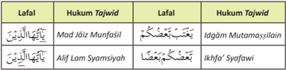

Tabel ini menunjukkan hukum Tajwid dalam beberapa lafal, yaitu Mad, Alif Lam, dan Ikhfa'. Topik utama tabel adalah hukum Tajwid pada lafal tertentu. Kolom pertama berisi lafal, kolom kedua berisi hukum Tajwid untuk lafal tersebut, kolom ketiga juga berisi lafal, dan kolom keempat berisi hukum Tajwid untuk lafal tersebut. Data penting yang terlihat adalah bahwa lafal Mad diberi hukum Tajwid Madzaj Munfasil, lafal Alif Lam diberi hukum Tajwid Idgâm Mutamassilin, dan lafal Ikhfa' diberi hukum Tajwid Ikhfa' Syafawi.

Temukanlah  hukum tajwid lainnya  yang  terkandung  di  dalam  ayat  di atas. Baik itu berupa mad, i§h±r, ikhfa', iqlab, Idg±m bigunnah, Idg±m bilagunnah,  i§h±r  syafawi,  ikhfa'  syafawi,  Idg±m  mutama¡¡ilain, dan lainnya.

### 2. Q.S. al-�ujurāt/49:10

### a.  Lafal Ayat dan Arinya

``

'Sesungguhnya  orang-orang mukmin  itu bersaudara, karena itu damaikan  lah antara kedua saudaramu (yang berselisih) dan bertakwalah kepada Allah agar kamu mendapat rahmat.'

### Akivitas 5

- Hafalkan  ayat  tersebut  untuk  memperkaya  perbendaharaan  hafalan ayat dengan menggunakan bantuan alat perekam ataupun saling memperdengarkan dengan sesama teman di kelas.
- Bacalah  ayat  di  atas  dengan tartil sesuai  dengan  kaidah tajwid yang benar.Lakukan bersama teman-teman sekelasmu secara berpasangan dan bergantian.
- Hafalkan arti ayat di atas agar makin bertambahnya kecintaan kepada alQur'±n dan bertambah keimanannya kepada Allah Swt.
- Carilah ayat lain yang berhubungan dengan perilaku persaudaraan.

 

---
## 📄 Halaman 101

### b.  Hukum Tajwid

---
**📊 Tabel**

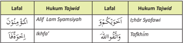

Tabel ini menunjukkan hukum Tajwid dalam beberapa lafalan dalam bahasa Arab. Topik utamanya adalah tentang penggunaan kata-kata dalam Al-Qur'an dan hadits, serta bagaimana mengaplikasikan hukum Tajwid pada setiap lafalan tersebut. Kolom pertama berisi lafalan, kolom kedua berisi hukum Tajwid untuk lafalan tersebut, kolom ketiga berisi contoh huruf yang digunakan dalam lafalan, dan kolom keempat berisi hukum Tajwid yang relevan dengan huruf tersebut. Data penting yang terlihat adalah bahwa beberapa lafalan memiliki lebih dari satu hukum Tajwid, seperti "الْمُؤمِّنون" (Allīj Lam Syamsiyah) yang memiliki tiga hukum Tajwid: Ikhfā', Izhār Syafawi, dan Tafkīhm. Ini menunjukkan bahwa dalam bahasa Arab, penggunaan kata-kata dapat sangat kompleks dan memerlukan pemahaman mendalam tentang hukum Tajwid.

Temukan hukum tajwid lainnya yang terkandung di dalam ayat di atas.  Baik itu berupa mad, i§h±r, ikhfa', iqlab, Idg±m bigunnah, Idg±m bilagunnah, i§h±r syafawi, ikhfa' syafawi, Idg±m mutama¡¡ilain, dan lainnya.

### c.  Kandungan Ayat

Pada ayat di atas Allah Swt. menegaskan ada dua hal pokok yang perlu diketahui. Pertama, bahwa sesungguhnya orang-orang mukmin itu bersaudara. Kedua, jika terdapat perselisihan antarsaudara, kita diperintahkan oleh Allah Swt. untuk melakukan iślah (upaya perbaikan atau perdamaian).

Apakah  indikasi  dari  suatu  persaudaraan?  Rasulullah  saw.  bersabda, 'Demi  Allah  yang  menguasai  diriku!  Seseorang  di  antara  kalian idak  dianggap beriman  kecuali  jika  dia  menyayangi  saudaranya  sesama  mukmin  s ama  seperi dia menyayangi dirinya sendiri.' (H.R. Bukhari)

Selain  itu  Rasulullah  saw.  juga  menegaskan, 'Seorang muslim adalah orang  yang  lidah  dan  tangannya  idak  menyakii  muslim  la in,  dan  orang  yang berhijrah adalah orang yang meninggalkan semua larang an Allah.' (H.R. Bukhari)

Diskusikan  dengan  sesama  temanmu.  Bagaimana  cara  yang  harus dilakukan jika di kelasmu ada teman yang sedang 'marahan' sehingga antara teman yang satu dan yang lainnya tidak saling bertegur sapa dan berinteraksi?

 

---
## 📄 Halaman 102

### C.  Hadis tentang Pengendalian Diri, Prasangka Baik, dan Persaudaraan

### 1.  Hadis tentang Pengendalian Diri

Diriwayatkan dari Abi Hurairah ra. bahwa Rasulullah saw. bersabda:

``

'Orang yang perkasa bukanlah orang yang menang dalam perkelahian, tetapi  orang  yang  perkasa  adalah  orang  yang  mengendalikan  dirinya keika marah.' (H.R. Bukhari dan Muslim)

### 2.  Hadis tentang Prasangka Baik

Rasulullah saw. bersabda:

``

'Jauhkanlah dirimu dari prasangka  buruk,  karena  sesungguhnya prasangka itu adalah perkataan yang paling dusta.' (H.R. Bukhari)

### 3.  Hadis tentang Persaudaraan

Diriwayatkan  dari Nu'man  bin  Basyir  ra.  bahwa  Rasulullah  saw. Bersabda:

``

'Perumpamaan orang-orang mukmin dalam saling mencintai, saling mengasihi, dan saling menyayangi, seperi satu tubuh. Apabila satu organ tubuh merasa sakit, akan menjalar kepada semua organ tubuh, yaitu idak dapat idur dan merasa demam.' (H.R. Muslim)

Hafalkan ketiga hadis atau salah satu hadis di atas berikut artinya. Tuliskan hadis yang kamu hafalkan dan laporkan kepada gurumu.

 

---
## 📄 Halaman 103

Simaklah  kisah  berikut.  Kemudian  cermai  secara  saksama  pelajaran  yang terkandung di dalamnya.

### Kisah Habil dan Qabil

Qabil adalah salah seorang anak Nabi Adam as. yang bersaudara kembar dengan Iqlima.  Sementara  Habil  adalah  anak  Nabi  Adam  as.  yang  bersaudara kembar  dengan  Labuda.  Iqlima  terlahir  dengan  paras  yang  canik, sementara Labuda  idak  secanik  Iqlima.  Semua  keturunan  Nabi  Adam  as.  hid up  damai sampai mereka dewasa.

Kemudian, turun perintah Allah Swt. agar Nabi Adam as. menikahkan anakanaknya.  Allah  Swt.  memerintahkan  agar  anak  yang  terlahir  sebagai  saudara kembar  harus  dinikahkan  dengan  anak  kembar  yang  lain.  Dengan  ketentuan tersebut,  Qabil  harus  menikah  dengan  Labuda,  dan  Habil  harus menikah  dengan Iqlima.

Keika Nabi Adam  as. menyampaikan perintah tersebut, Qabil idak menyetujuinya.  Pasalnya,  sudah  lama  Qabil  menyukai  Iqlima.  Dia  menolak menikahi  Labuda,  dan  tetap  akan  menikahi  Iqlima.  Dengan  bijak, Nabi  Adam  as. mengingatkan Qabil bahwa  ketentuan Allah Swt. harus ditaai.  Nam un, Qabil tetap pada kehendaknya untuk menikahi Iqlima, saudara kembarnya yang lebih canik. Akhirnya, dengan memohon petunjuk Allah Swt. dengan  bijaksana Nabi Adam  as.  memerintahkan  Qabil  dan  Habil  untuk  berkurban.  Siapa  pun  yang kurbannya diterima oleh Allah Swt., segala kebutuhan dan keinginannya akan dikabulkan oleh Allah Swt., termasuk keinginan Qabil untuk menikahi Iqlima.

Setelah  semuanya  dirasa  siap,  Qabil  dan  Habil  pun  mempersembahkan kurbannya masing-masing di atas bukit dengan disaksikan oleh semua anggota keluarga.  Qabil  mempersembahkan  hasil  pertaniannya.  Ia  sengaja  memilih gandum dari jenis yang jelek. Habil mempersembahkan seekor kambing terbaik dan yang paling ia sayangi. Kemudian, dengan perasaan berdebar-debar, mereka menyaksikan  dari  jauh.  Tak  lama  berselang,  tampak  api  besar  menyambar kambing persembahan Habil, sedangkan gandum persembahan Qabil tetap utuh yang berari kurban Habillah yang diterima.

Melihat kenyataan tersebut, Qabil yang berperangai idak baik dan terpengaruh  hasutan  iblis,  menaruh  dendam  kepada  Habil.  Terpikir  olehnya, agar  keinginannya  menikahi  Iqlima,  idak  ada  cara  lain  kecuali  me mbunuh  Habil. Keika  terdapat  kesempatan  untuk  melaksanakan  niat  jahatnya  terse but,  Qabil benar-benar  melaksanakannya.  Keika  Habil  sedang  seorang  diri, Qabil  datang menghampirinya  dengan  niat  untuk  membunuh  saudaranya  itu.  Meng tahui hal  tersebut,  Habil  mengingatkan  Qabil  agar  senaniasa  menginga t  Allah  Swt.

 

---
## 📄 Halaman 104

dan  hendaklah  takut  kepada-Nya.  Habil  berkata  kepada  Qabil, 'Sungguh  jika kamu  menggerakkan  tanganmu  untuk  membunuhku,  aku  sekali-k ali  idak  akan menggerakkan tanganku untuk membunuhmu. Sesungguhnya aku takut kepada Allah, Tuhan seru sekalian alam.' (Q.S. al-Mā'idah/5:28)

Setelah Habil terbunuh, Qabil merasa bingung. Diguncang-guncangkan tubuh saudaranya itu, namun tetap idak bergerak. Lalu jenazah Habil dibawa ke sanakemari dengan perasaan kacau, tak tahu apa yang harus dilakukannya. Ia merasa sangat menyesal sehingga air matanya berlinang membasahi pipinya.

Dalam  kebingungannya,  Allah  Swt.  menurunkan ilham melalui  dua  ekor burung gagak yang bertarung untuk memperebutkan daging mayat Habil. Salah seekor  dari  burung  gagak  itu  tewas  dalam  pertarungan  tersebut.  Kemudian, burung  gagak  yang  masih  hidup  menggali  tanah,  menarik  gagak  yang  telah menjadi  bangkai  untuk  dimasukkan  ke  dalam  tanah  yang  telah  digali  dengan cakarnya, kemudian menimbunnya dengan tanah.

Demikianlah, Qabil meniru perbuatan burung gagak itu. Ia menggali tanah dan menguburkan mayat Habil dan menimbunnya dengan tanah. Menyadar i dirinya telah melakukan kesalahan yang sangat besar, Qabil pun merasa ketakutan. Ia kemudian  idak  berani  untuk  pulang  ke  rumah,  bahkan  pergi  me ninggalkan kedua  orang  tua  dan  saudara-saudaranya.  Ia  benar-benar  idak  kembali lagi, pergi masuk hutan keluar hutan, menaiki gunung, dan menuruni lembah tak jelas arah dan tujuan.

Disarikan dari berbagai sumber

Setelah membaca kisah di atas, bagaimana perasaanmu? Tentu prihatin, bukan?

Diskusikan dan kemukakan kepada gurumu, hubungan sifat pengendalian diri, ¥usnu¡¡an , dan persaudaraan sesuai dengan kisah di atas.

 

---
## 📄 Halaman 105

### Menerapkan Perilaku Mulia

Amai kisah pendek berikut ini. Tulislah analisismu mengenai hal-hal pening yang berkaitan dengan nilai-nilai dan sikap mulianya.

### Aku Ingin Satu Angka Lagi

Semua  orang  pasi  mengetahui  siapakah  Rudi  Hartono  itu?  Dia  adalah legendaris badminton yang  saat itu telah tujuh kali menjadi juara pertandingan bulu tangkis All England di Wimbledon, Inggris. Tetapi belum banyak orang yang mengetahui bahwa suatu keika pahlawan bulu tangkis ini berada pada keadaan yang amat sangat terjepit.

Kala itu Rudi Hartono harus mem  pertahankan gelarnya sebagai juara dunia. Ia harus menghadapi Strue Johnson, juara bulu tangkis dari Swedia. Ini adalah lawan sekaligus  musuh  bebuyutannya.  Stadion  Wimbledon  pun  riuh-rendah  sesaat sebelum  keduanya  memulai  pertandingan.  Sementara  itu,  rakyat  Indonesia deg-degan mendengarkan siaran langsung pertandingan melalui Radio Republik Indonesia (RRI).

Pertandingan  pun  dimulai.  Adu  pukul shutel-cock pun  cepat  memanas. Sialnya, pada set pertama Rudi Hartono kalah. Set kedua dimulai, adu pukul dan adu smash pun  makin  mengharu-biru  semua  penonton.  Kali  ini  benar-benar celaka,  di  ujung  set  kedua  Rudi  Hartono  teringgal  angka  dalam posisi 0-14. Seluruh pendengar RRI (waktu itu masih sangat sedikit penduduk Indonesia yang memiliki TV) yang mengikui pertandingan itu menjadi tegan g. Jika salah pukul, pasi Rudi Hartono akan kalah.

Untung, Strue Johnson melakukan kesalahan. Shutel-cock pun berpindah ke tangan Rudi. Nah, keika akan memukul shutel-cock itulah Rudi Hartono berkata dalam hai kecilnya, 'Aku ingin satu angka saja!'

Lalu  ia  pun  memukulnya  ke  arah  lawan.  Masuk!  Strue  Johson  tak  mampu menahan shutel-cock .  Satu  angka  untuk  Rudi,  jadilah  1-14.  Rudi  pun  kembali memukul shutel-cock .  Seperi tadi, kali ini hai kecilnya kembali berkata, 'Aku ingin satu angka saja!'

Demikianlah, satu demi satu angka direbut oleh Rudi Hartono. Posisi angka pun  berubah  drasis  menjadi  14-14.  Strue  Johnson  terceng ang  tak  habis-habis, mengapa  dirinya  sampai  terkejar  begitu  cepat  oleh  lawannya.  Inilah  yang menyebabkan  mentalnya  jatuh.  Set  kedua  pun  dimenangkan  Rudi  Hartono dengan amat sangat sulit.

Di set keiga, Strue Johnson kehabisan napas seiring dengan mentalnya yang melorot.  Dengan  mudah  set  keiga  dimenangkan  Rudi  Hartono.  Inilah  yang kemudian mengantar Rudi Hartono menjadi juara dunia bulu tangkis kedelapan kali!

 

---
## 📄 Halaman 106

Sekarang  analisis  beberapa  contoh  perilaku  yang  mencerminkan  sikap pengendalian  diri, ĥ usnu żż an ,  dan  persaudaraan,  baik  di  lingkungan  keluarga, sekolah, masyarakat sekitar, hingga masyarakat dunia.

### A.  Pengendalian Diri ( Mujāhadah an-Nafs )

- Bersabar dengan idak membalas terhadap  ejekan  atau  cemoohan  teman yang  idak  suka  terhadap  kamu.
- Memaakan  kesalahan  teman  dan  orang lain yang berbuat 'aniaya' kepada kita.
- Ikhlas  terhadap  segala  bentuk  cobaan dan  musibah  yang  menimpa,  dengan terus  berupaya  memperbaiki  diri  dan lingkungan.
- Menjauhi  sifat  dengki  atau  iri  hai  kepada orang lain dengan idak membalas kedengkian mereka kepada kita.
- Mensyukuri segala nikmat yang telah diberikan Allah Swt. kepada kita, seta idak merusak nikmat tersebut. Seperi menjaga lingkungan agar selalu bersih, menjaga tubuh dengan merawatnya, berolahraga, mengkonsumsi makanan dan minuman yang halal, dan sebagainya.

### B . Prasangka Baik ( ¦ usnu żżan)

- Memberikan  apresiasi  atas  prestasi  yang dicapai  oleh  teman  atau  orang  lain  dalam bentuk ucapan atau pemberian hadiah.
- Menerima dan menghargai pendapat teman/orang lain meskipun pendapat tersebut berlawanan dengan keinginan kita.
- Memberi  sumbangan  sesuai  kemampuan kepada peminta-minta yang datang ke rumah kita.
- Turut  serta  dalam  kegiatan-kegiatan  sosial baik di lingkungan rumah, sekolah, ataupun masyarakat.
- Mengerjakan tugas-tugas yang diberikan kepada kita dengan penuh tanggung jawab.

 

---
## 📄 Halaman 107

### C. Persaudaraan  ( Ukhuwwah )

- Menjenguk/mendoakan/membantu teman/orang lain yang sed ang sakit atau terkena musibah.
- Mendamaikan  teman  atau  saudara  yang  berselisih  agar  mereka  sadar  dan kembali bersatu.
- Bergaul dengan orang lain dengan idak memandang suku, bahasa, budaya, dan agama yang dianutnya.
- Menghindari  segala  bentuk  permusuhan,  tawuran,  ataupun  kegiatan  yang dapat merugikan orang lain.
- Menghargai perbedaan suku, bangsa, agama, dan budaya teman/orang lain.

### Rangkuman

- Pengendalian diri ( mujāhadah an-nafs ) adalah perilaku sebagai upaya untuk tetap berada dalam seiap kebaikan dan terhindar dari sifat-sif at yang dapat membinasakan dirinya, orang lain, maupun lingkungan.
- Berbaik  sangka  ( ĥ usnu żż an )  adalah  sifat  di  mana  orang  lain  dipandang sebagai  sesuatu  yang  baik  dan  harus  diperlakukan  dengan  baik,  kecuali jika  diketahui  dengan  fakta  bahwa  orang  tersebut  harus  diwaspadai  dan diperingai.
nasihat

- Dalam Q.S.  al-Ḥujurāt/49:12 dijelaskan  perintah  agar  berprasangka  baik ( ĥ usnu żż an) kepada  seiap  orang,  kita  pun  diperintahkan  menghindari  dan menjauhkan diri dari berburuk sangka kepada sesama saudara kita, karena berburuk sangka akan merusak keimanan dan merusak persaudaraan.
- Dalam Q.S. al-Ḥujurāt/49:10 kita diperintahkan  oleh  Allah  Swt. agar senaniasa menjaga dan menciptakan perdamaian, memberikan kebaikan, dan mendamaikan perselisihan saudara dengan saudara yang lain.

 

---
## 📄 Halaman 108

### A.  Uji Penerapan

- Untuk memberikan penilaian terhadap kemampuan membaca alQur'ān ,  carilah  teman  sekelasmu.  Kemudian,  mintalah  temanmu  untuk memberikan  penilaian  dengan  memberikan  tanda checklist (  )  pada kolom  di  bawah  ini  dengan  jujur.  Lakukan  secara  berganian.

---
**📊 Tabel**

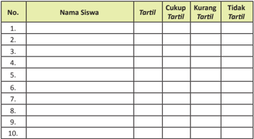

Tabel ini berisi informasi tentang keterampilan tortil siswa di sekolah. Kolom "Nama Siswa" menyajikan nama-nama siswa yang mungkin telah mengikuti tortil. Kolom "Tortil" menunjukkan apakah siswa tersebut berhasil mengikuti tortil atau tidak. Kolom "Cukup Tortil" dan "Kurang Tortil" masing-masing menunjukkan jumlah siswa yang dapat mengikuti tortil dengan baik dan kurangnya keterampilan tortil mereka. Data penting yang terlihat adalah bahwa sebagian besar siswa berhasil mengikuti tortil, namun masih ada beberapa siswa yang kurang keterampilan tortil mereka. Ini menunjukkan bahwa masih ada ruang untuk peningkatan keterampilan tortil di sekolah.

### Skala nilai:

Taril

: 91 - 100

Cukup taril

: 81 - 90

Kurang taril

: 71 - 80

Tidak taril

: 61 - 70

 

---
## 📄 Halaman 109

- Tulislah  kata/kalimat  yang  mengandung  hukum tajwid pada Q.S. alḤujurāt/49:10 dan 12 pada  kolom di bawah ini.

---
**📊 Tabel**

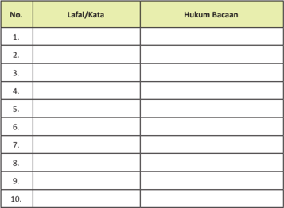

Tabel ini berisi daftar kata atau lafalan dengan hukum bacaan yang harus dipelajari. Topik utamanya adalah pengenalan kata-kata dan cara membaca mereka dengan benar. Kolom pertama berisi nomor urut untuk setiap kata atau lafalan, sedangkan kolom kedua berisi kata atau lafalan tersebut. Kolom ketiga berisi hukum bacaan yang harus dipatuhi saat membaca kata atau lafalan tersebut. Data penting yang terlihat adalah bahwa tabel ini mencakup 10 kata atau lafalan, masing-masing dengan hukum bacaan yang berbeda. Ini menunjukkan bahwa pembelajaran bahasa memerlukan pemahaman tentang struktur dan aturan bacaan kata-kata.

### B.  Uji Pemahaman

Jawablah petanyaan-pertanyaan berikut dengan jelas.

- Seiap muslim diperintahkan untuk melakukan mujāhadah an-nafs supaya hidupnya bahagia. Bagaimana cara menerapkan mujāhadah an-nafs dalam kehidupan sehari-hari?
- Apa  yang  akan  kamu  lakukan  jika  mengetahui  ada  dua  orang mukmin sedang berselisih pendapat?
- Q.S.  al-Ḥujurāt/49:10 mengandung  pesan-pesan  yang  mulia.  Jelaskan kandungan Q.S. al-Ḥujurāt/49:10 tersebut.
- Seseorang  yang  terbiasa ĥ usnu żż an akan  memperoleh  banyak  manfaat dan hikmah. Sebutkan manfaat dan hikmah orang yang ber ĥ usnu żż an .
- Sebutkan hukum bacaan ikhfa', i żhār, dan Idgām bigunnah yang terdapat dalam Q.S. al-Ḥujurāt/49:12 .

 

---
## 📄 Halaman 110

### C.  Releksi

Berilah  tanda checklist (  ) yang sesuai dengan dorongan haimu untuk menanggapi pernyataan-pernyataan berikut ini.

---
**📊 Tabel**

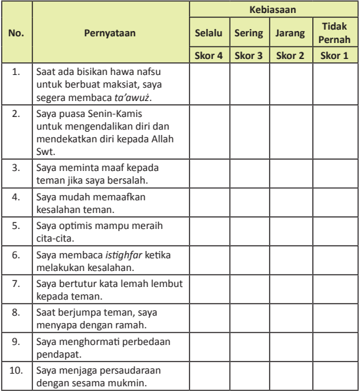

Tabel ini menunjukkan kebiasaan dan perilaku individu dalam berbagai situasi sosial dan emosional. Kolom "Pernyataan" berisi pernyataan yang diuji, sementara kolom "Kebiasaan" menunjukkan tingkat kebiasaan individu terhadap setiap pernyataan. Kolom "Selalu", "Sering", "Jangkang", dan "Tidak Pernah" menunjukkan frekuensi kebiasaan individu dalam melakukan pernyataan tersebut. Data penting yang terlihat adalah bahwa individu sering atau selalu melakukan beberapa pernyataan, seperti meminta maaf, mendekatkan diri pada Allah Swt., dan berturut-turut kata lemah lembut kepada teman. Sementara itu, individu jarang atau tidak pernah melakukan beberapa pernyataan lainnya, seperti berbuat baik untuk berbuat baik, meminta maaf jika bersalah, dan menjaga persaudaraan dengan sesama mukmin. Topik utama tabel ini adalah kebiasaan dan perilaku individu dalam berbagai situasi sosial dan emosional.

 

---
## 📄 Halaman 111

---
**🖼️ Gambar/Diagram**

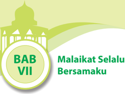

> **Deskripsi Visual:** Gambar ini adalah ilustrasi yang menunjukkan bagian dari bab VII buku pelajaran dengan judul "Malaikat Selalu Bersamaku". Gambar tersebut menggambarkan sebuah masjid yang megah dengan arsitektur khas Islam, termasuk menara masjid dan pintu masjid. Di sebelah kanan, terdapat teks "BAB VII" yang menunjukkan bahwa ini adalah bagian ke-7 dari buku tersebut. Di sebelah kiri, terdapat teks "Malaikat Selalu Bersamaku", yang merupakan judul bab ini. Gambar ini menggunakan warna hijau dan putih yang menonjolkan elemen-elemen utama seperti masjid dan teks. Ini menunjukkan bahwa bab ini mungkin berfokus pada tema tentang malaikat atau kehadiran Allah dalam kehidupan manusia.

### Bagan Alir

---
**🖼️ Gambar/Diagram**

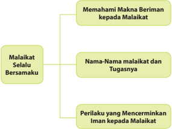

> **Deskripsi Visual:** Gambar ini adalah diagram yang menunjukkan struktur dan konten materi tentang malaikat dalam agama Islam. Diagram ini terdiri dari tiga bagian utama:

1. **Malaikat Selalu Bersamaku** - Ini merupakan subtopik utama yang mencakup pemahaman makna beriman kepada malaikat.

2. **Nama-Nama Malaikat dan Tugasnya** - Subtopik ini membahas nama-nama malaikat dan tugas-tugas mereka dalam kehidupan.

3. **Perilaku yang Mencerminkan Iman Kepada Malaikat** - Bagian ini mengajarkan tentang perilaku yang harus dilakukan untuk menunjukkan keimanan terhadap malaikat.

Elemen-elemen utama dalam diagram ini adalah tiga bagian yang terhubung melalui garis, menunjukkan hubungan antara subtopik-topik tersebut. Teks penting dalam diagram ini adalah judul subtopik dan nama-nama malaikat yang disebutkan.

Informasi kunci yang dapat diambil pembaca melalui diagram ini adalah bahwa malaikat memiliki peran penting dalam kehidupan manusia, dan ada beberapa nama dan tugas spesifik yang harus dipahami. Selain itu, diagram ini juga memberikan panduan tentang perilaku yang sesuai dengan iman terhadap malaikat.

 

---
## 📄 Halaman 112

### Membuka Relung Hai

### Cermai wacana berikut.

Pernahkah kamu  berada dalam satu ruangan  atau  satu  tempat  yang  terdapat closed  circuit  television ( CCTV )?  Apa  yang kamu rasakan? Tentu saja kamu akan merasa selalu ingin berhai-hai dan sembarang melakukan sesuatu, apalagi perbuatan yang akan menimbulkan aib atau perbuatan konyol yang dapat merugikan diri sendiri maupun orang lain.

Demikian pula orang yang meyakini keberadaan malaikat yang senaniasa mengawasi dan mencatat segala gerakgerik dan ingkah  laku manusia. Orang beriman kepada malaikat akan merasa selalu diawasi  ( muraqabah )  oleh  para  malaikat

Allah  Swt.  Akibatnya,    segala  indak-tanduknya  akan  terkontrol  d an terjaga.  Orang idak akan melakukan hal-hal konyol meskipun idak ada or ang lain yang melihatnya.

Keyakinan bahwa  ada malaikat yang bertugas mengatur rezeki akan senaniasa membuat seseorang opimis dan semangat dalam belajar, bekerja, dan  berusaha.  Ia  yakin  bahwa  malaikat  akan  memudahkan  urusan  rezekinya selama ia mau berusaha dan berdoa. Ia pantang berputus asa dan berpangku tangan  karena  memang  Allah  Swt.  idak  akan  menurunkan  harta  benda dengan menjatuhkannya begitu saja dari langit.

Orang yang meyakini bahwa ada malaikat diberi tugas oleh Allah Swt. untuk mencabut  nyawa  tanpa  pemberitahuan  terlebih  dahulu.  Oleh  karena  itu, manusia harus senaniasa mempersiapkan diri agar keika nyawanya lepas dari raga, ia senanisa dalam kebaikan. Ia akan berusaha sekuat tenaga menghindari perbuatan  terlarang  karena  ia  khawair  jangan-jangan  malaikat  mencabut nyawanya keika ia bermaksiat, demikian seterusnya. Pendek kata, orang-orang yang  beriman  akan  selalu  mempersiapkan  diri  dengan  menjauhi  segala  yang dilarang  Allah  Swt.  dan  mematuhi  segala  apa  yang  diwajibkan/diperintahkan Allah Swt.

 

---
## 📄 Halaman 113

Buatlah satu instrumen wawancara berkaitan dengan perbuatan tercela. Kemudian, lakukan wawancara singkat dengan orang-orang yang ada di sekitarmu. Bagaimana mereka dapat menghindarkan diri dari perbuatanperbuatan tercela. Buatlah kesimpulan hasil wawancaramu dalam kaitannya dengan keimanan kepada malaikat.

### Mengkriisi Sekitar Kita

### Cermai gambar dan wacana berikut.

berbahaya bagi orang lain.

teman merupakan perilaku mulia.

Banyak orang menduga  bahwa  keika  ia melakukan suatu kejahatan  yan g idak dilihat oleh orang lain, ia akan merasa aman dan selamat. Pad ahal sama  sekali idak. Ia tetap dilihat oleh dua malaikat Allah Swt. yang selalu siap seiap  saat, idak  pernah  idur  dan  idak  pernah  lalai.  Dua  mal aikat itu adalah Rakib dan Aid. Kedua  malaikat tersebut diperintah Allah  S wt. untuk selalu mencatat perbuatan baik dan berbuatan buruk manusia.  Mereka selalu  patuh  kepada  Allah  Swt.  dan  tak  pernah  sekalipun  membangkang.

 

---
## 📄 Halaman 114

Perbuatan tercela apa saja yang dapat dilakukan orang pada saat tidak ada orang lain di sekitarnya? Mengapa hal tersebut dapat terjadi.

### Memperkaya Khazanah Peserta Didik

### A.  Memahami Makna Iman kepada Malaikat dan Tugas-tugasnya

### 1.  Pengerian Iman kepada Malaikat

Iman  secara  bahasa  arinya  percaya  atau  yakin.  Iman  dari  segi  isilah arinya  meyakini  setulus  hai  yang  mengakar  kuat,  mengucapkan  dengan lisan, dan mengamalkan dengan seluruh anggota badan. Menurut  M. Quraish Shihab, kata malaikat berasal dari bahasa Arab, yaitu malā'ikah ( ) yang merupakan bentuk jamak dari kata malak ( )    yang  terambil dari kata la'aka ( ) yang berari 'menyampaikan sesuatu'. Jadi, malak/malaikat adalah  makhluk  yang  menyampaikan  sesuatu  dari  Allah  Swt..  Menurut isilah,  malaikat  adalah  makhluk  gaib  yang  diciptakan  oleh  Allah Swt.  dari cahaya,  sebagai  utusan  Allah  Swt.  yang  taat,  patuh,  serta  idak  pe rnah membangkang  terhadap  perintah-perintah-Nya.

Iman  kepada  malaikat  adalah  meyakini  dengan  sepenuh  hai  bahwa Allah Swt. menciptakan malaikat sebagai makhluk gaib yang diutus untuk melaksanakan  segala  perintah-Nya.  Orang  yang  mengimaninya  akan senaniasa  menggunakan  seluruh  anggota  badannya  untuk  berhai-ha i dalam berkata-kata dan berbuat.

### 2.  Hukum Beriman kepada Malaikat

Beriman kepada malaikat hukumnya adalah far « u 'ain . Beriman kepada malaikat  merupakan  salah  satu  rukun  iman  selain  iman  kepada  Allah Swt., kitab-kitab-Nya, rasul-rasul-Nya, hari akhir, dan qada/qadar .  Hal ini berdasarkan pada beberapa sumber dari al-Qur'ān dan hadis sebagai berikut.

 

---
## 📄 Halaman 115

### a. Q.S. al-Baqarah/2:285

Arinya: 'Rasul (Muhammad) beriman kepada apa yang diturunkan kepadanya  (Al-Qur'ān)  dari  Tuhannya,  demikian  pula  orang-orang yang beriman. Semua beriman kepada Allah, malaikat-malaikat-Nya, kitab-kitab-Nya  dan  rasul-rasul-Nya.  (Mereka  berkata),  'Kami  idak membeda-bedakan  seorang  pun  dari  rasul-rasul-Nya.'  Dan  mereka berkata, 'Kami dengar dan kami taat. Ampunilah kami, ya, Tuhan kami, dan kepada-Mu tempat (kami) kembali.'

### b. Q.S. an-Nisā'/4:136

Arinya:    'Wahai  orang-orang  yang  beriman!  Tetaplah  beriman kepada  Allah  Swt.  dan  Rasul-Nya  (Muhammad  saw.)  dan  kepada Kitab  (al-Qur'ān)  yang  diturunkan  kepada  Rasul-Nya,  serta  kitab yang diturunkan sebelumnya. Barangsiapa ingkar kepada Allah Swt., malaikat-malaikat-Nya, kitab-kitab-Nya, rasul-rasul-Nya, dan hari kemudian, maka sungguh, orang itu telah tersesat sangat jauh'

### c.  Hadis yang diriwayatkan oleh Bukhari dan Muslim

Arinya: 'Diriwayatkan dari Abu Hurairah ra. bahwa pada suatu hari Rasulullah saw. muncul di tengah orang banyak, lalu beliau didatangi oleh  seorang  laki-laki.  Orang  itu  bertanya,  'Wahai  Rasulullah  saw., apakah iman itu?' Beliau menjawab, 'Iman adalah kamu harus percaya kepada Allah Swt., malaikat-malaikat-Nya, kitab-Nya,  pertemuan dengan-Nya, rasul-rasul-Nya, dan hari kebangkitan di akhirat nani...' (H.R. Bukhari dan Muslim)

 

---
## 📄 Halaman 116

### 3.  Penciptaan Malaikat

Mengingat  sedikitnya  pengetahuan  yang  dimiliki  manusia  terutama berkaitan  dengan  hal-hal  yang  gaib  termasuk  malaikat,  sumber  y ang  dapat dijadikan rujukan untuk mengetahui malaikat dengan berpedoman kepada al-Qur'ān dan hadis-hadis Rasulullah saw.

Dalam sebuah hadis Rasulullah saw. bersabda:

``

Arinya:  'Dari  Aisyah  berkata:  Rasulullah  saw.  bersabda,  'Malaikat diciptakan  dari  cahaya,  jin  diciptakan  dari  api  yang  menyala-nyala  dan Adam diciptakan dari  sesuatu  yang  telah  disebutkan  (ciri-cirinya)  untuk kalian.' (HR. Muslim)

Keterangan lain tentang malaikat sebagaimana dijelaskan dalam Q.S. Fāṭir/35:1 disebutkan  bahwa  malaikat  mempunyai  sayap.  Allah  Swt. berirman:

``

Arinya: 'Segala puji bagi Allah Swt. pencipta langit dan bumi, yang menjadikan  malaikat  sebagai  utusan-utusan  (untuk  mengurus  berbagai macam urusan) yang mempunyai sayap, masing-masing (ada yang) dua, iga dan empat. Allah Swt. menambahkan pada ciptaan-Nya apa yang Dia kehendaki.  Sungguh,  Allah  Swt.  Mahakuasa  atas  segala  sesuatu'  (Q.S. Fāṭir/35:1)

Berdasarkan  keterangan  di  atas,  jelaslah  bahwa  malaikat  adalah makhluk  Allah  Swt.  yang  diciptakan  dari nur atau  cahaya  dan  memiliki sayap, sehingga jika ada keterangan lain yang menyatakan bahwa malaikat memiliki ciri-ciri yang idak sesuai dengan keterangan dari al-Qur'ān dan hadis, patutlah kita meragukannya.

### 4.  Perbedaan antara Malaikat, Manusia, dan Jin

Dari  segi  asalnya,  malaikat  berbeda  dengan  manusia  dan  jin,  yaitu bahwa malaikat diciptakan dari nur atau cahaya sementara manusia dan jin masing-masing diciptakan dari tanah dan api. Dari sifat dan ciri-cirinya, perbedaan malaikat, manusia, dan jin dapat dilihat dalam tabel berikut.

 

---
## 📄 Halaman 117

### 5.  Jumlah Malaikat

Karena sifatnya gaib, berapa jumlah malaikat secara terinci sebagaimana manusia,  hanya  Allah  Swt.  dan  Rasul-Nya  yang  mengetahui.  Namun demikian, keterangan hadis berikut dapat memberikan penjelasan tentang banyaknya  jumlah  malaikat.  Hadis  berikut  menggambarkan  banyaknya jumlah  malaikat.  Perhaikan  hadis  dari  Ali  ra.

Arinya: Dari Ali ia berkata, ' Aku mendengar Rasulullah saw. bersabda, 'Barangsiapa mengunjungi saudaranya sesama muslim maka seakan ia berjalan  di  bawah  pepohonan  surga  hingga  ia  duduk,  jika  telah  duduk maka rahmat akan melingkupinya. Jika mengunjunginya di waktu pagi, maka tujuh puluh ribu malaikat akan bersalawat kepadanya hingga sore hari,  dan  jika  ia  mengunjunginya  di  waktu  sore,  maka  tujuh  puluh  ribu malaikat akan bersalawat kepadanya hingga pagi hari. ' (H.R. Ibnu Majah)

Banyaknya jumlah malaikat tersebut menggambarkan betapa Mahakuasa  Allah  Swt.  karena  dengan  jumlah  malaikat  yang  demikian banyak,  sangat  mudah  bagi  Allah  Swt.  untuk  mengetahui  gerak-ge rik  serta ingkah  laku  manusia.  Namun  demikian,  umat  Islam  diperintahkan untuk mengetahui  dan  mengimani  sepuluh  nama  malaikat  berikut  tugasnya.

 

---
## 📄 Halaman 118

Nama-nama malaikat tersebut diabadikan oleh Allah Swt. dalam al-Qur'ān serta  hadis  Rasulullah  saw.  Kesepuluh  nama  malaikat  yang  wajib  kita ketahui  dengan  tugasnya  masing-masing  dijelaskan  pada  bagian  ber ikut ini.

### 6. Nama  Malaikat  dan  Tugasnya  Masing-Masing

Sebagaimana halnya manusia, para malaikat memiliki tugas. Bedanya, tugas  yang  diberikan  Allah  Swt.  kepada  manusia  seringkali  diabaikan bahkan dipertentangkan untuk dilaksanakannya. Namun  para  malaikat, yang  diberikan  tugas  oleh  Allah  Swt.  kepadanya,  idak  pernah  me nunda apalagi melalaikan dan membangkang untuk mengerjakannya. Bahkan, dia melaksanakan tugasnya sesuai dengan perintah Allah Swt. dan dia i dak mendurhakai-Nya. Allah Swt. berirman:

Arinya:  'Wahai  orang-orang  yang  beriman!  Peliharalah  dirimu  dan keluargamu dari api neraka yang bahan bakarnya adalah manusia dan batu;  penjaganya  malaikat-malaikat  yang  kasar,  dan  keras,  yang  idak durhaka  kepada  Allah  Swt.  terhadap  apa  yang  Dia  perintahkan  kepada mereka  dan  selalu  mengerjakan  apa  yang  diperintahkan'  (Q.S.  atTa ḥ r �m/66:6)

Di antara tugas-tugas malaikat itu antara lain: 1) Beribadah kepada Allah Swt.  dengan  bertasbih  kepada-Nya  siang  dan  malam  tanpa  rasa  bosan atau terpaksa;  2) Membawa wahyu kepada para Nabi dan para Rasul; 3) Memohon ampunan bagi orang-orang beriman; 4) Meniup sangkakala ; 5)  Mencatat  amal  perbuatan;  6)  Mencabut  nyawa;  7)    Memberi  salam kepada ahli surga; 8) Menyiksa ahli neraka; 9) Memikul 'arsy ; 10) Memberi kabar gembira dan memperkokoh kedudukan kaum mukminin; dan 11) Mengerjakan pekerjaan selain yang telah disebutkan di atas.

Penjelasan tentang nama-nama malaikat dan tugasnya masing-masing adalah sebagai berikut.

### a.  Malaikat Jibril

Malaikat Jibril dikenal juga sebagai penghulu para malaikat. Malaikat Jibaril adalah satu dari iga malaikat yang namanya disebut dalam alQur'ān .  Nama  Malaikat  Jibril  disebut  dua  kali  dalam al-Qur'ān, yaitu pada Q.S.  al-Baqarah/2:97-98 dan Q.S. at-Taḥ r �m/66:4 . Malaikat Jibril memiliki beberapa nama lain atau julukan, di antaranya adalah R û ḥ alAm � n dan R û ḥ al-Qudus . Adapun tugas utamanya adalah menyampaikan wahyu dari Allah Swt. kepada para nabi dan rasul-Nya.

 

---
## 📄 Halaman 119

Malaikat Jibril  pula  yang  menyampaikan  berita  kelahiran  Nabi  Isa as. kepada  ibunya  Maryam  dan  menyampaikan al-Qur'ān kepada Nabi Muhammad saw. Dalam kisah suci perjalanan Isra' Mi'raj , sesampainya di Sidratul  Muntaha ,  Malaikat  Jibril  idak  sanggup  lagi  mendampingi Rasulullah saw. untuk terus naik menghadap Allah Swt. Malaikat Jibril berkata,  'Aku  sama  sekali  idak  mampu  mendekai  Allah  Swt.  perlu waktu enam puluh ribu tahun lagi untuk terbang hingga mencapainya. Jika aku terus naik ke atas, maka aku akan hancur luluh'. Mahasu ci Allah Swt., ternyata Malaikat Jibril as. saja idak sampai kepada Allah S wt.

### b.  Malaikat Mikail

Malaikat  Mikail  adalah  malaikat  yang  tugasnya  mengatur  urusan makhluk Allah Swt. termasuk mengatur rezeki terutama untuk manusia. Seperi  mengatur  air,  menurunkan  hujan/peir,  membagikan  re zeki untuk manusia, tumbuh-tumbuhan, hewan, dan lain-lainnya yang ad a di muka bumi ini. Malaikat Mikail, termasuk salah satu malaikat yang menjadi pembesar seluruh malaikat selain Malaikat Jibril.

Di  samping  bertugas  membagi  rezeki  dan  hujan,  Malaikat  Mikail juga  sering  bersama-sama  dengan  Malaikat  Jibril  dalam  menjalankan tugasnya.  Di  antara  tugas  yang  pernah  dilakukan  bersama  Malaikat Jibril  adalah  sebagai  berikut.

- Keika Malaikat Jibril menjalankan tugas membelah dada Nabi Muhammad  saw.  untuk  dicuci  hainya  karena  akan  diisi  dengan iman,  islam,  yakin,  dan  sifat hilim, Malaikat Mikail mengambil peran sebagai pengambil air al-Kauș ar (air  zam-zam)  untuk  mencuci  hai Nabi Muhammad saw.
Jibril

- Keika Nabi Muhammad saw. mendapat kepercayaan untuk melakukan Isra' dan Mi'raj , Malaikat Mikail bersama mendampingi selama perjalanan.
- Malaikat  Mikail  juga  bertugas  menyampaikan  lembaran  kepada Malaikat  Maut.  Lembaran  tersebut  bertulis  tentang  detail  seperi nama, tempat, dan sebab-sebab pencabutan nyawa bagi orang yang dimaksud.

### c.  Malaikat Izrail

Malaikat Izrail bertugas mencabut nyawa semua makhluk termasuk dirinya  sendiri.  Malaikat  Izrail  dikenal  juga  dengan  sebutan  Malaikat Maut.  Empat  malaikat  utama  selain  Jibril  dan  Mikail,  dan  Israil  ad alah Malaikat Izrail.

Malaikat Izrail diberi kemampuan yang luar biasa oleh Allah Swt., di  antaranya  adalah  dapat  menjangkau  dengan  mudah  dari  barat hingga imur bagaikan seseorang yang sedang menghadap sebuah meja makan yang dipenuhi dengan pelbagai makanan yang siap untuk dimakan. Malaikat Izrail juga sanggup membolak-balikkan dunia

 

---
## 📄 Halaman 120

sebagaimana kemampuan seseorang yang sanggup membolak-balikkan uang. Sewaktu Malaikat Izrail menjalankan tugasnya mencabut nyawa makhluk-makhluk  dunia,  maka  Malaikat  Izrail  akan  turun  ke  dunia bersama-sama dengan dua kumpulan malaikat lainnya, yaitu Malaikat Rahmat  dan  Malaikat  Azab.  Malaikat  yang  mengetahui  di  mana seseorang akan menemui ajalnya, adalah tugas dari Malaikat Arham.

### d.  Malaikat Israil

Malaikat Israil tugasnya meniup sangkakala .  Israil selalu memegang terompet suci yang terletak di bibirnya selama berabad-abad, hingga menunggu perintah dari Allah Swt. untuk meniupnya pada hari kiamat. Pada hari itu, Malaikat Israil akan turun ke bumi dan berdiri di batu/ bukit suci di Jerusalem. Tiupan pertama akan menghancurkan dunia beserta  isinya,  iupan  kedua  akan  memaikan  para  malaikat  serta iupan keiga akan membangkitkan orang-orang yang telah mai dan mengumpulkan mereka di Padang Ma ĥ syar.

Di dalam kitab Tanbi ĥul Gāil� n Jilid  1  halaman  60  terdapat  sebuah hadis panjang yang menceritakan tentang kejadian kiamat yang pada bagian awalnya sangat menarik untuk dicermai.

Abu  Hurairah  ra.  berkata:  Rasulullah  saw.  bersabda,  ' Keika  Allah Swt.  telah  selesai  menjadikan  langit  dan  bumi,  Allah  Sw t.  menjadikan sangkakala (terompet) dan diserahkan kepada Malaikat Is rail, kemudian  ia  letakkan  di  mulutnya  sambil  melihat  ke  Arsy  me nanikan bilakah  ia  diperintah'.  Saya  bertanya:  'Ya  Rasululla h  saw.  apakah sangkakala itu?' Jawab Rasulullah saw. 'Bagaikan tand uk dari cahaya.'  Saya  tanya;  'Bagaimana  besarnya?'  Jawab  Rasu lullah  saw.; 'Sangat  besar  bulatannya,  demi  Allah  Swt.  yang  mengutusk u  sebagai Nabi,  besar  bulatannya  itu  seluas  langit  dan  bumi,  dan akan  diiup hingga iga kali. Pertama: Nakhatul fazā' (untuk menakutk an). Kedua: Nakhatus  sa'aq  (untuk  memaikan).  Keiga:  Nakhatul  ba'a ¡ (untuk menghidupkan kembali atau membangkitkan) .'

Dalam hadis di atas, disebutkan bahwa sangkakala atau terompet Malaikat  Israil  itu  bentuknya  seperi  tanduk  dan  terbuat  dari  c ahaya. Ukuran bulatannya seluas langit dan bumi. Bentuknya laksana tanduk mengingatkan  kita  pada  terompet  orang-orang  zaman  dahulu  yang terbuat dari tanduk.

### e.  Malaikat Munkar

Malaikat  Munkar  bersama  Malaikat  Nakir  tugasnya  menanyakan dan menguji iman orang yang sudah mai di alam kubur.

 

---
## 📄 Halaman 121

### f.  Malaikat  Nakir

Malaikat  Munkar  dan  Malaikat  Nakir  merupakan  dua  malaikat  yang bertugas menanyakan dan menguji iman orang yang sudah mai di alam kubur. Hal itu akan dimulai keika pemakaman selesai dan oran g terakhir dari jamaah yang mengikui pemakaman telah melangkah 40 langkah dari makam.

Malaikat  Munkar  dan  Malaikat  Nakir  akan  Menanyakan  iga  (3) perkara.  Tiga  (3)  perkara  tersebut,  yaitu  'Siapa  Tuhamnmu?    Apa Agamamu?  Siapa Nabimu?'. Seorang mukmin  yang saleh akan menjawab bahwa Tuhanku adalah Allah Swt. Agamaku adalah Islam, dan Nabiku adalah Muhammad saw.  Jika jawaban seseorang itu benar seperi tersebut di atas, maka waktu untuk menunggu hari keb angkitan akan  sangat  menyenangkan.  Namun,  apabila  seseorang  idak  dapat menjawab seperi tersebut di atas, maka orang tersebut akan d ihukum hingga hari penghakiman.

### g.  Malaikat Raqib

Malaikat Raqib bertugas mencatat segala amal kebaikan manusia. Ia bersama Malaikat 'Aid yang mencatat amal buruk bertugas bersamaan. ( Q.S. Qāf/50:18 ). Dari Anas ra., dari Nabi Muhammad saw., bersabda: 'Sesungguhnya  Allah  Swt.  telah  menugaskan  dua  malaikat untuk menulis  segala  apa  yang  dilakukan  atau  dituturkan  oleh   seseorang hamba-Nya (satu di sebelah kanannya dan yang satu lagi  di sebelah kirinya); kemudian apabila orang itu mai, Tuhan perint ahkan kedua malaikat  itu  dengan  irman-Nya,  'Hendaklah  kamu  berdua  in ggal tetap di kubur hamba-Ku itu serta hendaklah kamu menguc ap tasbih, tahmid, dan takbir hingga ke hari qiamat dan hendaklah  kamu menulis pahalanya untuk hamba-Ku itu.' (H.R. Abu al-Syeikh dan Tabrani)

### h.  Malaikat 'Aid

Malaikat 'Aid bertugas mencatat segala amal keburukan manusia. Malaikat  Raqib  dan  'Aid  sangat  jujur  dan  idak  pernah  bermaksiat kepada Allah Swt. Mereka mencatat dengan penuh keteliian, se hingga idak ada satu pun keburukan dan kebaikan yang luput dari catat an keduanya.

### i. Malaikat Malik

Malaikat  Malik  adalah  malaikat  yang  memimpin  para  malaikat yang  bertugas  di  neraka.    Malaikat  Malik  disebut  dalam Q.S. AzZukhruf/43:77 :

 

---
## 📄 Halaman 122

Arinya  :  'Dan  mereka  berseru,  'Hai  (Malaikat)  Malik,  biarlah Tuhanmu membunuh kami saja.' Dia menjawab, 'Sungguh, kamu akan tetap inggal (di neraka ini).' (Q.S. az-Zukhruf/43:77 )

Dari  ayat  di  atas,  dapat  dipahami  bahwa  Malaikat  Malik  adalah Malaikat yang memimpin para malaikat yang bertugas di neraka. Hal ini dipertegas oleh irman Allah Swt yang arinya, 'Di atasnya ada sembilan belas (malaikat penjaga)'. (Q.S. al-Mudda șș ir/74:30)

### j. Malaikat Ridwan

Malaikat  Ridwan  bertugas  menjaga  dan  mengawasi  surga  serta menyambut semua hamba Allah Swt. yang akan masuk ke dalamnya. Malaikat Ridwan sangat ramah menyambut dan mempersilakan orangorang yang akan masuk ke dalam surga.

Carilah melalui literatur yang lain dan terpercaya tentang sepuluh nama malaikat  dengan  tugasnya  masing-masing.  Cantumkan  sumber  yang menjadi rujukan.

### B.  Hikmah Beriman kepada Malaikat

Orang-orang yang beriman selalu dapat mengambil pelajaran dari materi yang  diimani.  Dalam  hal  beriman  kepada  malaikat-malaikat  Allah  Swt., pelajaran yang dapat dipeik antara lain adalah sebagai berikut.

- Menambah keimanan dan ke takwa an kepada Allah Swt.
- Senaniasa hai-hai dalam seiap ucapan dan perbuatan sebab segala apa yang dilakukan manusia idak luput dari pengamatan malaikat Allah Swt.
- Menambah  kesadaran terhadap alam mengenai wujud yang idak terjangkau oleh pancaindra manusia.
- Menambah  rasa  syukur  kepada  Allah  Swt.  karena  melalui  malaikatmalaikat-Nya, manusia memperoleh banyak karunia.
- Menambah semangat dan ikhlas dalam beribadah walaupun idak dilihat oleh orang lain keika melakukannya.
- Menumbuhkan  cinta  kepada  amal  saleh  karena  malaikat  selalu  siap mencatat amal manusia.
- Semakin giat dalam berusaha karena idak ada rezeki yang diturunkan oleh malaikat Allah Swt. tanpa usaha dan kerja keras.

 

---
## 📄 Halaman 123

### Kisah Dua Malaikat Pencuci Hai Nabi

Nabi Muhammad saw. adalah seorang manusia yang sangat mulia. Di dadanya idak ada lagi pikiran yang kotor, perasaan sombong, iri, dengki, dan perasaan serta sifat tercela lainnya. Pada suatu hari yang sangat terik, seperi biasa Nabi Muhammad saw. yang baru berumur iga tahun ikut menggembala kambing  bersama  anak  kandung  Halimah.  Mereka  menggiring  kambing  ke sebuah  padang  rumput  dan  menggembalakannya  seperi  biasa.  Masa-masa menggembalakan  kambing  adalah  masa-masa  yang  sangat  menyenangkan. Mereka  dapat  bermain  sepuasnya  sambil  tetap  memperhaikan  kambi ngkambing itu mencari makanan sendiri. Mereka dapat bersenda gurau atau berpura-pura menunggangi kuda padahal mereka sedang  menunggan gi kambing. Hubungan  Nabi Muhammad  saw.  dengan  anak-anak  Halimah, saudara sesusuannya sangat baik dan akrab.

Suatu  hari  Halimah  mendapai  anaknya  kembali  seorang  diri  tanpa Muhammad saw. bersamanya. Wajahnya tampak kaget ketakutan. Dengan terbata-bata  dan  nafas  yang  tersengal-sengal,  dia  mengatakan bahwa  Nabi Muhammad saw. dibawa oleh dua orang laki-laki yang berpakaian s erba puih. Setelah  diikui,  ternyata  dua  orang  lelaki  itu  membawa  Muhamm ad  saw.  ke suatu tempat, kemudian menelentangkannya di atas rumput dan membelah dadanya. 'Dua orang laki-laki itu telah membunuh Nabi Muhammad  saw.!' kata anak Halimah sambil menangis terisak-isak.

Halimah  dan  suaminya  tersentak  kaget.  Mereka  idak  mempercayai ucapan anaknya tersebut. Apa benar Muhammad saw. sudah dibunuh?  Jika benar, siapa yang membunuhnya dan apa tujuan membunuhnya? Bagaimana mereka harus mengatakan kepada ibunda Muhammad saw., yaitu Aminah dan keluarganya jika benar Muhammad saw. sudah dibunuh orang? Pikiran itu  berkecamuk  di  kepala  mereka.  Tanpa  menunggu  waktu  lama,  mereka segera berlari menuju tempat yang disebutkan anaknya. Mereka harus segera mengetahui keadaan Muhammad saw.

Halimah dan suaminya sampai di tempat yang ditunjukkan. Mereka menarik nafas lega keika mendapai Muhammad saw. sedang duduk di atas tanah dengan wajah sangat pucat ketakutan. 'Wahai Muhammad, apakah kamu baik-baik saja? Apa yang telah terjadi terhadapmu?' Tanya Halimah sambil memeluk Muhammad saw. erat-erat. Dia sangat bersyukur anak as uhnya baik-baik saja. 'Dua orang laki-laki berpakaian puih mendatangi ku. Mereka menyuruhku  telentang  dan  kemudian  mereka  membelah  dadaku.  Mereka mencari  sesuatu  di  dadaku  dan  akhirnya  membuangnya  keika  mere ka  sudah

 

---
## 📄 Halaman 124

menemukannya.  Setelah  itu  mereka  segera  pergi  dengan  cepat  tanpa  aku menyadari  kepergiannya,'  jawab  Nabi  Muhammad  saw.

Begitulah,  keika  Allah  Swt.  melalui  malaikat  yang  diperintah-N ya  membersih kan dan menyucikan hai Nabi Muhammad  saw.  keika ia  mas ih sangat  kecil.  Malaikat  Jibril  mengambil  jantung  Nabi  Muhammad  sa w.  dan membuang segumpal darah dari jantung tersebut yang merupakan bagian setan  dari  diri  Rasulullah  saw.  Setelah  itu,  jantung  Nabi  Muham mad  dicuci dengan air zamzam yang dibawa oleh Malaikat Mikail dan dikembalikan lagi ke tempatnya semula. (Dikuip dari: 99 Kisah Menakjubkan dalam al-Qur'ān ).

Dikuip dari berbagai sumber

Bacalah kembali dengan cermat bacaan di atas. Pelajaran apa yang dapat dipetik dari kisah di atas? Cari kisah tersebut dengan merujuk literatur lain.

### Menerapkan Perilaku Mulia

Dengan senaniasa menghadirkan dan meneladani sifat-sifat malaikat dalam kehidupan, maka kita akan berindak seperi berikut.

- Berkata dan berbuat jujur karena di mana dan ke mana pun malaikat pasi mengawasi kita.
- Patuh dan  taat terhadap hukum-hukum Allah Swt. dan peraturan yang dibuat oleh pemerintah.
- Melaksanakan tugas yang diembankan kepada kita dengan penuh tanggung jawab keikhlasan.
- Berindak hai-hai serta penuh perhitungan dalam perkataan dan perbuatan.
- Memiliki rasa empai dengan memberikan bantuan kepada orang yang sedang membutuhkan bantuan (kepedulian sosial).

 

---
## 📄 Halaman 125

- Perilaku yang ditampilkan mampu menjadi suri teladan bagi lingkungannya.
- Selalu berusaha untuk memperbaiki diri sendiri dari waktu ke waktu.
- Berusaha sekuat tenaga untuk menghindari berbagai perbuatan buruk.
- Tidak bersikap sombong ( riya' ) dalam berbuat kebaikan.
Hadirkanlah  malaikat  dalam  kehidupanmu,  yakinkan  pada  dirimu  bahwa semua  perbuatan  kita  akan  dicatat  oleh  malaikat  Allah  Swt.  dan  kelak  akan mendapat  balasannya.    Kamu  pasi  akan  hidup  bahagia  di  dunia  dan  di akhirat.

### Rangkuman

- Beriman kepada malaikat mengandung makna bahwa sebagai orang yang beriman, kita harus percaya dan yakin dengan sepenuh hai bahwa malaikat diciptakan dari cahaya ( nur ) yang diberi tugas oleh Allah Swt. dan senaniasa melaksanakannya  tanpa  pernah  membantah  atau  mengingkarinya.  Salah satu  tanda  atau  ciri  dari  orang  beriman  kepada  malaikat  adalah  memiliki keyakinan  yang  kuat  dalam  hainya  bahwa  di  alam  semesta  ini  terd apat malaikat dan keyakinan tersebut diucapkan melalui lisannya. Wujud konkret dari  iman  tersebut  adalah  dibukikan  seorang  muslim  dalam  perb uatan sehari-hari.
- Iman kepada malaikat memiliki landasan ( dalil ) dalam pengambilan hukumnya. Di antara dalil yang menunjukkan adanya kewajiban iman kepada Malaikat antara lain:
- -QS. an-Nisā'/4:136
- -QS. al-Baqarah/2:285
- -Hadis-hadis Nabi Muhammad saw.
- Malaikat bersifat abstrak dan immaterial .  Jumlah  malaikat idak terbatas, tetapi yang wajib diimani berjumlah 10 Malaikat.
- Iman  kepada  malaikat  memiliki  hikmah  di  antaranya  meningkatkan  iman dan takwa kepada Allah Swt. Mendorong manusia untuk berhai-hai dan meningkatkan amal serta menghindarkan diri dari sifat tercela.
- Seseorang  yang  beriman  kepada  malaikat,  senaniasa  menghadirkannya dalam kehidupan sehari-hari.

 

---
## 📄 Halaman 126

### A.  Uji Pemahaman

Jawablah pertanyaan-pertanyaan berikut ini dengan jelas.

- Mengapa  malaikat  selalu  taat  kepada  Allah  Swt.,  sedangkan  manusia idak?
- Tuliskan sebuah ayat beserta arinya yang menjelaskan gambaran malaikat.
- Jelaskan tentang Malaikat Jibril.
- Sebutkan minimal 5 contoh pengamalan dari iman kepada malaikat.
- Mengapa kita harus mengimani malaikat Allah Swt.? Jelaskan.

### B.  Releksi

Berilah  tanda checklist (  ) yang sesuai dengan dorongan haimu untuk menanggapi  pernyataan-pernyataan  berikut.

---
**📊 Tabel**

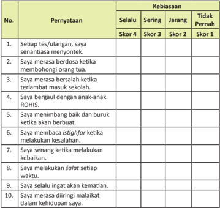

Tabel ini menunjukkan kebiasaan individu dalam berbagai aspek hidup, diukur dengan skor 1 hingga 4. Kolom "Selalu" menunjukkan kebiasaan yang dilakukan secara rutin, "Sering" menunjukkan kebiasaan yang dilakukan dengan frekuensi tinggi, "Jarang" menunjukkan kebiasaan yang dilakukan dengan frekuensi sedang, dan "Tidak Pernah" menunjukkan kebiasaan yang tidak pernah dilakukan. Topik utama tabel adalah kebiasaan individu dalam berbagai aspek hidup, seperti tes/ulangan, berdoa, bersama orang tua, berbual, menimbingan, istighfar, melakukan kesalahan, kebaikan, melaksanakan salat, ingat kematian, dan malaikat dalam kehidupan. Data penting yang terlihat adalah bahwa individu sering berdoa ketika membongkar orang tua, menimbing baik dan buruk ketika berbuat, dan melaksanakan salat setiap waktu.

 

---
## 📄 Halaman 127

---
**🖼️ Gambar/Diagram**

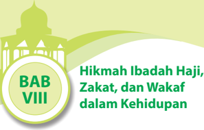

> **Deskripsi Visual:** Gambar ini adalah ilustrasi yang menunjukkan judul bab dalam buku pelajaran. Judul bab ditulis dalam bahasa Indonesia dengan huruf besar "BAB VIII" berada di bagian bawah gambar. Di sebelah kiri, terdapat logo sebuah masjid dengan arsitektur tradisional, yang tampak seperti sebuah masjid kecil dengan beberapa tingkat dan atap berbentuk bulan sabit. Di sebelah kanan, terdapat teks yang membahas tentang hikmah ibadah haji, zakat, dan wakaf dalam kehidupan. Elemen-elemen utama dalam gambar ini adalah judul bab, logo masjid, dan teks yang menjelaskan topik bab tersebut. Informasi kunci yang dapat diambil pembaca adalah bahwa bab ini membahas tentang hikmah ibadah haji, zakat, dan wakaf dalam konteks kehidupan.

### Bagan Alir

---
**🖼️ Gambar/Diagram**

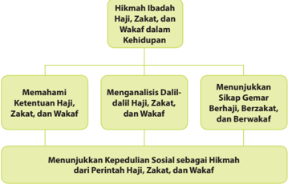

> **Deskripsi Visual:** Gambar ini adalah diagram yang menunjukkan hubungan antara hikmah ibadah haji, zakat, dan wakaf dalam kehidupan. Diagram ini dibagi menjadi empat bagian utama:

1. **Memahami Ketentuan Haji, Zakat, dan Wakaf**: Ini merupakan bagian pertama yang menjelaskan pentingnya memahami ketentuan dasar ibadah haji, zakat, dan wakaf.

2. **Menganalisis Dalil-dalil Haji, Zakat, dan Wakaf**: Bagian ini fokus pada analisis dalil-dalil yang mendukung pentingnya ibadah haji, zakat, dan wakaf.

3. **Menunjukkan Sikap Gemar Berhajat, Berzakat, dan Berwakaf**: Ini menekankan pentingnya memiliki sikap yang gemar untuk melaksanakan ibadah haji, zakat, dan wakaf.

4. **Menunjukkan Kepedulian Sosial sebagai Hikmah dari Perintah Haji, Zakat, dan Wakaf**: Bagian terakhir ini menggambarkan bagaimana perintah ibadah haji, zakat, dan wakaf dapat meningkatkan kesejahteraan masyarakat secara sosial.

Elemen-elemen utama dalam diagram ini adalah empat bagian yang disebutkan di atas, yang saling terkait dan membentuk sebuah struktur yang komprehensif tentang hikmah dari ibadah haji, zakat, dan wakaf dalam kehidupan. Teks, angka, atau label penting yang terlihat dalam diagram ini adalah nama-nama bagian yang disebutkan di atas, serta informasi tentang apa yang ditunjukkan oleh setiap bagian.

 

---
## 📄 Halaman 128

### Membuka Relung Hai

### Cermai wacana dan gambar berikut.

Meningkatnya orang-orang kaya muslim tentu saja perlu mendapat apresiasi dari  semua  kalangan.  Hal  tersebut  diharapkan  mampu  menjadi  solusi  dari sebagian  masyarakat  Indonesia  yang  masih  hidup  dalam  kemiskinan.  Betapa idak,  dari  mereka  diharapkan  terjadi  jembatan  penghubung  ant ara  orang-orang kaya ( agniya )  dan  orang-orang miskin (kaum du'afa ).  Tentu  saja  dengan posisi mereka  sebagai  pengusaha  muslim  akan  diperoleh  sekian  banyak  kontribusi dalam upaya membantu mereka yang masih sangat membutuhkan. Dana yang terkumpul  tersebut,  baik  berupa zakat mal , infak , śadaqah ,  atau wakaf akan sangat  berari  dalam  upaya  membantu  kaum  fakir  miskin.

Demikian itu  karena  sesungguhnya  Islam  membenci  berputarnya  kekayaan di  tangan  orang-orang  tertentu  saja,  sementara  sebagian  besar  o rang  idak memilikinya.  Islam  senang  kalau  harta  itu  idak  hanya  berkisar  p ada  orangorang  kaya  saja.  Sistem  ekonomi  Islam  merupakan  suatu  siste m  yang  indah, yang  membawa  keseimbangan  dan  keharmonisan  antara  kepeningan  i ndividu dan kepeningan kolekif yang membawa misi kebersamaan agar ju rang pemisah antara agniya (orang kaya) idak terlalu jauh dengan kaum ḍ u'afa (orang miskin).

Ajaran Islam mengisyaratkan untuk melakukan upaya pemberdayaan ekonomi umat yang harus diproyeksikan untuk kesejahteraan bersama, bu kan hanya untuk kepeningan pribadi. Prinsip tersebut salah satunya dapat diap likasikan melalui pengelolaan wakaf yang amanah dan profesional agar pahalanya terus mengalir meskipun wakif (orang  yang  mengeluarkan wakaf )  tersebut  telah  meninggal dunia.

 

---
## 📄 Halaman 129

Carilah informasi tentang orang-orang kaya Indonesia yang me wakaf kan hartanya  baik  dalam  bentuk  harta  tetap  (tidak  bergerak)  maupun  yang bergerak.

### Mengkriisi Sekitar Kita

### Cermai wacana berikut.

Keberadaan  orang-orang  yang  memiliki kecukupan  harta  di tengah-tengah  masyarakat  dan  orang-orang  miskin  sesungguhnya merupakan hukum alam ( sunatullah ).  Allah Swt. memang mengaruniakan sebagian dari manusia menjadi orang-orang kaya dan berkedudukan inggi. Namun demikian, bukan berari kakayaan yang mereka  peroleh itu adalah pemberian Allah Swt. yang datang iba-iba, tetapi disertai dengan usaha keras tanpa lelah.

Jika saja keberadaan orang-orang kaya tersebut benar-benar melaksanakan ajaran

Islam, terutama anjuran ber wakaf , dapat dipasikan permasalahan terhadap kemasyarakatan seperi kekurangan sarana pendidikan, tempat pem buangan sampah, sarana ibadah, sarana kesehatan dan lainnya akan dengan  mudah dapat diatasi. Wakaf berupa tempat-tempat atau sarana-sarana umum yang dibutuhkan masyarakat akan mampu menciptakan kondisi masyarakat yang sehat, d amai, dan sejahtera.

Di atas semua itu, apakah fenomena yang terjadi di tengah-tengah masyarakat kita sudah sesuai dengan apa yang diharapkan sesuai dengan idealisme di atas? Dengan kata lain, apakah orang-orang kaya sudah menyalurkan seb agian hartanya dalam bentuk zakat atau wakaf ? Jika jawabannya belum, bagaimana upaya yang seharusnya dilakukan oleh pemerintah, tokoh masyarakat, ataupun para ulama ?

 

---
## 📄 Halaman 130

Carilah dalil atau sumber di syari'at kannya ber wakaf , baik yang bersumber dari al-Qur'±n maupun  dari  hadis.  Hasil  temuanmu  tulis  dan  laporkan kepada gurumu.

### Memperkaya Khazanah Peserta Didik

### A.  Memahami makna Haji, Zakat, dan Wakaf

- Haji

### a.  Pengerian Haji

Kata haji berasal dari bahasa Arab yang arinya menyengaja atau menuju. Maksudnya  adalah  sengaja  mengunjungi Baitullah (Ka'bah)  di  Mekah untuk  melakukan  ibadah  kepada  Allah  Swt.  pada  waktu  tertentu  dan dengan  cara  tertentu  secara  terib.  Adapun  yang  dimaksud  deng an  waktu tertentu  ialah  bulan-bulan  haji  yang  dimulai  dari  bulan  Syawal  sampai sepuluh  hari  pertama  bulan  Zulhijah.  Puncak  pelaksanaan  ibadah haji  pada tanggal  9  Zulhijah  yaitu  saat  dilangsungkannya  ibadah  wukuf  di padang Arafah.  Adapun  amal  ibadah  tertentu  ialah thawaf,  sa'i,  wukuf,  mabit  di Muzdalifah ,  melontar jumrah,  mabit di  Mina,  dan  lain-lain.

Menurut    isilah,  haji  adalah  sengaja  mengunjungi  Ka'bah    deng an  niat beribadah pada waktu tertentu dengan syarat-syarat dan dengan cara-cara tertentu pula. Haji juga diarikan menyengaja ke Mekah untuk me nunaikan ibadah thawaf, sa'i, wukuf di Arafah dan menunaikan rangkaian manasik dalam rangka memenuhi perintah Allah Swt. dan mencari ridha-Nya.

### b.  Hukum Haji

Haji merupakan rukun Islam yang kelima. Hukum melaksanakan ibadah haji adalah wajib bagi yang mampu melaksanakannya, sebagaimana dijelaskan dalam al-Qur'ān surat Ali Imran ayat 97. Allah Swt. berirman:

 

---
## 📄 Halaman 131

Arinya: ' Padanya terdapat tanda-tanda yang nyata, (di antaranya) maqam Ibrahim; Barangsiapa memasukinya (Baitullah itu) menjadi amanlah dia; mengerjakan haji adalah kewajiban manusia terhadap Allah, yaitu (bagi) orang yang sanggup mengadakan perjalanan ke Baitullah. Barangsiapa mengingkari (kewajiban haji), Maka Sesungguhnya Allah Maha Kaya (idak memerlukan sesuatu) dari semesta alam. ' (Q.S. Ali Imran/3:97)

Kewajiban  haji  adalah  sekali  dalam  seumur  hidup.  Apabila  ada  yang melaksanakan  haji  lebih  dari  sekali,  hukumnya  sunah.  Hal  ini didasarkan pada hadis Nabi Muhammad  saw.  yang diriwayatkan oleh Ibnu  Abb as ra.sebagai berikut.

'Rasulullah saw. berkhutbah kepada kami, beliau berkata,'Wahai sekalian manusia,  telah  diwajibkan  haji  atas  kamu  sekalian.'Lalu  al-Aqra  bin Jabis  berdiri  kemudian  berkata,  'Apakah  kewajiban  haji  seiap  tahun  ya Rasulullah?' Nabi menjawab, 'Sekiranya kukatakan ya, tentulah menjadi wajib,  dan  sekiranya  diwajibkan,  engkau  sekalian  idak  akan  mampu. Ibadah haji itu sekali saja. Siapa yang menambahi itu berari perbuatan sukarela saja.'

### c.  Syarat dan Rukun Haji

Syarat haji terbagi ke dalam dua bagian, yaitu syarat wajib haji dan syarat sah haji. Syarat haji ialah perbuatan-perbuatan yang harus dipenuhi sebelum ibadah haji dilaksanakan. Apabila syarat-syaratnya idak terpenuhi , gugurlah  kewajiban  haji  seseorang.  Para  ulama  ahli  ikih  sepaka t  bahwa syarat wajib haji adalah sebagai berikut.

- Islam
- Berakal  (idak  gila)
- Baligh
- Ada muhrimnya
- Mampu  dalam  segala  hal  (misalnya  dalam  hal  biaya,  kesehatan, keamanan, dan nakah bagi keluarga yang diinggalkan)
Sedangkan Syarat sah haji adalah sebagai berikut.

- Islam
- Baligh
- Berakal
- Merdeka.
Adapun rukun haji adalah perbuatan-perbuatan yang harus dilaksanakan atau dikerjakan sewaktu melaksanakan ibadah haji. Maka apabila diingg alkan, ibadah hajinya idak sah. Adapun rukun haji adalah sebagai be rikut.

 

---
## 📄 Halaman 132

### 1) Ihram

Ihram adalah berniat mengerjakan ibadah  haji  atau  umrah  yang  ditandai dengan mengenakan pakaian ihram yang berwarna dan membaca lafadz, ' Labbaika Allahumma hajjan .' (bagi yang akan melaksanakan ibadah haji), dan membaca lafadz, ' Labbaika Allahumma umratan .'  (bagi  yang berniat umrah).

Ibadah haji dan umrah harus

diawali  dengan  ihram.  Apabila  dengan  sengaja  jamaah miqat tanpa ihram ,  maka dia harus kembali ke salah satu miqat untuk berihram. Apabila jamaah telah berihram, maka sejak itu berlaku semua larang an ihram sampai tahallul .

### 2) Wukuf

Wukuf, yaitu hadir di padang Arafah  pada  tanggal  9  Djulhijjah dari tergelincirnya matahari hingga terbenam. Wukuf bentuk pengasingan diri yang merupakan  gambaran  bagaimana kelak manusia dikumpulkan di padang Mahsyar. Wukuf di merupakan  saat  yang  tepat  untuk mawas  diri,  merenungi  atas  seperi yang  pernah  dilakukan,  menyesali dan bertaubat atas segala dosa

yang dikerjakan, serta memikirkan seperi yang akan dilakukan untuk menjadi muslim yang taat kepada Allah Swt.

Selama wukuf perbanyaklah berz ikir, tahmid, tasbih, tahlil , dan isighfar . Berdoalah sebanyak mungkin, karena doa yang kita panjatkan dengan ikhlas dan khusyu' akan dikabulkan oleh Allah Swt.

Wukuf  yang  dicontohkan Rasulullah saw. diawali dengan  shalat berjama'ah  dzuhur  dan  ashar  dengan  jama'  takdim  qashar.  Setelah itu, dilanjutkan dengan khutbah guna memberikan bimbingan wukuf, seruan-seruan ibadah, dan memanjatkan doa kepada Allah Swt.

Pelaksanaan wukuf di Arafah hanya terjadi sekali dalam setahun, yaitu setelah matahari tergelincir (melewai pukul 12 siang) pada tanggal 9 Dzulhijjah bila pada waktu tersebut jamaah idak wukuf, maka hajinya idak sah.

 

---
## 📄 Halaman 133

### 3) Thawaf

Thawaf adalah  berputar  mengelilingi  Ka'bah  dan  dilakukan  secara berlawanan dengan arah jarum jam dengan posisi Ka'bah di sebelah kiri badan.  Thawaf  dimulai  dari  Hajar Aswad dan diakhiri di Hajar Aswad pula, dilakukan sebanyak tujuh kali putaran.

Para ulama sepakat bahwa thawaf ada iga macam, yaitu:

- Thawaf  Ifadhah ,  yaitu  thawaf yang dilakukan pada hari qurban setelah melontar jumrah aqabah . Inilah thawaf yang wajib dilakukan pada waktu haji. Apabila diinggalkan, hajinya batal.
- Thawaf  Qudum , yaitu  thawaf yang  dilakukan  keika  jamaah haji baru iba di Mekah.
- Thawaf Wada', yaitu thawaf perpisahan  bagi  jamaah  yang akan meninggalkan Mekah.

---
**🖼️ Gambar/Diagram**

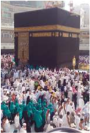

> **Deskripsi Visual:** Gambar ini adalah foto yang menunjukkan suatu acara besar di depan sebuah bangunan besar dengan latar belakang langit biru. Dalam foto ini, banyak orang berdiri dan berjalan di sekitar bangunan tersebut. Bangunan tersebut tampak seperti sebuah masjid atau tempat ibadah karena memiliki arsitektur tradisional dengan pintu gerbang yang besar dan menara yang tinggi. Orang-orang tampak sedang berkerumun, mungkin sedang menghadiri acara atau perayaan tertentu. Di sekeliling bangunan, terlihat beberapa papan tulisan atau spanduk yang tidak jelas teksnya, mungkin menyebutkan nama tempat atau informasi tentang acara tersebut. Gambar ini menunjukkan kegiatan sosial dan budaya yang sering terjadi di tempat-tempat ibadah atau pusat perkumpulan umat.

sambil berdo'a kepada Allah Swt.

Adapun Thawaf Sunnah adalah thawaf yang  dilakukan  kapan  saja sesuai dengan kemampuan jamaah.

### Syarat sah Thawaf

- Niat
Syarat sah thawaf adalah sebagai berikut.

- Menutup aurat
- Suci dari hadas
- Dilakukan sebanyak tujuh kali putaran
- Posisi Ka'bah di sebelah kiri orang yang berthawaf
- Dimulai dan diakhiri di hajar aswad
- Dilaksanakan di dalam Masjidil Haram

### 4) Sa'i

Sa'i adalah  berlari-lari  kecil  antara  bukit  Shofa  dan  bukit  Marwah sebanyak tujuh kali yang dimulai dari bukit Shafa dan berakhir di bukit Marwah. Sa'i dilakukan setelah pelaksanaan ibadah thawaf.

### Syarat sah sa'i

Syarat sah sa'i adalah sebagai berikut.

 

---
## 📄 Halaman 134

- Dilakukan  sebanyak  tujuh  kali putaran (berawal di bukit Shofa dan berakhir di bukit Marwah)
- Dilakukan  setelah thawaf ifadhah atau setelah thawaf qudum .
- Menjalani  secara  sempurna  jarak  Shofa-Marwah  dan  Mar wahShofa.

### Gambar 8.8

- Dilakukan di tempat sa'i .

### 5) Tahallul

Tahallul adalah mencukur atau memotong rambut kepala sebagian atau  seluruhnya  minimal  iga  helai rambut.  Tahallul  dilakukan  setelah melontar jumrah aqabah pada tanggal  10  Dzulhijjah,  yang  disebut dengan tahallul awwal . Setelah jamaah  melakukan tahallul awal ini  larangan-larangan  haji  kembali dibolehkan kecuali berhubungan suami isteri. Tahallul tsani dilakukan setelah thawaf ifadhah dan sa'i .

### 6)  Terib

Sa'i berjalan antara Shafa dan Marwa sebanyak tujuh kali.

selesai melaksanakan rangkaian ibadah haji atau umrah.

Terib yaitu berurutan dalam pelaksanaan mulai ihram hingga tahallul.

### d.  Jenis Haji

Dari segi pelaksanaannya, ibadah haji terbagi ke dalam iga jenis, yaitu:

### 1) Haji Tamatu'

Haji tamatu' yaitu  melaksanakan  umrah  terlebih  dahulu  kemudian menggunakan pakaian  ihram  lagi  untuk  melaksanakan  manasik  haji. Jenis haji inilah yang mudah dan paling banyak dilaksanakan jama'ah haji  Indonesia.  Namun  demikian,  pelaksanaan  haji  jenis  ini  d iwajibkan membayar dam atau berpuasa sepuluh hari, yaitu iga hari pada wak tu di tanah suci dan tujuh hari setelah kembali ke tanah air.

### 2) Haji Ifrad

Haji  ifrad adalah  berihram  dan  berniat  dari  miqat  hanya  untuk haji.  Dengan  kata  lain,  mengerjakan  haji  terlebih  dahulu  kemudian mengerjakan umrah.

Jenis  haji  ini  cukup  sulit  dilaksanakan  bagi  jamaah  haji  Indonesia, terutama yang idak terbiasa mengenakan kain ihram. Sebab, semenjak jama'ah iba di Mekkah, mereka idak boleh melepas kain ihram hingga iba hari raya Idul Adha atau setelah pelontaran jumrah aqabah. Jemaah yang melaksanakan ibadah haji ifrad idak diwajibkan membayar dam.

 

---
## 📄 Halaman 135

### 3) Haji Qiran

Haji qiran adalah melaksanakan haji dan umrah dengan satu kali ihram. Arinya, apabila seorang jamaah haji memilih jenis haji ini, m aka jamaah tersebut berihram dari miqat untuk haji dan umrah secara bers amaan. Jamaah  yang  melakukan  jenis  haji  ini  diwajibkan  memotong  hewan qurban.

### e. Keutamaan  Haji

Seiap ibadah yang diperintahkan Allah Swt. memiliki hikmah dan keutamaan-keutamaan yang satu dengan lainnya berbeda-beda sebagai bentuk saling melengkapi dan menyempurnakan. Adapun yang termasuk keutamaan-keutamaan ibadah haji di antaranya adalah sebagai berikut.

### 1)  Haji merupakan amal paling utama

Keika  Rasulullah  saw.  ditanya  mengenai  amal  yang  paling  utama, maka  beliau  menjelaskan  bahwa  amal  yang  paling  utama  adalah beriman  kepada  Allah  Swt.  dan  Rasul-Nya,  berjihad  di  jalan  Allah ,  dan haji yang mabrur. Adapun haji yang mabrur maksudnya adalah orang yang sekembalinya dari melaksanakan ibadah haji perilakunya berubah menjadi lebih baik.

### 2)  Haji merupakan jihad

Imam Bukhari dan Imam Muslim meriwayatkan sebuah dialog di dalam sebuah hadis sebagai berikut.

' Ya  Rasulullah,  bolehkah  kami  ikut  berperang  dan  berjihad  bersama engkau semua?' Jawab Rasul, 'Bagi engkau ada jihad yang lebih baik dan  lebih  indah,  yaitu  haji,  haji  yang  mabrur.'  Ujar  A'isyah  ra.  pula, 'Setelah mendengar jawaban dari Rasulullah saw. ini aku tak pernah lagi meninggalkan ibadah haji .' (HR. Bukhari dan Muslim)

### 3)  Haji menghapus dosa

Diriwayatkan dari Amar bin Ash, ' Tatkala Allah Swt. telah menanamkan di haiku, aku datang menemui Rasulullah saw. lalu berkata, 'Ulurkanlah tanganmu agar aku berbaiat kepadamu.' Rasulullah pun mengulurkan tangannya,  tetapi  aku  masih  mengatupkan  telapak  tanganku.  Maka beliau  bertanya,  'Bagaimana  engkau  ini  wahai  Amar?'  Ujarku,  'Aku akan  mengajukan  syarat.'  'Apa  syaratnya?'  Tanya  Rasulullah.  'Yaitu agar aku diampuni.' Ujarku. Maka beliau bersabda, 'Tidaklah engkau tahu bahwa Islam itu menghapuskan keadaan sebelumnya, begitu juga hijrah menghapuskan apa yang sebelumnya, juga haji menghapuskan apa yang sebelumnya.' (HR. Muslim)

### 4)  Pahala ibadah haji adalah surga

Diriwayatkan oleh Imam Bukhari dan Imam Muslim bahwa Rasulullah saw.  bersabda,  ' Umrah  kepada  umrah  menghapuskan  dosa  yang terdapat  di  antara  keduanya,  sedang  haji  yang  mabrur  idak  ada ganjarannya selain surga.' (HR. Bukhari Muslim)

 

---
## 📄 Halaman 136

### 2.  Zakat

Zakat menurut bahasa ( lughat ) arinya tumbuh, suci, dan berkah. Menurut isilah, zakat adalah pemberian yang wajib diberikan dari harta t ertentu, menurut sifat-sifat dan ukuran kepada golongan tertentu.

### a.  Pengerian Zakat

Zakat merupakan salah satu dari lima rukun Islam dan disebutkan secara beriringan dengan kata salat pada 82 ayat di dalam al-Qur'ān. A llah  Swt. telah  menetapkan  hukum  wajib  atas  zakat  sebagaimana  dijelaskan  d i dalam Al-Qur'ān, Sunnah Rasul, dan Ijma ulama.

### b.  Hukum Zakat

Allah  Swt.  telah  menetapkan  hukum  wajib  atas  zakat  sebagai  sal ah  satu dari  lima  rukun  Islam  yang  disebutkan  di  dalam al-Qur'ān .  Hal  tersebut sebagaimana dijelaskan di dalam al-Qur'ān ., Sunnah Rasul-Nya, dan ijma' para ulama.

Di dalam al-Qur'ān Surat Al-Baqarah ayat 43 Allah Swt. berirman:

Arinya, 'dan  dirikanlah  salat,  tunaikanlah  zakat  dan  ruku'lah  beserta orang-orang yang ruku'.'

Dalam Kitab Al-Ausath dan Ash-Shagir, Imam Thabrani meriwayatkan dari Ali r.a bahwa Nabi Muhammad saw. bersabda:

Arinya, 'Allah Swt. mewajibkan zakat pada harta orang-orang kaya dari kaum muslimin sejumlah yang dapat memberikan jaminan kepada orangorang  miskin  di  kalangan  mereka.  Fakir  miskin  idak  akan  menderita kelaparan dan kesulitan sandang pangan melainkan disebabkan perbuatan golongan orang kaya. Ingatlah bahwa Allah Swt. akan mengadili mereka secara  tegas  dan  menyiksa  mereka  dengan  azab  yang  pedih  akibat perbuatannya itu.' (HR. Thabrani)

### c.  Syarat dan Rukun Zakat

Syarat  dalam  ibadah  zakat,  yaitu  syarat  yang  berkaitan  dengan  subjek zakat/muzakki  (orang  yang  mengeluarkan  zakat)  dan  objek  zakat  (harta yang dizakai).

- Syarat zakat yang berhubungan  dengan subjek atau pelaku (muzakkī : orang yang terkena wajib zakat) adalah sebagai berikut.

 

---
## 📄 Halaman 137

- Islam,
- Merdeka
- Baligh
- Berakal.
- Syarat-syarat yang berhubungan dengan jenis harta (sebagai objek zakat) adalah sebagai berikut.

### a) Milik Penuh

Arinya penuhnya pemilikan, maksudnya bahwa kekayaan itu harus berada dalam kontrol dan dalam kekuasaan yang memiliki, (idak bersangkut di dalamnya hak orang lain), baik kekuasaan pendapatan maupun kekuasaan menikmai hasilnya.

### b) Berkembang

Arinya  harta  itu  berkembang,  baik  secara  alami  berdasarkan sunatullāh  maupun  bertambah  karena  ikhiar  manusia.  Makna berkembang di sini mengandung maksud bahwa sifat kekayaan itu dapat mendatangkan income , keuntungan atau pendapatan.

### c) Mencapai Nisab

Arinya mencapai jumlah minimal yang wajib dikeluarkan zakatnya. Contohnya nisab ternak unta adalah lima ekor dengan kadar zakat seekor kambing. Dengan demikian, apabila jumlah unta kurang dari lima ekor, maka belum wajib dikeluarkan zakatnya.

### d) Lebih dari kebutuhan pokok

Arinya harta yang dimiliki oleh seseorang itu melebihi kebutuhan pokok yang diperlukan oleh diri dan keluarganya untuk hidup wajar sebagai manusia.

### e) Bebas dari Hutang

Arinya harta yang dimiliki oleh seseorang itu bersih dari hutang, baik hutang kepada Allah Swt. ( nażar atau wasiat ) maupun hutang kepada sesama manusia.

### f) Berlaku Setahun/Haul

Suatu  milik  dikatakan  genap  setahun  menurut  al-Jazaili  dalam kitabnya Tanyinda al-Haqā'iq syarh Kanzu Daqā'iq , yakni genap satu tahun dimiliki.

Adapun yang termasuk rukun zakat adalah sebagai berikut.

- Penyerahan sebagian harta tersebut dari orang yang mempunyai harta kepada  orang  yang  bertugas  atau  orang  yang  mengurusi  zakat  (amil zakat).
- Pelepasan  atau  pengeluaran  hak  milik  pada  sebagian  harta  yang dikenakan wajib zakat.
- Penyerahan amil kepada orang yang berhak menerima zakat sebagai milik.

 

---
## 📄 Halaman 138

### d.  Hikmah dan Keutamaan Ibadah Zakat

Banyak  sekali  hikmah  dan  keutamaan  ibadah  zakat  yang  Allah  Swt. perintahkan kepada hamba-Nya dan kaum muslimin. Di dalam al-Qur'ān Surat At-Taubah/9:103 Allah Swt. berirman, Ambillah (sebagian) dari harta mereka menjadi sedekah (zakat), dengan zakat itu kamu membersihkan dan menyucikan mereka ….' (Q.S. At-Taubah/9:103)

Dari  penjelasan  ayat  di  atas,  bahwa  tujuan  zakat  adalah  untuk  membersihkan mereka (pemilik harta) dari penyakit kikir dan serakah, sifat-sifat tercela serta kejam terhadap fakir miskin, orang-orang yang idak memiliki harta, dan sifat-sifat hina lainnya.

Di  sisi  lain,  zakat  juga  untuk  menyucikan  jiwa  orang-orang  berharta, menumbuhkan dan mengangkat derajatnya dengan berkah dan kebajikan, baik dari segi moral maupun amal. Hingga dengan demikian, orang tersebut akan mendapatkan kebahagiaan, baik di dunia maupun di akhirat.

### 3. Wakaf

Kata Wakaf berasal dari bahasa Arab yang berari al-habs ) dan  mencegah  ( al-man'u ).  Arinya  menahan  untuk  dijual,  dihadiahkan, atau  diwariskan.  Berdasarkan  isilah syar'i wakaf  adalah  ungkapan  yang diarikan  penahanan  harta  milik  seseorang  kepada  orang  lain  atau kepada lembaga  dengan  cara  menyerahkan  benda  yang  sifatnya  kekal  kepada masyarakat  untuk  diambil  manfaatnya.  Misalnya,  seseorang  mewakakan tanah  miliknya  yang  dijadikan  tempat  pemakaman  umum  (TPU).  Ol eh karena  itu,  tanah  yang  dimaksud  idak  boleh  diambil,  diwariskan ,  atau dihadiahkan lagi kepada orang lain.

### a.  Pengerian Wakaf

### b.  Hukum Wakaf

Wakaf hukumnya sunnah. Namun, bagi pemberi wakaf (wakif) merupakan amaliah  sunnah  yang  sangat  besar  manfaatnya.  Mengapa  dikatakan  amaliah sunnah  yang  sangat  besarmanfaatnya?  Karena  bagi wakif merupakan śadaqah jariyah .  Wakaf adalah perbuatan terpuji dan sangat dianjurkan dalam Islam. Hal ini sesuai dengan dalil-dalil wakaf untuk keperluan umat.

Beberapa dalil tentang ibadah wakaf di antaranya adalah sebagai berikut.

### 1)  Q.S. Āli 'Imrān/3:92

``

Arinya:  ' Kamu  idak  akan  memperoleh  kebajikan,  sebelum  kamu menginfakkan  sebagian  harta  yang  kamu  cintai.  Dan  apapun  yang kamu infakkan, tentang hal itu sungguh, Allah Swt. Maha Mengetahui '. (QS.Āli'Imrān/3:92 )

menahan

(

 

---
## 📄 Halaman 139

- Hadis  Rasulullah  saw.  riwayat  oleh  Bukhari  dan  Muslim

``

Arinya: 'Dari Abu Hurairah bahwa Rasulullah saw. bersabda, 'Apabila seseorang meninggal, maka amalannya terputus kecuali iga perkara sedekah jariyah, ilmu yang bermanfaat, atau  anak  saleh  yang mendoakan  nya.'. (H.R. Bukhari dan Muslim).

Mengenai śadaqah jariyah pada hadis di atas, ulama telah yang  dimaksud  dengan śadaqah jariyah dalam  hadis  tersebut  adalah wakaf .

### c. Rukun  dan  Syarat Wakaf

- Orangyang  ber wakaf ( al-wakif ), dengan syarat-syarat sebagai berikut.
Rukun wakaf ada empat, yaitu orang yang ber wakaf , benda yang diwakaf kan,  orang  yang  menerima wakaf ,  dan ikrar .

- Memiliki penuh harta itu, dia merdeka untuk me wakaf kan harta itu kepada siapa yang ia kehendaki.
- Berakal, maksudnya idak sah wakaf dari orang bodoh, orang gila, atau orang yang sedang mabuk.
- Baligh.
- Berindak  secara  hukum  ( rasyid ).  Orang  bodoh,  orang  yang  sedang bangkrut ( mulis ),  dan  orang  lemah  ingatan  idak  sah  me wakaf kan hartanya.
- Benda yang di wakaf kan ( al-mauquf ), syarat-syaratnya.
- barang yang di wakaf kan itu harus barang yang berharga.
- harta yang di wakaf kan  harus  diketahui  kadarnya,  apabila  harta  itu idak diketahui jumlahnya ( majhul ), pengalihan milik keika itu idak sah.
- harta  yang  di wakaf kan  harus  miliki  oleh  orang  yang  ber wakaf ( wakif ).
- harta harus berdiri sendiri, idak  melekat kepada  harta lain ( mufarrazan ) atau disebut dengan isilah gairaśai' .
- Orang yang menerima manfaat wakaf ( almauquf'alaihi )  atau sekelompok orang/badan  hukum  diberi  tugas  mengurus  dan  menerima  barang wakaf (nair) tersebut. Orang yang menerima wakaf diklasiikasikan menjadi  dua,  yaitu  sebagai  berikut.
- Tertentu ( mu'ayyan ), arinya orang yang menerima wakaf jelas  jumlah  nya.  Apakah  seorang,  dua  orang,  atau  sekumpulan orang  semuanya  mempunyai  kriteria  tertentu  dan  idak  boleh diubah.  Persyaratan  bagi  orang  yang  menerima wakaf tersebut ( almawqufmu'ayyan )  adalah  orang  yang  boleh  memiliki  harta ( ahlanlialtamlik ). Dengan demikian, orang muslim, merdeka,
sepakat dan

ba

 

---
## 📄 Halaman 140

kairimni (nonmuslim  yang  bersahabat)  yang  memenuhi  syarat tersebut,  boleh  memiliki  harta wakaf .  Orang  bodoh,  hamba  sahaya, dan  orang  gila  idak  sah  untuk  menerima wakaf .

yang

- Tidak tertentu  ( gairamu'ayyan ), arinya ber wakaf itu idak ditentukan  kriterianya  secara  rinci.  Seperi  untuk  orang  faki r,  orang miskin, tempat ibadah, makam, dan lain-lain. Syarat-syarat berkaitan  dengan gairamu'ayyan , yaitu yang menerima wakaf hendaklah dapat menjadikan wakaf tersebut  untuk  kebaikan,  dan dengan wakaf dapat  mendekatkan  diri  kepada  Allah  Swt.  hal  ini ditujukan  hanya  untuk  kepeningan  islam  saja.

### d. Lafaz  atau  Ikrar Wakaf ( Sighat ), syarat-syaratnya adalah sebagai berikut.

- Ucapan ikrar wakaf dapat direalisasikan segera ( tanjiz ), tanpa disangkutkan, atau digantungkan kepada syarat tertentu.
- ucapan  ikrar  wakaf  harus  mengandung  kata-kata  yang  menunjukkan kekalnya ( ta'bid ),  idak  sah wakaf jika ucapannya dengan batas waktu tertentu.
- Ucapan ikarar wakaf bersifat pasi.
- Ucapan ikarar wakaf idak diikui oleh syarat yang membatalk an.
Apabila  semua  persyaratan  di  atas  dapat  terpenuhi,  maka  peng uasaan atas tanah wakaf bagi penerima wakaf sah.  Pe wakaf ( wakif )  idak  dapat lagi menarik kembali kepemilikan harta tersebut karena telah berpindah kepada  Allah  Swt.  dan  penguasaan  harta  tersebut  berpindah  kepada orang yang menerima wakaf ( náir ). Secara umum, penerima wakaf ( náir ) dianggap pemiliknya, tetapi bersifat idak penuh ( gaira tammah ).

### e.  Hikmah dan Keutamaan Wakaf

Ibadah wakaf memiliki keutamaan yang banyak sekali. Namun wakaf merupakan amal ibadah yang belum banyak dilakukan oleh kaum muslimin.  Hal  ini  disebabkan wakaf tersebut  berupa  harta  benda  yang dicintai.  Seperi  tanah,  bangunan,  atau  benda  lainnya.  Jika  se orang muslim mengetahui betapa besar pahala yang akan diraihnya dengan ber wakaf , maka boleh  jadi  kaum  muslimin  akan  berbondong-bondong  melakukan wakaf meskipun hanya sekedar satu meter tanah.

Salah satu keutamaan wakaf bahwa ia akan dicatat dan dihitung sebagai amal  jariyah  yang  pahalanya  akan  terus  mengalir  meskipun  orang  yang me wakaf kannya  meninggal  dunia.  Arinya,  pemberi wakaf akan  tetap menerima pahala selama wakaf nya dimanfaatkan oleh orang lain.

### f. Harta Wakaf dan Pemanfaatan Wakaf

Berdasarkan  hadis  Rasulullah  saw.  dan  amal  para  sahabat,  harta wakaf berupa  benda  yang  idak  habis  dipakai  dan  idak  rusak  jika  dimanf aatkan, baik  benda  bergerak  ataupun  benda  idak  bergerak.  Sebagai  con toh  Umar bin  Khatab  ra.  Me wakaf kan sebidang tanah di Khaibar. Khalid bin Walid ra. me wakaf kan pakaian perang dan kudanya.

demikian,

 

---
## 📄 Halaman 141

Harta benda wakaf adalah harta benda yang memiliki daya tahan lama dan manfaat jangka panjang, selain itu, harta wakaf mempunyai nilai e konomi menurut syari'ah. Harta benda wakaf terdiri atas dua macam, yaitu benda idak bergerak dan benda bergerak.

### 1) Wakaf Benda Tidak Bergerak

Wakaf benda idak bergerak mencakup hal-hal berikut.

belum

- Hak  atas  tanah  sesuai  dengan  ketentuan  peraturan  perundangundangan yang berlaku, baik yang sudah maupun yang terdatar.
- Bangunan atau bagian bangunan yang berdiri di atas tanah.
- Tanaman dan benda lain yang berkaitan dengan tanah.
- Hak  milik  atas  satuan  rumah  susun  sesuai  dengan  ketentuan peraturan perundang-undangan yang berlaku.

### 2) Wakaf Benda Bergerak

Wakaf benda bergerak mencakup hal-hal berikut.

- Logam  mulia,  yaitu  logam  dan  batu  mulia  yang  memiliki  manf aat jangka panjang.
- Wakaf uang  dilakukan  oleh  Lembaga  Keuangan Syari'ah yang ditunjuk  oleh  Menteri  Agama.  Dana wakaf berupa  uang  dapat diinvestasikan  pada  aset-aset  inancial  dan  pada  aset  riil.
- Surat berharga.
- Kendaraan.
- Hak  Atas  Kekayaan  Intelektual  (HAKI).  HAKI  mencakup  hak cipta,  hak paten,  merek,  dan  desain  produk  industri.
- Hak  sewa  seperi wakaf bangunan dalam bentuk rumah.

### g.  Prinsip-Prinsip Pengelolaan Wakaf

Secara makro, wakaf diharapkan mampu  mempengaruhi kegiatan ekonomi masyarakat. Orang-orang yang perlu bantuan berupa perumahan, sarana umum  seperi masjid, rumah sakit, sekolah, p asar, dan lain-lain, bahkan modal untuk kepeningan pribadi dapat diberi kan, bukan dalam bentuk pinjaman, tetapi murni sedekah dijalan Allah Swt. Kondisi demikian akan memperingan beban ekonomi masyarakat. Kalau kegiatan ekonomi  bergerak  secara  teratur,  tentu  akan  lahir  ekonomi  m asyarakat dengan biaya murah.

,  makanan

Menurut  Syai'i  Antonio,  seidaknya  ada  iga  ilosoi  dasar  yang  harus ditekankan keika hendak memberdayakan wakaf .  Pertama,  manajemennya harus dalam bingkai 'proyek yang terintegrasi'.  Kedua, azas kesejahteraan náir . Keiga, azas transparansi dan akuntabilitas di mana badan wakaf dan lembaga yang dibantunya harus melaporkan seiap tahun tentang proses pengelolaan dana laporannya kepada umat dalam bentuk laporan audit keuangan termasuk kewajaran dari masing-masing pos biaya.

 

---
## 📄 Halaman 142

Prinsip-prinsip pengelolaan wakaf adalah sebagai berikut.

- Seluruh  harta  benda wakaf harus  diterima  sebagai  sumbangan  dari wakif dengan status wakaf sesuai dengan syariah.
- Wakif mempunyai  kebebasan  memilih  tujuan  sebagaimana  yang diperkenankan oleh syariah .
- Wakaf dilakukan tanpa batas waktu.
- Jumlah  harta wakaf tetap  utuh  dan  hanya  keuntungannya  saja  yang akan  dibelanjakan  untuk  tujuan-tujuan  yang  telah  ditentukan  oleh wakif .
- Wakif dapat meminta keseluruhan keuntungannya untuk tujuan-tujuan yang telah ditentukan.
Carilah contoh-contoh wakaf yang ada di lingkunganmu, baik benda yang tetap maupun benda yang bergerak. Dokumentasikan hasil penemuanmu. Laporkan hasilnya kepada gurumu!

### Kedermawanan Nabi Muhammad saw. dan Para Sahabat

Agama  Islam  adalah  agama  yang  mengajarkan  kedermawanan.  Allah  Swt. mempunyai sifat Rahman yang arinya Pemurah. Nabi Muhammad saw. meskipun bukan orang yang kaya namun paling gemar memberikan sesuatu kepada orang lain.  Para  sahabat  Nabi  juga  merupakan orang-orang yang dermawan,  terlebih mereka yang tergolong kaya. Banyak sekali dalam ayat al-Qur'ān dan hadis Nabi Muhammad saw. yang memuji dan mendukung sifat-sifat murah  hai dan gemar bersedekah. Demikian juga banyak seruan yang mencela sifat k ikir atau menahan harta untuk disedekahkan.

Bahkan,  kedermawanan  Rasulullah  saw.  mengundang  simpai  orang  untuk memeluk Islam. Imam Bukhari dan Muslim meriwayatkan sebuah hadis bahwa Rasulullah  saw.  sama  sekali  idak  pernah  mengatakan  'idak'  jika  ada  yang meminta sesuatu darinya. Pernah ada orang dari suatu kaum yang masih kair dan meminta kambing kepada Rasulullah saw. Kemudian Rasulullah saw . memberikan

 

---
## 📄 Halaman 143

kambing  sebanyak  kambing  yang  ada  di  antara  dua  bukit.  Orang  ter sebut  demikian gembiranya dan langsung pulang ke kaumnya serta berseru, 'W ahai kaumku, masuklah  Islam.  Karena  sesungguhnya  Nabi  Muhammad  saw.  member ikan  harta dengan pemberian seperi orang yang idak takut miskin.' Kem udian, Islamlah satu  kaum  tersebut  dengan  sifat  pemurahnya  Nabi  Muhammad  saw.

Abdurrahman  bin  'Auf  salah  seorang  sahabat  yang  tergolong kaya,  pernah diberi tahu Nabi Muhammad saw. 'Hai Abdurrahman bin 'Auf, sesungguhnya engkau termasuk salah satu kalangan orang kaya dan engkau akan memasuki surga  dengan  merangkak.  Berilah  pinjaman  kepada  Allah  Swt.  (bersedekah) niscaya Allah Swt. akan menolongmu dan membuat kakimu berguna (sehingga engkau memasuki surga dengan berlari kencang).' (H.R. Ahm ad)

Sejak  mendengar  penjelasan  Nabi  Muhammad  saw.,  Abdurrahman bin  'Auf  langsung  memberikan  pinjaman qardul  hasan (pinjaman tanpa bunga) kepada  kaum  muslimin.  Ia  juga  membeli  tanah  seharga  40  ribu dinar dan membagikannya  kepada  keluarganya  dari  Bani  Zahra,  istri-istri  Nabi Muhammad saw.,  dan  kaum  muslimin  yang  masih  miskin.  Suatu  keika  ia pun  menyediakan 500 kuda untuk jihad isabilillah . Dalam kesempatan lain, ia bahkan menyerahkan hingga 1.500 ekor kuda.

Pada saat akan meninggal, ia berwasiat untuk menyerahkan hartanya sebanyak 50 ribu dinar pada kaum muslimin. Kepada pejuang perang Badar, ia mewasiatkan masing-masing  diberinya  400 dinar . Bahkan sahabat Usman  bin ' Afan yang tergolong  kaya  tetap  mengambil  bagiannya.  Kata  Usman,  'Sesu ngguhnya  harta Abdurrahman  itu  halal  dan  suci.  Makan  dari  harta  itu  berari  sehat dan  berkah.'

Dikuip  dari:  Buku Kebeningan  Hai  dan  Pikiran .

Carilah contoh kedermawanan Nabi Muhammad saw. dan para sahabat dengan  merujuk  literatur  yang  terpercaya.  Buatlah  laporan  kemudian sampaikan kepada gurumu berkaitan dengan hasil temuanmu tersebut.

 

---
## 📄 Halaman 144

### Menerapkan Perilaku Mulia

Tangan di atas lebih baik daripada tangan di bawah. Sebuah ungkapan yang menjelaskan tentang peningnya berbagi. Islam menghendaki o rang-orang yang memiliki  kelebihan  harta  (kaya)  untuk  menyisihkan  sebagian  hartanya  bagi mereka yang membutuhkan  (miskin). Dalam ilmu ikih,  membel anjakan atau memberikan sebagian harta yang dimiliki dapat dilakukan dengan berbagai cara. Cara-cara yang biasa dilakukan oleh kaum muslimin di antaranya zakat,  infak, śadaqah ,  dan wakaf . Masing-masing cara tersebut memiliki ketentuan masingmasing.

Zakat adalah pengeluaran harta yang dimiliki seseorang keika sudah mencapai niśab (kadarnya) dan haul (waktunya). Besarnya harta yang dikeluarkan disesuaikan dengan harta zakat nya. Śadaqah dan infak merupakan cara mengeluarkan harta yang dimiliki seseorang dengan idak d itentukan kadar dan waktunya. Adapun wakaf ialah memberikan harta berupa benda yang dapat dimanfaatkan oleh orang banyak, baik harta tetap maupun bergerak.

Banyak sekali keuntungan yang diperoleh dari orang-orang yang memberikan wakaf untuk  kepeningan  umat.  Berikut  contoh  perilaku  yang  mencerminkan sifat kedermawanan dalam membantu orang lain dalam bentuk wakaf .

- Me wakaf kan buku-buku pelajaran untuk diberikan ke perpustakan sekolah.
- Me wakaf kan pakaian layak pakai, termasuk seragam sekolah yang dipakai lagi kepada yang membutuhkan.
idak

- Me wakaf kan al-Qur'ān untuk diberikan kepada masjid terdekat.
- Me wakaf kan mukena, kain sarung, karpet dan sebagainya sebagai perlengkapan śalat .
- Me wakaf kan  sebidang  tanah  untuk  dijadikan  fasilitas  umum.

### Rangkuman

- Wakaf termasuk  ibadah maaliyah yang  jika  pengelola  dan  pengurusnya amanah ,  maka  akan  membuahkan  hasil  yang  baik  bagi  kepeningan  umum/ agama.
- Sah  idaknya wakaf ditentukan syarat dan rukunnya.
- Pengelolaan wakaf idak  bersifat  stais,  tetapi  dinamis.
- Pelaksanaan wakaf diatur  oleh  berbagai  peraturan  yang  dikeluarkan  oleh Pemerintah.
sarana

 

---
## 📄 Halaman 145

### A.  Uji Pemahaman

Jawablah pertanyaan-pertanyaan berikut ini dengan tepat.

- Jelaskan ari wakaf menurut bahasa dan isilah.
- Sebutkan rukun-rukun wakaf .
- Siapa nái r  wakaf itu? Jelaskan.
- Jelaskan syarat harta yang di wakaf kan itu.
- Buatlah laporan melalui teknik wawancara dengan náir masjid yang ada di wilayah tempat inggalmu.

### B.  Releksi

Berilah  tanda checklist (  ) yang sesuai dengan dorongan haimu untuk menanggapi pernyataan-pernyataan berikut.

---
**📊 Tabel**

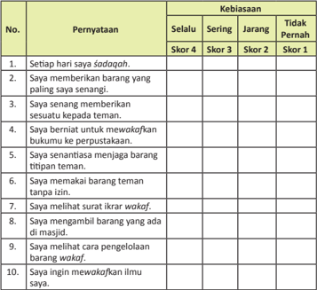

Tabel ini menunjukkan kebiasaan individu dalam berbagai situasi sosial dan etis. Topik utamanya adalah tentang perilaku dan sikap seseorang dalam berinteraksi dengan orang lain. Kolom "Selalu" menunjukkan kebiasaan yang dilakukan secara rutin, "Sering" menunjukkan kebiasaan yang dilakukan dengan frekuensi tinggi, "Jarang" menunjukkan kebiasaan yang dilakukan dengan frekuensi sedang, dan "Tidak Pernah" menunjukkan kebiasaan yang tidak pernah dilakukan. Data penting yang terlihat adalah bahwa individu sering memberikan barang yang paling senangnya (skor 4), sering memberikan sesuatu kepada teman (skor 3), dan sering mewakafkan buku mereka ke perpustakaan (skor 3). Sementara itu, individu jarang membeli barang tanpa izin (skor 2) dan jarang melihat surat ikrar wakaf (skor 2). Ini menunjukkan bahwa individu cenderung memiliki sikap positif dan bertanggung jawab dalam berbagai aspek hidup mereka.

 

---
## 📄 Halaman 146

---
**🖼️ Gambar/Diagram**

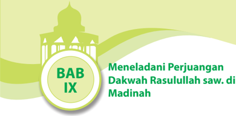

> **Deskripsi Visual:** Gambar ini adalah ilustrasi yang menampilkan judul bab IX dari buku pelajaran tentang perjuangan dakwah Rasulullah saw. di Madinah. Gambar tersebut memiliki latar belakang hijau dengan elemen arsitektur masjid yang menunjukkan keindahan dan keagungan Madinah. Di tengah gambar, terdapat logo buku dengan tulisan "BAB IX" yang menunjukkan bahwa ini adalah bagian ke-IX dari buku tersebut. Di sebelah kanan, terdapat teks "Meneladani Perjuangan Dakwah Rasulullah saw. di Madinah" yang memberikan konteks topik bab ini. Elemen-elemen utama dalam gambar ini adalah logo buku, teks, dan gambar masjid yang membantu pembaca memahami konteks dan isi bab tersebut. Informasi kunci yang dapat diambil dari gambar ini adalah bahwa bab ini berfokus pada perjuangan dan dakwah Rasulullah saw. di Madinah, yang merupakan salah satu bagian penting dalam sejarah Islam.

### Bagan Alir

---
**🖼️ Gambar/Diagram**

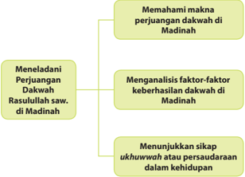

> **Deskripsi Visual:** Gambar ini adalah diagram yang menunjukkan struktur topik utama dari materi pelajaran tentang perjuangan dakwah di Madinah. Diagram ini terdiri dari tiga cabang utama:

1. **Menelaadani Perjuangan Dakwah Rasulullah saw. di Madinah** - Ini merupakan cabang pertama yang menjelaskan bagaimana proses belajar dan pengembangan perjuangan dakwah oleh Rasulullah saw. di Madinah.

2. **Memahami makna perjuangan dakwah di Madinah** - Cabang ini membahas makna dan interpretasi dari perjuangan dakwah yang dilakukan oleh Rasulullah saw. di Madinah.

3. **Menganalisis faktor-faktor keberhasilan dakwah di Madinah** - Cabang ini fokus pada analisis faktor-faktor yang mempengaruhi keberhasilan dakwah di Madinah, termasuk lingkungan, pendidikan, dan komunikasi.

4. **Menunjukkan sikap ukhuwah atau persaudaraan dalam kehidupan** - Cabang ini mengajarkan tentang sikap persaudaraan atau ukhuwah dalam kehidupan, yang merupakan bagian penting dari perjuangan dakwah di Madinah.

Elemen-elemen utama dalam diagram ini adalah cabang-cabang tersebut, yang saling terhubung melalui hubungan subcabang dan subsubcabang. Teks, angka, atau label penting yang terlihat dalam diagram ini adalah nama-nama cabang utama dan subcabang, serta informasi tentang topik-topik yang akan dipelajari dalam setiap cabang.

Informasi kunci yang dapat diambil pembaca dari diagram ini adalah bahwa materi pelajaran ini mencakup analisis perjuangan dakwah Rasulullah saw. di Madinah, pemahaman makna perjuangan tersebut, analisis faktor keberhasilannya, dan penunjukkan sikap persaudaraan atau ukhuwah dalam kehidupan.

 

---
## 📄 Halaman 147

### Cermai gambar dan wacana berikut.

---
**🖼️ Gambar/Diagram**

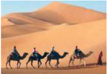

> **Deskripsi Visual:** Gambar ini adalah ilustrasi yang menunjukkan sebuah pemandangan gurun pasir dengan beberapa orang berjalan di atas dua kuda. Ilustrasi ini mungkin digunakan untuk menggambarkan perjalanan atau aktivitas di gurun pasir. 

1. Gambar ini menunjukkan pemandangan gurun pasir dengan beberapa orang berjalan di atas dua kuda.
2. Elemen utama dalam gambar ini adalah dua kuda yang membawa tiga orang, serta gurun pasir yang luas di latar belakang. Relasi antara elemen-elemen ini adalah bahwa kuda-kuda tersebut digunakan oleh orang-orang untuk perjalanan di gurun pasir.
3. Teks, angka, atau label penting tidak ada dalam gambar ini karena ia hanya berupa ilustrasi.
4. Informasi kunci yang dapat diambil pembaca adalah bahwa gambar ini mungkin digunakan untuk menggambarkan perjalanan atau aktivitas di gurun pasir, dan bahwa kuda dan orang-orang tersebut merupakan bagian dari aktivitas tersebut.

Dalam satu paragraf yang informatif, gambar ini menunjukkan pemandangan gurun pasir dengan beberapa orang berjalan di atas dua kuda. Ilustrasi ini mungkin digunakan untuk menggambarkan perjalanan atau aktivitas di gurun pasir. Elemen utama dalam gambar ini adalah dua kuda yang membawa tiga orang, serta gurun pasir yang luas di latar belakang. Relasi antara elemen-elemen ini adalah bahwa kuda-kuda tersebut digunakan oleh orang-orang untuk perjalanan di gurun pasir. Teks, angka, atau label penting tidak ada dalam gambar ini karena ia hanya berupa ilustrasi. Informasi kunci yang dapat diambil pembaca adalah bahwa gambar ini mungkin digunakan untuk menggambarkan perjalanan atau aktivitas di gurun pasir, dan bahwa kuda dan orang-orang tersebut merupakan bagian dari aktivitas tersebut.

terpengaruh oleh lingkungan yang buruk. Bahkan lebih dari  itu, ia akan berupaya mengubah lingkungan buruk tersebut menjadi lingkungan yan g baik.

Lingkungan yang baik semesinya menjadi  tempat  ideal  bagi  kaum  muslimin untuk  dijadikan  tempat  inggal.  Lingkungan memiliki pengaruh yang sangat besar terhadap pribadi dan perilaku seseorang. Orang yang inggal di lingkungan yang akan  memiliki  karakter  dan  pribadi  yang baik pula. Sementara orang yang hidup dan inggal di lingkungan yang  buruk,  maka lambat atau cepat akan terpengaruh perilaku buruk dari lingkungannya. Orang yang baik adalah orang yang berada di lingkungan yang buruk,  namun  dia  idak  begitu  saja  akan

Demikian  halnya  dengan  Rasulullah  saw,  Ia  hidup  dan  inggal  di   dalam lingkungan  yang  saat  itu  jauh  dari  peradaban.  Lingkungan  yang  o leh  para  sejarawan disebut dengan lingkungan jahiliah .  Ia  lahir  di  tengah-tengah  masyarakat  yang sangat jauh dari nilai-nilai kesusilaan. Mabuk-mabukan, merampok , memperkosa, membunuh,  berzina,  dan  bahkan  mereka  menyembah  benda  yang  sam a  sekali idak memberikan kebaikan buat mereka sendiri, yaitu berhala . Namun demikian, lingkungan  yang  buruk  tersebut  sama  sekali  idak  menjadikan  N abi  Muhammad saw.  terpengaruh  karenanya.  Ia  bahkan  menjadi  orang  yang  sanga t  membenci perilaku jahiliah lingkungannya tersebut. Bahkan, idak hanya membencinya, Nabi Muhammad saw. pun, berupaya memberikan pemahaman kepada masyarakat jahiliah agar meninggalkan perbuatan-perbuatan jahil tersebut.

Hijrah nya  Rasulullah  saw.  ke  Madinah  sesungguhnya  adalah  upaya  cerdas beliau  dalam  membangun  kekuatan  dakwah  yang  lebih  baik.  Kekuatan  dan strategi yang beliau bangun atas dasar keimanan dan ke takwa an kepada Allah Swt.  mampu mengubah keadaan Mekah menjadi masyarakat yang hidup d alam kedamaian dan rahmat Allah Swt.

Keteladan Rasulullah saw. dalam membina lingkungannya, mesilah menjadi perhaian  kaum  muslimin  sebagai  umatnya.    Rasulullah  saw.  mengajarkan bagaimana sikap yang harus ditunjukkan oleh orang-orang yang beriman agar ia  idak ikut terbawa arus negaif lingkungan sekitarnya. Ia bahkan diwajibkan menjadi bagian perubahan posiif bagi lingkungan sekelilingnya. Tentu saja hal tersebut memerlukan usaha-usaha cerdas agar  mencapai hasil yang maksimal.

 

---
## 📄 Halaman 148

Apakah hijrah yang dahulu dilakukan oleh Rasulullah saw. dan para sahabat masih relevan atau sesuai untuk dilakukan pada saat ini? Coba analisis. Jelaskan manfaat dari hijrah yang dilakukan Nabi Muhammad saw.

### Mengkriisi Sekitar Kita

### Amai gambar dan cermai wacana berikut.

untuk Sumber: www.udinnews.files.wordpress.com Gambar 9.2 Ukhuwwah dalam Islam sebagaimana dicontohkan kaum Anshor terhadap kaum Muhajirin

Kepedulian kaum muslimin terhadap muslimin  yang  lainnya  merupakan  sebuah kewajiban.  Ibarat  satu  tubuh,  jika  salah  satu anggota tubuh sakit, maka seluruh tubuh akan  merasakan  sakit.  Begitulah  seharusnya kita  sebagai  muslim  dengan  muslim  yang lainnya. Kesulitan yang dialami kaum muslim di beberapa tempat, baik berupa kekurangan  pangan,  musibah  bencana  alam, ataupun gangguan dari pihak lain yang mengatasnamakan agama, maka sudah seharusnya menggugah hai kita bangkit  membantu  dan  menolong  mereka.

Demikianlah yang dilakukan kaum Anshar terhadap  kaum  Muhajirin  beberapa  abad

Bagaimana dengan sikap kaum muslim di negara kita, apakah kita se sama muslim sudah melakukan hal yang sama sebagaimana pembelaan kaum Anshar terhadap  kaum  Muhajirin?  Apakah  saudara-saudara  kita  sesama  muslim yang saat ini tengah membutuhkan pertolongan sudah mendapatkan bantuan yang layak  dari  kita  sebagai  komunitas  muslim  yang  lebih  mampu, lebih  aman,  dan lebih kuat?

silam. Pada saat kaum muslimin di kota Mekah dalam tekanan dan anc aman luar biasa dari kaum kair Quraisy. Kemudian kaum muslimin berhi jrah ke Madinah, sehingga mereka diterima sebagai kaum Muhajirin, dengan tangan  terbuka dan lapang dada kaum Anshar di Madinah  memberikan pertolongan dan  bantuan. Bantuan tersebut tentu saja idak akan terjadi jika pemahaman bahwa s esama muslim adalah saudara idak dimiliki kaum Anshar. Mereka bahkan berusaha memberikan apa yang mereka miliki untuk dapat membantu kaum Muh ajirin.

 

---
## 📄 Halaman 149

Tentu  saja,  sebagai  orang  yang  beriman  kita  wajib  memberikan bantuan sesuai dengan kemampuan dan bidang kita masing-masing. Jika k emampuan kita membantu mereka dalam bentuk materi atau harta benda, maka bantulah dengan  kekuatan  materi  tersebut.  Jika  kemampuan  kita  memban tu  mereka  dalam bentuk  advokasi  atau  bantuan  hukum,  maka  bantulah  mereka  agar  terl epas  dari jeratan hukum yang idak adil misalnya. Jika pun kita idak dap at membantu dalam bentuk materi atau bantuan lainnya, paling idak kita turut bersimpai dengan  memberikan  nasihat-nasihat  atau  ucapan-ucapan  yang  baik. Semoga  kita dapat melakukan apa yang menjadi kewajiban kita terhadap sesama man usia, terlebih  terhadap  sesama  kaum  muslim.

B agaimana upaya yang harus dilakukan untuk membantu saudara-saudara sesama muslim baik yang ada di dalam negeri maupun di luar negeri? Kemukakan pendapatmu. Diskusikan dengan temanmu dan konfirmasikan kepada gurumu.

### Memperkaya Khazanah Peserta Didik

### A.  Memahami Perjuangan Dakwah Nabi Muhammad saw.

### 1. Hijrah , Tiik Awal Dakwah Rasulullah saw. di Madinah

Wafatnya  istri  tercinta  Sii  Khadijah  dan  Pamannya  Abu ° alib,  yang selalu  menjadi  pembela  utama  dari  ancaman  para kair Quraisy,  beban Rasulullah  saw.  dalam  berdakwah  menyebarkan  ajaran  Islam  makin  be rat. Di sisi  lain,  kesediaan  penduduk  Madinah  (Yaș rib)  memikul  tanggung jawab  bagi  keselamatan  Rasulullah  saw.  merupakan  tanda  yang  jel as  bagi kelanjutan dakwah Rasulullah saw. Beberapa faktor yang mendoro ng Rasulullah  saw. hijrah ke  Madinah  antara  lain  sebagai  berikut.

- Pada  tahun  621  M,  telah  datang  13  orang  penduduk  Madinah  me nemui Rasulullah  saw.  di  Bukit  Aqaba.  Mereka  berikrar  memeluk  agama  I slam.
- Pada tahun berikutnya, 622 M  datang lagi sebanyak 73 orang dari Madinah ke Mekah yang terdiri atas suku Aus dan Khazraj yang pada awalnya mereka datang untuk melakukan ibadah haji,
tetapi

 

---
## 📄 Halaman 150

kemudian menjumpai Rasulullah saw. dan mengajak beliau agar hijrah ke  Madinah.  Mereka  berjanji  akan  membela  dan  mempertahankan Rasulullah saw. dan pengikutnya serta melindungi keluarganya seperi mereka melindungi anak dan istri mereka.

Faktor  lain  yang  mendorong  Rasulullah  saw.  untuk hijrah dari  Kota Mekah  adalah  pemboikotan  yang  dilakukan  oleh kair Quraisy kepada Rasulullah  saw.  dan  para  pengikutnya  (Bani  Hasyim  dan  Bani  Muṭallib). Pemboikotan  yang  dilakukan  oleh  para  kair  Quraisy  mencakup  hal-hal berikut.

- Melarang  seiap  perdagangan  dan  bisnis  dengan  pendukung  Nabi Muhammad saw.
- Tidak  seorang  pun  berhak  mengadakan  ikatan  perkawinan  dengan orang muslim.
- Melarang keras bergaul dengan kaum muslim.
- Musuh Nabi Muhammad  saw. harus didukung dalam keadaan bagaimana pun.
Pemboikotan tersebut tertulis di atas kertas śahifah atau plakat yang digantungkan  di  dinding  Ka'bah  dan  idak  akan  dicabut  sebelum  N abi Muhammad  saw.  menghenikan  dakwahnya.  Teks  perjanjian  tersebu t disahkan  oleh  semua  pemuka  Quraisy  dan  diberlakukan  dengan  s angat ketat. Blokade tersebut berlangsung selama iga tahun dan sangat dirasakan  dampaknya  oleh  kaum  Muslimin.  Kaum  Muslimin  merasakan derita dan kepedihan atas blokade ekonomi  tersebut.  Namun,  semua  itu idak  menyurutkan  kaum  muslimin  untuk  tetap  bertahan  dan  memb ela Rasulullah saw.

Setelah  melalui  pemikiran  yang  mendalam  disertai  perintah  l angsung dari Allah Swt. untuk berhijrah ke Madinah, disusunlah rencan a Rasulullah saw. dan seluruh kaum muslimin untuk hijrah ke Madinah. Perisiwa hijrah Rasulullah  saw.  dari  Mekah  ke  Madinah  dilakukan  dengan  perencanaan yang sangat matang. Kaum muslimin diperintahkan terlebih d ahulu untuk menuju Madinah tanpa membawa harta benda yang selama ini menjadi milik mereka. Sementara Rasulullah saw. dan beberapa sahabat  m erupakan orang terakhir yang hijrah ke Madinah. Hal itu dilakukan mengingat begitu sulitnya beliau keluar dari pantauan kaum kair Quraisy.

### B.  Substansi Dakwah Nabi saw. di Madinah

### 1.  Membina Persaudaraan antara Kaum Anśar dan Kaum Muhajirin

Kehadiran Rasulullah saw. dan Kaum Muhajirin (sebutan bagi pengikut Rasulullah saw. yang hijrah dari Mekah ke Madinah) mendapat sambutan hangat  dari  penduduk  Madinah  (Kaum Anśar ).  Mereka  memperlakukan Nabi Muhammad saw. dan para Muhajirin seperi saudara mereka sendiri. Mereka  menyambut  Rasulullah  saw.  dengan  kaum Muhajirin dengan

 

---
## 📄 Halaman 151

penuh  rasa  hormat  selayaknya  seorang  tuan  rumah  menyambut  tamun ya. Bahkan,  mereka  mengumandangkan sya'ir  yang  begitu  menyentuh qalbu . Bunyi  sya'ir  yang  mereka  kumandangkan  adalah  seperi  berikut.

'Telah  muncul  bulan  purnama  dari Șaniyail  Wadai' ,  kami  wajib bersyukur selama ada yang menyeru kepada Tuhan, Wahai yang diu tus kepada  kami.  Engkau  telah  membawa  sesuatu  yang  harus  kami  taai .'

Sejak itulah, Kota Ya ¡ rib  digani  namanya oleh Rasulullah saw. dengan sebutan ' Madinatul Munawwarah '.

Strategi Nabi mempersaudarakan Muhajirin dan Anśar untuk mengikat seiap pengikut Islam yang terdiri atas berbagai macam suku dan kabilah ke dalam suatu ikatan masyarakat yang kuat, senasib, seperjuangan dengan semangat  persaudaraan  Islam.  Rasulullah  saw.  mempersaudarakan  Abu Bakar  dengan  Kharijah  Ibnu  Zuhair  Ja'far,  Abi  Ţalib  dengan  Mu'az  bin Jabal, Umar bin Khaţţab dengan Ibnu bin Malik dan Ali bin Abi Ţ alib dipilih untuk menjadi saudara beliau sendiri. Selanjutnya, seiap kaum Muhajirin dipersaudarakan  dengan  kaum Anśar dan  persaudaraan  itu  dianggap seperi saudara kandung sendiri. Kaum Muhajirin dalam  penghidupan ada  yang  mencari  nakah  dengan  berdagang  dan  ada  pula  yang  bertani mengerjakan lahan milik kaum Anśar .

Setelah kaum Muhajirin menetap di Madinah, Nabi Muhammad saw. mulai mengatur strategi untuk membentuk masyarakat Islam yang terbebas dari ancaman dan tekanan (inimidasi). Pertalian hubungan kekeluargaan antara  penduduk Madinah (kaum Anśar )  dan  kaum Muhajirin dipererat dengan  mengadakan  perjanjian  untuk  saling  membantu  antara  kaum muslimin  dan  nonmuslim.  Nabi  Muhammad  saw.  juga  mulai  meny usun strategi  ekonomi,  sosial,  serta  dasar-dasar  pemerintahan  Isl am.

Kaum Muhajirin adalah kaum yang sabar. Meskipun banyak rintangan dan hambatan dalam kehidupan yang menyebabkan kesulitan ekonomi, namun mereka selalu sabar dan tabah dalam menghadapinya dan idak berputus asa.

Nabi Muhammad saw. dalam menciptakan suasana agar nyaman dan tenteram  di  Kota  Madinah,  dibuatlah  perjanjian  dengan  kaum  Yahudi. Dalam  perjanjiannya  ditetapkan  dan  diakui  hak  kemerdekaan  iap-iap golongan untuk memeluk dan menjalankan agamanya.

Isi perjanjian yang dibuat Nabi Muhammad saw. dengan kaum Yahudi sebagai berikut.

- Kaum Yahudi hidup damai bersama-sama dengan kaum Muslimin.
- Kedua belah pihak bebas memeluk dan menjalankan agamanya masingmasing.
- Kaum  muslimin  dan  kaum Yahudi wajib  tolong-menolong  dalam melawan siapa saja yang memerangi mereka.

 

---
## 📄 Halaman 152

- Orang-orang Yahudi memikul tanggung jawab belanja mereka sendiri dan sebaliknya kaum muslimin juga memikul belanja mereka se ndiri.
- Kaum Yahudi dan  kaum  muslimin  wajib  saling  menasihai  dan  tolongmenolong dalam mengerjakan kebajikan dan keutamaan.
- Kota  Madinah  adalah  kota  suci  yang  wajib  dijaga  dan  dihormai oleh mereka yang terikat dengan perjanjian itu.
- Kalau  terjadi  perselisihan  di  antara  kaum Yahudi dan  kaum muslimin yang dikhawairkan akan mengakibatkan hal-hal yang idak diingin kan, urusan itu hendaklah diserahkan kepada Allah Swt. dan Rasul-Nya.
- Siapa  saja  yang  inggal  di  dalam  ataupun  di  luar  Kota  Madinah  w ajib dilindungi  keamanan  dirinya  kecuali  orang  zalim  dan  bersalah sebab Allah Swt. menjadi pelindung bagi orang-orang yang baik dan berbaki.

### 2.  Membentuk Masyarakat yang Berlandaskan Ajaran Islam

### a.  Kebebasan Beragama

Tujuan ajaran yang dibawa Nabi Muhammad saw. adalah memberikan ketenangan kepada penganutnya dan memberikan jaminan kebebasan kepada kaum Muslimin , Yahudi, dan Nasrani dalam menganut kepercayaan agama masing-masing. Dengan demikian, Nabi Muhammad saw memberikan jaminan kebebasan beragama kepada Yahudi dan Nasrani yang melipui kebebasan berpendapat, kebebasan beribadah  sesuai  dengan  agamanya,  dan  kebebasan  mendakwahkan agamanya. Hanya kebebasan yang memberikan jaminan dalam mencapai kebenaran dan kemajuan menuju kesatuan yang integral dan terhormat.

Menentang kebebasan berari memperkuat kebailan dan menyebarkan kegelapan yang pada akhirnya akan mengikis habis cahaya kebenaran yang ada dalam hai nurani manusia. Cahaya kebenaran yang menghubungkan manusia dengan alam semesta (sampai akhir zaman), yaitu hubungan rasa kasih sayang dan persatuan, bukan ras a kebencian dan kehancuran.

### b. A ż an, Śalat, Zakat, dan Puasa

Keika Nabi Muhammad saw. iba di Madinah, bila waktu śalat iba, orang-orang berkumpul bersama tanpa dipanggil. Lalu terpiki r untuk menggunakan terompet,  seperi Yahudi ,  tetapi  Nabi  idak  menyukainya; lalu ada yang mengusulkan menabuh genta, seperi Nasrani . Menurut satu sumber atas usul Umar bin Kha ţţ ab  dan  kaum  muslimin  serta menurut  sumber  lain  berdasarkan  perintah  Allah  Swt.  melalui wahyu, panggilan śalat dilakukan dengan a ż an . Selanjutnya Nabi  Muhammad saw.  memerintahkan  kepada  Abdullah  bin  Zaid  bin  Sa'labah  untu k membacakan lapa ż  aż an kepada Bilal dan  menyerukannya manakala waktu śalat iba karena Bilal memiliki suara yang merdu.

 

---
## 📄 Halaman 153

Bila waktu śalat iba, Bilal naik ke atas rumah seorang perempuan Bani Najjar yang berada di dekat masjid dan lebih inggi daripada masjid untuk menyerukan a § an dengan lafal:

``

dilakukan

Kewajiban śalat yang diterima pada saat mi'raj, menjelang berakhirnya periode Mekah terus dimantapkan kepada para ut pengik Nabi Muhammad saw. Sementara itu, puasa yang telah berdasarkan syariat sebelumnya,  kini  telah  pula  diwajibkan  seiap bulan Rama « an.  Demikian  pula  halnya  dengan zakat .  Bahkan,  setelah kekuasaan Islam berkembang ke seluruh jazirah Arab , Nabi Muhammad saw. mengutus pasukannya ke negeri di luar Madinah untuk mem ungut zakat .

### c. Prinsip-Prinsip Kemanusiaan

Pada  tahun  ke-10  H  (631  M)  Nabi  Muhammad  saw.  melaksanakan haji wada' (haji terakhir). Dalam kesempatan ini, Nabi Muhammad saw. menyampaikan khutbah yang sangat bersejarah. Keika matahari telah tergelincir,  dengan  menunggang  untanya  yang  bernama al-Qaswa' , Nabi  Muhammad  saw.    berangkat  dan  iba  di  lembah  yang  berada di  Uranah.  Di  tempat  ini,  dari  atas  untanya  Nabi  Muhammad  saw. memanggil orang-orang dan diulang-ulang panggilan itu oleh Rabi'ah bin Umayyah bin Khalaf.

Setelah berucap syukur dan puji kepada Allah Swt., Nabi Muhammad saw.  menyampaikan  pidatonya.  Khutbah  Nabi  saw.  itu  antara  lain berisi larangan menumpahkan darah kecuali dengan haq dan larangan mengambil  harta  orang  lain  dengan ba ţ il karena  nyawa  dan  harta benda  adalah  suci;  larangan  riba  dan  larangan  menganiaya;  perintah untuk memperlakukan para istri dengan baik dan lemah lembut dan perintah  menjauhi  dosa;  semua  pertengkaran  antara  mereka  di  z aman jahiliyah harus  saling  dimaakan;  balas  dendam  dengan  tebusan  darah sebagaimana  berlaku  dalam  zaman jahiliyah idak  lagi  dibenarkan; persaudaraan  dan  persamaan  di  antara  manusia  harus  ditegakkan; hamba sahaya harus diperlakukan dengan baik, mereka makan seper i apa  yang  dimakan  tuannya  dan  berpakaian  seperi  apa  yang  dipakai tuannya; dan yang terpening adalah umat Islam harus selalu berp egang kepada al-Qur'ān dan sunnah .

Badri  Yaim,  dalam  bukunya Sejarah  Peradaban  Islam,  Dirasah Islamiyah II , menyimpulkan isi khutbah Nabi tersebut dengan menyatakan  bahwa khutbah Nabi Muhammad saw. berisi prinsipprinsip kemanusiaan, persamaan, keadilan sosial, keadilan  ekon omi, kebajikan,  dan  solidaritas.

 

---
## 📄 Halaman 154

### 3.  Mengajarkan Pendidikan Poliik, Ekonomi, dan Sosial

Dalam  bukunya 100  Tokoh  Paling  Berpengaruh  di  Dunia  Sepanjang Sejarah , Michael H. Hart yang menempatkan Rasulullah saw. Nabi Muhammad  saw  pada  urutan  pertama  menyatakan  bahwa  beliau  adalah satu-satunya  orang  dalam  sejarah  yang  sangat  berhasil,  baik  dalam hal keagamaan maupun  keduniaan. Dalam urusan poliik Rasulullah saw. menjadi  pemimpin  poliik  yang  amat  efekif.  Hingga  saat  ini, empat  belas abad  pasca  wafatnya,  pengaruhnya  sangat  kuat  dan  merasuk.

### C.  Strategi Dakwah Nabi saw. di Madinah

### 1.  Meletakkan Dasar-Dasar Kehidupan Bermasyarakat

Sesampainya  di  Madinah,  Nabi  Muhammad  saw.  segera  meletakkan dasar-dasar kehidupan bermasyarakat. Dasar-dasar kehidupan bermasyarakat yang dibangun Nabi adalah seperi berikut.

- Membangun  masjid.  Masjid  yang  dibangun  Nabi  Muhammad  saw. idak  saja  dijadikan  sebagai  pusat  kehidupan  beragama  (beribadah), tetapi sebagai tempat bermusyawarah ,  tempat mempersatukan kaum muslimin  agar  memiliki  jiwa  yang  kuat,  dan  berfungsi  sebag ai  pusat pemerintahan.
telah

- Membangun ukhuwah Islamiyah . Dalam hal ini, Nabi Muhammad saw. saw. mempersaudarakan Kaum Anśar (Muslim Madinah) dengan Kaum Muhajirin (Muslim  Mekah).  Beliau  mempertemukan  dan  mengikat Kaum Anśar dan Muhajirin dalam satu hubungan  kekeluargaan dan kekerabatan. Dengan demikian, Nabi Muhammad saw. membangun sebuah ikatan persaudaraan idak saja semata-mata dikarenakan hubungan  darah, tetapi oleh ikatan agama  (ideologi ).
- Menjalin persahabatan dengan pihak-pihak lain yang nonmusl im. Untuk menjaga stabilitas di Madinah, Nabi Muhammad  saw. menjalin persahabatan dengan orang-orang Yahudi dan  Arab  yang  masih menganut agama nenek moyangnya. Sebuah piagam pun dibuat yang kemudian  dikenal  dengan  Piagam  Madinah.  Dalam  piagam  itu  ditegask an persamaan hak dan menjamin kebebasan beragama bagi orang-orang Yahudi . Seiap orang dijamin keamanannya dan diberikan kebebasan dalam hak-hak poliik dan keagamaan. Seiap orang wajib menjaga keamanan  Madinah  dari  serangan  luar.  Dalam  piagam  itu  dicantumkan pula bahwa Nabi Muhammad  saw.  menjadi kepala pemerintahan dan karena itu otoritas mutlak  diserahkan kepada  beliau.
Terbentuknya negara Madinah membuat Islam makin kuat. Pada lain, imbul kekhawairan dan kecemasan yang amat inggi di angan kal Quraisy dan musuh-musuh  Islam  lainnya.  Kenyataan  ini  mendo rong rang Quraisy dan yang lainnya melakukan berbagai macam bentuk dan gangguan. Untuk itu, Nabi Muhammad saw. mengatur siasat sisi

ancaman dan

 

---
## 📄 Halaman 155

membentuk  pasukan perang serta mengadakan perjanjian dengan berbagai kabilah yang  ada  di  sekitar  Madinah.  Upaya  kaum  muslimin mempertahankan  Madinah melahirkan banyak peperangan. Berikut diuraikan beberapa peperangan yang terjadi antara kaum muslimin dengan musuh-musuh mereka.

### a.  Perang Badar

Perang  Badar  merupakan  peperangan  yang  pertama  kali  terjadi dalam sejarah Islam. Perang ini  berlangsung  antara  kaum  muslim in melawan musyrikin Quraisy.  Peperangan  ini  terjadi  pada  tanggal  8 Ramaḍan tahun  ke-2  Hijrah.  Dengan  perlengkapan  yang  sederhana, Nabi  Muhammad  saw.  dengan  305  orang  pasukannya  berangkat  ke luar  Madinah.  Kira-kira  120  km  dari  Madinah,  tepatnya  di  Badar, pasukan Nabi bertemu dengan pasukan Quraisy berjumlah antara 9001.000 orang. Dalam peperangan ini, Nabi Muhammad saw. dan kaum muslimin berhasil memperoleh kemenangan.

Setelah kemenangan ini, salah satu suku Badui yang kuat tertarik untuk mengikat perjanjian damai dengan Nabi Muhammad saw. Tak lama kemudian, Nabi menyerang suku Yahudi Madinah dan Qainuqa' yang  turut  berkomplot  dengan  orang  Quraisy  Mekah.  Orang-orang Yahudi ini  akhirnya  meninggalkan  Madinah  dan  menetap  di Aḍri'at , perbatasan Syria .

### b.  Perang Uhud

Kekalahan  dalam  Perang  Badar  makin  menimbulkan  kebencian Quraisy kepada kaum muslimin. Karena itu, mereka bersumpah akan menuntut balas kekalahan tersebut. Pada tahun ke-3 Hijrah ,  mereka berangkat ke Madinah dengan membawa 3000 pasukan berunta, 200 pasukan berkuda, dan 700 orang di antara mereka memakai baju besi. Pasukan ini dipimpin oleh Khalid bin Walid. Kedatangan pasukan Quraisy ini disambut Nabi Muhammad saw. dengan sekitar 1.000 pasukan.

Keika pasukan Nabi Muhammad  saw.  melewai  batas  kota, Abdullah bin Ubay menarik 300 pasukan yang terdiri atas orang Yahudi dan  kembali  ke  Madinah.  Dengan  pasukan  yang  masih  tersisa  700 orang, Nabi Muhammad saw. melanjutkan perjalanan. Pasukan Nabi Muhammad saw. dan pasukan Quraisy bertemu di Bukit Uhud. Perang besar  pun  berkobar.  Mula-mula  pasukan  berkuda  Khalid  bin  Walid gagal menembus dan menaklukkan pasukan pemanah Nabi. Pasukan Quraisy kocar-kacir. Namun, kemenangan yang sudah di ambang pintu gagal diraih karena pasukan Nabi Muhammad saw., termasuk pasukan pemanah, tergoda oleh harta peninggalan musuh.

Pasukan Khalid  bin  Walid  berbalik  menyerang;  pasukan  pemanah dapat  dilumpuhkan  dan  satu  per  satu  pasukan  Nabi  berguguran  di medan pertempuran. Dalam pertempuran ini, sekitar 70 orang pasukan

 

---
## 📄 Halaman 156

Nabi gugur sebagai syuhada' . Setelah peperangan ini, Nabi Muhammad saw. menindak tegas Abdullah bin Ubay dan pasukannya. Bani Nadir , satu dari dua suku Yahudi Madinah yang berkomplot dengan Abdullah bin Ubay, diusir dari Madinah. Kebanyakan mereka pergi dan m enetap di Khaibar.

### c.  Perang Ahzab/Khandaq

Bani Nadir yang menetap di Khaibar berkomplot dengan musyrikin Quraisy untuk menyerang Madinah. Pasukan gabungan mereka berkekuatan 24.000 pasukan. Pasukan ini berangkat ke Madinah pada tahun ke-5 Hijrah . Atas usul Salman al-Farisi, umat Islam menggali Parit untuk pertahanan. Oleh karena itu, perang ini disebut dengan Perang Khandaq (Parit).  Selain  itu,  peperangan  ini  disebut  dengan  Perang Ahzab (sekutu beberapa suku) karena Bani Nadir (orang Yahudi yang terusir dari Madinah), musyrikin Quraisy, dan beberapa suku Arab yang masih musyrik berkomplot melawan pasukan Islam.

Pasukan  musuh  yang  hendak  masuk  ke  Madinah  tertahan  oleh parit.  Karena  itu,  mereka  mengepung  Madinah  dengan  membangun kemah-kemah di luar parit. Pengepungan ini berlangsung selama satu bulan  dan  berakhir  setelah  badai  kencang  menerpa  dan  memporakporandakan  kemah-kemah mereka. Kenyataan ini  memaksa  pasukan Ahzab  menghenikan  pengepungan  dan  kembali  ke  negeri  masingmasing tanpa mendapat hasil apa pun.

Dalam  suasana  kriis,  orang-orang Yahudi dan Bani Quraizah di bawah pimpinan Ka'ab bin Asad melakukan pengkhiatan. Setelah musuh  menghenikan  pengepungan  dan  meninggalkan  Madinah,  para pengkhianat  itu  dihukum  mai.

### d. Perang  Hunain

Meskipun Mekah telah ditaklukkan, idak semua suku Arab bersedia  tunduk  kepada  Nabi  Muhammad  saw.  Ada  dua  suku  yang masih  melakukan  perlawanan  terhadap  Nabi  Muhammad  saw.,  yaitu Bani  Ţaqif  di  Ţaif  dan  Bani  Hawazin  di  antara  Mekah  dan  Ţaif.  Ked ua suku  ini  berkomplot  melawan  Nabi  Muhammad  saw.  dengan  alasan menuntut balas atas berhala-berhala mereka (yang ada di Ka'bah) yang dihancurkan oleh tentara Islam keika penaklukan Mekah.

Dengan kekuatan 12.000 pasukan di bawah pimpinan Nabi Muhammad  saw.,  tentara  Islam  berangkat  menuju  Hunain.  Dalam waktu singkat Nabi Muhammad saw. dan pasukannya dapat menumpas pasukan musuh. Dengan takluknya Bani Ţaqif dan Bani Hawazin,   seluruh jazirah Arab di bawah kekuasaan Nabi Muhammad saw.

 

---
## 📄 Halaman 157

### e.  Perang  Tabuk

Perang  Tabuk  merupakan  perang  terakhir  yang  diikui  oleh Nabi Muhammad saw.. Perang ini terjadi karena kecemburuan dan kekhawairan  Heraklius  atas  keberhasilan  Nabi  Muhammad  saw. menguasai  seluruh jazirah Arab . Untuk itu, Heraklius menyusun kekuatan  yang  sangat  besar  di  utara Jazirah Arab dan Syria yang merupakan daerah taklukan Romawi. Dalam pasukan besar bergabung Bani Gassan dan Bani Lachmides .

ini

Menghadapi  peperangan  ini,  banyak  sekali  kaum  muslimin  yang 'mendatar' untuk turut berperang. Oleh karena itu, terhimpun pasukan yang  sangat  besar.  Melihat  besarnya  jumlah  tentara  Islam,  pasukan Romawi menjadi ciut nyalinya dan kemudian menarik diri, kembali ke negerinya. Nabi Muhammad saw. idak melakukan pengejaran, tetapi berkemah di Tabuk. Dalam kesempatan ini, Nabi membuat perjanjian dengan penduduk setempat. Dengan demikian, wilayah perbatasan itu dapat dikuasai dan dirangkul masuk dalam barisan Islam.

### 2.  Surat Nabi Muhammad saw. kepada Para Raja

Genjatan senjata antara Nabi Muhammad saw. dan musyrikin Quraisy telah memberi kesempatan kepada Nabi Muhammad saw. untuk melirik negeri-negeri  lain  sambil  memikirkan  cara  berdakwah  ke  sana.  Salah satu cara yang ditempuh Nabi Muhammad saw. adalah dengan berkirim surat  kepada  raja-raja,  para  penguasa  negeri-negeri  tersebut.  Di  antara raja-raja  yang  dikirimi  surat  oleh  Nabi  Muhammad  saw.  adalah  raja Gassan,  Mesir,  Abisinia,  Persia,  dan  Romawi.  Tidak  satu  pun  dari  rajaraja  tersebut  menyambut  dan  menerima  ajakan  Nabi  Muhammad  saw. Semuanya menolak dengan cara yang beragam. Ada yang menolak dengan baik dan simpai dan ada pula yang menolak dengan kasar seperi yang dilakukan oleh Raja Gassan. Ia idak sekadar menolak, bahkan utusan Nabi Muhammad saw. ia bunuh dengan kejam.

Untuk  membalas  perlakuan  Raja  Gassan,  Nabi  Muhammad  saw. menyiapkan 3.000 orang pasukan. Peperangan terjadi di Mu'tah, sebelah utara Jazirah  Arab .  Pasukan  Islam  kesulitan  menghadapi  tentara  Raja Gassan yang dibantu oleh Romawi. Beberapa orang pasukan muslim gugur sebagai syuhada' dalam pertempuran itu. Melihat kenyatan ini, komandan pasukan, Khalid bin Walid menarik pasukannya dan kembali ke Madinah.

### 3.  Penakluan Mekah

Pada tahun ke-6 Hijrah, keika haji telah disyariatkan, Nabi Muhammad saw.  dengan  1.000  orang  kaum  muslimin  berangkat  ke  Mekah  untuk melaksanakan ibadah haji. Karena itu, Nabi Muhammad saw. beserta kaum muslimin  berangkat  dengan  pakaian iĥram dan  tanpa  senjata.  Sebelum sampai di Mekah, tepatnya di Hudaibiyah, Nabi Muhammad saw. dan kaum

 

---
## 📄 Halaman 158

muslimin tertahan dan idak boleh masuk ke Mekah. Sambil menunggu izin untuk masuk ke Mekah, Nabi saw. dan kaum muslimin berkemah di sana. Nabi Muhammad saw. dan kaum muslimin idak mendapat izin memasuki Mekah dan akhirnya dibuatlah Perjanjian Hudaibiyah.

Perjanjian Hudaibiyah berisi lima kesepakatan, yaitu (1) kaum muslimin idak boleh mengunjungi Ka'bah pada tahun ini dan ditangguhkan sampai tahun depan, (2) lama kunjungan dibatasi sampai iga hari saja, (3) kaum muslimin wajib mengembalikan orang-orang Mekah yang melarikan diri ke  Madinah.  Sebaliknya,  pihak  Quraisy  menolak  untuk  mengembalikan orang-orang Madinah yang kembali ke Mekah, (4) selama sepuluh tahun dilakukan genjatan senjata antara masyarakat Madinah dan Mekah, dan (5) iap kabilah yang ingin masuk ke dalam persekutuan kuam Quraisy atau kaum muslimin, bebas melakukannya tanpa mendapat rintangan.

Dengan adanya perjanjian ini, harapan untuk mengambil alih Ka'bah dan menguasai Mekah kembali terbuka. Ada dua faktor yang mendorong Nabi Muhammad saw. untuk menguasai Mekah. Pertama, Mekah adalah pusat keagamaan bangsa Arab. Apabila Mekah dapat dikuasai, penyebaran Islam ke seluruh Jazirah Arab akan dapat dilakukan. Kedua, orang-orang Quraisy  adalah  orang-orang  yang  mempunyai  kekuasaan  dan  pengaruh yang  besar.  Dengan  dikuasainya  Mekah,  kemungkinan  besar  orangorang  Quraisy,  yang  merupakan  suku  Nabi  Muhammad  saw.  sendiri, akan memeluk Islam. Dengan Islamnya orang-orang Quraisy, Islam akan mendapat  dukungan  yang  besar.  Setahun  kemudian,  Nabi  Muhammad saw.  bersama  kaum  muslimin  melaksanakan  ibadah  haji  sesuai  dengan perjanjian. Dalam kesempatan ini banyak penduduk Mekah yang masuk Islam karena melihat kemajuan yang diperoleh oleh penduduk Madinah.

Dua  tahun  Perjanjian Hudaibiyah berlangsung,  dakwah  Islam  telah menjangkau seluruh Jazirah  Arab dan  mendapat  tanggapan  posiif.  Prestasi ini,  menurut orang Quraisy, dikarenakan adanya Perjanjian Hudaibiyah . Oleh karena itu, secara sepihak mereka membatalkan perjanjian tersebut. Nabi Muhammad saw. segera berangkat ke Mekah dengan 10.000 or ang tentara.  Tanpa  kesulitan,  Nabi  Muhammad  saw.  dan  pasukannya  memas uki Mekah dan berhala-berhala di semua sudut negeri dihancurkan. Setelah itu,  Nabi  Muhammad  saw.  berkhutbah  memberikan  pengampunan bagi  orang-orang  Quraisy.  Dalam  khutbah  itu  Nabi  Muhammad  saw. menyatakan 'siapa yang menyarungkan pedangnya ia akan aman, siapa yang masuk ke Masjidil  Haram ia  akan  aman,  dan  siapa  yang  masuk  ke rumah  Abu  Sufyan  ia  juga  akan  aman.'  Setelah  khutbah  itu,  pendu duk Mekah datang berbondong-bondong dan menyatakan diri sebagai muslim. Sejak  perisiwa  itu,  Mekah  berada  di  bawah  kekuasaan  Nabi  Muhammad saw.

Keislaman  penduduk Mekah memberikan pengaruh yang sangat bes ar kepada  suku-suku  di  berbagai  pelosok  Arab.  Oleh  karena  itu, pada  tahun ke-9  dan  ke-10 Hijrah (630  -  631  M)  Nabi  Muhammad  saw.  menerima

 

---
## 📄 Halaman 159

berbagai delegasi suku-suku Arab sehingga tahun itu disebu t  dengan tahun perutusan.  Sejak  itu,  peperangan  antarsuku  telah  berubah menjadi saudara seagama dan persatuan Arab pun terwujud. Nabi Muhammad saw. kembali ke Madinah. Ia mengatur organisasi masyarakat Arab yang telah  memeluk  Islam.  Petugas  keamanan  dan  para da'i dikirim  ke  daerahdaerah untuk mengajarkan Islam, mengatur peradilan, dan memung ut zakat. Dua bulan kemudian, Nabi Muhammad saw. jatuh sakit, dan p ada 12 Rabi'ul  Awwal 11  H  bertepatan  dengan  8  Juni  632  M  ia  wafat  di  rumah istrinya,  Aisyah.

Kamu  telah  mempelajari  perjuangan  dakwah  Nabi  Muhammad  saw. periode Madinah di atas. Sikap apa saja yang harus dicontoh atau diteladani dari  perjuangan  dakwah tersebut, baik dari kaum An£ar maupun kaum Muhajirin ? Coba analisis.

### Menerapkan Perilaku Mulia

### Membangun dan Menjaga Persaudaraan ( Ukhuwah )

Persaudaraan ( ukhuwah ) merupakan hubungan atau pertalian antarmanusia yang  diikat  oleh  sesuatu.  Hubungan  atau  pertalian  manusia  yan g  diikat  oleh hubungan  darah  disebut  hubungan  kekeluargaan.  Bila  hubungan itu  diikat oleh kesukuan disebut saudara sesuku dan bila diikat oleh kebangsaan disebut saudara  sebangsa.  Demikian  pula,  jika  hubungan  itu  diikat  oleh satu  ideologi tertentu,  hubungan  itu  disebut  saudara  seideologi.  Sementar a  itu,  hubungan yang  diikat  dengan  agama  disebut  saudara  seagama.  Dalam  konteks  in i,  kita mengenal persaudaraan keluarga, persaudaraan kesukuan, persaudaraan kebangsaan, persaudaraan keagamaan, dan persaudaraan kemanusiaan. Khus us persaudaraan antarumat Islam disebut ukhuwah Islamiyah.

Manusia  akan  menjadi  manusia  sempurna  jika  ia  hidup  di  tengah-t engah manusia dan bergaul dengan manusia. Manusia dapat dan mampu berdi ri  tegak serta  berjalan  dengan  dua  kaki  karena  ia  diajarkan  oleh  masyarakat  manusia seperi  itu.  Bayangkan,  jika  sejak  bayi  kamu  diasuh  oleh  se ekor  serigala  pasilah

 

---
## 📄 Halaman 160

kamu idak dapat tegak dan berjalan dengan dua kaki. Selain itu, idak seorang pun di dunia ini yang mampu memenuhi kebutuhannya dengan kemampuannya sendiri. Dengan demikian, seiap orang amat bergantung pada orang lain. Untuk dapat  memakan  sepiring  nasi  dengan  lauk-pauknya,  seseorang  membutuhkan petani, nelayan, pembuat piring, supir untuk mengangkut bahan-bahan pangan, kuli  panggul,  pedagang,  dan  lain  sebagainya.  Oleh  karena  itu,  hubungan kemanusiaan merupakan sebuah keniscayaan atau kepasian yang idak boleh diabaikan oleh siapapun.

Dalam kehidupan bernegara, seiap orang harus berpikir untuk memberikan sesuatu  dan  mengambil  peran  dalam  pembangunan  negara  sesuai  dengan kedudukan  dan  kemampuan  masing-masing.  Jika  idak,  negara  akan  t erbelakang dan hancur, bahkan menjadi permainan bangsa-bangsa lain. Sebagai pelajar, sumbangan  kamu  untuk  negara adalah belajar dengan baik dan bersun gguhsungguh,  mempersiapkan  diri  untuk  melanjutkan  estafet  kepe mimpinan  negara. Sebab,  apabila  iba  waktunya,  kamulah  yang  akan  menentukan  perjalanan negara, maju  dan  mundurnya  negara.  Oleh  sebab  itu,  sebagai  generasi  m uda,  persiapkan dirimu, kumpulkan  bekalmu  (ilmu  pengetahuan)  sebanyak-bany aknya, binalah mentalmu, asah jiwa kepemimpinanmu,  serta  tumbuhkan  dan  pupu klah rasa cintamu pada  negara. Demikian  pula halnya agama  (Islam).  Kamulah generasi muda  Islam  yang  diharapkan  dapat  menjadi  pembela-pembela  Islam. Menjadi mujahid-mujahid  yang  menawarkan  keramahan,  kemajuan,  serta  kes elamatan kepada  seluruh  manusia  dan  alam  semesta.

Bersatu  kita  teguh  dan  bercerai  kita  runtuh.  Ungkapan  yang  s emakna  dengan ini  adalah  bersatu  itu  rahmat  dan  berpecah  belah  itu  azab.  Ungkap an  ini jelas sekali  menganjurkan  untuk  selalu  memperhaikan  dan  membangun persaudaraan dengan  siapa saja. Sebab, melalui hubungan  persaudaraan  itu,  hid up  menjadi lapang,  berbagai  kesulitan  dapat  diatasi,  dan  berbagai  harapan,  k einginan,  serta tujuan dapat dicapai. Sebaliknya, perpecahan menyebabkan hidup menjadi sempit, berbagai kesulitan datang menghampiri, dan harapan, k einginan serta cita-cita sukar untuk diraih. Melalui  persaudaraan,  beban berat  menjadi ringan,  kesulitan  menjadi  kemudahan,  keputusasaan  menjadi  harap n.  Melalui persaudaraan,  ketakutan,  dan  kekerdilan  dapat  pula  dihapuskan.  O leh  karena  itu, jalinlah  ukhuwah,  sambungkan  tali  persaudaraan  sebanyak-banyaknya. Ingatlah ungkapan  seribu  teman  itu  sedikit  dan  satu  musuh  itu  banyak.

Menjalin persaudaraan berari menghapuskan atau menghilangkan permusuhan.  Bermusuhan  merupakan  sikap  tercela  yang  menimb ulkan  banyak kerugian.  Sekarang,  ingat-ingatlah  apakah  engkau  mempunyai  mu suh?  Jika ya, datanglah kepadanya dan mintalah maaf darinya serta ajaklah dia  men gubur permusuhan dan mulailah menjalin persahabatan dengannya. Sete lah itu, rasakanlah baik-baik, mana yang lebih enak bermusuhan atau bers ahabat? Pasilah  perasaanmu  akan  merasakan  kelegaan  dan  kebahagiaan  saat  bersahab at. Persahabatan dan persaudaraan  haruslah dibangun  di atas prinsip kesetaraan dan persamaan. Dengan prinsip ini akan lahir sikap saling  men ghormai dan

 

---
## 📄 Halaman 161

saling membela serta saling mendukung. Jadilah seperi sek umpulan semut. Seiap  bertemu  dengan  temannya,  mereka  saling  menyapa  dan  mem beri  salam, bekerja  sama  membangun  tempat  inggal,  dan  mengumpulkan  bahan makanan. Janganlah kamu menjadi sekumpulan kepiing yang selalu saling menarik dan menjatuhkan  jika  ada  temannya  yang  ingin  naik  atau  inginmaju.

Pernahkah kamu berkelahi dengan temanmu? Atau, pernahkah sek olahmu berkelahi  (tawuran)  dengan  sekolah  lain?  Bayangkan  apakah  keu ntungan yang kamu peroleh dari itu semua? Pasi idak kamu temukan keu ntungannya sedikitpun. Malahan kamu akan melihat banyak sekali kerugian yang kamu peroleh.  Tubuhmu  luka-luka,  sekolahmu  rusak,  berbagai  fasi litas  umum berantakan,  jalanan  menjadi  macet,  barang-barang  orang  hancur,  dan ketenteraman masyarakat terganggu. Bahkan, mungkin pula kamu d itangkap polisi. Lebih jauh lagi, konsentrasimu untuk belajar tergan ggu dan cita-citamu idak tercapai. Orang tuamu pasi kecewa dan marah. Bahkan, negara ak an kehilangan  generasi  potensial  yang  akan  melanjutkan  kejayaannya.

Jadi,  tersenyumlah  kepada  seiap  orang.  Jalinlah  persahabatan  d an  persaudaraan sebanyak-banyaknya. Kamu pasi akan menemukan banyak keuntungan dan kemudahan. Ingatlah selalu keteladan yang ditunjukkan oleh Nab i  Muhammad saw. keika ia membangun Madinah. Ia persatukan suku Aus dan Khazraj , ia persaudarakan kaum Anśar dan Muhajirin, dan ia buat perjanjian damai dengan  orang Yahudi Madinah serta dengan suku-suku yang ada di sekitar Madinah.  Hasilnya,  Nabi  Muhammad  saw.  berhasil  meraih  kejayaan  d an  Islam pun  memancarkan  sinarnya  ke  seluruh  penjuru  dunia.  Itulah  s ebabnya  Madinah diberi gelar munawwarah (memancarkan  cahaya/bersinar),  sehingga  ada  yang menyebutnya dengan al-Madinah  al-Munawwarah .  Jadi,  dengan  persahabatan dan  persaudaraan  yang  kukuh  berbagai  kesulitanmu  akan  hilang,  d uniamu menjadi  lapang,  dan  bintang  terang  akan  menghampirimu  serta  h arapan  dan cita-citamu akan tercapai.

### Rangkuman

- Sesampainya  di  Madinah,  Nabi  Muhammad  saw.  langsung  membangun masjid. Masjid ini berfungsi sebagai pusat peribadatan dan pemerintahan.
- Langkah pertama yang dilakukan Nabi Muhammad saw. di Madinah adalah mempersatukan  suku Aus dan Khazraj serta  mempersaudarakan  orang Anśar (Madinah)  dan Muhajirin (Mekah).  Setelah  itu,  Nabi  Muhammad  saw. pun  membuat  perjanjian  damai  dengan  orang-orang Yahudi dan  suku-suku yang  berada  di  sekitar  Madinah.  Berkembangnya  dakwah  Nabi  Muhammad saw.  di  Madinah  menimbulkan  kekhawairan  orang-orang  Quraisy .  Karena itu,  terjadilah  Perang  Badar.  Peperangan  ini  terjadi  pada  8  Rama « an tahun ke-2 Hijrah .  Dengan  perlengkapan  yang  sederhana  Nabi  Muhammad  saw. dengan 305 orang pasukannya berangkat ke luar Madinah. Kira-kir a 120 km dari  Madinah,  tepatnya  di  Badar  pasukan  Nabi  Muhammad  saw.  bertem u dengan  pasukan  Quraisy  berjumlah  antara  900  -  1.000  orang.  D alam

 

---
## 📄 Halaman 162

peperangan ini, Nabi dan kaum muslimin berhasil memperoleh kemenangan. Kekalahan dalam perang Badar semakin menimbulkan kebencian Quraisy kepada kaum Muslimin. Karena itu, mereka bersumpah akan menuntut balas kekalahan tersebut. Pada tahun ke-3 Hijrah mereka berangkat ke Madinah dengan membawa 3.000 pasukan berunta, 200 pasukan berkuda, dan 700 orang di antara mereka memakai baju besi. Pasukan ini dipimpin oleh Khalid bin Walid. Kedatangan pasukan Quraisy ini disambut Nabi Muhammad saw. dengan sekitar 1.000 pasukan.

- Meskipun Mekah telah ditaklukkan, tetapi Bani Ţaqif di Ţai f  dan  Bani  Hawazin di antara Mekah dan Ţaif idak mau tunduk. Bahkan, mereka menyeran g Mekah  dan  menuntut  bela  atas  perusakan  berhala-berhala.  Dengan kekuatan 12.000 pasukan, Nabi Muhammad saw. menyambut kedatan gan pasukan Bani Ţaqif dan Bani Hawazin .  Perang ini dikenal dengan Perang Hunain .
- Pada tahun ke-5 Hijrah , terjadilah Perang Ahzab/Khandaq . Bani Nadir yang menetap di Khaibar berkomplot dengan musyrikin Quraisy untuk menyerang Madinah. Pasukan gabungan mereka berkekuatan 24.000 pasukan.
- Perang  Tabuk  merupakan  perang  terakhir  yang  diikui  Nabi Muhammad saw.. Perang ini melawan Raja Gasan yang telah membunuh secar a sadis utusan yang membawa surat Nabi Muhammad saw. Peperangan ini te rjadi di  Mu'tah  dan  Nabi  Muhammad  saw.  datang  dengan  membawa  3.000 pasukan.
Orang-orang  Mekah  telah  membatalkan  secara  sepihak  Perjanjian Hudaibiyah .  Oleh karena itu, Nabi Muhammad saw. segera berangkat ke Mekah dengan 10.000 orang tentara. Tanpa kesulitan, Nabi Muhamm ad saw.  dan  pasukannya  memasuki  Mekah  dan  berhala-berhala  di  selu ruh sudut  negeri  dihancurkan.  Setelah  itu  Nabi  berkhutbah  membe rikan pengampunan bagi orang-orang Quraisy. Perisiwa ini dikenal  dengan Fatd u Makkah (penaklukan Mekah).

### Evaluasi

### A.  Uji Pemahaman

Jawablah pertanyaan-pertanyaan berikut ini dengan jelas.

- Sebutkan isi Perjanjian Hudaibiyah.
- Tuliskan lafaż aż an .
- Jelaskan isi khutbah wada' .
- Jelaskan dasar-dasar  kehidupan  bermasyarakat  yang  dibangun  Nabi Muhammad saw. di Madinah.
- Jelaskan latar belakang terjadinya Perang Tabuk.

 

---
## 📄 Halaman 163

### B. Releksi

Berilah tanda checklist (  )  yang  sesuai dengan dorongan haimu untuk menanggapi  pernyataan-pernyataan  berikut  ini.

---
**📊 Tabel**

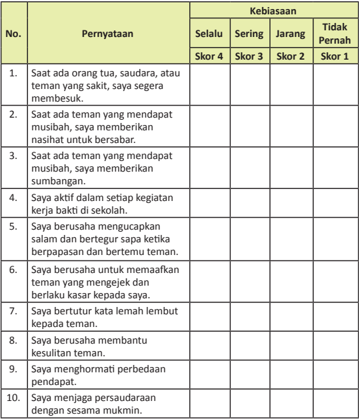

Tabel ini menunjukkan kebiasaan seseorang dalam berinteraksi dengan teman dan keluarga. Kolom "Pernyataan" berisi 10 pernyataan yang mengukur tingkat keberadaan kebiasaan tersebut, di mana skor 4 menunjukkan kebiasaan sering dilakukan, skor 3 menunjukkan kebiasaan jarang dilakukan, skor 2 menunjukkan kebiasaan tidak sering dilakukan, dan skor 1 menunjukkan kebiasaan tidak pernah dilakukan. Kolom "Kebiasaan" berisi tiga jenis kebiasaan: Selalu, Sering, dan Tidak Pernah. Topik utama tabel ini adalah kebiasaan sosial dan emosional seseorang dalam hubungan dengan orang lain, termasuk teman, saudara, dan orang tua. Data penting yang terlihat adalah bahwa kebiasaan-kebiasaan tersebut dapat bervariasi dari sangat sering dilakukan hingga tidak pernah dilakukan, menunjukkan variasi dalam perilaku sosial dan emosional individu.

 

---
## 📄 Halaman 164

### Nikmatnya Mencari Ilmu dan Indahnya Berbagi Pengetahuan

### Bagan Alir

Nikmatnya Mencari Ilmu dan Indahnya Berbagi Pengetahuan

Menunjukkan Sikap Semangat Menuntut Ilmu dan Menyampaikannya Kepada Sesama sebagai Implementasi dari Pemahaman Q.S. At-Taubah (9):122 dan Hadis Terkait

Analisis Q.S. At-Taubah (9):122

Analisis Hadis-Hadis Terkait

Diketahui dan Diperolehnya Nilai dan Perilaku Mulia

Semangat Menuntut Ilmu

Kelas X SMA/MA/SMK/MAK

Semangat Berbagi Ilmu Pengetahuan

 

---
## 📄 Halaman 165

### Membuka Relung Hai

### Cermai gambar dan wacana berikut.

pengetahuan dan teknologi.

Ilmu  adalah  cahaya  kehidupan.  Ilmu  ibarat  cahaya  yang  menyinari dalam  kegelapan yang menunjukkan  arah  menuju  jalan yang ditempuh. Tanpa ilmu seseorang akan tersesat jauh ke dalam jurang kebodohan. Dengan  ilmu  pengetahuan  jarak  yang  jauh  terasa  dekat,  waktu  yang  lama terasa  singkat,  pekerjaan  yang  berat  menjadi  ringan.  Dengan  ilmu  manusia memperoleh  segala  yang  ia  cita-citakan.  Ilmu  adalah  sumber  kehidupan.

Alam raya yang Allah Swt. ciptakan ini, penuh dengan berbagai macam rahasia yang dikandungnya. Bumi, langit, laut, dan yang ada di sekitarnya adalah bagian dari alam raya yang harus dimanfaatkan untuk kepeningan bersama.  Bagaimana dapat mengetahui rahasia yang ada di perut bumi, di dalam lautan, dan di ruang angkasa jika idak melalui ilmu pengetahuan? Oleh karena itu, sungguhlah tepat Allah  Swt.  menjadikan  manusia  sebagai  wakil-Nya  di  muka  bumi  ini,  karena manusia  memiliki  potensi  pengetahuan  untuk  mengelola,  mengurus,  dan memanfaatkan alam raya yang Allah Swt. ciptakan.

Agama Islam memandang bahwa ilmu pengetahuan adalah hal yang sangat pening. Orang-orang yang memiliki pengetahuan Allah Swt. m enjanjikan dengan derajat yang inggi di sisi-Nya, apalagi di sisi manus ia  lainnya.  Demikian pula  Rasulullah  saw.  yang  menganjurkan  seiap  umat  Islam  agar  me nuntut ilmu  seinggi-ingginya.  Rasulullah  Saw.  menyatakan  bahwa  oran g-orang  yang menuntut ilmu sama besar pahalanya dengan orang yang berjihad di jalan Allah Swt.  Bahkan  Rasululloh  saw.  memerintahkan  agar  menuntut  ilmu  i dak  hanya dilakukan  di  negeri  terdekat  saja,  tetapi  Allah  Swt.  memerintahkan  mencari ilmu walau harus dengan jarak yang sangat jauh. 'Carilah ilmu hingga ke negeri Cina!'  Demikian  sabdanya  sebagai  moivasi  kepada  umat  Islam  untuk   selalu bersemangat dalam menuntut ilmu.

 

---
## 📄 Halaman 166

Carilah tokoh-tokoh Islam yang memiliki keahlian dalam ilmu pengetahuan di berbagai bidang. Kemudian, coba kamu bandingkan dengan kenyataan umat Islam saat ini.

### Mengkriisi Sekitar Kita

### Baca dan cermai kisah di bawah ini.

---
**🖼️ Gambar/Diagram**

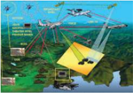

> **Deskripsi Visual:** Gambar ini adalah ilustrasi yang menunjukkan proses pengolahan data dalam sistem komputer. Gambar ini melukiskan berbagai komponen sistem yang terkait dengan pengolahan data, termasuk CPU (Central Processing Unit), RAM (Random Access Memory), hard drive, monitor, keyboard, mouse, dan printer. Setiap komponen memiliki peran khusus dalam proses pengolahan data, seperti CPU yang menjalankan program, RAM yang menyimpan data sementara, hard drive yang menyimpan data permanen, monitor untuk menampilkan hasil, keyboard dan mouse untuk input, dan printer untuk mencetak hasil.

Elemen-elemen utama dalam gambar ini adalah CPU, RAM, hard drive, monitor, keyboard, mouse, dan printer. Relasi antara mereka adalah bahwa CPU memproses data yang disimpan di RAM, yang kemudian disimpan di hard drive. Data yang diproses oleh CPU akan ditampilkan pada monitor, dan input dari pengguna akan diterima melalui keyboard dan mouse. Hasil yang dihasilkan akan dicetak menggunakan printer.

Teks, angka, atau label penting yang terlihat dalam gambar ini adalah "CPU", "RAM", "hard drive", "monitor", "keyboard", "mouse", dan "printer". Informasi kunci yang dapat diambil pembaca adalah bahwa sistem ini melibatkan berbagai komponen yang saling terkait dalam proses pengolahan data, dari input hingga output.

Dalam satu paragraf yang informatif, gambar ini menunjukkan bagaimana berbagai komponen sistem komputer bekerja bersama-sama dalam proses pengolahan data. Ini menunjukkan hubungan antara CPU, RAM, hard drive, monitor, keyboard, mouse, dan printer dalam proses pengolahan data. Gambar ini juga menunjukkan bagaimana data masuk ke sistem melalui input dan keluar melalui output.

komunikasi.

Di zaman  yang  serba cepat, canggih, dan serba prakis ini, seseorang dituntut untuk dapat memanfaatkan kecanggihan hasil rekayasa manusia dalam bidang teknologi dengan sebaik-baiknya. Betapa idak, tanpa mempedulikan hal tersebut, seseorang akan teringgal jauh ke belakang dalam  melakukan  kegiatan-kegiatan  sosial kemanusiaan. Selain itu, kemampuan menguasai dan menggunakan perangkat teknologi  dapat  terhindar  dari  upaya-upaya jahat  yang  dapat  merugikan  dirinya,  seperi penipuan, pemerkosaan, penganiayaan, dan sebagainya.

Sebagai contoh, Pak Sulaiman Lubis adalah

Setelah pesawat yang ia tumpangi mendarat, sekeika ia mengakikan kembali telepon genggamnya. Saat diakikan, ia mendapatkan sebuah pesan yang masuk ke  telepon  genggamnya,  dan  keika  dibuka  ternyata  isi  pesannya  adalah  agar ia  segera mentransfer sejumlah uang untuk keperluan kuliah putranya di Kota Yogyakarta. Tidak berpikir panjang, ia pun segera mengirimkannya menggunakan layanan sms banking melalui telepon genggamnya sendiri.

seorang trainer yang memiliki pengalaman memberikan pelaihan  ke berbagai kota di dalam dan luar Pulau Jawa. Suatu keika, ia diundang u ntuk memberikan pelaihan di sebuah kota di Kalimantan Timur. Karena undangan yang mendadak, ia pun idak sempat mempersiapkan materi yang cocok yang akan ia sampaikan. Walau  demikian,  ia  idak  kehabisan  akal  untuk  mempersiapkan  segal a  sesuatunya. Dalam  perjalanan  menuju  kota  tujuan,  ia  sempatkan  untuk  membuat  bahan presentasi  dengan  mencari  sumber  dari  internet  dan  merancang  materinya menggunakan laptop yang memang selalu ia bawa kemana pun pergi.

 

---
## 📄 Halaman 167

Pahami  kisah  di  atas.  Bagaimana  pendapatmu  tentang  manfaat  yang dihasilkan dari kemajuan teknologi? Apakah teknologi yang modern dan canggih dapat mempermudah kehidupan manusia? Apa saja manfaat lain dari kemajuan teknologi? Tuliskan pula dampak negatif yang ditimbulkan dari kemajuan dalam bidang teknologi tersebut.

### Memperkaya Khazanah Peserta Didik

### A.  Memahami Makna Menuntut Ilmu dan Keutamaannya

### 1.  Kewajiban Menuntut Ilmu

Menuntut  ilmu  atau  belajar  adalah  kewajiban  seiap  orang  Islam. Banyak sekali ayat al-Qur'ān atau hadis Rasulullah saw. yang menjelaskan tentang kewajiban belajar, baik kewajiban tersebut ditujukan kepada lakilaki maupun perempuan. Bahkan wahyu pertama yang diterima Nabi saw. adalah perintah untuk membaca atau belajar. 'Bacalah dengan (menyebut) nama  Tuhanmu  yang  menciptakan.  Dia  telah  menciptakan  manusia dari segumpal darah. Bacalah, dan Tuhanmulah Yang Mahamulia. Yang mengajar (manusia) dengan pena. Dia mengajarkan manusia apa yang idak diketahuinya.' (Q.S. al-'Alaq/96:1-5)

Kewajiban  menuntut  ilmu  bagi  laki-laki  dan  perempuan  menandakan bahwa agama Islam idak membeda-bedakan hak dan kewajiban manusia karena jenis  kelaminnya.  Walau  memang ada beberapa kewajiban yang diperintahkan Allah Swt. dan Rasul-Nya yang membedakan lak-laki dengan perempuan. Akan tetapi, dalam menuntut ilmu semua memiliki kewajiban dan hak yang sama antara laki-laki dan perempuan.

Laki-laki dan perempuan sama-sama sebagai khalifah di muka bumi dan sebagai hamba ( 'abid ). Untuk menjadi khalifah yang sukses, maka sudah barang tentu membutuhkan ilmu pengetahuan yang memadai. Bagaimana mungkin seseorang dapat mengelola dan merekayasa kehidupan di bumi ini  tanpa bekal ilmu pengetahuan. Demikian pula sebagai hamba, untuk mencapai  ingkat  keyakinan  (keimanan)  teringgi  kepada  Allah  Sw t.  dan makhluk-makhluk-Nya yang gaib dibutuhkan ilmu pengetahuan yang luas.

 

---
## 📄 Halaman 168

Menuntut  ilmu  juga  idak  dibatasi  oleh  jarak  dan  waktu.  Mengenai jarak, ada ungkapan yang menyatakan bahwa tuntutlah ilmu walau hingga ke negeri Cina. Demikian pula dalam hal waktu, Islam mengajarkan bahwa menuntut ilmu itu dimulai sejak lahir hingga liang lahat.

### 2.  Hukum Menuntut Ilmu

Isilah  ilmu  mencakup  seluruh  pengetahuan  yang  idak  diketahui manusia,  baik  yang  bermanfaat  maupun  yang  idak  bermanfaat.  Untuk ilmu  yang  idak  bermanfaat,  haram,  dan  berdosa  bagi  orang  yang mempelajarinya, baik sukses maupun gagal. Adapun ilmu yang bermanfaat, maka wajib dituntut dan dipelajari. Hukum menuntut ilmu-ilmu wajib itu terbagi atas dua bagian, yaitu fardu kifayah dan fard u 'ain .

### a. Fardu Kifayah

Hukum  menuntut  ilmu fardu kifayah berlaku  untuk  ilmu-ilmu yang harus ada di kalangan umat Islam sebagaimana juga dimiliki dan dikuasai  golongan  kair.  Seperi  ilmu  kedokteran,  perindu strian,  ilmu falaq , ilmu eksakta, serta ilmu-ilmu lainnya.

### b. Fardu 'Ain

Hukum mencari ilmu  menjadi fardu 'ain jika  ilmu  itu  idak  boleh diinggalkan oleh seiap muslim dan muslimah dalam segala situasi dan kondisi, seperi ilmu mengenal Allah Swt. dengan segala si fat-Nya, ilmu tentang tatacara beribadah, dan sebagainya.

### 3.  Keutamaan Orang yang Menuntut Ilmu

Orang-orang  yang  menuntut  ilmu  dan  mengajarkannya  diberikan keutamaan oleh Allah Swt. dan Rasul-Nya dengan derajat yang inggi di sisi Allah Swt. Di antara keutamaan-keutamaan orang yang menuntut ilmu dan yang mengajarkannya adalah sebagai berikut.

### a.  Diberikan derajat yang inggi di sisi Allah Swt.

'Dan Allah akan meninggikan orang-orang yang beriman di antara kamu dan orang-orang yang berilmu pengetahuan beberapa derajat. Dan  Allah  Maha  Mengetahui  apa  yang  kamu  kerjakan.'  (Q.S.  alMujadillah/58:11)

### b.  Diberikan pahala yang besar di hari kiamat nani

Dari Anas bin Malik ra. Rasulullah saw. bersabda, 'Penuntut ilmu adalah  penuntut  rahmat,  dan  penuntut  ilmu  adalah  pilar  Islam  dan akan  diberikan  pahalanya  bersama  para  nabi.' (H.R. ad-Dailami)

### c.  Merupakan sedekah yang paling utama

Dari  Abu  Hurairah  bahwa  Rasulullah  saw.  bersabda,  'Sedekah yang  paling  utama  adalah  jika  seorang  muslim  mempelajari  ilmu dan mengajarkannya kepada saudaranya sesama muslim.' (H.R. Ibnu Majah)

 

---
## 📄 Halaman 169

### d.  Lebih utama daripada seorang ahli ibadah

Dari Ali bin Abi Talib ra. Rasulullah saw. bersabda, 'Seorang alim yang  dapat  mengambil  manfaat  dari  ilmunya,  lebih  baik  dari  seribu orang  ahli  ibadah.' (H.R. ad-Dailami)

- Lebih utama dari śalat seribu raka'at
Dari  Abu  Żarr,  Rasulullah  saw.  bersabda,  'Wahai  Aba ª arr,  kamu pergi  mengajarkan  ayat  dari  Kitabullah  telah  baik  bagimu  daripada śalat  (sunnah)  seratus  rakaat,  dan  pergi  mengajarkan  sa tu  bab  ilmu pengetahuan baik dilaksanakan atau idak, itu lebih b aik  daripada śalat seribu  rakaat.' (H.R. Ibnu Majah)

- Diberikan pahala seperi pahala orang yang sedang ber jihad di  jalan Allah
Dari Ibnu Abbas ra. Rasulullah saw. bersabda, 'Beper gian keika pagi dan  sore  guna  menuntut  ilmu  adalah  lebih  utama  daripada berjihad  i sabilillah.' (H.R. ad-Dailami)

- Dinaungi  oleh  malaikat  pembawa  rahmat  dan  dimudahkan  menuju surga
Dari  Abu  Hurairah,  Rasulullah  saw.  bersabda,  'Tidakl ah  sekumpulan orang  yang  berkumpul  di  suatu  rumah  dari  rumah-rumah  (mas jid)  Allah 'Azza  wa  Jalla,  mereka  mempelajari  kitab  Allah  dan  mengk aji  di  antara mereka,  melainkan  malaikat  mengelilingi  dan  menyelubungi  mereka dengan  rahmat,  dan  Allah  menyebut  mereka  di  antara  orang -orang yang  ada  di  sisi-Nya.  Dan  idaklah  seorang  menii  suatu jalan  untuk menuntut  ilmu  melainkan  Allah  memudahkan  jalan  baginya  menu ju surga.' (H.R. Muslim dan Ahmad)

Mengapa umat Islam saat ini jauh tertinggal dengan umat yang beragama lain, padahal dahulu mereka belajar dari Islam? Bagaimana solusinya agar umat Islam kembali menguasai ilmu pengetahuan seperta masa lalu?

 

---
## 📄 Halaman 170

### B.  Ayat-Ayat Al-Qur'ān tentang Ilmu Pengetahuan

Q.S. at-Taubah/9:122

### 1.  Lafal Ayat dan Arinya

Arinya:  'Dan  idak  sepatutnya  orang-orang  mukmin  itu  semuanya pergi  (ke  medan  perang).  Mengapa  sebagian  dari  seiap  golongan  di antara  mereka  idak  pergi  untuk  memperdalam  pengetahuan  agama mereka dan untuk memberi peringatan kepada kaumnya apabila mereka telah kembali, agar mereka dapat menjaga dirinya.'

- Bacalah ayat di atas dengan tartil , dan hafalkan artinya.
- Carilah ayat lain yang berkaitan dengan ilmu pengetahuan.

### 2.  Hukum Tajwid

---
**📊 Tabel**

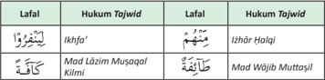

Tabel ini menunjukkan hukum Tajwid dalam beberapa lalafal, yaitu "ikhra", "madlázim musaqal klimi", dan "kálá". Setiap lalafal memiliki hukum Tajwid yang berbeda. "Ikhra" memiliki hukum "izhár tilāqi", yang berarti tidak memerlukan Tajwid. "Madlázim musaqal klimi" memiliki hukum "mad wajib muttoṣilī", yang berarti memerlukan Tajwid. Sementara itu, "kálá" memiliki hukum "mad lāzim muṣaqal", yang juga memerlukan Tajwid. Topik utama tabel ini adalah hukum Tajwid dalam beberapa lalafal dalam bahasa Arab. Kolom-kolomnya meliputi lalafal dan hukum Tajwid untuk setiap lalafal tersebut. Pola penting yang terlihat adalah bahwa tidak semua lalafal memerlukan Tajwid, seperti "ikhra", sedangkan beberapa memerlukan Tajwid, seperti "madlázim musaqal klimi" dan "kálá".

Identifikasilah hukum tajwid yang ada dalam ayat di atas, sebagaimana contoh yang ada di dalam tabel.

 

---
## 📄 Halaman 171

### 3.  Kandungan  Ayat

Dalam  ayat  tersebut,  Allah  Swt.  menerangkan  bahwa  idak  perlu  s emua orang mukmin berangkat ke medan perang, apabila peperangan itu dapat dilakukan oleh sebagian kaum muslimin saja. Tetapi harus ada pembagian tugas  dalam  masyarakat,  sebagian  berangkat  ke  medan  perang,  dan sebagian  lagi  tekun  menuntut  ilmu  dan  mendalami  ilmu-ilmu  agama Islam supaya ajaran-ajaran agama itu dapat diajarkan secara merata, dan dakwah dapat dilakukan dengan cara yang lebih efekif serta ber manfaat serta kecerdasan umat Islam dapat diingkatkan.

Orang-orang yang berjuang di bidang pengetahuan, oleh agam a Islam disamakan nilainya dengan orang-orang yang berjuang di medan perang. Dalam hal ini Rasulullah saw. telah bersabda yang arinya, 'Dari Anas bin Malik  berkata,  Rasulullah  saw.  bersabda,  'Di  akhirat  n ani  inta  ulama diimbang dengan darah para syuhada. Ternyata yang le bih berat adalah inta ulama dibandingkan dengan darah syuhada'. (H.R. Ibnu Najar)

Tugas umat Islam adalah untuk mempelajari agamanya, serta mengamalkan  nya dengan baik, kemudian menyampaikan pengetahuan agama itu kepada yang belum mengetahuinya. Tugas-tugas tersebut merupakan tugas  umat  dan  tugas  seiap  pribadi  muslim  sesuai  dengan  kemamp uan dan pengetahuan masing-masing, karena Rasulullah saw. telah bersabda;

``

Arinya: 'Dari 'Abdullah bin Amru, sesungguhnya Nabi saw. bersabda; 'Sampaikanlah olehmu  (apa-apa yang telah kamu  peroleh) dariku walaupun hanya satu ayat al-Qur'ān'. (H.R. Bukhari)

Apabila  umat  Islam  telah  memahami  ajaran-ajaran  agamanya,  dan telah mengeri hukum halal dan haram, serta perintah dan larang n agama, tentulah mereka akan lebih dapat menjaga diri dari kesesatan dan kemaksiatan. Selain itu, dapat melaksanakan perintah agama dengan baik dan dapat menjauhi larangan-Nya. Dengan demikian, umat Islam menjadi umat yang baik, sejahtera di dunia dan di akhirat.

Oleh  karena  ayat  ini  telah  menetapkan  bahwa  fungsi  ilmu  tersebut adalah  untuk  mencerdaskan  umat,  maka  idaklah  dapat  dibenarkan apabila ada orang-orang Islam yang menuntut ilmu pengetahuannya hanya untuk mengejar pangkat dan kedudukan atau keuntungan pribadi saja,. Apalagi untuk menggunakan ilmu pengetahuan sebagai kebanggaan dan kesombongan diri terhadap golongan yang belum menerima pengetahuan.

 

---
## 📄 Halaman 172

### C.  Hadis tentang Mencari Ilmu dan Keutamaannya

- Hadis dari Ibnu Abd. Barr.
Arinya: 'Rasulullah saw. Bersabda; Mencari ilmu itu wajib bagi seiap muslim. Dan sesungguhnya segala sesuatu hingga makhluk hidup di lautan memintakan ampun bagi penuntut ilmu' (H.R. Ibnu Abdul Barr)

- Hafalkan  hadis  beserta  artinya.  Lakukan  dengan  cara  berpasangan, kemudian menghafal bergantian. Setelah hafal, laporkan dan tuliskan hadisnya dan sampaikan kepada gurumu tentang hafalan hadis tersebut.
- Carilah hadis lain tentang menuntut ilmu.
Pesan-Pesan Mulia

### Anak dari Batu

Sebelum menjadi ulama besar yang sangat produkif dalam menghasilkan berbagai karya, Ibnu Hajar saat masih menuntut ilmu terkenal sebagai seorang anak yang bodoh dan bebal. Ia pernah merasa putus asa dan lari dari tempat ia  belajar  karena  merasa  sangat  idak  paham  dengan  ilmu  yang  diber ikan  guru kepadanya.  Semakin  ia  diberi  penjelasan,  maka  semakin  ia  idak  m engeri maksudnya. Waktunya lebih banyak untuk menyendiri dan merenung di pinggir sungai. Pada saat merenung, mendadak ia tersentak oleh tetesan air pada batu yang didudukinya itu. Ternyata pada satu sisi batu di mana air tersebut menetes, terlihat ada lubang di sana. Dari situ kemudian tumbuh lagi semangatnya untuk belajar,  karena  ia  berkeyakinan  jika  batu  saja  dapat  berlubang  oleh  tetesan air, tentu hai manusia yang lunak akan tertembus pula oleh s iraman ilmu pengetahuan.

 

---
## 📄 Halaman 173

Akhirnya sejarah mencatat Ibnu Hajar al-Asqalani sebagai ulama yang hebat dan terkenal dengan keluasan ilmunya. Nama Ibnu Hajar sendiri secara bahasa arinya  'anak  batu'  karena  erat  kaitannya  dengan  legenda  yang  meny atakan bahwa kegemilangannya dalam ilmu pengetahuan berawal dari terinspirasinya ia oleh sebuah batu yang berlubang oleh tetesan air.

Pelajaran apa yang dapat kamu peroleh dari kisah di atas? Coba kemukakan.

### Menerapkan Perilaku Mulia

Perilaku  yang  mencerminkan  sikap  memahami Q.S. at-Taubah/9:122 ,  di antaranya  tergambar  dalam  akivitas-akivitas  sebagai  berikut.

- Jadilah orang yang berilmu (pandai), sehingga dengan ilmu yang dimiliki seorang muslim dapat mengajarkan ilmu yang dimilikinya kepada orangorang yang ada di sekitarnya. Dengan demikian kebodohan yang ada di lingkungannya dapat terkikis habis dan berubah menjadi masyarakat yang beradab dan memiliki wawasan yang luas.
- Jika idak dapat menjadi orang pandai yang mengajarkan ilmunya kepada umat  manusia,  jadilah  sebagai  orang  yang  mau  belajar  dari  lingkungan sekitar dan dari orang-orang pandai.
- Jika idak dapat menjadi orang yang belajar, jadilah sebagai orang yang mau mendengarkan ilmu pengetahuan. Seidaknya jika kita mau mendengarkan ilmu  pengetahun  kita  dapat    mengambil  hikmah  dari  materi  yang  kita dengar.
- Jika  menjadi  pendengar  juga  masih  idak  dapat,  maka  jadilah  s ebagai  orang yang menyukai ilmu pengetahun, di antaranya dengan cara membantu dan memuliakan orang-orang yang berilmu, memfasilitasi akivitas  keilmuan seperi menyediakan tempat untuk pelaksanaan pengajian dan lain- lain.
- Janganlah  menjadi  orang  yang  kelima,  yaitu  yang  idak  berilm u,  idak belajar, idak mau mendengar, dan idak menyukai ilmu. Jika di  antara kita memilih yang kelima ini akan menjadi orang yang celaka.

 

---
## 📄 Halaman 174

### Rangkuman

- Q.S. at-Taubah/9:122 berisi perintah jihad itu idak hanya dipahami dengan  mengangkat  senjata,  tetapi  memperdalam  ilmu  pengetahuan  dan menyebarluaskannya juga termasuk ke dalam jihad .
- Fungsi ilmu adalah untuk mencerdaskan umat.
- Tidak dibenarkan menuntut ilmu pengetahuan hanya untuk mengejar pangkat dan kedudukan atau keuntungan pribadi saja, apalagi untuk menggunakan ilmu pengetahuan sebagai kebanggaan dan kesombongan diri.
- Peningnya memperdalam ilmu pengetahuan, mengamalkannya dengan baik, dan menyebarluaskannya.
- Ayat di atas menjadi acuan kita yang berhubungan dengan kewajiban belajar dan mengajar. Terdapat beberapa sumber yang tentunya harus kita kaji lebih dalam  lagi,  karena  dari  sekian  kitab-kitab  tafsir  yang  sudah  ada  ternyata berbeda dalam penafsirannya. Namun pada pokoknya adalah hal-hal berikut.
- Kewajiban manusia untuk belajar dan mengajar agama.
- Ayat ini memberi anjuran tegas kepada umat Islam agar ada sebagian dari umat Islam yang memperdalam agama.
- Peningnya mencari ilmu juga mengamalkan ilmu.
- Peningnya  memperdalam  ilmu  dan  menyebarluaskan  informasi  yang benar. Ia idak kurang pening dari upaya mempertahankan wilayah.
- Hendaklah jihad itu  dibagi kepada jihad bersenjata, jihad memperdalam ilmu pengetahuan, dan pengerian tentang agama.
- Antara jihad berperang  dan jihad memperdalam  ilmu  agama  keduanya pening  serta  keduanya  saling  mengisi.

### A.  Uji Pemahaman

Jawablah pertanyaan-pertanyaan berikut ini dengan benar.

- Seiap muslim diperintahkan untuk menuntut ilmu dan mengamalkannya. Bagaimana cara menerapkannya dalam kehidupan sehari-hari?
- Apa yang akan kamu lakukan jika ingin kuliah, tetapi ekonomi orang tua idak memungkinkan?
- Jelaskan kandungan Q.S. at-Taubah/9:122 .
- Jelaskan keutamaan orang yang menyebarkan ilmu.
- Jelaskan kegunaan ilmu pengetahuan bagi kehidupan manusia.

 

---
## 📄 Halaman 175

### B. Uji  Keterampilan

---
**📊 Tabel**

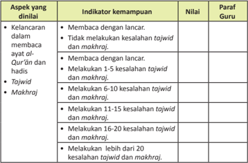

Tabel ini menunjukkan aspek-aspek yang dianalisis dalam kemampuan membaca ayat al-Qur'an dan hadis dengan tajwid dan makhraj oleh para guru. Topik utamanya adalah kemampuan membaca ayat al-Qur'an dan hadis dengan tepat menggunakan tajwid dan makhraj. Kolom-kolomnya meliputi indikator kemampuan, nilai, dan paraf guru. Data penting yang terlihat adalah bahwa para guru diharapkan dapat membaca ayat al-Qur'an dan hadis dengan lancer, tidak melakukan kesalahan tajwid dan makhraj, dan melakukan 1-5 kesalahan tajwid dan makhraj. Ini menunjukkan bahwa tujuan utama adalah untuk memastikan bahwa para guru dapat membaca dengan tepat dan akurat dalam penggunaan tajwid dan makhraj.

### C.  Releksi

Berilah  tanda checklist (  ) yang sesuai dengan dorongan haimu untuk menanggapi pernyataan-pernyataan berikut ini.

---
**📊 Tabel**

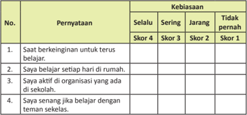

Tabel ini menunjukkan kebiasaan belajar dan partisipasi sosial siswa dalam berbagai aktivitas. Topik utamanya adalah tentang sikap dan perilaku belajar serta partisipasi sosial di sekolah dan rumah. Kolom "Pernyataan" berisi pernyataan yang ditanyakan kepada siswa, seperti keinginan untuk terus belajar, belajar setiap hari, aktif di organisasi sekolah, dan senang belajar dengan teman sekelas. Kolom "Kebiasaan" mencakup empat skor: Selalu (Skor 4), Sering (Skor 3), Jarang (Skor 2), dan Tidak pernah (Skor 1). Data penting yang terlihat adalah bahwa banyak siswa memiliki kebiasaan belajar yang baik, seperti selalu belajar setiap hari dan aktif di organisasi sekolah, namun masih ada yang jarang belajar atau tidak pernah belajar sama sekali.

 

---
## 📄 Halaman 176

---
**📊 Tabel**

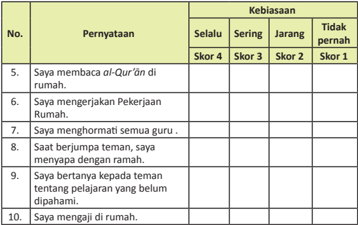

Tabel ini menunjukkan kebiasaan dan perilaku individu dalam berbagai situasi sehari-hari, dengan skor yang ditentukan berdasarkan tingkat kebiasaan mereka. Topik utama tabel adalah tentang perilaku dan kebiasaan individu dalam berbagai aspek kehidupan, seperti membaca Al-Qur'an, menjalankan pekerjaan rumah, menghormati guru, bertanya kepada teman tentang pelajaran yang belum dipahami, dan mengajari orang lain di rumah. Kolom-kolomnya meliputi "Selalu", "Sering", "Jarang", dan "Tidak pernah". Data penting yang terlihat adalah bahwa banyak individu memiliki kebiasaan yang baik, seperti membaca Al-Qur'an secara rutin, menjalankan pekerjaan rumah, menghormati guru, bertanya kepada teman tentang pelajaran, dan mengajari orang lain di rumah. Namun, masih ada beberapa individu yang jarang atau bahkan tidak pernah melakukan kebiasaan-kebiasaan tersebut.

 

---
## 📄 Halaman 177

### Menjaga Martabat Manusia dengan Menjauhi Pergaulan Bebas dan Zina

### Bagan Alir

---
**🖼️ Gambar/Diagram**

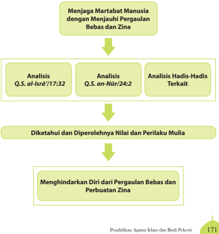

> **Deskripsi Visual:** Gambar ini adalah diagram yang menunjukkan proses analisis dan pengamatan terhadap martabat manusia dalam konteks Islam. Diagram ini terdiri dari empat bagian utama:

1. **Menjaga Martabat Manusia dengan Menjauhi Pergaulan Bebas dan Zina** - Ini merupakan tujuan akhir yang ingin dicapai dalam proses analisis.

2. **Analisis Q.S. al-Isrā' /17:32** - Analisis ini dilakukan untuk memahami nilai-nilai dan perbuatan zina dalam Al-Qur'an.

3. **Analisis Q.S. an-Nūr/24:2** - Analisis ini juga dilakukan untuk memahami nilai-nilai dan perbuatan zina dalam Al-Qur'an.

4. **Analisis Hadis-Hadis Terkait** - Analisis ini dilakukan untuk memahami nilai-nilai dan perbuatan zina dalam hadits-hadits terkait.

5. **Diketahui dan Diperolehnya Nilai dan Perilaku Mulia** - Ini merupakan langkah selanjutnya setelah melakukan analisis.

6. **Menghindarkan Diri dari Pergaulan Bebas dan Perbuatan Zina** - Langkah terakhir dalam proses ini adalah menghindarkan diri dari pergaulan bebas dan perbuatan zina.

Elemen-elemen utama dalam diagram ini adalah proses analisis dan pengamatan terhadap martabat manusia dalam konteks Islam, yang melibatkan penelitian terhadap ayat-ayat Al-Qur'an dan hadits-hadits terkait. Label penting dalam diagram ini mencakup tujuan akhir, analisis ayat Al-Qur'an, analisis hadits-hadits terkait, dan langkah-langkah selanjutnya dalam proses ini.

Informasi kunci yang dapat diambil pembaca adalah bahwa proses ini bertujuan untuk menjaga martabat manusia dengan menjauhi pergaulan bebas dan zina, melalui analisis terhadap ayat-ayat Al-Qur'an dan hadits-hadits terkait.

 

---
## 📄 Halaman 178

### Membuka Relung Hai

### Cermai gambar dan wacana berikut.

Manusia  adalah  satu-satunya  makhluk Allah Swt. yang diberi amanah untuk mengelola bumi ini sekaligus memanfaatkan dengan sebaik-baiknya. Hal ini menunjukkan bahwa manusia memiliki kemampuan yang lebih besar dibandingkan dengan makhluk Allah Swt. lainnya. Oleh karena itu, keberadaan  manusia  harus  tetap  menjaga keberlangsungan  dan  keberlanjutan  hidupnya  secara  benar  sesuai  dengan  tuntunan dan ajaran Islam. Proses tersebut di dalam ajaran Islam dilakukan melalaui aturan dan proses  yang  mudah,  yaitu  melalui  proses pernikahan.

Akad  nikah  hakikatnya  adalah  upaya  meregenerasi  manusia  secara  benar, terhormat,  dan  bermartabat.  Di  sinilah  agama  Islam  melarang  segala  bentuk hubungan seksual yang idak dilakukan secara sah dan benar sesu ai syari'at Islam. Selain melanggar aturan agama, zina juga idak sesuai dengan hakika t manusia sebagai  makhluk  yang  bermartabat  dan  terhormat.  Bahkan  perzinaan  oleh agama-agama samawi dianggap sebagai salah satu bentuk kejahatan terbesar dan  terkotor  terhadap  kemanusiaan.  Selain  itu,  pangkal  imbul nya  kehancuran bagi sendi-sendi kemasyarakatan.

di

Coba bandingkan dengan hewan atau binatang. Untuk menyalurkan kebutuhan biologisnya, idak mengenal siapa lawan jenisnya, ap akah saudaranya atau induknya sendiri yang melahirkannya. Hewan idak al  mengen tempat, mana pun bisa melakukannya tanpa merasa malu apabila ada yang melihatnya. Hewan memang idak diberikan akal  dan  nilai-nilai  keadaban  atau  k esopanan. Dengan  demikian,  orang  yang  melakukan  perbuatan  di  luar  akal  dan  nalar manusia adalah orang yang lebih rendah daripada hewan.

Sebutkan  dampak-dampak  negatif  yang  ditimbulkan  akibat  perbuatan zina atau pergaulan bebas selain dosa besar dengan azab Allah Swt. yang menantinya. Bagaimana upaya pencegahannya?

 

---
## 📄 Halaman 179

### Mengkriisi Sekitar Kita

### Cermai wacana dan gambar berikut.

Perbuatan  zina  dianggap  sebagai  perbuatan yang sangat memalukan, menjijikkan, sekaligus nista di dalam peradaban manusia. Banyak orang yang telah meraih kesuksesan hidup, baik sebagai pejabat yang sukses dan terhormat, pengusaha, poliisi, bahkan public igure hancur berantakan karena perbuatan nista yang dilakukannya. Perbuatan tersebut telah meluluhlantakkan karir yang selama ini mereka raih dengan susah payah.

'Aib yang mereka  perbuat idak saja membuat  malu  dan  rendah  dirinya,  tetapi juga keluarga dan orang-orang terdekatnya. Mereka  idak  menyadari  bahwa  perbuatan tersebut idak saja berakibat hancurnya karir,  tetapi  juga  berakibat dosa besar yang akan  diterimanya  di  akhirat  kelak.  Mereka orang yang sangat mapan dan mampu untuk melakukan pernikahan dengan cara yang sah dengan biaya besar.

Untuk itu, diperlukan kehai-haian dalam

---
**🖼️ Gambar/Diagram**

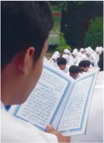

> **Deskripsi Visual:** Gambar ini menunjukkan sebuah aktivitas belajar di sekolah. Dalam gambar tersebut, beberapa siswa sedang membaca buku pelajaran. Siswa di depan tampak sedang membaca dengan teliti, sementara siswa di belakang tampak tertarik pada isi buku. Latar belakang menunjukkan taman sekolah yang indah dengan pohon-pohon besar dan bangunan sekolah yang megah. 

Elemen-elemen utama dalam gambar adalah siswa, buku pelajaran, dan latar belakang sekolah. Siswa adalah subjek utama yang tengah melakukan aktivitas belajar. Buku pelajaran merupakan objek yang digunakan oleh siswa untuk belajar. Latar belakang sekolah menambah nuansa kehidupan sekolah dan menunjukkan lingkungan belajar yang nyaman.

Teks, angka, atau label penting tidak terlihat dalam gambar ini karena gambar hanya berisi foto saja tanpa teks atau angka yang jelas. Namun, informasi kunci yang dapat diambil pembaca adalah bahwa siswa sedang mengikuti proses belajar di sekolah dan lingkungan sekolah mereka tampak tenang dan nyaman.

bergaul  agar  idak  terjerumus  ke  dalam  perbuatan  zina.  Perlu  diingat  bahwa mendekai zina saja dilarang, apalagi melakukannya.

Kamu telah mengetahui fakta di atas. Apa saja yang dapat menyebabkan seseorang  terjerumus  ke  dalam  pergaulan  bebas  dan  zina?  Analisis  dan kemukan pendapatmu.

.

 

---
## 📄 Halaman 180

### Memperkaya Khazanah Peserta Didik

### A.  Memahami Makna Larangan  Pergaulan Bebas dan Zina

Pergaulan bebas yang dimaksud pada bagian ini adalah pergaulan yang idak  dibatasi  oleh  aturan  agama  maupun  susila.  Salah  satu  dampak negaif dari pergaulan bebas adalah perilaku yang sangat dilarang oleh agama Islam, yaitu zina. Hal inilah yang menjadi fokus bahasan pada bagian ini.

### 1.  Pengerian Zina

Kata zina berasal dari kata zana-yazni yang arinya hubungan layaknya suami istri antara perempuan dengan laki-laki yang sudah mukallaf (baligh) tanpa ikatan pernikahan yang sah menurut syari'at Islam.

### 2.  Hukum Zina

Terkait hukum zina, semua ulama sepakat bahwa zina hukumnya haram, bahkan zina dianggap sebagai puncak keharaman. Hal tersebut didasarkan pada  irman  Allah  Swt.  dalam Q.S.  al-Isrā/17:32 .    Menurut  pandangan hukum Islam, perbuatan zina merupakan dosa besar yang dikategorikan sebagai perbuatan yang keji, hina, dan buruk.

### 3.  Kategori Zina

Perbuatan zina dikategorikan menjadi dua bagian, yaitu Zina Mu ĥș an dan Gairu Mu ĥș an .

- Zina Mu ĥș an , yaitu pezina sudah baligh, berakal, merdeka, dan sudah pernah  menikah.  Hukuman  terhadap  zina mu ĥș an adalah  dirajam (dilempari dengan batu sederhana sampai meninggal).
- Zina Gairu  Mu ĥș an ,  yaitu  pezina  masih  lajang,  dan  belum  pernah menikah.  Hukumannya  adalah  didera  seratus  kali  dan  diasingkan selama satu tahun.

### 4.  Hukuman bagi Pezina

Dalam hukum Islam, zina dikategorikan perbuatan kriminal atau indak pidana. Oleh sebab itu, orang yang melakukannya dikenakan sanksi atau hukuman  sesuai  dengan syari'at Islam.  Hukuman  pelaku  zina  ada  dua, yaitu seagai berikut.

- Dera atau pukulan sebanyak 100 (seratus) kali bagi pezina gairu mu ĥș an dan  ditambah  dengan  mengasingkan  atau  membuang  pelakunya  ke tempat  yang  jauh  dari  tempat  mereka.  Hal  ini  didasarkan  pada  ir man Allah  Swt.  dalam Q.S.  an-Nūr/24:2 serta  hadis  Rasulullah  saw.  yang diriwayatkan oleh Bukhari dan Muslim dari Abu Hurairah dan Zaid bin Khalid.

 

---
## 📄 Halaman 181

- Dirajam sampai mai bagi pezina Mu ĥș an .  Hukuman rajam dilakukan dengan cara pelaku dimasukkan ke dalam tanah hingga dada atau leher. Tempat untuk melakukan hukuman rajam adalah tempat yang banyak dilalui manusia atau tempat keramaian. Hal ini didasarkan pada hadis yang diriwayatkan oleh Bukhari, Muslim, Abu Dawud, Tirmizi, dan AnNasa'i.

### 5.  Hukuman bagi orang yang Menuduh Zina ( Qazaf )

Mengingat  beratnya  hukuman  bagi  pelaku  zina,  maka  hukum  Islam telah menentukan syarat-syarat yang berat bagi terlaksananya hukuman tersebut. Syarat-syarat tersebut antara lain adalah sebagai berikut.

- Hukuman  dapat  dibatalkan  bila  masih  terdapat  keraguan  terhadap perisiwa  atau  perbuatan  zina  tersebut.  Hukuman  idak  dapat  dil akukan setelah  benar-benar  diyakini  bahwa  idak  terjadi  perzinaan.
- Untuk meyakinkan perihal terjadinya zina tersebut, syaratnya harus ada empat orang saksi  laki-laki  yang  adil.  Karena  kesaksian  empat  orang wanita  idak  cukup  untuk  dijadikan  buki,  sebagaimana  empat  orang kesaksian laki-laki yang fasik.
- Kesaksian empat orang laki-laki yang adil ini pun masih memerlukan syarat,  syaratnya  yaitu  seiap  laki-laki  tersebut  harus  melihat  p ersis kejadiannya.
- Andaikan  seorang  dari  keempat  saksi  menyatakan  kesaksian  yang berbeda dengan kesaksian iga orang lainnya atau salah seorang  d i antaranya mencabut kesaksiannya, maka terhadap mereka semuanya dijatuhkan  hukuman  menuduh  zina.  Hukuman  bagi  penuduh  zina terhadap  perempuan baik-baik  dengan  didera  sebanyak  80  (delapan puluh) kali deraan. Hal ini didasarkan pada irman Allah Swt. dal am Q.S. An-Nûr/24:4 .
Sekarang menjadi sangat jelas bahwa Islam melarang keras hubungan seksual  atau  hubungan  biologis  di  luar  pernikahan,  apa  pun  alasannya. Karena  perbuatan  zina  sangat  bertentangan  dengan itrah manusia dan  mengingkari  tujuan  pembentukan  rumah  tangga  yang sakinah, mawaddah,  warahmah .  Islam  menghendaki  agar  hubungan  seksual  idak saja  sekadar  memenuhi  kebutuhan  biologis,  tetapi  islam  menghendaki adanya  pertemuan  dua  jiwa  dan  dua  hai  di  dalam  naungan  rumah  tang ga yang  tenang,  bahagia,  saling  seia,  dan  penuh  kasih  sayang.  Du a  insan  yang menikah itu akan melangkah menuju masa depan yang cerah dan memiliki keturunan yang jelas asal usulnya.

Tujuan pernikahan tersebut akan menjadi porak-poranda, jika dikotori dengan  zina.  Oleh  karena  itu,  idak  mengherankan  jika  perzinaan  ak an banyak menimbulkan problema sosial yang sangat membahayakan bagi masyarakat,  seperi  bercampuraduknya  keturunan,  menimbulkan  ras a

 

---
## 📄 Halaman 182

dendam, dengki, benci, sakit hai, dan menghancurkan kehidupan rumah tangga.  Sungguh  Allah  Swt.  dan  Rasulullah  saw.  melindungi  kita  semua dengan ajaran yang sangat mulia.

Begitu banyak dampak negaif yang diimbulkan dari pergaulan bebas. Patut  menjadi  perhaian  bagi  generasi  muda  bahwa  mereka  sedang mempertaruhkan masa depannya jika terlibat dalam pergaulan bebas yang melampaui  batas.  Bergaul  memang  perlu,  tetapi  seyogyanya  dilakukan dalam  batas  wajar  dan  idak  berlebihan.  Remaja  adalah  tumpuan  masa depan bangsa. Jika moral dan jasmaniah para remaja mengalami kerusakan, begitu pula masa depan bangsa dan negara akan mengalami kehancuran. Jadi, jika kamu memikirkan masa depan diri dan juga keturunan, sebaiknya selalu  konsisten  untuk  mengatakan  idak  pada  pergaulan  bebas  k arena dampak pergaulan bebas bersifat sangat merusak dari segi moral maupun jasmaniah.

Di antara dampak negaif zina adalah sebagai berikut.

- Mendapat laknat dari Allah Swt. dan rasul-Nya.
- Dijauhi dan dikucilkan oleh masyarakat.
- Nasab menjadi idak jelas.
- Anak hasil zina idak berhak mendapat warisan.
- Anak hasil zina idak bisa dinasabkan kepada bapaknya.

### B.  Ayat-Ayat Al-Qur'ān dan Hadis tentang Larangan Mendekai Zina

### 1. Q.S. al-Isrā'/17:32

- Lafal Ayat dan Arinya
'Dan  janganlah  kamu  mendekai  zina;  (zina)  itu  sungguh  suatu perbuatan keji, dan suatu jalan yang buruk.'

- Bacalah ayat di atas dengan tartil sesuai dengan kaidah tajwid .
- Hafalkan  ayat  di  atas  berikut  artinya.  Lakukan  secara  berpasangan dengan temanmu secara bergantian

 

---
## 📄 Halaman 183

### b. Hukum Tajwid

Carilah hukum tajwid pada ayat di atas seperti pada contoh yang ada dalam tabel.

### c.  Kandungan Ayat

Secara umum Q.S. al-Isrā'/17:32 mengandung larangan mendekai zina serta penegasan bahwa zina merupakan perbuatan keji, dan suatu jalan yang buruk. Allah Swt. secara tegas memberi predikat terhadap perbuatan zina melalui ayat tersebut sebagai perbuatan yang merendahkan harkat, martabat, dan kehormatan manusia. Karena bahayanya perbuatan zina,  sebagai  langkah  pencegahan,  Allah  Swt.  melarang  perbuatan  yang mendekai atau mengarah kepada zina.

Imam  Sayu ṭ i  dalam  kitabnya al-Jami'  al-Kabir menuliskan  bahwa perbuatan  zina  dapat  mengakibatkan  enam  dampak  negaif  bagi  pelak unya. Tiga dampak negaif menimpa  pada saat di dunia dan iga dampak akan  diimpakan  kelak  di  akhirat.

### 1) Dampak  di  dunia

### a)  Menghilangkan wibawa

Pelaku zina akan kehilangan kehormatan,  martabat atau harga dirinya  di  masyarakat.  Bahkan  pezina  disebut  sebagai  sampah masyarakat yang telah mengotori lingkungannya.

### b)  Mengakibatkan kefakiran

Perbuatan  zina  juga  akan  mengakibatkan  pelakunya  menjadi miskin sebab ia akan selalu mengejar kepuasan nafsu. Pelaku harus mengeluarkan  biaya  yang  idak  sedikit  hanya  untuk  memenuhi nafsunya.

lagi

 

---
## 📄 Halaman 184

### c)  Mengurangi umur

Perbuatan zina tersebut juga akan mengakibatkan umur pelakunya berkurang lantaran akan terserang penyakit yang dapat mengakibatkan kemaian. Saat ini banyak sekali penyakit berbahay a yang diakibatkan oleh perilaku seks bebas, seperi HIV/AIDS , infeksi saluran kelamin, dan sebagainya.

### 2)  Dampak yang akan dijatuhkan di akhirat

### a)  Mendapat murka dari Allah Swt.

Perbuatan zina merupakan salah satu dosa besar, sehingga para pelakunya akan mendapat murka dari Allah Swt. kelak di akhirat.

### b) Ĥ isab yang jelek (banyak dosa)

Pada saat hari perhitungan amal ( yaumul ḥ isab ), para pelaku zina akan menyesal karena mereka akan diperlihatkan betapa besarnya dosa akibat perbuatan zina yang dia lakukan semasa hidup di dunia. Penyesalan  hanya  inggal  penyesalan,  semuanya  sudah  terlanjur dilakukan.

### c)  Siksaan di neraka

Para pelaku perbuatan zina akan mendapatkan siksa yang berat dan  hina  kelak  di  neraka.  Dikisahkan  pada  saat  Rasulullah  saw. melakukan Isra' dan Mi'raj beliau  diperlihatkan  ada  sekelompok orang  yang  menghadapi  daging  segar,  tetapi  mereka  lebih  suka memakan  daging  yang  amat  busuk  daripada  daging  segar.  Itulah siksaan dan  kehinaan  bagi pelaku zina.  Mereka  berselingkuh padahal mereka mempunyai istri atau suami yang sah. Kemudian, Rasulullah saw. juga diperlihatkan ada satu kaum yang tubuh mereka sangat besar, namun bau tubuhnya sangat busuk, menjijikkan saat dipandang,  dan  bau  mereka  seperi  bau  tempat  pembuangan kotoran (comberan). Rasul kemudian bertanya, 'Siapakah mereka?' Dua Malaikat yang mendampingi beliau menjawab, 'Mereka adalah pezina laki-laki dan perempuan.'

### 2. Q.S. an-N û r/24:2

### a.  Lafal Ayat dan Arinya

``

'Pezina  perempuan  dan  pezina  laki-laki,  deralah  masing-masing dari keduanya seratus kali, dan janganlah rasa belas kasihan kepada keduanya mencegah kamu untuk (menjalankan) agama (hukum) Allah

 

---
## 📄 Halaman 185

Swt., jika kamu beriman kepada Allah Swt. dan hari kemud ian; dan hendaklah (pelaksanaan) hukuman mereka disaksikan ole h sebagian orang-orang  yang  beriman.'

- Bacalah ayat di atas dengan tartil sesuai dengan kaidah tajwid .
- Hafalkan  ayat  di  atas  berikut  artinya.  Lakukan  berpasangan  dengan temanmu secara bergantian.

### b.  Hukum Tajwid

---
**📊 Tabel**

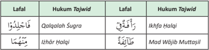

Tabel ini menunjukkan hubungan antara Lafal (pengucapan) dan Hukum Tajwid (prinsip pengucapan Arab) dalam bahasa Arab. Topik utama tabel adalah hubungan antara pengucapan kata dan prinsip pengucapan yang benar. Kolom pertama berisi Lafal, yaitu pengucapan kata dalam bahasa Arab, sementara kolom kedua berisi Hukum Tajwid, yaitu prinsip pengucapan yang benar untuk kata tersebut. Data penting yang terlihat adalah bahwa Lafal "qālalah" dengan Hukum Tajwid "sugra" menunjukkan bahwa pengucapan "qālalah" adalah salah, sedangkan Lafal "ikhfa" dengan Hukum Tajwid "halqi" menunjukkan bahwa pengucapan "ikhfa" adalah benar. Ini menunjukkan bahwa pengucapan kata harus sesuai dengan prinsip pengucapan yang benar untuk menghindari kesalahan dalam pengucapan.

- Bacalah ayat di atas dengan tartil sesuai dengan kaidah tajwid .
- Hafalkan  ayat  di  atas  berikut  artinya.  Lakukan  berpasangan  dengan temanmu secara bergantian.

### c.  Kandungan Ayat

Kandungan Q.S. an-Nû r/24:2 sebagai berikut.

- Perintah Allah Swt. untuk mendera pezina perempuan dan pezina lakilaki masing-masing seratus kali.
- Orang yang beriman dilarang berbelas kasihan kepada keduanya untuk melaksanakan hukum Allah Swt.
- Pelaksanaan hukuman tersebut disaksikan oleh sebagian orang-orang yang beriman.

 

---
## 📄 Halaman 186

Dalam pandangan Islam, zina merupakan perbuatan kriminal ( jarimah ) yang  dikategorikan  hukuman ĥ udud ,  yakni  sebuah  jenis  hukuman  atas perbuatan maksiat yang menjadi hak Allah Swt. Tidak ada seorang pun yang  berhak  memaakan  kemaksiatan  zina  tersebut,  baik  oleh  pen guasa atau  pihak  berkaitan  dengannya.  Berdasarkan Q.S.  an-Nû r/24:2 ,  pelaku perzinaan, baik laki-laki maupun  perempuan harus dihukum dera (dicambuk)  sebanyak  100  kali.  Namun,  jika  pelaku  perzinaan  itu  sudah mu ḥ ș an (pernah menikah), sebagaimana ketentuan hadis Nabi saw maka diterapkan hukuman rajam.

Dalam  konteks  ini  yang  memiliki  hak  untuk  menerapkan  hukuman tersebut  hanya khalifah (kepala  negara)  atau  orang-orang  yang  ditugasi olehnya.  Ketentuan  ini  berlaku  bagi  negeri    yang  menerapkan syari'at Islam sebagai hukum posiif dalam suatu negara. Sebelum memutuskan hukuman  bagi  pelaku  zina,  maka  ada  empat  hal  yang  dapat  dijadikan sebagai  buki,  yaitu  (1)  saksi,  (2)  sumpah,  (3)  pengakuan,  d an  (4)  dokumen atau  buki  tulisan.  Dalam  kasus  perzinaan,  pembukian  perzinaan  ada dua, yakni saksi yang berjumlah empat orang dan pengakuan pelaku.

Pengakuan pelaku, didasarkan beberapa hadis Nabi saw. Ma'iz bin alAslami, sahabat Rasulullah saw. dan seorang wanita dari al-Gamidiyyah dijatuhi  hukuman  rajam  keika  keduanya  mengaku  telah  berzina.  Di samping  kedua  buki  tersebut,  berdasarkan Q.S.  an-Nû r/24:6-10 ,  ada hukum  khusus  bagi  suami  yang  menuduh  istrinya  berzina.  Menurut ketetapan  ayat  tersebut  seorang  suami  yang  menuduh  istrinya  berzina sementara  ia idak  dapat mendatangkan  empat  orang  saksi, maka  ia dapat  menggunakan  sumpah  sebagai  bukinya.  Jika  ia  berani  bersu mpah sebanyak empat kali yang menyatakan bahwa dia termasuk orang-orang yang benar, dan pada sumpah kelima ia menyatakan bahwa laknat Allah Swt. atas dirinya jika ia termasuk yang berdusta, maka ucapan sumpah itu dapat mengharuskan istrinya dijatuhi hukuman rajam. Namun demikian, jika istrinya juga berani bersumpah sebanyak empat kali yang isinya bahwa suaminya termasuk orang-orang yang berdusta, dan pada sumpah kelima ia menyatakan bahwa laknat Allah Swt. atas dirinya jika suaminya termasuk orang-orang  yang  benar,  dapat  menghindarkan  dirinya  dari  hukuman rajam. Jika hal ini terjadi, keduanya dipisahkan dari status suami istri, dan idak boleh menikah selamanya. Inilah yang dikenal dengan li'an .

Tuduhan perzinahan harus dapat dibukikan dengan buki-buki yan g kuat,  akurat,  dan  sah.  Tidak  boleh  menuduh  seseorang  melakukan  zina tanpa  dapat  mendatangkan empat orang saksi dan buki yang kuat.

 

---
## 📄 Halaman 187

Carilah ayat al-Qur'±n selain kedua ayat di atas yang mengandung larangan melakukan perbuatan zina. Kemudian tuliskan pada buku latihanmu.

### 3.  Hadis tentang Larangan Mendekai  Zina

Hadis yang diriwayatkan oleh Bukhari dan Muslim

'Barangsiapa beriman kepada Allah Swt. dan hari akhir maka janganlah berdua-duaan  dengan  wanita  yang  idak  bersama  mahramnya  karena yang keiga adalah setan.' (H.R. Ahmad)

- Bacalah hadis di atas dengan benar.
- Carilah hadis Rasulullah saw. selain hadis di atas yang berisi larangan berbuat  zina. Cari di kitab £a¥i¥ Bukhari atau £a¥i¥ Muslim.
- Hafalkan hadis di atas berikut artinya. Lakukan secara bergantian.

### Menerapkan Perilaku Mulia

Kewajiban  menutup aurat dengan berbusana sesuai dengan syari'at Islam, merupakan  salah  satu  akhlak  yang  sangat  pening  dalam  Islam.  Pene rapan perilaku  tersebut  dalam  pergaulan  sehari-hari  di  antaranya  dapat  dilakukan dengan cara sebagai berikut.

 

---
## 📄 Halaman 188

### 1.  Menjaga Pergaulan yang Sehat

Beruntunglah  para  pemuda  dan  remaja  yang  dapat  menjaga  pergaulan sesuai dengan ajaran Islam. Islam mengajarkan pergaulan yang sehat, bernilai posiif,  dan  mengandung  manfaat.  Pergaulan  yang  sehat  antara  laki -laki dan perempuan merupakan pergaulan yang terbebas dari nafsu yang dapat mengarah kepada hubungan seksual di luar nikah.

Pergaulan remaja dan muda-mudi saat ini memang sudah sedemikian ipis batasan-batasannya. Tidak mudah untuk membatasi pergaulan itu. Ditambah lagi dengan berbagai kemudahan akses, baik melalui telepon, SMS, chaing , dan situs jejaring sosial. Dengan berbagai sarana itu pergaulan remaja pada umumnya saat ini  menjadi  begitu  dekat  dan  mudah.  Persoalan  yang  lebih memprihainkan  adalah  para  remaja  idak  paham  dan  kadang  idak  peduli mana  batas-batas  yang  wajar,  mana  yang  idak  wajar,  dan  mana  yang  sud ah kebablasan.

Apa  batasan  pergaulan  itu?  Dalam  hal  ini  Rasulullah  saw.  memberikan batasan  berupa  larangan  berdua-duaan  antara  laki-laki  dan  perempuan melalui hadis berikut:

Arinya:  'Dari  Ibnu  Abbas;  bahwa  Rasulullah  saw.  bersabda,  Janganlah seorang laki-laki berduaan dengan seorang wanita (yang bukan mahramnya), dan  janganlah  seorang  wanita  bepergian  kecuali  bersama  mahramnya  ...' (H.R. Bukhari dan Muslim)

### 2.  Menjaga Aurat

Aurat merupakan bagian dari  tubuh  yang  harus  dilindungi  dan  ditutupi agar terjaga dari pandangan lawan jenis. Aurat perempuan adalah seluruh bagian tubuh kecuali wajah dan kedua telapak tangan. Aurat laki-laki adalah bagian tubuh antara pusar sampai dengan lutut.

Agar aurat perempuan  tertutup,  maka  diwajibkan  untuk  menggunakan jilbab  dan  pakaian  yang  dapat  menutupi  seluruh    tubuhnya,  termasuk menutupi  bagian  dada.  Kain  kerudung  dan  pakaian  itu  pun  merupakan kain yang disyari'atkan, misal kainnya idak  boleh ipis,  idak boleh sempit atau  ketat,  dan  dapat  menyamarkan  lekuk  tubuh  perempuan.  Demikian juga dengan laki-laki, agar terjaga dari pandangan maka bagian tubuh yang menjadi aurat itu harus dijaga dari pandangan lawan jenis, caranya ditutup dengan pakaian yang sesuai.

Firman Allah Swt. yang arinya, 'Dan katakanlah kepada para perempuan yang  beriman,  agar  mereka  menjaga  pandangannya,  dan  memelihara

 

---
## 📄 Halaman 189

kemaluannya,  dan  janganlah  menampakkan  perhiasannya  (a uratnya),  kecuali yang (biasa) terlihat. Dan hendaklah mereka menutupkan kain kudung ke dadanya'  (Q.S.  an-N û r/24:31)

### 3.  Menjaga  Pandangan

Pandangan laki-laki terhadap perempuan atau sebaliknya termasuk celah bagi  setan  melancarkan  strategi  untuk  menggodanya.  Kalau  hanya  sekilas saja  atau  spontanitas  atau  idak  sengaja,  pandangan  mata  itu  idak  m enjadi masalah.  Pandangan  pertama  yang  idak  sengaja  diperbolehkan,  tetap i  jika berkelanjutan  maka  haram    hukumnya.  Rasulullah  saw.  bersabda  yan g  arinya, 'Dari  'Abdulah  bin  Buraidah  dari  ayahnya,  bahwa  Rasu lullah  saw.  bersabda kepada  'Ali  bin  Abi  Țalib,  Hai  'Ali!  Janganlah  kau ik i  pandangan  pertama dengan  pandangan  selanjutnya,  karena  yang  pertama  dim aakan,  tapi  yang selanjutnya  idak.' (H.R. Ahmad)

Untuk menjaga agar pandangan pertama idak disertai tujuan lain tersebut, cepatlah  kendalikan  diri  kita.  Salah  satunya  dengan  cara  menundukkan pandangan. Sebelum iblis memasuki atau mempengaruhi pikir an dan hai kita.  Segera    mohon  pertolongan  kepada  Allah  Swt.  agar  kita  i dak  mengulangi pandangan yang mengandung unsur nakal itu.

### 4.  Menjaga Kehormatan

Organ paling pribadi manusia sering disebut atau diperhalus dengan kata 'kehormatan'.  Jika direnungkan secara mendalam, sebutan ini sungguh sangat arif dan tepat. Benteng paling akhir dari harga diri dan kehormatan manusia baik laki-laki maupun perempuan ada pada organ tubuh yang paling pribadi tersebut. Terkadang organ vital manusia juga disebut dengan 'kemaluan'. Hal ini  juga relevan karena palang pintu rasa malu terakhir adalah pada bagian tubuh tersebut. Orang dewasa yang normal, baik laki-laki maupun perempuan tentu sangat malu jika organ vitalnya itu terlihat oleh pihak lain yang idak mempunyai hak untuk memandangnya.

### 5.  Meningkatkan Akivitas dan Rajin Berpuasa

Bagi  para  pemuda  dan  remaja  yang  belum  menikah  disarankan  untuk memperbanyak  akivitas  atau    kegiatan  yang  posiif.  Hal  ini  d apat  membuat mengalihkan perhaian dan pikiran mesum. Ikutlah kegiatan ol ahraga, ekstrakurikuler, kursus, bimbingan belajar, pekerjaan tambahan dan lain-lain. Menyibukkan diri  dengan  berbagai  akivitas  dapat  menyebabkan  perhaian kita selalu ke arah yang posiif.

Cara lain yang dapat ditempuh untuk menahan nafsu bagi para pemuda dan remaja yang belum menikah adalah dengan berpuasa sunah. Islam itu indah  dan  sehat,  dengan  taat  beribadah  dan  rajin  puasa  otomais pikiran dan  hai  menjadi  bersih  dan  jernih.  Tidak  akan  terlintas  di pikiran  kita  untuk melakukan  hal  yang  melanggar  kesusilaan.  Perhaikan  hadis  Rasulu llah  saw. berikut ini.

 

---
## 📄 Halaman 190

Arinya:   'Dari Abdurrahman bin Yazid dari Abdullah ia berkata; Rasulullah saw. mengatakan kepada kami, 'Wahai para pemuda, barangsiapa di antara kalian mampu ba`ah maka menikahlah karena hal itu dapat menundukkan pandangan  dan  menjaga  kemaluan,  barangsiapa  yang  idak  mampu, hendaklah  berpuasa  karena  hal  itu  dapat  menekan  hawa  nafsunya.'  (H.R. Ahmad).

Diskusikan dengan temam-temanmu, apa saja selain yang disebutkan di atas yang dapat dihindari oleh dirimu dari pergaulan bebas dan yang dapat menyebabkan perzinaan? Mengapa demikian? Jelaskan.

### Rangkuman

- Mahasuci  dan  Mahamulia  Allah  Swt.  yang  menghendaki  manusia  untuk menjadi  makhluk-Nya  yang  mulia  dan  bermartabat  termasuk  dalam  hal menyalurkan kebutuhan biologis.
dan

- Secara  umum Q.S. al-Isrā'/17:32 mengandung  pesan-pesan mengenai larangan mendekai zina karena zina merupakan perbuatan keji, suatu jalan yang buruk.
- Zina  adalah  melakukan  hubungan  biologis  layaknya  suami  istri  di  luar  tali pernikahan yang sah.
- Q.S. an-Nû r/24:2 berisi perintah Allah Swt. untuk mendera pezina perempuan dan pezina laki-laki masing-masing seratus kali.
- Zina dikategorikan menjadi 2 macam, yaitu sebagai berikut.
- Mu ĥș an , pezina sudah baligh, berakal, merdeka, sudah pernah menikah. Hukuman terhadap muhsan dirajam (dilempari  dengan  batu  sederhana sampai  mai)
- Gairu Mu ĥș an , pezina masih lajang, belum pernah menikah. Hukumannya adalah didera seratus kali dan diasingkan selama satu tahun.

 

---
## 📄 Halaman 191

- Tuduhan perzinaan harus dapat dibukikan dengan buki-buki yang kuat, akurat,  dan  sah.  Tidak  boleh  menuduh  seseorang  melakukan  zina,  tanpa dapat mendatangkan empat orang saksi.
- Di antara dampak negaif zina adalah sebagai berikut.
- Mendapat laknat dari Allah Swt. dan rasul-Nya.
- Dijauhi dan dikucilkan oleh masyarakat.
- Nasab menjadi idak jelas.
- Anak hasil zina idak berhak mendapat warisan.
- Anak hasil zina idak bisa dinasabkan kepada bapaknya.
- Menghindari  lingkungan  yang  di  dalamnya  terdapat  perilaku  hidup  serba boleh  atau  serba  bebas,  karena  akan  mengakibatkan  dampak  negaif terhadap perilaku hidup yang suci dan terhormat. Hendaknya berupaya untuk selalu berada di tengah-tengah lingkungan yang sehat dan baik agar terjaga dirinya dan keluarganya dari kemaksiatan dan kemunkaran.

### A.  Uji Penerapan

- Memprakikkan bacaan Q.S. al-Isrā/17:32
- Memprakikkan bacaan Q.S. an-N µ r/24:2

---
**📊 Tabel**

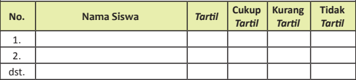

Tabel ini menunjukkan informasi tentang siswa-siswa yang telah mendaftar untuk program tertentu di sebuah sekolah atau institusi pendidikan. Kolom "Nama Siswa" menyajikan nama-nama individu yang terdaftar. Kolom "Tartil" menunjukkan apakah siswa tersebut telah mendaftar atau belum. Dalam kolom "Cukup Tartil", ada tanda centang jika siswa tersebut sudah mendaftar, sedangkan dalam kolom "Kurang Tartil", tanda centang digunakan jika siswa tersebut belum mendaftar. Kolom "Tidak Tartil" menunjukkan siswa yang tidak memiliki tanda centang, yang berarti mereka belum mendaftar. Topik utama tabel ini adalah pendaftaran siswa untuk program tertentu, dengan fokus pada status pendaftaran mereka.

``

---
**📊 Tabel**

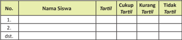

Tabel ini menunjukkan informasi tentang siswa-siswa yang telah mendaftar untuk program tertentu. Kolom "No." berisi nomor urut untuk setiap siswa, kolom "Nama Siswa" berisi nama-nama siswa yang mendaftar, kolom "Tarttil" berisi informasi tentang apakah siswa tersebut telah mendaftar atau belum, kolom "Cukup Tarttil" berisi informasi bahwa siswa tersebut memenuhi syarat untuk mendaftar, kolom "Kurang Tarttil" berisi informasi bahwa siswa tersebut kurang dari syarat untuk mendaftar, dan kolom "Tidak Tarttil" berisi informasi bahwa siswa tersebut tidak memenuhi syarat untuk mendaftar. Dari tabel ini, dapat dilihat bahwa beberapa siswa telah mendaftar (Tarttil), sedangkan beberapa siswa belum mendaftar (Tidak Tarttil).

 

---
## 📄 Halaman 192

Skala nilai:

Taril

: 91 - 100

Cukup taril

: 81 - 90

Kurang taril

: 71 - 80

Tidak taril

: 61 - 70

### B.  Uji Pemahaman

Jawablah pertanyaan-pertanyaan berikut ini dengan jelas.

- Jelaskan pengerian zina!
- Apakah hukuman bagi orang yang berzina?
- Apakah dampak negaif dari pergaulan bebas?
- Sebutkan contoh-contoh nyata dari bentuk pergaulan bebas saat ini!
- Bagaimana cara menghindari zina bagi remaja dan kawula muda?

### C.  Releksi

Berilah  tanda checklist (  ) yang sesuai dengan dorongan haimu untuk menanggapi pernyataan-pernyataan berikut ini.

---
**📊 Tabel**

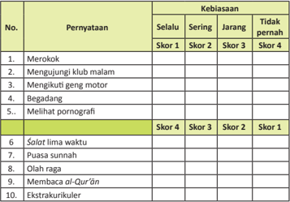

Tabel ini menunjukkan skor yang diberikan kepada siswa berdasarkan kebiasaan mereka dalam berbagai aktivitas dan perilaku. Topik utama tabel adalah tentang perilaku dan kebiasaan yang dianggap baik atau buruk oleh guru. Kolom "Pernyataan" berisi pernyataan yang harus diisi oleh siswa untuk menentukan skor mereka. Kolom "Kebiasaan" menunjukkan kategori kebiasaan yang dianggap baik (Selalu) atau buruk (Tidak pernah). Skor 1 diberikan jika kebiasaan selalu dilakukan, skor 2 jika sering dilakukan, skor 3 jika jarang dilakukan, dan skor 4 jika tidak pernah dilakukan. Data penting yang terlihat adalah bahwa banyak pernyataan memberikan skor 4 (tidak pernah), termasuk merokok, mengunjungi klub malam, mengikuti geng motor, begadang, melihat pornografi, dan olahraga. Sementara itu, beberapa pernyataan seperti salat lima waktu, puasa sunnah, membaca al-Qur'an, dan ekstrakurikuler memberikan skor 1 (selalu). Ini menunjukkan bahwa banyak siswa memiliki perilaku yang dianggap buruk oleh guru, sementara yang baik lebih sedikit.

 

---
## 📄 Halaman 193

### Buku-Buku Rujukan

- Al-Ghazali, Imam. 1995. Ringkasan Ihya Ulumuddin . Jakarta: Pustaka Amani.
- Al-Maraghi,  Muhammad  Musthafa.  1992. Tafsir  Al-Maraghi .  Semarang:  Toha Putra.
- Al-Tirmidzi. t.t. Sunan al-Tirmidzi . t.t.:t.p.
- Anonimious. 2010. Al-Hidayah Al-Qur'ān Perkata Tajwid Kode Angka . Tangerang Selatan: Kalim.
- As  Suyuthi,  Jalaludin.  2008. Sebab  Turunnya  Ayat  Al-Qur'ān .  Jakarta:  Gema Insani Press.
- DEPAG  RI.  2006. Pedoman  Pengelolaan  dan  Pengembangan  Wakaf .  Jakarta: Direktorat Pemberdayaan Wakaf.
- _______. 2006. Peraturan Perundangan Perwakafan . Jakarta: DEPAG RI.
- _______. 1992. Al-Qur'ān dan Terjemahnya . Semarang: Asy-Syifa.
- Elsi Kartika Sari. 2006. Pengantar Hukum Zakat dan Wakaf . Jakarta: Grasindo.
- Hamka. 1984. Tafsir Al Azhar Juz XI . Jakarta: Pustaka Panjimas.
- Ibn Hambal, Al-Imam Ahmad. t.t. Musnad Al-Imam Ahmad ibn Hambal . t.t.: Dar al-Fikr.
- Ibn Majah, Abi 'Abdullah Muhammad ibn Yazid al-Qazwini. t.t. Sunan Ibn Majah . t.t.: t.p.
- Kementerian Agama RI. 2011. Islam Rahmatan Lil'alamin . Jakarta: Kementrian Agama RI.
- Kementerian  Agama  RI.  2012. Tafsir  al-Qur'ān  Tematik .  Jakarta:  Kementrian Agama RI.
- Kementerian  Agama  RI.  2011. Al-Qur'ān  dan  Tafsirnya .  Jakarta:  Kementrian Agama RI.
- Larimore, Ralp Graham. 2005. I'm OK, You'are OK, We're OK, Kiat Cerdas Menjalin Hubungan dengan Siapa Saja . Jakarta: Prestasi Pustakaraya.
- Masan AF. 2009. Aqidah Akhlak Madrasah Tsanawiyah kelas VIII . Semarang: Toha Putra..
- Mu'thi, Fadlolan Musyaffa' . 2008. Potret Islam Universal . Tuban: Syauqi Press.

### Daftar Pustaka

 

---
## 📄 Halaman 194

- Mushthafa, Ahmad. 1987. Tafsir Al Maraghi . Semarang: Toha Putra.
- PP Nomor 42 Tahun 2006 Tentang Pelaksanaan UU No. 41 Tahun 2004 tentang wakaf.
- Rahmah, Syifalir. 2008. Malaikatpun ingin menjadi Manusia. Surabaya;  Ikhtiar Surabaya
- Sarwat,  Ahmad.  2011. Seri  Fiqih  dan  Kehidupan  (2) :  Thaharah.  Jakarta:  DU PUBLISHING
- Shihab, Quraisy. 1998. Wawasan Al-Qur'ān . Bandung: Mizan.
- _______. 2000. Yang Tersembunyi . Jakarta: Lentera Hati.
- _______. 2002. Tafsir Al-Mishbah . Jakarta: Lentera Hati.
- Sukayat,  Tata.  2001. Kapita  Selekta  Syarhil  Qur'an .  Bandung:  CMM  Fakultas Dakwah IAIN SGD.
Syaltut, Mahmud. 1990. Tafsir Al-Qur'ānul Karim . Bandung: Diponegoro.

Undang-undang Nomor 41 Tahun 2004 tentang wakaf.

### Sumber dari Internet

htp://kendaripos.co.id/wp-content/uploads/2016/02/20150821102448649. jpg, tanggal 20 Februari 2016.

htps://pustakaisaspol.iles.wordpress.com/2012/04/kitab-shahih-al-bukharimuslim-alita.jpg, Tanggal 20 Februari 2016.

htp://omahbukumuslim.com/wp-content/uploads/2015/09/Al-Ijma.jpg, tanggal 20 Februari 2016.

htp://grandparagon.com/wp-content/uploads/2012/05/cctv-camera.jpg tanggal 20 Februari 2016.

htp://mediatataruang.com/wp-content/uploads/2016/04/suap-1.jpg, tanggal 22 Februari 2016.

htps://nyobamoto.iles.wordpress.com/2013/11/pelanggar-jalur-buswaybanyak.jpg, tanggal 24 Februari 2016.

htps://cdns.klimg.com/newshub.id//real/2015/12/16/122545/1000xautomencontek-di-kelas-.jpg, tanggal 26 Februari 2016.

htp://www.arikelbagus.com/wp-content/uploads/2013/09/Berita-TeknologiPengerian-Teknologi.jpg, 26 Februari 2016.

 

---
## 📄 Halaman 195

### Glosarium

Aib :

malu; cela; noda; salah; keliru.

Akhlak :

budi pekerti; kelakuan.

Al-Qur'ān :

kitab yang  diturunkan  kepada  Nabi  Muhammad  saw. dalam Arab, yang sampai kepada kita secara mutawattir , dimulai  dengan  surah al-Fāti¥ah dan  diakhiri  dengan surah an-Nās ,  membacanya  berfungsi  sebagai  ibadah, dan merupakan mu'jizat terbesar Nabi Muhammad saw.

'Amaliyah :

berkaitan dengan amal, amal perbuatan.

Amal jariah :

perbuatan baik untuk kepentingan masyarakat (umum) yang dilakukan terus-menerus dan tanpa pamrih; perbuatan sosial.

An§ār :

para pembantu perjuangan (sahabat) Nabi Muhammad saw.  dari  kalangan  penduduk  Medinah  setelah  beliau hijrah dari Mekah ke Madinah.

Anugerah :

pemberian atau ganjaran dari seseorang kepada orang lain; karunia dari Allah Swt.

Al-Asmā'u al-Ĥusnā :

nama-nama  yang  baik  lagi  indah  yang  hanya  dimiliki oleh Allah Swt. yang berjumlah 99.

Atheis :

orang yang tidak percaya akan adanya Tuhan.

Aurat :

bagian  badan  yang  tidak  boleh  kelihatan  (menurut hukum Islam).

A§ab :

siksa  Allah  yang  diganjarkan  kepada  manusia  yang melanggar larangan agama.

Baiat :

pengucapan sumpah setia kepada imam (pemimpin).

Berhala :

patung dewa atau sesuatu yang didewakan yang disembah dan dipuja.

Blokade :

pengepungan (penutupan) suatu daerah (negara) sehingga  orang,  barang,  kapal,  dan  sebagainya  tidak dapat keluar masuk dengan bebas.

Boikot :

bersekongkol  menolak  untuk  bekerja  sama  (berurusan dagang, berbicara, ikut serta, dan sebagainya.

Budak :

orang yang dibeli dan dijadikan budak.

Dalil :

keterangan  yang  dijadikan  bukti  atau  alasan suatu kebenaran  (terutama  berdasarkan  ayat al-Qur'ān dan hadis).

 

---
## 📄 Halaman 196

---
**📊 Tabel**

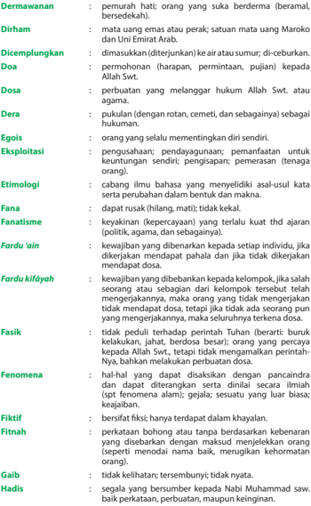

Tabel ini berisi informasi tentang berbagai aspek dari istilah "darma" dalam konteks Islam, termasuk dermawan, dirham, dicemplungkan, doa, dosa, dera, epos, eksploitasi, etimologi, fana, fantasmatisme, fardu 'ain, fardu kifayah, fenomena, fiktif, fitnah, galib, dan hadis. Topik utama adalah definisi dan pengertian dari istilah-istilah tersebut dalam konteks agama Islam. Kolom-kolomnya mencakup deskripsi singkat dari setiap istilah, seperti definisi, makna, dan contoh penggunaan. Pola penting yang terlihat adalah bahwa tabel ini mencakup berbagai aspek dari konsep "darma" dalam Islam, mulai dari definisi hukum hingga praktik dan implikasi moral.

 

---
## 📄 Halaman 197

kair

Hamba sahaya :

abdi; budak belian; orang yang tidak memiliki kebebasan, segalanya tergantung tuannya.

Hedonis :

orang yang menganggap kesenangan dan kenikmatan materi sebagai tujuan utama dalam hidup.

¦isab :

hitungan; perhitungan; perkiraan.

Ilham :

tanda-tanda yang menarik perhatian; petunjuk.

Individualis :

orang yang mementingkan diri sendiri; orang yang egois.

Intimidasi :

tindakan  menakut-nakuti  (terutama  untuk  memaksa orang atau pihak lain berbuat sesuatu); gertakan; ancaman.

Jahiliah :

dari  kata  jahil  atau jahlun (bahasa  Arab)  artinya  bodoh atau kebodohan.

Jilbab :

kerudung  lebar  yang  dipakai  wanita  muslim  untuk menutupi kepala dan leher sampai dada.

Jihad :

usaha  dengan  segala  daya  upaya  untuk  mencapai kebaikan;  usaha  sungguh-sungguh  membela  agama Islam dengan mengorbankan harta benda, jiwa, dan raga; perang suci melawan orang mempertahankan agama Islam.

Kabilah :

suku bangsa; kaum yang berasal dari satu ayah.

Kailah :

rombongan berkendaraan (unta) di padang pasir; koningen.

Kālāmullah :

irman Allah Swt. dalam bentuk wahyu yang disampaikan kepada para nabi dan rasul-Nya melalui malaikat jibril.

Kalbu :

pangkal perasaan batin; hati yang suci (murni); hati.

Khalayak :

segala  yang  diciptakan  oleh Tuhan;  makhluk  (manusia dan sebagainya);  kelompok tertentu dalam masyarakat yang menjadi sasaran komunikasi; orang banyak; masyarakat.

Khazanah :

barang milik; harta benda; kekayaan; kumpulan barang; perbendaharaan;    tempat  menyimpan  harta  benda (kitab-kitab, barang berharga, dan sebagainya).

Khusyū' :

penuh penyerahan dan kebulatan hati; sungguh- sungguh; penuh kerendahan hati.

Kiamat :

hari kebangkitan sesudah mati (orang yang telah meninggal dihidupkan kembali untuk diadili perbuatannya);  hari  akhir  zaman  (dunia  seisinya  rusak binasa  dan  lenyap);  berakhir;  tidak  akan  muncul  lagi; celaka sekali; bencana besar; rusak binasa.

Korupsi :

penyelewengan  atau penyalahgunaan uang negara (perusahaan dan sebagainya) untuk keuntungan pribadi atau orang lain.

untuk

 

---
## 📄 Halaman 198

---
**📊 Tabel**

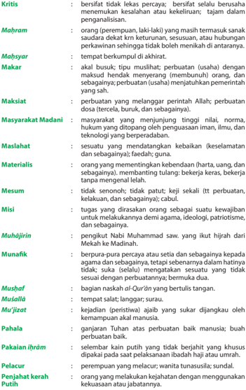

Tabel ini berisi kritik terhadap berbagai prinsip atau nilai-nilai dalam sebuah konteks, mungkin dalam pendidikan atau etika sosial. Topik utamanya adalah perbandingan antara berbagai prinsip atau nilai-nilai, seperti keberadaan manusia, keberadaan Allah, dan hubungan antara manusia dengan Allah. Kolom-kolomnya mencakup berbagai aspek, mulai dari kritik terhadap keberadaan manusia (Kritis), prinsip-prinsip yang dianggap baik (Mahram), prinsip-prinsip yang dianggap tidak baik (Mehsyar), hukum-hukum yang dianggap baik (Makar), prinsip-prinsip yang dianggap baik (Maksiat), prinsip-prinsip yang dianggap baik (Masyarakat Madani), prinsip-prinsip yang dianggap baik (Masalahat), prinsip-prinsip yang dianggap baik (Materialis), prinsip-prinsip yang dianggap baik (Mesum), prinsip-prinsip yang dianggap baik (Misi), prinsip-prinsip yang dianggap baik (Muhammadin), prinsip-prinsip yang dianggap baik (Munafik), prinsip-prinsip yang dianggap baik (Mushaf), prinsip-prinsip yang dianggap baik (Musalla), prinsip-prinsip yang dianggap baik (Mujizat), prinsip-prinsip yang dianggap baik (Pahala), prinsip-prinsip yang dianggap baik (Pakaian ihrum), prinsip-prinsip yang dianggap baik (Pelacur), prinsip-prinsip yang dianggap baik (Penjahan kerah), dan prinsip-prinsip yang dianggap baik (Putih). Data atau pola penting yang terlihat adalah bahwa tabel ini mencakup berbagai aspek nilai-nilai dalam konteks tertentu, mulai dari aspek moral, etis, dan sosial.

 

---
## 📄 Halaman 199

Peradaban :

kemajuan (kecerdasan, kebudayaan) lahir batin.

Perawi :

orang yang meriwayatkan hadis.

Perigi :

sumur yang telah kering (tidak berair lagi); sumur mati.

Popularitas :

kepopuleran, keterkenalan.

Publik igur :

dikenal baik; terkenal.

Rajam :

hukuman  atau  siksaan  badan  bagi  pelanggar  hukum agama (misal orang berzina) dengan lem  paran batu dan sebagainya

Releksi :

cerminan; gambaran.

Renungan :

hasil merenung; buah pikiran.

Rezeki :

segala sesuatu yang dipakai untuk memelihara kehidupan (yang diberikan oleh Tuhan); makanan (sehari- hari);  nafkah;  penghidupan;  pendapatan  (uang  dan sebagainya untuk memelihara ke  hidup  an); keuntungan; kesempatan mendapat makan.

Risalah :

ajaran, tuntunan.

Ruilslag :

tukar guling; menukar satu barang dengan barang lain yang sama atau sejenis atau senilai.

Sahabat :

orang  yang  membantu  perjuangan  Nabi  Muhammad saw. selain keluarganya dan hidup semasa dengan Nabi saw.

¤alat 'idain :

¤alat 'idul itri dan 'idul a«¥a.

Samaw³ :

bertalian dengan langit atau ketuhanan.

Sanad :

sandaran, hubungan, atau rangkaian perkara yang dapat dipercayai;  rentetan  rawi  hadis  sampai  kepada  Nabi Muhammad saw.

Sangkakala :

terompet (dari kulit kerang, dan sebagainya); terompet berkala atau bunyian berkala.

Sayembara :

perlombaan (karang-mengarang dan sebagainya) dengan memperebutkan hadiah.

Sedekah :

pemberian sesuatu kepada fakir miskin atau yang berhak menerimanya, di luar kewajiban zakat dan zakat itrah sesuai dengan kemampuan pemberi; derma.

Sengketa :

sesuatu yang menyebabkan perbedaan pendapat; pertengkaran; perbantahan; daerah yang menjadi rebutan (pokok pertengkaran); pertikaian; per  selisihan; perkara. (dalam pengadilan).

Sensitif :

cepat menerima rangsangan; peka;mudah mem- bangkitkan emosi.

Sidratul Muntahā :

tempat  paling  tinggi  dan  paling  akhir  di  atas  langit ketujuh  yang  dikunjungi  Nabi  Muhammad  saw.  ketika mikraj, di tempat itu Nabi melihat Malaikat Jibril dalam bentuk  yang  asli  dan  menerima  perintah  salat  lima waktu.

 

---
## 📄 Halaman 200

Suku Aus dan Khazraj :

dua suku besar yang terdapat di Madinah.

Syahid :

saksi (dalam usaha menegakkan atau memper  tahankan kebenaran  agama);  orang  yang  mati  karena  membela agama.

Syari'at :

hukum  agama yang menetapkan peraturan hidup manusia, hubungan manusia dengan Allah Swt., hubungan  manusia  dengan  manusia  dan  alam  sekitar berdasarkan al-Qur'ān dan  hadis;  baik  dibalas  dengan baik, jahat dibalas dengan jahat.

Syukur :

rasa terima kasih kepada Allah Swt.

Tabi'³n :

penganut ajaran Nabi Muhammad saw. yang merupakan generasi  kedua  dari  jemaah  muslimin  setelah  generasi para sahabat yang hidup sezaman dengan Nabi Muhammad saw.

Tafakkur :

renungan; perenungan; perihal merenung, me  mi  kir  kan, atau menimbang-nimbang dengan sungguh-sungguh.

Taubat :

sadar  dan  menyesal  akan  dosa  (perbuatan  yang  salah atau jahat) dan berniat akan memperbaiki tingkah laku dan perbuatan; kembali kepada agama (jalan, hal) yang benar; jera (tidak akan berbuat lagi).

Tauhid :

keesaan Allah Swt.

Tawā«u' :

rendah hati.

Tawakkal :

Berserah diri kepada Allah Swt. melalui usaha dan kerja keras.

Terminologi :

ilmu mengenai batasan atau deinisi istilah.

Tipu muslihat :

siasat; ilmu (perang dan sebagainya).

Tren :

bergaya mutakhir; bergaya modern.

¨āhir :

sesuatu yang nampak.

¨ikir :

mengingat;  puji-pujian  kepada  Allah  yang  diucap  kan berulang-ulang; doa atau puji-pujian berlagu (dilakukan pada perayaan Maulid Nabi); perbuatan mengucapkan zikir.

 

---
## 📄 Halaman 201

### Profil Penulis

Nama Lengkap

:   Endi Suhendi Zen, MA.

Telp. Kantor/HP

:   021-7560956/081399309951.

E-mail

:   endiszen@gmail.com.

Akun Facebook

:   Endi Suhendi Zen.

Alamat Kantor

:   Jl. Raya Serpong - Puspiptek ,

Tangerang Selatan 15314.

Bidang Keahlian

:   Pendidikan Agama Islam.

### Riwayat Pekerjaan/Profesi dalam 10 tahun terakhir:

- 2014 - 2016 :   Guru PAI di SMAN 2 Tangerang Selatan.
- 2008 - 2013
:   Guru PAI di SMKN 1 Tangerang Selatan.

- 2005 - 2015 :   Guru PAI di SMPN 11 Tangerang Selatan.

### Riwayat Pendidikan Tinggi dan Tahun Belajar:

- S2: Pascasarjana/Study Islam/Pendidikan Agama Islam/Universitas Islam Negeri (UIN) Syarif Hidayatullah Jakarta (2008 - 2010).
- S1: Tarbiyah/Pendidikan Agama Islam/IAIN Syarif Hidayatullah Jakarta (19952000).

### Judul Buku dan Tahun Terbit (10 Tahun Terakhir):

- Pendidikan Agama Islam dan Budi Pekerti SMA, 2014.
- Pendidikan Agama Islam SMP, 2011.
- Panduan Baca Tulis al-Qur'ān , 2010.
- Pendidikan Islam Masyarakat Terpencil; Studi Kasus Masyarakat Cicakal Girang Baduy, 2009.

### Judul Penelitian dan Tahun Terbit (10 Tahun Terakhir):

Tidak ada.

 

---
## 📄 Halaman 202

Nama Lengkap

:   Dra. Hj. Nelty Khairiyah, M.Ag.

Telp. Kantor/HP

:   081380980808.

E-mail

:   neltyk@gmail.com.

Akun Facebook

:   Nelty Khairiyah@yahoo.co.id.

Alamat Kantor

:   Jln. Mawar II, Bintaro, Jakarta Selatan.

Bidang Keahlian

:   Pendidikan Agama Islam.

### Riwayat Pekerjaan/Profesi dalam 10 tahun terakhir:

- 1.
2014 - sekarang   :  Guru Pendidikan Agama Islam SMA Negeri 87 Jakarta.

- 2011- 2014
:  Guru Pendidikan Agama Islam SMA Negeri 35 Jakarta.

- 1984 - 2010
:  Guru Pendidikan Agama Islam SMK Jakarta Pusat I.

- 1985 - 1987
:  Guru MTs. YASPINA.

- 5.
2003 - sekarang   :  Kepala TK Babussalam.

- 2003 - 2004
:  Dosen UNIVERSITAS ISLAM Al-AZHAR Jakarta.

- 2004 - 2005
:  Dosen STIEBI PITALOKA Jakarta.

### Riwayat Pendidikan Tinggi dan Tahun Belajar:

- Sarjana Muda Fak. Tarbiyah PAI - IAIN Jakarta, (1982-1985).
- Sarjana Fak. Tarbiyah PAI - IAIN Jakarta, (1985-1988).
- S2 Prog. Pendidikan Islam- UMJ, (1996-2000).

### Judul Buku dan Tahun Terbit (10 Tahun Terakhir):

- Buku Siswa  Pendidikan Agama Islam dan Budi Pekerti SMA/ SMK Kurikulum 2013, Puskurbuk Kemendikbud RI, (2013).
- Buku Buku Guru Pendidikan Agama Islam dan Budi Pekerti SMA/ SMK Kurikulum 2013, Puskurbuk Kemendikbud RI, (2013).
- Buku Siswa  Pendidikan Agama Islam dan Budi Pekerti SMA/ SMK Kurikulum 2013 (2013), Kelas X, XI, XII, Penerbit Dongpong, (2013).
- Buku Siswa dan Buku Guru Pendidikan Agama Islam dan Budi Pekerti SMALB Tunadaksa, Tunanetra dan Autis Kurikulum 2013, PKLK Kemendikbud RI (2016).
- Buku Pedoman Umum Pengembangan Kurikulum Pendidikan Agama Islam Berbasis Kurikulum 2013, Direktorat PAIS Kemenag RI, (2013).
- Buku Pedoman Umum Pengembangan Kurikulum Pendidikan Agama Islam Berbasis Multikultural, Direktorat PAIS Kemenag RI, (2010).
- Buku Pedoman Pengembangan Teknik Evaluasi Pendidikan Agama Islam, Direktorat PAIS Kemenag RI, (2009).

### Judul Penelitian dan Tahun Terbit (10 Tahun Terakhir):

Tidak ada.

 

---
## 📄 Halaman 203

### Profil Penelaah

Nama Lengkap

:   Dr. Muh Saerozi, M.Ag.

Telp. Kantor/HP

:   (0298) 323706/ 08122925420

E-mail

:   saerozi2010@yahoo.com

Akun Facebook :   -

Alamat Kantor

:   Jalan Tentara Pelajar 02, Salatiga

Bidang Keahlian:  Ilmu Pendidikan Islam

Riwayat Pekerjaan/Profesi dalam 10 tahun terakhir:

- Sebagai Dosen tetap IAIN Salatiga, Fakultas Tarbiyah dan Ilmu Keguruan, sejak tahun 1991-sekarang.
- 2.
Sebagai dosen tetap IAIN Salatiga, Program Pasca sarjana, Pendidikan Agama Islam sejak tahun 2012-sekarang.

- Sebagai dosen tidak  tetap Program Pascasarjana (Pendidikan Islam) Universitas sultan Agung Semarang sejak tahun 2011-sekarang
- Sebagai wakil Ketua Bidang Akademik STAIN Salatiga sejak 2006-2010.
5.

- Sebagai asesor Pengembangan Bahan Diklat di Pusdiklat Tenaga Teknis Keagamaan dan Pendidikan Kementerian Agama RI, sejak 2007-2013.
- Sebagai asesor di Badan Akreditasi Nasional Perguruan Tinggi (BAN-PT) Kemristek Dikti sejak 2014-sekarang.
Riwayat Pendidikan Tinggi dan Tahun Belajar:

- S3  IAIN Sunan Kalijaga Yogyakarta, Program Pascasarjana,
- Konsentrasi  Pengembangan Pemikiran Islam, tahun masuk 1995, tahun lulus 2003.
- S2  IAIN Sunan Kalijaga Yogyakarta, Program Pascasarjana,
- Konsentrasi  Pendidikan Islam, tahun masuk 1992, tahun lulus 1994.
- S1 IAIN Walisongo Salatiga, Program Studi Pendidikan Agama Islam, Fakultas Tarbiyah, tahun masuk 1985, tahun lulus 1990. Judul Buku dan Tahun Terbit (10 Tahun Terakhir):
- Sebagai penelaah modul mata diklat Keislaman di Pusdiklat
- kementerian Agama RI, tahun 2007-2013.
- Sebagai penelaah buku non-teks Pendidikan Agama Islam SD, SMP, dan SMA di Pusbuk/ Puskurbuk kemdikbud RI. (Buku tentang salat Buku tentang zakat, Buku tentang Sodaqoh, Buku Cerita Islami, buku Bahasa Arab, Buku Riwayat Nabi, dan Rasul, buku Buku Ensiklopedi Islam, Buku tentang Haji, tahun 2010, 2012, 2014, 2015)
- Sebagai penelaah buku teks Pendidikan Agama Islam SD, SMP, dan SMA di Pusbuk/ Puskurbuk kemdikbud RI tahun 20132016.

 

---
## 📄 Halaman 205

Curriculum: a Study of Sumatra Thawalib 1900-1942, diterbitkan dalam Indonesian Journal of Islam and Muslim Societies, Vo. 4 Number 2 December 2014. E-ISNN 2406-825X. ISSN2089-1490.

Nama Lengkap

:   Drs. Yusuf A. Hasan, M.Ag.

Telp. Kantor/HP

:   0274-387656/08122720604

E-mail

:   yah_lies@yahoo.com

Akun Facebook :   -

Alamat Kantor

:   Kampus Terpadu Universitas Muhammadiyah Yogyakarta, Jl. Lingkar Selatan Tamantirto, Kasihan, Bantul, DI Yogyakarta 55183

Bidang Keahlian:  Pendidikan Agama Islam Riwayat Pekerjaan/Profesi dalam 10 tahun terakhir:

Dosen Tetap Program Studi Pendidikan Agama Islam, Fakulas Agama Islam Universitas Muhammadiyah Yogyakarta sejak 1989

Dosen Pendidikan Agama Islam pada Akademi Keperawatan Notokusumo Yogyakarta sejak 1994

Dosen Pendidikan Agama Islam pada Sekolah Tinggi Ilmu Administrasi Notokusumo Yogyakarta sejak 1994

Penilai Buku Teks Pelajaran Pendidikan Agama Islam SD, SMP, SMA/SMK, Badan Standar Nasional Pendidikan (BSNP) tahun 2010

Konsultan Program BERMUTU (Better Education trough Reformed Management and Universal Teacher Upgrading) kerjasama Kemendiknas, Pemerintah Belanda dan World Bank tahun 2010-2014

Anggota Tim Pengembang Konten Pembelajaran Pendidikan Agama Islam pada perguruan tinggi melalui program Pembelajaran Daring Indonesia Terbuka dan Terpadu (PDITT), Direktorat Pembelajaran dan Kemahasiswaan (Belmawa), Kemenristek, tahun 2014 sampai sekarang.

Riwayat Pendidikan Tinggi dan Tahun Belajar:

- S3: Program Studi Ilmu Pendidikan, Program Pascasarjana Universitas Negeri Yogyakarta (dalam proses)
- S2: Program Studi Sosial-budaya Islam, Magister Studi Islam Universitas Muhammadiyah Surakarta (1997 - 2000).
- S1: Program Studi Pendidikan Bahasa Arab, Fakultas Tarbiyah IAIN Sunan Kalijaga Yogyakarta (1979-1988)
Judul Buku dan Tahun Terbit (10 Tahun Terakhir):

Buku Siswa Pendidikan Agama Islam dan Budi Pekerti SD/MI

Buku Siswa Pendidikan Agama Islam dan Budi Pekerti SMP/MTs

Buku Siswa Pendidikan Agama Islam dan Budi Pekerti SMA/SMK/MA

Buku Guru Pendidikan Agama Islam dan Budi Pekerti SD/MI

Buku Guru Pendidikan Agama Islam dan Budi Pekerti SMP/MTs

Buku Guru Pendidikan Agama Islam dan Budi Pekerti SMA/SMK/MA

Pendidikan Agama Islam untuk Perguruan Tinggi (Direktorat Pembelajaran dan Kemahasiswaan, Ditjen Dikti, Kemendiknas)

 

---
## 📄 Halaman 206

Judul Penelitian dan Tahun Terbit (10 Tahun Terakhir): Tidak ada

Nama Lengkap :   Prof. Dr. Nurhayati Djamas, MA, M.Si Telp. Kantor/HP :   021-7300281 / 0811874441 dan 081316291153 E-mail :   n.djamas@yahoo.com dan nurhayati_djamas@uai.ac.id Akun Facebook :   -Alamat Kantor :   Jl. KH Mas Mansyur no 47 Pinang, Kota Tangerang Bidang Keahlian:  Pendidikan Agama Islam dan Psikologi Anak Riwayat Pekerjaan/Profesi dalam 10 tahun terakhir: Kepada Pusat Kajian dan Penerapan Nilai-nilai Islam Universitas al Azhar Indonesia (UAI) (2009 sampai sekarang). Peneliti Senior pada Puslitbang Pendidikan Agama, Badan Litbang dan Diklat Kemenag (2012-2016), sebelumnya sejak tahun 1991-2011, sebagai pejabat structural di Kemenag. Dosen Fakultas Psikologi dan Pendidikan Universitas al Azhar Indonesia, 2006sekarang . Riwayat Pendidikan Tinggi dan Tahun Belajar: S3: Program Pascasarjana Universitas Islam Negeri Syarif Hidayatullah Jakarta, Bidang Kajian Islam dan Konsentrasi pada Pendidikan Islam, 2002-2005 S2: Program Pascasarjana Fakultas Psikologi, Konsentrasi Psikologi Anak Usia Dini, Universitas Indonesia, tahun 2009-2012 . S2: Asian Studies Cornell University, Ithaca, New York, Amerika Serikat, 1989-1991 S1: Fakultas Syariah, IAIN Syarif Hidayatullah Jakarta, 1979. Judul Buku dan Tahun Terbit (10 Tahun Terakhir): Buku PAI untuk Guru dan Siswa  SD kelas 1. Buku PAI untuk Guru dan Siswa SMP, kelas 7. Buku PAI untuk Guru dan Siswa SMA, kelas 10. Judul Penelitian dan Tahun Terbit (10 Tahun Terakhir): (Nurhayati Djamas, dkk); 2008, Islam dalam Realitas Kontekstual, UAI Press, 2008 Nurhayati Djamas, 2009, Dinamika Pendidikan Islam di Indonesia Paska Kemerdekaan, Rajawali Press Raja Grafindo, 2009 Nurhayati Djamas, 2009, 'Pendidikan Islam sebagai Media  Menjalankan Misi al Qur'an' dalam Marwan Saridjo (ed.,), Pendidikan Islam : Sebuah Bunga Rampai, Raja Grafindo Persada. Nurhayati Djamas, 2013, Madrasah Unggulan Diniyah Puteri Padang Panjang, Puslitbang Pendidikan Agama, Kemenag Nurhayati Djamas, 2014, Pendidikan Karakter pada Madrasah Ibtidaiyah Negeri Cempaka Putih, Ciputat, Tangerang Selatan, Puslitbang Pendidikan Agama, Kemenag

Nama Lengkap

:   Dr. Asep Nursobah, S.Ag,

Telp. Kantor/HP

:   022-7802276/ 08179235489

E-mail

:   kangasnur@gmail.com; kangasnur@uinsgd.ac.id

Akun Facebook

:   Asep Nursobah (facebook.com/asep.nursobah)

 

---
## 📄 Halaman 208

### Profil Editor

Nama Lengkap

:   Dra. Samsunisa Lestiyaningsih, M.Si.

Telp. Kantor/HP

:   (021)-3804248/08161954001.

E-mail

:   nisabening633@gmail.com.

Akun Facebook :   -

Alamat Kantor

:   Jalan Gunung Sahari Raya No.4, Jakarta.

Bidang Keahlian

:   Copy Editor.

### Riwayat Pekerjaan/Profesi dalam 10 tahun terakhir:

- 1985 - 1987 :
Staf  Proyek Buku Terpadu.

- 1987 - 2010 :
Pembantu Pimpinan pada Pusat Perbukuan.

- 2010 - sekarang :
Tenaga Fungsional Umum pada Pusat Kurikulum dan Perbukuan.

### Riwayat Pendidikan Tinggi dan Tahun Belajar:

- S2:  FISIP/Manajemen Komunikasi/Komunikasi/Universitas Indonesia, Jakarta (1999 -2003 ).
- S1:  FPMIPA/Fisika/MIPA/IKIP Yogyakarta (1979 - 1985).

### Judul Buku yang Pernah di Edit (10 Tahun Terakhir):

- Buku Teks Pelajaran Pendidikan Agama Islam Kelas X (Buku Siswa).
- Buku Teks Pelajaran dan Buku Guru Matematika Kelas X.
- Buku Teks Pelajaran  dan Buku Guru Ilmu Pengetahuan Alam Kelas VII Semester 1 dan 2.
- Buku Teks Pelajaran dan Buku Guru Matematika Kelas XII.
HIDUP MENJADI LEBIH INDAH TANPA NARKOBA.

---

*📊 Statistik: 43 visual berhasil, 61 dilewati, 0 gagal | Durasi: 12m 16s*