# Kelas 10 Katolik BG press

*Diekstrak: 18 May 2026, 15:24*

---

---
## 📄 Halaman 1

---
**🖼️ Gambar/Diagram**

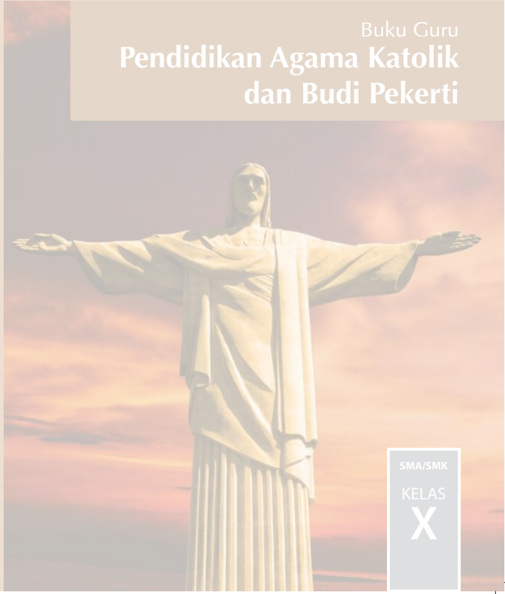

> **Deskripsi Visual:** Buku Guru Pendidikan Agama Katolik dan Budi Pekerti untuk kelas X SMA/SMK menampilkan gambar patung Yesus Kristus yang dikenal sebagai Cristo Redentor diatas fondasi yang berwarna putih. Patung ini tampak megah dengan posisi tangan membuka dan memegang bendera, menunjukkan kebijaksanaan dan kekuatan. Latar belakang gambar adalah langit yang cerah dengan warna-warna yang cerah, mencerminkan suasana harum dan penuh keagungan. Di bagian atas buku terdapat judul "Buku Guru" dan "Pendidikan Agama Katolik dan Budi Pekerti", sementara di bagian bawah terdapat informasi "SMA/SMK KELAS X". Ini menunjukkan bahwa buku ini dirancang untuk siswa kelas X di tingkat SMA/SMK, dan fokus pada materi pendidikan agama Katolik dan budi pekerti.

 

---
## 📄 Halaman 2

### Hak Cipta © 201 7 pada Kementerian Pendidikan dan Kebudayaan Dilindungi Undang-Undang

Disklaimer: Buku ini merupakan buku guru yang dipersiapkan Pemerintah dalam rangka implementasi Kurikulum 2013. Buku guru ini disusun dan ditelaah oleh berbagai pihak di  bawah  koordinasi  Kementerian  Pendidikan  dan  Kebudayaan,  dan  dipergunakan dalam tahap awal penerapan Kurikulum 2013. Buku ini merupakan 'dokumen hidup' yang senantiasa diperbaiki,  diperbaharui,  dan  dimutakhirkan  sesuai  dengan  dinamika kebutuhan dan perubahan zaman. Masukan dari berbagai kalangan yang dialamatkan kepada  penulis  dan  laman  http://buku.kemdikbud.go.id  atau  melalui  email  buku@ kemdikbud.go.id diharapkan dapat meningkatkan kualitas buku ini.

### Katalog Dalam Terbitan (KDT)

Indonesia. Kementerian Pendidikan dan Kebudayaan. Pendidikan Agama Katolik dan Budi Pekerti: Buku Guru / Kementerian Pendidikan dan Kebudayaan.--. Edisi Revisi  Jakarta : Kementerian Pendidikan dan Kebudayaan, 201 7 .

vi, 298 hlm : ilus. ; 25 cm.

Untuk SMA/SMK Kelas X ISBN 978-602-427-062-9 (jilid lengkap)

ISBN 978-602-427-063-6 (jilid 1)

- Katolik - Studi dan Pengajaran
- Kementerian Pendidikan dan Kebudayaan
- Judul
Penulis

:  Maman Sutarman, Sulis Bayu Setyawan

Nihil Obstat

: FX. Adisusanto, 25 Februari 2014

Imprimatur

: Mgr. John Liku Ada, 22 Maret 2014

Penelaah

:  F .X. Adi Susanto; Vincentius Darmin Mbula, OFM Salman Habeahan; Matheus Benny Mithe

Penyelia Penerbitan : Pusat Kurikulum dan Perbukuan, Balitbang, Kem en dikbud.

Cetakan Ke-1, 2014 ISBN 978-602-282-422-0 (jilid 1)

Cetakan Ke-2, 2016 (Edisi Revisi)

Cetakan Ke-3, 2017 (Edisi Revisi)

Disusun dengan huruf Minion Pro, 11 pt

282

 

---
## 📄 Halaman 3

### Kata Pengantar

Kita  semua  bersyukur  kepada  Allah  yang  Mahakuasa  atas  terbitnya  buku Pendidikan Agama Katolik dan Budi Pekerti yang telah direvisi  dan diselaraskan sesuai perkembangan Kurikulum 2013.

Agama terutama bukanlah soal mengetahui mana yang benar atau yang salah. Tidak ada gunanya mengetahui tetapi tidak melakukannya, seperti dikatakan oleh Santo Yakobus: 'Sebab seperti tubuh tanpa roh adalah mati, demikian jugalah iman tanpa  perbuatan-perbuatan  adalah  mati'  (Yakobus  2:26).  Demikianlah,  belajar bukan sekadar untuk tahu, melainkan dengan belajar seseorang menjadi tumbuh dan berubah. Tidak sekadar belajar lalu berubah, tetapi juga mengubah keadaan. Begitulah Kurikulum 2013 dirancang agar tahapan pembelajaran memungkinkan siswa  berkembang  dari  proses  menyerap  pengetahuan  dan  mengembangkan keterampilan hingga memekarkan sikap serta nilai-nilai luhur kemanusiaan.

Pembelajaran  agama  diharapkan  mampu  menambah  wawasan  keagamaan, mengasah keterampilan beragama dan mewujudkan sikap beragama peserta didik yang utuh dan berimbang yang mencakup hubungan manusia dengan Penciptanya, sesama  manusia  dan  manusia  dengan  lingkungannya.  Untuk  itu  pendidikan agama perlu diberi penekanan khusus terkait dengan penanaman karakter dalam pembentukan budi pekerti yang luhur. Karakter yang ingin kita tanamkan antara lain:  kejujuran,  kedisiplinan,  cinta  kebersihan,  cinta  kasih,  semangat  berbagi, optimisme, cinta tanah air, kepenasaran intelektual, dan kreativitas.

Nilai-nilai  karakter  itu  digali  dan  diserap  dari  pengetahuan  agama  yang  dipelajari para  siswa  itu  dan  menjadi  penggerak  dalam  pembentukan,  pengembangan, peningkatan,  pemeliharaan,  dan  perbaikan  perilaku  anak  didik  agar  mau  dan mampu melaksanakan tugas-tugas hidup mereka secara selaras, serasi, seimbang antara lahir-batin, jasmani-rohani, material-spiritual, dan individu-sosial. Selaras dengan itu, Pendidikan Agama Katolik secara khusus bertujuan membangun dan membimbing peserta didik agar tumbuh berkembang mencapai kepribadian utuh yang semakin mencerminkan diri mereka sebagai gambar Allah, sebab demikianlah ' Allah  menciptakan  manusia  itu  menurut  gambar-Nya,  menurut  gambar  Allah diciptakan-Nya  dia'  (Kejadian  1:27).  Sebagai  makhluk  yang  diciptakan  seturut gambar Allah, manusia perlu mengembangkan sifat cinta kasih dan takut akan Allah, memiliki kecerdasan, keterampilan, pekerti luhur, memelihara lingkungan, serta  ikut  bertanggung  jawab  dalam  pembangunan  masyarakat,  bangsa  dan negara. [Sigit DK: 2013]

 

---
## 📄 Halaman 4

Buku pelajaran Pendidikan Agama Katolik dan Budi Pekerti ini ditulis dengan semangat itu. Pembelajarannya dibagi-bagi dalam kegiatan-kegiatan yang harus dilakukan  siswa  dalam  usaha  memahami  pengetahuan  agamanya.  Akan  tetapi pengetahuan  agama  bukanlah  hasil  akhir  yang  dituju.  Pemahaman  tersebut harus  diaktualisasikan  dalam  tindakan  nyata  dan  sikap  keseharian  yang  sesuai dengan  tuntunan  agamanya,  baik  dalam  bentuk  ibadah  ritual  maupun  ibadah sosial.  Untuk  itu,  sebagai  buku  agama  yang  mengacu  pada  kurikulum  berbasis kompetensi, rencana pembelajarannya dinyatakan dalam bentuk aktivitasaktivitas.  Di  dalamnya  dirancang  urutan  pembelajaran  yang  dinyatakan  dalam kegiatan-kegiatan  keagamaan  yang  harus  dilakukan  siswa.  Dengan  demikian, buku ini menuntun apa yang harus dilakukan siswa bersama guru dan temanteman sekelasnya untuk memahami dan menjalankan ajaran iman katolik.

Buku  ini  bukanlah  satu-satunya  sumber  belajar  bagi  siswa.  Sesuai  dengan pendekatan  yang  dipergunakan  dalam  Kurikulum  2013,  siswa  didorong  untuk mempelajari  agamanya  melalui  pengamatan  terhadap  sumber  belajar  yang tersedia dan terbentang luas di sekitarnya. Lebih-lebih untuk usia remaja perlu ditantang untuk kritis sekaligus peka dalam menyikapi fenomena alam, sosial, dan seni budaya.

Peran  guru  sangat  penting  untuk  menyesuaikan  daya  serap  siswa  dengan ketersediaan kegiatan yang ada pada buku ini. Penyesuaian ini antara lain dengan membuka kesempatan luas bagi kreativitas guru untuk memperkayanya dengan kegiatan-kegiatan lain yang sesuai dan relevan dengan tempat di mana buku ini diajarkan,  baik  belajar  melalui  sumber  tertulis  maupun  belajar  langsung  dari sumber lingkungan sosial dan alam sekitar.

Komisi  Kateketik  Konferensi  Waligereja  Indonesia  sebagai  lembaga  yang bertanggungjawab atas ajaran iman Katolik berterima kasih kepada pemerintah, dalam hal ini Kementerian Pendidikan dan Kebudayaan atas kerja sama yang baik selama ini mulai dari proses penyusunan kurikulum hingga penulisan buku teks pelajaran ini.

Jakarta, medio Februari 2016

Koordinator Tim Penulis Buku

Komisi Kateketik KWI

 

---
## 📄 Halaman 5

### Daftar Isi

v

 

---
## 📄 Halaman 6

### Daftar Gambar

 

---
## 📄 Halaman 7

### A. Latar Belakang

Dalam kehidupan anak, pendidikan memiliki tempat dan peran yang amat strategis.  Melalui  pendidikan,  anak  dibantu  dan  distimulasikan  agar  dirinya berkembang  menjadi  pribadi  yang  dewasa  secara  utuh.  Begitu  juga  dalam kehidupan beragama dan beriman, pendidikan iman mempunyai peran dan tempat yang utama. Meskipun perkembangan hidup beriman pertama-tama merupakan karya Allah yang menyapa dan membimbing anak menuju kesempurnaan hidup berimannya,  namun  manusia  bisa  membantu  perkembangan  hidup  beriman anak dengan menciptakan situasi yang memudahkan semakin erat dan mesranya hubungan  anak  dengan  Allah.  Dengan  demikian,  pendidikan  iman  tidak dimaksudkan untuk mencampuri secara langsung perkembangan hidup beriman anak yang merupakan suatu misteri, tetapi untuk menciptakan situasi dan iklim kehidupan  yang  membantu  serta  memudahkan  perkembangan  hidup  beriman anak.

Pendidikan  pada  umumnya  merupakan  hak  dan  kewajiban  utama  dan pertama  orangtua.  Demikian  pula  dengan  pendidikan  iman,  orangtualah  yang memiliki hak dan kewajiban pertama dan utama dalam memberikan pendidikan iman kepada anak-anaknya. Pendidikan iman pertama-tama harus dimulai dan dilaksanakan di lingkungan keluarga, tempat dan lingkungan di mana anak mulai mengenal dan mengembangkan iman. Pendidikan iman yang dimulai di keluarga perlu diperkembangkan lebih lanjut dalam kebersamaan dengan jemaat yang lain. Perkembangan  iman  dilakukan  pula  dengan  bantuan  pastor,  katekis  dan  guru agama.  Negara  mempunyai  kewajiban  untuk  menjaga  dan  memfasilitasi  agar pendidikan iman bisa terlaksana dengan baik sesuai dengan iman masing-masing.

Salah satu bentuk dan pelaksanaan pendidikan iman adalah pendidikan iman yang dilaksanakan secara formal dalam konteks sekolah yang disebut pelajaran agama. Dalam konteks Agama Katolik, pelajaran agama di sekolah dinamakan Pendidikan  Agama  Katolik  yang  merupakan  salah  satu  realisasi  tugas  dan perutusannya untuk menjadi pewarta dan saksi Kabar Gembira Yesus Kristus.

Melalui  Pendidikan  Agama  Katolik  peserta  didik  dibantu  dan  dibimbing agar semakin mampu memperteguh iman terhadap Tuhan sesuai ajaran agama Katolik dengan tetap memperhatikan dan mengusahakan penghormatan terhadap agama dan kepercayaan lain. Hal ini dimaksudkan untuk menciptakan hubungan antarumat beragama yang harmonis dalam masyarakat Indonesia yang plural demi terwujudnya  persatuan  nasional.  Dengan  kata  lain,  Pendidikan  Agama  Katolik

### Pendahuluan

 

---
## 📄 Halaman 8

bertujuan membangun hidup beriman kristiani peserta didik. Membangun hidup beriman  kristiani  berarti  membangun  kesetiaan  pada  Injil  Yesus  Kristus  yang memiliki keprihatinan tunggal terwujudnya Kerajaan Allah dalam hidup manusia. Kerajaan Allah merupakan situasi dan peristiwa penyelamatan, yaitu situasi dan perjuangan  untuk  perdamaian  dan  keadilan,  kebahagiaan  dan  kesejahteraan, persaudaraan dan kesatuan, kelestarian lingkungan hidup yang dirindukan oleh setiap orang dari berbagai agama dan kepercayaan.

### B. Hakikat Pendidikan Agama Katolik

Pendidikan  Agama  Katolik  adalah  usaha  yang  dilakukan  secara  terencana dan  berkesinambungan  dalam  rangka  mengembangkan  kemampuan  peserta didik untuk memperteguh iman dan ketakwaan kepada Tuhan Yang Maha Esa sesuai  dengan  agama  Katolik.  Hal  ini  dilakukan  dengan  tetap  memperhatikan penghormatan  terhadap  agama  lain  dalam  hubungan  kerukunan  antarumat beragama dalam masyarakat untuk mewujudkan persatuan nasional. Secara lebih tegas dapat dikatakan bahwa pendidikan Agama Katolik di sekolah merupakan salah satu usaha untuk memampukan peserta didik berinteraksi (berkomunikasi), memahami, menggumuli dan menghayati iman. Dengan kemampuan berinteraksi antara pemahaman iman, pergumulan iman dan penghayatan iman itu diharapkan iman peserta didik semakin diperteguh.

### C. Tujuan Pendidikan Agama Katolik

Pendidikan  Agama  Katolik  pada  dasarnya  bertujuan  agar  peserta  didik memiliki kemampuan  untuk membangun  hidup yang semakin beriman. Membangun hidup beriman Kristiani  berarti  membangun  kesetiaan  pada  Injil Yesus Kristus, yang memiliki keprihatinan tunggal, yakni Kerajaan Allah. Kerajaan Allah  merupakan  situasi  dan  peristiwa  penyelamatan:  situasi  dan  perjuangan untuk  perdamaian  dan  keadilan,  kebahagiaan  dan  kesejahteraan,  persaudaraan dan kesetiaan, kelestarian lingkungan hidup, yang dirindukan oleh setiap orang dari pelbagai agama dan kepercayaan.

### D. Ruang Lingkup Pendidikan Agama Katolik

Ruang lingkup  pembelajaran  dalam  Pendidikan  Agama  Katolik  mencakup empat  aspek  yang  memiliki  keterkaitan  satu  dengan  yang  lain.  Keempat  aspek yang  dibahas  secara  lebih  mendalam  sesuai  tingkat  kemampuan  pemahaman peserta didik adalah sebagai berikut.

### 1.  Pribadi peserta didik

Ruang  lingkup  ini  membahas  tentang  pemahaman  diri  sebagai  pria dan  wanita  yang  memiliki  kemampuan  dan  keterbatasan,  kelebihan  dan kekurangan dalam berelasi dengan sesama serta lingkungan sekitarnya.

 

---
## 📄 Halaman 9

### 2.  Yesus Kristus

Ruang  lingkup  ini  membahas  tentang  bagaimana  meneladani  pribadi Yesus Kristus yang mewartakan Allah Bapa dan Kerajaan Allah, seperti yang terungkap dalam Kitab Suci Perjanjian Lama dan Perjanjian Baru.

### 3.  Gereja

Ruang lingkup ini membahas  tentang makna  Gereja, bagaimana mewujudkan kehidupan menggereja dalam realitas hidup sehari-hari.

### 4.  Masyarakat

Ruang lingkup ini membahas secara mendalam tentang hidup bersama dalam masyarakat sesuai firman/sabda Tuhan, ajaran Yesus dan ajaran Gereja.

### E. Pendekatan Pembelajaran Pendidikan Agama Katolik

Kurikulum 2013 menggunakan pendekatan saintifik melalui proses 5 M yaitu, mengamati, menanya, mengeksplorasi, mengasosiasikan dan mengomunikasikan. Meski  menjadi  salah  satu  ciri  Kurikulum  2013,  pendekatan  ini  bukanlah merupakan pendekatan satu-satunya. Dalam kegiatan pembelajaran, guru dapat menggunakan berbagai  pendekatan    dan  pola  pembelajaran    yang    lain  sesuai dengan karakteristik mata pelajaran.

Selain pendekatan  saintifik,  kegiatan  pembelajaran  Pendidikan  Agama Katolik dan  Budi  Pekerti menggunakan  pendekatan  kateketis  sebagai  ciri pembelajarannya.Pendekatan kateketis berorientasi pada pengetahuan yang tidak lepas dari pengalaman, yakni pengetahuan yang menyentuh pengalaman hidup peserta didik. Pengetahuan diproses melalui refleksi pengalaman hidup, selanjutnya diinternalisasikan sebagai pembentuk karakter peserta didik. Pengetahuan iman tidak akan mengembangkan diri peserta didik, jika ia tidak mengambil keputusan terhadap pengetahuan tersebut. Proses pengambilan keputusan itulah yang menjadi tahapan kritis sekaligus sentral dalam pembelajaran agama katolik. Tahapan proses pendekatan kateketis adalah 1) Menampilkan fakta dan pengalaman manusiawi yang membuka pemikiran atau yang dapat menjadi umpan, 2) Menggumuli fakta dan pengalaman manusiawi secara mendalam dan meluas dalam terang Kitab Suci, 3) Merumuskan nilai-nilai baru yang ditemukan dalam proses refleksi sehingga terdorong untuk menerapkan dan mengintegrasikan dalam hidup.

### F. Kompetensi Inti dan Kompetensi Dasar

Kompetensi  inti  dan  kompetensi  dasar  yang  perlu  dimiliki  setiap  peserta didik setelah menyelesaikan kegiatan pembelajaran Pendidikan Agama Katolik di kelas X adalah sebagai berikut:

 

---
## 📄 Halaman 10

---
**📊 Tabel**

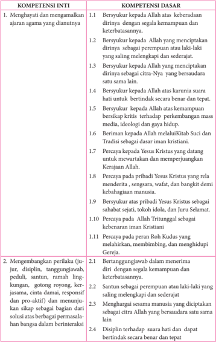

Tabel ini berisi dua bagian yang membahas kompetensi inti dan dasar dalam konteks agama Islam. Topik utama adalah tentang pengembangan perilaku dan kompetensi dasar yang relevan dengan ajaran agama. Kolom pertama berisi kompetensi inti, sementara kolom kedua berisi kompetensi dasar. Data penting yang terlihat meliputi: 1) Bersyukur kepada Allah atas keberadaan dirinya, kemampuan, dan cita-Nya; 2) Beriman kepada Allah melalui Kitab Suci dan Tradisi; 3) Percaya pada pribadi Yesus Kristus sebagai sahabat sejati; 4) Berpikir positif tentang Allah dan Tuhan; 5) Menghargai manusia dan kebenaran iman Kristen; 6) Mengembangkan sikap positif dan berperilaku baik dalam berinteraksi. Pola penting adalah bahwa setiap kompetensi inti memiliki satu atau lebih kompetensi dasar yang relevan, menunjukkan hubungan antara kompetensi inti dan dasar dalam konteks agama.

 

---
## 📄 Halaman 11

---
**📊 Tabel**

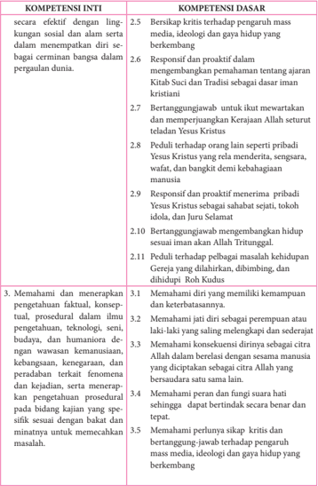

Tabel ini berisi informasi tentang kompetensi inti dan dasar yang relevan dengan pengetahuan dan keterampilan dalam berbagai aspek kehidupan. Topik utama adalah tentang bagaimana seseorang dapat efektif dalam lingkungan sosial dan alam serta mampu merespons situasi di dunia. Kolom-kolomnya mencakup berbagai aspek seperti kritik, respons, dan proaktif dalam berbagai konteks, seperti media, ideologi, dan gaya hidup. Data penting yang terlihat meliputi kritik terhadap pengaruh mass media, ideologi, dan gaya hidup, serta kemampuan untuk bertanggung jawab dalam berbagai situasi. Pola penting yang terlihat adalah bahwa setiap kompetensi inti memiliki beberapa kompetensi dasar yang mendukungnya, menunjukkan hubungan antara pengetahuan dan keterampilan dalam berbagai aspek kehidupan.

 

---
## 📄 Halaman 12

---
**📊 Tabel**

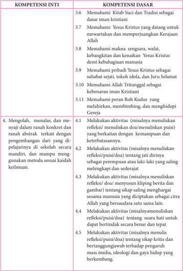

Tabel ini berisi informasi tentang kompetensi inti dan dasar yang harus dipelajari oleh siswa dalam konteks iman Kristen. Topik utama adalah mengenai pemahaman Kitab Suci, Yesus Kristus, makna-makna dalam Alkitab, dan peran Roh Kudus dalam kehidupan imam Kristen. Kolom-kolomnya mencakup berbagai aspek seperti pemahaman Kitab Suci, Yesus Kristus, makna-makna dalam Alkitab, dan peran Roh Kudus. Data penting yang terlihat meliputi pemahaman tentang Kitab Suci sebagai dasar iman Kristen, pemahaman Yesus Kristus sebagai sahabat sejati, dan pemahaman tentang makna-makna dalam Alkitab. Selain itu, tabel juga mencakup aktivitas yang harus dilakukan oleh siswa untuk mempelajari materi tersebut, seperti menulis refleksi, menulis puisi, dan membuat kipis.

 

---
## 📄 Halaman 13

---
**📊 Tabel**

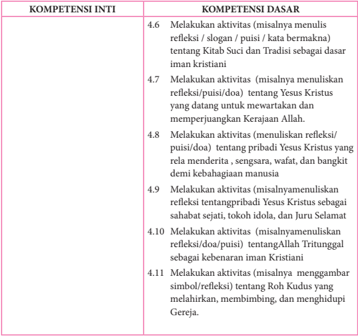

Tabel ini berisi informasi tentang kompetensi inti dan dasar yang harus dikuasai oleh siswa dalam konteks iman Kristen. Topik utamanya adalah aktivitas refleksi, puisi, doa, dan pribadi Yesus Kristus. Kolom-kolomnya meliputi 4.6 hingga 11.11, masing-masing menunjukkan jenis aktivitas yang harus dilakukan untuk mencapai kompetensi tersebut. Data penting yang terlihat adalah bahwa semua kompetensi inti melibatkan refleksi, puisi, atau doa tentang Yesus Kristus, pribadi Yesus, dan Roh Kudus. Ini menunjukkan bahwa refleksi dan pengenalan tentang Yesus Kristus merupakan kunci utama dalam pembentukan iman Kristen.

 

---
## 📄 Halaman 14

### Bab I Manusia Makhluk Pribadi

Kita sering mendengar ada sebagian remaja yang merasa tidak puas terhadap apa  yang  ada  pada  dirinya.  Ia  tidak  puas  terhadap  keadaan  fisiknya,  kebiasaan maupun  karakternya,  atau  kemampuan  serta  keterbatasan  yang  dimilikinya. Orang-orang  seperti  itu  sering  kali  berfikir:  'mengapa  saya  tidak  bisa  seperti mereka?' ,  'apa  salah  saya  sehingga  saya  bernasib  seperti  ini?' .  Bahkan  lebih jauh lagi, akhirnya mereka menganggap Tuhan tidak adil. Munculnya perasaanperasaan  manusiawi  seperti  itu  merupakan  pengalaman  yang  wajar  dan  biasa dialami oleh remaja dalam upaya pencarian jati dirinya.

Jawaban atas  kegelisahan  remaja  seperti  itu,  tidak  akan  terpuaskan  selama mereka  mencarinya  terbatas  fenomena  fisik-manusiawi  belaka.  Mereka  perlu diajak untuk masuk ke kedalaman dirinya. Mereka perlu dihantar pada pengalaman imani,  sehingga  sampai  pada  pertanyaan  baru:  'Mengapa  Tuhan  menciptakan aku  seperti  ini?' ,  ' Apa  maksud  dan  panggilan  Allah  dalam  keadaanku  seperti ini?' .  Ketika  masuk  dalam  kedalaman  pengalaman  iman,  mereka  akan  sampai menyadari bahwa apapun yang melekat pada dirinya semata-mata anugerah Allah, dan  bahwa  di  balik  semua  yang  melekat  pada  dirinya  tersimpan  di  dalamnya maksud panggilan Allah yang luhur.

Keberanian masuk pada pengalaman iman inilah yang akan membuat setiap orang menerima diri dan mensyukuri hidupnya sebagai anugerah. Penerimaan diri dan dan syukur itu selanjutnya akan mendorong untuk bersikap bertanggung jawab dan mengembangkan diri. Bila proses ini bisa dijalani, maka mereka akan sampai  pada  kebahagiaan  hidup  yang  sesungguhnya.  Mereka  tidak  akan  lagi menjadi minder, atau ingin seperti orang lain. Mereka menjadi dirinya sendiri. Mereka merasakan bahwa dirinya bukan lagi sesuatu, melainkan sebagai pribadi yang bernilai, baik bagi dirinya sendiri maupun orang lain.

Untuk membantu remaja pada pengalaman dan proses di atas, maka pada Bab ini berturut-turut akan dibahas materi pokok tentang:

- Aku Pribadi Yang Unik.
- Mengembangkan Karunia Allah.
- Kesetaraan Laki-Laki dan Perempuan.
- Keluhuran Manusia sebagai Citra Allah.

 

---
## 📄 Halaman 15

### A. Aku Pribadi yang Unik

### Kompetensi Dasar

- 1.1.  Bersyukur kepada Allah atas  keberadaan dirinya  dengan segala kemampuan dan  keterbatasannya.
- 2.1.  Bertanggungjawab  dalam  menerima    diri    dengan  segala  kemampuan  dan keterbatasannya.
- 3.1.  Memahami diri yang memiliki kemampuan dan keterbatasannya.
- 4.1.  Melakukan aktivitas (misalnya menuliskan  refleksi/  menuliskan  doa/ menuliskan puisi)  yang berkaitan dengan  kemampuan dan keterbatasannya.

### Indikator

- 3.1.1. Menganalisis data pribadi tentang kekuatan-kekuatan dan keterbatasanketerbatasan yang ada dalam diri sendiri.
- 3.1.2. Menjelaskan pengertian manusia sebagai pribadi yang unik
- 3.1.3. Merumuskan  ajaran Kitab Suci tentang keunikan manusia berdasarkan Kej 1:26-31
- 4.1.1. Membuat doa syukur karena diciptakan sebagai pribadi yang unik
- 4.1.2. Membuat gambar simbol diri dan mensharingkan di depan kelas

### Pendekatan

Pendekatan Kateketis dan Pendekatan Saintifik.

### Metode Pembelajaran

- Dialog Partisipatif
- Diskusi
- Penugasan
- Studi Pustaka
- Refleksi

### Bahan Kajian

- Mengenali keunikan diri
- Sikap terhadap kekuatan dan keterbatasan.
- Keunikan manusia berdasarkan Kitab Suci.

### Sumber Belajar

- Pengalaman hidup peserta didik
- forum-kompas.com/kesehatan/271674/-gadis-muda-bunuh-diri-karenahasil-operasi -plastik- jelek.htmL

 

---
## 📄 Halaman 16

- http://id.wikipedia.org/wiki/Manusia
- Kitab Suci: Kej. 1: 26-31 dan Mazmur 139.
- Teks  puisi  'Be  The  Best' ,  jadilah  diri  sendiri  yang  terbaik  karya  Douglas Mallock
- Kristianto. Yoseph, dkk. 2010. Menjadi Murid Yesus, Buku Teks Pendidikan Agama Katolik untuk SMA/K Kelas X . Y ogyakarta:Kansius
- Konferensi Wali Gereja Indonesia, Iman Katolik, Kanisius, Yogyakarta, 1995.
- Katekismus Gereja Katolik, Nusa Indah, Flores,

### Waktu

3 Jam Pelajaran

### Pemikiran Dasar

Setiap  manusia  itu  unik  ( unique/  Inggris atau unus/  latin =  satu),  tak  ada satu orang pun yang mempunyai kesamaan dengan orang lain. Bahkan manusia kembar  sekalipun  selalu  mempunyai  perbedaan.  Perbedaan  itu  lebih  jauh dan  lebih  dalam  dari  yang  dapat  dilihat,  dirasa,  didengar  dan  dikatakan.  Pada umumnya perbedaan ini yang membuat orang iri hati, bertentangan, bermusuhan dan ingin saling meniadakan. Padahal dengan perbedaan itu justru orang dapat saling  memperkaya  dan  melengkapi.  Perbedaan  itulah  yang  menjadi  keunikan setiap  manusia.  Keunikan  itu  bisa  diamati  dari  hal-hal  fisik,  psikis,  bakat/ kemampuan serta pengalaman-pengalaman yang dimilikinya. Keunikan diri itu merupakan anugerah yang menjadikan diri seseorang berbeda dan dapat dikenal dan diperlakukan secara khusus pula. Untuk mengatasi perbedaan itu, diperlukan sikap menerima diri apa adanya

Jabatan  dalam  keorganisasian  dapat  digantikan  oleh  orang  lain,  tetapi kedudukan setiap manusia dalam seluruh kerangka ciptaan tidak dapat digantikan oleh orang lain. Peran orang tua dalam keluarga dapat saja digantikan oleh orang lain, tetapi peran sebagai ciptaan tidak mungkin digantikan oleh siapapun. Tuhan menciptakan setiap manusia dengan tugas yang khas di dunia ini.

Orang yang bersikap positif akan menerima keunikan itu sebagai anugerah, ia bangga bahwa dirinya berbeda, ia bersyukur bahwa apa pun yang ada pada dirinya merupakan pemberian Tuhan yang baik adanya. Dengan demikian, ia tidak akan minder, ia tidak berniat menjadi sama seperti orang lain, ia tidak akan menganggap dirinya tidak berharga, ia tidak akan melakukan tindakan yang melawan kehendak Tuhan akibat ketidakpuasan terhadap dirinya, hidupnya akan tenang dan mampu bergaul  dengan  siapa  saja.  Ada  orang  yang  kurang  menerima  keunikan  diri. Orang yang demikian akan merasa tidak puas, bahkan dapat melakukan tindakan apa pun demi menutupi keterbatasan diri, misalnya operasi plastik. Orang yang demikian sering beranggapan seolah penampilan luar lebih penting.

 

---
## 📄 Halaman 17

Singkatnya, manusia adalah makhluk yang indah dan 'istimewa' . Keistimewaan  dan  keagungan  manusia  ini  hendaknya  sungguh  disadari  oleh semua peserta didik.

Sebagai  orang  beriman  kristiani  yang  sungguh-sungguh  ingin  semakin memahami,  menerima,  bangga,  dan  percaya  diri,  Yesus  adalah  teladan  yang paling utama dan pertama. Dari semula Ia menyadari diri sebagai manusia yang berbeda dengan yang lainnya. Dari cara berpikir, bersikap dan bertindak, Ia tidak ragu  menunjukkan  diri  sebagai  pribadi  yang  tidak  sama  dengan  yang  lainnya. Sebagai seorang pribadi kita harus menyadari, mengerti dan menerima diri apa adanya. Dengan demikian kitapun akan dapat semakin mengembangkan diri dan melakukan  sesuatu  dengan  kesadaran  diri  ( self-consciousness ),  penerimaan  diri ( self-acceptance ), kepercayaan diri ( self-confidence ) dan perasaan aman diri ( selfassurance ) yang tinggi. Dengan dasar itu kita dapat mengisi hidup, meraih cita-cita dan melaksanakan panggilan Allah.

### Kegiatan Pembelajaran

### Doa Pembuka

Guru mengajak peserta didik masuk dalam suasana hening untuk berdoa.

Allah Yang Maha Baik, kami bersyukur atas penyelenggaraanMu. Engkau menciptakan semua baik adanya, termasuk diri kami yang Kau ciptakan begitu indah dan sempurna.

Ya Allah, pada saat ini kami ingin belajar mengenal keunikan diri kami dengan lebih baik

Utuslah Roh KudusMu hadir di tengah-tengah kami, sehingga kami dapat membuka diri tentang berbagai hal berkaitan dengan kekuatan dan keterbatasan kami.

Dengan demikian kamipun akan dapat mengembangkan diri dengan sebaik-baiknya demi kemuliaan NamaMu. AMIN.

### Langkah Pertama: Menggali Pengalaman Hidup Berkaitan dengan Keunikan Diri dan Orang lain

- Guru mengajak masuk peserta didik untuk duduk dengan tenang dan hening sambil mengamati diri , kemudian menuliskan ciri-ciri yang ada pada dirinya,

 

---
## 📄 Halaman 18

- baik menyangkut ciri-ciri fisik, sifat/ kebiasan baik dan buruk pada kolom bagian a.
- Setelah  selesai  mengisi  kolom  bagian  a,  siswa  diperkenankan  meminta  4 orang temannya yang lain untuk menuliskan ciri-ciri pada kolom bagian b,
- Guru memberi kesempatan peserta didik saling bertukar lembar kolom isian, sambil memperhatikan hal-hal apa yang ada pada diri orang lain tapi tidak ada pada diri sendiri dan sebaliknya.
- Setelah selesai, peserta didik diminta mengungkapkan: perasaan yang muncul saat mengisi ciri-ciri dirinya, ketika melihat apa yang dituliskan temannya, ketika harus menuliskan ciri-ciri temannya.
- Guru meminta peserta didik berdiskusi dalam kelompok untuk merumuskan: sikap  atau  pandangan  apa  saja  yang  sering  muncul  saat  orang  menyadari bahwa dirinya berbeda dengan orang lain. Apa pengaruh sikap tersebut dalam bersikap terhadap dirinya sendiri maupun orang lain? Bagaimana sikapmu sendiri selama ini terhadap keadaan dirimu?
- Setelah pleno, guru mengajak peserta didik membaca artikel berikut:

---
**📊 Tabel**

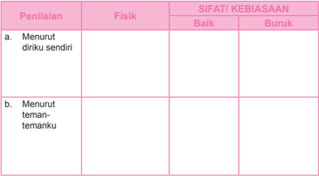

Tabel ini berisi penilaian fisik seseorang terhadap diri sendiri dan teman-temannya, dengan dua kriteria utama: baik dan buruk. Topik utama tabel ini adalah penilaian diri dan penilaian orang lain. Kolom "Penilaian" mencakup dua pilihan: "Menurut diriku sendiri" dan "Menurut teman-temanku". Sementara itu, kolom "SIFAT/KEBIASAAAN" memuat dua pilihan: "Baik" dan "Buruk". Dari data yang terlihat, tampak bahwa penilaian fisik seseorang seringkali lebih positif ketika dilihat oleh dirinya sendiri dibandingkan dengan teman-temannya. Ini menunjukkan adanya perbedaan persepsi antara diri sendiri dan orang lain terhadap aspek fisik mereka.

### Angkie Yudhistira, Mengubah Keterbatasan Menjadi Kesuksesan

Angkie Yudhistira adalah seorang perempuan yang menderita kekurangan pendengaran saat masih kecil, usia 10 tahun. Namun, justru dengan kekurangan tersebut  membuat  ia  semakin  percaya  diri,  hingga  mengubahnya  menjadi sebuah kelebihan.

 

---
## 📄 Halaman 19

Saat keterbatasan tidak menjadikan sebuah belenggu.

Angkie,  sapaan  akrab  dari  Angkie  Yudhistira,  karena  terlalu  sering mengonsumsi  obat-obatan  sejak  kecil  untuk  mengatasi  gangguan  penyakit seperti  flu,  batuk  dan  demam.  Lalu  untuk  mengobatinya  oleh  dokter  di pedalaman sering  diberikan  obat  antibiotik  secara  rutin  hingga  penyakitnya hilang. Jika kambuh, antibiotik menjadi obat yang ampuh dan mujarab untuk dirinya.

Hingga akhirnya, obatobatan  tersebut  sangat  berpengaruh negatif untuk dirinya. Terutama pada bagian telinga, yang membuat Angkie  divonis  oleh  dokter tidak dapat mendengar…

Jalan hidup Angkie yang getir sedari kecil, tidak menghalangi  niatnya  untuk terus berusaha, berusaha dan berusaha. Malahan, ejekan seperti ' Alien' dari kawan-kawan dan sebagainya hanya dibalas dengan senyum manis walau  terkadang  geregetan. Lambat laun, Angkie mulai bisa menerima  kehidupan dirinya yang mempunyai kekurangan. Akhirnya kekurangan itu membuat Angkie  semakin  termotivasi untuk berhasil dan menjadi seorang  yang  sukses,  walau memiliki keterbatasan. Lulus dari kuliahnya di London School of Public

'Perempuan Tuna Rungu Menembus Batas'

Relations,  dengan  ipk  yang  tinggi  3,5  semakin  membuat  Angkie  termotivasi untuk terus maju dan tidak minder dengan kawan-kawan lainnya.

 

---
## 📄 Halaman 20

Pengalaman jatuh ba-ngun saat mulai mencari pekerjaan hingga sekarang memegang peranan penting dalam perusahaan, dijadikan Angkie sebagai ujian hidup yang memang harus dijalani. Angkie sendiri berujar, bahwa ia sendiri tidak malu mengakui bahwa dirinya adalah tuna rungu di dalam setiap melamar pekerjaan.

'Kenapa mesti malu? Kalau mereka tidak mau menerima saya, pasti ada kesempatan lainnya. '

Begitu pula saat ia menerima panggilan interview, Angkie selalu memperhatikan penampilannya. Sebab baginya penampilan adalah yang utama, mau sepintar dan secantik apapun kalau penampilan tidak menunjang justru akan terkesan tidak baik bagi sang pewawancara.

Sampai ia berhasil, dan mimpi masa kecil mulai menghampirinya. Kini, di usianya yang masih muda, 25 tahun. Angkie telah menjabat sebagai Chief Executive Officer(CEO) Thisable Enterprise. Sebuah perusahaan yang didirikan bersama  kawan-kawannya  untuk  melakukan  misi  sosial  dengan  membantu orang  yang  memiliki  keterbatasan  fisik  agar  tetap  memandang  cerah  masa depan mereka.

Selain itu, Angkie juga pernah menjadi finalis Abang None yang mewakili Jakarta Barat pada tahun 2008. Ia juga terpilih sebagai Miss Congeniality dari sebuah  program  di  Natur-e,  dan  The  Most  Fearless  Female  Cosmopolitan  di tahun yang sama.

Usai mendapatkan gelar S2, Angkie mewakili Indonesia dalam ajang AsiaPacific  Development  Center  of  Disability  di  Bangkok,  Thailand.  Angkie  pun turut  untuk  terjun  langsung  ke  lapangan,  dengan  aktif  di  berbagai  kegiatan sosial  untuk  memberikan  motivasi  terutama  dari  kalangan  yang  memiliki kekurangan fisik.

Seiring  waktu,  ia  pun  mengeluarkan  buku  perdananya  yang  berjudul 'Perempuan Tuna Rungu Menembus Batas'. Angkie mendedikasikan kepada orang yang memiliki keterbatasan seperti dirinya. Agar mereka juga bangkit, dan tidak hanya pasrah menerima keadaan yang ada.

'Ingat! Ini hidup kita.

Meski memiliki keterbatasan, kita itu punya kesempatan yang sama besar dalam meraih mimpi… '

- Angkie Yudhistira, 5 Juni 1987

http://tanpa-batas.com/kisahinspiratif/angkie-yudhistira-adalah-penyandang-tuna-runguyang-sukses-menjadi-founder-dan-ceo-chief-executif-officer-disable-enterprise/

g. Guru meminta peserta didik membandingkan hasil diskusi kelompok dengan kasus di atas: sikap seperti apa yang ditampilkan dalam artikel tersebut ?

 

---
## 📄 Halaman 21

- Guru  dapat mengajak peserta didik mendalami  lebih lanjut, dengan mengajukan  pertanyaan:  coba  kemukakan  contoh  lain  yang  menunjukkan sikap  tidak  menerima  diri!  Bila  demikian,  apa  yang  membuat  seseorang 'bernilai' di mata orang lain: kecantikan, kekayaan atau apa?
- Bila  dipandang  perlu,  guru  dapat  menyampaikan  beberapa  gagasan  pokok berikut:
- Menerima  diri  merupakan  proses  yang  tidak  mudah.  Banyak  remaja yang seringkali tergoda untuk merasa tidak puas dengan dirinya sendiri. Ketika melihat temannya lebih kaya, ada remaja yang berpikir: mengapa saya dilahirkan dalam keluarga yang miskin? Ketika melihat orang lain berkulit putih, ada remaja yang berfikir: mengapa saya dilahirkan dengan kulit kusam? Ketika melihat temannya berhidung mancung, ada remaja yang berpikir: mengapa saya dilahirkan dengan hidung pesek? Melihat temannya  pintar  dalam  pelajaran  tertentu,  ada  remaja  yang  berpikir: mengapa saya tidak sepandai dia?
- Mereka yang masih berpikir seperti itu, rupanya belum menyadari; bahwa untuk hal-hal tertentu, khususnya yang bersifat fisik-jasmaniah, apa yang melekat dalam diri kita sangat dipengaruhi oleh faktor keturunan dan faktor  lingkungan.  Mereka  lupa,  bahwa  banyak  orang  kaya  juga  tidak bahagia, banyak orang cantik atau tampan juga tidak sukses; sebaliknya banyak orang dengan wajah biasa (bahkan kurang menarik) dari keluarga miskin sekalipun bisa sukses dan dihargai banyak orang.
- Sikap tidak menerima diri bisa menumbuhkan sikap iri, ingin menjadi seperti orang lain, dan akhirnya menghalalkan segala cara. Kasus remajaremaja di Korea Selatan yang melakukan operasi plastik merupakan salah satu contohnya. Tetapi apa yang mereka lakukan bukan jaminan untuk bisa hidup bahagia.
- Maka  pertanyaan  yang  paling  mendasar  untuk  direfleksikan  adalah: nilai  apa  yang  dapat  menentukan  kebahagiaan  kalian?  Apakah  nilai seseorang  ditentukan  oleh  kecantikan  atau  ketampanan?  oleh  hidung yang mancung? atau oleh sikap dan perilaku serta keteladanan hidup?

### Langkah Kedua: Mendalami Ajaran Kitab Suci tentang Keunikan Manusia

- Guru meminta peserta didik mencari teks Kitab Suci yang berbicara tentang keunikan diri!
- Guru dapat mengajak peserta didik mendalami teks Kitab Kejadian 1: 26 - 31!

 

---
## 📄 Halaman 22

- 26 Berfirmanlah  Allah:  'Baiklah  Kita  menjadikan  manusia  menurut  gambar dan rupa Kita, supaya mereka berkuasa atas ikan-ikan di laut dan burungburung di udara dan atas ternak dan atas seluruh bumi dan atas segala binatang melata yang merayap di bumi. '
- 27 Maka  Allah  menciptakan  manusia  itu  menurut  gambar-Nya,  menurut gambar  Allah  diciptakan-Nya  dia;  laki-laki  dan  perempuan  diciptakan-Nya mereka.
- 28 Allah memberkati mereka, lalu Allah berfirman kepada mereka: 'Beranakcuculah dan bertambah banyak; penuhilah bumi dan taklukkanlah itu, berkuasalah atas ikan-ikan di laut dan burung-burung di udara dan atas segala binatang yang merayap di bumi. '
- 29 Berfirmanlah Allah: 'Lihatlah, Aku memberikan kepadamu segala tumbuhtumbuhan  yang  berbiji  di  seluruh  bumi  dan  segala  pohon-pohonan  yang buahnya berbiji; itulah akan menjadi makananmu.
- 30 Tetapi kepada segala binatang di bumi dan segala burung di udara dan segala yang merayap di bumi, yang bernyawa, Kuberikan segala tumbuh-tumbuhan hijau menjadi makanannya. ' Dan jadilah demikian.
- 31 Maka  Allah  melihat  segala  yang  dijadikan-Nya  itu,  sungguh  amat  baik. Jadilah petang dan jadilah pagi, itulah hari keenam.
- Guru  mengajak  peserta  didik  membaca  dan  merenungkan  teks  sekali  lagi dalam  hati,  dengan  mengganti  kata  'manusia'  dan  kata  'mereka'  dengan nama mereka sendiri.
- Guru meminta peserta didik mensharingkan tanggapan mereka tentang isi teks,  misalnya  dengan  pertanyaan:  Perasaan  apa  yang  kamu  rasakan  saat mengganti kutipan dengan namamu? pesan apa yang hendak disampaikan Kitab Kejadian berkaitan dengan keunikan manusia umumnya dan keunikanmu sendiri?
- Bila  dipandang  perlu  guru  dapat  menyampaikan  beberapa  gagasan  pokok berikut:
- Waktu  menciptakan  manusia,  Allah  merencanakan  dan  menciptakannya menurut gambar dan rupa-Nya. Menurut citra-Nya. (Kej 1:26)
- Waktu menciptakan manusia, Allah seolah-olah perlu 'bekerja' secara khusus.  'Tuhan  Allah  membentuk  manusia  dari  debu  dan  tanah  dan menghembuskan nafas hidup ke dalam hidungnya' (Kej 2:7).
- Segala  sesuatu,  termasuk  taman  Firdaus,  diserahkan  oleh  Allah  untuk manusia (Kej 1:26).
- Bukankah manusia itu istimewa? Tuhan memperlakukan manusia secara khusus.  Manusia  sudah  dipikirkan  dan  direncanakan  oleh  Allah  sejak

 

---
## 📄 Halaman 23

- keabadian. Kehadiran manusia di muka bumi telah disiapkan dan diatur secara teliti dan mengagumkan. Manusia sungguh diperlakukan sebagai 'orang' ,  sebagai  pribadi,  'seperti'  Tuhan  sendiri.  Betapa  uniknya  kita manusia ini!
- Sebagai orang beriman kristiani yang sungguh-sungguh ingin semakin memahami, menerima, bangga, dan percaya diri, Yesus adalah teladan yang paling utama dan pertama. Dari semula Ia menyadari diri sebagai manusia yang berbeda dengan yang lainnya. Dari cara berpikir, bersikap dan bertindak, Ia tidak ragu menunjukkan diri sebagai pribadi yang tidak sama dengan yang lainnya. Sebagai seorang pribadi kita harus menyadari, mengerti dan menerima diri apa adanya. Dengan demikian kitapun akan dapat  semakin  mengembangkan  diri  dan  melakukan  sesuatu  dengan kesadaran  diri  ( self-consciousness ),  penerimaan  diri  ( self-acceptance ), kepercayaan diri ( self-confidence ) dan perasaan aman diri ( self-assurance ) yang tinggi. Dengan dasar itu kita dapat mengisi hidup, meraih cita-cita dan melaksanakan panggilan Allah.

### Langkah Ketiga: Menghayati Keunikan Diri

- Guru  meminta  peserta  didik  menggambar  simbol  diri  disertai  dengan penjelasan yang mengungkapkan identitas diri mereka
- Peserta didik merumuskan niat/kebiasaan/sikap yang akan dilakukan dalam menghayati keunikan diri sesuai dengan pesan Kitab Suci.
- Untuk menutup kegiatan pembelajaran, guru mengajak peserta didik masuk dalam suasana hening untuk berefleksi:
- Setiap  orang  adalah  pribadi  yang  unik,  tidak  ada  duanya.  Meskipun mereka  kembar  dalam  satu  rahim,  mereka  tetap  berbeda  satu  dengan yang lain.
- Ciri  fisik,  sifat,  cara  berpikir,  dan  pengalaman  keberhasilan,  serta kegagalan  membentuk  keunikan  setiap  pribadi,  selain  latar  belakang keluarga yang sangat mempengaruhi.
- Setiap orang adalah pribadi yang unik, yang memiliki kekhasan tersendiri dalam menghayati keberadaan dirinya dan menghayati hidupnya. Satu dengan yang lain tidak pernah sama.
- Sumber sejati keunikan pribadi manusia adalah Allah sendiri, yang telah menciptakan manusia secara khusus, pribadi demi pribadi secara ajaib.
- Manusia adalah suatu ' karya seni ' ,  suatu ' masterpiece ' dari Allah yang luar biasa.
- Singkatnya diri anda adalah pribadi yang indah dan istimewa.

 

---
## 📄 Halaman 24

- Douglas Mallock dalam puisinya yang berjudul Be The Best , Jadilah Diri Sendiri yang Terbaik . Mengungkapkan ajakannya seperti ini
Jika kau tak dapat menjadi pohon meranti di puncak bukit, jadilah semak belukar di lembah. Jadilah semak belukar yang teranggun di sisi bukit, kalau bukan rumput, semak belukar pun jadilah! Jika kau tak boleh menjadi rimbun, jadilah rumput, dan hiasilah jalan dimana-mana.

Jika kau tak dapat menjadi ikan mas, jadilah ikan sepat. Tapi jadilah ikan sepat terlincah di dalam payau. Tidak semua dapat menjadi nahkoda, lainnya harus menjadi awak kapal dan penumpang.

Pasti ada sesuatu untuk semua. Karena ada tugas berat, maka ada tugas ringan di antaranya dibuat yang lebih berdekatan. Jika kau tak dapat menjadi bulan, jadilah bintang. Jika kau tak dapat menjadi jagung, jadilah kedelai Bukan dinilai kau kalah ataupun menang. Jadilah dirimu sendiri yang terbaik!

### Doa Penutup

Guru mengajak para peserta didik untuk mendaraskan bersama Mazmur 139 berikut ini:

Dengan kesadaran akan diri kita, yang unik dan istimewa, yang diciptakan Tuhan  dengan  cara  khusus  dan  diperlakukan  sebagai  'orang' ,  sebagai  pribadi 'seperti'  Tuhan  sendiri,  maka  sudah  sepantasnya  kalau  kita  bersyukur  kepada Tuhan.  Kita  bersyukur,  tidak  hanya  karena  kita  diciptakan  oleh  Tuhan  sebagai makhluk  yang  unik  dan  istimewa  saja,  melainkan  dan  terlebih  kita  bersyukur karena  keagungan  Tuhan  itu  sendiri.  Ucapan  syukur  ini  dapat  kita  panjatkan dalam bentuk doa, seperti si Pemazmur dalam Kitab Mazmur 139:

### MAZMUR 139

- 2 Engkau mengetahui, kalau aku duduk atau berdiri, Engkau mengerti pikiranku dari jauh.
- 3 Engkau  memeriksa  aku,  kalau  aku  berjalan  dan  berbaring,  segala  jalanku Kaumaklumi.
- 4 Sebab  sebelum  lidahku  mengeluarkan  perkataan,  sesungguhnya,  semuanya telah Kauketahui, ya TUHAN.

 

---
## 📄 Halaman 25

- 5 Dari belakang dan dari depan Engkau mengurung aku, dan Engkau menaruh tangan-Mu ke atasku.
- 6 Terlalu  ajaib  bagiku  pengetahuan  itu,  terlalu  tinggi,  tidak  sanggup  aku mencapainya.
- 7 Ke  mana aku dapat pergi menjauhi roh-Mu, ke mana aku dapat lari dari hadapan-Mu?
- 8 Jika aku mendaki ke langit, Engkau di sana; jika aku menaruh tempat tidurku di dunia orang mati, di situ pun Engkau.
- 9 Jika aku terbang dengan sayap fajar, dan membuat kediaman di ujung laut,
- 10 juga  di  sana  tangan-Mu  akan  menuntun  aku,  dan  tangan  kanan-Mu memegang aku.
- 11 Jika  aku  berkata:  'Biarlah  kegelapan  saja  melingkupi  aku,  dan  terang sekelilingku menjadi malam, '
- 12 maka  kegelapan  pun  tidak  menggelapkan  bagi-Mu,  dan  malam  menjadi terang seperti siang; kegelapan sama seperti terang.
- 13   Sebab Engkaulah yang membentuk buah pinggangku, menenun aku dalam kandungan ibuku.
- 14 Aku bersyukur kepada-Mu oleh karena kejadianku dahsyat dan ajaib; ajaib apa yang Kaubuat, dan jiwaku benar-benar menyadarinya.
- 15 Tulang-tulangku tidak terlindung bagi-Mu, ketika aku dijadikan di tempat yang tersembunyi, dan aku direkam di bagian-bagian bumi yang paling bawah;
- 16 mata-Mu  melihat  selagi  aku  bakal  anak,  dan  dalam  kitab-Mu  semuanya tertulis hari-hari yang akan dibentuk, sebelum ada satu pun dari padanya.
- 17 Dan bagiku, betapa sulitnya pikiran-Mu, ya Allah! Betapa besar jumlahnya!
- 18 Jika aku mau menghitungnya, itu lebih banyak dari pada pasir. Apabila aku berhenti, masih saja aku bersama-sama Engkau.
- 19 Sekiranya Engkau mematikan orang fasik, ya Allah, sehingga menjauh dari padaku penumpah-penumpah darah,
- 20 yang berkata-kata dusta terhadap Engkau, dan melawan Engkau dengan siasia.
- 21 Masakan  aku  tidak  membenci  orang-orang  yang  membenci  Engkau,  ya TUHAN, dan tidak merasa jemu kepada orang-orang yang bangkit melawan Engkau?
- 22 Aku sama sekali membenci mereka, mereka menjadi musuhku.
- 23 Selidikilah  aku,  ya  Allah,  dan  kenallah  hatiku,  ujilah  aku  dan  kenallah pikiran-pikiranku;
- 24 lihatlah, apakah jalanku serong, dan tuntunlah aku di jalan yang kekal!

 

---
## 📄 Halaman 26

### B. Mengembangkan Karunia Allah

### Kompetensi Dasar

- 1.1.  Bersyukur kepada Allah atas  keberadaan dirinya  dengan segala kemampuan dan  keterbatasannya.
- 2.1.  Bertanggungjawab  dalam  menerima    diri    dengan  segala  kemampuan  dan keterbatasannya.
- 3.1.  Memahami diri yang memiliki kemampuan dan keterbatasannya.
- 4.1.  Melakukan aktivitas (misalnya menuliskan  refleksi/  menuliskan  doa/ menuliskan puisi)  yang berkaitan dengan  kemampuan dan keterbatasannya.

### Indikator

- Menganalisis pengalaman diri sendiri selama ini tentang upaya mengembangkan  karunia  Allah  berupa  talenta  atau  kemampuan  yang dimiliki.
- Merumuskan sikap-sikap yang sering muncul dalam menghadapi kekuatan dan keterbatasan diri
- Menganalisis informasi dari buku-buku atau browsing internet tentang kisahkisah hidup orang sukses karena melalui perjuangan keras mengembangkan bakatnya dengan belajar dan bekerja.
- Menyimpulkan  ajaran  Kitab  Suci  tentang  cara  mengembangkan  karunia Allah atau talenta.
- Menuliskan refleksi tentang upaya mengembangkan talenta,
- Mengungkapkan  doa  syukur  (tertulis)  atas  kemampuan  dan  keterbatasan yang dianugerahkan Allah.

### Pendekatan

Pendekatan Kateketis dan Pendekatan Saintifik.

### Metode Pembelajaran

- Dialog Partisipatif
- Diskusi
- Penugasan
- Studi Pustaka
- Refleksi

 

---
## 📄 Halaman 27

### Bahan Kajian

- Pengalaman diri sendiri dalam mengembangkan karunia Allah berupa talenta atau kemampuan yang dimiliki.
- Sikap-sikap yang sering muncul dalam menghadapi kekuatan dan keterbatasan diri
- Kisah-kisah  hidup  orang  yang  sukses  dalam  mengembangkan  bakatnya dengan belajar dan bekerja.
- Ajaran Kitab Suci tentang cara mengembangkan karunia Allah atau talenta.

### Sumber Belajar

- Pengalaman hidup peserta didik
- Kisah  tentang  GM  Irene  Kharisma  Sukandar  http://osis.sman7malang.sch. id/index.php?option=com_content&view=article&id=116:mengenal-sosokgmw-indonesia-irene-kharisma-sukandar-&catid=40:redaksi&Itemid=69
- Kitab Suci: ( Mat 25: 14 - 30)
- Komkat  KWI,  Perutusan  Murid-Murid  Yesus Pendidikan  Agama  Katolik untuk SMA/K Kelas X. Yogyakarta:Kanisius, 2008.
- Kristianto. Yoseph, dkk. 2010. Menjadi Murid Yesus, Buku Teks Pendidikan Agama Katolik untuk SMA/K Kelas X . Y ogyakarta:Kansius
- Konferensi Wali Gereja Indonesia, Iman Katolik, Kanisius, Yogyakarta, 1995.
- Katekismus Gereja Katolik, Nusa Indah, Flores.
- http://sosok.kompasiana.com/2013/03/08/gratia-nindyaratri-peserta-lombascience-tingkat-internasional-di-usa-535252.html
- http://id.wikipedia.org/wiki/Agnes_Monica
- http://id.wikipedia.org/wiki/Michael_Adrian

### Waktu

- 3 Jam Pelajaran

### Pemikiran Dasar

Orang muda seringkali tidak menyadari kemampuan-kemampuan dan talenta yang ada dalam diri mereka, di lain pihak merekapun sulit menerima keterbatasanketerbatasannya. Hal ini mungkin tidak bisa dilepaskan dari pengaruh lingkungan, di  mana mereka diperlakukan sebagai anak-anak. Akibatnya mereka tidak bisa mengembangkan diri secara maksimal.

Dalam pembahasan ini kita diajak untuk menyadari bahwa setiap manusia adalah unik dan diberikan kemampuan dan potensi yang berbeda-beda. Sebagai kaum beriman patutlah kita bersyukur kepada Tuhan dengan cara mengembangkan

 

---
## 📄 Halaman 28

bakat dan kemampuan dengan sebaik-baiknya. Keunggulan diri berkaitan dengan bakat  dan  kemampuan  hendaknya  tidak  membuat  setiap  orang  merasa  lebih unggul dari yang lain, sehingga dapat memunculkan sikap sombong dan arogan. Demikian halnya dengan keterbatasan yang ada tidak membuat orang menjadi rendah diri, minder atau bahkan merasa menjadi orang yang tidak berguna.

Menurut Aristoteles, manusia akan bahagia jika ia secara aktif merealisasikan bakat-bakat dan potensinya. Manusia adalah makhluk yang mempunyai banyak potensi, tetapi potensi-potensi itu akan menjadi nyata jika kita merealisasikannya. Kebahagiaan  tercapai  dalam  mempergunakan  atau  mengaktifkan  bakat  dan kemampuannya.

Setiap orang mempunyai kemampuan dan bakat-bakat dalam ukuran tertentu. Kemampuan dan bakat yang dimiliki seseorang seharusnya dikembangkan dan digunakan.  Kemampuan  dan  bakat  adalah  anugerah  Tuhan,  yang  dalam  Kitab Suci sering disebut talenta. Tuhan menghendaki agar talenta itu dikembangkan dan  digunakan.  Dalam  Injil  Matius  25:14-30,  dikisahkan  tentang  seorang  tuan yang memanggil hamba-hambanya dan memberi mereka sejumlah talenta untuk 'dikembangkan' dan 'digunakan' .

Setiap  orang,  termasuk  para  remaja  diberi  talenta  oleh  Tuhan.  Mereka harus  mengembangkan  dan  menggunakan  talenta  itu  sebagaimana  mestinya. Mengembangkan  dan  menggunakan  talenta sebagaimana mestinya adalah panggilan dan tuntutan Kristiani. Allah memberikan kemampuan dan talenta yang berbeda kepada setiap orang dan kemampuan itu hendaklah digunakan dengan sebaik-baiknya untuk kepentingan bersama. Yesus memberikan gambaran seorang tuan  yang  memberikan  talenta  kepada  hamba-hambanya.  (Matius  25:14  -  30). Iapun menindak tegas kepada seorang hamba yang tidak mau mengembangkan talenta dan hanya memendamnya ke dalam tanah.

### Kegiatan Pembelajaran

### Doa Pembuka

Guru mengajak peserta didik masuk dalam suasana hening untuk berdoa.

### Doa Mohon Tanggung Jawab (PS 145)

Allah, sumber segala sesuatu, Engkau memberikan talenta untuk kami kembangkan. Engkau memuji para hamba yang baik dan setia, yang dengan penuh tanggung jawab

 

---
## 📄 Halaman 29

mengembangkan talenta yang mereka terima. Buatlah kami bersikap tanggung jawab terhadap Yesus, supaya kami ingat bahwa Ia begitu mengasihi kami, dan telah mempertaruhkan nyawa-Nya demi kami. Semoga kami selalu penuh tanggung jawab terhadap panggilan kami sebagai orang beriman. Bantulah kami supaya terus berusaha menjadi orang beriman yang dewasa dan sungguh terlibat dalam persekutuan jemaat, pewartaan, ibadat dan kesaksian, serta pelayanan kepada masyarakat. Buatlah kami bersikap bertanggung jawab terhadap diri kami sendiri, supaya kami tidak menyia-nyiakan karunia yang Kauberikan kepada kami. Buatlah kami bertanggung jawab terhadap semua orang yang mendidik kami, supaya pelajaran hidup yang mereka berikan dengan penuh kesabaran tidak kami sia-siakan. Ya Bapa bantulah kami, supaya selalu mensyukuri apa yang kami terima, dan mempergunakan dengan sebaik-baiknya

apa saja yang ada pada kami demi Yesus, Tuhan kami, Amin.

### Langkah Pertama: Menyadari Kekuatan dan Keterbatasan

- Guru memberi pengantar singkat, misalnya: impian hidup setiap orang adalah meraih sukses. Dengan kesuksesan yang diraih, ia tidak hanya membanggakan diri  sendiri,  melainkan  orang  tua  dan  keluarga,  mungkin  juga  guru-guru, tetangga dan sebagainya.
- Guru mengajak peserta didik membaca kisah berikut!
Nama Irene Kharisma Sukandar mungkin asing di telinga kita. Tapi nama ini sudah sering menjadi bahan perbincangan di dunia catur junior tingkat internasional. Irene Kharisma Sukandar memang termasuk pendatang baru dalam olahraga catur Indonesia.

Mengenal  catur  di  usia  7  tahun  tepatnya  tahun  1999,  Irene  telah memperlihatkan talenta yang luar biasa. Pada tahun 2001 ketika usianya baru 9 tahun, putri pasangan Singgih Heyzkel (ayah) dan Cici Ratna Mulya (ibu) ini sudah berhasil meraih gelar Master Percasi (MP). Setahun kemudian dia memperoleh gelar Master Nasional Wanita (MNW).

 

---
## 📄 Halaman 30

Dua  tahun  kemudian  yakni  pada  tahun  2004  ketika  berlangsung Olimpiade Catur di Malorca, Spanyol, Irene mulai memperlihatkan tajinya dengan  merebut  gelar  Master  FIDE  Wanita  (MFW).  Bukan  itu  saja,  Irene juga meraih medali perak dalam arena yang melibatkan 864 peserta dari 107 negara ini. Hasil kerja keras, tak kenal lelah dan selalu ingin maju menjadi kunci keberhasilannya.

Pada ajang seleknas catur SEA Games XXIII/2005, Manila, Filipina yang berlangsung Pebruari 2005 di Wisma Catur F. Sumanti, Gedung KONI DKI, Tanah Abang I, Jakarta Pusat, Irene melawan pecatur pria. Untuk mengukur sekaligus mematangkan kemampuannya, Irene oleh Eka Putra Wirya pada Maret 2005 diadu dengan pecatur putri asal Hongkong bergelar Grand Master Wanita (GMW) yakni Anya Sun Corke melalui partai dwitarung enam babak di SCUA Kelapa Gading, Jakarta Utara.

Dwitarung itu memang  berakhir imbang 3-3, namun  apa yang diperlihatkan pecatur remaja putri masa depan Indonesia ini sungguh layak mendapat pujian. Bahkan Irene dipastikan dapat memenangkan duel itu jika saja dia tak melakukan kesalahan di partai terakhir.

Namun  Eka  dapat  memakluminya.  Pembina  olahraga  terbaik  pilihan wartawan olahraga SIWO Jaya pada tahun 1993 itu kemudian tidak ragu-ragu untuk secepatnya mengorbitkan Irene sampai menggapai gelar Grand Master Wanita (GMW) pertama Indonesia. Bagaikan gayung bersambut, Irene pun telah menyatakan kesiapan sekaligus tekadnya guna mewujudkan target Eka Putra Wirya tersebut.

' Ada  dua  cita-cita  besar  saya,  pertama  meraih  gelar  GM  dan  kedua menjadi juara dunia,' papar pecatur yang mengidolakan GM Judith Polgar

 

---
## 📄 Halaman 31

dari Hongaria ini. Irene memang bukan Judith Polgar. Namun melihat bakat dan  kesungguhannya  dalam  berlatih  selama  ini,  impiannya  menjadi  juara dunia sekaligus meraih gelar Grand Master bukan isapan jempol atau pepesan kosong.

Irene  bukanlah  pecatur  karbitan  dan  PB.  Percasi  (Persatuan  Catur Seluruh Indonesia) pun termasuk Eka Putra Wirya juga tak akan mengatrol atau mengarbit prestasi anak kedua dari tiga bersaudara ini. Keberhasilannya menahan imbang Anya yang kelasnya dua tingkat lebih tinggi dapat dijadikan acuan atau paling tidak cermin untuk melihat prospek Irene ke depan.

http://osis.sman7malang.sch.id/index.php?option=com_content&view=article&id=116:meng enal-sosok-gmw-indonesia-irene-kharisma-sukandar-&catid=40:redaksi&Itemid=69

- Guru mengajak peserta didik hening sambil menjawab beberapa pertanyaan berikut:  Apa  yang  terpikir  olehmu  saat  melihat  gambar  dan  cerita  di  atas? Bayangkan gambar dan tokoh di atas adalah dirimu, kira-kira piala itu lambang sukses kalian dalam bidang apa? atau menjadi Grand master dalam bidang apa?  apa  yang  telah  kalian  lakukan  sehingga  bisa  mencapainya?  Siapa  saja yang berperan dalam mencapai sukses tersebut? (Tuliskan permenunganmu)
- Guru mengajak peserta didik menuliskan potensi-potensi yang ada dalam diri mereka, entah menyangkut kekuatan maupun keterbatasan, baik menyangkut fisik, bakat/kemampuan, materi/ekonomi, sifat, dan yang lainnya, serta bidang yang dapat menjadi peluang meraih sukses

### Kekuatan dan Keterbatasanku

Nama: ………………………..

---
**📊 Tabel**

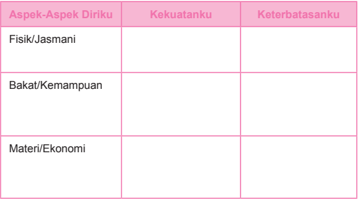

Tabel ini berisi informasi tentang kekuatan dan keterbatasan diri dalam tiga aspek: fisik/jasmani, bakat/kemampuan, dan materi/ekonomi. Topik utamanya adalah evaluasi diri secara holistik. Kolom "Kekuatanku" mencakup aspek-aspek tersebut, sementara kolom "Keterbatasananku" menunjukkan potensi yang belum dimanfaatkan. Data penting yang terlihat adalah bahwa setiap aspek memiliki kekuatan dan keterbatasan yang berbeda-beda, menunjukkan bahwa evaluasi diri harus dilakukan secara mendalam untuk memahami kekuatan dan tantangan yang dimiliki.

 

---
## 📄 Halaman 32

Sifat - Sifat

Impian (sukses) yang ingin ku raih:

- Guru meminta peserta didik mensharingkan dalam kelompok.
- Setelah selesai sharing, peserta didik dalam kelompok merumuskan pertanyaan  berkaitan  dengan  hal-hal:  tokoh  tokoh  remaja  yang  sukses, sikap  yang  perlu  dikembangkan  dalam  upaya  mengembangkan diri,  peran orang  lain  dalam  meraih  sukses.  Antarkelompok  diminta  saling  menukar pertanyaan untuk dijawab.
- Setelah diskusi kelompok dan pleno, coba resapkan kisah berikut:
Lena Maria adalah seorang wanita yang tangguh. Dia terlahir dengan banyak sekali keterbatasan karena cacat fisik yang dimilikinya. Ia terlahir tanpa tangan  dan  kaki  kirinya  hanya  setengah  dari  kaki kananya. Tetapi dia tidak pernah menyerah dan selalu bersyukur atas semua yang dimilikinya.

Dengan  bekal  mimpi,  kemauan  dan  semangat pantang menyerah, akhirnya dia bisa mengembangkan semua  talenta  yang  dimilikinya.  Dia  bisa  meraih kesuksesan walaupun  dengan  kondisi fisik yang terbatas.  Pada  usia  18  tahun,  ia  memecahkan  rekor berenang pada kejuaraan dunia. Bakatnya pada musik juga sangat luar biasa. Ia sekarang sebagai penyanyi professional.

(Bila dimungkinkan, guru dapat mengajak peserta didik menonton film Lena Maria dengan mengakses http://www.youtube.com/watch?v=LNcwST4Ga0w )

- Guru  meminta  peserta  didik  mengungkapkan  pesan  yang  sangat  menarik dari kisah Lena Maria?
- Bila dipandang perlu guru dapat memberi masukan sebagai berikut:
- Pada dasarnya setiap manusia dianugerahi oleh Tuhan dengan berbagai kemampuan  walaupun  dengan  kadar  yang  berbeda  antarsatu  dengan yang lain. Orang yang pandai dalam pelajaran matematika belum tentu terampil  dalam  olahraga,  orang  yang  pandai  bernyanyi  belum  tentu

 

---
## 📄 Halaman 33

- pandai  juga  dalam  olahraga.  Orang  yang  pandai  dalam  pelajaran  IPA belum tentu pandai bersosialisasi dengan teman. Tidak ada orang yang pandai dan terampil dalam segala hal.
- Kenyataan  semacam  ini  seharusnya  menyadarkan  setiap  orang  bahwa di  satu  pihak  setiap  manusia  mempunyai  kemampuan,  tetapi  di  lain pihak  dia  mempunyai  keterbatasan.  Maka  tugas  setiap  orang  adalah menemukan apa yang menjadi kemampuannya, serta menemukan juga keterbatasannya.
- Sikap yang bijaksana dalam menghadapi kemampuan dan keterbatasan antara  lain:  kemampuan  sebagai  anugerah  Tuhan,  diharapkan  tidak menjadikan  seseorang  menjadi  sombong  atau  takabur;  Kemampuan harus  ditingkatkan,  dilatih  terus  menerus  agar  semakin  berkembang dan  dapat  dijadikan  andalan  hidup.  Sebaliknya  keterbatasan  jangan sampai  membuat  orang  minder;  menganggap  hidup  sebagai  nasib buruk dari Tuhan atau merasa hidupnya tidak berguna. Kelemahan atau keterbatasan  harus  disadari  dan  diatasi  agar  tidak  menjadi  hambatan untuk memperkembangkan diri.
- Mentalitas  yang  perlu  dikembangkan:  sikap  mau  bekerja  keras,  mau belajar  dari  orang  lain,  tidak  cepat  menyerah,  optimis,  mau  mencoba, dan sebagainya.
- Banyak orang sukses justru setelah ia menyadari keterbatasannya, seperti nampak  dalam  kisah  Lena  Maria.  Banyak  tokoh  sukses  yang  berasal dari keluarga miskin. Tetapi kemiskinan itu menumbuhkan tekad untuk menunjukkan  bahwa  orang  miskinpun  dapat  sukses.  Ia  tidak  mau orang lain melecehkan dirinya karena miskin. Ia ingin orang lain juga menghargai dirinya sebagai pribadi yang bermartabat. Itulah sebabnya dia belajar dengan keras dan meraih prestasi yang gemilang.

### Langkah kedua: Mendalami Pesan Kitab Suci Tentang Panggilan Mengembangkan Anugerah

- Guru  mengajak  peserta  didik  mendalami  teks  Kitab  Suci  yang  berkaitan dengan panggilan untuk mengembangkan anugerah kemampuan, misalnya:

### Perumpamaan Tentang Talenta

(Matius 25: 14 - 30)

14 'Sebab hal Kerajaan Surga sama seperti seorang yang mau bepergian ke luar negeri,  yang  memanggil  hamba-hambanya  dan  mempercayakan  hartanya kepada mereka.

 

---
## 📄 Halaman 34

- 15 Yang  seorang  diberikannya  lima  talenta,  yang  seorang  lagi  dua  dan  yang seorang  lain  lagi  satu,  masing-masing  menurut  kesanggupannya,  lalu  ia berangkat.
- 16 Segera pergilah hamba yang menerima lima talenta itu. Ia menjalankan uang itu lalu beroleh laba lima talenta.
- 17 Hamba  yang  menerima  dua  talenta  itu  pun  berbuat  demikian  juga  dan berlaba dua talenta.
- 18 Tetapi hamba yang menerima satu talenta itu pergi dan menggali lobang di dalam tanah lalu menyembunyikan uang tuannya.
- 19 Lama  sesudah  itu  pulanglah  tuan  hamba-hamba  itu  lalu  mengadakan perhitungan dengan mereka.
- 20 Hamba yang menerima lima talenta itu datang dan ia membawa laba lima talenta, katanya: Tuan, lima talenta tuan percayakan kepadaku; lihat, aku telah beroleh laba lima talenta.
- 21 Maka  kata  tuannya  itu  kepadanya:  Baik  sekali  perbuatanmu  itu,  hai hambaku yang baik dan setia; engkau telah setia dalam perkara kecil, aku akan memberikan kepadamu tanggung jawab dalam perkara yang besar. Masuklah dan turutlah dalam kebahagiaan tuanmu.
- 22 Lalu datanglah hamba yang menerima dua talenta itu, katanya: Tuan, dua talenta tuan percayakan kepadaku; lihat, aku telah beroleh laba dua talenta.
- 23 Maka kata tuannya itu kepadanya: Baik sekali perbuatanmu itu, hai hambaku yang baik dan setia, engkau telah setia memikul tanggung jawab dalam perkara yang kecil, aku akan memberikan kepadamu tanggung jawab dalam perkara yang besar. Masuklah dan turutlah dalam kebahagiaan tuanmu.
- 24 Kini  datanglah  juga  hamba  yang  menerima  satu  talenta  itu  dan  berkata: Tuan,  aku  tahu  bahwa  tuan  adalah  manusia  yang  kejam  yang  menuai  di tempat di mana tuan tidak menabur dan yang memungut dari tempat di mana tuan tidak menanam.
- 25 Karena itu aku takut dan pergi menyembunyikan talenta tuan itu di dalam tanah: Ini, terimalah kepunyaan tuan!
- 26 Maka jawab tuannya itu: Hai kamu, hamba yang jahat dan malas, jadi kamu sudah tahu, bahwa aku menuai di tempat di mana aku tidak menabur dan memungut dari tempat di mana aku tidak menanam?
- 27 Karena itu sudahlah seharusnya uangku itu kauberikan kepada orang yang menjalankan  uang,  supaya  sekembaliku  aku  menerimanya  serta  dengan bunganya.
- 28 Sebab itu ambillah talenta itu dari padanya dan berikanlah kepada orang yang mempunyai sepuluh talenta itu.
- 29 Karena setiap orang yang mempunyai, kepadanya akan diberi, sehingga ia berkelimpahan. Tetapi siapa yang tidak mempunyai, apa pun juga yang ada padanya akan diambil dari padanya.

 

---
## 📄 Halaman 35

b.

- 30 Dan campakkanlah hamba yang tidak berguna itu ke dalam kegelapan yang paling gelap. Di sanalah akan terdapat ratap dan kertak gigi.
Peserta didik diminta merumuskan pesan yang tersirat dari kutipan di atas

- Bila  dipandang  perlu  guru  dapat  menyampaikan  beberapa  gagasan  pokok berikut:
- Yesus  memberikan  gambaran  seorang  tuan  yang  memberikan  talenta kepada hamba-hambanya. (Matius 25: 14 - 30). Iapun menindak tegas kepada  seorang  hamba  yang  tidak  mau  mengembangkan  talenta  dan hanya memendamnya ke dalam tanah.
- Setiap orang diberi talenta oleh Tuhan. Mereka harus mengembangkan dan menggunakan talenta itu sebagaimana mestinya. Mengembangkan talenta  sebagaimana  mestinya  adalah  panggilan  dan  tuntutan  orang beriman kristiani.
- Kita  harus  mengembangkan  bakat  yang  kita  miliki,  karena  Tuhan telah memberikan talenta kepada manusia ciptaan-Nya, sesuai dengan kemampuan yang dimiliki manusia masing-masing.
- Kita  harus  seperti  hamba  yang  pertama  dan  hamba  yang  kedua  yang mengembangkan talenta yang mereka punya dengan baik.
- Kita tidak boleh mencontoh hamba yang ketiga, yang hanya mengubur talentanya, tanpa berusaha untuk mengembangkannya.
- Allah akan sedih dan kecewa karena kita hanya memendam bakat yang kita miliki. Terlebih kita merasa iri hati terhadap kemampuan yang orang lain miliki. Allah memberikan masing-masing talenta kepada umat-Nya, dan talenta itu harus kita syukuri, serta kita kembangkan.

### Langkah ketiga: Menghayati Panggilan Tuhan Untuk Mengembangkan Anugerah yang Dimiliki

- Guru mengajak peserta  didik  masuk  dalam  suasana  hening,  peserta  didik diminta merumuskan  gagasan-gagasan penting yang diperoleh dalam pelajaran  ini,  serta  merumuskan  niat/sikap  yang  akan  dilakukan  atau dikembangkan !
- Masih dalam suasana hening, peserta didik diajak untuk berefleksi dengan menyimak kisah berikut:

 

---
## 📄 Halaman 36

### Kisah Pensil

Pada awal mula, Pencipta Pensil berbicara kepada pensil dengan mengatakan:

' Ada lima hal yang harus kamu ketahui sebelum aku mengirimmu ke dunia. Ingatlah itu selalu dan kamu akan menjadi pensil terbaik sesuai potensimu.'

Pertama. 'Kamu akan mampu melakukan banyak hal besar, tapi hanya jika kamu membolehkan dirimu dipegang oleh tangan seseorang. '

Kedua. 'Kamu  akan  mengalami  peruncingan  yang  menyakitkan  dari waktu ke waktu, tetapi hal ini dipersyaratkan jika kamu ingin menjadi sebuah pensil yang lebih baik. '

Ketiga. 'Kamu  memiliki  kemampuan  untuk  mengoreksi  kesalahan  apa pun yang kamu perbuat. '

Keempat. 'Bagian  terpenting  akan  selalu  berupa  apa  yang  berada  di dalam. '

Kelima. 'Betapa pun kondisinya, kamu harus terus menulis. Kamu harus selalu meninggalkan suatu tanda yang jelas, terbaca betapa pun sulitnya situasi. '

Sang pensil mengerti, berjanji untuk mengingat, dan pergi ke dalam kotak. Ia benar-benar memahami maksud Penciptanya.

'Sekarang tempatkan dirimu pada posisi pensil. Ingatlah selalu hal itu dan jangan  pernah  lupa.  Dan,  kamu  akan  menjadi  orang  terbaik  sesuai  dengan potensimu. '

Satu. 'Kamu akan mampu melakukan banyak hal besar, tapi hanya jika kamu membolehkan dirimu dipegang oleh tangan Tuhan. Dan, biarkan orangorang  lain  bertemu  denganmu  untuk  mendapatkan  pemberian  yang  kamu miliki. '

Dua. 'Kamu akan mengalami peruncingan yang menyakitkan dari waktu ke waktu, dengan menghadapi berbagai masalah. Tapi, kamu akan memerlukan hal itu untuk menjadi seorang yang lebih kuat. '

Tiga. 'Kamu akan mampu mengoreksi berbagai kesalahan yang mungkin akan kamu perbuat agar bertumbuh melalui pelbagai kesalahan itu. '

Empat. 'Bagian terpenting dalam dirimu selalu berupa apa yang berada di dalam. '

Lima. 'Pada  permukaan  apa  pun  yang  kamu  jalani,  kamu  harus meninggalkan tandamu. Betapa pun situasinya, kamu harus terus mengabdi pada Tuhan dalam segala hal. '

Tiap orang ibarat sebuah pensil...

Ia diciptakan oleh Pencipta untuk suatu maksud yang unik dan spesial.

 

---
## 📄 Halaman 37

Hal  seperti  ini  pernah  dikatakan  Mother  Theresa  dalam  wawancara dengan Edward Desmond dari Majalah Time tahun 1990, 'Saya hanya pensil kecil di Tangan Tuhan. Dia yang berpikir. Dia yang menulis. Pensil itu tidak bisa apa-apa. Ia hanya digunakan. Saya merasa Tuhan ingin memperlihatkan kebesaran-Nya dengan menggunakan ketiadaan. '

Dengan pengertian dan usaha terus mengingat, marilah kita maju terus dalam hidup kita di bumi ini dengan memiliki sebuah tujuan yang bermakna dalam hati kita dan suatu hubungan dengan Tuhan tiap hari.

Kamu diciptakan untuk melakukan hal-hal yang besar!

Sumber : motivationplannet.wordpress.com

- Peserta didik diminta menuliskan makna kisah tersebut bagi dirinya berkaitan dengan upaya mengembangkan talenta yang dimiliki.
- Peserta  didik  membuat  doa  syukur  secara  tertulis  sebagai  ungkapan  rasa syukur atas kemampuan dan keterbatasan yang dianugerahkan Allah pada dirinya.

### Doa Penutup

Guru mengajak para peserta didik untuk mendaraskan bersama Mazmur 67 berikut ini secara bergantian:

### Nyanyian syukur karena segala berkat Allah

- 2 Kiranya Allah mengasihani kita dan memberkati kita, kiranya Ia menyinari kita dengan wajah-Nya, S e l a
- 3 supaya  jalan-Mu  dikenal  di  bumi,  dan  keselamatan-Mu  di  antara  segala bangsa.
- 4 Kiranya  bangsa-bangsa  bersyukur  kepada-Mu,  ya  Allah;  kiranya  bangsabangsa semuanya bersyukur kepada-Mu.
- 5 Kiranya  suku-suku  bangsa  bersukacita  dan  bersorak-sorai,  sebab  Engkau memerintah bangsa-bangsa dengan adil, dan menuntun suku-suku bangsa di atas bumi. S e l a
- 6 Kiranya  bangsa-bangsa  bersyukur  kepada-Mu,  ya  Allah,  kiranya  bangsabangsa semuanya bersyukur kepada-Mu.
- 7 Tanah telah memberi hasilnya; Allah, Allah kita, memberkati kita.
- 8 Allah memberkati kita; kiranya segala ujung bumi takut akan Dia!

 

---
## 📄 Halaman 38

### C. Kesetaraan Laki-Laki dan Perempuan

### Kompetensi Dasar

- 1.2.  Bersyukur kepada  Allah yang menciptakan dirinya  sebagai perempuan atau laki-laki yang saling melengkapi dan sederajat.
- 2.2.  Santun sebagai perempuan atau laki-laki yang saling melengkapi dan sederajat
- 3.2.  Memahami jati diri sebagai perempuan atau laki-laki yang saling melengkapi dan sederajat
- 4.2.  Melakukan  aktivitas  (misalnya    menuliskan  refleksi/puisi/doa)  tentang  jati dirinya sebagai perempuan atau laki-laki yang saling melengkapi dan sederaja

### Indikator

- Menginventarisir bentuk-bentuk pelanggaran terhadap martabat perempuan yang sering terjadi dalam masyarakat kita.
- Menjelaskan ajaran Gereja tentang sifat saling melengkapi dalam relasi antara laki-laki dan perempuan.
- Menjelaskan  ajaran  Kitab  Suci  (Alkitab)  tentang  kesetaraan  laki-laki  dan perempuan, (misalnya dalam Kitab Kejadian 2: 18 - 23)
- Menuliskan refleksi tentang kesetaraan laki-laki dan perempuan.
- Membuat doa syukur sebagai ungkapan syukur atas jati dirinya sebagai lakilaki dan perempuan yang saling melengkapi dan sederajat

### Bahan Kajian

- Kedudukan Laki-laki dan perempuan dalam masyarakat.
- Perbedaan laki-laki dan perempuan dari segi biologis dan psikologis.
- Sifat saling melengkapi dalam relasi antara laki-laki dan perempuan.
- Ajaran Kitab Suci (Alkitab) tentang kesetaraan laki-laki dan perempuan.

### Sumber Belajar

- Pengalaman hidup peserta didik
- Kitab Suci Kejadian 5: 18 - 23)
- Komkat  KWI,  Perutusan  Murid-Murid  Yesus Pendidikan  Agama  Katolik untuk SMA/K Kelas X . Y ogyakarta:Kanisius, 2008.
- Kristianto. Yoseph, dkk. 2010. Menjadi Murid Yesus, Buku Teks Pendidikan Agama Katolik untuk SMA/K Kelas X . Y ogyakarta:Kanisius
- Konferensi Wali Gereja Indonesia, Iman Katolik, Kanisius, Yogyakarta, 1995.
- Katekismus Gereja Katolik, Nusa Indah, Flores,
- 32 Buku Guru Kelas X SMA/SMK

 

---
## 📄 Halaman 39

### Pendekatan

Pendekatan Kateketis dan Pendekatan Saintifik.

### Metode Pembelajaran

- Dialog Partisipatif
- Presentasi
- Diskusi
- Penugasan
- Studi Pustaka
- Refleksi

### Pemikiran Dasar

Pada usia  remaja,  seseorang  mengalami  pertumbuhan  jasmaniah  dan rohaniah yang sangat besar. mereka mengalami adanya dorongan-dorongan dan daya-daya tertentu dalam dirinya, khususnya daya tarik terhadap lawan jenisnya. Daya tarik terhadap lawan jenis ini sering belum disadari secara penuh oleh para remaja sebagai hal yang luhur, indah, wajar, dan manusiawi. Ketidaktahuan dan ketidaksadaran  akan  adanya  dorongan  dan  daya  tarik  terhadap  lawan  jenis  ini dapat  menyebabkan  remaja  tidak  pandai  menempatkan  diri  dalam  pergaulan antarjenis. Bahkan, pergaulan antarjenis di kalangan para remaja sering 'menyimpang'. Karena itulah, para remaja memerlukan bimbingan agar mereka memiliki  pengetahuan  dan  kesadaran  yang  memadai  tentang  hakikat  kepriaan dan kewanitaan serta daya tarik terhadap lawan jenisnya. Dengan demikian, para remaja dapat menghargai dirinya sendiri dan lawan jenisnya (pria dan wanita) sebagai ciptaan Tuhan yang indah, luhur, dan suci.

Dalam pembahasan ini peserta didik akan diajak untuk menyadari bahwa lakilaki  dan  perempuan diciptakan semartabat dan sederajat. Keduanya diciptakan menurut citra Allah: diciptakan menurut gambar dan rupa Allah yang satu dan sama (Kejadian 1, 26 -27). Lebih dari itu, mereka dianugerahi kepercayaan dan kesempatan yang sama untuk mengambil bagian dalam karyaNya yang agung. Mereka dipanggil untuk membangun persekutuan ( communio ) dan bekerja sama dalam pengelolaan dunia dan seisinya serta pelestarian generasi umat manusia (Kejadian 1, 31).

Laki-laki  dan  perempuan  saling  melengkapi.  Sifat  korelatif  itu  sangat  jelas dalam bentuk pria dan wanita.  Tetapi  juga  kelihatan  dalam  seluruh  kemanusiaannya, seperti: perasaan, cara berpikir, dan cara menghadapi kenyataan, termasuk Tuhan. Tuhan mengatakan: 'Tidak baik, kalau manusia itu seorang diri saja. Aku akan menjadikan penolong baginya, yang sepadan dengan dia' (Kejadian 2: 18).

 

---
## 📄 Halaman 40

Laki-laki dan perempuan diciptakan bukan pertama-tama sebagai tuan dan hamba atau atasan dan bawahan, tetapi rekan yang sepadan. Tugas dan tanggung jawab yang diberikan kepada keduanya sama. Nilai karya dan peran mereka pada karya Allah pada umumnya tidak berbeda: tidak ada yang lebih tinggi dan tidak ada yang lebih rendah. Sabda Allah yang berbunyi: 'Baiklah kita menjadikan manusia menurut gambar dan rupa kita…'(Kejadian 1, 26) dan '…yang dijadikanNya itu sungguh amat baik' (Kejadian 1, 31) menunjukkan perbedaan manusia dengan ciptaan lain. Sabda itu menunjukkan keistimewaan mereka sebagai laki-laki dan perempuan di antara semua ciptaan, bukan perbedaan mereka sebagai laki-laki dan perempuan.

Dalam Kitab Kejadian juga diceritakan bahwa pria dan wanita merupakan ciptaan Tuhan yang paling indah. Pria dan wanita diciptakan Tuhan untuk saling melengkapi, untuk menjadi teman hidup. Pria saja tidaklah lengkap. Allah sendiri berkata: 'Tidaklah baik, kalau manusia itu seorang diri saja. Aku akan menjadikan seorang  penolong  baginya,  yang  sepadan  dengan  dia'  (Kejadian  2:  18).  Untuk menyatakan bahwa wanita sungguh-sungguh merupakan kesatuan dengan pria, maka Tuhan menciptakan wanita itu bukan dari bahan lain, tetapi  dari  tulang rusuk  pria  itu.  Maka,  pria  itu  kemudian  berkata  tentang  wanita  itu  demikian: 'Inilah dia, tulang dari tulangku dan daging dari dagingku' (Kejadian 2: 23). Dari kutipan Kitab Suci ini jelaslah bahwa hubungan pria dan wanita adalah hubungan yang suci dan sepadan.

### Kegiatan Pembelajaran

### Doa Pembuka

Guru mengajak para  peserta  didik  untuk  membuka  pelajaran  dengan  doa sebagai berikut:

Allah Bapa Yang Mahabaik, Engkau menciptakan kami sebagai laki-laki dan perempuan Semartabat, secitra dan sederajat Sekalipun kami memiliki kekhasan dan perbedaan, Engkau tetap menghendaki kami bersatu dan saling melengkapi Engkau mencintai kami dan memanggil kami untuk senantiasa saling membantu dan mengembangkan, sehingga kami semakin sempurna. Berkatilah kami, ya Tuhan Supaya kami tidak kenal lelah Selalu mengusahakan yang terbaik dan menjunjung menjunjung martabat satu sama lain sesuai dengan kehendakMu. Amin

 

---
## 📄 Halaman 41

### Langkah Pertama: Mendalami Pandangan Masyarakat Tentang Peranan dan Tugas Perempuan

- Guru  mengajak  peserta  didik  untuk  membaca  dan  merenungkan  artikel berikut ini:

### Adat Mengondisikan Perempuan di Bawah Pria

Adat  menempatkan  perempuan  adalah  ibu  yang  memberikan  segalagalanya.  Sementara  pria  adalah  kepala  rumah  tangga  yang  diidentikkan dengan seorang kepala perang, penguasa atas keluarga.

Direktris Lembaga Pengkajian dan Pemberdayaan Perempuan dan Anakanak  (LP3A),  Dra  Selfi  Sanggenafa,  Jumat  (31/1),  mengatakan,  adat  tidak mengajarkan  kekerasan  suami  terhadap  perempuan.  Tetapi,  kondisi  yang dibangun  melalui  sistem  adat  tradisional  telah  memosisikan  perempuan  di bawah tekanan dan kekerasan suami.

Sebagai  perempuan  yang  hidup  dalam  sistem  adat  masyarakat  tertentu harus pasrah, tabah, dan sabar atas setiap situasi di dalam keluarga, termasuk menerima semua bentuk kekerasan dan kekejaman suami terhadap istri dan anak-anak  di  dalam  keluarga.  Sikap  seperti  ini  dinilai  adat  sebagai  sikap perempuan yang beretika, tahu diri, menghormati adat, membawa rezeki, dan melahirkan keturunan yang beruntung.

Sikap pasrah dan menerima ini masih mendominasi 90 persen perempuan, termasuk  mereka  yang  sudah  berpendidikan  tinggi.  Walau  perempuan  itu seorang pejabat, tetapi di rumah ia masih harus rela menerima perlakuan kasar suami dan menghormati suami seperti perempuan tradisional lain.

Hampir semua perempuan dalam keluarga memiliki semacam perasaan 'wajib'  menerima  kekerasan  dari  suami  dan  keluarga  suami.  Sikap  ini diturunkan dari generasi ke generasi melalui sosialisasi ibu kepada putrinya.

Saat  kecil  ibu  sudah  mengajarkan  bagaimana  bersikap  sopan  terhadap saudara laki-laki dan menjelang dewasa perempuan diberi pengertian mengenai sikap sopan terhadap suami. Tetapi, pria jarang diajarkan sikap sopan terhadap perempuan di rumah.

Salah satu penyebab terpenting sikap pasrah istri terhadap suami adalah mas kawin. Makin tinggi nilai mas kawin, beban moril yang ditanggung istri makin tinggi. Istri merasa seakan-akan 'dibayar mahal'. Karena itu, seluruh diri, jiwa raganya harus dibaktikan untuk melayani seluruh kebutuhan suami, termasuk anggota keluarga suami.

http://groups.yahoo.com/neo/groups/beritalingkungan/conversations/topics/4841

- Guru meminta peserta didik berdiskusi dalam kelompok untuk merumuskan: tanggapan atas artikel tersebut? Menjelaskan pandangan masyarakat

 

---
## 📄 Halaman 42

- tentang kedudukan antara laki-laki dan perempuan dalam keluarga, dalam perkawinan, dalam pekerjaan, dan sebagainya. Kalau dalam judul artikel di atas seolah memosisikan yang satu lebih hebat dari yang lain. Coba diskusikan juga laki-laki mempunyai keunggulan dalam hal apa dan kelemahan dalam hal apa; dan juga perempuan unggul dalam hal apa dan lemah dalam hal apa?
- Setelah selesai, guru memberi kesempatan peserta didik mempresentasikan hasil diskusi kelompok dalam pleno.
- Dalam  pleno,  khusus  berkaitan  dengan  keunggulan  dan  kelemahan,  baik laki-laki atau perempuan, guru mengajak peserta didik memilah : manakah yang sungguh-sungguh mencirikan identitas sebagai laki-laki, dan identitas sebagai perempuan?
- Untuk  melengkapi  informasi  tentang  kekhasan  laki-laki  dan  perempuan, kalian bisa mencarinya dari berbagai sumber, atau bertanya.

### Langkah Kedua: Mendalami Ajaran Kitab Suci tentang Kesetaraan Laki-laki dan Perempuan

- Guru mengajak peserta didik membaca dan merenungkan Kejadian 2:18-23

### Kitab Kejadian 2: 18 - 23

- 18 TUHAN Allah berfirman: 'Tidak baik, kalau manusia itu seorang diri saja. Aku akan menjadikan penolong baginya, yang sepadan dengan dia. '
- 19 Lalu TUHAN Allah membentuk dari tanah segala binatang hutan dan segala burung di udara. Dibawa-Nyalah semuanya kepada manusia itu untuk melihat, bagaimana  ia  menamainya;  dan  seperti  nama  yang  diberikan  manusia  itu kepada tiap-tiap makhluk yang hidup, demikianlah nanti nama makhluk itu.
- 20 Manusia itu memberi nama kepada segala ternak, kepada burung-burung di  udara  dan  kepada  segala  binatang  hutan,  tetapi  baginya  sendiri  ia  tidak menjumpai penolong yang sepadan dengan dia.
- 21 Lalu  TUHAN Allah membuat manusia itu tidur nyenyak; ketika ia tidur, TUHAN Allah mengambil salah satu rusuk dari padanya, lalu menutup tempat itu dengan daging.
- 22 Dan dari rusuk yang diambil TUHAN Allah dari manusia itu, dibangunNyalah seorang perempuan, lalu dibawa-Nya kepada manusia itu.
- 23 Lalu berkatalah manusia itu: 'Inilah dia, tulang dari tulangku dan daging dari dagingku. Ia akan dinamai perempuan, sebab ia diambil dari laki-laki. '
- Guru  mengajak  peserta  didik  menganalisa  teks,  kemudian  merumuskan pesan berdasarkan analisa mereka, dengan bantuan pertanyaan: Siapa yang menghendaki  supaya  manusia  (laki-laki)  tidak  seorang  diri?  Kira-kira mengapa? Siapa yang menjadikan penolong bagi laki-laki? Apakah yang satu lebih  tinggi  dari  yang  lain?  Lihat  ayat  20,  apakah  ternak,  burung  sepadan

 

---
## 📄 Halaman 43

dengan  manusia?  Lihat  pula  ayat  23,  apakah  ini  pengakuan  sederajat  atau menganggap yang satu lebih hebat dari yang lain? Rangkailah jawaban atas pertanyaan-pertanyaan kecil itu menjadi jawaban.

### Langkah Ketiga: Menghayati Kesetaraan Laki-Laki dan Perempuan.

- Guru menyampaikan beberapa gagasan berikut:
- Banyak  orang  bila  berbicara  tentang  kesederajatan  antara  perempuan dan laki-laki, sering terbatas pada masalah pembagian tugas atau fungsi. Maka banyak orang begitu yakin, bahwa kepala keluarga itu harus seorang bapak. Sekalipun sang bapak itu pengangguran dan yang berjuang matimatian mencari nafkah sang istri, tetap saja bapak yang kepala keluarga. Ibu bertugas beres-beres rumah, dan sebagainya.
- Banyak  laki-laki  ketika  berbicara  soal  kesederajatan,  lebih  berfokus pada  apa  yang  seharusnya  seorang  perempuan  perbuat  baginya.  Dan sebaliknya,  perempuan berpikir apa yang seharusnya laki-laki perbuat baginya. Selama manusia berpikir seperti itu, maka kesederajatan sulit diwujudkan.
- Sebaliknya kesederajatan akan terwujud bila orang berpikir secara baru. Pikiran  baru  itu  adalah  ketika  laki-laki  mampu  berkata:  perempuan diciptakan Tuhan sebagai penolong saya, berarti dia(perempuan) itu  adalah  bukti  cinta  Tuhan  pada  saya.  Tuhan  menghendaki  saya berkembang  lewat  bantuan  dia,  maka  saya  akan  menghormati  dan melakukan apapun yang terbaik  bagi  dia.  Bila  saya  menghormati  dan mengasihi  dia,  saya  pun  mencintai  Tuhan.  Demikian  pula  sebaliknya: perempuan berkata: Saya telah diciptakan Tuhan sebagai penolong dia, maka saya akan menghormati dan melakukan apa saja yang terbaik bagi dia, sebab hal itu merupakan wujud saya mengasihi Tuhan.
- Pikiran-pikiran semacam itu dapat diwujudkan melalui contoh berikut: Remaja laki-laki tidak akan merasa gengsi bila terbiasa mau membantu keluarga mencuci piring atau masak.
- Panggilan Tuhan atas laki-laki atau perempuan adalah: masing-masing berkembang dan memperkembangkan diri menjadi laki-laki sejati dan perempuan sejati.
- Guru melakukan dialog interaktif dengan pertanyaan: sikap dan keterampilan apa  saja  yang  harus  kalian  perkembangkan  agar  menjadi  laki-laki  atau perempuan sejati?
- Mengungkapkan syukur atas  jati  dirinya  sebagai  perempuan  atau  laki-laki yang saling melengkapi dan sederajat dalam bentuk doa, atau puisi.

 

---
## 📄 Halaman 44

### Doa Penutup

Guru  mengajak  para  peserta  didik  untuk  mendaraskan  bersama  Mazmur  113 berikut ini:

### Tuhan Meninggikan Orang yang Rendah

- 1  Haleluya! Pujilah, hai hamba-hamba TUHAN, pujilah nama TUHAN!
- 2  Kiranya nama TUHAN dimasyhurkan, sekarang ini dan selama-lamanya.
- 3 Dari  terbitnya  sampai  kepada  terbenamnya  matahari  terpujilah  nama TUHAN.
- 4 TUHAN tinggi mengatasi segala bangsa, kemuliaan-Nya mengatasi langit.
- 5 Siapakah seperti TUHAN, Allah kita, yang diam di tempat yang tinggi,
- 6 yang merendahkan diri untuk melihat ke langit dan ke bumi?
- 7 Ia menegakkan orang yang hina dari dalam debu dan mengangkat orang yang miskin dari lumpur,
- 8   untuk mendudukkan dia bersama-sama dengan para bangsawan, bersamasama dengan para bangsawan bangsanya.
- 9 Ia mendudukkan perempuan yang mandul di rumah sebagai ibu anak-anak, penuh sukacita. Haleluya!

 

---
## 📄 Halaman 45

### D. Keluhuran Manusia Sebagai Citra Allah

### Kompetensi Dasar

- 1.3.  Beryukur  kepada  Allah  yang  menciptakan  dirinya  sebagai  citra-Nya    yang bersaudara satu sama lain.
- 2.3.  Menghargai  sesama  manusia  yang  diciptakan  sebagai  citra  Allah  yang bersaudara satu sama lain
- 3.3.  Memahami konsekuensi dirinya sebagai citra Allah dalam berelasi dengan sesama  manusia  yang  diciptakan  sebagai  citra  Allah  yang  bersaudara  satu sama lain.
- 4.3.  Melakukan aktivitas (misalnya menuliskan refleksi/ doa/ menyusun kliping berita  dan  gambar) tentang sikap saling menghargai sesama manusia yang diciptakan sebagai citra Allah yang bersaudara satu sama lain.

### Indikator

- Menganalisis sebab-sebab  munculnya  tindakan  diskriminasi  dan  sikap fanatisme dalam hidup manusia.
- Merumuskan  ajaran Gereja dalam buku-buku dokumen  Gereja yang mengajarkan tentang keluhuran martabat manusia sebagai Citra Allah.
- Merumuskan ajaran Kitab Suci (Alkitab) tentang keluhuran manusia sebagai Citra Allah.
- Merumuskan  keistimewaan  manusia  sebagai  Citra  Allah  dibandingkan dengan ciptaan Allah lainnya.
- Menuliskan refleksi tentang keluhuran manusia sebagai Citra Allah.
- Membuat aksi nyata bersama kunjungan ke panti asuhan/ membantu sesama yang berkebutuhan khusus dan memberikan sumbangan kemanusiaan.

### Bahan Kajian

- Sikap  dalam  memperlakukan  orang  lain  sebagai  sesama  yang  memiliki keluhuran sebagai Citra Allah.
- Kisah hidup beberapa tokoh pejuang kemanusiaan.
- Sebab munculnya tindakan diskriminasi dan sikap fanatisme dalam hidup manusia.
- Ajaran Gereja tentang keluhuran martabat manusia sebagai Citra Allah.
- Ajaran Kitab Suci (Alkitab) tentang kesetaraan laki-laki dan perempuan.
- Keistimewaan  manusia  sebagai  Citra  Allah  dibandingkan  dengan  ciptaan Allah lainnya.

 

---
## 📄 Halaman 46

### Pendekatan

Pendekatan Kateketis dan Pendekatan Saintifik.

### Metode Pembelajaran

- Dialog Partisipatif
- Diskusi
- Penugasan
- Studi Pustaka
- Refleksi

### Sumber Belajar

- Pengalaman hidup peserta didik
- Kitab Suci Kejadian 5: 18 - 23)
- Majalah Hidup nomor 28 Tahun ke-60, 9 Juli 2006
- Majalah Hidup nomor 45 tahun ke-60, 5 Nopember 2006
- Komkat  KWI,  Perutusan  Murid-Murid  Yesus Pendidikan  Agama  Katolik untuk SMA/K Kelas X. Yogyakarta:Kanisius, 2008.
- Kristianto. Yoseph, dkk. 2010. Menjadi Murid Yesus, Buku Teks Pendidikan Agama Katolik untuk SMA/K Kelas X. Yogyakarta:Kanisius
- Konferensi Wali Gereja Indonesia, Iman Katolik, Kanisius, Yogyakarta, 1995.
- Katekismus Gereja Katolik, Nusa Indah, Flores,
- http://id.wikipedia.org/wiki/Bunda_Teresa
- http://www.tokohindonesia.com/biografi/article/285-ensiklopedi/2543-suritauladan-bangsa/
- http://id.wikipedia.org/wiki/YB Mangunwijaya/
- http://id.wikipedia.org/wiki/Munir_Said_Thalib
- dblindonesia.com 1ball.wordpress.com/2010/07/25/pengalaman-pertama-kepanti-asuhan/

### Pemikiran Dasar

Dalam pelajaran yang lalu kita telah belajar bahwa manusia adalah makhluk yang unik. Pada pelajaran ini akan dibahas kekhasan yang lain dari manusia, yang membedakan manusia dari ciptaan lain di bumi ini dan yang membuat manusia lebih mirip dengan sang Penciptanya.

Dewasa  ini  banyak  terjadi  pelanggaran  terhadap  martabat  kemanusiaan. Di  berbagai  tempat  terjadi  kekerasan  yang  diakibatkan  dari  sikap  fanatik  dan diskriminatif  ras,  suku,  agama,  budaya,  dan  kelompok  sosial.  Sikap  ini  dapat

 

---
## 📄 Halaman 47

menjalar pada siapa saja, tidak terkecuali orang muda. Oleh karena itu, mereka perlu disadarkan bahwa sikap tersebut dapat melahirkan berbagai kekerasan dan tindakan anarkis yang sungguh merusak dan sangat melukai martabat manusia sebagai citra Allah.

Sebagai sesama citra Allah, setiap manusia  adalah bersaudara. harus saling  menghormati dan saling  mengasihi.  Sikap  ini  seperti  yang  digambarkan Yesus  dalam  perumpamaan  tentang  orang  Samaria  yang  murah  hati.  Dalam perumpamaan itu dikisahkan bagaimana orang Samaria yang baik hati itu telah memperlakukan orang Yahudi yang mendapat bencana di jalan seperti saudaranya sendiri, bahkan lebih dari itu.

Dalam Kitab  Kejadian  1:  26-27  dikisahkan  demikian:  Berfirmanlah  Allah: 'Baiklah kita menjadikan manusia menurut gambar dan rupa Kita supaya mereka berkuasa atas ikan-ikan di laut dan burung-burung di udara dan atas ternak dan atas seluruh bumi dan atas segala binatang melata yang merayap di bumi. Maka Allah  menciptakan  manusia  itu  menurut  gambar-Nya,  menurut  gambar  Allah diciptakan-Nya  dia,  laki-laki  dan  perempuan  diciptakan-Nya  mereka' .  Dalam kutipan Kejadian 1: 26-27 ini jelas dinyatakan bahwa manusia diciptakan menurut gambar  dan  rupa  Allah,  tentang  makhluk-makhluk  yang  lain  tidak  dikatakan seperti itu.

Dalam  pelajaran  ini,  para  peserta  didik  diharapkan  dapat  mengagumi martabatnya yang luhur dan mensyukurinya.

### Kegiatan Pembelajaran

### Doa Pembuka

Guru mengajak peserta didik mengawali pelajaran diri dengan berdoa:

### Mohon Rahmat Persaudaraan (PS 198)

Allah Bapa kami Yang Maha Pengasih dan Penyayang, Engkau telah menanamkan benih kasih dalam hati semua orang. Bahkan Engkau telah membiarkan Roh-Mu sendiri tinggal dalam hati semua insan.

Dan Engkau sendiri menghendaki agar kami saling mengasihi, sebagaimana kami mengasihi diri kami sendiri.

Kami bersyukur kepada-Mu atas kasih-Mu. Engkau telah mengangkat semua orang menjadi Anak-Mu,

 

---
## 📄 Halaman 48

dan mengasihi mereka dengan kasih yang sama.

Semoga kami selalu saling mengasihi dan hidup rukun sebagai saudara. Lebih-lebih kami bersyukur, karena Yesus selalu berdoa bagi semua orang, Seperti Yesus sendiri bersatu dengan Dikau.

Kami mohon curahkanlah rahmat persaudaraan kepada semua orang, Agar mereka tekun mengusahakan kedamaian, kerukunan, ketenteraman . Bebaskanlah umat-Mu dari hal-hal yang melemahkan semangat persaudaraan.

Bebaskan kami dari cekcok, iri hati, fitnah dan sikap hanya mementingkan diri sendiri. Doa ini kami sampaikan kepada-Mu dengan pengantaraan Kristus Tuhan kami. Amin

### Langkah Pertama: Mengamati Kasus Pelanggaran Terhadap Martabat Manusia

- Guru memberi pengantar singkat, misalnya:
Dalam pelajaran sebelumnya sudah dijelaskan, bahwa manusia itu bukan sesuatu, melainkan seorang pribadi unik yang bernilai. Nilai seseorang tidak ditentukan oleh harta kekayaan, oleh kecantikan atau ketampanan, pun pula bukan  oleh  kebudayaan,  suku,  ras  atau  kebangsaannya.  Tetapi  mengapa kita  masih  menemukan  banyaknya  kasus  pelanggaran  martabat  manusia? mengapa masih ada perbudakan? Mengapa masih ada pembantaian?

- Guru mengajak peserta didik menyimak artikel berikut ini!
Harapan di Tengah Konflik Timor Leste

Lagu 'The Wedding' berkumandang di Gereja St. Antonio Motael, Dili, Timor Leste, awal Juni tahun 2006. Sementara di luar gereja, derap langkah para tentara asing terdengar jelas.

Lagu itu mengiringi perayaan Misa sebanyak 17 pasang perempuan dan lelaki muda. Tentulah perasaan bahagia itu melanda pasangan-pasangan yang hari itu mengucapkan janji setia dalam ikatan suami-istri. Dengan khidmat mereka mengikuti perayaan ekaristi yang dipimpin Pastor Antonio Alves.

Walaupun tampak ceria, wajah-wajah khawatir tetap tidak disembunyikan, baik wajah para pengantin maupun wajah para saksi, puluhan pengungsi yang sudah berhari-hari memadati gereja. Bagaimana tidak, Misa dilakukan pada saat Dili berada dalam situasi kacau. Kacau karena pertikaian yang terjadi di antara petinggi militer, pemerintahan maupun politisi

 

---
## 📄 Halaman 49

### Kekerasan Melawan Kelembutan

Sudah sejak Mei 2006, suasana negara yang baru merdeka empat tahun lalu itu kacau. Rumah-rumah penduduk hancur terbakar dan sarana transportasi yang vital seperti jembatan, putus. Namun, yang paling jelas akibat kekacauan itu  adalah  jumlah  pengungsi  yang  semakin  meningkat.  Menurut  Salvator Soares, Pemimpin Redaksi Suara Timor, jumlah pengungsi di berbagai daerah mencapai 130 ribu orang, di Dili sendiri jumlahnya lebih dari 80 ribu orang.

Sudah sejak awal terjadinya pergolakan, Gereja menunjukkan posisinya. Mereka meminta pemerintah dan rakyat Timor Leste menghentikan kekerasan. Mereka juga mengajak umat untuk berdoa demi tercapainya perdamaian di Bumi Timor Leste. 'Gereja Timor Leste mengutuk kekerasan yang menyebabkan kematian  banyak  orang  dan  membuat  mereka  harus  meninggalkan  rumah mereka. ' Demikian isi siaran Pers yang dikeluarkan Pastor Dominggus Soares kepada media di kantor keuskupan Dili, pada akhir Mei 2006.

Kekerasan  tidak  dapat  dilawan  dengan  kekerasan.  Ini  juga  ditekankan Pastor  Aniceto  Maia.  Di  depan  para  pengungsi  yang  mengikuti  perayaan ekaristi  di  Gereja  St  Antonio  Motael,  ia  menyerukan  homilinya.  'Kita  tidak bisa  menjawab  kekerasan  dengan  kekerasan.  Aksi  kekerasan  terjadi  karena sikap keras dibalas dengan kekerasan pula. ' Untuk menghentikan kekerasan, ia meminta dengan kelembutan. 'Kita sepatutnya membalas kekerasan dengan cinta dan kebenaran, ' demikian homilinya. 'Inilah saatnya bagi orang-orang Timor Leste untuk saling memaafkan, ' demikian homili Uskup Dili Mgr Alberto Ricardo da Silva di depan umat, ketika situasi semakin memburuk. 'Lupakan penjarahan  dan  pembakaran.  Kita  harus  belajar  dari  kekerasan  ini  supaya tidak terjadi lagi di masa mendatang. '

### Doakan Timor Leste

Kekacauan yang terjadi di Timor Leste menjadi perhatian Paus Benediktus XVI. Dalam audiensi umum yang dihadiri 35 ribu umat di lapangan Santo Petrus  Vatikan,  Paus  mengajak  umat  Timor  Leste  untuk  menghentikan kekerasan dan berdamai. 'Seluruh pikiran saya tujukan kepada bangsa Timor Leste yang terkasih. Kini Timor Leste sedang mengalami tekanan dan kekerasan yang menyebabkan jatuhnya korban dan kerusakan. '

Paus memuji Gereja Timor Leste, lembaga-lembaga Katolik dan organisasi internasional yang tak henti-hentinya membantu para pengungsi. 'Kita harus memberi semangat kepada Gereja Timor Leste untuk terus berkarya, bersamasama  dengan  organisasi-organisasi  internasional  untuk  membantu  usahausaha mereka menolong para pengungsi. '

 

---
## 📄 Halaman 50

Lebih lanjut Paus Benediktus XVI berseru, 'Saya mengajak anda semua untuk  berdoa  melalui  Bunda  Maria.  Kita  mohon  dengan  sifat  keibuannya, Bunda tetap melanjutkan usaha orang-orang yang bekerja untu perdamaian bagi jiwa-jiwa dan kembalinya situasi menjadi normal. '

(Silvia Marsidi: Majalah Hidup No. 28 Tahun ke-60)

- Guru meminta peserta didik mengungkapkan tanggapannya terhadap kasus di atas dalam bentuk pertanyaan untuk didiskusikan, berkaitan dengan tema keluhuran martabat manusia sebagai citra Allah !
- Guru mengajak peserta didik melakukan diskusi kelompok dan menjawab pertanyaan-  pertanyaan  tersebut  dan  mengemukakan  contoh  pelanggaran martabat manusia yang terjadi di daerahnya!
- Setelah  diskusi  selesai,  guru  memberi  kesempatan  kepada  masing-masing kelompok untuk mempresentasikan hasilnya. Kelompok lain dapat memberi tanggapan berupa pertanyaan atau komentar kepada kelompok lain setelah semua kelompok selesai presentasi.
- Dibalik maraknya  berbagai pelangggaran terhadap keluhuran matabat manusia, kita bersyukur karena muncul juga tokoh-tokoh yang memberikan pikiran dan pelayanannya untuk membela dan memperjuangkan keluhuran martabat manusia. Carilah informasi dari berbagai sumber tentang beberapa tokoh pejuang kemanusiaan  berikut ini, dan jelaskan pula nilai-nilai kemanusiaan apa yang diperjuangkannya!

### 1) Mahatma Gandhi

Mohandas Karamchand Gandhi biasa dipanggil Mahatma Gandhi (bahasa Sanskerta: 'jiwa agung') adalah seorang pemimpin spiritual dan politikus dari India.

Pada  masa  kehidupan  Gandhi,  banyak  negara  yang  merupakan koloni Britania Raya. Penduduk di koloni-koloni tersebut mendambakan kemerdekaan agar dapat memerintah negaranya sendiri.

Gandhi adalah salah seorang yang paling penting yang terlibat dalam gerakan Kemerdekaan India. Dia adalah aktivis yang tidak menggunakan kekerasan, yang mengusung gerakan kemerdekaan melalui aksi demonstrasi damai.

Gandhi lahir pada 2 Oktober 1869 di negara bagian Gujarat di India. Beberapa dari anggota keluarganya bekerja pada pihak pemerintah. Saat remaja, Gandhi pindah ke Inggris untuk mempelajari hukum. Setelah dia menjadi pengacara, dia pergi ke Afrika Selatan, sebuah koloni Inggris, di mana dia mengalami diskriminasi ras yang dinamakan apartheid .  Dia kemudian memutuskan untuk menjadi seorang aktivis politik agar dapat

 

---
## 📄 Halaman 51

mengubah  hukum-hukum  yang  diskriminatif  tersebut.  Gandhi  pun membentuk sebuah gerakan non-kekerasan.

Gambar 1.4 Mahatma Gandhi

Ketika  kembali  ke  India,  dia  membantu  dalam proses  kemerdekaan  India  dari  jajahan  Inggris;  hal ini memberikan inspirasi bagi rakyat di koloni-koloni lainnya agar berjuang mendapatkan kemerdekaannya dan memecah Kemaharajaan Britania untuk kemudian membentuk Persemakmuran.

Rakyat dari agama dan suku yang berbeda yang hidup  di  India  kala  itu  yakin  bahwa  India  perlu dipecah menjadi beberapa negara agar kelompok yang berbeda  dapat  mempunyai  negara  mereka  sendiri. Banyak yang ingin agar para pemeluk agama Hindu dan Islam mempunyai negara sendiri. Gandhi adalah seorang  Hindu  namun  dia  menyukai  pemikiranpemikiran  dari  agama-agama  lain  termasuk  Islam dan Kristen. Dia percaya bahwa manusia dari segala agama  harus  mempunyai  hak  yang  sama  dan  hidup  bersama  secara damai di dalam satu negara.

Pada 1947, India menjadi merdeka dan pecah menjadi dua negara, India dan Pakistan. Hal ini tidak disetujui Gandhi.

Prinsip  Gandhi,  satyagraha,  sering  diterjemahkan  sebagai  'jalan yang benar' atau 'jalan menuju kebenaran' , telah menginspirasi berbagai generasi,  aktivis-aktivis  demokrasi,  dan  anti-rasisme  seperti  Martin Luther King, Jr. dan Nelson Mandela. Gandhi sering mengatakan kalau nilai-nilai  ajarannya  sangat  sederhana,  yang  berdasarkan  kepercayaan Hindu tradisional: kebenaran (satya), dan non-kekerasan (ahimsa).

Pada 30 Januari 1948, Gandhi dibunuh seorang lelaki Hindu yang marah kepada Gandhi karena ia terlalu memihak kepada Muslim.

### 2) Ibu Teresa

Bunda Teresa (Agnes Gonxha Bojaxhiu) ; lahir di Üsküb, Kerajaan Ottoman, 26 Agustus 1910 - meninggal di Kalkuta, India, 5 September 1997  pada  umur  87  tahun)  adalah  seorang  biarawati  Katolik  Roma keturunan  Albania  dan  berkewarganegaraan  India  yang  mendirikan Misionaris  Cinta  Kasih  (bahasa  Inggris: Missionaries  of  Charity )  di Kalkuta, India, pada tahun 1950. Selama lebih dari 45 tahun, ia melayani orang  miskin,  sakit,  yatim  piatu  dan  sekarat,  sementara  membimbing ekspansi  Misionaris  Cinta  Kasih  yang  pertama  di  seluruh  India  dan

 

---
## 📄 Halaman 52

selanjutnya di negara lain. Setelah kematiannya, ia diberkati oleh Paus Yohanes Paulus II dan diberi gelar Beata Teresa dari Kalkuta.

Pada  1970-an,  ia  menjadi  terkenal  di  dunia internasional untuk pekerjaan kemanusiaan dan advokasi bagi hak-hak orang miskin dan tak berdaya.  Misionaris  Cinta  Kasih  terus  berkembang sepanjang  hidupnya  dan  pada  saat  kematiannya,  ia telah menjalankan 610 misi di 123 negara, termasuk penampungan dan rumah bagi penderita HIV/AIDS, lepra, dan TBC, program konseling untuk anak dan keluarga,  panti  asuhan,  dan  sekolah.  Pemerintah, organisasi sosial dan tokoh terkemuka telah terinspirasi dari karyanya, namun tak sedikit filosofi dan  implementasi  Bunda  Teresa  yang  menghadapi banyak  kritik.  Ia  menerima  berbagai  penghargaan, termasuk  penghargaan  pemerintah  India,  Bharat

Ratna (1980) dan Penghargaan Perdamaian Nobel pada tahun 1979. Ia merupakan salah satu tokoh yang paling dikagumi dalam sejarah. Saat peringatan  kelahirannya  yang  ke-100  pada  tahun  2010,  seluruh  dunia menghormatinya dan karyanya dipuji oleh Presiden India, Pratibha Patil. http://id.wikipedia.org/wiki/Bunda_Teresa

### 3) YB. Mangunwijaya

Sebagai seorang tokoh agama yang peduli pada nasib rakyat kecil, ia tak lelah membela hak-hak kaum yang tertindas. Seperti saat masyarakat Kedungombo menggugat penggusuran tanah mereka tanpa ganti rugi yang berarti karena di tanah yang akan mereka tempati akan dibuat sebuah waduk. Pada 5 Juli 1994, Mahkamah Agung akhirnya mengabulkan tuntutan kasasi  34  warga  Kedungombo  dengan  ganti  rugi yang  cukup  besar.  Namun  niat  baik  rupanya  tidak selalu ditanggapi dengan baik. Romo Mangun yang setia  melakukan  pendampingan  sejak  tahun  1986 itu justru dituding berusaha melakukan Kristenisasi.

Mendapat  tudingan  itu,  pria  yang  pernah  mengikuti  kuliah  singkat tentang kemanusiaan di Amerika Serikat itu hanya terdiam.

Selain menaruh kepedulian yang tinggi pada nasib rakyat miskin, Romo Mangun juga dikenal sebagai sosok yang sangat peduli dengan dunia pendidikan. ' Anak-anak miskin yang tanpa sepengetahuan

 

---
## 📄 Halaman 53

mereka  terlempar  lahir  di  kalangan  kumuh,  itulah  yang  sebetulnya lebih  memerlukan  pertolongan.  Dari  pengalaman  itu  saya  mengambil kesimpulan bahwa prioritas selanjutnya yang ingin saya kerjakan adalah mengabdi  kepada  pendidikan  dasar  anak-anak  miskin.'  aku  Romo. Kekecewaan  Romo  Mangun  terhadap  sistem  pendidikan  di  Indonesia menimbulkan  gagasan-gagasan  di  benaknya.  Pada  19  Mei  1994,  ia membangun  Yayasan  Dinamika  Edukasi  Dasar.  Sebelumnya,  Romo Mangun  membangun  gagasan  SD  yang  eksploratif  untuk  penduduk korban proyek pembangunan waduk Kedungombo, Jawa Tengah, serta penduduk miskin di pinggiran Kali Code, Yogyakarta. Romo Mangun yakin  bahwa  interaksi  saling  ajar  antara  guru  dan  murid  adalah  hal yang paling menentukan keberhasilan pendidikan. Menurutnya, meski pendidikan  tinggi  di  Indonesia  tidak  cukup  baik,  tapi  lantas  jangan meninggalkan pendidikan dasar. Perjuangannya dalam membela kaum miskin, tertindas dan terpinggirkan oleh politik dan kepentingan para pejabat  menjadikan  dirinya  beroposisi  selama  masa  pemerintahan Presiden  Republik  Indonesia  Kedua  (1966-1988)  Orde  Baru.  Bahkan tak jarang ia bersuara lantang memprotes kesewenang-wenangan seperti pada 26 Mei 1998, Romo Mangun menjadi salah satu pembicara utama dalam  aksi  demonstrasi  peringatan  terbunuhnya  Moses  Gatutkaca  di Yogyakarta.  Namun sayang, semua kebaikannya harus terhenti karena kehendak  Yang  Maha  Kuasa.  Sosok  pemuka  agama  yang  santun  dan bijak  itu  harus  kembali  ke  haribaan-Nya  ketika  menghadiri  sebuah acara. Kepergiannya  terbilang tiba-tiba tetapi sangat tenang. Usai mengisi seminar 'Meningkatkan Peran Buku dalam Upaya Membentuk Masyarakat  Indonesia  Baru'  di  Hotel  Le  Meridien,  tubuhnya  seketika limbung. Ia pun dilarikan ke Rumah Sakit Saint Carolus, Jakarta. Namun tak  lama  kemudian  ia  menghembuskan  nafasnya  yang  terakhir  pada Rabu,  10  Februari  1999  pukul  14:10  WIB  akibat  serangan  jantung. Jenazahnya  kemudian  dimakamkan  di  makam  biara  komunitasnya  di Kentungan, Yogyakarta.

Kepergian  Romo  yang  mendadak  menyisakan  rasa  kehilangan yang teramat dalam bagi orang-orang yang pernah mengenal sosoknya. Berbagai komentar dari tokoh masyarakat waktu itu, termasuk Mantan  Presiden  Republik  Indonesia  Ketiga  (1998-1999)  BJ  Habibie, menunjukkan  bahwa  bangsa  ini  telah  kehilangan  seorang  tokoh  yang menjadi  suri tauladan. Kebaikan,  keteladan, ketekunan,  dan  jalan kebenaran yang ia tempuh, membuatnya dijadikan contoh oleh banyak orang.  Tidak  hanya  untuk  orang  yang  seiman,  mereka  yang  berbeda keyakinan pun juga mengamini pendapat itu. Di mata kawan-kawannya,

 

---
## 📄 Halaman 54

ia  dikenal  sebagai  pejuang  yang  cinta  perdamaian,  yang  memberikan perhatian lebih pada mereka yang menderita dan butuh bantuan.

http://id.wikipedia.org/wiki/YB Mangunwijaya/

### 4) Munir

Munir Sai d Thalib (lahir di Malang, Jawa Timur, 8  Desember  1965  -  meninggal  di  Jakarta  di  dalam pesawat  jurusan  ke  Amsterdam,  7  September  2004 pada  umur  38  tahun)  adalah  pria  keturunan  Arab yang  juga  seorang  aktivis  HAM  Indonesia.  Jabatan terakhirnya adalah Direktur Eksekutif Lembaga Pemantau Hak Asasi Manusia Indonesia Imparsial.

Saat menjabat Dewan Kontras, namanya melambung  sebagai  seorang  pejuang  bagi  orangorang  hilang  yang  diculik  pada  masa  itu.  Ketika itu  dia  membela  para  aktivis  yang  menjadi  korban penculikan Tim Mawar dari Kopassus. Setelah Soeharto jatuh, penculikan itu menjadi alasan

pencopotan  Danjen  Kopassus  Prabowo  Subianto  dan  diadilinya  para anggota tim Mawar.

Jenazah  Munir  dimakamkan  di  Taman  Pemakaman  Umum  Kota Batu. Istri Munir, Suciwati, bersama aktivis HAM lainnya terus menuntut pemerintah agar mengungkap kasus pembunuhan ini.

Pada  tanggal  12  November  2004  dikeluarkan  kabar  bahwa  polisi Belanda  (Institut  Forensik  Belanda)  menemukan  jejak-jejak  senyawa arsenikum setelah otopsi. Hal ini juga dikonfirmasi oleh polisi Indonesia. Belum diketahui siapa yang telah meracuni Munir, meskipun ada  yang  menduga  bahwa  oknum-oknum  tertentu  memang  ingin menyingkirkannya.

http://id.wikipedia.org/wiki/Munir_Said_Thalib

- Guru meminta peserta didik memilih salah satu tokoh dan menuliskan nilainilai  yang  diperjuangkan oleh tokoh tersebut, kemudian mempresentasikannya di depan kelas.

### Langkah Kedua: Mendalami Ajaran Gereja dan Kitab Suci yang Mengajarkan tentang Keluhuran Martabat Manusia sebagai Citra Allah

- Guru  mengajak  peserta  didik  menyimak  kutipan  dari  Katekismus  Gereja Katolik berikut:

 

---
## 📄 Halaman 55

KGK  357  Karena  ia  diciptakan  menurut  citra  Allah, manusia  memiliki martabat sebagai pribadi: ia bukan hanya sesuatu, melainkan seorang. Ia mampu mengenal diri sendiri, menjadi tuan atas dirinya, mengabdikan diri dalam kebebasan dan hidup dalam kebersamaan dengan orang lain, dan karena rahmat  ia  sudah  dipanggil  ke  dalam  perjanjian  dengan  Penciptanya,  untuk memberi  kepada-Nya  jawaban  iman  dan  cinta,  yang  tidak  dapat  diberikan suatu makhluk lain sebagai penggantinya.

KGK 358 Tuhan menciptakan segala sesuatu untuk manusia (Bdk. GS 12,1; 24,2;  39,1), tetapi  manusia  itu  sendiri  diciptakan  untuk  melayani  Allah, untuk mencintai-Nya dan untuk mempersembahkan seluruh ciptaan kepadaNya: 'Makhluk manakah yang diciptakan dengan martabat yang demikian itu? Itulah manusia, sosok yang agung, yang hidup dan patut dikagumi, yang dalam mata  Allah  lebih  bernilai  daripada  segala  makhluk.  Itulah  manusia;  untuk dialah langit dan bumi dan lautan dan seluruh ciptaan. Allah sebegitu prihatin dengan  keselamatannya,  sehingga  Ia  tidak  menyayangi  Putera-Nya  yang tunggal untuk dia. Allah malahan tidak ragu-ragu, melakukan segala sesuatu, supaya menaikkan manusia kepada diri-Nya dan memperkenankan ia duduk di sebelah kanan-Nya' (Yohanes Krisostomus, Serm. in Gen. 2,1).

KGK  360 Umat  manusia  merupakan  satu  kesatuan  karena  asal  yang sama. Karena  Allah  'menjadikan  dari  satu  orang  saja  semua  bangsa  dan umat manusia' (Kis 17:26) Bdk. Tob8:6. Pandangan yang menakjubkan, yang memperlihatkan kepada kita umat manusia dalam kesatuan asal yang sama dalam Allah dalam  kesatuan  kodrat,  bagi  semua  disusun  sama  dari  badan jasmani dan jiwa rohani yang tidak dapat mati dalam kesatuan tujuan yang langsung  dan  tugasnya  di  dunia;  dalam  kesatuan  pemukiman  di  bumi,  dan menurut hukum kodrat semua manusia berhak menggunakan hasil-hasilnya, supaya dengan demikian bertahan dalam kehidupan dan berkembang; dalam kesatuan  tujuan  adikodrati:  Allah  sendiri,  dan  semua  orang  berkewajiban untuk mengusahakannya: dalam kesatuan daya upaya, untuk mencapai tujuan ini;… dalam kesatuan tebusan, yang telah dilaksanakan Kristus untuk semua orang' (Pius XII Ens. 'Summi Pontificatus') Bdk. NA 1.

KGK 361 ' Hukum solidaritas  dan  cinta ini'  (ibid.)  menegaskan  bagi  kita, bahwa  kendati  keaneka-ragaman  pribadi,  kebudayaan  dan  bangsa,  semua manusia adalah benar-benar saudara dan saudari.

KGK  362 Pribadi  manusia  yang  diciptakan  menurut  citra  Allah  adalah wujud jasmani sekaligus rohani. Teks Kitab Suci mengungkapkan itu dalam bahasa kiasan, apabila ia mengatakan: 'Allah membentuk manusia dari debu tanah  dan  menghembuskan  napas  hidup  ke  dalam  hidungnya;  demikianlah manusia itu menjadi makhluk yang hidup' (Kejadian 2:7). Manusia seutuhnya dikehendaki Allah

 

---
## 📄 Halaman 56

- Guru meminta peserta didik berdiskusi dalam kelompok untuk merumuskan nilai-nilai  atau  ajaran  yang  hendak  diwartakan  melalui  kutipan-kutipan  di atas.
- Guru mengajak peserta didik untuk membaca dan merenungkan teks Kitab Suci berikut:

### Orang Samaria yang Murah Hati (Lukas 10: 25 - 37)

- 25 Pada suatu kali berdirilah seorang ahli Taurat untuk mencobai Yesus, katanya:
- 'Guru, apa yang harus kuperbuat untuk memperoleh hidup yang kekal?'
- 26 Jawab Yesus kepadanya: 'Apa yang tertulis dalam hukum Taurat? Apa yang kau baca di sana?'
- 27 Jawab orang itu: 'Kasihilah Tuhan, Allahmu, dengan segenap hatimu dan dengan segenap jiwamu dan dengan segenap kekuatanmu dan dengan segenap akal budimu, dan kasihilah sesamamu manusia seperti dirimu sendiri. '
- 28 Kata  Yesus  kepadanya:  'Jawabmu  itu  benar;  perbuatlah  demikian,  maka engkau akan hidup. '
- 29 Tetapi untuk membenarkan dirinya orang itu berkata kepada Yesus: 'Dan siapakah sesamaku manusia?'
- 30 Jawab Yesus: ' Adalah seorang yang turun dari Yerusalem ke Yerikho; ia jatuh ke tangan penyamun-penyamun yang bukan saja merampoknya habis-habisan, tetapi  yang  juga  memukulnya  dan  yang  sesudah  itu  pergi  meninggalkannya setengah mati.
- 31 Kebetulan ada seorang imam turun melalui jalan itu; ia melihat orang itu, tetapi ia melewatinya dari seberang jalan.
- 32 Demikian juga seorang Lewi datang ke tempat itu; ketika ia melihat orang itu, ia melewatinya dari seberang jalan.
- 33 Lalu datang seorang Samaria, yang sedang dalam perjalanan, ke tempat itu; dan ketika ia melihat orang itu, tergeraklah hatinya oleh belas kasihan.
- 34 Ia pergi kepadanya lalu membalut luka-lukanya, sesudah ia menyiraminya dengan  minyak  dan  anggur.  Kemudian  ia  menaikkan  orang  itu  ke  atas keledai tunggangannya sendiri lalu membawanya ke tempat penginapan dan merawatnya.
- 35 Keesokan  harinya  ia  menyerahkan  dua  dinar  kepada  pemilik  penginapan itu,  katanya: Rawatlah dia dan jika kau belanjakan lebih dari ini, aku akan menggantinya, waktu aku kembali.
- 36 Siapakah di antara ketiga orang ini, menurut pendapatmu, adalah sesama manusia dari orang yang jatuh ke tangan penyamun itu?'

 

---
## 📄 Halaman 57

- 37 Jawab orang itu: 'Orang yang telah menunjukkan belas kasihan kepadanya. ' Kata Yesus kepadanya: 'Pergilah, dan perbuatlah demikian!'
- Dalam  kelompok,  peserta  didik  diminta  menanggapi  keterkaitan  teks-teks Kitab Suci di atas, dengan pemahaman tentang manusia Citra Allah.
- Bila dianggap perlu, guru dapat memberikan pertanyaan untuk didiskusikan, misalnya:
- Apa yang dimaksud dengan manusia diciptakan sebagai gambar Allah (Citra Allah)?
- Apa keunggulan manusia dibandingkan ciptaan Allah yang lain?
- Berdasarkan kutipan di atas, siapa yang dimaksud dengan saudara?
- Buatlah sebuah rumusan yang menunjukkan sejauh mana kalian sudah menghayati keberadaan dirinya sebagai Citra Allah!
- Bagaimana pandangan kalian dengan pernyataan bahwa semua manusia satu saudara?
- Guru memberi kesempatan peserta didik memplenokan hasil kelompoknya, kelompok lain menangggapi.
- Setelah pleno, guru dapat memberikan peneguhan sebagai berikut:
- Kata  Citra  mungkin  lebih  tepat  kita  artikan  sebagai  Gambaran.  Yang menggambarkan! Kalau kita mirip dengan ibu kita, itu tidak berarti kita sama  dengan  ibu  kita.  Tetapi  dengan  mirip  ini  mau  menggambarkan sesuatu,  bahwa  pada  diri  kita  entah  itu  fisiknya,  karakternya,  sifatsifatnya ada kesamaan dengan ibu. Dan kesamaan ini bukan dalam arti yang  sebenarnya,  tetapi  merupakan  gambaran  dari  ibu.  Hasil  karya, entah itu seni atau yang lainnya dapat menggambarkan si penciptanya. Demikian  pula  makhluk  yang  disebut  manusia  itu,  dapat  dikatakan sebagai gambaran atau citra si penciptanya, yaitu Allah sendiri.
- Manusia diberi kuasa untuk menguasai alam ciptaan lain. Menguasai alam berarti  menata,  melestarikan,  mengembangkan,  dan  menggunakannya secara bertanggungjawab.
- Karena  manusia  diciptakan  sebagai  Citra  Allah,  manusia  memiliki martabat sebagai pribadi: ia bukan hanya sesuatu, melainkan seseorang. Ia  mengenal diri  sendiri,  menjadi  tuan  atas  diri  sendiri,  mengabdikan diri dalam kebebasan, dan hidup dalam kebersamaan dengan orang lain, dan dipanggil membangun relasi dengan Allah, pencipta-Nya.
- Persaudaraan  sejati adalah persaudaraan  yang  dihayati atas dasar persamaan kodrat sebagai sesama ciptaan Tuhan dan persamaan kodrat sebagai Citra Allah.

 

---
## 📄 Halaman 58

- Persaudaraan sejati tidak membedakan orang berdasarkan agama, suku, ras, ataupun golongan, karena semua manusia adalah sama-sama umat Tuhan dan sama-sama dikasihi Tuhan. Maka setiap orang yang membenci sesamanya, ia membenci Tuhan.
- Rumuskan  pokok-pokok  ajaran  yang  terdapat  dalam  Katekismus  di  atas dalam bahasamu sendiri
- Rumuskan Kesimpulan keseluruhan gagasan yang dipelajari dengan menjawab beberapa pertanyaan berikut:
- Mengapa manusia disebut bermartabat luhur, dimana letak keluhuran martabatnya?
- Apa  konsekuensi  kedudukan  manusia  yang  bermartabat  luhur  dalam relasinya dengan Sang Pencipta dan dalam hubungan dengan sesama?
- Sikap/tindakan  apa  saja  yang  bertentangan  dengan  nilai-nilai  luhur martabat manusia?
- Sikap  dan  tindakan  apa  saja  yang  perlu  dikembangkan  dalam  rangka menjunjung tinggi keluhuran martabat manusia?

### Langkah Ketiga: Menghayati Keberadaan Diri Sebagai Citra Allah

- Guru memberi mengajak peserta menyimak kisah kunjungan ke panti asuhan, sebagai berikut:

### Pengalaman Kunjungan ke Panti Asuhan

SURABAYA -  Tiga  hari  sudah  Trevor  Ariza  membagi  keceriaan  dan tawa kepada warga Surabaya. Dia menghibur penggila basket Kota Pahlawan di venue NBA Madness presented by Jawa Pos serta menyapa penggemarnya dalam berbagai meet and greet yang diadakan sponsor.

Pada tanggal 3 Juli 2010, dia menjadi duta sosial dengan menunjukkan kepeduliannya kepada sesama lewat program sosial NBA Cares di Panti Asuhan Diponegoro.

Rombongan  Ariza  tiba  di  panti  asuhan  yang  berlokasi  di  kawasan Balongsari itu sekitar pukul 10.30. Ariza datang bersama pasangannya, Bree Anderson;  Senior  Director  Business  Development  &  Marketing  Partnerships NBA Asia Ed Win kle beserta istri, Sukanya Winkle; Director Events and At tractions NBA Asia Ritchie Lai; Direktur Jawa Pos Azrul Ananda; serta beberapa staf NBA yang lain.

Begitu tiba  di  panti  asuhan  yang  menampung 60 anak yatim piatu itu, Ariza  dan  rombongan  disambut  musik  hadrah.  Musik  tersebut  dimainkan

 

---
## 📄 Halaman 59

anak-anak penghuni panti yang mengenakan seragam bernuansa oranye. Dua anak kecil,  Firmansyah  Anda  Satria  dan  Kartika  Rizki,  menyongsong  Ariza dan memakaikan kafiyeh segi tiga bermotif kotak-kotak ke pundak Ariza.

---
**🖼️ Gambar/Diagram**

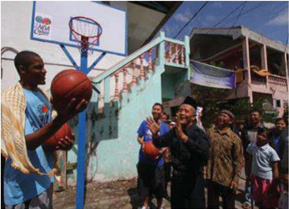

> **Deskripsi Visual:** Gambar ini adalah ilustrasi yang menunjukkan sebuah pertandingan bola basket di luar gedung sekolah. Ilustrasi ini menggambarkan beberapa elemen penting:

1. **Pertandingan Bola Basket**: Di tengah gambar, ada dua pemain yang sedang bermain bola basket. Pemain di sebelah kiri sedang memegang bola dan tampaknya akan melempar atau mencoba mencetak poin.

2. **Gedung Sekolah**: Di belakang pemain, terdapat bangunan sekolah dengan warna cat biru dan putih. Atap bangunan tersebut berwarna hijau.

3. **Penonton**: Beberapa orang penonton terlihat di sekitar lapangan basket. Mereka tampak antusias dan sedang menonton pertandingan.

4. **Lampu Sorot**: Ada lampu sorot yang mencairkan cahaya ke lapangan basket, menambah suasana pertandingan.

5. **Tanda Basket**: Di sisi kanan atas gambar, terdapat tanda basket yang menunjukkan posisi dan ukuran lapangan basket.

6. **Bendera**: Di depan bangunan sekolah, terdapat bendera merah putih yang menunjukkan bahwa tempat ini mungkin berada di Indonesia.

7. **Papan Nama**: Di bagian bawah gambar, terdapat papan nama yang menunjukkan nama-nama pemain dan penonton.

8. **Lampiran**: Di sisi kanan atas, terdapat lambang NBA (National Basketball Association) yang menunjukkan bahwa pertandingan ini mungkin merupakan turnamen atau kompetisi nasional.

Informasi kunci yang dapat diambil dari gambar ini adalah bahwa ini adalah pertandingan bola basket yang sedang berlangsung di sekolah lokal, dengan banyak penonton yang antusias, dan tempat yang disediakan dengan baik untuk pertandingan tersebut.

Sambutan di dalam ruang panti lebih bersahaja. Semua duduk di lantai beralas  karpet  hijau.  Kemudian,  Gholib,  kepala  Panti  Asuhan  Diponegoro, memberikan penjelasan kepada Ariza dan rombongan mengenai kondisi panti asuhan  yang  terletak  di  tengah-tengah  permukiman  penduduk  itu.  Gholib menjelaskan bahwa Panti Asuhan Diponegoro menampung anak-anak yatim piatu  dari  usia  TK  hingga  SMA.  Setelah  lulus  SMA,  mereka  harus  keluar dari panti asuhan. ''Karena itu, kami harap kehadiran Ariza bisa memotivasi mereka untuk meraih kesuksesan, '' katanya.

Ariza  lantas  mengelilingi  panti  asuhan  tersebut.  Dia  juga  mengamati sejumlah ruang tidur beserta pernik-perniknya. Pemain Houston Rockets itu juga tertarik pada sejumlah poster berisi kata-kata motivasi. Misalnya, agar anak rajin belajar serta menjadi orang yang berguna.

Ariza dan rombongan kemudian berjalan melalui sebuah gang sempit ke sebidang  tanah  di  bagian  belakang  panti  asuhan.  Di  sana,  dia  meresmikan

 

---
## 📄 Halaman 60

sebuah lapangan basket yang dibangun NBA Cares untuk anak-anak penghuni panti dan masyarakat sekitar.

Peresmian lapangan basket tersebut ditandai dengan pembukaan selubung ring  basket  bertulisan  NBA Cares oleh Ariza, Azrul, dan Gholib. Ariza juga membubuhkan tanda tangan berikut namanya di papan ring berwarna putih tersebut serta memberikan bola basket yang sudah dia tandatangani. Sebagai bagian dari peresmian, Gholib dan Ketua Yayasan Panti Asuhan Diponegoro Muljono menembakkan bola ke ring.

Kemarin, Dell sebagai salah satu partner NBA Madness juga menyerahkan bantuan empat unit komputer kepada panti asuhan. Penyerahan itu dilakukan secara  simbolis  oleh  Channel  Manager-Consumer  Business  Dell  Indonesia Wijono.  Rencananya,  dua  komputer  untuk  penghuni  perempuan  dan  dua lainnya khusus untuk penghuni laki-laki.

Kunjungan ke panti asuhan tersebut juga sangat berkesan bagi Ariza. Sebab merupakan pengalaman pertama dia berkunjung langsung ke panti asuhan, meski dirinya berkali-kali bertemu anak-anak yatim piatu dan panti asuhan dalam berbagai acara. ''Di Amerika pun, saya belum pernah melakukannya. Jadi, ini pengalaman yang sangat berharga, '' ujarnya.

Sumber: dblindonesia.com

1ball.wordpress.com/2010/07/25/pengalaman-pertama-ke-panti-asuhan/

- Masih dalam suasana hening, guru mengajak peserta menemukan pesan yang menyentuh yang terdapat dalam artikel koran di atas
- Guru  menugaskan  peserta  didik  untuk  membuat  program/membuat  aksi nyata  yang  menunjukkan  kepedulian  terhadap  sesama  yang  berkebutuhan khusus/ sesama yang kurang beruntung.

### Doa Penutup

Guru mengajak para peserta didik untuk mendaraskan bersama Mazmur 104 berikut ini:

### Kebesaran Tuhan dalam Segala Ciptaan-Nya

- 1 Pujilah TUHAN, hai jiwaku! TUHAN, Allahku, Engkau sangat besar! Engkau yang berpakaian keagungan dan semarak,
- 2 yang berselimutkan terang seperti kain, yang membentangkan langit seperti tenda,

 

---
## 📄 Halaman 61

- 3 yang  mendirikan  kamar-kamar  loteng-Mu  di  air,  yang  menjadikan  awanawan sebagai kendaraan-Mu, yang bergerak di atas sayap angin,
- 4 yang membuat angin sebagai suruhan-suruhan-Mu, dan api yang menyala sebagai pelayan-pelayan-Mu,
- 5 yang telah mendasarkan bumi di atas tumpuannya, sehingga takkan goyang untuk seterusnya dan selamanya.
- 6 Dengan  samudera  raya  Engkau  telah  menyelubunginya;  air  telah  naik melampaui gunung-gunung.
- 7 Terhadap hardik-Mu air itu melarikan diri, lari kebingungan terhadap suara guntur-Mu,
- 8 naik gunung, turun lembah ke tempat yang Kau tetapkan bagi mereka.
- 9 Batas Kau  tentukan, takkan mereka  lewati, takkan kembali  mereka menyelubungi bumi.
- 10 Engkau yang melepas mata-mata air ke dalam lembah-lembah, mengalir di antara gunung-gunung,
- 11 memberi minum segala binatang di padang, memuaskan haus keledai-keledai hutan;
- 12 di dekatnya diam burung-burung di udara, bersiul dari antara daun-daunan.
- 13 Engkau  yang  memberi  minum  gunung-gunung  dari  kamar-kamar  lotengMu, bumi kenyang dari buah pekerjaan-Mu.
- 14 Engkau  yang  menumbuhkan  rumput  bagi  hewan  dan  tumbuh-tumbuhan untuk diusahakan manusia, yang mengeluarkan makanan dari dalam tanah
- 15 dan anggur yang menyukakan hati manusia, yang membuat muka berseri karena minyak, dan makanan yang menyegarkan hati manusia.
- 16 Kenyang pohon-pohon TUHAN, pohon-pohon aras di Libanon yang ditanamNya,
- 17 di  mana  burung-burung  bersarang,  burung  ranggung  yang  rumahnya  di pohon-pohon sanobar;
- 18 gunung-gunung tinggi adalah bagi kambing-kambing hutan, bukit-bukit batu adalah tempat perlindungan bagi pelanduk.
- 19 Engkau yang telah membuat bulan menjadi penentu waktu, matahari yang tahu akan saat terbenamnya.
Kemuliaan kepada Bapa dan Putera dan Roh Kudus,

Seperti pada permulaan, sekarang, selalu dan sepanjang segala masa. Amin

 

---
## 📄 Halaman 62

### Penilaian

### Aspek Pengetahuan

- Apa arti manusia itu unik?
- Dalam hal apa manusia disebut unik menurut Kitab Suci ?
- Sikap apa saja yang perlu dikembangkan dalam menghadapi kemampuan dan keterbatasan yang kamu miliki?
- Apa pesan perumpamaan talenta dalam upaya mengembangkan talenta yang kamu miliki ?
- Berilah contoh kasus pelanggaran terhadap martabat perempuan yang sering terjadi dalam masyarakat kita? Jelaskan pula faktor penyebabnya !
- Kemukakan pendapatmu terhadap pernyataan bahwa laki-laki itu lebih hebat dari pada perempuan!
- Bersyukur  karena  diciptakan  sebagai  perempuan  atau  laki-laki,  selayaknya diwujudkan  dengan  mengembangkan  diri  menjadi  perempuan  sejati  dan laki-laki sejati. Apa saja yang mencirikan seseorang layak disebut perempuan sejati atau laki-laki sejati?
- Tunjukkan melalui contoh bahwa relasi perempuan dan laki-laki itu bersifat komplementer (saling melengkapi)!
- Bertolak  dari  pemahamanmu  atas  Kejadian  2:  18  -  23,  jelaskan  alasan perempuan dan laki-laki dikatakan sederajat?
- Bila manusia itu citra Allah, sikap apa yang harus dikembangkan dalam relasi antarmanusia?
- Mengapa  tindakan  diskriminatif  bertentangan  dengan  paham  manusia sebagai Citra Allah?
- Kegiatan  apa  saja  yang  perlu  dilakukan  dalam  upaya  mengembangkan kesederajatan antara perempuan dan laki-laki?

### Aspek Keterampilan:

- Membuat doa syukur (atau puisi, atau renungan)sebagai ungkapan syukur karena  diciptakan  sebagai  pribadi  yang  unik,  atas  segala  kemampuan  dan keterbatasan, atas keluhurannya sebagai Citra Allah.
- Membuat simbol diri yang mengungkapkan keadaan dirinya sebagai Citra Allah dengan kemampuan dan keterbatasannya
- Melakukan studi literatur untuk memperoleh pemahaman tentang keunikan manusia, tentang kesederajatan perempuan dan laki-laki, tentang perbedaan perempuan dan laki-laki, tentang panggilan sebagai perempuan dan laki-laki
- Melakukan diskusi untuk membahas tema 'manusia sebagai makhluk pribadi'
- 56 Buku Guru Kelas X SMA/SMK

 

---
## 📄 Halaman 63

### Aspek Sikap

- Menerima diri dan bersyukur atas kebaikan Allah yang telah menciptakan dirinya  sebagai  pribadi  yang  unik,  yang  bermartabat  luhur  sebagai  Citra Allah, entah sebagai laki-laki atau perempuan yang sederajat, yang memiliki kemampuan dan keterbatasan.
- Bersikap hormat terhadap sesama manusia Citra Allah, entah laki-laki dan perempuan,
- Menerima dan menghormati sesama apa adanya sebagai pribadi entah sebagai laki-laki maupun perempuan, yang memiliki kemampuan dan kekurangannya

### Pengayaan

Peserta  didik  mencari  dari  berbagai  sumber  (mass  media  cetak  maupun elektronik,  tokoh  agama,  tokoh  masyarakat,  teman  sebaya,  orang  tua,  dan sebagainya) untuk memperoleh  informasi, atau pengalaman atau  paham/ pandangan,  yang  berkaitan  dengan  tema:  keunikan  manusia  sebagai  pribadi Citra  Allah,  relasi  dan  kesederajatan  perempuan  dan  laki-laki,  pengembangan kemampuan  dan  keterbatasan,  dalam  upaya  mengembangkan  diri  menuju kesempurnaannya.

Hal itu dapat dilakukan dengan studi literatur, pengamatan, survei, wawancara dan teknik pengumpulan data yang dikuasai peserta didik.

### Remedial

Remedial diarahkan pada penguasaan indikator-indikator kunci pada bab ini, antara lain:

- Menjelaskan makna manusia sebagai pribadi yang unik
- Menjelaskan sikap yang perlu dikembangkan dalam menghadapi kemampuan dan keterbatasan
- Menyusun doa tertulis yang mengungkapkan rasa syukur atas anugerah Allah yang telah menciptakan dirinya sebagai pribadi Citra Allah yang unik, entah sebagai laki-laki atau perempuan
- Menjelaskan  pesan  perumpamaan  talenta  dalam  upaya  mengembangkan talenta yang dimiliki
- Menjelaskan  pesan  Kitab  Suci  dalam  kaitan  dengan  perlunya  membangun kesetaraan antara perempuan dan laki-laki
- Menjelaskan  konsekuensi  keberadaan  manusia  sebagai  Citra  Allah  dalam mengembangkan sikap terhadap sesama

 

---
## 📄 Halaman 64

### Bab II Manusia Makhluk Otonom

Dalam  pelajaran  yang  lalu,  kita  sudah  belajar  tentang  manusia  sebagai makhluk pribadi, di mana setiap orang mempunyai kekhasan. Dalam bab ini kita akan membahas manusia makhluk otonom. Sebagai makhluk otonom, manusia mempunyai  kebebasan  untuk  menentukan  sikap,  dengan  kata  lain,  ia  adalah makhluk yang mandiri.

Secara etimologi, Otonomi berasal dari bahasa Yunani 'autos' yang artinya sendiri, dan ' nomos '  yang berarti hukum atau aturan, jadi pengertian otonomi adalah pengundangan sendiri. Otonom berarti berdiri sendiri atau mandiri. Jadi setiap orang memiliki hak dan kekuasaan menentukan arah tindakannya sendiri. Ia harus dapat menjadi tuan atas diri.

Berbicara mengenai manusia bukanlah sesuatu yang mudah dan sederhana, karena manusia banyak memiliki keunikan. Keunikan tersebut dinyatakan sebagai kodrat manusia. Manusia sulit dipahami dan dimengerti secara menyeluruh akan tetapi manusia mempunyai banyak kekuatan-kekuatan spiritual yang mendorong seseorang mampu bekerja dan mengembangkan pribadinya secara mandiri.

Arti otonom adalah mandiri dalam menentukan kehendaknya, menentukan sendiri setiap perbuatannya dalam pencapaian kehendaknya. Allah telah memberikan akal budi yang membuat manusia tahu apa yang harus dilakukannya dan mengapa harus melakukannya. Dengan kemampuan akal budinya, manusia mampu membedakan hal baik dan buruk dan membuat keputusan berdasarkan suara hatinya dan mampu bersikap kritis terhadap berbagai pilihan hidup. Manusia adalah  makhluk  hidup,  yang  mampu  memberdayakan  akal  budinya,  maka manusia  mempunyai  berbagai  kemampuan,  yakni  mampu  berpikir,  berkreasi, berinovasi, memberdayakan kekuatannya sehingga manusia tidak pernah berhenti untuk berkembang dalam mengembangkan dirinya sebagai suatu upaya dalam pemenuhan kebutuhan hidupnya dalam mengaktualisasikan sebagai individu.

Dalam pembahasan tentang manusia makhluk otonom ini akan dibagi dalam tema sebagai berikut:

- Suara hati
- Bersikap kritis dan bertanggung jawab terhadap pengaruh media massa.
- Bersikap kritis terhadap gaya hidup yang berkembang dan ideologi.

 

---
## 📄 Halaman 65

### Kompetensi Dasar

- 1.4.  Bersyukur kepada Allah atas karunia suara hati untuk  bertindak secara benar dan tepat.
- 2.4.  Disiplin terhadap  suara hati dan  dapat bertindak secara benar dan tepat
- 3.4.  Memahami  peran  dan  fungi  suara  hati  sehingga      dapat  bertindak  secara benar dan tepat.
- 4.4.  Melakukan aktivitas (misalnya   menuliskan r efleksi/puisi/doa)  tentang  suara hati untuk  dapat bertindak secara benar dan tepat

### Indikator

- Menjelaskan arti dan makna suara hati
- Menceritakan pengalaman bertindak berdasarkan suara hati.
- Menjelaskan pandangan Gereja tentang Suara Hati (GS, art. 16).
- Menyebutkan faktor-faktor penyebab tumpulnya suara hati.
- Merumuskan cara-cara untuk membina suara hati.
- Menafsirkan pesan Kitab Suci (Galatia 5:16-25) yang berhubungan dengan suara hati.
- Menuliskan  refleksi  yang  mengungkapkan  niat  untuk  melakukan  segala sesuatu menuruti suara hatinya.

### Bahan Kajian

- Arti dan makna suara hati
- Pengalaman bertindak berdasarkan suara hati.
- Pandangan Gereja tentang Suara Hati (GS, art. 16).
- Faktor-faktor penyebab tumpulnya suara hati.
- Cara untuk membina suara hati..
- Pesan Kitab Suci (Galatia 5:16-25) yang berhubungan dengan suara hati.

### Pendekatan

Pendekatan Kateketis dan Pendekatan Saintifik.

### Metode Pembelajaran

- Dialog Partisipatif
- Diskusi

### A. Suara Hati

 

---
## 📄 Halaman 66

- Penugasan
- Studi Pustaka
- R efleksi

### Sumber Belajar

- Pengalaman hidup peserta didik
- http://www.petrafmjogja.com/2012/11/16/kisah-inspirasi-kios-suara-hati/
- Kitab Suci: Galatia 5: 16 - 25
- Suseno,  Franz  Magnis,  Etika  Dasar,  masalah-masalah  pokok  filsafat  dasar, Yogyakarta, Kanisius, 1991
- Higgin, Gregory C. Dilema Moral Jaman Ini., Yogyakarta, Kanisius, 2006.
- Komkat  KWI,  Perutusan  Murid-Murid  Yesus Pendidikan  Agama  Katolik untuk SMA/K Kelas X. Yogyakarta:Kanisius, 2008.
- Kristianto. Yoseph, dkk., Menjadi Murid Yesus, Buku Teks Pendidikan Agama Katolik untuk SMA/K Kelas X. Yogyakarta:Kansius , 2010
- Konferensi Wali Gereja Indonesia, Iman Katolik, Kanisius, Yogyakarta, 1995.
- Katekismus Gereja Katolik, Nusa Indah, Flores,

### Waktu

6 Jam Pelajaran

### Pemikiran Dasar

Perkembangan  sosial  yang  begitu  cepat  banyak  membawa  perubahan dalam  berbagai  aspek  kehidupan,  demikian  juga  persoalan-persoalan  yang ditimbulkannya.  Persoalan-persoalan  tersebut  membutuhkan  pemecahan  yang tepat.  Di  samping  itu  banyak  tata  nilai  yang  mengalami  perubahan,  seperti ketaatan, sopan santun, kejujuran, keadilan, tanggung jawab, dan sebagainya sering menjadi kabur. Berhadapan dengan situasi itu kaum remaja perlu mendapatkan pendampingan, sehingga tidak salah dalam mengambil keputusan. Mereka harus belajar membuat keputusan dengan mendengarkan suara hati atau hati nuraninya.

Suara hati secara luas dapat diartikan sebagai keinsafan akan adanya kewajiban. Hati  nurani  merupakan  kesadaran  moral  yang  timbul  dan  tumbuh  dalam  hati manusia, sedangkan hati nurani secara sempit dapat diartikan sebagai penerapan kesadaran moral dalam situasi konkret, yang menilai suatu tindakan manusia atas buruk baiknya. Hati nurani tampil sebagai hakim yang baik dan jujur, walaupun dapat keliru.

Suara hati atau hati nurani merupakan daya atau kemampuan khusus untuk membedakan perbuatan baik atau perbuatan buruk, serta menilai baik-buruknya

 

---
## 📄 Halaman 67

perbuatan  itu  berdasarkan  akal  budi. Conscience atau  hati  nurani  merupakan hasil dialog pribadi kita yang terdalam dengan Allah ketika kita menghadapi dan menanggapi situasi hidup sehari-hari.

Santo Paulus mengatakan kepada kita bahwa dalam diri kita ada dua hukum, yaitu  hukum  Allah  dan  hukum  dosa.  Kedua  hukum  itu  saling  bertentangan. Hukum Allah menuju kepada kebaikan, sedangkan hukum dosa menuju kepada kejahatan. Santo Paulus menyadari bahwa selalu ada pergulatan antara yang baik dan yang jahat dalam hati manusia (lihat Roma 7: 13-26).

Sementara  dalam  suratnya  kepada  jemaat  di  Galatia  5:  17  Santo  Paulus mengatakan bahwa kita harus memberikan diri dipimpin oleh Roh. Kita harus berusaha memenangkan hati nurani kita dan mengalahkan kecenderungan kita yang menyesatkan. Kita harus peka terhadap sapaan dan rahmat Allah.

Selanjutnya,  Gereja  melalui  Konsili  Vatikan  II,  khususnya  dalam  Gaudium et  Spes  Art.  16,  antara  lain  dikatakan,  'Tidak jarang terjadi, bahwa hati nurani keliru karena ketidaktahuan yang tak teratasi. Karena hal itu, ia tidak kehilangan martabatnya.  Hal  itu  sebenarnya  tak  perlu  terjadi  kalau  manusia  berikhtiar untuk mencari yang benar dan baik' . Itu artinya manusia tidak boleh tunduk dan mengalah pada situasi yang membelenggu suara hati. Dengan bantuan Roh Allah kita  dimampukan untuk mengalahkan kekuatan dahsyat yang menguasai suara hati kita, yang oleh Santo Paulus dinamai kuasa/ keinginan daging.

### Kegiatan Pembelajaran

### Doa Pembuka

### Doa Kehendak yang Kuat (PS 144)

Ya Allah, Engkau telah memberikan kehendak yang kuat pada Yesus, Tuhan kami.

Tanpa takut atau goyah, Engkau berpegang pada kehendak-Mu, meski harus menanggung pengorbanan yang berat.

Tatkala digoda iblis, Ia tidak goyah.

Demikian pula ketika harus menderita sengsara sampai mati.

Bunda Maria pun Kauberikan kepada kami sebagai panutan yang berkehendak kuat.

Berilah kami kehendak yang kuat, agar pada saat goyah kami tidak berbelok arah.

 

---
## 📄 Halaman 68

Semoga kami tidak kecil hati menghadapi aneka kesulitan dan tantangan. Allah, gunung batu kami, berilah kami kehendak yang kuat laksana batu karang, yang tetap tegar meski diterpa gelombang.

Semoga kami tetap teguh, bila kami digoda untuk menyeleweng, Bila kami dibujuk untuk menipu dan berlaku tidak jujur, Bila kami digoda untuk munafik, berbuat dosa, mencuri, berkhianat, Terlebih bila kami digoda untuk mengkhianati kasih-Mu. Ya Allah, kekuatan kami, buatlah kami kuat,

Seperti Yesus yang lebih suka mati, dari pada menyimpang dari kehendakMu

Dialah Tuhan, Pengantara kami, kini dan sepanjang masa, Amin.

### Langkah Pertama: Mendalami Pergumulan Suara Hati dalam Pengalaman Sehari-hari

- Guru memulai proses dengan memberi pengantar singkat, misalnya: 'Hidup manusia  sangatlah  berbeda  dengan  ciptaan  Tuhan  lainnya,  seperti  hewan atau  tumbuhan.  Ada  saat  di  mana  manusia  harus  mengalami  pergumulan atau  pergulatan  ketika  hendak  melakukan  suatu  tindakan,  terutama  ketika ia  harus  mengambil  keputusan:  apakah  tindakannya  layak  dilakukan  atau tidak, apakah yang dilakukan itu benar atau salah, apakah tindakan itu akan merugikan  sesama  atau  tidak.  Kemampuan  itu  nampaknya  tidak  dimiliki ciptaan Tuhan lainnya, karena tindakan mereka lebih diarahkan oleh instink. Kemampuan bergulat dalam dirinya sendiri sebelum dan sesudah melakukan kegiatan itu disebabkan manusia memiliki suara hati, atau suara batin atau hati nurani yang dianugerahkan Tuhan kepadanya.'
- Guru mengajak peserta didik menyimak artikel di bawah ini :

### Pergulatan Suara Hati

Boy menda ftar  pada  suatu  sekolah  yang  sangat  menjunjung  tinggi  nilai kejujuran. Sebelum masuk ia harus menandatangani sebuah pernyataan yang menyatakan:  'saya  tidak  akan  mencontek  dan  kalau  terbukti  mencontek, maka saya siap untuk dikeluarkan dari sekolah ini'.  Setiap peserta didik juga mempunyai kewajiban untuk melaporkan kepada guru atau pimpinan sekolah, jika mereka melihat ada yang mencontek.

Pada  suatu  ketika,  Boy  mengikuti  ujian  akhir.  Ia  merasa  kesulitan menjawab soal-soal  yang  ada  di  hadapannya  dan  ia  juga  melihat  beberapa

 

---
## 📄 Halaman 69

temannya ada yang mulai mencontek. Ia mulai gelisah dan timbul keinginan dalam dirinya untuk mengikuti apa yang dilakukan beberapa temannya.  Ia berpikir, seandainya, ia tidak dapat menjawab soal di hadapannya dengan baik, ia pasti tidak lulus, tapi kalau ketahuan ia harus siap dikeluarkan dari sekolah ini.  Terjadi  pergulatan  dalam  dirinya,  apakah  ia  mau  ikut-ikutan  nyontek atau tidak. Setelah mempertimbangkan secara matang, akhirnya ia mengikuti suara hatinya untuk mengerjakan soal sebisanya dan tidak mengikuti apa yang dilakukan oleh beberapa temannya. Ketika hasil ujian diumumkan ia ternyata lulus, walaupun nilainya tidak sempurna. Ia merasa puas, karena itu adalah hasil kerjanya sendiri dan ia sudah setia kepada nilai kejujuran.

Sumber: Bayu

- Peserta didik diminta memberikan tanggapan atau kesan dari kasus di atas?
- Guru mengajak peserta didik mensharingkan satu pengalaman dirinya saat mengalami pergulatan suara hati.
- Guru menugaskan kelompok untuk mencari informasi sebanyak-banyaknya dari buku-buku atau browsing dari internet tentang:
- Makna suara hati
- Cara kerja suara hati
- Mengapa suara hati bisa tumpul
- Cara membina suara hati supaya tidak tumpul

### Langkah Kedua: Mendalami Ajaran Gereja dan Kitab Suci Tentang Suara Hati

- Guru mengajak peserta didik mendalami teks Kitab Suci berikut

### Roma 2: 14 - 16

14 Apabila bangsa-bangsa lain yang tidak memiliki hukum Taurat oleh dorongan diri  sendiri  melakukan  apa  yang  dituntut  hukum  Taurat,  maka,  walaupun mereka tidak memiliki hukum Taurat, mereka menjadi hukum Taurat bagi diri mereka sendiri.

15 Sebab dengan itu mereka menunjukkan, bahwa isi hukum Taurat ada tertulis di dalam hati mereka dan suara hati mereka turut bersaksi dan pikiran mereka saling menuduh atau saling membela.

16 Hal itu akan nampak pada hari, bilamana Allah, sesuai dengan Injil yang kuberitakan,  akan  menghakimi  segala  sesuatu  yang  tersembunyi  dalam  hati manusia, oleh Kristus Yesus.

- Peserta  didik  melanjutkan  membaca  kutipan  Dokumen  Konsili  Vatikan  II Gaudium et Spes, berikut ini!

 

---
## 📄 Halaman 70

### Gaudium et Spes, art. 16

'Di  lubuk  hati  nuraninya,  manusia  menemukan  hukum,  yang  tidak diterimanya dari dirinya sendiri, melainkan harus ditaati. Suara hati itu selalu menyerukan kepadanya untuk mencintai dan melaksanakan apa yang baik, dan menghindari apa yang jahat. Bilamana perlu, suara itu menggemakan dalam lubuk hatinya: jalankan ini, elakkan itu. Sebab dalam hatinya, manusia menemukan hukum yang ditulis  oleh  Allah.  Martabatnya  ialah  mematuhi hukum itu, dan menurut hukum itu pula ia akan diadili.

Suara hati ialah inti manusia yang paling rahasia, sanggar suci; di situ ia  seorang  diri  bersama  Allah,  yang  pesan-Nya  menggema  dalam  hatinya. Berkat hati nurani dikenallah secara ajaib hukum, yang dilaksanakan dalam cinta  kasih  terhadap  Allah  dan  terhadap  sesama.  Atas  kesetiaan  terhadap hati nurani, umat Kristiani bergabung dengan sesama lainnya untuk mencari kebenaran,  dan  untuk  dalam  kebenaran  itu  memecahkan  sekian  banyak persoalan moral, yang timbul baik dalam hidup perorangan maupun dalam kehidupan kemasyarakatan.'

- Setelah mendalami kutipan-kutipan di atas, coba rumuskan bersama dalam kelompok beberapa hal penting berikut:
- Apa suara hati itu menurut kutipan-kutipan di atas?
- Bagaimana cara kerja suara hati?
- Apa hubungan suara hati dengan Allah? Apa konsekuensinya?
- Apa hubungan suara hati dengan Roh Kudus?
- Apa hubungan suara hati dengan kasih kepada sesama?
- Apa fungsi suara hati berkaitan dengan persoalan dalam masyarakat?
- Tunjukkan berbagai kasus di dalam masyarakatmu atau dalam negara kita yang menunjukkan bahwa banyak orang yang sudah tumpul suara hatinya! Jelaskan juga dampaknya bagi masyarakat maupun bangsa kita! Jelaskan pula dampaknya bagi generasi muda !
- Sejauh perlu, setelah presentasi dari tiap kelompok, guru dapat menyampaikan beberapa gagasan berikut:
- Hati nurani sendiri dapat diartikan secara luas dan secara sempit.
Arti  luas :  Dalam  arti  luas  hati  nurani  berarti  kesadaran  moral  yang tumbuh dan berkembang dalam hati manusia. Keinsyafan akan adanya kewajiban.

Arti sempit : Hati nurani merupakan penerapan kesadaran moral di atas dalam situasi konkret seperti yang dialami Boy dalam kisah tadi. Suara

 

---
## 📄 Halaman 71

- hati  yang  menilai  suatu  tindakan  manusia  benar  atau  salah,  baik  atau buruk. Hati nurani tampil sebagai hakim yang baik dan jujur, walaupun dapat keliru.
- Suara hati adalah suara Allah, maka melawan suara hati berarti melawan Allah. Agar kita setia pada kehendak Allah kita perlu bersatu dengan Roh Kudus dan mengandalkan kekuatannya
- Kerja suara hati dapat ditinjau dari berbagai segi:

### Segi waktu

- Hati  nurani  dapat  berperanan  sebelum  suatu  tindakan  dibuat. Biasanya, hati nurani akan menyuruh kalau perbuatan itu baik dan melarang kalau perbuatan itu buruk.
- Hati  nurani  dapat  berperan  pada  saat  suatu  tindakan  dilakukan. Ia akan terus menyuruh jika perbuatan itu baik dan melarang jika perbuatan itu buruk atau jahat.
- Hati  nurani  dapat  berperan  sesudah  suatu  tindakan  dibuat.  Hati nurani akan 'memuji' jika perbuatan itu baik dan hati nurani akan membuat kita gelisah atau menyesal jika perbuatan itu buruk atau jahat.

### Segi benar-tidaknya

- Hati nurani benar, jika kata hati kita cocok dengan norma objektif.
- Guru memberi kesempatan kepada peserta didik untuk menyebutkan contoh, misalnya: menolong orang yang sedang mengalami musibah.
- Hati  nurani  keliru,  jika  kata  hati  kita  tidak  cocok  dengan  norma objektif

### Segi pasti-tidaknya

- Hati nurani yang pasti, artinya, secara moral dapat dipastikan bahwa hati nurani tidak keliru.
- Hati nurani yang bimbang, artinya, masih ada keraguan.
- Penyebab tumpulnya suara hati berikut ini:
- Orang yang bersangkutan tidak biasa menghiraukan hati nuraninya.
- Orang yang selalu bersifat ragu-ragu atau bingung.
- Pandangan masyarakat yang keliru. Misalnya: riba dianggap biasa!
- Pengaruh pendidikan dalam lingkungan keluarga atau lingkungan lainnya.
- Pengaruh propaganda, mass media dan arus massa.

 

---
## 📄 Halaman 72

### 6) Cara kerja suara hati, antara lain:

- Sebelum  bertindak,  ia  berfungsi  sebagai  petunjuk  (indeks), yang mengingatkan pengetahuan kita bahwa ada yang baik dan ada yang buruk. Sesungguhnya kesadaran moral semacam ini sudah dimiliki setiap orang dewasa.
- Pada saat-saat menjelang bertindak, ia bertindak sebagai hakim  ( iudeks ),  yang  menyuruh  kita  melakukan  yang  baik dan  melarang/menghindari  yang  jahat.  Selama  perbuatan  itu belum selesai, suara hati akan bekerja terus antara menyuruh melakukan yang baik dan melarang melakukan yang jahat.
- Sesudah tindakan selesai dilakukan, ia berfungsi memberikan vonis ( vindeks ), yang akan menyatakan apakah perbuatan kita itu  tepat  atau  tidak  tepat.  Bila  yang  kita  lakukan  itu  benar,  ia akan memberikan pujian sehingga kita merasakan ketenangan, tetapi  bila  yang  kita  lakukan  itu  yang  jahat  dan  salah  maka ia  akan  memberikan  hukuman,  yang  membuat  kita  merasa bersalah dan tidak tenang, merasa dikejar-kejar kesalahan, dan sebagainya.
- Lewat  hati  nuraninya  yang  bersih,  setiap  orang  dipanggil  untuk bekerjasama memecahkan persoalan-persoalan dalam masyarakat, sehingga persoalan-persoalan dalam masyarakat seharusnya dipecahkan pertama-tama melalui dialog yang dilandasi hati nurani, karena  hati  nurani  adalah  suara  Allah.  Jangan  langsung  didekati secara agama masing-masing atau melalui hukum. Contoh: ketika menangkap orang yang mencuri pisang hanya beberapa biji, menurut hukum wajib dikenai hukuman. Tetapi bisa jadi bila didekati secara nurani, akan muncul belas kasihan sehingga pencuri itu diampuni. Contoh  lain:  bila  ada  pasangan  muda-mudi  berbeda  agama  mau menikah, menurut hukum Perkawinan Negara dilarang, tetapi bila menuruti hati nurani mungkin orang akan berpikir mengapa cinta harus dibatasi dengan peraturan?

### 8) Suara hati dapat dibina dengan cara:

### Mengikuti suara hati dalam segala hal

- Seseorang  yang  selalu  berbuat  sesuai  dengan  hati  nuraninya, hati nurani akan semakin terang dan berwibawa.
- Seseorang yang selalu mengikuti dorongan suara hati, keyakinannya akan menjadi sehat dan kuat. Dipercayai orang lain, karena memiliki hati yang murni dan mesra dengan Allah.

 

---
## 📄 Halaman 73

'Berbahagialah orang yang murni hatinya, karena mereka akan memandang Allah.' (Matius 5: 8).

### Mencari keterangan pada sumber yang baik

- Dengan membaca: Kitab Suci, Dokumen-Dokumen Gereja, dan buku-buku lain yang bermutu.
- Dengan  bertanya  kepada  orang  yang  punya  pengetahuan/ pengalaman dan dapat dipercaya
- Ikut  dalam  kegiatan  rohani,  misalnya  rekoleksi,  retret,  dan sebagainya.
- Koreksi diri atau introspeksi
- Koreksi atas diri sangat penting untuk dapat selalu mengarahkan hidup kita.

### Menjaga kemurnian hati

- Menjaga kemurnian hati terwujud dengan melepaskan emosi dan nafsu, serta tanpa pamrih, yang nampak dalam tiga hal:
- Maksud yang lurus ( recta intentio ): ia konsisten dengan apa yang direncanakan, tanpa dibelokkan ke kiri atau ke kanan.
- Pengaturan emosi ( ordinario affectum ):  ia  tidak  menentukan keputusan secara emosional.
- Pemurnian hati ( purification cordis ): tidak ada kepentingan pribadi atau maksud-maksud tertentu di balik keputusan yang diambil.
- Hal ini dapat dilatih dengan penelitian batin, seperti mer efleksikan rangkaian kata dan tindakan sepanjang hari itu, berdoa sebelum melakukan aktivitas, dan lain-lain.

### Langkah Ketiga: Menghayati Suara Hati Sebagai Pedoman dalam Mengambil Keputusan.

- Guru  mengajak  peserta  didik  membaca  dan  merenungkan  uraian  berikut dalam suasana hening
Suara hati adalah tempat di mana Allah membisikkan apa yang boleh kita lakukan dan apa yang tidak boleh kita lakukan. Maka, menaati suara hati sama artinya menaati Allah sendiri.

Ketaatan kepada suara hati atau ketaatan kepada Allah itu perlu dilatihkan mulai dari hal-hal kecil.

Banyak orang tahu bahwa berbohong itu tidak baik tetapi banyak orang terbiasa  melakukannya. Kalau kebiasaan itu tidak dikikis sejak awal, maka

 

---
## 📄 Halaman 74

kebiasaan tersebut akan terbawa seumur hidup. Bahkan awalnya berbohong kecil-kecilan bisa menjadi bohong besar dan penipuan.

Resapkanlah cerita berikut:

### 'Kios Suara Hati'

Beberapa  waktu  yang  lalu  pernah  muncul  sebuah  kisah  menarik  yang ditayangkan  dalam  berita  televisi  di  Taiwan.  Di  pegunungan  Alishan  ada sebuah tempat yang bernama Rueili. Seutas jalan yang menghubungkan Chiay dan Alishan melewati daerah ini.

Di  pinggir  jalan  ada  sebuah  tempat  penjualan  sayur-sayuran  segar, sayuran  yang  tumbuh  dan  mendapat  pupuk  organik  alamiah  tanpa  bahanbahan kimia yang dewasa ini disinyalir oleh dunia medis sebagai unsur yang bisa mendatangkan kanker. Di samping sayur mayur, ada juga buah-buahan segar dijajar dalam kios kecil itu.

Namun anehnya, kios itu terbuka selama 24 jam sehari dan tak pernah ditutup. Lebih aneh lagi, tak ada seorangpun yang duduk di sana melayani para pembeli. Da ftar harga per kilogram dari masing-masing barang tertulis jelas. Sebuah alat timbang terletak di atas meja. Sebuah tong yang dibuat dari kayu ditinggalkan di salah satu sudut. Dalam tong kayu ini terdapat lembaran uang kertas serta uang logam yang dimasukkan oleh para pembeli.

Di luar kios tersebut tertulis dalam huruf Cina; 'Kios Suara Hati. '

Seorang  ibu  tua,  penduduk  asli  di  daerah  pegunungan  Alishan,  ketika ditanya oleh wartawan TV berkata; 'Lewat kios kecil ini saya ingin mendidik setiap  orang  untuk  menghormati  suara  hati  masing-masing.  Di  sini  tak ada  orang  yang  menjaga.  Namun  saya  yakin,  suara  hati  setiap  orang  akan meneguhkan atau mengadili bila ia berbuat sesuatu.

http://www.petrafmjogja.com/2012/11/16/kisah-inspirasi-kios-suara-hati/

Santo Paulus, ketika ditangkap dan dijebloskan ke penjara, di depan umum dengan bangga dan berani berkata: 'Hai saudara-saudaraku, sampai kepada hari ini aku tetap hidup dengan hati nurani yang murni di hadapan Allah. ' (Kisah Para Rasul 23:1) lebih lanjut dia mengatakan: 'Sebab itu aku senantiasa berusaha untuk hidup dengan hati nurani yang murni di hadapan Allah dan manusia'. (Kisah Para Rasul 24:16)

Pikirkanlah,  kebiasaan  apa  saja  yang  ingin  kalian  tinggalkan  agar  suara hatimu tetap suci murni.

Katakan hal  itu  di  depan  Tuhan,  serta  memohon  kekuatan  darinya  untuk mampu meninggalkan kebiasaan buruk itu.

 

---
## 📄 Halaman 75

- Guru memberi kesempatan peserta didik membuat motto yang mengungkapkan  keinginannya  untuk  bertindak  sesuai  hati  nurani  yang benar, misalnya: 'Mencontek adalah Perbuatan Tercela yang Menumpulkan Suara Hati' .

### Doa Penutup

Guru mengajak peserta didik untuk mendaraskan bersama Mazmur berikut ini secara bergantian:

- 1 TUHAN itu  Raja,  maka  bangsa-bangsa  gemetar.  Ia  duduk  di  atas  kerubkerub, maka bumi goyang.
- 2 TUHAN itu Maha Besar di Sion, dan Ia tinggi mengatasi segala bangsa.
- 3 Biarlah mereka menyanyikan syukur bagi nama-Mu yang besar dan dahsyat; Kuduslah Ia!
- 4 Raja  yang  kuat,  yang  mencintai  hukum,  Engkaulah  yang  menegakkan kebenaran; hukum dan keadilan di antara keturunan Yakub, Engkaulah yang melakukannya.
- 5 Tinggikanlah TUHAN, Allah kita, dan sujudlah menyembah kepada tumpuan kaki-Nya! Kuduslah Ia!
- 6  Musa dan Harun di antara imam-imam-Nya, dan Samuel di antara orangorang yang menyerukan nama-Nya. Mereka berseru kepada TUHAN dan Ia menjawab mereka.
- 7 Dalam tiang awan Ia berbicara kepada mereka; mereka telah berpegang pada peringatan-peringatan-Nya dan ketetapan yang diberikan-Nya kepada mereka.
- 8   TUHAN, Allah kami, Engkau telah menjawab mereka, Engkau Allah yang mengampuni bagi mereka, tetapi yang membalas perbuatan-perbuatan mereka.
- 9 Tinggikanlah  TUHAN,  Allah  kita,  dan  sujudlah  menyembah  di  hadapan gunung-Nya yang kudus! Sebab kuduslah TUHAN, Allah kita!
Kemuliaan kepada Allah Bapa dan Putera dan Roh Kudus,

Seperti pada permulaan, sekarang, selalu dan sepanjang segala masa. Amin.

 

---
## 📄 Halaman 76

### B. Bersikap Kritis dan Bertanggung Jawab Terhadap Pengaruh Media Massa

### Kompetensi Dasar

- 1.5.  Bersyukur kepada  Allah atas kemampuan  bersikap  kritis terhadap perkembangan mass media, ideologi dan gaya hidup.
- 2.5.  Bersikap kritis terhadap pengaruh mass media, ideologi dan gaya hidup yang berkembang
- 3.5.  Memahami perlunya sikap  kritis dan bertanggung-jawab terhadap pengaruh mass media, ideologi dan gaya hidup yang berkembang
- 4.5.  Melakukan  aktivitas  (misalnya  menulis  r efleksi/puisi/doa)  )  tentang  sikap kritis  dan  bertanggungjawab  terhadap  pengaruh  mass  media,  ideologi  dan gaya hidup yang berkembang.

### Indikator

- Menjelaskan  dampak  positif  serta  negatif  dari  penggunaan  alat  teknologi informasi pada era digital saat ini.
- Merumuskan  pandangan  Gereja  tentang  media  massa  berdasarkan  Dekrit Konsili Vatikan II tentang Komunikasi sosial ( Intermerifica, Art. 9 & 10 ).
- Menyebutkan contoh sikap kritis terhadap media massa.
- Merumuskan pesan teks Markus 2:23-38 dalam kaitannya dengan sikap kristis Yesus terhadap Hukum Taurat dan hari Sabat.
- Menuliskan refleksi tentang bersikap kritis dan bertanggung jawab serta bijak terhadap pengaruh media massa.
- Menulis  motto  hidup  berkaitan  dengan  pengaruh  media  massa  pada  era digital saat ini, misalnya 'No Signal, Life Goes On'

### Bahan Kajian

- Pengertian Media
- Dampak  Positif  Serta  Negatif  Dari  Penggunaan  Alat  Teknologi  Informasi Pada Pada Era Digital Saat Ini.
- Pandangan Gereja Tentang Media Massa Berdasarkan Dekrit Konsili Vatikan II Tentang Komunikasi Sosial ( Intermerifica, Art. 9 & 10 ).
- Contoh Sikap Kritis Terhadap Media Massa.
- Sikap Kritis Yesus Terhadap Hukum Taurat Dan Hari Sabat.

 

---
## 📄 Halaman 77

### Pendekatan

Pendekatan Kateketis dan Pendekatan Saint ifik.

### Metode Pembelajaran

- Dialog Partisipatif
- Diskusi
- Penugasan
- Studi Pustaka
- Refleksi

### Sumber Belajar

- Pengalaman hidup peserta didik
- Kitab Suci Markus 2: 23 - 28
- Majalah Hidup No. 21 Tahun ke-60/ 21 Mei 2006)
- Komkat  KWI,  Perutusan  Murid-Murid  Yesus  Pendidikan  Agama  Katolik untuk SMA/K Kelas X. Yogyakarta:Kanisius, 2008.
- Kristianto. Yoseph, dkk. 2010. Menjadi Murid Yesus, Buku Teks Pendidikan Agama Katolik untuk SMA/K Kelas X. Yogyakarta:Kanisius
- Dokumen Konsili Vatikan II, Gaudium et Spes, artikel 16.
- Konferensi Wali Gereja Indonesia, Iman Katolik, Kanisius, Yogyakarta, 1995.
- Katekismus Gereja Katolik, Nusa Indah, Flores,
- http://edukasi.kompasiana.com/2012/09/03/ramaja-korban-mediabenarkah-484001.html

### Pemikiran Dasar

Media komunikasi dewasa ini mengalami perkembangan yang sangat pesat. Sebagai dampaknya, informasi yang masuk ke dalam kehidupan sehari-hari tidak terbendung.  Persoalannya,  informasi  itu  ada  yang  bersifat  membangun,  tetapi ada juga yang bersifat merugikan. Pada umumnya remaja bersifat polos dalam mengadopsi kehadiran media. Mereka menelan begitu saja apa yang disediakan dan  tidak  mencernanya.  Sehubungan  dengan  itu  remaja  perlu  mendapatkan bimbingan supaya mereka dapat bersikap kritis dalam memilih media dan mampu mengolahnya menjadi nutrisi untuk meningkatkan kualitas hidup mereka.

Kita  dituntut  untuk  bersikap  kritis  atas  segala  tawaran  yang  ada  dan informasi  yang  kita  peroleh.  Bersikap  kritis  tidak  berarti  menolak  mentahmentah  tentang  media,  melainkan  kita  mencoba  menyaringnya  dan  mampu

 

---
## 📄 Halaman 78

mempertanggungjawabkan  apa  yang  kita  pilih  dan  kita  percaya.  Sikap  kritis mengandaikan  kedewasaan  berpikir,  mampu  mempertimbangkan  baik-buruk sesuatu  hal,  selektif  dan  mampu  membuat  skala  prioritas  dalam  menentukan pilihan-pilihan  hidup.  Dengan  demikian,  kita  akan  dapat  menempatkan  media massa pada tempat yang semestinya bagi perkembangan diri kita.

Gereja melalui Inter Mir ifica art 9 menegaskan kewajiban-kewajiban khusus mengikat semua penerima, yakni para pembaca, pemirsa dan pendengar, yang atas pilihan pribadi dan bebas menampung informasi-informasi yang disiarkan oleh media itu. Sebab cara memilih yang tepat meminta supaya mereka mendukung sepenuhnya segala sesuatu yang menampilkan nilai keutamaan dan pengetahuan. Sebaliknya hendaklah mereka menghindari apa saja, yang bagi diri mereka sendiri menyebabkan atau memungkinkan timbulnya kerugian rohani, atau yang dapat membahayakan sesama karena contoh yang buruk, kebanyakan terjadi dengan membayar  iuran  kepada  para  penyelenggara,  yang  memanfaatkan  media  itu karena alasan-alasan ekonomi semata-mata.

Maka supaya para penerima itu mematuhi hukum moral, hendaknya mereka jangan melalaikan kewajiban, untuk selalu mencari informasi tentang penilaianpenilaian  mengenai  semuanya  itu  yang  diberikan  oleh  instansi-instansi  yang berwenang,  dan  untuk  mengikutinya  sebagai  pedoman  menurut  suara  hati yang  cermat.  Untuk  lebih  mudah  melawan  dampak-dampak  yang  merugikan, dan  mengikuti  sepenuhnya  pengaruh-pengaruh  yang  baik,  hendaknya  mereka berusaha mengarahkan dan membina suara hati mereka.

Selanjutnya  dalam  artikel  10  ditegaskan  pula  bahwa,  hendaknya  kalangan kaum muda berusaha,  supaya  dalam  memakai  upaya-upaya  komunikasi  sosial mereka belajar mengendalikan diri dan menjaga ketertiban. Kecuali itu hendaklah mereka  berusaha  memahami  secara  lebih  mendalam  apa  yang  mereka  lihat, dengar,  dan  baca.  Hendaklah  itu  mereka  bicarakan  dengan  para  pendidik  dan para ahli, dan dengan demikian mereka belajar memberi penilaian yang saksama. Sedangkan para orang tua hendaknya menyadari bahwa kewajiban mereka adalah menjaga dengan sungguh sungguh supaya tayangan-tayangan, terbitan-terbitan tercetak, dan lain sebagainya, yang bertentangan dengan iman serta tata susila, jangan sampai memasuki ambang pintu rumah tangga, dan jangan sampai anakanak menjumpainya di luar lingkup keluarga.

Dokumen  ini  secara  khusus  menerima  kekuatan  pengaruh  media  bagi masyarakat manusia secara penuh.

 

---
## 📄 Halaman 79

### Kegiatan Pembelajaran

### Doa Pembuka

- Guru mengajak peserta didik mengawali pembelajaran dengan doa, misalnya:
Ya Allah, puji dan syukur kami haturkan hanya kepadaMu Begitu banyak pilihan dalam hidup ini

Ada yang yang dapat menjauhkan kami dari pada-MU, Tetapi ada juga pilihan yang membuat kami semakin dekat kepada-Mu. Ya Allah, ajarlah kami untuk setia hanya kepada-Mu, Mampukanlah kami belajar bagaimana engkau setia pada pilihan kasih Sehingga begitu banyak orang yang terangkat kemanusiaannya. Buatlah kami semakin tangguh dalam menyikapi tawaran Buatlah kami semakin dewasa dengan tantangan itu Buatlah kami semakin bertanggung-jawab terhadap tugas kami.

Demi Kristus, Tuhan dan Pengantara kami. Amin

### Langkah Pertama: Mendalami Berbagai Pengaruh Media dalam Kehidupan Sehari-Hari.

- Guru  mengajak  peserta  didik  mengamati  gambar-gambar  di  bawah  ini, kemudian  peserta  didik  diminta  memberi  komentar  berkaitan  dengan pengaruh media dalam kehidupan

 

---
## 📄 Halaman 80

- Guru mengajak para peserta didik untuk membaca dan mendalami artikel berikut ini.

### 'Remaja korban media, betulkah?'

Media mempunyai peranan besar dalam kehidupan masyarakat termasuk juga  remaja.  karena  tidak  bisa  dipungkiri  bahwa  kita  sebagai  masyarakat membutuhkan  informasi  dan  komunikasi.  Dengan  hadirnya  media  sebagai alat  untuk  menyampaikan  berbagai  gagasan,  ide,  dan  penilaian  terhadap sesuatu  tentang  apa  yang  kita  rasakan,  kita  bisa  berbagi  pengalaman,  ilmu, dan lain sebagainya, media juga menumbuhkan rasa saling mengerti, saling berbagi,  rasa  kasih  sayang  antara  sesama  manusia.  Dengan  adanya  media sebagai  alat  semua  itu  menjadi  mudah  dilakukan.  Di  zaman  teknologi  saat ini media bisa hadir dalam berbagai bentuk yang bisa diakses dengan mudah dan menghadirkan informasi yang  lebih banyak dan beragam. oleh sebab itu media menjadi sesuatu yang pokok yang tidak bisa dihindari, di sisi lain walau peranan media begitu dominan dan komplit namun juga membawa dampak yang  sangat  signifikan.  Bagaikan  dua  sisi  mata  uang  berbeda,  media  massa mempunyai dampak positif dan negatif, yang bisa menguntungkan sekaligus menjatuhkan  masyarakat  sebagai  objek  dari  media  tersebut,  baik  dalam perilaku, moral dan intelektual. Media dapat mengubah pola pikir masyarakat, menentukan perasaan dan perilaku masyarakat melalui citra yang ditampilkan. Hal ini bisa berdampak baik dan bisa sebaliknya.

Bagi para remaja, yang masih dalam masa proses pencarian jati diri, di mana  pada  fase  ini  tingkat  perubahan  mental,  perilaku  dan  intelektualnya tumbuh secara cepat, pengaruh media ini sangat terasa. Baik ketika menonton tv, membaca majalah atau tabloid, maupun ketika mendengar radio. Hal ini dapat kita lihat dari perubahan pola pikir, perilaku dan mentalnya. Sebagai contoh,  banyak  remaja  putri  rela  menghabiskan  uangnya  untuk  membeli produk kecantikan yang di iklankan di tv dan media cetak lainnya demi tampil menawan  seperti  gadis  dalam  sampul  produk  tersebut.  Begitu  pula  remaja putra merasa gagah dan maco jika merokok, seperti ditampilkan dalam iklan rokok yang memberikan citra lelaki sejati, sehingga timbul anggapan 'kalau laki-laki  ya  merokok',  padahal  kalau  diperhatikan  tidak  satupun  bintang iklan tersebut yang nampak sedang mengisap rokok yang diiklankannya. Dan banyak lagi contoh perilaku-perilaku yang merupakan korban dari citra yang ditimbulkan oleh media massa tersebut. Pada fase ini juga, para remaja memiliki rasa  ingin  tahu  yang  tinggi,  ingin  merasakan  sesuatu  yang  baru,  dan  ingin menjadi seperti apa yang dilihatnya, karena memang pada masa ini remaja belum mempunyai konsep diri yang matang. Contohnya: ketika menonton tv dan membaca majalah atau tabloid yang menampilkan citra remaja dengan

 

---
## 📄 Halaman 81

gaya hidup hedonis, modern, dan instan, para remaja cenderung ingin meniru. Tidak heran saat ini banyak remaja SMA/SMP atau yang setingkat dengan itu, gonti-ganti  produk  elektronik  yang  dimilikinya,  mulai  dari  hp,  laptop,  i-pad, dan banyak yang lainnya. Ketika ditanya, motivasi mereka tentang perilaku tersebut, kebanyakan tidak lain adalah penampilan semata bukan kebutuhan. Begitu  juga  dengan  gaya  berpakaian,  model  rambut,  dan  gaya  bicara  yang meniru gaya bintang-bintang di televisi,  terutama  bintang-bintang  berwajah oriental yang berasal dari Korea Selatan, yang kebetulan sangat digemari oleh kalangan remaja saat ini. Salah satu sebab dari perilaku-perilaku menyimpang tersebut adalah akibat dari penggunaan media yang tidak terkontrol.

Beberapa media seperti tv, radio, majalah, film, dan banyak lainnya tidak begitu menghiraukan kualitas program yang akan di tampilkan. Program yang hadir  saat  ini  jarang  yang  memberikan  inspirasi  dan  pendidikan  bagi  para penontonnya khususnya remaja. Seperti acara infotainment, yang menampilkan kehidupan artis dengan sekelumit problem rumah tangga atau karier mereka yang  lagi  jatuh  bangun,  kemudian  acara reality  show tentang  remaja  yang sedang  jatuh  cinta  kemudian  bingung  bagaimana  mengungkapkannya,  juga film-film  yang  bertemakan horor atau beragam acara lawakan. Media cetak pun  tak  jauh  berbeda.  Majalah  remaja  dipenuhi  dengan  ramalan-ramalan dan  cerita-cerita  cinta  kemudian  informasi-informasi  praktis  seperti  'cara diet dengan cepat' atau 'agar kulit putih dalam tujuh hari' dan banyak lagi yang  lainnya.  Hal  ini  dapat  mengubah  pola  pikir  remaja  menjadi  instan, dimana mereka tidak tahan menjalankan suatu proses. Memang, tidak semua media menampilkan hal demikian, ada beberapa media yang masih berusaha menampilkan hal-hal yang positif, edukatif, dan inspiratif, tapi jumlahnya tidak banyak dan itupun tidak dikhususkan untuk remaja.

Menurut  beberapa  ahli  yang  mengamati  dan  mengkaji  dampak  media massa, menyatakan bahwa peran orang tua sebagai orang terdekat diharapkan aktif  mendampingi  remaja  dalam  menggunakan  jasa  media  baik  elektronik maupun cetak. Kemudian orang tua perlu melakukan dialog edukatif, dan kreatif dengan  remajanya,  tentang  tayangan  atau  bacaan  yang  mereka  konsumsi, sehingga mereka tetap dapat mengambil nilai-nilai positif dari media tersebut, dan dampak negatif media bisa diminimalisir. Selain itu, kontribusi dari semua pihak sangat dibutuhkan, baik pihak sekolah, masyarakat dan instansi-instansi terkait, termasuk pihak media itu sendiri, yaitu dengan melakukan filterisasi yang ketat terhadap program atau bahan bacaan yang akan dipublikasikan. Pihak pemerintah hendaknya juga memperketat penyaringan terhadap program  media  yang  akan  ditampilkan  dengan  mempertimbangkan  segala aspek,  sehingga  dengan  perhatian  yang  intensif,  dengan  melibatkan  segala

 

---
## 📄 Halaman 82

komponen  terkait  bisa  membantu  tumbuhnya  nilai-nilai  moral  dan  akhlak yang melahirkan generasi bangsa yang cerdas secara intelektual dan spiritual sejak dini.

http://edukasi.kompasiana.com/2012/09/03/ramaja-korban-media-benarkah-484001.html

- Guru membagi peserta didik menjadi dua kubu besar, yang dapat dipecah ke  dalam  beberapa  kelompok  yang  lebih  sedikit.  Kubu  pro  (yang  setuju terhadap artikel di atas), sedangkan kubu kontra (yang tidak setuju terhadap pernyataan dalam artikel di atas). Masing-masing kelompok sesuai dengan kubunya,  harus  mencari  informasi  seluas-luasnya  dari  berbagai  sumber, untuk  membuat  argumen  dalam  debat.  Secara  bergantian  dua  kelompok maju untuk berdebat!
- Setelah selesai debat, peserta didik masuk kembali dalam kelompok untuk membahas:
- Dampak positif dan negatif dari media cetak maupun media elektronik
- Contoh  penggunaan  media  massa  yang  bijaksana  dan  yang  tidak bijaksana di kalangan remaja seusiamu

### Langkah Kedua: Pandangan Gereja tentang Media Komunikasi Sosial

- Guru menugaskan kelompok pro membaca kutipan Dekrit tentang Komunikasi  Sosial,  artikel  9,  dan  artikel  10  untuk  kelompok  kontra,  lalu mendiskusikan pertanyaan di bawahnya:

### Artikel 9

(Kewajiban-kewajiban para pemakai media komunikasi sosial)

Kewajiban-kewajiban  khusus  mengikat  semua  penerima,  yakni  para pembaca,  pemirsa  dan  pendengar,  yang  atas  pilihan  pribadi  dan  bebas menampung  informasi-informasi  yang  disiarkan  oleh  media  itu.  Sebab cara memilih yang tepat meminta, supaya mereka mendukung sepenuhnya segala  sesuatu  yang  menampilkan  nilai  keutamaan,  ilmu-pengetahuan  dan teknologi.  Sebaliknya  hendaklah  mereka  menghindari  apa  saja,  yang  bagi diri mereka sendiri menyebabkan atau memungkinkan timbulnya kerugian rohani, atau yang dapat membahayakan sesama karena contoh yang buruk, atau menghalang-halangi tersebarnya informasi yang baik dan mendukung tersiarnya informasi yang buruk. Hal itu kebanyakan terjadi dengan membayar iuran kepada para penyelenggara, yang memanfaatkan media itu karena alasan-alasan ekonomi semata-mata.

 

---
## 📄 Halaman 83

Maka  supaya  para  penerima  itu  mematuhi  hukum  moral,  hendaknya mereka jangan melalaikan kewajiban, untuk pada waktunya mencari informasi tentang  penilaian-penilaian  yang  mengenai  semuanya  itu  diberikan  oleh instansi-instansi yang berwenang, dan untuk mengikutinya sebagai pedoman menurut  suara  hati  yang  cermat.  Untuk  lebih  mudah  melawan  dampakdampak  yang  merugikan,  dan  mengikuti  sepenuhnya  pengaruh-pengaruh yang baik,  hendaknya mereka berusaha mengarahkan dan membina suara hati mereka dengan upaya-upaya yang cocok.

### Pertanyaan:

- Sebagai penerima informasi kita mempunyai  kebebasan memilih informasi?  Kriteria  apa  yang  sebaiknya  digunakan  dalam  memilih informasi?
- Kita diajak menghindari informasi yang menimbulkan kerugian rohani, membahayakan  sesama  dengan  contoh  buruk,  menghalang-halangi tersebarnya  informasi  yang  baik  dan  mendukung  tersiarnya  informasi yang buruk. Berilah contohnya!
- Apa  yang  dimaksud  bahwa  kita  perlu  menerima  informasi  dengan mempertimbangkan hukum moral dan menuruti pedoman suara hati?

### Artikel 10.

### (Kewajiban-kewajiban kaum muda dan para orang tua)

Hendaknya para penerima, terutama dikalangan kaum muda berusaha, supaya  dalam  memakai  upaya-upaya  komunikasi  sosial  mereka  belajar mengendalikan diri dan menjaga ketertiban. Kecuali itu hendaklah mereka berusaha memahami secara lebih mendalam apa yang mereka lihat, dengar dan baca. Hendaklah itu mereka percakapkan dengan para pendidik dan para ahli, dan dengan demikian mereka belajar memberi penilaian yang saksama. Sedangkan para orang-tua hendaknya menyadari sebagai kewajiban mereka: menjaga  dengan  sungguh  sungguh,  supaya  tayangan-tayangan,  terbitanterbitan tercetak dan lain sebagainya, yang bertentangan dengan iman serta tata susila, jangan sampai memasuki ambang pintu rumah tangga, dan jangan sampai anak-anak menjumpainya di luar lingkup keluarga.

### Pertanyaan:

- Apa kewajiban kaum muda dalam menyikapi dan menggunakan berbagai kemajuan media sosial maupun media elektronik?
- Apa kewajiban orang tua dalam menyikapi dan menggunakan berbagai kemajuan media sosial maupun media elektronik?

 

---
## 📄 Halaman 84

### b. Guru meminta kedua kelompok membaca artikel berikut:

### 'Berani Ambil Sikap!'

' Anda  harus  berani  mengambil  sikap!  Jadikanlah  media  sebagai  alat bukan tuan! Demikian penegasan ketua Komisi Sosial Konferensi Wali Gereja Indonesia (Komsos KWI) Mgr. Hilarion Datus Lega Pr. 'Media bukan segalagalanya yang harus melampaui hati nurani, akal budi sehat dan kebutuhan konkret manusia yang menggunakannya.

Sikap tegas ini harus diambil oleh siapa saja, termasuk kaum muda dan orang tua yang mau mendidik anak-anaknya dalam menghadapi banjir media. Tidak  dapat  dipungkiri  kalau  setiap  saat  informasi  dari  berbagai  media, baik yang harum semerbak laksana melati, maupun yang berbau menusuk seperti sampah busuk, memasuki setiap rumah tangga, melalui segala macam media, dari cetak, audio visual, sampai multi media. Namun, sampah busuk itu memang tidak terpisahkan dari mawar melati tadi, karena memang pada dasarnya  media  seperti  dua  sisi  mata  uang.  'Implikasi  negatif  dari  media tidak dapat kita hindari. Mau atau tidak, suka atau tidak media membawa serta kaitan-kaitan seperti itu.

Ia  memberi  contoh  tayangan-tayangan  di  televisi  yang  menunjukkan kekerasan.  Banyak  orang  menuding  bahwa  tawuran  anak  sekolah  dan kebrutalan lainnya merupakan akibat dari tayangan seperti itu.

Mgr. Datus mengajak semua pihak untuk tidak bersikap panik menghadapi  banjir  media.  Yang  penting  adalah  anak-anak  harus  dilatih untuk bersikap kritis  dan  orang  tua  juga  harus  menyediakan  waktu  untuk anak-anaknya.

(Sylvia Marsidi: Majalah Hidup No. 21 Tahun ke-60/ 21 Mei 2006)

- Guru mengajak para peserta didik untuk membaca dan merenungkan kutipan Kitab Injil (Mrk 2: 23-28) di bawah ini.
- Guru meminta kedua kelompok menjawab pertanyaan berikut:
- Apa  yang  kalian  pahami  dari  pernyataan 'Jadikanlah  media  sebagai alat  bukan  tuan!  Media  bukan  segala-galanya  yang  harus  melampaui hati  nurani,  akal  budi  sehat  dan  kebutuhan  konkret  manusia  yang menggunakannya. '
- Mgr. Hilarion Datus Lega Pr. Juga menekankan perlunya bersikap kritis terhadap media. Dengan cara bagaimana sikap itu diwujudkan ?
- Setelah selesai menjawab pertanyaan-pertanyaan di atas. Rangkumlah semua gagasan yang kalian peroleh itu dalam sebuah motto, misalnya: 'No Signal, Life Goes On!'

 

---
## 📄 Halaman 85

- Setelah pleno, bila dianggap perlu guru dapat menegaskan beberapa gagasan pokok berikut:
- Media berasal dari bahasa Latin merupakan bentuk jamak dari medium secara  hara fiah  berarti  perantara  atau  pengantar  dalam  hal  ini  untuk menyalurkan pesan atau informasi.
- Kita  sekarang  sedang  mengalami  revolusi  informasi.  Karena  berbagai kemajuan  teknologi  media,  kita  dibanjiri  oleh  arus  informasi  yang melimpah  ruah  dan  tidak  henti,  hampir  tanpa  saringan.  Informasiinformasi itu dapat berupa informasi yang baik dan membangun, tetapi juga dapat berupa informasi yang buruk dan merusak.
- Kita  harus  memiliki  sikap  kritis  terhadap  semua  informasi  yang  kita terima. Sikap kritis berarti dapat memilah-milah mana yang benar dan mana yang salah;  mana  yang  baik  dan  mana  yang  buruk;  mana  yang positif dan mana yang negatif. Jadi, kita harus bersikap kritis terhadap pengaruh  positif  dan  negatif  dari  media  yang  menyuguhkan  berbagai informasi.
- Pengaruh positif dari media dapat terjadi karena:
- Teknologi  media  mendekatkan  manusia  satu  sama  lain.  Ia  dapat mendekatkan pikiran dan relasi kita. Pikiran dan relasi kita menjadi lebih  terbuka  kepada  orang  lain,  kepada  bangsa  lain,  budaya  lain, dan sebagainya.
- Teknologi  media  dapat  membuat  kita  terlibat  pada  peristiwa  di belahan bumi yang lain. Kita terlibat pada gempa bumi di Aljazair, pada SARS di Cina, pada Piala Dunia, dan sebagainya.
- Teknologi  media  menyajikan  mutu  dan  pola  pemberitaan  yang semakin menarik. Pemberitaan lewat  satelit  dan  jaringan  internet yang makin semarak.
- Teknologi  media  dapat  menyajikan  gambar  dan  suara  yang  lebih canggih, seperti musik stereo, gambar tiga dimensi, dan sebagainya.
- Pengaruh dari pemilik atau sponsor media
- Manusia,  entah  pemilik  media,  entah  sponsor,  entah  lembaga negara,  entah  masyarakat  dan  Gereja,  dapat  menggunakan  media untuk menciptakan perhatian dan keprihatinan umum tentang suatu masalah  di  belahan  bumi,  seperti  AIDS,  narkotika,  pembunuhan massal oleh suatu pemerintahan otoriter, dan sebagainya. Ia membantu menciptakan keprihatinan.

 

---
## 📄 Halaman 86

- Media  dapat  digunakan  untuk  memberi  informasi  membentuk, opini  umum  yang  baik  dan  juga  untuk  mendidik.  Media  dapat digunakan untuk membela keadilan dan kebenaran, dan sebagainya.
- Media dapat digunakan untuk hiburan. Misalnya, hiburan musik, tari, sinetron, dan sebagainya.
- Pengaruh yang tidak disadari, yakni:
- Sadar  tidak  sadar,  media  sudah  membentuk  budaya  baru.  Kaum muda adalah massa yang terlibat penuh dalam budaya baru ini.
- Sadar  tidak  sadar,  media  telah  mengubah  cara  pikir  kita  tentang hidup, tentang kebudayaan, dan sebagainya. Jendela dunia terbuka lebar bagi kita.

### · Pengaruh Negatif dari Media

Pengaruh  negatif  yang  disebabkan  dari  teknologi  media  sendiri, antara lain:

- Media telah membangun kerajaan dan kekuasaan yang sangat kuat. Siapa  yang  memiliki  media  dia  yang  kuat  dan  berkuasa.  Media Dunia Utara menguasai Dunia Selatan. Kota menguasai desa. Pihak yang kuat dan kaya menguasai yang lemah dan miskin.
- Media  menciptakan  budaya  baru  yang  gemerlap,  budaya  asli  dan lokal perlahan-lahan tersingkir.
Pengaruh negatif yang disebabkan oleh pemilik dan sponsor media, yakni:

- Media  adalah  bisnis.  Supaya  bisnis  dapat  laku,  maka  digalakkan semangat materialisme, konsumerisme dan hedonisme.
- Lewat media dapat dibangun persepsi yang salah tentang kesejahteraan.  Kesejahteraan  berarti  memiliki  materi  sebanyakbanyaknya.  Manusia  tidak  lagi  dinilai  dari  karakter  dan  dedikasi, tetapi dari apa yang dia miliki (rumah, mobil, uang, dan sebagainya.) seperti yang dipromosikan pada iklan-iklan di media.
- Lewat media dapat diciptakan stereotip tentang tokoh kecantikan, mode,  dan  sebagainya.  yang  akan  ditiru  oleh  khalayak  ramai, misalnya mode rambut, mode pakaian, dan sebagainya. yang begitu cepat ditiru.
- Lewat  media  dapat  diciptakan  sensasi  tantangan  seks,  kekerasan, dan horor yang mungkin sangat disenangi oleh penonton.
- Pemilik,  penguasa,  dan  sponsor  media  dapat  melakukan  berbagai rekayasa dan trik demi kepentingan bisnis dan politiknya.

 

---
## 📄 Halaman 87

- Pengaruh negatif yang tidak disengaja
- Jadwal  hidup  dan  kerja  kita  menjadi  tidak  teratur.  Banyak  waktu tersedot untuk menonton atau mendengar siaran media. Komunikasi antarpribadi dalam keluarga berkurang.
- Kecanduan dan keterlibatan pada kekerasan dan seks bebas sering ada hubungannya dengan siaran TV atau chatting di internet atau HP (SMS).
- Arus  urbanisasi  sering  disebabkan  oleh  tayangan  yang  glamour tentang kehidupan kota
- Oleh karena itu, kita harus tetap kritis terhadap media dan pandai-pandai menggunakan media untuk kepentingan kita dan masyarakat/umat.

### Langkah Ketiga: Menghayati Penggunaan Media Secara Bijaksana

- Guru meminta peserta didik membaca dan merenungkan kutipan berikut:
Bacalah uraian berikut dalam suasana hening

Seorang  pakar  komunikasi  pernah  berkata:  ' Apa  yang  kita  ungkapkan dalam media, sesungguhnya menggambarkan siapa kita: sikap kita, idealisme kita, dan tanggapan kita atas kenyataan dan problematik yang ada di sekitar kita, termasuk kedalaman hidup rohani kita'.

Pernyataan ini hendak mengingatkan kita, supaya kita berhati-hati dan bersikap kritis terhadap media.

Beberapa  remaja  senang  sekali  menulis  di  facebook,  bahkan  ada  yang dalam sehari menuliskan banyak hal. Tahukah kalian apa yang dituliskan?

'Saya  sudah  ngantuk,  mau  bobo  ah…. '.  'Pulang  sekolah  hujan  deras, enaknya  ngapain  yach… '.  'Makan  dulu  ach… ',  'Di  rumah  sendirian,  bete rasanya… ', dan yang lainnya….

Lalu  apa  untungnya  menulis  seperti  itu,  baik  bagi  diri  sendiri  maupun orang lain?

Sudah  saatnya  kita  menggunakan  media  sebagai  sarana  membawakan kabar gembira bagi siapapun yang akan melihat atau membacanya.

Mungkin akan lebih baik bila menuliskan hal-hal yang dapat membantu orang berpikir dan ber efleksi,  misalnya:  'hari  ini  ibuku  ultah.  Tuhan  terima kasih atas pemeliharaan-Mu, dan berkatilah kami anak-anaknya agar selalu setia mendampingi ibu di masa tuanya.. '

Kata-kata yang indah bukan?

 

---
## 📄 Halaman 88

Mungkin ada teman-temanmu yang membaca lalu merasa ditegur atau merasa  diingatkan:  'Oya..aq  koq  sering  melupakan  Ultah  Ibuku….  aq  koq jarang mendoakan ibu…. '

Bagaimana dengan pengalamanmu?

### Doa Penutup

Guru mengajak para peserta didik untuk mendaraskan bersama Mazmur 95 berikut ini secara bergantian:

- 1 Marilah kita bersorak-sorai untuk TUHAN, bersorak-sorak bagi gunung batu keselamatan kita.
- 2 Biarlah kita menghadap wajah-Nya dengan nyanyian syukur, bersorak-sorak bagi-Nya dengan nyanyian mazmur.
- 3 Sebab TUHAN adalah Allah yang besar, dan Raja yang besar mengatasi segala allah.
- 4 Bagian-bagian bumi yang paling dalam ada di tangan-Nya, puncak gununggunung pun kepunyaan-Nya.
- 5 Kepunyaan-Nya laut, Dialah yang menjadikannya, dan darat, tangan-Nyalah yang membentuknya.
- 6 Masuklah, marilah kita sujud menyembah, berlutut di hadapan TUHAN yang menjadikan kita.
- 7 Sebab  Dialah  Allah  kita,  dan  kitalah  umat  gembalaan-Nya  dan  kawanan domba tuntunan tangan-Nya. Pada hari ini, sekiranya kamu mendengar suaraNya!
- 8 Janganlah keraskan hatimu seperti di Meriba, seperti pada hari di Masa di padang gurun,
- 9  pada waktu nenek moyangmu mencobai Aku, menguji Aku, padahal mereka melihat perbuatan-Ku.
- 10 Empat puluh tahun Aku jemu kepada angkatan itu, maka kata-Ku: 'Mereka suatu bangsa yang sesat hati, dan mereka itu tidak mengenal jalan-Ku. '
- 11 Sebab  itu  Aku  bersumpah  dalam  murka-Ku:  'Mereka  takkan  masuk  ke tempat perhentian-Ku. '
Kemuliaan kepada Allah Bapa dan Putera dan Roh Kudus,

Seperti pada permulaan, sekarang, selalu dan sepanjang segala masa. Amin.

 

---
## 📄 Halaman 89

### C. Bersikap Kritis terhadap Ideologi  dan Gaya Hidup yang Berkembang Dewasa Ini

### Kompetensi Dasar

- 1.5.  Bersyukur kepada Allah atas kemampuan  bersikap kritis terhadap perkembangan mass media, ideologi dan gaya hidup.
- 2.5.  Bersikap kritis terhadap pengaruh mass media, ideologi dan gaya hidup yang berkembang
- 3.5.  Memahami perlunya sikap  kritis dan bertanggung-jawab terhadap pengaruh mass media, ideologi dan gaya hidup yang berkembang
- 4.5.  Melakukan  aktivitas  (misalnya  menulis  r efleksi/puisi/doa)  )  tentang  sikap kritis  dan  bertanggungjawab  terhadap  pengaruh  mass  media,  ideologi  dan gaya hidup yang berkembang

### Indikator

- Menyebutkan macam-macam ideologi dan gaya hidup yang berkembang.
- Menyebutkan aliran-aliran yang ada pada masa Yesus.
- Menganalisa  sikap  kritis  Yesus  terhadap  ideologi  dan  gaya  hidup  yang berkembang pada jaman-Nya.
- Menjelaskan ajaran Kitab Suci tentang sikap kritis Yesus terhadap aliran dan tawaran keduniaan yang ada pada zaman-Nya
- Menuliskan refleksi tentang bersikap kritis sesuai ajaran dan teladan Yesus terhadap gaya hidup konsumeristik, hedonistik dan materialistik.
- Membuat iklan berkaitan dengan sikap kritis terhadap ideologi dan gaya hidup yang berkembang dewasa ini, Misalnya 'No concumeristic, no hedonistic and no matterailistic'.

### Bahan Kajian

- Pengertian ideologi dan gaya hidup.
- Macam-macam ideologi dan gaya hidup yang berkembang.
- Sikap kritis Yesus terhadap ideologi dan gaya hidup yang berkembang pada zaman-Nya.
- Aliran-aliran yang ada pada masa Yesus.
- Sikap  kritis  Y esus  terhadap  aliran  dan  tawaran  keduniaan  yang  ada  pada zaman-Nya

 

---
## 📄 Halaman 90

### Pendekatan

Pendekatan Kateketis dan Pendekatan Saint ifik.

### Metode Pembelajaran

- Dialog Partisipatif
- Diskusi
- Penugasan
- Studi Pustaka
- Refleksi

### Sumber Belajar

- Pengalaman hidup peserta didik
- Kitab Suci Matius 13: 1 - 36; 4: 1 - 13
- Komkat  KWI,  Perutusan  Murid-Murid  Yesus Pendidikan  Agama  Katolik untuk SMA/K Kelas X. Yogyakarta:Kanisius, 2008.
- Kristianto. Yoseph, dkk. 2010. Menjadi Murid Yesus, Buku Teks Pendidikan Agama Katolik untuk SMA/K Kelas X. Yogyakarta:Kanisius
- Dokumen Konsili Vatikan II, Gaudium et Spes, artikel 16.
- Konferensi Wali Gereja Indonesia, Iman Katolik, Kanisius, Yogyakarta, 1995.
- Katekismus Gereja Katolik, Nusa Indah, Flores,
- http://www.kompasiana.com
- http://posbali.com/trend-komunitas-motor-di-kalangan-remaja/

### Pemikiran Dasar

Dalam  hidup  modern  dewasa  ini,  kita  tidak  dapat  lepas  dari  berbagai pengaruh lingkungan, baik itu paham atau ideologi maupun aliran hidup yang ada dan berkembang saat ini. Terlebih seperti yang dialami oleh banyak kaum muda  sekarang  ini,  tren  apapun  bentuknya  mulai  dari  mode,  musik,  film, sampai pada berbagai gaya hidup lainnya, hingga perangkat teknologi, tak bisa dilepaskan  pengaruhnya  bagi  kita.  Tingkatan  pengaruhnya  sangat  tergantung pada kedewasaan kita dalam menjalani dan menentukan pilihan. Pada pelajaran ini,  kita  akan  mengamati berbagai pengaruh dari suatu ideologi, aliran/paham, dan  tren-tren  yang  berkembang  saat  ini.  Harapannya  adalah  bahwa  kita  harus bersikap kritis terhadap:

- Tren-tren yang sedang berkembang  pesat pada saat ini, antara lain: materialisme, konsumerisme, individualisme, pluralisme, fundamentalisme, dan sebagainya. Tren-tren itupun dapat mempengaruhi kaum muda dalam usaha pencarian identitasnya.

 

---
## 📄 Halaman 91

- ideologi,  paham-paham,  dan  aliran  yang  beranekaragam.  Sebab,  ideologi, paham-paham,  dan  aliran  itu  dapat  melahirkan  partai-partai  politik  atau sekte-sekte agama. Kaum muda sering dijadikan sasaran dari penyebaran dan perluasan ideologi atau paham-paham dan aliran.
Sewaktu hidupNya, Yesus bertemu dengan berbagai orang yang menganut macam-macam ideologi, paham dan aliran, misalnya kaum Farisi, kaum Saduki, kaum Esseni, dan kaum Zelot. Dalam menghadapi berbagai ideologi, paham, dan aliran tersebut, Yesus sudah memiliki sikap kritis. Yesus tetap pada pilihan-Nya (opsi-Nya), yaitu Kerajaan Allah. Yesus juga pernah dihadapkan kepada berbagai tawaran  yang  menggiurkan,  seperti  jaminan  sosial  ekonomi,  kekuasaan,  dan kesenangan, tetapi Yesus tetap menolaknya (Lihat Matius 4: 1-11). Pilihan (opsi) Yesus tetap pada mewartakan dan memberi kesaksian tentang Kerajaan Allah.

Pada zaman yang penuh tawaran ideologi, paham-paham, dan macam-macam godaan untuk berbagai jaminan sosial ekonomi dan politik serta kesenangan, kaum muda hendaknya membekali diri dengan sikap kritis, sehingga dapat menentukan pilihan dengan benar.

### Kegiatan Pembelajaran

### Doa Pembuka

Guru mengajak peserta didik membuka kegiatan pembelajaran dengan doa, misalnya:

Ya Allah kami bersyukur kepada-Mu, Karena Engkau mengaruniakan kepada kami Kemampuan untuk membedakan hal baik dan buruk. Dengan anugerah yang Kau berikan itu Kami dapat membuat pilihan dalam hidup kami Pilihan yang akan membuat kami menjadi pribadi Yang semakin bertanggung jawab terhadap hidup kami dan sesama Teguhkanlah senantiasa keyakinan kami Untuk selalu setia pada nilai-nilai yang Engkau ajarkan Walaupun banyak tantangan dan rintangan yang akan kami temui. Buatlah kami hanya selalu ingat akan Putera-Mu Yang selalu setia akan nilai-nilai cinta kasih.

Demi Kristus, Tuhan dan Pengantara kami. Amin

 

---
## 📄 Halaman 92

### Langkah Pertama: Menganalisa Berbagai Gaya Hidup Pribadi, Tren dan Ideologi yang Berkembang dalam Masyarakat.

- Guru mengajak peserta didik mengamati foto-foto berikut, kemudian peserta didik diminta menuliskan tanggapan atau komentar mereka berkaitan dengan gaya hidup, tren dan ideologi yang berkembang dalam masyarakat dan kaum muda!

 

---
## 📄 Halaman 93

### b. Guru mengajak peserta didik menyimak artikel-artikel berikut.

### 'Fenomena K-POP'

Merebaknya gaya hidup Korea benar-benar telah mengubah gaya hidup dan jadwal kegiatan anak dan remaja di Indonesia. Para remaja mulai mengimitasi gaya hidup Korea. Contohnya, pagi bangun tidur dari kamar mereka sudah terdengar  lagu  K-Pop  terbaru  semacam  You  and  I,  IU  atau  Trouble  Maker, Hyun A & Jang Hyun Seung. Meminta dan mendownload seakan merupakan keasyikan tersendiri bagi mereka. Yang kadang menyebalkan para orang tua adalah kegilaan pada Korea ini sampai mengorbankan waktu beristirahatnya demi menonton show, sinema atau drama Korea di internet maupun televisi. Contoh  lainya  yaitu,  ketika  Super  Junior  (SUJU)  akan  mengadakan  Konser Super  Show  4  di  Jakarta,  begitu  banyak  remaja  kita  yang  rela  antri  sehari semalam hanya untuk mendapatkan tiket konser itu.

Melihat hal semacam ini, semua orangtua tentulah ingin menyenangkan putra  putri  mereka.  Seperti  misalnya,  Jono  (39),  yang  bekerja  pada  sebuah perusahaan  swasta.  Istri  Jono  hanya  seorang  ibu  rumah  tangga.  Gaji  yang diterima  Jono  setiap  bulannya  hanya  cukup  untuk  membayar  cicilan  KPR rumahnya, listrik, telepon, belanja bulanan dan harian, serta untuk membayar kewajiban SPP anak-anaknya. Beberapa hari sebelum berita hebohnya antrian tiket  Konser  SUJU di Twin Plaza Hotel, Jono tidak kalah hebohnya mencari pinjaman uang untuk bisa memenuhi keinginan putrinya membeli tiket Konser. Seperti yang kita ketahui harga tiket Konser Super Show 4 untuk kelas Junior Sky Seat sebesar Rp500 ribu, kelas Super Sky Seat Rp1 Juta, Junior VIP Seat Rp1,4 juta, Super Box, serta Super Fest Rp1,7 juta dan kelas Super VIP Seat Rp2 Juta.

Fenomena  K-Pop  dan  Drama  Korea  di  negeri  ini  memang  tak  bisa terbendung lagi. Salah satu bukti anak muda Indonesia terjangkit K-Pop, yaitu dengan dibanjirinya antrian penjualan tiket konser boyband asal Korea, Super

 

---
## 📄 Halaman 94

Junior,  oleh  anak  muda kita yang dikabarkan tiket sudah ludes terjual pada tanggal (7/4/2012). Lidah para remaja lincah melafalkan bahasa Korea dari setiap  lirik  lagu  K  Pop.  Akibatnya  banyak  remaja  berminat  belajar  bahasa Korea secara intensif.  Fashion  dan  penampilan gaya Korea memiliki banyak pengikut di Indonesia.

Hal yang mengagetkan lagi, penggemar K-Pop begitu fanatik. Contohnya, Nadhila (18), remaja asal Bekasi, saking cintanya kepada band Korea pernah nekat  memburu  personel  band  asal  Korea,  X5,  di  Bandara  Soekarno-Hatta. 'Saya sampai lemas dan kehilangan kata-kata, ' kata Nadhila menggambarkan perasaannya ketika berjabat tangan dengan Haewon, personel X5. Belum puas, Nadhila  menguntit  X5  hingga  ke  hotel  tempat  mereka  menginap.  Ceritanya cukup dramatis. Ia menyamar sebagai wartawan agar bisa menembus barikade pengamanan hotel. Bersama rombongan wartawan, Nadhila berhasil menemui X5 di lobi hotel. Saking senangnya, ia menjerit keras. 'Semua kaget dan menoleh ke  arah  saya, '  kenangan  Nadhila,  yang  kini  menjadi  personel  Ladyschool, coverband A fterschool asal Korea.

(www.entertainment.kompas.com)

### 'Ideologi'

Johan  adalah  penduduk  sebuah  negara  sosialis  di  Afrika  yang  dikuasai oleh satu partai negara, PPR (Partai Persatuan Rakyat). PPR dan negara itu mempunyai  ideologi  resmi  yang  menuntut  kepercayaan  tanpa  batas  pada kepemimpinan PPR demi menciptakan masyarakat baru yang lebih sejahtera. Johan bekerja  penuh  semangat  sebagai  wartawan  muda  sebuah  harian  PPR itu. Agak kebetulan ia sampai ke daerah yang agak terpencil untuk membuat suatu reportase. Ternyata daerah itu terancam kelaparan yang akut: persediaan pangan  sudah  habis  sama  sekali,  beberapa  anak-anak  di  desa  sudah  mulai meninggal.  Tetapi  yang  mengagetkan  Johan  adalah  bahwa  pimpinan  PPR setempat  mencoba  menutup-nutupi  malapetaka  itu,  padahal  mereka  sendiri hidup dengan berfoya-foya.

Waktu  laporannya  disampaikan  kepada  pimpinan  redaksi,  dikatakan bahwa malapetaka itu tidak boleh diberitakan. Waktu Johan mendesak terus agar diambil tindakan bantuan, ia malah diancam kalau terus mencampuri urusan itu. Tetapi Johan tidak dapat melupakan orang-orang sebangsa yang sedang mati kelaparan, yang dikorbankan oleh sebuah elite politik yang sudah terlalu korup. Matanya mulai terbuka oleh kekorupan moral dalam negaranya. Ia  masih  melihat  satu  jalan  terbuka,  yakni  mempublikasikan  laporannya  ke luar  negeri.  Publikasi  itu  akan  memaksa  pemerintahnya  berbuat  sesuatu, karena  pemerintah  sedang  merundingkan  pinjaman  luar  negeri  yang  tidak

 

---
## 📄 Halaman 95

akan diperolehnya, kalau bencana kelaparan itu dibiarkan begitu saja. Tetapi kalau ia nekat melakukan itu, ia akan dianggap pengkhianat dan tentu saja keselamatan dirinya dan keluarganyapun terancam.

(sumber: etika dasar-franz magnis suseno)

- Setelah  mengamati  foto-foto  dan  membaca  artikel-artikel  di  atas,  carilah data/informasi dari buku-buku, internet atau sumber lain berkaitan dengan hal-hal berikut:
- Budaya atau gaya hidup apa saja yang sedang melanda dunia remaja, baik di perkotaan maupun di pedesaan saat ini?
- Ideologi atau pandangan hidup apa saja yang sedang berkembang saat ini?
- Tren,  isu  atau  masalah-masalah  sosial  apa  saja  yang  sedang  melanda dunia sekarang ini?
- Bagaimana dampak ketiga hal tersebut di atas bagi remaja?
- Bagaimana menyikapi semua hal tersebut di atas?
- Guru  memberi  kesempatan  tiap  kelompok  untuk  mempresentasikan  hasil kelompoknya dan menanggapi kelompok lain.
- Bila  dipandang  perlu,  selesai  pleno,  guru  dapat  menyampaikan  beberapa gagasan pokok, misalnya

### Tentang Gaya Hidup:

- Dalam hidup modern dewasa ini, kita tidak dapat lepas dari berbagai pengaruh lingkungan, baik itu paham atau ideologi maupun aliran hidup yang ada dan berkembang saat ini.
- Gaya  hidup  adalah perilaku seseorang yang ditunjukkan atau di perlihatkan  dalam  aktivitas,  minat,  dan  pendapatnya  yang  berkaitan dengan citra dan status sosialnya.
- Menurut  KBBI,  gaya  hidup  adalah  pola  tingkah laku sehari-hari segolongan  manusia  di  dalam  masyarakat.  Gaya  hidup  menunjukkan bagaimana orang mengatur kehidupan pribadinya, kehidupan masyarakat, perilaku di depan umum, dan upaya membedakan statusnya dari orang lain melalui lambang-lambang sosial. Gaya hidup atau life style dapat diartikan juga sebagai segala sesuatu yang memiliki karakteristik, kekhususan, dan tata cara dalam kehidupan suatu masyarakat tertentu.
- Gaya  hidup  bisa  ditentukan  oleh  apa  saja,  mulai  dari  agama,  profesi, zaman,  teknologi,  hobi,  umur,  jenis  kelamin,  idola,  dan  sebagainya. Semua itu terbentuk karena adanya kesamaan sejumlah manusia dalam menjalani hidupnya pada suatu jalan tertentu.

 

---
## 📄 Halaman 96

- Bagi kaum muda sekarang ini, tren apapun bentuknya mulai dari mode, musi k, film, sampai pada berbagai gaya hidup lainnya, hingga perangkat teknologi, tak bisa dilepaskan pengaruhnya bagi kita.Tingkatan pengaruhnya sangat tergantung pada kedewasaan kita dalam menjalani dan menentukan pilihan.
- Kita harus bersikap kritis terhadap tren-tren yang sedang berkembang pesat  pada  saat  ini.  Tren-tren  yang  sangat  pesat  berkembang  antara lain: materialisme, konsumerisme, individualisme, pluralisme, fundamentalisme, dan sebagainya. Tren-tren pun dapat mempengaruhi kaum muda dalam usaha pencarian identitasnya.

### Tentang Ideologi

- Kita harus bersikap kritis terhadap ideologi, paham-paham, dan aliran yang  beraneka  ragam.  Sebab,  ideologi,  paham-paham,  dan  aliran  itu dapat  melahirkan  partai-partai  politik  atau  sekte-sekte  agama.  Kaum muda sering dijadikan sasaran dari penyebaran slogan perluasan ideologi atau paham-paham dan aliran.

### Nasionalisme

Nasionalisme dapat disebut semacam etno-sentrisme atau pandangan yang berpusat pada bangsa sendiri. Gejala seperti semangat nasionalisme, patriotisme, dsb. terdapat pada semua bangsa untuk menciptakan rasa setia kawan dari suatu kelompok yang senasib.

Nasionalisme negatif atau nasionalisme sempit ialah nasionalisme yang mengagung-agungkan bangsa sendiri dan meremehkan/menghina bangsa lain. ( Right or wrong my country ).

Nasionalisme  positif  adalah  nasionalisme  yang  mempertahankan kemerdekaan dan kedaulatan bangsa, sekaligus menghormati kemerdekaan dan kedaulatan bangsa lain!

### Marxisme

Sejarah bangsa kita pernah berkenalan dengan marxisme. Marxisme ialah suatu kumpulan ajaran yang menjadi dasar sosialisme dan  komunisme.  Tujuan  utama  dari  marxisme  ialah  menghapuskan kapitalisme yang dianggap menyengsarakan dan menjajah kaum proletar, yaitu kaum buruh/rakyat kecil.

Marxisme  hanya  percaya  pada  materi,  tidak  percaya  pada  dunia adikodrati, termasuk tidak percaya kepada Tuhan. Manusia merupakan satu  unsur  materi,  suatu  unsur  yang  sangat  terbatas  dalam  proses perubahan keseluruhan umat manusia dan semesta alam. Maka, manusia

 

---
## 📄 Halaman 97

dapat digunakan untuk tujuan marxisme itu. Jika manusia itu menjadi penghalang, maka ia dapat dilenyapkan.

Yang  kiranya  positif  dari  ideologi  marxisme  ini  ialah  perjuangan dan  opsinya  kepada  kaum  buruh/proletar.  Hanya  sayangnya,  ideologi marxisme ini menghalalkan segala cara.

### Komunisme

Komunisme  adalah  anak  dari  marxisme.  Komunisme  mencitacitakan suatu sistem masyarakat  di mana  sarana-sarana  produksi dilakukan  berdasarkan  asas  bahwa  setiap  anggota  masyarakat  dapat memperoleh  hasil  sesuai  dengan  kebutuhan.  Cita-cita  komunisme  ini praktis diperjuangkan dan dimonopoli oleh partai komunis.

### Teokrasi

Teokrasi  merupakan  sebuah  paham  yang  menghendaki  agama menguasai  masyarakat  politis.  Dalam  hal  ini,  pemerintahan  dianggap melakukan  kehendak  ilahi  seperti  diwahyukan  menurut  kepercayaan agama  tertentu.  Negara  adalah  negara  agama.  Segala  bentuk  teokrasi bersifat statis-konservatif, karena hukum agama dipandang tetap.

### Neo-Liberalisme

Liberalisme adalah suatu paham dan gerakan yang memperjuangkan kebebasan dari penindasan apapun.

Namun, kebebasan itu dapat memberi peluang bagi yang kuat untuk menekan yang lemah dan yang kaya memeras yang miskin. Oleh sebab itu, liberalisme di Indonesia sering berkonotasi negatif.

Neo-Liberalisme ialah paham yang berkembang dewasa ini dalam hubungannya dengan globalisasi  dan  pasar  bebas,  yang  akan  dikuasai oleh  mereka  yang  kuat  secara  ekonomis  dan  politis.  Neo-Liberalisme mempunyai konotasi negatif untuk negara-negara yang sedang berkembang.

Liberalisme memang memiliki segi positif dan negatif.

- Positif karena liberalisme memperjuangkan kebebasan dan hak asasi manusia.
- Negatif karena liberalisme, terutama neo-liberalisme dapat menguasai  pasar  karena  terjadi  persaingan  yang  tidak  seimbang. Neo-Liberalisme melahirkan sikap-sikap asosial.
Perlu dicatat bahwa kebanyakan ideologi cenderung untuk bersikap fanatik!

 

---
## 📄 Halaman 98

- Ideologi dapat diartikan juga sebagai cara pandang seseorang terhadap sesuatu. Contoh: banyak remaja di kota besar yang tidak lagi menganggap 'kesucian' badan (keperawanan dan keperjakaan), sebagai sesuatu yang penting dipertahankan sampai jenjang perkawinan. Atau, memandang ibadat bersama sebagai buang-buang waktu, dan sebagainya.

### Tren Yang Berkembang:

Pada saat ini muncul banyak tren dan isu yang semakin lama semakin kuat, yang perlu kita sikapi dengan kritis. Tren-tren dan isu-isu yang aktual dan relevan untuk ditanggapi secara kritis adalah sebagai berikut.

### Budaya Materialistik dan Hedonistik

Budaya  materialistik  dan  hedonistik  adalah  hidup  berlimpah  materi dan berkesenangan. Manusia diukur dari apa yang dia miliki (rumah, mobil, dan  sebagainya),  bukan  karakter.  Pengorbanan,  menanggung  penderitaan, askese dan tapa, kesederhanaan dan kerelaan untuk melepaskan nikmat demi cita-cita  luhur  tidak  mempunyai  tempat  dalam  budaya  materialistik  dan hedonistik. Budaya materialistik dan hedonistik itu antara lain melahirkan sikap konsumerisme.

Konsumerisme adalah sikap orang yang terdorong untuk terus-menerus menambahkan tingkat  konsumsi,  bukan  karena  konsumsi  itu  dibutuhkan, melainkan lebih demi status yang dianggap akan diperoleh melalui konsumsi tinggi itu.

### Individualisme

Individualisme  umumnya  muncul  akibat  dari  perkembangan  sosial, ekonomi, politik, dan budaya yang sedang berlangsung. Sikap individualistik ini umumnya muncul pada masyarakat yang hidup di kota, terutama pada masyarakat kelas menengah ke atas. Sikap individualistik ini umumnya jarang terjadi  pada  kaum  petani,  nelayan,  tukang,  dan  pedagang  tradisional  yang pekerjaannya tidak terpisahkan dari kehidupan keluarga.

Gaya hidup modern memisahkan dengan tajam antara dua bidang itu. Hidup  dalam  keluarga  dan  pekerjaan  semakin  tidak  ada  sangkut-pautnya satu sama yang lain. Pagi hari ayah seca ra fisik dan emosional meninggalkan rumah dan keluarganya, selama delapan sampai sebelas jam, menyibukkan diri  dengan  pekerjaannya  di  kantor.  Apabila  pulang  malam  hari  jika  tidak membawa  pekerjaan  kantor,  barulah  tersedia  waktunya  bagi  keluarganya. Dengan demikian, budaya kampung, ketetanggaan dan kekeluargaan dalam arti luas berubah. Orang menjadi individualistik dan privatistik.

 

---
## 📄 Halaman 99

### Pluralisme

Pluralisme  berarti  bahwa  orang  dari  berbagai  suku,  daerah,  agama, keyakinan  religius,  dan  politik  bercampur-baur  di  kampung-kampung,  di tempat kerja, kendaraan umum, di rumah sakit, dan di mana pun juga; tidak ada masyarakat yang tertutup dan tradisional murni.

Dengan kata lain, kontrol sosial terhadap pelaksanaan keagamaan dan hidup bermasyarakat rakyat makin berkurang.

Lingkungan  sosial  semakin  tidak  menentukan  lagi  dalam  hal  agama, keyakinan, politik, atau kepercayaan. Orang menentukan sendiri keterlibatan dalam bidang-bidang tersebut. Dalam arti ini, agama menjadi urusan pribadi seseorang,  bukan  urusan  masyarakat  atau  pemerintah.  Orang  tidak  harus mengetahui dan tidak mempedulikan kepercayaan tetangganya.

### Fundamentalisme

Gerakan  fundamentalisme  sekarang  banyak  muncul,  baik  di  negara-negara berkembang maupun di negara-negara maju. Gerakan fundamentalisme ini umumnya muncul karena adanya suatu tekanan atau ketidakpuasan terhadap kelompok tertentu atau negara tertentu. Gerakan-gerakan fundamentalisme ini umumnya berkedok agama atau kepentingan politik tertentu, seperti yang kita alami di negeri kita saat ini. Selain fundamentalisme agama dan politik, ada  juga  fundamentalisme  yang  bersifat  non-agama,  misalnya  sukuisme, nasionalisme, dan sebagainya.

### Isu Gender

Pembebasan kaum perempuan akan menjadi pembebasan umat manusia seluruhnya menuju masyarakat baru, dengan paradigma sosial baru. Dalam proses itu kita pun harus menuju pola hubungan yang sederajat sebagai mitra, dengan  sikap  solider-partisipatif,  polisentrik  dan  karena  itu  membentuk jaringan dengan banyak simpul yang saling berhubungan.

Gerakan kaum perempuan akan menjadi gerakan pembebasan yang kuat dan terasa dampaknya dalam abad ke-21 ini. Gerakan ini akan merombak paradigma sosial lama menuju masyarakat baru yang lebih egalitarian.

### Isu Demokrasi, Otonomi, dan Hak Asasi

Alam demokratis semakin dibutuhkan pada masa sekarang, bukan saja sebagai sikap politik, tetapi sebagai sikap budaya. Secara global, demokrasi menjadi penting bukan saja karena sosialisme telah runtuh, melainkan karena liberalisme politik seakan-akan menjadi satu-satunya paham yang sekarang berlaku. Sikap demokratis dibutuhkan terutama karena munculnya kekuatankekuatan baru yang dibawa oleh globalisasi yang telah menimbulkan berbagai

 

---
## 📄 Halaman 100

perubahan yang akan menjadi produktif jika ditanggapi secara demokratis. Isu demokrasi, otonomi, dan hak asasi akan semakin kuat dalam millennium ini.

### Isu Lingkungan Hidup

Pada  tahun-tahun  terakhir  ini,  isu  lingkungan  hidup  menjadi  sangat sentral di planet ini. Lingkungan hidup sangat erat hubungannya dengan mutu dan kelangsungan hidup manusia. Sikap acuh tak acuh terhadap lingkungan hidup dianggap sebagai perbuatan yang konyol dan bunuh diri.

Budaya modern yang individualistik, rasionalistik, dan eksploitatif mulai sedikit digeser oleh budaya pasca modern yang lebih sosial dan akrab dengan alam/lingkungan hidup.

### Langkah Kedua: Mendalami Ajaran Kitab Suci tentang Perlunya Bersikap Kritis Terhadap Gaya Hidup, Trend dan Ideologi yang Berkembang

- Guru meminta peserta didik untuk membaca dan merenungkan teks Kitab Suci tentang perlunya bersikap kritis terhadap gaya hidup yang berkembang

### (Lukas 4: 1 - 13)

- 1 Yesus,  yang  penuh  dengan  Roh  Kudus,  kembali  dari  sungai  Yordan,  lalu dibawa oleh Roh Kudus ke padang gurun.
- 2 Di situ Ia tinggal empat puluh hari lamanya dan dicobai Iblis. Selama di situ Ia tidak makan apa-apa dan sesudah waktu itu Ia lapar.
- 3 Lalu berkatalah Iblis kepada-Nya: 'Jika Engkau Anak Allah, suruhlah batu ini menjadi roti. '
- 4 Jawab Yesus kepadanya: 'Ada tertulis: Manusia hidup bukan dari roti saja. '
- 5 Kemudian ia membawa Yesus ke suatu tempat yang tinggi dan dalam sekejap mata ia memperlihatkan kepada-Nya semua kerajaan dunia.
- 6 Kata Iblis kepada-Nya: 'Segala kuasa itu serta kemuliaannya akan kuberikan kepada-Mu, sebab semuanya itu telah diserahkan kepadaku dan aku memberikannya kepada siapa saja yang kukehendaki.
- 7 Jadi jikalau Engkau menyembah aku, seluruhnya itu akan menjadi milik-Mu. '
- 8 Tetapi  Yesus  berkata  kepadanya:  ' Ada  tertulis:  Engkau  harus  menyembah Tuhan, Allahmu, dan hanya kepada Dia sajalah engkau berbakti!'
- 9 Kemudian  ia  membawa  Yesus  ke  Yerusalem  dan  menempatkan  Dia  di bubungan  Bait  Allah,  lalu  berkata  kepada-Nya:  'Jika  Engkau  Anak  Allah, jatuhkanlah diri-Mu dari sini ke bawah,

 

---
## 📄 Halaman 101

- 10 sebab  ada  tertulis:  Mengenai  Engkau,  Ia  akan  memerintahkan  malaikatmalaikat-Nya untuk melindungi Engkau,
- 11 dan  mereka  akan  menatang  Engkau  di  atas  tangannya,  supaya  kaki-Mu jangan terantuk kepada batu. '
- 12 Yesus menjawabnya, kata-Nya: 'Ada firman: Jangan engkau mencobai Tuhan, Allahmu!'
- 13 Sesudah Iblis mengakhiri semua pencobaan itu, ia mundur dari pada-Nya dan menunggu waktu yang baik.

### Pertanyaan r efleksi:

- Seandainya  kalian  diminta  menggambar  kondisi  Yesus  yang  baru selesai berpuasa dan berpantang selama 40 hari, 40 malam; bagaimana kondisinya saat itu?
- Tawaran apa yang diberikan iblis kepada Yesus? Bagaimana sikap Yesus menghadapi berbagai tawaran tersebut?
- Pesan apa yang kalian peroleh dari kisah tersebut?
- Guru  mengajak  peserta  didik  hening  sejenak  untuk  peresapan  sebelum menyimak bacaan yang kedua. Dilanjutkan membaca kutipan berikut:

### Matius 13: 1 - 36

- 1 Maka berkatalah Yesus kepada orang banyak dan kepada murid-murid-Nya, kata-Nya:
- 2 ' Ahli-ahli Taurat dan orang-orang Farisi telah menduduki kursi Musa.
- 3 Sebab  itu  turutilah  dan  lakukanlah  segala  sesuatu  yang  mereka  ajarkan kepadamu, tetapi janganlah kamu turuti perbuatan-perbuatan mereka, karena mereka mengajarkannya tetapi tidak melakukannya.
- 4 Mereka mengikat beban-beban berat, lalu meletakkannya di atas bahu orang, tetapi mereka sendiri tidak mau menyentuhnya.
- 5 Semua pekerjaan yang mereka lakukan hanya dimaksud supaya dilihat orang; mereka memakai tali sembahyang yang lebar dan jumbai yang panjang;
- 6 mereka  suka  duduk  di  tempat  terhormat  dalam  perjamuan  dan  di  tempat terdepan di rumah ibadat;
- 7 mereka suka menerima penghormatan di pasar dan suka dipanggil Rabi.
- 8 Tetapi kamu, janganlah kamu disebut Rabi; karena hanya satu Rabimu dan kamu semua adalah saudara.
- 9 Dan janganlah kamu menyebut siapa pun bapa di bumi ini, karena hanya satu Bapamu, yaitu Dia yang di Surga.

 

---
## 📄 Halaman 102

- 10 Janganlah pula kamu disebut pemimpin, karena hanya satu Pemimpinmu, yaitu Mesias.
- 11 Barangsiapa terbesar di antara kamu, hendaklah ia menjadi pelayanmu.
- 12 Dan barangsiapa meninggikan diri, ia akan direndahkan dan barangsiapa merendahkan diri, ia akan ditinggikan.
- 13 Celakalah  kamu,  hai  ahli-ahli  Taurat  dan  orang-orang  Farisi,  hai  kamu orang-orang munafik, karena kamu menutup pintu-pintu Kerajaan Surga di depan orang. Sebab kamu sendiri tidak masuk dan kamu merintangi mereka yang berusaha untuk masuk.
- 14 [Celakalah  kamu,  hai  ahli-ahli  Taurat  dan  orang-orang  Farisi,  hai  kamu orang-orang munafik, sebab kamu menelan rumah janda-janda sedang kamu mengelabui mata orang dengan doa yang panjang-panjang. Sebab itu kamu pasti akan menerima hukuman yang lebih berat.]
- 15 Celakalah  kamu,  hai  ahli-ahli  Taurat  dan  orang-orang  Farisi,  hai  kamu orang-orang munafik, sebab kamu mengarungi lautan dan menjelajah daratan, untuk mentobatkan satu orang saja menjadi penganut agamamu dan sesudah ia bertobat, kamu menjadikan dia orang neraka, yang dua kali lebih jahat dari pada kamu sendiri.
- 16 Celakalah kamu, hai pemimpin-pemimpin buta, yang berkata: Bersumpah demi Bait Suci, sumpah itu tidak sah; tetapi bersumpah demi emas Bait Suci, sumpah itu mengikat.
- 17 Hai  kamu  orang-orang  bodoh  dan  orang-orang  buta,  apakah  yang  lebih penting, emas atau Bait Suci yang menguduskan emas itu?
- 18 Bersumpah  demi  mezbah,  sumpah  itu  tidak  sah;  tetapi  bersumpah  demi persembahan yang ada di atasnya, sumpah itu mengikat.
- 19 Hai kamu orang-orang buta, apakah yang lebih penting, persembahan atau mezbah yang menguduskan persembahan itu?
- 20 Karena itu barangsiapa bersumpah demi mezbah, ia bersumpah demi mezbah dan juga demi segala sesuatu yang terletak di atasnya.
- 21 Dan barangsiapa bersumpah demi Bait Suci, ia bersumpah demi Bait Suci dan juga demi Dia, yang diam di situ.
- 22 Dan barangsiapa bersumpah demi surga, ia bersumpah demi takhta Allah dan juga demi Dia, yang bersemayam di atasnya.
- 23 Celakalah  kamu,  hai  ahli-ahli  Taurat  dan  orang-orang  Farisi,  hai  kamu orang-orang munafik, sebab persepuluhan dari selasih, adas manis dan jintan kamu bayar, tetapi yang terpenting dalam hukum Taurat kamu abaikan, yaitu: keadilan dan belas kasihan dan kesetiaan. Yang satu harus dilakukan dan yang lain jangan diabaikan.

 

---
## 📄 Halaman 103

- 24 Hai  kamu  pemimpin-pemimpin buta, nyamuk kamu tapiskan dari dalam minumanmu, tetapi unta yang di dalamnya kamu telan.
- 25 Celakalah  kamu,  hai  ahli-ahli  Taurat  dan  orang-orang  Farisi,  hai  kamu orang-orang  munafik,  sebab  cawan  dan  pinggan  kamu  bersihkan  sebelah luarnya, tetapi sebelah dalamnya penuh rampasan dan kerakusan.
- 26 Hai orang Farisi yang buta, bersihkanlah dahulu sebelah dalam cawan itu, maka sebelah luarnya juga akan bersih.
- 27 Celakalah  kamu,  hai  ahli-ahli  Taurat  dan  orang-orang  Farisi,  hai  kamu orang-orang munafik, sebab kamu sama seperti kuburan yang dilabur putih, yang sebelah luarnya memang bersih tampaknya, tetapi yang sebelah dalamnya penuh tulang belulang dan pelbagai jenis kotoran.
- 28 Demikian jugalah kamu, di sebelah luar kamu tampaknya benar di mata orang, tetapi di sebelah dalam kamu penuh kemunafikan dan kedurjanaan.
- 29 Celakalah kamu, hai ahli-ahli Taurat dan orang-orang Farisi, hai kamu orangorang munafik, sebab kamu membangun makam nabi-nabi dan memperindah tugu orang-orang saleh
- 30 dan berkata: Jika kami hidup di zaman nenek moyang kita, tentulah kami tidak ikut dengan mereka dalam pembunuhan nabi-nabi itu.
- 31 Tetapi dengan demikian kamu bersaksi terhadap diri kamu sendiri, bahwa kamu adalah keturunan pembunuh nabi-nabi itu.
- 32 Jadi, penuhilah juga takaran nenek moyangmu!
- 33 Hai  kamu  ular-ular,  hai  kamu  keturunan  ular  beludak!  Bagaimanakah mungkin kamu dapat meluputkan diri dari hukuman neraka?
- 34 Sebab  itu,  lihatlah,  Aku  mengutus  kepadamu  nabi-nabi,  orang-orang bijaksana dan ahli-ahli Taurat: separuh di antara mereka akan kamu bunuh dan kamu salibkan, yang lain akan kamu sesah di rumah-rumah ibadatmu dan kamu aniaya dari kota ke kota,
- 35 supaya  kamu  menanggung  akibat  penumpahan  darah  orang  yang  tidak bersalah  mulai  dari  Habel,  orang  benar  itu,  sampai  kepada  Zakharia  anak Berekhya, yang kamu bunuh di antara tempat kudus dan mezbah.
- 36 Aku  berkata  kepadamu:  Sesungguhnya  semuanya  ini  akan  ditanggung angkatan ini!'
- 37 'Yerusalem, Yerusalem, engkau yang membunuh nabi-nabi dan melempari dengan  batu  orang-orang  yang  diutus  kepadamu!  Berkali-kali  Aku  rindu mengumpulkan anak-anakmu, sama seperti induk ayam mengumpulkan anakanaknya di bawah sayapnya, tetapi kamu tidak mau.
- 38 Lihatlah rumahmu ini akan ditinggalkan dan menjadi sunyi.

 

---
## 📄 Halaman 104

39 Dan Aku berkata kepadamu: Mulai sekarang kamu tidak akan melihat Aku lagi, hingga kamu berkata: Diberkatilah Dia yang datang dalam nama Tuhan!'

### Pertanyaan r efleksi:

- 1). Nilai-nilai apa yang dikritik Yesus dalam kutipan di atas ?
- 2). Nilai-nilai apa yang ditawarkan Yesus kepada para murid-Nya ?
- 3). Apa yang membuat Yesus berani menyampaikan kritik semacam itu ?
- 4). Bagaimana tanggapanmu terhadap nilai-nilai yang ditawarkan Yesus ?
- Guru meminta peserta didik membaca kembali secara jeli kutipan di atas, lalu dalam kelompok membuat perbandingkan: Nilai/ kebiasaan seperti apa yang di praktikkan oleh Ahli taurat dan Orang Farisi ? Nilai/ kebiasaan apa yang ditawarkan Yesus?
- Setelah  diskusi  selesai,  presentasikan  hasilnya  di  depan  kelas.  Kelompok lain  dapat  memberi  tanggapan  berupa  pertanyaan  atau  komentar  kepada kelompok lain setelah semua kelompok selesai presentasi.
- Bilamana perlu, guru dapat memberikan beberapa gagasan berikut:

### Yesus kritis terhadap tawaran-tawaran keduniaan

Sesudah  Yesus  berpuasa  selama  empat  puluh  hari  di  padang  gurun, secara  fisik  Y esus  lemah.  Kondisi  'lemah'  tersebut  dimanfaatkan  oleh  iblis untuk mencobai Yesus. Ia mencobai Yesus dengan menawarkan hal-hal yang menggiurkan (lihat Lukas 4: 1-13).

Pertama

: Roti, rezeki, jaminan sosial ekonomi.

Kedua

: Kedudukan dan kekuasaan.

Ketiga

: Kesenangan dan kenikmatan.

Godaan-godaan iblis bertujuan agar Yesus menggagalkan pilihan (opsi) mewartakan  Kerajaan  Allah,  dan  supaya  Yesus  menyibukkan  diri  dengan jaminan  sosial,  ekonomi,  kekuasaan,  dan  kesenangan.  Yesus  menolaknya, bukan karena hal-hal itu jelek, tetapi karena ada hal yang lebih pokok, yaitu Kerajaan Allah!

### Yesus bersikap kritis terhadap ideologi dan aliran pada zaman-Nya.

Waktu Yesus hidup di Palestina telah ada berbagai kelompok dan aliran, misalnya:

### FARISI (dari kata Ibrani Pharesees = 'terpisah')

Kelompok  Farisi  adalah  kelompok  orang-orang  Yahudi  saleh  yang menerima hukum tertulis dan lisan dan dengan amat teliti menaati berbagai macam kewajiban.  Mereka  mengecam  Yesus  karena  Ia  mengampuni  dosa, melanggar peraturan Sabat, dan bergaul dengan pendosa. Sebaliknya, Yesus

 

---
## 📄 Halaman 105

melawan sikap legalisme lahirilah dan formalisme pembenaran diri mereka. Mereka bekerja sama dengan para Saduki (lawan mereka) untuk membunuh Yesus.

### SADUKI

Kelompok  Saduki  merupakan  salah  satu  kelompok  politik  Palestina zaman  Yesus.  Mereka  mempunyai  pengaruh  besar  dalam  bidang  politik. Mereka  berhubungan  erat  dengan  para  Imam  Agung,  kaum  ningrat,  dan golongan  konservatif.  Dalam  hal  agama,  mereka  menolak  tradisi  lisan, kebangkitan orang mati, dan adanya malaikat. Mereka menentang Yesus dan bersama para Farisi mengusahakan penyaliban Yesus, karena Yesus dianggap mengancam kedudukan politis dan kepentingan mereka.

ESENI (mungkin berasal dari kata Ibrani Kasidim ='orang-orang setia')

Kelompok Eseni ini menganggap diri sebagai orang terpilih dari antara orang-orang saleh. Mereka hidup bermatiraga melaksanakan Hukum Taurat dengan sangat ketat, hidup berkelompok tanpa milik pribadi, dan sebagian dari  mereka  tidak  menikah.  Mereka  hidup  demikian  karena  yakin  bahwa mereka akan bangkit dan hidup pada akhir zaman, waktu di mana hampir semua orang menjadi murtad termasuk pimpinan bangsa dan imam-imam Yahudi.

### ZELOT

Kelompok Zelot adalah pejuang-pejuang kemerdekaan Yahudi melawan orang-orang Roma pada awal abad pertama Masehi dan dalam perang yang berakhir dengan kehancuran Yerusalem pada tahun 70 Masehi.

Yesus ternyata tidak memilih salah satu dari kelompok-kelompok atau aliran-aliran tersebut di atas. Yesus memilih aliran dan gerakan-Nya sendiri, yaitu  mewartakan  dan  memberi  kesaksian  tentang  Kerajaan  Allah.  Dalam rangka mewartakan dan memberi kesaksian tentang Kerajaan Allah, Yesus menyapa orang-orang miskin.

Walaupun ia berasal dari kelompok kelas menengah, Yesus secara sosial bercampur dengan orang-orang yang paling rendah dan menyamakan diriNya  dengan  mereka.  Mereka  adalah  orang  miskin,  buta,  lumpuh,  kusta, kerasukan  setan  (dikuasai  oleh  roh  najis),  pendosa,  pelacur,  pemungut cukai,  rakyat  gembel  yang  buta  hukum,  lintah  darat,  dan  penjudi.  Mereka ini  dianggap  oleh  orang  Farisi  sebagai  sampah  masyarakat  yang  harus dibuang, tidak berguna atau najis. Mereka harus disingkirkan dari pergaulan masyarakat, karena menyimpang dari hukum dan warisan adat-istiadat.

Bersikap kritis terhadap media dan ideologi tanpa tanggung jawab dan dasar yang kuat akan menyebabkan kita hanya ingin tampil beda saja. Sebagai

 

---
## 📄 Halaman 106

murid Kristus,sikap kritis harus berdasar dan dapat dipertanggung jawabkan. Kita  harus  mengkritisi  berbagai  media,  cara  pandang,  dan  ideologi  yang mempengaruhi kita agar kita menemukan kehidupan yang autentik (dapat dipercaya) atau yang sejati.

Budaya  modern  dengan  berbagai  teknologi,  gaya  hidup,  dan  ideologi cenderung  tidak  lagi  memusatkan  nilai  iman  dan  hanya  sedikit  memberi dukungan  untuk  menghayati  iman  dalam  kehidupan  sehari-hari.  Bersikap kritis pada media dan berbagai ideologi menunjukkan bahwa kita mempunyai sikap iman.

- Sikap iman merupakan bentuk sikap bagaimana kita menerima Allah dan kasih Allah yang diwahyukan kepada kita dalam pribadi Yesus melalui komitmen-komitmen kita.
- Sikap kritis terhadap ideologi yang ada, semestinya membuat kita mampu bertahan  dan  berkembang  sebagai  seorang  Kristen  sejati  di  tengahtengah dunia ini.
- Konsekuensi dan dasar dari hidup kritis adalah berani menyatukan diri ke dalam perkembangan dunia, dan berani melepas apa yang 'nikmat' dan menjadi murid Kristus.
Sikap kritis mempunyai 3 proses dasar:

- Berusaha memusatkan diri pada perkembangan nilai-nilai atau cita-cita yang kita anggap luhur.
- Berusaha  memalingkan  diri  dari  keegoisan  dan  mengarahkan  segala perhatian kepada kepentingan bersama.
- Membuka perhatian kepada hidup yang lebih sempurna, yaitu ke arah hidup Allah sendiri.

### Langkah Ketiga: Menghayati Sikap Dasar Kristiani Berhadapan dengan Gaya Hidup, Ideologi, dan Tren yang Berkembang dalam Masyarakat

- Dalam keadaan  hening,  peserta  didik  menuliskan  dalam  kolom  seperti  di bawah tentang gaya hidup, ideologi atau tren yang dirasakan sudah menjadi bagian hidupnya, kemudian merumuskan sikap kritis, serta nilai hidup yang sesuai dengan iman Katolik yang ingin diperkembangkan

 

---
## 📄 Halaman 107

---
**📊 Tabel**

Tabel ini berisi informasi tentang gaya hidup, ideologi, tren dalam diri seseorang, bahaya bagi diri bila tetap dipertahankan, dan nilai-nilai yang ingin dikembangkan. Topik utamanya adalah pemahaman diri dan pengembangan diri. Kolom pertama berisi "Gaya hidup, ideologi, tren dalam diriku", kolom kedua berisi "Bahaya bagi diri bila tetap dipertahankan", dan kolom ketiga berisi "Nilai yang ingin dikembangkan". Data penting yang terlihat adalah bahwa individu tersebut mungkin merasa terjebak dalam gaya hidup, ideologi, atau tren tertentu yang dapat menjadi tantangan jika tidak diubah. Selain itu, mereka juga mungkin merasa khawatir tentang dampak negatif dari gaya hidup, ideologi, atau tren tersebut. Terakhir, individu tersebut memiliki tujuan untuk mengubah atau mengembangkan nilai-nilai tertentu dalam hidupnya.

- Peserta  didik  dapat  mensharingkan  hasil  r efleksinya  kepada  teman-teman kelompoknya (sebaiknya kelompok kecil, maksimal 5 orang). Setiap anggota  kelompok  diminta  mengingat  keprihatinan  dan  niat  dari  anggota kelompoknya.
- Selesai sharing, semua anggota kelompok berdiri, lalu satu persatu berdiri di tengah kelompok, anggota kelompok secara bergilir menumpangkan tangan sambil mendoakan anggota kelompok yang berdiri di tengah.

### Doa Penutup

Guru mengajak para peserta didik untuk mendaraskan bersama Mzm 139 berikut ini:

- 1 Berbahagialah orang-orang yang hidupnya tidak bercela, yang hidup menurut Taurat TUHAN.
- 2 Berbahagialah orang-orang yang memegang peringatan-peringatan-Nya, yang mencari Dia dengan segenap hati,
- 3 yang juga tidak melakukan kejahatan, tetapi yang hidup menurut jalan-jalan yang ditunjukkan-Nya.
- 4 Engkau sendiri telah menyampaikan titah-titah-Mu, supaya dipegang dengan sungguh-sungguh.
- 5 Sekiranya hidupku tentu untuk berpegang pada ketetapan-Mu!
- 6 Maka aku tidak akan mendapat malu, apabila aku mengamat-amati segala perintah-Mu.

 

---
## 📄 Halaman 108

- 7 Aku  akan  bersyukur  kepada-Mu  dengan  hati  jujur,  apabila  aku  belajar hukum-hukum-Mu yang adil.
- 8 Aku akan berpegang pada ketetapan-ketetapan-Mu, janganlah tinggalkan aku sama sekali.
- 9 Dengan apakah seorang muda mempertahankan kelakuannya bersih? Dengan menjaganya sesuai dengan firman-Mu.
- 10 Dengan  segenap  hatiku  aku  mencari  Engkau,  janganlah  biarkan  aku menyimpang dari perintah-perintah-Mu.
- 11 Dalam hatiku aku menyimpan janji-Mu, supaya aku jangan berdosa terhadap Engkau.
- 12 Terpujilah Engkau, ya TUHAN;  ajarkanlah ketetapan-ketetapan-Mu kepadaku.
- 13 Dengan bibirku aku menceritakan segala hukum yang Kauucapkan.
- 14 Atas petunjuk peringatan-peringatan-Mu aku bergembira, seperti atas segala harta.
- 15 Aku hendak merenungkan titah-titah-Mu dan mengamat-amati jalan-jalanMu.
- 16 Aku akan bergemar dalam ketetapan-ketetapan-Mu; firman-Mu tidak akan kulupakan.
Kemuliaan kepada Allah, Bapa dan Putera dan Roh Kudus,

Seperti pada permulaan, sekarang, selalu dan sepanjang segala abad, Amin.

### Penilaian

### Aspek Pengetahuan

- Jelaskan arti dan makna suara hati?
- Jelaskan makna suara hati dilihat dari segi waktu kebenaran dan kepastiannya?
- Bertolak dari pemahamanmu tentang suara hati dari dokumen Gaudium et Spes artikel 16, jelaskan mengapa manusia harus menaati suara hati?
- GS 16 menekankan bahwa suara hati bukan milik manusia dengan agama tertentu.  Bagaimana  suara  hati  harus  dikembangkan  dalam  kaitan  dengan persoalan-persoalan hidup manusia pada umumnya?
- Sebutkan faktor-faktor penyebab tumpulnya suara hati?
- Sebutkan beberapa cara-cara untuk membina suara hati?
- Apa pesan Kitab Suci (Galatia 5:16-25) yang berhubungan dengan suara hati?
- Sebutkan  dampak  positif  serta  negatif  dari  penggunaan  alat  teknologi informasi pada pada era digital saat ini.

 

---
## 📄 Halaman 109

- Bagaimana  pandangan  Gereja  tentang  media  massa  berdasarkan  Dekrit Konsili Vatikan II tentang Komunikasi sosial(Intermer ifica, Art. 9 & 10).
- Sikap atau nilai apa saja yang dikritik Yesus dari orang-orang Farisi dalam Markus 2:23-38? Nilai atau sikap apa yang ditawarkan Yesus?
- Salah satu ideologi, paham atau pandangan hidup yang berkembang dalam masyarakat adalah 'Orang jujur itu akan hancur' . Apa dampak negatif dari ideologi, paham atau pandangan semacam itu?
- Gaya hidup remaja seperti apa yang menjadi keprihatinanmu saat ini? Gaya hidup seperti apa yang ditawarkan Yesus yang dapat dianggap sebagai solusi atas keprihatinanmu itu?

### Aspek Keterampilan:

- Membuat refleksi tertulis berkaitan dengan niat untuk bertindak menuruti suara hatinya dalam kehidupan sehari-hari, bersikap kritis terhadap media massa dan teknologi komunikasi, dan budaya hidup alternatif menghadapi budaya, gaya hidup, tren, dan ideologi yang tidak sesuai dengan iman kristiani
- Membuat motto, semboyan, doa, puisi atau renungan yang berisi ajakan untuk bertindak  sesuai  hati  nurani,  untuk  bersikap  kritis  terhadap  media  massa, bersikap kritis terhadap ideologi, tren dan gaya hidup yang tidak membangun

### Aspek Sikap

- Terbiasa bertindak dengan suara hati, yang nampak dalam sikap jujur dan menjunjung tinggi kebenaran.
- Bersikap kritis dan bijaksana dalam menggunakan media massa dan teknologi
- Bersikap kritis dan bijaksana dalam menghadapi berbagai ideologi, tren dan gaya hidup yang tidak sesuai dengan iman kristiani

### Pengayaan

Peserta  didik  mencari  dari  berbagai  sumber  (mass  media  cetak  maupun elektronik,  tokoh  agama,  tokoh  masyarakat,  teman  sebaya,  orang  tua,  dan sebagainya) untuk memperoleh  informasi, atau pengalaman atau  paham/ pandangan, yang berkaitan dengan tema: suara hati, dampak positif dan negatif media  massa,  dampak  positif  dan  negatif  berbagai  ideologi,  tren  dan  gaya hidup yang sedang berkembang Hal itu dapat dilakukan dengan studi literatur, pengamatan,  survei,  wawancara  dan  teknik  pengumpulan  data  yang  dikuasai peserta didik.

 

---
## 📄 Halaman 110

### Remedial

Remedial diarahkan pada penguasaan indikator-indikator kunci pada bab ini, antara lain:

- Menjelaskan secara  lisan  atau  tertulis  alasan  manusia  harus  menaati  suara hati,  cara  membina suara hati, teladan Yesus dalam bertindak sesuai suara hati.
- Menjelaskan  secara  lisan  atau  tertulis  pandangan  Gereja  tentang  sikap manusia dalam menggunakan media massa dan teknologi komunikasi
- Menjelaskan secara lisan atau tertulis berbagai wujud ideologi, tren dan gaya hidup yang tidak sesuai dengan iman kristiani, serta berbagai contoh ideologi, tren dan gaya hidup yang perlu dikembangkan .

 

---
## 📄 Halaman 111

### Bab III Kitab Suci dan Tradisi Sebagai Sumber Iman Akan Yesus Kristus

Sesudah menggumuli tema Pribadi manusia, selanjutnya kita akan mendalami tema  Pribadi  Yesus  Kristus.  Sebagai  pribadi  yang  bermartabat  Citra  Allah  kita dipanggil oleh Allah untuk secara bertanggung jawab mengembangkan diri menuju kesempurnaan  dalam  kebersamaan  dengan  sesama.  Upaya  mengembangkan diri tersebut bukanlah suatu hal yang mudah, sebab dalam perjalanan hidupnya manusia selalu dihadapkan dengan berbagai tantangan dan rintangan.

Sebagai orang yang beriman akan Yesus Kristus, kita ingin mengembangkan diri dengan berpolakan pada Yesus Kristus. Pribadi Yesus Kristus dijadikan pola dan teladan pengembangan diri, sebab dalam Dia-lah kita menemukan keluhuran martabat manusia yang unggul dan berkenan kepada Allah. Dialah Citra Allah yang telah dipilih Allah menjadi jalan, kebenaran dan hidup manusia. Dalam Dialah kesempurnaan manusia di hadapan Allah.

Agar mampu menempatkan Yesus sebagai sosok kesempurnaan hidup, maka kita  perlu  menggali  pemahaman  kita  dari  sumbernya,  yakni  Kitab  Suci,  baik Kitab Suci Perjanjian Lama dan Perjanjian Baru, serta Tradisi Gereja. Kitab Suci dan Tradisi menjadi sumber iman kita. Maka pembelajaran dalam Bab ini akan menggali lebih dalam tentang:

- Kitab Suci Perjanjian Lama
- Kitab Suci Perjanjian Baru
- Tradisi

 

---
## 📄 Halaman 112

### A. Kitab Suci Perjanjian Lama

### Kompetensi Dasar

- 1.6.  Beriman  kepada  Allah  melalui  Kitab  Suci  dan  Tradisi  sebagai  dasar  iman kristiani.
- 2.6.  Responsif dan proaktif dalam mengembangkan pemahaman tentang ajaran Kitab Suci dan Tradisi sebagai dasar iman kristiani
- 3.6.  Memahami  Kitab Suci dan Tradisi sebagai dasar iman kristiani
- 4.6.  Melakukan aktivitas (misalnya menulis r efleksi/ slogan/puisi/ kata bermakna) tentang Kitab Suci dan Tradisi sebagai dasar iman kristiani

### Indikator Hasil Belajar

- Menjelaskan pentingnya membaca Kitab Suci Perjanjian Lama
- Menyebutkan garis besar kronologis tersusunnya Kitab Perjanjian Lama
- Menjelaskan makna istilah 'Perjanjian' dalam Perjanjian Lama
- Menyebutkan bagian-bagian Kitab Perjanjian Lama
- Merumuskan pesan Tuhan yang terdapat dalam salah satu perikope Kitab Perjanjian Lama.

### Bahan Kajian

- Pentingnya membaca Kitab Suci Perjanjian Lama
- Kronologis tersusunnya Kitab Perjanjian Lama
- Makna istilah 'Perjanjian' dalam Perjanjian Lama
- Kitab-kitab dalam Perjanjian Lama
- Merumuskan pesan Tuhan yang terdapat dalam salah satu perikope Kitab Perjanjian Lama.

### Pendekatan

Pendekatan Kateketis dan Pendekatan Saintifik.

### Metode

- Diskusi
- Dialog interaktif
- Refleksi
- Berlatih merenungkan Kitab Suci

 

---
## 📄 Halaman 113

### Sumber Belajar

- Baker,  David  L,.Dr  .  1997. Mari  Mengenal  Perjanjian  Lama  :  Pentingnya Mempelajari Perjanjian Lama, Jakarta: BPK Gunung Mulia Halaman : 13-14)
- Dokpen KWI. 1993. Dokumen Konsili Vatikan II . Jakarta: Obor
- Katekismus Gereja Katolik, Nusa Indah, Flores,
- Konferensi Wali Gereja Indonesia.1995. Iman Katolik. Yogyakarta :Kanisius
- Kristianto  Yoseph,  dkk.  2010  Menjadi  Murid  Yesus,  Pendidikan  Agama Katolik untuk SMA/K Kelas X. Yogyakarta: Kansius
- Marsunu Seto.YM. 2008. Allah Leluhur Kami . Y ogyakarta:Kanisius
- Marsunu Seto.YM. 2008. Dari Penciptaan Sampai Babel . Y ogyakarta:Kanisius

### Waktu

3 Jam Pelajaran

### Pemikiran Dasar

Bagi umat beriman Kitab Suci memegang peranan yang sangat penting. Ia menjadi sumber tertulis yang utama untuk memahami karya penyelamatan Allah kepada manusia sepanjang zaman. Ia juga menjadi sumber referensi dan inspirasi untuk mengembangkan imannya. Karena kedudukan dan perannya yang sangat penting itu, maka setiap orang beriman perlu memahami Kitab Suci secara benar. Pemahaman tersebut akan berpengaruh pada sikap dan tindakan orang beriman dalam mendudukkan dan memperlakukan Kitab Suci bagi kehidupan berimannya. Pemahaman yang benar itu menyangkut pemahaman tentang sejarah terjadinya, latar  belakang  atau  konteks  sejarah  saat  Kitab  Suci  itu  disusun,  latar  belakang penulisnya, jenis sastra dalam penulisannya, isi dan maksud penulisannya

Kitab  Suci  Perjanjian  Lama  seperti  yang  dimiliki  umat  Kristiani  saat  ini disusun  melalui  proses  yang  panjang  sekitar  lebih  dari  sepuluh  abad,  sejak abad XI SM sampai kurang lebih abad I Sesudah Masehi. Pada mulanya berupa kumpulan  cerita-cerita  tentang  pengalaman  bangsa  Israel  dalam  hubungannya dengan  sejarah  bangsanya  dan  sekaligus  peranan  serta  kehadiran  Allah  dalam seluruh perjalanan hidup mereka. Pengalaman-pengalaman penyelamatan Allah sepanjang sejarah mereka itu diceritakan kepada anak cucu mereka secara turuntemurun. Hingga suatu saat ada orang-orang tertentu, yang mendapat ilham Roh Kudus menyusun dan menuliskannya menjadi sebuah buku utuh seperti yang kita miliki sekarang ini.

Melalui  kegiatan  pembelajaran  tentang  Kitab  Suci  Perjanjian  Lama,  para peserta didik diajak untuk mengenal Alkitab sebagai buku kesaksian iman bangsa

 

---
## 📄 Halaman 114

Israel  sekaligus  sebagai firman  Tuhan  yang  tertulis.  Kitab  Suci  bukanlah  Kitab Sejarah, walaupun di dalamnya terdapat unsur-unsur sejarah. Para peserta didik diberi  peneguhan  tentang  proses  terjadinya  Kitab  Suci  Perjanjian  Lama  secara garis besar. Kemudian, para peserta didik diberi penjelasan tentang pembagian Kitab Suci Perjanjian Lama dan akhirnya diuraikan tentang pentingnya mendalami sabda Tuhan dalam Kitab Suci.

### Kegiatan Pembelajaran

### Doa Pembuka

Allah Yang Mahamurah, melalui berbagai cara dan peristiwa, Engkau senantiasa mewahyukan Diri kepada manusia. Melalui berbagai cara dan peristiwa itu pula, Engkau mengajak manusia semakin dekat dengan-Mu. Hari ini kami ingin memahami pengalaman dan perjalanan hidup bangsa Israel dalam mengimani Engkau. Semoga melalui pelajaran ini, kami semakin mengenal dan mencintai-Mu lebih baik lagi. Amin

### Langkah Pertama: Menggali Pentingnya Tradisi Lisan Sebagai Sarana Pewarisan Nilai-Nilai Luhur dalam Masyarakat

### a. Guru memberikan pengantar singkat, misalnya:

Dalam  kehidupan  sehari-hari,  kita  sering  mendengar  berbagai  macam legenda  yang  ada  dalam  masyarakat.  Umumnya  tidak  pernah  ada  yang tahu, kapan legenda tersebut mulai muncul, sebab legenda tersebut awalnya diceritakan  secara  lisan  dan  secara  turun  temurun,  hingga  suatu  saat  ada orang-orang yang menuliskannya. Itulah sebabnya sering ditemui pula, legenda yang sama tetapi dalam penuturannya berbeda. Seperti legenda berikut

- Guru  mengajak  peserta  didik  menyimak  pentingnya  tradisi  lisan  dengan mendalami cerita legenda Gunung Tangkuban Parahu.

 

---
## 📄 Halaman 115

### Legenda Gunung Tangkuban Parahu

Awalnya  diceritakan  di  kahyangan  ada  sepasang  dewa  dan  dewi  yang berbuat kesalahan, maka oleh Sang Hyang Tunggal mereka dikutuk turun ke bumi dalam wujud hewan. Sang dewi berubah menjadi babi hutan (celeng) bernama celeng Wayung Hyang, sedangkan sang dewa berubah menjadi anjing bernama si Tumang. Mereka harus turun ke bumi menjalankan hukuman dan bertapa mohon pengampunan agar dapat kembali ke wujudnya menjadi dewadewi kembali.

Diceritakan bahwa Raja Sungging Perbangkara tengah pergi berburu. Di tengah hutan Sang Raja membuang air seni yang tertampung dalam daun caring (keladi  hutan),  dalam  versi  lain  disebutkan  air  kemih  sang  raja  tertampung dalam batok kelapa. Seekor babi hutan betina bernama Celeng Wayung Hyang yang tengah bertapa sedang kehausan, ia kemudian tanpa sengaja meminum air seni sang raja tadi. Wayung Hyang secara ajaib hamil dan melahirkan seorang bayi yang cantik, karena pada dasarnya ia adalah seorang dewi. Bayi cantik itu ditemukan di tengah hutan oleh sang raja yang tidak menyadari bahwa ia adalah putrinya. Bayi perempuan itu dibawa ke keraton oleh ayahnya dan diberi nama Dayang Sumbi alias Rarasati. Dayang Sumbi tumbuh menjadi gadis yang amat cantik jelita. Banyak para raja dan pangeran yang ingin meminangnya, tetapi seorang pun tidak ada yang diterima.

Akhirnya para raja saling berperang di antara sesamanya. Dayang Sumbi pun atas permintaannya sendiri mengasingkan diri di sebuah bukit ditemani seekor  anjing  jantan  yaitu  Si  Tumang.  Ketika  sedang  asyik  menenun  kain, torompong (torak) yang tengah digunakan bertenun kain terjatuh ke bawah bale-bale. Dayang Sumbi karena merasa malas, terlontar ucapan tanpa dipikir dulu,  dia  berjanji  siapa  pun  yang  mengambilkan  torak  yang  terjatuh  bila berjenis  kelamin  laki-laki,  akan  dijadikan  suaminya,  jika  perempuan  akan dijadikan saudarinya. Si Tumang mengambilkan torak dan diberikan kepada Dayang Sumbi. Akibat perkataannya itu Dayang Sumbi harus memegang teguh persumpahan dan janjinya, maka ia pun harus menikahi si Tumang. Karena malu,  kerajaan  mengasingkan  Dayang  Sumbi  ke  hutan  untuk  hidup  hanya ditemani si Tumang. Pada malam bulan purnama, si Tumang dapat kembali ke wujud aslinya sebagai dewa yang tampan, Dayang Sumbi mengira ia bermimpi bercumbu dengan dewa yang tampan yang sesungguhnya adalah wujud asli si Tumang. Maka Dayang Sumbi akhirnya melahirkan bayi laki-laki yang diberi nama Sangkuriang. Sangkuriang tumbuh menjadi anak yang kuat dan tampan.

Suatu ketika Dayang Sumbi tengah mengidamkan makan hati menjangan, maka ia memerintahkan Sangkuriang ditemani si Tumang untuk berburu ke hutan. Setelah sekian lama Sangkuriang berburu, tetapi tidak nampak hewan

 

---
## 📄 Halaman 116

buruan seekorpun. Hingga akhirnya Sangkuriang melihat seekor babi hutan yang gemuk melarikan diri. Sangkuriang menyuruh si Tumang untuk mengejar babi hutan yang ternyata adalah Celeng Wayung Hyang. Karena si Tumang mengenali  Celeng  Wayung  Hyang  adalah  nenek  dari  Sangkuriang  sendiri maka si Tumang tidak menurut. Karena kesal Sangkuriang menakut-nakuti si Tumang dengan panah, akan tetapi secara tak sengaja anak panah terlepas dan  si  Tumang  terbunuh  tertusuk  anak  panah.  Sangkuriang  bingung,  lalu karena tak dapat hewan buruan maka Sangkuriang pun menyembelih tubuh si Tumang dan mengambil hatinya. Hati si Tumang oleh Sangkuriang diberikan kepada Dayang Sumbi, lalu dimasak dan dimakannya. Setelah Dayang Sumbi mengetahui bahwa yang dimakannya adalah hati si Tumang, suaminya sendiri, maka kemarahannya pun memuncak serta-merta kepala Sangkuriang dipukul dengan sendok yang terbuat dari tempurung kelapa sehingga terluka.

Sangkuriang ketakutan dan lari meninggalkan rumah. Dayang Sumbi yang menyesali  perbuatannya  telah  mengusir  anaknya,  mencari  dan  memanggilmanggil Sangkuriang ke hutan memohonnya untuk segera pulang, akan tetapi Sangkuriang  telah  pergi.  Dayang  Sumbi  sangat  sedih  dan  memohon  kepada Sang  Hyang  Tunggal  agar  kelak  dipertemukan  kembali  dengan  anaknya. Untuk  itu  Dayang  Sumbi  menjalankan  tapa  dan  laku  hanya  memakan tumbuh-tumbuhan dan sayuran mentah (lalapan). Sangkuriang sendiri pergi mengembara  mengelilingi  dunia.  Sangkuriang  pergi  berguru  kepada  banyak pertapa sakti, sehingga Sangkuriang kini bukan bocah lagi, tetapi telah tumbuh menjadi seorang pemuda yang kuat, sakti, dan gagah perkasa. Setelah sekian lama berjalan ke arah timur akhirnya sampailah di arah barat lagi dan tanpa sadar telah tiba kembali di tempat Dayang Sumbi, ibunya berada. Sangkuriang tidak mengenali bahwa putri cantik yang ditemukannya adalah Dayang Sumbi -ibunya.  Karena  Dayang  Sumbi  melakukan  tapa  dan  laku  hanya  memakan tanaman mentah, maka Dayang Sumbi menjadi tetap cantik dan awet muda. Dayang Sumbi pun mulanya tidak menyadari bahwa sang ksatria tampan itu adalah putranya sendiri. Lalu kedua insan itu berkasih mesra. Saat Sangkuriang tengah  bersandar  mesra  dan  Dayang  Sumbi  menyisir  rambut  Sangkuriang, tanpa sengaja Dayang Sumbi mengetahui bahwa Sangkuriang adalah putranya, dengan  tanda  luka  di  kepalanya,  bekas  pukulan  sendok  Dayang  Sumbi. Walau  demikian  Sangkuriang  tetap  memaksa  untuk  menikahinya.  Dayang Sumbi sekuat tenaga berusaha untuk menolak. Maka ia pun bersiasat untuk menentukan syarat pinangan yang tak mungkin dipenuhi Sangkuriang. Dayang Sumbi  meminta  agar  Sangkuriang  membuatkan  perahu  dan  telaga  (danau) dalam  waktu  semalam  dengan  membendung  sungai  Citarum.  Sangkuriang menyanggupinya.

 

---
## 📄 Halaman 117

Maka dibuatlah perahu dari sebuah pohon yang tumbuh di arah timur, tunggul/pokok pohon itu berubah menjadi gunung Bukit Tanggul. Rantingnya ditumpukkan  di  sebelah  barat  dan  menjadi  Gunung  Burangrang.  Dengan bantuan  para  guriang  (makhluk  halus),  bendungan  pun  hampir  selesai dikerjakan. Tetapi Dayang Sumbi memohon kepada Sang Hyang Tunggal agar niat Sangkuriang tidak terlaksana. Dayang Sumbi menebarkan helai kain boeh rarang  (kain  putih  hasil  tenunannya),  maka  kain  putih  itu  bercahaya  bagai fajar  yang  merekah  di  ufuk  timur.  Para  guriang  makhluk  halus  anak  buah Sangkuriang  ketakutan  karena  mengira  hari  mulai  pagi,  maka  merekapun lari menghilang bersembunyi di dalam tanah. Karena gagal memenuhi syarat Dayang  Sumbi,  Sangkuriang  menjadi  gusar  dan  mengamuk.  Di  puncak kemarahannya,  bendungan  yang  berada  di  Sanghyang  Tikoro  dijebolnya, sumbat aliran sungai Citarum dilemparkannya ke arah timur dan menjelma menjadi Gunung Manglayang. Air Talaga Bandung pun menjadi surut kembali. Perahu yang dikerjakan dengan bersusah payah ditendangnya ke arah utara dan berubah wujud menjadi Gunung Tangkuban Perahu.

Sangkuriang terus mengejar Dayang Sumbi yang lari menghindari kejaran anaknya  yang  telah  kehilangan  akal  sehatnya  itu.  Dayang  Sumbi  hampir tertangkap oleh Sangkuriang di Gunung Putri dan ia pun memohon kepada Sang  Hyang  Tunggal  agar  menyelamatkannya,  maka  Dayang  Sumbi  pun berubah menjadi setangkai bunga jaksi. Adapun Sangkuriang setelah sampai di sebuah tempat yang disebut dengan Ujung berung akhirnya menghilang ke alam gaib (ngahiyang).

Sumber: id.wikipedia.org/wiki/Sangkuriang_(legenda)

- Guru meminta peserta didik mendiskusikan beberapa pertanyaan berikut
- Apakah kalian meyakini terjadinya gunung Tangkuban Perahu seperti legenda di atas?
- Adakah  teori-teori  yang  kalian  ketahui  tentang  terbentuknya  sebuah gunung atau gunung berapi?
- Ajaran/nilai/norma apa yang hendak diwariskan melalui cerita legenda tersebut?
- Masih relevankah ajaran/nilai/norma yang terdapat dalam cerita di atas untuk manusia zaman sekarang?
- Legenda apa saja yang ada di daerahmu?Apa ajaran/nilai yang hendak diwariskan dalam legenda tersebut?
- Bila diperlukan guru dapat menegaskan beberapa pokok berikut:
- Dalam masyarakat terdapat banyak cara untuk memelihara dan meneruskan nilai-nilai luhur bagi generasi selanjutnya. Penerusan nilai-

 

---
## 📄 Halaman 118

- nilai luhur tersebut dapat memakai sarana pantun, lagu, kebiasaan, atau cerita legenda
- Cerita  Sangkuriang  hendak  menyampaikan  nilai:  bahwa  cinta  dan mencintai  orang  lain,  sekalipun  merupakan  hak  semua  orang,  tetapi harus  diterapkan  secara  benar.  Maka  orang  yang  menikahi  saudara dekatnya, apalagi orang tuanya sangat ditentang.
- Di kemudian hari dalam penelitian kedokteran, ternyata legenda itu dapat dibuktikan.  Banyak  keturunan  dari  perkawinan  sedarah  mengalami berbagai cacat

### Langkah Kedua: Memahami Kitab Suci Perjanjian Lama.

- Beberapa bagian Kitab Suci disampaikan dalam kesusastraan yang berbentuk bentuk legenda. Bacalah Kejadian 1:1-31 tentang Tuhan yang menciptakan bumi dan segala isinya:
- 1 Pada mulanya Allah menciptakan langit dan bumi.
- 2 Bumi belum berbentuk dan kosong; gelap gulita menutupi samudera raya, dan Roh Allah melayang-layang di atas permukaan air.
- 3 Berfirmanlah Allah: 'Jadilah terang. ' Lalu terang itu jadi.
- 4 Allah melihat bahwa terang itu baik, lalu dipisahkan-Nyalah terang itu dari gelap.
- 5 Dan Allah menamai terang itu siang, dan gelap itu malam. Jadilah petang dan jadilah pagi, itulah hari pertama.
- 6 Berfirmanlah Allah: 'Jadilah cakrawala di tengah segala air untuk memisahkan air dari air. '
- 7 Maka Allah menjadikan cakrawala dan Ia memisahkan air yang ada di bawah cakrawala itu dari air yang ada di atasnya. Dan jadilah demikian.
- 8 Lalu Allah menamai cakrawala itu langit. Jadilah petang dan jadilah pagi, itulah hari kedua.
- 9 Berfirmanlah Allah: 'Hendaklah segala air yang di bawah langit berkumpul pada satu tempat, sehingga kelihatan yang kering. ' Dan jadilah demikian.
- 10 Lalu Allah menamai yang kering itu darat, dan kumpulan air itu dinamaiNya laut. Allah melihat bahwa semuanya itu baik.
- 11 Berfirmanlah Allah: 'Hendaklah tanah menumbuhkan tunas-tunas muda, tumbuh-tumbuhan  yang  berbiji, segala jenis pohon buah-buahan  yang menghasilkan buah yang berbiji, supaya ada tumbuh-tumbuhan di bumi. ' Dan jadilah demikian.

 

---
## 📄 Halaman 119

- 12 Tanah itu menumbuhkan tunas-tunas muda, segala jenis tumbuh-tumbuhan yang  berbiji  dan  segala  jenis  pohon-pohonan  yang  menghasilkan  buah  yang berbiji. Allah melihat bahwa semuanya itu baik.
13 Jadilah petang dan jadilah pagi, itulah hari ketiga.

14 Berfirmanlah Allah: 'Jadilah benda-benda penerang pada cakrawala untuk memisahkan  siang  dari  malam.  Biarlah  benda-benda  penerang  itu  menjadi tanda  yang  menunjukkan  masa-masa  yang  tetap  dan  hari-hari  dan  tahuntahun,

15 dan sebagai penerang pada cakrawala biarlah benda-benda itu menerangi bumi. ' Dan jadilah demikian.

16 Maka Allah menjadikan kedua benda penerang yang besar itu, yakni yang lebih  besar  untuk  menguasai  siang  dan  yang  lebih  kecil  untuk  menguasai malam, dan menjadikan juga bintang-bintang.

---
**🖼️ Gambar/Diagram**

> **Deskripsi Visual:** Gambar ini adalah foto yang menunjukkan pemandangan pantai tropis. Dalam foto tersebut, kita bisa melihat pasir putih yang berada di tepi laut biru cerah. Di sepanjang tepi pantai, terdapat beberapa pohon kelapa yang tumbuh dengan rapi. Latar belakangnya adalah laut yang tenang dengan titik-titik awan kecil yang bergerak di atas langit biru cerah. 

Elemen-elemen utama dalam foto ini adalah pasir, laut, dan pohon kelapa. Pasir putih tampak bersih dan halus, sedangkan laut berwarna biru cerah menunjukkan kejernihan dan keindahan alam. Pohon kelapa tampak hijau dan tumbuh dengan baik di tepi pantai.

Teks, angka, atau label penting tidak terlihat dalam gambar ini karena hanya ada foto saja tanpa elemen-elemen teks lainnya. Namun, informasi kunci yang dapat diambil dari gambar ini adalah keindahan alam pantai tropis dengan pasir putih, laut biru cerah, dan pohon kelapa hijau yang tumbuh di tepi pantai.

- 17 Allah menaruh semuanya itu di cakrawala untuk menerangi bumi,
- 18 dan untuk menguasai siang dan malam, dan untuk memisahkan terang dari gelap. Allah melihat bahwa semuanya itu baik.
19 Jadilah petang dan jadilah pagi, itulah hari keempat.

 

---
## 📄 Halaman 120

- 20 Berfirmanlah Allah: 'Hendaklah dalam air berkeriapan makhluk yang hidup, dan hendaklah burung beterbangan di atas bumi melintasi cakrawala. '
- 21 Maka Allah menciptakan binatang-binatang laut yang besar dan segala jenis makhluk hidup yang bergerak, yang berkeriapan dalam air, dan segala jenis burung yang bersayap. Allah melihat bahwa semuanya itu baik.
- 22 Lalu Allah memberkati semuanya itu, firman-Nya: 'Berkembangbiaklah dan bertambah banyaklah serta penuhilah air dalam laut, dan hendaklah burungburung di bumi bertambah banyak. '
- 23 Jadilah petang dan jadilah pagi, itulah hari kelima.
- 24 Berfirmanlah Allah: 'Hendaklah bumi mengeluarkan segala jenis makhluk yang hidup, ternak dan binatang melata dan segala jenis binatang liar. ' Dan jadilah demikian.
- 25 Allah menjadikan segala jenis binatang liar dan segala jenis ternak dan segala jenis binatang melata di muka bumi. Allah melihat bahwa semuanya itu baik.
- 26 Berfirmanlah  Allah:  'Baiklah  Kita  menjadikan  manusia  menurut  gambar dan rupa Kita, supaya mereka berkuasa atas ikan-ikan di laut dan burungburung di udara dan atas ternak dan atas seluruh bumi dan atas segala binatang melata yang merayap di bumi. '
- 27 Maka  Allah  menciptakan  manusia  itu  menurut  gambar-Nya,  menurut gambar  Allah  diciptakan-Nya  dia;  laki-laki  dan  perempuan  diciptakan-Nya mereka.
- 28 Allah memberkati mereka, lalu Allah berfirman kepada mereka: 'Beranakcuculah dan bertambah banyak; penuhilah bumi dan taklukkanlah itu, berkuasalah atas ikan-ikan di laut dan burung-burung di udara dan atas segala binatang yang merayap di bumi. '
- 29 Berfirmanlah Allah: 'Lihatlah, Aku memberikan kepadamu segala tumbuhtumbuhan  yang  berbiji  di  seluruh  bumi  dan  segala  pohon-pohonan  yang buahnya berbiji; itulah akan menjadi makananmu.
- 30 Tetapi kepada segala binatang di bumi dan segala burung di udara dan segala yang merayap di bumi, yang bernyawa, Kuberikan segala tumbuh-tumbuhan hijau menjadi makanannya. ' Dan jadilah demikian.
- 31 Maka  Allah  melihat  segala  yang  dijadikan-Nya  itu,  sungguh  amat  baik. Jadilah petang dan jadilah pagi, itulah hari keenam.
Coba pikirkan: Betulkah penciptaan bumi dan segala isinya berjalan seperti dikisahkan di atas? Adakah teori-teori lain yang berbicara tentang penciptaan bumi  dan  segala  isinya?  ajaran/nilai/norma  apa  yang  hendak  disampaikan dari kisah penciptaan tersebut?

 

---
## 📄 Halaman 121

### b. Memahami Jenis Sastra dalam Perjanjian Lama:

Dokumen  Konsili  vatikan II tentang Wahyu  Ilahi ( Dei  Verbum ) menjelaskan bahwa untuk menafsirkan Perjanjian Lama secara benar, salah satunya  adalah  memperhatikan  'Jenis  sastra' .  'Sebab  dengan  cara  yang berbeda-beda  kebenaran  dikemukakan  dan  diungkapkan  dalam  nas-nas yang dengan aneka cara bersifat historis, atau profetis (ramalan/nubuat), atau poetis, atau dengan jenis sastra lainnya.

- Untuk memahami jenis sastra dalam Perjanjian Lama, cobalah membaca secara  acak  satu  perikope  dari  Kitab  I  Raja-raja,  satu  perikope  dari Kitab Imamat, satu perikope dari Kitab Amsal, satu perikope dari Kitab Mazmur!
- Apakah kalian merasakan sendiri adanya perbedaan dalam penuturan Isi  Perjanjian  Lama?  Termasuk  jenis  sastra  apa  Kitab  Raja-raja,  Kitab Imamat, Kitab Amsal, Kitab Mazmur?
- Menda ftar dan mengelompokkan Kitab-kitab Perjanjian Lama:
Kitab  Suci  Perjanjian  Lama  dapat  dikelompokkan  ke  dalam  empat kelompok yaitu 1) Pentateukh atau Taurat, 2) Kitab-Kitab Sejarah, 3) KitabKitab  Kebijaksanaan  dan  Sesembahan  atau  Pujian,  serta  4)  Kitab-Kitab Kenabian atau Para Nabi.

- Bukalah Alkitab kalian, lalu lihatlah daftar isinya, kemudian masukkan nama-nama kitab tersebut menurut pengelompokannya

---
**📊 Tabel**

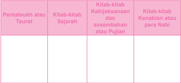

Tabel ini membagi kitab-kitab Alkitab menjadi empat kategori utama: Pentateuk atau Taurat, Kitab-kitab Sejarah, Kitab-kitab Kebijaksanaan dan sesembahan atau Pujian, dan Kitab-kitab Kenabian atau para Nabi. Pentateuk atau Taurat mencakup kitab-kitab yang paling lama dan penting dalam tradisi Kristen, seperti Kitab Malaikat, Kitab Perjanjian Lama, dan Kitab Perjanjian Baru. Kitab-kitab Sejarah berisi cerita tentang kehidupan Yesus Kristus dan para Nabi sebelumnya, seperti Kitab Nabi dan Kitab Perjanjian Baru. Kitab-kitab Kebijaksanaan dan sesembahan atau Pujian biasanya berisi puisi, doa, dan pengajaran moral, seperti Kitab Psalms dan Kitab Proverbs. Sementara itu, Kitab-kitab Kenabian atau para Nabi berisi cerita tentang kehidupan para Nabi dan para Nabi yang lebih tua, seperti Kitab Nabi dan Kitab Proverbs. Dengan demikian, tabel ini membantu pembaca untuk memahami struktur dan konten dari kitab-kitab Alkitab secara umum.

### d. Memahami Isi Pokok Perjanjian Lama:

Tentang Perjanjian Lama, Dokumen Konsili Vatikan II tentang Wahyu Ilahi ( Dei Verbum ) , artikel 14 menyatakan:

Allah  Yang  Mahakasih  dengan  penuh  perhatian  merencanakan  dan menyiapkan keselamatan segenap umat manusia. Dalam pada itu Ia dengan

 

---
## 📄 Halaman 122

penyelenggaraan  yang  istimewa  memilih  bagi  diri-Nya  suatu  bangsa,  untuk diserahi janji-janji-Nya. Sebab setelah mengadakan perjanjian dengan Abraham (lihat Kejadian 15:18) dan dengan bangsa Israel melalui Musa (lihat Keluaran 24:8), dengan sabda maupun karya-Nya Ia mewahyukan Diri kepada umat  yang  diperoleh-Nya  sebegai  satu-satunya  Allah  yang  benar  dan  hidup sedemikian  rupa,  sehingga  Israel  mengalami  bagaimanakah  Allah  bergaul dengan manusia. Dan ketika Allah bersabda melalui para Nabi, Israel semakin mendalam dan terang memahami itu, dan semakin meluas menunjukkannya di antara para bangsa (lihat Mazmur 21:28-29; 95:1-3; Yesaya 2:1-4; Yeremia 3:17). Adapun tata keselamatan, yang diramalkan, diceritakan dan diterangkan oleh  para  pengarang  suci,  sebagai  sabda  Allah  yang  benar  terdapat  dalam Kitab-kitab Perjanjian Lama. Maka dari itu kitab-kitab itu, yang diilhami oleh Allah, tetap mempunyai nilai abadi: 'Sebab apapun yang tertulis, ditulis untuk menjadi pelajaran bagi kita, supaya kita karena kesabaran dan penghiburan Kitab Suci mempunyai pengharapan' (Roma 15:4).

- Bertolak dari dokumen di atas, rumuskanlah: Apa isi Pokok Kitab Suci Perjanjian Lama?
- Memahami Hubungan Perjanjian Lama dan Perjanjian Baru
Dokumen Konsili Vatikan II tentang Wahyu Ilahi ( Dei Verbum ), artikel 16, menyatakan sebagai berikut:

Allah,  pengilham  dan  pengarang  kitab-kitab  Perjanjian  Lama  maupun Baru,  dalam  kebijaksanaan-Nya  mengatur  (Kitab  Suci)  sedemikian  rupa, sehingga Perjanjian Baru tersembunyi dalam Perjanjian Lama dan Perjanjian Lama terbuka dalam Perjanjian Baru. Sebab meskipun Kristus mengadakan Perjanjian yang Baru dalam darah-Nya (lihat Lukas 22:20; 1Korintus 11:25), namun Kitab-kitab Perjanjian Lama seutuhnya ditampung dalam pewartaan Injil, dan dalam Perjanjian Baru memperoleh dan memperlihatkan maknanya yang penuh (lihat Matius 5:17; Lukas 24:27; Roma 16:25-26; 2Korintus 3:1416) dan sebaliknya juga menyinari dan menjelaskan Perjanjian Baru.

- Bertolak dari dokumen di atas, rumuskanlah: hubungan Perjanjian Lama dan Perjanjian Baru!

### f. Makna istilah 'Perjanjian Lama'

- Istilah  'Perjanjian  Lama'  dipergunakan  untuk  membedakan  dengan 'Perjanjian  Baru' .  Dalam  sejarah  keselamatan,  relasi  manusia  dengan Allah  diikat  dengan  perjanjian,  yang  dalam  Perjanjian  Lama  manusia diwakili oleh bangsa Israel, teristimewa melalui para pemimpin mereka. Perjanjian  itu  adalah  perjanjian  kasih  yang  menyelamatkan.  Dalam perjanjian itu, Allah berjanji akan senantiasa menyelamatkan manusia, dan dari pihak manusia Allah menuntut kesetiaan.

 

---
## 📄 Halaman 123

- Sayangnya kesetiaan Allah itu seringkali dibalas dengan ketidaksetiaan Israel.  Maka  Allah  yang  adalah  setia  tetap  menjanjikan  penyelamatan pada manusia dengan cara memperbaharui perjanjian melalui putraNya sendiri Yesus Kristus. Maka Perjanjian Lama menunjuk pada perjanjian antara manusia dengan Allah sebelum Kristus.
- Walaupun 'Perjanjian Lama' pada dasarnya belum sempurna dan telah ternodai,  namun  apa  yang  diungkapkan  di  dalamnya  tetap  penting,  sebab  ia mengungkapkan kepada manusia semua orang pengertian tentang Allah dan manusia serta cara-cara Allah yang adil dan rahim; bergaul dengan manusia. Meskipun juga mencantumkan hal-hal yang tidak sempurna dan  bersifat  sementara,  Kitab-Kitab  memaparkan  cara  pendidikan ilahiah  yang  sejati.  Maka  Kitab-Kitab  itu  mengungkapkan  kesadaran hidup akan Allah, yang mencantumkan ajaran-ajaran yang luhur tentang Allah serta kebijaksanaan yang menyelamatkan tentang perikehidupan manusia,  pun  juga  perbendaharaan  doa-doa  yang  menakjubkan.  Dan terutama, karena di dalamnya memuat janji kedatangan Kristus Penebus, mempersiapkan warta, Kerajaan Allah, yang dinyatakan dalam nubuatnubuat (lihat Lukas 24:44 Yohanes 5:39; 1Petrus 1:10), dengan pelbagai lambang (lih. 1Korintus 10:11)
- Ini pula yang menjadi dasar Paulus ketika ia mengatakan: 'Tetapi pikiran mereka telah menjadi tumpul, sebab sampai pada hari ini selubung ini masih  tetap  menyelubungi  mereka,  jika  mereka  membaca  Perjanjian Lama  itu  tanpa  disingkapkan,  karena  hanya  Kristus  saja  yang  dapat menyingkapkannya  (2  Korintus  3:14).  Maka  'perjanjian  lama'  hanya mungkin dipahami bila  kita  juga  memahami  'perjanjian  baru'  dalam Kristus.
- Masuklah  dalam  kelompok,  carilah  dari  berbagai  sumber  hal-hal  yang berkaitan dengan Kanonisasi dan Kitab Deuterokanonika, Proses Penyusunan Perjanjian Lama,

### Proses Penyusunan Kitab Suci Perjanjian Lama

- Kitab -kitab yang termasuk dalam Kitab Suci Perjanjian Lama itu ada 46.  Tentu  saja  kitab-kitab  itu  tidak  ditulis  dalam  waktu  bersamaan, melainkan melalui suatu proses panjang. Berikut ini garis besar proses tersusunnya Kitab Suci Perjanjian Lama.
- Secara  garis  besar  Kitab  Suci  Perjanjian  Lama  memuat  dua  bagian besar, yakni Kitab Prasejarah dan Kitab Sejarah. Kitab Prasejarah, mulai dari  Kisah  Penciptaan  sampai  dengan  Menara  Babel  (Kejadian  1-11), sedangkan Kitab Sejarah Israel mulai dari Abraham yang hidup sekitar

 

---
## 📄 Halaman 124

tahun  2000/1800  sebelum  Masehi  sampai  menjelang  Yesus  Kristus. Namun, sejarah  yang  ditulis  dalam  Perjanjian  Lama  lebih  merupakan sejarah  iman.  Maka,  untuk  mengetahui  proses  terjadinya  Kitab  Suci Perjanjian  Lama,  sebaiknya  dimulai  dengan  awal  sejarah  Israel  yaitu sekitar tahun 1800 sebelum Masehi.

- Maka untuk mengetahui proses tersusunnya Kitab Suci Perjanjian Lama, proses  akan  dimulai  pada  saat  awal  sejarah  Israel,  yaitu  sekitar  tahun 1800 SM
Antara  tahun  1800  -  1600  S.M.: Zaman  Bapa-bapa  bangsa (Abraham-Ishak-Yakub). Periode ini adalah awal sejarah bangsa Israel yang  dimulai  dari  panggilan  Abraham  sampai  dengan  kisah  tentang Yakub.  Dalam  tahun  inilah  Bapa-bapa  bangsa  hidup.  Sebagian  kisah mereka  tersimpan  dalam  Kej  12  -  50.  Kisah  ini  kemudian  diteruskan secara lisan turun temurun.

Antara tahun 1600 - 1225 S.M.: Kisah bangsa Israel mengungsi ke Mesir, perbudakan di Mesir, pembebasan dari Mesir sampai Perjanjian di  Sinai.  Kisah-kisah  tersebut  juga  masih  disampaikan  secara  lisan. Mungkin sekali 10 perintah Allah dalam rumusan yang pendek sudah ditulis pada masa ini sebagai pedoman hidup.

Antara  tahun  1225  -  1030  S.M.: Perebutan  tanah  Kanaan  dan zaman  Hakim-Hakim.  Pada  periode  ini,  bangsa  Israel  merebut  tanah Kanaan yang diyakini sebagai Tanah Terjanji di bawah pimpinan Yosua dan kehidupan bangsa Israel di tanah yang baru di bawah para tokoh yang diberi gelar Hakim. Hakim-hakim itu antara lain adalah Debora, Simson, dan sebagainya. Di samping cerita pada masa ini, juga sudah terdapat beberapa hukum.

Antara tahun 1030 - 930 S.M.: Periode Raja-Raja. Pada periode ini, bangsa Israel memasuki tahap baru dalam kehidupannya. Mereka mulai menganut  sistem  kerajaan  yang  diawali  dengan  raja  Saul,  kemudian digantikan oleh raja Daud dan diteruskan oleh raja Salomo, putra Daud. Pada  masa  inilah  bangsa  Israel  menjadi  cukup  terkenal  dan  disegani oleh  bangsa-bangsa  lain.  Pada  zaman  raja  Saul,  Daud,  dan  Salomo, bagian-bagian Kitab Suci Perjanjian Lama mulai ditulis. Misalnya, Kisah Penciptaan  Manusia,  Manusia  jatuh  dalam  dosa  dan  akibatnya,  Bapabapa Bangsa, Kisah Para Raja, beberapa bagian Mazmur, dan hukumhukum.

Antara tahun 930 - 722 S.M.: Kerajaan Israel dan Yahuda. Sesudah raja Salomo wafat, kerajaan Israel terpecah menjadi dua, yaitu kerajaan

 

---
## 📄 Halaman 125

Utara  (Israel)  dan  kerajaan  Selatan  (Yuda).  Kerajaan  Utara  hanya berlangsung sampai tahun 722 S.M. Pada periode ini dilanjutkan dengan penulisan  Kitab-kitab  Suci  Perjanjian  Lama  yang  melengkapi  ceritacerita Kitab Taurat Musa serta beberapa tambahan hukum. Di samping itu, pada periode ini mulai muncul pewartaan para nabi dan kisah para nabi  seperti  Elia  dan  Elisa,  Hosea,  Amos.  Beberapa  bagian  pewartaan para  nabi  mulai  ditulis.  Pada  masa  ini,  beberapa  kumpulan  hukum perjanjian mulai diterapkan dan ditulis. Kita dapat membacanya dalam kitab Ulangan.

Antara tahun 722-587 S.M.: Kerajaan Yehuda masih berlangsung sesudah kerajaan Israel jatuh.  Kerajaan  Yehuda  atau  Yuda  masih  tetap berdiri kokoh sampai akhirnya mereka dibuang ke Babilon pada tahun 587  S.M.  Pada  masa  ini  beberapa  tradisi  tertulis  tentang  kisah  bapabapa  bangsa  mulai  disatukan.  Demikian  juga,  pewartaan  para  nabi mulai ditulis dan sebagian diteruskan dalam bentuk lisan. Pada masa ini juga muncul tulisan tentang sejarah bangsa Israel, beberapa bagian dari Mazmur, dan Amsal.

Antara tahun 586 - 539 S.M.: Zaman pembuangan Babilon. Orangorang  Israel  yang  berasal  dari  Kerajaan  Yuda  hidup  di  pembuangan Babilon  atau  Babel  selama  kurang  lebih  50  tahun.  Pada  masa  ini, penulisan Kitab Sejarah dilanjutkan. Muncul pula tulisan yang kemudian kita  kenal  dengan  kitab  Ratapan.  Demikian  pula  halnya  dengan  nabinabi, pewartaan para nabi sebelum pembuangan ditulis pada masa ini. Pada  periode  ini  juga  muncul  para  imam  yang  menuliskan  hukumhukum yang sekarang masuk dalam kitab Imamat.

Antara  tahun  538  -  200  S.M: Sesudah  pembuangan,  bangsa Israel  diizinkan  pulang  kembali  ke  tanah  airnya  oleh  raja  Persia  yang mengalahkan Kerajaan Babilon. Pada masa ini kelima kitab Taurat telah diselesaikan. Juga kitab-kitab Sejarah Yosua, Hakim-hakim, 1-2 Samuel, dan  Raja-raja  sudah  selesai  ditulis.  Kitab-kitab  para  nabi  pun  sudah banyak  yang  diselesaikan  Dari  ratusan  nyanyian,  akhirnya  dipilih  150 mazmur yang kita terima sampai sekarang. Pada masa ini muncul pula beberapa tulisan Kebijaksanaan.

Dua  abad  terakhir: Pada  masa  ini  ditulislah  kitab-kitab  seperti: Daniel,  Ester,  Yudith,  Tobit,  1,  2  Makabe,  Sirakh  dan  Kebijaksanaan Salomo.

### Kanonisasi Kitab Suci dan Kitab Deuterokanonika

- Kata  'kanon'  berasal  dari  bahasa  Yunani  'canon' ,  yang  artinya: norma,  ukuran  atau  pedoman.  Kitab-kitab  yang  terdapat  dalam

 

---
## 📄 Halaman 126

- kanon disebut kitab-kitab kanonik. Kitab-kitab yang diakui sebagai kanonik  tersebut  diakui  resmi  sebagai  Kitab  Suci  dan  dijadikan patokan atau norma iman mereka
- Kitab-kitab  Perjanjian  Lama  pada  awalnya  ditulis  dalam  bahasa Ibrani  ( Hebrew ),  tetapi  setelah  orang-orang  Yahudi  terusir  dari tanah Palestina dan akhirnya menetap di berbagai tempat, mereka kehilangan bahasa aslinya, banyak keturunan mereka tidak lagi bisa menggunakan  bahasa  Ibrani,  dan  mulai  berbicara  dalam  bahasa Yunani ( Greek ) yang pada waktu itu merupakan bahasa internasional. Oleh karena itu banyak diantara mereka membutuhkan terjemahan seluruh Kitab Perjanjian Lama dalam bahasa Yunani. Kebetulan pada waktu itu di Alexandria berdiam sejumlah besar orang Yahudi yang berbahasa Yunani. Selama pemerintahan Ptolemius II Philadelphus (285 - 246 SM) proyek penterjemahan dari seluruh Kitab Suci orang Yahudi ke dalam bahasa Yunani dimulai oleh 70 atau 72 ahli-kitab Yahudi (mereka adalah wakil dari ke 12 suku bangsa Israel, dan tiap suku diwakili 6 orang )
- Terjemahan ini diselesaikan sekitar tahun 250 - 125 SM dan disebut Septuagint,  yaitu  dari  kata  Latin  yang  berarti  70  (LXX),  sesuai dengan  jumlah  penterjemah.  Kitab  ini  sangat  populer  dan  diakui sebagai Kitab Suci resmi (kanon Alexandria) bagi kaum Yahudi yang terusir, yang tinggal di Asia Kecil dan Mesir. Pada waktu itu bahasa Ibrani nyaris mati dan orang-orang Yahudi di Palestina umumnya berbicara dalam bahasa Aram. ( Jadi  hampir bisa dipastikan Yesus, para Rasul dan para penulis kitab-kitab Perjanjian Baru menggunakan Perjanjian Lama terjemahan Septuagint. Bahkan, 300 kutipan dari Kitab Perjanjian Lama yang ditemukan dalam Kitab Perjanjian Baru adalah  berasal  dari  Septuagint.  Harap  diingat  juga  bahwa  seluruh Kitab Perjanjian Baru ditulis dalam bahasa Yunani ).
- Setelah Yesus disalibkan dan wafat, para pengikut-Nya tidak menjadi punah tetapi malahan menjadi semakin kuat. Pada sekitar tahun 100 Masehi, para rabbi (imam Yahudi) berkumpul di Jamnia, Palestina, mungkin sebagai reaksi terhadap Gereja. Dalam konsili Jamnia ini mereka menetapkan empat kriteria untuk menentukan kanon Kitab Suci mereka :
- Ditulis dalam bahasa Ibrani;
- Sesuai dengan Kitab Taurat;
- Lebih tua dari zaman Ezra (sekitar 400 SM);
- Ditulis di Palestina.

 

---
## 📄 Halaman 127

- Atas  kriteria-kriteria  di  atas  mereka  mengeluarkan  kanon  baru untuk  menolak  tujuh  buku  dari  kanon  Alexandria,  yaitu  seperti yang tercantum dalam Septuagint, yaitu: Tobit, Yudit, Kebijaksanaan Salomo,  Sirakh,  Barukh,  1  Makabe,  2  Makabe,  berikut  tambahantambahan dari kitab Ester dan Daniel. (Catatan: Surat Nabi Yeremia dianggap  sebagai  pasal  6  dari  kitab  Barukh) .  Hal  ini  dilakukan semata-mata  atas  alasan  bahwa  mereka  tidak  dapat  menemukan versi Ibrani dari kitab-kitab yang ditolak di atas.
- Gereja tidak mengakui konsili rabbi-rabbi Yahudi ini dan tetap terus menggunakan Septuagint. Pada konsili di Hippo tahun 393 Masehi dan konsili Kartago tahun 397 Masehi, Gereja Katolik secara resmi menetapkan  46  kitab  hasil  dari  kanon  Alexandria  sebagai  kanon bagi Kitab-kitab Perjanjian Lama. Selama enam belas abad, kanon Alexandria diterima secara bulat oleh Gereja. Masing-masing dari tujuh kitab yang ditolak oleh konsili Jamnia, dikutip oleh para Bapa Gereja (diantaranya: St. Polycarpus, St. Irenaeus, Paus St. Clement, dan St.  Cyprianus  )  sebagai  kitab-kitab  yang  setara  dengan  kitabkitab  lainnya  dalam  Perjanjian  Lama.  Tujuh  kitab  berikut  dua tambahan kitab yang ditolak  tersebut  dikenal  oleh  Gereja  sebagai Deuterokanonika (=termasuk kanon kedua) yang artinya kira-kira: 'disertakan setelah banyak diperdebatkan' .

### Langkah Ketiga: Menghayati Pentingnya Mempelajari Perjanjian Lama Bagi Kehidupan

- Sebelum  memahami  pentingnya  Perjanjian  Lama  bagi  kehidupan  iman kita  sebagai  pengikut  Kristus,  lakukanlah  kegiatan  berikut: Pilihlah  salah satu perikope berikut, baca dan renungkan, kemudian rumuskan pesan yang terdapat di dalamnya, apakah pesan itu masih relevan bagi hidupmu saat ini.
- Kejadian 11: 1-9
- Keluaran 32: 1-35
- Imamat 25: 1-22
- Mazmur 75:1-11
- Pengkotbah 11 - 12:8
- Kebijaksanaan Salomo 15:1-19
- Setelah  kalian  mampu  memahami  isi  pesan/kehendak  Tuhan  dalam  Kitab Suci Perjanjian Lama, maka sekarang rumuskan : apa pentingnya mempelajari Perjanjian Lama?

 

---
## 📄 Halaman 128

- Setelah  siswa  menjawab,  bila  dipandang  perlu,  guru  dapat  memberikan peneguhan berikut:
- Sepanjang  masa  Allah  senantiasa  mewahyukan  Diri.  Pewahyuan  Diri Allah pada dasarnya tertuju kepada semua manusia dari segala bangsa. Pewahyuan Diri  Allah  yang  universal  itu,  ditanggapi  dengan  berbagai macam cara  dan  sikap.  Dari  sekian  banyak  bangsa  manusia,  ada  satu kelompok  bangsa  yang  menanggapi  pewahyuan  Diri  Allah  itu  secara khas,  yaitu  bangsa  Israel,  yang  sekaligus  dipakai  Allah  untuk  menjadi sarana dalam menyampaikan rencana penyelamatan-Nya, sebagaimana terungkap dalam Kitab-Kitab Perjanjian Lama.
- Mengingat isi Perjanjian Lama yang sangat penting itu, maka membaca dan mendalami Kitab Perjanjian Lama merupakan keharusan.
Pertama ,  dengan  mempelajari  Perjanjian  Lama,  kita  akan  melihat bagaimana  Allah  secara  terus-menerus  dan  dengan  setia  menyatakan Diri-Nya  untuk  dikenal;  dan  bagaimana  bangsa  Israel  menanggapi pewahyuan  Allah  itu.  Hubungan  timbal-balik  antara  Allah  dengan bangsa Israel tersebut dapat menjadi cermin bagi manusia yang hidup zaman sekarang dalam membangun relasi yang lebih baik dengan Allah.

Kedua ,  Kitab  Suci  Perjanjian  Lama  bukan  buku  yang  pertamatama hendak menguraikan fakta-fakta sejarah, melainkan dan terutama hendak  mengungkapkan  Allah  yang  ber firman,  yang  menyampaikan rencana dan tindakan penyelamatan kepada manusia. Perjanjian Lama adalah  Firman  Allah.  Karena  Firman  Allah,  maka  manusia  diminta untuk mau mendengarkan dan menjalankan apa yang difirmankan-Nya.

Ketiga ,  beberapa  bagian  kitab  Perjanjian  Lama  berisi  nubuatnubuat tentang Juru Selamat yang dijanjikan Allah, yang digenapi dalam diri  Yesus  Kristus.  Oleh  karena  itu,  pemahaman  diri  Yesus  Kristus sebagai  penggenapan  janji  Allah  dapat  sepenuhnya  dipahami  bila  kita mempelajari Perjanjian Lama.

Keempat ,  Y esus  sendiri  sebagai  orang  Yahudi  mendasarkan  pengajaran-Nya dari Kitab Perjanjian Lama. Ia tidak meniadakan Perjanjian Lama, melainkan meneguhkan dan sekaligus memperbaharuinya.

- Guru  membimbing  peserta  didik  hening,  sambil  diselingi  lagu  dari  Puji Syukur 373, atau musik atau lagu lain yang sesuai. Misalnya:

### Lagu bait 1:

``

Bersabdalah Tuhan Kami Mendengarkan

 

---
## 📄 Halaman 129

### 5   5    5   5   1   1  |   5    5    4   3   2   1  |

### Bersabdalah Tuhan Kami Mendengarkan

Anak-anakku yang terkasih, seorang penyair, Anthony de Mello menceritakan kisah berikut:

Seorang murid mengeluh kepada gurunya: 'Bapa menceritakan banyak kisah, tetapi tidak pernah menerangkannya kepada kami!'

Sang guru menjawab: 'Anakku, bagaimana pendapatmu, andaikata seseorang menawarkan buah kepadamu, namun mengunyahnya terlebih dahulu untukmu?'

Hening.....

### Lagu: Bait 2 Sabdamu Ya Tuhan Roh Dan Kehidupan 2 X

Hari ini, kita belajar tentang Kitab Suci Perjanjian Lama.

Di awal kita mendiskusikan, bahwa banyak orang tidak membacanya dengan berbagai alasan.

Ada yang karena merasa sulit memahami, ada yang memang malas, ada yang merasa tidak penting.

Hari ini juga, kita belajar memahami bahwa Kitab Suci Perjanjian Lama berisi firman Allah. Maka, barang siapa yang membaca dan merenungkannya dengan tekun dapat menangkap kehendak Allah di dalamnya.

Hening.....

### Lagu Bait 3: Sabdamu Ya Tuhan Sungguh Mengagumkan 2X

Karena Kitab Suci berisi firman Allah,

Untuk memahaminya kita tidak bisa hanya mengandalkan kekuatan akal budi kita

Kita membutuhkan iman dan membiarkan Roh hadir saat kita membaca Kitab Suci

Kita butuh hati yang terbuka untuk Allah yang bersabda pada diri kita Hening....

### Lagu Bait 4: Sabdamu Ya Tuhan Dasar Hidup Kami 2X

Mungkin satu dua kali kita sulit memahaminya

Tetapi dengan membaca dan membacanya terus menerus kita akan mendapatkan pesan Allah bagi kehidupan kita.

Sekarang berjanjilah dalam dirimu sendiri,

Untuk  mencoba  dan  mencoba  menemukan  kehendak  Allah  itu  dengan  giat membaca Kitab Suci

 

---
## 📄 Halaman 130

dan  terutama  bersedia  hidup  seturut  kehendak  Allah  sebagaimana  tersirat dalam Kitab Suci Hening....

Lagu Bait 5: Pada Sabda Tuhan Kami Akan Patuh 2X

### Doa penutup:

Guru mengajak para peserta didik menutup pelajaran dengan mendaraskan bersama Amsal 30:4-9 berikut ini:

- 4 Siapakah yang naik ke Surga lalu turun? Siapakah yang telah mengumpulkan angin dalam genggamnya? Siapakah yang telah membungkus air dengan kain? Siapakah yang telah menetapkan segala ujung bumi? Siapa namanya dan siapa nama anaknya? Engkau tentu tahu!
- 5 Semua firman Allah adalah murni. Ia adalah perisai bagi orang-orang yang berlindung pada-Nya.
- 6 Jangan  menambahi  firman-Nya,  supaya  engkau  tidak  ditegur-Nya  dan dianggap pendusta.
- 7 Dua hal aku mohon kepada-Mu, jangan itu Kautolak sebelum aku mati, yakni:
- 8 Jauhkanlah  dari  padaku  kecurangan  dan  kebohongan.  Jangan  berikan kepadaku  kemiskinan  atau  kekayaan.  Biarkanlah  aku  menikmati  makanan yang menjadi bagianku.
- 9 Supaya, kalau aku kenyang, aku tidak menyangkal-Mu dan berkata: Siapa TUHAN itu? Atau, kalau aku miskin, aku mencuri, dan mencemarkan nama Allahku.

 

---
## 📄 Halaman 131

### B. Kitab Suci Perjanjian Baru

### Kompetensi Dasar

- 1.6.  Beriman  kepada  Allah  melalui  Kitab  Suci  dan  Tradisi  sebagai  dasar  iman kristiani.
- 2.6.  Responsif dan proaktif dalam mengembangkan pemahaman tentang ajaran Kitab Suci dan Tradisi sebagai dasar iman kristiani
- 3.6.  Memahami  Kitab Suci dan Tradisi sebagai dasar iman kristiani
- 4.6.  Melakukan aktivitas (misalnya menulis r efleksi/ slogan/puisi/ kata bermakna) tentang Kitab Suci dan Tradisi sebagai dasar iman kristiani

### Indikator Hasil Belajar

Pada akhir pelajaran, peserta didik mampu:

- Menjelaskan proses tersusunnya Kitab Suci Perjanjian Baru;
- Menyebutkan bagian-bagian Kitab Suci Perjanjian Baru;
- Menjelaskan alasan membaca Kitab Suci
- Membaca dan merenungkan Kitab Suci dengan baik.

### Bahan Kajian

- Proses terjadinya Kitab Suci Perjanjian Baru.
- Bagian-bagian Kitab Suci Perjanjian Baru.
- Alasan membaca Kitab Suci.
- Usaha membaca Kitab Suci.

### Pendekatan

Pendekatan Kateketis dan Pendekatan Saintifik

### Metode:

- Diskusi
- Studi literatur
- Sharing pengalaman iman

### Sumber Belajar

- Groenen OFM, Pengantar Kitab Suci Perjanjian Baru , Penerbit Kanisius, 1980.
- I. Suharyo. Pr., Pengantar Injil Sinoptik , Penerbit Kanisius, 1989.
- I.  Suharyo,  Pr. Membaca  Kitab  Suci  Mengenal  Tulisan  Perjanjian  Baru , Yogyakarta: Kanisius, 1991

 

---
## 📄 Halaman 132

- Komisi  Kateketik  KWI, Pendidikan  Agama  Katolik  untuk  SMA/K  Kelas  X , Kanisius Yogyakarta, 2010.
- Konferensi Wali Gereja Indonesia, Iman Katolik , Kanisius Yogyakarta, 1995

### Waktu

3 jam pelajaran

### Pemikiran Dasar

Tidaklah  mudah  bagi  seseorang  untuk  memahami  isi  sebuah  tulisan  yang sudah berusia sekitar 2000 tahun yang lalu. Apalagi isi tulisan tersebut tentang tokoh dan kelompok masyarakat tertentu, yang tinggal di wilayah tertentu dengan konteks geogra fis, sosial budaya, sosial politik dan sosial keagamaan tertentu yang berbeda dengan si pembaca. Kesulitan yang sama sering dikeluhkan sebagian Umat, terutama ketika mereka berhadapan dengan Kitab Suci Perjanjian Baru. Tetapi kesulitan tidak identik dengan jalan buntu. Siapapun yang hendak mempelajari Kitab Suci Perjanjian Baru dapat masuk dan sampai pada alam pikiran Perjanjian Baru, bila ia berusaha keras disertai keyakinan pada Roh Kudus sendiri yang akan membimbingnya.

Dari keseluruhan isi Kitab Suci Perjanjian Baru tampaklah dengan jelas, bahwa para penulis tidak pertama-tama hendak mewariskan kronologis peristiwa sejarah seperti  Yesus  Kristus  dan  kehidupan  Gereja  Perdana.  Yang  mereka  ungkapkan terutama  pengalaman  iman  akan  Yesus.  Mereka  sebagai  saksi  mata  peristiwa Yesus Kristus sebagai tokoh sentral. Melalui pergaulan dan kebersamaan dengan Yesus  Kristus,  baik  langsung  maupun  tidak  langsung,  mereka  pada  akhirnya mengimani Yesus Kristus sebagai Anak Allah dan Juru Selamat yang sekaligus menjadi pemenuhan janji penyelamatan Allah kepada manusia, sebagaimana telah dipersiapkan dan diwartakan dalam Perjanjian Lama. Pada dasarnya pengalaman iman para penulis akan Yesus Kristus tidaklah sama, karena sangat dipengaruhi oleh  berbagai  macam  latar  belakang  yang  melekat  pada  diri  penulis  sendiri. Itulah  sebabnya  gaya,  cara,  dan  isi  pengalaman  iman  yang  mereka  sampaikan mempunyai penekanan yang berbeda satu terhadap yang lain. Konsekuensi dari itu semua, bila manusia sekarang ingin memahami isi pesan Kitab Perjanjian Baru maka  disarankan  agar  mereka  mencoba  memahami  konteks  kemasyarakatan dan keagamaan masyarakat dan para penulis. Walaupun demikian, pemahaman akan konteks bukan hal mutlak, sebab yang paling penting adalah bagaimana kita menempatkan Perjanjian Baru sebagai cara Allah menyampaikan kehendakNya melalui ungkapan pengalaman orang-orang yang hidup pada zaman tertentu.

Di  tengah  berbagai  kesulitan  yang  dialami  Umat  dalam  membaca  dan memahami  isi  pesan  Kitab  Perjanjian  Baru,  Konsili  Suci  mendesak  dengan sangat semua orang beriman supaya sering kali membaca Kitab-Kitab ilahi untuk

 

---
## 📄 Halaman 133

memperoleh pengertian yang mulia akan Yesus Kristus  (Dei  Verbum  Art.  25). Santo Paulus pun dalam suratnya yang kedua kepada Timotius mengatakan bahwa 'segala  tulisan  yang  diilhamkan  Allah  (Kitab  Suci)  memang  bermanfaat  untuk mengajar, untuk menyatakan kesalahan, untuk memperbaiki kelakuan, dan untuk mendidik orang dalam kebenaran' (lihat 2 Timotius 3: 26). St. Hironimus berkata 'Tidak mengenal Kitab Suci berarti tidak mengenal Kristus. '

Melalui  Kegiatan  Pembelajaran  tentang  Kitab  Suci  Perjanjian  Baru,  para peserta  didik  diajak  untuk  mengenal  Kitab  Perjanjian  Baru  sebagai  buku kesaksian iman sekaligus sebaga i firman Tuhan yang tertulis. Peserta didik diajak untuk menggali informasi tentang proses terjadinya Kitab Suci Perjanjian Baru, mengenal  pembagian  Kitab  Suci  Perjanjian  Baru,  dan  menyadari  pentingnya mendalami sabda Tuhan dalam Kitab Suci.

### Kegiatan Pembelajaran

### Doa Pembuka

Guru  mengajak  peserta  didik  mengawali  pelajaran  dengan  mendaraskan bersama doa berikut

Allah Yang Mahabaik, kami bersyukur atas para penulis Kitab Suci.

Berkat kesaksian iman mereka, kami mampu mengenal Engkau dan Putera-Mu Yesus Kristus

Kami mohon, hadirlah di tengah kami, agar melalui pelajaran ini,

kami semakin terdorong untuk membaca dan merenungkan firmanMu dan menjadikan firman-Mu itu sebagai arah dan pedoman hidup kami sehari-hari.

Demi Kristus, Tuhan dan Juru Selamat kami Amin

### Langkah Pertama: Memahami Bahwa Penuturan Kisah Sangat Dipengaruhi oleh Sudut Pandang Orang yang Mengisahkannya

- Guru menyampaikan pengantar singkat, misalnya:

 

---
## 📄 Halaman 134

Kekhasan agama Kristiani terletak pada Iman akan Yesus Kristus sebagai Anak Allah, Juru Selamat dan pemenuhan janji Allah yang telah diberitakan dalam Perjanjian Lama. Hal tersebut diungkapkan secara jelas oleh para penulis Perjanjian  Baru.  Melalui  tulisannya  dan  dengan  cara  dan  gayanya  masingmasing,  para  penulis  berupaya  mengungkapkan  dalam  tulisan  Perjanjian Baru. Kenyataan tersebut sering menimbulkan berbagai pertanyaan: apakah yang dituliskan oleh para penulis Kitab Suci tentang Yesus Kristus itu sesuai dengan kejadian sesungguhnya? Apa yang perlu dipahami oleh manusia zaman sekarang tentang Perjanjian Baru agar sampai pada iman pada Yesus Kristus?

Sebelum  menjawab  pertanyaan-pertanyaan  tersebut,  coba  simak  sajak dan cerita berikut !

- Guru mengajak peserta didik menyimak satu buah sajak dan satu buah cerita berikut:

### Untuk sang kekasih

Karya: AMAS

Kasihku, Mungkin engkau tak tahu, Sejak aku menangkap tatapan matamu, Hati ini bergelora berjuta rasa, Berselimut rindu untuk bertemu Berbalut rasa ingin selalu berjumpa

Kasihku,

Entah apa yang engkau punya, Pesonamu seolah membius diriku, Kehadiranmu membutakan aku Dimana pun aku berada, engkau selalu hadir menemani Apapun angan yang aku pikirkan, engkau selalu membayang

Kasihku,

Seandainya saja engkau tahu

Ada cinta yang sedemikian besar dalam diriku Untuk selalu mengandalkan engkau di setiap saat hidupku Ada harap yang tak kan pernah putus Untuk merajut masa depan kita walau hanya berdua Ada keyakinan yang teguh

Untuk berani menghadapi apapun yang dapat menggoyahkan cinta kita

Kasihku,

Aku mencintaimu !

 

---
## 📄 Halaman 135

### 'Satu peristiwa, dua sudut pandang'

Suatu pagi terjadi kecelakaan, seorang peserta didik Sekolah Menengah yang  ngebut  di  jalanan,  menabrak  kendaraan  lain  di  depannya.  Motornya hancur,  ia  sendiri  terluka  parah  sehingga  harus  dirawat  di  rumah  sakit. Banyak orang menyaksikan peristiwa itu.

Ketika  sampai  di  rumahnya,  seorang  Bapak  yang  melihat  peristiwa tersebut bercerita kepada tetangganya: 'Tadi pagi saya melihat seorang peserta didik  Sekolah  Menengah  mengendarai  motornya  dalam  keadaan  ngebut, sampai akhirnya ia menabrak kendaraan di depannya. Sekarang ia dibawa ke rumah sakit!'

Sementara itu, sang pengendara motor, setelah dirawat selama seminggu, ia berkata kepada teman yang menjenguknya: 'Saya bersyukur masih hidup. Seandainya Tuhan tidak melindungi saya, pasti saya sudah meninggal. Tuhan rupanya masih sayang kepada saya, walaupun saya tidak layak di hadapanNya. Bagi  saya,  peristiwa  tabrakan  minggu  lalu  itu  adalah  cara  Tuhan  menegur saya,  supaya  saya  tidak  menjadi  anak  berandalan.  Tuhan mau supaya saya menyayangi  hidup  yang  telah  ia  berikan.  Tuhan  juga  mau  agar  saya  tidak memberi kesusahan pada kedua orang tua saya'

- Guru meminta peserta menanggapi puisi dan kisah di atas dengan pertanyaan: Kemukakan  pandanganmu:  Apakah  gambaran  AMAS  tentang  kekasihnya sungguh realistis seperti yang diungkapkan dalam puisi tersebut? Apa yang mendasari AMAS bisa menggambarkan kekasihnya seperti itu? Mungkinkah kalian  yang  tidak  mengenal  dan  bukan  kekasihnya  bisa  menggambarkan seperti itu?
Perhatikan pula cerita di atas: Mengapa penuturan peristiwa kecelakaan yang satu dan sama, tetapi penuturannya berbeda? Faktor apa yang membuat penuturan  cerita  tersebut  menjadi  berbeda?  Penuturan  siapa  yang  paling benar?

- Bila dipandang perlu, guru dapat membantu memberi penegasan berikut:
- Hanya AMAS yang dapat melukiskan dan merasakan kehadiran sosok kekasihnya seperti itu. Mungkin ada orang lain yang menilai AMAS tidak realistis.  Dengan  kata  lain,  ungkapan  semacam  itu  tidak  akan  pernah ditemukan dalam hubungan antar pribadi yang tidak saling mengasihi.
- Sedangkan  dalam  cerita  'satu  peristiwa  dua  sudut  pandang'  hendak menggambarkan,  bahwa  orang  yang  pertama  hanya  melihat  suatu peristiwa  dan  menuturkannya  semata-mata  sebagai  peritiwa  faktual. Sedangkan  sang  pengendara  motor  melihat  bahwa  dalam  peristiwa tersebut tidak melulu pengalaman manusiawi. Ia merasa di dalamnya ada campur tangan Tuhan.

 

---
## 📄 Halaman 136

- Guru  meminta  peserta  didik  membaca  kutipan  Matius  14:13-21  'Yesus memberi makan lima ribu orang' .

### Matius 14:13-21

- 13 Setelah Yesus mendengar berita itu menyingkirlah Ia dari situ, dan hendak mengasingkan diri dengan perahu ke tempat yang sunyi. Tetapi orang banyak mendengarnya dan mengikuti Dia dengan mengambil jalan darat dari kotakota mereka.
- 14 Ketika Yesus mendarat, Ia melihat orang banyak yang besar jumlahnya, maka tergeraklah hati-Nya oleh belas kasihan kepada mereka dan Ia menyembuhkan mereka yang sakit.
- 15 Menjelang  malam,  murid-murid-Nya  datang  kepada-Nya  dan  berkata: 'Tempat ini sunyi dan hari sudah mulai malam. Suruhlah orang banyak itu pergi supaya mereka dapat membeli makanan di desa-desa. '
- 16 Tetapi Yesus berkata kepada mereka: 'Tidak perlu mereka pergi, kamu harus memberi mereka makan. '
- 17 Jawab mereka: 'Yang ada pada kami di sini hanya lima roti dan dua ikan. '
- 18 Yesus berkata: 'Bawalah ke mari kepada-Ku. '
- 19 Lalu disuruh-Nya orang banyak itu duduk di rumput. Dan setelah diambilNya lima roti dan dua ikan itu, Yesus menengadah ke langit dan mengucap berkat, lalu memecah-mecahkan roti itu dan memberikannya kepada muridmurid-Nya, lalu murid-murid-Nya membagi-bagikannya kepada orang banyak.
- 20 Dan mereka semuanya makan sampai kenyang. Kemudian orang mengumpulkan potongan-potongan roti yang sisa, dua belas bakul penuh.
- 21 Yang  ikut  makan kira-kira lima ribu laki-laki, tidak termasuk perempuan dan anak-anak.
- Peserta didik membandingkan kisah di atas dengan yang terdapat dalam Injil lainnya, dan merumuskan kesimpulan hasil perbandingan tersebut
- Guru  meminta  peserta  didik  meendiskusikan  pertanyaan:  Menurutmu: apakah kisah di atas merupakan kisah yang sungguh-sungguh terjadi seperti itu? Pribadi Yesus yang bagaimana yang hendak diwartakan melalui kutipan tersebut? Pesan apa yang mau disampaikan melalui kisah tersebut?
- Bila dipandang perlu Guru dapat menegaskan pokok-pokok berikut:
- Kisah  di  atas  bukan  suatu  laporan  peristiwa  sejarah,  melainkan  suatu kisah yang dilatarbelakangi kesan yang mendalam dari tiap penulisnya. Kesan yang mendalam itu sudah diwarnai juga iman mereka akan Yesus sebagai Mesias yang dinantikan. Karena latar belakang masing-masing penulis berbeda, maka cara penyampaiannya pun berbeda.

 

---
## 📄 Halaman 137

- Tetapi  di  balik  perbedaan  itu,  ada  satu  hal  yang  sama  yang  hendak diungkapkan mereka, yakni iman akan Yesus yang berbelas kasih, Yesus yang selalu peduli dan mengajak para murid-Nya juga peduli terhadap nasib sesamanya.

### Langkah Kedua: Memahami Kitab Suci Perjanjian Baru

- Dalam kelompok, peserta didik mencari informasi dari Alkitab atau sumber lain  tentang  makna  istilah  Perjanjian  Baru,  proses  tersusunnya  Perjanjian Baru, Kitab-kitab yang termasuk dalam Perjanjian Baru, Pentingnya mendalami Kitab Suci Perjanjian Baru
- Presentasi hasil kerja masing-masing kelompok
- Bila diperlukan guru dapat memberi rangkuman, misalnya:

### Istilah Perjanjian Baru

Perjanjian  Lama  dengan  Perjanjian  Baru-walaupun  sama-sama  Sabda Allah  merupakan  dua  Kitab  yang  berbeda.  Perbedaan  dapat  dilihat  dalam perjanjian  itu.  Buku  yang  lama  (PL)  berbicara  mengenai  perjanjian  Tuhan dengan  bangsa  Israel;  sedangkan  buku  kedua,  yang  sekarang  disebut  PB, berbicara mengenai perjanjian Tuhan dengan umat manusia seluruhnya dalam diri Yesus dari Nazaret. Sebetulnya harus dikatakan bahwa apa yang disebut 'PB' tidak banyak bicara mengenai 'perjanjian. ' PB sebetulnya tidak banyak bicara  mengenai  perjanjian,  melainkan  mengenai  Yesus.  Namun  adalah kekhususan dari PB, bahwa melihat diri sebagai lanjutan dari PL. Ada suatu kesinambungan. Maka kedua-duanya dilihat sebagai perjanjian Tuhan dengan umat manusia. Cuma dalam fase pertama, atau dalam perjanjian yang lama itu, perjanjian masih dibatasi pada bangsa Israel, sedangkan dalam periode kedua, yang disebut 'perjanjian yang baru, ' hubungan itu diperluas kepada umat  manusia  seluruhnya.  Maka  isi  daripada  kata  'perjanjian'  lebih  jelas dalam PL, tetapi lebih mendalam dalam PB. Dalam PB Tuhan berhubungan dengan umat manusia bukan lagi melalui suatu naskah perjanjian, melainkan melalui Putera-Nya sendiri ialah Tuhan kita Yesus Kristus.

### Proses penyusunan Kitab Suci Perjanjian Baru

Ke 27 Kitab dalam Perjanjian Baru, tentu saja tidak langsung jadi, tetapi melalui  proses  yang  kurang  lebih  100  tahun.  Ketika  Yesus  masih  hidup, tidak seorangpun di antara murid-murid-Nya yang terpikir untuk mencatat tentang  apa  yang  Ia  lakukan  atau  Ia  katakan,  atau  segala  sesuatu  tentang kehidupan-Nya. Mereka hanya ingin menjadi murid Yesus yang mengikuti Yesus ke manapun Ia pergi, mereka tinggal bersama Yesus, mereka belajar mendengarkan ajaran-Nya, dan menyaksikan tindakan Yesus.

 

---
## 📄 Halaman 138

Baru sesudah Yesus dibangkitkan, mereka mulai merasakan arti kehadiran Yesus bagi hidup mereka, dan bagi banyak orang yang selama ini mengikuti Yesus percaya kepada-Nya. Sesudah Yesus bangkit, para murid mulai sadar, bahwa  Ia  yang  selama  ini  diikuti  adalah  sosok  yang  menjadi  kegenapan janji  Allah,  sebagai  Tuhan  dan  Juru  Selamat.  Peristiwa  Pentakosta  seolah membakar hati mereka untuk mulai berani bercerita kepada banyak orang tentang siapa Yesus sesungguhnya. Berkat Pentakosta, mereka mulai keluar dari persembunyian, dan pergi ke berbagai tempat menceritakan secara lisan tentang ajaran, karya (mukjizat-mukjizat), serta hidup Yesus.

Dari  situ  terbentuklah  semakin  banyak  kelompok  orang  yang  percaya kepada  Yesus  di  berbagai  kota,  tapi  sampai  ke  wilayah  di  luar  Palestina. Karena orang-orang yang percaya kepada Yesus itu tersebar di berbagai kota, dan tidak selamanya para rasul bisa hadir di tengah mereka, maka kadangkadang komunikasi dilakukan melalui surat. Surat itu bisa berisi wejangan untuk  menyelesaikan  masalah  atau  pengajaran  atau  cerita-cerita  tentang kehidupan Yesus.

Baru sesudah para murid meninggal dan umat yang percaya kepada Yesus Kristus semakin banyak, muncullah kebutuhan akan tulisan baik mengenai hidup  Yesus,  karya-Nya,  sabda-Nya  maupun  akhir  hidup-Nya.  Berkat bimbingan Roh Kudus, mereka menuliskan kisah tentang Yesus berdasarkan cerita-cerita  dari  para  saksi  mata,  para  pengikut-Nya  yang  sudah  beredar dan berkembang luas di tengah-tengah (bacalah Lukas 1:1-4). Tentu tulisantulisan tersebut dipengaruhi oleh kemampuan, iman dan maksud serta tujuan penulis serta situasi jemaat yang dituju oleh tulisan itu.

Oleh sebab itu, kita tidak perlu heran jika tulisan-tulisan dari para penulis tentang  Yesus  tersebut  terdapat  perbedaan.  Sebab,  mereka  bukan  menulis suatu laporan atau sejarah tentang Yesus melainkan melalui tulisan itu mereka mau mewartakan iman mereka (dan iman jemaat) akan Yesus Kristus, sebagai Tuhan dan Juru Selamat.

Untuk memahami lebih dalam tentang proses tersusunnya tulisan-tulisan mengenai Yesus Kristus, kita harus mulai dari periode hidup Yesus sampai pembentukan kanon Perjanjian Baru.

### Antara tahun 7/6 sebelum Masehi (SM) - 30 sesudah Masehi (M)

- a). Yesus lahir sekitar tahun 7/6 SM*, dibesarkan di desa Nazaret wilayah Galilea.  Ia  seorang  Yahudi  yang  saleh  yang  menaati  hukum  dengan penuh semangat (bandingkan Matius 5:17). Sekitar tahun 27/28 Masehi Yesus dibaptis di sungai Yordan oleh Yohanes Pembaptis. Kemudian la berkarya  sebentar  seperti  Yohanes  Pembaptis,  yaitu  bersama  dengan murid-murid-Nya  membaptis  (bandingkan  Yohanes  3:22-26),  tetapi

 

---
## 📄 Halaman 139

- kemudian Ia berkeliling di seluruh Galilea dan Yudea untuk mewartakan Kerajaan Allah. Ketika Yesus lahir dan tampil di depan umum, Palestina berada di bawah kekuasaan Roma dipimpin oleh Agustus dan di Palestina dipimpin oleh Herodes Agung.
- b). Dalam  situasi  seperti  itu  ada  suasana  kebencian  di  kalangan  orang Yahudi terhadap penjajah Roma. Sementara itu dalam kehidupan Umat Yahudi sejak lama tumbuh keyakinan bahwa Allah mereka adalah Allah yang setia dan selalu terlibat dalam seluruh kehidupan umat-Nya. Dalam kondisi dijajah oleh bangsa lain mereka menaruh harapan pada Allah yang akan membebaskan mereka dari derita dan penjajahan. Campur tangan Allah itu diyakini akan dilaksanakan melalui seorang tokoh yang disebut Mesias.  Mesias  digambarkan  sebagai  utusan  Allah,  seorang  pahlawan yang akan membebaskan Israel dari penjajah dan antek-anteknya. Maka timbullah berbagai gerakan mesianisme. Salah satu gerakan mesianisme bercorak  keagamaan  adalah  seperti  yang  dirintis  Yohanes.  Yohanes mewartakan bahwa Allah akan memenuhi janji-Nya, bilamana bangsa Israel  bertobat  sebagaimana  dituntut  oleh  para  nabi  (Matius  3:1-12). Yohanes  juga  memberitakan  tentang  Yesus  sebagai  utusan  Allah  yang akan membawa pembebasan bagi mereka. Seruan pertobatan Yohanes ditanggapi  bangsa  Israel.  Mereka  memberi  diri  dibaptis  oleh  Yohanes sebagai  tanda  pertobatan.  Yesus  pun  mengikuti  mereka  sebagai  tanda solidaritas dengan mereka.
- c). Setelah  dibaptis  oleh  Yohanes,  Yesus  meneruskan  pesan  yang  sudah diserukan  oleh  Yohanes.  Tetapi  gambaran  Yohanes  tentang  diri  Yesus sebagai Mesias berbeda dengan yang dipahami Yesus sendiri. Yohanes menggambarkan  bahwa  campur  tangan  Allah  akan  terlaksana  secara mengerikan, sedangkan Yesus menyatakan campur tangan Allah sebagai kabar baik sebagaimana dinyatakan oleh para nabi (bandingkan Yesaya 40:11; 52:7-10), yakni hidup, sabda dan karyaNya.
- d). Dalam  mewartakan  misinya  sebagai  Mesias,  Yesus  kerap  mengajar dengan  menggunakan  perumpamaan  agar  mudah  ditangkap  oleh orang-orang sederhana. Namun demikian semua disampaikan dengan kewibawaan Ilahi. Itulah sebabnya Yesus selalu bersabda: ' Aku berkata kepada-mu... (Markus  1:27).  Yesus  juga  tampil  dengan  gaya  dan  cara hidup  yang  berbeda  dengan  orang  lain.  Kerap  kali  Ia  'melanggar' kaidah-kaidah  umum  yang  berlaku,  misalnya:  menyembuhkan  orang pada hari Sabat, bergaul dengan orang-orang berdosa, makan bersama atau mengadakan perjamuan dengan orang-orang yang oleh masyarakat dicap sebagai sampah masyarakat (pendosa), Yesus banyak melakukan mukjizat,  mengampuni  dosa  atau  membangkitkan  orang  mati  (yang

 

---
## 📄 Halaman 140

- menurut  pandangan  banyak  orang  hal  itu  hanya  bisa  dilakukan  oleh Allah). Sebagian orang yang melihat tindakan Yesus semakin mengagumi Dia,  dan  semakin  membuat  orang  bertanya-tanya  siapa  sebenarnya Dia  ini?  (bandingkan  Markus  8:27-30  dan  Injil  lain).  Tetapi  hal  yang sama membuat kebencian Kaum Farisi, khususnya para Imam dan ahli Taurat. Yesus dianggap oleh mereka menghojat Allah. Kendati demikian, Yesus  tidak  takut  dan  tetap  mewartakan  kedatangan  Kerajaan  Allah dan mengajak setiap orang yang mendengar-Nya bertobat dan percaya kepada Injil.
- e). Kebencian  para  pemimpin  agama  dan  kaum  Farisi  tampak  dalam tindakan mereka yang selalu menguji Yesus untuk mencari kesalahanNya.  Bahkkan  diceritakan,  bahwa  beberapa  kali  mereka  bersekongkol untuk membunuh Yesus, tetapi Yesus berhasil menyingkir, meloloskan diri  (Matius  12:14).  Hingga  pada  akhirnya,  mereka  menggunakan kesempatan perayaan Paska untuk menangkap Yesus. Yesus ditangkap kemudian  diadili  oleh  pengadilan  Agama  (Sanhedrin)  di  sini  Yesus diputuskan untuk dihukum mati. Maka mereka membawa Yesus kepada penguasa  Romawi  (Ponsius  Pilatus)  untuk  mengizinkan  menghukum mati  Yesus.  Atas  desakan  orang  banyak,  akhirnya  Ponsius  Pilatus menjatuhkan hukuman mati di kayu salib. Kemungkinan besar hal itu terjadi sekitar tanggal 7 April tahun 30 M.
- f). Sejak  penangkapan  Yesus  di  Taman  Getsemani,  murid-murid  yang selama  ini  selalu  bersama-sama  dengan  Dia  sangat  ketakutan.  Petrus menyangkal, para murid  yang lain entah ke mana.  Yesus harus menghadapi pengadilan sendirian bahkan berjalan salib tanpa mereka. Sampai  akhirnya  Yesus  wafat  di  Salib.  Sesaat  seolah-olah  apapun tentang Yesus lenyap ditelan bumi. Para murid bersembunyi di rumahrumah, tidak berani tampil di muka umum. Titik balik mulai muncul, ketika tiga hari kemudian mereka mendapati Yesus bangkit. Tidak ada laporan  dan  kesaksian  yang  utuh  tentang  kebangkitan  Yesus.  Mereka hanya menceritakan tentang makam Yesus yang kosong, dengan hanya menyisakan kain kafan, serta malaikat yang memberitakan kabangkitan Yesus. Beberapa waktu kemudian, mengalami beberapa kali penampakan Yesus. Mereka mengalami seolah Yesus yang hadir dalam wujud mulia.
- g). Kebangkitan  Yesus  itu  memperkokoh  iman  mereka.  Mereka  menjadi semakin percaya bahwa Yesus sungguh-sungguh Mesias, Putera Allah, Tuhan dan Penyelamat. Mereka semakin yakin akan segala sesuatu yang telah  diwartakan  Perjanjian  Lama  tentang  Mesias,  dan  hal  itu  dilihat sebagai  terlaksana  dalam  diri  Yesus.  Keyakinan  baru  ini  dirasakan mereka sebagai datang dari Allah sendiri, bukan hasil olah pikir mereka.

 

---
## 📄 Halaman 141

Lebih-lebih  berkat  Pentakosta  keyakinan  dan  keberanian  itu  semakin menguatkan mereka untuk memberi kesaksian kepada semua orang.

### Antara  Tahun  40  -  120  Masehi:  penyusunan  dan  penulisan  Kitab  Suci Perjanjian Baru.

- a). Karangan  tertua  dari  Kitab  Suci  Perjanjian  Baru  adalah  1  Tesalonika (ditulis sekitar tahun 40 an) sedangkan yang paling akhir adalah 2 Petrus (tahun 120-an)
- b). Yesus pasti tidak menulis apapun yang berkaitan dengan karya dan sabdasabda-Nya, tidak juga menyuruh para murid-Nya untuk menuliskannya, meskipun Ia bisa membaca dan menulis (lihat Lukas 4:17-19 dan Yohanes 8:6). Ia hanya berkeliling mengajar dan berbuat baik (menyembuhkan, mengusir setan dan sebagainya) di dalam pengajaran-Nya Yesus kerapkali menggunakan Kitab Suci, tetapi Kitab Suci yang la gunakan adalah Kitab Suci  Perjanjian  Lama.  Namun  karena  sabda-Nya  dan  hidup-Nya  serta karya-Nya  begitu  mengesankan  dan  berwibawa  maka  banyak  orang tertarik dan mengikuti Yesus. Lebih-lebih setelah kebangkitan, di mana Yesus diakui dengan berbagai macam gelar (Kristus, Tuhan, Juru Selamat dan  sebagainya),  maka  para  pengikutnya  mulai  meneruskan  apa  yang telah  dimulai  oleh  Yesus.  Mereka  berkeliling  tidak  hanya  di  Palestina tetapi  sampai  di  luar  Palestina,  untuk  mewartakan  karya  keselamatan Allah yang terlaksana melalui Yesus Kristus.
- c). Mula-mula para murid mulai mewartakan Yesus secara lisan. Inti  pewartaan pada mulanya adalah wafat dan kebangkitan-Nya (bdk. Kisah Para Rasul: Khotbah Petrus pada hari Pentakosta, Kisah Para Rasul 2). Kemudian pewartaan itu berkembang dengan mewartakan juga hidup, karya  dan  sabda-Nya  dan  yang  terakhir  adalah  masa  muda-Nya  atau masa kanak-kanak-Nya. Semua diwartakan dalam terang kebangkitan, karena  kebangkitan  Kristus  merupakan  dasar  dari  iman  kepada  Yesus Kristus.
- d). Setelah komunitas jemaat berkembang di berbagai kota maka seringkali para Rasul berhubungan dengan komunitas tersebut melalui utusan dan surat-surat  (Kisah  Para  Rasul  15:2.  20-23).  Itulah  sebabnya  karangan yang tertua dan tertulis adalah dalam bentuk surat (lihat poin 1).
- e). Karena  banyak  komunitas  yang  perlu  untuk  terus  dibina,  sementara para saksi mata jumlahnya terbatas, maka mulailah juga ditulis beberapa pokok iman yang penting, seperti kisah kebangkitan, sengsara, sabdasabda Yesus dan karya Yesus dengan maksud untuk membina mereka.
- f). Setelah generasi pertama mulai menghilang, maka dibutuhkan tulisantulisan tentang Yesus yang dapat dipertanggungjawabkan. Maka

 

---
## 📄 Halaman 142

muncullah  karangan-karangan  yang  masih  berupa  fragmen-fragmen: kisah sengsara, mukjizat--mukjizat, kumpulan sabda, kumpulan perumpamaan, dan sebagainya. Dari situ akhirnya disusunlah injil-injil dan kisah para rasul, sampai akhirnya seperti yang kita miliki sekarang ini. Injil itu disusun berdasar atas tradisi, baik lisan maupun tertulis dan yang disesuaikan dengan maksud dan tujuan penulis serta situasi jemaat.

### Antara tahun 120 - 400 Masehi: pembentukan kanon (Daftar resmi Kitab Suci Perjanjian Baru).

- Pada awal abad kedua sampai akhir abad kedua muncul begitu banyak tulisan  tentang  Yesus,  yang  membingungkan  umat  beriman.  Dalam situasi seperti itu umat mulai mencari kepastian, manakah Kitab-Kitab yang membina iman sejati.
- Untuk mengatasi hal tersebut pada akhir abad kedua mulai tahun 200, beberapa tokoh penting mulai menyaring karangan-karangan yang ada. Mereka menyusun da ftar  karangan  yang  berwibawa  dan  layak  disebut Kitab Suci. Sementara karangan-karangan yang menyeleweng dari iman sejati ditolak. Salah satu daftar yang terkenal pada saat itu adalah kanon Muratori.
- Sekitar  tahun  254,  Origines,  memberikan  daftar  kisah  yang  umum diterima dan daftar Kitab-Kitab yang harus ditolak. Juga Eusebius pada tahun 303 menyajikan Kitab yang umum diterima dan sejumlah karangan yang mesti ditolak. Pada tahun 300 secara umum yang sudah diterima sebagai Kitab Suci adalah: 4 injil seperti sekarang; 13 surat Paulus, Kisah Para Rasul, 1 Petrus, 1 Yohanes dan Wahyu
- Pada tahun 400, barulah perbedaan pendapat dalam hal jumlah Kitab Suci hampir hilang seluruhnya. Pada tahun 367 Batrik Aleksandria yang bernama Atanasius menyusun daftar Kitab Suci yang termasuk Perjanjian Baru.  Jumlahnya  27  seperti  yang  kita  miliki  sekarang.  Demikian  juga Konsili Hippo (393) dan Karthago (397) menetapkan daftar yang sama.

### Kitab-kitab dalam Kitab Suci Perjanjian Baru

Gereja  Katolik  mengakui  bahwa  jumlah  tulisan  atau  Kitab  dalam Perjanjian Baru ada 27 tulisan atau Kitab. Semua Kitab pada intinya berbicara tentang Yesus Kristus karya-Nya, sabda-Nya, tuntutan-Nya dan hidup-Nya, dengan cara dan gaya penulisan masing-masing. Meskipun Perjanjian Baru berpusat pada Yesus Kristus, namun di dalamnya juga tercantum beberapa hal mengenai mereka (jemaat perdana) yang percaya kepada Yesus Kristus. Secara  umum,  Kitab  Suci  Perjanjian  Baru  bentuknya  bersifat kisah (baik perjalanan atau mukjizat) perumpamaan, ajaran, surat dan nubuat.

 

---
## 📄 Halaman 143

### Keempat Injil

Kitab Suci Perjanjian Baru dibuka dengan empat tulisan yang disebut Injil (Matius,  Markus,  Lukas  dan  Yohanes).  Sebagian  besar  isinya  berupa  cerita mengenai Yesus selagi hidup di dunia, karya-Nya, wejangan-wejangan-Nya dan perjuangan-Nya. Tulisan mereka berhenti dengan kisah tentang Yesus yang menampakkan diri sesudah bangkit dari antara orang mati. Mengingat isinya,  maka  keempat  Kitab  Injil  itu  dipandang  sebagai  Kitab  yang  paling utama (paling penting).

### Kisah Para Rasul

'Kisah Para Rasul' sebenarnya bukan berisi kisah tentang semua rasul, melainkan lebih bercerita tentang apa yang terjadi setelah Yesus wafat dan bangkit.  Intinya,  berkisah  tentang  munculnya  jemaat  kristen  pertama  dan perkembangannya selama kurang lebih 30 tahun dengan dua tokoh utama yaitu Petrus dan Paulus

### Surat-surat

Tulisan berikutnya adalah 21 tulisan yang gaya penulisannya semacam 'surat' . Isinya lebih merupakan wejangan, anjuran dan ajaran yang bermacammacam tentang hidup sesuai dengan Yesus Kristus. Wejangan, anjuran dan ajaran itu diajarkan oleh Santo Paulus, Yakobus dan tokoh-tokoh lain yang ditujukan kepada jemaat tertentu atau orang tertentu.

### Wahyu

Tulisan terakhir adalah Kitab Wahyu Yohanes. Kitab ini berisi serangkaian penglihatan mengenai hal ihwal umat Kristen dan dunia seluruhnya. Kitab ini  terarah  ke  masa  depan  atau  akhir  zaman,  dan  sekaligus  merupakan rangkuman atau penegasan tentang karya keselamatan Allah.

Secara detail bagian-bagiannya adalah sebagai berikut:

---
**📊 Tabel**

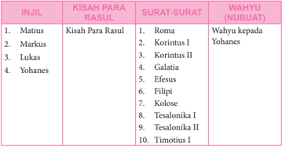

Tabel ini memperlihatkan hubungan antara Injil, Kisah Para Rasul, Surat-surat, dan Wahyu (Nubuat). Topik utama tabel ini adalah hubungan antara Injil, Surat-Surat, dan Wahyu dalam Alkitab. Kolom pertama berisi nama-nama Injil, kolom kedua berisi nama-nama para Rasul, kolom ketiga berisi nama-nama Surat-Surat, dan kolom keempat berisi nama-nama Wahyu. Data penting yang terlihat adalah bahwa Matius, Markus, Lukas, dan Yohanes adalah Injil, Roma, Korintus I, Korintus II, Galatia, Efesus, Filipi, Kolose, Tesalonia I, Tesalonia II, dan Timotius I adalah Surat-Surat, dan Wahyu adalah Nubuat.

 

---
## 📄 Halaman 144

---
**📊 Tabel**

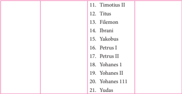

Tabel ini berisi daftar nama-nama yang mungkin merupakan referensi atau topik dalam konteks tertentu, seperti sejarah, literatur, atau bahasa. Kolom pertama mungkin berisi judul atau kategori, sedangkan kolom kedua berisi nama-nama tersebut. Data penting yang terlihat adalah bahwa beberapa nama memiliki tanda titik di akhirnya, yang mungkin menunjukkan bahwa mereka adalah nama-nama yang digunakan dalam bahasa Latin atau bahasa lain yang menggunakan sistem penulisan ini.

### d. Kemudian peserta didik membaca beberapa kutipan berikut:

- Konstitusi  Dogmatik  tentang  Wahyu  Ilahi  menegaskan  bahwa:  Kitab Perjanjian Lama dan Perjanjian Baru ditulis di bawah bimbingan Roh Kudus;  Allah  adalah  pengarang  yang  benar  dan 'harus  diakui  bahwa Alkitab  mengajarkan  dengan  teguh  dan  setia  serta  tanpa  kekeliruan kebenaran, yang oleh Allah dikehendaki supaya dicantumkan dalam KitabKitab  Suci  demi  keselamatan  kita' (DV  art.  11).  Untuk  itu  ia  menjadi norma bagi iman dan ajaran Kristiani, serta sebagai sabda Allah yang merupakan sumber yang kaya bagi doa pribadi.
- Santo  Paulus  dalam  suratnya  kepada  Timotius  menegaskan, 'segala tulisan yang diilhamkan oleh Allah memang bermanfaat untuk mengajar, untuk menyatakan kesalahan, untuk memperbaiki kelakuan dan mendidik orang dalam kebenaran' (2 Timotius 3:16-17).
- St.  Hironimus  mengatakan, 'Tidak  mengenal  Kitab  Suci  berarti  tidak mengenal  Kristus'. Kutipan  inilah  yang  akhirnya  juga  dikutip  kembali oleh Konsili Vatikan II dalam dokumen Dei Verbum . Kutipan itu hendak menegaskan bahwa sarana utama untuk dapat mengenal Kristus adalah Kitab Suci.
- 'Konsili mendesak dengan sangat semua orang beriman supaya seringkali membaca  Kitab-Kitab  Ilahi  untuk  memperoleh  pengertian  yang  mulia akan Yesus Kristus' (DV art. 25).
- 'Tetapi  hendaklah  kamu  menjadi  pelak u  firman  dan  bukan  hanya pendengar  saja,  sebab  jika  tidak  demikian  kamu  menipu  diri  sendiri' (Yakobus 1:22)

 

---
## 📄 Halaman 145

- Setelah kalian membaca uraian di atas, coba rumuskan: alasan pentingnya membaca Kitab Suci Perjanjian Baru.
- Bila dipandang perlu guru dapat menyampaikan beberapa gagasan berikut:

### Pentingnya Mendalami Kitab Suci Perjanjian Baru

- Para penulis Kitab Suci berkat ilham Roh Kudus, menuliskan kesaksian imannya dalam Kitab Suci untuk semua orang yang beriman. Ia tidak menyusun buku untuk pajangan atau hiasan.  Dengan  kata  lain,  Kitab Suci Perjanjian Baru menjadi benar-benar kitab yang bermakna dan kitab yang hidup bila dibaca dan direnungkan, serta nilai-nilainya diwujudkan dalam kehidupan sehari-hari.
- Konstitusi  Dogmatik  tentang  Wahyu  Ilahi  menegaskan  bahwa:  Kitab Perjanjian Lama dan Perjanjian Baru ditulis di bawah bimbingan Roh Kudus;  Allah  adalah  pengarang  yang  benar  dan 'harus  diakui  bahwa Alkitab  mengajarkan  dengan  teguh  dan  setia  serta  tanpa  kekeliruan kebenaran,  yang  oleh  Allah  dikehendaki  supaya  dicantumkan  dalam Kitab-Kitab Suci demi keselamatan kita' (DV art. 11). Untuk itu menjadi norma bagi iman dan ajaran Kristiani, serta sebagai sabda Allah yang merupakan sumber yang kaya bagi doa pribadi.
- Ada  beberapa  alasan  perlunya  kita  membaca  dan  mendalami  sabda Tuhan yang terdapat dalam Kitab Suci tersebut.
Pertama , iman kita akan tumbuh dan berkembang dengan membaca Kitab Suci. Santo Paulus dalam suratnya kepada Timotius menegaskan, 'segala  tulisan  yang  diilhamkan  oleh  Allah  memang  bermanfaat  untuk mengajar,  untuk  menyatakan  kesalahan,  untuk  memperbaiki  kelakuan dan mendidik orang dalam kebenaran' (2 Timotius 3:16-17).

Kedua ,  kita  tidak  akan  mengenal  Kristus  jika  kita  tidak  membaca Kitab  Suci.  St.  Hironimus  mengatakan, 'Tidak  mengenal  Kitab  Suci berarti tidak mengenal Kristus'. Kutipan inilah yang akhirnya juga dikutip kembali oleh Konsili Vatikan II dalam dokumen Dei Verbum . Kutipan itu hendak menegaskan bahwa sarana utama untuk dapat mengenal Kristus adalah Kitab Suci.

Ketiga ,  Kitab  Suci  adalah  buku  Gereja,  buku  iman  Gereja.  Kitab Suci  adalah  sabda  Allah  dalam  bahasa  manusia,  Gereja  menerimanya sebagai  yang  suci  dan  ilahi  karena  di  dalamnya  mengandung  sabda Allah. Dan sebab itu, Kitab Suci (Alkitab) bersama Tradisi menjadi tolok ukur tertinggi bagaimana kita mengenal iman Gereja. Untuk itu, Gereja menghendaki agar kita semua semakin membaca dan mendalami Kitab Suci, seperti ditegaskan oleh bapa-bapa Konsili: 'Konsili mendesak dengan

 

---
## 📄 Halaman 146

- sangat semua orang beriman supaya seringkali membaca Kitab-Kitab Ilahi untuk memperoleh pengertian yang mulia akan Yesus Kristus' (DV art. 25). Pun pula, melalui Kitab Suci ini, kita juga dapat semakin mendekatkan diri dengan saudara-saudara kita dari Gereja-gereja Kristen lain.
- Karena Kitab Suci adalah Sabda Allah , maka untuk dapat menangkap isi  pesannya  hanya  mungkin  dibaca  dan  direnungkan  dengan  iman kepercayaan,  dan  bahwa  dalam  Kitab  Suci  itu  Allah  sungguh  hadir dan bersabda. Kita juga perlu membaca Kitab Suci dengan doa dengan berharap  bahwa  apapun  yan g  difirmankan  Allah  mampu  kita  terima, entah itu nasehat, teguran, atau peneguhan untuk hidup iman kita. Kita perlu  membaca  Kitab  Suci  disertai  dengan  kesediaan  untuk  bertobat, membiarkan  hidup  kita  siap  diperbaharui,  diubah  dari  dalam  sampai keakar-akarnya,  sehingga  dalam  kehidupan  selanjutnya  kita  menjalani hidup  baru  dan  meninggalkan  dosa.  Dan  yang  paling  penting  adalah kemauan  mewujudkan  firman  Allah  dalam  kehidupan  sehari-hari. 'Tetapi  hendaklah  kamu  menjadi  pelaku  firman  dan  bukan  hanya pendengar  saja,  sebab  jika  tidak  demikian  kamu  menipu  diri  sendiri' (Yakobus 1:22)
- Memang untuk mencapai hasil maksimal dari manfaat membaca Kitab Suci  tidak  bisa  diraih  dengan  mudah.  Kita  membutuhkan  ketekunan yang terus menerus, sampai menjadi kebiasaan dan kebutuhan. Andaikan setiap  orang  selalu  merasa  haus  untuk  selalu  menimba  kekuatan  dari firman-Nya, betapa indah hidup ini.
- Guru memberi kesempatan peserta didik untuk menyampaikan hal-hal yang belum dimengerti dan meminta peserta didik lain untuk menjelaskan.
- Guru  memberi  kesempatan  peserta  didik  untuk  menyampaikan  gagasangagasan yang menurut peserta didik menarik dan penting setelah membaca uraian.
- Guru  mengajak  peserta  didik  membandingkan  pandangannya  selama  ini tentang Perjanjian Baru dengan pemahaman yang diperoleh dari uraian

### Langkah Ketiga: Menghayati Nilai-Nilai Kitab Suci Perjanjian Baru Dalam Kehidupan

- Guru  mengajak  peserta  didik  memilih  salah  satu  perikope  berikut  untuk direnungkan.  Setelah  itu  peserta  didik  diminta  untuk  merumuskan  pesan yang terkandung di dalamnya
- 1). 2 Yohanes 5:1-5
- 2). 1 Korintus 4: 6-21

 

---
## 📄 Halaman 147

- 3). Kisah Para Rasul 7: 54-60
- 4). Yohanes 7: 37-44
- 5). Lukas 17:11-19
- Peserta  didik  dalam  kelompok  membuat  iklan  yang  berisi  ajakan  untuk membaca dan mendalami Kitab Suci.
- Bila sudah selesai, Guru mengajak peserta didik masuk dalam suasana hening untuk ber efleksi sambil mengikuti penuntun berikut:
Ada  empat  orang  imam  mendiskusikan  kualitas  berbagai  terjemahan Kitab Suci. Yang seorang menyukai gaya King James karena kesederhanaan dan kelancaran bahasanya. Yang lain menyukai gaya standar Amerika sebagai yang terbaik karena sangat dekat dengan bahasa asli Ibrani dan Yunani. Yang ketiga mengunggulkan terjemahan Mo ffatt sebagai yang terbaik karena menggunakan gaya bahasa kontemporer. Imam yang keempat hanya berdiam diri.

Ketika  dimintai  untuk  mengungkapkan  pendapat,  imam  yang  keempat tersebut menjawab: 'Saya menyukai terjemahan ibuku sebagai yang terbaik. 'Ketiga imam  lainnya  tertarik  dan  ingin  mengetahui  terjemahan  yang dimaksud.  Imam  yang  keempat  itu  menjawab,  'Baiklah!'  Kemudian,  imam itu  menerangkan,  'Ibuku  menerjemahkan  Kitab  Suci  ke  dalam  hidupnya sehari-hari. Itulah terjemahan Kitab Suci yang terbaik dan sungguh-sungguh meyakinkan seperti yang pernah saya saksikan'

Hening ................

Baca dan simak sekali lagi: 'Ibuku menerjemahkan Kitab Suci ke dalam hidupnya sehari-hari. Itulah terjemahan Kitab Suci yang terbaik dan sungguhsungguh meyakinkan seperti yang pernah saya saksikan'

Imam yang keempat dapat membaca dan merasakan bahwa hidup Ibunya memancarkan firman Allah sebagaimana nampak dalam Kitab Suci. Ibunya tampil sebagai Injil yang hidup, yang mampu dibaca dan dirasakan dampaknya.

Bagaimana dengan hidupmu selama ini?

Apakah  kamu  setia  dalam  membaca  dan  merenungkan  firman  Allah dalam Kitab Suci? Apakah hidupmu juga memancarkan diri sebagai Injil yang hidup,  sehingga  siapapun  yang  kamu  jumpai  dapat  merasakan  Allah  yang menyapa penuh kasih?

Hening.........

Sekarang buatlah sebuah doa pribadi secara tertulis sebagai tanggapanmu atas pembahasan pelajaran hari ini.

Tuliskan  pula  niat  pribadi  yang  akan  dilakukan  sebagai  bentuk  aksi nyatamu dalam pelajaran ini

 

---
## 📄 Halaman 148

### Doa Penutup

Guru mengajak peserta didik mendaraskan Mazmur 62:2-13 berikut secara bergantian:

- 2 Hanya dekat Allah saja aku tenang, dari pada-Nyalah keselamatanku.
- 3 Hanya Dialah gunung batuku dan keselamatanku, kota bentengku, aku tidak akan goyah.
- 4 Berapa  lamakah  kamu  hendak  menyerbu  seseorang,  hendak  meremukkan dia, hai kamu sekalian, seperti terhadap dinding yang miring, terhadap tembok yang hendak roboh?
- 5 Mereka  hanya  bermaksud  menghempaskan  dia  dari  kedudukannya  yang tinggi; mereka suka kepada dusta; dengan mulutnya mereka memberkati, tetapi dalam hatinya mereka mengutuki.
- 6 Hanya pada Allah saja kiranya aku tenang, sebab dari pada-Nyalah harapanku.
- 7 Hanya Dialah gunung batuku dan keselamatanku, kota bentengku, aku tidak akan goyah.
- 8 Pada Allah ada keselamatanku dan kemuliaanku; gunung batu kekuatanku, tempat perlindunganku ialah Allah.
- 9 Percayalah kepada-Nya setiap waktu, hai umat, curahkanlah isi hatimu di hadapan-Nya; Allah ialah tempat perlindungan kita.
- 10 Hanya angin saja orang-orang yang hina, suatu dusta saja orang-orang yang mulia.  Pada  neraca  mereka  naik  ke  atas,  mereka  sekalian  lebih  ringan  dari pada angin.
- 11 Janganlah percaya kepada pemerasan, janganlah menaruh harap yang siasia  kepada  perampasan;  apabila  harta  makin  bertambah,  janganlah  hatimu melekat padanya.
- 12 Satu kali Allah berfirman, dua hal yang aku dengar: bahwa kuasa dari Allah asalnya,
- 13 dan dari pada-Mu juga kasih setia, ya Tuhan; sebab Engkau membalas setiap orang menurut perbuatannya.

 

---
## 📄 Halaman 149

### Kompetensi Dasar.

- 1.6.  Beriman  kepada  Allah  melalui  Kitab  Suci  dan  Tradisi  sebagai  dasar  iman kristiani.
- 2.6.  Responsif dan proaktif dalam mengembangkan pemahaman tentang ajaran Kitab Suci dan Tradisi sebagai dasar iman kristiani
- 3.6.  Memahami  Kitab Suci dan Tradisi sebagai dasar iman kristiani
- 4.6.  Melakukan aktivitas (misalnya menulis r efleksi/ slogan/puisi/ kata bermakna) tentang Kitab Suci dan Tradisi sebagai dasar iman kristiani

### Indikator Hasil Belajar

Pada akhir pelajaran, peserta didik dapat:

- Memberi contoh bermacam-macam upacara atau kepercayaan yang didasarkan pada Tradisi setempat;
- Menyebutkan macam-macam Tradisi yang ada dalam Gereja Katolik;
- Menjelaskan arti Tradisi dalam Gereja Katolik;
- Menjelaskan  arti  injil  Y ohanes  21:  24-25  dalam  kaitannya  dengan  Tradisi dalam Gereja Katolik;
- Menjelaskan  bahwa  Kitab  Suci  bersama  Tradisi  dipandang  sebagai  norma iman yang tertinggi.

### Bahan Kajian

- Arti Tradisi pada umumnya.
- Macam-macam Tradisi dalam masyarakat dan Gereja.
- Arti Tradisi dalam Gereja Katolik.
- Injil Y ohanes 21: 24-25.
- Kitab Suci dan Tradisi sebagai norma iman yang tertinggi.

### Pendekatan

Pendekatan Kateketis dan Pendekatan Saintifik

### Metode

Diskusi, Studi literatur

### C. Tradisi

 

---
## 📄 Halaman 150

### Sumber Belajar

- Macam-macam tradisi dalam masyarakat
- Komisi  Kateketik  KWI, Pendidikan  Agama  Katolik  untuk  SMA/K  KelasX , Kanisius Yogyakarta, 2010.
- Konferensi Wali Gereja Indonesia, Iman Katolik , Kanisius Yogyakarta, 1995
- Kitab Suci (Alkitab)
- Pengalaman peserta didik
- Groenen,  OFM dan Stefan  Leks, Percakapan  Alkitab ,  Y ogyakarta,  Penerbit Yayasan Kanisius, 1980

### Waktu

3 Jam Pelajaran

### Pemikiran Dasar

Masyarakat  Indonesia  memiliki  kekayaan  tradisi  yang  luar  biasa.  Hampir di  setiap  daerah  di  nusantara,  kita  dapat  menyaksikan  berbagai  macam  tradisi yang secara turun-temurun masih tetap terpelihara dan tetap dilakukan. Tradisitradisi  itu  tetap  hidup  sekalipun  modernisasi  sudah  pula  melanda  masyarakat yang  bersangkutan.  Kita  mengenal  tradisi  syukuran  atas  panen,  tradisi  dalam membangun rumah, tradisi  dalam  bergotong-royong,  dan  sebagainya.  Apapun bentuknya, tradisi tersebut hendak mengungkapkan nilai-nilai luhur yang berguna sebagai  penuntun  hidup  masyarakat.  Walaupun  demikian,  ada  sebagian  tradisi dalam masyarakat yang sudah punah, atau berubah wujudnya.

Gereja pun memiliki tradisi yang sangat kaya. Tradisi yang dimaksud bukan sekedar upacara, ajaran atau kebiasaan kuno. Tradisi yang hidup dalam Gereja lebih merupakan ungkapan pengalaman iman Gereja akan Yesus Kristus, yang diterima, diwartakan,  dirayakan,  dan  diwariskan  kepada  angkatan-angkatan  selanjutnya. Konsili Vatikan II memandang penting peran Tradisi 'Demikianlah Gereja dalam ajaran,  hidup  serta  ibadatnya  melestarikan  serta  meneruskan  kepada  semua keturunan, dirinya seluruhnya, imannya seutuhnya' . Tradisi 'berkat bantuan Roh Kudus'  berkembang  dalam  Gereja,  'sebab  berkembanglah  pengertian  tentang kenyataan-kenyataan  maupun  kata-kata  yang  ditanamkan,'  dan  'Gereja  tiada hentinya berkembang menuju kepenuhan kebenaran Ilahi' (D8). Dalam arti ini tradisi mempunyai orientasi ke masa depan.

Dalam tradisi itu ada satu kurun waktu yang istimewa, yakni zaman Yesus dan para Rasul. Pada periode yang disebut zaman Gereja Perdana, Tradisi sebelumnya dipenuhi  dan  diberi  bentuk  baru,  yang  selanjutnya  menjadi  inti  pokok  untuk Tradisi berikutnya, 'yang dibangun di atas dasar para rasul dan para nabi, dengan

 

---
## 📄 Halaman 151

Kristus Yesus sebagai batu penjuru. ' (bandingkan Efesus 2: 20). Maka, perumusan pengalaman iman Gereja Perdana yang disebut Perjanjian Baru merupakan pusat dan  sumber  seluruh  Tradisi,  karena  di  dalamnya  terungkap  pengalaman  iman Gereja Perdana. Pengalaman itu ditulis dengan ilham Roh Kudus ( Dei Verbum Art. 11) dan itu berarti bahwa Kitab Suci mengajarkan dengan teguh dan setia serta tanpa kekeliruan, kebenaran yang oleh Allah mau dicantumkan di dalamnya demi keselamatan kita.

Gereja Katolik yakin bahwa Kitab Suci (Alkitab) bersama Tradisi dinyatakan oleh  Gereja  sebagai  'tolok  ukur  tertinggi  iman  Gereja'  ( Dei  Verbum Art.  21). Dengan kata 'iman' , yang dimaksudkan adalah baik iman objektif maupun iman subjektif. Jadi, 'kebenaran-kebenaran iman' yang mengacu kepada realitas yang diimani  dan  sikap  hati  serta  penghayatannya  merupakan  tanggapan  manusia terhadap pewahyuan Allah.

Beberapa pokok penting yang perlu dipahami dan disadari oleh para peserta didik adalah: arti tradisi secara umum, pengertian tradisi dalam Gereja Katolik, macam-macam tradisi dan contohnya, dan yang penting adalah keyakinan bahwa Kitab Suci bersama tradisi merupakan tolok ukur tertinggi bagi seluruh iman dan kehidupan Gereja.

### Kegiatan Pembelajaran

### Doa Pembuka

Guru  mengajak  peserta  didik  mengawali  pelajaran  dengan  mendaraskan bersama doa berikut

Allah, Bapa Mahabijaksana melalui para leluhur dan para Bapa Gereja Engkau telah mewariskan kepada kami berbagai tradisi yang mengungkapkan nilai-nilai luhur masyarakat kami dan yang memancarkan penghayatan iman kami kepada-Mu. Kami mohon, semoga melalui pelajaran hari ini, kami semakin terdorong menghayati tradisi-tradisi luhur itu serta mengembangkannya demi kesempurnaan iman kami Demi Kristus, Tuhan dan Pengantara kami Amin.

 

---
## 📄 Halaman 152

### Langkah Pertama: Mengamati Tradisi dalam Masyarakat dan Tradisi dalam Gereja Katolik

- Bila dimungkinkan, guru menugaskan  peserta didik dalam pelajaran sebelumnya untuk secara berkelompok melakukan wawancara dengan tokoh masyarakat atau tokoh adat dan tokoh Gereja untuk menda ftar berbagai tradisi yang  masih  hidup  dan  tradisi  yang  sudah  punah,  dan  mempresentasikan hasilnya.
- Bila  tidak,  guru  dapat  mengawali  pelajaran  dengan  memberi  pengantar singkat, misalnya:
Setiap masyarakat memiliki tradisi yang diwariskan dari generasi sebelumnya.  Tradisi  tersebut  umumnya  selalu  mengalami  perubahan  dan perkembangan.

- Peserta didik membaca dan mendalami satu tradisi dalam masyarakat dan satu tradisi dalam Gereja Katolik berikut:

### Upacara Syukuran Suku Dayak Meratus .

Suku Dayak Meratus merupakan kelompok masyarakat Dayak yang hidup dan menetap di desa Kiyu, Kecamatan Batang Alai Timur Kabupaten Hulu Sungai Tengah Provinsi Kalimantan Selatan. Setiap tahun, suku Dayak Meratus ini menyelenggarakan upacara syukuran adat yakni Aruh Ganal. Seperti tahun sebelumnya, tradisi ini dilaksanakan setiap pertengahan tahun setelah musim panen  raya  padi  tiba,  sekitar  bulan  Juli  hingga  Agustus.  Bagi  suku  Dayak Meratus,  ritual  ini  diyakini  dapat  menjauhkan  mereka  dari  bencana  gagal panen. Melalui ritual inilah, mereka juga memohon kepada Sang Pencipta agar di musim tanam berikutnya, tanaman mereka terhindar dari hama penyakit dan memperoleh hasil panen yang melimpah.

Bagi suku Dayak Meratus, pelaksanaan tradisi ini memiliki arti penting. Begitu kuatnya kepercayaan mereka terhadap arti tradisi ini, jauh hari sebelum tradisi  dilaksanakan,  segala  kebutuhan  tradisi  telah  disiapkan.  Di  dalam sebuah balai adat yang bentuknya seperti rumah panggung, mereka biasanya merencanakan  rangkaian  acara  tradisi.  Para  sesepuh  adat  mengawalinya dengan  menentukan  hari  pelaksanaan  tradisi.  Biasanya,  awal  bulan  di pertengahan tahun selalu menjadi pilihan waktu pelaksanaan tradisi. Mereka percaya, jika Aruh Ganal digelar pada awal bulan, jumlah hasil panen di tahun berikutnya akan semakin melimpah. Percaya atau tidak, itulah kepercayaan suku Dayak Meratus yang sejak dulu hingga kini masih dilaksanakan.

Tradisi  Aruh  Ganal  biasanya  dilaksanakan  selama  5  hingga  12  hari. Penentuan  itu  berdasarkan  pada  jumlah  hasil  panen  yang  mereka  peroleh selama satu tahun. Jika hasil panen di tahun ini melimpah, tradisi dilaksanakan

 

---
## 📄 Halaman 153

hingga  12  hari.  Namun  jika  jumlah  panen  dinilai  tidak  terlalu  banyak  jika dibandingkan  hasil  tahun  sebelumnya,  Aruh  Ganal  hanya  dilaksanakan selama 5 hari berturut. Bahkan jika jumlah panen mereka hanya cukup untuk kebutuhan sehari-hari, tradisi ini dilaksanakan hanya dalam 1 hari 1 malam saja.

Setelah hari baik telah ditentukan, suku Dayak Meratus mulai mempersiapkan kebutuhan tradisi satu hari sebelum Aruh Ganal dilaksanakan. Kaum wanita bertugas mempersiapkan hidangan untuk para peserta ritual dan tamu undangan, seperti  memasak  lamang.  Lamang  merupakan  beras  ketan yang telah dicampur santan kemudian dimasukkan ke dalam buluh bambu dan dibakar hingga matang. Sementara kaum lelaki, menghias Balai Adat dengan berbagai jenis bunga dan janur kelapa. Nantinya, di Balai Adat inilah, tradisi Aruh Ganal dilaksanakan. Tak terlewatkan, mereka juga mengundang suku Dayak dari kampung lain dan para pejabat pemerintah setempat untuk hadir dalam upacara adat Aruh Ganal.

Ketika hari tradisi Aruh Ganal tiba, semua warga Dayak Meratus beserta tamu  undangan  berkumpul  di  Balai  Adat  di  desa  Kiyu.  Saat  pelaksanaan tradisi, tidak ada satupun warga Dayak Meratus yang umumnya petani bekerja di ladang. Secara khusus, mereka membuat hari itu sebagai hari libur untuk bekerja. Jika tradisi ini dilaksanakan selama beberapa hari, dalam beberapa hari itu pula, suku Dayak Maratus menjadikannya sebagai hari libur.

Biasanya,  rangkaian  tradisi  Aruh  Ganal  dimulai  ketika  hari  menjelang malam. Dalam tradisi ini, yang menjadi pemimpin yakni Damang, sebutan bagi ketua adat kampung Dayak Meratus. Ketika Damang membaca mantera dan membakar kemenyan, tradisi Aruh Ganal- pun dimulai. Dalam bahasa Dayak, para peserta tradisi membaca doa kepada Sang Pencipta. Tepat di tengah Balai Adat terdapat sesaji yang khusus dijadikan persembahan kepada leluhur desa.

Setelah berdoa, Damang mulai melakukan ritual pemanggilan roh para leluhur.  Suara  tabuhan  gendang  yang  dimainkan  oleh  empat  orang  wanita Dayak menjadi media pemanggilan roh. Ketika beberapa orang warga Dayak Meratus tampak tidak sadarkan diri, saat itulah roh leluhur diyakini masuk ke dalam tubuh mereka. Tanpa ada yang memerintah, mereka berdiri dan menari mengelilingi sesaji yang diletakkan di tengah Balai Adat. Seperti memperoleh kekuatan  supranatural,  mereka  menari  tanpa  henti  hingga  hari  menjelang pagi. Sementara mereka menari, Damang beserta peserta tradisi yang lainnya membaca doa tanpa henti hingga malam berganti pagi.

Setelah  matahari  terbit,  Damang  kembali  membakar  kemenyan  dan membaca mantera. Dengan bantuan Damang itulah, beberapa peserta tradisi yang malam sebelumnya kerasukan roh leluhur, kembali sadar. Ketika itu, warga

 

---
## 📄 Halaman 154

Dayak percaya, roh leluhur telah hadir dan ikut dalam pesta Aruh Ganal. Acara tradisi  kemudian  dilanjutkan  dengan  makan  bersama.  Menu  utama  dalam tradisi ini yakni Lamang atau nasi ketan berbungkus buluh bambu yang telah disiapkan sebelumnya. Tanpa ada perbedaan status sosial, setiap peserta tradisi memperoleh lamang dalam jumlah yang sama.

Tanpa  membedakan  berapa  hari  tradisi  Aruh  Ganal  dilaksanakan, berdoa,  menari,  serta  makan  bersama  menjadi  rangkaian  acara  yang  rutin dilaksanakan mulai dari hari pertama tradisi hingga tradisi ini usai. Jika tradisi ini dilaksanakan selama 5 hari, suku Dayak Meratus merayakannya selama 5 hari 5 malam tanpa henti. Begitu juga ketika tradisi Aruh Ganal ini berlangsung selama 12 hari. Ketika hari tradisi telah mencapai hari terakhir, ritual Aruh Ganal diakhiri dengan acara pemberian sedekah.

Ketika  hari  tradisi  Aruh  Ganal  usai,  suku  Dayak  Meratus  memberikan beberapa  bagian  dari  hasil  panen  yang  telah  mereka  peroleh  kepada  warga dari  kampung lain.  Tidak  ada  ketentuan  khusus,  berapa  bagian  yang  harus diberikan, tergantung pada keikhlasan dari warga Meratus sendiri. Bagi suku Dayak Meratus, tradisi ini bukan hanya sebagai perayaan syukur, melainkan juga  simbol  mempererat  persaudaraan  dan  saling  berbagi  kepada  sesama. Keesokan  hari,  setelah  pelaksanaan  tradisi  Aruh  Ganal  usai,  warga  Dayak Meratus kembali melaksanakan aktivitas keseharian mereka seperti biasa yakni berladang dan berburu di hutan.

Sumber: http://anakmeratus.blogspot.com/2011/04/upacara-syukuran-suku-dayak-meratus. html

### Ibadat Jalan Salib

### Awal Sejarah

Sekitar  abad  4  St.Helena  (ibu  Raja  Konstantin),  melakukan  ziarahnya yang  sekarang  ini  dikenal  dengan  nama  Via  Dolorosa  untuk  melihat  dari dekat tempat Yesus lahir sampai dimakamkan. Ziarah ini menjadi terkenal dan sangat mudah mencapai tempat-tempat itu terutama setelah tahun 1199 di mana pasukan Perang Salib ( crusader ) menguasai Yerusalem. Namun sejak tahun 1291, untuk menuju tempat ini menjadi begitu sulit dan mahal karena sudah  tidak  dikuasai  lagi  oleh  para  crusader.  Maka  lahirlah  tradisi  Ibadat Jalan Salib yang bertujuan menghadirkan Tanah Suci bagi mereka yang tidak dapat  berziarah  ke  sana  juga  bagi  mereka  yang  pernah  berziarah  ke  sana, untuk tetap mengenangnya.

Tahun 1342 Ordo Fransiskan diangkat sebagai ordo yang secara resmi wajib  melindungi  semua  tempat  suci  di  beberapa  tempat  di  Yerusalem. Sejak  saat  itulah  biarawan-biarawan  Fransiskan  ini  mulai  memopulerkan devosi  Jalan  Salib,  terlebih  sejak  St.  Fransiskus  Asisi  mengalami  stigmata.

 

---
## 📄 Halaman 155

Tradisi ini didukung pula dengan adanya penampakan Bunda Maria di sana, dan  juga  pengajaran  dari  St.  Jerome.  Sejak  inilah  dikenal  beberapa  versi Jalan  Salib,  seperti  yang  ditetapkan  oleh  Alvarest  Yang  Terberkati  (1420), Eustochia, Emmerich (1465) dan Ketzel, hingga akhirnya banyak Paus yang menganjurkan Doa Jalan Salib yaitu Paus Innocent XI (1686), Innocent XII (1694), Benedict XIII (1726), Clementius XII (1731), Benediktus XIV (1742), karena ini merupakan cara doa yang paling mudah untuk menghayati kisah sengsara Yesus dan pengorbanan-Nya di kayu salib.

### Perkembangan Tradisi

Awalnya  umat  membuat  perhentian-perhentian  kecil  dalam  gereja, bahkan  kadang  dibangun  perhentian-perhentian  yang  besarnya  seukuran manusia  di  luar  gereja.  Para  biarawan  Fransiskan  juga  menuliskan  lirik Stabat Mater, yang biasanya dinyanyikan saat Ibadat Jalan Salib, baik dalam bahasa aslinya, yaitu bahasa Latin, maupun dalam bahasa setempat, hingga ditetapkanlah 14 stasi (perhentian) Jalan Salib oleh Paus Clement XII tahun 1731.

http://belajarliturgi.blogspot.com/2012/03/sejarah-ibadat-jalan-salib.html

- Setelah  selesai,  guru  meminta  peserta  didik  berdiskusi  kelompok  untuk menjawab beberapa pertanyaan berikut: nilai-nilai apa yang hendak diungkapkan dalam masing-masing tradisi tersebut? Sejauhmana nilai-nilai tersebut  masih  relevan  bagi  kehidupan  manusia  saat  ini?  Mengapa  tradisitradisi tersebut masih hidup? Mengapa ada pula tradisi yang mati dan tidak digunakan lagi?
- Kelompok  melakukan  inventarisasi  berbagai  macam  tradisi  masyarakat setempat dan tradisi dalam gereja Katolik pada umumnya, maupun tradisi Gereja  Katolik  di  daerah  peserta  didik,  dan  menjelaskan  nilai-nilai  yang hendak diungkapkan dalam tradisi-tradisi tersebut.

### Langkah Kedua: Memahami Pengertian, Wujud, Kedudukan dan Fungsi Tradisi dalam Gereja Katolik

- Guru  memberi  kesempatan  kepada  peserta  didik  untuk  mengumpulkan informasi dari buku-buku, atau browsing internet tentang pengertian, wujud, kedudukan dan fungsi Tradisi dalam masyarakat maupun Gereja
- Peserta  didik  membaca  penjelasan  tentang  Tradisi  dari  Dokumen  Konsili Vatikan II, Konstitusi tentang Wahyu Ilahi ( Dei Verbum ):

### 7. (Para Rasul dan pengganti mereka sebagai pewarta Injil)

Dalam kebaikan-Nya Allah telah menetapkan, bahwa apa yang diwahyukan-Nya  demi  keselamatan  semua  bangsa,  harus  tetap  utuh  untuk

 

---
## 📄 Halaman 156

selamanya dan diteruskan kepada segala keturunannya. Maka Kristus Tuhan, yang menjadi kepenuhan seluruh wahyu Allah Yang Mahatinggi (lihat 2 Korintus 1:30; 3:16-4:6), memerintahkan kepada para Rasul, supaya Injil, yang dahulu telah dijanjikan melalui para Nabi dan dipenuhi oleh-Nya serta dimaklumkanNya dengan mulut-Nya sendiri, mereka wartakan pada semua orang, sebagai sumber segala kebenaran yang menyelamatkan serta sumber ajaran kesusilaan, dan dengan demikian dibagikan kurnia-kurnia ilahi kepada mereka. Perintah itu dilaksanakan dengan setia oleh para Rasul, yang dalam pewartaan lisan, dengan teladan serta penetapan-penetapan meneruskan entah apa yang telah mereka terima dari mulut, pergaulan dan karya Kristus sendiri, entah apa yang atas dorongan Roh Kudus telah mereka pelajari. Perintah Tuhan dijalankan pula oleh para Rasul dan tokoh-tokoh rasuli, yang atas ilham Roh Kudus itu juga telah membukukan amanat keselamatan.

Adapun supaya Injil senantiasa terpelihara secara utuh dan hidup dalam Gereja, para Rasul meninggalkan Uskup-uskup sebagai pengganti mereka, yang 'mereka serahi kedudukan mereka untuk mengajar'. Maka dari itu Tradisi Suci dan Kitab Suci Perjanjian Lama maupun Baru bagaikan cermin bagi Gereja yang mengembara di dunia, untuk memandang Allah yang menganugerahinya segala sesuatu, hingga tiba saatnya Gereja dihantar untuk menghadap Allah tatap muka, sebagaimana ada-Nya (lihat 1Yohanes 3:2).

### 8. (Tradisi Suci)

Oleh karena itu pewartaan para Rasul, yang secara istimewa diungkapkan dalam kitab-kitab yang diilhami, harus dilestarikan sampai kepenuhan zaman melalui  penggantian-penggantian  yang  tiada  putusnya.  Maka  para  Rasul, seraya meneruskan apa yang telah mereka terima sendiri, mengingatkan kaum beriman, supaya mereka berpegang teguh pada ajaran-ajaran warisan, yang telah mereka terima entah secara lisan entah secara tertulis (lihat 2 Tesalonika 2:15),  dan  supaya  mereka  berjuang  untuk  membela  iman  yang  sekali  untuk selamanya diteruskan kepada mereka (lihat Yudas 3). Adapun apa yang telah diteruskan oleh para Rasul mencakup segala sesuatu, yang membantu Umat Allah untuk menjalani hidup yang suci dan untuk berkembang dalam imannya. Demikianlah Gereja dalam ajaran, hidup, serta ibadatnya melestarikan serta meneruskan kepada semua keturunan dirinya seluruhnya, imannya seutuhnya.

Tradisi  yang  berasal  dari  para  rasul  itu  berkat  bantuan  Roh  Kudus berkembang dalam Gereja: sebab berkembanglah pengertian tentang kenyataan-kenyataan maupun  kata-kata yang diturunkan, baik karena kaum  beriman,  yang  menyimpannya  dalam  hati  (lih.  Lukas  2:19  dan  51), merenungkan  serta  mempelajarinya,  maupun  karena  mereka  menyelami secara  mendalam  pengalaman-pengalaman  rohani  mereka,  maupun  juga

 

---
## 📄 Halaman 157

berkat  pewartaan  mereka,  yang  sebagai  pengganti  dalam  martabat  Uskup menerima kurnia kebenaran yang pasti. Sebab dalam perkembangan sejarah Gereja tiada hentinya menuju kepenuhan kebenaran ilahi, sampai terpenuhilah padanya sabda Allah. Ungkapan-ungkapan para Bapa Suci memberi kesaksian akan  kehadiran  Tradisi  itu  pun  Gereja  mengenal  kanon  Kitab-Kitab  Suci selengkapnya, dan dalam Tradisi itu Kitab Suci sendiri dimengerti secara lebih mendalam dan tiada hentinya dihadirkan secara aktif.

Demikianlah Allah, yang dulu telah bersabda, tiada hentinya berwawancara dengan Mempelai Putera-Nya yang terkasih. Dan Roh Kudus, yang menyebabkan suara Injil yang hidup bergema dalam Gereja, dan melalui Gereja dalam dunia, menghantarkan Umat beriman menuju segala kebenaran, dan menyebabkan sabda Kristus menetap dalam diri mereka secara melimpah (lihat Kolose 3:16).

### 9. (Hubungan antara Tradisi dan Kitab Suci)

Jadi  Tradisi  Suci  dan  Kitab  Suci  berhubungan  erat  sekali  dan  berpadu. Sebab  keduanya  mengalir  dari  sumber  ilahi  yang  sama,  dan  dengan  cara tertentu  bergabung  menjadi  satu  dan  menjurus  ke  arah  tujuan  yang  sama. Sebab Kitab Suci itu pembicaraan Allah sejauh itu termaktub dengan ilham Roh ilahi. Sedangkan oleh Tradisi Suci sabda Allah, yang oleh Kristus Tuhan dan Roh Kudus dipercayakan kepada para Rasul, disalurkan seutuhnya kepada para pengganti mereka, supaya mereka ini dalam terang Roh kebenaran dengan pewartaan  mereka  memelihara,  menjelaskan  dan  menyebarkannya  dengan setia. Dengan demikian Gereja menimba kepastian tentang segala sesuatu yang diwahyukan bukan hanya melalui Kitab Suci. Maka dari itu keduanya (baik Tradisi  maupun Kitab Suci) harus diterima dan dihormati dengan cita-rasa kesalehan dan hormat yang sama.

### 21. (Gereja menghormati Kitab-Kitab Suci)

Kitab-kitab ilahi seperti juga Tubuh Tuhan sendiri selalu dihormati oleh Gereja, yang - terutama dalam Liturgi Suci - tiada hentinya menyambut roti kehidupan dari meja sabda Allah maupun Tubuh Kristus, dan menyajikannya kepada  Umat  beriman.  Kitab-kitab  itu  bersama  dengan  Tradisi  Suci  selalu dipandang  dan  tetap  dipandang  sebagai  norma  imannya  yang  tinggi.  Sebab kitab-kitab itu diilhami oleh Allah dan sekali untuk selamanya telah dituliskan, serta tanpa perubahan manapun menyampaikan sabda Allah sendiri, lagi pula mendengarkan suara Roh Kudus dalam sabda para Nabi dan para Rasul. Jadi semua  pewartaan  dalam  Gereja  seperti  juga  agama  kristiani  sendiri  harus dipupuk dan diatur oleh Kitab Suci. Sebab dalam Kitab-Kitab Suci Bapa yang ada di Surga penuh cinta kasih menjumpai para putera-Nya dan berwawancara dengan mereka. Adapun demikian besarlah daya dan kekuatan sabda Allah,

 

---
## 📄 Halaman 158

sehingga bagi Gereja merupakan tumpuan serta kekuatan, dan bagi puteraputeri Gereja menjadi kekuatan iman, santapan jiwa, sumber jernih dan kekal hidup rohani. Oleh karena itu bagi Kitab Suci berlakulah secara istimewa katakata:  'Memang  sabda  Allah  penuh  kehidupan  dan  kekuatan'  (Ibrani  4:12), 'yang berkuasa membangun dan mengurniakan warisan di antara semua para kudus' (Kisah Para Rasul 20:32; lihat 1Tesalonika 2:13).

- Peserta  merumuskan  gagasan  pokok  yang  terdapat  pada  masing-masing artikel di atas
- Bila diperlukan, guru dapat menyampaikan gagasan berikut:

### Pengertian Tradisi Gereja

- Menurut  Kamus  Bahasa  Indonesia, tradisi diartikan sebagai adat kebiasaan  turun-temurun  (berupa  upacara,  peralatan,  kesenian,  adat, kepercayaan, kebiasaan, ajaran) yang masih dijalankan oleh masyarakat. Tradisi  dapat  mengalami  perubahan  dan  penyesuaian  dengan  situasi dan kondisi masyarakat bersangkutan. Bilamana tradisi dianggap tidak lagi relevan dengan tata nilai masyarakat atau tidak mampu menjawab tantangan zaman maka tradisi semacam ini biasanya ditinggalkan dan punah  dengan  sendirinya.  Jadi  sesungguhnya  tradisi  dapat  dipandang sebagai  pencerminan  dari  penghayatan  masyarakat  tentang  nilai  atau ajaran tertentu, yang kemudian diungkapkan dalam peralatan, kesenian, upacara, norma atau ajaran.
- Menurut Kamus Teologi, tradisi berasal dari bahasa Latin traditio yang berarti  penerusan.  Tradisi  adalah  proses  penerusan  (tradisi  sebagai tindakan) atau warisan yang diteruskan (tradisi sebagai isi). Kata tradisi dalam bahasa Yunani yaitu paradosis yang secara hara fiah berarti sesuatu yang telah 'diserahkan' , 'diteruskan' , 'diwariskan' . Gereja Katolik mewarisi  kekayaan  tradisi  yang  luar  biasa,  walaupun  ada  juga  tradisi yang berubah atau tidak lagi hidup di kalangan umat.
- Di  masa  lalu  Gereja  Katolik  pernah  mempunyai  tradisi-tradisi  seperti puasa selama masa puasa, puasa sebelum menerima Komuni, pantang daging pada hari Jumat, mengangkat topi pada waktu melewati depan gedung gereja (karena Sakramen Mahakudus ada di dalamnya), wanita menutup  kepala  di  gereja,  dan  lain-lain.  Tradisi-tradisi  itu  pernah menjadi bagian budaya Katolik yang cukup populer dan tradisi semacam itu ternyata cukup membantu memperkuat identitas Katolik. Akan tetapi, beberapa diantaranya sudah tidak dipraktikkan oleh Umat.
- Dalam  arti  yang  paling  dasar,  'tradisi'  merupakan pengalaman  iman bersama jemaat Kristiani, dalam menghayati hidup dan imannya dalam Kristus berkat persatuannya di dalam Roh Kudus. Pemeliharaan tradisi

 

---
## 📄 Halaman 159

- dalam  Gereja  bertujuan  agar  pewahyuan  Allah  dipertahankan  dan diungkapkan dalam hidup jemaat. Dan oleh karena Gereja tidak terikat dengan masyarakat, budaya atau bangsa tertentu, maka penetapan tradisitradisi  suci  selalu  menekankan  prinsip  universalitas  (berlaku  untuk segenap Gereja) berkesinambungan (dari para saksi/murid Kristus dan para  penggantinya),  didasari  konsesus  dalam  upaya  menjaga  kesatuan Tubuh Kristus.
- Tradisi jauh lebih banyak daripada hormat terhadap hal-hal yang kuno. Tradisi merupakan kenyataan yang hidup yang menyimpan pengalaman iman  jemaat  yang  diterima,  diwartakan,  dirayakan,  dan  diwariskan kepada angkatan-angkatan selanjutnya. Konsili Vatikan II memandang penting  peran  tradisi  ini  dalam  kehidupan  iman  Gereja,  sebagaimana ditegaskan dalam Konstitusi tentang Wahyu Ilahi: 'Demikianlah Gereja dalam  ajaran,  hidup  serta  ibadatnya  melestarikan  serta  meneruskan kepada  semua  keturunan,  dirinya  seluruhnya,  iman-nya  seutuhnya'. Tradisi 'berkat bantuan Roh Kudus' berkembang dalam Gereja, 'sebab berkembanglah  pengertian  tentang  kenyataan-kenyataan  maupun  katakata yang ditanamkan, ' dan 'Gereja tiada hentinya berkembang menuju kepenuhan kebenaran Ilahi' ( Dei Verbum 8).

### Macam-macam Tradisi dalam Gereja Katolik

- Sudah kita ketahui bersama, bahwa Tradisi Gereja merupakan pengalaman iman jemaat Kristiani, atas hidup Kristus, dan persatuannya di  dalam  Roh  Kudus  yang  telah  diwariskan  hingga  kini.  Pengalaman iman  itu  diungkapkan  dalam  tradisi  yang  resmi  maupun  tidak  resmi. Tradisi yang resmi adalah Tradisi Gereja diungkapkan dalam Kitab Suci , dalam syahadat , dalam liturgi, dan dalam sakramen-sakramen Gereja, serta dalam rumusan doktrinal dari kuasa mengajar Gereja tertinggi.
- Untuk menjaga Tradisi, Gereja perdana mengumpulkan dan menyusun tulisan-tulisan  suci  yang  diakui  sebagai  iman  para  Rasul  oleh  semua Gereja  ke  dalam  kanon  Kitab  Suci.  Kanonisasi  Kitab  Suci  itu  menjadi sangat  penting  terutama  untuk  membedakan  ajaran-ajaran  yang  salah dari  ajaran-ajaran  yang  asli.  Gereja  perdana  juga  mengembangkan rumusan  syahadat  sebagai  bentuk  pengakuan  iman  yang  normatif. Dengan  cara  itu,  pewahyuan  Allah  dipertahankan  dan  diungkapkan dalam hidup jemaat.
- Tradisi-tradisi Gereja yang dipertahankan oleh Gereja terutama tradisi yang tumbuh dan dilakukan dalam kurun waktu yang istimewa, yakni zaman Yesus dan para rasul, yang disebut zaman Gereja Perdana. Tradisi itu  dibangun  di  atas  dasar  para  rasul  dan  nabi  dengan  Kristus  Y esus

 

---
## 📄 Halaman 160

- sebagai batu penjuru (Efesus 2:20). Maka perumusan pengalaman iman Gereja  Perdana,  yang  disebut Kitab  Suci  Perjanjian  Baru  yang  ditulis dengan ilham Roh Kudus merupakan pusat dan sumber seluruh Tradisi . Sebab Kitab Suci Perjanjian Baru mengajarkan dengan teguh dan setia serta tanpa kekeliruan, kebenaran yang oleh Allah mau dicantumkan di dalamnya demi keselamatan kita.
- Sesudah Gereja perdana, Tradisi mengolah dan memperdalam ungkapan iman yang terdapat dalam Kitab Suci: 'sebab berkembanglah pengertian tentang  kenyataan-kenyataan  serta  kata-kata  yang  diturunkan,  baik karena  kaum  beriman,  yang  menyimpannya  dalam  hati,  merenungkan serta mempelajarinya maupun karena mereka menyelami secara mendalami pengalaman-pengalaman rohani mereka' (DV art. 8). Lebih lanjut  konsili  menegaskan: jelaslah bahwa Tradisi Suci, Kitab Suci dan wewenang mengajar Gereja saling berhubungan dan berpadu (DV 10).
- Tradisi Gereja mempunyai dasar dalam Kitab Suci, tetapi tidak terbatas pada Kitab Suci. Sebaliknya, Tradisi Gereja berusaha terus menghayati dan  memahami  kekayaan  iman  yang  terungkap  di  dalam  Kitab  Suci. Kekayaan  iman  itu  salah  satunya  yang  kita  sebut  syahadat.  Di  dalam Kitab Suci, kita tidak menemukan syahadat, tetapi apa yang terungkap dalam  syahadat  jelas  dilandaskan  pada  Kitab  Suci.  Selain  dirumuskan dalam syahadat, tradisi Gereja juga dipelihara dan diungkapkan melalui berbagai  bentuk  rumusan  doktrinal,  baik  berupa  ensiklik.  Rumusan doktrinal  tersebut  didasari  oleh  iman  Gereja  tentang  kuasa  mengajar ( magisterium ), yang diakui tidak mengandung kesesatan apapun.
- Di dalam Gereja kita, juga dikenal Tradisi Gereja yang tidak resmi . Kita tahu, bahwa Tradisi Gereja itu merupakan pengalaman iman yang dinamis dan terus berkembang. Pengalaman iman itu diungkapkan pula dalam berbagai  bentuk  seni,  dari  musik,  tulisan-tulisan,  sastra  kekristenan, baik  secara  populer  dari  ajaran  para  teolog,  melalui  spiritualitas  dan tradisi-tradisi doa, serta devosi. Tradisi Gereja diungkapkan juga melalui ceritera-ceritera  para  kudus,  dan  hidup  orang  Kristiani  dari  masa  ke masa.
- Jadi  sesungguhnya,  kata  'tidak  resmi'  dimaksudkan,  bahwa  kekayaan Tradisi Gereja kita ini begitu beragam dan sangat banyak. Kadang ada hal-hal yang belum bisa tertampung. Tetapi kita tahu, bahwa itu semua hidup dan berkembang. Tentu perkembangannya tidak jauh dari iman kepercayaan, dan apa yang telah dibangun Gereja dari masa ke masa. Tradisi Gereja yang tidak resmi ini biasanya berkembang sesuai dengan budaya di  mana jemaat atau  umat  itu  tinggal.  Maka,  walaupun  sudah diteruskan,  sering  ada  perkembangan  yang  disesuaikan  dengan  hidup

 

---
## 📄 Halaman 161

- dan konteks hidup jemaat. Kita saat ini bisa melihat ada berbagai macam tradisi yang ada dalam Gereja Katolik. Misalnya saja, gua natal, ziarah dan devosi ke Gua Maria, dan lain sebagainya.
- Kitab Suci bersama Tradisi Gereja ini merupakan tolok ukur iman Gereja, sebagaimana dikatakan oleh Konsili Vatikan II: 'Kitab-Kitab itu (Kitab Suci) bersama dengan Tradisi suci selalu dipandang dan tetap dipandang sebagai  norma  imannya  yang  tertinggi' (DV  art.  21).  Itu  berarti  iman Gereja,  baik  iman  Gereja  secara  keseluruhan  (iman  objektif)  maupun iman dalam arti sikap masing-masing orang beriman (iman subjektif) diukur kebenarannya berdasarkan Kitab Suci maupun Tradisi Gereja.

### Langkah Ketiga: Menghayati Tradisi Gereja

- Banyak orang setelah melihat pagelaran suatu tradisi tidak merasa mendapatkan  apa-apa;  bahkan  sekalipun  ia  ikut  terlibat  di  dalamnya,  ia seolah  pulang  dengan  kosong,  kecuali  rasa  lelah.  Tradisi  seolah-olah  tidak bermakna bagi hidupnya. Tentu hal tersebut sangat disayangkan. Oleh karena itu, supaya kalian tidak jatuh pada pengalaman yang sama, rumuskan bersama teman-temanmu: sikap dan tindakan apa yang perlu dikembangkan agar kita semakin menghayati tradisi yang ada?
- Salah  satu  bentuk  tradisi  adalah  sakramen;  yang  salah  satunya  adalah Sakramen Ekaristi. Dalam suasana hening, coba r efleksikan kembali makna sakramen  Ekaristi  bagi  kehidupan  imanmu,  sejauhmana  dirimu  selama ini sungguh-sungguh  merayakan  sakramen  tersebut? Apa yang perlu ditingkatkan  dalam  dirimu  agar  Tradisi  Suci  tersebut  makin  bermanfaat dalam memperkembangkan imanmu
- Setelah  sharing,  bila  diperlukan,  guru  dapat  menyampaikan  kesimpulan, misalnya:
- Tradisi Gereja merupakan bentuk pengungkapan atas penghayatan iman Gereja, maka sesungguhya Tradisi merupakan sarana agar iman Gereja makin berkembang. Tetapi itu semua dapat terjadi bilamana umat turut menghidupi Tradisi tersebut. Kata 'menghidupi' dapat diartikan: turut memahami maknanya, turut memelihara, dan menjalankannya.
- Dalam  menjalankan  Tradisi  umat  perlu  melaksanakannya  dengan sungguh-sungguh  dengan  penuh  penghayatan,  bukan  sekedar  ikutikutan,  bukan  pula  sekedar  kebiasaan.  Bila  tradisi  dijalankan  tanpa dipahami maknanya, maka tidak akan berdampak apa-apa pada sikap iman dan tindakan hidup sehari-hari.

 

---
## 📄 Halaman 162

### Doa Penutup

Guru mengajak para peserta didik untuk menutup pelajaran dengan doa yang sesuai, misalnya:

### Mazmur 11: 1-7

- 1  Pada TUHAN aku berlindung, bagaimana  kamu  berani  berkata  kepadaku:  'Terbanglah  ke  gunung  seperti
burung!'

2

Sebab, lihat orang fasik melentur busurnya, mereka memasang anak panahnya pada tali busur,

untuk memanah orang yang tulus hati di tempat gelap.

- 3 Apabila dasar-dasar dihancurkan,
apakah yang dapat dibuat oleh orang benar itu?

4  TUHAN ada di dalam bait-Nya yang kudus;

TUHAN, takhta-Nya di Surga;

mata-Nya mengamat-amati, sorot mata-Nya menguji anak-anak manusia.

5 TUHAN menguji orang benar dan orang fasik, dan Ia membenci orang yang mencintai kekerasan.

- 6 Ia menghujani orang-orang fasik dengan arang berapi dan belerang; angin yang menghanguskan, itulah isi piala mereka.
- 7 Sebab TUHAN adalah adil dan Ia mengasihi keadilan; orang yang tulus akan memandang wajah-Nya.

### Penilaian

### Aspek Pengetahuan

- Sebutkan garis besar kronologis tersusunnya Kitab Perjanjian Lama!
- Jelaskan isi pokok Kitab Perjanjian Lama!
- Jelaskan makna istilah 'Perjanjian Lama'!
- Sebutkan bagian-bagian Kitab Perjanjian Lama!
- Jelaskan makna Kitab Suci sebagai Firman Allah dalam bahasa manusia!
- Jelaskan proses tersusunnya Kitab Suci Perjanjian Baru!
- Sebutkan bagian-bagian Kitab Suci Perjanjian Baru!

 

---
## 📄 Halaman 163

- Jelaskan alasan membaca Kitab Suci!
- Uraikan satu contoh tradisi di daerahmu, dan jelaskan nilai-nilai luhur apa yang hendak diungkapkan dalam tradisi tersebut!
- Sebutkan dua tradisi yang ada dalam Gereja Katolik; dan jelaskan maknanya!
- Jelaskan arti tradisi dalam Gereja Katolik!
- Jelaskan arti Injil Yohanes 21: 24-25 dalam kaitannya dengan tradisi dalam Gereja Katolik!

### Aspek Keterampilan:

- Membuat pengelompokan Kitab Perjanjian Lama dan Perjanjian Baru
- Mencari pesan dari perikope Kitab Perjanjian Lama atau Perjanjian Baru dan relevansinya bagi kehidupan dirinya sehingga semakin menghayati Kitab Suci adalah Sabda Allah
- Menyusun, doa, renungan, atau lainnya setelah membaca dan merenungkan perikope Kitab Suci, baik Perjanjian Lama maupun Perjanjian Baru

### Aspek Sikap

- Bersyukur atas para saksi iman yang mewariskan nilai-nilai Kerajaan Allah sebagaimana tertuang dalam Perjanjian Lama, Perjanjian Baru dan Tradisi Gereja
- Mendoakan para saksi iman
- Terbiasa membaca Kitab Perjanjian Lama dan atau Perjanjian Baru
- Melibatkan diri secara aktif dalam menghidupkan tradisi-tradisi dalam Gereja
- Bersikap hormat saat membaca Kitab Suci dan mengikuti kegiatan Tradisi Gereja

### Pengayaan

Peserta  didik  mencari  dari  berbagai  sumber  (mass  media  cetak  maupun elektronik,  tokoh  agama,  tokoh  masyarakat,  teman  sebaya,  orang  tua,  dan sebagainya) untuk memperoleh  informasi, atau pengalaman atau  paham/ pandangan, yang berkaitan dengan tema: Kitab Suci Perjanjian Lama dan Perjanjian Baru serta  tradisi.  Hal  itu  dapat  dilakukan  dengan  studi  literatur,  pengamatan, survei, wawancara dan teknik pengumpulan data yang dikuasai peserta didik.

 

---
## 📄 Halaman 164

### Remedial

Remedial diarahkan pada penguasaan indikator-indikator kunci pada bab ini, antara lain:

- Peserta didik menjelaskan, baik secara tertulis atau lisan, pentingnya membaca Kitab Suci Perjanjian Lama
- Peserta didik menjelaskan, baik secara tertulis atau lisan isi pokok salah satu Kitab dalam Perjanjian Lama
- Peserta  didik  menjelaskan,  baik  secara  tertulis  atau  lisan  makna  Tradisi, hubungan Tradisi dengan Kitab Suci, alasan Tradisi dan Kitab Suci dipandang sebagai sumber Iman Katolik
- Peserta didik membuat renungan tertulis dari salah satu perikope Kitab Suci Perjanjian Lama atau Perjanjian Baru

 

---
## 📄 Halaman 165

### Bab IV Yesus Mewartakan dan Memperjuangkan Kerajaan Allah

Kitab  Suci  dan  Tradisi  dapat  dipahami  sebagai  pintu  masuk  untuk  lebih mengenal dan memahami Yesus Kristus. Ia adalah sumber utama iman akan Yesus Kristus. Pada bab ini kita akan lebih mendalami Yesus Kristus yang kita imani itu. Yesus yang kita imani ialah Yesus Kristus sebagai utusan Bapa untuk mewartakan Kerajaan Allah dan mewujudkannya.

Misi Yesus mewartakan Kerajaan Allah rupanya bukan tugas yang mudah. Sebelum Yesus tampil di muka umum, sudah banyak paham Kerajaan Allah yang hidup dan berkembang dalam masyarakatnya. Paham-paham Kerajaan Allah yang berkembang saat itu tidak bisa dilepaskan dari situasi dan kondisi yang dialami bangsa  Yahudi,  yang  langsung  maupun  tidak  langsung  berpengaruh  pula  pada sikap dan perilaku masing-masing kelompok dalam kehidupan sehari-hari, baik dalam relasi mereka dengan sesama, maupun dengan Tuhan.

Di tengah berbagai paham Kerajaan Allah itu, Yesus mewartakan Kerajaan Allah sesuai dengan yang dihayati-Nya sendiri. Dalam mewartakan Kerajaan Allah tersebut,  Yesus  berusaha  agar  pewartaan-Nya  dapat  dipahami  dengan  mudah. Itulah  sebabnya  kerap  kali  Ia  menggunakan  perumpamaan.  Tetapi  Yesus  tidak hanya  mengajarkan  dan  menjelaskan  Kerajaan  Allah,  melainkan  menunjukkan tanda-tanda kehadirannya melalui tindakan-Nya.

Untuk lebih memahami perjuangan Yesus dalam mewartakan Kerajaan Allah, dua pokok bahasan berikut akan digumuli bersama:

- Gambaran tentang Kerajaan Allah pada zaman Yesus
- Yesus mewartakan dan memperjuangkan Kerajaan Allah.

 

---
## 📄 Halaman 166

### A. Gambaran tentang Kerajaan Allah Pada Zaman Yesus

### Kompetensi Dasar:

- 1.7.  Percaya kepada Yesus Kristus yang datang untuk mewartakan dan memperjuangkan Kerajaan Allah.
- 2.7.  Bertanggungjawab  untuk ikut mewartakan dan memperjuangkan Kerajaan Allah seturut teladan Yesus Kristus
- 3.7.  Memahami Yesus Kristus yang datang untuk mewartakan dan memperjuangkan Kerajaan Allah
- 4.7.  Melakukan aktivitas  (misalnya menuliskan r efleksi/puisi/doa)  tentang Yesus Kristus  yang  datang  untuk  mewartakan  dan  memperjuangkan  Kerajaan Allah.

### Indikator Hasil Belajar

Pada akhir pelajaran, peserta didik mampu:

- Menjelaskan makna  kerinduan masyarakat tentang masa depan yang diharapkannya terkait dengan latar belakang masyarakat yang bersangkutan
- Menjelaskan berbagai paham Kerajaan Allah yang berkembang pada masyarakat Yahudi pada zaman Yesus serta faktor-faktor yang melatarbelakanginya
- Menjelaskan gagasan pokok tentang Kerajaan Allah yang diwartakan semasa hidup-Nya.

### Bahan Kajian

- Berbagai pandangan masyarakat tentang masa depan masyarakatnya
- Situasi sosial pada zaman Yesus
- Paham-paham tentang Kerajaan Allah pada zaman Yesus
- Paham Yesus tentang Kerajaan Allah

### Pendekatan

Pendekatan Kateketis dan Pendekatan Saintifik

### Metode

- Analisa teks,
- Wawancara,
- Diskusi kelompok,
- Studi literatur,

 

---
## 📄 Halaman 167

- Tanya Jawab, dan
- Informasi

### Sumber Belajar

- Kitab Suci Markus 1:15
- Komisi  Kateketik  KWI, Pendidikan  Agama  Katolik  untuk  SMA/K  KelasX , Kanisius Yogyakarta, 2010
- Konferensi Wali Gereja Indonesia, Iman Katolik , Kanisius Yogyakarta, 1995
- Katekismus Gereja Katolik , Nusa Indah, Flores, 1995
- Albert Nolan, Yesus Kristus Sebelum Agama Kristen , Penerbit Kanisius.

### Waktu

3 Jam Pelajaran.

### Pemikiran Dasar

Setiap kelompok masyarakat tentu mempunyai impian tentang masa depan yang ideal yang ingin diwujudkan. Gambaran tentang impian masa depan tersebut biasanya sangat diwarnai oleh latar belakang situasi yang dialami oleh masyarakat tersebut. Impian masa depan otomatis terkait juga denga n figur pemimpin yang diharapkan. Masyarakat umumnya mengharapkan figur pemimpin yang mampu memimpin masyarakatnya untuk mewujudkan misi tersebut. Contoh yang mudah dipahami dapat kita gali dari pengalaman bangsa Indonesia. Di masa lalu, ketika rakyat  sedemikian  menderita  karena  hidup  di  bawah  kekuasaan  penjajah  yang keji, maka impian masyarakat yang paling kuat adalah merdeka. Maka pemimpin yang diharapkan adalah pemimpin yang berani mengajak masyarakat melakukan perlawanan pada penjajah. Karena impian itu telah dicapai, maka impian lama itu tidak relevan lagi untuk diterapkan zaman sekarang. Di masa sekarang impian terbesar adalah terciptanya masyarakat yang berkeadilan dan sejahtera.

Pada saat Yesus memulai misi mewartakan Kerajaan Allah, bangsa Yahudi hidup di bawah penjajahan bangsa Romawi. Selain ditindas oleh para penjajah, mereka juga ditindas oleh bangsa sendiri,  terutama  oleh  raja-raja  boneka  yang diangkat oleh para penjajah. Situasi tersebut menyebabkan kemiskinan semakin meluas,  korupsi  dan  kriminalitas  semakin  banyak,  dan  munculnya  kelompokkelompok  masyarakat  yang  memanfaatkan  situasi  tersebut  demi  kepentingan kelompoknya. Dalam situasi tertindas seperti itu, muncullah tokoh-tokoh yang menawarkan diri sebagai seorang pemimpin dengan mengusung paham masingmasing tentang impian masyarakat yang ideal. Perbedaan paham ini menyebabkan impian mereka tentang kondisi masyarakat yang ideal terpecah-pecah, sehingga dengan mudah dapat dipatahkan oleh penjajah.

 

---
## 📄 Halaman 168

Pembahasan materi pelajaran ini hendak mengantar peserta didik memahami paham-paham  yang  hidup  dan  berkembang  dalam  masyarakat  Yahudi  pada zaman Yesus. Hal tersebut penting, sebab paham yang mereka anut akan sangat mewarnai bentuk dan prioritas perjuangan mereka. Dengan memahami berbagai paham Kerajaan Allah yang hidup pada zaman itu, kita dapat lebih memahami perjuangan dan warta Yesus sendiri tentang Kerajaan Allah.

### Kegiatan Pembelajaran

### Doa Pembuka:

Guru  mengajak  peserta  didik  mengawali  pelajaran  dengan  mendaraskan bersama doa berikut

Allah Bapa Mahakasih,

Seringkali kami merasa prihatin atas kondisi masyarakat kami

Yang masih diwarnai perseteruan, kesewenangan, dan keserakahan. Tanamkanlah dalam diri kami dan para pemimpin kami Kerinduan bersama akan masyarakat yang lebih beradab Yang dilandasi nilai-nilai Kerajaan Allah Sebagaimana telah diperjuangkan oleh Yesus, Putera-Mu Dialah Juru Selamat kami sepanjang masa.

Amin

### Langkah Pertama: Menggali Berbagai Gambaran Masyarakat tentang Masa depan

- Bila  dimungkinkan,  sebelum  pelajaran  ini,  peserta  didik  sudah  diminta melakukan pengamatan melalui wawancara tentang pandangan masyarakat berkaitan dengan impian atau harapan mereka tentang kondisi masyarakat di masa depan. Peserta didik bisa mewawancarai para pedagang, petani, buruh pasar,  buruh  pelabuhan,  kelompok  remaja,  dan  sebagainya.  Bila  kegiatan tersebut berjalan, maka  kegiatan pembelajaran dapat dimulai dengan presentasi hasil wawancara tiap kelompok.
- Bila nomor 1 tidak dapat dilakukan, Guru mengawali kegiatan pembelajaran dengan melakukan dinamika kelompok, dengan petunjuk sebagai berikut:

 

---
## 📄 Halaman 169

- Peran: beberapa peserta didik (bila jumlah kelompok ada 5, maka ada 5 peserta  didik  yang  ditunjuk)  berperan  sebagai  calon  wakil  rakyat,  yang sedang  berkampanye.  Tiap  kelompok  mengidentifikasikan  diri  sebagai kelompok masyarakat tertentu, misalnya: kelompok pedagang kaki lima, buruh  pabrik,  petani,  nelayan,  pengusaha,  pegawai  pemerintah  (PNS), guru, pelajar, dan sebagainya.
- Persiapan: Tiap kelompok merumuskan tuntutan yang ingin disampaikan kepada calon wakil rakyat yang datang ke daerah mereka. Tuntutan harus disampaikan oleh tiap anggota kelompok secara lisan pada saat calon wakil rakyat datang. Sementara itu calon wakil rakyat memikirkan: kira-kira apa yang akan dituntut oleh kelompok masyarakat yang akan didatangi, serta jawaban apa yang akan disampaikan atas tuntutan mereka.
- Jalannya kegiatan: Kelompok yang mewakili kelompok masyarakat tertentu,  berdiri  di  depan  kelas  menunggu  calon  wakil  rakyat.  Ketika calon wakil rakyat datang menyapa mereka dan mengatakan bahwa dia ingin  mencalonkan  diri  sebagai  wakil  rakyat  yang  akan  menyuarakan keprihatinan mereka maka ia meminta dukungan mereka untuk memilihnya dalam pemilu legislatif, lalu meminta kelompok masyarakat menyampaikan tuntutannya. Setelah kelompok masyarakat menyampaikan tuntutan, calon wakil rakyat memberikan tanggapan tentang solusi yang akan dilakukan bila dirinya kelak terpilih. Begitu seterusnya sampai semua calon wakil rakyat dan kelompok mendapat giliran.
- Setelah  selesai,  guru  meminta  tanggapan  peserta  didik  tentang  kegiatan  di atas,  misalnya:  Tuntutan  kelompok  mana  yang  dianggap  paling  menarik? Mengapa?  Dari  calon  wakil  rakyat  yang  ada,  siapa  yang  dianggap  pantas untuk dipilih? Mengapa?
- Bila dipandang perlu, guru dapat memberikan tanggapan sebagai kesimpulan, misalnya:
- Gambaran  (impian  atau  harapan)  masyarakat  tentang  masa  depan, umumnya akan sangat diwarnai oleh latar belakang dan persoalan yang mereka hadapi.
- Tetapi  hal  yang  perlu  diwaspadai  adalah:  banyak  masyarakat  yang seringkali  terlalu  terbelenggu  dengan  latar  belakang  dan  persoalan yang mereka miliki, sehingga gambaran tentang masa depan pun hanya berkutat tentang diri mereka sendiri. Banyak orang berpikir sempit dan cenderung  egois.  Pedagang  pasar  hanya  memikirkan  dirinya  sendiri, demikian  pula  petani.  Banyak  pula  yang  berpikir  bahwa  perwujudan masa depan mereka adalah tugas orang lain, terutama pemimpin; maka ketika diajak terlibat mewujudkannya mereka acuh tak acuh.

 

---
## 📄 Halaman 170

- Berkaitan  dengan  hal  tersebut,  maka  bagi  kebanyakan  masyarakat, pemimpin yang baik adalah mereka yang mampu mewujudkan impian masa  depan  mereka.  Pemimpin  yang  tidak  mengakomodasi  harapan mereka biasanya akan ditinggalkan atau diacuhkan.
- Impian akan terciptanya kondisi masyarakat yang lebih baik, dapat kita temukan  juga  dalam  konsep  Ratu  Adil  dalam  budaya  Jawa.  Rupanya, impian  akan  datangnya  Ratu  Adil  ini  dilatarbelakangi  oleh  kondisi dan  situasi  yang  dialami  oleh  orang  Jawa  yang  sarat  dengan  berbagai penindasan, sejak  zaman  feodalisme,  kemudian  kolonialisme  Belanda, Jepang, dan terakhir Orde Baru.
- Dalam situasi ketertindasan, orang biasanya memimpikan atau mengharapkan  kehadiran  seorang  tokoh  yang  dapat  membebaskan mereka dari ketertindasan tersebut. Impian akan datangnya Ratu Adil diharapkan akan membangun suatu negara atau kerajaan yang adil dan sejahtera. Impian ini dapat menjadi suatu kepercayaan bahwa pada suatu saat Kerajaan Ratu Adil akan tercipta/terjadi.

### Langkah Kedua: Mendalami Pewartaan Yesus tentang Kerajaan Allah dalam konteks Masyarakat Yahudi pada Zaman-Nya

- Bila  memungkinkan,  peserta  didik  dapat  melakukan  studi  pustaka  atau mencari informasi dari berbagai sumber tentang kondisi sosial masyarakat Yahudi  pada  zaman  Yesus  serta  paham  Kerajaan  Allah  yang  berkembang dalam masyarakat mereka.
- Bila  tidak  memungkinkan,  guru  dapat  meminta  peserta  didik  membaca uraian tentang kondisi sosial masyarakat Yahudi zaman Yesus dan pahampaham Kerajaan Allah yang berkembang saat itu. Sambil membaca, peserta didik diminta memberi tanda tanya (?) = untuk kata, kalimat atau paragraf yang tidak/ belum dimengerti dan tanda seru (!) = untuk kata, kalimat, atau paragraf yang dianggap kunci dan penting.

### Latar Belakang Kehidupan Masyarakat pada Zaman Yesus

Untuk memahami Kerajaan Allah yang diwartakan dan diperjuangkan oleh Yesus, alangkah baiknya jika kita memahami situasi zaman Yesus yang meliputi  latar  belakang  geogra fis,  politik,  ekonomi,  sosial,  dan  religiusnya. Hal  itu  perlu  karena  warta  Kerajaan  Allah  yang  diperjuangkan  oleh  Yesus tidak dapat lepas dari situasi-situaai yang terjadi dan melingkupi kehidupan bangsa Israel.

 

---
## 📄 Halaman 171

### 1) Keadaan Geogra fis

Pada abad pertama masehi 'tanah Israel' secara resmi disebut Yudea. Akan tetapi sesudah perang Yahudi tahun 135 disebut 'Siria-Palestina' , lalu menjadi 'Palestina' . Palestina pada zaman Yesus meliputi beberapa wilayah,  yaitu  Yudea,  Samaria,  dan  Galilea.  Wilayah  Yudea  terletak  di Palestina  Selatan  dan  merupakan daerah pegunungan yang terletak di sekitar Yerusalem dan Bait Allah. Lahan daerah ini gersang dan kering. Di sini dibudidayakan buah zaitun dan lain-lain, sedangkan peternakan kambing dan domba merupakan kegiatan yang tersebar luas.

Wilayah  Samaria  terletak  di  Palestina  bagian  tengah.  Daerah  itu dihuni  oleh  orang-orang  Samaria,  yang  menurut  keyakinan  orang Yahudi dianggap bukan  Yahudi asli, melainkan sudah keturunan campuran antara orang Yahudi dan bangsa ka fir. Orang-orang Samaria tidak diperbolehkan merayakan ibadat di Bait Allah di Yerusalem. Itulah sebabnya mereka mempunyai tempat ibadat dan upacara sendiri.

Wilayah yang ketiga adalah Galilea yang terletak di Palestina bagian Utara.  Di  Galilea  inilah  terdapat  desa  Nazaret,  tempat  tinggal  Yesus. Daerah  ini  merupakan  bentangan  lahan  yang  subur  dan  merupakan tanah  yang  luas  untuk  tanaman  gandum  dan  jagung  atau  peternakan besar. Di daerah ini terdapat rute perdagangan dari Damsyik menuju ke Laut, dan dari Damsyik menuju ke Yerusalem. Pedagang-pedagang asing berpengaruh besar di daerah ini. Di daerah ini terdapat danau Galilea (Tiberias) yang merupakan salah satu sumber hidup bagi masyarakat.

### 2) Keadaan Ekonomi

Penduduk  Palestina  pada  zaman  Yesus  berjumlah  kurang  lebih 500.000 jiwa dan penduduk kota Yerusalem 300.000 jiwa. Dari jumlah penduduk itu terdapat 18.000 orang imam dan Lewi, 6.000 orang Farisi, dan 4.000 orang Eseni. Dengan keluarga mereka, kelompok-kelompok tersebut mencakup 20% dari seluruh penduduk.

Penduduk  desa  umumnya  memiliki  lahan-lahan  kecil  pertanian. Sebagian  besar  tanah  dikuasai  oleh  para  tuan  tanah  yang  tinggal  di kota. Lahan-lahan itu digunakan untuk menanam gandum, jagung, dan peternakan  yang  besar.  Rakyat  kebanyakan  menjadi  penggarap  atau gembala.  Selain  para  petani  dan  gembala,  masih  terdapat  pengrajinpengrajin kecil yang umumnya melakukam perdagangan dengan sistem barter.

Di kota-kota terdapat tiga sektor ekonomi: pertama, para pengrajin tekstil,  makanan,  wangi-wangian,  dan  perhiasan;  kedua,  mereka  yang

 

---
## 📄 Halaman 172

bekerja di bidang konstruksi; ketiga, para pedagang (baik besar maupun kecil).

Sebagian besar penduduk Palestina adalah rakyat kecil yang keadaan ekonominya  cukup  parah,  karena  penghasilan  mereka  terlalu  kecil. Situasi  seperti  itu  masih  diperparah  Iagi  dengan  beban  berbagai  pajak dan  pungutan  untuk  pemerintah,  untuk  angkatan  perang  Romawi, untuk para aristokrat setempat, dan untuk Bait Allah. Konon pajak dan pungutan itu mencapai 40% dari penghasilan rakyat.

### 3) Keadaan Politik

Enam  abad  sebelum  Yesus,  Palestina  selalu  berada  di  bawah penjajahan  Kerajaan  Persia  (538  -  332  SM),  Yunani  (332  -  62/50  SM) dan kekaisaran Romawi (62/50 SM sampai zaman kekristenan Sesudah Masehi). Secara internal masyarakat Palestina dikuasai oleh raja-raja dan pejabat-pejabat 'boneka' yang ditunjuk oleh penguasa Roma. Di samping pejabat-pejabat 'boneka' ini masih ada tuan-tuan tanah yang kaya raya dan  kaum  rohaniwan  kelas  tinggi  yang  suka  menindas  rakyat  demi kepentingan dan kedudukan mereka. Golongan-golongan ini senantiasa memihak penjajah, supaya mereka tidak kehilangan hak istimewa dan nama baik di mata penjajah, karena penguasa Roma memiliki kekuasaan untuk mencabut hak milik seseorang.

Struktur  kekuasaan  dapat  digambarkan  secara  piramidal  dengan puncak  kekuasaan  politik  adalah  prokurator  Yudea  (ia  harus  orang Romawi) dan berwenang menunjuk Imam Agung yang dipilih dari empat kalangan  keluarga  yang  mempunyai  pengaruh  di  dalam  masyarakat waktu itu. Di Yudea, Imam Agung berperan secara politis sebagai raja selain  sebagai  pemimpin  agama.  Di  Galilea,  kekuasaan  dipegang  oleh raja Herodes Antipas, yang juga 'boneka' Roma.

Selain itu ada pejabat-pejabat yang menjadi perantara yang ditunjuk langsung  oleh  penguasa  Romawi  dan  pada  umumnva  diambil  dari kalangan sesepuh Sanhedrin (Majelis/Mahkamah Agama) serta majelis rendah yang diambil dari kelas bawah.

### 4) Keadaan Sosial Budaya

Masyarakat Palestina terbagi dalam kelas-kelas. Di daerah pedesaan terdapat  tiga  kelas,  yaitu:  tuan  tanah;  pemilik  tanah  kecil  dan  perajin; kaum buruh dan budak. Di daerah perkotaan terdapat tiga lapisan juga: lapisan yang tertinggi yaitu kaum aristokrat yang terdiri atas para imam, pedagang-pedagang besar, dan pejabat-pejabat tinggi; lapisan menengah bawah yang terdiri atas para perajin, pejabat-pejabat rendah, awam atau

 

---
## 📄 Halaman 173

imam, dan kaum Lewi; dan lapisan yang paling bawah, terdapat kaum buruh.

Selain itu  masih  terdapat  kaum  proletar  marjinal  yang  tidak terintegrasi dalam kegiatan ekonomi, yang terdiri atas orang-orang yang dikucilkan oleh masyarakat karena suatu sebab yang bukan ekonomis. Mereka itu misalnya: para pendosa publik seperti: pelacur dan pemungut cukai, penderita kusta yang menurut keyakinan orang Yahudi disebabkan oleh  dosa  si  penderita  atau  dosa  orang  tuanya.  Menurut  pandangan orang Yahudi, dosa juga dapat berjangkit seperti kuman penyakit. Oleh sebab itu, orang 'baik-baik' sebaiknya tidak bergaul dengan orang-orang berdosa, supaya tidak tertulari dosanya.

Selain kelas-kelas sosial di atas, pada masyarakat Palestina terdapat pula berbagai diskriminasi, antara lain: diskriminasi rasial, diskriminasi seksual (perendahan martabat perempuan), diskriminasi dalam pekerjaan, diskriminasi terhadap anak-anak, dan diskriminasi terhadap orang yang menderita.

Dengan  demikian  dapat dikatakan bahwa  kebanyakan rakyat Palestina pada zaman Yesus sangat tertindas baik secara politis, sosial, ekonomi,  maupun  religius  keagamaannya.  Oleh  karena  itu  kita  perlu menyadari,  mengapa  orang  Yahudi  kebanyakan  sangat  mendambakan kedatangan sang Pembebas, yang mereka beri gelar Mesias.

### 5) Dari Segi Religius Keagamaan

Hukum Taurat sangat mewarnai hidup religius orang-orang Yahudi. Kaum Farisi dan para imam, misalnya, berusaha menjaga warisan dan jati  diri  Y ahudi.  Mereka  menyoroti  ketaatan  pada  setiap  pasal  hukum. Bagi mereka, menjadi umat Allah berarti ketaatan yang ketat pada setiap detail hukum. Mereka berusaha menerapkan hukum pada setiap keadaan hidupnya.

Mereka sangat memilih-milih dalam ketaatan mereka, yaitu Hukum Taurat yang memusatkan perhatiannya pada peraturan-peraturan ritual dan ibadah keagamaan. Orang-orang Farisi gemar memperluas tuntutantuntutan kebersihan yang berlaku bagi para imam ke seluruh masyarakat Yahudi. Mereka menafsirkan dan kadang-kadang memanipulasi Hukum Taurat demi kepentingan mereka sendiri, sehingga sering mendatangkan beban yang tidak tertahankan bagi rakyat kecil. Mereka ingin mengaku diri sebagai umat  Allah, sehingga Allah dengan  sendirinya akan melakukan apa yang tidak mampu mereka lakukan sendiri. Tuhan akan membawa keadilan hukum dalam masyarakat dan akan membebaskan tanah terjanji dari orang-orang ka fir.

 

---
## 📄 Halaman 174

Dalam  masyarakat  Yahudi,  fungsi  religius  melampaui  jangkauan kehidupan beragama. Fungsi ini juga merambah dalam bidang lain seperti ekonomi, sosial, dan politik. Itulah sebabnya tidak mungkin bertindak dalam bidang agama tanpa sekaligus bertindak di bidang lainnya. Contoh: bila  Yesus  membela  kaum  miskin,  kita  harus  mengetahui  siapakah yang disebut kaum miskin di Palestina pada waktu itu. Demikian juga perlawanan Yesus terhadap kaum Saduki dan Farisi tidak boleh diartikan sebagai pertentangan dalam konsep keagamaan saja. Begitu juga pilihan para  rasul  mempunyai  arti  simbolis  dalam  hal  seperti  itu  sebenarnya menjadi gejala umum. Ketika suatu bangsa tertindas, hampir sebagian besar  orang  merindukan  kedatangan  tokoh  yang  dapat  membebaskan rakyat dari jeratan penindasan itu. Untuk itu, gambaran situasi dan latar belakang ketika Yesus mewartakan Kerajaan Allah sangat mempengaruhi perkembangan,  begitu  juga  tekanan,  gugatan,  dan  halangan  tentang bagaimana perjuangan-Nya itu.

### Paham Kerajaan Allah dalam Masyarakat Yahudi Zaman Yesus

Konteks dan latar belakang situasi yang ada dalam masyarakat sebagaimana  diuraikan  di  atas,  secara  langsung  maupun  tidak  langsung berdampak  pada  munculnya  berbagai  paham  Kerajaan  Allah  pada  zaman Yesus. Paham Kerajaan Allah itu dipengaruhi oleh paham kelompok tertentu, budaya, dan kepentingan tertentu juga. Dan inilah beberapa paham Kerajaan Allah yang muncul ke permukaan:

- Paham Kerajaan Allah bersifat nasionalistis
Kaum Zelot adalah sekelompok orang Israel/Yahudi yang tidak suka negaranya dijajah oleh Romawi, kaum ka fir,  karena alasan keagamaan. Sehingga mereka selalu berusaha memberontak untuk mengusir kaum penjajah dan membebaskan diri dari penjajahan Romawi, agar mereka tidak  ditindas  oleh  kaum  kafir.  Mereka  memiliki  harapan  bahwa perjuangan mereka akan memperoleh kemenangan dengan kedatangan sang Mesias yang akan mewujudkan Kerajaan Allah, yaitu Kerajaan Israel yang merdeka dan bebas dari penjajahan Romawi, bebas dari penjajahan kaum kafir.

- Paham Kerajaan Allah bersifat Apokaliptik
Kelompok ini adalah orang-orang yang amat menantikan datangnya akhir zaman, untuk memahami zaman yang sudah rusak ini, sehingga muncullah zaman baru. Aliran ini percaya akan datangnya penghakiman Allah yang sudah dekat, karena dunia ini sudah jahat dan akan digantikan oleh dunia baru.

 

---
## 📄 Halaman 175

Penghakiman itu akan dilaksanakan oleh Allah melalui utusan-Nya yaitu Mesias. Dalam dunia baru itu, yang hidupnya baik akan dianugerahi kebakaan dan yang hidupnya jahat akan dihukum. Menurut aliran itu, Kerajaan Allah adalah sebuah kenyataan yang akan menjadi kenyataan pada  akhir  zaman.  Dunia  ini  atau  zaman  ini  sudah  terlalu  jahat  dan jelek. Setelah zaman yang jahat ini lenyap dibinasakan oleh Allah, maka Kerajaan Allah akan menjadi kenyataan di bumi, selanjutnya langit dan bumi baru yang dijanjikan Allah akan muncul.

- Paham Kerajaan Allah bersifat legalistik
Para rabi adalah sekelompok orang Israel yang berkedudukan sebagai pengajar  (guru).  Menurut  pandangan  para  rabi,  Allah  sekarang  sudah meraja secara hukum, sedangkan di akhir zaman Allah akan menyatakan kekuasaan-Nya  sebagai  raja  semesta  alam  dengan  menghakimi  segala bangsa.  Bangsa  Israel  dikuasai  oleh  orang-orang  ka fir  (dijajah  oleh bangsa  Romawi  yang  dianggap  kafir)  akibat  dari  dosa-dosanya.  Jika bangsa Israel melaksanakan Hukum Taurat dengan benar, maka penjajah akan dapat dikalahkan. Oleh karena itu, mereka yang sekarang taat pada hukum Taurat sudah menjadi warga Kerajaan Allah. Tetapi, jika tidak melaksanakan Hukum Taurat, maka bangsa Israel akan terus dijajah dan diperintah  oleh  kaum  kafir.  Demikian  paham  tentang  Kerajaan  Allah yang dimiliki oleh beberapa kaum atau kelompok yang kuat dan saat itu berpengaruh dalam kebudayaan Israel.

- Guru memberi kesempatan peserta didik untuk mengungkapkan gagasangagasan  yang  menarik  dan  mendiskusikan  pertanyaan-pertanyaan  yang diajukan mereka berkaitan dengan uraian di atas.
- Guru dapat memberikan pendalaman lebih lanjut dengan menanya, misalnya: Bertolak dari paham yang dimiliki masing-masing kelompok, kira-kira dengan cara apa mereka akan mewujudkan pahamnya?
- Bila sudah selesai, guru mengajak peserta didik merenungkan kutipan Kitab Suci, berikut:

### Lukas 10:1-11

 

---
## 📄 Halaman 176

- 3 Pergilah, sesungguhnya Aku mengutus kamu seperti anak domba ke tengahtengah serigala.
- 4 Janganlah  membawa  pundi-pundi  atau  bekal  atau  kasut,  dan  janganlah memberi salam kepada siapa pun selama dalam perjalanan.
- 5 Kalau  kamu  memasuki  suatu  rumah,  katakanlah  lebih  dahulu:  Damai sejahtera bagi rumah ini.
- 6 Dan jikalau di situ ada orang yang layak menerima damai sejahtera, maka salammu  itu  akan  tinggal  atasnya.  Tetapi  jika  tidak,  salammu  itu  kembali kepadamu.
- 7 Tinggallah  dalam  rumah  itu,  makan  dan  minumlah  apa  yang  diberikan orang kepadamu, sebab seorang pekerja patut mendapat upahnya. Janganlah berpindah-pindah rumah.
- 8 Dan jikalau kamu masuk ke dalam sebuah kota dan kamu diterima di situ, makanlah apa yang dihidangkan kepadamu,
- 9 dan sembuhkanlah orang-orang sakit yang ada di situ dan katakanlah kepada mereka: Kerajaan Allah sudah dekat padamu.
- 10 Tetapi jikalau kamu masuk ke dalam sebuah kota dan kamu tidak diterima di situ, pergilah ke jalan-jalan raya kota itu dan serukanlah:
- 11 Juga debu kotamu yang melekat pada kaki kami, kami kebaskan di depanmu; tetapi ketahuilah ini: Kerajaan Allah sudah dekat.
- Guru meminta beberapa peserta didik merumuskan dengan kata-kata sendiri paham  Kerajaan  Allah  yang  diwartakan  Yesus  menurut  kutipan  tersebut. Untuk menemukan jawabannya, peserta didik dibantu menyoroti beberapa hal berikut:
- Siapa Yesus berkaitan dengan Kerajaan Allah?
- Dengan cara apa Kerajaan Allah harus disambut?
- Apa  peranan  para  murid  Yesus  berkaitan  dengan  perjuangan  Yesus mewartakan dan mewujudkan Kerajaan Allah?
- Kapan kerajaan  Allah  akan  terwujud?  Apa  tanda-tandanya?  Apa  yang akan terjadi pada saat Kerajaan Allah diwujudkan?
- Bila dipandang perlu, guru dapat menyimpulkan berbagai pendapat mereka, misalnya :

### Paham Kerajaan Allah dalam Pewartaan Yesus

Mewartakan dan mewujudkan Kerajaan Allah merupakan misi kedatangan Yesus ke dunia. Berkali-kali Yesus menegaskan: 'Kerajaan Allah sudah  dekat' .  Dalam  pewartaan-Nya  Yesus  menekankan  bahwa  Kerajaan

 

---
## 📄 Halaman 177

Allah  adalah  situasi  di  mana  Allah  merajai  hidup  manusia.  Allah  meraja, terutama dalam diri Yesus, terutama melalui Sabda dan tindakan-Nya, dan akan  mencapai  kepenuhan-Nya  pada  akhir  zaman.  Sabda  dan  perbuatan Yesus menyatakan bahwa Kerajaan Allah sudah datang.

- Kerajaan  Allah  adalah  Allah  yang  meraja  atau  memerintah.  Oleh karena itu, manusia harus mengakui kekuasaan Allah dan menyerahkan diri  (percaya)  kepada-Nya,  sehingga  terciptalah  kebenaran,  keadilan, kesejahteraan, dan kedamaian.
- Kerajaan  Allah  yang  diwartakan  oleh  Yesus  akan  mencapai  kepenuhannya pada akhir zaman. Di akhir zaman itulah, Allah benar-benar akan meraja. Dalam rangka ini, Kerajaan Allah terkait dengan penghakiman terakhir  dan  ukuran  penghakiman  adalah  tindakan  kasih.  Mereka yang  melaksanakan  tindakan  kasih  masuk  ke  dalam  Kerajaan  Allah (bandingkan Matius 25: 31-45).
- Kerajaan Allah yang mencapai kepenuhannya pada akhir zaman itu kini sudah dekat, bahkan sudah datang dalam sabda dan karya Yesus. Tuhan memberikan tanda-tanda alam, sebagai salah satu tanda kehadiranNya. Oleh  karena  itu,  orang  harus  menanggapinya  dengan  bertobat  dan percaya kepada warta yang dibawa oleh Yesus (Injil).
- Kerajaan Allah adalah kabar mengenai masa depan dunia, di mana yang miskin tidak lagi miskin, yang lapar akan dipuaskan, yang tertindas tidak akan  menderita  lagi,  yang  tertawan  akan  dibebaskan.  Namun,  untuk mencapai masa depan yang demikian perlu perjuangan. Itulah sebabnya, Yesus  terus-menerus  berjuang  supaya  hal  itu  benar-benar  terwujud. Selama hidup-Nya Yesus terus-menerus berjuang supaya hal itu benarbenar terwujud.
- Perjuangan Yesus itu belum selesai, Yesus memberi tugas kepada para pengikut-Nya untuk melanjutkan perjuangan itu, agar Allah sungguhsungguh meraja.

### Langkah Ketiga: Menghayati Paham Kerajaan Allah yang Diwartakan Yesus

- Peserta didik merumuskan niat yang akan dilakukan dalam upaya turut ambil bagian mewujudkan cita-cita masa depan masyarakat yang yang lebih baik.
- Peserta  didik  diberi  kesempatan  untuk  mensharingkan  hasil  r efleksinya kepada teman yang lain.

 

---
## 📄 Halaman 178

### Doa Penutup

Pembelajaran  dapat  ditutup  dengan  mendaraskan  Mazmur  61:  3-9  secara bergantian

3 Dari ujung bumi aku berseru kepada-Mu, karena hatiku lemah lesu;

tuntunlah aku ke gunung batu yang terlalu tinggi bagiku.

- 4 Sungguh Engkau telah menjadi tempat perlindunganku, menara yang kuat terhadap musuh.
- 5  Biarlah aku menumpang di dalam kemah-Mu untuk selama-lamanya,
biarlah aku berlindung dalam naungan sayap-Mu!

- 6 Sungguh, Engkau, ya Allah, telah mendengarkan nazarku, telah memenuhi permintaan orang-orang yang takut akan nama-Mu.
Tambahilah umur raja, tahun-tahun hidupnya

- 7 kiranya sampai turun-temurun;
- 8 kiranya ia bersemayam dihadapan Allah selama-lamanya,
titahkanlah kasih setia dan kebenaran menjaga dia.

- 9  Maka aku hendak memazmurkan nama-Mu untuk selamanya, sedang aku membayar nazarku hari demi hari.

 

---
## 📄 Halaman 179

### B. Yesus Mewartakan dan Memperjuangkan Kerajaan Allah

### Kompetensi Dasar:

- 1.7.  Percaya kepada Yesus Kristus yang datang untuk mewartakan dan memperjuangkan Kerajaan Allah.
- 2.7.  Bertanggungjawab  untuk ikut mewartakan dan memperjuangkan Kerajaan Allah seturut teladan Yesus Kristus
- 3.7.  Memahami Yesus Kristus yang datang untuk mewartakan dan memperjuangkan Kerajaan Allah
- 4.7.  Melakukan aktivitas  (misalnya menuliskan r efleksi/puisi/doa)  tentang Yesus Kristus  yang  datang  untuk  mewartakan  dan  memperjuangkan  Kerajaan Allah.

### Indikator Hasil Belajar

Pada akhir pelajaran, peserta didik mampu:

- Menjelaskan kaitan antara pewartaan dan tindakan Yesus dalam mewartakan Kerajaan Allah;
- Menjelaskan alasan Yesus mewartakan Kerajaan Allah lewat perumpamaanperumpamaan;
- Menjelaskan pokok-pokok pewartaan Yesus dalam perumpamaan;
- Menjelaskan tindakan-tindakan Yesus dalam hubungan dengan Kerajaan Allah;
- Menjelaskan mukjizat-mukjizat Yesus dalam hubungan dengan Kerajaan Allah;
- Menyimpulkan  pewartaan  Yesus  dalam  hubungan  dengan  uang/harta, kekuasaan, dan solidaritas;
- Meneladani  perjuangan  Yesus  mewartakan  Kerajaan  Allah  dalam  kondisi masa kini.

### Bahan Kajian

- Kaitan  antara  pewartaan  dan  tindakan  Yesus  dalam  mewartakan  Kerajaan Allah.
- Pewartaan Yesus melalui perumpamaan-perumpamaan.
- Tindakan-tindakan Yesus, terutama mukjizat-mukjizat-Nya.
- Kerajaan Allah dan nilai-nilai masa kini.
- Perjuangan membangun Kerajaan Allah masa kini.

 

---
## 📄 Halaman 180

### Pendekatan

Pendekatan Kateketis dan Pendekatan Saint ifik

### Metode

- Dialog,
- Refleksi,
- Diskusi Kelompok,
- Informasi

### Sumber Belajar

- Perumpamaan-perumpamaan Yesus dalam Injil.
- Mukjizat-mukjizat Yesus dalam Injil.
- Komisi  Kateketik  KWI, Pendidikan  Agama  Katolik  untuk  SMA/K  KelasX , Kanisius Yogyakarta, 2010.
- Konferensi Wali Gereja Indonesia, Iman Katolik , Kanisius Yogyakarta, 1995.
- Katekismus Gereja Katolik , Nusa Indah, Flores, 1995.
- C. Groenen, Peristiwa Yesus , Y ogyakarta, Penerbit Kanisius.
- Yesus Kristus sebelum agama Kristen .Yogyakarta, Penerbit Kanisius
- I. Suharyo, Pr. Injil Sinoptik , Y ogyakarta, Penerbit Kanisius.

### Waktu

6 Jam Pelajaran.

### Pemikiran Dasar

Dalam  masyarakat  kerap  kita  temui,  banyak  calon  pemimpin  atau  wakil rakyat di pemerintahan maupun  legislatif, yang pada saat berkampanye mempertunjukkan  orasi  yang  luar  biasa.  Semangat  mereka  sangat  berapi-api, janji-janji  untuk  menyejahterakan  rakyat,  untuk  menegakkan  keadilan,  untuk menciptakan masyarakat yang toleran sangat luar biasa. Tetapi seiring perjalanan waktu,  seringkali  rakyat  dikecewakan  oleh  mereka.  Janji-janji  yang  pernah diucapkan itu tidak mereka buktikan sendiri. Setelah mereka benar-benar terpilih menjadi pemimpin atau wakil rakyat, mereka yang seharusnya memperjuangkan kesejahteraan  rakyat  banyak  malah  menyejahterakan  diri  sendiri,  keluarganya, kelompoknya atau partainya. Mereka yang seharusnya memperjuangkan dan  menegakkan  keadilan  justru  berbuat  tidak  adil.  Mereka  yang  seharusnya memperjuangkan  toleransi,  malah  menjadi  intoleran  dan  menjadi  pemicu pertentangan  antarmasyarakat,  antargolongan  dan  antaragama.  Masyarakat  kecewa karena banyak pemimpin dan wakil rakyatnya bersikap NATO (No action,

 

---
## 📄 Halaman 181

Talk only = hanya bicara tanpa berbuat). Bila demikian halnya yang terjadi, maka lama-kelamaan tingkat kepercayaan mereka makin menipis, dan pada akhirnya mereka tidak akan diikuti.

Kitab Suci Perjanjian Baru memperlihatkan kenyataan yang sangat berbeda antara sikap para pemimpin atau wakil rakyat yang digambarkan di atas, dengan sikap  Yesus  dalam  perjuangannya  mewartakan  dan  mewujudkan  Kerajaan Allah,  Yesus  tidak  hanya  menyampaikan pengajaran melalui kata-kata maupun perumpamaan, melainkan juga melalui tindakan konkret. Perkataan dan perbuatan Yesus merupakan satu kesatuan yang tidak terpisahkan (lihat Matius 11:  5-6;  bandingkan  Lukas  11:  5-6).  Perkataan  atau  sabda  Yesus  menjelaskan atau menerangkan perbuatan-perbuatan-Nya, sebaliknya perbuatan Yesus mewujudnyatakan perkataan-Nya. Dalam mewartakan Kerajaan Allah, Yesus tidak hanya  berkeinginan  agar  masyarakat-Nya  memahami  konsep-konsep  Kerajaan Allah,  melainkan  berupaya  agar  masyarakat-Nya  dapat  melihat  sendiri  tandatanda kehadiran Kerajaan Allah itu dan terutama merasakan sendiri pengalaman akan Allah yang hadir dan menunjukkan kuasa-Nya yang menyelamatkan. Bagi Yesus Kerajaan Allah bukan sekedar janji-janji di masa depan, melainkan realitas yang bisa dihadirkan dan dirasakan di dunia, sambil menunggu kepenuhannya pada akhir zaman.

Materi  pembelajaran  ini  bertujuan  mengantar  peserta  didik  memahami bahwa Yesus berupaya mengajak manusia memahami Kerajaan Allah dan upaya itu ditempuh melalui perkataan dan perbuatan-Nya. Melalui contoh pentingnya perumpamaan dalam hidup sehari-hari serta cerita tentang orang yang ditinggalkan karena ceramahnya tidak mencerminkan tindakannya, peserta didik mampu menyadari perlunya pewartaan yang mudah dimengerti, serta pentingnya kesatuan antara kata dan perbuatan.

### Kegiatan Pembelajaran

### Doa Pembuka

Guru mengajak peserta didik mengawali pembelajaran dengan doa, misalnya:

Allah, Bapa Mahabijaksana

Melalui berbagai cara Engkau berusaha mengajar kami Umat-Mu, Terlebih melalui firman-Mu yang tertulis dalam Kitab Suci Tetapi seringkali hati kami beku dan lamban Untuk memahami kehendak-Mu Maka curahkanlah Roh Kudus,

 

---
## 📄 Halaman 182

Agar dalam setiap firman yang kami baca dan renungkan Kami dapat mendengar Engkau sendiri yang berfirman Dan firman-Mu itulah yang akan mengarahkan hidup kami Demi Kristus Tuhan kami. Amin.

### Langkah Pertama: Mendalami Makna Perumpamaan dalam Hidup Sehari-hari

- Guru  menyampaikan  pengantar  pelajaran  misalnya:  'hampir  dalam  setiap kebudayaan  di  masyarakat  kita  terhadap  berbagai  ungkapan  kiasan  atau perumpamaan. Ungkapan/kiasan atau perumpamaan itu, ada yang berfungsi sebagai peneguhan, sindiran atau pengajaran'
- Guru meminta peserta didik memberikan beberapa contoh ungkapan atau perumpamaan yang ada di daerahnya, beserta maknanya
- Guru  meminta  peserta  mengungkapkan  alasan:  mengapa  peneguhan,  sindiran atau nasehat atau pengajaran itu diungkapkan dalam ungkapan kiasan atau perumpamaan?
- Bila dipandang perlu, guru dapat memberi penegasan:
- Kiasan atau perumpamaan sering dipergunakan hanya sebagai salah satu sarana  penyampaian  ajaran,  nasehat,  peneguhan  atau  sindiran.  Ketika disampaikan, orang yang mendengarnya bisa menafsirkan sendiri
- Kiasan atau perumpamaan biasanya tidak bersifat langsung menunjuk pada orangnya.
- Penggunaan  perumpamaan  atau  kiasan  dianggap  mudah  ditangkap terutama oleh orang sederhana sekalipun
- Dalam pengajaran atau pewartaan pemanfaatan bahasa yang dimengerti pendengar  sangat  penting.  Tetapi  yang  lebih  penting  lagi  kesesuaian antara hidup pengajar dengan yang diajarkannya
- Guru menyampaikan cerita untuk menegaskan perlunya kesesuaian antara  pengajaran  dengan  praktik  hidup  sang  pengajar,  misalnya  dengan menceritakan contoh berikut:

### Penceramah yang Ditinggalkan Pendengarnya

Dalam kesempatan memperingati hari besar keagamaan, Panitia mengundang masyarakat untuk mendengarkan ceramah dari seorang

 

---
## 📄 Halaman 183

penceramah yang sudah sangat terkenal. Tetapi nama penceramah itu sengaja dirahasiakan oleh Panitia. Ketenaran sang penceramah memang  tidak diragukan  lagi.  Selain  karena  parasnya  yang  elok,  ia  pun  selalu  membuat ceramahnya  menarik  untuk  di  dengar,  bahasanya  mudah  dicerna,  contohcontohnya  menyentuh  kehidupan  konkret,  penyampaiannya  menyenangkan karena sering membuat pendengarnya bisa tertawa terpingkal-pingkal.

Ketika  masyarakat  sudah  berkumpul,  muncullah  dari  arah  belakang mereka  penceramah  yang  dinantikan.  Sebagian  orang  kaget,  lalu  mulai berbisik  satu  sama  lain.  'Lho  kok  dia?  Apa  nggak  salah?'.  Tanpa  ada  yang menggerakkan, satu persatu orang yang hendak mendengarkan ceramah itu mundur dan pulang. Panitia menjadi bingung. Lalu bertanya kepada beberapa orang yang hendak pulang. 'Ada apa? Mengapa kalian pulang, bukankah orang yang akan memberi ceramah itu orang yang hebat dan terkenal? Bahkan kami pun berani bayar mahal untuk mendatangkan dia!'

Salah seorang menjawab: 'Pak kami tidak butuh teori, kami butuh bukti! Apakah Bapak tidak mendengar berita di media massa tentang dia? Anaknya terlibat  masalah  narkoba,  dia  sendiri  terlibat  dalam  kasus  bisnis  gelap.  Jadi apanya yang bisa kami percayai?

Panitia pun tidak bisa menghalangi warga yang hendak pulang. Akhirnya ceramahpun dibatalkan karena pesertanya bubar

- Guru  meminta  peserta  didik  menyampaikan  tanggapan  atas  cerita  di  atas untuk  menggali  informasi:  sejauhmana  mereka  pernah  mendengar  kasus serupa, bagaimana dengan kebiasaan mereka sendiri, sejauhmana kesesuaian antara pengajaran dan praktek hidup nampak dalam Diri Yesus?

### Langkah Kedua: Mendalami Pewartaan Yesus Melalui Perumpamaan dan Tindakan-Nya

- Dalam  kelompok,  peserta  didik  diminta  untuk  mencari  kutipan  yang menunjukkan pengajaran Yesus tentang Kerajaan Allah melalui perumpamaan, misalnya:

### Matius 13:1-53

- 1 Pada hari itu keluarlah Yesus dari rumah itu dan duduk di tepi danau.
- 2 Maka  datanglah  orang  banyak  berbondong-bondong  lalu  mengerumuni Dia, sehingga Ia naik ke perahu dan duduk di situ, sedangkan orang banyak semuanya berdiri di pantai.
- 3  Dan Ia mengucapkan banyak hal dalam perumpamaan kepada mereka. KataNya: 'Adalah seorang penabur keluar untuk menabur.

 

---
## 📄 Halaman 184

- 4 Pada  waktu  ia  menabur,  sebagian  benih  itu  jatuh  di  pinggir  jalan,  lalu datanglah burung dan memakannya sampai habis.
- 5 Sebagian jatuh di tanah yang berbatu-batu, yang tidak banyak tanahnya, lalu benih itu pun segera tumbuh, karena tanahnya tipis.
- 6 Tetapi sesudah matahari terbit, layulah ia dan menjadi kering karena tidak berakar.
- 7 Sebagian lagi jatuh di tengah semak duri, lalu makin besarlah semak itu dan menghimpitnya sampai mati.
- 8 Dan sebagian jatuh di tanah yang baik lalu berbuah: ada yang seratus kali lipat, ada yang enam puluh kali lipat, ada yang tiga puluh kali lipat.
- 9 Siapa bertelinga, hendaklah ia mendengar!'
- 10 Maka  datanglah  murid-murid-Nya  dan  bertanya  kepada-Nya:  'Mengapa Engkau berkata-kata kepada mereka dalam perumpamaan?'
- 11 Jawab Yesus: 'Kepadamu diberi karunia untuk mengetahui rahasia Kerajaan Surga, tetapi kepada mereka tidak.
- 12 Karena  siapa  yang  mempunyai,  kepadanya  akan  diberi,  sehingga  ia berkelimpahan; tetapi siapa yang tidak mempunyai, apa pun juga yang ada padanya akan diambil dari padanya.
- 13 Itulah  sebabnya  Aku  berkata-kata  dalam  perumpamaan  kepada  mereka; karena  sekalipun  melihat,  mereka  tidak  melihat  dan  sekalipun  mendengar, mereka tidak mendengar dan tidak mengerti.
- 14 Maka  pada  mereka  genaplah  nubuat  Yesaya,  yang  berbunyi:  Kamu  akan mendengar dan mendengar, namun tidak mengerti, kamu akan melihat dan melihat, namun tidak menanggap.
- 15 Sebab hati bangsa ini telah menebal, dan telinganya berat mendengar, dan matanya  melekat  tertutup;  supaya  jangan  mereka  melihat  dengan  matanya dan mendengar dengan telinganya dan mengerti dengan hatinya, lalu berbalik sehingga Aku menyembuhkan mereka.
- 16 Tetapi  berbahagialah  matamu  karena  melihat  dan  telingamu  karena mendengar.
- 17 Sebab  Aku  berkata  kepadamu:  Sesungguhnya  banyak  nabi  dan  orang benar ingin melihat apa yang kamu lihat, tetapi tidak melihatnya, dan ingin mendengar apa yang kamu dengar, tetapi tidak mendengarnya.
- 18 Karena itu, dengarlah arti perumpamaan penabur itu.
- 19 Kepada setiap orang yang mendengar firman tentang Kerajaan Surga, tetapi tidak mengertinya, datanglah si jahat dan merampas yang ditaburkan dalam hati orang itu; itulah benih yang ditaburkan di pinggir jalan.

 

---
## 📄 Halaman 185

- 20 Benih  yang  ditaburkan  di  tanah  yang  berbatu-batu  ialah  orang  yang mendengar firman itu dan segera menerimanya dengan gembira.
- 21 Tetapi ia tidak berakar dan tahan sebentar saja. Apabila datang penindasan atau penganiayaan karena firman itu, orang itu pun segera murtad.
- 22 Yang ditaburkan di tengah semak duri ialah orang yang mendengar firman itu, lalu kekuatiran dunia ini dan tipu daya kekayaan menghimpit firman itu sehingga tidak berbuah.
- 23 Yang ditaburkan di tanah yang baik ialah orang yang mendengar firman itu dan mengerti, dan karena itu ia berbuah, ada yang seratus kali lipat, ada yang enam puluh kali lipat, ada yang tiga puluh kali lipat. '
- 24 Yesus membentangkan suatu perumpamaan lain lagi kepada mereka, kataNya: 'Hal Kerajaan Surga itu seumpama orang yang menaburkan benih yang baik di ladangnya.
- 25 Tetapi  pada  waktu  semua  orang  tidur,  datanglah  musuhnya  menaburkan benih lalang di antara gandum itu, lalu pergi.
- 26 Ketika gandum itu tumbuh dan mulai berbulir, nampak jugalah lalang itu.
- 27 Maka  datanglah  hamba-hamba  tuan  ladang  itu  kepadanya  dan  berkata: Tuan, bukankah benih baik, yang tuan taburkan di ladang tuan? Dari manakah lalang itu?
- 28 Jawab tuan itu: Seorang musuh yang melakukannya. Lalu berkatalah hambahamba itu kepadanya: Jadi maukah tuan supaya kami pergi mencabut lalang itu?
- 29 Tetapi  ia  berkata:  Jangan,  sebab  mungkin  gandum  itu  ikut  tercabut  pada waktu kamu mencabut lalang itu.
- 30  Biarkanlah keduanya tumbuh bersama sampai waktu menuai. Pada waktu itu aku akan berkata kepada para penuai: Kumpulkanlah dahulu lalang itu dan ikatlah berberkas-berkas untuk dibakar; kemudian kumpulkanlah gandum itu ke dalam lumbungku. '
- 31 Yesus  membentangkan  suatu  perumpamaan  lain  lagi  kepada  mereka, kata-Nya: 'Hal Kerajaan Surga itu seumpama biji sesawi, yang diambil dan ditaburkan orang di ladangnya.
- 32 Memang biji itu yang paling kecil dari segala jenis benih, tetapi apabila sudah tumbuh, sesawi itu lebih besar dari pada sayuran yang lain, bahkan menjadi pohon,  sehingga  burung-burung  di  udara  datang  bersarang  pada  cabangcabangnya. '
- 33 Dan Ia menceriterakan perumpamaan ini juga kepada mereka: 'Hal Kerajaan Surga itu seumpama ragi yang diambil seorang perempuan dan diadukkan ke dalam tepung terigu tiga sukat sampai khamir seluruhnya. '

 

---
## 📄 Halaman 186

- 34 Semuanya itu disampaikan Yesus kepada orang banyak dalam perumpamaan, dan tanpa perumpamaan suatu pun tidak disampaikan-Nya kepada mereka,
- 35 supaya genaplah firman yang disampaikan oleh nabi: 'Aku mau membuka mulut-Ku  mengatakan  perumpamaan,  Aku  mau  mengucapkan  hal  yang tersembunyi sejak dunia dijadikan. '
- 36 Maka Yesus pun meninggalkan orang banyak itu, lalu pulang. Murid-muridNya datang dan berkata kepada-Nya: 'Jelaskanlah kepada kami perumpamaan tentang lalang di ladang itu. '
- 37 Ia  menjawab,  kata-Nya:  'Orang yang menaburkan benih baik ialah Anak Manusia;
- 38 ladang  ialah  dunia.  Benih  yang  baik  itu  anak-anak  Kerajaan  dan  lalang anak-anak si jahat.
- 39 Musuh yang menaburkan benih lalang ialah Iblis. Waktu menuai ialah akhir zaman dan para penuai itu malaikat.
- 40 Maka seperti lalang itu dikumpulkan dan dibakar dalam api, demikian juga pada akhir zaman.
- 41 Anak  Manusia  akan  menyuruh  malaikat-malaikat-Nya  dan  mereka  akan mengumpulkan  segala  sesuatu  yang  menyesatkan  dan  semua  orang  yang melakukan kejahatan dari dalam Kerajaan-Nya.
- 42 Semuanya akan dicampakkan ke dalam dapur api; di sanalah akan terdapat ratapan dan kertakan gigi.
- 43 Pada waktu itulah orang-orang benar akan bercahaya seperti matahari dalam Kerajaan Bapa mereka. Siapa bertelinga, hendaklah ia mendengar!'
- 44 'Hal Kerajaan Surga itu seumpama harta yang terpendam di ladang, yang ditemukan orang, lalu dipendamkannya lagi. Oleh sebab sukacitanya pergilah ia menjual seluruh miliknya lalu membeli ladang itu.
- 45 Demikian pula hal Kerajaan Surga itu seumpama seorang pedagang yang mencari mutiara yang indah.
- 46 Setelah ditemukannya mutiara yang sangat berharga, ia pun pergi menjual seluruh miliknya lalu membeli mutiara itu. '
- 47 'Demikian pula hal Kerajaan Surga itu seumpama pukat yang dilabuhkan di laut, lalu mengumpulkan berbagai-bagai jenis ikan.
- 48 Setelah penuh, pukat itu pun diseret orang ke pantai, lalu duduklah mereka dan mengumpulkan ikan yang baik ke dalam pasu dan ikan yang tidak baik mereka buang.
- 49 Demikianlah  juga  pada  akhir  zaman:  Malaikat-malaikat  akan  datang memisahkan orang jahat dari orang benar,

 

---
## 📄 Halaman 187

- 50 lalu mencampakkan orang jahat ke dalam dapur api; di sanalah akan terdapat ratapan dan kertakan gigi.
- 51 Mengertikah kamu semuanya itu?' Mereka menjawab: 'Ya, kami mengerti. '
- 52 Maka berkatalah Yesus kepada mereka: 'Karena itu setiap ahli Taurat yang menerima pelajaran dari hal Kerajaan Surga itu seumpama tuan rumah yang mengeluarkan harta yang baru dan yang lama dari perbendaharaannya. '
- 53 Setelah  Yesus  selesai  menceriterakan  perumpamaan-perumpamaan  itu,  Ia pun pergi dari situ.
- Guru meminta peserta didik mendiskusikan beberapa pertanyaan berikut:
- Apa saja (benda / orang) yang digunakan oleh Yesus sebagai pembanding (analogi) dalam perumpamaan-perumpamaan-Nya ?
- Bila Yesus menggunakan hal-hal tersebut (benda/orang) sebagai analogi dalam perumpamaan-Nya,  kira-kira masyarakat seperti apa yang mendengar ajaran Yesus?
- Apa  alasan  Yesus  menggunakan  perumpamaan  untuk  mewartakan Kerajaan Allah?
- Perhatikan masing-masing perumpamaan Yesus dalam kutipan tersebut, Apa  makna  perumpamaan-perumpamaan  Yesus  yang  diungkapkan dalam kutipan tersebut?
- Sikap  apa  yang  dibutuhkan  agar  mampu  memahami  perumpamaan Yesus?
- Guru  meminta  tiap  kelompok  mencari  minimal  2  perumpamaan  Yesus lainnya,  dan  menjelaskan  makna  perumpamaan  tersebut  dalam  kaitannya dengan paham tentang Kerajaan Allah.
- Bila diperlukan, Guru dapat menegaskan beberapa gagasan berikut:
- Dalam  banyak  kesempatan  Yesus  mewartakan  Kerajaan  Allah  dengan menggunakan perumpamaan-perumpamaan. Perumpamaan itu diambil dari  hal-hal  yang  sangat  dekat  dengan  dunia  pendengarnya,  misalnya dengan menggunakan simbol penabur, biji sesawi, dsb. Sesungguhnya bila  Y esus  menyampaikan  warta  tentang  Kerajaan  Allah,  Ia  berharap agar siapapun yang mendengarnya dapat mengerti kehendak Allah yang tersembunyi di balik perumpamaan tersebut (bandingkan Ayat 34-35)
- Tetapi pewartaan Yesus melalui perumpamaan baru akan dimengerti bila manusia memiliki sikap mau mendengarkan, tidak sekedar mendengar, tetapi  memperhatikan  dengan  seksama,  dan  tidak  sekedar  melihat. Hanya  mereka  yang  memiliki  keterbukaan  hati  bagi  kehendak  Allah yang dapat menemukan pesan tersembunyi dari perumpamaan tersebut. (bandingkan Ayat 13)

 

---
## 📄 Halaman 188

- Perumpamaan penabur sudah dijelaskan Yesus dalam ayat 19-23. Melalui perumpamaan yang serupa, pada ayat 24-30, Yesus hendak menegaskan bahwa perjuangan menegakkan Kerajaan Allah bukanlah tindakan yang mudah.  Perjuangan  menegakkan  Kerajaan  Allah  kerap  mendapatkan halangan  dan  rintangan,  terutama  dari  kekuatan  jahat  (musuh)  yang menentang  kebaikan  dan  kebenaran.  Tetapi  Yesus  menegaskan  bahwa kita  harus  kuat  sehingga  mampu mengalahkan kekuatan jahat apapun dan dari siapapun.
- Perumpamaan  biji  sesawi  dan  ragi  hendak  mengajarkan  kepada  kita, bahwa  kadang-kadang  perjuangan  menegakkan  Kerajaan  Allah  bisa dimulai dari hal-hal kecil, hal-hal yang nampak sepele. Tetapi bila yang sederhana itu ditekuni dan dibiasakan akan mampu memberi dampak kebaikan yang lebih besar.
- Perumpamaan harta terpendam dan mutiara berharga, hendak mengatakan  bahwa  bilamana  Kerajaan  Allah  itu  sebagai  sesuatu  yang penting  dan  berharga  siapapun  akan  berusaha  mencapainya,  bahkan dengan  berani  berkorban  meninggalkan  dan  menjual  miliknya  yang selama ini dianggap berharga.
- Yesus tidak  memakai  paksaan  dan  kekerasan  dalam  mewartakan Kerajaan  Allah.  Walaupun  demikian,  melalui  perumpamaan  pukat,  di akhir zaman, manusia akan diadili dan dipisahkan antara yang menerima dan melakukan Kerajaan Allah dengan yang menolaknya
- Kerajaan  baru  bermakna  dan  membangun  hidup  kita  bila  kita  mau mengosongkan diri, membongkar hidup kita yang lama, meninggalkan apa  yang  selama  dianggap  paling  baik  dan  berguna  bagi  hidup,  dan sepenuhnya menerima Yesus sebagai Juru Selamat yang lebih berharga dari segala-galanya dalam hidup.
- Peserta didik bekerja dalam kelompok untuk : 1) mencari kutipan Kitab Suci yang menunjukkan Yesus mewujudkan Kerajaan Allah melalui tindakan, 2) Menjelaskan nilai Kerajaan Allah apa yang dinyatakan dalam tindakan Yesus tersebut.
- Bila sudah selesai, Guru memberi kesempatan tiap kelompok mempresentasikan hasilnya. Contoh kutipan yang bisa didalami, misalnya:

### Yohanes 11:17. 19-45

17 Maka ketika Yesus tiba, didapati-Nya Lazarus telah empat hari berbaring di dalam kubur.

19 Di situ banyak orang Yahudi telah datang kepada Marta dan Maria untuk menghibur mereka berhubung dengan kematian saudaranya.

 

---
## 📄 Halaman 189

- 20 Ketika Marta mendengar, bahwa Yesus datang, ia pergi mendapatkan-Nya. Tetapi Maria tinggal di rumah.
- 21 Maka  kata  Marta  kepada  Yesus:  'Tuhan,  sekiranya  Engkau  ada  di  sini, saudaraku pasti tidak mati.
- 22 Tetapi sekarang pun aku tahu, bahwa Allah akan memberikan kepada-Mu segala sesuatu yang Engkau minta kepada-Nya. '
- 23 Kata Yesus kepada Marta: 'Saudaramu akan bangkit. '
- 24 Kata  Marta  kepada-Nya:  ' Aku  tahu  bahwa  ia  akan  bangkit  pada  waktu orang-orang bangkit pada akhir zaman. '
- 25 Jawab Yesus: 'Akulah kebangkitan dan hidup; barangsiapa percaya kepadaKu, ia akan hidup walaupun ia sudah mati,
- 26 dan setiap orang yang hidup dan yang percaya kepada-Ku, tidak akan mati selama-lamanya. Percayakah engkau akan hal ini?'
- 27 Jawab  Marta:  'Ya,  Tuhan,  aku  percaya,  bahwa  Engkaulah  Mesias,  Anak Allah, Dia yang akan datang ke dalam dunia. '
- 28 Dan sesudah berkata demikian ia pergi memanggil saudaranya Maria dan berbisik kepadanya: 'Guru ada di sana dan Ia memanggil engkau. '
- 29 Mendengar itu Maria segera bangkit lalu pergi mendapatkan Yesus.
- 30 Tetapi waktu itu Yesus belum sampai ke dalam kampung itu. Ia masih berada di tempat Marta menjumpai Dia.
- 31 Ketika orang-orang Yahudi yang bersama-sama dengan Maria di rumah itu untuk menghiburnya, melihat bahwa Maria segera bangkit dan pergi ke luar, mereka  mengikutinya,  karena  mereka  menyangka  bahwa  ia  pergi  ke  kubur untuk meratap di situ.
- 32 Setibanya Maria di tempat Yesus berada dan melihat Dia, tersungkurlah ia di depan kaki-Nya dan berkata kepada-Nya: 'Tuhan, sekiranya Engkau ada di sini, saudaraku pasti tidak mati. '
- 33 Ketika  Yesus  melihat  Maria  menangis  dan  juga  orang-orang  Yahudi  yang datang bersama-sama dia, maka masygullah hati-Nya. Ia sangat terharu dan berkata:
- 34 'Di  manakah dia kamu baringkan?' Jawab mereka: 'Tuhan, marilah dan lihatlah!'
- 35 Maka menangislah Yesus.
- 36 Kata orang-orang Yahudi: 'Lihatlah, betapa kasih-Nya kepadanya!'
- 37 Tetapi  beberapa  orang  di  antaranya  berkata:  'Ia  yang  memelekkan  mata orang buta, tidak sanggupkah Ia bertindak, sehingga orang ini tidak mati?'

 

---
## 📄 Halaman 190

- 38 Maka masygullah pula hati Yesus, lalu Ia pergi ke kubur itu. Kubur itu adalah sebuah gua yang ditutup dengan batu.
- 39 Kata  Yesus:  ' Angkat  batu  itu!'  Marta,  saudara  orang  yang  meninggal  itu, berkata kepada-Nya: 'Tuhan, ia sudah berbau, sebab sudah empat hari ia mati. '
- 40 Jawab Yesus: 'Bukankah sudah Kukatakan kepadamu: Jikalau engkau percaya engkau akan melihat kemuliaan Allah?'
- 41 Maka  mereka  mengangkat  batu  itu.  Lalu  Yesus  menengadah  ke  atas  dan berkata:  'Bapa,  Aku  mengucap  syukur  kepada-Mu,  karena  Engkau  telah mendengarkan Aku.
- 42 Aku tahu, bahwa Engkau selalu mendengarkan Aku, tetapi oleh karena orang banyak  yang  berdiri  di  sini  mengelilingi  Aku,  Aku  mengatakannya,  supaya mereka percaya, bahwa Engkaulah yang telah mengutus Aku. '
- 43 Dan sesudah berkata demikian, berserulah Ia dengan suara keras: 'Lazarus, marilah ke luar!'
- 44 Orang yang telah mati itu datang ke luar, kaki dan tangannya masih terikat dengan  kain  kapan  dan  mukanya  tertutup  dengan  kain  peluh.  Kata  Yesus kepada mereka: 'Bukalah kain-kain itu dan biarkan ia pergi. '
- 45 Banyak di antara orang-orang Yahudi yang datang melawat Maria dan yang menyaksikan sendiri apa yang telah dibuat Yesus, percaya kepada-Nya.
- Peserta didik diminta merumuskan hubungan tindakan Yesus yang terdapat dalam kutipan di atas dengan datangnya Kerajaan Alah dalam diri Yesus. Guru dapat membantu mereka merumuskan jawaban dengan bantuan pertanyaan berikut:
- Perasaan  apa  yang  sedang  menyelimuti  Maria  dan  Marta?  Apa  yang dilakukan  orang  banyak  menanggapi  perasaan  mereka?  Berhasilkah mereka?
- Ketika Yesus datang, apa reaksi Yesus melihat keprihatinan mereka? Apa yang mereka harapkan dari Yesus? Terkabulkah harapan mereka?
- Lihat ayat 19 'banyak orang Yahudi…' apakah selama ini mereka percaya kepada Yesus? Bandingkan dengan ayat 36, kemudian bandingkan ayat 45.
- Siapa Yesus menurut ayat 41-42.
- Bila dipandang perlu, guru dapat menegaskan beberapa gagasan berikut:
- Tindakan Yesus yang dikisahkan diatas merupakan peristiwa mukjizat. Yesus  membangkitkan  Lazarus  yang  sudah  empat  hari  mati  dan dikuburkan. Orang-orang Yahudi mempunyai keyakinan, bahwa kuasa untuk membangkitkan orang mati hanya dimiliki Allah, karena Allahlah

 

---
## 📄 Halaman 191

- yang berkuasa atas kehidupan dan kematian. Maka ketika Yesus mampu melakukan itu, mereka heran.
- Injil  Yohanes  hendak  menegaskan,  bahwa  mukjizat  Yesus  menjadi tanda  heran,  yang  membuat  orang  bertanya  siapa  gerangan  yang memampukan Yesus bisa melakukan hal itu? Bukankah hanya Allah yang bisa melakukannya? Kalau demikian siapa Dia?
- Tanda  heran  itu  mengantar  kepada  iman  akan  Allah  (bdk.  Ayat  40). Bahkan  lebih  dari  itu,  mereka  akhirnya  percaya  akan  Yesus  sebagai Mesias  utusan  Bapa  (bandingkan  Ayat  45).  Karya  keselamatan  Allah diwujudnyatakan dalam diri Yesus.
- Dengan membangkitkan orang mati Yesus menunjukkan kepada dunia bahwa Allah berkuasa atas hidup dan kematian manusia, dan bahwa Ia tidak  akan  membiarkan  manusia  dikungkung  oleh  kematian,  maka  Ia membangkitkannya. Maka selayaknyalah manusia bersujud syukur atas karya Allah tersebut.

### Langkah Ketiga: Menghayati Pewartaaan Nilai-Nilai Kerajaan Allah yang dilakukan Yesus dalam Kehidupan Sehari-hari

- Guru  mengajak  peserta  didik  untuk  berlatih  menemukan  pesan  dari perumpamaan Yesus, dengan mendalami perumpamaan Orang Samaria yang murah hati (Lukas 10:25-37).
- Guru memberi kesempatan peserta didik menuliskan gagasan penting apa yang diperoleh dalam pelajaran ini. Lalu mensharingkannya kepada temantemannya.
- Setelah  selesai,  guru  dapat  mengajak  peserta  didik  untuk  ber efleksi  dalam suasana hening. Dalam  suasana hening (boleh diiringi musik), guru membacakan artikel berikut:

### Nilai-Nilai Duniawi dan Nilai-Nilai Kerajaan Allah Uang dan harta kekayaan

Siapa orangnya, yang pada zaman sekarang ini tidak membutuhkan uang dan harta? Bahkan ada sebagian orang berani mengorbankan kebersamaan dengan  keluarganya,  tetangganya  dan  orang-orang  yang  dikasihinya  demi mengejar  uang,  mereka  menggunakan  seluruh  waktunya,  bahkan  dengan menghalalkan  segala  cara  untuk  mengejar  dan  mengumpulkan  uang  dan harta  kekayaan.  Demi  uang  dan  harta  kekayaan,  banyak  orang  lupa  akan tugas mengembangkan imannya, mereka lupa berdoa, mereka lupa berbagi,

 

---
## 📄 Halaman 192

mereka lupa akan Tuhannya. Mereka menganggap seolah-olah uang dapat menjamin segalanya.

Dalam Injil Markus, (Markus 10: 24-25), Yesus pernah memperingatkan orang yang hidupnya dikuasai nafsu akan uang dan harta kekayaan ' Alangkah sukarnya  orang  yang  beruang  masuk  ke  dalam  Kerajaan  Allah. ' ,  Yesus mengulangi dan menegaskan sekali lagi ' Anak-anak-Ku, alangkah sukarnya masuk ke dalam Kerajaan Allah. Lebih mudah seekor unta melewati lobang jarum dari pada seorang kaya masuk ke dalam Kerajaan Allah. '

Uang  dan  harta  kekayaan  tentu  saja  perlu  untuk  hidup,  tetapi  Yesus mengajak kita untuk tidak diperbudak uang dan harta kekayaan.

### Kekuasaan dan Jabatan

Siapa  orangnya,  yang  pada  zaman  sekarang  tidak  tergiur  dengan kekuasaan dan jabatan.

Bahkan untuk memperolehnya, banyak orang berani membayar mahal, banyak orang meminta bantuan paranormal dan memenuhi berbagai syarat yang dimintanya.

Dengan kekuasaan dan jabatan, banyak orang bisa mendapatkan segala yang diinginkannya.

Dengan  kekuasaan  dan  jabatan  banyak  orang  merasa  senang  karena ditakuti, dihormati, disanjung oleh orang lain.

Dengan kekuasaan dan jabatan banyak orang merasa dapat memperlakukan orang lain sesuai dengan keinginannya.

Sebagai Anak Allah, Yesus mempunyai kuasa dan jabatan melebihi kuasa dan jabatan manusia, bahkan lebih tinggi dari malaikat.

Tetapi semuanya itu tidak Ia gunakan melainkan telah mengosongkan diri-Nya  sendiri,  dan  mengambil  rupa  seorang  hamba,  dan  menjadi  sama dengan manusia.(Filipi 2:7)

### Harga Diri dan Kehormatan

Harga diri,  kehormatan  atau  gengsi  tentu  saja  penting  bila  ukurannya didasari kebenaran dan kelayakan serta diperoleh dengan cara yang baik atas dasar  tertentu,  diri  seseorang  perlu  dihargai,  tidak  boleh  dilecehkan,  tidak boleh dihinakan.

Tetapi  dalam  zaman  sekarang  ini  harga  diri,  kehormatan  atau  gengsi sering disalah artikan.

Banyak orang mengukur harga diri dari apa yang dimilikinya: pangkat, kedudukan, harta bukan atas dasar kepribadian, dan keteladanannya

 

---
## 📄 Halaman 193

Demi menjaga harga diri,  orang  yang  bersalah  berani  berbohong  dan mengaku seolah-olah benar.

Demi  menjaga  harga  diri  seorang  pimpinan  menimpakan  kesalahan pada bawahannya.

Demi menjaga harga diri orang berani menjelekkan, atau merendahkan orang lain agar seolah dirinyalah yang paling hebat.

Dalam  pewartaan  tentang  Kerajaan  Allah,  Yesus  telah  mengingatkan: '….sesungguhnya jika kamu tidak bertobat dan menjadi seperti anak kecil ini, kamu tidak akan masuk ke dalam kerajaan Surga' (Matius 18: 1-4). Harga diri  seseorang justru terletak pada kerendahan hatinya, yang mau bersikap seperti anak kecil: polos, jujur, bersahaja, tidak menutup-nutupi kekurangan, dan tidak membohongi diri sendiri dan orang lain

Harga diri justru terletak pada kesediaan berdiri sama tinggi duduk sama rendah dengan sesama, hidup dalam kebersamaan tanpa sekat, tanpa merasa lebih  baik  atau  lebih  suci.  Y esus  menunjukkan  hal  tersebut  saat  ia  makan bersama  dengan  orang  berdosa,  seperti  dengan  Lewi  si  pemungut  cukai (Lukas 5: 29), dan menumpang di rumah Zakeus (Lukas 19: 5-7)

### Kasih

Kerajaan Allah ditandai dengan kasih antar manusia, kasih yang tidak lagi  dibatasi  atas  dasar  kesamaan  suku,  agama,  ras,  semata.  Kasih  yang diperjuangkan  Yesus  adalah  kasih  yang  universal  dan  terbuka,  kasih  yang juga  tertuju  pada  orang-orang  yang  memusuhi,  menganiaya,  m emfitnah, atau menganiaya. 'Tetapi Aku berkata kepadamu: kasihilah musuhmu dan berdoalah bagi mereka yang menganiaya kamu' (Matius 5: 44). 'Kasihilah musuhmu, berbuatlah baik kepada orang yang membenci kamu; mintalah berkat bagi orang yang mengutuk kamu, berdoalah untuk orang yang mencaci kamu' (Lukas 6: 27-28). Model kasih yang diperjuangkan Yesus itulah yang membuat komunitas  kita  berbeda.  'Dan  jika  kamu  mengasihi  orang  yang mengasihi kamu, apakah jasamu? Karena orang-orang berdosa pun mengasihi juga orang-orang yang mengasihi mereka' (Lukas 6: 32).

### Doa Penutup

Guru  mengajak  peserta  mendaraskan  Mazmur  66:1-20,  berikut  secara bergantian:

- 1 Bersorak-sorailah bagi Allah, hai seluruh bumi,
- 2  mazmurkanlah kemuliaan nama-Nya,

 

---
## 📄 Halaman 195

- 16 Marilah, dengarlah, hai kamu sekalian yang takut akan Allah, aku hendak menceritakan apa yang dilakukan-Nya terhadap diriku.
17 Kepada-Nya aku telah berseru dengan mulutku, kini dengan lidahku aku menyanyikan pujian.

- 18 Seandainya ada niat jahat dalam hatiku, tentulah Tuhan tidak mau mendengar.
19 Sesungguhnya, Allah telah mendengar,

Ia telah memperhatikan doa yang kuucapkan.

- 20 Terpujilah Allah, yang tidak menolak doaku
dan tidak menjauhkan kasih setia-Nya dari padaku.

### Penilaian

### Aspek Pengetahuan

- Seorang calon presiden berkata: 'Bila saya jadi presiden, saya ingin membangun Indonesia sebagai negara industri yang maju. Semua industri akan memakai sistem robotisasi yang canggih. Keuntungan itu akan dipakai untuk membiayai sekolah secara gratis sampai perguruan tinggi dan pelayanan kesehatan gratis!' Coba analisa pernyataan calon presiden tersebut! Kira-kira kondisi masyarakat Indonesia yang bagaimana yang membuat ia membuat pernyataan  tersebut?  Bagaimana  tanggapanmu  bila  cita-cita  Indonesia  di masa depan seperti itu?
- Jelaskan  latar  belakang  sosial,  ekonomi,  politis  dan  keagamaan  yang  ada pada masyarakat Yahudi zaman Yesus? Bandingkan situasi tersebut dengan masyarakat bangsa Indonesia saat ini:  adakah  hal-hal  yang  sejajar?  Paham Kerajaan Allah atau Mesias macam apa yang relevan untuk diwartakan?
- Jelaskan paham Kerajaan Allah yang diwartakan Yesus pada zaman-Nya!
- Jelaskan  alasan  penggunaan  perumpamaan  dalam  penyampaian  gagasan, pikiran atau pengajaran di kalangan masyarakat!
- Mengapa Yesus menggunakan perumpamaan dalam mewartakan Kerajaan Allah?
- Temukan kutipan perumpamaan Penabur, lalu jelaskan maknanya berkaitan dengan paham Kerajaan Allah!
- Apa makna mujizat Yesus dalam kaitan dengan paham Kerajaan Allah.

 

---
## 📄 Halaman 196

### Aspek Keterampilan

- Mencari teks-teks Kitab Suci yang mendukung pemahaman tentang kondisi sosial masyarakat Yahudi pada zaman Yesus, paham Kerajaan Allah zaman Yesus, paham Yesus sendiri tentang Kerajaan Allah, perumpamaanperumpamaan yang digunakan Yesus untuk mewartakan Kerajaan Allah, dan tindakan Yesus untuk mewujudkan Kerajaan Allah
- Menyusun doa, puisi, renungan sebagai wujud penghayatan akan pewartaan nilai-nilai Kerajaan Allah yang diwartakan Yesus

### Aspek Sikap

- Berupaya mewujudkan nilai-nilai Kerajaan Allah dalam hidup sehari-hari di keluarga dan sekolah
- Menghargai para pewarta (guru agama, pastor paroki, dll)
- Terbiasa mengupayakan cinta damai, adil, bersaudara, bersahabat, jujur.

### Pengayaan

- Peserta didik menganalisa kondisi sosial bangsa Indonesia saat ini
- Peserta didik merumuskan paham Kerajaan Allah cocok diwartakan dalam masyarakat Indonesia sert a figur pemimpin yang tepat untuk melaksanakan paham  tersebut;  serta  merumuskan  langkah-langkah  yang  tepat  untuk mewujudkannya!
- Peserta didik membaca dan merenungkan serta merumuskan kehendak Allah yang terdapat  dalam  perumpamaan-perumpamaan Yesus tentang Kerajaan Allah, serta relevansinya untuk manusia zaman sekarang

### Remedial

- Menjelaskan berbagai paham Kerajaan Allah yang hidup pada zaman Yesus
- Peserta didik menjelaskan alasan Yesus menggunakan perumpamaaan dalam mewartakan Kerajaan Allah, merumuskan makna salah satu perumpamaan Yesus tentang Kerajaan Allah
- Peserta didik menjelaskan beberapa kutipan Kitab Suci yang menunjukkan tindakan Yesus dalam mewujudkan Kerajaan Allah melalui perbuatan nyata

 

---
## 📄 Halaman 197

### Bab V Sengsara, Wafat, Kebangkitan dan Kenaikan Yesus

Dengan  bekerja  keras,  Yesus  melaksanakan  tugas  perutusan  Bapa  untuk mewartakan dan mewujudkan Kerajaan Allah. Walaupun demikian tidak semua orang  menanggapi  pewartaan  Yesus  itu  dengan  tangan  terbuka.  Ada  sebagian masyarakat yang justru merasa terancam dengan kehadiran dan kegiatan Yesus itu.  Mereka  menganggap  pewartaan  dan  tindakan  Yesus  sebagai  ancaman  bagi jabatan,  kehormatan,  serta  na fkah  mereka.  Bagi  mereka,  Yesus  adalah  musuh yang  harus  ditumpas.  Hal  itulah  yang  menyebabkan  mereka  dengan  berbagai cara  berusaha  menjebak  dan  melemahkan  pengaruh  pewartaan  Yesus.  Bahkan beberapa kali mereka berusaha membunuh Yesus. Hingga pada saat yang tepat, mereka berhasil menangkap Yesus, mengadili, menyiksa dan menyalibkan-Nya.

Di  mata  para  musuh-Nya,  kematian  Yesus  merupakan  bentuk  hukuman yang layak bagi seorang penghujat Allah. Tetapi Yesus menghayati sengsara dan wafat-Nya sebagai bentuk kesetiaan-Nya kepada nasib manusia yang berdosa, dan sekaligus  kesetiaan  dan  penyerahan  total  kepada  Bapa.  Yesus  mengalami  nasib seperti  manusia,  yakni  kematian.  Tetapi  Allah  membangkitkan  Dia  pada  hari ketiga sebagai tanda penerimaan penyerahan diri Anak-Nya dan memuliakan Dia dengan mengangkat Dia ke Surga.

Untuk lebih menghayati hal tersebut di atas, maka dalam bab lima ini, secara berturut-turut akan dibahas topik-topik:

- Sengsara dan wafat Yesus
- Kebangkitan dan kenaikan Yesus ke Surga.

 

---
## 📄 Halaman 198

### A. Sengsara dan Wafat Yesus

### Kompetensi Dasar:

- 1.8.  Percaya pada pribadi Yesus Kristus yang rela menderita , sengsara, wafat, dan bangkit demi kebahagiaan manusia.
- 2.8.  Peduli terhadap orang lain seperti pribadi Yesus Kristus yang rela menderita, sengsara, wafat, dan bangkit demi kebahagiaan manusia
- 3.8.  Memahami makna  sengsara, wafat, kebangkitan dan kenaikan  Yesus Kristus demi kebahagiaan manusia
- 4.8.  Melakukan aktivitas (menuliskan refleksi/puisi/doa)  tentang pribadi Yesus Kristus yang rela menderita , sengsara, wafat, dan bangkit demi kebahagiaan manusia

### Indikator Hasil Belajar

Pada akhir pelajaran, peserta didik mampu:

- Menjelaskan sebab-musabab Yesus dijatuhi hukuman mati di kayu salib;
- Menjelaskan dengan kata-katanya sendiri pesan kisah sengsara menurut Injil Lukas;
- Menjelaskan hubungan makna sengsara dan wafat Yesus dengan pemahaman tentang Kerajaan Allah
- Menyebutkan  tindakan-tindakan  yang  menunjukkan  pengorbanan  demi kebahagiaan orang lain.

### Bahan Kajian

- Latar belakang sebab-musabab Yesus dijatuhi hukuman mati.
- Kisah atau cerita tentang pengorbanan (Lukas 22-23).
- Makna kisah sengsara.
- Tanggapan dan reaksi orang atas kematian Yesus.
- Wafat Yesus sebagai tanda kasih Allah yang paling besar dan tanda agung Kerajaan Allah.
- Tindakan-tindakan pengorbanan demi kebahagiaan orang lain.

### Pendekatan

Pendekatan Kateketis dan Pendekatan Saint ifik

 

---
## 📄 Halaman 199

### Metode

- Dialog interaktif
- Diskusi kelompok
- Studi literatur
- Refleksi

### Sumber Belajar

- Film tentang Yesus
- Kitab Suci, Injil Lukas 22:39 - 23:56
- Komisi  Kateketik  KWI, Pendidikan  Agama  Katolik  untuk  SMA/K  KelasX , Kanisius Yogyakarta, 2010
- Konferensi Wali Gereja Indonesia, Iman Katolik , Kanisius Yogyakarta, 1995
- Dr. Tom Yacobs SJ, ' Sengsara Tuhan ' , Rohani, 1991.

### Waktu

6 Jam pelajaran

### Pemikiran Dasar

Kematian merupakan peristiwa yang amat sangat biasa. Apapun yang hidup pasti suatu saat akan mati. Kematian seolah menjadi titik akhir dari kehidupan manusia, setelah  itu  ia  lenyap  bagai  ditelan  bumi.  Tetapi,  Iman  kristiani  justru menegaskan,  bahwa  seharusnya  kematian  dihayati  sebagai  pintu  masuk  pada kehidupan  baru,  kehidupan  kekal  bersama  dengan  Allah.  Maka  persoalannya adalah: bagaimana manusia mempersiapkan dan menghayati kematian

Pada  bagian  ini,  kita  diajak  membahas  sengsara  dan  kebangkitan  Yesus. Sengsara dan kebangkitan Yesus bagi orang Katolik merupakan dasar iman. Untuk lebih  memahaminya,  akan  diuraikan  mengenai  alasan  Yesus  dijatuhi  hukuman mati, kisah sengsara dan wafat Yesus, makna sengsara dan wafat Yesus. Bertolak dari  itu  semua,  kita  memaknai  peristiwa  sengsara  dan  wafat  Yesus  itu  dalam kehidupan sehari-hari.

Wafat Yesus adalah kenyataan historis. Kisah sengsara yang kita miliki  sekarang, sebagaimana termuat di dalam keempat Injil, sesungguhnya tidak pertama-tama menyampaikan fakta apa yang sesungguhnya terjadi dan bagaimana kronologinya, melainkan merupakan suatu pewartaan tentang makna kisah sengsara Yesus bagi jemaat. Namun, pewartaan itu jelas dilandasi oleh kenyataan historis bahwa Yesus benar-benar menderita sengsara dan wafat di kayu salib. Untuk itu, para peserta didik perlu dijelaskan sejauh menyangkut fakta sejarah, latar belakang, dan sebabmusabab Yesus dijatuhi hukuman mati.

 

---
## 📄 Halaman 200

Sesudah  membahas tentang  sebab-musabab  Yesus  dijatuhi  hukuman  mati, kemudian membahas kisah sengsara dan wafat Yesus menurut Injil. Di sini tidak akan  mambahas  kisah  sengsara  dan  wafat  Yesus  menurut  keempat  Injil,  tetapi hanya  membahas  menurut  Injil  Lukas  saja.  Sebab,  kisah  sengsara  dalam  Injil Lukas memperlihatkan segi kemanusiaan Yesus. Namun demikian, tidak tertutup kemungkinan jika ada keinginan untuk menyoroti kisah sengsara dari Injil lain atau keempat-empatnya.

Sengsara  dan  wafat  Yesus  merupakan  tanda  terbesar  kasih  Allah  kepada manusia:  'Karena  begitu  besar  kasih  Allah  akan  dunia  ini,  sehingga  Ia  telah mengaruniakan  Anak-Nya  yang  tunggal,  supaya  setiap  orang  yang  percaya kepada-Nya  tidak  binasa,  melainkan  memperoleh  hidup  yang  kekal'  (Yohanes 3:  16).  Allah  Bapa  menyerahkan  Putera-Nya  untuk  menderita  dan  wafat  demi keselamatan manusia.

Sengsara  dan  wafat  Yesus  juga  merupakan  tanda  agung  dari  Kerajaan Allah. Yesus telah mewartakan Kerajaan Allah melalui kata-kata dan perbuatan. Yesus  menyadari  bahwa  kesaksian  yang  paling  kuat  dalam  mewartakan  dan memperjuangkan Kerajaan Allah ialah kesediaan-Nya untuk mati demi Kerajaan Allah yang diperjuangkan-Nya. Maka, Yesus berani menghadapi risiko ini dengan penuh kesadaran dan tanpa takut. Yesus yakin dengan sikap-Nya yang konsekuen dan berani menghadapi maut akan memberanikan pula semua murid-Nya dan pengikut-pengikut-Nya untuk mewartakan dan memperjuangkan Kerajaan Allah walaupun harus mempertaruhkan nyawanya.

### Kegiatan Pembelajaran

### Doa Pembuka

Allah, Bapa Yang Mahakasih, kami bersyukur atas kebesaran kasih-Mu kepada kami, sebab nyatalah dalam hidup kami, bahwa kasih-Mu itu tak pernah putus oleh kedosaan kami sekalipun. Bahkan saat dunia terkungkung maut, Engkau merelakan Putera-Mu sendiri menjadi penebus kami. Semoga seperti Kristus, kami pun selalu setia kepada Engkau sekalipun harus menderita sengsara dan wafat Amin.

 

---
## 📄 Halaman 201

### Langkah Pertama: Menggali Pengalaman Berkorban Bagi Orang Lain

- Guru memberi pengantar singkat tentang inti pembelajaran hari ini beserta jalannya proses yang akan dilakukan
- Bila memungkinkan: pelajaran dapat dimulai dengan menonto n film Kisah Sengsara Yesus (harus sudah diedit, maksimum 30 menit). Bila langkah ini dijalankan, setelah menonton bisa langsung ke Langkah Kedua.
- Bila  tidak  memungkinkan,  peserta  didik  dapat  menceritakan  pengalaman dirinya ketika berkorban demi kebahagiaan orang lain, atau cerita pengorbanan orang lain bagi dirinya, atau pengalaman berkorban seseorang bagi  sesamanya,  misalnya  dengan  menggunakan  kisah  Santo  Maximillian Kolbe, sebagai berikut:

### Santo Maximilian Kolbe, Martir

Maximilian  Kolbe  lahir  di  Zdunska-Wola,  dekat  Lodz  Polandia  pada tanggal 7 Januari 1894. Ia kemudian dipermandikan dengan nama Raymond. Setelah dewasa, ia masuk biara Fransiskan dan mengambil nama Maximilianus. Kaul  kebiaraannya  yang  pertama  diucapkannya  pada  tahun  1911.  Sebagai seorang biarawan Fransiskan, Maximilian dikenal sebagai seorang yang saleh. Pada tahun 1917, ia mendirikan Militia Maria Immaculata di Roma untuk memajukan kebaktian kepada Bunda Maria yang dikandung tanpa noda. Pada tahun 1918, Maximilian ditahbiskan menjadi imam dan kemudian kembali ke Polandia untuk berkarya disana. Di Polandia, ia menyebarkan berbagai tulisan tentang Bunda Maria dalam buletin 'Militia Maria Immaculata'. Selain itu ia mendirikan biara di Niepokalanov pada tahun 1927 untuk memberi tempat pada 800 biarawan. Biara yang sama didirikannya di Jepang dan India. Di kemudian hari, ia menjadi superior sendiri. Itulah sekilas kebesaran dan karya Maximilian.

Tuhan  mencobai  Maximilian  yang  saleh  dan  setia  ini  melebihi  orangorang lain. Kiranya benar juga bahwa semakin kuat dan besar iman seseorang, semakin berat juga cobaan yang harus dialami, demi memurnikan imannya dan mempertinggi kesuciannya. Pada tahun 1939 Gespato, Jerman yang keji itu  memasuki  wilayah  Polandia.  Diktator  Jerman  itu  yakin  bahwa  untuk mematahkan semangat orang Polandia perlulah menahan, memenjarakan dan membunuh para pemimpinnya, baik pololik ,  maupun  keagamaan dan para ahlinya. Lebih-lebih pers Polandia harus dihancurkan.

Maximilian  Kolbe  dikenal  sebagai  seorang  penulis  dan  editor  majalah. Maka  ia  ditangkap  oleh  Gestapo  dan  diasingkan  ke  Lamsdorf,  Jerman  dan dimasukkan ke dalam kamp konsentrasi Amstitz. Pernah ia dilepaskan, tetapi

 

---
## 📄 Halaman 202

kemudian  ditangkap  lagi  pada  tahun  1941,  dan  dipenjarakan  di  Pawiak, lalu  dipindahkan  ke  kamp  konsentrasi  Auscwitz.  Di  kamp  konsentrasi  ini, Maximilian dengan diam-diam menjalankan tugasnya sebagai imam bagi para tahanan yang ada disana. Dengan kondisi tubuh yang kurus kering, Maximilian turut serta dalam kerja paksa. TBC yang dideritanya semakin parah karena kerja paksa itu.

Pada suatu hari seorang sersan bernama Gajowniczek dijatuhi hukuman mati.  Karena  sangat  takut,  ia  berteriak-teriak  menyebut  anak-anak  dan istrinya.  Mendengar  teriakan  sersan  itu,  Maximilian  Kolbe  maju  dengan tegap  untuk  meminta  menggantikan  sersan  malang  itu.  'Daripada  sersan yang  beranak-istri  ini  mati,  lebih  baiklah  saya  yang  mati.  Karena  toh  saya tidak beranak-istri', kata Maximilian. Bersama dengan para sandera lainnya, Maximilian tidak diberi makan dan minum. Namun ia bisa bertahan sebagai korban terakhir, dan baru mati setelah disuntik dengan carbolic acid.

Sumber: www.imankatolik.or.id/kalender/14Agu.html

- Peserta didik diminta memberikan tanggapan atas kisah di atas, dalam bentuk pertanyaan untuk ditanggapi temannya
- Peserta didik diminta memberi contoh pengalaman tokoh tertentu atau orangorang yang mempraktekkan tindakan yang mirip dengan tokoh Maximillian Kolbe
- Peserta  didik  diminta  mengamati:  sejauhmana  tindakan  berkorban  demi orang lain itu masih hidup dalam masyarakatnya; motif-motif apa yang sering muncul pada orang-orang tertentu yang menolong sesamanya?
- Bila dipandang perlu, guru dapat memberikan peneguhan, misalnya:
- Kecenderungan manusia zaman sekarang adalah berupaya menyelamatkan dan membahagiakan diri sendiri atau keluarga dari pada berkorban demi orang lain. Bahkan ada orang tertentu demi menjaga keselamatan dan kebahagiaan diri dan keluarganya, mereka membangun dinasti kekuasaan, yang meliputi seluruh bidang kehidupan. Maka orangorang  seperti  Maximilian  Kolbe,  bagi  sebagian  orang  zaman  sekarang bagaikan cerita  yang  aneh.  Bagaimana  mungkin demi menyelamatkan orang lain seseorang harus kehilangan nyawanya?
- Tetapi sesungguhnya dalam kadar yang berbeda, pengorbanan seseorang demi  orang  lain  yang  dikasihinya  merupakan  tindakan  yang  terjadi sampai sekarang ini. Contoh konkret kita alami sendiri dalam keluarga. Hampir  semua  orang  tua  seringkali  mengutamakan  kebahagiaan  dan kesejahteraan  anak-anaknya  dari  pada  memikirkan  kesenangannya sendiri. Mereka bahkan rela melupakan impiannya, harapan-harapannya,

 

---
## 📄 Halaman 203

- bahkan  nyawanya  semata-mata  demi  kebahagiaan  anak-anak  yang dikasihinya.
- Sebagai orang Katolik, kita beruntung memiliki tokoh yang lebih hebat lagi  dalam  berkorban  demi  kebahagiaan  orang  lain.  Tokoh  itu  adalah Yesus Kristus. Ia rela menanggung sengsara hingga wafat semata-mata demi kesetiaanNya kepada Allah dan demi kecintaannya kepada manusia.

### Langkah Kedua: Memahami Kisah Sengsara Yesus Kristus dan Maknanya

- Peserta didik mencari informasi dari berbagai sumber, khususnya Kitab Suci tentang konteks Sengsara dan wafat Yesus, orang-orang yang terlibat dalam Penyaliban Yesus, dan Kisah Sengsara Yesus. Atau membaca uraian berikut:
- Konteks  Sosial  Menjelang  Penangkapan,  Pengadilan,  dan  Penyaliban Yesus

### Konteks Perayaan Paskah

Sengsara  dan  wafat Yesus terjadi  menjelang  Perayaan  Paskah Yahudi. Paskah Yahudi adalah perayaan untuk memperingati peristiwa pembebasan  bangsa  Israel  dari  perbudakan  bangsa  Mesir.  Mereka menghayati  peristiwa  tersebut  sebagai  wujud  keterlibatan  Allah  yang menyelamatkan. Perayaan ini berlangsung selama tujuh hari dan menjadi pekan roti tak beragi. Pada saat Perayaan Paskah itu, seluruh rakyat dari berbagai pelosok berziarah ke Yerusalem.

Menjelang  perayaan  Paskah  Yahudi  tersebut,  Yesus  dan  muridmurid-Nya  juga  pergi  ke  Yerusalem.  Ketika  Yesus  memasuki  kota Yerusalem,  Yesus  disambut  sebagai  Raja,  malamnya  Ia  mengadakan perjamuan  perpisahan  bersama  para  murid-Nya.  Selesai  perjamuan malam, Yesus berdoa di Taman Getsemani. Di situlah Yesus ditangkap dan diadili. Keesokan harinya Ia disalibkan.

### Pemberontakan terhadap Pemerintah Roma

Pada  zaman  Yesus,  situasi  Palestina  tidaklah  tenteram.  Selalu  ada usaha-usaha untuk melawan pemerintah Romawi, seperti yang dilakukan orang-orang  Zelot.  Hal  ini  menyebabkan  tentara  Romawi  selalu  siap siaga  mengantisipasi  kejadian  serupa,  terutama  saat  Perayaan  Paskah. Dan  untuk  menyenangkan  orang-orang  Yahudi,  pemerintah  Romawi mempunyai kebiasaan membebaskan tawanan pada hari Paskah.

Kondisi  semacam  itu  dimanfaatkan  para  pemuka  agama  Yahudi untuk  menghukum  Yesus.  Mereka  yang  selama  ini  merasa  terancam dengan pewartaan Yesus, menyampaikan isu kepada pemerintah

 

---
## 📄 Halaman 204

Romawi  bahwa  Yesus  dan  pengikutnya  sebagai  kelompok  yang  akan melakukan pemberontakan. Isu tersebut ditanggapi dengan menangkap Yesus  ketika  sedang  berdoa  di  Taman  Getsemani  dan  menghadapkan Yesus  kepada  Ponsius  Pilatus,  Herodes  dan  Kayafas.  Walaupun  tidak ditemukan kesalahan apapun, dan demi menjaga ketenteraman, akhirnya mereka  menjatuhkan  hukuman  mati  kepada  Yesus.  Dan  mereka  pun membebaskan Barabas ( bandingkan Markus 15: 7)

### Munculnya Mesias-Mesias Palsu

Pada  zaman  Yesus,  selain  berkembang  berbagai  paham  Kerajaan Allah,  muncul  pula  orang-orang  yang  mengaku  diri  sebagai  Mesias, antara lain Yudas dari Galilea dan Simon dari Bar Kokhba. Kepada para murid-Nya, Yesus pernah mengingatkan agar berkati-hati. 'Waspadalah supaya jangan ada orang yang menyesatkan kamu! Sebab banyak orang akan datang dengan memakai nama-Ku dan berkata: Akulah Mesias, dan mereka akan menyesatkan banyak orang' . (Matius 24:4-5)

Kehadiran mereka memunculkan kekhawatiran pemerintah Roma. Sebab,  biasanya  kemunculan  seorang  mesias  (terutama  yang  bersifat politis)  akan  disusul  adanya  pemberontakan.  Rupanya  pemerintah Romawi  mengenal  Yesus,  dan  mereka  tidak  menaruh  kekhawatiran yang besar terhadap Yesus dibandingkan dengan mesias lainnya. Hal itu terbukti dalam proses pengadilan, mereka tidak menemukan kesalahan Yesus sedikitpun dan berusaha membebaskan Yesus. Pilatus mengetahui bahwa tindakan Yesus berkaitan dengan hidup keagamaan dan bukan politis.

Namun, orang Yahudi tidak mau mengambil risiko dengan Yesus itu. Yesus pernah membuat kehebohan di Bait Allah. Kalau terjadi lagi, pasukan Romawi dapat menyerbu Bait Allah. Padahal, banyak penduduk Yerusalem menggantungkan hidupnya pada Bait Allah. Bait Allah sebagai tempat ziarah merupakan sumber na fkah bagi mereka. Maka lebih baik mereka memilih Barabas untuk dibebaskan.

- Mereka yang Berperan dalam Peristiwa Pengadilan dan Penyaliban Yesus

### Para Pemuka Agama Yahudi: Para Imam dan Ahli Taurat

Ajaran  dan  tindakan  Yesus  dianggap  oleh  para  pemuka  agama Yahudi  sebagai  ancaman  bagi  kewibawaan  mereka,  yang  selama  ini dianggap sebagai kelompok yang terpercaya dalam menjaga kemurnian agama Yahudi saat itu. Apalagi, menurut mereka Yesus tidak mempunyai legalitas  yang  memadai  untuk  melakukan  hal  tersebut,  berhubung,  ia hanyalah seseorang yang berasal dari wilayah yang udik dan dari keluarga

 

---
## 📄 Halaman 205

miskin, anak seorang tukang kayu (Markus 6:3), berasal dari Galilea, desa yang tidak punya tradisi kenabian (Yohanes 7:52). Maka tindakan Yesus dipandang sebagai bentuk hujatan terhadap Allah, yang pada akhirnya dapat membahayakan bangsa Yahudi sendiri.

Beberapa  tindakan  Yesus  yang  dianggap  melanggar  aturan  agama Yahudi

- Yesus	bergaul	dengan	orang-orang	yang	dianggap	najis	dan	sampah masyarakat:  Ia  makan  dengan  pemungut  bea  cukai  dan  orang berdosa, padahal menurut  orang  Yahudi, orang-orang seperti mereka harus dijauhi, sebab bila kita bergaul dengan mereka kita ikut najis
- Yesus	dianggap	melanggar	hukum	Taurat:	Yesus	menyatakan	semua makanan halal; Ia menyembuhkan pada hari Sabat; Ia tidak berpuasa.
- Yesus	 dianggap	 melanggar	 adat	 saleh:	 Yesus	 berbicara	 dengan perempuan  ka fir;  Ia  membela  wanita  pezinah;  Ia  makan  dengan tangan najis.
- Yesus	 dianggap	 mencampuri	 urusan	 para	 pemuka	 agama:	 Yesus mengusir para pedagang di Bait Allah, padahal Dia dianggap tidak mempunyai hak apa-apa terhadap urusan Bait Allah.

### Para Pejabat Pemerintahan Yang berkuasa

Pada zaman  Yesus, sekalipun ada beberapa pejabat setempat yang  diberi  kuasa  dan  kedudukan,  tetapi  secara  umum  pemerintahan dikendalikan  sepenuhnya  oleh  pemerintah  penjajah  Romawi.  Mereka terlibat dalam peristiwa sengsara dan wafat Yesus, sebab demi menjaga kuasa dan kedudukannya, mereka membiarkan Yesus yang tak bersalah dihukum mati.

### 3) Kisah Sengsara dan Wafat Yesus

Kisah Sengsara dan wafat Yesus dapat kita temukan dalam keempat Injil. Mereka, yaitu Matius, Markus, Lukas, dan Yohanes masing-masing dengan caranya sendiri menampilkan kisah sengsara dan wafat Yesus. Masing-masing menampilkan secara berbeda sesuai dengan latar belakang mereka dan jemaat yang dituju. Walaupun demikian banyak unsur  yang  sama  yang  ditampilkan.  Kisah  sengsara  yang  termuat  di dalam  empat  lnjil  sesungguhnya  tidak  pertama-tama  dimaksudkan sebagai laporan pandangan mata tentang apa yang sebenarnya terjadi. Kisah  sengsara  yang  dituliskan  di  dalam  keempat  Injil  itu  pertamatama hendak mewartakan makna sengsara dan wafat Yesus bagi jemaat beriman. Namun pewartaan itu jelas dilandasi oleh kenyataan historis,

 

---
## 📄 Halaman 206

yaitu  bahwa  Yesus  sungguh-sungguh menderita sengsara dan wafat di kayu salib.

Dalam uraian berikut, kita akan menyimak Kisah sengsara dan wafat Yesus  yang  disampaikan  oleh  penulis  Injil  Lukas,  yang  adalah  murid Yesus. Secara garis besar, Lukas mengisahkan kisah sengsara Yesus dalam empat adegan:

### Yesus ditangkap di Taman Getsemani (Lukas 22:39-53)

Lukas memulai kisahnya dengan menceritakan Yesus yang pergi ke Bukit Zaitun atau Taman Getsemani, untuk berdoa . Dalam bagian ini Lukas  menyoroti  tentang  pribadi  Yesus.  Sebagai  manusia  biasa,  Yesus merasakan ketegangan dan ketakutan yang luar biasa. Ketakutan yang hebat itu digambarkan oleh Lukas dengan kata-kata 'Peluh-Nya menjadi seperti titik-titik darah yang bertetesan ke tanah' (Lukas 22:44). Demikian pula. doa yang diucapkan Yesus sepintas menggambarkan keingin Yesus untuk terhindar dari resiko kematian yang akan dihadapi-Nya: 'Ya BapaKu, jikalau Engkau mau, ambillah cawan ini dari pada-Ku……' . Tetapi berkat  kekuatan  yang  diberikan  oleh  malaikat  Tuhan,  akhirnya  Yesus berani berkata: '… tetapi bukanlah kehendak-Ku, melainkan kehendakMulah yang terjadi' (Lukas 22: 42). Kata-kata Yesus diakhir doanya sama sekali  bukan  sikap  pasrah  pada  nasib.  Kata-kata  itu  mengungkapkan sikap penyerahan diri secara total kepada Bapa.

Yudas  salah  seorang  murid  Yesus  yang  berkhianat  telah  menjual Yesus  kepada  orang-orang  yang  memusuhi-Nya.  Ia  memanfaatkan kebiasaan Yesus berdoa di tempat-tempat yang sepi untuk menyerahkanNya  kepada  orang  yang  telah  membayarnya.  Di  tengah  penangkapan terjadi  insiden  ketika  salah  seorang  murid-Nya  menyerang  hamba imam besar sampai telinganya putus. Tetapi yang menarik adalah: Yesus menyembuhkan  orang  yang  memusuhinya  itu.  Adegan  penangkapan ditutup dengan pernyataan Yesus yang menegaskan bahwa penangkapan diriNya menjadi tanda bahwa kuasa kegelapan sudah datang (ayat 53)

### Petrus Menyangkal Yesus, Yesus di hadapan Mahkamah Agama

Setelah ditangkap, Yesus digiring ke rumah Imam besar. Semalaman ia dicaci, dimaki, dan disiksa. Di situlah Petrus menyangkal Yesus sampai tiga kali. Esok harinya, barulah sidang diadakan dihadiri para pemuka agama  dan  pemuka  masyarakat  Yahudi.  Yesus  diinterogasi  berkaitan dengan pengakuan sebagai Anak Allah. Dengan penuh ketenangan Yesus menjawab semua pertanyaan mereka. Jawaban Yesus itu menjengkelkan tokoh-tokoh agama dan masyarakat Yahudi, tetapi karena mereka tidak punya  kuasa  untuk  menghukum,  maka  mereka  membawa  Yesus  ke hadapan Pilatus.

 

---
## 📄 Halaman 207

### Yesus di hadapan Pilatus dan Herodes (Lukas 23:1-25)

Di  hadapan  Pilatus  para  pemuka  agama  dan  masyarakat  Yahudi menuduh  Yesus  sebagai  penghasut  untuk  tidak  membayar  pajak  dan terutama  mengaku  sebagai  Kristus  atau  Raja.  Yesus  membenarkan pengakuannya. Tetapi Pilatus tidak  menemukan kesalahan yang dapat dijadikan alasan untuk menghukum Yesus.

Lukas menceritakan, bahwa kebetulan saat itu di Yerusalem sedang ada Raja Herodes, Raja Provinsi Galilea. Pilatus mengirim Yesus kepada Herodes untuk diadili. Tetapi karena Yesus bungkam, akhirnya Herodes mengirim Yesus kembali kepada Pilatus.  Pilatus  tetap  pada  keputusan bahwa  Yesus  tidak  bersalah,  dan  hendak  membebaskan  Yesus  setelah menyiksanya terlebih dahulu.

Sikap  Pilatus  mendatangkan  kemarahan  orang  Yahudi,  mereka mendesak  Pilatus  untuk  menghukum  mati  Yesus,  dan  membebaskan Barabas sang penjahat dan pemberontak.

### Yesus disalibkan, Wafat dan Dimakamkan (Lukas 23:26-56)

Injil  Lukas  menyatakan  bahwa  yang  mengarak  Yesus  ke  Golgota tidak hanya para prajurit Romawi, melainkan juga imam-imam kepala dan para pemimpin Yahudi. Lukas mengisahkan juga perjumpaan Yesus dengan sekelompok orang Yahudi bukan murid Yesus, yang tersentuh oleh  sengsara-Nya.  Mereka  adalah  penduduk  sebuah  kota  yang  telah membunuh nabi-nabi dan menolak semua tawaran rahmat Yesus. Kota mereka telah diramalkan akan runtuh rata dengan tanah dan diinjakinjak oleh bangsa-bangsa yang tidak mengenal Allah (bandingkan Lukas 21:20-24). Yesus menyapa mereka dengan sebutan putri-putri Yerusalem.

Lukas menunjukkan pribadi Yesus yang tidak mempunyai dendam sedikitpun terhadap mereka yang telah menyiksa dan menyalibkan-Nya. Di atas kayu salib, Yesus justru berdoa bagi mereka: 'Ya Bapa, ampunilah mereka, sebab mereka tidak tahu apa yang mereka perbuat' (Lukas 22:34). Kata-kata  pengampunan itu ditanggapi dengan ejekan oleh pemimpin Yahudi, serdadu, dan salah seorang dari penjahat yang disalibkan dekat Yesus.  Bagi  salah  seorang  penjahat  yang  lain,  kata-kata  pengampunan Yesus  itu  semakin  menyadarkan  dia.  Dia  sadar  bahwa  hukuman  salib setimpal dengan perbuatannya. Ia juga menyatakan bahwa sesungguhnya Yesus tidak bersalah. Pengakuan penjahat itu dijawab Yesus dengan janji kerahiman, bahwa dia akan bersama Yesus masuk dalam Kerajaan Surga.

Ketika  itu  hari  sudah  kira-kira  jam  dua  belas,  lalu  kegelapan meliputi daerah itu sampai jam tiga, sebab matahari tidak bersinar. Dan tirai Bait Allah terbelah dua. Lalu Yesus berseru dengan suara nyaring:

 

---
## 📄 Halaman 208

'Ya  Bapa,  ke  dalam  tangan-Mu  Kuserahkan  nyawa-Ku. ' Dan  sesudah berkata demikian, Ia wafat. Lukas ingin menegaskan, bahwa wafat Yesus merupakan penyerahan diri Yesus sepenuh-penuhnya kepada Bapa.

Wafat  Yesus  menurut  Lukas  disertai  dengan  kejadian  alam  yang sangat dahsyat: kegelapan yang meliputi seluruh daerah itu pada tengah hari (lihat Lukas 23: 44), dan tirai Bait Allah terbelah dua. Kegelapan di tengah hari hendak menggambarkan, bahwa dengan wafat Yesus, untuk sementara, kuasa kegelapan secara terang-terangan seolah menang dan menguasai  manusia.  Manusia  hidup  dalam  ketidakberdayaan,  sebab maut telah menguasainya, hidup manusia akan diliputi kecemasan dan ketakutan  dan  tanpa  harapan.  Tetapi  bukan  itu  yang  sesungguhnya terjadi, sebab kegelapan yang terjadi saat wafat Yesus merupakan wujud keterlibatan Allah atas wafat Yesus. Melalui kegelapan yang diciptakanNya, Allah mau menyatakan terang kehidupan baru yang akan muncul. Dari kegelapan lahirlah Mesias yang membuka sejarah keselamatan baru bagi semua bangsa di dunia.

Tanda kedua yang menyertai wafat Yesus adalah terbelahnya tirai Bait Allah menjadi dua (lihat Lukas 23: 45). Di dalam Bait Allah terpasang tirai  yang  berfungsi  memisahkan  ruang  khusus  untuk  para  imam  dan orang-orang yang percaya (yang berada di bagian depan dekat dengan altar/mezbah) dengan orang pada umumnya. Orang yang ada di ruangan bagian belakang hanya bisa melihat orang-orang yang di bagian depan secara  samar-samar.  Sedangkan  orang-orang  ka fir,  wanita  dan  anakanak hanya boleh berada di halaman luar Bait Allah, karena dianggap tidak pantas berada di Bait Allah. Mereka tidak boleh melihat dan masuk dalam ruang kudus di Bait Allah.

Saat Yesus wafat, tirai Bait Allah terbelah dua, dari atas ke bawah. Kejadian  tersebut  merupakan  simbol,  bahwa  berkat  wafat  Yesus  tidak ada  lagi  sekat  antarmanusia,  semua  manusia  dibukakan  pintu  untuk memandang dan dekat dengan Allah. Tak ada satu lembaga atau seorang manusiapun yang mempunyai kuasa untuk menghalanginya. Allah yang diwartakan Yesus adalah Allah yang terbuka bagi semua bangsa, bukan milik bangsa atau kelompok tertentu.

Kejadian alam yang dahsyat membuat orang-orang yang ikut dalam penyaliban Yesus ketakutan. Mereka akhirnya sadar dan mengakui bahwa sesungguhnya Yesus tidak bersalah, sebagaimana dikatakan oleh kepala pasukan. Hal itu pula yang mendorong mereka menyesal dan bertobat, banyak dari mereka yang pulang sambil memukul-mukul dada.

Kisah  sengsara  Injil  Lukas  ditutup  dengan  permintaan  Yusuf  dari Arimatea,  seorang  yang  baik  dan  benar  serta  yang  tidak  setuju  atas

 

---
## 📄 Halaman 209

penyaliban Yesus, meminta mayat Yesus dan untuk mengadakan upacara penguburan sebagaimana mestinya; sementara perempuan-perempuan Galilea menyediakan rempah-rempah sampai penguburan selesai.

Secara  keseluruhan,  kisah  sengsara  Yesus  yang  dituliskan  Lukas hendak menekankan bahwa penyaliban Yesus merupakan keselamatan Allah memberikan pengampunan dan rahmat penyembuhan bagi semua manusia melalui dan oleh Yesus.

### 4) Makna Sengsara Dan Wafat Yesus

### Wafat Yesus adalah Konsekuensi atas Pewartaan-Nya tentang Kerajaan Allah

Sejak  sebelum  melaksanakan  tugas  perutusan-Nya  mewartakan Kerajaan  Allah,  Yesus  rupanya  sadar  akan  konsekuensi  yang  harus ditangggung-Nya. Injil Lukas (dan dua injil sinoptik lainnya) menuliskan bahwa  tiga  kali  dalam  perjalanan  karya-Nya,  Yesus  memberitahukan kepada para murid-Nya tentang nasib yang akan dialaminya (Lukas 9: 22-27; Lukas 9:43-45; Lukas 18:31-34). Konsekuensi pewartaan Kerajaan Allah yang dilakukan-Nya terjadi seusai Dia berpuasa berupa tawaran dari  kekuatan  jahat  (iblis)  yang  berusaha  membelokkan  arah  tugas Yesus. Di desanya sendiri di Nazareth, Provinsi Galilea, Ia juga mendapat penolakan  dari  masyarakat  kampungnya.  Ia  juga  mendapat  halangan dan rintangan dari para murid-Nya sendiri yang tidak memahami siapa diriNya. Dan terutama datang dari para pemuka agama Yahudi. Mereka inilah yang akhirnya menyalibkan Yesus hingga wafat.

### Wafat Yesus sebagai Tanda Ketaatan dan Kesetiaan-Nya pada Bapa

Sikap  Yesus  untuk  tidak  melarikan  diri  dari  sengsara  yang  akan dihadapi-Nya  semakin  mengukuhkan  tekad  yang  pernah  diucapkanNya.  Dalam  satu  kesempatan,  Yesus  pernah  berkata:  'Makanan-Ku ialah melakukan kehendak Dia yang mengutus Aku dan menyelesaikan pekerjaan-Nya' (Yohanes 4: 34). Yesus setia kepada kehendak Bapa-Nya, Ia taat sampai mati. Yesus menebus ketidaktaatan manusia kepada Allah melalui ketaatan-Nya. 'Jadi, sama seperti ketidaktaatan satu orang, semua orang  telah  menjadi  orang  berdosa,  demikian  pula  oleh  ketaatan  satu orang, semua orang menjadi orang yang benar' (Roma 5: 19). Dengan ketaatan-Nya  sampai  mati,  Yesus  menyelesaikan  tugas-Nya  sebagai hamba yang menderita; seperti yang dikatakan dalam Yesaya 53: 10-12.

### Wafat Yesus adalah Tanda Solidaritas-Nya dengan Manusia

Wafat  Yesus  'untuk  orang-orang  Yahudi  suatu  batu  sandungan dan untuk orang-orang bukan Yahudi suatu kebodohan' (1Korintus 1:

 

---
## 📄 Halaman 210

23). Tetapi menurut Paulus, bagi orang-orang yang percaya akan Allah, peristiwa  Yesus  disalibkan  mempunyai  arti  baru.  'Untuk  mereka  yang dipanggil, baik orang Yahudi maupun orang yang bukan Yahudi, Kristus adalah kekuatan Allah dan hikmah Allah. Sebab, yang bodoh dari Allah lebih besar hikmahnya daripada manusia (1Korintus 1: 24-25). Dalam diri Yesus yang wafat disalibkan itu Allah berkarya.

Dalam peristiwa salib, kita dapat mengenal pernyertaan Allah dalam hidup manusia. Allah yang berbelas kasih tidak pernah meninggalkan manusia. Sekalipun manusia mengalami kesengsaraan dan penderitaan, Allah tetap menjadi Allah yang selalu beserta kita (Immanuel). Kesengsaraan dan wafat Yesus menjadi tanda agung kehadiran Kerajaan Allah karena memberi kesaksian tentang Allah yang sebenarnya, yakni Allah Yang Mahakasih.

Melalui diri Yesus Allah menunjukkan  solidaritasnya dengan manusia.  Ia  telah  senasib  dengan  manusia  sampai  kepada  kematian, bahkan  kematian  yang  paling  hina.  Tidak  ada  wujud  solidaritas  yang lebih  hebat  daripada  kematian  Yesus.  Yesus  rela  mati  disalib  di  antara dua penjahat. Ia telah menjadi manusia, sama dengan kaum tersisih dan terbuang.

### Wafat Yesus bukti bahwa Allah Mengasihi Manusia

Wafat Yesus menjadi tanda dan sekaligus bukti nyata, bahwa Allah sangat mengasihi manusia. 'Karena begitu besar kasih Allah akan dunia ini,  sehingga  Ia  telah  mengaruniakan  Anak-Nya  yang  tunggal,  supaya setiap orang yang percaya kepada-Nya tidak binasa, melainkan beroleh hidup yang kekal. Sebab Allah mengutus Anak-Nya ke dalam dunia bukan untuk menghakimi dunia, melainkan untuk menyelamatkannya oleh Dia (Yohanes 3:16-17). Yesus sendiri menegaskan hal tersebut kepada muridmuridNya,  sebelum  sengsara  dan  wafat-Nya:  'Tidak  ada  kasih  yang lebih besar dari pada kasih seorang yang memberikan nyawanya untuk sahabat-sahabatnya' . (Yohanes 15:13)

### Kematian Yesus Menyelamatkan Manusia

Wafat  Yesus  di  salib  bukan  kejadian  yang  serba  kebetulan,  tetapi merupakan bagian dari misteri penyelamatan Allah bagi semua manusia, yang sudah direncanakan sejak awal mula, dan yang sudah dinubuatkan Nabi  Yesaya  dalam  Perjanjian  Lama  (lihat  Yesaya  52:13-53:12).  Itulah sebabnya Paulus mengatakan: 'Kristus telah mati karena dosa-dosa kita sesuai dengan Kitab Suci' (1Korintus 15: 3).

 

---
## 📄 Halaman 211

Yesus bersedia wafat di salib untuk mempersatukan kembali manusia yang  berdosa  dengan  Allah.  Hal  ini  ditegaskan  oleh  Petrus  dalam suratnya  yang  pertama:  'Sebab  kamu  tahu,  bahwa  kamu  telah  ditebus dari cara hidupmu yang sia-sia yang kamu warisi dari nenek moyangmu itu bukan dengan barang yang fana, bukan pula dengan perak dan emas, melainkan  dengan  darah  yang  mahal,  yaitu  darah  Kristus  yang  sama seperti darah anak domba yang tak bernoda dan tak bercacat. (1 Petrus 1: 18-19). Santo Paulus berkata: 'Dialah yang tidak mengenal dosa telah dibuat-Nya menjadi dosa karena kita, supaya dalam Dia kita dibenarkan oleh Allah' (2Korintus 5: 21).

- Setelah  selesai  membaca  uraian  di  atas,  peserta  diberi  kesempatan  untuk bertanya tentang hal-hal yang belum ia pahami
- Peserta didik diberi kesempatan merumuskan gagasan-gagasan penting yang diperolehnya dalam pelajaran ini

### Langkah Ketiga: Menghayati Makna dan Sengsara Yesus dalam Kehidupan Sehari-hari

- Peserta  didik  menuliskan  tindakan  konkret  yang  akan  dilakukan  sebagai tanggapan  atas  penghayatan  iman  akan  sengsara  dan  wafat  Yesus,  lalu mensharingkannya dalam kelompok.
- Kemudian guru mengajak peserta didik berefleksi:
- Bila  memungkinkan,  guru  mempersiapkan  salah  satu  gambar  Kisah Sengsara  Yesus,  kemudian  diletakkan  di  depan  kelas  atau  ruangan khusus, dan dipasangi lilin bernyala
- Ajaklah peserta didik  untuk  hening,  lalu  guru  mengajak  mereka merenungkan salah satu peristiwa Jalan  salib  Yesus.  Uraian  salah  satu peristiwa tersebut beserta lagunya dapat diambil dari Madah Bakti atau Puji Syukur atau Buku jalan Salib yang dimiliki.
- Setelah  selesai,  mintalah  peserta  didik  berdoa  secara  pribadi  untuk mengungkapkan rasa tobat mereka.

### Penutup:

Guru mengajak peserta didik mendaraskan Mazmur 118: 1-9.14 berikut:

1 Bersyukurlah kepada TUHAN, sebab Ia baik!

 

---
## 📄 Halaman 212

Bahwasanya untuk selama-lamanya kasih setia-Nya.

- 2 Biarlah Israel berkata: 'Bahwasanya untuk selama-lamanya kasih setia-Nya!'
- 3 Biarlah  kaum  Harun  berkata:  'Bahwasanya  untuk  selama-lamanya  kasih setia-Nya!'
- 4 Biarlah orang yang takut akan TUHAN berkata: 'Bahwasanya untuk selamalamanya kasih setia-Nya!'
- 5 Dalam kesesakan aku telah berseru kepada TUHAN. TUHAN telah menjawab aku dengan memberi kelegaan.
- 6 TUHAN di pihakku. Aku tidak akan takut. Apakah yang dapat dilakukan manusia terhadap aku?
- 7   TUHAN di pihakku, menolong aku; aku akan memandang rendah mereka yang membenci aku.
- 8 Lebih baik berlindung pada TUHAN dari pada percaya kepada manusia.
- 9 Lebih  baik  berlindung  pada  TUHAN  dari  pada  percaya  kepada  para bangsawan.
- 14 TUHAN itu kekuatanku dan mazmurku; Ia telah menjadi keselamatanku.

 

---
## 📄 Halaman 213

### B. Kebangkitan dan Kenaikan Yesus ke Surga

### Kompetensi Dasar:

- 1.8.  Percaya pada pribadi Yesus Kristus yang rela menderita , sengsara, wafat, dan bangkit demi kebahagiaan manusia.
- 2.8.  Peduli terhadap orang lain seperti pribadi Yesus Kristus yang rela menderita, sengsara, wafat, dan bangkit demi kebahagiaan manusia
- 3.8.  Memahami makna  sengsara, wafat, kebangkitan dan kenaikan  Yesus Kristus demi kebahagiaan manusia
- 4.8.  Melakukan aktivitas (menuliskan refleksi/puisi/doa)  tentang pribadi Yesus Kristus yang rela menderita , sengsara, wafat, dan bangkit demi kebahagiaan manusia

### Indikator Hasil Belajar

Pada akhir pelajaran, peserta didik mampu:

- Menjelaskan makna makam kosong dalam peristiwa kebangkitan Yesus
- Menjelaskan makna penampakan dalam peristiwa kebangkitan Yesus
- Menjelaskan makna kebangkitan bagi iman Kristen;
- Menjelaskan makna kenaikan Yesus ke Surga.

### Bahan Kajian

- Makna makam kosong.
- Makna penampakan Yesus bagi iman Kristen.
- Kebangkitan Yesus harus diwartakan.
- Yesus naik ke Surga.

### Pendekatan

Pendekatan Kateketis dan Pendekatan Saint ifik

### Metode

- Informatif,
- Dialog interaktif,
- Refleksi,
- Studi literatur

 

---
## 📄 Halaman 214

### Sumber Belajar

- Siapa Yesus Kristus menurut Perjanjian Baru.
- Kristologi Sebuah Sketsa , Nico Diester, Penerbit Kanisius.
- Katekismus Gereja Katolik , Penerbit Nusa Indah, Ende.
- Percakapan tentang Agama Katolik

### Waktu

6 jam pelajaran.

Apabila pelajaran ini dibawakan dalam dua kali pertemuan secara terpisah, maka pelaksanaannya diatur oleh guru.

### Pemikiran Dasar

Kepercayaan  bahwa  kematian  bukan  akhir  segalanya  bagi  hidup  manusia tersebar dalam semua agama dan kepercayaan. Mereka percaya bahwa sesudah kematian, sesungguhnya manusia masih hidup dan terus hidup, walaupun dalam wujud lain. Bahkan dalam banyak kepercayaan roh orang yang sudah meninggal masih sering hadir dalam dunia manusia, atau bisa juga secara sengaja dihadirkan. Roh nenek moyang bahkan bisa diminta bantuannya untuk peristiwa-peristiwa khusus hidup manusia.

Sebagai manusia, Yesus pun mengalami kematian. Ia wafat dan dikuburkan sebagaimana  manusia  pada  umumnya.  Tetapi  kematian  bukan  akhir  segalanya tentang  Yesus,  sebab  Yesus  dibangkitkan  Allah  dari  kematian.  Warta  tentang kebangkitan Yesus Kristus tersebut merupakan dasar paling penting dalam iman Kristen,  sebab  'jika  Kristus  tidak  bangkit,  maka  sia-sialah  seluruh  iman  kita' (bandingkan 1Korintus 15: 14). Kebangkitan Yesus merupakan bukti harapan bagi Gereja bahwa kematian bukan akhir segalanya, sebab melalui baptisan, kita telah dipersatukan dengan wafat Yesus Kristus dan kelak akan menikmati kebangkitan bersama  Kristus.  Bahkan  bukan  itu  saja,  sebagaimana  Kristus  masuk  dalam kemuliaan Allah di Surga, demikian pula setiap orang yang percaya kepadaNya.

Sayangnya,  Kitab  Suci  Perjanjian  Baru  tidak  memberikan  bukti  autentik tentang  peristiwa  kebangkitan  Yesus  itu  sendiri.  Berkaitan  dengan  peristiwa kebangkitan Yesus, Perjanjian Baru hanya menyuguhkan dua peristiwa penting, yakni: peristiwa makam kosong dan penampakan Yesus kepada para murid-Nya. Oleh karena itu pemahaman kita tentang kebangkitan Yesus bisa bertitik tolak dari kedua peristiwa tersebut

Materi pembelajaran tentang Kebangkitan dan Kenaikan Yesus ke Surga cukup berat.  Tetapi  pemahaman  tentang  materi  ini  sangat  penting,  sebab  merupakan dasar iman kristiani. Guru perlu mengupayakan berbagai cara agar peserta didik mempunyai pemahaman yang baik tentang topik ini.

 

---
## 📄 Halaman 215

### Kegiatan Pembelajaran

### Doa Pembuka:

Guru mengajak peserta didik mengawali kegiatan dengan doa, misalnya:

Allah, Bapa Yang Mahabaik

Dalam upaya mewartakan dan mewujudkan Kerajaan Allah di dunia, Putera-Mu Yesus Kristus rela menderita, wafat di kayu Salib dan dimakamkan

Tetapi Engkau membangkitkan Dia

Dan menganugerahkan Dia kemuliaan di Surga

Semoga berkat persatuan kami dengan Dia,

Dalam baptis dan dalam sakramen-sakramenNya

Kelak kami pun akan merasakan kebangkitan dan kemuliaan bersamaNya di Surga

Demi Kristus, Tuhan dan Pengantara kami. Amin.

### Langkah Pertama: Mendalami Pengalaman Kehadiran Orang yang Sudah Meninggal

### a. Guru mengajak peserta didik membaca atau menyimak cerita berikut:

### Tetap Hadir, Sekalipun Sudah Tiada

Ketika memasuki minggu pertama masuk di kelas X SMA, Bertha tiba-tiba disusul tetangganya untuk meninggalkan pelajaran dan pulang ke rumahnya. Bagaikan petir di siang bolong, ia mendengar kabar yang menyedihkan, ayah kesayangannya dipanggil Tuhan untuk selama-lamanya akibat penyakit yang dideritanya. Hatinya sangat terpukul dan ia pun tak dapat menyembunyikan kesedihannya. Sambil melangkah meninggalkan gerbang sekolah ia menangis meronta-ronta. Sesampai di rumah, kesedihannya tak lagi dapat dibendung, ia menangis sambil memeluk jasad ayahnya. Demikian pula, sesusai pemakaman ayahnya, di rumah Bertha terus menangis.

Tetapi  Bertha  beruntung  memiliki  seorang  Ibu  yang  sangat  tegar  dan sangat  menyayanginya. 'Anakku, bukankah kita sudah diajari bahwa setiap orang yang percaya kepada Kristus akan hidup kekal selamanya? Ayah memang sudah  meninggalkan  kita,  tetapi  ia  akan  tetap  berada  bersama  kita.  Kalau engkau rindu sama ayah, peluklah foto ayah dan katakan apa saja yang ingin kamu katakan kepadanya!' kata Ibunya kepada Bertha.

 

---
## 📄 Halaman 216

Awalnya Bertha tidak percaya dan tidak mengerti akan kata-kata Ibunya. Mungkin karena kesedihan yang sangat dalam akibat ditinggal ayahnya. Tetapi seminggu setelahnya, ia mulai melakukan apa yang dikatakan ibunya. Pada saat  hendak  berangkat  ke  sekolah,  Bertha  memandang  foto  ayahnya,  lalu berkata:

' Ayah, Bertha ke sekolah dulu ya..doakan supaya Bertha jadi anak yang baik dan pintar! Doakan juga ibu supaya punya rezeki untuk membiayai kuliah Bertha!'  Akhirnya  hal  itu  menjadi  kebiasaan.  Setiap  kali  melakukannya, Bertha merasa seolah ayahnya tersenyum. Bahkan ketika sedang sedih, atau saat ia mengalami kegembiraan, ia pun menceritakan apa saja yang dialaminya kepada 'ayahnya' itu.

Bertha sungguh merasakan bahwa ayahnya tetap hadir. Hal itulah yang membuat  dia  sangat  bersemangat.  Ia  sangat  yakin  bahwa  ayahnya  tetap bersamanya.

- Guru meminta peserta didik mengungkapkan tanggapan mereka atas cerita di  atas  dalam  bentuk  pertanyaan  untuk  didiskusikan.  Atau  mendiskusikan beberapa pertanyaan berikut:
- Apakah pengalaman Bertha itu sekedar ilusi atau halusinasi?
- Pernahkah kalian mendengar pengalaman yang serupa?
- Percayalah kalian akan kebangkitan orang mati?
- Adakah kebiasaan dalam masyarakatmu yang mengungkapkan kepercayaan mereka akan kebangkitan orang mati (atau bahwa sesungguhnya  sekalipun  orang  sudah  mati,  tetapi  tetap  hidup  dalam dunia  dengan  cara  yang  berbeda  dengan  dunia  manusia  yang  masih hidup)?
- Bila dipandang perlu, guru dapat memberikan peneguhan, misalnya:
- Kematian  memang  memisahkan  manusia  yang  hidup  dan  yang  mati seca ra  fisik.  Tetapi  pengalaman  menunjukkan  bahwa  secara  batin komunikasi  dapat  berjalan  terus.  Dan  itu  semua  hanya  dapat  dialami oleh orang-orang yang mempunyai kedekatan khusus dengan orang yang sudah meninggal.
- Dalam masyarakat, kepercayaan semacam itu tampak dalam kebiasaan untuk  mengenang  dan  memperingati  arwah  yang  sudah  meninggal sampai  ratusan  tahun.  Bahkan  menjelang  peristiwa-peristiwa  penting, banyak orang yang sengaja datang ke makam untuk memohon restu.
- Ada orang-orang tertentu yang diberi karunia bisa bertemu dengan orang yang sudah meninggal, dapat melihat, mengalami atau berkomunikasi dengan mereka.

 

---
## 📄 Halaman 217

### Langkah Kedua: Memahami Peristiwa dan Makna Kebangkitan dan Kenaikan Yesus ke Surga

### a. Guru mengajak peserta didik mendalami teks Markus 16:1-20

### Markus: 16:1-20

- 1 Setelah  lewat  hari  Sabat,  Maria  Magdalena  dan  Maria  ibu  Yakobus,  serta Salome membeli rempah-rempah untuk pergi ke kubur dan meminyaki Yesus.
- 2 Dan pagi-pagi benar pada hari pertama minggu itu, setelah matahari terbit, pergilah mereka ke kubur.
- 3 Mereka berkata seorang kepada yang lain: 'Siapa yang akan menggulingkan batu itu bagi kita dari pintu kubur?'
- 4 Tetapi  ketika  mereka  melihat  dari  dekat,  tampaklah,  batu  yang  memang sangat besar itu sudah terguling.
- 5 Lalu mereka masuk ke dalam kubur dan mereka melihat seorang muda yang memakai jubah putih duduk di sebelah kanan. Mereka pun sangat terkejut,
- 6 tetapi orang muda itu berkata kepada mereka: 'Jangan takut! Kamu mencari Yesus orang Nazaret, yang disalibkan itu. Ia telah bangkit. Ia tidak ada di sini. Lihat! Inilah tempat mereka membaringkan Dia.
- 7 Tetapi sekarang pergilah, katakanlah kepada murid-murid-Nya dan kepada Petrus: Ia mendahului kamu ke Galilea; di sana kamu akan melihat Dia, seperti yang sudah dikatakan-Nya kepada kamu. '
- 8 Lalu mereka keluar dan lari meninggalkan kubur itu, sebab gentar dan dahsyat menimpa mereka. Mereka tidak mengatakan apa-apa kepada siapa pun juga karena  takut.  Dengan  singkat  mereka  sampaikan  semua  pesan  itu  kepada Petrus  dan  teman-temannya.  Sesudah  itu  Yesus  sendiri  dengan  perantaraan murid-murid-Nya memberitakan dari Timur ke Barat berita yang kudus dan tak terbinasakan tentang keselamatan yang kekal itu.
- 9 Setelah Yesus bangkit pagi-pagi pada hari pertama minggu itu, Ia mula-mula menampakkan diri-Nya kepada Maria Magdalena. Dari padanya Yesus pernah mengusir tujuh setan.
- 10 Lalu perempuan itu pergi memberitahukannya kepada mereka yang selalu mengiringi Yesus, dan yang pada waktu itu sedang berkabung dan menangis.
- 11 Tetapi  ketika  mereka  mendengar,  bahwa  Yesus  hidup  dan  telah  dilihat olehnya, mereka tidak percaya.
- 12 Sesudah itu Ia menampakkan diri dalam rupa yang lain kepada dua orang dari mereka, ketika keduanya dalam perjalanan ke luar kota.
- 13 Lalu kembalilah mereka dan memberitahukannya kepada teman-teman yang lain, tetapi kepada mereka pun teman-teman itu tidak percaya.

 

---
## 📄 Halaman 218

14 Akhirnya Ia menampakkan diri kepada kesebelas orang itu ketika mereka sedang makan, dan Ia mencela ketidakpercayaan dan kedegilan hati mereka, oleh karena mereka tidak percaya kepada orang-orang yang telah melihat Dia sesudah kebangkitan-Nya.

15 Lalu Ia berkata kepada mereka: 'Pergilah ke seluruh dunia, beritakanlah Injil kepada segala makhluk.

16 Siapa yang percaya dan dibaptis akan diselamatkan, tetapi siapa yang tidak percaya akan dihukum.

17 Tanda-tanda  ini  akan  menyertai  orang-orang  yang  percaya:  mereka  akan mengusir setan-setan demi nama-Ku, mereka akan berbicara dalam bahasabahasa yang baru bagi mereka,

18 mereka  akan  memegang  ular,  dan  sekalipun  mereka  minum  racun  maut, mereka tidak akan mendapat celaka; mereka akan meletakkan tangannya atas orang sakit, dan orang itu akan sembuh. '

19 Sesudah Tuhan Yesus berbicara demikian kepada mereka, terangkatlah Ia ke surga, lalu duduk di sebelah kanan Allah.

- 20 Mereka pun pergilah memberitakan Injil ke segala penjuru, dan Tuhan turut bekerja dan meneguhkan firman itu dengan tanda-tanda yang menyertainya.
- Guru memberi kesempatan peserta didik menyampaikan hal yang mengesan dari  kutipan  di  atas  dan  hal-hal  lain  yang  ingin  dipertanyakan.  Guru  juga dapat menyampaikan beberapa pertanyaan berikut, misalnya:
- Apa yang menjadi bukti bahwa Yesus bangkit?
- Bagaimana  reaksi  para  murid  Yesus  saat  mendengar  tentang  Yesus bangkit?
- Kepada siapa saja Yesus menampakkan diri?
- Apa makna kebangkitan dan kenaikan Yesus ke Surga bagi imanmu?
- Guru menjelaskan uraian peristiwa kebangkitan dan kenaikan Yesus ke Surga:
- Kebangkitan Yesus:

### Kebangkitan Yesus merupakan peristiwa sejarah

Perjanjian  Baru  menegaskan  bahwa  kebangkitan  Yesus  dari  alam maut  merupakan  kejadian  yang  benar-benar  terjadi  dalam  sejarah manusia dan sejarah keselamatan. Malahan Santo Paulus telah menulis kepada umat di Korintus sekitar tahun 56: 'Yang sangat penting telah kusampaikan  kepadamu,  yaitu  apa  yang  telah  kuterima  sendiri,  ialah bahwa Kristus telah mati karena dosa-dosa kita sesuai dengan Kitab Suci, bahwa Ia telah dikuburkan, dan bahwa Ia telah dibangkitkan, pada hari yang ketiga, sesuai dengan Kitab Suci; dan bahwa Ia telah menampakkan

 

---
## 📄 Halaman 219

diri  kepada  Kefas  dan  kemudian  kepada  kedua  belas  murid-Nya'  (1 Korintus  15:3-4).  Rasul  Paulus  berbicara  di  sini  tentang  tradisi  yang hidup mengenai kebangkitan, yang ia dengar sesudah pertobatannya di depan pintu gerbang Damaskus (bandingkan Kisah Para Rasul 9:3-18).

### Kubur kosong menandai Kristus yang bangkit

Kitab  Suci  Perjanjian  Baru  menceritakan  tentang  makam  kosong sebagai titik awal kisah kebangkitan Yesus. Tetapi kejadian makam kosong ini tidak langsung dengan sendirinya menjadi bukti tentang kebangkitan. Perempuan-perempuan yang melihat makam Yesus yang kosong, awalnya berpikir bahwa jenazah Yesus diambil orang (bandingkan Yohanes 20:13; Matius 28:11-15). Walaupun demikian, makam kosong itu adalah satu bukti yang sangat penting untuk semua orang. Dengan melihat kejadian makam  kosong,  dan  melihat  'kain  kafan  terletak  di  tanah'  (Yohanes 20:6), maka mereka menjadi percaya bahwa Yesus benar-benar bangkit (Yohanes  20:8).  Mereka  akhirnya  percaya,  bahwa  jenazah  Yesus  tidak diambil  oleh  manusia,  dan  bahwa  Yesus  tidak  kembali  lagi  ke  suatu kehidupan duniawi seperti Lasarus (bandingkan Yohanes 11:44).

### Yesus menampakkan Diri

Kisah  bahwa  Yesus  bangkit  dikuatkan  dengan  kisah  penampakan Yesus.  Pertama  kali  Yesus  menampakkan  diri  kepada Maria  dari Magdala , Maria  Ibu  Yakobus dan  Salome (bandingkan  Matius  28:910; Yohanes 20:11-18). Merekalah saksi kebangkitan Yesus yang pertama kali.  Sesudah  itu  Y esus  menampakkan  diri  kepada  Petrus,  kemudian kepada kedua belas murid-Nya (bandingkan 1 Korintus 15:5).

### Mengapa Kristus Bangkit?

S t.  Thomas Aquinas menjelaskan bahwa ada lima alasan mengapa Kristus bangkit.

Pertama, untuk menyatakan keadilan Allah . Kristus yang rela taat pada kehendak Allah, menderita dan wafat sudah selayaknya ditinggikan dengan kebangkitan-Nya yang mulia

Kedua, untuk memperkuat iman kita .  Rasul  Paulus  menuliskan, 'Tetapi andaikata Kristus tidak dibangkitkan, maka sia-sialah pemberitaan  kami  dan  sia-sialah  juga  kepercayaan  kamu. '  (1Korintus 15:14)  Dengan  kebangkitan-Nya,  maka  Kristus  sendiri  membuktikan bahwa  Dia  adalah  Tuhan,  dan  membuktikan  bahwa  kematian-Nya bukanlah  satu  kekalahan,  namun  merupakan  satu  kemenangan  yang membawa kehidupan.

 

---
## 📄 Halaman 220

Ketiga, untuk memperkuat pengharapan . Karena Kristus membuktikan  bahwa  Dia  bangkit  dan  membawa  orang-orang  kudus bersama dengan-Nya, maka kita dapat mempunyai pengharapan yang kuat, bahwa pada saatnya, kitapun akan dibangkitkan oleh Kristus. Dan inilah yang menjadi pewartaan para rasul, seperti yang dikatakan oleh rasul Paulus 'Jadi, bilamana kami beritakan, bahwa Kristus dibangkitkan dari  antara  orang  mati,  bagaimana  mungkin ada di antara kamu yang mengatakan,  bahwa  tidak  ada  kebangkitan  orang  mati?'  (1Korintus 15:12). Bersama-sama dengan Ayub, kita dapat berkata 'Tetapi aku tahu: Penebusku hidup, dan akhirnya Ia akan bangkit di atas debu. yang aku sendiri akan melihat memihak kepadaku; mataku sendiri menyaksikanNya dan bukan orang lain. Hati sanubariku merana karena rindu. ' (Ayub 19:25,27).

Keempat, agar kita dapat hidup dengan baik . S t. Thomas mengutip Roma 6:4, 'Dengan demikian kita telah dikuburkan bersama-sama dengan Dia  oleh  baptisan  dalam  kematian,  supaya,  sama  seperti  Kristus  telah dibangkitkan dari antara orang mati oleh kemuliaan Bapa, demikian juga kita akan hidup dalam hidup yang baru. ' Dengan demikian, kebangkitan Kristus mengajarkan kita untuk senantiasa hidup dalam hidup yang baru, yaitu hidup dalam Roh.

Kelima,  untuk  menuntaskan  karya  keselamatan  Allah .  Karya keselamatan Allah tidak berakhir pada kematian Kristus di kayu salib, namun berakhir pada kemenangan Kristus, yaitu dengan kebangkitanNya. Rasul Paulus menuliskan 'yaitu Yesus, yang telah diserahkan karena pelanggaran  kita  dan  dibangkitkan  karena  pembenaran  kita. '  (Roma 4:25)

### Seperti Apakah Kebangkitan Yesus?

- Tubuh	 kebangkitan	 Kristus	 bukanlah	 seperti	 hantu,	 namun tubuh-Nya yang sama, yang disiksa dan disalibkan, hanya tubuh tersebut sudah dimuliakan.
Yesus yang telah bangkit berhubungan langsung dengan muridmurid-Nya:  Ia  membiarkan  diri-Nya  diraba  (bandingkan  Lukas 24:39; Yohanes 20:27). dan Ia makan bersama mereka (bandingkan Lukas 24:30.41-43; Yohanes 21:9.13-15). Ia mengajak mereka untuk memastikan  bahwa  Ia  bukan  hantu  (bandingkan  Lukas  24:39), sebaliknya  untuk  membenarkan  bahwa  tubuh  yang  baru  bangkit sebagaimana Ia berdiri di depan mereka, adalah benar-benar tubuh yang  sama  dengan  yang  disiksa  dan  disalibkan,  karena  Ia  masih menunjukkan  bekas-bekas  kesengsaraan-Nya  (bandingkan  Lukas

 

---
## 📄 Halaman 221

24:40;  Yohanes  20:20.27).  Tetapi  tubuh  yang  benar  dan  sungguhsungguh ini serentak pula memiliki sifat-sifat tubuh baru yang sudah dimuliakan: Yesus tidak lagi terikat pada tempat dan waktu, tetapi dapat ada sesuai dengan kehendak-Nya, di mana dan bilamana Ia kehendaki (bandingkan Matius 28:9.16-17; Lukas 24:15.36; Yohanes 20:14.19.26;  21:4).  Tubuh  kebangkitan  adalah  tubuh  illahi.  Itulah sebabnya Yesus yang bangkit juga bebas untuk menampakkan Diri, sesuai  dengan  kehendak-Nya:  dalam  sosok  tubuh  seorang  tukang kebun (bandingkan Yohanes 20:14-15) atau 'dalam satu bentuk lain' (Markus 16:12) dari bentuk yang sudah terbiasa untuk para murid.

### · Kebangkitan	 Yesus	 bukan	 berarti	 Yesus	 kembali	 ke	 kehidupan duniawi

Kebangkitan  Yesus  tidak  berarti  bahwa  Yesus  ke  kehidupan duniawi seperti yang dialami oleh puteri Yairus, pemuda Naim, dan Lasarus sesaat setalah mereka dibangkitkan Yesus sebelum wafatNya. Tindakan Yesus terhadap mereka semata-mata untuk memberikan bukti  kekuasaan  Yesus  sebagai  utusan  Bapa.  Kelak  mereka  yang telah dibangkitkan oleh Yesus akan mati lagi. Kebangkitan Kristus memang lain sifatnya. Tubuh Yesus yang bangkit adalah tubuh yang dipenuhi dengan kekuasaan Roh Kudus, tubuh yang ilahi, atau dalam istilah Paulus 'Yang surgawi' (bandingkan 1 Korintus 15:35-50).

### 2). Kenaikan Yesus Kristus ke Surga

Selama empat puluh hari setelah kebangkitan, Yesus menampakkan diri kepada para muridNya. Selama itu, keadaanNya yang mulia masih terselubung  dalam  sosok  tubuh  seorang  manusia  biasa,  sehingga  para murid-murid-Nya  dapat  mengenali  Dia  (bandingkan  Markus  16:12; Lukas 24:15; Yohanes 20:14-15; 21:4). Ia hadir di tengah mereka, makan dan minum bersama murid-murid-Nya (bandingkan Kisah Para Rasul 10:41)  dan  mengajarkan  (bandingkan  Kisah  Para  Rasul  1:3)  mereka mengenai Kerajaan Allah. Yesus mengakhiri kebersamaan dengan para muridNya dengan menyampaikan tugas perutusan untuk mewartakan Injil, dan menjanjikan kuasa Roh Kudus (Kisah Para Rasul 1:8) . 'Sesudah Tuhan  Yesus  berbicara  demikian  kepada  mereka,  terangkatlah  Ia  ke Surga, lalu duduk di sebelah kanan Allah' (Markus 16:19)

Gereja mengimani bahwa Kristus naik ke Surga dengan tubuh dan jiwa-Nya. Hal itu disebabkan karena ke-Allahan-Nya, Yesus senantiasa berada  bersama  dengan  Allah  Bapa  dan  Allah  Roh  Kudus.  Dengan kenaikan-Nya ke Surga - dengan tubuh dan jiwa - maka Kristus untuk selamanya  membawa  persatuan  kodrat  kemanusiaan-Nya  yang  telah mulia bersama dengan ke-Allahan-Nya.

 

---
## 📄 Halaman 222

Kenaikan  Kristus  ke  Surga  berbeda  dengan  pengangkatan  Bunda Maria ke Surga. Bunda Maria diangkat ke Surga karena kekuatan Allah, sedangkan Kristus naik ke Surga karena kekuatan-Nya sendiri - karena Dia  adalah  sungguh  Allah.  Rasul  Paulus  menegaskan:  'Ia  yang  telah turun, Ia juga yang telah naik jauh lebih tinggi dari pada semua langit, untuk  memenuhkan  segala  sesuatu.'  (Efesus  4:10).  Dengan  demikian, Yesus naik ke Surga dan ditinggikan lebih tinggi dari segala sesuatu baik di  bumi maupun di Surga, bahkan segala sesuatu diletakkan di bawah kaki Kristus (Lihat Efesus 1:20-22).

Kenaikan  Yesus  Kristus  ke  Surga,  mempunyai  makna  bahwa  Ia ditinggikan  dengan  setinggi-tingginya,  hal  itu  diungkapkan  dengan perkataan 'Duduk di sebelah kanan Allah Bapa.' . 'duduk di sisi kanan Bapa'mengandung makna bahwa Yesus Kristus sehakikat dengan Bapa dan kemuliaan dan kehormatan. Duduk di sebelah kanan Bapa berarti awal  kekuasaan  Mesias.  Penglihatan  nabi  Daniel  dipenuhi:  'KepadaNya diberikan kekuasaan, kemuliaan, dan kekuasaan sebagai raja. Segala bangsa, suku bangsa, dan bahasa mengabdi kepada-Nya. Kekuasaan-Nya kekal dan tidak akan lenyap. Kerajaan-Nya tidak akan musnah' (Daniel 7:14).  Sejak  saat  ini  para  Rasul  menjadi  saksi-saksi  'kekuasaan-Nya' , yang 'tidak akan berakhir' (Syahadat Nisea-Konstantinopel).

- Guru mengajak peserta didik merenungkan kutipan Kitab Suci 1Korintus 15: 3-8; 14.17.20-23 untuk mendalami makna kebangkitan dan kenaikan Yesus Kristus ke Surga.

### Kebangkitan Yesus Dan Kebangkitan Kita

- 3 Sebab yang sangat penting telah kusampaikan kepadamu, yaitu apa yang telah kuterima sendiri, ialah bahwa Kristus telah mati karena dosa-dosa kita, sesuai dengan Kitab Suci,
- 4 bahwa Ia telah dikuburkan, dan bahwa Ia telah dibangkitkan, pada hari yang ketiga, sesuai dengan Kitab Suci;
- 5 bahwa Ia telah menampakkan diri kepada Kefas dan kemudian kepada kedua belas murid-Nya.
- 6 Sesudah  itu,  Ia  menampakkan  diri  kepada  lebih  dari  lima  ratus  saudara sekaligus;  kebanyakan  dari  mereka  masih  hidup  sampai  sekarang,  tetapi beberapa diantaranya telah meninggal.
- 7 Selanjutnya, Ia menampakkan diri kepada Yakobus, kemudian kepada semua rasul.
- 8 Dan yang paling akhir dari semuanya itu, Ia menampakkan diri juga kepadaku, sama seperti kepada anak yang lahir sebelum waktunya

 

---
## 📄 Halaman 223

- 14 Tetapi andaikata Kristus tidak dibangkitkan, maka sia-sialah pemberitaan kami dan sia-sialah juga kepercayaan kamu.
- 17 Dan jika Kristus tidak dibangkitkan, maka sia-sialah kepercayaan kamu dan kamu masih hidup dalam dosamu.
- 20 Tetapi yang benar ialah, bahwa Kristus telah dibangkitkan dari antara orang mati, sebagai yang sulung dari orang-orang yang telah meninggal.
- 21 Sebab, sama seperti maut datang karena satu orang manusia, demikian juga kebangkitan orang mati datang karena satu orang manusia.
- 22 Karena sama seperti semua orang mati dalam persekutuan dengan Adam, demikian  pula  semua  orang  akan  dihidupkan  kembali  dalam  persekutuan dengan Kristus.
- 23 Tetapi  tiap-tiap  orang  menurut  urutannya:  Kristus  sebagai  buah  sulung; sesudah itu mereka yang menjadi milik-Nya pada waktu kedatangan-Nya.
- Guru mengajak para peserta didik mendalami isi/pesan dari kutipan dengan pertanyaan-pertanyaan berikut:
- Apa isi pokok yang terkandung dalam 1Korintus 15: 3-8?
- Apa isi pokok yang terkandung dalam 1Korintus 15: 14-17?
- Apa  isi  pokok  yang  terkandung  dalam  1Korintus  15:  20-23?  Apa maknanya bagi kita sekarang?
- Apa makna kenaikan Yesus ke Surga bagi kita ?
- Guru dapat memberikan Peneguhan Berikut:

### Makna Kebangkitan Kristus Bagi Kita

Rasul Paulus menulis sebagai berikut: 'Jika Kristus tidak dibangkitkan, maka  sia-sialah  pemberitaan  kami  dan  sia-sialah  juga  kepercayaan  kamu' (1Korintus  15:17).  Kebangkitan-Nya  membuktikan  bahwa  pengajaran  dan termasuk  klaim  bahwa  Dia  sungguh  Allah  mendapatkan  bukti  yang  kuat. Hal ini  diperkuat  bahwa  janji  akan  kebangkitan  Kristus  telah  dinubuatkan sebelumnya. Rasul Paulus menyatakan, 'Dan kami sekarang memberitakan kabar kesukaan kepada kamu, yaitu bahwa janji yang diberikan kepada nenek moyang kita, telah  digenapi  Allah  kepada  kita,  keturunan  mereka,  dengan membangkitkan Yesus, seperti yang ada tertulis dalam mazmur kedua: AnakKu Engkau! Aku telah memperanakkan Engkau pada hari ini.' (Kisah Para Rasul 13:32-33)

Dengan  kebangkitan  Kristus,  maka  terbukalah  pintu  masuk  menuju kehidupan baru,  yaitu  hidup  yang  dibenarkan  oleh  Allah  atau  hidup  yang penuh  rahmat  Allah.  Dikatakan  dalam  Roma  6:4  'Supaya  seperti  Kristus

 

---
## 📄 Halaman 224

telah  dibangkitkan  dari  antara  orang  mati  demikian  juga  kita  akan  hidup dalam  hidup  yang  baru. '  Hidup  yang  baru,  yaitu  hidup  di  dalam  rahmat, memungkinkan kita untuk dapat menjadi saudara Kristus dan menjadi anakanak Allah di dalam Kristus. Dan kepercayaan akan besarnya rahmat Allah ini, membuka harapan baru kepada kita, bahwa pada saatnya nanti, kitapun akan dibangkitkan bersama dengan Kristus dan kemudian hidup berbahagia untuk  selama-lamanya  bersama  dengan  Kristus  dalam  persatuan  abadi bersama Allah Roh Kudus dan Allah Bapa.

### Makna Kenaikan Yesus Ke Surga Bagi Kita

Berkat kenaikan Yesus ke Surga, maka: Pertama, Kristus adalah Sang Pemimpin  kita .  Ia  akan  membawa  serta  kita  semua  yang  percaya  dan bergabung dengan Dia masuk dalam kemuliaan surgawi. Kristus adalah Kepala Gereja  dan  kita  adalah  Tubuh-Nya  (lihat  Efesus  5:23;  bandingkan  Mikha 2:13), maka kalau Kristus naik ke Surga dengan kodrat-Nya sebagai manusia dan  Allah,  maka  kita  sebagai  anggota-anggota-Nya  juga  akan  diangkat  ke Surga dengan tubuh dan jiwa kita, sebagaimana yang telah Ia janjikan semasa hidup-Nya untuk menyediakan tempat bagi kita (lihat Yohanes 14:2).

Kedua, Kristus menjadi Pengantara Kita pada Bapa . Berkat kenaikan Kristus  ke  Surga,  kita  dapat  sepenuhnya  mempercayai  Kristus.  Dia  tidak hanya menjanjikan tempat di Surga, tetapi telah menunjukkan kepada para murid, Dia sendiri terlebih dahulu naik ke Surga. Dengan kenaikan-Nya ke Surga,  maka  Dia  dapat  menjadi  Pengantara  kita  kepada  Allah  Bapa  (Lihat Ibrani 7:25), sehingga kita yang berdosa dapat mempunyai kepercayaan yang besar akan belas kasih Allah (lihat 1Yohanes 2:1).

Ketiga, kita dipanggil untuk hidup berfokus hal-hal surgawi . Setelah kebangkitan-Nya dan sebelum kenaikan-Nya ke Surga, para rasul bertanya, 'Tuhan, maukah Engkau pada masa ini memulihkan kerajaan bagi Israel?' (Kisah Para Rasul 1:6). Para rasul yang pada waktu itu masih belum mengerti secara penuh akan Kerajaan Allah, masih berharap bahwa setelah kebangkitanNya,  Kristus  akan  memulihkan  kejayaan  Kerajaan  Israel.  Namun,  dengan kenaikan  Kristus  ke  Surga,  maka  Kristus  sekali  lagi  menegaskan  bahwa kerajaan-Nya bukan dari dunia ini namun dari Surga (lihat Yohanes 18:36). Oleh  karena  itu,  sebagai  umat  beriman,  yang  telah  dibangkitkan  bersama dengan  Kristus  -  dengan  Sakramen  Baptis  -  senantiasa  mencari  perkaraperkara di atas, di mana Kristus ada yaitu di Surga (lihat Kolose 3:1). Dengan demikian kita tidak boleh berfokus pada perkara-perkara di bumi, melainkan pada perkara-perkara yang di atas atau hal-hal surgawi (lihat Kolose 3:2).

 

---
## 📄 Halaman 225

### Langkah Ketiga: Menghayati Kebangkitan dan Kenaikan Yesus ke Surga dalam Hidup Sehari-hari

- Guru mengajak para peserta didik untuk berdiskusi tentang bentuk kehadiran Yesus Kristus yang dapat dirasakan oleh orang beriman Katolik saat ini
- Setelah selesai guru dapat menyampaikan rangkuman dalam bentuk renungan berikut:
Walaupun  Yesus sekarang berada di Surga bersama Bapa, tetapi kehadiranNya bisa kita rasakan.

- Ia  hadir  melalui  sabda-Nya.  Setiap  saat  kita  membaca  Kitab  Suci,  kita merasakan  Yesus  yang  hadir  dan  bersabda  kepada  kita.  Sejauhmana kamu setia membaca Kitab Suci?
- Ia  hadir  dalam  Ekaristi,  terutama  komuni.  Tubuh  (dan  darah)  Kristus yang kita terima saat Ekaristi, merupakan tanda kehadiran Yesus Kristus dalam diri kita. Ia hadir untuk menguatkan iman kita. Sejauhmana kamu setia dalam mengikuti Ekaristi?
- Ia  hadir  dalam  sakramen-sakramen.  Dalam  sakramen  Kristus  hadir untuk menyelamatkan.
- Ia hadir melalui para pemimpin Gereja. Merekalah wakil Kristus di dunia; melalui mereka Yesus hadir untuk imam, raja dan nabi. Sejauhmana kita menaruh hormat dan taat kepada para pemimpin Gereja sebagai wakil Kristus?
Semua  tanda  kehadiran  Kristus  itu,  hanya  mungkin  dapat  dirasakan bilamana kita sungguh-sungguh percaya kepada Dia.

- Selesai refleksi, peserta didik diminta menyusun doa tertulis yang mengungkapkan penghayatan mereka akan kebangkitan dan kenaikan Yesus ke Surga.

### Doa Penutup

Guru mengajak para peserta didik untuk menutup pelajaran dengan doa atau nyanyian yang sesuai, atau mendaraskan Mazmur 98:1-9

- 1 Nyanyikanlah  nyanyian  baru  bagi  TUHAN,  sebab  Ia  telah  melakukan perbuatan-perbuatan  yang  ajaib;  keselamatan  telah  dikerjakan  kepada-Nya oleh tangan kanan-Nya, oleh lengan-Nya yang kudus.
- 2 TUHAN  telah  memperkenalkan  keselamatan  yang  dari  pada-Nya,  telah menyatakan keadilan-Nya di depan mata bangsa-bangsa.

 

---
## 📄 Halaman 226

- 3 Ia  mengingat  kasih  setia  dan  kesetiaan-Nya  terhadap  kaum  Israel,  segala ujung bumi telah melihat keselamatan yang dari pada Allah kita.
- 4 Bersorak-soraklah bagi TUHAN, hai seluruh bumi, bergembiralah, bersoraksorailah dan bermazmurlah!
- 5   Bermazmurlah bagi TUHAN dengan kecapi, dengan kecapi dan lagu yang nyaring,
- 6 dengan  nafiri  dan  sangkakala  yang  nyaring  bersorak-soraklah  di  hadapan Raja, yakni TUHAN!
- 7 Biarlah gemuruh laut serta isinya, dunia serta yang diam didalamnya!
- 8 Biarlah  sungai-sungai bertepuk tangan, dan gunung-gunung bersorak-sorai bersama-sama
- 9 di  hadapan  TUHAN,  sebab  Ia  datang  untuk  menghakimi  bumi.  Ia  akan menghakimi dunia dengan keadilan, dan bangsa-bangsa dengan kebenaran.

### Penilaian

### Aspek Pengetahuan

- Jelaskan: mengapa Yesus dihukum mati?
- Teladan apa yang paling kamu hayati dari kisah sengsara Yesus Kristus?
- Siapa  saja  pihak-pihak  yang  terlibat  dalam  penyaliban  Yesus?  Apa  yang mendorong keterlibatan mereka?
- Jelaskan makna makam kosong dalam peristiwa kebangkitan Yesus!
- Jelaskan makna penampakan dalam peristiwa kebangkitan Yesus!
- Jelaskan makna kebangkitan bagi iman Kristen!
- Jelaskan makna kenaikan Yesus ke Surga!

### Aspek Keterampilan

- Menyusun  doa,  renungan,  refleksi  tertulis  tentang  makna  sengsara,  wafat, kebangkitan dan kenaikan Yesus ke Surga
- Mempraktekkan ibadat-ibadat yang terkait dengan peringatan akan sengsara, wafat, kebangkitan dan kenaikan Yesus ke Surga

 

---
## 📄 Halaman 227

### Aspek Sikap

- Mau berkorban demi kebahagiaan dan keselamatan sesama tanpa pamrih
- Memberi  perhatian  kepada  sesama  yang  sedang  mengalami  penderitaan: sakit, terkena musibah dan sebagainya

### Pengayaan

- Peserta didik membaca Kisah Sengsara Yesus dari Injil, mulai dari Yesus di Taman Getsemani hingga wafat di kayu Salib, kemudian membuat renungan atas perjalanan salib Yesus itu.
- Peserta  didik  mencari  artikel  yang  berkaitan  dengan  kebangkitan  dan kenaikan Yesus ke Surga dari buku-buku atau dari internet, lalu menuliskan tanggapan atas artikel tersebut
- Peserta didik membaca dan merenungkan serta merumuskan kehendak Allah yang terdapat  dalam  perumpamaan-perumpamaan Yesus tentang Kerajaan Allah, serta relevansinya untuk manusia zaman sekarang

### Remedial

- Peserta didik mempelajari dan menjelaskan latar belakang yang menyebabkan Yesus dihukum mati, sikap Yesus dalam menghadapi sengsara dan wafatnya, serta makna sengsara dan wafat Yesus bagi kehidupanNya.
- Peserta  didik  menjelaskan  contoh  perbuatan  yang  merupakan  perwujudan atas penghayatannya terhadap kebangkitan dan kenaikan Yesus ke Surga
- Peserta  didik  merumuskan  pesan  Kitab  Suci  berkaitan  dengan  sengsara, wafat, kebangkitan dan kenaikan Yesus ke Surga

 

---
## 📄 Halaman 228

### Bab VI Yesus, Sahabat, Tokoh Idola, Putera Allah dan Juru Selamat

Banyak  aspek  yang  dapat  kita  dalami  tentang  Yesus  Kristus.  Dalam  bab sebelumnya, kita sudah memahami perjuangan Yesus Kristus dalam mewartakan Kerajaan Allah. Perjuangan-Nya yang tergolong singkat (sekitar 3 tahun) ternyata bukan  perkara  mudah.  Ia  tidak  hanya  berusaha  memurnikan  pemahaman masyarakat  tentang  Kerajaan  Allah  yang  sudah  terlebih  dahulu  diajarkan  oleh tokoh-tokoh  dan  kelompok  masyarakat  sebelumnya;  melainkan  juga  harus berhadapan dengan tokoh-tokoh masyarakat dan tokoh agama Yahudi yang tidak menyukai karya-Nya. Tokoh masyarakat dan tokoh agama Yahudi tidak hanya membenci dan menolak kehadiran Yesus, tetapi mereka juga berusaha menjebak dan mempersalahkan Yesus, bahkan selalu berupaya dengan berbagai cara untuk membunuh-Nya.

Perjuangan untuk mewartakan Kerajaan Allah dilakukan Yesus Kristus dalam kesetiaan total kepada Bapa dan kepada manusia. Itulah sebabnya Ia juga tetap setia menjalani sengsara sampai wafat di kayu salib. Namun, wafat Yesus Kristus bukan akhir dari rencana Allah menyelamatkan manusia. Dengan membangkitkan Yesus  Kristus  Allah  memberi  harapan  baru  tentang  keselamatan  manusia  yang lebih paripurna. Berkat kebangkitan dan kenaikan Yesus Kristus ke Surga, harapan akan keselamatan kekal menjadi makin jelas, sebab Yesus tidak hanya berjanji, melainkan sudah membuktikannya sendiri.

Tindakan Yesus Kristus dalam mewartakan Kerajaan Allah sampai wafat di salib  itu  sangat  mengagumkan.  Oleh  karenanya,  Yesus  Kristus  pantas  menjadi sahabat dan idola hidup kita masa kini. Kekaguman kita akan bertambah, bila kita  melihat  kembali  kepribadian-Nya secara lebih dalam. Maka dalam bab ini berturut-turut akan didalami topik-topik berikut:

- Yesus Kristus sahabat sejati dan tokoh idola
- Yesus Putera Allah dan Juruselamat

 

---
## 📄 Halaman 229

### A. Yesus Kristus Sahabat Sejati, dan Tokoh Idola

### Kompetensi Dasar

- 1.9. Bersyukur  atas  pribadi Yesus Kristus sebagai sahabat sejati, tokoh idola, dan Juru Selamat.
- 2.9. Responsif  dan  proaktif  menerima    pribadi  Yesus  Kristus  sebagai  sahabat sejati, tokoh idola, dan Juru Selamat.
- 3.9. Memahami pribadi Yesus Kristus sebagai sahabat sejati,  tokoh  idola,  dan Juru Selamat.
- 4.9. Melakukan aktivitas (misalnya  menuliskan r efleksi  tentang  pribadi  Y esus Kristus sebagai sahabat sejati, tokoh idola, dan Juru Selamat).

### Indikator Hasil Belajar

Pada akhir pelajaran, peserta didik dapat:

- Menjelaskan makna sahabat sejati berdasar Yohanes 15: 11-17;
- Menjelaskan beberapa sikap yang perlu dikembangkan dalam persahabatan
- Memahami beberapa sikap dan pribadi Yesus yang patut diidolakan
- Menjelaskan  tindakan  yang  dapat  dibiasakan  sebagai  bentuk  penghayatan akan Yesus sebagai sahabat dan idola

### Bahan Kajian

- Pengalaman peserta didik tentang sahabat/persahabatan dan tokoh idola.
- Penghayatan peserta didik tentang Yesus.
- Arti sahabat sejati menurut Yohanes 15: 11-15.
- Yesus sahabat sejati.
- Yesus tokoh idola.

### Sumber Belajar

- Kitab Suci (Alkitab).
- Rm. Darmaatmadja Pr, Yesus Anak Maria , Y ogyakarta: Penerbit Kanisius.
- A. de Mello SJ. Burung Berkicau , Jakarta: Penerbit CLC.
- Kitab Suci Yohanes 15:12-16
- Komisi  Kateketik  KWI, Pendidikan  Agama  Katolik  untuk  SMA/K  KelasX , Kanisius Yogyakarta, 2010

 

---
## 📄 Halaman 230

- Konferensi Wali Gereja Indonesia, Iman Katolik , Kanisius :Yogyakarta, 1995
- Katekismus Gereja Katolik , Nusa Indah, Flores, 1995
- Romo Yosef Lalu Pr, ' Percikan Kisah-kisah Anak Manusia ' Komisi Kateketik KWI: Jakarta, hal 262-263

### Pendekatan

Pendekatan Kateketis dan Pendekatan Saint ifik

### Metode

Dialog, Informasi, Refleksi

### Waktu

3 Jam Pelajaran.

Apabila pelajaran ini dibawakan dalam dua kali pertemuan secara terpisah, maka pelaksanaannya diatur oleh guru.

### Pemikiran Dasar

Sulit dibayangkan orang yang hidupnya tanpa sahabat. Sebab secara kodrati persahabatan merupakan kebutuhan setiap manusia. Tak ada manusia yang bisa berkembang secara  sempurna  tanpa  peran  seorang  sahabat.  Tetapi  permasalahannya adalah: persahabatan macam apa yang memungkinkan seseorang berkembang ? Sebab, dalam kenyataannya sering ditemukan pemahaman dan penghayatan yang berbeda antara orang yang satu dengan yang lain. Pemahaman dan penghayatan tentang makna persahabatan akan berpengaruh pada sikap dalam persahabatan itu  sendiri.  Ada remaja yang gampang sekali bersahabat, tetapi gampang pecah pula persahabatan mereka manakala ada perbedaan pendapat dan kepentingan antar mereka.

Injil Y ohanes memberi gambaran paham Yesus tentang persahabatan sejati. Yesus menyebut murid-muridNya sahabat sekalipun banyak perbedaan diantara mereka. 'Kamu adalah sahabat-Ku, jikalau kamu berbuat apa yang Kuperintahkan kepadamu. Aku tidak menyebut kamu lagi hamba, sebab hamba tidak tahu, apa yang diperbuat oleh tuannya, tetapi Aku menyebut kamu sahabat, karena Aku telah memberitahukan kepada kamu segala sesuatu yang telah Kudengar dari Bapa-Ku' (Yohanes  15:  14-15).  Bahkan  kepada  Yudas  Iskariot,  salah  seorang  murid-Nya yang telah mengkhianati dan menjual diri-Nya, Yesus tetap menyapa dia sahabat. 'Hai sahabat, untuk itukah engkau datang?' (Matius 26: 50). Pemahaman Yesus tentang  makna  persahabatan  sejati  tidak  sebatas  kata-kata  kosong.  'Tidak  ada kasih yang lebih besar dari pada kasih seorang yang memberikan nyawanya untuk sahabat-sahabatnya' (Yohanes 15:13) Ia membuktikan sendiri melalui tindakan, dengan rela menanggung sengsara sampai wafat di salib.

 

---
## 📄 Halaman 231

Bagi  para  murid-Nya,  Yesus  tidak  hanya  dirasakan  sebagai  sahabat.  Bagi mereka,  Yesus  juga  adalah  idola  dan  sekaligus  model  bagaimana  mencapai kepenuhan hidup sejati. Di hadapan para murid-muridNya, Yesus tampil dengan kepribadian dan tindakan yang sedemikian memesona. Dari situ mereka belajar hidup seperti Yesus. Hal itu dapat dibuktikan, sebab sekalipun Yesus sudah wafat, bangkit  dan  naik  ke  Surga,  mereka  meneruskan  gaya  hidup  dan  kepribadian Yesus dalam Gereja. Dengan demikian para murid maupun Gereja dulu hingga sekarang, tidak hanya mengidolakan, dan tidak pula sekedar meniru, melainkan meneruskan dan memperkembangkannya.

Melalui  pelajaran  ini,  remaja  akan  diajak  untuk  mendalami  paham  Yesus tentang  persahabatan,  agar  mampu  mengembangkan  sikap-sikap  positif  dalam membangun persahabatan  sejati  sebagaimana  diteladankan  Yesus  Kristus.  Pun pula,  mereka  akan  diajak  mendalami  berbagai  kepribadian  Yesus  Kristus,  agar mereka  mampu  melihat  penuh  kagum  kepribadian  Yesus  tersebut.  Dengan harapan, dari kekaguman tersebut mereka mampu menempatkan Yesus Kristus sebagai idola atau model dalam mengembangkan diri mereka.

### Kegiatan Pembelajaran

### Doa

Guru mengajak para  peserta  didik  untuk  membuka  pelajaran  dengan  doa yang sesuai.

Allah,Bapa yang Mahabaik, kami bersyukur atas Yesus Kristus, Putera-Mu yang telah Kau anugerahkan kepada kami dan menjadi sahabat semua orang. Berkatilah kami, agar dengan mengenal lebih dalam akan Putera-Mu, kami pun dapat meneladan sikap dan tindakan-Nya dalam membangun persahabatan, dan dalam mengembangkan diri kami.

Amin

 

---
## 📄 Halaman 232

### Langkah Pertama: Mendalami Makna Persahabatan dan Sikap dalam Membangun Persahabatan

### a. Guru mengajak peserta didik menyimak cerita 'Cinta sahabat'

### Cinta Sahabat

Diceritakan  bahwa  ada  seorang  Pangeran  yang  hendak  mengunjungi seorang sahabatnya di suatu kota, yang sedang bermusuhan dengan kotanya. Sial  bagi  pangeran  itu  karena  kemudian  ia  ditangkap  dan  dituduh  sebagai mata-mata. Hukumannya adalah hukuman mati di tiang gantungan. Sebelum ia dihukum mati, ia memohon kepada raja di kota itu, supaya ia kembali dulu untuk berpamitan kepada anak istrinya. Tentu saja raja menolak, siapa mau percaya pada musuh, apalagi mata-mata. Lalu pangeran itu berkata: 'Di kota ini saya mempunyai sahabat, ia adalah seorang bangsawan. Ia akan menjadi jaminan bagiku!'

Kemudian bangsawan itu dipanggil. Ia begitu berbahagia dapat bertemu kembali  dengan  sahabatnya.  Dan  setelah  mendengar  kasus  yang  menimpa sahabatnya,  ia  sangat  rela  menjadi  jaminan  bagi  sahabatnya  itu.  Dengan lantang  ia  berkata  kepada  raja:  'Saya  menjadi  jaminan  bagi  sahabatku! Apapun risikonya!'

' Apakah termasuk risiko mati digantung, kalau sahabatmu tidak kembali pada batas waktu yang ditentukan?'

'Ya !'

Raja  memberi  batas  waktu  30  hari.  Pada  hari  ke  30,  tepat  pukul  12 pangeran  itu  harus  sudah  kembali,  kalau  tidak  sahabatnya  akan  dihukum gantung.

Hari demi hari berlalu.  Pangeran  itu  belum  juga  kembali.  Tetapi,  pada hari ketiga puluh menjelang jam 12 siang, bangsawan sang pangeran digiring ke tiang gantungan. Tali gantungan dipasang pada lehernya. Tepat pada saat itu, terlihat seseorang datang berlari-lari, menyeruak di antara kerumuanan massa sambil berteriak: ' Aku sudah kembali!'. Orang itu adalah sang Pangeran. Dia menyerbu ke tiang gantungan dan mencoba mengambil tali gantungan untuk dipasang pada lehernya.

Namun bangsawan sahabatnya itu mempertahankan tali pada lehernya dan  berkata:  'Saya  sudah  siap  untuk  mati  bagimu,  sahabat!'.  Keduanya terlibat  dalam  perebutan  tali  gantungan  itu.  Raja  dan  massa  rakyat  yang memperhatikan  peristiwa itu hanya terbengong-bengong, tidak percaya. Akhirnya raja menyuruh algojonya memutuskan dan membuang tali gantungan  itu,  dan  berkata  kepada  dua  sahabat  itu:  'seumur  hidupku  saya

 

---
## 📄 Halaman 233

belum pernah mendengar dan menyaksikan suatu persahabatan yang penuh cinta  pengorbanan  seperti  itu.  Anda  berdua  diampuni.  Perkenankan  saya bergabung dengan Anda berdua sebagai sahabat yang ketiga'

(Romo Yosef Lalu Pr, Percikan Kisah-kisah Anak Manusia, Komisi Kateketik KWI, hal 262263)

- Guru meminta peserta didik untuk mengungkapkan kesan yang menarik dari cerita di atas.
- Guru meminta peserta didik menuliskan nama sahabat-sahabatnya, alasan yang menyebabkan persahabatan dengan orang tersebut masih berlangsung, pengalaman yang paling berkesan dengan salah seorang sahabat yang disebut
- Guru meminta peserta didik berdiskusi dalam kelompok untuk merumuskan: sikap-sikap yang perlu dikembangkan dan sikap-sikap yang perlu dihindari dalam membangun persahabatan.
- Guru  memberi  kesempatan  masing-masing  kelompok  mempresentasikan hasilnya, dan bertanya tentang hal-hal yang belum jelas.
- Bila  dipandang  perlu,  guru  dapat  memberikan  penegasan  tentang  hal-hal berikut:
- Persahabatan  antardua  atau  lebih  orang  bisa  terjadi  oleh  berbagai sebab: kesamaan hobi, kesamaan sifat atau karakter, adanya sikap saling membutuhkan, karena merasa cocok dalam pergaulan, dan sebagainya. Persahabatan  merupakan  proses  yang  tidak  dengan  sendirinya  dapat terjadi,  dapat berlangsung sebentar atau lama, tergantung kemampuan masing-masing membangun dan mempertahankannya.
- Persahabatan perlu dibangun atas dasar:
Saling  percaya. Percaya  bahwa  apapun  yang  dilakukan  sahabat semata-mata demi kebaikan dan perkembangan yang lebih baik. Maka kritik atau saran apapun, sekalipun menyakitkan, perlu diterima dengan lapang dada. Percaya bahwa tidak ada kebohongan dan maksud kurang baik yang terselubung dalam persabahatan.

Saling menerima apa adanya. Memahami bahwa setiap orang itu unik: punyai sikap, karakter, dan kebiasaan yang berbeda. Tidak menuntut sahabat  menjadi  seperti  yang  kita  inginkan.  Menerima  kelebihan  dan kekurangan sahabat

Saling  mengasihi. Memberi  bantuan  secara  tepat  tanpa  pamrih, tidak  meninggalkan  sahabat  pada  saat  sedang  mengalami  musibah, bencana atau dirundung masalah.

Saling  memahami  dan  menghormati. Memahami  kegembiraan, harapan, duka dan kecemasan. Memahami kapan bisa meminta bantuan

 

---
## 📄 Halaman 234

dan  kapan  harus  menunda.  Memberi  ruang  dan  waktu:  kapan  harus sendiri,  kapan  harus  bersama.  Memahami  bahwa  ada  hal-hal  pribadi yang boleh diketahui dan tidak boleh diketahui. Contoh: sebaiknya tidak membuka catatan harian, HP, tas tanpa izin.

- Persahabatan perlu menghindarkan diri dari sikap-sikap:
Egoisme :  mementingkan  dan  mencari  keuntungan  diri  sendiri. Dalam  persahabatan  orang  perlu  berpikir:  apakah  yang  saya  lakukan merugikan? Apakah membuat sahabat merasa terpaksa atau diperdaya?

Kebohongan :  dalam  persahabatan  diperlukan  kejujuran.  Tetapi kejujuran  perlu  ditempatkan  dan  disampaikan  secara  bijaksana  agar sahabat dapat menerimanya tanpa marah atau sakit hati.

### Langkah Kedua: Memahami Paham Yesus Kristus tentang Persahabatan Sejati dan Kepribadian Yesus yang Patut Diidolakan

- Guru  mengajak  peserta  didik  membaca  dan  merenungkan  Injil  Yohanes 15:12-16
12 Inilah perintah-Ku, yaitu supaya kamu saling mengasihi, seperti Aku telah mengasihi kamu.

13 Tidak ada kasih yang lebih besar dari pada kasih seorang yang memberikan nyawanya untuk sahabat-sahabatnya.

14 Kamu adalah sahabat-Ku, jikalau kamu berbuat apa yang Kuperintahkan kepadamu.

15 Aku tidak menyebut kamu lagi hamba, sebab hamba tidak tahu, apa yang diperbuat oleh tuannya, tetapi Aku menyebut kamu sahabat, karena Aku telah memberitahukan kepada kamu segala sesuatu yang telah Kudengar dari BapaKu.

16 Bukan  kamu yang memilih Aku, tetapi Akulah yang memilih kamu. Dan Aku telah menetapkan kamu, supaya kamu pergi dan menghasilkan buah dan buahmu itu tetap, supaya apa yang kamu minta kepada Bapa dalam nama-Ku, diberikan-Nya kepadamu.

- Guru mengajak peserta didk menganalisa teks dan menemukan pesannya. Analisa teks dapat dibantu dengan tuntunan sebagai berikut:
- Perhatikan ayat 14: 'Kamu adalah sahabat-Ku, jikalau kamu berbuat apa yang  Kuperintahkan  kepadamu'. Bandingkan  dengan perintah  Yesus pada ayat 12. Apa kesimpulanmu?
- Perhatikan  ayat  12: '..seperti  Aku  telah  mengasihi  kamu' bandingkan dengan ayat 13. Bagaimana Yesus mengasihi?

 

---
## 📄 Halaman 235

- Perhatikan ayat 15: '…karena Aku telah memberitahukan kepada kamu segala sesuatu yang telah Kudengar dari  Bapa-Ku' Apa yang di dengar Yesus yang kemudian diberitahukan kepada murid-murid-Nya?
- Perhatikan ayat 16: Bukan kamu yang memilih Aku, tetapi Akulah yang memilih  kamu, Apa  maknanya  dalam  persahabatan? Dan  Aku  telah menetapkan  kamu ,  supaya  kamu  pergi  dan menghasilkan  buah dan buahmu itu tetap, supaya apa yang kamu minta kepada Bapa dalam nama-Ku , diberikan-Nya kepadamu. Apa maknanya?
- Rumuskan  hasil  analisa keseluruhan menjadi  satu gagasan utuh, lalu sharingkan kepada teman-teman
- Bila  dipandang  perlu,  guru  dapat  menegaskan  beberapa  pokok  pikiran berikut:
- Yesus  menyebut  murid-muridNya sahabat. ' Kamu adalah sahabat-Ku, jikalau kamu berbuat apa yang Kuperintahkan kepadamu ' .  Kutipan  ini hendak mempertegas, bahwa mereka baru benar-benar disebut sahabat bilamana  mereka  saling  mengasihi,  sebagaimana  diperintah  Kristus sendiri.
- Bila Yesus menuntut agar mereka hidup saling mengasihi agar disebut sahabat Dia, Yesus sendiri telah lebih dahulu mengasihi mereka. Yesus mengasihi mereka dengan memberi mereka pengajaran, melihat tanda mukjizat  yang  tidak  dilihat  semua  orang,  Yesus  mendoakan  mereka (bandingkan  Yohanes  17),  dan  kelak,  Yesus  akan  mengasihi  mereka secara paripurna dan sehabis-habisnya dengan wafat-Nya di kayu salib.
- ' Aku tidak menyebut kamu lagi hamba, sebab hamba tidak tahu, apa yang diperbuat oleh tuannya, tetapi Aku menyebut kamu sahabat, karena Aku telah memberitahukan kepada kamu segala sesuatu yang telah Kudengar dari  Bapa-Ku '  Persahabatan  Yesus  dan  para  murid  bukan  sekedar persahabatan  biasa.  Persahabatan  tersebut  dilandasi  oleh  perjuangan bersama tentang apa yang telah di dengar Yesus dari bapa-Nya dan yang telah  diberitahukan  Yesus  kepada  para  murid-Nya,  yakni  perjuangan untuk mewartakan dan mewujudkan Kerajaan Allah.
- Para murid itu sahabat istimewa, sebab Yesus telah menetapkan/memilih mereka secara khusus di antara banyak orang yang percaya. Keisitimewaan itu  mengandung  konsekuensi,  bahwa  para  murid  diharapkan  mampu menghasilkan buah-buah persahabatannya dengan Yesus dalam kehidupan mereka sehari-hari. Keistimewaan itu juga diberikan kepada para  murid,  sehingga  apapun  yang  mereka  minta  kepada  Bapa  dalam nama Yesus akan dikabulkan.

 

---
## 📄 Halaman 236

- Persahabatan Yesus adalah persahabatan yang kekal, yang tidak tegoyahan oleh pengkhianatan sekalipun. Kepada Yudas Iskariot, salah seorang  murid-Nya  yang  telah  mengkhianati  dan  menjual  diri-Nya, Yesus  tetap  menyapa  dia  sahabat.  'Hai  sahabat,  untuk  itukah  engkau datang?' (Matius 26: 50).
- Sikap  dan  tindakan  Yesus  dalam  persahabatan  dengan  para  muridNya,  sungguh  mengagumkan. Maka pantaslah Yesus juga kita jadikan sebagai Idola dan model kita dalam memperkembangkan diri dan dalam membangun persahabatan. Dalam kegiatan berikut kita akan mendalami sikap dan kepribadian Yesus agar kita makin mantap mengidolakan Dia
- Guru  mengajak  peserta  didik  masuk  dalam  kelompok.  Masing-masing kelompok  merumuskan  dua  sikap  atau  kepribadian  Yesus  yang  sangat dikagumi, dan menunjukkan kutipan Kitab Suci yang mendukung .
- Setelah selesai berdiskusi, guru memberi kesempatan masing-masing kelompok mempresentasikan hasilnya, dan saling menanggapi hasil kelompok lain.
- Bila diperlukan, guru dapat memberikan peneguhan , misalnya:
- Yesus  adalah  tokoh  yang  dapat  dijadikan  panutan  bagi  kaum  remaja. Kepribadian-Nya,  ajaran-Nya,  dan  tindakan-Nya  dapat  kita  jadikan panutan dalam hidup kita!
- Yesus menerima semua orang terutama mereka yang tersingkir.
Pada  zaman  Yesus,  para  pemimpin  agama  Yahudi  menganggap orang  miskin,  sakit  dan  berdosa,  anak-anak  dan  kaum  perempuan merupakan kelompok masyarakat kelas dua, oleh karena itu mereka tidak pernah diperhitungkan hak-haknya, baik dalam tatanan kemasyarakatan maupun keagamaan.

Berbeda dengan para pemimpin agama Yahudi yang menganggap kelompok  orang-orang  yang  disebut  tadi  sebagai  najis  atau  kotor; sebaliknya  Yesus  bergaul  dan  makan  bersama  dengan  mereka.  Yesus tidak memperlakukan orang berdasarkan status sosial atau kedudukan, melainkan berdasarkan kenyataan semua orang itu citra Allah. Kemiskinan membuat seseorang tidak mempunyai orang lain yang dapat diandalkan untuk menolong dan membela mereka, maka mereka hanya dapat mengandalkan Tuhan. Atas dasar ini, Yesus hadir di tengah mereka. Yesus menjadi andalan dan harapan, tempat mereka bergantung.

### · Yesus berani mengkritik sikap para penguasa

Dalam himpitan para penguasa Romawi yang menjajah bangsanya, banyak pula para pemimpin lokal masyarakat Yahudi pada masa Yesus

 

---
## 📄 Halaman 237

bertindak korup, menindas dan sewenang-wenang terhadap rakyatnya sendiri, seperti nampak dalam diri Herodes. Atas sikapnya itu, sampaisampai Yesus menyebut Raja Herodes sebagai serigala (lihat Lukas 13:32). Banyak pula para penguasa mencari hormat dan gelar, mereka menyebut dirinya pelindung rakyat, padahal tindakannya justru sebaliknya (bandingkan Lukas 22:25)

Kenyataan ini memprihatinkan Yesus. Yesus justru memperjuangkan suatu tatanan masyarakat yang adil dan beradab. Menurut Yesus, hal itu hanya akan tercapai bila para penguasa menjalankan kepemimpinannya dengan sikap melayani. Kepada para murid-Nya, Yesus berkata: ' Kamu tahu, bahwa mereka yang disebut pemerintah bangsa-bangsa memerintah rakyatnya  dengan  tangan  besi,  dan  pembesar-pembesar  menjalankan kuasanya dengan keras atas mereka. 'Tidaklah demikian di antara kamu. Barang siapa ingin menjadi yang terkemuka di antara kamu, hendaklah ia menjadi hamba untuk semuanya' (Markus 10:43-44).

Kritik pedas juga disampaikan Yesus kepada ahli-ahli Taurat, orangorang Farisi, dan kaum muna fik, 'Celakalah kamu, hai ahli-ahli Taurat dan  orang-orang  Farisi,  hai  kaum  munafik,  sebab  kamu  sama  seperti kuburan yang dilabur putih yang sebelah luarnya memang tampak bersih, tetapi sebelah dalamnya penuh dengan tulang belulang dan berbagai jenis kotoran. Demikian jugalah kamu, di sebelah luar kamu tampaknya benar di mata orang, tetapi di sebelah dalam kamu penuh dengan kemunafikan dan kedurjanaan' (Matius 23:27-28).

Keberanian  sikap  Yesus  tersebut  tidak  bisa  diartikan  seolah-olah Yesus  anti  penguasa.  Ia  justru  mendorong  orang-orang  untuk  tetap melaksanakan kewajiban kepada para penguasa. Tetapi pelaksanaan hak kepada penguasa tersebut jangan sampai melalaikan dan mengalahkan kewajiban pada Allah. 'Berikanlah kepada kaisar apa yang wajib kamu berikan kepada Kaisar dan kepada Allah apa yang wajib kamu berikan kepada  Allah' (Matius 22:21). Jadi, yang  dikritik  Yesus  bukanlah kekuasaannya,  melainkan  cara  dan  sikap  orang  dalam  menjalankan kekuasaan. Kekuasaan seharusnya semakin menyejahterakan rakyat dan semakin mendekatkan manusia pada Allah.

### · Yesus mengutamakan kasih dalam menjalankan aturan agama

Bahaya  terbesar  dalam  hidup  beragama  antara  lain,  ketika  orang hanya menjalankan agama berdasarkan aturan secara membabi buta, atau berdasarkan penafsiran aturan keagamaan menurut kemauan diri sendiri tanpa peduli nilai-nilai kebenaran yang hakiki. Bila itu yang terjadi, maka yang muncul adalah fanatisme sempit yang disertai dengan sikap merasa diri paling benar dan paling baik, sementara yang berbeda itu salah dan

 

---
## 📄 Halaman 238

perlu dimusuhi dan dimusnahkan. Fanatisme sempit itu sangat kentara pada diri para pemimpin agama Yahudi, terutama orang-orang Farisi dan ahliahli Taurat.

Sikap  Yesus  sangat  bertolak  belakang  dengan  sikap  para  pemimpin agama Yahudi. Bagi Yesus aturan keagamaan itu penting sejauh aturan itu membantu  manusia  untuk  mencapai  keselamatan  seutuh-utuhnya.  Yesus sangat menghormati hukum Taurat, terlebih menerapkannya secara benar. 'Jangan kamu menyangka bahwa Aku datang untuk meniadakan Hukum Taurat atau kitab para nabi. Aku datang bukan meniadakannya, melainkan untuk menggenapinya' (Matius 5:17). Yesus datang untuk menyempurnakan dan menunjukkan kebenaran hakiki dari isi Hukum Taurat. Hal tersebut tampak dalam sikap kristisnya terhadap ajaran-jaran dalam Taurat, misalnya soal  membunuh  (Matius  5:21-22),  soal  mempersembahkan  persembahan (Matius 5:23-24), soal zinah (Matius 5:27-30), soal perceraian (Matius 5:3132),  soal  membalas  dendam  (Matius  5:38-42),  soal  kasih  kepada  musuh (Matius 5:43-48) dan sebagainya.

### · Yesus adalah pribadi yang beriman

Orang yang beriman bukanlah orang yang mempunyai pengetahuan yang cukup tentang Allah. Orang beriman adalah orang yang percaya akan Allah dan senantiasa membangun relasi dengan-Nya serta yang hidupnya sepenuhnya  mau  diatur  dan  dirajai  oleh  kehendak  Allah  dalam  ketaatan yang penuh, tanpa tedeng aling-aling. Orang beriman adalah orang yang mau  melakukan  apa  saja  yang  dikehendaki  Allah  sekalipun  seringkali kehendak Allah itu tidak sama dengan kehendak dirinya sebagai manusia.

Pengertian  beriman  seperti  di  atas  sangat  nampak  dalam  diri  Yesus Kristus.  Yesus  mempunyai  relasi  yang  erat  dengan  Allah  Bapa,  dan  relasi itu  diupayakan  antara  lain  dengan  doa  dalam  setiap  saat  hidupNya.  Ia berdoa saat sedang dibaptis (Lukas 3:21), Ia berdoa pagi-pagi benar waktu hari masih gelap (Markus 1:35). Ia rehat dari pekerjaan-Nya untuk berdoa (Markus 6:46, Lukas 5:16). Ia berdoa juga pada malam hari (Lukas 6:12),Ia berdoa  seorang  diri  saja  (Lukas  9:18),  kadang-kadang  ia  mengajak  para murid menemani-Nya berdoa (Lukas 9:28). Ia tidak hanya berdoa untuk diri sendiri, melainkan sering mendoakan murid-Nya dan semua manusia (Yohanes 17:20)

Beriman  berarti  menyerahkan  seluruh  hidup  secara  tolak  dan  sadar untuk  melakukan  kehendak  Bapa.  Yesus  berkata: 'Makanan-Ku  ialah melakukan kehendak Dia yang mengutus Aku dan menyelesaikan pekerjaanNya' .  Y ohanes  4:34..  Ia  melupakan  keinginan  sendiri  demi  Bapa:  'Bapa, kalau  boleh  jauhkanlah  dari  pada-Ku  penderitaan  yang  harus  Aku  alami ini, tetapi jangan menurut kemauanKu, melainkan menurut kemauan Bapa

 

---
## 📄 Halaman 239

saja' (Lukas 22:42). Dan pada akhirnya menyerahkan seluruh jiwa raga kepada Bapa. Pada saat wafat-Nya Yesus berseru dengan suara nyaring: 'Ya  Bapa,  ke  dalam  tangan-Mu  Kuserahkan  nyawa-Ku. '  Dan  sesudah berkata demikian Ia menyerahkan nyawa-Nya. (Lukas 23:46)

### Langkah Ketiga: Menghayati Teladan Yesus dalam Membangun Persahabatan dan Pribadi Yesus Sebagai Idola

- Tugas:  Buatlah  renungan  yang  merupakan  tanggapanmu  atas  pertanyaan berikut:  Seandainya  Yesus  hidup  dalam  masyarakat  Indonesia  saat  ini, kepribadian Yesus seperti apa yang akan menonjol dalam perilaku hidupnya sehari-hari
- Guru mengajak peserta didik masuk dalam suasana hening untuk ber efleksi, dengan tuntunan sebagai berikut:
Anak-anakku  terkasih,  hari  ini  kita  belajar  memahami  Yesus  sebagai teladan  dalam  membangun  persahabatan  dan  kepribadianNya  yang  unggul untuk kita jadikan idola

Sekarang cobalah lihat dalam pengalamanmu selama ini dalam membangun persahabatan.

Sikap-sikap apa saja yang perlu diperbaharui  dalam  membangun persahabatan?

Sikap dan teladan Yesus apa saja yang ingin diterapkan?

Hening……(peserta  didik  menuliskan  jawaban  atas  dua  pertanyaan  di atas)

Yesus adalah pribadi yang unggul yang pantas dijadikan tokoh idola dalam mengembangkan diri

Sikap dan pribadi Yesus yang mana yang masih lemah dalam hidupmu? Sikap dan pribadi apa yang perlu kamu temukan dalam diri Yesus?

Hening……(peserta  didik  menuliskan  jawaban  atas  dua  pertanyaan  di atas)

### Doa Penutup

Guru  mengajak  peserta  didik  menutup  pelajaran  dengan  mendaraskan Mazmur 103 berikut secara bergantian

- 1 Pujilah  TUHAN,  hai  jiwaku!  Pujilah  nama-Nya  yang  kudus,  hai  segenap batinku!
- 2 Pujilah TUHAN, hai jiwaku, dan janganlah lupakan segala kebaikan-Nya!
- 3 Dia  yang  mengampuni  segala  kesalahanmu,  yang  menyembuhkan  segala penyakitmu,

 

---
## 📄 Halaman 240

- 4 Dia  yang  menebus  hidupmu  dari  lobang  kubur,  yang  memahkotai  engkau dengan kasih setia dan rahmat,
- 5   Dia yang memuaskan hasratmu dengan kebaikan, sehingga masa mudamu menjadi baru seperti pada burung rajawali.
- 6 TUHAN menjalankan keadilan dan hukum bagi segala orang yang diperas.
- 7 Ia telah memperkenalkan jalan-jalan-Nya kepada Musa, perbuatanperbuatan-Nya kepada orang Israel.
- 8 TUHAN adalah penyayang dan pengasih, panjang sabar dan berlimpah kasih setia.
- 9 Tidak selalu Ia menuntut, dan tidak untuk selama-lamanya Ia mendendam.
- 10 Tidak  dilakukan-Nya  kepada  kita  setimpal  dengan  dosa  kita,  dan  tidak dibalas-Nya kepada kita setimpal dengan kesalahan kita,
- 11 tetapi setinggi langit di atas bumi, demikian besarnya kasih setia-Nya atas orang-orang yang takut akan Dia;
- 12 sejauh timur dari barat, demikian dijauhkan-Nya dari pada kita pelanggaran kita.
- 13 Seperti bapa sayang kepada anak-anaknya, demikian TUHAN sayang kepada orang-orang yang takut akan Dia.
- 14 Sebab Dia sendiri tahu apa kita, Dia ingat, bahwa kita ini debu.
- 15 Adapun  manusia,  hari-harinya  seperti  rumput,  seperti  bunga  di  padang demikianlah ia berbunga;
- 16 apabila  angin  melintasinya,  maka  tidak  ada  lagi  ia,  dan  tempatnya  tidak mengenalnya lagi.
- 17 Tetapi  kasih  setia  TUHAN  dari  selama-lamanya  sampai  selama-lamanya atas orang-orang yang takut akan Dia, dan keadilan-Nya bagi anak cucu,
- 18 bagi orang-orang yang berpegang pada perjanjian-Nya dan yang ingat untuk melakukan titah-Nya.
- 19 TUHAN sudah menegakkan takhta-Nya di surga dan kerajaan-Nya berkuasa atas segala sesuatu.
- 20 Pujilah  TUHAN,  hai  malaikat-malaikat-Nya,  hai  pahlawan-pahlawan perkasa yang melaksanakan firman-Nya dengan mendengarkan suara firmanNya.
- 21 Pujilah  TUHAN,  hai  segala  tentara-Nya,  hai  pejabat-pejabat-Nya  yang melakukan kehendak-Nya.
- 22 Pujilah TUHAN, hai segala buatan-Nya, di segala tempat kekuasaan-Nya! Pujilah TUHAN, hai jiwaku!

 

---
## 📄 Halaman 241

### B. Yesus Putera Allah dan Juru Selamat

### Kompetensi Dasar:

- 1.9. Bersyukur  atas  pribadi Yesus Kristus sebagai sahabat sejati, tokoh idola, dan Juru Selamat.
- 2.9. Responsif  dan  proaktif  menerima    pribadi  Yesus  Kristus  sebagai  sahabat sejati, tokoh idola, dan Juru Selamat.
- 3.9. Memahami pribadi Yesus Kristus sebagai sahabat sejati,  tokoh  idola,  dan Juru Selamat.
- 4.9. Melakukan aktivitas (misalnya  menuliskan r efleksi  tentang  pribadi  Y esus Kristus sebagai sahabat sejati, tokoh idola, dan Juru Selamat.

### Indikator Hasil Belajar:

Pada akhir pelajaran, peserta didik dapat:

- Mengungkapkan pandangannya tentang Yesus sebagai Tuhan;
- Mengungkapkan pandangannya tentang Yesus sebagai Anak Allah;
- Mengungkapkan pemahamannya tentang Yesus sebagai Juru Selamat;
- Menjelaskan arti Yesus sebagai Tuhan bagi umat Kristiani;
- Menjelaskan arti Yesus sebagai Anak Allah bagi umat Kristiani;
- Menjelaskan arti Yesus sebagai Juru Selamat bagi umat Kristiani;
- Menjelaskan makna percaya kepada Yesus sebagai Tuhan, Putera Allah, dan Juru Selamat bagi dirinya sendiri.

### Bahan Kajian

- Pandangan atau pemahaman.
- Arti Yesus sebagai Tuhan bagi umat Kristiani.
- Arti Yesus sebagai Anak Allah bagi umat Kristiani.
- Arti Yesus sebagai Juru Selamat bagi umat Kristiani.
- Arti Yesus sebagai Tuhan, Putera Allah, dan Juru Selamat untuk dirinya.

### Pendekatan

Pendekatan Kateketis dan Pendekatan Saintifik

### Metode

Studi literatur, informasi, refleksi

 

---
## 📄 Halaman 242

### Sumber Belajar

- Kitab Suci Perjanjian Baru
- Puisi: Litani Domba yang Kudus
- Komisi  Kateketik  KWI, Pendidikan  Agama  Katolik:  Menjadi  Murid  Yesus, untuk SMA/K Kelas X . Kanisius Yogyakarta, 2010.
- Konferensi Wali Gereja Indonesia, Iman Katolik , Kanisius Yogyakarta, 1995
- Katekismus Gereja Katolik, Nusa Indah, Flores, 1995

### Waktu

3 Jam Pelajaran.

Apabila pelajaran ini dibawakan dalam dua kali pertemuan secara terpisah, maka pelaksanaannya diatur oleh guru.

### Pemikiran Dasar

Dalam  masyarakat,  kita  mengenal  adanya  orang-orang  yang  karena  sebab tertentu memiliki gelar. Ada gelar yang sifatnya akademis, ada gelar yang berkaitan dengan kebangsawanan, ada gelar yang berkaitan dengan ketokohan dalam bidang tertentu. Idealnya, orang yang memiliki gelar tersebut, hidupnya mencerminkan kemampuan atau perilaku yang sesuai.

Dalam  Kitab  Suci,  kita  menemukan  berbagai  gelar  yang  diberikan  Allah sendiri maupun oleh Umat beriman maupun yang dinyatakan sendiri oleh Yesus. Gelar-gelar  itu  antara  lain:  Mesias,  Kristus,  Anak  Allah,  Putera  Allah,  Firman, Gembala, Pintu, Pokok Anggur, Kebangkitan dan Hidup, dan sebagainya. Dari sekian banyak gelar yang dimiliki Yesus, tidak semua gelar akan diuraikan. Ada tiga gelar Yesus, yakni gelar Yesus sebagai Tuhan, Putera Allah, dan Juru Selamat yang cukup penting untuk dipahami.

Gelar 'Yesus Tuhan' rupanya menjadi gelar yang amat penting, sebab gelar tersebut  kerap  muncul  dalam  Perjanjian  Baru,  walaupun  dengan  variasi  yang senada,  antara  lain:  'Y esus  Tuhan';  'Tuhan  Yesus';  'Tuhan  kita';  dan  'Tuhan kita Yesus Kristus' . Bahkan, dalam surat-surat Paulus, gelar ini dipakai lebih dari 200  kali.  Gelar  kedua  'Y esus  Anak  Allah'  merupakan  gelar  yang  paling  kerap diucapkan. Gelar ketiga,  'Juru  Selamat'  atau  'Penyelamat' .  Yesus  datang  untuk menggapai dambaan manusia yang paling mendalam, yaitu keselamatan. Dalam Kitab Suci Perjanjian Baru, Yesus disebut dan diakui sebagai Juru Selamat, karena Ia membebaskan umat dari dosa (lihat Matius 1: 21) dan mendekatkan manusia kepada  Allah  (lihat  Ibrani  7:  25).  Gelar-gelar  tersebut  diyakini  kebenarannya berkat iman akan Yesus. Hanya mereka yang mengimani Yesus akan merasakan makna dari gelar-gelar tersebut.

 

---
## 📄 Halaman 243

Dalam pelajaran  ini,  akan  dijelaskan  ketiga  gelar  Yesus  tersebut.  Gelar  ini mempunyai dasar biblisnya. Kita diajak mengimani gelar-gelar tersebut dengan melihat  kesesuaian  gelar  tersebut  dalam  sabda  dan  tindakan  Yesus.  Walaupun demikian, karena kita pun mengimani Yesus, barangkali kita pun dalam menghayati Yesus dapat memberi gelar kepada Yesus. Oleh karena itu, dalam pelajaran ini para peserta didik dibimbing untuk tidak hanya sekedar tahu arti gelar Yesus sebagai Tuhan, melainkan menyadari arti gelar itu bagi hidupnya.

### Kegiatan Pembelajaran

### Doa Pembuka:

Ya, Yesus Kristus yang baik,

Para rasul telah mewariskan kepada kami, pengalaman dan penghayatan iman mereka akan Engkau.

Mereka mengimani Engkau sebagai Anak Allah, sebagai Tuhan dan Juru Selamat

Curahilah kami dengan Roh Kudus-Mu agar melalui pelajaran hari ini

kami pun dapat mengimani Engkau dan menyatakan kebaikanMu kepada sesama kami Amin

### Langkah Pertama: Memahami Kebiasaan Pemberian Gelar dalam Masyarakat

- Guru mengajak para peserta didik untuk menginventarisasi berbagai gelar atau  sebutan  yang  dimiliki  tokoh-tokoh  masyarakat.  Misalnya:  'penegak hukum', 'bapak pembangunan' , 'guru teladan' , 'pelayan masyarakat' ,'wakil rakyat' , Nelson Mandela sebagai 'Duta batik Internasional'
- Guru meminta peserta didik menanggapi gelar atau sebutan tersebut dengan mengemukakan: siapa yang mendapat gelar atau sebutan tersebut, sejauhmana pemberian gelar itu sudah sesuai dengan kenyataan hidup yang diperlihatkan oleh tokoh tersebut.
- Guru meminta peserta didik menyimak sajak berikut:

 

---
## 📄 Halaman 244

### Litani Domba Kudus

(Oleh: W.S. Rendra)

Yesus Kecil, domba yang kudus Lapangkanlah dada-Mu, ya Domba Kudus! Yang terbantai di tengah siang Limpahkanlah kiranya berkat-Mu bagai air! Yang berdarah bagai anggur Meluaplah ampun dari samudera kasih-Mu! Yang menyala bagai kandil Kami semua adalah milik-Mu

Duhai, daging korban yang sempurna. Ia tempat lari segala jiwa yang papa Ia bunga putih, keputihan dan bunga-bunga Ia burung dara dari gading. Ia utusan Bapa dan diri-Nya. Ia tebing yang dipukuli arus air Lapangkanlah dadaMu, ya Domba Kudus!

Yang disobek oleh dendam Yang dipaku di kayu topengan dosa Yang menggenggam duri-duri di daging-Nya Yang ditelanjangi dan membuka hati-Nya Yang mengampuni si penikam durjana Yang tersungkur tiga kali dan bangkit lagi. Yang berpeluhkan bintik-bintik darah. Limpahkanlah kiranya berkatMu bagai air!

Raja tanpa emas tanpa permata Raja yang dimahkotai duri Raja yang menyusuri jalanan para miskin Raja yang dibaptiskan pertapa dina Raja yang membangunkan Lazarus dari kubur Raja yang diminyaki pelacur dipalingi muka Raja yang ditampar pada pipinya Meluaplah ampun dari samudera kasih-Mu!

Anak buah tubuh perawan dan benar perawan Anak yang dihadapi tiga raja dari Timur Anak yang mengucap kalimat ilahi Anak yang putih bagai mawar putih

 

---
## 📄 Halaman 245

Anak yang menutup mata disiba bunda-Nya Anak emas dari kawanan kijang emas Anak penuh bunga di mata bunda-Nya Kami semua adalah milik-Mu!

Domba korban segala umat manusia Domba yang berlutut di taman Zaitun Domba yang dibantai dan bangkit dari kematian Domba yang duduk di kanan Bapa Domba anak dari segala terang Domba yang manis, domba kami semua

Lapangkanlah dada-Mu, ya Domba Kudus. Limpahkanlah berkat-Mu bagai air Meluaplah ampun dari samudera kasih-Mu Kami semua adalah milik-Mu Pengkhianat, penjinah, perampok Pembunuh, pendusta dan pemberontak. Lapangkanlah dadaMu, Ya Domba Kudus!

- Guru memberi kesempatan peserta didik menanggapi gelar-gelar Yesus yang diungkapkan dalam sajak di atas. Bila diperlukan, tanggapan bisa dipandu dengan pertanyaan, misalnya:
- Dari sekian banyak gelar Yesus yang diberikan oleh si penulis sajak, gelar mana yang menarik? atau tidak menarik? Mengapa?
- Mengapa si penyair memberikan gelar tersebut ?
- Bila  dipandang  perlu  Guru  dapat  menegaskan  beberapa  gagasan  pokok berikut:
- Gelar  atau  julukan  yang  disandang  seseorang  biasanya  terkait  dengan keberhasilannya  dalam  bidang  tertentu,  jasa-jasa  yang  disumbangkan bagi  masyarakat,  karena  tugasnya  atau  karena  kepribadiannya.  Nelson Mandela (almarhum) diberi gelar Duta batik internasional, atas jasanya ikut  mempromosikan batik sebagai karya bangsa Indonesia di kancah Internasional.
- Gelar  yang  disandang  seseorang  mengandung  konsekuensi  langsung maupun tidak langsung kepada orang yang menerimanya. Berkat gelar sebagai  Duta  Batik  Internasional  yang  diterima  oleh  Nelson  Mandela dari  pemerintah  Indonesia,  maka  hampir  dalam  setiap  acara  resmi, bahkan keseharian, Nelson Mandela lebih banyak memakai baju batik. Tetapi  konsekuensi  tersebut  tidak  dianggap  beban  sama  sekali  oleh Nelson Mandela, ia bahkan merasa sangat menikmati berpakaian batik.

 

---
## 📄 Halaman 246

Dan yang  mengagumkan, orang  Afrika  sendiri  menyukai  penampilan Nelson  dengan  pakaian  batiknya,  bahkan  mereka  menyebut  pakaian batik sebagai Baju Nelson.

- Antara  pemberi  gelar  dengan  yang  diberi  gelar  biasanya  mempunyai hubungan  istimewa.  Contoh  puisi  di  atas,  hanya  mungkin  tercipta dari  seseorang  yang  mempunyai  hubungan  istimewa  dengan  subjek yang  digambarkan.  Hubungan  tersebut  lebih-lebih  hubungan  iman. WS Rendra, saat itu masih Katolik, ia begitu mengimani Yesus Kristus. Karena imannya itu ia mencoba menggambarkan Yesus Kristus menurut penghayatannya.

### Langkah Kedua: Gelar-Gelar Yesus dalam Kitab Suci dan Maknanya Bagi Iman Kita

- Peserta  didik  diberi  kesempatan  untuk  menda ftar  berbagai  gelar  Yesus dan  mencari  letaknya  dalam  Kitab  Suci  Perjanjian  Baru  dan  menjelaskan maknanya
- Bila dipandang perlu, guru dapat memberikan pokok-pokok gagasan berikut Dalam Kitab Suci, khususnya Kitab Suci Perjanjian Baru, Yesus memiliki banyak gelar. Dari sekian banyak gelar tersebut, ada tiga gelar yang sering disebut, yakni gelar Yesus sebagai 'Tuhan' , ' Anak Allah' , dan 'Juru Selamat' .

### Yesus itu TUHAN

Gelar Yesus sebagai 'Tuhan' . Gelar itu dituliskan dalam beberapa variasi, antara  lain: Yesus  Tuhan,  Tuhan  Yesus,  Tuhan  kita,  Tuhan  kita  Yesus Kristus . Bahkan, dalam surat-surat Paulus gelar ini dipakai lebih dari 200 kali. Kata 'Tuhan' (dalam bahasa Yunani 'Kyrios') berarti 'Dia yang mengatur seseorang  atau  sesuatu' .  Y esus  Tuhan  berarti  Y esus  yang  memiliki  kuasa untuk mengatur atau memimpin. Yesus adalah pemimpin yang diurapi Allah (bandingkan Lukas 2: 11), yang dipilih dan dilantik langsung oleh Allah.

- Gelar  'Tuhan'  dikaitkan  dengan  peranan  Yesus  sebagai  Penyelamat manusia (bandingkan 2Petrus 1: 11). Wibawa kemuliaan bukan untuk menghancurkan, melainkan untuk menyelamatkan.
- Gelar  'Tuhan'  terkait  erat  dengan  kemuliaan  dan  kedatangan-Nya kembali dengan kemuliaan-Nya pada akhir zaman, untuk mengadili atau menghakimi.
- Gelar 'Tuhan' menunjukkan wibawa atau kuasa Yesus yang tidak dapat dibantahkan oleh siapapun, sebab apa yang disampaikanNya merupakan perintah  Tuhan  sendiri  (bandingkan  1Korintus  9:  14).  Anak  manusia adalah Tuhan atas hari Sabat (bandingkan Markus 2: 28).

 

---
## 📄 Halaman 247

- Gelar 'Tuhan' merupakan seruan doa dan ibadat. Itulah sebabnya dalam doa-doa orang Kristen berseru Yesus sebagai Tuhan. Yesus adalah satusatunya  Junjungan  (bandingkan  1Korintus  8:  5).  Bila  orang  Kristen berkumpul dan bernyanyi, mereka bernyanyi bagi Tuhan.
Seruan  'Yesus  Tuhan'  adalah  seruan  iman.  Kepercayaan  khas  orang Kristen  adalah  kepercayaan  akan  Yesus,  Kristus  Tuhan  (bandingkan  Roma 10: 9). Roh Kuduslah yang mengantar orang sampai pada pengakuan bahwa Yesuslah Tuhan (bandingkan 1 Korintus 12: 3).

### Yesus adalah Anak Allah

Gelar  ' Anak  Allah'  menunjukkan hubungan  khas  antara  Yesus  dan Allah .  Tidak  ada  hubungan  yang  begitu  erat  dan  mesra  seperti  Yesus  dan Allah (bandingkan Yohanes 10: 30). Dalam hubungan yang erat tersebut tetap terlihat bahwa antara Yesus dan Bapa berbeda. Yesus tidak sama dengan Allah Bapa. Allah Bapa berbeda dengan Yesus sang Anak (bandingkan Yohanes 14: 28). Anak dan Bapa memiliki peranan yang berbeda.

Hubungan antara Bapa dan Anak itu tampak dalam ' ketaatan ' .  Y esus taat sempurna terhadap Allah, Bapa-Nya (bandingkan Yohanes 4:34). Seluruh hidup dan pribadi Yesus melayani dan melaksanakan kehendak Bapa, dan semua itu dijalankan dengan ketaatan secara total, bahkan taat sampai mati di kayu salib.

- Gelar  ' Anak  Allah'  juga  menunjukkan pengetahuan dan pengenalan Yesus  yang  istimewa  tentang  Allah.  Hanya  Anaklah  yang  mengenal Bapa dengan baik (bandingkan Matius 11: 27). Pengetahuan-Nya bukan sekedar pemahaman intelektual, melainkan lebih sebagai sikap pribadi.
- Gelar  ' Anak  Allah'  juga  memperlihatkan  ' kewibawaan  Yesus ' .  Yesus adalah Anak Allah yang berwibawa.

### Yesus adalah Juru Selamat

Yesus datang untuk menanggapi  kerinduan manusia yang paling mendalam yaitu keselamatan secara paripurna. Keselamatan itu dinyatakan dengan  pembebasan  manusia  dari  dosa  (bandingkan  Matius  1:  21)  dan mendekatkan  kembali  manusia  kepada  Allah  (bandingkan  Ibrani  7:  25). Seluruh kata dan perbuatan-Nya terarah pada upaya mendekatkan hubungan manusia dan Allah (bandingkan Roma 5: 10).

Melalui  perjuangan-Nya,  Yesus  menyatakan  bahwa  keselamatan  yang diberikan  Allah  itu  semata-mata  sebagai  kasih  karunia  Allah  (bandingkan Kisah Para Rasul 15: 11). Keselamatan yang dialami manusia bukan pertamatama usaha manusia, melainkan karunia kasih-Nya (bandingkan 1Korintus 1: 21). Walaupun demikian, Allah tetap bersikap aktif dalam mengupayakannya.

 

---
## 📄 Halaman 248

Keselamatan itu berkembang dalam pewartaan (bandingkan Yakobus 1: 21). Yesus mewartakan bahwa keselamatan itu bagaikan biji yang ditaburkan, yang mulai dari hal-hal kecil tetapi akan bertumbuh dan menghasilkan buah berlimpah (bandingkan Matius 13: 1-9).

Keselamatan yang ditawarkan Yesus itu tetap diteruskan dalam Gereja dan terlaksana secara sakramental. Sakramen dalam Gereja mengungkapkan tindakan Allah yang menyelamatkan.

Kedudukan  Yesus  sebagai  Juru  Selamat  sekaligus  menegaskan  bahwa Ia  datang untuk menolong manusia karena manusia tidak dapat menolong dirinya sendiri. Ia tampil sebagai jalan dan sarana mencapai keselamatan yang ditawarkan Allah itu. Janji itu pula yang menjadi kekuatan dan harapan yang pasti, bahwa pada saatnya keselamatan itu akan dinyatakan secara penuh.

- Guru  mengajak  peserta  didik  untuk  berdiskusi,  merumuskan  konsekuensi bagi orang yang mengimani Yesus Kristus dengan gelar-gelar di atas
- Guru memberi kesempatan tiap kelompok untuk mempresentasikan hasilnya
- Guru  bersama  peserta  didik  merumuskan  bersama  pokok-pokok  gagasan, misalnya:

### Jika kita mengakui bahwa Yesus adalah Tuhan, maka itu berarti:

- Kita menjadikan Yesus sebagai pimpinan atau junjungan yang mengarahkan hidup kita. Hidup kita setiap hari ada di dalam pimpinanNya.
- Kita  menjadikan  kata-kata  Yesus  sebagai  kata  terakhir,  sebab  katakataNya adalah sabda Tuhan. Kata-kata-Nya adalah ukuran terakhir dan tertinggi.
- Pengakuan  kita  terhadap  Yesus  merupakan  pengakuan  iman  yang merupakan semboyan perjuangan sampai tuntas. Yesus Tuhan dulu dan sekarang. Pengakuan ini adalah suatu sikap penyerahan diri kepada-Nya dengan segala risiko.

### Jika kita mengakui bahwa Yesus adalah Anak Allah, maka itu berarti:

- Yesus merupakan teladan bagi kita dalam hal ketaatan kepada kehendak Allah daripada ketaatan kepada kehendak sendiri.
- Yesus adalah pribadi yang menampilkan wibawa dan pesona Ilahi. Orang yang berhadapan dengan Yesus berarti berhadapan dengan wibawa dan pesona Ilahi itu.
- Yesus dekat dengan Allah yang tersuci dan pantas dihormati. Sebutan itu menumbuhkan rasa devosi dan penyerahan diri.

 

---
## 📄 Halaman 249

### Jika kita mengakui bahwa Yesus adalah Juru Selamat, maka itu berarti:

- Kita bersedia mengikuti-Nya dan bersedia dibaptis sebagai tanda iman akan tawaran keselamatan dari Yesus.
- Kita  menjadikan  Yesus  sebagai  Penolong  untuk  sampai  kepada  Allah, karena kita tidak dapat menolong diri kita sendiri di hadirat Allah.
- Kita percaya bahwa Yesus telah membebaskan kita dari dosa dan maut; percaya bahwa kita adalah orang-orang yang telah diselamatkan. Untuk menunjukkan  diri  sebagai  orang  yang  telah  diselamatkan,  kita  hidup sesuai denga n firman-Nya.

### Langkah Ketiga: Menghayati Gelar-Gelar Yesus dalam Kehidupan Sehari-hari

- Guru mengajak para peserta didik hening dan berefleksi. Untuk berefleksi, guru dapat menuntun dengan pertanyaan: Siapa Yesus bagimu? Bila kamu menghayati Yesus seperti itu, apa konsekuensi yang harus kamu emban dalam kehidupan sehari-hari? Hasil refleksi ditulis.
- Guru  memberi  kesempatan  peserta  didik untuk mensharingkan  hasil refleksinya kepada temannya.
- Selesai  sharing  guru  dapat  melanjutkan  refleksi,  dengan  tuntunan  sebagai berikut:
- Ajaklah peserta didik untuk hening
- Setelah hening, guru membacakan kutipan Matius 16:13-20
- 13 Setelah Yesus tiba di daerah Kaisarea Filipi, Ia bertanya kepada muridmurid-Nya: 'Kata orang, siapakah Anak Manusia itu?'
- 14 Jawab  mereka:  ' Ada  yang  mengatakan:  Yohanes  Pembaptis,  ada  juga yang  mengatakan:  Elia  dan  ada  pula  yang  mengatakan:  Yeremia  atau salah seorang dari para nabi. '
- 15 Lalu Yesus bertanya kepada mereka: 'Tetapi apa katamu, siapakah Aku ini?'
- 16 Maka jawab Simon Petrus: 'Engkau adalah Mesias, Anak Allah yang hidup!'
- 17 Kata Yesus kepadanya: 'Berbahagialah engkau Simon bin Yunus sebab bukan  manusia  yang  menyatakan  itu  kepadamu,  melainkan  Bapa-Ku yang di Surga.
- 18 Dan Aku pun berkata kepadamu: Engkau adalah Petrus dan di atas batu karang ini Aku akan mendirikan jemaat-Ku dan alam maut tidak akan menguasainya

 

---
## 📄 Halaman 250

19 Kepadamu akan Kuberikan kunci Kerajaan Surga. Apa yang kauikat di dunia ini akan terikat di Surga dan apa yang kaulepaskan di dunia ini akan terlepas di Surga. '

20 Lalu Yesus melarang murid-murid-Nya supaya jangan memberitahukan kepada siapa pun bahwa Ia Mesias.

### · Guru menyampaikan renungan:

Mengenal dan mengimani Kristus itu proses yang tidak bisa terbangun seketika. Hal yang sama dialami oleh para murid-murid Yesus terhadap Yesus.  Mereka  selalu  bersama-sama  dengan  Yesus,  tetapi  rupanya  tidak semua murid Yesus mengenal secara mendalam pribadi Yesus.

Itulah  sebabnya  ketika  Yesus  menguji  mereka  dengan  pertanyaan: 'Menurut kamu  siapakah Aku?' ada yang menjawab: ' Ada yang mengatakan…. ',  Jawaban  itu  bukan  keluar  dari  penghayatan  pribadi… jawaban itu menujukkan bahwa mereka baru mengenal Yesus seperti yang dikatakan orang lain. Mereka mengenal Yesus seperti orang lain.

Hanya  jawaban  Petrus  yang  menunjukkan  jawaban  yang  berasal penghayatan  iman  pribadinya  kepada  Yesus.  Hal  itu  menujukkan  pula bahwa Petrus mengenal secara mendalam pribadi Yesus sehingga berani memberi gelar khusus kepada Yesus.

Kita  pun  diajak  mengenal  dan  mengimani  Yesus  seperti  Petrus; mengenal-Nya secara mendalam, sehingga iman kita akan Yesus bukan iman ikut-ikutan, tetapi iman yang keluar dari penghayatan pribadi

### Doa Penutup:

Pelajaran ditutup dengan mendaraskan Litani nama Yesus (Puji Syukur No. 208)secara bergantian antara guru dan peserta didik

Tuhan, kasihanilah kami

Tuhan, kasihanilah kami Kristus, kasihanilah kami Kristus, kabulkanlah doa kami

Kristus, kasihanilah kami

Tuhan kasihanilah  kami,  Kristus  dengarkanlah kami

Allah Bapa di Surga,

Kasihanilah kami

Allah Putera Penebus dunia, Allah Roh Kudus, Allah Tritunggal Mahakudus,

Yesus, Hamba Allah

Yesus, Anak Daud

 

---
## 📄 Halaman 251

Yesus, Anak Manusia

Yesus, Anak Allah

Yesus, Nabi Agung

Yesus, Gembala Yang Baik

Yesus, Roti Hidup

Yesus, Terang dunia

Yesus, Pokok Anggur

Yesus, Jalan Kebenaran dan Hidup

Yesus, Kebangkitan dan Hidup

Yesus, Hakim yang Adil,

Yesus, Anak Domba Allah,

Yesus, Pengantara,

Yesus, Imam Agung

Yesus, Anak Terkasih Bapa

Yesus, Anak Tunggal Allah

Yesus, Yang akan datang kembali

Yesus, Kegenapan janji Allah,

Yesus, Citra Allah

Yesus, Putra Sulung

Yesus, Sang Sabda

Yesus, sungguh Allah sungguh manusia,

Yesus, Penyembuh ilahi

Yesus, Pintu Keselamatan,

Yesus, Penyelamat dunia,

Yesus, Raja Semesta,

Yesus, Pengantin Gereja Yesus,

Yesus, Rasul Utama

Yesus, Sang terpilih

Yesus, Kristus Sang Terurapi

Yesus, Awal dan Akhir

Yesus, Kepala Gereja

Yesus, Bintang Timur Cemerlang

Yesus,Tuhan Yang Mahakuasa

Berbelas kasihanlah kiranya,

Berbelas kasihanlah kiranya,

Dari segala kejahatan

Dari segala godaan

Dari tipu daya setan

Dari kematian kekal sayangilah kami, ya Yesus

kabulkanlah doa kami, ya Yesus bebaskanlah kami, ya Tuhan

 

---
## 📄 Halaman 252

### Dari kelalaian akan nasihat-Mu Berkat penjelmaan-Mu,

selamatkanlah kami, ya Tuhan Berkat kelahiran-Mu, Berkat masa muda-Mu Berkat segala karya-Mu, Berkat segala sabda-Mu, Berkat sengsara-Mu, Berkat salib-Mu, Berkat wafat dan pemakaman-Mu, Berkat kenaikan-Mu ke Surga, Berkat kemuliaan-Mu, Anak  Domba  Allah,  yang  menghapus  dosa dunia, sayangilah kami Anak  Domba  Allah,  yang  menghapus  dosa dunia, kabulkanlah doa kami Anak  Domba  Allah,  yang  menghapus  dosa dunia, kasihanilah kami Yesus , dengarkanlah doa kami Yesus, kabulkanlah doa kami Marilah kita berdoa. ( hening ) Ya Allah, Bapa Kami, Putera-Mu, Yesus Kristus telah bersabda: Mintalah, maka kamu akan diberi, carilah maka kamu akan mendapat, dan ketuklah maka pintu akan dibukakan. Kami mohon, anugerahilah kami cinta ilahi yang kami dambakan, agar kami mencintai Engkau dengan segenap hati, dengan segenap jiwa, dengan segenap akal budi, dan dengan segenap kekuatan Ya Allah, buatlah kami selalu hormat dan cinta akan nama Yesus yang suci, karena Ia selalu membimbing orang-orang yang telah Kauikat dalam cinta kasihMu. Engkau takkan melepaskan dari pelukan cinta-Mu orang-orang yang mengakui Engkau dalam nama Putera-Mu. Sebab Dialah Tuhan, pengantara kami, kini dan sepanjang masa.

Amin

 

---
## 📄 Halaman 253

### Penilaian

### Aspek Pengetahuan

- Jelaskan alasan Yesus layak disebut sahabat sejati bagi murid-murid-Nya ?
- Sikap apa saja yang perlu dikembangkan dalam  upaya  membangun persahabatan sejati ?
- Sikap apa yang sebaiknya dihindari dalam membangun persahabatan sejati?
- Sebutkan beberapa gelar Yesus dan jelaskan makna gelar-gelar Yesus!
- Jelaskan konsekuensi iman akan gelar Yesus bagi kehidupan iman!

### Aspek Keterampilan

- Membuat  uraian  tertulis  untuk  menjawab  pertanyaan  berikut:  Seandainya Yesus hidup dalam masyarakat Indonesia saat ini, Kepribadian Yesus seperti apa yang akan menonjol dalam perilaku hidupnya sehari-hari?

### Aspek Sikap

- Rajin membaca Kitab Suci agar semakin menghayati kepribadian Yesus sang Idola
- Hormat dan syukur pada Yesus Kristus dalam hidup sehari-hari.

### Pengayaan

- Peserta  didik  mencari  kutipan  dari  Kitab  Suci  untuk  menggambarkan kepribadian Yesus yang: peka terhadap kesulitan sesama, pengampun, ikut bersedih bersama mereka yang ditimpa kematian dan berbagai gelar Yesus
- Peserta  didik  menguraikan  makna  beberapa  gelar  Yesus  yang  lain  dan konsekuensinya bagi iman sehari-hari

### Remedial

- Guru dapat  menyodorkan  beberapa  kutipan  Kitab  Suci,  kemudian  peserta didik  merumuskan  kepribadian  Yesus  yang  hendak  digambarkan  dalam kutipan tersebut!
- Membuat renungan bertema: 'Seandainya Yesus hidup pada masa kini'

 

---
## 📄 Halaman 254

### Bab VII Roh Kudus dan Allah Tritunggal

Dalam  pengalaman  sehari-hari  sebagai  orang  beriman  Katolik,  mungkin kita  lebih  banyak  berbicara  tentang  Allah  Bapa  dan  Putera-Nya  Yesus  Kristus, pribadi pertama dan pribadi kedua dalam Tritunggal. Peranan Allah Bapa terasa lebih  sering  disoroti  sejak  penciptaan,  penyertaan-Nya  dalam  perjalanan  jatuh bangunnya  Bangsa  Israel,  sampai  pada  persiapan  menjelang  penjelmaan  Yesus Kristus. Yesus Kristus, sebagai pribadi kedua, juga lebih mudah dipahami, apalagi lewat penjelamaan-Nya menjadi manusia, karya-Nya dapat dilihat dan dirasakan langsung oleh para saksi hidup zaman-Nya. Hal yang sering dirasa agak sulit adalah ketika  kita  memasuki  pembicaraan  tentang  pribadi  ketiga,  yakni  Roh  Kudus. Banyak orang merasa berbicara tentang Roh Kudus seolah berbicara sesuatu yang abstrak.

Tetapi, iman Katolik adalah Iman yang Trinitas. Kita mengimani Allah yang melaksanakan  karya  penyelamatannya  bagi  manusia  sepanjang  zaman,  melalui peran ketiga pribadi: Bapa, Putera dan Roh Kudus. Ketiganya merupakan kesatuan utuh yang tak dapat dipisahkan, walaupun ketiganya berbeda. Peran Bapa, hanya mempunyai arti penyelamatan secara utuh dan universal bila kita kaitkan dengan karya Putera dan Roh Kudus. Karya Putera, hanya mempunyai arti penyelamatan secara utuh bila ditempatkan dalam keseluruhan karya dan rencana Bapa, dan yang masih terus berlangsung berkat Roh Kudus. Demikian pula, kehadiran Roh Kudus dan karya-Nya, hanya dapat dipahami sebagai bagian utuh karya keselamatan bila ditempatkan sebagai roh penghibur dan roh kebenaran yang dimintakan Yesus kepada Bapa untuk menyertai manusia.

Melalui pembahasan materi dalam bab ini, peserta didik akan diajak untuk memahami bersama pengertian Tritunggal Mahakudus dan Peranan Roh Kudus bagi gereja. Materi ini cukup berat untuk diproses dan dipahami, baik bagi guru maupun  peserta  didik.  Tetapi,  mengingat  materi  ini  merupakan  pintu  masuk untuk  memahami  dasar  iman  kristiani,  maka  diperlukan  kesetiaan  untuk mempelajarinya.  Secara  metodologis,  materi  dalam  bab  ini  dominan  bersifat informatif. Walaupun demikian kegiatan pembelajaran tidak akan membosankan bila  peserta  didik  sendiri  terlibat  langsung  untuk  membaca  sumbernya,  yakni Kitab Suci. Berturut-turut akan dipelajari tentang:

- Tritunggal Mahakudus.
- Peran Roh Kudus bagi Gereja

 

---
## 📄 Halaman 255

### A. Tritunggal Mahakudus

### Kompetensi Dasar

- 1.10.  Percaya pada  Allah Tritunggal sebagai kebenaran iman Kristiani
- 2.10.  Bertanggungjawab mengembangkan hidup sesuai iman akan Allah Tritunggal.
- 3.10.  Memahami Allah Tritunggal sebagai kebenaran iman Kristiani
- 4.10.  Melakukan  aktivitas    (misalnya    menuliskan  r efleksi/doa/puisi)    tentang Allah Tritunggal sebagai kebenaran iman Kristiani

### Indikator Hasil Belajar

Pada akhir pelajaran, peserta didik mampu:

- Menjelaskan beberapa kutipan Kitab Suci, yang mengungkapkan pernyataan Yesus sendiri tentang kesatuan Bapa, Putera dan Roh Kudus
- Menjelaskan  beberapa  pernyataan  Bapa  Gereja  tentang  ajaran  Tritunggal Mahakudus
- Menjelaskan isi dogma Tritunggal Mahakudus menurut Katekismus Gereja Katolik
- Menjelaskan makna kata 'hakikat/ kodrat' dalam upaya menjelaskan makna Tritunggal
- Menjelaskan beberapa tradisi dalam Gereja yang mengungkapkan penghayatan Gereja akan Allah Tritunggal

### Bahan Kajian

- Ajaran Kitab Suci tentang Tritunggal Mahakudus
- Ajaran Bapa Gereja tentang Tritunggal Mahakudus
- Dogma Tritunggal Mahakudus menurut Katekismus Gereja Katolik
- Beberapa Kata kunci dalam menjelaskan makna Tritunggal
- Berbagai  tradisi  dalam  Gereja  yang  mengungkapkan  penghayatan  Gereja akan Allah Tritunggal

### Sumber Bahan

- Kitab Suci (Alkitab).
- PAK Jilid 2, Komkat KWI, Kurikulum PAK 94.
- Iman Katolik , Komkat KWI.
- Katekismus Gereja Katolik , Penerbit Nusa Indah.

 

---
## 📄 Halaman 256

- A. Lukasih SCY, Memahami Perayaan Ekaristi .
- Armada Riyanto CM, Allah Tritunggal , 'Sebuah Sharing untuk Dialog dengan Islam' .

### Pendekatan

Pendekatan katektis dan Pendekatan Ilmiah

### Metode

- Sharing,
- Diskusi,
- Tanya Jawab,
- Dialog, dan
- Informasi.

### Waktu

6 Jam Pertemuan

### Pemikiran Dasar

Setiap  agama  mempunyai  ajaran-ajaran  yang  kadang-kadang  sulit  dicerna oleh  penganutnya  sendiri  -  terutama  oleh  mereka  yang  wawasan  pengetahuan keagamaannya  minim,  apalagi  oleh  orang  lain  yang  berbeda  agama.  Kesulitan memahami konsep ajaran agama idealnya mendorong orang tersebut untuk belajar lebih banyak, sehingga hidup keagamaannya didasari oleh keyakinan yang kokoh.

Salah satu ajaran iman kristiani yang dirasa sulit dipahami adalah tentang Tritunggal  Mahakudus.  Kesulitan  tersebut  sering  menjadi  penyebab  terjadinya kesalahan penafsiran. Misalnya: banyak orang yang yang bukan Kristen mengatakan bahwa orang Kristen percaya akan tiga Tuhan. Tentu saja hal ini tidak benar, sebab iman Kristiani mengajarkan Allah yang Esa. Namun bagaimana mungkin Allah yang  Esa  ini  mempunyai  tiga  Pribadi?  Untuk  menjawab  pertanyaan  tersebut dibutuhkan iman dan keterbukaan hati serta pola pikiran yang lebih dalam dan luas dalam memahami Allah. Pola pikir yang dibutuhkan adalah bahwa tidak semua hal tentang Allah dapat dijelaskan dengan logika manusia semata-mata. Kita harus sampai pada kesadaran bahwa dibalik kesulitan menjelaskan Allah, kenyataannya kehadiran  Allah  dapat  dirasakan  secara  konkret  dalam  kehidupan  sehari-hari. Walaupun ajaran tentang Trinitas ini tidak dapat dijelaskan hanya dengan akal, bukan berarti bahwa Allah Tritunggal ini adalah konsep yang sama sekali tidak masuk akal. St. Agustinus bahkan mengatakan, 'Kalau engkau memahami-Nya, Ia  bukan lagi Allah' .  Sebab  Allah  jauh  melebihi  manusia  dalam segala hal, dan meskipun Ia telah mewahyukan Diri, Ia tetap rahasia/ misteri. Di sinilah peran

 

---
## 📄 Halaman 257

iman, karena dengan iman inilah kita menerima misteri Allah yang diwahyukan dalam Kitab Suci, sehingga kita dapat menjadikannya sebagai dasar pengharapan, dan bukti dari apa yang tidak kita lihat (lihat Ibrani 11:1-2). Agar dapat sedikit menangkap maknanya, kita perlu mempunyai keterbukaan hati. Hanya dengan hati terbuka, kita dapat menerima rahmat Tuhan, untuk menerima rahasia Allah yang terbesar ini; dan hati kita akan dipenuhi oleh ucapan syukur tanpa henti. Jadi jika ada orang yang bertanya, apa dasarnya kita percaya pada Allah Tritunggal, sebaiknya kita katakan, 'karena Allah melalui Yesus menyatakan Diri-Nya sendiri demikian' , dan hal ini kita ketahui dari Kitab Suci.

Dalam rangka membantu peserta didik memahami Tritunggal Mahakudus, mereka akan diajak untuk melihat dari Kitab Suci maupun ajaran Bapa Gereja. Walaupun cukup sulit, minimal peserta didik mempunyai pemahaman dasar yang diharapkan memperkokoh iman kepercayaan mereka.

### Kegiatan Pembelajaran

### Doa Pembuka:

Ya Allah Tritunggal Maha Kudus, kami memuji nama-Mu dan keajaiban kasih-Mu yang Engkau nyatakan di dalam Kristus Putera-Mu yang telah wafat dan bangkit bagi kami.

Di dalam Kristuslah, kami mengenal kedalaman misteri kehidupan-Mu, yang adalah Kasih ilahi.

Berikanlah kepada kami, ya Tuhan, rahmat pengertian akan misteri kasih-Mu itu,

agar kami dapat memuliakan Engkau dan menyembah kesatuan Kasih IlahiMu.

Semoga oleh kuasa-Mu, hati kami dapat terbuka untuk melihat betapa besar dan dalamnya misteri Kasih itu. Di dalam nama Yesus Kristus kami naikkan doa ini. Amin.

### Langkah Pertama: Mendalami Cerita dan Pengalaman Peserta didik Terhadap Karya Allah yang Trinitaris

- Guru mengajak para peserta didik untuk membaca dan mendengarkan cerita di bawah ini:

 

---
## 📄 Halaman 258

### Kami Bertiga, Kamu Bertiga

(Saduran: Anthony de Mello, SJ)

Ketika kapal seorang Uskup berlabuh untuk satu hari di sebuah pulau yang terpencil,  ia  bermaksud  menggunakan  hari  itu  sebaik-baiknya.  Ia  berjalanjalan menyusur pantai dan menjumpai tiga orang nelayan sedang memperbaiki pukat. Dalam bahasa Inggris pasaran mereka menerangkan, bahwa berabadabad sebelumnya penduduk pulau itu telah dibaptis oleh para misionaris. 'Kami orang Kristen', kata mereka sambil dengan bangga menunjuk dada.

Uskup amat terkesan. Apakah mereka tahu doa syahadat? Ternyata mereka belum pernah mendengarnya. Uskup terkejut sekali. Bagaimana orang-orang ini dapat menyebut diri mereka Kristen, kalau mereka tidak mengenal sesuatu yang begitu dasariah seperti doa syahadat itu?

'Lantas, apa yang kamu ucapkan bila berdoa?'

'Kami memandang ke langit. Kami berdoa: 'Kami bertiga, kamu bertiga, kasihanilah  kami'.  Uskup  heran  akan  doa  mereka  yang  primitif  dan  jelas bersifat bidaah ini. Maka sepanjang hari ia mengajar mereka berdoa syahadat. Nelayan-nelayan itu sulit sekali menghafal, tetapi mereka berusaha sedapatdapatnya. Sebelum berangkat lagi pada pagi hari berikutnya, Uskup merasa puas. Sebab, mereka dapat mengucapkan doa syahadat dengan lengkap tanpa satu kesalahan pun.

Beberapa  bulan  kemudian,  kapal  Uskup  kebetulan  melewati  kepulauan itu lagi. Uskup mondar-mandir digeladak sambil berdoa malam. Dengan rasa senang ia mengenang, bahwa di salah satu pulau yang terpencil itu ada tiga orang yang mau berdoa syahadat dengan lengkap berkat usahanya yang penuh kesabaran. Sedang ia termenung, secara kebetulan ia melihat seberkas cahaya di  arah  Timur.  Cahaya  itu  bergerak  mendekati  kapal.  Sambil  memandang keheran-heranan,  Uskup  melihat  tiga  sosok  tubuh  manusia  berjalan  di  atas air, menuju ke kapal. Kapten kapal menghentikan kapalnya dan semua pelaut berjejal-jejal di pinggir geladak untuk melihat pemandangan ajaib ini.

Ketika  mereka  sudah  dekat,  barulah  Uskup  mengenali  tiga  sahabatnya, para nelayan dulu. 'Bapak Uskup', seru mereka. 'Kami sangat senang bertemu dengan  Bapak  lagi.  Kami  dengar  kapal  Bapak  melewati  pulau  kami,  maka cepat-cepat kami datang'.

' Apa  yang  kamu  inginkan?'  tanya  Uskup  tercengang-cengang.  'Bapak Uskup',  jawab  mereka.  'Kami  sungguh-sungguh  amat  menyesal.  Kami  lupa akan doa yang bagus itu. Kami berkata: Aku percaya akan Allah, Bapa Yang Mahakuasa, Pencipta langit  dan  bumi,  dan  akan  Yesus  Kristus,  Putera-Nya yang tunggal Tuhan kita …, lantas kami lupa. Ajarilah kami sekali lagi seluruh doa itu!'

 

---
## 📄 Halaman 259

Uskup  merasa  rendah  diri:  'Sudahlah,  pulang  saja,  saudara-saudaraku yang baik, dan setiap kali kamu berdoa, katakanlah saja: Kami bertiga, kamu bertiga, kasihanilah kami'.

- Guru mengajak para peserta didik untuk berbincang-bincang mendalami isi/ pesan cerita tersebut di atas. Guru dapat menuntun para peserta didik dengan pertanyaan-pertanyaan berikut:
- Bagaimana tanggapanmu terhadap cerita di atas?
- Apa yang menarik dari ketiga orang di atas?
- Apakah mereka memiliki pengetahuan yang banyak tentang Tritunggal?
- Apa  yang  menyebabkan  mereka  tetap  bangga  dan  bertahan  dalam kekristenan?
- Apakah  kalian  selama  ini  sudah  memahami  tentang  Allah  Tritunggal Mahakudus?
- Bagaimana kalian menjelaskan tentang Tritunggal?
- Selanjutnya, guru memberi peneguhan bagi para peserta didik (jika dianggap perlu). Misalnya:
- Kekecewaan Uskup dalam cerita di atas di satu pihak bisa dipahami bila dilihat dari segi usaha dan waktu yang telah ia gunakan untuk mengajar ketiga orang tersebut. Tetapi di lain pihak, menjadi tidak wajar bila saja dia sadar bahwa iman bukan hafalan semata, melainkan soal penghayatan.
- Ketiga orang di atas memang tidak hafal rumusan-rumusan. Namun yang mengagumkan adalah bahwa mereka merasa bangga pernah mendengar dan mengenal ajaran tersebut. Kebanggaan mereka itu sulit dibayangkan, karena sesunguhnya mereka pun hanya mendapat pengajaran dari nenek moyang mereka, yang beberapa abad sebelumnya lebih dahulu menjadi Kristen.
- Kebanggaan itu hanya mungkin terjadi pada tiga orang tersebut, bilamana pengetahuan  yang  dimilikinya-sekalipun  amat  sedikit-tetap  dipercaya dan dipertahankan sebagai kebenaran iman yang dihayati dengan baik.
- Selama ini banyak orang berusaha menjelaskan  dan  memahami Tritunggal  dengan  analogi.  Ada  yang  membuat  analogi  Tritunggal dengan matahari.  Belum  ada  seorangpun  dapat  menjelaskan  matahari seutuhnya, karena belum ada yang tinggal di sana. Manusia memahami matahari dari bentuknya yang tampak dari jauh, melihat cahayanya, dan merasakan panasnya. Tapi bentuk, cahaya dan panas, belum sepenuhnya menjelaskan apa itu matahari. Ada juga yang menganalogikan Tritunggal dengan segi tiga.  Walaupun ada tiga sudut, baru disebut segi tiga bila ke semua garisnya bersambung. Ketiga sudut itu menjadi satu kesatuan

 

---
## 📄 Halaman 260

- yang utuh, yang tidak dapat berdiri sendiri. Bahkan ada yang mencoba menjelaskan, bahwa Trinitas adalah seperti kopi,  susu,  dan  gula,  yang akhirnya menjadi susu kopi yang manis.
- Penjelasan Tritunggal dengan menggunakan analogi seperti itu memang membantu, tetapi tidak cukup, sehingga sangat sulit diterima oleh orangorang non-Kristen. Apalagi dengan perkataan, 'pokoknya percaya saja' , ini  juga  tidak  dapat  memuaskan  orang  yang  bertanya.  Jadi  jika  ada orang yang bertanya, apa dasarnya kita percaya pada Allah Tritunggal, sebaiknya kita katakan, 'karena Allah melalui Yesus menyatakan DiriNya sendiri demikian' , dan hal ini kita ketahui dari Kitab Suci.
- Di balik semua kesulitan yang ada, maka sangatlah bijaksana bila kita mencoba menemukan sumber iman kita akan Tritunggal Mahakudus itu dari Kitab Suci dan ajaran Bapa-bapa Gereja.

### Langkah Kedua: Ajaran Gereja tentang Tritunggal

- Guru  memberi  pengantar  singkat,  misalnya:  Dalam  Kitab  Suci  kita  tidak menemukan  istilah  Tritunggal  Mahakudus.  Istilah  tersebut  dipakai  oleh Gereja untuk mengungkapkan relasi kesatuan antara Bapa, Putera dan Roh Kudus.  Tetapi,  apa  yang  diwartakan  Gereja  sesungguhnya  berdasar  pada Sabda  dan  pengajaran  Yesus  sendiri,  yang  kemudian  diteruskan  oleh  para murid-muridNya.  Kesatuan  Tritunggal  itu,  kadang-kadang  hanya  tersebut kesatuan Bapa dan Putera, Putera dan Roh Kudus; tetapi bisa juga ketiganya disebut bersamaan.
- Peserta didik diajak membaca beberapa kutipan berikut, serta menjelaskan isinya berkaitan dengan Allah Tritunggal:
- Yohanes 10:30
- Yohanes 14:9
- Yohanes 17: 21 (bandingkan Lukas 3: 22) (bandingkan Matius 17:5).
- Yohanes 17:5
- Yohanes 1:1-3
- Yohanes 15:26
- Yohanes 14:6
- Matius 28:18-20
- Bila dipandang perlu guru dapat mengulas isi kutipan-kutipan tersebut:
Yohanes 10:30

Yesus  menunjukkan  persatuan  yang  tak  terpisahkan dengan Allah Bapa, ' Aku dan Bapa adalah satu'

Yohanes 14:9

'Barangsiapa telah melihat Aku, ia telah melihat Bapa… '

 

---
## 📄 Halaman 261

Yohanes 17: 21 Di  dalam  doa-Nya  yang  terakhir  untuk  murid-muridNya  sebelum  sengsara-Nya,  Dia  berdoa  kepada  Bapa, agar semua murid-Nya menjadi satu, sama seperti Bapa di dalam Dia dan Dia di dalam Bapa. Dengan demikian Yesus  menyatakan  Diri-Nya  sama  dengan  Allah:  Ia adalah Allah . Hal ini mengingatkan kita akan pernyataan Allah Bapa sendiri, tentang ke-Allahan Yesus sebab Allah Bapa menyebut Yesus sebagai Anak-Nya yang terkasih, yaitu pada waktu pembaptisan Yesus (lihat Lukas 3: 22) dan pada waktu Yesus dimuliakan di atas gunung Tabor (lihat Matius 17:5).

- Yohanes 17:5 Yesus juga menyatakan keberadaan Diri-Nya yang telah  ada  bersama-sama  dengan  Allah  Bapa  sebelum penciptaan dunia
- Yohanes 1:1-3 Kristus  adalah  sang  Sabda/Firman,  yang  ada  bersamasama dengan Allah dan Firman itu adalah Allah ,  dan oleh-Nya segala sesuatu dijadikan. Tidak mungkin Yesus menjadikan segala sesuatu, jika Ia bukan Allah sendiri.
- Yohanes 15:26 Selain  menyatakan  kesatuan-Nya  dengan  Allah  Bapa, Yesus juga menyatakan kesatuan-Nya dengan Roh Kudus, yaitu Roh yang dijanjikan-Nya kepada para murid-Nya dan disebut-Nya sebagai Roh Kebenaran yang keluar dari Bapa,
- Yohanes 14:6 Roh ini juga adalah Roh Yesus sendiri, sebab Ia adalah Kebenaran
- Matius 28:18-20 Kesatuan ini ditegaskan kembali oleh Yesus dalam pesan terakhir-Nya sebelum naik ke Surga, '…Pergilah, jadikanlah semua bangsa murid-Ku dan baptislah mereka dalam nama Bapa, Putera dan Roh Kudus…'
Selanjutnya, kita melihat pengajaran dari para Rasul yang menyatakan kembali pengajaran Yesus ini, contohnya:

- 1 Yohanes 5:7 Rasul Yohanes yang mengajarkan bahwa Bapa, Firman (yang  adalah  Yesus  Kristus),  dan  Roh  Kudus  adalah satu ;  demikian  juga  pengajaran  Petrus  (lih. 1  Petrus :1-2;  2  Petrus  1:2 );  dan  Paulus  (lih. 1Korintus 1:2-10; 1Korintus 8:6; Efesus 1:3-14 ). Rasul Paulus
Isi Dogma tentang Tritunggal Maha Kudus menurut Katekismus Gereja Katolik, yang telah berakar dari zaman jemaat awal:

 

---
## 📄 Halaman 262

- Tritunggal adalah Allah yang satu .  Pribadi ini tidak membagi-bagi keAllahan seolah masing-masing menjadi sepertiga, namun mereka adalah 'sepenuhnya  dan  seluruhnya' .  Bapa  adalah  yang  sama  seperti  Putera, Putera yang sama seperti Bapa; dan Bapa dan Putera adalah yang sama seperti Roh Kudus, yaitu satu Allah dengan kodrat ilahi yang sama. Karena kesatuan ini, maka Bapa seluruhnya ada di dalam Putera, seluruhnya ada dalam Roh Kudus; Putera seluruhnya ada di dalam Bapa, dan seluruhnya ada dalam Roh Kudus; Roh Kudus ada seluruhnya di dalam Bapa, dan seluruhnya di dalam Putera.
- Walaupun sama dalam kodrat ilahinya, namun ketiga Pribadi ini berbeda secara  nyata  satu  sama  lain,  yaitu  berbeda di  dalam  hal  hubungan asalnya : yaitu Allah Bapa yang 'melahirkan' , Allah Putera yang dilahirkan, Roh Kudus yang dihembuskan.
- Ketiga Pribadi ini berhubungan satu dengan yang lainnya . Perbedaan dalam  hal  asal  tersebut  tidak  membagi  kesatuan  ilahi,  namun  malah menunjukkan hubungan timbal balik antarpribadi Allah tersebut. Bapa dihubungkan  dengan  Putera,  Putera  dengan  Bapa,  dan  Roh  Kudus dihubungkan dengan keduanya. Hakikat mereka adalah satu, yaitu Allah.

### Beberapa istilah kunci yang perlu dipahami untuk menjelaskan misteri Tritunggal

Untuk  menjelaskan  Trinitas  atau  Tritunggal,  pertama-tama  kita  harus mengetahui  terlebih  dahulu  beberapa  istilah  kunci, Pertama :  apa  yang disebut  sebagai  substansi/  hakikat/  kodrat  dan  apa  yang  disebut  sebagai pribadi, Kedua ,  bagaimana  menjelaskan  prinsip  Trinitas  dengan  jawaban atas  pertanyaan  :  kenapa  hal  ini  sudah  sepantasnya  terjadi  ( argument  of fittingness ). Istilah ini diajarkan oleh St. Gregorius dari Nasiansa. Ketiga , kita dapat menjelaskan konsep Trinitas dengan argum en definisi kasih. Berikut ini mari kita lihat satu persatu.

### a) Pertama: Arti 'Substansi/ Hakekat' dan 'Pribadi'

Mari kita lihat pada diri kita sendiri. 'Substansi' (kadang diterjemahkan sebagai hakekat/ kodrat) dari diri kita adalah 'manusia' . Kodrat sebagai manusia ini adalah sama untuk semua orang. Tetapi jika kita menyebut 'pribadi' maka kita tidak dapat menyamakan orang yang satu  dengan  yang  lain,  karena  setiap  pribadi  itu  adalah  unik.  Dalam bahasa sehari-hari, pribadi kita masing-masing diwakili oleh kata ' aku ' (atau 'I' dalam bahasa Inggris), di mana 'aku' yang satu berbeda dengan 'aku' yang lain. Sedangkan, substansi/ hakikat kita diwakili dengan kata ' manusia ' .

Dalam Trinitas, substansi/hakikat yang ada adalah satu, yaitu Allah , sedangkan  di  dalam  kesatuan  tersebut  terdapat  tiga  Pribadi:  ada  tiga

 

---
## 📄 Halaman 263

' Aku' ,  yaitu Bapa. Putera dan Roh Kudus. Ketiga Pribadi Allah tersebut mempunyai kesamaan hakikat Allah yang sempurna, sehingga ketiganya membentuk kesatuan yang sempurna. Hal yang membedakan Pribadi yang satu dengan yang lainnya hanyalah terletak dalam hubungan timbal balik antara ketiganya.

### b) Argument of fittingness

Seorang  Filsuf  bernama Aristoteles mengatakan  bahwa  manusia adalah  makhluk  yang  mempunyai  akal  budi.  Akal  budi  yang  berada dalam  jiwa  manusia  inilah  yang  menjadikan  manusia  sebagai  ciptaan yang paling sempurna, jika dibandingkan dengan ciptaan yang lain. Akal budi,  yang  terdiri  dari intelek ( intellect )  dan keinginan ( will )  adalah anugerah  Tuhan  kepada  umat  manusia,  yang  menjadikannya  sebagai ' gambaran' Allah sendiri.

Intelek  dan  keinginan  memampukan  manusia  melakukan  dua perbuatan, yaitu: mengetahui dan mengasihi .  Kita mengenal peribahasa ' kalau  tak  kenal,  maka  tak  sayang '.  Peribahasa  ini  sederhana,  namun berdasarkan  suatu  argum en  filosofi,  yaitu  ' mengetahui  lebih  dahulu, kemudian  menginginkan  atau  mengasihi . '  Orang  tidak  akan  dapat mengasihi  tanpa  mengetahui  terlebih  dahulu.  Bagaimana  kita  dapat mengasihi atau menginginkan sesuatu yang tidak kita ketahui? Sebagai contoh,  kalau  kita  ditanya  apakah  kita  menginginkan  komputer  baru secara  cuma-cuma?  Kalau  orang  tahu  bahwa  dengan  komputer  kita dapat melakukan banyak hal, atau kalaupun kita tidak memakainya, kita dapat  menjualnya,  maka  kita  akan  dengan  cepat  menjawab  ' Ya,  saya mau . '  Namun kalau kita bertanya kepada orang pedalaman yang tidak pernah mendengar atau tahu tentang barang yang bernama komputer, maka mereka tidak akan langsung menjawab 'ya' . Mereka mungkin akan bertanya dahulu, ' komputer itu, gunanya apa? ' Di sini kita melihat bahwa tanpa pengetahuan tentang barang yang disebut sebagai komputer, orang tidak dapat menginginkan komputer.

Berdasarkan  prinsip  'seseorang  tidak  dapat  memberi  jika  tidak lebih dahulu mempunyai' maka Tuhan yang memberikan kemampuan pada manusia untuk mengetahui dan mengasihi , pastilah Tuhan sudah memiliki  kemampuan tersebut secara  sempurna.  Jika  kita  mengetahui sesuatu,  kita  mempunyai  konsep  tentang  sesuatu  tersebut  di  dalam pikiran kita, yang kemudian dapat kita nyatakan dalam kata-kata. Maka, di dalam Tuhan, 'pengetahuan' akan Diri-Nya sendiri dan segala sesuatu terwujud  di  dalam  perkataan-Nya,  yang  kita  kenal  sebagai  'Sabda/ Firman'; dan Sabda ini adalah Yesus, Sang Allah Putera.

 

---
## 📄 Halaman 264

Jadi, di dalam Pribadi Tuhan terdapat kegiatan intelek dan keinginan yang terjadi secara sekaligus dan ilahi, yang mengatasi segala waktu, yang sudah terjadi sejak awal mula dunia. Kegiatan intelek ini adalah Allah Putera, Sang Sabda. Rasul Yohanes mengatakan pada permulaan Injilnya, ' Pada  Mulanya  Adalah  Firman;  Firman  Itu  Bersama-sama  dengan Allah dan Firman Itu Adalah Allah ' (Yohanes 1:1).

Selanjutnya,  kesempurnaan  manusia  sebagai  makhluk  personal dinyatakan,  tidak  hanya  melalui  kemampuannya  untuk  mengetahui, namun  juga  mengasihi,  yaitu  memberikan  dirinya  kepada  orang  lain dalam persekutuannya dengan sesama. Maka tindakan 'mengasihi' hanya bisa terjadi bila ada pribadi lain yang menerima kasih tersebut. Demikian pula  Allah  tidak  mungkin  Allah  sendirian,  pasti  sejak  semula  hidup dalam 'persekutuan dengan yang lain' sehingga keberadaan-Nya, kasihNya, dan kemampuan-Nya untuk bersekutu dapat terwujud, dan dapat menjadi contoh sempurna bagi kita dalam hal mengasihi. Dalam hal ini, hubungan kasih timbal balik antara Allah Bapa dengan Putera-Nya (Sang Sabda) 'menghembuskan' Roh Kudus; dan Roh Kudus kita kenal sebagai Pribadi Allah yang ketiga.

- Argumen dari D efinisi Kasih.
Seperti telah disebutkan di atas, kasih tidak mungkin berdiri sendiri, namun melibatkan dua belah pihak. Sebagai contoh, kasih suami istri, melibatkan kedua belah pihak, maka disebut sebagai ' saling ' mengasihi. Kalau Tuhan adalah kasih yang paling sempurna, maka tidak mungkin Tuhan tidak melibatkan pihak lain yang dapat menjadi saluran kasihNya dan juga dapat membalas kasih-Nya dengan derajat yang sama. Jadi Tuhan itu harus satu, namun bukan Tuhan betul- betul sendirian. Jika tidak  demikian,  maka  Tuhan  tidak  mungkin  dapat  menyalurkan  dan menerima kasih yang sejati.

Orang  mungkin  berargumentasi  bahwa  Tuhan  bisa  saja  satu  dan sendirian dan Dia dapat menyalurkan kasih-Nya dan menerima balasan kasih  dari  manusia.  Namun,  secara  logis,  hal  ini  tidaklah  mungkin, karena Tuhan Sang Kasih Ilahi tidak mungkin tergantung pada manusia yang  kasihnya  tidak  sempurna,  dan  kasih  manusia  tidak  berarti  jika dibandingkan dengan kasih Tuhan. Dengan demikian, sangatlah masuk di  akal,  jika  Tuhan  mempunyai  ' kehidupan batin , '  di  mana  Dia  dapat memberikan  kasih  sempurna  dan  juga  menerima  kembali  kasih  yang sempurna. Jadi, dalam kehidupan batin Allah inilah Yesus Kristus berada sebagai Allah Putera, yang dapat memberikan derajat kasih yang sama dengan  Allah  Bapa.  Hubungan  antara  Allah  Bapa  dan  Allah  Putera adalah hubungan kasih yang kekal, sempurna, dan tak terbatas. Kasih

 

---
## 📄 Halaman 265

ini membuahkan Roh Kudus. Dengan hubungan kasih yang sempurna tesebut  kita  mengenal  Allah  yang  pada  hakekatnya  adalah  KASIH. Kesempurnaan kasih Allah ini ditunjukkan dengan kerelaan Yesus untuk menyerahkan nyawa-Nya demi kasih-Nya kepada Allah Bapa dan kepada kita.  Y esus  memberikan  Diri-Nya  sendiri  demi  keselamatan  kita,  agar kita dapat mengambil bagian dalam kehidupan-Nya oleh kuasa Roh-Nya yaitu Roh Kudus.

### Ungkapan Iman akan Tritunggal dalam Gereja

Dalam kehidupan kita sebagai orang beriman ada banyak hal yang kita lakukan, yang mengungkapkan iman kita akan Allah Tritunggal Mahakudus. Ungkapan-ungkapan itu antara lain sebagai berikut:

### · Tanda Salib

Membuat Tanda Salib  (menandai  diri  dengan  salib)  sebelum  dan sesudah  berdoa  merupakan  ungkapan  yang  khas  bagi  Umat  Katolik. Pada  saat  membuat  tanda  salib  kita  mengucapkan  kata-kata  yang mengungkapkan iman akan Tritungggal: 'Dalam nama Bapa dan Putera dan Roh Kudus, Amin' .

Dengan  membuat  tanda  salib  kita  hendak  mengungkapkan  iman akan karya penyelamatan Allah yang sejak semula sudah direncanakan dan dilaksanakan Bapa dengan berbagai cara, dan yang secara khusus dinyatakan  dalam  sengsara  dan  wafat  serta  kebangkitan  Putera-Nya, Yesus  Kristus,  dan  yang  berkat  Roh  Kudus  masih  berlangsung  hingga sekarang ini.

Dengan tanda salib kita meneladan Yesus Kristus yang berkat salibNya telah  menebus  dosa  dan  mengantar  manusia  kepada  Allah  Bapa, serta  berharap  dapat  berpartisipasi  meneruskan  dan  mewujudkannya dalam kehidupan sehari-hari.

### · Doa Kemuliaan (Gloria)

Madah kemuliaan yang biasanya kita nyanyikan merupakan pujian atas  kebesaran  karya  keselamatan  Allah.  'Kemuliaan  kepada  Allah  di Surga. ' Kita tahu bahwa Allah telah turun dari Surga untuk keselamatan kita  dan  untuk  mengangkat  kita  'ke  atas'  manusia  yang  kecil  yang mengagumi karya kebesaran Allah. Dalam madah ini, kita juga memuji Putera Allah yang setara dengan Bapa, yang 'menghapus dosa dunia' , yang menebus kita. Dalam penutup madah ini, kita sekali lagi mengingat hidup  Allah  Tritunggal;  dan  Kristus  Penebus  kita,  yang  mewahyukan Bapa bersama dengan Roh Kudus, sekali lagi menjadi pusat cinta kasih dan  pujian  kita:  'Karena  hanya  Engkaulah  kudus,  hanya  Engkaulah

 

---
## 📄 Halaman 266

Tuhan, hanya Engkaulah Mahatinggi, Ya Yesus Kristus, bersama dengan Roh Kudus, dalam kemuliaan Allah Bapa. Amin.

### · Syahadat/Credo

Isi Syahadat/Credo, dengan sangat jelas mengungkapkan iman akan Allah Tritunggal Mahakudus. Syahadat atau credo merupakan ringkasan seluruh  sejarah  karya  penyelamatan  Allah,  mulai  dari  penciptaan, penjelmaan,  kesengsaraan, wafat, kebangkitan, kenaikan  ke Surga, kedatangan  Roh  Kudus,  kedatangan  Kristus  kembali,  misteri  Gereja, sakramen-sakramen  sampai  dengan  kehidupan  kekal.  Oleh  karena itu,  setiap  kali  kita  mengucapkan  Syahadat/Credo  kita  mengenangkan seluruh sejarah penyelamatan yang dilaksanakan oleh Allah Tritunggal Mahakudus.  Sejarah  penyelamatan  adalah  sejarah  keselamatan  yang berasal dari Bapa, terlaksana oleh Putera dan dilanjutkan oleh Roh Kudus di dalam Gereja sampai pada akhir zaman.

### · Doksologi

Doksologi artinya doa pujian. Doa ini diucapkan pada akhir dari Doa Syukur Agung pada waktu Perayaan Ekaristi. Doa Doksologi berbunyi: 'Bersama dan bersatu dengan Kristus dan dengan perantaraanNya, dalam persatuan  dengan  Roh  Kudus,  disampaikanlah  kepada-Mu  Allah  Bapa yang  Mahakuasa,  segala  hormat  dan  pujian,  kini  dan  sepanjang  segala masa' . Umat menjawab ' Amin' .

Doksologi memperlihatkan tiga macam relasi, hubungan kita dengan Kristus: oleh Kristus, dengan Kristus dan dalam Kristus .  'Oleh Kristus' menekankan  perantaraan  Kristus.  Yesus  Kristus  adalah  satu-satunya pengantara antara Allah Bapa dan manusia. 'Dengan Kristus' ('bersama Kristus')  berarti  bukan  Kristus  sendiri  saja  yang  mempersembahkan kurban,  tetapi  seluruh  Gereja  mempersembahkannya  bersama  dengan Dia. 'Dalam Kristus' sangat dekat dengan istilah 'Dalam Roh Kudus' . Dan memang tekanan doksologi menuju ke sini: Kepada-Mu Allah Bapa yang  Mahakuasa,  dalam  persatuan  dengan  Roh  Kudus,  segala  hormat dan pujian. Roh Kudus begitu menyatukan kita dengan Kristus sehingga hubungan  kita  dengan  Bapa  menjadi  sama  seperti  hubungan  Kristus dengan  Bapa.  Jawaban  ' Amin'  yang  kita  ucapkan  menjadi  sungguhsungguh pengakuan iman kita yang penuh dan lengkap.

### · Pembaptisan

Pembaptisan yang dilaksanakan dalam Gereja Katolik menggunakan rumusan  Trinitas.  Pada  waktu  membaptis,  Imam  mengucapkan,  ' N .............. (Nama orang yang dibaptis) Aku membaptis kamu: dalam nama

 

---
## 📄 Halaman 267

Bapa dan Putera dan Roh Kudus . '  Melalui pembaptisan ini, orang yang dibaptis dipersatukan dalam kehidupan Tritunggal Mahakudus.

- Guru  memberi  kesempatan  peserta  didik  untuk  bertanya  jawab  tentang uraian di atas

### Langkah Ketiga : Menghayati Iman Akan Tritunggal Mahakudus dalam Kehidupan Sehari-Hari

- Tugas: Peserta didik diminta melakukan Adorasi kepada Tritunggal Mahakudus di gereja/stasi terdekat, di luar jam pelajaran, Lalu menuliskan kesan dalam melaksanakan tugas tersebut
- Guru mengajak peserta didik masuk dalam suasana hening untuk ber efleksi, Hening……..(bisa diiringi musik).
Banyak orang menyangka Tritunggal Mahakudus itu hanya berisi ajaran yang  sulit  dipahami,  padahal  sebenarnya  kita  seringkali  mengalami  sendiri kehadiran dan karya Allah yang Tritunggal dalam kehidupan sehari-hari

Karya khas yang selalu diimani sebagai karya khas dari Allah Bapa ialah menciptakan.  Tentu  saja  karya  menciptakan  adalah  juga  karya  Putera  dan Roh Kudus, tetapi secara manusiawi lebih dipahami sebagai karya Bapa. Kita mengalami karya penciptaan ini dalam peristiwa kelahiran, pertumbuhan, dan sebagainya.

Setiap  kali  kita  mendengar  tangis  bayi-bayi  yang  baru  dilahirkan  dan melihat matanya yang bening, kita mengalami karya Bapa yang menciptakan. Setiap  kali  kita  melihat  tanaman-tanaman  tumbuh,  bunga-bunga  mekar, burung-burung yang berkicau dan terbang membelah cakrawala, kita mengalami karya Bapa yang menciptakan.

Setiap kali kita melihat mentari terbit, bintang-bintang gemerlap di langit, bulan purnama yang terang benderang, dan deburan ombak yang membahana, kita mengalami karya Bapa yang menciptakan.

Karya khas dari Allah Putera adalah menebus, memperbaiki yang rusak, dan menyembuhkan yang luka lahir batin. Setiap kali kita mengalami peristiwa penyembuhan,  peristiwa  pertobatan  dan  pemaafan,  peristiwa  kebangkitan sesudah  kejatuhan,  dan  peristiwa  rekonsiliasi/perdamaian,  kita  mengalami karya Allah Putera yang menebus, yang memulihkan dan yang memperbaiki.

Karya khas dari Allah Roh Kudus adalah memperbaharui, meneguhkan dan mempersatukan. Setiap kali kita mengalami kekuatan cinta, terpulihnya pengharapan  dan  cita-cita,  menguatnya  rasa  persaudaraan  dan  persatuan, kita mengalami karya Roh Kudus yang penuh daya untuk memperbaharui dan memperindah bumi ini.

 

---
## 📄 Halaman 268

Maka yang dibutuhkan dalam diri  kita  adalah  iman,  keterbukaan  hati akan karya Tritunggal, dan menanggapinya melalui tindakan konkret

### Doa Penutup

Guru  mengajak  peserta  didik  mendaraskan  doa  Madah  Kemuliaan  secara bergantian:

Kemuliaan kepada Allah di Surga, dan damai di bumi bagi orang yang berkenan kepada-Nya.

Kami memuji Dikau.

Kami meluhurkan Dikau.

Kami menyembah Dikau.

Kami memuliakan Dikau.

Kami bersyukur kepada-Mu, karena kemuliaan-Mu yang besar.

Ya Tuhan Allah, Raja Surgawi, Allah Bapa Yang Mahakuasa.

Ya Tuhan Yesus Kristus, Putera yang tunggal.

Ya Tuhan Allah, Anak Domba Allah, Putera Bapa.

Engkau yang menghapus dosa dunia, kasihanilah kami.

Engkau yang menghapus dosa dunia, kabulkanlah doa kami.

Engkau yang duduk di sisi Bapa, kasihanilah kami

Karena hanya Engkaulah Kudus,

Hanya Engkaulah Tuhan.

Hanya Engkaulah Mahatinggi, ya Yesus Kristus.

Bersama dengan Roh Kudus, dalam kemuliaan Allah Bapa.

Amin

 

---
## 📄 Halaman 269

### B. Peran Roh Kudus bagi Gereja

### Kompetensi Dasar

- 1.11.  Percaya  pada  peran  Roh  Kudus  yang  melahirkan,  membimbing,  dan menghidupi Gereja.
- 2.11.  Peduli  terhadap  pelbagai  masalah  kehidupan  Gereja  yang  dilahirkan, dibimbing, dan dihidupi  Roh Kudus
- 3.11.  Memahami  peran  Roh  Kudus    yang  melahirkan,  membimbing,  dan menghidupi Gereja
- 4.11  Melakukan aktivitas (misalnya  menggambar simbol/r efleksi) tentang Roh Kudus yang melahirkan, membimbing, dan menghidupi Gereja.

### Indikator Hasil Belajar:

- Menyebutkan lambang-lambang Roh Kudus dan menjelaskannya;
- Menjelaskan peran Roh Kudus dalam kehidupan beriman Kristiani
- Menjelaskan rahmat yang akan diterima bila Roh Kudus tinggal dalam diri manusia
- Menjelaskan peran Roh Kudus bagi Gereja
- Menjelaskan karunia-karunia Roh Kudus;
- Menyebutkan buah-buah roh dan buah-buah daging;
- Melakukan ibadat Novena Roh Kudus

### Bahan Kajian

- Lambang-lambang Roh Kudus dan menjelaskannya;
- Peran Roh Kudus dalam kehidupan beriman Kristiani
- Rahmat yang akan diterima bila Roh Kudus tinggal dalam diri manusia
- Peran Roh Kudus bagi Gereja
- Karunia-karunia Roh Kudus;
- Buah-buah roh dan buah-buah daging;

### Sumber Bahan

- Katekismus Gereja Katolik , Penerbit Nusa Indah, Ende.
- Iman Kita , Komkat KWI, Penerbit Kanisius.
- PAK SMA Jilid I , Komkat KWI.

 

---
## 📄 Halaman 270

### Pendekatan

Pendekatan Kateketis dan Pendekatan Saint ifik

### Metode

- Dialog,
- Tanya Jawab,
- Diskusi,
- Informasi, dan
- Penugasan.
- Wawancara

### Pemikiran Dasar

Sebelum Yesus kembali kepada Bapa, Ia telah menjanjikan kepada para murid akan datangnya Roh Penolong yang akan meneruskan karya-Nya. Roh Penolong itu  tidak  lain  adalah  Roh  Kudus.  Roh  Kudus  membuat  para  murid  mampu meneruskan pewartaan Yesus. Dia adalah Roh Yesus sendiri yang tinggal bersama mereka. Ia mengajarkan (lihat Yohanes 14: 26), bersaksi (lihat Yohanes 15: 26), memuliakan  (lihat  Yohanes  16:  14).  Ia  tidak  berdiri  di  samping  Yesus,  tetapi meneguhkan wahyu Yesus yang sudah diterima oleh para murid. Kehadiran Roh Kudus berarti kehadiran Yesus yang mulia di dalam Gereja.

Roh Kudus adalah daya kekuatan Allah yang mengangkat dan mengarahkan hidup  kaum  beriman.  Roh  Kudus  sendiri  tidak  kelihatan  dan  juga  jarang dibicarakan.  Yang  dikenal  adalah  pengaruh-Nya,  akibat  karya-Nya.  Karya  Roh Kudus itu lazim disebut 'rahmat' atau 'kasih karunia' . Rahmat atau kasih karunia Allah itu diberikan kepada manusia secara cuma-cuma. Dengan kasih Allah itu, manusia diajak dan dimampukan untuk mengambil bagian dalam hidup Allah sendiri. Karena kasih Allah itu juga, manusia makin menyadari ketidakpantasannya sekaligus keberaniannya untuk membuka diri bagi kebaikan dan kekudusan Allah. 'Rahmat' berarti bahwa 'kita telah mengenal dan telah percaya akan kasih Allah kepada kita dan mengakui bahwa Allah adalah kasih' (bandingkan 1 Yohanes 4: 16). Kasih Allah itu telah dicurahkan di dalam hati kita oleh Roh Kudus yang telah dikaruniakan kepada kita (bandingkan Roma 5: 5). Kasih itu disebut 'rahmat' , karena merupakan pemberian diri Allah yang bebas dan berdaulat.

Roh Kudus disebut 'rahmat tak tercipta' karena Roh Kudus adalah Roh Allah sendiri. Roh Kudus diberikan kepada kita dan menjadikan kita sebagai anak Allah, maka Roh itu adalah sumber rahmat dan pantas disebut 'rahmat dasar' . Karena karya  Roh,  rahmat  menjadi  kenyataan  manusiawi,  dialami,  diwujudkan,  dan dihayati manusia.

 

---
## 📄 Halaman 271

Hasil  karya  Roh,  yang  disebut  'rahmat' ,  adalah  kenyataan  hidup  manusia. Sejauhmana  manusia  dapat  mengalami  rahmat  itu?  Rahmat  tidak  dialami tersendiri,  melainkan  dalam  aneka  ragam  kegiatan  keagamaan  yang  menunjuk kepada Allah dan Roh-Nya. Roh Kudus tidak hanya diterima dalam sakramen, tetapi juga diterima dalam ajaran dan pewartaan Gereja mengenai Allah dan segala kegiatan Gereja yang lain. Semua itu merupakan tanda yang memungkinkan dan membantu  manusia  menghayati  pertemuan  dengan  Allah  menjadi  lebih  sadar dan lebih hidup. Melalui pelajaran ini, peserta didik dibimbing untuk menyadari kehadiran dan peranan Roh Kudus dalam hidup siswa dan Gereja.

### Kegiatan Pembelajaran

### Doa

Guru mengajak peserta didik membuka pelajaran dengan doa, misalnya:

Ya Roh Kudus, Hadirlah di tengah kami, urapilah kami yang hadir disini, agar berkat daya dan rahmat-Mu hati dan pikiran kami semakin terbuka sehingga lebih mengenal Bapa dan kehendak-Nya sebagaimana yang diwartakan Putera-Nya, Yesus Kristus Amin

### Langkah Pertama: Memahami Gelar, Lambang, Peran Roh Kudus dalam Kehidupan Gereja

Sebaiknya  seminggu  sebelumnya,  peserta  didik  ditugaskan  untuk  mencari artikel  tentang  Roh  Kudus  dari  berbagai  sumber,  dan  merumuskannya  dalam bahasa mereka.

- Bila sudah ada penugasan seminggu sebelumnya, maka kegiatan pembelajaran langsung pada presentasi hasil kerja kelompok. Bila tidak ada penugasan, guru mengawali pelajaran dengan mengajak peserta didik masuk dalam kelompok untuk berdiskusi tentang apa saja yang mereka pahami tentang Roh Kudus.
- Guru memberi kesempatan peserta didik mempresentasikan hasilnya
- Guru  melakukan  dialog  interaktif  dengan  peserta  didik  berkaitan  dengan yang mereka presentasikan
- Guru mengajak peserta didik membaca uraian tentang Roh Kudus

 

---
## 📄 Halaman 272

### Gelar-gelar Roh Kudus

Roh Kudus kita kenal dengan berbagai sebutan atau gelar,

Sebelum Yesus terangkat ke Surga, Yesus menjanjikan kedatangan Roh Kudus,  Ia  menamakan-Nya  'Parakletos' ,  secara  har fiah:  'ad-vocatus' ,  yang 'dipanggil  mendampingi  seseorang' .  'Parakletos'  biasanya  diterjemahkan dengan  'penghibur'  atau  'pembantu' ,  tetapi  tidak  boleh  dilupakan  bahwa Yesus adalah pembantu yang pertama. Tuhan sendiri menamakan Roh Kudus 'Roh kebenaran' (Yohanes 16:13).

Di samping nama yang paling banyak dipergunakan dalam Kisah Para Rasul  dan  dalam  surat-surat,  terdapat  pula  nama  yang  digunakan  Santo Paulus seperti: 'Roh yang dijanjikan' (Galatia 3:14; Efesus 1:13); 'Roh yang menjadikan kamu anak Allah' (Roma 8:15; Galatia 4:6); 'Roh Kristus' (Roma 8:11);  'Roh  Tuhan'  (2  Korintus  3:17);  'Roh  Allah' ,  dan  pada  Santo  Petrus 'Roh kemuliaan' (1 Petrus 4:14).

### Lambang-lambang Roh Kudus

Air . Dalam upacara Pembaptisan air adalah lambang tindakan Roh Kudus, karena sesudah menyerukan Roh Kudus, air menjadi tanda sakramental yang berdaya guna bagi kelahiran kembali. Seperti pada kelahiran kita yang pertama kita tumbuh dalam air ketuban, maka air Pembaptisan adalah tanda bahwa kelahiran kita untuk kehidupan ilahi, dianugerahkan kepada kita dalam Roh Kudus. 'Dibaptis dalam satu Roh' , kita juga 'diberi minum dari satu Roh' (1 Korintus 12:13). Jadi Roh dalam pribadi-Nya adalah air yang menghidupkan, yang mengalir, dari Kristus yang disalibkan dan yang memberi kita kehidupan abadi.

Urapan . Salah  satu  lambang  Roh  Kudus  adalah  juga  urapan  dengan minyak,  malahan  sampai  ia  menjadi  sinonim  dengan-Nya.  Dalam  inisiasi Kristen, urapan adalah tanda sakramental dalam Sakramen Penguatan, yang karenanya  dinamakan  ' Khrismation '  dalam  Gereja-gereja  Timur.  Tetapi untuk mengerti sepenuhnya bobot nilai dari lambang ini, orang harus kembali ke  urapan  pertama,  yang  Roh  Kudus  kerjakan:  Urapan  Yesus.  'Khristos' (terjemahan dari perkataan Ibrani 'Messias') berarti yang 'diurapi dengan Roh Allah' . Dalam Perjanjian Lama sudah ada orang yang 'diurapi' Tuhan; terutama  Daud  adalah  seorang  yang  diurapi.  Tetapi  Yesus  secara  khusus adalah Dia yang diurapi Allah: kodrat manusiawi yang Putera terima, diurapi sepenuhnya  oleh  'Roh  Kudus' .  Oleh  Roh  Kudus,  Yesus  menjadi  'Kristus' . Perawan Maria mengandung Kristus dengan perantaraan Roh Kudus, yang mengumumkan-Nya melalui malaikat pada kelahiran-Nya sebagai Kristus, dan yang membawa Simeon ke dalam kenisah, supaya ia dapat melihat yang diurapi  Tuhan.  Ia  yang  memenuhi  Kristus,  dan  kekuatan-Nya  keluar  dari

 

---
## 📄 Halaman 273

Kristus,  waktu  Ia  melakukan  penyembuhan  dan  karya-karya  keselamatan. Pada  akhirnya  Ia  jugalah  yang  membangkitkan  Yesus  dari  antara  orang mati. Dalam kodrat manusiawi- Nya, yang adalah pemenang atas kematian, setelah sepenuhnya dan seutuhnya menjadi 'Kristus' , Yesus memberikan Roh Kudus secara berlimpah ruah, sampai 'orang-orang kudus' dalam persatuanNya  dengan  kodrat  manusiawi  Putera  Allah  menjadi  'manusia  sempurna' dan  'menampilkan  Kristus  dalam  kepenuhan-Nya'  (Efesus  4:13):  'Kristus paripurna' , seperti yang dikatakan santo Agustinus.

Api . Sementara air melambangkan kelahiran dan kesuburan kehidupan yang dianugerahkan dalam Roh Kudus, api melambangkan daya transformasi perbuatan Roh Kudus. Nabi Elia, yang 'tampil bagaikan api dan perkataannya bagaikan obor yang menyala' (Sir 48:1), dengan perantaraan doanya menarik api  turun  atas  korban  di  gunung  Karmel  -  lambang  api  Roh  Kudus  yang mengubah apa yang Ia sentuh. Yohanes Pembaptis, yang mendahului Tuhan 'dalam roh dan kuasa Elia' (Lukas 1:17) mengumumkan Kristus sebagai Dia, yang  'akan  membaptis  dengan  Roh  Kudus  dan  dengan  api'  (Lukas  3:16). Mengenai Roh ini Yesus berkata: ' Aku datang untuk melemparkan api ke bumi dan betapa Aku harapkan, api itu telah menyala' (Lukas 12:49). Dalam 'lidahlidah seperti api' Roh Kudus turun atas para Rasul pada pagi hari Pentakosta dan  memenuhi  mereka  (Kisah  Para  Rasul  2:3-4).  Dalam  tradisi  rohani, lambang  api  ini  dikenal  sebagai  salah  satu  lambang  yang  paling  berkesan mengenai karya Roh Kudus' . 'Janganlah padamkan Roh' (1 Tesalonika 5:19).

Awan  dan  sinar .  Kedua  lambang  ini  selalu  berkaitan  satu  sama  lain, kalau Roh Kudus menampakkan Diri. Sejak masa teofani Perjanjian Lama, awan - baik yang gelap maupun yang cerah - menyatakan Allah yang hidup dan menyelamatkan, dengan menyelubungi kemuliaan-Nya yang adikodrati. Demikian juga dengan Musa di Gunung Sinai' , dalam kemah wahyu' dan selama  perjalanan  di  padang  gurun';  pada  Salomo  waktu  pemberkatan kenisah' . Semua gambaran ini telah dipenuhi dalam Roh Kudus oleh Kristus. Roh turun atas Perawan Maria dan 'menaunginya' , supaya ia mengandung dan melahirkan Yesus (Lukas 1:35). Di atas gunung tran sfigurasi Ia datang dalam  awan,  'yang  menaungi'  Yesus,  Musa,  Elia,  Petrus,  Yakobus  dan Yohanes, dan 'satu suara kedengaran dari dalam awan: Inilah Anak-Ku yang Kupilih, dengarkanlah Dia' (Lukas 9:34-35). ' Awan' yang sama itu akhirnya menyembunyikan Yesus pada hari kenaikan-Nya ke Surga dari pandangan para murid (Kis 1:9); pada hari kedatangan-Nya awan itu akan menyatakan Dia sebagai Putera Allah dalam segala kemuliaan-Nya.

Meterai adalah sebuah lambang, yang erat berkaitan dengan pengurapan. Kristus  telah  disahkan  oleh  'Bapa  dengan  meterai-Nya'  (Yohanes  6:27) dan  di  dalam  Dia,  Bapa  juga  memeteraikan  tanda  milik-Nya  atas  kita.

 

---
## 📄 Halaman 274

Karena gambaran meterai [bahasa Yunani 'sphragis'] menandaskan akibat pengurapan Roh Kudus yang tidak terhapuskan dalam penerimaan Sakramen Pembaptisan,  Penguatan,  dan  Tahbisan,  maka  ia  dipakai  dalam  beberapa tradisi  teologis  untuk  mengungkapkan  'karakter' ,  yang  tidak  terhapuskan, tanda yang ditanamkan oleh ketiga Sakramen yang tidak dapat diulangi itu.

Tangan .  Yesus  menyembuhkan  orang  sakit  dan  memberkati  anakanak kecil, dengan meletakkan tangan ke atas mereka. Atas nama-Nya para Rasul  melakukan  yang  sama.  Melalui  peletakan  tangan  para  Rasul,  Roh Kudus diberikan. Surat kepada umat Ibrani memasukkan peletakan tangan dalam  'unsur-unsur  pokok'  ajarannya.  Dalam  epiklese  sakramentalnya, Gereja  mempertahankan  tanda  pencurahan  Roh  Kudus  ini  yang  mampu mengerjakan segala sesuatu.

Jari . 'Dengan jari Allah' Yesus mengusir setan (Lukas 11:20). Sementara perintah Allah ditulis dengan 'jari Allah' alas loh-loh batu (Keluaran 31:18), 'surat Kristus' yang ditulis oleh para Rasul, 'ditulis dengan Roh dari Allah yang hidup, bukan pada loh-loh batu, melainkan pada loh-loh daging yaitu di dalam hati manusia' (2 Korintus 3:3). Madah 'Veni, Creator Spiritus' berseru kepada Roh Kudus sebagai 'jari tangan kanan Bapa' .

Merpati .  Pada  akhir  air  bah  (yang  adalah  lambang  Pembaptisan), merpati, yang diterbangkan oleh Nuh dari dalam bahtera, - kembali dengan sehelai  daun  zaitun  segar  di  paruhnya  sebagai  tanda  bahwa  bumi  sudah dapat didiami lagi. Waktu Kristus naik dari air Pembaptisan-Nya, Roh Kudus dalam rupa merpati turun atas-Nya dan berhenti di atas-Nya. Roh turun ke dalam  hati  mereka  yang  sudah  dimurnikan  oleh  Pembaptisan  dan  tinggal di dalamnya. Di beberapa Gereja, Ekaristi Suci disimpan dalam satu bejana logam yang berbentuk merpati [ columbarium ]  dan  digantung  di  atas  altar. Merpati dalam ikonogra fi Kristen sejak dahulu adalah lambang Roh Kudus.

### Peran Roh kudus

Rasul Yohanes menulis, 'Karena dari kepenuhan-Nya kita semua telah menerima kasih karunia demi kasih karunia' (Yohanes 1:16). Kasih karunia mengalir  dari  kepenuhan  Allah  yang  telah  menjelma  menjadi  manusia, menderita,  wafat  di  kayu  salib,  bangkit  dan  kemudian  naik  ke  Surga. Penderitaan dan kematian Kristus di kayu salib menyebabkan rahmat Allah mengalir  secara  berlimpah  kepada  umat  manusia.  Peran  dari  Roh  Kudus adalah membagikan rahmat yang berlimpah ini kepada umat manusia dalam bentuk:  (1)  rahmat  pembantu  ( Actual  Grace );  (2)  rahmat  yang  menetap ( Habitual  Grace );  (3)  Tujuh  Karunia  Roh  Kudus  (4)  Karunia  karismatik membangun jemaat; (5) Roh Kudus memelihara dan membimbing Gereja Katolik.

 

---
## 📄 Halaman 275

### 1) Rahmat pembantu ( Actual Grace )

- Roh  Kudus  membimbing  kita  dengan  menerangi akal  budi dan menguatkan keinginan
Sebelum Pentakosta para rasul dicekam ketakutan dan bahkan dikatakan  bodoh  dan  lamban  hati  (lihat  Lukas  24:25).  Namun berkat Pentakosta yaitu turunnya Roh Kudus atas para rasul maka Roh  Kudus  memberikan  pengertian  dan  menguatkan  mereka, sehingga mereka memiliki keberanian. Mereka yang tadinya tidak mengerti  akan  rencana  keselamatan  Allah  yang  diwartakan  Kitab Suci,  akhirnya  mengerti.  Roh  Kudus  seperti  memberikan  cahaya dalam kegelapan, sehingga manusia dapat melihat dengan jelas akan kehidupannya dan kemudian membantunya agar dapat mengarahkan pandangannya ke Surga. Roh Kudus memberikan kesadaran kepada kita, agar kita mengerti mana yang paling penting dalam kehidupan kita untuk mencapai Surga. St. Agustinus mengatakan bahwa rahmat yang membantu adalah terang yang menerangi dan menggerakkan pendosa.  Ada  banyak  cara  untuk  memberikan  terang,  yang  dapat menggerakkan  akal  budi  dan  keinginan,  seperti:  membaca  Kitab Suci atau kehidupan para kudus atau buku-buku yang baik lainnya, mendengarkan khotbah, melihat kehidupan yang baik dari teman kita, nasehat dari pembimbing rohani atau bapa pengakuan, bendabenda seni kristiani, penderitaan dan sakit penyakit, dan lain-lain.

- Roh  Kudus  tidak  memaksa  kita,  namun  menghormati  keinginan bebas kita.
St.  Agustinus  menulis,  'Di  dalam  diri  manusia  ada  kehendak bebas  dan  rahmat  Allah,  di  mana  tanpa  bantuan  rahmat  Allah, maka kehendak bebas tidak dapat berbalik kepada Tuhan maupun bertumbuh  di  dalam  Tuhan.'  Namun,  kerja  dari  rahmat  Allah juga  tidak  sampai  melanggar  keinginan  bebas  kita,  karena  Tuhan sungguh-sungguh menghormati keinginan bebas manusia. Dengan demikian,  manusia  mempunyai  kebebasan  untuk  bekerjasama maupun  menolak  rahmat  Allah.  Dalam  Kitab  Suci  kita  dapat melihat tokoh-tokoh yang mau bekerjasama atau menolak rahmat Allah.  Bunda  Maria  menjadi  contoh  yang  sungguh  sempurna sampai akhir hidupnya, karena selalu menjawab 'ya' akan panggilan Tuhan. Saulus yang menerima rahmat Allah mau bekerjasama dan kemudian menjadi Rasul yang mewartakan kabar gembira kepada orang-orang bukan Yahudi. Para rasul juga mau bekerjasama dengan rahmat Allah sehingga mereka mau mengikuti dan menjadi murid Kristus. Namun, raja Herodes yang mendengar kabar gembira dari

 

---
## 📄 Halaman 276

para Majus dari Timur, tidak mau bekerjasama dengan rahmat Allah. Anak muda yang kaya tidak mau bekerjasama dengan rahmat Allah dan  menolak  tawaran  Kristus  untuk  mengikuti-Nya  (lihat  Matius 19:16-22). Kita juga melihat dalam pemberitaan para rasul, banyak juga orang yang menolak dan tidak mau bekerjasama dengan rahmat Allah. Kalau seseorang secara terus menerus menolak rahmat Allah dan tetap menolaknya sampai akhir hidupnya, maka sesungguhnya orang ini telah melakukan dosa menghujat Roh Kudus, yang berarti tidak  bisa  diampuni  dalam  kehidupan  mendatang  (lihat  Markus 3:29).

Kalau  kita  bekerjasama  dengan  rahmat  Allah,  maka  rahmat Allah akan menjadi semakin besar bekerja di dalam diri kita. Sama seperti  perumpamaan  tentang  talenta,  yang  menerima  5  talenta akan  mendapatkan  lagi  5  talenta  (lihat  Matius  25:28).  Dan  Yesus menegaskan hal ini dengan mengatakan, 'Karena setiap orang yang mempunyai,  kepadanya  akan  diberi,  sehingga  ia  berkelimpahan. Tetapi siapa yang tidak mempunyai, apapun juga yang ada padanya akan diambil dari padanya.' (Matius 25:29). Sebaliknya bagi yang  terus  menolak  rahmat  Allah,  maka  segalanya  akan  diambil daripadanya, dalam pengertian dia akan semakin terpuruk. Kalau penolakan ini dilakukan sampai akhir hidupnya, maka kepadanya akan dikatakan, 'Dan campakkanlah hamba yang tidak berguna itu ke dalam kegelapan yang paling gelap. Di sanalah akan terdapat ratap dan kertak gigi. ' (Matius 25:30). Namun, kita juga harus mengingat bahwa Allah kita  adalah  Allah  yang  penuh  kasih  dan  sabar,  yang tidak pernah jemu-jemunya menawarkan rahmat-Nya kepada kita dalam berbagai situasi dan kondisi dalam kehidupan kita. Kristus bersabda, ' Aku datang bukan untuk memanggil orang benar, tetapi orang berdosa, supaya mereka bertobat' (Lukas 5:23; Matius 9:13; Markus 2:17).

### c). Roh Kudus bekerja pada seluruh manusia: orang kudus dan pendosa; Katolik dan non-Katolik

Karena  tanpa  Roh  Kudus  tidak  ada  yang  dapat  sampai  pada Allah  dan  Tuhan  menginginkan  agar  semua  orang  diselamatkan dan  memperoleh  pengetahuan  akan  kebenaran  (lihat  1Timotius 2:4), maka Roh Kudus juga bekerja di dalam diri pendosa dan orang kudus, baik Katolik maupun non-Katolik. Di dalam Injil diceritakan bahwa Kristus adalah gembala yang baik (lihat Yohanes 10:11), yang mencari domba yang hilang (lihat Lukas 15:3) dan mempertaruhkan nyawa  demi  keselamatan  domba-Nya  (lihat  Yohanes  10:11).  Dia

 

---
## 📄 Halaman 277

juga adalah Terang yang sesungguhnya, yang menerangi hati setiap orang (lihat Yohanes 1:9). Namun, perlu diingat bahwa Tuhan tidak memberikan rahmat-Nya secara sama rata kepada setiap individu, seperti  yang  digambarkan  dalam  perumpamaan  tentang  talenta, ada  yang  menerima  5,  2  dan  1  (lihat  Matius  25:14-30)  semua seturut kemampuan orang yang bersangkutan. Di samping itu, yang menjadi ciri dari rahmat yang membantu adalah aktivitasnya yang tidak konstan, namun terjadi sekali-sekali. Oleh karena itu, menjadi penting agar kita tidak melewatkan saat-saat penuh rahmat, seperti: masa Prapaskah, ketika misi diberikan oleh Tuhan dalam kehidupan kita, Minggu Kerahiman Ilahi (Minggu setelah Paskah), Yubileum Agung, dll.

### d) Doa,  puasa,  sedekah,  sakramen  membantu  kita  untuk  menerima rahmat

Kasih karunia diberikan Tuhan secara cuma-cuma (lihat Roma 11:6).  Dan  Kristus  memang  menyelamatkan  kita  bukan  karena perbuatan  baik  yang  kita  lakukan,  melainkan  karena  rahmat-Nya karena permandian dan pembaharuan oleh Roh Kudus atau hidup kudus (lihat Titus 3:5). Namun demikian, seperti yang telah dijelaskan di atas, kita tetap harus bekerjasama dengan rahmat Allah, sehingga rahmat  Allah  dapat  bekerja  secara  bebas  dalam  diri  kita.  Doa, puasa,  menerima  sakramen  menjadikan  kita  semakin  siap  dalam menerima  rahmat  Allah.  Hal  yang  tidak  boleh  kita  lupakan  juga adalah dorongan untuk berdoa, berpuasa, dan menerima sakramen yang  merupakan  dorongan  rahmat  Allah.  Dalam  kebijaksanaanNya, Allah akan memberikan karunia kepada tiap-tiap orang secara khusus, seperti yang dikehendaki-Nya (lihat 1 Korintus 12:11).

### 2) Rahmat pengudusan ( sanctifying grace )

Katekismus  Gereja  Katolik  men definisikan  rahmat  pengudusan sebagai berikut: 'Rahmat pengudusan adalah satu anugerah yang tetap, satu  kecondongan  adikodrati  yang  tetap.  Ia  menyempurnakan  jiwa, supaya  memungkinkannya  hidup  bersama  dengan  Allah  dan  bertindak karena kasih-Nya. Orang membeda-bedakan apa yang dinamakan rahmat habitual, artinya satu kecondongan yang tetap, supaya hidup dan bertindak menurut  panggilan  ilahi,  dari  apa  yang  dinamakan  rahmat  pembantu, yakni campur tangan ilahi pada awal pertobatan atau dalam proses karya pengudusan. '

Rahmat pengudusan adalah anugerah sukarela, yang dianugerahkan Allah  kepada  kita.  Ia  dicurahkan  oleh  Roh  Kudus  ke  dalam  jiwa  kita

 

---
## 📄 Halaman 278

untuk  menyembuhkannya  dari  dosa  dan  menguduskannya.  Rahmat pengudusan membuat kita 'berkenan kepada Allah '. Karunia-karunia Roh  Kudus  yang  khusus,  karisma-karisma,  diarahkan  kepada  rahmat pengudusan  demi  kesejahteraan  umum  Gereja.  Allah  juga  bertindak melalui  aneka  rahmat  yang  membantu,  yang  dibedakan  dari  rahmat habitual, yang selalu ada di dalam kita.

Dar i  definisi  di  atas,  kita  dapat  memahami  beberapa  pengertian berikut:

### a) Kerjasama dengan rahmat pembantu memberikan rahmat pengudusan

Nabi Zakharia menulis, 'Kembalilah kepada-Ku, maka Akupun akan  kembali  kepadamu'  (Zakharia  1:3).  Jika  seorang  pendosa bekerjasama dengan rahmat pembantu, maka dia akan menerima rahmat pengudusan, di mana Roh Kudus sendiri diam di dalam diri orang itu.  Rasul  Paulus  menyebutnya  tubuh  kita  sebagai  bait  Roh Kudus (lihat 1 Korintus 6:19). Rahmat Pengudusan membuat jiwa kita  berkenan  kepada  Allah.  Rahmat  pengudusan  membuat  kita menjadi 'serupa' dengan Kristus, atau kita menjadi sahabat Allah.

### b) Cara untuk menerima rahmat pengudusan

Cara  biasa  yang  diberikan  Tuhan  kepada  kita  adalah  lewat Sakramen Baptis dan Sakramen Tobat. Katekismus Gereja Katolik menuliskan: 'Tritunggal Mahakudus menganugerahkan kepada  yang  dibaptis  rahmat  pengudusan,  rahmat  pembenaran, yang  menyanggupkan  dia  oleh  kebajikan-kebajikan  ilahi,  supaya percaya  kepada  Allah,  berharap  kepada-Nya,  dan  mencintai-Nya; menyanggupkan  dia  oleh  anugerah-anugerah  Roh  Kudus,  supaya hidup dan bekerja di bawah dorongan Roh Kudus; menyanggupkan dia oleh kebajikan-kebajikan susila, supaya bertumbuh dalam kebaikan. Dengan demikian, berakarlah seluruh organisme kehidupan adikodrati seorang Kristen di dalam Pembaptisan kudus'.

Tetapi  rahmat  pengudusan  dapat  hilang  akibat  dosa  berat. Dosa  berat  mengakibatkan  manusia  kehilangan  kebajikan  ilahi, kasih,  dan  rahmat  pengudusan.  terkucilkan  dari  Kerajaan  Kristus dan  menyebabkan  kematian  abadi  di  dalam  neraka.  Agar  bisa kembali dalam kondisi rahmat, maka kita memerlukan Sakramen Tobat.  Dengan  demikian,  menjadi  sangat  penting  bagi  kita  untuk senantiasa  mengadakan pemeriksaan batin dan bila didapati dosa berat, segeralah mengaku dosa.

 

---
## 📄 Halaman 279

### c) Bila  Roh  Kudus  tinggal  dalam  diri  kita,  maka  Ia  membawa kehidupan rohani yang baru

Bila  kita  menerima  Roh  Kudus,  maka  kita  akan  memperoleh hidup  ilahi  yang  memampukan  kita  mengenal,  mengasihi  dan menikmati  Tuhan.  Ini  adalah  hidup  yang  adikodrati.  Selanjutnya kita akan mengalami:

- Roh	Kudus	memurnikan	kita	dari	dosa	berat
Sebagaimana besi dimurnikan oleh api, demikianlah jiwa dimurnikan oleh api Roh Kudus. Rahmat yang menguduskan tidak  dapat  ada  bersama-sama dengan dosa berat. Maka Roh Kudus hanya dapat tinggal dalam diri orang-orang yang tidak dalam keadaan berdosa berat.

- Roh	Kudus	mempersatukan	kita	dengan	Tuhan	dan	menjadikan kita bait Allah
Orang  yang  mempunyai  Roh  Kudus  disatukan  dengan Kristus, seperti halnya ranting disatukan dengan pokok anggur (lihat  Y ohanes  15:5).  Roh  Kudus  membuat  kita  mengambil bagian  dalam  kodrat  ilahi  (2  Petrus  2:14).  Dalam  Kitab  Suci dikatakan  bahwa  manusia  adalah  allah  (lihat  Yohanes  10:34, Mazmur  82:6).  Tuhan  menghendaki  agar  kita  berjuang  agar menjadi  seperti  Allah,  namun  dalam  kesatuan  di  dalam  Dia. Keberadaan Roh Kudus menjadikan kita bait Allah. Rasul Paulus mengajarkan, 'Tidak tahukah kamu, bahwa kamu adalah bait Allah dan bahwa Roh Allah diam di dalam kamu?' (1Korintus 3:16); 'kita adalah bait dari Allah yang hidup' (2 Korintus 6:16).

- Roh	Kudus	menerangi	pikiran	dan	mendorong	berbuat	baik.
Roh Kudus memperkuat akal dan kehendak kita, terlebih lagi Ia memberikan terang iman (2 Korintus 4:6) dan menyalakan api  kasih  ilahi  (Roma  5:5),  membuat  kita  mampu  dan  mau untuk  bekerja  sama  dengan  dorongan-Nya.  mendorong  kita untuk berbuat baik. Roh Kudus mengubah seluruh kehidupan rohani kita, sehingga manusia tidak hanya memikirkan hal-hal duniawi,  melainkan  mengarahkan  sebagian  besar  pikirannya kepada Tuhan, dan mendorongnya untuk mengasihi Tuhan. Ia akan  dapat  berkata  bersama  Rasul  Paulus,  ' Aku  hidup,  tetapi bukannya aku lagi yang hidup, melainkan Kristus yang hidup di dalam aku.' (Galatia 2:20).

 

---
## 📄 Halaman 280

- Roh	Kudus	memberikan	damai	yang	sejati
Orang yang mempunyai terang Roh Kudus hidupnya akan penuh dengan damai yang melampaui segala akal (Filipi 4:7).

- Roh	Kudus	adalah	Guru	dan	Pembimbing	kita
Roh Kudus akan mengajar kita segala sesuatu (1 Yohanes 2:27). Roh Kudus bagaikan Guru yang membuat kita mengerti segala  sesuatu.  Roh  Kudus  adalah  Pembimbing  kita,  yang memimpin  kita  seperti  seorang  bapa  menggandeng  tangan anaknya melalui jalan yang sulit.

- Roh	 Kudus	 mendorong	 kita	 melakukan	 perbuatan	 baik	 untuk memperoleh Kerajaan Surga
Roh Kudus selalu aktif, selalu mendorong kita untuk berbuat baik, menggerakkan hati kita untuk melakukan perbuatan yang berguna untuk keselamatan kekal dan sempurna

- Roh	 Kudus	 membuat	 kita	 anak-anak	 Allah	 dan	 ahli	 waris Kerajaan Surga.
Berkat  Roh  Kudus  masuk  ke  dalam  jiwa  kita  melalui Baptisan, Allah Bapa menerima kita sebagai anak-anak angkatNya dan Surga terbuka bagi kita. Kita tidak lagi di bawah roh perhambaan  dosa  melainkan  roh  anak-anak  Allah,  sehingga kita dapat memanggil Allah sebagai ' Abba, Bapa' (Roma 8:15). Semua yang dipimpin oleh Roh Allah adalah anak-anak Allah (Roma 8:14). Jika kita adalah anak-anak Allah, kita juga adalah ahli waris kerajaan-Nya, bersama dengan Kristus (Roma 8:17).

- Rahmat  Pengudusan  dipertahankan  dan  ditambahkan  dengan melakukan  perbuatan  baik  dan  dengan  sarana  rahmat  yang ditawarkan  Gereja;  namun  rahmat  tersebut  dapat  hilang  oleh dosa berat.
Dengan  perbuatan  baik,  rahmat  pengudusan  yang  telah  kita terima diteguhkan dan ditambahkan di dalam kita 'Barangsiapa yang benar, biarlah ia terus berbuat kebenaran; barangsiapa yang kudus, biarlah ia terus menguduskan dirinya!' (Wahyu 22:11), sementara itu dosa menghalangi Roh Kudus untuk dapat berkarya di dalam hidup kita. Satu dosa berat saja dapat merampas rahmat pengudusan kita. Orang yang kehilangan rahmat pengudusan, dapat memperolehnya kembali melalui sakramen Pengakuan Dosa, namun harus dengan usaha yang sungguh-sungguh (lihat Matius 12:45).

 

---
## 📄 Halaman 281

### e) Orang yang tidak mempunyai rahmat pengudusan, mati secara rohani dan akan menderita kebinasaan kekal

Orang  yang  tak  mempunyai  Roh  Kudus,  duduk  'di  dalam kegelapan  dan  di  bawah  bayangan  maut'  (Lukas  1:79).  Ia  yang tidak mengenakan pakaian pesta, dan akan dicampakkan ke tempat kegelapan (lihat Matius 22:12). Jika seseorang tidak mempunyai Roh Kristus ia bukan milik Kristus (Roma 8:9).

### f) Tak seorangpun mengetahui dengan pasti apakah ia mempunyai rahmat pengudusan, atau akan menerimanya pada saat ajal

Setiap orang yang sudah dibaptis boleh mempunyai keyakinan bahwa kita berada di dalam keadaan rahmat Tuhan. Tetapi rahmat pengudusan itu harus tetap dipelihara tanpa putus. Walaupun Rasul Paulus  mengingatkan  kita,  'Kerjakanlah  keselamatanmu  dengan takut dan gentar' (Filipi 2:12). Kita bisa berkaca dari Raja Salomo. Awalnya Raja Salomo, diberkati Allah dengan kebijaksanaan, namun menjelang ajalnya ia menjadi penyembah berhala.

### 3) Tujuh Karunia Roh Kudus (lih. Yes 11:1-2)

### a) Karunia takut akan Tuhan ( fear of the Lord )

Takut  akan  Tuhan  adalah  takut  akan  penghukuman  Tuhan, takut bahwa dirinya akan terpisah dari Tuhan. Ketakutan pada tahap ini membantu seseorang dalam pertobatan awal. Namun, bukankah Rasul Yohanes mengatakan bahwa dalam kasih tidak ada ketakutan? (lihat Yohanes 4:18) Takut akan penghukuman Tuhan akan berubah menjadi  takut  menyedihkan  hati  Tuhan,  kalau  didasarkan  pada kasih. Inilah yang disebut takut karena kasih, seperti anak yang takut menyedihkan hati bapanya.

### b) Karunia keperkasaan ( fortitude )

Karunia keperkasaan adalah keberanian untuk mengejar yang baik  dan  tidak  takut  dalam  menghadapi  kesulitan-kesulitan  yang menghalangi  tercapainya  kebaikan  tersebut.  Karunia  keperkasaan dari  Roh  Kudus  adalah  keberanian  untuk  mencapai  misi  yang diberikan  oleh  Tuhan,  bukan  berdasarkan  pada  kemampuan  diri sendiri,  namun  bersandar  pada  kemampuan  Tuhan.  Inilah  yang dikatakan  oleh  rasul  Paulus,  'Segala  perkara  dapat  kutanggung di  dalam  Dia  yang  memberi  kekuatan  kepadaku.'  (Filipi  4:13). Juga, 'Jika Allah dipihak kita, siapakah yang akan melawan kita?' (Roma 8:31) Melalui karunia ini, Roh Kudus memberikan kekuatan kepada  kita  untuk  yakin  dan  percaya  akan  kekuatan  Allah.  Allah dapat  menggunakan  kita  yang  terbatas  dalam  banyak  hal  untuk

 

---
## 📄 Halaman 282

memberikan  kemuliaan  bagi  nama  Tuhan.  Sebab  Allah  memilih orang-orang yang bodoh, yang lemah, agar kemuliaan Allah dapat semakin dinyatakan dan agar tidak ada yang bermegah di hadapanNya (lihat 1 Korintus 1:27-29).

### c) Karunia kesalehan ( piety )

Karunia kesalehan adalah karunia Roh Kudus yang membentuk hubungan kita dengan Allah seperti anak dengan bapa; dan pada saat yang bersamaan, membentuk hubungan persaudaraan yang baik dengan sesama. Karunia ini menyempurnakan kebajikan keadilan, yaitu  keadilan  kepada  Allah,  yang  diwujudkan  dengan  agama, dan keadilan kepada sesama. Karunia kesalehan memberikan kita kepercayaan kepada Allah yang penuh kasih, sama seperti seorang anak percaya kepada bapanya. Hal ini memungkinkan karena kita telah menerima Roh yang menjadikan kita anak-anak Allah, yang dapat berseru ' Abba, Bapa!' (lihat Roma 8:15). Dengan hubungan kasih seperti ini, kita dapat melakukan apa saja yang diminta oleh Allah  dengan  segera,  karena  percaya  bahwa  Allah  mengetahui yang  terbaik.  Dalam  doa,  orang  ini  menaruh  kepercayaan  yang besar kepada Allah, karena percaya bahwa Allah memberikan yang terbaik, sama seperti seorang bapa akan memberikan yang terbaik bagi  anak-anaknya.  Mereka  yang  menerima  karunia  kesalehan akan memberikan  penghormatan kepada Bunda Maria, para malaikat,  para  kudus,  Gereja,  sakramen,  karena  mereka  semua berkaitan dengan Allah. Juga, mereka yang diberi karunia ini, juga akan membaca Kitab Suci dengan penuh hormat dan kasih, karena Kitab  Suci  merupakan  surat  cinta  dari  Allah  kepada  manusia. Dalam  hubungannya  dengan  sesama,  karunia  kesalehan  dapat menempatkan  sesama  sebagai  saudara/i  di  dalam  Kristus,  karena Allah  mengasihi  seluruh  umat  manusia  dan  menginginkan  agar mereka juga mendapatkan keselamatan. Mereka yang saleh ini akan menjadi lebih bermurah hati kepada sesama. Dan dalam derajat yang lebih  tinggi,  mereka  bersedia  memberikan  dirinya  demi  kebaikan bersama.

### d) Karunia nasihat ( counsel )

Karunia Roh Kudus ini adalah karunia untuk mampu memberikan  petunjuk  jalan  yang  harus  ditempuh  seseorang  agar dapat memberikan kemuliaan yang lebih besar bagi nama Tuhan. Karunia ini menerangi kebajikan kebijaksanaan, yang dapat memutuskan dengan baik, pada waktu, tempat dan keadaan tertentu. Karunia  ini  perlu  dijalankan  dengan  benar-benar  mendengarkan

 

---
## 📄 Halaman 283

Roh Kudus, membiarkan diri dibimbing olehNya, sehingga apapun nasihat  dan  keputusan  yang  kita  berikan  sesuai  dengan  kehendak Allah.

### e) Karunia pengenalan ( knowledge )

Karunia  pengenalan  memberikan  kemampuan  kepada  kita untuk  menilai  ciptaan  dengan  semestinya  dan  melihat  kaitannya dengan Sang Penciptanya (bandingkan Kebijaksanaan Salomo 13:13)  Dengan karunia ini, seseorang dapat memberikan makna akan hal-hal sederhana yang dilakukannya setiap hari dan mengangkat ke tingkat yang lebih tinggi, yaitu sebagai jalan kekudusan. Ini berarti semua  profesi  harus  dilakukan  dengan  jujur  dapat  menjadi  cara untuk bertumbuh dalam kekudusan. Semua hal di dunia ini dapat dilihat  dengan  kaca  mata  Allah,  dan  dihargai  sebagaimana  Allah menghargai masing-masing ciptaan-Nya.

### f) Karunia pengertian ( understanding )

Karunia pengertian adalah karunia yang memungkinkan kita mengerti kedalaman misteri iman, mengerti apa yang sebenarnya diajarkan oleh Kristus dan misteri iman seperti apakah yang harus kita percayai. Raja Daud memahami karunia ini, sehingga dengan penuh pengharapan dia menuliskan, 'Buatlah aku mengerti, maka aku akan memegang Taurat-Mu; aku hendak memeliharanya dengan segenap hati. ' (Mazmur 119:34). Karunia ini memberikan kedalaman pengertian akan Kitab Suci, kehidupan rahmat, pertumbuhan dalam sakramen-sakramen,  dan  juga  kejelasan  akan  tujuan  akhir  kita, yaitu Surga. Karunia ini mendorong agar apapun yang kita lakukan mengarah pada tujuan akhir hidup ini.

### g) Karunia kebijaksanaan ( wisdom )

Karunia  kebijaksanaan  ini  memungkinkan  seseorang  mampu melihat  segala  sesuatu  dari  kacamata  ilahi.  Orang  yang  memiliki karunia ini dapat menimbang segala sesuatu dengan tepat, mempunyai  sudut  pandang  yang  jelas  akan  kehidupan,  melihat segala  yang  terjadi  dalam  kehidupan  sebagai  rahmat  Tuhan  yang perlu disyukuri, sehingga ia tetap mampu bersukacita sekalipun di dalam penderitaan. Karunia ini memungkinkan seseorang menjalani kehidupan  sehari-hari  dengan  pandangan  terarah  kepada  Tuhan. Karunia ini membuat seseorang menjadi cermin akan Kristus, seperti yang dituliskan oleh rasul Paulus 'Dan kita semua mencerminkan kemuliaan Tuhan dengan muka yang tidak berselubung. Dan karena kemuliaan  itu  datangnya  dari  Tuhan  yang  adalah  Roh,  maka  kita

 

---
## 📄 Halaman 284

diubah menjadi serupa dengan gambar-Nya, dalam kemuliaan yang semakin besar.' (1Korintus 3:8)

### 4) Karunia karismatik untuk membangun jemaat

Tujuh karunia yang disebutkan di atas pada dasarnya merupakan karunia yang diberikan secara khusus pada masing-masing pribadi, dan ditujukan  untuk  menguduskan  diri  orang  yang  menerimanya.  Tentu setiap orang tidak memiliki ketujuh karunia tersebut secara bersamaan. Selain karunia yang sifatnya pribadi perorangan, Gereja juga menjelaskan tentang karunia-karunia karisma Roh Kudus, yang bertujuan untuk menguduskan jemaat/Gereja , sebagaimana dijelaskan oleh Rasul Paulus dalam suratnya kepada jemaat di Korintus (1 Korintus 12:8-10. 28 dan 1 Korintus 14:12). Karunia-karunia karisma itu adalah: berkatakata  dengan hikmat, berkata-kata dengan pengetahuan, iman, karunia untuk  menyembuhkan,  karunia  untuk  mengadakan  mukjizat,  karunia nubuat,  membeda-bedakan  roh,  berkata-kata  dengan  bahasa  roh  dan menafsirkan bahasa roh (1 Korintus 12:8-10). Di dalam 1 Korintus 12:28, mungkin lebih jelas menurut urutannya, yaitu, yang tertinggi/pertama adalah  karunia  sebagai  rasul,  sebagai  nabi,  sebagai  pengajar,  karunia melakukan mukjizat, menyembuhkan, melayani, memimpin, dan untuk berkata- kata dalam bahasa roh. Di dalam 1 Korintus 14 kembali Rasul Paulus  menyebutkan  adanya  karunia  berkata-kata  dalam  bahasa  roh, namun ia mengajarkan bahwa yang lebih penting adalah karunia untuk menafsirkannya  (lihat  1  Korintus  14:5,13)  dan  karunia  nubuat  untuk membangun, menasihati, dan menghibur jemaat (lihat 1 Korintus 14:3).

Rasul Paulus mengajarkan kepada kita bahwa di atas semua karunia itu,  yang  terutama  dan  terpenting  adalah  Kasih,  Kasih  adalah  yang terutama  (1  Korintus  12:31,  1  Korintus  13:13,  dan  1  Korintus  14:1). Kasih inilah yang mengingatkan kita untuk tidak menjadi tinggi hati dan sombong, atau menganggap diri lebih hebat dari yang lain atas karunia yang kita miliki. Sebab, 'Kasih itu sabar, murah hati, tidak memegahkan diri  dan  tidak  sombong'  (1  Korintus  13:4).  Kasih  yang  rendah  hati ini  membuat  seseorang  yang  menerima  karunia  Roh  Kudus  semakin menginginkan  persatuan  dan  kesatuan  di  dalam  Gereja,  dan  tunduk kepada pengarahan dari Magisterium Gereja yang dipercaya oleh Kristus untuk mengatur penggunaan karisma untuk membangun Tubuh Kristus.

### 5). Roh Kudus Memelihara dan membimbing Gereja Katolik

Pada saat Yesus masih hidup, memang sudah terbentuk kelompok para  pengikut  Yesus  yang  lama  kelamaan  mempunyai  ciri  yang  khas dengan  kelompok  orang-orang  agama  Yahudi  pada  umumnya.  Tetapi

 

---
## 📄 Halaman 285

dalam  arti  tertentu  Gereja  baru  mendapat  bentuknya  mulai  dengan peristiwa Pentakosta (Kisah Para Rasul 2:1-13),  walaupun  sudah dipersiapkan  jauh  sebelumnya.  Maka  Pentakosta  sering  disebut  awal lahirNya Gereja. Dan semuanya itu berkat kehadiran dan karya Roh yang sangat luar biasa.

Sama seperti manusia mempunyai tubuh dan jiwa, maka jiwa dari Gereja adalah Roh Kudus. Seperti aktivitas jiwa nyata dalam kehidupan manusia  walaupun  sulit  dideteksi,  maka  aktivitas  Roh  Kudus  juga sebenarnya  sangat  nyata  dalam  kehidupan  Gereja.  Roh  Kudus  adalah seumpama  arsitek  dari  Gereja.  Melalui-Nya,  terjadi  Inkarnasi  (lihat Lukas 1:35); Dia menunjukkan kuasa-Nya dalam diri Kristus (lihat Lukas 4:18;  Kisah  Para  Rasul  10:38);  Dan  akhirnya  Roh  Kudus  sendiri  yang menyempurnakan Gereja yang didirikan oleh Kristus (lihat Efesus 2:2022).

Pada saat Kristus mendirikan Gereja di atas Petrus, Ia mengetahui bahwa dibutuhkan Roh Kudus untuk menjadi jiwa Gereja, supaya alam maut tidak akan menguasai Gereja (lihat Matius 16:18) dan Penolong ini akan terus menyertai Gereja dan melindungi Gereja sampai selamalamanya (lihat Yohanes 14:16). Agar jemaat Allah mempunyai keyakinan akan  pengajaran  yang  tidak  mungkin  salah,  maka  Roh  Kudus  sendiri yang melindungi Rasul Petrus dan penerusnya, yaitu para Paus, ketika memberikan pengajaran iman dan moral secara resmi dan berlaku untuk seluruh umat beriman di dunia (lihat Matius 16:18-19). Kuasa ini juga diberikan kepada para rasul yang lain, yang diteruskan oleh para uskup (lihat yohanes 20:21-23) dalam kesatuan dengan Paus.

Sebagai bukti perlindungan Roh Kudus terhadap Gereja, maka dalam masa-masa  sulit,  Roh  Kudus  membangkitkan  Santa-santo  sepanjang sejarah  Gereja,  seperti:  pada  waktu  bidaah  Arianisme  tampillah  St. Athanasius (373); Paus St. Gregorius VII tampil untuk membenahi Gereja (1085); untuk melawan bidaah Albigenses, Roh Kudus membangkitkan St. Dominic (1221); ketika terjadi bahaya perpecahan, tampil St. Katharina dari Siena (1380), dll. Dapat dikatakan Roh Kudus sendiri yang berkarya sehingga Gereja Katolik mempunyai begitu banyak orang kudus, yang mencerminkan kekudusan Kristus.

Roh  Kudus  bekerja  pada  orang  perorangan  maupun  kelompok orang-orang yang percaya pada Kristus. Ada begitu banyak orang atau kelompok  yang  senantiasa  merasa  digerakkan  untuk  membangun sesamanya sekalipun harus berkorban harta bahkan nyawa. Ada begitu banyak orang yang senantiasa merasa terpanggil untuk terlibat aktif dalam kehidupan menggereja dan memasyarakat, sekalipun tidak mendapatkan

 

---
## 📄 Halaman 286

- imbalan. Banyak remaja yang tetap bertahan imannya sekalipun banyak tawaran dari  luar  yang  menggiurkan,  semata-mata  karena  merasa  ada kekuatan yang membentengi dirinya untuk tetap setia pada Kristus. Itu semua karya Roh Kudus dalam diri kita.
- Guru  memberi  kesempatan  peserta  didik  untuk  mempertanyakan  dan mendiskusikan hal-hal yang belum dipahami.

### Langkah Kedua: Menghayati Makna Buah-Buah Roh Kudus

- Guru mengajak peserta didik merenungkan surat Santo Paulus kepada Umat di Galatia (Galatia 5: 16-26)
- 16 Maksudku  ialah:  hiduplah  oleh  Roh,  maka  kamu  tidak  akan  menuruti keinginan daging.
- 17 Sebab keinginan daging berlawanan dengan keinginan Roh dan keinginan Roh berlawanan dengan keinginan daging -- karena keduanya bertentangan
- -- sehingga kamu setiap kali tidak melakukan apa yang kamu kehendaki.
- 18 Akan tetapi jikalau kamu memberi dirimu dipimpin oleh Roh, maka kamu tidak hidup di bawah hukum Taurat.
- 19 Perbuatan daging telah nyata, yaitu: percabulan, kecemaran, hawa nafsu,
- 20 penyembahan  berhala,  sihir,  perseteruan,  perselisihan,  iri  hati,  amarah, kepentingan diri sendiri, percideraan, roh pemecah,
- 21 kedengkian, kemabukan, pesta pora dan sebagainya. Terhadap semuanya itu kuperingatkan kamu -- seperti yang telah kubuat dahulu -- bahwa barangsiapa melakukan  hal-hal  yang  demikian,  ia  tidak  akan  mendapat  bagian  dalam Kerajaan Allah.
- 22 Tetapi buah  Roh  ialah:  kasih, sukacita, damai  sejahtera, kesabaran, kemurahan, kebaikan, kesetiaan,
- 23 kelemahlembutan, penguasaan diri. Tidak ada hukum yang menentang halhal itu.
- 24 Barangsiapa menjadi milik Kristus Yesus, ia telah menyalibkan daging dengan segala hawa nafsu dan keinginannya.
- 25 Jikalau kita hidup oleh Roh, baiklah hidup kita juga dipimpin oleh Roh,
- 26 dan janganlah kita gila hormat, janganlah kita saling menantang dan saling mendengki.
- Guru memberi kesempatan peserta didik untuk sharing pengalaman dalam kelompok untuk mengungkapkan tentang: pesan yang menarik dari kutipan di atas, perbuatan daging yang masih cukup sering dilakukan, perbuatan roh masih lemah atau kurang nampak dalam kehidupan sehari-hari.

 

---
## 📄 Halaman 287

- Selesai sharing, bila dipandang perlu, guru dapat menegaskan pokok-pokok berikut:
- Kepada Umat di Galatia, Paulus hendak menegaskan perbedaan antara orang  yang  hidup  dalam  Roh  dengan  yang  tidak  hidup  dalam  Roh (hidup  dalam  daging).  Perbedaan  tersebut  akan  nampak  dalam  buahbuah tindakan sehari-hari. Perbuatan daging nampak dalam percabulan, kecemaran, hawa  nafsu, penyembahan  berhala, sihir, perseteruan, perselisihan, iri hati, amarah, kepentingan diri sendiri, percideraan, roh pemecah, kedengkian, kemabukan, pesta pora dan sebagainya. Akibat perbuatan itu ia tidak akan mendapat bagian dalam Kerajaan Allah (ayat 19-20).  Sementara  itu  buah-buah  Roh  adalah:  kasih,  sukacita,  damai sejahtera, kesabaran, kemurahan, kebaikan, kesetiaan, kelemahlembutan, penguasaan diri. (ayat 22-23) Santo Paulus juga masih menguraikan buah Roh Kudus lainnya, yaitu: keadilan, ibadah, kesetiaan, kasih kesabaran, dan kelembutan (lihat 1 Timotius 6: 11), kebenaran, damai sejahtera, dan sukacita (lihat Roma 14: 17).
- Menghasilkan  buah-buah  Roh  Kudus  dalam  kehidupan  sehari-hari sudah seharusnya menjadi ciri  utama  murid  Kristus.  Semua  itu  dapat dicapai bila kita senantiasa bersatu dengan Roh

### Langkah Ketiga: Re fleksi untuk Semakin Menghayati Karunia Roh Kudus

- Guru  menugaskan  peserta  didik  secara  berkelompok  melakukan Novena Roh Kudus .  Novena dapat dilakukan di lingkungan sekolah setelah selesai pelajaran. Bahan novena dapat diambil dari Puji Syukur 90-94 atau sumber lain. Setelah selesai, tiap kelompok memberikan laporan pelaksanaan secara tertulis.
- Guru mengajak peserta didik masuk dalam suasana hening untuk melakukan ibadat bersama, dengan menggunakan bahan dari Puji Syukur 93
Anak-anak yang terkasih, kepada semua orang Allah mengaruniakan Roh Kudus dengan berbagai karunianya,

Saat  ini  kalian  diajak  untuk  dengan  rendah  hati  memohon  karuniakarunia tersebut

Kalian  bisa  memohon  semuanya  atau  salah  satu  yang  dianggap  paling dibutuhkan olehmu saat ini.

Tetapi perlu diingat, bila kalian memohonnya, maka permohonan itu perlu disertai dengan kesediaan untuk berusaha menjalankan segala konsekuensinya.

 

---
## 📄 Halaman 288

Dalam hening …pikirkan karunia Roh apa saja yang kalian inginkan Marilah kita doakan bersama-sama:

Datanglah,  ya Roh  Hikmat ,  turunlah  atas  diri  kami,  ajarlah  kami menjadi orang bijak terutama agar kami dapat menghargai, mencintai, dan mengutamakan cita-cita surgawi; dan semoga kami Kaulepaskan dari belenggu dosa dunia ini.

Hening…….

Datanglah ya Roh Pengertian ,  turunlah atas diri kami. Terangilah budi kami, agar dapat memahami ajaran Yesus, Sang Putera, dan melaksanakannya dalam hidup sehari-hari.

Hening….

Datanglah ya Roh Nasihat ,  dampingilah kami dalam perjalanan hidup yang penuh gejolak ini, semoga kami selalu melakukan yang baik dan menjauhi yang jahat

Hening …..

Datanglah ya Roh Keperkasaan , kuatkankah hamba-Mu yang lemah ini, agar tabah menghadapi segala kesulitan dan derita. Semoga kami Kaukuatkan dengan memegang tangan-Mu yang senantiasa menuntun kamu.

Hening …….

Datanglah  ya Roh Pengenalan akan Allah .  Ajarilah  kami  mengetahui bahwa  semua  yang  ada  di  dunia  ini  sifatnya  sementara  saja.  Bimbinglah kami, agar tidak terbuai oleh kemegahan dunia. Bimbinglah kami, agar dapat menggunakan hal-hal duniawi untuk kemuliaan-Mu

Hening ……

Datanglah  ya Roh  Kesalehan ,  bimbinglah  kami  untuk  terus  berbakti kepada-Mu. Ajarilah kami menjadi orang yang tahu berterimakasih atas segala kebaikan-Mu dan berani menjadi teladan kesalehan bagi orang-orang di sekitar kami.

Hening …..

Datanglah  ya Roh  Takut  akan  Allah ,  ajarilah  kami  untuk  takut  dan tunduk kepada-Mu di mana pun kami berada; tegakkanlah kami agar selalu berusaha melakukan hal-hal yang berkenan kepada-Mu

Hening ……

### Doa Penutup:

- Guru  mengajak  peserta  didik  menutup  pembelajaran  dengan  berdoa,  dari Puji Syukur 94

 

---
## 📄 Halaman 289

Allah,  Bapa  Yang  Mahakudus,  kami  bersyukur  kepada-Mu  karena  Roh Kudus yang telah Kaucurahkan ke dalam hati kami. Kehadiran-Nya dalam hati kami telah membuat kami menjadi Bait kehadiran-Mu sendiri, dan bersama Dia pula kami telah Kaulahirkan kembali menjadi anak-anak-Mu.

Dialah penghibur dan penolong yang Kau utus dalam nama Kristus. Dialah Roh Kebenaran yang memimpin kami kepada seluruh kebenaran. Semoga Dia mengajarkan segala sesuatu kepada kami dan mengingatkan kami akan firman yang telah dikatakan oleh Yesus, agar kami selalu dituntun oleh firman-Nya.

Melalui Roh Kudus-Mu ini sudilah Engkau membimbing Gereja-Mu, para pemimpin  dan  pembantu-pembantunya,  dan  berilah  mereka  kebijaksanaan yang sejati. Semoga karena bimbingan-Nya kami semua boleh menikmati buahbuah Roh: kasih, suka-cita, damai sejahtera, kesabaran, kemurahan, kebaikan, kesetiaan, kelemahlembutan dan penguasaan diri.

Melalui Roh Kudus-Mu pula, sudilah Engkau membimbing umat-Mu untuk peka dan setia kepada kehendak-Mu, untuk tetap tabah dalam penderitaan, berani menjadi saksi Putera-Mu, berani menjadi pelayan sesama, dan menjadi terang serta garam dunia.

Semoga Roh Kudus selalu  memimpin kami dengan lembut dan ramah, menuntun kami dengan cermat dan teguh, semoga Ia menjadi daya ilahi di dalam kehidupan beriman dan bermasyarakat, dan mengantar kami masuk ke dalam kemuliaan surgawi untuk berbahagia abadi bersama Bapa dan Putera dan Roh Kudus.

Amin

### Penilaian

### Aspek Pengetahuan

- Sebutkan  beberapa  kutipan  Kitab  Suci,  yang  mengungkapkan  pernyataan Yesus sendiri tentang kesatuan Bapa, Putera dan Roh Kudus!
- Jelaskan beberapa pernyataan Bapa Gereja tentang ajaran Tritunggal Mahakudus!
- Jelaskan  isi  dogma  Tritunggal  Mahakudus  menurut  Katekismus  Gereja Katolik!
- Jelaskan  makna  kata  'hakikat/  kodrat'  dalam  upaya  menjelaskan  makna Tritunggal!
- Jelaskan beberapa tradisi dalam Gereja yang mengungkapkan penghayatan Gereja akan Allah Tritunggal!

 

---
## 📄 Halaman 290

- Sebutkan lambang-lambang Roh Kudus dan menjelaskannya!
- Jelaskan peran Roh Kudus dalam kehidupan beriman Kristiani!
- Jelaskan  rahmat  yang  akan  diterima  bila  Roh  Kudus  tinggal  dalam  diri manusia!
- Jelaskan peran Roh Kudus bagi Gereja!
- Jelaskan karunia-karunia Roh Kudus!
- Sebutkan buah-buah roh dan buah-buah daging!

### Aspek Keterampilan

- Menyusun r efleksi tertulis tentang Tritunggal Maha Kudus dalam kehidupan iman Katolik.
- Mampu melakukan kegiatan adorasi.

### Aspek Sikap

- Syukur  dan  hormat  pada  karya  Roh  Kudus  dalam  diri  dan  Gereja  yang ditunjukkan pada saat melakukan ibadat
- Terbiasa  melakukan  mawas  diri  agar  mampu  membedakan  dorongan  Roh Kudus dan dorongan bukan Roh Kudus
- Rajin  membaca  Kitab  Suci  dan  berdoa  agar  daya  Roh  Kudus  semakin berpengaruh dalam hidupnya sehari-hari

### Pengayaan

- Peserta  didik  diminta  mencari  satu  artikel  tentang  Tritunggal  Mahakudus dari berbagai sumber. Artikel tersebut dicopy, setelah dibaca diberi komentar
- Peserta  didik  mencari  artikel  tentang  Gerakan  Karismatik  Katolik,  atau melakukan wawancara dengan umat yang terlibat dalam Persekutuan Doa Karismatik Katolik,  untuk  memahami dasar dan tujuan adanya kelompok, tujuan dan kekhasan pelayanan

### Remedial

- Peserta didik diminta membaca ulang uraian tentang Tritunggal Mahakudus, lalu guru dapat menguji mereka secara lisan.
- Peserta didik menjelaskan peranan dan karya Roh Kudus dalam Gereja

 

---
## 📄 Halaman 291

### Contoh Penilaian Proses Diskusi

- Proses dalam diskusi
Untuk penilaian dalam kegiatan diskusi dengan format penilaian:

---
**📊 Tabel**

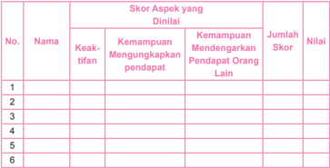

Tabel ini menunjukkan skor aspek yang dinilai untuk beberapa orang, dengan kolom-kolom seperti Nama, Kekuatan Mengungkapkan Pendapat, Kemampuan Mendengarkan Pendapat Orang Lain, Jumlah Skor, dan Nilai. Topik utama tabel adalah evaluasi kemampuan berkomunikasi dan mendengarkan orang lain. Data penting yang terlihat adalah bahwa setiap individu memiliki skor yang berbeda-beda dalam kedua aspek tersebut, dengan jumlah skor yang ditambahkan untuk mencapai nilai akhir. Ini menunjukkan bahwa evaluasi ini tidak hanya mengukur kemampuan individu untuk mengungkapkan pendapat mereka sendiri, tetapi juga kemampuan mereka untuk mendengarkan pendapat orang lain.

### Ketentuan penskoran:

Sangat baik = Skor 4

Baik

= Skor 3

Cukup

= Skor 2

Kurang

= Skor 1

### Contoh Penilaian Keterampilan

### Karya: Doa

---
**📊 Tabel**

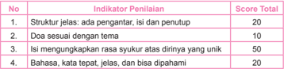

Tabel ini menunjukkan indikator penilaian untuk sebuah karya tulis, masing-masing dengan skor total yang ditentukan. Topik utama tabel ini adalah penilaian karya tulis, yang meliputi struktur jelas, doa sesuai dengan tema, isi yang mengungkapkan rasa syukur atas dirinya yang unik, dan bahasa yang kata tepat, jelas, dan bisa dipahami. Indikator pertama, struktur jelas, diberi skor 20, menunjukkan bahwa struktur jurnal harus jelas dan lengkap. Indikator kedua, doa sesuai dengan tema, diberi skor 10, menunjukkan bahwa doa harus sesuai dengan isi dan tema yang ditulis. Indikator ketiga, isi yang mengungkapkan rasa syukur atas dirinya yang unik, diberi skor 50, menunjukkan bahwa isi harus mengungkapkan rasa syukur atas diri sendiri yang unik. Indikator keempat, bahasa yang kata tepat, jelas, dan bisa dipahami, diberi skor 10, menunjukkan bahwa bahasa harus jelas dan bisa dipahami oleh pembaca. Dari tabel ini, dapat disimpulkan bahwa penilaian karya tulis ini sangat fokus pada struktur, isi, dan bahasa yang digunakan dalam karya tulis tersebut.

### Lampiran

 

---
## 📄 Halaman 292

Nilai:

### Score yang diperoleh × 100

Score total

### Contoh Penilaian Sikap Spiritual

Indikator  : Mengagumi kebaikan Tuhan yang telah menciptakan dirinya sebagai

Citra Allah yang unik

Teknik

: Melalui penilaian diri/ self assessment

Petunjuk

: Nilailah dirimu sendiri: seberapa sering dirimu menyadari hal-hal berikut dalam kehidupanmu sehari-hari

- 4  = selalu
- 3  = sering (dalam satu tahun minimal 12 kali)
- 2  = kadang-kadang (dalam 1 tahun kurang dari 4 kali)
- 1  = tidak pernah

---
**📊 Tabel**

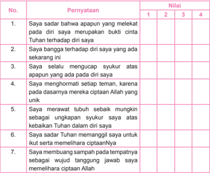

Tabel ini berisi pernyataan yang dianggap benar oleh seseorang tentang diri mereka dan kepercayaan mereka terhadap Tuhan. Kolom pertama berisi pernyataan, sedangkan kolom kedua hingga keempat berisi nilai yang diberikan untuk setiap pernyataan. Topik utama tabel ini adalah tentang pemikiran dan keyakinan individu tentang Tuhan dan diri mereka sendiri. Data penting yang terlihat adalah bahwa banyak pernyataan tersebut menunjukkan kepercayaan dan rasa syukur terhadap Tuhan, seperti "Saya sadar bahwa apapun yang melekat pada diri saya merupakan buktinya Tuhan telah hadapi diri saya" dan "Saya selalu mengucap syukur atas apa pun yang ada pada diri saya". Ini menunjukkan bahwa individu ini memiliki keyakinan kuat terhadap Tuhan dan keberkahan yang diberikan kepada mereka.

### Score total

 

---
## 📄 Halaman 293

### Contoh Penilaian Sikap Sosial

Indikator  : Menghormati sesama sebagai Citra Allah yang baik adanya dan ter- libat aktif dalam memelihara ciptaan sebagai perwujudan pelaksanaan tugas manusia sebagai Citra Allah

Teknik

: Observasi

---
**📊 Tabel**

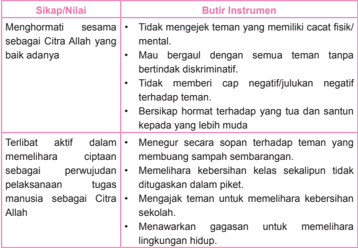

Tabel ini berisi dua kolom utama: "Sikap/Nilai" dan "Butir Instrumenten". Topik utama tabel adalah tentang sikap dan nilai yang dianjurkan dalam hubungan antara teman. Kolom pertama ("Sikap/Nilai") mencakup beberapa poin penting seperti menghormati sesama sebagai Citra Allah yang baik adanya, terlibat aktif dalam memelihara ciptaan sebagai perwujudan tugas manusia sebagai Citra Allah, serta menawarkan gagasan untuk memelihara lingkungan hidup. Kolom kedua ("Butir Instrumenten") menyajikan instrumen atau tindakan yang dapat dilakukan untuk mewujudkan sikap-nilai tersebut, seperti tidak memberi cap negatif/julukan negatif terhadap teman, bersikap hormat terhadap tuan dan sultan kepada yang lebih muda, dan sebagainya. Pola penting yang terlihat adalah bahwa tabel ini mencakup berbagai aspek dari sikap dan nilai yang positif dalam hubungan sosial, termasuk kehormatan, partisipasi aktif dalam kehidupan masyarakat, dan pengembangan lingkungan hidup.

 

---
## 📄 Halaman 294

### Glosarium

Ad Gentes Dokumen Konsili  Vatikan  II  berisi  Dekrit  tentang  Karya  Misioner Gereja

Berbelarasa turut merasakan nasib orang lain (solider/peduli)

Citra rupa; gambar atau gambaran

Doa sarana berkomunikasi dengan Allah

Eskatologis berkaitan dengan akhir zaman seperti hari kiamat dan kebangkitan

Gaudium et Spes Dokumen Konsili Vatikan II berisi Konstitusi Pastoral tentang Gereja di Dunia Dewasa Ini

Gereja persekutuan umat beriman yang percaya kepada Yesus Kristus

Hak asasi hak-hak yang sifatnya mendasar

Idola orang, gambar, patung, dan sebagainya yang menjadi pujaan

Inter  Mirifica Dokumen  Konsili  Vatikan  II  berisi  Dekrit  tentang  Komunikasi Sosial

Katekismus manual doktrin dalam bentuk tanya jawab untuk dihapalkan

Kerajaan Allah suasana damai ketika Allah merajai atau menguasai hati kita

Keunikan kekhususan atau keistimewaan

Komplementer saling membutuhkan dan saling tergantung satu sama lain

Masyarakat sekumpulan  orang  yang  hidup  bersama  pada  suatu  tempat  atau wilayah dengan ikatan aturan tertentu

Mengampuni memaa fkan dan tidak memperhitungkan lagi kesalahan orang lain

Miskin di hadapan Allah pengakuan bahwa dirinya lemah atau tidak berdaya dan bersikap berserah diri sepenuhnya kepada Allah.

Murah hati suka (mudah) memberi; tidak pelit; penyayang dan pengasih; suka menolong; baik hati

 

---
## 📄 Halaman 295

Refleksi sebuah kegiatan yang dilakukan dalam proses belajar mengajar berupa penilaian  tertulis  maupun  lisan  (umumnya  tulisan)  oleh  peserta  didik  kepada guru/dosen, berisi ungkapan kesan, pesan, harapan serta kritik membangun atas pembelajaran yang diterimanya.

Sederajat memiliki martabat dan kedudukan yang sama tinggi

Seks jenis kelamin

Seksualitas c iri, sifat atau peranan seks, dorongan seks, kehidupan seks

Talenta pembawaan orang sejak lahir; bakat

 

---
## 📄 Halaman 296

### Daftar Pustaka

 

---
## 📄 Halaman 297

____________  2003. Sapta  Karunia  Bagi  Kita .  Yogyakarta:  Yayasan  Pustaka Nusatama.

Rausc h, Thomas. 2001. Katolisisme . Y ogyakarta: Kanisius. Sinaga, Anicetus. 1996. Imam Triniter, Pedoman Hidup Imam . Jakarta: Obor. Team CLC. 1992. Tantangan Membina Kepribadian . Jakarta: Yayasan CLC. Team Retret Civita. 1986. Siapakah Aku . Jakarta: Obor. Tisera, Guido,SVD. 2001. Seperti Apakah Kerajaan Allah Itu . Jakarta: Obor Tom Jacobs. 1985. Sikap Dasar Kristiani . Y ogyakarta: Kanisius.

### Internet

http://artikel.sabda.org/ http://bible.org/ http://id.wikipedia.org/ http://katolik.org/ http://smartpsikologi.blogspot.com/ http:///www.andriewongso.com/ http://www.dianweb.org/ http://www.gotquestions.org http://www.indoforum.org/ http://www.sarapanpagi.org/

 

---
## 📄 Halaman 298

### Profil Penulis

Nama Lengkap  :  Maman Sutarman, SFK

Telp. Kantor/HP :   081586214681

E-mail

:   antoniusmamansutarman@gmail.com

Akun Facebook :  Kang Maman Sutarman

Alamat Kantor

:   Jl. Jend. Sudirman 644 - Bandung

Bidang Keahlian:  Pastoral Kateketik

### Riwayat pekerjaan/profesi dalam 10 tahun terakhir:

- 2000-sekarang: Penyuluh Agama Katolik Kota Bandung
- Riwayat Pendidikan Tinggi dan Tahun Belajar:
- S1: STFK 'Pradnyawidya' - Yogyakarta (1991)

### Judul Buku dan Tahun Terbit (10 Tahun Terakhir):

- 'Kamu akan Menjadi saksi-Ku' - Buku Pendampingan Sakramen Penguatan (2012);
- 'Membangun Komunitas Murid-Murid Yesus', Buku Teks Pendidikan Agama Katolik SMP (2010)
- Pendidikan Agama Katolik dan Budi Pekerti, SMP Kelas VII (2014)
- Pendidikan Agama Katolik dan Budi Pekerti, SMA Kelas X (2014)
- Pendidikan Agama Katolik dan Budi Pekerti SMA-LB Kelas X-Tunarungu (2015)

### Judul Penelitian dan Tahun Terbit (10 Tahun Terakhir):

Tidak ada.

Lahir di Cigugur - Kuningan - Jawa Barat, tanggal 28 Desember 1963. Menikah dan dikaruniai 3 anak. Saat ini menetap di Bandung. Sebelum menjadi Penyuluh Agama Katolik, bekerja di Komisi Kateketik Keuskupan Bandung (1986-2000). Aktif Mengajar Pendidikan Agama Katolik di sekolah negeri dan swasta, Pengampu Mata Kuliah Pendidikan Agama Katolik di beberapa Perguruan Tinggi, Narasumber Pelatihan Kurikulum Pendidikan Agama Katolik, Pembinaan Guru Agama Katolik dan Petugas Pastoral Paroki.

 

---
## 📄 Halaman 299

### Profil Penulis

Nama Lengkap  :  Sulis Bayu Setyawan

Telp. Kantor/HP :   0251- 832354/ 08170036387

E-mail

:   : bayusulis81@yahoo.com

Akun Facebook :  -

Alamat Kantor

:   SMA Regina Pacis

Jl. IR.H. Juanda no. 2 Bogor

Bidang Keahlian:  Guru Pendidikan Agama Katolik

### Riwayat pekerjaan/profesi dalam 10 tahun terakhir:

- 1.
- Mengajar Pendidikan Agama Katolik dan Budi Pekerti di SMA Regina Pacis Bogor mulai tahun 1993 sampai sekarang.
- Tenaga Pengajar tidak tetap Pendidikan Agama Katolik di STIPAN Abdi Negara di Lenteng Agung mulai tahun 2012 sampai sekarang.
- Riwayat Pendidikan Tinggi dan Tahun Belajar:
- S1: Fakultas Pendidikan Teologi Universitas Atmajaya Jakarta Tahun 1999.
- D3: Sekolah Tinggi Keguruan dan Ilmu Pendidikan Widya Yuwana Madiun Tahun 1993.
- Judul Buku dan Tahun Terbit (10 Tahun Terakhir): Tidak ada.
- Judul Penelitian dan Tahun Terbit (10 Tahun Terakhir): Tidak ada.
Lahir di Klaten, 17 Mei 1970. Menikah dan dikaruniai 2 anak. Saat ini menetap di Bogor.

 

---
## 📄 Halaman 300

### Profil Penelaah

Nama Lengkap  :  Matheus Beny Mite, M.Hum., Lic.Th.

Telp. Kantor/HP :   021-5708821/081310117159

E-mail

:   benymite@yahoo.com

benymite.matheus@gmai.com

Akun Facebook :  beny.mite@atmajaya.ac.id

Alamat Kantor

:   Unika Atma Jaya, Jln Jend. Sudirman 51, Jaksel.

Bidang Keahlian:  Pendidikan Keagamaan Katolik dan Teologi

### Riwayat pekerjaan/profesi dalam 10 tahun terakhir:

- 2014 - Sekarang: Ketua Program Studi Pendidikan Keagamaan Katolik, Fakultas Pendidikan dan Bahasa, Universitas Katolik Indonesia (Unika) Atma Jaya, Jakarta
- 2013 - sekarang: Aktif sebagai penelaah buku Pendidikan Agama Katolik yang diselenggarakan oleh Puskurbuk.
- 2009 - 2012: Aktif sebagai Pengembang Instrumen Penilaian dan Buku Teks Pelajaran Agama Katolik yang diselenggarakan oleh BSNP
- 2008 - 2014: Ketua Program Studi Ilmu Pendidikan Teologi, Fakultas Keguruan dan Ilmu Pendidikan, Universitas Katolik Indonesia (Unika) Atma Jaya, Jakarta.
- 2006 - sekarang: Ketua Konsorsium Ilmu Pendidikan Indonesia
- 1983 - sekarang: Unika Atma Jaya pada Prodi Ilmu Pendidikan Teologi.

### Riwayat Pendidikan Tinggi dan Tahun Belajar:

- S3: 2013 - Sekarang: Mahasiswa doktoral Manajemen Pendidikan, Universitas Negeri Jakarta sedang menyusun Disertasi.
- S2: 1995-1997: Magister Teologi. Universitas Sanata Dharma
- S1: 1980-1983 Sarjana Pendidikan pada  Filsafat Teologi pada Fakultas Keguruan dan Ilmu Pendidikan, Universitas Sanata Dharma.

### Judul Buku yang pernah ditelaah (10 Tahun Terakhir):

- Beny Mite, Matheus (editor). Gagasan Pendekatan Pakem di Perguruan Tinggi: Hasil Penelitian Dosen PGSD . Pelangi Pendidikan Seri E. Jakata: FPB, 2015.
- Beny Mite, Matheus (editor ). Peranan Audiovisual dalam Berkatekese. Pelangi Pendidikan Seri C. Jakata: FKIP, 2012
- Beny Mite,  Matheus (editor). Multidimensi dalam Pendidikan . Pelangi Pendidikan Seri A. Jakarta: FKIP 2011.
- Beny Mite, Matheus (editor). Model Katekese Kontekstual. Yogyakarta: Kanisius, 2009.
Catatan : Selain buku-buku ilmiah tersebut di atas, Matheus Beny Mite telah menelaah buku teks Pendidikan Agama Katolik semua jenjang pendidikan (SD sampai SMA) sejak tahun 2009.

### Judul Penelitian dan Tahun Terbit (10 Tahun Terakhir):

- Beny Mite, Matheus. 'Pendidikan Iman Keluarga Katolik dalam Konteks Bangsa Indonesia' dalam Tantangan-Tantangan Keluarga Katolik di Zaman Modern. Jakarta: Obor, 2014.
- Beny Mite, Matheus. 'Buku Teks PAK Untuk Siswa: Sebuah Tinjauan Pedagogis - Yuridis' dalam Penggunaan Buku Teks Pelajaran Agama Katolik untuk Siswa dalam Proses Pembelajaran . Jakarta: Obor, 2010.
294

 

---
## 📄 Halaman 301

### Profil Penelaah

Nama Lengkap  :  FX. Adisusanto SJ

Telp. Kantor/HP :

E-mail

:   adisusanto@kawali.org

Akun Facebook :

Alamat Kantor

:   Komisi Kateketik KWI, jl. Cut Meutia 10, Jakarta

Bidang Keahlian:  Pendidikan Agama Katolik

### Riwayat pekerjaan/profesi dalam 10 tahun terakhir:

- Mengajar matakuliah kateketik di Universitas Sanata Dharma, Yogyakarta dan Universitas Katolik Atma Jaya, Jakarta sampai sekitar tahun 2012
- Sekarang bekerja sebagai Ketua Departemen Dokumentasi dan Penerangan Konferensi Waligereja Indonesia (Dokpen KWI) dan staf ahli kateketik Komisi Kateketik KWI

### Riwayat Pendidikan Tinggi dan Tahun Belajar:

- S1: ulusan Universitas Kepausan Salesianum, Roma, 1987
FX. Adisusanto SJ, lulusan Universitas Kepausan Salesianum, Roma, 1987. Mengajar matakuliah kateketik di Universitas Sanata Dharma, Yogyakarta dan Universitas Katolik Atma Jaya, Jakarta sampai sekitar tahun 2012. Sekarang bekerja sebagai Ketua Departemen Dokumentasi dan Penerangan Konferensi Waligereja Indonesia (Dokpen KWI) dan staf ahli kateketik Komisi Kateketik KWI. Bisa dihubungi melalui Komisi Kateketik KWI, jl. Cut Meutia 10, Jakarta.

 

---
## 📄 Halaman 302

### Profil Penelaah

Nama Lengkap  :  Dr Vinsensius Darmin Mbula, OFM

Telp. Kantor/HP :   021 42803546/ 08128732247

E-mail

:   lembaknai@yahoo.com

Akun Facebook :

Alamat Kantor

:   Jln Ledjen Suprapto No 80, Tanah Tinggi, Senen, Jakarta Pusat

Bidang Keahlian:  Manajemen Pendidikan

### Riwayat pekerjaan/profesi dalam 10 tahun terakhir:

- 2010 - 2016: Guru Bimbingan Konseling dan Pendidikan Nilai  di SMIP Rex Mundi, Jakarta.
- 2010-2016: Konsultan Pendidikan dan Pengembang Kurikulum di Yayasan Yosep Yeemye
- 2010-2016: Direktur Yayasan Santo Fransiskus, Jakarta
- 2011-2016: Dosen Pengantar pendidikan, Psikologi pendidikan, perkembangan peserta didik di Univeristas Katolik Atmajaya Jakarta
- 2010-2016: Ketua Presidium Majelis Nasional Pendidikan Katolik (MNPK)

### Riwayat Pendidikan Tinggi dan Tahun Belajar:

- S3: ( 2006-2010) Manajemen Pendidikan, Universitas Negeri Jakarta (UNJ)
- S2: (2004-2006) Manajemen Pendidikan, Universitas Negeri Jakarta (UNJ)
- S1: (1985-1989) Sarjana Filsafat, Sekolah Tinggi Filsafat Driyarkara, Jakarta
- Judul Buku yang pernah ditelaah (10 Tahun Terakhir):
- Buku Pendidikan Agama Katolik
- Buku Pendidikan Agama Katolik dan Budi Pekerti
- Judul Penelitian dan Tahun Terbit (10 Tahun Terakhir): Tidak ada.

 

---
## 📄 Halaman 303

### Profil Penelaah

Nama Lengkap  :  Dr. Salman Habeahan, S.Ag.MM.

Telp. Kantor/HP :   081382836359; Telp/Fax. 021: 85913017 (R)

E-mail

:   salman.habeahan@yahoo.co.id

Akun Facebook :  beny.mite@atmajaya.ac.id

Alamat Kantor

:   Jl. I.Gusti Ngurah Rai Pd. Kopi Jakarta Timur

Bidang Keahlian:  Pendidikan Agama & Manajemen Pendidikan

### Riwayat pekerjaan/profesi dalam 10 tahun terakhir:

- Pengawas Pendidikan Agama Katolik Tkt. Sekolah Menengah Kementerian Agama Kota Jakarta Timur (2003 - 2016)
- Dosen Pendidikan Agama Katolik Institut Bisnis Nusantara Jakarta (1999  2016)
- Dosen Etika Profesi Kependidikan & Manajemen Pendidikn Program
- Pasca Sarjana STIE-IMMI Jakarta (2015 - 2016).

### Riwayat Pendidikan Tinggi dan Tahun Belajar:

- S3: Pendidikan, Jurusan Manajemen Pendidikan Universitas Negeri Jakarta, 2006 - Awal 2012.
- S2: Manajemen, Jurusan Manajemen SDM, Universitas Budi Luhur Jakarta, 1998 - 2001.
- Post S-1: Teologi, Sekolah Tinggi Filsafat Teologi St. Yohanes Pematangsiantar, 1995 - 1997.
- S1: Filsafat Agama, Fakultas Filsafat Universitas Katolik St. Thomas Medan Sumatera Utara, 1989 - 1995.

### Judul Buku yang pernah ditelaah (10 Tahun Terakhir):

- Pendidikan Agama Katolik Kelas X (SMA)
- Pendidikan Agama Katolik Kelas XI (SMA)
- Pendidikan Agama Katolik XII (SMA)
- Pengawasan Berbasis Agama Katolik (Irjen Kementerian Agama R.I.)
- Buku KBK Agama Katolik untuk SMK

### Judul Penelitian dan Tahun Terbit (10 Tahun Terakhir):

- Membangun Hidup Berpolakan Pribadi Yesus Kristus, Nusatama Yogyakarta, ISBN, 2003.
- Butir-butir Pendidikan Nilai Memasuki Abad 21, Krista Media, ISBN, 2006.
- Kepemimpinan Untuk Organisasi Publik, Organisasi Non-Profit, UADS, Publishing, ISBN, 2013.
- Kuliah Agama Katolik di Perguruan Tinggi, DIKTI, 2014, E-book.
Dr. Salman Habeahan , Lahir di Parlabian - Sibolga, 18 Agustus 1968. Menikah dengan Nansi Theresia Samosir, SE., S.Ag., dan dikaruniai 4 anak. Saat ini menetap di Jakarta. Aktif di organisasi profesi Guru, Penelitian dan Pengembangan dalam bidang Pendidikan, Sosial Keagamaan dan Kebangsaan. Terlibat di berbagai kegiatan di bidang pendidikan dan pengajaran,Instruktur Nasional Kurikulum 2013,  Aktif menjadi narasumber di berbagai seminar tentang Pendidikan Agama dan Manajemen Pendidikan. Aktif juga menulis di berbagai media Nasional; Kompas, Koran Sindo, Sinar Harapan,  Jurnal dan Majalah.

 

---
## 📄 Halaman 304

### Profil Editor

Nama Lengkap  :   Ril Ellys Napitupulu, S.H.,M.Si.

Telp. Kantor/HP :   (021-3804249/0812  12130064

E-mail

:   ril.ellys.napitupulu@gmail.com

Akun Facebook :

Alamat Kantor

:   Pusat Kurikulum dan Perbukuan, Badan Penelitian dan Pengembangan Kementerian Pendidikan dan Kebudayaan

Bidang Keahlian:  Menyunting naskah

### Riwayat pekerjaan/profesi dalam 10 tahun terakhir:

- 2007  s.d 2011 Pembantu Pimpinan pada Bidang Pengendalian  Mutu Buku, pada Pusat Perbukuan, Setjen, Kemdikbud
- 2011 s.d 2015 Fungsional Umum  pada Bidang Kurikulum dan Perbukuan PAUDNI  pada Pusat Kurikulum dan Perbukuan Badan Penelitian dan Pengembangan Kementerian Pendidikan dan Kebudayaan.
- 2015 s.d 2016,  Fungsional Umum pada Bidang Perbukuan, Pusat Kurikulum dan Perbukuan

### Riwayat Pendidikan Tinggi dan Tahun Belajar:

- S2: Jurusan Kesejahteraan Sosial, Sosiologi, FISIP  Universitas Indonesia (Masuk tahun 2001 - lulus 2005)
- S1: Fakultas Hukum, Jurusan Hukum Keperdataan/ Universitas Sumatera Utara (Masuk tahun 1982 - lulus 1987)

### Judul Buku yang pernah diedit (10 Tahun Terakhir):

- Hasil Pemenang Sayembara  Penulisan  Naskah Buku  Pengayaan Tahun 2006 s.d 2011
- Buku Teks Pelajaran  Pendidikan Agama Kristen Protestan dan Budi Pekerti Kelas I SD
- Buku Teks Pelajaran  Pendidikan Agama Kristen Protestan dan Budi Pekerti Kelas X SMA
- Buku Teks Pelajaran  Pendidikan Agama Buddha dan Budi Pekerti Kelas …..
- Buku Teks Pelajaran  Pendidikan Agama Buddha dan Budi Pekerti Kelas …..
- Buku Teks Pelajaran  Pendidikan Agama Katolik dan Budi Pekerti Kelas …..
- Buku Teks Pelajaran  PPKn  Kelas …..
- Buku Teks Pelajaran  Antropologi  Kelas …..
- Buku Teks Pelajaran  Sosiologi  Kelas …..
- Buku Teks Pelajaran  Penjasorkes  Kelas …..

### Judul Penelitian dan Tahun Terbit (10 Tahun Terakhir):

Tidak ada.

---

*📊 Statistik: 17 visual berhasil, 16 dilewati, 0 gagal | Durasi: 3m 39s*