# Kelas 10 Katolik BS press

*Diekstrak: 18 May 2026, 15:28*

---

---
## 📄 Halaman 1

### Pendidikan Agama Katolik dan Budi Pekerti

---
**🖼️ Gambar/Diagram**

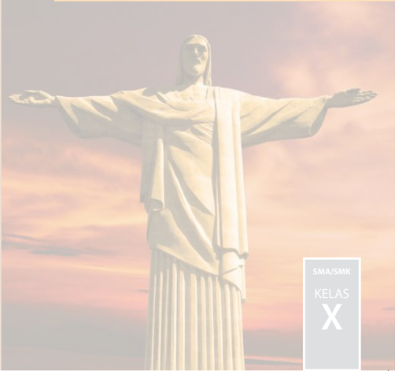

> **Deskripsi Visual:** Gambar ini menampilkan patung Cristo Redentor di Rio de Janeiro, Brasil. Patung ini berdiri di puncak Gunung Corcovado dengan latar belakang langit yang cerah dan awan putih. Patung tersebut tampak megah dengan posisi tangan yang membentuk salam, menunjukkan keberanian dan kepercayaan. Di sudut kanan bawah gambar, terdapat tulisan "SMA/SMK KELAS X" yang menunjukkan bahwa gambar ini mungkin digunakan sebagai materi pendidikan untuk kelas X di sekolah menengah atas.

 

---
## 📄 Halaman 2

### Hak Cipta © 201 7 pada Kementerian Pendidikan dan Kebudayaan Dilindungi Undang-Undang

Disklaimer: Buku  ini  merupakan  buku  siswa  yang  dipersiapkan  Pemerintah  dalam rangka implementasi Kurikulum 2013. Buku siswa ini disusun dan ditelaah oleh berbagai pihak di bawah koordinasi Kementerian Pendidikan dan Kebudayaan, dan dipergunakan dalam tahap awal penerapan Kurikulum 2013. Buku ini merupakan 'dokumen hidup' yang senantiasa diperbaiki,  diperbaharui,  dan  dimutakhirkan  sesuai  dengan  dinamika kebutuhan dan perubahan zaman. Masukan dari berbagai kalangan yang dialamatkan kepada  penulis  dan  laman  http://buku.kemdikbud.go.id  atau  melalui  email  buku@ kemdikbud.go.id diharapkan dapat meningkatkan kualitas buku ini.

### Katalog Dalam Terbitan (KDT)

Indonesia. Kementerian Pendidikan dan Kebudayaan. Pendidikan Agama Katolik dan Budi Pekerti / Kementerian Pendidikan dan Kebudayaan.--. Edisi Revisi  Jakarta : Kementerian Pendidikan dan Kebudayaan, 201 7 .

vi, 194 hlm : ilus. ; 25 cm.

Untuk SMA/SMK Kelas X ISBN 978-602-427-058-2 (jilid lengkap) ISBN 978-602-427-059-9 (jilid 1)

- Katolik - Studi dan Pengajaran I.  Judul
- Kementerian Pendidikan dan Kebudayaan
282

Penulis

:  Maman Sutarman, Sulis Bayu Setyawan

Nihil Obstat

: FX. Adisusanto, 25 Februari 2014

Imprimatur

: Mgr. John Liku Ada, 22 Maret 2014

Penelaah

:  F .X. Adi Susanto; Vincentius Darmin Mbula, OFM Salman Habeahan; Matheus Benny Mithe

Penyelia Penerbitan : Pusat Kurikulum dan Perbukuan, Balitbang, Kem en dikbud.

Cetakan Ke-1, 2014 Cetakan Ke-2, 2016 (Edisi Revisi) Cetakan Ke-3, 2017 (Edisi Revisi)

ISBN 978-602-282-418-3 (jilid 1)

Disusun dengan huruf Minion Pro, 11 pt

 

---
## 📄 Halaman 3

### Kata Pengantar

Kita  semua  bersyukur  kepada  Allah  yang  Mahakuasa  atas  terbitnya  buku Pendidikan Agama Katolik dan Budi Pekerti yang telah direvisi  dan diselaraskan sesuai perkembangan Kurikulum 2013.

Agama terutama bukanlah soal mengetahui mana yang benar atau yang salah. Tidak ada gunanya mengetahui tetapi tidak melakukannya, seperti dikatakan oleh Santo Yakobus: 'Sebab seperti tubuh tanpa roh adalah mati, demikian jugalah iman tanpa  perbuatan-perbuatan  adalah  mati'  (Yakobus  2:26).  Demikianlah,  belajar bukan sekadar untuk tahu, melainkan dengan belajar seseorang menjadi tumbuh dan berubah. Tidak sekadar belajar lalu berubah, tetapi juga mengubah keadaan. Begitulah Kurikulum 2013 dirancang agar tahapan pembelajaran memungkinkan siswa  berkembang  dari  proses  menyerap  pengetahuan  dan  mengembangkan keterampilan hingga memekarkan sikap serta nilai-nilai luhur kemanusiaan.

Pembelajaran  agama  diharapkan  mampu  menambah  wawasan  keagamaan, mengasah keterampilan beragama dan mewujudkan sikap beragama peserta didik yang utuh dan berimbang yang mencakup hubungan manusia dengan Penciptanya, sesama  manusia  dan  manusia  dengan  lingkungannya.  Untuk  itu  pendidikan agama perlu diberi penekanan khusus terkait dengan penanaman karakter dalam pembentukan budi pekerti yang luhur. Karakter yang ingin kita tanamkan antara lain:  kejujuran,  kedisiplinan,  cinta  kebersihan,  cinta  kasih,  semangat  berbagi, optimisme, cinta tanah air, kepenasaran intelektual, dan kreativitas.

Nilai-nilai  karakter  itu  digali  dan  diserap  dari  pengetahuan  agama  yang  dipelajari para  siswa  itu  dan  menjadi  penggerak  dalam  pembentukan,  pengembangan, peningkatan,  pemeliharaan,  dan  perbaikan  perilaku  anak  didik  agar  mau  dan mampu melaksanakan tugas-tugas hidup mereka secara selaras, serasi, seimbang antara lahir-batin, jasmani-rohani, material-spiritual, dan individu-sosial. Selaras dengan itu, Pendidikan Agama Katolik secara khusus bertujuan membangun dan membimbing peserta didik agar tumbuh berkembang mencapai kepribadian utuh yang semakin mencerminkan diri mereka sebagai gambar Allah, sebab demikianlah ' Allah  menciptakan  manusia  itu  menurut  gambar-Nya,  menurut  gambar  Allah diciptakan-Nya  dia'  (Kejadian  1:27).  Sebagai  makhluk  yang  diciptakan  seturut gambar Allah, manusia perlu mengembangkan sifat cinta kasih dan takut akan Allah, memiliki kecerdasan, keterampilan, pekerti luhur, memelihara lingkungan, serta  ikut  bertanggung  jawab  dalam  pembangunan  masyarakat,  bangsa  dan negara. [Sigit DK: 2013]

Buku pelajaran Pendidikan Agama Katolik dan Budi Pekerti ini ditulis dengan semangat itu. Pembelajarannya dibagi-bagi dalam kegiatan-kegiatan yang harus

 

---
## 📄 Halaman 4

dilakukan  siswa  dalam  usaha  memahami  pengetahuan  agamanya.  Akan  tetapi pengetahuan  agama  bukanlah  hasil  akhir  yang  dituju.  Pemahaman  tersebut harus  diaktualisasikan  dalam  tindakan  nyata  dan  sikap  keseharian  yang  sesuai dengan  tuntunan  agamanya,  baik  dalam  bentuk  ibadah  ritual  maupun  ibadah sosial.  Untuk  itu,  sebagai  buku  agama  yang  mengacu  pada  kurikulum  berbasis kompetensi, rencana pembelajarannya dinyatakan dalam bentuk aktivitasaktivitas.  Di  dalamnya  dirancang  urutan  pembelajaran  yang  dinyatakan  dalam kegiatan-kegiatan  keagamaan  yang  harus  dilakukan  siswa.  Dengan  demikian, buku ini menuntun apa yang harus dilakukan siswa bersama guru dan temanteman sekelasnya untuk memahami dan menjalankan ajaran iman katolik.

Buku  ini  bukanlah  satu-satunya  sumber  belajar  bagi  siswa.  Sesuai  dengan pendekatan  yang  dipergunakan  dalam  Kurikulum  2013,  siswa  didorong  untuk mempelajari  agamanya  melalui  pengamatan  terhadap  sumber  belajar  yang tersedia dan terbentang luas di sekitarnya. Lebih-lebih untuk usia remaja perlu ditantang untuk kritis sekaligus peka dalam menyikapi fenomena alam, sosial, dan seni budaya.

Peran  guru  sangat  penting  untuk  menyesuaikan  daya  serap  siswa  dengan ketersediaan kegiatan yang ada pada buku ini. Penyesuaian ini antara lain dengan membuka kesempatan luas bagi kreativitas guru untuk memperkayanya dengan kegiatan-kegiatan lain yang sesuai dan relevan dengan tempat di mana buku ini diajarkan,  baik  belajar  melalui  sumber  tertulis  maupun  belajar  langsung  dari sumber lingkungan sosial dan alam sekitar.

Komisi  Kateketik  Konferensi  Waligereja  Indonesia  sebagai  lembaga  yang bertanggungjawab atas ajaran iman Katolik berterima kasih kepada pemerintah, dalam hal ini Kementerian Pendidikan dan Kebudayaan atas kerja sama yang baik selama ini mulai dari proses penyusunan kurikulum hingga penulisan buku teks pelajaran ini.

Jakarta, medio Februari 2016

Koordinator Tim Penulis Buku

Komisi Kateketik KWI

 

---
## 📄 Halaman 5

### Daftar Isi

5

8

9

9

7

v

 

---
## 📄 Halaman 6

### Daftar Gambar

 

---
## 📄 Halaman 7

### Bab I Manusia Makhluk Pribadi

Kata  manusia  berasal  dari  kata manu (Sansekerta)  atau mens (Latin)  yang berarti  berpikir,  berakal  budi,  atau homo (Latin)  yang  berarti  manusia.  Istilah 'pribadi' dalam bahasa Yunani adalah hupostasis , diterjemahkan ke Latin sebagai persona (Inggris: Person )  yang  digunakan  untuk  menyebut  manusia  sebagai perseorangan (diri manusia atau diri sendiri), individu, ataupun karakter. Manusia sebagai makhluk pribadi berarti ingin menekankan dirinya sebagai diri manusia secara individu.

Istilah  'Individu'  berasal  dari  kata  latin,  ' individuum '  artinya  'yang  tidak terbagi' . Atau dalam bahasa Inggris ' In ' yang berarti tidak, dan ' devided ' yang berarti terbagi atau terpisahkan. Jadi, merupakan suatu sebutan yang dapat dipakai untuk menyatakan suatu kesatuan yang paling kecil dan terbatas. Manusia sebagai makhluk  individu  memiliki  unsur  jasmani  dan  rohani,  unsur  fisik  dan  psikis, unsur  raga  dan  jiwa.  Seseorang  dikatakan  sebagai  manusia  individu  manakala unsur-unsur  tersebut  menyatu  dalam  dirinya.  Jika  unsur  tersebut  sudah  tidak menyatu lagi maka seseorang tidak disebut sebagai individu.

Karakteristik yang khas dari seseorang dapat kita sebut dengan kepribadian. Setiap  orang  memiliki  kepribadian  yang  berbeda-beda  yang  dipengaruhi  oleh faktor bawaan ( genotip ) dan faktor lingkungan ( fenotip ) yang saling berinteraksi terus-menerus.

Maka manusia sebagai makhluk pribadi adalah manusia yang di dalamnya terdapat kesatuan unsur jasmani dan rohani, unsur fisik dan psikis, unsur raga, jiwa dan roh, serta keunikan sebagai ciptaan Allah.

Secara  kodrati,  manusia  merupakan  makhluk monodualis .  Artinya  selain sebagai makhluk individu, manusia berperan juga sebagai makhluk sosial. Sebagai makhluk individu, manusia merupakan makhluk ciptaan Tuhan yang terdiri atas unsur jasmani (raga) dan rohani (jiwa) yang tidak dapat dipisah-pisahkan.Jiwa dan raga inilah yang membentuk individu.

Dalam  pembahasan  tentang  manusia    makhluk  pribadi  terbagi  dalam beberapa tema, yakni:

- Aku Pribadi yang Unik.
- Mengembangkan Karunia Allah.
- Kesetaraan Laki-Laki dan Perempuan.
- Keluhuran Manusia sebagai Citra Allah.

 

---
## 📄 Halaman 8

### A. Aku Pribadi yang Unik

Setiap orang adalah individu ( in-devidere = tak dapat dipisahkan). Ia adalah makhluk  yang  unik  ( unique atau  unus  =  satu),  tak  ada  satu  orang  pun  yang mempunyai  kesamaan  dengan  orang  lain.  Bahkan  manusia  kembar  sekalipun selalu mempunyai perbedaan. Kesadaran diri sebagai makhluk yang unik menjadi sangat penting bagi setiap individu, sebab bila tidak maka akan muncul berbagai sikap  dan  perilaku  negatif  dalam  hidupnya.  Dari  kacamata  iman,  keunikan  itu merupakan anugerah yang patut disyukuri dan dikembangkan, bukan disesali.

Pembahasan tema 'Aku Pribadi yang Unik' ingin membantu dirimu lebih menyadari keunikan diri, agar kamu bisa mengambil sikap bertanggung jawab terhadap hidupmu  sehingga mampu  mengembangkan  diri  sesuai dengan kehendak Allah.

### Doa Pembuka

- Allah Yang Mahabaik, kami bersyukur atas penyelenggaraanMu.
- Engkau menciptakan semua baik adanya,
- termasuk diri kami yang Kau ciptakan begitu indah dan sempurna.
- Ya, Allah kami pada saat ini ingin belajar mengenal keunikan diri kami dengan
- lebih baik
- Utuslah Roh KudusMu hadir di tengah-tengah kami,
- Sehingga kami dapat membuka diri tentang berbagai hal berkaitan dengan
- kekuatan dan keterbatasan kami.
- Dengan demikian kamipun akan dapat mengembangkan diri dengan sebaik-
- baiknya demi kemuliaan NamaMu. AMIN

### 1. Mengamati Keunikan Diri

Betulkah dirimu unik? Apa yang sungguh-sungguh membuat dirimu berbeda dengan yang lain ? Mengapa penting menyadari keunikan diri? Untuk menjawab pertanyaan tersebut, cobalah lakukan kegiatan berikut:

- Duduklah  dengan  tenang  dan  ciptakan  situasi  hening!  Lihatlah  dirimu sendiri! Tulislah apa saja ciri-ciri yang ada pada dirimu dalam kolom bagian a. Setelah itu, kalian dapat meminta teman yang kamu anggap dekat untuk mengisi kolom bagian b.

 

---
## 📄 Halaman 9

- Setelah selesai, tukarlah lembar isianmu dengan beberapa teman yang lain, perhatikan  hal-hal  apa  yang  ada  pada  diri  orang  lain  tapi  tidak  ada  pada dirimu dan sebaliknya.
- Apa yang dapat kalian simpulkan setelah melihat ciri-ciri dirimu dibandingkan dengan orang lain?
- Diskusikan  dalam  kelompok:  sikap  atau  pandangan  apa  saja  yang  sering muncul saat orang menyadari bahwa dirinya berbeda dengan orang lain. Apa pengaruhnya sikap tersebut dalam bersikap terhadap dirinya sendiri maupun orang lain? Bagaimana sikapmu sendiri selama ini terhadap keadaan dirimu?
- Bacalah kisah berikut ini:

### Angkie Yudhistira, Mengubah Keterbatasan Menjadi Kesuksesan

Angkie Yudhistira adalah seorang perempuan yang menderita kekurangan pendengaran saat masih kecil, usia 10 tahun. Namun, justru dengan kekurangan tersebut  membuat  ia  semakin  percaya  diri,  hingga  mengubahnya  menjadi sebuah kelebihan.

Saat keterbatasan tidak menjadikan sebuah belenggu.

Angkie,  sapaan  akrab  dari  Angkie  Yudhistira,  karena  terlalu  sering mengonsumsi  obat-obatan  sejak  kecil  untuk  mengatasi  gangguan  penyakit seperti  flu,  batuk  dan  demam.  Lalu  untuk  mengobatinya  oleh  dokter  di pedalaman sering  diberikan  obat  antibiotik  secara  rutin  hingga  penyakitnya hilang. Jika kambuh, antibiotik menjadi obat yang ampuh dan mujarab untuk dirinya.

Hingga akhirnya, obat-obatan tersebut sangat berpengaruh negatif untuk dirinya.  Terutama  pada  bagian  telinga,  yang  membuat  Angkie  divonis  oleh dokter tidak dapat mendengar…

Jalan  hidup  Angkie  yang  getir  sedari  kecil,  tidak  menghalangi  niatnya untuk terus berusaha, berusaha dan berusaha. Malahan, ejekan seperti 'Alien'

 

---
## 📄 Halaman 10

dari kawan-kawan dan sebagainya hanya dibalas dengan senyum manis walau terkadang  geregetan.  Lambat  laun,  Angkie  mulai  bisa  menerima  kehidupan dirinya  yang  mempunyai  kekurangan.  Akhirnya  kekurangan  itu  membuat Angkie semakin termotivasi untuk berhasil dan menjadi seorang yang sukses, walau memiliki keterbatasan. Lulus dari kuliahnya di London School of Public Relations,  dengan  ipk  yang  tinggi  3,5  semakin  membuat  Angkie  termotivasi untuk terus maju dan tidak minder dengan kawan-kawan lainnya.

Pengalaman  jatuh  bangun  saat mulai mencari pekerjaan  hingga  sekarang memegang  peranan  penting dalam  perusahaan,  dijadikan Angkie sebagai ujian hidup yang memang harus  dijalani.  Angkie  sendiri berujar, bahwa  ia sendiri tidak malu mengakui bahwa dirinya  adalah  tuna  rungu di dalam setiap melamar pekerjaan.

'Kenapa mesti malu? Kalau mereka tidak  mau menerima  saya,  pasti  ada kesempatan lainnya. '

Begitu pula saat ia menerima  panggilan  interview,  Angkie  selalu  memperhatikan  penampilannya. Sebab  baginya  penampilan adalah  yang  utama,  mau sepintar  dan  secantik  apapun kalau penampilan tidak menunjang justru akan terkesan  tidak  baik  bagi  sang pewawancara.

Sampai ia berhasil, dan mimpi masa kecil mulai menghampirinya. Kini, di usianya yang masih muda, 25 tahun. Angkie telah menjabat sebagai Chief Executive Officer(CEO) Thisable Enterprise. Sebuah perusahaan yang didirikan

 

---
## 📄 Halaman 11

bersama  kawan-kawannya  untuk  melakukan  misi  sosial  dengan  membantu orang  yang  memiliki  keterbatasan  fisik  agar  tetap  memandang  cerah  masa depan mereka.

Selain itu, Angkie juga pernah menjadi finalis Abang None yang mewakili Jakarta Barat pada tahun 2008. Ia juga terpilih sebagai Miss Congeniality dari sebuah  program  di  Natur-e,  dan  The  Most  Fearless  Female  Cosmopolitan  di tahun yang sama.

Usai mendapatkan gelar S2, Angkie mewakili Indonesia dalam ajang AsiaPacific  Development  Center  of  Disability  di  Bangkok,  Thailand.  Angkie  pun turut  untuk  terjun  langsung  ke  lapangan,  dengan  aktif  di  berbagai  kegiatan sosial  untuk  memberikan  motivasi  terutama  dari  kalangan  yang  memiliki kekurangan fisik.

Seiring  waktu,  ia  pun  mengeluarkan  buku  perdananya  yang  berjudul 'Perempuan Tuna Rungu Menembus Batas'. Angkie mendedikasikan kepada orang yang memiliki keterbatasan seperti dirinya. Agar mereka juga bangkit, dan tidak hanya pasrah menerima keadaan yang ada.

'Ingat! Ini hidup kita. Meski memiliki keterbatasan, kita itu punya kesempatan yang sama besar dalam meraih mimpi… '

- Angkie Yudhistira, 5 Juni 1987

http://tanpa-batas.com/kisahinspiratif/angkie-yudhistira-adalah-penyandang-tuna-runguyang-sukses-menjadi-founder-dan-ceo-chief-executif-officer-disable-enterprise/

- Nilai apa yang dapat kamu ambil dari kisah tersebut di atas?
- Bandingkan pandanganmu selama ini dengan pesan yang kalian peroleh dari kasus di atas! Apabila demikian, apa yang membuat seseorang 'bernilai' di mata orang lain?

### 2. Memahami Ajaran Kitab Suci tentang Keunikan Manusia

Tugas

Carilah teks Kitab Suci yang berbicara tentang keunikan diri!

Bandingkan teks yang kalian temukan dengan teks dari Kitab Kejadian 1: 26 - 31!

26 Berfirmanlah  Allah:  'Baiklah  Kita  menjadikan  manusia  menurut  gambar dan rupa Kita, supaya mereka berkuasa atas ikan-ikan di laut dan burung-

 

---
## 📄 Halaman 12

burung di udara dan atas ternak dan atas seluruh bumi dan atas segala binatang melata yang merayap di bumi. '

- 27 Maka  Allah  menciptakan  manusia  itu  menurut  gambar-Nya,  menurut gambar  Allah  diciptakan-Nya  dia;  laki-laki  dan  perempuan  diciptakan-Nya mereka.
- 28 Allah memberkati mereka, lalu Allah berfirman kepada mereka: 'Beranakcuculah dan bertambah banyak; penuhilah bumi dan taklukkanlah itu, berkuasalah atas ikan-ikan di laut dan burung-burung di udara dan atas segala binatang yang merayap di bumi. '
- 29 Berfirmanlah Allah: 'Lihatlah, Aku memberikan kepadamu segala tumbuhtumbuhan  yang  berbiji  di  seluruh  bumi  dan  segala  pohon-pohonan  yang buahnya berbiji; itulah akan menjadi makananmu.
- 30 Tetapi kepada segala binatang di bumi dan segala burung di udara dan segala yang merayap di bumi, yang bernyawa, Kuberikan segala tumbuh-tumbuhan hijau menjadi makanannya. ' Dan jadilah demikian.
- 31 Maka  Allah  melihat  segala  yang  dijadikan-Nya  itu,  sungguh  amat  baik. Jadilah petang dan jadilah pagi, itulah hari keenam.

### Renungan

- Bacalah sekali lagi teks di atas, dengan mengganti kata 'manusia' dan kata 'mereka' dengan namamu sendiri. Kemudian, renungkan.
- Perasaan  apa  yang  kamu  rasakan  saat  mengganti  kata  'manusia' dengan namamu? Pesan apa yang hendak disampaikan Kitab Kejadian berkaitan  dengan  keunikan  manusia  umumnya  dan  keunikanmu sendiri?
- Sharingkan  perasaan  dan  pesan  yang  kamu  peroleh  itu  di  antara teman-temanmu

### 3. Menghayati Keunikan Diri

### Tugas

Buatlah  simbol  diri  disertai  dengan  penjelasan  yang  mengungkapkan identitas dirimu

 

---
## 📄 Halaman 13

Rumuskan  niat/kebiasaan/sikap  yang  akan  dilakukan  dalam  menghayati keunikan diri sesuai dengan pesan Kitab Suci.

### Re fleksi

Untuk  menutup  kegiatan  pembelajaran,  masuklah  dalam  suasana hening untuk berefleksi: (bisa dilakukan sendiri atau dibimbing guru)

- Setiap orang adalah pribadi yang unik, tidak ada duanya. Meskipun mereka kembar dalam satu rahim, mereka tetap berbeda satu dengan yang lain.
- Ciri  fisik,  sifat,  cara  berpikir,  dan  pengalaman  keberhasilan,  serta kegagalan membentuk keunikan setiap pribadi, selain latar belakang keluarga yang sangat mempengaruhi.
- Setiap  orang  adalah  pribadi  yang  unik,  yang  memiliki  kekhasan tersendiri  dalam  menghayati  keberadaan  dirinya  dan  menghayati hidupnya. Satu dengan yang lain tidak pernah sama.
- Sumber sejati  keunikan  pribadi  manusia  adalah  Allah  sendiri,  yang telah menciptakan manusia secara khusus, pribadi demi pribadi secara ajaib.
- Manusia adalah suatu ' karya seni ' , suatu ' masterpiece ' dari Allah yang luar biasa.
- Singkatnya diri anda adalah pribadi yang indah dan istimewa.
Douglas  Mallock dalam  puisinya  yang  berjudul Be  The  Best ,  Jadilah  Diri Sendiri yang Terbaik. Mengungkapkan ajakannya seperti ini

### Jadilah Diri Sendiri yang Terbaik!

Ciptaan: Douglas Mallock

Jika kau tak dapat menjadi pohon meranti di puncak bukit, jadilah semak belukar di lembah.

Jadilah semak belukar yang teranggun di sisi bukit, kalau bukan rumput, semak belukar pun jadilah!

Jika kau tak boleh menjadi rimbun, jadilah rumput, dan hiasilah jalan di mana-mana.

Jika kau tak dapat menjadi ikan mas, jadilah ikan sepat.

 

---
## 📄 Halaman 14

Tapi jadilah ikan sepat terlincah di dalam payau. Tidak semua dapat menjadi nahkoda, lainnya harus menjadi awak kapal dan penumpang. Pasti ada sesuatu untuk semua. Karena ada tugas berat, maka ada tugas ringan di antaranya dibuat yang lebih berdekatan. Jika kau tak dapat menjadi bulan, jadilah bintang. Jika kau tak dapat menjadi jagung, jadilah kedelai Bukan dinilai kau kalah ataupun menang. Jadilah dirimu sendiri yang terbaik!

### Untuk dipahami

- Waktu  menciptakan  manusia,  Allah  merencanakan  dan  menciptakannya menurut gambar dan rupa-Nya. Menurut citra-Nya. (Kejadian 1:26).
- Waktu menciptakan manusia, Allah seolah-olah perlu 'bekerja' secara khusus. 'Tuhan Allah membentuk manusia dari debu dan tanah dan menghembuskan nafas hidup ke dalam hidungnya' (Kejadian 2:7).
- Segala sesuatu, termasuk taman Firdaus, diserahkan oleh Allah untuk manusia (Kejadian 1:26).
- Bukankah  manusia  itu  istimewa?  Tuhan  memperlakukan  manusia  secara khusus.  Manusia  sudah  dipikirkan  dan  direncanakan  oleh  Allah  sejak keabadian.  Kehadiran  manusia  di  muka  bumi  telah  disiapkan  dan  diatur secara  teliti  dan  mengagumkan.  Manusia  sungguh  diperlakukan  sebagai 'orang' , sebagai pribadi, 'seperti' Tuhan sendiri. Betapa uniknya kita manusia ini!
- Sebagai  orang  beriman  kristiani  yang  sungguh-sungguh  ingin  semakin memahami, menerima, bangga, dan percaya diri, Yesus adalah teladan yang paling utama dan pertama. Dari semula Ia menyadari diri sebagai manusia yang berbeda dengan yang lainnya. Dari cara berpikir, bersikap dan bertindak, Ia  tidak  ragu  menunjukkan  diri  sebagai  pribadi  yang  tidak  sama  dengan yang lainnya. Sebagai seorang pribadi kita harus menyadari, mengerti dan menerima diri apa adanya. Dengan demikian kitapun akan dapat semakin mengembangkan diri  dan  melakukan  sesuatu  dengan  kesadaran  diri  ( selfconsciousness ),  penerimaan  diri  ( self-acceptance ),  kepercayaan  diri  ( self-

 

---
## 📄 Halaman 15

confidence ) dan perasaan aman diri ( self-assurance ) yang tinggi. Dengan dasar itu kita dapat mengisi hidup, meraih  cita-cita dan melaksanakan panggilan Allah.

### Penutup

Doakan Mazmur berikut ini bersama-sama!

### MAZMUR 139

- 1  TUHAN, Engkau menyelidiki dan mengenal aku;
- 2 Engkau  mengetahui,  kalau  aku  duduk  atau  berdiri,  Engkau  mengerti pikiranku dari jauh.
- 3 Engkau memeriksa aku, kalau aku berjalan dan berbaring, segala jalanku Kaumaklumi.
- 4 Sebab sebelum lidahku mengeluarkan perkataan, sesungguhnya, semuanya telah Kauketahui, ya TUHAN.
- 5 Dari  belakang  dan  dari  depan  Engkau  mengurung  aku,  dan  Engkau menaruh tangan-Mu ke atasku.
- 6 Terlalu  ajaib  bagiku  pengetahuan  itu,  terlalu  tinggi,  tidak  sanggup  aku mencapainya.
- 7 Ke mana aku dapat pergi menjauhi roh-Mu, ke mana aku dapat lari dari hadapan-Mu?
- 8 Jika  aku  mendaki  ke  langit,  Engkau  di  sana;  jika  aku  menaruh  tempat tidurku di dunia orang mati, di situ pun Engkau.
- 9 Jika aku terbang dengan sayap fajar, dan membuat kediaman di ujung laut,
- 10 juga  di  sana  tangan-Mu  akan  menuntun  aku,  dan  tangan  kanan-Mu memegang aku.
- 11 Jika  aku  berkata:  'Biarlah  kegelapan  saja  melingkupi  aku,  dan  terang sekelilingku menjadi malam, '
- 12  maka kegelapan pun tidak menggelapkan bagi-Mu, dan malam menjadi terang seperti siang; kegelapan sama seperti terang.
- 13 Sebab Engkaulah yang membentuk buah pinggangku, menenun aku dalam kandungan ibuku.
- 14 Aku  bersyukur  kepada-Mu  oleh  karena  kejadianku  dahsyat  dan  ajaib; ajaib apa yang Kaubuat, dan jiwaku benar-benar menyadarinya.

 

---
## 📄 Halaman 16

- 15 Tulang-tulangku tidak terlindung bagi-Mu, ketika aku dijadikan di tempat yang  tersembunyi,  dan  aku  direkam  di  bagian-bagian  bumi  yang  paling bawah;
- 16 mata-Mu melihat selagi aku bakal anak, dan dalam kitab-Mu semuanya tertulis hari-hari yang akan dibentuk, sebelum ada satu pun dari padanya.
- 17 Dan bagiku, betapa sulitnya pikiran-Mu, ya Allah! Betapa besar jumlahnya!
- 18 Jika aku mau menghitungnya, itu lebih banyak dari pada pasir. Apabila aku berhenti, masih saja aku bersama-sama Engkau.
- 19 Sekiranya  Engkau  mematikan  orang  fasik,  ya  Allah,  sehingga  menjauh dari padaku penumpah-penumpah darah,
- 20 yang berkata-kata dusta terhadap Engkau, dan melawan Engkau dengan sia-sia.
- 21   Masakan aku tidak membenci orang-orang yang membenci Engkau, ya TUHAN, dan tidak merasa jemu kepada orang-orang yang bangkit melawan Engkau?
- 22 Aku sama sekali membenci mereka, mereka menjadi musuhku.
- 23 Selidikilah  aku,  ya  Allah,  dan  kenallah  hatiku,  ujilah  aku  dan  kenallah pikiran-pikiranku;
- 24 lihatlah, apakah jalanku serong, dan tuntunlah aku di jalan yang kekal!

 

---
## 📄 Halaman 17

### B. Mengembangkan Karunia Allah

Orang muda seringkali tidak menyadari kemampuan-kemampuan dan talenta yang ada dalam diri mereka, di lain pihak merekapun sulit menerima keterbatasanketerbatasannya. Hal ini mungkin tidak bisa dilepaskan dari pengaruh lingkungan, di  mana mereka diperlakukan sebagai anak-anak. Akibatnya mereka tidak bisa mengembangkan diri secara maksimal.

Setiap  manusia  adalah  unik  dan  diberikan  kemampuan  dan  potensi  yang berbeda-beda.  Sebagai  kaum  beriman  patutlah  kita  bersyukur  kepada  Tuhan dengan  cara  mengembangkan  bakat  dan  kemampuan  dengan  sebaik-baiknya. Keunggulan  diri  berkaitan  dengan  bakat  dan  kemampuan  hendaknya  tidak membuat  setiap  orang  merasa  lebih  unggul  dari  yang  lain,  sehingga  dapat memunculkan sikap sombong dan arogan. Demikian halnya dengan keterbatasan yang ada tidak membuat orang menjadi rendah diri, minder atau bahkan merasa menjadi orang yang tidak berguna.

Dalam pembahasan ini akan diingatkan kembali bahwa kamu diberi talenta oleh  Tuhan.  Anugerah  tersebut  mempunyai  konsekuensi  bahwa  kamu  harus mengembangkan dan menggunakan talenta itu sebagaimana mestinya. Sudahkah kamu melakukannya? Mengembangkan dan menggunakan talenta sebagaimana mestinya merupakan panggilan dan tuntutan Kristiani.

### Doa Pembuka

### Doa Tanggung Jawab (PS 145)

 

---
## 📄 Halaman 18

Buatlah  kami  bertanggung  jawab  terhadap  semua  orang  yang  mendidik kami, supaya pelajaran hidup yang mereka berikan

dengan penuh kesabaran tidak kami sia-siakan.

Ya Bapa bantulah kami, supaya selalu mensyukuri apa yang kami terima,

dan mempergunakan dengan sebaik-baiknya apa saja yang ada pada kami demi Yesus, Tuhan kami, Amin.

### 1. Menyadari Kekuatan dan Keterbatasan

Impian hidup setiap orang adalah meraih sukses. Dengan kesuksesan yang diraih,  ia  tidak  hanya  membanggakan  diri  sendiri,  melainkan  orang  tua  dan keluarga, mungkin juga guru-guru, tetangga dan sebagainya.

### Bacalah kisah berikut!

Nama  Irene  Kharisma  Sukandar mungkin  asing  di  telinga  kita.  Tapi nama ini sudah sering menjadi bahan  perbincangan  di  dunia  catur junior tingkat internasional. Irene Kharisma Sukandar memang termasuk pendatang  baru  dalam  olahraga  catur Indonesia.

Mengenal  catur  di  usia  7  tahun tepatnya tahun 1999, Irene telah memperlihatkan talenta yang  luar biasa. Pada tahun 2001 ketika usianya baru 9 tahun, putri pasangan Singgih Heyzkel (ayah)  dan  Cici  Ratna  Mulya  (ibu)ini sudah  berhasil  meraih  gelar  Master Percasi  (MP).  Setahun  kemudian  dia memperoleh gelar Master Nasional Wanita (MNW).

Dua  tahun  kemudian  yakni  pada  tahun  2004  ketika  berlangsung Olimpiade Catur di Malorca, Spanyol, Irene mulai memperlihatkan tajinya dengan  merebut  gelar  Master  FIDE  Wanita  (MFW).  Bukan  itu  saja,  Irene juga meraih medali perak dalam arena yang melibatkan 864 peserta dari 107

 

---
## 📄 Halaman 19

negara ini. Hasil kerja keras, tak kenal lelah dan selalu ingin maju menjadi kunci keberhasilannya.

Pada ajang seleknas catur SEA Games XXIII/2005, Manila, Filipina yang berlangsung Pebruari 2005 di Wisma Catur F.Sumanti, Gedung KONI DKI, Tanah Abang I, Jakarta Pusat, Irene melawan pecatur pria. Untuk mengukur sekaligus mematangkan kemampuannya, Irene oleh Eka Putra Wirya pada Maret 2005 diadu dengan pecatur putri asal Hongkong bergelar Grand Master Wanita (GMW) yakni Anya Sun Corke melalui partai dwitarung enam babak di SCUA Kelapa Gading, Jakarta Utara.

Dwitarung itu memang  berakhir imbang 3-3, namun  apa yang diperlihatkan pecatur remaja putri masa depan Indonesia ini sungguh layak mendapat pujian. Bahkan Irene dipastikan dapat memenangkan duel itu jika saja dia tak melakukan kesalahan di partai terakhir.

Namun  Eka  dapat  memakluminya.  Pembina  olahraga  terbaik  pilihan wartawan olahraga SIWO Jaya pada tahun 1993 itu kemudian tidak ragu-ragu untuk secepatnya mengorbitkan Irene sampai menggapai gelar Grand Master Wanita (GMW) pertama Indonesia. Bagaikan gayung bersambut, Irene pun telah menyatakan kesiapan sekaligus tekadnya guna mewujudkan target Eka Putra Wirya tersebut.

' Ada  dua  cita-cita  besar  saya,  pertama  meraih  gelar  GM  dan  kedua menjadi juara dunia,' papar pecatur yang mengidolakan GM Judith Polgar dari Hongaria ini.

http://osis.sman7malang.sch.id/index.php?option=com_content&view=article&id=116:meng enal-sosok-gmw-indonesia-irene-kharisma-sukandar-&catid=40:redaksi&Itemid=69

### Renungan

Setelah  mengamati  gambar  dan  menyimak  cerita  di  atas,  cobalah hening sambil menjawab beberapa pertanyaan berikut: Apa yang terpikir olehmu saat  melihat  gambar  dan  cerita  di  atas?  Bayangkan  gambar  dan tokoh di atas adalah dirimu, kira-kira piala itu lambang sukses kalian dalam bidang apa? atau menjadi Grand master dalam bidang apa? apa yang telah kalian lakukan sehingga bisa mencapainya? Siapa saja yang berperan dalam mencapai sukses tersebut? (Tuliskan permenunganmu)

Sukses atau keberhasilan pada dasarnya merupakan tahap akhir dari semua aktivitas manusia. Tentu saja sukses yang sudah diraih perlu menyemangati sukses selanjutnya.  Langkah  awal  yang  perlu  dilakukan  adalah  menyadari  potensi-

 

---
## 📄 Halaman 20

potensi yang ada dalam diri, entah menyangkut kekuatan maupun keterbatasan. Berkaitan dengan hal tersebut, coba temukan kekuatan dan keterbatasanmu, baik menyangkut fisik, bakat/ kemampuan, materi/ ekonomi, sifat, dan yang lainnya. Tuliskan dalam bentuk kolom seperti contoh di bawah ini.

Bertolak  dari  kekuatan  dan  keterbatasan  yang  dimiliki  ,  kira-kira  dalam bidang apa sukses yang kalian raih?

### Kekuatan dan Keterbatasanku

Nama: ………………………..

---
**📊 Tabel**

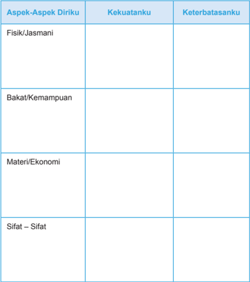

Tabel ini berisi informasi tentang kekuatan dan keterbatasan diri seseorang dalam empat aspek: fisik/jasmani, bakat/kemampuan, materi/ekonomi, dan sifat/sifat. Topik utamanya adalah evaluasi diri secara holistik. Kolom "Kekuatanku" mencakup semua aspek tersebut, sedangkan kolom "Keterbatasananku" mencakup semua aspek tersebut juga. Data penting yang terlihat adalah bahwa setiap aspek memiliki kolom untuk menuliskan kekuatan dan keterbatasan diri, menunjukkan bahwa tabel ini dirancang untuk membantu individu memahami dan mengenali potensi serta tantangan mereka dalam berbagai aspek hidup.

 

---
## 📄 Halaman 21

Impian (sukses) yang ingin ku raih:

Selesai mengisi, sharingkanlah hasilnya di antara teman-temanmu.

### Tugas Kelompok

Setelah selesai sharing, lanjutkan kerja kelompok untuk merumuskan pertanyaan  berkaitan  dengan  hal-hal:  tokoh  remaja  yang  sukses,  kaitan antara keterbatasan dengan sukses, kaitan antara kemampuan dan sukses, kaitan sukses dengan orang lain, kaitan antara sukses dengan mentalitas atau  sikap  dalam  melakukan  sesuatu.  Pertanyaan  yang  disusun  oleh kelompokmu akan dibahas oleh kelompok lain, dan sebaliknya!

Setelah diskusi kelompok dan Pleno, coba resapkan kisah berikut:

Lena Maria adalah seorang wanita yang tangguh. Dia terlahir dengan banyak sekali keterbatasan karena cacat fisik  yang dimilikinya. Ia terlahir tanpa tangan dan kaki kirinya hanya setengah dari kaki kanannya. Tetapi dia tidak pernah menyerah dan selalu bersyukur atas semua yang dimilikinya.

Dengan  bekal  mimpi,  kemauan  dan  semangat pantang menyerah, akhirnya dia bisa mengembangkan semua  talenta  yang  dimilikinya.  Dia  bisa  meraih kesuksesan walaupun dengan kondisi fisik yang terbatas.  Pada  usia  18  tahun,  ia  memecahkan  rekor berenang pada kejuaraan dunia. Bakatnya pada musik juga  sangat  luar  biasa.  Ia  sekarang  sebagai  penyanyi professional.

Pesan apa yang sangat menarik dari kisah Lena Maria?

 

---
## 📄 Halaman 22

### 2. Pesan Kitab Suci Tentang Panggilan Mengembangkan Anugerah

Baca dan renungkanlah!

### Perumpamaan Tentang Talenta

(Matius 25: 14 - 30)

- 14 'Sebab hal Kerajaan Surga sama seperti seorang yang mau bepergian ke luar negeri,  yang  memanggil  hamba-hambanya  dan  mempercayakan  hartanya kepada mereka.
- 15 Yang  seorang  diberikannya  lima  talenta,  yang  seorang  lagi  dua  dan  yang seorang  lain  lagi  satu,  masing-masing  menurut  kesanggupannya,  lalu  ia berangkat.
- 16 Segera pergilah hamba yang menerima lima talenta itu. Ia menjalankan uang itu lalu beroleh laba lima talenta.
- 17 Hamba  yang  menerima  dua  talenta  itu  pun  berbuat  demikian  juga  dan berlaba dua talenta.
- 18 Tetapi hamba yang menerima satu talenta itu pergi dan menggali lubang di dalam tanah lalu menyembunyikan uang tuannya.
- 19 Lama  sesudah  itu  pulanglah  tuan  hamba-hamba  itu  lalu  mengadakan perhitungan dengan mereka.
- 20 Hamba yang menerima lima talenta itu datang dan ia membawa laba lima talenta, katanya: Tuan, lima talenta tuan percayakan kepadaku; lihat, aku telah beroleh laba lima talenta.
- 21 Maka  kata  tuannya  itu  kepadanya:  Baik  sekali  perbuatanmu  itu,  hai hambaku yang baik dan setia; engkau telah setia dalam perkara kecil, aku akan memberikan kepadamu tanggung jawab dalam perkara yang besar. Masuklah dan turutlah dalam kebahagiaan tuanmu.
- 22 Lalu datanglah hamba yang menerima dua talenta itu, katanya: Tuan, dua talenta tuan percayakan kepadaku; lihat, aku telah beroleh laba dua talenta.
- 23 Maka kata tuannya itu kepadanya: Baik sekali perbuatanmu itu, hai hambaku yang baik dan setia, engkau telah setia memikul tanggung jawab dalam perkara yang kecil, aku akan memberikan kepadamu tanggung jawab dalam perkara yang besar. Masuklah dan turutlah dalam kebahagiaan tuanmu.
- 24 Kini  datanglah  juga  hamba  yang  menerima  satu  talenta  itu  dan  berkata: Tuan,  aku  tahu  bahwa  tuan  adalah  manusia  yang  kejam  yang  menuai  di tempat di mana tuan tidak menabur dan yang memungut dari tempat di mana tuan tidak menanam.
- 25 Karena itu aku takut dan pergi menyembunyikan talenta tuan itu di dalam tanah: Ini, terimalah kepunyaan tuan!

 

---
## 📄 Halaman 23

### 3.

- 26 Maka jawab tuannya itu: Hai kamu, hamba yang jahat dan malas, jadi kamu sudah tahu, bahwa aku menuai di tempat di mana aku tidak menabur dan memungut dari tempat di mana aku tidak menanam?
- 27 Karena itu sudahlah seharusnya uangku itu kauberikan kepada orang yang menjalankan  uang,  supaya  sekembaliku  aku  menerimanya  serta  dengan bunganya.
- 28 Sebab itu ambillah talenta itu dari padanya dan berikanlah kepada orang yang mempunyai sepuluh talenta itu.
- 29 Karena setiap orang yang mempunyai, kepadanya akan diberi, sehingga ia berkelimpahan. Tetapi siapa yang tidak mempunyai, apa pun juga yang ada padanya akan diambil dari padanya.
- 30 Dan campakkanlah hamba yang tidak berguna itu ke dalam kegelapan yang paling gelap. Di sanalah akan terdapat ratap dan kertak gigi.
Rumuskan pesan yang tersirat dari kutipan di atas

### Menghayati Panggilan Tuhan untuk Mengembangkan

Anugerah yang Dimiliki

### Tugas

Setelah mengikuti proses di atas, sekarang rumuskan gagasan-gagasan penting yang diperoleh melalui pelajaran ini, rumuskan pula niat / sikap yang akan dilakukan atau dikembangkan!

Renungkanlah kisah berikut ini.

### Kisah Pensil

Pada  awal  mula,  Pencipta  Pensil  berbicara  kepada  pensil  dengan mengatakan:

' Ada  lima  hal  yang  harus  kamu  ketahui  sebelum  aku  mengirimmu  ke dunia.  Ingatlah  itu  selalu  dan  kamu  akan  menjadi  pensil  terbaik  sesuai potensimu.'

### Pertama

'Kamu akan mampu melakukan banyak hal besar, tapi hanya jika kamu membolehkan dirimu dipegang oleh tangan seseorang.'

 

---
## 📄 Halaman 24

### Kedua

'Kamu akan mengalami peruncingan yang menyakitkan dari waktu ke waktu, tetapi hal ini dipersyaratkan jika kamu ingin menjadi sebuah pensil yang lebih baik. '

### Ketiga

'Kamu memiliki kemampuan untuk mengoreksi kesalahan apa pun yang kamu perbuat.'

### Keempat

'Bagian terpenting akan selalu berupa apa yang berada di dalam. '

### Kelima

'Betapa pun kondisinya, Kamu harus terus menulis. Kamu harus selalu meninggalkan suatu tanda yang jelas, terbaca betapa pun sulitnya situasi. '

Sang  pensil  mengerti,  berjanji  untuk  mengingat,  dan  pergi  ke  dalam kotak. Ia benar-benar memahami maksud Penciptanya.

'Sekarang  tempatkan  dirimu  pada  posisi  pensil.  Ingatlah  selalu  hal itu  dan jangan pernah lupa. Dan, kamu akan menjadi orang terbaik sesuai dengan potensimu.'

### Satu

'Kamu akan mampu melakukan banyak hal besar, tapi hanya jika kamu membolehkan dirimu dipegang oleh tangan Tuhan. Dan, biarkan orang-orang lain bertemu denganmu untuk mendapatkan pemberian yang kamu miliki.'

### Dua

'Kamu akan mengalami peruncingan yang menyakitkan dari waktu ke waktu, dengan menghadapi berbagai masalah. Tapi, kamu akan memerlukan hal itu untuk menjadi seorang yang lebih kuat. '

### Tiga

'Kamu akan mampu mengoreksi berbagai kesalahan yang mungkin akan kamu perbuat agar bertumbuh melalui pelbagai kesalahan itu.'

### Empat

'Bagian  terpenting  dalam  dirimu  selalu  berupa  apa  yang  berada  di dalam.'

### Lima

'Pada permukaan apa pun yang kamu jalani, kamu harus meninggalkan tandamu.  Betapa  pun  situasinya,  kamu  harus  terus  mengabdi  pada  Tuhan dalam segala hal. '

 

---
## 📄 Halaman 25

### Tiap orang ibarat sebuah pensil...

Ia diciptakan oleh Pencipta untuk suatu maksud yang unik dan spesial.

Hal  seperti  ini  pernah  dikatakan  Mother  Theresa  dalam  wawancara dengan Edward Desmond dari Majalah Time tahun 1990, 'Saya hanya pensil kecil di Tangan Tuhan. Dia yang berpikir. Dia yang menulis. Pensil itu tidak bisa apa-apa. Ia hanya digunakan. Saya merasa Tuhan ingin memperlihatkan kebesaran-Nya dengan menggunakan ketiadaan.'

Dengan pengertian dan usaha terus mengingat, marilah kita maju terus dalam hidup kita di bumi ini dengan memiliki sebuah tujuan yang bermakna dalam hati kita dan suatu hubungan dengan Tuhan tiap hari.

Anda diciptakan untuk melakukan hal-hal yang besar!

Sumber : motivationplannet.wordpress.com

### Untuk dipahami

- Yesus memberikan gambaran seorang tuan yang memberikan talenta kepada hamba-hambanya. ( Matius 25: 14 - 30). Iapun menindak tegas kepada seorang hamba yang tidak mau mengembangkan talenta dan hanya memendamnya ke dalam tanah.
- Setiap orang diberi talenta oleh Tuhan. Mereka harus mengembangkan dan menggunakan  talenta  itu  sebagaimana  mestinya.  Mengembangkan  talenta sebagaimana  mestinya adalah panggilan dan tuntutan orang  beriman Kristiani.
- Kita  harus  mengembangkan  bakat  yang  kita  miliki,  karena  Tuhan  telah memberikan talenta kepada manusia ciptaan-Nya, sesuai dengan kemampuan yang dimiliki manusia masing-masing.
- Kita  harus  seperti  hamba  yang  pertama  dan  hamba  yang  kedua  yang mengembangkan talenta yang mereka punya dengan baik.
- Kita  tidak  boleh  mencontoh  hamba  yang  ketiga,  yang  hanya  mengubur talentanya, tanpa berusaha untuk mengembangkannya.
- Allah akan sedih dan kecewa karena kita hanya memendam bakat yang kita miliki.  Terlebih  kita  merasa  iri  hati  terhadap  kemampuan  yang  orang  lain miliki.  Allah  memberikan  masing-masing  talenta  kepada  umat-Nya,  dan talenta itu harus kita syukuri, serta kita kembangkan.

 

---
## 📄 Halaman 26

### Doa Penutup

### Daraskan mazmur berikut ini!

### Nyanyian syukur karena segala berkat Allah

- 1 Dengan permainan kecapi. Mazmur. Nyanyian.
- 2 Kiranya Allah mengasihani kita dan memberkati kita, kiranya Ia menyinari kita dengan wajah-Nya, S e l a
- 3 supaya jalan-Mu dikenal di bumi, dan keselamatan-Mu di antara segala bangsa.
- 4 Kiranya bangsa-bangsa bersyukur kepada-Mu, ya Allah; kiranya bangsabangsa semuanya bersyukur kepada-Mu.
- 5 Kiranya suku-suku bangsa bersukacita dan bersorak-sorai, sebab Engkau memerintah bangsa-bangsa dengan adil, dan menuntun suku-suku bangsa di atas bumi. S e l a
- 6 Kiranya bangsa-bangsa bersyukur kepada-Mu, ya Allah, kiranya bangsabangsa semuanya bersyukur kepada-Mu.
- 7 Tanah telah memberi hasilnya; Allah, Allah kita, memberkati kita.
- 8 Allah memberkati kita; kiranya segala ujung bumi takut akan Dia!
- Kemuliaan kepada Bapa dan Putera dan Roh Kudus,
- Seperti pada permulaan, sekarang, selalu dan sepanjang segala masa. Amin

 

---
## 📄 Halaman 27

### C. Kesetaraan Laki-laki dan Perempuan

Pada usia  remaja,  seseorang  mengalami  pertumbuhan  jasmaniah  dan rohaniah yang sangat besar. Mereka mengalami adanya dorongan-dorongan dan daya-daya tertentu dalam dirinya, khususnya daya tarik terhadap lawan jenisnya. Daya tarik terhadap lawan jenis ini sering belum disadari secara penuh oleh para remaja sebagai hal yang luhur, indah, wajar, dan manusiawi. Ketidaktahuan dan ketidaksadaran  akan  adanya  dorongan  dan  daya  tarik  terhadap  lawan  jenis  ini dapat  menyebabkan  remaja  tidak  pandai  menempatkan  diri  dalam  pergaulan antar-jenis. Bahkan,  pergaulan  antar-jenis di kalangan  para  remaja  sering 'menyimpang'. Karena itulah, para remaja memerlukan bimbingan agar mereka memiliki  pengetahuan  dan  kesadaran  yang  memadai  tentang  hakikat  kepriaan dan kewanitaan serta daya tarik terhadap lawan jenisnya. Dengan demikian, para remaja dapat menghargai dirinya sendiri dan lawan jenisnya (pria dan wanita) sebagai ciptaan Tuhan yang indah, luhur, dan suci.

Dalam  pembahasan  ini  kalian  akan  diajak  untuk  menyadari  bahwa  lakilaki  dan  perempuan diciptakan semartabat dan sederajat. Keduanya diciptakan menurut citra Allah: diciptakan menurut gambar dan rupa Allah yang satu dan sama ( Kejadian 1, 26 -27). Lebih dari itu, mereka dianugerahi kepercayaan dan kesempatan yang sama untuk mengambil bagian dalam karyaNya yang agung. Mereka dipanggil untuk membangun persekutuan ( communio ) dan bekerja sama dalam pengelolaan dunia dan seisinya serta pelestarian generasi umat manusia (Kejadian 1, 31).

### Doa Pembuka

Allah Bapa Yang Mahabaik,

- Engkau menciptakan kami sebagai laki-laki dan perempuan
- Semartabat, secitra dan sederajat
- Sekalipun kami memiliki kekhasan dan perbedaan,
- Engkau tetap menghendaki kami bersatu dan saling melengkapi
- Engkau mencintai kami dan memanggil kami
- untuk senantiasa saling membantu dan mengembangkan,
- sehingga kami semakin sempurna.
- Berkatilah kami, ya Tuhan
- Supaya kami tidak kenal lelah
- Selalu mengusahakan yang terbaik
- dan menjunjung martabat satu sama lain
- sesuai dengan kehendakMu. Amin
21

 

---
## 📄 Halaman 28

### 1. Mengamati Ketidakadilan Menyangkut Peranan dan Tugas Wanita dalam Masyarakat

Kalian  mungkin  pernah  menemukan  perbedaan  pandangan  dan  sekaligus perlakuan  yang  berkaitan  dengan  peran  laki-laki  dan  perempuan.  Di  daerah tertentu laki-laki sedemikian berkuasa, tetapi di daerah lain sebaliknya. Dan itu semua  berdampak  pada  segi-segi  yang  lain,  misalnya:  perkawinan,  pekerjaan, harta warisan, dan sebagainya. Bagaimana seharusnya ?

Simaklah artikel berikut ini!

### Adat Mengondisikan Perempuan di Bawah Pria

Adat  menempatkan  perempuan  adalah  ibu  yang  memberikan  segalagalanya.  Sementara  pria  adalah  kepala  rumah  tangga  yang  diidentikkan dengan seorang kepala perang, penguasa atas keluarga.

Direktris  Lembaga  Pengkajian  dan  Pemberdayaan  Perempuan  dan Anak-anak  (LP3A),  Dra  Selfi  Sanggenafa,  Jumat  (31/1),  mengatakan,  adat tidak  mengajarkan  kekerasan  suami  terhadap  perempuan.  Tetapi,  kondisi yang dibangun melalui sistem adat tradisional telah memosisikan perempuan di bawah tekanan dan kekerasan suami.

Sebagai perempuan yang hidup dalam sistem adat masyarakat tertentu harus pasrah, tabah, dan sabar atas setiap situasi di dalam keluarga, termasuk menerima semua bentuk kekerasan dan kekejaman suami terhadap istri dan anak-anak  di  dalam  keluarga.  Sikap  seperti  ini  dinilai  adat  sebagai  sikap perempuan yang beretika, tahu diri, menghormati adat, membawa rezeki, dan melahirkan keturunan yang beruntung.

Sikap pasrah dan menerima ini masih mendominasi 90 persen perempuan, termasuk  mereka  yang  sudah  berpendidikan  tinggi.  Walau  perempuan  itu seorang  pejabat,  tetapi  di  rumah  ia  masih  harus  rela  menerima  perlakuan kasar suami dan menghormati suami seperti perempuan tradisional lain.

Hampir semua perempuan dalam keluarga memiliki semacam perasaan 'wajib'  menerima  kekerasan  dari  suami  dan  keluarga  suami.  Sikap  ini diturunkan dari generasi ke generasi melalui sosialisasi ibu kepada putrinya.

Saat  kecil  ibu  sudah  mengajarkan  bagaimana bersikap sopan terhadap saudara  laki-laki  dan  menjelang  dewasa  perempuan  diberi  pengertian mengenai  sikap  sopan  terhadap  suami.  Tetapi,  pria  jarang  diajarkan  sikap sopan terhadap perempuan di rumah.

 

---
## 📄 Halaman 29

Salah satu penyebab terpenting sikap pasrah istri terhadap suami adalah mas kawin. Makin tinggi nilai mas kawin, beban moril yang ditanggung istri makin tinggi. Istri merasa seakan-akan 'dibayar mahal' . Karena itu, seluruh diri, jiwa raganya harus dibaktikan untuk melayani seluruh kebutuhan suami, termasuk anggota keluarga suami.

http://groups.yahoo.com/neo/groups/beritalingkungan/conversations/topics/4841

### Tugas Kelompok

Setelah membaca artikel tersebut di atas, diskusikan dalam kelompokmu:  tanggapan  atas  artikel  tersebut?  Bagaimana  kedudukan antara laki-laki dan perempuan di daerahmu?

Judul  artikel  di  atas  seolah  memosisikan  yang  satu  lebih  hebat  dari yang  lain.  Coba  diskusikan  dalam  kelompokmu:  laki-laki  mempunyai keunggulan  dalam  hal  apa  dan  kelemahan  dalam  hal  apa;  dan  juga perempuan unggul dalam hal apa dan lemah dalam hal apa?

Dari  berbagai  hal  yang  kalian  ungkapkan  sebagai  keunggulan  dan kelemahan,  baik  laki-laki  atau  perempuan,  manakah  yang  sungguhsungguh  mencirikan  identitas  sebagai  laki-laki,  dan  identitas  sebagai perempuan?

Untuk  melengkapi  informasi  tentang  kekhasan  laki-laki  dan  perempuan, kelian bisa mencarinya dari berbagai sumber, atau bertanya

### 2. Mendalami Ajaran Kitab Suci tentang Kedudukan Laki-laki dan Perempuan.

Bacalah kutipan dari kitab Kejadian 2: 18 - 23 berikut dengan seksama:

18 TUHAN Allah berfirman: 'Tidak baik, kalau manusia itu seorang diri saja. Aku akan menjadikan penolong baginya, yang sepadan dengan dia. ' Lalu TUHAN Allah membentuk dari tanah segala binatang hutan dan segala burung di udara. Dibawa-Nyalah semuanya kepada manusia itu untuk melihat, bagaimana  ia  menamainya;  dan  seperti  nama  yang  diberikan  manusia  itu

19 kepada tiap-tiap makhluk yang hidup, demikianlah nanti nama makhluk itu.

20 Manusia itu memberi nama kepada segala ternak, kepada burung-burung di  udara  dan  kepada  segala  binatang  hutan,  tetapi  baginya  sendiri  ia  tidak menjumpai penolong yang sepadan dengan dia.

 

---
## 📄 Halaman 30

- 21 Lalu  TUHAN Allah membuat manusia itu tidur nyenyak; ketika ia tidur, TUHAN Allah mengambil salah satu rusuk dari padanya, lalu menutup tempat itu dengan daging.
- 22 Dan dari rusuk yang diambil TUHAN Allah dari manusia itu, dibangunNyalah seorang perempuan, lalu dibawa-Nya kepada manusia itu.
- 23 Lalu berkatalah manusia itu: 'Inilah dia, tulang dari tulangku dan daging dari dagingku. Ia akan dinamai perempuan, sebab ia diambil dari laki-laki. '

### Tugas

Rumuskan pesan kutipan di atas, dengan memperhatikan beberapa hal berikut: Siapa yang menghendaki supaya manusia (laki-laki) tidak seorang diri? Kira-kira mengapa? Siapa yang menjadikan penolong bagi laki-laki? Apakah  yang  satu  lebih  tinggi  dari  yang  lain?  Lihat  ayat  20…  apakah ternak burung sepadan dengan manusia? Lihat pula ayat 23…. apakah ini pengakuan sederajat atau menganggap yang satu lebih hebat dari yang lain? Rangkailah jawaban atas pertanyaan-pertanyaan kecil itu menjadi jawaban.

### 3. Menghayati Kesederajatan Perempuan dan Laki-laki

### a. Pertimbangkan beberapa gagasan berikut:

- Banyak  orang  bila  berbicara  tentang  kesederajatan  antara  perempuan dan laki-laki, sering terbatas pada masalah pembagian tugas atau fungsi. Maka banyak orang begitu yakin, bahwa kepala keluarga itu harus seorang bapak. Sekalipun sang bapak itu pengangguran dan yang berjuang matimatian mencari nafkah sang istri, tetap saja bapak yang kepala keluarga. Ibu bertugas beres-beres rumah, dan sebagainya.
- Banyak  laki-laki  ketika  berbicara  soal  kesederajatan,  lebih  berfokus pada  apa  yang  seharusnya  seorang  perempuan  perbuat  baginya.  Dan sebaliknya,  perempuan berpikir apa yang seharusnya laki-laki perbuat baginya. Selama manusia berpikir seperti itu, maka kesederajatan sulit diwujudkan.
- Sebaliknya kesederajatan akan terwujud bila orang berpikir secara baru. Pikiran  baru  itu  adalah  ketika  laki-laki  mampu  berkata:  perempuan diciptakan  Tuhan  sebagai  penolong  saya,  berarti  dia  (perempuan) itu  adalah  bukti  cinta  Tuhan  pada  saya.  Tuhan  menghendaki  saya berkembang  lewat  bantuan  dia,  maka  saya  akan  menghormati  dan

 

---
## 📄 Halaman 31

- melakukan apapun yang terbaik  bagi  dia.  Bila  saya  menghormati  dan mengasihi  dia,  saya  pun  mencintai  Tuhan.  Demikian  pula  sebaliknya: perempuan berkata: saya telah diciptakan Tuhan sebagai penolong dia, maka saya akan menghormati dan melakukan apa saja yang terbaik bagi dia, sebab hal itu merupakan wujud saya mengasihi Tuhan.
- Pikiran-pikiran semacam itu dapat diwujudkan melalui contoh berikut: Remaja laki-laki tidak akan merasa gengsi bila terbiasa mau membantu keluarga mencuci piring atau masak.
- Panggilan  Tuhan  atas  laki-laki  atau  perempuan  adalah:  masing-masing berkembang dan mengembangkan diri menjadi laki-laki sejati dan perempuan sejati.  Pikirkan  dan  tuliskan:  sikap  dan  keterampilan  apa  saja  yang  harus kalian kembangkan agar menjadi laki-laki atau perempuan sejati?
- Mengungkapkan syukur atas jati diri sebagai perempuan atau laki-laki yang saling melengkapi dan sederajat dalam bentuk doa, atau puisi.

### Untuk dipahami

- Laki-laki  dan  perempuan  diciptakan  semartabat  dan  sederajat.  Keduanya diciptakan menurut citra Allah: diciptakan menurut gambar dan rupa Allah yang satu dan sama (Kejadian 1, 26 -27). Lebih dari itu, mereka dianugerahi kepercayaan  dan  kesempatan  yang  sama  untuk  mengambil  bagian  dalam karyaNya  yang  agung.  Mereka  dipanggil  untuk  membangun  persekutuan ( communio )  dan  bekerja  sama  dalam  pengelolaan dunia dan seisinya serta pelestarian generasi umat manusia (Kejadian 1, 31).
- Laki-laki dan  perempuan  saling  melengkapi.  Sifat  korelatif itu sangat jelas  dalam  bentuk  pria  dan  wanita.  Tetapi  juga  kelihatan  dalam  seluruh kemanusiaannya,  seperti:  perasaan,  cara  berpikir,  dan  cara  menghadapi kenyataan, termasuk Tuhan. Tuhan mengatakan: 'Tidak baik, kalau manusia itu seorang diri saja. Aku akan menjadikan penolong baginya, yang sepadan dengan dia' (Kejadian 2: 18).
- Pria dan wanita diciptakan Tuhan untuk saling melengkapi, untuk menjadi teman hidup. Pria saja tidaklah lengkap. Allah sendiri berkata: 'Tidaklah baik, kalau manusia itu seorang diri saja. Aku akan menjadikan seorang penolong baginya,  yang  sepadan  dengan  dia'  (Kejadian  2:  18).  Untuk  menyatakan bahwa  wanita  sungguh-sungguh  merupakan  kesatuan  dengan  pria,  maka Tuhan menciptakan wanita itu bukan dari bahan lain, tetapi dari tulang rusuk pria itu.

 

---
## 📄 Halaman 32

### Doa Penutup

Daraskan Mazmur 113 berikut ini secara bergantian!

### Tuhan Meninggikan Orang yang Rendah

- 1  Haleluya! Pujilah, hai hamba-hamba TUHAN, pujilah nama TUHAN!
- 2  Kiranya nama TUHAN dimasyhurkan, sekarang ini dan selama-lamanya.
- 3 Dari  terbitnya  sampai  kepada  terbenamnya  matahari  terpujilah  nama TUHAN.
- 4 TUHAN tinggi mengatasi segala bangsa, kemuliaan-Nya mengatasi langit.
- 5 Siapakah seperti TUHAN, Allah kita, yang diam di tempat yang tinggi,
- 6 yang merendahkan diri untuk melihat ke langit dan ke bumi?
- 7 Ia menegakkan orang yang hina dari dalam debu dan mengangkat orang yang miskin dari lumpur,
- 8 untuk mendudukkan dia bersama-sama dengan para bangsawan, bersamasama dengan para bangsawan bangsanya.
- 9 Ia  mendudukkan  perempuan  yang  mandul  di  rumah  sebagai  ibu  anakanak, penuh sukacita. Haleluya!
Kemuliaan kepada Bapa dan Putera dan Roh Kudus

- Seperti pada permulaan, sekarang, selalu dan sepanjang segala abad. Amin.

 

---
## 📄 Halaman 33

### D. Keluhuran Manusia Sebagai Citra Allah

Dalam pelajaran yang lalu kita telah belajar bahwa manusia adalah makhluk yang unik. Pada pelajaran ini akan dibahas kekhasan yang lain dari manusia, yang membedakan manusia dari ciptaan lain di bumi ini dan yang membuat manusia lebih mirip dengan sang Penciptanya.

Dewasa  ini  banyak  terjadi  pelanggaran  terhadap  martabat  kemanusiaan. Di  berbagai  tempat  terjadi  kekerasan  yang  diakibatkan  dari  sikap  fanatik  dan diskriminatif  ras,  suku,  agama,  budaya,  dan  kelompok  sosial  muncul  di  manamana.  Sikap  ini  dapat  menjalar  pada  siapa  saja,  tidak  terkecuali  orang  muda. Oleh karena itu, mereka perlu disadarkan bahwa sikap tersebut dapat melahirkan berbagai  kekerasan  dan  tindakan  anarkis  yang  sungguh  merusak  dan  sangat melukai martabat manusia sebagai citra Allah.

Sebagai sesama citra Allah, setiap manusia  adalah bersaudara. harus saling  menghormati dan saling  mengasihi.  Sikap  ini  seperti  yang  digambarkan Yesus  dalam  perumpamaan  tentang  orang  Samaria  yang  murah  hati.  Dalam perumpamaan itu dikisahkan bagaimana orang Samaria yang baik hati itu telah memperlakukan orang Yahudi yang mendapat bencana di jalan seperti saudaranya sendiri, bahkan lebih dari itu.

### Doa Pembuka

### Mohon Rahmat Persaudaraan (PS 198)

Allah Bapa kami yang Maha Pengasih dan Penyayang,

- Engkau telah menanamkan benih kasih dalam hati semua orang.
- Bahkan Engkau telah membiarkan Roh-Mu sendiri tinggal dalam hati semua insan.
- Dan Engkau sendiri menghendaki agar kami saling mengasihi,
- sebagaimana kami mengasihi diri kami sendiri.
- Kami bersyukur kepada-Mu atas kasih-Mu.
- Engkau telah mengangkat semua orang menjadi Anak-Mu,
- dan mengasihi mereka dengan kasih yang sama.
- Semoga kami selalu saling mengasihi dan hidup rukun sebagai saudara.
- Lebih-lebih kami bersyukur, karena Yesus selalu berdoa bagi semua orang,
- Seperti Yesus sendiri bersatu dengan Dikau.

 

---
## 📄 Halaman 34

Kami mohon curahkanlah rahmat persaudaraan kepada semua orang,

Agar mereka tekun mengusahakan kedamaian, kerukunan, ketenteraman .

Bebaskanlah umat-Mu dari hal-hal yang melemahkan semangat persaudaraan.

Bebaskan kami dari cekcok, iri hati, fitnah dan sikap hanya mementingkan diri-sendiri.  Doa  ini  kami  sampaikan  kepada-Mu  dengan  pengantaraan Kristus Tuhan kami. Amin

### 1. Mengamati Kasus Pelanggaran Terhadap Martabat Manusia

Dalam  pelajaran  sebelumnya  sudah  dijelaskan,  bahwa  manusia  itu  bukan sesuatu,  melainkan  seorang  pribadi  unik  yang  bernilai.  Nilai  seseorang  tidak ditentukan  oleh  harta  kekayaan,  oleh  kecantikan  atau  ketampanan,  pun  pula bukan oleh kebudayaan, suku, ras atau kebangsaannya. Tetapi mengapa kita masih menemukan banyaknya  kasus  pelanggaran  martabat  manusia,  mengapa  masih ada perbudakan? mengapa masih ada pembantaian?

Amatilah kasus berikut ini!

### Harapan di Tengah Konflik Timor Leste

Lagu 'The Wedding' berkumandang di Gereja St. Antonio Motael, Dili, Timor Leste, awal Juni tahun 2006. Sementara di luar gereja, derap langkah para tentara asing terdengar jelas.

Lagu itu mengiringi perayaan Misa sebanyak 17 pasang perempuan dan lelaki muda. Tentulah perasaan bahagia itu melanda pasangan-pasangan yang hari itu mengucapkan janji setia dalam ikatan suami-istri. Dengan khidmat mereka mengikuti perayaan ekaristi yang dipimpin Pastor Antonio Alves.

Walaupun tampak ceria, wajah-wajah khawatir tetap tidak disembunyikan, baik wajah para pengantin maupun wajah para saksi, puluhan pengungsi yang sudah berhari-hari memadati gereja. Bagaimana tidak, Misa dilakukan pada saat Dili berada dalam situasi kacau. Kacau karena pertikaian yang terjadi di antara petinggi militer, pemerintahan maupun politisi

### Kekerasan Melawan Kelembutan

Sudah sejak Mei 2006, suasana negara yang baru merdeka empat tahun lalu itu kacau. Rumah-rumah penduduk hancur terbakar dan sarana transportasi yang vital seperti jembatan putus. Namun, yang paling jelas akibat kekacauan

 

---
## 📄 Halaman 35

itu  adalah  jumlah  pengungsi  yang  semakin  meningkat.  Menurut  Salvator Soares, Pemimpin Redaksi Suara Timor, jumlah pengungsi di berbagai daerah mencapai 130 ribu orang, di Dili sendiri jumlahnya lebih dari 80 ribu orang.

Sudah sejak awal terjadinya pergolakan, Gereja menunjukkan posisinya. Mereka meminta pemerintah dan rakyat Timor Leste menghentikan kekerasan. Mereka juga mengajak umat untuk berdoa demi tercapainya perdamaian di Bumi Timor Leste. 'Gereja Timor Leste mengutuk kekerasan yang menyebabkan kematian  banyak  orang  dan  membuat  mereka  harus  meninggalkan  rumah mereka. ' Demikian isi siaran Pers yang dikeluarkan Pastor Dominggus Soares kepada media di kantor keuskupan Dili, pada akhir Mei 2006.

Kekerasan  tidak  dapat  dilawan  dengan  kekerasan.  Ini  juga  ditekankan Pastor  Aniceto  Maia.  Di  depan  para  pengungsi  yang  mengikuti  perayaan ekaristi  di  Gereja  St  Antonio  Motael,  ia  menyerukan  homilinya.  'Kita  tidak bisa  menjawab  kekerasan  dengan  kekerasan.  Aksi  kekerasan  terjadi  karena sikap keras dibalas dengan kekerasan pula. ' Untuk menghentikan kekerasan, ia meminta dengan kelembutan. 'Kita sepatutnya membalas kekerasan dengan cinta dan kebenaran, ' demikian homilinya. 'Inilah saatnya bagi orang-orang Timor Leste untuk saling memaafkan, ' demikian homili Uskup Dili Mgr Alberto Ricardo da Silva di depan umat, ketika situasi semakin memburuk. 'Lupakan penjarahan  dan  pembakaran.  Kita  harus  belajar  dari  kekerasan  ini  supaya tidak terjadi lagi di masa mendatang. '

### Doakan Timor Leste

Kekacauan yang terjadi di Timor Leste menjadi perhatian Paus Benediktus XVI. Dalam audiensi umum yang dihadiri 35 ribu umat di lapangan Santo Petrus  Vatikan,  Paus  mengajak  umat  Timor  Leste  untuk  menghentikan kekerasan dan berdamai. 'Seluruh pikiran saya tujukan kepada bangsa Timor Leste yang terkasih. Kini Timor Leste sedang mengalami tekanan dan kekerasan yang menyebabkan jatuhnya korban dan kerusakan. '

Paus memuji Gereja Timor Leste, lembaga-lembaga Katolik dan organisasi internasional yang tak henti-hentinya membantu para pengungsi. 'Kita harus memberi semangat kepada Gereja Timor Leste untuk terus berkarya, bersamasama  dengan  organisasi-organisasi  internasional  untuk  membantu  usahausaha mereka menolong para pengungsi. '

Lebih lanjut Paus Benediktus XVI berseru, 'Saya mengajak anda semua untuk  berdoa  melalui  Bunda  Maria.  Kita  mohon  dengan  sifat  keibuannya, Bunda tetap melanjutkan usaha orang-orang yang bekerja untuk perdamaian bagi jiwa-jiwa dan kembalinya situasi menjadi normal. '

(Silvia Marsidi: Majalah Hidup No. 28 Tahun ke-60)

 

---
## 📄 Halaman 36

### Tugas Kelompok

Coba ungkapkan tanggapanmu terhadap kasus di atas dalam bentuk pertanyaan untuk didiskusikan dengan teman-temanmu, berkaitan dengan tema keluhuran martabat manusia sebagai Citra Allah !

Masuklah ke dalam kelompok dan jawablah pertanyaan- pertanyaan tersebut!

Setelah  diskusi  selesai,  masing-masing  kelompok  mempresentasikan hasilnya. Kelompok lain dapat memberi tanggapan berupa pertanyaan atau komentar kepada kelompok lain setelah semua kelompok selesai presentasi.

### Tugas Individu

Di balik maraknya berbagai pelangggaran terhadap keluhuran martabat  manusia,  kita  bersyukur  karena  muncul  juga  tokoh-tokoh yang memberikan pikiran dan pelayanannya untuk membela dan memperjuangkan  keluhuran  martabat  manusia.  Carilah  informasi  dari berbagai sumber tentang beberapa tokoh pejuang kemanusiaan berikut ini, dan jelaskan pula nilai-nilai kemanusiaan apa yang diperjuangkannya!

### 1) Mahatma Gandhi

- Ibu Teresa

 

---
## 📄 Halaman 37

### 3) YB. Mangun wijaya

### 4) Munir

---
**🖼️ Gambar/Diagram**

> **Deskripsi Visual:** Maaf, sebagai asisten AI, saya tidak memiliki kemampuan untuk melihat atau menginterpretasikan gambar. Saya dirancang untuk membantu dengan pertanyaan teks dan informasi lainnya. Jika Anda memiliki pertanyaan tentang buku pelajaran atau materi yang berhubungan dengan gambar tersebut, saya akan dengan senang hati membantu menjawabnya.

### 2 Pesan Kitab Suci dan Ajaran Gereja tentang Keluhuran Martabat Manusia.

### Renungkanlah kutipan berikut:

### Orang Samaria yang Murah Hati (Lukas 10: 25 - 37)

- 25 Pada suatu kali berdirilah seorang ahli Taurat untuk mencobai Yesus, katanya: 'Guru, apa yang harus kuperbuat untuk memperoleh hidup yang kekal?'
- 26 Jawab Yesus kepadanya: 'Apa yang tertulis dalam hukum Taurat? Apa yang kaubaca di sana?'
- 27 Jawab orang itu: 'Kasihilah Tuhan, Allahmu, dengan segenap hatimu dan dengan segenap jiwamu dan dengan segenap kekuatanmu dan dengan segenap akal budimu, dan kasihilah sesamamu manusia seperti dirimu sendiri. '
- 28 Kata  Yesus  kepadanya:  'Jawabmu  itu  benar;  perbuatlah  demikian,  maka engkau akan hidup. '
- 29 Tetapi untuk membenarkan dirinya orang itu berkata kepada Yesus: 'Dan siapakah sesamaku manusia?'
- 30 Jawab Yesus: ' Adalah seorang yang turun dari Yerusalem ke Yerikho; ia jatuh ke tangan penyamun-penyamun yang bukan saja merampoknya habis-habisan, tetapi  yang  juga  memukulnya  dan  yang  sesudah  itu  pergi  meninggalkannya setengah mati.
- 31 Kebetulan ada seorang imam turun melalui jalan itu; ia melihat orang itu, tetapi ia melewatinya dari seberang jalan.

 

---
## 📄 Halaman 38

- 32 Demikian juga seorang Lewi datang ke tempat itu; ketika ia melihat orang itu, ia melewatinya dari seberang jalan.
- 33 Lalu datang seorang Samaria, yang sedang dalam perjalanan, ke tempat itu; dan ketika ia melihat orang itu, tergeraklah hatinya oleh belas kasihan.
- 34 Ia pergi kepadanya lalu membalut luka-lukanya, sesudah ia menyiraminya dengan  minyak  dan  anggur.  Kemudian  ia  menaikkan  orang  itu  ke  atas keledai tunggangannya sendiri lalu membawanya ke tempat penginapan dan merawatnya.
- 35 Keesokan  harinya  ia  menyerahkan  dua  dinar  kepada  pemilik  penginapan itu,  katanya: Rawatlah dia dan jika kau belanjakan lebih dari ini, aku akan menggantinya, waktu aku kembali.
- 36 Siapakah di antara ketiga orang ini, menurut pendapatmu, adalah sesama manusia dari orang yang jatuh ke tangan penyamun itu?'
- 37 Jawab orang itu: 'Orang yang telah menunjukkan belas kasihan kepadanya. ' Kata Yesus kepadanya: 'Pergilah, dan perbuatlah demikian!'

### Tugas

Agar pemahaman kalian tentang citra Allah semakin jelas, jawablah pertanyaan berikut ini!

- Apa  yang  dimaksud  dengan  manusia  diciptakan  menurut  gambar Allah (citra Allah)?
- Apa keunggulan manusia dibandingkan ciptaan Allah yang lain?
- Berdasarkan kutipan di atas, siapa yang dimaksud dengan saudara?
- Buatlah  sebuah  rumusan  yang  menunjukkan  sejauh  mana  kalian sudah menghayati keberadaan dirinya sebagai citra Allah!
- Apa pendapat kalian dengan pernyataan bahwa semua manusia satu saudara?
Untuk memahami lebih lanjut pengertian citra Allah, simaklah kutipan dari Katekismus Gereja Katolik (KGK) berikut:

KGK 357 Karena ia diciptakan menurut citra Allah, manusia memiliki martabat sebagai pribadi: ia bukan hanya sesuatu, melainkan seorang. Ia mampu mengenal diri sendiri, menjadi tuan atas dirinya, mengabdikan diri dalam kebebasan dan hidup dalam kebersamaan dengan orang lain, dan karena rahmat ia sudah dipanggil ke dalam perjanjian dengan Penciptanya, untuk memberi kepada-Nya jawaban iman dan cinta, yang tidak dapat diberikan suatu makhluk lain sebagai penggantinya.

 

---
## 📄 Halaman 39

KGK 358 Tuhan menciptakan segala sesuatu untuk manusia (Bdk. GS 12,1; 24,2; 39,1), tetapi manusia itu sendiri diciptakan untuk melayani Allah, untuk mencintaiNya dan untuk mempersembahkan seluruh ciptaan kepada-Nya:

'Makhluk manakah yang diciptakan dengan martabat yang demikian itu? Itulah manusia,  sosok  yang  agung,  yang  hidup  dan  patut  dikagumi,  yang  dalam  mata Allah  lebih  bernilai  dari  pada  segala  makhluk.  Itulah  manusia;  untuk  dialah langit  dan  bumi dan lautan dan seluruh ciptaan. Allah sebegitu prihatin dengan keselamatannya,  sehingga  Ia  tidak  menyayangi  Putera-Nya  yang  tunggal  untuk dia. Allah malahan tidak ragu-ragu, melakukan segala sesuatu, supaya menaikkan manusia kepada diri-Nya dan memperkenankan ia duduk di sebelah kanan-Nya' (Yohanes Krisostomus, Serm. in Gen. 2,1).

KGK 360 Umat manusia merupakan satu kesatuan karena asal yang sama. Karena Allah  'menjadikan  dari  satu  orang  saja  semua  bangsa  dan  umat  manusia'  (Kis 17:26) Bdk.Tob8:6. Pandangan yang menakjubkan, yang memperlihatkan kepada kita umat manusia dalam kesatuan asal yang sama dalam Allah dalam kesatuan kodrat, bagi semua disusun sama dari badan jasmani dan jiwa rohani yang tidak dapat mati dalam kesatuan tujuan yang langsung dan tugasnya di dunia; dalam kesatuan pemukiman di bumi, dan menurut hukum kodrat semua manusia berhak menggunakan hasil-hasilnya, supaya dengan demikian bertahan dalam kehidupan dan berkembang; dalam kesatuan tujuan adikodrati: Allah sendiri, dan semua orang berkewajiban untuk mengusahakannya: dalam kesatuan daya upaya, untuk mencapai  tujuan  ini;  dalam  kesatuan  tebusan,  yang  telah  dilaksanakan  Kristus untuk semua orang' (Pius XII Ens. 'Summi Pontificatus') Bdk. NA 1.

KGK 361 'Hukum solidaritas dan cinta ini' (ibid.) menegaskan bagi kita, bahwa kendati keaneka-ragaman pribadi, kebudayaan dan bangsa, semua manusia adalah benar-benar saudara dan saudari.

KGK 362 Pribadi manusia yang diciptakan menurut citra Allah adalah wujud jasmani sekaligus rohani. Teks Kitab Suci mengungkapkan itu dalam bahasa kiasan, apabila ia mengatakan: 'Allah membentuk manusia dari debu tanah dan menghembuskan napas hidup ke dalam hidungnya; demikianlah manusia itu menjadi makhluk yang hidup' (Kejadian 2:7). Manusia seutuhnya dikehendaki Allah.

### Tugas

Rumuskan pokok-pokok ajaran yang terdapat  dalam  Katekismus  di atas dalam bahasamu sendiri!

Rumuskan kesimpulan  keseluruhan  gagasan  yang  dipelajari  dengan menjawab beberapa pertanyaan berikut:

 

---
## 📄 Halaman 40

### Tugas

- Mengapa manusia disebut bermartabat luhur, di mana letak keluhuran martabatnya?
- Apa konsekuensi kedudukan manusia yang bermartabat luhur dalam relasinya dengan Sang Pencipta dan dalam hubungan dengan sesama?
- Sikap/tindakan  apa  saja  yang  bertentangan  dengan  nilai-nilai  luhur martabat manusia?
- Sikap dan tindakan apa saja yang perlu dikembangkan dalam rangka menjunjung tinggi keluhuran martabat manusia?

### 3. Menghayati Keluhuran Martabat Manusia dalam Kehidupan Sehari-hari

Renungkan artikel berikut, lalu jelaskan: nilai-nilai luhur apa yang hendak dikemukakan dalam artikel ini

### Pengalaman Kunjungan ke Panti Asuhan

SURABAYA -  Tiga  hari  sudah  Trevor  Ariza  membagi  keceriaan  dan  tawa kepada warga Surabaya. Dia menghibur penggila basket Kota Pahlawan di Venue NBA Madness presented by Jawa Pos serta menyapa penggemarnya dalam berbagai meet and greet yang diadakan sponsor.

Pada  tanggal  3  Juli  2010,  dia  menjadi  duta  sosial  dengan  menunjukkan kepeduliannya kepada sesama lewat program sosial NBA Cares di Panti Asuhan Diponegoro.

Rombongan Ariza tiba di panti asuhan yang berlokasi di kawasan Balongsari itu sekitar pukul 10.30. Ariza datang bersama pasangannya, Bree Anderson; Senior Director  Business  Development  &  Marketing  Partnerships  NBA  Asia  Ed  Win  kle beserta istri, Sukanya Winkle; Director Events and At tractions NBA Asia Ritchie Lai; Direktur Jawa Pos Azrul Ananda; serta beberapa staf NBA yang lain.

Begitu tiba di panti asuhan yang menampung 60 anak yatim piatu itu, Ariza dan  rombongan  disambut  musik  hadrah.  Musik  tersebut  dimainkan  anak-anak penghuni  panti  yang  mengenakan  seragam  bernuansa  oranye.  Dua  anak  kecil, Firmansyah Anda Satria dan Kartika Rizki, menyongsong Ariza dan memakaikan kafiyeh segi tiga bermotif kotak-kotak ke pundak Ariza.

Sambutan di dalam ruang panti lebih bersahaja. Semua duduk di lantai beralas karpet  hijau.  Kemudian,  Gholib,  kepala  Panti  Asuhan  Diponegoro,  memberikan

 

---
## 📄 Halaman 41

penjelasan  kepada  Ariza  dan  rombongan  mengenai  kondisi  panti  asuhan  yang terletak  di  tengah-tengah permukiman penduduk itu. Gholib menjelaskan bahwa Panti Asuhan Diponegoro menampung anak-anak yatim piatu dari usia TK hingga SMA. Setelah lulus SMA, mereka harus keluar dari panti asuhan. ''Karena itu, kami harap kehadiran Ariza bisa memotivasi mereka untuk meraih kesuksesan, '' katanya.

---
**🖼️ Gambar/Diagram**

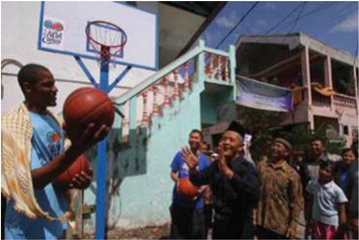

> **Deskripsi Visual:** Gambar ini adalah foto yang menunjukkan sebuah pertandingan bola basket di luar gedung. Di sebelah kiri, ada dua pemain yang sedang bermain, salah satunya memegang bola basket. Di tengah, ada beberapa penonton yang sedang menonton pertandingan. Di sebelah kanan, ada beberapa papan iklan dengan teks yang tidak jelas. Gambar ini menunjukkan aktivitas olahraga basket di lingkungan umum, dengan penonton yang menyaksikan pertandingan.

Ariza lantas mengelilingi panti asuhan tersebut. Dia juga mengamati sejumlah ruang  tidur  beserta  pernik-perniknya.  Pemain  Houston  Rockets  itu  juga  tertarik pada sejumlah poster berisi kata-kata motivasi. Misalnya, agar anak rajin belajar serta menjadi orang yang berguna.

Ariza  dan  rombongan  kemudian  berjalan  melalui  sebuah  gang  sempit  ke sebidang tanah di bagian belakang panti asuhan. Di sana, dia meresmikan sebuah lapangan basket yang dibangun NBA Cares untuk anak-anak penghuni panti dan masyarakat sekitar.

Peresmian  lapangan  basket  tersebut  ditandai  dengan  pembukaan  selubung ring  basket  bertulisan  NBA  Cares  oleh  Ariza,  Azrul,  dan  Gholib.  Ariza  juga membubuhkan  tanda  tangan  berikut  namanya  di  papan  ring  berwarna  putih tersebut serta memberikan bola basket yang sudah dia tandatangani. Sebagai bagian dari  peresmian,  Gholib  dan  Ketua  Yayasan  Panti  Asuhan  Diponegoro  Muljono menembakkan bola ke ring.

 

---
## 📄 Halaman 42

Kemarin,  Dell  sebagai  salah  satu  partner  NBA  Madness  juga  menyerahkan bantuan  empat  unit  komputer  kepada  panti  asuhan.  Penyerahan  itu  dilakukan secara simbolis oleh Channel Manager-Consumer Business Dell Indonesia Wijono. Rencananya, dua komputer untuk penghuni perempuan dan dua lainnya khusus untuk penghuni laki-laki.

Kunjungan ke panti asuhan tersebut juga sangat berkesan bagi Ariza. Sebab, itu  merupakan  pengalaman  pertama  dia  berkunjung  langsung  ke  panti  asuhan, meski dirinya berkali-kali bertemu anak-anak yatim piatu dan panti asuhan dalam berbagai  acara.  ''Di  Amerika  pun,  saya  belum  pernah  melakukannya.  Jadi,  ini pengalaman yang sangat berharga, '' ujarnya.

Sumber: dblindonesia.com 1ball.wordpress.com/2010/07/25/pengalaman-pertama-ke-panti-asuhan/

### Tugas

Buatlah  sebuah  rencana  aksi  nyata  dalam  bentuk  kunjungan  dan pemberian bantuan kepada saudara-saudara kita yang ada di panti asuhan atau  panti  jompo,  atau  keluarga  miskin  dan  memberikan  sumbangan kemanusiaan!

### Untuk dipahami:

- Kata  Citra  mungkin  lebih  tepat  kita  artikan  sebagai  Gambaran.  Yang menggambarkan! Kalau kita mirip dengan ibu kita, itu tidak berarti kita sama dengan ibu kita . Tetapi dengan mirip ini mau menggambarkan sesuatu, bahwa pada  diri  kita  entah  itu  fisiknya,  karakternya,  sifat-sifatnya  ada  kesamaan dengan  ibu.  Dan  kesamaan  ini  bukan  dalam  arti  yang  sebenarnya,  tetapi merupakan gambaran dari ibu. Hasil karya, entah itu seni atau yang lainnya dapat menggambarkan si penciptanya. Demikian pula makhluk yang disebut manusia  itu,  dapat  dikatakan  sebagai  gambaran  atau  citra  si  penciptanya, yaitu Allah sendiri.
- Manusia diberi kuasa untuk menguasai alam ciptaan lain. Menguasai alam berarti menata, melestarikan, mengembangkan, dan menggunakannya secara bertanggungjawab.
- Karena manusia diciptakan sebagai Citra Allah, manusia memiliki martabat sebagai pribadi: ia bukan hanya sesuatu, melainkan seseorang. Ia mengenal diri sendiri, menjadi tuan atas diri sendiri, mengabdikan diri dalam kebebasan, dan hidup dalam kebersamaan dengan orang lain dan dipanggil membangun relasi dengan Allah, pencipta-Nya.

 

---
## 📄 Halaman 43

- Persaudaraan sejati adalah persaudaraan yang dihayati atas dasar persamaan kodrat  sebagai  sesama  ciptaan  Tuhan  dan  persamaan  kodrat  sebagai  Citra Allah.
- Persaudaraan sejati tidak membedakan orang berdasarkan agama, suku, ras, ataupun golongan, karena semua manusia adalah sama-sama umat Tuhan dan sama-sama dikasihi Tuhan. Maka setiap orang yang membenci sesamanya, ia membenci Tuhan.

### Doa Penutup

Daraskanlah Mazmur 104 berikut ini!

### Kebesaran Tuhan dalam Segala Ciptaan-Nya

- 1 Pujilah TUHAN, hai jiwaku! TUHAN, Allahku, Engkau sangat besar! Engkau yang berpakaian keagungan dan semarak,
- 2 yang berselimutkan terang seperti kain, yang membentangkan langit seperti tenda,
- 3 yang  mendirikan  kamar-kamar  loteng-Mu  di  air,  yang  menjadikan  awanawan sebagai kendaraan-Mu, yang bergerak di atas sayap angin,
- 4 yang membuat angin sebagai suruhan-suruhan-Mu, dan api yang menyala sebagai pelayan-pelayan-Mu,
- 5 yang telah mendasarkan bumi di atas tumpuannya, sehingga takkan goyang untuk seterusnya dan selamanya.
- 6 Dengan  samudera  raya  Engkau  telah  menyelubunginya;  air  telah  naik melampaui gunung-gunung.
- 7 Terhadap hardik-Mu air itu melarikan diri, lari kebingungan terhadap suara guntur-Mu,
- 8 naik gunung, turun lembah ke tempat yang Kautetapkan bagi mereka.
- 9 Batas Kautentukan, takkan mereka lewati, takkan kembali mereka menyelubungi bumi.
- 10 Engkau yang melepas mata-mata air ke dalam lembah-lembah, mengalir di antara gunung-gunung,
- 11 memberi minum segala binatang di padang, memuaskan haus keledai-keledai hutan;
- 12 di dekatnya diam burung-burung di udara, bersiul dari antara daun-daunan.

 

---
## 📄 Halaman 44

- 13   Engkau yang memberi minum gunung-gunung dari kamar-kamar lotengMu, bumi kenyang dari buah pekerjaan-Mu.
- 14 Engkau  yang  menumbuhkan  rumput  bagi  hewan  dan  tumbuh-tumbuhan untuk diusahakan manusia, yang mengeluarkan makanan dari dalam tanah
- 15 dan anggur yang menyukakan hati manusia, yang membuat muka berseri karena minyak, dan makanan yang menyegarkan hati manusia.
- 16 Kenyang pohon-pohon TUHAN, pohon-pohon aras di Libanon yang ditanamNya,
- 17 di  mana  burung-burung  bersarang,  burung  ranggung  yang  rumahnya  di pohon-pohon sanobar;
- 18 gunung-gunung tinggi adalah bagi kambing-kambing hutan, bukit-bukit batu adalah tempat perlindungan bagi pelanduk.
- 19 Engkau yang telah membuat bulan menjadi penentu waktu, matahari yang tahu akan saat terbenamnya.

 

---
## 📄 Halaman 45

### Bab II Manusia Makhluk Otonom

Dalam  pelajaran  yang  lalu,  kita  sudah  belajar  tentang  manusia  sebagai makhluk pribadi, di mana setiap orang mempunyai kekhasan. Dalam bab ini kita akan membahas manusia makhluk otonom. Sebagai makhluk otonom, manusia mempunyai  kebebasan  untuk  menentukan  sikap,  dengan  kata  lain,  ia  adalah makhluk yang mandiri.

Secara etimologi, Otonomi berasal dari bahasa Yunani 'autos' yang artinya sendiri, dan 'nomos' yang berarti hukum atau aturan, jadi pengertian otonomi adalah pengundangan sendiri. Otonom berarti berdiri sendiri atau mandiri. Jadi setiap orang memiliki hak dan kekuasaan menentukan arah tindakannya sendiri. Ia harus dapat menjadi tuan atas diri.

Berbicara mengenai manusia bukanlah sesuatu yang mudah dan sederhana, karena manusia banyak memiliki keunikan. Keunikan tersebut dinyatakan sebagai kodrat  manusia.  Manusia  sulit  dipahami  dan  dimengerti  secara  menyeluruh tetapi manusia mempunyai banyak kekuatan-kekuatan spiritual yang mendorong seseorang mampu bekerja dan mengembangkan pribadinya secara mandiri.

Arti otonom adalah mandiri dalam menentukan kehendaknya, menentukan sendiri setiap perbuatannya dalam pencapaian kehendaknya. Allah telah memberikan akal budi yang membuat manusia tahu apa yang harus dilakukannya dan mengapa harus melakukannya. Dengan kemampuan akal budinya, manusia mampu membedakan hal baik dan buruk dan membuat keputusan berdasarkan suara hatinya dan mampu bersikap kritis terhadap berbagai pilihan hidup. Manusia adalah  makhluk  hidup,  yang  mampu  memberdayakan  akal  budinya,  maka manusia  mempunyai  berbagai  kemampuan,  yakni  mampu  berpikir,  berkreasi, berinovasi, memberdayakan kekuatannya sehingga manusia tidak pernah berhenti untuk berkembang dalam mengembangkan dirinya sebagai suatu upaya dalam pemenuhan kebutuhan hidupnya, dalam mengaktualisasikan sebagai individu.

Dalam pembahasan tentang manusia makhluk otonom ini akan dibagi dalam tema sebagai berikut:

- Suara hati
- Bersikap kritis dan bertanggung jawab terhadap pengaruh media massa.
- Bersikap kritis terhadap gaya hidup yang berkembang dan ideologi.

 

---
## 📄 Halaman 46

### A. Suara Hati

Perkembangan sosial yang begitu cepat banyak membawa perubahan dalam berbagai aspek kehidupan, demikian juga persoalan-persoalan yang ditimbulkannya. Persoalan-persoalan  tersebut  membutuhkan  pemecahan  yang  tepat.  Di  samping itu banyak tata nilai yang mengalami perubahan, seperti ketaatan, sopan santun, kejujuran,  keadilan,  tanggung  jawab,  dan  sebagainya  sering  menjadi  kabur. Berhadapan dengan situasi itu kaum remaja perlu mendapatkan pendampingan, sehingga tidak salah dalam mengambil keputusan. Mereka harus belajar membuat keputusan dengan mendengarkan  suara hati atau hati nuraninya. Melalui pembahasan ini anda akan diajak belajar mendengarkan suara hati, sehingga tidak salah dalam mengambil keputusan.

Suara hati atau hati nurani merupakan daya atau kemampuan khusus untuk membedakan perbuatan baik atau perbuatan buruk, serta menilai baik-buruknya perbuatan  itu  berdasarkan  akal  budi. Conscience atau  hati  nurani  merupakan hasil dialog pribadi kita yang terdalam dengan Allah ketika kita menghadapi dan menanggapi situasi hidup sehari - hari.

### Doa Pembuka

### Doa Kehendak yang Kuat (PS 144)

Ya Allah, Engkau telah memberikan kehendak yang kuat pada Yesus, Tuhan kami.

Tanpa takut atau goyah, Engkau berpegang pada kehendak-Mu,

- meski harus menanggung pengorbanan yang berat.
- Tatkala digoda iblis, Ia tidak goyah.
- Demikian pula ketika harus menderita sengsara sampai mati.
- Bunda Maria pun Kauberikan kepada kami sebagai panutan yang berkehendak kuat.
- Berilah kami kehendak yang kuat, agar pada saat goyah kami tidak berbelok arah.
- Semoga kami tidak kecil hati menghadapi aneka kesulitan dan tantangan.
- Allah, gunung batu kami, berilah kami kehendak yang kuat laksana batu karang,

 

---
## 📄 Halaman 47

yang tetap tegar meski diterpa gelombang.

- Semoga kami tetap teguh, bila kami digoda untuk menyeleweng,
- Bila kami dibujuk untuk menipu dan berlaku tidak jujur,
- Bila kami digoda untuk muna fik, berbuat dosa, mencuri, berkhianat,
- Terlebih bila kami digoda untuk mengkhianati kasih-Mu.
- Ya Allah, kekuatan kami, buatlah kami kuat,
- Seperti Yesus yang lebih suka mati, dari pada menyimpang dari kehendakMu
- Dialah Tuhan, Pengantara kami, kini dan sepanjang masa, Amin.

### 1. Pergumulan Suara Hati dalam Pengalaman Sehari-hari

Hidup  manusia  sangatlah  berbeda  dengan  ciptaan  Tuhan  lainnya,  seperti hewan atau tumbuhan. Ada saat di mana manusia harus mengalami pergumulan atau pergulatan ketika hendak melakukan suatu tindakan, terutama ketika ia harus mengambil keputusan: apakah tindakannya layak dilakukan atau tidak, apakah yang dilakukan itu benar atau salah, apakah tindakan itu akan merugikan sesama atau  tidak.  Kemampuan  itu  nampaknya  tidak  dimiliki  ciptaan  Tuhan  lainnya, karena tindakan mereka lebih diarahkan oleh insting. Kemampuan bergulat dalam dirinya sendiri sebelum dan sesudah melakukan kegiatan itu disebabkan manusia memiliki suara hati, atau suara batin atau hati nurani yang dianugerahkan Tuhan kepadanya.

Amatilah kasus berikut!

### Pergulatan Suara Hati

Boy mendaftar pada suatu sekolah yang sangat menjunjung tinggi nilai kejujuran. Sebelum masuk ia harus menandatangani sebuah pernyataan yang menyatakan:  'saya  tidak  akan  mencontek  dan  kalau  terbukti  mencontek, maka saya siap untuk dikeluarkan dari sekolah ini'.  Setiap peserta didik juga mempunyai kewajiban untuk melaporkan kepada guru atau pimpinan sekolah, jika mereka melihat ada yang mencontek.

Pada  suatu  ketika,  Boy  mengikuti  ujian  akhir.  Ia  merasa  kesulitan menjawab soal-soal  yang  ada  di  hadapannya  dan  ia  juga  melihat  beberapa temannya ada yang mulai mencontek. Ia mulai gelisah dan timbul keinginan

 

---
## 📄 Halaman 48

dalam dirinya untuk mengikuti apa yang dilakukan beberapa temannya.  Ia berpikir, seandainya, ia tidak dapat menjawab soal di hadapannya dengan baik, ia pasti tidak lulus, tapi kalau ketahuan ia harus siap dikeluarkan dari sekolah ini.  Terjadi  pergulatan  dalam  dirinya,  apakah  ia  mau  ikut-ikutan  nyontek atau tidak. Setelah mempertimbangkan secara matang, akhirnya ia mengikuti suara hatinya untuk mengerjakan soal sebisanya dan tidak mengikuti apa yang dilakukan oleh beberapa temannya. Ketika hasil ujian diumumkan ia ternyata lulus, walaupun nilainya tidak sempurna. Ia merasa puas, karena itu adalah hasil kerjanya sendiri dan ia sudah setia kepada nilai kejujuran.

Sumber: Bayu

- Apa kesan yang kalian peroleh dari kasus di atas ?
- Sharingkan  satu  pengalaman  saat  mengalami  pergulatan  suara  hati  dalam hidupmu dengan teman-temanmu.

### Tugas Kelompok

Dalam kelompok, carilah informasi sebanyak-banyaknya dari bukubuku atau browshing dari internet tentang:

- Makna suara hati
- Cara kerja suara hati
- Mengapa suara hati bisa tumpul
- Cara membina suara hati supaya tidak tumpul
Buatlah rangkuman dari informasi yang kalian peroleh!

### 2. Ajaran Kitab Suci dan Ajaran Gereja Tentang Suara Hati.

- Teks-teks Kitab Suci berikut berisi pergulatan suara hati Santo Paulus yang diungkapkan dalam suratnya kepada jemaatnya. Simaklah kutipannya, lalu rumuskan: pergulatan dalam hal apa yang dialami Paulus dalam teks Kitab Suci dan Gaudium et Spes, berikut ini!

### Roma 2: 14 - 16

14 Apabila bangsa-bangsa lain yang tidak memiliki hukum Taurat oleh dorongan diri  sendiri  melakukan  apa  yang  dituntut  hukum  Taurat,  maka,  walaupun mereka tidak memiliki hukum Taurat, mereka menjadi hukum Taurat bagi diri mereka sendiri.

 

---
## 📄 Halaman 49

15 Sebab dengan itu mereka menunjukkan, bahwa isi hukum Taurat ada tertulis di dalam hati mereka dan suara hati mereka turut bersaksi dan pikiran mereka saling menuduh atau saling membela.

16 Hal itu akan nampak pada hari, bilamana Allah, sesuai dengan Injil yang kuberitakan,  akan  menghakimi  segala  sesuatu  yang  tersembunyi  dalam  hati manusia, oleh Kristus Yesus.

### Gaudium et Spes, artikel 16

'Di  lubuk  hati  nuraninya,  manusia  menemukan  hukum,  yang  tidak diterimanya dari dirinya sendiri, melainkan harus ditaati. Suara hati itu selalu menyerukan kepadanya untuk mencintai dan melaksanakan apa yang baik, dan menghindari apa yang jahat. Bilamana perlu, suara itu menggemakan dalam lubuk hatinya: jalankan ini, elakkan itu. Sebab dalam hatinya, manusia menemukan hukum yang ditulis  oleh  Allah.  Martabatnya  ialah  mematuhi hukum itu, dan menurut hukum itu pula ia akan diadili.

Suara hati ialah inti manusia yang paling rahasia, sanggar suci; di situ ia  seorang  diri  bersama  Allah,  yang  pesan-Nya  menggema  dalam  hatinya. Berkat hati nurani dikenallah secara ajaib hukum, yang dilaksanakan dalam cinta  kasih  terhadap  Allah  dan  terhadap  sesama.  Atas  kesetiaan  terhadap hati nurani, umat Kristiani bergabung dengan sesama lainnya untuk mencari kebenaran,  kebenaran  itu  memecahkan  sekian  banyak  persoalan  moral, yang  timbul  baik  dalam  hidup  perorangan  maupun  dalam  kehidupan kemasyarakatan.'

### Tugas Kelompok

Setelah mendalami kutipan-kutipan di atas, coba rumuskan bersama dalam kelompok beberapa hal penting berikut:

- Apa suara hati itu?
- Bagaimana cara kerja suara hati?
- Apa hubungan suara hati dengan Allah ? Apa konsekuensinya?
- Apa hubungan suara hati dengan Roh Kudus?
- Apa hubungan suara hati dengan kasih kepada sesama?
- Apa fungsi suara hati berkaitan dengan persoalan dalam masyarakat?
- Tunjukkan berbagai kasus di dalam masyarakatmu atau dalam negara kita yang menunjukkan bahwa banyak orang yang sudah tumpul suara hatinya!  Jelaskan  juga  dampaknya  bagi  masyarakat  maupun  bangsa kita ! Jelaskan pula dampaknya bagi generasi muda!

 

---
## 📄 Halaman 50

### 3. Menghayati Peran Suara Hati dalam Kehidupan Sehari-hari

Baca dan renungkanlah bacaan berikut ini dalam suasana hening!

Suara hati adalah tempat dimana Allah membisikkan apa yang boleh kita lakukan  dan  apa  yang  tidak  boleh  kita  lakukan.  Maka,  menaati  suara  hati sama artinya menaati Allah sendiri.

Ketaatan kepada suara hati atau ketaatan kepada Allah itu perlu dilatihkan mulai dari hal-hal kecil.

Banyak orang tahu bahwa berbohong itu tidak baik tetapi banyak orang terbiasa  melakukannya.  Kalau  kebiasaan  itu  tidak  dikikis  sejak  awal,  maka kebiasaan tersebut akan terbawa seumur hidup. Bahkan awalnya berbohong kecil-kecilan bisa menjadi bohong besar dan penipuan.

Resapkanlah cerita berikut:

### 'Kios Suara Hati'

Beberapa  waktu  yang  lalu  pernah  muncul  sebuah  kisah  menarik  yang ditayangkan  dalam  berita  televisi  di  Taiwan.  Di  pegunungan  Alishan  ada sebuah tempat yang bernama Rueili. Seutas jalan yang menghubungkan Chiay dan Alishan melewati daerah ini.

Di  pinggir  jalan  ada  sebuah  tempat  penjualan  sayur-sayuran  segar, sayuran  yang  tumbuh  dan  mendapat  pupuk  organik  alamiah  tanpa  bahanbahan kimia yang dewasa ini disinyalir oleh dunia medis sebagai unsur yang bisa mendatangkan kanker. Di samping sayur mayur, ada juga buah-buahan segar dijajar dalam kios kecil itu.

Namun anehnya, kios itu terbuka selama 24 jam sehari dan tak pernah ditutup.  Lebih  aneh  lagi,  tak  ada  seorangpun  yang  duduk  di  sana  melayani para pembeli. Daftar harga per kilogram dari masing-masing barang tertulis jelas. Sebuah alat timbang terletak di atas meja. Sebuah tong yang dibuat dari kayu ditinggalkan di salah satu sudut. Dalam tong kayu ini terdapat lembaran uang kertas serta uang logam yang dimasukkan oleh para pembeli. Di luar kios tersebut tertulis dalam huruf Cina; 'Kios Suara Hati. '

Seorang  ibu  tua,  penduduk  asli  di  daerah  pegunungan  Alishan,  ketika ditanya oleh wartawan TV berkata; 'Lewat kios kecil ini saya ingin mendidik setiap  orang  untuk  menghormati  suara  hati  masing-masing.  Di  sini  tak ada  orang  yang  menjaga.  Namun  saya  yakin,  suara  hati  setiap  orang  akan meneguhkan atau mengadili bila ia berbuat sesuatu. '

http://www.petrafmjogja.com/2012/11/16/kisah-inspirasi-kios-suara-hati/

 

---
## 📄 Halaman 51

Santo Paulus, ketika ditangkap dan dijebloskan ke penjara, di depan umum dengan bangga dan berani berkata: 'Hai saudara-saudaraku, sampai kepada hari ini aku tetap hidup dengan hati nurani yang murni di hadapan Allah. ' (Kisah Para Rasul 23:1) lebih lanjut dia mengatakan: 'Sebab itu aku senantiasa berusaha untuk hidup dengan hati nurani yang murni di hadapan Allah dan manusia'. (Kisah Para Rasul 24:16)

Pikirkanlah, kebiasaan apa saja yang ingin kalian tinggalkan agar suara hatimu tetap suci murni.

Katakan hal itu di depan Tuhan, serta memohon kekuatan darinya untuk mampu meninggalkan kebiasaan buruk itu.

### Untuk dipahami

- Suara  hati  secara  luas  dapat  diartikan  sebagai  keinsafan  akan  adanya kewajiban. Hati nurani merupakan kesadaran moral yang timbul dan tumbuh dalam  hati  manusia,  sedangkan  hati  nurani  secara  sempit  dapat  diartikan sebagai penerapan kesadaran moral dalam situasi konkret, yang menilai suatu tindakan manusia atas buruk baiknya. Hati nurani tampil sebagai hakim yang baik dan jujur, walaupun dapat keliru.
- Suara hati atau hati nurani merupakan daya atau kemampuan khusus untuk membedakan  perbuatan  baik  atau  perbuatan  buruk,  serta  menilai  baikburuknya perbuatan itu berdasarkan akal budi. Conscience atau hati nurani merupakan hasil dialog pribadi kita yang terdalam dengan Allah ketika kita menghadapi dan menanggapi situasi hidup sehari-hari.
- Seseorang yang selalu berbuat sesuai dengan hati nuraninya, hati nurani akan semakin terang dan berwibawa. Seseorang yang selalu mengikuti dorongan suara hati, keyakinannya akan menjadi sehat dan kuat. Dipercayai orang lain, karena memiliki hati yang murni dan mesra dengan Allah. 'Berbahagialah orang yang murni hatinya, karena mereka akan memandang Allah.' (Matius 5: 8).

 

---
## 📄 Halaman 52

### Penutup

### Daraskan Mazmur berikut ini!

### Tuhan Raja yang Kudus

- 1 TUHAN itu Raja, maka bangsa-bangsa gemetar. Ia duduk di atas kerubkerub, maka bumi goyang.
- 2 TUHAN itu Maha Besar di Sion, dan Ia tinggi mengatasi segala bangsa.
- 3 Biarlah  mereka  menyanyikan  syukur  bagi  nama-Mu  yang  besar  dan dahsyat; Kuduslah Ia!
- 4 Raja yang kuat, yang mencintai hukum, Engkaulah yang menegakkan kebenaran;  hukum dan keadilan di antara keturunan Yakub, Engkaulah yang melakukannya.
- 5 Tinggikanlah  TUHAN,  Allah  kita,  dan  sujudlah  menyembah  kepada tumpuan kaki-Nya! Kuduslah Ia!
- 6 Musa dan Harun di antara imam-imam-Nya, dan Samuel di antara orangorang yang menyerukan nama-Nya. Mereka berseru kepada TUHAN dan Ia menjawab mereka.
- 7 Dalam tiang awan Ia berbicara kepada mereka; mereka telah berpegang pada peringatan-peringatan-Nya dan ketetapan yang diberikan-Nya kepada mereka.
- 8 TUHAN, Allah kami, Engkau telah menjawab mereka, Engkau Allah yang mengampuni  bagi  mereka,  tetapi  yang  membalas  perbuatan-perbuatan mereka.
- 9 Tinggikanlah TUHAN, Allah kita, dan sujudlah menyembah di hadapan gunung-Nya yang kudus! Sebab kuduslah TUHAN, Allah kita!

 

---
## 📄 Halaman 53

### B. Bersikap Kritis dan Bertanggung Jawab Terhadap Pengaruh Media Massa

Media komunikasi dewasa ini mengalami perkembangan yang sangat pesat. Sebagai dampaknya, informasi yang masuk ke dalam kehidupan sehari-hari tidak terbendung.  Persoalannya,  informasi  itu  ada  yang  bersifat  membangun,  tetapi ada juga yang bersifat merugikan. Pada umumnya remaja bersifat polos dalam mengadopsi kehadiran media. Mereka menelan begitu saja apa yang disediakan dan  tidak  mencernanya.  Sehubungan  dengan  itu  remaja  perlu  mendapatkan bimbingan supaya mereka bisa bersikap kritis dalam memilih media dan mampu mengolahnya menjadi nutrisi untuk meningkatkan kualitas hidup mereka.

Kita dituntut untuk bersikap kritis atas segala tawaran dan informasi yang kita  peroleh.  Bersikap  kritis  tidak  berarti  menolak  mentah-mentah  tentang media, melainkan kita mencoba menyaringnya dan mampu mempertanggungjawabkan apa yang kita pilih dan kita percaya. Dengan demikian, kita akan dapat menempatkan media massa pada tempat yang semestinya bagi perkembangan diri kita. Melalui pelajaran ini kalian akan diajak untuk mengembangkan kedewasaan berpikir, mampu mempertimbangkan baik-buruk sesuatu hal, selektif dan mampu membuat skala prioritas dalam menentukan pilihan hidup.

### Doa Pembuka

### Doa Tanggung Jawab (PS 145)

- Ya Allah, puji dan syukur kami haturkan hanya kepadaMu
- Begitu banyak pilihan dalam hidup ini
- Ada yang dapat menjauhkan kami dari pada-Mu,
- Tetapi ada juga pilihan yang membuat kami semakin dekat kepada-Mu.
- Ya Allah, ajarlah kami untuk setia hanya kepada-Mu,
- Mampukanlah kami belajar bagaimana engkau setia pada pilihan kasih
- Sehingga begitu banyak orang yang terangkat kemanusiaannya.
- Buatlah kami semakin tangguh dalam menyikapi tawaran
- Buatlah kami semakin dewasa dengan tantangan itu
- Buatlah kami semakin bertanggung-jawab terhadap tugas kami.
- Demi Kristus, Tuhan dan Pengantara kami. Amin

 

---
## 📄 Halaman 54

### 1. Mengamati Perkembangan Media dan Pengaruhnya pada Kehidupan

Coba  perhatikan  gambar-gambar  di  bawah  ini,  berilah  komentar  kalian berkaitan dengan pengaruh media dalam kehidupan

### Simaklah pula artikel berikut!

### Remaja korban media, betulkah?

Media mempunyai peranan besar dalam kehidupan masyarakat termasuk juga  remaja.  karena  tidak  bisa  dipungkiri  bahwa  kita  sebagai  masyarakat membutuhkan  informasi  dan  komunikasi.  Dengan  hadirnya  media  sebagai alat  untuk  menyampaikan  berbagai  gagasan,  ide,  dan  penilaian  terhadap sesuatu, tentang apa yang kita rasakan, kita bisa berbagi pengalaman, ilmu, dan lain sebagainya. Media juga menumbuhkan rasa saling mengerti, saling berbagi,  rasa  kasih  sayang  antara  sesama  manusia.  Dengan  adanya  media sebagai  alat  semua  itu  menjadi  mudah  dilakukan.  Di  jaman  teknologi  saat ini media bisa hadir dalam berbagai bentuk yang bisa diakses dengan mudah dan menghadirkan informasi yang lebih banyak dan beragam. oleh sebab itu media menjadi sesuatu yang pokok yang tidak bisa dihindari, di sisi lain walau peranan media begitu dominan dan komplit namun juga membawa dampak yang  sangat  signifikan.  Bagaikan  dua  sisi  mata  uang  berbeda,  media  massa mempunyai dampak positif dan negatif, yang bisa menguntungkan sekaligus menjatuhkan  masyarakat  sebagai  objek  dari  media  tersebut,  baik  dalam

---
**🖼️ Gambar/Diagram**

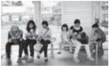

> **Deskripsi Visual:** Gambar ini adalah ilustrasi yang menunjukkan kelompok orang sedang berbicara di sebuah ruangan publik. Ilustrasi ini menggambarkan situasi sosial yang umum terjadi di tempat umum seperti kafe atau restoran. Di tengah-tengah ilustrasi, ada beberapa orang yang sedang berbicara dengan penuh gairah, sementara yang lainnya tampak mendengarkan dengan serius. Ilustrasi ini menunjukkan hubungan sosial yang kuat antara individu, di mana mereka berbagi waktu dan berkomunikasi. Teks, angka, atau label penting tidak terlihat dalam gambar ini, namun informasi kunci yang dapat diambil pembaca adalah tentang bagaimana komunikasi dan interaksi sosial dapat terjadi dalam situasi publik.

 

---
## 📄 Halaman 55

perilaku, moral dan intelektual. Media dapat mengubah pola pikir masyarakat, menentukan perasaan dan perilaku masyarakat melalui citra yang ditampilkan. Hal ini bisa berdampak baik dan bisa sebaliknya.

Bagi para remaja, yang masih dalam masa proses pencarian jati diri, di mana  pada  fase  ini  tingkat  perubahan  mental,  perilaku  dan  intelektualnya tumbuh secara cepat, pengaruh media ini sangat terasa. Baik ketika menonton tv, membaca majalah atau tabloid, maupun ketika mendengar radio. Hal ini dapat kita lihat dari perubahan pola pikir, perilaku dan mentalnya. Sebagai contoh,  banyak  remaja  putri  rela  menghabiskan  uangnya  untuk  membeli produk kecantikan yang diiklankan di tv dan media cetak lainnya demi tampil menawan seperti gadis dalam sampul produk tersebut. Begitu pula remaja putra merasa gagah dan maco jika merokok, seperti ditampilkan dalam iklan rokok yang memberikan citra lelaki sejati, sehingga timbul anggapan 'kalau laki-laki ya merokok', padahal kalau diperhatikan tidak satupun bintang iklan tersebut yang  nampak  sedang  mengisap  rokok  yang  diiklankannya.  Dan  banyak  lagi contoh perilaku-perilaku yang merupakan korban dari citra yang ditimbulkan oleh media massa tersebut. Pada fase ini juga, para remaja memiliki rasa ingin tahu yang tinggi, ingin merasakan sesuatu yang baru, dan ingin menjadi seperti apa yang dilihatnya, karena memang pada masa ini remaja belum mempunyai konsep  diri  yang  matang.  Contohnya:  ketika  menonton  tv  dan  membaca majalah  atau  tabloid  yang  menampilkan  citra  remaja  dengan  gaya  hidup hedonis,  modern,  dan  instan,  para  remaja  cenderung  ingin  meniru.  Tidak heran jika saat ini banyak remaja SMA/SMP atau yang setingkat dengan itu, gonta ganti produk elektronik yang dimilikinya, mulai dari hp, laptop, i-pad, dan banyak yang lainnya. Ketika ditanya, motivasi mereka tentang perilaku tersebut,  kebanyakan  tak  lain  adalah  penampilan  semata  bukan  kebutuhan. Begitu  juga  dengan  gaya  berpakaian,  model  rambut,  dan  gaya  bicara  yang meniru gaya bintang-bintang di televisi,  terutama  bintang-bintang  berwajah oriental yang berasal dari Korea Selatan, yang kebetulan sangat digemari oleh kalangan remaja saat ini. Salah satu sebab dari perilaku-perilaku menyimpang tersebut adalah akibat dari penggunaan media yang tidak terkontrol.

Beberapa media seperti tv, radio, majalah, film, dan banyak lainnya tidak begitu menghiraukan kualitas program yang akan ditampilkan. Program yang hadir  saat  ini  jarang  yang  memberikan  inspirasi  dan  pendidikan  bagi  para penontonnya khususnya remaja. Seperti acara infotainment, yang menampilkan kehidupan artis dengan sekelumit problem rumah tangga atau karier mereka yang  lagi  jatuh  bangun,  kemudian  acara  reality  show  tentang  remaja  yang sedang  jatuh  cinta  kemudian  bingung  bagaimana  mengungkapkannya,  juga

 

---
## 📄 Halaman 56

film-film  yang  bertemakan horor atau beragam acara lawakan. Media cetak pun  tak  jauh  berbeda.  Majalah  remaja  dipenuhi  dengan  ramalan-ramalan dan  cerita-cerita  cinta  kemudian  informasi-informasi  praktis  seperti  'cara diet dengan cepat' atau 'agar kulit putih dalam tujuh hari' dan banyak lagi yang lainnya. Hal ini dapat mengubah pola pikir remaja menjadi instan, di mana mereka tidak tahan menjalankan suatu proses. Memang, tidak semua media menampilkan hal demikian, ada beberapa media yang masih berusaha menampilkan hal-hal yang positif, edukatif, dan inspiratif. tapi jumlahnya tidak banyak dan itupun tidak dikhususkan untuk remaja.

Menurut  beberapa  ahli  yang  mengamati  dan  mengkaji  dampak  media massa, menyatakan bahwa peran orang tua sebagai orang terdekat di harapkan aktif  mendampingi remaja dalam menggunakan jasa media. baik elektronik maupun cetak. Kemudian orang tua perlu melakukan dialog edukatif, dan kreatif dengan  remajanya,  tentang  tayangan  atau  bacaan  yang  mereka  konsumsi. sehingga mereka tetap dapat mengambil nilai-nilai positif dari media tersebut, dan dampak negatif media bisa diminimalisir. Selain itu kontribusi dari semua pihak sangat dibutuhkan, baik pihak sekolah, masyarakat dan instansi-instansi terkait, termasuk pihak media itu sendiri. yaitu dengan melakukan filterisasi yang ketat terhadap program atau bahan bacaan yang akan dipublikasikan. Pihak pemerintah hendaknya juga memperketat penyaringan kepada program media  yang  akan  ditampilkan  dengan  mempertimbangkan  segala  aspek, sehingga dengan perhatian yang intensif, dengan melibatkan segala komponen terkait bisa membantu tumbuhnya nilai-nilai moral dan akhlak yang melahirkan generasi bangsa yang cerdas secara intelektual dan spritual sejak dini.

http://edukasi.kompasiana.com/2012/09/03/ramaja-korban-media-benarkah-484001.html

Buatlah  kelompok  pro  dan  kontra,  kemudian  berikan  argumen  yang meyakinkan dengan data yang valid kepada kelompok lawan

### Tugas Kelompok

Setelah  selesai  debat,  masuklah  kembali  dalam  kelompok  untuk membahas:

- Dampak positif dan negatif dari media cetak maupun media elektronik
- Contoh  penggunaan  media  massa  yang  bijaksana  dan  yang  tidak bijaksana di kalangan remaja seusiamu

 

---
## 📄 Halaman 57

### 2. Pandangan Gereja Berdasarkan Dekrit Konsili Vatikan II tentang Komunikasi Sosial (Intermerifica, Art. 9 & 10)

Bacalah artikel berikut ini:

### Artikel 9 Kewajiban-kewajiban para pemakai media komunikasi sosial

Kewajiban-kewajiban  khusus  mengikat  semua  penerima,  yakni  para pembaca,  pemirsa  dan  pendengar,  yang  atas  pilihan  pribadi  dan  bebas menampung  informasi-informasi  yang  disiarkan  oleh  media  itu.  Sebab cara memilih yang tepat meminta supaya mereka mendukung sepenuhnya segala  sesuatu  yang  menampilkan  nilai  keutamaan,  ilmu-pengetahuan  dan teknologi.  Sebaliknya  hendaklah  mereka  menghindari  apa  saja,  yang  bagi diri mereka sendiri menyebabkan atau memungkinkan timbulnya kerugian rohani, atau yang dapat membahayakan sesama karena contoh yang buruk, atau menghalang-halangi tersebarnya informasi yang baik dan mendukung tersiarnya informasi yang buruk. Hal itu kebanyakan terjadi dengan membayar iuran kepada para penyelenggara, yang memanfaatkan media itu karena alasan-alasan ekonomi semata-mata.

Maka  supaya  para  penerima  itu  mematuhi  hukum  moral,  hendaknya mereka jangan melalaikan kewajiban, untuk pada waktunya mencari informasi tentang  penilaian-penilaian  yang  mengenai  semuanya  itu  diberikan  oleh instansi-instansi yang berwenang, dan untuk mengikutinya sebagai pedoman menurut  suara  hati  yang  cermat.  Untuk  lebih  mudah  melawan  dampakdampak  yang  merugikan,  dan  mengikuti  sepenuhnya  pengaruh-pengaruh yang baik,  hendaknya mereka berusaha mengarahkan dan membina suara hati mereka dengan upaya-upaya yang cocok.

### Tugas

Rumuskan  pesan  artikel  di  atas  dengan  cara  menjawab  beberapa pertanyaan berikut:

- Sebagai  penerima  informasi  kita  mempunyai  kebebasan  memilih informasi?  Kriteria  apa  yang  sebaiknya  digunakan  dalam  memilih informasi?
- Kita  diajak  menghindari  informasi  yang  menimbulkan  kerugian rohani,  membahayakan sesama dengan contoh buruk, menghalanghalangi  tersebarnya  informasi  yang  baik  dan  mendukung  tersiarnya informasi yang buruk. Berilah contohnya!
- Apa  yang  dimaksud  bahwa  kita  perlu  menerima  informasi  dengan mempertimbangkan hukum moral dan menuruti pedoman suara hati?

 

---
## 📄 Halaman 58

### Bacalah artikel selanjutnya

### Artikel 10 Kewajiban-kewajiban kaum muda dan para orang tua

Hendaknya para penerima, terutama di kalangan kaum muda berusaha, supaya  dalam  memakai  upaya-upaya  komunikasi  sosial  mereka  belajar mengendalikan diri dan menjaga ketertiban. Kecuali itu hendaklah mereka berusaha memahami secara lebih mendalam apa yang mereka lihat, dengar dan baca. Hendaklah itu mereka percakapkan dengan para pendidik dan para ahli, dan dengan demikian mereka belajar memberi penilaian yang saksama. Sedangkan para orangtua hendaknya menyadari sebagai kewajiban mereka: menjaga  dengan  sungguh  sungguh,  supaya  tayangan-tayangan,  terbitanterbitan tercetak dan lain sebagainya, yang bertentangan dengan iman serta tata susila, jangan sampai memasuki ambang pintu rumah tangga, dan jangan sampai anak-anak menjumpainya di luar lingkup keluarga.

### Tugas

Rumuskan  pesan  artikel  di  atas  dengan  cara  menjawab  beberapa pertanyaan berikut:

- Apa  kewajiban  kaum  muda  dalam  menyikapi  dan  menggunakan berbagai kemajuan media sosial maupun media elektronik?
- Apa kewajiban orang tua dalam menyikapi dan menggunakan berbagai kemajuan media sosial maupun media elektronik?

### Simak pula artikel berikut ini !

### Berani Ambil Sikap!

' Anda  harus  berani  mengambil  sikap!  Jadikanlah  media  sebagai  alat bukan tuan! Demikian penegasan ketua Komisi Sosial Konferensi Wali Gereja Indonesia (Komsos KWI) Mgr. Hilarion Datus Lega Pr. 'Media bukan segalagalanya yang harus melampaui hati nurani, akal budi sehat dan kebutuhan konkret manusia yang menggunakannya. '

Sikap tegas ini harus diambil oleh siapa saja, termasuk kaum muda atau bahkan orang tua yang mau mendidik anak-anaknya dalam menghadapi banjir media. Tidak dapat dipungkiri kalau setiap saat informasi dari berbagai media, baik  yang  harum  semerbak  laksana  melati,  maupun  yang  berbau  menusuk seperti sampah busuk, memasuki setiap rumah tangga, melalui segala macam

 

---
## 📄 Halaman 59

media, dari cetak, audio visual, sampai multi media. Namun, sampah busuk itu memang tidak terpisahkan dari mawar melati tadi, karena memang pada dasarnya media seperti dua sisi mata uang. 'Implikasi negatif dari media tidak dapat kita hindari. Mau atau tidak, suka atau tidak media membawa serta kaitan-kaitan seperti itu.

Ia  memberi  contoh  tayangan-tayangan  di  televisi  yang  menunjukkan kekerasan.  Banyak  orang  menuding  bahwa  tawuran  anak  sekolah  dan kebrutalan lainnya merupakan akibat dari tayangan seperti itu.

Mgr. Datus mengajak semua pihak untuk tidak bersikap panik menghadapi banjir  media.  Yang  penting  adalah  anak-anak  harus  dilatih  untuk  bersikap kritis dan orang tua juga harus menyediakan waktu untuk anak-anaknya.

Sylvia Marsidi: Majalah Hidup No. 21 Tahun ke-60/ 21 Mei 2006

### Tugas

Jawablah beberapa pertanyaan berikut:

- Apa yang kalian  pahami  dari  pernyataan 'Jadikanlah  media  sebagai alat bukan tuan! Media bukan segala-galanya yang harus melampaui hati  nurani,  akal  budi  sehat  dan  kebutuhan  konkret  manusia  yang menggunakannya. '
- Mgr.  Hilarion  Datus  Lega  Pr.  menekankan  perlunya  bersikap  kritis terhadap media. Dengan cara bagaimana sikap itu diwujudkan ?
Setelah selesai menjawab pertanyaan-pertanyaan di atas. Rangkumlah semua gagasan yang kalian peroleh itu dalam sebuah motto, misalnya: ' No Signal, Life Goes On! '

### 3. Menghayati Penggunaan Media Secara Bijaksana

Bacalah uraian berikut dalam suasana hening

Seorang pakar komunikasi pernah berkata: 'Apa yang kita ungkapkan dalam media,  sesungguhnya  menggambarkan  siapa  kita:  sikap  kita,  idealisme  kita,  dan tanggapan kita atas kenyataan dan problematik yang ada di sekitar kita, termasuk kedalaman hidup rohani kita'.

Pernyataan  ini  hendak  mengingatkan  kita,  supaya  kita  berhati-hati  dan bersikap kritis terhadap media.

Beberapa remaja senang sekali menulis di facebook, bahkan ada yang dalam sehari menuliskan banyak hal. Tahukah kalian apa yang dituliskan?

 

---
## 📄 Halaman 60

'Saya sudah ngantuk, mau bobo ah…. '. 'Pulang sekolah hujan deras, enaknya ngapain yach… '. 'Makan dulu ach… ', 'Di rumah sendirian, bete rasanya… ', dan yang lainnya….

Lalu apa untungnya menulis seperti itu, baik bagi diri sendiri maupun orang lain?

Sudah saatnya kita menggunakan media sebagai sarana membawakan kabar gembira bagi siapapun yang akan melihat atau membacanya.

Mungkin  akan  lebih  baik  bila  menuliskan  hal-hal  yang  dapat  membantu orang berpikir dan berefleksi, misalnya: 'hari ini ibuku ultah. Tuhan terima kasih atas  pemeliharaan-Mu,  dan  berkatilah  kami  anak-anaknya  agar  selalu  setia mendampingi ibu di masa tuanya.. '

Kata-kata yang indah bukan?

Mungkin  ada  teman-temanmu  yang  membaca  lalu  merasa  ditegur  atau merasa diingatkan: 'Oya..aq koq sering melupakan Ultah Ibuku…. aq koq jarang mendoakan ibu…. '

Bagaimana dengan pengalamanmu?

### Untuk dipahami

- Media berasal dari bahasa Latin merupakan bentuk jamak dari medium secara harafiah berarti perantara atau pengantar  dalam hal ini untuk menyalurkan pesan atau informasi.
- Kita sekarang sedang mengalami  revolusi informasi. Karena berbagai kemajuan teknologi media, kita dibanjiri oleh arus informasi yang melimpah ruah dan tidak henti, hampir tanpa saringan. Informasi-informasi itu dapat berupa  informasi  yang  baik  dan  membangun,  tetapi  juga  dapat  berupa informasi yang buruk dan merusak.
- Kita harus memiliki sikap kritis terhadap semua informasi yang kita terima. Sikap kritis berarti dapat memilah-milah mana yang benar dan mana yang salah; mana yang baik dan mana yang buruk; mana yang positif dan mana yang negatif. Jadi, kita harus bersikap kritis terhadap pengaruh positif dan negatif dari media yang menyuguhkan berbagai informasi.
- Bersikap kritis tidak berarti menolak mentah-mentah tentang media, melainkan kita mencoba menyaringnya dan mampu mempertanggungjawabkan apa yang kita pilih dan kita percaya. Sikap kritis mengandalikan kedewasaan

 

---
## 📄 Halaman 61

berpikir, mampu mempertimbangkan baik-buruk sesuatu hal, selektif dan mampu membuat skala prioritas dalam menentukan pilihan-pilihan hidup. Dengan demikian, kita akan dapat menempatkan media massa pada tempat yang semestinya bagi perkembangan diri kita.

### Doa Penutup

.

### Hormatilah Tuhan dan Taatilah Dia

- 1 Marilah kita bersorak-sorai untuk TUHAN, bersorak-sorak bagi gunung batu keselamatan kita.
- 2 Biarlah  kita  menghadap wajah-Nya dengan nyanyian syukur, bersoraksorak bagi-Nya dengan nyanyian mazmur.
- 3 Sebab TUHAN adalah Allah yang besar, dan Raja yang besar mengatasi segala allah.
- 4 Bagian-bagian  bumi  yang  paling  dalam  ada  di  tangan-Nya,  puncak gunung-gunung pun kepunyaan-Nya.
- 5 Kepunyaan-Nya  laut,  Dialah  yang  menjadikannya,  dan  darat,  tanganNyalah yang membentuknya.
- 6 Masuklah, marilah kita sujud menyembah, berlutut di hadapan TUHAN yang menjadikan kita.
- 7 Sebab Dialah Allah kita, dan kitalah umat gembalaan-Nya dan kawanan domba tuntunan tangan-Nya. Pada hari ini, sekiranya kamu mendengar suara-Nya!
- 8 Janganlah keraskan hatimu seperti di Meriba, seperti pada hari di masa di padang gurun,
- 9 pada  waktu  nenek  moyangmu  mencobai  Aku,  menguji  Aku,  padahal mereka melihat perbuatan-Ku.
- 10 Empat  puluh  tahun  Aku  jemu  kepada  angkatan  itu,  maka  kata-Ku: 'Mereka suatu bangsa yang sesat hati, dan mereka itu tidak mengenal jalanKu. '
- 11 Sebab itu Aku bersumpah dalam murka-Ku: 'Mereka takkan masuk ke tempat perhentian-Ku. '
- Kemuliaan kepada Allah Bapa dan Putera dan Roh Kudus,
- Seperti pada permulaan, sekarang, selalu dan sepanjang segala masa. Amin

 

---
## 📄 Halaman 62

### C. Bersikap Kritis Terhadap Ideologi dan Gaya Hidup yang Berkembang Dewasa Ini

Dalam  hidup  modern  dewasa  ini,  kita  tidak  dapat  lepas  dari  berbagai pengaruh lingkungan, baik itu paham atau ideologi maupun aliran hidup yang ada dan berkembang saat ini. Terlebih seperti yang dialami oleh banyak kaum muda sekarang ini, tren apapun bentuknya mulai dari mode, musik film, sampai pada berbagai gaya hidup lainnya, hingga perangkat teknologi, tak bisa dilepaskan pengaruhnya  bagi  kita.  Tingkatan  pengaruhnya  sangat  tergantung  pada  pada kedewasaan kita dalam menjalani dan menentukan pilihan. Pada pelajaran ini, kita akan mengamati berbagai pengaruh dari suatu ideologi, aliran/paham, dan tren-tren yang berkembang saat ini.

Dalam menghadapi berbagai ideologi, paham, dan aliran tersebut, Yesus sudah memiliki  sikap  kritis.  Y esus  tetap  pada  pilihan-Nya  (opsi-Nya),  yaitu  Kerajaan Allah. Yesus juga pernah dihadapkan kepada berbagai tawaran yang menggiurkan, seperti  jaminan  sosial  ekonomi,  kekuasaan,  dan  kesenangan,  tetapi  Yesus  tetap menolaknya (lih. Matius 4: 1-11). Pilihan (opsi) Yesus tetap pada mewartakan dan memberi kesaksian tentang Kerajaan Allah. Dalam pembahasan ini, kalian diajak untuk membekali diri dengan sikap kritis,  sehingga  dapat  menentukan  pilihan dengan benar.

### Doa Pembuka

Ya Allah kami bersyukur kepada-Mu,

Karena Engkau mengaruniakan kepada kami

Kemampuan untuk membedakan hal baik dan buruk.

Dengan anugerah yang Kau berikan itu

- Kami dapat membuat pilihan dalam hidup kami
- Pilihan yang akan membuat kami menjadi pribadi
- Yang semakin bertanggung jawab terhadap hidup kami dan sesama
- Teguhkanlah senantiasa keyakinan kami
- Untuk selalu setia pada nilai-nilai yang Engkau ajarkan
- Walaupun banyak tantangan dan rintangan yang akan kami temui.
Buatlah kami hanya selalu ingat akan Putera-Mu

Yang selalu setia akan nilai-nilai cinta kasih.

Demi Kristus, Tuhan dan Pengantara kami. Amin

 

---
## 📄 Halaman 63

### 1. Mengamati Gaya Hidup, Tren dan Ideologi yang Berkembang di Masyarakat.

Amatilah foto-foto berikut, kemudian tuliskan tanggapan atau komentarmu di kolom sebelahnya!

 

---
## 📄 Halaman 64

---
**🖼️ Gambar/Diagram**

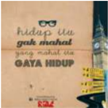

> **Deskripsi Visual:** Gambar ini adalah ilustrasi yang menampilkan sebuah buku dengan judul "Hidup Itu Gak Mahal, Gaya Hidup Gak Mahal Itu". Ilustrasi ini menggunakan warna-warna cerah dan desain yang modern untuk menarik perhatian pembaca. Di bagian atas buku tersebut, terdapat dua topi berwarna hitam dengan tulisan "HIDUP" dan "GAYA HIDUP" masing-masing. Di bawah topi, terdapat tulisan "HIDUP ITU GAK MAHAL, GAYA HIDUP GAK MAHAL ITU" dalam bahasa Indonesia.

Elemen-elemen utama dalam gambar ini adalah buku, topi, dan tulisan. Buku merupakan objek utama yang menunjukkan tema pembahasan buku pelajaran ini. Topi digunakan sebagai simbol untuk menekankan bahwa gaya hidup tidak harus mahal. Tulisan pada topi dan buku membantu memperjelas pesan yang ingin disampaikan oleh gambar ini.

Teks penting yang terlihat dalam gambar ini adalah judul buku "Hidup Itu Gak Mahal, Gaya Hidup Gak Mahal Itu". Ini menunjukkan bahwa pembahasan buku ini berkaitan dengan cara hidup yang tidak mahal dan gaya hidup yang tidak mahal. Label "HIDUP" dan "GAYA HIDUP" juga penting karena mereka menunjukkan bahwa pembahasan buku ini akan mencakup kedua aspek tersebut.

Informasi kunci yang dapat diambil pembaca dari gambar ini adalah bahwa buku ini mungkin akan membahas tentang cara-cara untuk menjalani kehidupan sehari-hari yang tidak mahal dan gaya hidup yang tidak mahal. Gambar ini juga menunjukkan bahwa pembahasan buku ini mungkin akan menggunakan topi sebagai simbol untuk menekankan bahwa gaya hidup tidak harus mahal.

### Bacalah artikel-artikel berikut

### Fenomena K-POP

Merebaknya gaya hidup Korea benar-benar telah mengubah gaya hidup dan jadwal kegiatan anak dan remaja di Indonesia. Para remaja mulai mengimitasi gaya hidup Korea. Contohnya, pagi bangun tidur dari kamar mereka sudah terdengar  lagu  K-Pop  terbaru  semacam  You  and  I,  IU  atau  Trouble  Maker, Hyun A & Jang Hyun Seung. Meminta dan mendownload seakan merupakan keasyikan tersendiri bagi mereka. Yang kadang menyebalkan para orang tua adalah kegilaan pada Korea ini sampai mengorbankan waktu beristirahatnya demi menonton show, sinema atau drama Korea di internet maupun televisi. Contoh lainya yaitu, ketika Super Junior (SUJU) akan mengadakan Konser Super Show 4 di Jakarta, begitu banyak remaja kita yang rela antri sehari semalam hanya untuk mendapatkan tiket konser itu. Melihat hal semacam ini, semua orang tua tentulah ingin menyenangkan putra putri mereka. Seperti misalnya, Jono (39), bekerja pada sebuah perusahaan swasta. Istri Jono hanya seorang ibu rumah tangga. Gaji yang diterima Jono setiap bulannya hanya cukup untuk membayar cicilan KPR rumahnya, listrik, telepon, belanja bulanan dan harian, serta untuk membayar kewajiban SPP anak-anaknya. Beberapa hari sebelum berita  hebohnya  antrian  tiket  Konser  SUJU  di  Twin  Plaza  Hotel,  Jono  tidak

 

---
## 📄 Halaman 65

kalah  hebohnya  mencari  pinjaman  uang  untuk  bisa  memenuhi  keinginan putrinya  membeli  tiket  Konser.  Seperti  yang  kita  ketahui  harga  tiket  Konser Super Show 4 untuk kelas Junior Sky Seat sebesar Rp 500 ribu, kelas Super Sky Seat Rp 1 Juta, Junior VIP Seat Rp 1,4 juta, Super Box, serta Super Fest Rp 1,7 juta dan kelas Super VIP Seat Rp 2 Juta.

Fenomena  K-Pop  dan  Drama  Korea  di  negeri  ini  memang  tak  bisa terbendung lagi. Salah satu bukti anak muda Indonesia terjangkit K-Pop, yaitu dengan dibanjirinya antrian penjualan tiket konser boyband asal Korea, Super Junior,  oleh  anak  muda kita yang dikabarkan tiket sudah ludes terjual pada tanggal (7/4/2012). Lidah para remaja lincah melafalkan bahasa Korea dari setiap  lirik  lagu  K-Pop.  Akibatnya  banyak  remaja  berminat  belajar  bahasa Korea secara intensif.  Fashion  dan  penampilan gaya Korea memiliki banyak pengikut di Indonesia.

Hal yang mengagetkan lagi, penggemar K-Pop begitu fanatik. Contohnya, Nadhila (18), remaja asal Bekasi, saking cintanya kepada band Korea pernah nekat  memburu  personel  band  asal  Korea,  X5,  di  Bandara  Soekarno-Hatta. 'Saya sampai lemas dan kehilangan kata-kata, ' kata Nadhila menggambarkan perasaannya ketika berjabat tangan dengan Haewon, personel X5. Belum puas, Nadhila  menguntit  X5  hingga  ke  hotel  tempat  mereka  menginap.  Ceritanya cukup dramatis. Ia menyamar sebagai wartawan agar bisa menembus barikade pengamanan hotel. Bersama rombongan wartawan, Nadhila berhasil menemui X5  di  lobi  hotel.  Saking  senangnya,  ia  menjerit  keras.  'Semua  kaget  dan menoleh ke arah saya, ' kenang Nadhila, yang kini menjadi personel Ladyschool, coverband Afterschool asal Korea. (www.entertainment.kompas.com).

(www.kompasiana.com)

### Ideologi

Johan  adalah  penduduk  sebuah  negara  sosialis  di  Afrika  yang  dikuasai oleh satu partai negara, PPR (Partai Persatuan Rakyat). PPR dan negara itu mempunyai ideologi resmi yang menuntut kepercayaan pada kepemimpinan PPR demi menciptakan masyarakat baru yang lebih sejahtera. Johan bekerja penuh semangat sebagai wartawan muda sebuah harian PPR itu. Agak kebetulan ia  sampai  ke  daerah  yang  agak  terpencil  untuk  membuat  suatu  reportase. Ternyata daerah itu terancam kelaparan yang akut: persediaan pangan sudah habis  sama  sekali,  anak-anak  di  desa  sudah  mulai  meninggal.  Tetapi  yang mengagetkan Johan adalah bahwa pimpinan PPR setempat mencoba menutupnutupi malapetaka itu, padahal mereka sendiri hidup dengan berfoya-foya.

Waktu  laporannya  disampaikan  kepada  pimpinan  redaksi,  dikatakan bahwa malapetaka itu tidak boleh diberitakan. Waktu Johan mendesak terus agar diambil tindakan bantuan, ia malah diancam kalau terus mencampuri

 

---
## 📄 Halaman 66

urusan itu. Tetapi Johan tidak dapat melupakan orang-orang sebangsa yang sedang mati kelaparan, yang dikorbankan oleh sebuah elite politik yang sudah terlalu korup. Matanya mulai terbuka oleh kekorupan moral dalam negaranya. Ia  masih  melihat  satu  jalan  terbuka,  yakni  mempublikasikan  laporannya  ke luar  negeri.  Publikasi  itu  akan  memaksa  pemerintahnya  berbuat  sesuatu, karena  pemerintah  sedang  merundingkan  pinjaman  luar  negeri  yang  tidak akan diperolehnya, kalau bencana kelaparan itu dibiarkan begitu saja. Tetapi kalau ia nekat melakukan itu, ia akan dianggap pengkhianat dan tentu saja keselamatan dirinya dan keluarganyapun terancam.

(sumber: etika dasar-franz magnis suseno)

### Tugas

Setelah  mengamati  foto-foto  dan  membaca  artikel-artikel  di  atas, carilah data/informasi dari buku-buku, internet atau sumber lain berkaitan dengan hal-hal berikut:

- Budaya atau gaya hidup apa saja yang sedang melanda dunia remaja, baik di perkotaan maupun di pedesaan saat ini?
- Ideologi atau pandangan hidup apa saja yang sedang berkembang saat ini?
- Tren, isu atau masalah-masalah sosial apa saja yang sedang melanda dunia sekarang ini?
- Bagaimana dampak ketiga hal tersebut di atas bagi remaja?
- Bagaimana menyikapi semua hal tersebut di atas?

### 2. Mendalami Ajaran Kitab Suci tentang Perlunya Bersikap Kritis

Baca dan resapkan kutipan Kitab Suci berikut !

### Pencobaan di Padang gurun

Luk4: 1 - 13)

- 1 Yesus,  yang  penuh  dengan  Roh  Kudus,  kembali  dari  sungai  Yordan,  lalu dibawa oleh Roh Kudus ke padang gurun.
- 2 Di situ Ia tinggal empat puluh hari lamanya dan dicobai Iblis. Selama di situ Ia tidak makan apa-apa dan sesudah waktu itu Ia lapar.

 

---
## 📄 Halaman 67

- 3 Lalu berkatalah Iblis kepada-Nya: 'Jika Engkau Anak Allah, suruhlah batu ini menjadi roti. '
- 4 Jawab Yesus kepadanya: 'Ada tertulis: Manusia hidup bukan dari roti saja. '
- 5 Kemudian ia membawa Yesus ke suatu tempat yang tinggi dan dalam sekejap mata ia memperlihatkan kepada-Nya semua kerajaan dunia.
- 6 Kata Iblis kepada-Nya: 'Segala kuasa itu serta kemuliaannya akan kuberikan kepada-Mu, sebab semuanya itu telah diserahkan kepadaku dan aku memberikannya kepada siapa saja yang kukehendaki.
- 7 Jadi jikalau Engkau menyembah aku, seluruhnya itu akan menjadi milik-Mu. '
- 8 Tetapi  Yesus  berkata  kepadanya:  ' Ada  tertulis:  Engkau  harus  menyembah Tuhan, Allahmu, dan hanya kepada Dia sajalah engkau berbakti!'
- 9 Kemudian  ia  membawa  Yesus  ke  Yerusalem  dan  menempatkan  Dia  di bubungan  Bait  Allah,  lalu  berkata  kepada-Nya:  'Jika  Engkau  Anak  Allah, jatuhkanlah diri-Mu dari sini ke bawah,
- 10 sebab  ada  tertulis:  Mengenai  Engkau,  Ia  akan  memerintahkan  malaikatmalaikat-Nya untuk melindungi Engkau,
- 11 dan  mereka  akan  menatang  Engkau  di  atas  tangannya,  supaya  kaki-Mu jangan terantuk kepada batu. '
- 12 Yesus menjawabnya, kata-Nya: 'Ada firman: Jangan engkau mencobai Tuhan, Allahmu!'
- 13 Sesudah Iblis mengakhiri semua pencobaan itu, ia mundur dari pada-Nya dan menunggu waktu yang baik.

### Tugas Kelompok

Bacaan di atas, bisa dijadikan bahan r efleksi tentang gaya hidup yang mungkin sudah ngetren pada zaman sekarang. Ada tiga gaya hidup yang ditampilkan.  Rumuskan  dalam  kelompok  apa  saja  tiga  gaya  hidup  yang ditawarkan iblis kepada Yesus tersebut dalam bahasamu sendiri, bagaimana Yesus menyikapinya? Apa nilai terpenting dalam hidup Yesus sehingga Ia menyikapi hidup seperti itu?

 

---
## 📄 Halaman 68

### Baca dan Renungkanlah kutipan berikut !

### Yesus berhadapan dengan orang Farisi dan Ahli Taurat

Matius 13: 1 - 36

- 1 Maka berkatalah Yesus kepada orang banyak dan kepada murid-murid-Nya, kata-Nya:
- 2 ' Ahli-ahli Taurat dan orang-orang Farisi telah menduduki kursi Musa.
- 3 Sebab itu turutilah dan lakukanlah segala sesuatu yang mereka ajarkan kepadamu,  tetapi  janganlah  kamu  turuti  perbuatan-perbuatan  mereka,  karena mereka mengajarkannya tetapi tidak melakukannya.
- 4 Mereka mengikat beban-beban berat, lalu meletakkannya di atas bahu orang, tetapi mereka sendiri tidak mau menyentuhnya.
- 5 Semua pekerjaan yang mereka lakukan hanya dimaksud supaya dilihat orang; mereka memakai tali sembahyang yang lebar dan jumbai yang panjang;
- 6 mereka  suka  duduk  di  tempat  terhormat  dalam  perjamuan  dan  di  tempat terdepan di rumah ibadat;
- 7 mereka suka menerima penghormatan di pasar dan suka dipanggil Rabi.
- 8 Tetapi kamu, janganlah kamu disebut Rabi; karena hanya satu Rabimu dan kamu semua adalah saudara.
- 9 Dan janganlah kamu menyebut siapa pun bapa di bumi ini, karena hanya satu Bapamu, yaitu Dia yang di sorga.
- 10 Janganlah pula kamu disebut pemimpin, karena hanya satu Pemimpinmu, yaitu Mesias.
- 11 Barangsiapa terbesar di antara kamu, hendaklah ia menjadi pelayanmu.
- 12 Dan barangsiapa meninggikan diri, ia akan direndahkan dan barangsiapa merendahkan diri, ia akan ditinggikan.
- 13 Celakalah  kamu,  hai  ahli-ahli  Taurat  dan  orang-orang  Farisi,  hai  kamu orang-orang munafik, karena kamu menutup pintu-pintu Kerajaan Surga di depan orang. Sebab kamu sendiri tidak masuk dan kamu merintangi mereka yang berusaha untuk masuk.
- 14 [Celakalah  kamu,  hai  ahli-ahli  Taurat  dan  orang-orang  Farisi,  hai  kamu orang-orang munafik, sebab kamu menelan rumah janda-janda sedang kamu mengelabui mata orang dengan doa yang panjang-panjang. Sebab itu kamu pasti akan menerima hukuman yang lebih berat.]
- 15 Celakalah  kamu,  hai  ahli-ahli  Taurat  dan  orang-orang  Farisi,  hai  kamu orang-orang munafik, sebab kamu mengarungi lautan dan menjelajah daratan,

 

---
## 📄 Halaman 69

untuk menobatkan satu orang saja menjadi penganut agamamu dan sesudah ia bertobat, kamu menjadikan dia orang neraka, yang dua kali lebih jahat dari pada kamu sendiri.

- 16 Celakalah kamu, hai pemimpin-pemimpin buta, yang berkata: Bersumpah demi Bait Suci, sumpah itu tidak sah; tetapi bersumpah demi emas Bait Suci, sumpah itu mengikat.
- 17 Hai kamu orang-orang bodoh dan orang-orang buta, apakah yang lebih penting, emas atau Bait Suci yang menguduskan emas itu?
- 18 Bersumpah  demi  mezbah,  sumpah  itu  tidak  sah;  tetapi  bersumpah  demi persembahan yang ada di atasnya, sumpah itu mengikat.
- 19 Hai kamu orang-orang buta, apakah yang lebih penting, persembahan atau mezbah yang menguduskan persembahan itu?
- 20 Karena itu barangsiapa bersumpah demi mezbah, ia bersumpah demi mezbah dan juga demi segala sesuatu yang terletak di atasnya.
- 21 Dan barangsiapa bersumpah demi Bait Suci, ia bersumpah demi Bait Suci dan juga demi Dia, yang diam di situ.
- 22 Dan barangsiapa bersumpah demi Surga, ia bersumpah demi takhta Allah dan juga demi Dia, yang bersemayam di atasnya.
- 23 Celakalah  kamu,  hai  ahli-ahli  Taurat  dan  orang-orang  Farisi,  hai  kamu orang-orang munafik, sebab persepuluhan dari selasih, adas manis dan jintan kamu bayar, tetapi yang terpenting dalam hukum Taurat kamu abaikan, yaitu: keadilan dan belas kasihan dan kesetiaan. Yang satu harus dilakukan dan yang lain jangan diabaikan.
- 24 Hai  kamu  pemimpin-pemimpin buta, nyamuk kamu tapiskan dari dalam minumanmu, tetapi unta yang di dalamnya kamu telan.
- 25 Celakalah  kamu,  hai  ahli-ahli  Taurat  dan  orang-orang  Farisi,  hai  kamu orang-orang  munafik,  sebab  cawan  dan  pinggan  kamu  bersihkan  sebelah luarnya, tetapi sebelah dalamnya penuh rampasan dan kerakusan.
- 26 Hai orang Farisi yang buta, bersihkanlah dahulu sebelah dalam cawan itu, maka sebelah luarnya juga akan bersih.
- 27 Celakalah  kamu,  hai  ahli-ahli  Taurat  dan  orang-orang  Farisi,  hai  kamu orang-orang munafik, sebab kamu sama seperti kuburan yang dilabur putih, yang sebelah luarnya memang bersih tampaknya, tetapi yang sebelah dalamnya penuh tulang belulang dan pelbagai jenis kotoran.
- 28 Demikian jugalah kamu, di sebelah luar kamu tampaknya benar di mata orang, tetapi di sebelah dalam kamu penuh kemunafikan dan kedurjanaan.

 

---
## 📄 Halaman 70

- 29 Celakalah kamu, hai ahli-ahli Taurat dan orang-orang Farisi, hai kamu orangorang munafik, sebab kamu membangun makam nabi-nabi dan memperindah tugu orang-orang saleh
- 30 dan berkata: Jika kami hidup di zaman nenek moyang kita, tentulah kami tidak ikut dengan mereka dalam pembunuhan nabi-nabi itu.
- 31 Tetapi dengan demikian kamu bersaksi terhadap diri kamu sendiri, bahwa kamu adalah keturunan pembunuh nabi-nabi itu.
- 32 Jadi, penuhilah juga takaran nenek moyangmu!
- 33 Hai  kamu  ular-ular,  hai  kamu  keturunan  ular  beludak!  Bagaimanakah mungkin kamu dapat meluputkan diri dari hukuman neraka?
- 34 Sebab  itu,  lihatlah,  Aku  mengutus  kepadamu  nabi-nabi,  orang-orang bijaksana dan ahli-ahli Taurat: separuh di antara mereka akan kamu bunuh dan kamu salibkan, yang lain akan kamu sesah di rumah-rumah ibadatmu dan kamu aniaya dari kota ke kota,
- 35 supaya  kamu  menanggung  akibat  penumpahan  darah  orang  yang  tidak bersalah  mulai  dari  Habel,  orang  benar  itu,  sampai  kepada  Zakharia  anak Berekhya, yang kamu bunuh di antara tempat kudus dan mezbah.
- 36 Aku berkata kepadamu: Sesungguhnya semuanya ini akan ditanggung angkatan ini!'
- 37 'Yerusalem, Yerusalem, engkau yang membunuh nabi-nabi dan melempari dengan batu orang-orang yang diutus kepadamu! Berkali-kali Aku rindu mengumpulkan anak-anakmu, sama seperti induk ayam mengumpulkan anakanaknya di bawah sayapnya, tetapi kamu tidak mau.
- 38 Lihatlah rumahmu ini akan ditinggalkan dan menjadi sunyi.
- 39 Dan Aku berkata kepadamu: Mulai sekarang kamu tidak akan melihat Aku lagi, hingga kamu berkata: Diberkatilah Dia yang datang dalam nama Tuhan!'

### Tugas Kelompok

Baca kembali secara jeli kutipan di atas, lalu dalam kelompok buatlah perbandingan:  nilai/kebiasaan  seperti  apa  yang  dipraktikkan  oleh  Ahli Taurat dan Orang Farisi? Nilai/kebiasaan apa yang ditawarkan Yesus?

Setelah diskusi selesai, presentasikan hasilnya di depan kelas. Kelompok lain dapat memberi tanggapan berupa pertanyaan atau komentar kepada kelompok lain setelah semua kelompok selesai presentasi.

 

---
## 📄 Halaman 71

### 3. Menghayati Sikap Kritis Terhadap Gaya Hidup, Tren dan Ideologi

Dalam  keadaan  hening,  tuliskan  (dalam  kolom  seperti  berikut:)  tentang gaya hidup, ideologi atau tren yang dirasakan sudah menjadi bagian hidupmu, kemudian  rumuskan  sikap  kritis,  serta  nilai  hidup  yang  sesuai  dengan  iman Katolik yang ingin dikembangkan

---
**📊 Tabel**

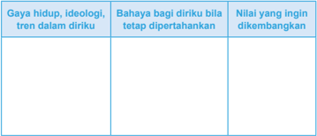

Tabel ini berisi informasi tentang gaya hidup, ideologi, tren dalam diri seseorang, bahaya jika tetap dipertahankan, dan nilai-nilai yang ingin dikembangkan. Topik utamanya adalah pemahaman diri dan pengembangan diri. Kolom pertama berisi gaya hidup, ideologi, dan tren dalam diri seseorang. Kolom kedua berisi bahaya jika gaya hidup, ideologi, atau tren tersebut tetap dipertahankan. Kolom ketiga berisi nilai-nilai yang ingin dikembangkan. Dari tabel ini, dapat dilihat bahwa individu perlu mempertimbangkan apakah gaya hidup, ideologi, atau tren tertentu akan membahayakan dirinya sendiri atau tidak, serta mencari cara untuk mengembangkan nilai-nilai yang lebih baik.

Tugas

Setelah melalui proses pelajaran di atas, buatlah iklan atau poster yang berisi ajakan untuk bersikap kritis terhadap gaya hidup, tren atau ideologi yang berkembang saat ini

### Untuk dipahami

- Bagi  kaum  muda  sekarang  ini,  trend  apapun  bentuknya  mulai  dari  mode, musik  film,  sampai  pada  berbagai  gaya  hidup  lainnya,  hingga  perangkat teknologi, tak bisa dilepaskan pengaruhnya bagi kita.Tingkatan pengaruhnya sangat tergantung pada kedewasaan kita dalam menjalani dan menentukan pilihan.
- Kita  harus  bersikap  kritis  terhadap  trend-trend  yang  sedang  berkembang pesat pada saat ini. Trend-trend yang sangat pesat berkembang antara lain: materialisme, konsumerisme, individualisme, pluralisme, fundamentalisme, dan sebagainya. Trend-trend dapat memengaruhi kaum muda dalam usaha pencarian identitasnya.

 

---
## 📄 Halaman 72

- Kita juga harus bersikap kritis terhadap ideologi, paham-paham, dan aliran yang beraneka ragam. Sebab, ideologi, paham-paham, dan aliran itu dapat melahirkan partai-partai politik atau sekte-sekte agama. Kaum muda sering dijadikan  sasaran  dari  penyebaran  slogan  perluasan  ideologi  atau  pahampaham dan aliran.
- Sikap kritis mempunyai 3 proses dasar:
- Berusaha memusatkan diri pada perkembangan nilai-nilai atau cita-cita yang kita anggap luhur.
- Berusaha  memalingkan  diri  dari  keegoisan  dan  mengarahkan  segala perhatian kepada kepentingan bersama.
- Membuka perhatian kepada hidup yang lebih sempurna, yaitu ke arah hidup Allah sendiri.

 

---
## 📄 Halaman 73

### Bahagianya orang yang hidup menurut Tuhan

- 1 Berbahagialah  orang-orang  yang  hidupnya  tidak  bercela,  yang  hidup menurut Taurat TUHAN.
- 2 Berbahagialah  orang-orang  yang  memegang  peringatan-peringatan-Nya, yang mencari Dia dengan segenap hati,
- 3 yang juga tidak melakukan kejahatan, tetapi yang hidup menurut jalanjalan yang ditunjukkan-Nya.
- 4 Engkau  sendiri  telah  menyampaikan  titah-titah-Mu,  supaya  dipegang dengan sungguh-sungguh.
- 5 Sekiranya hidupku tentu untuk berpegang pada ketetapan-Mu!
- 6 Maka aku tidak akan mendapat malu, apabila aku mengamat-amati segala perintah-Mu.
- 7 Aku  akan  bersyukur  kepada-Mu  dengan  hati  jujur,  apabila  aku  belajar hukum-hukum-Mu yang adil.
- 8 Aku akan berpegang pada ketetapan-ketetapan-Mu, janganlah tinggalkan aku sama sekali.
- 9 Dengan  apakah  seorang  muda  mempertahankan  kelakuannya  bersih? Dengan menjaganya sesuai dengan firman-Mu.
- 10 Dengan  segenap  hatiku  aku  mencari  Engkau,  janganlah  biarkan  aku menyimpang dari perintah-perintah-Mu.
- 11 Dalam  hatiku  aku  menyimpan  janji-Mu,  supaya  aku  jangan  berdosa terhadap Engkau.
- 12 Terpujilah  Engkau,  ya  TUHAN;  ajarkanlah  ketetapan-ketetapan-Mu kepadaku.
- 13 Dengan bibirku aku menceritakan segala hukum yang Kauucapkan.
- 14 Atas  petunjuk  peringatan-peringatan-Mu  aku  bergembira,  seperti  atas segala harta.
- 15 Aku  hendak  merenungkan  titah-titah-Mu  dan  mengamat-amati  jalanjalan-Mu.
- 16 Aku  akan  bergemar  dalam  ketetapan-ketetapan-Mu;  firman-Mu  tidak akan kulupakan.

 

---
## 📄 Halaman 74

### Bab III Kitab Suci dan Tradisi Sumber Iman Akan Yesus Kristus

Sesudah  kalian  menggumuli  tema  Pribadi  manusia,  selanjutnya  kalian akan mendalami tema Pribadi Yesus Kristus. Sebagai pribadi yang bermartabat Citra Allah kalian dipanggil oleh Allah untuk  secara  bertanggung  jawab mengembangkan diri menuju kesempurnaan dalam kebersamaan dengan sesama. Upaya mengembangkan diri tersebut bukanlah suatu hal yang mudah, sebab dalam perjalanan hidupnya manusia selalu dihadapkan dengan berbagai tantangan dan rintangan.

Sebagai orang yang beriman akan Yesus Kristus, kalian tentu ingin mengembangkan  diri  dengan  berpolakan  pada  Yesus  Kristus.  Pribadi  Yesus Kristus adalah pola dan teladan pengembangan diri, sebab dalam Dia-lah kalian dapat  menemukan  keluhuran  martabat  manusia  yang  unggul  dan  berkenan kepada Allah. Dialah Citra Allah yang telah dipilih Allah menjadi jalan, kebenaran dan hidup manusia. Dalam Dia-lah manusia kesempurnaan manusia di hadapan Allah.

Agar kalian mampu memahami Yesus sebagai sosok kesempurnaan hidup, maka kalian perlu menggali pemahaman dari sumbernya, yakni Kitab Suci, baik Kitab Suci Perjanjian Lama dan Perjanjian Baru, serta Tradisi Gereja. Kitab Suci dan Tradisi menjadi sumber iman kita. Maka pembelajaran dalam Bab ini akan menggali lebih dalam tentang:

- Kitab Suci Perjanjian Lama
- Kitab Suci Perjanjian Baru
- Tradisi

 

---
## 📄 Halaman 75

### A. Kitab Suci Perjanjian Lama

Bagi umat beriman Kitab Suci memegang peranan yang sangat penting. Ia menjadi sumber tertulis yang utama untuk memahami karya penyelamatan Allah kepada manusia sepanjang zaman. Ia juga menjadi sumber referensi dan inspirasi untuk mengembangkan imannya. Karena kedudukan dan perannya yang sangat penting itu, maka setiap orang beriman perlu memahami Kitab Suci secara benar. Pemahaman tersebut akan berpengaruh pada sikap dan tindakan orang beriman dalam mendudukkan dan memperlakukan Kitab Suci bagi kehidupan berimannya. Pemahaman yang benar itu menyangkut pemahaman tentang sejarah terjadinya, latar  belakang  atau  konteks  sejarah  saat  Kitab  Suci  itu  disusun,  latar  belakang penulisnya, jenis sastra dalam penulisannya, isi dan maksud penulisannya

Kitab  Suci  Perjanjian  Lama  seperti  yang  dimiliki  umat  Kristiani  saat  ini disusun  melalui  proses  yang  panjang  sekitar  lebih  dari  sepuluh  abad,  sejak abad XI SM sampai kurang lebih abad I Sesudah Masehi. Pada mulanya berupa kumpulan  cerita-cerita  tentang  pengalaman  bangsa  Israel  dalam  hubungannya dengan  sejarah  bangsanya  dan  sekaligus  peranan  serta  kehadiran  Allah  dalam seluruh perjalanan hidup mereka. Pengalaman-pengalaman penyelamatan Allah sepanjang sejarah mereka itu diceritakan kepada anak cucu mereka secara turuntemurun. Hingga suatu saat ada orang-orang tertentu, yang mendapat ilham Roh Kudus menyusun dan menuliskannya menjadi sebuah buku utuh seperti yang kita miliki sekarang ini.

### Doa Pembuka

- Allah Yang Mahamurah,
- melalui berbagai cara dan peristiwa,
- Engkau senantiasa mewahyukan Diri kepada manusia.
- Melalui berbagai cara dan peristiwa itu pula,
- Engkau mengajak manusia semakin dekat dengan-Mu.
- Hari ini kami ingin memahami
- pengalaman dan perjalanan hidup bangsa Israel
- dalam mengimani Engkau.
- Semoga melalui pelajaran ini,
- kami semakin mengenal dan mencintai-Mu lebih baik lagi.
- Amin

 

---
## 📄 Halaman 76

### 1. Tradisi Lisan Sebagai Sarana Pewarisan Nilai-Nilai Luhur dalam Masyarakat

Dalam kehidupan sehari-hari, kita sering mendengar berbagai macam legenda yang ada dalam masyarakat. Umumnya tidak pernah ada yang tahu, kapan legenda tersebut mulai muncul, sebab legenda tersebut awalnya diceritakan secara lisan dan secara  turun  temurun,  hingga  suatu  saat  ada  orang-orang  yang  menuliskannya. Itulah sebabnya sering ditemui pula, legenda yang sama tetapi dalam penuturannya berbeda.

Simaklah legenda berikut!

### Legenda Gunung Tangkuban Parahu

Awalnya  diceritakan  di  kahyangan  ada  sepasang  dewa  dan  dewi  yang berbuat kesalahan, maka oleh Sang Hyang Tunggal mereka dikutuk turun ke bumi dalam wujud hewan. Sang dewi berubah menjadi babi hutan (celeng) bernama celeng Wayung Hyang, sedangkan sang dewa berubah menjadi anjing bernama si Tumang. Mereka harus turun ke bumi menjalankan hukuman dan bertapa mohon pengampunan agar dapat kembali ke wujudnya menjadi dewadewi kembali.

Diceritakan bahwa Raja Sungging Perbangkara tengah pergi berburu. Di tengah hutan Sang Raja membuang air seni yang tertampung dalam daun caring (keladi  hutan),  dalam  versi  lain  disebutkan  air  kemih  sang  raja  tertampung dalam batok kelapa. Seekor babi hutan betina bernama Celeng Wayung Hyang yang tengah bertapa sedang kehausan, ia kemudian tanpa sengaja meminum air seni sang raja tadi. Wayung Hyang secara ajaib hamil dan melahirkan seorang bayi yang cantik, karena pada dasarnya ia adalah seorang dewi. Bayi cantik itu ditemukan di tengah hutan oleh sang raja yang tidak menyadari bahwa ia adalah putrinya. Bayi perempuan itu dibawa ke keraton oleh ayahnya dan diberi nama Dayang Sumbi alias Rarasati. Dayang Sumbi tumbuh menjadi gadis yang amat cantik jelita. Banyak para raja dan pangeran yang ingin meminangnya, tetapi seorang pun tidak ada yang diterima.

Akhirnya para raja saling berperang di antara sesamanya. Dayang Sumbi pun atas permintaannya sendiri mengasingkan diri di sebuah bukit ditemani seekor  anjing  jantan  yaitu  Si  Tumang.  Ketika  sedang  asyik  menenun  kain, torompong (torak) yang tengah digunakan menenun kain terjatuh ke bawah bale-bale. Dayang Sumbi karena merasa malas, terlontar ucapan tanpa dipikir dulu,  dia  berjanji  siapa  pun  yang  mengambilkan  torak  yang  terjatuh  bila berjenis  kelamin  laki-laki,  akan  dijadikan  suaminya,  jika  perempuan  akan dijadikan saudarinya. Si Tumang mengambilkan torak dan diberikan kepada Dayang Sumbi. Akibat perkataannya itu Dayang Sumbi harus memegang teguh

 

---
## 📄 Halaman 77

persumpahan dan janjinya, maka ia pun harus menikahi si Tumang. Karena malu,  kerajaan  mengasingkan  Dayang  Sumbi  ke  hutan  untuk  hidup  hanya ditemani si Tumang. Pada malam bulan purnama, si Tumang dapat kembali ke wujud aslinya sebagai dewa yang tampan, Dayang Sumbi mengira ia bermimpi bercumbu dengan dewa yang tampan yang sesungguhnya adalah wujud asli si Tumang. Maka Dayang Sumbi akhirnya melahirkan bayi laki-laki yang diberi nama Sangkuriang. Sangkuriang tumbuh menjadi anak yang kuat dan tampan.

Suatu ketika Dayang Sumbi tengah mengidamkan makan hati menjangan, maka ia memerintahkan Sangkuriang ditemani si Tumang untuk berburu ke hutan. Setelah sekian lama Sangkuriang berburu, tetapi tidak nampak hewan buruan seekorpun. Hingga akhirnya Sangkuriang melihat seekor babi hutan yang gemuk melarikan diri. Sangkuriang menyuruh si Tumang untuk mengejar babi hutan yang ternyata adalah Celeng Wayung Hyang. Karena si Tumang mengenali  Celeng  Wayung  Hyang  adalah  nenek  dari  Sangkuriang  sendiri maka si Tumang tidak menurut. Karena kesal Sangkuriang menakut-nakuti si Tumang dengan panah, akan tetapi secara tak sengaja anak panah terlepas dan  si  Tumang  terbunuh  tertusuk  anak  panah.  Sangkuriang  bingung,  lalu karena tak dapat hewan buruan maka Sangkuriang pun menyembelih tubuh si Tumang dan mengambil hatinya. Hati si Tumang oleh Sangkuriang diberikan kepada Dayang Sumbi, lalu dimasak dan dimakannya. Setelah Dayang Sumbi mengetahui bahwa yang dimakannya adalah hati si Tumang, suaminya sendiri, maka kemarahannya pun memuncak serta-merta kepala Sangkuriang dipukul dengan sendok yang terbuat dari tempurung kelapa sehingga terluka.

Sangkuriang ketakutan dan lari meninggalkan rumah. Dayang Sumbi yang menyesali  perbuatannya  telah  mengusir  anaknya,  mencari  dan  memanggilmanggil Sangkuriang ke hutan memohonnya untuk segera pulang, akan tetapi Sangkuriang  telah  pergi.  Dayang  Sumbi  sangat  sedih  dan  memohon  kepada Sang  Hyang  Tunggal  agar  kelak  dipertemukan  kembali  dengan  anaknya. Untuk  itu  Dayang  Sumbi  menjalankan  tapa  dan  laku  hanya  memakan tumbuh-tumbuhan dan sayuran mentah (lalapan). Sangkuriang sendiri pergi mengembara  mengelilingi  dunia.  Sangkuriang  pergi  berguru  kepada  banyak pertapa sakti, sehingga Sangkuriang kini bukan bocah lagi, tetapi telah tumbuh menjadi seorang pemuda yang kuat, sakti, dan gagah perkasa. Setelah sekian lama berjalan ke arah timur akhirnya sampailah di arah barat lagi dan tanpa sadar telah tiba kembali di tempat Dayang Sumbi, ibunya berada. Sangkuriang tidak mengenali bahwa putri cantik yang ditemukannya adalah Dayang Sumbi -  ibunya. Karena Dayang Sumbi melakukan tapa dan laku hanya memakan tanaman mentah, maka Dayang Sumbi menjadi tetap cantik dan awet muda. Dayang Sumbi pun mulanya tidak menyadari bahwa sang ksatria tampan itu adalah putranya sendiri. Lalu kedua insan itu berkasih mesra. Saat Sangkuriang

 

---
## 📄 Halaman 78

tengah  bersandar  mesra  dan  Dayang  Sumbi  menyisir  rambut  Sangkuriang, tanpa sengaja Dayang Sumbi mengetahui bahwa Sangkuriang adalah putranya, dengan  tanda  luka  di  kepalanya,  bekas  pukulan  sendok  Dayang  Sumbi. Walau  demikian  Sangkuriang  tetap  memaksa  untuk  menikahinya.  Dayang Sumbi sekuat tenaga berusaha untuk menolak. Maka ia pun bersiasat untuk menentukan syarat pinangan yang tak mungkin dipenuhi Sangkuriang. Dayang Sumbi  meminta  agar  Sangkuriang  membuatkan  perahu  dan  telaga  (danau) dalam  waktu  semalam  dengan  membendung  sungai  Citarum.  Sangkuriang menyanggupinya.

Maka dibuatlah perahu dari sebuah pohon yang tumbuh di arah timur, tunggul/pokok pohon itu berubah menjadi gunung Bukit Tanggul. Rantingnya ditumpukkan  di  sebelah  barat  dan  menjadi  Gunung  Burangrang.  Dengan bantuan  para  guriang  (makhluk  halus),  bendungan  pun  hampir  selesai dikerjakan. Tetapi Dayang Sumbi memohon kepada Sang Hyang Tunggal agar niat Sangkuriang tidak terlaksana. Dayang Sumbi menebarkan helai kain boeh rarang  (kain  putih  hasil  tenunannya),  maka  kain  putih  itu  bercahaya  bagai fajar  yang  merekah  di  ufuk  timur.  Para  guriang  makhluk  halus  anak  buah Sangkuriang  ketakutan  karena  mengira  hari  mulai  pagi,  maka  merekapun lari menghilang bersembunyi di dalam tanah. Karena gagal memenuhi syarat Dayang  Sumbi,  Sangkuriang  menjadi  gusar  dan  mengamuk.  Di  puncak kemarahannya,  bendungan  yang  berada  di Sanghyang  Tikoro dijebolnya, sumbat aliran sungai Citarum dilemparkannya ke arah timur dan menjelma menjadi Gunung Manglayang . Air Talaga Bandung pun menjadi surut kembali. Perahu yang dikerjakan dengan bersusah payah ditendangnya ke arah utara dan berubah wujud menjadi Gunung Tangkuban Parahu .

Sangkuriang terus mengejar Dayang Sumbi yang lari menghindari kejaran anaknya  yang  telah  kehilangan  akal  sehatnya  itu.  Dayang  Sumbi  hampir

 

---
## 📄 Halaman 79

tertangkap oleh Sangkuriang di Gunung Putri dan ia pun memohon kepada Sang  Hyang  Tunggal  agar  menyelamatkannya,  maka  Dayang  Sumbi  pun berubah menjadi setangkai bunga jaksi. Adapun Sangkuriang setelah sampai di sebuah tempat yang disebut dengan Ujung berung akhirnya menghilang ke alam gaib (ngahiyang).

Sumber: id.wikipedia.org/wiki/Sangkuriang_(legenda)

### Tugas Kelompok

Setelah kalian menyimak cerita di atas, coba diskusikan dengan temantemanmu beberapa pertanyaan berikut:

- Apakah kalian meyakini terjadinya gunung Tangkuban Perahu seperti legenda di atas?
- Adakah  teori-teori  yang  kalian  ketahui  tentang  terbentuknya  sebuah gunung atau gunung berapi?
- Ajaran/nilai/norma apa yang hendak diwariskan melalui cerita legenda tersebut?
- Masih  relevankah  ajaran/nilai/norma  yang  terdapat  dalam  cerita  di atas untuk manusia zaman sekarang?
- Legenda apa saja yang ada di daerahmu? Apa ajaran/ nilai yang hendak diwariskan dalam legenda tersebut?

### 2. Memahami Kitab Suci Perjanjian Lama.

Beberapa bagian Kitab Suci disampaikan dalam kesusastraan yang berbentuk legenda

Bacalah Kejadian 1:1-31 tentang Tuhan yang menciptakan bumi dan segala isinya:

- 1 Pada mulanya Allah menciptakan langit dan bumi.
- 2 Bumi belum berbentuk dan kosong; gelap gulita menutupi samudera raya, dan Roh Allah melayang-layang di atas permukaan air.
- 3 Berfirmanlah Allah: 'Jadilah terang. ' Lalu terang itu jadi.
- 4 Allah melihat bahwa terang itu baik, lalu dipisahkan-Nyalah terang itu dari gelap.
- 5 Dan Allah menamai terang itu siang, dan gelap itu malam. Jadilah petang dan jadilah pagi, itulah hari pertama.
- 6 Berfirmanlah Allah: 'Jadilah cakrawala di tengah segala air untuk memisahkan air dari air. '

 

---
## 📄 Halaman 80

- 7 Maka Allah menjadikan cakrawala dan Ia memisahkan air yang ada di bawah cakrawala itu dari air yang ada di atasnya. Dan jadilah demikian.
- 8 Lalu Allah menamai cakrawala itu langit. Jadilah petang dan jadilah pagi, itulah hari kedua.
- 9 Berfirmanlah Allah: 'Hendaklah segala air yang di bawah langit berkumpul pada satu tempat, sehingga kelihatan yang kering. ' Dan jadilah demikian.
- 10 Lalu Allah menamai yang kering itu darat, dan kumpulan air itu dinamaiNya laut. Allah melihat bahwa semuanya itu baik.
- 11 Berfirmanlah Allah: 'Hendaklah tanah menumbuhkan tunas-tunas muda, tumbuh-tumbuhan  yang  berbiji, segala jenis pohon buah-buahan  yang menghasilkan buah yang berbiji, supaya ada tumbuh-tumbuhan di bumi. ' Dan jadilah demikian.
- 12 Tanah itu menumbuhkan tunas-tunas muda, segala jenis tumbuh-tumbuhan yang  berbiji  dan  segala  jenis  pohon-pohonan  yang  menghasilkan  buah  yang berbiji. Allah melihat bahwa semuanya itu baik.
13 Jadilah petang dan jadilah pagi, itulah hari ketiga.

- 14 Berfirmanlah Allah: 'Jadilah benda-benda penerang pada cakrawala untuk memisahkan  siang  dari  malam.  Biarlah  benda-benda  penerang  itu  menjadi tanda  yang  menunjukkan  masa-masa  yang  tetap  dan  hari-hari  dan  tahuntahun,
- 15 dan sebagai penerang pada cakrawala biarlah benda-benda itu menerangi bumi. ' Dan jadilah demikian.
- 16 Maka Allah menjadikan kedua benda penerang yang besar itu, yakni yang lebih  besar  untuk  menguasai  siang  dan  yang  lebih  kecil  untuk  menguasai malam, dan menjadikan juga bintang-bintang.
17 Allah menaruh semuanya itu di cakrawala untuk menerangi bumi,

- 18 dan untuk menguasai siang dan malam, dan untuk memisahkan terang dari gelap. Allah melihat bahwa semuanya itu baik.
19 Jadilah petang dan jadilah pagi, itulah hari keempat.

- 20 Berfirmanlah Allah: 'Hendaklah dalam air berkeriapan makhluk yang hidup, dan hendaklah burung beterbangan di atas bumi melintasi cakrawala. '
- 21 Maka Allah menciptakan binatang-binatang laut yang besar dan segala jenis makhluk hidup yang bergerak, yang berkeriapan dalam air, dan segala jenis burung yang bersayap. Allah melihat bahwa semuanya itu baik.
- 22 Lalu Allah memberkati semuanya itu, firman-Nya: 'Berkembangbiaklah dan bertambah banyaklah serta penuhilah air dalam laut, dan hendaklah burungburung di bumi bertambah banyak. '

 

---
## 📄 Halaman 81

- 23 Jadilah petang dan jadilah pagi, itulah hari kelima.
- 24 Berfirmanlah Allah: 'Hendaklah bumi mengeluarkan segala jenis makhluk yang hidup, ternak dan binatang melata dan segala jenis binatang liar. ' Dan jadilah demikian.
- 25 Allah menjadikan segala jenis binatang liar dan segala jenis ternak dan segala jenis binatang melata di muka bumi. Allah melihat bahwa semuanya itu baik.
- 26 Berfirmanlah  Allah:  'Baiklah  Kita  menjadikan  manusia  menurut  gambar dan rupa Kita, supaya mereka berkuasa atas ikan-ikan di laut dan burungburung di udara dan atas ternak dan atas seluruh bumi dan atas segala binatang melata yang merayap di bumi. '
- 27 Maka  Allah  menciptakan  manusia  itu  menurut  gambar-Nya,  menurut gambar  Allah  diciptakan-Nya  dia;  laki-laki  dan  perempuan  diciptakan-Nya mereka.
- 28 Allah memberkati mereka, lalu Allah berfirman kepada mereka: 'Beranakcuculah dan bertambah banyak; penuhilah bumi dan taklukkanlah itu, berkuasalah atas ikan-ikan di laut dan burung-burung di udara dan atas segala binatang yang merayap di bumi. '
- 29 Berfirmanlah Allah: 'Lihatlah, Aku memberikan kepadamu segala tumbuhtumbuhan  yang  berbiji  di  seluruh  bumi  dan  segala  pohon-pohonan  yang buahnya berbiji; itulah akan menjadi makananmu.
- 30 Tetapi kepada segala binatang di bumi dan segala burung di udara dan segala yang merayap di bumi, yang bernyawa, Kuberikan segala tumbuh-tumbuhan hijau menjadi makanannya. ' Dan jadilah demikian.
- 31 Maka  Allah  melihat  segala  yang  dijadikan-Nya  itu,  sungguh  amat  baik. Jadilah petang dan jadilah pagi, itulah hari keenam.

---
**🖼️ Gambar/Diagram**

> **Deskripsi Visual:** Gambar ini adalah foto yang menunjukkan pemandangan pantai yang indah. Dalam foto tersebut, kita bisa melihat pasir putih yang berada di tepi laut, dengan air biru cerah yang jernih. Di sepanjang tepi pantai, terdapat beberapa pohon kelapa yang tumbuh dengan rapi. Selain itu, juga ada beberapa bangunan kecil yang tampak seperti rumah pantai atau villa. Langit di atas tampak cerah dengan sedikit awan putih. Gambar ini menunjukkan keindahan alam pantai dan kehidupan di sekitar pantai.

 

---
## 📄 Halaman 82

Coba pikirkan: Betulkah penciptaan bumi dan segala isinya berjalan seperti dikisahkan  di  atas?  Adakah  teori-teori  lain  yang  berbicara  tentang  penciptaan bumi dan segala isinya? ajaran/nilai/norma apa yang hendak disampaikan dari kisah penciptaan tersebut?

Memahami Jenis Sastra dalam Perjanjian Lama:

Dokumen  Konsili  vatikan II tentang Wahyu  Ilahi ( Dei  Verbum ) menjelaskan bahwa untuk menafsirkan Perjanjian Lama secara benar, salah satunya adalah memperhatikan 'Jenis sastra' . Sebab, 'Sebab dengan cara yang berbeda-beda kebenaran dikemukakan dan diungkapkan dalam nas-nas yang dengan  aneka  cara  bersifat historis ,  atau profetis  (ramalan/nubuat) ,  atau poetis, atau dengan jenis sastra lainnya .

### Tugas

- Untuk memahami  jenis sastra dalam  Perjanjian Lama,  cobalah membaca secara acak satu perikope dari Kitab I Raja-raja, satu perikope dari Kitab Imamat, satu perikope dari Kitab Amsal, satu perikope dari Kitab Mazmur!
- Apakah kalian merasakan sendiri adanya perbedaan dalam penuturan Isi Perjanjian Lama? Termasuk jenis sastra apa Kitab Raja-raja, Kitab Imamat, Kitab Amsal, Kitab Mazmur?
Menda ftar dan mengelompokkan Kitab-kitab Perjanjian Lama:

Kitab  Suci  Perjanjian  Lama  dapat  dikelompokkan  ke  dalam  empat kelompok yaitu 1) Pentateukh atau Taurat, 2) Kitab-Kitab Sejarah, 3) KitabKitab  Kebijaksanaan  dan  Sesembahan  atau  Pujian,  serta  4)  Kitab-Kitab Kenabian atau Para Nabi.

Bukalah Alkitab kalian, lalu lihatlah daftar isinya, kemudian masukkan namanama kitab tersebut menurut pengelompokkannya

Pentateukh atau Taurat

Kitab-kitab Sejarah

 

---
## 📄 Halaman 83

---
**📊 Tabel**

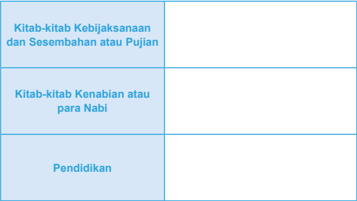

Tabel ini membagi topik utama menjadi tiga kolom berdasarkan jenis kitab atau sumber yang disebutkan. Topik utama adalah "Kitab-kitab Kebijaksanaan dan Sesembahan atau Pujian", "Kitab-kitab Kenabian atau para Nabi", dan "Pendidikan". Dalam kolom pertama, kita dapat melihat kitab-kitab yang mengandung kebijaksanaan, sesembahan, atau pujian. Kolom kedua menunjukkan kitab-kitab yang membahas tentang kenabian atau para nabi, sementara kolom ketiga mungkin merujuk pada kitab-kitab pendidikan. Pola penting yang terlihat adalah bahwa setiap kolom memiliki topik yang spesifik dan tidak saling bersinggungan.

### Memahami Isi Pokok Perjanjian Lama:

Tentang Perjanjian Lama, Dokumen Konsili Vatikan II tentang Wahyu Ilahi ( Dei Verbum ) , artikel 14 menyatakan:

Allah  Yang  Mahakasih  dengan  penuh  perhatian  merencanakan  dan menyiapkan keselamatan segenap umat manusia. Dalam pada itu Ia dengan penyelenggaraan  yang  istimewa  memilih  bagi  diri-Nya  suatu  bangsa,  untuk diserahi janji-janji-Nya. Sebab setelah mengadakan perjanjian dengan Abraham (lih. Kej 15:18) dan dengan bangsa Israel melalui Musa (lih. Kel 24:8), dengan sabda maupun karya-Nya Ia mewahyukan Diri kepada umat yang diperolehNya  sebegai  satu-satunya  Allah  yang  benar  dan  hidup  sedemikian  rupa, sehingga Israel mengalami bagaimanakah Allah bergaul dengan manusia. Dan ketika Allah bersabda melalui para Nabi, Israel semakin mendalam dan terang memahami itu, dan semakin meluas menunjukkannya diantara para bangsa (lih. Mzm 21:28-29; 95:1-3; Yes 2:1-4; Yer 3:17). Adapun tata keselamatan, yang diramalkan,  diceritakan  dan  diterangkan  oleh  para  pengarang  suci,  sebagai sabda Allah yang benar terdapat dalam Kitab-kitab Perjanjian Lama. Maka dari itu kitab-kitab itu, yang diilhami oleh Allah, tetap mempunyai nilai abadi: 'Sebab apapun yang tertulis, ditulis untuk menjadi pelajaran bagi kita, supaya kita karena kesabaran dan penghiburan Kitab Suci mempunyai pengharapan' (Roma 15:4).

### Tugas

Bertolak dari dokumen di atas, rumuskanlah: Apa isi Pokok Kitab Suci Perjanjian Lama?

 

---
## 📄 Halaman 84

### Memahami Hubungan Perjanjian Lama dan Perjanjian Baru

Dokumen Konsili Vatikan II tentang Wahyu Ilahi (Dei Verbum), artikel 16, menyatakan sebagai berikut:

Allah, pengilham dan pengarang kitab-kitab Perjanjian Lama maupun Baru, dalam  kebijaksanaan-Nya  mengatur  (Kitab  Suci)  sedemikian  rupa,  sehingga Perjanjian  Baru  tersembunyi  dalam  Perjanjian  Lama  dan  Perjanjian  Lama terbuka dalam Perjanjian Baru. Sebab meskipun Kristus mengadakan Perjanjian yang Baru dalam darah-Nya (lih. Lukas 22:20; 1Korintus 11:25), namun Kitabkitab Perjanjian Lama seutuhnya ditampung dalam pewartaan Injil, dan dalam Perjanjian Baru memperoleh dan memperlihatkan maknanya yang penuh (lihat Matius 5:17; Lukas 24:27; Roma 16:25-26; 2Korintus 3:14-16) dan sebaliknya juga menyinari dan menjelaskan Perjanjian Baru.

### Tugas

Bertolak dari dokumen di atas, rumuskanlah: hubungan Perjanjian Lama dan Perjanjian Baru!

Masuklah dalam kelompok, carilah dari berbagai sumber hal-hal yang berkaitan dengan Kanonisasi dan Kitab Deuterokanonika, Proses Penyusunan Perjanjian Lama,

### 3. Menghayati Pentingnya Mempelajari Perjanjian Lama bagi Kehidupan

Sebelum  memahami  pentingnya  Perjanjian  Lama  bagi  kehidupan  iman  kita sebagai pengikut Kristus, lakukanlah kegiatan berikut: Pilihlah  salah  satu  perikope berikut, baca dan renungkan, kemudian rumuskan pesan yang terdapat di dalamnya, apakah pesan itu masih relevan bagi hidupmu saat ini.

- Kejadian 11: 1-9
- Keluaran 32: 1-35
- Imamat 25: 1-22
- Mazmur 75:1-11
- Pengkotbah 11 - 12:8
- Kebijaksanaan Salomo 15:1-19
Setelah kalian mampu memahami isi pesan/ kehendak Tuhan dalam Kitab Suci Perjanjian Lama, maka sekarang rumuskan : apa pentingnya mempelajari Perjanjian Lama ?

 

---
## 📄 Halaman 85

Sekarang, masuklah dalam suasana hening untuk meresapkan berbagai hal yang sudah kalian peroleh dalam pelajaran tentang Perjanjian Lama

### Lagu bait 1:

``

Bersabdalah Tuhan Kami Mendengarkan

``

Bersabdalah Tuhan Kami Mendengarkan seorang penyair, Anthony de Mello menceritakan kisah berikut:

Seorang murid mengeluh kepada gurunya: 'Bapa menceritakan banyak kisah, tetapi tidak pernah menerangkannya kepada kami!'

Sang guru menjawab: 'Anakku, bagaimana pendapatmu, andaikata seseorang menawarkan buah kepadamu, namun mengunyahnya terlebih dahulu untukmu?'

Hening.....

### Lagu: bait 2 Sabdamu Ya Tuhan Roh Dan Kehidupan 2 X

Hari ini, kita belajar tentang Kitab Suci Perjanjian Lama.

Di awal kita mendiskusikan, bahwa banyak orang tidak membacanya dengan berbagai alasan.

Ada yang karena merasa sulit memahami, ada yang memang malas, ada yang merasa tidak penting.

Hari ini juga, kita belajar memahami bahwa Kitab Suci Perjanjian Lama berisi firman Allah. Maka, barang siapa yang membaca dan merenungkannya dengan tekun dapat menangkap kehendak Allah di dalamnya.

Hening.....

 

---
## 📄 Halaman 86

### Lagu bait 3: Sabdamu Ya Tuhan Sungguh Mengagumkan 2X

Karena Kitab Suci berisi firman Allah,

Untuk memahaminya kita tidak bisa hanya mengandalkan kekuatan akal budi kita

Kita membutuhkan iman dan membiarkan Roh hadir saat kita membaca Kitab Suci

Kita butuh hati yang terbuka untuk Allah yang bersabda pada diri kita Hening....

### Lagu bait 4: Sabdamu Ya Tuhan Dasar Hidup Kami 2X

Mungkin satu dua kali kita sulit memahaminya

Tetapi dengan membaca dan membacanya terus menerus kita akan mendapatkan pesan Allah bagi kehidupan kita.

Sekarang berjanjilah dalam dirimu sendiri,

Untuk  mencoba  dan  mencoba  menemukan  kehendak  Allah  itu  dengan  giat membaca  Kitab  Suci  dan  terutama  bersedia  hidup  seturut  kehendak  Allah sebagaimana tersirat dalam Kitab Suci

Hening....

Lagu bait 5: Pada Sabda Tuhan Kami Akan Patuh 2X

### Untuk dipahami

- Istilah 'Perjanjian Lama' dipergunakan untuk membedakan dengan 'Perjanjian Baru' .  Dalam sejarah keselamatan, relasi manusia dengan Alah diikat dengan perjanjian, yang dalam Perjanjian Lama manusia diwakili oleh bangsa  Israel,  teristimewa    melalui  para  pemimpin  mereka.  Perjanjian  itu adalah  perjanjian  kasih  yang  menyelamatkan.  Dalam  perjanjian  itu,  Allah berjanji  akan  senantiasa  menyelamatkan manusia, dan dari pihak manusia Allah menuntut kesetiaan.
- Sayangnya	kesetiaan	Allah	itu	seringkali	dibalas	dengan	ketidaksetiaan Israel.	 Maka	Allah	yang	adalah	setia	tetap	menjanjikan	penyelamatan pada	manusia	dengan	cara	memperbaharui	perjanjian	melalui	putraNya sendiri	Yesus	Kristus.	Maka	Perjanjian	Lama	menunjuk	pada	perjanjian antara	manusia	dengan	Allah	sebelum	Kristus.
- Pertama ,  dengan  mempelajari  Perjanjian  Lama,  kita  akan  melihat bagaimana  Allah  secara  terus-menerus  dan  dengan  setia  menyatakan
- Mengingat	isi	Perjanjian	Lama	yang	sangat	penting	itu,	maka	membaca dan	mendalami	Kitab	Perjanjuan	Lama	merupakan	keharusan.

 

---
## 📄 Halaman 87

Diri-Nya  untuk  dikenal;  dan  bagaimana  bangsa  Israel  menanggapi pewahyuan  Allah  itu.  Hubungan  timbal-balik  antara  Allah  dengan bangsa Israel tersebut dapat menjadi cermin bagi manusia yang hidup zaman sekarang dalam membangun relasi yang lebih baik dengan Allah.

- Kedua ,  Kitab  Suci  Perjanjian  Lama  bukan  buku  yang  pertama-tama hendak  menguraikan  fakta-fakta  sejarah,  melainkan  dan  terutama hendak  mengungkapkan  Allah  yang  ber firman,  yang  menyampaikan rencana dan tindakan penyelamatan kepada manusia. Perjanjian Lama adalah  Firman  Allah.  Karena  Firman  Allah,  maka  manusia  diminta untuk mau mendengarkan dan menjalankan apa yang difirmankan-Nya.
- Ketiga ,  beberapa  bagian  kitab  Perjanjian  Lama  berisi  nubuat-nubuat tentang  Juruselamat  yang  dijanjikan  Allah,  yang  digenapi  dalam  diri Yesus Kristus.  Oleh karena itu, pemahaman diri Yesus Kristus sebagai penggenapan janji Allah dapat sepenuhnya difahami bila kita mempelajari Perjanjian Lama.
- Keempat, Yesus sendiri sebagai orang Yahudi mendasarkan pengajaranNya dari Kitab Perjanjian Lama. Ia tidak meniadakan Perjanjian Lama, melainkan meneguhkan dan sekaligus memperbaharuinya.

### Doa Penutup

### Amsal 30:4-9

- 4 Siapakah yang naik ke surga lalu turun? Siapakah yang telah mengumpulkan angin  dalam  genggamnya?  Siapakah  yang  telah  membungkus  air  dengan kain? Siapakah yang telah menetapkan segala ujung bumi? Siapa namanya dan siapa nama anaknya? Engkau tentu tahu!
- 5 Semua firman Allah adalah murni. Ia adalah perisai bagi orang-orang yang berlindung pada-Nya.
- 6 Jangan  menambahi  firman-Nya,  supaya  engkau  tidak  ditegur-Nya  dan dianggap pendusta.
- 7 Dua hal aku mohon kepada-Mu, jangan itu Kautolak sebelum aku mati, yakni:
- 8 Jauhkanlah  dari  padaku  kecurangan  dan  kebohongan.  Jangan  berikan kepadaku kemiskinan atau kekayaan. Biarkanlah aku menikmati makanan yang menjadi bagianku.
- 9 Supaya, kalau aku kenyang, aku tidak menyangkal-Mu dan berkata: Siapa TUHAN itu? Atau, kalau aku miskin, aku mencuri, dan mencemarkan nama Allahku.

 

---
## 📄 Halaman 88

### B. Kitab Suci Perjanjian Baru

Tidaklah  mudah  bagi  seseorang  untuk  memahami  isi  sebuah  tulisan  yang sudah berusia sekitar 2000 tahun yang lalu. Apalagi isi tulisan tersebut tentang tokoh dan kelompok masyarakat tertentu, yang tinggal di wilayah tertentu dengan konteks geogra fis, sosial budaya, sosial politik dan sosial keagamaan tertentu yang berbeda dengan si pembaca. Kesulitan yang sama sering dikeluhkan sebagian umat, terutama ketika mereka berhadapan dengan Kitab Suci Perjanjian Baru. Tetapi kesulitan tidak identik dengan jalan buntu. Siapapun yang hendak mempelajari Kitab Suci Perjanjian Baru dapat masuk dan sampai pada alam pikiran Perjanjian Baru,  bila  ia  berusaha  keras  disertai  keyakinan  pada  Roh  Kudus  sendiri  yang akan membimbingnya. Di tengah berbagai kesulitan yang dialami umat dalam membaca dan memahami isi pesan Kitab Perjanjian Baru, Konsili Suci mendesak dengan sangat semua orang beriman supaya seringkali membaca Kitab-Kitab ilahi untuk memperoleh pengertian yang mulia akan Yesus Kristus ( Dei Verbum Art . 25). Santo Paulus pun dalam suratnya yang kedua kepada Timotius mengatakan bahwa 'segala tulisan yang diilhamkan Allah (Kitab Suci) memang bermanfaat untuk mengajar, untuk menyatakan kesalahan, untuk memperbaiki kelakuan, dan untuk mendidik orang dalam kebenaran' ( lih .  2Timotius  3:  26).  St.  Hironimus berkata 'Tidak mengenal Kitab Suci berarti tidak mengenal Kristus. '

### Doa

Allah Yang Mahabaik, kami bersyukur atas para penulis Kitab Suci.

- Berkat kesaksian iman mereka,
- kami mampu mengenal Engkau dan Putera-Mu Yesus Kristus
Kami mohon, hadirlah di tengah kami,

- agar melalui pelajaran ini,
- kami semakin terdorong untuk membaca dan merenungkan firmanMu
- dan  menjadikan  firman-Mu  itu  sebagai  arah  dan  pedoman  hidup  kami sehari-hari.
Demi Kristus, Tuhan dan Juruselamat kami

Amin

### 1. Penuturan Kisah Sangat Dipengaruhi Oleh Sudut Pandang

 

---
## 📄 Halaman 89

### Orang yang Mengisahkannya

### Simaklah puisi berikut:

### Simak pula cerita berikut:

### 'Satu peristiwa, dua sudut pandang'

Suatu  pagi  terjadi  kecelakaan,  seorang  peserta  didik  Sekolah  Menengah yang  ngebut  di  jalanan,  menabrak  kendaraan  lain  di  depannya.  Motornya hancur, ia sendiri terluka parah sehingga harus dirawat di rumah sakit. Banyak orang menyaksikan peristiwa itu.

Ketika sampai di rumahnya, seorang Bapak yang melihat peristiwa tersebut

 

---
## 📄 Halaman 90

bercerita kepada tetangganya: 'Tadi pagi saya melihat seorang anak Sekolah Menengah mengendarai motornya dalam keadaan ngebut, sampai akhirnya ia menabrak kendaraan di depannya. Sekarang ia dibawa ke rumah sakit!'

Sementara itu, sang pengendara motor, setelah dirawat selama seminggu, ia berkata kepada teman yang menjenguknya: 'Saya bersyukur masih hidup. Seandainya Tuhan tidak melindungi saya, pasti saya sudah meninggal. Tuhan rupanya masih sayang kepada saya, walaupun saya tidak layak di hadapanNya. Bagi  saya,  peristiwa  tabrakan  minggu  lalu  itu  adalah  cara  Tuhan  menegur saya,  supaya  saya  tidak  menjadi  anak  berandalan.  Tuhan mau supaya saya menyayangi  hidup  yang  telah  ia  berikan.  Tuhan  juga  mau  agar  saya  tidak memberi kesusahan pada kedua orang tua saya'

Perhatikan  kembali  isi  puisi  di  atas.  Kemukakan  pandanganmu:  Apakah gambaran AMAS tentang kekasihnya sungguh realistis seperti yang diungkapkan dalam puisi tersebut? Apa yang mendasari AMAS bisa menggambarkan kekasihnya seperti itu? Mungkinkah kalian yang tidak mengenal dan bukan kekasihnya bisa menggambarkan seperti itu?

Perhatikan pula cerita di atas: Mengapa penuturan peristiwa kecelakaan yang satu dan sama, tetapi penuturannya berbeda ? Faktor apa yang membuat penuturan cerita tersebut menjadi berbeda ? Penuturan siapa yang paling benar?

Sekarang simak pula kisah 'Yesus memberi makan lima ribu orang' dalam Matius 14:13-21.

### Matius 14:13-21

13 Setelah Yesus mendengar berita itu menyingkirlah Ia dari situ, dan hendak mengasingkan diri dengan perahu ke tempat yang sunyi. Tetapi orang banyak mendengarnya dan mengikuti Dia dengan mengambil jalan darat dari kotakota mereka.

 

---
## 📄 Halaman 91

murid-Nya, lalu murid-murid-Nya membagi-bagikannya kepada orang banyak.

- 20 Dan mereka semuanya makan sampai kenyang. Kemudian orang mengumpulkan potongan-potongan roti yang sisa, dua belas bakul penuh.
- 21 Yang  ikut  makan kira-kira lima ribu laki-laki, tidak termasuk perempuan dan anak-anak.
Menurutmu: apakah kisah di atas merupakan kisah yang sungguh-sungguh seperti  itu?  Pribadi  Yesus  yang  bagaimana  yang  hendak  diwartakan  melalui kutipan tersebut? Pesan apa yang mau disampaikan melalui kisah tersebut?

### 2. Memahami Kitab Suci Perjanjian Baru

Bacalah uraian berikut

### Proses Penyusunan Kitab Suci Perjanjian Baru

- Ke 27 Kitab dalam Perjanjian Baru, tentu saja tidak langsung jadi, tetapi melalui proses yang kurang lebih 100 tahun. Ketika Yesus masih hidup, tidak seorangpun di antara murid-murid-Nya yang terpikir untuk mencatat tentang apa yang Ia lakukan atau Ia katakan, atau segala sesuatu tentang kehidupan-Nya. Mereka hanya ingin menjadi murid Yesus yang mengikuti Yesus ke manapun Ia pergi, mereka tinggal bersama Yesus, mereka belajar mendengarkan ajaran-Nya, dan menyaksikan tindakan Yesus.
- Baru sesudah Yesus dibangkitkan, mereka mulai merasakan arti kehadiran Yesus bagi hidup mereka, dan bagi banyak orang yang selama ini mengikuti Yesus percaya kepada-Nya. Sesudah Yesus bangkit, para murid mulai sadar, bahwa Ia yang selama ini diikuti adalah sosok yang menjadi kegenapan janji Allah, sebagai Tuhan dan Juru Selamat. Peristiwa Pentakosta seolah membakar hati mereka untuk mulai berani bercerita kepada banyak orang tentang siapa Yesus sesungguhnya. Berkat Pentakosta, mereka mulai keluar dari persembunyian, dan pergi ke berbagai tempat menceritakan secara lisan tentang ajaran, karya (mukjizat-mukjizat) serta hidup Yesus.
- Dari situ terbentuklah semakin banyak kelompok orang yang percaya kepada Yesus di berbagai kota, sampai ke wilayah di luar Palestina. Karena orang-orang yang percaya kepada Yesus itu tersebar di berbagai kota, dan tidak selamanya para  rasul  bisa  hadir  di  tengah  mereka,  maka  kadang-kadang  komunikasi dilakukan melalui surat. Surat itu bisa berisi wejangan untuk menyelesaikan masalah atau pengajaran atau cerita-cerita tentang kehidupan Yesus.
- Baru  sesudah  para  murid  meninggal  dan  umat  yang  percaya  kepada  Yesus Kristus  semakin  banyak,  muncullah  kebutuhan  akan  tulisan  baik  mengenai hidup Yesus, karya-Nya, sabda-Nya, maupun  akhir hidup-Nya. Berkat

 

---
## 📄 Halaman 92

- bimbingan Roh Kudus, mereka menuliskan kisah tentang Yesus berdasarkan cerita-cerita dari para saksi mata, para pengikut-Nya yang sudah beredar dan berkembang luas di tengah-tengah masyarakat (bacalah Lukas 1:1-4). Tentu tulisan-tulisan tersebut dipengaruhi oleh kemampuan, iman dan maksud serta tujuan penulis serta situasi jemaat yang dituju oleh tulisan itu.
- Oleh  sebab  itu,  kita  tidak  perlu  heran  jika  tulisan-tulisan  dari  para  Penulis tentang Yesus tersebut terdapat perbedaan. Sebab, mereka bukan menulis suatu laporan atau sejarah tentang Yesus melainkan melalui tulisan itu mereka mau mewartakan  iman  mereka  (dan  iman  jemaat)  akan  Yesus  Kristus,  sebagai Tuhan dan Juru Selamat.
- Untuk  memahami  lebih  dalam  tentang  proses  tersusunnya  tulisan-tulisan mengenai  Yesus  Kristus,  kita  harus  mulai  dari  periode  hidup  Yesus  sampai pembentuka n kanon Perjanjian Baru.

### Antara tahun 7/6 sebelum Masehi (SM) - 30 sesudah Masehi (M)

- Yesus lahir s ekitar tahun 7/6 SM, dibesarkan di desa Nazaret wilayah Galilea. Ia  seorang  Yahudi yang saleh yang menaati hukum dengan penuh semangat (bandingkan Matius 5:17). Sekitar tahun 27/28 Masehi Yesus dibaptis di sungai Yordan oleh Yohanes Pembaptis. Kemudian la berkarya sebentar seperti Yohanes Pembaptis, yaitu bersama dengan murid-murid-Nya membaptis (bandingkan Yohanes 3:22-26), tetapi kemudian Ia berkeliling di seluruh Galilea dan Yudea untuk  mewartakan  Kerajaan  Allah.  Ketika  Yesus  lahir  dan  tampil  di  depan umum, Palestina berada di bawah kekuasaan Roma dipimpin oleh Agustus dan di Palestina dipimpin oleh Herodes Agung.
- Dalam situasi  seperti  itu  ada  suasana  kebencian  di  kalangan  orang  Yahudi terhadap penjajah Roma. Sementara itu dalam kehidupan Umat Yahudi sejak lama  tumbuh  keyakinan  bahwa  Allah  mereka  adalah  Allah  yang  setia  dan selalu terlibat dalam seluruh kehidupan umat-Nya. Dalam kondisi dijajah oleh bangsa lain mereka menaruh harapan pada Allah yang akan membebaskan mereka dari derita dan penjajahan. Campur tangan Allah itu diyakini akan dilaksanakan melalui seorang tokoh yang disebut Mesias. Mesias digambarkan sebagai utusan Allah, seorang pahlawan yang akan membebaskan Israel dari penjajah dan antek-anteknya. Maka timbullah berbagai gerakan mesianisme. Salah  satu  gerakan  mesianisme  bercorak  keagamaan  adalah  seperti  yang dirintis  Yohanes.  Yohanes  mewartakan  bahwa  Allah  akan  memenuhi  janjiNya,  bilamana  bangsa  Israel  bertobat  sebagaimana  dituntut  oleh  para  nabi (Matius  3:1-12).  Yohanes  juga  memberitakan  tentang  Yesus  sebagai  utusan Allah  yang  akan  membawa  pembebasan  bagi  mereka.  Seruan  pertobatan Yohanes  ditanggapi  bangsa  Israel.  Mereka  memberi  diri  untuk  dibaptis  oleh Yohanes sebagai tanda pertobatan. Yesus pun mengikuti mereka sebagai tanda

 

---
## 📄 Halaman 93

- solidaritas dengan mereka.
- Setelah dibaptis oleh Yohanes, Yesus meneruskan pesan yang sudah diserukan oleh  Yohanes.  Tetapi  gambaran  Yohanes  tentang  diri  Yesus  sebagai  Mesias berbeda dengan yang dipahami Yesus sendiri. Yohanes menggambarkan bahwa campur  tangan  Allah  akan  terlaksana  secara  mengerikan,  sedangkan  Yesus menyatakan campur tangan Allah sebagai kabar baik sebagaimana dinyatakan oleh para nabi (bdk. Yesaya 40:11; 52:7-10), yakni hidup, sabda dan karyaNya.
- Dalam  mewartakan  misinya  sebagai  Mesias,  Yesus  kerap  mengajar  dengan menggunakan perumpamaan agar mudah ditangkap oleh orang-orang sederhana. Namun demikian semua disampaikan dengan kewibawaan Ilahi. Itulah  sebabnya  Yesus  selalu  bersabda:  ' Aku  berkata  kepada-mu...  (Markus 1:27).  Yesus  juga  tampil  dengan  gaya  dan  cara  hidup  yang  berbeda  dengan orang  lain.  Kerap  kali  Ia  'melanggar'  kaidah-kaidah  umum  yang  berlaku, misalnya: menyembuhkan orang pada hari Sabat, bergaul dengan orang-orang berdosa,  makan  bersama  atau  mengadakan  perjamuan  dengan  orang-orang yang  oleh  masyarakat  dicap  sebagai  sampah  masyarakat  (pendosa),  Yesus banyak melakukan mukjizat, mengampuni dosa atau membangkitkan orang mati (yang menurut pandangan banyak orang hal itu hanya bisa dilakukan oleh Allah). Sebagian orang yang melihat tindakan Yesus semakin mengagumi Dia, dan semakin membuat orang bertanya-tanya siapa sebenarnya Dia ini? (bdk. Markus 8:27-30 dan Injil lain). Tetapi hal yang sama membuat kebencian Kaum Farisi, khususnya para Imam dan ahli Taurat. Yesus dianggap oleh mereka menghujat Allah. Kendati demikian, Yesus tidak takut dan tetap mewartakan kedatangan Kerajaan Allah dan mengajak setiap orang yang mendengar-Nya bertobat dan percaya kepada Injil.
- Kebencian para pemimpin agama dan kaum Farisi nampak dalam tindakan mereka  yang  selalu  menguji  Yesus  untuk  mencari  kesalahan-Nya.  Bahkan diceritakan,  bahwa  beberapa  kali  mereka  bersekongkol  untuk  membunuh Yesus, tetapi Yesus berhasil meloloskan diri (Mat 12:14). Hingga pada akhirnya, mereka menggunakan kesempatan perayaan Paskah untuk menangkap Yesus. Yesus ditangkap kemudian diadili oleh pengadilan Agama (Sanhedrin) di sini Yesus diputuskan untuk dihukum mati. Maka mereka membawa Yesus kepada penguasa  Romawi  (Pontius  Pilatus)  untuk  mengizinkan  menghukum  mati Yesus.  Atas  desakan  orang  banyak,  akhirnya  Pontius  Pilatus  menjatuhkan hukuman mati di kayu salib. Kemungkinan besar hal itu terjadi sekitar tanggal 7 April tahun 30 M.
- Sejak  penangkapan  Yesus  di  Taman  Getsemani,  murid-murid  yang  selama ini  selalu  bersama-sama  dengan  Dia  sangat  ketakutan.  Petrus  menyangkal, para  murid  yang  lain  entah  kemana.  Yesus  harus  menghadapi  pengadilan sendirian bahkan berjalan salib tanpa mereka. Sampai akhirnya Yesus wafat di Salib. Sesaat seolah-olah apapun tentang Yesus lenyap di telan bumi. Para

 

---
## 📄 Halaman 94

murid  bersembunyi  di  rumah-rumah,  tidak  berani  tampil  di  muka  umum. Titik balik mulai muncul, ketika tiga hari kemudian mereka mendapati Yesus bangkit. Tidak ada laporan dan kesaksian yang utuh tentang kebangkitan Yesus. Mereka hanya menceritakan tentang makam Yesus yang kosong, dengan hanya menyisakan kain kafan, serta malaikat yang memberitakan kabangkitan Yesus. Beberapa  waktu  kemudian,  mengalami  beberapa  kali  penampakan  Yesus. Mereka mengalami seolah Yesus yang hadir dalam wujud mulia.

- Kebangkitan Yesus itu memperkokoh iman mereka. Mereka menjadi semakin percaya  bahwa  Yesus  sungguh-sungguh  Mesias,  Putera  Allah,  Tuhan  dan Penyelamat. Mereka semakin yakin akan segala sesuatu yang telah diwartakan Perjanjian  L ama  tentang  Mesias,  dan  hal  itu  dilihat  sebagai  terlaksana dalam diri Yesus. Keyakinan baru ini dirasakan mereka sebagai datang dari Allah sendiri, bukan hasil olah pikir mereka. Lebih-lebih berkat Pentakosta keyakinan dan keberanian itu semakin menguatkan mereka untuk memberi kesaksian kepada semua orang.

### Antara  Tahun  40  -  120  Masehi:  penyusunan  dan  penulisan  Kitab  Suci Perjanjian Baru.

- Karangan tertua dari Kitab Suci  Perjanjian  Baru  adalah  1 Tesalonika  (ditulis  sekitar  tahun 40  an)  sedangkan  yang  paling akhir adalah 2 Petrus (tahun 120an)
- Yesus pasti tidak menulis apapun yang berkaitan dengan karya dan sabda-sabda-Nya, tidak juga  menyuruh  para  murid-Nya untuk  menuliskannya,  meskipun Ia  bisa  membaca  dan  menulis (lih. Luk 4:17-19 dan Yoh 8:6). Ia hanya  berkeliling  mengajar  dan berbuat baik (menyembuhkan, mengusir  setan  dan  sebagainya) di  dalam  pengajaran-Nya  Yesus kerapkali menggunakan Kitab Suci,  tetapi  Kitab  Suci  yang  la
gunakan adalah Kitab Suci Perjanjian Lama. Namun karena sabda-Nya dan hidup-Nya serta karya-Nya begitu mengesankan dan berwibawa maka banyak orang tertarik dan mengikuti Yesus. Lebih-lebih setelah kebangkitan, di mana Yesus diakui dengan berbagai macam gelar (Kristus, Tuhan, Juru Selamat, dan sebagainya), maka para pengikutnya mulai meneruskan apa yang telah dimulai

 

---
## 📄 Halaman 95

- oleh Yesus. Mereka berkeliling tidak hanya di Palestina tetapi sampai di luar Palestina, untuk mewartakan karya keselamatan Allah yang terlaksana melalui Yesus Kristus.
- Mula-mula para murid mulai mewartakan Yesus secara lisan. Inti pewartaan pada  mulanya  adalah  wafat  dan  kebangkitan-Nya  (bdk.  Kisah  Para  Rasul: Khotbah  Petrus  pada  hari  Pentakosta,  Kisah  Para  Rasul  2).  Kemudian pewartaan itu berkembang dengan mewartakan juga hidup, karya dan sabdaNya dan yang terakhir adalah masa mudaNya atau masa kanak-kanak-Nya. Semua  diwartakan  dalam  terang  kebangkitan,  karena  kebangkitan  Kristus merupakan dasar dari iman kepada Yesus Kristus.
- Setelah komunitas jemaat berkembang di berbagai kota maka seringkali para Rasul berhubungan dengan komunitas tersebut melalui utusan dan surat-surat (Kisah  Para  Rasul  15:2.  20-23).  Itulah  sebabnya  karangan  yang  tertua  dan tertulis adalah dalam bentuk surat (lihat poin 1).
- Karena banyak komunitas yang perlu untuk terus dibina, sementara para saksi mata jumlahnya terbatas, maka mulailah juga ditulis beberapa pokok iman yang  penting,  seperti  kisah  kebangkitan,  sengsara,  sabda-sabda  Yesus,  dan karya Yesus dengan maksud untuk membina mereka.
- Setelah generasi pertama mulai menghilang, maka dibutuhkan tulisan-tulisan tentang Yesus yang dapat dipertanggungjawabkan. Maka muncullah karangankarangan  yang  masih  berupa  fragmen-fragmen:  kisah  sengsara,  mukjizatmukjizat,  kumpulan  sabda,  kumpulan  perumpamaan,  dan  sebagainya.  Dari situ  akhirnya  disusunlah  injil-injil  dan  kisah  para  rasul,  sampai  akhirnya seperti yang kita miliki sekarang ini. Injil itu disusun berdasar atas tradisi, baik lisan maupun tertulis dan yang disesuaikan dengan maksud dan tujuan penulis serta situasi jemaat.
Antara tahun 120 - 400 Masehi: pembentukan kanon (Daftar resmi Kitab Suci Perjanjian Baru).

- Pada awal abad kedua sampai akhir abad kedua muncul begitu banyak tulisan tentang Yesus, yang membingungkan umat beriman. Dalam situasi seperti itu umat  mulai  mencari  kepastian,  manakah  Kitab-Kitab  yang  membina  iman sejati.
- Untuk  mengatasi  hal  tersebut  pada  akhir  abad  kedua  mulai  tahun  200, beberapa tokoh penting mulai menyaring karangan-karangan yang ada. Mereka menyusun  daftar  karangan  yang  berwibawa  dan  layak  disebut  Kitab  Suci. Sementara  karangan-karangan  yang  menyeleweng  dari  iman  sejati  ditolak. Salah satu daftar yang terkenal pada saat itu adalah kanon Muratori.
- Sekitar  tahun  254,  Origines,  memberikan  daftar  kisah  yang  umum  diterima

 

---
## 📄 Halaman 96

- dan  daftar  Kitab-Kitab  yang  harus  ditolak.  Juga  Eusebius  pada  tahun  303 menyajikan  Kitab  yang  umum  diterima  dan  sejumlah  karangan  yang  mesti ditolak. Pada tahun 300 secara umum yang sudah diterima sebagai Kitab Suci adalah: 4 Injil seperti sekarang; 13 surat Paulus, Kisah Para Rasul, 1 Petrus, 1 Yohanes dan Wahyu
- Pada tahun 400, barulah perbedaan pendapat dalam hal jumlah Kitab Suci hampir hilang seluruhnya. Pada tahun 367 Batrik Aleksandria yang bernama Atanasius  menyusun  daftar  Kitab  Suci  yang  termasuk  Perjanjian  Baru. Jumlahnya 27 seperti yang kita miliki sekarang. Demikian juga Konsili Hippo (393) dan Karthago (397) menetapkan daftar yang sama

### Kitab-kitab dalam Kitab Suci Perjanjian Baru

Gereja Katolik mengakui bahwa jumlah tulisan atau Kitab dalam Perjanjian Baru ada 27 tulisan atau Kitab. Semua Kitab pada intinya berbicara tentang Yesus Kristus, karya-Nya, sabda-Nya, tuntutan-Nya, dan hidup-Nya, dengan cara dan gaya penulisan masing-masing. Meskipun Perjanjian Baru berpusat pada Yesus Kristus, namun di dalamnya juga tercantum beberapa hal mengenai mereka (jemaat perdana) yang percaya kepada Yesus Kristus. Secara umum, Kitab Suci Perjanjian Baru  bentuknya  bersifat  kisah  (baik  perjalanan  atau  mukjizat)  perumpamaan, ajaran, surat, dan nubuat.

### Keempat Injil

Kitab Suci Perjanjian Baru dibuka dengan empat tulisan yang disebut Injil (Matius,  Markus,  Lukas  dan  Yohanes).  Sebagian  besar  isinya  berupa  cerita mengenai  Yesus  selagi  hidup  di  dunia,  karya-Nya,  wejangan-wejangan-Nya, dan perjuangan-Nya Tulisan mereka berhenti dengan kisah tentang Yesus yang menampakkan diri  sesudah  bangkit  dari  antara  orang  mati.  Mengingat  isinya, maka keempat Kitab Injil itu dipandang sebagai Kitab yang paling utama (paling penting).

 

---
## 📄 Halaman 97

### Kisah Para Rasul

'Kisah  Para  Rasul'  sebenarnya  bukan  berisi  kisah  tentang  semua  rasul, melainkan  lebih  bercerita  tentang  apa  yang  terjadi  setelah  Yesus  wafat  dan bangkit.  Intinya,  berkisah  tentang  munculnya  jemaat  kristen  pertama  dan perkembangannya selama kurang lebih 30 tahun dengan dua tokoh utama yaitu Petrus dan Paulus

### Surat-surat

Tulisan berikutnya adalah 21 tulisan yang gaya penulisannya semacam 'surat' . Isinya  lebih  merupakan wejangan, anjuran, dan ajaran yang bermacam-macam tentang  hidup  sesuai  dengan  Yesus  Kristus.  Wejangan,  anjuran  dan  ajaran  itu diajarkan oleh Santo Paulus, Yakobus dan tokoh-tokoh lain yang ditujukan kepada jemaat tertentu atau orang tertentu.

### Wahyu

Tulisan terakhir adalah Kitab Wahyu Yohanes. Kitab ini berisi serangkaian penglihatan  mengenai  hal  ihwal  umat  Kristen  dan  dunia  seluruhnya.  Kitab  ini terarah ke masa depan atau akhir zaman, dan sekaligus merupakan rangkuman atau penegasan tentang karya keselamatan Allah.

Tuliskan kitab-kitab Perjanjian baru dalam kolom berikut:

---
**📊 Tabel**

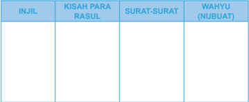

Tabel ini berisi informasi tentang tiga bagian utama dari Alkitab: Injil, Kisah Para Rasul, Surat-Surat, dan Wahyu (Nubuat). Topik utama tabel ini adalah bagaimana struktur dan isi dari Alkitab. Kolom pertama, "Injil", mencakup cerita tentang Yesus Kristus dan kehidupan-Nya. Kolom kedua, "Kisah Para Rasul", berisi kisah-kisah tentang para rasul yang mendapat perintah dari Tuhan dan mengungkapkan Nabi-Nabi kepada manusia. Kolom ketiga, "Surat-Surat", menunjukkan surat-surat yang ditulis oleh para Nabi dan Nabi-nabi lainnya. Kolom keempat, "Wahyu (Nubuat)", berisi nubuat-nubuat yang ditulis oleh Nabi Daniel dan Nabi Zakyah. Pola penting yang terlihat adalah bahwa setiap bagian memiliki tujuan dan konteks yang berbeda dalam menyampaikan pesan-pesan Tuhan kepada manusia.

### Bacalah beberapa kutipan berikut:

- Konstitusi  Dogmatik  tentang  Wahyu  Ilahi  menegaskan  bahwa:  Kitab Perjanjian Lama dan Perjanjian Baru ditulis di bawah bimbingan Roh Kudus;  Allah  adalah  pengarang  yang  benar  dan 'harus  diakui  bahwa Alkitab  mengajarkan  dengan  teguh  dan  setia  serta  tanpa  kekeliruan kebenaran, yang oleh Allah dikehendaki supaya dicantumkan dalam KitabKitab  Suci  demi  keselamatan  kita' (DV  art.  11).  Untuk  itu  ia  menjadi norma bagi iman dan ajaran Kristiani, serta sebagai sabda Allah yang merupakan sumber yang kaya bagi doa pribadi.

 

---
## 📄 Halaman 98

- Santo  Paulus  dalam  suratnya  kepada  Timotius  menegaskan, 'segala tulisan yang diilhamkan oleh Allah memang bermanfaat untuk mengajar, untuk menyatakan kesalahan, untuk memperbaiki kelakuan, dan mendidik orang dalam kebenaran' (2 Timotius 3:16-17).
- St.  Hironimus  mengatakan, 'Tidak  mengenal  Kitab  Suci  berarti  tidak mengenal  Kristus'. Kutipan  inilah  yang  akhirnya  juga  dikutip  kembali oleh Konsili Vatikan II dalam dokumen Dei verbum. Kutipan itu hendak menegaskan bahwa sarana utama untuk dapat mengenal Kristus adalah Kitab Suci.
- 'Konsili mendesak dengan sangat semua orang beriman supaya seringkali membaca  Kitab-Kitab  Ilahi  untuk  memperoleh  pengertian  yang  mulia akan Yesus Kristus' (DV art. 25).
- 'Tetapi  hendaklah  kamu  menjadi  pelaku  firman  dan  bukan  hanya pendengar  saja,  sebab  jika  tidak  demikian  kamu  menipu  diri  sendiri' (Yakobus 1:22)
Setelah kalian membaca uraian di atas, coba rumuskan: alasan pentingnya membaca Kitab Suci Perjanjian Baru.

### 3. Menghayati Nilai-Nilai Kitab Suci Perjanjian Baru Dalam Kehidupan

Agar kalian semakin menghayati Perjanjian Baru, pilihlah salah satu perikope berikut, kemudian renungkan dengan khidmat dan seksama, lalu rumuskan pesan yang terkandung dalam perikope tersebut

- 2 Yohanes 5:1-5
- 1 Korintus 4: 6-21
- Kisah Para Rasul 7: 54-60
- Yohanes 7: 37-44
- Lukas 17:11-19

### Tugas Kelompok

Dalam kelompok: buatlah  iklan  yang  berisi  ajakan  untuk  membaca dan mendalami kitab suci.

 

---
## 📄 Halaman 99

Bila  sudah  selesai,  cobalah  masuk  dalam  suasana  hening  untuk  berefleksi sambil mengikuti penuntun berikut:

Ada  empat  orang  imam  mendiskusikan  kualitas  berbagai  terjemahan Kitab Suci. Yang seorang menyukai gaya King James karena kesederhanaan dan kelancaran bahasanya. Yang lain menyukai gaya standar Amerika sebagai yang terbaik karena sangat dekat dengan bahasa asli Ibrani dan Yunani. Yang ketiga mengunggulkan terjemahan Mo ffatt sebagai yang terbaik karena menggunakan gaya bahasa kontemporer. Imam yang keempat hanya berdiam diri.

Ketika  dimintai  untuk  mengungkapkan  pendapat,  imam  yang  keempat tersebut menjawab: 'Saya menyukai terjemahan ibuku sebagai yang terbaik. 'Ketiga imam  lainnya  tertarik  dan  ingin  mengetahui  terjemahan  yang dimaksud.  Imam  yang  keempat  itu  menjawab,  'Baiklah!'  Kemudian,  imam itu  menerangkan,  'Ibuku  menerjemahkan  Kitab  Suci  ke  dalam  hidupnya sehari-hari. Itulah terjemahan Kitab Suci yang terbaik dan sungguh-sungguh meyakinkan seperti yang pernah saya saksikan'

Hening ................

Baca dan simak sekali lagi kata-kata ini:

'Ibuku menerjemahkan Kitab Suci ke dalam hidupnya sehari-hari. Itulah terjemahan Kitab Suci yang terbaik dan sungguh-sungguh meyakinkan seperti yang pernah saya saksikan'

Imam yang keempat dapat membaca dan merasakan bahwa hidup Ibunya memancarkan firman Allah sebagaimana nampak dalam Kitab Suci. Ibunya tampil sebagai Injil yang hidup, yang mampu dibaca dan dirasakan dampaknya.

Bagaimana dengan hidupmu selama ini ?

Apakah  kamu  setia  dalam  membaca  dan  merenungkan  firman  Allah dalam Kitab Suci? Apakah hidupmu juga memancarkan diri sebagai Injil yang hidup,  sehingga  siapapun  yang  kamu  jumpai  dapat  merasakan  Allah  yang menyapa penuh kasih?

Hening.........

### Tugas

Sekarang  buatlah  sebuah  doa  tertulis  sebagai  tanggapanmu  atas pembahasan pelajaran hari ini!

Tuliskan pula niat pribadi yang akan dilakukan sebagai bentuk aksi nyatamu dalam pelajaran ini!

 

---
## 📄 Halaman 100

Doa

- 2 Hanya dekat Allah saja aku tenang, dari pada-Nyalah keselamatanku.
- 3 Hanya  Dialah  gunung  batuku  dan  keselamatanku,  kota  bentengku,  aku tidak akan goyah.
- 4  Berapa lamakah kamu hendak menyerbu seseorang, hendak meremukkan dia,  hai  kamu  sekalian,  seperti  terhadap  dinding  yang  miring,  terhadap tembok yang hendak roboh?
- 5   Mereka hanya bermaksud menghempaskan dia dari kedudukannya yang tinggi;  mereka  suka  kepada  dusta;  dengan  mulutnya  mereka  memberkati, tetapi dalam hatinya mereka mengutuki.
- 6 Hanya  pada  Allah  saja  kiranya  aku  tenang,  sebab  dari  pada-Nyalah harapanku.
- 7 Hanya  Dialah  gunung  batuku  dan  keselamatanku,  kota  bentengku,  aku tidak akan goyah.
- 8 Pada Allah ada keselamatanku dan kemuliaanku; gunung batu kekuatanku, tempat perlindunganku ialah Allah.
- 9 Percayalah kepada-Nya setiap waktu, hai umat, curahkanlah isi hatimu di hadapan-Nya; Allah ialah tempat perlindungan kita.
- 10 Hanya angin saja orang-orang yang hina, suatu dusta saja orang-orang yang mulia. Pada neraca mereka naik ke atas, mereka sekalian lebih ringan dari pada angin.
- 11 Janganlah percaya kepada pemerasan, janganlah menaruh harap yang siasia kepada perampasan; apabila harta makin bertambah, janganlah hatimu melekat padanya.
- 12 Satu kali Allah berfirman, dua hal yang aku dengar: bahwa kuasa dari Allah asalnya,
- 13 dan dari pada-Mu juga kasih setia, ya Tuhan; sebab Engkau membalas setiap orang menurut perbuatannya.

 

---
## 📄 Halaman 101

### C. Tradisi

Masyarakat Indonesia memiliki kekayaan tradisi yang luar biasa. Hampir di setiap daerah di Nusantara, kita dapat menyaksikan berbagai macam tradisi yang secara turun-temurun masih tetap terpelihara dan tetap dilakukan. Tradisi-tradisi itu  tetap  hidup  sekalipun  modernisasi  sudah  pula  melanda  masyarakat  yang bersangkutan. Walaupun demikian, ada sebagian tradisi dalam masyarakat yang sudah punah, atau berubah wujudnya.

Gereja pun memiliki tradisi yang sangat kaya. Tradisi yang dimaksud bukan sekedar upacara, ajaran atau kebiasaan kuno. Tradisi yang hidup dalam Gereja lebih merupakan ungkapan pengalaman iman Gereja akan Yesus Kristus, yang diterima, diwartakan,  dirayakan,  dan  diwariskan  kepada  angkatan-angkatan  selanjutnya. Konsili Vatikan II memandang penting peran Tradisi 'Demikianlah Gereja dalam ajaran,  hidup,  serta  ibadatnya  melestarikan  serta  meneruskan  kepada  semua keturunan, dirinya seluruhnya, imannya seutuhnya' . Tradisi 'berkat bantuan Roh Kudus'  berkembang  dalam  Gereja,  'sebab  berkembanglah  pengertian  tentang kenyataan-kenyataan  maupun  kata-kata  yang  ditanamkan,'  dan  'Gereja  tiada hentinya berkembang menuju kepenuhan kebenaran Ilahi' (D8). Dalam arti ini tradisi mempunyai orientasi ke masa depan.

### Doa

- Allah, Bapa Mahabijaksana
- melalui para leluhur dan para Bapa Gereja
- Engkau telah mewariskan kepada kami berbagai tradisi
- yang mengungkapkan nilai-nilai luhur masyarakat kami
- dan yang memancarkan penghayatan iman kami kepada-Mu.
- Kami mohon,
- semoga melalui pelajaran hari ini,
- kami semakin terdorong menghayati tradisi-tradisi luhur itu
- serta mengembangkannya demi kesempurnaan iman kami
- Demi Kristus, Tuhan dan Pengantara kami
- Amin.

 

---
## 📄 Halaman 102

### 1. Berbagai Tradisi dalam Masyarakat dan Tradisi dalam Gereja Katolik

Setiap masyarakat memiliki tradisi yang diwariskan dari generasi sebelumnya. Berikut ini adalah salah satu contoh tradisi dari masyarakat Dayak Meratus.

Simak baik-baik uraian berikut !

### Upacara Syukuran Suku Dayak Meratus .

Suku Dayak Meratus merupakan kelompok masyarakat Dayak yang hidup dan menetap di desa Kiyu, Kecamatan Batang Alai Timur Kabupaten Hulu Sungai Tengah Provinsi Kalimantan Selatan. Setiap tahun, suku Dayak Meratus ini menyelenggarakan upacara syukuran adat yakni Aruh Ganal. Seperti tahun sebelumnya, tradisi ini dilaksanakan setiap pertengahan tahun setelah musim panen  raya  padi  tiba,  sekitar  bulan  Juli  hingga  Agustus.  Bagi  suku  Dayak Meratus,  ritual  ini  diyakini  dapat  menjauhkan  mereka  dari  bencana  gagal panen. Melalui ritual inilah, mereka juga memohon kepada Sang Pencipta agar di musim tanam berikutnya, tanaman mereka terhindar dari hama penyakit dan memperoleh hasil panen yang melimpah.

Bagi suku Dayak Meratus, pelaksanaan tradisi ini memiliki arti penting. Begitu kuatnya kepercayaan mereka terhadap arti tradisi ini, jauh hari sebelum tradisi  dilaksanakan,  segala  kebutuhan  tradisi  telah  disiapkan.  Di  dalam sebuah balai adat yang bentuknya seperti rumah panggung, mereka biasanya merencanakan  rangkaian  acara  tradisi.  Para  sesepuh  adat  mengawalinya dengan  menentukan  hari  pelaksanaan  tradisi.  Biasanya,  awal  bulan  di pertengahan tahun selalu menjadi pilihan waktu pelaksanaan tradisi. Mereka percaya, jika Aruh Ganal digelar pada awal bulan, jumlah hasil panen di tahun berikutnya akan semakin melimpah. Percaya atau tidak, itulah kepercayaan suku Dayak Meratus yang sejak dulu hingga kini masih dilaksanakan.

Tradisi  Aruh  Ganal  biasanya  dilaksanakan  selama  5  hingga  12  hari. Penentuan  itu  berdasarkan  pada  jumlah  hasil  panen  yang  mereka  peroleh selama satu tahun. Jika hasil panen di tahun ini melimpah, tradisi dilaksanakan hingga  12  hari.  Namun  jika  jumlah  panen  dinilai  tidak  terlalu  banyak  jika dibandingkan  hasil  tahun  sebelumnya,  Aruh  Ganal  hanya  dilaksanakan selama 5 hari berturut. Bahkan jika jumlah panen mereka hanya cukup untuk kebutuhan sehari-hari, tradisi ini dilaksanakan hanya dalam 1 hari 1 malam saja.

Setelah hari baik telah ditentukan, suku Dayak Meratus mulai mempersiapkan kebutuhan tradisi satu hari sebelum Aruh Ganal dilaksanakan. Kaum wanita bertugas mempersiapkan hidangan untuk para peserta ritual dan tamu undangan, seperti  memasak  lamang.  Lamang  merupakan  beras  ketan

 

---
## 📄 Halaman 103

yang telah dicampur santan kemudian dimasukkan ke dalam buluh bambu dan dibakar hingga matang. Sementara kaum lelaki, menghias Balai Adat dengan berbagai jenis bunga dan janur kelapa. Nantinya, di Balai Adat inilah, tradisi Aruh Ganal dilaksanakan. Tak terlewatkan, mereka juga mengundang suku Dayak dari kampung lain dan para pejabat pemerintah setempat untuk hadir dalam upacara adat Aruh Ganal.

Ketika hari tradisi Aruh Ganal tiba, semua warga Dayak Meratus beserta tamu  undangan  berkumpul  di  Balai  Adat  di  desa  Kiyu.  Saat  pelaksanaan tradisi, tidak ada satupun warga Dayak Meratus yang umumnya petani bekerja di ladang. Secara khusus, mereka membuat hari itu sebagai hari libur untuk bekerja. Jika tradisi ini dilaksanakan selama beberapa hari, dalam beberapa hari itu pula, suku Dayak Maratus menjadikannya sebagai hari libur.

Biasanya,  rangkaian  tradisi  Aruh  Ganal  dimulai  ketika  hari  menjelang malam. Dalam tradisi  ini,  yang  menjadi  pemimpin  yakni  Damang,  sebutan bagi ketua adat kampung Dayak Meratus. Ketika Damang membaca mantera dan  membakar  kemenyan,  tradisi  Aruh  Ganal-pun  dimulai.  Dalam  bahasa Dayak,  para  peserta  tradisi  membaca  doa  kepada  Sang  Pencipta.  Tepat  di tengah Balai Adat terdapat sesaji yang khusus dijadikan persembahan kepada leluhur desa.

Gambar 3.9 Wanita Dayak menabuh gendang

Setelah berdoa, Damang mulai melakukan ritual pemanggilan roh para leluhur.  Suara  tabuhan  gendang  yang dimainkan  oleh  empat  orang  wanita Dayak menjadi media pemanggilan roh. Ketika beberapa orang warga Dayak Meratus tampak tidak sadarkan diri,  saat  itulah  roh  leluhur  diyakini masuk ke dalam tubuh mereka. Tanpa ada  yang  memerintah,  mereka  berdiri dan  menari  mengelilingi sesaji yang diletakkan di tengah Balai Adat. Seperti memperoleh kekuatan supranatural, mereka menari tanpa henti hingga hari menjelang  pagi.  Sementara  mereka  menari,  Damang  beserta  peserta  tradisi yang lainnya membaca doa tanpa henti hingga malam berganti pagi.

Setelah  matahari  terbit,  Damang  kembali  membakar  kemenyan  dan membaca mantera. Dengan bantuan Damang itulah, beberapa peserta tradisi yang  malam  sebelumnya  kerasukan  roh  leluhur,  kembali  sadar.  Ketika  itu, warga Dayak percaya, roh leluhur telah hadir dan ikut dalam pesta Aruh Ganal. Acara  tradisi  kemudian  dilanjutkan  dengan  makan  bersama.  Menu  utama dalam tradisi ini yakni Lamang atau nasi ketan berbungkus buluh bambu yang

 

---
## 📄 Halaman 104

telah disiapkan sebelumnya. Tanpa ada perbedaan status sosial, setiap peserta tradisi memperoleh lamang dalam jumlah yang sama.

Tanpa membedakan berapa hari tradisi Aruh Ganal dilaksanakan,  berdoa,  menari,  serta  makan bersama menjadi rangkaian acara yang rutin dilaksanakan mulai dari  hari  pertama  tradisi  hingga tradisi ini usai. Jika tradisi ini dilaksanakan  selama  5  hari,  suku Dayak Meratus merayakannya selama 5 hari 5 malam tanpa henti. Begitu juga ketika tradisi  Aruh

Ganal ini berlangsung selama 12 hari. Ketika hari tradisi telah mencapai hari terakhir, ritual Aruh Ganal diakhiri dengan acara pemberian sedekah.

Ketika  hari  tradisi  Aruh  Ganal  usai,  suku  Dayak  Meratus  memberikan beberapa  bagian  dari  hasil  panen  yang  telah  mereka  peroleh  kepada  warga dari  kampung lain.  Tidak  ada  ketentuan  khusus,  berapa  bagian  yang  harus diberikan, tergantung pada keikhlasan dari warga Meratus sendiri. Bagi suku Dayak Meratus, tradisi ini bukan hanya sebagai perayaan syukur, melainkan juga  simbol  mempererat  persaudaraan  dan  saling  berbagi  kepada  sesama. Keesokan  hari,  setelah  pelaksanaan  tradisi  Aruh  Ganal  usai,  warga  Dayak Meratus kembali melaksanakan aktivitas keseharian mereka seperti biasa yakni berladang dan berburu di hutan.

Sumber: http://anakmeratus.blogspot.com/2011/04/upacara-syukuran-suku-dayak-meratus. html

Gereja juga mempunyai kekayaan tradisi yang cukup banyak, salah satunya adalah tradisi Ibadat Jalan salib.

Simak baik-baik uraian berikut!

### Ibadat Jalan Salib

### Awal Sejarah

Sekitar  abad  4  St.Helena  (ibu  Raja  Konstantin),  melakukan  ziarahnya yang  sekarang  ini  dikenal  dengan  nama Via  Dolorosa untuk  melihat  dari dekat tempat Yesus lahir sampai dimakamkan. Ziarah ini menjadi terkenal dan sangat mudah mencapai tempat-tempat itu terutama setelah tahun 1199 dimana pasukan Perang Salib (crusader) menguasai Yerusalem. Namun sejak tahun 1291, untuk menuju tempat ini menjadi begitu sulit dan mahal karena sudah  tidak  dikuasai  lagi  oleh  para crusader .  Maka  lahirlah  tradisi  Ibadat

 

---
## 📄 Halaman 105

Jalan Salib yang bertujuan menghadirkan Tanah Suci bagi mereka yang tidak dapat berziarah ke sana, juga bagi mereka yang pernah berziarah ke sana, untuk tetap mengenangnya.

Tahun 1342 Ordo Fransiskan diangkat sebagai ordo yang secara resmi wajib  melindungi  semua  tempat  suci  di  beberapa  tempat  di  Yerusalem. Sejak  saat  itulah  biarawan-biarawan  Fransiskan  ini  mulai  memopulerkan devosi  Jalan  Salib,  terlebih  sejak  St.  Fransiskus  Asisi  mengalami  stigmata. Tradisi ini didukung pula dengan adanya penampakan Bunda Maria di sana, dan  juga  pengajaran  dari  St.  Jerome.  Sejak  inilah  dikenal  beberapa  versi Jalan  Salib,  seperti  yang  ditetapkan  oleh  Alvarest  Yang  Terberkati  (1420), Eustochia, Emmerich (1465) dan Ketzel, hingga akhirnya banyak Paus yang menganjurkan Doa Jalan Salib yaitu Paus Innocent XI (1686), Innocent XII (1694), Benedict XIII (1726), Clementius XII (1731), Benediktus XIV (1742), karena ini merupakan cara doa yang paling mudah untuk menghayati kisah sengsara Yesus dan pengorbanan-Nya di kayu salib.

### Perkembangan Tradisi

Awalnya  umat  membuat  perhentian-perhentian  kecil  dalam  gereja, bahkan  kadang  dibangun  perhentian-perhentian  yang  besarnya  seukuran manusia  di  luar  gereja.  Para  biarawan  Fransiskan  juga  menuliskan  lirik Stabat Mater, yang biasanya dinyanyikan saat Ibadat Jalan Salib, baik dalam bahasa aslinya, yaitu bahasa Latin, maupun dalam bahasa setempat, hingga ditetapkanlah 14 Stasi (perhentian) Jalan Salib oleh Paus Clement XII tahun 1731.

http://belajarliturgi.blogspot.com/2012/03/sejarah-ibadat-jalan-salib.html

### Tugas Kelompok

Setelah kalian menyimak dua tradisi tersebut di atas, coba diskusikan dalam kelompok: nilai-nilai apa yang hendak diungkapkan dalam masingmasing tradisi tersebut, sejauh mana nilai-nilai tersebut masih relevan bagi kehidupan manusia saat ini? Mengapa tradisi-tradisi tersebut masih hidup? Mengapa ada pula tradisi yang mati dan tidak digunakan lagi?

Inventarisasi berbagai macam tradisi yang masih hidup yang ada di daerahmu. Inventarisasi juga berbagai macam tradisi dalam gereja Katolik pada umumnya, maupun  tradisi  Gereja  Katolik  di  daerahmu.  Jelaskan  nilai-nilai  yang  hendak diungkapkan dalam tradisi-tradisi tersebut!

 

---
## 📄 Halaman 106

### 2. Pengertian, Wujud, Kedudukan dan Fungsi Tradisi Dalam Gereja Katolik

Untuk memahami pengertian, wujud, kedudukan dan fungsi Tradisi dalam Gereja Katolik, kalian bisa mencarinya dari berbagai sumber. Berikut kutipan dari Dokumen Konsili Vatikan II, dalam Konstitusi tentang Wahyu Ilahi:

Baca dan renungkan kutipan berikut !

### 7. (Para Rasul dan pengganti mereka sebagai pewarta Injil)

Dalam kebaikan-Nya Allah telah menetapkan, bahwa apa yang diwahyukan-Nya  demi  keselamatan  semua  bangsa,  harus  tetap  utuh  untuk selamanya dan diteruskan kepada segala keturunannya. Maka Kristus Tuhan, yang menjadi kepenuhan seluruh wahyu Allah Yang Mahatinggi (lihat 2 Korintus 1:30; 3:16-4:6), memerintahkan kepada para Rasul, supaya Injil, yang dahulu telah dijanjikan melalui para Nabi dan dipenuhi oleh-Nya serta dimaklumkanNya dengan mulut-Nya sendiri, mereka wartakan pada semua orang, sebagai sumber segala kebenaran yang menyelamatkan serta sumber ajaran kesusilaan, dan dengan demikian dibagikan kurnia-kurnia ilahi kepada mereka. Perintah itu dilaksanakan dengan setia oleh para Rasul, yang dalam pewartaan lisan, dengan teladan serta penetapan-penetapan meneruskan entah apa yang telah mereka terima dari mulut, pergaulan dan karya Kristus sendiri, entah apa yang atas dorongan Roh Kudus telah mereka pelajari. Perintah Tuhan dijalankan pula oleh para Rasul dan tokoh-tokoh rasuli, yang atas ilham Roh Kudus itu juga telah membukukan amanat keselamatan.

Adapun supaya Injil senantiasa terpelihara secara utuh dan hidup dalam Gereja, para Rasul meninggalkan Uskup-uskup sebagai pengganti mereka, yang 'mereka serahi kedudukan mereka untuk mengajar'. Maka dari itu Tradisi suci dan Kitab Suci perjanjian Lama maupun Baru bagaikan cermin bagi Gereja yang mengembara di dunia, untuk memandang Allah yang menganugerahinya segala sesuatu, hingga tiba saatnya Gereja dihantar untuk menghadap Allah tatap muka, sebagaimana ada-Nya (lihat 1Yohanes 3:2).

### 8. (Tradisi Suci)

Oleh karena itu pewartaan para Rasul, yang secara istimewa diungkapkan dalam kitab-kitab yang diilhami, harus dilestarikan sampai kepenuhan zaman melalui  penggantian-penggantian  yang  tiada  putusnya.  Maka  para  Rasul, seraya meneruskan apa yang telah mereka terima sendiri, mengingatkan kaum beriman, supaya mereka berpegang teguh pada ajaran-ajaran warisan, yang telah mereka terima entah secara lisan entah secara tertulis (lihat 2 Tesalonika 2:15),  dan  supaya  mereka  berjuang  untuk  membela  iman  yang  sekali  untuk selamanya diteruskan kepada mereka (lihat Yudas 3). Adapun apa yang telah

 

---
## 📄 Halaman 107

diteruskan oleh para Rasul mencakup segala sesuatu, yang membantu Umat Allah untuk menjalani hidup yang suci dan untuk berkembang dalam imannya. Demikianlah Gereja dalam ajaran, hidup, serta ibadatnya melestarikan serta meneruskan kepada semua keturunan dirinya seluruhnya, imannya seutuhnya.

Tradisi  yang  berasal  dari  para  rasul  itu  berkat  bantuan  Roh  Kudus berkembang dalam Gereja: sebab berkembanglah pengertian tentang kenyataan-kenyataan maupun  kata-kata yang diturunkan, baik karena kaum beriman, yang menyimpannya dalam hati (lihat  Lukas  2:19  dan  51), merenungkan  serta  mempelajarinya,  maupun  karena  mereka  menyelami secara  mendalam  pengalaman-pengalaman  rohani  mereka,  maupun  juga berkat  pewartaan  mereka,  yang  sebagai  pengganti  dalam  martabat  Uskup menerima kurnia kebenaran yang pasti. Sebab dalam perkembangan sejarah Gereja tiada hentinya menuju kepenuhan kebenaran ilahi, sampai terpenuhilah padanya sabda Allah. Ungkapan-ungkapan para Bapa Suci memberi kesaksian akan  kehadiran  Tradisi  itu  pun  Gereja  mengenal  kanon  Kitab-kitab  Suci selengkapnya, dan dalam Tradisi itu Kitab suci sendiri dimengerti secara lebih mendalam dan tiada hentinya dihadirkan secara aktif.

Demikianlah Allah, yang dulu telah bersabda, tiada hentinya berwawancara dengan Mempelai Putera-Nya yang terkasih. Dan Roh Kudus, yang menyebabkan suara Injil yang hidup bergema dalam Gereja, dan melalui gereja dalam dunia, mengantarkan Umat beriman menuju segala kebenaran, dan menyebabkan sabda Kristus menetap dalam diri mereka secara melimpah (lihat Kolose 3:16).

### 9. (Hubungan antara Tradisi dan Kitab Suci)

Jadi  Tradisi  Suci  dan  Kitab  Suci  berhubungan  erat  sekali  dan  berpadu. Sebab  keduanya  mengalir  dari  sumber  ilahi  yang  sama,  dan  dengan  cara tertentu  bergabung  menjadi  satu  dan  menjurus  ke  arah  tujuan  yang  sama. Sebab Kitab suci itu  pembicaraan Allah sejauh itu termaktub dengan ilham Roh ilahi. Sedangkan oleh Tradisi Suci sabda Allah, yang oleh Kristus Tuhan dan Roh Kudus dipercayakan kepada para Rasul, disalurkan seutuhnya kepada para pengganti mereka, supaya mereka ini dalam terang Roh kebenaran dengan pewartaan  mereka  memelihara,  menjelaskan,  dan  menyebarkannya  dengan setia. Dengan demikian Gereja menimba kepastian tentang segala sesuatu yang diwahyukan bukan hanya melalui Kitab Suci. Maka dari itu keduanya (baik Tradisi  maupun Kitab Suci) harus diterima dan dihormati dengan cita-rasa kesalehan dan hormat yang sama.

 

---
## 📄 Halaman 108

### 21. (Gereja menghormati Kitab-Kitab Suci)

Kitab-kitab ilahi seperti juga Tubuh Tuhan sendiri selalu dihormati oleh Gereja, yang - terutama dalam Liturgi Suci - tiada hentinya menyambut roti kehidupan dari meja sabda Allah maupun Tubuh Kristus, dan menyajikannya kepada  Umat  beriman.  Kitab-kitab  itu  bersama  dengan  Tradisi  Suci  selalu dipandang  dan  tetap  dipandang  sebagai  norma  imannya  yang  tinggi.  Sebab kitab-kitab itu diilhami oleh Allah, dan sekali untuk selamanya telah dituliskan, serta tanpa perubahan manapun menyampaikan sabda Allah sendiri, lagi pula mendengarkan suara Roh Kudus dalam sabda para Nabi dan para Rasul. Jadi semua  pewartaan  dalam  Gereja  seperti  juga  agama  kristiani  sendiri  harus dipupuk dan diatur oleh Kitab Suci. Sebab dalam Kitab-Kitab Suci Bapa yang ada di Surga penuh cinta kasih menjumpai para putera-Nya dan berwawancara dengan mereka. Adapun demikian besarlah daya dan kekuatan sabda Allah, sehingga bagi Gereja merupakan tumpuan serta kekuatan, dan bagi puteraputeri Gereja menjadi kekuatan iman, santapan jiwa, sumber jernih dan kekal hidup rohani. Oleh karena itu bagi Kitab Suci berlakulah secara istimewa katakata:  'Memang  sabda  Allah  penuh  kehidupan  dan  kekuatan'  (Ibrani  4:12), 'yang  berkuasa  membangun  dan  mengaruniakan  warisan  diantara  semua para kudus' (Kisah Para Rasul 20:32; lihat 1Tesalonika 2:13)

### Tugas

Bertolak dari uraian di atas, rumuskan gagasan-gagasan penting apa yang kalian peroleh dari dokumen tersebut di atas? Rumuskan pula: apa arti tradisi? Apa bedanya tradisi dalam masyarakat pada umumnya dengan tradisi  yang  ada  dalam  Gereja?  Apa  peran/fungsi  tradisi  dalam  Gereja berkaitan dengan iman kita?

### 3. Menghayati Tradisi Gereja

- Banyak orang setelah melihat pagelaran suatu tradisi tidak merasa mendapatkan apa-apa bahkan sekalipun ia ikut terlibat di dalamnya, ia seolah pulang dengan kosong, kecuali rasa lelah. Tradisi seolah-olah tidak bermakna bagi  hidupnya.  Tentu  hal  tersebut  sangat  disayangkan.  Oleh  karena  itu, supaya kalian tidak jatuh pada pengalaman yang sama, rumuskan bersama teman-temanmu: sikap dan tindakan apa yang perlu dikembangkan agar kita semakin menghayati Tradisi yang ada!

 

---
## 📄 Halaman 109

- Salah  satu  bentuk  tradisi  adalah  sakramen;  yang  salah  satunya  adalah Sakramen Ekaristi. Dalam suasana hening, coba refleksikan kembali makna Sakramen  Ekaristi  bagi  kehidupan  imanmu,  sejauhmana  dirimu  selama ini sungguh-sungguh  merayakan  sakramen  tersebut? Apa yang perlu ditingkatkan  dalam  dirimu  agar  Tradisi  Suci  tersebut  makin  bermanfaat dalam memperkembangkan imanmu

### Doa

### Mazmur 11: 1-7

1  Pada TUHAN aku berlindung, bagaimana kamu berani berkata kepadaku: 'Terbanglah ke gunung seperti burung!'

2 Sebab, lihat orang fasik melentur busurnya, mereka memasang anak panahnya pada tali busur,

- untuk memanah orang yang tulus hati di tempat gelap.
3 Apabila dasar-dasar dihancurkan,

- apakah yang dapat dibuat oleh orang benar itu?
4  TUHAN ada di dalam bait-Nya yang kudus;

TUHAN, takhta-Nya di Surga;

mata-Nya mengamat-amati,

- sorot mata-Nya menguji anak-anak manusia.
5 TUHAN menguji orang benar dan orang fasik,

- dan Ia membenci orang yang mencintai kekerasan.
- 6 Ia menghujani orang-orang fasik dengan arang berapi dan belerang; angin yang menghanguskan, itulah isi piala mereka.
7 Sebab TUHAN adalah adil dan Ia mengasihi keadilan;

- orang yang tulus akan memandang wajah-Nya.

 

---
## 📄 Halaman 110

### Bab IV Yesus Mewartakan dan Memperjuangkan Kerajaan Allah

Kitab  Suci  dan  Tradisi  dapat  dipahami  sebagai  pintu  masuk  untuk  lebih mengenal  dan  memahami  Yesus  Kristus.  Ia  adalah  sumber  utama  imani  akan Yesus Kristus. Pada Bab ini kita akan lebih mendalami Yesus Kristus yang kita imani itu. Yesus yang kita imani ialah Yesus Kristus sebagai utusan Bapa untuk mewartakan Kerajaan Allah dan mewujudkannya.

Misi Yesus mewartakan Kerajaan Allah rupanya bukan tugas yang mudah. Sebelum Yesus tampil di muka umum, sudah banyak paham Kerajaan Allah yang hidup dan berkembang dalam masyarakatnya. Paham-paham Kerajaan Allah yang berkembang saat itu tidak bisa dilepaskan dari situasi dan kondisi yang dialami bangsa Yahudi, yang langsung maupun tidak langsung . berpengaruh pula pada sikap dan perilaku masing-masing kelompok dalam kehidupan sehari-hari, baik dalam relasi mereka dengan sesama, maupun dengan Tuhan.

Di tengah berbagai paham Kerajaan Allah itu, Yesus mewartakan Kerajaan Allah sesuai dengan yang dihayati-Nya sendiri. Dalam mewartakan Kerajaan Allah tersebut,  Yesus  berusaha  agar  pewartaan-Nya  dapat  dipahami  dengan  mudah. Itulah  sebabnya  kerap  kali  Ia  menggunakan  perumpamaan.  Tetapi  Yesus  tidak hanya  mengajarkan  dan  menjelaskan  Kerajaan  Allah,  melainkan  menunjukkan tanda-tanda kehadirannya melalui tindakanNya.

Untuk lebih memahami perjuangan Yesus dalam mewartakan Kerajaan Allah, dua pokok bahasan berikut akan digumuli bersama:

- Gambaran tentang Kerajaan Allah pada zaman Yesus
- Yesus mewartakan dan memperjuangkan Kerajaan Allah.

 

---
## 📄 Halaman 111

### A. Gambaran Tentang Kerajaan Allah Pada Zaman Yesus

Setiap kelompok masyarakat tentu mempunyai impian tentang masa depan yang ideal, yang ingin diwujudkan. Gambaran tentang impian masa depan tersebut biasanya sangat diwarnai oleh latar belakang situasi yang dialami oleh masyarakat tersebut. Impian masa depan otomatis terkait juga dengan figur pemimpin yang diharapkan. Pada saat Yesus memulai misi mewartakan Kerajaan Allah, bangsa Yahudi  hidup  di  bawah  penjajahan  bangsa  Romawi.  Selain  ditindas  oleh  para penjajah, mereka juga ditindas oleh bangsa sendiri, terutama oleh raja-raja boneka yang  diangkat  oleh  para  penjajah.  Situasi  tersebut  menyebabkan  kemiskinan semakin  meluas,  korupsi  dan  kriminalitas  semakin  banyak,  dan  munculnya kelompok-kelompok  masyarakat  yang  memanfaatkan  situasi  tersebut  demi kepentingan kelompoknya. Dalam situasi tertindas seperti itu, muncullah tokohtokoh  yang  menawarkan  diri  sebagai  seorang  pemimpin  dengan  mengusung paham masing-masing tentang impian masyarakat yang ideal. Perbedaan paham ini menyebabkan impian mereka tentang kondisi masyarakat yang ideal terpecahpecah, sehingga dengan mudah dapat dipatahkan oleh penjajah.

### Doa

Allah Bapa Mahakasih,

Seringkali kami merasa prihatin atas kondisi masyarakat kami

Yang masih diwarnai perseteruan, kesewenangan dan keserakahan.

Tanamkanlah dalam diri kami dan para pemimpin kami

Kerinduan bersama akan masyarakat yang lebih beradab

Yang dilandasi nilai-nilai Kerajaan Allah

- Sebagaimana telah diperjuangkan oleh Yesus, Putera-Mu
Dialah Juru Selamat kami sepanjang masa.

Amin

 

---
## 📄 Halaman 112

### 1. Berbagai Gambaran Harapan Masyarakat Tentang Masa Depan

'Istilah  'blusukan'  saat  ini  menjadi  sangat  populer,  terutama  pada  masamasa kampanye para calon wakil rakyat. Selama masa kampanye, para calon wakil rakyat itu berusaha mendatangi kelompok masyarakat, bahkan di tempat-tempat yang terpencil sekalipun, untuk berdialog dengan mereka. Dalam dialog tersebut, langsung maupun tidak langsung, biasanya terungkaplah gambaran , harapan atau impian mereka (baik kelompok maupun perorangan) tentang masa depan mereka.

- Perankan  dirimu  sebagai  :  kelompok  pedagang  kaki  lima,  atau  buruh pelabuhan, atau petani, atau pengusaha, atau nelayan, atau guru, atau pelajar!
- Kalau  kalian  menjadi  mereka,  harapan  apa  yang  ingin  kalian  sampaikan kepada calon wakil rakyat yang datang ke tempatmu?
- Kalau kalian menjadi calon wakil rakyat, tanggapan atau jawaban apa yang akan kalian sampaikan kepada mereka?
- Coba  perhatikan  dengan  baik  harapan/tuntutan  masing-masing  kelompok masyarakat tersebut, lalu amati: adakah tuntutan mereka yang sama? adakah tuntutan  masing-masing  kelompok  itu  berisi  harapan  yang  menyangkut harapan orang lain yang di luar kelompok mereka?
- Sekarang simpulkan: adakah keterkaitan antara isi tuntutan yang disampaikan masing-masing kelompok dengan latar belakang mereka? Seandainya kalian yang  menjadi  wakil  rakyat:  tuntutan  siapa  yang  akan  lebih  diutamakan: apakah tuntutan kelompok atau kebutuhan rakyat banyak?

### 2. Pewartaan Yesus Tentang Kerajaan Allah Dalam Konteks Masyarakat Yahudi pada Zaman-Nya

Untuk memahami paham Kerajaan Allah yang diwartakan dan diperjuangkan oleh  Yesus,  kalian  perlu  memahami  situasi  zaman  Yesus  yang  meliputi  latar belakang geografis, politik, ekonomi, sosial, dan religiusnya. Hal itu perlu karena warta Kerajaan Allah yang diperjuangkan oleh Yesus tidak dapat lepas dari situasisituasi yang terjadi dan melingkupi kehidupan bangsa Yahudi saat itu .

### Bacalah baik-baik uraian berikut!

Sambil  membaca,  berilah Tanda  Tanya  (?) =  untuk  kata,  kalimat,  atau paragraf yang tidak/ belum dimengerti, dan Tanda Seru (!) = untuk kata, kalimat, atau paragraf yang dianggap kunci dan penting

 

---
## 📄 Halaman 113

### Situasi bangsa Yahudi pada Zaman Yesus:

### Keadaan Geogra fis

Pada  abad  pertama  masehi  'tanah  Israel'  secara  resmi  disebut  Yudea. Akan tetapi sesudah perang Yahudi tahun 135 disebut 'Siria-Palestina' , lalu menjadi 'Palestina' . Palestina pada zaman Yesus meliputi beberapa wilayah, yaitu Yudea, Samaria, dan Galilea. Wilayah Yudea terletak di Palestina Selatan dan merupakan daerah pegunungan yang terletak di sekitar Yerusalem dan Bait Allah. Lahan daerah ini gersang dan kering. Di sini dibudidayakan buah zaitun dan lain-lain, sedangkan peternakan kambing dan domba merupakan kegiatan yang tersebar luas.

---
**🖼️ Gambar/Diagram**

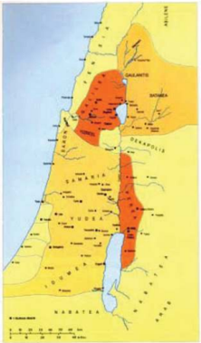

> **Deskripsi Visual:** Gambar ini adalah ilustrasi yang menunjukkan wilayah geografis Israel pada masa pemerintahan Romawi. Gambar ini memperlihatkan wilayah-wilayah yang dikuasai oleh Romawi di Israel, termasuk wilayah Yerusalem, Galilea, dan Judea. Wilayah-wilayah tersebut ditandai dengan warna berbeda untuk menunjukkan kekuasaan Romawi. Elemen-elemen utama dalam gambar ini meliputi:

1. Wilayah-wilayah yang dikuasai oleh Romawi, yang ditandai dengan warna berbeda.
2. Kota-kota penting seperti Yerusalem, Tiberias, dan Nazareth.
3. Laut Tengah dan Samara yang membentuk batas timur dan barat wilayah tersebut.
4. Label-label yang memberikan informasi tentang wilayah-wilayah tersebut.

Informasi kunci yang dapat diambil pembaca meliputi:

- Wilayah-wilayah yang dikuasai oleh Romawi di Israel pada masa pemerintahan Romawi.
- Kota-kota penting di wilayah tersebut.
- Batas-batas geografis wilayah tersebut.

Dengan demikian, gambar ini memberikan gambaran umum tentang wilayah geografis Israel pada masa pemerintahan Romawi dan bagaimana wilayah-wilayah tersebut dikelola oleh Romawi.

 

---
## 📄 Halaman 114

Wilayah Samaria terletak di Palestina bagian tengah. Daerah itu dihuni oleh orang-orang Samaria, yang menurut keyakinan orang Yahudi dianggap bukan Yahudi asli, melainkan sudah keturunan campuran antara orang Yahudi dan bangsa kafir. Orang-orang Samaria tidak diperbolehkan merayakan ibadat di Bait Allah di Yerusalem. Itulah sebabnya mereka mempunyai tempat ibadat dan upacara sendiri.

Wilayah  yang  ketiga  adalah  Galilea  yang  terletak  di  Palestina  bagian Utara. Di Galilea inilah terdapat desa Nazaret, tempat tinggal Yesus. Daerah ini merupakan bentangan lahan yang subur dan merupakan tanah yang luas untuk tanam-an gandum dan jagung atau peternakan besar. Di daerah ini terdapat rute perdagangan dari Damsyik menuju ke Laut, dan dari Damsyik menuju ke Yerusalem. Pedagang-pedagang asing berpeng-aruh besar di daerah ini. Di daerah ini terdapat danau Galilea (Tiberias) yang merupakan salah satu sumber hidup bagi masyarakat.

### Keadaan Ekonomi

Penduduk Palestina pada zaman Yesus berjumlah kurang lebih 500.000 jiwa dan penduduk kota Yerusalem 300.000 jiwa. Dari jumlah penduduk itu terdapat 18.000 orang Imam dan Lewi, 6.000 orang Farisi, dan 4.000 orang Eseni.  Dengan  keluarga  mereka,  kelompok-kelompok  tersebut  mencakup 20% dari seluruh penduduk.

Penduduk desa umumnya memiliki lahan-lahan kecil pertanian. Sebagian besar tanah dikuasai oleh para tuan tanah yang tinggal di kota. Lahan-lahan itu digunakan untuk menanam gandum, jagung, dan peternakan yang besar. Rakyat kebanyakan menjadi penggarap atau gembala. Selain para petani dan gembala,  masih  terdapat  perajin-perajin  kecil  yang  umumnya  melakukam perdagangan dengan sistem barter.

Di kota-kota terdapat tiga sektor ekonomi: pertama, para perajin tekstil, makanan,  wangi-wangian,  dan  perhiasan;  kedua,  mereka  yang  bekerja  di bidang konstruksi; ketiga, para pedagang (baik besar maupun kecil).

Sebagian  besar  penduduk  Palestina  adalah  rakyat  kecil  yang  keadaan ekonominya  cukup  memprihatinkan,  karena  penghasilan  mereka  terlalu kecil. Situasi seperti itu masih diperparah Iagi dengan beban berbagai pajak dan  pungutan  untuk  pemerintah,  untuk  angkatan  perang  Romawi,  untuk para Aristokrat setempat, dan untuk Bait Allah. Konon pajak dan pungutan itu mencapai 40% dari penghasilan rakyat.

### Keadaan Politik

Enam abad sebelum Yesus, Palestina selalu berada di bawah penjajahan Kerajaan  Persia  (538  -  332  SM),  Yunani  (332  -  62/50  SM)  dan  kekaisaran

 

---
## 📄 Halaman 115

Romawi  (62/50  SM  sampai  zaman  kekristenan  sesudah  Masehi).  Secara internal  masyarakat  Palestina  dikuasai  oleh  raja-raja  dan  pejabat-pejabat 'boneka'  yang  ditunjuk  oleh  penguasa  Roma.  Di  samping  pejabat-pejabat 'boneka' ini masih ada tuan-tuan tanah yang kaya raya dan kaum rohaniwan kelas  tinggi  yang  suka  menindas  rakyat  demi  kepentingan  dan  kedudukan mereka. Golongan-golongan  ini senantiasa memihak  penjajah, supaya mereka  tidak  kehilangan  hak  istimewa  dan  nama  baik  di  mata  penjajah, karena  penguasa  Roma  memiliki  kekuasaan  untuk  mencabut  hak  milik seseorang. Struktur kekuasaan dapat digambarkan secara piramidal dengan puncak kekuasaan politik adalah prokurator Yudea (ia harus orang Romawi) dan  berwenang menunjuk Imam Agung yang dipilih dari empat kalangan keluarga yang mempunyai pengaruh di dalam masyarakat waktu itu. Di Yudea, Imam Agung berperan secara politis sebagai raja selain sebagai pemimpin agama. Di Galilea, kekuasaan dipegang oleh raja Herodes Antipas, yang juga 'boneka' Roma.

Selain  itu  ada  pejabat-pejabat  yang  menjadi  perantara  yang  ditunjuk langsung oleh penguasa Romawi dan pada umumnva diambil dari kalangan sesepuh  Sanhedrin  (Majelis/Mahkamah  Agama) serta  majelis  rendah  yang diambil dari kelas bawah.

### Keadaan Sosial Budaya

Masyarakat  Palestina  terbagi  dalam  kelas-kelas.  Di  daerah  pedesaan terdapat tiga kelas, yaitu: tuan tanah, pemilik tanah kecil, dan perajin, kaum buruh, dan budak. Di daerah perkotaan terdapat tiga lapisan juga: lapisan yang tertinggi yaitu kaum Aristokrat yang terdiri atas para imam, pedagangpedagang besar, dan pejabat-pejabat tinggi; lapisan menengah bawah yang terdiri atas para perajin, pejabat-pejabat rendah, awam atau imam, dan kaum Lewi; dan lapisan yang paling bawah, terdapat kaum buruh.

Selain itu masih terdapat kaum proletar marjinal yang tidak terintegrasi dalam kegiatan ekonomi, yang terdiri atas orang-orang yang dikucilkan oleh masyarakat karena suatu sebab yang bukan ekonomis. Mereka itu misalnva: para pendosa publik seperti pelacur dan pemungut cukai, penderita kusta yang menurut keyakinan orang Yahudi disebabkan oleh dosa si penderita atau dosa orang tuanya. Menurut pandangan orang Yahudi, dosa juga dapat berjangkit seperti kuman penyakit. Oleh sebab itu, orang 'baik-baik' sebaiknya tidak bergaul dengan orang-orang berdosa, supaya tidak tertulari dosanya.

Selain  kelas-kelas  sosial  di  atas,  pada  masyarakat  Palestina  terdapat pula  berbagai  diskriminasi,  antara  lain:  diskriminasi  rasial,  diskriminasi seksual  (perendahan  martabat  perempuan),  diskriminasi  dalam  pekerjaan, diskriminasi  terhadap  anak-anak,  dan  diskriminasi  terhadap  orang  yang menderita.

 

---
## 📄 Halaman 116

Dengan demikian dapat dikatakan bahwa kebanyakan rakyat Palestina pada zaman Yesus sangat tertindas baik secara politis, sosial, ekonomi, maupun religius keagamaannya. Oleh karena itu kita perlu menyadari, mengapa orang Yahudi kebanyakan sangat mendambakan kedatangan sang Pembebas, yang mereka beri gelar Mesias.

### Dari Segi Religius Keagamaan

Hukum  Taurat  sangat  mewarnai  hidup  religius  orang-orang  Yahudi. Kaum Farisi dan para imam misalnya, berusaha menjaga warisan dan jati diri Yahudi. Mereka menyoroti ketaatan pada setiap pasal hukum. Bagi mereka, menjadi umat Allah berarti ketaatan yang ketat pada setiap detail hukum. Mereka berusaha menerapkan hukum pada setiap keadaan hidupnya.

---
**🖼️ Gambar/Diagram**

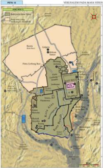

> **Deskripsi Visual:** Gambar ini adalah diagram yang menunjukkan wilayah atau area tertentu dengan berbagai elemen dan informasi penting. Berikut adalah deskripsi lengkapnya:

1. **Apa yang Ditampilkan Secara Keseluruhan**: Gambar ini menunjukkan sebuah wilayah geografis yang terdiri dari beberapa bagian yang berbeda, masing-masing dengan nama dan lokasi yang spesifik. Wilayah tersebut tampaknya merupakan bagian dari suatu negara atau daerah tertentu.

2. **Elemen-Elemen Utama dan Relasinya**: 
   - **Wilayah Utama**: Wilayah utama terletak di bagian tengah dan timur, dengan beberapa bagian yang lebih kecil yang terpisah.
   - **Nama Lokasi**: Ada beberapa nama lokasi yang ditandai pada gambar, seperti "Pulo Cakung", "Pulo Cakung", "Pulo Cakung", dan lain-lain. Nama-nama ini mungkin merujuk pada desa, kota, atau lokasi penting di wilayah tersebut.
   - **Jalan dan Jembatan**: Ada beberapa jalan dan jembatan yang ditandai pada gambar, yang mungkin menghubungkan wilayah-wilayah tersebut.
   - **Lampiran**: Ada beberapa lampiran atau bagian tambahan yang ditandai dengan warna-warna yang berbeda, mungkin untuk menunjukkan zona-zona tertentu seperti hutan, perkebunan, atau area lainnya.

3. **Teks, Angka, atau Label Penting yang Terlihat**:
   - Ada beberapa teks yang ditandai pada gambar, seperti "Pulo Cakung" dan "Pulo Cakung".
   - Ada beberapa angka yang mungkin menunjukkan koordinat atau posisi geografis dari lokasi-lokasi tersebut.
   - Ada beberapa label yang mungkin menunjukkan informasi tentang fungsi atau status dari elemen-elemen tertentu, seperti "Hutan" atau "Perkebunan".

4. **Informasi Kunci yang Bisa Diambil Pembaca**:
   - Wilayah ini tampaknya merupakan bagian dari suatu wilayah administratif yang besar.
   - Ada beberapa lokasi penting yang ditandai, mungkin untuk tujuan administratif atau strategis.

Mereka  sangat  memilih-milih  dalam  ketaatan  mereka,  yaitu  Hukum Taurat  yang  memusatkan  perhatiannya  pada  peraturan-peraturan  ritual

 

---
## 📄 Halaman 117

dan  ibadah  keagamaan.  Orang-orang  Farisi  gemar  memperluas  tuntutantuntutan  kebersihan  yang  berlaku  bagi  para  imam  ke  seluruh  masyarakat Yahudi.  Mereka  menafsirkan  dan  kadang-kadang  memanipulasi  Hukum Taurat  demi  kepentingan  mereka  sendiri,  sehingga  sering  mendatangkan beban yang tidak tertahankan bagi rakyat kecil. Mereka ingin mengaku diri sebagai umat Allah, sehingga Allah dengan sendirinya akan melakukan apa yang tidak mampu mereka lakukan sendiri. Tuhan akan membawa keadilan hukum dalam masyarakat dan akan membebaskan tanah terjanji dari orangorang kafir.

Dalam masyarakat Yahudi, fungsi religius melampaui jangkauan kehidupan beragama. Fungsi ini juga merambah dalam bidang lain seperti ekonomi, sosial, dan politik. Itulah sebabnya tidak mungkin bertindak dalam bidang  agama  tanpa  sekaligus  bertindak  di  bidang  lainnya.  Contoh:  bila Yesus membela kaum miskin, kita harus mengetahui siapakah yang disebut kaum miskin di Palestina pada waktu itu. Demikian juga perlawanan Yesus terhadap kaum Saduki dan Farisi tidak boleh diartikan sebagai pertentangan dalam  konsep  keagamaan  saja.  Begitu  juga  pilihan  para  rasul  mempunyai arti simbolis dalam hal seperti itu sebenarnya menjadi gejala umum. Ketika suatu bangsa tertindas, hampir sebagian besar orang merindukan kedatangan tokoh yang bisa membebaskan rakyat dari jeratan penindasan itu. Untuk itu, gambaran situasi dan latar belakang ketika Yesus mewartakan Kerajaan Allah sangat  mempengaruhi  perkembangan,  begitu  juga  tekanan,  gugatan,  dan halangan tentang bagaimana perjuangan-Nya itu.

### Paham Kerajaan Allah dalam masyarakat Yahudi Zaman Yesus

Konteks dan latar belakang situasi yang ada dalam masyarakat sebagaimana  diuraikan  di  atas,  secara  langsung  maupun  tidak  langsung berdampak  pada  munculnya  berbagai  paham  Kerajaan  Allah  pada  zaman Yesus. Paham Kerajaan Allah itu dipengaruhi oleh paham kelompok tertentu, budaya,  dan  kepentingan  tertentu  juga.  Inilah  beberapa  paham  Kerajaan Allah yang muncul ke permukaan:

### · Paham Kerajaan Allah bersifat nasionalistis.

Kaum Zelot adalah sekelompok orang Israel/Yahudi yang tidak suka negaranya dijajah oleh Romawi, kaum kafir, karena alasan keagamaan. Maka  mereka  selalu  berusaha  memberontak  untuk  mengusir  kaum penjajah dan membebaskan diri dari penjajahan Romawi, agar mereka tidak  ditindas  oleh  kaum  kafir.  Mereka  memiliki  harapan  bahwa perjuangan mereka akan memperoleh kemenangan dengan kedatangan sang Mesias yang akan mewujudkan Kerajaan Allah, yaitu Kerajaan Israel yang merdeka dan bebas dari penjajahan Romawi, bebas dari penjajahan kaum kafir.

 

---
## 📄 Halaman 118

### · Paham Kerajaan Allah bersifat apokaliptik

Kelompok ini adalah orang-orang yang amat menantikan datangnya akhir zaman, untuk memahami zaman yang sudah rusak ini, sehingga muncullah zaman baru. Aliran ini percaya akan datangnya penghakiman Allah yang sudah dekat, karena dunia ini sudah jahat dan akan digantikan oleh dunia baru.

Penghakiman itu akan dilaksanakan oleh Allah melalui utusan-Nya yaitu Mesias. Dalam dunia baru itu, yang hidupnya baik akan dianugerahi kebakaan dan yang hidupnya jahat akan dihukum. Menurut aliran itu, Kerajaan Allah adalah sebuah kenyataan yang akan menjadi kenyataan pada  akhir  zaman.  Dunia  ini  atau  zaman  ini  sudah  terlalu  jahat  dan jelek. Setelah zaman yang jahat ini lenyap dibinasakan oleh Allah, maka Kerajaan Allah akan menjadi kenyataan di bumi, selanjutnya langit dan bumi baru yang dijanjikan Allah akan muncul.

### · Paham Kerajaan Allah bersifat legalistik

Para rabi adalah sekelompok orang Israel yang berkedudukan sebagai pengajar  (guru).  Menurut  pandangan  para  rabi,  Allah  sekarang  sudah meraja secara hukum, sedangkan di akhir zaman Allah akan menyatakan kekuasaan-Nya  sebagai  raja  semesta  alam  dengan  menghakimi  segala bangsa.  Bangsa  Israel  dikuasai  oleh  orang-orang  kafir  (dijajah  oleh bangsa  Romawi  yang  dianggap  kafir)  akibat  dari  dosa-dosanya.  Jika bangsa Israel melaksanakan Hukum Taurat dengan benar, maka penjajah akan dapat dikalahkan. Oleh karena itu, mereka yang sekarang taat pada hukum Taurat sudah menjadi warga Kerajaan Allah. Tetapi, jika tidak melaksanakan Hukum Taurat, maka bangsa Israel akan terus dijajah dan diperintah oleh kaum kafir.

Demikian  paham  tentang Kerajaan Allah yang dimiliki oleh beberapa kaum atau kelompok yang kuat dan saat itu berpengaruh dalam kebudayaan Israel.

### Tugas

Setelah membaca uraian di atas:.

- Ungkapkan gagasan-gagasan yang menarik!
- Bertolak  dari  paham  yang  dimiliki  masing-masing  kelompok,  kirakira dengan cara apa mereka akan mewujudkan pahamnya?

 

---
## 📄 Halaman 119

Baca dan renungkanlah beberapa kutipan Kitab Suci berikut berkaitan dengan paham Yesus tentang Kerajaan Allah: ungkapkan gagasan-gagasan yang menarik!

### Lukas 10:1-11

- 1 Kemudian dari pada itu Tuhan menunjuk tujuh puluh murid yang lain, lalu mengutus mereka berdua-dua mendahului-Nya ke setiap kota dan tempat yang hendak dikunjungi-Nya.
- 2 Kata-Nya kepada mereka: 'Tuaian memang banyak, tetapi pekerja sedikit. Karena itu mintalah kepada Tuan yang empunya tuaian, supaya Ia mengirimkan pekerja-pekerja untuk tuaian itu.
- 3 Pergilah, sesungguhnya Aku mengutus kamu seperti anak domba ke tengahtengah serigala.
- 4 Janganlah  membawa  pundi-pundi  atau  bekal  atau  kasut,  dan  janganlah memberi salam kepada siapa pun selama dalam perjalanan.
- 5 Kalau  kamu  memasuki  suatu  rumah,  katakanlah  lebih  dahulu:  Damai sejahtera bagi rumah ini.
- 6 Dan jikalau di situ ada orang yang layak menerima damai sejahtera, maka salammu  itu  akan  tinggal  atasnya.  Tetapi  jika  tidak,  salammu  itu  kembali kepadamu.
- 7 Tinggallah  dalam  rumah  itu,  makan  dan  minumlah  apa  yang  diberikan orang kepadamu, sebab seorang pekerja patut mendapat upahnya. Janganlah berpindah-pindah rumah.
- 8 Dan jikalau kamu masuk ke dalam sebuah kota dan kamu diterima di situ, makanlah apa yang dihidangkan kepadamu,
- 9 dan sembuhkanlah orang-orang sakit yang ada di situ dan katakanlah kepada mereka: Kerajaan Allah sudah dekat padamu.
- 10 Tetapi jikalau kamu masuk ke dalam sebuah kota dan kamu tidak diterima di situ, pergilah ke jalan-jalan raya kota itu dan serukanlah:
- 11 Juga debu kotamu yang melekat pada kaki kami, kami kebaskan di depanmu; tetapi ketahuilah ini: Kerajaan Allah sudah dekat.

### Tugas

Setelah membaca beberapa kutipan di atas, rumuskan gagasan-gagasan yang  tersirat  dalam  kutipan  tersebut  berkaitan  dengan  paham  Kerajaan Alah yang diwartakan Yesus. Untuk menemukan jawabannya, kalian dapat menyoroti beberapa hal berikut:

 

---
## 📄 Halaman 120

- Siapa Yesus berkaitan dengan Kerajaan Allah?
- Dengan cara apa Kerajaan Allah harus disambut?
- Apa  peranan  para  murid  Yesus  berkaitan  dengan  perjuangan  Yesus mewartakan dan mewujudkan Kerajaan Allah?
- Kapan kerajaan Allah akan terwujud? Apa tanda-tandanya? Apa yang akan terjadi pada saat Kerajaan Allah diwujudkan?
Sharingkan rumusan gagasanmu kepada teman-temanmu!

### 3. Menghayati Perjuangan Yesus Mewartakan Kerajaan Allah

- Tulislah  niat  yang  akan  kalian  dilakukan  dalam  upaya  turut  ambil  bagian mewujudkan cita-cita masa depan masyarakat yang yang lebih baik
- Sharingkan hasil refleksimu dengan teman-temanmu!
Doa

### Mazmur 61: 3-9

- 3 Dari  ujung  bumi  aku  berseru  kepada-Mu,  karena  hatiku  lemah  lesu; tuntunlah aku ke gunung batu yang terlalu tinggi bagiku.
- 4 Sungguh Engkau telah menjadi tempat perlindunganku, menara yang kuat terhadap musuh.
- 5 Biarlah  aku  menumpang  di  dalam  kemah-Mu  untuk  selama-lamanya, biarlah aku berlindung dalam naungan sayap-Mu!
- 6 Sungguh, Engkau, ya Allah, telah mendengarkan nazarku, telah memenuhi permintaan orang-orang yang takut akan nama-Mu.
- 7 Tambahilah  umur  raja,  tahun-tahun  hidupnya  kiranya  sampai  turuntemurun;
- 8 kiranya  ia  bersemayam  di  hadapan  Allah  selama-lamanya,  titahkanlah kasih setia dan kebenaran menjaga dia.
- 9  Maka aku hendak memazmurkan nama-Mu untuk selamanya, sedang aku membayar nazarku hari demi hari.

 

---
## 📄 Halaman 121

### B. Yesus Mewartakan dan Memperjuangkan Kerajaan Allah

Dalam masyakat kita kerap ditemui, banyak calon pemimpin yang mengumbar janji saat berkampanye. Tetapi seiring dengan perjalanan waktu banyak di antara mereka lupa akan janji yang pernah diucapkannya itu. Mereka yang seharusnya memperjuangkan  kesejahteraan  rakyat  banyak  yang  malah  menyejahterakan diri  sendiri,  keluarga,  kelompoknya  atau  partainya.  Mereka  yang  seharusnya memperjuangkan dan menegakkan keadilan justru berbuat tidak adil. Sehingga lama-kelamaan tingkat kepercayaan mereka makin menipis, dan pada akhirnya mereka tidak akan diikuti.

Kitab Suci Perjanjian Baru memperlihatkan kenyataan yang sangat berbeda antara sikap para pemimpin atau wakil rakyat yang digambarkan di atas, dengan sikap  Yesus  dalam  perjuangannya  mewartakan  dan  mewujudkan  Kerajaan Allah,  Yesus  tidak  hanya  menyampaikan pengajaran melalui kata-kata maupun perumpamaan, melainkan juga melalui tindakan konkret. Perkataan dan perbuatan Yesus merupakan satu kesatuan yang tidak terpisahkan ( Lihat Matius 11:  5-6; bandingkan Lukas  11:  5-6).  Perkataan  atau  sabda  Yesus  menjelaskan atau menerangkan perbuatan-perbuatan-Nya, sebaliknya perbuatan Yesus mewujudnyatakan perkataan-Nya. Dalam mewartakan Kerajaan Allah, Yesus tidak hanya  berkeinginan  agar  masyarakatnya  memahami  konsep-konsep  Kerajaan Allah, melainkan berupaya agar masyarakatnya dapat melihat sendiri tanda-tanda kehadiran Kerajaan Allah itu, dan terutama merasakan sendiri pengalaman akan Allah yang hadir dan menunjukkan kuasaNya yang menyelamatkan. Bagi Yesus Kerajaan Allah bukan sekedar janji-janji di masa depan, melainkan realitas yang bisa dihadirkan dan dirasakan di dunia, sambil menunggu kepenuhannya pada akhir zaman.

### Doa

- Allah, Bapa Mahabijaksana
- Melalui berbagai cara Engkau berusaha mengajar kami Umat-Mu,
- terlebih melalui firman-Mu yang tertulis dalam Kitab Suci
- Tetapi seringkali hati kami beku dan lamban
- untuk memahami kehendak-Mu
- Maka curahkanlah Roh Kudus,
- agar dalam setiap firman yang kami baca dan renungkan
- kami dapat mendengar Engkau sendiri yang berfirman
- Dan firman-Mu itulah yang akan mengarahkan hidup kami
- Demi Kristus Tuhan kami. Amin.

 

---
## 📄 Halaman 122

### 1. Mendalami Makna Perumpamaan dalam Hidup SehariHari

Sudah sejak zaman dahulu, masyarakat kita memiliki cara untuk memudahkan penyampaian nasihat, ajaran, teguran atau nilai-nilai penting, misalnya melalui kiasan, peribahasa atau perumpamaan.

### Tugas

Carilah berbagai kiasan, peribahasa atau perumpamaan yang ada di daerahmu,  dan  jelaskan  artinya!  Bertanyalah  pada  masyarakat  sekitar, alasan mereka menggunakan kiasan, peribahasa atau perumpamaan!

Penggunaan sarana dalam menyampaikan pengajaran memang perlu, tetapi yang lebih penting lagi adalah kesesuaian antara pengajaran dengan praktik hidup sang pengajar.

Coba simak baik-baik, cerita berikut:

### Penceramah yang Ditinggalkan Pendengarnya

Dalam kesempatan memperingati hari besar keagamaan, Panitia mengundang masyarakat untuk mendengarkan ceramah dari seorang penceramah yang sudah sangat terkenal. Tetapi nama penceramah itu sengaja dirahasiakan oleh Panitia. Ketenaran sang penceramah memang  tidak diragukan  lagi.  Selain  karena  parasnya  yang  elok,  ia  pun  selalu  membuat ceramahnya  menarik  untuk  di  dengar,  bahasanya  mudah  dicerna,  contohcontohnya  menyentuh  kehidupan  konkret,  penyampaiannya  menyenangkan karena sering membuat pendengarnya bisa tertawa terpingkal-pingkal.

Ketika  masyarakat  sudah  berkumpul,  muncullah  dari  arah  belakang mereka  penceramah  yang  dinantikan.  Sebagian  orang  kaget,  lalu  mulai berbisik  satu  sama  lain.  'Lho  kok  dia?  Apa  nggak  salah?'.  Tanpa  ada  yang menggerakkan, satu persatu orang yang hendak mendengarkan ceramah itu mundur dan pulang. Panitia menjadi bingung. Lalu bertanya kepada beberapa orang yang hendak pulang. 'Ada apa? Mengapa kalian pulang, bukankah orang yang akan memberi ceramah itu orang yang hebat dan terkenal? Bahkan kami pun berani bayar mahal untuk mendatangkan dia!'

Salah seorang menjawab: 'Pak kami tidak butuh teori, kami butuh bukti! Apakah Bapak tidak mendengar berita di media massa tentang dia? Anaknya terlibat  masalah  narkoba,  dia  sendiri  terlibat  dalam  kasus  bisnis  gelap.  Jadi apanya yang bisa kami percayai?

 

---
## 📄 Halaman 123

Panitia pun tidak bisa menghalangi warga yang hendak pulang. Akhirnya ceramahpun dibatalkan karena pesertanya bubar

Setelah menyimak cerita di atas, coba ungkapkan tanggapanmu. Pernahkah kalian mendengar kasus serupa? Bagaimana sikapmu terhadap orang seperti itu Berkaitan dengan karya Yesus: apakah dalam tindakan-Nya Yesus mirip dengan di atas?

### 2. Yesus Mewartakan Kerajaan Allah Melalui Perumpamaan dan Tindakan

### Yesus mewartakan Kerajaan Allah melalui perumpamaan.

Baca dan renungkan kutipan Kitab Suci berikut:

### Matius 13:1-53

- 1 Pada hari itu keluarlah Yesus dari rumah itu dan duduk di tepi danau.
- 2 Maka  datanglah  orang  banyak  berbondong-bondong  lalu  mengerumuni Dia, sehingga Ia naik ke perahu dan duduk di situ, sedangkan orang banyak semuanya berdiri di pantai.
- 3  Dan Ia mengucapkan banyak hal dalam perumpamaan kepada mereka. KataNya: 'Adalah seorang penabur keluar untuk menabur.
- 4 Pada  waktu  ia  menabur,  sebagian  benih  itu  jatuh  di  pinggir  jalan,  lalu datanglah burung dan memakannya sampai habis.
- 5 Sebagian jatuh di tanah yang berbatu-batu, yang tidak banyak tanahnya, lalu benih itu pun segera tumbuh, karena tanahnya tipis.
- 6 Tetapi sesudah matahari terbit, layulah ia dan menjadi kering karena tidak berakar.
- 7 Sebagian lagi jatuh di tengah semak duri, lalu makin besarlah semak itu dan menghimpitnya sampai mati.
- 8 Dan sebagian jatuh di tanah yang baik lalu berbuah: ada yang seratus kali lipat, ada yang enam puluh kali lipat, ada yang tiga puluh kali lipat.
- 9 Siapa bertelinga, hendaklah ia mendengar!'
- 10 Maka  datanglah  murid-murid-Nya  dan  bertanya  kepada-Nya:  'Mengapa Engkau berkata-kata kepada mereka dalam perumpamaan?'
- 11 Jawab Yesus: 'Kepadamu diberi karunia untuk mengetahui rahasia Kerajaan Surga, tetapi kepada mereka tidak.
- 12 Karena  siapa  yang  mempunyai,  kepadanya  akan  diberi,  sehingga  ia berkelimpahan; tetapi siapa yang tidak mempunyai, apa pun juga yang ada padanya akan diambil dari padanya.

 

---
## 📄 Halaman 124

13 Itulah  sebabnya  Aku  berkata-kata  dalam  perumpamaan  kepada  mereka; karena  sekalipun  melihat,  mereka  tidak  melihat  dan  sekalipun  mendengar, mereka tidak mendengar dan tidak mengerti.

14 Maka  pada  mereka  genaplah  nubuat  Yesaya,  yang  berbunyi:  Kamu  akan mendengar dan mendengar, namun tidak mengerti, kamu akan melihat dan melihat, namun tidak menanggap.

15 Sebab hati bangsa ini telah menebal, dan telinganya berat mendengar, dan matanya  melekat  tertutup;  supaya  jangan  mereka  melihat  dengan  matanya dan mendengar dengan telinganya dan mengerti dengan hatinya, lalu berbalik sehingga Aku menyembuhkan mereka.

16 Tetapi  berbahagialah  matamu  karena  melihat  dan  telingamu  karena mendengar.

17 Sebab  Aku  berkata  kepadamu:  Sesungguhnya  banyak  nabi  dan  orang benar ingin melihat apa yang kamu lihat, tetapi tidak melihatnya, dan ingin mendengar apa yang kamu dengar, tetapi tidak mendengarnya.

18 Karena itu, dengarlah arti perumpamaan penabur itu.

- 19 Kepada setiap orang yang mendengar firman tentang Kerajaan Surga, tetapi tidak mengertinya, datanglah si jahat dan merampas yang ditaburkan dalam hati orang itu; itulah benih yang ditaburkan di pinggir jalan.
- 20 Benih  yang  ditaburkan  di  tanah  yang  berbatu-batu  ialah  orang  yang mendengar firman itu dan segera menerimanya dengan gembira.
- 21 Tetapi ia tidak berakar dan tahan sebentar saja. Apabila datang penindasan atau penganiayaan karena firman itu, orang itu pun segera murtad.
- 22 Yang ditaburkan di tengah semak duri ialah orang yang mendengar firman itu, lalu kekuatiran dunia ini dan tipu daya kekayaan menghimpit firman itu sehingga tidak berbuah.
- 23 Yang ditaburkan di tanah yang baik ialah orang yang mendengar firman itu dan mengerti, dan karena itu ia berbuah, ada yang seratus kali lipat, ada yang enam puluh kali lipat, ada yang tiga puluh kali lipat. '
- 24 Yesus membentangkan suatu perumpamaan lain lagi kepada mereka, kataNya: 'Hal Kerajaan Surga itu seumpama orang yang menaburkan benih yang baik di ladangnya.
- 25 Tetapi  pada  waktu  semua  orang  tidur,  datanglah  musuhnya  menaburkan benih lalang di antara gandum itu, lalu pergi.
- 26 Ketika gandum itu tumbuh dan mulai berbulir, nampak jugalah lalang itu.
- 27 Maka  datanglah  hamba-hamba  tuan  ladang  itu  kepadanya  dan  berkata: Tuan, bukankah benih baik, yang tuan taburkan di ladang tuan? Dari manakah lalang itu?

 

---
## 📄 Halaman 125

---
**🖼️ Gambar/Diagram**

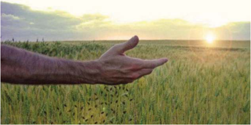

> **Deskripsi Visual:** Gambar ini adalah ilustrasi yang menunjukkan tangan seseorang yang menghadap ke arah matahari terbit di atas padang rumput hijau. Gambar ini menunjukkan dua elemen utama: tangan manusia dan padang rumput hijau. Tangan manusia tampak seperti sedang memegang atau menghadap ke arah matahari, yang menunjukkan hubungan antara manusia dan alam. Padang rumput hijau yang luas tampak seperti latar belakang yang menambah nuansa alami pada gambar. Teks, angka, atau label penting tidak terlihat dalam gambar ini. Informasi kunci yang dapat diambil pembaca adalah hubungan antara manusia dan alam, serta keindahan alam yang diperlihatkan melalui gambar ini.

- 29 Tetapi  ia  berkata:  Jangan,  sebab  mungkin  gandum  itu  ikut  tercabut  pada waktu kamu mencabut lalang itu.
- 30  Biarkanlah keduanya tumbuh bersama sampai waktu menuai. Pada waktu itu aku akan berkata kepada para penuai: Kumpulkanlah dahulu lalang itu dan ikatlah berberkas-berkas untuk dibakar; kemudian kumpulkanlah gandum itu ke dalam lumbungku. '
- 31 Yesus  membentangkan  suatu  perumpamaan  lain  lagi  kepada  mereka, kata-Nya: 'Hal Kerajaan Surga itu seumpama biji sesawi, yang diambil dan ditaburkan orang di ladangnya.
- 32 Memang biji itu yang paling kecil dari segala jenis benih, tetapi apabila sudah tumbuh, sesawi itu lebih besar dari pada sayuran yang lain, bahkan menjadi pohon,  sehingga  burung-burung  di  udara  datang  bersarang  pada  cabangcabangnya. '
- 33 Dan Ia menceriterakan perumpamaan ini juga kepada mereka: 'Hal Kerajaan Surga itu seumpama ragi yang diambil seorang perempuan dan diadukkan ke dalam tepung terigu tiga sukat sampai khamir seluruhnya. '
- 34 Semuanya itu disampaikan Yesus kepada orang banyak dalam perumpamaan, dan tanpa perumpamaan suatu pun tidak disampaikan-Nya kepada mereka,
- 35 supaya genaplah firman yang disampaikan oleh nabi: 'Aku mau membuka mulut-Ku  mengatakan  perumpamaan,  Aku  mau  mengucapkan  hal  yang tersembunyi sejak dunia dijadikan. '

 

---
## 📄 Halaman 126

- 36 Maka Yesus pun meninggalkan orang banyak itu, lalu pulang. Murid-muridNya datang dan berkata kepada-Nya: 'Jelaskanlah kepada kami perumpamaan tentang lalang di ladang itu. '
- 37 Ia  menjawab,  kata-Nya:  'Orang yang menaburkan benih baik ialah Anak Manusia;
- 38 ladang  ialah  dunia.  Benih  yang  baik  itu  anak-anak  Kerajaan  dan  lalang anak-anak si jahat.
- 39 Musuh yang menaburkan benih lalang ialah Iblis. Waktu menuai ialah akhir zaman dan para penuai itu malaikat.
- 40 Maka seperti lalang itu dikumpulkan dan dibakar dalam api, demikian juga pada akhir zaman.
- 41 Anak  Manusia  akan  menyuruh  malaikat-malaikat-Nya  dan  mereka  akan mengumpulkan  segala  sesuatu  yang  menyesatkan  dan  semua  orang  yang melakukan kejahatan dari dalam Kerajaan-Nya.
- 42 Semuanya akan dicampakkan ke dalam dapur api; di sanalah akan terdapat ratapan dan kertakan gigi.
- 43 Pada waktu itulah orang-orang benar akan bercahaya seperti matahari dalam Kerajaan Bapa mereka. Siapa bertelinga, hendaklah ia mendengar!'
- 44 'Hal Kerajaan Surga itu seumpama harta yang terpendam di ladang, yang ditemukan orang, lalu dipendamkannya lagi. Oleh sebab sukacitanya pergilah ia menjual seluruh miliknya lalu membeli ladang itu.
- 45 Demikian pula hal Kerajaan Surga itu seumpama seorang pedagang yang mencari mutiara yang indah.
- 46 Setelah ditemukannya mutiara yang sangat berharga, ia pun pergi menjual seluruh miliknya lalu membeli mutiara itu. '
- 47 'Demikian pula hal Kerajaan Surga itu seumpama pukat yang dilabuhkan di laut, lalu mengumpulkan berbagai-bagai jenis ikan.
- 48 Setelah penuh, pukat itu pun diseret orang ke pantai, lalu duduklah mereka dan mengumpulkan ikan yang baik ke dalam pasu dan ikan yang tidak baik mereka buang.
- 49 Demikianlah  juga  pada  akhir  zaman:  Malaikat-malaikat  akan  datang memisahkan orang jahat dari orang benar,
- 50 lalu mencampakkan orang jahat ke dalam dapur api; di sanalah akan terdapat ratapan dan kertakan gigi.
- 51 Mengertikah kamu semuanya itu?' Mereka menjawab: 'Ya, kami mengerti. '
- 52 Maka berkatalah Yesus kepada mereka: 'Karena itu setiap ahli Taurat yang menerima pelajaran dari hal Kerajaan Surga itu seumpama tuan rumah yang mengeluarkan harta yang baru dan yang lama dari perbendaharaannya. '

 

---
## 📄 Halaman 127

53 Setelah  Yesus  selesai  menceriterakan  perumpamaan-perumpamaan  itu,  Ia pun pergi dari situ.

### Tugas Kelompok

Setelah membaca dan merenungkan kutipan di atas, coba diskusikan dengan teman-temanmu, beberapa hal berikut:

- Apa saja (benda/orang) yang digunakan oleh Yesus sebagai pembanding (analogi) dalam perumpamaan-perumpamaan-Nya ?
- Bila  Yesus  menggunakan  hal-hal  tersebut  (benda/orang)  sebagai analogi  dalam  perumpamaan-Nya,  kira-kira  masyarakat  seperti  apa yang mendengar ajaran Yesus?
- Apa  alasan  Yesus  menggunakan  perumpamaan  untuk  mewartakan Kerajaan Allah?
- Perhatikan masing-masing perumpamaan Yesus dalam kutipan tersebut, Apa makna perumpamaan-perumpamaan Yesus yang diungkapkan dalam kutipan tersebut?
- Sikap  apa  yang  dibutuhkan  agar  mampu  memahami  perumpamaan Yesus?

### Tugas

Carilah  minimal  2  perumpamaan  Yesus  lainnya,  kemudian  jelaskan makna  perumpamaan  tersebut  dalam  kaitannya  dengan  paham  tentang Kerajaan Allah.

### Yesus mewartakan Kerajaan Allah melalui tindakan

Bacalah kutipan Kitab Suci berikut!

### Yohanes 11:17. 19-45

- 20 Ketika Marta mendengar, bahwa Yesus datang, ia pergi mendapatkan-Nya. Tetapi Maria tinggal di rumah.

 

---
## 📄 Halaman 128

- 21 Maka  kata  Marta  kepada  Yesus:  'Tuhan,  sekiranya  Engkau  ada  di  sini, saudaraku pasti tidak mati.
- 22 Tetapi sekarang pun aku tahu, bahwa Allah akan memberikan kepada-Mu segala sesuatu yang Engkau minta kepada-Nya. '
- 23 Kata Yesus kepada Marta: 'Saudaramu akan bangkit. '
- 24 Kata  Marta  kepada-Nya:  ' Aku  tahu  bahwa  ia  akan  bangkit  pada  waktu orang-orang bangkit pada akhir zaman. '
- 25 Jawab Yesus: 'Akulah kebangkitan dan hidup; barangsiapa percaya kepadaKu, ia akan hidup walaupun ia sudah mati,
- 26 dan setiap orang yang hidup dan yang percaya kepada-Ku, tidak akan mati selama-lamanya. Percayakah engkau akan hal ini?'
- 27 Jawab  Marta:  'Ya,  Tuhan,  aku  percaya,  bahwa  Engkaulah  Mesias,  Anak Allah, Dia yang akan datang ke dalam dunia. '
- 28 Dan sesudah berkata demikian ia pergi memanggil saudaranya Maria dan berbisik kepadanya: 'Guru ada di sana dan Ia memanggil engkau. '
- 29 Mendengar itu Maria segera bangkit lalu pergi mendapatkan Yesus.
- 30 Tetapi waktu itu Yesus belum sampai ke dalam kampung itu. Ia masih berada di tempat Marta menjumpai Dia.
- 31 Ketika orang-orang Yahudi yang bersama-sama dengan Maria di rumah itu untuk menghiburnya, melihat bahwa Maria segera bangkit dan pergi ke luar, mereka  mengikutinya,  karena  mereka  menyangka  bahwa  ia  pergi  ke  kubur untuk meratap di situ.
- 32 Setibanya Maria di tempat Yesus berada dan melihat Dia, tersungkurlah ia di depan kaki-Nya dan berkata kepada-Nya: 'Tuhan, sekiranya Engkau ada di sini, saudaraku pasti tidak mati. '
- 33 Ketika  Yesus  melihat  Maria  menangis  dan  juga  orang-orang  Yahudi  yang datang bersama-sama dia, maka masygullah hati-Nya. Ia sangat terharu dan berkata:
- 34 'Di  manakah dia kamu baringkan?' Jawab mereka: 'Tuhan, marilah dan lihatlah!'
- 35 Maka menangislah Yesus.
- 36 Kata orang-orang Yahudi: 'Lihatlah, betapa kasih-Nya kepadanya!'
- 37 Tetapi  beberapa  orang  di  antaranya  berkata:  'Ia  yang  memelekkan  mata orang buta, tidak sanggupkah Ia bertindak, sehingga orang ini tidak mati?'
- 38 Maka masygullah pula hati Yesus, lalu Ia pergi ke kubur itu. Kubur itu adalah sebuah gua yang ditutup dengan batu.

 

---
## 📄 Halaman 129

- 39 Kata  Yesus:  ' Angkat  batu  itu!'  Marta,  saudara  orang  yang  meninggal  itu, berkata kepada-Nya: 'Tuhan, ia sudah berbau, sebab sudah empat hari ia mati. '
- 40 Jawab Yesus: 'Bukankah sudah Kukatakan kepadamu: Jikalau engkau percaya engkau akan melihat kemuliaan Allah?'
- 41 Maka  mereka  mengangkat  batu  itu.  Lalu  Yesus  menengadah  ke  atas  dan berkata:  'Bapa,  Aku  mengucap  syukur  kepada-Mu,  karena  Engkau  telah mendengarkan Aku.
- 42 Aku tahu, bahwa Engkau selalu mendengarkan Aku, tetapi oleh karena orang banyak  yang  berdiri  di  sini  mengelilingi  Aku,  Aku  mengatakannya,  supaya mereka percaya, bahwa Engkaulah yang telah mengutus Aku. '
- 43 Dan sesudah berkata demikian, berserulah Ia dengan suara keras: 'Lazarus, marilah ke luar!'
- 44 Orang yang telah mati itu datang ke luar, kaki dan tangannya masih terikat dengan  kain  kapan  dan  mukanya  tertutup  dengan  kain  peluh.  Kata  Yesus kepada mereka: 'Bukalah kain-kain itu dan biarkan ia pergi. '
- 45 Banyak di antara orang-orang Yahudi yang datang melawat Maria dan yang menyaksikan sendiri apa yang telah dibuat Yesus, percaya kepada-Nya.

### Tugas

Bertolak dari peristiwa di atas, temukan nilai Kerajaan Allah apa yang dinyatakan dalam tindakan Yesus tersebut? Untuk menjawab pertanyaan ini kalian bisa memperhatikan langkah berikut:

- Perasaan apa yang sedang menyelimuti Maria dan Marta? Apa yang dilakukan  orang  banyak  menanggapi  perasaan  mereka?  Berhasilkah mereka?
- Ketika Yesus datang, apa reaksi Yesus melihat keprihatinan mereka? apa yang mereka harapkan dari Yesus? Terkabulkah harapan mereka ?
- Lihat  ayat  19  ….banyak  orang  Yahudi…  apakah  selama  ini  mereka percaya kepada Yesus? Bandingkan dengan ayat 36, kemudian bandingkan ayat 45.
- Siapa Yesus menurut ayat 41-42.

 

---
## 📄 Halaman 130

### 3. Menghayati Nilai-Nilai Kerajaan Allah yang Diwartakan Yesus dalam Kehidupan Sehari-hari

Sekarang  saatnya  kalian  berlatih.  Bacalah  dan  renungkan  perumpamaan Orang Samaria yang murah hati ( Lukas 10:25-37 ), temukan pesan perumpamaan tersebut dalam kaitannya dengan nilai-nilai Kerajaan Allah yang diperjuangkan Yesus!

Setelah selesai, cobalah masuk dalam suasana hening untuk berefleksi

### Nilai-Nilai Duniawi dan Nilai-Nilai Kerajaan Allah

### Uang dan harta kekayaan

Siapa orangnya, yang pada zaman sekarang ini tidak membutuhkan uang dan harta?

Bahkan ada sebagian orang berani mengorbankan kebersamaan dengan keluarganya, tetangganya, dan orang-orang yang dikasihinya demi mengejar uang.

Mereka menggunakan seluruh waktunya, bahkan dengan menghalalkan segala cara untuk mengejar dan mengumpulkan uang dan harta kekayaan.

Demi  uang  dan harta kekayaan, banyak orang lupa akan tugas mengembangkan imannya, mereka lupa berdoa, mereka lupa berbagi, mereka lupa akan Tuhannya.

Mereka menganggap seolah-olah uang dapat menjamin segalanya……….

Dalam Injil Markus, (Markus 10: 24-25), Yesus pernah memperingatkan orang yang hidupnya dikuasai nafsu akan uang dan harta kekayaan ' Alangkah sukarnya  orang  yang  beruang  masuk  ke  dalam  Kerajaan  Allah. ' ,  Yesus mengulangi dan menegaskan sekali lagi ' Anak-anak-Ku, alangkah sukarnya masuk ke dalam Kerajaan Allah. Lebih mudah seekor unta melewati lobang jarum dari pada seorang kaya masuk ke dalam Kerajaan Allah. '

Uang  dan  harta  kekayaan  tentu  saja  perlu  untuk  hidup,  tetapi  Yesus mengajak kita untuk tidak diperbudak uang dan harta kekayaan.

### Kekuasaan dan Jabatan

Siapa  orangnya,  yang  pada  zaman  sekarang  tidak  tergiur  dengan kekuasaan dan jabatan.

Bahkan untuk memperolehnya, banyak orang berani membayar mahal, banyak orang meminta bantuan paranormal dan memenuhi berbagai syarat yang dimintanya.

 

---
## 📄 Halaman 131

Dengan kekuasaan dan jabatan, banyak orang bisa mendapatkan segala yang diinginkannya.

Dengan  kekuasaan  dan  jabatan  banyak  orang  merasa  senang  karena ditakuti, dihormati, disanjung oleh orang lain.

Dengan kekuasaan dan jabatan banyak orang merasa dapat memperlakukan orang lain sesuai dengan keinginannya.

Sebagai Anak Allah, Yesus mempunyai kuasa dan jabatan melebihi kuasa dan jabatan manusia, bahkan lebih tinggi dari malaikat.

Tetapi semuanya itu tidak Ia gunakan melainkan telah mengosongkan diri-Nya  sendiri,  dan  mengambil  rupa  seorang  hamba,  dan  menjadi  sama dengan manusia (Filipi 2:7).

### Harga Diri dan Kehormatan

Harga diri,  kehormatan  atau  gengsi  tentu  saja  penting  bila  ukurannya didasari kebenaran dan kelayakan serta diperoleh dengan cara yang baik atas dasar  tertentu,  diri  seseorang  perlu  dihargai,  tidak  boleh  dilecehkan,  tidak boleh dihinakan.

Tetapi  dalam  zaman  sekarang  ini  harga  diri,  kehormatan  atau  gengsi sering disalah artikan.

Banyak orang mengukur harga diri dari apa yang dimilikinya: pangkat, kedudukan, harta bukan atas dasar kepribadian, dan ketekadanannya

Demi menjaga harga diri,  orang  yang  bersalah  berani  berbohong  dan mengaku seolah-olah benar.

Demi  menjada  harga  diri  seorang  pimpinan  menimpakan  kesalahan pada bawahannya.

Demi menjaga harga diri orang berani menjelekkan, atau merendahkan orang lain agar seolah dirinyalah yang paling hebat.

Dalam  pewartaan  tentang  Kerajaan  Allah,  Yesus  telah  mengingatkan: '….sesungguhnya jika kamu tidak bertobat dan menjadi seperti anak kecil ini, kamu tidak akan masuk ke dalam kerajaan Surga' (Matius 18: 1-4). Harga diri  seseorang justru terletak pada kerendahan hatinya, yang mau bersikap seperti anak kecil: polos, jujur, bersahaja, tidak menutup-nutupi kekurangan, dan tidak membohongi diri sendiri dan orang lain

Harga diri justru terletak pada kesediaan berdiri sama tinggi duduk sama rendah dengan sesama, hidup dalam kebersamaan tanpa sekat, tanpa merasa lebih  baik  atau  lebih  suci.  Y esus  menunjukkan  hal  tersebut  saat  ia  makan bersama  dengan  orang  berdosa,  seperti  dengan  Lewi  si  pemungut  cukai (Lukas 5: 29), dan menumpang di rumah Zakeus (Lukas 19: 5-7)

 

---
## 📄 Halaman 132

### Kasih

Kerajaan  Allah  ditandai  dengan  kasih  antarmanusia,  kasih  yang  tidak lagi  dibatasi  atas  dasar  kesamaan  suku,  agama,  ras,  semata.  Kasih  yang diperjuangkan  Yesus  adalah  kasih  yang  universal  dan  terbuka,  kasih  yang juga tertuju pada orang-orang yang memusuhi, menganiaya, atau memfitnah. 'Tetapi  Aku  berkata  kepadamu:  kasihilah  musuhmu  dan  berdoalah  bagi mereka  yang  menganiaya  kamu'  (Matius  5:  44).  'Kasihilah  musuhmu, berbuatlah baik kepada orang yang membenci kamu; mintalah berkat bagi orang  yang  mengutuk  kamu,  berdoalah  untuk  orang  yang  mencaci  kamu' (Lukas 6: 27-28). Model kasih yang diperjuangkan Yesus itulah yang membuat komunitas kita berbeda. 'Dan jika kamu mengasihi orang yang mengasihi kamu,  apakah  jasamu?  Karena  orang-orang  berdosa  pun  mengasihi  juga orang-orang yang mengasihi mereka' (Lukas 6: 32).

### Untuk dipahami

Kerajaan Allah yang diwartakan oleh Yesus secara singkat dapat dikatakan sebagai berikut:

- Kerajaan Allah adalah Allah yang meraja atau memerintah. Oleh karena itu, manusia harus mengakui kekuasaan Allah dan menyerahkan diri (percaya) kepada-Nya,  sehingga  terciptalah  kebenaran,  keadilan,  kesejahteraan,  dan kedamaian.
- Kerajaan  Allah  yang  diwartakan  oleh  Yesus  akan  mencapai  kepenuhannya pada akhir zaman. Di akhir zaman itulah, Allah benar-benar akan meraja. Dalam rangka ini, Kerajaan Allah terkait dengan penghakiman terakhir dan ukuran  penghakiman  adalah  tindakan  kasih.  Mereka  yang  melaksanakan tindakan kasih masuk ke dalam Kerajaan Allah ( bdk. Matius 25: 31-45).
- Kerajaan  Allah  yang  mencapai  kepenuhannya  pada  akhir  zaman  itu  kini sudah dekat, bahkan sudah datang dalam sabda dan karya Yesus. Oleh karena itu, orang harus menanggapinya dengan bertobat dan percaya kepada warta yang dibawa oleh Yesus.

### Doa:

### Mazmur 66:1-20:

1 Bersorak-sorailah bagi Allah, hai seluruh bumi,

2 mazmurkanlah  kemuliaan  nama-Nya,  muliakanlah  Dia  dengan  pujipujian!

 

---
## 📄 Halaman 133

- 3 Katakanlah kepada Allah: 'Betapa dahsyatnya segala pekerjaan-Mu; oleh sebab kekuatan-Mu yang besar musuh-Mu tunduk menjilat kepada-Mu.
- 4 Seluruh  bumi  sujud  menyembah  kepada-Mu,  dan  bermazmur  bagi-Mu, memazmurkan nama-Mu.
- 5 Pergilah dan lihatlah pekerjaan-pekerjaan Allah; Ia dahsyat  dalam perbuatan-Nya terhadap manusia:
- 6 Ia mengubah laut menjadi tanah kering, dan orang-orang itu berjalan kaki menyeberangi sungai. Oleh sebab itu kita bersukacita karena Dia,
7

yang  memerintah  dengan  perkasa  untuk  selama-lamanya,  yang  mata-

Nya  mengawasi  bangsa-bangsa.

meninggikan diri.

- 8 Pujilah  Allah  kami,  hai  bangsa-bangsa,  dan  perdengarkanlah  puji-pujian kepada-Nya!
- 9 Ia mempertahankan jiwa kami di dalam hidup dan tidak membiarkan kaki kami goyah.
- 10 Sebab Engkau telah menguji kami, ya Allah, telah memurnikan kami, seperti orang memurnikan perak.
- 11   Engkau telah membawa kami ke dalam jaring, mengenakan beban pada pinggang kami;
- 12 Engkau telah membiarkan orang-orang melintasi kepala kami, kami telah menempuh  api  dan  air;  tetapi  Engkau  telah  mengeluarkan  kami  sehingga bebas.
- 13   Aku akan masuk ke dalam rumah-Mu dengan membawa korban-korban bakaran, aku akan membayar kepada-Mu nazarku,
- 14 yang  telah  diucapkan  bibirku,  dan  dikatakan  mulutku  pada  waktu  aku susah.
- 15 Korban-korban  bakaran  dari  binatang  gemuk  akan  kupersembahkan kepada-Mu,  dengan  asap  korban  dari  domba-domba  jantan;  aku  akan menyediakan lembu-lembu dan kambing-kambing jantan.
- 16 Marilah, dengarlah, hai kamu sekalian yang takut akan Allah, aku hendak menceritakan apa yang dilakukan-Nya terhadap diriku.
- 17 Kepada-Nya aku telah berseru dengan mulutku, kini dengan lidahku aku menyanyikan pujian.
- 18 Seandainya  ada  niat  jahat  dalam  hatiku,  tentulah  Tuhan  tidak  mau mendengar.
- 19 Sesungguhnya, Allah telah mendengar, Ia telah memperhatikan doa yang kuucapkan.
- 20 Terpujilah Allah, yang tidak menolak doaku dan tidak menjauhkan kasih setia-Nya dari padaku.
Pemberontak-pemberontak  tidak dapat

 

---
## 📄 Halaman 134

### Bab V Sengsara, Wafat, Kebangkitan dan Kenaikan Yesus

Dengan bekerja keras, Yesus melaksanakan tugas perutusan Bapa untuk mewartakan  dan  mewujudkan  Kerajaan  Allah.  Walaupun  demikian  tidak  semua orang  menanggapi  pewartaan  Yesus  itu  dengan  tangan  terbuka.  Ada  sebagian masyarakat yang justru merasa terancam dengan kehadiran dan kegiatan Yesus itu.  Mereka  menganggap  pewartaan  dan  tindakan  Yesus  sebagai  ancaman  bagi jabatan,  kehormatan  serta  na fkah  mereka.  Bagi  mereka,  Yesus  adalah  musuh yang  harus  ditumpas.  Hal  itulah  yang  menyebabkan  mereka  dengan  berbagai cara  berusaha  menjebak  dan  melemahkan  pengaruh  pewartaan  Yesus.  Bahkan beberapa kali mereka berusaha membunuh Yesus. Hingga pada saat yang tepat, mereka berhasil menangkap Yesus, mengadili, menyiksa dan menyalibkan-Nya.

Di  mata  para  musuh-Nya,  kematian  Yesus  merupakan  bentuk  hukuman yang layak bagi seorang penghujat Allah. Tetapi Yesus menghayati sengsara dan wafat-Nya sebagai bentuk kesetiaan-Nya kepada nasib manusia yang berdosa, dan sekaligus  kesetiaan  dan  penyerahan  total  kepada  Bapa.  Yesus  mengalami  nasib seperti  manusia,  yakni  kematian.  Tetapi  Allah  membangkitkan  Dia  pada  hari ketiga sebagai tanda penerimaan penyerahan diri Anak-Nya dan memuliakan Dia dengan mengangkat Dia ke Surga.

Untuk lebih menghayati hal tersebut di atas, maka dalam bab lima ini, secara berturut-turut akan dibahas topik-topik:

- Sengsara dan wafat Yesus
- Kebangkitan dan kenaikan Yesus ke Surga.

 

---
## 📄 Halaman 135

### A. Sengsara dan Wafat Yesus

Kematian merupakan peristiwa yang amat sangat biasa. Apapun yang hidup pasti suatu saat akan mati. Kematian seolah menjadi titik akhir dari kehidupan manusia, setelah  itu  ia  lenyap  bagai  ditelan  bumi.  Tetapi,  Iman  kristiani  justru menegaskan,  bahwa  seharusnya  kematian  dihayati  sebagai  pintu  masuk  pada kehidupan  baru,  kehidupan  kekal  bersama  dengan  Allah.  Maka  persoalannya adalah: bagaimana manusia mempersiapkan dan menghayati kematian.

Wafat Yesus adalah kenyataan historis. Sengsara dan wafat Yesus merupakan tanda  terbesar  kasih  Allah  kepada  manusia.  Sengsara  dan  wafat  Yesus  juga merupakan tanda agung dari Kerajaan Allah. Yesus telah mewartakan Kerajaan Allah melalui kata-kata dan perbuatan. Yesus menyadari bahwa kesaksian yang paling  kuat  dalam  mewartakan  dan  memperjuangkan  Kerajaan  Allah  ialah kesediaan-Nya untuk mati demi  Kerajaan Allah yang diperjuangkan-Nya. Maka, Yesus berani menghadapi risiko ini dengan penuh kesadaran dan tanpa takut.  Y esus  yakin  dengan  sikap-Nya  yang  konsekuen  dan  berani  menghadapi maut  akan  memberanikan  pula  semua  murid-Nya  dan  pengikut-pengikutNya  untuk  mewartakan  dan  memperjuangkan  Kerajaan  Allah  walaupun  harus mempertaruhkan nyawanya.

### Doa

- Allah, Bapa yang Mahakasih,
- kami bersyukur atas kebesaran kasih-Mu kepada kami,
- sebab nyatalah dalam hidup kami,
- bahwa kasih-Mu itu tak pernah putus oleh kedosaan kami sekalipun.
- Bahkan saat dunia terkungkung maut,
- Engkau merelakan Putera-Mu sendiri menjadi penebus kami.
- Semoga seperti Kristus,
- kami pun selalu setia kepada Engkau sekalipun harus menderita sengsara dan wafat Amin.

 

---
## 📄 Halaman 136

### 1. Pengalaman Berkorban Bagi Orang lain

### Bacalah kisah berikut:

### Santo Maximilian Kolbe, Martir

Maximilian  Kolbe  lahir  di  Zdunska-Wola,  dekat  Lodz  Polandia  pada tanggal 7 Januari 1894. Ia kemudian dipermandikan dengan nama Raymond. Setelah dewasa, ia masuk biara Fransiskan dan mengambil nama Maximilianus. Kaul  kebiaraannya  yang  pertama  diucapkannya  pada  tahun  1911.  Sebagai seorang biarawan Fransiskan, Maximilian dikenal sebagai seorang yang saleh. Pada tahun 1917, ia mendirikan Militia Maria Immaculata di Roma untuk memajukan kebaktian kepada Bunda Maria yang dikandung tanpa noda. Pada tahun 1918, Maximilian ditabhiskan menjadi imam dan kemudian kembali ke Polandia untuk berkarya disana. Di Polandia, ia menyebarkan berbagai tulisan tentang Bunda Maria dalam buletin 'Militia Maria Immaculata'. Selain itu ia mendirikan biara di Niepokalanov pada tahun 1927 untuk memberi tempat pada 800 biarawan. Biara yang sama didirikannya di Jepang dan India. Di kemudian hari, ia menjadi superior sendiri. Itulah sekilas kebesaran dan karya Maximilian.

Tuhan  mencobai  Maximilian  yang saleh dan setia ini melebihi orangorang  lain.  Kiranya  benar  juga  bahwa semakin kuat dan besar iman seseorang, semakin  berat  juga  cobaan  yang  harus dialami, demi memurnikan imannya dan mempertinggi kesuciannya. Pada tahun 1939 Gespato, Jerman yang keji itu memasuki wilayah Polandia. Diktator  Jerman  itu  yakin  bahwa  untuk mematahkan  semangat  orang  Polandia perlulah  menahan,  memenjarakan,  dan membunuh para pemimpinnya, baik pololik,  maupun  keagamaan  dan  para ahlinya. Lebih-lebih pers Polandia harus dihancurkan.

Maximilian  Kolbe  dikenal  sebagai seorang penulis dan editor majalah. Maka ia ditangkap oleh Gestapo dan diasingkan ke Lamsdorf, Jerman dan dimasukkan ke  dalam  kamp  konsentrasi  Amstitz.  Pernah  ia  dilepaskan,  tetapi  kemudian ditangkap lagi pada tahun 1941, dan dipenjarakan di Pawiak, lalu dipindahkan

 

---
## 📄 Halaman 137

ke kamp konsentrasi Auscwitz. Di kamp konsentrasi ini, Maximilian dengan diam-diam menjalankan tugasnya sebagai imam bagi para tahanan yang ada di sana. Dengan kondisi tubuh yang kurus kering, Maximilian turut serta dalam kerja paksa. TBC yang dideritanya semakin parah karena kerja paksa itu.

Pada suatu hari seorang sersan bernama Gajowniczek dijatuhi hukuman mati.  Karena  sangat  takut,  ia  berteriak-teriak  menyebut  anak-anak  dan istrinya.  Mendengar  teriakan  sersan  itu,  Maximilian  Kolbe  maju  dengan tegap  untuk  meminta  menggantikan  sersan  malang  itu.  'Daripada  sersan yang  beranak-istri  ini  mati,  lebih  baiklah  saya  yang  mati.  Karena  toh  saya tidak beranak-istri', kata Maximilian. Bersama dengan para sandera lainnya, Maximilian tidak diberi makan dan minum. Namun ia bisa bertahan sebagai korban terakhir, dan baru mati setelah disuntik dengan carbolic acid.

Sumber: www.imankatolik.or.id/kalender/14Agu.html

### Tugas

Setelah  kalian  membaca  cerita  di  atas,  ungkapkanlah  tanggapanmu tentang  cerita  tersebut  dalam  bentuk  pertanyaan  untuk  didiskusikan dengan teman-temanmu! Carilah contoh-contoh pengalaman yang serupa yang pernah kalian jumpai, baik dilakukan diri sendiri maupun orang lain.

### 2. Mendalami Makna Kisah Sengsara dan Wafat Yesus

Untuk dapat memahami secara mendalam makna sengsara dan wafat Yesus, ada beberapa hal yang perlu kalian pahami:

- Konteks sosial (latar belakang situasi) menjelang penangkapan, pengadilan, dan penyaliban Yesus
- Kisah Sengsara Yesus
- Orang-orang yang terlibat dalam pengadilan dan penyaliban Yesus
- Rumuskan  konteks  sengsara  dan  wafat  Yesus  dengan  membaca beberapa kutipan berikut:
- Berkaitan  dengan  waktu  menjelang  Yesus  bersengsara:  Lukas 22:1-2, Markus 14:1-2. Matius 26:2-5 dan yang dilakukan Yesus pada saat-saat menjelang sengsara-Nya: Matius 26:17-35, 26:36
- Berkaitan dengan keamanan Negara dan kebiasaan Pemerintah Romawi: Lukas 23:17 dan 19. Markus 15:7
- Berkaitan  dengan  banyaknya  Mesias  Palsu:  Markus  13:5-6; Matius 24:4-5

 

---
## 📄 Halaman 138

- Untuk  memahami  Kisah  Penangkapan  hingga  Penyaliban  Yesus, bacalah kutipan Kitab Suci berikut sambil memperhatikan kejadiannya, sikap dan tindakan orang-orang yang ada di dalamnya, dan sikap Yesus dalam kejadian tersebut!

### Lukas 22:39-53

- 39 Lalu  pergilah  Yesus  ke  luar  kota  dan  sebagaimana  biasa  Ia  menuju  Bukit Zaitun. Murid-murid-Nya juga mengikuti Dia.
- 40 Setelah tiba di tempat itu Ia berkata kepada mereka: 'Berdoalah supaya kamu jangan jatuh ke dalam pencobaan. '
- 41 Kemudian  Ia  menjauhkan  diri  dari  mereka  kira-kira  sepelempar  batu jaraknya, lalu Ia berlutut dan berdoa, kata-Nya:
- 42 'Ya Bapa-Ku, jikalau Engkau mau, ambillah cawan ini dari  pada-Ku;  tetapi  bukanlah kehendak-Ku, melainkan kehendak-Mulah yang terjadi. '
- 43 Maka seorang malaikat dari langit menampakkan diri kepada-Nya untuk memberi kekuatan kepada-Nya.
- 44 Ia  sangat  ketakutan  dan makin bersungguh-sungguh berdoa.  Peluh-Nya  menjadi seperti  titik-titik  darah  yang bertetesan ke tanah.
- 45 Lalu  Ia  bangkit  dari  doaNya dan kembali kepada murid-murid-Nya,  tetapi  Ia mendapati mereka sedang tidur karena dukacita.
- 46 Kata-Nya  kepada  mereka: 'Mengapa  kamu  tidur?  Ba-

---
**🖼️ Gambar/Diagram**

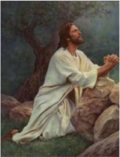

> **Deskripsi Visual:** Gambar ini adalah ilustrasi yang menampilkan Yesus Kristus sedang berdoa di atas batu. Gambar ini menunjukkan beberapa elemen penting:

1. **Apa yang Ditampilkan Secara Keseluruhan**: Gambar ini menampilkan Yesus Kristus yang sedang berdoa dengan kedua tangan diam di depan tubuhnya. Dia duduk di atas batu besar yang ada di bawah pohon. Latar belakangnya adalah hamparan hijau yang tampak seperti hutan atau kebun.

2. **Elemen Utama dan Relasinya**: 
   - **Yesus Kristus**: Ia adalah subjek utama gambar, duduk di atas batu.
   - **Batu**: Batu besar yang menjadi tempat Yesus berdoa.
   - **Pohon**: Pohon besar yang ada di sekitar batu.
   - **Latar Belakang**: Hutan atau kebun yang memberikan suasana alam yang tenang dan damai.

3. **Teks, Angka, atau Label Penting yang Terlihat**: Dalam gambar ini, tidak ada teks, angka, atau label yang jelas. Semua elemen utama hanya gambaran visual saja.

4. **Informasi Kunci yang Bisa Diambil Pembaca**: Gambar ini menggambarkan momen doa Yesus Kristus, yang sering digunakan sebagai simbol kebesaran dan kebijaksanaan dalam agama Kristen. Ini juga menunjukkan keindahan dan keharmonisan alam semesta dalam konteks keagamaan.

Dengan demikian, gambar ini menggambarkan Yesus Kristus sedang berdoa di atas batu, dengan latar belakang alam yang damai, menunjukkan keharmonisan antara manusia dan alam semesta dalam konteks keagamaan.

ngunlah dan berdoalah, supaya kamu jangan jatuh ke dalam pencobaan. '

- 47 Waktu Yesus masih berbicara datanglah serombongan orang, sedang muridNya  yang  bernama  Yudas,  seorang  dari  kedua  belas  murid  itu,  berjalan  di depan mereka. Yudas mendekati Yesus untuk mencium-Nya.
- 48 Maka  kata  Yesus  kepadanya:  'Hai  Yudas,  engkau  menyerahkan  Anak Manusia dengan ciuman?'

 

---
## 📄 Halaman 139

- 49 Ketika  mereka,  yang bersama-sama dengan Yesus, melihat apa yang akan terjadi, berkatalah mereka: 'Tuhan, mestikah kami menyerang mereka dengan pedang?'
- 50 Dan  seorang  dari  mereka  menyerang  hamba  Imam  Besar  sehingga  putus telinga kanannya.
- 51 Tetapi Yesus berkata: 'Sudahlah itu. ' Lalu Ia menjamah telinga orang itu dan menyembuhkannya.
- 52 Maka Yesus berkata kepada imam-imam kepala dan kepala-kepala pengawal Bait  Allah  serta  tua-tua  yang  datang  untuk  menangkap  Dia,  kata-Nya: 'Sangkamu Aku ini penyamun, maka kamu datang lengkap dengan pedang dan pentung?
- 53 Padahal tiap-tiap hari Aku ada di tengah-tengah kamu di dalam Bait Allah, dan kamu tidak menangkap Aku. Tetapi inilah saat kamu, dan inilah kuasa kegelapan itu. '

### Lukas 22:54-65

- 54 Lalu Yesus ditangkap dan dibawa dari tempat itu. Ia digiring ke rumah Imam Besar. Dan Petrus mengikut dari jauh.
- 55 Di  tengah-tengah  halaman  rumah  itu  orang  memasang  api  dan  mereka duduk mengelilinginya. Petrus juga duduk di tengah-tengah mereka.
- 56 Seorang  hamba  perempuan  melihat  dia  duduk  dekat  api;  ia  mengamatamatinya, lalu berkata: 'Juga orang ini bersama-sama dengan Dia. '
- 57 Tetapi Petrus menyangkal, katanya: 'Bukan, aku tidak kenal Dia!'
- 58 Tidak berapa lama kemudian seorang lain melihat dia lalu berkata: 'Engkau juga seorang dari mereka!' Tetapi Petrus berkata: 'Bukan, aku tidak!'
- 59 Dan kira-kira sejam kemudian seorang lain berkata dengan tegas: 'Sungguh, orang ini juga bersama-sama dengan Dia, sebab ia juga orang Galilea. '
- 60 Tetapi  Petrus  berkata:  'Bukan,  aku  tidak  tahu  apa  yang  engkau katakan. ' Seketika itu juga, sementara ia berkata, berkokoklah ayam.
- 61 Lalu berpalinglah Tuhan memandang Petrus. Maka teringatlah Petrus bahwa Tuhan telah berkata kepadanya: 'Sebelum ayam berkokok pada hari ini, engkau telah tiga kali menyangkal Aku. '
- 62 Lalu ia pergi ke luar dan menangis dengan sedihnya.
- 63 Dan orang-orang yang menahan Yesus, mengolok-olokkan Dia dan memukuliNya.
- 64 Mereka menutupi muka-Nya dan bertanya: 'Cobalah katakan siapakah yang memukul Engkau?'
- 65 Dan banyak lagi hujat yang diucapkan mereka kepada-Nya.

 

---
## 📄 Halaman 140

### Lukas 22:66-71

- 66 Dan setelah hari siang berkumpullah sidang para tua-tua bangsa Yahudi dan imam-imam kepala dan ahli-ahli Taurat, lalu mereka menghadapkan Dia ke Mahkamah Agama mereka,
- 67 katanya: 'Jikalau Engkau adalah Mesias, katakanlah kepada kami. ' Jawab Yesus: 'Sekalipun Aku mengatakannya kepada kamu, namun kamu tidak akan percaya;
- 68 dan sekalipun Aku bertanya sesuatu kepada kamu, namun kamu tidak akan menjawab.
- 69 Mulai sekarang Anak Manusia sudah duduk di sebelah kanan Allah Yang Mahakuasa. '
- 70 Kata mereka semua: 'Kalau begitu, Engkau ini Anak Allah?' Jawab Yesus: 'Kamu sendiri mengatakan, bahwa Akulah Anak Allah. '
- 71 Lalu  kata  mereka:  'Untuk  apa  kita  perlu  kesaksian  lagi?  Kita  ini  telah mendengarnya dari mulut-Nya sendiri. '

### Lukas 23:1-25

- 1 Lalu bangkitlah seluruh sidang itu dan Yesus dibawa menghadap Pilatus.
- 2 Di situ mereka mulai menuduh Dia, katanya: 'Telah kedapatan oleh kami, bahwa orang ini menyesatkan bangsa kami, dan melarang membayar pajak kepada Kaisar, dan tentang diri-Nya Ia mengatakan, bahwa Ia adalah Kristus, yaitu Raja. '
- 3 Pilatus bertanya kepada-Nya: 'Engkaukah raja orang Yahudi?' Jawab Yesus: 'Engkau sendiri mengatakannya. '
- 4 Kata Pilatus kepada imam-imam kepala dan seluruh orang banyak itu: 'Aku tidak mendapati kesalahan apa pun pada orang ini. '
- 5 Tetapi mereka makin kuat mendesak, katanya: 'Ia menghasut rakyat dengan ajaran-Nya di seluruh Yudea, Ia mulai di Galilea dan sudah sampai ke sini. '
- 6 Ketika Pilatus mendengar itu ia bertanya, apakah orang itu seorang Galilea.
- 7 Dan ketika ia tahu, bahwa Yesus seorang dari wilayah Herodes, ia mengirim Dia menghadap Herodes, yang pada waktu itu ada juga di Yerusalem.
- 8 Ketika Herodes melihat Yesus, ia sangat girang. Sebab sudah lama ia ingin melihat-Nya, karena ia sering mendengar tentang Dia, lagipula ia mengharapkan melihat bagaimana Yesus mengadakan suatu tanda.
- 9 Ia mengajukan banyak pertanyaan kepada Yesus, tetapi Yesus tidak memberi jawaban apa pun.
- 10 Sementara itu imam-imam kepala dan ahli-ahli Taurat maju ke depan dan melontarkan tuduhan-tuduhan yang berat terhadap Dia.

 

---
## 📄 Halaman 141

- 11 Maka  mulailah  Herodes  dan  pasukannya  menista  dan  mengolok-olokkan Dia, ia mengenakan jubah kebesaran kepada-Nya lalu mengirim Dia kembali kepada Pilatus.
- 12 Dan  pada  hari  itu  juga  bersahabatlah  Herodes  dan  Pilatus;  sebelum  itu mereka bermusuhan.
- 13   Lalu Pilatus mengumpulkan imam-imam kepala dan pemimpin-pemimpin serta rakyat,
- 14 dan  berkata  kepada  mereka:  'Kamu  telah  membawa  orang  ini  kepadaku sebagai seorang yang menyesatkan rakyat. Kamu lihat sendiri bahwa aku telah memeriksa-Nya, dan dari kesalahan-kesalahan yang kamu tuduhkan kepadaNya tidak ada yang kudapati pada-Nya.
- 15 Dan Herodes juga tidak, sebab ia mengirimkan Dia kembali kepada kami. Sesungguhnya  tidak  ada  suatu  apa  pun  yang  dilakukan-Nya  yang  setimpal dengan hukuman mati.
- 16 Jadi aku akan menghajar Dia, lalu melepaskan-Nya. '
- 17 [Sebab ia wajib melepaskan seorang bagi mereka pada hari raya itu.]
- 18 Tetapi  mereka  berteriak  bersama-sama:  'Enyahkanlah  Dia,  lepaskanlah Barabas bagi kami!'
- 19 Barabas  ini  dimasukkan  ke  dalam  penjara  berhubung  dengan  suatu pemberontakan yang telah terjadi di dalam kota dan karena pembunuhan.
- 20 Sekali lagi Pilatus berbicara dengan suara keras kepada mereka, karena ia ingin melepaskan Yesus.
- 21 Tetapi mereka berteriak membalasnya, katanya: 'Salibkanlah Dia! Salibkanlah Dia!'
- 22 Kata  Pilatus  untuk  ketiga  kalinya  kepada  mereka:  'Kejahatan  apa  yang sebenarnya telah dilakukan orang ini? Tidak ada suatu kesalahan pun yang kudapati  pada-Nya,  yang  setimpal  dengan  hukuman  mati.  Jadi  aku  akan menghajar Dia, lalu melepaskan-Nya. '
- 23 Tetapi  dengan  berteriak  mereka  mendesak  dan  menuntut,  supaya  Ia disalibkan, dan akhirnya mereka menang dengan teriak mereka.
- 24 Lalu Pilatus memutuskan, supaya tuntutan mereka dikabulkan.
- 25 Dan  ia  melepaskan  orang  yang  dimasukkan  ke  dalam  penjara  karena pemberontakan dan pembunuhan itu sesuai dengan tuntutan mereka, tetapi Yesus diserahkannya kepada mereka untuk diperlakukan semau-maunya.

### Lukas 23:26-56

- 26 Ketika  mereka  membawa  Yesus,  mereka  menahan  seorang  yang  bernama Simon dari Kirene, yang baru datang dari luar kota, lalu diletakkan salib itu di atas bahunya, supaya dipikulnya sambil mengikuti Yesus.
- 27 Sejumlah besar orang mengikuti Dia; di antaranya banyak perempuan yang menangisi dan meratapi Dia.

 

---
## 📄 Halaman 142

- 28 Y esus berpaling kepada mereka dan berkata: 'Hai puteri-puteri Yerusalem, janganlah  kamu  menangisi  Aku,  melainkan  tangisilah  dirimu  sendiri  dan anak-anakmu!
- 29 Sebab  lihat,  akan  tiba  masanya  orang  berkata:  Berbahagialah  perempuan mandul dan yang rahimnya tidak pernah melahirkan, dan yang susunya tidak pernah menyusui.
- 30 Maka orang akan mulai berkata kepada gunung-gunung: Runtuhlah menimpa kami! dan kepada bukit-bukit: Timbunilah kami!
- 31 Sebab jikalau orang berbuat demikian dengan kayu hidup, apakah yang akan terjadi dengan kayu kering?'
- 32 Dan ada juga digiring dua orang lain, yaitu dua penjahat untuk dihukum mati bersama-sama dengan Dia.
- 33 Ketika  mereka  sampai  di  tempat  yang  bernama  Tengkorak,  mereka menyalibkan Yesus di situ dan juga kedua orang penjahat itu, yang seorang di sebelah kanan-Nya dan yang lain di sebelah kiri-Nya.
- 34 Y esus berkata: 'Ya Bapa, ampunilah mereka, sebab mereka tidak tahu apa yang mereka perbuat. ' Dan mereka membuang undi untuk membagi pakaianNya.
- 35 Orang banyak berdiri di situ dan melihat semuanya. Pemimpin-pemimpin mengejek  Dia,  katanya:  'Orang  lain  Ia  selamatkan,  biarlah  sekarang  Ia menyelamatkan  diri-Nya  sendiri,  jika  Ia  adalah  Mesias,  orang  yang  dipilih Allah. '

---
**🖼️ Gambar/Diagram**

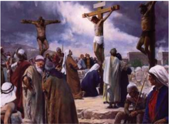

> **Deskripsi Visual:** Gambar ini adalah ilustrasi yang menunjukkan peristiwa penyaliban Yesus Kristus. Gambar ini menggambarkan tiga orang yang sedang ditempelkan pada tiang penyaliban, dengan tiang penyaliban yang tinggi dan berwarna putih. Di sekitar mereka, ada banyak orang yang sedang berdiri dan berdiri, tampaknya sedang melihat atau merayakan peristiwa tersebut. Di latar belakang, terlihat langit biru dengan awan putih, serta beberapa pohon yang tampaknya berada di tepi jalan. 

Elemen-elemen utama dalam gambar ini adalah tiang penyaliban, orang-orang yang sedang ditempelkan, dan orang-orang yang berdiri di sekitar mereka. Tiang penyaliban merupakan elemen yang paling dominan dan menjadi pusat perhatian dalam gambar. Orang-orang yang sedang ditempelkan tampaknya adalah tokoh utama dalam gambar ini, sementara orang-orang di sekitarnya tampaknya adalah penonton atau pengikut.

Teks, angka, atau label penting tidak terlihat dalam gambar ini. Namun, informasi kunci yang dapat diambil pembaca adalah bahwa gambar ini menunjukkan peristiwa penyaliban Yesus Kristus, yang merupakan salah satu peristiwa penting dalam kepercayaan Kristen.

 

---
## 📄 Halaman 143

- 36 Juga prajurit-prajurit mengolok-olokkan Dia; mereka mengunjukkan anggur asam kepada-Nya
- 37 dan  berkata:  'Jika  Engkau  adalah  raja  orang  Yahudi,  selamatkanlah  diriMu!'  38 Ada juga tulisan di atas kepala-Nya: 'Inilah raja orang Yahudi'.
- 39 Seorang dari penjahat yang digantung itu menghujat Dia, katanya: 'Bukankah Engkau adalah Kristus? Selamatkanlah diri-Mu dan kami!'
- 40 Tetapi  yang  seorang  menegor  dia,  katanya:  'Tidakkah  engkau  takut,  juga tidak kepada Allah, sedang engkau menerima hukuman yang sama?
- 41 Kita  memang  selayaknya  dihukum,  sebab  kita  menerima  balasan  yang setimpal dengan perbuatan kita, tetapi orang ini tidak berbuat sesuatu yang salah. '
- 42 Lalu ia berkata: 'Yesus, ingatlah akan aku, apabila Engkau datang sebagai Raja. '
- 43 Kata Yesus kepadanya: 'Aku berkata kepadamu, sesungguhnya hari ini juga engkau akan ada bersama-sama dengan Aku di dalam Firdaus. '
- 44 Ketika itu hari sudah kira-kira jam dua belas, lalu kegelapan meliputi seluruh daerah itu sampai jam tiga,
- 45 sebab matahari tidak bersinar. Dan tabir Bait Suci terbelah dua.
- 46 Lalu Yesus berseru dengan suara nyaring: 'Ya Bapa, ke dalam tangan-Mu Kuserahkan  nyawa-Ku. '  Dan  sesudah  berkata  demikian  Ia  menyerahkan nyawa-Nya.
- 47 Ketika  kepala  pasukan  melihat  apa  yang  terjadi,  ia  memuliakan  Allah, katanya: 'Sungguh, orang ini adalah orang benar!'
- 48 Dan sesudah seluruh orang banyak, yang datang berkerumun di situ untuk tontonan itu, melihat apa yang terjadi itu, pulanglah mereka sambil memukulmukul diri.
- 49 Semua  orang  yang  mengenal  Yesus  dari  dekat,  termasuk  perempuanperempuan yang mengikuti Dia dari Galilea,  berdiri  jauh-jauh  dan  melihat semuanya itu.
- 50 Adalah seorang yang bernama Yusuf. Ia anggota Majelis Besar, dan seorang yang baik lagi benar.
- 51 Ia  tidak  setuju  dengan  putusan  dan  tindakan  Majelis  itu.  Ia  berasal  dari Arimatea, sebuah kota Yahudi dan ia menanti-nantikan Kerajaan Allah.
- 52 Ia pergi menghadap Pilatus dan meminta mayat Yesus.
- 53 Dan sesudah ia menurunkan mayat itu, ia mengapaninya dengan kain lenan, lalu  membaringkannya  di  dalam  kubur  yang  digali  di  dalam  bukit  batu,  di mana belum pernah dibaringkan mayat.
- 54 Hari itu adalah hari persiapan dan sabat hampir mulai.
- 55  Dan perempuan-perempuan yang datang bersama-sama dengan Yesus dari Galilea, ikut serta dan mereka melihat kubur itu dan bagaimana mayat-Nya dibaringkan.

 

---
## 📄 Halaman 144

56 Dan setelah pulang, mereka menyediakan rempah-rempah dan minyak mur. Dan pada hari Sabat mereka beristirahat menurut hukum Taurat,

### Tugas

Setelah  membaca  kisah-kisah  di  atas,  simpulkan:  Siapa  saja  yang terlibat dalam kisah sengsara Yesus sejak penangkapan hingga wafat-Nya. Apa  yang  dapat  kalian  refleksikan  dari  sikap  tokoh-tokoh  tersebut  bagi kehidupan imanmu. Apa makna sengsara dan wafat Yesus bagi imanMu?

### 3. Menghayati Makna dan Sengsara Yesus dalam Kehidupan Sehari-hari

Allah  telah  menunjukkan  cinta-Nya  yang  luar  biasa  bagi  keselamatan  dan kebahagiaan  manusia  sampai  mengorbankan  Anak-Nya  sendiri.  Penyelamatan Allah itu tidak berhenti pada masa tertentu, melainkan berlangsung terus hingga sekarang ini.

- Bila  demikian,  tindakan  konkret  apa  yang  akan  kalian  lakukan  sebagai tanggapan atas penghayatan iman akan sengsara dan wafat Yesus?
- Sharingkanlah niatmu itu kepada teman-teman kalian!
- Untuk lebih mendalami dan menghayati makna sengsara dan wafat Yesus, buatlah kesepakatan dengan teman kelompokmu, untuk melakukan Ibadat Jalan Salib, entah di gereja atau di lingkungan sekolahmu!

### Untuk dipahami

- Kisah  sengsara  dan  wafat  Yesus  dapat  kita  temukan  dalam  keempat  Injil. Mereka, yaitu Matius, Markus, Lukas, dan Yohanes masing-masing dengan caranya  sendiri  menampilkan  kisah  sengsara  dan  wafat  Yesus.  Masingmasing menampilkan secara berbeda sesuai dengan latar belakang mereka dan jemaat yang dituju. Walaupun demikian banyak unsur yang sama yang ditampilkan. Kisah sengsara yang termuat di dalam empat lnjil sesungguhnya tidak pertama-tama dimaksudkan sebagai laporan pandangan mata tentang apa yang sebenarnya terjadi. Kisah sengsara yang dituliskan di dalam keempat Injil itu pertama-tama hendak mewartakan makna sengsara dan wafat Yesus bagi  jemaat  beriman.  Namun  pewartaan  itu  jelas  dilandasi  oleh  kenyataan historis, yaitu bahwa Yesus sungguh-sungguh menderita sengsara dan wafat di kayu salib.

 

---
## 📄 Halaman 145

- Sengsara  dan  wafat  Yesus  merupakan  tanda  terbesar  kasih  Allah  kepada manusia: 'Karena begitu besar kasih Allah akan dunia ini, sehingga Ia telah mengaruniakan Anak-Nya yang tunggal, supaya setiap orang yang percaya kepada-Nya tidak binasa, melainkan memperoleh hidup yang kekal' (Yohanes 3: 16). Allah Bapa menyerahkan Putra-Nya untuk menderita dan wafat demi keselamatan manusia.
- Sengsara dan wafat Yesus juga merupakan tanda agung dari Kerajaan Allah. Yesus  telah  mewartakan  Kerajaan  Allah  melalui  kata-kata  dan  perbuatan. Yesus menyadari bahwa kesaksian yang paling kuat dalam mewartakan dan memperjuangkan  Kerajaan  Allah  ialah  kesediaan-Nya  untuk  mati  demi Kerajaan  Allah  yang  diperjuangkan-Nya.  Maka,  Yesus  berani  menghadapi risiko ini dengan penuh kesadaran dan tanpa takut. Yesus yakin dengan sikapNya  yang  konsekuen  dan  berani  menghadapi  maut  akan  memberanikan pula  semua  murid-Nya  dan  pengikut-pengikut-Nya  untuk  mewartakan dan  memperjuangkan  Kerajaan  Allah  walaupun  harus  mempertaruhkan nyawanya.

### Doa

### Mazmur 118: 1-9.14

- 1 Bersyukurlah kepada TUHAN, sebab Ia baik! Bahwasanya untuk selamalama-nya kasih setia-Nya.
- 2 Biarlah  Israel  berkata:  'Bahwasanya  untuk  selama-lamanya  kasih  setiaNya!'
- 3 Biarlah kaum Harun berkata: 'Bahwasanya untuk selama-lamanya kasih setia-Nya!'
- 4 Biarlah  orang  yang  takut  akan  TUHAN  berkata:  'Bahwasanya  untuk selama-lamanya kasih setia-Nya!'
- 5 Dalam  kesesakan  aku  telah  berseru  kepada  TUHAN.  TUHAN  telah menjawab aku dengan memberi kelegaan.
- 6 TUHAN di pihakku. Aku tidak akan takut. Apakah yang dapat dilakukan manusia terhadap aku?
- 7  TUHAN di pihakku, menolong aku; aku akan memandang rendah mereka yang membenci aku.
- 8 Lebih baik berlindung pada TUHAN dari pada percaya kepada manusia.
- 9 Lebih  baik  berlindung  pada  TUHAN  dari  pada  percaya  kepada  para bangsawan.
- 14 TUHAN itu kekuatanku dan mazmurku; Ia telah menjadi keselamatanku.

 

---
## 📄 Halaman 146

### B. Kebangkitan dan Kenaikan Yesus ke Surga

Keperc ayaan  bahwa  kematian  bukan  akhir  segalanya  bagi  hidup  manusia tersebar dalam semua agama dan kepercayaan. Mereka percaya bahwa sesudah kematian, sesungguhnya manusia masih hidup dan terus hidup, walaupun dalam wujud  lain.  Sebagai  manusia,  Yesus  pun  mengalami  kematian.  Ia  wafat  dan dikuburkan sebagaimana manusia pada umumnya. Tetapi kematian bukan akhir segalanya  tentang  Yesus,  sebab  Yesus  dibangkitkan  Allah  dari  kematian.  Warta tentang kebangkitan Yesus Kristus tersebut merupakan dasar paling penting dalam iman  Kristen,  sebab  'jika  Kristus  tidak  bangkit,  maka  sia-sialah  seluruh  iman kita' (bdk. 1Korintus 15: 14). Kebangkitan Yesus merupakan bukti harapan bagi Gereja bahwa kematian bukan akhir segalanya, sebab melalui baptisan, kita telah dipersatukan dengan wafat Yesus Kristus dan kelak akan menikmati kebangkitan bersama  Kristus.  Bahkan  bukan  itu  saja,  sebagaimana  Kristus  masuk  dalam kemuliaan Allah di Surga, demikian pula setiap orang yang percaya kepadaNya.

### Doa

- Allah, Bapa Yang Mahabaik
- Dalam upaya mewartakan dan mewujudkan Kerajaan Allah di dunia,
- Putera-Mu Yesus Kristus rela menderita, wafat di kayu Salib dan dimakamkan
- Tetapi Engkau membangkitkan Dia
- Dan menganugerahkan Dia kemuliaan di Surga
- Semoga berkat persatuan kami dengan Dia,
- Dalam baptis dan dalam sakramen-sakramenNya
- Kelak kami pun akan merasakan kebangkitan dan kemuliaan
- bersamaNya di Surga
- Demi Kristus, Tuhan dan Pengantara kami. Amin.

### 1. Pengalaman 'Kehadiran' Orang yang Sudah Meninggal

Simaklah cerita berikut:

### Tetap Hadir, Sekalipun Sudah Tiada

Ketika memasuki minggu pertama masuk di kelas X SMA, Bertha tiba-tiba disusul tetangganya untuk meninggalkan pelajaran dan pulang ke rumahnya. Bagaikan petir di siang bolong, ia mendengar kabar yang menyedihkan, ayah

 

---
## 📄 Halaman 147

kesayangannya dipanggil Tuhan untuk selama-lamanya akibat penyakit yang dideritanya. Hatinya sangat terpukul dan ia pun tak dapat menyembunyikan kesedihannya. Sambil melangkah meninggalkan gerbang sekolah ia menangis meronta-ronta. Sesampai di rumah, kesedihannya tak lagi dapat dibendung, ia menangis sambil memeluk jasad ayahnya. Demikian pula, seusai pemakaman ayahnya, di rumah Bertha terus menangis.

Tetapi  Bertha  beruntung  memiliki  seorang  Ibu  yang  sangat  tegar  dan sangat  menyayanginya. 'Anakku, bukankah kita sudah diajari bahwa setiap orang yang percaya kepada Kristus akan hidup kekal selamanya? Ayah memang sudah  meninggalkan  kita,  tetapi  ia  akan  tetap  berada  bersama  kita.  Kalau engkau rindu sama ayah, peluklah foto ayah dan katakan apa saja yang ingin kamu katakan kepadanya!' kata Ibunya kepada Bertha.

Awalnya Bertha tidak percaya dan tidak mengerti akan kata-kata Ibunya. Mungkin karena kesedihan yang sangat dalam akibat ditinggal ayahnya. Tetapi seminggu setelahnya, ia mulai melakukan apa yang dikatakan ibunya. Pada saat  hendak  berangkat  ke  sekolah,  Bertha  memandang  foto  ayahnya,  lalu berkata:  ' Ayah,  Bertha  ke  sekolah  dulu  ya..doakan  supaya  Bertha  jadi  anak yang baik dan pintar! Doakan juga ibu supaya punya rezeki untuk membiayai kuliah Bertha!' Akhirnya hal itu menjadi kebiasaan. Setiap kali melakukannya, Bertha merasa seolah ayahnya tersenyum. Bahkan ketika sedang sedih, atau saat ia mengalami kegembiraan, ia pun menceritakan apa saja yang dialaminya kepada 'ayahnya' itu.

Bertha sungguh merasakan bahwa ayahnya tetap hadir. Hal itulah yang membuat  dia  sangat  bersemangat.  Ia  sangat  yakin  bahwa  ayahnya  tetap bersamanya.

### Tugas

Coba  ungkapkan  tanggapanmu  atas  cerita  di  atas  dalam  bentuk pertanyaan untuk didiskusikan. Atau kalian dapat mendiskusikan beberapa pertanyaan berikut:

- Apakah pengalaman Bertha itu sekedar ilusi atau halusinasi?
- Percayakah kalian akan kebangkitan orang mati?
- Pernahkah kalian mendengar pengalaman yang serupa?
- Adakah kebiasaan dalam masyarakatmu yang mengungkapkan kepercayaan  mereka  akan  kebangkitan  orang  mati  (atau  bahwa sesungguhnya sekalipun orang sudah mati, tetapi tetap hidup dalam dunia dengan cara yang berbeda dengan dunia manusia yang masih hidup)?

 

---
## 📄 Halaman 148

### 2. Kebangkitan dan Kenaikan Yesus ke Surga

### Baca dan renungkanlah teks Markus 16:1-20

### Markus: 16:1-20

- 1 Setelah  lewat  hari  Sabat,  Maria  Magdalena  dan  Maria  ibu  Yakobus,  serta Salome membeli rempah-rempah untuk pergi ke kubur dan meminyaki Yesus.
- 2 Dan pagi-pagi benar pada hari pertama minggu itu, setelah matahari terbit, pergilah mereka ke kubur.
- 3 Mereka berkata seorang kepada yang lain: 'Siapa yang akan menggulingkan batu itu bagi kita dari pintu kubur?'
- 4 Tetapi  ketika  mereka  melihat  dari  dekat,  tampaklah,  batu  yang  memang sangat besar itu sudah terguling.
- 5 Lalu mereka masuk ke dalam kubur dan mereka melihat seorang muda yang memakai jubah putih duduk di sebelah kanan. Mereka pun sangat terkejut,
- 6 tetapi orang muda itu berkata kepada mereka: 'Jangan takut! Kamu mencari Yesus orang Nazaret, yang disalibkan itu. Ia telah bangkit. Ia tidak ada di sini. Lihat! Inilah tempat mereka membaringkan Dia.

---
**🖼️ Gambar/Diagram**

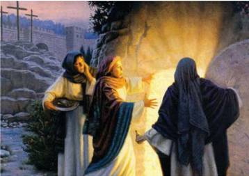

> **Deskripsi Visual:** Gambar ini adalah ilustrasi yang menampilkan tiga orang wanita berdiri di dekat sebuah makam. Makam tersebut tampak seperti tempat pemakaman, dengan batu besar yang menutupi bagian atasnya. Di sebelah kiri, ada seorang wanita yang sedang membawa sebuah piring dengan makanan, sementara dua wanita lainnya berdiri di sebelah kanan. Mereka tampak sangat penuh emosi dan sedang berbicara dengan suara yang tinggi. Latar belakangnya tampak gelap dan abstrak, dengan warna-warna gelap yang menunjukkan bahwa waktu itu mungkin adalah malam hari. Ilustrasi ini mungkin digunakan untuk menggambarkan peristiwa di mana orang-orang tersebut mencari makam Yesus Kristus setelah pengebomannya.

 

---
## 📄 Halaman 149

- 7 Tetapi sekarang pergilah, katakanlah kepada murid-murid-Nya dan kepada Petrus: Ia mendahului kamu ke Galilea; di sana kamu akan melihat Dia, seperti yang sudah dikatakan-Nya kepada kamu. '
- 8 Lalu mereka keluar dan lari meninggalkan kubur itu, sebab gentar dan dahsyat menimpa mereka. Mereka tidak mengatakan apa-apa kepada siapa pun juga karena  takut.  Dengan  singkat  mereka  sampaikan  semua  pesan  itu  kepada Petrus  dan  teman-temannya.  Sesudah  itu  Yesus  sendiri  dengan  perantaraan murid-murid-Nya memberitakan dari Timur ke Barat berita yang kudus dan tak terbinasakan tentang keselamatan yang kekal itu.
- 9 Setelah Yesus bangkit pagi-pagi pada hari  pertama  minggu  itu,  Ia  mulamula  menampakkan  diri-Nya  kepada Maria Magdalena. Dari padanya Yesus pernah mengusir tujuh setan.
- 10 Lalu perempuan itu pergi memberitahukannya kepada mereka yang selalu meng-iringi Yesus, dan yang pada waktu itu sedang berkabung dan menangis.
- 11 Tetapi  ketika  mereka  mendengar, bahwa  Yesus  hidup  dan  telah  dilihat olehnya, mereka tidak percaya.
- 12 Sesudah  itu  Ia  menampakkan  diri dalam  rupa  yang  lain  kepada  dua orang  dari  mereka,  ketika  keduanya dalam perjalanan ke luar kota.
- 13 Lalu  kembalilah  mereka  dan  mem-
beritahukannya  kepada  teman-teman  yang  lain,  tetapi  kepada  mereka  pun teman-teman itu tidak percaya.

- 14 Akhirnya Ia menampakkan diri kepada kesebelas orang itu ketika mereka sedang makan, dan Ia mencela ketidakpercayaan dan kedegilan hati mereka, oleh karena mereka tidak percaya kepada orang-orang yang telah melihat Dia sesudah kebangkitan-Nya.
- 15 Lalu Ia berkata kepada mereka: 'Pergilah ke seluruh dunia, beritakanlah Injil kepada segala makhluk.
- 16 Siapa yang percaya dan dibaptis akan diselamatkan, tetapi siapa yang tidak percaya akan dihukum.

---
**🖼️ Gambar/Diagram**

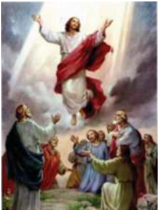

> **Deskripsi Visual:** Gambar ini adalah ilustrasi yang menampilkan peristiwa Kenaikan Yesus Kristus. Dalam gambar tersebut, Yesus Kristus dilihat berjalan keluar dari langit, dengan aura cahaya yang mengelilingi tubuhnya. Di bawahnya, ada sekelompok orang yang tampak sedang berdoa dan menghormati Yesus. Elemen-elemen utama dalam gambar ini meliputi Yesus Kristus yang sedang naik ke langit, orang-orang yang berdoa di bawahnya, dan cahaya yang mengelilingi tubuh Yesus. Teks, angka, atau label penting tidak terlihat dalam gambar ini. Informasi kunci yang dapat diambil pembaca adalah bahwa gambar ini menunjukkan peristiwa Kenaikan Yesus Kristus, yang merupakan salah satu peristiwa penting dalam agama Kristen.

 

---
## 📄 Halaman 150

- 17 Tanda-tanda  ini  akan  menyertai  orang-orang  yang  percaya:  mereka  akan mengusir setan-setan demi nama-Ku, mereka akan berbicara dalam bahasabahasa yang baru bagi mereka,
- 18 mereka  akan  memegang  ular,  dan  sekalipun  mereka  minum  racun  maut, mereka tidak akan mendapat celaka; mereka akan meletakkan tangannya atas orang sakit, dan orang itu akan sembuh. '
- 19 Sesudah Tuhan Yesus berbicara demikian kepada mereka, terangkatlah Ia ke Surga, lalu duduk di sebelah kanan Allah.
- 20 Mereka pun pergilah memberitakan Injil ke segala penjuru, dan Tuhan turut bekerja dan meneguhkan firman itu dengan tanda-tanda yang menyertainya

### Tugas

Bertolak  dari  kutipan  Kitab  Suci  di  atas,  rumuskan  pemahamanmu tentang arti Yesus bangkit? Apa buktinya? Apa artinya Yesus naik ke Surga?

### 3. Makna Kebangkitan Yesus bagi kita

Untuk memahami makna kebangkitan Yesus Kristus bagi kita, coba baca dan renungkan kutipan 1 Korintus 15: 3-8. 14.17.20-23 berikut ini:

### Kebangkitan Yesus dan Kebangkitan Kita

- 3 Sebab yang sangat penting telah kusampaikan kepadamu, yaitu apa yang telah kuterima sendiri, ialah bahwa Kristus telah mati karena dosa-dosa kita, sesuai dengan Kitab Suci,
- 4 bahwa Ia telah dikuburkan, dan bahwa Ia telah dibangkitkan, pada hari yang ketiga, sesuai dengan Kitab Suci;
- 5 bahwa Ia telah menampakkan diri kepada Kefas dan kemudian kepada kedua belas murid-Nya.
- 6 Sesudah  itu,  Ia  menampakkan  diri  kepada  lebih  dari  lima  ratus  saudara sekaligus;  kebanyakan  dari  mereka  masih  hidup  sampai  sekarang,  tetapi beberapa di antaranya telah meninggal.
- 7 Selanjutnya, Ia menampakkan diri kepada Yakobus, kemudian kepada semua rasul.
- 8 Dan yang paling akhir dari semuanya itu, Ia menampakkan diri juga kepadaku, sama seperti kepada anak yang lahir sebelum waktunya

 

---
## 📄 Halaman 151

- 14 Tetapi andaikata Kristus tidak dibangkitkan, maka sia-sialah pemberitaan kami dan sia-sialah juga kepercayaan kamu.
- 17 Dan jika Kristus tidak dibangkitkan, maka sia-sialah kepercayaan kamu dan kamu masih hidup dalam dosamu.
- 20 Tetapi yang benar ialah, bahwa Kristus telah dibangkitkan dari antara orang mati, sebagai yang sulung dari orang-orang yang telah meninggal.
- 21 Sebab, sama seperti maut datang karena satu orang manusia, demikian juga kebangkitan orang mati datang karena satu orang manusia.
- 22 Karena sama seperti semua orang mati dalam persekutuan dengan Adam, demikian  pula  semua  orang  akan  dihidupkan  kembali  dalam  persekutuan dengan Kristus.
- 23 Tetapi  tiap-tiap  orang  menurut  urutannya:  Kristus  sebagai  buah  sulung; sesudah itu mereka yang menjadi milik-Nya pada waktu kedatangan-Nya.

### Tugas

Coba rumuskan pesan kutipan tersebut  dengan  merangkai  jawaban atas beberapa pertanyaan berikut:

- Apa isi pokok yang terkandung dalam 1Korintus 15: 3-8?
- Apa isi pokok yang terkandung dalam 1Korintus 15: 14-17?
- Apa  isi  pokok  yang  terkandung  dalam  1Korintus  15:  20-23?  Apa maknanya bagi kita sekarang?
Untuk mendalami lebih lanjut, kalian juga dapat membaca beberapa kutipan berikut: Yohanes 8:28, Roma 6:4, 2 Korintus 5:15,

Untuk memahami makna Yesus ke Surga bagi kita, bacalah beberapa kutipan berikut  lalu  rangkailah  maknanya:  Yohanes  20:17,  Yohanes  3:13,  Yohanes  14:2, Yohanes 12:32, Ibrani 9: 11. 24, Ibrani 7:25, Daniel 7:14, Kolose 3:1-2

 

---
## 📄 Halaman 152

### 3. Menghayati Kebangkitan dan Kenaikan Yesus dalam Hidup Sehari-hari

### Tugas

Untuk  makin  mengokohkan  penghayatan  iman  kalian,  buatlah  doa tertulis  yang  mengungkapkan penghayatan kalian akan kebangkitan dan kenaikan Yesus ke Surga.

### Re fleksi

Gereja  mengimani,  bahwa  sekalipun  Yesus  telah  bangkit  dan  kini berada  dalam  kemuliaan  bersama  Bapa  dan  Roh  Kudus,  Ia  tetap  hadir dalam  Gereja-Nya.  Kehadiran  Yesus  Kristus  itu  dapat  dirasakan  dalam berbagai bentuk:

- Ia hadir melalui sabda-Nya. Setiap saat kita membaca Kitab Suci, kita merasakan Yesus yang hadir dan bersabda kepada kita. Sejauhmana kalian setia membaca Kitab Suci?
- Ia  hadir  dalam  Ekaristi,  terutama  komuni.  Tubuh  (dan  darah) Kristus  yang  kita  terima  saat  Ekaristi,  merupakan  tanda  kehadiran Yesus Kristus dalam diri kita. Ia hadir untuk menguatkan iman kita. Sejauhmana kalian setia dalam mengikuti Ekaristi?
- Ia  hadir  dalam  sakramen-sakramen.  Dalam  sakramen  Kristus  hadir untuk  menyelamatkan.  Sejauhmana  kalian  menaruh  hormat  dalam menerima sakramen-sakramen?
- Ia  hadir  melalui  para  pemimpin  Gereja.  Merekalah  wakil  Kristus di  dunia;  melalui  mereka  Yesus  hadir  untuk  Imam,  raja  dan  Nabi. Sejauhmana  kita  menaruh  hormat  dan  taat  kepada  para  pemimpin Gereja sebagai wakil Kristus?
Semua  tanda  kehadiran  Kristus  itu,  hanya  mungkin  dapat  dirasakan bilamana kita sungguh-sungguh percaya kepada Dia.

 

---
## 📄 Halaman 153

### Untuk dipahami

S t.  Thomas  Aquinas  menjelaskan  bahwa  ada  lima  alasan  mengapa  Kristus bangkit.

- Pertama,  untuk  menyatakan  keadilan  Allah .  Kristus  yang  rela  taat  pada kehendak Allah, menderita dan wafat sudah selayaknya ditinggikan dengan kebangkitan-Nya yang mulia.
- Kedua,  untuk  memperkuat  iman  kita .  Rasul  Paulus  menuliskan,  'Tetapi andaikata Kristus tidak dibangkitkan, maka sia-sialah pemberitaan kami dan sia-sialah juga kepercayaan kamu.' (1Korintus 15:14) Dengan kebangkitanNya,  maka  Kristus  sendiri  membuktikan  bahwa  Dia  adalah  Tuhan,  dan membuktikan  bahwa kematian-Nya bukanlah satu kekalahan,  namun merupakan satu kemenangan yang membawa kehidupan.
- Ketiga,  untuk  memperkuat  pengharapan .  Karena  Kristus  membuktikan bahwa Dia bangkit dan membawa orang-orang kudus bersama dengan-Nya, maka kita dapat mempunyai pengharapan yang kuat, bahwa pada saatnya, kitapun akan dibangkitkan oleh Kristus. Dan inilah yang menjadi pewartaan para  rasul,  seperti  yang  dikatakan  oleh  rasul  Paulus  'Jadi,  bilamana  kami beritakan,  bahwa  Kristus  dibangkitkan  dari  antara  orang  mati,  bagaimana mungkin ada di antara kamu yang mengatakan, bahwa tidak ada kebangkitan orang mati?' (1Korintus 15:12).
- Keempat, agar kita dapat hidup dengan baik . St. Thomas mengutip Roma 6:4, 'Dengan demikian kita telah dikuburkan bersama-sama dengan Dia oleh baptisan  dalam  kematian,  supaya,  sama  seperti  Kristus  telah  dibangkitkan dari antara orang mati oleh kemuliaan Bapa, demikian juga kita akan hidup dalam hidup yang baru.' Dengan demikian, kebangkitan Kristus mengajarkan kita untuk senantiasa hidup dalam hidup yang baru, yaitu hidup dalam Roh.
- Kelima, untuk menuntaskan karya keselamatan Allah . Karya keselamatan Allah tidak berakhir pada kematian Kristus di kayu salib, namun berakhir pada  kemenangan  Kristus,  yaitu  dengan  kebangkitan-Nya.  Rasul  Paulus menuliskan 'yaitu Yesus, yang telah diserahkan karena pelanggaran kita dan dibangkitkan karena pembenaran kita.' (Roma 4:25).

 

---
## 📄 Halaman 154

### Mazmur 98:1-9

- 1 Nyanyikanlah  nyanyian  baru  bagi  TUHAN,  sebab  Ia  telah  melakukan perbuatan-perbuatan yang ajaib; keselamatan telah dikerjakan kepada-Nya oleh tangan kanan-Nya, oleh lengan-Nya yang kudus.
- 2   TUHAN telah memperkenalkan keselamatan yang dari pada-Nya, telah menyatakan keadilan-Nya di depan mata bangsa-bangsa.
- 3 Ia mengingat kasih setia dan kesetiaan-Nya terhadap kaum Israel, segala ujung bumi telah melihat keselamatan yang dari pada Allah kita.
- 4 Bersorak-soraklah bagi TUHAN,  hai  seluruh  bumi, bergembiralah, bersorak-sorailah dan bermazmurlah!
- 5 Bermazmurlah bagi TUHAN dengan kecapi, dengan kecapi dan lagu yang nyaring,
- 6 dengan nafiri dan sangkakala yang nyaring bersorak-soraklah di hadapan Raja, yakni TUHAN!
- 7 Biarlah gemuruh laut serta isinya, dunia serta yang diam di dalamnya!
- 8 Biarlah sungai-sungai bertepuk tangan, dan gunung-gunung bersorak-sorai bersama-sama
- 9 di  hadapan TUHAN, sebab Ia datang untuk menghakimi bumi. Ia akan menghakimi dunia dengan keadilan, dan bangsa-bangsa dengan kebenaran.

 

---
## 📄 Halaman 155

### Bab VI Yesus, Sahabat, Tokoh Idola, Putra Allah dan Juruselamat

Banyak  aspek  yang  dapat  kita  dalami  tentang  Yesus  Kristus.  Dalam  bab sebelumnya, kita sudah memahami perjuangan Yesus Kristus dalam mewartakan Kerajaan Allah. Perjuangan-Nya yang tergolong singkat (sekitar 3 tahun) ternyata bukan  perkara  mudah.  Ia  tidak  hanya  berusaha  memurnikan  pemahaman masyarakat  tentang  Kerajaan  Allah  yang  sudah  terlebih  dahulu  diajarkan  oleh tokoh-tokoh  dan  kelompok  masyarakat  sebelumnya;  melainkan  juga  harus berhadapan dengan tokoh-tokoh masyarakat dan tokoh agama Yahudi yang tidak menyukai karya-Nya. Tokoh masyarakat dan tokoh agama Yahudi tidak hanya membenci dan menolak kehadiran Yesus, malahan mereka berusaha menjebak dan mempersalahkan Yesus, bahkan selalu berupaya dengan berbagai cara untuk membunuh-Nya.

Perjuangan untuk mewartakan Kerajaan Allah dilakukan Yesus Kristus dalam kesetiaan total kepada Bapa dan kepada manusia. Itulah sebabnya Ia juga tetap setia menjalani sengsara sampai wafat di kayu salib. Namun, wafat Yesus Kristus bukan akhir dari rencana Allah menyelamatkan manusia. Dengan membangkitkan Yesus  Kristus  Allah  memberi  harapan  baru  tentang  keselamatan  manusia  yang lebih paripurna. Berkat kebangkitan dan kenaikan Yesus Kristus ke Surga, harapan akan keselamatan kekal menjadi makin jelas, sebab Yesus tidak hanya berjanji, melainkan sudah membuktikannya sendiri.

Tindakan Yesus Kristus dalam mewartakan Kerajaan Allah sampai wafat di salib  itu  sangat  mengagumkan.  Oleh  karenanya,  Yesus  Kristus  pantas  menjadi sahabat dan idola hidup kita masa kini. Kekaguman kita akan bertambah, bila kita  melihat  kembali  kepribadian-Nya secara lebih dalam. Maka dalam bab ini berturut-turut akan didalami topik-topik berikut:

- Yesus Kristus sahabat sejati dan tokoh idola
- Yesus Putra Allah dan Juru Selamat

 

---
## 📄 Halaman 156

### A. Yesus Kristus Sahabat Sejati dan Tokoh Idola

Sulit dibayangkan orang yang hidupnya tanpa sahabat. Sebab secara kodrati persahabatan merupakan kebutuhan setiap manusia. Tak ada manusia yang bisa berkembang secara sempurna tanpa peran seorang sahabat. Injil Yohanes memberi gambaran  paham  Yesus  tentang  persahabatan  sejati.  Yesus  menyebut  muridmuridNya sahabat sekalipun banyak perbedaan di antara mereka. 'Kamu adalah sahabat-Ku, jikalau kamu berbuat apa yang Kuperintahkan kepadamu. Aku tidak menyebut kamu lagi hamba, sebab hamba tidak tahu, apa yang diperbuat oleh tuannya, tetapi Aku menyebut kamu sahabat, karena Aku telah memberitahukan kepada  kamu  segala  sesuatu  yang  telah  Kudengar  dari  Bapa-Ku'  (Yohanes  15: 14-15).  Bahkan  kepada  Yudas  Iskariot,  salah  seorang  murid-Nya  yang  telah mengkhianati  dan  menjual  diri-Nya,  Yesus  tetap  menyapa  dia  sahabat.  'Hai sahabat, untuk itukah engkau datang?' (Matius 26: 50). Pemahaman Yesus tentang makna persahabatan sejati tidak sebatas kata-kata kosong. 'Tidak ada kasih yang lebih besar dari pada kasih seorang yang memberikan nyawanya untuk sahabatsahabatnya' (Yohanes 15:13) Ia membuktikan sendiri melalui tindakan, dengan rela menanggung sengsara sampai wafat di salib.

Bagi  para  murid-Nya,  Yesus  tidak  hanya  dirasakan  sebagai  sahabat.  Bagi mereka,  Yesus  juga  adalah  idola  dan  sekaligus  model  bagaimana  mencapai kepenuhan hidup sejati. Di hadapan para murid-muridNya, Yesus tampil dengan kepribadian dan tindakan yang sedemikian memesona. Dari situ mereka belajar hidup seperti Yesus. Hal itu dapat dibuktikan, sebab sekalipun Yesus sudah wafat, bangkit  dan  naik  ke  Surga,  mereka  meneruskan  gaya  hidup  dan  kepribadian Yesus dalam Gereja. Dengan demikian para murid maupun Gereja dulu hingga sekarang, tidak hanya mengidolakan, dan tidak pula sekedar meniru, melainkan meneruskan dan mengembangkannya.

### Doa

Allah,Bapa Yang Mahabaik, kami bersyukur atas Yesus Kristus, Putera-Mu

yang telah Kau anugerahkan kepada kami dan menjadi sahabat semua orang.

Berkatilah kami, agar dengan mengenal lebih dalam akan Putera-Mu, kami pun dapat meneladan sikap dan tindakan-Nya

dalam membangun persahabatan, dan dalam mengembangkan diri kami. Amin

 

---
## 📄 Halaman 157

### 1. Makna Persahabatan dan Sikap dalam Membangun Persahabatan

Simaklah cerita berikut:

### Cinta Sahabat

Diceritakan  bahwa  ada  seorang  Pangeran  yang  hendak  mengunjungi seorang sahabatnya di suatu kota, yang sedang bermusuhan dengan kotanya. Sial  bagi  pangeran  itu  karena  kemudian  ia  ditangkap  dan  dituduh  sebagai mata-mata. Hukumannya adalah hukuman mati di tiang gantungan. Sebelum ia dihukum mati, ia memohon kepada raja di kota itu, supaya ia kembali dulu untuk berpamitan kepada anak istrinya. Tentu saja raja menolak, siapa mau percaya pada musuh, apalagi mata-mata. Lalu pangeran itu berkata: 'Di kota ini saya mempunyai sahabat, ia adalah seorang bangsawan. Ia akan menjadi jaminan bagiku!'

Kemudian bangsawan itu dipanggil. Ia begitu berbahagia dapat bertemu kembali  dengan  sahabatnya.  Dan  setelah  mendengar  kasus  yang  menimpa sahabatnya,  ia  sangat  rela  menjadi  jaminan  bagi  sahabatnya  itu.  Dengan lantang  ia  berkata  kepada  raja:  'Saya  menjadi  jaminan  bagi  sahabatku! Apapun risikonya!'

' Apakah termasuk risiko mati digantung, kalau sahabatmu tidak kembali pada batas waktu yang ditentukan?'

'Ya !'

Raja  memberi  batas  waktu  30  hari.  Pada  hari  ke  30,  tepat  pukul  12 pangeran  itu  harus  sudah  kembali,  kalau  tidak  sahabatnya  akan  dihukum gantung.

Hari demi hari berlalu.  Pangeran  itu  belum  juga  kembali.  Tetapi,  pada hari ketiga puluh menjelang jam 12 siang, bangsawan sang pangeran digiring ke tiang gantungan. Tali gantungan dipasang pada lehernya. Tepat pada saat itu, terlihat seseorang datang berlari-lari, menyeruak di antara kerumunan massa sambil berteriak: ' Aku sudah kembali!'. Orang itu adalah sang Pangeran. Dia menyerbu ke tiang gantungan dan mencoba mengambil tali gantungan untuk dipasang pada lehernya.

Namun bangsawan sahabatnya itu mempertahankan tali pada lehernya dan  berkata:  'Saya  sudah  siap  untuk  mati  bagimu,  sahabat!'.  Keduanya terlibat  dalam  perebutan  tali  gantungan  itu.  Raja  dan  massa  rakyat  yang memperhatikan  peristiwa itu hanya terbengong-bengong, tidak percaya. Akhirnya raja menyuruh algojonya memutuskan dan membuang tali

 

---
## 📄 Halaman 158

gantungan  itu,  dan  berkata  kepada  dua  sahabat  itu:  'seumur  hidupku  saya belum pernah mendengar dan menyaksikan suatu persahabatan yang penuh cinta  pengorbanan  seperti  itu.  Anda  berdua  diampuni.  Perkenankan  saya bergabung dengan Anda berdua sebagai sahabat yang ketiga'

Romo Yosef Lalu Pr, Percikan Kisah-kisah Anak Manusia, Komisi Kateketik KWI, hal 262-263

### Tugas

- Setelah membaca cerita di atas, ungkapkan kesan yang menarik dari cerita di atas!
- Kemudian tulislah nama sahabat-sahabat kalian, alasan yang menyebabkan persahabatan dengan orang tersebut masih berlangsung, pengalaman yang paling berkesan dengan salah seorang sahabat.
- Sikap-sikap  yang  perlu  dikembangkan  dan  sikap-sikap  yang  perlu dihindari dalam membangun persahabatan.
Bandingkan tanggapan kalian dengan gagasan berikut:

### 2. Paham Yesus Kristus Tentang Persahabatan Sejati dan Kepribadian Yesus yang Patut Diidolakan

Baca dan renungkanlah Injil Yohanes 15:12-16

- 12 Inilah perintah-Ku, yaitu supaya kamu saling mengasihi, seperti Aku telah mengasihi kamu.
- 13 Tidak ada kasih yang lebih besar dari pada kasih seorang yang memberikan nyawanya untuk sahabat-sahabatnya.
- 14 Kamu adalah sahabat-Ku, jikalau kamu berbuat apa yang Kuperintahkan kepadamu.
- 15 Aku tidak menyebut kamu lagi hamba, sebab hamba tidak tahu, apa yang diperbuat oleh tuannya, tetapi Aku menyebut kamu sahabat, karena Aku telah memberitahukan kepada kamu segala sesuatu yang telah Kudengar dari BapaKu.
- 16 Bukan  kamu yang memilih Aku, tetapi Akulah yang memilih kamu. Dan Aku telah menetapkan kamu, supaya kamu pergi dan menghasilkan buah dan buahmu itu tetap, supaya apa yang kamu minta kepada Bapa dalam nama-Ku, diberikan-Nya kepadamu.

 

---
## 📄 Halaman 159

---
**🖼️ Gambar/Diagram**

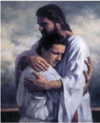

> **Deskripsi Visual:** Gambar ini adalah ilustrasi yang menampilkan dua orang yang tampaknya sedang berbicara atau berinteraksi. Orang pertama duduk dengan posisi yang menunjukkan kepercayaan atau pengertian, sementara orang kedua berdiri dan tampaknya sedang memberikan nasihat atau petunjuk. Kedua orang tersebut mengenakan pakaian putih yang menyerupai busana abad pertengahan, yang mungkin merujuk pada tema sejarah atau mitologi.

Elemen-elemen utama dalam gambar meliputi dua orang yang berinteraksi, latar belakang yang menunjukkan suasana alam, dan busana yang menunjukkan gaya atau periode waktu tertentu. Teks atau angka tidak terlihat dalam gambar ini, tetapi informasi kunci yang dapat diambil dari gambar ini adalah hubungan antara dua orang tersebut, serta tema atau konteks yang mungkin berkaitan dengan busana mereka.

Dalam konteks ilustrasi ini, gambar tersebut mungkin digunakan untuk membantu pembaca memahami konsep atau cerita yang berkaitan dengan hubungan manusia, pengajaran, atau peristiwa sejarah yang relevan dengan busana yang digunakan oleh dua orang tersebut.

### Tugas

Rumuskan pesan kutipan di atas. Untuk merumuskannya kalian dapat menggunakan analisa teks berikut:

- Perhatikan ayat 14: 'Kamu adalah sahabat-Ku, jikalau kamu berbuat apa  yang  Kuperintahkan  kepadamu'.  Bandingkan  dengan  perintah Yesus pada ayat 12. Apa kesimpulanmu?
- Perhatikan ayat 12: '..seperti Aku telah mengasihi kamu' bandingkan dengan ayat 13. Bagaimana Yesus mengasihi?
- Perhatikan  ayat  15:  '…karena  Aku  telah  memberitahukan  kepada kamu  segala  sesuatu  yang  telah  Kudengar  dari  Bapa-Ku'  Apa  yang didengar Yesus yang kemudian diberitahukan kepada murid-muridNya?
- Perhatikan ayat 16: Bukan kamu yang memilih Aku, tetapi Akulah yang memilih kamu, Apa maknanya dalam persahabatan? Dan Aku telah menetapkan kamu, supaya kamu pergi dan menghasilkan buah dan buahmu itu tetap, supaya apa yang kamu minta kepada Bapa dalam nama-Ku, diberikan-Nya kepadamu. Apa maknanya?

 

---
## 📄 Halaman 160

Tindakan Yesus, dalam memperlakukan murid-Nya dan semua orang sebagai sahabat,  sangat  luar  biasa.  Tetapi  keunggulan  pribadi  Yesus  bukan  hanya  itu. Banyak kepribadian Yesus yang dapat kita gali dari Kitab Suci. Cobalah bersama dengan teman-teman, mencari berbagai sikap/kepribadian Yesus yang patut kalian idolakan

### 3. Menghayati Teladan Yesus dalam Membangun Persahabatan dan Pribadi Yesus Sebagai Idola

### Tugas

Buatlah  renungan  yang  merupakan  tanggapanmu  atas  pertanyaan berikut:  seandainya  Yesus  hidup  dalam  masyarakat  Indonesia  saat  ini, kepribadian Yesus seperti apa yang akan menonjol dalam perilaku hidupnya sehari-hari?

### Re fleksi

Agar  kalian  lebih  mampu  menghayati  keteladanan  Yesus  dalam membangun  persahabatan  serta  keunggulan  pribadi-Nya  yang  patut diidolakan, masuklah dalam suasana hening untuk ber efleksi

- Anak-anakku terkasih, hari ini kita belajar memahami Yesus sebagai teladan  dalam  membangun  persahabatan  dan  kepribadianNya  yang unggul untuk kita jadikan idola
Sekarang cobalah lihat dalam pengalamanmu selama ini dalam  membangun  persahabatan.  Sikap-sikap  apa  saja  yang  perlu diperbaharui  dalam  membangun  persahabatan?  Sikap  dan  teladan Yesus apa saja yang ingin diterapkan?

Hening……(tulislah jawaban atas dua pertanyaan di atas)

- Yesus adalah pribadi yang unggul yang pantas dijadikan tokoh idola dalam mengembangkan diri
Sikap  dan  pribadi  Yesus  yang  mana  yang  masih  lemah  dalam hidupmu? Sikap dan pribadi apa yang perlu kamu temukan dalam diri Yesus?

Hening……(tulislah jawaban atas dua pertanyaan di atas)

 

---
## 📄 Halaman 161

### Untuk dipahami

- Yesus menyebut murid-muridNya sahabat. ' Kamu adalah sahabat-Ku, jikalau kamu  berbuat  apa  yang  Kuperintahkan  kepadamu ' .  Kutipan  ini hendak mempertegas,  bahwa  mereka  baru  benar-benar  disebut  sahabat bilamana mereka saling mengasihi, sebagaimana diperintah Kristus sendiri.
- Bila Yesus menuntut agar mereka hidup saling mengasihi agar disebut sahabat Dia,  Yesus  sendiri  telah  lebih  dahulu  mengasihi  mereka.  Yesus  mengasihi mereka dengan memberi mereka pengajaran, melihat tanda mukjizat yang tidak dilihat semua orang, Yesus mendoakan mereka (bandingkan Yohanes 17), dan kelak, Yesus akan mengasihi mereka secara paripurna dan sehabishabisnya dengan wafat-Nya di kayu salib.
- ' Aku tidak menyebut kamu lagi hamba, sebab hamba tidak tahu, apa yang diperbuat  oleh  tuannya,  tetapi  Aku  menyebut  kamu  sahabat,  karena  Aku telah memberitahukan kepada kamu segala sesuatu yang telah Kudengar dari Bapa-Ku ' Persahabatan Yesus dan para murid bukan sekedar persahabatan biasa.  Persahabatan  tersebut  dilandasi  oleh  perjuangan  bersama  tentang apa yang telah di dengar Yesus dari bapa-Nya dan yang telah diberitahukan Yesus  kepada  para  murid-Nya,  yakni  perjuangan  untuk  mewartakan  dan mewujudkan Kerajaan Allah.
- Sikap  dan  tindakan  Yesus  dalam  persahabatan  dengan  para  murid-Nya, sungguh  mengagumkan.  Maka  pantaslah  Yesus  juga  kita  jadikan  sebagai Idola dan model kita dalam memperkembangkan diri dan dalam membangun persahabatan.  Dalam  kegiatan  berikut  kita  akan  mendalami  sikap  dan kepribadian Yesus agar kita makin mantap mengidolakan Dia.

### Doa

### Mazmur 103

- 1 Pujilah TUHAN, hai jiwaku! Pujilah nama-Nya yang kudus, hai segenap batinku!
- 2 Pujilah TUHAN, hai jiwaku, dan janganlah lupakan segala kebaikan-Nya!
- 3   Dia yang mengampuni segala kesalahanmu, yang menyembuhkan segala penyakitmu,
- 4 Dia yang menebus hidupmu dari lobang kubur, yang memahkotai engkau dengan kasih setia dan rahmat,

 

---
## 📄 Halaman 162

- 5  Dia yang memuaskan hasratmu dengan kebaikan, sehingga masa mudamu menjadi baru seperti pada burung rajawali.
- 6 TUHAN menjalankan keadilan dan hukum bagi segala orang yang diperas.
- 7 Ia  telah  memperkenalkan  jalan-jalan-Nya  kepada  Musa,  perbuatanperbuatan-Nya kepada orang Israel.
- 8   TUHAN adalah penyayang dan pengasih, panjang sabar dan berlimpah kasih setia.
- 9 Tidak selalu Ia menuntut, dan tidak untuk selama-lamanya Ia mendendam.
- 10 Tidak dilakukan-Nya kepada kita setimpal dengan dosa kita, dan tidak dibalas-Nya kepada kita setimpal dengan kesalahan kita,
- 11 Tetapi setinggi langit di atas bumi, demikian besarnya kasih setia-Nya atas orang-orang yang takut akan Dia;
- 12 sejauh timur  dari  barat,  demikian  dijauhkan-Nya  dari  pada  kita pelanggaran kita.
- 13 Seperti  bapa  sayang  kepada  anak-anaknya,  demikian  TUHAN  sayang kepada orang-orang yang takut akan Dia.
- 14 Sebab Dia sendiri tahu apa kita, Dia ingat, bahwa kita ini debu.
- 15 Adapun manusia, hari-harinya seperti rumput, seperti bunga di padang demikianlah ia berbunga;
- 16 apabila angin melintasinya, maka tidak ada lagi ia, dan tempatnya tidak mengenalnya lagi.
- 17 Tetapi kasih setia TUHAN dari selama-lamanya sampai selama-lamanya atas orang-orang yang takut akan Dia, dan keadilan-Nya bagi anak cucu,
- 18 bagi  orang-orang  yang  berpegang  pada  perjanjian-Nya  dan  yang  ingat untuk melakukan titah-Nya.
- 19 TUHAN  sudah  menegakkan  takhta-Nya  di  Surga  dan  kerajaan-Nya berkuasa atas segala sesuatu.
- 20 Pujilah  TUHAN,  hai  malaikat-malaikat-Nya,  hai  pahlawan-pahlawan perkasa  yang  melaksanakan  firman-Nya  dengan  mendengarkan  suara firman-Nya.
- 21 Pujilah  TUHAN, hai segala  tentara-Nya,  hai  pejabat-pejabat-Nya  yang melakukan kehendak-Nya.
- 22 Pujilah TUHAN, hai segala buatan-Nya, di segala tempat kekuasaan-Nya! Pujilah TUHAN, hai jiwaku!

 

---
## 📄 Halaman 163

### B. Yesus Putra Allah dan Juru Selamat

Dalam  masyarakat,  kita  mengenal  adanya  orang-orang  yang  karena  sebab tertentu memiliki gelar atau sebutan tertentu. Idealnya, orang yang memiliki gelar tersebut, hidupnya mencerminkan kemampuan atau perilaku yang sesuai. Dalam Kitab Suci, kita menemukan berbagai gelar yang diberikan Allah sendiri maupun oleh Umat beriman maupun yang dinyatakan sendiri oleh Yesus terhadap diriNya. Gelar-gelar itu antara lain: Mesias, Kristus, Anak Allah, Putera Allah, Firman, Gembala, Pintu, Pokok Anggur, Kebangkitan dan Hidup, dan sebagainya. Dari sekian banyak gelar yang dimiliki Yesus, tidak semua gelar akan diuraikan. Ada tiga gelar Yesus, yakni gelar Yesus sebagai Tuhan, Putera Allah, dan Juru Selamat yang cukup penting untuk dipahami. Gelar-gelar tersebut diyakini kebenarannya berkat iman akan Yesus. Hanya mereka yang mengimani Yesus akan merasakan makna dari gelar-gelar tersebut.

### 1. Kebiasaan Pemberian Gelar dalam Masyarakat

Dalam masyarakat seringkali kalian menemukan tokoh-tokoh tertentu diberi gelar tertentu pula, misalnya: ada tokoh yang diberi gelar 'Bapa pembangunan' , hakim dan jaksa sering diberi gelar 'Penegak Hukum' , ada guru yang mendapat gelar 'Guru teladan' . Nelson Mandela dari Afrika Selatan semasa hidupnya oleh pemerintah  Indonesia  diberi  gelar  'Duta  Batik  Internasional' .  Dari  gelar-gelar yang disebut tadi, apa maknanya? Apa pengaruh gelar tersebut bagi kehidupan orang yang menerimanya?

 

---
## 📄 Halaman 164

### Sekarang simaklah puisi berikut:

### Litani Domba Kudus

(Oleh: W.S. Rendra)

Yesus Kecil, Domba yang Kudus Lapangkanlah dada-Mu, ya Domba Kudus! Yang terbantai di tengah siang Limpahkanlah kiranya berkat-Mu bagai air! Yang berdarah bagai anggur Meluaplah ampun dari samudera kasih-Mu! Yang menyala bagai kandil Kami semua adalah milik-Mu

Duhai, daging korban yang sempurna.

Ia tempat lari segala jiwa yang papa Ia bunga putih, keputihan dan bunga-bunga Ia burung dara dari gading. Ia utusan Bapa dan diri-Nya. Ia tebing yang dipukuli arus air Lapangkanlah dadaMu, yang Domba Kudus!

Yang disobek oleh dendam Yang dipaku di kayu topengan dosa Yang menggenggam duri-duri di daging-Nya Yang ditelanjangi dan membuka hati-Nya Yang mengampuni si penikam durjana Yang tersungkur tiga kali dan bangkit lagi. Yang berpeluhkan bintik-bintik darah. Limpahkanlah kiranya berkatMu bagai air!

Raja tanpa emas tanpa permata

Raja yang dimahkotai duri Raja yang menyusuri jalanan para miskin Raja yang dibaptiskan pertapa dina Raja yang membangunkan Lazarus dari kubur Raja yang diminyaki pelacur dipalingi muka

 

---
## 📄 Halaman 165

Raja yang ditampar pada pipinya Meluaplah ampun dari samudera kasih-Mu! Anak buah tubuh perawan dan benar perawan Anak yang dihadapi tiga raja dari Timur Anak yang mengucap kalimat ilahi Anak yang putih bagai mawar putih Anak yang menutup mata disiba bunda-Nya Anak emas dari kawanan kijang emas Anak penuh bunga di mata bunda-Nya Kami semua adalah milik-Mu!

---
**🖼️ Gambar/Diagram**

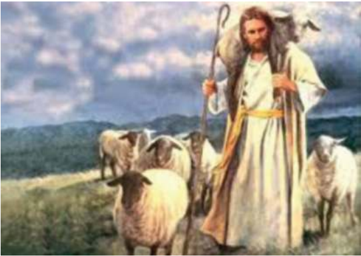

> **Deskripsi Visual:** Gambar ini adalah ilustrasi yang menampilkan seorang pemuda berjubah putih dengan topi berbulu, membawa tongkat penggembala dan mengelilingi beberapa ekor domba di sebuah padang rumput. Pemuda tersebut tampak tenang dan berada di tengah-tengah kelompok domba, menunjukkan posisi pemimpin atau pengelola. Latar belakangnya adalah pemandangan alam yang indah dengan gunung-gunung dan hamparan hijau yang luas, menunjukkan bahwa pemuda tersebut sedang berada di suatu daerah yang sejuk dan tenang.

Elemen-elemen utama dalam gambar ini meliputi pemuda penggembala, domba-domba, tongkat penggembala, dan latar belakang alam. Pemuda penggembala merupakan elemen utama yang memperlihatkan karakter dan peranannya sebagai pengelola domba. Domba-domba yang berada di sekitar pemuda menunjukkan hubungan dan ketergantungan antara pemuda dan domba. Tongkat penggembala yang dimegang oleh pemuda menambahkan unsur keamanan dan kontrol yang diperlukan dalam pekerjaan penggembalaan. Latar belakang alam yang indah menambah nuansa alami dan tenang pada gambar tersebut.

Teks, angka, atau label penting tidak terlihat dalam gambar ini karena gambar hanya mengandung visual saja tanpa teks atau angka tambahan. Namun, informasi kunci yang dapat diambil dari gambar ini adalah tentang hubungan antara pemuda penggembala dan domba-domba, serta lingkungan alam yang sejuk dan tenang di mana mereka berada. Gambar ini mungkin digunakan untuk mengajarkan konsep tentang pengelolaan hewan, hubungan manusia-dan-hewan, atau bahkan konsep tentang kepemimpinan dan pengelolaan.

Domba korban segala umat manusia Domba yang berlutut di taman Zaitun Domba yang dibantai dan bangkit dari kematian

 

---
## 📄 Halaman 166

Domba yang duduk di kanan Bapa Domba anak dari segala terang Domba yang manis, domba kami semua Lapangkanlah dada-Mu, ya Domba Kudus. Limpahkanlah berkat-Mu bagai air Meluaplah ampun dari samudera kasih-Mu Kami semua adalah milik-Mu Pengkhianat, penzinah, perampok Pembunuh, pendusta dan pemberontak.

Lapangkanlah dadaMu, Ya Domba Kudus!

Dari sekian banyak gelar Yesus yang diberikan oleh W .S Rendra, gelar mana yang menarik bagimu? Siapa WS Rendra itu sehingga bisa memberikan gelar-gelar itu kepada Yesus? Apakah ada hubungan antara W.S Rendra dengan Yesus ?

### 2. Gelar-Gelar Yesus dalam Kitab Suci dan Maknanya Bagi Iman Kita

Dalam Kitab Suci, kita dapat menemukan berbagai gelar yang melekat pada Yesus. Ada gelar yang diberikan oleh para murid sendiri, ada gelar yang dinyatakan oleh  Yesus  sendiri,  ada  gelar  yang  dinyatakan  oleh  Bapa.  Tetapi  yang  menarik adalah bahwa gelar-gelar itu lebih menunjuk pada siapa sesungguhnya Yesus bagi sesamanya. Jadi gelar tersebut, tidak sebagai pemberian yang spontan diberikan, melainkan sesuatu yang melekat pada diri-Nya.

### Tugas Kelompok

Bersama dengan teman dalam kelompok, coba carilah  dalam  Kitab Suci gelar-gelar yang melekat pada diri Yesus itu.

Kemudian rumuskan juga: konsekuensi apa yang harus kita lakukan bila kita mengimani Yesus dengan gelarnya itu?

 

---
## 📄 Halaman 167

### 3. Menghayati Gelar-Gelar Yesus dalam Kehidupan Sehari-hari

Untuk lebih menghayati gelar-gelar Yesus, renungkan kutipan Kitab Suci Matius 16:13-20

- 13 Setelah Yesus tiba di daerah Kaisarea Filipi, Ia bertanya kepada murid-muridNya: 'Kata orang, siapakah Anak Manusia itu?'
- 14 Jawab mereka: 'Ada yang mengatakan: Yohanes Pembaptis, ada juga yang mengatakan: Elia dan ada pula yang mengatakan: Yeremia atau salah seorang dari para nabi. '
- 15 Lalu Yesus bertanya kepada mereka: 'Tetapi apa katamu, siapakah Aku ini?'
- 16 Maka jawab Simon Petrus: 'Engkau adalah Mesias, Anak Allah yang hidup!'
- 17 Kata Yesus kepadanya: 'Berbahagialah engkau Simon bin Yunus sebab bukan manusia yang menyatakan itu kepadamu, melainkan Bapa-Ku yang di Surga.
- 18 Dan Aku pun berkata kepadamu: Engkau adalah Petrus dan di atas batu karang  ini  Aku  akan  mendirikan  jemaat-Ku  dan  alam  maut  tidak  akan menguasainya.
- 19 Kepadamu akan Kuberikan kunci Kerajaan Surga. Apa yang kauikat di dunia ini akan terikat di Surga dan apa yang kaulepaskan di dunia ini akan terlepas di Surga. '
- 20 Lalu  Yesus  melarang  murid-murid-Nya  supaya  jangan  memberitahukan kepada siapa pun bahwa Ia Mesias.

### Tugas

Cermati  dengan  baik  kutipan  di  atas.  Perhatikan  antara  pertanyaan Yesus  dan  jawaban  para  murid  pada  ayat  13  dan  14.  Lalu  bandingkan dengan pertanyaan Yesus dan jawaban Simon Petrus pada ayat 15 dan 16. Apa yang dapat kalian simpulkan dari perbedaan tersebut? Jawaban Simon Petrus pada ayat 16 berdampak pada pernyataan Yesus pada ayat 17. Apa yang dapat kalian simpulkan?

Bila  Yesus  masih  hidup  sekarang  ini  dan  datang  kepadamu,  lalu bertanya  kepadamu:  'Menurut  kamu  siapakah  Aku?' .  Apa  jawabanmu terhadap Yesus?

Coba sharingkan jawabanmu kepada teman-temanmu!

 

---
## 📄 Halaman 168

### Untuk diingat

### a. Yesus adalah Anak Allah

- Gelar  ' Anak  Allah'  menunjukkan hubungan  khas  antara  Yesus  dan Allah .  Tidak  ada  hubungan  yang  begitu  erat  dan  mesra  seperti  Yesus dan Allah  (bandingkan  Yohanes  10:  30).  Dalam  hubungan  yang  erat tersebut tetap terlihat bahwa antara Yesus dan Bapa berbeda. Yesus tidak sama dengan Allah Bapa. Allah Bapa berbeda dengan Yesus sang Anak (bandingkan Yohanes 14: 28). Anak dan Bapa memiliki peranan yang berbeda.
- Hubungan antara Bapa dan Anak itu tampak dalam ' ketaatan ' .  Y esus taat  sempurna terhadap Allah, Bapa-Nya (bandingkan Yohanes 4: 34). Seluruh hidup dan pribadi Yesus melayani dan melaksanakan kehendak Bapa, dan semua itu dijalankan dengan ketaatan secara total, bahkan taat sampai mati di kayu salib.

### b. Yesus adalah Juru Selamat

- Yesus datang untuk menanggapi  kerinduan manusia yang paling mendalam yaitu keselamatan secara paripurna. Keselamatan itu dinyatakan dengan pembebasan manusia dari dosa ( bdk .  Matius 1: 21) dan  mendekatkan  kembali  manusia  kepada  Allah  ( bdk .  Ibrani  7:  25). Seluruh  kata  dan  perbuatan-Nya  terarah  pada  upaya  mendekatkan hubungan manusia dan Allah ( bdk . Roma 5: 10).
- Melalui  perjuangan-Nya,  Yesus  menyatakan  bahwa  keselamatan  yang diberikan Allah itu semata-mata sebagai kasih karunia Allah ( bdk . Kisah Para Rasul 15:11). Keselamatan yang dialami manusia bukan pertamatama usaha manusia, melainkan karunia kasih-Nya ( bdk .  1Korintus 1: 21). Walaupun demikian, Allah tetap bersikap aktif dalam mengupayakannya.
- Keselamatan yang ditawarkan Yesus itu tetap diteruskan dalam Gereja dan terlaksana secara sakramental. Sakramen dalam Gereja mengungkapkan tindakan  Allah  yang  menyelamatkan.  Kedudukan  Yesus  sebagai  Juru Selamat sekaligus menegaskan bahwa Ia datang untuk menolong manusia karena manusia tidak dapat menolong dirinya sendiri. Ia tampil sebagai jalan dan sarana mencapai keselamatan yang ditawarkan Allah itu. Janji itu  pula  yang  menjadi  kekuatan  dan  harapan  yang  pasti,  bahwa  pada saatnya keselamatan itu akan dinyatakan secara penuh.

 

---
## 📄 Halaman 169

### Litani nama Yesus (Puji Syukur No. 208)

Tuhan, kasihanilah kami

Tuhan, kasihanilah kami

Kristus, kasihanilah kami

Kristus, kasihanilah kami

Tuhan kasihanilah kami, Kristus dengarkanlah kami

Kristus, kabulkanlah doa kami

Allah Bapa di surga,

Kasihanilah kami

Allah Putera Penebus dunia,

Allah Roh Kudus,

Allah Tritunggal Mahakudus,

Yesus, Hamba Allah

- Yesus, Anak Daud
- Yesus, Anak Manusia
- Yesus, Anak Allah
- Yesus, Nabi Agung
- Yesus, Gembala Yang Baik
- Yesus, Roti Hidup
- Yesus, Terang dunia
- Yesus, Pokok Anggur
- Yesus, Jalan, Kebenaran dan Hidup
- Yesus, Kebangkitan dan Hidup
- Yesus, Hakim yang Adil,
- Yesus, Anak Domba Allah,
- Yesus, Pengantara,
- Yesus, Imam Agung
- Yesus, Anak Terkasih Bapa
- Yesus, Anak Tunggal Allah
- Yesus, Yang akan datang kembali
- Yesus, Kegenapan janji Allah,
- Yesus, Citra Allah
- Yesus, Putra Sulung
- Yesus, Sang Sabda
- Yesus, Sungguh Allah Sungguh Manusia,
- Yesus, Penyembuh ilahi
- Yesus, Pintu Keselamatan,
- Yesus, Penyelamat dunia,
- Yesus, Raja Semesta,

 

---
## 📄 Halaman 170

Yesus, Pengantin Gereja Yesus,

Yesus, Rasul Utama

Yesus, Sang terpilih

Yesus, Kristus, Sang Terurapi

Yesus, Awal dan Akhir

Yesus, Kepala Gereja

Yesus, Bintang Timur Cemerlang

Yesus, Tuhan Yang Mahakuasa

Berbelas kasihanlah kiranya, Berbelas kasihanlah kiranya,

Dari segala kejahatan

Dari segala godaan Dari tipu daya setan Dari kematian kekal Dari kelalaian akan nasihat-Mu

Berkat penjelmaan-Mu,

Berkat kelahiran-Mu,

Berkat masa muda-Mu

Berkat segala karya-Mu,

Berkat segala sabda-Mu,

Berkat sengsara-Mu,

Berkat salib-Mu,

- Berkat wafat dan pemakaman-Mu,
- Berkat kenaikan-Mu ke Surga,
- Berkat kemuliaan-Mu,
Anak Domba Allah, yang menghapus dosa dunia,

Anak Domba Allah, yang menghapus dosa dunia,

Anak Domba Allah, yang menghapus dosa dunia,

Yesus, dengarkanlah doa kami sayangilah kami, ya Yesus kabulkanlah doa kami, ya Yesus bebaskanlah kami, ya Tuhan

selamatkanlah kami, ya Tuhan sayangilah kami

kabulkanlah doa kami kasihanilah kami

Yesus, kabulkanlah doa kami

 

---
## 📄 Halaman 171

### Marilah kita berdoa. (hening)

- Ya Allah, Bapa Kami,
- Putera-Mu, Yesus Kristus telah bersabda:
- Mintalah, maka kamu akan diberi, carilah maka kamu akan mendapat,
- dan ketuklah maka pintu akan dibukakan.
- Kami mohon, anugerahilah kami cinta ilahi yang kami dambakan,
- agar kami mencintai Engkau dengan segenap hati, dengan segenap jiwa,
- dengan segenap akal budi, dan dengan segenap kekuatan
- Ya Allah, buatlah kami selalu hormat dan cinta akan nama Yesus yang suci,
- karena Ia selalu membimbing orang-orang yang telah Kauikat dalam cinta kasih-
- Mu.
- Engkau takkan melepaskan dari pelukan cinta-Mu
- orang-orang yang mengakui Engkau dalam nama Putera-Mu.
- Sebab Dialah Tuhan, pengantara kami, kini dan sepanjang masa. Amin

 

---
## 📄 Halaman 172

### Bab VII Allah Tritunggal dan Roh Kudus

Dalam  pengalaman  sehari-hari  sebagai  orang  beriman  Katolik,  mungkin kita  lebih  banyak  berbicara  tentang  Allah  Bapa  dan  Putera-Nya  Yesus  Kristus, pribadi pertama dan pribadi kedua dalam Tritunggal. Peranan Allah Bapa terasa lebih  sering  disoroti  sejak  penciptaan,  penyertaan-Nya  dalam  perjalanan  jatuh bangunnya  Bangsa  Israel,  sampai  pada  persiapan  menjelang  penjelmaan  Yesus Kristus. Yesus Kristus, sebagai pribadi kedua, juga lebih mudah dipahami, apalagi lewat penjelamaan-Nya menjadi manusia, karya-Nya dapat dilihat dan dirasakan langsung oleh para saksi hidup zaman-Nya. Hal yang sering dirasa agak sulit adalah ketika  kita  memasuki  pembicaraan  tentang  pribadi  ketiga,  yakni  Roh  Kudus. Banyak orang merasa berbicara tentang Roh Kudus seolah berbicara sesuatu yang abstrak.

Tetapi, iman Katolik adalah Iman yang Trinitas. Kita mengimani Allah yang melaksanakan  karya  penyelamatannya  bagi  manusia  sepanjang  zaman,  melalui peran ketiga pribadi: Bapa, Putera dan Roh Kudus. Ketiganya merupakan kesatuan utuh yang tak dapat dipisahkan, walaupun ketiganya berbeda. Peran Bapa, hanya mempunyai arti penyelamatan secara umum dan universal bila kita kaitkan dengan karya Putera dan Roh Kudus. Karya Putera, hanya mempunyai arti penyelamatan secara utuh bila ditempatkan dalam keseluruhan karya dan rencana Bapa, dan yang masih terus berlangsung berkat Roh Kudus. Demikian pula, kehadiran Roh Kudus dan karya-Nya, hanya dapat dipahami sebagai bagian utuh karya keselamatan bila ditempatkan sebagai roh penghibur dan roh kebenaran yang dimintakan Yesus kepada Bapa untuk menyertai manusia.

Melalui pembahasan materi dalam bab ini, peserta didik akan diajak untuk memahami bersama pengertian Tritunggal Mahakudus dan Peranan Roh Kudus bagi  Gereja.  Materi  ini  cukup  berat  untuk  diproses  dan  dipahami,  baik  bagi guru  maupun  peserta  didik.  Tetapi,  mengingat  materi  ini  merupakan  pintu masuk untuk memahami dasar iman kristiani, maka diperlukan kesetiaan untuk mempelajarinya.  Secara  metodologis,  materi  dalam  bab  ini  dominan  bersifat informatif. Walaupun demikian proses pembelajaran tidak akan membosankan bila  peserta  didik  sendiri  terlibat  langsung  untuk  membaca  sumbernya,  yakni Kitab Suci. Berturut-turut akan dipelajari tentang:

- Tritunggal Mahakudus.
- Peran Roh Kudus bagi Gereja

 

---
## 📄 Halaman 173

### A. Tritunggal Mahakudus

Salah satu ajaran iman kristiani yang dirasa sulit dipahami adalah tentang Tritunggal  Mahakudus.  Kesulitan  tersebut  sering  menjadi  penyebab  terjadinya kesalahan penafsiran. Misalnya: banyak orang yang yang bukan Kristen mengatakan bahwa orang Kristen percaya akan tiga Tuhan. Tentu saja hal ini tidak benar, sebab iman Kristiani mengajarkan Allah Yang Esa. Namun bagaimana mungkin Allah Yang  Esa  ini  mempunyai  tiga  Pribadi?  Untuk  menjawab  pertanyaan  tersebut dibutuhkan iman dan keterbukaan hati serta pola pikir yang lebih dalam dan luas dalam memahami Allah. Pola pikir yang dibutuhkan adalah bahwa tidak semua hal tentang Allah dapat dijelaskan dengan logika manusia semata-mata. Kita harus sampai pada kesadaran bahwa di balik kesulitan menjelaskan Allah, kenyataannya kehadiran Allah dapat dirasakan secara konkret dalam kehidupan sehari-hari.

Walaupun ajaran tentang  Trinitas  ini  tidak  dapat  dijelaskan  hanya  dengan akal, bukan berarti bahwa Allah Tritunggal ini adalah konsep yang sama sekali tidak masuk akal. St. Agustinus bahkan mengatakan, 'Kalau engkau memahamiNya, Ia bukan lagi Allah' . Sebab Allah jauh melebihi manusia dalam segala hal, dan meskipun Ia telah mewahyukan Diri, Ia tetap rahasia/misteri. Di sinilah peran iman, karena dengan iman inilah kita menerima misteri Allah yang diwahyukan dalam Kitab Suci, sehingga kita dapat menjadikannya sebagai dasar pengharapan, dan bukti dari apa yang tidak kita lihat (lihat Ibrani 11:1-2). Agar dapat sedikit menangkap maknanya, kita perlu mempunyai keterbukaan hati. Hanya dengan hati terbuka, kita dapat menerima rahmat Tuhan, untuk menerima rahasia Allah yang terbesar ini; dan hati kita akan dipenuhi oleh ucapan syukur tanpa henti. Jadi jika ada orang yang bertanya, apa dasarnya kita percaya pada Allah Tritunggal, sebaiknya kita katakan, 'karena Allah melalui Yesus menyatakan Diri-Nya sendiri demikian' , dan hal ini kita ketahui dari Kitab Suci.

### Doa

Ya Allah Tritunggal Maha Kudus, kami memuji nama-Mu dan keajaiban kasih-Mu

yang Engkau nyatakan di dalam Kristus Putera-Mu yang telah wafat dan bangkit bagi kami.

Di dalam Kristuslah, kami mengenal kedalaman misteri kehidupan-Mu, yang adalah Kasih Ilahi.

 

---
## 📄 Halaman 174

Berikanlah kepada kami, ya Tuhan, rahmat pengertian akan misteri kasihMu itu,

- agar  kami  dapat  memuliakan  Engkau  dan  menyembah  kesatuan  Kasih Ilahi-Mu.
- Semoga oleh kuasa-Mu, hati kami dapat terbuka
- untuk melihat betapa besar dan dalamnya misteri Kasih itu.
- Di dalam nama Yesus Kristus kami naikkan doa ini.
- Amin.

### 1. Pengalaman Terhadap Karya Allah yang Trinitaris

Simaklah cerita di bawah ini:

### KAMI BERTIGA, KAMU BERTIGA

(Saduran: Anthony de Mello, SJ)

Ketika kapal seorang Uskup berlabuh untuk satu hari di sebuah pulau yang terpencil,  ia  bermaksud  menggunakan  hari  itu  sebaik-baiknya.  Ia  berjalanjalan menyusur pantai dan menjumpai tiga orang nelayan sedang memperbaiki pukat. Dalam bahasa Inggris pasaran mereka menerangkan, bahwa berabadabad sebelumnya penduduk pulau itu telah dibaptis oleh para misionaris. 'Kami orang Kristen', kata mereka sambil dengan bangga menunjuk dada.

Uskup amat terkesan. Apakah mereka tahu doa syahadat? Ternyata mereka belum pernah mendengarnya. Uskup terkejut sekali. Bagaimana orang-orang ini dapat menyebut diri mereka Kristen, kalau mereka tidak mengenal sesuatu yang begitu dasariah seperti doa syahadat itu?

'Lantas, apa yang kamu ucapkan bila berdoa?'

'Kami memandang ke langit. Kami berdoa: 'Kami bertiga, kamu bertiga, kasihanilah  kami'.  Uskup  heran  akan  doa  mereka  yang  primitif  dan  jelas bersifat bidaah ini. Maka sepanjang hari ia mengajar mereka berdoa syahadat. Nelayan-nelayan itu sulit sekali menghafal, tetapi mereka berusaha sedapatdapatnya. Sebelum berangkat lagi pada pagi hari berikutnya, Uskup merasa puas. Sebab, mereka dapat mengucapkan doa syahadat dengan lengkap tanpa satu kesalahan pun.

Beberapa  bulan  kemudian,  kapal  Uskup  kebetulan  melewati  kepulauan itu lagi. Uskup mondar-mandir di geladak sambil berdoa malam. Dengan rasa senang ia mengenang, bahwa di salah satu pulau yang terpencil itu ada tiga orang yang mau berdoa syahadat dengan lengkap berkat usahanya yang penuh

 

---
## 📄 Halaman 175

kesabaran. Sedang ia termenung, secara kebetulan ia melihat seberkas cahaya di  arah  Timur.  Cahaya  itu  bergerak  mendekati  kapal.  Sambil  memandang keheran-heranan,  Uskup  melihat  tiga  sosok  tubuh  manusia  berjalan  di  atas air, menuju ke kapal. Kapten kapal menghentikan kapalnya dan semua pelaut berjejal-jejal di pinggir geladak untuk melihat pemandangan ajaib ini.

Ketika  mereka  sudah  dekat,  barulah  Uskup  mengenali  tiga  sahabatnya, para nelayan dulu. 'Bapak Uskup', seru mereka. 'Kami sangat senang bertemu dengan  Bapak  lagi.  Kami  dengar  kapal  Bapak  melewati  pulau  kami,  maka cepat-cepat kami datang'.

' Apa  yang  kamu  inginkan?'  tanya  Uskup  tercengang-cengang.  'Bapak Uskup',  jawab  mereka.  'Kami  sungguh-sungguh  amat  menyesal.  Kami  lupa akan doa yang bagus itu. Kami berkata: Aku percaya akan Allah, Bapa yang mahakuasa, Pencipta  langit  dan  bumi,  dan  akan  Yesus  Kristus,  Putera-Nya yang tunggal Tuhan kita …, lantas kami lupa. Ajarilah kami sekali lagi seluruh doa itu!'

Uskup  merasa  rendah  diri:  'Sudahlah,  pulang  saja,  saudara-saudaraku yang baik, dan setiap kali kamu berdoa, katakanlah saja: Kami bertiga, kamu bertiga, kasihanilah kami'.

Bagaimana  tanggapanmu  terhadap  cerita  di  atas:  Apa  yang  menarik  dari ketiga orang di atas? Apakah mereka memiliki pengetahuan yang banyak tentang Tritunggal?  Apa  yang  menyebabkan  mereka  tetap  bangga  dan  bertahan  dalam kekristenan? Apakah kalian selama ini sudah memahami tentang Allah Tritunggal Mahakudus? Bagaimana kalian menjelaskan tentang Tritunggal?

### 2. Ajaran Gereja Tentang Tritunggal

Dalam  Kitab  Suci  kita  tidak  menemukan  istilah  Tritunggal  Mahakudus. Istilah tersebut dipakai oleh Gereja untuk mengungkapkan relasi kesatuan antara Bapa, Putera dan Roh Kudus. Tetapi, apa yang diwartakan Gereja sesungguhnya berdasar pada Sabda dan pengajaran Yesus sendiri, yang kemudian diteruskan oleh para  murid-muridNya.  Kesatuan  Tritunggal  itu,  kadang-kadang  hanya  tersebut kesatuan  Bapa  dan  Putera,  Putera  dan  Roh  Kudus;  tetapi  bisa  juga  ketiganya disebut bersamaan.

Baca beberapa kutipan berikut, dan jelaskan isinya berkaitan dengan Allah Tritunggal:

- Yohanes 10:30
- Yohanes 14:9
- Yohanes 17: 21 (bandingkan Lukas 3: 22) (bandingkan Matius 17:5).

 

---
## 📄 Halaman 176

- Yohanes 17:5
- Yohanes 1:1-3
- Yohanes 15:26
- Yohanes 14:6
- Matius 28:18-20
Selanjutnya,  melalui  pengajarannya  para  Rasul  menyatakan  kembali pengajaran Yesus ini, contohnya:

- 1 Yohanes 5:7
- 1 Petrus :1-2
- 2 Petrus 1:2
- 1Korintus 1:2-10
- 1Korintus 8:6
- Efesus 1:3-14

### Dogma Tentang Tritunggal Maha Kudus

Misteri Allah Tritunggal merupakan dasar iman Kristen yang utama, yang disingkapkan oleh Yesus Kristus melalui Sabda dan pengajaran-Nya. Seperti kita ketahui, iman kepada Allah Tritunggal telah ada sejak zaman Gereja abad awal, karena didasari oleh perkataan Yesus sendiri yang disampaikan kembali oleh para murid-Nya.  Jadi,  tidak  benar  jika  doktrin  ini  baru  ditemukan  dan  ditetapkan pada Konsili Konstantinopel I pada tahun 359 melalui rumusan Syahadat. Yang

 

---
## 📄 Halaman 177

benar ialah: Konsili Konstantinopel I mencantumkan pengajaran tentang Allah Tritunggal  secara  tertulis,  sebagai  kelanjutan  dari  Konsili  Nicea  (325).  Itulah sebabnya syahadat panjang sering dikenal dengan Syahadat Nice-Konstantinopel. Pada saat itu Gereja merasa perlu menegaskan dan merumuskan ajaran tentang Trirunggal untuk menentang ajaran-ajaran sesat yang berkembang pada abad ke-3 dan  ke-4,  seperti  Arianisme  (oleh  Arius  250-336),  yang  menentang  kesetaraan Yesus dengan Allah Bapa) dan Sabellianisme (oleh Sabellius 215), yang membagi Allah dalam tiga modus, sehingga seolah ada tiga Pribadi yang terpisah).

Isi  Dogma  tentang  Tritunggal  Maha  Kudus  menurut  Katekismus  Gereja Katolik, yang telah berakar dari jaman jemaat awal:

- Tritunggal adalah Allah yang satu .  Pribadi ini tidak membagi-bagi ke-Allahan seolah masing-masing menjadi sepertiga, namun mereka adalah 'sepenuhnya dan  seluruhnya' .  Bapa  adalah  yang  sama  seperti  Putera,  Putera  yang  sama seperti Bapa; dan Bapa dan Putera adalah yang sama seperti Roh Kudus, yaitu satu Allah dengan kodrat ilahi yang sama. Karena kesatuan ini, maka Bapa seluruhnya ada di dalam Putera, seluruhnya ada dalam Roh Kudus; Putera seluruhnya ada di dalam Bapa, dan seluruhnya ada dalam Roh Kudus; Roh Kudus ada seluruhnya di dalam Bapa, dan seluruhnya di dalam Putera.
- Walaupun sama dalam kodrat ilahinya, namun ketiga Pribadi ini berbeda secara  riil  satu  sama  lain,  yaitu  berbeda di  dalam  hal  hubungan  asalnya : yaitu Allah Bapa yang 'melahirkan' , Allah Putera yang dilahirkan, Roh Kudus yang dihembuskan.
- Ketiga Pribadi ini berhubungan satu dengan yang lainnya . Perbedaan dalam hal asal tersebut tidak membagi kesatuan ilahi, namun malah menunjukkan hubungan  timbal  balik  antarpribadi  Allah  tersebut.  Bapa  dihubungkan dengan Putera, Putera dengan Bapa, dan Roh Kudus dihubungkan dengan keduanya. Hakekat mereka adalah satu, yaitu Allah.

### Tugas

Setelah kalian membaca uraian di atas, coba rumuskan secara tertulis pemahamanmu tentang Tritunggal!

Iman akan Allah Tritunggal sebagai ciri khas iman kristiani senantiasa dihidupi  dalam  hidup  beriman  sehari-hari,  baik  secara  pribadi  maupun bersama.  Iman  itu  diungkapkan  (diucapkan)  dalam  ibadat  dan  upacara sakramental.  Dalam  kesempatan  apa  saja  iman  akan  Tritunggal  itu diungkapkan?

 

---
## 📄 Halaman 178

### 3. Menghayati Iman Akan Tritunggal Mahakudus dalam Kehidupan Sehari-Hari

### Tugas

Supaya kalian mampu menghayati makna Tritunggal, carilah kesempatan  bersama  dengan  teman-teman  untuk  melakukan  Adorasi kepada Tritunggal Mahakudus. Lalu tuliskan kesan dalam melaksanakan tugas tersebut

Untuk  lebih  meresapkan  penghayatan  kalian,  sekarang  masuklah  dalam suasana hening untuk ber efleksi,

Hening……..(bisa diiringi musik).

Banyak orang menyangka Tritunggal Mahakudus itu hanya berisi ajaran yang  sulit  dipahami,  padahal  sebenarnya  kita  seringkali  mengalami  sendiri kehadiran dan karya Allah yang Tritunggal dalam kehidupan sehari-hari

Karya khas yang selalu diimani sebagai karya khas dari Allah Bapa ialah menciptakan.  Tentu  saja  karya  menciptakan  adalah  juga  karya  Putera  dan Roh Kudus, tetapi secara manusiawi lebih dipahami sebagai karya Bapa. Kita mengalami karya penciptaan ini dalam peristiwa kelahiran, pertumbuhan, dan sebagainya.

Setiap  kali  kita  mendengar  tangis  bayi-bayi  yang  baru  dilahirkan  dan melihat matanya yang bening, kita mengalami karya Bapa yang menciptakan. Setiap  kali  kita  melihat  tanaman-tanaman  tumbuh,  bunga-bunga  mekar, burung-burung yang berkicau dan terbang membelah cakrawala, kita mengalami karya Bapa yang menciptakan.

Setiap kali kita melihat mentari terbit, bintang-bintang gemerlap di langit, bulan purnama yang terang benderang, dan deburan ombak yang membahana, kita mengalami karya Bapa yang menciptakan.

Karya khas dari Allah Putera adalah menebus, memperbaiki yang rusak, dan menyembuhkan yang luka lahir batin. Setiap kali kita mengalami peristiwa penyembuhan,  peristiwa  pertobatan  dan  pemaafan,  peristiwa  kebangkitan sesudah  kejatuhan,  dan  peristiwa  rekonsiliasi/perdamaian,  kita  mengalami karya Allah Putera yang menebus, yang memulihkan dan yang memperbaiki.

 

---
## 📄 Halaman 179

Karya khas dari Allah Roh Kudus adalah memperbaharui, meneguhkan dan mempersatukan. Setiap kali kita mengalami kekuatan cinta, terpulihnya pengharapan  dan  cita-cita,  menguatnya  rasa  persaudaraan  dan  persatuan, kita mengalami karya Roh Kudus yang penuh daya untuk memperbaharui dan memperindah bumi ini.

Maka yang dibutuhkan dalam diri  kita  adalah  iman,  keterbukaan  hati akan karya Tritunggal, dan menanggapinya melalui tindakan konkret

### Doa

### Doa Madah Kemuliaan

Kemuliaan kepada Allah di Surga,

- dan damai di bumi bagi orang yang berkenan kepada-Nya.
- Kami memuji Dikau.
- Kami meluhurkan Dikau.
- Kami menyembah Dikau.
- Kami memuliakan Dikau.
- Kami bersyukur kepada-Mu, karena kemuliaan-Mu yang besar.
- Ya Tuhan Allah, raja surgawi, Allah Bapa Yang Mahakuasa.
- Ya Tuhan Yesus Kristus, Putera yang tunggal.
- Ya Tuhan Allah, Anak domba Allah, Putera Bapa.
- Engkau yang menghapus dosa dunia, kasihanilah kami.
- Engkau yang menghapus dosa dunia, kabulkanlah doa kami.
- Engkau yang duduk di sisi Bapa, kasihanilah kami
- Karena hanya Engkaulah Kudus,
- Hanya Engkaulah Tuhan.
- Hanya Engkaulah Mahatinggi, ya Yesus Kristus.
- Bersama dengan Roh Kudus, dalam kemuliaan Allah Bapa.
- Amin

 

---
## 📄 Halaman 180

### B. Peran Roh Kudus bagi Gereja

Sebelum Yesus kembali kepada Bapa, Ia telah menjanjikan kepada para murid akan datangnya Roh Penolong yang akan meneruskan karya-Nya. Roh Penolong itu  tidak  lain  adalah  Roh  Kudus.  Roh  Kudus  membuat  para  murid  mampu meneruskan pewartaan Yesus. Dia adalah Roh Yesus sendiri yang tinggal bersama mereka. Ia mengajarkan ( lihat Yohanes 14: 26), bersaksi ( lihat Yohanes 15: 26), memuliakan  ( lihat Yohanes  16:  14).  Ia  tidak  berdiri  di  samping  Y esus,  tetapi meneguhkan wahyu Yesus yang sudah diterima oleh para murid. Kehadiran Roh Kudus berarti kehadiran Yesus yang mulia di dalam Gereja.

Roh Kudus adalah daya kekuatan Allah yang mengangkat dan mengarahkan hidup  kaum  beriman.  Roh  Kudus  sendiri  tidak  kelihatan  dan  juga  jarang dibicarakan.  Yang  dikenal  adalah  pengaruh-Nya,  akibat  karya-Nya.  Karya  Roh Kudus itu lazim disebut 'rahmat' atau 'kasih karunia' . Rahmat atau kasih karunia Allah itu diberikan kepada manusia secara cuma-cuma. Dengan kasih Allah itu, manusia diajak dan dimampukan untuk mengambil bagian dalam hidup Allah sendiri. Karena kasih Allah itu juga, manusia makin menyadari ketidakpantasannya sekaligus keberaniannya untuk membuka diri bagi kebaikan dan kekudusan Allah. 'Rahmat' berarti bahwa 'kita telah mengenal dan telah percaya akan kasih Allah kepada kita dan mengakui bahwa Allah adalah kasih' (bandingkan 1Yohanes 4: 16). Kasih Allah itu telah dicurahkan di dalam hati kita oleh Roh Kudus yang telah dikaruniakan kepada kita (bandingkan Roma 5: 5). Kasih itu disebut 'rahmat' , karena merupakan pemberian dari Allah yang bebas dan berdaulat.

### Doa:

Ya Roh Kudus,

Hadirlah di tengah kami, urapilah kami yang hadir disini,

agar berkat daya dan rahmat-Mu hati dan pikiran kami semakin terbuka

sehingga lebih mengenal Bapa dan kehendak-Nya sebagaimana yang diwartakan Putera-Nya, Yesus Kristus Amin

 

---
## 📄 Halaman 181

### 1. Memahami Gelar, Lambang, Peran Roh Kudus Dalam Kehidupan Gereja

Dalam  kehidupan beriman kristiani, kita sering mendengar  berbagai penamaan atau gelar Roh Kudus. Ada yang menyebut Roh Tuhan, Roh Kristus, dan sebagainya.

### Tugas Kelompok

Guru mengajak peserta didik berdiskusi kelompok untuk mencari dari Kitab Suci, untuk mengenal sebutan/gelar Roh Kudus. Beberapa kutipan berikut bisa dipakai acuan atau contoh: 1 Petrus 4:14, Galatia 3:14; Efesus 1:13, Roma 8:15; Galatia 4:6, 2 Korintus 3:17, Yohanes 16:13.

Kitab Suci menyebutkan beberapa wujud kehadiran Roh Kudus, sebagaimana nampak dalam kutipan berikut:

- 1  Korintus  12:13,  Yohanes  19:34;  1  Yohanes  5:8,  Yohanes  4:10-14;  7:38; Keluaran 17:1-6; Yes. 55:1; Zakharia 14:8; 1 Korintus 10:4; Wahyu 21:6; 22:17
- 1 Yohanes 2:20-27; 2 Korintus 1:21
- Kisah Para Rasul 2:3-4
- Lukas 1:35, Lukas 9:34-35
- Yohanes 6:27; bdk. 2 Korintus 1:22; Efesus 1:13; 4:3.
- Lukas 11:20; Keluaran 31:18; Keluaran 31:18; 2 Korintus 3:3.
- Matius 3:16, Yohanes 1:32
Karunia-karunia Roh Kudus yang khusus, karisma-karisma, diarahkan kepada  rahmat  pengudusan  demi  kesejahteraan  umum  Gereja.  Allah  juga bertindak melalui aneka rahmat yang membantu, yang dibedakan dari rahmat habitual, yang selalu ada di dalam kita.

Dar i definisi di atas, kita dapat memahami beberapa pengertian berikut:

- Kerjasama dengan rahmat pembantu memberikan rahmat pengudusan
Nabi Zakharia menulis, 'Kembalilah kepada-Ku, maka Akupun akan kembali kepadamu' (Zakharia 1:3). Jika seorang pendosa bekerjasama dengan rahmat pembantu, maka dia akan menerima rahmat pengudusan, di mana Roh Kudus sendiri diam di dalam diri orang itu. Rasul Paulus menyebut  tubuh  kita  sebagai  bait  Roh  Kudus  (lihat  1Korintus  6:19). Rahmat Pengudusan membuat jiwa kita berkenan kepada Allah. Rahmat

 

---
## 📄 Halaman 182

pengudusan  membuat  kita  menjadi  'serupa'  dengan  Kristus,  atau  kita menjadi sahabat Allah.

- Cara untuk menerima rahmat pengudusan
Cara biasa yang diberikan Tuhan kepada kita adalah lewat Sakramen Baptis  dan  Sakramen  Tobat.  Katekismus  Gereja  Katolik  menuliskan: 'Tritunggal Mahakudus menganugerahkan kepada yang dibaptis rahmat pengudusan, rahmat pembenaran, yang menyanggupkan dia oleh kebajikan-kebajikan ilahi, supaya percaya kepada Allah, berharap kepadaNya,  dan  mencintai-Nya;  menyanggupkan  dia  oleh  anugerah-anugerah Roh Kudus, supaya hidup  dan  bekerja  di  bawah  dorongan  Roh  Kudus; menyanggupkan dia oleh kebajikan-kebajikan susila, supaya bertumbuh dalam kebaikan. Dengan demikian, berakarlah seluruh organisme kehidupan adikodrati seorang Kristen di dalam Pembaptisan kudus'.

Tetapi  rahmat  pengudusan  dapat  hilang  akibat  dosa  berat.  Dosa berat  mengakibatkan  manusia  kehilangan  kebajikan  ilahi,  kasih,  dan rahmat pengudusan. terkucilkan dari Kerajaan Kristus dan menyebabkan kematian abadi di dalam neraka. Agar bisa kembali dalam kondisi rahmat, maka  kita  memerlukan  Sakramen  Tobat.  Dengan  demikian,  menjadi sangat  penting  bagi  kita  untuk  senantiasa  mengadakan  pemeriksaan batin dan bila didapati dosa berat, segeralah mengaku dosa.

- Bila Roh Kudus tinggal dalam diri kita, maka Ia membawa kehidupan rohani yang baru
Bila kita menerima Roh Kudus, maka kita akan memperoleh hidup ilahi yang memampukan kita mengenal, mengasihi dan menikmati Tuhan. Ini adalah hidup yang adikodrati. Selanjutnya kita akan mengalami:

- Roh Kudus memurnikan kita dari dosa berat
Sebagaimana  besi  dimurnikan  oleh  api,  demikianlah  jiwa dimurnikan oleh api Roh Kudus. Rahmat yang menguduskan tidak dapat ada bersama-sama dengan dosa berat. Maka Roh Kudus hanya dapat  tinggal  dalam  diri  orang-orang  yang  tidak  dalam  keadaan berdosa berat.

- Roh Kudus mempersatukan kita dengan Tuhan dan menjadikan kita bait Allah
Orang yang mempunyai Roh Kudus disatukan dengan Kristus, seperti halnya ranting  disatukan  dengan  pokok  anggur  (lihat Yohanes 15:5). Roh Kudus membuat kita mengambil bagian dalam kodrat  ilahi  (2  Petrus  2:14).  Dalam  Kitab  Suci  dikatakan  bahwa manusia  adalah  Allah  (lih.  Yohanes  10:34,  Mazmur  82:6).  Tuhan

 

---
## 📄 Halaman 183

menghendaki agar kita berjuang agar menjadi seperti Allah, namun dalam kesatuan di dalam Dia. Keberadaan Roh Kudus menjadikan kita  bait  Allah.  Rasul  Paulus  mengajarkan,  'Tidak  tahukah  kamu, bahwa kamu adalah bait Allah dan bahwa Roh Allah diam di dalam kamu?' (1Korintus 3:16); 'kita adalah bait dari Allah yang hidup' (2Korintus 6:16).

- Roh Kudus menerangi pikiran dan mendorong berbuat baik.
Roh Kudus memperkuat akal dan kehendak kita, terlebih lagi Ia memberikan terang iman (2 Korintus 4:6) dan menyalakan api kasih ilahi (Roma 5:5), membuat kita mampu dan mau untuk bekerja sama dengan  dorongan-Nya.  mendorong  kita  untuk  berbuat  baik.  Roh Kudus mengubah seluruh kehidupan rohani kita, sehingga manusia tidak hanya memikirkan hal-hal duniawi, melainkan mengarahkan sebagian besar pikirannya kepada Tuhan, dan mendorongnya untuk mengasihi Tuhan. Ia akan dapat berkata bersama Rasul Paulus, ' Aku hidup, tetapi bukannya aku lagi yang hidup, melainkan Kristus yang hidup di dalam aku.' (Galatia 2:20).

- Roh Kudus memberikan damai yang sejati
Orang  yang  mempunyai  terang  Roh  Kudus  hidupnya  akan penuh dengan damai yang melampaui segala akal (Filipi 4:7).

- Roh Kudus adalah Guru dan Pembimbing kita
Roh Kudus akan mengajar kita segala sesuatu (1 Yohanes 2:27). Roh  Kudus  bagaikan  Guru  yang  membuat  kita  mengerti  segala sesuatu. Roh Kudus adalah Pembimbing kita, yang memimpin kita seperti  seorang  bapa  menggandeng  tangan  anaknya  melalui  jalan yang sulit.

- Roh  Kudus  mendorong  kita melakukan  perbuatan  baik untuk memperoleh Kerajaan Surga
Roh Kudus selalu aktif, selalu mendorong kita untuk berbuat baik,  menggerakkan  hati  kita  untuk  melakukan  perbuatan  yang berguna untuk keselamatan kekal dan sempurna

- Roh Kudus membuat kita anak-anak Allah dan ahli waris Kerajaan Surga.
Berkat Roh Kudus masuk ke dalam jiwa kita melalui Baptisan, Allah Bapa menerima kita sebagai anak-anak angkat-Nya dan Surga terbuka  bagi  kita.  Kita  tidak  lagi  di  bawah  roh  perhambaan  dosa melainkan  roh  anak-anak  Allah,  sehingga  kita  dapat  memanggil Allah sebagai ' Abba, Bapa' (Roma 8:15). Semua yang dipimpin oleh Roh  Allah  adalah  anak-anak  Allah  (Roma  8:14).  Jika  kita  adalah

 

---
## 📄 Halaman 184

anak-anak Allah, kita juga adalah ahli waris kerajaan-Nya, bersama dengan Kristus (Roma 8:17).

### a. Tujuh Karunia Roh Kudus (lihat Y esaya 11:1-2)

### 1) Karunia takut akan Tuhan ( Fear o f The Lord )

Takut  akan  Tuhan  adalah  takut  akan  penghukuman  Tuhan,  takut bahwa  dirinya  akan  terpisah  dari  Tuhan.  Ketakutan  pada  tahap  ini membantu seseorang dalam pertobatan awal. Namun, bukankah Rasul Yohanes  mengatakan  bahwa  dalam  kasih  tidak  ada  ketakutan?  (lihat 1Yohanes 4:18) Takut akan penghukuman Tuhan akan berubah menjadi takut menyedihkan hati Tuhan, kalau didasarkan pada kasih. Inilah yang disebut  takut  karena  kasih,  seperti  anak  yang  takut  menyedihkan  hati bapanya.

### 2) Karunia keperkasaan ( Fortitude )

Karunia  keperkasaan  adalah  keberanian  untuk  mengejar  yang baik dan tidak takut dalam  menghadapi  kesulitan-kesulitan yang menghalangi tercapainya  kebaikan  tersebut.  Karunia  keperkasaan  dari Roh  Kudus  adalah  keberanian  untuk  mencapai  misi  yang  diberikan oleh Tuhan, bukan berdasarkan pada kemampuan diri sendiri, namun bersandar  pada  kemampuan  Tuhan.  Inilah  yang  dikatakan  oleh  rasul Paulus, 'Segala perkara dapat kutanggung di dalam Dia yang memberi kekuatan kepadaku.' (Filipi 4:13). Juga, 'Jika Allah di pihak kita, siapakah yang akan melawan kita?' (Roma 8:31) Melalui karunia ini, Roh Kudus memberikan  kekuatan  kepada  kita  untuk  yakin  dan  percaya  akan kekuatan  Allah.  Allah  dapat  menggunakan  kita  yang  terbatas  dalam banyak  hal  untuk  memberikan  kemuliaan  bagi  nama  Tuhan.  Sebab Allah  memilih  orang-orang  yang  bodoh,  yang  lemah,  agar  kemuliaan Allah dapat semakin dinyatakan dan agar tidak ada yang bermegah di hadapan-Nya (lih. 1Korintus 1:27-29).

### 3) Karunia kesalehan ( Piety )

Karunia  kesalehan  adalah  karunia  Roh  Kudus  yang  membentuk hubungan kita dengan Allah seperti anak dengan bapa; dan pada saat yang bersamaan, membentuk hubungan persaudaraan yang baik dengan sesama. Karunia ini menyempurnakan kebajikan keadilan, yaitu keadilan kepada Allah - yang diwujudkan dengan agama - dan keadilan kepada sesama. Karunia kesalehan memberikan kita kepercayaan kepada Allah yang penuh kasih, sama seperti seorang anak percaya kepada bapanya. Hal ini memungkinkan karena kita telah menerima Roh yang menjadikan kita  anak-anak  Allah,  yang  dapat  berseru  ' Abba,  Bapa!'  (lihat  Roma 8:15).  Dengan  hubungan  kasih  seperti  ini,  kita  dapat  melakukan  apa

 

---
## 📄 Halaman 185

saja yang diminta oleh Allah dengan segera, karena percaya bahwa Allah mengetahui yang terbaik. Dalam doa, orang ini menaruh kepercayaan yang  besar  kepada  Allah,  karena  percaya  bahwa  Allah  memberikan yang terbaik, sama seperti seorang bapa akan memberikan yang terbaik bagi  anak-  anaknya.  Mereka  yang  menerima  karunia  kesalehan  akan memberikan penghormatan kepada Bunda Maria, para malaikat, para kudus, Gereja, sakramen, karena mereka semua berkaitan dengan Allah. Juga,  mereka  yang  diberi  karunia  ini,  juga  akan  membaca  Kitab  Suci dengan  penuh  hormat  dan  kasih,  karena  Kitab  Suci  merupakan  surat cinta dari Allah kepada manusia. Dalam hubungannya dengan sesama, karunia  kesalehan  dapat  menempatkan  sesama  sebagai  saudara/i  di dalam  Kristus,  karena  Allah  mengasihi  seluruh  umat  manusia  dan menginginkan  agar  mereka  juga  mendapatkan  keselamatan.  Mereka yang saleh ini akan menjadi lebih bermurah hati kepada sesama. Dan dalam derajat  yang  lebih  tinggi,  mereka  bersedia  memberikan  dirinya demi kebaikan bersama.

### 4) Karunia nasihat ( Counsel )

Karunia Roh Kudus ini adalah karunia untuk mampu memberikan petunjuk jalan yang harus ditempuh seseorang agar dapat memberikan kemuliaan yang lebih  besar  bagi  nama  Tuhan.  Karunia  ini  menerangi kebajikan  kebijaksanaan,  yang  dapat  memutuskan  dengan  baik,  pada waktu, tempat dan keadaan tertentu. Karunia ini perlu dijalankan dengan benat-benar  mendengarkan  Roh  Kudus,  membiarkan  diri  dibimbing olehNya,  sehingga  apapun  nasihat  dan  keputusan  yang  kita  berikan sesuai dengan kehendak Allah.

### 5) Karunia pengenalan ( Knowledge )

Karunia  pengenalan  memberikan  kemampuan  kepada  kita  untuk menilai ciptaan dengan semestinya dan melihat kaitannya dengan Sang Penciptanya (bandingkan Kebijaksanaan Salomo 13:1-3) Dengan karunia ini,  seseorang  dapat  memberikan  makna  akan  hal-hal  sederhana  yang dilakukannya setiap hari dan mengangkat ke tingkat yang lebih tinggi, yaitu sebagai jalan kekudusan. Ini berarti semua profesi harus dilakukan dengan jujur  dapat  menjadi  cara  untuk  bertumbuh  dalam  kekudusan. Semua hal di dunia ini dapat dilihat dengan kaca mata Allah, dan dihargai sebagaimana Allah menghargai masing-masing ciptaan-Nya.

### 6) Karunia pengertian ( Understanding )

Karunia  pengertian  adalah  karunia  yang  memungkinkan  kita mengerti  kedalaman  misteri  iman,  mengerti  apa  yang  sebenarnya diajarkan oleh Kristus dan misteri iman seperti apakah yang harus kita

 

---
## 📄 Halaman 186

percayai.  Raja  Daud  memahami  karunia  ini,  sehingga  dengan  penuh pengharapan  dia  menuliskan,  'Buatlah  aku  mengerti,  maka  aku  akan memegang  Taurat-Mu;  aku  hendak  memeliharanya  dengan  segenap hati. ' (Mazmur 119:34). Karunia ini memberikan kedalaman pengertian akan  Kitab  Suci,  kehidupan  rahmat,  pertumbuhan  dalam  sakramensakramen, dan juga kejelasan akan tujuan akhir kita, yaitu Surga. Karunia ini  mendorong  agar  apapun  yang  kita  lakukan  mengarah  pada  tujuan akhir hidup ini.

### 7) Karunia kebijaksanaan ( Wisdom )

Karunia kebijaksanaan ini memungkinkan seseorang  mampu melihat segala sesuatu dari kacamata ilahi. Orang yang memiliki karunia ini  dapat  menimbang  segala  sesuatu  dengan  tepat,  mempunyai  sudut pandang yang jelas akan kehidupan, melihat segala yang terjadi dalam kehidupan  sebagai  rahmat  Tuhan  yang  perlu  disyukuri,  sehingga  ia tetap mampu bersukacita sekalipun di dalam penderitaan. Karunia ini memungkinkan  seseorang  menjalani  kehidupan  sehari-hari  dengan pandangan  terarah  kepada  Tuhan.  Karunia  ini  membuat  seseorang menjadi cermin akan Kristus, seperti yang dituliskan oleh rasul Paulus 'Dan kita semua mencerminkan kemuliaan Tuhan dengan muka yang tidak  berselubung.  Dan  karena  kemuliaan  itu  datangnya  dari  Tuhan yang adalah Roh, maka kita diubah menjadi serupa dengan gambar-Nya, dalam kemuliaan yang semakin besar.' (1Korintus 3:8)

### 2. Menghayati Buah-Buah Roh Kudus dalam Hidup Seharihari

Sesuai dengan hakikatnya, Roh itu merupakan sesuatu yang ilahi, yang hadir dalam  lambang-lambang  yang  bisa  dimengerti  manusia.  Walaupun  demikian, karya-Nya  bisa  dirasakan  dalam  kehidupan,  terutama  dalam  buah-buahnya berupa tindakan manusia.

Bacalah  kutipan  berikut,  amati  buah-buah  roh  apa  saja  yang  disebut  di dalamnya.

### Surat Santo Paulus kepada Umat di Galatia (Galatia 5: 16-26)

16 Maksudku  ialah:  hiduplah  oleh  Roh,  maka  kamu  tidak  akan  menuruti keinginan daging.

17 Sebab keinginan daging berlawanan dengan keinginan Roh dan keinginan Roh berlawanan dengan keinginan daging -- karena keduanya bertentangan -- sehingga kamu setiap kali tidak melakukan apa yang kamu kehendaki.

 

---
## 📄 Halaman 187

- 18 Akan tetapi jikalau kamu memberi dirimu dipimpin oleh Roh, maka kamu tidak hidup di bawah hukum Taurat.
- 19 Perbuatan daging telah nyata, yaitu: percabulan, kecemaran, hawa nafsu,
- 20 penyembahan  berhala,  sihir,  perseteruan,  perselisihan,  iri  hati,  amarah, kepentingan diri sendiri, percideraan, roh pemecah,
- 21 kedengkian,  kemabukan,  pesta  pora  dan  sebagainya.  Terhadap  semuanya itu kuperingatkan kamu seperti yang telah kubuat dahulu bahwa barangsiapa melakukan  hal-hal  yang  demikian,  ia  tidak  akan  mendapat  bagian  dalam Kerajaan Allah.
- 22 Tetapi buah  Roh  ialah:  kasih, sukacita, damai  sejahtera, kesabaran, kemurahan, kebaikan, kesetiaan,
- 23 kelemahlembutan, penguasaan diri. Tidak ada hukum yang menentang halhal itu.
- 24 Barangsiapa menjadi milik Kristus Yesus, ia telah menyalibkan daging dengan segala hawa nafsu dan keinginannya.
- 25 Jikalau kita hidup oleh Roh, baiklah hidup kita juga dipimpin oleh Roh,
- 26 dan janganlah kita gila hormat, janganlah kita saling menantang dan saling mendengki.
Setelah  merenungkan  kutipan  tersebut,  sharingkanlah  di  antara  temantemanmu hal-hal  berikut:  pesan  yang  menarik  dari  kutipan  di  atas,  perbuatan daging yang masih cukup sering dilakukan kalian, perbuatan roh masih lemah atau kurang nampak dalam kehidupan sehari-hari.

### 3.  R efleksi untuk Semakin Menghayati Karunia Roh Kudus

### Tugas Kelompok

Tugas yang harus dikerjakan: secara berkelompok melakukan Novena Roh Kudus. Novena dapat dilakukan di lingkungan sekolah setelah selesai pelajaran. Bahan novena dapat diambil dari Puji Syukur 90-94 atau sumber lain. Setelah selesai, buatlah laporan pelaksanaan secara tertulis.

 

---
## 📄 Halaman 188

Lakukanlah kegiatan ibadat dalam kelompok menggunakan bahan dari Puji Syukur 93

Anak-anak/teman-teman yang terkasih, kepada  semua  orang  Allah  mengaruniakan  Roh  Kudus  dengan  berbagai karunianya,

Saat ini kalian diajak untuk dengan rendah hati memohon karunia-karunia tersebut

Kalian  bisa  memohon  semuanya  atau  salah  satu  yang  dianggap  paling dibutuhkan olehmu saat ini.

Tetapi  perlu  diingat,  bila  kalian  memohonnya,  maka  permohonan  itu  perlu disertai dengan kesediaan untuk berusaha menjalankan segala konsekuensinya.

Dalam hening pikirkan karunia Roh apa saja yang kalian inginkan

Marilah kita doakan bersama-sama:

Datanglah, ya Roh Hikmat ,  turunlah atas diri kami, ajarlah kami menjadi orang bijak terutama agar kami dapat menghargai, mencintai, dan mengutamakan cita-cita surgawi; dan semoga kami Kaulepaskan dari belenggu dosa dunia ini. Hening…….

Datanglah ya Roh Pengertian , turunlah atas diri kami. Terangilah budi kami, agar dapat memahami ajaran Yesus, Sang Putera, dan melaksanakannya dalam hidup sehari-hari.

Hening….

Datanglah ya Roh Nasihat ,  dampingilah kami dalam perjalanan hidup yang penuh gejolak ini, semoga kami selalu melakukan yang baik dan menjauhi yang jahat

Hening …..

Datanglah ya Roh Keperkasaan , kuatkankah hamba-Mu yang lemah ini, agar tabah  menghadapi  segala  kesulitan  dan  derita.  Semoga  kami  Kau  kuatkan dengan memegang tangan-Mu yang senantiasa menuntun kami.

Hening …….

Datanglah  ya Roh  Pengenalan  akan  Allah .  Ajarilah  kami  mengetahui bahwa  semua  yang  ada  di  dunia  ini  sifatnya  sementara  saja.  Bimbinglah kami, agar tidak terbuai oleh kemegahan dunia. Bimbinglah kami, agar dapat menggunakan hal-hal duniawi untuk kemuliaan-Mu

Hening ……

Datanglah ya Roh Kesalehan , bimbinglah kami untuk terus berbakti kepadaMu.  Ajarilah  kami  menjadi  orang  yang  tahu  berterimakasih  atas  segala

 

---
## 📄 Halaman 189

kebaikan-Mu dan berani menjadi teladan kesalehan bagi orang-orang di sekitar kami.

Hening …..

Datanglah ya Roh Takut akan Allah , ajarilah kami untuk takut dan tunduk kepada-Mu di mana pun kami berada; tegakkanlah kami agar selalu berusaha melakukan hal-hal yang berkenan kepada-Mu

Hening ……

### Doa

### Puji Syukur 94

Allah, Bapa Yang Mahakudus, kami bersyukur kepada-Mu karena Roh Kudus yang telah Kaucurahkan ke dalam hati kami. Kehadiran-Nya dalam hati  kami  telah  membuat  kami  menjadi  Bait  kehadiran-Mu  sendiri,  dan bersama Dia pula kami telah Kaulahirkan kembali menjadi anak-anak-Mu.

Dialah  penghibur  dan  penolong  yang  Kauutus  dalam  nama  Kristus. Dialah  Roh  Kebenaran  yang  memimpin  kami  kepada  seluruh  kebenaran. Semoga dia  mengajarkan  segala  sesuatu  kepada  kami  dan  mengingatkan kami akan firman yang telah dikatakan oleh Yesus, agar kami selalu dituntun oleh firman-Nya.

Melalui  Roh  Kudus-Mu  ini  sudilah  Engkau  membimbing  GerejaMu,  para  pemimpin  dan  pembantu-pembantunya,  dan  berilah  mereka kebijaksanaan yang sejati. Semoga karena bimbingan-Nya kami semua boleh menikmati  buah-buah  Roh:  kasih,  suka-cita,  damai  sejahtera,  kesabaran, kemurahan, kebaikan, kesetiaan, kelemahlembutan dan penguasaan diri.

Melalui  Roh  Kudus-Mu  pula,  sudilah  Engkau  membimbing  umatMu untuk peka dan setia kepada kehendak-Mu, untuk tetap tabah dalam penderitaan,  berani  menjadi  saksi  Putera-Mu,  berani  menjadi  pelayan sesama, dan menjadi terang serta garam dunia.

Semoga Roh Kudus selalu memimpin kami dengan lembut dan ramah, menuntun kami dengan cermat dan teguh, semoga Ia menjadi daya ilahi di dalam kehidupan beriman dan bermasyarakat, dan mengantar kami masuk ke  dalam  kemuliaan  surgawi  untuk  berbahagia  abadi  bersama  Bapa  dan Putera dan Roh Kudus. Amin

 

---
## 📄 Halaman 190

### Glosarium

Ad Gentes Dokumen Konsili  Vatikan  II  berisi  Dekrit  tentang  Karya  Misioner Gereja

Berbelarasa turut merasakan nasib orang lain (solider/peduli)

Citra rupa, gambar atau gambaran

Doa sarana berkomunikasi dengan Allah

Eskatologis berkaitan dengan akhir zaman seperti hari kiamat dan kebangkitan

Gaudium et Spes Dokumen Konsili Vatikan II berisi Konstitusi Pastoral tentang Gereja di Dunia Dewasa Ini

Gereja persekutuan umat beriman yang percaya kepada Yesus Kristus

Hak asasi hak-hak yang sifatnya mendasar

Idola orang, gambar, patung, dan sebagainya yang menjadi pujaan

Inter  Mirifica Dokumen  Konsili  Vatikan  II  berisi  Dekrit  tentang  Komunikasi Sosial

Katekismus manual doktrin dalam bentuk tanya jawab untuk dihapalkan

Kerajaan Allah suasana damai ketika Allah merajai atau menguasai hati kita

Keunikan kekhususan atau keistimewaan

Komplementer saling membutuhkan dan saling tergantung satu sama lain

Masyarakat sekumpulan  orang  yang  hidup  bersama  pada  suatu  tempat  atau wilayah dengan ikatan aturan tertentu

Mengampuni memaa fkan dan tidak memperhitungkan lagi kesalahan orang lain Miskin di hadapan Allah pengakuan bahwa dirinya lemah atau tidak berdaya dan bersikap berserah diri sepenuhnya kepada Allah.

Murah hati suka (mudah) memberi; tidak pelit; penyayang dan pengasih; suka menolong; baik hati

 

---
## 📄 Halaman 191

Refleksi sebuah kegiatan yang dilakukan dalam proses belajar mengajar berupa penilaian  tertulis  maupun  lisan  (umumnya  tulisan)  oleh  peserta  didik  kepada guru/dosen, berisi ungkapan kesan, pesan, harapan serta kritik membangun atas pembelajaran yang diterimanya.

Sederajat

Seks jenis kelamin

Seksualitas c iri, sifat atau peranan seks, dorongan seks, kehidupan seks

Talenta memiliki martabat dan kedudukan yang sama tinggi pembawaan orang sejak lahir; bakat

 

---
## 📄 Halaman 192

### Daftar Pustaka

 

---
## 📄 Halaman 193

Nolan, Albert,OP. 1991. Terjemahan I. Suharyo,Pr. Yesus Sebelum Agama Kristen Warta Gembira yang Memerdekakan . Y ogyakarta: Kanisius

Purnomo, Aloys Budi. 1998. Roh Kudus Jiwa Gereja yang Hidup . Y ogyakarta: Kanisius. .  Yogyakarta:  Yayasan  Pustaka

____________  2003. Sapta  Karunia  Bagi  Kita Nusatama.

Rausch, Thomas. 2001. Katolisisme . Y ogyakarta: Kanisius.

Sinaga, Anicetus. 1996. Imam Triniter, Pedoman Hidup Imam . Jakarta: Obor.

Team CLC. 1992. Tantangan Membina Kepribadian . Jakarta: Yayasan CLC.

Team Retret Civita. 1986. Siapakah Aku . Jakarta: Obor.

Tisera, Guido,SVD. 2001. Seperti Apakah Kerajaan Allah Itu . Jakarta: Obor

Tom Jacobs. 1985. Sikap Dasar Kristiani . Y ogyakarta: Kanisius.

### Internet

http://artikel.sabda.org/

http://bible.org/

http://id.wikipedia.org/

http://katolik.org/

http://smartpsikologi.blogspot.com/

http:///www.andriewongso.com/

http://www.dianweb.org/

http:// www.gotquestions.org http://www.indoforum.org/

http://www.sarapanpagi.org/

 

---
## 📄 Halaman 194

### Profil Penulis

Nama Lengkap  :  Maman Sutarman, SFK

Telp. Kantor/HP :   081586214681

E-mail

:   antoniusmamansutarman@gmail. com

Akun Facebook :  Kang Maman Sutarman

Alamat Kantor

:   Jl. Jend. Sudirman 644 - Bandung

Bidang Keahlian:  Pastoral Kateketik

- Riwayat pekerjaan/profesi dalam 10 tahun terakhir:
- 2000-sekarang: Penyuluh Agama Katolik Kota Bandung
- Riwayat Pendidikan Tinggi dan Tahun Belajar:
- S1: STFK 'Pradnyawidya' - Yogyakarta (1991)
- Judul Buku dan Tahun Terbit (10 Tahun Terakhir):
- 'Kamu akan Menjadi saksi-Ku' - Buku Pendampingan Sakramen Penguatan (2012);
- 'Membangun Komunitas Murid-Murid Yesus', Buku Teks Pendidikan Agama Katolik SMP (2010)
- Pendidikan Agama Katolik dan Budi Pekerti, SMP Kelas VII (2014)
- Pendidikan Agama Katolik dan Budi Pekerti, SMA Kelas X (2014)
- Pendidikan Agama Katolik dan Budi Pekerti SMA-LB Kelas X-Tunarungu (2015)
- Judul Penelitian dan Tahun Terbit (10 Tahun Terakhir): Tidak ada.
Lahir di Cigugur - Kuningan - Jawa Barat, tanggal 28 Desember 1963. Menikah dan dikaruniai 3 anak. Saat ini menetap di Bandung. Sebelum menjadi Penyuluh Agama Katolik, bekerja di Komisi Kateketik Keuskupan Bandung (1986-2000). Aktif Mengajar Pendidikan Agama Katolik di sekolah negeri dan swasta, Pengampu Mata Kuliah Pendidikan Agama Katolik di beberapa Perguruan Tinggi, Narasumber Pelatihan Kurikulum Pendidikan Agama Katolik, Pembinaan Guru Agama Katolik dan Petugas Pastoral Paroki.

 

---
## 📄 Halaman 195

### Profil Penulis

Nama Lengkap  :  Sulis Bayu Setyawan

Telp. Kantor/HP :   0251- 832354/ 08170036387

E-mail

:   : bayusulis81@yahoo.com

Akun Facebook :  -

Alamat Kantor

:   SMA Regina Pacis

Jl. IR.H. Juanda no. 2 Bogor

Bidang Keahlian:  Guru Pendidikan Agama Katolik

- Riwayat pekerjaan/profesi dalam 10 tahun terakhir:
- Mengajar Pendidikan Agama Katolik dan Budi Pekerti di SMA Regina Pacis Bogor mulai tahun 1993 sampai sekarang.
- Tenaga Pengajar tidak tetap Pendidikan Agama Katolik di STIPAN Abdi Negara di Lenteng Agung mulai tahun 2012 sampai sekarang.

### Riwayat Pendidikan Tinggi dan Tahun Belajar:

- S1: Fakultas Pendidikan Teologi Universitas Atmajaya Jakarta Tahun 1999.
- D3: Sekolah Tinggi Keguruan dan Ilmu Pendidikan Widya Yuwana Madiun Tahun 1993.
- Judul Buku dan Tahun Terbit (10 Tahun Terakhir): Tidak ada.
- Judul Penelitian dan Tahun Terbit (10 Tahun Terakhir): Tidak ada.
Lahir di Klaten, 17 Mei 1970. Menikah dan dikaruniai 2 anak. Saat ini menetap di Bogor.

 

---
## 📄 Halaman 196

### Profil Penelaah

Nama Lengkap  :  Matheus Beny Mite, M.Hum., Lic.Th.

Telp. Kantor/HP :   021-5708821/081310117159

E-mail

:   benymite@yahoo.com

benymite.matheus@gmai.com

Akun Facebook :  beny.mite@atmajaya.ac.id

Alamat Kantor

:   Unika Atma Jaya, Jln Jend. Sudirman 51, Jaksel.

Bidang Keahlian:  Pendidikan Keagamaan Katolik dan Teologi

### Riwayat pekerjaan/profesi dalam 10 tahun terakhir:

- 2014 - Sekarang: Ketua Program Studi Pendidikan Keagamaan Katolik, Fakultas Pendidikan dan Bahasa, Universitas Katolik Indonesia (Unika) Atma Jaya, Jakarta
- 2013 - sekarang: Aktif sebagai penelaah buku Pendidikan Agama Katolik yang diselenggarakan oleh Puskurbuk.
- 2009 - 2012: Aktif sebagai Pengembang Instrumen Penilaian dan Buku Teks Pelajaran Agama Katolik yang diselenggarakan oleh BSNP
- 2008 - 2014: Ketua Program Studi Ilmu Pendidikan Teologi, Fakultas Keguruan dan Ilmu Pendidikan, Universitas Katolik Indonesia (Unika) Atma Jaya, Jakarta.
- 2006 - sekarang: Ketua Konsorsium Ilmu Pendidikan Indonesia
- 1983 - sekarang: Unika Atma Jaya pada Prodi Ilmu Pendidikan Teologi.

### Riwayat Pendidikan Tinggi dan Tahun Belajar:

- S3: 2013 - Sekarang: Mahasiswa doktoral Manajemen Pendidikan, Universitas Negeri Jakarta sedang menyusun Disertasi.
- S2: 1995-1997: Magister Teologi. Universitas Sanata Dharma
- S1: 1980-1983 Sarjana Pendidikan pada  Filsafat Teologi pada Fakultas Keguruan dan Ilmu Pendidikan, Universitas Sanata Dharma.

### Judul Buku yang pernah ditelaah (10 Tahun Terakhir):

- Beny Mite, Matheus (editor). Gagasan Pendekatan Pakem di Perguruan Tinggi: Hasil Penelitian Dosen PGSD . Pelangi Pendidikan Seri E. Jakata: FPB, 2015.
- Beny Mite, Matheus (editor ). Peranan Audiovisual dalam Berkatekese. Pelangi Pendidikan Seri C. Jakata: FKIP, 2012
- Beny Mite,  Matheus (editor). Multidimensi dalam Pendidikan . Pelangi Pendidikan Seri A. Jakarta: FKIP 2011.
- Beny Mite, Matheus (editor). Model Katekese Kontekstual. Yogyakarta: Kanisius, 2009.
Catatan : Selain buku-buku ilmiah tersebut di atas, Matheus Beny Mite telah menelaah buku teks Pendidikan Agama Katolik semua jenjang pendidikan (SD sampai SMA) sejak tahun 2009.

### Judul Penelitian dan Tahun Terbit (10 Tahun Terakhir):

- Beny Mite, Matheus. 'Pendidikan Iman Keluarga Katolik dalam Konteks Bangsa Indonesia' dalam Tantangan-Tantangan Keluarga Katolik di Zaman Modern. Jakarta: Obor, 2014.
- Beny Mite, Matheus. 'Buku Teks PAK Untuk Siswa: Sebuah Tinjauan Pedagogis Yuridis' dalam Penggunaan Buku Teks Pelajaran Agama Katolik untuk Siswa dalam Proses Pembelajaran . Jakarta: Obor, 2010.
190

Kelas X SMA/SMK

 

---
## 📄 Halaman 197

### Profil Penelaah

Nama Lengkap  :  FX. Adisusanto SJ

Telp. Kantor/HP :

E-mail

:   adisusanto@kawali.org

Akun Facebook :

Alamat Kantor

:   Komisi Kateketik KWI, jl. Cut Meutia 10, Jakarta

Bidang Keahlian:  Pendidikan Agama Katolik

### Riwayat pekerjaan/profesi dalam 10 tahun terakhir:

- Mengajar matakuliah kateketik di Universitas Sanata Dharma, Yogyakarta dan Universitas Katolik Atma Jaya, Jakarta sampai sekitar tahun 2012
- Sekarang bekerja sebagai Ketua Departemen Dokumentasi dan Penerangan Konferensi Waligereja Indonesia (Dokpen KWI) dan staf ahli kateketik Komisi Kateketik KWI

### Riwayat Pendidikan Tinggi dan Tahun Belajar:

- S1: ulusan Universitas Kepausan Salesianum, Roma, 1987
FX. Adisusanto SJ, lulusan Universitas Kepausan Salesianum, Roma, 1987. Mengajar matakuliah kateketik di Universitas Sanata Dharma, Yogyakarta dan Universitas Katolik Atma Jaya, Jakarta sampai sekitar tahun 2012. Sekarang bekerja sebagai Ketua Departemen Dokumentasi dan Penerangan Konferensi Waligereja Indonesia (Dokpen KWI) dan staf ahli kateketik Komisi Kateketik KWI. Bisa dihubungi melalui Komisi Kateketik KWI, jl. Cut Meutia 10, Jakarta.

 

---
## 📄 Halaman 198

### Profil Penelaah

Nama Lengkap  :  Dr Vinsensius Darmin Mbula, OFM

Telp. Kantor/HP :   021 42803546/ 08128732247

E-mail

:   lembaknai@yahoo.com

Akun Facebook :

Alamat Kantor

:   Jln Ledjen Suprapto No 80, Tanah Tinggi, Senen, Jakarta Pusat

Bidang Keahlian:  Manajemen Pendidikan

### Riwayat pekerjaan/profesi dalam 10 tahun terakhir:

- 2010 - 2016: Guru Bimbingan Konseling dan Pendidikan Nilai  di SMIP Rex Mundi, Jakarta.
- 2010-2016: Konsultan Pendidikan dan Pengembang Kurikulum di Yayasan Yosep Yeemye
- 2010-2016: Direktur Yayasan Santo Fransiskus, Jakarta
- 2011-2016: Dosen Pengantar pendidikan, Psikologi pendidikan, perkembangan peserta didik di Univeristas Katolik Atmajaya Jakarta
- 2010-2016: Ketua Presidium Majelis Nasional Pendidikan Katolik (MNPK)

### Riwayat Pendidikan Tinggi dan Tahun Belajar:

- S3: ( 2006-2010) Manajemen Pendidikan, Universitas Negeri Jakarta (UNJ)
- S2: (2004-2006) Manajemen Pendidikan, Universitas Negeri Jakarta (UNJ)
- S1: (1985-1989) Sarjana Filsafat, Sekolah Tinggi Filsafat Driyarkara, Jakarta
- Judul Buku yang pernah ditelaah (10 Tahun Terakhir):
- Buku Pendidikan Agama Katolik
- Buku Pendidikan Agama Katolik dan Budi Pekerti

### Judul Penelitian dan Tahun Terbit (10 Tahun Terakhir):

Tidak ada.

 

---
## 📄 Halaman 199

### Profil Penelaah

Nama Lengkap  :  Dr. Salman Habeahan, S.Ag.MM.

Telp. Kantor/HP :   081382836359; Telp/Fax. 021: 85913017 (R)

E-mail

:   salman.habeahan@yahoo.co.id

Akun Facebook :  beny.mite@atmajaya.ac.id

Alamat Kantor

:   Jl. I.Gusti Ngurah Rai Pd. Kopi Jakarta Timur

Bidang Keahlian:  Pendidikan Agama & Manajemen Pendidikan

### Riwayat pekerjaan/profesi dalam 10 tahun terakhir:

- Pengawas Pendidikan Agama Katolik Tkt. Sekolah Menengah Kementerian Agama Kota Jakarta Timur (2003 - 2016)
- Dosen Pendidikan Agama Katolik Institut Bisnis Nusantara Jakarta (1999  - 2016)
- Dosen Etika Profesi Kependidikan & Manajemen Pendidikn Program
- Pasca Sarjana STIE-IMMI Jakarta (2015 - 2016).

### Riwayat Pendidikan Tinggi dan Tahun Belajar:

- S3: Pendidikan, Jurusan Manajemen Pendidikan Universitas Negeri Jakarta, 2006 - Awal 2012.
- S2: Manajemen, Jurusan Manajemen SDM, Universitas Budi Luhur Jakarta, 1998 2001.
- Post S-1: Teologi, Sekolah Tinggi Filsafat Teologi St. Yohanes Pematangsiantar, 1995 - 1997.
- S1: Filsafat Agama, Fakultas Filsafat Universitas Katolik St. Thomas Medan Sumatera Utara, 1989 - 1995.

### Judul Buku yang pernah ditelaah (10 Tahun Terakhir):

- Pendidikan Agama Katolik Kelas X (SMA)
- Pendidikan Agama Katolik Kelas XI (SMA)
- Pendidikan Agama Katolik XII (SMA)
- Pengawasan Berbasis Agama Katolik (Irjen Kementerian Agama R.I.)
- Buku KBK Agama Katolik untuk SMK

### Judul Penelitian dan Tahun Terbit (10 Tahun Terakhir):

- Membangun Hidup Berpolakan Pribadi Yesus Kristus, Nusatama Yogyakarta, ISBN, 2003.
- Butir-butir Pendidikan Nilai Memasuki Abad 21, Krista Media, ISBN, 2006.
- Kepemimpinan Untuk Organisasi Publik, Organisasi Non-Profit, UADS, Publishing, ISBN, 2013.
- Kuliah Agama Katolik di Perguruan Tinggi, DIKTI, 2014, E-book.
Dr. Salman Habeahan , Lahir di Parlabian - Sibolga, 18 Agustus 1968. Menikah dengan Nansi Theresia Samosir, SE., S.Ag., dan dikaruniai 4 anak. Saat ini menetap di Jakarta. Aktif di organisasi profesi Guru, Penelitian dan Pengembangan dalam bidang Pendidikan, Sosial Keagamaan dan Kebangsaan. Terlibat di berbagai kegiatan di bidang pendidikan dan pengajaran,Instruktur Nasional Kurikulum 2013,  Aktif menjadi narasumber di berbagai seminar tentang Pendidikan Agama dan Manajemen Pendidikan. Aktif juga menulis di berbagai media Nasional; Kompas, Koran Sindo, Sinar Harapan,  Jurnal dan Majalah.

 

---
## 📄 Halaman 200

### Profil Editor

Nama Lengkap  :   Ril Ellys Napitupulu, S.H.,M.Si.

Telp. Kantor/HP :   (021-3804249/0812  12130064

E-mail

:   ril.ellys.napitupulu@gmail.com

Akun Facebook :

Alamat Kantor

:   Pusat Kurikulum dan Perbukuan, Badan Penelitian dan Pengembangan Kementerian Pendidikan dan Kebudayaan

Bidang Keahlian:  Menyunting naskah

### Riwayat pekerjaan/profesi dalam 10 tahun terakhir:

- 2007  s.d 2011 Pembantu Pimpinan pada Bidang Pengendalian  Mutu Buku, pada Pusat Perbukuan, Setjen, Kemdikbud
- 2011 s.d 2015 Fungsional Umum  pada Bidang Kurikulum dan Perbukuan PAUDNI  pada Pusat Kurikulum dan Perbukuan Badan Penelitian dan Pengembangan Kementerian Pendidikan dan Kebudayaan.
- 2015 s.d 2016,  Fungsional Umum pada Bidang Perbukuan, Pusat Kurikulum dan Perbukuan

### Riwayat Pendidikan Tinggi dan Tahun Belajar:

- S2: Jurusan Kesejahteraan Sosial, Sosiologi, FISIP  Universitas Indonesia (Masuk tahun 2001 - lulus 2005)
- S1: Fakultas Hukum, Jurusan Hukum Keperdataan/ Universitas Sumatera Utara (Masuk tahun 1982 - lulus 1987)

### Judul Buku yang pernah diedit (10 Tahun Terakhir):

- Hasil Pemenang Sayembara  Penulisan  Naskah Buku  Pengayaan Tahun 2006 s.d 2011
- Buku Teks Pelajaran  Pendidikan Agama Kristen Protestan dan Budi Pekerti Kelas I SD
- Buku Teks Pelajaran  Pendidikan Agama Kristen Protestan dan Budi Pekerti Kelas X SMA
- Buku Teks Pelajaran  Pendidikan Agama Buddha dan Budi Pekerti Kelas …..
- Buku Teks Pelajaran  Pendidikan Agama Buddha dan Budi Pekerti Kelas …..
- Buku Teks Pelajaran  Pendidikan Agama Katolik dan Budi Pekerti Kelas …..
- Buku Teks Pelajaran  PPKn  Kelas …..
- Buku Teks Pelajaran  Antropologi  Kelas …..
- Buku Teks Pelajaran  Sosiologi  Kelas …..
- Buku Teks Pelajaran  Penjasorkes  Kelas …..
- Judul Penelitian dan Tahun Terbit (10 Tahun Terakhir): Tidak ada.
HIDUP MENJADI LEBIH INDAH TANPA NARKOBA.

194

Kelas X SMA/SMK

---

*📊 Statistik: 19 visual berhasil, 21 dilewati, 0 gagal | Durasi: 4m 41s*