# Kelas 10 Khonghucu BS press

*Diekstrak: 18 May 2026, 15:37*

---

---
## 📄 Halaman 1

### Pendidikan Agama Khonghucu dan Budi Pekerti

---
**🖼️ Gambar/Diagram**

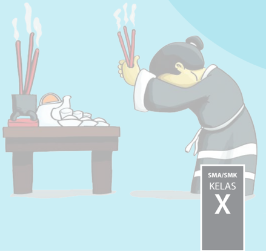

> **Deskripsi Visual:** Gambar ini adalah ilustrasi yang menunjukkan seorang guru sedang mengajar tentang cara memasak makanan tradisional. Guru tersebut sedang menggunakan tongkat untuk menggoreng makanan di atas papan masak. Di sebelah kiri, terdapat sebuah wadah dengan bumbu dan alat masak lainnya. Gambar ini menunjukkan proses memasak makanan tradisional, yang merupakan bagian dari pembelajaran tentang budaya dan kebiasaan masyarakat.

Elemen-elemen utama dalam gambar ini meliputi guru, tongkat, papan masak, wadah bumbu, dan alat masak lainnya. Guru adalah subjek utama yang sedang melakukan tugas belajar mengajar. Tongkat digunakan untuk menggoreng makanan, sementara papan masak dan wadah bumbu menunjukkan alat dan bahan yang digunakan dalam proses memasak. Alat masak lainnya seperti sendok dan mangkuk juga terlihat di sekitar papan masak.

Teks, angka, atau label penting yang terlihat pada gambar ini adalah "SMA/SMK KELAS X". Ini menunjukkan bahwa gambar ini mungkin merupakan bagian dari materi pelajaran di tingkat SMA/SMK kelas X.

Informasi kunci yang dapat diambil pembaca dari gambar ini adalah bahwa guru sedang mengajar tentang cara memasak makanan tradisional, yang merupakan bagian dari pembelajaran tentang budaya dan kebiasaan masyarakat. Gambar ini juga menunjukkan pentingnya praktik langsung dalam pembelajaran, di mana siswa dapat melihat dan mengamati proses memasak langsung.

 

---
## 📄 Halaman 2

### Hak Cipta © 201 7 pada Kementerian Pendidikan dan Kebudayaan Dilindungi Undang-Undang

Disklaimer: Buku ini merupakan buku siswa yang dipersiapkan Pemerintah dalam rangka implementasi Kurikulum 2013. Buku siswa ini disusun dan ditelaah oleh berbagai pihak di bawah koordinasi Kementerian Pendidikan dan Kebudayaan, dan dipergunakan dalam tahap awal penerapan Kurikulum 2013. Buku ini merupakan 'dokumen hidup' yang senantiasa diperbaiki,  diperbaharui,  dan  dimutakhirkan  sesuai  dengan  dinamika  kebutuhan  dan perubahan zaman. Masukan dari berbagai kalangan yang dialamatkan kepada penulis dan laman http://buku.kemdikbud.go.id atau melalui email buku@kemdikbud.go.id diharapkan dapat meningkatkan kualitas buku ini.

### Katalog Dalam Terbitan (KDT)

Indonesia. Kementerian Pendidikan dan Kebudayaan.

Pendidikan Agama Khonghucu dan Budi Pekerti / Kementerian Pendidikan dan Kebudayaan.-- . Edisi Revisi Jakarta: Kementerian Pendidikan dan Kebudayaan, 201 7 .

vi, 162 hlm. : ilus. ; 25 cm.

Untuk SMA/SMK Kelas X ISBN  978-602-427-082-7 (jilid lengkap)

ISBN  978-602-427-083-4 (jilid 1)

- Khonghucu -- Studi dan Pengajaran
I. Judul

- Kementerian Pendidikan dan Kebudayaan
299.512

Penulis

:  Js. Gunadi dan Js. Hartono

Penelaah

:  Js. Maria Engeline Santoso, M.Kom, Drs. Uung Sendana, L.L., SH, Js. Budi Suniarto, MBA, Bratayana Ongkowijaya, S.E., XDS

Penyelia Penerbitan : Pusat Kurikulum dan Perbukuan, Balitbang, Kem

en dikbud.

Cetakan Ke-1, 2014 ISBN 978-602-282-442-8 (jilid 1)

Cetakan Ke-2, 2016 (Edisi Revisi)

Cetakan Ke-3, 2017 (Edisi Revisi)

Disusun dengan huruf Calibri, 11 pt.

 

---
## 📄 Halaman 3

### Kata Pengantar

### Salam Kebajikan, Wei De Dong Tian .

Seiring dengan Penguatan dan Penataan Ulang Kurikulum yang terus dilakukan oleh Kementrian Pendidikan Nasional, kami turut menyambut baik karena mendapat kesempatan  untuk  turut  memperbaiki  dan  menata  ulang  Kurikulum  Pendidikan Agama  Khongucu.  Kiranya  penataan  untuk  Kurikulum  2013    ini  benar-benar dapat meningkatkan kualitas pendidikan Indonesia, yang tentunya ditandai dengan pencapaian kompetensi oleh peserta didik yang sesuai dengan kebutuhannya.

Kiranya ketersediaan buku Teks Pendidikan Agama Khonghucu dan Budi Pekerti ini dapat benar-benar  menjadi sarana pendukung kegiatan belajar-mengajar di sekolah dalam rangka membentuk karakter peserta didik yang mulia dan unggul. Materi yang disajikan  dalam buku ini mecakup Kitab Suci; Tata Ibadah dan Persembahyangan; Wahyu dan Iman (aspek ajaran); Perilaku Junzi ; dan Sejarah Suci.

Akhir  kata,  kami  sampaikan  terima  kasih  kepada  semua  pihak  yang  telah berpartisipasi  dalam  penyusunan  dan  penerbitan  buku  ini.  Untuk  perbaikan  dan penyempurnaan di masa mendatang kami sangat mengharapkan  masukan dan saran konstruktif dari semua pihak.

Jakarta, Januari 2016

Tim Penulis

|

 

---
## 📄 Halaman 4

### Daftar Isi

|

 

---
## 📄 Halaman 5

1

|

 

---
## 📄 Halaman 7

### Bab 1

### Ketuhanan dalam Agama Khonghucu

### Peta Konsep

---
**🖼️ Gambar/Diagram**

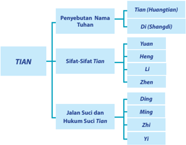

> **Deskripsi Visual:** Gambar ini adalah diagram yang menunjukkan struktur hierarki dari istilah "TIAN" dalam bahasa Mandarin. Diagram ini dibagi menjadi empat bagian utama:

1. Penyebutan Nama Tuhan: Ini mencakup dua sub-kategori utama - Tian (Huangtian) dan Di (Shangdi).

2. Sifat-Sifat Tian: Sub-kategori ini meliputi Yuan, Heng, Li, dan Zhen.

3. Jalan Suci dan Hukum Suci Tian: Sub-kategori ini mencakup Ding, Ming, Zhi, dan Yi.

Jaringan hubungan antara elemen-elemen ini menunjukkan bahwa "TIAN" adalah topologi dasar, dengan "Penyebutan Nama Tuhan" sebagai cabang utama, "Sifat-Sifat Tian" sebagai cabang kedua, dan "Jalan Suci dan Hukum Suci Tian" sebagai cabang ketiga. Setiap cabang ini memiliki sub-kategori yang lebih spesifik.

Informasi kunci yang dapat diambil pembaca melalui gambar ini adalah bahwa "TIAN" adalah konsep yang kompleks yang mencakup berbagai aspek, termasuk penyebutan nama Tuhan, sifat-sifat Tian, dan jalan suci dan hukum Tian. Diagram ini membantu dalam memahami struktur dan hubungan antara berbagai aspek istilah "TIAN".

|

 

---
## 📄 Halaman 8

### A.  Pendahuluan

Dalam  setiap  agama  tentu  ada  suatu  hubungan  antara  manusia pemeluk  agama  tersebut  dengan  yang  disembahnya,  yaitu Tian Yang Maha Esa. Tetapi terlepas dari itu semua, adalah suatu kekeliruan bila manusia dalam kemajuan berpikir dan kekritisannya kemudian menjadi ingin  terlalu  banyak  tahu  secara  detail  akan Tian yang  dimaksud. Bahkan  lebih  jauh  lagi,  manusia  hanya  mau  menerima Tian dengan segala ikhwalnya bila semua itu masuk akal/nalarnya.

Bagaimana  pun    manusia  haruslah  sadar,  bahwa Tian bukanlah hasil imajinasi manusia semata. Artinya, keberadaan Tian tidak mudah ditangkap  oleh  pengertian  manusia  dengan  segala  keterbatasannya. Namun demikian, manusia dapat memahami dan menghayati nilai-nilai suci  Kebajikan Tian ( Tiande ) yang dikaruniakan ke dalam diri manusia yang berupa benih-benih kebajikan ( Rende ). Benih-benih kebajikan yang menjadi  watak  sejati  ( xing )  itulah  yang  akan  menjadi  penjalin  atau jembatan yang menghubungkan manusia kepada penciptanya yaitu Tian Yang Maha Esa.

---
**🖼️ Gambar/Diagram**

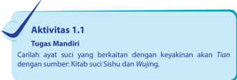

> **Deskripsi Visual:** Gambar ini adalah ilustrasi yang menunjukkan aktivitas mandiri dengan judul "Tugas Mandiri: Tugas Mandiri". Ilustrasi ini terdiri dari beberapa elemen utama:

1. Judul Aktivitas: "Tugas Mandiri" yang terletak di bagian atas gambar.
2. Sub-judul: "Tugas Mandiri" yang berada di bawah judul utama.
3. Gambaran: Gambaran yang menunjukkan dua orang anak muda sedang bermain di taman, dengan salah satu anak sedang berjalan dan berbicara dengan anak lainnya.
4. Konteks: Gambar ini menunjukkan aktivitas sehari-hari anak-anak, yang seringkali dilakukan di luar rumah.

Elemen-elemen ini saling terhubung melalui konteks kehidupan sehari-hari anak-anak, yang merupakan subjek utama gambar ini. Informasi kunci yang dapat diambil pembaca adalah bahwa gambar ini menggambarkan aktivitas mandiri anak-anak dalam lingkungan luar rumah, yang seringkali dilakukan untuk memperkenalkan mereka pada dunia luar dan membantu mereka belajar keterampilan hidup.

Berangkat  dari  sinilah  kemudian  manusia  dapat  mengimani Tian dengan  segenap  kebajikan-Nya  (sifat-Nya).  Maka  agama  memerlukan pendalaman  yang  dipelajari  secara  tekun  oleh  umatnya  agar  mampu mengerti  bahwa  wahyu Tian kepada  para  nabi  utusan-Nya  bukanlah suatu yang dapat diterima seperti pelajaran ilmu pengetahuan lainnya, namun harus  melalui suatu tahap pengimanan yang disertai menyatunya perasaan  yang  bersih,  dan  tentunya  diiringi  dengan  logika  pemikiran yang benar.

 

---
## 📄 Halaman 9

### B. Penyebutan Nama Tian

Dalam kitab suci agama Khonghucu terdapat beberapa sebutan untuk  mewakili  beberapa  pengertian  akan Tian .  Adapun  istilah  yang paling sering dipakai dan yang paling orisinil dalam kitab suci adalah: Di ( Shangdi )  dan Tian ( Huangtian ).

Tian atau Huangtian mengandung arti Tian Yang  Mahabesar. Sementara Di atau Shangdi mengandung arti sesuatu yang Maha Kuasa; yang menguasai Langit dan Bumi (menembus Langit dan Bumi).

Sebutan Di banyak digunakan di dalam Kitab Suci yang berasal dari zaman Dinasti Shang atau Yin (1766-1122 SM.), sedang sebutan Tian banyak digunakan di dalam Kitab-Kitab Suci sebelum Dinasti Shang , seperti  pada  zaman  Dinasti Xia (2205-1766  SM.)  dan  sesudah  Dinasti Shang ,  yaitu  pada  zaman  Dinasti Zhou (1122-255  SM.),  tetapi  sering kedua sebutan itu digunakan bersama-sama dalam satu kalimat.

Sementara Tian berdasakan etimologi huruf terbentuk dari karakter huruf Yi ( 一 ) artinya satu, dan huruf Da ( 大 ) artinya besar. Maka Tian berdasarkan karakter huruf mengandung  pengertian: 'Satu  Yang Mahabesar.'

---
**🖼️ Gambar/Diagram**

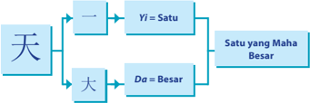

> **Deskripsi Visual:** Gambar ini adalah diagram yang menunjukkan hubungan antara dua kata dalam bahasa Melayu: "天" (Tian) dan "大" (Dai). Diagram ini menggunakan garis lurus untuk menunjukkan hubungan antara kedua kata tersebut. Untuk kata "天", ada tiga poin yang ditunjukkan: pertama, ada garis lurus menuju ke "Yi=Satu"; kedua, ada garis lurus menuju ke "Da=Besar"; dan ketiga, ada garis lurus menuju ke "Satu yang Maha Besar". Untuk kata "大", hanya ada satu poin yang ditunjukkan, yaitu "Da=Besar". Teks penting dalam diagram ini adalah "天" dan "大", serta "Satu yang Maha Besar". Informasi kunci yang dapat diambil pembaca adalah bahwa "天" memiliki hubungan dengan "Yi=Satu", "Da=Besar", dan "Satu yang Maha Besar", sedangkan "大" hanya memiliki hubungan dengan "Da=Besar".

Dalam kitab Shujing (kitab hikayat) menyebut Tian biasanya dengan memberi tambahan kata-kata untuk semakin memuliakan-Nya, seperti:

- Huangtian
- :
Tian Yang Mahabesar.

- Houtian :
Tian Yang Maha Meliputi dan ada di mana-mana.

- Cangtian
- :
Tian Yang Mahasuci di tempat Yang  Mahatinggi.

- Mintian
: Tian Yang Maha Pengasih, Merakhmati bagi yang taat.

- Shangdi
- :
Tian Yang Mahakuasa.

|

 

---
## 📄 Halaman 10

Nabi Kongzi yang  hidup  pada  zaman  Dinasti  Zhou,  biasanya menggunakan istilah Tian untuk menyebut nama Tuhan, kecuali untuk kalimat-kalimat yang dipetik dari kitab-kitab suci yang lebih tua ( Wuji ng) digunakan sebutan Di atau Shangdi .

Dalam kitab perubahan ( Yijing )  ada sebuah sebutan khusus untuk menyebut nama Tian , yakni Qian ( 乾 ) yang dilukiskan dengan simbol garis-garis positif murni (        ). Sebutannya adalah Wuji (tanpa kutub) atau  tidak  dapat  dilukiskan,  sesuatu  yang  di  luar  batas  kemampuan manusia.  Sedangkan Tian sebagai Khalik dilukiskan  dengan  sebutan Taiji (Mahakutub). Tian sebagai Roh Semesta juga disebut sebagai Yang Maharoh ( Guishen ).

### C. Sifat-Sifat Kebajikan Tian

Di  dalam  Kitab Yijing, tersurat: Qian , Tian sebagai  pencipta memiliki sifat:

Yuan : Mahamula, yang menciptakan segala sesuatu.

Heng : Maha Menembusi, hukumnya menjalin satu sama lain

ciptaannya.

Li

: Maha Pemberkah, Merakhmati, yang memelihara dan

Menghidupi, yang menjadikan orang menuai  hasil perbuatannya.

Zhen : Mahakokoh, Mahakekal, yang meluruskan dan

Melindungi.

Sifat-sifat Tian di atas diterangkan lebih lanjut dalam Yijing bab 1 bagian Sabda, sebagai berikut: 'Maha Besar Qian , Khalik Yang Maha Sempurna; berlaksa benda bermula daripada-Nya; semua kepada Tian Yang  Maha  Esa.  Awan  berlalu,  hujan  dicurahkan,  beragam  benda mengalir  berkembang  dalam  bentuk  masing-masing.  Maha  Gemilang Dia yang menjadi awal dan akhir. Jalan suci Qian , Khalik Semesta Alam menjadikan  perubahan  dan  peleburan;  menjadikan  semua,  masingmasing  menepati/lurus  dengan  watak  sejati  dan  Firman;  melindungi/ menjaga berpadu dengan keharmonisan agung sehingga membawakan berkah, benar dan teguh.'

Walaupun  kebenaran  sifat Tian itu  sangat  jelas  dalam  kitab Yijing , tetapi bukan berarti Tian dapat dibatasi oleh pengertian manusia. Hakikat  kenyataan  bahwa Tian itu  suatu  perkara  yang  tidak  mudah dimengerti, tidak dapat dibatasi dengan kemampuan pengertian manusia

 

---
## 📄 Halaman 11

yang  serba  terbatas,  seperti  tersurat  dalam  kitab Zhongyong bab  XV: 1-3.  Nabi Kongzi bersabda,  'Sungguh  Maha  Besar  Kebajikan Guishen ( Tian Yang Maharoh), dilihat tiada nampak, didengar tiada terdengar, namun tiap wujud tiada yang tanpa Dia. Demikian menjadikan umat berpuasa, membersihkan hati dan mengenakan pakaian lengkap sujud bersembahyang kepada-Nya. Sungguh Mahabesar Dia, terasakan di atas dan di kanan kiri kita.'

Di dalam kitab Sanjak tertulis: 'Adapun kenyataan Tian Yang  Maharoh  itu  tidak  boleh  diperkirakan,  lebih-lebih  tidak  dapat ditetapkan. Maka sungguh jelaslah sifat-Nya yang halus itu, tidak dapat disembunyikan dari iman kita; demikianlah Dia.'

Kehalusan sifat Tian hanya bisa ditangkap oleh dan dalam iman, seperti  tersurat  dalam  kitab Mengzi VII  A:  1, Mengzi berkata,  'Yang benar-benar  dapat  menyelami  hati,  akan  mengenal  watak  sejatinya; yang mengenal watak sejatinya akan mengenal Tian Yang Maha Esa. Jagalah hati, peliharalah Watak Sejati, demikian mengabdi kepada Tian . Tentang usia panjang atau pendek janganlah risaukan, siaplah dengan membina diri, demikian menegakkan Firman.'

Maka kepada manusia selalu diingatkan untuk hormat beribadah kepada-Nya dan selalu tekun dalam usaha beroleh iman, tidak berani tidak  lurus  dengan  Firman Tian .  'Dalam  segala  sesuatu  hendaknya takutlah betapa kedahsyatan Tian .' ( Shujing . V. XXVII: 17)

'…tidakkah aku siang dan malam senantiasa hormat akan kemuliaan Tian Yang Maha Esa. Sehingga dapat menjaga kelestarian-Nya.' ( Shijing IV).

---
**🖼️ Gambar/Diagram**

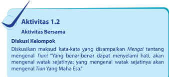

> **Deskripsi Visual:** Gambar ini adalah ilustrasi yang menunjukkan aktivitas belajar bersama dalam buku pelajaran. Ilustrasi ini berisi tiga elemen utama:

1. Judul Aktivitas: "Aktivitas 1.2" yang terletak di bagian atas.
2. Subjudul: "Aktivitas Bersama" yang berada di bawah judul utama.
3. Diskusi Kelompok: Ini adalah teks utama yang berisi pertanyaan tentang maksud kata-kata yang disampaikan tentang mengenal Tian.

Elemen-elemen lain yang terlihat dalam gambar ini meliputi:

- Sebuah garis putih yang membentuk lingkaran di sekitar judul dan subjudul.
- Warna dasar gambar adalah biru dan putih, dengan elemen-elemen lain menggunakan warna hitam.

Informasi kunci yang dapat diambil pembaca dari gambar ini adalah bahwa ini adalah bagian dari materi pelajaran yang berfokus pada diskusi kelompok, dengan topik utama mengenai pengertian dan makna kata-kata yang berkaitan dengan Tian.

|

 

---
## 📄 Halaman 12

### Ayat-Ayat Suci Tentang Iman Kepada Tian

- Mahamula  yang Khalik .  Maha  Meliputi  tanpa  kecuali.  Maha Rakhmat  akan  keharmonisan.  Mahakekal  dan  lurus  HukumNya.
- Yuan merupakan induk/kepala segala hal yang baik, Heng adalah berkumpulnya segala sifat yang indah, Li ialah  keharmonisan/ keselarasan    dengan  kebenaran, Zhen itulah  tertibnya  segala hukum semesta dan perkaranya.
- Maha  Besarlah Tian Khalik Semesta  Alam.  Berlaksa  benda/ alam semesta punya awal dan akhir. Semua berasal dan kembali kepada Tian .  Beredarnya awan dan hujan tercurah. Benda dan alam mengalami perubahan. Perlulah menyadari akan kemuliaan awal  dan  akhir  segenap  semesta.  Jalan  suci-Nya  menjadikan perkembangan dan perubahan. Hendaknya masing-masing meluruskan watak sejati yang diirmankan. Terlindunglah akan seluruhnya harmonis merupakan satu kesatuan. Sehingga memperoleh rakhmat yang abadi.
- Sesungguhnya Mahabesar dan Mahaagung. Dilihat tiada nampak, didengar tiada terdengar. Semua benda tiada yang tanpa Dia. Menjadikan orang di dunia ini bersuci diri dan berpakaian sebaik-baiknya (lengkap). Bersungguh hikmad bersembahyang. Sungguh Mahabesar melebihi  segalanya.  Seperti  selalu  ada  di atas.  Seperti  ada  di  kiri  kanan.  Maka  seorang Junzi hati-hati kepada yang tidak nampak. Segan kepada yang tidak terdengar. Tiada  yang  lebih  nampak  dari  yang  tersembunyi.  Tiada  yang lebih  jelas  dari  yang  terlembut.  Maka  seorang Junzi hati-hati pada waktu seorang diri. ( Zhongyong . XV: 1-5)

### D. Jalan Suci dan Hukum Suci Tian

Sudah  menjadi  pola  pemikiran  umum,  bahwa  banyak  hal  yang terjadi  dan  dialami  manusia  adalah  karena  sudah  menjadi  ketetapan Tian .  Bahwa Tian Yang  Mahatahu  itu  sudah  tahu  dan    menentukan apa  yang  akan  dilakukan/dikerjakan    manusia  jauh  sebelum  manusia itu  melakukannya.  Ini  berarti  seluruh  hidup  kita  sudah  ditentukan sebelumnya.

Jika  demikian,  maka  jelas  bahwa  apapun  kenyataan  hidup  dan bagaimana  reaksi  manusia  terhadap  kenyataan  itu  adalah  sudah ketetapan Tian .  Pemahaman  ini  sangat  mungkin  didorong  oleh  rasa ketakutan  manusia  untuk  bertanggung  jawab  atas  segala  sesuatu

 

---
## 📄 Halaman 13

yang terjadi,  karena  bila  manusia  memang  memiliki  kemampuan  dan kebebasan untuk memilih tindakan, berarti ia juga bertanggung jawab atas setiap hal yang terjadi. Jika segala yang terjadi sudah ditentukan, dan  manusia  tinggal  menjalani,  maka  manusia  tidak  bisa  disalahkan atas apapun situasi dan kondisi yang ada.

Manusia selalu mencari sebab-sebab dari luar dirinya  untuk setiap permasalahan yang terjadi/menimpanya. Menyalahkan  pihak lain, menyalahkan keadaan, menyalahkan hukum alam, bahkan menyalahkan Tian (yang menurutnya) sebagai penentu semua keadaan yang ia lakukan dan  yang  ia  alami.  Lalu,  di  mana  tanggung  jawab  manusia  sebagai makhluk ciptaan-Nya?

Maka menjadi penting untuk kita renungi kembali, pertanyakan, dan teliti kembali, pemahaman tentang turut campur Tian terhadap situasi dan kondisi yang terjadi.

Tian Mahakuasa adalah benar untuk kita yakini, tetapi menjadi tidak tepat jika semua yang terjadi pada manusia adalah mutlak ketentuan Tian . Dari sini semoga dapat tergambar sebuah pemahaman baru tentang ke-Mahakuasaan Tian dan ke-Mahatahuan Tian .

Manusia telah  diirmankan Tian memiliki  benih  Kebajikan  dalam Watak  Sejatinya.  Bagaimana  manusia  melaksanakan  Firman  itu,  di situlah  yang  harus  ditentukan  dan  dipertanggung  jawabkan  setiap manusia kepada Tian .

Tian Yang Mahakuasa dan Mahatahu telah menentukan manusia berbeda  kodratnya  dengan  makhluk  ciptaan  lainnya.  Berbeda  dengan tumbuh-tumbuhan  dan  berbeda  pula  dengan  margasatwa.  Tumbuhtumbuhan  tidak  punya  perasaan  dan  kesadaran  instinktif  (naluriah), hanya  punya  daya  hidup  vegetatif  (tumbuh  kembang).  Margasatwa punya perasaan dan kesadaran instinktif, tetapi tidak dikaruniai benih kebajikan  dan  daya  kehidupan  rohani  untuk  membedakan  salah  dan benar.

Hanya manusia yang dikaruniai  daya hidup rohani yang merupakan benih  kebajikan,  punya  hati  nurani  dan  akal  budi,  sehingga  manusia tahu mana yang salah dan mana yang benar. Maka setiap manusia dapat bebas  menentukan  cara  hidupnya,  dengan  demikian  maka  manusia harus  bertanggung  jawab  atas  segala  perilaku  hidupnya  kepada Tian Yang Maha Esa.

|

 

---
## 📄 Halaman 14

---
**🖼️ Gambar/Diagram**

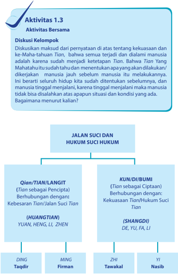

> **Deskripsi Visual:** Gambar ini adalah diagram yang menunjukkan hubungan antara Jalan Suci dan Hukum Suci Hukum dalam konteks kekuasaan Tian dalam agama atau filosofi tertentu. Diagram ini dibagi menjadi dua bagian utama: Jalan Suci dan Hukum Suci Hukum. Jalan Suci meliputi empat pilar utama: Qian/Tian/Langit, Yuan/Heng/Li/Zhen, DING Taqdir, dan MING Firman. Setiap pilar memiliki hubungan dengan Tian sebagai pencipta dan berhubungan dengan Tian/Jalan Suci Tian. Hukum Suci Hukum juga memiliki empat pilar utama: KUN/DI/BUMI, ZHI Tawakal, Yi Nasib, dan DE/YU/FA/LI. Setiap pilar ini memiliki hubungan dengan Tian sebagai ciptaan dan berhubungan dengan Kekuasaan Tian/Hukum Suci Tian. Diagram ini membantu pembaca memahami struktur dan hubungan antara Jalan Suci dan Hukum Suci Hukum dalam konteks kekuasaan Tian.

 

---
## 📄 Halaman 15

### 1. Ding

Dari sudut pandang makro, jagat raya telah ditentukan sebelumnya, atau telah ditakdirkan/ditetapkan untuk ada. Artinya, ada hal yang telah ditetapkan dan menjadi pilihan Tian untuk kita, dan terhadapnya kita tidak dapat membantah. Bahwa kita dilahirkan sebagai manusia (lakilaki  atau  perempuan) dari sepasang ayah ibu yang menjadi orang tua kita, kapan dan di mana kita dilahirkan, adalah bukan pilihan kita; Tian menjadikan  kita  manusia,  menjadikan  kita  laki-laki  atau  perempuan. Kita juga  tidak dapat menetapkan lebih dahulu kapan kita dilahirkan, begitu juga  di mana kita akan dilahirkan  kita tak bisa menentukan.

Semua yang hidup (diciptakan Tian ) diawali dengan kelahiran dan semua yang dilahirkan (hidup) akan diakhiri dengan kematian. Maka kematian dari sesuatu yang dilahirkan, dan kelahiran dari sesuatu yang hidup adalah sebuah ketetapan Tian (taqdir).

### 2. Ming

Ada  hal  yang  memang    telah  ditentukan  sebelumnya,  atau  telah ditakdirkan/ditentukan untuk ada, tetapi kejadian 'tertentu' yang dialami  manusia  tidak  ditakdirkan  (tidak  ditentukan  secara  mutlak). Kematian adalah ketetapan Tian , artinya bahwa semua yang hidup yang diciptakan Tian akan  mengalami  kematian  (kehendak  tetap).  Tetapi bagaimana kematian itu terjadi bisa menjadi 'pilihan' manusia. Seperti halnya kematian, kelahiran adalah juga ketetapan. Semua yang hidup diawali dengan kelahiran, tetapi bagaimana hidup itu dijalani bukanlah suatu yang telah digariskan mutlak oleh Tian .

Tian Yang Maha Esa menciptakan manusia memberkahinya dengan 'Watak Sejati' ( xing ) yang menjadi 'kodrat' suci manusia. Inilah Firman Tian atas diri manusia. Watak sejati sebagai kodrat suci ini menjadikan manusia berpotensi untuk berbuat bajik, menjadi manusia berbudi luhur yang mampu menempuh Jalan Suci sebagaimana dikehendaki Tian atas manusia. Hal ini menunjukkan bahwa Firman Tian atas  diri  manusia yang berupa watak sejati itu bukanlah sebuah jaminan yang pasti untuk menjadikan manusia menjadi tetap baik seperti pada awalnya.

Manusia  memiliki  kesempatan  untuk  memilih,  menepati  'kodrat' nya  atau  mengingkari  'kodrat-nya'  itu.  Nabi Kongzi bersabda,  'Kaya dan berkedudukan mulia ialah keinginan tiap orang, tetapi bila tidak dapat  dicapai  dengan  Jalan  Suci,  janganlah  ditempati.  Miskin  dan

|

 

---
## 📄 Halaman 16

berkedudukan rendah ialah kebencian tiap orang, tetapi bila tidak dapat disingkiri dengan Jalan Suci, janganlah ditinggalkan.' ( Lunyu . IV: 5)

Kehidupan dan kematian itu adalah kehendak Tian atas manusia, tetapi  bagaimana  kematian  dan  kehidupan  itu  akan  dijalani  adalah pilihan manusia. Dari sini kita ditunjukkan satu hal penting, bahwa kita (manusia)  memiliki  kebebasan  untuk  memilih  yang  tentunya  diikuti dengan kesediaan untuk mempertanggung jawabkannya.

### Referensi Ayat

Mengzi berkata, "Bila dunia dalam  Jalan Suci, yang  kecil kebajikannya tunduk kepada yang besar Kebajikannya; yang kecil Kebijaksanaannya tunduk kepada yang besar Kebijaksanaannya. Bila dunia ingkar dari Jalan Suci, yang kecil takluk kepada yang besar, yang lemah takluk kepada yang kuat. Kedua hal ini sudah menjadi hukum Tian . Siapa yang mematuhi Tian akan terpelihara, yang melawan Tian akan binasa.' ( Mengzi . IVA: 7)

### 3. Zhi

Apapun  kenyataan  hidup  harus  dapat  kita  jalani  dengan  tabah/ tawakal, karena pada dasarnya, apapun yang kita alami dan kita terima adalah    hasil  dari  perbuatan  kita  sendiri.  Manusia  aktif  berusaha/ bertindak,  hukum-Nya  mengikuti  sesuai  usaha  atau  arah  tindakan manusia itu sendiri.

'Demikianlah Tian Yang  Maha  Esa  menjadikan  segenap  wujud masing-masing  dibantu  sesuai  dengan  sifatnya.  Kepada  pohon  yang bersemi  dibantu  tumbuh,  sementara  kepada  yang  condong  dibantu roboh.' ( Zhongyong . Bab XVI: 3)

Bila kita berjalan ke Barat tentu akan sampai ke Barat, dan bila kita berjalan ke Timur kita dibantu sampai ke Timur. Maka ke Barat atau ke Timur adalah jelas pilihan manusia sendiri, bukan Tian menetapkan / menentukan. Serupa dengan hal itu, mestinya kita mengerti bahwa Tian (dengan  hukum-Nya)  akan  membantu  orang  yang  membantu  dirinya sendiri.

Walaupun pada kenyataannya, manusia selalu  berusaha  membela diri  dengan  menyalahkan  hal  lain  di  luar  dirinya  sebagai  penyebab kesalahan yang ia lakukan/alami, bahkan tak segan mencari dalih/alasan pada Hukum Tian . Misalkan: Ketika seseorang 'jatuh' atau melakukan sesuatu  kesalahan  karena  tidak  hati-hati,  maka  ia  akan  mengatakan ' Tian sedang  menguji  saya!',  dan  ketika  ia  'jatuh'  atau  melakukan

 

---
## 📄 Halaman 17

kesalahan karena khilaf, maka ia akan mengatakan 'iblis/setan sedang mengoda saya!' Hingga sepertinya manusia tidak pernah salah dengan segala macam dalih dan alasan.

### 4. Yi

Yi , dapat dipadankan dengan kata nasib, yaitu peristiwa  yang terjadi karena  Hukum  Alam  (kehendak Tian melalui  hukum  alam).  Suatu kejadian yang terjadi di luar kehendak dan usaha dari manusia. Artinya, pada suatu ketika dapat saja terjadi hal-hal di luar kehendak kita dan Tian pun tidak menentukan demikian.  'Naas', yaitu kejadian merugikan yang tidak kita inginkan. Hal ini terjadi  karena ada yang tidak harmonis (disharmonis)  pada  saat  itu.    'Mujur',  yaitu  kejadian  menguntungkan yang terjadi tanpa ada usaha yang benar-benar sengaja ke arah itu. Hal ini terjadi karena ada sesuatu yang sangat harmonis pada saat itu.

Mengzi berkata, 'Apa yang tidak kita lakukan, tetapi terjadi, itulah kuasa Tian Yang  Maha  Esa.  Apa  yang  tidak  kita  cari,  tetapi  dapat tercapai, itulah Firman (Karunia).' ( Mengzi . VA: pasal 6/2)

---
**🖼️ Gambar/Diagram**

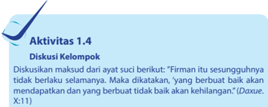

> **Deskripsi Visual:** Gambar ini adalah ilustrasi yang menunjukkan sebuah tulisan dalam bahasa Melayu. Ilustrasi ini menggambarkan sebuah tulisan yang berisi informasi tentang aktivitas diskusi kelompok. Tulisan tersebut membahas tentang maksud dari ayat suci dalam Alkitab, yaitu "Firmat itu sesungguhnya tidak berlaku selamanya. Maka dikatakan, 'yang berbuat baik akan mendapatkan dan yang berbuat tidak baik akan kehilangan'." (Dauxe, X:11). Ilustrasi ini menggunakan warna-warna dasar seperti hitam dan putih untuk menekankan teks dan elemen-elemen lainnya.

### E. Kehendak Bebas

Tian Yang  Maha  Esa.  Menganugerahkan  manusia  Watak  Sejati ( xing )  yang  di  dalamnya  terkandung  benih-benih  kabajikan  sebagai kemampuan luhur untuk berbuat bajik (sesuai dengan kehendak-Nya), kemampuan  untuk  melaksanakan  kebajikan  ini  menjadi  kodrat  suci manusia. Zhongyong Bab  Utama  Pasal  I  menyebutkan:  'Firman Tian itulah  dinamai  Watak  Sejati.  Berbuat  mengikuti  watak  sejati  itulah dinamai menempuh Jalan Suci. Bimbingan menempuh Jalan Suci itulah dinamai agama.'

|

 

---
## 📄 Halaman 18

Namun  dinyatakan  (tertulis di  dalam Kong-gao ): 'Firman  itu sesungguhnya tidak berlaku selamanya. Maka dikatakan, 'yang berbuat baik akan mendapatkan dan yang berbuat tidak baik akan kehilangan.' ( Daxue . X:11)

Manusia memiliki kemampuan sekaligus kebebasan  untuk memilih. Maka pada dasarnya kita adalah hasil dari pilihan-pilihan kita, meskipun gen, pola pengasuhan, pendidikan, dan lingkungan mempengaruhi, tetapi tidak menentukan siapa diri kita.

Kemampuan untuk memilih ini berarti bahwa kita bukan sekedar produk  dari  masa  lalu  kita  atau  dari  gen  orang  tua  kita,  bukan  juga produk  dari  perlakuan  orang  lain  terhadap  kita.  Manusia  sering  kali mempermasalahkan  masa  lampau  untuk  membenarkan  situasi    dan masalah yang ia hadapi sekarang. Maka, menjadi penting untuk selalu menyadari bahwa masalah yang kita hadapi adalah tanggung jawab kita. Kita  tidak  lagi  menyalahkan  orang  tua,  lingkungan  dan  Negara.  Kita menyadari bahwa kita adalah  pemegang kendali atas nasib kita sendiri.

Kita menentukan diri kita sendiri melalui pilihan-pilihan kita. Secara sadar atau tidak, kita telah membiarkan masa kini kita ditentukan oleh pilihan-pilihan di masa yang lalu. Bila masa kini kita ditentukan oleh pilihan-pilihan kita di masa lampau, maka kita bisa mengarahkan masa depan kita melalui pilihan-pilihan kita yang sekarang. Jangan biarkan masa lalu kita  terus menentukan masa depan kita. Tentu saja ada halhal yang terjadi pada kita (gen/struktur genetik)  yang terhadapnya kita tidak punya  pilihan. Kendati demikian, kita tetap memiliki kemampuan untuk memilih cara bagaimana kita menanggapinya. Bahkan orang yang memiliki  kecenderungan  genetik  untuk  penyakit  tertentu,  tidak  pasti bahwa  ia  akan  menderita  penyakit  tersebut.  Dengan  memanfaatkan kesadaran diri dan kekuatan kehendak untuk memilih program olahraga atau program dan pola-pola tertentu, memungkinkan ia dapat terhindar dari penyakit yang mungkin telah menewaskan nenek moyangnya.

### Penting

Bila masa kini kita ditentukan oleh pilihan-pilihan kita di masa lampau, maka kita bisa mengarahkan masa depan kita melalui pilihan-pilihan kita yang sekarang.

Namun  sayangnya,  sering  kali  manusia  hidup  mengikuti  alibialibinya,  dan  kemudian  ia  benar-benar  menyakini  alibi-alibinya  itu. Bahwa ia tidak akan menjadi lebih baik dan berprestasi karena berbagai alasan yang dibentuknya sendiri.

 

---
## 📄 Halaman 19

Manusia  harus  terus  mengembangkan  kekuatan  dan  kebebasan untuk  memilih  agar  dapat  menjadi  pribadi  transisi,  yaitu  menjadi pribadi yang mampu menghentikan kecenderungan yang tidak pantas/ tidak baik untuk diwariskan ke generasi berikutnya, atau menghentikan semua kecenderungan yang tidak baik agar tidak terus mempengaruhi kehidupan kita yang pada gilirannya akan mempengaruhi masa depan kita.

Seburuk  apapun  kondisi  yang  ada  dan  terjadi  pada  kita,  yang terpenting  adalah  bahwa  kita  tidak  boleh  membiarkan  apa  adanya, tetapi kita memiliki tanggung jawab untuk mengubahnya. Nabi Kongzi mengingatkan  dalam  sabdanya  'Sesungguhnya  untuk  memperoleh kegemilangan  itu  hanya  tergantung  pada  usaha  orang  itu  sendiri.' ( Daxue . Bab I: 4)

### F. Prinsip Hukum Alam

Hukum Alam  tidak menawarkan imbalan bersyarat untuk perilaku baik  atau  buruk,  ia  selalu  mendukung  setiap  perilaku,  tidak  peduli apapun akibat yang terjadi.  Ia selalu netral terhadap penilaian, seperti air yang menyegarkan semua benda  yang ada tanpa membeda-bedakan. Ia juga tidak pernah memilih siapapun untuk diutamakan.  Hukum Alam tidak menawarkan kompromi untuk semua perilaku, dan ia tidak pernah berubah, karena ia adalah hukum yang mengatur perubahan itu sendiri.

'Tidak ada yang tetap, segala sesuatu berubah dan sedang berubah, tetapi hukum yang mengatur perubahan itu tidak berubah.' (Tidak ada yang tetap, kecuali perubahan itu sendiri).

Prinsip-prinsip  hukum  alam    bersifat  universal,  seperti  halnya hukum gravitasi, begitupun prinsip rasa hormat, kebaikan (murah hati), kejujuran,  keiklasan,  dan  kerja  keras,  berlaku  umum  dan  dan  terus berlaku selamanya.

Prinsip-prinsip itu juga tidak bisa diperdebatkan. Serupa dengan hal itu, maka kita tidak bisa terus percaya, kalau yang kita percaya itu tidak layak untuk dipercaya. Misalkan, kita tidak bisa terus percaya bahwa kita dapat melakukan sesuatu ketika tubuh kita memang secara alamiah sudah tidak lagi mendukung keyakinan kita tentang kemampuan untuk melakukannya.

|

 

---
## 📄 Halaman 20

### Penting:

Yang berlaku hormat niscaya tidak terhina, yang lapang hati niscaya mendapat simpati  umum,  yang  dapat  dipercaya  niscaya  mendapat  kepercayaan,  yang cekatan  niscaya  berhasil  pekerjaannya,  yang  murah  hati  niscaya  diturut perintahnya.

( Lunyu . XVII: 6)

Tubuh kita merupakan sistem alamiah yang diatur oleh hukum alam. Sikap mental positip untuk menyakini bahwa kita tetap mampu  tidak akan  ada  gunanya  ketika  otot  kita  sudah  berada  pada  ambang  batas kekuatannya.

Bila  demikian,  manusia harus bertindak dalam cara tertentu, dan tidak bisa benar-benar menghindar darinya. Jika kita tetap melanggarnya (tidak bertindak dengan cara yang sesuai dengam prinsip hukum alam), maka kita akan menanggung akibat sebagai kosekuensi dari tindakkan kita itu.

### Penting:

Hakikat menjadi manusia adalah mampu mengarahkan kehidupan kita sendiri, dan kemampuan kita memilih arah kehidupan memungkinkan kita menemukan kembali diri kita untuk menjadikan masa depan kita menjadi lebih baik.'

Semua  tindakan  memiliki  akibat.  Suka  atau  tidak,  ketika  kita mengangkat  satu  ujung  tongkat,  kita  juga  mengangkat  ujung  yang lainnya. Ketika kita lompat dari lantai 24 sebuah gedung, kita tak bisa lagi mengatur/memilih akibat dari tindakan kita itu, gravitasi bumilah yang  akan  mengontrol  dan  menentukan  akibat  tindakan  kita.  Maka tahulah  kita,  bahwa  meskipun  manusia  bebas  memilih  tindakkantindakkannya, tetapi menusia tidak dapat bebas menentukan kosekuensi dari tindakkannya itu.

Tiap benda dan wujud diciptakan Tian memiliki hukumnya sendirisendiri,  jantung  bekerja  memompa  darah,  dan  bila  jantung  berhenti memompa darah dalam tubuh (tidak bekerja sesuai hukumnya), maka akan berakibat kematian pada manusia, apapun penyebabnya, akibatnya tetap sama.

 

---
## 📄 Halaman 21

Bumi memiliki gaya tarik (gravitasi), maka tidak perduli siapapun ia (orang baik atau orang jahat), dan apapun yang menjadi penyebabnya, bila  ia  jatuh  dari  lantai  24  sebuah  gedung,  maka  ia  akan  menumbuk tanah. Hal ini menunjukkan kepada kita sebuah hukum penting tentang kehidupan, bahwa setiap wujud memiliki hukumnya sendiri-sendiri.

Tian Yang  Maha  Esa  menetukan  kita  menjadi  manusia  dan menganugerahkan  manusia  watak  sejati  ( xing )  yang  di  dalamnya terkandung  benih-benih  kebajikan  sebagai  kemampuan  luhur  untuk berbuat bajik, ini kehendak Tian atas manusia. Hal ini ditegaskan dalam ayat  suci  yang  terdapat  dalam  kitab Zhongyong Bab  Utama  Pasal  I: 'Firman Tian itulah  dinamai  Watak  Sejati.  Berbuat  mengikuti  Watak Sejati  itulah  dinamai  menempuh  Jalan  Suci.  Bimbingan  menempuh Jalan Suci itulah dinamai agama.'

Tian Yang  Maha  Esa  tentu  menghendaki  manusia  untuk  taat  dan  lurus sesuai dengan kodrat yang Firmankan-Nya ( Shuntian ), namun, manusia bisa menjadi ingkar atau melawan kodrat suci yang di Firmankan Tian itu ( Nitian ). Maka dinyatakan (tertulis di dalam Kong-gao): 'Firman itu sesunggvuhnya tidak berlaku selamanya. Maka dikatakan, 'yang berbuat baik akan mendapatkan dan yang berbuat tidak baik akan kehilangan.' ( Daxue . X:11)

### G.  Menentukan Kualitas Hidup

Terkait dengan kemampuan menentukan arah yang benar. Arah yang benar berarti memahami akan prinsip-prinsip Hukum Alam dan bertindak berdasarkan prinsip-prinsip itu. Kesadaran diri dan pemahaman akan prinsip-prinsip itu akan mengantarkan kita pada 'kualitas' hidup. Tidak ada akibat tanpa sebab. Sebuah akibat akan menjadi sebab baru bagi akibat berikutnya, begitu seterusnya.

Paparan di atas memberitahukan hal penting tentang anugerah Tian untuk kita. Pertama, Tian telah menjadikan kita manusia sebagai makhluk  yang  paling  mulia  di  antara  makhluk-makhluk  ciptaan-Nya yang  lain.  Kedua,  manusia  memiliki  kebebasan  untuk  memilih  jalan hidup  masing-masing.  Ketiga,  bahwa  kita  dapat  menentukan  kualitas kehidupan melalui pilihan-pilihan dan respon kita untuk setiap akibat yang kita ciptakan.

Skema  berikut  merupakan  putaran  sebab  akibat.  Respon  yang kita  berikan  terhadap  sebuah  akibat  akan  menjadi  sebab  baru  yang selanjutnya akan melahirkan akibat berikutnya, lalu kita memberikan respon kembali, dan seterusnya.

|

 

---
## 📄 Halaman 22

---
**🖼️ Gambar/Diagram**

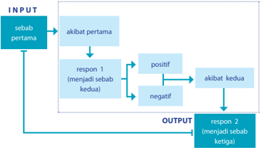

> **Deskripsi Visual:** Gambar ini adalah diagram yang menunjukkan proses sebab-akibat dalam sistem keputusan. Diagram ini memperlihatkan langkah-langkah berikut:

1. Input: Sebuah "sebab pertama" yang dimasukkan ke dalam sistem.
2. Akibat Pertama: Dari input tersebut, muncul akibat pertama.
3. Respon 1: Akibat pertama ini memiliki dua respon: positif dan negatif.
   - Jika responnya positif, maka akan menghasilkan akibat kedua.
   - Jika responnya negatif, maka tidak ada akibat kedua.
4. Output: Akibat kedua (jika ada) menjadi "sebab ketiga".
5. Respon 2: Akibat kedua ini juga memiliki dua respon: positif dan negatif.

Elemen-elemen utama dalam diagram ini adalah input, akibat pertama, respon 1, akibat kedua, dan output. Relasi antara elemen-elemen ini adalah bahwa input menghasilkan akibat pertama, yang kemudian menghasilkan respon 1, yang menghasilkan akibat kedua, dan akibat kedua menghasilkan output.

Teks, angka, atau label penting yang terlihat dalam diagram ini meliputi:
- "INPUT" untuk input
- "OUTPUT" untuk output
- "sebab pertama", "respon 1", "positif", "negatif", "akibat kedua", "respon 2", "positif", "negatif", "akibat kedua", "sebab ketiga"

Informasi kunci yang dapat diambil pembaca meliputi struktur sebab-akibat dalam sistem keputusan, serta bagaimana respon respon 1 dan 2 dapat mengarah pada akibat kedua dan ketiga.

Carilah kasus yang menggambarkan tentang skema sebab akibat seperti  digambarkan  di  atas,  diskusikan  dan  presentasikan  hasil diskusi kelompok kalian!

 

---
## 📄 Halaman 23

### Penilaian Diri

### · Tujuan Penilaian

Lembar penilaian diri ini bertujuan untuk:

- Mengetahui sikap peserta didik dalam menerima dan memahami tentang kebesaran dan kekuasaan Tian atas hidup dan kehidupan ini.
- Menumbukan  sikap  patuh  mengikuti  kenhendak    dan  hukum suci-Nya.

### · Petunjuk

Isilah  lembar  penilaian  diri  yang  ditunjukkan  dengan  skala  sikap berikut ini!

- SS = sangat setuju
- ST = setuju
- RR = ragu-ragu
- TS = tidak setuju

---
**📊 Tabel**

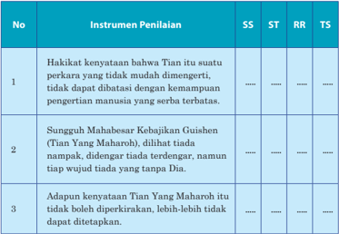

Tabel ini menunjukkan instrumen penilaian yang digunakan untuk mengukur keterampilan dan kemampuan seseorang dalam berkomunikasi dan berpikir kritis. Topik utama tabel adalah "Hakikat Kenyataan" dan "Sungguh Mahabesar Kebijakan Guishen". Tabel ini memiliki empat kolom: SS (Sesuai), ST (Sangat Tepat), RR (Rendah), dan TS (Tidak Sesuai). Data penting yang terlihat adalah bahwa instrumen penilaian pertama mengukur keberhasilan dalam menyatakan hakikat suatu perkara, instrumen kedua mengukur keberhasilan dalam menyatakan kebijakan yang diberikan oleh Guishen, dan instrumen ketiga mengukur keberhasilan dalam menyatakan adanya kebijakan yang tidak dapat diperkirakan.

|

 

---
## 📄 Halaman 24

---
**📊 Tabel**

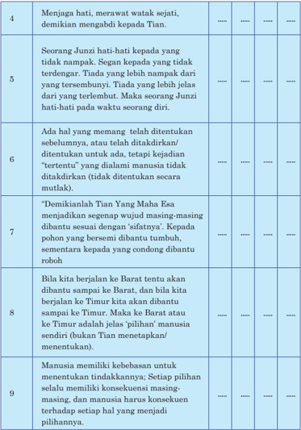

Tabel ini berisi informasi tentang beberapa aspek kehidupan manusia dan konsep moral, dengan topik utama berkisar pada hubungan antara manusia dan Tuhan, serta peran dan tanggung jawab manusia dalam hidup. Kolom-kolomnya mencakup berbagai poin yang disampaikan dalam teks tersebut, mulai dari menjaga hati dan memerhatikan watak sejati hingga menentukan konsekuensi masa depan. Data penting yang terlihat meliputi peran Junzi dalam menjaga hati, adanya hal-hal yang telah ditentukan sebelumnya, demikianlah Tian yang maha boleh menjadi sumber keberuntungan, dan manusia memiliki kebebasan untuk menentukan tindakannya sendiri. Pola penting yang terlihat adalah bahwa manusia harus bertanggung jawab atas keputusan dan konsekuensinya, serta harus menjaga hati dan memperhatikan watak sejati mereka.

 

---
## 📄 Halaman 25

---
**🖼️ Gambar/Diagram**

> **Deskripsi Visual:** Gambar ini adalah diagram yang menunjukkan beberapa prinsip-prinsip hukum alam yang dinyatakan dalam buku pelajaran. Diagram ini terdiri dari 14 baris, masing-masing menunjukkan prinsip hukum alam yang berbeda. Setiap baris memiliki teks yang menjelaskan prinsip tersebut, dengan angka di sisi kiri untuk mengidentifikasi prinsip-prinsip tersebut.

Elemen utama yang ditampilkan adalah prinsip-prinsip hukum alam, yang disajikan dalam bentuk tabel dengan kolom-kolom yang berisi deskripsi singkat tentang prinsip tersebut. Angka di sisi kiri setiap baris menunjukkan urutan prinsip yang dinyatakan dalam buku pelajaran.

Informasi kunci yang dapat diambil pembaca melalui gambar ini adalah bahwa buku pelajaran ini membahas berbagai prinsip hukum alam, mulai dari prinsip hukum alam yang berhubungan dengan keberlanjutan dan keadilan sosial, sampai dengan prinsip-prinsip hukum alam yang lebih spesifik seperti gravitasi, kejujuran, dan kerja keras. Gambar ini juga menunjukkan bahwa pembahasan ini mencakup berbagai aspek dari hukum alam, mulai dari hukum alam yang berlaku selama ini, sampai dengan hukum alam yang baru saja diciptakan oleh Tian.

---
**📊 Tabel**

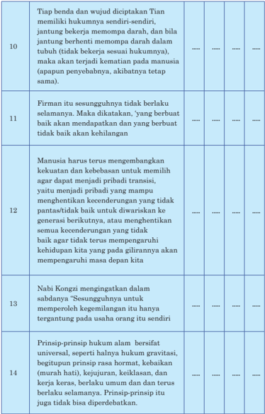

Tabel ini berisi informasi tentang prinsip-prinsip hukum alam yang dianut oleh masyarakat, dengan topik utama "Sesungguhnya". Kolom-kolomnya mencakup prinsip-prinsip seperti kesetaraan antara manusia dan alam, keadilan dan keseimbangan, serta prinsip-prinsip universal seperti gravitasi dan kekuatan alam. Data penting yang terlihat meliputi bahwa prinsip-prinsip ini tidak bisa diubah atau diubah, dan bahwa setiap individu memiliki hak untuk mendapatkan keadilan dan keseimbangan dalam hubungan dengan alam sekitarnya.

|

 

---
## 📄 Halaman 26

### Evaluasi Bab 1

### A. Pilihan Ganda

Berilah tanda silang (x) di antara pilihan A, B, C, D, atau E yang  merupakan  jawaban  paling  tepat  dari  pertanyaanpertanyaan berikut ini!

- Istilah  yang  paling  sering  dipakai  dan  yang  paling  orisinil  untuk menyebut nama Tuhan  adalah ....
- Di (Shangdi)
- Tian ( HuangTian )
- Taiji
- Qian
- Taiji
- Di atau Shangdi mengandung arti ....
- Tian Yang Mahabesar
- Tian Yang Mahakuasa
- Tian Yang Maharoh
- Tian Yang Maha Pengasih
- Tian Yang Mahatahu
- Tian berdasakan etimologi huruf mengandung pengertian ….
- Satu Yang Mahabesar
- Yang Mahamulia
- Yang Maharoh
- Mahakosong
- Mahamula

 

---
## 📄 Halaman 27

- Dalam kitab perubahan (Yijing) ada sebuah sebutan khusus untuk menyebut nama Tian adalah ….
- Qian
- Wuji (Maha Kosong)
- Taiji (Maha Mula)
- Guishen (Maha Roh)
- Shangdi

### B. Uraian

### Kerjakan soal-soal berikut ini dengan uraian yang jelas!

- Sebutkan empat sifat Tian seperti yang tersurat dalam Yijing !
- Jelaskan  tentang  Kebajikan Guishen ( Tian Yang  Maharoh) seperti yang tesurat dalam kitab Zhongyong . XV: 1/2!
- Jelaskan  apa  yang  dimaksud  dengan  'Firman Tian itu  tidak berlaku selamanya!
|

 

---
## 📄 Halaman 28

### Bab 2

### Hakikat dan Sifat Dasar Manusia

### Peta Konsep

---
**🖼️ Gambar/Diagram**

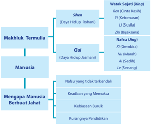

> **Deskripsi Visual:** Gambar ini adalah diagram yang menunjukkan struktur hierarki makhluk hidup dalam konteks budaya Melayu. Diagram ini membagi makhluk hidup menjadi tiga level utama: Watak Sejati (Xing), Makhuluk Termulia, dan Manusia. Watak Sejati meliputi Shen (Daya Hidup Rohani) dan Nafsu Ling (Daya Hidup Jasmani). Makhuluk Termulia meliputi Gui (Daya Hidup Jasmani). Di bawah manusia, ada dua sublevel: Nafsu yang tidak terkendali, Keadaan yang Memaksa, Kebiasaan Buruk, dan Kurangnya Pendidikan. Informasi ini membantu pembaca memahami hubungan antara makhluk hidup dan perilaku manusia dalam konteks budaya Melayu.

 

---
## 📄 Halaman 29

### A. Manusia Makhluk Termulia

Xunzi ,(salah  seorang  ilsuf Neo  Confusianisme )  mengatakan:  'Air dan  api  punya Qi tetapi  tidak  punya  kehidupan.  Rumput  dan  pohon hidup  tetapi  tidak  punya  perasaan.  Hewan  dan  unggas  pun ya  perasaan tetapi  tidak  tahu  kebenaran.  Manusia  punya Qi ,  punya  nyawa,  punya perasaan  dan  tahu  akan  kebenaran,  maka  termulialah  dia. Tenaga  tak sebanding  kerbau,  lari  tak  secepat  kuda,  tetapi  kerbau  da n  kuda  dipakai oleh  manusia.'

Kata-kata Xunzi menyiratkan  makna  bahwa  manusia  bukanlah hewan yang sedang dalam proses evolusi seperti yang diteorikan  oleh Darwin, bukan juga hewan yang harus digembalakan, juga bukan hewan politik seperti yang dikatakan oleh Aristoteles. Manusia diciptakan Tian melalui kedua orang tua. Maka secara Jasmani manusia menerima hidup

---
**🖼️ Gambar/Diagram**

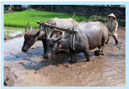

> **Deskripsi Visual:** Gambar ini adalah ilustrasi yang menunjukkan seorang petani menggunakan sapi sebagai alat pertanian untuk memanen padi. Gambar ini menggambarkan proses pertanian tradisional di pedesaan, dimana sapi digunakan sebagai hewan pertanian untuk membantu dalam proses tanam dan panen padi.

Elemen utama dalam gambar ini meliputi:
1. Petani: Seorang petani yang sedang bekerja dengan sapi.
2. Sapi: Dua ekor sapi yang digunakan untuk membantu dalam pertanian.
3. Padi: Tanaman padi yang sedang dipanen oleh petani.
4. Lahan pertanian: Lahan yang ditanami padi dan digunakan untuk pertanian.

Teks, angka, atau label penting yang terlihat dalam gambar ini tidak ada, karena gambar hanya menggambarkan proses pertanian tradisional tanpa informasi numerik atau teks tambahan.

Informasi kunci yang dapat diambil pembaca dari gambar ini adalah bahwa pertanian tradisional masih digunakan di beberapa daerah, di mana sapi digunakan sebagai alat pertanian untuk membantu dalam proses tanam dan panen padi. Ini menunjukkan bahwa tradisi pertanian masih berjalan dan masih relevan dalam kehidupan sehari-hari masyarakat pedesaan.

- Dimensi Fisik
dari atau melalui perantara ayah dan ibu. Namun manusia tidak hanya sekedar  memiliki  jasmani (daya hidup jasmani), Tian melengkapinya dengan roh (daya hidup rohani).

Dalam tradisi ilsafat dan agama, baik Barat maupun Timur  diketahui  bahwa manusia merupakan makhluk multidimensi . Manusia memiliki empat dimensi dasar, yaitu:

: Tubuh (Psikomotorik)

- Dimensi Intelektual
: Pikiran (Kognitif)

- Dimensi Emosional
: Hati (Afektif)

- Dimensi Rohani
: Jiwa (Spiritual)

Keempat dimensi ini mencerminkan empat kebutuhan dasar hidup manusia, yaitu:

- Kebutuhan untuk mempertahankan kelangsungan hidup (survival)
- Kebutuhan untuk belajar (improvement)
- Kebutuhan untuk mencintai dan dicintai (kasih sayang)
- Kebutuhan untuk meninggalkan nama baik (eksis)
|

 

---
## 📄 Halaman 30

### 1. Dua Unsur Nyawa dan Roh (Gui Shen)

Berdasarkan prinsip Yin-Yang , bahwa Tian Yang  Maha  Esa menciptakan  kehidupan  ini  selalu  dengan  dua  unsur  yang  berbeda, tetapi  saling  mendukung  dan  melengkapi  satu  sama  lain. Yin-Yang , Negatif-Positif,  Wanita-Pria,  Bumi-Langit,  Malam-Siang,  Kanan-Kiri, dan  seterusnya.    Dalam  diri  manusia Tian memberkahinya  dengan dua  unsur  Nyawa  dan  Roh.  Maka  diyakini,  bahwa  manusia  adalah makhluk termulia di antara makhluk ciptaan Tian yang  lain.  Karena selain  memiliki  Nyawa  (daya  hidup  jasmani),  manusia  juga  memiliki Roh (daya hidup rohani). Roh atau Daya Hidup Rohani yang di dalamnya bersemayan      watak  sejati  (xing)  atau  sebagai  Firman Tian atas  diri manusia,  yang  mengandung  benih-benih  kebajikan,  yaitu: ren, yi, li, zhi .

Watak  sejati  inilah  yang  menjadi  benih  suci  sehingga  manusia berkemampuan  untuk  berbuat  bajik  dan  sekaligus  menjadi  tanggung jawab  manusia  untuk  menggemilangkannya,  sehingga  menjadi  tetap baik sampai pada akhirnya (sesuai irman-Nya).

Nyawa atau Daya Hidup Jasmani ( jing )  yang di dalamnya terkandung daya rasa atau 'nafsu' yang merupakan kekuatan bagi manusia untuk melangsungkan hidupnya. Daya rasa atau 'nafsu' itu adalah: xi, nu, ai, le .  Tanpa  keempat  daya  rasa  ini  manusia  tidak  dapat  melan gsungkan kehidupannya. Maka, baik Daya hidup rohani ( xing )  ataupun Daya hidup jasmani (jing) merupakan dua unsur penting yang dimilik i oleh manusia.

---
**🖼️ Gambar/Diagram**

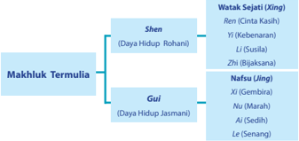

> **Deskripsi Visual:** Gambar ini adalah diagram yang menunjukkan struktur makhluk termulia dalam konteks agama Hindu. Diagram ini dibagi menjadi dua bagian utama: "Makhluk Termulia" dan "Watak Sejati (Xing)". Pada bagian "Makhluk Termulia", ada dua sub-kategori utama: "Shen" dan "Gui". Shen meliputi "Daya Hidup Rohani" dengan sub-kategori "Ren (Cinta Kasih)", "Yi (Kebenaran)", dan "Zhi (Bijaksana)". Sementara itu, Gui meliputi "Daya Hidup Jasmani" dengan sub-kategori "Nafsu (Uling)", "Xi (Gembira)", "Nu (Marah)", "Ai (Sedih)", dan "Le (Senang)". Di sisi kanan, terdapat teks yang memberikan penjelasan tentang watak-watak sejati tersebut. Diagram ini membantu pembaca memahami hubungan antara makhluk termulia dan watak sejati dalam konteks agama Hindu.

 

---
## 📄 Halaman 31

### 2. Watak Sejati ( Xing ) Sebagai Daya Hidup Rohani

---
**🖼️ Gambar/Diagram**

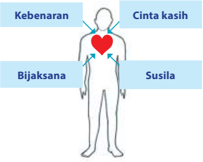

> **Deskripsi Visual:** Gambar ini adalah ilustrasi yang menunjukkan hubungan antara empat konsep filosofis dalam konteks manusia. Ilustrasi ini menggunakan bentuk tubuh manusia sebagai simbol untuk menunjukkan hubungan antara kebenaran, cinta kasih, bijaksana, dan susila. Setiap konsep memiliki ikon yang berbeda dan terhubung oleh garis lurus yang menghubungkan mereka.

1. **Apa yang ditampilkan secara keseluruhan**: Gambar ini menampilkan tubuh manusia dengan empat ikon yang mewakili empat konsep filosofis: kebenaran, cinta kasih, bijaksana, dan susila. Setiap ikon memiliki warna dan bentuk yang unik untuk menunjukkan perbedaan konsep.

2. **Elemen-elemen utama dan relasinya**: 
   - **Kebenaran** (dibentuk seperti sebuah lingkaran) diletakkan di bagian atas tubuh.
   - **Cinta kasih** (dibentuk seperti sebuah hati) diletakkan di tengah tubuh.
   - **Bijaksana** (dibentuk seperti sebuah mata) diletakkan di bawah tubuh.
   - **Susila** (dibentuk seperti sebuah tangan) diletakkan di bawah tubuh.
   - Semua ikon ini terhubung oleh garis lurus yang menghubungkan mereka, menunjukkan bahwa semua empat konsep tersebut saling berkaitan dan saling mempengaruhi.

3. **Teks, angka, atau label penting yang terlihat**: 
   - Ada teks "Kebenaran", "Cinta kasih", "Bijaksana", dan "Susila" yang diletakkan di sekitar setiap ikon.
   - Ada juga teks "Kebenaran" dan "Susila" yang diletakkan di bagian atas tubuh.
   - Ada teks "Cinta kasih" dan "Bijaksana" yang diletakkan di tengah tubuh.

4. **Informasi kunci yang dapat diambil pembaca**: Gambar ini menunjukkan bahwa dalam konteks filosofis, kebenaran, cinta kasih, bijaksana, dan susila

di  dalamnya  terkandung  benih-benih  kebajikan,  yaitu:  ren, li,  yi,  zhi.

Ajaran Khonghucu meyakini bahwa pada dasarnya sifat manusia  itu  asalnya  baik,  suci murni. Tian Yang  Maha  Esa sebagai Khalik pencipta dengan sifat-sifat kebajikan yuan, heng , li ,  dan zhen ,  menjadikan manusia  memperoleh  percikan kebajikan-Nya  sebagai  Firman yang berada pada diri setiap manusia. Percikan kebajikan Tian dalam diri manusia itu berupa  xing  (watak  sejati)  yang

'Firman Tian itulah dinamai watak sejati (xing), hidup/b erbuat mengikuti  watak  sejati  itulah  dinamai  menempuh  jalan  su ci,  bimbingan menempuh  jalan  suci  itulah  dinamai  agama.'  ( Zhongyong .  Bab  Utama pasal 1)

Keempat  benih  kebajikan  inilah  yang  menjadi  kemampuan  luhur bagi  manusia  untuk  berbuat  bajik,  sekaligus  menjadi  tanggung  jawab manusia  untuk  mempertahankan  dan  menggemilangkan  benih-benih kebajikan itu.

Tidak  dapat  dipungkiri  bahwa  keempat  benih  kebajikan  itu  ada dalam diri setiap manusia dan menjadi sifat dasar manusia.

- ♥ Rasa hati berbelas kasihan dan tidak tega itulah benih dari Cinta kasih.
- ♥ Rasa hati malu dan tidak suka itulah benih dari Kebenaran.
- ♥ Rasa hormat dan rendah hati itulah benih dari Kesusilaan.
- ♥ Rasa  hati  menyalahkan  dan  membenarkan  itulah  benih  dari Kebijaksanaan.
- Siapa yang tidak merasa iba/kasihan melihat orang lain menderita.
- Siapa yang tidak malu melakukan  perbuatan yang tidak berlandaskan kebenaran, dan siapa yang suka jika diperlakukan tidak benar.
- Siapa yang tidak mengerti bahwa kepada orang yang lebih tua harus menaruh hormat, mengalah dan rendah hati.
|

 

---
## 📄 Halaman 32

- Siapa yang tidak dapat membedakan bahwa sesuatu itu pantas atau tidak pantas untuk dilakukan.
Mengzi berkata:  'Rasa  hati  kasihan  dan  tidak  tega  tiap  orang mempunyai,  rasa  hati  malu  dan  tidak  suka  tiap  orang  mempunyai, rasa hati hormat dan mengindahkan tiap orang mempunyai, rasa hati membenarkan dan menyalahkan tiap orang mempunyai. Adapun rasa hati berbelas kasihan dan tidak tega itu menunjukkan adanya benih cinta kasih. Rasa malu dan tidak suka menunjukkan adanya benih menjunjung kebenaran. Rasa hati hormat dan mengindahkan menunjukkan adanya benih  kesusilaan,  dan  rasa  hati  menyalahkan  dan  membenarkan menunjukkan  adanya  benih  kebijaksanaan.  Cinta  kasih,  kebenaran, kesusilaan, dan kebijaksanaan itu bukanlah hal-hal yang dimaksudkan dari luar ke dalam diri, melainkan diri kita sudah mempunyainya. Tetapi sering  manusia  tidak  mau  mawas  diri.  Maka  dikatakan,  carilah!  Dan engkau akan mendapatkan, sia-siakanlah, dan engkau akan kehilangan …!'  'Sifat  orang  memang  kemudian  berbeda-beda,  mungkin  berbeda berlipat dua sampai lima atau bahkan tidak terhitung. Tetapi itu tidak dapat dicarikan alasan kepada watak sejatinya.' ( Mengzi . VI A: 6/7)

'Mengapa  kukatakan  tiap  orang  mempunyai  perasaan  tidak  tega akan sesama manusia? Kini bila ada seorang anak kecil yang hampir terjerumus  ke  dalam  perigi,  niscaya  dari  lubuk  hatinya  timbul  rasa terkejut    dan  belas  kasihan,  ini  bukan  karena  dalam  hatinya  ada keinginan untuk dapat berhubungan dengan orang tua anak itu, bukan ingin  mendapat pujian kawan-kawan  sekampung, bukan juga karena khawatir akan mendapat celaan.'

'Dari  hal  itu  kelihatan,  bahwa  yang  tidak  mempunyai  rasa  belas kasihan  itu bukan orang lagi, yang tidak mempunyai perasaan malu dan tidak suka  itu bukan orang lagi, yang tidak mempunyai perasaan rendah hati  dan  mau  mengalah  itu  bukan  orang  lagi,  yang  tidak  mempunyai perasaan  menyalahkan  dan  membenarkan    itu  bukan  orang  lagi.' ( Mengzi . II A: 6/1-5) Mengzi berkata;

- 'Kemampuan yang dimiliki orang dengan tanpa belajar, disebut kemampuan  asli  ( liangneng ).  Pengertian  yang  dimiliki  orang dengan tanpa belajar, disebut pengertian asli ( liangzhi ).'
- 'Anak-anak  yang  didukung  tidak  ada  yang  tidak  mengerti/ mencintai orang tuanya, dan setelah besar tidak ada yang tidak mengerti harus hormat kepada kakaknya.'
- 'Mencintai orang tua itulah cinta kasih, dan hormat kepada yang lebih  tua  itulah  kebenaran.  Tidak  dapat  dipungkiri  memang itulah kenyataan yang ada di dunia.'  ( Mengzi . VII A:  15/1-3)

 

---
## 📄 Halaman 33

Dari ayat di atas dapatlah dikatakan suatu doktrin iman yang dengan jelas menyebutkan akan diri manusia itu,  di dalamnya ada watak sejati ( xing ) yang menjadi kodratnya sebagaimana diirmankan Tian . Dengan demikian, tentunya watak sejati itu ada pada diri setiap manusia, dan pasti  sama  adanya.  Semua  manusia,  apakah  baik  atau  tidak  secara fundamental  memiliki  jiwa  yang  sama,  jiwa  yang  sepenuhnya  tidak pernah  dapat  dilenyapkan  oleh  keegoisan,  serta  selalu  mewujudkan dirinya segera dalam reaksi intuitifnya terhadap segala sesuatu.

Perasaan yang secara otomatis dialami oleh setiap manusia ketika melihat seorang anak kecil jatuh ke dalam sumur. Reaksi pertama setiap orang terhadap segala sesuatu yang secara alami dan spontan adalah, bahwa yang benar adalah  benar dan yang salah adalah salah.

Pengetahuan (kemampuan merasakan) ini adalah perwujudan dari sifat kita yang asli. Selanjutnya, yang perlu  dilakukan oleh kita (manusia) adalah  mengikuti  arahan  dari  pengetahuan/kemampuan  intuitif    itu, dan selanjutnya tanpa keraguan mengarah kepadanya. Karena apabila kita mencoba untuk menemukan alasan untuk tidak mengikuti arahanarahannya, berarti kita menambahkan sesuatu atau mungkin mengurangi sesuatu  dari  pengetahuan/kemampuan  intuitif    itu,  dengan  demikian kita akan kehilangan kemulian tertinggi kita. Tindakkan mencari alasan merupakan sikap yang disebabkan oleh keegoisan.

Dengan watak sejati hidup manusia dibangun  sehingga mempunyai suatu  nilai,  dan  oleh  karena  memiliki  watak  sejati  itulah  manusia menjadi makhluk mulia dan utama dari segala ciptaan-Nya, dan karena watak  sejati  merupakan  percikan    dari  sifat  kebajikan  Tian,  maka pada  dasarnya  manusia  memang  berkemampuan  untuk  beriman  dan kemudian mengerti akan perihal kuasa kebajikan-Nya.

- Ren (cinta kasih) :
muncul paling awal dalam diri setiap manusia.

- Yi (kebenaran)
:  muncul kemudian setelah pengertian berkembang.

- Li (susila) :
dapat  ditanamkan  pada  masa  menjelang remaja.

- Zhi (bijaksana)
:  merupakan tuntunan yang tak terbatas Ketika manusia berangkat dewasa.

|

 

---
## 📄 Halaman 34

### Diskusi Kelompok

Diskusikan  pernyataan  bahwa  ren  muncul  paling  awal  dalam diri  setiap  manusia. Yi muncul  kemudian  setelah  pengertian berkembang pada masa balita. Li dapat  ditanamkan  pada  masa menjelang  remaja. Zhi ,  merupakan  tuntunan  yang  tak  terbatas ketika manusia beranjak dewasa.

### 3. Daya Hidup Jasmani

Seperti telah dipaparkan di atas bahwa selain diberikan Watak sejati (xing) sebagai kemampuan luhur bagi manusia untuk berbuat baik/bajik, manusia juga diberikan daya hidup jasmani (jing) sebagai kemampuan manusia untuk menggenapi kehidupannya. Daya rasa atau daya hidup jasmani itu ialah:

Gembira ( xi )

Marah ( nu )

Sedih      ( ai )

Senang (

le )

Peradaban manusia dapat bertahan sampai hari ini karena manusia memiliki nafsu-nafsu tersebut. Keempat daya rasa (nafsu) inilah yang menjadikan  manusia  mampu  mengembangkan  kehidupannya.  Tetapi nafsu-nafsu  ini  pulalah  yang  dapat  menimbulkan  masalah  dalam kehidupan bila manusia tidak dapat baik-baik memelihara dan mengendalikannya.

Tujuan pengajaran agama tidaklah bermaksud menghapuskan  atau membunuh nafsu-nafsu tersebut, karena bagaimanapun nafsu-nafsu itu merupakan bagian yang tidak dapat dipisahkan dari manusia.

### Penting

'Adanya keharmonisan antara Roh dan Nyawa, antara kehidupan lahir dan kehidupan batin, itulah tujuan tertinggi pengajaran agama.'

Agama bertujuan membimbing agar  manusia  mengerti  bagaimana mengendalikan bila nafsu-nafsu yang ada di dalam dirinya itu timbul. Mengendalikannya agar tidak melampaui batas 'tengah.'

'Gembira, marah, sedih dan senang sebelum timbul dinamai

 

---
## 📄 Halaman 35

tengah.  Setelah    timbul  tetapi  masih  berada  di  batas  tengah  dinamai harmonis. Tengah  itulah  pokok besar dunia, dan keharmonisan itulah cara menempuh jalan suci di  dunia.'( Zhongyong . Bab Utama: 4)

'Bila dapat terselenggara tengah dan harmonis, maka kesejahteraan akan  meliputi  langit  dan  bumi,  segenap  makhluk  dan  benda  akan terpelihara.' ( Zhongyong . Bab Utama: 5)

Ketika manusia berada dalam kondisi di mana belum timbul rasa gembira, rasa marah, rasa sedih, dan rasa senang/suka di dalam dirinya, kondisi inilah yang dimaksud manusia dalam keadaan 'tengah.'  Tetapi keadaan dalam kehidupan ini sangatlah dinamis/selalu berubah, terlebih lagi perasaan manusia mudah sekali terpengaruh dan berubah. Keadaan tengah dalam diri manusia tidak dapat berlangsung/bertahan selamanya, banyak hal dan peristiwa yang dapat memancing  timbulnya nafsu di dalam  diri.  Bila  salah-satu  nafsu  itu  terekspresikan,  berarti  saat  itu manusia sudah tidak dalam keadaan tengah.

- Ketika manusia menerima kabar baik yang diharapkan, seketika itu timbul perasaan gembira di dalam dirinya.
- Ketika  mendapat  perlakuaan  buruk/tidak  benar,  seketika  itu timbul perasaan marah di dalam dirinya.
- Ketika menerima kabar buruk yang tidak diharapkan, seketika itu timbul perasaan sendih dan kecewa.
- Ketika melihat, mendengar atau merasakan yang sesuatu yang menarik hatinya, seketika itu timbul perasaan senang/suka.
Menjadi  kewajiban  manusia    untuk  selalu  mengendalikan  setiap nafsu yang timbul dalam dirinya agar tetap berada di batas tengah (tidak berlebihan).  Mengendalikan  nafsu  yang  timbul  tetap  di  batas  tengah itulah yang dinamai harmonis.

- Jangan  karena  perasaan  gembira  lalu    menjadi  lupa  diri  dan tidak memperhatikan sikap dan perilaku, ini berarti melanggar nilai-nilai kemanusiaan.
- Jangan karena perasaan marah, sampai berbuat keterlaluan, ini berarti melanggar nilai-nilai kebenaran (kepatutan).
- Jangan  kerena  perasaan  sedih  sampai  merusakkan  badan,  ini berarti melanggar nilai-nilai kesusilaan.
- Jangan karena perasaan suka terhadap sesuatu, sampai melupakan  hal-hal  lain  hanya  sekedar  ingin  memuaskan  keinginan diri, ini berarti melanggar nilai-nilai kebijaksanaan.
|

 

---
## 📄 Halaman 36

### B. Mengapa Manusia Berbuat Jahat

### 1. Nafsu yang Tidak Terkendali

Seperti  halnya  watak  sejati  yang  di  dalamnya  terkandung   benihbenih kebajikan: Cinta kasih, kebenaran, kesusilaan, dan  kebijaksanaan yang mutlak dimiliki oleh semua orang (tanpa kecuali), begi pun halnya dengan nafsu (daya rasa) yang terdiri dari perasaan: gembi ra, marah, sedih, dan senang/suka adalah juga hal yang pasti dim iliki oleh semua orang.

---
**🖼️ Gambar/Diagram**

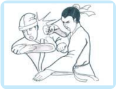

> **Deskripsi Visual:** Gambar ini adalah ilustrasi yang menunjukkan dua orang yang sedang berbicara di dalam sebuah mobil. Gambar ini menunjukkan bahwa mereka sedang berbicara dengan penuh kegembiraan dan semangat. Dalam konteks ini, elemen utama adalah dua orang yang berbicara di dalam mobil. Relasi antara mereka adalah bahwa mereka sedang berbicara dan tampaknya sedang berada dalam situasi yang positif. Teks, angka, atau label penting yang terlihat pada gambar ini tidak ada. Informasi kunci yang dapat diambil pembaca adalah bahwa dua orang sedang berbicara dengan penuh kegembiraan dan semangat di dalam mobil.

sumber: dokumen penulis

Nafsu (daya rasa) yang disebutkan itu dapat terjadi kapan saja, di mana saja dan pada siapa saja, dan manusia sering kali atau tidak mempunyai kendali atas kapan ia dilanda emosi, juga emosi apa yang  akan  melandanya,  tetapi paling tidak manusia dapat memperkirakan berapa lama emosi itu akan berlangsung menguasai dirinya.

Banyak pengaruh-pengaruh dari  luar  diri  yang  dapat  memicu timbulnya  nafsu  yang  ada  di dalam diri. Bila 'nafsu' di dalam diri itu telah terpi cu, maka bersamaan dengan itu tubuh akan bergerak melakukan sesuatu, dan ha l ini akan berakibat  tidak  baik  bila  berlebihan  atau  tidak  dapat dikendalikan. Pada kondisi seperti inilah harus ada sesuatu yang dapat  meredam atau mengendalikan nafsu-nafsu tersebut, inilah fungsi watak seja ti.

Nafsu, dengan kuat menggerakan tubuh untuk melakukan hal -hal tertentu  sampai  sepuas-puasnya  (melampaui  batas-batas  kewaj aran). Hal ini tentu saja berbahaya, sangat berbahaya! Watak sej ati meredam, membendung, mengendalikan agar semuanya tetap berada pada  batas kewajaran yang tidak melanggar nilai-nilai kemanusiaan.

Dapat mengendalikan nafsu-nafsu yang timbul tetap berada  pada batas kewajaran (batas tengah) inilah dimaksud harmonis .

 

---
## 📄 Halaman 37

Nafsu  apabila  dapat  dikendalikan, akan menjadikan orang memiliki kedewasaan sikap. Nafsu akan mampu  membimbing,  menggerakan pikiran, menciptakan nilai-nilai bagi kelangsungan hidup kita. Tetapi nafsu  dengan  mudah  menjadi  tidak terkendali, dan hal itu memang sering kali  terjadi.  Masalahnya  bukanlah karena nafsu itu sendiri, melainkan mengenai  keselarasan  antara  nafsu dan cara mengekpresikannya, maka pertanyaannya  adalah,  'Bagaimana

sumber:  yes-outdoor.blogspot.com

kita membawa kecerdasan ke dalam emosi kita? Mengzi berkata;

- 'Pohon di gunung Giu ,  mula-mula indah dan rimbun, tetapi karena letaknya  dekat  dengan  sebuah  negeri  yang  besar  lalu  dengan
- semena-mena ditebang, masih indahkah kini?' Benar, dengan  istirahat tiap hari tiap malam, disegarkan oleh hujan dan embun, tiada yang tidak bersemi dan bertunas kembali, tetapi lembu-sapi dan kambingdomba digembalakan di sana, maka menjadi gundullah dia.
Orang melihat keadaan yang gundul itu  lalu menganggap memang selamanya belum pernah ada pohon-pohon di sana.'

- 'Tetapi  benarkah  itu  hakikat  sifat  gunung?  Cinta  kasih  dan kebenaran yang dijaga di dalam hati manusia kalau sampai tiada lagi, tentulah karena sudah terlepas hati nuraninya (liangxing), hal itu seperti pohon-pohon yang ditebang dengan kapak, kalau tiap-tiap hari ditebang, dapatkah menunjukkan keindahannya?'
Dengan bergantinya siang dan malam orang dapat beristirahat, lalu  pagi  harinya  beroleh  kesegaran  kembali;  tetapi  karena kegemarannya akan hal-hal yang buruk dan kurangnya kehendak

|

 

---
## 📄 Halaman 38

saling mengerti dengan orang lain, maka perbuatan pada siang harinya  itu  memusnahkan  kembali  yang  sudah  diperolehnya. Kalau  kemusnahan  ini  berulang-ulang  terjadi,  kesengsaraan yang  diperoleh  karena  hawa  malam  itu,  tidak  cukup  untuk menjaganya.  Kalau  kemusnahan  ini  berulang-ulang  terjadi, kesegaran yang diperoleh karena hawa malam itu tidak cukup untuk menjaganya.

Kalau kesegaran yang diperoleh karena hawa malam itu tidak cukup untuk menjaganya, bedanya dengan burung atau hewan sudah tidak jauh lagi. Kalau orang melihat keadaan yang sudah menyerupai burung atau hewan itu, ia lalu menyangka bahwa memang demikian watak dasarnya. Tetapi benarkah itu sungguhsungguh merupakan rasa hatinya?'

- Maka  kalau  dirawat  baik-baik,  tiada  barang  yang  tidak  akan berkembang,  sebaliknya,  kalau  tidak  dirawat  baik-baik  tiada barang yang tidak akan rusak.' ( Mengzi . VI A: 8/1-3)
Ayat  di  atas  menunjukan  bahwa    watak  sejati  manusia  yang pada dasarnya baik itu dapat dirusakkan oleh nafsu-nafsu yang tidak terkendali, jadi bukan karena watak dasar (watak sejatinya)  itu buruk adanya.

### 2. Keadaan yang Memaksa

Adakala  di  mana  manusia  dapat  bertindak/berbuat  buruk  meski tidak ada emosi negatif ('nafsu') yang menguasai dirinya, tindakkan itu dilakukan  semata-mata  karena  menurutnya  'tidak  ada  pilihan'  atau 'terpaksa.'

---
**🖼️ Gambar/Diagram**

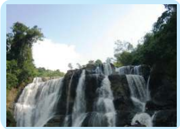

> **Deskripsi Visual:** Gambar ini adalah foto yang menunjukkan sebuah air terjun yang indah dengan tebing yang tinggi dan lebar. Air terjun tersebut mengalir turun ke dasar tebing dengan derasnya yang menunjukkan kecepatan dan kekuatan aliran air. Di sekitar air terjun, terdapat banyak pohon dan tanaman hijau yang menambah keindahan alam. Di atas air terjun, terdapat beberapa pohon besar yang tampak lebih tinggi dibandingkan dengan tebing. Gambar ini menunjukkan bahwa air terjun tersebut berada di daerah yang masih alami dan belum terpengaruh oleh aktivitas manusia.

air

Keadaanlah yang menyebabkan ia melakukan suatu tindakan tertentu. Seperti dicontohkan dalam uraian Mengzi melalui percakapannya dengan Gaozi, yang menggambarkan  hubungan  watak sejati/sifat asli manusia dengan suatu keadaan yang memaksa.

Gaozi berkata, 'Watak sejati manusia  itu  laksana  pusaran  air, kalau  diberi  jalan  ke  Timur  akan mengalir  ke  Timur,  kalau  diberi jalan  ke  Barat  akan  mengalir  ke

 

---
## 📄 Halaman 39

Barat.  Begitupun  watak  sejati  manusia  itu  tidak  dapat  membedakan antara baik atau tidak baik, seperti air tidak dapat membedakan antara Timur dan Barat.' ( Mengzi . VI A: 2)

Mengzi berkata, 'Air memang tidak dapat membedakan antara Timur dan Barat, tetapi tidak dapatkah membedakan antara atas dan bawah?'

'Watak  sejati  manusia  itu  cenderung  kepada  baik,  laksana  air mengalir ke bawah, orang tidak ada yang tidak cenderung kepada baik, seperti air tidak ada yang tidak cenderung mengalir ke bawah.'  ( Mengzi . VI A: 3)

'Kini kalau air itu ditepuk dapat terlontar naik sampai melewati dahi, dengan membendung dan memberi saluran-saluran, air dapat dipaksa

manusia, bila keadaan memaksa dapat juga berbuat tidak baik (tidak sesuai dengan sifat alaminya).

mengalir sampai ke gunung.

Secara alami air tidak ada yang tidak mengalir ke bawah, dan  manusia  tidak  ada  yang  tidak cenderung kepada baik. Tetapi bila  keadaan  memaksa  air  dapat juga  mengalir  ke  atas,  begitupun

Ketika air harus mengalir ke atas melawan kodratnya tentu tidak menjadi persoalan. Tetapi bila manusia yang kodratnya adalah baik jika menjadi tidak baik karena keadaan yang memaksa, tentu akan menjadi persoalan.

Air  adalah  sebuah  benda  (bukan  makhluk),  jadi  ia  tidak  dapat melawan jika diperlakukan (dikondisikan) untuk melawan sifat alaminya. Tetapi manusia sebagai makhluk yang diberi watak sejati dan dorongan  perasaan  sebagai    kemampuan  untuk  melawan,  jika  karena keadaan memaksa lalu menjadi marah dan ganas (berbuat melawan sifat alaminya).

Agama  diciptakan  untuk  satu  keperluan,  membimbing  manusia menempuh  jalan  suci  dan  dapat  mengerti  bagaimana  mengendalikan setiap  kondisi  tidak  baik  yang  timbul  oleh  nafsu-nafsu  (gejolak  rasa) ataupun oleh keadaan yang memaksa.

|

Tetapi benarkah ini watak air?  Itu  tentu  bukanlah  hal  yang sewajarnya,  begitupun  kalau  orang sampai menjadi tidak baik, tentulah karena watak sejatinya diperlakukan seperti itu juga.'

 

---
## 📄 Halaman 40

Mengzi berkata,  'Pada tahun-tahun yang makmur, anak-anak dan pemuda-pemuda kebanyakan berkelakuan baik, tetapi pada tahun-tahun yang paceklik, anak-anak dan pemuda-pemuda kebanyakan berkelakuan buruk.'

'Hal ini bukan karena Tian Yang Maha Esa menurunkan watak yang berlainan, melainkan karena hatinya telah terdesak dan tenggelam di dalam keadaan yang buruk.'  ( Mengzi . Bab VI A: 7)

---
**🖼️ Gambar/Diagram**

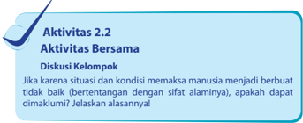

> **Deskripsi Visual:** Gambar ini adalah ilustrasi yang menunjukkan aktivitas diskusi kelompok dalam buku pelajaran. Ilustrasi ini menggambarkan dua orang yang sedang berbicara di depan sebuah papan tulis, menunjukkan bahwa mereka sedang berdiskusi tentang suatu topik. Papan tulis tersebut tampaknya merupakan alat yang digunakan untuk mencatat ide-ide dan pernyataan yang dibicarakan oleh anggota kelompok. Ilustrasi ini juga menunjukkan bahwa ada beberapa orang lain yang tampaknya sedang mendengarkan atau mempersiapkan diri untuk berpartisipasi dalam diskusi tersebut. Teks pada gambar tersebut memberikan informasi tambahan tentang aktivitas diskusi kelompok, yaitu bahwa diskusi kelompok dapat dimulai dengan membahas situasi dan kondisi yang memaksa manusia menjadi berbuat baik (bertentangan dengan sifat alaminya). Ini menunjukkan bahwa ilustrasi ini bertujuan untuk memberikan gambaran tentang bagaimana diskusi kelompok dapat dilakukan dan apa yang harus diperhatikan saat melakukan diskusi tersebut.

### 3. Kebiasaan Buruk

Kebiasaan  adalah  suatu  tindakan  yang  dilakukan  berulang-ulang (kontinu).  Kebiasaan merupakan sebuah  latihan bagi tubuh. Artinya, bahwa  suatu  tindakan  yang  dilakukan  secara  berulang-ulang  dapat menjadikan tubuh kita terlatih untuk selanjutnya dapat melakukannya dengan fasih.

Oleh karenanya, kebiasaan sangat berpengaruh dalam pembentukan karakter  seseorang.  Orang  yang  biasa  berbuat  baik  akan  terlatih  dan cenderung untuk terus berbuat baik, dan sebaliknya orang yang biasa berbuat/berperilaku tidak baik  juga akan terlatih dan cenderung untuk terus melakukannya.

Orang  biasa  bangun  pagi  cenderung  untuk  terus  bangun  pagi, sebaliknya yang biasa bangun siang cenderung untuk terus bangun siang. Tubuh yang sedang istirahat cenderung untuk terus istirahat, dan tubuh yang sedang bergerak cenderung untuk terus bergerak dalam kecepatan dan arah yang sama, kecuali ada kemauan yang keras untuk merubahnya, dan memang dibutuhkan energi yang besar untuk merubahnya.

Orang yang berhasil cenderung untuk tetap berhasil, yang bergembira cenderung  untuk  tetap  bergembira,  yang  dihormati  cenderung  untuk tetap dihormati, dan yang mencapai cita-citanya cenderung untuk tetap mencapai cita-citanya.

 

---
## 📄 Halaman 41

Maka  dapat  disimpulkan  bahwa  suatu  perbuatan/tindakan  yang dilakukan berulang-ulang akan cenderung untuk terus dilakukan.

Maka sedini mungkin hindari kebiasaan-kebiasaan buruk, karena akan berpengaruh buruk pula pada pembentukan karakter kita. Nabi Kongzi bersabda,  'Watak  Sejati  itu  bersifat  saling  mendekatkan,  dan kebiasaan  saling  menjauhkan.'  ( Lunyu .  XVII:  2).  Dalam  kesempatan yang lain Nabi Kongzi juga menasehatkan melalui sabdanya, 'Periksalah keburukan dari sesuatu yang kita sukai, dan periksalah kebaikan dari sesuatu yang tidak kita sukai.'

### 4. Kurangnya Pendidikan

Tidak dapat dipungkiri, bahwa pendidikan mempunyai peran yang sangat penting dalam pembentukan karakter seseorang. Walaupun bukan merupakan satu-satunya faktor penentu, pendidikan tetaplah memiliki sumbangan  yang  sangat  besar  dalam  membentuk  perilaku  seseorang. Kongzi bersabda, 'Ada pendidikan tiada perbedaan.' ( Lunyu . X: 39)

Seperti telah diuraikan sebelumnya, bahwa manusia dibekali Watak Sejati oleh Tian Yang Maha Esa sebagai kemampuan luhur bagi manusia, kenyataan ini menjadikan manusia berpotensi untuk menjadi manusia Junzi (berbudi  luhur).  Tetapi  kemampuan  yang  dimiliki  manusia  itu masih  memerlukan  upaya-upaya,  karena  banyak  faktor-faktor  yang dapat menjadikan potensi yang ada itu menjadi hilang.

### Penting

Sebuah batu giok (batu kumala) sekalipun, kalau tidak digosok dan diukir tidak akan menjadi sebuah benda yang berharga, dan manusia tanpa belajar takkan mampu bijaksana.

Lingkungan keluarga tempat kita dilahirkan dan dibesarkan merupakan lingkungan pertama yang kita kenal dan individuindividu yang ada di dalamnya merupakan  individu-individu  yang paling dekat dengan  kita,  maka lingkungan ini cukup berperan dalam pembentukan karakter seseorang.

Di samping faktor lingkungan keluarga, kebiasaan-kebiasaa n seseorang juga menjadi faktor yang ikut menentukan pembentuka n karakter seseorang. 'Sifat dasar  manusia  itu  sama,  kebias aan-kebiasaan merekalah  yang  membuat  berlainan.'  Maka,  sekalipun  manus ia  memiliki potensi untuk menjadi manusia yang sempurna dalam usaha nya menempuh  jalan suci, manusia masih harus  mengupayakann ya dengan belajar dan terus belajar.

|

 

---
## 📄 Halaman 42

Ada orang yang sejak lahir sudah bijaksana, tetapi ada yang harus melalui proses belajar terlebih dahulu. Hal ini bertujuan menekankan bahwa perbedaan pada diri manusia disebabkan oleh perbedaan pendidikan (pembinaan diri), bukan dari sifat dasarnya.  Maka melalui pendidikanlah  manusia  belajar  hingga  mengerti  bagaimana  membina diri dan memanfaatkan potensi yang ada di dalam dirinya.

Melalui pendidikanlah manusia dapat mengerti bagaimana mengendalikan  nafsu-nafsu  (gejolak  rasa)  yang  ada  di  dalam  dirinya agar  tetap  berada  di  batas  tengah.  Melalui  pendidikanlah  manusia dapat mengerti bagaimana menghindari kebiasaan-kebiasaan buruknya. Melalui  pendidikanlah  pula  manusia  dapat  bertahan  pada  itrahnya yang  suci.  Maka  bila  semua  manusia  mendapat  pendidikan  yang cukup, semuanya mampu menjadi manusia yang sempurna tanpa ada perbedaaan, untuk kembali pada itrahnya yang suci, karena memang itrah manusia adalah sama.

Nabi Kongzi merasa  terpanggil  untuk  membuka  pintu  pendidikan bagi semua orang tanpa membedakan kelas dan status sosialnya. Beliau mempunyai murid 3000 an orang. Murid Nabi Kongzi terdiri atas bebagai lapisan masyarakat, termasuk para pemuda di zaman itu, di antaranya berasal dari rakyat jelata.

Berkat  Nabi Kongzi ,  maka  agama  Khonghucu  kemudian  menjadi agama  universal  yang  dipeluk  oleh  siapapun  juga,  tanpa  memandang tingkat sosialnya. Beliau tidak pernah membedakan  para murid berdasarkan  asal-usul  dan  golongan.  Maka  terkenallah  sabda  Beliau: 'Ada Pendidikan, Tiada Perbedaan.' ( Lunyu , XV: 39)

Terkait  dengan  nasihat  untuk  memeriksa  keburukan dari sesuatu yang  kita  sukai,  dan  kebaikan  dari  sesuatu  yang  tidak  kita  sukai, tuliskanlah  hal-hal  yang  kalian  sukai  lalu  periksa  keburukkannya, dan hal-hal yang kalian tidak sukai lalu periksa kebaikannya!

 

---
## 📄 Halaman 43

### Penilaian Diri

### · Tujuan Penilaian

Lembar penilaian diri ini bertujuan untuk:

- Mengetahui  sikap  kalian  dalam  menerima  dan  memahami tentang sifat dasar manusia.
- Menumbukan sikap sungguh-sungguh untuk senantiasa membina diri dalam kehidupan.

### · Petunjuk

Isilah  lembar  penilaian  diri  yang  ditunjukkan  dengan  skala  sikap berikut ini!

SS = sangat setuju

ST = setuju

RR  =  ragu-ragu

TS = tidak setuju

---
**📊 Tabel**

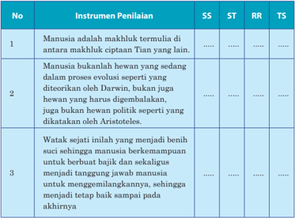

Tabel ini menunjukkan instrumen penilaian untuk beberapa topik yang berhubungan dengan definisi manusia. Kolom "SS" mungkin merujuk pada skala standar (Standar Sekolah), "ST" mungkin merujuk pada standar tujuan (Standar Tujuan), "RR" mungkin merujuk pada rencana rancangan (Rencana Rancangan), dan "TS" mungkin merujuk pada tingkat selesaian (Tingkat Selesai). Data dalam tabel tersebut menunjukkan bahwa topik utama adalah definisi manusia, dengan instrumen penilaian yang berbeda-beda untuk setiap topik. Misalnya, untuk topik pertama, instrumen penilaian yang paling sering digunakan adalah "Manusia adalah makhluk termulia di antara makhluk ciptaan Tian yang lain", sementara untuk topik kedua, instrumen penilaian yang paling sering digunakan adalah "Manusia bukanlah hewan yang sedang dalam proses evolusi seperti yang ditekankan oleh Darwin, fakta manusia harus digembalakan, juga bukan hewan politik seperti yang dikatakan oleh Aristoteles". Ini menunjukkan bahwa topik-topik ini memiliki instrumen penilaian yang berbeda-beda, yang dapat membantu dalam evaluasi kualitas pengetahuan siswa tentang definisi manusia.

|

 

---
## 📄 Halaman 44

---
**📊 Tabel**

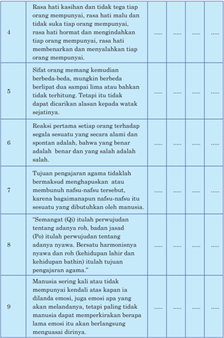

Tabel ini berisi informasi tentang empati dan kepedulian manusia terhadap orang lain. Topik utamanya adalah empati dan bagaimana manusia merespons situasi sosial. Kolom-kolomnya mencakup empati (4), sifat orang memang kemudian berbeda-beda (5), reaksi setiap orang terhadap segala sesuatu (6), tujuan pengajaran agama (7), "Semangat" (8), dan manusia sering kali tidak memiliki kendali atas emosi mereka (9). Data penting yang terlihat adalah bahwa empati adalah rasa hati yang kuat terhadap orang lain, sifat orang memang berbeda-beda, reaksi setiap orang terhadap situasi bisa berbeda, tujuan pengajaran agama adalah untuk menghargai dan mendorong empati, dan manusia sering kali tidak memiliki kendali atas emosi mereka sendiri.

 

---
## 📄 Halaman 45

---
**🖼️ Gambar/Diagram**

> **Deskripsi Visual:** Gambar ini adalah diagram yang menunjukkan struktur teks berupa pernyataan atau fakta-fakta yang disusun dalam bentuk teks berurutan. Diagram ini terdiri dari 15 baris teks yang masing-masing menyajikan sebuah pernyataan atau fakta yang berhubungan dengan tema kesadaran diri manusia. Setiap baris memiliki nomor yang menunjukkan urutan uraian tersebut.

Elemen utama yang terlihat dalam diagram ini adalah teks yang menjelaskan tentang kesadaran diri manusia, termasuk nafsu, cenderung, kebutuhan, dan potensi manusia untuk belajar dan berkembang. Teks ini membahas tentang bagaimana manusia memahami dan mengelola nafsu mereka, serta bagaimana manusia memiliki potensi untuk belajar dan berkembang.

Angka-angka dan label penting yang terlihat dalam diagram ini adalah nomor baris teks yang menunjukkan urutan uraian. Ini membantu pembaca untuk memahami bahwa teks ini berurutan dan membahas topik-topik yang berbeda dalam hal kesadaran diri manusia.

Informasi kunci yang dapat diambil pembaca dari diagram ini adalah bahwa kesadaran diri manusia melibatkan pemahaman tentang nafsu, cenderung, kebutuhan, dan potensi manusia untuk belajar dan berkembang. Diagram ini juga menunjukkan bahwa manusia memiliki kemampuan untuk mengelola nafsu mereka dan memiliki potensi untuk belajar dan berkembang.

---
**📊 Tabel**

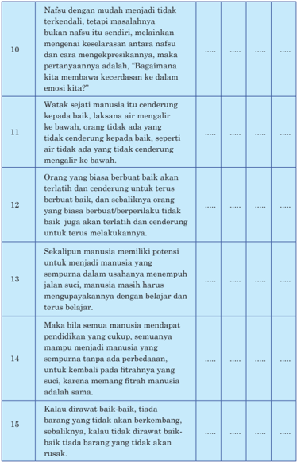

Tabel ini berisi 15 baris yang membahas tentang prinsip-prinsip kehidupan manusia, termasuk nafsu, cenderung, kebaikan, keburukan, dan potensi manusia untuk belajar dan berkembang. Topik utama tabel adalah tentang bagaimana manusia memahami dan mengelola nafsu, cenderung, dan potensi mereka untuk menjadi manusia yang suci dan bermanfaat bagi masyarakat. Kolom-kolomnya mencakup nafsu manusia, cenderung manusia, potensi manusia, dan konsekuensi dari pembelajaran dan perkembangan. Data penting yang terlihat adalah bahwa manusia memiliki potensi untuk belajar dan berkembang, dan bahwa nafsu manusia dapat diubah melalui pembelajaran dan pengalaman.

|

 

---
## 📄 Halaman 46

### Evaluasi Bab 2

### A.   Pilihan Ganda

Berilah tanda silang (x) di antara pilihan A, B, C, D, atau E yang  merupakan  jawaban  paling  tepat  dari  pertanyaanpertanyaan berikut ini!

- Berikut ini yang merupakan benih-benih kebajikan yang menjadi watak sejati (xing) manusia adalah….
- cinta kasih, susila, bijaksana, berani
- kebenaran, bijaksana, dapat dipercaya, susila
- cinta kasih, tahu malu, kebijaksanaan, kebenaran
- cinta kasih, kebenaran, susila, bijaksana
- cinta kasih, kebenaran, satya, dapat dipercaya
- Selain diberikan Watak Sejati ( xing )  atau  Daya Hidup Rohani, Tian juga memberkahi manusia dengan Daya Rasa (Daya Hidup Jasmani)  agar  manusia  dapat  melangsungkan  kehidupannya. Daya Rasa atau Daya Hidup Jasmani  yang ada di dalam diri manusia itu tertulis di bawah ini, kecuali ....
- gembira
- marah
- takut
- sedih
- senang/suka
- Dalam Kitab Zhongyong (Tengah Sempurna) Bab Utama pasal 4 tertulis, 'gembira, marah, sedih, dan senang sebelum timbul dari dalam diri dinamai….
- tengah
- harmonis
- selaras
- seimbang
- sempurna
- Rasa  hati  menyalahkan  dan  membenarkan  adalah  benih  dari sifat….
- susila
- kebenaran

 

---
## 📄 Halaman 47

- kebijaksanaan
- cinta kasih
- dapat dipercaya
- Rasa hati malu dan tidak suka adalah benih dari ….
- susila
- kebenaran
- kebijaksanaan
- cinta kasih
- dapat dipercaya
- Rasa hati hormat, rendah hati, dan mau mengalah adalah benih dari….
- susila
- kebenaran
- kebijaksanaan
- cinta kasih
- berani

### B.   Uraian

### Kerjakan soal-soal berikut ini dengan uraian yang jelas!

- Apa tujuan pengajaran agama terkait dengan adanya dua unsur nyawa dan roh dalam diri manusia?
- Jelaskan bahwa pada dasarnya manusia itu adalah baik!
- Jelaskan  mengapa  manusia  yang  pada  dasarnya  baik  dapat berbuat  jahat  (tidak  sesuai  dengan  watak  sejatinya),  jelaskan faktor-faktor yang menjadi penyebabnya!
- Jelaskan  mengapa  kebiasaan  itu  sangat  berpengaruh  pada pembentukan karakter seseorang!
- Jelaskan  mengapa  nafsu-nafsu  yang  ada  dalam  diri  manusia tidak boleh dimatikan/dihapuskan sama sekali!
- Jelaskan fungsi nafsu/daya rasa bagi manusia dalam kehidupan diatas dunia
|

 

---
## 📄 Halaman 48

``

### Watak Sejati

``

``

### Lagu Pujian

Cipt: Bratayana Ongkowijaya

 

---
## 📄 Halaman 49

### Bab 3

### Pokok-Pokok Peribadahan

---
**🖼️ Gambar/Diagram**

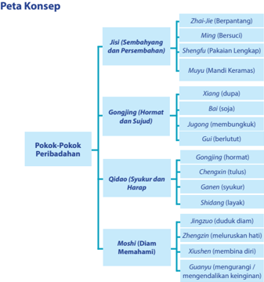

> **Deskripsi Visual:** Gambar ini adalah diagram yang menunjukkan peta konsep tentang pokok-pokok peribadahan dalam budaya atau agama tertentu. Diagram ini dibagi menjadi beberapa bagian utama yang masing-masing menunjukkan konsep-konsep yang berhubungan dengan peribadahan. Bagian pertama, "Pokok-Pokok Peribadahan," membagi konsep menjadi empat sub-bagian utama: Gongjing (Hormat dan Sujud), Qidao (Syukur dan Harap), Moshi (Diam Memahami), dan Jisi (Sembahyang dan Persembahan). Setiap sub-bagian tersebut memiliki sub-tema yang lebih spesifik, seperti Gongjing yang mencakup Xiang (dupa), Bai (soja), Jugong (membungkus), dan Gui (berulut). Untuk sub-bagian Jisi, terdapat Zhai-Jie (Berpantang), Ming (Bersuci), Shengfu (Pakaian Lengkap), dan Muyju (Mandi Keramas). Informasi ini membantu pembaca untuk memahami struktur dan hubungan antara konsep-konsep peribadahan dalam konteks tersebut.

|

 

---
## 📄 Halaman 50

### A. Hakikat dan Makna Ibadah

### 1. Hakikat dan Makna Ibadah

Ibadah  Kepada Huangtian ( Tian Yang  Mahabesar)  sudah  dikenal sejak  dahulu  kala,  ketika  agama  Khonghucu  masih  dikenal  sebagai agama Ru (istilah asli agama Khonghucu). Ibadah merupakan pernyataan pengabdian kita kepada Tian , Tian Yang Maha Pencipta. Jadi hakikat ibadah itu adalah pengabdian kita (manusia) kepada Sang Khalik (Maha Pencipta) atau Huangtian ( Tian Yang Mahabesar).

Ibadah besar kepada Tian ( 天 ) dilaksanakan umat Khonghucu sejak 5.000  tahun  yang  lampau.  Setiap  musim  semi,  musim  panas,  musim gugur,  dan  musim  dingin  dilaksanakan  ibadah-sembahyang  kehadirat Huangtian oleh raja-raja suci.

---
**🖼️ Gambar/Diagram**

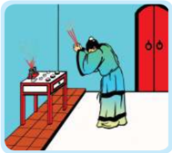

> **Deskripsi Visual:** Gambar ini adalah ilustrasi yang menunjukkan seorang guru sedang memberikan peringatan kepada sekelompok siswa di sebuah kelas. Guru berdiri di depan kelas dengan tangan menggenggam benda yang tampaknya berfungsi sebagai alat penghentian. Siswa-siswa tampaknya sedang duduk di kursi di sebelah kiri, sementara siswa lain tampaknya sedang berdiri di sebelah kanan. Dinding kelas terlihat berwarna merah, dan pintu kelas tampaknya terbuka. Ilustrasi ini menunjukkan situasi di mana guru sedang mengatur atau mengatur suasana belajar di kelas.

Ibadah  secara  umum  dapat diartikan sebagai segala perbuatan baik/bajik yang dilakukan dengan niat yang tulus, iklas, dengan cara yang benar, dan untuk tujuan yang baik  sebagai  bentuk  pernyataan sujud  dan  takwa  kepada Tian , dalam  rangka  memenuhi  kodrat kemanusiaannya. Artinya, bahwa semua perbuatan yang dilakukan dengan tulus, iklas, caranya benar,  dan  tujuannya  baik/mulia adalah merupakan bentuk ibadah. Jadi  ibadah  bukan  sekedar  hal yang menyangkut ritual atau persembahyangan semata.

Namun demikian, sembahyang merupakan hal penting dalam ibadah bagi  manusia,  terutama  dalam rangka pengabdian dan ketakwaannya kepada Sang Maha Pencipta ( Tian ),  seperti yang tersurat di dalam kitab catatan kesusilaan ( Liji ) bahwa:

'Jalan  Suci  yang  mengatur  manusia  baik-baik,    tiada  yang    lebih penting daripada kesusilaan. Kesusilaan ada lima macam, tetapi tiada yang lebih penting daripada sembahyang.'

Selanjutnya marilah kita bahas tentang  niat yang  tulus, hati yang ikhlas, tata cara yang benar, dan tujuan yang baik, yang menjadi syarat sutau tindakkan bisa dikatakan sebagai ibadah.

 

---
## 📄 Halaman 51

### Tulus

Tulus  artinya  sesuatu  yang  benar-benar  tumbuh  dari  dasar  hati, jujur,  tidak  pura-pura.  Dengan  kata  lain,  tulus  adalah,  melakukan sesuatu  karena  dorongan  dari  dalam,    dari  dasar  hati  tanpa  terpaksa atau  dipaksa  (kesadaran).  Bukan  karena  sesuatu  melakukan  sesuatu. Bukan karena ada apanya, tetapi apa adanya (dorongan dari dalam).

Jadi tulus berkaitan dengan niat, atau hal yang mendasari sebuah tindakan.  Lakukan  segala  sesuatu  karena  itu  adalah  tindakan  yang secara  moral  harus  kita  lakukan.  Bukan  karena  mengharapkan  hasil. Kalau hasilnya tidak ada, bukan soal penting, jika ternyata ada hasilnya, juga tidak penting (ada tidak ada hasil bukan tujuan), karena memang bukan karena hasil kita melakukannya.

Maka  hal  terbaik  yang  bisa  kita  lakukan  adalah  mencoba  untuk melaksanakan  apa  yang  kita  ketahui  secara  moral  seharusnya  kita lakukan, tanpa memikirkan bahwa dalam prosesnya kita akan berhasil atau gagal. Bersikap tidak mengindahkan keberhasilan atau kegagalan yang bersifat lahiriah,  maka dalam pengertian tertentu kita tidak pernah gagal. Sebagai  hasilnya, kita akan selalu bebas dari kecemasan apakah akan berhasil, dan bebas dari ketakukan apakah akan gagal.

Hal ini ditegaskan oleh Mengzi , tercatat dalam kitab Mengzi bab VB pasal 5. Mengzi berkata,  'Orang memangku jabatan itu bukan karena miskin, tetapi adapula suatu ketika Ia memangku jabatan karena miskin. Orang menikah itu juga bukan karena ingin mendapat perawatan, tetapi adapula suatu ketika ia mendapat perawatan.'

### Penting

'Beribadah/sembahyang itu bukan sesuatu yang datang dari luar, melainkan ia harus bangkit dari dalam, lahir di dalam hati. Bila hati yang di dalam itu bergerak, memancarlah ia dalam upacara, maka orang yang bijaksana di dalam beribadah/sembahyang didukung oleh sempurnanya iman, dan percaya, mewujud di dalam perilaku satya dan sujud.'  ( Liji. XXV: 1)

### Ikhlas

Ikhlas bermakna bersih dari kotoran. Secara sederhana ikhlas berarti melakukan sesuatu tanpa mengharapkan balasan atau imbalan.  Maka orang yang ikhlas adalah orang  yang menjadikan tindakkannya murni tanpa  ada  tujuan  lain  dibaliknya.  Dengan  kata  lain,  ikhlas  berarti melakukan kebaikan demi kebaikan itu sendiri, dan sama sekali bukan ingin mendapatkan imbalan dalam bentuk apapun, atau bukan karena

|

 

---
## 📄 Halaman 52

takut mendapatkan hukuman apapun. Nabi Kongzi mengatakan untuk mendahulukan  pengabdian  dan  membelakangkan  hasil,  bukankah  ini sikap menujunjung kebajikan?

Jika  tulus  berkaitan  dengan niat, atau yang mendasari sebuah tindakan,  maka  ikhlas  berkaitan dengan penerimaan hasil. Artinya, apapun hasil dari suatu tindakan diterima dengan lapang dada.

### Caranya Benar Tujuannya Baik

Tujuannya baik tetapi caranya tidak benar, atau caranya benar tetapi tujuannya tidak baik tidak memenuhi syarat untuk dikatakan sebagai ibadah. Ini terkait dengan masalah 'kemurnian hati' dan  dan 'tata cara.''

Berikut adalah percakapan Ji Zicheng dengan Zigong yang mengilustrasi tentang pentingnya tata cara yang terdapat dalam kitab Sabda Suci ( Lunyu ) jilid XII pasal 8:

Ji Zicheng berkata, 'Seorang Junzi itu  hanya  perlu  menjaga kemurnian hatinya. Maka, apa perlunya segala tata cara?'  Zigong berkata, 'Mengapakah  tuan  melukiskan  seorang  Kuncu  demikian?  Sungguh sayang!  Kata-kata  yang  telah  lepas  itu  empat  ekor  kuda  tidak  dapat mengejar. Sesungguhnya tatacara itu harus selaras dengan kemurnian hati, dan kemurnian hati itu harus mewujud di dalam tatacara. Ingatlah kulit harimau dan macan tutul, bila dihilangkan bulunya takkan banyak berbeda dengan kulit anjing dan kambing.'

Ayat  tersebut  menjelaskan  dengan  tegas,bahwa  begitu  pentingya sebuah tata cara. Tata caralah yang membedakan orang yang satu dengan yang lain. Jika orang hanya mementingkan niat atau tujuan (kemurnian hati) dan mengabaikan tata cara, maka yang mepunyai tujuan baik dan yang memiliki tujuan tidak baik tidak jauh berbeda.

### B. Ibadah Terbesar

Ibadah terbesar dalam agama Khonghucu adalah berperilaku bajik (melaksanakan kebajikan). Hal ini merupakan konsekuensi logis dan imanen ajaran Khonghucu yang menempatkan kebajikan sebagai sesuatu yang harus dilakukan. Ajaran Khonghucu meyakini bahwa setiap manusia mengemban Firman Tian yang berupa benih-benih kebajikan yang bersemayam di dalam hati nuraninya. Benih-benih kebajikan Firman Tian itu adalah watak sejati/watak asli (xing), yang menjadi kodrat kemanusiaannya sekaligus menjadi tanggung jawab manusia untuk menggemilangkannya agar senantiasa bercahaya dan

### Penting

Harta benda menghias rumah, laku bajik menghias diri, hati yang lapang (bersih/ikhlas) membuat tubuh kita sehat.

 

---
## 📄 Halaman 53

---
**🖼️ Gambar/Diagram**

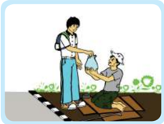

> **Deskripsi Visual:** Gambar ini adalah ilustrasi yang menunjukkan dua orang yang sedang berbincang di jalan. Pada gambar tersebut, elemen utama adalah dua orang yang sedang berbicara, lingkungan sekitar mereka yang tampak seperti jalan raya, dan tanda-tanda yang mungkin menunjukkan lokasi atau informasi tambahan. Informasi kunci yang dapat diambil dari gambar ini adalah bahwa ada interaksi sosial antara dua orang, mungkin dalam konteks pendidikan atau bantuan, karena salah satu orang tampak sedang memberikan sesuatu kepada orang lain.

Gambar   3.2 Membantu sesama sebagai bentuk ibadah yang nyata

Buatlah  daftar  kegiatan  yang  rutin  kalian,  dan  kaitkan  dengan perbuatan  yang  bermanfaat  bagi  orang  lain,  baik  secara  moril maupun materil!

### C. Pokok-Pokok Peribadahan

Ada empat pokok yang mendasari Tata Ibadah Umat Khonghucu, yaitu:

- Jisi
( 祭 祀)

= Sembahyang

- Gongjing
( 恭

敬 )

= Hormat dan Sujud

- Qidao
( 圻

稻 )

- = Syukur dan Harap (Doa)
- Moshi
( 默

弑 )

= Diam Memahami

|

memancar,  sehingga  mampu menerangi makhluk hidup yang lainnya.

Dalam agama Khonghucu, tidak ada jalan lain untuk mencapai keselamatan, mencapai pencerahan bathin, dan mencapai kesempurnaan iman kecuali dengan menjalankan kebajikan.

 

---
## 📄 Halaman 54

---
**🖼️ Gambar/Diagram**

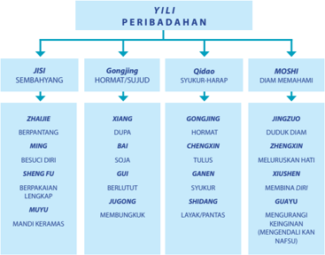

> **Deskripsi Visual:** Gambar ini adalah diagram yang menunjukkan struktur peribadahan dalam Yili. Diagram ini dibagi menjadi empat cabang utama: Jisi, Gongjing, Qidao, dan Moshi. Jisi meliputi sembahyang, berpantang, berbuka, berlipat, dan mandi keramas. Gongjing meliputi hormat, sujud, dan jingzhou. Qidao meliputi syukur, harap, dan xinshen. Moshi meliputi diam memahami dan guyu. Setiap cabang memiliki subcabang dengan nama-nama yang lebih spesifik. Ini menunjukkan hubungan hierarkis antara peribadahan dan bagaimana setiap cabang dapat dipecahkan menjadi lebih kecil.

### D. Jisi (Sembahyang)

### 1. Pengertian Sembahyang

Sembahyang adalah suatu perbuatan yang menyangkut ritual, yang dilakukan  secara  sadar-tulus  dalam  rangka  menyampaikan  sembah/ sujud  dan  hormat  kepada Tian ,  dengan  aturan-aturan  tertentu  yang diwajibkan, diatur, dan ditetapkan oleh suatu agama.

Secara  hariah,  sembahyang  berasal  dari  bahasa  sansekerta,  yang terdiri dari kata Sembah dan Hyang . Sembah berarti sujud, hormat atau memuja sesuatu sebagai Hyang , yaitu sesuatu  yang dianggap mulia atau dimuliakan. Sembahyang biasanya dilakukan dengan cara menundukkan kepala, membongkokkan badan atau bersimpuh/bersujud. Hyang berarti suatu  Dzhat  (baca:  Zat)  Yang  Mahatinggi,  Yang  Mencipta,  Mengatur (dengan Hukum-Nya) dan menguasai dunia beserta segala isinya, yaitu Tian .

Manusia dalam hidupnya secara rohaniah terpanggil untuk mengabdi kepada Tian , oleh karena itulah maka secara imani manusia terdorong (ada  kecenderungan)  untuk  mengadakan  persembahyangan  dengan segala  ritualnya  untuk  mencurahkan  rasa  pengabdiannya  kepada  Dia ( Tian Yang Mahakuasa).

 

---
## 📄 Halaman 55

Persembahyangan biasanya disertai dengan bersuci diri agar persembahyangan itu berkenan kepada Tian .  Hal  ini  sudah  ada  sama lamanya dengan sejarah   kemanusiaan itu  sendiri,  hanya  kemudian  karena disesuaikan dengan alam pikiran manusia maka persembahyangan itu pada perkembangannya selalu disertai dengan macam-macam tata cara ditambah dengan pengorbanan dan persembahan sebagai pelengkap dari ungkapan pengabdiannya itu.

Tetapi sayangnya, hal itu terkadang dapat merubah panggilan imani yang  awalnya  secara  murni  ke  luar  dari  hati  nurani  manusia  untuk mengadakan persembahyangan berdasarkan kesucian lahir bathin. Hal ini  menjadi suatu tradisi pantulan dari pemikiran manusia yang pada akhirnya melupakan pokok dari pengabdian itu sendiri. Sesungguhnya, yang menjadi syarat utama dalam persembahyangan adalah: 'Kesucian diri lahir bhatin agar semua dapat berkenan kepada-Nya.'

### 2. Persiapan Sembahyang

### a. Zhai-Jie (Berpantang)

Zhai adalah pantang dalam kaitan dengan makanan, sedangkan Jie adalah pantang dalam kaitan dengan perilaku.

Zhai dalam kaitan berpantang makan ada empat macam, yaitu:

- Pantang makanan yang berpenyedap, yang menunjukan keprihatinan.
- Pantang makan makanan yang diolah, yang menunjukan apa adanya (kesederhanaan).
- Pantang makan makanan yang berjiwa, yang menunjukan kebersihan/ kesucian.
- Pantang makan makanan yang dapat merusak lingkungan.
(Pantang-pantangan di atas dapat dilakukan secara berkala dengan tenggang waktu tertentu, sehingga dapat melatih kita dalam mengontrol dan mengendalikan diri).

Jie dalam kaitan berpantang perilaku adalah menjaga ucapan dan kelakuan (sikap), seperti:

- menjaga  ucapan:  tidak berkata-kata kotor,  kasar,  mengumpat, mencaci  maki, itnah, dll.
- menjaga kelakuan (sikap): tidak melanggar kesusilaan, norma-norma kesopanan, bersikap ramah, dan santun.
|

 

---
## 📄 Halaman 56

### b. Ming (Bersuci)

Jila zhai itu berhubungan dengan mengendalikan keinginan makan dan Jie mengendalikan perilaku, bersuci itu lebih kepada kesucian hati dan  pikiran.  Mengendalikan  kekalutan  pikiran  dan  keresahan  atau semua gejolak rasa yang ada di hati.

### c. Shengfu (Berpakaian Lengkap)

Berpakaian lengkap dalam konteks ini berarti menggunakan jubah khusus sembahyang, serta alas kaki (sepatu). Lengkap berarti juga rapi, layak, dan terutama bersih.

### d. Muyu (Mandi Keramas)

Mandi keramas terkait dengan kebersihan jasmani yang melengkapi Zhai-Jie , Ming, dan Shengfu.

### 3. Macam-Macam Sembahyang

Dalam ajaran agama Khonghucu terdapat tiga macam sembahyang, yaitu:

- Sembahyang kepada Tian (Tuhan)
- Sembahyang kepada Di (Alam)
- Sembahyang kepada Ren (Manusia)

### a. Sembahyang Kepada Tian

- Sembahyang Ci (Sujud dan Prastya).
Yaitu sembahyang: Jing Tian

- 8 malam tanggal 9 bulan 1 Kongzili ( Zheng Yue
- Sembahyang Yue
Yaitu sembahyang: Duanyang, dilaksanakan setiap Tanggal:

- 5 - 5 Kongzili ( Wuyue Chuwu
gong, dilaksanakan setiap tanggal: ).

- (Eling dan Taqwa). ).
- Sembahyang Chang (Doa dan Asa).
Yaitu sembahyang: Zhongqiu , dilaksanakan setiap tanggal:

- 15 - 8 Kongzili ( Bayue Shiwu ), dikenal juga sebagai saat puncak musim panen atau panen raya, maka saat itu juga dilaksanakan penghormatan kepada malaikat bumi ( Fude Zhengshen ).
- (Syukur dan Harapan).
- Sembahyang Zheng
Yaitu sembahyang: Dongzhi , dilaksanakan setiap tanggal: 21 atau 22 Desember (Penanggalan Yangli atau kalender Masehi). Saat matahari di titik balik 23,5 derajat Lintang Selatan.

 

---
## 📄 Halaman 57

### Catatan:

Di  samping  empat  sembahyang  tersebut  di  atas,  sembahyang kepada Tian juga dilaksanakan pada saat-saat yang lain, yaitu:

- Malam menjelang Tahun Baru (akhir tahun), yaitu sembahyang Chuxi pada  tanggal  29/30    bulan  12 Kongzili .  Sembahyang dilaksanakan pada saat Zishi, yaitu antara jam 23.00 - 01.00.
- Sembahyang Zhaoxi ,  yaitu    kepada Tian juga  dilaksanakan setiap  hari  (pagi  dan  sore)  sebagai  sembahyang  pernyataan syukur. Zhao berarti awal atau pagi dan Xi berarti akhir atau sore. Jadi Zhaoxi bermakna sembahyang awal dan akhir hari.
- Sembahyang pada saat Chuyi dan Shiwu
Sembahyang kepada leluhur saat Chuyi dan Shiwu dilaksanakan  pada  petang  hari  di  rumah  masing-masing. Sembahyang dilaksanakan di depan rumah mengahadap langit lepas.  Pada  saat  ini  juga  dilaksanakan  sembahyang  kepada leluhur, yakni pada altar leluhur  atau di Miao Leluhur atau Zumiao .

### b. Sembahyang Kepada Alam

### 1) Sembahyang Shangyuan

Dikenal dengan sembahyang awal tanam, yaitu sembahyang Yuanxiao ( Cap Go Me ), dilaksanakan setiap  tanggal: 15-1Kongzili .

### 2) Sembahyang Zhongyuan

Zhongyuan adalah  sembahyang  atas  berkah  bumi  yang  dikaitkan dengan  leluhur  dan  arwah  umum,  yaitu  sembahyang  Jing  Heping. Zhongyuan dikenal juga dengan sembahyang panen raya yang berlanjut sampai  ke  puncak  musin  panen  yaitu  tanggal  15  bulan  8 Kongzili bersamaan  dengan  sembahyang Zhongqiu (sembahyang Zhang yang dikaitkan dengan malaikat Fude  Zhengshen ). Sebenarnya, antara Zhongyuan (sembahyang atas berkah bumi atau dikenal dengan panen raya) dengan sembahyang Zhongqiu adalah dua hal yang berbeda, hanya waktunya yang bersamaan.

### 3) Sembahyang Xiayuan

Dilaksanakan setiap tanggal 15 bulan 10 Kongzili , yaitu Sebagai sembahyang  panen  akhir  menjelang  musim  dingin.    Sembahyang  ini juga berhubungan dengan Sangyuan yakni Tianyuan/Diyuan/Shuiyuan

|

 

---
## 📄 Halaman 58

yang dihubungkan pula dengan pengertian iman yang sangat diwarnai oleh sejarah  agama Khonghucu, yakni: Pribudi bajik, Tata Masyarakat, dan Pengelolaan Alam.

### c. Sembahyang Kepada Manusia

Sembahyang kepada manusia dapat digolongkan menjadi tiga, yaitu sembahyang  kepada  leluhur  ( Zuzong ),  kepada  nabi  ( Shengren) ,  dan kepada para suci ( Shenming ).

### 1) Sembahyang Kepada Leluhur

### a) Qingming

Dikenal dengan sembahyang sadranan/jiarah ke makam, dilaksanakan setiap tanggal: 4 atau 5 April (penanggalan Yangli / Kalender Masehi).

### b) Ershi Shengan

Sembahyang dilaksanakan pada  tanggal 24  bulan 12 Kongzili atau Shi Er Yue Er Shi Si , sehingga disebut juga Ershi Shangan. Pada saat sembahyang Ershi Shengan ada spirit bahwa: 'Sembahyang kepada yang telah tiada ingat kepada yang masih hidup.'    Karena  spririt  ini  maka  pada  saat  sembahyang Ershi Shengan juga lakukan bakti sosial untuk membantu orang-orang yang kurang mampu. Selanjutnya hari ini juga dikennal dengan nama 'hari persaudaraan.'

Selain dua sembahyang disebutkan di atas,  sembahyang kepada leluhur yang umum dilaksanakan di antaranya:

### (1) Zhongyuan dan Jing Heping

Sebagaimana telah dijelaskan, bahwa Zhongyuan adalah sembahyang atas  berkah  bumi  yang  dikaitkan  dengan  leluhur dan arwah umum. Jadi pada saat Zhongyuan juga dilaksanakan sembahyang kepada leluhur  tepatnya  tanggal  15  bulan  7,  dan sembahyag kepada arwah umum (Jing Heping) tanggal 29 bulan 7 Kongzili .

### (2) Chuyi dan Shiwu

Sembahyang pada saat Chuyi dan Shiwu adalah saat sembahyang kepada Tian ,  hanya pada waktu yang sama juga dilaksanakan sembahyang kepada leluhur.    Sembahyang  dilaksanakan  pada petang hari di rumah masing-masing, yakni pada altar leluhur atau  di  Miao  Leluhur  ( Zumiao ).  Selain  itu  juga  dilaksanakan sebahyang kepada, Shenming , dan Shengren (nabi).

 

---
## 📄 Halaman 59

### 3) Chuxi

Seperti  halnya  sembahyang  pada  saat Chuyi dan Shiwu , sembahyang  Chuxi  juga  termasuk  sembahyang  kepada Tian yang dilaksanakan pada malam menjelang Tahun Baru (tanggal 29/30    bulan  12 Kongzili ),  namun  pada  saat  yang  sama  juga dilaksanakan sembahyang kepada leluhur.

### 4) Zuji

Zuji adalah  sembahyang  peringatan  hari  wafat  leluhur,  oleh karenanya waktu pelaksanaan sembahyang sesuai dengan hari wafat leluhur masing-masing. Artinya, Zuji adalah sembahyang kepada leluhur yang bersifat khusus.

### 2) Sembahyang Kepada Nabi

### a) Lahir Nabi Kongzi ( Zhisheng Dan)

Sembahyang, peringatan dan perayaan yang diselenggarakan baik secara  sederhana  maupun  dengan  berbagai  kegiatan  adalah  sangat baik kalau semuanya itu bukan sekadar kegiatan rutin melainkan juga mampu  memahami dan menghayati nyala Kebajikan, pesan-pesan suci Beliau selaku Genta Rohani yang membawakan Firman Tian Yang Maha Esa, yang menjadi pembimbing hidup manusia.

### b) Wafat Nabi Kongzi ( Zhisheng Jichen )

Pada  setiap  tanggal  18  bulan  2 Kongzili ,  umat  Khonghucu  memperingati Hari  Wafat  Nabi Kongzi .  Pelaksanaan  upacara  seperti  halnya  dengan upacara Hari Kelahiran Nabi Kongzi ),  hanya  penyelenggaraanya lebih sederhana  serta  lebih  ditekankan  pada  suasana  khidmat.  Pada  saat upacara sembahyang hari wafat Nabi Kongzi ,  kita  mengenang pribadi Beliau, suri tauladan bagi sikap batin dan penghidupan kita.

### 3) Sembahyang Kepada Shenming

Selain bersembahyang kepada leluhur, umat Khonghucu melakukan sembahyang kepada para suci (Shengming). Adapun yang menjadi spirit dan  landasan  sembahyang  kepada  para Shenming adalah,  sebagai berikut:

- Nabi Kongzi bersabda, 'Seorang Junzi memuliakan tiga hal, Memuliakan  Firman Tian ,  Memuliakan  Orang-Orang  Besar  dan memuliakan Sabda Para Nabi.'
|

 

---
## 📄 Halaman 60

- Berdasarkan peraturan para 'raja suci' (Shengwang) tentang upacara sembahyang, sembahyang dilakukan kepada orang yang menegakkan hukum  bagi  rakyat,  kepada  orang  yang  gugur  menunaikan  tugas kepada  orang  yang  telah  berjerih-payah  membangun  kemantapan dan  kejayaan  negara  kepada  orang  yang  dengan  gagah  berhasil menghadapi serta mengatasi bencana besar dan kepada yang mampu mencegah terjadinya kejahatan/penyesalan besar.
Ayat  tersebut  menjelaskan  bahwa  ada  orang-orang  yang  karena Kebajikannya  (keteladanan  semasa  hidupnya),    membuat  masyarakat luas  yang  merasakan  'manfaat'  dari  kebaikan  tersebut.  Karena  dasar itulah maka orang melakukan ibadah (menghormat/menyatakan syukur ) kepadanya. Bahkan karena begitu besarnya penghormatan itu, sampaisampai bermigrasipun dibawa dan mentradisi sampai anak-cucunya dan akhirnya  men-dunia.    Inilah  yang  kemudian  menjadi Shenming yang kita kenal. Atas dasar iman yang sama, hal ini juga dilakukan oleh umat Khonghucu dimanapun ia berada, termasuk di Indonesia, sehingga juga dikenal Shenming lokal (Indonesia).

### 4. Peralatan dan Sajian Sembahyang

### a. Peralatan Sembahyang

Ziyou bertanya  tentang  peralatan  yang  wajib  disediakan  untuk upacara perkabungan. Nabi bersabda, 'Wajib disediakan sesuai kemampuan  keluarga.' Ziyou berkata,  'bagaimanakah  keluarga  yang mampu  dan  tidak  mampu  dapat  melakukan  hal  yang  sama?'  Nabi menjawab,  yang  mampu  janganlah  melampaui  ketentuan  kesusilaan, yang tidak mampu cukup sekedar tubuhnya ditutupi dari kepala sampai kaki  dan  selanjutnya  dimakamkan.  Peti  jenazah  cukup  diturunkan dengan tali. Dengan demikian siapakah  yang akan menyalahkan?' ( Liji . II A. III: 17)

Zilu berkata, 'Saya mendengar Hu Cu (Nabi Kongzi ) bersabda bahwa di dalam upacara berkabung adanya rasa sedih sekalipun kurang di dalam perlengkapan upacara, itu lebih baik daripada memamerkan kesedihan dengan  lengkapnya  peralatan  upacara.  Dan  di  dalam  sembahyang, adanya hormat khidmat, itu lebih baik daripada berlebihan peralatan upacara tetapi kurang ada rasa hormat khidmat.' ( Liji . II A. II: 27)

### b. Makna Simbolis Sajian Sembahyang

Sajian atau persembahan  yang dikenal secara awan sebagai sesajen memang tidak bisa dilepaskan dalam sembahyang yang dilakukan umat Khonghucu.  Namun  demikian,  jarang  yang  memperhatikan  makna simbolis dari berbagai sajian dimaksud.

 

---
## 📄 Halaman 61

Dalam Kamus Besar Bahasa Indonesia (KBBI) sesajen adalah sajian berupa makanan bunga dan sebagainya yang disajikan untuk roh yang telah meninggal. Sajian dimaksudkan untuk menunjukkan rasa hormat kepada  yang  meninggal,  seperti  disabdakan  Nabi Kongzi ,  'Semua (sajian) itu untuk menunjukkan puncak rasa hormat. Akan rasanya tidak diutamakan, yang penting ialah semangatnya.'

Hal  sajian  sembahyang  ini  sering  menjadi  perdebatan  bahkan pelecehan  dari  pihak  luar.  Untuk  apa  orang  yang  telah  meninggal dunia  diberikan  sajian  (makanan),  adakah  yang  mengerti  kalau  yang meninggal  itu  akan  makan  sajian  yang  dipersembahkan?  Kecaman semacam ini bukan baru sekarang, namu sejak dahulu sudah ada. Nabi Kongzi menyatakan bahwa semua sajian itu hanya untuk menunjukka rasa hormat kepada almarhum.  Beliau bersabda,  'Adakah ia mengerti, bahwa roh yang meninggal itu akan menikmatinya? Yang berkabung itu hanya terdorong oleh ketulusan dan rasa hormat di dalam hatinya.'

'Orang mati  itu tidak makan, tetapi dari jaman yang paling kuno sampai sekarang hal (sajian) itu tidak pernah dialpakan. Maka kecaman terhadap kesusilaan (sajian) itu, sesungguhnya adalah kajian yang tidak susila.

Berikut  adalah  macam-macam  sajian  yang  umum  digunakan  oleh umat  Khonghucu  sebagai  persembahan  dalam  upacara  sembahyang baik kepada Tian , kepada Alam, dan kepada manusia (nabi dan leluhur) beserta makna simbolisnya.

### c. Buah-Buahan Sajian Sembahyang

### · Pisang

Xiangjiao ( 香  蕉 )  pisang, diidentikan dengan lafal/bunyi Xiangjiu ( 香 久 ) artinya Langgeng. Dalam persembahyangan, yang lazim digunakan adalah jenis pisang raja atau  pisang  mas.  Penyajiaan  pisang  di meja  altar  biasanya  diletakan  di  sebelah kiri altar.

---
**🖼️ Gambar/Diagram**

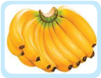

> **Deskripsi Visual:** Gambar ini adalah ilustrasi yang menampilkan sekelompok pisang. Gambar ini menggambarkan dua buah pisang besar yang berwarna kuning cerah dengan beberapa titik hitam kecil yang mungkin merupakan simbol bau atau warna alami pada buah tersebut. Pisang-pisang ini tampak segar dan siap dikonsumsi. Ilustrasi ini mungkin digunakan untuk membantu pembaca memahami konsep tentang buah-buahan atau makanan sehat dalam konteks pelajaran.

Gambar  3.3 lambang langgeng

|

 

---
## 📄 Halaman 62

### · Jeruk

Juzi ( 橘 子 ) Jeruk,  diidentikan dengan lafal/bunyi Jixiang ( 吉  祥 ) artinya Kebaikan. Jenis Jeruk yang biasanya digunakan untuk sesajian sembahyang adalah jenis jeruk bali  atau jenis jeruk garut atau  jeruk siam. Biasanya diletakan di sebelah kanan altar.

### · Apel

Pingguo ( 苹 果 ) artinya Apel, diidentikan dengan lafal/bunyi Pingan (平 安 ) artinya Tentram.

### · Pear

Liguo ( 莉 果 ) Pear, diidentikan dengan lafal/bunyi Liy i  ( 利 益 ) artinya keberuntungan

### · Nanas

Ong Lay bermana kejayaan datang. Sesuai juga dengan bentuk yang menghadap ke atas  menandakan kejayaan.

Gambar  3.7 Nanas melambangkan kejayaan

 

---
## 📄 Halaman 63

### · Semangka

Semangka  (Citrullus  Vaalgares).  Dalam  upacara  pemberangkatan jenazah,  biasanya  buah  ini  dibanting  sampai  pecah  berkeping-keping. Biji semangka yang berjumlah banyak bertebaran itu menunjukkan akan tumbuh sekian banyak pohon semangka yang berasal dari satu buah itu.

Artinya, kita harus pandai mengembangkan peninggalan yang kita peroleh dari orang tua.

### · Tebu

Tebu tumbuhan berumpun, tidak pernah ada yang tumbuh hanya sebatang.  Maknanya  ialah  agar  kita  hidup  tidak  menyendiri.  Dalam kehidupan  rumah  tangga  hendaknya  hidup  harmonis,  masing-masing mengenal batas  dan  pandai  mengendalikan  diri  dan  ada  rasa  kebersamaan.

Air tebu terasa manis, batang tebu beruas-ruas tumbuh lurus  dan tidak bercabang. Manis adalah lambang kebajikan dan cinta kasih. Tebu tumbuhnya    beruas-ruas  diibaratkan  manusia  yang  dalam    tumbuh kembangnya sejak bayi hingga mencapai usia tua harus selalu tumbuh pula cinta kasih dan kebajikan.

Sepasang tebu dengan daun dan akarnya diikat di sebelah kanan dan kiri meja altar, hal ini sebagai petanda rasa syukur ke hadirat Tian Yang Maha Esa'

Gambar  3.8 Semangka yang melambangkan kebulatan tekad untuk mengembangkan apa yang diberikan dari leluhur

Gambar  3.9 Tebu lambang kebersamaan kebajikan

|

 

---
## 📄 Halaman 64

### Kue Sajian Sembahyang

### · Kue Ku

Gui guo ( 龜  粿 ) artinya Kue Ku, diidentikan dengan lafal/bunyi Shou ( 壽 ) artinya panjang umur.  Bentuknya  yang  dibuat  mirip  batok kura-kura  yang  dipandang  sebagai  hewan yang usianya panjang, dapat mencapai kurang lebih 2000 tahun. Hidup melata di air dan darat. Kura-kura atau penyu merupakan salah satu dari empat jenis hewan yang suci, tiga hewan suci lainnya adalah Naga ( Long ), Qilin, dan burung Huang.

Makna sesajian kue Ku dalam persembahyangan merupakan harapandari para  leluhur  kita  agar  kita  memiliki  daya tahan  hidup  lama  di  dunia,  supaya  dapat menyelesaikan kewajiban dengan lebih sempurna.

### · Kue Mangkok ( Hwat Kue )

Fagao ( 苹  果 )  artinya  Kue    Mangkok, diidentikan dengan lafal/bunyi Fa ( 發 ) artinya berkembang Bentuk Kue Mangkok umumnya dianggap baik apabila permukaanya merekah seperti  buah  delima  dan  biasanya  berwarna merah. Makna dari kue ini ialah agar hidup kita  berkembang  dan  bahagia  seperti  yang disimbolkan oleh warna merah.

### · Kue Wajik (Hwat Kue)

Migao ( 米  糕) artinya wajik, diidentikan dengan lafal/bunyi He ( 合) artinya  bersatuharmonis.

Gambar  3.10 Kue Ku lambang panjang umur

Gambar  3.12 Kue  wajik lambang peningkatan dan bahagia

 

---
## 📄 Halaman 65

### 5. Nama-nama Waktu Sembahyang

---
**📊 Tabel**

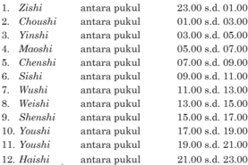

Tabel ini berisi informasi tentang waktu dan pukulannya beberapa orang atau objek. Topik utamanya adalah waktu dan pukulannya beberapa objek atau individu. Kolom pertama menunjukkan nama-nama tersebut, kolom kedua menunjukkan waktu pukulannya, dan kolom ketiga menunjukkan apakah mereka berada di antara pukul atau tidak. Data penting yang terlihat adalah bahwa banyak orang memiliki waktu pukul yang berbeda-beda, dan beberapa memiliki waktu pukul yang lebih lama dibandingkan dengan yang lainnya.

### Aktivitas 3.2 Aktivitas Bersama

### Diskusi Kelompok

- Jelaskankan perbedaan Ibadah, Sembahyang, dan Berdoa!
- Bagaimana menurut kalian tentang sesajian yang dipersembahkan  pada  saat  sembahyang!  Adakah  hal  yang harus diluruskan, dan apa nilai-nilai positif  dari sajian itu?

### Penilaian Diri

### · Tujuan Penilaian

Lembar penilaian diri ini bertujuan untuk:

- Mengetahui sikap kalian dalam menerima dan memahami halhal terkait dengan peribadahan.
- Menumbuhkan sikap sungguh-sungguh untuk melakukan segala tugas sebagai bentuk ibadah kepada Tian .

### · Petunjuk

Isilah  lembar  penilaian  diri  yang  ditunjukkan  dengan  skala  sikap berikut ini!

- ST = setuju
- SS = sangat setuju
- RR = ragu-ragu
- TS = tidak setuju
|

 

---
## 📄 Halaman 66

---
**📊 Tabel**

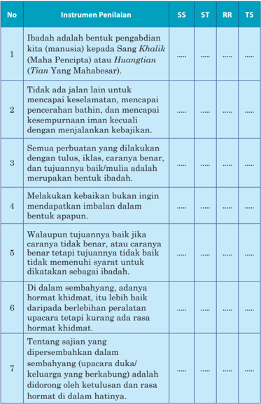

Tabel ini berisi instrumen penilaian untuk menilai keberhasilan seseorang dalam melakukan ibadah, dengan membandingkan antara tiga metode penilaian: SS (Sistem Standar), ST (Standar), RR (Rendah Rendah), dan TS (Tinggi Tinggi). Topik utama tabel adalah tentang definisi dan kriteria untuk melakukan ibadah, termasuk perbuatan yang dilakukan dengan tulus, iklas, caranya benar, dan tujuannya baik. Tabel ini juga mencakup beberapa aspek penting seperti tidak ada jalan lain untuk mencapai keselamatan, penceraian batin, kesempurnaan iman, dan mendapatkan imbalan dalam bentuk apapun. Selain itu, tabel ini juga membahas tentang hormat khidmat dalam upacara duka keluarga yang berkabung, serta didorong oleh ketulusan dan rasa hormat di dalam hatinya.

 

---
## 📄 Halaman 67

### Evaluasi Bab 3

### A. Pilihan Ganda

Berilah tanda silang (x) di antara pilihan A, B, C, D, atau E yang  merupakan  jawaban  paling  tepat  dari  pertanyaanpertanyaan berikut ini!

- Berikut  ini  adalah  empat  pokok  yang  mendasari  Tata  Ibadah Umat Khonghucu, kecuali…
- A  Sembahyang
- Hormat
- Doa
- Berpantang
- Diam Memahami
- Berikut  ini  adalah  saat  saat  sembahyang  kepada Tian Yang Maha Esa, kecuali ...
- Zhongqiu
- Dongzhi
- Qingming
- Duanyang
- Jing Tiangong
- Berikut ini adalah saat-saat sembahyang kepada leluhur, kecuali…
- Chuyi dan Siwu
- Qingming
- Jin Heping
- Duanyang
- Zhongyuan
- Sembahyang Qingming jatuh pada setiap tanggal…
- 4 April
- 5 April
- 5 bula 5 Kongzili
- A dan B Benar
- 15 bulan 8 Kongzili
|

 

---
## 📄 Halaman 68

- Sembahyang Zhongqiu dilaksanakan setiap tanggal…
- 9 bulan 7
- Kongzili
- 5 April
- 5 bulan 5 Kongzili
- 29 Phe Gwee
- 15 bulan 8 Kongzili
- Sembahyang Dongzhi dilaksanakan setiap tanggal….
- 9 - 7 Kongzili
- 22 Desember
- 5 - 5 Kongzili
- 29 - 8 Kongzili
- 5 April
- Sembahyang  Duanyang  dilaksanakan setiap tanggal…
- 9 - 7 Kongzili
- 5 April
- 5 - 5 Kongzili
- 29 - 8 Kongzili
- 15 - 8 Kongzili
- Sembahyang yang  dilaksanakan  pada  saat  petengahan  musim gugur adalah…
- Zhongqiu
- Duanyang
- Qingming
- Jing Tiangong
- Xinchun/Xiannian

### Uraian

### Kerjakan soal-soal berikut ini dengan uraian yang jelas!

- Apa yang dimaksud dengan ibadah?
- Apa yang di maksud dengan tulus?
- Apa yang dimaksud dengan ikhlas?
- Sebutkan pokok-pokok peribadahan umat Khonghucu!
- Jelaskan tentang berpantang ( Zhai-Jie )!
- Sebutkan yang termasuk sembahyang kepada Tian !
- Sebutkan yang termasuk sembahyang kepada kepada Alam!
- Sebutkan yang termasuk sembahyang kepada manusia!

 

---
## 📄 Halaman 69

### Bab 4

### Sembahyang Kepada Tian

### Peta Konsep

---
**🖼️ Gambar/Diagram**

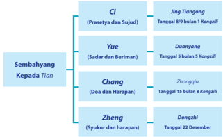

> **Deskripsi Visual:** Gambar ini adalah diagram yang menunjukkan struktur dan hubungan antara berbagai elemen dalam sebuah sistem atau konsep. Diagram ini terdiri dari tiga baris vertikal yang masing-masing menunjukkan elemen-elemen tertentu dalam sistem tersebut. Setiap elemen memiliki nama dan informasi tambahan seperti tanggal dan bulan.

Elemen utama yang ditampilkan dalam diagram ini adalah Ci, Yue, Chang, dan Zheng. Ci merupakan elemen pertama dan terbesar dalam struktur ini, yang kemudian diikuti oleh Yue, Chang, dan Zheng. Tiangong, Duanyang, Zhonggu, dan Dongshi masing-masing merupakan elemen yang terkait dengan Ci, Yue, Chang, dan Zheng.

Informasi penting yang dapat diambil dari diagram ini meliputi:

1. Struktur dan hubungan antara elemen-elemen dalam sistem.
2. Tanggal dan bulan yang terkait dengan setiap elemen.
3. Nama-nama elemen yang digunakan dalam sistem.

Diagram ini memberikan gambaran yang jelas tentang struktur dan hubungan antara elemen-elemen dalam sistem, serta informasi penting tentang tanggal dan bulan yang terkait dengan setiap elemen.

|

 

---
## 📄 Halaman 70

### A.  Pendahuluan

Seperti  yang  sudah  kalian  pelajari  pada  bab  tiga  tentang  Pokokpokok peribadahan umat Khonghucu, bahwa sembahyang kepada Tian utamanya  ada empat, yaitu yang  dikenal dengan Ci, Yue, Chang, Zheng. Pada bab ini kita akan mempelajari tentang empat sembahyang kepada Tian seperti yang dimaksud.

Sebelum membahas lebih khusus tentang empat sembahyang kepada Tian , berikut ini adalah penjelasan singkat tentang sembahyang Ci, Yue , Chang ,  dan sembahyang Zheng , sebagai berikut:

### 1. Sembahyang Ci ( 祠 )

Sembahyang Ci , yaitu sembahyang Prasetya dan Sujud kehadapan Tian yang  bermaknakan  pengagungan Tian dengan  disertai  Prasetya kepada Firman-Nya dengan Sujud dalam kebesaran-Nya. Sembahyang Ci dilaksanakan  pada  saat  tahun  baru  di  musim  semi,  tepatnya  pada tanggal 8 malam tanggal 9 bulan 1 Kongzili ( Zheng yue Chujiu ),  yaitu sembahyang Jing Tiangong.

### 2. Sembahyang Yue ( 禴)

Sembahyang Yue ,    yaitu  sembahyang    Sadar  dan  Beriman  kepada Tian yang bermaknakan bahwa manusia diingatkan untuk selalu eling disertai taqwa kepada-Nya.  Manusia  bermohon  untuk  selalu  diberi kekuatan dalam cobaan dan diberi jalan untuk menghadapi segala ujian dan cobaan tersebut.

Sembahyang Yue dilaksanakan  di  musin  panas,  pada  saat  alam dalam  keadaan  ekstrim,  yaitu  pada  tanggal  5  bulan  5  penanggalan Kongzili ( Wuyue Chuwu ), yang dikenal dengan sembahyang Duanyang . Sembahyang dilaksanakan pada saat Duanwu atau Wushi (antara pukul 11.00 - 13.00).

### 3. Sembahyang Chang ( 尝 )

Sembahyang Chang ,  yaitu  sembahyang  Doa  dan  Harapan  kepada Tian yang bermaknakan perwujudan rasa keterikatan Manusia - Alam Tian sebagai satu kesatuan dalam hidup, dan kepada-Nyalah segala Doa dan Harapan dipanjatkan. Dilaksanakan di pertengahan musim gugur, tepatnya tanggal  15 bulan 8 Yinli ( Bayue Shiwu ) pada saat alam semesta dalam  kedudukan  yang  harmonis  sehingga  diyakini  sebagai  keadaan dengan  aura  terbaik  untuk  memanjatkan  doa  dan  menyampaikan harapan, juga dibarengi dengan ungkapan syukur pada semesta terutama bumi yang telah memberi sarana untuk menunjang kehidupan.

 

---
## 📄 Halaman 71

Sembahyang ini dikenal dengan sembahyang Zhongqiu (sembahyang pertengan  musin  gugur).  Dalam  kaitan  dengan  keyakinan  kepada malaikat Fude Zheng shen (menegakkan kehidupan rohani dalam kebajikan  akan beroleh berkah).

### 4.   Sembahyang Zheng ( 烝 )

Sembahyang Zheng ,  yaitu  sembahyang  Syukur  dan  Yakin  kepada Tian yang bermaknakan rasa syukur  kepada rakhmat-Nya.

Dilaksanakan pada saat puncak musim dingin, pada saat matahari berada pada titik balik 23.50 Lintang Selatan, tepatnya tanggal 22 atau 21 Desember (penanggalan Masehi), yaitu sembahyang Dongzhi .

Sajian pada sembahyang Dongzhi secara budaya yang berkembang di masyarakat adalah ronde dengan kuah jahe manis. Kebiasaan menyajikan ronde dengan kuah jahe manis menyesuaikan dengan kondisi cuaca yang dingin.

### Catatan:

Selain  empat  sembahyang  tersebut,  ibadah  sembahyang  kepada Tian juga  dilakukan  setiap  hari  (pagi  dan  sore)  di  rumah  masingmasing.  Dikenal  dengan  Sembahyang Zhaoxi sebagai  sembahyang pernyataan syukur. Zhao berarti awal atau pagi dan Xi berarti akhir atau sore. Jadi Zhaoxi bermakna sembahyang awal dan akhir hari.

Sembahyang  setiap  tanggal  1  dan  15  penanggalan Kongzili . (sembahyang Chuyi dan Siwu ).

### B. Sembahyang Jing Tiangong

### 1.    Makna Sembahyang Jing Tiangong

Iman itu harus disempurnakan sendiri dan Jalan Suci harus dijalani sendiri pula. Iman itulah pangkal dan ujung segenap wujud. Tanpa Iman suatupun  tiada,  maka  seorang    susilawan  ( Junzi )  memuliakan  iman. Iman  itu  bukan  dimaksudkan  selesai  dengan  menyempurnakan    diri sendiri, melainkan menyempurnakan segenap wujud, cinta kasih itulah penyempurnaan  segenap  wujud.  Inilah  Kebajikan  Watak  Sejati  dan inilah keesaan luar dalam dari Jalan Suci, maka setiap saat janganlah dilalaikan ( Zhongyong . XXVI: 1-3)

|

 

---
## 📄 Halaman 72

Sembahyang Jing Tian gong  dilaksanakan  di  rumah  atau  tempattempat ibadah, misalnya Litang atau Mio , dengan  menghadap ke langit lepas. Sembahyang Jing Tiangong dapat dilaksanakan perorangan atau kelompok, pimpinan upacara di dalam keluarga adalah kepala keluarga, sedangkan di tempat ibadah dapat dipimpin oleh rohaniwan tertinggi.

### 2. Perlengkapan dan Sesajian

- Xianglu (tempat menancapkan dupa).
- San Bao , yang terdiri  atas teh, bunga dan air jernih.
- Chaliao terdiri atas tiga macam manisan (yang dimakan dengan cara di seduh).
- Xuanlu , yaitu tempat dupa ratus.
- Mianxian ,  diseduh dengan air panas dan diletakan pada mangkuk dan diberi gula merah di atasnya.
- Wuguo ,  yaitu  lima  macam  buah-buahan,  jenisnya  tidak  ada ketentuan  yang  mengikat  karena  disesuaikan  dengan  daerah masing-masing, (umumnya buah yang tidak berduri).
- Sepasang tebu utuh dengan daun dan akarnya, dipasang tegak di kanan dan kiri meja sembahyang (di sisi luar).
- Wenlu , yaitu tempat menyempurnakan (membakar) suat doa.
- Sepasang lilin besar.
- Zhuowei (sebanyak dua) yang  dipasang di muka (sisi  luar) dan di belakang (di sisi dalam) meja sembahyang.
Peralatan  untuk  altar Jing Tiangong harus  disediakan  secara khusus, maksudnya tidak diperbolehkan dipergunakan untuk  upacara yang lain, begitu  juga penyimpanan peralatan ini hendaknya disimpan secara khusus.

Peserta  upacara  sembahyang Jing Tiangong hendaknya  membersihkan diri secara batiniah dan rohaniah, yaitu zhai-jie atau berpantang (lihat penjelasan  pada  bab  III  tentang  pokok-pokok  peribadahan). Zhai-jie dimulai  dari  tanggal  dua Zheng yue  sampai  dengan  delapan Zheng yue dan  pada  tanggal  8 Zhengyue dilanjutkan  dengan  bersuci  diri,  mandi keramas dan berpuasa mulai jam 05.00 sampai selesai melaksanakan sembahyang Jing Tiangong .

 

---
## 📄 Halaman 73

### 3. Skema Altar dan Perlengkapan Sembahyang

### Keterangan Gambar:

- Xianglu (di bagian yang menghadap ke luar).
- Sanbao (teh, bunga, air jernih).
- Chaliao (teh dan manisan tiga  macam  ©,  bila  manisan diletakan  pada Qian-he maka diletakan di (c 1); dipakai salah satu saja.
- Xuanlu (tempat dupa ratus; bila memakai perapian ( anglo ), diletakan di atas altar.
- Mi-xiauw ,  (diseduh  dengan  air panas), diletakan pada mangkok dan  di  atasnya  ditaruh  gula merah.
- Wuguo (lima macam buahbuahan),  tidak  ada  ketentuan yang  mengharuskan.  Biasanya dipakai:  Pisang  di  sebelah  kiri altar (bermakna harapan); jeruk  di  sebelah  kanan  altar (bermakna kebahagiaan). Buahbuahan lain disesuaikan musim dan kebiasaan  setempat.

---
**🖼️ Gambar/Diagram**

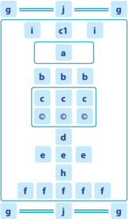

> **Deskripsi Visual:** Gambar ini adalah diagram yang menunjukkan struktur dan relasi antara beberapa elemen. Diagram ini terdiri dari dua baris dan tiga kolom, dengan setiap elemen diberi label huruf besar. Di baris pertama, ada tiga elemen: 'g', 'j', dan 'g'. Di baris kedua, ada empat elemen: 'i', 'c1', 'i', dan 'a'. Elemen 'a' berada di tengah-tengah dan terhubung dengan 'i' di sisi kiri dan 'c1' di sisi kanan. Di baris ketiga, ada empat elemen: 'b', 'b', 'b', dan 'c'. Elemen 'c' terletak di tengah-tengah dan terhubung dengan 'b' di sisi kiri dan 'c1' di sisi kanan. Di baris keempat, ada empat elemen: 'd', 'e', 'e', dan 'e'. Elemen 'e' terletak di tengah-tengah dan terhubung dengan 'd' di sisi kiri dan 'c1' di sisi kanan. Di baris kelima, ada empat elemen: 'f', 'f', 'f', dan 'f'. Elemen 'f' terletak di tengah-tengah dan terhubung dengan 'd' di sisi kiri dan 'c1' di sisi kanan. Teks, angka, atau label penting yang terlihat adalah huruf besar dan angka 1. Informasi kunci yang dapat diambil pembaca adalah bahwa elemen-elemen ini mungkin merupakan bagian dari suatu struktur atau sistem yang lebih besar, dengan hubungan antar elemen yang disajikan dalam diagram ini.

Gambar 4.1 Skema altar sembahyang Jing Tiangong

- Sepasang tebu (di kiri kanan altar). Posisi tebu diitegakan utuh bersama  daunnya. (Tebu yang beruas-ruas melambangkan sifat selalu meningkat.
- Wenlu (tempat menyempurnakan surat doa).
- Zhuowei.

### Penjelasan:

- Alat-alat perlengkapan sembahyang untuk altar Jing Tiangong ini harus khusus (tidak memakai alat-alat upacara yang pernah dipakai untuk keperluan upacara lain). Alat-alat tersebut hendaknya disimpan secara khusus.
|

 

---
## 📄 Halaman 74

- Meja  sembahyang  hendaknya  cukup  besar  dan  tinggi.  Meja sembahyang diberi dua helai kain Zhuowei untuk  bagian  yang menghadap ke dalam dan bagian yang menghadap ke luar. Kain Zhuowei juga harus khusus untuk upacara sembahyang kepada Tian .
- Tentang buah-buahan lain, dapat bisa memakai buah delima atau menggantinya dengan buah jambu, yang melambangkan harapan agar beroleh berkah berlimpah. Ada juga yang memakai buah Lai (pear), buah manggis, buah apel dan lainnya (yang tidak berduri). Pada  hakikatnya  buah-buahan  ini  tidak  ada  keharusan  yang mengikat melainkan disesuaikan dengan kebiasaan masyarakat setempat, hanya perlu diperhatikan  jumlah dan jenisnya terdiri dari lima macam.

### 4. Surat Doa Sembahyang Jing Tiangong

Setelah dupa ( Xiang ) dinaikan tiga kali dan ditancapkan di Xianglu dan  cawan  diisi  dengan  air  atau  teh,  kemudian  peserta  bersikap Baoxin Bade dan pimpinan upacara memanjatkan doa. Setelah selesai pemanjatan doa, semuanya  melaksanakan persujudan dengan Sangui Qiukau .

Surat doa ditulis pada kertas merah sesuai dengan ketentuan. Pada saat  pembacaan  surat  doa  pimpinan  upacara  bersikap Guiping  Shen , sedangkan kedua pendamping bersikap Fufu, umat mengikuti dengan Gui Pengshen . Selesai pembacaan surat doa (setelah surat doa diperapikan) dilanjutkan dengan melakukan Sangui Qiukau .

Saat  ini  kami  berhimpun  menyampaikan  pernyataan  syukur  dan terima kasih, diperkenankan  bersembah sujud kehadirat Tian ; demikian pula atas segala karunia Tian selama ini yang telah  berkenan kepada kami; beroleh selamat dan sentosa.

Juga  atas  kemurahan Tian yang  telah  meneguhkan  Iman  dan tekad  mulia,  serta  telah  mengaruniakan    Agama  Khonghucu  sebagai pelita  hidup  dan  Genta  Rohani  kami,  berkenanlah Tian menerima sembah sujud kami.

### Isi Surat Doa

Pada    malam  suci  ini,  dengan  penuh    Iman    kami  bersujud menyampaikan  tekad  bahwa  di  dalam  tahun  dan  masa  yang  baru dan  mendatang  ini  akan  memperbaiki  kesalahan-kesalahan    kami; meningkatkan  perbuatan-perbuatan  baik  dan  luhur,  mengembangkan kebajikan yang telah Tian Firmankan, di dalam Jalan Suci yang  nabi bimbingkan sehingga Firman Tian senantiasa boleh beserta kami, serta kesentosaan, kebahagiaan meliputi penghidupan.

 

---
## 📄 Halaman 75

Kami  yakin  Iman  itu  harus    kami  sempurnakan  sendiri.  Oleh Iman yang teguh, kehidupan ini bermakna dan cita yang mulia boleh terselenggara. Shanzai .

### C. Sembahyang Duanyang

### 1. Sejarah dan Waktu Pelaksanaan

Sembahyang Duanyang dilaksanakan  setiap  Tanggal  5  bulan  5 Kongzili ( Wuyue  Chuwu ).  Waktu  pelaksanaan  sembahyang Duanyang adalah saat Wushi (jam 11.00 - 13 00).

Isitilah Duanyang berdasarkan  etimologi  huruf: Duan =  Ekstrim, Yang =  matahari. Jadi Duanyang adalah saat matahari di posisi yang ekstrim. Hari Raya ini disebut juga Duanwu yaitu saat Wushi (waktu antara pukul 11.00 - 13.00) yang berarti waktu siang hari.  Ekstrim yang dimaksud adalah saat  tarik-menarik antara matahari, bulan, dan bumi begitu kuat (karena kondisi itu bahkan telur lebih mudah didirikan).

---
**🖼️ Gambar/Diagram**

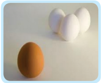

> **Deskripsi Visual:** Gambar ini adalah ilustrasi yang menunjukkan tiga telur berbeda warna: satu telur kuning dan dua telur putih. Telur kuning terletak di bagian depan, sedangkan dua telur putih berada di belakangnya. Ilustrasi ini mungkin digunakan untuk membantu pembaca memahami konsep tentang warna atau jenis telur dalam konteks pembelajaran. Teks, angka, atau label penting tidak terlihat pada gambar ini. Informasi kunci yang dapat diambil pembaca adalah bahwa ada tiga telur dengan warna yang berbeda, dengan telur kuning sebagai telur yang paling dekat.

sumber:  dokumen Kemdikbud Gambar 4.2 Telur  mudah dapat berdiri pada saat Wushi pukul 11.00-13.00

### 2. Makna Sembahyang Duanyang

Upacara sembahyang Duanyang merupakan upacara eling dan takwa untuk hari yang  penuh fenomena. Namun di samping fenomena alam yang ektrim seperti dijelaskan di atas, pada saat yang bersamaan energi ( Qi ) matahari memiliki kekuatan yang besar dan sangat positif. Keadaan ini  dinyakini,  misalnya, tumbuh-tumbuhan herbal untuk obat menjadi lebih berkasiat.

|

 

---
## 📄 Halaman 76

Karena alasan itu pula (khususnya pada saat Duanwu ) selanjutnya timbul  kepercayaan  bahwa  pada  saat  ini  segala  makhluk  dan  benda mendapat  curahan  kekuatan  paling  besar.  Masyarakat  luas  percaya bahwa  ramuan  obat-obatan  yang  dijemur  pada  saat  itu  akan  besar khasiatnya.

Makna agamis dari Duanyang adalah agar kita sebagai umat selalu diingatkan  bahwa  manusia  hanyalah  bagian  kecil  dari  Alam  semesta, dan manusia harus selalu takwa terhadap apapun yang terjadi (fenomena alam/bencana alam).

### 3. Hari Mengenang Qu Yuan

Saat Duanyang juga  bersamaan dengan saat memperingati  tokoh suci Qu Yuan seorang menteri setia dari negeri Chu pada zaman Zhanguo (perang tujuh negara). Dikisahkan sebagai berikut:

Dinasti Zhou pada  zaman Zhanguo atau  Zaman  peperangan  (403221 SM.)  Dinasti Zhou sudah tidak berarti lagi sebagai pusat Negara; pada zaman itu ada tujuh Negara yang besar, yakni negeri Qi, Chu,Yan, Han, Zhao, Wei, dan Qin . Negeri Qin adalah yang paling kuat dan agresif, sehingga keenam negari yang lain sering bersatu untuk bersama-sama menghadapi negeri Qin .

Qu Yuan ialah seorang menteri besar dan setia dari negeri Chu (340278 SM.). Beliau ialah seorang tokoh yang paling berhasil menyatukan keenam  negeri  itu  untuk  menghadapi  negeri Qin ,  namanya  sangat disegani di negeri Qin .

Beliau pernah menghalangi Raja Chu Huaiwang untuk memenuhi undangan raja dari negeri Qin ke kota Boe Kwan . Sayang sekali Raja Chu Huaiwang tidak  memperhatikan nasihat Beliau, bahkan menghukumnya. Akibatnya menimbulkan malapetaka bagi raja sendiri, karena kelicikan menteri-menteri dari negeri Chu yang tidak senang terhadap Quyuan , seperti Khin  Siang,  Kong  Cu  Lan , Siang  Kwan  Tayhu ,  dan  lain-lain. Orang-orang dari Negeri Qin terus berusaha menjatuhkan nama baik Qu Yuan , terutama kehadapan raja Negeri Chu yaitu Chu Huaiwang .

Dengan bantuan menteri-menteri dari Nageri Chu yang tidak senang terhadap Qu Yuan ,  seorang  menteri negeri Qin yang cerdik dan licik, berhasil meretakan hubungan Qu Yuan dengan raja Negeri Chu; Qu Yuan dipecat dari jabatannya. Hal ini membuat persatuan  keenam negeri itu menjadi berantakan. Raja Chu Huaiwang bahkan terbujuk oleh janjijanji  yang  menyenangkan,  sehingga  mau  datang  ke  negeri Qin ,  tetapi di negeri Qin Raja Chu Huaiwang ditawan. Chu Huaiwang menyesali perbuatannya sampai Beliau mangkat.

 

---
## 📄 Halaman 77

Setelah Chu Huaiwang mangkat di Negeri Qin , kini Chu Qing Xiangwang naik tahta menggantikan Chu Huaiwang. Raja Chu Qing Xiangwang memberi  kepercayaan kembali kepada Quyuan .

Keenam negeri dapat dipersatukan kembali sekalipun tidak sekokoh dahulu, selanjutnya Quyuan berusaha mendorong Chu Qing Xiangwang memperkokoh kekuatan militernya untuk barisan berkuda, dengan tujuan menaikan martabat negaranya dan menghindarkan rakyat dari angkara murka raja dari negeri Qin .

Tetapi saran-sarannya tidak ada yang dilaksanakan, bahkan

---
**🖼️ Gambar/Diagram**

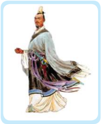

> **Deskripsi Visual:** Gambar ini adalah ilustrasi yang menampilkan seorang tokoh berpakaian tradisional. Tokoh tersebut memegang sebuah senjata panjang dan tampak siap untuk bertempur. Pakaian tokoh terdiri dari baju berwarna putih dengan lengan panjang dan celana berwarna merah muda. Di punggungnya, ada tas besar yang tampak seperti tas pengangkut senjata. Tokoh tersebut juga memakai topi tradisional yang memiliki penutup telinga dan leher. Selain itu, pada lengan kanan tokoh tersebut tampak ada tanda-tanda perang atau luka-luka, menunjukkan bahwa tokoh tersebut telah mengalami pertempuran sebelumnya.

Elemen-elemen utama dalam gambar ini adalah tokoh, senjata, dan pakaian. Tokoh menjadi subjek utama yang diperlihatkan, sedangkan senjata dan pakaian menjadi elemen-elemen yang mendukung dan memberikan konteks tentang situasi dan keadaan tokoh tersebut. Senjata yang dimegang oleh tokoh menunjukkan bahwa tokoh tersebut siap untuk bertempur, sementara pakaian yang dipakainya menunjukkan bahwa tokoh tersebut merupakan seorang prajurit atau pejuang.

Teks, angka, atau label penting yang terlihat dalam gambar ini tidak ada. Namun, informasi kunci yang dapat diambil pembaca melalui gambar ini adalah bahwa tokoh tersebut adalah seorang prajurit atau pejuang yang siap untuk bertempur, dan dia telah mengalami pertempuran sebelumnya.

menimbulkan dendam menteri-menteri dari Negeri Qin .  Mereka selalu berusaha menghalangi Qu Yuan yang senantiasa mengobarkan semangat raja Chu Qing Xiangwang untuk melawan Negeri Qin .

Pada tahun 293 SM. Negeri Han dan Wei yang melawan Negeri Qin dihancurkan  dan  dibinasakan.  Dengan  adanya  peristiwa  ini Quyuan kembali diitnah dengan tuduhan akan membawa Negeri Chu mengalami nasib seperti negeri Han dan Wei . Chu Qing Xiangwang ternyata lebih buruk kebijaksanaannya dari raja yang terdahulu ( Chu Huaiwang ).  Ia tidak hanya memecat Quyuan , tetapi  juga memberikan hukuman dengan membuang Qu Yuan ke daerah danau Tongting dekat sungai Miluo .

Qu Yuan yang bercita-cita berbakti kepada Negara, menolong rakyat, yang dipenuhi semangat memakmurkan Negara dan membuat Negara menjadi sentosa, tetapi ternyata Beliau mendapatkan hukuman.

Di tempat pembuangan ini, Qu Yuan hampir tidak tahan dan sedih terhadap keadaan yang  menyengsarakan. Hanya berkat kebijaksanaan kakak  perempuannya  yang  bernama Khut  Su ,  Beliau  dapat  tentram dan  rela  menerima  keadaan  itu.  Pada  saat  itu  selanjutnya Qu  Yuan mendapat kenalan seorang nelayan yang ternyata orang pandai yang  menyembunyikan  diri  dan  hidup  sebagai  nelayan.  Orang  itu menyembunyikan  nama    sebenarnya,  dan  hanya  menyebut  dirinya sebagai Yufu yang artinya bapak nelayan.

|

 

---
## 📄 Halaman 78

Dengan Yufu inilah Qu Yuan mendapatkan kawan bercakap-cakap, walaupun pandangan hidupnya tidak sejalan. Nelayan itu mempunyai pendoman meninggalkan hidup bermasyarakat  yang buruk keadaannya itu, sedangkan Qu Yuan ingin terus mengembangkan jalan suci nabi bagi kesejahteraan dan kebahagiaan rakyat banyak. Demikianlah Qu Yuan sangat akrab dengan nelayan itu.

Ketentraman Qu  Yuan itu ternyata dihancurkan oleh berita hancurnya ibu kota negeri Chu ,  tempat Miao (Kuil) leluhurnya itu, karena diserbu orang-orang dari Negeri Qin . Hal itu menjadikan Qu Yuan yang telah lanjut usia itu merasa tiada arti lagi hidupnya, setelah dirundung kebingungan  dan  kesedihan.  Beliau  memutuskan  menjadikan  dirinya yang telah tua itu sebagai tugu peringatan bagi rakyat akan peristiwa yang  sangat  menyedihkan  atas  tanah    air  dan  negerinya  itu,  dengan harapan  dapat  membangkitkan    semangat  rakyat  untuk  menegakan kebenaran dan mencuci bersih aib yang menimpa negerinya.

Ketika itu saat hari  Suci Duanyang , Beliau mendayung perahunya ke tengah-tengah sungai Miluo (di provinsi Hunan ), dinyanyikan sajaksajak ciptaannya yang telah dikenal rakyat sekitarnya, yang mencurahkan kecintaannya kepada tanah air dan rakyatnya, rakyat banyak  tertegun mendengar semuanya itu. Pada saat Beliau sampai ke tempat yang jauh dari kerumunan orang, Beliau menerjunkan diri ke dalam sungai yang deras  alirannya dan dalam itu.

Beberapa orang yang mengetahuinya segera berusaha menolongnya, tetapi hasilnya  nihil.  Seharian Yufu ,  nelayan kawan Qu  Yuan itu  dengan  perahuperahu  mengerahkan  kawan-kawannya untuk mencari Qu Yuan , namun hasilnya sia-sia belaka.

Di tahun kedua pada saat Duanyang , ketika  kembali  orang  merayakan  Hari Suci Duanyang,  Yufu telah  membawa sebuah  tempurung  bambu,  berisi  beras dituangkan ke dalam sungai, untuk mengenang  kembali  dan  menghormati Qu Yuan . Banyak orang yang mengikuti jejak Yufu.

Gambar  4.4 Kue CangBacang menjadi sajian sembahyang Duanyang

Lebih dari itu, untuk mengenang Qu Yuan para nelayan sungai Miluo mengadakan  lomba  perahu  naga  pada  saat  sembahyang Duanyang . Perayaan  lomba  perahu  naga  ini  selanjutnya  dikenal  orang  sebagai perayaan Bachuan (mendayung perahu).

 

---
## 📄 Halaman 79

### Catatan

Bachuan (lapal  hokian  Pehcun) berarti mendayung perahu. Namun 'Peh' juga bisa berarti seratus. Maka  secara  umum  orang  sering salah mengartikan Pehcun sebagai 'beratus perahu.' Di kenal juga dengan dragon boat festival .

Pada tahun-tahun berikutnya kebiasaan  mempersembahkan  beras di dalam tempurung bambu  itu

diganti dengan kue dari beras ketan yang dibungkus daun bambu yang di sini kita kenal dengan nama bacang dan kuecang. Diadakan perlombaanperlombaan  perahu  yang  dihiasi  gambar-gamabar  naga  ( Liongcun ) yang mengingatkan usaha mencari jenasah Qu Yuan pencinta negeri, Sastrawan dan pecinta rakyat itu.

Demikian  setiap  hari Duanyang selalu  diadakan  pula  peringatan untuk Qu Yuan , seorang  yang berjiwa mulia dan lurus dari negeri Chu itu.

### 4. Nilai Keteladanan Qu Yuan

Keteladanan Qu  Yuan yang  rela  mengorbankan  hidupnya  sebagai perwujudan  cintanya  yang  amat  mendalam  akan  nasib  bangsa  dan negaranya, kiranya perlu dijadikan contoh bagi siapa saja yang mengaku dirinya sebagai warga bangsa, apalagi bagi mereka yang mengaku dirinya sebagai seorang pemimpin.

Ketika  negaranya  sedang  menghadapi  bahaya,  dengan  berani  dan penuh cinta ia memberi nasihat yang jujur kepada pimpinannya.  Risiko diabaikan,  disingkirkan,  atau  bahkan  dibuang  tidaklah  membuatnya berubah  haluan,  meski  sebelumnya  pernah  mengalami  nasib  yang pahit dan tidak dipedulikan pimpinannya.  Ketika sudah dibuang dan dikecewakan pimpinannya, rasa cintanya terhadap negaranya tidaklah luntur.  Ia tetap memikirkan yang terbaik bagi negaranya sampai detik terakhir.  Pengorbanan hidupnya pun, tidaklah sia-sia dan belakangan terbukti  menjadi  salah  satu  prasasti  bagi  semangat  patriotisme  dan moralitas berbangsa.

Meski harus hidup terlunta-lunta, terbuang dan bahkan mati tanpa meninggalkan jasad, namun sejarah tetap mencatatnya sebagai seorang yang  perlu  diteladani  oleh  generasi  sesudahnya.    Bandingkan  dengan

|

 

---
## 📄 Halaman 80

kehidupan  sang  raja Cho sendiri?    Meski  kedudukan  formalnya  lebih tinggi, namun dalam catatan sejarah nama Qu Yuan tetap dikenang dan mendapat penghargaan yang lebih.

Kalau  dikaji  secara  lebih  mendalam,  bahwa  upaya  pencarian Qu Yuan pada saat Duanyang berlomba-lomba mencari kembali nilai-nilai moralitas yang diteladankan Qu Yuan .  Sebenarnya makna perlombaan itu  harus  ditafsirkan  sebagai  perlombaan  mencari  nilai-nilai  moral. Perlombaan untuk menanam Kebajikan dalam setiap tingkah laku kita sebagai manusia.

Qu  Yuan secara  badani  memang  telah  mati  ribuan  tahun  yang lalu.    Namun Qu  Yuan secara  spirit  dan  nilai-nilai  tetap  hidup  dan perlu  terus  dihidupkan.    Ini  yang  seharusnya  menjadi  target  atau tujuan  kemanusiaan.    Di  samping  hidup  lurus  selaras  Firman Tian , selalu bersyukur dan mawas diri, bersahabat dengan alam, juga wajib menjunjung tinggi moralitas dan nilai-nilai luhur kemanusiaan.

---
**🖼️ Gambar/Diagram**

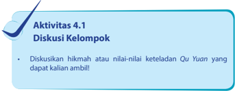

> **Deskripsi Visual:** Gambar ini adalah sebuah tulisan teks yang berisi instruksi untuk aktivitas diskusi kelompok. Dalam gambar tersebut, ada beberapa elemen utama yang penting:

1. Judul Aktivitas: "Aktivitas 4.1 Diskusi Kelompok" yang menunjukkan bahwa ini adalah bagian dari sebuah modul atau kursus yang lebih besar.

2. Sub-judul: "Diskusikan hikmah atau nilai-nilai keteladanan Qu Yuan yang dapat kalian ambil!" yang memberikan konteks tentang topik yang akan dibahas dalam aktivitas tersebut.

3. Teks Utama: "Diskusikan hikmah atau nilai-nilai keteladanan Qu Yuan yang dapat kalian ambil!" yang merupakan instruksi utama yang harus diterapkan oleh peserta diskusi.

4. Label: Ada satu ikon berbentuk segitiga dengan garis di sisi kanan atas yang mungkin memiliki makna simbolik dalam konteks ini.

5. Informasi Kunci: Informasi kunci yang dapat diambil pembaca adalah bahwa ini adalah bagian dari aktivitas diskusi kelompok yang bertujuan untuk membahas hikmah atau nilai-nilai dari keteladanan Qu Yuan, seorang tokoh kuno dari Tiongkok yang dikenal karena kejujuran dan keteladanan dalam hidupnya.

6. Struktur: Gambar ini memiliki struktur yang sederhana namun efektif, dengan judul yang jelas, sub-judul yang memberikan konteks, dan instruksi utama yang memberikan arahan spesifik.

### 5. Surat Doa Sembahyang Duanyang

Puji dan Syukur kami naikan bahwa Tian Yang Maha Esa berkenan kami  berhimpun  pada  saat Duanyang ,  hari  suci  yang  melambangkan rakhmat  yang  berlimbah  atas  dunia  dan  penghidupan  ini.  Semoga upacara  suci  ini  meneguhkan  Iman  kami  untuk  senantiasa  hidup  di dalam  kebajikan;  Suci  di  dalam  pikiran,  ucapan  maupun  perbuatan; menghayati betapa Mahabesar, Mahakasih Tian atas segenap makhluk. Berkembanglah  rasa  syukur  serta  teguh  menerima  kenyataan  hidup. Tumbuhlah kesadaran hormat kepada Tian dan siap menegakan Firman di  dalam  penghidupan,  sehingga  boleh  menerima  berkah  sentosa  dan bahagia.

Pada  saat  suci  ini,  kami  kenangkan  pula Qu  Yuan patriot  suci yang telah mengabdikan diri sepanjang hidupnya bagi Jalan Suci dan Kebajikan serta rela mengorbankan diri demi Iman dan satyanya kepada

 

---
## 📄 Halaman 81

Firman Tian dan  Cinta  kasihnya  kepada  sesama.  Semoga  semangat suci itu tumbuh dan subur berkembang pula di dalam diri kami masingmasing. Shanzai

### D. Sembahyang  Zhong Qiu

Sembahyang Chang ( 尝) , yaitu sembahyang Doa dan Harapan kepada Tian yang bermaknakan perwujudan rasa keterikatan Manusia - Alam - Tuhan (Sancai) sebagai satu kesatuan dalam kehidupan, dan kepadaNyalah segala Doa dan Harapan dipanjatkan.

Dilaksanakan di pertengahan musim gugur, pada saat semesta dalam kedudukan yang harmonis sehingga dipercaya sebagai keadaan dengan aura  terbaik untuk memanjatkan doa dan menyampaikan harapan, juga dibarengi dengan ungkapan syukur pada semesta terutama bumi yang telah memberi wahana/sarana (berkah) untuk menunjang kehidupan.

Pertengahan  musim  Gugur  tepatnya  tanggal  15  bulan  8 Kongzili (Bayue  Shiwu),  dikenal  dengan  sembahyang Zhongqiu atau  sedekah bumi dalam kaitan asas imani (spirit) Fude Zheng shen.

Sedekah bumi terkait dengan pemahaman bahwa karunia Tian diterima oleh manusia melalui bumi. (panen raya - Golden harvest festival). Hal inilah  yang  menjadikan  umat Khonghucu  melakukan  sembahyang 'syukur' dan 'harap'

Semangat ' Fude Zheng shen' secara hariah dapat dijelaskan sebagai berikut:

Jadi Fude Zheng shen berarti 'semangat' menegakkan kehidupan rohani dalam kebajikan  akan beroleh berkah. Makna Fude Zheng shen sejalan dengan semangat yang tersirat dalam kalimat Weide Dongtian -hanya oleh kebajikan Tian berkenan).

|

 

---
## 📄 Halaman 82

### E. Sembahyang Dongzhi

### 1. Sejarah dan Makna Dongzhi

Sebagaimana telah dijelaskan pada bagian awal, bahwa sembahyang Dongzhi adalah Sembahyang Zheng ( 烝 ), yaitu sembahyang Syukur dan Yakin kepada Tian yang bermaknakan rasa syukur  kepada rakhmatNya. Dongzhi biasanya jatuh pada tanggal 21 atau 22 Desember, saat matahari di titik balik 23,5 derajat Lintang Selatan.

Perayaan Dongzhi sudah  ada  sejak  dinasti Zhou .  Namun  karena pada  masa Zhou memiliki  sistem  kalender  yang  berbeda  khususnya mengenai  penetapan  tahun  baru  ( Zheng yue).  Pada  masa  tersebut, Dongzhi ditetapkan sebagai tahun baru. Nabi Kongzi hidup pada masa pertengahan  Dinasti Zhou menganjurkan  agar  Dinasti Zhou kembali menggunakan  kalender  Dinasti Xia yang  menetapkan  tahun  barunya pada awal musim semi, karena cocok dijadikan pedoman oleh para petani yang pada waktu itu mayoritas penduduknya memang bertani. Tetapi nasihat Beliau baru dilaksanakan pada masa Dinasti Han (140-86 SM.) oleh kaisar Han Wudi pada tahun 104 SM., sejak saat itu kalender Xia yang sekarang kita kenal sebagai  kalender Kongzili diterapkan kembali sampai sekarang ini.

Dong berarti musim dingin, zhi berarti paling/puncak. Dongzhi adalah hari dengan siang terpendek (malam terpanjang) di bumi bagian Utara. Matahari berada pada posisi paling Selatan (23,5° LS). Dongzhi memiliki makna yang luas dan mengandung unsur kekeluargaan.

### 2. Sajian Sembahyang Dongzhi

Makanan  yang  disajikan  pada  saat Dongzhi adalah Tangyuan atau  Ronde yang melambangkan persatuan dan keharmonisan  keluarga. Yuan artinya bulat melambangkan kesempurnaan. Tangyuan disajikan dengan kuah jahe manis yang bertujuan memberi kehangatan  pada  saat  musim  dingin. Tang  Yuan kadang  disebut Tuan Yuan yang artinya adalah reuni keluarga.

Berdasarkan penjelasan Ilmu Astronomi, peredaran Matahari sewaktu sampai pada waktu Dongzhi ini,

manis.

 

---
## 📄 Halaman 83

kebetulan melewati Dongzhi Dian (Titik  Puncak  Musim  Dingin).  Pada waktu ini matahari berada pada posisi titik balik Selatan atau Winter Solstice.

Matahari  pada  saat  ini  berada pada  lintang  Selatan  23,5  derajat, dan mulai berbalik ke Utara. Maka, Belahan  Bumi  Utara  dan  Belahan Bumi Selatan  mengalami  perbedaan yang  amat  besar;  Di  Belahan  Bumi Utara siang hari lebih pendek daripada  malam  hari,  sedangkan  di Belahan  Bumi  Selatan  siang hari lebih panjang daripada malam hari.

---
**🖼️ Gambar/Diagram**

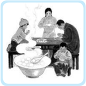

> **Deskripsi Visual:** Gambar ini adalah ilustrasi yang menunjukkan keluarga sedang makan bersama. Ilustrasi ini menggambarkan tiga orang dewasa dan dua anak kecil. Orang tua sedang memegang anak-anak mereka, sementara anak-anak tersebut sedang makan dengan senyum bahagia. Mereka duduk di sekeliling meja makan yang penuh dengan berbagai makanan, termasuk nasi putih, sayuran, dan makanan lainnya. Di sudut kanan atas, ada seorang ibu yang sedang memasak, sementara di sudut kiri atas ada seorang ayah yang sedang berbicara dengan ibunya. Ilustrasi ini menunjukkan hubungan harmonis antara anggota keluarga dan suasana makan yang menyenangkan.

- Ceritakan pengalaman kalian terkait dengan persembahyang Duanyang, Zhongqiu, dan Dongzhi!

### Penilaian Diri

- Lembar penilaian diri ini bertujuan untuk:
- Mengetahui sikap peserta didik dalam menerima dan memahami tentang persembahyang kepada Tian .
- Menumbukan  sikap  sungguh-sungguh  untuk  melaksanakan persembahyangan kepada Tian .

### · Petunjuk

Isilah  lembar  penilaian  diri  yang  ditunjukkan  dengan  skala  sikap berikut ini!

- SS = sangat setuju
- ST = setuju
- RR = ragu-ragu
- TS = tidak setuju
|

 

---
## 📄 Halaman 84

---
**📊 Tabel**

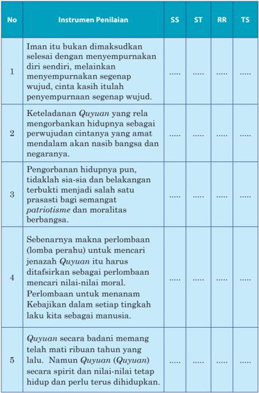

Tabel ini menunjukkan instrumen penilaian untuk mengukur kualitas perilaku dan nilai-nilai dalam konteks keagamaan dan patriotisme. Topik utama tabel adalah tentang keterlibatan dan pengorbanan dalam upacara Qiyana, sebuah tradisi keagamaan di Indonesia yang melibatkan persembahan diri dengan penuh cinta dan kasih kepada Tuhan. Tabel ini terdiri dari empat kolom: SS (Sesuai Standar), ST (Sesuai Target), RR (Rendah Rasio), dan TS (Tidak Sesuai). Data penting yang terlihat adalah bahwa instrumen penilaian mencakup berbagai aspek seperti iman, keteladanan, pengorbanan hidup, perlombaan moral, dan kehijauan dalam setiap tingkah laku manusia. Ini menunjukkan bahwa penilaian dilakukan secara holistik untuk memastikan bahwa individu tidak hanya memiliki iman yang kuat, tetapi juga memiliki sikap yang rendah hati, pengorbanan, dan kejujuran dalam berbagai aspek kehidupan.

 

---
## 📄 Halaman 85

### Evaluasi Bab 4

### Uraian

### Jawablah  pertanyaan-pertanyaan  berikut  ini  dengan  uraian yang  jelas!

- Apa makna sembahyang Duanyang ? Jelaskan!
- Apa yang kamu ketahui tentang Quyuan ?
- Apa kaitan perayaan lomba perahu ( Bai Chuan ) dengan Quyuan ?
- Apa saja nilai-nilai keteladanan Quyuan ? Sebutkan!
- Apa kaitan sembahyang Zhongqiu dengan malikat Bumi atau Fude Zhengshen !
|

 

---
## 📄 Halaman 86

### Lagu Pujian

 

---
## 📄 Halaman 87

### Bab 5

### Rangkaian Turunnya Wahyu Tian

---
**🖼️ Gambar/Diagram**

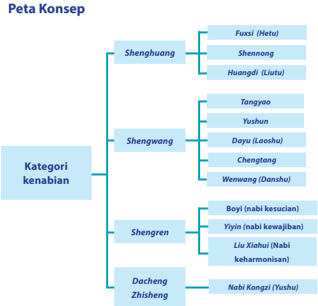

> **Deskripsi Visual:** Gambar ini adalah diagram yang menunjukkan struktur hierarki konsep dalam konteks kenabian. Diagram ini dibagi menjadi beberapa kategori utama, yaitu Shenghuang, Shengwang, Shengren, Dacheng, dan Zhisheng. Setiap kategori memiliki sub-kategori yang lebih spesifik.

1. **Apa yang ditampilkan secara keseluruhan**: Gambar ini menunjukkan struktur hierarki konsep dalam konteks kenabian, dengan kategori utama dan sub-kategori yang lebih spesifik.

2. **Elemen-elemen utama dan relasinya**: 
   - **Kategori utama** (Shenghuang, Shengwang, Shengren, Dacheng, Zhisheng) masing-masing memiliki sub-kategori yang lebih spesifik.
   - **Relasi antar elemen**: Sub-kategori di setiap kategori memiliki hubungan hierarkis, dengan sub-kategori tertinggi di setiap kategori berada di atas sub-kategori yang lebih rendah.

3. **Teks, angka, atau label penting yang terlihat**: 
   - **Teks penting**: "Peta Konsep", "Kategori kenabian", "Fuxi (Hetu)", "Shennong", "Huangdi (Liutu)", "Tangyao", "Yushun", "Dayu (Loasha)", "Chengtang", "Wenwang (Danshu)", "Boyi (nabi kesucian)", "Yi Yin (nabi kewajiban)", "Liu Xilou (Nabi keharmonisan)", "Nabi Kongzi (Tushu)".
   - **Angka penting**: Tidak ada angka yang signifikan dalam gambar ini.

4. **Informasi kunci yang dapat diambil pembaca**: 
   - Struktur hierarkis dalam konteks kenabian.
   - Kategori utama dan sub-kategori yang lebih spesifik.
   - Hubungan hierarkis antara sub-kategori di setiap kategori.

Dengan demikian, gambar ini memberikan gambaran jelas tentang struktur hierarkis konsep dalam konteks kenabian, memperlihatkan bagaimana kategori utama dan sub-kategori yang lebih spesifik saling terk

|

 

---
## 📄 Halaman 88

### A.  Pendahuluan

Agama  Khonghucu  bukan  sekedar  suatu  ajaran  yang  diciptakan oleh Nabi Kongzi , melainkan agama yang telah diturunkan Tian melalui para nabi purba dan raja suci jauh sebelum Nabi Kongzi lahir. Seperti disampaikan oleh Nabi Kongzi :

'Aku hanya meneruskan, tidak mencipta. Aku hanya percaya dan menaruh suka kepada (ajaran dan kitab-kitab) yang kuno itu.' ( Lunyu . VII: 1).

Meskipun  demikian, bukan  berarti Beliau benar-benar 'bukan pencipta', karena bagaimanapun Nabi Kongzi tetap merupakan seorang penyempurna dari ajaran Rujiao tersebut. Fung Yulan di dalam bukunya yang berjudul ' A History Of Chinese Philosophy '  menegaskan…' Confucius As  a  Creator  Through  Being  A  Transmitter …'  (Nabi Kongzi sebagai seorang pencipta dengan cara meneruskan).

Oleh karena Tian Yang Maha Esa tidak membiarkan sesuatu yang telah  diciptakan  itu  menjadi  berantakan,  maka  diutuslah  orang-orang terpilih (para nabi) yang mendapat kepercayaan untuk menerima Wahyu.

Agama  Khonghucu  dalam  istilah  aslinya  disebut Rujiao ,  yang mengandung makna: 'Agama bagi orang-orang yang lembut hati, yang menjadikan orang terpelajar, halus budi pekertinya, serta taat dan tulus kepada-Nya.'

Sebutan agama Khonghucu untuk Rujiao ini  mengikuti kebiasaan sarjana Barat yang dipelopori oleh Fr. Matteo Ricci (1551-1610 Masehi), yang  melihat  peranan  besar  Nabi Kongzi dalam  menyempurnakan ajaran Rujiao . Selanjutnya para sarjana Barat ini menyebut Nabi Kongzi sebagai Confucius .

Sejarah suci Agama Khonghucu merupakan latar belakang historis tumbuh-kembangnya agama Khonghucu, berlandas pada ke-Wahyu-an Tian ( Tianxi) kepada  jajaran  nabi  agama  Khonghucu  dan  merupakan sumber dari kitab suci Wujing dan Sishu yang berisi ajaran-ajarannya, serta  mengenal  para  nabi  yang  berperan  di  dalamnya.    Bermula  dari nabi purba Fuxi (2953 - 2838 S.M.), digenap-sempurnakan oleh Dacheng Zhisheng Kongzi (Nabi Kongzi ),  dan  ditegakkan  oleh Yasheng Mengzi (372 - 289 S.M).

 

---
## 📄 Halaman 89

### 1. Lima Era

Sejarah  suci Rujiao (Khonghucu),  secara  garis  besar  dapat  dibagi menjadi lima era, yakni:

- Era Sanhuang (tiga nabi purba); Fuxi , Shennong, Huangdi.
- Era Tangyao , Yushun ;
Kedua Raja Suci ini adalah peletak dasar Rujiao (Bapak Rujiao ); dari Yao umat Ru mengenal  iman  akan    Satya  kepada Tian ( Zhong Yutian ),  dan  dari Shun umat  Ru  mengenal  iman  akan Shu (Tepasalira kepada sesama).

- Era Tiga Raja ( Dayu, Chengtang, Wuwang)
Kepemimpinan tiga Raja ini beserta para menterinya menunjukkan keteladanan para Nabi tentang bagaimana hidup sebagai umat Ru yang Junzi .

- Era
- Dacheng Zhisheng Kongzi
Nabi Kongzi adalah Nabi besar yang menggenapkan jajaran nabi Ru Jiao sebagai Tianzhi Muduo (Genta Rohani Tian ).

- Era Yasheng Mengzi
Mengzi adalah  Penegak  ajaran  Khonghucu,  yang  menegaskan serta  meluruskan  ajaran  Nabi Kongzi dari  penafsiran  yang menyesatkan  oleh  'beratus  aliran'  yang  tumbuh  berkembang pada zamannya.

### 2. Kategori Kenabian dalam Khonghucu

Ke Nabi-an dalam agama Khonghucu dikategorikan dengan sebutan Shenghuang,  Shengwang,  Shengren serta  sebutan  khusus  untuk  Nabi Kongzi , Dacheng Zhisheng, Tianzhi Muduo.

Di dalam Sishu Wujing , sebutan itu nyata-nyata tersurat tetapi tidak secara khusus/tegas menyatakan 'siapa disebut apa'. Namun demikian, paling tidak ada beberapa referensi yang bisa digunakan sebagai acuan dalam menggolongkan 'tokoh-tokoh' sesuai kategori  'ke Nabi-an' yang dimaksud.

- Yang termasuk Shenghuang (nabi purba) antara lain:
Fuxi , Shennong , dan Huangdi .

- (Raja Suci) antara lain:
- Yang termasuk Shengwang
Tangyao , Yushun , Dayu , Chengtang , dan Wuwang

- Yang termasuk Shengren antara lain:
- Boyi , Nabi Kesucian
- Yiyin , Nabi Kewajiban
- Liu Xiahui , Nabi Keharmonisan
|

 

---
## 📄 Halaman 90

### 3. Karakteristik Huruf Sheng (琞)

Huruf Sheng ( 琞 )  terbentuk dari 3 (tiga) radikal huruf yakni; huruf Er ( 耳 ) telinga, Kou ( 口 ) mulut, dan Wang ( 王 ) raja.   Huruf Wang ( 王 ) terdiri  dari radikal huruf San ( 三 ) tiga, dan Kun (   ) tembus.

- Er ( 耳 )  telinga  menyimbolkan:  Yang  mendapatkan  pencerahan (menerima Wahyu) melalui 'pendengarannya' (telinga).
- Kou ( 口 )  mulut menyimbolkan:  Yang mengajarkan (menyabdakan) melalui 'kata-katanya' (mulut).
- Wang ( 王 ) raja terdiri dari karakter:
- -San ( 三 )  tiga,  dan Kun (    ) tembus,    menyimbolkan  3  (tiga) unsur yaitu; Tian , Di, Ren (Tuhan, Bumi, Manusia) yang di kenal dengan Sancai (Tiga Hakikat).
- -Tembus artinya menembusi tiga unsur tersebut.
- -Wang (王) raja,  mempunyai makna 'seseorang yang mendapat karunia Tian , mempunyai daerah kekuasaan di alam/bumi serta sebagai pemimpin rakyatnya'.
Maka Sheng (琞) adalah  orang  yang  terpilih  mendapatkan pencerahan menerima wahyu Tian menjalin/merangkai hukum Sancai (tiga hakikat)  yakni: Tian, Di,  Ren.

---
**🖼️ Gambar/Diagram**

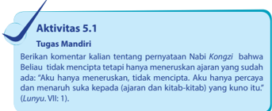

> **Deskripsi Visual:** Gambar ini adalah ilustrasi yang menunjukkan tugas mandiri dalam aktivitas 5.1 dari buku pelajaran. Ilustrasi ini menggambarkan seorang siswa yang sedang berbicara dengan guru tentang penerimaan Nabi Kongzi. Siswa tersebut menunjukkan komentar yang dia tulis tentang penerimaan Nabi Kongzi, yang menunjukkan bahwa dia tidak merasa bahwa Nabi Kongzi telah meneruskan ajaran yang sudah ada. Siswa juga menunjukkan kepercayaannya dan kepercayaannya pada sumber-sumber yang lebih tua seperti sijarang dan kitab-kitab yang kuno.

Elemen utama dalam gambar ini adalah siswa, guru, dan teks yang ditulis oleh siswa. Siswa sedang berbicara dengan tangan kanannya yang menunjukkan komentar yang dia tulis. Guru tampaknya sedang mendengarkan komentar tersebut. Teks yang ditulis oleh siswa berisi informasi penting tentang penerimaan Nabi Kongzi dan pendapatnya tentang ajaran yang sudah ada.

Informasi kunci yang dapat diambil pembaca adalah bahwa siswa memiliki pemahaman yang baik tentang penerimaan Nabi Kongzi dan pendapatnya tentang ajaran yang sudah ada. Siswa juga menunjukkan kepercayaannya dan kepercayaannya pada sumber-sumber yang lebih tua.

### B. Rangkaian Wahyu Tian

### 1. Wahyu Hetu

Wahyu Hetu atau Peta dari sungai He ( 河图 ) diterima oleh nabi Purba Fuxi , wahyu tersebut  dibawa oleh Longma (Kuda Naga) Berisi tentang Xiantian Bagua -Yin Yang. Tercatat dalam kitab Sanfen (Tiga Makam). Qian - Pencipta sebagai pusat  Kitab Yijing (kitab Perubahan).

 

---
## 📄 Halaman 91

### Wahyu itu berisi:

---
**🖼️ Gambar/Diagram**

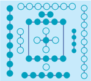

> **Deskripsi Visual:** Gambar ini adalah ilustrasi yang menunjukkan struktur molekuler dari suatu senyawa kimia. Gambar ini menggambarkan dua molekul yang berinteraksi melalui ikatan kovalen. Molekul-molekul ini terdiri dari atom-atom yang terhubung oleh ikatan kovalen, yang tampaknya berada dalam posisi yang saling berhadapan. Setiap atom memiliki warna yang berbeda untuk menunjukkan jenis atom tersebut. Ilustrasi ini memberikan gambaran tentang bagaimana atom-atom berinteraksi dalam struktur molekuler dan bagaimana ikatan kovalen membentuk molekul.

Xiantian Bagua dan Yin Yang ,  ditulis dalam  Kitab  Tiga  Makam  ( Sanfen ). Diagram Bagua sebelum pembabaran, berisi wahyu tentang tanda-tanda suci yang melambangkan prinsip dari  unsur Yin  Yang sebagai  dasar penyusunan Rangkaian Delapan Trigram.

Serta  menjelaskan Qian (Tian sebagai  Pusat),  sebagai  Khalik  yang telah menjadikan alam semesta dengan  segala  isinya,  makhluk  dan segala peristiwa di dalamnya. Ini semua merupakan bukti Keagungan Jalan Suci Tian , yang menjadi dasar dari kitab Yijing (Kitab Perubahan).

### Nabi Purba Fuxi (2953 - 2838 SM.)

Fuxi adalah orang dari Tienciu (Henan), Tayhoo. Beliau adalah Nabi Purba Rujiao yang  pertama  kali  menerima  wahyu  Tian,  yaitu  wahyu Hetu (Peta dari sungai Huanghe ).

Masyarakat pada era Nabi Fuxi dikenal dengan sebutan Masyarakat Keluarga  Seratus  dimana  nabi  Purba Fuxi sebagai  pemimpinnya. Bersama-sama dengan pembantunya  Nabi Fuxi telah meletakan dasar peradaban bagi umat manusia.

Karya-karya tersebut antara lain:

- Menemukan alat pancing, jala dan tombak.
- Mengajarkan membuat jebakan hewan liar.
- Nuwa  (adik  perempuan Fuxi )  menyusun  Undang-Undang  tentang etika perkawinan.

### Nabi Nuwa

Nuwa (adik perempuan Fuxi ) menjadi pembantu utama baginda Fuxi di  dalam  menetapkan  undang-undang,  khususnya  hukum  perkawinan dan tertib melakukan sembahyang dan ibadah.

Sezaman dengan Beliau, dikenal pula tokoh-tokoh lain seperti You Chaoshi yang  mengajarkan  orang  membangun  tempat  tinggal  di  atas pohon. Sui Renshi yang mengajarkan orang membuat pemantik untuk menyalakan api.

|

 

---
## 📄 Halaman 92

### Nabi Purba Shennong (2838 - 2698 SM.)

Beliau adalah penerus kepemimpinan Nabi Purba Fuxi yang berasal dari  Kwiehu  ( Shandong ), Yantee .  Meskipun  tidak  tercatat  sebagai nabi  Purba  yang  menerima  Wahyu Tian ,  namun  karya  Beliau  amat berpengaruh terhadap peradaban-kehidupan umat manusia, khususnya yang  berkenaan  dengan  sarana/bumi  ( Khun ),  pengolahan  benih  dan kelangsungan hidup (sehat). Ditulis dalam Kitab Tiga Makam ( Sanfen ).

Beliaulah  yang  pertama  kali  mengajarkan    'Upacara  Pemakaman Jenazah'  ( Dizong ),  di  mana  sebelumnya  jenazah  dibiarkan  disantap burung  ( Niaucong ),  jenazah  diletakkan  dibuang  di  hutan  ( Linzong ), jenazah  di  hayutkan/dilarung  ke  sungai/laut  ( Shuizong )    dan,  jenazah dibakar/diperabukan ( Huozong ).

Di samping itu, Beliau sangat berperan dalam mengajarkan kepada masyarakat zaman itu dalam hal pengolahan tanah serta pembudidayaan tanaman obat (herbal). Oleh karena itu, Beliau mendapat julukan Dewa Pertanian dan Raja Obat.

Karya-karya Beliau antara lain:

- Mengajarkan teknik bercocok tanam dan berternak.
- Menciptakan alat bajak.
- Menganjurkan  penggunaan  pupuk  kandang  dan  kompos  untuk tanaman.
- Mengenalkan khasiat tumbuh-tumbuhan sebagai obat (herbal Therapy).

### 2.  Wahyu Liutu

Wahyu Liutu (Peta Firman) diterima oleh  nabi  Purba Huangdi ,  Wahyu  tersebut dibawakan oleh seekor ikan besar di pusaran air Chwikwi , antara sungai He dan Lu .

### Nabi Purba Huangdi (2698 - 2598 SM.)

Beliau bermarga Kongsun bernama Hianwan ,  berasal  dari Yukiong ( Henan ), Yu Himkok . Beliau menerima Wahyu Lutu (Peta Firman) dari seekor ikan besar pada pusaran air Cuiwei antara sungai He dan sungai Lu .

---
**🖼️ Gambar/Diagram**

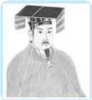

> **Deskripsi Visual:** Gambar ini adalah ilustrasi yang menampilkan seorang pria tua dengan rambut pendek dan topi tradisional. Pria tersebut mengenakan pakaian formal yang mencerminkan gaya budaya tertentu. Ilustrasi ini mungkin digunakan untuk membantu pembaca memahami atau menggambarkan seseorang dalam konteks sejarah atau budaya tertentu.

 

---
## 📄 Halaman 93

Dari  hal  tersebutlah Huangdi memperolah  petunjuk  Tian  dalam mengemban  tugas-tugasnya  menetapkan  hukum  dan  membimbing rakyatnya berbakti kepada Tian (beribadah) serta membina masyarakat dengan kebudayaan yang beradab, yang merupakan kodrat kemanusiaan (Ren). Ditulis dalam Kitab Tiga Makam ( Sanfen ),  disamping itu masih ada Kitab Huangdi Neijing.

Beliau dikenal sebagai Bapak Ilmu Pengetahuan dan Kebudayaan, karena  dengan  para  pembantunya  Beliau  membuat  karya  besar  bagi umat manusia. Karya-karya lain yang ditemukan pada zaman itu, antara lain:

- Laizu (puteri  dari  daerah Zhanguo ),  mengajarkan  menenun  dari pengolahan kepompong ulat sutra.
- Danao ,  menentukan  perhitungan  kalender  dengan  sistem  Tiangan Dizhi ( Lakcap Kakcie ).
- Cangjie, menemukan huruf (berdasarkan pictograf, ideograf, ilosois).
- Yongfu,  menemukan alat penumbuk beras.
- Huodi,  mengajarkan membuat perahu dengan Dayungnya.
- Li, menemukan cara berhitung.
- Huimou, mengajarkan membuat gendewa  dengan anak panahnya.
- Mendirikan  Observatorium  dan  menciptakan  alat  petunjuk  arah (kompas).
- Merintis  pembuatan  keramik,  memperkenalkan  perdagangan  di pasar, menciptakan mata uang sebagai alat tukar.
- Menciptakan timbangan dan undangundang alat ukur.
- Menyusun Tata Pemerintahan (karenanya  Beliau  dikenal  sebagai kaisar pertama).
- Mengajarkan tentang hukum memuliakan hubungan - laku bakti (Xiao).
- Memperkenalkan Tata Ibadah Persembahyangan dan segala bentuk kesenian.

---
**🖼️ Gambar/Diagram**

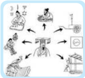

> **Deskripsi Visual:** Gambar ini adalah ilustrasi yang menunjukkan proses pembuatan teh. Gambar ini terdiri dari beberapa elemen utama:

1. **Pertama**: Gambar ini dimulai dengan seorang pria yang sedang memegang sebuah teh.
2. **Kedua**: Pada bagian kedua, pria tersebut sedang memegang teh yang telah dipanaskan.
3. **Ketiga**: Pada bagian ketiga, pria tersebut sedang memegang teh yang telah dipanaskan dan dipotong menjadi potongan kecil.
4. **Keempat**: Pada bagian keempat, pria tersebut sedang memegang teh yang telah dipanaskan, dipotong, dan dipotong lagi menjadi potongan kecil.
5. **Kelima**: Pada bagian kelima, pria tersebut sedang memegang teh yang telah dipanaskan, dipotong, dipotong lagi, dan dipotong lagi menjadi potongan kecil.

Elemen-elemen utama dalam gambar ini adalah proses pembuatan teh, yang melibatkan pemotongan dan pemotongan ulang teh untuk mencapai tekstur yang tepat. Informasi kunci yang dapat diambil pembaca adalah bahwa proses pembuatan teh melibatkan pemotongan ulang teh untuk mencapai tekstur yang tepat.

|

 

---
## 📄 Halaman 94

### Penting

Zaman Fuxi ,  Shennong, dan Huangdi ,  dikenal dengan zaman Keluarga Seratus,  dan Fuxi adalah  pemimpinnya.  Zaman Tiga  Raja  ini  termasuk dalam masa pra sejarah. Setelah pemerintahan Huangdi dilanjutkan oleh Siauho (putra Huangdi )  tahun 2598-2514 SM., Cwanhok (cucu Huangdi ) tahun 2514 - 1436 SM., Koosien (cucu Siauhoo ) tahun 2436-2366 SM., dan berikutnya (vakum) selama kurang lebih sembilan tahun. Selanjutnya baginda You naik tahta tahun 2357 SM. Mulai dari raja You ini Zhongguo memasuki zaman sejarah.

### Nabi Leizu

Leizu (puteri dari Xiling ) adalah  istri Huangdi ,  penemu  cara pembudidayaan  ulat  sutera  dan  banyak  membantu  baginda Huangdi merencanakan  tata  busana  untuk  para  pejabatnya.  Mempunyai  25 orang anak, yang pertama bernama Xuanxiao bergelar Qingyang yang menurunkan baginda Shaohao yang melanjutkan kedudukan Huangdi ; anak kedua bernama Changyi ;  cicit  baginda Changyi menjadi baginda Zhuanxu dan  dua  belas  putera  yang  lain  masing-masing juga menjadi nenek moyang berbagai marga di Zhongguo .

### Nabi Cangjie

Cangjie menteri Huangdi , yang menemukan cara menuliskan huruf-huruf dengan menirukan (terinspirasi) tapaktapak  hewan  yang  dilihatnya  di  tanah sehingga tercipta tulisan di Zhongguo yang bersifat piktograi (tanda menyerupai gambar), idiograf, dan ilosois.

Karya nabi Cangjie yang utama di antaranya:

- Mencetuskan  konsep  rumah  sebagai tempat tinggal.
- Memperkenalkant teknik memasak (membakar dan merebus).

### Raja Suci Tangyao (2357 - 2255 SM.)

Beliau dari kaum Taotang ,  oleh  karenanya orang sering menyebut Beliau Tangyao ,  anak  dari    Diku  ibunya  bernama Qingdou .  Beliau

 

---
## 📄 Halaman 95

bergelar Fangxun (yang besar pahalanya, cemerlang buah karyanya dan hasil  ciptanya).  Beliaulah  yang  pertama  kali  mengajarkan  pada  umat manusia  akan mulianya akhlak insani.

Masyarakat  dididik  mencamkan  kebajikan  yang  gemilang  serta mulia  itu,  sehingga  dengan  demikian  dapat  tercipta  kerukunan  hidup insani yang diterima oleh Tian dan diterima oleh sesama.

Nasihat Tangyao yang  terkenal,  'Hati  manusia  senantiasa  dalam rawan; hati didalam Jalan Suci itu sungguh rahasia/muskil. Senantiasalah pada yang saripati, senantiasalah pada yang esa itu; pegang teguhlah sikap Tengah Tepat. Kata-kata yang tidak berdasar jangan didengarkan, rencana yang tidak jelas jangan diikuti

Bersama  dengan  para  menterinya,  tercatat  karya-karya  sebagai berikut:

### · Gaoyao

Menteri yang cerdas dan terpelajar, sangat cakap dalam menunaikan tugas  serta  memiliki  kemuliaan  sebagai  nabi,  membantu  baginda Yao dalam  menegakkan  pemerintahan  yang  berkebajikan,  sesuai  dengan ajaran Rujiao . Gaoyao merumuskan ajaran yang dikenal dengan Gaoyao Erjiude, tercatat dalam Kitab Yaotian Shujing .

### · Xi dan He

Menyusun perhitungan dan pembakuan dasar penanggalan Nongli .

### · Yushun

Seorang  anak  dari  rakyat  biasa  namun  memiliki  hati  mulia  serta sangat menjunjung tinggi perilaku Bakti-memuliakan hubungan. (dikemudian hari Shun diambil sebagai menantu oleh baginda Yao , dan atas dukungan dan kehendak rakyat, Sun menggantikan tahta baginda Yao .

### · Dayu

Yu  ( Dayu atau  Yu  Agung  adalah  seorang  yang  sangat  bertanggungjawab dalam menunaikan/meneruskan pekerjaan besar ayahnya ( Gun )  dalam mengendalikan banjir, (di kemudian hari Yu mendirikan Dinasti pertama di Zhongguo yaitu Dinasti Xia ).

|

 

---
## 📄 Halaman 96

Diskusikan  tentang  lima  cara  pemakaman,  kaitkan  kelima  cara tersebut dengan perkembangan zaman (kondisi sekarang)!

---
**🖼️ Gambar/Diagram**

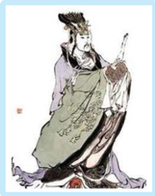

> **Deskripsi Visual:** Gambar ini adalah ilustrasi yang menampilkan tokoh berpakaian tradisional, mungkin seorang raja atau pemimpin kuno. Tokoh tersebut memiliki rambut panjang dan rapi, mengenakan pakaian yang luas dengan detail yang rumit, termasuk kerudung yang melengkapi penampilannya. Ia juga memegang sebuah senjata atau alat yang serupa dengan pedang atau senjata api.

Elemen-elemen utama dalam gambar ini adalah tokoh utama yang diperlihatkan, pakaian yang ia kenakan, dan alat atau senjata yang ia bawa. Relasi antara elemen-elemen ini adalah bahwa tokoh utama adalah subjek utama gambar, sedangkan pakaian dan alat yang ia bawa merupakan detail yang mendukung penampilan dan karakteristiknya sebagai pemimpin atau tokoh penting.

Teks, angka, atau label penting tidak terlihat dalam gambar ini. Namun, informasi kunci yang dapat diambil pembaca adalah bahwa gambar ini mungkin digunakan untuk menggambarkan tokoh penting dalam cerita atau kisah yang berkaitan dengan masa lalu atau budaya tertentu.

Banginda Shun lahir di Youxu terletak di kabupaten Yongji Provinsi Shanxi .  Beliau  orang Yu Selatan  karenanya  juga  dipanggil Yushun . Shun bergelar Zhonghuo . Ayahnya disebut orang dengan nama Gusou (orangtua  yang  buta mata  hatinya),  ibunya  meninggal pada  usia  muda.  Ayah  dan  ibu tirinya sangat kejam kepada Shun , begitu pula adik tirinya yang bernama Xiang berlaku  demikian serta senantiasa berupaya mencelakakan Shun . Namun beliau tetap senantiasa berhasil membangun harmoni dalam jalinan  dengan  mereka.  Mulanya diangkat  sebagai  pembantu  Raja Suci Yao yang  kemudian  diangkat sebagai menantu dan akhirnya atas dukungan rakyat mewarisi tahta kerajaan.

Pada  tahun  pertama  pemerintahannya,  beliau  menciptakan  lagu yang dinamai Dashao .  Burung-burung Fenghuang datang dan bersarang di Balairungnya. Pada tahun ketiga pemerintahannya, menitahkan nabi Gaoyao membuat hukum dan perundang-undangan untuk negaranya.

Pada tahun ke sembilan pemerintahannya, Baginda Puteri dari Barat Xiwangmu datang berkunjung ke istana Beliau dan memberikan cincin serta busur dari batu Kumala Putih.

 

---
## 📄 Halaman 97

Tahun ke empat belas pemerintahannya, mengangkat Yu mewakili Beliau  untuk  mengatur  pemerintahan.  pada  tahun  ke  empat  puluh sembilan  pemerintahannya, Yushun berdiam  di  Mingtiao.  Pada  tahun kelima puluh pemerintahannya, Beliau mangkat.

Ajaran Beliau antara lain: Zhongxiao Xinyi (Satya  kepada  Khalik semesta alam, Memuliakan Hubungan - Bhakti yang sempurna, Tulus - Dapat Dipercaya melaksanakan Kebenaran, Keadilan dan Kewajiban). Beliau juga mengajarkan tentang Lima Kewajiban yang Utama  ( Wudian ), Lima Jenis  Hubungan ( Wupin ),  menjadi    masyarakat  yang  baik    (Wu Dadao-Wulun ) tertulis pada Shundian Shujing , yaitu:

- 1.)  Ada rasa kasih di antara raja dan  menteri ( Junchen Youqin )
- 2.)  Ada Kewajiban di antara ayah (orangtua) dan anak ( Fuzi Youyi )
- 3.)  Ada Pemilahan di antara suami dan isteri ( Fufu Youbie )
- 4.)  Ada Keteraturan di antara Tua/kakak dan yang muda/adik ( Zhangyou Youxu )
- 5.)  Ada Kepercayaan di antara teman dan sahabat ( Pengyou Youxin )

### Menteri-Menteri  yang Mendampingi Raja Suci Shun :

- Dayu ( Yu Agung), Perdana Menteri (sebelumnya menteri kesusilaan kemudian menteri pembangunan).
- Gaoyao ,  Menteri Kehakiman
- Yi , Menteri Kehutanan.
- Boyu , Menteri Pekerjaan Umum.
- Kui , Menteri Kesenian.
- Houji , Menteri Pertanian
- Chui , Menteri Pembangunan.
- Xie , Menteri Pendidikan.
- Long , Menteri Pekerjaan Perhubungan.

### Penting

Raja Suci Tangyao dan Yushun diakui sebagai peletak dasar ajaran Rujiao (agama Khonghucu). Oleh karenanya Beliau berdua disebut sebagai Bapak Rujiao .

|

 

---
## 📄 Halaman 98

### Nabi Houji

Houji nama kecilnya Qi , putera Nabi Jiangyuan, menteri Pertanian raja Yao dan Shun ,  bermarga Ji ,  nenek moyang raja-raja dinasti Zhou 1122 SM.-255 SM.

Ketika raja dinasti Xia yang bergelar Taikang hancur kerajaannya, keturunan Houji berantakan dan hidup di tengah-tengah orang Rongdi , tetapi  tetap  mampu  menjaga  warisan  budaya  leluhurnya  serta  turuntemurun sampai kepada Nabi Gongliu yang  mampu menegakkan jati dirinya sebagai keturunan Houji .

### Nabi Gaoji

Gaoji menteri Kehakiman Yushun . Pada tahun 2253 S.M. menerima titah Shun menetapkan hukum bagi negaranya. Beliau sangat berperanan dalam mendampingi Shun didalam membina  pemerintahan yang membawakan kesejahteraan, kedamaian dan kejayaan bagi rakyatnya. ( Shujing II-II.10,11,12; Shujing II-III).  Beliau  bersabda,  ' Tian Yang Maha Esa mendengar dan melihat, sebagai rakyat kita mendengar dan melihat; Tian Yang Maha Esa sungguh menakutkan, begitu juga rakyat sangat menggentarkan. Maka berhati-hatilah yang mempunyai Negara.' ( Shujing III.III-7)

Sembilan kebajikan ajaran Gaoyao ( Gaoyao Zhijiude ), adalah:

- Lapang hati disertai wibawa ( Kuan Erli )
- Lembut disertai kokoh tegak ( Rou Erli )
- Terus terang disertai hormat  ( Yuan Ergong)
- Kritis disertai memuliakan ( Luan Erjing )
- Patuh disertai Perwira ( Ruo Eryi )
- Lurus disertai ramah ( Zhi Erwen )
- Longgar disertai kesucian ( Jian Erlian )
- Perkasa disertai tulus ( Gang Ersai )
- Berani disertai Kebenaran ( Jiang Eryi )

 

---
## 📄 Halaman 99

### Nabi Xie

### Nabi Yi

Nabi Yi adalah  putra Gaoyao yang juga menjadi menteri Raja Suci Shun dan  kemudian menjadi penasehat Yu Agung ketika menghadapi pemberontakan  orang-orang Sanmiao sehingga  berhasil  menciptakan kedamaian, kesejahteraan bagi rakyat dan negara.

Beliau  mengingatkan Yu Agung  dengan  bersabda,  'Hanya  oleh Kebajikan Tian Berkenan  ( Weide  Dongtian ).  Tiada  jarak  jauh  tidak terjangkau ( Wuyuan  Fujie ); kesombongan  mengundang  rugi  ( Mon Zhsaosun) dan kerendahan  hati menerima  berkah  ( Qian Shouyi ) demikianlah senantiasa Jalan Suci Tian ( Shinai Tiandao ).

Beruntunglah Yu Agung  segera  menyadari  kekhilafannya  yang menyerang dengan pasukan orang-orang Sanmiao dan segera merubah sikapnya sehingga berhasil menundukkan orang-orang Sanmiao , bahkan mereka sangat menghormati Yu Agung.

|

Xie Menteri  Pendidikan  raja Yao dan Shun , nenek moyang raja-raja dinasti  Shang.  Ibunya  bernama    Jian Di  yang  menjadi  isteri  kedua  baginda Diku (cicit Huangdi ). Xie menjadi Situ (Menteri Pendidikan) Shun dan  diberi kediaman  di  wilayah Shang  Henan . Beliau bermarga Zi .

Hikayat  marga Zi ini  dikatakan karena Tian berirman kepada Xuanniao (burung Walet) turun ke dunia membawakan kelahiran bagi dinasti Shang .    Beliau  adalah  nenek moyang Chengtang atau Tianyi yang berkedudukan  di Bo Henan  pendiri dinasti Shang yang  merupakan nenek moyang Nabi Kongzi .

 

---
## 📄 Halaman 100

### 3.  Wahyu Luoshu

Wahyu Luoshu (Kitab Sungai Lu ) atau Lianshan (Jajaran Gunung). Diterima  oleh  Nabi  Purba Dayu ,  wahyu  terebut  dari  punggung  Kurakura Besar di sungai Lu. Dijabarkan dalam Hongfang Jiuchao oleh Nabi Purba Gaoyao . Gen - Gunung sebagai Pusat.

Wahyu Luoshu ini juga disebut dengan Wahyu Liangsan - Jajaran Gunung, Wahyu kejadian dan perubahan semesta alam yang

---
**🖼️ Gambar/Diagram**

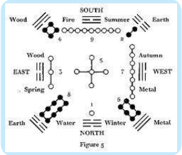

> **Deskripsi Visual:** Gambar ini adalah diagram yang menunjukkan hubungan antara empat elemen alam (Bumi, Air, Api, dan Kayu) dengan empat musim (Maret, Juni, September, dan Desember). Diagram ini menggunakan simbol geometris untuk menggambarkan hubungan antara elemen dan musim. Setiap elemen memiliki warna yang berbeda dan simbol yang unik. Misalnya, Bumi dinyatakan dengan warna hijau dan simbol lingkaran, sementara Air dinyatakan dengan warna biru dan simbol lingkaran bergerak. Simbol-simbol ini menggambarkan bagaimana setiap elemen berinteraksi dengan musim tertentu. Misalnya, Bumi (Emas) berada di baris tengah dan berada di tengah-tengah simbol-simbol lainnya, menunjukkan bahwa Bumi adalah pusat dari hubungan ini. Di sebelah kanan, simbol-simbol yang berada di baris bawah menunjukkan musim-musim yang berurutan, dari Maret ke Desember. Ini menunjukkan bahwa setiap elemen memiliki hubungan dengan musim tertentu. Jadi, diagram ini memberikan gambaran yang jelas tentang hubungan antara empat elemen alam dan empat musim.

menempatkan  Trigram  (gunung)  sebagai  pusat.  Dinasti Xia adalah Dinasti pertama yang berlangsung turun-temurun dari tahun 2205 SM. s.d. 1766 SM. Berakhir pada masa pemerintahan Xiajie (keturunan ke 17 tahun 1818 SM. - 1766 SM.)

### Raja Suci Dayu (2205 SM. - 2197 SM.)

Dayu (Yu Agung) adalah putera Kun (seorang menteri pada zaman Raja Suci Yao ) yang berhasil menggantikan tugas ayahnya dalam mengatasi bencana banjir selama 13 tahun). Pada masa itu, Dayu menerima wahyu Luoshu (kitab dari  sungai Lu )  dari  punggung  seekor kura-kura  besar yang muncul di sungai Lu.  Tanda  suci  ini  dijabarkan  sebagai Rencana Agung dengan Sembilan Pokok Bahasan - Hongfang Jiuchao .

 

---
## 📄 Halaman 101

Dayu bergelar  Wenming  meneruskan  pekerjaan  ayahnya  ( Chong Boguan )  yang gagal menanggulangi bencana banjir sehingga dihukum. Mula-mula  ia Dayu adalah menteri raja Yao dan Shun sebagai Menteri  Pekerjaan  Umum  ( Sikong )  yang  kemudian  diberikan  amanat menggantikan  ayahnya;  setelah  berjuang  tiga  belas  tahunan  (dalam kitab Mengzi ditulis delapan tahun) akhirnya berhasil mengatasi bencana banjir besar itu.

Tian mengkaruniakannya tongkat dari batu Kumala Hitam ( Tiansi Xuangui ) dan Wahyu Luotu yang masih terdokumentasi di dalam kitab Shujing V-IV berjudul Hongfan Jiuchou (Pedoman Agung dengan Sembilan Pokok  Bahasan).  Di  dalam  bahasan  kesembilan  diungkapkan  tentang Lima Kebahagiaan dan Enam Kerawanan di dalam hidup manusia:

### Penting

Pada masa pemerintahan Dayu inilah muncul ujar-ujar Weide Dongtian, yang merupakan nasehat dari Nabi Yi kepada Dayu , yang mengandung arti 'Hanya oleh kebajikan Tian berkenan.' Tercatat dalam Kitab Dauumu , Shujing . Dayu bergelar Bunbing .

Raja terakhir Dinasti Xia adalah Xiajie , tercatat ingkar dari jalan suci dan kebajikan Tian yang telah dirintis dan ditegakkan leluhurnya selama ratusan tahun. Xiajie adalah raja yang tidak bijaksana, kejam dan sewenang-wenang, hanya mengandalkan kekuatan belaka, tanpa sedikitpun mengingat akan moral kebajikan yang telah ditanamkan oleh leluhurnya.

### Lima Kebahagiaan ( Wufu ) ialah:

- Panjang usia memiliki ketahanan/kesehatan ( Shou );
- Kaya Mulia ( Fu );
- Sehat Jasmani Rohani ( Kangning );
- Lestari menyukai Kebajikan ( You Haode );
- Menggenapi Firman sampai akhir hayat ( Kao Zhongming )

### Enam Kerawanan ( Liuji ) ialah:

- Nahas,  Pendek  usia,  tidak  memiliki  ketahanan/kesehatan  ( Xiong Duanzhe )
- Sakit ( Ji )
- Sedih Merana ( You )
- Miskin ( Pin )
- Jahat ( E )
- Lemah ( Ruo )
|

 

---
## 📄 Halaman 102

### Nabi Chengtang (1766 SM. - 1753 SM.)

Baginda Chengtang bernama Lu alias Tian .  Beliau  rajamuda  dari negeri Bo , keturunan Huangdi (kaisar kuning), termasuk juga keturunan Xie (menteri pendidikan pada zaman raja suci Yu Shun ). Beliau adalah pendiri  Dinasti Shang (Dinasti  kedua  setelah  Dinasti Xia )  setelah menumbangkan  pemerintahan  terkahir  Dinasti  Xia  di  tangan  kaisar Zhouwang .  Bersama  Nabi YiYin  Yang menjadi  penasehat  agungnya Chengtang menjabarkan Baggua dengan Trigram KUN (Bumi-Sarana) sebagai pusat.

### Catatan:

Ajaran  yang  terkenal  dari  baginda Chengtang adalah  tentang menjadi  rakyat  yang  'Baharu'.  'Bila  suatu  hari  dapat  memperbaharui diri, perbaharuilah terus tiap hari dan jagalah agar dapat baharu selamalamanya.'

Dinasti Shang berlangsung dari tahun 1766 SM. s.d. 1122 SM. dan berakhir pada raja yang ke 28, yaitu raja Zhouwang (1154 SM. - 1122 SM.). Kehidupan rakyat sangat menderita dan tertekan atas kekezaman pemerintahannya. Pangeran Pikan (paman Zhouwang ) bahkan dibunuh dengan  kejinya  karena  berani  memberikan  peringatan  dan  teguran kepadanya.

### Nabi Yiyin (1766 SM. - 1753 SM.)

Yiyin menteri  raja Chengtang ,  wali  (Baoheng)  raja Taijia cucu baginda Chengtang . Beliau bergelar Yuansheng (Nabi Besar Sempurna). Nabi Yiyin disebut  juga Ouheng .  Beliau  kemudian  menjadi  wali  raja (Pohing)  pada  pemerintahan  Taijie  (cucu  baginda  Cheng  Tang  sekitar tahun 1753 - 1715 SM). Nesehat Nabi Yiyin Yang kepada Taijia yang terkenal adalah ' Xianyou Yide ' (Sungguh hanya ada satu dan milikilah, yaitu kebajikan), tertulis di dalam Kitab Shangshu, Shujing .

Nasihat Nabi Yiyin kepada Raja Taijia :

- ' Shangdi Tian Yang Mahatinggi itu tidak terus menerus mengaruniakan  hal  yang  sama  kepada  seseorang;  kepada  yang berbuat baik akan diturunkan beratus berkah; kepada yang berbuat tidak baik akan diturunkan beratus kesengsaraan. ( Shujing . IV: IV, 8)
- 'Bersama miliki Kebajikan Yang Esa Murni ( Xianyou Yide )'; 'Bukan Tian  memihak kepada kita  ( Feitian  Siwo ),  Tian  hanya  melindungi Kebajikan yang Esa ( Weitian Youyu Yide ) Shujing IV: VI, 4.

 

---
## 📄 Halaman 103

### Nabi Zhonghui

Zhonghui rekan sejawat Yiyin , perdana  menteri  raja Chengtang yang  di  dalam  kitab Lunyu VII:  1 oleh  Nabi Kongzi disebut  sebagai Laopeng dan di dalam kitab Mengzi disebut sebagai Lao Laizhu (lihat Mengzi VII B: 38-2). Peranan Beliau dalam dinasti Shang dan hubungan dengan  Nabi  Baginda Chengtang dapat dilihat di dalam Shujing IV: II. Beliau  senantiasa  mendorong baginda Chengtang memuliakan dan  menjunjung  Jalan  Suci Tian Yang Maha Esa yang akan lestari melindungi irman Tian yang dikaruniakan  ( Qinchong  Tiandao, Yongbao Tianming ).

---
**🖼️ Gambar/Diagram**

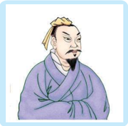

> **Deskripsi Visual:** Gambar ini adalah ilustrasi yang menampilkan seorang pria tua dengan rambut pendek dan topi berwarna kuning. Pria tersebut mengenakan pakaian tradisional Jepang, yaitu jubah biru dengan lengan panjang dan celana pendek. Wajahnya tampak tua dan penuh rasa sakit, dengan bibir yang sedikit mengejutkan dan mata yang terlihat lelah. Ilustrasi ini mungkin digunakan untuk membantu pembaca memahami karakter atau tokoh dalam cerita yang berkaitan dengan masa lalu atau budaya Jepang.

Zhonghui bersabda, Wuhu ! Tian telah menjelmakan rakyat ( Weitian  Shengmin  Youyu ),  dengan memiliki  berbagai  keinginan  maka bila  tanpa  seorang  pemimpin  akan timbul kekacauan ( Wuzhu Nailuan ). Demikianlah Tian Yang  Maha  Esa menjelmakan orang yang dikaruniai jelas pendengaran dan terang penglihatan untuk mengatur mereka ( Wei Tiansheng Congming Shiai )' Shujing IV: II, II, 2.

### Nabi Fuyue

---
**🖼️ Gambar/Diagram**

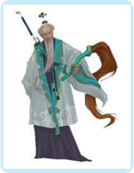

> **Deskripsi Visual:** Gambar ini adalah ilustrasi yang menampilkan tokoh tradisional Jepang. Tokoh tersebut memakai pakaian tradisional Jepang dengan warna putih dan hijau, serta mengenakan topi tradisional. Ia juga membawa senjata tradisional Jepang, seperti halnya pedang dan senapan. Ilustrasi ini mungkin digunakan untuk menggambarkan tokoh dalam cerita atau kisah budaya Jepang.

Nabi Fuyue adalah  menteri  dan penasihat  agung  raja  dinasti Shang yang bergelar Wuding (1324-1265 S.M). Riwayat beliau disuratkan

didalam  kitab Shujing IV:  VIIIA,  VIIIB,  VIIIC.    Raja Wuding adalah seorang  raja  Besar  dinasti  Shang  setelah  Baginda Chengtang . Ia sangat besar rasa Cinta Kasihnya dan teguh penuh semangat di dalam menegakkan Dao dasar pemerintahan negaranya, pantang hanya memperturutkan kesenangan saja.

|

 

---
## 📄 Halaman 104

Nabi Fuyue semula  hidupnya  hanya  sebagai  seorang  tukang  kayu di  wilayah Fuyan .  Beliau  adalah  seorang  yang  benar-benar  suci  dan mampu mengembalikan kejayaan dinasti Shang yang sudah mulai surut. Sabda nabi Fuyue :  Sungguh Tian itu Maha Mendengar, Maha Melihat ( We Congming );  hanya  Nabilah  senantiasa  menjunjung  tinggi  hukumNya  ( Weisheng  Shixian ).  Dengan  demikian  yang  menjadi  menteripun akan memuliakannya dan rakyatpun akan taat mematuhi

### Nabi Gongliu

Gongliu adalah  keturunan Houji yang  leluhurnya  hidup  terasing di antara orang-orang Rongdi sejak zaman raja Taikang (2188 - 2159 SM.)  dari  dinasti Xia kehilangan  negerinya.  Tetapi Gongliu mampu membangun dan melestarikan kembali karya peradaban bercocok-tanam yang dahulu dibangun Houji .

Putra Gongliu yang  bernama Qingjie berhasil  membangun  negeri di wilayah Bin .  Di kemudian hari seorang keturunannya yang terkenal sebagai Gugong Danfu mampu    membangkitkan  kembali  karya  besar yang pernah dibangun oleh Houji maupun Gongliu . Beliaulah yang diberi gelar sebagai Taiwang yang mempunyai dua orang putera yang sangat terkenal suci dan berbakti, bernama Taibo dan Yuzhong . Taiwang juga menikahi Taijia ng (seorang Nabi perempuan) dan melahirkan soerang putera bernama Jili. Jili inilah ayah Nabi Jichang atau Raja Wenwang , ayah Raja Wuwang pendiri dinasti Zhou (1122-255 SM).

### Nabi Boyi dan Shuqi

Boyi dan Shuqi hidup  pada  masa  akhir  dinasti Shang (abad  ke  12  S.M). Mereka adalah putera raja muda di sebuah negeri kecil bernama Guzhu mereka  berdua  yang  melihat  raja  terakhir  dinasti Shang ( Zhouwang ) yang ingkar dari Jalan Suci dan perilakunya sangat sewenang-wenang mereka telah menolak untuk menjadi pewaris kerajaan di negerinya.

Mereka mengasingkan diri sebagai pertapa di kaki sebuah gunung di wilayah negeri yang diperintah oleh Rajamuda Barat yang kemudian kita  kenal  sebagai  Raja Wenwang .  Kemudian  ketika  putera  raja Wen yaitu Wuwang memberontak dan menumbangkan dinasti Shang , kedua orang  nabi  itu  berupaya  mencegah;  setelah  tidak  berhasil  dan  dinasti Shang hancur  serta  berdiri  dinasti Zhou mereka  menolak  mengabdi kepada dinasti yang baru dan rela mati menderita kelaparan di tempat pengasingan  dirinya.  Maka  oleh Mengzi ,  disebut  sebagai  Nabi  yang menjunjung kesucian.

 

---
## 📄 Halaman 105

### 4.  Wahyu Danshu

### Nabi Tairen

Nabi Tairen (isteri Jili yang merupakan ibunda nabi Jichang ) adalah penerima wahyu Danshu ,  namun kitab ini kemudian raib, tetapi pada waktu Jichang 42 tahun memerintah sebagai rajamuda Kitab itu muncul kembali yang dibawa oleh seekor burung pipit merah ( Chique ).

Nabi Jichang mula-mula menjadi penguasa wilayah Barat terkenal dengan  gelar Xibo (pangeran  Barat)  kemudian  diberi  gelar  anumerta Wenwang ; berputera sepuluh orang antara lain Wuwang sebagai putera kedua pendiri dinasti Zhou dan pangeran Zhougong dan putera ke empat.

### Wahyu itu berisi:

Xiantian Bagua  dan Yin  Yang ,  ditulis  dalam  Kitab  Tiga  Makam ( Sanfen ).  Diagram  Bagua  sebelum  pembabaran,  berisi  wahyu  tentang tanda-tanda suci yang melambangkan prinsip dari unsur Yin Yang sebagai dasar  penyusunan  Rangkaian  Delapan  Trigram,  serta  menjelaskan Qian ( Tian sebagai Pusat), sebagai Khalik yang telah menjadikan alam semesta dengan segala isinya, makhluk dan segala peristiwa di dalamnya. Ini semua merupakan bukti Keagungan Jalan Suci Tian , yang menjadi dasar dari kitab Yijing (Kitab Perubahan).

### Raja Suci Wenwang (1122 SM.)

Raja Wenwang bernama Jichang , adalah pangeran Barat dari negeri Ki ( Seepik ). Memerintah ketika Dinasti Shang mendekati akhir keruntuhannya ditangan pemerintahan Zhouwang .

Karena  dianggap  berani  membongkar kejahatan Tiu-ong , maka Wenwang dihukum buang ke tanah Yuli oleh Zhouwang selama 7 tahun. Pada saat pembuangan itulah Beliau menerima wahyu Danshu yang  dibawa  oleh Zhiniao (burung merah). Melalui wahyu inilah Wenwang menjabarkan Bagua yang dikenal dengan Houtian  Bagua ( Bagua setelah pembabaran).

### Nabi Zhou Gongdan

Zhou Gongdan adalah putera keempat Nabi Baginda Wenwang . adik dari raja Wuwang . Beliau sangat dihormati oleh Nabi Kongzi . Kitab yang ditulisnya  antara  lain:  Kitab Zhouli dan Yili.  Zhouli atau Zhouguan

|

---
**🖼️ Gambar/Diagram**

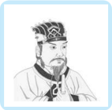

> **Deskripsi Visual:** Gambar ini adalah ilustrasi yang menampilkan seorang pria tua dengan rambut pendek dan berpakaian formal. Pria tersebut tampak seperti seorang pemimpin atau tokoh penting, mungkin karena posisinya yang lebih tinggi dibandingkan dengan orang lain di sekitarnya. Ilustrasi ini mungkin digunakan untuk menggambarkan tokoh dalam cerita atau buku pelajaran, memberikan gambaran visual tentang karakter tersebut.

Elemen-elemen utama dalam gambar ini meliputi:
1. Pria tua dengan rambut pendek.
2. Pakaian formal yang dikenakan oleh pria tersebut.
3. Latar belakang yang menunjukkan bahwa pria tersebut berada di atas orang lain.

Teks, angka, atau label penting yang terlihat dalam gambar ini tidak ada, sehingga informasi kunci yang dapat diambil pembaca hanya melalui penafsiran visual.

Deskripsi gambar ini dalam satu paragraf yang informatif:

Ilustrasi ini menampilkan seorang pria tua dengan rambut pendek dan berpakaian formal, tampak seperti seorang pemimpin atau tokoh penting. Pria tersebut berada di atas orang lain dalam latar belakang, menunjukkan posisinya yang lebih tinggi. Gambar ini mungkin digunakan untuk menggambarkan tokoh dalam cerita atau buku pelajaran, memberikan gambaran visual tentang karakter tersebut.

 

---
## 📄 Halaman 106

(Kitab  Kesusilaan  dinasti Zhou )  adalah Kitab yang menjadi dasar hukum dan tata pemerintahan dinasti Zhou ,  disebut  juga sebagai Liuguan (Enam Departemen) karena  isinya  membahas  tentang  enam departemen yang ada pada zaman dinasti Zhou .

Yili merupakan  Kitab  Tata  Agama dan Tata Laksana Upacara Agama yang disusun oleh Pangeran Zhougong .  Beliau juga menerima wahyu Yaoci yang menjadi Kalam yang membabarkan tentang makna  masing-masing  garis  Heksagram dalam  Kitab Yijing Setelah Wuwang mangkat,  Nabi Zhou  Gongdan diserahi

---
**🖼️ Gambar/Diagram**

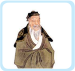

> **Deskripsi Visual:** Gambar ini adalah ilustrasi yang menampilkan seorang pria tua dengan rambut pendek dan lembut, mengenakan pakaian tradisional yang sederhana namun elegan. Pria tersebut tampak tenang dan berada di tengah-tengah sebuah ruangan yang sederhana, mungkin rumah atau tempat tinggal tradisional. Ilustrasi ini mungkin digunakan untuk membantu pembaca memahami atau menggambarkan karakter atau situasi dalam konteks budaya tertentu.

Elemen-elemen utama dalam gambar ini meliputi:
1. Pria tua: Ikon ini menunjukkan karakter utama yang mungkin merupakan tokoh penting dalam cerita atau topik yang dibahas.
2. Pakaian tradisional: Ini menunjukkan keberadaan budaya atau tradisi tertentu dalam konteks yang diceritakan.
3. Ruangan sederhana: Ini menunjukkan lingkungan atau setting yang mungkin relevan dengan cerita atau topik yang dibahas.

Teks, angka, atau label penting yang terlihat dalam gambar ini tidak ada, sehingga informasi kunci yang dapat diambil pembaca hanya melalui visual saja.

Dalam konteks buku pelajaran, gambar ini mungkin digunakan untuk membantu pembaca memahami atau menggambarkan karakter atau situasi dalam konteks budaya tertentu, serta memberikan gambaran visual tentang apa yang akan dibahas dalam bab atau topik yang relevan.

mandat sebagai Mengzai (wali raja) Zhou Chengwang (1115 SM. - 1078 SM.),  putera Wuwang .  Beliau  adalah  Nabi  Besar  terakhir  sebelum Nabi Kongzi .  Nabi Kongzi sangat  menghormati  bahkan  senantiasa bermimpikan tentang pribadi Nabi Zhou Gongdan dapat dilihat dalam Kitab Lunyu VII: 5, tentang kebesaran Nabi Zhou Gongdan juga dapat dilihat dalam Kitab Mengzi II B: 9; IIIA: 1/4; III B: 9/6; IV B: 20; VA:6; VI B: 8/6.

### Nabi Tai Gongwang

Tai  Gongwang bernama Lushang alias Jiang Ziya menteri  raja Wen dan kemudian menjadi panglima raja Wu dalam peperangan besar di padang Muye dengan raja terakhir dinasti Shang yang bernama Xin diberi gelar Zhou Wang atau Yinshou yang berperilaku sewenang-wenang sehingga  dinasti Shang tumbang.  Di  dalam  kitab Mengzi dikisahkan, ' Boyi menyingkiri raja Zhou lalu berdiam di Pantai Laut Utara. Ketika mendengar raja Wen memerintah sebagai raja muda hatinya tergerak dan segera berkata, 'Mengapa tidak datang kepadanya, ku dengar Pangeran Barat  itu  baik-baik  memelihara  orangtua'. Taigong menyingkiri  raja Zhou lalu  berdiam  di  Pantai  Laut  Timur  ketika  mendengar  raja Wen memerintah  hatinya  tergerak  dan  berkata,  'Mengapa  tidak  datang kepadanya, kudengar pangeran Barat itu baik-baik memelihara orangtua'.  Kedua  orangtua  itu  ialah  orangtua  Agung  ( Dalao )  seluruh dunia bila mereka sudah mau datang tunduk maka segenap ayah bunda rakyat seluruh dunia akan datang tunduk pula. Bila ayah bunda rakyat sedunia  mau  tunduk,  kemana  pergi  seluruh  anak-anaknya?  ( Mengzi . IVA: 13)

 

---
## 📄 Halaman 107

Cinta kasih itulah rumah sentosa dan kebenaran itulah jalan lurus kalau  orang  membiarkan  rumah  sentosa  itu  kosong  dan  tidak  mau mendiaminya; Menyingkiri jalan lurus itu dan tidak mau melewatinya sungguh meyedihkan.

### Raja Wuwang

Putera kedua Nabi Wenwang yang bernama Jifa ( Wuwang ) berhasil menumbangkan  pemerintahan Zhouwang dan  mendirikan  Dinasti Zhou (tertulis  di dalam kitab Thaisi, Shujing ).

Jifa bergelar Wuwang . Dengan dibantu  oleh  para  menteri  dan  penasihat kerajaan  (adik ke 4 yaitu pangeran Zhou atau Nabi Zhou Gongdan ) menyusun sistem pemerintahan yang dikenal dengan Liokkwan atau  enam  departemen,  yakni terdiri dari:

- 1.)  Perdana Menteri
- 2.)  Menteri Upacara/Peribadahan
- 3.)  Menteri Kehakiman
- 4.)  Menteri Pertanian
- 5.)  Menteri Pertahanan
- 6.)  Menteri Pekerjaan

### 5. Wahyu Yushu

Wahyu Yushu (Kitab Batu Kumala) diterima oleh Nabi Besar Kongzi yang  dibawakan  oleh  hewan  suci Qilin ,  sebagai Suwang (Raja  tanpa Mahkota).  Tanda  Suci; Zhizuo Dingshifu (Menetapkan  Hukum  Abadi, Membawa  Damai  Bagi  Dunia)  Shouming  (Menerima  Firman)  sebagai Muduo (Genta Rohani).

Menggenapi Yijing -  Babaran    Shiyi  (sepuluh  sayap)  dan  menulis Chunqiu Jingfongchan ;  menghimpun  dan  membukukan  Enam  Kitab Suci ( Liujing ).

### Yan Zhengzai

Yan  Zhengzai ,  abad  ke  6  SM.,  adalah  puteri  seorang  cendekia dari  negeri Song bermarga Yan .  Salah  satu  tokoh  penting  yang  saat mengandung puteranya mendapat wahyu Tian berupa Kitab Batu Kumala

|

 

---
## 📄 Halaman 108

( Yushu ) yang dimuntahkan oleh hewan  suci Qilin yang  didalamnya bertulis Shuijing Zhizi. Xishuai Zhouer Suwang ('Putera Sari air suci akan melanjutkan Dinati Zhou yang telah melemah dan menjadi Raja Tanpa Mahkota').

### Nabi Besar Kongzi (551 SM. - 479 SM.)

Nabi Kongzi bernama Qiu alias Zhongni . Qiu berarti  Bukit,  dan Zhongni berarti  anak  kedua dari Bukit Ni .  Lahir  dari  Pasangan Kong Shulianghe dan Ibu Yan Zhengzai ,  Pada Tanggal 27 bulan 8 Im Yinli , di negeri Lu (salah-satu Negara bagian Dinasti Zhou , di kota Zouyi desa Changping .

Menjelang kelahiran Beliau, telah turun  wahyu Yushu (Kitab  Batu  Kumala) yang  dibawakan  oleh  hewan  suci Qilin . Wahyu  itu  menyatakan  dirinya  sebagai Suwang (Raja  Tanpa  Mahkota). Kongzi memiliki  tanda  suci  pada  dadanya  yang menyebutkan:  Yang  menetapkan  hukum abadi dan akan membawa damai bagi dunia ( Zhi Zuoding Shifu ).

Dalam  perjalanan  hidupnya,  banyak kejadian yang menunjukkan serta menyatakan hal ke Nabi-an Beliau, di antaranya: Tian telah menyalakan kebajikan dalam diri Nabi Kongzi ( Lunyu . VII:  6),  bahkan  Nabi  yang  lengkap,  besar serta sempurna Ciep Thai Sing dan Nabi segala  masa  -  Shising  ( Mengzi .  V  B:  1).

Pewaris  rangkaian  wahyu  ( Lunyu .  IX:  23),  serta  menegaskan  bahwa Beliau memang utusan yang dipilih Tian sebagai Nabi ( Lunyu . IX: 5).

---
**🖼️ Gambar/Diagram**

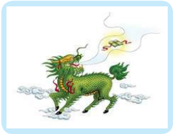

> **Deskripsi Visual:** Gambar ini adalah ilustrasi yang menampilkan seekor naga berwarna hijau dengan ekor bergerak mengelilingi dirinya. Naga tersebut memiliki bulu berwarna putih dan merah, serta memiliki mata berwarna kuning dengan garis hitam. Naga tersebut juga memegang sebuah pedang di tangannya yang tampak seperti bergerak mengarah ke arah kanan atas gambar. Di sekitar naga tersebut, terdapat beberapa elemen lain seperti awan putih yang tampak seperti bergerak ke arah kanan atas gambar.

Elemen utama dalam gambar ini adalah naga yang menjadi subjek utama dan digambarkan dengan detail. Naga tersebut memiliki ekor bergerak mengelilingi dirinya, yang menunjukkan bahwa naga tersebut sedang bergerak atau bergerak. Pedang yang dimegang oleh naga tersebut juga menjadi elemen penting dalam gambar ini, karena pedang tersebut tampak seperti bergerak mengarah ke arah kanan atas gambar.

Teks, angka, atau label penting yang terlihat dalam gambar ini adalah tidak ada. Gambar ini hanya menggambarkan naga dan elemen-elemen lainnya tanpa adanya teks atau angka yang menambahkan informasi tambahan.

Informasi kunci yang dapat diambil pembaca dari gambar ini adalah bahwa naga tersebut sedang bergerak atau bergerak, dan pedang yang dimegang oleh naga tersebut tampak seperti bergerak mengarah ke arah kanan atas gambar.

 

---
## 📄 Halaman 109

Penunjukkan tegas karya suci Beliau sebagai Tianzhi Muduo ( Lunyu . III: 24) serta mendapat perintah Tian untuk segera menyiapkan Hukum Suci dengan membukukan Kitab-Kitab Suci bagi umat manusia, termasuk Chunqiujing yang ditulis oleh Beliau sendiri (yang dikenal dengan wahyu Xieshu atau Kitab Daerah).

Demikian Nabi Kongzi telah menerima  Firman Tian ( Shou  Ming ) untuk melaksanakan perintah-Nya, menetapkan ajaran yang selaras dengan Hukum-Nya (wahyu Kumala Kuning).

Sebagai puncak karya sucinya, Beliau melaporkan kehadirat Tian akan selesainya tugas yang diembannya dalam menghimpun,  mengedit,  menulis  serta membukukan Kitab-Kitab Suci bagi umat manusia.

Garis besar ajaran nabi Kongzi adalah Yiyi  Guanzhi -  satu  yang  menembusi semuanya yang dijabarkan sebagai Zhongshu atau  Satya  dan  Tepasalira. Satya kepada Tian ( Zhongyutian ) sebagai

hubungan vertical, dan Tepasalira kepada sesama manusia ( Shuyuren ) sebagai hubungan horizontal.

Demikian Nabi Kongzi dengan wahyu yang telah diterimanya serta melalui  karya  ke-Nabian-nya  menyusun Shi  Yi (sepuluh  sayap)  yang menjabarkan,  menjelaskan  makna-makna  rohani,  dasar-dasar  serta penggunaan dari Kitab Suci Wahyu Kejadian  dari wahyu Hetu -wahyu Luoshu -wahyu  Kwiecong-wahyu Danshu ( Zhouyi ),  menjadi  Kitab  Suci Yijing yang kita kenal sekarang dan menjadi salah-satu bagian dari kitab Wujing (kitab yang mendasari).

---
**🖼️ Gambar/Diagram**

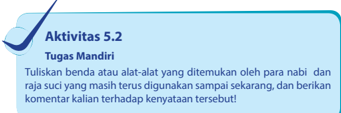

> **Deskripsi Visual:** Gambar ini adalah ilustrasi yang menunjukkan aktivitas 5.2 tentang tugas mandiri para nabi dan raja-suci yang masih digunakan sampai sekarang. Ilustrasi ini menggambarkan berbagai benda atau alat-alat yang ditemukan oleh para nabi dan raja-suci tersebut, serta memberikan komentar tentang keunikan dan keharmonisan dari setiap benda tersebut. Ilustrasi ini mencakup berbagai bentuk dan ukuran benda-benda tersebut, serta menunjukkan bagaimana mereka saling berkaitan dan berfungsi dalam kehidupan sehari-hari. Informasi penting yang dapat diambil dari gambar ini adalah bahwa banyak benda-benda yang digunakan oleh para nabi dan raja-suci masih digunakan sampai saat ini, menunjukkan keunikan dan keharmonisan dari setiap benda tersebut.

|

 

---
## 📄 Halaman 110

### Penilaian Diri

### · Tujuan Penilaian

Lembar penilaian diri ini bertujuan untuk:

- Mengetahui sikap kalian dalam menerima dan memahami tentang kebesaran dan kekuasaan Tian atas hidup dan kehidupan ini.
- Menumbukan  sikap  patuh  mengikuti  kenhendak    dan  hokum suci-Nya.

### · Petunjuk

Isilah  lembar  penilaian  diri  yang  ditunjukkan  dengan  skala  sikap berikut ini!

- SS = sangat setuju
- ST = setuju
- RR = ragu-ragu
- TS = tidak setuju

---
**📊 Tabel**

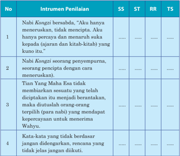

Tabel ini berisi instrumen penilaian untuk menilai kualitas penulisan dalam bahasa Melayu. Topik utamanya adalah keterampilan menulis yang berkaitan dengan kepercayaan, pengetahuan, dan penggunaan kata-kata yang tepat. Kolom-kolom yang ada meliputi SS (Sesuai Standar), ST (Sesuai Tujuan), RR (Relevansi), dan TS (Terstruktur). Data penting yang terlihat adalah bahwa instrumen penilaian mencakup berbagai aspek seperti kepercayaan pada penulis, penggunaan kata-kata yang tepat, dan struktur penulisan yang baik.

 

---
## 📄 Halaman 111

---
**📊 Tabel**

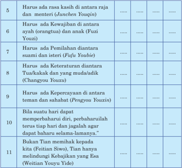

Tabel ini berisi 11 poin yang mungkin merupakan prinsip-prinsip atau nilai-nilai yang diharapkan dalam hubungan sosial, seperti antara raja dan menteri, ayah dan anak, pasangan, teman, dan keluarga. Kolom pertama menunjukkan poin-poin tersebut, sedangkan kolom kedua dan ketiga menunjukkan keadaan yang diharapkan, dengan "ada" untuk poin-poin yang harus ada dan "tidak ada" untuk poin-poin yang tidak perlu ada. Data penting yang terlihat adalah bahwa semua poin memiliki keadaan "ada", menunjukkan bahwa semua prinsip atau nilai yang disebutkan dalam tabel ini diharapkan dalam hubungan sosial.

### Evaluasi Bab 5

### A. Pilihan Ganda

Berilah tanda silang (x) di antara pilihan A, B, C, D, atau E yang merupakan  jawaban  paling  tepat  dari  pertanyaan-pertanyaan berikut ini!

- Berikut ini termasuk dalam kategori nabi purba ( Shenhuang ) adalah ....
- Fuxi
- Huangdi
- A dan B benar
- Yushu
- Dayu
|

 

---
## 📄 Halaman 112

- Wahyu Tian pertama yang diterima oleh Nabi Purba Fuxi adalah ….
- Hetu
- Liutu
- Danshu
- Yushu
- Guichang
- Wahyu yang diterima oleh Nabi Purba Fuxi dibawakan oleh  hewan suci, yaitu….
- Qilin
- Longma
- Naga
- Kura-Kura
- Burung Hong
- Penerus  kepemimpinan  Nabi  Purba Fuxi yang  berasal  dari Kwie Hu (Santung), meskipun tidak menerima wahyu Tian namun karya Beliau  amat  berpengaruh  terhadap  peradaban  kehidupan  umat manusia.  adalah….
- Nabi Kongzi
- Huangdi
- Shennong
- Wenwang
- Tangyou
- Yang  mendapat  julukan  sebagai  Dewa  Pertanian  dan  Raja  Obat adalah .…
- Huangdi
- Wenwang
- Dayu
- Tangyao & Yushun
- Shennoung
- Yang mendapat julukan sebagai Kaisar pertama dan Raja Kebudayaan adalah .…
- Chengtang
- Shennong
- Wenwang

 

---
## 📄 Halaman 113

- Tang yao & Yushun
- Huangdi
- Yang mendapat julukan sebagai Bapak agama Ru atau peletak dasar Rujiao adalah .…
- Huangdi
- Shennong
- Wenwang
- You dan Shun
- Kongzi
- Yang mendirikan Observatorium dan    menciptakan alat penunjuk arah adalah .…
- Huangdi
- Shennong
- Wenwang
- Tangyao & Yushun
- Yu Agung/Dayu
- Pembantu Raja Suci Tangyao yang terkenal dengan ajaran ' Koo Yau Ji Kiu Tik ',  adalah .…
- Hoo
- Kooyau
- Dayu
- Hi
- Yushun
- Pembantu Raja Suci Tangyao yang berasal dari rakyat biasa tetapi memiliki  akhlak  mulia  serta  sangat  menjunjung  tinggi  perilaku Bakti, adalah ….
- Hoo
- Yi
- Dayu
- Yushun
- Kooyu
|

 

---
## 📄 Halaman 114

### B. Uraian

### Jawablah  pertanyaan-pertanyaan  berikut  ini  dengan  uraian yang  jelas!

- Sebutkan yang termasuk dalam kategori Shenhuang dan  yang termasuk ke dalam kategori Shenwang !
- Sebutkan  hasil  karya/ciptaan  Nabi  Purba Fuxi yang  menjadi dasar bagi peradaban umat manusia!
- Mengapa Nabi Purba Shennong mendapatkan  julukan  sebagai Dewa pertanian dan Raja Obat!
- Sebutkan lima macam hubungan ( Wupin )  menjadi  masyarakat yang baik ( Wudadao ) ajaran Nabi Shun !
- Ajaran yang terkenal dari Raja Chengtang adalah?
- Tulisakan nasihat Nabi Yi kepada Dayu !
- Tuliskan nasihat Nabi Yiyin kepada Raja Taijia !
- Tuliskan  nasihat Chengtang tentang  menjadi  rakyat  yang baharu!

 

---
## 📄 Halaman 115

### Bab 6

### Agama Khonghucu dan Perkembangannya

### Peta Konsep

---
**🖼️ Gambar/Diagram**

> **Deskripsi Visual:** Gambar ini adalah diagram yang menunjukkan perkembangan dan pengaruh Agama Khonghucu di Indonesia. Diagram ini dibagi menjadi dua bagian utama: "Istilah Asli Agama Khonghucu" dan "Agama Khonghucu di Indonesia". Bagian pertama menjelaskan asal-usul dan perkembangan agama Khonghucu, sementara bagian kedua membahas bagaimana agama ini masuk ke Indonesia dan berbagai institusi yang didirikan untuk mengelola agama tersebut.

Elemen utama dalam diagram ini meliputi:
1. "Awal Mula Perkembangan Agama Khonghucu" sebagai titik awal di bagian atas.
2. "Masuknya Agama Khonghucu ke Indonesia" sebagai titik di tengah, yang merupakan titik penyeberangan.
3. "Lembaga Agama Khonghucu" sebagai titik di bawah "Masuknya Agama Khonghucu ke Indonesia".
4. "Agama Khonghucu di Era Reformasi" sebagai bagian bawah, yang mencakup pengakuan hukum, pelayanan hak sipil, dan perusahaan imlek.

Teks, angka, atau label penting yang terlihat dalam diagram ini meliputi:
- "Awal Mula Perkembangan Agama Khonghucu"
- "Masuknya Agama Khonghucu ke Indonesia"
- "Lembaga Agama Khonghucu"
- "Agama Khonghucu di Era Reformasi"

Informasi kunci yang dapat diambil pembaca meliputi:
1. Perkembangan agama Khonghucu dari awal hingga masuk ke Indonesia.
2. Institusi-institusi yang didirikan untuk mengelola agama Khonghucu.
3. Bagaimana agama Khonghucu mempengaruhi hukum, pelayanan hak sipil, dan perusahaan imlek di era reformasi.

Dengan demikian, diagram ini memberikan gambaran umum tentang sejarah perkembangan agama Khonghucu di Indonesia dan dampaknya pada masyarakat.

|

 

---
## 📄 Halaman 116

### A.  Pendahuluan

Sejarah Zhongguo merupakan sejarah yang sangat fantastis . Bagaimana  tidak,  sejarah  yang  sudah  berumur  lima  milenium  (5.000 tahun) ini begitu tertata rapih bak cerita bersambung dan bertahan terus dan  dapat  mengatasi  peperangan  dan  kekalahan.  Menurut  Elizabeth Seeger,  tak  ada  sejarah  yang  lebih  menarik  dan  lebih  hebat  seperti sejarah Zhongguo .

Ketika Piramide didirikan  di  lembah  sungai Nil , Zhongguo sudah mendirikan kerajaannya di sepanjang sungai Huanghe , dan ketika orang cerdik pandai Babylonia mempelajari bintang-bintang dan langit, orang Zhonghoa sudah  menyusun almanak dengan segala kaitannya. Ketika bangsa Yunani mendirikan negaranya dan merdeka di tanah semenanjung yang berbukit-bukit,  maka Zhongguo waktu  itu  telah  membangun  keDinasty-an yang megah.

Saat  Roma  mengalahkan  negara-negara  di  sepanjang  pantai  Laut Tengah  dan  menyerbu  Eropa  serta  mengalahkan  bangsa  Prancis, Spanyol, keluarga Dinasty Han di Zhongguo sedang memerintah suatu kerajaan yang ' elegance '.

Dalam  sejarah  perkembangan  bangsa Zhonghoa banyak  terdapat jejak  sejarah  yang  menggemparkan  dunia,  di  antaranya;  perjalanan darat terbesar yang dikenal sebagai 'Jalur Sutra' sedangkan perlayaran laut yang termasyur adalah ' Zhengho mengarungi samudra' Kedua hal ini memberikan kontribusi yang tidak terhapuskan dalam pengembangan perdagangan dan penyebaran budaya di dunia.

Sementara itu, perkembangan sejarah Zhongguo yang telah berusia 5.000  tahun,  tidak  bisa  terlepas  dari  sejarah  peradaban  manusia  itu sendiri  dan  seiring  dengan  perkembangan agama Khonghucu. Sejarah juga mencatat bahwa agama Khonghucu adalah agama yang berkembang sejalan dengan peradaban manusia. Rangkaian Wahyu Tian terangkai dari Fuxi (2953  -  2838  SM.),  sampai  digenap-sempurnakan  oleh  Nabi Kongzi (551  -  479  SM.),  di  dalamnya  ada  bimbingan/tuntunan  bagi manusia untuk hidup dalam Jalan Suci ( Dao ).

### 1. Istilah Asli Agama Khonghucu

Agama Khonghucu adalah agama yang dalam istilah aslinya disebut Ru Jiao ,  yang artinya agama bagi orang-orang yang lembut hati, yang menjadikan orang terpelajar  dan  terbimbing  dalam  pengetahuan  suci. Oleh karena peranan besar Nabi Kongzi dalam menyempunakan ajaran

 

---
## 📄 Halaman 117

agama ini,  maka  kemudian  orang  lebih  mengenalnya  dengan  sebutan agama Khonghucu.

Ru  Jiao atau  agama  Khonghucu  sudah  ada  jauh  sebelum  Nabi Kongzi dilahirkan, ajaran Ru Jiao sudah ada/mulai dirintis sejak zaman Nabi purba atau raja suci Tangyao , yaitu tahun 2357 SM-2255 SM. dan Nabi purba atau raja suci Yushun ,  tahun  2255 SM-2205 SM. Tangyao dan Yushun inilah  yang  kemudian  dikenal  sebagai  Bapak Ru  Jiao , karena Beliau berdualah yang telah merintis dan meletakan dasar-dasar ajaran agama Ru Jiao ,  yang diteruskan dan dikembangkan oleh NabiNabi  selanjutnya  sampai  kepada  Nabi Kongzi sebagai  penggenap  dan penyempurna ajaran Ru Jiao tersebut.

Bila ditinjau dari sebutan aslinya kata Ru (儒) dibangun dari dua radikal huruf, yaitu: Ren ( 人 )  yang berarti manusia, dan Xu ( 需 )  yang artinya perlu. Jadi kata Ru bisa bermakna 'Yang diperlukan manusia.'

Sementara  kata  Jiao  ( 教 )  yang  dalam  bahasa  Indonesia  berarti Agama dibangun dari dua radikal huruf, yaitu: Xiao (孝) yang berarti memuliakan hubungan  dan Wen ( 文) yang berarti ajaran. Maka Jiao atau agama dapat diartikan: 'Ajaran tentang memuliakan hubungan.' Jika Ru mengandung arti: 'Yang diperlukan manusia', dan Jiao mengandung arti:  'Ajaran  tentang  memuliakan  hubungan',  maka Ru  Jiao ( 儒 教 ) dapat diartikan sebagai: 'Ajaran tentang memuliakan hubungan yang diperlukan manusia untuk memenuhi hakikat kemanusiaannya sesuai dengan Firman Tian .'

Bimbingan agama ini  diturunkan Tian melalui  para  Nabi  sebagai utusan-Nya agar manusia beroleh tuntunan pembinaan diri dalam jalan suci ( Dao ), yaitu jalan untuk datang dan kembali kepada sang pencipta.

Ru  Jiao dapat  dikatakan  sebagai  agama  bagi  orang-orang  yang taat, yang tulus berserah dan taqwa kepada Dia Tian Yang Maha Esa, yang  halus  budi  pekertinya,  yang  menjadikan  terpelajar  dan  beroleh bimbingan. Hal ini tersirat lebih nyata lagi di dalam kitab Yijing (kitab tentang perubahan/kejadian alam semesta), di situ diisyaratkan bahwa umat Ru adalah orang yang:

Rou （柔） =  lembut hati, halus budi-pekerti, penuh susila.

Yu （玉） =  yang utama, mengutamakan perbuatan baik.

He （和）

=  harmonis-selaras.

Ru （如） =  Menebarkan kebajikan, bersuci diri.

|

 

---
## 📄 Halaman 118

Oleh  karena  itu,  umat  Ru  selalu  mencamkan  dengan  sungguhsungguh agar sikap dan perilakunya selalu berlandaskan kebajikan ( De ), membina diri dalam jalan suci ( Dao ). Demikian ia berbuat dan bertindak dalam amal ibadah kesehariannya ( Shuaixing ).

Agama Khonghucu diturunkan Tian bagi umat manusia yang datang seiring  dengan  sejarah  manusia  itu  sendiri.  Tentu  saja  kehadirannya pada mulanya berhubungan langsung dengan suatu tempat, suatu waktu dan suatu kaum tertentu, seperti apa yang kita kenal sebagai Negara Zhongguo .  Namun  demikian  tidaklah  berarti  agama  ini  adalah  hanya milik  orang Zhonghoa saja,  melainkan  bersifat  universal  bagi  semua kaum atau bangsa-bangsa yang berada di seluruh penjuru dunia.

Hal ini terbukti bahwa sesungguhnya para Nabi sebagai utusan Tian yang membawakan dan merangkai Ru Jiao adalah terdiri dari berbagai suku bangsa, seperti misalnya Nabi Yushun berasal dari suku bangsa I Timur (seperti orang Korea dan Jepang). Wenwang berasal dari suku bangsa I Barat (seperti orang Asia Tenggara). Dayu berasal dari Yunan (seperti  orang  Melayu  dan  Asia  Tenggara),  disamping  tentunya  orang Han sendiri.

Lebih  daripada  itu,  agama  Khonghucu  pada  kenyataannya  bukan hanya dianut oleh orang-orang dari daratan Zhongguo saja, melainkan dianut juga oleh bangsa-bangsa seperti Jepang, Vietnam, Korea, Singapura,  Malaysia  termasuk  Indonesia.  Secara  universal  budaya Khonghucu sudah merupakan milik dunia.

### 2. Nabi Besar Penyempurna Ajaran Ru Jiao

Agama  Khonghucu  bukan  sekedar  suatu  ajaran  yang  diciptakan oleh Nabi Kongzi , melainkan agama yang telah diturunkan Tian melalui para nabi purba dan raja suci jauh sebelum Nabi Kongzi lahir. Seperti disampaikan oleh Nabi Kongzi :  'Aku hanya meneruskan, tidak mencipta. Aku hanya percaya dan menaruh suka kepada (ajaran dan kitab-kitab) yang kuno itu.' ( Lunyu . VII: 1).

Pada bab 5 kita telah membahas tentang rangkaian turunnya Wahyu Tian untuk Ru Jiao (agama Khonghucu), di mana telah dibahas mengenai para nabi dan raja suci yang menerima wahyu Tian yang  selanjutnya menjadi cikal bakal ajaran Khonghucu.

 

---
## 📄 Halaman 119

### B. Agama Khonghucu Di Indonesia

### 1. Awal Mula Perkembangan

Pada  awal  perkembangan  agama  Khonghucu  di  Indonesia  ajaranajarannya  dipraktikkan  terbatas  di  lingkungan  keluarga  keturunan Zhonghoa yang dimungkinkan antara satu dengan yang lainnya belum mencerminkan adanya suatu keseragaman. Mereka melakukan berbagai tata cara keagamaan dengan ritual menurut apa yang telah dilakukan secara turun temurun oleh para nenek moyang mereka dengan penuh toleransi antara satu dengan yang lain.

Perkembangan  selanjutnya,  ajaran  agama  Khonghucu  didukung oleh kehidupan berorganisasi kemasyarakatan dan keagamaan dengan maksud agar teratur dan lebih baik sesuai dengan tuntutan zaman tanpa mengurangi esensi/inti dan nilai penghayatan spiritual atau justru dalam rangka untuk meningkatkannya dalam berbagai aspek kehidupan umat manusia.

### 2. Masuknya  Agama Khonghucu Ke Indonesia

Keberadaan  umat  Khonghucu  Indonesia  beserta  lembaga-lembaga keagamaannya sudah ada sejak berabad-abad yang lalu. Mengingat sejak zaman Sanguo sekitar abad ke tiga sebelum Masehi, agama Khonghucu telah menjadi salah- satu dari tiga agama di negeri Zhongguo pada saat itu. Terlebih lagi pada zaman Dinasti Han (tahun 136 SM.) bahwa agama Khonghucu ditetapkan sebagai agama Negara.

Agama  Khonghucu  di  Indonesia  tiba  sebagai  agama  keluarga. Kedatangan  komunitas  Konfusian  pertama  kali  terjadi  pada  masa formasi  kerajaan  Majapahit.  Mereka  datang  bersama  tentara  Tar-Tar yang dikirim untuk menghukum Kertanegara (Raja Singosari terakhir).

---
**🖼️ Gambar/Diagram**

> **Deskripsi Visual:** Gambar ini adalah foto yang menunjukkan bangunan tradisional dengan atap berbentuk kerucut dan dinding berwarna merah. Atapnya dilengkapi dengan rangkaian pohon cemara yang menjuntai ke atas. Dinding depan bangunan memiliki pintu berwarna putih dengan kaca besar dan beberapa ornamen ukir yang indah. Di sekeliling bangunan terdapat beberapa pohon besar dan tanaman hijau lainnya. Di sisi kanan bangunan terdapat sebuah tiang bambu yang menjuntai ke atas.

Sebagai suatu bukti mengenai keberadaan  agama  Khonghucu di  Indonesia  pada  tahun  1688 dibangun Kelenteng Thian Hokiong di Makassar, tahun 1819 dibangun Kelenteng Ban Hingkiong di Manado dan tahun 1883 dibangun Kelenteng Boen Thiangsoe di Surabaya.

Kemudian pada tahun 1906 setelah diadakan pemugaran kembali berganti nama menjadi Wenmiao . Kelenteng Talang

|

 

---
## 📄 Halaman 120

di kota Cirebon-Jawa Barat adalah juga merupakan salah satu Kongzi Miao/tempat ibadah Khonghucu, semua itu juga merupakan peninggalan sejarah yang telah berusia tua.

Kelenteng  lain  yang  bernuansa Dao  Pogong antara  lain:  di  Bogor didirikan pada zaman VOC dan banyak tempat lain di seluruh Nusantara mulai dari Aceh hingga ke Timor-Timur.

Akhir  abad  ke  19  di  seluruh  pulau  Jawa  217  sekolah  berbahasa Mandarin, jumlah murid tercatat sebanyak 4.452 siswa sekolah, gurugurunya  direkrut  dari  negeri Zhongguo .  Kurikulum  mengikuti  sistem tradisional yakni menghapalkan ajaran Khonghucu. Mereka adalah anakanak  pedagang  dan  tokoh  masyarakat  seperti  Kapitan  dan  Lieutnant China. Siswa-siswa tersebut menempuh ujian di ibukota kerajaan Qing untuk  menjadi  seorang Junzi .  Komunitas  dagang Zhonghoa sudah sangat berkembang jauh sebelum kedatangan VOC. Jaringan Zhonghoa sudah meliputi Manila, Malaka, Saigon dan Bangkok. Jadi sejak awal perkembangan komunitas Zhonghoa sudah sangat luas.

### 3. Lembaga Agama Khonghucu di Indonesia

Dimulai  dari  didirikannya Kongjiaohui di  Sala-Jawa  Tengah  pada tahun 1918 sebagai Lembaga Tinggi Agama Khonghucu (Matakin).

Tahun  1923  dilaksanakan kongres pertama Kongjiao  Zonghui (Lembaga Pusat Agama Khonghucu) di Yogyakarta dengan kesepakatan memilih kota Bandung sebagai pusat. Pada tanggal 25 Desember 1924 diadakan  kongres  kedua  di  kota  Bandung-Jawa  Barat,  yang  antara lain  membahas  mengenai  Tata  Upacara  Agama  Khonghucu  agar  ada keseragaman  dalam  melaksanakan  ibadah  keagamaannya  di  seluruh Indonesia.

Pada tanggal 11 s.d. 12 Desember 1924 diadakan konferensi antar tokoh-tokoh agama Khonghucu di Sala, untuk membahas kemungkinan ditegakkannya  kembali  lembaga  agama  Khonghucu  secara  nasional setelah tidak adanya kegiatan karena pecahnya perang dunia kedua dan masuknya tentara Jepang ke Indonesia.

Pada  tanggal  16  April  1955  berlangsung  konferensi  di  Sala,  dan disepakati dibentuknya kembali Lembaga Tertinggi Agama Khonghucu dengan memakai nama: Perserikatan K'ung Chiao Hui Indonesia (PKCHI) yang diketuai oleh Dr. Sardjono, yang kemudian mengadakan Kongres ke I pada tanggal 6-7 Juli 1956 di Solo, Konggres ke II tanggal 6-9 Juli 1957 di  Bandung, Konggres ke III tanggal 5-7 Juli 1959 di Bogor, Konggres ke  IV  tanggal  14-16  Juli  1961  di  Solo,  pada  Konggres  nama  PKCHI

 

---
## 📄 Halaman 121

diganti menjadi LASKI (Lembaga Sang Kongzi Indonesia). Tahun 1963 nama LASKI diubah menjadi Gapaksi (Gabungan Perkumpulan Agama Khonghucu se Indonesia). Tahun 1964 namanya diubah kembali menjadi Gabungan  Perhimpunan  Agama  Khonghucu  se  Indonesia,  disingkat tetap  Gapaksi.  Tahun  1965  Presiden  Soekarno  mengeluarkan  Penpres No.I/Pn.Ps/1965 yang menetapkan Agama Khonghucu sebagai salah-satu agama yang diakui kehadirannya di Indonesia. Pada tahun 1967 untuk kesekian kalinya nama perhimpunan diubah menjadi Matakin (Majelis Tinggi Agama  Khonghucu Indonesia).

Dalam Konggres Matakin VI Pada tangal 23 s.d. 27 Agustus 1967 di Solo, pejabat presiden Republik Indonesia Letnan Jendral TNI Soeharto pada saat itu telah berkenan memberikan sambutan tertulisnya, yang antara  lain  menyatakan  'agama  Khonghucu  mendapat  tempat  yang layak dalam Negara kita yang berdasarkan Pancasila.'

### C. Agama Khonghucu di Era Reformasi

### 1. Pengakuan Agama Khonghucu Secara Yuridis

Berdasarkan Penpres No. 1 1965 j.o. Undang-Undang No. 5 tahun 1969 dalam penjelasan pasal demi pasal antara lain dinyatakan: 'Agama yang dipeluk oleh penduduk Indonesia adalah: Islam, Kristen, Katolik, Hindu, Buddha dan Khonghucu.'

### Penting

Kebebasan  beragama  merupakan  hak  yang  paling  hakiki bagi  umat  manusia  di  dalam  menjalin  hubungan  mereka dengan  Sang  Pencipta-Nya  yaitu  Tian  Yang  Maha  Esa. Agama  bukan  pemberian  oleh  suatu  Negara,  melainkan suatu keyakinan dari umatnya yang mempercayainya. Oleh karena  itu,  selayaknya  Negara  tidak  mencampuri  ataupun membatasinya.

Hal  ini  dapat  dibuktikan  dalam  sejarah  perkembangan  agamaagama  di  Indonesia.  Karena  keenam  agama  ini  adalah  agama-agama yang dipeluk hampir seluruh penduduk Indonesia, maka selain mereka mendapat jaminan seperti yang diberikan oleh pasal 29 ayat 2 UndangUndang  Dasar  1945,  mereka  juga  mendapat  bantuan-bantuan  dan perlindungan seperti yang diberikan pasal ini.

|

 

---
## 📄 Halaman 122

Jumlah penganut agama Khonghucu di Indonesia pada tahun 1967 sekitar tiga juta orang. Kemudian berdasarkan hasil sensus penduduk yang  dikeluarkan  oleh  Biro  Pusat  Statistik  (BPS)  pada  tahun  1971, penganut  agama  Khonghucu  tercatat  0,6  persen  dari  keseluruhan penduduk  Indonesia  di  Jawa,  dan  1,2  persen  di  luar  Jawa.  Untuk seluruh Indonesia para penganut agama Khonghucu sebanyak 999.200 jiwa  (0,8  persen  dari  seluruh  penduduk  Indonesia).  Sementara jumlah penduduk etnis Zhonghoa pada  tahun  1999  mencapai  4-5  persen  dari seluruh jumlah penduduk Indonesia. Namun oleh karena situasi politik di  Indonesia  dengan  berbagai  macam  peraturan  yang  menghambat perkembangan agama Khonghucu pada saat itu, maka jumlah penganut agama Khonghucu telah banyak berkurang.

Hal  ini  disebabkan  oleh  karena  adanya  pembatasan-pembatasan, misalnya di dalam melaksanakan kegiatan-kegiatan keagamaan, mendirikan  tempat  ibadah,  tidak  dicantumkannya  agama  Khonghucu pada kolom agama di KTP, pencatatan perkawinan di Kantor Catatan Sipil, termasuk tidak diperbolehkannya pelajaran agama Khonghucu di sekolah-sekolah. Semua itu menjadikan hambatan bagi para penganut agama  Khonghucu.  Hal  ini  sebenarnya  sangat  bertentangan  dengan falsafah Negara kita yaitu Pancasila dan Undang-Undang Dasar 1945 khususnya pasal 29 yang telah memberikan jaminan dan kebebasan bagi seluruh  rakyat  Indonesia  untuk  memeluk  agama  dan  melaksanakan ibadat sesuai  dengan  agama  dan  kepercayaannya  masing-masing. Terlebih  lagi  hal  ini  sangat  bertentangan  dengan  Undang-Undang tentang hak-hak azazi manusia, karena kebebasan beragama sebenarnya adalah merupakan hak yang paling hakiki bagi umat manusia di dalam menjalin hubungan mereka dengan Sang Pencipta-Nya yaitu Tian Yang Maha  Esa.  Agama  bukan  pemberian  oleh  suatu  Negara,  melainkan suatu keyakinan dari umatnya yang mempercayainya. Oleh karena itu, selayaknya Negara tidak mencampuri ataupun membatasinya.

Secara resmi dan berdasarkan hukum ( de facto dan de jure )  pengakuan terhadap  agama  Khonghucu  di  Indonesia  dapat  disimpulkan  sebagai berikut:

- Pancasila, sila yang pertama 'Ketuhanan Yang Maha Esa.'
- Undang-Undang Dasar 1945, pasal 28 E (setelah adanya perubahan UUD 1945 oleh MPR): Ayat (I) Setiap orang bebas memeluk agama dan  beribadat  menurut  agama  dan  keyakinannya  masing-masing. Ayat (2) Setiap orang berhak atas kebebasan meyakini kepercayaan,

 

---
## 📄 Halaman 123

- menyatakan pikiran dan sikap, sesuai dengan hati nuraninya.
- UUD 1945, pasal 29 ayat (2): Negara menjamin kemerdekaan tiaptiap penduduk untuk memeluk agamanya masing-masing dan untuk beribadat menurut agamanya dan kepercayaannya itu.
- Undang-Undang  No.  39  tahun  1999  tentang  Hak  Azasi  Manusia; opasal 22 ayat (I) Setiap orang bebas memeluk agamanya masingmasing dan untuk beribadat menurut agamanya dan kepercayaannya itu. Pasal 22 ayat (2) Negara menjamin kemerdekaan setiap orang memeluk agamanya masing-masing dan untuk beribadat menurut agama dan kepercayaannya itu.
- Undang-Undang  No.  I/PNPS/1965,  jo.  Undang-Undang  No.  5/1967 tentang Pencegahan Penyalagunaan dan/Penodaan Agama.
- Kepres.  6  tahun  2000  yang  mencabut  Inpres  No.  14/1967  yang sebelumnya  banyak  digunakan  untuk  membelenggu  umat,  agama dan kelembagaan Khonghucu.
- Kebebasan umat dan agama Khonghucu di Indonesia sudah ada sejak lama, berbarengan dengan masuknya orang Zonghoa ke Indonesia, seperti antara lain dapat dibuktikan dari umur Kelenteng dan Mio ( Wenmiao Surabaya) yang sudah ratusan tahun lamanya.
- Statistik yang dikeluarkan BPS pada tahun 1971 dan 1976, dimana jumlah umat Khonghucu tercatat 0,7 persen dari seluruh penduduk Indonesia.
- Sejak  tahun  2000  telah  menyelenggarakan  Perayaan  Tahun  Baru Kongzi li  secara  nasional  berturut-turut  yang  selalu  dihadiri  oleh Presiden Republik Indonesia dan para pejabat teras pemerintahan Indonesia, juga dihadiri oleh  para tokoh/pemuka agama-agama yang ada di Indonesia.

---
**🖼️ Gambar/Diagram**

> **Deskripsi Visual:** Gambar ini adalah ilustrasi yang menunjukkan tugas kelompok dalam aktivitas 6.1. Ilustrasi ini menggambarkan sebuah lembaran buku pelajaran dengan judul "Tugas Kelompok" dan subjudul "Carilah isi tentang Inpres No. 14 tahun 1967 tentang pembatasan terhadap budaya, adat istiadat dan agama Zhongguo." Ilustrasi ini mencakup beberapa elemen penting:

1. Judul dan Subjudul: Judul "Tugas Kelompok" dan subjudul "Carilah isi tentang Inpres No. 14 tahun 1967 tentang pembatasan terhadap budaya, adat istiadat dan agama Zhongguo" memberikan konteks dan tujuan tugas.

2. Gambaran Umum: Ilustrasi ini menunjukkan lembaran buku pelajaran yang berisi teks tentang Inpres No. 14 tahun 1967. Lembaran ini tampak seperti lembar kerja yang biasanya digunakan untuk mengekspresikan ide-ide dan pengetahuan.

3. Elemen Utama: Elemen utama yang terlihat adalah lembaran buku pelajaran yang berisi teks tentang Inpres No. 14 tahun 1967. Ini menunjukkan bahwa ilustrasi ini bertujuan untuk membantu pembaca memahami dan mengekspresikan informasi yang diberikan dalam teks tersebut.

4. Informasi Kunci: Informasi kunci yang dapat diambil pembaca meliputi:
   - Tugas kelompok yang harus diselesaikan
   - Topik yang akan dipelajari (Inpres No. 14 tahun 1967)
   - Topik spesifik yang akan dipelajari (pembatasan terhadap budaya, adat istiadat, dan agama Zhongguo)

Secara keseluruhan, ilustrasi ini menunjukkan lembaran buku pelajaran yang berisi teks tentang Inpres No. 14 tahun 1967, yang bertujuan untuk membantu pembaca memahami dan mengekspresikan informasi yang diberikan dalam teks tersebut.

|

 

---
## 📄 Halaman 124

### 2. Pelayanan Hak Sipil Umat Khonghucu

Seiring dengan bergulirnya arus reformasi pada tahun 1998, pengakuan  terhadap  hak  azasi  manusia  di  Indonesia  dan  pandangan serta perlakuan terhadap agama Khonghucu mulai berubah.

Hal ini terbukti dengan diberikannya kesempatan kepada umat Khonghucu di Indonesia  melalui  lem  baga tertingginya Matakin untuk mengadakan Musyawarah Nasional  (Munas)  ke  XIII pada tanggal 22 s.d. 23 Agustus 1998 di asrama Haji  Pondok  Gede-Jakarta Timur.

Munas ke XIII ini sesuai dengan rekomendasi dari Menteri Agama Republik

Indonesia Bapak Malik Fajar yang menjabat Menteri Agama pada saat itu.  Munas  tersebut  dihadiri  oleh  seluruh  perwakilan  Majelis  Agama Khonghucu Indonesia (Makin), Kebaktian Agama Khonghucu Indonesia (Kakin) dan Wadah Umat Khonghucu lainnya.

Selanjutnya pemerintah Indonesia telah mencabut beberapa peraturan yang bersifat diskriminasi, antara lain:

- Inpres No. 14 tahun 1967 tentang pembatasan terhadap budaya, adat istiadat dan agama China yang dianulir melalui Kepres No. 6 tahun 2000.
- Surat  Edaran Mendagri No. 477/74054/BA.01,2/4683/95 tanggal  18  November  1979 tentang pencantuman kolom agama di KTP dan lima agama yang diakui oleh pemerintah:  Islam,  Kristen, Katholik, Hindu dan Buddha telah dianulir oleh Surat Keputusan Mendagri.

 

---
## 📄 Halaman 125

### 3. Imlek (Tahun Baru Kongzili ) Menjadi Hari Libur Nasional

Selain itu Matakin telah mengadakan perayaan Tahun Baru Kongzi li secara  nasional  sejak  tahun  2000  yang  selalu  dihadiri  oleh  Presiden Republik Indonesia, para Menteri Negara, Pimpinan MPR dan DPR, duta besar begara sahabat dan tokoh masyarakat serta tokoh dari berbagai agama yang ada di Indonesia. pada tahun 2002, saat perayaan Kongzi li Nasional yang ke tiga, Presiden Republik Indonesia Megawati Soekarno Putri telah menetapkan Tahun Baru Kongzi li sebagai hari libur Nasional.

---
**🖼️ Gambar/Diagram**

> **Deskripsi Visual:** Gambar ini adalah ilustrasi yang menunjukkan tugas kelompok Aktivitas 6.2 dalam buku pelajaran. Ilustrasi ini berisi informasi tentang pengalaman kalian tentang perkembangan agama Khonghucu di daerah masing-masing, serta pengaruhnya dengan kebijakan pemerintah yang melayani agama Khonghucu setara dengan agama-agama lain. Ilustrasi ini mencakup beberapa elemen penting seperti judul aktivitas, teks tugas, dan elemen visual yang mendukung informasi tersebut. Judul aktivitas memberikan konteks umum, sedangkan teks tugas menyatakan detail tugas yang harus dilakukan oleh kelompok. Elemen visual, seperti gambar-gambar atau ikon-ikon, mungkin digunakan untuk memperjelas konsep-konsep yang disebutkan dalam teks. Informasi kunci yang dapat diambil pembaca meliputi tujuan aktivitas, aspek-aspek yang perlu dipertimbangkan dalam penelitian, dan bagaimana menghubungkannya dengan kebijakan pemerintah.

### Penilaian Diri

### · Tujuan Penilaian

Lembar penilaian diri ini bertujuan untuk:

- Mengetahui sikap kalian dalam menerima dan memahami sejarah agama Khonghucu dan perkembangan di Indoensia.
- Memotivasi kalian untuk aktif  dalam kegiatan keagamaan sehingga agama Khonghucu bertambah eksis di bumi Indonesia.

### · Petunjuk

Isilah  lembar  penilaian  diri  yang  ditunjukkan  dengan  skala  sikap berikut ini!

SS = sangat setuju

ST = setuju

RR  = ragu-ragu

TS = tidak setuju

|

 

---
## 📄 Halaman 126

---
**📊 Tabel**

Tabel ini menunjukkan analisis instrumen penilaian tentang sejarah Zhongguo (China) dan agama Khonghucu (Buddhisme). Topik utama tabel adalah perbandingan antara Zhongguo dan Khonghucu dalam hal sejarah, agama, dan budaya universal. Kolom-kolomnya meliputi SS (Sejarah Sosial), ST (Sejarah Teknis), RR (Religius), dan TS (Tata Sosial). Data penting yang terlihat adalah bahwa Zhongguo memiliki sejarah yang sangat fantastis dan berumur lima millennium, sementara Khonghucu tidak memiliki sejarah yang jelas. Zhongguo memiliki agama yang berasal dari orang-orang yang tulus berserikat dan taqwa, sedangkan Khonghucu berasal dari berbagai bangsa-bangsa di dunia.

 

---
## 📄 Halaman 127

---
**🖼️ Gambar/Diagram**

> **Deskripsi Visual:** Gambar ini adalah diagram tabel yang menunjukkan beberapa undang-undang penting yang mengatur hak-hak umat manusia di Indonesia. Tabel ini terdiri dari kolom dan baris yang masing-masing menunjukkan jenis undang-undang, nomor undang-undang, dan teks yang terkait dengan hak-hak umat manusia tersebut. Untuk setiap undang-undang, ada informasi tentang apa yang ditentukan, seperti kebebasan beragama, pemeluk agama, dan kemerdekaan agama. Teks yang penting dalam tabel ini mencakup Undang-Undang Dasar 1945, Undang-Undang No. 39 tahun 1999 tentang Hak Asasi Manusia, Kepres No. 6 tahun 2000, dan Undang-Undang No. 14/1967. Setiap kolom dan baris memiliki informasi yang spesifik tentang hak-hak umat manusia yang disebutkan dalam undang-undang tersebut.

---
**📊 Tabel**

Tabel ini berisi informasi tentang beberapa undang-undang penting di Indonesia yang berkaitan dengan hak asasi manusia dan kebebasan agama. Topik utamanya adalah tentang hak-hak umat manusia, khususnya hak kebebasan beragama, dan bagaimana Undang-Undang Dasar 1945, UUD 1967, dan Undang-Undang No. 39/1999 membahas tentang hak tersebut. Kolom-kolomnya mencakup: 1) Kebebasan beragama sebagai hak umat manusia; 2) Undang-Undang Dasar 1945 pasal 28 E tentang hak beragama; 3) Undang-Undang No. 39/1999 tentang hak asasi manusia; 4) Kepres No. 6 tahun 2000 yang menetapkan INPRESS No. 1/1967 untuk memelihara kebebasan agama dan kelembagaan Khonghucu. Data penting yang terlihat adalah bahwa Undang-Undang Dasar 1945 dan Undang-Undang No. 39/1999 secara spesifik menentukan hak-hak umat manusia, termasuk hak kebebasan beragama, sementara Kepres No. 6 tahun 2000 dan INPRESS No. 1/1967 bertujuan untuk melindungi kebebasan agama dan kelembagaan Khonghucu.

|

 

---
## 📄 Halaman 128

---
**📊 Tabel**

Tabel ini berisi informasi tentang Perayaan Tahun Baru Kongzili di Indonesia. Topik utamanya adalah tentang perayaan ini dan bagaimana ia diadakan. Kolom-kolomnya meliputi tahun 2000, Surat Edaran Mendagri No. 477/7/4054/BA.01.2/4639/5 tanggal 18 November 1979 tentang pencantuman koloa agama di KTP dan lama agama yang diakui oleh pememerintah, dan Tahun 2002, saat perayaan Kongzili Nasional yang ke tiga. Data penting yang terlihat adalah bahwa Perayaan Tahun Baru Kongzili diadakan secara nasional berturut-turut sejak tahun 2000, dengan Surat Edaran Mendagri No. 477/7/4054/BA.01.2/4639/5 yang dikeluarkan pada tahun 1979 untuk pencantuman koloa agama di KTP dan lama agama yang diakui oleh pememerintah. Selain itu, Tahun 2002 menjadi tahun pertama saat perayaan Kongzili Nasional yang ke tiga, diadakan oleh Presiden Republik Indonesia Megawati Soekarno Putri.

### Evaluasi Bab 6

### Uraian

### Kerjakan Soal-soal berikut ini dengan uraian yang  jelas!

- Tuliskan bunyi salah-satu pasal dari Penpres No. 1 tahun 1965 j.o UU No. 5 tahun 1969!
- Tuliskan  sumber-sumber  hukum  yang  menyatakan  pengakuan terhadap agama Khonghucu di Indonesia!
- Jelaskan  nilai/pengaruh  positif  dari  era  Reformasi  Politik  di Indonesia terhadap perkembangan agama Khonghcu!
- Jelaskan bukti-bukti sejarah tentang keberadaan agama Khonghucu di Indonesia!

 

---
## 📄 Halaman 129

j

W

E

### Lagu Pujian

``

### Damai di Dunia

``

Q

j

``

``

Q

``

``

``

``

``

``

``

|

 

---
## 📄 Halaman 130

### Bab 7

### Tempat Ibadah Umat Khonghucu

---
**🖼️ Gambar/Diagram**

> **Deskripsi Visual:** Gambar ini adalah diagram yang menunjukkan struktur konsep tentang tempat ibadah umat Khonghucu. Diagram ini terdiri dari dua level utama: "Miao (Kelenteng)" dan "Tempat Ibadah Umat Khonghucu". Pada level pertama, "Miao" memiliki tiga cabang utama: "Peran Nabi Kongzii", "Shen Ming dalam Kelenteng", dan "Shen Ming dalam Khonghucu". Cabang "Ciri Khas Kelenteng" juga ada di bawah "Miao".

Pada level kedua, "Tempat Ibadah Umat Khonghucu" memiliki empat cabang utama: "Litang", "Aderververdii", "Rumah Ibadah Lainnya", dan "Nilai Utama Kelenteng". Untuk cabang "Nilai Utama Kelenteng", ada lima sub-cabang: "Wen Miao", "Kongmiao", "Zhongnamiao Zumiao", "Jiao She", dan "Xiangwei". Untuk cabang "Rumah Ibadah Lainnya", ada dua sub-cabang: "Jiao" dan "JiaoShe".

Teks, angka, atau label penting yang terlihat dalam diagram ini meliputi nama-nama tempat ibadah seperti "Kelenteng", "Khonghucu", "Wen Miao", "Kongmiao", "Zhongnamiao Zumiao", "Jiao She", dan "Xiangwei". Label lainnya mencakup "Peran Nabi Kongzii", "Shen Ming dalam Kelenteng", "Shen Ming dalam Khonghucu", dan "Ciri Khas Kelenteng".

Informasi kunci yang dapat diambil pembaca meliputi struktur dan komponen utama tempat ibadah umat Khonghucu, termasuk kelenteng, khonghucu, dan rumah ibadah lainnya, serta nilai-nilai dan ciri khas yang membedakan setiap tempat tersebut.

 

---
## 📄 Halaman 131

### A.  Pendahuluan

Di  dalam  agama  Khonghucu  dikenal  adanya  semangat    Jingtian Zunzu (satya kepada Tian, memuliakan leluhur). Hal ini dilandasi oleh semangat berbakti ( Xiaosi ) memuliakan hubungan dengan ayah-bunda. Sementara  menjadi  kewajiban  setiap  orang  tua  untuk  penuh  kasih mendidik dan menyayangi anak-anaknya.

Di dalam budaya religius Rujiao (agama Khonghucu) diajarkan adanya Lima  Hubungan  Kemasyarakatan  ( Wulun )  yang  dikenal  juga  sebagai Lima Jalan Suci Bermasyarakat ( Wudadao ).  Kelima hal hubungan itu meliputi:

- Jalan Suci antara atasan dengan  bawahan ( Junchen )
- Jalan Suci antara  Orang tua dan anak dengan  anak ( Fuzi )
- Jalan Suci antara suami dengan istri ( Fufu )
- Jalan Suci antara kakak  dengan adik ( Xiongdi )
- Jalan Suci antara kawan dengan sahabat ( Pengyou )
Sebagai tuntunan atau pedoman di dalam mejalankan Lima Perkara itu dikenal dengan Tiga Pusaka ( Sandade ), yaitu: Zhi, Ren, Yong .

Tuntunan ibadah Khonghucu dimulai di dalam keluarga pemeluknya, ayah  bunda  adalah  sebagai  pembina  rohani  bagi  putera  puterinya. Barulah kemudian dikembangkan secara sosial religius di rumah-rumah ibadah.

### B. Kelenteng ( Miao ) Sebagai Rumah Ibadah Khonghucu

### 1.  Sejarah Kelenteng

Miao atau Kelenteng (dalam istilah Indonesia) sudah ada sejak awal turunnya Wahyu Tian dalam agama Khonghucu.  Dalam Wujing dan Sishu, paling tidak di jaman Raja Suci Yao dan Shun (2356 - 2205 SM.), sudah disebut tentang kuil untuk sembahyang kepada Tian dan Leluhur.

Nabi Kongzi meneliti dan mencatat kenyataan tentang pelaksanaan ibadah umat Ru, baik ibadah kepada Tian ,  para Shen Ming ,  atau para leluhur. Didapati kenyataan bahwa peribadahan tersebut diatur sebagai berikut:

- Ibadah  kepada Tian Yang  Maha  Pencipta  ( Qian )  hanya  boleh dilaksanakan  dan  dipimpin  kaisar  ( Huangdi )  sebagai  putera Tian ( Tianzi ).
- Sembahyang kepada malaikat bumi ( Tushen ) dilaksanakan oleh raja muda ( Gong ), dan berkembang menjadi persembahyangan bagi para suci ( Shen Ming ) di Kelenteng ( Miao ).
|

 

---
## 📄 Halaman 132

- Sembahyang kepada Leluhur ( Zuzong ) di mana yang wajib melaksanakannya  adalah rakyat atau umat manusia.
Di zaman purba  hingga masa kehidupan Nabi Kongzi para pembesar (Dafu)  sampai  rakyat  hanya  boleh  bersembahyang  dan  berdoa  kepada arwah para leluhurnya. Ketika Nabi Kongzi menjabat sebagai Pembesar ( Dafu ),  Beliau  mulai  memikirkan  agar  sistem  ibadah  Rujiao  dapat diajarkan kepada seluruh rakyat/manusia.

Pada zaman Nabi Kongzi , Miao atau Kelenteng sudah ada sebagai tempat  penghormatan  kepada  raja    yang  sudah  mahrum. Miao pada waktu itu juga menjadi tempat menyimpan benda-benda milik raja yang sudah  meninggal.  Nabi Kongzi sering  mengunjungi Miao itu  sebagai tempat  belajar  membuka  wawasan.  Dalam  kitab Lunyu diceritakan bahwa setiap kali Nabi Kongzi memasuki Miao (Kelenteng) selalu saja banyak hal yang ditanyakan.  Di dalam kitab Lunyu tercatat:  Tatkala Nabi Kongzi masuk ke dalam Miao besar (untuk memperingati Pangeran Zhao ), segenap hal ditanyakan. Ada orang berkata, 'Siapa berkata anak negeri Co itu  mengerti kesusilaan? Masuk ke dalam Miao segenap hal ditanyakan.'  Mendengar  itu  nabi  bersabda,  'Justru  demikian  inilah Kesusilaan.' ( Lunyu . III: 15)

### 2. Peran Nabi Kongz i dalam Sejarah Kelenteng

Nabi Kongzi mempunyai kesan yang mendalam terhadap Kelenteng. Beliau mempunyai ide untuk menjadikan Kelenteng itu sebagai media belajar  bagi  rakyat  di  luar  istana.  Nabi Kongzi menyadari  bahwa  di dalam masyarakat ada orang yang punya banyak waktu untuk belajar dan membaca buku, yaitu para pejabat negara dan para guru. Namun ada orang di dalam masyarakat yang jumlahnya lebih banyak tidak punya waktu untuk membaca buku karena sibuk bekerja, mereka itu adalah pekerja profesional, para ahli yang kerja di bidang produksi barang, para pedagang yang sibuk bekerja di pasar, para petani dan pekerja lainnya, dan kelompok pengusaha. Kelompok pekerja sibuk ini juga memerlukan pembinaan rohani dan juga perlu belajar meskipun dalam waktu singkat.

Pemikiran ini mendorong Nabi Kongzi menjadikan Kelenteng sebagai tempat masyarakat 'menjalankan ibadah' dan 'belajar membina kehidupan  rohaninya.'  Nabi Kongzi menata  Kelenteng  dengan  bentuk luarnya  yang  indah  dan  menarik,  dan  juga  menata  altar  para Shen Ming serta menaruh altar Tiangong di bagian depan. Semua orang yang bersembahyang  di  Kelenteng  wajib  bersembahyang  kepada  Tiangong ( Tian )  terlebih  dahulu.  Setelah  bersembahyang kepada Tiangong baru sembahyang kepada para Shen Ming .  Dengan  adanya  altar  Tiangong, Nabi Kongzi memasukkan unsur Ketuhanan dalam Kelenteng, yang saat di jamannya hanya raja lah yang boleh bersembahyang kepada Tian .

 

---
## 📄 Halaman 133

Menjadi jelas bahwa Kelenteng sudah ada jauh sebelum jaman Nabi Kongzi . Bukti sejarah menyatakan peninggalan Dinasti Shang (1766 SM - 1122 SM.) sudah ada Kelenteng. Sementara Kongmiao sebagai tempat ibadah dan penghormatan kepada Nabi Kongzi yang pertama dibangun tahun 478 SM. Hal penting lain adalah bahwa  jauh sebelum maraknya pembangunan Kelenteng di masa Dinasti Tang (618 - 905), pembangunan Kongmiao sudah hampir merata di seluruh kota di daratan China.

Kong Miao bersama-sama dengan Kongfu (tempat tinggal keturunan Nabi Kongzi ) dan Konglin (taman makam Nabi Kongzi dan keturunannya) dikenal dengan ' Tiga Kong , dan merupakan warisan sejarah dunia yang dilindungi oleh UNESCO. Di dalam ' Tiga Kong ,  tersebut  terdapat  460 balariung, aula, altar dan pavilion, 54 buah pintu gapura dan 1.200 pohon berusia ribuan tahun serta prasasti tulis bersejarah sebanyak lebih dari 2.000 buah.

Kelenteng sengaja dibangun di dekat pasar dan di bukit-bukit agar masyarakat mudah  menemukannya. Orang-orang yang bertempat tinggal dekat pasar atau tempat ramai mudah menemukan Kelenteng. Para petani yang bertempat tinggal di pedesaan juga mudah menemukan Kelenteng, mereka bisa beribadah dan belajar di Kelenteng. Para penjaga Kelenteng seharusnya orang yang berpengetahuan luas dan mendalam sehingga  dapat  membantu  umat  agama  yang  beribadah  di  Kelenteng sehingga pelaksanaan ibadah atau sembahyang dapat berjalan dengan khusuk.

Di zaman kemudian (dua ratus tahun setelah zaman Nabi Kongzi ), seorang  tokoh  bernama Xunzi (326-233  SM.)  meneruskan  penyebaran agama Khonghucu. Xunzi menyatakan (dalam tulisannya) bahwa para kaisar yang baru naik tahta diwajibkan membangun 7 buah Kelenteng besar, para gubernur yang baru dilantik diwajibkan membangun 5 buah Kelenteng di wilayahnya, dan para bupati yang baru dilantik diwajibkan membangun  3  buah  Kelenteng  di  wilayahnya.  Dengan  demikian,    di Zhongguo (Tiongkok)  sejak  jaman  dahulu  sudah  banyak  Kelenteng sebagai tempat ibadah umat Khonghucu juga tempat umat Khonghucu mempelajari kehidupan dan kebudayaan.

### 3. Para Suci ( Shen Ming ) dalam Kelenteng

Banyak orang datang ke Kelenteng dengan beragam motivasi. Ada yang  ingin  bersembahyang  mengucap  syukur  kehadirat  Huang  Tian dan kepada para Shen Ming ; namun banyak pula yang datang meminta petunjuk kepada para Shen Ming untuk mengatasi permasalahan seperti masalah bisnis, rumah tangga, mengobati penyakit dan bahkan sampai mencari jodoh!

|

 

---
## 📄 Halaman 134

Mengapa  mereka  ( Shen  Ming )  disembahyangi,  dan  dipercaya  oleh masyarakat? Apakah mereka pada awalnya adalah orang-orang seperti kita?  Apakah  mereka  dipuja  dan  disembahyangi  karena  dipercaya mempunyai 'kekuatan' sehingga dapat menolong umat manusia? Apakah Shen Ming sama dengan dewa-dewi?

Keberadaan Shen Ming dalam agama Khonghucu dapat dilihat dalam Kitab Sishu Wujing , antara lain:

- Fu Sheng Wang Zhi Ji Si Ye, Fa Shi Yu Min Ze Si Zhi, Yi Si Qin Shi Ze Si Zhi, Yi Lao Ding Guo Ze Si Zhi, Neng Han Da Huan Ze Si Zhi.
'Berdasarkan peraturan para raja suci tentang upacara sembahyang, sembahyang  dilakukan  kepada  orang  yang  menegakkan  hukum  bagi rakyat, kepada orang yang gugur menunaikan tugas, kepada orang yang telah  berjerih  payah  membangun  kemantapan  dan  kejayaan  negara, kepada orang yang dengan gagah berhasil menghadapi serta mengatasi bencana besar dan kepada yang mampu mencegah terjadinya kejahatan/ penyesalan besar.' ( Liji, Jifa XX: 9)

- Kong Zi Yue, Jun Zi You San Wei, Wei Tian Ming, Wei Da Ren, Wei Sheng Ren Zhi Yan .
Nabi Kongzi bersabda, 'Seorang  memuliakan tiga hal, memuliakan Firman Tian ,  memuliakan  orang-orang  besar  dan  memuliakan  sabda para Nabi.'( Lunyu . XVI: 8)

Jadi Shen Ming adalah roh ( Shen ) manusia yang pada masa hidupnya banyak  berjasa  bagi  masyarakat,  mereka  memiliki  pribadi  yang  baik, rela  berkorban  demi  keadilan  dan  kebenaran. Shen berarti  roh  yang tidak  nampak. Sementara Shen Ming berarti  roh  yang  sudah  nampak dalam wujud/bentuk patung yang selanjutnya di kenal dengan sebutan Jin Shen .

Shen  Ming bukan  lah  dewa  dewi,  karena  dewa  dalam  huruf  cina ( Zhongwen ) tertulis Xian . Berdasarkan karakter huruf, Xian ( 仙 )  terdiri dari  radikal  huruf Ren ( 人 )  artinya  manusia,  dan Shan (山) artinya gunung. Jadi Xian atau Dewa itu adalah orang yang bertapa di gununggunung  dan  memiliki  kesaktian/kekuatan-kekuatan  gaib.  Sedangkan Shen bukanlah orang-orang yang  pada saat hidupnya sengaja bertapa di gunung-gunung untuk memiliki kesaktian, tetapi menjalankan kebajikan dalam kehidupan pribadi, keluarga dan masyarakat sesuai dengan yang diajarkan oleh agama sehingga dihormati dan diteladani oleh masyarakat luas.

Nabi Kongzi bersabda,  'Kita  adalah  manusia,  tidak  dapat  hidup bersama burung-burung dan hewan. Bukankah aku ini manusia? Kepada siapa aku harus berkumpul? Kalau dunia dalam Jalan Suci, Qiu tidak usah berusaha memperbaikinya.' ( Lunyu . XVIII: 6/4)

 

---
## 📄 Halaman 135

Lebih  lanjut  Nabi Kongzi menegaskan,    'Menuntut  ilmu  gaib  dan melakukan perbuatan mujizat agar termasyhur pada zaman mendatang, aku takkan melakukannya.'  ( Zhongyong . X: 1)

Nabi Kongzi juga menegaskan (tercatat dalam Lunyu bab VII pasal 21)  bahwa  Beliau  tidak  membicarakan  tentang  kekuatan  mujizat  dan roh-roh tidak keruan.

Dalam  perkembangan  perkembangan  selanjutnya  (di  Indonesia khususnya), istilah Shen (Roh) seringkali bergeser menjadi Xian (Dewa). Di  berbagai  daerah  di    Indonesia  akhirnya Shen  Ming yang  terdapat dalam  Kelenteng  mendapat  sebutan  yang  berbeda-beda  seperti,  Pek Kong, Kongco , Makco (dialek hok-kian ),  dewa-dewi  dan  sebagainya. Dalam kitab suci agama Khonghucu Sishu Wujing tidak dikenal istilah Dewa,  yang  ada Guishen dan Shen  Ming .  Agama  Khonghucu  adalah agama yang monotheis, bukan polytheis .

Nabi Kongzi juga  menjadikan  para  malaikat  menjadi Shen  Ming , antara  lain:

- Xiantian Shangdi ( Hiantian Siangtee ),
- Fude Zhengshen ( Hoktik Cengsin ),
- Zaojungong ( Caokunkong ).
Pada zaman kemudian rakyat mengangkat Shen  Ming -Shen  Ming baru seperti:

- Guanyu ( Kwankong ).
- Tianshang Shen mu ( Tianshang Singboo ),
- Yuefei ( Gakhui ) dan sebagainya.
Masyarakat yang bersembahyang di Kelenteng dapat belajar dari para Shen Ming yang  dihormatinya melalui riwayat hidupnya dan perilaku mereka  semasa  hidup.  Malaikat  bumi  atau Fude  Zhengshen diangkat menjadi Shen Ming di Kelenteng supaya masyarakat menjaga kelestarian lingkungan. Perlu di ketahui bahwa pada zaman dahulu Malaikat bumi itu telah dihormati dengan melakukan upacara sembahyang di tempat terbuka  seperti  di  gunung  dan  di  ladang.  Nabi Kongzi menempatkan malaikat sebagai Shen Ming di Kelenteng agar masyarakat berkumpul di Kelenteng dan beraktivitas dengan rukun dan damai.

Sebaris  kalimat  ini  adalah  tulisan  asli  Nabi Kongzi dalam  Kitab Yijing bagian Xichi Shangchuan atau Babaran Agung bagian pertama, bunyinya:

|

 

---
## 📄 Halaman 136

系辞上传，默而成之，不言而信，存乎德行，神而明之，存乎其人。

xi chi shang chuan, me er cheng zhi, bu yan er xin, cun hu de xing, Shen er ming zhi, cun hu qi ren

'Diam dalam keberhasilan, tidak berbicara tetapi dipercaya, keberadaannya  membuat  orang  berperilaku  bajik,  itulah  para Shen Ming , keberadaannya sebagai kreasi  luar biasa manusia.'

Inilah  harapan Nabi Kongzi memperluas fungsi Kelenteng sebagai tempat ibadah dan tempat masyarakat membina diri.

### 4. Shen Ming dalam Agama Khonghucu

Shen Ming dalam kenyakinan umat Khonghucu yang terdapat dalam Kelenteng dapat dikategorikan menjadi 3, yaitu:

- Berdasarkan Keteladanan Kebajikan (igur manusianya)
- Berdasarkan Spirit (igur sifat Tian)
- Berdasarkan Mitos/Legenda (kepercayaan masyarakat)
Ada  7  (tujuh) Shen  Ming yang  umumnya  dihormati  oleh  umat Khonghucu, yaitu :

- Fude Zhengshen ;  (malaikat  bumi    atau Tudigong .  Kata Fude Zhengshen mengandung  makna: Fu =  Rejeki, De =  Kebajikan, Zheng = Kokoh, benar, Shen = Roh
- Xuantian Shangdi adalah  malaikat    Bintang  Utara  ( Beixing ), juga dikenal  dengan sebutan Heidi yang menampakan diri  di Hari kelahiran Kongzi .

 

---
## 📄 Halaman 137

---
**🖼️ Gambar/Diagram**

> **Deskripsi Visual:** Gambar ini adalah ilustrasi yang menampilkan seorang wanita berada di tengah-tengah sebuah pohon besar dengan daun-daun berwarna hijau. Wanita tersebut mengenakan pakaian tradisional Asia yang berwarna putih dengan detail emas yang mencerminkan keindahan dan keanggunannya. Ia tampak tenang dan berpose dengan tangan di sampingnya, menunjukkan posisi yang mengekspresikan keharmonisan dan ketenangan. Pohon besar di sekitarnya memiliki daun-daun yang rimbun, menambah keindahan alam yang menyerap mata. Gambar ini mungkin digunakan untuk membantu pembaca memahami konsep atau cerita yang berkaitan dengan keindahan alam, keharmonisan, atau keindahan budaya tradisional.

- Guangze Zunwang adalah tokoh  yang sangat berbakti  dan mencapai kesucian  sebagai seorang Shengming .
- Guanyin Niangniang merupakan Shen Ming yang  luas  dihormati masyarakat Zhonghoa karena  bakti  dan  ketulusan    serta    welas asihnya.
Guanyin Niangniang hidup pada tujuh sebelum Masehi (abad 11 SM.), putri  ketiga  dari  raja Chu Zhuangwang dalam  dinasti Zhou . Guanyin Guanyin Niangniang sudah menjadi Shen Ming di Kelenteng yang dibuat oleh Nabi Kongzi . Nabi Kongzi mengungkapkan pendapatnya dalam kitab Yijing bagian Babaran Agung: 'Suatu agama tidak bisa besar kalau tidak memiliki tokoh wanita.'

Guanyin  Niangniang sangat  peduli  kepada  rakyatnya,  khususnya kepada yang hidupnya menderita, termasuk kepada orang-orang yang dipenjara karena melanggar hukum. Guanyin Niangniang meskipun anak perempuan  merasa  mempunyai  kewajiban  membahagiakan  rakyatnya termasuk yang di penjara. Dia memperhatikan kebersihan penjara dan makanan yang diberikan kepada orang penjara.

Kalau zaman sekarang Guanyin Niangniang itu bisa disebut sebagai pejuang hak asasi manusia.

Catatan:  sepuluh  tokoh  cendekiawan  dinasti Zhou ,  salah  satunya seorang wanita.

|

 

---
## 📄 Halaman 138

- Guanyu atau lebih dikenal  sebagai Kwangkong (dialek Hokian )  adalah pahlawan perang yang sangat terkenal kesetiaan dan sikap menjunjung tinggi kebenaran ( Zhongyi ). Beliau setiap saat membaca kitab Chunqiujing karya Nabi Kongzi sebagai pedoman sikap hidupnya. Hidup pada zaman Sangou (220-256 Masehi).
- Tianshang Shengmu adalah Shen gming yang dihormati  karena sifat  bakti,  mencintai  saudara  dan dikenal sebagai Shen Ming penolong bagi para pelaut.
- Zaojungong atau  malaikat  Dapur diletakkan di bagian belakang Kelenteng dengan nama Zaojungong atau Malaikat Dapur.

---
**🖼️ Gambar/Diagram**

> **Deskripsi Visual:** Gambar ini adalah ilustrasi yang menampilkan tiga karakter utama dalam sebuah cerita atau skenario. Mereka tampak sedang berbicara dengan penuh emosi, mungkin dalam situasi yang serius atau mendesak. Karakter pertama adalah seorang pria tua dengan topi hitam dan baju warna gelap, tampaknya berbicara dengan sangat serius. Karakter kedua adalah seorang wanita muda dengan rambut panjang berwarna gelap, tampaknya sedang mendengarkan dengan penuh perhatian. Karakter ketiga adalah seorang anak kecil dengan rambut pendek berwarna gelap, tampaknya juga mendengarkan dengan penuh perhatian. Semua karakter tersebut tampaknya berada dalam lingkungan yang sederhana, mungkin di sebuah ruangan kecil atau kamar. Ilustrasi ini menunjukkan hubungan antara karakter-karakter tersebut dan bagaimana mereka berinteraksi satu sama lain dalam situasi yang serius.

---
**🖼️ Gambar/Diagram**

> **Deskripsi Visual:** Gambar ini adalah ilustrasi yang menampilkan sekelompok orang tua dan anak-anak berdiri bersama-sama. Orang tua tersebut tampak sangat bahagia dan senang, dengan wajah mereka penuh rasa kasih sayang. Anak-anak mereka tampak ceria dan bahagia, tampaknya sedang bermain atau berbicara dengan orang tua mereka. Ilustrasi ini menunjukkan hubungan emosional yang kuat antara orang tua dan anak-anak, serta suasana yang hangat dan menyenangkan.

Elemen-elemen utama dalam gambar ini meliputi:
1. Orang tua dan anak-anak yang berdiri bersama-sama.
2. Wajah mereka yang tampak bahagia dan senang.
3. Anak-anak yang tampak ceria dan bermain atau berbicara dengan orang tua mereka.

Teks, angka, atau label penting yang terlihat dalam gambar ini tidak ada, karena gambar ini hanya menggambarkan visual saja tanpa teks atau angka tambahan.

Informasi kunci yang dapat diambil pembaca dari gambar ini adalah tentang hubungan emosional yang kuat antara orang tua dan anak-anak, serta suasana yang hangat dan menyenangkan dalam keluarga. Gambar ini juga menunjukkan bahwa kebahagiaan keluarga sering kali terlihat dalam bentuk rasa kasih sayang dan keceriaan yang terlihat pada wajah orang tua dan anak-anak mereka.

 

---
## 📄 Halaman 139

Diskusikan  tentang  orang  datang  ke  Kelenteng  dengan    tujuan meminta  petunjuk  kepada  para Shen  Ming untuk  mengatasi permasalahan  seperti  masalah  bisnis,  rumah  tangga,  mengobati penyakit dan bahkan sampai mencari jodoh! Pentunjuk-pentunjuk didapat dengan cara Ciamsi , bagaimana menurut kalian?

### 5.  Ciri Khas Kelenteng Agama Khonghucu

Kelenteng  sangat  sarat  dengan  simbol-simbol  agama  Khonghucu, seperti:

- Tian Gonglu (Altar Tian )
Terletak  di  muka  pintu  utama  (menghadap  langit  lepas)  sebagai tempat untuk bersembahyang kehadirat Huangtian.

- Lungmen (Pintu Naga)
Melambangkan Yang (positif),  terletak  di  sebelah  kiri  bangunan Kelenteng sebagai pintu masuk.

---
**🖼️ Gambar/Diagram**

> **Deskripsi Visual:** Gambar ini adalah ilustrasi yang menunjukkan sebuah altar tradisional dengan beberapa elemen penting. Dalam gambar tersebut, ada dua patung berwujud dewa-dewi yang ditempatkan di kedua sisi altar. Patung-patung tersebut tampak besar dan memiliki penampilan yang khas, dengan rambut panjang dan pakaian tradisional. Di tengah altar, terdapat sebuah patung dewa utama yang lebih besar dibandingkan dengan patung-patung lainnya. Patung ini tampak megah dengan penampilan yang maju dan penuh kekuatan. Atap altar terbuat dari kayu dan memiliki ukiran-ukiran yang indah. Dinding altar juga dilengkapi dengan ornamen yang menarik, mencerminkan keindahan dan keagungan tradisi tersebut. Gambar ini menunjukkan bagaimana altar tradisional digunakan dalam upacara atau ritual, menekankan pentingnya simbolisme dan estetika dalam budaya tersebut.

### · Humen (Pintu Macan)

Melambangkan Yin (negatif),  terletak  di  sebelah  kanan  bangunan Kelenteng sebagai pintu keluar.

- Shishi (Singa Batu)
Terletak  di  muka  Kelenteng.  Singa  sebelah  kiri  ( Yang )  menginjak bola, singa sebelah kanan ( Yin ) menginjak anak singa.

|

 

---
## 📄 Halaman 140

### · Long (Naga)

Hewan suci dalam agama Khonghucu. Simbol Yang dan dipergunakan juga sebagai simbol raja/kaisar.  Muncul saat kelahiran Nabi Kongzi .

- •
- Fenghuang (Phoenix atau burung Hong bahasa hokkian)
Hewan suci dalam agama Khonghucu. Simbol Yin dan dipergunakan juga sebagai simbol permaisuri.

---
**🖼️ Gambar/Diagram**

> **Deskripsi Visual:** Gambar ini adalah ilustrasi yang menunjukkan seorang anak bermain dengan sebuah mainan berbentuk ular. Ilustrasi ini menggambarkan suasana yang ceria dan menyenangkan, dengan anak berada di tengah-tengah gambar, sedang memegang mainan ular yang besar dan berwarna hijau dengan detail yang rinci. Di sekelilingnya, terdapat beberapa elemen lain seperti pohon-pohon kecil dan tanaman hijau yang menambah keindahan alam. Ilustrasi ini mungkin digunakan untuk membantu anak-anak belajar tentang hewan, khususnya ular, serta bagaimana mereka berinteraksi dengan alam sekitar mereka.

### · Qilin

Hewan suci dalam agama Khonghucu. Muncul saat kelahiran dan menjelang wafat Nabi Kongzi , membawa wahyu Yushu (lihat bab 3 Hikayat Suci Nabi Kongzi ).

### · Kura-kura

Hewan suci dalam agama Khonghucu, muncul membawakan wahyu untuk Raja Suci Dayu (wahyu Laoshu )

- 12 Shio
- Simbol astronomi dalam perhitungan almanak China.

 

---
## 📄 Halaman 141

---
**🖼️ Gambar/Diagram**

> **Deskripsi Visual:** Gambar ini adalah ilustrasi yang menampilkan seekor naga berwarna hijau dengan ekor bergerak mengelilingi dirinya. Naga tersebut memiliki bulu berwarna putih dan merah, serta memiliki mata berwarna kuning dengan garis hitam. Naga tersebut sedang berjalan di atas awan putih dengan langkah yang kuat. Di sebelah kanan naga, terdapat sebuah pohon berdaun hijau dengan daun yang rontok. Di sebelah kiri naga, terdapat sebuah bunga berwarna ungu dengan bunga yang terbuka. Gambar ini menunjukkan hubungan antara naga, pohon, dan bunga, serta menunjukkan kekuatan dan keindahan alam semesta.

---
**🖼️ Gambar/Diagram**

> **Deskripsi Visual:** Gambar ini adalah ilustrasi yang menunjukkan sebuah kura-kura dengan latar belakang biru muda. Kura-kura tersebut memiliki warna hitam dan putih yang membentuk pola persegi panjang. Kaki dan ekor kura-kura tampak kuat dan bergerigi, sementara kepala dan bahasa kura-kura tampak kecil dan bergerigi juga. Latar belakangnya berwarna biru muda yang memberikan kesan tenang dan alami. Gambar ini menunjukkan kura-kura dalam posisi berdiri tegak, menunjukkan kekuatan dan keberanian kura-kura.

### 6. Nilai-nilai Utama Kelenteng

- Nilai agamis, karena senantiasa ada persembahyangan, ritual agama, dan pembelajaran rohani.
- Nilai  budaya,  sebab  di  dalamnya  terkandung  unsur-unsur  budaya seperti seni bangunan dan seni budaya lainnya yang tumbuh subur di dalamnya termasuk seni kaligrai, Barong Say , wayang Potehi , dan sebagainya.
- Nilai sosial kemasyarakatan, karena menjadi wadah kegiatan sosial khususnya pelayanan umat dan masyarakat umum.

### C. Litang Tempat Kebaktian Umat Khonghucu

Selain Miao ,  umat  Khonghucu  melaksanakan  ibadah  kebaktian  di Litang.  Litang berarti ruangan ritual/persembahyangan, adalah tempat ibadah umat Khonghucu khas Indonesia. Litang bisa merupakan bagian dari Kelenteng ataupun berdiri sendiri.

|

 

---
## 📄 Halaman 142

Litang yang berdiri sendiri muncul karena kondisi Orde Baru yang tidak  memperbolehkan  segala  sesuatu  yang  berbau  China.  Dengan adanya Inpres No 14 tahun 1967, nama Kelenteng harus diubah nama. Perayaan  dan  upacara  ritual  keagamaan  tidak  boleh  dilaksanakan di  muka  umum  termasuk  Kelenteng.  Namun  puji  syukur  kehadirat Huangtian ,  pemerintah  Indonesia  (presiden  RI.  Abdurrahman  Wahid) telah mencabut Inpres diskriminatif tersebut dengan Keppres No 6 tahun 2000.

### D. Tempat Ibadah Lainnya

Dalam Tata Agama dan Tata Laksana Upacara Agama Khonghucu, sesuai yang dituliskan di dalam Kitab Suci Rujiao ( Wujing 五 经 ,  dan Sishu 四 书 ),  ditetapkan sebagai Rumah Ibadah Rujiao (agama Khonghucu), sebagai-berikut:

### 1. Tiantan

Tempat ibadah untuk bersujud kepada Tian Yang Maha Esa.

### 2. Kongzimiao

Komplek  bangunan Kongmiao untuk  kebaktian  bagi  Nabi Kongzi dengan menempatkan Jinshen Nabi Kongzi pada altarnya.

### 3. Kongmiao /Litang

Ruang  kebaktian,  tempat  umat  Khonghucu  melaksanakan  Ibadah bersama (kebaktian).

### 4. Wenmiao

Wenmiao ialah  sebuah  rumah  ibadah  utama  agama  Khonghucu seperti Kongzimiao , namun tidak menempatkan Jinshen melainkan Shen zhu  (papan  nama)  Nabi  Besar Kongzi .  Didampingi  dengan Shenzhu empat yang dekat dengan nabi ( Sipei ), dan masing-masing 12 murid Nabi Besar Kongzi di kiri dan kanan Shen zhu Nabi Kongzi .

### 5. Zhongmiao / Zumiao

Rumah Abu leluhur, tempat umat Ru (agama Khonghucu)   beribadah memuliakan arwah leluhurnya.

### 6. Xiangwei

Altar leluhur di dalam keluarga, tempat umat Ru (agama Khonghucu) berdoa memuliakan arwah leluhur bersama keluarganya.

### 7. Jiao

Altar sembahyang kepada Tian Yang Maha Esa.

### 8. She

Altar sembahyang bagi Malaikat Bumi.

 

---
## 📄 Halaman 143

Buatlah  kelompok  kecil  dengan  2-3  orang.  Tanyalah Miaogong / petugas di Kelenteng  yang ditugaskan guru Anda. Tanyakan riwayat Kelenteng dan Shen Ming yang ada di sana. Dari hasil wawancara, golongkan Shen Ming menurut kriteria yang sudah Anda pelajari. Jangan lupa catat alamat Kelenteng, lampirkan photonya. Apa yang bisa Anda pelajari dari tugas wawancara ini?

|

 

---
## 📄 Halaman 144

### Penilaian Diri

### Tujuan

### Lembar penilaian diri ini bertujuan untuk:

- Mengetahui  sikap  kalian  dalam  menerima  dan  memahami Kelenteng sebagai tempat ibadah Khonghucu.
- Menumbuhkan  sikap  ketertarikan  melaksanakan  ibadah  di Kelenteng.

### Petunjuk

Isilah  lembar  penilaian  diri  yang  ditunjukkan  dengan  skala  sikap berikut ini!

- SS = sangat setuju
- ST = setuju
- RR = ragu-ragu
- TS = tidak setuju

---
**📊 Tabel**

Tabel ini memuat informasi tentang penilaian instrumen dalam agama Khonghucu, yang melibatkan empat parameter: SS (Sistem), ST (Struktur), RR (Relasi), dan TS (Tata Sutera). Topik utama tabel adalah tentang tuntunan ibadah Khonghucu dan perkembangannya. Kolom-kolomnya mencakup berbagai aspek penilaian, seperti sistem, struktur, relasi, dan tata suara. Data penting yang terlihat menunjukkan bahwa tuntunan ibadah Khonghucu dimulai dalam keluarga pemeluknya, dengan ayah benda sebagai pembina rohani bagi putera puternya. Selain itu, ketika Nabi Kongxi menjadi Pembesar (Daifu), ia mulai merekomendasikan agar sistem ibadah Rujiao dapat diajar kepada seluruh rakyat manusia. Ini menunjukkan peran penting Nabi Kongxi dalam perkembangan agama Khonghucu.

 

---
## 📄 Halaman 145

---
**🖼️ Gambar/Diagram**

> **Deskripsi Visual:** Gambar ini adalah diagram yang menunjukkan urutan peristiwa penting dalam kehidupan Nabi Kongzi. Diagram ini terdiri dari 8 baris, masing-masing menunjukkan sebuah peristiwa atau ide yang disampaikan oleh Nabi Kongzi. Setiap baris memiliki teks yang menjelaskan peristiwa tersebut, dengan angka di sisi kiri untuk mengindikasikan urutan waktu atau prioritas.

Elemen utama yang ditampilkan adalah peristiwa-peristiwa yang disampaikan oleh Nabi Kongzi, mulai dari membangun Kelenteng Miao (Kelenteng) hingga memulai Firman Tian dan memulai arah para Nabi. Relasi antara elemen-elemen ini adalah urutan kronologis, dimulai dari awal peristiwa hingga akhir.

Teks penting yang terlihat meliputi peristiwa-peristiwa yang disampaikan oleh Nabi Kongzi, seperti membangun Kelenteng Miao, membangun Kelenteng dengan bentuk luarnya indah, memulai Firman Tian, dan memulai arah para Nabi. Angka-angka di sisi kiri digunakan untuk menunjukkan urutan waktu atau prioritas dari setiap peristiwa.

Informasi kunci yang dapat diambil pembaca adalah bahwa Nabi Kongzi memiliki ide untuk membangun Kelenteng sebagai media belajar bagi rakyat di luar istana, membangun Kelenteng dengan bentuk luarnya indah dan menarik, memulai Firman Tian, dan memulai arah para Nabi. Selain itu, Nabi Kongzi juga berusaha untuk menyebarkan nilai-nilai positif kepada orang-orang besar dan sahabatnya.

---
**📊 Tabel**

Tabel ini berisi informasi tentang perjalanan Nabi Kongzi dalam membangun Kelenteng Miao di daerah istana. Topik utama tabel adalah proses pembangunan dan pengembangan Kelenteng oleh Nabi Kongzi. Kolom-kolomnya mencakup 3 hingga 8, masing-masing menunjukkan aspek penting dari perjalanan tersebut. Data penting yang terlihat meliputi: Nabi Kongzi memiliki kesiapan mendalam terhadap Kelenteng, beliau memiliki ide untuk menjadikan Kelenteng sebagai media belajar bagi rakyat di luar istana, Nabi Kongzi menata Kelenteng dengan bentuk luarnya indah dan menarik, kelenteng sering dibangun di dekat pasar agar mudah diakses, seorang memulai tiga hal, mulai dengan Firman Tian, memulai orang-orang besar, dan memulai sahabat para Nabi, dan dalam agama Khonghucu dikenal adanya semangat Jingtian Zunzu (saya beriman kepada Tian, dan berdoa memulai arwah leluhur). Pola penting yang terlihat adalah proses pembangunan dan pengembangan Kelenteng oleh Nabi Kongzi, serta bagaimana beliau mempromosikan agama dan nilai-nilai spiritual kepada rakyat di luar istana.

|

 

---
## 📄 Halaman 146

### Evaluasi Bab 7

### Uraian

Jawablah  pertanyaan-pertanyaan  berikut  ini  dengan  uraian yang  jelas!

- Sebutkan lima hubungan kemasyarakatan ( Wulun ) yang dikenal juga sebagai Lima Jalan Suci Bermasyarakat ( Wudadao ) itu!
- Sebutkan Tiga Pusaka ( Sandade ), sebagai tuntunan atau pedoman di dalam mejalankan lima hubungan kemasyarakatan?
- Apa tujuan membangunan kelenteng pasar dan di bukit-bukit?
- Apa pernyataan atau kemauan Xunzi (dalam tulisannya) terkait dengan pembangunan kelenteng oleh para penguasa atau pejabat pemerintah?
- Apa saja motivasi orang datang ke Kelenteng?
- Sebutkan Shen Ming yang ada dalam ajaran Khonghucu?
- Sebutkan tiga hal yang dimuliakan oleh seorang Junzi !

 

---
## 📄 Halaman 147

### Bab 8

### Harmoni dalam Perbedaan

### Peta Konsep

---
**🖼️ Gambar/Diagram**

> **Deskripsi Visual:** Gambar ini adalah diagram yang menunjukkan hubungan antara perbedaan, toleransi, Zhong, harmoni, dan kerukunan dalam konteks perbedaan. Diagram ini dibagi menjadi empat bagian utama:

1. Perbedaan yang mendasari: Ini merupakan titik awal di mana perbedaan dimulai.

2. Toleransi dalam Perbedaan: Ini adalah langkah berikutnya setelah perbedaan, yang membawa ke Zhong.

3. Zhong: Ini adalah konsep yang menghubungkan toleransi dengan harmoni.

4. Harmoni dan Kerukunan dalam Perbedaan: Ini adalah hasil akhir dari proses tersebut, menunjukkan bahwa perbedaan yang diterima dan dipahami dapat menciptakan harmoni dan kerukunan.

Elemen-elemen utama dalam diagram ini adalah perbedaan, toleransi, Zhong, harmoni, dan kerukunan. Relasi antara mereka adalah sebagai berikut: perbedaan menghasilkan toleransi, yang kemudian mengarah pada Zhong, yang mengarah pada harmoni dan kerukunan.

Teks, angka, atau label penting yang terlihat dalam diagram ini adalah "Perbedaan", "Toleransi dalam Perbedaan", "Zhong", "Harmoni", dan "Kerukunan dalam Perbedaan". Informasi kunci yang dapat diambil pembaca adalah bahwa perbedaan yang diterima dan dipahami dapat menciptakan harmoni dan kerukunan.

|

 

---
## 📄 Halaman 148

### A.  Pendahuluan

Berbicara Harmoni otomatis berbicara masalah perbedaan, karena harmoni dihasilkan ketika hal-hal yang berbeda dibawa bersama untuk membentuk  suatu  kesatuan.  Harmoni  dapat  diilustrasikan  dengan masakan,  air,  garam,  gula,  bawang,  tomat,  acar,  digunakan  untuk memasak  ikan.  Dari  bahan-bahan  itu  (yang  menjadi  satu  kesatuan) akan dihasilkan bentuk dan rasa baru. Sedangkan keseragaman ibarat membumbuhi  air  dengan  air,  menggarami  garam  dengan  garam, atau  membatasi  kemerduan  musik  dengan  satu  not,  itu  tentu  tidak menghasilkan hal yang baru.

Dari uraian  ini menjadi jelas bahwa harmoni dapat dihasikan karena ada perbedaan-perbedaan. Tetapi untuk bisa harmonis, masing-masing hal yang berbeda itu harus hadir persis dalam proporsinya yang tepat/ pas ( proposional ). Zhong atau Tengah itu adalah segala sesuatu yang pas/tepat, baik waktu, kecepatan, jarak, jumlah dan sebagainya. Zhong juga dapat diartikan sesuatu  yang tidak terlalu cepat dan tidak terlalu lambat,  tidak  terlalu  lama  dan  tidak  terlalu  sebentar  (waktu),  tidak terlalu banyak atau tidak terlalu sedidkit (jumlah),  tidak terlalu tinggi dan  tidak  terlalu  rendah  (posisi),  tidak  terlalu  jauh  dan  tidak  terlalu dekat  (jarak),  tidak  terlalu  tebal  dan  tidak  terlalu  tipis  (bentuk),  dan seterusnya.

Jadi, Zhong diartikan  sebagai  segala  sesuatu  yang  pas/tepat  atau, segala sesuatu yang berada pada waktu, tempat, dan ukuran yang pas/ tepat. Oleh karena itu, Zhong sangat terkait dengan faktor waktu, tempat, dan ukuran, atau dalam suatu istilah disebutkan 'di tengah waktu yang tepat.'

Maka Zhong berfungsi  untuk  mencapai  harmoni,  atau Zhong berfungsi mengharmonikan apa yang bertentangan karena perbedaanperbedaannya.

---
**🖼️ Gambar/Diagram**

> **Deskripsi Visual:** Gambar ini adalah diagram yang menunjukkan hubungan antara tiga konsep utama: "PERBEDAAN", "TENGAH (ZHONG)", dan "PERBEDAAN". Diagram ini menggunakan warna biru untuk menunjukkan hubungan antara setiap konsep. "PERBEDAAN" diletakkan di kedua ujung, sementara "TENGAH (ZHONG)" berada di tengah. Hubungan antara "PERBEDAAN" dengan "TENGAH (ZHONG)" ditunjukkan oleh garis biru yang menghubungkan mereka, menunjukkan bahwa "TENGAH (ZHONG)" merupakan titik tengah atau pusat antara dua "PERBEDAAN". Ini menunjukkan bahwa "TENGAH (ZHONG)" adalah titik tengah atau pusat antara dua "PERBEDAAN", yang mungkin merujuk pada konsep atau ide yang berbeda dalam konteks pembelajaran.

Dalam sebuah puisi yang ditulis oleh Sung Yu untuk menggambarkan seorang wanita cantik  dengan kata-kata, demikian: 'Jika ia lebih tinggi satu inci tentu ia terlalu jangkung. Jika ia lebih rendah satu inci, tentu

 

---
## 📄 Halaman 149

ia terlalu pendek. Jika ia memakai bedak, maka wajahnya akan terlalu putih.  Jika  ia  menggunakan  pemerah  pipi,  maka  wajahnya  terlalu merah.' Gambaran ini memperlihatkan bahwa bentuk tubuh dan roman wajahnya benar-benar 'pas' atau 'tepat benar.'  ( Wen Hsuan, chuan 19 )

### B. Perbedaan yang Mendasari

Banyak hal yang mempengaruhi hingga kita berbeda dengan orang lain,  baik  perbedaan  biologis  (jenis),  kecerdasan,  emosional  bahkan perbedaan  kemampuan  dan  paham.  Yang  jelas,  bahwa  perbedaanperbedaan itu sendiri timbul karena ada perbedaan yang mendasarinya.

Tian Yang Maha Esa menciptakan kehidupan ini selalu dengan dua unsur yang berbeda ( Yin dan Yang ): Positif dan negatif, laki-laki dan perempuan, siang dan malam, langit dan  bumi,  dan  seterusnya.  Secara sepintas Yin memang  bertentangan dengan Yang, tetapi sebenarnya kedua unsur tersebut saling melengkapi/ menggenapi dan saling membutuhkan satu sama lain.

Yin dan Yang berfungsi menyelaraskan  setiap  keadaan  di  dunia  ini,  artinya:  kedua  unsur tersebut  melengkapi  dan  saling  membutuhkan  satu  sama  lain.  Dapat kita bayangkan seandainya di dunia ini hanya ada laki-laki tanpa ada perempuan atau sebaliknya, kehidupan mesti tidak akan berlangsung. Semua yang hidup pasti mengalami kematian, bila ada kematian mesti ada  kelahiran  baru  untuk  menggantikannya,  sebuah  kelahiran  hanya terjadi bila ada proses perkawinan, dan perkawinan hanya dapat terjadi pada makhluk yang berbeda jenis kelaminnya. Demikianlah setiap unsur di dunia ini mesti memiliki unsur lain yang berbeda sebagai pasangannya.

Dari  ilosoi Yin-Yang dapat diketahui bahwa Tian Yang Maha Esa memang menghendaki adanya  perbedaan  di  dunia  ini,  karena  sesunguhnya penciptaan segala sesuatu merupakan kerjasama di antara kedua unsur yang berbeda ( Yin dan Yang ). Tetapi hal itu bukanlah bermaksud agar kedua hal yang berbeda itu saling bertentangan dan selanjutnya saling menghancurkan,  melainkan  menghendaki  agar  perbedaan  itu  hadir untuk saling melengkapi/menggenapi dan mendukung satu sama lain.

Di samping perbedaan-perbedaan dasar yang memang sudah menjadi kehendak dan hukum Tian, manusia juga memiliki perbedaan-perbedaan lain.  Maka  bicara  perbedaan  tidak  ada  sesuatupun  yang  persis  sama (selalu ada perbedaan).

|

 

---
## 📄 Halaman 150

Setiap  individu  memiliki  ciri  masing-masing  yang  berbeda  dari individu yang lain. Tidak ada individu yang persis sama, bahkan pada pasangan yang kembar sekalipun. Kita masing-masing merupakan hal yang baru di dunia ini. Sejak permulaan kehidupan kita  tidak seorangpun yang persis sama dengan kita, dan untuk waktu-waktu yang akan datang juga tidak akan ada seorang manusia pun yang bisa persis seperti kita. Ilmu  genetika  modern  memberitahukan  kepada  kita,  bahwa  seorang manusia dihasilkan dari 24 kromosom yang disumbangkan oleh ibu, dan 24 kromosom yang  disumbangkan  oleh  ayah.  Keempat  puluh  delapan kromosom ini meliputi segala sesuatu yang kita warisi masing-masing. Dalam  tipa-tiap kromosom ,  bisa  berasal  dari  gen  yang  bisa  mencapai ratusan jumlahnya. Masing-masing gen itu, dalam hal-hal tertentu bisa mengubah keseluruhan kehidupan seseorang.

Maka  sebenarnya,  kita  tercipta  secara  mengagumkan  sekaligus mengerikan.  Bahkan  setelah  ayah  dan  ibu  kita  bertemu  dan  menjadi suami istri, hanya terdapat satu kemungkinan  di antara 300.000 bilium bagi seseorang yang dilahirkan persis seperti kita. Dengan kata lain, jika kita memiliki saudara laki-laki dan perempuan sebanyak 300.000 bilium, mereka akan berbeda dengan kita. Hal ini bukan hanya sekedar dugaan belaka, tetapi adalah kenyataan ilmu pengetahuan.

### Penting

Unsur Yin ada untuk melengkapi unsur  Yang, pria tidak akan berarti tanpa  seorang  wanita  begitupun  sebaliknya,  maka  jika  kita  salah dalam  menilai  dan  menerimanya  akan  menghasilkan  sesuatu  yang selalu bertentangan.

### C. Menghadapi Perbedaan

Dari  uraian  di  atas  dapat    disimpulkan,  bahwa  di  manapun  kita berada kapan waktunya dan dengan siapapun kita bersama, kita pasti menjumpai perbedaan di dalamnya, dan hal itu tidak dapat dihindari. Kalau kita keliru dalam melihat dan menilai perbedaan yang ada, maka siapapun dan apapun yang berbeda dengan kita akan bertentangan dan menjadi  musuh  kita,  sebaliknya,  kalau  kita  mampu  menerima  setiap perbedaan yang ada, maka sebenarnya dua hal  (dua sifat) yang berbeda itu dapat menjadi pasangan yang baik yang saling melengkapi.

Oleh karena itu, kita dituntut untuk dapat menerima dan menghayati arti dari setiap perbedaan yang ada,  jelaslah bahwa semua itu tergantung dari bagaimana kita menilai dan menerimanya.

Ia  tentu  akan  menjadi  sesuatu  yang  selalu  mengacaukan  setiap keadaan jika kita salah menilai dan menerimanya, tetapi ia akan menjadi

 

---
## 📄 Halaman 151

sesuatu yang dapat menyelaraskan setiap keadaan jika kita dapat menilai dan menerimanya dengan benar.

### D. Naluri  Menolak  Perbedaan

Pemikiran manusia selama ini sudah terpaku untuk sulit menerima sebuah  perbedaan.  Sesuatu  yang  berbeda  dianggap  tabu,  perbedaan mengakibatkan  permusuhan/pertentangan  dan  bentrokan-bentrokan. Satu  hal  yang  mungkin  membuat  kita  menjadi  sangat  takut  akan sebuah perbedaan yaitu, karena naluri kita membuat kita takut sesuatu yang berbeda itu akan mengancam posisi kita, dapat menghimpit dan bahkan memusnahkan kita. Pada akhirnya, sikap dipensif kita tersebut membuat kita memberontak ingin menghancurkan sesuatu yang berbeda itu terlebih dahulu sebelum hal yang sebaliknya terjadi. Selama sikap itu mendasari pemikiran kita, selama kita tidak dapat menerima sebuah perbedaan, selamanya kita akan menghambat diri kita untuk mencapai kemajuan dan kedewasaan diri sendiri.

Sudah  saatnya  kita  merubah  cara  pandang  kita  terhadap  sebuah perbedaan.  Bagaimanapun  hidup  manusia  tidak  akan  bisa  lepas  dari perbedaan, karena setiap individu itu unik sifatnya.

Perbedaan tidak selayaknya dihapuskan/dimatikan, bahkan sebaliknya  harus  dilestarikan.  Tanpa  sesuatu  yang  berbeda  niscaya hidup  ini  terasa  sangat  monoton  dan  membosankan.  Perbedaan  tidak dapat dijadikan alasan untuk menciptakan perselisihan.

Selama  ini  manusia  sangat  takut  untuk  menjadi  individu  yang berbeda dari kelompok lingkungannya di mana ia tinggal. Ketakutan itu timbul karena ia merasa menjadi sesuatu yang berbeda berarti masuk ke dalam kelompok yang ' minoritas ' dan hal yang selama ini terjadi, bahwa kelompok minoritas selalu  ditekan  dan  selalu  terancam.  Jadikanlah perbedaan itu sebagai suatu berkah, dan memang perbedaan itu membuat segalanya menjadi indah bervariasi.

### E. Menuju Keharmonisan Sebuah Hubungan

Kesadaran akan adanya perbedaan di antara sesama manusia adalah langkah awal untuk dapat menciptakan hubungan yang harmonis. Suatu kenyataan yang tidak dapat dipungkiri bahwa manusia dalam hidupnya sebagai  makhluk  sosial  tidak  dapat  tidak  berhubungan  dengan  orang lain. Berhubungan dengan orang lain berarti berinteraksi baik itu secara sepintas maupun berkesinambungan.

Setiap  hari  kita  berhadapan  dan  berinteraksi  dengan  anggota keluarga  dan  lingkungan  sebagai  individu  yang  paling  dekat  dengan kita.  Yang  jelas,  bahwa  dari  setiap  interaksi  kita  dengan  orang  lain menghadirkan suatu kenyataan ada perbedaan di dalamnya.

|

 

---
## 📄 Halaman 152

Sesuatu yang kita anggap baik terkadang belum tentu baik untuk orang lain dan begitupun sebaliknya. Dalam hal ini diperlukan adanya saling pengerti antara kedua belah pihak.

Berusaha memahami apa yang diinginkan orang lain dari kita, dan apa  yang  kita  harapkan  dari  orang  lain  untuk  kita  terima.  Memang bukanlah  hal  yang  mudah  untuk  dapat  memahami  keinginan  orang lain, tetapi bukan juga hal yang terlalu sulit untuk dilakukan. Banyak kesalahpahaman  yang  terjadi  dalam  setiap  jalinan  hubungan  karena kedua belah pihak sama-sama tidak dapat (tidak berusaha) mengerti dan memahami satu sama lain.

Berusaha  mengerti  dan  memahami  keinginan  orang  lain  memang memerlukan pengorbanan yang terkadang tidak kecil, tetapi pengorbanan memang sesuatu yang harus dilakukan demi terjalinnya hubungan yang harmonis.

Nabi Kongzi bersabda:  'Yang  dapat  diajak  belajar  bersama  belum tentu dapat diajak bersama menempuh jalan suci (beragama), yang dapat diajak bersama menempuh jalan suci belum tentu dapat diajak bersama berteguh, dan yang dapat diajak bersama berteguh belum tentu dapat bersesuaian paham.' ( Lunyu . IX: 30)

Berusaha menyamakan faham/pandangan kita tentang sesuatu hal dengan orang lain bukanlah sesuatu yang wajib untuk dilakukan, biarlah perbedaan itu hadir apa adanya, yang terpenting adalah mencari segi positif/kebaikan dari setiap perbedaan yang ada.

### 'Carilah  persamaan  di  dalam  perbedaan,  jangan  mencari perbedaan di dalam persamaan.'

Dengan  dasar  pemikiran  yang  positif    bahwa  perbedaan  adalah sesuatu yang selalu menyertai kehidupan ini, dan dalam setiap perbedaan tentu  ada  segi  positifnya  serta  setiap  perbedaan  mesti  memiliki  pula persamaan-persamaan di dalamnya,  akan menciptakan hubungan yang harmonis dengan sesama manusia.

Apa yang kalian pahami tentang sikap tengah? Cari contoh kasus dalam kehidupan sehari-hari dan bagaimana sikap tengah untuk menghadapi permasalahan tersebut!

 

---
## 📄 Halaman 153

### F. Toleransi d alam Perbedaan

Sumber  konlik  terbesar  satu-satunya  adalah  seseorang  atau  satu group yang memaksakan nilai-nilai dan harapan atas orang lain/group lain.

Kata  toleransi  berasal  dan  bahasa  Latin,  yaitu tolerare ,  artinya: Sikap sabar membiarkan sesuatu, menahan diri dan berlapang dada atas perbedaan dengan orang lain.

### Referensi

Toleransi adalah prinsip utama bermasyarakat, toleransi adalah jiwa yang menyimpan pemikiran terbaik dan yang dipikirkan oleh semua orang. (Hellen Keller)

Toleransi  antar  umat beragama  berarti:    Sikap sabar  membiarkan  orang lain  memiliki  keyakinan lain dan melakukan yang lain  sehubungan  dengan agama/kepercayaan  yang diyakininya itu.

Kita harus memiliki sikap sabar/menahan  diri melihat orang lain  melakukan  sesuatu  yang  berbeda  dengan  kita  dalam  segala  hal. Memaksakan kehendak kita kepada orang lain untuk melakukan  hal yang  sama  dengan  kita,  hal  ini  menunjukan  bahwa  kita  tidak  tidak memiliki  sikap  sabar/menahan  diri  (toleran)  kepada  pihak  lain  yang berbeda  dengan kita.

Memang suatu  kenyataan  dan  sejarah  telah  menunjukkan  bahwa peradaban  dunia  pernah  diwarnai  berbagai  konlik,  perselis ihan  bahkan peperangan  yang  menyangkut relasi antar etnik dan  agama  yang terkadang demikian mengerikan dan berkepanjangan.

Setiap orang memang memiliki hak untuk menilai bahwa dirinya lebih baik dari orang lain (paling tidak dalam hal-hal tertentu). Setiap bangsa berhak  menyatakan  bahwa  bangsanya  lebih    hebat  dari  bangsa  lain, dan setiap penganut suatu agama berhak menyakini bahwa agamamya lebih  lebih  baik  dari  agama  yang  lainnya.  Sebuah  perusahaan  berhak menyatakan bahwa produknya lebih baik dari produk yang lain. Semua itu wajar dan memang semua memiliki hak untuk menyatakan hal itu. Tetapi menjadi tidak etis bila kemudian mereka menyatakan bahwa yang lain adalah buruk.

Kita tidak perlu menutup mata atas segala kekurangan-kekurangan yang kita miliki. Rivalitas, kecemburuan, sombong, sok paling tahu dan paling benar justru sering dijumpai di antara umat yang mengaku telah berteguh  dalam  satu  agama  yang  mereka  bilang  paling  hebat.  Nabi Kongzi bersabda:  'Sesungguhnya  kemuliaan  seseorang  itu  tergantung

|

 

---
## 📄 Halaman 154

dari  usaha  orang  itu  sendiri.'  Maka,  jangalah  menilai  orang  dari  apa agama  yang  dianutnya,  dan  jangan  menilai  agama  dari  orang  yang menganutnya.

---
**🖼️ Gambar/Diagram**

> **Deskripsi Visual:** Gambar ini adalah ilustrasi yang menunjukkan aktivitas diskusi kelompok dalam buku pelajaran. Ilustrasi ini berisi teks yang membahas tentang kemungkinan manusia menyakini dan mengimani satu agama yang sama. Teks tersebut memberikan pertanyaan yang harus dijawab dalam diskusi kelompok tersebut. Ilustrasi ini menggunakan warna biru dan putih untuk menambahkan kesan profesional dan informatif pada gambar tersebut.

### G.  Kerukunan dalam Perbedaan

Kerukunan adalah dambaan setiap manusia, hal ini pulalah  yang menjadi salah satu tujuan dari pengajaran agama, maka menjadi ironis jika dengan dalih untuk menegakkan ajaran agama justru malah merusak kerukunan itu sendiri.

Kerukunan  dapat  tercipta  bukan  hanya  dalam  ruang  yang  serba sama,  maka  biarkanlah  perbedaan  itu  hadir  apa  adanya.  Perbedaan memang dapat menjadi pemicu timbulnya perpecahan, tetapi juga dapat menjadi pendorong terciptanya keharmonisan, maka semua tergantung dari bagaimana manusia mengolahnya.

Nabi Kongzi tidak pernah mengajarkan umatnya untuk mengungguli pihak manapun juga, tidak ada satu ayatpun dari kitab suci Sishu yang memerintahkan  umatnya  untuk  berlomba-lonba  menambah  pengikut, terlebih dengan cara merebut umat dari agama lain. Bila setiap agama ingin  selalu  mengungguli  pihak  lain,  menaifkan  satu  sama  lain  dan merasa ditunjuk Tian sebagai 'agen tunggal kebenaran', maka hasilnya, energi yang seharusnya digunakan untuk membina diri malah digunakan untuk  saling  mengalahkan,  selalu  siap  menerkam,  menjadi  beringas dan kehilangan nilai luhur dari ajaran agama itu sendiri. Nabi Kongzi bersabda, 'Bila berlainan jalan suci (agama) jangan berdebat.' ( Lunyu . XV: 40)

### Penting

Nabi Kongzi bersabda, 'Seorang Junzi /susilawan dapat rukun meski tidak dapat sama, seorang rendah budi dapat sama meski tidak dapat rukun.'  ( Lunyu . XIII: 23)

 

---
## 📄 Halaman 155

Orang baik/orang yang memiliki kebenaran idealnya tidak menganggap bahwa kebenarannya yang paling benar. Tidak ada guna memperdebatkan tentang kebenaran yang kita yakini dengan kebenaran yang diyakini oleh orang lain dan memang adalah perbuatan yang sangat sia-sia.

Keyakinan  merupakan  sesuatu  yang  sangat  azasi,  terlebih  lagi menyangkut keyakinan beragama. Sesungguhnya kebenaran yang dibawakan  oleh  tiap-tiap  agama  bukan  sesuatu  untuk  diperdebatkan atau hanya jadi bahan omongan belaka.

### 'Kalau beda, tidak perlu disama-samakan, kalau sama tidak perlu dibeda-bedakan.'

Bicara  mengenai  perbedaan,  tiap  hal  tentu  memiliki  perbedaan. Bicara mengenai persamaan, tiap hal tentu juga memiliki persamaan. Masalahnya adalah, banyak dari kita menjadi sibuk menyama-nyamakan sesuatu yang beda, dan membeda-bedakan sesuatu yang sama.

Semua orang tentu sependapat bahwa segala pranata yang  ada  di dunia ini adalah bertujuan untuk menciptakan keteraturan, kerukunan, hingga tercapai kedamaian menyeluruh (damai di dunia), tetapi mungkin kita lupa hal yang mendasar mengenai kerukunan tersebut.

Di  sisi  lain,  kita  mendapati  kenyataan,  bahwa  dalam  prosesnya menyembah (mengimani), bertaqwa dan sujud kepada-Nya memiliki cara yang  berbeda-beda.  Mestinya  dapat  dimaklumi,  bila  dalam  prosesnya masing-masing kita memiliki cara yang berbeda dalam menyembah Tian yang dimaksud. Dan mestinya juga dapat disadari bahwa perbedaan cara tersebut tentunya bukan tanpa alasan. Banyak faktor yang mempengaruhi mengapa perbedaan itu bisa terjadi.

Tiap  agama  tentu  memiliki  cara  yang  berbeda  dalam  menangkap kebenaran Tian , atau memandang kebenaran Tian dari sisi yang berbeda. Maka, rasanya kita tidak perlu menjadi heran, bila ada perbedaan dalam menyembah Tian yang sama itu, dan yang lebih penting lagi untuk tidak berusaha terus membanding-bandingkan perbedaan cara tersebut, karena  usaha  tersebut  hanya  akan  menghadirkan  satu  kesimpulan sepihak ( subyektif ), bahwa cara kita lebih baik dari cara orang lain.

### Penting

Tetaplah rukun di dalam persamaan, dengan tidak berusaha membedabedakan persamaan itu,dan tetap rukun di dalam perbedaan dengan tidak menyama-nyamakan perbedaan itu.

|

 

---
## 📄 Halaman 156

Kita tidak memungkiri ungkapan yang menyatakan bahwa, 'sebenarnya  tujuan  kita  sama,  hanya  jalannya  saja  yang  berbeda.' Tetapi, kita juga tidak dapat menutup mata dan telinga, bahwa di dalam perjalannya  menuju  ke  tempat  yang  sama  itu,  masing-masing  kita berbangga  diri,  karena  merasa  bahwa  jalan  kitalah  yang  paling  baik/ tepat. Rasa berbangga diri memiliki jalan yang paling benar dan paling baik terjadi karena ada hal mendasar yang terlupakan. Seringkali orang (umat  penganut  suatu  agama)  tidak  menyadari  bahwa  hal  baik/benar bagi kita belum tentu baik/benar bagi orang/pihak lain.

Dalam konteks lain, ada ungkapan menyatakan 'Carilah persamaan di  dalam  perbedaan,  jangan  mencari  perbedaan di dalam persamaan.' Hal ini menyiratkan bahwa di dalam perbedaan ada persamaan, dan di dalam perbedaan itu tidaklah berarti menyama-nyamakan yang berbeda. 'Seorang Junzi dapat rukun meski tidak sama. Seorang Xiaoren dapat sama meski tidak rukun.'

---
**🖼️ Gambar/Diagram**

> **Deskripsi Visual:** Gambar ini adalah ilustrasi yang menunjukkan tugas mandiri dalam aktivitas 8.3 dari buku pelajaran. Ilustrasi ini berisi instruksi untuk membuat laporan tentang kunjungan dan hasil wawancara dengan tokoh agama lain terkait pandangan mereka tentang kerukunan dalam perbedaan keyakinan. Ilustrasi ini menggunakan warna-warna cerah dan desain yang sederhana untuk memudahkan pembaca memahami tugas tersebut. Teks utama pada ilustrasi ini adalah instruksi untuk membuat laporan tersebut, yang terletak di bagian atas ilustrasi. Label penting seperti "Tugas Mandiri" dan "Aktivitas 8.3" juga terlihat di bagian atas ilustrasi. Informasi kunci yang dapat diambil pembaca adalah bahwa tugas ini melibatkan penelitian dan wawancara dengan tokoh agama lain untuk menggali pandangan mereka tentang kerukunan dalam perbedaan keyakinan.

### Penilaian Diri

### Tujuan

### Lembar penilaian diri ini bertujuan untuk:

- Mengetahui sikap peserta didik dalam menerima dan menyikapi perbedaan-perbedaan.
- Menumbukan sikap toleransi  dan semangat kerukunan  antar sesama manusia.

 

---
## 📄 Halaman 157

### Petunjuk

- Isilah lembar penilaian diri yang ditunjukkan dengan skala sikap  berikut ini!
- SS = sangat setuju
- ST = setuju
- RR = ragu-ragu
- TS = tidak setuju

---
**📊 Tabel**

Tabel ini berisi informasi tentang intrumen penilaian dalam konteks harmoni dan kesetaraan antar individu. Topik utamanya adalah tentang prinsip-prinsip harmonisasi dan kesetaraan dalam masyarakat. Kolom-kolomnya meliputi SS (Sistem Sosial), ST (Sistem Teritorial), RR (Rumah Rakyat), dan TS (Tata Sosial). Data penting yang terlihat adalah bahwa harmoni dihasilkan ketika hal-hal yang berbeda dibawa bersama untuk membentuk suatu kesetaraan. Selain itu, harmoni juga memerlukan proporsionalitas dalam setiap hal yang berbeda. Kesetaraan antar individu dilihat sebagai sesuatu yang penting, baik secara individual maupun dalam konteks sosial. Setiap individu memiliki ciri-ciri unik yang berbeda, tetapi tidak ada individu yang persis sama dengan pasangannya. Ini menunjukkan bahwa harmoni dan kesetaraan dalam masyarakat dapat dicapai melalui pemahaman dan pengakuan akan keunikan setiap individu.

|

 

---
## 📄 Halaman 158

---
**📊 Tabel**

Tabel ini berisi 12 baris dengan 4 kolom, masing-masing menunjukkan topik, deskripsi, dan kriteria penilaian. Topik utama tabel adalah tentang sikap dan perilaku yang diharapkan dalam hubungan antara sesama manusia. Kolom pertama menunjukkan topik, kolom kedua menjelaskan deskripsi perilaku yang diharapkan, kolom ketiga menunjukkan kriteria penilaian, dan kolom keempat menunjukkan skor yang diberikan untuk setiap topik. Data penting yang terlihat adalah bahwa tabel ini mencakup berbagai aspek seperti kesadaran perbedaan, berusaha memahami orang lain, cari persamaan, dan sikap yang positif terhadap perbedaan. Skor yang diberikan untuk setiap topik menunjukkan tingkat keberhasilan dalam mencapai tujuan tersebut.

 

---
## 📄 Halaman 159

---
**📊 Tabel**

Tabel ini berisi beberapa pernyataan yang membahas tentang persamaan dan perbedaan dalam matematika. Topik utamanya adalah tentang cara memahami dan menulis persamaan matematika dengan benar. Kolom pertama menyajikan pernyataan, sementara kolom kedua dan ketiga menunjukkan jawaban yang benar dan salah. Data penting yang terlihat adalah bahwa perbedaan dalam persamaan harus ditulis dengan tepat, tidak boleh diabaikan, dan harus disebutkan dengan jelas. Selain itu, perbedaan dalam jumlah juga harus ditulis dengan tepat untuk memastikan kesamaan dalam persamaan.

### Evaluasi Bab 8

### Uraian

### Kerjakan soal-soal berikut ini  dengan uraian yang  jelas!

- Tuliskan  sabda  Nabi Kongzi terkait  dengan  perbedaan  dan kerukunan!
- Jelaskan keterkaitan antara 'perbedaan'dengan keharmonisan!
- Jelaskan peranan sikap Zhong dalam menciptakan keharmonisan!
- Jelaskan  apa  yang  dimaksud  dengan  toleransi  antar  umat beragama!
|

 

---
## 📄 Halaman 160

Ai sedih

alibi

alasan/dalih

aura pancaran atau cahaya yang memancar dari suatu objek

Ba Gua delapan diagram

Bai hormat merangkapkan tangan (Soja)

Bai Chuan beratus perahu (lomba

perahu)

Biliun Milyar

cha liao tiga macam manisan

cheng iman

cheng xin tulus

chi que burung pipit merah

chu yi Sembahyang malam menjelang tanggal 1 Yinli

Ci Sing Sian Su Nabi Agung Guru Purba Kongzi

di zong pemakaman jenazah dengan cara dikubur/dikebumikan

Difensif Sikap bertahan/kukuh

Duan Xiang dupa

Tiam Hio, menaikkan

eksis jadi

Elegance megah/mewah

eling ingat/sadar

Etis Pantas/layak

etnik golongan

evolusi perubahan secara lambat

### Glosarium

Fu-Fu hubungan Jalan Suci antara suami dan istri

fundamental

mendasar

gan en syukur

gen struktur genetik

gong jing hormat dan sujud

gravitasi hukum gaya tarik bumi

guan shou mencuci tangan

gui nyawa

gui shen Maharoh

hakikat hal yang sebenar-benarnya, intisari, substansi

He Tu peta dari sungai He

herbal obat dari bahan tumbuhan

huang tian Tuhan Yang Mahabesar

huo zong

pemakaman jenazah dengan cara diperabukan/bakar

Hyang Zhat yang Mahakuasa

improvement perbaikan/kemajuan

instinktif naluri

intuitif naluri

ji si sembahyang dan persembahan

jiao agama (ajaran tentang Xiao)

jing sujud

Jing Tian Zun Zu

Satya beriman

kepada Tuhan

jing zuo duduk diam

ju gong membungkuk

Jun Chen Hubungan Jalan Suci antara

atasan dan bawahan

 

---
## 📄 Halaman 161

### Junzi susilawan

Kang-gao kitab Dinasti Zhou

kelenteng/Miao rumah ibadah

kepada Tian, Nabi Kongzi dan untuk berdoa memuliakan  para malaikat dan arwah suci Ru

khalik pencipta

kognitif pikiran

Kong En perkampungan Nabi Kongzi

Kong Miao Komplek bangunan untuk kebaktian kepada Nabi Kongzi

kong miao/litang ruangan kebaktian, tempat umat Ru melaksanakan ibadah bersama

konsekuensi akibat suatu tindakan

Kromosom Bagian sel yang

mengandung sifat keturunan

le senang/suka

li kesusilaan

liang ling kemampuan asli

liang xing hati nurani

liang zhi pengertian asli

lin zong pemakaman dengan jenazah

dengan cara dibuang di hutan

longma kuda naga

mian xian mi sua (sejenis bihun)

miao kelenteng

ming bersuci

minoritas kelompok kecil

mo shi diam memahami

niau cong pemakaman jenazah

dengan cara dibiarkan disantap

burung

nu marah

orisinil asli

peng yu Hubungan Jalan Suci antara

kawan dan sahabat badan/jasad keteraturan ideal

po

pranata

proporsional

psikomotorik gerak

qi energi

qi dao berdoa

Qing dinasti Mancuria

relasi hubungan

Ren cinta kasih

Ru istilah asli agama Khonghucu

San Bao tiga mustika terdiri dari teh, bunga dan air jernih

San Da De

lima perkara dan tiga pusaka

San Fen kitab Tiga Makam

san guo sekitar

sesajen sajian berupa makanan bunga dan sebagainya

She sltar sembahyang bagi malaikat bumi

shen roh

Sheng Fu pakaian lengkap

shi dang layak

shu tepasalira/tanggang rasa

Shu Jing kitab catatan sejarah

shui zong pemakaman jenazah

dengan cara dilarung/

dihanyutkan ke air

Si Siang empat pemetaan

Si Wu sembahyang malam menjelang tanggal 15 Yinli

Sishu kitab yang pokok terdiri dari empat bagian kitab

spiritual berhubungan dengan batin/

keagamaan

survival kelangsungan hidup

Tai Ji Mahakutub

|

 

---
## 📄 Halaman 162

takwa patuh

Tar-Tar tentara Mongol

Tian Tan tempat beribadah kepada Tuhan

Tian Xi wahyu Tuhan

toleransi sikap sabar membiarkan, menahan diri dan berlapang dada atas perbedaan dengan orang lain

transeden mandiri

universal menyeluruh

vegetatif tumbuh kembang

wen Ajaran

Wen Lu tempat menyempurnakan (membakar) surat doa

Wen Miao Kongmiao dengan menempatkan Shen Zhu Nabi Kongzi

wu guo lima macam buah-buahan

Wu Jing kitab yang mendasari

wu shi waktu antara pukul 11.00 -

13.00

wu yue chu wu tanggal 5 bulan 5 Yinli

xi gembira

xiang dupa

xiang lu tempat menancapkan dupa

xiang wie altar leluhur dan keluarga tempat umat Ru berdoa

memuliakan arwah leluhur

xiao Laku bakti

xiao si semangat berbakti

Xin percaya/dapat dipercaya

Xing watak sejati

xiong di hubungan Jalan Suci antara

kakak dengan adik

xu perlu

xuan lu tempat dupa ratus/bubuk

ya sheng penegak

yi kebenaran

Yi Jing kitab perubahan

zhai berpantang

Zhan Guo zaman peperangan tujuh negara pada dinasti Zhou

zhi kebijaksanaan

zhi niao burung merah

zhong satya

zhong tengah/tepat

Zhong Miao rumah abu leluhur, tempat umat Ru berdoa memuliakan arwah leluhur.

Zhonghoa bangsa Cina

Zhong Yu Tian satya kepada Tuhan

zhuo wei sembahyang

kain atau tabir penutup meja

 

---
## 📄 Halaman 163

### Daftar Pustaka

- Bratayana Ongkowijaya, SE. Widya Karya Edisi Harlah Nabi 2542 th. 1991.
- Alexander Simpkins, Ph.D. dan Annellen Simpkins, Ph.D. ' Simple Confusianism '  PT. Buana Ilmu Populer. Jakarta 2006.
- Dani Ronnie M ' The Power Of Emotional & Adversity Quotient For Teachers .' Hikmah  Populer. Jakarta 2006.
- Ir. Jarot Wijanarko, Kisah-kisah Ciptakan Nilai Jakarta 2006.
- Js.  Tjiog  Giok  Hwa, Jalan  Suci  yang  ditempuh  para  tokoh  agama Khonghucu . Matakin Solo.
- Machael C. Tang ' Kisah-kisah Kebijaksanaan China Klasik '
- Sishu Kitab Yang Empat,  Matakin Solo.
- Wujing Kitab Yang Lima, Matakin Solo.
- Xs. Tjhie Tjay Ing, Panduan Pengajaran Dasar Agama Khonghucu . Matakin Solo.
- Xiao Jing Kitab Bakti - Matakin Solo.
- Tata Laksana Upacara Agama Khonghucu, Matakin Solo.
- Yu Dan 1000 Hati Satu Hati Gerbang Kebajikan Ru Jakarta 2010.
- Nio  Joe  Lan  ' Peradaban  Tionghoa  Selayang  Pandang'  Gramedia Jakarta. hal.128.
- Tjan  K  dan  Kwa  Tong  Hay,  ' Berkenalan  dengan  Adat  dan  Ajaran Tionghoa, '  Jakarta. Kanisius.
|

 

---
## 📄 Halaman 164

### Proil Penulis

Nama Lengkap :

Hartono Hutomo, S.TP

Telp Kantor/HP :

021-650 9941/0813-1073 9818

E-mail

:  sekolahminggukhonghucu@ gmail.com

Akun Facebook :

ljlpk

Alamat Kantor :

Ruko Royal Sunter blok D/6, Jalan Danau Sunter Selatan, Jakarta.

Bidang Keahlian

:  Agama Khonghucu

### Riwayat pekerjaan/profesi dalam 10 tahun terakhir:

- 2014 - 2016 :
Bidang  Pendidikan  Majelis  Tinggi  Agama  Khonghucu Jakarta.

- 2010 - 2014 :
Wakil Bidang Pendidikan Majelis Tinggi Agama Khonghucu Jakarta.

- 2006 - 2010 :
Kordinator  Bidang  Pendidikan  Majelis  Tinggi  Agama Khonghucu Jakarta.

### Riwayat Pendidikan Tinggi dan Tahun Belajar:

- S2:  Fakultas  Ushuluddin/jurusan  Perbandingan  Agama/program  studi Agama  Khonghucu/Universitas  Islam  Negeri  Syaif  Hidayatullah  Jakarta (2014 - sekarang)
- S1:  Fakultas  Teknolog  Pertanian/jurusan  Teknologi  Pangan  dan  Gizi/ program studi Pengolahan Pangan/Institut Pertanian Bogor  (1992 - 1997)

### Judul Buku dan Tahun Terbit (10 Tahun Terakhir):

- Pendidikan Agama dan Budi Pekerti Kelas VII
- Pendidikan Agama dan Budi Pekerti Kelas X
- Pendidikan Agama dan Budi Pekerti Kelas XI
- Media Pembelajaran Jenjang Pendidikan SMP kelas VII (video)
- Kumpulan Materi Sekolah Minggu (CD)
- Media Pembelajaran Sekolah Minggu (video - sedang dikerjakan)
- Harmoni Anak Indonesia (Editor)

### Judul Penelitian dan Tahun Terbit (10 Tahun Terakhir):

### Tidak ada

Lahir  di  Solo,  27  Februari  1973  dari  pasangan  Suryo  Hutomo  (Alm)  dan Windayani.  Menikah  dengan  Mei  Linawati  dan  dikaruniai  3  anak  (Aditya Pratama Hutomo, Nirwasita Ardhani Hutomo dan Indah Kumalasari Hutomo). Saat ini menetap di Bogor. Aktif di bidang pendidikan

 

---
## 📄 Halaman 165

Matakin.  Terlibat  di  berbagai  kegiatan  di  bidang  pendidikan  dan  sekolah minggu,  beberapa  kali  menjadi  narasumber  di  berbagai  seminar  tentang pendidikan,  menjadi  fasilitator  dan  pembicara  pada  pelatihan  bisnis  dan kewirausahaan.

Nama Lengkap

: Js. Gunadi, S.Pd.

Telp Kantor/HP

: 081315199783

E-mail

: pra_buki@yahoo.com

Akun Facebook

: pra_buki@yahoo.com

Alamat Kantor

: Komplek Royal Sunter Blok 5-6 Jalan Danau Sunter Selatan Jakarta Utara 14350

Bidang Keahlian

: Agama Khonghucu

### Riwayat pekerjaan/profesi dalam 10 tahun terakhir:

- Kepala SD Setia Bhakti
- Kepala SMK Setia Bhakti

### Riwayat Pendidikan Tinggi dan Tahun Belajar:

- S1: Pendidikan/Keguruan dan Ilmu Pendidikan/PKn./STKIP Kusuma Negara (2003 - 2008)

### Judul Buku dan Tahun Terbit (10 Tahun Terakhir):

- Buku Teks Pendidikan Agama Khonghucu dan Budi Pekertyi kelas VII
- Buku Teks Pendidikan Agama Khonghucu dan Budi Pekertyi kelas X
- Buku Teks Pendidikan Agama Khonghucu dan Budi Pekertyi kelas XI
- Buku Teks Pendidikan Agama Khonghucu dan Budi Pekertyi kelas XII

### Judul Penelitian dan Tahun Terbit (10 Tahun Terakhir):

'Pengaruh  kewibawaan  guru  terhadap  disiplin  siswa  di  SMK  Setia  Bhakti Tangerang.'

Lahir  di  Jakarta,  23  Oktober  1970.  Menikah  dan  dikaruniai  3  anak.  Saat  ini menetap  di  Bogor.  Aktif  di  organisasi  Majelis  Tinggi  Agama  Khonghucu Indonesia (Matakin) bidang Pendidikan.

|

 

---
## 📄 Halaman 166

### Proil Penelaah

Nama Lengkap

:  Js. Maria Engeline Santoso, S.Kom, M.Ag

Telp Kantor/HP

:  0878 3337 9688

E-mail

:  mariaengeline@yahoo.com

Akun Facebook

:  mariaengeline@yahoo.com

Alamat Kantor

:  Kompleks  Royal  Sunter  Blok  D-6, Jl.  Danau  Sunter Selatan, Jakarta Utara

Bidang Keahlian

:  Agama Khonghucu

### Riwayat pekerjaan/profesi dalam 10 tahun terakhir:

- 2015-sekarang: Dosen character building: agama dan pancasila di Universitas Bina Nusantara Jakarta
- 2011-2015: Guru bahasa Mandarin di TK dan SD Mardi Yuana Depok, SD dan SMP Penuai Cibubur
- 2010-2011: Guru agama Khonghucu dan budi pekerti di SDN Mintaragen 4 dan 5 Tegal

### Riwayat Pendidikan Tinggi dan Tahun Belajar:

- S2: Ushuluddin/Perbandingan Agama/Agama Khonghucu/UIN Syarif Hidayatullah Jakarta (2013-2015)
- S1: Teknik Informatika/Universitas Bina Nusantara Jakarta (2000-2004)

### Judul Buku yang Pernah ditelaah (10 Tahun Terakhir):

- Buku  bahan  ajar  mata  kuliah  wajib  agama  Khonghucu  pada  perguruan tinggi
- Buku Pendidikan Agama Khonghucu dan Budi Pekerti tingkat SMALB

### Judul Penelitian dan Tahun Terbit (10 Tahun Terakhir):

Judul: Pengaruh Ajaran Khonghucu tentang Ren terhadap Keharmonisan dan Kesejahteraan Keluarga (Studi Umat Khonghucu di Litang Harmoni Kehidupan Cimanggis Tahun 2015)

Tahun terbit: 2015

Nama Lengkap

: Drs. Uung Sendana L. Linggaraja, S.H.

Telp Kantor/HP

: 0216509941/085217104788

E-mail

: sekretariat@matakin.or.id, u_sendana@yahoo.com

Akun Facebook

: Uung Sendana Linggaraja

Alamat Kantor

: MATAKIN, Komplek Royal Sunter D-6 Jakarta Utara

Bidang Keahlian

: Pendidikan Agama Khonghucu

### Riwayat pekerjaan/profesi dalam 10 tahun terakhir:

- 2010 - 2016 : Dosen MKU Pendidikan Agama Khonghucu Universitas
Tarumanagara Jakarta

- 2010 - 2016
: Pengusaha Penerbitan Buku Keagamaan Khonghucu

- 2002 - 2016
: Pengusaha Network Marketing

- 2005-2009
: Marketing Director Perusahaan Farmasi

 

---
## 📄 Halaman 167

### Riwayat Pendidikan Tinggi dan Tahun Belajar:

- S2: Fakultas Ushuluddin Jurusan Perbandingan Agama, Universitas Islam Negeri Sjarif Hidayatullah Jakarta ( 2014-2016, Tesis)
- S1: Fakultas Hukum Jurusan Keperdataan Universitas Padjadjaran Bandung (1984-1992)
- S1: Fakultas Ekonomi Jurusan Manajemen Universitas Katolik Parahyangan Bandung (1984-1990)

### Judul Penelitian dan Tahun Terbit (10 Tahun Terakhir):

Buku Pendidikan Agama Khonghucu dan Budi Pekerti SD-SMP.

Lahir di Bandung, 05 Agustus 1965. Menikah  dengan Magdalena (Alm) dan dikaruniai 3 orang anak: Raissa, Rainna dan Raihan. Saat ini menetap di Jakarta. Aktif  dalam  kegiatan  keagamaan  dan  lintas  agama,  antara  lain:  Anggota Presidium  Majelis Tinggi Agama Khonghucu Indonesia/MATAKIN (1993 -1998), Sekretaris Umum MATAKIN (2006-2010), Wakil Ketua Umum MATAKIN (20102014),  Ketua  Umum  MATAKIN  (2014-2018),  Executive  Board  dan  Presidium Interreligious  Council  Indonesia  (IRC),  Pengarah  dalam  gerakan  lingkungan hidup SIAGA BUMI (Indonesia Bergerak Menyelamatkan Bumi). Aktif menulis dan  menjadi  editor  buku-buku  keagamaan  Khonghucu  dan  menjadi  nara sumber  diberbagai seminar agama dan dialog antar agama tingkat nasional maupun internasional.

Nama Lengkap

:  Js. Budi Suniarto SE, MBA

Telp Kantor/HP

:  081905312323

E-mail

:  budisuniarto@rocketmail.com

Akun Facebook :  -

Alamat Kantor

:  Perum Griya Karang Indah Blok B No. 5 Purwokerto

Bidang Keahlian

:  Rohaniwan Khonghucu

### Riwayat pekerjaan/profesi dalam 10 tahun terakhir:

- Kepala SMK Bina Bhakti Cilacap
- Sekretaris Yayasan Pendidikan Mulia Bakti Purwokerto

### Riwayat Pendidikan Tinggi dan Tahun Belajar:

- S2:  Konsentrasi  Bidang  Marketing,  Institut  Pengembangan  Wiraswasta Indonesia (IPWI) (1996 - 1998)
- S1: Fakultas Ekonomi, Jurusan Manajemen Perusahaan, Universitas Wijayakusuma Purwokerto (1990 - 1996)

### Judul Penelitian dan Tahun Terbit (10 Tahun Terakhir):

Buku Siswa Pendidikan Agama Khonghucu, SD kelas 3,4, dan 6

|

 

---
## 📄 Halaman 168

Nama Lengkap

:  Bratayana Ongkowijaya, SE., XDS

Telp Kantor/HP

:  081230666400

E-mail

:  bratayana_ouyang@yahoo.com

Akun Facebook :

-

Alamat Kantor

:  Komplek  Royal  Sunter  Blok  D  5-6  Jalan  Danau  Sunter Selatan Jakarta Utara 14350

Bidang Keahlian

:  Agama Khonghucu

### Riwayat pekerjaan/profesi dalam 10 tahun terakhir:

Wakil Ketua Umum Matakin tahun 2014 - 2018

### Riwayat Pendidikan Tinggi dan Tahun Belajar:

S1:  Ekonomi/Manajemen/Sekolah  tinggi  Ilmu  Ekonomi  Bandung  (tahun masuk: 1980 tahun lulus:1985)

- Judul Buku yang Pernah ditelaah (10 Tahun Terakhir):
Buku Pendidikan Budi Pekerti 'Di Zi Gui' tahun 2012

### Proil Editor

Nama Lengkap (beserta gelar) :

Drs. Jarwoto P . Priyanto

Telp Kantor/HP :

021-3804248/085883738173

E-mail :

jarwoto777@yahoo.com

Akun Facebook :

Jarwoto Purwo Priyanto

Alamat Kantor :

Jalan Gunung Sahari Raya (Eks Kompleks Siliwangi) Pasar Baru Jakarta Pusat 10002

Bidang Keahlian :

Bahasa Indonesia

### Riwayat pekerjaan/profesi dalam 10 tahun terakhir:

- 2010-sekarang : staf di Pusat kurikulum dan Perbukuan, Kemdikbud
- 1993-2010 : staf di Pusat Perbukuan, Kemdikbud
- Riwayat Pendidikan Tinggi dan Tahun Belajar:
S1: Fakultas Sastra Universitas Diponegoro, Semarang (1986-1991)

- Judul Buku yang Pernah ditelaah (10 Tahun Terakhir):
- Buku Pendidikan Agama Khonhucu dan Budi Pekerti kelas X
- Buku Pendidikan Agama Buddha dan Budi Pekerti kelas VI
- Buku Pendidikan Agama Islam dan Budi Pekerti kelas XII
HIDUP MENJADI LEBIH INDAH TANPA NARKOBA.

---

*📊 Statistik: 78 visual berhasil, 41 dilewati, 0 gagal | Durasi: 16m 9s*