# Kelas X Bahasa Indonesia BG press

*Diekstrak: 18 May 2026, 16:01*

---

---
## 📄 Halaman 1

Buku Guru

### Bahasa Indonesia

 

---
## 📄 Halaman 2

### Hak Cipta © 201 7 pada Kementerian Pendidikan dan Kebudayaan Dilindungi Undang-Undang

Disklaimer: Buku ini merupakan buku guru yang dipersiapkan Pemerintah dalam rangka implementasi Kurikulum 2013. Buku guru ini disusun dan ditelaah oleh berbagai pihak di bawah koordinasi Kementerian Pendidikan dan Kebudayaan, dan dipergunakan dalam tahap awal penerapan Kurikulum 2013. Buku ini merupakan 'dokumen hidup' yang senantiasa diperbaiki,  diperbaharui,  dan  dimutakhirkan  sesuai  dengan  dinamika  kebutuhan  dan perubahan zaman. Masukan dari berbagai kalangan yang dialamatkan kepada penulis dan laman http://buku.kemdikbud.go.id atau melalui email buku@kemdikbud.go.id diharapkan dapat meningkatkan kualitas buku ini.

### Katalog Dalam Terbitan (KDT)

Indonesia. Kementerian Pendidikan dan Kebudayaan.

Bahasa Indonesia : buku guru/ Kementerian Pendidikan dan Kebudayaan.-- .

Edisi Revisi Jakarta : Kementerian Pendidikan dan Kebudayaan, 201 7

.

xviii, 366 hlm. : ilus. ; 25 cm.

Untuk SMA/MA/SMK/MAK Kelas X ISBN  978-602-427-102-2 (jilid lengkap) ISBN  978-602-427-103-9 (jilid 1)

- Bahasa Indonesia -- Studi dan Pengajaran
I. Judul

- Kementerian Pendidikan dan Kebudayaan
600

Penulis

:  Suherli, Maman Suryaman, Aji Septiaji, Istiqomah.

Penelaah

:  Dwi Purnanto, Hasanuddin WS, Liliana Muliastuti, Muhammad Rapi Tang

Penyelia Penerbitan : Pusat Kurikulum dan Perbukuan, Balitbang, Kem en dikbud.

Cetakan Ke-1, 2013 ISBN 978-602-282-031-4 (Jilid 1)

Cetakan Ke-2, 2014 ISBN 978-602-282-490-9 (Jilid 1) (Edisi Revisi)

Cetakan Ke-3, 2016 (Edisi Revisi)

Cetakan Ke-4, 2017 (Edisi Revisi)

Disusun dengan huruf Minion Pro 12 pt.

 

---
## 📄 Halaman 3

### Kata Pengantar

Ungkapan puji syukur selayaknya kami panjatkan kepada Tuhan Yang Mahakuasa yang telah memberikan petunjuk dan hidayah-Nya sehingga kami dapat menyelesaikan penulisan buku teks pelajaran Bahasa Indonesia untuk SMA/MA dan SMK/MAK. Sekalipun waktu yang tersedia sangat singkat namun dengan bantuan berbagai pihak dan arahan dari para penelaah, akhirnya kami dapat mempersembahkan buku ini sebagai bahan ajar bagi peserta didik.

Pengembangan buku ini bertolak dari Kurikulum 2013 yang direvisi. Berdasarkan kurikulum tersebut, tujuan pembelajaran Bahasa Indonesia diarahkan pada pengembangan kompetensi berbahasa dan bersastra peserta didik melalui kegiatan mendengarkan ( listening ), membaca ( reading ), memirsa ( viewing ), berbicara ( speaking ), dan menulis ( writing ). Kompetensi memirsa merupakan kompetensi yang diperlukan di Abad 21 karena konteks social ini  sangat dekat dengan peserta didik. Peserta didik dihadapkan pada bahasa untuk berbagai tujuan, audiens , dan konteks. Peserta didik dipajankan pada beragam pengetahuan dan pendapat yang disajikan dan dikembangkan dalam teks dan penyajian multimodal (lisan, cetakan, dan konteks digital) yang mengakibatkan kompetensi mendengarkan, memirsa,  membaca, berbicara, menulis dan mencipta dikembangkan secara sistematis dan berperspektif ke masa depan.

Pengembangan kompetensi tersebut diharapkan dapat menjadi bekal bagi peserta didik untuk berkomunikasi dalam kehidupan bermasyarakat secara cerdas, santun, dan bermartabat melalui penguasaan, pemahaman, dan keterampilan menggunakan teks, baik lisan maupun tulis. Untuk mendukung tujuan tersebut maka pembelajaran kompetensi  berbahasa,  bukan  hanya  pada  penguasaan  tentang  bahasa  namun juga  pada  penggunaan  bahasa  secara  lisan  dan  tulis  dalam  konteks  sosial-budaya. Pembelajaran kompetensi bersastra, bukan hanya pada kegiatan mengapresiasi, tetapi juga berekspresi dan berkreasi sastra sesuai dengan potensi peserta didik.

Pembelajaran  Bahasa  Indonesia  berdasarkan  Kurikulum  2013  juga  diharapkan dapat mengembangkan aktivitas literasi peserta didik. Literasi bertujuan mengembangkan  kemampuan  peserta  didik  dalam  memahami,  menafsirkan,  dan menciptakan teks yang tepat, akurat, fasih, dan penuh percaya diri selama belajar di sekolah dan untuk bekal berkehidupan di masyarakat. Pilihan teks mencakup teks media,  teks  sehari-hari,  dan  teks  di  dunia  kerja.  Pada  pengembangan  kompetensi literasi ini peserta didik di SMA/MA atau SMK/MAK dituntun untuk dapat membaca paling sedikit 18 judul buku, namun bukan buku teks pelajaran. Dengan demikian, pada  saat  peserta  didik  belajar  di  Kelas  X  harus  dapat  membaca  paling  sedikit  6 judul buku. Buku-buku yang dimaksud adalah buku-buku pengayaan pengetahuan,

 

---
## 📄 Halaman 4

pengayaan  keterampilan,  atau  pengayaan  kepribadian,  baik  fiksi  (kumpulan  puisi, kumpulan cerpen, novel, drama) maupun buku nonfiksi (biografi, otobiografi, buku motivasi,  petuah,  atau  buku  panduan  beribadah).  Untuk  menuntun  peserta  didik agar dapat membaca 6 judul buku, Ibu/Bapak guru dapat memotivasi peserta didik agar buku bacaan itu dilaporkan setiap bulan, dengan asumsi bahwa satu semester itu ditempuh dalam 6 bulan. Namun, Ibu/Bapak guru dapat menerapkan cara lain untuk mengakselerasi  kegiatan  membaca  buku  yang  dilakukan  peserta  didik  sehingga kegiatan ini mendorong peserta didik untuk aktif membaca dan menulis sebagai salah satu cara menunjang Gerakan Literasi Sekolah (GLS) yang dicanangkan Kementerian Pendidikan dan Kebudayaan.

Konsep utama pengembangan buku teks ini adalah genre-based. Adapun genre (fungsi bahasa) dimaknai sebagai kegiatan sosial yang memiliki jenis yang berbeda sesuai  dengan  tujuan  kegiatan  sosial  dan  fungsi  komunikasi.  Setiaap  jenis  genre (tipe  teks)  memilki  kekhasan  cara  pengungkapan  struktur  retorika  teks,  isi,  dan kekhasan unsur kebahasaan. Inilah cara  pandang  baru  tentang  bahasa.  Jika  KTSP menekankan  pendekatan  komunikatif  maka  Kurikulum  2013  lebih  menajamkan efek komunikasinya dan dampak fungsi sosialnya. Misalnya, jika pada KTSP peserta didik diajari menulis surat dengan format standar tidak terlalu menekankan pada isi surat, maka materi surat pada Kurikulum 2013 harus dapat berdampak sosial yang menunjukkan kepribadian saat menulis surat lamaran pekerjaan atau surat lamaran yang  dapat  meyakinkan  orang  lain.  Bahasa  dan  Isi  menjadi  dua  hal  yang  saling menunjang. Ini sejalan dengan perkembangan teori pengajaran bahasa di Eropa dan Amerika, Content Language Integrated Learning (CLIL) yang menonjolkan 4 unsur penting  sebagai  penajaman  pengertian  kompetensi  berbahasa,  yaitu  isi  ( content ), bahasa/komunikasi ( communication ), kognisi ( cognition ), dan budaya ( culture ).

Dalam melaksanakan pembelajaran Bahasa Indonesia kepada peserta didik, Ibu/ Bapak guru menggunakan teks dalam konteks sosial. Untuk mencapai kompetensi berbahasa dan bersastra yang diharapkan, peserta didik dapat diajak untuk mengikuti tahapan belajar secara saksama. Ibu/Bapak guru dapat memulai pembelajaran dari pemahaman  teks  dan  mendorong  siswa  dapat  mengidentifikasi  jenis  dan  makna yang terdapat dalam teks. Peserta didik diajak untuk mengkonstruksi pikirannya dari teks  yang  dibaca  atau  didengar  (diusahakan  agar  kemampuan  mendengarkan  dan membaca dikembangkan secara seimbang). Tahap berikutnya, peserta didik diajak untuk  mengidentifikasi  struktur  retorika,  isi,  dan  penggunaan  unsur  kebahasaan. Selanjutnya, peserta didik diajak untuk melakukan pemodelan dan mendekonstruksi. Pada tahap ini, Ibu/Bapak guru dapat menggunakan pendekatan scientific sebagai salah satu alternatif proses pembelajaran kepada peserta didik. Tahap berikutnya adalah mengkonstruksi  teks,  baik  dengan  bantuan  teman  (berkelompok)  maupun  guru. Namun, pada akhirnya, peserta didik harus dituntun untuk dapat mengkonstruksi secara mandiri.

 

---
## 📄 Halaman 5

Adapun  bahan  pembelajaran  yang  disampaikan  kepada  peserta  didik  kelas  X SMA/MA atau SMK/MAK terdiri atas: (1) Laporan Hasil Observasi; (2) Eksposisi; (3)  Anekdot;  (4)  Cerita  Rakyat;  (5)  Negosiasi;  (6)  Berdebat;  (7)  Biografi;  dan  (8) Puisi.  Selain  itu,  peserta  didik  diharapkan  dapat  melaporkan  buku  yang  dibaca secara  terprogram  (paling  sedikit  membaca  6  buku,  selain  buku  teks  pelajaran). Ibu/Bapak guru juga dapat menambah teks lain, selain yang terdapat di dalam buku siswa sehingga peserta didik semakin kaya dengan berbagai contoh teks yang sering ditemukan di lingkungan sosial-budayanya.

Ibu/Bapak  guru  harus  dapat  memotivasi  peserta  didik  untuk  dapat  mengikuti tahap-tahap belajar sebagaimana disajikan dalam buku ini. Namun, sangat dimungkinkan Bapak/Ibu guru mengembangkan  pembelajaran secara kreatif disesuaikan dengan materi, karakteristik sosial, dan kemampuan peserta didik. Oleh karena itu, sebaiknya peserta didik dapat mengikuti proses pembelajaran dan tahaptahap belajar sebagaimana yang diarahkan oleh Bapak/Ibu guru agar dapat memiliki kompetensi berbahasa dan bersastra yang menjadi tujuan belajar.

Pengembangan  buku  ini  mendapat  bantuan  dari  berbagai  pihak.  Oleh  karena itu,  kami  menyampaikan  ucapan  terima  kasih  yang  tiada  terhingga  kepada  para penelaah, yaitu: Prof. Dr. Bambang Kaswanti Purwo (Universitas Atmajaya); Prof. Dr. Hasanuddin W.S. (Universitas Negeri Padang); Prof. Dr. Rapi Tang, M.S. (Universitas Negeri  Makassar);  Dr.  Felicia  N.  Utorodewo,  M.Si.  (Universitas  Indonesia);  Dr. Dwi Purnanto (Universitas Sebelas Maret); dan Dr. Liliana Muliastuti (Universitas Negeri Jakarta). Kami juga menyampaikan terima kasih kepada Mohamad Hamka, M.Si.  yang  telah  memberi  masukan  dalam  pengembangan  Kompetensi  Dasar  ke dalam buku teks pelajaran. Semoga semua yang telah dilakukan ini merupakan amal kebaikan dalam silaturahim akademik.

Kami menyadari pengembangan buku ini masih banyak terdapat kekurangan dan masih  memerlukan perbaikan.  Oleh  karena  itu,  berbagai  masukan  dan  saran  dari pengguna dan pemerhati untuk penyempurnaan buku ini sangat kami harapkan.

Penulis

 

---
## 📄 Halaman 6

### A. Kurikulum 2013

Pengembangan kurikulum, termasuk pelajaran Bahasa Indonesia merupakan konsekuensi logis dari perkembangan kehidupan dan perkembangan pengetahuan tentang  bahasa  dan  bagaimana  cara  berbahasa  terwujud  dalam  teori  belajar bahasa  terkini. Perkembangan  teori  belajar bahasa  berkontribusi terhadap pemahaman  tentang  hakikat  bahasa,  hakikat  bagaimana  manusia  belajar  dan hakikat  komunikasi  interkultural,  dan  sekaligus  tentang  minda  manusia  itu sendiri  yang  kesemuanya ini saling berkaitan dan saling berdampak satu sama lain.  Pemahaman  hal  ini  dimaksudkan  untuk  peningkatan  mutu  pembelajaran Bahasa Indonesia secara berkesinambungan.

Kurikulum Bahasa Indonesia secara ajeg dikembangkan mengikuti perkembangan  teori  tentang  bahasa  dan  teori  belajar  bahasa  yang  sekaligus menjawab  tantangan  kebutuhan  zaman.  Hal  ini  dimulai  sejak  1984  hingga sekarang  Kurikulum  2013.  Kurikulum  2013  merupakan  kurikulum  berbasis kompetensi yang ' outcomes-based curriculum ' .  Oleh  karena  itu,  pengembangan kurikulum diarahkan pada pencapaian kompetensi yang dirumuskan dari SKL. Demikian pula penilaian hasil belajar dan hasil kurikulum diukur dari pencapaian kompetensi.  Keberhasilan  kurikulum  diartikan  sebagai  pencapaian  kompetensi yang dirancang dalam dokumen kurikulum oleh seluruh peserta didik.

Karakteristik  kurikulum  berbasis  kompetensi  adalah:  (1)  Isi  atau  konten kurikulum  adalah  kompetensi  yang  dinyatakan  dalam  bentuk  Kompetensi  Inti (KI) mata pelajaran dan dirinci lebih lanjut ke dalam Kompetensi Dasar (KD); (2)  Kompetensi  Inti  (KI)  merupakan  gambaran  secara  kategorial  mengenai kompetensi yang harus dipelajari peserta didik untuk suatu jenjang sekolah, kelas, dan  mata  pelajaran;  (3)  Kompetensi  Dasar  (KD)  merupakan  kompetensi  yang dipelajari peserta didik untuk suatu mata pelajaran di kelas tertentu; (4) penekanan kompetensi  ranah    sikap,  keterampilan  kognitif,  keterampilan  psikomotorik, dan  pengetahuan  untuk  suatu  satuan  pendidikan  dan  mata  pelajaran  ditandai oleh  banyaknya  KD  pada  suatu  mata  pelajaran;  (5)  Kompetensi  Inti    menjadi unsur organisatoris kompetensi  bukan konsep, generalisasi, topik atau sesuatu yang  berasal  dari  pendekatan  ' disciplinary-based  curriculum '  atau  ' contentbased curriculum '; (6) Kompetensi Dasar  yang dikembangkan didasarkan pada prinsip  akumulatif,  saling  memperkuat  dan  memperkaya  antarmata  pelajaran; (7)  Proses  pembelajaran  didasarkan  pada  upaya  menguasai  kompetensi  pada tingkat yang memuaskan dengan memerhatikan karakteristik isi kompetensi yang

### Petunjuk Umum

 

---
## 📄 Halaman 7

pengetahuannya adalah konten yang bersifat tuntas. Keterampilan kognitif dan psikomotorik merupakan kemampuan penguasaan konten yang dapat dilatihkan. Sementara  itu,  sikap  adalah  kemampuan  penguasaan  konten  yang  lebih  sulit dikembangkan  dan  memerlukan  proses  pendidikan  yang  tidak  langsung;  (8) Penilaian  hasil  belajar  mencakup  seluruh  aspek  kompetensi,  bersifat  formatif, dan  hasilnya  segera  diikuti  dengan  pembelajaran  remedial  untuk  memastikan penguasaan kompetensi pada tingkat memuaskan.

Beban belajar pada jenjang pendidikan SMA/MA untuk Tahun X, XI, dan XII masing-masing 38 jam per minggu. Jam belajar SMA/MA adalah 45 menit. Mata pelajaran Bahasa Indonesia 4 jam belajar per minggu.

### B. Karakteristik Mata Pelajaran Bahasa Indonesia

Mata  pelajaran  Bahasa  Indonesia  menjadi  modal  dasar  untuk  belajar  dan perkembangan anak-anak Indonesia. Mata pelajaran Bahasa Indonesia membina dan  mengembangkan  kepercayaan  diri  peserta  didik  sebagai  komunikator, pemikir imajinatif, dan warga negara Indonesia yang literat atau melek informasi. Pembelajaran Bahasa Indonesia bertujuan  membina  dan  mengembangkan pengetahuan  dan  keterampilan  berkomunikasi  yang  dibutuhkan  peserta  didik dalam menempuh pendidikan dan di dunia kerja.

Kurikulum 2013 mata pelajaran Bahasa Indonesia secara umum bertujuan agar peserta didik mampu mendengarkan, membaca, memirsa, berbicara, dan menulis. Kompetensi dasar dikembangkan berdasarkan tiga hal yang saling berhubungan dan saling mendukung dalam mengembangkan pengetahuan siswa, memahami, dan memiliki kompetensi mendengarkan, membaca, memirsa, berbicara, dan  menulis.  Ketiga  hal  tersebut  adalah bahasa (pengetahuan  tentang  Bahasa Indonesia); sastra (memahami,  mengapresiasi,  menanggapi,  menganalisis,  dan menciptakan karya sastra; literasi (memperluas kompetensi berbahasa Indonesia dalam berbagai tujuan khususnya yang berkaitan dengan membaca dan menulis).

### Bahasa

Pengetahuan  tentang  Bahasa  Indonesia  yang  dimaksud  adalah  pengetahuan tentang bahasa Indonesia dan bagaimana penggunaannya yang efektif. Peserta didik belajar bagaimana bahasa Indonesia memungkinkan orang saling berinteraksi secara efektif; membangun dan membina hubungan; mengungkapkan dan mempertukarkan pengetahuan,  keterampilan,  sikap,  perasaan,  dan  pendapat.  Peserta  didik  mampu berkomunikasi secara efektif melalui teks yang koheren, kalimat yang tertata dengan baik, termasuk tata ejaan, tanda baca pada tingkat kata, kalimat, dan teks yang lebih luas.  Pemahaman peserta didik tentang bahasa sebagai sistem dan bahasa sebagai wahana  pengetahuan  serta  bahasa  sebagai  media  komunikasi  akan  menjadikan peserta didik sebagai penutur Bahasa Indonesia yang produktif.

 

---
## 📄 Halaman 8

### Sastra

Pembelajaran sastra bertujuan melibatkan peserta didik dalam mengkaji nilai kepribadian, budaya, sosial, dan estetik. Pilihan karya sastra dalam pembelajaran yang berpotensi memperkaya kehidupan peserta didik, memperluas pengalaman kejiwaan,  dan  mengembangkan  kompetensi  imajinatif.  Peserta  didik  belajar mengapresiasi  karya  sastra  dan  menciptakan  karya  sastra  maka  mereka  akan memperkaya  pemahaman  peserta didik pada kemanusiaan dan sekaligus memperkaya kompetensi berbahasa. Peserta didik menafsirkan, mengapresiasi, mengevaluasi,  dan  menciptakan  teks  sastra  seperti  cerpen,  novel,  puisi,  prosa, drama,  film,  dan  teks  multimedia  (lisan,  cetak,  digital/online).  Karya  sastra untuk pembelajaran yang memiliki nilai artistik dan budaya diambil dari karya sastra  daerah,  sastra  Indonesia,  dan  sastra  dunia.  Karya  sastra  yang  memiliki potensi  kekerasan,  kekasaran,  pornografi,  konflik,  dan  memicu  konflik  SARA harus dihindari. Karya sastra unggulan yang belum sesuai dengan pembelajaran di sekolah, perlu dimodifikasi terlebih dahulu untuk kepentingan pembelajaran namun tanpa melanggar ketentuan hak cipta karya sastra.

### Literasi

Aspek  literasi  bertujuan  mengembangkan  kemampuan  peserta  didik  dalam menafsirkan dan menciptakan teks yang tepat, akurat, fasih, dan penuh percaya diri selama belajar di sekolah dan untuk kehidupan di masyarakat. Pilihan teks mencakup teks media, teks sehari-hari, dan teks dunia kerja.  Rentangan bobot teks dari kelas 1 hingga kelas 12 secara bertahap semakin kompleks dan semakin sulit, dari bahasa sehari-hari pengalaman pribadi hingga semakin abstrak, bahasa ragam teknis dan khusus, dan bahasa untuk kepentingan akademik. Peserta didik dihadapkan pada bahasa untuk berbagai tujuan, audiens, dan konteks. Peserta didik dipajankan pada beragam pengetahuan dan pendapat yang disajikan dan dikembangkan dalam teks dan penyajian multimodal (lisan, cetakan, dan konteks digital) yang mengakibatkan kompetensi mendengarkan, memirsa, membaca, berbicara, menulis, dan mencipta dikembangkan secara sistematis dan berperspektif masa depan.

### C. Pembelajaran Bahasa Indonesia

Pengembangan kurikulum pelajaran Bahasa Indonesia tidak dapat dipisahkan dari perkembangan teori belajar dan pengajaran bahasa. Pengembangan Kurikulum 2013  didasarkan  pada  perkembangan  teori  belajar  bahasa  terkini.  Landasan teoretik  Kurikulum  2013,  sekaligus  penjelasan  bagaimana  implementasi  yang semestinya, merupakan pengembangan pendekatan komunikatif dan pendekatan dari dua teori yang menjadi dasar pengembangan kurikulum bahasa di berbagai negara maju saat ini juga menjadi dasar Kurikulum 2013, yaitu genre-based, genre pedagogy, dan CLIL ( content language integrated learning ).

 

---
## 📄 Halaman 9

Teks  dalam    pendekatan  berbasis  genre  bukan  diartikan  sebagaimana  pada umumnya dipahami orang sebagai tulisan. Teks merupakan kegiatan sosial yang bertujuan sosial. Terdapat 7 jenis teks sebagai tujuan sosial, yaitu: laporan (report), rekon (recount), eksplanasi (explanation), eksposisi (exposition: discussion, response  or  review),  deskripsi  (description),  prosedur  (procedure) ,  dan  narasi (narrative) .  Lokasi  sosial  dari  eksplanasi  dapat  berupa  berita,  ilmiah  populer, paparan tentang sesuatu; naratif dapat berupa bercerita, cerita, dan sejenisnya; eksposisi dapat berupa pidato/ceramah (eksemplum ada dalam pidato atau tulisan persuasif), surat pembaca, dan debat.

Tujuan sosial melalui bahasa berbeda-beda sesuai dengan keperluan. Pencapaian tujuan ini diwadahi oleh karakteristik cara mengungkapkan tujuan sosial yang disebut struktur retorika, pilihan kata yang sesuai dengan tujuan, serta tata bahasa yang sesuai dengan tujuan. Misalnya, tujuan sosial eksposisi adalah berpendapat sehingga memiliki struktur retorika tesis-argumen.

Teks diartikan sebagai cara untuk berkomunikasi. Komunikasi dapat berbentuk tulisan,  lisan,  atau  multimodal.  Teks  multimodal  menggabungkan  bahasa  dan cara komunikasi lainnya seperti visual, bunyi, atau lisan sebagaimana disajikan dalam film atau penyajian komputer.

CLIL sebenarnya bukan hal baru dalam pengajaran bahasa. Penggabungan isi dan  bahasa  sudah  digunakan  selama  beberapa  dekade  dengan  penamaan  yang berbeda.  Nama lain CLIL yang cukup lama dikenal adalah pengajaran bahasa berbasis tugas ( task-based learning and teaching ), program 'pencelupan' di Kanada dan  Eropa,  program  pendidikan  bilingual  di  AS.    Para  ahli  pengajaran  bahasa menyepakati  bahwa  CLIL  merupakan  perkembangan  yang  lebih  realistis  dari pengajaran bahasa komunikatif yang mengembangkan kompetensi komunikatif. Jadi,  arah  perkembangan  selanjutnya  dari  Kurikulum  Berbasis  Kompetensi (KTSP/ 2006) adalah kurikulum yang berdasar pada CLIL. Inilah yang menjadi rujukan utama Kurikulum 2013.

Istilah  tematik-integratif  dalam  Kurikulum  2013  merupakan  perwujudan penerapan CLIL.  Coyle (2006, 2007) mengajukan 4C sebagai penerapan CLIL, yaitu content, communication, cognition, culture ( community/citizenship ). Content itu berkaitan dengan topik apa (dalam hal ini adalah topik IPA seperti ekosistem). Communication berkaitan  dengan  bahasa  jenis  apa  yang  digunakan  (misalnya membandingkan,  melaporkan). Pada bagian ini konsep genre teraplikasi, bagaimana suatu jenis teks tersusun (struktur teks) dan bentuk bahasa apa yang sering digunakan pada jenis teks tersebut. Cognition berkaitan  dengan keterampilan berpikir apa yang dituntut berkenaan dengan topik (misalnya mengidentifikasi, mengklasifikasi). Culture berkaitan dengan muatan lokal lingkungan sekitar yang berkaitan dengan topik, misalnya kekhasan tumbuhan yang ada di wilayah tempat siswa belajar, termasuk juga persoalan karakter dan sikap berbahasa.

 

---
## 📄 Halaman 10

Pendekatan Ilmiah ( Scientific Approach ) dan Pedagogi Genre ( Genre Pedagogy ) digunakan dalam proses pembelajaran. Pendekatan ilmiah digunakan untuk mengembangkan belajar mandiri dan sikap kritis terhadap fakta dan fenomena. Guru diharapkan tidak memberi 'tahu' sesuatu yang dapat dilakukan anak untuk mencari 'tahu' . Pengetahuan diperoleh peserta didik melalui langkah-langkah metode ilmiah: mengajukan pertanyaan, mengamati fakta, mengajukan jawaban sementara, menguji fakta, menyimpulkan jawaban, menyampaikan temuan. Guru tidak harus menjelaskan pengertian pantun dan syarat-syarat pantun, tetapi memandu siswa menemukan itu semua dengan mengamati fakta (berbagai macam pantun).

Tujuan pembelajaran yang bersifat keterampilan dapat menggunakan pendekatan pedagogi genre. Pendekatan pedagogi genre didasarkan pada siklus belajar-mengajar ' belajar melalui bimbingan dan interaksi ' yang menonjolkan strategi  pemodelan  teks  dan  membangun  teks  secara  bersama-sama  ( joint construction )  sebelum  membuat  teks  secara  mandiri.  Bimbingan  dan  interaksi menjadi  penting  dalam  kegiatan  belajar  di  kelas.  Siklus  yang  dikembangkan Rothery (1996) mencakup: (1) pemodelan teks ( modelling a text ), (2) konstruksi bersama  ( joint  construction  of  a  text ),  dan  konstruksi  mandiri  ( independent construction of a text ).

Firkins, Forey, dan Sengupta (2007) mengembangkan siklus Rothery dengan modifikasi penjenjangan yang mencakup: (1) pengembangan kesadaran kontekstual dan metakognitif ( schema building ), misalnya menggali pengalaman peserta  didik;  (2)  penggunaan  teks  otentik  sebagai  model;  (2)  pengenalan  dan pernyataan  kembali  metawacana;  (3)  penghubungan  teks  (intertekstualitas) dengan secara gamblang mendiskusikan persamaan yang ditemukan dalam suatu genre,  misalnya  tipe  leksiko-gramatikal  yang  biasanya  ditemukan  dalam  teks prosedural.

---
**🖼️ Gambar/Diagram**

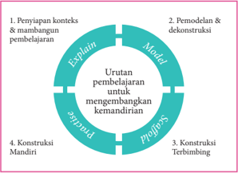

> **Deskripsi Visual:** Gambar ini adalah diagram yang menunjukkan proses pembelajaran berbasis konstruktivisme. Diagram ini terdiri dari empat langkah utama yang disusun dalam bentuk lingkaran:

1. **Penyiapan konteks & mampu pembelajaran** - Langkah pertama yang melibatkan penyiapan situasi belajar yang relevan dengan tujuan pembelajaran.

2. **Pemodelan & dekonstruksi** - Langkah kedua yang melibatkan pemodelan konsep dasar dan dekonstruksinya untuk memahami konsep tersebut lebih dalam.

3. **Konstruksi Terbimbung** - Langkah ketiga yang melibatkan pembentukan konsep baru melalui pengalaman dan penggunaan teknologi.

4. **Konstruksi Mandiri** - Langkah terakhir yang melibatkan pembelajar mengaplikasikan konsep yang telah dibentuk ke dalam situasi nyata.

Elemen-elemen utama dalam diagram ini adalah empat langkah pembelajaran yang disusun dalam lingkaran. Setiap langkah memiliki teks yang menjelaskan fungsinya. Teks penting yang terlihat adalah "Explain", "Model", "Practice", dan "Apply". Angka-angka tidak ada dalam diagram ini.

Informasi kunci yang dapat diambil pembaca adalah bahwa proses pembelajaran berbasis konstruktivisme melibatkan langkah-langkah yang sistematis dan bertahap, mulai dari penyiapan konteks, kemudian pemodelan dan dekonstruksi, hingga konstruksi mandiri.

 

---
## 📄 Halaman 11

Dalam pedagogi genre, makna perancah ( scaffolding )  menempel pada proses belajar  mengajar.  Dalam  teori  Belajar  Sosial  Vygotsky  ditekankan  'kolaborasi interaktif antara guru  dan  siswa, guru  mengambil  peran  otoritatif  untuk menaikkan jenjang ( to scaffold ) performansi potensial peserta didik' . Konsep Zone of Proximal Development Vygotsky menjelaskan bahwa belajar terjadi dalam suatu konteks  sosial  percakapan  dan  keterampilan  berpikir  dan  hanya  dapat  terjadi melampaui Zone  of  Actual  Development individual.  Menurut  Vygotsky    belajar terjadi hanya dalam Zone of Proximinal (potential) Development .  Dukungan dapat dikonseptualisasikan sebagai suatu situasi anak mencapai keberhasilan suatu tugas di bawah bimbingan, dukungan yang secara bertahap dihilangkan saat peserta didik mampu melaksanakan tugas secara mandiri.

Proses utama belajar mengajar pedagogi genre dikenal sebagai siklus belajar mengajar  yang  terdiri  atas  empat  tahap,  yaitu: Building  Knowledge  of  Field, Modelling  of  Text,  Joint  Construction  of  Text,  and  Independent  Construction of  Text .  Dalam Building  Knowledge  of  Field ,  peserta  didik  dipajankan  kepada pembahasan  atau  kegiatan  yang  membantu  peserta  didik  memaknai  konteks situasional  dan  kultural  genre  yang  sedang  dipelajari. Modelling  of  Text ,  fokus pada analisis teks, yang menarik perhatian peserta didik untuk mengidentifikasi tujuan dan struktur generik (skematik) dan fitur bahasa teks. Joint Construction , guru  dan  peserta  didik  membangun  teks  bersama-sama.  Guru  sebagai  penulis atau  pengarang,  menulis  kontribusi  peserta  didik  di  papan  tulis.  Guru  juga mungkin  harus  memperbaiki  kalimat  peserta  didik  agar  lebih  tepat.  Guru melatih  subketerampilan    yang  dibutuhkan.  Jika  peserta  didik  cukup  percaya diri, akan bergerak menuju Independent Construction , dan peserta didik menulis tulisan mereka sendiri berdasarkan pemahaman, pengalaman, dan penalarannya sehingga menghindari plagiasi atau mengakui karya orang lain sebagai karyanya.

---
**🖼️ Gambar/Diagram**

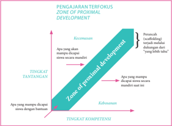

> **Deskripsi Visual:** Gambar ini adalah diagram yang menunjukkan konsep pengajaran efektif dalam konteks Zona Proximal Development (ZPD). Diagram ini terdiri dari dua tingkat: Tingkat Tantangan dan Tingkat Kompetensi. Di bagian atas, terdapat zona yang disebut "Zona of Proximal Development" (ZPD), yang merupakan area di mana siswa dapat memahami dan mengerjakan tugas yang lebih kompleks daripada yang mereka bisa lakukan sendiri. 

Elemen utama dalam diagram ini meliputi:
1. Zona of Proximal Development (ZPD) yang berada di tengah-tengah diagram.
2. Tingkat Tantangan yang terletak di bawah ZPD.
3. Tingkat Kompetensi yang terletak di atas ZPD.

Teks, angka, atau label penting yang terlihat dalam diagram ini adalah:
- "Zona of proximal development" yang terletak di tengah-tengah diagram.
- "Tingkat Tantangan" yang terletak di bawah ZPD.
- "Tingkat Kompetensi" yang terletak di atas ZPD.

Informasi kunci yang dapat diambil pembaca dari gambar ini adalah bahwa Zona of Proximal Development adalah area di mana siswa dapat belajar dan mengembangkan kemampuan mereka dengan bantuan guru atau mentor. Siswa harus mencapai tingkat kompetensi mereka sendiri untuk menguasai materi tersebut.

 

---
## 📄 Halaman 12

### Lingkup Materi Mata Pelajaran Bahasa Indonesia Kelas I-XII

Lingkup  materi  mata  pelajaran  Bahasa  Indonesia  merupakan  penjabaran  3 aspek: bahasa, sastra, dan literasi. Lingkup aspek bahasa mencakup pengenalan variasi bahasa sebagai bagian dari masyarakat Indonesia yang multilingual. Pada kelas  awal  (kelas  I-III)  penggunaan  bahasa  daerah  dianjurkan  digunakan  guru saat menjelaskan kata dan konsep tertentu. Aspek bahasa yang berikutnya adalah bahasa  untuk  interaksi .  Peserta  didik  belajar  bahwa  bahasa  yang  digunakan seseorang berbeda sesuai latar sosial dan hubungan sosial peserta komunikasi. Aksen, gaya bahasa, penggunaan idiom merupakan bagian dari identitas sosial dan personal. Aspek bahasa juga membelajarkan struktur dan organisasi teks . Peserta didik belajar bagaimana teks terstruktur untuk tujuan tertentu; bagaimana bahasa digunakan untuk menciptakan teks agar kohesif dan koheren; bagaimana teks  semakin  khusus  dan  topik  semakin  kompleks  dalam  pola  dan  ciri-ciri kebahasaannya; bagaimana penulis membimbing pembaca atau pemirsa melalui teks yang menggunakan kata, kalimat, dan paragraf secara efektif.

Ruang lingkup sastra mencakup pembahasan konteks sastra, tanggapan terhadap karya sastra, menilai karya sastra, dan menciptakan karya sastra. Pengenalan konteks sastra dapat  berupa peristiwa dalam sastra yang diambil dari dan dibentuk oleh faktor sejarah, sosial, dan konteks budaya. Menanggapi karya sastra merupakan kegiatan mengidentifikasi gagasan, pengalaman, dan pendapat  dalam karya sastra dan  mendiskusikannya. Menilai karya sastra merupakan  kegiatan  menjelaskan dan menganalisis isi karya sastra dan cara pengarang menyajikan karyanya. Peserta didik  memahami,  menafsirkan,  mendiskusikan,  dan  mengevaluasi  gaya  khas pengarang dalam menggunakan bahasa dan cara penceritaan. Menciptakan karya sastra adalah  kegiatan  akumulasi  dari  pemahaman,  penanggapan,  dan  penilaian sehingga peserta didik mendapatkan gambaran utuh bagaimana karya sastra dibuat dan mencoba membuat karya sastra sendiri.

Ruang  lingkup  literasi  mencakup  teks  dalam  konteks,  berinteraksi  dengan orang lain, menafsirkan, menganalisis, dan mengevaluasi teks. Peserta didik belajar bahwa teks dari suatu budaya atau masa tertentu menunjukkan cara berbeda dalam mengungkapkan (menceritakan, menginformasikan, memengaruhi). Berinterksi dengan  orang  lain    adalah  belajar  bagaimana  penggunaan  pola  bahasa  untuk mengungkapkan  gagasan  dan  mengembangkan  konsep  serta  mempertahankan argumen.  Peserta  didik  belajar  menghasilkan  wacana  melalui  perancangan, latihan, dan menyajikan (lisan atau tulisan) secara tepat (pemilihan kata, urutan penyajian, dan unsur multimodal). Penafsiran, penganalisisan, dan pengevaluasian adalah  bagaimana  peserta  didik  belajar  memahami  apa  yang  mereka  baca  dan pirsa  melalui  penerapan  pengetahuan  kontekstual,  semantik,  dan  gramatika. Peserta didik mengkaji cara konvensi yang disajikan dan bagaimana dampak bagi pembaca dan pemirsa. Setelah itu, peserta didik menerapkan pengetahuan yang dikembangkan untuk menciptakan teks mereka sendiri.

 

---
## 📄 Halaman 13

---
**📊 Tabel**

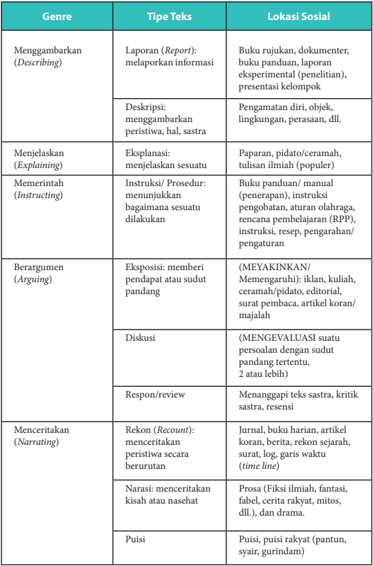

Tabel ini membahas berbagai genre teks dan jenis teks yang mereka termasuk, serta lokasi sosial di mana mereka umumnya diterbitkan. Topik utama tabel adalah genre teks dan jenis teks yang mereka termasuk, serta lokasi sosial di mana mereka umumnya diterbitkan. Kolom-kolom yang ada meliputi Genre, Tipe Teks, dan Lokasi Sosial. Data penting yang terlihat adalah bahwa genre teks meliputi Menggambarkan (Describing), Menjelaskan (Explaining), Memerintah (Instructing), Berargument (Arguing), Menceritakan (Narrating), dan Puisi. Jenis teks meliputi Laporan (Report), Deskripsi, Eksplosions, Instruksi/Prosedur, Eksposisi, Diskusi, Respon/review, Rekon (Recount), Narasi, dan Puisi. Lokasi sosial meliputi Buku rujukan, dokumen, buku panduan, laporan eksperimental, presentasi kelompok, Pengamatan diri, objek, lingkungan, perasaan, dll.

 

---
## 📄 Halaman 14

### D. Pembelajaran Bahasa Indonesia Kelas X

Konsep  utama  pengembangan  buku  teks  berdasarkan  pada  cara  pandang tentang  fungsi  bahasa  sebagai  kegiatan  manusia  pada  umumnya.  Kegiatan  ini memiliki kekhasan cara pengungkapan dan kebahasaannya. Inilah cara pandang baru tentang bahasa. Bahasa dan Isi menjadi dua hal yang saling menunjang. Ini sejalan  dengan  perkembangan  teori  pengajaran  bahasa  di  Eropa  dan  Amerika, Content  Language  Integrated  Learning yang  menonjolkan  empat  unsur  penting sebagai penajaman pengertian kompetensi berbahasa, yaitu isi ( content ), bahasa/ komunikasi ( communication ), kognisi ( cognition ), dan budaya ( culture ).

Pembelajaran bahasa Indonesia menggunakan genre pedagogi. Model pembelajaran  bahasa  berbasis  genre  mencakup  empat    prosedur  utama,  yaitu sebagai berikut.

- Penentuan  konteks  teks  dan  membangun  pengetahuan  tentang  teks  yang akan dipelajari.
- Pemodelan dan dekonstruksi.
- Konstruksi siswa yang dibantu guru dalam berbagai latihan dan tugas hingga menyusun teks sasaran ( joint construction ).
- Tugas  dan  latihan  teks  sasaran  secara  mandiri  yang  minim  bantuan  guru ( independent  construction ).  Prosedur  ini  diwadahi  dalam  buku  teks  yang memiliki empat bagian, yaitu:
- membangun konteks;
- pemodelan dan dekonstruksi;
- prakonstruksi;
- konstruksi.
- Kegiatan  dalam  setiap  prosedur  diharapkan  bervariasi  dan  sesuai  dengan jenis teks yang dipelajari.
Istilah  konstruksi  bermakna  proses  menyusun  atau  menciptakan  hingga menjadi produk kompetensi. Dekonstruksi yang dimaksud adalah peserta didik dibekali  dengan  kompetensi  pengetahuan  dan  pemahaman  tentang  bagaimana menyusun  atau  menciptakan  teks.  Bagian  dekonstruksi  berupa  pemberian informasi tentang teks yang akan dipelajari dan mencermati model teks. Seperti halnya, seseorang akan membuat mobil maka dibekali dengan pengetahuan dan pemahaman tentang mobil, termasuk struktur (kerangka dasar) mobil, cara kerja mesin mobil, dan lain-lain.

Kegiatan  menelaah  model  merupakan  kegiatan  menalar,  seperti  halnya mengamati semua hal tentang mobil. Model teks dapat diambil dari penggunaan autentik dari media massa (cetak dan elektronik) atau penggunaan di masyarakat

 

---
## 📄 Halaman 15

yang tidak terpublikasi. Model teks juga dapat dikembangkan oleh penulis. Pada kegiatan  ini,  pendekatan  saintifik  dapat  diterapkan  untuk  mendekonstruksi model teks. Model teks dapat diberikan lebih dari satu, termasuk untuk latihan menelaah model.

Setelah  itu  disebut  prakonstruksi,  yaitu  mencoba  merakit  kembali  bagianbagian mobil yang sudah dipilah-pilah. Setelah berhasil maka langkah berikutnya  adalah  membuat  mobil.  Peran  guru  dalam  kegiatan  dekonstruksi dan prakonstruksi sangat dibutuhkan. Pendekatan saintifik bukan membiarkan siswa  mencari  sendiri  tanpa  bekal  dan  bimbingan. Joint  construction bukanlah kerja bersama atau kerja kelompok namun guru membimbing siswa agar mampu menyusun sendiri. Ibarat sebelum bermain sepakbola, guru melatih siswa berlari, membawa  bola,  atau  menendang  bola.  Kompetensi  berbahasa  membutuhkan latihan menggunakan kata dan menyusun kalimat yang khas untuk teks tertentu. Inilah yang dilakukan dalam tahap prakonstruksi. Bahkan pada tahap konstruksi, siswa tetap dalam bimbingan guru.

Bagian akhir (konstruksi) adalah berisi panduan, tugas, dan latihan menyusun teks secara mandiri. Guru sebagai fasilitator. Tugas dan latihan yang autentik dan menarik. Panduan penilaian untuk self assessment sebaiknya juga disajikan dalam buku, bersifat opsional.

---
**🖼️ Gambar/Diagram**

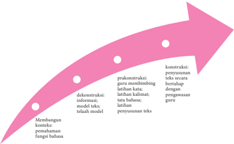

> **Deskripsi Visual:** Gambar ini adalah diagram yang menunjukkan proses pembelajaran konstruktivisme dalam pembelajaran bahasa. Diagram ini terdiri dari dua bagian utama: bagian atas berisi konteks pembelajaran dan bagian bawah berisi proses pembelajaran.

Pertama, bagian atas menggambarkan konteks pembelajaran dengan tiga titik putih yang masing-masing menunjukkan tahap-tahap pembelajaran. Pertama, ada titik putih yang menunjukkan "Membangun konstruksi pemahaman fungsi bahasa". Kedua, ada titik putih yang menunjukkan "prakonstruksi: guru membingungkan latihan kreatif; model latih teliah model". Ketiga, ada titik putih yang menunjukkan "dekonstruksi: informasi; model latih teliah model".

Bagian bawah diagram ini menunjukkan proses pembelajaran dengan empat titik putih yang masing-masing menunjukkan tahap-tahap pembelajaran. Pertama, ada titik putih yang menunjukkan "konstruksi: informasi teks secara bertahan; pengawasan guru". Kedua, ada titik putih yang menunjukkan "konstruksi: informasi teks secara bertahan; pengawasan guru". Ketiga, ada titik putih yang menunjukkan "konstruksi: informasi teks secara bertahan; pengawasan guru". Keempat, ada titik putih yang menunjukkan "konstruksi: informasi teks secara bertahan; pengawasan guru".

Teks, angka, atau label penting yang terlihat dalam diagram ini adalah "Membangun konstruksi pemahaman fungsi bahasa", "prakonstruksi: guru membingungkan latihan kreatif; model latih teliah model", "dekonstruksi: informasi; model latih teliah model", "konstruksi: informasi teks secara bertahan; pengawasan guru".

Informasi kunci yang dapat diambil pembaca dari gambar ini adalah bahwa proses pembelajaran konstruktivisme melibatkan pembelajaran yang aktif dan interaktif, dimana siswa belajar melalui pengalaman

 

---
## 📄 Halaman 16

### Daftar Isi

 

---
## 📄 Halaman 18

' ' YANG MELONTARKAN ORANG-ORANG KRITIK BAGI KITA PADA HAKIKATNYA ADALAH PENGAWAL JIWA KITA, YANG BEKERJA TANPA BAYARAN.

Corrie Ten Boom pejuang dan penulis dari Belanda

---
**🖼️ Gambar/Diagram**

> **Deskripsi Visual:** Gambar ini adalah ilustrasi yang menampilkan seorang anak laki-laki dengan rambut merah muda dan pakaian berwarna orange dengan garis putih. Anak tersebut sedang tersenyum lebar dan mengangkat tangan kanannya ke atas. Di bawah gambar tersebut, terdapat teks "dan penulis" yang ditulis dalam bahasa Indonesia.

1. Gambar ini menampilkan seorang anak laki-laki yang sedang tersenyum lebar dan mengangkat tangan kanannya ke atas.
2. Elemen utama dalam gambar ini adalah anak laki-laki yang sedang tersenyum lebar dan mengangkat tangan kanannya ke atas. Relasi antara elemen-elemen ini adalah bahwa anak tersebut adalah penulis yang sedang menulis atau menulis sebuah buku.
3. Teks "dan penulis" yang ada di bawah gambar tersebut merupakan informasi penting yang dapat diambil pembaca. Ini menunjukkan bahwa anak tersebut adalah penulis buku.
4. Informasi kunci yang dapat diambil pembaca adalah bahwa anak tersebut adalah penulis buku dan sedang menulis atau menulis sebuah buku.

 

---
## 📄 Halaman 19

### Pengembangan Literasi Kelas X

---
**🖼️ Gambar/Diagram**

> **Deskripsi Visual:** Gambar ini menunjukkan sebuah ruang perpustakaan yang penuh dengan buku-buku. Dalam ruangan tersebut, terdapat beberapa buku yang terbuka, menunjukkan bahwa mereka sedang digunakan atau dibaca. Buku-buku lainnya tampak disusun rapi di rak-rak yang berdiri tegak. Buku-buku yang terbuka tampak lebih besar dan lebih jelas dibandingkan dengan buku-buku yang terletak di belakangnya. Ini menunjukkan bahwa pembaca mungkin sedang memperhatikan atau membaca buku tersebut. 

Elemen-elemen utama dalam gambar ini adalah buku-buku, rak-rak, dan ruangan perpustakaan. Buku-buku merupakan elemen utama karena mereka adalah objek utama dalam gambar. Rak-rak dan ruangan perpustakaan juga penting karena mereka memberikan konteks dan latar belakang untuk buku-buku tersebut.

Teks, angka, atau label penting tidak terlihat dalam gambar ini. Namun, informasi kunci yang dapat diambil pembaca adalah bahwa ada banyak buku di perpustakaan dan mereka tampak disusun rapi. Ini menunjukkan bahwa perpustakaan tersebut mungkin memiliki koleksi yang besar dan disimpan dengan baik.

Kegiatan membaca dan menulis (Literasi) merupakan salah satu aktivitas penting dalam kehidupan. Sebagian besar proses pendidikan bergantung pada kemampuan dan kesadaran literasi. Budaya literasi yang tertanam dengan baik akan memengaruhi keberhasilan seseorang dalam menyelesaikan pendidikan dan mencapai keberhasilan dalam kehidupan bermasyarakat.

Dari  manakah  pengetahuan  didapat?  Dari  melihat  dan  mendengar?  Apakah cukup?  Kamu  pasti  bersepakat  bahwa  sumber  pengetahuan  paling  banyak  dan mendalam adalah buku, baik  buku  cetak  maupun  buku  elektronik  ( e-book ).  Oleh karena itu, keterampilan membaca menjadi keterampilan yang sangat penting untuk dikembangkan dan dikembangkan menjadi budaya, bahkan kebutuhan setiap orang.

 

---
## 📄 Halaman 20

Selain membaca, keterampilan lain yang juga tak kalah penting untuk dilatih dan dibudayakan adalah menulis. Cobalah kamu renungkan, adakah pekerjaan di  dunia  ini  yang  tidak  membutuhkan kegiatan tulis  menulis? Ternyata, dalam kehidupan  modern,  menulis  sudah  menjadi  bagian  yang  tak  terpisahkan  dari setiap aktivitas manusia.

Mengingat  pentingnya  penguasaan  kedua  keterampilan  tersebut,  dalam pembelajaran  bahasa  Indonesia    kamu  akan  diajak  membudayakan  membaca dan  menulis.  Kegiatan  yang  harus  kamu  lakukan  adalah  membaca  buku  dan melaporkan hasilnya pada setiap akhir semester.

Di kelas X, buku yang kamu baca harus mencakup buku fiksi dan nonfiksi. Buku fiksi yang dimaksud dapat berwujud kumpulan cerita rakyat (dongeng atau hikayat),  kumpulan puisi, dan novel; sedangkan buku nonfiksi yang kamu baca dapat berupa buku-buku motivasi, keagamaan, teknologi, seni, sejarah, biografi, dan  sebagainya.  Penyerahan  laporan  hasil  membaca  buku  pada  semester  gasal dapat kamu lakukan sejak  akhir pembelajaran Bab 3 hingga akhir pembelajaran Bab  4,  sedangkan  pada  semester  genap  dapat  kamu  lakukan    sejak  akhir pembelajaran Bab7 hingga akhir pembelajaran Bab 8.

Projek membaca buku ini dilaporkan  sebagai tugas mandiri. Agar projek ini tidak menjadi beban yang memberatkan, kamu dapat mulai membaca buku lebih awal. Jangan membaca buku pada waktu-waktu menjelang pengumpulan laporan karena hal itu akan membuat kegiatan membaca buku menjadi beban dan tidak menyenangkan.

Sebelumnya, pelajarilah bagaimana cara membaca buku yang baik berikut ini. Lakukanlah kegiatan membacamu dengan mengikuti langkah-langkah berikut ini.

- Carilah buku nonfiksi (buku pengayaan) di perpustakaan. Buku yang kamu baca bukan buku teks pelajaran. Konsultasikan pada gurumu apakah buku yang kamu pilih ayak dan boleh kamu baca.
- Jika memiliki cukup uang, kamu dapat membeli buku pengayaan yang kamu sukai. Konsultasikanlah lebih dahulu buku yang akan kamu beli pada gurumu.
- Agar kegiatan membacamu tidak menyita waktu belajar dan bermainmu, kamu dapat membaca buku tersebut dalam beberapa hari atau beberapa minggu.
- Tidak ada ketentuan  jumlah halaman yang harus kamu baca setiap harinya. Sesuaikan dengan kelonggaran waktu, kecepatan baca, dan kemampuanmu memahami isi buku yang kamu baca.
- Persiapkan buku tulismu untuk membuat catatan harian hasil kegiatan membacamu. Lakukan kegiatan prabaca dengan membaca  (a) judul, (b) kata pengantar, dan (c) daftar isi; kemudian buatlah pertanyaan yang ingin kamu peroleh jawabannya dari buku yang akan kamu baca tersebut. Pertanyaan-pertanyaan tersebut sesungguhnya adalah informasi yang ingin kamu peroleh, yang menjadi alasan kenapa kamu membaca buku tersebut.

 

---
## 📄 Halaman 21

Kegiatan ini disebut kegiatan prabaca. Buatlah laporan kegiatan prabaca Perhatikan contoh berikut ini.

### a. Laporan Kegiatan Prabaca

Judul buku

Pengarang

Penerbit, tahun terbit

Jenis buku

Tebal buku

:   Kumpulan Kisah Inspiratif & Tips Meraih Beasiswa, dari Penerima  Beasiswa Seluruh Dunia

:   Tony Dwi Susanto, Ph.D.

:   Media Mandiri, 2012

:   Nonfiksi (buku motivasi)

:   xiii + 201

---
**📊 Tabel**

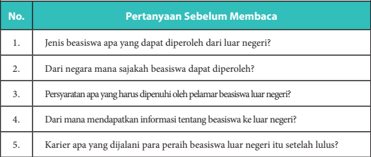

Tabel ini berisi pertanyaan sebelum membaca tentang beasiswa ke luar negeri. Topik utamanya adalah informasi tentang beasiswa, seperti jenis beasiswa yang dapat diperoleh, negara mana saja yang menerima beasiswa, persyaratan yang harus dipenuhi, cara mendapatkan informasi tentang beasiswa, dan karier para peraih beasiswa setelah lulus. Kolom-kolomnya mencakup nomor pertanyaan, pertanyaan sebelum membaca, dan topik utama. Data penting yang terlihat adalah bahwa tabel ini mencakup berbagai aspek tentang beasiswa ke luar negeri, mulai dari jenis beasiswa hingga persyaratan yang harus dipenuhi.

- Bacalah bukumu setiap hari minimal 15 menit, boleh lebih. Sesuaikan dengan kelonggaran waktu, kecepatan membaca, dan kemampuan kamu memahami isi bacaan.
- Buatlah catatan hasil membacamu tiap hari. Perhatikan contoh berikut ini.

 

---
## 📄 Halaman 22

### b. Laporan Harian Kegiatan Membaca

---
**📊 Tabel**

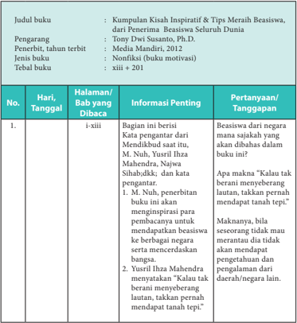

Tabel ini berisi informasi tentang sebuah buku pelajaran yang berfokus pada kisah inspiratif dan tips meraih beasiswa. Topik utama tabel adalah pembahasan kisah-kisah inspiratif dari penerima beasiswa di seluruh dunia, ditulis oleh Tony Dwi Susanto, Ph.D., dan diterbitkan oleh Media Mandiri tahun 2012. Buku ini merupakan buku motivasi dengan jumlah halaman sebanyak 201 halaman. Tabel ini membagi informasi menjadi kolom-kolom yang mencakup judul buku, pengarang, penerbit, tahun terbit, jenis buku, tebal buku, dan informasi penting tentang setiap bab yang dibaca. Informasi penting tersebut meliputi judul bab, informasi penting yang disampaikan dalam bab tersebut, dan pertanyaan atau tanggapan yang relevan dengan konteks bab tersebut.

 

---
## 📄 Halaman 23

- Najwa Shihab: Buku ini membagi tips tentang bagaimana cara mendapatkan beasiswa ke berbagai negara dengan berbagai latar belakang profesi.
- Dalam kata pengantar disebutkan bahwa selain untuk berbagi tips dan pengalaman mendapatkan beasiswa dari berbagai belahan dunia, buku ini juga akan dijadikan donasi ke sekolah/ pesantren/ panti asuhan.
2.

3.

dst

Jakarta, 13 Agustus 2016

Mengetahui

Orangtua /Wali

Guru Bahasa Indonesia

(tanda tangan dan nama)

(tanda tangan dan nama)

- Jika  kamu  sudah  selesai  membaca  buku,  susunlah  laporan  kegiatan  tersebut dalam buku rekaman tertulis kegiatan membaca. Untuk membantu kamu melaporkan kegiatan membaca, berikut ini contoh format yang dapat kamu buat.

 

---
## 📄 Halaman 24

### c. Laporan Harian Kegiatan Membaca

Judul buku

Pengarang

Penerbit, tahun terbit

Jenis buku

Tebal buku

:   Kumpulan Kisah Inspiratif & Tips Meraih Beasiswa, dari Penerima  Beasiswa Seluruh Dunia

:   Tony Dwi Susanto, Ph.D.

:   Media Mandiri, 2012

:   Nonfiksi (buku motivasi)

:   xiii + 201

---
**📊 Tabel**

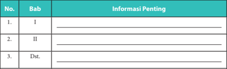

Tabel ini menunjukkan informasi penting tentang bab-bab dalam sebuah buku pelajaran. Kolom "No." berisi nomor urut dari bab, kolom "Bab" berisi nama-nama bab, dan kolom "Informasi Penting" berisi deskripsi atau penjelasan yang relevan dengan setiap bab. Topik utama tabel ini adalah pembagian materi pelajaran menjadi beberapa bab, dengan setiap bab memiliki informasi penting yang perlu diperhatikan oleh pembaca. Data atau pola penting yang terlihat adalah bahwa setiap bab memiliki nomor urut yang jelas dan informasi penting yang disediakan untuk membantu pemahaman lebih baik tentang materi yang akan dijelaskan dalam bab tersebut.

Komentar terhadap isi buku

Setelah membaca buku ini saya sangat ingin mendapatkan beasiswa ke luar negeri. Oleh karena itu saya akan belajar giat dan akan meningkatkan kemampuan saya berbahasa Inggris.

Jakarta, 13 Agustus 2016

Orangtua /Wali

(tanda tangan dan nama)

### Catatan:

Untuk buku fiksi (novel, kumpulan cerita rakyat, kumpulan cerpen, kumpulan puisi, atau drama, dan biografi, kolom komentar terhadap isi buku dapat diganti dengan nilai-nilai/ karakter unggul yang dapat diteladani.

Mengetahui

Guru Bahasa Indonesia

(tanda tangan dan nama)

 

---
## 📄 Halaman 25

### Bab I

### MENYUSUN LAPORAN HASIL OBSERVASI

---
**🖼️ Gambar/Diagram**

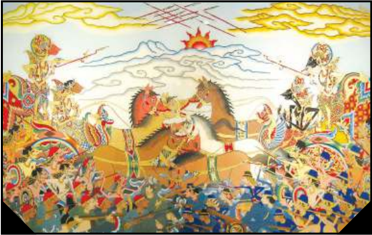

> **Deskripsi Visual:** Gambar ini adalah ilustrasi yang menunjukkan pertempuran antara dua pasukan. Gambar ini menggambarkan dua pasukan besar yang sedang berperang dengan senjata dan kuda mereka. Pasukan pertama terdiri dari beberapa pria yang sedang berlari dan menggunakan senjata api, sementara pasukan kedua terdiri dari beberapa pria yang sedang berlari dan menggunakan senjata tradisional. Kedua pasukan tersebut tampaknya sedang bergerak menuju arah yang sama. Di atas mereka, terlihat matahari yang sedang terbit, yang menunjukkan bahwa pertempuran ini terjadi pada waktu siang hari. Selain itu, terdapat beberapa elemen lain seperti awan, bintang, dan pohon yang juga terlihat dalam gambar ini.

---
**📊 Tabel**

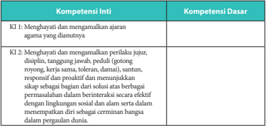

Tabel ini berisi dua kolom utama: Kompetensi Inti (KI) dan Kompetensi Dasar (KD). Topik utama tabel adalah tentang bagaimana menghargai dan mengamalkan ajaran agama yang dianutnya. Dalam kolom KI, terdapat dua kompetensi inti yang disebutkan: menghargai dan mengamalkan ajaran agama yang dianutnya, serta menghargai dan mengamalkan perilaku jujur, disiplin, tanggung jawab, peduli (gotong royong), kerja sama, toleran, damai, santun, responsif, dan proaktif. Sedangkan dalam kolom KD, terdapat satu kompetensi dasar yang disebutkan: sebagai bagian dari solusi atas berbagai permasalahan dalam interaksi berbasis etika dengan orang lain dan dalam menempuh diri untuk mencapai kemajuan dalam pergaulan dunia. Pola penting yang terlihat adalah bahwa tabel ini mencakup dua aspek utama dari pengembangan karakter, yaitu menghargai dan mengamalkan ajaran agama dan menghargai dan mengamalkan perilaku yang positif dalam berbagai situasi kehidupan.

 

---
## 📄 Halaman 26

---
**📊 Tabel**

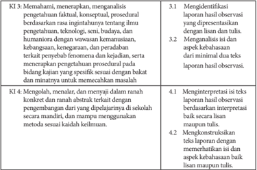

Tabel ini berisi informasi tentang keterampilan dan pengetahuan yang diharapkan siswa untuk mengevaluasi laporan hasil observasi. Topik utama tabel adalah pengetahuan dan keterampilan dalam mengevaluasi laporan hasil observasi. Kolom-kolomnya mencakup empat kategori utama: K3: Menahami, meraporkan, analisis pengetahuan faktil, konseptual, prosedural; K4: Mengolah, menalar, menyajikan dalam ranah konkret dan ranah abstrak; dan dua subkolom untuk setiap kategori. Data penting yang terlihat meliputi identifikasi laporan hasil observasi, analisis kebaikan dari laporan, interpretasi teks laporan, dan konstruksi teks dengan memperhatikan aspek kebaikan. Tabel ini membantu siswa memahami bagaimana mengevaluasi laporan hasil observasi dengan baik.

---
**🖼️ Gambar/Diagram**

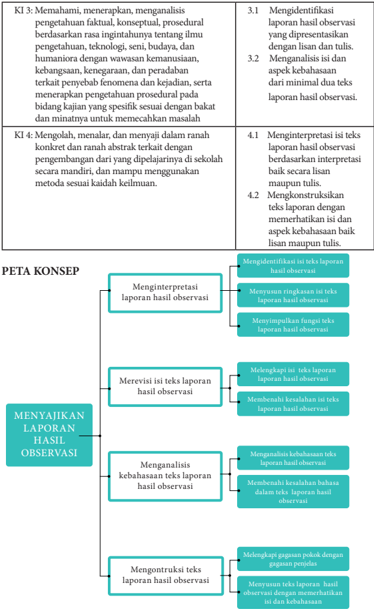

> **Deskripsi Visual:** Gambar ini adalah diagram yang menunjukkan proses penulisan laporan hasil observasi. Diagram ini terdiri dari dua bagian utama: KI (Kompetensi Integritas) dan PETA KONSEP.

1. **Apa yang Ditampilkan Secara Keseluruhan**: Gambar ini menggambarkan proses penulisan laporan hasil observasi dalam dua dimensi: KI (Kompetensi Integritas) dan PETA KONSEP. KI mencakup empat kompetensi, sedangkan PETA KONSEP menunjukkan langkah-langkah yang harus dilalui untuk menulis laporan hasil observasi.

2. **Elemen-Elemen Utama dan Relasinya**: 
   - **KOMPETENSI INTIGRITAS (KI)**: Terdiri dari empat kompetensi, yaitu:
     1. Memahami, menerapkan, dan analisis pengenalan fakta, konseptual, dan prosedural berdasarkan ragam intiannya tentang ilmu pengetahuan, teknologi, seni, budaya, dan humaniora dengan wawasan kemanusiaan, kebangsaan, keterampilan, dan peradaban.
     2. Mengidentifikasi laporan hasil observasi yang dipresentasikan dengan lisan dan tulis, serta menganalisis isinya dan aspek kebahasaan dari minimal dua laporan hasil observasi.
     3. Menginterpretasi isi teks laporan hasil observasi baik secara lisan maupun tulis.
     4. Mengkonstruksi teks laporan dengan menggunakan metodika sesuai kaidah keilmuan.
   - **PETA KONSEP**: Menyajikan langkah-langkah yang harus dilalui untuk menulis laporan hasil observasi, yang meliputi:
     1. Menginterpretasi laporan hasil observasi.
     2. Mererevisi isi teks laporan hasil observasi.
     3. Menganalisis kebahasaan teks laporan hasil observasi.
     4. Mengontruksi teks laporan hasil observasi.

3. **Teks, Angka, atau Label Penting yang Terlihat**: 
   - **Teks Penting**: "KI", "PETA KONSE

 

---
## 📄 Halaman 27

### A. Menginterpretasi Laporan Hasil Observasi

Ind 1

Mengidentifikasi isi teks laporan hasil observasi.

Ind 2 Menyusun ringkasan isi pokok teks laporan hasil observasi.

Ind 3

Menyimpulkan fungsi teks laporan hasil observasi.

### PROSES PEMBELAJARAN A KEGIATAN 1

### Mengidentifikasi Isi Teks Laporan Hasil Observasi

### Petunjuk untuk Guru

Guru dapat melakukan apersepsi dengan cara mengajukan berberapa pertanyaan kepada siswa untuk mengetahui pengetahuan awal siswa tentang laporan hasil observasi. Beberapa pertanyaan yang bisa diajukan antara lain sebagai berikut.

- Apakah kalian pernah melakukan pengamatan atau observasi?
- Pernahkah kalian membuat laporan hasil pengamatan atau observasi?
- Hal apa sajakah yang kalian cantumkan dalam laporan hasil observasi?
Setelah menyampaikan materi dan indikator apa yang akan dipelajari, guru memberikan pemodelan teks laporan hasil observasi. Guru dapat menayangkan video teks laporan hasil observasi dari televisi, internet atau sumber lainnya. Namun, bila fasilitas sekolah tidak memadai, guru dapat menggunakan teks contoh yang telah disediakan dalam buku teks, yaitu teks berjudul Wayang .

Pada kegiatan pemodelan, guru menugaskan siswa untuk melihat tayangan video atau mendengarkan pembacaan langsung teks laporan hasil observasi berjudul Wayang atau teks lainnya (guru dapat memilih teks lain yang lebih sesuai dengan situasi dan latar belakang siswa).

Selanjutnya, secara singkat guru menjelaskan cara menyimak yang baik, antara lain:

- membuat pertanyaan dugaan isi teks yang berjudul Wayang;
- berkonsentrasi penuh;
- mencatat pokok-pokok informasi penting dalam teks;
- memfokuskan pada pencarian jawaban mengapa teks tersebut termasuk teks laporan hasil observasi.

 

---
## 📄 Halaman 28

Berikut adalah teks yang dibacakan guru kepada peserta didik.

### Wayang

Wayang  adalah  seni  pertunjukan  yang  telah  ditetapkan  sebagai  warisan budaya  asli  Indonesia.  UNESCO,  lembaga  yang  mengurusi  kebudayaan  dari PBB, pada 7 November 2003 menetapkan wayang sebagai pertunjukan bayangan boneka tersohor berasal dari Indonesia. Wayang merupakan warisan mahakarya dunia yang tidak ternilai dalam seni bertutur ( Masterpiece of Oral and Intangible Heritage of Humanity ).

Para  wali  songo,  penyebar  agama  Islam  di  Jawa  sudah  membagi  wayang menjadi  tiga.  Wayang  kulit  di  Timur,  wayang wong atau  wayang  orang  di Jawa Tengah, dan wayang golek atau  wayang boneka di Jawa Barat. Penjenisan tersebut  disesuaikan  dengan  penggunaan  bahan  wayang.  Wayang kulit  dibuat dari  kulit  hewan  ternak,  misalnya  kulit  kerbau,  sapi,  atau  kambing.  Wayang wong berarti  wayang  yang  ditampilkan  atau  diperankan  oleh  orang.  Wayang golek adalah wayang yang menggunakan boneka kayu sebagai pemeran tokoh. Selanjutnya, untuk mempertahankan budaya wayang agar tetap dicintai, seniman mengembangkan wayang dengan bahan-bahan lain,  antara  lain  wayang suket dan wayang motekar .

Wayang  kulit  dilihat  dari  umur,  dan  gaya  pertunjukannya  pun  dibagi lagi  menjadi  bermacam  jenis.  Jenis  yang  paling  terkenal,  karena  diperkirakan memiliki  umur  paling  tua  adalah  wayang  purwa. Purwa berasal  dari  bahasa Jawa, yang berarti awal. Wayang ini terbuat dari kulit kerbau yang ditatah, dan diberi  warna  sesuai  kaidah  pulasan  wayang  pendalangan,  serta  diberi  tangkai dari  bahan  tanduk  kerbau  bule  yang  diolah  sedemikian  rupa  dengan  nama cempurit yang terdiri atas tuding dan gapit .

Wayang wong (bahasa Jawa yang berarti 'orang') adalah salah satu pertunjukan wayang yang diperankan langsung oleh orang. Wayang orang yang dikenal di suku Banjar adalah wayang gung, sedangkan yang dikenal di suku Jawa adalah wayang topeng. Wayang topeng dimainkan oleh orang yang menggunakan topeng. Wayang tersebut  dimainkan  dengan  iringan  gamelan  dan  tari-tarian.  Perkembangan wayang orang pun saat ini beragam, tidak hanya digunakan dalam acara ritual, tetapi juga digunakan dalam acara yang bersifat menghibur.

Selanjutnya, jenis wayang yang lain adalah wayang golek yang mempertunjukkan boneka kayu. Wayang golek berasal dari Sunda. Selain wayang golek Sunda, wayang yang terbuat dari kayu adalah wayang menak atau sering juga  disebut  wayang  golek  menak  karena  cirinya  mirip  dengan  wayang  golek. Wayang tersebut kali pertama dikenalkan di Kudus. Selain golek, wayang yang berbahan  dasar  kayu  adalah  wayang  klithik.  Wayang  klithik  berbeda  dengan golek. Wayang tersebut berbentuk pipih seperti wayang kulit. Akan tetapi, cerita yang diangkat adalah cerita Panji dan Damarwulan. Wayang lain yang terbuat dari  kayu  adalah  wayang papak atau cepak, wayang timplong, wayang potehi, wayang golek techno, dan wayang ajen.

 

---
## 📄 Halaman 29

Perkembangan  terbaru  dunia  pewayangan  menghasilkan  kreasi  berupa wayang suket .  Jenis  wayang  ini  disebut suket karena  wayang  yang  digunakan terbuat  dari  rumput  yang  dibentuk  menyerupai  wayang  kulit.  Wayang  suket merupakan tiruan dari berbagai figur wayang kulit yang terbuat dari rumput (bahasa Jawa: suket ). Wayang suket biasanya dibuat sebagai alat permainan atau penyampaian cerita pewayangan kepada anak-anak di desa-desa Jawa.

Dalam  versi  lebih  modern,  terdapat  wayang  motekar  atau  wayang  plastik berwarna. Wayang motekar adalah sejenis pertunjukan teater bayang-bayang atau serupa wayang kulit. Namun, jika wayang kulit memiliki bayangan yang berwarna hitam  saja,  wayang  motekar  menggunakan  teknik  terbaru  hingga  bayangbayangnya bisa tampil dengan warna-warni penuh. Wayang tersebut menggunakan bahan plastik berwarna, sistem pencahayaan teater modern, dan layar khusus.

Semua  jenis  wayang  di  atas  merupakan  wujud  ekspresi  kebudayaan  yang dapat  dimanfaatkan  dalam  berbagai  kehidupan  antara  lain  sebagai  media pendidikan, media informasi, dan media hiburan. Wayang bermanfaat sebagai media pendidikan karena isinya banyak memberikan ajaran kehidupan kepada manusia. Pada era modern ini, wayang juga banyak digunakan sebagai media informasi. Ini antara lain dapat kita lihat pada pagelaran wayang yang disisipi informasi  tentang  program  pembangunan  seperti  keluarga  berencana  (KB), pemilihan umum, dan sebagainya. Yang terakhir, meski semakin jarang, wayang masih tetap menjadi media hiburan.

(Sumber: http://istiqomahalmaky.blogspot.co.id

- Buatlah pertanyaan terkait isi laporan Wayang tersebut, seperti berikut.
- Informasi apa saja yang disampaikan dalam teks tersebut?
- Mengapa wayang ditetapkan sebagai mahakarya dunia?
- Ada berapa jenis wayang berdasarkan  bahan pembuatannya?
- Apa manfaat wayang bagi pengembangan warisan budaya?
- Jawablah pertanyaan-pertanyaan tersebut dengan singkat dan jelas.
- Mengapa teks tersebut digolongkan teks laporan hasil observasi?
- Selanjutnya, presentasikan hasil kerjamu dalam kelompokmu.

 

---
## 📄 Halaman 30

### Contoh Jawaban

Contoh  jawaban  ini  tidak  mengikat.  Artinya,  siswa  dibenarkan  menjawab dengan jawaban berbeda selama substansinya benar.

---
**📊 Tabel**

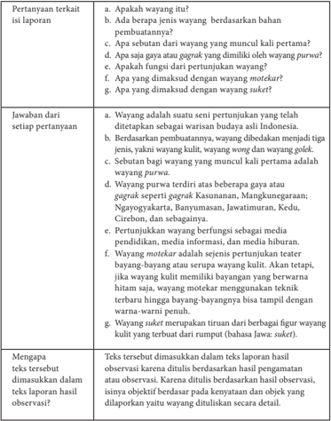

Tabel ini berisi pertanyaan dan jawaban tentang wayang, termasuk definisi, jenis-jenis, sebutan, fungsi, dan hubungan dengan motekar. Topik utama adalah definisi dan karakteristik wayang, termasuk jenis-jenisnya, sebutan, fungsi, dan hubungannya dengan motekar. Kolom pertama adalah pertanyaan, sementara kolom kedua adalah jawaban. Data penting yang terlihat meliputi definisi wayang sebagai pertunjukan asli Indonesia, jenis-jenisnya (kulit, wayang, dan wayang golek), sebutan untuk wayang yang muncul kali pertama, fungsi wayang, dan hubungannya dengan motekar. Selain itu, tabel juga mencakup informasi tentang pertunjukan wayang berfungsinya melalui media, dan definisi wayang siket sebagai tiruan dari wayang kulit.

 

---
## 📄 Halaman 31

### Petunjuk untuk Guru

Setelah  waktu  yang  disediakan  habis,  guru  meminta  salah  satu  kelompok mempresentasikan  hasil  kerjanya.  Kelompok  lain  memberikan  tanggapan,  baik berupa pertanyaan maupun saran.

Dalam  proses  diskusi,  guru  membimbing  siswa    agar  mengeksplorasi  isi  teks laporan hasil observasi sehingga siswa dapat mengetahui ciri laporan hasil observasi dari segi isinya.  Dari segi isi, laporan hasil observasi mempunyai ciri sebagai berikut.

- Bersifat objektif.
- Ditulis berdasarkan fakta yang ditemukan pada saat pengamatan.
- Tidak mengandung hal-hal yang bersifat menyimpang, dugaan-dugaan yang tidak tepat, atau pemihakan terhadap sesuatu.
- Ditulis secara lengkap.

### PROSES PEMBELAJARAN A KEGIATAN 2

### Menyusun Ringkasan Isi Teks Laporan Hasil Observasi

Fokus  pembelajaran  adalah  menyusun  ringkasan  isi  untuk  meningkatkan kemampuan siswa menceritakan kembali  isi teks laporan hasil observasi.

### Petunjuk untuk Guru

Guru dapat memulai pembelajaran dengan menampilkan contoh sebuah paragraf  kemudian menugaskan  siswa membuat ringkasannya. Langkah ini sangat bagus untuk mengetahui secara pasti pemahaman siswa tentang ringkasan dan cara membuat ringkasan yang tepat.

Tanpa  mengomentari  benar  salahnya  hasil  ringkasan  yang  dibuat siswa,  guru  kemudian  mengajukan  pertanyaan,  'Apakah  ringkasan  itu?' , 'Bagaimana cara membuat ringkasan?', dan 'Apa manfaat ringkasan?'

Sebuah ringkasan pada dasarnya merupakan rangkaian  pokok-pokok pikiran  yang  dirangkai  menjadi  satu  dengan  tetap  memerhatikan  urutan isi  bagian  demi  bagian,  dan  sudut  pandang  (pendapat)  pengarang  tetap diperhatikan  dan  dipertahankan.  Untuk  menyusun  sebuah  ringkasan, hal  yang  pertama harus dilakukan adalah membaca pemahaman isi teks, kemudian menemukan pokok-pokok isi informasi di dalamnya.

Pokok-pokok  isi  sebuah  teks  dapat  ditemukan  dengan  menemukan kalimat  utamanya.  Kalimat  utama  adalah  kalimat  yang  di  dalamnya mengandung  pokok  pikiran  atau  gagasan  utama  yang  menjadi  dasar pengembangan sebuah paragraf.

 

---
## 📄 Halaman 32

Gagasan utama  bersifat umum dan dapat merangkum semua isi yang ada dalam sebuah paragraf.

Guru  mengajak  siswa  bersama-sama  mendiskusikan  pokok  penting dalam paragraf pertama teks wayang (Lihat tabel di bawah).

Selanjutnya, guru menugaskan siswa secara berpasangan dengan teman sebangkunya untuk menentukan gagasan pokok tiap-tiap paragraf dalam teks Wayang sebagai berikut.

### Contoh Jawaban

---
**📊 Tabel**

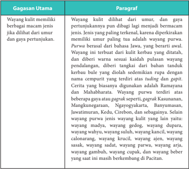

Tabel ini berisi informasi tentang gagasan utama dan paragraf yang membahas tentang wayang kulit. Topik utama tabel adalah tentang sejarah dan karakteristik wayang kulit di Jawa. Kolom pertama berisi gagasan utama, yang mencakup beberapa poin penting seperti asal-usul, karakteristik, dan peran dalam budaya Jawa. Kolom kedua berisi paragraf yang menjelaskan lebih lanjut tentang gagasan tersebut. Data penting yang terlihat meliputi bahwa wayang kulit memiliki sejarah panjang dan berkembang dari umur dan gaya pertunjukan, serta memiliki banyak variasi dan karakteristik unik seperti warna, bentuk, dan cerita yang ditampilkan.

 

---
## 📄 Halaman 33

---
**📊 Tabel**

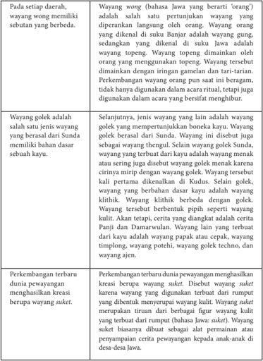

Tabel ini membahas sejarah dan perkembangan pewayangan di Indonesia, dengan fokus pada perbedaan antara wayang golek dan wayang wong. Topik utama tabel adalah perkembangan pewayangan dari era Sunda ke era Jawa, serta perbedaan struktur dan konteks cerita antara dua jenis wayang tersebut. Kolom-kolom utama dalam tabel meliputi:

1. Wayang wong (bahasa Jawa, yang berarti 'orang') adalah salah satu pertunjukan wayang yang diperankan langsung oleh orang. Wayang orang yang dikenal di suku Jawa adalah wayang gending, sedangkan yang dikenal di suku Jawa adalah wayang topeng. Wayang topeng dimainkan oleh orang yang menggunakan topeng. Wayang terbesar dimainkan dengan ingan gamelan dan taro-farian.

2. Wayang golek adalah salah satu jenis wayang yang berasal dari Sunda, memilik bahan dasar sebuh kayu. Selanjutnya, jenis wayang lain adalah wayang golek yang mempertunjukkan boneka kaya. Wayang golek berasal dari Sunda. Wayang ini disebut juga sebagai wayang thengul. Selain wayang golek Sunda, wayang yang terbuat dari kayu adalah wayang menak atau sering jeng disebut wayang golek menak karena cirinya mirip dengan wayang golek. Wayang terbesar kali pertama dikenalkan di Kudus. Selain golek, wayang yang berbahan dasar kayu adalah wayang kling. Wayang ini berbeda dengan golek. Wayang terbuat berbentuk piramida dengan rangka kult. Akti tetapi, cerita yang diangkat adalah cerita Panji dan Damarwulan. Wayang lain yang terbuat dari kayu adalah wayang papak atau cekap, wayang timpolong, wayang potehi, wayang golek techno, dan wayang ajen.

3. Perkembangan terbaru dunia pewayangan menghasilkan kreasi baru wayang suket. Disebut wayang suket karena wayang yang digunakan terbuat dari rumput yang dibentuk menyepati wayang kultif. Wayang suket merupakan tir

 

---
## 📄 Halaman 34

---
**📊 Tabel**

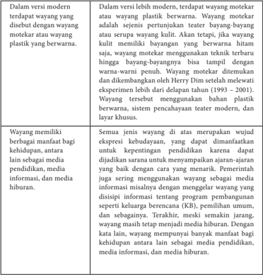

Tabel ini membahas perbandingan antara versi modern dan versi tradisional dari wayang, sebuah seni teater tradisional di Indonesia. Topik utama tabel adalah perubahan teknologi dan penggunaan bahan dalam wayang. Kolom pertama berisi informasi tentang versi modern, sedangkan kolom kedua berisi informasi tentang versi tradisional. Data penting yang terlihat adalah bahwa wayang modern menggunakan teknik teater yang lebih canggih dan dapat menampilkan berbagai bentuk bayangan, sementara versi tradisional hanya bisa menampilkan bayangan hitam. Selain itu, wayang modern menggunakan bahan plastik berwarna untuk membuat wayang, sementara versi tradisional menggunakan wayang kutil. Tabel ini menunjukkan bagaimana teknologi telah mempengaruhi cara penampilan dan penggunaan wayang sebagai media hiburan dan pendidikan.

Setelah menemukan semua gagasan pokok tiap paragraf dalam teks laporan hasil observasi di atas, guru menugasi siswa menggabungkan kalimat-kalimat itu dengan konjungsi yang tepat.

Berikut  ini  contoh  hasil  ringkasan  berdasarkan  gagasan  pokok  yang  telah diidentifikasi. Guru dapat menggunakan contoh ringkasan ini sebagai pembanding ringkasan karya siswa.

 

---
## 📄 Halaman 35

Wayang adalah seni pertunjukan yang telah ditetapkan sebagai warisan  budaya  asli  Indonesia.  Wayang  kulit  dilihat  dari  umur,  dan  gaya pertunjukannya  pun  dibagi  lagi  menjadi  bermacam  jenis  .  Wayang wong adalah salah satu pertunjukan wayang yang diperankan langsung oleh orang. Wayang golek adalah jenis wayang yang mempertunjukkan boneka kayu. Ada juga wayang suket yaitu wayang yang terbuat dari rumput dan wayang motekar atau wayang plastik berwarna. Semua jenis wayang di atas merupakan wujud ekspresi kebudayaan yang dapat dimanfaatkan dalam berbagai   kehidupan antara lain sebagai media pendidikan, media informasi, dan media hiburan.

### Tugas 1

Guru menugasi siswa membaca teks laporan hasil observasi berjudul D'topeng Museum Angkut berikut ini kemudian mengerjakan tugas-tugasnya di akhir teks.

### D'topeng Museum Angkut

---
**🖼️ Gambar/Diagram**

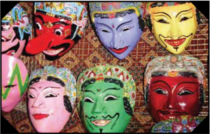

> **Deskripsi Visual:** Gambar ini adalah ilustrasi yang menampilkan berbagai masker tradisional dari berbagai budaya. Gambar ini terdiri dari beberapa elemen utama:

1. **Apa yang Ditampilkan Secara Keseluruhan**: Gambar ini menunjukkan berbagai masker tradisional yang diperkirakan berasal dari berbagai budaya dan negara. Masker-masker ini memiliki warna-warna cerah dan desain yang unik, mencerminkan keunikan budaya masing-masing.

2. **Elemen-Elemen Utama dan Relasinya**: 
   - **Masker**: Berbagai masker tradisional yang berbeda-beda, dengan warna-warna yang cerah dan desain yang unik.
   - **Relasi**: Masker-masker ini disusun secara vertikal, masing-masing masker memiliki posisi yang berbeda untuk menunjukkan variasi dan keunikan budaya.

3. **Teks, Angka, atau Label Penting yang Terlihat**: 
   - **Teks**: Tidak ada teks yang jelas dalam gambar ini, sehingga informasi tertulis tidak dapat dilihat.
   - **Angka**: Tidak ada angka yang jelas dalam gambar ini.
   - **Label**: Tidak ada label yang jelas dalam gambar ini.

4. **Informasi Kunci yang Bisa Diambil Pembaca**: 
   - Gambar ini menunjukkan bahwa masker tradisional memiliki peran penting dalam budaya dan seni dari berbagai negara.
   - Masker-masker ini menunjukkan kekayaan budaya dan keunikan setiap budaya melalui penampilan mereka.

Dengan demikian, gambar ini menggambarkan keunikan dan kekayaan budaya melalui masker tradisional dari berbagai negara.

Sumber: http://indoturs.com/place/mengenal-sejarah-kebudayaan-di-d-topeng-   kingdom-museum-kota-batu/

D'topeng  adalah  salah  satu  tempat  wisata  yang  terletak  di  Kota  Batu,  Jawa Timur.  Keberadaan  D'topeng  tidak  dapat  dipisahkan  dengan  Museum  Angkut karena  kedua  tempat  ini  berada  di  satu  tempat  yang  sama.  Tempat  wisata  ini seringkali  disebut  pula  sebagai  museum  topeng  karena  memang  berisi  topeng dengan berbagai model dan bentuk. Namun, D'topeng tidak hanya berisi topeng, tetapi  juga  berisi  pameran  benda-benda  berupa  barang  tradisional  dan  barang

 

---
## 📄 Halaman 36

antik.  Topeng,  barang  tradisional,  dan  barang  antik  dalam  museum  ini  dapat dikelompokkan  menjadi  lima  jenis  berdasarkan  bahan  pembuatannya,  yaitu berbahan kayu, batu, logam, kain, dan keramik.

Benda paling  diminati  pengunjung  untuk  diamati  dan  paling  mendominasi tempat  ini  adalah  topeng.  Ada  beragam  jenis  topeng  di  museum  ini.  Topengtopeng  tersebut  dapat  dikelompokkan  menjadi  dua  bagian  berdasarkan  bahan dasarnya,  yaitu  yang  berbahan  dasar  kayu  dan  batu.  Topeng  berbahan  kayu sebagian besar berasal dari daerah Bali, Jawa Timur, Jawa Tengah, Yogyakarta, Jakarta, dan Jawa Barat. Sementara itu, topeng yang berbahan batu berasal dari daerah sekitar Sulawesi dan Maluku.

Selain  topeng,  barang-barang  tradisional  juga  dipamerkan  di  D'topeng. Barang-barang tradisional yang mengisi etalase-etalase museum ini adalah senjata tradisional, perhiasan wanita zaman dahulu yang berbahan dasar logam, batikbatik motif lama, dan hiasan rumah kuno. Berdasarkan bahan dasarnya, barangbarang tersebut juga dapat dikelompokkan menjadi empat, yaitu berbahan dasar kayu seperti hiasan rumah berupa kepala kerbau asal Toraja, berbahan dasar batu seperti alat penusuk jeruk asal Batak, berbahan dasar logam seperti pisau sunat dan  perhiasan  logam  asal  Sumba,  dan  yang  berbahan  dasar  kain  seperti  batik berbagai motif asal Yogyakarta dan Jawa Tengah.

Benda terakhir yang mengisi museum ini adalah barang kuno yang sampai saat ini masih dianggap bernilai seni tinggi atau biasa kita sebut barang antik. Barangbarang antik seperti guci tua, kursi antik, bantal arwah, mata uang zaman kerajaankerajaan,  dan  benda-benda  lain  dapat  dijumpai  di  dalam  museum  D'topeng. Barang-barang tersebut dapat pula digolongkan menjadi dua jenis berdasarkan bahan pembuatannya,  yaitu keramik dan logam. Barang antik berbahan dasar keramik di museum ini adalah guci-guci tua peninggalan salah satu dinasti di Tiongkok dan bantal yang digunakan untuk bangsawan Dinasti Yuan (Tiongkok) yang sudah meninggal. Sementara itu, barang antik yang berbahan dasar logam adalah jinggaran coin (Kerajaan Gowa), mata uang kerajaan Majapahit, koin VOC, dan kursi antik asal jawa Tengah.

Selain  untuk  dipamerkan,  benda-benda  di  D'topeng  ini  juga  dimanfaatkan sebagai media pelestarian budaya. Selanjutnya, D'topeng berfungsi pula sebagai museum,  yaitu  sebagai  konservasi  benda-benda  langka  agar  terhindar  dari perdagangan ilegal.

Sumber: http://istiqomahalmaky.blogspot.co.id

Setelah membaca teks di atas, jawablah pertanyaan di bawah ini secara tepat!

- Apakah D'topeng Museum Angkot itu?
- Sebutkan topeng yang disimpan di D'topeng !
- Bagaimana gambaran barang tradisional koleksi D'topeng ?
- Bagaimana gambaran barang kuno koleksi D'topeng ?
- Apa manfaat D'topeng ?

 

---
## 📄 Halaman 37

### Contoh Jawaban

---
**📊 Tabel**

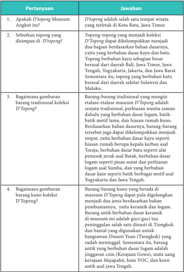

Tabel ini berisi pertanyaan dan jawaban tentang koleksi Museum Angkut D'Topeng di Batu, Jawa Timur. Topik utama tabel adalah tentang topeng dan barang-barang tradisional koleksi museum tersebut. Kolom pertama berisi pertanyaan, sedangkan kolom kedua berisi jawaban. Data penting yang terlihat antara lain bahwa topeng-topeng di D'Topeng berasal dari berbagai daerah di Indonesia, termasuk Bali, Jawa Timur, Jawa Tengah, Yogyakarta, Jakarta, dan Jawa Barat. Selain itu, topeng-topeng tersebut juga memiliki variasi desain dan motif yang unik, seperti batik, keramik, dan logam.

 

---
## 📄 Halaman 38

Selanjutnya siswa ditugasi untuk menemukan gagasan pokok dalam teks laporan hasil observasi. Temukanlah pokok-pokok penting teks D'topeng Museum Angkut.

### Petunjuk untuk Guru

Guru  dapat  menggunakan  tugas  2  sebagai  tugas  mandiri yang dikerjakan di rumah (PR), yang harus dikerjakan di buku tugas.  Siswa  diminta  menggunakan    kolom-kolom  gagasan utama dengan urutan sebagaimana contoh di bawah ini dengan menggunakan huruf tulis tegak bersambung pada buku kerja!

### Contoh Jawaban

---
**📊 Tabel**

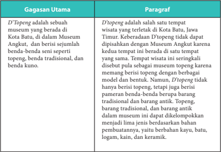

Tabel ini berisi informasi tentang D'Topeng, sebuah museum di Kota Batu, Jawa Timur. Topik utama tabel adalah D'Topeng sebagai sebuah museum yang berada di Museum Angkut, dan berisi sejumlah benda-benda seni berupa topeng, tradisional, dan bentuk. Paragraf pertama menjelaskan bahwa D'Topeng adalah salah satu tempat wisata yang terletak di Kota Batu, Jawa Timur. Keberadaan D'Topeng tidak dapat dipisahkan dengan Museum Angkut karena kedua tempat ini berada di satu tempat yang sama. Paragraf kedua menjelaskan bahwa D'Topeng memang berisi topeng dengan berbagai model dan bentuk, namun, D'Topeng tidak hanya berisi topeng, tetapi juga berisi pameran benda-benda berupa barang tradisional dan barang antik. Paragraf ketiga menjelaskan bahwa topeng yang dimiliki oleh D'Topeng merupakan hasil karya seniman lokal, dan beberapa topeng tersebut telah dikembangkan menjadi lima jenis berdasarkan bahan pembuatannya, yaitu berbahan kayu, batu, logam, kain, dan keramik.

 

---
## 📄 Halaman 39

---
**📊 Tabel**

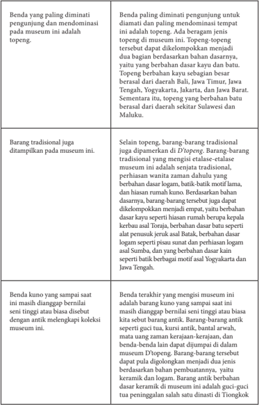

Tabel ini membahas tentang topeng dan barang tradisional yang dimiliki oleh sebuah museum. Topeng merupakan benda paling diminati pengunjung untuk diamati dan paling dominasi tempat di museum ini. Topeng-topeng tersebut beragam jenis dan bahan, seperti topeng berbahan dasar kayu, batu, atau berasal dari daerah tertentu seperti Bali, Jawa Timur, Jawa Tengah, Yogyakarta, Jakarta, dan Jawa Barat. Selain topeng, museum juga menampilkan berbagai barang tradisional yang menggambarkan etalase-etalase museum, seperti senjata tradisional, perhiasan wanita, rumah adat, dan alat musik. Benda-benda kuno yang masih ada di museum ini mencerminkan kekayaan budaya dan sejarah masyarakat setempat.

 

---
## 📄 Halaman 40

---
**📊 Tabel**

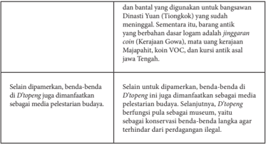

Tabel ini membahas tentang peran dan fungsi dari beberapa benda-benda yang memiliki nilai sejarah dan budaya di Indonesia. Topik utamanya adalah bagaimana benda-benda tersebut digunakan sebagai media pelestarian budaya dan bagaimana mereka berfungsi sebagai simbol atau representasi dari kekayaan budaya nasional. Kolom-kolomnya mencakup:

1. Benda-benda yang dimiliki oleh D'Topeng
2. Fungsi benda-benda tersebut
3. Media pelestarian budaya yang dihasilkan oleh benda-benda tersebut

Data penting yang terlihat dalam tabel ini meliputi:
- Benda-benda seperti jinggran (logam), cincin, mata uang, VOC, dan kursi antik asal Jawa Tengah merupakan simbol kekayaan budaya nasional.
- Benda-benda ini juga berfungsi sebagai media pelestarian budaya, seperti koleksi museum.
- D'Topeng bertindak sebagai museum untuk menyimpan dan mempromosikan benda-benda ini.

Tabel ini menunjukkan bahwa benda-benda tradisional memiliki nilai sejarah dan budaya yang tinggi, dan mereka tidak hanya digunakan sebagai benda-benda sehari-hari, tetapi juga sebagai media untuk mempromosikan dan menjaga warisan budaya nasional.

Tugas  3  ini  juga  dijadikan  sebagai  PR.  Siswa  ditugasi  untuk  merangkaikan gagasan-gagasan pokok setiap paragraf hasil kerjamu di atas dengan menggunakan kata penghubung (konjungsi) yang tepat. Tugas siswa ditulis di buku kerja.

### Contoh Jawaban Tugas 3

---
**📊 Tabel**

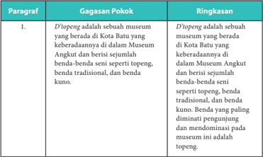

Tabel ini berisi informasi tentang sebuah museum di Kota Batu yang dikenal sebagai D'openg. Topik utamanya adalah deskripsi博物馆 tersebut, termasuk lokasinya di Museum Angkut dan koleksinya yang mencakup berbagai jenis topeng, benda seni tradisional, dan benda kuno. Data penting yang terlihat adalah bahwa topeng adalah benda yang paling diminati pengunjung dan mendominasi pada museum ini.

 

---
## 📄 Halaman 41

Tugas 4 adalah menyusun ringkasan.

### Petunjuk untuk Guru

Tugas menyusun ringkasan diberikan sebagai PR, tetapi harus dipresentasikan di kelas. Agar semua siswa dapt mempresentasikan hasil kerjanya, berikut langkahlangkah yang dapat dilakukan guru.

- Membagi kelas menjadi beberapa kelompok. Setiap kelompok terdiri atas 4-5 orang.
- Secara bergantian setiap siswa mempresentasikan ringkasan yang dibuatnya dalam kelompok.
- Siswa lain menilai temannya.
- Setiap kelompok memilih ringkasan terbaik.
- Siswa yang ringkasannya menjadi ringkasan terbaik di kelompoknya harus mempresentasikan ringkasannya di depan kelas.
Hasil penilaian antarsiswa dapat dijadikan sebagai tambahan nilai keterampilan.

 

---
## 📄 Halaman 42

### Instrumen penilaian presentasi ringkasan

---
**📊 Tabel**

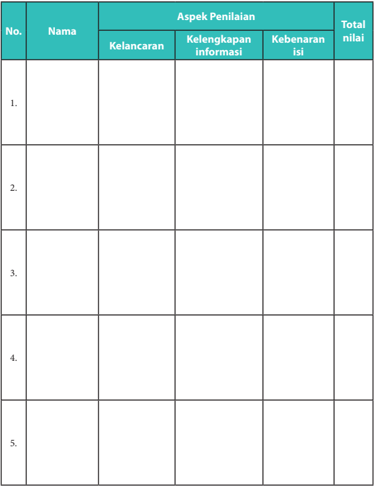

Tabel ini merupakan alat penilaian yang digunakan untuk mengevaluasi kinerja individu dalam beberapa aspek tertentu. Topik utamanya adalah penilaian berdasarkan kelancaran, kelengkapan informasi, dan kebenaran isi. Tabel ini memiliki 5 baris, masing-masing baris menunjukkan data atau evaluasi satu individu. Kolom-kolomnya mencakup nama individu, aspek penilaian (kelancaran, kelengkapan informasi, kebenaran isi), dan total nilai. Data penting yang terlihat adalah bahwa setiap individu memiliki satu baris di tabel, menunjukkan bahwa evaluasi ini dilakukan secara individu. Total nilai juga ditampilkan untuk setiap individu, yang menunjukkan skor akhir mereka dalam penilaian tersebut.

Kriteria penilaian:

 

---
## 📄 Halaman 43

---
**📊 Tabel**

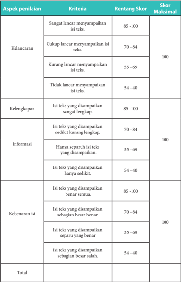

Tabel ini menunjukkan skor penilaian untuk tugas tertulis berdasarkan aspek-aspek penilaian seperti kelancaran, kelengkapan, informasi, dan kebenaran isi. Topik utama tabel adalah penilaian tugas tertulis. Kolom-kolomnya meliputi aspek penilaian (kelancaran, kelengkapan, informasi, kebenaran isi), kriteria penilaian, rentang skor, dan skor maksimal. Data penting yang terlihat adalah bahwa skor maksimal untuk setiap aspek penilaian adalah 100, dan skor tertinggi untuk setiap kriteria adalah 85-100. Skor rendah dapat mencapai 40, sementara skor tertinggi mencapai 100. Ini menunjukkan bahwa penilaian ini sangat detail dan memperhatikan berbagai aspek tugas tertulis.

 

---
## 📄 Halaman 44

### PROSES PEMBELAJARAN A KEGIATAN 3

### Menyimpulkan Fungsi Teks Laporan Hasil Observasi

Laporan  hasil  pengamatan  untuk  memenuhi  tugas  mata  pelajaran  yang kamu susun selama ini merupakan salah satu fungsi teks laporan hasil observasi untuk  memberitahukan  atau  menjelaskan  tanggung  jawab  tugas  dan  kegiatan pengamatan.  Hasil observasi terhadap suatu objek juga dapat berfungsi untuk memberitahukan  kepada  pihak  berwenang  atau  terkait  suatu  informasi  dan kemudian dijadikan dasar penyusunan kebijakan. Salah satu contohnya adalah teks  laporan  hasil  observasi  kerusakan  lingkungan.  Selain  itu,  banyak  teks laporan  hasil  observasi  yang  dapat  dijadikan  bahan  informasi  untuk  berbagai kepentingan. Teks laporan hasil observasi secara umum juga berfungsi sebagai alat pendokumentasian suatu objek atau kegiatan.

- Simpulkanlah fungsi teks laporan hasil observasi pada teks Wayang dan D'topeng Museum Angkut.
- Carilah 2 contoh teks laporan hasil observasi kemudian tentukan fungsinya.

### Contoh Jawaban Tugas 3

---
**📊 Tabel**

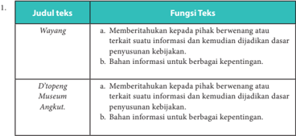

Tabel ini membahas dua jenis teks: Wayang dan D'iopeng Museum Angkat. Wayang memiliki fungsi untuk memberikan pilihan berweneran atau terkait suatu informasi dan kemudian dijadikan dasar penyusunan kebijakan, serta sebagai bahan informasi untuk berbagai kepentingan. Sementara itu, D'iopeng Museum Angkat juga memiliki fungsi yang sama, yaitu memberikan pilihan kepada pihak berwenang atau terkait suatu informasi dan kemudian dijadikan dasar penyusunan kebijakan, serta sebagai bahan informasi untuk berbagai kepentingan. Topik utama tabel ini adalah fungsi teks Wayang dan D'iopeng Museum Angkat. Kolom-kolom yang ada adalah Judul Teks dan Fungsi Teks. Data atau pola penting yang terlihat adalah bahwa kedua jenis teks memiliki fungsi yang sama, yaitu memberikan pilihan kepada pihak berwenang atau terkait suatu informasi dan kemudian dijadikan dasar penyusunan kebijakan, serta sebagai bahan informasi untuk berbagai kepentingan.

- Contoh teks laporan observasi dan fungsinya.
- Contoh teks laporan hasil observasi yang berfungsi untuk memberitahukan atau menjelaskan tanggung jawab tugas dan kegiatan pengamatan.

 

---
## 📄 Halaman 45

Berdasarkan  observasi  dan  pengamatan  yang  telah  dilakukan  setelah melakukan kegiatan belajar mengajar selama seminggu, kami menyimpulkan  bahwa  pendidikan  di  Desa  Koranji  kurang  merata bahkan dapat dikatakan cukup memprihatinkan.

Simpulan tersebut didapatkan karena beberapa anak kelas 5 dan 6 SD yang kami ajar belum dapat membaca, menulis, dan bahkan tidak dapat melafalkan  alfhabet.  Hal  ini  mungkin  dapat  terjadi  karena  beberapa faktor. Salah satunya adalah sistem pengajaran yang belum efektif dan kualitas staf pengajar yang patut dipertanyakan.

Sumber: http://kknm.unpad.ac.id/koranji/profil/

### 4. Contoh teks laporan hasil observasi yang berfungsi untuk pendokumentasian suatu kegiatan.

Kegiatan  bulan  bahasa  merupakan  kegiatan  tahunan  yang  dilakukan siswa  SMA  Negeri  1  Batu  untuk  memperingati  Sumpah  Pemuda. Kegiatan  pada  bulan  tahun  ini  berdasarkan  sasaran  pesertanya  dapat dibedakan menjadi dua yaitu kegiatan eksternal dan kegiatan internal. Kegiatan eksternal adalah kegiatan, terutama lomba yang dapat diikuti oleh peserta dari luar SMA Negeri 1 Batu. Kegiatannya mencakup lomba mading, fashion street ,  dan sayembara menulis cerita pendek. Kegiatan internal adaah kegiatan yang hanya boleh diikuti siswa SMA Negeri 1 Batu. Kegiatannya mencakup pemilihan duta wisata SMA Negeri 1 Batu, lomba pidato bahasa Mandarin, dan lomba bazar.

 

---
## 📄 Halaman 46

### B. Merevisi  Isi Teks Laporan Hasil Observasi

Ind 1

Melengkapi isi teks laporan hasil observasi

Ind 2

Membenahi kesalahan isi teks laporan hasil observasi

### PROSES PEMBELAJARAN B KEGIATAN 1

### Melengkapi Isi Teks Laporan Hasil Observasi

Untuk mempelajari materi melengkapi isi teks laporan hasil observasi, guru dapat menggunakan teks laporan hasil observasi yang sudah tersedia dalam buku teks. Guru meminta siswa membaca teks yang telah dirumpangkan, siswa diminta menganalisis isi  bagian  yang  dirumpangkan  tersebut.  Tentu  saja  siswa  tidak  diperbolehkan membaca kembali teks aslinya.  Barulah  ketika  siswa  sudah  mengetahui  isi  bagian yang dirumpangkan tersebut, guru mengajak siswa membuka teks aslinya.

Sebuah  teks  laporan  hasil  observasi  harus  lengkap  strukturnya  yaitu  harus mengandung definisi umum , deskripsi bagian , dan deskripsi manfaat .

Ketika membaca sebuah teks laporan hasil observasi, kita mungkin saja menemukan  bagian-bagian  informasi  yang  tidak  lengkap.  Kita  dapat mengetahuinya dengan cara menganalisis struktur teksnya.

Perhatikan contoh berikut ini.

### Ada Apa di D'topeng Museum Angkut

D'topeng adalah  salah  satu  tempat  wisata  yang  terletak  di  Kota  Batu,  Jawa  Timur. Keberadaan D'topeng tidak dapat dipisahkan dengan Museum Angkut karena kedua tempat ini  berada  di  satu  tempat  yang  sama.  T empat  wisata  ini  seringkali  disebut  pula  sebagai museum topeng karena memang berisi topeng dengan berbagai model dan bentuk.

Benda paling diminati pengunjung untuk diamati dan paling mendominasi tempat ini adalah topeng. Ada beragam jenis topeng di museum ini. Topeng-topeng tersebut dapat dikelompokkan menjadi dua bagian berdasarkan bahan dasarnya, yaitu yang berbahan dasar kayu dan batu. Topeng berbahan kayu sebagian besar berasal dari daerah Bali, Jawa Timur, Jawa Tengah, Yogyakarta, Jakarta, dan Jawa Barat. Sementara itu, topeng yang berbahan batu berasal dari daerah sekitar Sulawesi dan Maluku.

 

---
## 📄 Halaman 47

Barang-barang tradisional juga dipamerkan di D'topeng .  Barang-barang tradisional yang mengisi etalase-etalase museum ini adalah senjata tradisional, perhiasan wanita zaman dahulu yang berbahan dasar logam, batik-batik motif lama, dan hiasan rumah kuno. Berdasarkan bahan dasarnya, barang-barang tersebut juga dapat dikelompokkan menjadi empat, yaitu berbahan dasar kayu seperti hiasan rumah berupa kepala kerbau asal Toraja, berbahan dasar batu seperti alat penusuk jeruk asal Batak, berbahan dasar

---
**🖼️ Gambar/Diagram**

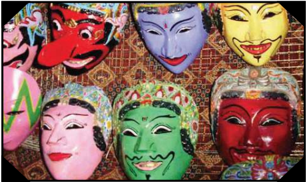

> **Deskripsi Visual:** Gambar ini adalah ilustrasi yang menampilkan berbagai masker tradisional dari berbagai budaya. Gambar ini terdiri dari beberapa elemen utama:

1. **Apa yang Ditampilkan Secara Keseluruhan**: Gambar ini menunjukkan berbagai masker tradisional yang diperlihatkan dari berbagai budaya. Masker-masker ini memiliki warna-warna cerah dan desain yang unik, menunjukkan kekayaan seni dan budaya dari berbagai negara.

2. **Elemen-Elemen Utama dan Relasinya**: 
   - **Masker**: Berbagai masker tradisional yang berbeda-beda, masing-masing dengan desain dan warna yang unik.
   - **Budaya**: Masker ini menunjukkan variasi budaya dari berbagai negara, mencerminkan keunikan dan kekayaan budaya dunia.
   - **Warna**: Warna-warna cerah pada masker menambah keindahan dan keunikan setiap masker.

3. **Teks, Angka, atau Label Penting yang Terlihat**: 
   - **Judul**: Judul gambar tidak jelas, namun tampaknya bertujuan untuk menunjukkan berbagai masker tradisional.
   - **Label**: Ada beberapa label yang mungkin menjelaskan asal-usul atau makna dari setiap masker, tetapi tidak jelas dari gambar tersebut.

4. **Informasi Kunci yang Bisa Diambil Pembaca**: 
   - Gambar ini menunjukkan bahwa setiap budaya memiliki seni dan senjata tradisional mereka sendiri, yang meliputi masker.
   - Masker tradisional ini menunjukkan kekayaan budaya dan seni dunia, serta peran pentingnya dalam kehidupan budaya dan ritual.

Dengan demikian, gambar ini menggambarkan keunikan dan kekayaan budaya dunia melalui masker tradisional, menunjukkan bagaimana setiap budaya memiliki senjata dan seni mereka sendiri.

logam seperti pisau sunat dan perhiasan logam asal Sumba, dan yang berbahan dasar kain seperti batik berbagai motif asal Yogyakarta dan Jawa Tengah.

Benda terakhir yang mengisi museum ini adalah barang kuno yang sampai saat ini masih dianggap bernilai seni tinggi atau biasa kita sebut barang antik. Barang-barang antik seperti guci tua, kursi antik, bantal arwah, mata uang zaman kerajaan-kerajaan, dan benda-benda lain dapat dijumpai di dalam museum D'topeng .  Barang-barang tersebut dapat pula digolongkan menjadi dua jenis berdasarkan bahan pembuatannya, yaitu keramik dan logam. Barang antik berbahan dasar keramik di museum ini adalah guci-guci tua peninggalan salah satu dinasti di Tiongkok dan bantal yang digunakan untuk bangsawan Dinasti Yuan (Tiongkok) yang sudah meninggal. Sementara itu, barang  antik  yang  berbahan  dasar  logam  adalah jinggaran  coin (Kerajaan  Gowa), mata uang Kerajaan Majapahit, koin VOC, dan kursi antik asal jawa Tengah.

Selanjutnya, untuk menguji pemahaman siswa, mereka ditugaskan membaca teks laporan hasil observasi berjudul Mengenal Suku Badui .

 

---
## 📄 Halaman 48

### Mengenal Suku Badui

---
**🖼️ Gambar/Diagram**

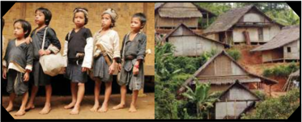

> **Deskripsi Visual:** Gambar ini adalah ilustrasi yang menunjukkan dua skenario berbeda tentang kehidupan sehari-hari di dua wilayah yang berbeda. Di sisi kiri, ada tiga anak kecil yang berdiri di depan bangunan tradisional Jepang, masing-masing dengan pakaian yang berbeda. Anak pertama memakai baju putih, anak kedua memakai baju merah, dan anak ketiga memakai baju hijau. Mereka tampak senang dan berpose untuk foto.

Sementara itu, di sisi kanan, terdapat beberapa bangunan tradisional Jepang yang terbuat dari kayu dan bambu. Bangunan-bangunan ini memiliki atap datar dan pintu kayu, menunjukkan arsitektur yang khas dari wilayah tersebut. Area sekitar bangunan juga tampak bersih dan rapi, dengan tanaman hijau yang menghiasi taman depan.

Elemen-elemen utama dalam gambar ini adalah tiga anak kecil di sisi kiri dan beberapa bangunan tradisional di sisi kanan. Relasi antara elemen-elemen ini adalah bahwa mereka menunjukkan perbedaan dalam budaya dan kehidupan sehari-hari di dua wilayah yang berbeda. Informasi kunci yang dapat diambil dari gambar ini adalah bahwa kehidupan tradisional di Jepang memiliki karakteristik unik yang dapat dilihat dari pakaian, bangunan, dan lingkungan sekitarnya.

Orang Kanekes atau orang Baduy/Badui adalah suatu kelompok masyarakat adat sub-etnis Sunda di wilayah Kabupaten Lebak, Banten.  Masyarakat Suku Badui di Banten termasuk salah satu suku yang menerapkan isolasi dari dunia luar. Itulah salah  satu  keunikan  Suku  Badui,  sehingga  wajar  mereka  sangat  menjaga  betul 'pikukuh' atau ajaran mereka, entah berupa kepercayaan dan kebudayaan.

Badui Dalam belum mengenal budaya luar dan terletak di hutan pedalaman. Karena  belum  mengenal  kebudayaan  luar,  suku  Badui  Dalam  masih  memiliki budaya yang sangat asli. Mereka dikenal sangat taat mempertahankan adat istiadat dan  warisan  nenek  moyangnya.  Mereka  memakai  pakaian  yang  berwarna  putih dengan ikat kepala putih serta membawa golok. Pakaian Suku Badui Dalam pun tidak  berkancing  atau  kerah.  Uniknya,  semua  yang  dipakai  Suku  Badui  Dalam adalah  hasil  produksi  mereka  sendiri.  Biasanya  para  perempuan  yang  bertugas membuatnya.  Mereka  dilarang  memakai  pakaian  modern.  Selain  itu,  setiap  kali bepergian, mereka tidak memakai kendaraan bahkan tidak memakai alas kaki dan terdiri dari kelompok kecil berjumlah 3-5 orang. Mereka dilarang menggunakan perangkat teknologi, seperti HP dan TV.

Suku  ini  memiliki  kepercayaan  yang  dikenal  Sunda  Wiwitan  ( sunda :  berasal dari  suku sunda, wiwitan : Asli). Kepercayaan ini memuja arwah nenek moyang (animisme)  yang  pada  selanjutnya  kepercayaan  mereka  mendapat  pengaruh dari  Buddha  dan  Hindu.  Kepercayaan  suku  ini  merupakan  refleksi  kepercayaan masyarakat Sunda sebelum masuk agama Islam.

Hingga saat ini, suku Badui Dalam tidak mengenal budaya baca tulis. Yang mereka tahu, ialah aksara Hanacaraka (aksara Sunda). Anak-anak Suku Badui Dalam pun tidak bersekolah, kegiatannya hanya sekitar sawah dan kebun. Menurut mereka inilah cara mereka melestarikan adat leluhurnya. Meskipun sejak pemerintahan Soeharto sampai sekarang sudah diadakan upaya untuk membujuk mereka agar mengizinkan pembangunan  sekolah,  tetapi    mereka  selalu  menolak.  Dengan  demikian,  banyak cerita atau sejarah mereka hanya ada di ingatan atau cerita lisan saja.

 

---
## 📄 Halaman 49

Badui Luar merupakan orang-orang yang telah keluar dari adat dan wilayah Badui Dalam. Ada beberapa hal yang menyebabkan dikeluarkanya warga Badui Dalam ke Badui Luar. Pada dasarnya, peraturan yang ada di Badui Luar dan Badui Dalam itu hampir sama, tetapi Badui Luar lebih mengenal teknologi dibanding Badui Dalam.

Sumber: http://faidatulhikmah.blogspot.co.id dengan penyesuaian

- Bagian struktur teks laporan hasil observasi apa yang tidak terdapat dalam teks Mengenal Suku Badui ? Jelaskan jawabanmu.
- Lengkapilah isi teks laporan hasil observasi tersebut sehingga menjadi teks laporan hasil observasi yang lengkap!
- Cermatilah penggunaan Ejaan yang Disempurnakan (Eyd) dalam teks tersebut. Apabila ada kesalahan penulisan, benahilah dengan menggunakan tabel berikut ini. Kamu boleh menambah kolom sesuai dengan kebutuhan.

### Contoh Jawaban Tugas

- Pada bagian pernyataan umum dan klasifikasi tidak ada pengklasifikasian. Pada bagian akhir juga tidak disajikan  deskripsi manfaat.
- Perbaikan struktur pernyataan umum dan klasifikasi:
Orang Kanekes atau orang Baduy/Badui adalah suatu kelompok masyarakat adat sub-etnis Sunda di wilayah Kabupaten Lebak, Banten.  Masyarakat Suku Badui di Banten termasuk salah satu suku yang menerapkan isolasi dari dunia luar itulah salah satu keunikan Suku Badui. Wajar, jika mereka sangat menjaga betul 'pikukuh' atau ajaran mereka, entah berupa kepercayaan dan kebudayaan. Berdasarkan kepatuhannya memegang budaya nenek moyangnya, Suku Badui dibedakan menjadi Suku Badui Dalam dan Suku Badui Luar.

Perbaikan struktur deskripsi manfaat (ditambahkan menjadi paragraf terakhir) Dengan mengenali karakteristik Suku Badui Dalam dan Suku Badui Luar kita dapat mengetahui keberagaman budaya Indonesia. Informasi ini juga bermanfaat bagi pemerintah dalam melakukan pembinaan dan pelestarian sukusuku bangsa di Indonesia.

 

---
## 📄 Halaman 50

3.

---
**📊 Tabel**

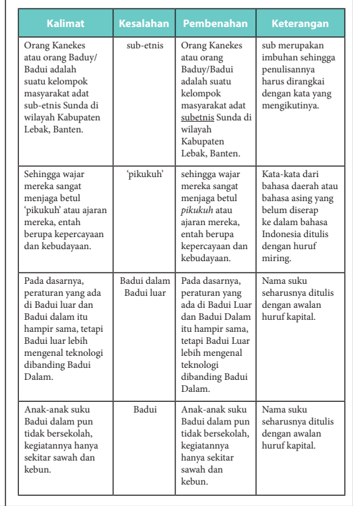

Tabel ini berisi kesalahan dalam kalimat-kalimat yang ditulis oleh siswa, serta penambahan kata-kata yang diperlukan untuk memperbaiki kesalahan tersebut. Topik utama tabel adalah perbaikan kalimat yang tidak tepat. Kolom-kolomnya meliputi "Kalimat", "Kesalahan", "Pembenahan", dan "Keterangan". Data penting yang terlihat antara lain bahwa beberapa kalimat memiliki kesalahan gramatikal seperti penggunaan kata baku umum yang tidak tepat, penggunaan bahasa daerah yang tidak sesuai dengan konteks, dan penggunaan huruf kapital yang salah. Selain itu, tabel juga menunjukkan bahwa beberapa kalimat memerlukan penambahan kata untuk memperjelas makna atau memperbaiki kesalahan.

 

---
## 📄 Halaman 51

### PROSES PEMBELAJARAN B KEGIATAN 2

### Membenahi Kesalahan Isi Teks Laporan Hasil Observasi

Setiap teks pasti memiliki struktur dan unsur pembangun. Demikian pula dengan teks laporan hasil observasi. Teks laporan hasil observasi disusun dengan struktur (a) pernyataan umum atau klasifikasi , (b) deskripsi bagian , dan (c) deskripsi manfaat . Pernyataan  umum  berisi  pembuka  atau  pengantar  hal  yang  akan  disampaikan. Bagian  ini  berisi  hal  umum  tentang  objek  yang  akan  dikaji,  menjelaskan  secara garis besar pemahaman tentang hal tersebut. Penjelasan detail mengenai objek atau bagian-bagiannya terdapat pada deskripsi bagian. Deskripsi manfaat menunjukkan bahwa setiap objek yang diamati memiliki manfaat atau fungsi dalam kehidupan.

Dalam  kenyatannya,  kita  sering  menjumpai  laporan  hasil  observasi  yang tidak lengkap struktur dan isinya, bahkan banyak terdapat kesalahan berbahasa. Pada bagian berikut kamu akan mempelajari contoh kesalahan teks laporan hasil observasi beserta contoh pembenahannya.

Guru mengajak siswa untuk mengamati dan mendiskusikan kegiatan analisis struktur teks laporan hasil observasi berikut ini.

Perhatikan contoh analisis struktur teks tersebut dalam tabel berikut ini.

---
**📊 Tabel**

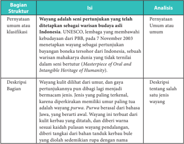

Tabel ini berisi informasi tentang bagian-struktur dari sebuah dokumen atau laporan, mungkin dari sebuah proyek UNESCO atau PBB. Topik utama tabel adalah tentang pertunjukan budaya asli Indonesia yang telah ditetapkan sebagai warisan budaya asli oleh UNESCO pada 7 November 2003. Tabel ini terdiri dari dua kolom: "Pernyataan umum atau klasifikasi" dan "Deskripsi Bagian". Kolom pertama menyajikan pernyataan umum tentang pertunjukan yang telah ditetapkan, sementara kolom kedua memberikan deskripsi lebih lanjut tentang bagian tersebut. Data penting yang terlihat adalah bahwa pertunjukan ini merupakan salah satu warisan budaya asli Indonesia yang telah ditetapkan oleh UNESCO, dan memiliki karakteristik unik seperti pertunjukan yang dilakukan dengan gaya tertentu dan berasal dari daerah tertentu.

 

---
## 📄 Halaman 52

---
**📊 Tabel**

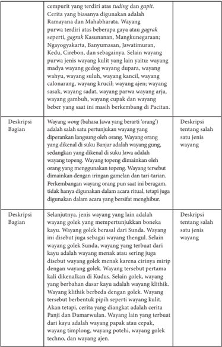

Tabel ini berisi deskripsi tentang berbagai jenis wayang, termasuk wayang golek, wayang kulit, dan wayang lainnya. Topik utamanya adalah penjelasan tentang jenis-jenis wayang dan bagian-bagian yang mereka miliki. Kolom-kolomnya mencakup deskripsi bagian-bagian dari wayang, seperti wajah, tubuh, dan alat-alat yang digunakan. Data penting yang terlihat adalah bahwa wayang golek memiliki wajah yang berbeda-beda, sedangkan wayang kulit memiliki wajah yang lebih realistis dan detail. Selain itu, tabel juga menunjukkan bahwa beberapa jenis wayang memiliki karakteristik unik, seperti wayang golek yang memiliki kaki dan tangan, atau wayang kulit yang memiliki kulit yang tipis dan halus.

 

---
## 📄 Halaman 53

---
**📊 Tabel**

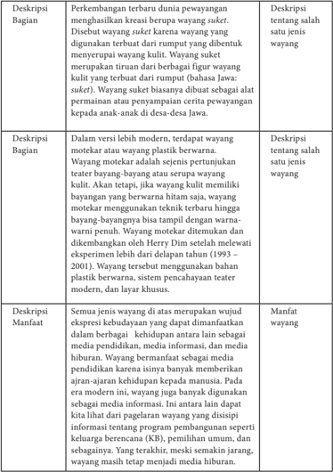

Tabel ini berisi deskripsi tentang berbagai aspek dari suket, yaitu permainan teater tradisional Jawa yang menggunakan bahan plastik sebagai alat penari. Topik utama tabel adalah deskripsi bagian-bagian suket, termasuk perkembangan terbaru, teknik-teknik yang digunakan, dan manfaatnya. Kolom-kolom utama adalah Deskripsi Bagian, Deskripsi tentang salah satu jenis wayang, dan Deskripsi Manfaat. Data penting yang terlihat meliputi perkembangan terbaru suket, teknik-teknik yang digunakan seperti menggunakan bahan plastik sebagai alat penari, dan manfaatnya seperti dapat menarik perhatian publik dan mempromosikan budaya Jawa.

Berdasarkan contoh analisis struktur teks laporan hsil observasi di atas dapat disimpulkan bahwa struktur teks laporan hasil observasi terdiri atas (a) pernyataan umum dari pengklasifikasian, (b) deskripsi bagian, dan (c) deskripsi manfaat.

 

---
## 📄 Halaman 54

Penyajian tiap-tiap bagian struktur teks laporan hasil observasi bisa berbedabeda, terutama pada deskripsi bagian. Hal ini disebabkan adanya perbedaan dasar klasifikasi objek yang dilaporkan.

Perhatikan contoh bagian pernyataan umum dan pengklasifikasian berikut ini. Kutipan 1

Paus  adalah  satu  dari  sekian  banyak  mamalia  air  yang  istimewa.  Mamalia  laut, bertubuh  besar,  cerdas  dan  hidup  bebas  di  samudera.  Cara  bernapasnya  juga istimewa. Kalau makhluk laut lain bernapas dengan insang, maka paus menggunakan paru-parunya.  Berdasarkan  ada/tidak  adanya  giginya,    paus  terbagi  menjadi  dua kategori yaitu paus bergigi dan baleen atau balin atau paus yang tidak bergigi.

Dikutip dari  http://www.ngasih.com dengan penyesuaian.

### Kutipan 2

Sungai  adalah  aliran  air  yang  besar  dan  memanjang  yang  mengalir  secara  terusmenerus  dari  hulu  (sumber)  menuju  hilir  (muara).  Sungai  konsekuen  adalah sungai  yang  arah  alirannya  sesuai  dengan  kemiringan  batuan.  Sungai  subsekuen adalah sungai yang arah aliran airnya tegak lurus dengan sungai konsekuen.Sungai obsekuen  merupakan  anak  sungai  subsekuen  yang  arah  alirannya  berlawanan dengan  kemiringan  batuan.  Sungai  resekuen  merupakan  anak  sungai  subsekuen yang arah alirannya searah dengan kemiringan batuan. Sungai insekuen merupakan sungai yang arah alirannya teratur dan tidak terikat lapisan batuan yang dilaluinya. Dikutip dari http://www.id.wikipedia.org/wikisungaidenganpenyesuaian.

Di antara dua kutipan teks tersebut, kutipan kesatu menggunakan pernyataan umum  dan  pengklasifikasian  yang  jelas,  sedangkan  kutipan  kedua  meskipun menyatakan pernyataan umum, tetapi dasar pengklasifikasiannya tidak ada.

Pernyataan umum biasanya disajikan dalam kalimat definisi. Kalimat definisi seringkali mengggunakan konjungsi adalah , ialah , yakni , merupakan , dan yaitu .

- Paus adalah satu dari sekian banyak mamalia air yang istimewa.
- Wayang  adalah  seni  pertunjukan  yang  telah  ditetapkan  sebagai  warisan budaya asli Indonesia.
Sekarang, belajarlah membuat kalimat definisi. Jelaskan bagaimana cara menguji ketepatan sebuah kalimat definisi.

Selanjutnya,  pelajarilah bagaimana cara membuat pengklasifikasian yang baik. Pengklasifikasian sebuah objek yang baik harus menyebutkan dasar pengklasifikasian dan jumlah keanggotaannya. Pada kutipan satu di atas, pengklasifikasian paus dapat dilihat daam kalimat:

 

---
## 📄 Halaman 55

Berdasarkan ada/tidak adanya giginya,  paus terbagi menjadi dua  kategori,  yaitu  paus  bergigi  dan baleen atau balin atau paus yang tidak bergigi.

Dalam kalimat di atas pengklasifikasian paus disajikan dengan mencantumkan tiga hal yaitu (a) objek yang dilaporkan, yakni paus, (b) dasar pengelompokan, dan (c) jumlah anggota objek.

Bandingkan kutipan 1 dan 2  dengan dua kutipan berikut ini Kutipan 3

Ikan paus merupakan mamalia air terbesar saat ini. Paus ini memiliki banyak jenis, dari paus yang buas atau karnifora sampai paus yang jinak.  Banyak  orang  yang  kurang  tahu  tentang  jenis-jenis  paus  di dunia ini padahal ada banyak ikan jenis paus.

### Kutipan 4

Kelelawar disebut sebagai hewan yang menakutkan karena selalu dihubungkan dengan mitos vampir. Bagaimana fakta sebenarnya tentang kelelawar? Hewan ini termasuk jenis mamalia, hewan beranak dan menyusui, seperti anjing,  kucing,  sapi,  dan  lainlain. Hewan menyusui ini berasal dari ordo Chiroptera. Hanya ada tiga jenis kelelawar di dunia yang mengisap darah. Tiga jenis kelelawar  yang  hidup  di  bagian  tengah  dan  selatan  Amerika tersebut  menggigit  hewan  ternak  dan  mengisap  hanya  sedikit darahnya  tanpa  membahayakan  nyawa.  Kelelawar  merupakan satu-satunya mamalia yang bisa terbang.

Pada  kutipan  3  tidak  terdapat  pengklasifikasian,  sedangkan  pada  kutipan 4  pernyataan  umum    disajikan  dalam  kalimat  definisi  dan  diikuti  dengan pengklasifikasian menggunakan dasar yang jelas.

Siswa diminta membuka kembali teks Wayang . Pada bagian pernyataan umum dan pengklasifikasian disebutkan bahwa 'Wayang  dapat dibedakan berdasarkan bahannya yaitu wayang kulit,  yang biasanya terbuat dari  kulit hewan ternak, bisa berupa kerbau, sapi, atau kambing; wayang wong berarti wayang yang ditampilkan atau diperankan oleh orang; wayang golek ; dan wayang suket dan wayang motekar . '

Deskripsi bagian yang baik mengikuti urutan dalam pengklasifikasian. Perhatikan paragraf-paragraf  yang  merupakan  deskripsi  bagian  secara  berurutan  membahas wayang kulit, wayang wong , wayang golek, wayang suket , dan wayang motekar .

Bagian akhir struktur teks laporan hasil observasi adalah deskripsi manfaat. Pada teks Wayang, deskripsi manfaat dinyatakan pada paragraf terakhir sebagai berikut.

 

---
## 📄 Halaman 56

Siswa  ditugasi  menganalisis  struktur  teks  laporan  hasil  observasi  berjudul D'topeng Museum Angkut .

### Contoh Jawaban Tugas

Deskripsi Manfaat

Selain untuk dipamerkan, benda-benda di D'topeng ini juga dimanfaatkan sebagai media pelestarian budaya. Selanjutnya, D'topeng berfungsi pula sebagai museum, yaitu sebagai konservasi benda-benda langka agar terhindar dari perdagangan ilegal.

### C. Menganalisis Kebahasaan Teks Laporan Hasil Observasi

Ind 1

Ind 2

Menganalisis kebahasaan teks laporan hasil observasi.

Membenahi kesalahan berbahasa dalam teks laporan hasil observasi.

### PROSES PEMBELAJARAN C KEGIATAN 1

### Menganalisis Kebahasaan Teks  Laporan Hasil Observasi

### 1. Kata serta Frasa Verba serta Nomina

Jenis kata dan kelompok kata (frasa) yang dominan digunakan dalam sebuah teks laporan hasil observasi adalah verba (kata kerja) dan nomina (kata benda). Untuk memahami hal tersebut, siswa harus mengetahui perbedaan antara kata dan frasa. Kata berbentuk morfem atau morf bebas, yaitu satuan bahasa terkecil (dapat memiliki arti maupun tidak) yang bersifat bebas. Frasa merupakan unsur yang lebih luas, yaitu kelompok kata nonpredikatif, hanya menduduki satu fungsi dalam sebuah kalimat.

Perhatikan contoh identifikasi kata benda dan frasa benda  dalam teks.

 

---
## 📄 Halaman 57

### a. Nomina

---
**📊 Tabel**

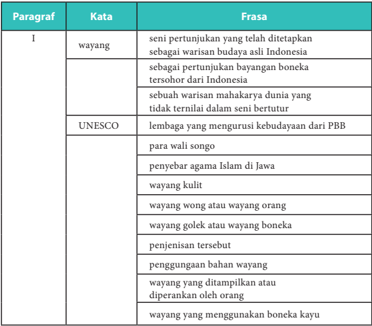

Tabel ini berisi informasi tentang wayang, sebuah seni pertunjukan tradisional yang telah ditetapkan sebagai warisan budaya alam Indonesia. Wayang merupakan penyebaran bayangan boneka terbesar di Indonesia, merupakan warisan masyarakat dunia yang tidak terbatas dalam seni bertutur. UNESCO menganggap wayang sebagai warisan budaya alam dari PBB. Tabel ini juga mencakup berbagai jenis wayang seperti wayang wong atau wayang orang, wayang golek atau wayang boneka, penjenisian tersebut, penggunaan bahan wayang, dan wayang yang ditampilkan atau diperankan oleh orang. Topik utama tabel ini adalah tentang definisi, sejarah, dan pengertian wayang sebagai warisan budaya alam. Kolom-kolom yang ada meliputi paragraf, kata, dan frasa. Data penting yang terlihat adalah bahwa wayang merupakan warisan budaya alam yang memiliki banyak variasi dan jenis, termasuk wayang wong, wayang golek, penjenisian, dan penggunaan bahan wayang.

### b. Verba

---
**📊 Tabel**

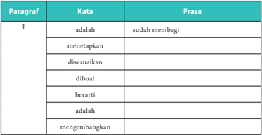

Tabel ini berisi paragraf pertama dari sebuah teks, dengan kolom-kolom "Kata" dan "Frasa". Paragraf tersebut mencakup beberapa kata seperti "adalah", "menetapkan", "diseuarkan", "dibuat", "berarti", "adalah", dan "mengenangkan". Setiap kata diikuti oleh frasa yang mungkin merupakan definisi atau penggunaan kata tersebut dalam konteks tertentu. Topik utama tabel ini adalah pengenalan atau penjelasan tentang beberapa kata dan frasanya.

 

---
## 📄 Halaman 58

Berdasarkan analisis kata dan frasa dapat dinyatakan bahwa pada paragraf pertama teks di atas banyak digunakan frasa nomina. Sementara itu, frasa verba pada  paragraf  pertama  teks  di  atas  hanya  ada  satu,  sedangkan  yang  lainnya berupa  kata.  Dengan  demikian,  nomina  yang  berfungsi  sebagai  subjek  atau objek pada paragraf pertama teks di atas banyak menggunakan frasa, sedangkan predikat banyak menggunakan kata.

Selanjutnya, lakukan  analisis kebahasaan  sebagaimana  contoh  di  atas. Tulislah  hasil  analisis  kamu  dalam  tabel  seperti  dalam  contoh  berikut!  Kamu dapat menuliskannya pada buku kerjamu.

---
**📊 Tabel**

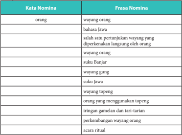

Tabel ini menunjukkan hubungan antara kata nomina dan frasa nomina dalam bahasa Indonesia. Topik utamanya adalah pengenalan dan penjelasan tentang kata dan frasa nomina, serta bagaimana mereka berinteraksi dalam konteks bahasa. Kolom pertama berisi kata nomina seperti "orang", "bahasa Jawa", "suku Banjar", "wayang gung", "suku Jawa", "orang yang menggunakan topeng", "irisan gamelan dan tari-tarian", "perkembangan wayang orang", dan "acara ritual". Kolom kedua berisi frasa nomina yang mencakup penggunaan kata-kata tersebut dalam konteks bahasa. Pola penting yang terlihat adalah bahwa setiap kata nomina memiliki beberapa frasa nomina yang dapat digunakan untuk menjelaskannya, menunjukkan kemampuan bahasa untuk mendeskripsikan konsep-konsep yang kompleks dengan cara yang efektif.

Wayang wong (bahasa Jawa yang berarti 'orang') adalah salah satu pertunjukan wayang yang diperankan langsung oleh orang. Wayang orang yang dikenal di suku Banjar adalah wayang gung, sedangkan yang dikenal di suku Jawa adalah wayang  topeng.  Wayang  topeng  dimainkan  oleh  orang  yang  menggunakan topeng.  Wayang  tersebut  dimainkan  dengan  iringan  gamelan  dan  tari-tarian. Perkembangan  wayang  orang  pun  saat  ini  beragam,  tidak  hanya  digunakan dalam acara ritual, tetapi juga digunakan dalam acara yang bersifat menghibur.

Selanjutnya,  kamu  harus  menganalisis  kata  dan  frasa  verba  pada  paragraf berikutnya  dari  teks  laporan  hasil  observasi  yang  telah  kamu  baca.  Tulislah hasilnya pada buku kerjamu seperti contoh tabel di bawah ini!

 

---
## 📄 Halaman 59

---
**📊 Tabel**

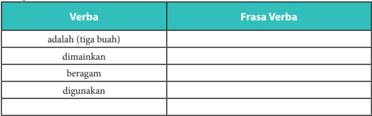

Tabel ini berisi verba (bentuk dasar dari kata kerja) dan frasa verba yang berkaitan dengan tiga buah buah. Topik utama tabel adalah tentang penggunaan kata kerja dalam bahasa Indonesia. Kolom Verba berisi kata kerja seperti "adalah", "dimainkan", "beragam", dan "digunakan". Kolom Frasa Verba berisi frasa yang dihasilkan dari kata kerja tersebut, seperti "tiga buah", "dimainkan", "beragam", dan "digunakan". Data penting yang terlihat adalah bahwa semua kata kerja memiliki frasa verba yang berbeda-beda, menunjukkan bahwa setiap kata kerja memiliki arti dan penggunaan yang berbeda dalam kalimat.

jumlah verba sesuai dengan jumlah klausa dalam kalimat.

### 2. Afiksasi

Sebuah  kata  dalam  teks  dapat  berupa  kata  dasar  atau  kata  turunan.  Kata turunan  terbentuk  melalui  afiksasi,  yaitu  proses  pengimbuhan.  Suatu  kata yang melalui afiksasi bisa saja berubah jenis. Sebagai contoh, suatu jenis verba suatu ketika muncul sebagai nomina dengan hanya menambah atau mengubah imbuhan.  Suatu  kata  dasar  dapat  berubah  menjadi  verba  jika  diberi  imbuhan me(N)-, be(R)-, di-, bahkan terkadang ter- atau ke-an. Sementara itu, kata dasar yang sama dapat berubah menjadi nomina jika diberi imbuhan pe(N)-, pe(R)-, -an, atau terkadang ke-an. Berikut adalah contoh afiksasi:

---
**📊 Tabel**

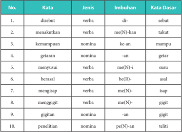

Tabel ini berisi informasi tentang kata dasar, jenis kata, imbuhan, dan kata dasar untuk beberapa kata dalam bahasa Indonesia. Topik utama tabel adalah penjelasan struktur kata dalam bahasa Indonesia, termasuk verba (kata kerja), nomina (kata benda), dan imbuhan. Kolom-kolomnya meliputi nomor urutan, kata, jenis kata, imbuhan, dan kata dasar. Data penting yang terlihat adalah bahwa banyak kata dalam tabel memiliki imbuhan yang sama, seperti "disebut" dengan imbuhan "di-", "menakutkan" dengan imbuhan "me(N)-kan", dan "menggigit" dengan imbuhan "me(N)-". Ini menunjukkan bahwa imbuhan dapat digunakan secara umum untuk beberapa kata kerja dan kata benda. Selain itu, tabel juga menunjukkan bahwa kata dasar untuk beberapa kata, seperti "sebut", "takut", "mampu", "getar", "susu", "asal", "isap", "gigiti", dan "teliti", adalah kata dasar yang sama untuk semua kata dalam tabel tersebut.

 

---
## 📄 Halaman 60

### Tugas 2

Analisislah afiksasi yang terjadi pada kata berimbuhan di bawah ini.

### Contoh Jawaban Tugas  2

---
**📊 Tabel**

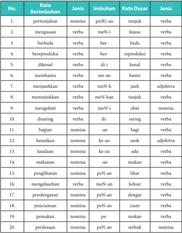

Tabel ini berisi informasi tentang kata dasar dan jenis bahasa dalam berbagai kata benda. Kolom pertama menunjukkan nomina, verba, dan adjektiva, sementara kolom kedua menunjukkan jenis imbuhan. Kolom ketiga menyajikan contoh kata benda dengan bentuk berimbuhannya, dan kolom keempat menunjukkan kata dasarnya. Topik utama tabel ini adalah analisis struktur kata dalam bahasa Indonesia, termasuk pengenalan kata dasar dan jenis imbuhan. Data penting yang terlihat adalah bahwa banyak kata dasar memiliki bentuk berimbuhannya yang sama, seperti "berbeda" dan "berproduksi", yang merupakan contoh kata dasar verb. Selain itu, tabel juga menunjukkan bahwa beberapa kata dasar memiliki bentuk berimbuhannya yang berbeda, seperti "menjauhkan" dan "menunjukkan", yang menunjukkan variasi dalam bentuk imbuhan.

 

---
## 📄 Halaman 61

Carilah kata dasar kemudian ubahlah ke dalam verba dan nomina dengan proses pengimbuhan (afiksasi) dengan cara melengkapi tabel di bawah ini/

### Contoh Jawaban Tugas  3

---
**📊 Tabel**

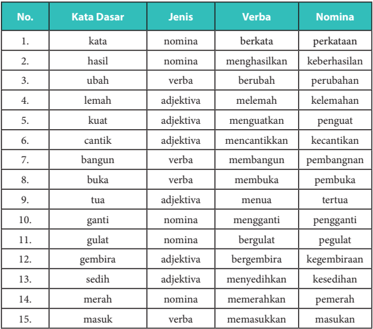

Tabel ini berisi informasi tentang kata dasar, jenis kata, verba, dan nomina dalam bahasa Indonesia. Topik utamanya adalah pengenalan struktur kata dalam bahasa Indonesia. Kolom-kolomnya meliputi nomina (kata benda), verba (kata kerja), dan adjektiva (kata sifat). Data penting yang terlihat adalah bahwa banyak kata dasar memiliki lebih dari satu jenis, seperti "kata" yang merupakan nomina dan juga verba. Selain itu, beberapa kata dasar memiliki variasi dalam bentuk nomina dan verba, seperti "buka" yang memiliki dua bentuk: verba "membuka" dan nomina "pembuka". Ini menunjukkan bahwa dalam bahasa Indonesia, kata dasar dapat berfungsi sebagai berbagai jenis kata, menciptakan kemampuan yang kuat untuk menghasilkan berbagai bentuk kata.

### 3. Kalimat Definisi dan Kalimat Deskripsi

Setelah  mengidentifikasi  verba  di  atas,  kamu  menemukan  beberapa  verba yang  digunakan  untuk  mendefinisikan  dan  mendeskripsikan  objek.  Tulislah masing-masing  5  contoh  kalimat  definisi,  yaitu  kalimat  yang  menggunakan verba definitif dan 5 contoh kalimat deskripsi, yaitu kalimat yang menggunakan verba sebagai deskriptif.

 

---
## 📄 Halaman 62

Contoh kalimat definisi yang terdapat dalam teks laporan hasil observasi berjudul Wayang adalah sebagai berikut.

- Wayang adalah seni  pertunjukan  yang  telah  ditetapkan  sebagai  warisan budaya asli Indonesia.
- Wayang golek adalah wayang  yang  menggunakan  boneka  kayu  sebagai pemeran tokoh.
- Wayang wong (bahasa Jawa yang berarti 'orang') adalah salah satu pertunjukan wayang yang diperankan langsung oleh orang.
- Wayang suket merupakan tiruan  dari  berbagai  figur  wayang  kulit  yang terbuat dari rumput (bahasa Jawa: suket ).
Kalimat deskripsi yang terdapat dalam teks tersebut adalah sebagai berikut.

- Wayang ini terbuat dari kulit kerbau yang ditatah, dan diberi warna sesuai kaidah  pulasan  wayang  pendalangan,  diberi  tangkai  dari  bahan  tanduk kerbau bule yang diolah sedemikian rupa dengan nama cempurit yang terdiri dari: tuding dan gapit .
- Wayang  purwa terdiri atas  beberapa  gaya  atau gagrak seperti, gagrak Kasunanan, Mangkunegaraan; Ngayogyakarta, Banyumasan, Jawatimuran, Kedu, Cirebon, dan sebagainya.
- Wayang topeng dimainkan oleh orang yang menggunakan topeng.
- Selain wayang golek Sunda yang terbuat dari kayu ada juga wayang menak atau sering juga disebut wayang golek menak karena cirinya mirip dengan wayang golek.
Siswa kemudian diminta mengidentifikasi kalimat definisi dan kalimat deskripsi dengan menggunakan tabel berikut.

---
**📊 Tabel**

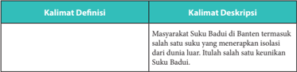

Tabel ini membandingkan dua jenis kalimat: "Kalimat Definisi" dan "Kalimat Deskripsi". Topik utama tabel ini adalah perbedaan antara definisi dan deskripsi dalam bahasa. Kolom pertama berisi judul "Kalimat Definisi", sedangkan kolom kedua berisi "Kalimat Deskripsi". Data penting yang terlihat adalah bahwa kalimat definisi menggunakan istilah formal untuk menjelaskan suatu hal secara umum, sementara kalimat deskripsi menggunakan kata-kata lebih detail dan spesifik untuk memberikan gambaran tentang sesuatu.

 

---
## 📄 Halaman 63

---
**📊 Tabel**

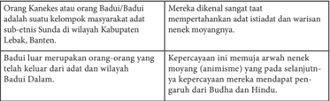

Tabel ini membahas tentang orang Badui, kelompok masyarakat sub-etnis Sunda di wilayah Kabupaten Lebak, Banten. Orang Badui merupakan kelompok etnis yang berada di bawah adat dan wilayah Dalam. Mereka memiliki hubungan dekat dengan adat istiadat dan warisan nenek moyangnya, yang dikenal sebagai kepercayaan animisme. Ini menunjukkan bahwa mereka mematuhi arah nenek moyangnya dalam berbagai aspek kehidupan, termasuk dalam hal pengembangan dan penyebaran agama.

### 4. Kalimat Simpleks dan Komples

Kalimat dalam sebuah teks dapat dibentuk hanya oleh satu klausa, yaitu bagian kalimat yang mengandung subjek dan predikat (predikatif). Kalimat yang hanya memiliki  satu  klausa  disebut  sebagai kalimat  simpleks atau  biasa  disebut  pula sebagai kalimat tunggal.

Berikut adalah contoh kalimat simpleks dengan bermacam pola:

- Ada beragam jenis topeng di museum ini.
- P                   S                              K
- Kelelawar merupakan hewan unik. S                     P Pel
- Wayang tersebut berbentuk pipih seperti wayang kulit. S P O K
Kalimat kompleks atau kalimat majemuk adalah kalimat yang memiliki dua atau  lebih  klausa.  Kalimat  kompleks  dibagi  menjadi  dua  macam,  yaitu  kalimat kompleks atau majemuk setara dan kalimat kompleks atau majemuk bertingkat. Kalimat majemuk setara memiliki dua atau klausa ganda yang setara dalam suatu kalimat,  sedangkan  kalimat  majemuk  bertingkat  memiliki  klausa  ganda  yang tidak sama atau berada di bawah fungsi utama suatu kalimat. Fungsi-fungsi utama dalam  dalam  kalimat  majemuk  setara  membentuk  induk  kalimat  atau  klausa atasan. Fungsi-fungsi yang membentuk tingkat, yaitu yang mengikuti konjungsi subordinatif disebut klausa bawahan atau anak kalimat. Kalimat majemuk setara biasanya ditandai dengan penggunaan konjungsi koordinatif (setara), sedangkan kalimat  majemuk  bertingkat  biasanya  ditandai  dengan  penggunaan  konjungsi subordinatif (bertingkat).

 

---
## 📄 Halaman 64

### Cermatilah contoh kalimat kompleks di bawah ini! Kalimat kompleks setara

- Dalam budaya modern, wayang berfungsi menghibur dan
K

S

P

Pel

Konjungsi Koordinatif

mendidik.

Pel

- Kelelawar aktif pada malam hari, tetapi tidur pada siang hari.
S            P                 K

Konjungsi Koordinatif P

K

Kalimat kompleks bertingkat

- Keberadaan D'topeng tidak dapat dipisahkan
S

P

dengan Museum Angkut

K

karena / kedua tempat ini / berada / di satu tempat yang sama.

K

- Selanjutnya, jenis wayang yang lain adalah
S                      P

wayang golek / yang / mempertunjukkan / boneka kayu.

O

wayang golek / yang / mempertunjukkan / boneka kayu.

Konjungsi Perluasan

Klausa Atasan

Klausa Atasan

Klausa Bawahan

Konjungsi Subordinatif

S

P

K

Inti O

Konjungsi Antar Kalimat

O

P

Klausa Bawahan

S

 

---
## 📄 Halaman 65

### Tugas 6

Bacalah kutipan teks di bawah ini dengan saksama kemudian kerjakan tugastugas yang menyertainya.

### Taman Nasional Baluran

Taman Nasional Baluran merupakan perwakilan ekosistem hutan spesifik kering di Pulau Jawa. Hutan di taman ini  terdiri dari tipe vegetasi savana, hutan mangrove, hutan musim, hutan pantai, hutan pegunungan bawah, hutan rawa dan hutan yang selalu hijau sepanjang tah un. Taman Nasional Baluran memiliki berbagai macam flora dan fauna dan ekosistem.

Tumbuhan di taman nasional ini sebanyak 444 jenis.  Di antara jenis tumbuhan di sini terdapat  tumbuhan asli yang khas dan menarik yaitu widoro bukol ( Ziziphus rotundifolia ), mimba ( Azadirachta indica ), dan pilang ( Acacia leucophloea ). Widoro bukol, mimba, dan pilang merupakan tumbuhan yang mampu beradaptasi dalam kondisi yang sangat kering (masih kelihatan hijau), walaupun tumbuhan lainnya sudah layu dan mengering.Tumbuhan yang lain seperti asam ( Tamarindus indica ), gadung ( Dioscorea hispida ), kemiri ( Aleurites moluccana ), gebang ( Corypha utan ), api-api ( Avicennia sp .),  kendal ( Cordia obliqua ), manting ( Syzygium polyanthum ), dan kepuh ( Sterculia foetida ).

Di  taman  ini  juga  terdapat  26  jenis  mamalia  diantaranya  banteng  (Bos javanicus javanicus ),  kerbau  liar  ( Bubalus bubalis ),  ajag  ( Cuon alpinus javanicus ),  kijang  ( Muntiacus muntjak muntjak ), rusa ( Cervus timorensis russa ), macan tutul ( Panthera pardus melas ), kancil (Tragulus javanicus pelandoc), dan kucing bakau ( Prionailurus  viverrinus ).  Satwa  banteng merupakan maskot/ciri khas Taman Nasional Baluran.

Selain itu, terdapat sekitar 155 jenis burung di antaranya termasuk yang langka seperti layang-layang api ( Hirundo rustica ), tuwuk/tuwur asia ( Eudynamys scolopacea ), burung merak ( Pavo  muticus) ,  ayam  hutan  merah  (Gallus  gallus),  kangkareng  ( Anthracoceros  convecus ), rangkong ( Buceros rhinoceros ), dan bangau tong-tong ( Leptoptilos javanicus ).

Taman nasional mmemiliki beragam manfaat berupa produk jasa lingkungan, seperti udara bersih dan pemandangan alam. Kedua manfaat tersebut berada pada suatu ruang dan waktu yang sama. Diperlukan suatu bentuk kebijakan yang mampu mengatur pengalokasian sumberdaya  dalam  kaitannya  dengan  pemenuhan  kebutuhan  masyarakat  dengan  tetap memperhatikan daya dukung lingkungan dan aspek sosial ekonomi masyarakat sekitarnya. Sumber: http://www.mikirbae.com/2015/06/teks-observasi-tentang-taman-nasional.html (dengan penyesuian)

### Tugas

- Temukan 2 contoh kalimat simpleks dalam teks di atas!
- Temukan 2 kalimat majemuk setara!
- Temukan 2 kalimat majemuk bertingkat!
- Presentasikan hasil kerjamu di depan kelas.

 

---
## 📄 Halaman 66

### Contoh Jawaban

---
**📊 Tabel**

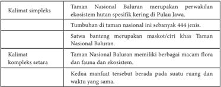

Tabel ini membandingkan dua kalimat: kalimat sederhana dan kalimat kompleks setara. Topik utama tabel adalah perbandingan struktur kalimat dan konten informasi yang disampaikan. Kolom pertama berisi kalimat sederhana, sedangkan kolom kedua berisi kalimat kompleks setara. Data penting yang terlihat antara lain bahwa kalimat sederhana lebih singkat dan sederhana, sementara kalimat kompleks setara memiliki struktur yang lebih rumit dan menyajikan informasi yang lebih detail.

### PROSES PEMBELAJARAN C KEGIATAN 2

### Membenahi Kesalahan Bahasa Laporan Hasil Observasi

Seringkali  penyusunan  kalimat  definisi  dalam  teks  laporan  hasil  observasi kurang tepat. Akibatnya, definisi yang diberikan pada objek menjadi tidak tepat.

### Perhatikan contoh berikut ini.

Kelelawar adalah binatang malam.

Bagaimana menguji apakah sebuah kalimat definisi benar atau salah?

Apakah  kalimat Kelelawar adalah binatang malam sama  artinya  dengan kalimat Binatang malam adalah kelelawar ? Bandingkan dengan kalimat Kelelawar adalah mamalia bersayap yang mencari mangsa di malam hari dan tidur di malam hari .  Apakah makna kalimat Kelelawar adalah mamalia bersayap yang mencari mangsa di malam hari dan tidur di malam hari sama dengan Mamalia bersayap yang mencari mangsa di malam hari dan tidur di malam hari adalah kelelawar?

Selain  harus  memenuhi  kebenaran  isi  dan  kesesuaian  struktur,  sebuah  teks laporan  hasil  observasi  juga  harus  memenuhi  kaidah  bahasa  Indonesia  baku. Dalam Bab ini kamu secara khusus akan mempelajari penulisan (a) huruf kapital dan (b)  di dan ke sebagai imbuhan dan sebagai kata depan.

 

---
## 📄 Halaman 67

Pembenahan penulisan kutipan teks laporan hasil observasi berikut ini.

Suku Badui Dalam dikenal sangat taat mempertahankan adat istiadat dan warisan nenek moyangnya. Mereka memakai pakaian yang berwarna putih yang tidak berkerah, mengenakan ikat kepala, serta membawa golok. Suku ini melarang warganya memakai pakaian modern. Ke mana pun bepergian, mereka tidak menggunakan kendaraan, bahkan tidak memakai alas kaki. Mereka juga di larang menggunakan benda-benda modern seperti HP, TV, dan sebagainya. Untuk bepergian ke mana pun, termasuk ke desa terdekat, mereka harus berangkat secara berkelompok

Untuk penguatan, guru hendaknya membiasakan siswa membuka Pedoman Ejaan yang Disempurnakan (EyD).

Selanjutnya  siswa  diberi  tugas  untuk  melakukan  penyuntingan  kesalahan penulisan teks laporan hasil observsi berikut ini. Tugas siswa adalah sebagai berikut.

- Menganalisis kebenaran kalimat definisinya.  Bila masih salah, benahilah sehingga menjadi benar.
- Membenahi penggunaan huruf kapital yang masih salah sehingga sesuai dengan Pediman Ejaan.

### Sampah

Sampah  merupakan  material  sisa  yang  tidak  diinginkan  setelah  berakhirnya suatu  proses.  Sampah  dapat  bersumber  dari  alam,  manusia,  konsumsi,  nuklir, industri,  dan  pertambangan.  Sampah  dibumi  ini  akan  terus  bertambah  selama masih ada kegiatan yang dilakukan oleh manusia maupun alam. Berdasarkan sifat dan  bentuknya,  sampah  dibagi  menjadi  dua  yaitu  sampah  Organik  dan  sampah Anorganik.

Sampah  Organik  adalah  sampah  yang  dapat  diuraikan  dan  biasanya  mudah membusuk.  Contoh  sampah  organik  adalah  sisa  makanan,  sayuran,  dan  daundaunan. Sampah ini dapat di olah menjadi kompos. Sampah anorganik merupakan sampah  yang  tidak  mudah  diuraikan  atau undegradable. C.  Contoh  sampah Anorganik adalah plastik, kayu, kaca, dan kaleng.

Dewasa ini  sampah  semakin  bertambah  terutama  di  Kota-Kota  besar  seperti Jakarta dan  Surabaya. Perlu disadari bahwa pelestarian lingkungan hidup bukanlah tanggung jawab Pemerintah saja, tetapi tanggung jawab kita semua.

- Kalimat definisi 'Sampah merupakan material sisa yang tidak diinginkan setelah berakhirnya suatu proses,' sudah tepat.
- Kesalahan EyD yang terdapat dalam teks dan pembenahannya:

 

---
## 📄 Halaman 68

---
**📊 Tabel**

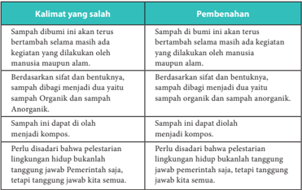

Tabel ini berisi kumpulan kalimat yang salah dan pembenahan mereka. Topik utamanya adalah pengelolaan sampah organik dan anorganik. Kolom pertama berisi kalimat yang salah, sedangkan kolom kedua berisi pembenahan untuk setiap kalimat tersebut. Data penting yang terlihat adalah bahwa semua kalimat yang diberikan adalah tentang pengelolaan sampah organik dan anorganik, dengan fokus pada bagaimana sampah organik dan anorganik harus dibagi menjadi kompos dan diolah menjadi kompos.

### Petunjuk untuk Guru

Setelah  mempresentasikan  tugasnya,  guru  membimbing  siswa  untuk  membuat simpulan perbedaan penulisan di-/ke- sebagai imbuhan yang penulisannya dirangkai dan di/ke sebagai kata depan yang penulisannya dipisah. Guru juga perlu menekankan penggunaan huruf kapital dengan tepat.

### D.  Mengonstruksikan Teks Laporan Hasil Observasi

- Ind 1 Melengkapi gagasan pokok dan gagasan penjelas.
Ind 2 Menyusun teks laporan  hasil observasi dengan memerhatikan isi dan kebahasaan.

### PROSES PEMBELAJARAN D KEGIATAN 1

Melengkapi Gagasan Pokok dan Gagasan Penjelas

Sebagaimana yang sudah dipahami sebelumnya bahwa pada setiap paragraf terdapat gagasan pokok. Jadi, mengembangkan teks dimulai dengan menuliskan gagasan-gagasan pokok terlebih dahulu. Setiap gagasan pokok dikembangkan menjadi satu paragraf.

 

---
## 📄 Halaman 69

Perhatikanlah contoh rangkaian gagasan pokok berikut.

- Merpati sering disamakan dengan dara karena termasuk dalam ordo yang sama.
- Merpati dan dara adalah burung yang berbadan gempal dengan leher pendek, paruh ramping pendek, dan cere berair.
- Merpati dan dara memiliki spesies yang bermacam.
- Berbagai spesies merpati dan dara dimanfaatkan sebagai burung hias.
Gagasan pertama dapat dikembangkan, dengan menambah gagasan-gagasan penjelas.

Latihan mengembangkan paragraf sebagaimana contoh pengembangan di atas.

---
**📊 Tabel**

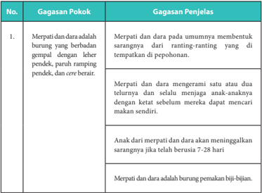

Tabel ini berisi informasi tentang gagasan pokok dan penjelasan tentang burung merpati dan dara. Topik utamanya adalah tentang karakteristik dan perilaku burung tersebut. Kolom pertama berisi gagasan pokok, sedangkan kolom kedua berisi penjelasan lebih lanjut. Data penting yang terlihat antara lain bahwa merpati dan dara membentuk sarang dari ranting-ranting yang di tempatkan di pepohonan, merpati dan dara menerangi satu dan dua telurnya, dan selalu menjaga anak-anaknya dengan ketat sebelum mereka dapat mencari makanan sendiri. Selain itu, merpati dan dara merupakan burung pemakan biji-bijian.

 

---
## 📄 Halaman 70

---
**📊 Tabel**

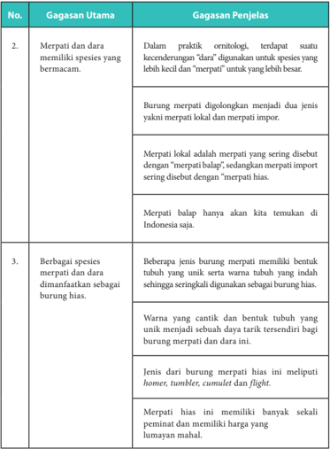

Tabel ini membahas dua gagasan utama tentang burung merpati dan spesiesnya. Pertama, merpati memiliki kecenderungan untuk digunakan sebagai spesies yang lebih kecil dan "merpati" untuk yang lebih besar, yang dijelaskan bahwa burung merpati dikelompokkan menjadi dua jenis: merpati lokal dan merpati impor. Merpati lokal disebut dengan "merpati balap", sedangkan merpati impor disebut dengan "merpati hias". Kedua, beberapa jenis burung merpati memiliki bentuk tubuh yang unik dan warna tubuh yang indah sehingga sering digunakan sebagai burung hias. Warna yang cantik dan bentuk tubuh yang unik menjadi daya tarik tersendiri bagi burung merpati dan d因而 ini. Jenis dari burung merpati hias ini meliputi homer, tumbler, cumulei dan flight. Merpati hias ini memiliki banyak sekali pemilihan dan memiliki harga yang lumayan mahal.

 

---
## 📄 Halaman 71

### PROSES PEMBELAJARAN D KEGIATAN 2

### Menyusun Teks Laporan  Hasil Observasi

### Tugas

Kamu  sudah  berlatih  mengembangkan  gagasan  menjadi  paragraf.  Untuk menambah pemahamanmu tentang teks laporan hasil observasi, buatlah sebuah teks laporan hasil observasi secara individu! Kamu bisa mengonsultasikan tema yang akan kamu kembangkan dengan guru di kelasmu.

Guru menyampaikan langkah-langkah berikut ini pada siswa.

- Menentukan objek yang akan diamati!
- Menyusun jadwal observasi yang akan dilakukan.
- Melakukan observasi terhadap objek tersebut dengan menyiapkan pertanyaan atau poin-poin pengamatan terlebih dahulu.
- Mencatat hasil observasi kamu.  Bila memungkinkan siswa diminta mengambil foto dan memvideokan observasi.
- Menyusun teks laporan hasil observasimu dengan meperhatikan ketepatan isi, struktur, dan kaidah kebahasaannya.
- Presentasikan teks laporan hasil observasi di hadapan teman-temannya.
- Memberi  tanggapan  (kritik  dan  saran)  terhadap  teks  laporan  hasil  observasi yang disajikan temannya.
- Memublikasikan  teks  laporan  hasil  observasi  di  majalah  dinding,  majalah sekolah, blog, atau di media cetak.

 

---
## 📄 Halaman 72

### a. Penilaian Pengetahuan

Teknik  penilaian  pengetahuan  yang  dapat  digunakan  oleh  guru  adalah  tes tulis, observasi, dan tes penugasan.

### 1. Tes tulis

Tes tulis untuk menguji pemahaman siswa dapat dilakukan dengan tes uraian maupun  pilihan  ganda.  Sebaiknya  dalam  melaksanakan  ulangan  harian  guru memilih soal uraian karena soal uraian dapat lebih mengukur kemampuan siswa secara lebih dalam. Pertanyaan yang diajukan hendaknya mengacu pada indiktor pembelajaran.

### Contoh Soal Uraian untuk Pelajaran I

Petunjuk: Bacalah teks laporan hasil observasi berikut  kemudian  jawablah pertanyaan di bawahnya.

Sampah  merupakan  material  sisa  yang  tidak  diinginkan  setelah  berakhirnya suatu  proses.  Sampah  dapat  bersumber  dari  alam,  manusia,  konsumsi,  nuklir, industri, dan pertambangan.  Berdasarkan  sifatnya  sampah  dapat  dibedakan menjadi dua, yaitu sampah organik dan anorganik.

Sampah  organik  merupakan  sampah  yang  dapat  diuraikan  atau  degradable. Contoh  sampah  organik  adalah  sampah  yang  mudah  membusuk  seperti  sisa makanan,  sayuran,  daun-daun  kering,  dan  sebagainya.  Sampah  ini  dapat  diolah menjadi kompos. Sementara itu, sampah anorganik merupakan sampah yang tidak mudah  diuraikan  atau undegradable .  Contoh  sampah  anorganik  adalah  sampah yang tidak mudah membusuk, seperti plastik, kayu, kaca, kaleng, dan sebagainya. Sampah  anorganik  didaur  ulang  oleh home  industri untuk  mengurangi  jumlah sampah serta dijadikan sebagai peluang usaha.

Sumber : http://sofitri8.blogspot.co.id/2014/09/teks-laporan-hasil-observasi.html (dengan perubahan)

### Soal

- Tuliskan  bagian  pernyataan  umum  dan  klaifikasi  dalam  teks  laporan  hasil observasi di atas!
- Tuliskan (a) kalimat definisi dan (b) kalimat deskripsi yyang terdapat dalam teks di atas!
- Tuliskan kembali teks laporan hasil observasi di atas sehingga lengkap dan jelas setiap bagian struktur teksnya!
- Temukan  2  kata  kerja  yang  dibentuk  dari  kata  sifat  dalam  teks  laporan  hasil observasi di atas!

### PENILAIAN

 

---
## 📄 Halaman 73

### Kunci Jawaban

- Sampah merupakan material sisa yang tidak diinginkan setelah berakhirnya suatu proses. Sampah dapat bersumber dari alam, manusia, konsumsi, nuklir, industri,  dan  pertambangan.  Berdasarkan  sifatnya  sampah  dapat  dibedakan menjadi dua, yaitu sampah organik dan anorganik.
- (a) Sampah merupakan material sisa yang tidak diinginkan setelah berakhirnya suatu  proses;  (b)  sampah  dapat  bersumber  dari  alam,  manusia,  konsumsi, nuklir, industri, dan pertambangan.
- Sampah merupakan material sisa yang tidak diinginkan setelah berakhirnya suatu proses. Sampah dapat bersumber dari alam, manusia, konsumsi, nuklir, industri,  dan  pertambangan.  Berdasarkan  sifatnya  sampah  dapat  dibedakan menjadi dua, yaitu sampah organik dan anorganik.
Sampah  organik  merupakan  sampah  yang  dapat  diuraikan  atau degradable . Contoh sampah organik adalah sampah yang mudah membusuk seperti sisa makanan,  sayuran,  daun-daun  kering,  dan  sebagainya.  Sedangkan  sampah anorganik merupakan sampah yang tidak mudah diuraikan atau undegradable. Contoh  sampah  anorganik  adalah  sampah  yang  tidak  mudah  membusuk, seperti plastik, kayu, kaca, kaleng, dan sebagainya.

Baik  sampah  organik  maupun  nonorganik  dapat  dimanfaatkan  melalui  daur ulang.  Sampah  ini  dapat  diolah  menjadi  kompos.  Sampah  anorganik  didaur ulang  oleh home  industri untuk  mengurangi  jumlah  sampah  serta  dijadikan sebagai peluang usaha.

- (a)  membusuk dibentuk dari kata sifat busuk ,  (b) mengurangi dibentuk  dari kata sifat kurang .

### Kunci Jawaban

---
**📊 Tabel**

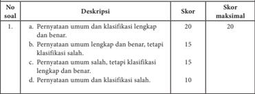

Tabel ini menunjukkan skor yang diberikan untuk setiap jenis penerapan umum dan klasifikasi dalam sebuah penilaian. Topik utama tabel ini adalah tentang skor yang diberikan untuk berbagai tingkat kualitas penerapan umum dan klasifikasi dalam sebuah penilaian. Kolom-kolom yang ada dalam tabel ini adalah No soal, Deskripsi, Skor, dan Skor maksimal. Data atau pola penting yang terlihat dalam tabel ini adalah bahwa skor tertinggi yang dapat diberikan adalah 20, sedangkan skor terendahnya adalah 10. Skor tertinggi ini diberikan ketika penerapan umum dan klasifikasi lengkap dan benar, sementara skor terendahnya diberikan ketika penerapan umum dan klasifikasi salah.

 

---
## 📄 Halaman 74

---
**📊 Tabel**

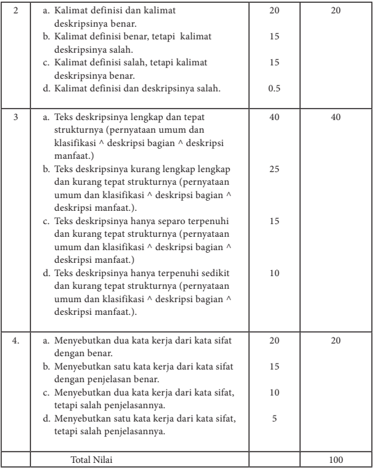

Tabel ini membandingkan kualitas deskripsi yang diberikan oleh siswa dengan deskripsi yang diharapkan. Topik utama tabel adalah kualitas deskripsi, yang terdiri dari definisi dan deskripsinya. Tabel dibagi menjadi dua bagian: bagian pertama menunjukkan deskripsi yang diberikan oleh siswa, sementara bagian kedua menunjukkan deskripsi yang diharapkan. Kolom-kolomnya mencakup definisi dan deskripsinya, dengan nilai 20 untuk definisi benar dan 15 untuk definisi tidak benar, serta deskripsinya, dengan nilai 20 untuk deskripsi benar dan 15 untuk deskripsi tidak benar. Data penting yang terlihat adalah bahwa deskripsi yang diberikan oleh siswa sering kali memiliki definisi yang benar tetapi deskripsinya salah, sedangkan deskripsi yang diharapkan selalu memiliki definisi dan deskripsinya yang benar. Total nilai untuk semua deskripsi adalah 100.

### 2. Observasi

Observasi selama proses pembelajaran selain dilakukan untuk penilaian sikap, juga dapat dilakukan untuk penilaian pengetahuan, misalnya pada waktu diskusi atau kegiatan kelompok. Teknik ini merupakan cerminan dari penilaian autentik. Guru  mencatat    aktivitas  dan  kualitas  jawaban,  pendapat,  dan  pertanyaan  yang disampaikan siswa selama proses pembelajaran.

 

---
## 📄 Halaman 75

Catatan  ini  dapat  dijadikan  dasar  bagi  guru  untuk  memberikan reward (tambahan) nilai pengetahuan bagi siswa.

### Lembar Observasi Penilaian Pengetahuan

---
**📊 Tabel**

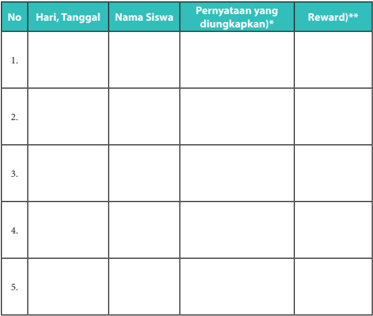

Tabel ini merupakan lembar kerja untuk mengumpulkan informasi tentang pernyataan yang diungkapkan oleh siswa dan reward yang diberikan. Topik utamanya adalah proses pembelajaran dan penghargaan siswa. Kolom-kolom yang ada meliputi nomor urut (No.), hari dan tanggal, nama siswa, pernyataan yang diungkapkan, dan reward. Data penting yang terlihat adalah bahwa tabel ini dirancang untuk mencatat perkembangan dan prestasi siswa dalam proses belajar, serta memberikan reward sebagai motivasi tambahan.

### Keterangan:

- )* berisi pertanyaan, ide, usul, atau tanggapa yang disampaikan siswa berkaitan dengan materi yang dipelajari.
- )**   rentang reward yang diberikan antara 1-5 untuk skala penilaian 0-100.

### 3. Penugasan

Tugas-tugas  yang  diberikan  pada  siswa  (dari  buku  teks  siswa  maupun hasil  inovasi  guru)  digunakan  sebagai  salah  satu  instrumen  penilaian  hasil belajar  pengetahuan  siswa.  Pembobotan  nilai  ditentukan  berdasarkan  tingkat kesulitan  dan  lamanya  waktu  pengerjaan  tugas.  Semakin  sulit  dan  lama  waktu mengerjakannya,  semakin  besar  bobotnya.  Tugas  yang  diberikan  sebaiknya mencakup  tugas  individu  dan  kelompok.  Hasil  penilain  kognitif  dengan  tugas dapat dicatat dan diolah dengan menggunakan  lembar penilaian seperti ini.

 

---
## 📄 Halaman 76

### Contoh lembar penilaian tugas siswa

---
**📊 Tabel**

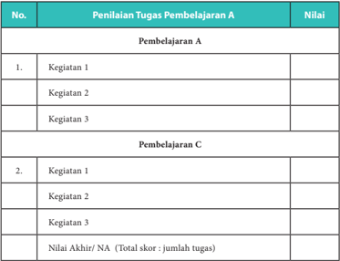

Tabel ini merupakan alat untuk mengevaluasi tugas pembelajaran yang dilakukan oleh siswa. Topik utamanya adalah penilaian tugas pembelajaran A dan C. Tabel ini terdiri dari dua bagian utama: Pembelajaran A dan Pembelajaran C. Dalam Pembelajaran A, terdapat tiga kegiatan yang diukur dengan nilai, yaitu Kegiatan 1, Kegiatan 2, dan Kegiatan 3. Sedangkan dalam Pembelajaran C, juga ada tiga kegiatan yang diukur dengan nilai, yaitu Kegiatan 1, Kegiatan 2, dan Kegiatan 3. Selain itu, tabel ini juga menyediakan ruang untuk mencatat nilai akhir setelah semua tugas telah diperiksa. Nilai akhir tersebut dihitung berdasarkan jumlah total skor dari semua tugas yang diberikan.

Selanjutnya,  untuk  mendapatkan  nilai  kognitif    hasil  penilaian  proses  dan ulangan  harian  pada  akhir  pembelajaran  setiap  bab,  guru  dapat  menentukan pembobotan berdasarkan tingkat kesulitan, lama waktu pengerjaan, dan sebagainya. Berikut adalah contoh  rumus yang dapat digunakan.

``

### Catatan:

- Reward diperoleh dari total reward selama pembelajaran satu bab,
- NUH adalah Nilai Ulangan Harian yang dilakukan pada akhir pembelajaran satu bab, dan
- Nilai  akhir  tugas  diberi  bobot  lebih  besar  karena  tugas  lebih  menyita konsentrasi  dan  waktu  pengerjaan  relatif  lama.  Nilai  tugas  diambil  dari pembelajaran A dan C.

 

---
## 📄 Halaman 77

### b. Penilaian Keterampilan

Nilai keterampilan diperoleh dari hasil penilaian unjuk kerja/kinerja/praktik, projek, dan portofolio. Unjuk kerja dalam pembelajaran bahasa Indonesia dapat berupa unjuk kerja lisan maupun tulis.  Projek diberikan diberikan minimal 1 kali  X  dalam  satu  semester,  dan  biasanya  diberikan  pada  proses  pembelajaran akhir.  Portofolio  diperoleh  dari  kumpulan  tugas  keterampilan  yang  dikerjakan siswa selama proses pembelajaran.

Rumus penentuan nilai akhir untuk KD 4 (keterampilan) diambil dari nilai optimal yang diperoleh siswa pada setiap KD.

### INTERAKSI DENGAN ORANG TUA PESERTA DIDIK

Interaksi dengan orangtua dilakukan untuk mengomunikasikan hasil belajar (portofolio) siswa kepada orangtua. Caranya, orangtua diminta menandatangani serta  memberi  komentar  lembar  tugas  atau  lembar  jawaban  ulangan  anaknya pada bagian yang telah disediakan.

---
**🖼️ Gambar/Diagram**

> **Deskripsi Visual:** Gambar ini adalah ilustrasi yang menampilkan seorang anak sedang membaca buku. Ilustrasi ini menggambarkan tindakan belajar dan pengetahuan. Anak tersebut tampak senang dan fokus pada buku yang ia baca, menunjukkan kegiatan belajar yang positif. Ilustrasi ini mungkin digunakan untuk membantu mengajarkan konsep tentang pengetahuan, belajar, dan hobi membaca.

 

---
## 📄 Halaman 78

' ' DARIPADA HARTA. ILMU ITU LEBIH BAIK ILMU MENJAGA ENGKAU DAN ENGKAU MENJAGA HARTA ILMU ITU PENGHUKUM (HAKIM) DAN HARTA TERHUKUM HARTA ITU KURANG TAPI ILMU ITU BERTAMBAH APABILA DIBELANJAKAN BILA DIBELANJAKAN.

### Khalifah Ali bin Abi Talib

---
**🖼️ Gambar/Diagram**

> **Deskripsi Visual:** Gambar ini adalah ilustrasi yang menampilkan seorang anak laki-laki dengan rambut merah muda sedang tersenyum lebar. Anak tersebut mengangkat tangan kanan ke atas, menunjukkan satu jari. Dia berdiri di atas sebuah meja kayu, dan di sekitarnya ada beberapa bintik putih kecil yang tampak seperti salju atau bintik-bintik cahaya. Anak tersebut mengenakan kaos bertopeng warna oranye dan putih.

Elemen-elemen utama dalam gambar ini adalah anak laki-laki yang tersenyum, tangan kanannya yang menunjukkan satu jari, dan meja kayu di depannya. Relasi antara elemen-elemen ini adalah anak tersebut sedang berdiri di atas meja, menunjukkan satu jari, dan tampak senang.

Teks, angka, atau label penting yang terlihat dalam gambar ini adalah tidak ada. Namun, informasi kunci yang dapat diambil pembaca adalah bahwa anak tersebut tampak senang dan sedang bermain atau berinteraksi dengan sesuatu di meja di depannya.

 

---
## 📄 Halaman 79

### Bab II

### MENGEMBANGKAN PENDAPAT DALAM EKSPOSISI

---
**🖼️ Gambar/Diagram**

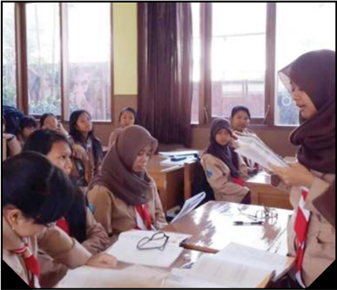

> **Deskripsi Visual:** Gambar ini menunjukkan sebuah ruangan belajar dengan beberapa siswa sedang mengikuti sesi pembelajaran. Siswa-siswa tersebut berdiri di sepanjang meja, menghadap ke arah guru yang sedang berdiri di depan mereka. Guru tersebut memegang sebuah lembaran kertas dan tampaknya sedang memberikan penjelasan kepada siswa. Ruangan ini dilengkapi dengan jendela yang memberikan cahaya alami, dan terdapat papan tulis di dinding belakang. Siswa-siswa tersebut mengenakan pakaian formal, termasuk hijab, yang menunjukkan bahwa ini mungkin adalah sekolah untuk perempuan. Meja-mesa tersebut terlihat rapi dan terbuat dari kayu, dengan beberapa buku dan alat tulis lainnya terletak di atasnya.

 

---
## 📄 Halaman 80

---
**📊 Tabel**

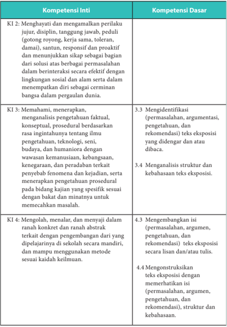

Tabel ini berisi informasi tentang kompetensi inti dan dasar yang harus dipenuhi oleh siswa dalam proses belajar. Topik utama tabel adalah tentang pengembangan keterampilan berpikir kritis dan analitis, termasuk menghargai dan menjaga perilaku yang positif, memahami dan menerapkan pengetahuan ilmiah, serta mengolah dan menulis teks eksposisi dengan baik. Kolom-kolomnya mencakup dua bagian utama: Kompetensi Inti (KI) dan Kompetensi Dasar (KD). Data penting yang terlihat meliputi:

1. KI 2: Menghargai dan mengamalkan perilaku jujur, disiplin, tanggung jawab, peduli, santun, responsif, dan proaktif.
2. KI 3: Memahami, menerapkan, dan menganalisis pengetahuan faktil, konseptual, prosedural berdasarkan rasa inginnya tentang ilmu pengetahuan, teknologi, seni, budaya, dan humaniora.
3. KI 4: Mengolah, menalar, dan menyajikan dalam ranah konkrit dan abstrak terkait dengan pengenalan dari berbagai metode kaidah keilmuan.

KD 3.3: Identifikasi (permasalahan, argumentasi, pengetahuan, dan rekomendasi) teks eksposisi yang didengar atau dibaca.
KD 3.4: Menganalisis struktur dan kebahasaan teks eksposisi.
KD 4.3: Mengembangkan isi (permasalahan, argumen, pengetahuan, dan rekomendasi) teks eksposisi secara lisan dan/atau tulis.
KD 4.4: Mengonstruksi teks eksposisi dengan memerhatikan isi (permasalahan, argumen, pengetahuan, dan rekomendasi), struktur, dan kebahasaan.

Tabel ini membantu siswa untuk memahami dan mengembangkan keterampilan berpikir kritis, analitis, dan komunikatif yang diperlukan dalam konteks pembelajaran.

 

---
## 📄 Halaman 81

### PETA KONSEP

---
**🖼️ Gambar/Diagram**

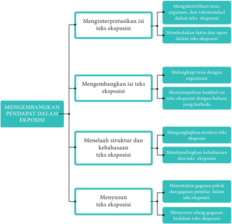

> **Deskripsi Visual:** Gambar ini adalah diagram yang menunjukkan proses pengembangan pendapat dalam eksposisi. Diagram ini dibagi menjadi empat bagian utama, masing-masing menunjukkan tahap-tahap dalam proses tersebut. Setiap bagian memiliki subbagian yang lebih spesifik untuk menjelaskan langkah-langkah yang harus dilakukan.

1. **Menginterpretasikan Isi Teks Eksposisi** - Ini adalah bagian pertama yang mencakup identifikasi teks eksposisi, argument, dan rekomendasi dalam teks eksposisi, serta membedakan fakta dari opini dalam teks eksposisi.
   
2. **Mengembangkan Isi Teks Eksposisi** - Bagian ini melibatkan mengembangkan teks eksposisi dengan argument, menyampaikan kembali ide-ide dari bahasa yang berbeda, dan mengekspresikan pendapat dalam konteks yang relevan.

3. **Menelaah Struktur dan Kebahasaan Teks Eksposisi** - Ini mencakup mengungkapkan struktur teks eksposisi, membundling kebahasaan dan teks eksposisi, dan menentukan gagasan pokok dan gagasan penjelasan dalam teks eksposisi.

4. **Menyusun Teks Eksposisi** - Bagian ini menunjukkan proses menyusun ulang gagasan ke dalam struktur teks eksposisi.

Elemen-elemen utama dalam diagram ini adalah proses pengembangan pendapat dalam eksposisi, yang terdiri dari empat tahap yang disebutkan di atas. Setiap tahap memiliki subbagian yang lebih spesifik untuk menjelaskan langkah-langkah yang harus dilakukan. Teks, angka, atau label penting yang terlihat dalam diagram ini adalah teks yang menjelaskan setiap tahap dan subtahap dalam proses pengembangan pendapat dalam eksposisi. Informasi kunci yang dapat diambil pembaca adalah bahwa proses ini melibatkan identifikasi, pengembangan, penilaian, dan penyusunan teks eksposisi.

 

---
## 📄 Halaman 82

### A. Menginterpretasi Makna dalam Teks Eksposisi

Ind 1

mengidentifikasi argumentasi yang digunakan untuk memperkuat tesis/ pernyataan pendapat.

Ind 2 Membedakan fakta dan opini dalam teks eksposisi.

### PROSES PEMBELAJARAN A KEGIATAN 1

### Mengidentifikasi Tesis, Argumen, dan Rekomendasi dalam Teks Eksposisi

Eksposisi  biasa  digunakan  seseorang  untuk  menyajikan  gagasan.  Gagasan tersebut dikaji oleh penulis atau pembicara berdasarkan sudut pandang tertentu. Untuk  menguatkan  gagasan  yang  disampaikan,  penulis  atau  pembicara  harus menyertakan alasan-alasan logis. Dengan kata lain, ia bertanggung jawab untuk membuktikan, mengevaluasi, atau mengklarifikasi permasalahan tersebut.

Bentuk teks ini biasa digunakan dalam kegiatan ceramah, perkuliahan, pidato, editorial, opini, dan sejenisnya.

### Apersepsi

Guru memulai pembelajaran dengan memberikan gambaran tentang manfaat teks  eksposisi.  Misalnya,  teks  eksposisi  banyak  digunakan  untuk  memberikan penerangan pentingnya mengikuti program keluarga berencana dan pentingnya menjaga  kebersihan  lingkungan.  Dalam  kegiatan  tersebut,  pembicara  harus mampu  menyampaikan  pendapatnya  disertai  data  pendukung  yang  kuat  agar pendengarnya percaya dengan apa yang disampaikannya.

### Kegiatan Inti

Untuk  menyajikan  contoh  teks  eksposisi  yang  akan  dipelajari,  guru  dapat membacakan  teks  pidato  bahaya  narkoba.  Bila  dalam  kelas  ada  siswa  yang mempunyai  kemampuan  berpidato  yang  bagus,  mintalah  untuk  membacakan teks  pidato  tersebut.    Bila  memungkinkan,  guru  dapat  menayangkan  rekaman video atau tape recorder berisi seseorang sedang berpidato.

 

---
## 📄 Halaman 83

Sebelum  siswa  menyimak  pembacaan  pidato  (baik  rekaman  video, tape recorder , maupun pembacaan langsung), guru melakukan hal-hal berikut.

- Memberi tahu judul pidato adalah bahaya narkoba.
- Mengarahkan siswa  untuk membuat pertanyaan-pertanyaan umum terkait isi teks pidato.
- Masalah apa yang dibahas dalam pidato tersebut?
- Apa pendapat pembicara tentang bahaya narkoba?
- Bagaimana cara pembicara memperkuat pendapatnya?
- Argumen apa yang digunakan pembicara untuk  menguatkan pendapatnya?
- Membolehkan siswa  mencatat informasi penting selama mendengarkan pembacaan pidato tersebut.
Berikut teks pidato yang dapat dibacakan langsung oleh guru atau siswa.

### Pidato Bahaya Narkoba bagi Generasi Muda

Sumber: humaspolresbantul.wordpress.com

Assalamu alaikum Warrahmatullahi Wabarakatuh, Salam sejahtera bagi kita semua,

Bapak Kepala Sekolah yang saya hormati, Bapak dan Ibu Guru yang saya taati, serta teman-teman yang saya kasihi.

Sebelum  menyampaikan  pidato  saya  tentang  bahaya  narkoba  bagi  generasi muda,  izinkanlah saya mengajak  Bapak,  Ibu, serta hadirin  semua  untuk mensyukuri nikmat Tuhan. Hanya berkat nikmat Tuhanlah kita dapat bertemu dalam kegiatan seminar hari ini.

Bapak, Ibu, serta Hadirin yang saya hormati,

 

---
## 📄 Halaman 84

Dewasa ini, narkoba telah mejadi ancaman yang sangat mengerikan bagi generasi muda yang berarti juga menjadi ancaman bagi keberlangsungan bangsa Indonesia.

Kementerian Hukum dan Hak Asasi Manusia hingga tanggal 13 Mei 2013 mencatat ada 158.812 narapidana dan tahanan di Indonesia, yang 51.899 orang di antaranya terkait kasus narkoba. Dari jumlah itu, 759 orang di antaranya adalah produsen narkoba, 3.751 orang  bandar narkoba, 16.432 orang pengedar narkoba, dan 1.621 orang  penadah. Jumlah penyalah guna narkoba sebanyak 7 juta orang, dan sebagian besar di antaranya adalah para pelajar SMP , SMA, bahkan SD. Bisa jadi, data yang terungkap itu hanya fenomena gunung es, hanya fakta yang terungkap puncaknya saja, sedang fakta yang sebenarnya bisa jadi jauh lebih besar.

Narkoba benar-benar membahayakan nasib bangsa ini di masa depan. Efek kerusakan akibat minuman keras dan narkoba ini tidak hanya mengenai diri sendiri, tetapi juga orang-orang  di  sekitarnya.  Tak  hanya  dalam  skala  kecil  seperti  keluarga,  tetapi  juga dalam skala besar, miras, dan narkoba akan menghancurkan sendi-sendi pembangunan nasional. Secara ekonomi, akan sangat banyak dana yang dihambur-hamburkan untuk membeli barang-barang haram itu, kemudian mengobat mereka, membiayai berbagai upaya  pencegahan  bahayanya.  Belum  lagi,  efeknya  bagi  pertahanan  dan  keamanan nasional.

Hadirin yang saya hormati,

Sebagai  generasi  muda,  calon  penerus  perjuangan  bangsa,  sudah  seharusnya  kita menyiapkan diri menjadi generasi yang berkualitas. Upaya menghindarkan diri dari bahaya penyalahgunaan  narkoba  setidaknya  dapat  dilakukan  melalui  tiga  cara.  Pertama,  dari diri sendiri. Artinya, masing-masing kita membentengi diri dari kemungkinan menjadi pengonsumsi narkoba. Hal itu dapat kita lakukan dengan pandai-pandai memilih teman bergaul.  Kedua,  dengan  meningkatkan keimanan dan ketakwaan kepada Allah seraya memohon agar kita terhindar dari bahaya penyalahgunaan miras dan narkoba. Dengan menjalankan semua perintah Allah dan menjauhkan diri dari larangan Allah, kita akan terhindar dari perbuatan-perbuatan tercela. Ketiga, hendaklah kita selalu ingat bahwa apa pun yang kita lakukan hari ini pada dasarnya adalah tabungan masa depan kita. Bila kita menabung kebaikan dan kemuliaan hari ini, maka kebaikan dan kemuliaan itulah yang akan kita petik di masa depan, termasuk di akhirat nanti. Sebaliknya, keburukan yang kita lakukan hari ini, termasuk menghancurkan diri sendiri dengan mengonsumsi narkoba, pada dasarnya adalah menghancurkan masa depan kita sendiri.

Hadirin yang saya hormati,

Lalu  bagaimana  dengan  mereka  yang  sudah  telanjur  menjadi  pengguna  narkoba? Jangan berputus asa. Segeralah bertaubat, berhenti mengonsumsinya, ikuti rehabilitasi, putuskan  segala  hal  yang  memungkinkan  kita  akan  terhubung  kembali  dengan  para bandar dan pengguna narkoba. Akhirnya, demikian yang dapat saya sampaikan. Semoga bermanfaat dan menginspirasi.

### Terima kasih,

Wassalamu alaikum Warrahmatullahi Wabarakatuh.

 

---
## 📄 Halaman 85

Selesai  pembacaan  teks  pidato  atau  penayangan  video,  guru  membimbing siswa untuk menjawab pertanyaan-pertanyaan  umum yang telah disiapkan. Agar kegiatan tanya jawab dapat mengarah pada peningkatan pemahaman siswa akan teks eksposisi, guru harus mengarahkan diskusi kelas agar pertanyaan mengarah pada  isi  teks  eksposisi  yaitu  (a)  pendapat/tesis  apa  yang  disampaikan  dan  (b) argumen atau pendukung yang digunakan untuk menguatkan pendapatnya.

Guru menggunakan tabel contoh berikut. Pada bagian yang dikosongkan, guru mengajak siswa mendiskusikan. Dengan demikian terjadi kegiatan yang berpusat pada siswa.

### Contoh Jawaban

---
**📊 Tabel**

Tabel ini membahas pendapat dan argumen yang disampaikan tentang narkoba bagi generasi muda. Topik utamanya adalah dampak negatif narkoba pada generasi muda, termasuk penyalahgunaan oleh para pelajar SMP, SMA, dan SD. Argumen yang disampaikan meliputi:

1. Penyalahgunaan narkoba oleh generasi muda sangat tinggi, terutama oleh para pelajar sekolah menengah.
2. Efek kerusakan akibat minuman keras dan narkoba tidak hanya merugikan diri sendiri, tetapi juga orang-orang di sekitarnya.
3. Dampak ekonomi dari penyalahgunaan narkoba sangat besar, dengan banyaknya uang yang dibuang untuk membeli barang-barang haram.
4. Generasi muda perlu diberikan pendidikan kualitas tinggi untuk mencegah penyalahgunaan narkoba.

Rekomendasi yang disampaikan adalah bahwa generasi muda harus diberikan pendidikan kualitas tinggi untuk mencegah penyalahgunaan narkoba.

 

---
## 📄 Halaman 86

### Petunjuk untuk Guru

Setelah  waktu  yang  disediakan  habis,  guru  meminta  salah  satu  kelompok mempresentasikan hasil kerjanya. Kelompok lain memberikan tanggapan baik berupa pertanyaan maupun saran.

Dalam proses diskusi, guru membimbing siswa  agar mengeksplorasi isi teks pidato  seluas-luasnya,  tetapi  tetap  memerhatikan  alokasi  waktu  yang  tersedia. Aktivitas  lain  yang  dapat  dilakukan  guru  adalah  (a)  menggiring  siswa  untuk mencari tahu makna kata sulit dalam teks eksposisi dengan menggunakan kamus, (b) menyampaikan pendapat disertai argumen tentang bahaya narkoba pada saat menyampaikan tanggapan.

Setelah  selesai  bertanya  jawab  untuk  menentukan  tesis  dan  argumen  teks eksposisi,  untuk menguatkan pemahman siswa, guru kemudian menugasi siswa (secara berkelompok) untuk mengerjakan tugas 1 pada kegiatan A.

Tugas  yang  disampaikan  guru  adalah  membaca  teks Pembangunan  dan Bencana Lingkungan berikut ini kemudian mengerjakan tugas-tugas di bawahnya. Waktu yang disediakan untuk menyelesaikan tugas ini maksimal 20 menit.

### Contoh Jawaban

### Pembangunan dan Bencana Lingkungan

Bumi saat ini sedang menghadapi berbagai masalah lingkungan yang serius. Enam masalah lingkungan yang utama tersebut adalah ledakan jumlah penduduk, penipisan sumber daya alam, perubahan iklim global, kepunahan tumbuhan dan hewan, kerusakan habitat alam, serta peningkatan polusi dan kemiskinan. Dari hal itu dapat dibayangkan betapa besar kerusakan alam yang terjadi  karena  jumlah populasi yang besar, konsumsi sumber daya alam dan polusi yang meningkat, sedangkan teknologi saat ini belum dapat menyelesaikan permasalahan tersebut.

 

---
## 📄 Halaman 87

Para ahli menyimpulkan bahwa masalah tersebut disebabkan oleh praktik pembangunan  yang  tidak  memperhatikan  kelestarian  alam,    atau  disebut pembangunan  yang  tidak  berkelanjutan.  Seharusnya,  konsep  pembangunan adalah  memenuhi  kebutuhan  manusia  saat  ini  dengan  mempertimbangkan kebutuhan generasi mendatang dalam memenuhi kebutuhannya.

Penerapan konsep pembangunan berkelanjutan pada saat ini ternyata jauh dari harapan. Kesulitan penerapannya terutama terjadi di negara berkembang, salah satunya Indonesia. Sebagai contoh, setiap tahun di negara kita diperkirakan terjadi  penebangan  hutan  seluas  3.180.243  ha  (atau  seluas  50  kali  luas  kota Jakarta). Hal ini juga diikuti oleh punahn ya flora dan fauna langka. Kenyataan ini  sangat  jelas  menggambarkan  kehancuran  alam  yang  terjadi  saat  ini  yang diikuti bencana bagi manusia.

Pada tahun 2005 - 2006 tercatat terjadi 330 bencana banjir, 69 bencana tanah longsor, 7 bencana letusan gunung berapi, 241 gempa bumi, dan 13 bencana tsunami. Bencana longsor dan banjir itu disebabkan oleh perusakan hutan dan pembangunan yang mengabaikan kondisi alam.

Bencana alam lain yang menimbulkan jumlah korban banyak terjadi karena praktik pembangunan yang dilakukan tanpa memerhatikan potensi bencana. Misalnya, banjir yang terjadi di Jakarta pada Februari 2007, dapat dipahami sebagai dampak pembangunan kota yang mengabaikan kerusakan lingkungan dan bencana alam.

Menurut tim ahli Pusat Penelitian dan Pengembangan Sumber Daya Air, penyebab utama banjir di Jakarta ialah pembangunan kota yang mengabaikan fungsi daerah resapan air dan tampungan air. Hal ini diperparah dengan saluran drainase kota yang tidak terencana dan tidak terawat serta tumpukan sampah dan  limbah  di  sungai.  Akhirnya  debit  air  hujan  yang  tinggi  menyebabkan bencana banjir yang tidak terelakkan.

Masalah lingkungan di atas merupakan masalah serius yang harus segera diatasi. Meskipun tidak mungkin mengatasi keenam masalah utama lingkungan tersebut, setidaknya harus dicari solusi untuk mencegah bertambah buruknya kondisi bumi.

Sumber: www.buletinpilar.com dengan penyesuaian

- Apakah gagasan atau pendapat yang disampaikan penulis dalam teks tersebut?
- Apa argumen yang disampaikan penulis untuk mendukung pendapatnya?
- Apakah rekomendasi yang disampaikan oleh pembicara?
- Bagaimana tanggapanmu terhadap rekomendasi yang disampaikan penulis?

 

---
## 📄 Halaman 88

---
**📊 Tabel**

Tabel ini berisi informasi tentang pendapat dan rekomendasi yang disampaikan oleh penulis tentang masalah lingkungan yang serius. Topik utama tabel adalah permasalahan lingkungan, termasuk ledakan jumlah penduduk, penapisan sumber daya alam, perubahan iklim global, kepunahan tumbuhan dan hewan, kerusakan habitat alam, serta peningkatan polusi dan kemiskinan. Penulis menyatakan bahwa populasi manusia semakin besar, konsumsi sumber daya alam dan polusi meningkat, dan teknologi saat ini belum dapat menyelesaikan permasalahan tersebut. Pada tahun 2005-2006 tercatat terjadi 130 bencana banjir, 69 bencana tanah longsor, 7 bencana letusan gunung berapi, 241 gempa bumi, dan 13 bencana tsunami. Rekomendasi yang disampaikan oleh penulis adalah untuk mencari solusi untuk mencegah bertambahnya kondisi bumi. Beberapa solusi yang ditawarkan meliputi menggalakkan penanaman hutan kembali, pembangunan lingkungan di daerah resapan air, dan tidak membangun gedung di daerah resapan air.

### Petunjuk untuk Guru

Setelah waktu yang disediakan habis, guru meminta salah satu kelompok mempresentasikan  hasil  kerjanya.  Kelompok  lain  memberikan  tanggapan baik berupa pertanyaan maupun saran.

Dalam proses diskusi, guru membimbing siswa  agar mengeksplorasi isi teks  pidato  seluas-luasnya,  tetapi  tetap  memerhatikan  alokasi  waktu  yang tersedia.  Aktivitas  lain  yang  dapat  dilakukan  guru  adalah  (a)  menggiring siswa    untuk  mencari  tahu  makna  kata  sulit  dalam  teks  eksposisi  dengan menggunakan kamus, (b) menyampaikan pendapat disertai argumen tentang bahaya narkoba pada saat menyampaikan tanggapan.

Guru menutup aktivitas pembelajaran bagian ini dengan membimbing siswa    membuat  simpulan  tentang  batasan  teks  eksposisi.  Contoh:  teks eksposisi adalah jenis teks yang digunakan untuk menyampaikan pendapat tentang suatu permasalahan dengan menyajikan argumen/pendukung berupa bukti, contoh, atau alasan yang logis.

 

---
## 📄 Halaman 89

### PROSES PEMBELAJARAN A KEGIATAN 2

### Membedakan Fakta dan Opini

Dalam menyampaikan argumen, pembicara atau penulis dapat menggunakan fakta dan  alasan-alasan  yang  logis.  Fakta-fakta  disajikan  dalam  kalimat  fakta,  sedangkan alasan yang logis disajikan dalam kalimat opini.

Coba kamu contoh kalimat-kalimat berikut ini.

Kalimat fakta:

Kementerian  Hukum  dan  Hak  Asasi  Manusia  hingga  tanggal 13  Mei  2013  mencatat  ada  158.812  narapidana  dan  tahanan  di Indonesia, yang 51.899 orang di antaranya terkait kasus narkoba.

Kalimat opini:

Sebagai generasi muda, calon penerus perjuangan bangsa, sudah  seharusnya  kita  menyiapkan  diri  menjadi  generasi  yang berkualitas.

### Petunjuk untuk Guru

Untuk membelajarkan materi perbedaan fakta dan opini, beberapa contoh apersepsi yang dapat dilakukan guru antara lain sebagai berikut.

- Mengajukan beberapa pertanyaan untuk menggali pengetahuan siswa  tentang fakta dan opini. Misalnya, 'Apa yang kalian ketahui tentang fakta?' Apa bedanya dengan opini?'; 'Buatlah sebuah kalimat yang mengandung fakta!' 'Buatlah kalimat yang mengandung opini!' dan sebagainya.
- Menyajikan beberapa kalimat, siswa  diminta menentukan kalimat mana yang merupakan kalimat fakta dan kalimat mana yang merupakan opini.

### Contoh Jawaban

Bacalah  kembali  teks  eksposisi  berjudul Pembangunan  dan  Bencana  Lingkungan ' , kemudian datalah 3 kalimat fakta dan tiga kalimat opini.

Kerjakan di buku tugasmu dengan menggunakan tabel berikut ini.

---
**📊 Tabel**

Tabel ini berisi informasi tentang perubahan jumlah populasi di Indonesia sejak tahun 1970 hingga 2023. Topik utamanya adalah perubahan demografi dan ekonomi Indonesia. Kolom-kolomnya meliputi tahun, jumlah populasi, dan kota/kota tertentu. Data penting yang terlihat adalah peningkatan signifikan dalam jumlah populasi Indonesia dari 135 juta pada tahun 1970 menjadi lebih dari 280 juta pada tahun 2023. Selain itu, tabel juga menunjukkan bahwa beberapa kota besar seperti Jakarta memiliki peningkatan populasi yang signifikan, sementara beberapa kota lainnya seperti Surabaya dan Bandung memiliki penurunan jumlah penduduk. Ini menunjukkan bahwa perubahan demografi di Indonesia tidak merata dan terjadi secara kompleks.

 

---
## 📄 Halaman 90

### Petunjuk untuk Guru

Untuk meningkatkan penguasaan siswa dalam menginterpretasi makna eksposisi,  guru  menugaskan siswa membaca teks berikut ini. Kemudian, menugasi mereka untuk mengerjakan tugs-tugas yang disertakan setelah teks berikut.

### Upaya Melestarikan Lingkungan Hidup

---
**🖼️ Gambar/Diagram**

> **Deskripsi Visual:** Gambar ini adalah ilustrasi yang menunjukkan sekelompok orang sedang berpartisipasi dalam kegiatan penanaman pohon. Gambar ini menggambarkan tindakan sosial dan lingkungan yang positif, dengan orang-orang yang terlibat dalam upaya pemulihan alam.

Elemen utama dalam gambar ini meliputi:
1. Orang-orang yang sedang berpartisipasi dalam penanaman pohon.
2. Pohon-pohon yang akan ditanam.
3. Alat-alat yang digunakan untuk penanaman pohon seperti spade dan tali.
4. Lingkungan sekitar yang tampak hijau dan sehat.

Teks, angka, atau label penting yang terlihat dalam gambar ini tidak ada, sehingga informasi kunci yang dapat diambil pembaca hanya melalui visual saja.

Informasi kunci yang dapat diambil pembaca dari gambar ini adalah bahwa kegiatan penanaman pohon merupakan bagian dari upaya untuk memperbaiki lingkungan dan meningkatkan kualitas hidup di sekitar kita. Ini juga menunjukkan bahwa partisipasi masyarakat dalam kegiatan-kegiatan lingkungan sangat penting.

Permasalahan  seputar lingkungan hidup selalu  terdengar mengemuka. Kejadian demi kejadian  yang  dialami  di  dalam negeri  telah  memberi  dampak yang  sangat  besar.  Tidak  sedikit kerugian yang dialami, termasuk nyawa manusia juga.  Namun, hal yang perlu dipertanyakan, apakah pengalaman tersebut sudah cukup menyadarkan manusia untuk melihat kesalahan dalam dirinya? Ataukah manusia justru merasa lebih nyaman dengan sikap menghindar dan menyelamatkan diri dengan tidak memberikan solusi yang lebih baik dan lebih tepat lagi?

Banyak usaha yang seharusnya dilakukan oleh manusia dalam upaya pelestarian lingkungan  hidup.  Upaya  yang  dimaksud  adalah  upaya  rekonsiliasi,  perubahan konsep atau pemahaman tentang alam dan menanamkan budaya pelestari.

 

---
## 📄 Halaman 91

### Upaya Rekonsiliasi

Kerusakan lingkungan hidup dan efeknya terus berlangsung dan terjadi. Manusia cenderung untuk menangisi nasibnya. Lama-kelamaan tangisan terhadap nasib itu terlupakan dan dianggap sebagai embusan angin yang berlalu. Bekas tangisan karena efek dari kerusakan lingkungan yang dialaminya hanya tinggal menjadi suatu memori untuk dikisahkan. Namun, perlu diingat bahwa tidaklah  cukup jika manusia hanya sebatas  menangisi  nasibnya,  tetapi  pada  kenyataannya  tidak  pernah  sadar  bahwa semua kejadian tersebut adalah hasil dari suatu perilaku dan tindakan yang patut diperbaiki dan diubah.

Setiap peristiwa dan kejadian alam yang diakibatkan oleh kerusakan lingkungan hidup merupakan suatu pertanda bahwa manusia mesti sadar dan berubah. Upaya rekonsiliasi  menjadi  suatu  sumbangan  positif  yang  perlu  disadari.  Tanpa  sikap rekonsiliasi,  kejadian-kejadian  alam  sebagai  akibat  kerusakan  lingkungan  hidup hanya akan menjadi langganan yang terus-menerus dialami.

Lalu, usaha manusia untuk selalu menghindarkan diri dari akibat kerusakan lingkungan hidup tersebut hendaknya bukan dipahami sebagai suatu kenyamanan saja. Akan tetapi, justru kesempatan itu menjadi titik tolak untuk memulai suatu perubahan.  Perubahan  untuk  dapat  mencegah  dan  meminimalisasi  efek  yang lebih besar. Jadi, sikap rekonsiliasi dari pihak manusia dapat memungkinkannya melakukan perubahan demi kenyamanan di tengah-tengah lingkungan hidupnya.

### Perubahan Konsep Manusia tentang Alam

Salah  satu  akar  permasalahan  seputar  kerusakan  lingkungan  hidup  adalah terjadinya pergeseran pemahaman manusia tentang alam. Berbagai fakta kerusakan lingkungan  hidup  yang  terjadi  di  tanah  air  adalah  hasil  dari  suatu  pergeseran pemahaman manusia tentang alam. Cara pandang tersebut melahirkan tindakan yang  salah  dan  membahayakan.  Misalnya,  konsep  tentang  alam  sebagai  objek. Konsep ini memberi indikasi bahwa manusia cenderung untuk mempergunakan alam  seenaknya .  T indakan  dan  perilaku  manusia  dalam  mengeksplorasi  alam terus terjadi tanpa disertai suatu pertanggungjawaban bahwa alam perlu dijaga keutuhan dan kelestariannya.

Banyak binatang yang seharusnya dilindungi justru menjadi korban perburuan manusia  yang  tidak  bertanggung  jawab.  Pembalakan  liar  yang  terjadi  pun  tak dapat dibendung lagi. Pencemaran tanah dan air sudah menjadi kebiasaan yang terus dilakukan. Polusi udara sudah tidak disadari bahwa di dalamnya terdapat kandungan toksin yang membahayakan. Jadi, alam merupakan objek yang terus menerus dieksploitasi dan dipergunakan manusia.

Berdasarkan  kenyatan  demikian,  diperlukan  suatu  perubahan  konsep  baru. Konsep yang dimaksud adalah melihat alam sebagai subjek. Konsep alam sebagai subjek  berarti  manusia  dalam  mempergunakan  alam  membutuhkan  kesadaran dan  rasa  tanggung  jawab.  Di  sini  seharusnya  manusia  dalam  hidupnya  dapat

 

---
## 📄 Halaman 92

menghargai  dan  mempergunakan  alam  secara  efektif  dan  bijaksana.  Misalnya, orang Papua memahami alam sebagai ibu yang memberi kehidupan. Artinya alam dilihat  sebagai  ibu  yang  darinya  manusia  dapat  memperoleh  kehidupan.  Oleh karena  itu,  tindakan  merusak  lingkungan  secara  tidak  langsung  telah  merusak kehidupan itu sendiri.

Sumber: http://almaky.blogspot.com dengan penyesuaian

### Contoh Jawaban Tugas 1

- Temukan pendapat dan  argumen yang disampaikan penulis dalam eksposisi di atas dengan mengisi tabel berikut ini.  Kamu dapat menambahkan kolom sesuai dengan kebutuhan.

---
**📊 Tabel**

Tabel ini membahas pendapat tentang permasalahan lingkungan hidup di Indonesia. Topik utamanya adalah dampak kerusakan lingkungan pada kehidupan manusia dan upaya untuk memperbaikinya. Kolom pertama berisi pendapat, sedangkan kolom kedua berisi argumen mendukung pendapat tersebut. Data penting yang terlihat antara lain bahwa permasalahan lingkungan hidup di Indonesia telah menimbulkan dampak negatif bagi kehidupan manusia, termasuk kerusakan lingkungan akibat pemanasan global dan deforestasi. Selain itu, tabel juga menunjukkan bahwa upaya untuk memperbaiki lingkungan hidup harus dilakukan secara bertahap dan berkelanjutan, dengan fokus pada pengurangan emisi gas rumah kaca dan penanaman pohon.

 

---
## 📄 Halaman 93

---
**📊 Tabel**

Tabel ini membahas konsep manusia sebagai subjek dalam hubungan dengan alam. Topik utama adalah bagaimana manusia berperan sebagai subjek dalam mempertahankan dan memanfaatkan alam secara efektif dan bijaksana. Kolom-kolomnya meliputi: 1) Konsep manusia sebagai subjek dalam hubungan dengan alam; 2) Misalnya, orang Papua memahami alam sebagai ibu yang memberi kehidupan; 3) Artinya, alam dilihat sebagai ibu yang dapat memperoleh kehidupan; 4) Oleh karena itu, tindakan manusia dalam merusak lingkungan tidak langsung merusak kehidupan itu sendiri; 5) Seharusnya manusia dalam hidupnya dapat menghargai dan mempengaruhi alam secara efektif dan bijaksana. Data penting yang terlihat adalah bahwa manusia harus memahami alam sebagai ibu yang dapat memperoleh kehidupan dan harus berperilaku bijaksana dalam menggunakan alam untuk kepentingan hidupnya.

### 2. Rangkaikanlah pendapat dan argumen yang kamu temukan dalam sebuah kalimat yang singkat dan jelas.

Permasalahan seputar lingkungan hidup selalu terdengar mengemuka karena telah memberi dampak yang sangat besar dan menimbulkan kerugian yang tidak sedikit, termasuk nyawa manusia.

Salah  satu  akar  permasalahan  kerusakan  lingkungan  hidup  adalah  terjadinya pergeseran pemahaman manusia tentang alam yang melahirkan tindakan yang salah dan membahayakan seperti memandang alam sebagai objek. Konsep ini memberi indikasi bahwa manusia cenderung untuk mempergunakan alam seenaknya .

Usaha  menghindarkan  diri  dari  akibat  kerusakan  lingkungan  hidup    hendaknya dijadikan titik tolak untuk memulai suatu perubahan untuk dapat mencegah dan meminimalisasi efek yang lebih besar.

Diperlukan perubahan konsep baru yaitu melihat alam sebagai subjek yang berarti manusia dalam mempergunakan alam membutuhkan kesadaran dan rasa tanggung jawab.

### Contoh Jawaban Tugas 2

Buatlah  ringkasan  teks Upaya  Melestarikan  Lingkungan  Hidup di  atas.  Untuk memudahkan  pekerjaanmu,  temukan  gagasan  pokok  tiap  paragraf  dalam  teks tersebut dengan mengisi tabel berikut ini. Kemudian susunlah ringkasan berdasarkan gagasan-gagasan pokok tersebut.

 

---
## 📄 Halaman 94

### Petunjuk untuk Guru

Pada  soal  berikutnya,  siswa  diminta  membuat  ringkasan  teks  eksposisi.  Guru sebaiknya  menjelaskan  kepada  siswa  konsep  tentang  resume  serta  bagaimana  cara menyusunnya. Guru dapat memulai dengan mengajukan beberapa pertanyaan berikut.

- Apakah yang dimaksud ringkasan?
- Apa beda antara ringkasan, ikhtisar dan ringkasan?
- Bagaimana cara menyusun resume?
Ringkasan adalah bentuk sajian tulisan ringkas yang merupakan hasil memangkas tulisan  asli  yang  lebih  panjang.  Tulisan  asli  diambil  pokok-pokok  informasi  atau gagasan utamanya dan membuang perincian serta ilustrasinya.

Resume/ rangkuman berbeda dengan ikhtisar. Sebuah rangkuman harus tetap memperthankan ide pokok, sudut pandang, dan urutan penyajian penulis aslinya. Berbeda dengan ikhtisar yang memungkinkan penulisnya untuk mengambil pokokpokok informasi yang penting menurut penulis ikhtisar, bukan berdasar gagasan pokok penulis aslinya. Guru dapat menggunakan tugas 3 dan 4 sebagai pekerjaan rumah yang dikerjakan secara mandiri.

---
**📊 Tabel**

Tabel ini membahas gagasan pokok paragraf tentang permasalahan lingkungan hidup dan upaya manusia untuk melindunginya. Topik utamanya adalah permasalahan lingkungan hidup yang terus menyebar, usaha manusia untuk melindungi lingkungan hidup, dan dampak negatif manusia terhadap lingkungan hidup. Kolom pertama berisi gagasan pokok paragraf, sedangkan kolom kedua berisi ringkasan dari gagasan tersebut. Data penting yang terlihat adalah bahwa banyak usaha manusia dilakukan untuk melindungi lingkungan hidup, tetapi masih ada kerusakan lingkungan hidup yang berlangsung dan terjadi. Selain itu, peristiwa dan kejadian alam yang diakibatkan oleh kerusakan lingkungan hidup juga menjadi faktor penting dalam permasalahan ini.

 

---
## 📄 Halaman 95

---
**📊 Tabel**

Tabel ini membahas topik utama tentang perubahan konsep manusia terhadap alam. Kolom pertama berisi pernyataan yang menunjukkan bahwa salah satu masalah utama kerusakan lingkungan hidup adalah pergeseran pemahaman manusia tentang alam. Kolom kedua menyatakan bahwa alam merupakan objek yang terus menerus dieksplorasi dan dipergunakan oleh manusia. Berdasarkan kenyataan demikian, tabel tersebut mendiskusikan perubahan konsep baru di mana manusia melihat alam sebagai subjek. Pola penting yang terlihat adalah bahwa perubahan konsep ini mempengaruhi cara manusia memahami dan mengelola alam, yang dapat mempengaruhi keberlanjutan lingkungan.

Seringkali eksposisi diikuti dengan rekomendasi untuk memecahkan permasalahan yang dibahas. Agar dapat memahami rekomendasi yang tepat sesuai dengan permasalahan dalam eksposisi, guru menugasi siswa untuk mengerjakan tugas berikut.

- Datalah rekomendasi yang disampaikan penulis dalam teks tersebut.
- Temukan permasalahan kerusakan lingkungan yang terjadi di lingkungan sekitarmu.
- Buatlah rekomendasi untuk memecahkan permasalahan tersebut!
- Lengkapi rekomendasimu dengan argumen yang mendukung.

### Contoh Jawaban Tugas 3

- Rekomendasi yang disampaikan penulis antara lain manusia harus mengubah pandangannya  terhadap  alam,  dari  memandang  alam  sebagai  objek  menjadi subjek dan seharusnya manusia dalam hidupnya dapat menghargai dan mempergunakan alam secara efektif dan bijaksana.

 

---
## 📄 Halaman 96

---
**📊 Tabel**

Tabel ini berisi permasalahan dan rekomendasi untuk mengatasi masalah yang dihadapi oleh pemilik lahan resapan rumah. Topik utama tabel adalah tentang cara mengatasi masalah banjir dan kekeringan yang sering terjadi di lahan resapan. Kolom pertama berisi permasalahan, sedangkan kolom kedua berisi rekomendasi dan sargumen untuk mengatasi masalah tersebut. Data penting yang terlihat adalah bahwa pemilik lahan resapan harus membangun pembuatan rumah, pabrik, atau fasilitas umum lainnya di luar lahan resapan untuk mengurangi risiko banjir. Selain itu, mereka juga harus membangun lahan hijau yang banyak ditanami pepohonan untuk menyerap air dan menyimpannya di tanah untuk saat hujan turun. Selain itu, mereka juga harus membangun sistem pengolahan limbah pabrik untuk mengurangi dampak lingkungan.

### B.  Mengembangkan Isi Eksposisi

Ind 1

Melengkapi tesis dengan argumen yang mendukung.

Ind 2

Menyampaikan kembali gagasan dalam teks eksposisi dengan  bahasa berbeda.

### PROSES PEMBELAJARAN B KEGIATAN 1

### Melengkapi Tesis dengan Argumen yang Mendukung

Eksposisi  dikembangkan  berdasarkan  gagasan  pokok  yang  dinyatakan  dalam tesis  atau  pernyataan  pendapat.  Untuk  menguatkan  pendapat  tersebut  digunakan argumen-argumen.

 

---
## 📄 Halaman 97

Pada bagian terdahulu, siswa telah belajar menemukan gagasan-gagasan pokok dalam  teks Pembangunan  dan  Kerusakan  Lingkungan. Tesis  yang  disampaikan merupakan gagasan  pokok  tersebut  dikembangkan  menjadi  sebuah  paragraf  utuh dengan menambahkan gagasan-gagasan penjelas berupa argumen.

### Petunjuk untuk Guru

Guru mengajak siswa untuk memerhatikan contoh gagasan pokok dan gagasan  penjelas  pada  paragraf  satu  teks Pembangunan  dan  Kerusakan Lingkungan. Setelah  itu,  guru  mengajak  siswa  mendiskusikan  bersama gagasan pokok dan gagasan penjelas pada paragraf-paragraf selanjutnya.

---
**📊 Tabel**

Tabel ini berisi dua paragraf yang membahas masalah lingkungan dan solusi untuk mengatasinya. Paragraf pertama menjelaskan bahwa masalah lingkungan saat ini disebabkan oleh peningkatan populasi manusia, seperti peningkatan jumlah penduduk, peningkatan konsumsi sumber daya alam, dan meningkatnya polusi dan kemiskinan. Paragraf kedua menyimpulkan bahwa solusi untuk mengatasi masalah ini adalah dengan membangun bangunan yang memenuhi kebutuhan manusia sekarang dan mempertimbangkan kebutuhan generasi mendatang. Topik utama tabel adalah masalah lingkungan dan solusinya. Kolom-kolom yang ada adalah Gagasan Pokok dan Gagasan Penjelasan. Data atau pola penting yang terlihat adalah bahwa masalah lingkungan disebabkan oleh peningkatan populasi manusia dan solusinya adalah dengan membangun bangunan yang memenuhi kebutuhan manusia sekarang dan mempertimbangkan kebutuhan generasi mendatang.

 

---
## 📄 Halaman 98

---
**📊 Tabel**

Tabel ini berisi informasi tentang perubahan lingkungan di Indonesia, terutama berkaitan dengan penerapan konsep pembangunan berkelanjutan. Topik utama tabel adalah perubahan lingkungan di Indonesia, termasuk tantangan dan kejadian yang terjadi. Kolom pertama menunjukkan paragraf ke-3, 4, dan 5, sedangkan kolom kedua berisi gagasan pokok yang disampaikan dalam paragraf tersebut. Gagasan penjelasan berada pada kolom ketiga. Data penting yang terlihat antara lain bahwa penerapan konsep pembangunan berkelanjutan di Indonesia terasa kurang sesuai dengan harapan, terjadi banyak bencana alam seperti banjir dan tsunami, dan banyaknya korban yang meninggal akibat bencana alam.

 

---
## 📄 Halaman 99

---
**📊 Tabel**

Tabel ini berisi dua paragraf yang membahas masalah lingkungan di Jakarta. Paragraf pertama menjelaskan bahwa banjir di Jakarta disebabkan oleh pembangunan kota yang mengurangi fungsi resapan air dan tangkapan air. Paragraf kedua menyatakan bahwa masalah lingkungan ini merupakan masalah serius yang harus segera ditangani karena tidak mungkin mengatasi keadaan saat ini tanpa adanya solusi yang tepat untuk memperbaiki kondisi lingkungan.

Guru menugasi siswa secara berkelompok untuk mengerjakan tugas berikut yakni menemukan gagasan pokok dan gagasan penjelas tiap paragraf dalam teks Upaya Melestarikan Lingkungan Hidup dengan mengisi tabel berikut ini. Setelah selesai, guru meminta satu kelompok mempresentasikan hasil kerjanya, sedangkan kelompok lain memberikan tanggapan.

---
**📊 Tabel**

Tabel ini berisi dua kolom: "Paragraf ke" dan "Gagasan Pokok". Paragraf ke 1 membahas permasalahan lingkungan hidup yang dialami manusia, termasuk dampak negatifnya pada kehidupan manusia. Gagasan pokoknya adalah bahwa kejadian-kejadian tersebut tidak hanya merusak lingkungan tetapi juga merusak diri manusia sendiri. Gagasan penjelasannya lebih lanjut tentang bagaimana manusia harus menerima kesalahan mereka sendiri dan mencari solusi yang lebih baik dan tepat. Topik utama tabel ini adalah permasalahan lingkungan hidup dan dampaknya pada manusia.

 

---
## 📄 Halaman 100

---
**📊 Tabel**

Tabel ini berisi informasi tentang gagasan pokok dan penjelasan dari dua paragraf yang berbeda. Topik utamanya adalah tentang dampak manusia terhadap lingkungan hidup dan cara memperbaiki situasi tersebut. Kolom pertama menunjukkan nomor paragraf, kolom kedua berisi gagasan pokok, dan kolom ketiga berisi penjelasan lebih lanjut. Data penting yang terlihat adalah bahwa manusia memiliki kemampuan untuk melindungi lingkungan, tetapi juga memiliki potensi untuk merusaknya. Gagasan pokok ini mencakup tantangan manusia dalam upaya pelestarian lingkungan, kerusakan lingkungan akibat tindakan manusia, dan perlu adanya perubahan perilaku dan tindakan untuk memperbaiki situasi.

 

---
## 📄 Halaman 101

---
**📊 Tabel**

Tabel ini berisi informasi tentang gagasan pokok dan penjelasan dari beberapa paragraf dalam sebuah teks. Topik utamanya berkisar pada pemahaman manusia terhadap lingkungan hidup dan peran manusia dalam menjaga kelestarian alam. Kolom pertama menunjukkan nomor paragraf, sementara kolom kedua dan ketiga masing-masing berisi gagasan pokok dan penjelasan dari paragraf tersebut. Data penting yang terlihat antara lain bahwa manusia memiliki tanggung jawab untuk menjaga lingkungan hidup, perubahan lingkungan dapat mempengaruhi kesejahteraan manusia, dan manusia harus berperilaku bertanggung jawab terhadap lingkungan.

 

---
## 📄 Halaman 102

---
**📊 Tabel**

Tabel ini berisi informasi tentang gagasan pokok dan penjelasan dari paragraf ke 8 dalam sebuah buku pelajaran. Topik utama tabel adalah gagasan pokok dan penjelasan dari paragraf tersebut. Kolom pertama berisi nomor paragraf (8), kolom kedua berisi gagasan pokok, dan kolom ketiga berisi penjelasan atau deskripsi lebih lanjut tentang gagasan tersebut. Data penting yang terlihat adalah bahwa gagasan pokoknya berkisar pada konsep sebagai subjek manusia yang mempunyai kesiapan untuk membangun hubungan dengan alam dan memiliki tanggung jawab terhadap lingkungan hidupnya. Penjelasannya mencakup beberapa aspek seperti pemahaman manusia terhadap lingkungan, tanggung jawab manusia dalam menjaga kehidupan, dan dampak negatif penggunaan alam secara tidak bertanggung jawab.

### C. Menelaah Struktur dan Kebahasaan Teks Eksposisi

Ind 1

Ind 2

Mengungkapkan struktur teks eksposisi.

Membandingkan kebahasaan dua teks eksposisi.

### PROSES PEMBELAJARAN C KEGIATAN 1

### Mengungkapkan Struktur Teks Eksposisi

Teks eksposisi merupakan teks yang dibangun oleh pendapat atau opini. Sejalan dengan isi teks eksposisi, struktur teks eksposisi  meliputi (a) tesis atau penyataan pendapat, (b) argumentasi, dan (c) penegasan ulang.

Tesis  atau  pernyataan  pendapat  adalah  bagian  pembuka  dalam  teks  eksposisi. Bagian tersebut berisi pendapat umum  yang  disampaikan penulis terhadap permasalahan yang diangkat dalam teks eksposisi.

Argumentasi merupakan unsur penjelas untuk mendukung tesis yang disampaikan. Argumentasi  dapat  berupa  alasan  logis,  data  hasil  temuan,  fakta-fakta,  bahkan pernyataan para ahli. Argumen yang baik harus mampu mendukung pendapat yang disampaikan penulis atau pembicara.

 

---
## 📄 Halaman 103

Bagian terakhir adalah penegasan ulang, yaitu bagian yang bertujuan menegaskan pendapat  awal  serta  menambah  rekomendasi  atau  saran  terhadap  permasalahan yang diangkat.

### Petunjuk untuk Guru

Agar  pembelajaran  tetap  berpusat  pada  siswa,  guru  dapat  melakukan dengan  cara  deduktif  maupun  induktif.  Pembelajaran  secara  deduktif dapat dilakukan guru dengan menyampaikan materi tentang struktur teks eksposisi  dengan  cara  menjelaskan  terlebih  dulu  tentang  struktur  teks eksposisi. Setelah itu, diikuti dengan mengajak siswa menganalisis bersamasama struktur teks Pembangunan dan Bencana Lingkungan .

Pembelajaran secara induktif dapat dilakukan  guru dengan  langsung mengajak anak didik membaca contoh analisis struktur teks eksposisi (lihat pada kolom analisis struktur teks), kemudian mengajak siswa mendiskusikan apa sesungguhnya isi tiap bagian struktur teks eksposisi.

Siswa  akan  belajar  mengidentifikasi  struktur  teks  eksposisi Pembangunan  dan Bencana Lingkungan berikut ini .

---
**📊 Tabel**

Tabel ini membahas tesis dan pendapat tentang masalah lingkungan yang sedang dihadapi oleh masyarakat. Topik utamanya adalah perubahan iklim, penurunan jumlah penduduk, dan konsumsi sumber daya alam yang meningkat. Dalam kolom "Tesis/Pendapat", disebutkan bahwa masalah lingkungan tersebut disebabkan oleh berbagai faktor seperti peningkatan polusi, kerusakan habitat, dan perubahan iklim. Sementara itu, dalam kolom "Argumentasi", disampaikan bahwa untuk memperbaiki masalah tersebut, diperlukan praktik pembangunan yang bertanggung jawab terhadap kelestarian alam dan tidak menghambat pertumbuhan manusia. Data penting yang terlihat adalah bahwa perubahan iklim, penurunan jumlah penduduk, dan konsumsi sumber daya alam merupakan faktor-faktor yang signifikan dalam menimbulkan masalah lingkungan.

 

---
## 📄 Halaman 104

---
**📊 Tabel**

Tabel ini berisi argumen tentang masalah lingkungan di Jakarta, termasuk pembangunan konseptual berkelanjutan, bencana banjir, dan dampaknya pada kualitas air. Topik utama adalah permasalahan lingkungan di Jakarta, yang mencakup pembangunan berkelanjutan, bencana banjir, dan dampaknya pada kualitas air. Kolom pertama berisi argumen tentang pembangunan konseptual berkelanjutan, yang menunjukkan bahwa pembangunan berkelanjutan tidak dapat dijalankan tanpa mempertimbangkan kondisi alam. Kolom kedua berisi argumen tentang bencana banjir, yang menunjukkan bahwa banyak bencana banjir terjadi di Jakarta, termasuk bencana banjir, bencana longsor, dan bencana tsunami. Kolom ketiga berisi argumen tentang dampak bencana banjir, yang menunjukkan bahwa bencana banjir dapat menyebabkan kerusakan lingkungan dan meningkatkan jumlah korban. Kolom keempat berisi argumen tentang solusi untuk masalah lingkungan, yang menunjukkan bahwa pembangunan berkelanjutan harus dijalankan dengan mempertimbangkan kondisi alam dan tidak boleh dilakukan secara berlebihan.

 

---
## 📄 Halaman 105

### Petunjuk untuk Guru

Untuk menguji penguasaan siswa terhadap materi struktur teks eksposisi, guru menugasi siswa secara berkelompok untuk menganalisis struktur teks Upaya Melestarikan Lingkungan Hidup. Waktu yang disediakan sekitar 20 menit. Setelah selesai, guru meminta satu kelompok untuk mempresentasikan hasil kerjanya dalam diskusi kelas, kelompok lain diminta menanggapinya.

Pada akhir diskusi, guru membimbing siswa untuk membuat simpulan tentang struktur teks eksposisi dan isi setiap bagian struktur.

### Contoh Jawaban Tugas 1

Analisis struktur teks Upaya Melestarikan Lingkungan Hidup.

### Tesis/ Pernyataan Pendapat

Permasalahan seputar  lingkungan  hidup  selalu  terdengar mengemuka. Kejadian demi kejadian yang dialami di dalam negeri  telah  memberi  dampak  yang  sangat  besar.  Tidak sedikit  kerugian  yang  dialami,  termasuk  nyawa  manusia juga. Namun,  hal yang perlu dipertanyakan, apakah pengalaman tersebut sudah cukup menyadarkan manusia untuk melihat kesalahan dalam dirinya? Ataukah manusia justru merasa lebih nyaman dengan sikap menghindar dan menyelamatkan diri dengan tidak memberikan solusi yang lebih baik dan lebih tepat lagi?

Banyak usaha yang seharusnya dilakukan oleh manusia dalam upaya pelestarian  lingkungan  hidup.  Upaya  yang  dimaksud adalah upaya rekonsiliasi, perubahan konsep atau pemahaman tentang alam, dan menanamkan budaya pelestari.

---
**🖼️ Gambar/Diagram**

> **Deskripsi Visual:** Gambar ini adalah ilustrasi yang menunjukkan seorang anak sedang menulis di sebuah buku. Ilustrasi ini menggambarkan tindakan belajar dan penulisan, yang merupakan bagian penting dari proses belajar. Anak tersebut tampak senang dan fokus pada tugasnya, menunjukkan semangat belajar dan keinginan untuk belajar. Ilustrasi ini mungkin digunakan dalam buku pelajaran untuk mengajarkan konsep dasar penulisan atau membantu anak dalam memahami proses belajar.

 

---
## 📄 Halaman 106

### PROSES PEMBELAJARAN C KEGIATAN 2

### Membandingkan Kebahasaan Dua teks Eksposisi

Dalam  teks  eksposisi  banyak  digunakan  istilah  yang  sesuai  dengan  bidang permasalahan  yang  dibahas.  Penggunaan  istilah  tersebut  membantu  penulis  atau pembicara memperkuat gagasan yang disampaikan.

### Petunjuk untuk Guru

Guru  membimbing  siswa  untuk  mencari  makna  istilah  yang  ada  dalam  teks eksposisi. Istilah adalah kata atau gabungan kata yang dengan cermat mengungkapkan makna  konsep,  proses,  keadaan,  atau  sifat  khas  dalam  bidang  tertentu.  Pada pemodelan, guru membimbing siswa untuk mencari makna istilah yang ada dalam teks dengan menggunakan Kamus Besar Bahasa Indonesia (KBBI), baik KBBI cetak maupun dalam bentuk so ft copy .

Guru dapat menugasi siswa untuk membuat contoh kalimat menggunakan istilah tersebut secara lisan dalam proses pembelajaran.

Tugas  yang  tersedia  pada  bagian  ini  dapat  dijadikan  tugas  individu  berupa pekerjaan rumah.

### Contoh Jawaban Tugas 1

Istilah  dan  maknanya    yang  terdapat  dalam  teks Pembangunan  dan  Bencana Lingkungan dan Upaya Melestarikan Lingkungan Hidup .

---
**📊 Tabel**

Tabel ini berisi istilah dan maknanya tentang polusi dan habitat. Topik utama tabel adalah polusi dan habitat. Kolom pertama berisi istilah seperti "polusi" dan "habitat", sedangkan kolom kedua berisi definisi atau makna dari istilah tersebut. Data penting yang terlihat adalah bahwa polusi meliputi berbagai jenis pencemaran seperti air, udara, dan sebagainya. Sementara itu, habitat mencakup tiga jenis tempat tinggal: tempat tinggal khas bagi seseorang atau kelompok masyarakat, tempat hidup organisme tertentu, dan lingkungan hidup alami. Selain itu, tabel juga menunjukkan bahwa habitat dapat dikelompokkan menjadi bio-tempat, geo-tempat, dan tempat tinggal kadiana. Ini menunjukkan bahwa tabel ini membahas konsep-konsep dasar tentang polusi dan habitat dengan detail.

 

---
## 📄 Halaman 107

---
**📊 Tabel**

Tabel ini berisi informasi tentang berbagai aspek lingkungan dan kondisi alam, yang disusun dalam urutan yang menunjukkan peran dan hubungan antara faktor-faktor tersebut. Topik utama tabel adalah "Perubahan iklim" dan "Sistem iklim", yang meliputi perubahan jangka panjang dalam distribusi pola cuaca, iklim, fauna, flora, drainase, solusi, dan daerah resapan air. Kolom-kolom yang ada mencakup perubahan iklim, kondisi rata-rata cuaca, kehidupan hewan, kehidupan tumbuhan, sistem drainase, solusi, dan daerah resapan air. Data atau pola penting yang terlihat adalah bahwa perubahan iklim dapat mempengaruhi kondisi rata-rata cuaca, kehidupan hewan dan tumbuhan, sistem drainase, dan daerah resapan air, serta menciptakan solusi untuk masalah yang dihadapi.

### Contoh Jawaban

---
**📊 Tabel**

Tabel ini berisi istilah dan maknanya yang berkaitan dengan hubungan antara perasaan dan perilaku manusia. Topik utamanya adalah tentang bagaimana perasaan dan tindakan manusia dapat mempengaruhi hubungan sosial. Kolom pertama berisi istilah-istilah seperti "rekonsepsi", "efek", "konsep", "indikasi", "pembalakan", dan "toksin". Kolom kedua berisi makna masing-masing istilah tersebut. Misalnya, "rekonsepsi" merujuk pada proses memulihkan hubungan sosial setelah keadaan negatif, sedangkan "toksin" merujuk pada zat-zat yang dapat merusak struktur atau fungsi organisme. Pola penting yang terlihat adalah hubungan antara perasaan dan tindakan manusia, serta dampak mereka terhadap hubungan sosial.

 

---
## 📄 Halaman 108

### Petunjuk untuk Guru

Selain menggunakan istilah dalam bidang yang dibahas, teks eksposisi juga banyak menggunakan kata sifat.

Selain mengajak siswa untuk menemukan kata sifat, guru dapat juga mengajak siswa mengenali ciri-ciri kata sifat.

Adjektiva  atau  kata  sifat  adalah  kata  yang  khusus  menerangkan  kata  benda. Contoh : Ia cantik sekali. (Kata ' cantik ' adalah KS sebab  menerangkan KB ' ia '; tetapi kata ' sekali ' adalah K Ket karena menerangkan KS cantik ).

### Ciri Adjektiva atau Kata Sifat (KS)

- Dapat diberi kata keterangan seperti ' agak, sangat, paling, atau sekali ' . Contoh : cantik ^ sangat cantik
- dapat membentuk konstruksi 'se + KS diulang + -nya' Contoh: cantik ^ secantik-cantiknya.

### Contoh Jawaban

Makna adjektiva (kata sifat) yang terdapat dalam teks Pembangunan dan Bencana Lingkungan dengan menggunakan KBBI. Isikan jawabanmu pada kolom yang telah disediakan pada tabel berikut!

---
**📊 Tabel**

Tabel ini berisi definisi beberapa adjektiva dalam bahasa Melayu, termasuk serius, besar, punah, langka, dan utama. Topik utama tabel adalah pengertian atau makna leksikal dari kata-kata tersebut. Kolom pertama berisi nama-nama adjektiva, sedangkan kolom kedua berisi definisi atau maknanya. Dari tabel ini, kita dapat melihat bahwa serius merujuk pada sesuatu yang sangat serius atau berbahaya, besar mengacu pada sesuatu yang lebih dari ukuran sedang, punah merujuk pada sesuatu yang habis tak bersisa, langka merujuk pada sesuatu yang jarang ditemukan, dan utama merujuk pada sesuatu yang paling penting. Pola penting yang terlihat adalah bahwa semua adjektiva ini memiliki makna yang sangat spesifik dan tidak bisa diartikan secara umum.

Selain menggunakan adjektiva, dalam teks eksposisi , seperti juga dalam teks lainnya, juga dapat kita temukan perubahan jenis kata karena afiksasi (pengimbuhan).

 

---
## 📄 Halaman 109

### Petunjuk untuk Guru

Afiksasi atau pengimbuhan adalah proses pembentukan kata dengan cara pemberian imbuhan baik berupa awalan ( prefiks ), sisipan ( infiks ), akhiran ( sufiks ) afiks gabung, maupun konfiks .

Guru  dapat  menjelaskan  perbedaan  antara  afiks  gabung  dan  konfiks. Afiks gabung adalah gabungan antara awalan dan akhiran yang melekatnya pada kata bentukan tidak secara bersama-sama.  Konfiks adalah gabungan antara awalan dan akhiran yang melekatnya bersama-sama.

Perhatikan contoh berikut .

Imbuhan ke-an pada  kata kemasyarakatan merupakan  konfiks  karena dibentuk  dari  kata  dasar masyarakat yang  mendapat  imbuhan ke-an . (Dalam kenyataan berbahasa Indonesia tidak ditemukan kata kemasyarakat atau masyarakatan ). Begitu juga dengan imbuhan per-an dan me-i pada kata perdamaian dan mempelajari .

Bandingkan dengan diagram pohon berikut.

memunguti

memungut

-i

pe-

baca

me-

baca

me-

pungut

membaca

-kan

membacakan

pembaca

-an

pembacaan

Imbuhan me-i pada kata memunguti bukan merupakan konfiks, tetapi  afiks  gabung  sebab  dalam  kenyataan  berbahasa  Indonesia  ada  kata memungut.  Jadi,  kata memunguti dibentuk  dari  bentuk  dasar memungut diberi akhiran -i . Awalan medan -i tidak melekat bersama-sama pada kata dasar pungut. Begitu juga dengan imbuhan me-kan pada kata membacakan dan pe-an pada kata pembacaan .

 

---
## 📄 Halaman 110

Untuk  membelajarkan  afiksasi,  guru  sebaiknya  juga  menjelaskan  ciri beberapa  jenis  kata  yang  dianalisis  afiksasinya  yaitu  nomina,  verba,  dan ajektiva. Ciri adjektiva sudah dibahas di bagian atas, berikut dibahas tentang nomina dan verba.

### Catatan lain:

- Kata turunan/ kata bentukan hasil afiksasi (pengimbuhan).
- Nomina atau kata benda.
Ciri kata benda (KB)

- Bisa disangkal dengan kata 'bukan'
Contoh:   meja

««« bukan meja pengadilan ««« bukan pengadilan kemerdekaan ««« bukan kemerdekaan.

b. Bisa membentuk konstruksi

'KB + yang + KS'

Contoh:    meja

««« meja yang kuat pengadilan ««« pengadilan yang jujur kemerdekaan ««« kemerdekaan yang benar.

- Verba atau kata kerja
Ciri Kata Kerja

- Bisa disangkal dengan kata 'tidak'
Contoh:    tidur

««« tidak tidur membaca ««« tidak membaca bertapa ««« tidak bertapa.

b. Bisa membentuk konstruksi 'KK + dengan + KS'

Contoh:   tidur

««« tidur dengan nyenyak membaca ««« membaca dengan teliti bertapa ««« bertapa dengan tekun

### Contoh Jawaban Tugas 3

### Melengkapi analisis kata turunan dan afiksasi.

---
**📊 Tabel**

Tabel ini menunjukkan hubungan antara kata turunan dan kata dasar dalam bahasa Indonesia. Topik utamanya adalah tentang struktur dan bentuk kata turunan yang berasal dari kata dasar "pe(N)-an", "punah", "rusak", dan "misikin". Kolom-kolomnya meliputi jenis kata turunan (nominat, adjektiva), imbuhan, kata dasar, dan jenis kata dasar. Data penting yang terlihat adalah bahwa semua kata turunan memiliki imbuhan "pe(N)-an" dan "ke-an", sedangkan kata dasar "punah", "rusak", dan "misikin" memiliki jenis kata dasar "adjektiva". Ini menunjukkan bahwa kata turunan tersebut memiliki struktur yang sama tetapi dengan penambahan imbuhan yang berbeda untuk menunjukkan bentuk atau makna spesifik.

 

---
## 📄 Halaman 111

---
**📊 Tabel**

Tabel ini menunjukkan struktur kata dalam bahasa Indonesia, dengan fokus pada beberapa kata dasar dan bentuknya. Topik utama tabel adalah struktur kata dalam bahasa Indonesia, termasuk nomina (kata benda), ke-an (kata sifat), adjektiva (kata sifat), verba (kata kerja), dan adjectiva (kata sifat). Kolom pertama berisi kata dasar, sedangkan kolom kedua, ketiga, dan keempat berisi bentuk kata tersebut dalam berbagai bentuk. Misalnya, "kelestarian" adalah kata dasar, sedangkan "ke-an" adalah bentuk kata sifat untuk "kelestarian". Data penting yang terlihat adalah bahwa banyak kata dasar memiliki lebih dari satu bentuk, seperti "kelestarian" yang memiliki bentuk "ke-an", "kehancuran", dan "perusakan". Selain itu, ada juga perbedaan dalam bentuk kata kerja dan kata sifat, seperti "diperparah" sebagai kata kerja dan "parah" sebagai kata sifat.

### Hasil identifikasi kata sifat (adjektiva)

---
**📊 Tabel**

Tabel ini berisi paragraf ke-1 hingga 7 dengan beberapa adjektiva dan frasa adjektiva yang muncul. Topik utamanya adalah penggunaan adjektiva dalam bahasa Indonesia. Kolom pertama menunjukkan paragraf ke-1 sampai 7, kolom kedua menunjukkan adjektiva yang muncul, dan kolom ketiga menunjukkan frasa adjektiva yang muncul jika ada. Data penting yang terlihat adalah bahwa beberapa adjektiva seperti "serius", "besar", dan "jauh" sering digunakan dalam frasa adjektiva, sementara "banyak" dan "tinggi" tidak memiliki frasa adjektiva yang ditambahkan.

Dalam teks eksposisi banyak digunakan kalimat verba, yaitu kalimat berpredikat verba.  Kalimat  lainnya,  kalimat  nomina,  kalimat  berpredikat  nomina,  adjektiva, numeralia, atau adverbia, jarang digunakan dalam teks eksposisi.

 

---
## 📄 Halaman 112

### Petunjuk untuk Guru

Berdasarkan  jenis  predikatnya,  ada  dua  jenis  kalimat  yaitu  kalimat  verba  yakni kalimat  yang  perdikatnya  berwujud  KK  atau  frasa  benda,  sedangkan  kalimat nomina adalah kalimat yang predikatnya selain kata kerja.

Berikut diuraikan tentang pembagian kalimat verba.

- Kalimat aktif transitif (ekatransitif) harus mempunyai Objek.
- Kalimat  dwitransitif  yaitu  kalimat  yang  membutuhkan  kehadiran  obJek  dan pelengkap.
Contoh: Ia membaca buku pelajaran.

`S         P                  O`

Contoh: Ibu menjahitkan adik saya baju baru.

S            P                   O           Pel

- Kalimat semitransitif yaitu yang boleh diikuti obyek boleh juga tidak.
Contoh : Adik   menulis               atau            Adik  menulis  cerita.

S           P                                              S          P           O

- Kalimat aktif intransitf yaitu kalimat yang tidak menggunakan obyek.
- Wujudnya bisa:
- S-P     : Adik tidur siang.
b. S-P-Pel (Pel wajib hadir) :  Polisi bersenjatkan pistol.

- S-P-Pel  (Pel  boleh ada, boleh tidak) : Ayah berdagang atau Ayah berdagang buah-buahan.

### 5. Kalimat Pasif

Ada dua jenis Predikat kalimat pasif (1) KK berimbuhan ter-, ke-an, atau -di, dan (2) pasif persona yaitu gabungan kata ganti dan kata kerja.

Contoh : Adik dimarahi ibu.

Buku ini aku pinjam (S= buku ini, P = aku pinjam). P-nya pasif persona.

Kalimat  nominal  berperdikat  selain  KK,  berarti  dapat  berwujud  KB/FB,  KS/FS, Kbil/FBil, atau F.Prep.

Contoh: Ibunya seorang guru (P= FB)

Adikku cantik sekali. (P = FS)

Kambingku lima ekor. (P = F.Bil.)

Ia di sana. (P= F.Prep.)

Perhatikan  contoh  kalimat  verbal  yang  terdapat  dalam  teks Pembangunan dan Bencana Lingkungan !

 

---
## 📄 Halaman 113

---
**📊 Tabel**

Tabel ini berisi informasi tentang masalah lingkungan dan tindak lanjut terhadapnya. Topik utamanya adalah masalah lingkungan dan tindak lanjut terhadapnya. Kolom pertama menunjukkan nomor urutan, sedangkan kolom kedua sampai keempat berisi deskripsi dan klasifikasi kalimat aktivitas transifit dan intransifit. Data penting yang terlihat adalah bahwa masalah lingkungan tersebut merupakan masalah serius yang harus segera diatasi, dan enam masalah lingkungan utama tersebut meliputi ledakan jumlah penduduk, peningkatan sumber daya alam, perubahan iklim global, kepunahan tumbuhan dan hewan, kerusakan habitat alam, serta peningkatan polusi dan kemiskinan.

Berdasarkan contoh di atas, siswa diminta mendikusikan dengan teman-temannya, apakah perbedaan antara kalimat aktif transitif dan kalimat aktif intransitif?

Untuk  menguji  penguasaan  siswa  terhadap  kebahasaan  teks  eksposisi,  mereka diminta membacah kembali teks Upaya Melestarikan Lingkungan Hidup kemudian kerjakan tugas-tugas berikut ini.

### Contoh Jawaban

Menemukan contoh kalimat aktif transitif dan kalimat aktif intransitif  dalam  teks Pembangunan dan Bencana Lingkungan .

---
**📊 Tabel**

Tabel ini membandingkan dua jenis kalimat aktif: transitif dan intransitif. Topik utamanya adalah perbedaan struktur dan fungsi kalimat dalam bahasa Indonesia. Kolom pertama berisi contoh kalimat transitif, sementara kolom kedua berisi contoh kalimat intransitif. Data penting yang terlihat adalah bahwa kalimat transitif menggunakan kata kerja yang dapat mengubah subjek menjadi objek, sementara kalimat intransitif tidak menggunakan kata kerja tersebut. Ini menunjukkan bahwa struktur kalimat transitif lebih fleksibel dan dapat digunakan untuk berbagai tujuan, sementara intransitif lebih spesifik dan biasanya digunakan untuk menyatakan tindakan atau peristiwa.

 

---
## 📄 Halaman 114

### D. Menyajikan Gagasan ke dalam Teks Eksposisi

Ind 1

Menentukan gagasan pokok dan gagasan penjelas dalam teks eksposisi.

Ind 2

Menyusun ulang gagasan ke dalam teks eksposisi.

### PROSES PEMBELAJARAN D KEGIATAN 1

### Menentukan Gagasan Pokok dan Gagasan Penjelas dalam Teks Eksposisi

Pada setiap paragraf terdapat gagasan pokok selalu terdapat satu gagasan pokok yang  juga  dikenal  sebagai  ide  pokok.  Ide  pokok  itulah  yang  menjadi  kerangka pengembangan sebuah paragraf.

Untuk menyusun sebuah teks eksposisi, dapat dimulai dengan mendata gagasangagasan pokok yang sesuai dengan topik yang akan kita bahas. Selanjutnya,  gagasangagasan pokok tersebut dikembangkan dengan gagasan penjelas agar ide yang kita sampaikan menjadi jelas bagi pendengar atau pembaca.

### Petunjuk untuk Guru

Untuk membelajarkan bagaimana merangkaikan gagasan pokok dengan gagasan penjelas,  guru  dapat  memulai  dengan  mengajak  siswa  kembali  membedakan gagasan pokok dan gagasan penjelas sebuah paragraf.

Contoh:

- Bencana kabut asap merupakan bencana memilukan.
- Kabut asap mengakibatkan  terganggunya roda perekonomian karena banyak aktivits pereknomian yang terganggu.
- Aktivitas di perkantoran, pasar, sekolah, bahkan transportasi darat, laut, dan udara semuanya terganggu.
- Kabut asap juga memberikan dampak buruk bagi kesehatan, terutama bagi anak-anak.
- Beberapa macam gangguan kesehatan yang dapat terjadi akibat terpapar kabut asap adalah   iritasi pada mata, hidung, dan tenggorokan, reaksi alergi, peradangan dan juga infeksi.

 

---
## 📄 Halaman 115

Kalimat (1) dalam paragraf di atas merupakan gagasan pokok, sedangkan kalimat (2), (3), (4), dan (5) merupakan gagasan penjelas.

Selanjutnya  guru  dapat  membimbing  siswa  untuk  mendiskusikan  gagasan penjelas dari beberapa gagasan pokok. Misalnya;

- Penyebab bencana adalah karena perilaku manusia.
- Guruan dapat berperan dalam menyadarkan masyarakat tentang pentingnya menjaga kelestarian alam.
Guru dapat menambahkan topik-topik lain yang sesuai dengan latar belakang dan kemampuan siswa.

### Contoh Jawaban

Melengkapi  gagasan  utama  yang  disajikan  dengan  gagasan  pendukung  yang menguatkan teks keposisi.

---
**📊 Tabel**

Tabel ini berisi dua gugus tugas utama tentang penyebab kebakaran hutan dan lahan di Indonesia. Pertama, menggambarkan bahwa kebakaran kabut asap telah menjadi masalah besar di beberapa negara, termasuk Sumatera dan Kalimantan, yang sebelumnya tidak dikenal sebagai daerah yang mudah terbakar. Kedua, menunjukkan bahwa penyebab utama kebakaran adalah perilaku manusia, seperti pembakaran lahan ilegal dan pembangunan tanpa izin. Selain itu, tabel juga mencakup faktor-faktor lain yang dapat menyebabkan kebakaran, seperti banjir akhir-akhir ini yang bisa menjadi penyebab besar, serta longsor yang terjadi karena kondisi tanah yang tidak stabil. Pola penting yang terlihat adalah bahwa kebakaran hutan dan lahan di Indonesia sering disebabkan oleh aktivitas manusia, baik itu secara langsung maupun tidak langsung melalui dampak lingkungan seperti banjir dan longsor.

 

---
## 📄 Halaman 116

 

---
## 📄 Halaman 117

### PROSES PEMBELAJARAN D KEGIATAN 2

### Menyusun Ulang Gagasan ke dalam Teks Eksposisi

Jika gagasan pokok di atas, bencana kabut asap merupakan bencana memilukan dan gagasan penjelasnya dikembangkan dalam sebuah paragraf akan menjadi sebuah paragraf yang padu seperti berikut ini.

### Contoh Jawaban

Bencana kabut asap merupakan bencana memilukan. Sudah  sebulan ini sebagian negeri berselimut asap putih. Langit Sumatra dan langit Kalimantan tak lagi tampak biru. Sebagaimana dikatakan Zulkifli Hasan, mantan Menteri Kehutanan, di beberapa media bahwa untuk menghentikan kebakaran lahan dan hutan yang menimbulkan bencana asap memang tak mudah.

Penyebab bencana adalah perilaku manusia. Banjir yang akhir-akhir ini terjadi sebagian besar terjadi karena berkurangnya daerah resapan air,  serta gundulnya hutan akibat pembalakan liar. Longsor juga terjadi karena bukit atau gunung tak mampu menahan air hujan. Hal ini disebabkan terlalu sedikit atau tidak adanya pepohonan yang mampu menyerap air hujan. Kebakaran hutan juga seringkali terjadi karena manusia sengaja membakarnya untuk pembukaan lahan.

Guruan dapat berperan dalam menyadarkan masyarakat tentang pentingnya  menjaga  kelestarian  alam.  Sebagian  masyarakat  yang  kurang berguruan  kurang  bahkan  tidak  tahu  bahwa  perilaku  keseharian  mereka dapat merusak lingkungan. Perilaku tersebut antara lain membuang sampah sembarangan, meninggalkan api unggun di hutan, dan menggunakan bahan peledak  untuk  menangkap  ikan.  Pemerintah  telah  banyak  memberikan guruan melalui penyuluhan dan pendampingan kepada masyarakat untuk menanam hutan kembali, penanaman hutan mangrove, dan mengembalikan ikan  yang  masih  kecil  ke  laut.  Meskipun  masih  belum  maksimal,  tetapi langkah  ini  telah  banyak  meningkatkan  kesadaran  masyarakat  untuk bereran dalam melestarikan lingkungan.

 

---
## 📄 Halaman 118

Pembelajaran  materi  teks  eksposisi  diakhiri  dengan  pemberian  tugas individual yaitu menulis teks eksposisi. Guru dapat memberikan daftar topik yang bisa dipilih oleh siswa, tetapi tidak menutup kemungkinan siswa dapat menentukan sendiri topik yang akan ditulisnya ke dalam teks eksposisi.

Akan menarik dan sangat berguna bila  topik  yang  diangkat  berkaitan dengan  isu-isu  yang  berkembang  di  lingkungan  sekitar  siswa,  misalnya pencemaran lingkungan, potensi ekonomi, dan perubahan perilaku pergaulan  remaja.  Guru  hendaknya  tetap  mendampingi  agar  topik  yang dipilih siswa bukan topik yang rawan konflik misalnya  mengandung SARA.

### PROSES PEMBELAJARAN D KEGIATAN 3

### Menyusun Teks Ekposisi

Topik-topik yang dapat dipilih siswa antara lain sebagai berikut.

- Air sungai bermanfaat bagi pengairan sawah dan ladang.
- Sampah yang dibuang ke sungai akan menyumbat aliran air sungai.
- Pentingnya guruan tentang pelestarian lingkungan hidup.
- Penyebab utama kerusakan alam adalah perilaku manusia.
Langkah-langkah menyusun teks eksposisi adalah sebagai berikut.

- Pilihlah salah satu di antara gagasan-gagasan di atas atau kamu dapat menentukan sendiri  gagasan  lain  yang  berkaitan  dengan  permsalahan  dalam  kehiidupan  di lingkungan sekitarmu.
- Datalah  argumen-argumen  yang  mendukung  gagasan  pokok  sebagai  gagasan penjelas yang hendak kamu sampaikan.
- Kembangkan teks eksposisimu berdasarkan gagasan pokok dan argumen sebagai gagasan penjelasnya.
- Presentasikan teks eksposisi yang kamu susun di hadapan teman-temanmu.
- Berilah tanggapan (kritik dan saran) terhadap teks eksposisi yang disajikan temanmu.
- Publikasikan teks eksposisimu di majalah dinding, majalah sekolah, blog, atau di media cetak.

 

---
## 📄 Halaman 119

### a. Penilaian Pengetahuan

Penilaian pengetahuan dilakukan melalui penilaian harian baik melalui tes tertulis maupun penugasan, baik tugas individu maupun tugas kelompok. Berikut ini adalah contoh rumus penentuan nilai akhir untuk KD 3 (pengetahuan).

### NA = (2 X Rt Tugas individu) + Rt Tugas kelompok + (2 X Nilai Tes) 3

### Keterangan:

NA

:   Nilai akhir

Rt Tugas individu

:   Rata-rata nilai tugas individu

Rt Tugas kelompok

:   Rata-rata nilai tugas kelompok

### Contoh tes tulis:

Petunjuk: Bacalah  teks  eksposisi  berikut  ini,  kemudian  kerjakan  soal-soal  yang disediakan!

Sistem pendidikan Indonesia dewasa ini mengalami suatu perubahan yang sangat signifikan. Perubahan tersebut berkaitan dengan kurikulum yang digunakan dalam dunia pendidikan Indonesia. Kurikulum 2006 yang sejak lama dipakai diganti dengan kurikulum  2013.  Walaupun  tidak  semua  sekolah  menggunakan  Kurikulum  ini, namun tetap berjalan sebagimana mestinya.

Kementerian Pendidikan dan Kebudayaan (Kemendikbud) dalam beberapa kesempatan menjelaskan bahwa, Kurikulum 2013 diprioritaskan pada sekolah-sekolah yang memiliki akreditasi  A  atau  sekolah  berstandar  Internasional,  yang  biasa  disingkat  dengan  RSBI (Rintisan Sekolah Berstandar internasional). Syarat keterjangkauan distribusi  buku juga  menjadi  syarat  terhadap  sekolah  pelaksana  Kurikulum  2013.  Kemendikbud  juga menerangkan bahwa Kurikulum 2013 ini fokus pada pembangunan sikap, pengetahuan, keterampilan, karakter yang berlandaskan pada pendekatan ilmiah atau scientific approach .

Selain  itu,  Kurikulum  2013  juga  menitikberatkan  kepada  hubungan  antara pembelajaran  dengan  rasa  syukur  pada  pemberian  Tuhan  Yang  Maha  Esa  kepada manusia selaku pengelola alam sekitar. Khususnya mengacu pada pembelajaran yang dimulai dengan mengamati, menanya, menalar, dan mencoba atau mencipta.

Musliar Kasim selaku wakil Menteri Pendidikan dan Kebudayaan beranggapan, bahwa Kurikulum 2013 lebih menonjolkan praktik daripada hafalan. Sebab selama ini, peserta didik banyak dibebani hafalan, yang justru dirasa kurang meningkatkan

### PENILAIAN

 

---
## 📄 Halaman 120

kreativitas. Melalui Kurikulum 2013 ini, pemerintah ingin menghasilkan anak bangsa Indonesia yang produktif, kreatif, dan afektif. Dalam Kurikulum 2013, setiap peserta didik dibentuk agar memiliki pengetahuan, keterampilan, dan sikap.

Meutia  Hatta,  Anggota  Dewan  Pertimbangan  Presiden  mengungkapkan  bahwa kurikulum 2013 ini bertujuan untuk membentuk karakter generasi berkualitas, cinta tanah air dan bangsanya. Selain itu, Kurikulum 2013 juga menitikberatkan peran aktif siswa dalam proses belajar mengajar sehingga generasi mendatang tetap mempunyai jati diri bangsa Indonesia dan berkualitas.

Namun, ternyata banyak juga masyarakat yang menolak berlakunya Kurikulum 2013  ini.  Perubahan  kurikulum  ini  dianggap  sangat  mendadak  dan  dipaksakan. Bahkan, ada yang beranggapan kurikulum ini kurang fokus karena menggabungkan dua mata pelajaran yang memiliki substansi pokok yang berbeda. Meskipun, mata pelajaran  yang  akan  diajarkan  dibuat  lebih  sederhana,  tetapi  tingkat  pengetahuan dan pemahaman yang dimiliki peserta didik akan semakin berkurang karena mata pelajaran tersebut tidak dipelajari secara utuh, namun secara terpisah-pisah sehingga akan membuat peserta didik menjadi bingung.

- Identifikasikanlah tesis  teks eksposisi di atas!
- Identifikasikan argumen yang terdapat dalam teks eksposisi tersebut!
- Identifikasikan penegasan ulang dalam teks eksposisi!
- Tulislah argumen yang mendukung  tesis pentingnya menjaga kebersihan lingkungan!
- Tulislah teks eksposisi berdasarkan tesis dan argumen tersebut!

### Kriteria Penilaian

---
**📊 Tabel**

Tabel ini menunjukkan skor untuk identifikasi tesis dan argumentasi dalam sebuah penulisan ilmiah. Topik utamanya adalah validitas penulisan, termasuk identifikasi tesis yang tepat, kurang, atau salah, serta identifikasi argumen yang tepat, kurang, atau tidak benar. Kolom-kolomnya mencakup skor maksimal dan skor yang diberikan untuk setiap kriteria. Data penting yang terlihat adalah bahwa identifikasi tesis yang tepat mendapatkan skor tertinggi 30, sedangkan identifikasi tesis yang salah mendapatkan skor paling rendah 10. Identifikasi argumen juga memiliki skor tertinggi 30 untuk argumen yang tepat dan kurang lengkap, dan skor paling rendah 10 untuk argumen yang tidak benar. Skor total untuk setiap penulisan dapat dihitung dengan menggabungkan skor dari identifikasi tesis dan argumen.

Skor akhir diperoleh dari akumulasi skor, sehingga skor maksimal adalah 100.

 

---
## 📄 Halaman 121

### b. Penilaian Keterampilan

Nilai keterampilan diperoleh dari hasil penilaian unjuk kerja/kinerja/praktik, projek, dan portofolio. Unjuk kerja dalam pembelajaran bahasa Indonesia dapat berupa  unjuk  kerja  lisan  maupun  tulis.    Projek  diberikan  diberikan  minimal  1 X dalam satu semester, dan biasanya diberikan pada proses pembelajaran akhir. Portofolio  diperoleh  dari  kumpulan  tugas  keterampilan  yang  dikerjakan  siswa selama proses pembelajaran.

Rumus penentuan nilai akhir untuk KD 4 (keterampilan) diambil dari nilai optimal yang diperoleh siswa pada setiap KD.

### INTERAKSI DENGAN ORANG TUA PESERTA DIDIK

Interaksi dengan orangtua dilakukan untuk mengomunikasikan hasil belajar (portofolio) siswa kepada orang tua. Caranya, orangtua diminta menandatangani serta memberi komentar lembar tugas atau lembar jawaban ulangan anaknya pada bagian yang telah disediakan.

---
**🖼️ Gambar/Diagram**

> **Deskripsi Visual:** Gambar ini adalah ilustrasi yang menampilkan seorang anak sedang membaca buku. Ilustrasi ini menggambarkan tindakan belajar dan pengetahuan. Anak tersebut tampak senang dan fokus pada buku yang ia baca, menunjukkan kegiatan belajar yang positif. Ilustrasi ini mungkin digunakan untuk membantu mengajarkan konsep tentang pengetahuan, belajar, dan hobi membaca.

 

---
## 📄 Halaman 122

### ' ' ANEH DALAM JANGAN PERNAH TAKUT MENGUNGKAPKAN PENDAPAT  KARENA SETIAP PENDAPAT YANG KINI DITERIMA PERNAH DIANGGAP ANEH

### Bertrand Russel

Filsuf, ahli matematika, dan peraih nobel sastra (1950) dari Inggris

---
**🖼️ Gambar/Diagram**

> **Deskripsi Visual:** Gambar ini adalah ilustrasi yang menunjukkan seorang anak dengan rambut merah muda sedang menggenggam tangan kanannya dan menunjuk ke atas. Anak tersebut berpakaian dengan kaos bergaris warna orange dan putih. Gambar ini tampaknya digunakan sebagai representasi untuk materi matematika, seperti perhitungan atau konsep dasar matematika.

1. **Apa yang ditampilkan secara keseluruhan**: Gambar ini menampilkan seorang anak yang sedang menggenggam tangan kanannya dan menunjuk ke atas, yang tampaknya merupakan bagian dari sebuah konteks pembelajaran matematika.

2. **Elemen-elemen utama dan relasinya**: Elemen utama dalam gambar ini adalah anak yang sedang menggenggam tangan kanannya dan menunjuk ke atas. Relasi antara elemen-elemen ini adalah bahwa anak tersebut tampaknya sedang menggambarkan atau menjelaskan sesuatu, mungkin sebuah konsep matematika.

3. **Teks, angka, atau label penting yang terlihat**: Dalam gambar ini, tidak ada teks, angka, atau label yang jelas dilihat. Namun, karena ini adalah ilustrasi, mungkin ada teks atau label yang tidak terlihat di bawah gambar yang tidak dapat dilihat oleh pengguna.

4. **Informasi kunci yang dapat diambil pembaca**: Informasi kunci yang dapat diambil dari gambar ini adalah bahwa materi yang diajarkan mungkin melibatkan konsep dasar matematika, seperti perhitungan atau konsep dasar matematika. Anak tersebut tampaknya sedang menggambarkan atau menjelaskan sesuatu, yang menunjukkan bahwa ia sedang belajar atau mengajar tentang matematika.

Dengan demikian, gambar ini menunjukkan seorang anak yang sedang menggenggam tangan kanannya dan menunjuk ke atas, yang tampaknya merupakan bagian dari sebuah konteks pembelajaran matematika.

 

---
## 📄 Halaman 123

### Bab III

### MENYAMPAIKAN IDE MELALUI ANEKDOT

---
**🖼️ Gambar/Diagram**

> **Deskripsi Visual:** Gambar ini adalah foto yang menampilkan dua kucing yang sedang berinteraksi. Kucing yang berwarna abu-abu dengan garis hitam di dada dan leher sedang tertidur dengan mata terbuka lebar. Sementara itu, kucing berwarna kuning dengan bulu pendek sedang menggenggam kepala kucing abu-abu tersebut. Kedua kucing tampak sangat dekat dan saling menyentuh, menunjukkan hubungan yang erat antara mereka.

Elemen utama dalam gambar ini adalah dua kucing yang berinteraksi. Kucing abu-abu tertidur dengan mata terbuka lebar, sementara kucing kuning sedang menggenggam kepala kucing abu-abu tersebut. Hubungan antara kedua kucing tampak erat dan harmonis.

Teks "MOP ON" tampak di bawah gambar, mungkin merupakan judul atau caption untuk gambar ini. Ini menunjukkan bahwa gambar ini mungkin digunakan dalam konteks yang lebih luas, seperti buku pelajaran atau artikel.

Informasi kunci yang dapat diambil pembaca adalah hubungan emosional yang kuat antara kedua kucing, serta tindakan kucing kuning yang unik dalam menggenggam kepala kucing abu-abu tersebut.

---
**📊 Tabel**

Tabel ini berisi informasi tentang kompetensi inti dan kompetensi dasar dalam konteks agama dan interaksi sosial. Topik utama tabel adalah pengembangan keterampilan dan pengetahuan yang diperlukan untuk menjalani kehidupan sehari-hari dengan baik. Kolom "Kompetensi Inti" mencakup dua poin utama: menghargai dan menganalisis perilaku agama yang dianutnya (KI 1) serta menghargai dan membangun hubungan jujur, diaplikasikan melalui tindakan yang peduli, toleran, dan proaktif (KI 2). Sementara itu, kolom "Kompetensi Dasar" mencakup empat aspek penting: berinteraksi secara efektif, berkomunikasi dengan lingkungan sosial, memiliki sikap positif terhadap permasalahan, dan menjadi cerminan hidup dalam pergaulan dunia. Pola penting yang terlihat adalah bahwa tabel ini menekankan pada pengembangan keterampilan interpersonal dan etika dalam konteks agama dan interaksi sosial.

 

---
## 📄 Halaman 124

---
**📊 Tabel**

Tabel ini menunjukkan dua kategori kompetensi: Kompetensi Inti (KI) dan Kompetensi Dasar (KD). KI 3 dan KI 4 merupakan kompetensi inti yang melibatkan pemahaman, analisis, dan pengetahuan tentang teks anekdot, termasuk pengetahuan faktil, konseptual, dan prosedural. KD 3 dan KD 4 berfokus pada kemampuan analisis dan pengembangan teks anekdot, termasuk memahami struktur, kebahasaan, dan konteks teks tersebut. Data penting lainnya mencakup kemampuan untuk menggambarkan teks anekdot secara makna terstruktur, menganalisis struktur teks, dan memahami konteks teks anekdot. Ini menunjukkan bahwa tabel ini bertujuan untuk mengembangkan pemahaman dan kemampuan analitis terhadap teks anekdot dalam pendidikan.

---
**🖼️ Gambar/Diagram**

> **Deskripsi Visual:** Gambar ini adalah diagram yang menunjukkan proses penyampaian ide melalui anekdot. Diagram ini terdiri dari empat langkah utama yang disusun secara horizontal:

1. **Mengkritik teks anekdot dari aspek makna tersirat** - Langkah pertama ini melibatkan memahami makna yang tidak langsung atau tersirat dalam teks anekdot.

2. **Menonstruksi makna tersirat dalam sebuah teks anekdot** - Langkah ini mengajarkan bagaimana menunjukkan makna tersirat tersebut dalam konteks anekdot.

3. **Menganalisis struktur dan kebahasaan teks anekdot** - Langkah ini membahas bagaimana memahami struktur dan bahasa yang digunakan dalam anekdot.

4. **Memecahkan teks anekdot dengan memperhatikan struktur dan kebahasaan** - Langkah terakhir ini mengajarkan bagaimana memecahkan teks anekdot dengan mempertimbangkan struktur dan kebahasaannya.

Elemen-elemen utama dalam diagram ini adalah empat langkah yang disusun secara horizontal, masing-masing dengan sub-titik yang menjelaskan proses yang harus dilakukan dalam setiap langkah. Teks, angka, atau label penting yang terlihat dalam diagram ini adalah nama-nama langkah-langkah yang disusun secara horizontal dan sub-titik yang menjelaskan proses yang harus dilakukan dalam setiap langkah. Informasi kunci yang dapat diambil pembaca adalah proses penyampaian ide melalui anekdot yang terdiri dari empat langkah utama, yaitu mengkritik teks anekdot dari aspek makna tersirat, menonstruksi makna tersirat dalam sebuah teks anekdot, menganalisis struktur dan kebahasaan teks anekdot, dan memecahkan teks anekdot dengan memperhatikan struktur dan kebahasaannya.

 

---
## 📄 Halaman 125

### A. Mengkritisi Teks Anekdot dari Aspek Makna Tersirat

Ind 1

Mendata pokok-pokok isi anekdot

Ind 2

Mengidentifikasi penyebab kelucuan anekdot

### PROSES PEMBELAJARAN A KEGIATAN 1

### Mendata Pokok-pokok Isi Anekdot

Dalam kehidupan sehari-hari, kita seringkali mendengar atau membaca cerita lucu. Cerita lucu tersebut bisa jadi hanya merupakan cerita rekaan, tetapi banyak juga yang didasarkan atas kejadian nyata. Ada cerita lucu yang dibuat benar-benar untuk tujuan menghibur, tetapi ada juga yang digunakan untuk tujuan lainnya.

Salah  satu  cerita  lucu  yang  banyak  beredar  di  masyarakat  adalah  anekdot. Anekdot digunakan untuk menyampaikan kritik, tetapi tidak dengan cara yang kasar  dan  menyakiti.  Anekdot  ialah  cerita  singkat  yang    menarik  karena  lucu dan  mengesankan.  Anekdot  mengangkat  cerita  tentang  orang  penting  (tokoh masyarakat) atau terkenal berdasarkan kejadian yang sebenarnya. Kejadian nyata ini kemudian  dijadikan dasar cerita lucu dengan menambahkan unsur rekaan. Seringkali, partisipan (pelaku cerita), tempat kejadian, dan waktu peristiwa dalam anekdot tersebut merupakan hasil rekaan. Meskipun demikian, ada juga anekdot yang tidak berasal dari kejadian nyata.

### Petunjuk untuk Guru

Pada  bagian  apersepsi,  guru  dapat  mengajak  siswa  bercerita  santai  tentang anekdot  baik yang pernah dibaca maupun yang didengar. Guru dapat juga mengajak siswa mendiskusikan gambar kucing yang disajikan di bagian awal bab ini.

Pada bagian pemodelan, guru bisa juga memutar rekaman video anekdot, misalnya rekaman stand  up  comedy .    Guru  bisa  saja  mendapatkan  anekdot  lain  yang  lebih sesuai dengan situasi dan latar belakang siswa. Bila tidak memungkinkan, guru dapat langsung  menggunakan  teks  anekdot  yang  disediakan  dalam  buku  ini.  Anekdot  ini sebaiknya dibacakan langsung oleh guru. Sebelum membacakan anekdot, mintalah siswa melakukan hal-hal berikut ini.

- Berkonsentrasi  pada  yang  akan  didengarkan  agar  dapat  mencatat  pokokpokok yang menjadi permasalahan
- Tidak diperbolehkan mencatat selama proses mendengarkan.
- Menutup buku.

 

---
## 📄 Halaman 126

### Berikut adalah contoh anekdot yang dapat dibacakan oleh guru. Contoh 1

### Dosen yang juga Menjadi Pejabat

Di kantin sebuah universitas, Udin dan Tono dua orang mahasiswa sedang berbincang-bincang.

Tono    :

'Saya heran dosen ilmu politik, kalau mengajar selalu duduk, tidak pernah mau berdiri.'

Udin :

'Ah, begitu saja diperhatikan sih Ton.'

Tono :

'Ya, Udin tahu sebabnya.'

Udin :

'Barangkali saja, beliau capek atau kakinya tidak kuat berdiri.'

Tono :

'Bukan itu sebabnya, Din. Sebab dia juga seorang pejabat.'

Udin :

'Loh, apa hubungannya.'

Tono :

'Ya, kalau dia berdiri, takut kursinya diduduki orang lain.'

Udin :

'???'

Sumber: http://radiosuaradogiyafm.blogspot.co.id dengan penyesuaian.

### Contoh 2

### Cara Keledai Membaca Buku

Alkisah, seorang raja bernama Timur Lenk menghadiahi Nasrudin seekor keledai.  Nasrudin  menerimanya  dengan  senang  hati.  Namun,  Timur  Lenk memberi syarat, agar Nasrudin mengajari terlebih dahulu keledai itu agar dapat membaca.  Timur  Lenk  memberi  waktu  dua  minggu  sejak  sekarang  kepada Nasrudin.

Nasrudin menerima syarat itu dan berlalu. Sambil menuntun keledai itu ia memikirkan apa yang akan diperbuat. Jika ia dapat mengajari keledai itu untuk membaca, tentu ia akan menerima hadiah, namun jika tidak maka hukuman pasti akan ditimpakan kepadanya.

Dua minggu kemudian ia kembali ke istana. Tanpa banyak bicara, Timur Lenk  menunjuk  ke  sebuah  buku  besar  agar  Nasrudin  segera  mempraktikkan apa yang telah ia ajarkan kepada keledai. Nasrudin lalu menggiring keledainya menghadap ke arah buku tersebut, dan membuka sampulnya.

Si keledai menatap buku itu. Kemudian, sangat ajaib! Tak lama kemudian si Keledai mulai membuka-buka buku itu dengan lidahnya. Terus menerus, lembar demi lembar hingga halaman terakhir. Setelah itu, si Keledai menatap Nasrudin seolah berkata ia telah membaca seluruh isi bukunya.

'Demikianlah,  keledaiku  sudah  membaca  semua  lembar  bukunya,'  kata Nasrudin. Timur Lenk merasa ada yang tidak beres dan ia mulai menginterogasi. Ia  kagum  dan  memberi  hadiah  kepada  Nasrudin.  Namun,  ia  minta  jawaban, 'Bagaimana cara mengajari keledai membaca?'

 

---
## 📄 Halaman 127

Nasrudin berkisah, 'Sesampainya di rumah, aku siapkan  lembaranlembaran besar mirip buku. Aku sisipkan biji-biji gandum di dalamnya. Keledai itu harus belajar membalik-balik halaman untuk bisa makan biji-biji itu. Kalau tidak ditemukan biji gandumnya, ia harus membalik halaman berikutnya. Itulah yang ia lakukan terus sampai ia terlatih membalik-balik halaman buku itu.'

'Namun, bukankah ia tidak mengerti apa yang dibacanya?' tukas Timur Lenk. Nasrudin menjawab, 'Memang demikianlah cara keledai membaca, hanya membalik-balik halaman tanpa mengerti isinya.' Jadi, kalau kita juga membukabuka  buku  tanpa  mengerti  isinya,  berarti  kita  sebodoh  keledai,  bukan?  kata Nashrudin dengan mimik serius.

Sumber: http://blogger-apik1.blogspot.co.id  (dengan penyesuaian)

### Pertanyaan isi anekdot.

- Siapa yang diceritakan dalam anekdot tersebut?
- Masalah apa yang diceritakan dalam anekdot tersebut?
- Temukan unsur humor dalam anekdot tersebut!
- Menurut pendapatmu, selain menceritakan hal yang lucu, adakah pesan tersirat yang hendak disampaikan pencerita dalam anekdot tersebut?
- Mengapa cerita lucu tersebut disebut anekdot?
Setelah  menyelesaikan  soal-soal  di  atas,  guru  kemudian  mengajak  siswa membandingkan hasil kerjanya dengan analisis yang telah disediakan dalam buku.

### Sekarang bandingkan hasil kerjamu dengan analisis berikut ini.

 

---
## 📄 Halaman 128

Tugas  siswa  berikutnya  adalah  menganalisis  isi  pokok  teks  anekdot Cara Keledai  Membaca  Buku .  Tujuannya  untuk  membuktikan  bahwa  anekdot  berisi kritik terhadap suatu masalah atau tokoh publik yang disampaikan secara halus melalui humor singkat.

Nah,  sekarang  cobalah  menganalisis  isi  pokok  teks  anekdot Cara  Keledai Membaca Buku . Buktikanlah bahwa anekdot berisi kritik terhadap suatu masalah atau tokoh publik yang disampaikan secara halus melalui humor singkat. Untuk memudahkan analisismu, gunakan tabel berikut ini.

---
**📊 Tabel**

Tabel ini membahas tentang kebiasaan membaca buku dan cara keleaidi memilih buku berdasarkan masalah yang dibahas dan unsur humor. Topik utama tabel adalah tentang cara keleaidi memilih buku berdasarkan masalah yang dibahas dan unsur humor. Kolom pertama berisi judul yang mencakup dua poin utama: masalah yang dibahas dan unsur humor. Kolom kedua berisi cara keleaidi membaca buku dengan menunjukkan jilat-jilatan buku. Data penting yang terlihat adalah bahwa jika kita membaca buku tanpa memahami isinya, maka sama bodohnya dengan seorang keleaidi yang membaca buku dengan cara menunjukkan jilat-jilatan buku. Ini menunjukkan bahwa penting untuk memahami konten buku sebelum membacanya.

Setelah mendiskusikan hasil kerjamu, kerjakan tugas berikut.

- Jelaskan batasan anekdot dengan singkat dan jelas!
- Sebutkan isi pokok anekdot!
- Jelaskan fungsi anekdot. Bila perlu sertai dengan contoh.

---
**📊 Tabel**

Tabel ini membahas tentang anekdot, sebuah bentuk cerita pendek yang seringkali berisi sindiran atau humor. Topik utama tabel adalah definisi, isi pokok, dan fungsi anekdot. Kolom pertama menjelaskan bahwa anekdot adalah sebuah pendekatan humor yang melibatkan sindiran atau interdiran. Kolom kedua menyebutkan bahwa anekdot harus berisi sindiran atau humor. Kolom ketiga menjelaskan bahwa isi pokok anekdot adalah sebuah sindiran atau interdiran pada suatu hal atau seseorang. Kolom keempat menyatakan bahwa fungsi anekdot adalah sebagai intermezzo yang dilengkapi dengan sindiran terhadap suatu hal. Dari tabel ini, dapat disimpulkan bahwa anekdot merupakan bentuk humor yang menggunakan sindiran atau interdiran untuk menciptakan kesan tertentu kepada pembaca.

 

---
## 📄 Halaman 129

### PROSES PEMBELAJARAN A KEGIATAN 2

### Mengidentifikasi Penyebab Kelucuan Anekdot

Kegiatan siswa adalah berdiskusi kelompok untuk mendiskusikan penyebab kelucuan anekdot.

Kelucuan dalam anekdot biasanya disampaikan dengan bahasa yang singkat, tetapi  mengena.  Dalam  anekdot  berjudul Dosen  yang  juga  Menjadi  Pejabat terdapat sindiran atas dosen yang juga menjadi pejabat. Cerita tersebut menjadi lucu karena  alasan dosen tidak mau berdiri, duduk terus selama mengajar, karena takut akan kehilangan kursinya kalau ia duduk.

Secara  berpasangan,  siswa  mendiskusikan  penyebab  kelucuan  anekdot Cara Keledai Membaca Buku .

Alasan kelucuan anekdot Cara Keledai Membaca Buku

### Petunjuk untuk Guru

Untuk menambah pemahaman siswa, guru juga dapat bertanya jawab tentang anekdot lain yang pernah dibaca atau didengar siswa. Namun, guru harus  mengontrol  anekdot  yang  diceritakan  siswa  bukan  anekdot  yang isinya hujatan pada tokoh atau kelompok tertentu atau menggunakan katakata  yang  tidak  santun.  Bila  siswa  menyampaikan  contoh  anekdot  yang kurang  layak,  ajaklah  mereka  mendiskusikannya.  Tekankan  pemahaman bahwa anekdot dibuat untuk menyampaikan kritikan melalui humor agar tidak menyakitkan pihak yang disindir.

Pada saat Nasrudin menjelaskan caranya mengajarkan keledai membaca serta penjelasannya tentang cara keledai membaca, terutama pada kalimat, 'Memang demikianlah cara keledai membaca, hanya membalik-balik halaman tanpa mengerti isinya'.

 

---
## 📄 Halaman 130

### B. Mengonstruksi Makna Tersirat dalam  Teks Anekdot

Ind 1

Membandingkan anekdot dengan humor.

Ind 2

Menganalisis kritik yang disampaikan secara  tersirat dalam anekdot.

Ind 3

Menyimpulkan makna tersirat dari anekdot.

### PROSES PEMBELAJARAN B KEGIATAN 1

### Membandingkan Anekdot dengan Humor

Pada pembelajaran sebelumnya, siswa telah belajar bahwa anekdot adalah cerita singkat yang lucu dan menarik. Apakah semua cerita lucu dapat dikategorikan sebagai anekdot? Seringkali orang menyamakan antara humor dengan anekdot.

Agar dapat mengetahui persamaan dan perbedaan antara keduanya, bacalah humor berikut ini.

### Surat Cinta Tukang Buah dan Tukang Sayur

---
**🖼️ Gambar/Diagram**

> **Deskripsi Visual:** Gambar ini adalah ilustrasi yang menampilkan sebuah surat berisi hati-hati merah yang sedang meleleh dan mengeluarkan lebih banyak hati-hati merah ke luar. Surat tersebut tampaknya berada di atas sebuah latar belakang pink dengan pola hati-hati merah yang lebih kecil. 

Elemen utama dalam gambar ini adalah surat berisi hati-hati merah yang sedang meleleh dan mengeluarkan lebih banyak hati-hati merah ke luar. Relasi antara elemen-elemen ini adalah bahwa hati-hati merah yang keluar dari surat tersebut menunjukkan perasaan cinta atau kasih sayang yang kuat.

Teks, angka, atau label penting yang terlihat dalam gambar ini tidak ada karena gambar hanya berupa ilustrasi tanpa teks atau angka. Namun, informasi kunci yang dapat diambil pembaca adalah bahwa gambar ini mungkin digunakan untuk menggambarkan konsep tentang cinta atau kasih sayang yang kuat.

Surat Tukang Buah kepada Tukang Sayur Wajahmu memang manggis sifatmu juga melon kolis Tapi hatiku nanas karena cemburu Terasa sirsak napasku Hatiku anggur lebur Ini delima dalam hidupku Memang ini salakku Jarang apel di malam minggu Ya Tuhan ... Aku mohon belimbing-mu Kalo memang per-pisang-an ini yang terbaik untukmu Semangka kau bahagia dengan pria lain Sawo nara………

Dari : Durianto

 

---
## 📄 Halaman 131

### Balasan dari Tukang sayur

Membalas kentang suratmu itu Brokoli-brokoli sudah kubilang Jangan tiap dateng rambutmu selalu kucai Jagungmu tak pernah dicukur Disuruh dateng malem minggu eh nongolnya hari labu

Ditambah kondisi keuanganmu makin hari makin pare Kalo mau nelpon aku aja mesti ke wortel Terus terong aja cintaku padamu sudah lama tomat Jangan kangkung aku lagi aku mau hidup seledri

Cabe dech.

Dari : Sayurati

(Dikutip dari https://plus.google.com/u/0/communities/ 104074508652281682239 dengan penyesuaian)

Setelah membaca humor tersebut, jawablah pertanyaan berikut ini.

- Apakah ide cerita diangkat dari kejadian nyata?
- Apakah masalah yang diangkat dalam humor tersebut berkaitan dengan tokoh publik (penting) dan kepentingan masyarakat umum?
- Apakah ada makna tersirat yang disampaikan dalam bentuk kritik atau sindiran di dalamnya?
- Apakah tujuan komunikasi pencerita hanya untuk menghibur atau ada tujuan lain?

### Contoh Jawaban Tugas 1

---
**📊 Tabel**

Tabel ini membahas tiga aspek penting dari humor teks: ide cerita, masalah, dan makna tersirat. Topik utama adalah analisis humor teks. Kolom pertama berisi deskripsi ide cerita yang diambil dari humor tersebut, yang hanya bisa dilihat sebagai cerita rekaan atau imajinasi saja. Kolom kedua menunjukkan bahwa masalah yang diangkat pada humor tersebut adalah cerita sehari-hari atau peristiwa umum yang terjadi, namun tidak berkaitan dengan tokoh publik dan kepentingan masyarakat umum. Kolom ketiga menyatakan bahwa tidak ada makna tersirat dalam humor tersebut. Tujuan komunikasi dari humor tersebut adalah hiburan. Pola penting yang terlihat adalah bahwa humor teks ini tidak memiliki makna tersirat dan fokus pada cerita sehari-hari yang tidak berkaitan dengan tokoh publik dan kepentingan masyarakat umum.

 

---
## 📄 Halaman 132

Selesai mengerjakan tugas tersebut, siswa diajak mendiskusikan persamaan dan perbedannya dengan teks anekdot Dosen yang Menjadi Pejabat seperti berikut ini.

---
**📊 Tabel**

Tabel ini membandingkan dua jenis humor: anekdot dosen yang sering digunakan dalam peristiwa nyata di kelas dan humor Surat Cinta Tukang Buah kepada Tukang Sayur. Topik utama tabel adalah analisis humor dalam konteks pendidikan dan komunikasi. Kolom-kolomnya meliputi ide cerita, peristiwa nyata, isi, reaksi, fungsi komunikasi, dan makna tersirat. Data penting yang terlihat adalah bahwa anekdot dosen sering mengekspresikan masalah umum seperti kehidupan sehari-hari, sementara humor Surat Cinta Tukang Buah lebih fokus pada humor yang menghibur dan tidak memiliki makna tersirat. Ini menunjukkan perbedaan dalam cara menyampaikan kritik dan komunikasi antara kedua jenis humor tersebut.

### Tugas 1

Sekarang,  cobalah  membaca  cerita-cerita  lucu  berikut  ini  kemudian  kenalilah mana yang merupakan anekdot dan mana yang merupakan cerita lucu (humor)? Agar dapat lebih memahami isi cerita dan menangkap makna yang disampaikan penulisnya, peragakanlah cerita lucu berikut ini di depan kelas.

### Cerita 1

### Mau Gaji Besar?

---
**🖼️ Gambar/Diagram**

> **Deskripsi Visual:** Gambar ini adalah sebuah diagram interaksi chat yang menunjukkan pertukaran pesan antara dua pengguna, yaitu "Halo" dan "Acara TV". Pada bagian atas, terdapat judul "Pertukaran pesan", yang menunjukkan bahwa gambar ini menggambarkan proses komunikasi melalui pesan teks.

Elemen utama dalam gambar ini adalah dua pesan chat yang ditulis oleh "Halo" dan "Acara TV". Pesan "Halo" pertama menanyakan apakah ada yang ingin disiapkan, sementara pesan "Acara TV" menjawab dengan informasi bahwa mereka sedang berbicara tentang acara TV. Pesan "Halo" kemudian memberikan informasi bahwa mereka ingin mendapatkan informasi tentang acara TV yang akan tayang pada hari Jumat. Akhirnya, pesan "Acara TV" memberikan informasi bahwa acara tersebut akan tayang pada pukul 19:00.

Informasi kunci yang dapat diambil dari gambar ini adalah bahwa ada pertukaran pesan antara dua pengguna, "Halo" dan "Acara TV", dan bahwa mereka sedang berbicara tentang acara TV yang akan tayang pada hari Jumat.

 

---
## 📄 Halaman 133

### Cerita 2

### Cerita 3

### Profesi Anak-anak Ibu Penjual Kue

---
**🖼️ Gambar/Diagram**

> **Deskripsi Visual:** Gambar ini adalah foto yang menunjukkan seorang pedagang di pasar tradisional. Dalam foto tersebut, pedagang sedang berada di belakang meja yang penuh dengan berbagai macam makanan tradisional. Meja itu terdiri dari berbagai jenis makanan seperti kue, kopi, teh, dan makanan ringan lainnya. Pedagang sedang berbicara dengan pembeli yang tidak terlihat dalam gambar. Di sekitar mereka, terlihat beberapa orang pengunjung pasar yang sedang membeli makanan. Gambar ini menunjukkan suasana pasar tradisional yang ramai dan sibuk.

Bapak Presiden bertanya pada ibu tua penjual kue.

Bapak

: 'Sudah berapa lama jualan kue?'

Ibu

: 'Sudah hampir 30 tahun.'

Bapak

: 'Terus anak ibu mana, kenapa tidak ada yang bantu?'

Ibu

: ' Anak saya ada 4. Yang ke-1 di KPK, ke-2 di POLDA, ke-3 di Kejaksaan, dan yang ke-4 di DPR. Jadi mereka sibuk sekali, Pak.'

Bapak Presiden kemudian menggeleng-gelengkan kepala karena kagum. Lalu berbicara ke semua hadirin yang menyertai beliau.

Bapak

:  'Meskipun hanya jualan kue, ibu ini bisa menjadikan anaknya sukses dan jujur tidak korupsi, karena kalau mereka korupsi, pasti kehidupan Ibu ini sudah sejahtera dan tinggal di rumah mewah.'

Bapak

: ' Apa jabatan anak di POLDA, KPK, Kejaksaan dan DPR?'

Ibu

: 'Sama ... jualan kue juga.'

Sumber: http://radiosuaradogiyafm.blogspot.co.id

### Nangka Impor

Seorang teman diplomat yang baru ditempatkan di Belanda bercerita. Saya pernah makan siang di  sebuah  restoran  Indonesia  sederhana  di  Amsterdam.  Saya  kaget ternyata salah satu menunya ada masakan gudeg Yogya.

Saya  penasaran.  Maka  langsung  saya  pesan  satu  porsi.  Setelah  saya  ciicipi, percaya atau tidak, ternyata rasanya lebih enak daripada gudeg di Yogya yang asli! Lebih penasaran lagi. Maka saya nanya:

'Mas, apa rahasianya kok gudeg di sini rasanya lebih enak dibandingkan dengan di tempat aslinya?'

 

---
## 📄 Halaman 134

'Oh, itu karena nangkanya, Mas. Di Yogya kan pakai nangka lokal. Nah kalau kami di sini memakai nangka impor,' jawabnya.

'Emang nangkanya impor dari mana?'

'Dari Yogya, Mas...'

### Cerita 4

Sebuah  mobil  ambulans  yang  mengangkut  beberapa  orang  pasien  sakit  jiwa terpaksa berhenti di tengah jalan karena bannya bocor.  Ketika sedang mengganti ban, si  Sopir  tak  sengaja  menendang ke empat bautnya hingga masuk selokan. Dengan panik  si  Sopir  berteriak,  'Waduuuh,  gimana  gue  bisa  pasang  ban  kalau  bautnya hilang?'Mendengar teriakan itu, salah seorang pasien gila nyeletuk, 'Bang copotin aja tuh satu baut dari masing-masing tiga  roda lainnya. Terus pasang ke bannya. Jadi, masing-masing ban dapat tiga baut.Ntar kalau ada toko baut, tinggal beli empat baut. '

Mendengar usul pasien gila tersebut, si Sopir langsung lega. 'Pinter juga Lo tapi ... kenapa  Lo masuk rumah sakit jiwa sih?'

Pasien itu menjawab, 'Helooooo ... plis  dech, kita ini Cuma gila. Bukan bego kayak Lo.'

Berdasarkan  hasil  kerjamu  di  atas,  rumuskanlah  persamaan  dan  perbedaan antara humor dan anekdot.

---
**📊 Tabel**

Tabel ini membandingkan antara anekdot dan humor dalam konteks sosial. Topik utama tabel adalah perbedaan antara kedua bentuk kreatif tersebut. Dalam kolom "Anekdot", terdapat tiga poin yang menjelaskan karakteristik anekdot: 1) Makna yang disampaikan adalah makna tertersirat, bukan makna sesungguhnya; 2) Mengandung sindiran terhadap sesorang atau kelompok masyarakat tertentu; 3) Topik yang dibahas menggunakan hal yang berhubungan dengan kepentingan khalayak ramai. Sementara itu, dalam kolom "Humor", terdapat tiga poin yang menjelaskan karakteristik humor: 1) Tidak mengandung makna tertersirat; 2) Hanya merupakan hiburan semata; 3) Topik yang dibicarakan menggunakan topik umum pada kehidupan sehari-hari dan tidak berhubungan dengan kepentingan orang banyak. Dari tabel ini, dapat dilihat bahwa anekdot memiliki makna yang lebih dalam dan seringkali mengandung unsur humor, sementara humor hanya bertujuan untuk menyenangkan dan tidak memiliki makna tertersirat.

 

---
## 📄 Halaman 135

### Persamaan anekdot dengan humor adalah sebagai berikut.

Keduanya sama-sama mengandung humor (unsur kelucuan). Meskipun ide  cerita  dalam  anekdot  diangkat  dari  kejadian  nyata,  tetapi  cerita  yang disajikan  sama  dengan  anekdot  yakni  sama-sama  rekaan.  Cerita  rekaan dalam anekdot disajikan dengan berbagai cara misalnya dengan mengganti nama tokoh, waktu, dan tempat peristiwa terjadi.

### PROSES PEMBELAJARAN B KEGIATAN 2

### Menganalisis Kritik yang Disampaikan dalam Anekdot

Kritik  dalam  anekdot  seringkali  disampaikan  dalam  bentuk  sindiran,  tidak disampaikan secara langsung. Hal itu dilakukan untuk menghindari konflik antara pihak yang menyampaikan sindiran dengan pihak yang disindir. Tujuannya agar pesan yang ingin disampaikan, kritiknya, dapat diterima oleh pihak yang dikritisi tanpa  menimbulkan  ketersinggungan.  Untuk  itulah,  pencerita  menggunakan ungkapan yaitu berupa kata, frasa, atau kalimat yang bermakna idiomatis, bukan makna sebenarnya.

Berikut adalah contoh analisis kritik atau sindiran dalam anekdot Dosen yang Menjadi Pejabat.

---
**📊 Tabel**

Tabel ini memperlihatkan hubungan antara kata, frasa, klausula, atau kalimat dengan makna idiomatis mereka. Topik utama tabel ini adalah penggunaan kata-kata dalam konteks yang memiliki makna lebih luas atau tidak biasa dibandingkan dengan maknanya secara literal. Kolom pertama berisi contoh kata, frasa, klausula, atau kalimat, sementara kolom kedua berisi makna idiomatis dari setiap contoh tersebut. Dari tabel ini, kita dapat melihat bahwa "kursi" bisa merujuk pada jabatan, sementara "takut kursinya diambil orang" bisa berarti takut jabatan tersebut direbut oleh orang lain. Pola penting yang terlihat adalah bahwa kata-kata seringkali memiliki makna yang lebih luas ketika digunakan dalam konteks tertentu daripada maknanya secara literal.

Berdasarkan  identifikasi  kata  dan  klausa  idiomatis  dalam  tabel  di  atas  dapat disimpulkan  bahwa  kritik  yang  disampaikan  dalam  anekdot  tersebut  ditujukan pada para pejabat yang tidak mau atau takut dilengserkan. Pesan tersirat yang ingin disampaikan adalah agar para pejabat sadar diri dan beredia diganti oleh generasi berikutnya ketika masa jabatannya habis.

Tugas siswa adalah mengetahui makna tersirat yang terkandung dalam anekdot.

 

---
## 📄 Halaman 136

### Contoh Jawaban

Judul anekdot: Acara TV

---
**📊 Tabel**

Tabel ini membahas dua topik utama: kata frasa klausula dan kalimat idiomatik. Kolom pertama berisi contoh kata frasa klausula atau kalimat, sedangkan kolom kedua berisi maknanya. Topik utama adalah pengenalan dan penjelasan tentang kata frasa klausula dan kalimat idiomatik. Data penting yang terlihat adalah bahwa kata frasa klausula seperti "Wah, manapun bangun" menunjukkan keadaan seseorang yang ingin mendapatkan uang secara instan, sementara kalimat "kerja pakai" menunjukkan perilaku seseorang yang menuntut orang lain untuk bekerja tanpa mempertimbangkan kebutuhan atau keinginan mereka.

### PROSES PEMBELAJARAN B KEGIATAN 3

### Menyimpulkan Makna Tersirat dalam Anekdot

Makna tersirat anekdot berbeda dengan sindiran dan kritikan. Hal ini tentu saja lebih mengarah pada tujuan yang ingin disampaikan oleh si pembuat kritik. Sekarang, mari kita perhatikan lagi anekdot dosen yang juga menjadi pejabat berikut ini.

### Dosen yang juga Menjadi Pejabat

Di kantin sebuah universitas, Udin dan Tono dua orang mahasiswa sedang berbincang-bincang.

Tono     :

'Saya heran dosen ilmu politik, kalau mengajar selalu duduk, tidak pernah mau berdiri.'

Udin :

'Ah, begitu saja diperhatikan sih Ton.'

Tono :

'Ya, Udin tahu sebabnya.'

Udin :

'Barangkali saja, beliau capek atau kakinya tidak kuat berdiri.'

Tono :

'Bukan itu sebabnya, Din. Sebab dia juga seorang pejabat.'

Udin :

'Loh, apa hubungannya.'

Tono :

'Ya, kalau dia berdiri, takut kursinya diduduki orang lain.'

Udin :

'???'

Sumber: http://radiosuaradogiyafm.blogspot.co.id dengan penyesuaian.

Dalam teks anekdot di atas, kritik yang diampaikan ditujukan pada para pejabat yang takut dan tidak mau turun dari jabatannya atau takut kehilangan jabatan.

 

---
## 📄 Halaman 137

Tujuan yang ingin disampaikan tentu bukan hanya menyindir para pejabat yang tidak mau atau takut kehilangan jabatan, tetapi jauh lebih dari itu yaitu agar para pejabat sadar bahwa jabatan itu ada masanya. Ketika masa jabatan sudah habis, hendaknya para pejabat itu dengan legawa bersedia digantikan oleh orang lain.

Jadi,  makna tersirat yang dimaksud lebih mengarah pada pesan moral yang hendak disampaikan melalui anekdot. Pesan moral itu dapat dirunut dari kritikan atau sindiran yang disampaikan lewat anekdot.

Siswa ditugasi untuk membaca kembali anekdot-anekdot. Kemudian, menentukan makna tersiratnya dengan menggunakan tabel berikut ini.

---
**📊 Tabel**

Tabel ini berisi anekdot tentang gaji besar dengan kritikan dan sindiran serta makna tersiratnya. Topik utamanya adalah hubungan antara gaji besar dan motivasi kerja. Kolom "Sindiran" menunjukkan bahwa orang yang hanya ingin mendapatkan gaji besar, kekayaan, dan jabatan secara instan, tetapi tidak mau berusaha lebih dahulu. Kolom "Makna Tersirat" menunjukkan bahwa anekdot ini mengajarkan bahwa untuk mencapai kekayaan dan jabatan yang diinginkan, seorang individu perlu bekerja keras dan berdedikasi. Data penting yang terlihat adalah bahwa gaji besar tidak selalu menjadi sumber kebahagiaan atau kepuasan hidup, melainkan bisa menjadi alat untuk mencapai tujuan lain seperti kekayaan dan jabatan.

### C. Menganalisis Struktur dan Kebahasaan Teks Anekdot

---
**📊 Tabel**

Tabel ini berisi indikator-indikator untuk mengevaluasi kemampuan siswa dalam menganalisis teks anekdot. Topik utamanya adalah pengetahuan tentang struktur, pola penyajian, dan kebahasaan teks anekdot. Kolom pertama menyatakan indikator, sedangkan kolom kedua menjelaskan deskripsi atau tujuan dari indikator tersebut. Data atau pola penting yang terlihat adalah bahwa setiap indikator memiliki tujuan yang spesifik, mulai dari identifikasi struktur teks hingga analisis kebahasaannya. Ini menunjukkan bahwa pembelajaran di bidang ini melibatkan pemahaman mendalam tentang struktur teks, pengenalan berbagai pola penyajian, dan penilaian kebahasaan secara kritis.

### PROSES PEMBELAJARAN C KEGIATAN 1

### Mengidentifikasi Struktur Teks Anekdot

Anekdot memiliki struktur teks yang yang membedakannya dengan teks lainnya. Teks anekdot memiliki struktur abstraksi ^ orientasi ^ krisis ^ reaksi ^ koda .

- Abstraksi merupakan pendahuluan yang menyatakan latar belakang atau gambaran umum tentang isi suatu teks.

 

---
## 📄 Halaman 138

- Orientasi  merupakan  bagian  cerita  yang  mengarah  pada  terjadinya  suatu krisis,  konflik,  atau  peristiwa  utama.  Bagian  inilah  yang  menjadi  penyebab timbulnya krisis.
- Krisis  atau  komplikasi  merupakan bagian dari inti peristiwa suatu anekdot. Pada bagian krisis itulah  terdapat  kekonyolan yang menggelitik dan mengundang tawa.
- Reaksi merupakan tanggapan atau respons atas krisis yang dinyatakan sebelumnya. Reaksi yang dimaksud dapat berupa sikap mencela atau menertawakan.
- Koda  merupakan  penutup  atau  simpulan  sebagai  pertanda  berakhirnya cerita. Di dalamnya dapat berupa persetujuan, komentar, ataupun penjelasan atas maksud dari cerita yang dipaparkan sebelumnya. Bagian ini biasanya ditandai oleh kata-kata, seperti itulah,akhirnya, demikianlah. Keberadaan koda bersifat opsional ; bisa ada ataupun tidak ada.

### Contoh analisis struktur teks anekdot.

---
**📊 Tabel**

Tabel ini menunjukkan proses interaksi antara pelapor dan petugas kepolisian dalam kasus malingan. Topik utama tabel adalah "Aksi Malingan Terkangkap CCTV". Kolom pertama berisi isu-isu yang dialami oleh pelapor, sementara kolom kedua berisi struktur respons dari petugas kepolisian. Data penting yang terlihat meliputi: pelapor yang merasa kemanisan, kemungkinan mobil yang tertangkap CCTV, serta reaksi petugas kepolisian yang mencoba memperjelas situasi.

### Petunjuk untuk Guru

Guru dapat menyampaikan materi struktur teks anekdot dengan dua cara. Cara pertama, guru menjelaskan struktur teks anekdot  isi tiap-tiap bagian struktur  dengan  menugaskan  para  siswa  secara  individual  menganalisis struktur teks anekdot, kemudian mendiskusikan hasil kerjanya dalam diskusi kelas. Dalam diskusi ini, guru sekaligus mengajak siswa mendiskusikan isi tiap bagian struktur teks.

Cara kedua, guru memberikan contoh analisis teks anekdot kemudian mengajak siswa bersama-sama mendiskusikan isi tiap-tiap bagian struktur tek tersebut.

 

---
## 📄 Halaman 139

### Tugas

Menganalisis  struktur  anekdot  lainnya  dengan  menggunakan  tabel  berikut  ini. Kerjakan di buku tugasmu.

### Contoh Jawaban

Judul anekdot: Dosen yang juga Menjadi Pejabat.

### Dosen yang juga Menjadi Pejabat

Di kantin sebuah universitas, Udin dan Tono dua orang mahasiswa sedang berbincang-bincang.

Tono     :

'Saya heran dosen ilmu politik, kalau mengajar selalu duduk, tidak pernah mau berdiri.'

Udin :

'Ah, begitu saja diperhatikan sih Ton.'

Tono :

'Ya, Udin tahu sebabnya.'

Udin :

'Barangkali saja, beliau capek atau kakinya tidak kuat berdiri.'

Tono :

'Bukan itu sebabnya, Din. Sebab dia juga seorang pejabat.'

Udin :

'Loh, apa hubungannya.'

Tono :

'Ya, kalau dia berdiri, takut kursinya diduduki orang lain.'

Udin :

'???'

Sumber: http://radiosuaradogiyafm.blogspot.co.id dengan penyesuaian.

### PROSES PEMBELAJARAN C KEGIATAN 2

### Mengenal Berbagai Pola Penyajian Anekdot

Anekdot    dapat  disajikan  dalam  bentuk  dialog  maupun  narasi.  Contoh penyajian dalam bentuk dialog, percakapan dua orang atau lebih, dapat dilihat pada anekdot Dosen yang Menjadi Pejabat.

Salah satu ciri dialog adalah menggunakan kalimat langsung. Kalimat langsung adalah sebuah kalimat yang merupakan hasil kutipan langsung dari pembicaraan seseorang yang sama persis seperti apa yang dikatakannya. Perhatikan kutipan berikut ini.

 

---
## 📄 Halaman 140

Tono  : 'Saya heran dosen ilmu politik, kalau mengajar selalu duduk, tidak pernah mau berdiri. '

Udin  : ' Ah, begitu saja diperhatikan sih Ton. '

Kutipan  anekdot  di  atas  digunakan  kalimat  langsung  yang  memiliki  ciri-ciri sebagai berikut.

- Diawali dan diakhiri dengan tanda petik ( ' ....')
- Huruf awal setelah tanda petik ditulis dengan huruf kapital.
- Antara pembicara dan apa yang dikatakannya dipisahkan dengan tanda titik dua (:).
Selain dituliskan dalam bentuk dialog seperti pada anekdot Dosen yang Menjadi Pejabat , ada juga anekdot yang disajikan  dalam bentuk narasi . Coba bandingkan bagaimana penulisan kalimat langsung dalam anekdot berikut ini.

### Kisah Pengadilan Tindak Pidana Korupsi

---
**🖼️ Gambar/Diagram**

> **Deskripsi Visual:** Gambar ini adalah ilustrasi yang menunjukkan tangan seseorang yang terjebak dalam tangan tahanan yang terbuat dari kain hitam dengan tali yang menghubungkan ke uang rupiah berjumlah 5000. Tangan tersebut tampaknya sedang mencoba untuk melepaskan diri dari tahanan tersebut, menunjukkan konflik antara uang dan hukuman. Gambar ini mungkin digunakan untuk menggambarkan konsekuensi dari penyalahgunaan uang atau kejahatan lainnya.

Elemen utama dalam gambar ini adalah tangan manusia yang terjebak dalam tahanan, uang rupiah berjumlah 5000, dan tangan tahanan yang terbuat dari kain hitam dengan tali. Relasi antara elemen-elemen ini adalah bahwa tangan manusia tersebut terjebak dalam tahanan yang terbuat dari kain hitam dengan tali yang menghubungkan ke uang rupiah berjumlah 5000, menunjukkan konflik antara uang dan hukuman.

Teks, angka, atau label penting yang terlihat dalam gambar ini adalah jumlah uang rupiah berjumlah 5000 dan tanda tangan yang mengindikasikan bahwa gambar ini adalah ilustrasi dari buku pelajaran. Informasi kunci yang dapat diambil pembaca adalah bahwa gambar ini mungkin digunakan untuk menggambarkan konsekuensi dari penyalahgunaan uang atau kejahatan lainnya.

Sumber: https-//www.unodc.org

Pada puncak pengadilan korupsi politik, Jaksa penuntut umum menyerang saksi. ' Apakah  benar, '  teriak  Jaksa,  'bahwa  anda  menerima  lima  ribu  dolar  untuk berkompromi dalam kasus ini?'

Saksi menatap keluar jendela seolah-olah tidak mendengar pertanyaan.

'Bukankah benar bahwa Anda menerima lima ribu dolar untuk berkompromi dalam kasus ini?' ulang pengacara.

Saksi masih tidak menanggapi.

Akhirnya, hakim berkata, 'Pak, tolong jawab pertanyaan Jaksa. '

'Oh,  maaf. '  Saksi  terkejut  sambil  berkata  kepada  hakim,  'Saya  pikir  dia  tadi berbicara dengan Anda.'

Sumber: https://radiosuaradogiyafm.blogspot.co.id

 

---
## 📄 Halaman 141

Untuk dapat memahami pola penyakjian anekdot, lakukan kegiatan berikut ini.

- Ubahlah penyajian anekdot Aksi Maling Tertangkap CCTV dari bentuk dialog ke dalam bentuk narasi seperti penyajian anekdot Kisah Pengadilan Tindak Pidana Korupsi.
- Ubahlah penyajian anekdot Kisah Pengadilan Tindak Pidana Korupsi. Dari bentuk narasi ke bentuk dialog seperti penyajian nekdot Aksi maling Tertangkap CCTV.

---
**📊 Tabel**

Tabel ini menunjukkan dialog antara pelapor dan polisi tentang masalah kriminalisasi yang terjadi di lingkungan tertutup. Topik utama tabel adalah aksi malingan yang tertangkap oleh CCTV. Kolom pertama berisi dialog pelapor, sedangkan kolom kedua berisi narasi yang diberikan oleh polisi. Data penting yang terlihat adalah bahwa pelapor melaporkan kejadian kriminalisasi kepada polisi, yang kemudian meminta lebih banyak detail tentang kejadian tersebut. Polisi juga memberikan informasi bahwa CCTV telah merekam jelas wajah pelaku malingan. Selain itu, pelapor menyampaikan bahwa mereka tidak bisa memastikan apakah pelaku adalah orang yang sama yang telah mencuri barang-barangnya sebelumnya.

 

---
## 📄 Halaman 142

---
**📊 Tabel**

Tabel ini menunjukkan dialog antara puncak pengadilan korupsi dengan saksi dalam kasus korupsi. Kolom "Dialog" berisi pertanyaan dan jawaban dari puncak pengadilan kepada saksi, sedangkan kolom "Narasi" menyajikan interpretasi atau penjelasan tentang konteks dialog tersebut. Topik utama tabel adalah tindak pidana korupsi dan interaksi antara pihak-pihak terkait dalam proses hukum. Data penting yang terlihat adalah bahwa puncak pengadilan mengajukan pertanyaan yang serius tentang kejujuran dan kompromi saksi dalam kasus tersebut, sementara saksi menjawab dengan cara yang tampaknya tidak langsung dan tidak jujur. Ini menunjukkan konflik di antara kejujuran dan kompromi dalam proses hukum.

### PROSES PEMBELAJARAN C KEGIATAN 3

### Menganalisis Struktur dan Kebahasaan Teks Anekdot

Seperti juga teks lainnya, anekdot memiliki  fitur kebahasaan yang khas yaitu (a) menggunakan kalimat yang menyatakan peristiwa masa lalu; (b) menggunakan kalimat retoris, kalimat pertanyaan yang tidak membutuhkan jawaban; (c)  menggunakan  konjungsi  (kata  penghubung)  yang  menyatakan  hubungan waktu seperti kemudian, dan lalu; (d) menggunakan kata kerja aksi seperti menulis , membaca , berjalan , dan sebagainya; (e) menggunakan imperative sentece (kalimat perintah); (f) menggunakan (kalimat seru).

Khusus  untuk  anekdot  yang  disajikan  dalam  bentuk  drama  atau  dialog, penggunaan kalimat langsung sangat dominan.

Contoh analisis kaidah kebahasaan dalam teks  anekdot Kisah Pengadilan Tindak

 

---
## 📄 Halaman 143

---
**📊 Tabel**

Tabel ini berisi informasi tentang unsur-unsur kebahasaan dalam kalimat yang dapat mempengaruhi penilaian kualitas kalimat tersebut. Topik utamanya adalah penggunaan kalimat dalam konteks politik dan peristiwa masa lalu. Kolom-kolomnya meliputi: "Kata yang menyatakan peristiwa masa lalu", "Cotek kalimat", "Kata retoris", "Penggunaan konjungsi yang menyatakan hubungan waktu", "Penggunaan kata kerja aksi", "Penggunaan kalimat perintah", dan "Penggunaan kalimat seru". Data penting yang terlihat adalah bahwa kalimat yang menyatakan peristiwa masa lalu harus jelas dan tidak mengandung penutupan yang umum, sementara kalimat retoris harus menarik perhatian dengan menggunakan peribahasa atau ungkapan yang menarik. Penggunaan konjungsi yang menyatakan hubungan waktu juga harus tepat untuk menjelaskan hubungan waktu dalam kalimat. Sementara itu, penggunaan kata kerja aksi harus jelas dan tidak mengandung penutupan yang umum, kalimat perintah harus jelas dan tepat, dan kalimat seru harus menarik perhatian dengan menggunakan peribahasa atau ungkapan yang menarik.

Bacalah kembali anekdot berjudul Aksi Maling Tertangkap CCTV dan Dosen yang  Menjadi  Pejabat, kemudian analisislah  kaidah  kebahasaannya  dengan menggunakan tabel berikut ini.  Kerjakan di buku tugasmu.

### Judul anekdot: Aksi maling Tertangkap CCTV

---
**📊 Tabel**

Tabel ini membahas tiga unsur kebahasaan dalam bahasa Indonesia: kalimat yang menyatakan peristiwa masa lalu, penggunaan kata kerja aksi, dan penggunaan kalimat seru. Topik utama tabel ini adalah bagaimana penggunaan ungkapan dan struktur kalimat dalam bahasa Indonesia. Kolom pertama berisi deskripsi tentang unsur kebahasaan tersebut, sedangkan kolom kedua berisi contoh kalimat yang menunjukkan penggunaan unsur kebahasaan tersebut. Dari tabel ini, dapat dilihat bahwa penggunaan kalimat yang menyatakan peristiwa masa lalu sering menggunakan kata kerja aksi seperti "melapor", "beruntung", dan "mehatil". Sementara itu, penggunaan kalimat seru sering digunakan untuk memberikan informasi atau menjawab pertanyaan dengan cara singkat dan efektif.

 

---
## 📄 Halaman 144

---
**📊 Tabel**

Tabel ini berisi informasi tentang unsur-unsur kebahasaan dalam kalimat, dengan contoh kalimat yang menunjukkan penggunaan masing-masing unsur tersebut. Topik utama tabel adalah "Unsur-unsur Kebahasaan" dan "Contoh Kalimat". Kolom pertama berisi nama unsur kebahasaan, sedangkan kolom kedua berisi contoh kalimat yang menunjukkan penggunaan unsur tersebut. Data penting yang terlihat adalah bahwa tabel mencakup tiga unsur kebahasaan: kalimat langsung, penggunaan kata kerja aksi, dan penggunaan kalimat seru. Contoh kalimat untuk setiap unsur tersebut menunjukkan bagaimana unsur-unsu tersebut digunakan dalam konteks teks tertentu.

### D. Menciptakan Kembali Teks Anekdot dengan Memerhatikan Struktur dan Kebahasaan

Ind 1 Menceritakan kembali isi anekdot dengan pola penyajian yang berbeda.

Ind 2 Menyusun teks anekdot berdasarkan kejadian yang menyangkut orang banyak atau perilaku seorang tokoh publik.

### PROSES PEMBELAJARAN D KEGIATAN 1

### Menceritakan Kembali Isi Anekdot dengan Pola Penyajian yang Berbeda

Salah satu cara menulis teks anekdot adalah dengan menulis ulang teks anekdot yang kita dengar atau baca dengan pola penyajian yang berbeda. Tentu saja juga menggunakan gaya penceritaan yang berbeda.  Namun, penulisan ulang ini tetap harus memerhatikan kebahasaan dan strukturnya.

Setelah  memahami  batasan  anekdot,  isi,  struktur  dan  ciri  kebahasaannya, berikutnya  siswa  akan  belajar  menulis  anekdot.  Untuk  dapat  menulis  anekdot, terlebih dulu belajarlah menuliskan kembali teks anekdot yang kamu baca dengan pola penyajian yang berbeda.

Berikut ini adalah contoh teks anekdot Seorang Dosen yang juga Menjadi Pejabat dengan pola penyajian naratif yang diubah dari teks aslinya yang berbentuk dialog.

 

---
## 📄 Halaman 145

### Dosen yang juga Menjadi Pejabat

Di  kantin  sebuah  universitas,  Udin  dan  Tono  dua  orang  mahasiswa  sedang berbincang-bincang.

'Saya  heran  dosen  ilmu  politik,  kalau  mengajar  selalu  duduk,  tidak  pernah mau berdiri,' kata Tono kepada Udin. Udin ogak-ogahan menjawab pertanyaan Tono. Udin beranggapan bahwa masalah yang dibicarakan Tono itu tidak penting. Namun, Tono tetap meminta agar Udin mau menerka teka-tekinya.

'Barangkali  saja,  beliau  capek  atau  kakinya  tidak  kuat  berdiri,'  jawab  Udin merasa jengah. Ternyata jawaban Udin masih juga salah.  Menurut Tono, dosen yang juga pejabat itu tidak bersedia berdiri sebab takut kursinya diambil orang lain.'  Mendengar  pernyataan  Tono,  Udin  menanyakan  apa  hubungan  antara dosen dan pejabat.

'Ya, kalau dia berdiri, takut kursinya diduduki orang lain,' ungkap Tono. Udin: '???'

Untuk dapat lebih memahami bagaimana penggunaan kalimat langsung dalam anekdot yang disajikan dalam bentuk dialog dan dalam bentuk narasi, siswa diberi tugas  berikut ini.

- Mengubah penyajian anekdot Aksi maling Tertangkap CCTV dari bentuk dialog ke dalam bentuk narasi seperti penyajian anekdot Kisah Pengadilan Tindak Pidana Korupsi.
- Mengubah penyajian anekdot Kisah Pengadilan Tindak Pidana Korupsi. Dari bentuk narasi ke bentuk dialog seperti penyajian nekdot Aksi maling Tertangkap CCTV.

### Petunjuk untuk Guru

Penilaian  hasil  kerja  siswa  difokuskan  pada  perubahan  pola  penyajian teks  anekdot,  tetapi  tetap  mempertahankan  isi  teks  anekdot  aslinya  dan ketepatan struktur serta  kebahasaannya.

Teks  anekdot  karya  siswa  ini  sebisa  mungkin  dipublikasikan  agar dapat  dibaca  oleh  publik.  Pameran  yang  dimaksud  tidak  harus  pameran besar, bisa pameran dalam kelas dengan menggunakan kertas manila atau stereo foam sebagai media kemudian ditampilkan seperti majalah dinding. Pada  sekolah-sekolah  yang  terjangkau  jaringan  internet,  guru  juga  dapat mendorong siswa untuk memublikasikan karyanya melalui blog.

Pada saat pameran, siswa bertugas memberi tanggapan terhadap anekdot yang ditulis temannya.

 

---
## 📄 Halaman 146

### PROSES PEMBELAJARAN D KEGIATAN 2

### Menyusun Teks Anekdot Berdasarkan Kejadian yang Menyangkut Orang Banyak atau Perilaku Tokoh Publik

Dalam menyusun anekdot, ada beberapa hal yang harus ditentukan lebih dulu. Hal tersebut adalah tema, kritik, kelucuan, tokoh, struktur, dan pola penyajian teks anekdot. Langkah-langkah ini akan memudahkan kamu untuk belajar menyusun anekdot.  Jadi,  bacalah  dengan  teliti  contoh  penyusunan  anekdot  agar  nantinya kamu bisa menyusun anekdotmu sendiri.

Dalam contoh berikut ini, kamu akan mengetahui bagaimana anekdot disusun. Langkah-langkah penyusunan disajikan dalam bentuk tabel, dengan penyelesaian pada kolom ketiga.

---
**📊 Tabel**

Tabel ini berisi informasi tentang karakteristik orang tua yang memiliki anak yang mencintai mereka. Topik utamanya adalah bagaimana orang tua yang memiliki anak yang mencintai mereka menunjukkan sikap dan perilaku mereka. Kolom-kolomnya meliputi tema, kritik, humor/keleluasan, tokoh, struktur, alur, dan observasi. Data penting yang terlihat adalah bahwa orang tua tersebut sering berinteraksi dengan anak mereka, sering berbicara dengan anak mereka, dan sering memberikan dukungan kepada anak mereka. Selain itu, mereka juga sering menghadapi situasi yang sulit dan menghadapi tantangan dalam menjaga keharmonisan keluarga.

 

---
## 📄 Halaman 147

---
**📊 Tabel**

Tabel ini berisi informasi tentang narasi dan teknik antekdot dalam puisi, dengan topik utama berkaitan dengan kehidupan sehari-hari keluarga. Kolom pertama menunjukkan nomor aspek, sedangkan kolom kedua berisi deskripsi atau isinya. Pola penyajian narasi meliputi narasi tentang kehidupan seumur hidup bersama anak, menantu, dan cucu berusia 6 tahun. Teknik antekdot melibatkan peristiwa yang sering terjadi dalam kehidupan sehari-hari, seperti kakek yang tidak bisa makan malam bersama karena tangannya bergetar dan maut rabunnya membuat kakek susah menyantap makanan. Selain itu, juga disebutkan bahwa kakek membeli gelas, susu, dan taplak meja untuk memenuhi kebutuhan hidupnya.

Selanjutnya, siswa diberi tugas individual untuk menulis teks anekdot.

### Petunjuk untuk Guru

Penilaian  teks  anekdot  karya  siswa  difokuskan  pada  kesesuaian  isi  teks  anekdot, ketepatan, dan kelengkapan struktur serta  kebahasaannya.

Teks anekdot karya siswa ini sebisa mungkin dipublikasikan agar dapat dibaca oleh publik. Pameran yang dimaksud tidak harus pameran besar, bisa pameran dalam kelas dengan menggunakan kertas manila atau stereo foam sebagai media kemudian ditampilkan  seperti  majalah  dinding.  Pada  sekolah-sekolah  yang  terjangkau jaringan  internet,  guru  juga  dapat  mendorong  siswa  untuk  memublikasikan karyanya melalui blog.

 

---
## 📄 Halaman 148

### Petunjuk untuk pameran

- Kelas dibagi menjadi beberapa kelompok.
- Setiap  kelompok  membuat  majalah  dinding  dua  dimesi  atau  tiga dimensi untuk memamerkan anekdotnya. Siswa disarankan menggunakan bahan-bahan yang mudah didapat di sekitar tempat tinggalnya.
- Pameran dilakukan di halaman atau taman sekolah.
- Setiap siswa wajib memberikan tanggapan tertulis terhadap pameran karya kelompok lain.
Setelah  bekerja  secara  individu  menyusun  anekdot  yang  temanya  dipilih sendiri  oleh  guru,  dengan  isi  dan  gaya  bahasa  siswa,  siswa  ditugaskan  untuk mempresentasikan anekdot yang dibuatnya di depan kelas.

### Lakukan langkah-langkah berikut.

- Kelas dibagi menjadi beberapa kelompok.
- Siswa  membuat  majalah  dinding  dua  dimesi  atau  tiga  dimensi  untuk memamerkan anekdotmu. Sebaiknya siswa disarankan untuk menggunakan bahan-bahan  yang  mudah  dan  murah  didapatkan  di  sekitar  lingkungan tempat tinggalnya.
- Pameran di halaman atau taman sekolah.
- Setiap siswa haru membuat komentar terhadap mading karya kelompok lain.

 

---
## 📄 Halaman 149

### a. Penilaian Pengetahuan

Penilaian pengetahuan dilakukan melalui penilaian harian baik melalui tes tertulis maupun penugasan, baik tugas individu maupun tugas kelompok. Berikut ini adalah contoh rumus penentuan nilai akhir untuk KD 3 (pengetahuan).

### NA = (2 X Rt Tugas individu) + Rt Tugas kelompok + (2 X Nilai Tes) 3

### Keterangan:

NA

:   Nilai akhir

Rt Tugas individu

:   Rata-rata nilai tugas individu

Rt Tugas kelompok

:   Rata-rata nilai tugas kelompok

### Contoh soal uraian:

Petunjuk:

Bacalah teks anekdot berikut ini kemudian kerjakan tugas yang disediakan di bawahnya!

### Lagi Asyik Baca

'Saya selama ini heran. Mengapa ya Pemuda di kampung kita gak maju-mau. Padahal karang taruna kita itu aktif banget,' keluh Nono lewat pesan dingkat di Whatsapp pada Agus, seksi humas karang taruna di kampungnya.

'Ah aku sih sudah tahu sebabnya,' jawab Agus.

'Oh iya? Apa sebabnya?'

'Gini.  Pengurus  karang  taruna  kita  itu  kan  15  orang.  8  orang  di  antaranya kan suka ngepos di balai desa. Bukan kerja sih, cuma main kartu.  Jadi tinggal 7 orang. Yang 3 orang lagi kuliah di luar kota. Artinya, tinggal 4 orang lagi. Bram, dua bulan lalu pindah ke kampung sebelah, Santi sudah lama tidak aktif sejak kecelakaan tiga bulan lalu,' balas Agus panjang lebar.

'Jadi tinggal kita berdua dong yang kerja?' balas Nono masih sambil bertanya.

'Nggak  juga.  Tinggal  aku  yang  kerja  sebagai  humas.  Kan,  kamu  cuma whatsappan,' jawab Agus.

### PENILAIAN

 

---
## 📄 Halaman 150

- Ceritakan secara singkat isi anekdot pada cerita tersebut!
- Kritik apa yang hendak disampaikan dalam anekdot pada cerita tersebut!
- Tentukan bagian teks yang merupakan krisis! Jelaskan alasanmu!
- Tentukan bagian teks yang merupakan reaksi! Jelaskan alasanmu!
- Ubahlah teks anekdot di atas ke dalam bentuk teks dialog.

### Kriteria Penilaian

---
**📊 Tabel**

Tabel ini menunjukkan deskripsi soal-soal yang harus dijawab dengan skor yang diberikan untuk setiap jawaban. Topik utama tabel adalah evaluasi pengetahuan tentang berbagai jenis soal yang harus diselesaikan dengan tepat. Kolom-kolomnya meliputi deskripsi soal, skor yang diberikan, dan skor maksimal. Data penting yang terlihat adalah bahwa skor maksimal untuk setiap soal adalah 100, dan beberapa soal memiliki skor maksimal yang lebih rendah karena memerlukan lebih banyak poin untuk menjawabnya dengan benar.

Skor akhir diperoleh dari akumulasi skor, sehingga skor maksimal adalah 100.

 

---
## 📄 Halaman 151

### b. Penilaian Keterampilan

Nilai keterampilan diperoleh dari hasil penilaian unjuk kerja/kinerja/praktik, projek, dan portofolio. Unjuk kerja dalam pembelajaran bahasa Indonesia dapat berupa unjuk kerja lisan maupun tulis.  Projek diberikan diberikan minimal 1kali dalam  satu  semester,  dan  biasanya  diberikan  pada  proses  pembelajaran  akhir. Portofolio  diperoleh  dari  kumpulan  tugas  keterampilan  yang  dikerjakan  siswa selama proses pembelajaran.

Rumus penentuan nilai akhir untuk KD 4 (keterampilan) diambil dari nilai optimal yang diperoleh siswa pada stiap KD.

### INTERAKSI DENGAN ORANG TUA PESERTA DIDIK

Interaksi dengan orangtua dilakukan untuk mengomunikasikan hasil belajar (portofolio) siswa kepada orangtua. Caranya, orangtua diminta menandatangani serta memberi komentar lembar tugas atau lembar jawaban ulangan anaknya pada bagian yang telah disediakan.

---
**🖼️ Gambar/Diagram**

> **Deskripsi Visual:** Gambar ini adalah ilustrasi yang menampilkan seorang anak sedang membaca buku. Ilustrasi ini menggambarkan tindakan belajar dan pengetahuan. Anak tersebut tampak senang dan fokus pada buku yang ia baca, yang menunjukkan bahwa ia memahami dan menikmati materi yang dia baca. Ilustrasi ini mungkin digunakan untuk mengajarkan konsep tentang kegiatan belajar, pengetahuan, dan pengembangan mental.

 

---
## 📄 Halaman 152

### ' ' YANG MELONTARKAN ORANG -ORANG KRITIK BAGI KITA PADA HAKIKATNYA ADALAH PENGAWAL JIWA KITA, YANG BEKERJA TANPA BAYARAN.

Corrie Ten Boom pejuang dan penulis dari Belanda

---
**🖼️ Gambar/Diagram**

> **Deskripsi Visual:** Gambar ini adalah ilustrasi yang menampilkan seorang anak laki-laki dengan rambut merah muda dan pakaian berwarna orange dengan garis putih. Anak tersebut sedang tersenyum lebar dan mengangkat tangan kanannya ke atas. Di bawah gambar tersebut, terdapat teks "dan penulis" yang ditulis dalam bahasa Indonesia.

1. Gambar ini menampilkan seorang anak laki-laki yang sedang tersenyum lebar dan mengangkat tangan kanannya ke atas.
2. Elemen utama dalam gambar ini adalah anak laki-laki yang sedang tersenyum lebar dan mengangkat tangan kanannya ke atas. Relasi antara elemen-elemen ini adalah bahwa anak tersebut adalah penulis yang sedang menulis atau menulis sebuah buku.
3. Teks "dan penulis" yang ada di bawah gambar tersebut merupakan informasi penting yang dapat diambil pembaca. Ini menunjukkan bahwa anak tersebut adalah penulis buku.
4. Informasi kunci yang dapat diambil pembaca adalah bahwa anak tersebut adalah penulis buku dan sedang menulis atau menulis sebuah buku.

 

---
## 📄 Halaman 153

### Bab IV

MELESTARIKAN NILAI KEARIFAN LOKAL MELALUI CERITA RAKYAT

---
**🖼️ Gambar/Diagram**

> **Deskripsi Visual:** Gambar ini adalah ilustrasi yang menunjukkan sekelompok orang sedang berada di tepi sungai. Gambar ini menggambarkan suasana yang tenang dan damai dengan pemandangan alam yang indah. Di tengah-tengah gambar, ada seorang wanita tua yang sedang membawa anak-anak ke arah sungai. Anak-anak tersebut tampak sangat antusias dan bersemangat untuk berenang. Di sebelah kiri gambar, ada dua orang dewasa yang sedang berjalan-jalan di tepi sungai. Di sebelah kanan, ada beberapa orang wanita muda yang sedang berjalan-jalan sambil membawa tas. Seluruh gambar ini menunjukkan aktivitas sehari-hari di tepi sungai dengan nuansa kehidupan yang sehat dan aktif.

 

---
## 📄 Halaman 154

---
**📊 Tabel**

Tabel ini menunjukkan kompetensi inti dan kompetensi dasar yang terkait dengan pengetahuan, keterampilan, dan perilaku yang relevan dalam konteks pendidikan. Topik utama tabel ini adalah tentang pengembangan keterampilan berkomunikasi efektif, termasuk menghargai dan mengamankan perilaku jujur, disiplin, tanggung jawab, dan responsif. Kolom-kolomnya mencakup KI 2 (Kompetensi Inti) dan KI 3 (Kompetensi Dasar), serta KI 4 (Kompetensi Inti). Data penting yang terlihat meliputi: KI 2 berkisar pada aspek-aspek seperti toleransi, disiplin, dan tanggung jawab; KI 3 mencakup pemahaman tentang prosedur dan etika, serta pengetahuan tentang lingkungan sosial dan alam; sedangkan KI 4 membahas tentang keterampilan berkomunikasi, konsistensi, dan metode penyelesaian konflik. Pola penting yang terlihat adalah bahwa setiap kompetensi inti memiliki beberapa kompetensi dasar yang terkait, menunjukkan hubungan antara tingkat keahlian dan dasar-dasar yang diperlukan untuk mencapai tujuan tersebut.

 

---
## 📄 Halaman 155

### PETA KONSEP

---
**🖼️ Gambar/Diagram**

> **Deskripsi Visual:** Gambar ini adalah diagram yang menunjukkan proses melestarikan nilai kearifan lokal melalui cerita rakyat. Diagram ini terdiri dari dua bagian utama: "Mengidentifikasi nilai-nilai dan isi hikayat" dan "Melestarikan Nilai Kearifan Lokal Melalui Cerita Rakyat". 

Pertama, dalam bagian pertama, ada tiga sub-titik yang menjelaskan langkah-langkah untuk mengidentifikasi karakteristik hikayat, nilai-nilai yang terdapat dalam hikayat, dan makna (isi dan nilai) hikayat. Setiap sub-titik memiliki label yang menjelaskan apa yang harus dilakukan.

Kedua, dalam bagian kedua, ada tiga sub-titik yang menjelaskan langkah-langkah untuk melestarikan nilai kearifan lokal melalui cerita rakyat. Sub-titik ini mencakup membandingkan nilai-nilai dan kebahasaan cerita rakyat dengan cerpen, mengembangkan hikayat ke dalam bentuk cerpen, dan mencoretkan kembali isi hikayat ke dalam bentuk cerpen.

Setiap sub-titik dalam diagram ini memiliki relasi dengan sub-titik lainnya, sehingga membentuk sebuah proses yang komprehensif untuk melestarikan nilai kearifan lokal melalui cerita rakyat. Label-label pada diagram ini sangat penting karena mereka memberikan informasi tentang apa yang harus dilakukan dalam setiap tahap dari proses tersebut.

 

---
## 📄 Halaman 156

### A. Mengidentifikasi Nilai-nilai dan Isi Hikayat

Ind 1 Mengidentifikasi  isi pokok hikayat dengan bahasa sendiri.

Ind 2

Mengidentifikasi  karakteristik hikayat.

Ind 3

Mengidentifikasi nilai-nilai yang terdapat dalam hikayat.

### PROSES PEMBELAJARAN A KEGIATAN 1

### Mengidentifikasi Isi Pokok Cerita Hikayat

Hikayat termasuk cerita rakyat yang perlu dilestarikan. Cerita rakyat merupakan titipan  budaya  dari  nenek  moyang  kepada  generasi  penerus  bangsa.  Cerita  rakyat penting  dilestarikan  dan  dikembangkan.  Setidaknya,  ada  tiga  fungsi  cerita  rakyat yang mengharuskan kita tetap melestarikannya, yaitu:

- sebagai sarana hiburan;
- sebagai  sarana  pendidikan  karena  di  dalamnya  terkandung  banyak  nilai  yang dapat diteladani dalam kehidupan;
- sebagai sarana menunjukkan dan melestarikan budaya bangsa karena dari cerita rakyat dapat dikokohkan nilai sosial dan budaya suatu bangsa.
Berikut  adalah  contoh  hikayat  untuk  dibacakan.  Siswa  diminta  menutup bukunya saat pembacaan hikayat berikut.

### Hikayat Indera Bangsawan

Tersebutlah perkataan seorang raja yang bernama Indera Bungsu dari Negeri Kobat Syahrial. Setelah berapa lama di atas kerajaan, tiada juga beroleh putra. Maka pada suatu hari, ia pun menyuruh orang membaca doa qunut dan sedekah kepada fakir dan miskin. Hatta beberapa lamanya, Tuan Puteri Sitti Kendi pun hamillah dan bersalin dua orang putra laki-laki. Adapun yang tua keluarnya dengan panah dan  yang  muda  dengan  pedang.  Maka  baginda  pun  terlalu  amat  sukacita  dan menamai anaknya yang tua Syah Peri dan anaknya yang muda Indera Bangsawan.

Maka anakanda baginda yang dua orang itu pun sampailah usia tujuh tahun dan dititahkan pergi mengaji kepada Mualim Sufian. Sesudah tahu mengaji, mereka dititah pula mengaji kitab usul, fikih, hingga saraf, tafsir sekaliannya diketahuinya. Setelah  beberapa  lamanya,  mereka  belajar  pula  ilmu  senjata,  ilmu  hikmat,  dan isyarat  tipu  peperangan.  Maka  baginda  pun  bimbanglah,  tidak  tahu  siapa  yang

 

---
## 📄 Halaman 157

patut  dirayakan  dalam  negeri  karena  anaknya kedua orang itu sama-sama gagah. Jikalau baginda pun  mencari  muslihat;  ia  menceritakan  kepada kedua anaknya bahwa ia bermimpi bertemu dengan seorang pemuda yang berkata kepadanya: barang  siapa  yang  dapat  mencari  buluh  perindu yang  dipegangnya,  ialah  yang  patut  menjadi  raja di dalam negeri.

Setelah  mendengar  kata-kata  baginda,  Syah Peri dan Indera Bangsawan pun bermohon pergi mencari buluh perindu itu. Mereka masuk hutan keluar hutan, naik gunung turun gunung, masuk rimba  keluar  rimba,  menuju  ke  arah  matahari hidup.

---
**🖼️ Gambar/Diagram**

> **Deskripsi Visual:** Gambar ini adalah ilustrasi yang menunjukkan dua orang pria berjalan di hutan. Pada gambar tersebut, elemen utama adalah dua orang pria yang sedang berjalan di sepanjang jalan yang terbuat dari batu. Mereka tampak tenang dan fokus pada jalan mereka. Di sekitar mereka, terdapat banyak pohon besar dengan daun hijau yang menyebar luas. Selain itu, juga ada beberapa tanaman kecil dan rumput yang menambah keindahan alam sekitar. Gambar ini mungkin digunakan untuk menggambarkan tema tentang perjalanan atau petualangan di alam liar.

Maka datang pada suatu hari, hujan pun turunlah dengan angin ribut, taufan, kelam kabut, gelap gulita dan tiada kelihatan barang suatu pun. Maka Syah Peri dan Indera Bangsawan pun bercerailah. Setelah teduh hujan ribut, mereka pun pergi saling cari mencari.

Tersebut pula perkataan Syah Peri yang sudah bercerai dengan saudaranya Indera Bangsawan. Maka ia pun menyerahkan dirinya kepada Allah Subhanahuwata'ala dan berjalan dengan sekuat-kuatnya.

Beberapa lama di jalan, sampailah ia kepada suatu taman, dan bertemu sebuah mahligai.  Ia  naik  ke  atas  mahligai  itu  dan  melihat  sebuah  gendang  tergantung. Gendang  itu  dibukanya  dan  dipukulnya.  Tiba-tiba  ia  terdengar  orang  yang melarangnya memukul gendang itu. Lalu diambilnya pisau dan ditorehnya gendang itu,  maka  Puteri  Ratna  Sari  pun  keluarlah  dari  gendang  itu.  Puteri  Ratna  Sari menerangkan bahwa negerinya telah dikalahkan oleh Garuda. Itulah sebabnya ia ditaruh orangtuanya dalam gendang itu dengan suatu cembul. Di dalam cembul yang lain ialah perkakas dan dayang-dayangnya. Dengan segera Syah Peri mengeluarkan dayang-dayang itu. Tatkala Garuda itu datang, Garuda itu dibunuhnya. Maka Syah Peri pun duduklah berkasih-kasihan dengan Puteri Ratna Sari sebagai suami istri dihadap oleh segala dayang-dayang dan inang pengasuhnya.

Tersebut pula perkataan Indera Bangsawan pergi mencari saudaranya. Ia sampai di suatu padang yang terlalu luas. Ia masuk di sebuah gua yang ada di padang itu dan bertemu dengan seorang raksasa. Raksasa itu menjadi neneknya dan menceritakan bahwa Indera Bangsawan sedang berada di negeri Antah Berantah yang diperintah oleh Raja Kabir.

Adapun Raja Kabir itu takluk kepada Buraksa dan akan menyerahkan putrinya, Puteri Kemala Sari sebagai upeti. Kalau tiada demikian, negeri itu akan dibinasakan oleh  Buraksa.  Ditambahkannya  bahwa  Raja  Kabir  sudah  mencanangkan  bahwa barang  siapa  yang  dapat  menangkap  Buraksa  itu  akan  dinikahkan  dengan  anak perempuannya yang terlalu elok parasnya itu. Hatta berapa lamanya Puteri Kemala

 

---
## 📄 Halaman 158

Sari  pun  sakit  mata,  terlalu  sangat.  Para  ahli  nujum  mengatakan  hanya  air  susu harimau yang beranak mudalah yang dapat menyembuhkan penyakit itu. Baginda bertitah  lagi.  'Barang  siapa  yang  dapat  susu  harimau  beranak  muda,  ialah  yang akan menjadi suami tuan puteri.'

Setelah mendengar kata-kata baginda Si Hutan pun pergi mengambil seruas buluh yang berisi susu kambing serta menyangkutkannya pada pohon kayu.Maka ia  pun  duduk  menunggui  pohon  itu.  Sarung  kesaktiannya  dikeluarkannya,  dan rupanya pun kembali seperti dahulu kala.

Hatta  datanglah  kesembilan  orang  anak  raja  meminta  susu  kambing  yang disangkanya  susu  harimau  beranak  muda  itu.  Indera  Bangsawan  berkata  susu itu  tidak akan dijual dan hanya akan diberikan kepada orang yang menyediakan pahanya  diselit  besi  hangat.  Maka  anak  raja  yang  sembilan  orang  itu  pun menyingsingkan  kainnya  untuk  diselit  Indera  Bangsawan  dengan  besi  panas. Dengan hati yang gembira, mereka mempersembahkan susu kepada raja, tetapi tabib berkata bahwa susu itu bukan susu harimau melainkan susu kambing. Sementara itu Indera Bangsawan sudah mendapat susu harimau dari raksasa (neneknya) dan menunjukkannya kepada raja.

Tabib berkata itulah susu harimau yang sebenarnya. Diperaskannya susu harimau ke mata Tuan Puteri. Setelah genap tiga kali diperaskan oleh tabib, maka Tuan Puteri pun  sembuhlah.  Adapun  setelah  Tuan  Puteri  sembuh,  baginda  tetap  bersedih. Baginda harus menyerahkan tuan puteri kepada Buraksa, raksasa laki-laki apabila ingin seluruh rakyat selamat dari amarahnya. Baginda sudah kehilangan daya upaya.

Hatta  sampailah  masa  menyerahkan  Tuan  Puteri  kepada  Buraksa.  Baginda berkata  kepada  sembilan  anak  raja  bahwa  yang  mendapat  jubah  Buraksa  akan menjadi suami Puteri. Untuk itu, nenek Raksasa mengajari Indrra Bangsawan. Indera Bangsawan diberi kuda hijau dan diajari cara mengambil jubah Buraksa yaitu dengan memasukkan ramuan daun-daunan ke dalam gentong minum Buraksa. Saat Buraksa datang hendak mengambil Puteri, Puteri menyuguhkan makanan, buah-buahan, dan minuman pada Buraksa. Tergoda sajian yang lezat itu tanpa pikir panjang Buraksa menghabiskan semuanya lalu meneguk habis air minum dalam gentong.

Tak lama kemudian Buraksa tertidur. Indera Bangsawan segera membawa lari Puteri dan mengambil jubah Buraksa. Hatta Buraksa terbangun, Buraksa menjadi lumpuh akibat ramuan daun-daunan dalam air minumnya.

Kemudian sembilan anak raja datang. Melihat Buraksa tak berdaya, mereka mengambil selimut Buraksa dan segera menghadap Raja. Mereka hendak mengatakan  kepada Raja bahwa selimut Buraksa sebagai jubah Buraksa.

Sesampainya  di  istana,  Indera  Bangsawan  segera  menyerahkan  Puteri  dan jubah Buraksa. Hata Raja mengumumkan hari pernikahan Indera Bangsawan dan Puteri. Saat itu sembilan anak raja datang. Mendengar pengumuman itu akhirnya mereka memilih untuk pergi. Mereka malu kalau sampai niat buruknya berbohong diketahui raja dan rakyatnya.

Sumber: Buku Kesusastraan Melayu Klasik

 

---
## 📄 Halaman 159

Untuk  memahami  isi  pokok  hikayat,  siswa  diminta  menjawab  pertanyaanpertanyaan berikut.

Dapatkah kamu memahami isi teks hikayat yang dibacakan tadi?  Untuk mengecek pemahaman kamu, jawablah pertanyaan di bawah ini!

- Siapakah Indera Bangsawan?
- Bagaimana keadaan kelahiran Indera Bangsawan?
- Siapakah putri yang ditolong oleh saudara kembar Indera Bangsawan?
- Apa yang dilakukan Syah Peri setelah berpisah dengan Indera Bangsawan?
- Mengapa Indera Bangsawan dan Syah Peri terpisah?
- Bagaimanakah cara Indera Bangsawan mengalahkan Buraksa?
- Bagaimana cara Indera Bangsawan masuk ke dalam istana Raja Kabir?
- Siapakah yang selalu menolong Indera Bangsawan sehingga ia selalu bisa melakukan hal sulit yang diminta Raja Kabir?
- Apakah Putri Kemala Sari mengetahui penyamaran Indera Bangsawan?
- Apa amanat yang dapat dipetik dari cerita hikayat di atas?
- Indera  bangsawan  adalah  seorang  anak  putra  dari  raja  Indera  Bungsu  dari Negeri Kobat Syahrial.
- Indera Bangsawan keluar dari rahim ibunya bersama dengan pedang.
- Putri Kemala Sari.
- Yang dilakukan Syah Peri setelah berpisah dengan Indera bangsawan adalah menolong Putri Ratna Sari dan mengeluarkannya dari sebuah gendang, kemudian menangkap seekor garuda dan menikah dengan putri Ratna Sari.
- Mereka terpisah karena terjadi hujan lebat yang disertai topan, angin ribut, kelam kabut, dan gelap gulita.
- Dengan menggunakan jerat yang ditarik seekor kuda. Buraksa tertarik tali itu saat minum air dari bejana.
- Indera Bangsawan menyamar sebagi budak-budak berambut keriting.
- Seorang raksasa.
- Putri Kemala Sari tidak mengetahui penyamaran Indera bangsawan.
- Jika membantu seseorang kita tidak boleh pamrih dan harus ikhlas dengan apa yang kita lakukan orang lain.

 

---
## 📄 Halaman 160

### Tugas 2

---
**📊 Tabel**

Tabel ini berisi informasi tentang cerita raja yang disebutkan dalam sebuah buku pelajaran. Topik utamanya adalah perjalanan hidup Raja Syah Peri dan Indera Bangawsan, dua orang putra raja yang berasal dari negeri Sabah. Tabel dibagi menjadi dua kolom: "Isi Pokok" dan "Teks". Kolom "Isi Pokok" menjelaskan konten utama dari setiap paragraf, sementara kolom "Teks" menyajikan teks yang relevan dengan isi tersebut. Data penting yang terlihat antara lain bahwa Raja Syah Peri dan Indera Bangawsan berasal dari negeri Sabah, bahwa mereka memiliki kedekatan dengan hutan, dan bahwa Raja Syah Peri dan Indera Bangawsan bertemu dan berkomunikasi melalui hutan.

 

---
## 📄 Halaman 161

---
**📊 Tabel**

Tabel ini berisi informasi tentang cerita Syah Peri dan Indera Bangawsan, dua tokoh utama dalam legenda tersebut. Topik utama tabel adalah perjalanan hidup Syah Peri dan perkembangannya menjadi seorang dewa. Kolom-kolomnya mencakup Isi Pekok (Isi Pecah) dan Teks (Teks). Data penting yang terlihat antara lain:

1. Syah Peri dan Indera Bangawsan berpisah karena hujan deras dan badai besar.
2. Syah Peri hanya bisa pasrah kepada Tuhan karena terpisah dengan Indera Bangawsan.
3. Syah Peri menikah dengan Puteri Ratna Sari setelah berbaur dengan Garuda.
4. Syah Peri menduduki posisi sebagai suami istri Puteri Ratna Sari, yang juga merupakan dayang-dayangnya.

Pola penting yang terlihat adalah perjalanan Syah Peri dari manusia menjadi dewa melalui peristiwa hujan besar dan pernikahan dengan Puteri Ratna Sari.

 

---
## 📄 Halaman 162

---
**📊 Tabel**

Tabel ini berisi informasi tentang cerita rakyat tentang Indera Bangsawan dan Raja Kabir. Topik utama tabel adalah perjalanan dan kejadian dalam cerita tersebut. Tabel memiliki dua kolom: "Isi Pekok" dan "Teks". Kolom "Isi Pekok" menjelaskan konten dasar cerita, sementara kolom "Teks" menyajikan teks aslinya. Data penting yang terlihat antara lain bahwa Indera Bangsawan mencari saudaranya, Raja Kabir tidak tahu kepada Buraksa, dan Indera Bangsawan menjanjikan menjadi teman Puteri Kemala Sari jika ia berhasil membangun pohon yang bisa memberikan susu harimau.

 

---
## 📄 Halaman 163

---
**📊 Tabel**

Topik utama tabel ini adalah cerita tentang Indera Bangsawan, seorang bangsawan yang berusaha untuk memperoleh susu harimau. Tabel ini dibagi menjadi tiga kolom: "Isi Pekok" (isi cerita), "Teks" (teks yang menceritakan isi pekok), dan "Penjelasan" (penjelasan singkat tentang isi pekok). Dalam tabel ini, kita dapat melihat bahwa Indera Bangsawan mencari susu harimau untuk menyembuhkan Puteri, anaknya yang sakit. Indera Bangsawan berusaha keras untuk mendapatkan susu harimau, namun susu tersebut tidak bisa diperoleh dengan cara yang diharapkan. Akhirnya, Indera Bangsawan merencanakan untuk mengalahkan Buraka, raksasa yang menyerang Puteri. Tabel ini menunjukkan perjalanan Indera Bangsawan dalam mencari susu harimau dan merencanakan tindak lanjutnya untuk menyembuhkan Puteri.

 

---
## 📄 Halaman 164

Berdasarkan  pokok-pokok  isi  hikayat  di  atas,  siswa  dibimbing  menyusun sinopsis. Sinopsis yang dibuat minimal mengandung pokok-pokok isi hikayat di atas. Berikut contoh sinopsisnya.

### Contoh Sinopsis:

Hikayat ini menceritakan tentang dua putra raja, kembar, yang bernama Indera bangsawan dan Syah Peri. Baginda Raja menguji siapa yang paling layak menjadi penggantinya. Ia kemudian menyuruh kedua putera kembarnya untuk mencari buluh perindu. Dalam perjalanan, keduanya terpiah karena hujan dan badai yang sangat besar.

Syah  Peri  berhasil  menolong  Puteri  Ratna  Sari  dan  dayang-dayangnya yang  ditawan  Garuda.  Akhirnya  Syah  Peri  menikah  dengan  Puteri  Ratna Sari.  Di  tempat  lain,  Indera  Bangsawan sampai ke Negeri Antah Berantah yang  dikuasai  oleh  Buraksa.  Raja  Kabir,  Raja  Negeri  Antah  Berantah membuat  sayembara  siapa  saja  yang  dapat  mengalahkan  Buraksa  akan dijadikan menantunya. Suatu hari, Syah Peri datang dan menolongnya untuk mengalahkan Buraksa. Akhirnya, Indera Bangsawan menikah dengan Puteri Kemala Sari setelah berhasil menangkap Buraksa.

 

---
## 📄 Halaman 165

### Petunjuk untuk Guru

Tugas 1 dan tugas 2 di atas dikerjakan dan dibahas di kelas dalam diskusi kelompok. Sementara itu, tugas 3 menjadi PR, tugas perorangan.  Namun, dalam proses pembelajaran di kelas, guru dapat menugaskan satu atau dua orang membacakan hasil kerjanya dan siswa lain memberikan tanggapan.

### Contoh Jawaban Tugas 3

Siswa  ditugaskan  mencari  pokok-pokok  isi Hikayat  Putri  Kemuning kemudian menggunakannya sebagai dasar menyusun sinopsis.

---
**📊 Tabel**

Tabel ini berisi informasi tentang perkawinan dan hubungan keluarga dalam sebuah masyarakat tradisional. Topik utamanya adalah hubungan antara raja dan putri-putrinya. Kolom pertama berisi teks deskripsi, sedangkan kolom kedua berisi keterangan tentang isi pokok teks tersebut. Data penting yang terlihat adalah bahwa raja memiliki sepuluh putri yang tidak nakal dan manja, sementara Putri Kuning yang cantik dan tampan memiliki kekurangan fisik. Raja sering terjerat dalam perselisihan dengan Putri Kuning karena perbedaan penampilan mereka.

 

---
## 📄 Halaman 166

---
**📊 Tabel**

Tabel ini berisi informasi tentang peristiwa ketika Putri Kuning, putri raja, meminta untuk pulang ke rumahnya setelah berpergian ke sebuah tempat. Topik utama tabel adalah perjalanan dan perasaan Putri Kuning selama ia berada di luar rumah. Kolom-kolom yang ada meliputi Isi Pokok, Teks, dan Penjelasan. Data penting yang terlihat antara lain bahwa Putri Kuning merasa tidak nyaman dan malas selama berada di luar rumah, ia merasa tidak diperlakukan dengan baik oleh para putri lainnya, dan akhirnya ia memutuskan untuk pulang ke rumahnya sendiri.

 

---
## 📄 Halaman 167

---
**📊 Tabel**

Tabel ini berisi informasi tentang peristiwa yang terjadi antara Putri Hijau, Putri Kuning, dan Sang Raja. Topik utama tabel adalah hubungan antara ketiga karakter tersebut. Kolom pertama berisi judul pokok, sedangkan kolom kedua berisi teks yang menjelaskan peristiwa tersebut. Data penting yang terlihat meliputi:

1. Putri Hijau meminta Putri Kuning untuk pulang ke rumahnya.
2. Putri Kuning menolak permintaan itu karena dia merasa tidak nyaman di rumah.
3. Putri Hijau kemudian meminta Putri Kuning untuk membantu memperbaiki kalung batu hijau miliknya.
4. Putri Kuning menolak permintaan itu karena dia merasa tidak mampu memperbaiki kalung itu sendiri.
5. Putri Hijau kemudian meminta Putri Kuning untuk membantu memperbaiki kalung batu hijau miliknya.
6. Putri Kuning menolak permintaan itu karena dia merasa tidak mampu memperbaiki kalung itu sendiri.

Dari data ini, dapat disimpulkan bahwa putri-putri ini memiliki hubungan yang kompleks dan saling membutuhkan, namun juga memiliki ketidakmampuan untuk melakukan tugas-tugas tertentu.

Sumber: Buku Kesusastraan Melayu Klasik

 

---
## 📄 Halaman 168

### PROSES PEMBELAJARAN A KEGIATAN 2

### Mengidentifikasi Karakter Hikayat

Hikayat  merupakan  sebuah  teks  narasi  yang  berbeda  dengan  narasi  lain. Adapun karakteristik hikayat antara lain:

- terdapat kemustahilan dalam cerita,
- kesaktian tokoh-tokohnya,
- anonim,
- istana sentris,
- menggunakan alur berbingkai.

### 1.  Kemustahilan

Salah satu ciri hikayat adalah kemustahilan dalam teks, baik dari segi bahasa maupun  dari  segi  cerita.  Kemustahilan  berarti  hal  tidak  logis  atau  tidak  bisa dinalar yang terjadi.

Perhatikan contoh berikut.

---
**📊 Tabel**

Tabel ini membahas dua kisah tentang kemustahilan dalam kehidupan manusia. Topik utamanya adalah kemampuan dan keberanian seseorang untuk melaksanakan tugas-tugas yang dianggap tidak mungkin. Dalam kisah pertama, bayi lahir disertai oleh laki-laki dan perempuan, yang merupakan hal yang sangat langka dan jarang terjadi. Ini menunjukkan bahwa keberadaan bayi dengan dua jenis kelamin adalah kemustahilan yang sangat tinggi. Sedangkan dalam kisah kedua, putri keluar dari gendang dengan suatu cebu, yang juga merupakan hal yang sangat langka dan jarang terjadi. Ini menunjukkan bahwa kemampuan untuk keluar dari gendang dengan cara tertentu juga merupakan kemustahilan yang sangat tinggi. Dua kisah ini menunjukkan bahwa ada banyak hal dalam kehidupan manusia yang dianggap tidak mungkin, namun dengan keberanian dan ketekunan, mereka bisa terwujud.

### 2.  Kesaktian tokoh

Selain kemustahilan, seringkali dapat kita temukan kesaktian para tokoh dalam hikayat. Kesaktian dalam Hikayat Indera Bangsawan ditunjukkan dengan kesaktian kedua pangeran kembar, Syah Peri dan Indera Bangsawan, serta raksasa. Adapun kesaktian ketiga tokoh tersebut adalah sebagai berikut.

- Syah Peri mengalahkan Garuda yang mampu merusak sebuah kerajaan;
- Raksasa  memberi  sarung  kesaktian  untuk  mengubah  wujud  dan  kuda  hijau untuk mengalahkan Buraksa.
- Indera Bangsawan mengalahkan Buraksa.

 

---
## 📄 Halaman 169

---
**📊 Tabel**

Tabel ini membandingkan kutipan teks dengan kesaktian tokoh dalam cerita "Hikayat Si Miskin". Topik utama tabel adalah perjalanan Syah Peri dalam mencapai kekuasaan dan kemampuan tertinggi. Kolom pertama berisi kutipan teks yang menggambarkan perjalanan Syah Peri, sementara kolom kedua menunjukkan kesaktian atau kekuatan tokoh tersebut. Data penting yang terlihat adalah bahwa Syah Peri mampu mengalahkan garuda, yang merupakan tokoh paling kuat dalam cerita tersebut.

### 3.  Anonim

Salah satu ciri cerita rakyat, termasuk hikayat, adalah anonim. Anonim berarti tidak diketahui secara jelas nama pencerita atau pengarang. Hal tersebut disebabkan cerita  disampaikan  secara  lisan.  Bahkan,  dahulu  masyarakat  mempercayai  bahwa cerita yang disampaikan adalah nyata dan tidak ada yang sengaja mengarang.

### 4.  Istana sentris

Hikayat seringkali bertema dan berlatar kerajaan. Dalam Hikayat Indera Budiman hal tersebut dapat dibuktikan dengan tokoh yang diceritakan adalah raja dan anak raja, yaitu Raja Indera Bungsu, putranya Syah Peri dan Indera Bangsawan, Putri Ratna Sari, Raja Kabir, dan Putri Kemala Sari. Selain itu, latar tempat dalam cerita tersebut adalah negeri yang dipimpin oleh raja serta istana dalam suatu kerajaan.

Sebenarnya  selain  karakteristik  di  atas,  hikayat  juga  mempunyai  ciri  khusus dalam hal penggunaan bahasanya. Karakteristik bahasa hikayat  akan dibahas pada bagian lain di bab ini.  Selanjutnya siswa diminta mengerjakan tugs mandiri yaitu mengidentifikasi karakteristik hikayat dalam teks Hikayat Bayan Budiman berikut ini.

 

---
## 📄 Halaman 170

### Hikayat Bayan Budiman

Sebermula  ada  saudagar  di  negara  Ajam. Khojan  Mubarok  namanya,  terlalu  amat  kaya, akan tetapi ia tiad a beranak. Tak seberapa lama setelah  ia berdoa kepada Tuhan, maka saudagar Mubarok pun beranaklah istrinya seorang anak laki-laki yang diberi nama Khojan Maimun.

Setelah umurnya Khojan Maimun lima tahun, maka di serahkan oleh bapaknya mengaji kepada banyak  guru  sehingga  sampai  umur  Khojan Maimun lima belas tahun. Ia dipinangkan dengan anak  saudagar  yang  kaya,  amat  elok  parasnya, namanya Bibi Zainab. Hatta beberapa lamanya Khojan Maimun beristri itu, ia membeli seekor burung bayan jantan. Maka beberapa di antara itu ia juga membeli  seekor  tiung  betina,  lalu  di  bawanya  ke  rumah  dan  di  taruhnya hampir sangkaran bayan juga.

Pada suatu hari Khojan Maimun tertarik akan perniagaan di laut, lalu minta izinlah dia kepada istrinya. Sebelum dia pergi, berpesanlah dia pada istrinya itu, jika ada barang suatu pekerjaan, mufakatlah dengan dua ekor unggas itu, hubaya-hubaya  jangan  tiada,  karena  fitnah  di  dunia  amat  besar  lagi  tajam daripada senjata.

Hatta beberapa lama di tinggal suaminya, ada anak Raja Ajam berkuda lalu melihatnya rupa Bibi Zainab yang terlalu elok. Berkencanlah mereka untuk bertemu melalui seorang perempuan tua. Maka pada suatu malam, pamitlah Bibi Zainab kepada burung tiung itu hendak menemui anak raja itu. Maka bernasihatlah ditentang perbuatannya yang melanggar aturan Allah Swt. Maka marahlah istri Khojan Maimun dan disentakkannya tiung itu dari sangkarnya dan dihempaskannya sampai mati.

Lalu Bibi Zainab pun pergi mendapatkan bayan yang sedang berpura-pura tidur. Maka bayan pun berpura-pura terkejut dan mendengar kehendak hati Bibi Zainab pergi mendapatkan anak raja. Maka bayan pun berpikir bila ia menjawab seperti tiung maka ia juga akan binasa. Setelah ia sudah berpikir demikian itu,  maka  ujarnya,  ' Aduhai  Siti  yang  baik  paras,  pergilah  dengan segeranya  mendapatkan  anak  raja  itu.  Apa  pun  hamba  ini  haraplah  tuan, jikalau jahat sekalipun pekerjaan tuan, Insya Allah di atas kepala hambalah menanggungnya. Baiklah tuan sekarang pergi, karena sudah dinanti anak raja itu. Apatah dicari oleh segala manusia di dunia ini selain martabat, kesabaran, dan kekayaan?

Adapun akan hamba, tuan ini adalah seperti hikayat seekor unggas bayan yang dicabut bulunya oleh tuannya seorang istri saudagar. '

 

---
## 📄 Halaman 171

Maka berkeinginanlah istri Khojan Maimun untuk mendengarkan cerita tersebut.  Maka  Bayanpun  berceritalah  kepada  Bibi  Zainab  dengan  maksud agar  ia  dapat  memperlalaikan  perempuan  itu.  Hatta  setiap  malam,  Bibi Zainab yang selalu ingin mendapatkan anak raja itu, dan setiap berpamitan dengan bayan. Maka diberilah ia cerita-cerita hingga sampai 24 kisah dan 24 malam. Burung tersebut bercerita, hingga akhirnyalah Bibi Zainab pun insaf terhadap  perbuatannya  dan  menunggu  suaminya  Khojan  Maimum  pulang dari rantauannya.

Burung Bayan tidak melarang malah dia menyuruh Bibi Zainab meneruskan rancangannya itu, tetapi dia berjaya menarik perhatian serta melalaikan Bibi Zainab  dengan  cerita-ceritanya.  Bibi  Zainab  terpaksa  menangguh  dari  satu malam ke satu malam pertemuannya dengan putera raja. Begitulah seterusnya sehingga Khoja Maimun pulang dari pelayarannya.

Bayan yang bijak bukan sahaja dapat menyelamatkan nyawanya tetapi juga dapat menyekat isteri tuannya daripada menjadi isteri yang curang. Dia juga dapat menjaga nama baik tuannya serta menyelamatkan rumah tangga tuannya. Antara cerita bayan itu ialah mengenai seekor bayan yang mempunyai tiga ekor anak yang masih kecil. Ibu bayan itu menasihatkan anak-anaknya supaya jangan berkawan dengan anak cerpelai yang tinggal berhampiran. Ibu bayan telah bercerita kepada anak-anaknya tentang seekor anak kera yang bersahabat dengan seorang anak saudagar. Pada suatu hari mereka berselisih faham. Anak saudagar mendapat luka di tangannya. Luka tersebut tidak sembuh melainkan diobati dengan hati kera. Maka saudagar itupun menangkap dan menangkap anak kera itu untuk mengubati anaknya.

Sumber: Kesusasteraan Melayu Klasik dengan penyesuaian

Identifikasikanlah karakteristik hikayat dalam Hikayat Bayan Budiman

 

---
## 📄 Halaman 172

---
**📊 Tabel**

Tabel ini memperlihatkan karakteristik dan kutipan teks dari cerita yang berfokus pada peristiwa di istana sentris. Topik utama tabel adalah analisis karakteristik dan konteks cerita tersebut. Kolom "Kesaktian" menunjukkan bahwa beberapa lama setelah meninggalnya Raja Ajam, anaknya berkubru melihat dirinya menjadi rupa Bibi Zainab yang terlalu elegan. Keterangan menyatakan bahwa tidak ditemukan kesaktian dalam cerita ini. Kolom "Istana sentris" mengandung informasi bahwa ketika mereka bertemu melalui seorang pemimpin, Babi Zainab memberi tahu burung tuang itu untuk hendak menemui anak raja itu. Ini menunjukkan adanya tokoh anak raja dalam cerita tersebut. Dari tabel ini, dapat disimpulkan bahwa cerita ini memiliki elemen keajaiban dan peristiwa yang menarik, namun tidak menunjukkan kesaktian secara spesifik.

Sumber:

Buku Kesusastraan Melayu Klasik

### PROSES PEMBELAJARAN A KEGIATAN 3

### Mengidentifikasi Nilai-nilai dalam Hikayat

Hikayat banyak mengandung nilai kehidupan. Nilai-nilai kehidupan tersebut dapat  berupa  nilai  religi  (agama),  moral,  budaya,  sosial,  edukasi  (pendidikan), dan estetika (keindahan).

Perhatikan  contoh  analisis  nilai  yang  terkandung  dalam Hikayat  Indera Bangsawan berikut .

---
**📊 Tabel**

Tabel ini membahas konsep-nilai Agama dalam konteks pemahaman dan penggunaan agama sebagai alat untuk memperbaiki diri dan mendapatkan keberkahan. Kolom pertama berisi nilai-nilai yang dijelaskan, sedangkan kolom kedua berisi konsep-nilai tersebut. Kolom ketiga berisi kutipan teks yang mendukung atau mendeskripsikan konsep-nilai tersebut. Topik utama tabel ini adalah bagaimana agama dapat digunakan sebagai alat untuk memperbaiki diri dan mendapatkan keberkahan. Data penting yang terlihat adalah bahwa agama tidak hanya tentang doa dan amalan, tetapi juga tentang memahami dan menerapkan prinsip-prinsip agama dalam kehidupan sehari-hari.

 

---
## 📄 Halaman 173

---
**📊 Tabel**

Tabel ini berisi informasi tentang konsep-nilai sosial, budaya, dan moral dalam konteks kiasan dari puisi Garuda itu datang. Topik utama tabel adalah analisis kiasan dari puisi tersebut. Kolom-kolomnya meliputi nilai-nilai yang diungkapkan dalam puisi, konsep-nilai yang terkait dengan nilai-nilai tersebut, dan kutipan teks yang mendukung penjelasan tersebut. Data penting yang terlihat adalah bahwa puisi tersebut menekankan pentingnya kerendahan hati, keberanian, dan kejujuran dalam menghadapi tantangan hidup.

 

---
## 📄 Halaman 174

---
**📊 Tabel**

Tabel ini berisi informasi tentang konsep-nilai pendidikan agama Islam yang dianut oleh Muslimin Sufi. Topik utamanya adalah tentang pendidikan agama yang diberikan kepada anak-anak sejak usia dini. Kolom-kolomnya meliputi nilai-nilai seperti edukasi dan kewajiban belajar ilmu agama, serta kutipan teks yang menunjukkan bagaimana pendidikan agama ini dilakukan. Data penting yang terlihat adalah bahwa pendidikan agama ini dimulai sejak usia dini dan melibatkan penggunaan kitab suci, fikih, dan tahsin. Ini menunjukkan bahwa pendidikan agama Islam dianggap penting dan harus dimulai sejak usia dini untuk mempersiapkan generasi mendatang menjadi Muslim yang bijaksana dan penuh keimanan.

Semua nilai diatas masih berlaku dalam kehidupan saat ini.

Siswa diminta membaca kembali kutipan Hikayat Bayan Budiman dan menemukan nilai-nilai yang terkandung di dalamnya.

---
**📊 Tabel**

Tabel ini memperlihatkan konsep-nilai dan kutipan teks dari buku pelajaran tentang kehidupan Khoinan Maimun, seorang putri Raja Zainal Abidin yang dikenal karena kebijaksanaannya dalam berbagai aspek kehidupan. Topik utama tabel adalah nilai-nilai moral, budaya, konsepsi agama, dan religi yang dimiliki Khoinan Maimun. Kolom-kolomnya mencakup nilai-nilai tersebut, dengan kutipan teks yang mendukung setiap konsep. Data penting yang terlihat adalah bahwa Khoinan Maimun memiliki sikap yang tinggi terhadap Tuhan, menjunjung tinggi aturan agama, memiliki sikap budaya yang baik terhadap suaminya, dan memiliki sikap moral yang baik terhadap istri-istri dan orang-orang di sekitarnya.

 

---
## 📄 Halaman 175

---
**📊 Tabel**

Tabel ini membahas konsep-nilai-nilai yang penting dalam kehidupan sehari-hari, dengan fokus pada ketiga aspek utama: sosial, pendidikan, dan moral. Topik utama tabel adalah bagaimana nilai-nilai tersebut dapat diterapkan dalam kehidupan sehari-hari. Dalam kolom "Kutipan teks", beberapa contoh kutipan dari teks yang menunjukkan implikasi dari konsep-nilai tersebut dapat dilihat. Misalnya, nilai menyadarkan seseorang untuk sukses dan berbuat baik di kolom "Moral" dapat dilihat dalam ayat "Bukanlah perbuatan baik yang akan membuat seseorang menjadi orang yang baik". Sementara itu, nilai membantu orang lain di kolom "Sosial" dapat dilihat dalam ayat "Bayaran yang baik bukanlah sahaja dapat menyelesaikan nawaanya tetapi juga dapat menyekat istriannya daripada menjadi curang". Pada kolom "Pendidikan", nilai seorang anak dibiasakan untuk mematuhi ilmu agama (mengaji) dapat dilihat dalam ayat "Setelah umurnya Khojan Maimun lima tahun, maka diserahkan oleh bapaknya mengaji kepada banyak guru sehingga sampai umur Khojan Maimun lima belas tahun". Dengan demikian, tabel ini memberikan gambaran tentang bagaimana nilai-nilai tersebut dapat diterapkan dalam kehidupan sehari-hari dan bagaimana mereka dapat mempengaruhi perilaku manusia.

Semua nilai di atas masih berlaku dalam kehidupan saat ini.

### B.   Mengembangkan Makna (Isi dan Nilai) Hikayat

---
**📊 Tabel**

Tabel ini berisi dua topik utama: Analisis Nilai-nilai dalam Hikayat dan Penjelasan Kesesuaian Nilai-nilai dalam Hikayat dengan Kehidupan Saat Ini. Kolom pertama, Indeks 1, membahas analisis nilai-nilai dalam hikayat yang sesuai dengan kehidupan saat ini. Sementara kolom kedua, Indeks 2, menjelaskan kesesuaian nilai-nilai dalam hikayat dengan kehidupan saat ini menggunakan teks eksposisi. Data penting yang terlihat adalah bahwa tabel ini mencakup analisis dan penjelasan nilai-nilai dalam hikayat, yang merupakan bagian penting dari pembelajaran tentang nilai-nilai dalam budaya dan kehidupan sehari-hari.

### PROSES PEMBELAJARAN B KEGIATAN 1

Menganalisis Nilai-nilai dalam Hikayat yang Masih sesuai dengan Kehidupan Saat ini

 

---
## 📄 Halaman 176

### Petunjuk untuk Guru

Pada awal pembelajaran, perlu kiranya guru menjelaskan konsep tentang nilai. Nilai adalah sesuatu yang berharga, bermutu, menunjukkan kualitas, dan berguna bagi manusia. Dalam karya sastra, nilai berwujud makna di balik apa yang dituliskan melalui unsur intrinsik seperti perilaku, dialog, peristiwa, latar, dan sebagainya. Ada yang  berpendapat  bahwa  nilai  adalah  nasihat  kebaikan  yang  disampaikan  secara tersirat. Nilai berbeda dengan amanat yang disampaikan secara tersurat.

Beberapa  jenis  nilai  dalam  karya  sastra  antara  lain  nilai  religi,  moral,  sosial, budaya, estetika, dan edukasi.

- Nilai religi adalah nilai yang dikaitkan dengan ajaran agama. Nilai religi biasanya ditandai dengan penggunaan kata dan konsep Tuhan, mahluk gaib, dosa-pahala, serta surga-neraka.
- Nilai-nilai moral merupakan nasihat-nasihat yang berkaitan dengan budi pekerti, perilaku, atau tata susila yang dapat diperoleh pembaca dari cerita yang dibaca atau dinikmatinya.
- Nilai  sosial  adalah  nasihat-nasihat  yang  berkaitan  dengan  kemasyarakatan.  Indikasi nilai sosial biasanya dikaitkan dengan kepatutan dan kepantasan bila diterapkan dalam kehidupan sehari-hari.
- Nilai budaya adalah nilai yang diambil dari budaya yang berkembang secara turun menurun di masyarakat. Ciri khas nilai budaya dibandingkan nilai lainnya adalah masyarakat  takut  meninggalkan  atau  menentang  nilai  tersebut  karena  'takut' sesuatu yang buruk akan menimpanya.
- Nilai estetika berkaitan dengan keindahan dan seni.
- Nilai edukasi adalah nilai yang berkaitan dengan pendidikan.
Nilai bersifat abadi dan universal. Namun, ada beberapa nilai sosial dan budaya yang pada akhirnya menjadi tidak sesuai dengan perkembangan zaman.

Pembelajaran dalam bagian ini mengajak siswa untuk menganalisis nilai-nilai mana yang  masih  relevan  dalam  kehidupan  masa  sekarang.  Berikut  disajikan  contoh  hasil analisis tersebut.

Perhatikan contoh berikut ini.

---
**📊 Tabel**

Tabel ini berisi kutipan dari cerita Hikayat Raja Kabir dan analisis nilai-nilai yang terkandung dalam cerita tersebut. Topik utama tabel adalah analisis nilai-nilai dalam cerita Hikayat Raja Kabir. Kolom pertama berisi kutipan dari Hikayat Raja Kabir, sedangkan kolom kedua berisi analisis nilai-nilai yang terkandung dalam kutipan tersebut. Data penting yang terlihat dalam tabel ini adalah bahwa Raja Kabir tidak memilih putrinya, Puteri Kemari, sebagai isteri. Ini menunjukkan bahwa Raja Kabir lebih memilih untuk menikah dengan orang lain daripada dengan putrinya sendiri. Selain itu, Raja Kabir juga tidak memilih untuk menikah dengan putrinya sendiri karena dia merasa bahwa putri-putrinya sudah dewasa dan bisa menikah sendiri. Ini menunjukkan bahwa Raja Kabir memiliki sikap yang cenderung lebih empati terhadap putrinya daripada menikah dengan mereka sendiri.

 

---
## 📄 Halaman 177

---
**📊 Tabel**

Tabel ini membahas dua kutipan dari Hikayat, sebuah karya sastra tradisional Indonesia yang menggambarkan perjuangan para tokoh dalam mencapai kebenaran dan kesetiaan. Pertama, kutipan tersebut menyatakan bahwa setelah beberapa tahun belajar ilmu, mereka merasa pula tidak mengetahui semua ilmu yang seharusnya mereka ketahui. Ini menunjukkan adanya ketidakmampuan untuk mempelajari bidang ilmu yang lebih luas, baik dalam agama maupun ilmu dunia. Kedua, kutipan ini juga menekankan pentingnya kehidupan saat ini, karena ketidakmampuan untuk memperoleh pengetahuan baru dapat berdampak negatif pada kehidupan seseorang. Dua kutipan ini secara keseluruhan menekankan pentingnya terus-menerus belajar dan mengembangkan pengetahuan, serta pentingnya menjaga kehidupan saat ini agar tidak terlalu jauh dari kebenaran dan kesetiaan.

Siswa ditugasi untuk menganalisis nilai yang terkandung dalam Hikayat Bayan Budiman, apakah nilai-nilai tersebut masih sesuai dengan kehidupan saat ini.

### Contoh Jawaban

---
**📊 Tabel**

Tabel ini membahas kandungan nilai dalam kutipan Hikayat Maimun, sebuah cerita rakyat tentang seorang anak yang belajar dari kejadian-kejadian di sekitarnya. Topik utama tabel adalah analisis nilai-nilai moral dan etika dalam kehidupan sehari-hari. Kolom pertama berisi kutipan dari Hikayat Maimun, sementara kolom kedua berisi analisis nilai-nilai yang terkandung dalam kutipan tersebut. Data penting yang terlihat antara lain bahwa Maimun belajar dari perbuatan ibunya yang melanggar aturan Allah Swt., tetapi tetap melanjutkan pendidikan. Selain itu, ia juga belajar dari kejadian-kejadian sekitar, seperti ketidakmampuan orang lain untuk bertahan hidup tanpa dia, dan akhirnya menjadi Raja Ajam. Pola penting yang terlihat adalah bahwa nilai-nilai moral dan etika dalam kehidupan sehari-hari dapat ditemukan dalam kehidupan sekitar dan harus diaplikasikan dengan bijaksana.

 

---
## 📄 Halaman 178

---
**📊 Tabel**

Tabel ini membahas dua kutipan Hikayat yang menunjukkan kandungan nilai-nilai budaya dan moral dalam masyarakat. Topik utama tabel adalah analisis kandungan nilai-nilai dalam dua kutipan Hikayat tersebut. Kolom pertama berisi kutipan Hikayat, sedangkan kolom kedua berisi analisis kandungannya. Dalam kutipan pertama, disebutkan bahwa Burung terus berbicara hingga akhirnya Zainab meminta maaf dan berjanji untuk tidak lagi berbicara. Ini menunjukkan keharusan untuk bertahan dan menghentikan perbuatan maksa, serta dosa sebagai nilai agama yang masih berlaku hingga saat ini. Dalam kutipan kedua, disebutkan bahwa orang tua harus menyelesaikan masalah dengan cara yang bijak dan tidak mengejar kecurigaan. Ini menunjukkan tindakan menasihati dan mencengkam orang lain berbuat dosa memang dipegang teguh oleh masyarakat. Namun, dalam kehidupan masyarakat perkotaan, kepedulian terhadap keluarga juga semakin menghilang.

### PROSES PEMBELAJARAN B KEGIATAN 2

### Menjelaskan Kesesuaian Nilai-nilai dalam Hikayat dengan Kehidupan Saat ini dalam Teks Eksposisi

Dalam pembelajaran ini, siswa diminta menyampaikan kesesuaian nilai-nilai dalam  hikayat  dengan  kehidupan  saat  ini  dalam  bentuk  teks  eksposisi.  Oleh karena itu isi teks eksposisi yang dibuat harus memenuhi kriteria berikut ini.

- Tesis  atau  pernyataan  tentang  kesesuaian  sebuah  nilai  dengan  kehidupan saat ini. Misalnya, nilai sosial untuk saling menolong orang lain.
- Argumentasi yang digunakan harus merujuk pada kehidupan saat ini yang masih menerapkan nilai-nilai tersebut.
- Menggunakan struktur teks eksposisi (tesis ^ argumen ^ pernyataan ulang) dan kaidah kebahasaan teks eksposisi.

 

---
## 📄 Halaman 179

### Contoh:

Hingga  saat  ini,  menuntut  ilmu  baik  ilmu  umum  maupun ilmu agama masih relevan. Masyarakat masih memegang teguh nilai  edukasi  ini.  Hal  ini  dapat  kita  lihat  dari  makin  besarnya ketertarikan orangtua mengirim anak-anaknya ke sekolah yang mengintegrasikan pendidikan umum dan agama seperti Islamic boarding school , ramainya sekolah Minggu , dan sebagainya. Bukubuku berisi pendidikan agama juga makin laris dibeli. Bahkan, pemerintah  melalui  Kurikulum  2013  menetapkan  keharusan mengintegrasikan nilai-nilai agama pada semua mata pelajaran melalui kompetensi inti keagamaan, yang biasa disebut KI 1.

### C. Membandingkan Nilai dan Kebahasaan Hikayat dengan Cerpen

Ind 1

Mengidentifikasi karakteristik bahasa hikayat.

Ind 2

Ind 3

Membandingkan penggunaan bahasa dalam cerpen dan hikayat.

Membandingkan nilai dalam teks hikayat dan cerpen.

PROSES PEMBELAJARAN C KEGIATAN 1

Mengidentifikasi Karakteristik Bahasa Hikayat

Hikayat  disajikan  dengan  menggunakan  bahasa  Melayu  klasik.  Ciri  bahasa yang dominan dalam hikayat adalah pengguna konjungsi hampir pada setiap awal kalimat dan penggunaan kata arkais.

 

---
## 📄 Halaman 180

Maka berkeinginanlah istri Khojan Maimun untuk mendengarkan cerita tersebut. Maka Bayanpun berceritalah kepada Bibi Zainab dengan maksud agar  ia  dapat  memperlalaikan  perempuan  itu.  Hatta  setiap  malam,  Bibi Zainab yang selalu ingin mendapatkan anak raja itu, dan setiap berpamitan dengan bayan. Maka diberilah ia cerita-cerita hingga sampai 24 kisah dan 24 malam. Burung tersebut bercerita, hingga akhirnyalah Bibi Zainab pun insaf  terhadap  perbuatannya  dan  menunggu  suaminya  Khojan  Maimum pulang dari rantauannya.

Dalam kutipan tersebut konjungsi maka digunakan hingga tiga kali.

Selain banyak menggunakan konjungsi, hikayat menggunakan kata-kata arkais. Hikayat merupakan karya sastra klasik. Artinya, usia hikayat jauh lebih tua dibandingkan  usia  Negara  Indonesia.  Meskipun  bahasa  yang  digunakan  adalah bahasa Indonesia (berasal dari bahasa Melayu), tidak semua kata dalam hikayat kita jumpai dalam bahasa Indonesia sekarang. Kata-kata yang sudah jarang digunakan atau bahkan sudah asing tersebut disebut sebagai kata-kata arkaik.

Guru membimbing siswa mengidentiifikasi kata-kata arkais dalam kutipan hikayat Hikayat  Indera  Bangsawan ,  kemudian  bersama-sama  mencari  maknanya  dengan menggunakan Kamus Besar Bahasa Indonesia.

 

---
## 📄 Halaman 181

---
**📊 Tabel**

Tabel ini berisi definisi dari beberapa kata yang memiliki makna kiasan dalam bahasa Indonesia. Topik utamanya adalah definisi kata-kata yang memiliki makna kiasan. Kolom pertama berisi kata-kata arkaisis, sedangkan kolom kedua berisi makna kamus atau arti dari kata-kata tersebut. Dari tabel ini, kita dapat melihat bahwa kata "upeti" merujuk pada uang yang wajib dibayarkan oleh negara kecil kepada raja atau negara yang berkuasa atau yang menaklukkan. Sementara itu, "selit" merujuk pada banyak seluk-beluk, sementara "bejenar" merujuk pada benda berongga yang dapat diisi dengan cairan atau serbuk dan dapat digunakan sebagai wadah. Pola penting yang terlihat adalah bahwa setiap kata memiliki makna kiasan yang unik dan spesifik.

Selanjutnya, siswa diberi tugas individu untuk mendata dan mencari makna katakata arkais yang terdapat dalam kutipan teks hikayat berikut ini.

Cermatilah kutipan teks berikut kemudian temukan konjungsi dan kata-kata arkais yang terdapat dalam Hikayat Bayan Budiman .

---
**📊 Tabel**

Tabel ini berisi definisi dari beberapa kata-kata yang memiliki asal-usul dari bahasa Melayu kuno atau bahasa Arab. Topik utamanya adalah definisi atau makna dari kata-kata tersebut. Kolom pertama berisi kata-kata yang diberi nama "Arkais", sementara kolom kedua berisi maknanya. Dari tabel ini, kita dapat melihat bahwa beberapa kata memiliki makna yang cukup kompleks, seperti "berhampiran" yang berarti bertemu, "menyesakat" yang berarti memisahkan diri, dan "cembul" yang merujuk pada tempat untuk membuat batu. Selain itu, tabel ini juga menunjukkan bahwa beberapa kata memiliki makna yang lebih sederhana, seperti "sebermula" yang berarti pada awalnya. Dengan demikian, tabel ini memberikan pemahaman tentang bagaimana beberapa kata dalam bahasa Melayu kuno atau bahasa Arab memiliki makna yang lebih dalam dan kompleks.

 

---
## 📄 Halaman 182

### PROSES PEMBELAJARAN C KEGIATAN 2

### Membandingkan Penggunaan Bahasa dalam Cerpen dan Hikayat

Hikayat  dan  cerpen  sama-sama  merupakan  teks  narasi  fiksi.  Keduanya mempunyai  unsur  intrik  yang  sama  yaitu  tema,  tokoh  dan  penokohan,  sudut pandang,  latar,  gaya  bahasa,  dan  alur.  Kaidah  bahasa  yang  dominan  dalam cerpen  adalah  penggunaan  gaya  bahasa  (majas)  dan  penggunaan  konjungsi yang  menyatakan  urutan  waktu  dan  urutan  kejadian.  Hikayat  juga  banyak menggunakan gaya bahasa untuk memperindah cerita yang disampaikan.

### 1.  Majas

Penggunaan majas dalam cerpen dan hikayat  berfungsi  untuk  membuat  cerita lebih  menarik  dibandingkan  menggunakan  bahasa  yang  bermakna  lugas.  Ada berbagai jenis majas yang digunakan baik dalam cerpen dan hikayat. Di antara majas yang  sering  digunakan  dalam  cerpen  maupun  hikayat  adalah  majas  antonomasia, metafora, hiperbola, dan majas perbandingan.

Meskipun  sama-sama  menggunakan  gaya  bahasa,  tetapi  gaya  bahasa  yang digunakan dalam hikayat berbeda penyajiannya dengan gaya bahasa dalam cerpen.

Perhatikan penggunaan majas antonomasia dalam penggalan hikayat berikut ini.

Si  Miskin laki-bini dengan rupa kainnya seperti dimamah anjing itu berjalan mencari rezek i  berkeliling di negeri Antah Berantah dibawah pemerintahan Maharaja Indera Dewa. Ke mana mereka pergi selalu diburu dan diusir oleh penduduk  secara  beramai-ramai  dengan  disertai  penganiayaan  sehingga bengkak-bengkak dan berdarah-darah tubuhnya. Sepanjang perjalanan menangislah si Miskin berdua itu dengan sangat lapar dan dahaganya. Waktu malam tidur di hutan, siangnya berjalan mencari rezeki.

Si Miskin dalam kutipan hikayat di atas merupakan contoh majas antonomasia yaitu majas yang menyebut seseorang berdasarkan ciri atau sifatnya yang menonjol. Bandingkan dengan penggunaan majas antonomasia dalam penggalan novel Putri Tidur dan Pesawat Terbang karya Gabriel Garcia Marquez berikut ini.

 

---
## 📄 Halaman 183

'Pilih mana,' katanya, 'tiga, empat, atau tujuh?'

Ia tersenyum penuh kemenangan.

'Selama lima belas tahun saya bekerja di sini,' katanya, 'Anda orang pertama yang tidak memilih tujuh.'

Ia menulis nomor kursi di boarding pass -ku dan mengembalikannya bersama dokumen-dokumenku, lalu memandangku untuk kali pertama dengan matanya yang berwarna anggur, sebuah hiburan sampai aku bisa melihat si Cantik lagi. Kemudian ia memberi tahu bahwa bandara baru saja ditutup dan semua penerbangan ditunda.

Dikutip dari: http://icanjambi.blogspot.co.id/2012/10/cerpen-gabriel-garcia-marquez-putri.html

Majas simile juga  banyak digunakan dalam hikayat maupun cerpen. Majas simile adalah majas yang membandingkan suatu hal dengan hal lainnya menggunakan kata  penghubung  atau  kata  pembanding.  Kata  penghubung  kata  pembanding yang biasa digunakan antara lain: seperti , laksana , bak , dan bagaikan .

### Perhatikan contoh berikut ini.

Maka si  Miskin  itupun  sampailah  ke  penghadapan  itu.  Setelah  dilihat oleh orang banyak, si Miskin laki b ini dengan rupa kainnya seperti dimamah anjing  rupanya.  Maka  orang  banyak  itupun  ramailah  ia  tertawa  seraya mengambil kayu dan batu.

Hikayat Si Miskin

Peristiwa  itu  terjadi  berpuluh  tahun  silam,  pada  Oktober  1965  yang begitu  merah.  Seperti  warna  bendera  bergambar  senjata  yang  merebak dan dikibarkan sembunyi-sembunyi. Ketika itu, aku masih sepuluh tahun. Ayah meminta ibu dan aku untuk tetap tenang di kamar belakang. Ibu terus mendekapku ketika itu.

Kabut Ibu karya Masdar Zaenal, Kompas Minggu 8 Juli 2012

 

---
## 📄 Halaman 184

Petunjuk (tugas individu, menjadi pekerjaan rumah)

- Bacalah kembali teks Indera Bangsawan dan Hikayat Bayan Budiman serta dan cerpen Tukang Pijat Keliling berikut ini.

### Tukang Pijat Keliling

### oleh Sulung Pamangguh

Sebenarnya  tidak  ada  keistimewaan  khusus  mengenai  keahlian  Darko  dalam memijat. Standar tukang pijat pada layaknya. Namun, keramahannya yang mengalir menambah  daya  pikat  tersendiri.  Kami  menemukan  ketenangan  di  wajahnya yang membuat kami senantiasa merasa dekat. Mungkin oleh sebab itu kami terus membicarakannya.

Entah  darimana  asalnya,  tiada  seorang  warga  pun  yang  tahu.  Tiba-tiba  saja datang ke kampung kami dengan pakaian tampak lusuh. Kami sempat menganggap dia adalah pengemis yang diutus kitab suci. Dia bertubuh jangkung tetapi terkesan membungkuk,  barangkali  karena  usia.  Peci  melingkar  di  kepala.  Jenggot  lebat mengitari  wajah.  Tanpa  mengenakan  kacamata,  membuat  matanya  yang  hampa terlihat lebih suram, dia menawarkan pijatan dari rumah ke rumah. Kami melihat mata yang bagai selalu ingin memejam, hanya selapis putih yang terlihat.

Kami  pun  penasaran  ingin  merasakan  pijatannya.  Maklum,  tak  ada  tukang pijat di kampung kami, apalagi yang keliling. Biasanya kami saling pijat memijat dengan  istri  di  rumah  masing-masing,  itu  pun  hanya  sekadarnya.  Kami  harus menuju ke dukun pijat di kampung sebelah bila ingin merasakan pijatan yang sungguh-sungguh atau mengurut tangan kaki kami yang terkilir.

Hampir kebanyakan  warga  di  kampung  kami  ini  adalah  buruh  tani.  Hanya beberapa orang yang memiliki sawah, dapat dihitung dengan ingatan. Setiap hari kami harus menumpahkan tenaga di ladang. Dapat dibayangkan keletihan kami bila malam menjelang. Tentulah kehadiran Darko membuat kampung kami lebih menggeliat, makin bergairah.

Setiap malam, dengan membawa minyak urut, dia menyusur dari gang ke gang kampung guna menjemput pelanggan. Kakinya bagai digerakkan tanah, dia begitu saja melangkah tanpa bantuan tongkat. Tidak pernah menabrak pohon atau jatuh ke sungai. Memang, tangannya kerap meraba-raba udara ketika melangkah, seperti sedang menatap keadaan. Barangkali penglihatan Darko terletak di telapak tangannya.

Dia  akan  berhenti  ketika  seseorang  memanggilnya.  Melayani  pelanggannya dengan tulus dan sama rata, tanpa pernah memandang suatu apa pun. Serta yang membuat kami  semakin  hormat,  tidak  pernah  sekali  pun  dia  mematok  harga.

 

---
## 📄 Halaman 185

Dengan biaya murah, bahkan terkadang hanya dengan mengganti sepiring nasi dan teh panas, kami bisa mendapatkan kenikmatan pijat yang tiada tara. Kami menikmati  bagaimana  tangannya  menekan  lembut  tiap  jengkal  tubuh  kami. Kami  merasakan  urat  syaraf  kami  yang  perlahan  melepaskan  kepenatan  bagai menemukan kesegaran baru setelah seharian ditimpa kelelahan.  Pantaslah  bila terkadang ada pelanggan yang tertidur saat sedang dipijat.

Selain  itu,  Darko  memiliki  pembawaan  sikap  yang  ramah,  tidak  mengherankan bila  orang-  orang  kampung  segera  merasa  akrab  dengan  dirinya.  Dia  suka  pula menceritakan kisah lucu di sela pijatannya. Meskipun begitu, kami tetap tidak tahu asal usulnya dengan jelas. Bila kami menanyakannya, dia selalu mengatakan bahwa dirinya berasal dari kampung yang jauh di kaki gunung.

Kemudian  kami  ketahui,  bila  malam  hampir  tandas,  Darko  kembali  ke  tempat pemakaman  di  ujung  kampung.  Di  antara  sawah-sawah  melintang.  Sebuah  tempat pemakaman yang muram, menegaskan keterasingan. Di sana terdapat sebuah gubuk yang menyimpan keranda, gentong, serta peralatan penguburan lain yang tentu saja kotor  sebab  hanya  diperlukan  bila  ada  warga  meninggal.  Di  keranda  itulah  Darko tidur, memimpikan apa saja. Dia selalu mensyukuri mimpi, meskipun percaya mimpi tak akan mengubah apa-apa. Sudah berhari-hari dia tinggal di sana. Tak dapat kami bayangkan bagaimana aroma mayit yang membubung ke udara lewat tengah malam, menggenang di dadanya, menyesakkan pernapasan. Kami lantas menyarankan supaya menginap di masjid saja. Namun dia tolak. Katanya kini masjid sedang berada di ujung tanduk. Entahlah, dia lebih memilih tinggal di pemakaman, membersihkan kuburan  siapa  saja.  Seminggu  kemudian  orang-orang  kampung  gusar.  Pak  Lurah mengumumkan bahwa masjid kampung satu-satunya yang berada di jalan utama, akan segera dipindah ke permukiman berimpitan rumah-rumah warga dengan alasan agar kami lebih dekat menjangkaunya. Supaya masjid senantiasa dipenuhi jemaah.

Namun, berhamburan kabar Pak Lurah akan mengorbankan tanah masjid dan sekitarnya  ini  kepada  orang  kota  untuk  sebuah  proyek  pasar  masuk  kampung. Tentu saja merupakan tempat yang strategis daripada di pelosok permukiman, harus melewati gang yang meliuk-liuk dan becek seperti garis nasib kami.

Di saat seperti itu kami justru teringat Darko. Ucapannya terngiang kembali, mengendap  ke  telinga  kami  bagai  datang  dari  keterasingan  yang  kelam.  Kami mulai  bertanya-tanya.  Adakah  Darko  memang  sudah  mengetahui  segala  yang akan  terjadi?  Sejauh  ini  kami  hanya  saling  memendam  di  dalam  hati  masingmasing tentang dugaan bahwa Darko memiliki kejelian menangkap hari lusa.

Namun diam-diam ketika sedang dipijat, Kurit, seorang warga kampung yang terkenal suka ceplas-ceplos, meminta Darko meramalkan nasibnya. Darko hanya tersenyum sambil gelengkan kepala berkali-kali isyarat kerendahan hati, seakan berkata bahwa dia tidak bisa melakukan apa-apa selain memijat. Namun Kurit terus mendesak. Akhirnya seusai memijat, Darko pun menuruti permintaannya.

 

---
## 📄 Halaman 186

Dengan  sikap  yang  tenang  dia mulai mengusap  telapak  tangan  Kurit, menatapnya dengan mata terpejam, kemudian berkata,' Telapak tangan adalah pertemuan antara kesedihan dan kebahagiaan.' Entahlah apa maksudnya, Kurit kali ini hanya diam saja, mendengarkan dengan takzim.

'Ada kekuatan tersimpan di telapak tanganmu.'

Kurit serius menyimaknya masih dalam keadaan berbaring.

'Tetap dirawat pertanianmu, rezeki akan terus membuntuti,' tambahnya.

Kurit mengangguk, masih tanpa ucap.

Setelah  merasa  tak  ada  lagi  sesuatu  yang  harus  dikerjakan,  Darko  permisi. Berjalan kembali menapaki malam yang lengang. Langkahnya begitu jelas terdengar, gesekan telapak kakinya pada tanah menimbulkan bunyi yang gemetar. Sementara Kurit terus menyimpan ucapan Darko, berharap akan menjadi kenyataan.

***

Siang  hari.  Darko  selalu  duduk  berlama-lama  di  celah  gundukan-gundukan tanah yang berjajar. Seperti sedang merasakan udara yang semilir di bawah pohonpohon  tua.  Menangkap  suara  burung-burung  yang  melengking  di  kejauhan. Menikmati aroma semak-semak. Mulutnya bergerak, seperti sedang merapalkan doa.  Mungkin  dia  mendoakan  mereka  yang  di  alam  kubur  sana.  Dan  bila  ada warga meninggal, Darko kerap membantu para penggali kubur. Meski sekadar mengambil air dari sumur, supaya tanah lebih mudah digali.

Begitulah,  saat  siang  hari  kami  tak  pernah  melihat  Darko  keliling  kampung. Barangkali dia lebih memilih menyepi dalam hening pemakaman. Ada saja sesuatu yang dia kerjakan. Bahkan yang mungkin tidak begitu penting sekalipun. Mencabuti rerumputan  liar  di  permukaan  tanah  makam,  mengumpulkan  dedaunan  yang berserakan  dengan  sapu  lidi  lalu  membakarnya.  Padahal,  lihatlah  betapa  daundaun tidak akan pernah berhenti menciumi bumi. Dia begitu tangkas melakukan itu semua, seakan memang tak pernah ada masalah dengan penglihatannya.

Kurit membenarkan ucapan Darko. Bawang merah yang dipanennya kini lebih besar dan segar daripada hasil panen sebelumnya. Bertepatan dengan naiknya harga bawang  yang  memang  tak  menentu.  Dengan  meluap-luap  Kurit  menceritakan kejelian  Darko  membaca  nasib  seseorang  kepada  siapa  saja  yang  dijumpainya. Kabar tentang ramalannya pun bagai udara, beredar di perkampungan.

Kini hampir setiap malam selalu saja ada yang membutuhkan jasanya. Para perempuan,  yang  biasanya  lebih  menyukai  pijatan  suami,  mulai  menunggu giliran.  Entah  karena  memang  butuh  mengendorkan  otot  yang  tegang  atau sekadar  ingin  mengetahui  ramalannya.  Mungkin  dua-duanya.  Bila  kebetulan kami menjumpainya di jalan dan minta diramal tanpa pijat sebelumnya, Darko tidak  akan  bersedia  melakukannya.  Katanya,  dia  hanya  menawarkan  jasa  pijat, bukan ramalan. Di warung wedang jahe, orang-orang terus membicarakannya. Mereka saling menceritakan ramalan masing-masing.

'Akan datang kepadaku putri kecil pembawa rezeki.'

 

---
## 📄 Halaman 187

'Eh, dia juga bilang, sebentar lagi akan habis masa penantianku,' kata perempuan pemilik warung dengan nada berbunga-bunga. Ia hampir layu menunggu lamaran.

'Dia menyarankan supaya aku beternak ayam saja,' seseorang menambahi.

Begitulah,  dengan  sangat  berkobar-kobar  kami  menceritakan  ramalan  masingmasing. Setiap lamunan kami habiskan untuk berharap. Menunggu dengan keyakinan mengucur seperti curah keringat kami yang terus menetes sepanjang hari.

Sungguh tak dapat kami pungkiri. Tak dapat kami sangkal, segalanya benarbenar terjadi. Talim dianugerahi bayi perempuan yang sehat dari rahim istrinya. Tak lama jelang itu, Surtini si perawan tua menerima lamaran seorang duda dari kampung  sebelah.  Sementara  Tasrip  bergembira  mendapati  ternak  ayamnya gemuk  dan  lincah.  Disusul  dengan  kejadian-kejadian  serupa.  Kejelian  Darko dalam meramal semakin diyakini orang- orang kampung. Ketepatannya membaca nasib  seperti  seorang  petani  memahami  gerak  musim-musim.  Pak  Lurah  pun merasa terusik mendengar kabar yang dari hari ke hari semakin meluap itu. Ia sebelumnya memang belum pernah merasakan pijatan Darko. Ia lebih memilih pijat ke kampung sebelah yang bersertifikat, menurutnya lebih pantas dipercayai.

Malam itu diam-diam Pak Lurah memanggil Darko ke rumahnya. Seusai dipijat, dengan  suara  penuh  wibawa  ia  meminta  diramalkannya  nomer  togel  yang  akan keluar  besok  malam.  Seperti  biasa,  Darko  hanya  menggeleng  sambil  tersenyum. Namun Pak Lurah terus mendesak, bahkan sedikit memohon. Darko diam beberapa jenak. Kemudian, dengan sangat terang dia pun menyebutkan angka sejumlah empat kali  diikuti  gerak  jari-jari  tangannya.  Kali  ini  Pak  Lurah  yang  tersenyum,  gembira melintasi raut mukanya. Seperti biasa, setelah merasa tidak ada sesuatu yang harus dikerjakan, Darko permisi. Membiarkan tubuhnya diterpa angin malam yang lembab.

***

Orang-orang  kampung  kini  mulai  gelisah.  Sudah  dua  malam  kami  tidak menjumpai  Darko keliling kampung. Kami  hanya bisa menduga  dengan kemungkinan-kemungkinan. Sementara Pak Lurah kian geram, merasa dilecehkan. Mendapati  nomer  togel  pemberiannya  tak  kunjung  tembus.  Esoknya,  di  suatu Jumat  yang  cerah,  Pak  Lurah  mengumpulkan  beberapa  warga-terutama  yang lelaki-guna memindahkan perlengkapan penguburan ke tengah permukiman. Katanya, tanah kuburan semakin sesak, membutuhkan lahan luang yang lebih.

Sesampainya di sana, kami tetap tidak menjumpai Darko. Di gubuk itu, kami tidak juga menemukan jejak peninggalannya. Dengan memendam perasaan getir kami merobohkan tempat tinggalnya. Dalam hati kami masih sempat bertanya. Adakah Darko memang sudah mengetahui segala yang akan terjadi?

Sumber: Kamar Malas, Januari 2012, Koran Kompas Minggu, 1 Juli 2012

 

---
## 📄 Halaman 188

- Carilah  penggunaan  jenis  majas  yang  sama  dalam Hikayat  Bayan  Budiman dan Tukang Pijat Keliling . Gunakan tabel berikut ini. Dikerjakan di buku tugasmu.
- Temukan penggunaan konjungsi yang menyatakan hubungan waktu dan peritiwa dalam Hikayat Bayan Budiman dan Tukang Pijat Keliling .

---
**📊 Tabel**

Tabel ini membandingkan dua jenis kutipan: kutipan hikayat dan kutipan cerpen. Topik utamanya adalah perbedaan dalam cara menulis dan struktur kiasan antara kedua jenis tersebut. Kolom pertama berisi jenis majas (perumpamaan, retoris, ironi), sedangkan kolom kedua berisi contoh kutipan dari masing-masing jenis. Dari tabel ini, kita dapat melihat bahwa kutipan hikayat lebih fokus pada perumpamaan dan retoris, sementara kutipan cerpen lebih banyak menggunakan ironi. Pola penting yang terlihat adalah bahwa semua contoh kutipan hikayat memiliki elemen perumpamaan, sedangkan kutipan cerpen lebih banyak menggunakan ironi dan pertanyaan untuk menciptakan kiasan.

### Gunakan tabel berikut ini.

- Penggunaan konjungsi yang menyatakan hubungan waktu

---
**📊 Tabel**

Tabel ini membandingkan dua jenis kutipan: Hikayat dan Cerpen. Topik utamanya adalah perbedaan dalam cara menulis dan menggambarkan cerita antara hikayat dan cerpen. Kolom pertama berisi kutipan dari hikayat, sementara kolom kedua berisi kutipan dari cerpen. Data penting yang terlihat adalah bahwa hikayat lebih fokus pada urutan waktu dan detail, sementara cerpen lebih fleksibel dalam menggambarkan cerita dengan cara yang lebih kreatif dan tidak terbatas oleh urutan waktu.

 

---
## 📄 Halaman 189

Burung Bayan tidak melarang malah dia menyuruh Bibi Zainab meneruskan rancangannya itu, tetapi dia berjaya menarik perhatian serta melalaikan Bibi Zainab dengan cerita-ceritanya.

Maka bayan pun berpikir bila ia menjawab seperti tiung maka ia juga akan binasa.

Dengan biaya murah, bahkan terkadang hanya dengan mengganti sepiring nasi dan teh panas, kami bisa mendapatkan kenikmatan pijat yang tiada tara.

Kemudian kami ketahui, bila malam hampir tandas, Darko kembali ke tempat pemakaman di ujung kampung.

### PROSES PEMBELAJARAN C KEGIATAN 3

### Membandingkan Nilai dalam Teks Hikayat dan Nilai Cerpen

### Tugas

Bandingkanlah nilai yang terkandung dalam kutipan hikayat dan cerpen berikut ini.

Maka anakanda baginda yang dua orang itu pun sampailah usia tujuh tahun dan dititahkan pergi mengaji kepada Mualim Sufian. Sesudah tahu mengaji, mereka dititah pula mengaji kitab usul, fikih, hingga saraf, tafsir sekaliannya diketahuinya. Setelah beberapa lamanya, mereka belajar pula ilmu senjata, ilmu hikmat,  dan  isyarat  tipu  peperangan.  Maka  baginda  pun  bimbanglah,  tidak tahu siapa yang patut dirayakan dalam negeri karena anaknya kedua orang itu sama-sama gagah.

Jikalau  baginda  pun  mencari  muslihat;  ia  menceritakan  kepada  kedua anaknya bahwa ia bermimpi bertemu dengan seorang pemuda yang berkata kepadanya: barang siapa yang dapat mencari buluh perindu yang dipegangnya, ialah yang patut menjadi raja di dalam negeri.

 

---
## 📄 Halaman 190

### Kutipan cerpen

'Memang ngapain sih Mas, ke Madura segala? Lama lagi!'

'Diajak  survei  sama  salah  satu  profesor  dan  kontraktor,  untuk  perencanaan bangunan besar di sana, Dik Manis! Sekalian penelitian skripsi Mas….'

Ah, soal bangunan dan penelitian skripsi. Lalu kenapa Mas Gagah bisa berubah jadi aneh gara-gara hal tersebut? Pikirku waktu itu.

'Mas  ketemu  kiai  hebat  di  Madura,'  cerita  Mas  Gagah  antusias.  'Namanya  Kiai Ghufron! Subhanallah, orangnya sangat bersahaja, santri-santrinya luar biasa! Di sana  Mas  memakai  waktu  luang  Mas  untuk  mengaji  pada  beliau.  Dan  tiba-tiba dunia jadi lebih benderang!' tambahnya penuh semangat. 'Nanti kapan-kapan kita ke sana ya, Git.

Ketika Mas Gagah Pergi , Helvy Tiana Rosa Sumber: http://sastrahelvy.com/2014/09/05/  ketika-mas-gagah-pergi/

Baik dalam hikayat maupun dalam cerpen terkandung nilai pendidikan tentang pentingnya menuntut ilmu umum dan ilmu agama.

### D. Mengembangkan Hikayat ke dalam Bentuk Cerpen

Ind 1

Membandingkan alur cerita dalam hikayat dan cerpen

Ind 2

Menceritakan kembali isi hikayat ke dalam bentuk cerpen.

### PROSES PEMBELAJARAN D KEGIATAN 1

Membandingkan Alur Cerita dalam Hikayat dan Cerpen

Kamu telah memahami perbedaan karakteristik bahasa hikayat dengan cerpen. Dalam subbab ini, kamu akan belajar mengembangkan imajinasi dan kreasi untuk menuliskan kembali isi hikayat dalam bentuk cerpen.

Salah  satu  unsur  intrinsik  yang  sangat  menentukan  keberhasilan  sebuah cerpen  atau  hikayat  dalam  menyaampaikan  cerita  adalah  alur.    Alur  adalah rangkaian peristiwa yang mempunyai hubungan sebab akibat yang membentuk satu rangkaian cerita yang utuh.

 

---
## 📄 Halaman 191

Salah  satu  karakteristik  alur  dalam  hikayat  selain  beralur  maju  adalah menggunakan  alur  berbingkai.    Alur  maju  dalam  sebuah  cerita  berarti  cerita dimulai dari masa lalu ke masa kini, atau dari masa kini ke masa yang akan datang. Alur berbingkai artinya di dalam cerita ada cerita lain.  Alur  berbingkai  dalam hikayat biasanya disajikan dengan menghadirkan seorang tokoh yang bercerita tentang suatu kisah.

### Perhatikan bukti alur berbingkai dalam kutipan hikayat berikut ini.

Dalam  cerita  yang  lain  pula,  bayan  bercerita  mengenai  pengorbanan seorang isteri.  Seorang puteri raja yang kejam telah menangkap 39 orang suaminya.  Suaminya  yang  keempat  puluh  telah  berjaya  menginsafkannya dengan sebuah cerita mengenai seekor rusa betina yang sanggup menggantikan pasangannya, rusa jantan, untuk disembelih.

..............................................................................................

Dalam kutipan di atas tampak Burung Bayan sedang menyampaikan sebuah cerita kepada tuannya. Inilah yang dimaksud alur cerita berbingkai. Jadi, di dalam cerita  terdapat  cerita.  Berbeda  dengan  hikayat  yang  selalu  menggunakan  alur mundur, alur dalam cerpen hanya satu. Hal ini sesuai dengan karakteristik cerpen yang beralur tunggal. Artinya, peristiwa-peristiwa dalam cerpen merupakan satu rangkaian peristiwa yang saling berhubungan sebab akibat.

### Petunjuk:

- Bacalah kembali cerpen Tukang Pijat Keliling .  T uliskan alur ceritanya (rangkaian peristiwanya) secara singkat.
- Bacalah  hikayat  berikut  ini  kemudian    tuliskan  alur  ceritanya  (rangkaian peristiwanya) secara singkat.
- Bandingkanlah alur cerpen dan hikayat tersebut!

### Hikayat Si Miskin

I ni hikayat ceritera orang dahulu kala sekali peristiwa Allah Swt menunjukkan kekayaan-Nya kepada hamba-Nya. Maka adalah seorang miskin laki bini berjalan mencari rizkinya berkeliling negara antah-berantah. Adapun nama raja di dalam negara itu Maharaja Indera Dewa. Namanya terlalu amat besar kerajaan baginda itu.  Beberapa  raja-raja  di  tanah  Dewa  itu  takluk  kepada  baginda  dan  mengantar upeti kepada baginda pada tiap-tiap tahun.

 

---
## 📄 Halaman 192

Hatta, maka pada suatu hari baginda sedang ramai dihadapi oleh segala rajaraja,  menteri,  hulubalang,  rakyat  sekalian  di  penghadapannya.  Maka  si  Miskin itupun sampailah ke penghadapan itu. Setelah dilihat oleh orang banyak, si Miskin laki bini dengan rupa kainnya seperti dimamah anjing rupanya. Maka orang banyak itupun ramailah ia tertawa seraya mengambil kayu dan batu. Maka dilemparilah akan  si  miskin  itu  kena  tubuhnya  habis  bengkak-bengkak  dan  berdarah.  Maka segala tubuhnya pun berlumur dengan darah. Maka orang pun gemparlah. Maka titah baginda, ' Apakah yang gempar di luar itu?' . Sembah segala raja-raja itu 'Ya tuanku Syah Alam, orang melempar si Miskin tuanku' . Maka titah baginda, 'Suruh usir  jauh-jauh!' .  Maka  diusir  oranglah  akan  si  Miskin  hingga  sampailah  ke  tepi hutan.  Maka  orang  banyak  itupun  kembalilah.  Maka  haripun  malamlah.  Maka bagindapun berangkatlah masuk ke dalam istanannya itu. Maka segala raja-raja dan menteri, hulubalang rakyat sekalian itupun masing-masing pulang ke rumahnya.

Adapun  akan  si  Miskin  itu  apabila  malam  iapun  tidurlah  di  dalam  hutan  itu. Setelah  siang  hari  maka  iapun  pergi  berjalan  masuk  ke  dalam  negeri  mencari riskinya. Maka apabila sampailah dekat kepada kampung orang. Apabila orang yang empunya kampung itu melihat akan dia. Maka diusirlah dengan kayu. Maka si Miskin itupun larilah. Ia lalu ke pasar. Maka apabila dilihat oleh orang pasar itu si Miskin datang, maka masing-masing pun datang ada yang melontari dengan batu, ada yang memalu dengan kayu. Maka si Miskin itupun larilah tunggang langgang, tubuhnya habis  berlumur  dengan  darah.  Maka  menangislah  ia  berseru-seru  sepanjang  jalan itu  dengan  tersengat  lapar  dahaganya  seperti  akan  matilah  rasanya.  Maka  ia  pun bertemu dengan tempat orang membuangkan sampah-sampah. Maka berhentilah ia di sana. Maka dicaharinyalah di dalam sampah yang tertimbun itu barang yang boleh dimakan. Maka didapatinyalah ketupat yang sudah basi dibuangkan oleh orang pasar itu dengan buku tebu lalu dimakannya ketupat yang sebiji itu laki bini. Setelah sudah dimakannya ketupat itu maka barulah dimakannya buku tebu itu. Maka adalah segar sedikit rasanya tubuhnya karena beberapa lamanya tiada merasai nasi.

Hendak mati  rasanya.  Ia  hendak  meminta  ke  rumah  orang  takut.  Jangankan diberi  orang  barang  sesuatu,  hampir  kepada  rumah  orang  itu  pun  tiada  boleh. Demikianlah si Miskin itu sehari-hari.

Hatta,  maka  haripun  petanglah.  Maka  si  Miskin  pun  berjalanlah  masuk  ke dalam  hutan  tempatnya  sediakala  itu.  Di  sanalah  ia  tidur.  Maka  disapunyalah darah-darah yang ditubuhnya tiada boleh keluar karena darah itu sudah kering. Maka si Miskin itupun tidurlah di dalam hutan itu. Setelah pagi-pagi hari maka berkatalah si Miskin kepada isterinya, 'Ya tuanku, matilah rasaku ini. Sangatlah sakit  rasanya  tubuhku  ini.  Maka  tiadalah  berdaya  lagi  hancurlah  rasanya anggotaku ini.' Maka iapun tersedu-sedu menangis. Maka terlalu belas rasa hati isterinya melihat laku suaminya demikian itu. Maka iapun menangis pula seraya mengambil daun kayu lalu dimamahnya. Maka disapukannyalah seluruh tubuh suaminya sambil ia berkata, 'Diamlah, tuan jangan menangis.'

 

---
## 📄 Halaman 193

Maka  selaku  ini  adapun  akan  si  miskin  itu  aslinya  daripada  raja  keinderaan. Ma ka  kena  sumpah  Batara  Indera  maka  jadilah  ia  demikian  itu.  Maka  adalah suaminya itu pun segarlah sedikit tubuhnya. Setelah itu maka suaminya pun masuk ke dalam hutan mencari ambat yang muda yang patut dimakannya. Maka dibawanyalah kepada isterinya. Maka demikianlah laki bini.

Hatta beberapa lamanya maka isteri si Miskin itupun hamillah tiga bulan lamanya. Maka isterinya menangis hendak makan buah mempelam yang ada di dalam taman raja itu. Maka suaminya itupun terketukkan hatinya tatkala ia di Keinderaan menjadi raja tiada ia mau beranak. Maka sekarang telah mudhorot. Maka  baharulah  hendak  beranak  seraya  berkata  kepada  isterinya,  'Ayo,  hai Adinda. Tuan hendak menangkap kakandalah rupanya ini. Tiadakah tuan tahu akan  hal  kita  yang  sudah  lalu  itu?  Jangankan  hendak  meminta  barang  suatu, hampir kepada kampung orang tiada boleh.'

Setelah didengar oleh isterinya kata suaminya demikian itu, maka makinlah sangat ia menangis. Maka kata suaminya, 'Diamlah tuan, jangan menangis! Berilah kakanda pergi mencaharikan tuan buah mempelam itu, jikalau dapat oleh kakanda akan buah mempelam itu kakanda berikan pada tuan.'

Maka isterinya itu pun diamlah. Maka suaminya itu pun pergilah ke pasar mencahari buah  mempelam  itu.  Setelah  sampai  di  orang  berjualan  buah  mempelam,  maka  si Miskin itu pun berhentilah di sana. Hendak pun dimintanya takut ia akan dipalu orang. Maka kata orang yang berjualan buah mempelam itu, 'Hai miskin. Apa kehendakmu?'

Maka sahut si Miskin, 'Jikalau ada belas dan kasihan serat rahim tuan akan hamba orang miskin hamba ini minta diberikan yang sudah terbuang itu. Hamba hendak memohonkan buah mempelam tuan yang sudah busuk itu barang sebiji sahaja tuan.'

Maka terlalu belas hati sekalian orang pasar itu yang mendengar kata si Miskin. Seperti hancurlah rasa hatinya. Maka ada yang memberi buah mempelam, ada yang memberikan  nasi,  ada  yang  memberikan  kain  baju,  ada  yang  memberikan  buahbuahan. Maka si Miskin itupun heranlah akan dirinya oleh sebab diberi orang pasar itu  berbagai-bagai  jenis  pemberian.  Adapun  akan  dahulunya  jangankan  diberinya barang suatu hampir pun tiada boleh. Habislah dilemparnya dengan kayu dan batu. Setelah sudah ia berpikir dalam hatinya demikian itu, maka ia pun kembalilah ke dalam hutan mendapatkan isterinya.

Maka katanya, 'Inilah Tuan, buah mempelam dan segala buah-buahan dan makanmakanan dan kain baju. Itupun diinjakkannyalah isterinya seraya menceriterakan hal ihwalnya tatkala ia di pasar itu. Maka isterinya pun menangis tiada mau makan jikalau bukan buah mempelam yang di dalam taman raja itu. 'Biarlah aku mati sekali. '

Maka terlalulah sebal hati suaminya itu melihatkan akan kelakuan isterinya itu seperti orang yang hendak mati. Rupanya tiadalah berdaya lagi. Maka suaminya itu pun pergilah menghadap Maharaja Indera Dewa itu. Maka baginda itupun sedang ramai dihadap oleh segala raja-raja. Maka si Miskin datanglah. Lalu masuk ke dalam sekali. Maka titah baginda, 'Hai Miskin, apa kehendakmu?'

 

---
## 📄 Halaman 194

Maka sahut si Miskin, ' Ada juga tuanku. ' Lalu sujud kepalanya lalu diletakkannya ketanah,  ' Ampun  Tuanku,  beribu-ribu  ampun  tuanku.  Jikalau  ada  karenan ya  Syah  Alam akan patuhlah hamba orang yang hina ini hendaklah memohonkan daun mempelam Syah Alam yang sudah gugur ke bumi itu barangkali Tuanku.

Maka titah baginda, 'Hendak engkau buatkan apa daun mempelam itu?'

Maka sembah si Miskin, 'Hendak dimakan, Tuanku.'

Maka titah baginda, ' Ambilkanlah barang setangkai berikan kepada si Miskin ini' . Maka diambilkan  oranglah  diberikan  kepada  si  Miskin  itu.  Maka  diambillah oleh si Miskin itu seraya menyembah kepada baginda itu. Lalu keluar ia berjalan kembali. Setelah itu maka baginda pun berangkatlah masuk ke dalam istananya. Maka  segala  raja-raja  dan  menteri  hulubalang  rakyat  sekalian  itupun  masingmasing pulang ke rumahnya. Maka si Miskin pun sampailah kepada tempatnya. Setelah dilihat oleh isterinya akan suaminya datang itu membawa buah mempelam setangkai. Maka ia tertawa-tawa. Seraya disambutnya lalu dimakannya.

Maka adalah antaranya tiga bulan lamanya. Maka ia pun menangis pula hendak makan nangka yang di dalam taman raja itu juga. Maka si Miskin itu pun pergilah pula  memohonkan  kepada  baginda  itu.  Maka  sujudlah  pula  ia  kepada  baginda. Maka titah baginda, ' Apa pula kehendakmu hai miskin?'

Maka sahut si Miskin, 'Ya Tuanku, ampun beribu-ribu ampun.' Sahut ia sujud kepalanya lalu diletakkannya ke tanah. Sahut ia berkata pula, 'Hamba ini orang yang miskin. Hamba minta daun nangka yang gugur ke bumi, barang sehelai.

Maka titah baginda, 'Hai Miskin, hendak kau buatkan apa daun nagka? Baiklah aku beri buahan barang sebiji.' Maka diberikan kepada si Miskin itu. Maka ia pun sujud seraya bermohon kembali mendapatkan isterinya itu.

Maka ia pun sampailah. Setelah dilihat oleh isterinya itu suaminya datang itu, maka  disambutnya  buah  nangka  itu.  Lalu  dimakan  oleh  isterinya  itu.    Adapun selama isterinya si Miskin hamil maka banyaklah makan-makanan dan kain baju dan beras padi dan segala perkakas-perkakas itu diberi orang kepadanya.

Hatta maka dengan hal yang demikian itu maka genaplah bulannya. Maka pada ketika  yang  baik  dan  saat  yang  sempurna  pada  malam  empat  belas  hari  bulan. Maka bulan itu pun sedang terang. Maka pada ketika itu isteri si Miskin itu pun beranaklah seorang anak laki terlalu amat baik parasnya dan elok rupanya. Maka dinamainya akan anaknya itu Markaromah artinya anak di dalam kesukaran. Maka dipeliharakannyalah anaknya itu. Maka terlalu amat kasih sayangnya akan anak itu. Tiada boleh bercerai barang seketika jua pun dengan anaknya Markaromah itu.

Hatta, maka dengan takdir Allah Swt. menganugarahi kepada hambanya. Maka si Miskin pun menggalilah tanah hendak berbuat tempatnya tiga beranak itu. Maka digalinyalah tanah itu hendak mendirikan tiang teratak itu. Maka tergalilah kepada sebuah telaju yang besar berisi emas terlalu banyak. Maka isterinya pun datanglah melihat akan emas itu. Seraya berkata kepada suaminya, 'Adapun akan emas ini sampai kepada anak cucu kita sekalipun tiada habis dibuat belanja.'

 

---
## 📄 Halaman 195

### Alur Cerita Cerpen Tukang Pijat Keliling

### Alur cerita maju

Dimulai dari cerita kedatangan tokoh Darko ke kampung tokoh aku. Tokoh Darko menjalani profesinya sebagai tukang pijat keliling kampung. Tidak ada yang tahu siapa yang memuai menyebarkan kabar bahwa Darko bisa meramal. Beberapa warga kampung menjadi saksi bahwa omongan Darko (ramalannya) terbukti. Akhirnya, Pak Lurah meminta Darko memijatnya sekaligus meramalkan nomor togel buat Pak Lurah. Ternyata, ramalan Darko tak berhasil. Setelah menghilang dua hari, pak lurah mengatakan pada warga bahwa lahan kuburan sudah sempit perlu perluasan. Saat itu, warga kampung mendapati Darko tidak lagi berada di kompleks pemakaman, tempat ia biasa tinggal.

Alurnya tunggal, hanya berfokus pada permasalahan tokoh utamanya, Darko.

### Alur Cerita Hikayat Si Miskin

### Alur cerita maju

Cerita diawali dengan keberangkatan Khojan Maimun untuk pergi berdagang. Sebelum berdagang, ia membeli dua ekor burung bayang, jantan dan betina agar dapat menemani istrinya yang cantik yang bernama Bibi Zaenab. Saat suaminya pergi berdagang, Bibi Zaenab bertemu seorang pangeran yang tampan. Keduanya lalu berjanji untuk berkencan. Burung bayan betina gagal mencegah kepergian Bibi Zaenab. Akhirnya, burung bayan jantan menggunakan sisat. Ia menceritakan cerita menarik pada Bibi Zaenab hingga ia lupa janjinya untuk bertemu dengan sang pangeran. Begitu terus setiap hari hingga Khojan Maimun pulang Bibi Zaenab tidak sempat menemui pangeran karena asyik mendengarcerita burung bayan.

Alur ceritanya berbingkai karena di dalam cerita Khojah Maimun dan Bibi Zaenab ada cerita lain, misalnya cerita tentang anak kancil yang disampaikan burung bayan pada Bibi Zaenab.

### PROSES PEMBELAJARAN D KEGIATAN 2

### Menceritakan Kembali Isi Hikayat ke dalam Bentuk Cerpen

Berikut ini hal yang perlu diperhatikan dalam mengubah isi cerita hikayat ke dalam bentuk cerpen.

- Mengubah alur cerita dari alur berbingkai menjadi alur tunggal.
- Menggunakan bahasa Indonesia saat ini.
- Menggunkan gaya bahasa yang sesuai.
- Tetap mempertahankan nilai-nilai yang terkandung di dalam hikayat.

 

---
## 📄 Halaman 196

### LAPORAN MEMBACA BUKU

Pada awal semester guru telah menyampaikan kewajiban siswa untuk membaca buku  fiksi  dan  nonfiksi.  Pada  akhir  pembelajaran  IV  materi  hikayat,  guru akan  menagih  laporan  hasil  membaca  buku  yaitu  menyusun  ikhtisar.  Menulis rangkuman bertujuan agar siswa  dapat menuliskan kembali isi buku yang dibaca secara ringkas dan runtut.

Rangkuman  adalah  hasil  dari  kegiatan  merangkum  atau  suatu  hasil  dari kegiatan  meringkas  suatu  uraian  yang  lebih  panjang  menjadi  lebih  singkat dengan perbandingan yang proposional antara bagian yang dirangkum dengan rangkumannya.

### Langkah-langkah Membuat Rangkuman

- Harus  membaca  uraian  asli  pengarang  sampai  tuntas  agar  memperoleh gambaran  atau  kesan  umum  dan  sudut  pandang  pengarang.  Pembacaan hendaklah dilakukan secara saksama dan diulang sampai dua atau tiga kali untuk dapat memahami isi bacaan secara utuh.
- Perangkum membaca kembali bacaan yang akan dirangkum dengan membuat catatan  pikiran  utama  atau  menandai  pikiran  utama  setiap  uraian  untuk setiap bagian atau setiap paragraf.
- Dengan berpedoman hasil catatan, perangkum mulai membuat rangkuman dan  menyusun  kalimat-kalimat  yang  bertolak  dari  hasil  catatan  dengan menggunakan  bahasa  perangkum  sendiri.  Hanya  saja,  apabila  perangkum merasa ada yang kurang enak, perangkum dapat membuka kembali bacaan yang akan dirangkum.
- Perangkum  perlu  membaca  kembali  hasil  rangkuman  dan  mengadakan perbaikan apabila dirasa ada kalimat yang kurang koheren.
- Perangkum  perlu  menulis  kembali  hasil  rangkumannya  berdasarkan  hasil perbaikan dan memastikan bahwa rangkuman yang dihasilkan lebih pendek dibanding dengan bacaan yang dirangkum.

### Petunjuk Laporan Membaca Buku

Bacalah  satu  buku  nonfiksi  sampai  selesai.  Kemudian,  telaah  buku  tersebut seperti yang telah disajikan dalam contoh. Kerjakan pada lembar terpisah atau pada buku kerjamu. Setelah itu sampaikan hasil analisis kepada temanmu!

 

---
## 📄 Halaman 197

### Identitas Buku yang Dibaca

:

Judul

Pengarang :

Penerbit, kota terbit, dan tahun terbit   :

---
**📊 Tabel**

Tabel ini menunjukkan bagian-bagian dari sebuah buku pelajaran dengan pokok isinya. Topik utama tabel adalah pembagian materi dalam buku tersebut. Kolom pertama berisi judul bab atau bagian dari buku, sedangkan kolom kedua berisi pokok isinya. Data penting yang terlihat adalah bahwa tabel ini mencakup beberapa bab atau bagian dari buku, dan setiap bab memiliki pokok isinya sendiri. Ini membantu pembaca untuk memahami struktur dan isi dari buku tersebut secara lebih baik.

Berdasarkan  pokok-pokok  informasi  yang  telah  kamu  temukan  di  atas, rangkaikanlah pokok-pokok informasi tersebut dengan menggunakan konjungsi yang tepat sehingga menjadi teks yang utuh.

### a. Penilaian Pengetahuan

Penilaian pengetahuan dilakukan melalui penilaian harian baik melalui tes tertulis maupun penugasan, baik tugas individu maupun tugas kelompok. Berikut ini adalah contoh rumus penentuan nilai akhir untuk KD 3 (pengetahuan).

NA = (2 X Rt Tugas individu) + Rt Tugas kelompok + (2 X Nilai Tes) 3

Keterangan:

NA

:   Nilai akhir

Rt Tugas individu

:   Rata-rata nilai tugas individu

Rt Tugas kelompok

:   Rata-rata nilai tugas kelompok

INTERAKSI DENGAN ORANG TUA PESERTA DIDIK A

Interaksi dengan orangtua dilakukan untuk mengomunikasikan hasil belajar (portofolio) siswa kepada orangtua. Caranya, orangtua diminta menandatangani serta  memberi  komentar  lembar  tugas  atau  lembar  jawaban  ulangan  anaknya pada bagian yang telah disediakan.

### PENILAIAN

 

---
## 📄 Halaman 198

---
**🖼️ Gambar/Diagram**

> **Deskripsi Visual:** Gambar ini adalah ilustrasi yang menampilkan seorang anak dengan tangan menggenggam batang pisang. Anak tersebut sedang tersenyum lebar dan tampak sangat bahagia. Di atas gambar tersebut ada teks yang membahas tentang perubahan hidup seseorang, dimulai dari menjadi tua dan mulai membaca kembali cerita dongeng. Penulis yang disebutkan dalam gambar adalah C.S. Lewis, penulis dari Britania Raya. Gambar ini menggunakan warna-warna cerah dan gaya yang menyenangkan untuk menarik perhatian pembaca.

 

---
## 📄 Halaman 199

### Bab V

### MEMBUAT KESEPAKATAN MELALUI NEGOSIASI

---
**🖼️ Gambar/Diagram**

> **Deskripsi Visual:** Gambar ini menunjukkan sebuah ruang kelas dengan beberapa siswa sedang berbicara dan berinteraksi. Siswa-siswa tersebut mengenakan pakaian tradisional, biasanya hijab, yang menunjukkan bahwa mungkin ini adalah sekolah di negara-negara Muslim. Ruangan ini dilengkapi dengan meja dan kursi, serta sebuah papan tulis di dinding belakang. Beberapa siswa tampak sedang mendengarkan atau memberikan komentar kepada teman-temannya. 

Elemen-elemen utama dalam gambar ini meliputi siswa-siswa, papan tulis, meja dan kursi, serta pakaian mereka. Relasi antara elemen-elemen ini adalah bahwa siswa-siswa berada di sekitar meja dan kursi, sementara papan tulis digunakan untuk menulis atau mempresentasikan informasi. 

Teks, angka, atau label penting yang terlihat dalam gambar ini tidak ada, karena gambar hanya menunjukkan foto realitas tanpa teks atau angka tambahan.

Informasi kunci yang dapat diambil pembaca adalah bahwa ini adalah sebuah situasi belajar di kelas, di mana siswa-siswa sedang berinteraksi dan berdiskusi.

---
**📊 Tabel**

Tabel ini berisi informasi tentang kompetensi inti dan kompetensi dasar yang harus dihargai dan dikuasai oleh individu. Topik utamanya adalah tentang pengembangan karakter dan perilaku yang positif. Kolom pertama berisi "Kompetensi Inti", yang mencakup dua poin utama: menghayati dan mengamalkan ajaran agama yang diaturnya, serta menghayati dan mengamalkan perilaku jujur, disiplin, tanggung jawab, peduli (gotong royong), kerja sama, toleransi, damai, siantun, responsif terhadap produk atau henti/putuskan ikal sebagai bagian dari suatu atau berbagai. Kolom kedua berisi "Kompetensi Dasar", yang tidak memiliki data atau pola penting yang terlihat dalam tabel tersebut.

 

---
## 📄 Halaman 200

---
**📊 Tabel**

Tabel ini berisi informasi tentang kompetensi inti dan kompetensi dasar yang terkait dengan pengetahuan, teknologi, seni, budaya, dan humaniora. Topik utama tabel ini adalah pengembangan keterampilan negosiasi dan pemahaman tentang berbagai aspek kehidupan. Kolom "Kompetensi Inti" mencakup empat topik utama: memahami, menerapkan, menganalisis pengetahuan, dan mengolah, menalar, dan menyajikan. Sementara itu, kolom "Kompetensi Dasar" mencakup evaluasi pengetahuan, penawaran, persetujuan, dan konstruksi teks negosiasi. Data penting yang terlihat adalah bahwa setiap kompetensi inti memiliki beberapa kompetensi dasar yang berkaitan, menunjukkan hubungan antara pemahaman teoritis dan praktik dalam negosiasi.

 

---
## 📄 Halaman 201

### PETA KONSEP

---
**🖼️ Gambar/Diagram**

> **Deskripsi Visual:** Gambar ini adalah diagram yang menunjukkan proses negosiasi dalam teks. Diagram ini dibagi menjadi empat bagian utama, masing-masing menunjukkan tahap-tahap dalam proses negosiasi:

1. **Menyampaikan Negosiasi**:
   - **Mengevaluasi Pengajuan, Penawaran, Persetujuan, dan Penutup dalam Teks Negosiasi**: Ini mencakup evaluasi struktur teks negosiasi, termasuk pengajuan, penawaran, persetujuan, dan penutup.
   - **Menjelaskan Pengajuan, Penawaran, Persetujuan, dan Penutup dalam Teks**: Ini melibatkan penjelasan detail tentang setiap bagian teks negosiasi.

2. **Menganalisis Teks Negosiasi**:
   - **Mengidentifikasi Faktor Penentu**: Ini mencakup identifikasi faktor-faktor yang mempengaruhi teks negosiasi.
   - **Mengukur Aspek yang Terpilih**: Ini melibatkan pengukuran aspek-aspek yang dipilih dalam teks negosiasi.
   - **Menentukan Pula-Pula Penentuan**: Ini mencakup penentuan pula-pula dalam teks negosiasi.

3. **Mengkonstruksi Teks Negosiasi**:
   - **Menyusun Teks Negosiasi Dalam Bentuk Dialog**: Ini melibatkan penyusunan teks negosiasi dalam bentuk dialog.
   - **Menyusun Teks Negosiasi Dalam Bentuk Narratif**: Ini melibatkan penyusunan teks negosiasi dalam bentuk naratif.

Elemen-elemen utama dalam diagram ini adalah proses negosiasi, elemen-elemen teks negosiasi, dan tahapan-tahapan dalam proses tersebut. Relasi antara elemen-elemen ini adalah hubungan logis dan kronologis dalam proses negosiasi. Teks, angka, atau label penting yang terlihat meliputi judul bagian, sub-judul, dan teks yang menjelaskan proses dan elemen-elemen tersebut. Informasi kunci yang dapat diambil pembaca adalah langkah-langkah dan elemen-elemen yang harus d

 

---
## 📄 Halaman 202

### A. Mengevaluasi Teks Negosiasi secara Lisan Maupun Tertulis

Ind 1 Merumuskan ciri teks negosiasi.

Ind 2 Menjelaskan cara menyampaikan pengajuan dan penawaran.

Ind 3 Menjelaskan syarat tercapainya persetujuan (kesepakatan).

### Petunjuk untuk Guru

Guru  dapat  memulai  pembelajaran  dengan  mengajukan  pertanyaan  apakah siswa pernah melakukan  negosiasi. Misalnya negosiasi dengan  guru untuk menunda ulangan, negosiasi dengan tim kesebelasan sekolah lain untuk melakukan pertandingan sepak bola, dan sebagainya.

Pertanyaan  guru  ditujukan  untuk  menggali  pemahaman  dan  pengalaman negosiasi yang telah dimiliki oleh siswa. Bila memungkinkan, guru menunjuk satu atau dua orang untuk menceritakan secara runut negosiasi yang pernah dilakukan. Giringlah tanggapan siswa lain untuk menanyakan atau menanggapi hal-hal yang berkaitan dengan (a) alasan melakukan negosiasi, (b) tujuanmelakukan negosiasi,

(c) proses pencapaian negosiasi, serta (d) kesepakatan apa yang telah dicapai.

Setelah kegiatan tanya jawab sekitar 10 menit, guru kemudian menyampaikan kompetensi dasar dan indikator yang akan dipelajari.

Untuk  mengetahui  apakah  sebuah  teks  termasuk  teks  negosiasi  atau  bukan, berikut ini disajikan unsur-unsur yang harus ada dalam debat.

- Partisipan,  biasanya  pihak  yang  menyampaikan  pengajuan  dan  pihak  yang menawar. Pada beberapa negosiasi untuk memecahkan konflik atau pertikaian ada  partisipan  ketiga  yang  berperan  sebagai  perantara,  penengah,  atau pemandu.
- Adanya perbedaan kepentingan dari kedua belah pihak.
- Ada pengajuan dan penawaran.
- Ada  kesepakatan  sebagai  hasil  negosiasi.  Ketika  tidak  tercapai  kesepakatan berarti tidak terjadi negosiasi.

### PROSES PEMBELAJARAN A KEGIATAN 1

Merumuskan Teks Negosiasi

 

---
## 📄 Halaman 203

Selanjutnya, siswa diminta menyimak video debat atau mendengarkan teks debat yang  akan  diperagakan  oleh  dua  orang  siswa  secara  berpasangan.  Setiap  selesai pembacaan satu  teks,  guru  membimbing  siswa  untuk  mendiskusikan  pertanyaanpertanyaan yang disediakan pada setiap akhir teks.

### Teks 1:

---
**🖼️ Gambar/Diagram**

> **Deskripsi Visual:** Gambar ini adalah foto yang menunjukkan aktivitas belanja di pasar tradisional. Dalam foto tersebut, ada dua orang yang sedang berinteraksi dengan penjual buah-buahan. Penjual berdiri di sebelah kanan, sedangkan pembeli berdiri di sebelah kiri. Penjual sedang memegang buah-buahan seperti melon dan anggur, sementara pembeli tampaknya sedang memilih buah yang ingin dibeli.

Elemen-elemen utama dalam foto ini adalah dua orang (pembeli dan penjual), buah-buahan yang ditampilkan, dan lingkungan pasar tradisional. Penjual dan pembeli merupakan dua subjek utama yang saling berinteraksi. Buah-buahan yang ditampilkan adalah elemen visual yang penting untuk menggambarkan konteks aktivitas belanja. Lingkungan pasar tradisional menunjukkan suasana tradisional dan ramai, yang biasanya terjadi pada waktu pagi atau sore hari.

Teks, angka, atau label penting tidak terlihat dalam gambar ini karena ia hanya foto. Namun, informasi kunci yang dapat diambil pembaca adalah bahwa ada aktivitas belanja yang sedang berlangsung di pasar tradisional, dengan dua orang yang sedang berinteraksi dan memilih buah-buahan.

Sumber: http://fotojurnalistiku.blogspot.co.id

Pembeli  :  'Berapa harga sekilo mangga ini, Bang?'

Penjual

:  'Tiga puluh ribu, Bu. Murah.'

Pembeli  :  'Boleh kurang kan,

bang?'

Penjual

:  'Belum boleh, Bu. Barangnya bagus lho, Bu. Ini bukan karbitan. Masak pohon.'

Pembeli :

'Iya, Bang, tapi harganya boleh kurang kan? Kan lagi musim, Bang. Dua puluh ribu saja ya?'

Penjual :

'Belum boleh, Bu. Dua puluh delapan ribu, ya, Bu. Biar saya dapat untung, Bu.'

Pembeli :

'Baiklah, tapi saya boleh milih sendiri, kan Bang?'

Penjual :

' Asal jangan pilih yang besar-besar, Bu. Nanti saya bisa rugi. '

Pembeli :

'Iya, Bang. Yang penting saya dapat mangga yang bagus dan tidak bu- suk. '

Penjual :

'Saya jamin, Bu. Kalau ada yang busuk boleh ditukarkan. '

Pembeli :

'Baiklah, saya ambil 3 kilo ya Pak. '

Akhirnya,  penjual  mempersilakan  pembeli  untuk  memilih  dan  menimbang sendiri mangga yang dibelinya.

Pertanyaan-pertanyaan tentang isi teks.

- Siapa pelaku dalam dialog tersebut?
- Bagaimana cara pembeli menawar harga mangga tersebut?
- Bagaimana tanggapan penjualnya?
- Apakah pada akhir dialog terjadi kesepakatan antara penjual dan pembeli?
- Bagaimana kesepakatan itu terjadi?

 

---
## 📄 Halaman 204

### Contoh Jawaban

### HP Baru

Perihal HP barunya  itu,  sesungguhnya  sudah  lama  Rani  menginginkannya. Beberapa kali ia membujuk Ayahnya agar dibelikan HP .  Gagal  meminta langsung pada Ayahnya, Rani pun minta bantuan ibunya. Namun, tetap saja usaha Rani gagal

Minggu lalu, Rani benar-benar berusaha meyakinkan ayahnya betapa ia sangat membutuhkan HP .

'Yah ... Rani benar-benar perlu HP . Belikan ya Yah?'  kata Rani pada ayahnya.

' Ayah belum punya cukup uang untuk membeli HP , Ran. Lagipula kan sudah ada telepon rumah,' kata Ayah sambil meletakkan koran ke atas meja.

'Tapi,  Yah  ...  semua  teman  Rani  punya HP .  Mereka  dapat  dengan  mudah menelpon orangtuanya saat terpaksa pulang telat. '

'Lha, kalau begitu kamu jangan pulang telat, ' kata ayah lagi.

Rani hampir saja menangis.

'Tak  hanya  itu,  Yah  ...  Rani  iri  sama  teman-teman  Rani  yang  dapat  dengan mudah  mengunduh  materi  pembelajaran,  ngirim  tugas,  bahkan  berdiskusi  untuk mengerjakan tugas-tugas tanpa harus keluar rumah,' kata Rani dengan kalimat yang runtut dan jelas. Kalimat yang sudah beberapa hari ia rancang untuk merayu Ayahnya.

Mendengar  penjelasan  Rani,  Ayah  melepas  kacamatanya  dan  menatap  Rani dengan lembut. 'Sebegitu pentingkah HP itu bagimu, Nak?'

Rani hampir saja melonjak kegirangan mendengar reaksi ayahnya.

'Iya Yah.  Apalagi guru-guru sering menugaskan kami untuk mengirim tugas ke grup facebook atau mengunggah tugas di blog. Kalau Rani punya HP kan enak. Bisa buat diskusi bareng teman-teman sekaligus dapat mengakses internet melalui HP . '

 

---
## 📄 Halaman 205

'Hm ...  Ayah  akan  membelikan HP untuk  Rani,  asal  .... '  ayah  seakan  sengaja menggoda Rani.

' Asal apa, Yah?' tanya Rani tak sabar.

' Asal  Rani  rajin  belajar  dan  berjanji  akan  menggunakan HP itu  untuk  hal-hal yang positif. '

'Rani janji, Yah.  Makasih ya Ayah, ' janji Rani sambil memeluk Ayahnya.

Pertanyaan-pertanyaan tentang isi teks.

- Apa yang diajukan Rani pada ayahnya?
- Apakah ayah langsung mengabulkan permintaan Rani? Jelaskan alasannya!
- Bagaimana cara Rani meyakinkan ayahnya?
- Bagaimana cara Ayah memenuhi permintaan Rani?
- Apakah permintaan Rani dikabulkan oleh ayahnya? Adakah syarat yang harus dipenuhi Rani?

---
**📊 Tabel**

Tabel ini berisi pertanyaan dan jawaban tentang situasi di mana Rani meminta ayahnya untuk memberikan HP baru kepada dirinya. Topik utama tabel adalah tentang permintaan dan penyesuaian dalam hubungan antara Rani dan ayahnya. Kolom pertama berisi nomor pertanyaan, sedangkan kolom kedua berisi jawaban. Data penting yang terlihat adalah bahwa ayah Rani masih mengingatkan adanya telepon rumah, dan Rani menunjukkan keinginannya dengan menyebutkan manfaat menggunakan HP, seperti mengirim pesan, berdiskusi, dan mengakses internet. Selain itu, ayah Rani menganggap permintaan tersebut sebagai syarat yang harus dipenuhi, yaitu rajin belajar dan berjanji untuk menggunakan HP hanya untuk hal-hal positif.

 

---
## 📄 Halaman 206

### Teks 3:

### Terima Kasih Bu Mia

Kamis pagi usai pelajaran olah raga,  Bu Mia, guru Kimia masuk kelas  X  MIPA  tepat  waktu.  Tak seperti biasanya, hari itu anak-anak belum selesai berganti pakaian. Penyebabnya, mereka baru saja mengikuti  ujian  lari  mengelilingi stadion.

Sebenarnya hari itu Bu Mia akan memberikan ulangan. Beberapa siswa yang napasnya masih memburu dan keringatnya bercucuran, mengajukan usul pada Dani.

'Dan ... minta Bu Mia menunda ulangan dong. Capek nih,' kata Ali.

'Waduuuh aku gak berani,' jawab Dani. 'Lia  saja  suruh  bilang.  Dia  kan  ketua kelas, ' sambung Dani.

'Baiklah, aku akan mencoba merayu Bu Mia. Doakan berhasil,' kata Lia.

'Beres. Kamu kan ketua kelas. '

Dengan  santun,  Lia  menghadap  Bu  Lia  yang  wajahnya  tampak  kaku  melihat murid-muridnya belum juga siap mengikuti pelajaran.

'Maaf, Bu. Boleh Lia berbicara sebentar?' tanya Lia sambil duduk.

'Iya. Ada apa?'

'Begini,  Bu,  saya  mewakili  teman-teman,  Lia  minta  maaf  kaena  teman-teman belum selesai ganti baju. '

'Biasanya kan tidak terlambat seperti ini?' tanya Bu Mia.

'Iya, Bu. Sekali lagi maa fkan, kami. Kami kelelahan, Bu. Tadi baru saja ujian lari mengelilingi stadion 2 kali. '

'Oh ... kenapa tidak bilang tadi? Kalian sudah minum?' suara Bu Mia berubah ramah setelah tahu penyebab Lia dan kawan-kawannya terlambat ganti baju.

'Belum  sempat,  Bu.  Kami  takut  ketinggalan  ulangan, '  jawab  Lia  tetap  dengan sopan. 'Kalau boleh, kami minta waktu sepuluh menit untuk minum dan ganti baju, Bu. Biar badan kami segar. '

'Ya sudah, kalian istirahat 15 menit. Ulangannya minggu depan saja. Nanti kita latihan soal saja, ' jawab Bu Lia mengagetkan Mia dan teman-teman.

'Makasih, Bu,' kata Lia.

'Eit ... tapi ingat. Kalian harus tertib. Tidak boleh gaduh dan mengganggu kelas lain. Dan masuk kelas lagi tepat pukul 09.00 WIB. '

'Iya, Bu. Makasih. '

Teman-teman Lia yang sejak tadi ikut menyimak pembicaraan Lia dan Bu Mia bertepuk tangan gembira mendengar keputusan Bu Mia.

 

---
## 📄 Halaman 207

Pertanyaan-pertanyaan tentang isi teks.

- Apa yang disampaikan Lia kepada Bu Mia?
- Bagaimana cara Lia meyakinkan Bu Mia?
- Bagaimana tanggapan Bu Mia atas permintaan Lia?
- Apakah Bu Lia mengabulkan permintaan Lia?
- Adakah syarat yang ditetapkan Bu Mia?

### Contoh Jawaban

---
**📊 Tabel**

Tabel ini berisi pertanyaan dan jawaban tentang situasi di mana Lia menghadapi masalah dengan Bu Mia. Topik utama tabel adalah tentang cara Lia menyelesaikan masalahnya dengan Bu Mia. Kolom pertama berisi nomor pertanyaan, sedangkan kolom kedua berisi jawaban untuk setiap pertanyaan. Data penting yang terlihat adalah bahwa Lia berhasil menyelesaikan masalahnya dengan Bu Mia dengan cara memberikan waktu minum dan menutuskan ulang menu, dan Bu Mia menganggap permintaan Lia sebagai sesuai. Selain itu, tanda-tanda bahwa Lia telah berhasil adalah Lia tidak lagi keterlambatan dan Bu Mia menganggap permintaan Lia sebagai sesuai.

Setelah menyimak dan mendiskusikan isi ketiga teks di atas, diskusikanlah hal-hal berikut ini.

- Di antara ketiga teks tersebut, manakah yang termasuk teks negosiasi? Jelaskan alasanmu!
- Apakah dalam teks tersebut terjadi proses pengajuan dan penawaran?
- Siapakah  partisipan  yang  menyampaikan  pengajuan  dan  yang  mengajukan penawaran?
- Apakah terjadi kesepakatan antar partisipan?
- Rumuskanlah ciri-ciri teks negosiasi dengan bahasamu sendiri.

 

---
## 📄 Halaman 208

### Contoh Jawaban

---
**📊 Tabel**

Tabel ini berisi pertanyaan dan jawaban tentang proses negosiasi dalam dua teks yang disajikan. Topik utama tabel adalah analisis proses negosiasi dalam dua teks tertentu. Kolom pertama berisi nomor pertanyaan, sedangkan kolom kedua berisi jawaban untuk setiap pertanyaan tersebut. Data penting yang terlihat meliputi:

1. Pertanyaan pertama meminta perbandingan antara dua teks (Teks 1 dan 2) untuk menemukan teks yang termasuk negosiasi.
2. Pertanyaan kedua bertanya apakah terjadi proses pengajuan dan penawaran dalam teks tersebut.
3. Pertanyaan ketiga meminta identifikasi partisipan yang menyerahkan penawaran dan yang mengajukan penawaran.
4. Pertanyaan keempat bertanya apakah terjadi kesepakatan antar partisipan.
5. Pertanyaan kelima meminta rumuskan ciri-ciri teks negosiasi dengan bahasamu sendiri.

Dari data ini, dapat dilihat bahwa tabel ini fokus pada analisis proses negosiasi dalam dua teks, mencakup identifikasi partisipan, proses pengajuan dan penawaran, serta kesepakatan antar partisipan.

### PROSES PEMBELAJARAN A KEGIATAN 2

Menjelaskan Cara Menyampaikan Pengajuan dan Penawaran

### Petunjuk untuk Guru

Guru  mengajukan  pertanyaan  pada  siswa  bagaimana  cara  mengajukan  usulan serta menyampaikan penawaran pada saat bernegosiasi. Usahakan untuk menggali pengalaman  siswa.  Guru  juga  dapat  menggunakan  teks  negosiasi  yang  telah disajikan pada bagian sebelumnya.

 

---
## 📄 Halaman 209

Siswa sudah memahami bahwa tujuan negosiasi adalah tercapainya kesepakatan antara pihak-pihak yang berbeda kepentingan. Untuk itu diperlukan cara  yang  tepat  agar  perbedaan-perbedaan  tersebut  dapat  terselesaikan  tanpa menyebabkan  kerugian  satu  pihak,  baik  pihak  yang  menyampaikan  pengajuan maupun penawaran harus melakukan dengan cara yang tepat.

Perhatikan penggalan teks negosiasi berikut ini.

Penjual      :  'Tiga puluh ribu, Bu. Murah.'

Pembeli     : 'Boleh kurang kan, Bang?'

Penjual      :  'Belum boleh, Bu. Barangnya bagus lho, Bu. Ini bukan karbitan. Masak pohon.'

Pembeli     : 'Iya, Bang, tapi harganya boleh kurang kan? Kan lagi musim, Bang. Dua puluh ribu saja ya?'

Baik  pembeli  maupun  pedagang  dalam  menyampaikan  pengajuan  maupun penawaran  bersikap  sopan,  tidak  menekan  pihak  lain,  serta  disertai  dengan alasan. Dalam negosiasi, menyampaikan alasan ini merupakan cara halus untuk membujuk pihak lain.

Siswa diminta membaca kembali teks Minta HP dan Terima Kasih Bu Mia di atas, kemudian kerjakan tugas-tugas berikut ini.

---
**📊 Tabel**

Tabel ini berisi pertanyaan dan jawaban tentang situasi Rani, Lia, dan Bu Lia dalam konteks kehidupan sehari-hari. Topik utamanya adalah tentang bagaimana mereka menyelesaikan masalah dan mengatasi tantangan dalam hubungan sosial. Kolom pertama berisi pertanyaan yang ditanyakan, sedangkan kolom kedua berisi jawaban yang diberikan. Data penting yang terlihat antara lain bahwa Rani mengakui kekurangannya dan tingkat kebutuhannya, Rani bersikap sopan dan menghargai ayahnya, Rani merugi diri untuk meyakinkan ayahnya, Lia menggunakan internet dengan kondisi fisiknya, dan Bu Lia tidak mengganggu kelas lain ketika mengambil permintaan Lia.

 

---
## 📄 Halaman 210

---
**📊 Tabel**

Tabel ini berisi pertanyaan dan jawaban tentang kesehatan Rani dan orang-orang yang diperintahkan oleh Rani. Topik utama tabel adalah kesehatan dan keadaan orang-orang yang diperintahkan oleh Rani. Kolom pertama berisi pertanyaan, sedangkan kolom kedua berisi jawaban. Data penting yang terlihat adalah bahwa Rani memerintahkan Rani untuk tidak makan dan tidak minum, serta untuk tidak berbicara. Selain itu, Rani juga memerintahkan Rani untuk tidak bergerak dan tidak bergerak.

### PROSES PEMBELAJARAN A KEGIATAN 3

### Menjelaskan Syarat Tercapainya Persetujuan (Kesepakatan)

Dalam  mencapai  kesepakatan,  selain  menerima  alasan  yang  disampaikan pihak yang mennyajikan pengajuan,  penawar biasanya juga mengajukan tuntutan. Ketika pengajuan dan penawaran mencapai titik temu, terjadilah kesepakatan.

Pada  teks Beli  HP ,  ayah  memenuhi  permintaan  Rani  dengan  mengajukan persyaratan. Perhatikan kutipannya berikut ini:

'Hm ... Ayah akan membelikan HP untuk Rani, asal .... ' ayah seakan sengaja menggoda Rani. ' Asal apa Y ah?' tanya Rani tak sabar.

' Asal Rani rajin belajar dan berjanji akan menggunakan HP itu untuk hal-hal yang positif. '

Ketika  pihak  yang  mengajukan  tuntutan,  Rani,  menyepakati  persyaratan yang ditetapkan ayah, tercapailah kesepakatan. Kesepakatan yang terjadi menguntungkan kedua belah pihak. Rani mendapatkan HP Baru yang diinginkan, ayah mendapatkan hadiah prestasi belajar yang baik dari Rani.

Selanjutnya bacalah kembali  teks negosiasi antara pedagang dan pembeli di atas serta teks Terima kasih Bu Mia. Analisislah apakah kesepakatanyang dicapai memenuhi persyaratan-persyaratan berikut:

- dilakukan dengan santun;
- tidak ada tekanan atau paksaan;
- saling menguntungkan;
- kesepakatannya bersifat praktis, bisa diterapkan.

 

---
## 📄 Halaman 211

### Contoh Jawaban

### Pedagang dan Pembeli

---
**📊 Tabel**

Tabel ini menunjukkan persyaratan untuk suatu tindakan atau keputusan yang dilakukan dengan santun, tanpa tekanan atau paksaan, saling menguntungkan, dan kesepakatannya bersifat praktis, bisa diterapkan. Dari data yang disajikan, semua persyaratan tersebut dianggap memenuhi syarat, dengan jawaban "Ya" untuk setiap item. Ini menunjukkan bahwa tindakan atau keputusan tersebut sesuai dengan prinsip-prinsip yang dijelaskan dalam tabel tersebut.

### Terima kasih Bu Mia

---
**📊 Tabel**

Tabel ini menunjukkan persyaratan untuk suatu hubungan yang baik dan sehat. Topik utamanya adalah tentang kualitas hubungan manusia. Kolom pertama berisi nomor urut dari 1 hingga 4, sedangkan kolom kedua berisi deskripsi persyaratan tersebut. Data penting yang terlihat adalah bahwa semua persyaratan dinyatakan dengan "Ya" kecuali satu, yaitu persyaratan ketiga yang menyatakan bahwa hubungan tidak harus saling menguntungkan. Ini menunjukkan bahwa hubungan yang sehat dan harmonis tidak selalu harus saling menguntungkan, tetapi harus dilakukan dengan santunan, tidak ada tekanan atau paksaan, dan memiliki kecepatan beradaptasi yang baik.

 

---
## 📄 Halaman 212

### B. Menjelaskan Pengajuan, Penawaran, dan Persetujuan dalam Teks Negoisasi

Ind 1 Menganalisis faktor penentu keberhasilan negosiasi.

Ind 2

Menggunakan alasan yang tepat untuk melakukan pengajuan dan penawaran dalam negosiasi.

Ind 3 Menjelaskan pola-pola penyajian teks negosiasi.

### PROSES PEMBELAJARAN B KEGIATAN 1

Menganalisis Faktor Penentu Keberhasilan Negosisi

### Petunjuk untuk Guru

Sebelum membaca teori yang disajikan di dalam buku teks, guru mengajak siswa membaca  kembali  teks  negosiasi  yang  disajikan  pada  bagian  sebelumnya.  Siswa diajak  mendiskusikan  faktor-faktor  yang  menentukan  tercapainya  kesepakatan dalam bernegosiasi.

Agar daya nalar dan kemampuan siswa berpikir kritis berkembang dengan baik, guru harus mengarahkan siswa untuk tidak membaca fakor penentu keberhasilan negosiasi yang disajikan dalam buku teks. Setelah mendapatkan jawaban siswa yang beragam, guru mengajak siswa membandingkan jawaban siswa dengan teori yang disajikan dalam buku teks.

Faktor yang menentukan tercapainya kesepakatan dalam negosiasi di atas adalah sebagai berikut.

Sebuah permasalahan akan dengan mudah terselesaikan jika masing-masing pihak memberikan penawaran yang menjadi solusi terbaik dalam sebuah perundingan. Ada beberapa faktor yang menentukan keberhasilan sebuah negosiasi antara lain sebagai berikut.

- Kesediaan untuk berkompromi dengan pihak lain.
- Tidak ada pihak yang dirugikan.
- Kesepakatan yang dicapai bersifat praktis, dapat dilakukan.
- Alasan yang disertakan mampu memengaruhi pihak lain.
Faktor-faktor tersebut dapat muncul semua dalam proses negosiasi atau hanya muncul beberapa saja.

 

---
## 📄 Halaman 213

Sekarang marilah kita analisis teks dialog antara ayah dan anak berikut ini. Analisislah faktor-faktor apa yang menyebabkan.

Ayah :

'Nak, ke sini. Ayah mau bicara.'

Anak :

'Ada apa, Yah?'

Ayah :

'Apa rencanamu ke depan setelah lulus SMP, Nak?'

Anak :

'Oh, aku ingin masuk sekolah kejuruan, Yah.'

Ayah :

'Kejuruan? Gak salah Nak? Kenapa gak ke SMA saja? Nanti kamu bisa kuliah dengan pilihan yang terbaik.'

Anak :

'Aku ingin segera mengembangkan bakat mekanikku, Yah. Lagian setelah   tamat SMK kan bisa kuliah juga.'

Ayah :

'Iya, tapi nanti kamu akan kesulitan kalau mau kuliah karena jurusannya   terbatas dan kemampuan akademiknya juga kurang siap. Jadi, ayah sarankan  ke SMA saja, ya!'

Anak :

'Waduh, ayah gimana sih. Emangnya Ayah yang mau sekolah?

Lagian kalo nanti gak kuliah, aku langsung bisa kerja di perusahaan otomotif.'

Ayah :

'Masa, zaman sekarang tidak kuliah? Apa kata orang?'

Anak : 'Ayah tenang saja, semuanya sudah aku pikirkan. Ayah doakan saja biar aku   mudah meraih cita-cita.'

Ayah :

'Ya, sudahlah kalau itu mau kamu, tapi nanti malam kamu pikirkan lagi, ya. '

Anak :

'Iya, yah.'

Selanjutnya, cermatilah faktor-faktor yang menentukan keberhasilan negosiasi anak dengan ayahnya tersebut dalam tabel berikut ini.

---
**📊 Tabel**

Tabel ini membahas faktor-faktor penyebab keberhasilan negosiasi dalam konteks pendidikan. Topik utamanya adalah bagaimana situasi negosiasi antara orang tua dan siswa terkait pilihan sekolah. Kolom pertama berisi alasan-alasan yang disampaikan oleh orang tua, sementara kolom kedua berisi kutipan dari buku yang menunjukkan bukti atau bukti tersebut. Data penting yang terlihat adalah bahwa orang tua seringkali merasa kesulitan untuk memberikan pilihan kepada anak mereka karena batas-batas tertentu, seperti kemampuan akademik yang terbatas. Selain itu, ketidakmampuan untuk memahami pihak lain juga menjadi faktor penting dalam keberhasilan negosiasi. Terakhir, ketidakmampuan partisipasi yang aktif dan kompromi juga menjadi tantangan dalam proses negosiasi ini.

 

---
## 📄 Halaman 214

### Tugas

Siswa  ditugaskan  untuk  menganalisis  faktor  yang  menentukan  keberhasilan negosiasi  dalam  teks  dialog  antara  pedagang  dan  pembeli, Beli  HP ,  dan Terima Kasih,  Bu  Mia .  Siswa  dapat  menggunakan  tabel  berikut  ini  dan  diperbolehkan menambah atau  mengubah kolom tabel sesuai dengan kebutuhan.

---
**📊 Tabel**

Tabel ini berisi informasi tentang faktor-faktor penyebab keberhasilan negosiasi dan bukti kutipan yang relevan. Topik utama tabel ini adalah "Keberhasilan Negosiasi" dan "Bukti Kutipan". Kolom pertama berisi "Faktor Penyebab Keberhasilan Negosiasi", sedangkan kolom kedua berisi "Bukti Kutipan". Dari tabel ini, dapat dilihat bahwa faktor-faktor penyebab keberhasilan negosiasi meliputi komunikasi efektif, pemahaman yang baik, dan kemampuan untuk menyesuaikan diri. Sementara itu, bukti kutipan yang relevan mencakup banyak sumber seperti buku, artikel, dan teori yang membahas tentang teknik negosiasi yang efektif.

### Contoh Jawaban Tugas 1

### Pedagang dan Pembeli

 

---
## 📄 Halaman 215

### Contoh Jawaban Tugas 2

### Beli HP

---
**📊 Tabel**

Tabel ini menunjukkan berbagai faktor penyebab keberhasilan negosiasi dalam situasi di mana Rani membutuhkan HP untuk membantu belajar. Topik utama tabel adalah "Faktor Penyebab Keberhasilan Negosiasi". Kolom-kolomnya mencakup alasan disampaikan Rani, bukti kutipan, dan kesediaan partisipan untuk kompromi. Data penting yang terlihat antara lain bahwa Rani tidak hanya menyampaikan kebutuhan, tetapi juga memberikan alasan yang mendalam tentang manfaat HP bagi belajar. Selain itu, Rani menunjukkan kemampuan untuk mendengarkan pendapat orang lain dengan cara yang lembut dan mengambil peran aktif dalam negosiasi. Ini menunjukkan bahwa Rani memiliki kemampuan untuk berkomunikasi efektif dan mampu merespons perbedaan pendapat dengan cara yang positif.

### Contoh Jawaban Tugas 3

### Terima Kasih Bu Mia

---
**📊 Tabel**

Tabel ini menunjukkan dua faktor penyebab keberhasilan negosiasi dalam konteks perundingan antara pihak yang berbeda. Topik utama tabel adalah "Keberhasilan Negosiasi". Kolom pertama berisi alasan yang disampaikan oleh salah satu pihak, sedangkan kolom kedua berisi kutipan yang mendukung atau menegaskan alasan tersebut. Data penting yang terlihat adalah bahwa kedua pihak mengakui kesalahan masing-masing dan siap untuk memperbaiki situasi. Selain itu, mereka juga menunjukkan kemampuan untuk berkomunikasi dengan sopan dan menghargai kepentingan pihak lain.

 

---
## 📄 Halaman 216

---
**📊 Tabel**

Tabel ini menunjukkan faktor-faktor penentu keberhasilan negosiasi dan bukti kutipan yang mendukungnya. Topik utama tabel adalah "Keberhasilan Negosiasi". Kolom pertama berisi faktor-faktor yang mempengaruhi keberhasilan negosiasi, sedangkan kolom kedua berisi bukti kutipan yang mendukung setiap faktor tersebut. Data penting yang terlihat adalah bahwa kesediaan partisipan untuk berkompromi, menerima perbedaan pendapat, dan kemampuan untuk mengulangi proses negosiasi dapat meningkatkan keberhasilan negosiasi.

### PROSES PEMBELAJARAN B KEGIATAN 2

### Menggunakan Alasan yang Tepat untuk Melakukan Pengajuan dan Penawaran dalam Negosiasi

### Petunjuk untuk Guru

Pada  pembelajaran  sebelumnya,  kamu  telah  mempelajari  bahwa  negosiasi  baru terjadi  ketika  terjadi  kesepakatan.  Untuk  mencapai  kesepakatan  tersebut,  partisipan harus menyertakan alasan yang mendukung pengajuan atau penawarannya. Masingmasing  pihak  harus  mampu  meyakinkan    pihak  lainnya  bahwa  pengajuan  atau penawaran yang diajukan dapat atau bahkan harus diterima.

Kamu sekarang akan mempelajari alasan-alasan yang digunakan  untuk meyakinkan pihak lain dalam bernegosiasi.

Bacalah kembali penggalan cerpen HP Baru .

Sekarang mari kita analisis  alasan-alasan  yang  diajukan  Rani  pada  ayahnya  agar ayahnya mau membelikannya HP baru .

- Semua teman Rani punya HP sehingga mereka dapat dengan mudah menelepon orangtuanya saat terpaksa pulang telat.
- Rani iri sama teman-teman Rani yang dapat dengan mudah mengunduh materi pembelajaran, mengirim tugas, bahkan berdiskusi untuk mengerjakan tugas-tugas tanpa harus keluar rumah.
- Rani membutuhkan HP agar lebih mudah mengirim tugas ke grup Facebook atau meng-upload tugas di blog.
- HP juga memudahkan Rani untuk belajar dan berdiskusi dengan teman-temannya.
Alasan-alasan yang disampaikan Rani terbukti mampu mengubah pendirian ayah rani yang tadinya tidak mampu membelikan HP baru untuk Rani.

Siswa diminta membaca kembali teks negosiasi antara pembeli dan pedagang, dan Terima kasih Bu Mia di atas kemudian ditugaskan unuk menganalisis alasanalasan apa yang dikemukakan partisipan untuk meyakinkan pihak lain.

 

---
## 📄 Halaman 217

### Contoh Jawaban Tugas 1

### Pedagang dan Pembeli

### Terima Kasih Bu Mia

---
**📊 Tabel**

Tabel ini berisi dua kutipan yang menunjukkan perasaan dan perilaku dari dua orang bernama Lia dan Bu. Topik utama tabel adalah tentang kelelahan dan ketidakpuasan dalam situasi tertentu. Kolom pertama berisi kata-kata "Iya" dan "Belum, sepertimana", yang menunjukkan respons positif dan negatif terhadap situasi. Kolom kedua berisi konteks dari kutipan tersebut, seperti kelelahan, ketidakpuasan, dan keinginan untuk beristirahat. Data penting yang terlihat adalah bahwa kedua orang tersebut merasa lelah dan tidak puas dengan situasi saat ini, dan mereka ingin beristirahat.

Sekarang cobalah berlatih menyertakan alasan yang tepat untuk menyampaikan pengajuan atau penawaran berikut ini.

---
**📊 Tabel**

Tabel ini berisi informasi tentang pengajuan dan alasan untuk beberapa tugas oleh teman-teman. Topik utamanya adalah tentang pengajuan dan alasan untuk berbagai kegiatan di rumah teman, seperti mengejar tugas kelompok, menyewa gedung untuk kegiatan OSIS, menuntut Kepala Desa untuk memberikan izin penggunaan balai RW, dan karang taruna untuk kegiatan karang taruna satu hari dalam seminggu. Kolom "Pengajuan" mencakup semua tugas tersebut, sedangkan kolom "Alasan" memberikan alasan masing-masing tugas. Data penting yang terlihat adalah bahwa semua tugas ini memerlukan dukungan dana atau izin dari pihak tertentu, seperti sponsor, Kepala Desa, atau pemegang izin penggunaan balai RW.

 

---
## 📄 Halaman 218

---
**📊 Tabel**

Tabel ini berisi informasi tentang alasan penawaran untuk berbagai situasi di sekolah. Topik utamanya adalah alasan penawaran kepada orang tua (orangtua) untuk berbagai kebijakan sekolah. Kolom pertama berisi alasan penawaran, sedangkan kolom kedua berisi alasan yang mendasari setiap alasan tersebut. Data penting yang terlihat adalah bahwa banyak orang tua yang belum memiliki SIM, sehingga mereka tidak dapat memenuhi syarat untuk menarik parkir di sekitar sekolah. Selain itu, ada juga orang tua yang mengalami ketundaan dalam proses penggunaan RT, sehingga mereka tidak dapat melengkapi balai RK pada jam istirahat. Selain itu, beberapa orang tua juga mengalami masalah dengan internet di hari-hari sekolah karena sumber belajar online yang banyak dan rumit.

### Contoh Jawaban Tugas 2

---
**📊 Tabel**

Tabel ini berisi informasi tentang pengajuan izin dan penawaran yang dilakukan oleh seorang teman rumah untuk kegiatan OSIS di Desa. Topik utama tabel adalah tentang permintaan izin dan penawaran untuk berbagai kegiatan yang melibatkan penggunaan ruang dan fasilitas di desa. Kolom-kolom yang ada adalah Pengajuan dan Alasan. Data penting yang terlihat adalah bahwa teman tersebut meminta izin untuk menggunakan ruang di rumah teman, menawarkan harga sewa gedung untuk kegiatan OSIS, dan menuntut Kepala Desa untuk memberikan izin penggunaan balai RW untuk kegiatan karang taruna satu hari dalam seminggu. Selain itu, tabel juga mencakup penawaran untuk mengajukan penawaran kepada sekolah terkait larangan membawa sepeda motor ke sekolah, mengajukan penawaran kepada ketua RT tentang larangan penggunaan balai RW melebihi jam 21.00 WIB, dan larangan orang tua mengakses internet pada hari-hari sekolah. Pola penting yang terlihat adalah bahwa semua permintaan dan penawaran ini berkaitan dengan penggunaan ruang dan fasilitas di desa untuk kegiatan yang melibatkan kelompok atau komunitas.

 

---
## 📄 Halaman 219

### PROSES PEMBELAJARAN B KEGIATAN 3

### Menjelaskan Pola-pola Penyajian Teks Negosiasi

### Petunjuk untuk Guru

Pada bagian awal, siswa telah membaca contoh-contoh teks negosiasi yang disajikan dengan pola penyajian yang berbeda. T eks pertama tentang negosiasi  pembeli  dan  pedagang  buah  disajikan  dalam  bentuk  dialog (drama).  Penyajian  negosiasi  dalam  teks  tersebut  diwujudkan  dalam bentuk  dialog  menggunakan  kalimat  langsung.  Bandingkan  dengan negosiasi Rani dan ayahnya  dalam HP Baru .  T eks  ini  disajikan  dalam bentuk  cerita  pendek  dengan  pola  penyajian  gabungan  antara  bentuk narasi dan dialog.

Kedua  bentuk  penyajian  teks  negosiasi  tersebut  merupakan  wujud negosiasi lisan yang dituliskan.

Selain dilakukan secara lisan, ada juga negosiasi yang dilakukan secara tertulis.  Guru  mengajak  siswa  mendiskusikan  bentuk-bentuk  negosiasi tulis. Misalnya, dengan mengajukan pertanyaan apakah surat penawaran dan  pemesanan  barang,  dan  surat  lamaran  pekerjaan  termasuk  teks negosiasi.  Guru  membimbing  siswa  agar  menjawab  atau  menanggapi pertanyaan tersebut dengan tetap mengingatkan pada siswa unsur-unsur negosiasi. Intinya, teks tertulis apabila memenuhi unsur-unsur negosiasi, dapat dimasukkan dalam teks negosiasi.

### Tugas 1

Siswa diminta membaca surat penawaran kemudian berdiskusi untuk menemukan isi  surat  tersebut  yang  menunjukkan  bahwa  surat  penawaran  juga  termasuk    teks negosiasi.

 

---
## 📄 Halaman 220

### Ladzidzan

### Ice Cream & Bakery

Jalan Agus Salim Batu Jawa Timur

Website: www.ladzidzan.ice&bakery.com

Email:  ladzidzan.ice&bakery@gmail.com

5 Maret  2015

Nomor

: 026/PROM-12/2015

Hal

: Penawaran Produk Spesial

Lampiran

: Satu lembar

Yth. Marhaban Wedding Organizer

Jalan Kartini

Kota Batu Jawa Timur

Dengan hormat,

Ladzidzan  Ice  Cream  &  Bakery  adalah  sebuah  perusahaan  kuliner  yang menyediakan ice cream dan roti untuk kepentingan pesta perkawinan.

Kami sudah berpengalaman puluhan tahun melayani pelanggan terutama perusahaan  penyelenggara  pesta  perkawinan,  ulang  tahun,  dan  berbagai event besar lainnya. Kami hanya menyediakan produk kuliner bercita rasa tinggi dengan penampilan elegan.

Dalam  rangka  pembukaan  cabang  baru  di  Kota  Batu,  kami  menawarkan harga khusus selama masa promosi bulan April - Mei 2015.  Jenis poduk dan harga barang dapat dilihat pada brosur terlampir. (Harga dan ketentuan berlaku).   Keterangan lebih lanjut hubungi customer service kami  melalui nomor HP 0882334132. Percayakan kebutuhan perusahaan Anda pada kami.

Demikian  surat  penawaran  ini  kami  sampaikan.  Atas  kepercayaan  Anda kami menyampaikan terima kasih.

Hormat kami,

Marketing Ladzidzan Ice Crem & Bakery

Devara Jatmiko

 

---
## 📄 Halaman 221

### Contoh Jawaban Tugas 1

---
**📊 Tabel**

Tabel ini berisi informasi tentang pengajuan dan bukti untuk membuka cabang baru di Kota Batu. Topik utama adalah pengalaman layanan dan tawaran harga khusus selama promosi. Dalam kolom "Pengalaman layanan", disebutkan bahwa perusahaan telah berpengalaman selama 15 tahun dalam melayani pelanggan dengan berbagai jenis produk kuliner dan event besar lainnya. Kolom "Bukti" menyediakan bukti berupa penampilan elegan produk kuliner serta khusus harga untuk pembukaan cabang baru di Kota Batu selama promosi April hingga Mei 2015. Data penting lainnya termasuk jenis produk dan harga yang dapat dilihat dalam brosur terlampir, serta ketentuan berlaku untuk harga tersebut.

### Tugas

Pada  bagian  di  atas  kamu  telah  mengetahui  bahwa  sebuah  negosiasi  baru terjadi ketika terjadi kesepakatan anta pihak-pihak yang bernegosiasi.

Sekarang bersiaplah untuk  melengkapi surat penawaran produk  di atas dengan surat  pemesanan.  Berperanlah  sebagai  sekretaris  sebuah wedding  orgonizer (lembaga pelayanan jasa pesta pernikahan).

Buatlah surat balasan terhadap surat penawaran tersebut dengan memerhatikan hal-hal berikut ini.

- Kelengkapan bagian-bagian surat.
- Jenis produk yang akan dipesan.
- Harga penawaran yang diajukan.

 

---
## 📄 Halaman 222

### Contoh Jawaban Tugas 2

Surat pemesanan 

### WEDDING ORGANIZER

Jalan Kartini kota Batu Jawa Timur

Website : www.sakinahweddingorg.com

Email    : getmarriedwithsakinah@ sakinahweddingorg.com

326/PO-12/2015                                                 23 Desember 2015

Nomor :

Hal :

Pemesanan Produk Spesial

Lampiran :

Satu lembar

### Yth. Ladzidzan Ice Cream & Bakery

Jalan Agus Salim

Kota Batu Jawa Timur

Dengan hormat,

Kami telah menerima penawaran produk spesial yang saudara tawarkan.

Kami  sebagai wedding  organizer yang  telah  berpengalaman  puluhan  tahun senantiasa terbuka untuk bekerja sama dengan produsen produk-produk yang diperlukan klien kami.

Dalam rangka penyelenggaraan pernikahan putri salah satu pejabat di lingkungan pemerintah, kami ingin mengajukan pemesanan ice cream. Adapun jumlah tamu undangan adalah 500 orang dengan harga paket ice cream sebesar Rp2.500,00/pack.

Dipersilakan menghubungi kontak person kami untuk negosiasi lebih lanjut.

Demikian surat pemesanan ini kami sampaikan. Atas kerja sama Anda, kami menyampaikan terima kasih.

Hormat kami,

Abimanyu

Purchaser

 

---
## 📄 Halaman 223

### C.  Menganalisis Teks Negosiasi

---
**📊 Tabel**

Tabel ini berisi empat indikator pembelajaran (Ind) yang berkaitan dengan negosiasi dalam bahasa Indonesia. Topik utamanya adalah pengetahuan tentang struktur teks negosiasi, unsur-unsur surat penawaran dan pemesanan barang, pasangan tuturan dalam teks negosiasi, dan identifikasi kalimat persiiasis dalam teks negosiasi. Kolom pertama menunjukkan nomor indikator pembelajaran, sedangkan kolom kedua menyajikan deskripsi singkat dari masing-masing indikator. Data atau pola penting yang terlihat adalah bahwa semua indikator tersebut berkaitan langsung dengan pemahaman dan penggunaan bahasa dalam konteks negosiasi, mencakup struktur teks, unsur-unsur tertentu dalam surat, dan jenis kalimat yang digunakan dalam negosiasi.

### PROSES PEMBELAJARAN C KEGIATAN 1

Menentukan Bagian (Struktur) Teks Negosiasi

### Petunjuk untuk Guru

Seperti  genre  teks  lainnya,  teks  negosiasi  juga  mempunyai  struktur  teks yang khas. Struktur teks negosiasi adalah orientasi, pengajuan, penawaran, dan persetujuan.

Guru  mengajak  siswa  mencermati  contoh  analisis  struktur  teks  negosiasi berikut ini.

---
**📊 Tabel**

Tabel ini menunjukkan dialog antara seorang pembeli dan penjual di sebuah toko makanan. Topik utama tabel adalah transaksi pembelian makanan dengan harga yang kurang. Pembeli meminta penjual untuk menjual makanan dengan harga yang lebih rendah, namun penjual menolak karena barangnya sudah bagus dan tidak bisa ditukar. Pembeli kemudian menawarkan harga yang lebih rendah, tetapi penjual menolak lagi karena tidak ingin mengambil untung. Pembeli akhirnya menyerah dan meminta penjual untuk memberikan harga yang lebih rendah, namun penjual menolak lagi karena tidak bisa menurunkan harga lebih jauh. Tabel ini menunjukkan konflik antara harga yang diharapkan pembeli dan harga yang ditawarkan oleh penjual, serta ketidakmampuan penjual untuk menurunkan harga lebih jauh.

 

---
## 📄 Halaman 224

---
**📊 Tabel**

Tabel ini menunjukkan dialog antara pembeli dan penjual tentang pembelian barang. Topik utama adalah transaksi jual beli dengan fokus pada persetujuan harga dan jumlah barang. Kolom pertama berisi pernyataan pembeli, kolom kedua berisi jawaban penjual, dan kolom ketiga berisi penjelasan penjual. Data penting yang terlihat adalah bahwa pembeli meminta harga yang sesuai dengan kebutuhan mereka, penjual menawarkan harga yang lebih rendah, dan pembeli akhirnya menyetujui harga dan jumlah barang yang dibeli.

Guru mengajak siswa mendiskusikan isi  tiap  bagian  struktur  teks  negosiasi tersebut. Dalam contoh negosiasi di atas, proses pengajuan dan penawaran terjadi lebih dari satu kali hingga tercapai kesepakatan.

Selanjutnya, siswa ditugaskan untuk mendiskusikan hal-hal berikut ini.

- Apakah orientasi dalam teks negosiasi sama dengan perkenalan?
- Apa saja pengajuan yang disampaikan pembeli?
- Apa saja penawaran yng disampaikan penjual?
- Apakah negosiasi dalam teks tersebut tercapai? Apa buktinya?

### Contoh Jawaban

---
**📊 Tabel**

Tabel ini berisi pertanyaan dan jawaban tentang orientasi dalam teks negosiasi dan penawaran. Topik utamanya adalah tentang bagaimana informasi harga dan penawaran disampaikan dalam proses negosiasi. Kolom pertama berisi pertanyaan, sedangkan kolom kedua berisi jawaban. Dari tabel ini, kita dapat melihat bahwa orientasi dalam teks negosiasi sama dengan perkenalan, menunjukkan bahwa informasi awal tentang harga dan penawaran sangat penting dalam proses negosiasi. Selain itu, tabel juga menunjukkan bahwa pembeli dan penjual mampu menyesuaikan harga dan penawaran mereka sesuai kebutuhan masing-masing. Ini menunjukkan bahwa dalam negosiasi, keterampilan komunikasi dan kompromi sangat penting untuk mencapai kesepakatan yang baik.

Selanjutnya,  kerjakanlah  latihan  berikut  untuk  menguatkan  pemahamanmu tentang struktur teks negosiasi.

 

---
## 📄 Halaman 225

Petunjuk:  Bacalah  teks  negosiasi  berikut  ini  kemudian  kerjakan  soal-soal  yang disajikan pada tabel di bawah ini.

---
**📊 Tabel**

Tabel ini berisi pertanyaan tentang orientasi dalam teks negosiasi dan jawabannya. Topik utama tabel adalah tentang orientasi dalam teks negosiasi dan pengakuan warga, investor, dan apakah negosiasi tersebut tercapai. Kolom pertama berisi pertanyaan, sedangkan kolom kedua berisi jawaban. Data penting yang terlihat adalah bahwa orientasi dalam teks negosiasi tidak selalu sama dengan perkenalan, pengakuan warga dan investor mungkin berbeda, dan apakah negosiasi tersebut tercapai juga bisa menjadi pertanyaan penting dalam proses negosiasi.

### Negosiasi Warga dengan Investor

Sudah tiga tahun lebih warga Susun Sejahtera berjuang untuk menyelamatkan sumber mata air yang terletak di desanya. Perjuangan panjang tersebut bermula ketika sebuah perusahaan  properti  mulai  membangun  hotel  di  kawasan  sumber  mata  air    tersebut. Sumber air 'Panguripan'  menjadi tumpuan hidup tidak hanya bagi enam ribu warga Desa Sejahtera, tetapi juga bagi puluhan ribu warga desa sekitarnya. Sumber Panguripan menjadi penyedia air  berih  untuk  dikonsumsi  sekaligus    untuk  memenuhi  pengairan sawah  bagi  puluhan  hektar  sawah.  Bila  pembangunan  hotel  itu  diteruskan,  sumber Panguripan akan mati. Meskipun beberapa kali didemo warga, pihak pengembang tetap bersikukuh melanjutkan pembangunannya. Akhirnya, Pak Lurah membentuk tim yang akan mewakili warga untuk menuntut pengembang hotel PT Mulya Jaya,   menghentikan pembangunan hotel tersebut. Tim Penyelamat Panguripan diterima Direktur PT Mulya Jaya, Edy,  di ruangannya.

Edy

:  Silakan duduk Bapak dan Ibu. Selamat pagi. Boleh saya tahu bapak dan ibu ini berasal darimana?

Kepala Desa

:  Saya Arifin, Pak. Kepala Desa Sejahtera. Ini Bu Suci, sekretaris desa, dan satu lagi Pak Rahmat, salah satu tokoh masyarakat yang ditunjuk oleh mewakili warga desa kami.

Edy

:  T erima kasih atas kedatangan Bapak dan Ibu ke kantor saya. Dengan senang hati, sebagai direktur  saya akan mendengarkan aspirasi warga demi kebaikan bersama.

Edy

- :  Begini Bapak dan Ibu. Dalam pertemuan dengan warga desa beberapa waktu  lalu,  bukankah  sudah  disepakati  bahwa  pihak  investor  akan tetap melanjutkan pembangunan hotel dan berjanji akan tetap menjaga kelestarian sumber air Gemulo. Jadi, ada masalah apa lagi?
Wrga I

- :  Bagaimana  mungkin  kelestarian  sumber  airnya  dapat  dijaga,  Pak? Pembangunan  hotel  tepat  di  atas mata  air tersebut pasti  akan mematikan mata airnya. Awalnya, karena pembangunan hotel tersebut akan menuntut ditebangnya pepohonan di sana, maka daerah resapan air akan berkurang. Hal ini mengancam kelestarian mata air kami.

 

---
## 📄 Halaman 226

Warga II

:  Sekali  lagi  saya  tegaskan,  Pak.  Kami  tidak  akan  pernah  menyetujui pembangunan hotel  atau  apa  pun  di  atas  sumber  mata  air,  sumber penghidupan kami itu!

Kepala Desa

:  Sabar dulu, Pak Rahmat. ( Sambil memegang pundak Pak rahmat ). Benar Pak kami belum pernah menyetujui dan tidak akan pernah menyetujui kesepakatan itu, Pak. Bagi kami, sumber mata air Panguripan  adalah gantungan kehidupan kami. Tak hanya untuk makan dan minum, sawah kami juga membutuhkan air.

Warga II

:  Kami selamanya akan terus menolak pembangunan hotel tersebut! Bahkan kami akan bertindak lebih keras bila tuntutan kami tidak segera dipenuhi!

Edy

:  Bapak dan Ibu jangan khawatir. Sebenarnya, Wali Kota sudah mengeluarkan surat perintah penghentian  pembangunan hotel. :  Kalau begitu tunggu apalagi?

Warga I

Edy

:  Masalahnya, saya masih mencari lahan pengganti. Bagaimana pun saya tidak mau kehilangan kesempatan bisnis di kota ini.

Kepala desa

:    Bila benar demikian, sebagai kepala desa saya akan membantu Bapak menemukan lahan baru yang tidak terlalu jauh dari sumber Panguripan.

Edy

:  Kalau memang Pak Lurah bisa mengusahakannya, saya akan sangat berterima kasih. Hari ini juga saya akan memerintahkan anak buah saya menghentikan pembangunan hotelnya.

Kepala desa

:  T erima kasih atas kerja sama ini.

Edy

:  Saya juga berterima kasih karena Pak Lurah berhasil menghentikan demo warga.

Terima kasih, Pak.

### Contoh Jawaban

 

---
## 📄 Halaman 227

### PROSES PEMBELAJARAN C KEGIATAN 2

### Menyebutkan Unsur-Unsur Surat Penawaran

### Petunjuk untuk Guru

Untuk mempelari unsur-unsur surat penawaran guru dapat menyajikan contoh-contoh surat penawaran barang dan jasa dari berbagai sumber. Dari contoh-contoh tersebut, siswa diajak mendiskusikan unsur-unsur surat penawaran.

Surat penawaran dan pemesanan barang dilihat dari tujuannya termasuk surat niaga. Surat niaga adalah surat yang digunakan dalam kegiatan perdagangan.

Struktur surat niaga hampir mirip dengan surat resmi yang mencakup unsurunsur berikut ini.

### 1. Kop Surat

Kop  surat setidaknya harus mengandung  (a) nama  lembaga/instansi/ organisasi. Penulisannya  menggunakan huruf besar/kapital, (b) alamat dan kontak  telepon    serta  website/email  jika  ada,  penulisannya  menggunakan huruf besar dan kecil, dan (c) logo lembaga/instansi/organisasi.

- Nomor surat
- Lampiran
- Hal (inti surat tersebut), ditulis seperti judul karangan.
- Tanggal surat (posisi di kanan sejajar dengan nomor surat)
- Alamat penerima surat;  hindari penggunaan kata 'kepada'.
- Salam pembuka surat,  akhiri dengan penggunaan tanda baca 'koma.'
- Tubuh surat yag terdiri atas bagian pembuka, isi atau maksud surat, dan penutup.
- Salam penutup surat, diikuti nama, jabatan, dan tanda tangan penanggung jawab surat.
Siswa  diminta  untuk  menganalisis  struktur  surat  penawaran  sesuai  dengan konsep struktur surat yang baru dipelajarinya.

 

---
## 📄 Halaman 228

### Contoh Jawaban

---
**📊 Tabel**

Tabel ini berisi pertanyaan tentang kualitas surat resmi dan jawabannya. Topik utamanya adalah kualifikasi dan penulisan surat resmi. Kolom pertama berisi pertanyaan, sedangkan kolom kedua berisi jawaban. Data penting yang terlihat antara lain bahwa semua pertanyaan memiliki jawaban positif, menunjukkan bahwa surat resmi tersebut memenuhi standar kualifikasi dan penulisan yang diperlukan.

 

---
## 📄 Halaman 229

### PROSES PEMBELAJARAN C KEGIATAN 3

### Mengidentifikasi Pasangan Tuturan dalam Teks Negosiasi

Siswa  diajak  mencermati  kembali  teks  negosiasi  antara  pembeli  dan  pedagang buah-buahan. Selanjutnya siswa diajak mendiskusikan contoh berikut.

### Kutipan 1:

Pembeli    :

'Iya, Bang, tapi harganya boleh kurang. kan? Kan lagi musim, Bang. Dua puluh ribu saja ya?'

Penjual    :

'Belum boleh, Bu. Dua puluh delapan ribu, ya, Bu. Biar saya dapat untung, Bu.'

### Kutipan 2

Pembeli    :

'Baiklah, tapi saya boleh milih sendiri, kan Bang?'

Penjual    :

' Asal jangan pilih yang besar-besar, Bu. Nanti saya bisa rugi. '

Pada kutipan 1 terdapat pasangan tuturan meminta dan menolak penurunan harga, sedangkan pada kutipan kedua  pasangan tuturannya adalah meminta dan memberi . Pasangan tuturan sesungguhnya adalah tindakan saling memberi pesan dan merespon antara partisipan dalam kegiatan negosiasi.

Berikut adalah contoh-contoh pasangan tuturan.

- Mengucapkan salam > membalas salam
- Bertanya > menjawab atau tidak menjawab
- Meminta tolong > memenuhi atau menolak permintan
- Meminta > memenuhi atau menolak permintaan
- Menawarkan > menerima atau menolak tawaran
- Mengusulkan > menerima atau menolak usulan
Siswa  ditugaskan  untuk  membaca  kembali  teks Negosiasi  Warga  dengan Investor kemudian temukan pasangan tuturan di dalamnya.

 

---
## 📄 Halaman 230

### Contoh Jawaban

---
**📊 Tabel**

Tabel ini berisi contoh dialog antara seorang siswa dengan guru di kelas, yang membahas tentang pertanyaan-pertanyaan yang diajukan oleh guru kepada siswa. Topik utama tabel adalah pembelajaran berbasis dialog (BDBD) dalam pendidikan. Kolom-kolomnya meliputi "Pasangan Tuturan" dan "Jenis Tuturan". Dalam "Pasangan Tuturan", ada beberapa pertanyaan yang diberikan oleh guru, seperti "Silakan duduk bapak dan Ibu. Selamat pagi. Boleh saya tahu bapak dan ibu masih berasal dari mana?" dan "Saya Arifin. Pak. Kepala Desa Sejahtera. Ia Bu Suci, sekretaris desa, satu lagi Pak Rahmat, salah satu tokoh masyarakat yang ditunjuk oleh mewakil warga desa kami." Dalam "Jenis Tuturan", ada tiga jenis jawaban yang diberikan oleh siswa: bertanya > menjawab, menawarkan > menerima tawaran, dan menawarkan > menerima tawaran. Pola penting yang terlihat adalah bahwa siswa harus dapat menjawab pertanyaan dengan tepat dan menunjukkan kemampuan berpikir kritis serta keterampilan komunikasi.

 

---
## 📄 Halaman 231

### PROSES PEMBELAJARAN C KEGIATAN 4

### Mengidentifikasi Kalimat Persuasif dalam Teks Negosiasi

### Petunjuk untuk Guru

Sebelum melihat ke teori dalam buku teks, siswa diajak mencermati kembali beberapa kalimat yang digunakan untuk menyampaikan pengajuan dan penawaran. Guru membimbing siswa agar dapat menemukan adanya 'bujukan' atau persuasi yang dilakukan oleh pihak yang bernegosiasi.

Pada pembelajaran sebelumnya, siswa telah mempelajari bahwa negosiasi bertujuan untuk  mencapai  kesepakatan  yang  menguntungkan  semua  pihak.  Untuk  mencapai kesepakatan itu, diperlukan kemampuan untuk memengaruhi pihak lain dengan bahasa yang tepat. Ciri bahasa dalam negosiasi yang berhasil adalah bahasa yang santun dan persuasif.

Siswa diajak mencermati contoh kalimat persuasif  pada kutipan berikut ini.

Anak :  ' Ayah tenang saja, semuanya sudah aku pikirkan. Ayah doakan saja biar aku mudah meraih cita-cita. '

Ayah :  'Y a, sudahlah kalau itu mau kamu, tapi nanti malam kamu pikirkan lagi, ya. '

Dalam kutipan di atas, si anak menggunakan kalimat persuasif Ayah doakan saja biar aku mudah meraih cita-cita .    Makna tersirat dari kalimat itu adalah si anak memaksa secara halus kepada ayahnya agar mengizinkannya memilih seklah sesuai dengan cita-citanya.

Bahasa yang santun juga sangat memengaruhi keberhasilan negosiasi. Katakata yang digunakan untuk menunjukkan kesopananan antara lain: tolong , silakan , cobalah , percayalah , dan bolehkah . Kata-kata tersebut sebenarnya kata-kata yang bersifat perintah tetapi disampaikan secara persuasif. Dengan demikian, terkesan sopan dan sulit ditolak oleh lawan bicara.

Selanjutnya,  siswa  diajak  untuk  mendiskusikan  apakah  kalimat  ancaman digunakan  dalam  negosiasi.  Dalam  mendiskusikan  hal  ini,  bila  perlu  guru mengingatkan kembali bahwa alah satu syarat adanya negosiasi adalah tercapainya kesepakatan. Salah satu syarat tercapainya kesepakatan adalah tidak ada paksaan dari pihak lain. Oleh karena itu, tidak dapat dimasukkan sebagai sebuah negosiasi apabila kesepakatannya dicapai dengan ancaman.

 

---
## 📄 Halaman 232

Bacalah kembali teks HP Baru kemudian analisislah kalimat persuasif yang terdapat di dalamnya. Tentukan juga makna tersirat yang hendak disampaikan penuturnya. Kamu dapat menggunakan kolom-kolom berikut. Kerjakan di buku tugasmu.

---
**📊 Tabel**

Tabel ini berisi dua kolom: "Kata Lisan Persuasif" dan "Makna Tersirat". Kolom pertama berisi contoh kata lisan yang digunakan untuk mempengaruhi orang lain, sementara kolom kedua menunjukkan makna yang lebih dalam atau inti dari kata tersebut. Topik utama tabel ini adalah analisis kata lisan persuasif dan maknanya. Data penting yang terlihat adalah bahwa setiap kata lisan persuasif memiliki makna tersirat yang dapat diinterpretasikan dengan cara yang berbeda-beda.

### Contoh Jawaban

---
**📊 Tabel**

Tabel ini membandingkan kumpulan kalimat persuasif dengan maknanya tersirat. Topik utamanya adalah tentang penggunaan HP dan dampaknya pada kehidupan sehari-hari. Kolom pertama berisi kalimat persuasif yang digunakan untuk menarik perhatian atau mempengaruhi orang lain, sementara kolom kedua berisi makna tersirat dari kalimat tersebut. Data penting yang terlihat adalah bahwa HP sering digunakan untuk berbagai tujuan, seperti membantu belajar, menghubungi orang tua, dan mengakses internet. Selain itu, tabel juga menunjukkan bahwa kekurangan HP dapat membuat seseorang kesulitan dalam beberapa situasi, seperti tidak bisa mengakses internet atau tidak memiliki akses ke informasi yang diperlukan.

 

---
## 📄 Halaman 233

### D.  Mengonstruksikan Teks Negosiasi

Ind 1

Menyusun teks negosiasi lisan dalam bentuk dialog.

Ind 2

Menyajikan teks negosiasi lisan dalam bentuk dialog.

### PROSES PEMBELAJARAN D KEGIATAN 1

Menyusun Teks Negoisasi Lisan dalam Bentuk Dialog

### Petunjuk untuk Guru

Teks  negosiasi  yang  harus  disusun  oleh  siswa  hendaknya  merupakan  teks negosiasi  yang  diangkat  dari  permasalahan-permasalahan  yang  nyata  dalam lingkungan  sekitar  siswa.  Misalnya,  negosiasi  dengan  guru  di  sekolah,  negosiasi karang  taruna  dengan  perangkat  desa,  negosiasi  warga  dengan  pemilik  pabrik tentang  pengelolaan  limbah,  dan  sebagainya.  Dengan  demikian,  guru  dapat melakukan pembelajaran yang bermakna.

Untuk  teks  negosiasi  tulis,  guru  dapat  menugasi  siswa  untuk  membuat  surat penawaran produk atau jasa yang sesuai dengan potensi yang ada di lingkungan tempat tinggal siswa.

Siswa sudah mempelajari dan memahami isi, struktur, dan kebahasaan teks negosiasi.  Untuk  menyusun  teks  negosiasi,  hal  pertama  yang  harus  dilakukan adalah mengidentifikasi permasalahan yang perlu dinegosiasikan oleh beberapa pihak karena adanya perbedaan kepentingan. Berikut ini contoh permasalahan yang bisa diangkat menjadi topik negosiasi.

- Larangan membawa sepeda motor ke sekolah.
- Kegiatan siswa di sekolah dibatasi hingga jam 16.00 WIB.
- Rencana pembangunan cafe di samping masjid/ gereja di kampungmu.
- Lakukan pengamatan terhadap kehidupan sosial di sekitarmu. Datalah permasalahan-permasalahan yang perlu diselesaikan melalui negosiasi.
- Pilihlah salah satu di antara permasalahan tersebut sebagai topik teks negosiasi.
- Susunlah teks negosiasi dalam bentuk dialog berdasarkan topik tersebut.
- Demonstrasikan teks negosiasi yang telah kamu buat di depan kelas.

 

---
## 📄 Halaman 234

### Contoh Jawaban

---
**📊 Tabel**

Tabel ini berisi pertanyaan dan jawaban tentang proses negosiasi dalam situasi di mana seorang siswa ingin membawa motor ke sekolah. Topik utama tabel adalah tentang cara mengatasi masalah permasalahan yang muncul akibat permintaan tersebut. Kolom pertama berisi pertanyaan, sedangkan kolom kedua berisi jawaban. Data penting yang terlihat meliputi langkah-langkah untuk mengatasi masalah, seperti larangan membawa motor ke sekolah, keharusan mengenakan sepatu polos, dan susunan dialog negosiasi antara siswa dan kepala sekolah. Pola penting yang terlihat adalah bahwa negosiasi harus dilakukan dengan sopan dan mempertimbangkan perspektif semua pihak yang terlibat.

 

---
## 📄 Halaman 235

---
**📊 Tabel**

Tabel ini berisi pertanyaan dan jawaban tentang perilaku dan tindakan yang diharapkan dari siswa dalam konteks pengendalian kendaraan bermotor. Topik utama tabel adalah tentang norma dan etika berkendara. Kolom pertama berisi pertanyaan, sedangkan kolom kedua berisi jawaban dari kepala sekolah, siswa, dan demonstrasi teks negosiasi yang telah dibuat oleh siswa. Data penting yang terlihat adalah bahwa siswa diharapkan selalu mematuhi peraturan lalu lintas, menggunakan helm, dan mengetahui SIM dan STNK. Selain itu, demonstrasi teks negosiasi yang telah dibuat oleh siswa juga menjadi bagian penting dari tabel ini.

### PROSES PEMBELAJARAN D KEGIATAN 2

### Menyusun Teks Negosiasi Tulis Dalam Bentuk Narasi

Kegiatan pembelajaran ini dilakukan dalam bentuk projek. Kelas dibagi dalam beberapa kelompok, antara 3-4 orang.  Tugas siswa adalah membuat surat penawaran barang atau jasa berdasarkan hasil observasi terhadap potensi di lingkungannya. Adapun langkah-langkah yang harus dilakukan siswa adalah sebagai berikut.

- Siswa ditugaskan mengamati hasil pertanian, perikanan, atau perkebunan, usaha home industri, rumah makan, atau kegiatan perekonomian lainnya di sekitar tempat tinggalmu.
- Siswa diminta memilih salah satu di antaranya yang paling menarik perhatianmu.
- Siswa ditugaskan untuk berperan  sebagai seorang pengusaha yang sedang memperluas bisnisnya.
- Siswa ditugaskan untuk membuat  surat penawaran berisi penawaran produk terbaru perusahaanmu kepada instansi, lembaga, atau calon mitra bisnis.
- Agar surat yang dibuat siswa benar  secara isi (dilihat dari sisi bisnis), mereka harus mengonsultasikannya kepada guru ekonomi.

 

---
## 📄 Halaman 236

### a. Penilaian Pengetahuan

Teknik  penilaian  pengetahuan  yang  dapat  digunakan  oleh  guru  adalah  tes tulis, observasi, dan tes penugasan.

### 1. Observasi

Observasi selama proses pembelajaran selain dilakukan untuk penilaian sikap, juga dapat dilakukan untuk penilaian pengetahuan, misalnya pada waktu diskusi atau kegiatan kelompok. Teknik ini merupakan cerminan dari penilaian autentik. Guru mencatat  aktivitas dan kualitas jawaban, pendapat, dan pertanyaan yang disampaikan siswa selama proses pembelajaran.

Catatan  ini  dapat  dijadikan  dasar  bagi  guru  untuk  memberikan reward (tambahan) nilai pengetahuan bagi siswa.

Lembar Observasi Penilaian Pengetahuan

---
**📊 Tabel**

Tabel ini berisi informasi tentang penerimaan siswa baru di sebuah sekolah, termasuk tanggal penerimaan, nama siswa, pernyataan yang diungkapkan oleh siswa, dan reward yang diberikan kepada mereka. Topik utama tabel ini adalah proses penerimaan siswa baru dan penghargaan yang diberikan kepada mereka. Kolom-kolom yang ada meliputi tanggal penerimaan, nama siswa, pernyataan yang diungkapkan oleh siswa, dan reward yang diberikan. Data penting yang terlihat adalah bahwa setiap siswa baru mendapatkan reward, dan beberapa siswa telah menunjukkan pernyataan tertentu sebelum menerima reward.

### Keterangan )* :

berisi  pertanyaan,  ide,  usul,  atau  tanggapan  yang  disampaikan siswa berkaitan dengan materi yang dipelajari.

- )**  : rentang reward yang diberikan antara 1-5 untuk skala penilaian 0-100.

### 2. Penugasan

Tugas-tugas yang diberikan pada siswa (dari buku teks siswa maupun hasil inovasi guru) digunakan sebagai salah satu instrumen penilaian hasil belajar pengetahuan siswa. Pembobotan nilai ditentukan berdasarkan tingkat kesulitan dan lamanya waktu pengerjaan tugas. Semakin sulit dan lama waktu mengerjakannya, semakin besar bobotnya. Tugas yang diberikan sebaiknya mencakup tugas individu dan kelompok.

Hasil penilain kognitif dengan tugas dapat dicatat dan diolah dengan menggunakan lembar penilaian seperti ini.

### PENILAIAN

 

---
## 📄 Halaman 237

### Contoh lembar penilaian tugas kognitif siswa

---
**📊 Tabel**

Tabel ini menunjukkan penilaian tugas pembelajaran untuk dua subjek: Pembelajaran A dan Pembelajaran C. Setiap subjek dibagi menjadi beberapa kegiatan, dengan setiap kegiatan diikuti oleh nilai yang diberikan. Untuk Pembelajaran A, terdapat tiga kegiatan yang telah dilakukan, dengan nilai-nilai yang berbeda-beda. Sementara itu, untuk Pembelajaran C, hanya satu kegiatan yang telah dilakukan, dengan nilai yang ditentukan. Nilai akhir untuk setiap subjek ditampilkan di bawah, dengan total skor yang mencakup jumlah tugas yang telah dilakukan.

Selanjutnya, untuk mendapatkan nilai kognitif  hasil penilaian proses dan ulangan harian pada akhir pembelajaran setiap bab, guru dapat menentukan pembobotan berdasarkan tingkat kesulitan, lama waktu pengerjaan, dan sebagainya.

Berikut adalah contoh  rumus yang dapat digunakan.

### Catatan:

(a) reward diperoleh dari total reward selama pembelajaran satu bab, (b) NUH adalah Nilai  Ulangan  Harian  yang  dilakukan  pad  akhir  pembelajaran  satu  bab,  dan  (c)  nilai akhir tugas diberi bobot lebih besar karena tugas lebih menyita konsentrasi dan waktu pengerjaan relatif lama.

### b. Penilaian Keterampilan

Penilaian ketrampilan dilakukan melalui (a) unjuk kerja dan (b) projek.

### 1. Penilaian unjuk kerja

Unjuk kerja yang dilakukan adalah praktik bernegosiasi. Adapun aspek yang dinilai  dalam  proses  bernegosiasi  adalah  (a)    ketepatan  ide  dan  alasan  dalam pengajuan atau penawaran, (b) penggunaan bahasa, (c) sikap, dan (e) kelancaran dalam mengajukan pengajuan dan penawaran.

 

---
## 📄 Halaman 238

### 2. Proyek

Kriteria penilaian projek adalah sebagai berikut.

---
**📊 Tabel**

Tabel ini menunjukkan aspek-aspek yang diukur dalam sebuah proyek, dengan bobot yang berbeda untuk setiap aspek tersebut. Topik utama tabel adalah evaluasi kinerja dalam proyek, yang melibatkan perencanaan, pelaksanaan proyek, presentasi karya, dan hasil karya. Kolom pertama menunjukkan nomor urut dari aspek-aspek tersebut, sedangkan kolom kedua menunjukkan bobot masing-masing aspek. Data penting yang terlihat adalah bahwa pelaksanaan proyek memiliki bobot tertinggi yaitu 30%, sementara perencanaan memiliki bobot yang lebih rendah yaitu 15%. Ini menunjukkan bahwa dalam proses pengembangan proyek, pelaksanaan proyek memegang peranan yang sangat penting, sementara perencanaan memiliki peran yang lebih kecil.

Nilai akhir keterampilan diperoleh dari hasil penjumlahan nilai rata-rata tugas ditambah nilai proyek dengan rumus sebagai berikut.

NA = 40% rata-rata tugas + 60% nilai proyek.

INTERAKSI DENGAN ORANG TUA PESERTA DIDIK

Interaksi dengan orangtua dilakukan untuk mengomunikasikan  tugas mandiri dan hasil belajar (portofolio) siswa kepada orang tua. Tugas mandiri, melakukan observasi,  harus  disampaikan  secara  resmi  melalui  surat  izin  kepada  orangtua apabila siswa ditugaskan melakukan observasi di luar jam sekolah. Orangtua juga diminta  menandatangani  serta  memberi  komentar  lembar  tugas  atau  lembar jawaban  ulangan  anaknya  pada  bagian  yang  telah  disediakan.    Lembar  tugas dan lembar jawaban ulangan yang telah ditandatangani orngtua/wali kemudian diserahkan kembali pada guru untuk disimpan.

 

---
## 📄 Halaman 239

### Bab VI

### BERDEBAT DENGAN INDAH BERDEBAT DENGAN INDAH

---
**🖼️ Gambar/Diagram**

> **Deskripsi Visual:** Gambar ini adalah foto yang menunjukkan sebuah pertemuan formal antara beberapa orang di sebuah ruangan. Ruangan tersebut terdiri dari meja besar di tengah dengan beberapa kursi di sekitarnya. Di depan meja, ada dua orang yang tampaknya sedang berbicara kepada para peserta lainnya. Para peserta tampaknya adalah siswa atau murid, karena mereka duduk di kursi dengan nomor yang menunjukkan nomor kursi mereka. Mereka semua mengenakan pakaian formal, yang mencerminkan suasana pertemuan yang serius. Di belakang mereka, terdapat seorang guru atau pengajar yang sedang berdiri dan memimpin pertemuan. Dari sudut pandang ini, tampak bahwa pertemuan ini mungkin merupakan sesi pembelajaran atau diskusi akademis.

---
**📊 Tabel**

Tabel ini berisi informasi tentang dua kompetensi inti (KI) dan kompetensi dasar (KD) yang berkaitan dengan ajaran agama dan perilaku sosial. Topik utama tabel adalah tentang bagaimana menghargai dan mempraktikkan nilai-nilai agama dan perilaku yang positif dalam kehidupan sehari-hari. Kolom KI 1 dan KI 2 masing-masing menunjukkan dua kompetensi inti yang harus dijalankan oleh individu, yaitu menghargai dan mengamalkan ajaran agama yang dianutnya, serta menghargai dan mempraktekkan perilaku yang baik seperti disiplin, tanggung jawab, peduli, santun, responsif, proaktif, dan menunjukkan sikap bagai solusi atas berbagai masalah dalam berinteraksi secara efektif. Kolom KD menunjukkan beberapa kompetensi dasar yang harus dimiliki oleh individu untuk mencapai tujuan KI tersebut, seperti gotong royong, kerja sama, toleransi, damai, dan lain-lain. Pola penting yang terlihat adalah bahwa dua kompetensi inti ini saling terkait dan harus dijalankan secara bersama-sama untuk mencapai tujuan yang lebih besar.

 

---
## 📄 Halaman 240

---
**📊 Tabel**

Tabel ini berisi informasi tentang kompetensi inti dan dasar yang relevan dengan pembelajaran di sekolah. Topik utamanya adalah tentang keterampilan berpikir kritis dan analitis, termasuk pemahaman, penalaran, dan pengembangan permasalahan secara terstruktur. Kolom "Kompetensi Inti" mencakup dua topik utama: KI 3 dan KI 4. KI 3 berkisar pada pemahaman, penalaran, dan analisis teks dan argumen, sementara KI 4 fokus pada pengolahan dan mengevaluasi argumen secara sistematis. Data penting yang terlihat adalah bahwa setiap kompetensi inti memiliki beberapa kompetensi dasar yang terkait, seperti menghubungkan permasalahan, menganalisis debat, dan mengembangkan argumen. Ini menunjukkan bahwa pembelajaran di sekolah harus mencakup berbagai aspek keterampilan berpikir kritis untuk mempersiapkan siswa menjadi pemikir yang kuat dan berpengetahuan luas.

 

---
## 📄 Halaman 241

### PETA KONSEP

---
**🖼️ Gambar/Diagram**

> **Deskripsi Visual:** Gambar ini adalah diagram yang menunjukkan proses berdebat dengan indah. Diagram ini terdiri dari empat bagian utama yang masing-masing menjelaskan tahapan berbeda dalam proses tersebut:

1. **Menemukan esensi debat** - Ini mencakup merumuskan substansi debat, mengidentifikasi unsur-unsur debat, dan merumuskan tata debat.

2. **Mengontrostruksi bagian-bagian dalam debat** - Ini melibatkan merumuskan isi berdasarkan esensi debat, mengorganisir pendapat dengan jelas, dan menyimpulkan hasil debat.

3. **Menganalisis isi debat** - Ini melibatkan menganalisis pendapat tim afirman, opposan, dan tim netral dalam debat, mendeteksi tangan Ahli debat, dan menyusun misi dari perspektif aktif.

4. **Berlatih praktik debat** - Ini mencakup menyusun pendapat netral, mendukung atau menentang masalah, dan melakukan debat secara peran dengan ditekankan.

Elemen-elemen utama dalam diagram ini adalah proses berdebat dengan indah, yang terbagi menjadi empat bagian utama. Setiap bagian memiliki sub-titik yang menjelaskan tahapan-tahapan dalam proses tersebut. Teks, angka, atau label penting yang terlihat dalam diagram ini adalah nama-nama tahapan dan sub-tahapan dalam proses berdebat dengan indah. Informasi kunci yang dapat diambil pembaca adalah bahwa proses berdebat dengan indah melibatkan banyak tahapan yang harus dilalui untuk berhasil dalam berdebat.

 

---
## 📄 Halaman 242

Pada  saat  melakukan  apersepsi,  guru  dapat  menggali  pengetahuan  dan pengalaman  siswa  tentang  debat,  misalnya  dengan  mengajukan  pertanyaan, 'Siapa  yang  pernah  ikut  lomba  debat?'  ' Adakah  yang  pernah  melihat  kegiatan debat baik secara langsung maupun melalui televisi?'

Bila  ada  siswa  yang  menjawab  pernah,  guru  dapat  meminta  siswa  tersebut untuk bercerita tentang debat yang dilihat atau diikutinya.

Untuk  pemodelan,  selain  dapat  menggunakan  teks  debat  dalam  buku  teks, guru juga dapat menggunakan rekaman video.

### A. Menemukan Esensi Debat

Ind 1

Merumuskan esensi debat.

Ind 2

Mengidentifikasi unsur-unsur debat.

Ind 3

Merumuskan tata cara debat.

### PROSES PEMBELAJARAN A KEGIATAN 1

### Merumuskan Esensi Debat

Teks yang digunakan dalam buku teks merupakan hasil transkrip video debat dari Youtube yaitu https://www.youtube.com/watch?v=1orfrM5z2ek. Guru dapat menayangkan  video  tersebut  atau  meminta  siswa  mengunduh  sendiri  video tersebut kemudian menyimaknya bersama-sama.

Jika  tidak  memungkinkan  menggunakan  internet  untuk  mengakses  video, guru  dapat  menggunakan  teks  debat  berikut  ini.  Guru  membacakan  langsung atau  meminta  dua  orang  siswa  untuk  membacakan  teks  debat  yang  disertakan pada bagian ini.

Agar dapat menyimak video atau teks debat dengan baik, guru menegaskan kepada siswa untuk melakukan hal-hal berikut.

- Berkonsentrasilah pada teks yang akan dibahas yaitu tentang bahasaInggris dan bahasa Indonesia di era globalisasi.
- Siswa  diizinkan  membuat  catatan  hal-hal  yang  penting  selama  proses menyimak debat.

 

---
## 📄 Halaman 243

- Sebelum  melihat  video  atau  membaca  teks  debat,  siswa  diminta  menyusun pertanyaan    sebagai  panduan  untuk  memahami  isi  debat,  mencakup  hal-hal berikut ini.
- Mengapa teks tersebut tergolong debat?
- Siapa nama tokoh yang sedang berdebat?
- Apa jabatan atau pekerjaan mereka?
- Siapa yang menjadi pemimpin debat?
- Hal apa yang tengah diperdebatkan?
- Siapakah yang menjadi pihak pendukung (afirmasi) dan pihak penentang (oposisi) terhadap isu/permasalahan yang dibahas dalam debat tersebut?
- Apakah kedua belah pihak mengemukakan alasan-alasan untuk mendukung pendapatnya masing-masing?
- Apakah ada pihak yang menunjukkan data, informasi atau fakta lain yang mendukung pendapatnya?
- Di akhir debat, apakah mereka mendapatkan sebuah pendapat baru yang sama, atau moderator hanya menyampaikan simpulan dari isi debat saja?
- dan pertanyaan lainnya.

### Teks debat yang dibacakan.

### Bahasa Inggris sebagai Alat yang Penting di Era globalisasi Pro/Afirmasi :

Globalisasi adalah suatu kondisi yang tidak ada jarak antara satu negara dengan negara lainnya. Jadi, Bahasa Inggris sangat penting sebagai alat komunikasi. Kita tahu bahwa komunikasi dengan negara lain sangat penting. Kita adalah bagian dari dunia. Kita tidak dapat hidup sendiri tanpa memerlukan bantuan. Kita membantu orang lain dan orang lain membantu kita. untuk berkomunikasi dengan negara disekitar, kita membutuhkan alat. Apakah alat tersebut? Tentu saja bahasa. Aristoteles mengatakan dunia membutuhkan bahasa internasional, dan itu adalah bahasa Inggris.

- Karena kita dapat berkomunikasi dengan orang asing dengan bahasa yang sama. Jadi, akan lebih mudah untuk memahami satu sama lain. Contohnya, orang Indonesia berbicara dengan orang Tionghoa. Jika mereka berbicara dengan bahasa negaranya, tentu  mereka  akan  merasa  kesulitan.  Namun  jika  berbicara  dengan  bahasa  yang sama, komunikasi akan berlangsung dengan baik!
- Karena jika kita berbicara bahasa Inggris, tentu saja orang-orang akan memperhatikan kita. Kita akan dipandang sebagai orang yang cerdas. Karena sama dengan turis asing.
- Kami percaya jika tidak dapat berbicara dalam bahasa Inggris kita tidak dapat dikenal orang lain. Jika dapat berbicara bahasa Inggris dengan baik, kita akan dengan mudah mendapatkan kesuksesan di era globalisasi ini.
- Negara Amerika sebagai negara termaju mengemukakan bahwa bahasa internasional yaitu bahasa Inggris. Jadi, kita harus bisa menguasai bahasa Inggris.

 

---
## 📄 Halaman 244

### Kontra/Oposisi:

Saya sangat tidak setuju dengan pendapat 'Bahasa Inggris sebagai bahasa atau alat yang  penting  di  Indonesia' .  Anda  mengatakan  negara  termaju  menggunakan  bahasa Inggris dalam berbicara. Namun, berikut adalah poin yang harus diperhatikan.

### 1. Segi Teknologi

Anda mengetahui Jepang dan Korea adalah negara yang kuat. Mereka bagus dibidang teknologi. Mereka menjadi produsen transportasi, komunikasi, dan sebagainya. Apakah mereka menggunakan bahasa Inggris? Tidak, mereka tetap menggunakan bahasa mereka sendiri. Jadi, jika ingin mendapatkan kesuksesan di era globalisasi, kita harus menambah atau  memperkaya  pengetahuan  kita  di  bidang  teknologi.  Jika  kita  memiliki  keahlian dibidang  teknologi,  saya  percaya  akan  banyak  orang  dari  berbagai  negara  yang  akan datang untuk belajar di Indonesia. Jadi, mereka akan belajar bahasa Indonesia, kita tidak perlu bahasa Inggris.

### 2.  Segi Perdagangan

Tiongkok adalah negara  yang  sukses  dibidang  perdagangan,  mereka  berdagang  di negara mereka sendiri hingga ke negara lain. Mereka memiliki komitmen, mereka harus tetap  menggunakan bahasa asli mereka untuk berkomunikasi. Mereka percaya bahwa kesuksesan bukan dari bahasa Inggris, namun dari kualitas perdagangan. Anda tahu? Mereka menggunakan bahasa Tiongkok untuk melakukan penawaran dagang. Jadi, hal tersebut membuktikan bahwa bahasa Inggris tidak penting.

### 3. Segi Penghasilan Alami

Arab,  mereka  menggunakan  bahasa  Arab  untuk  berkomunikasi.  Mereka  percaya bahwa  dapat  menembus  pasar  Internasional  dengan  menggunakan  kemampuan penghasilan alami.

Disamping  itu,  kita  dapat  berpikir  tentang  bahasa  kita.  Di  era  Globalisasi,  bahasa Inggris sangat terkenal. Mulai dari pelajar hingga pekerja, mereka menggunakan bahasa Inggris.  Akhirnya,  mereka  berpikir  bahwa  bahasa  Indonesia  tidak  penting.  Padahal, bahasa tersebut adalah bahasa nasional mereka sendiri. Hal ini dapat melunturkan rasa nasionalisme  penduduk  Indonesia.  Jika  kita  mengetahui  sejarah,  para  pahlawan  kita berusaha untuk mempertahankan bahasa Indonesia. Namun, sekarang orang Indonesia malu berbahasa Indonesia. Mereka mengatakan bahwa bahasa Indonesia tidak modern. Jadi, saya tetap tidak setuju bahasa Inggris menjadi alat yang penting di era globalisasi.

Sumber:http://fitriaerna.blogspot.co.id/2011/01/contoh- debat-dalam-bahasa-inggris_16.html dengan perubahan

Selesai menyimak teks debat, siswa diberi waktu untuk secara individu menjawab soal-soal yang telah disiapkan. Berikut adalah jawaban atas pertanyaan-pertanyaan di atas yang dapat dijadikan panduan guru saat memimpin diskusi kelas.

 

---
## 📄 Halaman 245

---
**📊 Tabel**

Tabel ini berisi pertanyaan dan jawaban tentang sebuah debat yang terjadi di antara dua pihak yang saling menyampaikan pendapat mereka tentang kedudukan bahasa Indonesia dan bahasa Inggris di era globalisasi. Topik utama tabel adalah tentang pengaruh bahasa Inggris dalam konteks globalisasi dan bagaimana kedua bahasa tersebut saling mempengaruhi satu sama lain. Kolom-kolom yang ada meliputi pertanyaan dan jawaban, dengan pertanyaan yang mencakup alasan mengapa debat tersebut tergolong sebagai debat, siapa pihak yang sedang berdebat, apa jabatan atau pekerjaan mereka, siapa yang menjadi moderator debat, hal apa yang tengah diperdebatkan, siapakah yang menjadi pihak pendukung (afirmasi) dan pihak penentang (opposisi), apakah kedua belah pihak menegaskan alasan-alasan untuk mendukung pendapatnya masing-masing, apakah ada pihak yang menyampaikan informasi atau fakta lain yang mendukung pendapatnya, dan apakah di akhir debat mereka mendapatkan pendapat baru yang sama atau moderator hanya menampilkannya simpulan dari isi debat saja. Data atau pola penting yang terlihat adalah bahwa debat tersebut tidak memiliki moderator, dan kedua pihak tidak menyampaikan alasan-aliasan untuk mendukung pendapatnya masing-masing.

 

---
## 📄 Halaman 246

Setelah menjawab pertanyaan tentang isi debat dalam video atau teks tulis yang dibacakan, siswa diajak untuk mendiskusikan tentang esensi debat.

### Petunjuk untuk Guru

Debat  adalah  proses  saling  bertukar  pendapat  untuk  membahas  suatu isu  dengan  masing-masing  pihak  yang  berdebat  memberi  alasan,  bila perlu ditambah dengan informasi, bukti, dan data untuk mempertahankan pendapat masing-masing.

Dari hasil debat biasanya diperoleh sudut pandang baru yang bisa diterima kedua  belah  pihak.  Meskipun  demikian,  tidak  jarang  debat  berakhir  dengan keduanya tetap pada posisi awal, berbeda pendapat, tetapi dengan wawasan baru.

### PROSES PEMBELAJARAN A KEGIATAN 2

### Mengidentifikasi Unsur-unsur Debat

Guru  menjelaskan  pada  siswa  bahwa  teks  debat  terbangun  atas  unsur-unsur (a) mosi, (b) tim afirmasi, (c) tim oposisi, (d) tim netral, (e) penonton/juri yang dipanggil, (f) moderator, dan (g) penulis.

Selanjutnya siswa ditugaskan untuk membaca penggalan debat untuk menganalisis  unsur-unsur  debat  yang  ada  di  dalamnya  serta  menjelaskan  peran atau tugas unsur manusia dalam debat.

Berikut teks debat yang harus dibaca siswa.

### Penyerapan Kosakata Bahasa Asing Bukti Ketidakmampuan Bahasa Indonesia dalam Interaksi dengan Bahasa Lain

### Moderator

Selamat siang,

Siang  ini  kita  akan  mengikuti  kegiatan debat  antara  Tim  Afirmasi  dari  SMA Pembangunan  Jaya, Tim  Oposisi dari SMK Nusantara, serta Tim Netral dari MA Al-Ikhlas.

Pagi ini kedua tim akan berdebat tentang 'Bahasa Indonesia tergantung pada bahasa asing. ' Sebelum melaksanakan debat, saya akan membacakan tata tertib debat sebagai berikut.

...................................................................................................

Selanjutnya, saya berikan kesempatan kepada juru bicara setiap tim untuk memperkenalkan diri.

 

---
## 📄 Halaman 247

Tim Afirmasi :

(memperkenalkan diri)

Tim Oposisi   :

(memperkenalkan diri)

Tim Netral     :

(memperkenalkan diri)

### Moderator     :

Dewasa  ini  bahasa  Indonesia  terus  berkembang  dan  mulai  diakui  sebagai bahasa  internasional.  Namun,  dalam  perkembangannya  terbukti  bahwa  bahasa Indonesia banyak menyerap kosakata asing. Untuk berkembang,  bahasa Indonesia sangat  tergantung  pada  bahasa  asing.  Bahkan,  ada  yang  beranggapan  bahwa kosakata  bahasa  asing  masuk  ke  dalam  penggunaan  bahasa  Indonesia  karena ketidakberdayaan bahasa Indonesia dalam interaksi antarbahasa.

Anggapan  inilah  yang  akan  kita  bahas  dalam  debat  kali  ini.  Untuk  putaran pertama, saya persilakan secara bergantian Tim Afirmasi, Tim Oposisi, dan Tim Netral untuk menyampaikan pendapatnya.

### Tim Afirmasi

Saya  setuju  bahwa  kosakata  bahasa  asing  masuk  ke  dalam  penggunaan  bahasa Indonesia  karena  ketidakberdayaan  bahasa  Indonesia  dalam  interaksi  antarbahasa. Bahasa  Indonesia  tidak  dapat  dilepaskan  dari  bahasa  lain,  baik  dari  bahasa  daerah maupun bahasa asing. Peranan bahasa asing dalam bahasa Indonesia membuktikan adanya kontak atau hubungan antarbahasa sehingga timbul penyerapan bahasa-bahasa asing ke dalam bahasa Indonesia. Bahasa Indonesia mengandalkan kosakata asing yang kemudian  dibakukan  menjadi  bahasa  Indonesia.  Hal  tersebut  membuktikan  bahwa bahasa  Indonesia  tergantung  pada  bahasa  asing,  juga    menjadi  bukti  bahwa  bahasa Indonesia sulit untuk dipakai berkomunikasi tanpa bantuan kosakata asing.

Dengan  masuknya  kosakata  bahasa  asing  ke  dalam  bahasa  Indonesia  semakin banyak orang yang mampu berkomunikasi dengan baik sehingga proses transfer ilmu pengetahuan berjalan dengan cepat. Bukti bahwa bahasa Indonesia tidak berdaya untuk berinteraksi  antarbahasa  dapat  kita  lihat  pada  penggunaan  kata vitamin ,  yang  diserap dari kosakata bahasa asing yang jika dijelaskan dengan bahasa Indonesia belum tentu para pelaku bahasa mengerti. Namun dengan adanya kosakata serapan dari bahasa asing hal  tersebut  mempermudah  kita  dalam  pelafalan,  pemahaman  sekaligus  menjadikan interaksi antarbahasa menjadi lebih mudah. Tanpa bantuan bahasa asing yang masuk ke dalam bahasa Indonesia, bahasa Indonesia belum mampu menunjukkan eksistensinya dalam interaksi antarbahasa. Banyak kosakata serapan dari bahasa asing sehingga peran bahasa Indonesia masih diragukan. Banyak orang yang lebih familiar dengan kosakata serapan  dari  bahasa  asing  dibandingkan  dengan  bahasa  Indonesia.  Oleh  karena  itu, saya tetap setuju bahwa kosakata bahasa asing yang masuk ke dalam bahasa Indonesia membuktikan ketidakberdayaan bahasa Indonesia dalan interaksi antarbahasa.

 

---
## 📄 Halaman 248

### Tim Oposisi

Saya tidak setuju jika kosakata bahasa asing yang masuk ke dalam penggunaan bahasa Indonesia  terjadi  karena  ketidakberdayaan  bahasa  Indonesia  dalam  interaksi  antarbahasa. Kosakata bahasa asing masuk ke dalam bahasa Indonesia hanya digunakan sebagai persamaan kata yang bagi sebagian orang lebih mudah dipahami. Namun, pada intinya dalam bahasa Indonesia  itu  sendiri,  telah  ada  kosakata  yang  berkaitan  dengan  kosakata  asing  tersebut. Misalnya, kata snack yang lebih sering kita dengar di kalangan masyarakat. Dalam bahasa Indonesia, snack berarti makanan ringan, sehingga masuknya kosakata asing hanya sebagai variasi kata bagi sebagian kalangan.

Bahasa Indonesia mampu untuk berinteraksi antarbahasa karena memiliki banyak variasi kosakata. Kosakata bahasa asing hanya digunakan dan dimengerti bagi kalangan tertentu saja. Namun, bahasa Indonesi a  dimengerti dan digunakan di hampir semua kalangan. Itu artinya, meskipun banyak kosakata bahasa asing yang masuk ke dalam bahasa Indonesia, eksistensi dari bahasa Indonesia lebih tinggi dibandingkan dengan kosakata bahasa asing yang telah dibakukan maupun yang belum dibakukan ke dalam bahasa Indonesia.

Bahasa Indonesia mampu berinteraksi dengan bahasa lain tanpa bantuan dari kosakata bahasa asing dan masuknya kosakata bahasa asing bukan terjadi karena ketidakberdayaan bahasa Indonesia dalam interaksi antarbahasa. Namun, hal ini terjadi lebih karena masyarakat yang  ingin  selalu  merasa  berpendidikan  tinggi  dan  merasa  terhormat  jika  menggunakan kosakata bahasa asing. Oleh karena itu, saya tetap tidak setuju jika kosakata bahasa asing yang masuk ke dalam penggunaan bahasa asing menunjukkan ketidakberdayaan bahasa Indonesia dalam interaksi antarbahasa.

### Tim Netral :

Saya  sebagai  pihak  netral  berpendapat  bahwa  kemampuan  bahasa  Indonesia dalam  interaksi  antarbahasa  dapat  diwujudkan  jika  porsi  penggunaan  bahasa Indonesia seimbang dengan kosakata bahasa asing. Apabila seseorang menggunakan bahasa  asing  yang  telah  dibakukan  seperti  pada  kata  atom,  vitamin,  dan  unit. Tentunya  ini  bukan  merupakan  masalah  karena  bahasa  asing  itu  sudah  menjadi padanan dalam bahasa Indonesia. Akan tetapi, apabila pengguna bahasa Indonesia menggunakan  bahasa  asing  yang  belum  dibakukan,  ini  menjadi  suatu  ancaman terhadap bahasa kita tercinta ini. Penggunaan kosakata asing dalam bahasa Indonesia tidak  selalu  diidentikkan  dengan  dampak  negatif  karena  terselip  hal  positif,  yakni dapat  mempermudah  kegiatan  berkomunikasi,  khususnya  dalam  tuturan  yang  di dalamnya  terdapat  bahasa  asing  yang  terasa  lebih  akrab  di  telinga  dibandingkan dengan padanan bahasa Indonesianya.

Namun, diharapkan adanya sosialisasi terhadap padanan bahasa Indonesia secara intensif agar identitas kosakata pada bahasa Indonesia tidak terkikis oleh kosakata dari  bahasa  asing.  Kelak,  diharapkan  tidak  lagi  terdapat  wacana  bahwa  kosakata bahasa asing lebih akrab di telinga para pengguna bahasa Indonesia dibandingkan dengan bahasa Indonesia sendiri.

 

---
## 📄 Halaman 249

Berikut adalah tugas yang harus dikerjakan siswa setelah membaca teks debat di atas.

- Sebutkan unsur-unsur manusia dalam teks debat!
- Sebutkan unsur-unsur manusia (siapa saja) yang terdapat dalam debat!
- Jelaskan peran masing-masing unsur manusia dalam debat!
- Pada teks debat di atas ada tim Netral. Dalam kegiatan debat, seringkali tidak ada Tim Netral. Bagaimana pendapatmu?
- Debat  pada  dasarnya  hampir  sama  dengan  diskusi  membutuhkan  moderator dan sekretaris. Dalam teks debat di atas, tidak tampak adanya peran sekretaris. Menurut  pendapatmu,  apakah  dalam  debat  dipelukan  seorang  sekretaris? Jelaskan pendapatmu!

### Contoh Jawaban

---
**📊 Tabel**

Tabel ini berisi informasi tentang unsur-unsur dalam sebuah debat dan peran mereka dalam proses debat. Topik utamanya adalah struktur dan fungsi tim-tim dalam debat. Kolom pertama menunjukkan nomor soal, sedangkan kolom kedua menyajikan jawaban yang sesuai dengan soal. Data penting yang terlihat antara lain bahwa moderator bertanggung jawab untuk memimpin jalannya debat, tim Afirmasi yaitu tim yang setuju dengan mosi (permasalahan yang didebatkan), tim Oposisi yaitu tim yang tidak setuju dengan mosi, dan tim Netral yaitu tim yang tidak setuju dan tidak menentukan mosi. Selain itu, penulisis/sekratari memiliki peran penting dalam mencatat hasil debat dan memberikan bahan masukan bagi moderator.

 

---
## 📄 Halaman 250

### PROSES PEMBELAJARAN A KEGIATAN 3

### Merumuskan Tata Cara Debat

Seperti  juga  diskusi,  debat  mempunyai  tata  cara  agar  pertukaran  pendapat  antara pihak-pihak yang berbeda pendapat tersebut dapat berjalan lancar. Tata cara debat secara umum, bergantung pada berapa anggota tim, waktu yang disediakan, dan berapa putaran diskusi yang disediakan.

Kegiatan dalam debat secara garis besar dapat dibagi menjadi tiga bagian, yaitu sebagai berikut.

- Pembuka  oleh  moderator.  Dalam  bagian  pembuka  ini,  moderator  membuka debat,  menjelaskan mosi, memperkenalkan tim dan angggota tim debat, serta membacakan tata tertib debat.
- Penyampaian pernyataan topik. Pada bagian ini juru bicara tiap tim menyampaikan  pendapatnya  terhadap  mosi.  Pernyataan  topik  ini  dilakukan secara bergantian tanpa ada tanya jawab atau interupsi dari tim lain.
- Pelaksanaan debat. Pada bagian ini setiap tim diberi kesempatan memberikan komentar atau mendebat pendapat tim lain. Tim yang didebat harus mempertahankan pendapatnya dengan menyampaikan argumen yang mendukung.
- Simpulan. Pada bagian ini setiap tim menyampaikan simpulannya  terkait mosi setelah mendengar pendapat dan menerima sanggahan dari tim lain.
- Penutup. Pada bagian ini moderator menutup kegiatan diskusi. Biasanya berisi ringkasan, bukan simpulan karena dalam debat seringkali tidak terjadi titik temu untuk menyepakati suatu permasalahan.
Untuk membelajarkan siswa tentang tata cara debat, guru dapat menyuguhkan contoh tata cara debat pada sebuah lomba debat. Berikut ini adalah teknis debat dalam lomba debat Bahasa Indonesia yang dilaksanakan oleh Direktorat Pembinaan Sekolah Menengah Kejuruan tahun 2015 berikut ini.

---
**📊 Tabel**

Tabel ini berisi informasi tentang kegiatan dan waktu yang diperlukan untuk perkenalan diri dan penyampaian argumen dalam sebuah pertemuan. Topik utama tabel adalah proses penyampaian argumen dalam sebuah pertemuan. Kolom-kolomnya meliputi nomor urutan (No.), kegiatan, dan waktu. Data penting yang terlihat adalah bahwa perkenalan diri dilakukan selama 1 menit, sedangkan penyampaian argumen dibagi menjadi dua bagian: penyampaian argumen oleh Tim Pendukung selama 5 menit, dan lanjutan oleh Tim Penyanggah dan Tim Netrual selama 15 menit. Ini menunjukkan bahwa waktu total untuk penyampaian argumen adalah 20 menit.

 

---
## 📄 Halaman 251

---
**📊 Tabel**

Tabel ini berisi instruksi untuk sebuah debat yang terdiri dari dua bagian utama: "Debat 9 Menit Pertama" dan "Simpulan". Topik utama tabel adalah proses debat dan cara mengembangkan argumentasi dalam pertemuan tersebut. Dalam bagian pertama, ada instruksi untuk tim mengomentari argumentasi tim lain selama 3 menit, misalnya Tim Pendukung mengomentari argumentasi Tim Penyanyang dan Tim Netral selama 3 menit. Setiap tim diberikan 5 menit untuk berbicara setelah mendapat poin dari tim yang memecat. Tim yang cepat akan mendapatkan kipasan lebih banyak. Bagian kedua adalah simpulan, di mana setiap tim memberikan ungkapan penutup terhadap pertanyaan topik sesuai dengan posisinya selama 1 menit.

Berdasarkan  tabel  di  atas,  guru  membimbing  siswa  merumuskan  tata  cara berdebat yang baik.

### Petunjuk untuk Guru

Selain membimbing siswa merumuskan tata cara debat, guru sebaiknya juga menggiring siswa agar juga merumuskan bagaimana seharusnya bahasa dan  sikap  dalam  berdiskusi.  Guru  perlu  menekankan  pada  siswa  bahwa kesantunan dan sikap saling menghargai sangat penting dilakukan semua pihak agar diskusi dapat berjalan dengan baik.

### B. Mengonstruksi Bagian-bagian dalam debat

---
**📊 Tabel**

Tabel ini berisi instruksi untuk merumuskan sebuah debat. Topik utamanya adalah tentang proses pembuatan debat, dimulai dengan merumuskan isu atau permasalahan yang sedang berkembang, kemudian menganalisis pendapat tim afirman, tim oposisi, dan tim netral dalam debat, dan akhirnya menyimpulkan hasil debat. Tabel ini mencakup tiga indikator utama: Indikator 1, Indikator 2, dan Indikator 3. Indikator 1 mengajarkan bagaimana merumuskan isu atau permasalahan yang sedang berkembang, Indikator 2 mengajarkan bagaimana menganalisis pendapat tim afirman, tim oposisi, dan tim netral dalam debat, dan Indikator 3 mengajarkan bagaimana menyimpulkan hasil debat. Pola penting yang terlihat adalah bahwa setiap indikator memiliki tujuan spesifik dalam proses pembuatan debat.

Pada  dasarnya  debat  termasuk  teks  eksposisi  karena  di  dalamnya  terdapat pernyataan pendapat disertai argumen untuk mendukung pendapat. Debat dikenal sebagai eksposisi dua sisi yaitu sisi yang mendukung dan sisi yang menolak isu (mosi, atau permasalahan) yang didebatkan.

 

---
## 📄 Halaman 252

Tujuan debat adalah agar masing-masing pihak yang berdebat dapat membalikkan pendapat  lawan  untuk  menyetujui  pendapat  lawan  untuk  menyetujui  pendapat kelompoknya, dengan cara memberikan argumen dan bukti-bukti yang relevan.

Dalam  pembelajaran  ini,  siswa  akan  belajar  untuk    mengonstruksi  bagianbagian  dalam  debat  yang  meliputi  (a)  menemukan  mosi  atau  masalah  dalam debat; (b) menganalisis pendapat tim afirmasi, tim oposisi, dan tim netral dalam debat; (c) meringkas hasil debat.

### PROSES PEMBELAJARAN B KEGIATAN 1

### Merumuskan Mosi Berdasarkan Isu atau Permasalahan yang sedang Berkembang

Pernyataan  topik  (mosi)  adalah  isu  atau  permasalahan  tertentu  yang  akan didebatkan oleh tiga pihak, yaitu tim pendukung (tim afirmasi), tim penyanggah (tim oposisi), dan tim netral. Pernyataan topik dapat bersifat positif dan negatif.

### Tugas 1

Petunjuk: Bacalah penggalan debat berikut ini, kemudian lakukan hal berikut.

- Tentukan mosi yang didebatkan.
- Sebuah  mosi  harus  merupakan  pernyataan  yang  dapat  ditolak  atau  diterima, bersifat  kontroversial.  Setujukah  kamu  dengan  pernyataan  tersebut?  Jelaskan pendapatmu.

### Contoh Jawaban Tugas 1

- Menentukan mosi yang didebatkan.

---
**📊 Tabel**

Tabel ini membandingkan kutipan dari sebuah debat dengan mosaik (mosi) tentang tawuran antar pelajar. Topik utama tabel adalah perbedaan persepsi tentang tawuran antar pelajar, baik itu di media massa seperti televisi dan internet, maupun di lingkungan sekolah. Kolom "Kutipan Debat" berisi beberapa frasa yang menunjukkan pandangan bahwa tawuran antar pelajar sering terjadi karena karakter anak-anak yang cenderung brutal. Sementara itu, kolom "Mosi" menunjukkan pandangan bahwa tawuran antar pelajar lebih sering terjadi karena perilaku anak-anak yang tidak sopan dan kurang disiplin. Data penting yang terlihat adalah bahwa pandangan tentang tawuran antar pelajar sangat bervariasi, dari pandangan negatif yang menganggap tawuran sebagai masalah besar hingga pandangan positif yang melihat tawuran sebagai bagian dari perkembangan sosial anak-anak.

 

---
## 📄 Halaman 253

- Benar  sebuah  mosi  harus  berisi    isu  atau  permasalahan  kontroversial,  yakni menimbulkan perbedaan pendapat: menolak atau mendukung. Potensi menimbulkan perbedaan inilah yang menjadi syarat utama sebuah mosi. Bila tidak ada tanggapan mendukung dan menolak, sebuah mosi tidk dapat didebatkan.

 

---
## 📄 Halaman 254

Latihan  menyusun  mosi  dengan  berdasar  tema  (a)  acara  talkshow  televisi,  (b) Ujian Nasional, (c) membawa HP ke sekolah, dan (d) budaya baca.

---
**🖼️ Gambar/Diagram**

> **Deskripsi Visual:** Gambar ini adalah diagram yang menunjukkan contoh jawaban untuk tugas 2. Diagram ini terdiri dari dua kolom utama: "Tema" dan "Mosi". Kolom "Tema" berisi beberapa topik yang mungkin menjadi subjek diskusi, seperti acara talkshow di televisi, ujian nasional, membawa HP ke sekolah, dan budaya baca di Indonesia. Kolom "Mosi" berisi contoh jawaban yang sesuai dengan tema-tema tersebut. Diagram ini digunakan sebagai alat pendukung untuk membantu siswa memahami bagaimana membuat jawaban yang baik untuk tugas tersebut.

---
**📊 Tabel**

Tabel ini berisi contoh jawaban untuk tugas 2, yang membahas berbagai tema dengan menggunakan modifikasi (mosi) yang relevan. Topik utama tabel adalah "Contoh Jawaban Tugas 2". Tabel ini memiliki dua kolom: "Tema" dan "Mosi". Dalam kolom "Tema", terdapat empat topik yang berbeda, yaitu acara talkshow di televisi, ujian nasional, membawa HP ke sekolah, dan budaya baca di Indonesia. Setiap topik tersebut diikuti oleh contoh jawaban yang menggunakan modifikasi (mosi) yang sesuai dengan konteksnya. Misalnya, untuk topik "Acara talkshow di televisi", contoh jawaban adalah "Acara talkshow memberi contoh buruk tentang cara menyampaikan pendapat." Sementara itu, untuk topik "Budaya baca di Indonesia", contoh jawaban adalah "Budaya baca di Indonesia masih harus terus ditingkatkan." Dari tabel ini, dapat disimpulkan bahwa pembahasan dalam tugas ini berkisar pada penggunaan modifikasi (mosi) dalam menulis contoh jawaban yang relevan dengan berbagai topik.

### PROSES PEMBELAJARAN B KEGIATAN 2

### Menyusun Pendapat Disertai Argumen Baik untuk Mendukung maupun untuk Menolak Mosi

Sebelum mempertahankan pendapat tentang suatu isu atau permasalahan, hal pertama yang harus dimiliki seseorang adalah memahami isu atau permasalahan dengan baik. Untuk itu, pihak-pihak yang akan melakukan debat harus banyak mencari  informasi  dari  berbagai  sumber.  Misalnya  dengan  membaca  berita, mennyimak berita dari radio dan televisi, atau menggali informasi dari narasumber yang memahami isu atau permasalahan dengan baik.

Dalam pembelajaran ini, kamu akan belajar untuk  menyusun pendapat disertai argumen baik untuk menerima maupun menolak mosi. Kamu harus berusaha untuk menyertakan argumen yang baik dan kuat untuk mempertahankan pendapatmu.

 

---
## 📄 Halaman 255

### Perhatikan contoh pendapat dan argumen dalam kutipan debat berikut ini.

Menurut  saya,  tawuran  antarpelajar  terjadi  tidak  saja  karena  karakter anak-anak  yang  cenderung  brutal.  Lebih  dari  itu,  tawuran  terjadi  karena anak-anak mendapat teladan yang kurang baik dari para pemimpin bangsa yang  sibuk  saling  berebut  kekuasaan  dan  saling  menghujat.  Televisi  dan internet pun dengan bebas menyajikan berbagai aksi brutal yang membuat anak-anak tergoda untuk meniru.

Dalam kutipan di atas pembicara menyampaikan pendapatnya bahwa tawuran antarpelajar terjadi tidak saja karena karakter anak-anak yang cenderung brutal. Alasan atau argumen yang disampaikan adalah sebagai berikut.

- Lebih dari itu, tawuran terjadi karena anak-anak mendapat teladan yang kurang baik dari para pemimpin bangsa yang sibuk saling berebut kekuasaan dan saling menghujat.
- Televisi  dan  internet  pun  dengan  bebas  menyajikan  berbagai  aksi  brutal  yang membuat anak-anak tergoda untuk meniru.
Selanjutnya, siswa diberi tugas berikut ini.

### Petunjuk:

- Bacalah mosi-mosi berikut ini.
- Sampaikan pendapatmu tentang mosi. Lengkapi dengan argumen yang mendukung pendapatmu.

---
**📊 Tabel**

Tabel ini membahas tayangan sinetron yang berpotensi merugikan anak-anak menontonnya. Topik utamanya adalah dampak negatif tayangan sinetron terhadap anak-anak. Kolom pertama berisi nomor yang menunjukkan urutan masalah, sedangkan kolom kedua berisi deskripsi masalah tersebut. Data penting yang terlihat adalah bahwa tayangan sinetron seringkali mengandung dialog yang tidak sesuai untuk anak-anak, seperti bullying, kekerasan, pelecehan seksual, dan pornografi. Selain itu, penayangannya biasanya tidak diatur dengan baik, sehingga anak-anak bisa menontonnya kapan saja tanpa pengawasan orangtua. Ini menunjukkan bahwa tayangan sinetron memiliki potensi merugikan anak-anak jika tidak dikelola dengan baik.

 

---
## 📄 Halaman 256

Catatan: Jawaban tugas ini terbuka.

 

---
## 📄 Halaman 257

### PROSES PEMBELAJARAN B KEGIATAN 3

### Menyimpulkan Hasil Debat

Pada pembelajaran ini siswa akan belajar menyusun simpulan dalam debat. Simpulan menjadi pernyataan terakhir yang harus disampaikan setiap tim saat berdebat setelah pernyataan pendapat dan argumen yang mendukung pendapat. Simpulan yang baik harus mampu menggambarkan isi pendapat dan argumen yang telah diuraikan sebelumnya serta mampu menjadi penegasan ulang pendapat tim terhadap mosi.

### Petunjuk untuk Guru

Pemahaman  siswa  tentang  simpulan  seringkali  bertumpang  tindih  dengan ringkasan. Oleh karena itu, ada baiknya guru membimbing siswa untuk mendiskusikan perbedaan  simpulan  dengan  ringkasan  serta  bagaimana  cara  menyusun  simpulan yang baik.

Pengertian dan cara membuat ringkasan dapat dibaca kembali pada pelajaran 2 buku ini. Secara singkat dapat diulas kembali bahwa ringkasan merupakan bentuk singkat  dari  tulisan  aslinya.  Ringkasan  dibuat  berdasarkan  gagasan  utama  yang ditemukan dalam teks aslinya dan disusun tetap mempertahankan urutan dan sudut pandang penulis aslinya.

Simpulan berbeda dengan ringkasan karena tidak disusun berdasarkan kumpulan gagasan  pokok.  Simpulan  dirumuskan  dalam  sebuah  kalimat  yang  mengandung informasi  lengkap  tentang  pernyataan-pernyataan  yang  disampaikan  sebelumnya. Simpulan  dalam  debat  bisa  memiliki  arti  kesudahan  pendapat  (pendapat  yang terakhir  dari  sebuah  uraian  sebelumnya)  ataupun  simpulan  yang  didapat  dari cara  berpik ir  induktif.  Sebagai  hasil  pola  berpikir  induktif,  simpulan  dirumuskan berdasarkan pernyataan-pernyataan khusus yang telah diuraikan sebelumnya.

Tahapan terakhir  yang  harus  dilakukan  oleh  pihak  yang  berdebat,  baik  tim afirmasi maupun tim oposisi adalah menyampaikan simpulan. Simpulan tersebut dirumuskan berdasarkan pendapat dan argumen yang telah disampaikan sebelumnya. Simpulan dapat juga disebut sebagai hasil dari pembicaraan.

Karena simpulan dalam debat disusun berdasarkan pendapat dan argumen yang telah disampaikan sebelumnya, maka penalaran yang digunakan dalam menyusun simpulan debat termasuk dalam penalaran induktif.

Ada  tiga  cara  untuk  menarik  simpulan  dengan  penalaran  induktif  yaitu (a) generalisasi, (b) analogi, dan (c) sebab-akibat.

 

---
## 📄 Halaman 258

### a. Generalisasi

Penarikan  simpulan  dengan  cara  generalisasi  berpangkal  pada  pernyataanpernyataan yang bersifat khusus, fenomena-fenomena khusus kemudian ditarik pernyataan yang bersifat general  (umum).

Perhatikan contoh berikut ini.

### Pernyataan khusus:

- Bahasa Indonesia menyerap kosakata dari bahasa Arab terutama yang berkaitan dengan masalah agama, terutama agama Islam.
- Contoh kosakata hasil penyerapan dari bahasa Arab adalah musyawarah , hak , salat , dan taubat .
- Bahasa  Indonesia  juga  menyerap  kosakata  dan  istilah  bidang  teknologi  dari bahasa Jepang, Jerman, Korea dan negara lainnya.
- Kosakata  dan  istilah  teknologi  hasil  penyerapan  dari  negara-negara  tersebut antara lain komputer , gadget , televisi , internet , dan astronot .
- Tak hanya itu, bahasa Indonesia juga menyerap kata dan istilah sekaligus budaya dari negara lain.
- Contoh  kosakata  hasil  penyerapan  terakhir  antara  lain karate , dansa , bakso , cwimie , dan kimono .

### Simpulan

Bahasa  Indonesia  menyerap  kosakata  dan  istilah  dari  bahasa  asing  untuk memperkaya perbendaharaan kosakata.

### b. Analogi

Analogi merupakan proses penarikan simpulan yang didasarkan atas perbandingan  dua  hal  yang  berbeda,  tetapi  karena  mempunyai  kesamaan  segi, fungsi,  atau  ciri,  kemudian  keduanya  dibandingkan  (disamakan).  Kesamaan keduanya inilah yang menjadi dasar penarikan simpulan.

### Perhatikan contoh berikut ini.

### Pembanding  1:

Orangtua mendidik kita di rumah dengan penuh kasih sayang. Mereka mengajari kita banyak hal. Tak jarang kita dimarahi ketika kita nakal dan tidak mematuhi nasihat mereka.

### Hal yang dibandingkan 2:

Di sekolah, para guru juga mendidik kita dengan penuh kasih sayang. Guruguru mengajari kita berbagai ilmu pengetahuan dan keterampilan, bahkan juga memberikan  teladan  akhlak  yang  baik.  Demi  menanamkan  kedisiplinan  dan tanggung jawab, para guru pun acapkali memberi hukuman pada kita.

### Simpulan :

Jadi, dapat dikatakan bahwa para guru adalah orang tua kita di sekolah.

 

---
## 📄 Halaman 259

Berdasarkan contoh penarikan simpulan secara analogi di atas dapat diketahui bahwa  rumusan  simpulan  dalam  analogi  adalah pembanding  ^  hal  yang dibandingkan ^ kesamaan kedua hal yang diperbandingkan .

### c. Sebab-Akibat

Penarikan  simpulan  secara  induktif  berikutnya  adalah  sebab-akibat.  Dalam  pola penalaran ini, sebab bisa menjadi gagasan utamanya, sedangkan akibat menjadi gagasan penjelasnya.  Namun,  dapat  juga  terjadi  sebaliknya.  Beberapa sebab dapat    menjadi gagasan penjelas, sedangkan akibat menjadi gagaan utamanya. Dalam debat, penarikan kesimpulan dilakukan setelah pernyataan pendapat dan argumen disampaikan lebih dulu maka pola yang kedua lebih tepat. Oleh karena itu, akibat menjadi gagasan utama, sedangkan sebab-sebabnya menjadi gagasan penjelas yang disampaikan lebih dulu.

Perhatikan contoh berikut ini.

### Sebab-sebab :

- Konsep  drainase  yang  diterapkan  di  seluruh  pelosok  tanah  air  saat  ini  untuk mencegah banjir.
- Konsep  yang  dipakai  adalah  konsep  drainase  konvensional,  yaitu  drainase 'pengatusan kawasan' .
- Drainase konvensional adalah upaya membuang atau mengalirkan air kelebihan secepat-cepatnya ke sungai terdekat.
- Dalam konsep drainase konvensional, seluruh air hujan yang jatuh ke atau di suatu wilayah harus secepat-cepatnya dibuang ke sungai dan seterusnya mengalir ke laut.
- Orang  sama  sekali  tidak  berpikir  apa  yang  akan  terjadi  di  bagian  hilir,  jika semua air hujan dialirkan secepat-cepatnya ke sungai tanpa diupayakan agar air mempunyai waktu cukup untuk meresap ke dalam tanah.
- Konsep mengalirkan air secepatnya berarti pengatusan kawasan atau menurunkan kesempatan bagi air untuk meresap ke dalam tanah.

### Akibat:

Akibatnya,  banyak  terjadi  kekeringan  di  mana-mana  sebab  air  tidak  diberi kesempatan meresap ke dalam tanah.

### Petunjuk:

- Bacalah teks yang dirumpangkan berikut ini.
- Lengkapi bagian yang rumpang tersebut dengan simpulan yang tepat.
- Tentukan cara penarikan simpulan yang kamu lakukan.
- Gunakan tabel berikut.

 

---
## 📄 Halaman 260

### Paragraf 1

Kita bisa merasa menderita/merasa nyeri pada beberapa bagian tubuh apabila stamina tubuh kita rendah. Beberapa penyakit  pun bisa muncul dengan kondisi tubuh yang lemah. Penyakit yang kita derita itu misalnya batuk, pilek, peradangan/ iritasi, dan berbagai gejala penyakit yang lain. Jenis penyakit yang juga muncul dalam kondisi ini adalah penyakit peradangan pada mata. ....(.)

### Paragraf 2

Kehidupan  manusia  di  dunia  ibarat  sebuah  panggung  sandiwara.  Masingmasing manusia mempunyai peran sesuai dengan nasibnya yang telah ditentukan Tuhan.  Demikian  juga  pemain  drama,  semua  pemain  memiliki  peran  masingmasing  sesuai  dengan  peran  yang  diberikan  sutradara.  Setiap  manusia  harus menjalankan perannya sesuai dengan ajaran yang dianutnya. Begitu pula bermain sandiwara harus berperan sesuai dengan tuntutan sutradara agar pertunjukannya sukses. ....(.)

### Paragraf 3

Seorang gadis cantik dapat diibaratkan mawar berduri, sedap dipandang dan harum  baunya.  Akan  tetapi,  tidak  setiap  orang  dapat  memetik  bunga  mawar dengan  mudah  karena  akan  tertusuk  durinya.  Seorang  gadis  yang  memiliki sifat seperti bunga mawar, tidak mudah untuk didekati setiap laki-laki. la selalu menjaga dirinya agar tidak tersentuh ... (.)

### Paragraf 4

Penyedotan  air  semakin  berlebih  saat  pasokan  air  tidak  mencukupi  laju pertambahan aktivitas komersial. Penyedotan secara berlebihan, terutama oleh pengelola gedung-gedung bertingkat, tidak hanya dilakukan pada sumur dalam, tetapi juga sumur dangkal. ...(.)

### Paragraf 5

Pendidikan anak usia dini berusaha membina menumbuhkan, dan mengembangkan  seluruh  potensi  usia  dini  secara  optimal.  Pembinaan  ini akan membentuk perilaku dan kemampuan dasar sesuai dengan tahap perkembangannya. Dengan pembinaan ini siswa akan lebih siap untuk memasuki tahap  pendidikan  selanjutnya.  Pendidikan  anak  usia  dini  juga  membangun landasan bagi perkembangan potensi peserta didik agar menjadi manusia beriman dan bertakwa. Selain itu, pendidikan anak usia dini akan mengembangkan potensi kecerdasan spiritual, intelektual, dan emosional ….

Sumber: http//tunas63.wordspress.com/2010/06/15/fungsi-tujuan-dan-jenis-paud/

 

---
## 📄 Halaman 261

---
**📊 Tabel**

Tabel ini menunjukkan proses penarikan simpulan dari paragraf dalam sebuah teks. Topik utamanya adalah tentang cara-cara penarikan simpulan dari paragraf. Kolom pertama berisi paragraf asli, kolom kedua berisi simpulan yang dihasilkan, dan kolom ketiga berisi cara-cara penarikan simpulan tersebut. Data penting yang terlihat adalah bahwa simpulan dapat dihasilkan melalui berbagai metode seperti sebab-akibat, analogi, generalisasi, dan sebagainya.

### Catatan:

Jawaban terbuka. Siswa dapat menjawab sesuai dengan pendapatnya masing- masing.

### Petunjuk:

- Bacalah kembali teks debat Bahasa Inggris sebagai Alat Penting di Era Globalisasi.
- Buatlah simpulan pendapat yang disampaikan (a) Tim afirmasi, (b) tim oposisi, dan (c) tim netral.

 

---
## 📄 Halaman 262

### Contoh Jawaban

---
**📊 Tabel**

Tabel ini berisi ketentuan tentang penggunaan bahasa Indonesia dalam konteks interaksi antarhabis. Topik utamanya adalah keterlibatan bahasa Indonesia dalam komunikasi. Kolom pertama menunjukkan simpulan pendapat tim, sedangkan kolom kedua dan ketiga menyajikan alasan untuk setiap simpulan tersebut. Data penting yang terlihat adalah bahwa simpulan pertama dan kedua memperbolehkan penggunaan bahasa asing dalam konteks interaksi antarhabis, sementara simpulan ketiga melarang penggunaan bahasa asing tanpa dukungan positif. Ini menunjukkan bahwa tabel ini bertujuan untuk mengatur aturan penggunaan bahasa Indonesia dalam situasi tertentu.

### C. Menganalisis Isi Debat

Dalam subbab ini, siswa akan belajar menganalisis isi debat (permasalahan/ isu, sudut pandang dan argumen beberapa pihak dan simpulan).

Isi debat, secara garis besar terdiri atas tiga hal beriku ini.

- Mosi/topik  permasalahan  yang  diperdebatkan.  Mosi  bisa  berupa  berita  panas yang  tengah  banyak  dibicarakan  oleh  umum.  Bisa  pula  isu-isu  global  yang mempengaruhi kehidupan banyak orang.
- Pernyataan  sikap,  baik  itu  mendukung  (afirmasi/pro)  atau  menolak  (oposisi/ kontra). Dalam banyak hal, setiap orang memiliki sudut pandang yang berbeda, dipengaruhi  oleh  gaya  hidup,  pengetahuan  dan  lingkungan  masing-masing. Umumnya, masing-masing pihak berusaha agar pihak yang berseberangan bisa memahami pandangan dan pilihan sikap mereka.
- Argumentasi  untuk  mendukung  sikap  yang  diambil.  Argumentasi  digunakan untuk mengemukakan alasan, ditambah dengan berbagai informasi, data dan bukti atas sikap yang diambil. Adanya argumentasi memungkinkan pihak yang berbeda sikap dapat setidaknya memaklumi sikap seseorang dan tidak saling mengganggu. Bila memungkinkan, antara pihak yang berdebat pada akhirnya bisa mengambil sikap yang sama.

 

---
## 📄 Halaman 263

### PROSES PEMBELAJARAN C KEGIATAN 1

### Menganalisis Pendapat Tim Afirmasi, Tim Oposisi, dan Tim Netral dalam Debat

Meskipun  tujuan  debat  tidak  untuk  mencapai  kesepakatan  atau  persamaan pendapat  dalam  menyikapi  mosi,  tetapi  masing-masing  pihak  harus  mampu mempertahankan pendapatnya dengan argumen yang kuat. Bila argumen yang disampaikan satu pihak lebih kuat dan lebih meyakinkan, bukan tidak mungkin pada akhir debat pihak lain akan mengubah pendapatnya tentang mosi.

Sebelum  menganalisis  kekuatan  dan  kelemahan  pendapat  pihak-pihak  yang berdebat, hal yang harus dilakukan terlebih dahulu adalah mengidentifikasi pendapat dan argumen yang disampaikan masing-masing pihak.

### Petunjuk untuk Guru

Tugas  nomor  1  pada  Tugas  1  pada  kegiatan  pembelajaran  ini  digunakan sebagai dasar untuk  pelaksanaan  diskusi. Setelah siswa mengidentifikasi pendapat dan argumen yang disampaikan, selanjutnya guru dapat membimbing siswa memberikan tanggapan tentang kekuatan dan kelemahan pendapat dan argumen yang disampaikan tim afirmasi, tim oposisi, dan tim netral.

Berikut disajikan hasil identifikasi pendapat dan argumen yang disampaikan tim afirmasi, tim oposisi, dan tim netral dalam debat tentang penyerapan kosakata bahasa asing  bukti  ketidakmampuan bahasa Indonesia dalam interaksi dengan bahasa asing' di atas.

### Contoh Jawaban

### 1. Identifikasi  pendapat dan argumen masing-masing tim

---
**📊 Tabel**

Tabel ini menunjukkan argumen tentang bahasa Indonesia dan pengetahuan dasar bahasa Indonesia. Topik utamanya adalah perbandingan antara pengetahuan dasar bahasa Indonesia dengan pengetahuan dasar bahasa asing. Dalam tabel ini, ada dua kolom utama: "Pendekatan" dan "Argument". Kolom "Pendekatan" mencakup dua poin utama: pertama, bahwa pengetahuan dasar bahasa Indonesia tidak cukup untuk berinteraksi dengan bahasa asing; kedua, bahwa pengetahuan dasar bahasa Indonesia tidak cukup untuk berinteraksi dengan bahasa asing karena kekurangan kaitan vitamin. Sementara itu, kolom "Argument" mencakup dua argumen yang mendukung pendekatan tersebut. Pertama, bahasa Indonesia mengandalkan kosakata asing yang kemudian dibakukan menjadi bahasa Indonesia; kedua, bahasa Indonesia tidak berduri untuk berinteraksi antarbasah karena kekurangan kaitan vitamin. Dari tabel ini, dapat disimpulkan bahwa pengetahuan dasar bahasa Indonesia memerlukan peningkatan untuk berinteraksi dengan bahasa asing.

 

---
## 📄 Halaman 264

 

---
## 📄 Halaman 265

### 2. Analisis kekuatan dan kelemahan pendapat pihak-pihak yang berdebat .

---
**📊 Tabel**

Tabel ini membandingkan pendapat pihak afirmasi dan oposisi tentang penyerapan kosakata bahasa asing di Indonesia. Topik utama adalah dampak penyerapan kosakata bahasa asing pada kemampuan bahasa Indonesia dalam interaksi dengan bahasa asing. Pihak afirmasi menekankan bahwa penyerapan kosakata bahasa asing dapat meningkatkan kemampuan bahasa Indonesia, sementara pihak oposisi menegaskan bahwa penyerapan kosakata bahasa asing dapat merusak kemampuan bahasa Indonesia. Kekuatan pihak afirmasi adalah peningkatan kemampuan bahasa Indonesia, sedangkan kelemahan adalah penurunan kelembahan bahasa. Kekuatan pihak oposisi adalah peningkatan kemampuan bahasa Indonesia, sedangkan kelemahan adalah penurunan kelembahan bahasa.

 

---
## 📄 Halaman 266

---
**📊 Tabel**

Tabel ini membahas pendapat pihak netral tentang kekuatan dan kelemahan dari penggunaan kosakata bahasa Indonesia dalam konteks penyerapan kosakata bahasa lain. Topik utama adalah analisis pendapat tersebut. Kolom "Kekuatan" mencakup dua poin utama: memberikan solusi terhadap kontroversi soal penyerapan kosakata bahasa Indonesia dan memberikan solusi terhadap ketidakberdayaan bahasa Indonesia. Sementara itu, kolom "Kelemahan" hanya menunjukkan satu poin, yaitu tidak disertai bukti pendukung. Pola penting yang terlihat adalah bahwa pendapat tersebut mencakup berbagai aspek, termasuk kekuatan dan kelemahan, namun tidak disertai dengan bukti yang kuat untuk setiap poin.

### Tugas 2

Bacalah  teks  debat  berikut  ini.  Lakukanlah  analisis  kekuatan  dan  kelemahan pendapat yang disampaikan oleh masing-masing pihak yang berdebat.

### Apakah Ponsel Berbahaya?

Sumber: http-//www.adipala.com/

### Pembicara 1

### Tim Afirmasi

Saya percaya bahwa penggunaan ponsel sangat berbahaya karena ponsel dapat menyebabkan beberapa masalah dan ancaman bagi kehidupan manusia. Ancaman tersebut adalah ponsel berbahaya bagi keselamatan pengguna dan kehidupan sosial dan keluarga.

 

---
## 📄 Halaman 267

### Tim Oposisi:

Saya tidak setuju bahwa penggunaan ponsel sangat berbahaya. Namun, sebaliknya ponsel sangat bermanfaat bagi kehidupan manusia. Menurut saya pengguna ponsel yang tidak bertanggung jawablah yang menyebabkan ponsel dapat membahayakan kehidupan mereka sendiri dan orang lain.

### Tim Netral

Menurut saya, ponsel sangat berguna bila dipergunakan secara bika. Namun, di sisi lain ponsel juga sangat berbahaya misalnya bila dipergunakan secara terus menerus atau dipergunakan untuk hal-hal yang negatif.

### Pembicara 2

### Tim Afirmasi

Saya  pikir  ponsellah  yang  membahayakan  penggunanya. Kita bisa melihat saat ini,  ponsel  tidak  hanya  digunakan  oleh  orang  dewasa  tapi  hampir  setiap  umur telah  menggunakan  ponsel.  Bahkan  anak-anak  yang  masih  sekolah  di  TK  sudah menggunakan ponsel. Pengguna di bawah umur ini adalah salah satu yang sangat rentan  untuk  menerima dampak bahaya dari ponsel. Kita bisa melihat kecelakaan banyak terjadi di jalan raya yang disebabkan oleh ponsel. Mereka seakan kecanduan memeriksa  ponsel  mereka  di  mana  saja,  termasuk  di  jalan  raya  saat  mereka mengemudi. Inilah yang menyebabkan mereka kehilangan konsentrasi dan hasilnya kecelakaan. Itulah sebabnya kita harus melarang pengemudi membawa ponsel saat mengemudi, sehingga akan mengurangi jumlah kematian di jalan raya karena ponsel.

### Tim Oposisi

Jika Anda mengatakan bahwa ponsellah yang membahayakan pengguna, ini tidak adil  karena  masih  banyak  orang  di  luar  sana  yang  dapat  menggunakannya  secara bertanggung jawab. Pengguna yang tidak bertanggung jawab adalah pembuat masalah itu karena ponsel tidak akan beroperasi sendiri; perlu seseorang untuk mengoperasikannya. Dalam kasus kecelakaan mobil, pengguna yang tidak bertanggung jawab yang bersalah karena  mereka  mengoperasikan  ponsel  di  waktu  yang  salah.  Menanggapi  ide  Anda tentang  pelarangan  membawa  ponsel  bagi  pengemudi  tidaklah  tepat.  Justru  ponsel dapat bermanfaat. Misalnya ketika melihat kecelakaan terjadi, pengemudi lain dapat menghubungi polisi atau ambulans untuk membantunya. Penelitian juga menunjukkan bahwa  ponsel  bukanlah  penyebab  kecelakaan  di  jalan  raya.  Namun,  kegiatan  yang mengganggu  konsentrasilah  yang  menyebabkan  kecelakaan.  Ini  berarti  tidak  hanya menggunakan  ponsel,  tetapi  juga  melakukan  hal-hal  lain  seperti makeup ,  menyisir rambut atau berbicara juga berbahaya.

 

---
## 📄 Halaman 268

### Tim Netral

Saya tetap berpendapat bahwa ponsel bisa sangat berguna atau tidak membahayakan,  tetapi juga sangat berbahaya. Tergantung pada siapa yang menggunakan  dan  untuk  apa  digunakannya.  Pada  saat  ponsel  digunakan  untuk berkomunikasi dengan kerabat atau rekan kerja, ponsel sangat bermanfaat mengatasi kendala ruang dan waktu dalam komunikasi. Ponsel juga sangat membantu pelajar untuk mencari bahan atau materi belajar, berdiskusi, bahkan mengirim tugas-tugas kepada gurunya.

Namun,  ponsel  juga  bisa  membawa  dampak  negatif,  misalnya  untuk  merancang kegiatan kriminal, mencuri data orang, atau mengakses situs-situs yang berkonten negatif.

### Tim Afirmasi

Tidak hanya membahayakan saat mengemudi, bukti lain dari ponsel berbahaya adalah ponsel mengganggu kehidupan sosial dan kehidupan keluarga mereka. Saat ini ponsel adalah orang yang paling terdekat dengan pengguna. Mereka lebih memilih untuk  berinteraksi  dengan  ponsel  daripada  berinteraksi  dengan  orang-orang  di sekitar mereka. Hal ini menyebabkan mereka menjadi acuh tak acuh atau anti-sosial. Hal-hal baik seperti menyapa, senyum, dan bertanya dengan orang yang baru mereka temui telah hilang di dalam kehidupan sosial mereka. Mereka pindah ke penggunaan media sosial yang bisa diakses melalui ponsel untuk berinteraksi sehingga membuat mereka  menjauh  dari  orang-orang  di  sekitar  mereka.  Dalam  kehidupan  keluarga, mereka menjadi terlalu individualistis. Tidak ada hal seperti diskusi keluarga, waktu berkualitas dengan keluarga seperti makan bersama, bercanda dengan keluarga dan hal-hal lain yang dapat memperkuat hubungan keluarga. Bahkan, saat ini di rumah seluruh keluarga sibuk dengan ponsel mereka sendiri.

### Tim Aposisi

Hilangnya  norma-norma  yang  baik  dalam  keluarga  tidak  disebabkan  oleh ponsel. Kami tidak setuju dengan apa yang Anda katakan. Kehidupan sosial yang baik dan harmonis dalam keluarga tergantung pada kualitas pribadi dan keluarga itu sendiri. Orang-orang tidak akan menjadi acuh jika mereka lebih peduli terhadap lingkungan mereka. Sebenarnya ponsel dapat membantu hubungan sosial mereka dengan cara menjadi alat berinteraksi di mana saja dan kapan saja. Dalam hubungan keluarga, keharmonisan dapat dicapai dengan memberikan perhatian lebih kepada anggota lain dari keluarga. Dalam hal ini orangtua yang harus mengawasi anakanak  mereka.  Jika  mereka  peduli  dan  memprioritaskan  diskusi  keluarga,  anakanak mereka tidak akan ragu-ragu untuk berbagi masalah mereka. Dalam hal ini ponsel dapat menciptakan keharmonisan dalam keluarga dengan menjadi alat atau penghubung antara satu sama lain dalam keluarga. Misalnya, dengan menggunakan ponsel, orang tua bisa mengetahui kondisi anggota keluarganya di mana pun dan kapan pun.

 

---
## 📄 Halaman 269

### Tim Netral

Jadi segala perilaku negatif masyarakat, terutama anak muda saat ini tidaklah bisa secara secara merta merupakan dampak negatif ponsel. Ada banyak faktor lain yang memengaruhi perilaku masyarakat seperti tekanan kebutuhan ekonomi dan perilaku public figure yang tidak dapat diteladani.

Di sisi lain, kita tak bisa menutup mata bahwa ponsel dapat menjadi sarana yang sangat baik untuk mengakses segala perkembangan di bidang teknologi, informasi, kesehatan, politik, dan sebagainya secara cepat dan akurat.

Sumber: http://www.belajarbahasainggrisku.com/2014/ 12/contoh-teks-debat-dalam-bahasa-inggris-dan-artinya.

html dengan penyesuaian

Catatan: Jawaban sifatnya terbuka.

### PROSES PEMBELAJARAN C KEGIATAN 2

### Mengidentifikasi Ragam Bahasa Debat

Debat yang dipelajari dalam pembelajaran ini adalah debat ilmiah, bukan debat kusir  seperti  yang  biasa  kita  temui  dalam  kehidupan  sehari-hari.  Dalam  debat kusir, hal itu bertujuan untuk mengalahkan pendapat pihak lain dan seringkali dilakukan tanpa memedulikan kesahihan argumen yang disampaikan.

Sebagai  sebuah  kegiatan  ilmiah,  debat  dilakukan  dengan  menggunakan ragam  bahasa  baku  sekaligus  ilmiah.  Pemilihan  ragam  bahasa  ini  dilakukan untuk  menghindari  salah  tafsir,  baik  dalam  penggunaan  ragam  bahasa  tulis maupun lisan, kelengkapan, kecermatan, dan kejelasan pengungkapan ide harus diperhatikan.

Berikut ini adalah ciri ragam bahasa ilmiah.

- Kaidah  bahasa  Indonesia  yang  digunakan  harus  benar  sesuai  dengan kaidah  bahasa  baku  baku,  baik  kaidah  tata  ejaan  maupun  tata  bahasa (pembentukkan kata, frasa, klausa, kalimat, dan paragraf).
- Ide yang diungkapkan harus benar sesuai dengan fakta dan dapat diterima akal sehat (logis), harus tepat, dan hanya mengandung satu makna, padat, langsung menuju sasaran, runtun, dan sistematis. Hal ini tergantung pada ketepatan pemilihan kata (diksi) dan menyusun struktur kalimat sehingga kalimat yang digunakan efektif.
- Kata yang dipilih memiliki makna sebenarnya (denotatif)

 

---
## 📄 Halaman 270

Bahasa baku adalah ragam bahasa yang telah ditetapkan, dapat diterima dan berfungsi  sebagai  model  untuk  suatu  masyarakat.  Jadi,  ada  tiga  aspek  dalam bahasa baku yang saling menyatu yaitu kodifikasi, keberterimaan, dan difungsikan sebagai model .

### Petunjuk untuk Guru

Membicarakan kalimat baku tidak bisa dilepaskan dengan pembicaraan kalimat efektif. Kalimat baku selalu efektif, meskipun kalimat efektif belum selalu baku.

### Kalimat Efektif

Kalimat  efektif  adalah  kalimat  yang  mampu  menyampaikan  pesan pembicara  atau  penulis  sama  seperti  yang  dipahami  oleh  pembaca  atau pendengar. Kalimat baku selalu berwujud kalimat efektif, meskipun kalimat efektif tidak selalu  berwujud kalimat baku. Kalimat efektif yang tidak baku digunakan  dalam  bahasa  pergaulan  (ragam  lisan).  Kalimat  efektif  yang dibahas dalam bab ini adalah kalimat efektif yang memenuhi kaidah bahasa baku.  Oleh  karena  itu,  kalimat  efektif  harus  memenuhi  kaidah  struktur, diksi, maupun logikanya.

Beberapa penyebab ketidakefektifan kalimat sebagai berikut.

### 1. Menyalahi Kaidah Tata Bahasa

### a. Menyalahi kaidah fonologi (ejaan)

Kaidah  fonologi  dalam  bahasa  lisan  terlihat  dari  penggunaan  ejaan. Kalimat tidak efektif karena menyalahi kaidah EYD (lihat bab Ejaan).

### Contoh:

- Harga B.B.M semakin tak terjangkau rakyat kecil. (B.B.M seharusnya BBM).
- Pelayanan  kesehatan  di  Puskesmas  sekarang  ini  sudah  memenuhi standart. ( Puskesmas seharusnya puskesmas sebab tidak diikuti nama wilayahnya, standart seharusnya standar ).
- Jangan menyalah gunakan jabatanmu! (penulisan menyalah gunakan seharusnya dirangkai menjadi menyalahgunakan sebab kata majemuk yang mendapat konfiks/afiks gabung harus ditulis menjadi satu).

### b. Menyalahi kaidah morfologi (pembentukan kata)

### Contoh:

- Anissa memakai pakaian yang menyolok mata. ( menyolok seharusnya mencolok , sebab kaidah morfofonemis meN- + c,d,t, j » men-.)

 

---
## 📄 Halaman 271

- Para siswa mendiskusikan hasil analisa mereka. ( analisa seharusnya analisis ).
- Ketua menyampaikan pertanggungan jawab di depan anggota. (pembentukan kata pertanggungan jawab salah sebab gabungan kata tersebut berasal dari bentuk dasar tanggung jawab mendapat konfiks per-an. Jadi,seharusnya menjadi pertanggungjawaban ).
- Pemerintah akan memperlebarkan jalan provinsi ini tahun depan. (Kata memperlebarkan seharusnya  memperlebar  yang  mengandung  arti menjadi lebih lebar .

### c. Menyalahi kaidah sintaksis/tata kalimat.

### Contoh:

- Sehingga ia harus mempertanggungjawabkan perbuatannya. (Kalimat tunggal ini tidak efektif didahului oleh konjungsi. Agar lebih efektif, hilangkan kongjungsi 'sehingga' tersebut).
- Mereka  yang  bertanggung  jawab  dalam  masalah  ini.  (Pola  kalimat tidak jelas sebab P didahului oleh 'yang')
- Yang efektif: Mereka  bertanggung jawab dalam masalah ini
- Pada rapat itu membahas upaya pemberantasan virus H5N1. (S kalimat aktif tidak jelas sebab didahului oleh kata depan).
- Pembetulan: Rapat itu membahas upaya pemberantasan virus H5N1. atau Pada rapat itu dibahas upaya pemberantasan virus H5N1.
- Ia  sangat  suka  bermain  sepak  bola,  basket,  dan  ayam  goreng. (Mengandung ketidaksejajaran makna sebab sepak bola , basket ,  dan ayam goreng sama-sama berfungsi sebagai pelengkap dengan P yang sama yaitu suka bermain .)
Pembetulan: Ia  sangat  suka  bermain  sepak  bola  dan  basket  serta makan ayam goreng.

- Dengan mengucap syukur Alhamdulillah maka selesailah pembangunan musala Ma'al Abror ini. (Mengandung ketidaksejajaran makna.  Apakah  mungkin  hanya  dengan  mengucap  Alhamdulillah maka pembangunan mushola Maal Abror bisa langsung selesai?).
Pembetulan: Marilah kita mengucapkan Alhamdulillah atas selesainya pembangunan musala Ma'al Abror ini.

- Pekerjaannya  menangani  peminjaman,  pengembalian,  dan  menata buku  di  perpustakaan. (Mengandung  ketidaksejajaran  bentuk  kata. Seharusnya jika setelah kata menangani (P) berwujud KB (peminjaman, pengembalian)  maka menata seharusnya penataaan atau  semuanya dijadikan KK menjadi meminjamkan , mengembalikan , dan menata ).

 

---
## 📄 Halaman 272

- Pekerjaannya menangani peminjaman, pengembalian, dan penataan buku di perpustakaan.
- Pekerjaannya menangani meminjamkan, mengembalikan, dan menata

### d. Kalimatnya tidak logis/tidak masuk akal

### Contoh:

- Pencuri berhasil ditangkap polisi. (Yang berhasil bukan pencurinya, tetapi polisinya sebab pencuri yang berhasil seharusnya tidak tertanggkap, tetapi mampu melarikan diri).
- Yang merasa kehilangan dompet dapat diambil di kantor tata usaha . (Y ang diambil dalam kalimat tersebut adalah yang kehilangan (orangnya), bukan dompetnya).
Pembetulan:

Polisi berhasil menangkap pencuri.

Pembetulan: Yang  merasa  kehilangan  dompet  dapat  mengambilnya  di kantor tata usaha.

### e. Tidak mengandung unsur mubadzir

### Contoh:

- Kedua orang itu saling berpandang-pandangan . (kata ulang berpandang-pandangan sudah bermakna 'saling').

### Pembetulan:

Kedua orang  itu  berpandang-pandangan. Kedua orang itu saling berpandangan.

- Penjelasan petugas dari Dinas Kesehatan Kota Batu amat sangat jelas bagi kami.
Pembetulan: Penjelasan  petugas  Dinas  Kesehatan  Kota  Batu  sangat jelas bagi kami.

- Pilihan kata tidak tepat.
- Mengandung unsur kedaerahan/asing.
- Bermakna ambigu atau ganda.
Contoh: Selesai belajar

bunuhlah lampunya.

Pembetulan: Selesai belajar

padamkan lampunya.

Contoh:

Gue nggak mau ngurusin soal itu lagi. Demi  kepuasan  para  kustomer  kami  akan  meningkatkan pelayanan. (kata kustomer seharusnya pelanggan).

Contoh:

Istri pak lurah yang baru itu meninggal dunia. (yang baru 'pak lurah' atau 'istrinya').

Pesawat  Fokker  baru  mendarat  di  lapangan  terbang  Adi Sucipto Malang. ( pesawat fokker baru atau baru mendarat ?)

Sumber:http://istiqomahalmaky.blogspot.co.id/2016/01/belajar-kalimat-efektif.html

 

---
## 📄 Halaman 273

Selain  itu,  dalam  debat  sebaiknya  mengurangi  penggunaan  kata-kata  berbahasa daerah atau asing, bahasa prokem dan bahasa gaul harus diminimalkan. Hal ini semata agar terhindar dari ketersinggungan dan kacaunya acara debat karena antarpihak tidak saling memahami kata yang digunakan.

Perhatikan contoh kalimat berikut ini.

- Pemerintah  seharusnya  tidak menutup  mata pada  fakta  bahwa  UN  telah memakan banyak korban.
- Banyak banget siswa jatuh bergelimpangan karena takut atau gagal dalam Ujian Nasional.
Kalimat  (1)  dan  kalimat  (2)  di  atas  merupakan  contoh  kalimat  tidak  baku. Ketidakbakuan  kalimat  (1)  dan  (2)    karena  menggunakan  frasa  bermakna konotatif  yaitu  frasa menutup  mata dan jatuh  bergelimpangan. Kalimat  kedua ketidakefektifan kalimatnya juga disebabkan penggunaan kata-kata dari bahasa daerah yaitu kata banget.

Pembenahan kedua kalimat di atas agar menjadi kalimat ragam ilmiah yang baku dapat kamu lihat pada bagian berikut.

- Pemerintah seharusnya peduli pada fakta bahwa UN telah memakan banyak korban.
- Banyak sekali siswa frustasi karena takut atau gagal dalam Ujian Nasional. Gunakan kembali teks Apakah Ponsel Berbahaya? untuk menyelesaikan tugas berikut ini.

### Petunjuk:

- Bacalah kembali teks debat Penyerapan Kosakata Bahasa Asing, Apakah Ponsel Berbahaya atau teks debat lainnya (termasuk dari rekaman video).
- Temukanlah penggunaan  ragam bahasa tidak baku di dalam teks tersebut!
- Analisislah penyebab ketidakbakuan kalimat tersebut!
- Benahilah kalimat tidak baku tersebut agar menjadi kalimat dengan ragam baku.

---
**📊 Tabel**

Tabel ini membahas tentang ketidakbukanan dalam kalimat bahasa Indonesia, khususnya ketika menggunakan kata baku. Topik utamanya adalah penyelesaian masalah ketidakbukanan tersebut. Tabel memiliki tiga kolom: "Kalimat Tidak Baku", "Penyebab Ketidakbukanan", dan "Pembahasan". Dalam kolom pertama, terdapat contoh kalimat yang tidak baku, seperti "Namun dengan adanya kosakata serapan dari bahasa asing hal tersebut mempermudahkan kita". Kolom kedua menjelaskan penyebab ketidakbukanan, yaitu ketidaksesuaian antara konjungsi "namun" dan tanda koma. Kolom ketiga menyajikan solusi atau pembahasan untuk mengatasi masalah tersebut, yaitu dengan menambahkan kosakata serapan dari bahasa asing di depan kalimat tersebut.

 

---
## 📄 Halaman 274

---
**📊 Tabel**

Tabel ini membahas beberapa ketidakakuan dalam penggunaan bahasa Indonesia dalam interaksi antarbahtara. Topik utamanya adalah kesulitan dalam penulisan dan penggunaan konjungsi subordinatif, serta masalah dengan penulisan antarbahasa. Dalam kolom "Penyebab Ketidakakuan", disebutkan bahwa penulisan antarbahasa dapat dipisahkan padahal seharusnya dirangkai, dan penggunaan konjungsi subordinatif 'sehingga' di awal kalimat seringkali membuat ketidakberdayaan bahasa Indonesia dalam interaksi antarbahtara. Kolom "Pembahasan" menyajikan solusi untuk mengatasi masalah tersebut, seperti penulisan antarbahasa yang harus dirangkai dan penggunaan konjungsi subordinatif yang tepat.

Catatan: Guru sebaiknya juga mengajarkan pada siswa tentang jenis-jenis konjungsi.

 

---
## 📄 Halaman 275

### D. Berlatih Praktik Debat

Ind 1

Menyusun mosi.

Ind 2 Menyusun pendapat untuk mendukung dan menolak mosi.

Ind 3 Melaksanakan debat sesuai dengan peran yang telah ditetapkan.

### PROSES PEMBELAJARAN D KEGIATAN 1

### Menyusun Mosi

Sebelum memulai debat, terlebih dahulu harus dirumuskan mosi (permasalahan) yang akan diperdebatkan. Mosi dapat diambil dari berita yang tengah hangat beredar di masyarakat.

Siswa dilatih menyusun mosi berdasarkan isu atau permasalahan yang sedang hangat terjadi.

Petunjuk: Susunlah mosi berdasarkan dua berita berikut ini.

### Berita 1

ACEH -  Banjir  akibat  luapan  air  sungai  kembali  merendam  ratusan  rumah  warga  di Desa Rantau Gedang, Kecamatan Singkil, Kabupaten Aceh Singkil, Aceh, Jumat (6/11/2015). Akibat banjir, akses darat dari Desa Rantau Gedang menuju pusat kota putus total. Untuk mencapai pusat kota, akses satu-satunya yang bisa dilalui warga hanya melalui aliran sungai yang sedang meluap. Mereka menggunakan perahu kecil. Hal tersebut tentu mengancam keselamatan warga.

Papuk, salah seorang warga, mengaku belum menerima bantuan apa pun dari Pemerintah Daerah Aceh Singkil. Warga berharap pemerintah dapat segera menyalurkan bantuan seperti pakaian, makanan, dan air bersih. Sebab, warga mulai kehabisan bahan makanan. Hingga kini, curah hujan di Aceh Singkil masih tinggi, sehingga kemungkinan ketinggian air terus naik. http://daerah.sindonews.com/read/1059400/174/banjir-kembali-melanda-aceh-singkil-1446794440

 

---
## 📄 Halaman 276

### Berita 2

SERAMBINEWS.COM,  SINGKIL -Banjir yang menerjang Kecamatan Singkil, Aceh Singkil, makin parah, Jumat (6/11/2015). Genangan air sudah mulai merendam badan jalan Singkil-Singkil Utara, di depan perumahan Rekompak.

Wilayah yang terendam banjir pun bertambah luas. Jika kemarin hanya empat desa yang terendam, hari ini bertambah banyak. Desa terbaru yang terendam banjir yaitu  Pemuka,  Takal  Pasir  dan  Sitiambia.  Sebelumnya  banjir  hanya  menggenang Ujung  Bawang,  Peabumbung,  Rantau  Gedang  dan  Teluk  Rumbia.  Ketinggian  air pun  bertambah,  kali  ini  di  titik  terdalam  sekitar  2  meter.  Aktivitas  warga  mulai terganggu,  salah  satunya  bengkel  sepeda  motor  di  Desa  Ujung  Bawang,  tutup lantaran terendam banjir.

http://aceh.tribunnews.com/2015/11/06/banjir-singkil-makin-parah

### Contoh Jawaban Tugas 1

Banyak mosi yang dapat dikembangkan dari dua berita di atas, di antaranya sebagai berikut.

- Keterlambatan  pengiriman  bantuan  pada  para  pengungsi  banjir  Singkil  karena pemerintah kurang tanggap terhadap nasib para korban.
- Banjir  yang  terjadi  di  Singkil  merupakan  akibat  hujan  deras  yang  turun  tiga  hari berturut-turut.
- Pemerintah bertanggung jawab untuk mencegah jatuhnya korban jiwa dalam bencana banjir di Singkil Aceh.
- Penggunaan perahu karet pada saat banjir dapat mengancam keselamatan warga.

### PROSES PEMBELAJARAN D KEGIATAN 2

### Menyusun Pendapat untuk Mendukung atau Menolak Mosi

Setelah  menetapkan  mosi,  hal  berikutnya  yang  harus  dilakukan  adalah  menyusun pendapat  untuk  mendukung  atau  menolak  mosi.  Tentu  saja  pendapat  tersebut  harus disertai argumen atau alasan

Siswa ditugaskan berlatih menyusun pendapat baik yang mendukung maupun yang  menentang  mosi  tersebut  dengan  menggunakan  mosi  hasil  kerjamu  pada kegiatan 1 di atas.

 

---
## 📄 Halaman 277

Gunakan tabel berikut ini.

---
**📊 Tabel**

Tabel ini berisi dua pendapat tentang banjir di Singkil dan mendukungnya dengan argumen. Topik utamanya adalah keterlambatan pengiriman bantuan bagi pengungsi banjir di Singkil karena kurang tanggap pemerintah. Pertama, pendapat mengatakan bahwa kurang tanggapan pemerintah terkait dengan kekurangan peralatan, personil, dan kendaraan transportasi yang dikirim ke lokasi bencana. Kedua, pendapat menyatakan bahwa banjir yang terjadi di Singkil merupakan akibat hujan deras yang turun tiga hari berturut-turut. Argumen pertama menunjukkan bahwa kurang tanggapan pemerintah dapat mempengaruhi proses evakuasi yang dilakukan untuk korban. Sementara itu, argumen kedua menjelaskan bahwa hujan deras yang terus menerus selama 3 hari mengakibatkan sungai tidak mampu menahan air tanah sehingga air sungai meluap dan menggenangi daratan. Dua pendapat ini saling mendukung dan menunjukkan bahwa keterlambatan pengiriman bantuan dan faktor cuaca yang ekstrem adalah penyebab utama banjir di Singkil.

---
**📊 Tabel**

Tabel ini berisi dua argumen yang menunjukkan pendapat tentang banjir di Singkil. Topik utamanya adalah keterbatasan penerimaan bantuan dan banjir yang terjadi di Singkil. Kolom pertama berisi pendapat, sedangkan kolom kedua berisi argumen mendukung pendapat tersebut. Data penting yang terlihat adalah bahwa keterbatasan penerimaan bantuan disebabkan oleh kurangnya tanggap terhadap nasib korban, sementara banjir di Singkil merupakan akibat hutan deras yang turun tiga kali berturut-turut. Argumen tentang keterbatasan penerimaan bantuan mencakup faktor-faktor seperti kurangnya tanggap terhadap nasib korban dan lokasi yang berada di dekat jalan raya. Sementara itu, argumen tentang banjir di Singkil mencakup faktor-faktor seperti hutan deras yang turun tiga kali berturut-turut, tanah yang gundul dan berkurang lahan hijau, dan air hujan yang kemudian menggenang mengakibatkan perkebunan dan mengalirkan derasnya air di daerah yang lebih rendah.

 

---
## 📄 Halaman 278

### Sudut Pandang/Sikap Netral

---
**📊 Tabel**

Tabel ini berisi pendapat dan argumen tentang keterlambatan pengiriman bantuan untuk pengungsi banjir di Singkil. Topik utamanya adalah keterlambatan pengiriman bantuan dan banjir yang terjadi di Singkil. Kolom pertama berisi pendapat, sedangkan kolom kedua berisi argumen. Data penting yang terlihat adalah bahwa keterlambatan pengiriman bantuan disebutkan karena pemerintah kurang tanggap dan tidak mampu mencapai lokasi untuk mengirimkan bantuan. Sementara itu, banjir yang terjadi di Singkil disebutkan sebagai akibat hujan deras yang turun tiga hari berturut-turut, namun juga dikarenakan kerusakan lahan haji karena pembangunan infrastruktur dan penghuniannya.

### PROSES PEMBELAJARAN D KEGIATAN 3

### Melaksanakan Debat sesuai dengan Peran yang Telah Ditetapkan

Siswa telah berhasil menentukan mosi untuk diperdebatkan, menyusun pendapat yang mendukung mosi dan pendapat yang menolak mosi, serta menyusun teks debat. Dalam bagian ini, siswa akan melaksanakan debat sesuai dengan peran yang telah ditetapkan serta menanggapi pendapat dari kelompok lawan dan mempertahankan pendapat disertai argumen yang mendukung.

Sebelum  memulai  berdebat,  ruang  kelas    ditata  menjadi  tempat  yang  nyaman untuk sebuah kegiatan debat. Sepakatilah tata tertib debat kelas yang akan dilakukan. Mintalah pendapat dan masukan guru atas tata tertib yang kalian sepakati.

Beberapa  hal  yang  perlu  dipakati sebagai tata tertib antara  lain  lamanya menyampaikan pendapat dan mendapatkan tanggapan, lamanya debat akan dilangsungkan,  siapa  yang  memimpin  dan  apa  saja  tugasnya,  serta  bagaimana pembagian peran dalam debat.

 

---
## 📄 Halaman 279

Siswa ditugaskan melakukan debat dengan mengikuti langkah-langkah berikut ini.

- Pembicara I dari kelompok afirmasi menyampaikan argumentasi pembuka (pemahaman topik, permasalahan, analisis) secara umum yang menunjukan bahwa mereka mendukung mosi.
- Pembicara I dari regu oposisi menyampaikan argumentasi pembuka (pemahaman topik, permasalahan, analisis) secara umum yang menunjukan mereka tidak setuju dengan mosi.
- Pada babak pertama ini tidak diperkenankan melakukan interupsi.
- Peserta II dari regu afirmasi menyampaikan dan memperkuat argument yang disampaikan pembicara I.
- Peserta II dari regu oposisi menyampaikan dan memperkuat argument yang disampaikan pembicara I.
- Peserta III dari regu afirmasi menyampaikan dan memperkuat argument yang disampaikan pembicara I dan II sekaligus menyampaikan simpulan terhadap mosi.
- Peserta III dari regu oposisi menyampaikan dan memperkuat argument yang disampaikan pembicara I dan II sekaligus menyampaikan simpulan terhadap mosi.
- Tim Lawan dapat melakukan interupsi dimulai pada Pembicara II, 2 menit setelah pembicara memaparkan argumen. Dengan maksimal 2 kali interupsi dan waktu 30 detik pada 1 kali interupsi. Interupsi dilarang pada 1 menit terakhir.
- Pemberian interupsi harus atas seizin moderator
- Waktu yang diberikan tiap tiap regu adalah maksimal lima menit
Laksanakanlah debat sesuai dengan tata tertib yang telah disepakati.

 

---
## 📄 Halaman 280

### a. Penilaian Pengetahuan

Teknik  penilaian  pengetahuan  yang  dapat  digunakan  oleh  guru  adalah  tes tulis, observasi, dan tes penugasan.

### 1. Tes tulis

Tes tulis untuk menguji pemahaman siswa dapat dilakukan dengan tes uraian maupun  pilihan  ganda.  Sebaiknya  dalam  melaksanakan  ulangan  harian  guru memilih soal uraian karena soal uraian dapat lebih mengukur kemampuan siswa secara lebih dalam. Pertanyaan yang diajukan hendaknya mengacu pada indiktor pembelajaran.

### Contoh Soal Uraian untuk Pelajaran VI

Petunjuk: Kerjakan soa-soal berikut dengan singkat dan jelas.

Penggalan teks dialog berikut ini untuk mengerjakan soal nomor 1-3

Menurut saya, seorang ketua OSIS mempunyai tanggung jawab tidak hanya menjadi pemimpin yang menggerakkan kegiatan siswa di sekolah, tetapi ia juga harus  mampu  menjadi  teladan  dalam  hal  lain  baik  bidang  akademis  maupun nonakademis. Artinya, seorang ketua harus mampu meraih hasil belajar akademis di atas rata-rata. Kesibukannya berorganisasi bukan alasan untuk membenarkan rendahnya nilai akademis. Ia juga harus berperilaku yang baik seperti menaati semua aturan sekolah, berperilaku sopan, tidak sombong, dan sebagainya.

### Soal:

- Temukan mosi dalam teks debat di atas!
- Analisislah kekuatan dan kelemahan pendapat beserta argumen di atas!
- Buatlah simpulan yang tepat terhadap kutipan debat di atas!
Teks berita berikut untuk mengerjakan soal nomor 4 dan 5!

Salah  satu  titik  banjir  di  jakarta  adalah  Pos  Pengumben  Lama,  Kecamatan Kebon Jeruk, Jakarta Barat. Banjir ini dipicu penumpukan sampah di jembatan yang melintang di atas Kali Pesanggrahan. Saluran air menyebabkan air tersumbat dan bau busuk. Penumpukan sampah ini hampir menutupi lebar sungai, bahkan ke dalaman sampah bisa mencapai satu meter dari permukaan kali,' kata Kepala Seksi Pemeliharaan Sarana dan Prasarana Sumber Daya Air Suku Dinas Tata Air Jakarta Barat Nurhadi, Selasa (11/12).

### PENILAIAN

 

---
## 📄 Halaman 281

Nurhadi menjelaskan, sebenarnya penanganan sampah ini bukanlah wewenang Suku Dinas PU Tata Air Jakarta Barat, tapi merupakan tanggung jawab Kementerian Pekerjaan Umum.

Namun karena penumpukan sampah berada di wilayah Jakarta Barat dan sudah memprihatinkan, pihaknya terpaksa turun tangan untuk membenahi.

'Kita  menurunkan  delapan  orang  petugas  yang  akan  mengangkut  sebagian sampah yang menyumbat aliran Kali Pesanggrahan tersebut,' ujarnya.

Selain  menurunkan  petugasnya,  Nurhadi  dan  pihak  terkait  sudah  meminta warga untuk tidak membuang sampah, yang sebagian besar didominasi sampah rumah tangga seperti botol plastik, stereofoam , lemari, dan kasur ke kali.

- Buatlah mosi berdasarkan penggalan berita berikut!
- Buatlah pendapat beserta argumennya yang menyetujui mosi yang kamu buat di atas.

### Kunci Jawaban:

- Seorang ketua OSIS mempunyai tanggung jawab tidak hanya menjadi pemimpin yang  menggerakkan  kegiatan  siswa  di  sekolah,  tetapi  ia  juga  harus  mampu menjadi teladan dalam hal lain baik bidang akademis maupun nonakademis.
- Kekuatan pendapat yang disampaikan adalah disertai dengan ilustrasi yang jelas. Kelemahannya seharusnya disertakan apa dampak bila ketua OSIS tidak dapat menjadi pemimpin dengan teladan yang baik.
- Simpulan: Seorang ketua OSIS harus mempunyai kemampuan menjadi seorang pemimpin sekaligus teladan bagi siswa lainnya.
- Banjir di Jakarta disebabkan sampah yang dibuang di sungai.
- Banjir  di  Jakarta  disebabkan  sampah  yang  dibuang  di  sungai.  Penumpukan sampah di bawah jembatan yang melintang di atas Kali Pesanggrahan. Saluran air menyebabkan air tersumbat dan bau busuk. Penumpukan sampah ini hampir menutupi lebar sungai, bahkan ke dalaman sampah bisa mencapai satu meter dari permukaan kali.

### Kriteria Penilaian:

---
**📊 Tabel**

Tabel ini menunjukkan skor untuk setiap soal dalam sebuah ujian atau tes. Topik utamanya adalah deskripsi tingkat keakuratan jawaban yang diberikan oleh siswa. Tabel memiliki dua kolom: "Skor" dan "Skor Maksimal". Soal pertama dijelaskan sebagai "Mosi lengkap dan benar", dengan skor 20 jika jawaban tepat, 15 jika hampir benar tetapi ada kesalahan, dan 10 jika kurang tepat dan banyak kesalahan. Ini menunjukkan bahwa skor maksimal untuk setiap soal adalah 20 poin.

 

---
## 📄 Halaman 282

### 2. Observasi

Observasi selama proses pembelajaran, selain dilakukan untuk penilaian sikap, juga dapat dilakukan untuk penilaian pengetahuan, misalnya pada waktu diskusi atau kegiatan kelompok. Teknik ini merupakan cerminan dari penilaian autentik. Guru mencatat  aktivitas dan kualitas jawaban, pendapat, dan pertanyaan yang disampaikan siswa selama proses pembelajaran.

Catatan ini dapat dijadikan dasar bagi guru untuk memberikan reward (tambahan) nilai pengetahuan bagi siswa.

### Lembar Observasi Penilaian Pengetahuan

---
**📊 Tabel**

Tabel ini berisi informasi tentang penerimaan dan penghargaan siswa-siswa dalam sebuah program atau kegiatan tertentu. Topik utamanya adalah penerimaan dan penghargaan siswa-siswa. Kolom-kolom yang ada meliputi nomor urut (No.), hari dan tanggal, nama siswa, pernyataan yang diungkapkan oleh siswa, dan reward yang diberikan kepada siswa tersebut. Data atau pola penting yang terlihat adalah bahwa setiap baris menunjukkan informasi tentang satu siswa yang telah menerima penghargaan atau reward dalam program tersebut.

 

---
## 📄 Halaman 283

### Keterangan

- )* berisi pertanyaan, ide, usul, atau tanggapan yang disampaikan siswa berkaitan dengan materi yang dipelajari.
- )** rentang reward yang diberikan antara 1-5 untuk skala penilaian 0-100.

### 3. Penugasan

Tugas-tugas yang diberikan pada siswa (dari buku teks siswa maupun hasil inovasi guru) digunakan sebagai salah satu instrumen penilaian hasil belajar pengetahuan siswa. Pembobotan nilai ditentukan berdasarkan tingkat kesulitan dan lamanya waktu pengerjaan  tugas.  Semakin  sulit  dan  lama  waktu  mengerjakannya,  semakin  besar bobotnya. Tugas yang diberikan sebaiknya mencakup tugas individu dan kelompok. Hasil penilain kognitif dengan tugas dapat dicatat dan diolah dengan menggunakan lembar penilaian seperti ini.

### Contoh lembar penilaian tugas kognitif siswa

---
**📊 Tabel**

Tabel ini merupakan alat untuk mengevaluasi penilaian tugas pembelajaran di dua subjek pembelajaran berbeda: Pembelajaran A dan Pembelajaran C. Kolom "No" menyediakan nomor urut untuk setiap kegiatan yang dilakukan oleh siswa. Kolom "Penilaian Tugas pembelajaran A" dan "Pembelajaran C" masing-masing menunjukkan nilai yang diberikan kepada setiap kegiatan dalam kedua subjek tersebut. Data penting yang terlihat adalah bahwa setiap kegiatan dibagi menjadi tiga bagian (Kegiatan 1, Kegiatan 2, Kegiatan 3), dan setiap kegiatan memiliki nilai yang ditentukan. Selain itu, kolom "Nilai Akhir/NA" menunjukkan total skor yang didapatkan oleh siswa setelah menyelesaikan semua tugas, dengan total skor yang ditentukan berdasarkan jumlah tugas yang dikerjakan.

Selanjutnya,  untuk  mendapatkan  nilai  kognitif    hasil  penilaian  proses  dan ulangan  harian  pada  akhir  pembelajaran  setiap  bab,  guru  dapat  menentukan pembobotan berdasarkan tingkat kesulitan, lama waktu pengerjaan, dan sebagainya. Berikut adalah contoh  rumus yang dapat digunakan.

 

---
## 📄 Halaman 284

### NA : ( 2 X NA tugas) + Total reward + NUH 3

Catatan: (a) reward diperoleh dari total reward selama pembelajaran satu bab, (b) NUH adalah Nilai Ulangan Harian yang dilakukan pad akhir pembelajaran satu bab, dan (c) nilai akhir tugas diberi bobot lebih besar karena tugas lebih menyita konsentrasi dan waktu pengerjaan relatif lama.

### B. Penilaian Keterampilan

Penilaian keterampilan diperoleh dari 30% nilai rata-rata tugas KD 4 dalam proses pembelajaran dalam proses pembelajaran dan 70% dari praktik debat. Instrumen penilaian praktik debat

---
**📊 Tabel**

Tabel ini menunjukkan hasil evaluasi pendidikan bahasa Indonesia untuk beberapa siswa. Topik utamanya adalah kualitas pendidikan bahasa, termasuk didukung dengan argumen yang kuat, penggunaan bahasa, kelancaran bicara, dan sikap sopan. Kolom-kolomnya mencakup jumlah siswa yang memenuhi setiap kriteria. Data penting yang terlihat adalah bahwa banyak siswa memiliki kemampuan dalam didukung dengan argumen yang kuat, sedangkan masih ada yang kurang dalam penggunaan bahasa dan sikap sopan.

### INTERAKSI DENGAN ORANG TUA PESERTA DIDIK

Interaksi dengan orangtua dilakukan untuk mengomunikasikan hasil belajar (portofolios) siswa kepada orangtua. Caranya, orangtua diminta menandatangani serta  memberi  komentar  lembar  tugas  atau  lembar  jawaban  ulangan  anaknya pada bagian yang telah disediakan.

 

---
## 📄 Halaman 285

### Bab VII

### BELAJAR DARI BIOGRAFI

---
**🖼️ Gambar/Diagram**

> **Deskripsi Visual:** Gambar ini adalah ilustrasi yang menampilkan berbagai jenis penelitian dan pengembangan teknologi. Gambar tersebut terdiri dari beberapa foto yang menunjukkan aktivitas penelitian seperti penggunaan mikroskop, pengujian di laboratorium, dan presentasi ilmiah. Di samping itu, ada juga beberapa foto yang menunjukkan wajah para peneliti dan pembicara, yang tampaknya sedang berbicara atau memberikan penjelasan tentang hasil penelitian mereka.

Elemen-elemen utama dalam gambar ini adalah foto-foto penelitian dan wajah para peneliti. Relasi antara elemen-elemen ini adalah bahwa foto-foto penelitian menunjukkan aktivitas dan proses penelitian, sementara wajah para peneliti menunjukkan wajah dan ekspresi mereka, yang mungkin berhubungan dengan hasil penelitian mereka.

Teks, angka, atau label penting yang terlihat dalam gambar ini tidak ada, karena gambar hanya menggambarkan foto-foto tanpa teks atau angka tambahan.

Informasi kunci yang dapat diambil pembaca dari gambar ini adalah bahwa gambar ini menunjukkan berbagai jenis penelitian dan pengembangan teknologi, serta wajah para peneliti dan pembicara yang mungkin berbicara tentang hasil penelitian mereka.

---
**📊 Tabel**

Tabel ini menunjukkan dua kompetensi inti (KI) yang terkait dengan ajaran agama dan perilaku sosial yang diharapkan dalam konteks pendidikan. Kompetensi Inti 1 mengajarkan tentang menghormati dan mematuhi ajaran agama yang dianutnya, sementara KI 2 fokus pada menghormati dan mematuhi perilaku jujur, disiplin, tanggung jawab, dan responsif dalam berinteraksi secara efektif dengan lingkungan sosial dan alam serta dalam menempatkan diri sebagai cerminan bangsa dalam pergaulan dunia. Kolom "Kompetensi Dasar" menyediakan dasar-dasar yang harus dipenuhi oleh peserta didik untuk mencapai tujuan kompetensi inti tersebut. Pola penting yang terlihat adalah bahwa kedua kompetensi inti ini tidak hanya berkaitan dengan ajaran agama, tetapi juga dengan perilaku sosial dan interaksi dengan lingkungan sosial dan alam.

 

---
## 📄 Halaman 286

---
**📊 Tabel**

Tabel ini berisi informasi tentang kompetensi inti dan dasar yang relevan dengan biografi. Topik utamanya adalah pengetahuan faktil, konseptual, dan prosedural berdasarkan rasa inginnya tentang fenomena, teknologi, dan budaya. Kolom-kolomnya meliputi KI 3 (Menahami, menerapkan, menangani pengetahuan faktil, konseptual, prosedural berdasarkan rasa inginnya tentang fenomena, teknologi, dan budaya), KI 4 (Mengelola, menulis, dan menjajal dalam rangka keterbukaan dan nasabah abstraktor dengan pengembangan dari yang dipelajarinya di sekolah secara mandiri, dan memanfaatkan metode sesuai keilmuan), dan KD (Kompetensi Dasar). Data penting yang terlihat adalah bahwa setiap kompetensi inti memiliki beberapa kompetensi dasar yang berkaitan, seperti menilai hal-hal yang dapat ditekankan dari teks biografi, mengenali aspek makna dan kebahasaan dalam teks biografi, dan menceritakan kembali hal-hal yang dapat ditekankan dari tokoh yang terdapat dalam teks biografi yang dibaca secara tertulis. Ini menunjukkan bahwa tabel ini membahas bagaimana siswa dapat memahami, menerapkan, dan menangani pengetahuan faktil, konseptual, dan prosedural dalam konteks biografi.

---
**🖼️ Gambar/Diagram**

> **Deskripsi Visual:** Gambar ini adalah diagram yang menunjukkan struktur dan proses belajar dari biografi. Diagram ini terdiri dari dua bagian utama: "Menelaah teks biografi" dan "BELAHAR DARI BIOGRAFI". Pada bagian pertama, ada tiga subbagian yang masing-masing menjelaskan bagaimana mempelajari teks biografi, yaitu:

1. Mengidentifikasi struktur dan karakteristik teks biografi.
2. Menyeleksi informasi yang dapat dilekatkan dari tokoh.
3. Menganalisis makna dan kebahasaan dalam teks biografi.

Pada bagian kedua, ada empat subbagian yang menjelaskan bagaimana belajar dari biografi, yaitu:

1. Mencatat poin-poin penting dalam teks biografi.
2. Mengidentifikasi cara penggunaan bahasa.
3. Membuat perbandingan antara teks biografi dengan teks lain.
4. Mencatat dan merujuk pada informasi yang relevan.

Elemen-elemen utama dalam diagram ini adalah teks biografi, tokoh, dan proses belajar. Relasi antara elemen-elemen ini adalah bahwa teks biografi merupakan sumber informasi utama untuk belajar, dan proses belajar melibatkan penilaian dan analisis teks tersebut. Label penting dalam diagram ini adalah "Menelaah teks biografi" dan "BELAHAR DARI BIOGRAFI", yang menunjukkan titik awal dan akhir proses belajar dari biografi. Informasi kunci yang dapat diambil pembaca adalah bahwa proses belajar dari biografi melibatkan identifikasi, seleksi, analisis, dan pemahaman teks biografi.

 

---
## 📄 Halaman 287

### A. Menelaah Teks Biografi

Ind 1 Mengidentifikasi ciri teks biografi berdasarkan isinya.

Ind 2 Mengidentifikasi struktur teks biografi.

Ind 3 Menemukan pola penyajian karakter unggul tokoh dalam teks biografi.

### PROSES PEMBELAJARAN A KEGIATAN 1

### Mengidentifikasi Ciri Teks Biograf Berdasarkan Isinya

### Petunjuk untuk Guru

Pada saat apersepsi, guru dapat mengajukan tanya jawab yang mengarah kan perhatian siswa pada biografi. Pertanyaan-pertanyaan  yang  bisa diajukan misalnya sebagai berikut.

- Siapa tokoh idolamu?
- Dari mana kamu mengetahui riwayat hidupnya?
- Bagaimana perjalanan kariernya?
- Hal-hal apa yang menarik pada diri tokoh idolamu?
- Apa yang dapat kamu teladani dari tokoh idolamu?
Setelah itu, guru dapat memutarkan film pendek tentang seorang tokoh atau  membacakan  teks  biografi  tokoh.  Guru  dapat  menggunakan  teks biografi yang terdapat dalam buku siswa atau teks biografi lainyang lebih sesuai  bagi  siswa,  misalnya  tokoh-tokoh  yang  berasal  dari  sekitar  tempat tinggal siswa.

Berikut adalah contoh teks biografi yang dapat dibacakan oleh guru atau salah satu siswa pada kegiatan pemodelan.

Agar siswa dapat mendengarkan dengan baik, sebaiknya guru menjelskan halhal yang harus dilakukan siswa berikut ini.

- Siswa diminta untuk berkonsentrasi pada yang akan didengarkan.
- Siswa dibolehkan menulis informasi penting yang ditemukannya  selama mendengarkan.
- Siswa ditugaskan menyiapkan pertanyaan umum  yang mengarah pada pencapaian indikator. Misalnya:

 

---
## 📄 Halaman 288

- Siapakah tokoh yang dibahas dalam biografi tersebut?
- Permasalahan apa yang dihadapi tokoh tersebut?
- Bagaimana cara tokoh tersebut memecahkan permasalahan hingga mencapai keberhasilan?
- Apa yang menarik dari tokoh tersebut?
- Hal apa yang dapat diteladani dari tokoh tersebut?
- Mengapa teks tersebut disebut biografi?
- Apa yang membedakan teks tersebut dibandingkan teks lain, misalnya dibandingkan cerpen atau berita?
- dan pertanyaan lainnya.

### Biografi B. J. Habibie

B.J.  Habibie adalah  salah  satu  tokoh panutan dan menjadi kebanggaan bagi banyak  orang  di  Indonesia.  Beliau  adalah Presiden  ketiga  Republik  Indonesia.  Nama dan gelar lengkapnya Prof. DR (HC). Ing. Dr. Sc. Mul t. Bacharuddin Jusuf Habibie. Beliau dilahirkan  di  Pare-Pare,  Sulawesi  Selatan, pada tanggal 25 Juni 1936. Beliau merupakan anak keempat dari delapan bersaudara, pasangan  Alwi Abdul  Jalil Habibie dan RA.Tuti Marini Puspowardojo. Habibie menikah dengan Hasri Ainun Habibie pada tanggal  12  Mei  1962  dan  dikaruniai  dua orang putra yaitu Ilham Akbar dan Thareq Kemal.

Habibi  menjadi  yatim  sejak  bapaknya yang  meninggal  dunia  pada  3  September

1950  karena  terkena  serangan  jantung.  Setelah  ayahnya  meninggal,  ibunya  menjual rumah  dan  kendaraannya  kemudian  pindah  ke  Bandung  bersama  anak-anaknya. Ibunya membanting tulang membiayai kehidupan anak-anaknya.

Masa  kecil  Habibie  dilalui  bersama  saudara-saudaranya  di  Pare-Pare,  Sulawesi Selatan. Sifat tegas dan selalu memgang  prinsip yang diyakini telah ditunjukkan Habibie sejak kanak-kanak. Habibie yang punya kegemaran menunggang kuda dan membaca ini dikenal sangat cerdas sejak masih menduduki Sekolah Dasar.

Habibie kemudian menuntut ilmu di Gouvernments Middlebare School. Di SMA, beliau  kecerdasan  dan  prestasinya  tampak  menonjol,  terutama  dalam  pelajaranpelajaran eksakta. Habibie menjadi sosok favorit di sekolahnya.

 

---
## 📄 Halaman 289

Karena kecerdasannya, setelah tamat SMA di Bandung tahun 1954, beliau masuk di ITB (Institut Teknologi Bandung). Namun, ia tidak menyelesaikan S-1 nya di sana karena  mendapatkan  beasiswa  dari  Menteri  Pendidikan  dan  Kebudayaan  untuk melanjutkan  kuliahnya  di  Jerman.  Habibie  terinspirasi  pesan  Bung  Karno  tentang pentingnya dirgantara dan penerbangan bagi Indonesia. Oleh karena itu,ia memilih jurusan teknik penerbangan dengan spesialisasi konstruksi pesawat terbang di Rhein Westfalen Aachen Technische Hochschule (RWTH).

Demi  ibunya  yang  telah  bersusah  payah  membiayai  hidup  dan  pendidikannya, Habibie belajar dengan sungguh-sungguh. Tekadnya ia harus jadi orang sukses. Pada saat ia kuliah di Jerman itu, tahun 1955, di Aachean, 99% mahasiswa Indonesia yang belajar di sana diberi beasiswa penuh. Hanya beliaulah yang memiliki paspor hijau .

Ketika musim liburan tiba, ia menggunakan waktunya untuk mengikuti ujian dan bekerja. Sehabis masa libur, ia kembali fokus belajar. Gaya hidupnya ini sangat berbeda dibandingkan  teman-temannya  yang  memilih  menggunakan  waktu  liburan  musim panas untuk bekerja, mencari pengalaman, tanpa mengikuti ujian.

Tahun  1960,  Habibie  berhasil  mendapat  gelar  Diploma  Ing,  dari  Technische Hochschule  Jerman  dengan  predikat cumlaude (sempurna)  dan  nilai  rata-rata  9.5. Dengan gelar insinyurnya itu,Habibie mendaftar diri untuk bekerja di Firma Talbot, sebuah  industri kereta api di Jerman. Pada saat itu Firma Talbot membutuhkan sebuah wagon  yang  bervolume  besar  untuk  mengangkut  barang-barang  yang  ringan  tapi volumenya besar.

Talbot  membutuhkan  1000  wagon.  Mendapat  tantangan    seperti  itu,  Habibie mencoba  mengaplikasikan  cara-cara  konstruksi  membuat  sayap  pesawat  terbang. Metode itu ia terapkan pada wagon dan akhirnya berhasil.

Habibie kemudian melanjutkan studinya di Technische Hochschule Die Facultaet Fuer Maschinenwesen Aschean.

Habibie  menikah  dengan  Hasri  Ainun,  Habibie  yang  kemudian  diboyongnya  ke Jerman. Hidupnya makin keras. Pada pagi hari Habibie terkadang harus berjalan kaki cepat  ke  tempat  kerjanya  yang  jauh  untuk  menghemat  biaya  hidup.  Ia  pulang  pada malam hari dan belajar untuk kuliahnya. Demi menghemat, istrinya harus mengantrie di tempat pencucian umum untuk mencuci.

Pada tahun 1965, Habibie mendapatkan gelar Dr. Ingenieur dengan  penilaian  summa  cumlaude (sangat sempurna) dengan nilai ratarata  10  dari  Technische  Hochschule Die  Facultaet  Fuer  Maschinenwesen Aschean. Habibie mendapatkan gelar Doktor  setelah  menemukan  rumus yang ia namai 'Faktor Habibie' karena

 

---
## 📄 Halaman 290

bisa menghitung keretakan atau krack propagation on random sampai ke atom-atom pesawat terbang. Habibie dijuluki sebagai Mr. Crack.

Pada tahun 1967, Habibie menjadi Profesor Kehormatan (Guru Besar) pada Institut Teknologi  bandung.  Kejeniusan  dan  prestasi  mengantarkan  Habibie  diakui  lembaga internasional, diantaranya Gesselschaft fuer Luft und Raumfahrt (Lembaga Penerbangan dan Angkasa Luar) Jerma n,  The  Royal  Aeronautical  Society  Londong (Inggris), The Royal Swedish Academy of Engineering Sciences (Swedia), The Academie Nationale de l' Air et de l'Espace (Perancis), dan The US Academy of Engineering (Amerika Serikat).

Penghargaan bergengsi yang pernah diraih Habibie adalah Edward Warner Award dan Award von Karman yang hampir setara dengan hadiah Nobel. Di dalam negeri, Habibie  mendapat  penghargaan  tertinggi  dari  Institut  Teknologi  Bandung  (ITB) Ganesha Praja Manggala Bhakti Kencana.

Di Indonesia, Habibie menjadi Menteri Negara Ristek/Kepala BPPT selama 20 tahun, ketua Ikatan Cendekiawan Muslim Indonesia (ICMI), memimpin perusahaan BUMN strategis,  dipilih  menjadi  Wakil  Presiden  RI  dan  menjadi  Presiden  RI  ke-3  setelah Soeharto mundur pada tahun 1998. Pada masa jabatan Habibie, terjadi referendum di Timor Timur, sampai akhirnya Timor Timur memisahkan diri dari Indonesia. Dalam masa  jabatannya  yang  singkat,  B.J.  Habibie  telah  meletakkan  dasar  bagi  kehidupan demokrasi dan persatuan wilayah di Indonesia dengan disahkannya undang-undang tentang otonomi daerah dan undang-undang tentang partai politik, UU tentang Pemilu dan UU tentang susunan kedudukan DPR/MPR.

Turun dari jabatan sebagai Presiden, Habibie kembali ke Jerman bersama keluarga. Pada tahun 2010, Ainun meninggal dunia karena kanker. Sebagai terapi atas kehilangan orang yang dicintai, Habibie membuat tulisan tentang kisah kasih dengan Ainun, yang kemudian  dibukukan  dengan  judul  ' Ainun  dan  Habibie' .  Buku  ini  telah  difilmkan dengan judul yang sama.

Sumber: http://www.biografiku.com/2009/01/biografi-B.J.-habibie.html Dengan penyesuaian

Setelah mendengarkan pembacaan biografi di atas, siswa diajak bertanya jawab tentang isi teks biografi. Pertanyaan yang diajukan mengarah pada isi teks biografi yang membedakannya dengan teks lainnya.

Berikut beberapa contoh pertanyaan beserta jawabannya.

---
**📊 Tabel**

Tabel ini berisi pertanyaan dan jawaban tentang tokoh dalam biografi Habibie. Topik utamanya adalah tentang tokoh yang dibahas dan permasalahan yang dihadapi oleh tokoh tersebut. Pertanyaan pertama bertanya siapa tokoh yang dibahas dalam biografi tersebut, dan jawabannya adalah B.J. Habibie. Pertanyaan kedua bertanya tentang permasalahan apa yang dihadapi oleh tokoh tersebut, dan jawabannya adalah kesulitan (minimalnya biaya) dalam menyelesaikan pendidikan. Dari tabel ini, dapat dilihat bahwa tokoh utama dalam biografi ini adalah B.J. Habibie, dan salah satu permasalahannya adalah kesulitan dalam menyelesaikan pendidikan.

 

---
## 📄 Halaman 291

---
**📊 Tabel**

Tabel ini berisi pertanyaan-pertanyaan yang berkaitan dengan karakter tokoh dalam sebuah cerita atau buku. Topik utamanya adalah tentang bagaimana tokoh tersebut mencapai keberhasilannya, apa yang menarik dari tokoh tersebut, hal-hal yang diteladani dari tokoh tersebut, mengapa cerita tersebut disebut biografi, dan apakah tokoh tersebut memiliki kesamaan atau perbedaan dengan tokoh lain dalam cerpen atau berita. Kolom-kolomnya meliputi: 1) Bagaimana cara tokoh tersebut mencapai keberhasilannya? 2) Apa yang menarik dari tokoh tersebut? 3) Hal apa yang diteladani dari tokoh tersebut? 4) Mengapa teks tersebut disebut biografi? 5) Apa yang membedakan teks tersebut dibandingkan teks lain, misalnya dibandingkan cerpen atau berita? Data atau pola penting yang terlihat adalah bahwa semua pertanyaan ini bertujuan untuk membantu pembaca memahami karakter tokoh dan cerita yang diceritakan dalam buku tersebut.

### Petunjuk untuk Guru

### Biografi, Salah Satu Bentuk Teks Cerita Ulang

Untuk  dapat  merumuskan  ciri  teks  biografi  berdasarkan  isinya,  ada  baiknya guru menjelaskan bahwa biografi merupakan salah satu bentuk teks cerita ulang.

Cerita  ulang  biasanya  disajikan  secara  kronologis,    mengikuti  urutan  waktu. Seperti halnya teks cerita pendek ataupun novel, dalam biografi juga terkandung unsur penokohan, latar, dan alur kejadian.

Ada tiga jenis teks cerita ulang yaitu cerita ulang personal, cerita ulang fakta, dan cerita ulang imajinasi. Yang termasuk cerita ulang personal antara lain buku harian dan surat pribadi. Cerita ulang fakta antara lain catatan sejarah, biografi, autobiografi, dan berita di media massa.

 

---
## 📄 Halaman 292

Cerita ulang imajinasi antara lain dongeng, novel dan cerpen. Riwayat hidup yang ditulis sendiri oleh tokohnya  disebut autobiografi, sedangkan  riwayat hidup  yang  ditulis  oleh  orang  lain  disebut  biografi.  Biografi  termasuk  dalam cerita  ulang.  Berdasarkan  fungsi  ataupun  tujuannya,  cerita  ulang  dikategorikan sebagai teks narasi, yakni teks yang bertujuan untuk mengisahkan suatu peristiwa dengan  senyata-nyatanya  sehingga  pembaca  ataupun  pendengarnya  seolah-olah menyaksikan langsung peristiwa itu.

### Tugas

Siswa diberi  tugas  kelompok  untuk  membaca teks biografi tokoh yang lain. Tujuannya adalah untuk membuktikan bahwa secara isi teks biografi mengisahkan kisah hidup seseorang mencakup identitas tokoh, perjalanan pendidikan dan  karier  tokoh,  rumah  tangga  (bila  sudah  menikah),    prestasi  yang  diraih, permasalahan  yang  dihadapi  tokoh  untuk  mencapai  prestasi  atau  keberhasilan serta  caranya  menghadapi  permasalahan  tersebut,  serta  karakter  yang  dapat diteladani dari tokoh.

Siswa  dapat  menggunakan  biografi  tokoh  dari  buku  di  perpustakaan,  koran, majalah atau sumber-sumber lain. Kamu juga bisa menggunakan biografi George Saa, Ardian Syaf, Dr. Eng. Khairul Anwar atau Malala pada bagian lain dari pelajaran ini. Pertanyaan yang diajukan sama dengan pada kegiatan pemodelan di atas.

### PROSES PEMBELAJARAN A KEGIATAN 2

### Mengidentifikasi Struktur Teks Biografi

Teks biografi termasuk teks narasi. Struktur teks biografi adalah sebagai berikut.

- Orientasi  atau setting ( aim ),  berisi  informasi  mengenai  latar  belakang  kisah atau peristiwa yang akan diceritakan selanjutnya untuk membantu pendengar/ pembaca.  Informasi  yang  dimaksud  berkenaan  dengan  ihwal  siapa,  kapan,  di mana, dan mengapa.
- Kejadian penting ( important event, record of events ), berisi rangkaian peristiwa yang disusun secara kronologis, menurut urutan waktu, yang meliputi kejadian-kejadian utama yang dialami tokoh. Dalam bagian ini mungkin pula disertakan komentarkomentar pencerita pada beberapa bagiannya.

 

---
## 📄 Halaman 293

- Reorientasi,  berisi  komentar  evaluatif  atau  pernyataan  simpulan  mengenai rangkaian  peristiwa  yang  telah  diceritakan  sebelumnya.  Bagian  ini  sifatnya opsional, yang mungkin ada atau tidak ada di dalam suatu cerita ulang.
Pada  bagian  berikut  siswa  akan  mempelajari  contoh  analisis  struktur  teks biografi B.J. Habibie.

---
**📊 Tabel**

Tabel ini membahas biografi B.J. Habibie, salah satu tokoh penting di Indonesia. Topik utamanya adalah perjalanan hidup dan karier politik Habibie. Kolom pertama berisi kutipan teks yang menjelaskan tentang siapa Habibie dan apa yang membuatnya menjadi tokoh penting. Kolom kedua menunjukkan bagian struktur dari kutipan tersebut, seperti orientasi, peristiwa-peristiwa penting, dan bagian-bagian yang mencerminkan siapa Habibie. Data penting yang terlihat meliputi: dia dilahirkan pada 25 Juni 1936 di Pare-Pare, Sulawesi Selatan; ia menjadi Presiden Republik Indonesia pada tahun 1967; ia menjadi Menteri Negara Riset/Kepala BPPT selama 20 tahun; ia memimpin Cendekiawan Muslim Indonesia (ICMI); ia menjadi Wakil Presiden Indonesia selama 2 periode; dan ia mundur dari posisi tersebut setelah referendum di Timor Timur. Tabel ini memberikan gambaran singkat tentang perjalanan hidup dan karier politik Habibie, yang merupakan tokoh penting dalam sejarah Indonesia.

 

---
## 📄 Halaman 294

---
**📊 Tabel**

Tabel ini memuat dua bagian utama: kutipan teks dan bagian struktur. Kutipan teks berisi beberapa undang-undang penting seperti Undang-Undang Otonomi Daerah, Undang-Undang Partai Politik, UU tentang Pemilu, dan UU tentang susunan kekuasaan DPR/MPR. Bagian struktur mencakup tujuan jabatan Presiden Habibie, kematian Aminun karena kanker, dan penulisan buku "Ainun dan Habibie" yang ditandatangani oleh Habibie. Pola penting yang terlihat adalah hubungan antara undang-undang dan peristiwa sejarah yang relevan, serta bagaimana peristiwa tersebut disajikan dalam konteks struktur teks.

Dalam  membelajarkan  analisis  struktur  teks  biografi  di  atas,  guru  dapat menggunakan  metode  deduktif,  yakni  menyajikan  dulu  teori  tentang  struktur teks biografi. Selanjutnya, saat mengamati contoh analisis struktur tersebut, siswa diajak menelaah isi tiap bagian struktur serta membuktikan kesesuaian teori.

Tugas analisis struktur teks  biografi George Saa, Si Jenius dari Papua dijadikan tugas rumah (pekerjaan rumah) dan dikerjakan di buku tugas.

---
**📊 Tabel**

Tabel ini berisi informasi tentang George Saa, seorang ilmuwan Papua yang dikenal sebagai penemu rumus untuk rangkaian resistor yang memiliki identitas resistansi. Topik utama tabel adalah tentang George Saa dan kontribusinya dalam bidang fisika. Kolom pertama berisi teks deskripsi singkat tentang George Saa, sementara kolom kedua berisi struktur atau struktur informasi tersebut. Data penting yang terlihat adalah bahwa George Saa lahir di Manokwari pada 22 September 1986, memulai karier sebagai seorang kecil, meninggalkan orangtuanya saat masih kecil, dan berhasil menyelesaikan studi doktoral di University of the Philippines dengan predikat cum laude pada tahun 2004. Selain itu, ia dikenal karena penemuan rumus "George Saa Formula" untuk rangkaian resistor yang memiliki identitas resistansi.

 

---
## 📄 Halaman 295

---
**📊 Tabel**

Tabel ini berisi informasi tentang prestasi pemuda bernama Oge, yang telah berusia 19 tahun. Topik utamanya adalah tentang pencapaian olahraga dan pendidikan Oge. Kolom pertama berisi teks yang menjelaskan tentang prestasi dan struktur Oge, sementara kolom kedua berisi struktur yang lebih detail tentang aspek-aspek tersebut. Data penting yang terlihat antara lain bahwa Oge merupakan putri sulung dari Ayahnya, Siasa Saa, yang juga kepala dinas kehutanan Teminabuan. Selain itu, Oge memiliki latar belakang yang kuat dalam bidang fisika, dengan prestasi di lapangan basket dan penampilan di kompetisi First Step to Nobel Prize in Physics. Selain itu, Oge juga memiliki latar belakang pendidikan yang kuat, dengan lulusan dari Sekolah Kehutanan Meninggai Atas tahun 1969. Selain itu, Oge juga memiliki latar belakang sosial yang kuat, dengan ayahnya yang merupakan kepala dinas kehutanan dan ibunya yang merupakan wirausaha.

 

---
## 📄 Halaman 296

### Teks

'Saya tertarik fisika sejak SMP. Tidak ada alasan khusus kenapa saya suka fisika karena pada dasarnya saya suka belajar saja. Lupakan saja kata fisika, saya suka belajar semuanya,' katanya. 'Semua mata pelajaran di sekolah saya suka. Saya suka kimia, sejarah, geografi, matematika, apalagi bahasa Indonesia. Saya selalu bagus nilai bahasa Indonesia,' tambahnya.

Selepas SD dan SMP yang kerap diwarnai bolos sekolah itu, Oge diterima di SMUN 3 Buper Jayapura. Ini adalah sekolah unggulan milik pemerintah daerah yang menjamin semua kebutuhan siswa, mulai dari seragam, uang saku, hingga asrama. Kehausan intelektualnya seperti menemukan oase di sini. Ia mulai mengenal internet. Dari jagad maya ini ia mendapat macam-macam teori, temuan, dan hasil penelitian para pakar fisika dunia. Kebrilianan otak mutiara hitam dari timur Indonesia ini mulai bersinar ketika pada 2001 ia menjuarai lomba Olimpiade Kimia tingkat daerah.

Karena prestasinya itu, ia mendapat beasiswa ke Jakarta dari Pemerintah Provinsi Papua. Namun, mamanya melarang putra bungsunya berangkat ke Ibu Kota. Prestasi rupanya membutuhkan sedikit kenakalan dan kenekatan. Dibantu kakaknya, Frangky, Oge berangkat diam-diam. Ia baru memberi tahu niatnya kepada mama tercinta sesaat sebelum menaiki tangga pesawat. Mamanya menangis selama dua minggu menyadari anaknya pergi meninggalkan tanah Papua.

Oge kemudian membuktikan bahwa kepergiannya bukan sesuatu yang sia-sia. Tangis sedih mamanya berganti menjadi tangis haru ketika November 2003 ia menduduki peringkat delapan dari 60 perserta lomba matematika kuantum di India. Prestasinya memuncak tahun ini dengan menggenggam emas hasil riset fisikanya. Mamanya pun tidak pernah menangis lagi. 'Saya ingin jadi ilmuwan. Sebenarnya ilmu itu untuk mempermudah hidup. Ilmu pengetahuan dan teknologi itu membuat hidup manusia menjadi nyaman. Saya berharap kalau saya menjadi ilmuwan, saya dapat membuat hidup manusia menjadi lebih nyaman,' kata dia.

### Struktur

 

---
## 📄 Halaman 297

---
**📊 Tabel**

Tabel ini berisi informasi tentang George Fadiga, seorang ilmuwan fisika yang memiliki pengaruh besar di Indonesia. Topik utama tabel adalah biografi George Fadiga dan perannya dalam bidang ilmu fisika. Kolom pertama berisi teks yang menjelaskan tentang George Fadiga dan kisah hidupnya, sementara kolom kedua berisi struktur atau penjelasan lebih lanjut tentang teks tersebut. Data penting yang terlihat dalam tabel meliputi: George Fadiga adalah seorang ilmuwan fisika yang berasal dari Polandia; dia harus mempresentasikan hasil risetnya di Polonia pada November 2006; dia mendapat kesempatan belajar riset di Politeknik Indonesia setelah sebelumnya belajar di Polonia; George Fadiga mendapat dukungan dari Bapak Fisika Indonesia, Profesor Yohanes Surya; dia memilih untuk belajar di Indonesia karena negara itu memiliki potensi besar untuk berkembang dalam bidang fisika; George Fadiga kemudian menjadi Direktur Eksekutif Freedom Institute, Rizal Mallarangeng, dan menendanginya; George Fadiga kemudian bekerja di Florida Institute of Technology dan Kennedy Space Center; George Fadiga juga dikenal sebagai orang Amerika yang sering bilang bahwa dia tidak perlu belajar tentang teknologi pesawat terbang karena dia sudah sangat ahli dalam bidang fisika.

 

---
## 📄 Halaman 298

---
**📊 Tabel**

Tabel ini berisi informasi tentang sejarah dan pengembangan teknologi pesawat terbang di Indonesia. Topik utamanya adalah perjalanan George sebagai pilot pesawat. Kolom pertama berisi teks yang menjelaskan peristiwa penting dalam hidup George, sementara kolom kedua berisi struktur teks tersebut. Data penting yang terlihat antara lain bahwa George memulai karirnya sebagai pilot pesawat di Indonesia pada tahun 1975, belajar bahasa Inggris di sekolah bahasa Inggris Service di Cleveland, Ohio, AS, dan berhasil lulus pada tahun 2009 setelah bekerja di perusahaan internasional yang bergerak di bidang migas.

Sumber:http://www.biografiku.com/2012/06/biografi-septinus-george-saa-sang.html

 

---
## 📄 Halaman 299

### PROSES PEMBELAJARAN A KEGIATAN 3

### Menemukan Pola Penyajian Karakter Unggul Tokoh dalam Biografi

Pola  penyajian  teks  biografi  dapat  dilihat  dari  alurnya,  sudut  pandang penceritaan, gaya penceritaan, dan fokus penceritaan. Pola penyajian teks naratif dari sudut pandang yang lain, misalnya dari segi penggunaan bahasanya.

Siswa diminta membaca kembali teks biografi B.J. Habibie dan George Saa, Si Jenius dari Papua di atas serta teks biografi Komikus Indonesia yang Mendunia, Ardian Syaf yang menjadi contoh teks biografi berikutnya.

Pelajari  contoh  analisis  pola  penyajiannya  di  bagian  akhir  teks,  kemudian kerjakan tugas-tugas yang disediakan.

### Komikus Indonesia yang Mendunia, Ardian Syaf

Ardian  Syaf  (31).  Sosok  komikus yang rendah hati ini memilih tinggal di kampung halamannya di Desa Tenggur, Kecamatan Rejotangan, Tulung Agung, bersama  istri dan seorang anaknya. Dari kampung halamannya, karya Aan, sapaan  akrabnya,  mampu  menembus dunia. Bahkan, ia disodori kontrak eksklusif sebagai penciller oleh penerbit raksasa Amerika, DC Co mics.  Artinya, ia tidak boleh membuat ilustrasi selain di DC Comics.

Tentu, Aan tidak meraih semua itu dengan gampang. Lulus kuliah tahun 2004 dari jurusan  Desain Komunikasi Visual, Universitas Negeri Malang, ia sempat bekerja sebagai tukang lay out dan ilustrator sebuah penerbitan.

'Sejak  tahun  2005,  saya  mulai  melamar  untuk  menjadi  ilustrator  penerbit  dunia. Caranya, saya memasang lamaran  pekerjaan untuk menjadi ilustrator di berbagai web, dengan dilengkapi ilustrasi terbaik karya saya. T api, lama sekali enggak dapat order. Paling hanya order membuat komik tanpa imbalan. Meskipun begitu, tetap saya kerjakan, sambil mengasah kemampuan menggambar, ' kata Ardian.

Pelan-pelan Ardian mulai mendapat order kecil-kecilan. ' Awalnya, per halaman dibayar 25 dolar. Itu pun komik pendek 8 halaman. Selama dua tahunan, saya hidup dari orderorder kecil. Saya yang waktu itu sudah menikah, sempat putus asa. Sempat ingin bekerja di kota besar, ' jelasnya.

 

---
## 📄 Halaman 300

### Sikap Profesional

Kemudian  Aan  mendapa t    informasi  dari  Ketty,  seorang  penulis  Irlandia, bahwa  sebuah    penerbit  di  Amerika  tengah  mencari  ilustrator  komik  untuk proyek  komik  berjudul  Dresden  Files.  Ia  segera  memasukkan  lamaran  dengan melampirkan karya terbaiknya.

'Esoknya  saya  langsung  dapat  jawaban.  'Selamat  Anda  akan  kami  kontrak.' Bahkan, saya dapat kontrak eksklusif dari penerbit Dabel Brother di AS dalam jangka  waktu  tertentu.  Total  saya  mengerjakan  sekitar  12  jilid,  masing-masing setebal 22 halaman. Satu jilid, saya kerjakan selama sebulan. Hitungannya, satu hari satu halaman. Honor per halaman 100 dolar,' kata Aan, seraya mengatakan komiknya terbit tahun 2008.

Menjadi ilustrator untuk penerbit asing, menurut Aan, butuh sikap profesional. 'Mereka disiplin soal waktu,' tambah Aan.

Dalam  sehari, Aan mesti menyelesaikan satu halaman.  Aan  mengaku menyelesaiakn satu halaman per hari bukan pekerjaan berat karena naskah yang ditulis oleh Mark Powers, konsep gambar yang harus dibuatnya cukup rinci.

'Dari deskripsi yang ditulis sang penulis, saya memindahkannya dalam bahasa gambar. Ternyata, mereka suka dengan karakter gambar saya,' kata Aan.

Semakin  lama,  gambar  Aan  makin  matang.  Apalagi,  ia  sangat  menikmati pekerjaannya. Proyek pertama ini pun sanggup ia selesaikan dengan baik. Aan cukup berbangga ketika mendapat kabar, Dresden Files masuk peringkat keempat komik terlaris bahkan masuk nominasi penghargaan komik di AS. Otomatis nama Ardian ikut terangkat.

'Sayang, penerbit Dabel Brother, akhirnya bangkrut.'

Meskipun begitu,  Ardian  Syaf  sudah  menancapkan  taring  sebagai  ilustrator mumpuni. Katanya, penerbit komik dunia itu tampaknya luas, tapi sesungguhnya sempit.  Seorang  ilustrator  yang  bagus  di  satu  penerbit,  akan  gampang  dikenali penerbit  lain.  Itulah  yang  dialami  Aan.  Lepas  dari  Dabel  Brother,  Aan  diajak bergabung oleh sebuah agency yang berkedudukan di Spanyol.

Agency tersebut menawarkan gambar Aan pada  penerbit di Amerika. Hasilnya tak  tanggung-tanggung,  Anto  mendapat  kontrak  dari  Marvel.  Ia  mengerjakan komik superhero X-Men.

'Saya enggak menyangka bisa bekerja di sebuah penerbit besar.'

Selanjutnya, ia dapat tawaran dari DC Comics. Ia menggarap JLA danTitans. Ia juga menggarap komik Superman, Batman, Green Lantern, Aquaman, superhero legendaris dunia.

Honor  yang  ia  terima  berkisar  antara  200-350  dolar  AS.  Ia  juga  mendapat kontrak kerja eksklusif selama dua tahun dengan bayaran 235 dolar per halaman.

'Tahun ini kontrak berakhir. Saya harap sih, nanti akan dikontrak kembali.'

Sebenarnya Aan sering diminta penerbit untuk menghadiri event komik di AS. Di sana, acara komik memang diselenggarakan tahunan. Biasanya, menghadirkan

 

---
## 📄 Halaman 301

para kreator untuk keperluan launching komik atau book signing. Tahun lalu, Aan sebenarnya  juga  diundang  ke  Afrika  Selatan  untuk  acara  komik  internasional. Uniknya, Aan tak pernah memenuhi undangan. 'Saya lebih suka tinggal di desa,' ujarnya tenang. Ketika kontrak eksklusifnya berakhir,  ia membuat komik lokal.

### Berikut ini adalah daftar komik karya Ardian Syaf

- Take A Chance , 1-4, Dabel Brothers Publishing
- The Dresden Files: Welcome to The Jungle 1-4 (Dabel Brothers Publishing)
- The Dresden Files: Stormfront 1-6 (Dabel Brothers Publishing)
- X-Men Manifest Destiny: Nighcrawler (Marvel)
- Captain Britain & MI-13, 13 (Marvel)
- JLA , 34 (DC)
- Titans , 23 (DC)
- Superman/Batman , 68-70 (DC)
- Blackest Night: Batman , 1-3 (DC)
- Blackest Night: Phantom Stranger (DC)
- Green Lantern Corps , 48-52 (DC)
- Brightest Day , 1,2,4,5,7,8,13 (DC)
Sumber: http://terwow.blogspot.co.id/2012/10/profil-ardian-syaf-komikus-indonesia.html (Dengan perubahan)

Perbandingan  pola  penyajian  ketiga  biografi  di  atas  dapat  dilihat  pada  tabel berikut ini.

---
**📊 Tabel**

Tabel ini membandingkan tiga cerita pendidikan yang berbeda: B.J. Habibie, George Saa, dan Ardian Syaf. Topik utamanya adalah identitas pendidikan dan pengaruh orang tua terhadap pendidikan anak-anak. Kolom-kolomnya meliputi aspek-aspek tertentu dari setiap cerita, seperti alur cerita, identitas pendidikan, dan pengaruh orang tua. Data penting yang terlihat adalah bahwa semua tiga cerita menekankan pentingnya pendidikan formal, baik di Indonesia maupun Papua. Selain itu, semuanya menunjukkan bahwa pendidikan tidak hanya diperoleh melalui sekolah, tetapi juga melalui pengaruh orang tua dan lingkungan sekitar.

 

---
## 📄 Halaman 302

---
**📊 Tabel**

Tabel ini membandingkan tiga penulis, B.J. Habibie, George Saa, dan Ardian Syaf, tentang aspek-aspek mereka dalam menulis biografi. Topik utama tabel adalah bagaimana penulis tersebut mengekspresikan perjalanan hidup mereka, khususnya dalam konteks karier dan kehidupan pribadi. Kolom-kolom yang ada mencakup: 1) Isi dari negeri di mana penulis tersebut lahir; 2) Sudut pandang penulis; 3) Gaya penulisan; dan 4) Fokus penceritaan. Data penting yang terlihat adalah bahwa semua penulis memiliki sudut pandang yang kaya akan perjalanan hidup mereka, baik itu dalam konteks karier maupun kehidupan pribadi. Selain itu, mereka menggunakan gaya naratif untuk menekankan pengalaman mereka, dengan George Saa dan Ardian Syaf menggunakan dialog sebagai alat untuk menambahkan detail dan interaksi sosial. Fokus penceritaan mereka juga berbeda, dengan B.J. Habibie lebih fokus pada asal-usul dan pengembangan karier, sementara George Saa dan Ardian Syaf lebih fokus pada kehidupan pribadi dan hubungan mereka.

### Simpulan:

Berdasarkan hasil analisis di atas dapat disimpulkan hal-hal berikut.

- Alur biografi berjalan maju (dari peristiwa masa lalu ke masa kini).
- Menggunakan sudut pandang orang ketiga serba tahu.
- Gaya peceritaan dilakukan dengan cara deskriptif naratif atau gabungan antara deskriptif naratif dan dialog.
- Menceritakan identitas pribadi (asal-usul keluarga), pendidikan, perjalanan karier, dan prestasi yang berhasil diraih.

 

---
## 📄 Halaman 303

Guru juga perlu memperkenalkan bentuk penyajian biografi yang saat ini banyak berkembang yaitu dalam bentuk fiksi maupun non fiksi. Biografi dalam bentuk fiksi antara lain 'Laskar Pelangi' yang menceritakan biografi Andrea Hirata, '9 Summer 10 Autumns' yang merupakan biografi dari Iwan Setiawan dan 'Negeri 5 Menara' yang menceritakan biografi Anwar Fuadi. Ada pula biografi dalam bentuk non fiksi, antara lain 'Chairul Tanjung si Anak Singkong' yang merupakan biografi Chaerul Tanjung,  salah  satu  pengusaha  besar  di  Indonesia.  Ada  pula  buku-buku  khusus biografi pahlawan nasional dan kumpulan biografi orang-orang terkenal seperti buku 'Most Inspiring People' yang ditulis oleh Sogol Hadi Suwarto dan seri Kick Andy.

Untuk menambah wawasan, siswa dapat disarankan untuk membaca buku-buku biografi tersebut di perpustakaan sekolah, perpustakaan kota,  atau yang lainnya.

### B. Mengungkapkan Kembali Keteladanan dalam Teks Biografi

Ind 1

Ind 2

Menuliskan kepribadian unggul  yang dapat diteladani dari tokoh biografi.

Menjelaskan secara singkat cara meneladani karakter unggul dari tokoh dalam biografi dengan menggunakan teks eksposisi.

### PROSES PEMBELAJARAN B KEGIATAN 1

Menuliskan Kepribadian Unggul  yang Dapat Diteladani dari Tokoh Biografi

Tokoh  yang  riwayat  hidupnya  ditulis  dalam  biografi  biasanya  memiliki kepribadian  unggul,  dibandingkan  orang  lain.    Kepribadian  unggul    inilah yang  biasanya  mampu  mengantarkan  seseorang  mencapai  keberhasilan  dalam kehidupannya. Untuk dapat mengidentifikasi kepribadian unggul seseorang, kita dapat  melihat  dari  peristiwa/  permasalahan  apa  yang  dialami  seseorang  serta bagaimana caranya menghadapi semua itu.

Berikut disajikan kepribadian unggul yang dimiliki oleh B.J. Habibie berdasarkan teks biografi B.J. Habibie.

 

---
## 📄 Halaman 304

---
**📊 Tabel**

Tabel ini berisi kutipan dari biografi B.J. Habibie, salah satu tokoh panutan di Indonesia. Kolom pertama berisi kutipan teks biografi, sedangkan kolom kedua berisi kepribadian-kepribadian unggul yang dimuat dalam kutipan tersebut. Topik utama tabel ini adalah kepribadian B.J. Habibie sebagai tokoh panutan. Data penting yang terlihat antara lain bahwa Habibie memiliki kepribadian unggul seperti sosok panutan, pekerja keras, berbakti kepada orangtuanya, dan memiliki kebijaksanaan dalam mengatur waktu untuk bekerja dan pendidikan.

### Contoh Jawaban

Analisis  karakter unggul tokoh biografi George Saa dan Ardian Syaf. Judul teks Biografi:  George Saa, Si Genius dari Papua

---
**📊 Tabel**

Tabel ini membandingkan kutipan dari biografi dengan kepribadian unggul yang dianggap penting oleh pemilik biografi tersebut. Topik utama tabel adalah tentang kepribadian unggul yang dimiliki oleh Bungsu, Oge, dan Nela. Kolom pertama berisi kutipan dari teks biografi mereka, sementara kolom kedua berisi deskripsi kepribadian unggul yang dianggap penting oleh pemilik biografi tersebut. Data penting yang terlihat adalah bahwa semua ketiga individu memiliki kepribadian unggul seperti tidak manja dan menerima keadaan, memiliki rasa ingin tahu yang besar serta tidak mudah putus asa, dan menyatakan semua matapelajaran. Ini menunjukkan bahwa kepribadian unggul ini merupakan ciri khas yang dianggap penting oleh pemilik biografi tersebut.

 

---
## 📄 Halaman 305

---
**📊 Tabel**

Tabel ini berisi informasi tentang pernyataan dan tanggapan seorang individu terhadap tantangan dan kebutuhan hidupnya. Topik utama tabel adalah tentang tantangan dan solusi yang dihadapi oleh individu tersebut. Kolom-kolom yang ada meliputi: 1) Karena prestasinya itu, dia mendapat beasiswa ke Jakarta dari Pemerintah Provinsi Papua. Namun, mamanya melarang putra punungannya berangkat ke Ibu Kota. 2) Prestasi punya membuat sediakan penekanan dan kenekatan. Dibantu kakaknya, Franky, Oge berangkat diam-diam. 3) Saya ingin jadi ilmuwan. Sebenarnya ilmu itu untuk mempermudah hidup. Ilmu pengetahuan dan teknologi itu membuat hidup manusia menjadi nyaman. Saya berharap kalau saya menjadi ilmuwan, saya dapat membuat hidup manusia menjadi lebih nyaman. 4) Lelaki bertubuh gemplak tersebut semula ingin menjadi pilot. Namun, karena kedua matanya minus 3,25, dia harus mengalihkan impiannya. 5) Kalau nggak bisa menembangkan pesawat, saya harus membuat pesawat. Setidaknya, memahami teknologi pesawat terbang, tegasnya. Data atau pola penting yang terlihat adalah bahwa individu tersebut menghadapi berbagai tantangan dalam hidupnya, mulai dari masalah keluarga hingga kesulitan dalam mencapai impian. Dia juga menunjukkan keinginan untuk belajar dan berkontribusi pada kemajuan teknologi.

### Judul teks Biografi:  Adrian Syaaf, Komikus Indonesia yang Mendunia

 

---
## 📄 Halaman 306

---
**📊 Tabel**

Tabel ini berisi kutipan dari sebuah teks biografi tentang seorang pria bernama Aan. Topik utama tabel adalah kepribadian unggul Aan berdasarkan kutipannya. Kolom pertama berisi kutipan teks biografi yang disampaikan oleh Aan, sedangkan kolom kedua berisi deskripsi kepribadian unggul yang dianggapnya. Data penting yang terlihat adalah bahwa Aan dikenal sebagai sederhana dan tidak pernah memenuhi undangan untuk acara komik internasional, tetapi suka tinggal di desanya.

### Contoh Jawaban

---
**📊 Tabel**

Tabel ini membahas berbagai istilah dan posisi dalam dunia komik, mulai dari penulis, perantara, illustrator, kontraktor eksklusif, kreator, peluncur, lay out, order, dan penciller. Topik utamanya adalah pengembangan dan produksi komik, termasuk penulisan, penerbitan, dan distribusi. Kolom-kolomnya mencakup jabatan dan tanggung jawab masing-masing individu dalam proses ini. Data penting yang terlihat meliputi bahwa penulis biasanya menandatangani buku mereka sendiri, perantara membangun hubungan antara penulis dan produser film, illustrator memerankan seniman grafis, kontraktor eksklusif bekerja dengan berbeda besar gaji dan fasilitas, kreator menciptakan cerita, peluncur menyebarkan karya ke publik, lay out membuat layout buku, order adalah pesanan, dan penciller membuat sketsa gambar untuk komik.

 

---
## 📄 Halaman 307

### PROSES PEMBELAJARAN B KEGIATAN 2

### Menjelaskan Cara Meneladani Karakter Unggul Tokoh dengan Teks Eksposisi

Salah  satu  ciri  cerita  ulang  adalah  cerita  tersebut  didengarkan  dan  dibaca berulangkali karena kebermanfaatannya sangat dirasakan. Salah satu kebermanfaatan teks  biografi  adalah  pendengar  atau  pembaca  dapat  meneladani  karakter  unggul tokoh dalam biografi untuk diterapkan dalam kehidupan dalam kehidupan seharihari. Perhatikan contoh berikut.

---
**📊 Tabel**

Tabel ini berisi informasi tentang karakteristik unggul (habits) dan cara menelaadani (menjaga) mereka. Topik utamanya adalah tentang bagaimana seseorang dapat menjadi lebih baik dan sukses dalam hidupnya. Kolom pertama berisi karakteristik unggul seperti berbakti kepada orang tua, berbuat baik kepada orang lain, belajar dengan giat, dan mencapai prestasi baik-baiknya. Kolom kedua berisi cara menelaadani tersebut, seperti melakukan hal-hal yang positif untuk membantu orang lain, belajar dengan giat, dan mencapai tujuan yang diinginkan. Data penting yang terlihat adalah bahwa semua karakteristik unggul tersebut dapat ditingkatkan melalui kegiatan-kegiatan positif dan belajar secara aktif.

Siswa kemudian diberi tugas untuk menjelaskan secara lisan, dalam diskusi kelas,  bagaimana  cara  meneladani  karakter  unggul  tokoh  B.J.  Habibie,  George Saa, dan Ardian Syaf.

### C. Menganalisis Makna dan Kebahasaan Teks Biografi

---
**📊 Tabel**

Tabel ini berisi indikator pembelajaran (Ind) untuk materi biografi, yang meliputi: Ind 1 tentang mendata pokok-pokok informasi dalam teks biografi, Ind 2 tentang menemukan pola penyajian karakter unggul dalam teks biografi, dan Ind 3 tentang mengidentifikasi kaidah bahasa teks biografi. Topik utama tabel ini adalah pembelajaran tentang cara memahami dan menganalisis teks biografi. Kolom-kolomnya mencakup tiga indikator pembelajaran yang berbeda, masing-masing dengan tujuan yang spesifik. Data atau pola penting yang terlihat adalah bahwa setiap indikator memiliki tujuan yang jelas dan spesifik, yang bertujuan untuk membantu siswa memahami dan menganalisis teks biografi dengan lebih baik.

 

---
## 📄 Halaman 308

### PROSES PEMBELAJARAN C KEGIATAN 1

### Mendata Pokok-pokok Informasi dalam Teks Biografi

Pada pelajaran ini siswa akan mempelajari pokok-pokok informasi dalam teks biografi. Salah satu ciri teks naratif, termasuk di dalamnya adalah biografi dan hikayat, paragraf-paragraf di dalamnya ditulis secara naratif.  Artinya, ide pokok paragraf  dalam  teks  tersebut  tidak  terdapat  dalam  satu  kalimat  utama,  tetapi menyebar dalam semua kalimat pada paragraf tersebut. Oleh karena itu untuk mengetahui informasi pokok dalam teks biografi, pembaca dituntut untuk benarbenar memahami isi teks tersebut.

### Perhatikan contoh berikut ini.

---
**📊 Tabel**

Tabel ini memuat informasi tentang B.J. Habibie, presiden keempat Indonesia yang lahir di Pare-Pare, Sulawesi Selatan pada 25 Juni 1936. Kolom pertama berisi kutipan teks yang membahas tentang kehidupan dan karier Habibie, sementara kolom kedua menyajikan pokok informasi yang relevan dengan teks tersebut. Topik utama tabel adalah biografi dan latar belakang B.J. Habibie. Data penting yang terlihat antara lain bahwa Habibie merupakan anak ketigabelas dari pasangan Awi Abdul Jalil Habibie dan RA.Tuti Martini Puspawidjojo, ia meninggal dunia pada 3 September 1998 setelah serangan jantung, dan ibunya bernama Bandung.

 

---
## 📄 Halaman 309

---
**📊 Tabel**

Tabel ini membahas tentang Habbie, mantan Menteri Riset dan Kepala Badan Penyelenggara Pendidikan Tinggi (BPPT) Indonesia selama 20 tahun. Habbie memimpin Ikatan Cendekiawan Muslim Indonesia (ICMI) dan menjadi Wakil Presiden BUMN Strategis. Setelah menjabat sebagai Wakil Presiden RI ke-3 setelah Soeharto mundur pada tahun 1998, Habbie berhenti menjabat sebagai Wakil Presiden. Selanjutnya, Habbie menjadi anggota DPR RI setelah pemilu 2014. Habbie juga menulis novel berjudul Ainun tentang kisahnya dengan Aminun, istriannya.

Untuk  meningkatkan  pemahaman  siswa,  siswa  diberi  tugas  menemukan isi  pokok  teks  biografi  singkat  Dr.  Eng.  Khoirul  Anwar  dikerjakan  sebagai  tugas kelompok. Hasil kerja kelompok kemudian disajikan dalam diskusi kelas.

 

---
## 📄 Halaman 310

### PROSES PEMBELAJARAN C KEGIATAN 2

### Menemukan Pola Penyajian Karakter Unggul Tokoh

Dalam  menyampaikan  karakter  unggul  tokoh,  penulis  dapat  menggunakan cara yang berbeda. Ada yang disampaikan secara langsung dan ada yang dilakukan secara deskriptif.

### Perhatikan contoh berikut ini.

B.J.  Habibie  adalah salah satu tokoh panutan dan menjadi kebanggaan bagi banyak orang di Indonesia.

Dalam kutipan di atas, penulis menyampaikan karakter unggul tokoh secara langsung .  Artinya,  karakter  unggul  tokoh  dituliskan  secara  langsung  sehingga pembaca tidak perlu menganalisis makna tersirat. Dalam kutipan tersebut penulis secara langsung menyatakan bahwa Habibie adalah sosok yang layak dijadikan panutan bagi bangsa Indonesia.

Bandingkan dengan cara penulis menyajikan karakter unggul tokoh pada kutipan kedua berikut ini.

Ketika musim liburan tiba, ia menggunakan waktunya untuk mengikuti ujian  dan  bekerja.  Sehabis  masa  libur,  ia  kembali  fokus  belajar.  Gaya hidupnya ini sangat berbeda dibandingkan teman-temannya yang memilih menggunakan waktu liburan musim panas untuk bekerja, mencari pengalaman, tanpa mengikuti ujian.

Pada  contoh  kedua  penulis  tidak  secara  langsung  menyebutkan  bagaimana karakter  unggul  tokoh.  Penulis  menyajikan  karakter  unggul  tokoh  dengan mendeskripsikan  bagaimana  cara  tokoh  menghadapi  permasalahan,  keuangan, yang dihadapinya.

Penulis  juga  bisa  menggambarkan  watak  tokoh  dengan  menuliskan  dialog tokoh tersebut. Perhatikan contoh dialog George Saa berikut ini.

'Saya  ingin  jadi  ilmuwan.  Sebenarnya  ilmu  itu  untuk  mempermudah hidup.  Ilmu  pengetahuan  dan  teknologi  itu  membuat  hidup  manusia menjadi  nyaman.  Saya  berharap  kalau  saya  menjadi  ilmuwan,  saya  dapat membuat hidup manusia menjadi lebih nyaman,' kata dia.

 

---
## 📄 Halaman 311

Dari dialog tokoh George Saa pembaca diberi gambaran bahwa tokoh tersebut adalah sosok yang mempunyai jiwa kemanusiaan yang besar. Hal ini terungkap dari keinginannya untuk menjadi seorang ilmuwan agar dapat membuat manusia hidup nyaman.

Cara tidak langsung lainnya juga bisa dilakukan penulis dengan menghadirkan tokoh  lain. Tokoh  lain  ini  menceritakan atau  memberikan  pernyataan  tentang karakter unggul tokoh. Perhatikan penggalan biografi George Saa berikut ini.

'Semua anak mama tidak manja dengan uang, sebab kami tidak punya uang,' tutur mama Nelc.

Melalui kutipan di atas, mama Nelc, ibu George Saa menyatakan bahwa anakanaknya, termasuk di dalamnya George Saa adalah anak-anak yang bisa mengerti keadaan orangtuanya.

Siswa  kemudian  diminta  mendiskusikan,apakah  selain  ketiga  cara  di  atas masih  ada  cara  lain  yang  digunakan  penulis  untuk  menyampaikan  karakter unggul tokoh dalam teks biografi?

Siswa diminta membaca kembali biografi B.J. Habibie dan Ardian Syaf di atas. Kemudian,  menganalisis  bagaimana  karakter  unggul  tokoh  disampaikan  oleh pegarangnya.

---
**📊 Tabel**

Tabel ini membandingkan dua cara penggambaran karakter unggul tokoh dalam sebuah biografi: satu dengan cara tidak langsung dan satu dengan cara langsung melalui dialog tokoh. Dalam cara tidak langsung, tokoh dikarakterisasi melalui peristiwa dan perilaku yang dilakukan, seperti Hidayah yang hidup sederhana dan tidak makan keringat. Sementara itu, dalam cara langsung melalui dialog tokoh, tokoh tersebut diceritakan secara lebih langsung dan detail, seperti dalam ayat "Awalnya, per halaman dibayar 25 dollar. Itu pun kontrak perdepek 85 halaman. Selama dua tahunan, saya hidup dari order-order kecil. Saya yang waktu itu sudah menikah, sempat putus asa. Semua ingin bekerja di kota besar". Topik utama tabel ini adalah metode penggambaran tokoh dalam biografi, dengan fokus pada perbedaan antara penggambaran tidak langsung dan langsung melalui dialog.

 

---
## 📄 Halaman 312

Selanjutnya,  siswa  diajak  berlatih  mengubah  penggambaran  watak  tokoh dengan  cara  yang  berbeda.  Berikut  adalah  contoh  pengubahan  penggambaran watak tokoh dengan cara yang berbeda.

---
**📊 Tabel**

Tabel ini membandingkan dua situasi: "Cara tidak langsung" dan "Cara langsung". Dalam kolom pertama, George dan Habibie menceritakan tentang situasinya sendiri, sementara dalam kolom kedua, mereka menceritakan tentang orangtuanya. Topik utama tabel adalah bagaimana orang tua dapat memberikan motivasi atau dukungan kepada anak-anak mereka. Data penting yang terlihat adalah bahwa George dan Habibie merasa tidak puas dengan kondisi orangtuanya, sementara orangtua mereka menunjukkan sikap yang berbeda. Ini menunjukkan bahwa cara orang tua memberikan dukungan atau motivasi bisa sangat berbeda tergantung pada situasi dan persepsi individu.

Tugas berikut untuk latihan mengubah cara penggambaran watak tokoh secara langsung menjadi tidak langsung.

 

---
## 📄 Halaman 313

---
**📊 Tabel**

Tabel ini membandingkan dua cara berbeda untuk menulis atau menyampaikan informasi, yaitu "Cara Langsung" dan "Cara Tidak Langsung". Topik utama tabel adalah perbandingan antara cara-cara tersebut dalam konteks penulisan atau penyampaian informasi. Kolom-kolomnya mencakup beberapa poin penting:

1. **Topik Utama**: Perbandingan Cara Berbicara Langsung dan Cara Berbicara Tidak Langsung.
2. **Cara Langsung**:
   - B.J. Habibie adalah salah satu tokoh panutan dan memiliki kebanggaan bagi banyak orang di Indonesia.
   - Bapak Adrian Syaf adalah sosok panutan bagi dunia dan khususnya negara kita Indonesia karena penilaian maupun pembuat komik.
3. **Cara Tidak Langsung**:
   - "Bapa, apakah adalah sosok yang layak diantarkan. Pribadiannya adalah santun dan gayanya yang merayuk singgah layak ditelaah generasi muda", tulis salah seorang mantan staf Habibie.
   - "Pak Adrian adalah sosok panutan bagi dunia dan khususnya negeri kita Indonesia baru untuk pencinta maupun pembuat komik", tulis seorang sahabat dekat Adrian semasa kuliah di Universitas Negeri Malang.

Data penting yang terlihat dalam tabel ini meliputi:
- Penggunaan bahasa yang lebih formal dan sopan dalam cara tidak langsung.
- Penekanan pada karakteristik pribadi dan pencapaian seseorang dalam cara tidak langsung.
- Penggunaan kata-kata seperti "sosok panutan", "penilaian", dan "pencinta maupun pembuat komik" dalam cara tidak langsung.

### PROSES PEMBELAJARAN C KEGIATAN 3

### Mengidentifikasi Kaidah Bahasa Teks Biografi

Teks  biografi  menggunakan  beberapa  kaidah  kebahasaan  yang  dominan sebagai berikut.

- Menggunakan kata ganti  orang ketiga tunggal ia atau dia atau beliau. Kata ganti ini digunakan secara bervarisi dengan penyebutan nama tokoh atau panggilan tokoh.

### Contoh :

George  Saa,  putra  Papua  sangat  menyukai  pelajaran  fisika.  Ia  berasal dari keluarga yang kurang mampu secara ekonomi. Berkat ketekunannya, Si Genius dari Papua ini mendapatkan beasiswa hingga ke luar negeri. Meski kini telah sukses, Oge, begitu biasanya dia dipanggil, tetap menjadi pribadi yang ramah dan tidak sombong.

- Banyak menggunakan kata kerja tindakan untuk menjelaskan peristiwaperistiwa atau perbuatan fisik yang dilakukan oleh tokoh. Contoh: belajar, membaca, berjalan, melempar .

 

---
## 📄 Halaman 314

- Banyak menggunakan kata deskriptif untuk memberikan informasi secara rinci tentang sifat-sifat tokoh. Contoh: kata sifat untuk mendeskripsikan watak tokoh antara lain genius , rajin , ulet . Dalam melakukan deskripsi, seringkali penggunaan kata sifat didahului oleh kopulatif adalah, merupakan.
- Banyak menggunakan kata kerja pasif untuk menjelaskan peristiwa yang dialami tokoh sebagai suB.J.ek yang diceritakan. Contoh: diberi , ditugaskan, dipilih .
- Banyak menggunakan kata kerja mental dalam rangka penggambaran peran tokoh.
- Contoh: memahami, menyetujui, menginspirasi, mencintai.
- Banyak menggunakan kata sambung, kata depan, ataupun nomina yang berkenaan urutan dengan waktu.  Contoh: sebelum, sudah, pada saat, kemudian, selanjutnya, sampai, hingga, pada tanggal, nantinya, selama, saat itu.
Hal ini terkait dengan pola pengembangan teks cerita ulang yang pada umumnya bersifat kronologis.

Siswa ditugaskan menganalisis kaidah kebahasaan teks biografi Dr. Eng Khoirul Anwar . Tugas ini menjadi tugas rumah yang sifatnya perorangan.

Analisis  kaidah bahasa teks biografi.

---
**📊 Tabel**

Tabel ini berisi analisis kritik terhadap sebuah kutipan teks yang membahas tentang karakteristik Habibie. Topik utama tabel adalah analisis karakteristik Habibie dalam konteks teks tersebut. Kolom pertama berisi nomor urutan kutipan teks, sedangkan kolom kedua berisi kutipan teks aslinya. Kolom ketiga berisi analisis yang dilakukan terhadap kutipan tersebut. Dalam analisis ini, kata ganti yang digunakan dalam kutipan dianalisis, termasuk penggunaan istilah "lahi" dan "nyu" sebagai kata ganti milik yang didivarikanasi dengan penyebutan nama Habibie. Pola penting yang terlihat adalah bagaimana karakteristik Habibie dijelaskan melalui penggunaan kata ganti yang berbeda-beda dalam konteks teks tersebut.

 

---
## 📄 Halaman 315

---
**📊 Tabel**

Tabel ini berisi informasi tentang kata-kata yang berkaitan dengan perilaku dan tindakan sehari-hari. Topik utamanya adalah tentang perilaku yang tidak sopan dan tidak etis di tempat umum seperti kampus. Kolom pertama berisi contoh perilaku yang tidak baik, sedangkan kolom kedua berisi deskripsi kata-kata yang digunakan untuk menggambarkan perilaku tersebut. Data penting yang terlihat adalah bahwa perilaku seperti itu dapat merugikan orang lain dan mengganggu kehidupan sehari-hari.

Seringkali  penggunaan  kata  ganti  kurang  bervariatif,  misalnya  pada  teks biografi B.J. Habibie, penulis lebih banyak mengulang-ulang penggunaan nama Habibie. Perhatikan contoh berikut ini.

Di  Indonesia,  Habibie  menjadi  Menteri  Negara  Ristek/  Kepala  BPPT selama  20  tahun,  ketua  Ikatan  Cendekiawan  Muslim  Indonesia  (ICMI), memimpin perusahaan BUMN strategis, dipilih menjadi Wakil Presiden RI dan menjadi Presiden RI ke-3 setelah Soeharto mundur pada tahun 1998. Pada  masa  jabatan  Habibie,  terjadi  referendum  di  Timor  Timur,  sampai akhirnya  Timor  Timur  memisahkan  diri  dari  Indonesia.  Dalam  masa jabatannya yang singkat, B.J. Habibie telah meletakkan dasar bagi kehidupan demokrasi dan persatuan wilayah di Indonesia dengan disahkannya undangundang tentang otonomi daerah dan undang-undang tentang partai politik, UU tentang Pemilu dan UU tentang Susunan kedudukan DPR/MPR.

 

---
## 📄 Halaman 316

Bandingkanlah dengan pemvariasian peggunaan nama dengan kata ganti dan panggilan tokoh berikut ini.

Di  Indonesia,  Habibie  menjadi  Menteri  Negara  Ristek/Kepala  BPPT selama  20  tahun,  ketua  Ikatan  Cendekiawan  Muslim  Indonesia  (ICMI), memimpin perusahaan BUMN strategis, dipilih menjadi Wakil Presiden RI  dan  menjadi  Presiden  RI  ke-3  setelah  Soeharto  mundur  pada  tahun 1998.  Pada  saat  ia  menjabat  sebagai  Presiden  RI,  terjadi  referendum di  Timor  Timur,  sampai  akhirnya  Timor  Timur  memisahkan  diri  dari Indonesia. Dalam masa jabatannya yang singkat, Teknokrat handal ini telah meletakkan  dasar  bagi  kehidupan  demokrasi  dan  persatuan  wilayah  di Indonesia  dengan  disahkannya  undang-undang  tentang  otonomi  daerah dan  undang-undang  tentang  partai  politik,  UU  tentang  Pemilu  dan  UU tentang Susunan Kedudukan DPR/MPR.

Siswa diajak mendiskusikan mana teks biografi yang lebih mudah dan menarik untuk dibaca.

### D. Menceritakan Kembali Isi Teks Biografi

Ind 1

Menceritakan kembali biografi yang dibaca dengan pola penyajian berbeda.

Ind 2

Menceritakan kembali biografi yang dibaca dengan bahasa sendiri.

### PROSES PEMBELAJARAN D KEGIATAN 1

Menceritakan Kembali Teks Biografi dengan

Pola Penyajian yang Berbe

Contoh pola penyajian teks biografi  secara  naratif  penuh  dapat  diihat  pada biografi  B.J.  Habibie,  sedangkan  pola  penyajian  campuran  antara  naratif  dan dialog dapat kamu lihat pada biografi George Saa.

Tugas  siswa  adalah  mengubah  pola  penyajian  teks  biografi Seorge  Saa,  Si Genius dari Papua menjadi naratif utuh, tanpa dialog.

 

---
## 📄 Halaman 317

### George Saa, Si Jenius dari Papua

Ia  dikenal  sebagai  Sang Jenius dari Papua. Ia lahir di Manokwari pada  22  September  1986.  Sejak kecil, dia sering tinggal berpindahpindah mengikuti orangtuanya. Bahkan, tak jarang dia hidup terpisah dari orangtua. Dia adalah seorang  pemenang  lomba First Step to Nobel Prize in Physics pada  tahun  2004  dari  Indonesia. Makalahnya berjudul Infinite Triangle and Hexagonal  Lattice Networks of Identical Resisto . Rumus Penghitung Hambatan antara Dua Titik Rangkaian Resistor yang ditemukannya diberi namanya sendiri yaitu ' George Saa Formula' .

Prestasi  pemuda  berusia  19  tahun  ini  sangat  mengagumkan.  Rumus  yang ditemukannya  berhasil  memenang First  Step  to  Nobel  Prize  in  Physic yang  itu mengungguli ratusan paper dari 73 negara yang masuk ke meja juri. Para juri yang terdiri  atas  30  jawara  fisika  dari  25  negara  itu  hanya  membutuhkan waktu tiga hari untuk memutuskan pemuda 17 tahun asal Jayapura ini menggondol emas.

Oge lahir dari keluarga sederhana. Ayahnya, Silas Saa, adalah Kepala Dinas Kehutanan  Teminabuhan,  Sorong.  Oge  lebih  senang  menyebut  ayahnya  petani ketimbang pegawai. Sebab, untuk memenuhi kebutuhan hidup sehari-hari, Silas, dibantu istrinya, Nelce Wofam, dan kelima anak mereka, harus mengolah ladang, menanam umbi-umbian.  Kelima  anak  Silas  mewarisi  keenceran  otaknya.  Silas adalah lulusan Sekolah Kehutanan Menengah Atas tahun 1969, sebuah jenjang pendidikan yang tinggi bagi orang Papua kala itu.

Apulena Saa, putri  sulung  Silas,  mengikuti  jejak  ayahnya.  Ia  adalah  Sarjana Kehutanan  lulusan  Universitas  Cendrawasih.  Franky  Albert  Saa,  putra  kedua, saat  ini  tengah  menempuh  Program  Magister  Manajemen  pada  Universitas Cendrawasih. Yopi Saa, putra ketiga, adalah mahasiswa kedokteran Universitas Kristen  Indonesia,  Jakarta.  Agustinus  Saa,  putra  keempat,  mahasiswa  Fakultas Kehutanan  Universitas  Negeri  Papua,  Manokwari.  Sementara  si  Bungsu,  Oge, meraih emas di panggung internasional.

Kemiskinan membuat Oge harus hidup serba hemat dan dalam . Oge ering tidak  masuk  sekolah  ketika  SD  hingga  SMP    karena  tidak  punya  uang  untuk membayar angkutan. Jarak  rumahnya ke sekolah sekitar 10 km.

 

---
## 📄 Halaman 318

Bagi  Oge  prestasi  tidak  selalu  berarti  karena  uang.  Pemuda  yang  dikenal sebagai playmaker di lapangan basket ini adalah orang yang haus untuk belajar. Selalu ada jalan untuk orang-orang yang haus seperti Oge. Prestasinya di bidang fisika bukan semata-mata karena ia menggilai ilmu yang menurut sebagian anak muda rumit ini. Oge menyukai semua mata pelajaran, bukan hanya fisika.

Selepas SD dan SMP yang kerap diwarnai bolos sekolah itu, Oge diterima di SMUN 3 Buper Jayapura. Ini adalah sekolah unggulan milik pemerintah daerah yang menjamin semua kebutuhan siswa, mulai dari seragam, uang saku, hingga asrama.  Kehausan  intelektualnya  seperti  menemukan  oase  di  sini.  Ia  mulai mengenal internet. Dari jagad maya ini ia mendapat macam-macam teori, temuan, dan hasil penelitian para pakar fisika dunia.

Kebrilianan otak mutiara hitam dari timur Indonesia ini mulai bersinar ketika pada 2001 ia menjuarai lomba Olimpiade Kimia tingkat daerah.

Karena  prestasinya  itu,  ia  mendapat  beasiswa  ke  Jakarta  dari  Pemerintah Provinsi  Papua.  Namun,  mamanya  melarang  putra  bungsunya  berangkat  ke  Ibu Kota. Prestasi rupanya membutuhkan sedikit kenakalan dan kenekatan. Dibantu kakaknya,  Frangky,  Oge  berangkat  diam-diam.  Ia  baru  memberitahu  niatnya kepada mama tercinta sesaat sebelum menaiki tangga pesawat. Mamanya menangis selama dua minggu menyadari anaknya pergi meninggalkan tanah Papua.

Oge kemudian membuktikan bahwa kepergiannya bukan sesuatu yang sia-sia. Tangis  sedih  mamanya  berganti  menjadi  tangis  haru  ketika  November  2003  ia menduduki peringkat delapan  dari  60  perserta  lomba  matematika  kuantum  di India.  Prestasinya  memuncak tahun ini dengan menggenggam emas hasil riset fisikanya. Mamanya pun tidak pernah menangis lagi. 'Saya ingin jadi ilmuwan. Sebenarnya ilmu itu untuk mempermudah hidup. Ilmu pengetahuan dan teknologi itu membuat hidup manusia menjadi nyaman. Saya berharap kalau saya menjadi ilmuwan, saya dapat membuat hidup manusia menjadi lebih nyaman,' kata dia.

Di  Jakarta,  ia  digembleng  khusus  oleh  Bapak  Fisika  Indonesi a,  Profesor Yohanes Surya. Awal November 2006 ia harus mempresentasikan hasil risetnya di depan ilmuwan fisika di Polandia. Ia harus membuktikan bahwa risetnya tentang hitungan jaring-jaring resistor itu adalah orisinil gagasannya. Setelah itu, ia akan mendapat  kesempatan  belajar  riset  di  Polish  Academy  of  Science  di  Polandia selama sebulan di bawah bimbingan fisikawan jempolan.

Setelah menerima penghargaan itu, George diganjar banyak fasilitas. Menteri Pendidikan  saat  itu,  Malik  Fadjar,  meminta  George  memilih  perguruan  tinggi mana  pun  di  Indonesia  tanpa  tes.  Kampus  tempat  dia  kuliah  juga  diwajibkan memberikan fasilitas belajar. George sempat bingung memilih kampus sebelum utusan  Direktur  Eksekutif  Freedom  Institute,  Rizal  Mallarangeng,  mendatangi dirinya.  Utusan itu mengatakan bahwa Oge diminta menemui Abu Rizal Bakri.

 

---
## 📄 Halaman 319

Freedom Institute menawari George kuliah di luar negeri. Pria kelahiran 22 September 1986 tersebut.boleh memilih negara mana pun. Mau di benua Amerika, Eropa, bahkan Afrika sekali pun, terserah George. Beasiswa tersebut bukan hanya uang kuliah, tapi juga uang saku dan biaya hidup. Pria penghobi basket itu sempat bingung memilih negara.

Rizal Mallarangeng mengusulkan agar dirinya memilih Amerika. Sebab, negara pimpina n Barack Obama tersebut bagus untuk belajar dan melakukan penelitian. George lantas  mendaftar  ke  jurusan  aerospace  engineering  di  Florida  Institute of Technology. Kampus di pesisir timur Amerika di Brevard County. Kampus itu berdekatan dengan Kennedy Space Center dan tempat peluncuran pesawat NASA (National Aeronautics and Space Administration).

Di jurusan aerospace engineering alias  teknik dirgantara itu, George mempelajari semua hal tentang pesawat terbang, baik pesawat terbang di angkasa maupun luar angkasa.  Dia  juga  mempelajari  ilmu  yang  supersulit  di  jagat  aerospace,  yakni rocket science .  Sebuah jurusan yang terkenal sangat sulit. Begitu sulitnya, sampaisampai banyak orang Amerika mengatakan, you don't need rocket science to figure it  out , ''  katanya lantas terkekeh. Di antara 200-an mahasiswa seangkatan, hanya 40  orang  yang  lulus.  George  mempelajari  semua  hal  tentang  pesawat  terbang. Mulai struktur pesawat, aerodinamika, daya angkat, hingga efisiensi berat dalam teknologi pembuatan burung besi itu.

Ada alasan khusus dirinya suka pesawat terbang. Selain memang mengagumi Presiden ketiga Indonesia B.J. Habibie yang gandrung pesawat itu, lelaki bertubuh gempal  tersebut  semula  ingin  menjadi  pilot.  Namun,  karena  kedua  matanya minus 3,25, dia harus mengalihkan impiannya.  Namun ia tak patah semangat. Ia kemudian bertekad membayar kegagalannya, ia harus bisamembuat pesawat, setidaknya, memahami teknologi pesawat terbang.

Tahun pertama di Amerika sangat sulit bagi George. Sebab, dia belum fasih berbahasa Inggris. Pernah, dia tertahan sejam di bagian imigrasi. Selama satu jam ia hanya duduk diam karena tidak bisa berbahasa Inggris

Karena  itu,  tahun  pertama,  George  tak  langsung  kuliah.  Dia  belajar  bahasa di sekolah bahasa Inggris English Language Service di Cleveland, negara bagian Ohio, AS. Selama setahun dia ngebut belajar bahasa. Mulai pukul 08.00 hingga pukul  17.00,  dia  melahap  materi-materi  bahasa  Inggris.  Ia  mempelajari  lagi grammar dan kosakata. Geeorge akhirnya lulus pada akhir 2009.

Kini, dia bekerja di perusahaan internasional yang bergerak di bidang migas sembari bantu-bantu di lembaga yang memberinya beasiswa, Freedom Institute.

 

---
## 📄 Halaman 320

### PROSES PEMBELAJARAN D KEGIATAN 2

### Menceritakan Kembali Teks Biografi dengan Bahasa yang Berbeda

Untuk  menceritakan  kembali  isi  teks  biografi,  siswa  dapat  meninjau  ulang  hasil kerjanya pada bagian mengidentifikasi pokok-pokok informasi teks biografi. Setelah itu, menggabungkan pokok-pokok informasi tersebut dengan menggunakan konjungsi yang benar dalam bentuk teks biografi singkat.  Perhatikan contoh berikut ini:

---
**📊 Tabel**

Tabel ini membandingkan dua versi teks asli tentang B.J. Habibie, salah satu tokoh penting di Indonesia. Topik utama tabel adalah perbedaan antara dua versi teks tersebut. Kolom pertama berisi teks asli, sedangkan kolom kedua berisi penceritakan dengan bahasa berbeda. Data penting yang terlihat adalah bahwa versi asli menyebutkan B.J. Habibie sebagai Presiden Republik Indonesia yang dikenaikan sebagai teknokrat kebanggaan orang Indonesia. Sementara itu, versi penceritakan menggunakan bahasa yang lebih formal dan menekankan pada gelar lengkapnya sebagai Prof. Dr. H.C., Dr. Sc., Mult. Dengan demikian, tabel ini membantu memahami perbedaan dalam penulisan dan konteks informasi tentang tokoh tersebut.

### Tugas

Tugas  siswa  adalah  menceritakan  kembali  secara  tertulis  teks  biografi  B.J. Habibie di atas melihat contoh diatas.

 

---
## 📄 Halaman 321

### a. Penilaian Kompetensi

Teknik  penilaian  pengetahuan  yang  dapat  digunakan  oleh  guru  adalah  tes tulis, observasi, dan tes penugasan.

### 1. Tes tulis

Tes  tulis  untuk  menguji  pemahaman  siswa  dapat  dilakukan  dengan  tes  uraian maupun pilihan ganda. Sebaiknya dalam melaksanakan ulangan harian guru memilih soal uraian karena soal uraian dapat lebih mengukur kemampuan siswa secara lebih dalam. Pertanyaan yang diajukan hendaknya mengacu pada indiktor pembelajaran.

Contoh Soal Uraian untuk Pelajaran I

Petunjuk:  Bacalah  teks  laporan  hasil  observasi  berikut  kemudian  jawablah pertanyaan di bawahnya.

### Malala Yousafzai

Malala Yousafzai , la hir 12 Juli 1997; umur 18 tahun, adalah seorang murid sekolah dan aktivis pendidikan dari kota Mingora di Distrik Swat dari provinsi Pakistan Khyber Pakhtunkhwa. Dia diketahui untuk pendidikan dan aktivisme hak-hak perempuan di Lembah Swat, di mana Taliban telah dilarang pada waktu gadis bersekolah.

Pada awal tahun 2009, saat berumur sekitar 11 dan 12, Yousafzai menulis di blognya di bawah nama samaran untuk BBC secara mendetail tentang betapa mengerikannya hidup  di  bawah  pemerintahan  Taliban,  upaya  mereka  untuk  menguasai  lembah, dan  pandangannya  tentang  mempromosikan  pendidikan  untuk  anak  perempuan. Pada tahun 2014 dia bersama Kailash Satyarthi mendapatkan hadiah Nobel untuk bidang perdamaian 2014 untuk perjuangan mereka melawan penindasan anak-anak dan pemuda serta untuk mendapatkan hak pendidikan bagi mereka.

Malala lahir dari keluarga bersuku Pusthun dan menganut Islam Sunni. Namanya diambil  dari  penyair  dan  pejuang  wanita  suku  Pasthun,  Malalai  dari  Maiwand. Ia  dibesarkan  di  Mingora,  bersama  dua  adik  laki-laki  dan  dua  ayam  peliharaan. Keberaniannya dalam menulis berkat bimbingan ayahnya yang juga penyair, pemilik sekolah,  sekaligus  aktivis  pendidikan.  Ayahnya  menjalankan  beberapa  sekolah yang dinamai Khushal Public School. Meskipun Malala mengaku ingin jadi dokter, Ayahnya mendorongnya untuk menjadi politisi.

Ia mulai berbicara di depan publik untuk memperjuangkan hak atas pendidikan pada  tahun  2008.  Dengan  gagah  dan  penuh  semangat,  ia  menyampaikan  seruan pertamanya  untuk melawan Taliban. 'Berani-beraninya Taliban merampas hak saya atas pendidikan!' begitu kata gadis pemberani itu di depan televisi dan radio.

### PENILAIAN

 

---
## 📄 Halaman 322

Pada  tanggal  9  Oktober  2012,  Yousafzai  ditembak  di  kepala  dan  leher  dalam upaya  pembunuhan  oleh  kelompok  bersenjata  Taliban  ketika  kembali  pulang di  bus  sekola h.  Ia  sempat  dirawat  di  Pakistan  sebelum  kemudian  diterbangkan ke Inggris untuk dirawat di rumah sakit di Birmingham.

Pimpinan Taliban, Adnan Rasheed, mengiriminya surat yang menjelaskan bahwa alasan penembakan adalah sikap kritisnya terhadap kelompok militan, bukan karena ia seorang penggiat pendidikan perempuan. Lebih lanjut Rasheed mengungkapkan penyesalannya atas kejadian ini namun tidak meminta maaf atas penembakan yang dialami  Malala  Yousafzai. Ia  juga  menyarankan  Malala  kembali  ke  Pakistan  dan meneruskan pendidikan di Madrasah bagi perempuan. Kelompok yang terdiri atas 50 ulama di Pakistan mengeluarkan fatwa menentang penembakan ini.

Pada tanggal 12 Juli 2013, bertepatan dengan ulang tahunnya yang ke-16, Malala berpidato  di  depan  Forum  Majelis  Kaum  Muda  di  Markas  Besar  PBB  di  New York,  Amerika  Serikat.  Pidatonya  memuat  tiga  isu  penting,  yaitu  hak  perempuan, perlawanan  terhadap  terorisme  dan  kebodohan.  PBB  juga  mendeklarasikan  hari tersebut sebagai hari Malala.

Pada bulan Oktober 2014, dirinya bersama Kailash Satyarthi mendapatkan hadiah Nobel untuk bidang perdamaian  2014 untuk perjuangan  mereka  melawan penindasan anak-anak dan pemuda serta untuk mendapatkan hak pendidikan bagi mereka. Malala menjadi penerima hadiah Nobel termuda, karena dia mendapatkan hadiah ini pada usia 17 tahun.

### Soal:

- Analisislah struktur teks biografi di atas!
- Temukan kalimat yang menggunakan pengacu dan kata yang diacu dalam teks biografi di atas!
- Temukan kalimat yang menggunakan konjungsi yang menyatakan urutan waktu dalam teks biografi di atas!
- Temukan contoh penyajian karakter unggul tokoh secara langsung!
- Karakter unggul apa yang dapat diteladani dari tokoh dalam teks biografi tersebut? Jelaskan alasanmu.

### Kunci Jawaban

### 1. Analisis struktur teks

---
**📊 Tabel**

Tabel ini berisi informasi tentang Malala Yousafzai, seorang anak perempuan Pakistan yang dikenal karena keberanian dan dedikasinya dalam menentang kekerasan terhadap perempuan. Topik utama tabel adalah biografi dan aktivitas Malala. Kolom pertama berisi teks deskripsi tentang Malala, sementara kolom kedua berisi struktur atau struktur teks tersebut. Data penting yang terlihat adalah bahwa Malala lahir pada 17 Juli 1997, umur 24 tahun saat ini, dan dia merupakan seorang murid sekolah dan aktivis pendidikan dari kota Mingora di Distrik Swat dari provinsi Pakistan Khyber Pakhtunkhwa. Selain itu, Malala diketahui untuk pendidikan dan aktivisme hak-hak perempuan di Lembah Swat, walaupun Taliban telah melarang pendidikan bagi gadis-gadis di wilayah tersebut.

 

---
## 📄 Halaman 323

Pada awal tahun 2009, saat berumur sekitar 11 dan 12, Yousafzai menulis di blognya di bawah nama samaran untu k BBC secara mendetail tentang betapa mengerikannya hidup di bawah pemerintahan Taliban, upaya mereka untuk menguasai lembah, dan pandangannya tentang mempromosikan pendidikan untuk anak perempuan. Pada tahun 2014 dia bersama Kailash Satyarthi mendapatkan hadiah Nobel untuk bidang perdamaian 2014 untuk perjuangan mereka melawan penindasan anak-anak dan pemuda serta untuk mendapatkan hak pendidikan bagi mereka.

Malala lahir dari keluarga bersuku Pusthun dan menganut Islam Sunni. Namanya diambil dari penyair dan pejuang wanita suku Pasthun, Malalai dari Maiwand. Ia dibesarkan di Mingora, bersama dua adik laki-laki dan dua ayam peliharaan. Keberaniannya dalam menulis berkat bimbingan ayahnya yang juga penyair, pemilik sekolah, sekaligus aktivis pendidikan. Ayahnya menjalankan beberapa sekolah yang dinamai Khushal Public School. Meskipun Malala mengaku ingin jadi dokter, Ayahnya mendorongnya untuk menjadi politisi.

Ia mulai berbicara di depan publik untuk memperjuangkan hak atas pendidikan pada tahun 2008. Dengan gagah dan penuh semangat, ia menyampaikan seruan pertamanya  untuk melawan Taliban. 'Berani-beraninya Taliban merampas hak saya atas pendidikan!' begitu kata gadis pemberani itu di depan televisi dan radio.  Pada tanggal 9 Oktober 2012, Y ousafzai ditembak di kepala dan leher dalam upaya pembunuhan oleh kelompok bersenjata Taliban ketika kembali pulang di bus sekolah. Ia sempat dirawat di Pakistan sebelum kemudian  diterbangkan ke Inggris untuk dirawat di rumah sakit di Birmingham.

Pimpinan Taliban, Adnan Rasheed, mengiriminya surat yang menjelaskan bahwa alasan penembakan adalah sikap kritisnya terhadap kelompok militan, bukan karena ia seorang penggiat pendidikan perempuan. Lebih lanjut Rasheed mengungkapkan penyesalannya atas kejadian ini namun tidak meminta maaf atas penembakan yang dialami Malala Yousafzai. Ia juga menyarankan Malala kembali ke Pakistan dan meneruskan pendidikan di Madrasah bagi perempuan. Kelompok yang terdiri atas 50 ulama di Pakistan mengeluarkan fatwa menentang penembakan ini. Pada tanggal 12 Juli 2013, bertepatan dengan ulang tahunnya yang ke 16, Malala berpidato di depan Forum Majelis Kaum Muda di Markas Besar PBB di New York, Amerika Serikat. Pidatonya memuat tiga isu penting, yaitu hak perempuan, perlawanan terhadap terorisme dan kebodohan. PBB juga mendeklarasikan hari tersebut sebagai hari Malala.

Peristiwaperistiwa penting

 

---
## 📄 Halaman 324

Pada bulan Oktober 2014, dirinya bersam a Kailash Satyarthi mendapatkan hadiah Nobel untuk bidang perdamaian 2014 untuk perjuangan mereka melawan penindasan anak-anak dan pemuda serta untuk mendapatkan hak pendidikan bagi mereka. Malala menjadi penerima hadiah Nobel termuda, karena dia mendapatkan hadiah ini pada usia 17 tahun.

Reorientasi

- Pimpinan Taliban, Adnan Rasheed, mengiriminya surat yang menjelaskan bahwa alasan penembakan Malala ( yang diacu )    adalah sikap kritisnya terhadap kelompok militan, bukan karena ia seorang penggiat pendidikan perempuan. Lebih lanjut, Rasheed mengungkapkan penyesalannya atas kejadian ini  ( pengacu ) namun tidak meminta maaf atas penembakan yang dialami Malala Y ousafzai.
- Ia sempat dirawat di Pakistan sebelum kemudian  diterbangkan ke Inggris untuk dirawat di rumah sakit di Birmingham.
- Dengan gagah dan penuh semangat, ia menyampaikan seruan pertamanya  untuk melawan Taliban. 'Berani-beraninya T aliban merampas hak saya atas pendidikan!' begitu kata gadis pemberani itu di depan televisi dan radio.
- Keberanian  Malala  dalam  memperjuangkan  hak-haknya  meski  untuk  itu  dia  harus menerima banyak risiko, termasuk hampir kehilangan nyawanya.

### Kriteria Penilaian:

---
**📊 Tabel**

Tabel ini menunjukkan skor untuk dua soal yang berbeda dalam sebuah ujian atau tes. Topik utama tabel adalah analisis struktur kalimat dan penulisan kalimat dengan pengacuan yang benar. Kolom pertama menyatakan nomor soal, sedangkan kolom kedua menjelaskan deskripsi skor yang diberikan. Skor maksimal untuk setiap soal adalah 20 poin. Data penting yang terlihat adalah bahwa skor tertinggi adalah 20 poin, yang diberikan jika struktur kalimat lengkap dan benar, atau kalimat menggunakan pengacuan yang benar dan tidak ada kesalahan. Skor rendah adalah 5 poin, yang diberikan jika hanya satu bagian struktur yang benar atau kalimat menggunakan pengacuan yang benar tetapi ada kesalahan.

 

---
## 📄 Halaman 325

---
**📊 Tabel**

Tabel ini menunjukkan skor untuk tugas yang melibatkan penulisan kritik. Topik utamanya adalah kualitas penulisan, termasuk tepat dan kurang tepatnya kutipan, penggunaan karakter ungguh, dan alasan disertai. Kolom pertama berisi skor untuk menunjukkan tepatnya kutipan, sedangkan kolom kedua berisi skor untuk menunjukkan kurang tepatnya kutipan. Kolom ketiga berisi skor untuk menunjukkan tepatnya penggunaan karakter ungguh, sedangkan kolom keempat berisi skor untuk menunjukkan kurang tepatnya penggunaan karakter ungguh. Skor total untuk setiap kriteria ditampilkan di bawah kolom-kolom tersebut. Pola penting yang terlihat adalah bahwa skor untuk menunjukkan tepatnya kutipan dan penggunaan karakter ungguh sama, sedangkan skor untuk menunjukkan kurang tepatnya kutipan lebih tinggi dibandingkan dengan skor untuk menunjukkan kurang tepatnya penggunaan karakter ungguh.

### 2. Observasi

Observasi selama proses pembelajaran selain dilakukan untuk penilaian sikap, juga dapat dilakukan untuk penilaian pengetahuan, misalnya pada waktu diskusi atau kegiatan kelompok. Teknik ini merupakan cerminan dari penilaian autentik. Guru mencatat aktivitas  dan  kualitas  jawaban,  pendapat,  dan  pertanyaan  yang disampaikan siswa selama proses pembelajaran.

Catatan  ini  dapat  dijadikan  dasar  bagi  guru  untuk  memberikan reward (tambahan) nilai pengetahuan bagi siswa.

Lembar Observasi Penilaian Pengetahuan

---
**📊 Tabel**

Tabel ini berisi informasi tentang penerimaan dan penghargaan siswa-siswa dalam sebuah program atau kegiatan tertentu. Topik utamanya adalah penerimaan dan penghargaan siswa-siswa. Kolom-kolom yang ada meliputi nomor urut (No.), hari dan tanggal, nama siswa, pernyataan yang diungkapkan oleh siswa, dan reward yang diberikan. Data penting yang terlihat adalah bahwa setiap baris menunjukkan informasi tentang satu siswa yang telah menerima penghargaan sesuai dengan pernyataan yang dia ungkapkan. Ini menunjukkan bahwa tabel ini digunakan untuk mengumpulkan dan menyimpan data tentang penerimaan dan penghargaan siswa-siswa dalam suatu program atau kegiatan.

 

---
## 📄 Halaman 326

### Keterangan

- )* berisi pertanyaan, ide, usul, atau tanggapan yang disampaikan siswa berkaitan dengan materi yang dipelajari.
- )** rentang reward yang diberikan antara 1-5 untuk skala penilaian 0-100.

### 3.  Penugasan

Tugas-tugas  yang  diberikan  pada  siswa  (dari  buku  teks  siswa  maupun hasil  inovasi  guru)  digunakan  sebagai  salah  satu  instrumen  penilaian  hasil belajar  pengetahuan  siswa.  Pembobotan  nilai  ditentukan  berdasarkan  tingkat kesulitan  dan  lamanya  waktu  pengerjaan  tugas.  Semakin  sulit  dan  lama  waktu mengerjakannya,  semakin  besar  bobotnya.  Tugas  yang  diberikan  sebaiknya mencakup tugas individu dan kelompok.

Hasil penilain kognitif dengan  tugas  dapat  dicatat  dan  diolah  dengan menggunakan  lembar penilaian seperti ini.

Contoh lembar penilaian tugas kognitif siswa

---
**📊 Tabel**

Tabel ini menunjukkan penilaian tugas pembelajaran untuk dua subjek pembelajaran: A dan C. Setiap subjek memiliki tiga kegiatan yang diukur dengan nilai tertentu. Untuk subjek A, nilai akhir ditentukan sebagai jumlah skor dari semua tugas. Sedangkan untuk subjek C, nilai akhir ditentukan sebagai total skor dari semua tugas. Data penting lainnya adalah bahwa subjek A memiliki lebih banyak kegiatan dibandingkan dengan subjek C.

Selanjutnya, untuk mendapatkan nilai kognitif  hasil penilaian proses dan ulangan harian pada akhir pembelajaran setiap bab, guru dapat menentukan pembobotan berdasarkan tingkat kesulitan, lama waktu pengerjaan, dan sebagainya.

Berikut adalah contoh  rumus yang dapat digunakan.

 

---
## 📄 Halaman 327

Catatan: (a) reward diperoleh dari total reward selama pembelajaran satu bab, (b) NUH adalah Nilai Ulangan Harian yang dilakukan pad akhir pembelajaran satu bab, dan (c) nilai akhir tugas diberi bobot lebih besar karena tugas lebih menyita konsentrasi dan waktu pengerjaan relatif lama.

### b. Penilaian kompetensi Keterampilan

Penilaian kompetensi ketrampilan dilihat dari produk akhir siswa (a) mengubah teks biografi dengan pola penyajian yang berbeda dan (b) mengubah teks biografi dengan bahasa yang berbeda.

Adapun kriteria penilaiannya adalah sebagai berikut.

---
**📊 Tabel**

Tabel ini menunjukkan skor untuk berbagai aspek penilaian dalam sebuah proyek atau tugas tertentu. Topik utamanya adalah penilaian kualitas teks, yang meliputi kelegakapan struktur teks, kesesuaian isi dengan isi teks aslinya, ketepatan penggunaan kaidah bahasa, dan kesesuaian dengan pola penyajian yang baru. Skor untuk setiap aspek ditentukan dalam rentang 10-30 poin, dengan skor tertinggi 30 poin untuk setiap aspek. Ini membantu dalam membandingkan kualitas teks dan memberikan pemahaman tentang bagaimana setiap aspek dapat mempengaruhi akhirnya.

- Kelengkapan struktur teks (10-30%).
- Kreativitas penggunaan gaya bahasa dengan rentang nilai 20 - 40.
- Kesesuaian isi cerita cerpen dengan isi cerita hikayat dengan rentang nilai 20 - 40.
- Keaslian karya, dibuktikan dengan lembar konsultasi yang ditanda-tangani guru (minimal 2 kali konsultasi) bobot 10-20.
INTERAKSI DENGAN ORANG TUA PESERTA DIDIK

Interaksi dengan orangtua dilakukan untuk mengomunikasikan hasil belajar (portofolio) siswa kepada orangtua. Caranya, orangtua diminta menandatangani serta  memberi  komentar  lembar  tugas  atau  lembar  jawaban  ulangan  anaknya pada bagian yang telah disediakan.

 

---
## 📄 Halaman 328

---
**🖼️ Gambar/Diagram**

> **Deskripsi Visual:** Gambar ini adalah ilustrasi yang menampilkan seorang anak berdiri dengan tangan menggenggam pipa air. Anak tersebut sedang tersenyum lebar dan menunjukkan jari tangan kanan. Di atas gambar tersebut terdapat teks yang membahas tentang keberhasilan dan pengaruh guru dalam hidup seseorang. Teks tersebut disusun dalam bahasa Indonesia dan ditandai dengan nama Barack Obama sebagai Presiden Amerika Serikat ke-44. 

Elemen utama dalam gambar ini adalah anak yang sedang berdiri dan menunjukkan tanda keberhasilan. Anak tersebut tampak ceria dan percaya diri, yang menunjukkan bahwa keberhasilan bisa diperoleh melalui pendidikan dan pengaruh guru. 

Teks utama dalam gambar ini adalah pernyataan yang menyampaikan bahwa jika seseorang telah berhasil, ada orang hebat di suatu tempat dalam hidupnya dan itu adalah guru. Teks ini disertai dengan nama Barack Obama sebagai contoh.

Informasi kunci yang dapat diambil pembaca adalah bahwa keberhasilan tidak hanya terletak pada diri sendiri, tetapi juga dipengaruhi oleh pengaruh positif dari guru dan orang-orang hebat lainnya dalam hidup seseorang.

 

---
## 📄 Halaman 329

### Bab VIII

### MENDALAMI PUISI

---
**📊 Tabel**

Tabel ini berisi dua kolom utama: Kompetensi Inti (KI) dan Kompetensi Dasar (KD). Topik utama tabel adalah tentang pengembangan karakter dan perilaku yang relevan dengan ajaran agama dan lingkungan sosial. Kolom KI 1 membahas tentang menghargai dan membangun ikatan dengan ajaran agama, sementara KI 2 fokus pada mengembangkan sikap dan perilaku yang positif seperti disiplin, tanggung jawab, dan komunikasi efektif. KD mencakup berbagai aspek seperti toleransi, respon proaktif, dan menunjukkan sikap yang positif dalam berinteraksi. Pola penting yang terlihat adalah bahwa tabel ini mencakup berbagai aspek dari pengembangan karakter dan perilaku yang relevan dengan ajaran agama dan lingkungan sosial, serta bagaimana mengembangkan sikap dan perilaku yang positif untuk keberhasilan di lingkungan sosial dan profesional.

 

---
## 📄 Halaman 330

---
**📊 Tabel**

Tabel ini menunjukkan dua kompetensi inti (Kl) dan empat kompetensi dasar (3.17-4.16) yang terkait dengan pengetahuan, pemahaman, dan keterampilan dalam bidang puisi. Topik utama tabel adalah pengetahuan dan pemahaman tentang prosedur penelitian dan analisis puisi, termasuk identifikasi suara, tema, dan konteks puisi, serta menganalisis pengaruh psikologis dan sosial dari puisi. Kolom-kolomnya mencakup berbagai aspek penelitian dan analisis, seperti pemahaman konsep, identifikasi elemen puisi, dan interpretasi puisi. Data penting yang terlihat meliputi kemampuan untuk memahami dan menganalisis puisi secara mendalam, termasuk identifikasi tema, konteks, dan konten puisi, serta kemampuan untuk mengevaluasi pengaruh psikologis dan sosial dari puisi.

Dengan mempelajari pelajaran 8 ini dan mengerjakan tugas-tugas yang ada di  dalamnya,  siswa  diharapkan  mampu  mendalami  puisi  dengan  memahami, menulis, dan mendemonstrasikannya dengan baik yang terdapat dalam antologi puisi.  Di  samping  itu,  kamu  juga  diharapkan  dapat  membangun  kesadaran bertanggung jawab, rasa siswa tahu, dan sikap menghargai.

Pada  pelajaran  ini,  siswa  akan  mempelajari  salah  satu  karya  sastra  yaitu puisi.  Sumber  utama  pada  pelajaran    ini  ialah  dari  buku  kumpulan  puisi  atau sering  disebut  antologi.  Bukan  hanya  memahami  isi  puisi,  tetapi  siswa  harus mendemonstrasikan  puisi  dengan  memerhatikan  beberapa  komponen  penting yaitu vokal, ekspresi, dan intonasi.

Puisi termasuk ke dalam karya sastra, selain cerita pendek, novel, dan roman. Untuk mendalami karya sastra salah satunya puisi, kita harus banyak membaca karya-karya orang lain (sastrawan) dan untuk mengasah kemampuanmu dalam mendemonstrasikan puisi. Siswa harus sering-sering melihat atau mendengarkan

 

---
## 📄 Halaman 331

### pementasan puisi.

### Pada pelajaran ini siswa akan belajar:

- mengidentifikasi komponen penting dalam puisi;
- mendemonstrasikan puisi;
- menganalisis unsur kebahasaan puisi;
- menganalisis isi buku fiksi;
- mendemonstrasikan hasil puisi yang dibuat;
Untuk membantu siswa dalam mempelajari dan mengembangkan kompetensi dalam berbahasa, berikut disajikan peta konsep.

---
**🖼️ Gambar/Diagram**

> **Deskripsi Visual:** Gambar ini adalah diagram yang menunjukkan proses mendalami puisi. Diagram ini terdiri dari dua bagian utama: "Mendemonstrasikan Puisi" dan "Mendemonstrasikan Kemandirian Menulis Puisi". 

Pada bagian pertama, ada empat subbagian yang masing-masing menunjukkan langkah-langkah dalam mendemonstrasikan puisi. Langkah-langkah tersebut meliputi: mengidentifikasi komponen penting dalam puisi, mendemonstrasikan puisi, memanfaatkan puisi dengan metode seperti melafalkan, melafalkan, dan menulis puisi. Setiap langkah ini memiliki sublangkah yang lebih spesifik.

Pada bagian kedua, ada dua subbagian yang masing-masing menunjukkan langkah-langkah dalam mendemonstrasikan kemandirian menulis puisi. Langkah-langkah tersebut meliputi: menulis puisi untuk mengungkapkan perasaan, menulis puisi dengan metode yang berbeda seperti dialoger atau diktat. Setiap langkah ini juga memiliki sublangkah yang lebih spesifik.

Dalam diagram ini, elemen-elemen utama adalah langkah-langkah dalam mendalami puisi dan kemandirian menulis puisi. Relasi antara elemen-elemen ini adalah bahwa setiap langkah dalam mendalami puisi harus dilakukan sebelum dapat dilakukan dalam kemandirian menulis puisi. Teks, angka, atau label penting yang terlihat adalah nama-nama langkah-langkah dan sublangkah dalam diagram ini. Informasi kunci yang dapat diambil pembaca adalah bahwa proses mendalami puisi melibatkan identifikasi, demonstrasi, dan analisis puisi, sementara proses kemandirian menulis puisi melibatkan menulis puisi untuk mengungkapkan perasaan dan menggunakan metode yang berbeda.

 

---
## 📄 Halaman 332

### A. Mengidentifikasi Komponen Penting dalam Puisi

Ind 1 Menentukan suasana dalam puisi yang terdapat dalam sebuah antologi puisi.

Ind 2 Menemukan tema puisi yang terdapat dalam sebuah antologi puisi.

Ind 3 Menentukan makna puisi yang terdapat dalam sebuah antologi puisi.

Puisi  adalah  salah  satu  bentuk  karya  sastra  yang  banyak  disukai  karena  disajikan dalam bahasa yang indah dan sifatnya yang imajinatif. Bahkan puisi juga dianggap sebagai rangkaian kata-kata yang menggambarkan perasaan penulis (penyairnya). Pesan yang ingin disampaikan oleh penyair dirangkai dengan kata-kata yang indah, yang berbeda dengan  bahasa  sehari-hari,  bahkan  juga  berbeda  dengan  bahasa  karya  sastra  lainnya drama atau prosa.

Makna puisi menjadi hal yang penting bagi pembaca. Seindah apa pun rangkaian katakata yang dibuat oleh seseorang, ketika tidak ada makna atau pesan yang disampaikan di dalamnya. Pada pembelajaran kali ini siswa diajak memahami hal-hal penting terkait pesan yang ingin disampaikan penyair terutama berkaitan dengan suasana, tema, dan makna puisi.

### PROSES PEMBELAJARAN A KEGIATAN 1

### Menentukan Suasana dalam Puisi

### Petunjuk untuk Guru

Untuk pemodelan puisi guru dapat menggunakan rekaman pembacaan puisi atau rekaman musikalisasi puisi  baik dalam bentuk video maupun tape recorder. Selain rekaman pembacaan puisi, guru juga dapat menayangkan rekaman musikalisasi puisi. Namun, bila keduanya sama-sama tidak memungkinkan, guru dapat membacakan puisi dalam buku ini secara langsung, atau menugaskan siswa untuk membacakannya.

 

---
## 📄 Halaman 333

### PROSES PEMBELAJARAN A KEGIATAN 1

### Menentukan Suasana dalam Puisi

Setelah membaca puisi, seringkali perasaan kita jadi terpengaruh oleh isinya. Kadang kita menjadi sedih, marah, atau bersemangat. Puisi yang baik senantiasa mampu meninggalkan kesan mendalam bagi perasaanmu. Misalnya, sebuah puisi cinta yang membuat hatimu menjadi berbunga-bunga atau puisi kritik sosial yang membuat perasaan kemanusiaanmu tersentuh.

Itulah  yang  disebut  sebagai  suasana,  yaitu  keadaan  jiwa  pembaca  setelah membaca puisi itu. Dengan kata lain, suasana merupakan akibat psikologis yang ditimbulkan  puisi  itu  terhadap  pembaca.  Suasana  ialah  keadaan  jiwa  pembaca setelah membaca puisi itu. Contoh analisis suasana dalam puisi berikut.

### Aku Ingin

### Sapardi Djoko Damono

Aku ingin mencintaimu dengan sederhana dengan kata yang tak sempat diucapkan kayu kepada api yang menjadikannya abu Aku ingin mencintaimu dengan sederhana dengan isyarat yang tak sempat disampaikan awan kepada hujan yang menjadikannya tiada

Sumber: Hujan Bulan Juni , Kumpulan Puisi karya Sapardi Djoko Damono, 2001)

Puisi di atas merupakan  ungkapan  cinta seseorang kepada kekasihnya. Dapatkanh kamu merasakan bagaimana perasaan seseorang istri  ketika suaminya menyatakan kerelaannya untuk berkorban, seperti pengorbanan kayu kepada api? Siswa diajak membayangkan bagaimana perasaan seseorang istri ketika suaminya menyatakan  kesediaannya  berkorban  seperti  pengorbanan  awan  yang  musnah demi menjadi hujan?

Benar. Siapa pun perempuan yang menjadi istri lelaki itu akan meraakan perasaan yang romantis, merasa disayangi, dan terlindungi. Perasaanmu yang terasa setelah membaca puisi di atas itulah yang dinamakan  suasana.

### Petunjuk:

- Tunjuklah dua orang temanmu yang jago membaca puisi. Mintalah mereka membaca secara bergantian penggalan puisi Sajak Anak Muda karya W.S. Rendra ini.

 

---
## 📄 Halaman 334

- Catatlah larik-larik yang membuat perasaanmu tersentuh.
- Jelaskan suasana, perasaan hatimu  atau apa yang  kamu  rasakan  setelah mendengarkan pembacaan puisi tersebut!
- Untuk memudahkanmu mengerjakan tugas ini, kamu boleh membaca kembali puisi ini setelah dibacakan temanmu.

### Sajak Anak Muda

### W. S. Rendra

Kita adalah angkatan gagap yang diperanakkan oleh angkatan takabur.

Kita kurang pendidikan resmi di dalam hal keadilan,

karena tidak diajarkan berpolitik, dan tidak diajar dasar ilmu hukum

Kita melihat kabur pribadi orang, karena tidak diajarkan kebatinan atau ilmu jiwa.

Kita tidak mengerti uraian pikiran lurus, karena tidak diajar filsafat atau logika.

Apakah kita tidak dimaksud untuk mengerti itu semua ? Apakah kita hanya dipersiapkan untuk menjadi alat saja ? inilah gambaran rata-rata pemuda tamatan SLA, pemuda menjelang dewasa.

Dasar pendidikan kita adalah kepatuhan.

Bukan pertukaran pikiran.

Ilmu sekolah adalah ilmu hafalan, dan bukan ilmu latihan menguraikan.

Dasar keadilan di dalam pergaulan, serta pengetahuan akan kelakuan manusia,

sebagai kelompok atau sebagai pribadi, tidak dianggap sebagai ilmu yang perlu dikaji dan diuji.

Kenyataan di dunia menjadi remang-remang.

Gejala-gejala yang muncul lalu lalang, tidak bisa kita hubung-hubungkan.

Kita marah pada diri sendiri

Kita sebal terhadap masa depan.

Lalu akhirnya, menikmati masa bodoh dan santai.

 

---
## 📄 Halaman 335

Di dalam kegagapan, kita hanya bisa membeli dan memakai

tanpa bisa mencipta.

Kita tidak bisa memimpin, tetapi hanya bisa berkuasa,

persis seperti bapak-bapak kita.

Pendidikan negeri ini berkiblat ke Barat.

Di sana anak-anak memang disiapkan

Untuk menjadi alat dari industri.

Dan industri mereka berjalan tanpa berhenti.

Tetapi kita dipersiapkan menjadi alat apa?

Kita hanya menjadi alat birokrasi!

Dan birokrasi menjadi berlebihan tanpa kegunaan -

menjadi benalu di dahan.

Gelap. Pandanganku gelap.

Pendidikan tidak memberi pencerahan.

Latihan-latihan tidak memberi pekerjaan

Gelap. Keluh kesahku gelap.

Orang yang hidup di dalam pengangguran.

Apakah yang terjadi di sekitarku ini?

Karena tidak bisa kita tafsirkan, lebih enak kita lari ke dalam puisi ganja.

Apakah artinya tanda-tanda yang rumit ini?

Apakah ini? Apakah ini?

Ah, di dalam kemabukan, wajah berdarah

akan terlihat sebagai bulan.

Mengapa harus kita terima hidup begini? Seseorang berhak diberi ijazah dokter, dianggap sebagai orang terpelajar, tanpa diuji pengetahuannya akan keadilan.

Dan bila ada ada tirani merajalela, ia diam tidak bicara,

kerjanya cuma menyuntik saja.

Bagaimana? Apakah kita akan terus diam saja.

Mahasiswa-mahasiswa ilmu hukum dianggap sebagi bendera-bendera upacara, sementara hukum dikhianati berulang kali.

Mahasiswa-mahasiswa ilmu ekonomi dianggap bunga plastik, sementara ada kebangkrutan dan banyak korupsi.

 

---
## 📄 Halaman 336

Kita berada di dalam pusaran tatawarna yang ajaib dan tidak terbaca.

Kita berada di dalam penjara kabut yang memabukkan.

Tangan kita menggapai untuk mencari pegangan.

Dan bila luput, kita memukul dan mencakar

ke arah udara

Kita adalah angkatan gagap.

Yang diperanakan  oleh angkatan kurangajar.

Daya hidup telah diganti oleh nafsu.

Pencerahan telah diganti oleh pembatasan.

Kita adalah angkatan yang berbahaya.

Pejambon, Jakarta, 23 Juni 1977

### PROSES PEMBELAJARAN A KEGIATAN 2

### Menemukan Tema Puisi

Tema adalah ide dasar yang mendasari sebuah tulisan, termasuk puisi. Tema puisi menjadi inti dari makna atau pesan yang ingin disampaikan penyair dalam puisinya. Meskipun bahasa yang digunakan dalam puisi cenderung bermakna konotatif, tetapi tema puisi salah satunya dapat dirunut dengan menggunakan kata-kata kunci dalam puisi tersebut. Tema puisi akan sangat menentukan penyair dalam memiih kata-kata yang digunakan dalam puisinya.

Dalam puisi Aku Ingin karya sapardi Djoko Damono di atas tema puisinya adalah tentang cinta. Tema ini dapat dengan mudah ditemukan karena pengulangan kalimat ' Aku ingin mencintaimu dengan sederhana' sebanyak dua kali. Sementara itu, tema puisi ' Sajak Anak Muda ' , adalah pendidikan. Tema ini dapat ditemukan dari penggunaan katakata yang berkaitan dengan ilmu pengetahuan seperti ilmu hukum , filsafat , logika , serta istilah pendidikan seperti pendidikan , pengetahuan , sekolah dan ujian .

### Tugas

### Petunjuk

- Bacalah puisi-puisi berikut ini.
- Tentukan tema puisi tersebut dengan menyertakan alasan-alasannya.

 

---
## 📄 Halaman 337

### Puisi 1

### Doa

### Karya: Chairil Anwar

Tuhanku Dalam termangu Aku masih menyebut nama-Mu Biar susah sungguh Mengingat Kau penuh seluruh CayaMu panas suci

Tinggal kerlip lilin di kelam sunyi

Tuhanku

Aku hilang bentuk

Remuk

Tuhanku

Aku mengembara di negeri asing

Tuhanku

Di pintu-Mu aku mengetuk

Aku tidak bisa berpaling

### Puisi 2

### Telah Kau Robek Kain Biru pada Bendera Itu

### * pahlawan tak dikenal Karya Aming Aminoedin

ribuan orang bergerak sepanjang jalan berteriak menuju hotel Yamato tengah kota kibar bendera merah-putih-biru itu menggemuruhkan gelegak antipati pada hati tanpa henti tanpa kompromi ribuan orang bergerak sepanjang jalan berteriak menuju hotel Yamato tengah kota ribuan orang memanjat hotel itu, dan kau telah robek kain biru pada bendera itu ribuan orang bersorak, gemuruh 'Merdeka negeriku! Merdeka Indonesiaku'

ribuan orang bergerak sepanjang jalan berteriak menuju hotel yamato tengah kota sorak gemuruh mereka itu kian riuh 'Ini negaraku, negara tercinta Satu Republik, Indonesia Raya!'

 

---
## 📄 Halaman 338

hai bangsa pemabuk, pemilik bendera merah-putih-biru jika tak enyah dari negeriku, bambu runcing akan menuding mengusirmu! jika tak juga enyah, kutawarkan semangat dan darah kami muntah, biarkan tubuh kami berdarah-darah, tapi kau harus berserah. kau harus menyerah!

telah kau robek kain biru pada bendera itu tinggal merah-putihnya, kian terasa indah di mata, mata kita semua! Merdeka! Merdeka! Merdeka! Jayalah bangsaku, jayalah negeriku! Jayalah Indonesiaku!

Mojokerto, 15/8/2011

Siswa diminta mengemukakan jawabannya pada tabel di bawah ini atau pada buku  kerja  terhadap  puisi  di  atas  dengan  menggunakan  kalimat  atau  paragraf yang baik dan benar.

---
**📊 Tabel**

Tabel ini berisi dua baris dengan judul pulisan dan tema serta alasan untuk memilihnya. Topik utama tabel adalah penggunaan kata kunci dalam puisi dan perjuangan dalam puisi. Kolom pertama berisi nomor urut, kolom kedua berisi judul puisi, kolom ketiga berisi tema, dan kolom keempat berisi alasan. Data penting yang terlihat adalah bahwa kedua puisi tersebut menggunakan kata kunci "Tuhanaku" dan "menyebut nama Mu", serta menunjukkan perjuangan dalam hidup.

 

---
## 📄 Halaman 339

### PROSES PEMBELAJARAN A KEGIATAN 3

### Menemukan Makna Puisi

Siswa diajak mendiskusikan maksud yang ingin disampaikan oleh penyair, W.S. Rendra dalam puisi 'Sajak Anak Muda' .  Pesan yang ingin disampaikan oleh penyair itulah yang dimaksud makna. Tentu saja, pesan itu boleh lebih dari  satu. Berikut adalah contoh analisis makna puisi 'Sajak Anak Muda'.

---
**📊 Tabel**

Tabel ini berisi lirik puisi tentang pendidikan dan kehidupan sehari-hari di Indonesia. Topik utamanya adalah tentang perubahan pendekatan pendidikan, pengertian ijazah, dan kewenangan mahasiswa. Kolom pertama menunjukkan nomor urut lirik, sementara kolom kedua berisi makna dari setiap lirik. Data penting yang terlihat adalah bahwa pendidikan di Indonesia lebih banyak ditujukan pada hafalan teori daripada pemahaman konsep, penggunaan ijazah tidak hanya sebagai sertifikat, tetapi juga sebagai wewenang untuk memperbolehkan karyawan, dan mahasiswa memiliki kewenangan untuk memprotes terhadap kebijakan yang merugikan.

 

---
## 📄 Halaman 340

### Petunjuk

- Baca  kembali  puisi  ' Aku  Ingin' ,  'Doa' ,  dan  'Telah  Kau  Robek  Kain  Biru  pada bendera Itu. '
- Identifikasikanlah  makna  (pesan)  yang  ingin  disampaikan  penyair  melalui puisi tersebut.
- Sertakan larik puisi yang mendukung jawabanmu.
- Kerjakan di lembar tugas.

### Contoh Jawaban

---
**📊 Tabel**

Tabel ini berisi puisi dengan judul, makna, dan liriknya. Topik utamanya adalah puisi-puisi tentang cinta, doa, dan perjuangan. Kolom-kolomnya meliputi judul puisi, makna puisi, dan lirik puisi. Data penting yang terlihat adalah bahwa puisi-puisi ini mencakup tema-tema seperti cinta, doa, dan perjuangan. Misalnya, puisi "Aku Ingin" membahas tentang cinta yang sederhana dan tidak memerlukan banyak uang atau benda-benda harta. Puisi "Doa" menekankan pada doa manusia kepada Tuhan, sementara "Telah Kau Robek Kain Biru" membahas tentang kemerdekaan Indonesia. Lirik-lirik tersebut menunjukkan variasi dalam gaya puisi dan penggunaan kata-kata yang mendalam untuk menggambarkan perasaan dan nasib manusia.

 

---
## 📄 Halaman 341

### B. Mendemonstrasikan Puisi

Ind 1

Membacakan puisi dengan memerhatikan vokal, ekspresi, dan intonasi yang baik.

Ind 2

Memusikalisasikan puisi dengan memerhatikan  makna puisi.

### PROSES PEMBELAJARAN B KEGIATAN 1

Membacakan Puisi dengan Memerhatikan Vokal, Ekspresi, dan Intonasi yang Baik

### Petunjuk untuk Guru

Pada awal pembelajaran, guru dapat mengajukan beberapa pertanyaan. Misalnya,

- 'Siapa yang suka baca puisi?
- 'Siapa yang pernah mengikuti lomba baca puisi?
- 'Siapa yang pernah memenangkan lomba baca puisi?
Pertanyaan-pertanyaan tersebut penting untuk mengetahui informasi awal tentang ketertarikan siswa pada membaca puisi.

Bila  di  antara  siswa  ada  yang  suka  membaca  puisi  bahan  memenangi  lomba membaca  puisi,  guru  hendaknya  memberikan  kesempatan  pada  siswa  tersebut untuk membacakan puisi di depan kelas.

Selanjutnya, guru memutar rekaman pembacaan puisi baik rekamaan tape recorder atau video. Akakn tetapi bila tidak memungkinkan, guru dapat membacakan secara langsung.

Setelah  itu,  baru  guru  mengajak  siswa  bertanya  jawab  tentang  teknik  membaca puisi yang baik.

Seorang  pembaca  puisi  yang  hebat  mampu  menjiwai  puisi  yang  dibacakan dengan baik. Dampaknya, pendengar akan dapat merasakan suasana puisi tersebut serta mampu menangkap makna puisi yang disampaikan penyairnya. Hal itu akan tercapai ketika pembaca puisi tidak hanya mengandalkan permainan vokal tetapi juga memerhatikan ekspresi, intonasi, dan gerakan tubuhnya saat membaca puisi.

Ada beberapa hal yang harus dipahami ketika akan membacakan puisi, yaitu dengan mengetahui cara membacanya. Berikut adalah cara-caranya.

- Rima dan irama, artinya dalam membaca puisi tidak terlalu cepat ataupun terlalu lambat. Membaca puisi berbeda dengan membaca sebuah teks biasa karena puisi terikat  oleh  rima  dan  irama  sehingga  dalam  membaca  puisi  tidak  terlalu  cepat ataupun juga terlalu lambat.
- Artikulasi atau kejelasan suara, artinya suara kita dalam membaca puisi harus jelas, misalnya saja dalam mengucapkan huruf-huruf vokal /a/, /i/, /u/, /e/, /o/, /ai/, /au/.

 

---
## 📄 Halaman 342

- Ekspresi mimik wajah, artinya ekspresi wajah kita harus bisa disesuaikan dengan isi puisi. Ketika puisi yang kita bacakan adalah puisi sedih, maka ekspresi mimik wajah kitapun harus bisa menggambarkan isi puisi sedih tersebut.
- Mengatur pernapasan, artinya pernapasan harus diatur jangan tergesa-gesa.
- Sehingga tidak  akan  mengganggu  ketika  membaca  puisi.  Penampilan,  artinya kepribadian  atau  sikap  kita  saat  di  panggung,  usahakan  terkesan  tenang,  tak gelisah, tak gugup, berwibawa, dan meyakinkan (tidak demam panggung).
Selain  hal-hal  di  atas,  ada  beberapa  hal  yang  harus  diperhatikan  ketika  akan membacakan puisi yaitu sebagai beikut.

### 1. Vokal

Suara  yang  dihasilkan  harus  benar.  Salah  satu  unsur  dalam  vokal  ialah artikulasi (kejelasan pengucapan). Kejelasan artikulasi dalam mendemonstrasikan puisi sangat dibutuhkan. Bunyi vokal seperti /a/, /i/, /u/, /e/, /o/, /ai/, /au/, dan sebagainya harus jelas terdengar, demikian pula dengan bunyi-bunyi konsonan.

### 2. Ekspresi

Ekspresi ialah pengungkapan atau proses menyatakan (yaitu memperlihatkan atau menyatakan maksud, gagasan, dan perasaan). Ekspresi mimik atau perubahan raut  muka  harus  ada,  namun  haruslah  proporsional  sesuai  dengan  kebutuhan menampilkan gagasan puisi secara tepat.

### 3. Intonasi (tekanan dinamik dan tekanan tempo)

Intonasi ialah ketepatan penyajian dalam menentukan keras-lemahnya pengucapan  suatu  kata.  Intonasi  terbagi  menjadi  dua  yaitu  tekanan  dinamik (tekanan  pada  kata-kata  yang  dianggap  penting)  dan  teknanan  tempo  (cepat lambat pengucapan suku kata atau kata).

Dalam  mendemonstrasikan  puisi,  kita  dapat  menggunakan  teknik-teknik sebagai berikut.

- Membaca dalam hati puisi tersebut berulang-ulang.
- Memberikan  ciri  pada  bagian-bagian  tertentu,  misalnya  tanda  jeda.  Jeda pendek  dengan  tanda  (/)  dan  jeda  panjang  dengan  tanda  (//).  Penjedaan panjang diberikan pada frasa, sedangkan penjedaan panjang diberikan pada akhir klausa atau kalimat.
- Memahami suasana, tema, dan makna puisinya.
- Menghayati suasana,  tema,  dan  makna  puisi  untuk  mengekspresikan  puisi yang kita baca.
Perhatikanlah contoh puisi (sebelum diberikan tanda jeda) berikut ini!

 

---
## 📄 Halaman 343

### Sajak Matahari

### Karya: W.S. Rendra

Matahari bangkit dari sanubariku Menyentuh permukaan samodra raya. Matahari keluar dari mulutku, menjadi pelangi di cakrawala. Wajahmu keluar dari jidatku, wahai kamu, wanita miskin! kakimu terbenam di dalam lumpur. Kamu harapkan beras seperempat gantang, dan di tengah sawah tuan tanah menanammu! Satu juta lelaki gundul keluar dari hutan belantara, tubuh mereka terbalut lumpur dan kepala mereka berkilatan memantulkan cahaya matahari. Mata mereka menyala tubuh mereka menjadi bara dan mereka membakar dunia. Matahari adalah cakra jingga yang dilepas tangan Sang Krishna. Ia menjadi rahmat dan kutukanmu, ya, umat manusia!

Yogya, 5 Maret 1976

(Sumber: Antologi Puisi Potret Pembangunan dalam Puisi, 1980)

Perhatikan contoh puisi (setelah diberi tanda jeda) berikut ini!

Matahari bangkit/ dari sanubariku// Menyentuh permukaan/ samodra raya.// Matahari keluar dari mulutku,/ menjadi pelangi di cakrawala.// Wajahmu keluar/ dari jidatku,// wahai kamu,/ wanita miskin!// kakimu terbenam/ di dalam lumpur.// Kamu harapkan beras/ seperempat gantang,// dan di tengah sawah/ tuan tanah menanammu!// Satu juta lelaki gundul/ keluar dari hutan belantara,//

 

---
## 📄 Halaman 344

tubuh mereka terbalut lumpur/ dan kepala mereka berkilatan/ memantulkan cahaya/ matahari.// Mata mereka menyala/ tubuh mereka menjadi bara/ dan mereka membakar dunia.// Matahari adalah cakra jingga/ yang dilepas tangan/ Sang Krishna.// Ia menjadi rahmat/ dan kutukanmu,/ ya,/ umat manusia!//

Pemberian tanda jeda merupakan teknik awal dalam mendemonstrasikan puisi. Adanya tanda jeda, makna sebuah puisi akan tersampaikan kepada para pendengar.

### Petunjuk untuk Guru

### Pelaksanaan Pembacaan Puisi.

Persiapan yang harus dilakukan oleh siswa sebelum pembelajaran membaca puisi adalah sebagai berikut.

- Memilih salah satu di antara puisi berjudul 'Ibu' karya D. Zamawi Imron berikut ini!
- Membaca dan memahami suasana, tema, dan maknanya yang dipilihnya.
- Berlatih membacakan puisi tersebut dengan memerhatikan vokal, ekspresi, dan intonasi!
- Siswa diperbolehkan memilih puisi lainnya untuk kamu bacakan!
Bila memungkinkan, lakukan di laboratorium drama, atau halaman sekolah. Hal ini penting karena ruang yang lebih luas dan tidak kaku seperti kelas akan lebih memudahkan siswa berekspresi lebih bebas.

Agar  semua  siswa  mendapat  pengalaman  belajar  membaca  puisi  tanpa menyita banyak waktu, buatlah pembelajaran dengan lingkaran kecil lingkaran besar.  Adapun  proses  pembelajaran  dalam  lingkatran  kecil  -  lingkaran  besar adalah sebagai berikut.

- Kelas dibagi dalam beberapa kelompok.
- Secara bergantian, siswa membacakan puisi dalam kelompoknya masing-masing.
- Pada  saat  temannya  membacakan  puisi,  siswa  lainnya  memberikan  penilaian dengan instrumen penilaian yang telah disiapkan oleh guru.
- Setiap kelompok memilih satu anggota penampil terbaik.
- Siswa kembali berkumpul.
- Bila memungkinkan, siswa duduk melingkar.

 

---
## 📄 Halaman 345

- Secara bergantian wakil masing-masing kelompok membacakan puisinya.
- Setap selesai pembacaan satu puisi, siswa yang lain memberikan komentar terhadap pembacaan puisinya.
- Guru memberikan penghargaan kepada siswa pembaca puisi terbaik.

### Berikut ini adalah lembar penilaian pembacaan puisi.

---
**📊 Tabel**

Tabel ini berisi informasi tentang penilaian vokal, ekspresi, dan intonasi dalam suara. Topik utamanya adalah evaluasi kualitas suara. Kolom-kolomnya meliputi nama, nilai, dan jumlah. Data penting yang terlihat adalah bahwa tabel ini mungkin digunakan untuk mengevaluasi kinerja suara dalam konteks pembelajaran atau presentasi.

### Keterangan:

Rentang nilai 50 - 60 : kurang bagus, 61 - 70 : cukup bagus, 71 - 80 : bagus, 81 - 90 : sangat bagus

### Ibu

### Karya: D. Zamawi Imron

Sumber: http://kepadapuisi.blogspot.co.id

Kalau aku merantau lalu datang musim kemarau sumur-sumur kering, daunan pun gugur bersama reranting hanya mata air air matamu ibu, yang tetap lancar mengalir bila aku merantau sedap kopyor susumu dan ronta kenakalanku di hati ada mayang siwalan memutikkan sari-sari kerinduan lantaran hutangku padamu tak kuasa kubayar ibu adalah gua pertapaanku dan ibulah yang meletakkan aku di sini

 

---
## 📄 Halaman 346

saat bunga kembang menyemerbak bau sayang ibu menunjuk ke langit, kemundian ke bumi aku mengangguk meskipun kurang mengerti bila kasihmu ibarat samudera sempit lautan teduh tempatku mandi, mencuci lumut pada diri tempatku berlayar, menebar pukat dan melempar sauh lokan-lokan, mutiara dan kembang laut semua bagiku kalau aku ikut ujian lalu ditanya tentang pahlawan namamu, ibu, yang kan kusebut paling dahulu lantaran aku tahu engkau ibu dan aku anakmu bila aku berlayar lalu datang angin sakal Tuhan yang ibu tunjukkan telah kukenal ibulah itu bidadari yang berselendang bianglala sesekali datang padaku menyuruhku menulis langit biru dengan sajakku.

(Sumber: Antologi Puisi Bantalku Ombak Selimutku Angin (1996).

### PROSES PEMBELAJARAN B KEGIATAN 2

### Memusikalisasikan Puisi

Guru mengajak siswa mendengarkan atau menyanyikan bersama-sama lagu Chrisye 'Ketika tangan dan kaki Bicara'? Berikut ini adalah syair lagu tersebut.

### Ketika Tangan dan Kaki Berkata

Lirik : Taufiq Ismail

Lagu: Chrisye

Akan datang hari

mulut dikunci

Kata tak ada lagi

Akan tiba masa

tak ada suara

Dari mulut kita

 

---
## 📄 Halaman 347

Berkata tangan kita Tentang apa yang dilakukannya Berkata kaki kita Kemana saja dia melangkahnya

Tidak tahu kita bila harinya Tanggung jawab tiba

Rabbana… Tangan kami… Kaki kami… Mulut kami… Mata hati kami…

Luruskanlah… Kukuhkanlah… Di jalan cahaya…. sempurna Mohon karunia kepada kami HambaMu yang hina

Lagu  tersebut  merupakan  puisi  yang  dinyanyikan  dengan  iringan  musik.  Inilah yang disebut dengan musikalisasi puisi. Tujuan musikalisasi puisi adalah memudahkan pendengar  memahami  makna  puisi  yang  ingin  disampaikan  penyairnya.  Lagi  pula, dengan dijadikan nyanyian, sebuah puisi akan lebih mudah diingat oleh pendengarnya.

Guru dapat menyajikan  lagu-lagu lain seperti lagu-lagu Bimbo, Ebiet G. Ade, dan Uly Sigar Rusadi. Selain dimusikalisasikan secara komersial (untuk tujuan bisnis), ada banyak puisi  Sapardi  Djoko  Damono yang disajikan dalam bentuk nyanyian. Selain disajikan secara utuh sebagai sebuah lagu, ada juga yang berpendapat bahwa musikalisasi puisi adalah pembacaan puisi diiringi musik  atau gabungan antara keduanya.

Untuk memusikalisasikan puisi, tidak harus menggunakan alat musik lengkap. Kita dapat saja hanya menggunakan gitar, suling, bahkan mungkin saja kamu menggunakan instrumen lagu lain.  Y ang utama adalah musik dan lagu harus tetap mempertahankan makna  yang  hendak  disampaikan  penyairnya.  Oleh  karena  itu,  pemahaman  tentang suasana, tema, dan makna puisi menjadi sangat penting sebelum memusikalisasikan puisi.

### Petunjuk

- Carilah rekaman lagu Ebiet G Ade, Bimbo, Chrisye, atau Uly Sigar Rusadi. Kamu juga bisa mencari musikalisasi puisi-puisi karya Sapardi Djoko Damono, Zawawi Imron, Taufik Ismail dan lainnya yang banyak terdapat di internet.

 

---
## 📄 Halaman 348

- Dengarkanlah lagu tersebut,    kemudian  berikan  tanggapanmu  tentang  musikalisasi puisi tersebut dengan menggunakan tabel berikut. Berikan tanggapanmu, apakah makna puisi menjadi lebih mengena dibanding ketika  dibacakan sebagai puisi?

---
**📊 Tabel**

Tabel ini berisi informasi tentang dua lagu populer yang dinyanyikan oleh penyanyi Chrisye. Topik utamanya adalah tentang pesan moral dalam puisi tersebut. Dalam kolom Penulis syair, kita dapat melihat bahwa kedua lagu ini ditulis oleh Taufiq Ismail. Untuk kolom Penyanyi, Chrisye adalah penyanyi yang membawakan kedua lagu ini. Komentar di kolom Komentar memberikan penjelasan singkat tentang makna dari lagu-lagu tersebut. Misalnya, lagu "Ketika Kaki dan Tangan Berkata" mengajarkan bahwa manusia akan diminati jika mereka bersikap baik dan bertanggung jawab atas perbuatan mereka. Lagu lainnya juga memiliki pesan yang mendalam tentang kehidupan dan pengertian nilai-nilai moral.

### Tugas 2

Setelah mendengarkan contoh puisi yang dinyanyikan, serta memahami bahwa pesan penyair  lebih  mudah  dan  lebih  luas  tersampaikan  di  masyarakat,  siswa    akan  belajar memusikalisasikan puisi secara berkelompok.

Ikutilah langkah-langkah berikut ini.

- Guru membagai kelas dalam beberapa kelompok.Setiap kelompok antara 4-5 orang.
- Aturlah agar dalam setiap kelompok minimal terdapat satu orang siswa yang dapat bermain musik.
- Setiap kelompok memilih salah satu puisi dalam buku antologi. Siswa harus mengonsultasikan puisi yang dipilihnya agar terhindar dari  puisi yang mengandung unsur pornografi, SARA, dan hal negatif lainnya.

 

---
## 📄 Halaman 349

- Siswa mendiskusikan suasana, tema, dan makna puisi tersebut.
- Siswa membuat aransemen sederhana berdasarkan suasana, tema, dan makna puisi tersebut.
- Siswa berlatih menyanyikan puisi tersebut dengan iringan aransemen yang telah dibuat.
- Secara bergantian, setiap kelompok menampilkan musikalisasi puisi yang telah dibuatnya.
- Ketika kelompok lain tampil, berikan penilaian dengan menggunakan tabel berikut.

---
**📊 Tabel**

Tabel ini menunjukkan data tentang kelompok yang berbeda dengan nilai A, B, dan C, serta jumlah total. Topik utama tabel ini adalah analisis kinerja atau penilaian siswa atau anggota kelompok. Kolom-kolomnya meliputi No., Kelompok, Nilai, dan Jumlah. Data penting yang terlihat adalah bahwa setiap kelompok memiliki nilai A, B, dan C, dan jumlah total untuk setiap kelompok juga ditampilkan. Ini mungkin digunakan untuk membandingkan performa antar kelompok atau untuk mengevaluasi efektivitas program pembelajaran tertentu.

### Keterangan:

- Aspek Penilaian
- A :   Kesesuaian instrumen dengan suasana, tema, dan makna puisi.
- B :   Kesesuaian lagu dengan suasana, tema, dan makna puisi.
- C :   Kesesuaian ekspresi dengan dengan suasana, tema, dan makna puisi.

### 2. Rentang nilai

- 50 - 60 : kurang bagus, 61 - 70 : cukup bagus,
- 71 - 80 :  bagus, 81 - 90 : sangat bagus

### Petunjuk untuk Guru

Memperhitungkan proses pembuatan aransemen dan lagu dari puisi yang menyita  cukup  waktu  dan  tenaga  siswa,  maka  penampilannya  pun  harus disiapkan  lebih  dari  proses  pembelajaran  biasanya.  Sebaiknya,  kegiatan musikalisasi puisi dilakukan di aula atau laboratorium drama.

Pelaksanaan kegiatan diupayakan pada kegiatan tengah semsster. Kelompok yang akan tampil berasal dari semua kelas. Penampilan mereka akan dilombakan. Untuk itu, guru dapat mengundang guru bahasa Indonesia dan guru seni musik sebagai juri. Hal ini menarik untuk dilakukan. Selain dapat  memberikan kesempatan pada siswa untuk menunjukkan bakatnya, juga  dapat  menjadi  motivasi  bagi  siswa  lain  untuk  menyukai  puisi.  Di samping  itu,  melalui  kegiatan  seperti  ini,  secara  tidak  langsung  budaya bersastra, tepatnya budaya puisi di sekolah dapat ditingkatkan.

 

---
## 📄 Halaman 350

### C. Menganalisis Unsur Pembangun Puisi

Ind 1

Menganalisis diksi dalam puisi.

Ind 2

Menjelaskan imaji dalam puisi.

Ind 3

Mengidentifikasi kata konkret dalam puisi.

Ind 4

Menjelaskan rima/ritma dalam puisi.

### PROSES PEMBELAJARAN C KEGIATAN 1

Menganalisis Diksi dalam Puisi

Dalam menulis puisi,  penyair  harus  dengan  cermat  memilih  kata-kata  agar  dapat  mewakili makna yang hendak disampaikan serta dapat menimbulkan efek estetis (keindahan) yang diinginkan. Kata-kata yang dipilih penyair berdasarkan  pertimbangan dari aspek makna, efek pengucapannya, serta dapat mewakili pikiran dan suasana hati penyair.

### Diksi muncul karena adanya:

### 1. Makna Kias (konotatif)

Perhatikan puisi berikut ini! AKU

Karya: Chairil Anwar

Aku ini binatang jalang Dari kumpulannya terbuang

.............................................

Luka dan bisa kubawa berlari Berlari Hingga hilang pedih perih

.............................................

Larik binatang jalang dari kumpulannya terbuang dapat diartikan orang yang selalu  bersikap  memberontak  dan  berada  di  luar  organisasi  formal . Penyair memilih kata 'binatang jalang' untuk menggambarkan bahwa 'aku lirik' adalah orang yang tidak bisa mengikuti aturan atau norma sosial yang berlaku. Dalam kehidupan nyata, orang-orang seperti ini menjadi orang terbuang, tidak diakui keberadaannya. Oleh karena itu, Chairil memilih kata 'terbuang.'

 

---
## 📄 Halaman 351

### 2.  Lambang (simbol)

Dalam puisi banyak digunakan lambang yaitu penggantian suatu hal/benda dengan benda lain. Ada lambang yang bersifat lokal, kedaerahan, nasional, ada juga yang bersifat universal (berlaku untuk semua manusia). Misalnya, bendera adalah lambang identitas negara, dan bersalaman adalah lambang persahabatan, pertemuan, atau perpisahan.

Contoh:

### Surat kepada Bunda tentang Calon Menantunya

Karya: W.S. Rendra

......................................

Burung dara jantan yang nakal

Yang sejak dulu kau piara

Kini terbang dan telah menemui jodohnya

Ia telah meninggalkan kandang yang kau buatkan

Dan tiada akan pulang

Buat selama-lamanya

......................................

Dalam puisi tersebut kata 'kandang' menjadi simbol rumah. Penyair memilih kata 'kandang' karena kandang merupakan simbol tempat tinggal bagi binatang piaraannya, dan di dalamnya tersedia kebutuhan pangan yang cukup bagi binatang piaraan tersebut. Sama seperti rumah orangtua yang menjadi tempat berlindung bagi anak-anak. Di dalam rumah tersebut, anak-anak mendapatkan kasih sayang dan semua yang ia butuhkan.

### 3.  Persamaan bunyi atau rima

Pemilihan kata di dalam sebuah baris puisi maupun dari satu baris ke baris lain  mempertimbangkan  kata-kata  yang  mempunyai  persamaan  bunyi  yang harmonis. Perhatikan contoh berikut.

### DOA

Karya: Chairil Anwar

Tuhanku Dalam termangu Aku masih menyebut nama-Mu Biar susah sungguh Mengingat kau penuh seluruh

..............................................

Tuhanku Aku hilang remuk bentuk

Remuk

..............................................

 

---
## 📄 Halaman 352

Dalam puisi di atas,  Chairil  Anwar  dengan  cermat  memilih  kata-kata  yang  secara bunyi  menghasilkan  persamaan  bunyi.  Persamaan  bunyi  itu  membuat  puisi  tersebut semakin indah ketika dibacakan.

Berdasarkan jenis-jenis rima, pertama dapat dilihat secara vertikal (persamaan bunyi pada akhir baris dalam satu bait). Jenis-jenisnya sebagai berikut.

- Rima sejajar berpola
: a-a-a-a

- Rima kembar berpola
: a-a-b-b

- Rima berpeluk berpola
: a-b-b-a

- Rima bersilang berpola
: a-b-a-b

Kedua dapat dilihat secara horizontal (persamaan bunyi pada setiap kata dalam satu baris), yaitu sebagai berikut.

- Aliterasi yaitu persamaan bunyi konsonan pada setiap kata dalam satu baris.
- Asonansi yaitu persamaan vokal pada akhir kata dalam satu baris.

### Petunjuk:

- Membaca kembali puisi 'Ibu' Karya D. Zawawi Imron.
- Menganalisis penggunaan diksi dalam puisi tersebut dengan menggunakan tabel berikut ini.

---
**📊 Tabel**

Tabel ini membahas analisis puisi berdasarkan aspek diksi, yaitu makna konotatif, makna simbol, dan rima. Topik utama tabel adalah penelitian tentang interpretasi puisi "Kaluaku Aku Merantau Lalu Datang Musim Kemarau" oleh seorang penulis. Kolom-kolomnya mencakup: 1) Makna konotatif, 2) Makna simbol, dan 3) Rima. Data penting yang terlihat antara lain bahwa makna konotatif melibatkan pemahaman tentang kematiran dan perasaan ibu, makna simbol melibatkan air mata dan doa-doa ibu, serta rima yang menggunakan suku kata 'saka' dan 'kukenal'. Analisis ini membantu memahami konteks dan makna lebih dalam dari puisi tersebut.

 

---
## 📄 Halaman 353

### PROSES PEMBELAJARAN C KEGIATAN 2

### Menjelaskan Imaji dalam Puisi

Pengimajian adalah kata atau susunan yang dapat mengungkapkan pengalaman sensoris, seperti penglihatan, pendengaran, dan perasaan. Terdapat hubungan erat antara diksi, pengimajian, dan kata konkret. Diksi yang dipilih harus menghasilkan pengimajian sehingga menjadi kata konkret, seperti kita hayati melalui penglihatan, pendengaran, atau cita rasa.

Jenis-jenis imaji dalam puisi adalah sebagai berikut.

- Imaji  visual  (pengimajian  dengan  menggunakan  kata-kata  yang  menggambarkan seolah-olah objek yang dicitrakan dapat dilihat). Berikut adalah contohnya:

### Gadis Peminta-minta

### Karya: Toto S. Bachtiar

Setiap kita bertemu, gadis kecil berkaleng kecil Senyummu terlalu kekal untuk kenal duka Tengadah padaku, pada bulan merah jambu Tapi kotaku jadi hilang, tanpa jiwa

.....................................................................

- Imaji  auditif  (pengimajian  dengan  menggunakan  kata-kata  ungkapan seolah-olah objek yang dicitrakan sungguh-sungguh didengar oleh pembaca). Berikut adalah contohnya:

### Asmaradana

### Karya: Goenawan Mohamad

Ia dengar kepak sayap kelelawar dan guyur sisa hujan dari daun karena angin pada kemuning. Ia dengar resah kuda serta langkah pedati Ketika langit bersih menampakkan bima sakti

......................................................................................

- Imaji taktil (pengimajian dengan menggunakan kata-kata yang mampu memengaruhi perasaan pembaca sehingga ikut terpengaruh perasaannya). Beirkut adalah contohnya:

 

---
## 📄 Halaman 354

### Yang Terampa dan yang Putus

### Karya: Chairil Anwar

Kelam dan angin lalu mempesiang diriku Menggigit juga ruang di mana dia yang kuingin, Malam tambah merasuk, rimba jadi semati tugu Di karet, di karet (daerahku yang akan datang) sampai juga deru dingin Aku berbenah dalam kamar, dalam diriku jika kau datang dan aku bisa lagi lepaskan kisah baru padamu tapi kini hanya tangan yang bergerak lantang Tubuhku diam dan sendiri, cerita dan peristiwa berlalu beku

.................................................................

### Petunjuk

- Membaca kembali puisi 'Ibu' karya Zawawi Imron dan puisi 'Telah Kau Robek Kain Biru pada Bendera Itu' karya Aming Aminoedin di atas.
- Menganalisis jenis imaji yang terdapat dalam kedua puisi di atas dengan menggunakan tabel berikut.

---
**📊 Tabel**

Tabel ini menunjukkan berbagai jenis imajinasi dan lark puisi yang digunakan dalam puisi. Topik utamanya adalah hubungan antara imajinasi visual dan auditive dengan lark puisi. Kolom pertama berisi nomor urut untuk setiap jenis imajinasi, sedangkan kolom kedua berisi deskripsi singkat tentang jenis imajinasi tersebut. Data penting yang terlihat adalah bahwa semua jenis imajinasi visual memiliki lark puisi yang berhubungan dengan kehidupan sehari-hari, seperti menggambarkan suasana hati, lokasi, atau perasaan. Sementara itu, jenis imajinasi auditive memiliki lark puisi yang lebih umum dan melibatkan penggunaan kata-kata yang bercakap-cakap, seperti "merdeka negeriku" dan "merdeka Indonesia" yang menunjukkan semangat nasionalisme.

 

---
## 📄 Halaman 355

---
**📊 Tabel**

Tabel ini berisi dua baris yang masing-masing memiliki dua kolom. Topik utama tabel adalah "Imaji taktikal". Dalam baris pertama, kolom pertama berisi kata "kala" dan kolom kedua berisi "bila". Data penting dalam baris pertama adalah bahwa "kala itu" tidak akan diulang lagi karena pilihan lainnya, namun "bila itu" akan kembali diulang. Baris kedua juga memiliki dua kolom yang sama, dengan "kala" di kolom pertama dan "bila" di kolom kedua. Data penting dalam baris kedua adalah bahwa "kala" merujuk pada suatu situasi yang telah terjadi sebelumnya, sedangkan "bila" merujuk pada suatu situasi yang akan terjadi di masa depan. Pola penting yang terlihat adalah bahwa tabel ini menunjukkan perbedaan antara situasi yang sudah terjadi (kala) dan situasi yang akan terjadi (bila).

### PROSES PEMBELAJARAN C KEGIATAN 3

### Mengidenti fikasi Kata Konkret dalam Puisi

Kata konkret adalah kata yang memungkinkan munculnya imaji karena dapat ditangkap  indera.  Ini  berkaitan  dengan  kemampuan  wujud  fisik  objek  yang dimaksud  dalam  kata  itu  untuk  membangkitkan  imajinasi  pembaca.  Contoh kata  'salju'  yang  berwarna  putih  dan  rasanya  dingin  bisa  digunakan  untuk menyampaikan makna kias tentang kesucian, kehampaan, dan rasa dingin. Dari konsep makna yang terdapat dalam kata salju tersebut, penyair bisa memilih kata salju  untuk  menggambarkan,  misalnya,  rasa  rindu.  Rasa  rindu  hanya  tumbuh pada seseorang yang cintanya suci, tetapi menimbulkan kesedihan di hati yang mengalaminya.  Contoh  lainnya  adalah  kata  'rawa-rawa'  yang  melambangkan tempat hidup, bumi, dan kehidupan yang kotor.

Dengan kata  konkret,  pembaca  dapat  membayangkan  secara  jelas  peristiwa atau keadaan yang dilukiskan oleh penyair. Pengonkretan kata ini berhubungan erat dengan pengimajian, pelambangan, dan pengiasan.

Ketiga hal itu juga memanfaatkan gaya bahasa untuk memperjelas apa yang ingin dikemukakan.

### Perhatikanlah contoh berikut:

### Balada Terbunuhnya Atmo Karpo

Karya: W.S. Rendra

Dengan kuku-kuku besi, kuda menebah perut bumi Bulan berkhianat, gosokkan tubuhnya pada pucuk-pucuk para Mengepit kuat-kuat lutut penunggang perampok yang diburu Surai bau keringat basah, jenawipun telanjang

......................................................................................

 

---
## 📄 Halaman 356

Kata-kata konkret pada puisi di atas di antaranya kuku besi diartikan sebagai kaki  kuda;  kulit  bumi diartikan  sebagai jalan  yang  tidak  teraspal;  Penunggang perampok  yang  diburu diartikan  sebagai Atmo  Karpo  (seorang  perampok  yang menunggang kuda); Surai bau keringat basah diartikan sebagai perjalanan yang sangat  melelahkan;  jenawi diartikan  sebagai samurai;  pun  telanjang diartikan sebagai keadaan siap berperang.

- Baca kembali puisi 'Ibu' karya D. Zawawi Imron dan puisi 'Telah Kau Robek Kain Biru pada bendera Itu' karya Aming Aminoedin.
- Analisislah  penggunaan  kata  konkret  dalam  kedua  puisi  di  atas  dengan menggunakan tabel berikut.

### PROSES PEMBELAJARAN C KEGIATAN 4

### Menjelaskan Rima/ Ritme dalam Puisi

Rima (persajakan) adalah bunyi-bunyi yang ditimbulkan oleh huruf atau katakata dalam larik dan bait. Sementara itu, irama (ritme) adalah pergantian tinggi rendah,  panjang  pendek,  dan  keras  lembut  ucapan  bunyi.  Timbulnya  irama disebabkan oleh perulangan bunyi secara berturut-turut dan bervariasi (misalnya karena adanya rima, perulangan kata, perulangan bait), tekanan-tekanan kata yang bergantian keras lemahnya (karena sifat-sifat konsonan dan vokal), atau panjang pendek kata.

Dengan kata lain, rima adalah salah satu unsur pembentuk irama, namun irama tidak  hanya  dibentuk  oleh  rima.  Baik  rima  maupun  irama  dapat  menciptakan efek musikalisasi pada puisi, membuat puisi menjadi indah, dan enak didengar meskipun tanpa dilagukan.

Berdasarkan jenis bunyi yang diulang, ada 8 jenis rima yaitu sebagai berikut.

- Rima sempurna, yaitu persamaan bunyi pada suku-suku kata terakhir.
- Rima tak sempurna, yaitu persamaan bunyi yang terdapat pada sebagian suku kata terakhir.

 

---
## 📄 Halaman 357

- Rima mutlak, yaitu persamaan bunyi yang terdapat pada dua kata atau lebih secara mutlak (suku kata sebunyi).
- Rima terbuka, yaitu persamaan bunyi yang terdapat pada suku akhir terbuka atau dengan vokal sama.
- Rima tertutup, yaitu persamaan bunyi yang terdapat pada suku kata tertutup (konsonan).
- Rima aliterasi, yaitu persamaan bunyi yang terdapat pada bunyi awal kata pada baris yang sama atau baris yang berlainan.
- Rima asonansi, yaitu persamaan bunyi yang terdapat pada asonansi vokal tengah kata.
- Rima  disonansi,  yaitu  persamaan  bunyi  yang  terdapat  pada  huruf-huruf mati/konsonan.
Perhatikan contoh analisis rima/ritme berikut ini.

### Menyesal

Karya: Ali Hasjmy

Pagiku hilang / sudah melayang

Hari mudaku / telah pergi

Kini petang / datang membayang

Batang usiaku / sudah tinggi

..................................................

- Membaca kembali  'Ibu' karya Zawawi Imron, 'Ketika Tangan dan kaki Bicara' karya  Taufik  ismail,  'Telah  Kau  Robek  Kain  Biru  pada  Bendera  Itu'  karya Aming Aminoedin.
- Menganalisis rima dalam puisi-puisi di atas dengan menggunakan tabel berikut.

---
**📊 Tabel**

Tabel ini berisi informasi tentang jenis-jenis rima dan larkir puisi, dengan topik utama adalah pengenalan dan penjelasan tentang jenis-jenis rima dan larkir puisi. Kolom pertama menunjukkan nomor urut dari setiap jenis rima, sedangkan kolom kedua menjelaskan jenis rima tersebut. Data penting yang terlihat adalah bahwa tabel mencakup tiga jenis rima: rima tak sempurna, rima sempurna, dan rima mutlak. Rima tak sempurna dijelaskan sebagai "namamu, ibu, yang kusebut paling dahulu lantaran aku tidak". Rima sempurna memiliki larkir "Merdeka negeriku Merdeka Indonesiaaku". Sedangkan rima mutlak memiliki larkir "Tangan kami... Kahi kami... Malut kami... Mata hati kami...". Tabel ini membantu pembaca memahami struktur dan bentuk puisi dalam bahasa Indonesia.

.

 

---
## 📄 Halaman 358

### D.  Menulis Puisi

Ind 1

Menulis puisi untuk mengungkapkan perasaan.

Ind 2

Menulis puisi berdasarkan berita yang dibaca atau didengar

### PROSES PEMBELAJARAN D KEGIATAN 1

### Menulis Puisi untuk Mengungkapkan Perasaan terhadap Sesuatu

Salah  satu  sumber  ide  untuk  menulis  puisi    yang  paling  mudah  didapatkan adalah berdasarkan pengalaman pribadi. Pengalaman adalah segala sesuatu yang pernah dibaca, didengar, dilihat, dirasakan, dan dialami. Misalnya, ketika muncul ide atau gagasan yang kuat berupa hubungan antara penyair dan tuhan, maka puisinya akan bertema ketuhanan. Begitu pula ketika muncul ide atau gagasan yang berkaitan dengan persoalan sosial, puisinya akan bertema kritik sosial.

Berikut  ini  adalah  contoh  puisi  yang  ditulis  berdasarkan  pengalaman  pribadi penyairnya.

### Dalam Diriku

### Karya Sapardi Djoko Damono

dalam dirimu mengalir sungai panjang darah namanya dalam diriku menggenang telaga darah sukma namanya dalam diriku meriak gelombang suara hidup namanya dan karena hidup itu indah aku menangis sepuas-puasnya.

Puisi di atas bukan merupakan puisi yang ditulis berdasarkan pengalaman batin penyairnya, bukan merupakan reaksi penyair terhadap peristiwa yang terjadi di sekitarnya. Sapardi ingin mengungkapkan perasaannya, pemahamannya tentang hakikat dirinya serta bagaimana dia menjalani kehidupannya.

 

---
## 📄 Halaman 359

Bandingkan juga dengan puisi hasil perenungan batin berikut ini.

### Tuhan Begitu Dekat

Karya: Abdul Hadi W.M.

Tuhan

Kita begitu dekat

Sebagai api dengan panas

Aku panas dalam apimu

Tuhan Kita begitu dekat

Seperti kain dengan kapas

Aku kapas dalam kainmu

Tuhan

Kita begitu dekat

Seperti angin dan arahnya

Kita begitu dekat Dalam gelap Kini aku nyala Pada lampu padamu

(Sumber: Antologi Puisi Tergantung pada Angin, 1977).

Pada  puisi  di  atas,  penyair  Abdul  Hadi  ingin  berbagi  pengalaman  religiusnya dengan  pembaca.  Pada  suatu  saat,  ia  begitu  dekat  dengan  Tuhan.  Pada  saat yang  lain,  ia  merasa  tidak  berarti  di  hadapan  Tuhan,  seperti  nyala  lampu ketika  padam,  musnah,  hilang,  ke  dalam  yang  Mahagaib.  Apabila  dicermati pada  proses  kreatifnya,  puisi  tersebut  termasuk  ke  dalam  puisi  ekspresionis.

### Petunjuk untuk Guru

Puisi  ekpresionis  adalah  puisi  yang  berisi  ungkapan  hati  atau  perasaan penyairnya. Puisi 'Doa,' karya Chairil Anwar dan puisi 'Ibu' karya D. Zawawi Imron adalah contoh puisi yang mengungkapkan perasaan hati penyairnya.

Sebagai contoh, perhatikan larik berikut.

' kalau aku ikut ujian lalu ditanya tentang pahlawan namamu, ibu, yang kan kusebut paling dahulu

 

---
## 📄 Halaman 360

Dalam larik puisi tersebut, Zawawi memandang sosok pahlawan paling berjasa dalam hidupnya dari kesan pribadinnya. Tak ada sosok yang jasanya melebihi ibunya. Ia pun menempatkan ibunya sebagai seorang pahlawan. Ia  tidak  menempatkan  pahlawan  nasional,  pahlawan  kemerdekaan,  dan pahlawan lainnya sebagai pahlawan yang harus ia sebut pada saat ulangan.

Selain menjelaskan konsep puisi ekspresionis, guru juga perlu menjelaskan  tipografi  puisi.  Meski  tidak  berpengaruh  langsung  terhadap makna  puisi,  tipografi  mempunyai  pengaruh  terhadap  keindahan  puisi. Guru perlu menyediakan contoh puisi dengan tipografi yang beragam untuk meningkatkan kreativitas siswa.

### Tugas

Tulislah  sebuah  puisi  bebas  yang  berisi  ungkapan  perasaan  terhadap  sesuatu. Misalnya,  rasa  sayang  pada  kedua  orangtua,  rasa  optimis  menghadapi  masa  depan, kebahagiaan menjadi satu keluarga besar dengan teman-teman sekelas, dan sebagainya.

### PROSES PEMBELAJARAN D KEGIATAN 2

### Menulis Puisi Berdasarkan Berita yang Dibaca atau Didengar

Baca  kembali  puisi  ' Sajak  Anak  Muda ' .  Bandingkan  dengan  puisi  'Tuhan' karya Chairil Anwar. Kamu akan melihat perbedaan yang tegas pada kedua puisi tersebut. Puisi 'Tuhan' karya Chairil Anwar lebih banyak mengungkap perasaan penyair  terhadap  Tuhannya,  hasil  perenungan  yang  dalam.  Sebaliknya,  pada puisi ' Sajak Anak Muda ' ,  Rendra tidak fokus pada pengungkapan perasaannya terhadap tema yang dibicarakan dalam puisinya. Rendra lebih banyak menuliskan tanggapannya  terhadap  apa  yang  terjadi  dalam  kehidupan  sehari-hari.  Unsur perasaan pribadi tidak terlalu kuat. Contoh lain puisi yang dibuat berdasarkan peristiwa nyata adalah puisi ' Telah Kau Robek Kain Biru pada Bendera Itu '

 

---
## 📄 Halaman 361

### Petunjuk untuk Guru

Puisi  impresionis  adalah  puisi  yang  ditulis  berdasarkan  kesan  pribadi penyair terhadap kenyataan kehidupan. Karena merupakan kesan pribadi, maka yang disajikan dalam puisi impresionus lebih berisi persaan-perasaan hatinya.  Objek  yang  dituangkan  dalam  puisi  impresionis  beragam  mulai dari  manusia,  peristiwa,  benda,  dan  sebagainya.  Penggambaran  kesan terhadap  objek-objek  tersebut  dalam  puisi  tidak  dilakukan  apa  adanya, tetapi berdasarkan kesan pribadinya.

Puisi  'Telah  Kau  Robek  Kain  Biru  pada  Bendera  itu'  karya  Aming Aminoedin adalah contoh puisi impresionis. Puisi tersebut merupakan kesan pribadi penyair terhadap peristiwa heroik saat arek-arek Surabaya melawan pasukan Belanda pada tanggal 10 November 1945. Sehingga timbul kesadaran bahwa kemerdekaan Indonesia diraih dengan pengorbanan jiwa dan raga..

### Petunjuk:

- Bacalah koran, dengarkan radio, atau tontonlah acara berita di televisi.
- Temukan peristiwa apa yang terjadi.
- Berdasarkan isi berita tersebut buatlah puisi dengan mempertahankan suasana, tema, dan maknanya.

### PENILAIAN

### b. Penilaian Kompetensi Pengetahuan

Teknik  penilaian  pengetahuan  yang  dapat  digunakan  oleh  guru  adalah  tes tulis, observasi, dan tes penugasan.

### 1. Tes tulis

Tes tulis untuk menguji pemahaman siswa dapat dilakukan dengan tes uraian maupun  pilihan  ganda.  Sebaiknya  dalam  melaksanakan  ulangan  harian  guru memilih soal uraian karena soal uraian dapat lebih mengukur kemampuan siswa secara lebih dalam. Pertanyaan yang diajukan hendaknya mengacu pada indiktor pembelajaran.

 

---
## 📄 Halaman 362

### Contoh Soal

Bacalah puisi berikut ini, kemudian kerjakan tugas-tugas di bawahnya.

### Mata Air

### Karya: Joko Pinurbo

Di musim kemarau semua sumber air di desa itu mengering. Perempuan-perempuan legam berbondong-bondong menggendong gentong menuju sebuah sendang di bawah pohon beringin di celah bebukitan. Tawa mereka yang renyah menggema nyaring di dinding-dinding tebing, pecah di padang-padang gersang.

Setelah berjalan lima kilometer jauhnya, mereka pun sampai di mata air yang tak pernah mati itu. Mereka ramai-ramai menuai air membuncah-buncah, menuai airmata yang mereka tanam di ladang-ladang karang.

Bulan sering turun ke sendang itu, menemani gadis kecil yang suka mandi sendirian di situ. Langit sangat bahagia tapi belum ingin meneteskan airmata. Nanti, jika musim hujan tiba, langit akan memandikan gadis kecil itu dengan airmatanya. (2002)

Sumber: http://www.jendelasastra.com/dapur-sastra/belajar-menulis/kumpulan-puisi-karya-joko-pinurbo-2002

### Pertanyaan:

- Apa tema puisi di atas?
- Bagaimana suasana dalam puisi di atas?
- Apa makna yang hendak disampaikan penyair dalam puisi di atas?
- Temukan dua kata konkret dalam puisi di atas. Jelaskan maknanya!
- Perhatikan larik 'menuai airmata yang mereka tanam di ladang-ladang karang' . Pada larik itu, ada pengulangan bunyi konsonan 'm' dan 'ng' . Pengulangan seperti itu termasuk dalam rima apa?

### Kunci Jawaban

- Bencana kekeringan.
- Sedih, prihatin.
- Kekeringan menyebabkan penderitaan bagi rakyat miskin.
- Air mata bermakna kesedihan, ladang karang : ladang yang tak bisa ditanami.
- Persamaan bunyi vokal pada larik puisi disebut aliterasi.

### 2. Observasi

Observasi selama proses pembelajaran selain dilakukan untuk penilaian sikap, juga dapat dilakukan untuk penilaian pengetahuan, misalnya pada waktu diskusi atau kegiatan kelompok. Teknik ini merupakan cerminan dari penilaian autentik.

 

---
## 📄 Halaman 363

Guru mencatat  aktivitas dan kualitas jawaban, pendapat, dan pertanyaan yang disampaikan siswa selama proses pembelajaran.

Catatan  ini  dapat  dijadikan  dasar  bagi  guru  untuk  memberikan reward (tambahan) nilai pengetahuan bagi siswa.

### Lembar Observasi Penilaian Pengetahuan

---
**📊 Tabel**

Tabel ini berisi informasi tentang penerimaan dan reward dari siswa-siswa dalam sebuah program atau kegiatan tertentu. Topik utamanya adalah tentang pengakuan dan penghargaan yang diberikan kepada siswa atas prestasi atau kontribusi mereka. Kolom-kolom yang ada meliputi nomor urut (No.), hari dan tanggal, nama siswa, pernyataan yang diungkapkan oleh siswa, dan reward yang diberikan. Data penting yang terlihat adalah bahwa setiap baris menunjukkan informasi tentang satu siswa dan apa yang mereka ungkapkan serta reward yang diberikan. Ini menunjukkan bahwa tabel ini digunakan untuk mengumpulkan dan menyimpan data tentang pengakuan dan penghargaan yang diberikan kepada siswa dalam suatu program atau kegiatan.

### Keterangan

- )* berisi pertanyaan, ide, usul, atau tanggapan yang disampaikan siswa berkaitan dengan materi yang dipelajari.
- )** rentang reward yang diberikan antara 1-5 untuk skala penilaian 0-100.

### 3.   Penugasan

Tugas-tugas  yang  diberikan  pada  siswa  (dari  buku  teks  siswa  maupun hasil  inovasi  guru)  digunakan  sebagai  salah  satu  instrumen  penilaian  hasil belajar  pengetahuan  siswa.  Pembobotan  nilai  ditentukan  berdasarkan  tingkat kesulitan  dan  lamanya  waktu  pengerjaan  tugas.  Semakin  sulit  dan  lama  waktu mengerjakannya,  semakin  besar  bobotnya.  Tugas  yang  diberikan  sebaiknya mencakup tugas individu dan kelompok.

Hasil  penilaian  kognitif  dengan  tugas  dapat  dicatat  dan  diolah  dengan menggunakan  lembar penilaian seperti ini.

Contoh lembar penilaian tugas kognitif siswa

---
**📊 Tabel**

Tabel ini menunjukkan penilaian tugas pembelajaran A untuk Pembelajaran A, dengan nilai yang dihitung berdasarkan beberapa kegiatan. Topik utama tabel adalah penilaian tugas pembelajaran A, yang terdiri dari beberapa kegiatan yang harus dilakukan oleh Pembelajaran A. Kolom-kolom yang ada adalah No., Penilaian Tugas Pembelajaran A, dan Nilai. Data atau pola penting yang terlihat adalah bahwa setiap kegiatan memiliki nilai yang ditentukan, dan total nilai dari semua kegiatan tersebut akan menjadi nilai akhir untuk Pembelajaran A.

 

---
## 📄 Halaman 364

---
**📊 Tabel**

Tabel ini menunjukkan informasi tentang pembelajaran B, yang terdiri dari tiga kegiatan: Kegiatan 1, Kegiatan 2, dan Kegiatan 3. Setiap kegiatan memiliki kolom untuk menuliskan deskripsi atau detailnya. Selain itu, tabel juga mencakup kolom untuk menyajikan nilai akhir setelah semua tugas selesai. Dalam tabel ini, tidak ada data yang disediakan untuk setiap kegiatan, sehingga kolom tersebut masih kosong. Ini menunjukkan bahwa proses pembelajaran belum selesai atau belum ada informasi yang tersedia untuk setiap kegiatan.

Selanjutnya,  untuk  mendapatkan  nilai  kognitif    hasil  penilaian  proses  dan ulangan  harian  pada  akhir  pembelajaran  setiap  bab,  guru  dapat  menentukan pembobotan berdasarkan tingkat kesulitan, lama waktu pengerjaan, dan sebagainya.

Berikut adalah contoh  rumus yang dapat digunakan.

Catatan:  (a) reward diperoleh  dari  total  reward  selama  pembelajaran  satu  bab, (b) NUH adalah Nilai Ulangan Harian yang dilakukan pada akhir pembelajaran satu  bab,  dan  (c)  nilai  akhir  tugas  diberi  bobot  lebih  besar  karena  tugas  lebih menyita konsentrasi dan waktu pengerjaan relatif lama.

### b. Penilaian Keterampilan

Penilaian  kompetensi  keterampilan  dilihat  dari  produk  akhir  siswa  (a) menyusun puisi dan (b) mendemonstrasikan puisi.

Pembobotan penilaiannya tersebut pada penilaian voal, ekspresi dan intonasi.

### 1. Kriteria penilaian membaca puisi

---
**📊 Tabel**

Tabel ini menunjukkan hasil evaluasi keterampilan berbicara (vokal, ekspresi, intonasi) beberapa orang. Topik utamanya adalah keterampilan berbicara dalam konteks pembelajaran bahasa. Kolom-kolomnya meliputi nama individu, nilai vokal, nilai ekspresi, nilai intonasi, dan jumlah keseluruhan. Data penting yang terlihat adalah bahwa setiap individu memiliki nilai yang berbeda-beda dalam setiap kategori, menunjukkan variasi dalam keterampilan berbicara mereka.

 

---
## 📄 Halaman 365

### Keterangan:

### Rentang nilai

50 - 60

:   kurang bagus.

61 - 70

:   cukup bagus

71 - 80

:   bagus

80- 90

:   sangat bagus

### 2. Kriteria penilaian musikalisasi puisi

---
**📊 Tabel**

Tabel ini merupakan struktur umum untuk mengevaluasi hasil belajar siswa dalam berbagai kelas atau subjek. Topik utamanya adalah penilaian akhir semester atau ujian akhir tahun. Tabel ini terdiri dari kolom "No.", "Kelompok", "Nilai", dan "Jumlah". Kolom "No." digunakan untuk memberikan nomor urut pada setiap siswa atau kelompok. Kolom "Kelompok" mungkin merujuk pada kelas atau grup siswa yang sedang diuji. Kolom "Nilai" menyajikan skor yang diberikan kepada setiap siswa dalam berbagai kategori, seperti A, B, atau C. Kolom "Jumlah" mungkin digunakan untuk menghitung total nilai dari setiap kelas atau kelompok. Dari tabel ini, dapat dilihat bahwa setiap siswa atau kelompok memiliki nilai yang berbeda-beda dalam setiap kategori, dan jumlah total nilai juga berbeda-beda. Ini menunjukkan bahwa evaluasi penilaian akhir semester atau ujian akhir tahun tidak hanya mengukur kemampuan individu, tetapi juga kualitas kelas atau kelompok secara keseluruhan.

### Keterangan:

### Aspek Penilaian

A   : Kesesuaian instrumen dengan suasana, tema, dan makna puisi.

B

: Kesesuaian lagu dengan suasana, tema, dan makna puisi.

C : Kesesuaian ekspresi dengan dengan suasana, tema, dan makna puisi.

### 2. Rentang nilai

50 - 60 : kurang bagus, 61 - 70 : cukup bagus,

71 - 80 : bagus, 81 - 90 : sangat bagus

 

---
## 📄 Halaman 366

### Kriteria penilaian menulis puisi berdasarkan perasaan maupun berdasarkan berita.

---
**📊 Tabel**

Tabel ini merupakan alat evaluasi untuk menilai kinerja siswa dalam berbagai aspek penulisan. Topik utamanya adalah kreativitas penggunaan bahasa, keindahan aspek bunyi, kepatuhan waktu pengumpulan, dan kualitas puisi. Tabel ini terdiri dari kolom-nomor siswa, nama siswa, nilai tiap aspek, dan total nilai. Data penting yang terlihat adalah bahwa setiap siswa memiliki nilai yang berbeda-beda dalam setiap aspek penilaian, menunjukkan variasi individu dalam keterampilan penulisan mereka.

``

### Keterangan

- A = nilai membaca puisi
- B = nilai musikalisasi puisi
- C = nilai menulis puisi berdasarkan perasaan
- D = nilai menulis puisi berdasarkan berita.
INTERAKSI DENGAN ORANG TUA PESERTA DIDIK

Interaksi dengan orangtua dilakukan untuk mengomunikasikan hasil belajar (portofolio) siswa kepada orangtua. Caranya, orangtua diminta menandatangani serta  memberi  komentar  lembar  tugas  atau  lembar  jawaban  ulangan  anaknya pada bagian yang telah disediakan.

 

---
## 📄 Halaman 367

### Glosarium

analisis kajian yang dilaksanakan terhadap sebuah bahasa guna meneliti struktur bahasa tersebut secara mendalam.

anekdot jenis teks yang berisi peristiwaperistiwa lucu, konyol, atau menjengkelkan sebagai akibat dari krisis yang ditanggapi dengan reaksi. anekdot mempunyai struktur teks:

abstraksi^orientasi^krisis^reaksi^koda .

antologi : kumpulan karya tulis pilihan dari seorang atau beberapa orang pengarang.

antik sesuatu yang kuno namun tetap bernilai sebagai hasil karya seni atau benda budaya anonim tanpa nama atau tidak beridentitas

antonim suatu kata yang artinya berlawanan satu sama lain. antonim disebut juga dengan lawan kata. contoh : cantik x jelek.

argumentasi alasan yang dipakai untuk mempertahankan suatu pendapat.

autobiogr afi riwayat hidup seseorang, biasanya tokoh terkenal atau orang yang memiliki prestasi istimewa yang ditulis oleh orang itu sendiri.

biografi riwayat hidup seseorang, biasanya tokoh yang terkenal atau orang yang memiliki prestasi istimewa yang ditulis oleh orang lain.

cerita melayu klasik sastra lama yang lahir pada masyarakat lama atau tradisional yakni suatu masyarakat yang masih sederhana dan terikat oleh adat istiadat.

cerpen karangan prosa pendek tentang suatu kejadian yang dialami tokoh, dengan menonjolkan watak pelaku.

debat proses tukar pendapat untuk mempertahankan pendapat masingmasing dengan disertai alasan yang jelas dan logis.

deduksi penarikan kesimpulan dari keadaan yang umum.

definisi rumusan tentang ruang lingkup dan ciri-ciri suatu konsep yang menjadi pokok pembicaraan atau studi.

denotatif makna sebenarnya dari sebuah kata.

deskripsi pemaparan atau penggambaran dengan kata-kata secara jelas dan terperinci.

diksi pilihan kata yang tepat untuk mengungkapkan gagasan sehingga diperoleh efek tertentu sebagaimana diharapkan dongeng cerita hayalan atau tidak pernah terjadi. contoh cerita tentang peri.

eksposisi jenis teks yang berfungsi untuk mengungkapkan gagasan atau mengusulkan sesuatu berdasarkan argumentasi yang kuat. struktur teksnya adalah pernyataan pendapat (tesis)^argumentasi^penegasan ulang pendapat .

eksploitasi pemanfaatan untuk keuntungan sendiri; pengisapan; pemerasan (tentang tenaga orang.

ekspresi pengungkapan atau proses menyatakan, bisa berupa penampakan

 

---
## 📄 Halaman 368

air muka dan bahasa tubuh yang mengungkapkan perasaan seseorang.

esensi hal yang pokok, hakikat.

fakta hal, peristiwa, keadaan, atau sesuatu yang merupakan kenyataan yang benar-benar ada atau terjadi. fakta menunjukkan suatu kebenaran informasi, artinya hal atau peristiwa tersebut terbukti benar-benar ada.

frase idiomatik disebut juga kata kiasan. contoh (1) buah bibir = menjadi pembicaraan orang banyak, (2) buah tangan = oleh-oleh.

gagasan penjelas gagasan yang fungsinya menjelaskan gagasan utama. kalimat yang mengandung gagasan penjelas disebut kalimat penjelas.ciri gagasan penjelas, kalimat-kalimat yang terdapat dalam suatu paragraph berisi penjelasan dari topik utama yang dibahas di paragraf gagasan utama.

gagasan utama/pokok gagasan utama atau gagasan pokok adalah gagasan yang menjadi dasar pengembangan sebuah paragraf. keberadaan gagasan utama tersebut dapat dinyatakan secara eksplisit atau implisit. gagasan utama yang eksplisit dijumpai dalam jenis paragraf deduktif, induktif, atau paragraf campuran. dalam jenis paragraf ini, gagasan utama diwakilkan pada sebuah kalimat utama yang letaknya bisa di awal, di akhir, atau di awal dan di akhir paragraf. sementara itu gagasan utama yang implisit umumnya dijumpai dalam paragraf deskriptif dan naratif. dalam jenis paragraf ini, gagasan utama tersebut pada seluruh kalimat dalam paragraf itu . ciri gagasan utama, kalimatkalimat yang terdapat dalam suatu paragraf hanya terfokus pada isi dari topik paragraf. kalimat utamanya pun tersebar pun mendominasi paragraf.

hikayat karya sastra lama melayu berbentuk prosa yang berisi cerita, undangundang, dan silsilah bersifat rekaan, keagamaan, historis, biografis, atau gabungan sifat-sifat itu, dibaca untuk pelipur lara, pembangkit semangat juang, atau sekadar untuk meramaikan pesta, misalnya -hang tuah; -- perang palembang; -- seribu satu malam;

humor keadaan yang menggelikan hati; lucu induksi penarikan kesimpulan berdasarkan keadaan yang khusus untuk diperlakukan secara umum.

iklim keadaan hawa (suhu, kelembapan, awan, hujan dan sinar matahari) pada suatu daerah dalam jangka waktu yang agak lama.

- intonasi naik turunnya kalimat atau nada.
isolasi pemisahan suatu hal dari hal lain atau usaha untuk memencilkan manusia dari manusia lain.

istanasentris menceritakan tentang kehidupan yang ada pada istana.

kata arkais kata yang tidak lazim dipakai lagi.

kata ganti (pronomina): kata yang digunakan untuk menggantikan benda dan menamai seseorang atau sesuatu secara tidak langsung, misalnya dia, ia, saya, mereka, kamu.

kata kerja (verba) kata yang menunjukkan aksi, peristiwa, atau keadaan, misalnya membaca, berjalan, dikeluarkan.

kalimat tunggal kalimat yang terdiri dari satu klausa. salah satu  ciri utamanya adalah fungsi-fungsi kalimat (s, p, o, k, pel) dalam kalimat tersebut hanya satu.

kalimat majemuk kalimat yang terdiri dari lebih satu klausa. di antara ciri utamnyanya adalah adanya lebih dari satu fungsi kalimat yang sama dan penggunaan konjungsi.

 

---
## 📄 Halaman 369

kalimat majemuk bertingkat kalimat yangterdiri dari lebih satu klausa  yang tidak sama yang dihubungkan dengan konjungsi subordinatif.

kalimat majemuk setara kalimat yangterdiri dari lebih satu klausa  yang sama yang dihubungkan dengan konjungsi koordinatif dan korelatif.

kata sambung (konjungsi) kata yang digunakan untuk merangkaikan dua konstruksi bahasa yang sama ( kata, frasa, klausa, atau kalimat) lebih, misalnya dan , tetapi , setelah , sebelum , apabila , dan karena .

kata sifat (adjektiva) kata yang digunakan untuk menerangkan kualitas sesuatu, seperti ciri, wujud, warna, atau ukuran, misalnya bagus , jauh, kecil, pandai.

karnivora hewan pemakan daging. ciri-ciri hewan karnivora : apabila mamalia : berkaki empat, gigi tajam, hidup di darat, ovipar (beranak). contohnya singa, harimau, macan.

kritikan kecaman atau tanggapan, kadang disertai uraian dan pertimbangan baik buruk terhadap suatu hasil karya kalimat perintah merupakan kalimat yang mengandung makna memerintah atau meminta seseorang untuk melakukan sesuatu sesuai dengan apa yang diinginkan oleh penutur atau penulisnya. contohnya, 'tolong ambilkan sapu!'

kalimat persuasif rangkaian kata yang digunakan untuk membujuk secara halus.

kalimat retoris kalimat tanya yang tidak memerlukan jawaban atau tanggapan langsung. kalimat tanya retoris biasanya digunakan dalam pidato, khutbah, atau orasi.

kalimat seru kalimat yang isinya mengungkapkan kekaguman perasaan. karena rasa kagum berhubungan dengan sifat, maka kalimat seru dibentuk dari kalimat statif. kalimat seru disebut juga kalima interjektif

koda bagian terakhir sebuah komposisi klausa satuan gramatikal yang berupa kelompok kata, sekurang-kurangnya terdiri atas subjek dan predikat dan berpotensi menjadi kalimat.

konjungsi kata untuk menghubungkan kata-kata, ungkapan-ungkapan, atau kalimat-kalimat dan sebagainya, dan tidak untuk tujuan atau maksud lain.

kosakata perbendaharaan kata laporan jenis teks yang berisi penjabaran umum mengenai sesuatu yang didasarkan

pada hasil observasi. teks laporan juga sering disebut teks klasifikasi. teks ini mengutamakan hubungan antara kelas dan subsubkelas atau anggota-anggota kelas yang ada. struktur teksnya adalah pernyataan umum/ klasi fikasi^anggota/ aspek yang dilaporkan.

makna maksud seorang penulis dalam menyampaikan isi suatu tulisan kepada pembaca.

mosi hal yang diperdebatkan.

negosiasi proses tawar-menawar melalui perundingan untuk mencapai kesepakatan bersama antara satu pihak dengan pihak yang lain.

novel karangan prosa yg panjang mengandung rangkaian cerita kehidupan seseorang dng orang di sekelilingnya dng menonjolkan watak dan sifat setiap pelaku, teks yang mengandung unsur negosiasi disebut teks negosiasi. struktur teksnya adalah pembukaan^isi^penutup .

opini hasil anggapan, pemikiran, atau

 

---
## 📄 Halaman 370

perkiraan orang, baik secara individu maupun kelompok. namun, opini bukan sesuatu yang mangada-ada atau khayal. sumber opini adalah fakta, hasil pemikiran itu sangat dipengaruhi unsur pribadi yang sangat subjektif. oleh karena itu kebenaran opini sangat relatif.

puisi puisi adalah salah satu karya sastra yang mengutamakan kata-kata sebagai pembangun imajinasi. bahasa di dalam puisi terikat oleh rima dan irama serta penyusunannya berdasarkan bait dan larik rekomendasi memberitahukan kepada seseorang atau lebih bahwa sesuatu yang dapat dipercaya, dapat juga merekomendasikan diartikan sebagai menyarankan, mengajak untuk bergabung, menganjurkan suatu bentuk perintah

rekonsiliasi perbuatan memulihkan hubungan persahabatan pada keadaan semula; perbuatan menyelesaikan perbedaan resensi ulasan tentang buku, umumnya berisi pertimbangan dan pembicaraan tentang buku.

resume ikhtisar atau ringkasan.

ringkasan penyajian karangan atau peristiwa yang panjang dalam bentuk yang singkat dan efektif dengan tetap mempertahankan sudut pandang, komposisi pengarang aslinya.

sinonim suatu kata yang memiliki bentuk yang berbeda namun memiliki arti atau pengertian yang sama atau mirip. sinomin bisa disebut juga dengan persamaan kata atau padanan kata. contoh : bohong = dusta.

suasana keadaan sekitar atau lingkungan. perasaan bahagia, sedih, dan kecewa merupaan suasana yang terdapat dalam puisi yang dapat dirasakan oleh penulis atau pembaca.

tema jiwa dari sebuah tulisan atau dengan pengertian lain pokok pikiran, dasar cerita dalam sebuah tulisan.

tim a firmasi kelompok atau pihak yang setuju dengan sebuah mosi.

tim oposisi kelompok atau pihak yang tidak setuju dengan sebuah mosi.

teks satuan lingual yang dimediakan secara tulis atau lisan dengan tata organisasi tertentu untuk mengungkapkan makna secara kontekstual.

tesis pernyataan atau teori yang didukung oleh argumen yg dikemukakan dl karangan; untuk mendapatkan gelar kesarjanaan pd perguruan tinggi. tesis juga dapat berarti sebuah karya tulis ilmiah resmi akhir seorang mahasiswa. tesis merupakan bukti kemampuan yang bersangkutan dalam penelitian dan pengembangan ilmu pada salah satu bidang keilmuan dalam ilmu pendidikan.

tokoh seseorang yang terkenal dalam bidang tertentu vokal hal-hal yang berhubungan dengan suara, bisa pula berarti berani mengemukakan pendapat.

 

---
## 📄 Halaman 371

### Daftar Pustaka

Halliday, M.A.K. 1985 . An Introduction to Functional Grammar. London: Edward Arnold.

- Halliday,  M.A.K.  dan  R.  Hasan.  1985. Language,  Context,  and  Text:  Aspects  of Language in a Social-Semiotic Perspective. Oxford: Oxford University Press.
- Halliday, M.A.K. dan C.M.I.M. Matthiessen. 2004 . An Introduction to Functional Grammar (3rd ed.). London: Hodder Education.
- Kosasih, E. 2014. Jenis-jenis Teks dalam Mata Pelajaran Bahasa Indonesia  SMA/ MA/ SMK . Jakarta: Yrama Widya.
- Kusmana, Suherli. 2011. Merancang Karya Tulis Ilmiah. Bandung: Rosdakarya.
- Kusmana, Suherli. 2014. Kreativitas Menulis . Yogyakarta: Penerbit Ombak.
- Purwo, Bambang Kaswanti. 1984. Pragmatik dan Pengajaran Bahasa: Menyibak Kurikulum 1984 . Yogyakarta: Kanisius.
- Pusat  Bahasa  (sekarang  Badan  Pengembangan  dan  Pembinaan  Bahasa).  2001 . Kamus Besar Bahasa Indonesia, edisi kedua. Jakarta: Pusat Bahasa .
- Rakhmat,  J.  1999. Retorika  Modern:  Pendekatan  Praktis. Bandung:  Remaja Rosdakarya .
- Santosa, Riyadi. 2003 .  Semiotika  Sosial:  Pandangan terhadap Bahasa. Surabaya: Pustaka Eureka & Jawa Pos.
- Samsuri. 1991. Analisis Bahasa . Jakarta: Erlangga.
- Setiyaningsih,  Ika.2014. Ensiklopedia  Bahasa  dan  Sastra  Indonesia:  Terampil Berbicara. Klaten: Intan Pariwara.
- Silberman, Mel.2007. Active Learning: 101 Strategi Pembelajaran Aktif. Yogyakarta: Pustaka Insan Madani.
- Sumardinata, J. 2013. Guru Gokil Murid Unyu . Jakarta: Bentang Pustaka.
Suwarto, Sogol H.2013. Most Inspiring People. Yogyakarta: Narasi.

Tarigan, Henry Guntur. 1986. Pengajaran Kosakata . Bandung: Angkasa.

- Thai, D.M..2009. TextBased Language Teaching . St Cecil Hills, NSW: Mazmania Press.

 

---
## 📄 Halaman 372

### Sumber dari Internet

 

---
## 📄 Halaman 373

### A

### Index

### K

kesadaran

356

kompleks

356

### L

laporan

7-8, 50, 53, 356

### M

makna

4, 136-137, 157, 163, 313, 322, 356

mosi

### N

negoisasi

183, 201, 205, 215, 363

nilai

6,  23-24, 56-59, 101,

103, 131, 133, 135-138,

154, 156-161, 171-172,

177, 179, 218-220, 262,

264-266, 271, 278, 286,

288, 307-309, 327, 331,

345-348, 356, 359

nomina

38-43, 92-94, 296, 356

### O

observasi

7-9, 26, 28, 38, 50, 53, 56,

264, 307, 344, 356

opini

63-64, 71, 84, 352, 356

### P

puisi

313-314, 318, 321-325,

332, 334, 336, 338, 340-

343, 346, 348, 356

### R

ringkasan

8-9, 13, 16, 22-24, 75-76, 232, 239, 352, 355, 357

 

---
## 📄 Halaman 374

---
**📊 Tabel**

Tabel ini menunjukkan daftar kata dasar (simplifies) dan sinonimnya dalam bahasa Indonesia, ditampilkan dalam urutan alfabet. Kolom pertama berisi huruf besar, kemudian berikutnya adalah kata dasar dan sinonimnya. Topik utama tabel ini adalah daftar kata dasar dan sinonim dalam bahasa Indonesia. Kolom-kolomnya mencakup huruf besar, kata dasar, dan sinonimnya. Data penting yang terlihat adalah bahwa banyak kata dasar memiliki lebih dari satu sinonim, seperti 'tes' yang memiliki 16 sinonim, dan beberapa kata dasar memiliki jumlah sinonim yang sama, seperti 'verba' dengan 35 sinonim.

 

---
## 📄 Halaman 375

### Profil Penulis

Nama Lengkap  :  Prof. Dr. Suherli, M.Pd.

Telp. Kantor/HP :   0231206558/085659865021

E-mail

:   suherli2@gmail.com

Akun Facebook :  Suherli Kusmana

Alamat Kantor

:   Jl. Perjuangan 32 Cirebon

Bidang Keahlian:  Pendidikan Bahasa dan Sastra Indonesia

### Riwayat pekerjaan/profesi dalam 10 tahun terakhir:

- Dosen Kopertis IV dpk Universitas Galuh 1988-2013;
- 2. Dosen Kopertis IV dpk Universitas Swadaya Gunung Jati 2014-sekarang;
- 3. Ketua Asosiasi Pengajar Bahasa Indonesia (APBI) 2013 - sekarang;
- 4. Pengurus Harian Asosiasi Program Studi Bahasa dan Sastra Indonesia (APROBSI) 2014 - sekarang;

### Riwayat Pendidikan Tinggi dan Tahun Belajar:

- S3: Program  Pascasarjana/Program  Studi Pendidikan Bahasa Indonesia UPI Bandung (1998-2002)
- S2:  Program  Pascasarjana/Program  Studi  pendidikan  Bahasa  Indonesia  IKIP Bandung (1993 - 1996)
- S1:  Fakultas Pendidikan Bahasa dan Seni/Program Studi Pendidikan Bahasa dan Sastra Indonesia IKIP Bandung (1984 - 1988)

### Judul Buku dan Tahun Terbit (10 Tahun Terakhir):

- Menulis Karangan Ilmiah: Kajian dan Panduan (2007)
- Pelajaran Bahasa Indonesia untuk SMA (2008)
- Guru Bahasa Indonesia Profesional (2009)
- Pembelajaran Bahasa Indonesia yang Cerdas dan Menyenangkan (2010)
- Merancang Karya Tulis Ilmiah (2011)
- Model Pembelajaran Siswa Aktif (2012)
- Kreativitas Menulis (2014)

### Judul Penelitian dan Tahun Terbit (10 Tahun Terakhir):

- Kajian Keterbacaan Buku Teks Pelajaran: Sebuah ( Preliminary Study Terhadap Buku Teks  Pelajaran  Sekolah  Dasar  Berstandar  Nasional  Berdasarkan  Profil  Membaca Siswa, Keterpahaman Bacaan, dan Keterpakaian dalam Pembelajaran) 2006;
- Kajian Keterbacaan Buku Teks Pelajaran untuk SMP/MTs (Studi terhadap Keterbacaan Buku Teks Pelajaran Bahasa Inggris, Bahasa Indonesia, dan Matematika Berstandar Nasional) tahun 2007;
- Studi Realitas dan Ekspektasi terhadap Dosen, Mahasiswa, dan Kelembagaan PAI di Perguruan Tinggi Umum se-Jawa Timur (2008)
- Model  Pembinaan  Imtak  dan  Aktivitas  Mesjid  Kampus  (Studi Terhadap  Realitas dan Ekspektasi pada Perguruan Tinggi Umum (PTU) di Daerah Istimewa Yogjakarta sebagai Dasar Perumusan Standarisasi Bina Imtak dan Masjid Kampus) 2009;
- Kontribusi Pembinaan Imtak dan Aktivitas Mesjid Kampus terhadap Pembinaan Sumber Daya Manusia pada PTAI di Priangan Timur (2010)

 

---
## 📄 Halaman 376

- Kajian  terhadap  Eksistensi  dan  Peranserta  Organisasi  Kemasyarakatan  dalam Pemberdayaan Masyarakat Kabupaten Ciamis (2011)
- Studi terhadap Nilai-nilai Budaya Lokal sebagai Basis Pengembangan Karakter dan Jati Diri (2012)
- Kajian Efektivitas Pengembangan Objek Wisata Pangandaran (tahun 2013);
- Kajian Penggunaan Metode Pembelajaran Bahasa Indonesia yang Digunakan Guru dalam Pembelajaran (Studi Kasus di Cirebon, Kuningan, Ciamis, dan Banjar) pada 2014;
- Studi tentang Kebutuhan Bahan Ajar dalam Pembelajaran Bahasa Indonesia pada SMP/MTs serta SMA/MA/SMK di Wilayah III Cirebon (2015);

 

---
## 📄 Halaman 375

 

---
## 📄 Halaman 376

Nama Lengkap  :  Dr. Maman Suryaman, M.Pd.

Telp. Kantor/HP :   (0274)586168/081321775597

E-mail

:   maman_suryaman@uny.ac.id

maman_surya@yahoo.com

Akun Facebook :  maman_surya@yahoo.com

Alamat Kantor

:   Kampus Karangmalang-Yogyakarta

Bidang Keahlian:  Pengajaran Bahasa dan Sastra Indonesia

### Riwayat pekerjaan/profesi dalam 10 tahun terakhir:

- Wakil Dekan I Bidang Akademik, Penelitian dan Pengabdian Masyarakat 2015-sekarang
- Ketua Jurusan merangkap Ketua Program Studi 2011-2015
- Ketua Redaksi Jurnal Kependidikan Terakreditasi Nasional 2011-sekarang
- Sekretaris Jenderal Masyarakat Penelitian Pendidikan Indonesia (MPPI) 2013-sekarang
- Pengurus Asosiasi Program Studi Pendidikan Bahasa dan Sastra Indonesia Bidang Akademik 2014-sekarang

### Riwayat Pendidikan Tinggi dan Tahun Belajar:

- S3: Program  Pascasarjana/Program Studi Pendidikan Bahasa di Universitas Pendidikan Indonesia (1997-2001)
- S2: Program  Pascasarjana/Program Studi Pendidikan Bahasa di Universitas Pendidikan Indonesia (1994-1997)
- S1:  Fakultas Pendidikan Bahasa dan Seni/Jurusan Pendidikan Bahasa dan Sastra Indonesia di IKIP Bandung (1986-1991)

### Judul Buku dan Tahun Terbit (10 Tahun Terakhir):

- Metodologi Pembelajaran Bahasa (2012)
- Puisi Indonesi (2012)
- Sejarah Sastra Berperspektif Gender (2012)
- Panduan Penulisan Bahan Ajar Bahasa Indonesia (2012)
- Panduan Pendidik Bahasa Indonesia SMP (2011)
- Buku Pelajaran Bahasa Indonesia SMA (2009)
- Model Panduan Pendidik Pengajaran Sastra Berbasis Pendidikan Karakter (2008)
- Pedoman Penulisan Buku Teks Pelajaran Bahasa Indonesia (2008)

 

---
## 📄 Halaman 377

### Judul Penelitian dan Tahun Terbit (10 Tahun Terakhir):

- Pengembangan Membaca Sastra Mahasiswa Berbasis Penugasan dan Presentasi (2015)
- Evluasi Diri Strategi Belajar Mahasiswa Program Studi Magister Pendidikan Bahasa Indonesia (2015)
- Pengembangan Buku Cerita Anak Berbasis Pendidikan Karakter (2014)
- Perbandingan Kesadaran Feminis dalam Novel-novel Indonesia Karya Sastrawan Perempuan dengan Sastrawan Laki-laki (2013)
- Analisis Hasil Belajar Peserta Didik dalam  Literasi  Membaca  Melalui  Studi Internasional (PIRLS) 2011 (2011)
- Pengembangan  Model  Buku  Teks  Pelajaran  Bahasan  Berbasis  Pembelajaran Kontekstual (2011)
- Pengembangan  Model  Buku  Ajar  Sejarah  Sastra  Indonesia  Berperspektif Gender (2009)
- Pengembangan Model   Buku  Panduan  Pendidik  Pangajaran  Bahasa  dan  Sastra Indonesia Berbasis Pendidikan Karakter (2008)
Nama Lengkap  :   Aji Septiaji

Telp. Kantor/HP :   085294606969

E-mail

:   ajiseptiaji@gmail.com

Akun Facebook :  Aji Septiaji

Alamat Kantor

:   Jl. K. H. Abdul Halim No. 103, Telp (0233) 8285503, Majalengka 45418

Bidang Keahlian:  Pendidikan Bahasa dan Sastra Indonesia

### Riwayat pekerjaan/profesi dalam 10 tahun terakhir:

- Dosen Universitas Majalengka
- Penulis Buku Nonteks Pelajaran

### Riwayat Pendidikan Tinggi dan Tahun Belajar:

- S2: Pascasarjana/ Pendidikan Bahasa Indonesia/Universitas Pendidikan Indonesia (2013 - 2015)
- S1:  Fakultas  Keguruan  dan  Ilmu  Pendidikan/Pendidikan  Bahasa  dan  Sastra Indonesia/Universitas Galuh Ciamis  (2008 - 2012)

### Judul Buku dan Tahun Terbit (10 Tahun Terakhir):

- Antologi Puisi Sajak Sepanjang Waktu (2014)
- Sastra untuk Pelajar (2014)
- Antologi Puisi Para Perindu Embun (2015)

### Judul Penelitian dan Tahun Terbit (10 Tahun Terakhir):

- Pembelajaran Menulis Puisi dengan Model Pembelajaran Peta Konsep pada Siswa Kelas VII SMPN 10 Tasikmalaya (2015)

 

---
## 📄 Halaman 378

Nama Lengkap  :   Istiqomah, S.Pd., M.Pd.

Telp. Kantor/HP :   (0341)591310/ 081334231701

E-mail

:   istiqomahalmaky@yahoo.co.id

Akun Facebook :  https://www.facebook.com/faradina.

izdhihary.dua

Alamat Kantor

:   SMA Negeri 1 Batu Jawa Timur Jalan KH Agus Salim 57 Batu Jawa Timur

Bidang Keahlian:  Bahasa Indonesia

### Riwayat pekerjaan/profesi dalam 10 tahun terakhir:

- Tahun 1999 - 2009 guru di SMA Negeri 2 Batu
- Tahun 2009 - sekarang  guru di SMA Negeri 1 Batu

### Riwayat Pendidikan Tinggi dan Tahun Belajar:

- S2: Pascasarjana/Manajemen Pendidikan/Kepengawasan/Universitas Negeri Malang  (2007-2009)
- S1: Pendidikan Bahasa dan Seni/Pendidikan Bahasa dan Sastra Indonesia/IKIP Malang  (1989-1993)

### Judul Buku dan Tahun Terbit (10 Tahun Terakhir):

- Tuhan, Aku Malu (2010) kumpulan puisi menggunakan nama pena Faradina Izdhihary
- Membaca Hujan , (2011) kumpulan cerpen menggunakan nama pena Faradina Izdhihary.
- S eputih Cinta Hawna (2011) Novel menggunakan nama pena Faradina Izdhihary.
- Safir Cinta (2012) Novel menggunakan nama pena Faradina Izdhihary.
- Menantu untuk Ibu (2014) Novel menggunakan nama pena Faradina Izdhihary.
- Kelinci-kelinci Ujian Cinta (2014), kumpulan cerpen menggunakan nama pena Faradina Izdhihary.
- Sukses Uji Kompetensi Guru (2013). Buku pendidikan.

### Judul Penelitian dan Tahun Terbit (10 Tahun Terakhir):

- Pemanfaatan Kartu Soal Sebagai Media  Pembelajaran dalam Pembelajaran Materi 'Perkembangan Genre Sastra Indonesia ' di kelas XI Bahasa SMAN 2 Batu. (Penelitian Tindakan Kelas, 2006).
- Pemanfaatan Kliping Foto Berita sebagai Media Pembelajaran dalam Pembelajaran 'Menulis Cerpen Berdasarkan Realitas Sosial' di Kelas XI Semester Genap 2006/2007 SMAN 2 Batu (Penelitian Tindakan Kelas, 2007).
- Pemanfaatan Facebook sebagai Media Pembelajaran Menulis Cerpen Bagi Siswa Kelas XI Bahasa SMAN 1 Batu (Dalam Penugasan Mandiri). (Penelitian Tindakan Kelas, 2010).
- Peningkatan Minat dan hasil Belajar Menulis Paragraf Deskripsi dengan Media Foto Obyek Wisata Kota Batu dan Self Correction Terbimbing pada Siswa Kelas X.10 SMA Negeri 1 Batu Tahun 2011/ 2012. (Penelitian Tindakan Kelas, 2007), Artikel ilmiahnya dimuat di Jurnal Kelasa, Kelebat Masalah Bahasa dan Sastra . ISSN 19077165 Volume 7, Nomor 1 Juni 2012.
- Peningkatan Minat dan hasil Belajar Menulis Paragraf Deskripsi dengan Media Foto Obyek Wisata Kota Batu dan Self Correction Terbimbing pada Siswa Kelas X.10 SMA Negeri 1 Batu Tahun 2011/ 2012. (Penelitian Tindakan Kelas, 2012; Diserahkan ke perpustakaan sekolah).

 

---
## 📄 Halaman 379

- Peningkatan Aktivitas dan  Hasil Belajar Menulis Laporan Hasil Wawancara melalui Penerapan Modifikasi Pembelajaran Kooperatif Model CIRC dengan Media Batik Metro TV bagi Siswa Kelas X.4  SMA Negeri 1 Batu Tahun 2011/2012. (2012) Diserahkan ke perpustakaan dan dimuat di Jurnal Ilmiah ' Jembatan Merah ' edisi Desember 2012. ISSN: 1907-1779 (Balai Bahasa Jawa Timur).
- Penerapan Metode KB dengan Video K-3 untuk Meningkatkan Hasil Belajar Siswa pada Pembelajaran Teks Negosiasi (Dimuat pada jurnal ' Jembatan Merah ' ,  T erbitan Balai Bahasa Provinsi Jawa Timur, Vol 10. Edisi Desember 2014. ISSN 1907-1779.
- Pengembangan Bahan Ajar Sastra Berbasis Kearifan Lokal sebagai Upaya Pendidikan Karakter Bangsa dalam Mata Pelajaran Bahasa Indonesia untuk SMA kelas X (Penelitian Pengembangan didanai Hibah Penelitian Guru dan Dosen, Puslitjak, Kemendikbud dan dimuat pada Jurnal Ilmiah Nasional EDUKASI, Tahun 2 Nomor II tahun 2015), sebagai Ketua.
- Penerapan Pembelajaran Kontekstual dengan Media Video pada Pembelajaran Teks Negosiasi bagi Siswa Kelas X di SMA Negeri 1 Batu Tahun Ajaran 2014/ 2015 (Penelitian Tindakan Kelas, 2015. didanai Hibah PTK Guru 2015, Puslitjak, Kemendikbud; Artikel ilmiahnya dimuat pada jurnal 'Jembatan Merah' , Terbitan Balai Bahasa Provinsi Jawa Timur, Vol 12. Edisi Desember 2014. ISSN 1907-1779).

 

---
## 📄 Halaman 380

### Profil Penelaah

Nama Lengkap  :  Dr. Dwi Purnanto, M.Hum.

Telp. Kantor/HP :   0271-712655/08122615054

E-mail

:   ajiseptiaji@gmail.com

Akun Facebook :  -

Alamat Kantor

:   F UNS Jl. Ir. Sutami 36A Surakarta 57126

Bidang Keahlian:  Linguistik

### Riwayat pekerjaan/profesi dalam 10 tahun terakhir:

- Pekerjaan saya dosen Sastra Indonesia  Fakultas Ilmu Budaya mulai tahun 1986 sekarang.
- Dwi Purnanto Fakultas Ilmu Budaya Universitas Sebelas Maret Surakarta.

### Riwayat Pendidikan Tinggi dan Tahun Belajar:

- S3: Universitas Sebelas Maret Surakarta/ Doktor/Linguistik (2002-2010)
- S2: Universitas Sebelas Maret Surakarta/Magister Humaniora/Linguistik (1998-2001)
- S1: Universitas Sebelas Maret Surakarta/ Doktorandus/ Linguistik (1979-1984)

### Judul Buku yang Pernah Ditelaah (10 Tahun Terakhir):

- Pusbuk. Kemendiknas, Bahasa Indonesia untuk SMP (Jakarta, 2016)
- Pusbuk. Kemendiknas, Bahasa Indonesia untuk SMA (Jakarta, 2016)
- Universitas Terbuka. Kemenristek Dikti, Sintaksis (Jakarta, 2016)
- Pusbuk. Kemendiknas, Bahasa Indonesia untuk SMP (Jakarta, 2015)
- Pusbuk. Kemendiknas, Bahasa Indonesia untuk SMA (Jakarta, 2015)
- Menyumbang artikel  Prinsip-prinsip  Interaksi  dalam  Persidangan  Pidana  dalam Proceeding  Seminar  Internasional  Optimalisasi  Pemanfaatan  Potensi  Bahasa, Sastra  dan  Kebudayaan  Indonesia,  serta  komunikasi  Sosial-Politik  pada  Era globalisasi (2010)
- Pusbuk. Kemendiknas, Bahasa Indonesia untuk SMP (Bogor, 2007)
- Pusbuk. Kemendiknas, Bahasa Indonesia untuk SMA (Bogor, 2007)
- Pusbuk. Kemendiknas, Bahasa Indonesia untuk SMP (Jakarta, 2005)
- Pusbuk. Kemendiknas, Bahasa Indonesia untuk SMA (Bogor, 2005)
- Menyumbang  artikel  Pemakaian  Bahasa  Hukum  Pidana  dalam  buku  Panorama Pengkajian Bahasa, Sastra, dan Pengajarannya. 2009. Surakarta: Program S3 dan S2 Pascasarjana dan Fakultas Sastra dan Seni Rupa Universitas Sebelas Maret. (2009)
- Register Pialang Kendaraan Bermotor (2002)
- Radikalisme Keagamaan dan Perubahan Sosial ( Penelitian dari The Asia Foundation ). (2002)
- Menyumbang artikel Karakteristik Pemakaian Bahasa Pialang Kendaraan Bermotor di Surakarta dalam buku Bahasa dan Sastra Indonesia Menuju Peran (2002)
- Transformasi Sosial Budaya Abad XXI. Editor: Sujarwanto dan Jabrohim.

### Judul Penelitian dan Tahun Terbit (10 Tahun Terakhir):

- Struktur, Fungsi, dan Penafsiran Makna Pemakaian Bahasa Hukum Pidana di Pengadilan Wilayah Surakarta. DIKTI/Bantuan Disertasi (2010)
- Tindak Tutur Direktif dalam Persidanghan Pidana di Wilayah Surakrta. DIPA UNS (2011)
- Strategi Tanya Jawab dalam Persidangan di Wilayah Surakarta. DIPA UNS (2012)
- Prinsip-prinsip Interaksi dalam Persidangan Pidana di Wilayah Surakarta. DIPA UNS (2013)

 

---
## 📄 Halaman 381

- Pemerolehan Bahasa Anak-anak Idiot ( Down Syndrome ) di Kabupaten Ponorogo Jawa Timur (Kajian Psikolinguistik). DIPA UNS (2014)
- Kearifan Lokal Petani dan Persepsinya terhadap Pekerjaan Non-Petani Masyarakat di Kabupaten Ngawi (Kajian Etnolinguistik). PUPT DIKTI (2015)
- Ketidaksantunan Berbahasa dalam Persidangan Pidana di Wilayah EksKaresidenan Surakarta. DIPA UNS (2015)
- Kesantunan kritik dalam masyarakat Etnik madura: Kajian Pemberdayaan Fungsi Bahasa. PUPT DIKTI (2015)
Nama Lengkap  :  Prof. Dr. Hasanuddin WS, M.Hum.

Telp. Kantor/HP :   0751.7053363/ 08126619925

E-mail

:   hasanuddinwshasan@yahoo.com

Akun Facebook :  -

Alamat Kantor

:   Kampus FBS UNP, Air Tawar, Padang

Bidang Keahlian:  Ilmu Sastra/Pembelajaran Sastra

### Riwayat pekerjaan/profesi dalam 10 tahun terakhir:

- Dosen Tetap FBS Universitas Negeri Padang, TMT 1 Maret 1987- sekarang
- Dosen Tetap Program Pascasarjana Universitas Negeri Padang 2003-sekarang
- Dosen Luar Biasa Program Pascasarjana Universitas Riau, 2008-sekarang
- Dosen Luar Biasa Program Pascasarjana Universitas Andalas, 2010-sekarang
- Dosen tamu  pada Faculty of Art, Deakin University, Melbourne, Victoria, Australia, Januari s.d. Desember 1999
- Staf ahli bidang bahasa dan budaya Indonesia dalam Kegiatan 'Indonesian Maintenance Program for Victorian School Teachers' . Faculty of Art and Education Deakin University (2014)

### Riwayat Pendidikan Tinggi dan Tahun Belajar:

- S3: Program Pascasarjana Universitas Padjadjaran Bandung, Ilmu Sastra (1999-2003)
- S2: Program Pascasarjana Universitas Padjadjaran Bandung, Ilmu Sastra (1992-1994)
- S1: Fakultas Pendidikan Bahasa dan Seni IKIP Padang, Jurusan Pendidikan Bahasa dan Sastra Indonesia (1982-1986)

### Judul Buku yang Pernah Ditelaah (10 Tahun Terakhir):

- Penelaah  buku Teks  Pelajaran  (BTP)  dan Tim  Pengembang  instrumen  penilaian BTP Kelas X, XI, XII (SMA/MA, SMK) Mata Pelajaran Bahasa Indonensia Berdasarkan Kurikulum 2006 (Tahun 2007-2012: BSNP dan Pusbuk)
- Penelaah BTP Mata Pelajaran Bahasa Indonesia Kelas VII, VIII, IX (SMP) dan Kelas X, XI, XII (SMA/MA, SMK) untuk buku elektrorik (BSE) (Tahun 2011-2012 : BSNP dan Pusbuk).
- Penelaah  dan  Tim  Pengembang  Penyusunan  Instrumen  Penilaian  Buku  Teks Pelajaran Sekolah Menengah Atas/Madrasah Aliyah Bidang Peminatan (Kurikulum 2013) Mata Pelajaran bahasa Indonesia Kelas X, XI, XII (Tahun 2013-2014 Badan Standar  Nasional  Pendidikan  (BSNP)  Bekerjasama  dengan  Pusat  Kurikulum  dan Perbukuan (Puskurbuk) Kemendiknas)
- Penelaah  BTP  Mata  Pelajaran  Bahasa  Indonesia  (Wajib)  Berdasarkan  Kurikulum 2013 Kelas VIII, IX dan XI, XII (Tahun 2013-2014:Pusat Kurikulum dan Perbukuan (Puskurbuk) Kemendikbud)

 

---
## 📄 Halaman 382

- Penelaah  BTP  Mata  Pelajaran  Bahasa  Indonesia  (Wajib)  Berdasarkan  Kurikulum 2013 Hasil Revisi Kelas VIII, IX dan XI, XII (Tahun 2015-2016:Pusat Kurikulum dan Perbukuan (Puskurbuk) Kemendikbud)

### Judul Penelitian dan Tahun Terbit (10 Tahun Terakhir):

- 'Nilai-nilai Pendidikan Karakter dalam Teks Sastra Anak pada Cerita Anak Terbitan Surat Kabar' Penelitian Hibah Kompetitif Ditjendikti Kemendikbud (2012).
- 'Kearifan Lokal dalam Sastra Lisan Kepercayaan Rakyat Ungkapan Larangan Masyarakat Minangkabau Wilayah Adat Luhak Nan Tigo' Penelitian Hibah Kompetitif Ditjendikti skim Fundamental (Tahun Pertama 2014)
- 'Kearifan Lokal dalam Sastra Lisan Kepercayaan Rakyat Ungkapan Larangan Masyarakat Minangkabau Wilayah Adat Luhak Nan Tigo' Penelitian Hibah Kompetitif Ditjendikti skim Fundamental (Tahun Kedua 2015)
- 'Tunjuk Ajar Kearifan dalam Tradisi Lisan Ungkapan Rakyat Peribahasa Masyarakat Minangkabau' Penelitian Hibah Kompetitif Ditjendikti skim Fundamental (Tahun Pertama 2016)
- 'Warisan Budaya Takbenda Kearifan Lokal dalam Tradisi Lisan Kepercayaan Rakyat dan Ungkapan Tradisional Minangkabau' Penelitian Hibah Kompetitif PNBP Universitas Negeri Padang (2016)
- 'The Intangible Heritage Across Borders' Penelitian Bersama PKH FBS Universitas Negeri Padang dengan Faculty of Art and Education Deakin University, Melbourne, Australia
Nama Lengkap  :  Dr. Liliana Muliastuti

Telp. Kantor/HP :   08159492993

E-mail

:   LMULIASTUTI@YAHOO.COM

Akun Facebook :  -

Alamat Kantor

:   Kampus A Universitas Negeri Jakarta

Bidang Keahlian:  Bahasa Indonesia

### Riwayat pekerjaan/profesi dalam 10 tahun terakhir:

- Dosen Bahasa Indonesia di UNJ (1992-2016)

### Riwayat Pendidikan Tinggi dan Tahun Belajar:

- S3: Prodi Pendidikan Bahasa UNJ  (2011 - 2015)
- S2: Prodi Pendidikan Bahasa UNJ (1994-1997)
- S1: Fakultas Bahasa dan Seni/jurusan Bahasa Indonesia/program studi Pendidikan Bahasa Indonesia UNJ  (1986-1991)

### Judul Buku yang Pernah Ditelaah (10 Tahun Terakhir):

- Buku Bahasa Indonesia bagi penutur asing diterbitkan UNJ.
- Buku Bahasa Indonesia SD diterbitkan penerbit swasta.
- Buku Bahasa Indonesia SMA diterbitkan Kemendikbud.

### Judul Penelitian dan Tahun Terbit (10 Tahun Terakhir):

- 'Telaah Buku Teks BIPA (2005)'; 'Pengembangan Materi Ajar BIPA (2008);
- 'Pengembangan CD Pembelajaran BIPA (2010); dan 'Pengembangan Materi Ajar BIPA Berbasis Pendekatan Integratif dan Multikultural (2012).'
- Kurikulum dan Buku Teks (Modul UT); Semantik (Modul UT); dan Linguistik Umum (Modul UT), 2007.

 

---
## 📄 Halaman 383

Nama Lengkap  :  Prof. Dr. Muhammad Rapi Tang M.S

Telp. Kantor/HP :   0411861508 / 081354955411

E-mail

:   muh.rapitang@gmail.com

Akun Facebook :  mrt muh

Alamat Kantor

:   Kampus UNM Makassar jln Daeng Tata Parangtambung Makassar

Bidang Keahlian:  Bahasa dan Sastra Indonesia

### Riwayat pekerjaan/profesi dalam 10 tahun terakhir:

- 2000-2016 Dosen Universitas Negeri Makassar

### Riwayat Pendidikan Tinggi dan Tahun Belajar:

- S3: Pendidikan Doktor Universitas Padjajaran  (1996-2001)
- S2: Pendidikan Magister Universitas Padjajaran (1989-1996)
- S1: Pendidikan Sarjana IKIP Ujung Pandang (1980-1986 )

### Judul Buku yang Pernah Ditelaah (10 Tahun Terakhir):

- Buku teks Bhs Indonesia SMP/MTs, SMA SMK/MAn kelas 1 2 3 Kurikulum 2006
- Buku teks Nasional SMP/MTs, SMA, SMK, MAn kelas 1 & 3 Kurikulum 2013
- Buku teks Nasional SMP/MTs, SMA, SMK, MAn kelas 1 2 3 Kurikulum 2013 revisi
- Judul Penelitian dan Tahun Terbit (10 Tahun Terakhir):
(tidak ada)

 

---
## 📄 Halaman 384

### Profil Editor

Nama Lengkap  :  M. Hamka, S.S, M.Ed.

Telp. Kantor/HP :   0811859206

E-mail

:   gushamka@gmail.com

Akun Facebook :  muhammaad hamka

Alamat Kantor

:   Jl Gunung Sahari Raya no 4 Jakarta Pusat

Bidang Keahlian:  Bahasa Indonesia

### Riwayat pekerjaan/profesi dalam 10 tahun terakhir:

- Pengembang Kurikulum di Pusat Kurikulum dan Perbukuan, Balitbang, Kemdikbud. (1988 - sekarang)
- Staf bidang  Kurikuum di Pusat Kurikulum dan Perbukuan, Balitbang, Kemdikbud. (2014 - 2016)

### Riwayat Pendidikan Tinggi dan Tahun Belajar:

- S3: Pendidikan Bahasa UNJ 2007 - Sekarang
- S2: Primary Education- The University Of leaeds, inggris 1995-1996
- S1: Fakultas Santra UI 1982-1987

### Judul Buku yang Pernah Di edit (10 Tahun Terakhir)::

- Buku Tematik K-13
- Buku Pend Agama Khonghucu K-13
- Buku Teks Bahasa Indonesia K-13 kelas XI, XII tahun 2013-2014

### Judul Penelitian dan Tahun Terbit (10 Tahun Terakhir):

(tidak ada)

HIDUP MENJADI LEBIH INDAH TANPA NARKOBA.

---

*📊 Statistik: 263 visual berhasil, 32 dilewati, 0 gagal | Durasi: 43m 18s*