# Kelas X Bahasa Indonesia BS press

*Diekstrak: 18 May 2026, 16:44*

---

---
## 📄 Halaman 1

### Bahasa Indonesia

 

---
## 📄 Halaman 2

### Hak Cipta © 201 7 pada Kementerian Pendidikan dan Kebudayaan Dilindungi Undang-Undang

Disklaimer: Buku ini merupakan buku siswa yang dipersiapkan Pemerintah dalam rangka implementasi Kurikulum 2013. Buku siswa ini disusun dan ditelaah oleh berbagai pihak di bawah koordinasi Kementerian Pendidikan dan Kebudayaan, dan dipergunakan dalam tahap awal penerapan Kurikulum 2013. Buku ini merupakan 'dokumen hidup' yang senantiasa diperbaiki,  diperbaharui,  dan  dimutakhirkan  sesuai  dengan  dinamika  kebutuhan  dan perubahan zaman. Masukan dari berbagai kalangan yang dialamatkan kepada penulis dan laman http://buku.kemdikbud.go.id atau melalui email buku@kemdikbud.go.id diharapkan dapat meningkatkan kualitas buku ini.

### Katalog Dalam Terbitan (KDT)

Indonesia. Kementerian Pendidikan dan Kebudayaan.

Bahasa Indonesia / Kementerian Pendidikan dan Kebudayaan.-- . Edisi Revisi Jakarta: Kementerian Pendidikan dan Kebudayaan, 201 7 .

vi, 290 hlm. : ilus. ; 25 cm.

Untuk SMA/MA/SMK/MAK Kelas X ISBN  978-602-427-098-8 (jilid lengkap) ISBN  978-602-427-099-5 (jilid 1)

- Bahasa Indonesia -- Studi dan Pengajaran
I. Judul

- Kementerian Pendidikan dan Kebudayaan
600

Penulis

:  Suherli, Maman Suryaman, Aji Septiaji, Istiqomah.

Penelaah

:  Dwi Purnanto, Hasanuddin WS, Liliana Muliastuti, Muhammad Rapi Tang

Penyelia Penerbitan : Pusat Kurikulum dan Perbukuan, Balitbang, Kem

en dikbud.

Cetakan Ke-1, 2013 ISBN 978-602-282-100-7 (Jilid 1)

Cetakan Ke-2, 2014 ISBN 978-602-282-488-6 (Jilid 1) (Edisi Revisi)

Cetakan Ke-3, 2016 (Edisi Revisi)

Cetakan Ke-4, 2017 (Edisi Revisi)

Disusun dengan huruf Minion Pro 12 pt.

 

---
## 📄 Halaman 3

### Kata Pengantar

Ungkapan  puji  syukur  selayaknya  kami  panjatkan  kepada  Tuhan  Yang Mahakuasa yang telah memberikan petunjuk dan hidayah-Nya sehingga kami dapat menyelesaikan penulisan buku teks pelajaran Bahasa Indonesia untuk SMA/MA  dan  SMK/MAK.  Sekalipun  waktu  yang  tersedia  sangat  singkat namun  dengan  bantuan  berbagai  pihak  dan  arahan  dari  para  penelaah, akhirnya  kami  dapat  mempersembahkan buku ini sebagai bahan ajar bagi peserta didik.

Pengembangan  buku  ini  bertolak  dari  Kurikulum  2013  yang  direvisi. Berdasarkan  kurikulum  tersebut,  tujuan  pembelajaran  Bahasa  Indonesia diarahkan pada pengembangan kompetensi berbahasa dan bersastra peserta didik melalui kegiatan mendengarkan ( listening ), membaca ( reading ),  memirsa  ( viewing ),  berbicara  ( speaking ),  dan  menulis  ( writing ). Pengembangan kompetensi ini diharapkan dapat menjadi bekal bagi peserta didik untuk berkomunikasi dalam kehidupan bermasyarakat secara cerdas, santun, dan bermartabat melalui penguasaan, pemahaman, dan keterampilan menggunakan teks, baik lisan maupun tulis. Untuk mendukung tujuan tersebut maka pembelajaran kompetensi berbahasa, bukan hanya pada penguasaan tentang bahasa namun juga pada penggunaan bahasa secara lisan dan tulis dalam  konteks  sosial-budaya.  Pembelajaran  kompetensi  bersastra,  bukan hanya  pada  kegiatan  mengapresiasi,  tetapi  juga  berekspresi  dan  berkreasi sastra  sesuai  dengan  potensi  peserta  didik.  Selain  itu,  pada  pengembangan kompetensi ini dilengkapi pula dengan aktivitas literasi yang menuntun peserta didik di SMA/MA atau SMK/MAK untuk dapat membaca paling sedikit 18 judul buku, namun bukan buku teks pelajaran. Dengan demikian, pada saat peserta didik belajar di Kelas X harus dapat membaca paling sedikit 6 judul buku. Buku-buku yang dimaksud adalah buku-buku pengayaan pengetahuan, pengayaan keterampilan, atau pengayaan kepribadian, baik fiksi (kumpulan puisi,  kumpulan  cerpen,  novel,  drama)  maupun  buku  nonfiksi  (biografi, otobiografi, buku motivasi, petuah, atau buku panduan beribadah).

Penyajian materi pembelajaran pada buku Bahasa Indonesia ini menggunakan teks dalam konteks sesuai dengan tujuan kegiatan sosial dan fungsi komunikasi. Oleh karena itu, untuk mencapai kompetensi berbahasa dan  bersastra yang diharapkan  peserta didik diajak  untuk  mengikuti tahapan  belajar  secara  ilmiah  ( scientific )  atau  dengan  tahapan  pedagogik. Pembelajaran  dimulai  dari  pemahaman  teks  yang  dipandang  memiliki kekhasan cara pengungkapan struktur retorika, isi, dan penggunaan unsur kebahasaan. Selanjutnya, peserta didik diajak untuk melakukan pemodelan

 

---
## 📄 Halaman 4

dan mendekonstruksi. Aktivitas berikutnya adalah mengkonstruksi teks, baik dengan bantuan teman maupun guru. Namun, pada akhirnya, peserta didik harus dapat mengkonstruksi secara mandiri. Materi yang akan dipelajari di kelas X SMA/MA atau SMK/MAK terdiri atas: (1) Laporan Hasil Observasi; (2) Eksposisi; (3) Anekdot; (4) Cerita Rakyat; (5) Negosiasi; (6) Berdebat; (7) Biografi; dan (8) Puisi. Selain itu, peserta didik diharapkan dapat melaporkan buku yang dibaca secara terprogram.

Sekaitan dengan tujuan pembelajaran Bahasa Indonesia dan cara penyajian buku ini, maka peserta didik diharapkan dapat mengikuti tahap-tahap belajar sebagaimana disajikan dalam buku ini. Namun, sangat dimungkinkan Bapak/ Ibu guru mengembangkan pembelajaran secara kreatif disesuaikan dengan materi, karakteristik sosial, dan kemampuan peserta didik. Oleh karena itu, sebaiknya  peserta  didik  dapat  mengikuti  proses  pembelajaran  dan  tahaptahap belajar sebagaimana yang diarahkan oleh Bapak/Ibu guru agar dapat memiliki kompetensi berbahasa dan bersastra yang menjadi tujuan belajar.

Pengembangan  buku  ini  mendapat  bantuan  dari  berbagai  pihak.  Oleh karena itu,  kami  menyampaikan ucapan terima kasih yang tiada terhingga kepada para penelaah, yaitu: Prof. Dr. Bambang Kaswanti Purwo (Universitas Atmajaya); Prof. Dr. Hasanuddin W.S. (Universitas Negeri Padang); Prof. Dr. Rapi Tang, M.S. (Universitas Negeri Makassar); Dr. Felicia N. Utorodewo, M.Si. (Universitas Indonesia); Dr. Dwi Purnanto (Universitas Sebelas Maret); dan Dr. Liliana Muliastuti (Universitas Negeri Jakarta). Kami juga menyampaikan terima kasih kepada Mohamad Hamka, M.Si. yang telah memberi masukan dalam  pengembangan  Kompetensi  Dasar  ke  dalam  buku  teks  pelajaran. Semoga semua yang telah  dilakukan  ini  merupakan  amal  kebaikan  dalam silaturahim akademik.

Kami menyadari pengembangan buku ini masih banyak terdapat kekurangan  dan  masih  memerlukan  perbaikan.  Oleh  karena  itu,  berbagai masukan  dan  saran  dari  pengguna  dan  pemerhati  untuk  penyempurnaan buku ini sangat kami harapkan.

### Penulis

 

---
## 📄 Halaman 5

### Daftar Isi

 

---
## 📄 Halaman 7

### Pengembangan Literasi Kelas X

---
**🖼️ Gambar/Diagram**

> **Deskripsi Visual:** Gambar ini menunjukkan sebuah ruang perpustakaan dengan buku-buku yang disusun rapi. Terdapat beberapa buku yang terbuka, menunjukkan halaman pertama mereka, sementara sebagian besar buku lainnya terletak di rak-rak di belakang. Buku-buku tampak berwarna-warni dan memiliki judul yang tidak jelas. Rak-rak perpustakaan tampak seperti kayu dan memiliki banyak laci untuk menyimpan buku. Gambar ini menunjukkan suasana tenang dan serius yang biasanya ditemui di perpustakaan.

Kegiatan literasi merupakan  salah satu aktivitas penting dalam kehidupan. Sebagian besar proses pendidikan bergantung pada kemampuan dan  kesadaran  literasi.  Budaya  literasi  yang  tertanam  dengan  baik  akan memengaruhi  keberhasilan  seseorang  dalam  menyelesaikan  pendidikan dan mencapai keberhasilan dalam kehidupan bermasyarakat.

Dari  manakah  pengetahuan  didapat?  Dari  melihat  dan  mendengar? Apakah  cukup?  Kamu  pasti  bersepakat  bahwa  sumber  pengetahuan paling banyak dan mendalam adalah buku, baik buku cetak maupun buku

 

---
## 📄 Halaman 8

elektronik.  Oleh  karena  itu,  keterampilan  membaca  menjadi  keterampilan yang sangat penting untuk dikembangkan menjadi budaya, bahkan kebutuhan setiap orang.

Selain membaca, keterampilan lain yang juga tak kalah penting untuk dilatih dan dibudayakan adalah menulis. Cobalah kamu renungkan, adakah pekerjaan di dunia ini yang tidak membutuhkan kegiatan tulis-menulis? Ternyata, dalam kehidupan modern, menulis sudah menjadi bagian yang tak terpisahkan dari setiap aktivitas manusia.

Mengingat pentingnya penguasaan kedua keterampilan tersebut, dalam pembelajaran bahasa Indonesia  kamu akan diajak membudayakan membaca dan menulis. Kegiatan yang harus kamu lakukan adalah membaca buku dan melaporkan hasilnya pada setiap akhir semester.

Di  kelas  X,  buku  yang  kamu  baca  harus  mencakup  buku  fiksi  dan nonfiksi.  Buku  fiksi  yang  dimaksud  dapat  berwujud  kumpulan  cerita rakyat (dongeng atau hikayat),  kumpulan puisi, dan novel; sedangkan buku nonfiksi yang kamu baca dapat berupa buku-buku motivasi, keagamaan, teknologi,  seni,  sejarah,  biografi,  dan  sebagainya.  Penyerahan  laporan hasil membaca buku pada semester gasal dapat kamu lakukan sejak  akhir pembelajaran Pelajaran 3 hingga akhir pembelajaran Pelajaran 4, sedangkan pada  semester  genap  dapat  kamu  lakukan    sejak  akhir  pembelajaran Pelajaran 7 hingga akhir pembelajaran Pelajaran 8.

Proyek  membaca  buku  ini  dilaporkan    sebagai  tugas  mandiri.  Agar proyek  ini  tidak  menjadi  beban  yang  memberatkan,  kamu  dapat  mulai membaca  buku  lebih  awal.  Jangan  membaca  buku  pada  waktu-waktu menjelang pengumpulan laporan karena hal itu akan membuat kegiatan membaca buku menjadi beban dan tidak menyenangkan.

Sebelumnya,  pelajarilah  bagaimana  cara  membaca  buku  yang  baik berikut ini. Lakukanlah kegiatan membacamu dengan mengikuti langkahlangkah berikut ini.

- Carilah buku nonfiksi (buku pengayaan) di perpustakaan. Buku yang kamu baca  bukan  buku  teks  pelajaran.  Konsultasikan  pada  gurumu apakah buku yang kamu pilih layak dan boleh kamu baca.
- Jika memiliki cukup uang, kamu dapat membeli buku pengayaan yang kamu sukai. Konsultasikanlah lebih dulu buku yang akan kamu beli pada gurumu.
- Agar kegiatan membacamu tidak menyita waktu belajar dan bermainmu, kamu dapat membaca buku tersebut dalam beberapa hari atau beberapa minggu.
- Tidak ada ketentuan  jumlah halaman yang harus kamu baca setiap harinya.  Sesuaikan  dengan  kelonggaran  waktu,  kecepatan  baca,  dan kemampuanmu memahami isi buku yang kamu baca.

 

---
## 📄 Halaman 9

- Persiapkan buku tulismu untuk membuat catatan harian hasil kegiatan membacamu. Lakukan kegiatan prabaca dengan membaca  (a) judul, (b)  kata  pengantar,  dan  (c)  daftar  isi;  kemudian  buatlah  pertanyaan yang  ingin  kamu  peroleh  jawabannya  dari  buku  yang  akan  kamu baca  tersebut.  Pertanyaan-pertanyaan  tersebut  sesungguhnya  adalah informasi yang ingin kamu peroleh, yang menjadi alasan kenapa kamu membaca buku tersebut.
Kegiatan ini disebut kegiatan prabaca. Buatlah laporan kegiatan prabaca Perhatikan contoh berikut ini.

### a. Laporan Kegiatan Prabaca

Judul buku :   Kumpulan Kisah Inspiratif & Tips Meraih Beasiswa, dari Penerima  Beasiswa Seluruh Dunia

Pengarang

Penerbit, tahun terbit

Jenis buku

Tebal buku

:   Tony Dwi Susanto, Ph.D.

:   Media Mandiri, 2012

:   Nonfiksi (buku motivasi)

:   xiii + 201

---
**📊 Tabel**

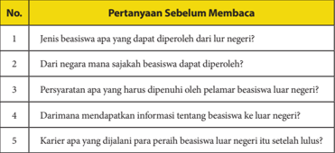

Tabel ini berisi pertanyaan sebelum membaca tentang beasiswa luar negeri. Topik utamanya adalah informasi umum tentang beasiswa luar negeri, termasuk jenis beasiswa yang dapat diperoleh, negara mana saja yang memberikan beasiswa, persyaratan yang harus dipenuhi oleh pelamar, cara mendapatkan informasi tentang beasiswa tersebut, dan karier apa yang dijalani para peraih beasiswa luar negeri setelah lulus. Kolom-kolomnya mencakup pertanyaan-pertanyaan tersebut. Data penting yang terlihat adalah bahwa tabel ini mencakup semua aspek penting tentang beasiswa luar negeri, mulai dari jenis beasiswa hingga proses pengajuan dan karier setelah lulus.

- Bacalah bukumu setiap hari minimal 15 menit, boleh lebih. Sesuaikan dengan  kelonggaran  waktu,  kecepatan  membaca,  dan  kemampuan kamu memahami isi bacaan.
- Buatlah  catatan  hasil  membacamu  setiap  hari.  Perhatikan  contoh berikut ini.

 

---
## 📄 Halaman 10

### b. Laporan Harian Kegiatan Membaca

---
**📊 Tabel**

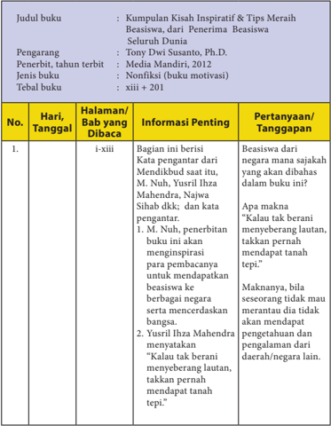

Tabel ini berisi informasi tentang kumpulan kisah inspiratif dan tips meraih beasiswa dari Penerima Beasiswa Seluruh Dunia, ditulis oleh Dwi Susanto, Ph.D., diterbitkan oleh Media Mandiri, tahun 2012. Tabel terdiri dari kolom No., Hari/Tanggal, Halaman/Bab yang dibaca, Informasi Penting, dan Pertanyaan/Tanggapan. Topik utama tabel adalah kisah inspiratif dan tips meraih beasiswa. Data penting yang terlihat antara lain bahwa buku ini berisi kisah-kisah inspiratif dari penerima beasiswa seluruh dunia, dengan judul "Kumpulan Kisah Inspiratif & Tips Meraih Beasiswa, dari Penerima Beasiswa Seluruh Dunia".

 

---
## 📄 Halaman 11

---
**📊 Tabel**

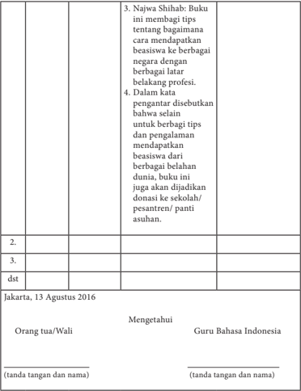

Tabel ini berisi informasi tentang buku yang diberikan kepada seorang siswa. Topik utamanya adalah tentang tips dan pengalaman mendapatkan beasiswa ke berbagai negara dengan berbagai latar belakang profesi. Buku ini disebutkan akan dijadikan donasi ke sekolah, pesantren, atau panti asuhan. Data penting lainnya meliputi bahwa buku ini ditulis oleh Najwa Shihab dan diterbitkan pada 13 Agustus 2016.

- Jika  kamu  sudah  selesai  membaca  buku,  susunlah  laporan  kegiatan tersebut  dalam  buku  rekaman  tertulis  kegiatan  membaca.  Untuk membantu kamu melaporkan kegiatan membaca, berikut ini contoh format yang dapat kamu buat.

 

---
## 📄 Halaman 12

### c. Laporan Harian Kegiatan Membaca

Judul buku :   Kumpulan Kisah Inspiratif & Tips Meraih Beasiswa, dari  Penerima  Beasiswa Seluruh Dunia

Pengarang

:   Tony Dwi Susanto, Ph.D.

Penerbit, tahun terbit

:   Media Mandiri, 2012

Jenis buku

:   Nonfiksi (buku motivasi)

Tebal buku

:   xiii + 201

---
**📊 Tabel**

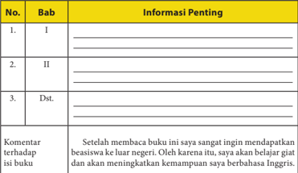

Tabel ini berisi informasi penting tentang bab-bab dalam sebuah buku pelajaran, dengan kolom "No.", "Bab", dan "Informasi Penting". Topik utama tabel adalah pembahasan bab-bab dalam buku tersebut. Kolom "No." digunakan untuk menandai urutan bab, sedangkan kolom "Bab" menyajikan judul bab-bab yang ada dalam buku. Kolom "Informasi Penting" menyediakan ruang untuk menuliskan detail atau poin penting yang berkaitan dengan setiap bab. Dalam tabel ini, tidak ada data atau pola penting yang terlihat secara langsung, namun jika diperhatikan, dapat dilihat bahwa setiap bab memiliki informasi penting yang berbeda-beda.

Jakarta, 13 Agustus 2016

Orang tua/Wali

(tanda tangan dan nama)

### Catatan:

Untuk buku fiksi  (novel,  kumpulan  cerita  rakyat,  kumpulan  cerpen, kumpulan  puisi,  atau  drama,  dan  biografi,  kolom  komentar  terhadap isi  buku  dapat  diganti  dengan  nilai-nilai/  karakter  unggul  yang  dapat diteladani.

Mengetahui

Guru Bahasa Indonesia

(tanda tangan dan nama)

 

---
## 📄 Halaman 13

### Bab I

### MENYUSUN LAPORAN HASIL OBSERVASI

---
**🖼️ Gambar/Diagram**

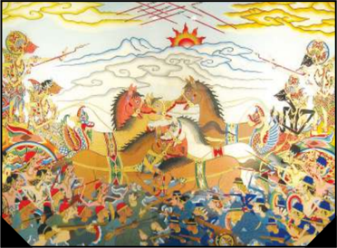

> **Deskripsi Visual:** Gambar ini adalah ilustrasi yang menampilkan pertempuran antara dua pasukan. Dalam gambar tersebut, terlihat dua pasukan besar dengan berbagai karakter dan senjata. Pasukan pertama terdiri dari beberapa karakter yang sedang berlari dan bergerak ke arah lawan mereka, sementara pasukan kedua tampak lebih tenang dan bersiap-siap untuk bertempur. Di tengah-tengah, ada seorang karakter yang tampak sebagai pemimpin atau tokoh utama, dikenali oleh pakaian khusus dan posisinya yang lebih dominan dibandingkan dengan karakter lain. Latar belakangnya menunjukkan langit cerah dengan awan dan matahari, serta gunung yang tampak jauh. 

Elemen-elemen utama dalam gambar ini meliputi dua pasukan besar, karakter utama, latar belakang alam, dan senjata yang digunakan. Relasi antara elemen-elemen ini adalah bahwa karakter utama menjadi pusat perhatian dan memimpin pertempuran, sementara pasukan-pasukan lainnya membantu atau menghadapi lawannya. 

Teks, angka, atau label penting tidak terlihat dalam gambar ini. Namun, informasi kunci yang dapat diambil pembaca adalah tentang konflik dan pertempuran antara dua pasukan besar, serta peran karakter utama dalam mengatur dan memimpin pertempuran tersebut.

Kamu pasti pernah mendapat tugas membuat teks laporan hasil observasi atau pengamatan. Sebelum menyusun teks laporan hasil observasi, kamu harus menentukan objek yang akan kamu observasi, menyusun jadwal observasi, melakukan  observasi,  mencatat  data  dan  hasil  observasi.  Setelah  itu,  baru kamu dapat menyusunnya ke dalam sebuah teks. Apakah kamu sudah pernah menyusun teks laporan hasil observasi?

 

---
## 📄 Halaman 14

Untuk membekali kemampuanmu, pada pelajaran ini  kamu akan belajar:

- menginterpretasi isi teks laporan hasil observasi;
- menganalisis  isi  dan  aspek  kebahasaan  dari  minimal  dua  teks  laporan hasil observasi,
- merevisi isi teks laporan hasil observasi;
- menyusun teks laporan hasil observasi.
Agar kamu lebih mudah memahami materi dalam bab ini, pelajari lebih dulu peta konsep berikut ini dengan saksama!

---
**🖼️ Gambar/Diagram**

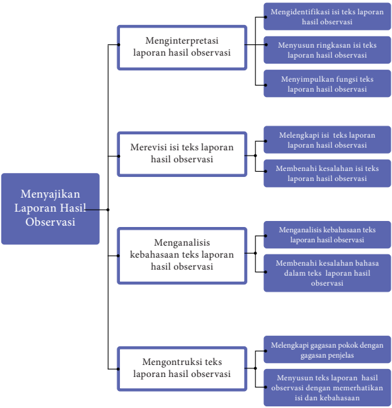

> **Deskripsi Visual:** Gambar ini adalah diagram yang menunjukkan proses menyajikan laporan hasil observasi dalam sebuah penelitian. Diagram ini terdiri dari empat blok utama yang masing-masing menunjukkan tahap-tahap dalam proses tersebut:

1. **Menginterpretasikan laporan hasil observasi** - Ini adalah tahap pertama di mana hasil observasi dianalisis dan diinterpretasikan untuk memahami makna dan konsekuensinya.

2. **Merevisi isi teks laporan hasil observasi** - Di sini, teks laporan hasil observasi diperbaiki untuk memastikan keakuratan dan kelengkapan informasi.

3. **Menganalisis kebahasaan teks laporan hasil observasi** - Tahap ini fokus pada pengecekan dan perbaikan kebahasaan teks, termasuk penggunaan bahasa yang tepat dan struktur yang baik.

4. **Mengontrol teks laporan hasil observasi** - Terakhir, teks laporan hasil observasi diperiksa untuk memastikan bahwa semua informasi telah disampaikan dengan jelas dan tidak ada kesalahan.

Setiap blok memiliki sub-blok yang menjelaskan lebih lanjut tentang tugas-tugas yang harus dilakukan dalam setiap tahap. Misalnya, dalam tahap "Menginterpretasikan laporan hasil observasi", ada sub-blok yang membahas identifikasi, ringkasan, dan interpretasi hasil observasi.

Teks, angka, atau label penting yang terlihat dalam diagram ini meliputi nama-nama tahap dan sub-tahap dalam proses menyajikan laporan hasil observasi. Informasi kunci yang dapat diambil pembaca meliputi langkah-langkah yang harus diikuti dalam menyajikan hasil observasi dengan baik, serta bagaimana setiap tahap berinteraksi dengan tahap-tahap lainnya dalam proses tersebut.

 

---
## 📄 Halaman 15

### A. Menginterpretasi Laporan Hasil Observasi

Setelah mempelajari materi ini, kamu diharapkan mampu:

- mengidentifikasi isi teks laporan hasil observasi;
- menyusun ringkasan  isi teks laporan hasil observasi;
- menyimpulkan fungsi teks laporan hasil observasi.
Sebuah  laporan  hasil  observasi  dapat  disajikan  dalam  bentuk  teks tertulis  maupun  teks  lisan.  Kamu  sering  melakukan  observasi  atau pengamatan,  tetapi  belum  memahami  cara  menyusun  teks  laporannya dengan baik. Untuk itu, kamu perlu memerhatikan penyusunan laporan hasil  observasi  yang  kamu  dengar  atau  kamu  baca  dari  media  televisi, koran, majalah, atau internet.

### Kegiatan 1

### Mengidentifikasi Isi Teks Laporan Hasil Observasi

Berikut ini adalah contoh teks laporan hasil observasi berjudul Wayang . Kamu  diharapkan  dapat  mendengarkan  teks  berikut  ini  dan  memahami isi  teks  tersebut  dengan  baik.  Gurumu  atau  salah  seorang  temanmu  akan membacakan dengan suara lantang dan intonasi yang tepat.

Marilah berlatih mendengarkan laporan hasil observasi yang dibacakan! Supaya  kamu  dapat  melakukan  kegiatan  mendengarkan  dengan  benar, tutuplah  buku  ini!  Dengarlah  guru  atau  temanmu  yang  membacakan  teks tersebut dengan saksama!

### Wayang

Wayang adalah seni pertunjukan yang telah ditetapkan sebagai warisan budaya  asli  Indonesia.  UNESCO,  lembaga  yang  mengurusi  kebudayaan dari PBB, pada 7 November 2003 menetapkan wayang sebagai pertunjukan bayangan boneka tersohor berasal dari Indonesia. Wayang merupakan warisan mahakarya dunia yang tidak ternilai dalam seni bertutur ( Masterpiece of Oral and Intangible Heritage of Humanity ).

Para wali songo, penyebar agama Islam di Jawa sudah membagi wayang menjadi  tiga.  Wayang  kulit  di  Timur,  wayang wong atau  wayang  orang  di Jawa Tengah, dan wayang golek atau wayang boneka di Jawa Barat. Penjenisan tersebut disesuaikan dengan penggunaan bahan wayang. Wayang kulit dibuat

 

---
## 📄 Halaman 16

dari kulit hewan ternak, misalnya kulit kerbau, sapi, atau kambing. Wayang wong berarti wayang yang ditampilkan atau diperankan oleh orang. Wayang golek adalah wayang yang menggunakan boneka kayu sebagai pemeran tokoh. Selanjutnya,  untuk  mempertahankan  budaya  wayang  agar  tetap  dicintai, seniman  mengembangkan  wayang  dengan  bahan-bahan  lain,  antara  lain wayang suket dan wayang motekar .

Wayang  kulit  dilihat  dari  umur,  dan  gaya  pertunjukannya  pun  dibagi lagi menjadi bermacam jenis. Jenis yang paling terkenal, karena diperkirakan memiliki umur paling tua adalah wayang purwa. Purwa berasal dari bahasa Jawa, yang berarti awal. Wayang ini terbuat dari kulit kerbau yang ditatah, dan  diberi  warna  sesuai  kaidah  pulasan  wayang  pendalangan,  serta  diberi tangkai dari bahan tanduk kerbau bule yang diolah sedemikian rupa dengan nama cempurit yang terdiri atas tuding dan gapit .

Wayang wong (bahasa  Jawa  yang  berarti  'orang')  adalah  salah  satu pertunjukan wayang yang diperankan langsung oleh orang. Wayang orang yang dikenal di suku Banjar adalah wayang gung, sedangkan yang dikenal di suku Jawa adalah wayang topeng. Wayang topeng dimainkan oleh orang yang menggunakan topeng. Wayang tersebut dimainkan dengan iringan gamelan dan  tari-tarian.  Perkembangan  wayang  orang  pun  saat  ini  beragam,  tidak hanya digunakan dalam acara ritual, tetapi juga digunakan dalam acara yang bersifat menghibur.

Selanjutnya, jenis wayang yang lain adalah wayang golek yang mempertunjukkan  boneka  kayu.  Wayang  golek  berasal  dari  Sunda.  Selain wayang golek Sunda, wayang yang terbuat dari kayu adalah wayang menak atau  sering  juga  disebut  wayang  golek  menak  karena  cirinya  mirip  dengan wayang  golek.  Wayang  tersebut  kali  pertama  dikenalkan  di  Kudus.  Selain golek,  wayang  yang  berbahan  dasar  kayu  adalah  wayang  klithik.  Wayang klithik berbeda dengan golek. Wayang tersebut berbentuk pipih seperti wayang kulit. Akan tetapi, cerita yang diangkat adalah cerita Panji dan Damarwulan. Wayang lain yang terbuat dari kayu adalah wayang papak atau cepak, wayang timplong, wayang potehi, wayang golek techno, dan wayang ajen.

Perkembangan terbaru dunia pewayangan menghasilkan kreasi berupa wayang suket . Jenis wayang ini disebut suket karena wayang yang digunakan terbuat dari rumput yang dibentuk menyerupai wayang kulit. Wayang suket merupakan tiruan dari berbagai figur wayang kulit yang terbuat dari rumput (bahasa Jawa: suket ).  Wayang suket biasanya dibuat sebagai alat permainan atau penyampaian cerita pewayangan kepada anak-anak di desa-desa Jawa.

Dalam versi lebih modern, terdapat wayang motekar atau wayang plastik berwarna. Wayang motekar adalah sejenis pertunjukan teater bayang-bayang

 

---
## 📄 Halaman 17

atau serupa wayang kulit. Namun, jika wayang kulit memiliki bayangan yang berwarna hitam saja, wayang motekar menggunakan teknik terbaru hingga bayang-bayangnya bisa tampil dengan warna-warni penuh. Wayang tersebut menggunakan bahan plastik berwarna, sistem pencahayaan teater modern, dan layar khusus.

Semua jenis wayang di atas merupakan wujud ekspresi kebudayaan yang dapat  dimanfaatkan  dalam  berbagai  kehidupan  antara  lain  sebagai  media pendidikan, media informasi, dan media hiburan. Wayang bermanfaat sebagai media  pendidikan  karena  isinya  banyak  memberikan  ajaran  kehidupan kepada manusia. Pada era modern ini, wayang juga banyak digunakan sebagai media informasi. Ini antara lain dapat kita lihat pada pagelaran wayang yang disisipi informasi tentang program pembangunan seperti keluarga berencana (KB), pemilihan umum, dan sebagainya.Yang terakhir, meski semakin jarang, wayang masih tetap menjadi media hiburan.

(Sumber: http://istiqomahalmaky.blogspot.co.id)

Sekarang, kerjakan tugas-tugas berikut ini.

- Buatlah pertanyaan terkait isi laporan Wayang tersebut, seperti berikut:
- Informasi apa saja yang disampaikan dalam teks tersebut?
- Mengapa wayang ditetapkan sebagai mahakarya dunia?
- Ada berapa jenis wayang berdasarkan  bahan pembuatannya?
- Apa manfaat wayang bagi pengembangan warisan budaya?
- Jawablah pertanyaan-pertanyaan tersebut dengan singkat dan jelas.
- Mengapa teks tersebut digolongkan teks laporan hasil observasi?
- Selanjutnya, presentasikan hasil kerjamu dalam kelompokmu.
Selanjutnya, bersiap-siaplah untuk berlatih mengungkapkan isi dari laporan hasil observasi yang diperdengarkan dengan bahasa berbeda.

### Menyusun Ringkasan Isi Teks Laporan Hasil Observasi

Sebuah ringkasan pada dasarnya merupakan rangkaian  pokok-pokok pikiran yang dirangkai menjadi satu dengan tetap memerhatikan urutan isi  bagian  demi  bagian,  dan  sudut  pandang  (pendapat)  pengarang  tetap diperhatikan dan dipertahankan. Untuk menyusun sebuah ringkasan, hal

 

---
## 📄 Halaman 18

pertama yang harus kamu lakukan adalah membaca pemahaman isi teks, kemudian menemukan pokok-pokok isi informasi di dalamnya.

Pokok-pokok  isi  sebuah  teks  dapat  ditemukan  dengan  menemukan kalimat  utamanya.  Kalimat  utama  adalah  kalimat  yang  di  dalamnya memiliki pokok pikiran atau gagasan utama yang menjadi dasar pengembangan sebuah paragraf. Gagasan utama  bersifat umum dan dapat melingkupi semua isi yang ada dalam sebuah paragraf.

Sekarang,  bacalah  contoh  analisis  gagasan  pokok  setiap  paragraf dalam teks Wayang di atas.

---
**📊 Tabel**

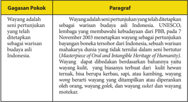

Tabel ini membahas tentang warisan budaya yang disebutkan sebagai warisan budaya Indonesia oleh UNESCO pada tahun 2003. Topik utama tabel adalah warisan budaya yang telah ditetapkan sebagai warisan budaya UNESCO. Tabel ini memiliki dua kolom: "Gagasan Pokok" dan "Paragraf". Dalam kolom "Gagasan Pokok", terdapat penjelasan singkat tentang warisan budaya tersebut, seperti warisan budaya yang telah ditetapkan sebagai warisan budaya UNESCO. Sedangkan dalam kolom "Paragraf", terdapat paragraf yang menjelaskan lebih lanjut tentang warisan budaya tersebut, seperti warisan budaya yang berarti untuk Indonesia. Data penting yang terlihat dalam tabel ini adalah bahwa warisan budaya tersebut telah ditetapkan sebagai warisan budaya UNESCO pada tahun 2003.

Sekarang,  berlatihlah  untuk  menemukan  gagasan  pokok  isi  teks laporan  hasil  observasi  dengan  menggunakan  tabel  berikut  ini.  Kamu dapat menuliskannya pada lembar terpisah atau pada buku kerja dengan bantuan format contoh berikut.

---
**📊 Tabel**

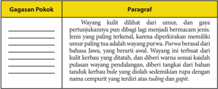

Tabel ini memperlihatkan gagasan pokok tentang Wayang kulit, yang dibagi menjadi dua jenis berdasarkan umur dan gaya pertunjukannya. Gagasan pokok ini diuraikan dalam paragraf yang mengandung informasi penting tentang karakteristik Wayang kulit. Topik utama tabel ini adalah Wayang kulit dan bagaimana ia dikelompokkan berdasarkan umur dan gaya pertunjukannya. Kolom-kolomnya mencakup "Gagasan Pokok" dan "Paragraf". Data penting yang terlihat meliputi bahwa Wayang kulit dibagi berdasarkan umur dan gaya pertunjukannya, dengan jenis tertua yang paling terkenal adalah Wayang kulit yang berumur 100 tahun. Paragraf tersebut juga menyebutkan bahwa Wayang kulit ini memiliki bahan dasar yang berbeda, yang berarti awalnya Wayang kulit ini terbuat dari kulit kerbau yang ditambah dan diberi warna sesuai keadaan pulasan wayang.

 

---
## 📄 Halaman 19

Cerita  yang  biasanya  digunakan  adalah  Ramayana  dan Mahabharata. Wayang purwa terdiri atas beberapa gaya atau gagrak, seperti gagrak Kasunanan, Mangkunegaraan; Ngayogyakarta, Banyumasan, Jawatimuran, Kedu, Cirebon,  dan  sebagainya.  Selain  wayang  purwa,  jenis wayang kulit yang lain yaitu: wayang madya wayang gedog wayang  dupara,  wayang  wahyu,  wayang  suluh,  wayang kancil,  wayang  calonarang,  wayang krucil,  wayang ajen, wayang sasak, wayang sadat, wayang parwa wayang arja, wayang gambuh, wayang cupak, dan wayang beber yang saat ini masih berkembang di Pacitan.

Wayang wong (bahasa  Jawa  yang  berarti  'orang') adalah salah satu pertunjukan wayang yang diperankan langsung  oleh  orang.  Wayang  orang  yang  dikenal  di suku  Banjar  adalah  wayang  gung,  sedangkan  yang dikenal  di  suku  Jawa  adalah  wayang  topeng.  Wayang topeng  dimainkan  oleh  orang  yang  menggunakan topeng.  Wayang  tersebut  dimainkan  dengan  iringan gamelan dan tari-tarian. Perkembangan wayang orang pun  saat  ini  beragam,  tidak  hanya  digunakan  dalam acara  ritual,  tetapi  juga  digunakan  dalam  acara  yang bersifat menghibur.

Selanjutnya, jenis wayang yang lain adalah wayang golek  yang  mempertunjukkan  boneka  kayu.  Wayang golek  berasal  dari  Sunda.  Wayang  ini  disebut  juga sebagai  wayang  thengul.  Selain  wayang  golek  Sunda, wayang yang terbuat dari kayu adalah wayang menak atau  sering  juga  disebut  wayang  golek  menak  karena cirinya  mirip  dengan  wayang  golek.  Wayang  tersebut kali pertama dikenalkan di Kudus. Selain golek, wayang yang  berbahan  dasar  kayu  adalah  wayang  klithik. Wayang klithik berbeda dengan golek. Wayang tersebut berbentuk pipih seperti wayang kulit. Akan tetapi, cerita yang  diangkat  adalah  cerita  Panji  dan  Damarwulan. Wayang  lain  yang  terbuat  dari  kayu  adalah  wayang papak  atau  cepak,  wayang  timplong,  wayang  potehi, wayang golek techno, dan wayang ajen.

 

---
## 📄 Halaman 20

Perkembangan terbaru dunia pewayangan menghasilkan  kreasi  berupa  wayang suket. Disebut wayang suket karena wayang yang digunakan terbuat dari rumput yang dibentuk menyerupai wayang kulit. Wayang suket merupakan  tiruan  dari  berbagai  figur wayang kulit yang terbuat dari rumput (bahasa Jawa: suket ).  Wayang  suket  biasanya  dibuat  sebagai  alat permainan atau penyampaian cerita pewayangan kepada anak-anak di desa-desa Jawa.

Dalam versi  lebih  modern,  terdapat  wayang  motekar atau wayang plastik berwarna. Wayang motekar adalah sejenis pertunjukan teater bayang-bayang atau serupa wayang kulit. Akan tetapi, jika wayang kulit memiliki bayangan yang berwarna hitam saja, wayang motekar menggunakan teknik terbaru hingga bayang-bayangnya bisa tampil dengan warna-warni penuh. Wayang motekar  ditemukan  dan  dikembangkan  oleh  Herry Dim setelah  melewati  eksperimen  lebih  dari  delapan tahun (1993 - 2001). Wayang tersebut menggunakan bahan  plastik  berwarna,  sistem  pencahayaan  teater modern, dan layar khusus.

Semua  jenis  wayang  di  atas  merupakan  wujud ekspresi  kebudayaan  yang  dapat  dimanfaatkan  untuk kepentingan pendidikan karena dapat dijadikan sarana  untuk  menyampaikan  ajaran-ajaran  yang  baik dengan  cara  yang  menarik.  Pemerintah  juga  sering menggunakan wayang sebagai media informasi, misalnya dengan menggelar wayang yang disisipi informasi tentang program pembangunan seperti keluarga berencana (KB), pemilihan umum,  dan sebagainya.  Terakhir,  meski  semakin  jarang,  wayang masih tetap menjadi media hiburan. Dengan kata lain, wayang  mempunyai  banyak  manfaat  bagi  kehidupan antara lain sebagai media pendidikan, media informasi, dan media hiburan.

Setelah menemukan semua gagasan pokok setiap paragraf dalam teks laporan  hasil  observasi  di  atas,  sekarang  gabungkanlah  kalimat-kalimat itu dengan konjungsi yang tepat.

 

---
## 📄 Halaman 21

Bandingkanlah  hasil  ringkasan  yang  kamu  buat  dengan  contoh ringkasan teks Wayang berikut ini.

Wayang  adalah  seni  pertunjukan  yang  telah  ditetapkan sebagai warisan budaya asli Indonesia. Wayang kulit dilihat dari umur, dan gaya pertunjukannya pun dibagi lagi menjadi bermacam jenis. Wayang wong adalah salah satu pertunjukan wayang yang diperankan langsung oleh orang. Wayang golek adalah jenis wayang yang mempertunjukkan boneka  kayu.  Ada  juga  wayang suket yaitu  wayang  yang terbuat  dari  rumput  dan  wayang  motekar  atau  wayang plastik  berwarna.  Semua  jenis  wayang  di  atas  merupakan wujud ekspresi kebudayaan yang dapat dimanfaatkan dalam berbagai   kehidupan antara lain sebagai media pendidikan, media informasi, dan media hiburan.

Setelah ringkasan yang kamu buat selesai, lakukanlah aktivitas berikut ini.

- Berkumpullah dengan kelompokmu.
- Secara  bergantian,  ceritakan  secara  singkat  isi  teks Wayang dengan menggunakan bahasamu sendiri.
- Berikanlah  tanggapanmu  baik  berupa  pertanyaan  maupun  saran terhadap cerita singkat yang disampaikan temanmu.
- Pilihlah  salah  satu  temanmu  yang  presentasinya  paling  baik  untuk mewakili kelompokmu dalam diskusi kelas.
Setelah mengikuti kegiatan pembelajaran di atas, kamu akan berlatih untuk  menguji  hasil  belajarmu.  Bacalah  teks  laporan  hasil  observasi berjudul D'topeng Museum Angkut berikut ini. Kemudian, kerjakan tugastugasnya di akhir teks.

 

---
## 📄 Halaman 22

### D'topeng Museum Angkut

---
**🖼️ Gambar/Diagram**

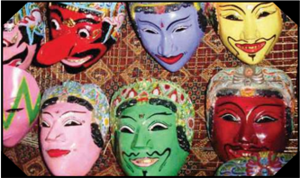

> **Deskripsi Visual:** Gambar ini adalah ilustrasi yang menampilkan berbagai masker tradisional dari berbagai budaya. Ilustrasi ini mencakup empat masker yang berbeda warna dan bentuk, masing-masing dengan ekspresi dan detail unik. Masker pertama berwarna merah dan putih, masker kedua berwarna biru dan putih, masker ketiga berwarna hijau dan merah, dan masker keempat berwarna kuning dan merah. Setiap masker memiliki wajah yang berbeda dan ekspresi yang unik, menunjukkan variasi budaya dan identitas. Ilustrasi ini menunjukkan bahwa masker tradisional memiliki peran penting dalam budaya dan seni, serta menunjukkan keunikan dan ke多样itas budaya dunia.

D'topeng adalah salah satu tempat wisata yang terletak di Kota Batu, Jawa Timur. Keberadaan D'topeng tidak dapat dipisahkan dengan Museum Angkut karena kedua tempat ini berada di satu tempat yang sama. Tempat wisata ini seringkali disebut pula sebagai Museum Topeng karena memang berisi topeng dengan  berbagai  model  dan  bentuk.  Namun, D'topeng tidak  hanya  berisi topeng, tetapi juga berisi pameran benda-benda berupa barang tradisional dan barang antik. Topeng, barang tradisional, dan barang antik dalam museum ini dapat dikelompokkan menjadi lima jenis berdasarkan bahan pembuatannya, yaitu berbahan kayu, batu, logam, kain, dan keramik.

Benda paling diminati pengunjung untuk diamati dan paling mendominasi tempat ini adalah topeng. Ada beragam jenis topeng di museum ini. Topengtopeng tersebut dapat dikelompokkan menjadi dua bagian berdasarkan bahan dasarnya, yaitu yang berbahan dasar kayu dan batu. Topeng berbahan kayu sebagian besar berasal dari daerah Bali, Jawa Timur, Jawa Tengah, Yogyakarta, Jakarta, dan Jawa Barat. Sementara itu, topeng yang berbahan batu berasal dari daerah sekitar Sulawesi dan Maluku.

Selain  topeng,  barang-barang  tradisional  juga  dipamerkan  di D'topeng . Barang-barang tradisional yang mengisi etalase-etalase museum ini adalah senjata  tradisional,  perhiasan  wanita  zaman  dahulu  yang  berbahan  dasar logam, batik-batik motif lama, dan hiasan rumah kuno. Berdasarkan bahan dasarnya, barang-barang tersebut juga dapat dikelompokkan menjadi empat, yaitu berbahan dasar kayu seperti hiasan rumah berupa kepala kerbau asal Toraja, berbahan dasar batu seperti alat penusuk jeruk asal Batak, berbahan

 

---
## 📄 Halaman 23

dasar logam seperti pisau sunat dan perhiasan logam asal Sumba, dan yang berbahan dasar kain seperti batik berbagai motif asal Yogyakarta dan Jawa Tengah.

Benda  terakhir  yang  mengisi  museum  ini  adalah  barang  kuno  yang sampai saat ini masih dianggap bernilai seni tinggi atau biasa disebut barang antik. Barang-barang antik seperti guci tua, kursi antik, bantal arwah, mata uang  zaman  kerajaan-kerajaan,  dan  benda-benda  lain  dapat  dijumpai  di dalam  museum  D'topeng.  Barang-barang  tersebut  dapat  pula  digolongkan menjadi  dua  jenis  berdasarkan  bahan  pembuatannya,    yaitu  keramik  dan logam. Barang antik berbahan dasar keramik di museum ini adalah guci-guci tua peninggalan salah satu dinasti di Tiongkok dan bantal yang digunakan untuk bangsawan Dinasti Yuan (Tiongkok) yang sudah meninggal. Sementara itu, barang antik yang berbahan dasar logam adalah jinggaran coin (Kerajaan Gowa), mata uang Kerajaan Majapahit, koin VOC, dan kursi antik asal Jawa Tengah.

Selain untuk dipamerkan, benda-benda di D'topeng ini juga dimanfaatkan sebagai  media  pelestarian  budaya.  Selanjutnya, D'topeng berfungsi  pula sebagai museum, yaitu sebagai konservasi benda-benda langka agar terhindar dari perdagangan ilegal.

Sumber: http://istiqomahalmaky.blogspot.co.id

Setelah membaca teks di atas, jawablah pertanyaan di bawah ini secara tepat.

- Apakah D'topeng Museum Angkut itu?
- Sebutkan topeng yang disimpan di D'topeng !
- Bagaimana gambaran barang tradisional koleksi D'topeng ?
- Bagaimana gambaran barang kuno koleksi D'topeng ?
- Apa manfaat D'topeng ?
Selanjutnya, berlatihlah untuk menemukan gagasan pokok dalam teks laporan hasil observasi. Temukanlah pokok-pokok penting teks D'topeng Museum Angkut.

Kamu  dapat  menuliskannya  pada  lembar  terpisah  atau  pada  buku kerjamu. Buatlah kolom-kolom gagasan utama dengan urutan sebagaimana contoh di bawah ini. Tuliskanlah dengan menggunakan huruf tulis tegak bersambung pada buku kerjamu.

 

---
## 📄 Halaman 24

### Gagasan Pokok

### Paragraf

D'topeng adalah  salah  satu  tempat  wisata  yang terletak  di  Kota  Batu,  Jawa  Timur.  Keberadaan D'topeng tidak  dapat  dipisahkan  dengan  Museum Angkut karena kedua tempat ini berada di satu tempat yang sama. Tempat wisata ini seringkali disebut pula sebagai museum topeng karena memang berisi topeng dengan berbagai model dan bentuk. Namun, D'topeng tidak hanya berisi topeng, tetapi juga berisi pameran benda-benda berupa barang tradisional dan barang antik. Topeng, barang tradisional, dan barang antik dalam  museum  ini  dapat  dikelompokkan  menjadi lima  jenis  berdasarkan  bahan  pembuatannya,  yaitu berbahan kayu, batu, logam, kain, dan keramik.

Benda paling diminati pengunjung untuk diamati dan  paling  mendominasi  tempat  ini  adalah  topeng. Ada  beragam  jenis  topeng  di  museum  ini.  Topengtopeng  tersebut  dapat  dikelompokkan  menjadi  dua bagian berdasarkan bahan dasarnya, yaitu yang berbahan dasar kayu dan batu. Topeng berbahan kayu sebagian besar berasal dari daerah Bali, Jawa Timur, Jawa  Tengah,  Yogyakarta,  Jakarta,  dan  Jawa  Barat. Sementara itu, topeng yang berbahan batu berasal dari daerah sekitar Sulawesi dan Maluku.

Selain topeng, barang-barang tradisional juga dipamerkan di D'topeng . Barang-barang tradisional yang  mengisi  etalase-etalase  museum  ini  adalah  senjata tradisional, perhiasan wanita zaman dahulu yang berbahan dasar logam, batik-batik motif lama, dan hiasan rumah kuno. Berdasarkan bahan dasarnya, barang-barang tersebut juga dapat dikelompokkan menjadi empat, yaitu berbahan dasar kayu seperti hiasan rumah berupa kepala kerbau  asal  T oraja,  berbahan  dasar  batu  seperti  alat penusuk jeruk asal Batak, berbahan dasar logam seperti pisau sunat dan perhiasan logam asal Sumba, dan yang berbahan  dasar  kain  seperti  batik  berbagai  motif  asal Yogyakarta dan Jawa T engah.

 

---
## 📄 Halaman 25

### Tugas 3

Setelah berlatih memahami gagasan pokok laporan hasil observasi seperti di  atas,  tugasmu  berikutnya  adalah  berlatih  menyusun  ringkas.  Caranya, rangkaikanlah gagasan-gagasan pokok setiap paragraf hasil kerjamu di atas dengan menggunakan kata penghubung (konjungsi) yang tepat.

Benda terakhir yang mengisi museum ini adalah barang  kuno  yang  sampai  saat  ini  masih  dianggap bernilai seni tinggi atau biasa kita sebut barang antik. Barang-barang  antik  seperti  guci  tua,  kursi  antik, bantal  arwah,  mata  uang  zaman  kerajaan-kerajaan, dan  benda-benda  lain  dapat  dijumpai  di  dalam museum  D'topeng.  Barang-barang  tersebut  dapat pula  digolongkan  menjadi  dua  jenis  berdasarkan bahan  pembuatannya,    yaitu  keramik  dan  logam. Barang  antik  berbahan  dasar  keramik  di  museum ini  adalah  guci-guci  tua  peninggalan  salah  satu dinasti  di  Tiongkok  dan  bantal  yang  digunakan untuk  bangsawan  Dinasti  Yuan  (Tiongkok)  yang sudah meninggal. Sementara itu, barang antik yang  berbahan  dasar  logam  adalah jinggaran  coin (Kerajaan  Gowa),  mata  uang  Kerajaan  Majapahit, koin VOC, dan kursi antik asal jawa Tengah.

Selain untuk dipamerkan, benda-benda di D'topeng ini juga dimanfaatkan sebagai media pelestarian budaya.  Selanjutnya, D'topeng berfungsi  pula  sebagai museum, yaitu sebagai konservasi benda-benda langka agar terhindar dari perdagangan ilegal

 

---
## 📄 Halaman 26

### Tulislah pada buku kerjamu!

---
**📊 Tabel**

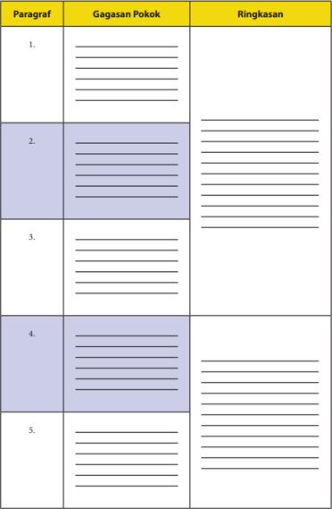

Tabel ini berisi 5 paragraf dengan kolom "Gagasan Pokok" dan "Ringkasan". Topik utama tabel ini adalah penulisan ringkasan paragraf. Setiap paragraf diisi dengan gagasan pokoknya, yang kemudian dijelaskan dalam kolom "Ringkasan". Data penting yang terlihat adalah bahwa setiap paragraf memiliki gagasan pokok yang berbeda, dan setiap gagasan tersebut dijelaskan dalam ringkasan.

 

---
## 📄 Halaman 27

### Tugas 4

Setelah  membuat  ringkasan  teks  laporan  hasil  observasi,  aktivitas belajarmu selanjutnya adalah menceritakan kembali isi teks laporan hasil observasi tersebut kepada teman-temanmu. Ikuti petunjuk berikut ini.

- Berkumpullah dengan kelompokmu.
- Secara bergantian, ceritakan secara singkat isi teks D'Topeng Museum Angkut dengan menggunakan bahasamu sendiri.
- Berikan  penilaian  terhadap  temanmu  dengan  menggunakan  tabel berikut ini.

### Menyimpulkan Fungsi Teks Laporan Hasil Observasi

Laporan hasil pengamatan untuk memenuhi tugas mata pelajaran yang kamu susun selama  ini  merupakan  salah  satu  fungsi  teks  laporan  hasil observasi.  Hal  ini  berarti  teks  tersebut  dimaksudkan  untuk  memberitahukan atau menjelaskan kegiatan pengamatan yang dilakukan.  Hasil observasi terhadap suatu objek juga dapat berfungsi untuk memberitahukan kepada pihak  berwenang  atau  terkait  suatu  informasi.  Selanjutnya,  informasi tersebut dapat dijadikan sebagai dasar penyusunan kebijakan. Salah satu contohnya  adalah  teks  laporan  hasil  observasi  kerusakan  lingkungan. Selain itu, banyak teks laporan hasil observasi yang dapat dijadikan bahan informasi untuk berbagai kepentingan. Teks laporan hasil observasi secara umum  juga  berfungsi  sebagai  alat  pendokumentasian  suatu  objek  atau suatu kegiatan.

### Tugas

- Simpulkanlah fungsi teks laporan hasil observasi pada teks Wayang dan D'topeng Museum Angkut.
- Carilah 2 contoh teks laporan hasil observasi kemudian tentukan fungsinya.

 

---
## 📄 Halaman 28

### B. Merevisi Isi Teks Laporan Hasil Observasi

Setelah mempelajari materi ini, kamu diharapkan mampu:

- melengkapi isi laporan teks hasil observasi;
- membenahi kesalahan isi teks laporan hasil observasi.
Setiap teks pasti memiliki struktur dan unsur pembangun. Demikian pula  dengan  teks  laporan  hasil  observasi.  Teks  laporan  hasil  observasi disusun dengan struktur (a) pernyataan umum atau klasifikasi , (b) deskripsi bagian, dan (c) deskripsi manfaat. Pernyataan umum berisi pembuka atau pengantar hal yang akan disampaikan. Bagian ini berisi hal umum tentang objek yang akan dikaji, menjelaskan secara garis besar pemahaman tentang hal  tersebut.  Penjelasan  detail  mengenai  objek  atau  bagian-bagiannya terdapat  pada  deskripsi  bagian.  Deskripsi  manfaat  menunjukkan  bahwa setiap objek yang diamati memiliki manfaat atau fungsi dalam kehidupan.

Dalam  kenyatannya,  kita  sering  menjumpai  laporan  hasil  observasi yang tidak lengkap struktur dan isinya, bahkan banyak terdapat kesalahan berbahasa. Pada bagian berikut, kamu akan mempelajari contoh kesalahan teks laporan hasil observasi beserta contoh pembenahannya.

### Melengkapi Isi  Teks Laporan Hasil Observasi

Sebuah teks laporan hasil observasi harus memiliki minimal terdiri atas pernyataan umum (tentang hal atau objek yang dilaporkan),  deskripsi bagian-bagian dari objek yang dilaporkan, dan penjelasan atau deskripsi manfaat dari  objek  tersebut.  Ketika  membaca  sebuah  teks  laporan  hasil observasi, kamu mungkin saja menemukan bagian-bagian informasi yang tidak  lengkap.  Kamu  dapat  mengetahuinya  dengan  cara  menganalisis struktur teksnya.

Perhatikan contoh berikut ini.

### Ada Apa di D'topeng Museum Angkut

D'topeng adalah salah satu tempat wisata yang terletak di Kota Batu, Jawa Timur. Keberadaan D'topeng tidak dapat dipisahkan dengan Museum Angkut karena kedua tempat ini berada di satu tempat yang sama. Tempat wisata ini seringkali disebut pula sebagai museum topeng karena memang berisi topeng dengan berbagai model dan bentuk.

 

---
## 📄 Halaman 29

Barang-barang tradisional juga dipamerkan di D'topeng .  Barang-barang tradisional yang mengisi etalase-etalase museum ini adalah senjata tradisional, perhiasan wanita zaman dahulu yang berbahan dasar logam, batik-batik motif lama, dan hiasan rumah kuno. Berdasarkan bahan dasarnya, barang-barang tersebut juga dapat dikelompokkan menjadi empat, yaitu berbahan dasar kayu seperti hiasan rumah berupa kepala kerbau asal Toraja, berbahan dasar batu seperti  alat  penusuk  jeruk  asal  Batak,  berbahan  dasar  logam  seperti  pisau sunat dan perhiasan logam asal Sumba, dan yang berbahan dasar kain seperti batik berbagai motif asal Yogyakarta dan Jawa Tengah.

Benda  terakhir  yang  mengisi  museum  ini  adalah  barang  kuno  yang sampai  saat  ini  masih  dianggap  bernilai  seni  tinggi  atau  biasa  kita  sebut barang  antik.  Barang-barang  antik  seperti  guci  tua,  kursi  antik,  bantal arwah,  mata  uang  zaman  kerajaan-kerajaan,  dan  benda-benda  lain  dapat dijumpai  di  dalam  museum D'topeng .  Barang-barang  tersebut  dapat  pula digolongkan  menjadi  dua  jenis  berdasarkan  bahan  pembuatannya,    yaitu keramik dan logam. Barang antik berbahan dasar keramik di museum ini adalah guci-guci tua peninggalan salah satu dinasti di Tiongkok dan bantal yang  digunakan  untuk  bangsawan  Dinasti  Yuan  (Tiongkok)  yang  sudah meninggal. Sementara itu, barang antik yang berbahan dasar logam adalah jinggaran coin (Kerajaan Gowa), mata uang Kerajaan Majapahit, koin VOC, dan kursi antik asal Jawa Tengah.

Tanpa  melihat  kembali  teks  lengkapnya  di  atas,  kamu  pasti  dapat menemukan bahwa  teks laporan hasil observasi di atas tidak dilengkapi dengan (a) pengklasifikasian/pengelompokan objek yang diobservasi dan (b)    deskripsi  manfaat.  Sekarang,  bandingkanlah  dengan  teks D'topeng Museum Angkut di atas.

Selanjutnya, untuk menguji pemahamanmu, bacalah teks laporan hasil observasi berjudul Mengenal Suku Badui.

### Mengenal Suku Badui

Orang  Kanekes  atau  orang  Baduy/Badui  adalah  suatu  kelompok masyarakat  adat  sub-etnis  Sunda  di  wilayah  Kabupaten  Lebak,  Banten. Masyarakat  Suku  Badui  di  Banten  termasuk  salah  satu  suku  yang menerapkan isolasi dari dunia luar. Itulah salah satu keunikan Suku Badui sehingga wajar mereka sangat menjaga betul 'pikukuh' atau ajaran mereka, entah berupa kepercayaan dan kebudayaan.

 

---
## 📄 Halaman 30

---
**🖼️ Gambar/Diagram**

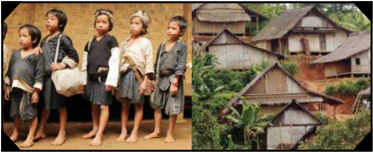

> **Deskripsi Visual:** Gambar ini adalah ilustrasi yang menunjukkan dua skenario berbeda tentang kehidupan sehari-hari di desa. Di sisi kiri, ada lima anak-anak yang tampak sangat pendiam dan miskin, dengan pakaian sederhana dan ekspresi wajah yang menunjukkan ketidakpuasan atau kekurangan. Mereka tampak berdiri di depan sebuah bangunan tradisional dengan atap datar dan dinding kayu, yang menunjukkan lingkungan desa yang sederhana.

Di sisi kanan, gambar tersebut menunjukkan bangunan-bangunan tradisional yang lebih besar dan lebih rumit dibandingkan dengan yang di sisi kiri. Bangunan-bangunan ini memiliki atap yang lebih tinggi dan dinding yang lebih tebal, menunjukkan kemajuan atau perbaikan dalam arsitektur desa. Ini juga menunjukkan bahwa desa tersebut telah berkembang dan memperluas area hunian mereka.

Elemen-elemen utama dalam gambar ini adalah anak-anak yang tampak sangat miskin di sisi kiri dan bangunan-bangunan tradisional yang lebih besar dan lebih rumit di sisi kanan. Relasi antara kedua elemen ini menunjukkan perubahan atau perkembangan dalam kehidupan desa, dari keadaan yang sangat miskin dan sederhana menjadi lebih maju dan berkembang.

Teks, angka, atau label penting yang terlihat dalam gambar ini tidak ada, karena gambar ini hanya menggambarkan dua skenario berbeda tanpa informasi tambahan.

Informasi kunci yang dapat diambil pembaca adalah bahwa desa tersebut telah berkembang dari keadaan yang sangat miskin dan sederhana menjadi lebih maju dan berkembang. Ini menunjukkan bahwa pembangunan dan perbaikan infrastruktur desa dapat membawa perubahan signifikan dalam kehidupan masyarakatnya.

Badui Dalam belum mengenal budaya luar dan terletak di hutan pedalaman. Karena  belum  mengenal  kebudayaan  luar,  suku  Badui  Dalam    masih  memiliki budaya yang sangat asli. Mereka dikenal sangat taat mempertahankan adat istiadat dan warisan nenek moyangnya. Mereka memakai pakaian yang berwarna putih dengan ikat kepala putih serta membawa golok. Pakaian suku Badui Dalam pun tidak berkancing atau kerah. Uniknya, semua yang dipakai suku Badui Dalam adalah hasil produksi  mereka  sendiri.  Biasanya  para  perempuan  yang  bertugas  membuatnya. Mereka dilarang memakai pakaian modern. Selain itu, setiap kali bepergian, mereka tidak memakai kendaraan bahkan tidak memakai alas kaki dan terdiri atas kelompok kecil  berjumlah  3-5  orang.  Mereka  dilarang  menggunakan  perangkat  teknologi, seperti HP dan TV .

Suku ini memiliki kepercayaan yang dikenal Sunda Wiwitan (Sunda: berasal dari  suku  sunda,  wiwitan:  asli).  Kepercayaan  ini  memuja  arwah  nenek  moyang (animisme)  yang  pada  selanjutnya  kepercayaan  mereka  mendapat  pengaruh dari  Buddha  dan  Hindu.  Kepercayaan  suku  ini  merupakan  refleksi  kepercayaan masyarakat Sunda sebelum masuk agama Islam.

Hingga saat ini, suku Badui Dalam tidak mengenal budaya baca tulis. Yang mereka tahu, ialah aksara Hanacarak a (aksara Sunda). Anak-anak suku Badui Dalam  pun  tidak  bersekolah,  kegiatannya  hanya  sekitar  sawah  dan  kebun. Menurut mereka, inilah  cara  mereka  melestarikan  adat  leluhurnya.  Meskipun sejak  pemerintahan  Soeharto  sampai  sekarang  sudah  diadakan  upaya  untuk membujuk  mereka  agar  mengizinkan  pembangunan  sekolah,  tetapi  mereka selalu menolak. Dengan demikian, banyak cerita atau sejarah mereka hanya ada di ingatan atau cerita lisan saja.

Badui  Luar merupakan  orang-orang  yang  telah  keluar  dari  adat  dan  wilayah  Badui Dalam. Ada beberapa hal yang menyebabkan dikeluarkanya warga Badui Dalam ke Badui Luar. Pada dasarnya, peraturan yang ada di Badui Luar dan Badui Ddalam itu hampir sama, tetapi Badui Luar lebih mengenal teknologi dibanding Badui Dalam.

 

---
## 📄 Halaman 31

### Tugas

- Apakah dalam teks laporan hasil observasi di atas terdapat (a) peryataan umum tentang hal yang diobservasi, (b) deskripsi bagian objek yang dilaporkan, dan (c) manfaat objek yang dilaporkan?
- Apabila teks laporan hasil observasi tersebut tidak lengkap, lengkapilah isi teks laporan hasil observasi tersebut sehingga menjadi teks laporan hasil observasi yang lengkap.

### Membenahi Kesalahan Isi Laporan Hasil Observasi

---
**📊 Tabel**

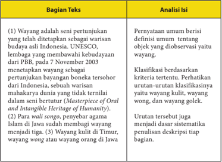

Tabel ini membahas tentang Wayang, sebuah seni pertunjukan tradisional yang merupakan warisan budaya Indonesia. Dalam tabel tersebut, disebutkan bahwa Wayang adalah penunjukkan yang telah ditetapkan sebagai warisan UNESCO pada 7 November 2003. Selain itu, Wayang juga dianggap sebagai warisan budaya yang tidak ternilai dalam Masterpiece of Oral and Intangible Heritage of Humanity. Tabel ini juga menyebutkan bahwa Wayang kulit di Timur, Wayang Wong, dan Wayang Orang Jawa merupakan bagian dari Wayang. Analisis dari tabel ini menunjukkan bahwa Wayang memiliki status warisan budaya yang sangat penting dan memiliki banyak variasi dan bentuk yang berbeda.

 

---
## 📄 Halaman 32

Tengah, dan wayang golek atau wayang boneka di Jawa Barat. (4) Penjenisan tersebut disesuaikan dengan penggunaan bahan wayang. (5) Wayang kulit dibuat dari kulit hewan ternak, bisa berupa kerbau, sapi, atau kambing. (6) Wayang wong berarti wayang yang ditampilkan atau diperankan oleh orang. (7) Wayang golek adalah wayang yang menggunakan boneka kayu sebagai pemeran tokoh. (8) Selanjutnya, untuk mempertahankan budaya wayang agar tetap dicintai, seniman mengembangkan wayang dengan bahan-bahan lain, antara lain wayang suket dan wayang motekar.

Pada  contoh  di  atas  kamu  dapat  menemukan  dengan  jelas  bahwa pada bagian pernyataan umum terdapat dua hal yaitu (a) definisi tentang wayang dan (b) pengelompokan wayang berdasarkan bahan wayang.

Selanjutnya, perhatikan contoh bagian pernyataan umum  dan pengklasifikasian berikut ini!

### a.  Kutipan 1

Paus adalah satu dari sekian banyak mamalia air yang istimewa. Mamalia laut, bertubuh besar, cerdas dan hidup bebas di samudera. Cara bernapasnya juga istimewa. Kalau makhluk laut lain bernapas dengan insang, maka paus menggunakan paru-parunya. Berdasarkan ada/tidak adanya giginya,  paus terbagi menjadi dua kategori, yaitu paus bergigi dan baleen atau balin atau paus yang tidak bergigi.

Dikutip dari  http://www.ngasih.com/2015/05/31/jenis-jenis-ikan-paus-di-dunia/#ixzz3tzSzk3dt dengan penyesuaian.

 

---
## 📄 Halaman 33

### b.  Kutipan 2

Sungai adalah aliran air yang besar dan memanjang yang mengalir secara terus-menerus dari hulu (sumber) menuju hilir (muara). Sungai konsekuen adalah sungai yang arah alirannya sesuai dengan kemiringan batuan. Sungai subsekuen adalah sungai yang arah aliran airnya tegak lurus dengan sungai konsekuen.  Sungai  obsekuen  merupakan  anak  sungai  subsekuen  yang arah  alirannya  berlawanan  dengan  kemiringan  batuan.  Sungai  resekuen merupakan  anak  sungai  subsekuen  yang  arah  alirannya  searah  dengan kemiringan batuan. Sungai insekuen merupakan sungai yang arah alirannya teratur dan tidak terikat lapisan batuan yang dilaluinya.

Dikutip dari http://www.id.wikipedia.org/wiki/sungai  dengan penyesuaian

Di  antara  dua  kutipan  teks  tersebut,  manakah  bagian  pernyataan umum dan pengklasifikasian yang lengkap? Jelaskan alasanmu!

Pernyataan umum biasanya disajikan dalam kalimat definisi. Kalimat definisi seringkali mengggunakan konjungsi adalah , ialah , yakni , merupakan , dan yaitu .

Perhatikan contoh-contoh kalimat definisi berikut ini.

- Paus adalah satu dari sekian banyak mamalia air yang istimewa.
- Wayang  adalah  seni  pertunjukan  yang  telah  ditetapkan  sebagai warisan budaya asli Indonesia.
Sekarang,  belajarlah  membuat  kalimat  definisi.  Jelaskan  bagaimana cara menguji ketepatan sebuah kalimat definisi.

Selanjutnya,  pelajarilah bagaimana cara membuat pengklasifikasian yang baik. Pengklasifikasian sebuah objek yang baik harus menyebutkan dasar pengklasifikasian dan jumlah keanggotaannya. Pada kutipan satu di atas pengklasifikasian ikan paus dapat dilihat dalam kalimat berikut.

Berdasarkan ada/tidak adanya giginya,  paus terbagi menjadi dua kategori, yaitu paus bergigi dan baleen atau balin atau  paus yang tidak bergigi.

Dalam  kalimat  di  atas,  pengklasifikasian  paus  disajikan  dengan mencantumkan tiga  hal  yaitu  (a)  objek  yang  dilaporkan,  yaitu  paus  (b) dasar pengelompokan, dan (c) jumlah anggota objek. Bandingkan kutipan 1 dan 2  dengan dua kutipan berikut ini

 

---
## 📄 Halaman 34

### c. Kutipan 3

Paus  merupakan  mamalia  air  terbesar  saat  ini.  Paus  ini  memiliki  banyak jenis,  dari  paus  yang  buas  atau  karnifora  sampai  paus  yang jinak. Banyak orang yang kurang tahu tentang jenis-jenis paus di dunia ini, padahal ada banyak jenis paus.

### d.  Kutipan 4

Kelelawar disebut sebagai hewan yang menakutkan karena selalu dihubungkan  dengan  mitos  vampir.  Bagaimana  fakta  sebenarnya  tentang kelelawar? Hewan ini termasuk jenis mamalia, hewan beranak dan menyusui, seperti anjing, kucing, sapi, dan lain-lain. Hewan menyusui ini berasal dari ordo  Chiroptera.  Hanya  ada  tiga  jenis  kelelawar  di  dunia  yang  mengisap darah. Tiga jenis kelelawar yang hidup di bagian tengah dan selatan Amerika tersebut  menggigit  hewan  ternak  dan  mengisap  hanya  sedikit  darahnya tanpa membahayakan nyawa. Kelelawar merupakan satu-satunya mamalia yang bisa terbang.

Analisislah  apakah  pernyataan  umum  dan  pengklasifikasian  pada kedua kutipan tersebut sudah memenuhi syarat? Jelaskan alasanmu!

Sekarang,  bukalah  kembali  teks  Wayang  yang  sudah  kamu  pelajari sebelumnya. Pada bagian pernyataan umum  dan  pengklasifikasian disebutkan  bahwa  'Wayang  dapat  dibedakan  berdasarkan  bahannya yaitu wayang kulit,  yang biasanya terbuat dari kulit hewan ternak, bisa berupa  kerbau,  sapi,  atau  kambing;  wayang  wong  berarti  wayang  yang ditampilkan  atau  diperankan  oleh  orang;  wayang  golek;  wayang  suket, wayang motekar.'

### Deskripsi Bagian

Deskripsi bagian yang baik disajikan mengikuti urutan dalam pengklasifikasian. Perhatikan paragraf-paragraf yang merupakan  deskripsi bagian secara berurutan membahas  wayang kulit, wayang wong, wayang golek, wayang suket, dan wayang motekar.

 

---
## 📄 Halaman 35

---
**📊 Tabel**

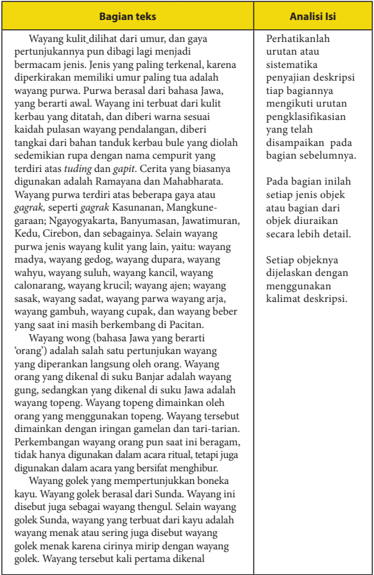

Tabel ini membandingkan bagian teks dengan analisis isi dari sebuah karya sastra tradisional Jawa. Topik utama tabel adalah analisis deskripsi wawancara atau cerita dalam karya sastra tradisional Jawa. Kolom pertama berisi bagian teks yang diambil dari karya tersebut, sementara kolom kedua berisi analisis isi dari bagian teks tersebut. Data penting yang terlihat adalah bahwa bagian teks tersebut mencakup deskripsi tentang wawancara atau cerita, termasuk penjelasan tentang karakter, peristiwa, dan pengaruhnya dalam budaya Jawa. Analisis ini menunjukkan bahwa bagian teks tersebut mencakup deskripsi yang detail tentang wawancara atau cerita, termasuk penjelasan tentang karakter, peristiwa, dan pengaruhnya dalam budaya Jawa.

 

---
## 📄 Halaman 36

di Kudus. Selain golek, wayang yang berbahan dasar kayu adalah wayang klithik. Wayang klithik berbeda dengan golek. Wayang tersebut berbentuk pipih seperti wayang kulit. Akan tetapi, cerita yang diangkat adalah cerita Panji dan Damarwulan. Wayang lain yang terbuat dari kayu adalah wayang papak atau cepak, wayang timplong, wayang potehi, wayang golek techno, dan wayang ajen.

Perkembangan terbaru dunia pewayangan menghasilkan kreasi berupa wayang suket. Disebut wayang suket karena wayang yang digunakan terbuat dari rumput yang dibentuk menyerupai wayang kulit. Wayang suket merupakan tiruan dari berbagai figur wayang kulit yang terbuat dari rumput (bahasa Jawa: suket ). Wayang suket biasanya dibuat sebagai alat permainan atau penyampaian cerita pewayangan kepada anak-anak di desa-desa Jawa.

Dalam versi lebih modern, terdapat wayang motekar atau wayang plastik berwarna. Wayang motekar adalah sejenis pertunjukan teater bayangbayang atau serupa wayang kulit. Akan tetapi, jika wayang kulit memiliki bayangan yang berwarna hitam saja, wayang motekar menggunakan teknik terbaru hingga bayang-bayangnya bisa tampil dengan warna-warni penuh. Wayang motekar ditemukan dan dikembangkan oleh Herry Dim setelah melewati eksperimen lebih dari delapan tahun (1993 - 2001). Wayang tersebut menggunakan bahan plastik berwarna, sistem pencahayaan teater modern, dan layar khusus.

Apabila pada bagian pernyataan umum terdapat kalimat definisi dan kalimat  pengklasifikasian,  dalam  bagian  deskripsi  bagian  kamu  akan menemukan kalimat deskripsi.

Perhatikan contoh kalimat deskripsi berikut ini.

- Wayang ini terbuat dari kulit kerbau yang ditatah, dan diberi warna sesuai kaidah pulasan wayang pendalangan, diberi tangkai dari bahan tanduk kerbau bule yang diolah sedemikian rupa dengan nama cempurit yang terdiri atas tuding dan gapit.
- Wayang topeng dimainkan oleh orang yang menggunakan topeng.
- Wayang tersebut dimainkan dengan iringan gamelan dan tari-tarian.

 

---
## 📄 Halaman 37

### Deskripsi Manfaat

Teks  laporan  hasil  observasi  biasanya  diakhiri  dengan  deskripsi manfaat.  Manfaat  objek  yang  diobservasi  tersebut  dapat  dilihat  dari berbagai sudut pandang. Pada teks Wayang, deskripsi manfaat dinyatakan pada paragraf terakhir sebagai berikut.

Bacalah teks laporan hasil observasi berikut ini. Kemudian, kerjakan tugas yang disajikan di bagian akhir teks sesuai dengan petunjuk.

### Sampah

Sampah merupakan barang sisa yang tidak memiliki nilai ekonomi. Sampah dibagi menjadi dua jenis sampah organik dan sampah anorganik. Sungai merupakan aliran sungai yang mengalir dari hilir ke hulu. Sungai pada  umumnya  digunakan  sebagai  tempat  kegiatan  yang  membantu manusia. Namun, didesa  Jantur  Kecamatan Bumiaji,  sungai  disalahgunakan menjadi tempat pembuangan akhir sampah sehingga sungai yang dulunya dialiri air sekarang menjadi kering dan penuh dengan timbunan sampah.

Sampah  anorganik  adalah  sampah  yang  sulit  diuraikan,tidak  bisa hancur dengan alami, biasanya terdiri atas limbah bahan-bahan kimia yang tidak  mudah diuraikan, sedangkan jika sampah anorganik di daur ulang dapat membuat barang yang bernilai guna. Contoh jenis sampah anorganik adalah plastik, wadah  detergen, dan plastik-plastik bungkus sisa makanan.

 

---
## 📄 Halaman 38

Sampah organik adalah sampah yang dapat diuraikan lagi dan mudah membusuk. Sampah ini biasanya berupa limbah rumah tangga yang mudah membusuk; limbah ternak yang tidak dikelola terlebih dulu, tetapi langsung dibuang begitu saja; daun-daun atau batang pohon yang sudah mati. Contoh sampah organik adalah daun, sayur, sisa buah, limbah kayu sisa dan limbah pembuangan kotoran sapi.

Baik sampah organik maupun anorganik sesungguhnya sangat bermanfaat bagi kehidupan apabila manusia dapat mengolahnya dengan baik.

Berdasarkan teks laporan hasil observasi di atas, kerjakan tugas berikut ini. a. Jawablah pertanyaan berikut ini!

---
**📊 Tabel**

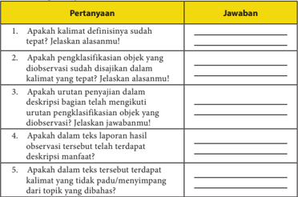

Tabel ini berisi pertanyaan tentang kualitas deskripsi dalam kalimat definisi dan deskripsi objek biologis. Topik utama tabel adalah evaluasi kualitas deskripsi dalam konteks definisi dan deskripsi objek biologis. Kolom pertama berisi pertanyaan, sedangkan kolom kedua berisi jawaban. Data penting yang terlihat meliputi: apakah kalimat definisi sudah tepat, apakah pengklasifikasian objek yang diobservasi sudah disajikan, apakah urutan penjelasan dalam deskripsi bagian telah mengikuti urutan pengklasifikasian objek yang diobservasi, apakah dalam teks laporan hasil observasi tersebut terdapat deskripsi manfaat, dan apakah dalam teks tersebut terdapat kalimat yang tidak padu/menyimpang dari topik yang dibahas.

### C. Menganalisis Kebahasaan Teks Laporan Hasil Observasi

Setelah mempelajari materi ini, kamu diharapkan mampu:

- menganalisis kebahasaan teks laporan hasil observasi.
- membenahi kesalahan berbahasa dalam teks laporan hasil observasi.
Setiap teks memiliki unsur kebahasaan yang berbeda-beda, demikian pula dengan  teks  laporan  hasil  observasi.  Untuk  mengetahui  unsur  kebahasaan dalam teks laporan hasil observasi, kerjakanlah kegiatan berikut ini.

 

---
## 📄 Halaman 39

### Menganalisis Kebahasaan Teks  Laporan Hasil Observasi

### 1. Kata serta Frasa Verba dan Nomina

Jenis  kata  dan  kelompok  kata  (frasa)  yang  dominan  digunakan  dalam sebuah teks laporan hasil observasi adalah verba (kata kerja) dan nomina (kata benda). Untuk memahami hal tersebut, kamu harus mengetahui perbedaan antara kata dan frasa. Kata berbentuk morfem atau morfem bebas, yaitu satuan bahasa terkecil (dapat memiliki arti maupun tidak) yang bersifat bebas. Frasa merupakan  gabungan  beberapa  unsur  namun  tidak  melebihi  batas  fungsi. Artinya, sekalipun terdiri atas beberapa unsur namun hanya memiliki satu fungsi dalam sebuah kalimat. Selain itu, frasa merupakan kelompok kata yang nonpredikatif, atau tidak menduduki subjek dan predikat.

Perhatikan contoh identifikasi kata benda dan frasa benda dalam teks.

### a. Nomina

---
**📊 Tabel**

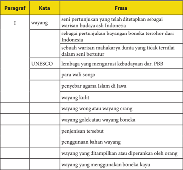

Tabel ini berisi informasi tentang warisan budaya Indonesia yang disebutkan dalam paragraf pertama buku pelajaran. Topik utama tabel adalah warisan budaya Indonesia, yang dijelaskan melalui beberapa kata kunci seperti "wayang", "wali songo", "penyebab agama Islam di Jawa", dan "wayang kulit". Kolom-kolomnya mencakup frase yang menggambarkan arti dari kata-kata tersebut, seperti "seni pertunjukan yang telah ditetapkan sebagai warisan budaya Asia Indonesia" dan "lembaga yang mengurus kebudayaan dari PBB". Data penting yang terlihat adalah bahwa warisan budaya ini termasuk dalam daftar UNESCO, menunjukkan bahwa ia memiliki nilai unik dan internasional.

 

---
## 📄 Halaman 40

### b. Verba

---
**📊 Tabel**

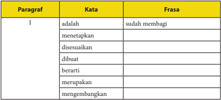

Tabel ini berisi paragraf pertama dari sebuah teks, di mana setiap baris menunjukkan kata yang harus disesuaikan dengan frasa yang diberikan. Topik utama tabel adalah proses penulisan atau pembuatan paragraf. Kolom-kolomnya meliputi "Paragraf", "Kata", dan "Frasa". Data penting yang terlihat adalah bahwa setiap baris memiliki satu kata yang harus disesuaikan dengan frasa yang diberikan, yang menunjukkan bahwa tabel ini bertujuan untuk membantu pembaca memahami bagaimana cara menulis paragraf dengan tepat.

Berdasarkan  analisis  kata  dan  frasa  dapat  dinyatakan  bahwa  pada paragraf pertama teks di atas banyak digunakan frasa nomina. Sementara itu, frasa verba pada paragraf pertama teks di atas hanya ada satu, sedangkan yang lainnya berupa kata. Dengan demikian, nomina yang berfungsi sebagai subjek atau objek pada paragraf pertama teks di atas banyak menggunakan frasa, sedangkan predikat banyak menggunakan kata.

Selanjutnya, lakukan analisis kebahasaan sebagaimana contoh di atas. Tulislah  hasil  analisis  kamu  dalam  tabel  seperti  dalam  contoh  berikut! Kamu dapat menuliskannya pada buku kerjamu.

Paragraf ke:

---
**📊 Tabel**

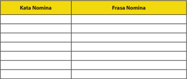

Tabel ini berisi dua kolom: "Kata Nomina" dan "Frasa Nomina". Topik utamanya adalah tentang kata dan frasa nomina dalam bahasa Indonesia. Kolom "Kata Nomina" mungkin berisi contoh kata-kata seperti "buah", "hewan", "buku", dan sebagainya, sementara kolom "Frasa Nomina" mungkin berisi contoh frasa seperti "buah-buahan", "hewan-hewan liar", dan "buku-buku". Data penting yang terlihat adalah bahwa tabel ini mungkin digunakan untuk membantu belajar atau memahami konsep kata dan frasa nomina dalam bahasa Indonesia.

(tabel ini hanya contoh)

 

---
## 📄 Halaman 41

Selanjutnya, lanjutkan dengan mencari 10 kata dan frasa verba dalam teks laporan hasil observasi lainnya yang telah kamu baca. Tulislah hasilnya pada tabel di bawah ini!

---
**📊 Tabel**

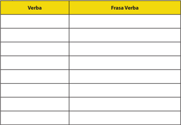

Tabel ini merupakan bagian dari sebuah buku pelajaran yang bertujuan untuk membantu siswa belajar tentang verba dan frasa verba. Topik utama tabel ini adalah tentang struktur dan penggunaan verba dalam bahasa. Tabel ini memiliki dua kolom utama: "Verba" dan "Frasi Verba". Kolom "Verba" mungkin berisi daftar kata kerja atau verba yang harus dikuasai oleh siswa, sementara kolom "Frasi Verba" mungkin berisi contoh frasa yang menggunakan verba tersebut. Data atau pola penting yang terlihat dalam tabel ini adalah bahwa setiap verba di tabel harus memiliki satu atau lebih frasi verba yang sesuai dengan penggunaannya. Ini menunjukkan bahwa tabel ini dirancang untuk membantu siswa memahami hubungan antara verba dan frasa verba dalam konteks bahasa.

(tabel ini hanya contoh)

### 2.   Afiksasi

Dalam kegiatan  berbahasa,  kata  yang  digunakan  dapat  berupa  kata dasar atau kata bentukan. Kata dasar adalah kata yang belum mendapat imbuhan,  pemajemukan,  atau  pengulangan.  Kata  bentukan  adalah  kata yang telah mendapat imbuhan (afiksasi), pengulangan (reduplikasi), dan pemajemukan ketika digunakan.

Kata yang mendapat  proses  pengimbuhan  dapat  berubah  jenis. Misalnya, kata berjenis verba dapat berubah  menjadi nomina  jika mendapat imbuhan. Contoh, kata 'minum' (verba) mendapat imbuhan 'an' menjadi 'minuman' (nomina).

Suatu kata dasar dapat berubah menjadi verba jika mendapat imbuhan me(N)-, be(R)-, di-, bahkan terkadang ter- atau ke-an. Sementara itu, kata dasar  yang  sama  dapat  berubah  menjadi  nomina  jika  diberi  imbuhan pe(N)-, pe(R)-, -an, atau terkadang ke-an.

 

---
## 📄 Halaman 42

### Berikut adalah contoh afiksasi:

---
**📊 Tabel**

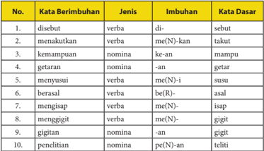

Tabel ini menunjukkan berbagai kata berimbuhunan dalam bahasa Indonesia, yang merupakan bagian dari sistem penulisan dalam bahasa Indonesia. Tabel ini terdiri dari kolom No., Kata Berimbuhunan, Jenis, Imbuhan, dan Kata Dasar. Topik utama tabel ini adalah penjelasan tentang struktur dan bentuk kata berimbuhunan dalam bahasa Indonesia. Dari tabel ini, kita dapat melihat bahwa kata berimbuhunan memiliki struktur yang kompleks, dengan menggunakan imbuhan untuk menambahkan makna atau fungsi kata tersebut. Misalnya, kata "disebut" adalah verba yang memiliki imbuhan "di-" untuk menambahkan makna "disebut". Selain itu, tabel juga menunjukkan bahwa beberapa kata berimbuhunan memiliki imbuhan yang sama, seperti "menakutkan" dan "mampu", yang memiliki imbuhan "kan" dan "an" masing-masing. Ini menunjukkan bahwa dalam bahasa Indonesia, struktur kata berimbuhunan dapat sangat kompleks dan memerlukan pemahaman yang mendalam untuk memahami maknanya.

Lakukanlah analisis afiksasi terhadap kata-kata yang digunakan pada paragraf ke-3 dan ke-4 dari teks berjudul ' D'topeng Museum Angkut '.

Analisislah afiksasi yang terjadi pada kata berimbuhan di bawah ini.

---
**📊 Tabel**

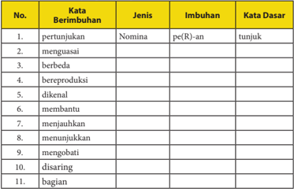

Tabel ini berisi 11 kata berimbuhan yang diberikan dalam bentuk nomina (kata benda), dengan imbuhan pe(R)-an dan kata dasar yang relevan. Topik utama tabel adalah pengetahuan tentang struktur kata dalam bahasa Indonesia, khususnya bagaimana penggunaan imbuhan dalam menghasilkan kata berimbuhan. Kolom-kolom yang ada meliputi nomor urutan, kata berimbuhan, jenis kata, imbuhan, dan kata dasar. Data penting yang terlihat adalah bahwa semua kata berimbuhan dalam tabel memiliki imbuhan pe(R)-an dan kata dasar yang berhubungan dengan kata "tunjuk". Ini menunjukkan bahwa tabel ini bertujuan untuk membantu pembaca memahami bagaimana struktur kata berimbuhan dalam bahasa Indonesia.

 

---
## 📄 Halaman 43

---
**📊 Tabel**

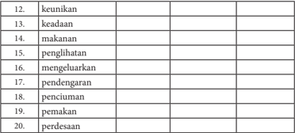

Tabel ini berisi daftar kata-kata dalam bahasa Indonesia yang mungkin digunakan dalam konteks pembelajaran bahasa. Topik utamanya adalah istilah-istilah yang berkaitan dengan pengenalan dan pemahaman dasar bahasa. Kolom-kolomnya mencakup berbagai aspek seperti keunikan, keadaan, makanan, penglihatan, pengeluaran, pendengaran, penciuman, pemakan, dan perdesaan. Data atau pola penting yang terlihat adalah bahwa setiap kolom memiliki satu kata yang berbeda, menunjukkan bahwa tabel ini mungkin digunakan untuk latihan memahami dan mengenali kata-kata dalam bahasa Indonesia.

### Tugas 3

Carilah kata dasar kemudian ubahlah ke dalam verba dan nomina dengan proses pengimbuhan (afiksasi) dengan cara melengkapi tabel di bawah ini.

---
**📊 Tabel**

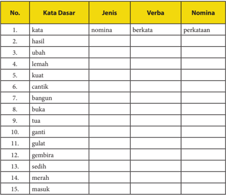

Tabel ini berisi 15 kata dasar yang dikelompokkan menjadi kolom Kata Dasar, Jenis, Verba, dan Nomina. Topik utama tabel adalah pengenalan kata dasar dalam bahasa Indonesia, termasuk kata-kata seperti "kata", "hasil", "ubah", "lemah", "kuat", "cantik", "bangun", "buka", "tua", "ganti", "gulat", "gembira", "sedih", "merah", dan "masuk". Kolom Kata Dasar menyajikan kata dasar asli, sementara kolom Jenis menunjukkan jenis kata tersebut. Kolom Verba menggambarkan verba yang dapat dihasilkan dari kata dasar tersebut, dan kolom Nomina menunjukkan nomina yang dapat dihasilkan. Pola penting yang terlihat adalah bahwa setiap kata dasar memiliki lebih dari satu jenis, verba, dan nomina yang dapat dihasilkan, menunjukkan kemampuan fleksibilitas dalam penggunaan kata-kata dalam bahasa Indonesia.

 

---
## 📄 Halaman 44

### Tugas 4

### 3.    Kalimat Definisi dan Kalimat Deskripsi

Setelah  mengidentifikasi  verba  di  atas,  kamu  menemukan  beberapa verba yang digunakan untuk mendefinisikan dan mendeskripsikan objek. Tulislah  masing-masing  5  contoh  kalimat  definisi,  yaitu  kalimat  yang menggunakan verba definitif dan 5 contoh kalimat deskripsi, yaitu kalimat yang menggunakan verba sebagai deskriptif.

Contoh  kalimat  definisi  yang  terdapat  dalam  teks  laporan  hasil observasi berjudul Wayang adalah sebagai berikut.

- Wayang adalah seni  pertunjukan  yang  telah  ditetapkan  sebagai warisan budaya asli Indonesia.
- Wayang golek adalah wayang yang menggunakan boneka kayu sebagai pemeran tokoh.
- Wayang wong (bahasa  Jawa  yang  berarti  'orang') adalah salah  satu pertunjukan wayang yang diperankan langsung oleh orang.
- Wayang suket merupakan tiruan  dari  berbagai  figur  wayang  kulit yang terbuat dari rumput (bahasa Jawa: suket).
Kalimat deskripsi yang terdapat dalam teks tersebut adalah sebagai berikut.

- Wayang ini terbuat dari kulit kerbau yang ditatah, dan diberi warna sesuai dengan kaidah pulasan wayang pendalangan, diberi tangkai dari bahan tanduk kerbau bule yang diolah sedemikian rupa dengan nama cempurit yang terdiri atas tuding dan gapit .
- Wayang purwa terdiri atas beberapa gaya atau gagrak, seperti gagrak Kasunanan, Mangkunegaraan; Ngayogyakarta, Banyumasan, Jawatimuran, Kedu, Cirebon, dan sebagainya.
- Wayang topeng dimainkan oleh orang yang menggunakan topeng.
- Selain wayang golek Sunda yang terbuat dari kayu, ada juga wayang menak atau sering juga disebut wayang golek menak karena cirinya mirip dengan wayang golek.
Kamu sudah mendapat materi tentang kalimat definisi dan deskripsi, bukan? Sekarang,  bacalah  kembali  teks Mengenal  Suku  Badui dan D'topeng  Museum Angkut !  Identifikasilah  kalimat  definisi  dan  kalimat  deskripsinya  dari  kedua bacaan tersebut dan menuliskannya ke dalam tabel dengan contoh berikut.

 

---
## 📄 Halaman 45

---
**📊 Tabel**

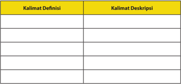

Tabel ini berisi dua kolom: "Kalimat Definisi" dan "Kalimat Deskripsi". Topik utamanya adalah definisi dan deskripsi kalimat. Dalam kolom pertama, terdapat beberapa kalimat yang dijelaskan secara formal dan spesifik, sementara dalam kolom kedua, kalimat tersebut diuraikan dengan cara yang lebih umum dan konteksnya. Pola penting yang terlihat adalah bahwa setiap kalimat di tabel memiliki definisi dan deskripsi yang berbeda, menunjukkan perbedaan antara penjelasan formal dan penjelasan umum.

### 4.    Kalimat Simpleks dan Kompleks

Kalimat  dalam  sebuah  teks  dapat  dibentuk  hanya  oleh  satu  klausa, yaitu  bagian  kalimat  yang  memiliki  subjek  dan  predikat  (predikatif). Kalimat yang hanya memiliki satu klausa disebut sebagai kalimat simpleks atau biasa disebut pula sebagai kalimat tunggal.

Berikut adalah contoh kalimat simpleks dengan bermacam pola:

- Ada beragam jenis topeng di museum ini.
P                   S                              K

- Kelelawar merupakan hewan unik.
S

P

Pel

- Wayang tersebut berbentuk pipih seperti wayang kulit.

`S P O K`

Kalimat kompleks atau kalimat majemuk adalah kalimat yang memiliki dua  atau  lebih  klausa.  Kalimat  kompleks  dibagi  menjadi  dua  macam, yaitu kalimat kompleks atau majemuk setara dan kalimat kompleks atau majemuk bertingkat. Kalimat majemuk setara memiliki dua klausa yang setara  dalam  suatu  kalimat,  sedangkan  kalimat  majemuk  bertingkat memiliki  klausa  ganda  yang  tidak  sama  atau  berada  di  bawah  fungsi utama suatu kalimat. Fungsi-fungsi utama dalam dalam kalimat majemuk setara membentuk induk kalimat atau klausa atasan. Fungsi-fungsi yang membentuk tingkat, yaitu yang mengikuti konjungsi subordinatif disebut klausa  bawahan  atau  anak  kalimat.  Kalimat  majemuk  setara  biasanya ditandai  dengan  penggunaan  konjungsi  koordinatif  (setara),  sedangkan kalimat  majemuk  bertingkat  biasanya  ditandai  dengan  penggunaan konjungsi subordinatif (bertingkat).

 

---
## 📄 Halaman 46

Cermatilah contoh kalimat kompleks di bawah ini. Kalimat kompleks setara

- Dalam budaya modern, wayang berfungsi menghibur dan
K

S

P

Pel

Konjungsi Koordinatif

mendidik.

Pel

- Kelelawar aktif pada malam hari, tetapi tidur pada siang hari.
S            P                 K

Konjungsi Koordinatif

P

K

Kalimat kompleks bertingkat

- Keberadaan D'topeng tidak dapat dipisahkan
S

P

dengan Museum Angkut

K

karena / kedua tempat ini / berada / di satu tempat yang sama.

K

- Selanjutnya, jenis wayang yang lain adalah
S

P

wayang golek / yang / mempertunjukkan / boneka kayu.

O

wayang golek / yang / mempertunjukkan / boneka kayu.

Tugas 6

Bacalah kutipan teks di bawah ini dengan saksama kemudian kerjakan tugas-tugas yang menyertainya.

Konjungsi Perluasan

Klausa Atasan

Klausa Atasan

Klausa Bawahan

Konjungsi Subordinatif

S

P

K

Inti O

Konjungsi Antar Kalimat

O

S

P

Klausa Bawahan

 

---
## 📄 Halaman 47

### Taman Nasional Baluran

Taman  Nasional  Baluran  merupakan  perwakilan  ekosistem  hutan spesifik kering di Pulau Jawa. Hutan di taman ini  terdiri atas tipe vegetasi savana, hutan mangrove, hutan musim, hutan pantai, hutan pegunungan bawah, hutan rawa dan hutan yang selalu hijau sepanjang tahun. Taman Nasional Baluran memiliki berbagai macam flora dan fauna serta ekosistem.

Tumbuhan di taman nasional ini sebanyak 444 jenis.  Di antara jenis tumbuhan  di  sini  terdapat  tumbuhan  asli  yang  khas  dan  menarik  yaitu widoro  bukol  ( Ziziphus  rotundifolia ),  mimba  ( Azadirachta  indica ),  dan pilang ( Acacia leucophloea ). Widoro bukol, mimba, dan pilang merupakan tumbuhan  yang  mampu  beradaptasi  dalam  kondisi  yang  sangat  kering (masih  kelihatan  hijau),  walaupun  tumbuhan  lainnya  sudah  layu  dan mengering.

Tumbuhan  yang  lain  seperti  asam  ( Tamarindus  indica ),  gadung ( Dioscorea hispida ), kemiri ( Aleurites moluccana ), gebang ( Corypha utan ), api-api ( Avicennia  sp .),  kendal  ( Cordia  obliqua ),  manting  ( Syzygium polyanthum ), dan kepuh ( Sterculia foetida ).

Di  taman  ini  juga  terdapat  26  jenis  mamalia  di  antaranya  banteng ( Bos javanicus javanicus ), kerbau liar ( Bubalus bubalis ), ajag ( Cuon alpinus javanicus ),  kijang  ( Muntiacus muntjak muntjak ),  rusa  ( Cervus timorensis russa ),  macan  tutul  ( Panthera  pardus  melas ),  kancil  (Tragulus  javanicus pelandoc),  dan  kucing  bakau  ( Prionailurus  viverrinus ).  Satwa  banteng merupakan maskot/ciri khas Taman Nasional Baluran.

Selain  itu,  terdapat  sekitar  155  jenis  burung  di  antaranya  termasuk yang langka seperti layang-layang api ( Hirundo rustica ), tuwuk/tuwur asia ( Eudynamys scolopacea ), burung merak ( Pavo muticus) , ayam hutan merah (Gallus  gallus),  kangkareng  ( Anthracoceros convecus ),  rangkong  ( Buceros rhinoceros ), dan bangau tong-tong ( Leptoptilos javanicus ).

Taman  nasional  memiliki  beragam  manfaat  berupa  produk  jasa lingkungan, seperti udara bersih dan pemandangan alam. Kedua manfaat tersebut  berada  pada  suatu  ruang  dan  waktu  yang  sama.  Diperlukan suatu  bentuk  kebijakan  yang  mampu  mengatur  pengalokasian  sumber daya dalam kaitannya dengan pemenuhan kebutuhan masyarakat dengan tetap  memerhatikan  daya  dukung  lingkungan  dan  aspek  sosial  ekonomi masyarakat sekitarnya.

Sumber: http://www.mikirbae.com

 

---
## 📄 Halaman 48

Setelah membaca teks di atas, kerjaka latihan berikut sesuai dengan perintahnya.

- Temukan 2 contoh kalimat simpleks dalam teks di atas.
- Temukan 2 kalimat majemuk setara.
- Temukan 2 kalimat majemuk bertingkat.
- Presentasikan hasil kerjamu di depan kelas.

### Membenahi Kesalahan Bahasa Teks Laporan

### Hasil Observasi

Seringkali  penyusunan  kalimat  definisi  dalam  teks  laporan  hasil observasi  kurang  tepat.  Akibatnya,  definisi  yang  diberikan  pada  objek menjadi tidak tepat.

Selain harus memenuhi kebenaran isi dan kesesuaian struktur, sebuah teks laporan hasil observasi juga harus memenuhi kaidah bahasa Indonesia baku. Dalam bagian ini, kamu secara khusus akan mempelajari penulisan (a) huruf kapital dan (b) di dan ke sebagai imbuhan dan sebagai kata depan.

Perhatikan kutipan teks laporan hasil observasi berikut ini.

Suku baduy dalam di kenal sangat taat mempertahankan adat istiadat dan warisan nenek moyangnya. Mereka memakai pakaian yang berwarna putih yang tidak berkerah, mengenakan ikat kepala, serta membawa golok. Suku ini melarang warganya memakai pakaian modern. Ke mana pun bepergian, mereka tidak menggunakan kendaraan, bahkan tidak memakai alas kaki. Mereka juga di larang menggunakan benda-benda modern seperti HP, TV, dan sebagainya. Untuk bepergian ke mana pun, termasuk kedesa terdekat, mereka harus berangkat secara berkelompok.

Bukalah Pedoman Ejaan yang Disempurnakan (EyD). Diskusikanlah dengan  temanmu  bagaimana  seharusnya  penulisan  kata-kata  bergaris bawah  dalam  kutipan  di  atas.  Apabila  penulisannya  salah,  benahilah sehingga sesuai dengan Pedoman Ejaan.

 

---
## 📄 Halaman 49

### Tugas

Bacalah kembali  teks laporan hasil observasi berjudul Sampah , kemudian kerjakan tugas-tugas berikut ini.

- Analisislah kebenaran kalimat definisinya.  Apabila masih salah, benahilah sehingga menjadi benar.
- Benahilah penggunaan huruf kapital yang masih salah sehingga sesuai dengan Pedoman Ejaan.

### Sampah

Sampah  merupakan  material sisa yang tidak diinginkan setelah berakhirnya  suatu  proses.  Sampah  dapat  bersumber  dari  alam,  manusia, konsumsi,  nuklir,  industri,  dan  pertambangan.  Sampah  dibumi  ini  akan terus bertambah selama masih ada kegiatan yang dilakukan oleh manusia maupun alam.  Berdasarkan  sifat  dan  bentuknya,  sampah  dibagi  menjadi dua yaitu sampah Organik dan sampah Anorganik.

Sampah organik adalah sampah yang dapat diuraikan dan biasanya mudah membusuk.  Contoh  sampah  organik  adalah  sisa  makanan,  sayuran,  dan daun-daunan. Sampah ini dapat di olah menjadi kompos. Sampah anorganik merupakan sampah yang tidak mudah diuraikan atau undegradable .  Contoh sampah Anorganik adalah plastik, kayu, kaca, dan kaleng.

Dewasa ini sampah semakin bertambah terutama di Kota-Kota besar seperti Jakarta dan  Surabaya. Perlu disadari bahwa pelestarian lingkungan hidup bukanlah tanggung jawab Pemerintah saja, tetapi tanggung jawab kita semua.

### D. Mengonstruksi Teks Laporan Hasil Observasi

Setelah mempelajari materi ini, kamu diharapkan mampu:

- melengkapi gagasan pokok dan gagasan penjelas;
- menyusun teks laporan  hasil observasi dengan memperhatikan isi dan kebahasaan;
Berdasarkan  pembahasan  sebelumnya,  pada  bagian  ini  kamu  akan belajar menyusun teks laporan hasil observasi. Hal yang harus diperhatikan dalam melakukan kegiatan observasi atau pengamatan adalah menetapkan objek yang akan diamati, mempersiapkan hal-hal yang akan diamati, dan menyusun rancangan laporan hasil observasi.

 

---
## 📄 Halaman 50

### Melengkapi Gagasan Pokok dengan Gagasan Penjelas

Pada materi sebelumnya, kamu sudah belajar memahami isi teks laporan hasil observasi. Jika kamu sudah memahaminya, marilah lanjutkan dengan menyajikan  gagasan  ke  dalam  laporan  hasil  observasi.  Sebagaimana  yang sudah kamu pahami sebelumnya bahwa pada setiap paragraf terdapat gagasan pokok.  Jadi,  mengembangkan  teks  dimulai  dengan  menuliskan  gagasangagasan pokok terlebih dahulu. Setiap gagasan pokok dikembangkan menjadi satu paragraf.

Perhatikanlah contoh rangkaian gagasan pokok berikut.

- Merpati sering disamakan dengan dara karena termasuk dalam ordo yang sama.
- Merpati dan dara adalah burung yang berbadan gempal dengan leher pendek, paruh ramping pendek, dan cere berair.
- Merpati dan dara memiliki spesies yang bermacam.
- Berbagai spesies merpati dan dara dimanfaatkan sebagai burung hias.
Gagasan  pertama  dapat  dikembangkan,  dengan  menambah  gagasangagasan penjelas. Pengembangan gagasan dapat dibantu dengan format yang dapat kamu tuliskan dalam buku kerjamu.

Jika gagasan umum dan gagasan penjelas di atas dikembangkan menjadi satu paragraf akan menjadi paragraf berikut ini.

 

---
## 📄 Halaman 51

Merpati sering disamakan dengan dara karena termasuk dalam famili yang sama. Merpati dan dara termasuk dalam famili Columbidae dari ordo Columbiformes , yang mencakup sekitar 300 spesies burung kerabat pekicau. Dalam percakapan umum, kata 'dara' dan 'merpati' dapat saling menggantikan. Dalam praktik ornitologi, terdapat suatu kecenderungan 'dara' digunakan untuk spesies yang lebih kecil, sedangkan 'merpati' untuk spesies yang lebih besar. Namun, hal tersebut tidak diterapkan secara konsisten.

Apabila dilihat dari letak gagasan pokoknya, sebuah paragraf dibedakan menjadi  empat  kelompok  yaitu  (a)  deduksi,  (b)  induksi,  (c)  campuran,  (d) naratif dan deskriptif.

Pada pelajaran kali ini, kamu hanya akan mempelajari tentang  paragraf deduksi dan induksi. Paragraf deduksi adalah paragraf yang letak gagasan utamanya di awal paragraf, sedangkan paragraf induksi adalah paragraf yang letak gagasan utamanya ada di akhir paragraf.

Perhatikan contoh paragraf deduktif  berikut ini.

---
**📊 Tabel**

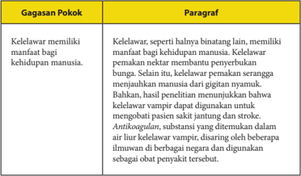

Tabel ini membandingkan gagasan pokok tentang kelelawar dengan paragraf yang menjelaskannya. Topik utama adalah kelelawar sebagai hewan yang memiliki manfaat bagi kehidupan manusia. Gagasan pokok menyatakan bahwa kelelawar memiliki manfaat untuk kehidupan manusia, seperti membantu penyerbukan bunga dan makan serangga yang merusak tanaman. Paragraf mendukung gagasan ini dengan memberikan informasi bahwa kelelawar dapat mengurangi jumlah serangga yang merusak tanaman, sehingga membantu pertumbuhan tanaman. Selain itu, paragraf juga menyebutkan bahwa kelelawar memiliki manfaat lainnya, seperti menjadi sumber protein bagi beberapa spesies hewan liar dan manusia.

 

---
## 📄 Halaman 52

### Bandingkanlah dengan paragraf induktif berikut.

---
**📊 Tabel**

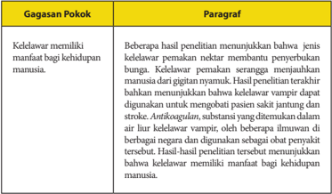

Tabel ini memperlihatkan hubungan antara kelelawar dan manusia, dengan fokus pada manfaat kelelawar bagi kehidupan manusia. Topik utama tabel adalah "Kelelawar memiliki manfaat bagi kehidupan manusia". Tabel dibagi menjadi dua kolom: "Gagasan Pokok" dan "Paragraf". Gagasan pokok adalah bahwa kelelawar memiliki manfaat bagi kehidupan manusia, seperti penyebaran benih bunga dan pengobatan dengan antioksidan. Paragraf menjelaskan bahwa beberapa hasil penelitian menunjukkan bahwa kelelawar memiliki manfaat bagi kehidupan manusia, seperti penyebaran benih bunga dan penggunaan antioksidan sebagai obat penyakit tertentu. Ini menunjukkan bahwa kelelawar memiliki manfaat bagi kehidupan manusia, seperti penyebaran benih bunga dan pengobatan dengan antioksidan.

Marilah berlatih mengembangkan  paragraf  sebagaimana contoh pengembangan di atas.

---
**📊 Tabel**

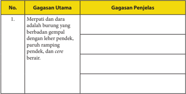

Tabel ini berisi informasi tentang gagasan utama dan penjelasan dari sebuah gagasan. Topik utama tabel adalah "Merpati dan dara adalah burung yang beradegan gempal dengan leher pendek, paruh ramping pendek, cere berair". Dalam tabel ini, kolom pertama berisi "No.", kolom kedua berisi "Gagasan Utama", dan kolom ketiga berisi "Gagasan Penjelasan". Data penting yang terlihat dalam tabel ini adalah bahwa merpati dan dara memiliki beberapa ciri khas seperti leher pendek, paruh ramping pendek, dan cere berair.

 

---
## 📄 Halaman 53

- Merpati dan dara memiliki spesies yang bermacam.
- Berbagai spesies merpati dan dara dimanfaatkan sebagai burung hias.

### Kegiatan 2

### Menyusun Teks Laporan  Hasil Observasi

Kamu sudah berlatih mengembangkan gagasan menjadi paragraf. Untuk menambah pemahamanmu tentang teks laporan hasil observasi,  buatlah  sebuah teks  laporan  hasil  observasi  secara  individu!  Kamu  bisa  mengonsultasikan tema yang akan kamu kembangkan dengan guru di kelasmu.

### Ikutilah langkah-langkah berikut.

- Tentukan objek yang akan kamu amati!
- Susunlah jadwal observasi yang akan kamu lakukan!
- Lakukanlah observasi terhadap objek tersebut dengan menyiapkan pertanyaan atau poin-poin pengamatan terlebih dahulu!
- Catatlah hasil observasi kamu! Bila memungkinkan, ambil foto dan videokan observasimu.

 

---
## 📄 Halaman 54

- Susunlah teks laporan hasil observasimu dengan memerhatikan ketepatan isi, struktur, dan kaidah kebahasaannya.
- Presentasikn teks laporan hasil observasimu di hadapan teman-temanmu.
- Berilah tanggapan (kritik dan saran) terhadap teks laporan hasil observasi yang disajikan temanmu.
- Publikasikan teks laporan hasil observasimu di majalah dinding, majalah sekolah, blog, atau di media cetak.

### E.   Melaporkan Kegiatan Membaca Buku

Setelah mempelajari materi ini, kamu diharapkan mampu:

- mengidentifikasi butir-butir penting dalam buku nonfiksi;
- menyusun laporan kegiatan membaca buku nonfiksi.
Pernahkah kamu membaca buku-buku ilmu pengetahuan, selain buku teks  pelajaran?  Setelah  kamu  membacanya,  bagaimana  tanggapanmu mengenai  isi  buku  tersebut?  Pada  pelajaran  ini  kamu  akan  belajar bagaimana  melaporkan  buku  yang  dibaca.  Buku  tersebut  adalah  buku nonfiksi,  berupa  buku  pengayaan.  Untuk  dapat  melaporkannya,  kamu harus membaca dan memahami isi yang terkandung di dalam buku.

### Kegiatan 1

Kegiatan membaca  sangat berguna. Dari kegiatan membaca,  kita memperoleh banyak pengetahuan, wawasan, atau informasi berharga. Banyak  sumber  bacaan  yang  dapat  kamu  baca.  Namun,  saat  ini  kamu belajar dari membaca buku nonfiksi. Salah satu jenis buku nonfiksi adalah buku-buku  pengayaan.  Buku-buku  ini  akan  memperkaya  pengetahuanmu, keterampilanmu, dan sikapmu.

Marilah mempersiapkan  kegiatan membaca  buku  nonfiksi sebagai projek  membaca  minggu  ini.  Buku  tersebut  harus  kamu  selesaikan  dalam seminggu. Oleh karena itu, biasakan membawa buku tersebut ke mana pun kamu bepergian agar jika ada kesempatan untuk membaca, maka kamu dapat membacanya.

Projek membaca ini dilaporkan secara mandiri. Oleh karena itu, langkahlangkah yang harus kamu lakukan adalah sebagai berikut.

 

---
## 📄 Halaman 55

- Carilah  buku  nonfiksi  (buku  pengayaan)  di  perpustakaan.Buku  yang kamu baca bukan buku teks pelajaran. Pinjamlah buku tersebut kepada petugas untuk kamu baca selama satu minggu.
- Jika kamu memiliki uang, pergilah ke toko buku. Carilah buku nonfiksi yang dapat kamu miliki untuk dibaca.
- Mulailah mempersiapkan kegiatan membaca, dengan menyiapkan buku tulismu untuk melaporkan kegiatan membaca minggu ini.
- Tuliskanlah  judul  buku,  nama  penulis,  penerbit,  tahun  terbit,  dan  kota terbit.
- Amatilah daftar isi buku tersebut. Bacalah sekilas daftar isinya, kemudian tuliskanlah, ada berapa bab isi buku tersebut.
- Sebelum membaca, berdasarkana daftar isi buku kamu susun pertanyaan yang  mungkin  akan  kamu  dapatkan  dari  isi  buku.  Pada  buku  laporan membaca, tuliskanlah pertanyaan-pertanyaan yang ingin kamu dapatkan jawabannya dari membaca isi buku.
- Mulailah  membaca.  Jika  buku  itu  milikmu,  ketika  kamu  membaca tandailah butir-butir penting dari setiap sub-bab yang dibaca. Jika buku itu  milik  perpustakaan,  setiap  kamu  membaca  butir-butir  penting, tuliskanlah pada buku laporan membaca.
- Setiap kamu akan mulai membaca, tuliskan terlebih dahulu hari, tanggal, dan waktu kamu membaca agar kegiatanmu terdata.
- Lakukanlah kegiatan membaca buku tersebut selama satu minggu.
- Jika kamu sudah selesai membaca buku, susunlah laporan kegiatan tersebut dalam buku rekaman tertulis kegiatan membaca. Untuk membantumu melaporkan  kegiatan  membaca,  berikut  ini  contoh  format  yang  dapat kamu buat.
Tabel:

Laporan Kegiatan Membaca Buku

Judul Buku :

Pengarang :

Penerbit :

Kota Terbit :

### a.  Kegiatan Prabaca

---
**📊 Tabel**

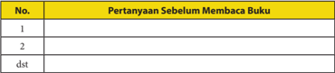

Tabel ini menunjukkan pertanyaan-pertanyaan sebelum membaca buku yang telah disusun dalam urutan. Topik utama tabel adalah "Pertanyaan Sebelum Membaca Buku". Kolom pertama berisi nomor urut dari 1 hingga dst, sedangkan kolom kedua berisi pertanyaan-pertanyaan tersebut. Dari tabel ini, dapat dilihat bahwa setiap pertanyaan memiliki nomor yang unik, yang menunjukkan bahwa setiap pertanyaan memiliki identitas sendiri-sendiri. Selain itu, tabel ini juga menunjukkan bahwa pertanyaan-pertanyaan tersebut merupakan bagian dari proses pembelajaran yang lebih luas, yaitu pembelajaran membaca buku.

 

---
## 📄 Halaman 56

### b.  Kegiatan Pascabaca

---
**📊 Tabel**

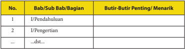

Tabel ini menunjukkan struktur umum dari sebuah bab atau bagian dalam buku pelajaran. Kolom pertama menunjukkan nomor urut dari bab atau bagian, sedangkan kolom kedua berisi judul bab atau bagian tersebut. Kolom ketiga menyajikan daftar butir-butir penting atau menarik yang mungkin akan dibahas dalam bab atau bagian tersebut. Topik utama tabel ini adalah struktur umum buku pelajaran, dengan fokus pada bagian-bagian utama seperti pendahuluan, pengertian, dan sebagainya. Data atau pola penting yang terlihat adalah bahwa setiap bab atau bagian memiliki judul yang jelas dan daftar butir penting yang relevan untuk memahami isi bab atau bagian tersebut.

Dilaporkan oleh:

Kelas :

### Ringkasan

- Teks laporan hasil observasi disusun dengan struktur  berikut:
- pernyataan umum atau klasifikasi ,
- deskripsi bagian , dan
- deskripsi manfaat .
- Pernyataan umum  berisi  pembuka  atau  pengantar  hal yang akan disampaikan. Bagian ini berisi hal umum tentang objek yang akan dikaji, menjelaskan secara garis besar pemahaman tentang hal tersebut.
- Deskripsi  bagian,  berisi  uraian  detail  mengenai  objek  atau  bagianbagiannya.  Deskripsi  manfaat  menunjukkan  bahwa  setiap  objek  yang diamati memiliki manfaat atau fungsi dalam kehidupan.
- Kaidah kebahasaan teks laporan hasil observasi antara lain:
- penggunaan kata/ frasa nomina,
- pembentukan nomina dan verba turunan dengan afiksasi,
- penggunaan kalimat definisi dan kalimat deskripisi, serta
- kalimat simpleks dan kompleks.

 

---
## 📄 Halaman 57

### Bab II

### MENGEMBANGKAN PENDAPAT DALAM EKSPOSISI

---
**🖼️ Gambar/Diagram**

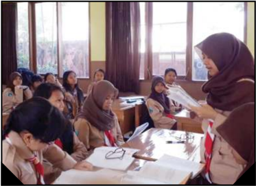

> **Deskripsi Visual:** Gambar ini menunjukkan sebuah ruangan belajar dengan beberapa siswa sedang belajar. Siswa-siswa tersebut mengenakan hijab dan seragam sekolah, menunjukkan bahwa mereka mungkin berada di sekolah Islam. Di tengah ruangan, seorang guru sedang memberikan materi pembelajaran kepada siswa. Guru tersebut sedang membawa sebuah buku tulis dan memegang papan tulis, menunjukkan bahwa dia sedang memberikan penjelasan atau menjawab pertanyaan siswa. Siswa-siswa tampak tertarik dan aktif, menunjukkan bahwa mereka sedang memperhatikan dan memahami materi yang diberikan oleh guru.

Elemen-elemen utama dalam gambar ini adalah guru, siswa, dan ruangan belajar. Guru adalah elemen yang paling dominan karena dia sedang berada di tengah-tengah dan sedang berinteraksi dengan siswa. Siswa juga sangat penting karena mereka adalah subjek utama dari gambar ini. Ruangan belajar menjadi latar belakang yang menunjukkan lingkungan belajar yang formal dan struktural.

Teks, angka, atau label penting yang terlihat dalam gambar ini tidak ada, karena gambar ini hanya menunjukkan objek-objek fisik tanpa teks atau angka yang jelas. Namun, informasi kunci yang dapat diambil pembaca adalah bahwa ini adalah situasi belajar di sekolah, dengan guru dan siswa yang aktif dalam proses belajar.

Sumber: /dedidwitagama.wordpress.com/2013/07/03/ mendorong-anak-anak-muda-berani-bicara-pada-ga-percaya-diri-sih/

Pernahkah  kamu  mendengarkan  seseorang sedang mengungkapkan pandangan atau pendapatnya tentang sesuatu? Misalnya, kamu mendengarkan  penjelasan  dari  seseorang    tentang  perlunya  menjaga kebersihan  lingkungan.  Untuk    meyakinkan    pendengar  atau  pembaca tentang  pentingnya    menjaga  kebersihan  lingkungan  hidup,    pembicara atau penulis perlu menggunakan argumen.

Jenis  teks  yang  digunakan untuk menyampaikan pendapat adalah teks eksposisi. Pada pelajaran ini kamu akan belajar:

- menginterpretasi makna dalam ekpsosisi;
- mengembangkan isi ekposisi;

 

---
## 📄 Halaman 58

- menganalisis struktur dan kebahasaan eksposisi;
- menyusun  teks  eksposisi  dengan  memerhatikan  isi,  struktur,  dan kebahasaannya.
Sebelumnya, pelajarilah peta konsep di bawah ini dengan saksama.

---
**🖼️ Gambar/Diagram**

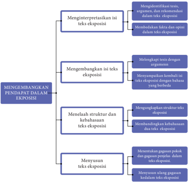

> **Deskripsi Visual:** Gambar ini adalah diagram yang menunjukkan proses pengembangan pendapat dalam eksposisi. Diagram ini dibagi menjadi empat bagian utama, masing-masing menunjukkan langkah-langkah yang harus dilalui untuk mengembangkan pendapat dalam eksposisi. Setiap bagian memiliki subbagian yang lebih spesifik, menjelaskan tugas-tugas yang harus diselesaikan dalam setiap langkah.

1. **Menginterpretasikan Isi Teks Eksposisi**: Langkah pertama dalam proses ini melibatkan interpretasi isi teks eksposisi. Ini mencakup mengidentifikasi teks, argumen, dan rekomendasi dalam teks eksposisi, serta membedakan fakta dan opini dalam teks eksposisi.

2. **Mengembangkan Isi Teks Eksposisi**: Langkah berikutnya adalah mengembangkan isi teks eksposisi. Ini melibatkan melegalkapi teks dengan argumen, menyampaikan kembali teks eksposisi dengan bahasa yang berbeda, dan mengevaluasi struktur dan kebahasaan teks eksposisi.

3. **Menelaah Struktur dan Kebahasaan Teks Eksposisi**: Langkah ini berkaitan dengan menelaah struktur dan kebahasaan teks eksposisi. Ini melibatkan mengungkapkan struktur teks eksposisi, membandingkan kebahasaan dua teks eksposisi, dan menyusun ulang gagasan kedalam teks eksposisi.

4. **Menyusun Teks Eksposisi**: Langkah terakhir adalah menyusun teks eksposisi. Ini melibatkan menentukan gagasan pokok dan gagasan penjelasan dalam teks eksposisi, serta menyusun ulang gagasan kedalam teks eksposisi.

Elemen-elemen utama dalam diagram ini adalah langkah-langkah yang harus dilalui untuk mengembangkan pendapat dalam eksposisi, dengan subbagian yang lebih spesifik menjelaskan tugas-tugas yang harus diselesaikan dalam setiap langkah. Teks, angka, atau label penting yang terlihat dalam diagram ini adalah nama-nama langkah-langkah yang harus dilalui, seperti "Menginterpret

 

---
## 📄 Halaman 59

### A.  Menginterpretasi Makna dalam Teks Eksposisi

Setelah mempelajari materi ini, kamu diharapkan mampu:

- mengidentifikasi tesis, argumen, dan rekomendasi dalam eksposisi;
- membedakan fakta dan opini dalam teks oksposisi.
Eksposisi biasa digunakan  seseorang untuk menyajikan gagasan. Gagasan  tersebut  dikaji  oleh  penulis  atau  pembicara  berdasarkan  sudut pandang tertentu. Untuk menguatkan gagasan yang disampaikan, penulis atau pembicara harus menyertakan alasan-alasan logis. Dengan kata lain, ia bertanggung jawab untuk membuktikan, mengevaluasi, atau mengklarifikasi permasalahan  tersebut.  Bentuk  teks  ini  biasa  digunakan  dalam  kegiatan ceramah, perkuliahan, pidato, editorial, opini, dan sejenisnya.

Untuk dapat memahami teks eksposisi dengan baik, lakukan aktivitas pembelajaran berikut ini.

### Mengidentifikasi Tesis, Argumen, dan Rekomendasi dalam Teks Eksposisi

Kegiatan  mendengarkan  dan  membaca  teks  eksposisi  banyak  sekali manfaatnya.  Salah  satunya,  kamu  akan  mengetahui  keterkaitan  antara permasalahan  dengan  argumentasi  yang  disajikan.  Dengan  menelaah argumentasi  yang  disampaikan  penulis  atau  pembicara,  kamu  akan dapat meyakini lalu menerima pendapat yang disampaikan. Namun, jika argumen  yang  disampaikan  lemah  dan  tidak  meyakinkan,  kamu  dapat saja menolak pendapat yang disampaikan.

Salah satu bentuk komunikasi lisan yang menggunakan  teks eksposisi adalah  berpidato.  Sebagaimana  diketahui,  pidato  merupakan  kegiatan berbicara di depan umum untuk menyatakan pendapat atau memberikan gambaran tentang suatu hal.

Pada bagian ini kamu akan belajar untuk memahami isi teks eksposisi lisan (pidato). Untuk itu, tutuplah bukumu dan dengarkanlah pembacaan pidato yang akan dibacakan guru atau temanmu. Untuk dapat menangkap maknanya dengan baik, ikutilah petunjuk berikut.

- Sebelum mendengarkan pidato berjudul Bahaya Narkoba cermatilah pertanyaan-pertanyaan umum berikut ini.

 

---
## 📄 Halaman 60

- Masalah apa yang dibahas dalam pidato tersebut?
- Apa pendapat pembicara tentang bahaya narkoba?
- Bagaimana cara pembicara memperkuat pendapatnya?
- Argumen apa yang digunakan pembicara untuk menguatkan pendapatnya?
- Catatlah informasi penting yang kamu temukan selama mendengarkan pembacaan pidato tersebut.

### Bahaya Narkoba bagi Generasi Muda

' Assalamu alaikum warahmatullahi wabarakatuh, Salam sejahtera bagi kita semua'

Bapak Kepala Sekolah yang saya hormati, Bapak dan Ibu Guru yang saya taati, serta teman-teman yang saya kasihi. Semoga aktivitas kita pada hari ini menjadi amal kebaikan bagi kita semua.

Sebelum menyampaikan pidato tentang bahaya narkoba bagi generasi muda, izinkanlah  saya  mengajak  Bapak,  Ibu,  serta  hadirin  semua  untuk  mensyukuri nikmat Tuhan. Hanya berkat nikmat Tuhanlah kita dapat bertemu dalam kegiatan seminar hari ini.

Bapak, Ibu, serta hadirin yang saya hormati,

Dewasa  ini,  narkoba  telah  mejadi  ancaman  yang  sangat  mengerikan  bagi generasi muda yang berarti juga menjadi ancaman bagi  keberlangsungan bangsa Indonesia.

Kementerian Hukum dan Hak Asasi Manusia hingga tanggal 13 Mei 2013 mencatat  ada  158.812  narapidana  dan  tahanan  di  Indonesia,  51.899  orang  di antaranya terkait kasus narkoba. Dari jumlah itu, 759 orang di antaranya adalah

 

---
## 📄 Halaman 61

produsen narkoba, 3.751 orang  bandar narkoba, 16.432 orang pengedar narkoba, dan 1.621 orang  penadah. Jumlah penyalah guna narkoba sebanyak 7 juta orang, dan sebagian besar di antaranya adalah para pelajar SMP , SMA, bahkan SD. Bisa jadi, data yang terungkap itu hanya fenomena gunung es, hanya fakta yang terungkap puncaknya, sedangkan fakta yang sebenarnya bisa jadi jauh lebih besar.

Narkoba benar-benar membahayakan nasib bangsa ini di masa depan. Efek kerusakan akibat narkoba ini tidak hanya mengenai diri sendiri, tetapi juga orangorang di sekitarnya. Tak hanya dalam skala kecil seperti keluarga, tetapi juga dalam skala besar, miras, dan narkoba akan menghancurkan sendi-sendi pembangunan nasional. Secara ekonomi, akan sangat banyak dana yang dihambur-hamburkan untuk membeli barang-barang haram itu, kemudian mengobati mereka, membiayai berbagai upaya pencegahan bahayanya. Belum lagi, efeknya bagi pertahanan dan keamanan nasional.

### Hadirin yang saya hormati,

Sebagai generasi muda, calon penerus perjuangan bangsa, sudah seharusnya kita  menyiapkan diri  menjadi  generasi  yang  berkualitas.  Upaya  menghindarkan diri dari bahaya penyalahgunaan narkoba setidaknya dapat dilakukan melalui tiga cara. Pertama , dari diri sendiri. Artinya, masing-masing kita membentengi diri dari kemungkinan menjadi pengonsumsi narkoba. Hal itu dapat kita lakukan dengan pandai-pandai memilih teman bergaul. Kedua ,  dengan meningkatkan keimanan dan  ketakwaan  kepada  Allah  seraya  memohon  agar  kita  terhindar  dari  bahaya penyalahgunaan miras dan narkoba. Dengan menjalankan semua perintah Allah dan  menjauhkan  diri  dari  larangan  Allah,  kita  akan  terhindar  dari  perbuatanperbuatan  tercela. Ketiga ,  hendaklah  kita  selalu  ingat  bahwa  apa  pun  yang  kita lakukan hari ini  pada  dasarnya  adalah  tabungan  masa  depan  kita.  Bila  kita  menabung kebaikan dan kemuliaan hari ini, maka kebaikan dan kemuliaan itulah yang akan kita petik di masa depan, termasuk di akhirat nanti. Sebaliknya, keburukan yang kita lakukan hari ini, termasuk menghancurkan diri sendiri dengan mengonsumsi narkoba, pada dasarnya adalah menghancurkan masa depan kita sendiri.

Hadirin yang saya hormati,

Lalu  bagaimana  dengan  mereka  yang  sudah  telanjur  menjadi  pengguna narkoba?  Jangan  berputus  asa.  Segeralah  bertaubat,  berhenti  mengonsumsinya, ikuti rehabilitasi, putuskan segala hal yang memungkinkan kita akan terhubung kembali dengan para bandar dan pengguna narkoba.

Akhirnya,  demikian  yang  dapat  saya  sampaikan.  Semoga  bermanfaat  dan menginspirasi.

### Terima kasih,

Wassalamu alaikum warahmatullahi wabarakatuh.

 

---
## 📄 Halaman 62

Sekarang, cobalah lanjutkan analisis isi  pidato di atas dengan mengisi tabel berikut ini.

---
**📊 Tabel**

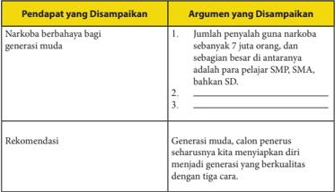

Tabel ini membahas pendapat dan argumen tentang bahaya narkoba bagi generasi muda, serta rekomendasi untuk generasi muda. Topik utama adalah bahaya narkoba bagi generasi muda dan cara untuk mencegahnya. Kolom pertama berisi pendapat tentang bahaya narkoba bagi generasi muda, sementara kolom kedua berisi argumen yang mendukung pendapat tersebut. Data penting yang terlihat adalah bahwa jumlah penyalahgunaan narkoba telah meningkat sejak 7 juta orang menjadi 10 juta orang, dan bahkan lebih besar di antara pelajar SMP, SMA, bahkan SD. Rekomendasi yang disampaikan adalah bahwa generasi muda harus menyempurnakan diri menjadi generasi berkualitas dengan tiga cara.

Bacalah  teks Pembangunan  dan  Bencana  Lingkungan berikut  ini kemudian kerjakan tugas-tugas di bawahnya.

### Pembangunan dan Bencana Lingkungan

Bumi saat ini sedang menghadapi  berbagai  masalah lingkungan  yang  serius.  Enam masalah lingkungan yang utama tersebut adalah ledakan jumlah penduduk, penipisan sumber daya alam, perubahan iklim global,  kepunahan  tumbuhan dan  hewan,  kerusakan  habitat alam,  serta  peningkatan  polusi dan  kemiskinan.  Dari  hal  itu dapat dibayangkan betapa besar kerusakan alam yang terjadi karena jumlah populasi yang besar, konsumsi sumber daya alam dan polusi yang meningkat, sedangkan teknologi saat ini belum dapat menyelesaikan permasalahan tersebut.

 

---
## 📄 Halaman 63

Para  ahli  menyimpulkan  bahwa  masalah  tersebut  disebabkan  oleh praktik  pembangunan  yang  tidak  memerhatikan  kelestarian  alam,  atau disebut  pembangunan  yang  tidak  berkelanjutan.  Seharusnya,  konsep pembangunan  adalah  memenuhi  kebutuhan  manusia  saat  ini  dengan mempertimbangkan  kebutuhan  generasi  mendatang  dalam  memenuhi kebutuhannya.

Penerapan konsep pembangunan berkelanjutan pada saat ini ternyata jauh  dari  harapan.  Kesulitan  penerapannya  terutama  terjadi  di  negara berkembang,  salah  satunya  Indonesia.  Sebagai  contoh,  setiap  tahun  di negara kita diperkirakan terjadi penebangan hutan seluas 3.180.243 ha (atau seluas 50 kali luas kota Jakarta). Hal ini juga diikuti oleh punahnya flora dan fauna langka. Kenyataan ini sangat jelas menggambarkan kehancuran alam yang terjadi saat ini yang diikuti bencana bagi manusia.

Pada tahun 2005 - 2006 tercatat, telah terjadi 330 bencana banjir, 69 bencana tanah longsor, 7 bencana letusan gunung berapi, 241 gempa bumi, dan 13 bencana tsunami. Bencana longsor dan banjir itu disebabkan oleh perusakan hutan dan pembangunan yang mengabaikan kondisi alam.

Bencana alam lain yang menimbulkan jumlah korban banyak terjadi karena praktik pembangunan yang dilakukan tanpa memerhatikan potensi bencana.  Misalnya,  banjir  yang  terjadi  di  Jakarta  pada  Februari  2007, dapat  dipahami  sebagai  dampak  pembangunan  kota  yang  mengabaikan pelestarian lingkungan.

Menurut tim ahli Pusat Penelitian dan Pengembangan Sumber Daya Air,  penyebab  utama  banjir  di  Jakarta  ialah  pembangunan  kota  yang mengabaikan  fungsi  daerah  resapan  air  dan  tampungan  air.  Hal  ini diperparah dengan saluran drainase kota yang tidak terencana dan tidak terawat serta tumpukan sampah dan limbah di sungai. Akhirnya, debit air hujan yang tinggi menyebabkan bencana banjir yang tidak terelakkan.

Masalah  lingkungan  di  atas  merupakan  masalah  serius  yang  harus segera diatasi. Meskipun tidak mungkin mengatasi keenam masalah utama lingkungan  tersebut,  setidaknya  harus  dicari  solusi  untuk  mencegah bertambah buruknya kondisi bumi.

Sumber: www.buletinpilar.com dengan penyesuaian

Selanjutnya, diskusikanlah dengan teman-temanmu hal-hal berikut ini.

- Apakah gagasan atau pendapat yang disampaikan penulis dalam teks tersebut?
- Argumen apa yang disampaikan oleh penulis untuk mendukung pendapatnya?
- Apakah rekomendasi yang disampaikan oleh penulis?
Kerjakan di buku tugasmu.

 

---
## 📄 Halaman 64

---
**📊 Tabel**

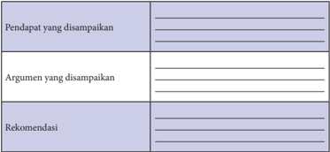

Tabel ini berisi informasi tentang pendapat, argumen, dan rekomendasi yang disampaikan dalam suatu diskusi atau presentasi. Topik utamanya adalah tentang analisis dan penilaian dari sebuah situasi atau topik tertentu. Kolom pertama menunjukkan pendapat yang disampaikan, kolom kedua menunjukkan argumen yang disampaikan, dan kolom ketiga menunjukkan rekomendasi yang diberikan. Data penting yang terlihat adalah bahwa setiap kolom memiliki ruang kosong untuk menuliskan informasi spesifik, yang menunjukkan bahwa tabel ini dirancang untuk memungkinkan pengguna untuk menambahkan informasi mereka sendiri.

Berdasarkan analisis di atas, kemukakan pendapatmu apakah rekomendasi  yang  diajukan  penulis  efektif  untuk  dilakukan?  Jelaskan pendapatmu!

### Membedakan Fakta dan Opini

Dalam menyampaikan  argumen, pembicara atau penulis dapat menggunakan fakta dan alasan-alasan  yang  logis.  Fakta-fakta  disajikan dalam kalimat fakta, sedangkan alasan yang logis disajikan dalam kalimat opini.

Coba kamu perhatikan contoh kalimat-kalimat berikut ini.

Kalimat fakta:

Kementerian  Hukum  dan  Hak  Asasi  Manusia  hingga tanggal  13  Mei  2013  mencatat  ada  158.812  narapidana dan tahanan di Indonesia, yang 51.899 orang di antaranya terkait kasus narkoba.

Kalimat opini:

Sebagai generasi muda, calon penerus perjuangan bangsa, sudah seharusnya kita menyiapkan diri menjadi generasi yang berkualitas.

Diskusikanlah  dengan  temanmu,  apa  perbedaan  antara  kalimat  fakta dan  kalimat  opini.  Selanjutnya,  kerjakan  tugas-tugas  berikut  untuk memperkuat pemahamanmu tentang kalimat fakta dan kalimat opini.

 

---
## 📄 Halaman 65

Bacalah kembali teks eksposisi berjudul Pembangunan dan Bencana Lingkungan '.  Kemudian, datalah 3 kalimat fakta dan tiga kalimat opini. Kerjakan di buku tugasmu dengan menggunakan tabel berikut ini.

---
**📊 Tabel**

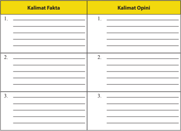

Tabel ini berisi dua kolom utama: "Kalimat Fakta" dan "Kalimat Opini". Kolom "Kalimat Fakta" memiliki tiga baris kosong untuk menuliskan kalimat-fakta, sedangkan kolom "Kalimat Opini" juga memiliki tiga baris kosong untuk menuliskan kalimat-opini. Topik utama tabel ini adalah perbandingan antara kalimat-fakta dan kalimat-opini. Data atau pola penting yang terlihat adalah bahwa tabel ini dirancang untuk membantu individu membedakan antara informasi yang dapat diandalkan (fakta) dan pendapat atau opini.

Untuk  meningkatkan  penguasaan  kamu  dalam  menginterpretasi makna teks eksposisi, bacalah teks berikut ini.

### Upaya Melestarikan Lingkungan Hidup

---
**🖼️ Gambar/Diagram**

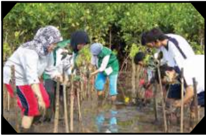

> **Deskripsi Visual:** Gambar ini adalah ilustrasi yang menunjukkan beberapa orang sedang berpartisipasi dalam kegiatan penanaman pohon. Gambar ini menggambarkan tindakan sosial dan lingkungan yang positif, dengan orang-orang yang terlibat dalam upaya pemulihan alam dan penanaman pohon.

Elemen utama dalam gambar ini meliputi:
1. Orang-orang yang sedang berpartisipasi dalam penanaman pohon.
2. Pohon-pohon yang akan ditanam.
3. Alat-alat yang digunakan untuk penanaman pohon seperti kantong plastik dan alat pemukul.

Teks, angka, atau label penting yang terlihat dalam gambar ini tidak ada, karena gambar ini hanya menggambarkan tindakan tanpa teks atau angka tambahan.

Informasi kunci yang dapat diambil pembaca dari gambar ini adalah bahwa kegiatan penanaman pohon merupakan tindakan sosial dan lingkungan yang positif, serta pentingnya peran individu dalam upaya pemulihan alam.

Permasalahan seputar lingkungan  hidup  selalu terdengar mengemuka. Kejadian demi  kejadian yang dialami di  dalam negeri telah memberi dampak yang sangat besar. Tidak sedikit kerugian yang dialami, termasuk nyawa manusia. Namun,  hal  yang  perlu

 

---
## 📄 Halaman 66

dipertanyakan, apakah pengalaman tersebut sudah cukup menyadarkan manusia untuk melihat kesalahan dalam dirinya? Ataukah manusia justru merasa lebih nyaman dengan sikap menghindar dan menyelamatkan diri dengan tidak memberikan solusi yang lebih baik dan lebih tepat lagi?

Banyak usaha yang seharusnya dilakukan oleh manusia dalam upaya pelestarian  lingkungan  hidup.  Upaya  yang  dimaksud  adalah  upaya rekonsiliasi,  perubahan  konsep  atau  pemahaman  tentang  alam,  dan menanamkan budaya pelestari.

### Upaya Rekonsiliasi

Kerusakan  lingkungan  hidup  dan  efeknya  terus  berlangsung  dan terjadi.  Manusia  cenderung  untuk  menangisi  nasibnya.  Lama-kelamaan tangisan  terhadap  nasib  itu  terlupakan  dan  dianggap  sebagai  embusan angin yang berlalu. Bekas tangisan karena efek dari kerusakan lingkungan yang dialaminya hanya tinggal menjadi suatu memori untuk dikisahkan. Namun, perlu diingat bahwa tidaklah  cukup jika manusia hanya sebatas menangisi nasibnya, tetapi pada kenyataannya tidak pernah sadar bahwa semua  kejadian  tersebut  adalah  hasil  dari  perilaku  dan  tindakan  yang patut diperbaiki dan diubah.

Setiap peristiwa dan kejadian alam yang diakibatkan oleh kerusakan lingkungan hidup merupakan suatu pertanda bahwa manusia mesti sadar dan berubah. Upaya rekonsiliasi  menjadi  suatu  sumbangan  positif  yang perlu  disadari.  Tanpa  sikap  rekonsiliasi,  kejadian-kejadian  alam  sebagai akibat kerusakan lingkungan hidup hanya akan menjadi langganan yang terus-menerus dialami.

Lalu,  usaha  manusia  untuk  selalu  menghindarkan  diri  dari  akibat kerusakan lingkungan hidup tersebut hendaknya bukan dipahami sebagai suatu kenyamanan saja. Akan tetapi, justru kesempatan itu menjadi titik tolak untuk memulai suatu perubahan. Perubahan untuk dapat mencegah dan  meminimalisasi  efek  yang  lebih  besar.  Jadi,  sikap  rekonsiliasi  dari pihak  manusia  dapat  memungkinkannya  melakukan  perubahan  demi kenyamanan di tengah-tengah lingkungan hidupnya.

### Perubahan Konsep atau Pemahaman Manusia tentang Alam

Salah  satu  akar  permasalahan  seputar  kerusakan  lingkungan  hidup adalah terjadinya pergeseran pemahaman manusia tentang alam. Berbagai fakta kerusakan lingkungan hidup yang terjadi di tanah air adalah hasil dari suatu pergeseran pemahaman manusia tentang alam. Cara pandang tersebut melahirkan  tindakan  yang  salah  dan  membahayakan.  Misalnya,  konsep tentang alam sebagai objek. Konsep ini memberi indikasi bahwa manusia

 

---
## 📄 Halaman 67

cenderung untuk mempergunakan alam seenaknya . Tindakan dan perilaku manusia  dalam  mengeksplorasi  alam  terus  terjadi  tanpa  disertai  suatu pertanggungjawaban bahwa alam perlu dijaga keutuhan dan kelestariannya.

Banyak binatang yang seharusnya dilindungi justru menjadi korban perburuan manusia yang tidak bertanggung jawab. Pembalakan liar yang terjadi pun tak dapat dibendung lagi. Pencemaran tanah dan air sudah menjadi kebiasaan yang  terus  dilakukan.  Polusi  udara  sudah  tidak  disadari  bahwa  di  dalamnya terdapat kandungan toksin yang membahayakan. Jadi, alam merupakan objek yang terus menerus dieksploitasi dan dipergunakan manusia.

Berdasarkan  kenyatan  demikian,  diperlukan  suatu  perubahan  konsep baru. Konsep yang dimaksud adalah melihat alam sebagai subjek. Konsep alam sebagai subjek berarti manusia dalam mempergunakan alam membutuhkan kesadaran  dan  rasa  tanggung  jawab.  Di  sini  seharusnya  manusia  dalam hidupnya  dapat  menghargai  dan  mempergunakan  alam  secara  efektif  dan bijaksana. Misalnya, orang Papua memahami alam sebagai ibu yang memberi kehidupan.  Artinya,  alam  dilihat  sebagai  ibu  yang  darinya  manusia  dapat memperoleh  kehidupan.  Oleh  karena  itu,  tindakan  merusak  lingkungan secara tidak langsung telah merusak kehidupan itu sendiri.

Sumber: http://almaky.blogspot.com dengan penyesuaian

- Temukan pendapat  dan    argumen  yang  disampaikan  penulis  dalam eksposisi  di  atas  dengan  mengisi  tabel  berikut  ini.    Kamu  dapat menambahkan kolom sesuai dengan kebutuhan.

 

---
## 📄 Halaman 68

- Rangkaikanlah  pendapat  dan  argumen  yang  kamu  temukan  dalam sebuah kalimat yang singkat dan jelas.

 

---
## 📄 Halaman 67

---
**📊 Tabel**

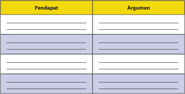

Tabel ini menunjukkan pendapat dan argumen dalam sebuah diskusi atau perdebatan. Topik utamanya adalah tentang isu tertentu yang dibahas oleh dua pihak, yaitu Pendapat dan Argumen. Kolom "Pendapat" berisi beberapa poin yang disampaikan oleh salah satu pihak, sedangkan kolom "Argumen" berisi alasan atau bukti yang mendukung pendapat tersebut. Data penting yang terlihat adalah bahwa setiap poin pendapat diikuti oleh argumen yang mendukungnya, menunjukkan hubungan antara pendapat dan argumen dalam proses perdebatan.

 

---
## 📄 Halaman 68

Buatlah  ringkasan  teks Upaya  Melestarikan  Lingkungan  Hidup di atas.  Untuk  memudahkan  pekerjaanmu,  temukan  gagasan  pokok  setiap paragraf dalam teks tersebut dengan mengisi tabel berikut ini. Kemudian susunlah ringkasan berdasarkan gagasan-gagasan pokok tersebut.

---
**📊 Tabel**

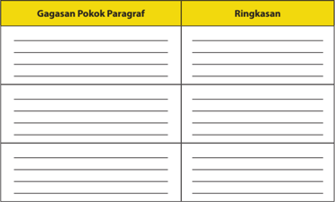

Tabel ini berisi dua kolom utama: "Gagasan Pokok Paragraf" dan "Ringkasan". Kolom pertama menunjukkan gagasan pokok dari paragraf yang akan dijelaskan, sementara kolom kedua menyajikan ringkasan singkat dari gagasan tersebut. Tabel ini digunakan untuk membantu pembaca memahami struktur dan isi dari paragraf dengan cara yang efektif dan mudah dipahami. Topik utama tabel ini adalah proses penulisan ringkasan dari gagasan pokok paragraf.

### Tugas 3

Seringkali teks eksposisi diikuti dengan rekomendasi untuk memecahkan permasalahan yang dibahas. Agar dapat memahami rekomendasi  yang  tepat  sesuai  dengan  permasalahan  dalam  eksposisi, kerjakan tugas berikut.

- Datalah rekomendasi yang disampaikan penulis dalam teks tersebut.
- Temukan  permasalahan kerusakan lingkungan yang terjadi di lingkungan  sekitarmu.  Buatlah  rekomendasi  untuk  memecahkan permasalahan tersebut!
- Lengkapi rekomendasimu dengan argumen yang mendukung.

 

---
## 📄 Halaman 69

### B.  Mengembangkan Isi Teks Eksposisi

Setelah mempelajari materi ini, kamu diharapkan mampu:

- melengkapi tesis dengan argumen yang mendukung;
- menyampaikan kembali gagasan dalam teks eksposisi dengan  bahasa berbeda.

### Melengkapi Tesis dengan Argumen yang Mendukung

Eksposisi dikembangkan berdasarkan gagasan pokok yang dinyatakan dalam tesis atau pernyataan pendapat. Untuk menguatkan pendapat tersebut digunakanlah argumen-argumen.

Pada bagian terdahulu, kamu telah menemukan gagasan-gagasan pokok dalam teks Pembangunan dan Kerusakan Lingkungan. Tesis yang merupakan gagasan pokok tersebut dikembangkan menjadi sebuah paragraf utuh dengan menambahkan gagasan-gagasan penjelas berupa argumen.

Perhatikan  contoh  gagasan  pokok  dan  gagasan  penjelas  pada  paragraf satu  teks Pembangunan  dan  Kerusakan  Lingkungan. Setelah  itu,  lanjutkan menemukan  gagasan  pokok  dan  gagasan  penjelas  pada  paragraf-paragraf selanjutnya.

---
**📊 Tabel**

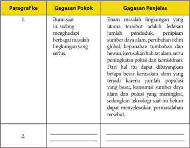

Tabel ini berisi dua paragraf yang membahas masalah lingkungan di Bumi. Paragraf pertama menjelaskan bahwa Bumi sedang menghadapi berbagai masalah lingkungan yang serius, seperti penurunan populasi, perubahan iklim global, keparahan tumbuhan dan hewan, kerusakan habitat alam, serta peningkatan polusi dan kemiskinan. Paragraf kedua tidak memiliki gagasan pokok atau penjelasan yang ditulis. Topik utama tabel adalah masalah lingkungan di Bumi dan bagaimana mereka dapat menyelesaikan masalah tersebut. Kolom-kolomnya adalah Paragraf ke-1 dan Paragraf ke-2, dengan gagasan pokok dan penjelasan masing-masing. Data penting yang terlihat adalah bahwa masalah lingkungan di Bumi meliputi berbagai aspek seperti populasi, iklim, tumbuhan dan hewan, habitat, dan polusi.

 

---
## 📄 Halaman 70

---
**📊 Tabel**

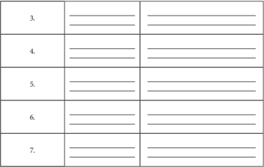

Tabel ini mungkin berisi informasi tentang perbandingan dua kategori atau tiga kategori tertentu. Topik utamanya mungkin adalah perbandingan antara dua atau lebih kategori. Kolom pertama mungkin menunjukkan nama atau jenis dari setiap kategori, sedangkan kolom kedua dan ketiga mungkin menunjukkan nilai atau data yang relevan untuk setiap kategori tersebut. Data atau pola penting yang terlihat mungkin melibatkan perbandingan antara kategori-kategori tersebut, seperti perbandingan jumlah, nilai, atau frekuensi.

### Tugas

Temukan gagasan pokok dan gagasan penjelas setiap paragraf dalam teks Upaya Melestarikan Lingkungan Hidup dengan mengisi tabel berikut ini.

---
**📊 Tabel**

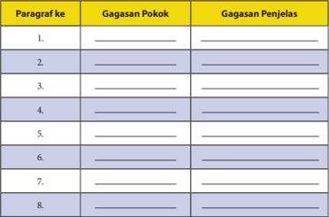

Tabel ini berisi 8 paragraf dengan dua kolom: "Gagasan Pokok" dan "Gagasan Penjelas". Topik utama tabel ini adalah penjelasan tentang gagasan pokok dari paragraf-paragraf tersebut. Kolom pertama, "Gagasan Pokok", menunjukkan gagasan utama yang muncul dalam setiap paragraf, sementara kolom kedua, "Gagasan Penjelas", memberikan penjelasan lebih lanjut tentang gagasan pokok tersebut. Data penting yang terlihat adalah bahwa setiap paragraf memiliki gagasan pokok yang unik dan disertai dengan penjelasan yang mendalam.

 

---
## 📄 Halaman 71

### Menyampaikan Kembali Gagasan dalam Teks Eksposisi dengan Bahasa yang Berbeda

Salah  satu  cara  berlatih  menyampaikan  pendapat  dengan  eksposisi adalah dengan menyampaikan kembali gagasan pokok yang terdapat dalam eksposisi berjudul Pembangunan dan Kerusakan Lingkungan. Perhatikan contoh, kemudian lanjutkan untuk mengidentifikasi gagasan pokok dan gagasan pendukung pada paragraf-paragraf selanjutnya.

### Penyampaian dalam Eksposisi

Bumi saat ini sedang menghadapi berbagai masalah lingkungan yang serius. Enam masalah lingkungan yang utama tersebut adalah ledakan jumlah penduduk, penipisan sumber daya alam, perubahan iklim global, kepunahan tumbuhan dan hewan, kerusakan habitat alam, serta peningkatan polusi dan kemiskinan. Dari hal itu dapat dibayangkan betapa besar kerusakan alam yang terjadi karena jumlah populasi yang besar, konsumsi sumber daya alam dan polusi yang meningkat, sedangkan teknologi saat ini belum dapat menyelesaikan permasalahan tersebut.

### Penyampaian dengan Bahasa yang Berbeda

Bumi sedang menghadapi berbagai permasalahan lingkungan  yang serius. Ada enam masalah lingkungan yang utama yaitu  ledakan jumlah penduduk, penipisan sumber daya alam, perubahan iklim global, kepunahan tumbuhan dan hewan, kerusakan habitat alam, serta peningkatan polusi dan kemiskinan. Kerusakan alam yang terjadi sangat besar karena jumlah populasi yang besar, konsumsi sumber daya alam dan polusi yang meningkat. Di sisi lain,  teknologi saat ini belum dapat menyelesaikan permasalahan tersebut.

 

---
## 📄 Halaman 72

Lanjutkanlah  mengubah  setiap  paragraf  dengan  bahasamu  sendiri tanpa  mengubah  isi  yang  disampaikan  penulis  aslinya.  Kamu  dapat menambahkan kolom sesuai dengan kebutuhan (jumlah paragraf dalam teks tersebut).

Tugas

Sampaikanlah  isi  eksposisi Upaya  Melestarikan  Lingkungan  Hidup di atas dengan menggunakan bahasamu sendiri. Agar lebih mudah kamu dapat mengubahnya setiap paragraf dengan menggunakan tabel berikut ini.

 

---
## 📄 Halaman 73

### Penyampaian dalam Eksposisi

Permasalahan seputar lingkungan hidup selalu terdengar mengemuka. Kejadian demi kejadian yang dialami di dalam negeri telah memberi dampak yang sangat besar. Tidak sedikit kerugian yang dialami, termasuk nyawa manusia juga. Namun, hal yang perlu dipertanyakan, apakah pengalaman tersebut sudah cukup menyadarkan manusia untuk melihat kesalahan dalam dirinya? Ataukah manusia justru merasa lebih nyaman dengan sikap menghindar dan menyelamatkan diri dengan tidak memberikan solusi yang lebih baik dan lebih tepat lagi?

### Penyampaian dengan Bahasa yang Berbeda

Permasalahan lingkungan hidup selalu menarik perhatian banyak orang. Bencana alam yang seringkali terjadi di Indonesia menimbulkan kerugian yang sangat besar baik harta maupun jiwa. Bencana alam yang bertubi-tubi tersebut belum mampu menyadarkan manusia untuk melihat kesalahan dalam dirinya. Apakah ini pertanda bahwa manusia merasa lebih nyaman menghindar dan menyelamatkan diri tanpa memberikan solusi untuk mengatasinya?

### C. Menelaah Struktur dan Kebahasaan Teks Eksposisi

Setelah mempelajari materi ini, kamu diharapkan mampu:

- mengungkapkan struktur teks eksposisi;
- membandingkan kebahasaan dua teks eksposisi.

### Kegiatan 1

### Mengungkapkan Struktur Teks Eksposisi

Teks  eksposisi  merupakan  teks  yang  dibangun  oleh  pendapat  atau opini. Sejalan dengan isi teks eksposisi, struktur teks eksposisi  meliputi (a) tesis atau penyataan pendapat, (b) argumentasi, dan (c) penegasan ulang.

Tesis  atau  pernyataan  pendapat  adalah  bagian  pembuka  dalam  teks eksposisi.  Bagian  tersebut  berisi  pendapat  umum  yang  disampaikan penulis terhadap permasalahan yang diangkat dalam teks eksposisi.

 

---
## 📄 Halaman 74

Argumentasi merupakan unsur penjelas untuk mendukung tesis yang disampaikan. Argumentasi dapat berupa alasan logis, data hasil temuan, fakta-fakta,  bahkan  pernyataan  para  ahli.  Argumen  yang  baik  harus mampu mendukung pendapat yang disampaikan penulis atau pembicara.

Bagian terakhir adalah penegasan ulang, yaitu bagian yang bertujuan menegaskan  pendapat  awal  serta  menambah  rekomendasi  atau  saran terhadap permasalahan yang diangkat.

Berikut ini kamu akan belajar mengidentifikasi struktur teks eksposisi Pembangunan dan Bencana Lingkungan.

---
**📊 Tabel**

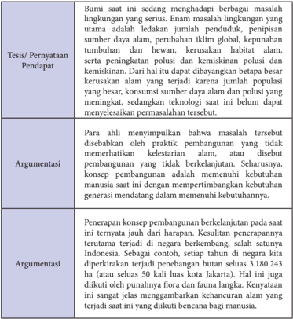

Tabel ini membahas isu lingkungan yang serius di Indonesia, dengan fokus pada masalah pembangunan berkelanjutan. Topik utama adalah perbedaan antara keadaan sekarang dan masa depan, serta dampak negatif dari pembangunan yang tidak berkelanjutan. Tabel dibagi menjadi dua bagian: pendapat dan argumentasi.

Pendapat menunjukkan bahwa masalah lingkungan saat ini sangat serius, terutama ledakan jumlah penduduk, peningkatan sumber daya alam, perubahan iklim global, kehancuran habitat alam, dan peningkatan polusi dan kemiskinan polusi dan kimisikeman. Hal ini disebabkan oleh kenaikan populasi yang besar, konsumsi sumber daya alam dan polusi yang meningkat, serta ketidakmampuan teknologi saat ini untuk meneruskan permasalahan tersebut.

Argumentasi pertama menyatakan bahwa masalah tersebut disebabkan oleh praktik pembangunan yang tidak memerhatikan kelestarian alam, atau disebabkan pembangunan yang tidak berkelanjutan. Seharusnya, konsep pembangunan adalah memenuhi kebutuhan manusia saat ini dengan mempertimbangkan generasi mendatang dalam memenuhi kebutuhannya.

Argumentasi kedua menjelaskan bahwa penerapan konsep pembangunan berkelanjutan pada saat ini ternyata jauh dari harapan. Kesulitan penerapannya terutama terjadi di negara berkembang, salah satunya Indonesia. Sebagai contoh, setiap tahun di negara kita dikurangi rata-rata 3.180.243 ha (atau setengah 30% kita di Jakarta). Hal ini juga dikaiti dengan kehilangan flora dan fauna langka. Ketentuan ini sangat jauh mengancam kehidupan alam yang terjadi saat ini yang dilakukan hancur bagi manusia.

 

---
## 📄 Halaman 75

---
**📊 Tabel**

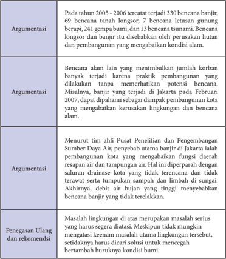

Tabel ini berisi argumen tentang bencana banjir di Indonesia, terutama di Jakarta. Topik utamanya adalah hubungan antara pembangunan dan bencana alam, termasuk banjir, longsor, letusan gunung, dan gempa bumi. Data penting menunjukkan bahwa banyak bencana alam terjadi di tahun 2005-2006, dengan 3330 bencana tertagih, termasuk 7 bencana longsor, 1 bencana letusan gunung, 241 gempa bumi, dan 13 bencana tsunami. Bencana longsor dan banjir disebabkan oleh perusakan hutan dan pembangunan yang mengabaikan kondisi alam. Selain itu, praktik pembangunan yang tidak mematuhi potensi bencana juga dapat meningkatkan risiko bencana lainnya, seperti banjir di Jakarta pada Februari 2007. Menurut tim ahli Pusat Penelitian dan Pengembangan Sumber Daya Air, banjir di Jakarta merupakan dampak dari pembangunan kota yang mengubah fungsi daerah air dan tanaman air. Masalah lingkungan yang dihadapi di Jakarta merupakan masalah serius yang harus segera diatasi, karena masalah tersebut dapat mempengaruhi keamanan lingkungan dan kesejahteraan masyarakat.

Untuk menguji penguasaanmu terhadap materi struktur teks eksposisi, bacalah  kembali  teks Upaya  Melestarikan  Lingkungan  Hidup kemudian kerjakan tugas-tugas berikut ini.

Analisislah  struktur  teks Upaya  Melestarikan  Lingkungan  Hidup dengan mengisi tabel berikut ini.

 

---
## 📄 Halaman 76

---
**📊 Tabel**

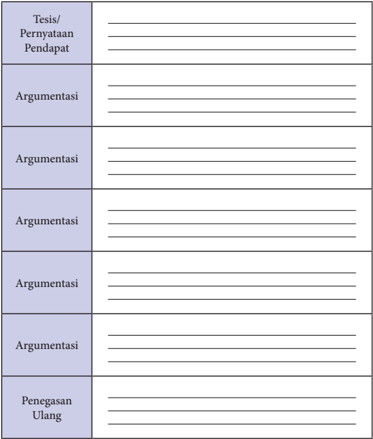

Tabel ini merupakan struktur umum untuk menuliskan argumentasi dalam sebuah argumen. Topik utamanya adalah "Tesis/Pernyataan Pendapat", yang merupakan dasar utama dari argumen tersebut. Kolom-kolomnya meliputi: Tesis/Pernyataan Pendapat, Argumentasi, dan Penegasan Ulang. Dalam setiap baris, Anda dapat menuliskan tesis atau pendapat utama, berbagai argumen yang mendukung tesis tersebut, dan penegasan ulang yang mungkin muncul sebagai pertanyaan atau masalah yang perlu diselesaikan. Ini membantu dalam memahami struktur dan logika argumen secara lebih baik.

### Kegiatan 2

### Membandingkan Kebahasaan Dua Teks Eksposisi

Dalam  teks  eksposisi  banyak  digunakan  istilah  yang  sesuai  dengan bidang permasalahan yang dibahas. Penggunaan istilah tersebut membantu penulis atau pembicara memperkuat gagasan yang disampaikan.

 

---
## 📄 Halaman 77

### Tugas 1

Datalah  istilah  yang  terdapat  dalam  teks Pembangunan dan Bencana Lingkungan dan Upaya Melestarikan Lingkungan Hidup. Kemudian, carilah maknanya dalam Kamus Besar Bahasa Indonesia atau dalam Kamus istilah. Kerjakan di buku tugasmu dengan menggunakan tabel berikut.

---
**📊 Tabel**

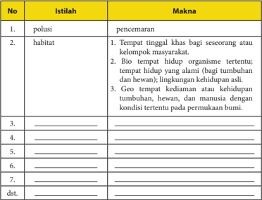

Tabel ini berisi definisi istilah-istilah lingkungan yang penting dalam konteks kehidupan alam dan manusia. Topik utama tabel adalah definisi istilah-istilah lingkungan, seperti polusi dan habitat. Kolom pertama berisi istilah-istilah tersebut, sedangkan kolom kedua berisi maknanya. Data penting yang terlihat adalah bahwa polusi merujuk pada pencemaran, sedangkan habitat memiliki tiga definisi: tempat tinggal khas bagi seseorang atau kelompok masyarakat, bio tempat hidup organisme tertentu, dan geo tempat kedianaman atau kehidupan tumbuhan, hewan, dan manusia dengan kondisi tertentu pada permukaan bumi. Tabel ini membantu memahami konsep-konsep dasar tentang lingkungan dan bagaimana mereka saling berkaitan.

---
**📊 Tabel**

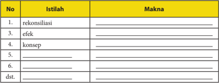

Tabel ini berisi istilah-istilah yang sering digunakan dalam bahasa Indonesia, ditampilkan dengan kolom "No." untuk nomor urut, "Istilah" untuk nama istilah, dan "Makna" untuk penjelasan atau arti dari istilah tersebut. Topik utama tabel ini adalah istilah-istilah yang sering digunakan dalam berbagai konteks, mulai dari keseharian hingga formal. Kolom "No." membantu dalam mengorganisir dan memudahkan pencarian istilah tertentu. Sementara itu, kolom "Istilah" menyajikan istilah-istilah yang diberikan dalam tabel, sementara kolom "Makna" memberikan penjelasan atau arti dari setiap istilah tersebut. Data penting yang terlihat dalam tabel ini adalah bahwa banyak istilah yang digunakan dalam berbagai konteks, mulai dari keseharian seperti "reksifikasi" dan "efek" hingga formal seperti "konsep" dan "dst."

 

---
## 📄 Halaman 78

Selain menggunakan istilah dalam bidang yang dibahas, teks eksposisi juga banyak  menggunakan  kata  sifat.  Perhatikan  contoh  adjektiva  yang  terdapat dalam teks Pembangunan dan Bencana Lingkungan dalam tabel berikut.

### Tugas 2

Temukan  makna  adjektiva  (kata  sifat)  dengan  menggunakan  KBBI. Isikan jawabanmu pada kolom yang telah disediakan pada tabel berikut!

---
**📊 Tabel**

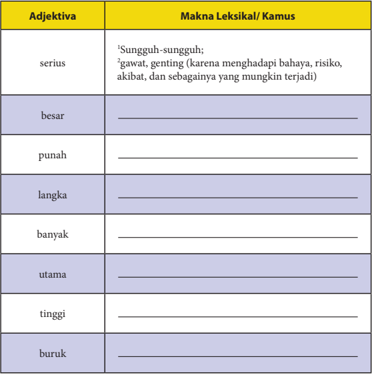

Tabel ini berisi definisi dari beberapa adjektiva dalam bahasa Indonesia, ditampilkan dalam dua kolom: "Adjektiva" dan "Makna Leksikal/Kamus". Topik utama tabel adalah pengertian dan definisi dari beberapa adjektiva yang umum digunakan dalam bahasa Indonesia. Kolom pertama ("Adjektiva") mencakup beberapa adjektiva seperti "serius", "besar", "punah", "langka", "banyak", "utama", "tinggi", dan "buruk". Kolom kedua ("Makna Leksikal/Kamus") menyajikan definisi lengkap dari setiap adjektiva tersebut dalam konteks bahasa Indonesia. Pola penting yang terlihat adalah bahwa semua adjektiva di tabel memiliki makna yang sangat spesifik dan dapat digunakan dalam berbagai situasi dalam bahasa Indonesia.

Selain  menggunakan  adjektiva,  dalam  teks  eksposisi,  seperti  juga dalam teks lainnya, juga dapat kita temukan perubahan jenis kata karena afiksasi  (pengimbuhan).  Apakah  kalian  juga  menjumpai  afiksasi  dalam teks Pembangunan  dan  Bencana  Lingkungan ,  khususnya  kata  turunan yang berasal atau berubah menjadi adjektiva?

 

---
## 📄 Halaman 79

Lengkapilah analisis kata turunan dan afiksasi tersebut pada kolom berikut.

---
**📊 Tabel**

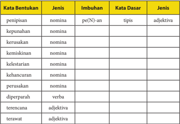

Tabel ini berisi informasi tentang bentuk kata dalam bahasa Indonesia, termasuk jenis kata (nomina, verba, adjektiva), imbuhan, kata dasar, dan jenis bentuk kata. Topik utama tabel adalah pengenalan struktur dan bentuk kata dalam bahasa Indonesia. Kolom-kolomnya meliputi: "Kata Bentukan" untuk menunjukkan nama-nama kata, "Jenis" untuk menentukan apakah kata itu nomina, verba, atau adjektiva, "Imbuhan" untuk menunjukkan bagian dari kata yang digunakan untuk menambahkan bentuk kata, "Kata Dasar" untuk menunjukkan bagian dasar kata yang tidak berubah ketika ditambahkan bentuknya, dan "Jenis" untuk menunjukkan jenis bentuk kata yang dihasilkan. Data penting yang terlihat adalah bahwa semua kata dalam tabel adalah nomina, kecuali "diperparah" dan "terawat", yang merupakan bentuk verb. Selain itu, beberapa kata memiliki bentuk adjektiva seperti "penipisan" dan "kehancuran".

Lanjutkan dengan mengidentifikasi kata sifat (adjektiva)!

---
**📊 Tabel**

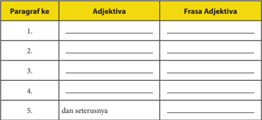

Tabel ini berisi informasi tentang paragraf ke-1 hingga paragraf ke-5, dengan kolom "Adjektiva" dan "Frasa Adjektiva". Topik utama tabel ini adalah pengenalan dan penjelasan tentang paragraf dan frasa adjektiva. Kolom "Adjektiva" menyajikan kata kunci atau adjektif yang digunakan dalam setiap paragraf, sementara kolom "Frasa Adjektiva" menunjukkan bagaimana adjektif tersebut digunakan dalam frasa. Data penting yang terlihat adalah bahwa setiap paragraf memiliki satu atau lebih adjektif yang digunakan dalam frasa, dan pola ini terus-menerus diulang untuk paragraf ke-2 hingga paragraf ke-5.

Dalam teks eksposisi banyak digunakan kalimat verbal, yaitu kalimat berpredikat verba. Kalimat lainnya, kalimat nominal, kalimat berpredikat nomina, adjektiva, numeralia, atau adverbia, jarang digunakan dalam teks eksposisi.

 

---
## 📄 Halaman 80

Perhatikan contoh kalimat verbal yang terdapat dalam teks Pembangunan dan Bencana Lingkungan di atas!

---
**📊 Tabel**

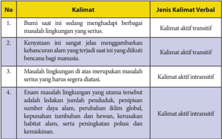

Tabel ini membahas empat kalimat verbal yang berbeda jenisnya, dengan fokus pada masalah lingkungan serius. Topik utama adalah penyebaran masalah lingkungan serius di dunia dan upaya untuk mengatasi masalah tersebut. Kolom pertama berisi kalimat verbal, sedangkan kolom kedua menjelaskan jenis kalimat verbalnya. Data penting yang terlihat adalah bahwa semua kalimat memiliki aspek aktif, tetapi beberapa memiliki aspek transitif atau intrasitif. Ini menunjukkan bahwa bahasa verbal dapat digunakan untuk berbagai tujuan, baik untuk menyampaikan informasi atau untuk menggambarkan peristiwa.

Berdasarkan  contoh  di  atas,  dikusikanlah  dengan  teman-temanmu, apakah  perbedaan  antara kalimat aktif transitif dan  kalimat aktif intransitif?

Untuk  menguji  penguasaanmu  terhadap  kebahasaan  teks  eksposisi, bacalah  kembali  teks Upaya  Melestarikan  Lingkungan  Hidup kemudian kerjakan tugas-tugas berikut ini.

Temukanlah contoh kalimat aktif transitif dan kalimat aktif intransitif dalam teks Pembangunan dan Bencana Lingkungan . Gunakan tabel berikut ini.

---
**📊 Tabel**

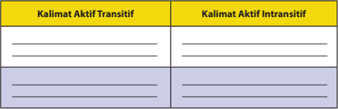

Tabel ini berisi dua kolom: "Kalimat Aktif Transitif" dan "Kalimat Aktif Intransitif". Topik utamanya adalah perbedaan struktur kalimat aktif dalam bahasa Indonesia. Dalam kolom pertama, kita melihat contoh kalimat transitif yang menggunakan kata kerja transitif (misalnya "makan", "berbicara") dan subjek yang menerima tindakan tersebut. Contohnya, "Saya makan nasi." Dalam kolom kedua, kita melihat contoh kalimat intransitif yang tidak menggunakan kata kerja transitif dan subjek yang tidak menerima tindakan. Contohnya, "Saya merasa lapar." Pola penting yang terlihat adalah bahwa kalimat transitif memiliki subjek yang menerima tindakan, sedangkan kalimat intransitif tidak memiliki subjek yang menerima tindakan.

 

---
## 📄 Halaman 81

### D. Menyajikan Gagasan  ke  dalam Teks Eksposisi

Setelah mempelajari materi ini, kamu diharapkan mampu:

- menentukan gagasan pokok dan gagasan penjelas dalam teks eksposisi;
- menyusun ulang gagasan ke dalam teks eksposisi.

### Menentukan Gagasan Pokok dan Gagasan Penjelas dalam Teks Eksposisi

Bencana  kabut  asap  merupakan  bencana  memilukan.  Sudah    sebulan  ini sebagian negeri berselimut asap putih. Langit Sumatera dan langit Kalimantan tak lagi tampak biru. Sebagaimana dikatakan Zulkifli Hasan, mantan Menteri Kehutanan, di beberapa media bahwa untuk menghentikan kebakaran lahan dan hutan yang menimbulkan bencana asap memang tak mudah.

Pada  setiap  paragraf  selalu  terdapat  satu  gagasan  pokok  yang  juga dikenal  sebagai  ide  pokok.  Ide  pokok  itulah  yang  menjadi  kerangka pengembangan sebuah paragraf.

Untuk menyusun sebuah teks eksposisi, mulailah dengan mendata gagasangagasan  pokok  yang  sesuai  dengan  topik  yang  akan  kita  bahas.  Selanjutnya, kembangkanlah gagasan-gagasan pokok tersebut dengan gagasan penjelas agar ide yang kita sampaikan menjadi jelas bagi pendengar atau pembaca.

Perhatikanlah contoh rangkaian gagasan pokok berikut.

- bencana kabut asap merupakan bencana memilukan.
- penyebab bencana adalah karena perilaku manusia.
- pendidikan dapat berperan dalam menyadarkan masyarakat tentang pentingnya menjaga kelestarian alam.
Perhatikan contoh paragraf yang dikembangkan dari sebuah  gagasan pokok  ditambah  dengan  gagasan-gagasan  penjelas.  Selanjutnya,  datalah gagasan penjelas yang sesuai dengan gagasan pokok dalam tabel berikut ini.

Perhatikan contoh pengembangan gagasan pokok dalam teks eksposisi. Selanjutnya,  lengkapilah  gagasan  utama  yang  disajikan  dengan  gagasan pendukung yang menguatkan teks eksposisi.

 

---
## 📄 Halaman 82

---
**📊 Tabel**

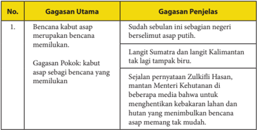

Tabel ini berisi dua kolom: "Gagasan Utama" dan "Gagasan Penjelasan". Topik utama tabel adalah tentang bencana kabut asap dan bagaimana mencegahnya. Dalam kolom "Gagasan Utama", terdapat dua gagasan utama: 1) Kabut asap merupakan bencana, dan 2) Kabut asap sebagai bencana yang memudahkan. Sedangkan dalam kolom "Gagasan Penjelasan", terdapat penjelasan lebih lanjut untuk kedua gagasan tersebut. Gagasan pertama dijelaskan bahwa kabut asap merupakan bencana karena sebabnya adalah kabut asap putih yang menyebar ke seluruh negeri. Gagasan kedua dijelaskan bahwa kabut asap dapat menjadi bencana karena kabut asap biru yang tampak di langit Sumatera dan Kalimantan.

### Kegiatan 2

### Menyusun Ulang Gagasan ke dalam Teks Eksposisi

Jika gagasan pokok di atas, Bencana kabut asap merupakan bencana memilukan, dan gagasan penjelasnya dikembangkan dalam sebuah paragraf akan menjadi sebuah paragraf yang padu seperti contoh di atas. Lanjutkan menata gagasan pokok dan gagasan penjelas nomor 2 dan 3 di atas ke dalam paragraf yang utuh dengan mengisi tabel berikut ini.

---
**📊 Tabel**

Tabel ini berisi informasi tentang penyebab bencana alam yang disebutkan dalam buku pelajaran. Topik utama tabel adalah "Penyebab bencana adalah karena perilaku manusia". Dalam tabel ini, terdapat dua kolom: "Gagasan Utama" dan "Gagasan Penjelasan". Gagasan Utama adalah "Penyebab bencana adalah karena perilaku manusia", sedangkan gagasan penjelasan tidak diberikan dalam tabel tersebut. Tabel ini menunjukkan bahwa penyebab bencana alam seringkali dikaitkan dengan tindakan atau perilaku manusia, seperti pembangunan tanpa mempertimbangkan dampak lingkungan, penggunaan sumber daya alam secara tidak bertanggung jawab, dan lain-lain.

 

---
## 📄 Halaman 83

---
**🖼️ Gambar/Diagram**

> **Deskripsi Visual:** Gambar ini adalah diagram yang menunjukkan gagasan utama dan penjelasan tentang pendidikan dalam menyadarkan masyarakat tentang pentingnya menjaga kelestarian alam. Diagram ini terdiri dari dua kolom utama: "Gagasan Utama" dan "Gagasan Penjelasan". Kolom "Gagasan Utama" berisi satu gagasan utama yang disebutkan sebagai "Pendidikan dapat berperan dalam menyadarkan masyarakat tentang pentingnya menjaga kelestarian alam." Sedangkan kolom "Gagasan Penjelasan" berisi beberapa baris teks yang memberikan penjelasan lebih lanjut tentang gagasan tersebut.

Elemen-elemen utama dalam diagram ini meliputi gagasan utama yang disebutkan dan penjelasan yang diberikan. Gagasan utama ini merupakan titik awal yang membuka topik diskusi, sedangkan penjelasan memberikan detail tentang bagaimana pendidikan dapat berperan dalam menyadarkan masyarakat tentang pentingnya menjaga kelestarian alam.

Teks, angka, atau label penting yang terlihat dalam diagram ini adalah "No.", "Gagasan Utama", dan "Gagasan Penjelasan". Angka "No." digunakan untuk mengidentifikasi setiap gagasan utama dan penjelasannya. "Gagasan Utama" dan "Gagasan Penjelasan" adalah label yang digunakan untuk membedakan antara gagasan utama dan penjelasan yang diberikan.

Informasi kunci yang dapat diambil pembaca dari gambar ini adalah bahwa pendidikan memiliki peran penting dalam menyadarkan masyarakat tentang pentingnya menjaga kelestarian alam. Diagram ini menunjukkan bahwa pendidikan dapat berperan dalam menyadarkan masyarakat tentang pentingnya menjaga kelestarian alam, dan penjelasan lebih lanjut akan memberikan detail tentang bagaimana pendidikan dapat berperan dalam hal tersebut.

---
**📊 Tabel**

Tabel ini berisi informasi tentang gagasan utama dan penjelasan untuk topik pendidikan dalam masyarakat tentang kelestarian alam. Topik utama adalah "Pendidikan dapat berperan dalam menyadarkan masyarakat tentang pentingnya menjaga kelestarian alam." Dalam kolom Gagasan Utama, terdapat satu baris kosong yang belum diisi. Sedangkan dalam kolom Gagasan Penjelasan, terdapat beberapa baris kosong yang masih harus diisi dengan penjelasan lebih lanjut tentang bagaimana pendidikan dapat berperan dalam menyadarkan masyarakat tentang pentingnya menjaga kelestarian alam. Pola penting yang terlihat adalah bahwa tabel ini bertujuan untuk memberikan ruang bagi pembaca untuk menulis gagasan dan penjelasan mereka sendiri tentang topik tersebut.

### Kegiatan 3

### Menyusun Teks Eksposisi

Setelah menganalisis teks eksposisi dari segi isi, struktur, dan kebahasaannya,    sekarang  kamu  akan  berlatih  menulis    teks  eksposisi. Pilihlah  salah  satu  di  antara  topik  berikut  sebagai  gagasan  pokok  yang akan kamu kembangkan ke dalam eksposisi. Kamu boleh juga memilih topik lain.

- Air sungai bermanfaat bagi pengairan sawah dan ladang.
- Sampah yang dibuang ke sungai akan menyumbat aliran air sungai.
- Pentingnya pendidikan tentang pelestarian lingkungan hidup.
- Penyebab utama kerusakan alam adalah perilaku manusia.

 

---
## 📄 Halaman 84

Setelah itu, kembangkan gagasan pokok tersebut ke dalam teks eksposisi dengan memerhatikan langkah-langkah berikut ini.

- Pilihlah  salah  satu  di  antara  gagasan-gagasan  berikut  atau  kamu  dapat menentukan  sendiri  gagasan  lain  yang  berkaitan  dengan  permasalahan dalam kehidupan di lingkungan sekitarmu.
- Datalah  argumen-argumen  yang  mendukung  gagasan  pokok  sebagai gagasan penjelas yang hendak kamu sampaikan.
- Kembangkan teks eksposisimu berdasarkan gagasan pokok dan argumen sebagai gagasan penjelasnya.
- Presentasikan teks eksposisi yang kamu susun di hadapan teman-temanmu.
- Berilah  tanggapan  (kritik  dan  saran)  terhadap  teks  eksposisi  yang disajikan temanmu.
- Publikasikan teks eksposisimu di majalah dinding, majalah sekolah, blog, atau di media cetak.

### Ringkasan

- Eksposisi  merupakan  genre  teks  berisi  gagasan  yang  bertujuan  agar orang lain memahami pendapatnya yang disampaikan. Gagasan tersebut disampaikan  oleh  penulis  atau  pembicara  berdasarkan  sudut  pandang tertentu.  Untuk  menguatkan  gagasan  yang  disampaikan,  penulis  atau pembicara harus menyertakan alasan-alasan logis.
- Sruktur teks eksposisi  meliputi:
- tesis atau pernyataan pendapat,
- argumentasi, dan
- penegasan ulang.
- Tesis  atau  pernyataan  pendapat  adalah  bagian  pembuka  dalam  teks eksposisi.  Bagian  tersebut  berisi  pendapat  umum  yang  disampaikan penulis terhadap permasalahan yang diangkat dalam teks eksposisi.
- Argumentasi  merupakan  unsur  penjelas  untuk  mendukung  tesis  yang disampaikan. Argumentasi dapat berupa alasan logis, data hasil temuan, fakta-fakta,  bahkan  pernyataan  para  ahli.  Argumen  yang  baik  harus mampu mendukung pendapat yang disampaikan penulis atau pembicara.
- Penegasan  ulang  bertujuan  untuk  menegaskan  pendapat  awal  serta menambah rekomendasi atau saran terhadap permasalahan yang diangkat.

 

---
## 📄 Halaman 85

### Bab III

### MENYAMPAIKAN IDE MELALUI ANEKDOT

---
**🖼️ Gambar/Diagram**

> **Deskripsi Visual:** Gambar ini adalah foto yang menampilkan dua kucing yang sedang berinteraksi. Kucing yang berwarna abu-abu dengan garis hitam di dada dan ekor tersebut tampak sangat tenang dengan mata tertutup dan mulut tertutup. Sementara itu, kucing berwarna coklat dengan bulu lembut tampak sedang mencium atau meremas pipi kucing abu-abu. Kedua kucing tersebut tampak sangat dekat dan saling menghormati. Di bawah gambar tersebut ada teks "MOP ON" yang tampak tidak terkait langsung dengan gambar tersebut.

Foto : Andin Lesanti (www.facebook.com )

Apa yang dapat kamu amati dari gambar di atas? Sekilas gambar di atas hanya terlihat sebagai gambar dua ekor kucing yang saling berdekatan di  depan  ruang  kelas.  Akan  tetapi,  dengan  dituliskan  ' mop  on '  yang merupakan  plesetan  dari  kata  ' move  on ' ,  maka  kamu  dapat  memahami maksud dari foto tersebut. Alih-alih menggunakan model dua anak muda, misalnya, fotografer yang membuat foto itu malah mengambil gambar dua ekor kucing. Sebuah kecerdasan menangkap momen. Cara menyampaikan sebuah  makna  secara  tersirat  seperti  pada  gambar  di  atas  juga  berlaku dalam anekdot.

Pada pelajaran sebelumnya, kamu sudah belajar tentang observasi dan eksposisi. Pada pelajaran ini kamu akan belajar menyampaikan ide, gagasan, bahkan kritik melalui anekdot. Dengan menguasai materi ini, kamu akan dapat menyampaikan kritik dengan cara yang lucu, tetapi mengena.

 

---
## 📄 Halaman 86

Untuk meningkatkan kemampuanmu,  pada pelajaran ini kamu akan belajar:

- mengkritisi teks anekdot dari aspek makna tersirat;
- mengonstruksi makna tersirat dalam sebuah teks anekdot;
- menganalisis struktur dan kebahasaan teks anekdot;
- menciptakan  kembali  teks  anekdot  dengan  memerhatikan  struktur, dan kebahasaan.
Peta konsep berikut ini dapat membantu kamu dalam mempelajari dan mengembangkan  kompetensi  berbahasa.  Jadi  pelajarilah  peta  konsep  di bawah ini dengan saksama!

---
**🖼️ Gambar/Diagram**

> **Deskripsi Visual:** Gambar ini adalah diagram yang menunjukkan proses menyampaikan ide melalui anekdot. Diagram ini terdiri dari tiga bagian utama:

1. **Menyampaikan Ide Melalui Anekdot** - Ini adalah bagian utama diagram yang menjelaskan langkah-langkah yang harus dilakukan untuk menyampaikan ide melalui anekdot.

2. **Mengkritisi teks anekdot dari aspek makna tersirat** - Bagian ini membahas tentang mengkritisi teks anekdot dari aspek makna tersirat, yang melibatkan beberapa langkah seperti mengidentifikasi polah-pubah anekdot, mendetilkan penyebab kekurangan makna tersirat, dan menentukan kekurangan makna tersirat.

3. **Menyampaikan Ide Melalui Anekdot** - Bagian ini menjelaskan langkah-langkah yang harus dilakukan untuk menyampaikan ide melalui anekdot, termasuk mengidentifikasi struktur dan kebahasaan anekdot, mempelajari konten anekdot dengan memperhatikan struktur dan kebahasaan, dan menciptakan kembali teks anekdot dengan memperhatikan struktur dan kebahasaan.

Elemen-elemen utama dalam diagram ini adalah langkah-langkah yang harus dilakukan untuk menyampaikan ide melalui anekdot, yang melibatkan mengkritisi teks anekdot dari aspek makna tersirat dan menyampaikan ide melalui anekdot. Label penting yang terlihat dalam diagram ini adalah "Menyampaikan Ide Melalui Anekdot" dan "Mengkritisi teks anekdot dari aspek makna tersirat".

Informasi kunci yang dapat diambil pembaca dari diagram ini adalah bahwa menyampaikan ide melalui anekdot melibatkan mengkritisi teks anekdot dari aspek makna tersirat dan menyampaikan ide melalui anekdot dengan memperhatikan struktur dan kebahasaan.

 

---
## 📄 Halaman 87

### A.  Mengkritisi Teks Anekdot dari Aspek Makna Tersirat

Setelah mempelajari materi ini, kamu diharapkan mampu:

- mendata pokok-pokok isi anekdot;
- mengidentifikasi penyebab kelucuan anekdot.
Dalam kehidupan sehari-hari, kita seringkali mendengar atau membaca cerita  lucu.  Cerita  lucu  tersebut  bisa  jadi  hanya  merupakan  cerita  rekaan, tetapi banyak juga yang didasarkan atas kejadian nyata. Ada cerita lucu yang dibuat benar-benar untuk tujuan menghibur, tetapi ada juga yang digunakan untuk tujuan lainnya.

Salah satu cerita lucu yang banyak beredar di masyarakat adalah anekdot. Anekdot  digunakan  untuk  menyampaikan  kritik,  tetapi  tidak  dengan  cara yang kasar dan menyakiti. Anekdot ialah cerita singkat yang  menarik karena lucu  dan  mengesankan.  Anekdot  mengangkat  cerita  tentang  orang  penting (tokoh  masyarakat)  atau  terkenal  berdasarkan  kejadian  yang  sebenarnya. Kejadian nyata ini kemudian dijadikan dasar cerita lucu dengan menambahkan unsur  rekaan.  Seringkali,  partisipan  (pelaku  cerita),  tempat  kejadian,  dan waktu peristiwa dalam anekdot tersebut merupakan hasil rekaan. Meskipun demikian, ada juga anekdot yang tidak berasal dari kejadian nyata.

### Mendata Pokok-pokok Isi Anekdot

Sekarang, tutuplah bukumu dan mintalah dua orang temanmu secara berpasangan  untuk  membaca  dialog  teks  anekdot.  Dengarkan  anekdot tersebut. Agar dapat mendengarkan dengan baik, lakukanlah hal-hal berikut:

- Berkonsentrasilah pada yang akan didengarkan agar dapat mencatat pokok-pokok yang menjadi permasalahan.
- Selama  mendengarkan  anekdot,  jangan  melakukan  aktivitas  lain seperti berbicara dengan temanmu atau menulis catatan.
- Tutuplah bukumu dan dengarkanlah contoh-contoh berikut ini yang dibacakan oleh gurumu atau  temanmu.

### Contoh 1

### Dosen yang juga Menjadi Pejabat

Di kantin sebuah universitas, Udin dan Tono dua orang mahasiswa sedang berbincang-bincang.

 

---
## 📄 Halaman 88

Tono :

'Saya heran dengan dosen ilmu politik, kalau mengajar selalu duduk, tidak pernah mau berdiri.'

Udin :

'Ah, begitu saja diperhatikan sih Ton.'

Tono :

'Ya, Udin tahu sebabnya.'

Udin :

'Barangkali saja, beliau capek atau kakinya tidak kuat berdiri.'

Tono :

'Bukan itu sebabnya, Din. Sebab dia juga seorang pejabat.'

Udin :

'Loh, apa hubungannya.'

Tono :

'Ya, kalau dia berdiri, takut kursinya diduduki orang lain.'

Udin :

'???'

Sumber: http://radiosuaradogiyafm.blogspot.co.id dengan penyesuaian

### Cara Keledai Membaca Buku

Alkisah,  seorang  raja  bernama  Timur  Lenk  menghadiahi  Nasrudin seekor  keledai.  Nasrudin  menerimanya  dengan  senang  hati.    Namun, Timur  Lenk  memberi  syarat,  agar  Nasrudin  mengajari  terlebih  dahulu keledai itu agar dapat membaca. Timur Lenk memberi waktu dua minggu sejak sekarang kepada Nasrudin.

Nasrudin menerima syarat itu dan berlalu. Sambil menuntun keledai itu, ia memikirkan apa yang akan diperbuat. Jika ia dapat mengajari keledai itu  untuk  membaca,  tentu  ia  akan  menerima  hadiah,  namun  jika  tidak maka hukuman pasti akan ditimpakan kepadanya.

Dua minggu kemudian ia kembali ke istana. Tanpa banyak bicara, Timur Lenk menunjuk ke sebuah buku besar agar Nasrudin segera mempraktikkan apa yang telah ia ajarkan kepada keledai. Nasrudin lalu menggiring keledainya menghadap ke arah buku tersebut dan membuka sampulnya.

Si keledai menatap buku itu. Kemudian, sangat ajaib! Tak lama kemudian si Keledai mulai membuka-buka buku itu dengan lidahnya. Terus menerus, lembar demi lembar hingga halaman terakhir. Setelah itu, si keledai menatap Nasrudin seolah berkata ia telah membaca seluruh isi bukunya.

'Demikianlah,  keledaiku  sudah  membaca  semua  lembar  bukunya', kata  Nasrudin.  Timur  Lenk  merasa  ada  yang  tidak  beres  dan  ia  mulai menginterogasi. Ia kagum dan memberi hadiah kepada Nasrudin. Namun, ia minta jawaban, 'Bagaimana cara mengajari keledai membaca?'

Nasrudin  berkisah,  'Sesampainya  di  rumah,  aku  siapkan  lembaranlembaran besar mirip buku. Aku sisipkan biji-biji gandum di dalamnya. Keledai itu harus belajar membalik-balik halaman untuk bisa makan biji-biji itu. Kalau tidak ditemukan biji gandumnya, ia harus membalik halaman berikutnya. Itulah yang ia lakukan terus sampai ia terlatih membalik  balik halaman buku itu' .

### Contoh 2

 

---
## 📄 Halaman 89

'Namun, bukankah ia tidak mengerti apa yang dibacanya?' tukas Timur Lenk. Nasrudin menjawab, Memang demikianlah cara keledai membaca, hanya membalik-balik halaman tanpa mengerti isinya'. Jadi, kalau kita juga membuka-buka buku tanpa mengerti isinya, berarti kita sebodoh keledai, bukan?' kata Nashrudin dengan mimik serius.

Sumber: http://blogger-apik1.blogspot.co.id  (dengan penyesuaian)

Dari  dua  contoh  anekdot  di  atas,  jawablah  pertanyaan-pertanyaan berikut ini.

- Siapa yang diceritakan dalam anekdot tersebut?
- Masalah apa yang diceritakan dalam anekdot?
- Temukan unsur humor dalam anekdot tersebut!
- Menurut pendapatmu, selain menceritakan hal yang lucu, adakah  pesan  tersirat  yang  hendak  disampaikan  pencerita  dalam anekdot tersebut?
- Mengapa cerita lucu tersebut disebut anekdot?

### Sekarang bandingkan hasil kerjamu dengan analisis berikut ini.

---
**📊 Tabel**

Tabel ini membahas tiga aspek penting dalam konteks dosen yang juga menjadi pejabat. Topik utamanya adalah bagaimana dosen yang juga menjadi pejabat dapat mempengaruhi kualitas pendidikan dan interaksi dengan mahasiswa. Dalam kolom "Masalah yang dibahas", disebutkan bahwa dosen yang merangkap jabatan seringkali mengalami kesulitan dalam menjaga kualitas pengetahuan dan pemahaman siswa. Hal ini disebabkan oleh berbagai faktor seperti kurangnya waktu untuk belajar, stres kerja, dan perbedaan prioritas antara pendidikan dan pekerjaan. Kolom "Dosen yang juga menjadi Pejabat" menunjukkan bahwa dosen yang merangkap jabatan seringkali tidak memiliki waktu yang cukup untuk belajar dan mengembangkan diri secara pribadi. Ini bisa berdampak negatif pada kualitas pendidikan yang diberikan kepada mahasiswa. Selain itu, tabel juga mencakup dua aspek lain: "Kritikan yang disampaikan" dan "Kritikan yang disampaikan pada pejabat". Kritikan yang disampaikan melibatkan kritik terhadap kualitas pendidikan yang diberikan oleh dosen yang merangkap jabatan. Sementara itu, kritik yang disampaikan pada pejabat mencakup kritik terhadap keputusan pejabat baru tentang kualifikasi jabatan. Pola penting yang terlihat adalah hubungan antara dosen yang merangkap jabatan dan kualitas pendidikan, serta dampak dari kritik yang disampaikan oleh dosen tersebut.

Nah,  sekarang  cobalah  menganalisis  isi  pokok  teks  anekdot Cara Keledai Membaca Buku . Buktikanlah bahwa anekdot tersebut berisi kritik terhadap suatu masalah atau tokoh publik yang disampaikan secara halus melalui humor singkat.

 

---
## 📄 Halaman 90

Untuk memudahkan analisismu, gunakan tabel berikut ini.

---
**📊 Tabel**

Tabel ini berisi informasi tentang cara keledai membaca buku dengan fokus pada masalah yang dibahas, unsur humor, dan makna tersirat yang disampaikan. Topik utama tabel adalah pembelajaran cara membaca buku secara efektif. Kolom pertama, "Judul," menunjukkan judul yang akan dibahas dalam setiap baris. Kolom kedua, "Cara Keledai Membaca Buku," menyediakan ruang untuk detail tentang bagaimana keledai membaca buku. Data penting yang terlihat meliputi masalah yang dibahas, seperti penggunaan humor dalam membaca, dan makna tersirat yang disampaikan, yang dapat membantu pembaca memahami konten lebih baik. Tabel ini membantu pembaca memahami bagaimana keledai membaca buku dengan cara yang efektif dan mendalam.

Setelah mendiskusikan hasil kerjamu, kerjakan tugas berikut.

- Jelaskan batasan anekdot dengan singkat dan jelas!
- Sebutkan isi pokok anekdot!
- Jelaskan fungsi anekdot. Apabila perlu, sertai dengan contoh.

### Mengidentiikasi Penyebab Kelucuan Anekdot

Setelah dapat mendata  pokok-pokok  isi anekdot dalam diskusi kelompok, lanjutkanlah diskusimu mengenai penyebab kelucuan anekdot.

Kelucuan  dalam  anekdot  biasanya  disampaikan  dengan  bahasa  yang singkat,  tetapi  mengena.  Dalam anekdot berjudul Dosen yang juga Menjadi Pejabat terdapat sindiran atas dosen yang juga menjadi pejabat. Cerita tersebut menjadi  lucu  karena  alasan  dosen  tidak  mau  berdiri,  duduk  terus  selama mengajar karena takut akan kehilangan kursi jabatannya apabila ia berdiri.

Sekarang,  diskusikanlah  penyebab  kelucuan  anekdot Cara  Keledai Membaca Buku .

 

---
## 📄 Halaman 91

### B. Mengonstruksi Makna Tersirat dalam Sebuah Teks Anekdot

Setelah mempelajari materi ini, kamu diharapkan mampu:

- membandingkan anekdot dengan humor;
- menganalisis kritik yang disampaikan secara  tersirat dalam anekdot;
- menyimpulkan makna tersirat dari anekdot.
Pada  bagian  sebelumnya,  kamu  telah  mengkritisi  teks  anekdot  dari aspek  makna  tersiratnya.  Sekarang  saatnya  kamu  mengonstruksi  makna tersirat dalam sebuah teks anekdot. Untuk mengonstruksi makna tersirat dalam anekdot, lakukan kegiatan-kegiatan berikut ini.

### Membandingkan Anekdot dengan Humor

Pada  pembelajaran  sebelumnya,  kamu  telah  belajar  bahwa  anekdot adalah cerita  singkat  yang  lucu  dan  menarik.  Apakah  semua  cerita  lucu dapat  dikategorikan  sebagai  anekdot?  Seringkali  orang  menyamakan antara humor dengan anekdot.

Agar  dapat  mengetahui  persamaan  dan  perbedaan  antara  keduanya, bacalah puisi humor berikut ini.

### Surat Cinta Tukang Buah dan Tukang Sayur

---
**🖼️ Gambar/Diagram**

> **Deskripsi Visual:** Gambar ini adalah ilustrasi yang menampilkan sebuah surat cinta dengan latar belakang merah muda. Surat tersebut tampak seperti sebuah lembar kertas berwarna putih dengan beberapa gambar hati merah di sekitarnya. Gambar hati ini tampak seperti bintang atau bunga, dan ada juga beberapa gambar hati kecil yang lebih kecil di bagian atas dan samping surat.

Elemen utama dalam gambar ini adalah surat cinta itu sendiri, yang tampak sangat indah dan menarik perhatian karena warnanya yang cerah dan desainnya yang unik. Selain itu, elemen lainnya adalah hati-hati merah yang menambahkan nuansa romantis pada gambar.

Teks, angka, atau label penting tidak terlihat dalam gambar ini, karena gambar hanya menggambarkan objek-objek fisik tanpa teks atau informasi tambahan.

Informasi kunci yang dapat diambil pembaca adalah bahwa gambar ini mungkin digunakan sebagai ilustrasi untuk membahas tema cinta atau pernikahan dalam buku pelajaran.

Surat Tukang Buah kepada Tukang Sayur Wajahmu memang manggis sifatmu juga melon kolis Tapi hatiku nanas karena cemburu Terasa sirsak napasku Hatiku anggur lebur Ini delima dalam hidupku Memang ini salakku Jarang apel di malam minggu Aku ... mohon belimbing-mu

Kalo memang per-pisang-an ini yang terbaik untukmu Semangka kau bahagia dengan pria lain

Sawo nara

Dari: Durianto

 

---
## 📄 Halaman 92

### Balasan dari Tukang sayur

Membalas kentang suratmu itu Brokoli-brokoli sudah kubilang

Jangan tiap dateng rambutmu selalu kucai

Jagungmu tak pernah dicukur

Disuruh dateng malem minggu eh nongolnya hari labu

Ditambah kondisi keuanganmu makin hari makin pare

Kalo mau nelpon aku aja mesti ke wortel

Terus terong aja cintaku padamu sudah lama tomat

Jangan kangkung aku lagi aku mau hidup seledri

Cabe dech.

Dari : Sayurati

(Dikutip dari https://plus.google.com/u/0/communities/ 104074508652281682239 dengan penyesuaian)

Setelah membaca humor tersebut, jawablah pertanyaan berikut ini.

- Apakah ide ceritanya diangkat dari kejadian nyata?
- Apakah masalah yang diangkat dalam humor tersebut berkaitan dengan tokoh publik (penting) dan kepentingan masyarakat umum?
- Apakah ada makna tersirat yang disampaikan dalam bentuk kritik atau sindiran di dalamnya?
- Apakah tujuan komunikasi pencerita hanya untuk menghibur atau ada tujuan lain?
Perhatikan contoh perbandingan antara anekdot Dosen yang Menjadi Pejabat dengan Surat Cinta Tukang Buah kepada Tukang Sayur berikut ini.

---
**📊 Tabel**

Tabel ini membandingkan dua aspek cerita: ide cerita dan fungsi komunikasi. Topik utamanya adalah perbandingan antara anekdot dosen yang menjadi pejabat dengan humor Surat Cinta Tukang Buah kepada Tukang Sayur. Dalam kolom "Ide cerita", tabel menunjukkan bahwa kedua cerita memiliki masalah publik atau umum yang dihadapi oleh tokoh utamanya. Anekdot dosen mencakup peristiwa nyata, sementara humor Surat Cinta Tukang Buah adalah rekaan. Untuk fungsi komunikasi, kedua cerita bertujuan untuk menyampaikan kritik atau sindiran secara halus, tetapi dengan cara yang berbeda. Humor Surat Cinta Tukang Buah lebih fokus pada penghiburan daripada kritik.

 

---
## 📄 Halaman 93

---
**📊 Tabel**

Tabel ini membahas tentang makna tersirat dalam bahasa Indonesia. Makna tersirat adalah suatu bentuk penulisan yang tidak jelas atau tidak jelas, biasanya karena penggunaan kata atau frase yang tidak jelas atau tidak jelas. Tabel ini membagi makna tersirat menjadi dua kategori utama: menyatakan bahwa pejabat agak jarang jika jabatannya sudah berusaha untuk turun dari jabatan dan siap digantikan oleh yang lain, dan tidak ada makna atau pesan tersirat yang disampaikan. Ini menunjukkan bahwa makna tersirat dapat memiliki dua arah, yaitu menyatakan sesuatu yang tidak jelas atau tidak jelas, atau tidak menyampaikan makna apa pun.

### Tugas 1

Sekarang, cobalah membaca cerita-cerita lucu berikut ini. Kemudian kenalilah  mana  yang  merupakan  anekdot  dan  mana  yang  merupakan cerita lucu (humor)? Agar dapat lebih memahami isi cerita dan menangkap makna yang disampaikan penulisnya, peragakanlah cerita lucu berikut ini di depan kelas.

### Cerita 1

### Mau Gaji Besar?

---
**🖼️ Gambar/Diagram**

> **Deskripsi Visual:** Gambar ini adalah sebuah screenshot percakapan SMS antara dua orang, dengan judul "Messages" dan "Acara TV". Pada bagian atas, ada tombol "Edit" untuk mengedit pesan. Pesan pertama ditulis oleh seseorang yang tidak diketahui, bertanya "halo, dengan siapa di sini?" Dalam balasan, seseorang yang tidak diketahui menjawab dengan "dengan bapak anwar". Pesan berikutnya ditulis oleh seseorang yang tidak diketahui, bertanya "oh, bapak anwar, apakah bapak ingin mendapatkan uang tunai sebesar 3 juta rupiah??" Dalam balasan, seseorang yang tidak diketahui menjawab "wah, mau banget!! Gimana caranya??". Pesan terakhir ditulis oleh seseorang yang tidak diketahui, bertanya "kerja pak!".

Elemen-elemen utama dalam gambar ini adalah pesan-pesan yang ditulis oleh dua orang yang tidak diketahui. Relasi antara pesan-pesan tersebut adalah interaksi antara dua orang yang tidak diketahui melalui SMS. Teks, angka, atau label penting yang terlihat dalam gambar ini adalah pesan-pesan yang ditulis oleh dua orang yang tidak diketahui, serta informasi tentang jumlah uang yang ditanyakan dalam pesan kedua orang yang tidak diketahui. Informasi kunci yang dapat diambil pembaca adalah bahwa ada pertanyaan tentang uang tunai sebesar 3 juta rupiah dalam percakapan ini.

 

---
## 📄 Halaman 94

### Cerita 2

### Cerita 3

### Profesi Anak-anak Penjual Kue

---
**🖼️ Gambar/Diagram**

> **Deskripsi Visual:** Gambar ini adalah ilustrasi yang menunjukkan seorang pedagang di sebuah toko kecil yang menjual berbagai macam makanan. Ilustrasi ini menggambarkan suasana pasar tradisional dengan berbagai pilihan makanan yang tersedia di meja belakang pedagang. Pedagang tersebut sedang berdiri di belakang meja yang penuh dengan berbagai jenis makanan, termasuk roti, kue, sayuran, dan buah-buahan. Di sebelah kanan, ada seorang pembeli yang sedang memilih makanan. Ilustrasi ini menunjukkan hubungan antara pedagang dan pembeli, serta detail tentang produk yang tersedia di toko tersebut.

Elemen-elemen utama dalam ilustrasi ini meliputi pedagang, pembeli, meja belakang pedagang, dan berbagai jenis makanan yang tersedia. Hubungan antara elemen-elemen ini adalah pedagang yang menjual makanan kepada pembeli, yang merupakan bagian dari proses perdagangan. Informasi kunci yang dapat diambil dari gambar ini adalah bahwa toko ini menjual berbagai jenis makanan tradisional, dan bahwa pedagang dan pembeli berinteraksi dalam proses pembelian.

Sumber: https-//upload.wikimedia.org

Bapak Presiden bertanya pada ibu tua penjual kue.

Bapak Presiden :  'Sudah berapa lama jualan kue?'

Ibu Tua

:   'Sudah hampir 30 tahun.'

Bapak Presiden :  'Terus anak ibu mana, kenapa tidak ada yang bantu?'

Ibu Tua

:   ' Anak saya ada 4. Yang ke-1 di KPK, ke-2 di POLDA, ke-3 di Kejaksaan, dan yang ke-4 di DPR. Jadi mereka sibuk sekali, Pak. '

Bapak Presiden kemudian menggeleng-gelengkan kepala karena kagum. Lalu berbicara ke semua hadirin yang menyertai beliau.

Bapak Presiden :  'Meskipun hanya jualan kue, ibu ini bisa menjadikan anaknya sukses dan jujur tidak korupsi, karena kalau mereka korupsi, pasti kehidupan Ibu ini sudah sejahtera dan tinggal di rumah mewah.'

Bapak Presiden :  'Apa jabatan anak di POLDA, KPK, Kejaksaan dan DPR?'

Ibu Tua

:   'Sama ... jualan kue juga.'

Sumber: http://radiosuaradogiyafm.blogspot.co.id

### Nangka Impor

Seorang teman diplomat yang baru ditempatkan di Belanda bercerita, Saya  pernah  makan  siang  di  sebuah  restoran  Indonesia  sederhana  di Amsterdam.  Saya  kaget,  ternyata  salah  satu  menunya  ada  masakan gudeg Yogya.

 

---
## 📄 Halaman 95

Saya penasaran. Maka langsung saya pesan satu porsi.

Setelah saya ciicipi, percaya atau tidak, ternyata rasanya lebih enak daripada gudeg di Yogya yang asli!

Karena penasaran, maka saya bertanya:

'Mas, apa rahasianya kok gudeg di sini rasanya lebih enak dibandingkan dengan di tempat aslinya?'

'Oh, itu karena nangkanya, Mas. Di Yogya kan pakai nangka lokal.

Nah kalau kami di sini memakai nangka impor,' jawabnya.

'Emang nangkanya impor dari mana?'

### Cerita 4

Sebuah mobil ambulans yang mengangkut beberapa orang pasien sakit jiwa terpaksa berhenti di tengah jalan karena bannya bocor.  Ketika sedang mengganti ban, si Sopir tak sengaja menendang ke empat bautnya hingga masuk selokan. Dengan panik si Sopir berteriak, 'Waduuuh, gimana gue bisa pasang ban kalau bautnya hilang?'

Mendengar  teriakan  itu,  salah  seorang  pasien  gila  nyeletuk,  'Bang copotin  aja  tuh  satu  baut  dari  masing-masing  tiga    roda  lainnya.  Terus pasang ke bannya. Jadi, masing-masing ban dapat tiga baut. Ntar kalau ada toko baut, tinggal beli empat baut.'

Mendengar usul pasien gila  tersebut,  si  Sopir  langsung  lega.  'Pinter juga Lo tapi ... kenapa  Lo masuk rumah sakit jiwa sih?'

Pasien itu menjawab, ' Helooooo ... plis dech , kita ini cuma gila. Bukan bego kayak Lo . '

Berdasarkan  hasil  kerjamu  di  atas,  rumuskanlah  persamaan  dan perbedaan antara humor dan anekdot. Gunakan tabel berikut.

### Tabel Perbedaan Humor dan Anekdot

---
**📊 Tabel**

Tabel ini membahas dua aspek utama: Humor dan Anekdot. Topik utamanya adalah ide cerita, isi, dan fungsi komunikasi. Untuk Humor, ide cerita mencakup humor dan anekdot memiliki nilai-nilai yang sama. Isi keduanya juga mirip, dengan humor menekankan pada perasaan dan anekdot fokus pada pengalaman sehari-hari. Fungsi komunikasi, sementara, lebih berfokus pada humor yang dapat membuat orang tertawa dan anekdot yang dapat memberikan informasi atau pengalaman. Dua aspek ini saling berkaitan dan saling mempengaruhi dalam konteks komunikasi.

 

---
## 📄 Halaman 96

### Menganalisis Kritik yang Disampaikan dalam Anekdot

Dalam  kegiatan  sebelumnya,  kamu  sudah  memahami  bahwa  salah satu perbedaan antara humor dan anekdot adalah pada fungsinya. Humor hanya  berfungsi  untuk  menghibur,  sedangkan  anekdot  berfungsi  untuk menyampaikan makna tersirat (biasanya berupa kritik).

Kritik dalam anekdot seringkali disampaikan dalam bentuk sindiran, tidak disampaikan secara langsung. Hal itu dilakukan untuk menghindari konflik  antara  pihak  yang  menyampaikan  sindiran  dengan  pihak  yang disindir. Tujuannya agar pesan yang ingin disampaikan, kritiknya, dapat diterima  oleh  pihak  yang  dikritisi  tanpa  menimbulkan  ketersinggungan. Untuk itulah, pencerita menggunakan ungkapan yaitu berupa kata, frasa, atau kalimat yang bermakna idiomatis, bukan makna sebenarnya.

Berikut  adalah  contoh  analisis  kritik  atau  sindiran  dalam  anekdot Dosen yang Menjadi Pejabat.

---
**📊 Tabel**

Tabel ini berisi informasi tentang kata, frasa, klausula, atau kalimat yang memiliki makna idiomatic (kata-kata atau frasa yang memiliki makna khusus di luar konteks harfiahnya). Topik utama tabel ini adalah pengenalan dan penjelasan tentang kata-kata atau frasa yang memiliki makna khusus di luar konteks harfiahnya. Kolom-kolom yang ada dalam tabel ini adalah "Kata, frasa, klausula, atau kalimat" dan "Makna idiomatic". Data atau pola penting yang terlihat dalam tabel ini adalah bahwa beberapa kata, frasa, klausula, atau kalimat memiliki makna khusus di luar konteks harfiahnya, seperti "kursi" yang memiliki makna jabatan, dan "takut kursinya diambl orang" yang memiliki makna takut jabatannya diambil orang lain.

Berdasarkan identifikasi kata dan klausa idiomatis dalam tabel di atas dapat disimpulkan bahwa kritik yang disampaikan dalam anekdot tersebut ditujukan pada para pejabat yang tidak mau atau takut dilengserkan.

 

---
## 📄 Halaman 97

Bacalah kembali teks anekdot yang telah kamu identifikasi sebelumnya. Kemudian,  analisislah  kritik/sindiran  yang  ada  di  dalamnya  dengan menggunakan tabel berikut.

Judul anekdot:

---
**📊 Tabel**

Tabel ini berisi dua kolom: "Kata, frasa, klausula, atau kalimat" dan "Makna idiomatic". Topik utamanya adalah tentang perbandingan antara kata, frasa, klausula, atau kalimat dengan makna idiomatic mereka. Dalam kolom pertama, terdapat beberapa contoh seperti "Saya akan datang", "Saya akan datang hari ini", dan "Saya akan datang pada jam 10 pagi". Di kolom kedua, terdapat penjelasan untuk setiap contoh, seperti "Saya akan datang hari ini" memiliki makna bahwa seseorang akan tiba di tempat tertentu pada hari yang ditentukan, sedangkan "Saya akan datang pada jam 10 pagi" menunjukkan waktu tepat ketika seseorang akan tiba. Tabel ini membantu memahami bagaimana kata, frasa, klausula, atau kalimat dapat memiliki makna yang lebih mendalam dan unik dibandingkan dengan maknanya secara harfiah.

### Menyimpulkan Makna Tersirat dalam Anekdot

Pada  pembelajaran  sebelumnya,  kamu  sudah  mempelajari  bahwa  di dalam anekdot terdapat sindiran yang disampaikan melalui humor. Dalam kegiatan  pembelajaran  ini,  kamu  akan  belajar  menyimpulkan  makna tersirat yang disampaikan melalui anekdot. Makna tersirat anekdot berbeda dengan sindiran dan kritikan. Hal ini tentu saja tetapi lebih mengarah pada tujuan yang ingin disampaikan oleh si pembuat kritik. Sekarang, mari kita perhatikan lagi anekdot dosen yang juga menjadi pejabat berikut ini.

### Dosen yang juga Menjadi Pejabat

Di kantin sebuah universitas, Udin dan Tono dua orang mahasiswa sedang berbincang-bincang.

Tono :

'Saya heran dosen ilmu politik, kalau mengajar selalu duduk, tidak pernah mau berdiri.'

Udin :

'Ah, begitu saja diperhatikan sih Ton.'

Tono :

'Ya, Udin tahu sebabnya.'

Udin :

'Barangkali saja, beliau capek atau kakinya tidak kuat berdiri.'

Tono     :

'Bukan itu sebabnya, Din. Sebab dia juga seorang pejabat.'

Udin :

'Loh, apa hubungannya.'

Tono :

'Ya, kalau dia berdiri, takut kursinya diduduki orang lain.'

Udin :

'???'

Sumber: http://radiosuaradogiyafm.blogspot.co.id dengan penyesuaian

 

---
## 📄 Halaman 98

Dalam teks anekdot tersebut, kritik yang disampaikan ditujukan kepada para pejabat yang takut dan tidak mau turun dari jabatannya atau takut kehilangan  jabatan.  Tujuan  yang  ingin  disampaikan  tentu  bukan  hanya menyindir para pejabat yang tidak mau atau takut kehilangan jabatannya. Akan tetapi, jauh lebih dari itu, yaitu agar para pejabat sadar bahwa jabatan itu ada masanya. Ketika masa jabatan sudah habis, hendaknya para pejabat itu dengan legawa bersedia digantikan oleh orang lain.

Berdasarkan  uraian  di  atas,  dapat  kamu  simpulkan  bahwa  makna tersirat  yang  dimaksud  lebih  mengarah  pada  pesan  moral  yang  hendak disampaikan melalui anekdot. Pesan moral itu dapat dirunut dari kritikan atau sindiran yang disampaikan lewat anekdot.

Bacalah kembali anekdot-anekdot di atas, kemudian tentukan makna tersiratnya dengan menggunakan tabel berikut ini.

---
**📊 Tabel**

Tabel ini berisi informasi tentang anekdot dengan judul, kritikan atau sindiran yang digunakan, dan makna tersirat yang diharapkan. Topik utama tabel ini adalah analisis anekdot dan pengembangan kreatif melalui perbandingan antara konteks asli dan makna tersirat. Kolom-kolomnya mencakup judul anekdot, kritikan atau sindiran yang digunakan, dan makna tersirat yang diharapkan. Data penting yang terlihat adalah bahwa anekdot tersebut mungkin memiliki makna tersirat yang lebih dalam daripada apa yang ditunjukkan oleh judul atau kritikan yang digunakan. Ini menunjukkan bahwa pengetahuan tentang konteks dan makna tersirat sebuah anekdot dapat memberikan pemahaman yang lebih mendalam tentang cerita tersebut.

 

---
## 📄 Halaman 99

### C. Menganalisis Struktur dan Kebahasaan Teks Anekdot

Setelah mempelajari materi ini, kamu diharapkan mampu:

- mengidentifikasi struktur teks anekdot;
- mengenal berbagai pola penyajian teks anekdot;
- menganalisis kebahasaan teks anekdot.

### Kegiatan 1

### Mengidentiikasi Struktur Teks Anekdot

Anekdot memiliki struktur teks yang membedakannya dengan teks lainnya. Teks anekdot memiliki struktur abstraksi, orientasi, krisi s, reaksi, dan koda .

Bacalah  anekdot  berikut  ini,  kemudian  pelajarilah  cara  menganalisis struktur anekdot.

---
**📊 Tabel**

Tabel ini menunjukkan aksi maling tertangkap CCTV, dengan kolom "Isi" yang berisi narasi dialog antara pelapor, polisi, dan warga sekitar, serta kolom "Struktur" yang menjelaskan struktur narrasi tersebut. Topik utama tabel adalah aksi maling yang dilaporkan dan tanggapannya oleh warga setempat melalui CCTV. Data penting yang terlihat adalah bahwa warga setempat melaporkan kejadian kemalangan di rumah mereka, yang kemudian disampaikan kepada polisi. Polisi meminta izin untuk merekam aksi maling tersebut, namun warga setempat menolak karena merasa tidak aman. Ini menunjukkan konflik antara privasi dan keamanan publik dalam konteks aksi maling.

Berdasarkan  contoh  analisis  di  atas,  diskusikanlah  dengan  temantemanmu apa sebenarnya isi tiap bagian struktur anekdot tersebut.

Analisislah  struktur  anekdot  lainnya  dengan  menggunakan  tabel berikut ini. Kerjakan di buku tugasmu.

 

---
## 📄 Halaman 100

---
**📊 Tabel**

Tabel ini menunjukkan struktur dari sebuah proses yang mungkin berhubungan dengan manajemen krisis atau perencanaan. Topik utamanya adalah "Struktur" dan "Isi". Kolom-kolomnya mencakup: Abstraksi, Orientasi, Krisis, Reaksi, dan Koda. Data atau pola penting yang terlihat adalah bahwa setiap kolom memiliki satu baris, menunjukkan bahwa setiap bagian dari proses tersebut memiliki satu isinya. Ini mungkin merujuk pada langkah-langkah dalam manajemen krisis atau perencanaan, seperti definisi awal (abstraksi), penentuan tujuan (orientasi), identifikasi masalah (krisis), tindakan yang diambil (reaksi), dan langkah-langkah untuk memastikan kesuksesan (koda).

### Mengenal Berbagai Pola Penyajian Teks Anekdot

Anekdot  dapat disajikan dalam bentuk dialog maupun narasi. Contoh penyajian  dalam  bentuk  dialog,  percakapan  dua  orang  atau  lebih,  dapat dilihat  pada  anekdot Dosen  yang  juga  menjadi  Pejabat. Salah  satu  ciri dialog  adalah  menggunakan  kalimat  langsung.  Kalimat  langsung  adalah sebuah kalimat yang merupakan hasil kutipan langsung dari pembicaraan seseorang yang sama persis seperti apa yang dikatakannya. Perhatikan kutipan berikut ini.

Dari  kutipan  anekdot  di  atas  kamu  dapat  melihat  bahwa  kalimat langsung memiliki ciri-ciri sebagai berikut.

- Diawali dan diakhiri dengan tanda petik (' ....').
- Huruf awal setelah tanda petik ditulis dengan huruf kapital.
- Antara pembicara dan apa yang dikatakannya dipisahkan dengan tanda titik dua (:).

 

---
## 📄 Halaman 101

Selain  dituliskan  dalam  bentuk  dialog  seperti  pada  anekdot Dosen yang juga Menjadi Pejabat , ada juga anekdot yang disajikan  dalam bentuk narasi.  Coba  bandingkan  bagaimana  penulisan  kalimat  langsung  dalam anekdot berikut ini.

---
**🖼️ Gambar/Diagram**

> **Deskripsi Visual:** Gambar ini adalah ilustrasi yang menunjukkan tangan seseorang yang terjebak dalam tangan tahanan dengan kain tahanan yang menggantung dari uang rupiah berukuran 10.000 Rupiah. Ilustrasi ini mungkin digunakan untuk menggambarkan konsekuensi dari tindakan ilegal seperti korupsi atau penipuan.

1. Gambar ini menunjukkan tangan seseorang yang terjebak dalam tahanan dengan kain tahanan yang menggantung dari uang rupiah berukuran 10.000 Rupiah.
2. Elemen utama dalam gambar ini adalah tangan seseorang yang terjebak dalam tahanan, uang rupiah berukuran 10.000 Rupiah, dan kain tahanan yang menggantung dari uang tersebut. Relasi antara elemen-elemen ini adalah bahwa tangan seseorang yang terjebak dalam tahanan adalah hasil dari tindakan ilegal seperti korupsi atau penipuan yang melibatkan uang rupiah berukuran 10.000 Rupiah.
3. Teks, angka, atau label penting yang terlihat dalam gambar ini adalah "10.000 Rupiah" yang menunjukkan nilai uang rupiah yang terlibat dalam tindakan ilegal tersebut.
4. Informasi kunci yang dapat diambil pembaca dari gambar ini adalah bahwa tindakan ilegal seperti korupsi atau penipuan dapat memiliki konsekuensi serius seperti denda atau hukuman, dan bahwa uang rupiah berukuran 10.000 Rupiah adalah salah satu contoh uang yang bisa menjadi sumber dari tindakan ilegal tersebut.

### Kisah Pengadilan Tindak Pidana Korupsi

Pada  puncak  pengadilan  korupsi  politik,  Jaksa  penuntut  umum menyerang saksi.  'Apakah benar,' teriak Jaksa, 'bahwa Anda menerima lima ribu dolar untuk berkompromi dalam kasus ini?'

Saksi menatap keluar jendela seolah-olah tidak mendengar pertanyaan. 'Bukankah benar bahwa Anda menerima lima ribu dolar untuk berkompromi dalam kasus ini?' ulang pengacara.

Saksi masih tidak menanggapi.

Akhirnya, hakim berkata, 'Pak, tolong jawab pertanyaan Jaksa.'

'Oh, maaf.' Saksi terkejut sambil berkata kepada hakim, 'Saya pikir dia tadi berbicara dengan Anda.'

Sumber: https://radiosuaradogiyafm.blogspot.co.id

### Menganalisis Struktur dan Kebahasaan Teks Anekdot

Seperti  juga  teks  lainnya,  anekdot  memiliki    unsur  kebahasaan  yang khas  yaitu  (a)  menggunaka n  kalimat  yang  menyatakan  peristiwa  masa lalu,  (b)  menggunakan  kalimat  retoris,  [kalimat  pertanyaan  yang  tidak membutuhkan jawaban]; (c) menggunakan konjungsi [kata penghubung] yang menyatakan hubungan waktu seperti kemudian , lalu ;  (d)  menggunakan

 

---
## 📄 Halaman 102

kata kerja aksi seperti menulis , membaca , dan berjalan , ; (e) menggunakan kalimat perintah ( imperative sentence ); dan (f) menggunakan kalimat seru. Khusus untuk anekdot yang disajikan dalam bentuk dialog, penggunaan kalimat langsung sangat dominan.

Bacalah  kembali  anekdot Kisah  Pengadilan  Tindak  Pidana Korupsi. Kemudian, pelajarilah analisis unsur kebahasaan teks anekdot berikut ini.

---
**📊 Tabel**

Tabel ini membahas berbagai contoh kalimat yang menunjukkan kebaasan dalam berkomunikasi. Topik utamanya adalah penggunaan kalimat yang tepat dan efektif dalam berbagai situasi komunikasi. Kolom pertama menyajikan nomor urut untuk setiap contoh kalimat, sedangkan kolom kedua memberikan deskripsi tentang jenis kebaasan tersebut. Contoh kalimat di sini mencakup berbagai aspek seperti penunjukan peristiwa, retorika, penggunaan konjungsi, kata kerja aksi, kalimat perintah, dan kalimat seru. Pola penting yang terlihat adalah bahwa semua contoh kalimat tersebut memiliki tujuan yang jelas dan efektif dalam membangun komunikasi yang baik.

Agar lebih memahami unsur kebahasaan anekdot, selanjutnya kerjakan tugas-tugas berikut ini.

### Tugas

Bacalah kembali anekdot berjudul Aksi Maling Tertangkap CCTV dan Dosen yang Menjadi Pejabat. Kemudian analisislah unsur kebahasaannya dengan menggunakan tabel berikut ini. Kerjakan di buku tugasmu. Judul anekdot: Aksi Maling Tertangkap CCTV

---
**📊 Tabel**

Tabel ini berisi informasi tentang unsur kebahasaan dalam kalimat, dengan kolom "No" untuk nomor urutan, "Unsur Kebahasaan" untuk deskripsi unsur kebahasaan, dan "Contoh Kalimat" untuk contoh kalimat yang menunjukkan penggunaan unsur tersebut. Topik utama tabel ini adalah pengenalan unsur-unsur kebahasaan dalam kalimat, termasuk kalimat yang menyatakan peristiwa masa lalu. Dalam contoh kalimat, "Saya pergi ke sekolah pagi itu" merupakan contoh kalimat yang menyatakan peristiwa masa lalu.

 

---
## 📄 Halaman 103

---
**📊 Tabel**

Tabel ini berisi informasi tentang beberapa jenis kalimat dalam bahasa Indonesia, termasuk kalimat retoris, konjungsi yang menunjukkan hubungan waktu, penggunaan kata kerja aksi, kalimat perintah, dan kalimat seru. Topik utama tabel ini adalah struktur dan bentuk kalimat dalam bahasa Indonesia. Kolom-kolomnya mencakup berbagai jenis kalimat tersebut, dengan data atau pola penting yang terlihat antara lain: kalimat retoris yang biasanya digunakan untuk mempengaruhi pendapat atau emosi pembaca; konjungsi yang menunjukkan hubungan waktu seperti "sebelum", "saat", "setelah"; penggunaan kata kerja aksi yang dapat menunjukkan tindakan atau keadaan; kalimat perintah yang digunakan untuk memberi instruksi atau petunjuk; dan kalimat seru yang biasanya digunakan untuk membuat kalimat menjadi lebih menarik dan menarik perhatian pembaca.

### Judul anekdot:

Dosen yang Menjadi Pejabat

---
**📊 Tabel**

Tabel ini berisi informasi tentang unsur-unsur kebahasaan dalam kalimat, dengan topik utama "Unsur-unsur Kebahasaan" dan kolom-kolom "No.", "Unsur Kebahasaan", dan "Contoh Kalimat". Kolom "No." digunakan untuk memberikan nomor urutan, sedangkan kolom "Unsur Kebahasaan" mencakup tiga poin utama: 1) Kalimat yang menyatakan peristiwa masa lalu, 2) Penggunaan kata kerja aksi, dan 3) Kalimat seru. Setiap poin tersebut diikuti oleh contoh kalimat yang menunjukkan penggunaan unsur-unsur tersebut dalam konteks tertentu. Dengan demikian, tabel ini membantu pembaca memahami bagaimana unsur-unsur kebahasaan dapat diterapkan dalam berbagai jenis kalimat.

 

---
## 📄 Halaman 104

### D. Menciptakan Kembali Teks Anekdot dengan Memerhatikan Struktur dan Kebahasaan

Setelah mempelajari materi ini, kamu diharapkan mampu:

- menceritakan kembali isi teks anekdot dengan pola penyajian yang berbeda;
- menyusun teks anekdot berdasarkan kejadian yang menyangkut orang banyak atau perilaku seorang tokoh publik.

### Menceritakan Kembali Isi Anekdot dengan Pola Penyajian yang Berbeda

Setelah memahami batasan anekdot, isi, struktur, dan ciri kebahasaannya, kamu akan belajar menulis anekdot. Untuk dapat menulis anekdot, terlebih dulu belajarlah menuliskan kembali teks anekdot yang kamu dengar atau kamu baca.. Salah satu cara menulis teks anekdot adalah dengan menulis ulang teks anekdot yang kita dengar atau baca dengan pola penyajian yang berbeda. Tentu saja  juga  menggunakan gaya penceritaan yang berbeda.  Namun, penulisan ulang ini tetap harus memerhatikan kebahasaan dan strukturnya.

Berikut  ini  adalah  teks  anekdot Seorang  Dosen  yang  juga  Menjadi Pejabat dengan pola penyajian naratif yang diubah dari teks aslinya yang berbentuk dialog.

### Dosen yang juga Menjadi Pejabat

Di  kantin  sebuah  universitas,  Udin  dan  Tono  dua  orang  mahasiswa sedang berbincang-bincang.

'Saya  heran  dosen  ilmu  politik,  kalau  mengajar  selalu  duduk,  tidak pernah mau berdiri,' kata Tono kepada Udin. Udin ogah-ogahan menjawab pertanyaan  Tono.  Udin  beranggapan  bahwa  masalah  yang  dibicarakan Tono itu tidak penting.

Namun, Tono tetap meminta agar Udin mau menerka teka-tekinya. 'Barangkali saja, beliau capek atau kakinya tidak kuat berdiri,' jawab Udin merasa jengah. Ternyata jawaban Udin masih juga salah.  Menurut Tono, dosen  yang  juga  pejabat  itu  tidak  bersedia  berdiri  sebab  takut  kursinya diambil orang lain.'

Mendengar pernyataan Tono, Udin menanyakan apa hubungan antara menjadi dosen dan pejabat.

'Ya, kalau dia berdiri, takut kursinya diduduki orang lain,' ungkap Tono. Udin : '???'

 

---
## 📄 Halaman 105

Untuk  dapat  lebih  memahami  bagaimana  penggunaan  kalimat langsung dalam anekdot yang disajikan dalam bentuk dialog dan dalam bentuk narasi, lakukan kegiatan berikut ini.

- Ubahlah  penyajian  anekdot Aksi  Maling  Tertangkap  CCTV dari bentuk dialog ke dalam bentuk narasi seperti penyajian anekdot Kisah Pengadilan Tindak Pidana Korupsi.
- Ubahlah penyajian anekdot Kisah Pengadilan Tindak Pidana Korupsi, dari  bentuk  narasi  ke  bentuk  dialog  seperti  penyajian  anekdot Aksi maling Tertangkap CCTV

### Judul anekdot:

Setelah  selesai  dan  mendapatkan  izin  dari  guru,  tempelkan  hasil kerjamu pada kegiatan 1 dan kegiatan 2 di papan tulis kelas atau di bagian lain  yang  memungkinkan.  Lakukan  saling  baca  karya  dan  bersikaplah terbuka untuk menerima masukan dari teman-temanmu.

Setelah  belajar  menuliskan  kembali  anekdot,  saatnya  sekarang  kamu belajar  menulis  anekdot  berdasarkan  pengamatan  pada  lingkungan  atau kejadian  yang  menyangkut  orang  banyak  yang  mengandung  kelucuan. Kamu juga bisa menyajikan anekdot tentang perilaku tokoh publik yang menurutmu perlu dikritisi.

 

---
## 📄 Halaman 106

### Menyusun  Teks  Anekdot  berdasarkan  Kejadian  yang Menyangkut Orang Banyak atau Perilaku Tokoh Publik

Dalam  menyusun  anekdot,  ada  beberapa  hal  yang  harus  ditentukan lebih dulu. Hal tersebut adalah menentukan tema, kritik, kelucuan, tokoh, struktur, alur, dan pola penyajian teks anekdot. Langkah-langkah ini akan memudahkan kamu untuk belajar menyusun anekdot. Jadi, bacalah dengan teliti  contoh  penyusunan  anekdot  agar  nantinya  kamu  bisa  menyusun anekdotmu sendiri.

Dalam contoh berikut ini, kamu akan mengetahui bagaimana anekdot disusun.  Langkah-langkah  penyusunan  disajikan  dalam  bentuk  tabel, dengan penyelesaian pada kolom ketiga.

---
**📊 Tabel**

Tabel ini berisi informasi tentang tema, kritik, humor, tokoh, struktur, orientasi, krisis, reaksi, dan kode dalam cerita yang menceritakan tentang hubungan antara orang tua dan anak-anak. Topik utama tabel ini adalah pengembangan karakteristik dan perilaku dalam hubungan emosional antara orang tua dan anak-anak. Kolom-kolom yang ada mencakup tema, kritik, humor/kelucahan, tokoh, struktur, orientasi, krisis, reaksi, dan kode. Data atau pola penting yang terlihat adalah bahwa cerita tersebut menekankan pada peran orang tua dalam membentuk karakter anak-anak, serta bagaimana mereka menghadapi situasi-situasi yang sulit dalam hubungan tersebut.

 

---
## 📄 Halaman 107

---
**📊 Tabel**

Tabel ini berisi informasi tentang kehidupan seorang kakak yang hidup bersama anak, menantu, dan cucu yang berusia 6 tahun. Topik utama tabel adalah kehidupan sehari-hari seorang kakak yang harus memenuhi kebutuhan semua anggota keluarganya. Kolom-kolom yang ada meliputi Alur, Pula penyajian, dan Teks anekdot. Data penting yang terlihat antara lain bahwa kakak harus membeli makanan untuk semua anggota keluarga, termasuk anak, menantu, dan cucu. Selain itu, kakak juga harus memastikan bahwa semua orang tetap tidur dan tidur dengan nyenyak. Teks anekdot tersebut menjelaskan bagaimana kakak harus mengatur kehidupan sehari-hari mereka, termasuk pemberian makanan, pengaturan tidur, dan penyelesaian masalah yang mungkin terjadi.

 

---
## 📄 Halaman 108

Sekarang, cobalah menyusun anekdotmu sendiri. Gunakan tabel yang sama dengan contoh di atas. Tema yang digunakan bisa kejadian seharihari  dari  perilaku  orang  terkenal.  Jangan  lupa  memerhatikan  isi  dan kebahasaan dari anekdot yang kamu susun.

---
**📊 Tabel**

Tabel ini berisi aspek-aspek penting dalam menulis cerita pendek, dengan kolom "No." untuk nomor urut, "Aspek" untuk deskripsi aspek, dan "Isi" untuk detail atau kriteria yang harus dipenuhi. Topik utama tabel adalah proses penulisan cerita pendek, termasuk menyusun tema, masalah yang dikritik, humor atau kelucuan, tokoh, struktur (abstraksi, orientasi, krisis, reaksi, koda), alur, dan susunan anekdot. Data penting yang terlihat adalah bahwa setiap aspek memiliki beberapa kriteria yang harus dipenuhi, seperti menyusun tema memerlukan penyusunan yang baik, masalah yang dikritik harus relevan dan menarik, humor atau kelucuan dapat memberikan kesan positif pada pembaca, struktur harus jelas dan terstruktur, alur cerita harus logis, dan susunan anekdot harus menarik dan menarik minat pembaca.

### Mempresentasikan Anekdot

Setelah bekerja secara individu menyusun anekdot yang temanya kamu pilih  sendiri,  dengan  isi  dan  gaya  bahasamu  sendiri,  sekarang  saatnya mempresentasikan anekdot buatanmu di depan kelas.

### Lakukan langkah-langkah berikut.

- Bagilah kelasmu menjadi beberapa kelompok.
- Buatlah majalah dinding dua dimesi atau tiga dimensi untuk memamerkan anekdotmu. Gunakan bahan-bahan yang mudah kamu dapatkan di sekitarmu.
- Lakukan pameran di halaman atau taman sekolah.
- Siapkan lembar komentar untuk menampung komentar para pengunjung.

 

---
## 📄 Halaman 109

### Ringkasan

- Anekdot  adalah  cerita  singkat  dan  lucu  yang  digunakan  untuk menyampaikan kritik melalui sindiran  lucu terhadap kejadian yang menyangkut orang banyak atau perilaku tokoh publik.
- Isi  anekdot  adalah  sindiran  dan  kritikan  terhadap  kejadian  yang menyangkut orang banyak atau perilaku tokoh publik.
- Fungsi komunikasi teks anekdot adalah untuk menyampaikan kritik terhadap  kejadian  yang  menyangkut  orang  banyak  atau  perilaku tokoh publik.
- Struktur teks anekdot adalah abstraksi, orientasi, krisis, reaksi dan koda.
- Ciri kebahasaan teks anekdot adalah sebagai berikut:
- menggunakan kalimat yang menyatakan masa lalu;
- menggunakan kalimat retoris;
- menggunakan konjungsi yang menyatakan hubungan waktu dan konjungsi yang menyatakan hubungan sebab-akibat;
- menggunakan kata kerja aksi;
- menggunakan kalimat seru.

---
**🖼️ Gambar/Diagram**

> **Deskripsi Visual:** Gambar ini adalah ilustrasi yang menampilkan seorang anak sedang membaca buku. Anak tersebut memiliki rambut merah dan sedang tersenyum, menunjukkan kebahagiaan atau ketertarikan pada isi buku. Buku tersebut tampak besar dan terbuka, dengan tulisan dan gambar yang jelas. Ilustrasi ini mungkin digunakan untuk menggambarkan konsep belajar, pengetahuan, atau hobi membaca.

 

---
## 📄 Halaman 110

' ' YANG MELONTARKAN ORANG -ORANG KRITIK BAGI KITA PADA HAKIKATNYA ADALAH PENGAWAL JIWA KITA, YANG BEKERJA TANPA BAYARAN.

### Corrie Ten Boom

pejuang dan penulis dari Belanda

---
**🖼️ Gambar/Diagram**

> **Deskripsi Visual:** Gambar ini adalah ilustrasi yang menampilkan seorang anak laki-laki dengan rambut merah muda. Anak tersebut sedang tersenyum lebar dan mengangkat tangan kanannya ke atas. Dia memakai kaos berwarna orange dengan garis horizontal putih. Di bawah tubuhnya, ada sebuah meja kayu. Gambar ini tampaknya digunakan untuk membantu pembelajaran tentang peran dan perilaku anak-anak.

1. **Apa yang ditampilkan secara keseluruhan**: Gambar ini menunjukkan seorang anak laki-laki yang sedang berpose dengan senyum lebar dan mengangkat tangan kanannya ke atas. Dia memakai kaos berwarna orange dengan garis horizontal putih dan berada di depan sebuah meja kayu.

2. **Elemen-elemen utama dan relasinya**: Elemen utama dalam gambar ini adalah anak laki-laki yang sedang berpose dengan senyum lebar dan mengangkat tangan kanannya ke atas. Kaosnya berwarna orange dengan garis horizontal putih. Meja kayu yang ada di bawah tubuhnya menunjukkan bahwa ia sedang berdiri di atasnya.

3. **Teks, angka, atau label penting yang terlihat**: Dalam gambar ini, tidak ada teks, angka, atau label yang terlihat. Namun, elemen-elemen seperti wajah, rambut, kaos, dan meja kayu merupakan bagian penting dari gambar.

4. **Informasi kunci yang dapat diambil pembaca**: Gambar ini menunjukkan bahwa anak laki-laki sedang berpose dengan senyum lebar dan mengangkat tangan kanannya ke atas. Ini mungkin digunakan sebagai contoh atau gambaran untuk membantu pembelajaran tentang peran dan perilaku anak-anak.

 

---
## 📄 Halaman 111

### Bab IV

### MELESTARIKAN NILAI KEARIFAN LOKAL MELALUI CERITA RAKYAT

---
**🖼️ Gambar/Diagram**

> **Deskripsi Visual:** Gambar ini adalah ilustrasi yang menunjukkan sekelompok orang sedang berada di tepi sungai. Mereka sedang memandangi sesuatu di atas sungai, tampak seperti ada cahaya atau benda berkilauan. Di sebelah kiri, ada dua orang yang sedang berjalan menuju ke arah sungai, sementara di sebelah kanan ada beberapa orang yang sedang berdiri dan menatap ke arah sungai. Di tengah-tengah, ada seorang wanita yang sedang berjalan dengan membawa pakaian. Di bawah mereka, terlihat air sungai yang jernih. Gambar ini mungkin menggambarkan situasi di mana orang-orang tersebut sedang berada di tepi sungai, mungkin sedang bermain atau beraktivitas di sekitar sungai tersebut.

Kamu pernah membaca cerita rakyat? Cerita rakyat seperti apa yang pernah kamu baca?  Salah  satu  jenis  cerita  rakyat  adalah  hikayat.  Seperti  cerita  rakyat lainnya, hikayat memiliki banyak nilai-nilai kehidupan. Pada pelajaran ini kamu akan belajar memahami nilai kearifan lokal yang terkandung dalam cerita rakyat. Untuk membekali kemampuanmu, pada pelajaran ini kamu akan belajar:

- mengidenti fikasi  nilai-nilai  dan  isi  yang  terkandung  dalam  cerita  rakyat (hikayat) baik lisan maupun tulis;
- mengembangkan makna (isi dan nilai-nilai) dalam cerita rakyat (hikayat) baik secara lisan maupun tertulis dalam bentuk teks eksposisi;
- membandingkan nilai-nilai dan kebahasaan cerita rakyat dengan cerpen;
- mengembangkan  cerita  rakyat  (hikayat)  ke  dalam  bentuk  cerpen  dengan memerhatikan isi dan nilai-nilai.

 

---
## 📄 Halaman 112

Untuk membantu kamu dalam mempelajari dan mengembangkan kompetensi dalam berbahasa, pelajari peta konsep di bawah ini dengan saksama.

---
**🖼️ Gambar/Diagram**

> **Deskripsi Visual:** Gambar ini adalah diagram yang menunjukkan proses melestarikan nilai kearifan lokal melalui cerita rakyat. Diagram ini terdiri dari dua bagian utama: "Mengidentifikasi nilai-nilai dan isi hikayat" dan "Mengembangkan makna (isi dan nilai) hikayat". 

Pertama, pada bagian pertama, ada tiga subbagian yang masing-masing menunjukkan langkah-langkah identifikasi nilai-nilai dan isi hikayat. Langkah-langkah ini melibatkan pengumpulan informasi tentang karakteristik hikayat, identifikasi nilai-nilai yang terdapat dalam hikayat, dan identifikasi nilai-nilai yang terkait dengan kehidupan sehari-hari.

Kedua, pada bagian kedua, ada tiga subbagian yang masing-masing menunjukkan langkah-langkah pengembangan makna hikayat. Langkah-langkah ini melibatkan penjelasan keseujukan nilai-nilai dalam hikayat, pengembangan makna hikayat, dan penjelasan keseujukan nilai-nilai dalam teks eksplisit hikayat maupun tulisan hikayat.

Dalam diagram ini, elemen-elemen utama adalah langkah-langkah pengidentifikasi dan pengembangan nilai-nilai hikayat. Relasi antara elemen-elemen ini adalah bahwa identifikasi nilai-nilai hikayat menjadi dasar untuk pengembangan makna hikayat. Informasi kunci yang dapat diambil pembaca adalah bahwa proses melestarikan nilai kearifan lokal melalui cerita rakyat melibatkan identifikasi dan pengembangan nilai-nilai hikayat serta pengembangan makna hikayat.

 

---
## 📄 Halaman 113

### A.    Mengidentifikasi Nilai-nilai dan Isi Hikayat

Setelah mempelajari materi ini, kamu diharapkan mampu:

- mengidenti fikasi  isi pokok hikayat dengan bahasa sendiri;
- mengidentifikasi  karakteristik hikayat;
- mengidentifikasi nilai-nilai yang terdapat dalam hikayat.
Cerita rakyat sudah tidak asing di telinga kamu. Kamu sering mendengar cerita  rakyat,  mungkin  diceritakan  oleh  ayah  atau  ibu  kamu  saat  kamu kecil. Sudahkah kamu mengenal cerita rakyat yang berupa hikayat?

Cerita  rakyat  memiliki  banyak  ragam,  salah  satunya  adalah  hikayat. Hikayat merupakan cerita Melayu klasik yang menonjolkan unsur penceritaan berciri kemustahilan dan kesaktian tokoh-tokohnya.

Kegiatan mendengarkan hikayat memiliki banyak manfaat. Kamu akan mengetahui  tentang  budaya,  moral,  dan  nilai-nilai  kehidupan  lain.  Dari cerita hikayat, kita dapat memetik nilai-nilai kehidupan sebagai cermin bagi kehidupan kita.

### Mengidentifikasi Isi Pokok Cerita Hikayat dengan Bahasa Sendiri

Hikayat termasuk ke dalam teks narasi. Kamu akan dapat mendengarkan pembacaan  hikayat  berikut  ini.  Gurumu  atau  salah  satu  temanmu  akan membacakan  cerita  tersebut  di  kelasmu.  Untuk  dapat  mendengarkan dengan baik, lakukanlah hal-hal berikut.

- Berkonsentrasilah  pada  cerita  yang  akan  didengarkan  agar  dapat mencatat tema atau inti ceritanya.
- Supaya membantu kamu dalam memahami alur, tuliskanlah bagianbagian penting yang terdapat dalam hikayat tersebut.
- Sebelum  mendengarkan Hikayat  Indera  Bangsawan ,  kamu  dapat menyampaikan pertanyaan umum. Misalnya:
- Siapakah Indera Bangsawan itu?
- Peristiwa apa yang diceritakan atas diri Indera Bangsawan?
- Di manakah kisah dalam hikayat itu terjadi?
- Bersiap-siaplah untuk berlatih mengidentifikasi isi pokok cerita hikayat dengan bahasamu sendiri.

 

---
## 📄 Halaman 114

Marilah berlatih mendengarkan hikayat yang dibacakan! Supaya kamu dapat  melakukan  kegiatan  mendengarkan  dengan  benar,  tutuplah  buku ini! Dengarkanlah dengan saksama.

### Hikayat Indera Bangsawan

---
**🖼️ Gambar/Diagram**

> **Deskripsi Visual:** Gambar ini adalah ilustrasi yang menunjukkan dua orang pria berjalan di hutan. Pada gambar tersebut, elemen utama adalah dua orang pria yang sedang berjalan tangan dengan tangan di depan mereka. Mereka tampak sedang berbicara dan tampak sangat serius. Di sekitar mereka, terlihat banyak pohon dan tanaman hijau yang menunjukkan bahwa mereka berada di hutan. Gambar ini mungkin digunakan untuk menggambarkan situasi di mana dua orang pria sedang berbicara tentang sesuatu yang penting atau menantang.

Tersebutlah perkataan seorang raja yang bernama Indera Bungsu dari Negeri Kobat Syahrial. Setelah berapa lama  di  atas  kerajaan,  tiada juga beroleh putra. Maka pada suatu  hari,  ia  pun  menyuruh orang membaca  doa qunut dan sedekah kepada fakir dan  miskin.  Hatta  beberapa lamanya, Tuan Puteri Siti Kendi pun hamillah dan bersalin dua orang putra laki-laki. Adapun yang tua keluarnya dengan panah dan yang muda dengan pedang. Maka baginda pun terlalu amat sukacita dan menamai anaknya yang tua Syah Peri dan anaknya yang muda Indera Bangsawan.

Maka anakanda baginda yang dua orang itu pun sampailah usia tujuh tahun dan dititahkan pergi mengaji kepada Mualim Sufian. Sesudah tahu mengaji, mereka dititah pula mengaji kitab usul, fikih, hingga saraf, tafsir sekaliannya diketahuinya. Setelah beberapa lamanya, mereka belajar pula ilmu senjata, ilmu hikmat, dan isyarat tipu peperangan. Maka baginda pun bimbanglah, tidak tahu siapa yang patut dirayakan dalam negeri karena anaknya kedua orang itu sama-sama gagah. Jikalau baginda pun mencari muslihat;  ia  menceritakan  kepada  kedua  anaknya  bahwa  ia  bermimpi bertemu dengan seorang pemuda yang berkata kepadanya: barang siapa yang  dapat  mencari  buluh  perindu  yang  dipegangnya,  ialah  yang  patut menjadi raja di dalam negeri.

Setelah mendengar kata-kata baginda, Syah Peri dan Indera Bangsawan pun  bermohon  pergi  mencari  buluh  perindu  itu.  Mereka  masuk  hutan keluar  hutan,  naik  gunung  turun  gunung,  masuk  rimba  keluar  rimba, menuju ke arah matahari hidup.

 

---
## 📄 Halaman 115

Maka datang pada suatu hari, hujan pun turunlah dengan angin ribut, taufan,  kelam  kabut,  gelap  gulita  dan  tiada  kelihatan  barang  suatu  pun. Maka  Syah  Peri  dan  Indera  Bangsawan  pun  bercerailah.  Setelah  teduh hujan ribut, mereka pun pergi saling cari mencari.

Tersebut  pula  perkataan  Syah  Peri  yang  sudah  bercerai  dengan saudaranya Indera Bangsawan. Maka ia pun menyerahkan dirinya kepada Allah Subhanahuwata'ala dan berjalan dengan sekuat-kuatnya.

Beberapa lama di jalan, sampailah ia kepada suatu taman, dan bertemu sebuah mahligai. Ia naik ke atas mahligai itu dan melihat sebuah gendang tergantung. Gendang itu dibukanya dan dipukulnya. Tiba-tiba ia terdengar orang yang melarangnya memukul gendang itu. Lalu diambilnya pisau dan ditorehnya gendang itu, maka Puteri Ratna Sari pun keluarlah dari gendang itu. Puteri Ratna Sari menerangkan bahwa negerinya telah dikalahkan oleh Garuda. Itulah sebabnya ia ditaruh orangtuanya dalam gendang itu dengan suatu  cembul.  Di  dalam  cembul  yang  lain  ialah  perkakas  dan  dayangdayangnya.  Dengan  segera  Syah  Peri  mengeluarkan  dayang-dayang  itu. Tatkala Garuda itu datang, Garuda itu dibunuhnya. Maka Syah Peri pun duduklah berkasih-kasihan dengan Puteri Ratna Sari sebagai suami istri dihadap oleh segala dayang-dayang dan inang pengasuhnya.

Tersebut pula perkataan Indera Bangsawan pergi mencari saudaranya. Ia sampai di suatu padang yang terlalu luas. Ia masuk di sebuah gua yang ada di padang itu dan bertemu dengan seorang raksasa. Raksasa itu menjadi neneknya dan menceritakan bahwa Indera Bangsawan sedang berada di negeri Antah Berantah yang diperintah oleh Raja Kabir.

Adapun Raja Kabir itu takluk kepada Buraksa dan akan menyerahkan putrinya, Puteri Kemala Sari sebagai upeti. Kalau tiada demikian, negeri itu akan dibinasakan oleh Buraksa. Ditambahkannya bahwa Raja Kabir sudah mencanangkan  bahwa  barang  siapa  yang  dapat  membunuh  Buraksa  itu akan dinikahkan dengan anak perempuannya yang terlalu elok parasnya itu.  Hatta  berapa  lamanya  Puteri  Kemala  Sari  pun  sakit  mata,  terlalu sangat. Para ahli nujum mengatakan hanya air susu harimau yang beranak mudalah yang dapat menyembuhkan penyakit itu. Baginda bertitah lagi. 'Barang  siapa  yang  dapat  susu  harimau  beranak  muda,  ialah  yang  akan menjadi suami tuan puteri.'

Setelah mendengar kata-kata baginda, si Hutan pun pergi mengambil seruas  buluh  yang  berisi  susu  kambing  serta  menyangkutkannya  pada pohon kayu. Maka ia pun duduk menunggui pohon itu. Sarung kesaktiannya dikeluarkannya, dan rupanya pun kembali seperti dahulu kala.

 

---
## 📄 Halaman 116

Hatta datanglah kesembilan orang anak raja meminta susu kambing yang disangkanya  susu  harimau  beranak  muda  itu.  Indera  Bangsawan  berkata susu  itu  tidak  akan  dijual  dan  hanya  akan  diberikan  kepada  orang  yang menyediakan  pahanya  diselit  besi  hangat.  Maka  anak  raja  yang  sembilan orang  itu  pun  menyingsingkan  kainnya  untuk  diselit  Indera  Bangsawan dengan besi panas. Dengan hati yang gembira, mereka mempersembahkan susu kepada raja, tetapi tabib berkata bahwa susu itu bukan susu harimau melainkan susu kambing. Sementara itu, Indera Bangsawan sudah mendapat susu harimau dari raksasa (neneknya) dan menunjukkannya kepada raja.

Tabib  berkata  itulah  susu  harimau  yang  sebenarnya.  Diperaskannya susu  harimau  ke  mata  Tuan  Puteri.  Setelah  genap  tiga  kali  diperaskan oleh tabib, maka Tuan Puteripun sembuhlah. Adapun setelah Tuan Puteri sembuh, baginda tetap bersedih. Baginda harus menyerahkan tuan puteri kepada Buraksa, raksasa laki-laki apabila ingin seluruh rakyat selamat dari amarahnya. Baginda sudah kehilangan daya upaya.

Hatta  sampailah  masa  menyerahkan  Tuan  Puteri  kepada  Buraksa. Baginda  berkata  kepada  sembilan  anak  raja  bahwa  yang  mendapat  jubah Buraksa  akan  menjadi  suami  Puteri.  Untuk  itu,  nenek  Raksasa  mengajari Indera  Bangsawan.  Indera  Bangsawan  diberi  kuda  hijau  dan  diajari  cara mengambil jubah Buraksa yaitu dengan memasukkan ramuan daun-daunan ke dalam gentong minum Buraksa. Saat Buraksa datang hendak mengambil Puteri, Puteri menyuguhkan makanan, buah-buahan, dan minuman pada  Buraksa.  Tergoda  sajian  yang  lezat  itu  tanpa  pikir  panjang  Buraksa menghabiskan semuanya lalu meneguk habis air minum dalam gentong.

Tak lama  kemudian  Buraksa  tertidur. Indera  Bangsawan  segera membawa  lari  Puteri  dan  mengambil  jubah  Buraksa.  Hatta  Buraksa terbangun, Buraksa menjadi lumpuh akibat ramuan daun-daunan dalam air minumnya.

Kemudian sembilan anak raja datang. Melihat Buraksa tak berdaya, mereka mengambil  selimut  Buraksa  dan  segera  menghadap  Raja.  Mereka  hendak mengatakan  kepada Raja bahwa selimut Buraksa sebagai jubah Buraksa.

Sesampainya di istana, Indera Bangsawan segera menyerahkan Puteri dan  jubah  Buraksa.  Hata  Raja  mengumumkan  hari  pernikahan  Indera Bangsawan  dan  Puteri.  Saat  itu  sembilan  anak  raja  datang.  Mendengar pengumuman  itu  akhirnya  mereka  memilih  untuk  pergi.  Mereka  malu kalau sampai niat buruknya berbohong diketahui raja dan rakyatnya.

Sumber: Buku Kesusastraan Melayu Klasik

 

---
## 📄 Halaman 117

Jawablah pertanyaan-pertanyaan berikut ini.

- Siapakah Indera Bangsawan?
- Bagaimana keadaan kelahiran Indera Bangsawan?
- Siapakah putri yang ditolong oleh saudara kembar Indera Bangsawan?
- Apa  yang  dilakukan  Syah  Peri setelah berpisah dengan  Indera Bangsawan?
- Mengapa Indera Bangsawan dan Syah Peri terpisah?
- Bagaimanakah cara Indera Bangsawan mengalahkan Buraksa?
- Bagaimana cara Indera Bangsawan masuk ke dalam istana Raja Kabir?
- Siapakah yang selalu menolong Indera Bangsawan sehingga ia selalu bisa melakukan hal sulit yang diminta Raja Kabir?
- Apakah Putri Kemala Sari mengetahui penyamaran Indera Bangsawan?
- Apa amanat yang dapat dipetik dari hikayat di atas?
Untuk  memahami  isi  pokok  hikayat,  selain  menjawab  pertanyaan, kamu juga dapat mencari pokok-pokok isi setiap bagian hikayat. Berikut ini disajikan contoh analisis isi pokok hikayat. Setelah memahaminya, cobalah melanjutkan mencari isi pokok paragraf-paragraf selanjutnya pada kolomkolom yang sudah disediakan.

---
**📊 Tabel**

Tabel ini berisi informasi tentang cerita rakyat tentang dua putra raja bernama Indera Bungsu dan Syah Peri. Topik utama tabel adalah hikayat tersebut. Kolom pertama berisi judul "Isi Pokok" yang menjelaskan konten umum cerita, sedangkan kolom kedua berisi teks yang menjelaskan detail cerita tersebut. Data penting yang terlihat adalah bahwa cerita ini menggambarkan perjuangan dua putra raja dalam mencapai keadilan dan kebaikan, serta bagaimana mereka memperjuangkan kedamaian dan keadilan di masyarakat.

 

---
## 📄 Halaman 118

---
**📊 Tabel**

Tabel ini berisi informasi tentang perjalanan Syah Peri dan Indera Bangsawan dalam mencapai kedudukan sebagai raja di negeri mereka. Topik utama tabel adalah tentang proses pengambilan kekuasaan oleh Syah Peri dan Indera Bangsawan. Kolom-kolomnya meliputi:

1. Kondisi awal: Mereka berdua tidak memiliki kekuasaan.
2. Proses pengambilan kekuasaan: Mereka mengambil kekuasaan dengan cara yang tidak biasa, seperti meminta bantuan kepada Mualim Sufian.
3. Hasil pengambilan kekuasaan: Mereka berhasil menjadi raja dan memimpin negeri mereka.

Data penting yang terlihat:
- Mereka tidak menentukan calon penggantinya sendiri.
- Mereka meminta bantuan kepada Mualim Sufian untuk mengambil kekuasaan.
- Mereka berhasil menjadi raja setelah mengambil kekuasaan secara tidak biasa.
- Mereka kemudian memperjuangkan kekuasaan mereka dengan cara yang tidak biasa, seperti meminta bantuan kepada Allah Subhanahuwatallahu.

 

---
## 📄 Halaman 119

---
**📊 Tabel**

Tabel ini berisi dua paragraf yang membahas cerita tentang Puteri Ratna Sari dan Raja Kabir. Topik utama tabel adalah hubungan antara Puteri Ratna Sari dan Raja Kabir, serta peristiwa yang terjadi di antara mereka. Dalam paragraf pertama, disebutkan bahwa Puteri Ratna Sari memilih untuk tinggal di dalam gendang tanduknya sendiri, menghindari orang-orang yang melarangnya. Paragraf kedua menjelaskan bahwa Puteri Ratna Sari kemudian memilih untuk tinggal di dalam gendang tanduknya sendiri, menghindari orang-orang yang melarangnya. Paragraf kedua juga menyebutkan bahwa Puteri Ratna Sari memilih untuk tinggal di dalam gendang tanduknya sendiri, menghindari orang-orang yang melarangnya.

 

---
## 📄 Halaman 120

---
**📊 Tabel**

Tabel ini berisi informasi tentang peristiwa susu harimau yang menarik dan mengubah keadaan di sebuah negeri. Topik utamanya adalah bagaimana susu harimau mampu menyembuhkan berbagai penyakit dan mengubah keadaan orang-orang. Dalam tabel ini, kita dapat melihat bahwa susu harimau memiliki banyak manfaat kesehatan dan keajaiban, seperti dapat menyembuhkan penyakit, meningkatkan kesehatan, dan bahkan bisa membuat orang menjadi raja. Selain itu, susu harimau juga memiliki potensi untuk membantu orang-orang yang sedang mengalami kesulitan dalam kehidupan mereka, seperti orang yang sedang sakit atau merasa lelah. Dengan demikian, tabel ini memberikan gambaran tentang bagaimana susu harimau dapat menjadi sumber kebahagiaan dan kesejahteraan bagi banyak orang.

 

---
## 📄 Halaman 121

---
**📊 Tabel**

Tabel ini berisi cerita tentang hubungan antara Raja, Puteri, dan Buraka, sebuah binatang yang memiliki kekuatan unik untuk mengubah rumput menjadi air. Topik utama tabel adalah perjalanan cinta antara Raja dan Puteri, serta bagaimana Buraka memainkan peran penting dalam hubungan tersebut.

Dalam tabel ini, kolom pertama menyajikan peristiwa-peristiwa yang terjadi, sementara kolom kedua menjelaskan penjelasan atau keterangan tentang setiap peristiwa. Data penting yang terlihat meliputi:

1. Raja menyerahkan Puteri kepada Buraka, yang kemudian menjadi suami Puteri.
2. Buraka mengajari Indera Bangsawan cara mengubah jubahnya menjadi air.
3. Buraka membantu Puteri mengubah makanan, buah-buahan, dan minuman menjadi air.
4. Indera Bangsawan membeli lori air dari Buraka.
5. Buraka menjadi luhung akibat rumput daun-daunan dalam air minumnya.
6. Anak raja datang dan mengambil semut Buraka.
7. Raja memilih Buraka sebagai suami Puteri setelah mendengar pengumuman itu.

Tabel ini menggambarkan perjalanan cinta antara Raja dan Puteri, serta bagaimana Buraka memainkan peran penting dalam hubungan tersebut.

Berdasarkan pokok isi hikayat di atas, kamu dapat menyusun sinopsis. Perhatikan contoh sinopsis berikut ini.

 

---
## 📄 Halaman 122

### Contoh Sinopsis:

Hikayat  ini  menceritakan  tentang  dua  putra  raja,  kembar,  yang bernama Indera Bangsawan dan Syah Peri. Baginda Raja menguji siapa yang paling layak menjadi penggantinya. Ia kemudian menyuruh kedua putra  kembarnya  untuk  mencari  buluh  perindu.  Dalam  perjalanan, keduanya terpisah karena hujan dan badai yang sangat besar.

Syah Peri berhasil menolong Putri Ratna Sari dan dayang-dayangnya yang ditawan Garuda. Akhirnya Syah Peri menikah dengan Putri Ratna Sari. Di tempat lain, Indera Bangsawan sampai ke Negeri Antah Berantah yang  dikuasai  oleh  Buraksa.  Raja  Kabir,  Raja  Negeri  Antah  Berantah membuat  sandiwara  siapa  saja  yang  dapat  mengalahkan  Buraksa  akan dijadikan  menantunya.  Suatu  hari,  Syah  Peri  datang  dan  menolongnya untuk  mengalahkan  Buraksa.  Akhirnya,  Indera  Bangsawan  menikah dengan Putri Kemala Sari setelah berhasil membunuh Buraksa.

### Petunjuk:

- Bacalah hikayat berikut dengan saksama.
- Identifiksikanlah pokok-pokok isi hikayat tersebut.
- Susunlah sinopsis berdasarkan pokok isi hikayatnya.

### Hikayat Bunga Kemuning

Dahulu  kala,  ada  seorang  raja  yang  memiliki  sepuluh  orang  putri yang cantik-cantik. Sang raja dikenal sebagai raja yang bijaksana, tetapi ia terlalu sibuk dengan kepemimpinannya. Krena itu, ia tidak mampu untuk mendidik anak-anaknya. Istri sang raja sudah meninggal ketika melahirkan anaknya yang bungsu sehingga anak sang raja diasuh oleh inang pengasuh. Putri-putri raja menjadi manja dan nakal. Mereka hanya suka bermain di danau. Mereka tak mau belajar dan juga tak mau membantu ayah mereka. Pertengkaran sering terjadi di antara mereka.

Kesepuluh putri itu dinamai dengan nama-nama warna. Putri Sulung bernama Putri Jambon. Adik-adiknya dinamai Putri Jingga, Putri Nila, Putri Hijau, Putri Kelabu, Putri Oranye, Putri Merah Merona, dan Putri Kuning,

 

---
## 📄 Halaman 123

Baju  yang  mereka  pakai  pun  berwarna sama dengan nama mereka. Dengan begitu,  sang  raja  yang  sudah  tua  dapat mengenali  mereka  dari  jauh.  Meskipun kecantikan mereka hampir sama, si bungsu Putri Kuning sedikit berbeda, ia tak terlihat manja dan nakal. Sebaliknya ia selalu riang dan dan tersenyum ramah kepada siapapun. Ia lebih suka berpergian dengan inang pengasuh daripada dengan kakak-kakaknya.

Pada  suatu  hari,  raja  hendak  pergi  jauh.  Ia  mengumpulkan  semua putri-putrinya. 'Aku hendak pergi jauh dan lama. Oleh-oleh apakah yang kalian inginkan?' tanya raja.

'Aku ingin perhiasan yang mahal,' kata Putri Jambon.

' Aku mau kain sutra yang berkilau-kilau, ' kata Putri Jingga. 9 anak raja meminta  hadiah  yang  mahal-mahal  pada  ayahanda  mereka.  Lain  halnya dengan Putri Kuning. Ia berpikir sejenak, lalu memegang lengan ayahnya.

'Ayah, aku hanya ingin ayah kembali dengan selamat,' katanya. Kakakkakaknya tertawa dan mencemoohkannya.

'Anakku,  sungguh  baik  perkataanmu.  Tentu  saja  aku  akan  kembali dengan selamat dan kubawakan hadiah indah buatmu,' kata sang raja. Tak lama kemudian, raja pun pergi.

Selama sang raja pergi, para putri semakin nakal dan malas. Mereka sering membentak inang pengasuh dan menyuruh pelayan agar menuruti mereka.  Karena  sibuk  menuruti  permintaan  para  putri  yang  rewel  itu, pelayan tak sempat membersihkan taman istana. Putri Kuning sangat sedih melihatnya karena taman adalah tempat kesayangan ayahnya. Tanpa ragu, Putri Kuning mengambil sapu dan mulai membersihkan taman itu. Daundaun  kering  dirontokkannya,  rumput  liar  dicabutnya,  dan  dahan-dahan pohon  dipangkasnya  hingga  rapi.  Semula  inang  pengasuh  melarangnya, namun Putri Kuning tetap berkeras mengerjakannya.

Kakak-kakak Putri Kuning yang melihat adiknya menyapu, tertawa keras-keras. 'Lihat tampaknya kita punya pelayan baru, ' kata seorang di antaranya.

'Hai  pelayan!  Masih  ada  kotoran  nih!'  ujar  seorang  yang  lain  sambil  melemparkan sampah. Taman istana yang sudah rapi, kembali acak-acakan. Putri Kuning diam saja  dan  menyapu  sampah-sampah  itu.  Kejadian  tersebut  terjadi  berulang-ulang sampai Putri  Kuning  kelelahan.  Dalam  hati  ia  bisa  merasakan  penderitaan  para pelayan yang dipaksa mematuhi berbagai perintah kakak-kakaknya.

 

---
## 📄 Halaman 124

'Kalian ini sungguh keterlaluan. Mestinya ayah tak perlu membawakan apa-apa untuk kalian. Bisanya hanya mengganggu saja!' kata Putri Kuning dengan marah.

'Sudah  ah,  aku  bosan.  Kita  mandi  di  danau  saja!'  ajak  Putri  Nila. Mereka meninggalkan Putri Kuning seorang diri. Begitulah yang terjadi setiap hari, sampai ayah mereka pulang.

Ketika sang raja tiba di istana, kesembilan putrinya masih bermain di danau, sementara Putri Kuning sedang merangkai bunga di teras istana. Mengetahui hal itu, raja menjadi sangat sedih.

'Anakku yang rajin dan baik budi! Ayahmu tak mampu memberi apaapa selain kalung batu hijau ini, bukannya warna kuning kesayanganmu!' kata  sang  raja.  Raja  memang  sudah  mencari-cari  kalung  batu  kuning  di berbagai negeri, namun benda itu tak pernah ditemukannya.

'Sudahlah  Ayah,  tak  mengapa.  Batu  hijau  pun  cantik!  Lihat,  serasi benar dengan bajuku yang berwarna kuning,' kata Putri Kuning dengan lemah lembut.

'Yang  penting,  ayah  sudah  kembali.  Akan  kubuatkan  teh  hangat untuk ayah,' ucapnya lagi. Ketika Putri Kuning sedang membuat teh,  kakak-kakaknya  berdatangan.  Mereka  ribut  mencari  hadiah  dan saling  memamerkannya.  Tak  ada  yang  ingat  pada  Putri  Kuning,  apalagi menanyakan hadiahnya.

Keesokan hari, Putri Hijau melihat Putri Kuning memakai kalung barunya. 'Wahai  adikku,  bagus  benar  kalungmu!  Seharusnya  kalung  itu  menjadi milikku, karena aku adalah Putri Hijau!' katanya dengan perasaan iri.

'Ayah memberikannya padaku, bukan kepadamu,' sahut Putri Kuning. Mendengarnya,  Putri  Hijau  menjadi  marah.  Ia  segera  mencari  saudarasaudaranya dan menghasut mereka.

'Kalung  itu  milikku,  namun  ia  mengambilnya  dari  saku  ayah.  Kita harus mengajarinya berbuat baik!' kata Putri Hijau. Mereka lalu sepakat untuk merampas kalung itu. Tak lama kemudian, Putri Kuning muncul. Kakak-kakaknya menangkapnya dan memukul kepalanya. Tak disangka, pukulan tersebut menyebabkan Putri Kuning meninggal.

Sumber: Kesusastraan Melayu Klasik dengan penyesuaian.

Setelah  kamu  membaca  teks  di  atas,  tulislah  pokok-pokok  penting ceritanya.  Kemudian,  susunlah  pokok-pokok  penting  tersebut  menjadi sebuah  sinopsis  cerita  secara  utuh!  Untuk  membantu  kamu  menyusun gagasan pokok, buatlah format seperti contoh berikut pada buku kerjamu. Kerjakan secara berkelompok!

 

---
## 📄 Halaman 125

### Mengidentifikasi Karakteristik Hikayat

Hikayat  merupakan  sebuah  teks  narasi  yang  berbeda  dengan  narasi lain. Adapun lain karakteristik hikayat antara lain (a) terdapat kemustahilan dalam cerita, (b) kesaktian tokoh-tokohnya, (c) anonim, (d) istana sentris, dan (e) menggunakan alur berbingkai/cerita berbingkai.

Berikut contoh karakteristik bahasa hikayat yang terdapat dalam teks 'Hikayat Indera Bangsawan' pada bagian A di atas.

### a.  Kemustahilan

Salah satu ciri hikayat adalah kemustahilan dalam teks, baik dari segi bahasa maupun dari segi cerita. Kemustahilan berarti hal yang tidak logis atau tidak bisa dinalar.

Perhatikan contoh analisis kemustahilan dalam kutipan hikayat berikut, kemudian diskusikanlah kemustahilan dalam kutipan-kutipan lainnya.

---
**📊 Tabel**

Tabel ini memuat dua pasang kutipan teks yang membahas tentang kemustahilahan dalam kehidupan. Topik utama tabel adalah kemustahilahan dalam kehidupan manusia. Kolom pertama berisi nomor urut untuk mengidentifikasi setiap pasang kutipan, sedangkan kolom kedua berisi kutipan teks tersebut. Data penting yang terlihat dalam tabel meliputi:

1. Bayi lahir disertai pedang dan panah: Kutipan ini menunjukkan bahwa bayi lahir dengan武器 seperti pedang dan panah, yang merupakan hal yang sangat mustahil dalam kehidupan manusia karena bayi tidak memiliki kemampuan untuk menggunakan alat tersebut.

2. Seorang putri keluar dari gendang: Kutipan ini menggambarkan situasi di mana seorang putri keluar dari gendang, yang merupakan tempat di mana gendang biasanya ditempatkan. Ini juga merupakan hal yang sangat mustahil karena gendang biasanya tidak dapat digunakan oleh orang dewasa, terutama oleh anak-anak.

Dua pasang kutipan ini menunjukkan bahwa dalam kehidupan manusia, beberapa situasi dan kondisi yang tampaknya mustahil atau tidak mungkin terjadi sering kali terjadi. Ini bisa menjadi kritik terhadap konsep keberadaan alam semesta yang dianggap sempurna atau ideal, karena beberapa hal yang tampaknya mustahil atau tidak mungkin terjadi dalam kehidupan manusia.

### b.  Kesaktian

Selain  kemustahilan,  seringkali  dapat  kita  temukan  kesaktian  para tokoh dalam hikayat. Kesaktian dalam Hikayat Indera Bangsawan ditunjukkan  dengan  kesaktian  kedua  pangeran  kembar,  Syah  Peri  dan Indera Bangsawan. Adapun ketiga tokoh tersebut adalah sebagai berikut.

- Syah Peri mengalahkan Garuda yang mampu merusak         sebuah kerajaan.
- Raksasa memberi sarung kesaktian untuk mengubah wujud dan kuda hijau untuk mengalahkan Buraksa.
- Indera Bangsawan mengalahkan Buraksa.

 

---
## 📄 Halaman 126

### c.  Anonim

Salah satu ciri cerita rakyat, termasuk hikayat, adalah anonim. Anonim berarti  tidak  diketahui  secara  jelas  nama  pencerita  atau  pengarang.  Hal tersebut  disebabkan  cerita  disampaikan  secara  lisan.  Bahkan,  dahulu masyarakat mempercayai bahwa cerita yang disampaikan adalah nyata dan tidak ada yang sengaja mengarang.

### d.  Istana sentris

Hikayat seringkali bertema dan berlatar kerajaan. Dalam Hikayat Indera Bangsawan, hal tersebut dapat dibuktikan dengan tokoh yang diceritakan adalah raja dan anak raja, yaitu Raja Indera Bungsu, putranya Syah Peri dan Indera Bangsawan, Putri Ratna Sari, Raja Kabir, dan Putri Kemala Sari. Selain itu, latar tempat dalam cerita tersebut adalah negeri yang dipimpin oleh raja serta istana dalam suatu kerajaan.

Sebenarnya selain karakteristik di atas,  hikayat  juga  mempunyai ciri khusus dalam hal penggunaan bahasanya. Karakteristik bahasa hikayat  akan dibahas pada bagian lain di bab ini.

### Petunjuk:

- Bacalah Hikayat Bayan Budiman berikut ini.
- Identifikasikanlah karakteristik hikayat tersebut dengan menggunakan tabel berikut ini.

---
**📊 Tabel**

Tabel ini berisi karakteristik dan kutipan teks dari sebuah buku pelajaran, masing-masing dengan nomor urut. Topik utama tabel adalah karakteristik dan kutipan teks dari buku tersebut. Kolom pertama menunjukkan nomor urut dari karakteristik, sedangkan kolom kedua menunjukkan kutipan teks yang relevan dengan karakteristik tersebut. Data penting yang terlihat adalah bahwa tabel ini mencakup tiga karakteristik utama: kemustahilan, kesaktian, dan istana sentris. Setiap karakteristik memiliki beberapa kutipan teks yang disertakan untuk mendukung penjelasan atau konsep tersebut.

 

---
## 📄 Halaman 127

### Hikayat Bayan Budiman

Sebermula ada saudagar di negara Ajam. Khojan Mubarok namanya, terlalu amat kaya, akan tetapi ia tiada beranak. Tak seberapa lama setelah ia  berdoa  kepada  Tuhan,  maka  saudagar  Mubarok  pun  beranaklah istrinya seorang anak laki-laki yang diberi nama Khojan Maimun.

Setelah umurnya Khojan Maimun lima tahun, maka diserahkan oleh bapaknya mengaji kepada banyak guru sehingga sampai umur Khojan  Maimun  lima  belas  tahun.  Ia  dipinangkan  dengan  anak saudagar yang kaya, amat elok parasnya, namanya Bibi Zainab. Hatta beberapa  lamanya  Khojan  Maimun  beristri  itu,  ia  membeli  seekor burung bayan jantan. Maka beberapa di antara itu ia juga membeli seekor tiung betina, lalu di bawanya ke rumah dan ditaruhnya hampir sangkaran bayan juga.

Pada suatu hari Khojan Maimun tertarik akan perniagaan di laut, lalu minta izinlah dia kepada istrinya. Sebelum dia pergi, berpesanlah dia  pada  istrinya  itu,  jika  ada  barang  suatu  pekerjaan,  mufakatlah dengan  dua  ekor  unggas  itu,  hubaya-hubaya  jangan  tiada,  karena fitnah di dunia amat besar lagi tajam daripada senjata.

Hatta  beberapa  lama  ditinggal  suaminya,  ada  anak  Raja  Ajam berkuda lalu melihatnya rupa Bibi Zainab yang terlalu elok. Berkencanlah mereka untuk bertemu melalui seorang perempuan tua. Maka pada suatu malam, pamitlah Bibi Zainab kepada burung tiung itu  hendak  menemui  anak  raja  itu.  Maka  bernasihatlah  ditentang perbuatannya yang melanggar aturan Allah Swt. Maka marahlah istri Khojan Maimun dan disentakkannya tiung itu dari sangkarnya dan dihempaskannya sampai mati.

 

---
## 📄 Halaman 128

Lalu Bibi Zainab pun pergi mendapatkan bayan yang sedang berpurapura tidur. Maka bayan pun berpura-pura terkejut dan mendengar kehendak hati Bibi Zainab pergi mendapatkan anak raja. Maka bayan pun berpikir bila ia menjawab seperti tiung maka ia juga akan binasa. Setelah ia sudah berpikir demikian itu, maka ujarnya, ' Aduhai Siti yang baik paras, pergilah dengan segeranya mendapatkan anak raja itu. Apa pun hamba ini haraplah tuan, jikalau jahat sekalipun pekerjaan tuan, Insya Allah di atas kepala hambalah menanggungnya. Baiklah tuan sekarang pergi, karena sudah dinanti anak raja  itu.  Apatah  dicari  oleh  segala  manusia  di  dunia  ini  selain  martabat, kesabaran, dan kekayaan?

Adapun  akan  hamba,  tuan  ini  adalah  seperti  hikayat  seekor  unggas bayan yang dicabut bulunya oleh tuannya seorang istri saudagar. '

Maka berkeinginanlah istri Khojan Maimun untuk mendengarkan cerita tersebut. Maka Bayanpun berceritalah kepada Bibi Zainab dengan maksud agar  ia  dapat  memperlalaikan  perempuan  itu.  Hatta  setiap  malam,  Bibi Zainab yang selalu ingin mendapatkan anak raja itu, dan setiap berpamitan dengan bayan. Maka diberilah ia cerita-cerita hingga sampai 24 kisah dan 24 malam. Burung tersebut bercerita, hingga akhirnyalah Bibi Zainab pun insaf terhadap perbuatannya dan menunggu suaminya Khojan Maimum pulang dari rantauannya.

Burung  Bayan  tidak  melarang  malah  dia  menyuruh  Bibi  Zainab meneruskan rancangannya itu, tetapi dia berjaya menarik perhatian serta melalaikan  Bibi  Zainab  dengan  cerita-ceritanya.  Bibi  Zainab  terpaksa menangguh dari satu malam ke satu malam pertemuannya dengan putera raja. Begitulah seterusnya sehingga Khoja Maimun pulang dari pelayarannya.

Bayan yang bijak bukan sahaja dapat menyelamatkan nyawanya, tetapi juga  dapat  menyekat  isteri  tuannya  daripada  menjadi  isteri  yang  curang. Dia juga dapat menjaga nama baik tuannya serta menyelamatkan rumah tangga tuannya. Antara cerita bayan itu ialah mengenai seekor bayan yang mempunyai tiga ekor anak yang masih kecil. Ibu bayan itu menasihatkan anak-anaknya supaya jangan berkawan dengan anak cerpelai yang tinggal berhampiran. Ibu bayan telah bercerita kepada anak-anaknya tentang seekor anak kera yang bersahabat dengan seorang anak saudagar. Pada suatu hari mereka berselisih faham. Anak saudagar mendapat luka di tangannya. Luka tersebut tidak sembuh melainkan diobati dengan hati kera. Maka saudagar itupun menangkap dan membunuh anak kera itu untuk mengobati anaknya.

Sumber: Kesusasteraan Melayu Klasik dengan penyesuaian

 

---
## 📄 Halaman 129

### Mengidentifikasi Nilai-nilai dalam Hikayat

Hikayat banyak  memiliki  nilai kehidupan.  Nilai-nilai  kehidupan tersebut dapat berupa nilai religius (agama), moral, budaya, sosial, edukasi (pendidikan),  dan  estetika  (keindahan).  Perhatikan  contoh  analisis  nilai yang terdapat dalam Hikayat Indera Bangsawab berikut!

### a. Nilai  Religius

---
**📊 Tabel**

Tabel ini memperlihatkan konsep-nilai dan kutipan teks yang terkait dengan empat nilai utama: Agama, Sosial, Budaya, dan Memohon kepada Tuhan. Topik utama tabel ini adalah analisis dan pemahaman tentang nilai-nilai tersebut dalam konteks agama, sosial, budaya, dan perilaku manusia. Kolom-kolomnya mencakup konsep-nilai dan kutipan teks yang relevan dengan setiap nilai. Data penting yang terlihat adalah bahwa semua nilai ini memiliki aspek yang berhubungan dengan hubungan manusia dengan Tuhan, baik itu dalam konteks agama, sosial, budaya, atau dalam perilaku manusia secara umum.

 

---
## 📄 Halaman 130

---
**📊 Tabel**

Tabel ini berisi informasi tentang tiga topik utama: Moral, Edukasi, dan Mencari Jodoh. Topik Moral mencakup dua baris, yaitu tidak mau bekerja keras untuk mendapatkan sesuatu dan memperdaya orang yang tidak berusaha. Topik Edukasi juga memiliki dua baris, yaitu kewajiban belajar ilmu agama sejak usia kecil dan perjelajahan ke Mualimin Sufan. Topik Mencari Jodoh hanya memiliki satu baris, yang membahas tentang cara mencari jodoh dengan cara mengadakan sayembara atau semacam perlombaan untuk menunjukkan yang terkuat dan terhebat. Kolom-kolom dalam tabel tersebut adalah "Topik", "Data", dan "Penjelasan". Data penting dalam tabel ini meliputi tidak mau bekerja keras untuk mendapatkan sesuatu, memperdaya orang yang tidak berusaha, kewajiban belajar ilmu agama sejak usia kecil, dan cara mencari jodoh dengan cara mengadakan sayembara atau semacam perlombaan untuk menunjukkan yang terkuat dan terhebat. Penjelasan dalam tabel ini memberikan penjelasan lebih lanjut tentang setiap topik dan data tersebut.

Bacalah  kembali  kutipan Hikayat  Bayan  Budiman dan  temukanlah nilai-nilai yang terkandung di dalamnya.

 

---
## 📄 Halaman 131

### B.  Mengembangkan Makna (Isi dan Nilai) Hikayat

Setelah mempelajari materi ini, kamu diharapkan mampu:

- mengidentifikasi nilai-nilai dalam hikayat yang masih sesuai dengan kehidupan saat ini;
- menjelaskan kesesuaian nilai-nilai dalam hikayat dengan kehidupan saat ini dengan menggunakan teks eksposisi.
Dalam pembelajaran sebelumnya, kamu sudah belajar mengidentifikasi nilai-nilai dalam hikayat. Sekarang kamu akan belajar menganalisis nilainilai dalam hikayat mana yang masih seuai dengan kehidupan saat ini.

### Mengidentifikasi  Nilai-nilai  dalam  Hikayat  yang  Masih sesuai dengan Kehidupan Saat ini

Perhatikan contoh berikut ini.

---
**📊 Tabel**

Tabel ini membandingkan dua kutipan Hikayat Raja Kabir, yaitu kutipan pertama yang menunjukkan bahwa Raja Kabir tidak memenuhi janji kepada putrinya, Puteri Kemala Sari, dan kutipan kedua yang menunjukkan bahwa Raja Kabir tidak memenuhi janji kepada putrinya, Puteri Kemala Sari. Dalam analisis, tabel ini menunjukkan bahwa kedua kutipan memiliki nilai budaya yang sama, yaitu bahwa Raja Kabir tidak memenuhi janji kepada putrinya, Puteri Kemala Sari. Namun, kutipan pertama menunjukkan bahwa Raja Kabir hanya meminta maaf melalui salam, sementara kutipan kedua menunjukkan bahwa Raja Kabir tidak memenuhi janji secara keseluruhan. Ini menunjukkan bahwa Raja Kabir tidak sesuai dengan kehidupan saat itu.

 

---
## 📄 Halaman 132

### Tugas

Bacalah hasil analisis nilai-nilai yang terkandung dalam Hikayat Bayan Budiman. Kemudian, analisislah apakah nilai-nilai tersebut masih sesuai dengan kehidupan saat ini.

### Menjelaskan Kesesuaian Nilai-nilai dalam Hikayat dengan Kehidupan Saat ini dalam Teks Eksposisi

Pada  bagian terdahulu, kamu  sudah  mempelajari  teks  eksposisi yaitu teks yang digunakan untuk menyampaikan suatu pendapat disertai dengan argumen yang mendukung.  Dalam bagian ini, kamu akan belajar menjelaskan kesesuaian nilai-nilai dalam hikayat dengan kehidupan saat ini dengan menggunakan teks eksposisi. Kamu dapat menggunakan nilai-nilai yang telah kamu identifikasi dalam kegiatan pembelajaran sebelumnya. Perhatikan contoh berikut ini.

### Contoh pengembangan tesis  dalam teks eksposisi!

Hingga saat ini, menuntut ilmu baik ilmu umum maupun ilmu agama masih relevan. Masyarakat masih memegang teguh nilai edukasi ini. Hal ini dapat kita lihat dari makin besarnya ketertarikan orang tua mengirim anak-anaknya ke sekolah yang mengintegrasikan pendidikan umum dan agama  seperti Islamic  Boarding  School ,  ramainya Sekolah  Minggu ,  dan sebagainya. Buku-buku berisi pendidikan agama juga makin laris dibeli. Bahkan, pemerintah melalui pembelajaran saat ini menetapkan keharusan mengintegrasikan nilai-nilai agama pada semua mata pelajaran.

 

---
## 📄 Halaman 133

Buatlah tesis berdasarkan nilai-nilai dalam hikayat yang masih relevan dengan kehidupan saat ini. Selanjutnya, kembangkanlah tesis tersebut ke dalam teks eksposisi.

### C. Membandingkan Nilai dan Kebahasaan Hikayat dengan Cerpen

Setelah mempelajari materi ini, kamu diharapkan mampu:

- mengidentifikasi karakteristik bahasa hikayat;
- membandingkan penggunaan bahasa dalam cerpen dan hikayat;
- membandingkan nilai dalam teks hikayat dan cerpen.
Pada bagian awal telah disinggung bahwa bahasa yang digunakan dalam hikayat  berbeda  dengan  teks  lainnya.  Secara  umum,  hal  ini  disebabkan hikayat  menggunakan  bahasa  Melayu  klasik.  Berikut  ini  kamu  akan mempelajari kaidah kebahasaan dalam teks hikayat.

### Kegiatan 1

### Mengidentifikasi Karakteristik Bahasa Hikayat

Hikayat  disajikan  dengan  menggunakan  bahasa  Melayu  klasik.  Ciri bahasa yang dominan dalam hikayat adalah banyak penggunaan konjungi pada setiap awal kalimat dan penggunaan kata anarkis.

Perhatikan contoh kutipan hikayat berikut ini.

Maka  berkeinginanlah  istri  Khojan  Maimun  untuk  mendengarkan cerita tersebut. Maka Bayanpun berceritalah kepada Bibi Zainab dengan maksud agar ia dapat memperlalaikan perempuan itu. Hatta setiap malam, Bibi  Zainab  yang  selalu  ingin  mendapatkan  anak  raja  itu,  dan  setiap berpamitan dengan bayan. Maka diberilah ia cerita-cerita hingga sampai 24 kisah dan 24 malam. Burung tersebut bercerita, hingga akhirnyalah Bibi Zainab pun insaf terhadap perbuatannya dan menunggu suaminya Khojan Maimum pulang dari rantauannya.

 

---
## 📄 Halaman 134

Dalam  kutipan  tersebut,  konjungsi maka digunakan  hingga  tiga  kali. Diskusikanlah dengan temanmu apakah makna dan fungsi konjungsi tersebut sama dengan makna konjungsi maka dalam bahasa Indonesia saat ini?

Selain  banyak  menggunakan  konjungsi,  hikayat  menggunakan  katakata arkais. Hikayat merupakan karya sastra klasik. Artinya, usia hikayat jauh lebih tua dibandingkan usia Negara Indonesia. Meskipun bahasa yang digunakan  adalah  bahasa  Indonesia  (berasal  dari  bahasa  Melayu),  tidak semua kata dalam hikayat kita jumpai dalam bahasa Indonesia sekarang. Kata-kata yang sudah jarang digunakan atau bahkan sudah asing tersebut disebut sebagai kata-kata arkais.

Identifikasilah kata arkais dalam Hikayat Indera Bangsawan , kemudian carilah artinya dalam kamus!

---
**📊 Tabel**

Tabel ini berisi perbandingan kata arkais dengan makna kamus mereka. Topik utamanya adalah perbandingan antara bahasa kuno dan modern, dengan fokus pada penggunaan istilah-istilah khusus dalam bahasa Melayu. Kolom pertama berisi kata arkais, sementara kolom kedua berisi makna kamus masing-masing kata tersebut. Data penting yang terlihat adalah bahwa beberapa istilah seperti "beroleh" dan "titah" memiliki makna yang sama dalam kamus dan dalam bahasa kuno, menunjukkan hubungan historis antara dua bahasa ini. Sementara itu, istilah lain seperti "buluh", "mahiligaii", "ditoreh", "cembul", "inang", "upeti", "selit", dan "bejana" memiliki makna yang berbeda dalam kamus, menunjukkan perubahan atau penambahan istilah baru dalam bahasa modern.

### Petunjuk:

- Bacalah kembali Hikayat Bayan Budiman .
- Daftarlah kata-kata arkais di dalamnya.
- Temukan makna kata arkais tersebut dengan menggunakan KBBI.

 

---
## 📄 Halaman 135

Gunakan  tabel  berikut  ini.  Kamu  dapat  menambahkan  kolomnya sesuai dengan kebutuhan.

---
**📊 Tabel**

Tabel ini berisi dua kolom utama: "Kata Arkais" dan "Makna Kamus". Topik utama tabel ini adalah perbandingan kata-kata yang lebih tua atau berkarakteristik dari bahasa kuno dengan maknanya dalam kamus modern. Dalam kolom "Kata Arkais", terdapat beberapa contoh kata yang memiliki arti yang sama atau hampir sama dengan kata-kata modern seperti "bertitah" yang berarti "berbicara" atau "berkomunikasi". Sementara itu, dalam kolom "Makna Kamus", terdapat penjelasan tentang arti dari kata-kata tersebut dalam konteks modern. Tabel ini membantu kita memahami perubahan makna kata-kata seiring waktu dan bagaimana mereka berkaitan dengan kamus modern.

### Membandingkan Penggunaan Bahasa dalam Cerpen dan Hikayat

Hikayat dan cerpen sama-sama merupakan teks narasi fiksi. Keduanya mempunyai unsur intrinsik yang sama yaitu tema, tokoh dan penokohan, sudut pandang, latar, gaya bahasa, dan alur.

Sekarang kamu akan mempelajari perbandingan bahasa dalam cerpen dan hikayat. Kaidah bahasa yang dominan dalam cerpen adalah penggunaan gaya bahasa (majas) dan penggunaan konjungsi yang menyatakan urutan waktu dan urutan kejadian.

### a.  Penggunaan Majas

Penggunaan majas dalam cerpen dan hikayat berfungsi untuk membuat  cerita  lebih  menarik  jika  dibandingkan  menggunakan  bahasa yang bermakna lugas. Ada berbagai jenis majas yang digunakan baik dalam cerpen dan hikayat. Di antara majas yang sering digunakan dalam cerpen maupun hikayat adalah majas antonomasia, metafora, hiperbola dan majas perbandingan.

Meskipun sama-sama menggunakan gaya bahasa, tetapi gaya bahasa yang digunakan dalam hikayat berbeda penyajiannya dengan gaya bahasa dalam cerpen. Perhatikan penggunaan majas antonomasia dalam penggalan hikayat berikut ini.

 

---
## 📄 Halaman 136

Si Miskin laki-bini dengan rupa kainnya seperti dimamah anjing itu  berjalan mencari rezeki  berkeliling di negeri antah berantah di bawah pemerintahan Maharaja Indera Dewa. Ke mana mereka pergi selalu diburu dan diusir oleh penduduk secara beramai-ramai dengan disertai  penganiayaan  sehingga  bengkak-bengkak  dan  berdarahdarah tubuhnya. Sepanjang perjalanan menangislah Si Miskin berdua itu dengan sangat lapar dan dahaganya. Waktu malam tidur di hutan, siangnya berjalan mencari rezeki.

Si  Miskin  dalam  kutipan  hikayat  di  atas  merupakan  contoh  majas antonomasia  yaitu  majas  yang  menyebut  seseorang  berdasarkan  ciri atau  sifatnya  yang  menonjol.  Bandingkan  dengan  penggunaan  majas antonomasia  dalam  penggalan  novel Putri  Tidur  dan  Pesawat  Terbang karya Gabriel Garcia Marquez berikut ini.

'Pilih mana, ' katanya, 'tiga, empat, atau tujuh?'

Ia tersenyum penuh kemenangan.

'Selama lima belas tahun saya bekerja di sini, ' katanya, ' Anda orang pertama yang tidak memilih tujuh. '

Ia  menulis  nomor  kursi  di  boarding  pass-ku  dan  mengembalikannya bersama  dokumen-dokumenku,  lalu  memandangku  untuk  kali  pertama dengan matanya yang berwarna anggur, sebuah hiburan sampai aku bisa melihat si Cantik lagi. Kemudian ia memberi tahu bahwa bandara baru saja ditutup dan semua penerbangan ditunda.

Dikutip dari: http://icanjambi.blogspot.co.id

Majas simile  juga  banyak  digunakan  dalam  hikayat  maupun  cerpen. Majas  simile  adalah  majas  yang  membandingkan  suatu  hal  dengan  hal lainnya  menggunakan  kata  penghubung  atau  kata  pembanding.  Kata penghubung  atau  kata  pembanding  yang  biasa  digunakan  antara  lain: seperti, laksana, bak , dan bagaikan .

 

---
## 📄 Halaman 137

Maka si Miskin itupun sampailah ke penghadapan itu. Setelah dilihat oleh orang banyak, Si Miskin laki bini dengan rupa kainnya seperti dimamah anjing rupanya. Maka orang banyak itupun ramailah ia tertawa seraya mengambil kayu dan batu.

Hikayat Si Miskin

Peristiwa itu terjadi berpuluh tahun silam, pada Oktober 1965 yang begitu merah. Seperti warna bendera bergambar senjata yang merebak dan  dikibarkan  sembunyi-sembunyi.  Ketika  itu,  aku  masih  sepuluh tahun. Ayah meminta ibu dan aku untuk tetap tenang di kamar belakang. Ibu terus mendekapku ketika itu.

Kabut Ibu karya Masdar Zaenal, Kompas Minggu 8 Juli 2012

### b.  Penggunaan Konjungsi

Baik  cerpen  maupun  hikayat  merupakan  teks  narasi  yang  banyak menceritakan urutan peristiwa atau kejadian. Untuk menceritakan urutan peristiwa  atau  alur  tersebut,  keduanya  menggunakan  konjungsi  yang menyatakan urutan waktu dan kejadian. Perhatikan contoh penggunaan konjungsi pada penggalan hikayat berikut ini.

Pada suatu hari Khojan Maimun tertarik akan perniagaan di laut, lalu minta izinlah dia kepada istrinya. Sebelum dia pergi, berpesanlah dia  pada  istrinya  itu,  jika  ada  barang  suatu  pekerjaan,  mufakatlah dengan dua ekor unggas itu, hubaya-hubaya jangan tiada, karen a fitnah di dunia amat besar lagi tajam dari pada senjata.  Hatta beberapa lama di tinggal suaminya, ada anak Raja Ajam berkuda lalu melihatnya rupa Bibi  Zainab  yang  terlalu  elok.  Berkencanlah  mereka  untuk  bertemu melalui seorang perempuan tua. Maka pada suatu malam, pamitlah Bibi Zainab kepada burung tiung itu hendak menemui anak raja itu. Maka bernasihatlah ditentang perbuatannya yang melanggar aturan Allah Swt. Maka marahlah istri Khojan Maimun dan disentakkannya tiung itu dari sangkarnya  dan  dihempaskannya  sampai  mati.  Lalu  Bibi  Zainab  pun pergi mendapatkan bayan yang sedang berpura-pura tidur.

Hikayat Bayan Budiman

 

---
## 📄 Halaman 138

Konjungsi  'sebelum'  yang  bergaris  bawah  dalam  penggalan  hikayat di  atas  menunjukkan urutan waktu sedang konjungsi 'lalu' menyatakan urutan kejadian. Penggunaan konjungsi yang tepat sangat penting untuk mengembangkan alur cerita.

Bandingkan dengan penggunaan konjungsi dalam penggalan cerpen berikut ini.

Ketika Leyla memutuskan untuk mengungsi, meninggalkan kampong  halamannya,  perih  yang  melilit  perutnya  kian  menjadi-jadi. Terlampau  perihnya,  hingga  seluruh  pandangannya  terasa  buram. Leyla  seperti  melihat  ribuan  kunang-kunang  berlesatan  mengitari kepalanya. Selanjutnya , ia menyebut kunang-kunang itu sebagai sang maut. Sang maut yang selalu menguntitnya dan sewaktu-waktu siap mengantarnya menyusul almarhum suaminya.

Sumber: Menjemput Maut di Mogadishu karya Masdar Zaenal, Koran Kompas Minggu, 1 Juli 2012

Konjungsi 'ketika' dalam kutipan di atas menyatakan hubungan waktu, sedangkan konjungsi 'selanjutnya' menyatakan urutan peristiwa.

Petunjuk (tugas individu, menjadi pekerjaan rumah)

- Bacalah kembali teks Indera Bangsawan dan Hikayat Bayan Budiman serta dan cerpen Tukang Pijat Keliling berikut ini.

### Tukang Pijat Keliling

oleh Sulung Pamangguh

Sebenarnya tidak ada keistimewaan khusus mengenai keahlian Darko dalam memijat. Standar tukang pijat pada layaknya. Namun, keramahannya yang  mengalir  menambah  daya  pikat  tersendiri.  Kami  menemukan ketenangan  di  wajahnya  yang  membuat  kami  senantiasa  merasa  dekat. Mungkin oleh sebab itu kami terus membicarakannya.

Entah darimana asalnya, tiada seorang warga pun yang tahu. Tiba-tiba saja datang ke kampung kami dengan pakaian tampak lusuh. Kami sempat

 

---
## 📄 Halaman 139

menganggap  dia  adalah  pengemis  yang  diutus  kitab  suci.  Dia  bertubuh jangkung  tetapi  terkesan  membungkuk,  barangkali  karena  usia.  Peci melingkar  di  kepala.  Jenggot  lebat  mengitari  wajah.  Tanpa  mengenakan kacamata,  membuat  matanya  yang  hampa  terlihat  lebih  suram,  dia menawarkan pijatan dari rumah ke rumah. Kami melihat mata yang bagai selalu ingin memejam, hanya selapis putih yang terlihat.

Kami  pun  penasaran  ingin  merasakan  pijatannya.  Maklum,  tak ada tukang pijat di kampung kami, apalagi yang keliling. Biasanya kami saling pijat-memijat dengan istri di rumah masing-masing, itu pun hanya sekadarnya. Kami harus menuju ke dukun pijat di kampung sebelah bila ingin  merasakan  pijatan  yang  sungguh-sungguh  atau  mengurut  tangan kaki kami yang terkilir.

Hampir kebanyakan warga di kampung kami ini adalah buruh tani. Hanya beberapa orang yang memiliki sawah, dapat dihitung dengan jari. Setiap hari kami harus menumpahkan tenaga di ladang. Dapat dibayangkan keletihan kami bila malam menjelang. Tentulah kehadiran Darko membuat kampung kami lebih menggeliat, makin bergairah.

Setiap  malam,  dengan  membawa  minyak  urut,  dia  menyusuri  ganggang di kampung guna menjemput pelanggan. Kakinya bagai digerakkan tanah,  dia  begitu  saja  melangkah  tanpa  bantuan  tongkat.  Tidak  pernah menabrak pohon atau jatuh ke sungai. Memang, tangannya kerap merabaraba udara ketika melangkah, seperti sedang menatap keadaan. Barangkali penglihatan Darko terletak di telapak tangannya.

Dia akan berhenti ketika seseorang memanggilnya. Melayani pelanggannya dengan tulus dan sama rata, tanpa pernah memandang suatu apa pun. Serta yang membuat kami semakin hormat, tidak pernah sekali pun dia mematok harga. Dengan biaya murah, bahkan terkadang hanya dengan mengganti sepiring  nasi  dan  teh  panas,  kami  bisa  mendapatkan kenikmatan pijat yang tiada tara. Kami menikmati bagaimana tangannya menekan lembut setiap jengkal tubuh kami. Kami merasakan urat syaraf kami yang perlahan melepaskan kepenatan bagai menemukan kesegaran baru  setelah  seharian  ditimpa  kelelahan.  Pantaslah  bila  terkadang  ada pelanggan yang tertidur saat sedang dipijat.

Selain  itu,  Darko  memiliki  pembawaan  sikap  yang  ramah,  tidak mengherankan  bila  orang-orang  kampung  segera  merasa  akrab  dengan dirinya.  Dia  suka  pula  menceritakan  kisah  lucu  di  sela  pijatannya. Meskipun  begitu,  kami  tetap  tidak  tahu  asal-usulnya  dengan  jelas.  Bila kami menanyakannya, dia selalu mengatakan bahwa dirinya berasal dari kampung yang jauh di kaki gunung.

 

---
## 📄 Halaman 140

Kemudian kami ketahui, bila malam hampir tandas, Darko kembali ke tempat pemakaman di ujung kampung. Di antara sawah-sawah melintang. Sebuah  tempat  pemakaman  yang  muram,  menegaskan  keterasingan.  Di sana  terdapat  sebuah  gubuk  yang  menyimpan  keranda,  gentong,  serta peralatan penguburan lain yang tentu saja kotor sebab hanya diperlukan bila  ada  warga  meninggal.  Di  keranda  itulah  Darko  tidur,  memimpikan apa saja. Dia selalu mensyukuri mimpi, meskipun percaya mimpi tak akan mengubah  apa-apa.  Sudah  berhari-hari  dia  tinggal  di  sana.  Tak  dapat kami bayangkan bagaimana aroma mayit yang membubung ke udara lewat tengah malam, menggenang di dadanya, menyesakkan pernapasan.

Kami lantas menyarankan supaya menginap di masjid saja. Namun dia tolak. Katanya kini masjid sedang berada di ujung tanduk. Entahlah, dia lebih memilih tinggal di pemakaman, membersihkan kuburan siapa saja.

Seminggu kemudian orang-orang kampung gusar. Pak Lurah mengumumkan bahwa masjid kampung satu-satunya yang berada di jalan utama,  akan  segera  dipindah  ke  permukiman  berimpitan  rumah-rumah warga dengan alasan agar kami lebih dekat menjangkaunya. Supaya masjid senantiasa dipenuhi jemaah.

Namun,  berhamburan  kabar  Pak  Lurah  akan  mengorbankan  tanah masjid dan sekitarnya ini kepada orang kota untuk sebuah proyek pasar masuk kampung. Tentu saja merupakan tempat yang strategis daripada di pelosok  permukiman,  harus  melewati  gang  yang  meliuk-liuk  dan  becek seperti garis nasib kami.

Di  saat  seperti  itu  kami  justru  teringat  Darko.  Ucapannya  terngiang kembali,  mengendap  ke  telinga  kami  bagai  datang  dari  keterasingan yang  kelam.  Kami  mulai  bertanya-tanya.  Adakah  Darko  memang  sudah mengetahui  segala  yang  akan  terjadi?  Sejauh  ini  kami  hanya  saling memendam di dalam hati masing-masing tentang dugaan bahwa Darko memiliki kejelian menangkap hari lusa.

Namun  diam-diam  ketika sedang dipijat, Kurit, seorang warga kampung yang terkenal suka ceplas-ceplos, meminta Darko meramalkan nasibnya.  Darko  hanya  tersenyum  sambil  gelengkan  kepala  berkali-kali isyarat kerendahan hati, seakan berkata bahwa dia tidak bisa melakukan apa-apa  selain  memijat.  Namun  Kurit  terus  mendesak.  Akhirnya  seusai memijat, Darko pun menuruti permintaannya.

Dengan sikap yang tenang dia mulai mengusap telapak tangan Kurit, menatapnya  dengan  mata  terpejam,  kemudian  berkata,  'Telapak  tangan adalah  pertemuan  antara  kesedihan  dan  kebahagiaan.'  Entahlah  apa maksudnya, Kurit kali ini hanya diam saja, mendengarkan dengan takzim.

 

---
## 📄 Halaman 141

'Ada kekuatan tersimpan di telapak tanganmu.'

Kurit serius menyimaknya masih dalam keadaan berbaring.

'Tetap dirawat pertanianmu, rezeki akan terus membuntuti,' tambahnya.

Kurit mengangguk, masih tanpa ucap.

Setelah  merasa  tak  ada  lagi  sesuatu  yang  harus  dikerjakan,  Darko permisi.  Berjalan  kembali  menapaki  malam  yang  lengang.  Langkahnya begitu jelas terdengar, gesekan telapak kakinya pada tanah menimbulkan bunyi  yang  gemetar.  Sementara  Kurit  terus  menyimpan  ucapan  Darko, berharap akan menjadi kenyataan.

***

Siang  hari.  Darko  selalu  duduk  berlama-lama  di  celah  gundukangundukan  tanah  yang  berjajar.  Seperti  sedang  merasakan  udara  yang semilir  di  bawah  pohon-pohon  tua.  Menangkap  suara  burung-burung yang melengking di kejauhan. Menikmati aroma semak-semak. Mulutnya bergerak,  seperti  sedang  merapalkan  doa.  Mungkin  dia  mendoakan mereka yang di alam kubur sana. Dan bila ada warga meninggal, Darko kerap membantu para penggali kubur. Meski sekadar mengambil air dari sumur, supaya tanah lebih mudah digali.

Begitulah,  saat  siang  hari  kami  tak  pernah  melihat  Darko  keliling kampung. Barangkali dia lebih memilih menyepi dalam hening pemakaman. Ada saja sesuatu yang dia kerjakan. Bahkan yang mungkin tidak begitu penting sekalipun. Mencabuti rerumputan liar di permukaan tanah makam, mengumpulkan dedaunan yang berserakan dengan sapu lidi lalu membakarnya. Padahal, lihatlah betapa daun-daun tidak akan pernah berhenti menciumi bumi. Dia begitu tangkas melakukan itu semua, seakan memang tak pernah ada masalah dengan penglihatannya.

Kurit membenarkan ucapan Darko. Bawang merah yang dipanennya kini  lebih  besar  dan  segar  daripada  hasil  panen  sebelumnya.  Bertepatan dengan naiknya harga bawang yang memang tak menentu. Dengan meluapluap Kurit menceritakan kejelian Darko membaca nasib seseorang kepada siapa saja yang dijumpainya. Kabar tentang ramalannya pun bagai udara, beredar di perkampungan.

Kini hampir setiap malam selalu saja ada yang membutuhkan jasanya. Para  perempuan,  yang  biasanya  lebih  menyukai  pijatan  suami,  mulai menunggu giliran. Entah karena memang butuh mengendorkan otot yang tegang atau sekadar ingin mengetahui ramalannya. Mungkin dua-duanya.

 

---
## 📄 Halaman 142

Bila kebetulan kami menjumpainya di jalan dan minta diramal tanpa pijat sebelumnya, Darko tidak akan bersedia melakukannya. Katanya, dia hanya menawarkan jasa pijat, bukan ramalan.

Di warung wedang jahe, orang-orang terus membicarakannya. Mereka saling menceritakan ramalan masing-masing.

'Akan datang kepadaku putri kecil pembawa rezeki.'

'Eh, dia juga bilang, sebentar lagi akan habis masa penantianku, ' kata perempuan pemilik warung dengan nada berbunga-bunga. Ia hampir layu menunggu lamaran.

'Dia menyarankan supaya aku beternak ayam saja,' seseorang menambahi.

Begitulah, dengan sangat berkobar-kobar kami menceritakan ramalan masing-masing. Setiap lamunan kami habiskan untuk berharap. Menunggu dengan  keyakinan  mengucur  seperti  curah  keringat  kami  yang  terus menetes sepanjang hari.

Sungguh  tak  dapat  kami  pungkiri.  Tak  dapat  kami  sangkal,  segalanya benar-benar terjadi. Talim dianugerahi bayi perempuan yang sehat dari rahim istrinya. Tak lama jelang itu, Surtini si perawan tua menerima lamaran seorang duda dari kampung sebelah. Sementara Tasrip bergembira mendapati ternak ayamnya gemuk dan lincah. Disusul dengan kejadian-kejadian serupa.

Kejelian Darko dalam meramal semakin diyakini orang-orang kampung. Ketepatannya membaca nasib seperti seorang petani memahami gerak musim-musim. Pak Lurah pun merasa terusik mendengar kabar yang dari hari ke hari semakin meluap itu. Ia sebelumnya memang belum pernah merasakan pijatan Darko. Ia lebih memilih pijat ke kampung sebelah yang bersertifikat, menurutnya lebih pantas dipercayai.

Malam itu diam-diam Pak Lurah memanggil Darko ke rumahnya. Seusai dipijat, dengan suara penuh wibawa ia meminta diramalkannya nomer togel yang akan keluar besok malam. Seperti biasa, Darko hanya menggeleng sambil tersenyum.  Namun  Pak  Lurah  terus  mendesak,  bahkan  sedikit  memohon. Darko  diam  beberapa  jenak.  Kemudian,  dengan  sangat  terang  dia  pun menyebutkan angka sejumlah empat kali diikuti gerak jari-jari tangannya. Kali ini Pak Lurah yang tersenyum, gembira melintasi raut mukanya.

Seperti biasa, setelah merasa tidak ada sesuatu yang harus dikerjakan, Darko permisi. Membiarkan tubuhnya diterpa angin malam yang lembap.

***

Orang-orang kampung kini mulai gelisah. Sudah dua malam kami tidak menjumpai Darko keliling kampung. Kami hanya bisa menduga dengan kemungkinan-kemungkinan.  Sementara  Pak  Lurah  kian  geram,  merasa dilecehkan.  Mendapati  nomer  togel  pemberiannya  yang  tak  kunjung tembus. Esoknya, di suatu Jumat yang cerah, Pak Lurah mengumpulkan

 

---
## 📄 Halaman 143

beberapa warga-terutama yang lelaki-guna memindahkan perlengkapan penguburan  ke  tengah  permukiman.  Katanya,  tanah  kuburan  semakin sesak, membutuhkan lahan luang yang lebih.

Sesampainya di sana, kami tetap tidak menjumpai Darko. Di gubuk itu, kami tidak juga menemukan jejak peninggalannya. Dengan memendam perasaan getir kami merobohkan tempat tinggalnya. Dalam hati kami masih sempat bertanya. Adakah Darko memang sudah mengetahui segala yang akan terjadi?

Kamar Malas, Januari 2012 Sumber: Koran Kompas Minggu, 1 Juli 2012

- Carilah penggunaan majas yang sama dalam Hikayat Bayan Budiman dan Tukang  Pijat  Keliling .  Gunakan  tabel  berikut  ini.  Kamu  boleh menambahkan kolom di bawahnya sesuai dengan kebutuhan.  Kerjakan di buku tugasmu.
- Temukan penggunaan konjungsi yang menyatakan hubungan waktu dan peritiwa dalam Hikayat Bayan Budiman dan Tukang Pijat Keliling . Gunakan  tabel  berikut  ini.  Kamu  boleh  menambahkan  kolom  di bawahnya sesuai dengan kebutuhan.

---
**📊 Tabel**

Tabel ini membandingkan dua jenis majas: hikayat dan cerpen, dengan dua kolom untuk kutipan masing-masing. Topik utama tabel ini adalah perbandingan struktur dan konten kutipan antara hikayat dan cerpen. Kolom pertama berisi judul jenis majas, sedangkan kolom kedua dan ketiga berisi kutipan masing-masing. Data penting yang terlihat adalah bahwa kutipan hikayat lebih panjang dan umumnya memiliki narasi yang lebih jelas, sementara kutipan cerpen lebih singkat dan fokus pada detail dan peristiwa.

 

---
## 📄 Halaman 144

---
**📊 Tabel**

Tabel ini berisi dua kolom utama: "Kutipan Hikayat" dan "Kutipan Cerpen". Kolom pertama menunjukkan kutipan dari hikayat, sementara kolom kedua menunjukkan kutipan dari cerpen. Tabel ini mungkin digunakan untuk membandingkan dan mempelajari perbedaan antara hikayat dan cerpen dalam konteks budaya atau literatur. Data penting yang terlihat meliputi variasi dan konteks dari kutipan tersebut, yang dapat membantu dalam pemahaman lebih mendalam tentang kiasan dan pengaruh dari hikayat dan cerpen dalam budaya Indonesia.

Kerjakanlah tugasmu di kertas kerja atau di buku tugas.

### Kegiatan 3

### Membandingkan Nilai dalam Teks Hikayat dan Nilai Cerpen

Pada  pembelajaran  yang  telah  lalu,  kamu  telah  memahami  bahwa banyak nilai dalam hikayat yang masih sesuai dengan kehidupan masa kini. Sebagai karya sastra modern yang mengangkat nilai-nilai kehidupan masa kini,  dapat  diduga  bahwa  banyak  nilai  dalam  hikayat  yang  bersesuaian dengan nilai dalam hikayat.

Bandingkanlah  nilai  yang  terkandung  dalam  kutipan  hikayat  dan cerpen berikut ini.

 

---
## 📄 Halaman 145

### Kutipan Hikayat

Maka anakanda baginda yang dua orang itu pun sampailah usia tujuh  tahun  dan  dititahkan  pergi  mengaji  kepada  Mualim  Sufian. Sesudah tahu mengaji, mereka dititah pula mengaji kitab usul, fikih, hingga saraf, tafsir sekaliannya diketahuinya. Setelah beberapa lamanya, mereka belajar pula ilmu senjata, ilmu hikmat, dan isyarat tipu  peperangan.  Maka  baginda  pun  bimbanglah,  tidak  tahu  siapa yang patut dirayakan dalam negeri karena anaknya kedua orang itu sama-sama gagah.

Jikalau  baginda  pun  mencari  muslihat;  ia  menceritakan  kepada kedua anaknya bahwa ia bermimpi bertemu dengan seorang pemuda yang berkata kepadanya: barang siapa yang dapat mencari buluh perindu yang dipegangnya, ialah yang patut menjadi raja di dalam negeri.

### Kutipan Cerpen

'Memang ngapain sih Mas, ke Madura segala? Lama lagi!'

'Diajak  survei  sama  salah  satu  profesor  dan  kontraktor,  untuk perencanaan bangunan besar di sana, Dik Manis! Sekalian penelitian skripsi Mas….'

Ah, soal bangunan dan penelitian skripsi. Lalu kenapa Mas Gagah bisa berubah jadi aneh gara-gara hal tersebut? Pikirku waktu itu.

'Mas ketemu kiai hebat di Madura,' cerita Mas Gagah antusias. 'Namanya  Kiai  Ghufron!  Subhanallah,  orangnya  sangat  bersahaja, santri-santrinya luar biasa! Di sana Mas memakai waktu luang Mas untuk mengaji pada beliau. Dan tiba-tiba dunia jadi lebih benderang!' tambahnya penuh semangat. 'Nanti kapan-kapan kita ke sana ya, Git.

Sumber: Ketika Mas Gagah Pergi, Helry Tiara Rasa

### D.  Mengembangkan Cerita Rakyat ke dalam Bentuk Cerpen

Setelah mempelajari materi ini, kamu diharapkan mampu:

- membandingkan alur dalam hikayat dan cerpen;
- menceritakan kembali isi hikayat ke dalam bentuk cerpen.

 

---
## 📄 Halaman 146

### Membandingkan Alur Cerita dalam Hikayat dan Cerpen

Kamu telah memahami perbedaan karakteristik bahasa hikayat dengan cerpen. Dalam subbagian ini, kamu akan belajar mengembangkan imajinasi dan kreasi untuk menuliskan kembali isi hikayat dalam bentuk cerpen.

Salah  satu  unsur  intrinsik  yang  sangat  menentukan  keberhasilan sebuah cerpen atau hikayat dalam menyampaikan cerita adalah alur.  Alur adalah rangkaian peristiwa yang mempunyai hubungan sebab akibat yang membentuk satu rangkaian cerita yang utuh.

Salah satu karekteristik alur dalam hikayat selain beralur maju adalah menggunakan alur berbingkai. Alur mundur dalam sebuah cerita berarti cerita  dimulai  dari  masa  lalu  ke  masa  kini,  atau  dari  masa  kini  ke  masa yang akan datang. Alur berbingkai artinya di dalam cerita ada cerita lain. Alur berbingkai dalam hikayat biasanya disajikan dengan menghadirkan tokoh lain yang bercerita tentang suatu kisah.

Perhatikan contoh alur berbingkai dalam kutipan hikayat berikut ini.

Dalam cerita yang lain pula, Bayan bercerita mengenai pengorbanan seorang isteri. Seorang puteri raja yang kejam telah membunuh 39 orang suaminya. Suaminya yang keempat puluh telah berjaya menginsafkannya dengan  sebuah cerita mengenai  seekor rusa betina yang  sanggup menggantikan pasangannya, rusa jantan, untuk disembelih.

Dalam kutipan di atas tampak Burung Bayan sedang menyampaikan sebuah cerita kepada tuannya. Inilah yang dimaksud alur cerita berbingkai.

Berbeda  dengan  hikayat  yang  selalu  menggunakan  alur  mundur,  alur dalam cerpen bisa berpola maju, mundur, bahkan maju mundur (campuran).

### Petunjuk:

- Bacalah kembali cerpen Tukang Pijat keliling .  Tuliskan alur ceritanya (rangkaian peristiwanya) secara singkat.
- Bacalah hikayat berikut ini kemudian tuliskan alur ceritanya (rangkaian peristiwanya) secara singkat.
- Bandingkanlah alur cerpen dan hikayat tersebut!

 

---
## 📄 Halaman 147

Bacalah hikayat berikut ini kemudian tuliskan isi cerita hikayat tersebut dalam bentuk cerpen.

### Hikayat Si Miskin

Ini  hikayat  ceritera  orang  dahulu  kala  sekali  peristiwa  Allah  Swt menunjukkan  kekayaan-Nya  kepada  hamba-Nya.  Maka  adalah  seorang miskin  laki  bini  berjalan  mencari  rizkinya  berkeliling  negara  antahberantah. Adapun nama raja di dalam negara itu Maharaja Indera Dewa. Namanya terlalu  amat  besar  kerajaan  baginda  itu.  Beberapa  raja-raja  di tanah  Dewa  itu  takluk  kepada  baginda  dan  mengantar  upeti  kepada baginda pada setiap tahun.

Hatta, maka pada suatu hari baginda sedang ramai dihadapi oleh segala raja-raja, menteri, hulubalang, rakyat sekalian di penghadapannya. Maka si Miskin itupun sampailah ke penghadapan itu. Setelah dilihat oleh orang banyak, si Miskin laki bini dengan rupa kainnya seperti dimamah anjing rupanya. Maka orang banyak itupun ramailah ia tertawa seraya mengambil kayu dan batu. Maka dilemparilah akan si miskin itu kena tubuhnya habis bengkak-bengkak  dan  berdarah.  Maka  segala  tubuhnya  pun  berlumur dengan darah. Maka orang pun gemparlah. Maka titah baginda, 'Apakah yang  gempar  di  luar  itu?' .  Sembah  segala  raja-raja  itu  'Ya  tuanku  Syah Alam, orang melempar si Miskin tuanku'. Maka titah baginda, 'Suruh usir jauh-jauh!'. Maka diusir oranglah akan si Miskin hingga sampailah ke tepi hutan. Maka orang banyak itupun kembalilah. Maka haripun malamlah. Maka  bagindapun  berangkatlah  masuk  ke  dalam  istanannya  itu.  Maka segala  raja-raja  dan  menteri,  hulubalang  rakyat  sekalian  itupun  masingmasing pulang ke rumahnya.

Adapun  akan  si  Miskin  itu  apabila  malam  iapun  tidurlah  di  dalam hutan itu. Setelah siang hari maka iapun pergi berjalan masuk ke dalam negeri mencari riskinya. Maka apabila sampailah dekat kepada kampung orang. Apabila orang yang empunya kampung itu melihat akan dia. Maka diusirlah dengan kayu. Maka si Miskin itupun larilah. Ia lalu ke pasar. Maka apabila dilihat oleh orang pasar itu si Miskin datang, maka masing-masing pun  datang  ada  yang  melontari  dengan  batu,  ada  yang  memalu  dengan kayu. Maka si Miskin itupun larilah tunggang langgang, tubuhnya habis berlumur dengan darah. Maka menangislah ia berseru-seru sepanjang jalan itu dengan tersengat lapar dahaganya seperti akan matilah rasanya. Maka

 

---
## 📄 Halaman 148

ia  pun  bertemu  dengan  tempat  orang  membuangkan  sampah-sampah. Maka berhentilah ia di sana. Maka dicaharinyalah di dalam sampah yang tertimbun itu barang yang boleh dimakan. Maka didapatinyalah ketupat yang sudah basi dibuangkan oleh orang pasar itu dengan buku tebu lalu dimakannya ketupat yang sebiji itu laki bini. Setelah sudah dimakannya ketupat itu maka barulah dimakannya buku tebu itu. Maka adalah segar sedikit rasanya tubuhnya karena beberapa lamanya tiada merasai nasi.

Hendak  mati  rasanya.  Ia  hendak  meminta  ke  rumah  orang  takut. Jangankan diberi orang barang sesuatu, hampir kepada rumah orang itu pun tiada boleh. Demikianlah si Miskin itu sehari-hari.

Hatta,  maka  haripun  petanglah.  Maka  si  Miskin  pun  berjalanlah masuk ke dalam hutan tempatnya sediakala itu. Di sanalah ia tidur. Maka disapunyalah  darah-darah  yang  ditubuhnya  tiada  boleh  keluar  karena darah itu  sudah  kering.  Maka  si  Miskin  itupun  tidurlah  di  dalam  hutan itu.  Setelah  pagi-pagi  hari  maka  berkatalah  si  Miskin  kepada  isterinya, 'Ya  tuanku,  matilah  rasaku  ini.  Sangatlah  sakit  rasanya  tubuhku  ini. Maka tiadalah berdaya lagi hancurlah rasanya anggotaku ini.' Maka iapun tersedu-sedu menangis. Maka terlalu belas rasa hati isterinya melihat laku suaminya demikian itu. Maka iapun menangis pula seraya mengambil daun kayu  lalu  dimamahnya.  Maka  disapukannyalah  seluruh  tubuh  suaminya sambil ia berkata, 'Diamlah, tuan jangan menangis.'

Maka  selaku  ini  adapun  akan  si  miskin  itu  aslinya  daripada  raja keinderaan. Maka kena sumpah Batara Indera maka jadilah ia demikian itu. Maka adalah suaminya itu pun segarlah sedikit tubuhnya. Setelah itu maka  suaminya  pun  masuk  ke  dalam  hutan  mencari  ambat  yang  muda yang  patut  dimakannya.  Maka  dibawanyalah  kepada  isterinya.  Maka demikianlah laki bini.

Hatta  beberapa  lamanya  maka  isteri  si  Miskin  itupun  hamillah  tiga bulan lamanya. Maka isterinya menangis hendak makan buah mempelam yang ada di dalam taman raja itu. Maka suaminya itupun terketukkan hatinya tatkala ia di Keinderaan menjadi raja tiada ia mau beranak. Maka sekarang telah  mudhorot.  Maka  baharulah  hendak  beranak  seraya  berkata  kepada isterinya, ' Ayo, hai Adinda. Tuan hendak membunuh kakandalah rupanya ini. Tiadakah tuan tahu akan hal kita yang sudah lalu itu? Jangankan hendak meminta barang suatu, hampir kepada kampung orang tiada boleh.'

Setelah  didengar  oleh  isterinya  kata  suaminya  demikian  itu,  maka makinlah sangat ia menangis. Maka kata suaminya, 'Diamlah tuan, jangan menangis!  Berilah  kakanda  pergi  mencaharikan  tuan  buah  mempelam

 

---
## 📄 Halaman 149

itu, jikalau dapat oleh kakanda akan buah mempelam itu kakanda berikan pada tuan.'

Maka isterinya itu pun diamlah. Maka suaminya itu pun pergilah ke pasar mencahari buah mempelam itu. Setelah sampai di orang berjualan buah mempelam, maka si Miskin itu pun berhentilah di sana. Hendak pun dimintanya takut ia akan dipalu orang. Maka kata orang yang berjualan buah mempelam, 'Hai miskin. Apa kehendakmu?'

Maka sahut si Miskin, 'Jikalau ada belas dan kasihan serat rahim tuan akan hamba orang miskin hamba ini minta diberikan yang sudah terbuang itu. Hamba hendak memohonkan buah mempelam tuan yang sudah busuk itu barang sebiji sahaja tuan.'

Maka terlalu belas hati sekalian orang pasar itu yang mendengar kata si Miskin. Seperti hancurlah rasa hatinya. Maka ada yang memberi buah mempelam, ada yang memberikan nasi, ada yang memberikan kain baju, ada yang memberikan buah-buahan. Maka si Miskin itupun heranlah akan dirinya oleh sebab diberi orang pasar itu berbagai-bagai jenis pemberian. Adapun akan  dahulunya  jangankan  diberinya  barang  suatu  hampir  pun tiada boleh. Habislah dilemparnya dengan kayu dan batu. Setelah sudah ia berpikir dalam hatinya demikian itu, maka ia pun kembalilah ke dalam hutan mendapatkan isterinya.

Maka katanya, 'Inilah Tuan, buah mempelam dan segala buah-buahan dan  makan-makanan  dan  kain  baju.  Itupun  diinjakkannyalah  isterinya seraya menceriterakan hal ihwalnya tatkala ia di pasar itu. Maka isterinya pun menangis tiada mau makan jikalau bukan buah mempelam yang di dalam taman raja itu. 'Biarlah aku mati sekali.'

Maka  terlalulah  sebal  hati  suaminya  itu  melihatkan  akan  kelakuan isterinya  itu  seperti  orang  yang  hendak  mati.  Rupanya  tiadalah  berdaya lagi. Maka suaminya itu pun pergilah menghadap Maharaja Indera Dewa itu. Maka baginda itupun sedang ramai dihadap oleh segala raja-raja. Maka si Miskin datanglah. Lalu masuk ke dalam sekali. Maka titah baginda, 'Hai Miskin, apa kehendakmu?' Maka sahut si Miskin, 'Ada juga tuanku.' Lalu sujud kepalanya lalu diletakkannya ketanah, 'Ampun Tuanku, beribu-ribu ampun tuanku. Jikalau  ada  karenanya  Syah  Alam  akan  patuhlah  hamba orang yang hina ini hendaklah memohonkan daun mempelam Syah Alam yang sudah gugur ke bumi itu barangkali Tuanku.

Maka titah  baginda,  'Hendak  engkau  buatkan  apa  daun  mempelam itu?'    Maka  sembah  si  Miskin,  'Hendak  dimakan,  Tuanku.'  Maka  titah baginda, 'Ambilkanlah barang setangkai berikan kepada si Miskin ini'.

 

---
## 📄 Halaman 150

Maka  diambilkan  oranglah  diberikan  kepada  si  Miskin  itu.  Maka diambillah oleh si Miskin itu seraya menyembah kepada baginda itu. Lalu keluar  ia  berjalan  kembali.  Setelah  itu  maka  baginda  pun  berangkatlah masuk ke dalam istananya. Maka segala raja-raja dan menteri hulubalang rakyat  sekalian  itupun  masing-masing  pulang  ke  rumahnya.  Maka  si Miskin  pun  sampailah  kepada  tempatnya.  Setelah  dilihat  oleh  isterinya akan suaminya datang itu membawa buah mempelam setangkai. Maka ia tertawa-tawa. Seraya disambutnya lalu dimakannya.

Maka adalah antaranya tiga bulan lamanya. Maka ia pun menangis pula hendak makan nangka yang di dalam taman raja itu juga. Maka si Miskin itu pun pergilah pula memohonkan kepada baginda itu. Maka sujudlah pula ia kepada baginda. Maka titah baginda, 'Apa pula kehendakmu hai miskin?'

Maka sahut si Miskin, 'Ya Tuanku, ampun beribu-ribu ampun.' Sahut ia  sujud  kepalanya  lalu  diletakkannya  ke  tanah.  Sahut  ia  berkata  pula, 'Hamba ini orang yang miskin. Hamba minta daun nangka yang gugur ke  bumi,  barang  sehelai.  Maka  titah  baginda,  'Hai  Miskin,  hendak  kau buatkan apa daun nangka? Baiklah aku beri buahan barang sebiji.' Maka diberikan  kepada  si  Miskin  itu.  Maka  ia  pun  sujud  seraya  bermohon kembali mendapatkan isterinya itu.

Maka  ia  pun  sampailah.  Setelah  dilihat  oleh  isterinya  itu  suaminya datang itu, maka disambutnya buah nangka itu. Lalu dimakan oleh isterinya itu.    Adapun  selama  isterinya  si  Miskin  hamil  maka  banyaklah  makanmakanan dan kain baju dan beras padi dan segala perkakas-perkakas itu diberi orang kepadanya.

Hatta maka dengan hal yang demikian itu maka genaplah bulannya. Maka pada ketika yang baik dan saat yang sempurna pada malam empat belas  hari  bulan.  Maka  bulan  itu  pun  sedang  terang.  Maka  pada  ketika itu  isteri  si  Miskin  itu  pun  beranaklah  seorang  anak  laki  terlalu  amat baik  parasnya  dan  elok  rupanya.  Maka  dinamainya  akan  anaknya  itu Markaromah artinya anak di dalam kesukaran. Maka dipeliharakannyalah anaknya itu. Maka terlalu amat kasih sayangnya akan anak itu. Tiada boleh bercerai barang seketika jua pun dengan anaknya Markaromah itu.

Hatta, maka dengan takdir Allah Swt. menganugarahi kepada hambanya. Maka  si  Miskin  pun  menggalilah  tanah  hendak  berbuat  tempatnya  tiga beranak itu. Maka digalinyalah tanah itu hendak mendirikan tiang teratak itu.  Maka  tergalilah  kepada  sebuah  telaju  yang  besar  berisi  emas  terlalu banyak.  Maka  isterinya  pun  datanglah  melihat  akan  emas  itu.  Seraya berkata  kepada  suaminya,  'Adapun  akan  emas  ini  sampai  kepada  anak cucu kita sekalipun tiada habis dibuat belanja.'

 

---
## 📄 Halaman 151

### Menceritakan Kembali Isi Hikayat ke dalam Bentuk Cerpen

Kamu telah membandingkan isi dan kaidah kebahasaan hikayat dan cerpen, berikutnya kamu akan belajar mengubah isi cerita hikayat ke dalam bentuk cerpen. Berikut  ini  hal  yang  perlu  kamu  perhatikan  ketika  mengubah  isi  cerita hikayat ke dalam cerpen.

- Mengubah alur cerita dari alur berbingkai menjadi alur tunggal.
- Menggunakan bahasa Indonesia saat ini.
- Menggunkan gaya bahasa yang sesuai.
- Tetap mempertahankan nilai-nilai yang terkandung di dalam hikayat.
Untuk  memudahkan  kamu  dalam  menulis  cerpen  berdasarkan  isi cerita hikayat di atas, kerjakanlah dulu tugas-tugas berikut.

- Analisislah gagasan-gagasan pokok dalam teks Hikayat Si Miskin .
- Susunlah  gagasan-gagasan  pokok  tersebut  menjadi  sebuah  sinopsis cerita yang utuh!
- Ubahlah hikayat tersebut menjadi sebuah cerpen dengan memerhatikan langkah berikut!
- Analisislah nilai-nilai yang terdapat dalam hikayat.
- Tentukan tema dari sinopsis yang telah kamu buat.
- Buatlah poin-poin alur dari tema tersebut sehingga menjadi kerangka cerpen.
- Kembangkanlah poin alur tersebut menjadi sebuah cerpen yang memiliki tokoh dan setting berbeda dengan teks asal dengan tetap memerhatikan alur dan nilai.

 

---
## 📄 Halaman 152

### E.   Laporan Membaca Buku

Setelah mempelajari materi ini, kamu diharapkan mampu:

- menyebutkan butir-butir penting dari dua buku nonfiksi (buku pengayaan) dan satu novel yang dibaca;
- menyusun ikhtisar dari dua buku non fiksi (buku pengayaan) dan ringkasan dari satu novel yang dibaca.
Pada  awal  semester  gurumu  telah  menyampaikan  kewajiban  kamu  untuk membaca buku fiksi dan nonfiksi, bukan? Setelah selesai mempelajari teks hikayat, gurumu akan menagih laporan hasil buku yaitu menyusun ikhtisar. Yang perlu kamu pahami adalah pengertian rangkuman agar dapat memahami pengertian ikhtisar dengan baik. Rangkuman adalah hasil dari kegiatan merangkum atau suatu hasil dari kegiatan meringkas suatu uraian yang lebih singkat dengan perbandingan secara proposional antara bagian yang dirangkum dengan rangkumannya.

Untuk  memahaminya,  kalian  perlu  mengetahui  dahulu  bagian-bagian  secara umum buku. Bagian-bagian tersebut di antaranya ialah sampul depan, kata pengantar, daftar isi, penyajian isi, daftar pustaka, indeks, glosarium, dan biodata penulis.

### Langkah-langkah Membuat Rangkuman

- Harus membaca uraian asli pengarang sampai tuntas agar memperoleh gambaran atau kesan umum dan sudut pandang pengarang. Pembacaan hendaklah dilakukan secara saksama dan diulang sampai dua atau tiga kali untuk dapat memahami isi bacaan secara utuh.
- Perangkum membaca kembali bacaan yang akan dirangkum dengan membuat catatan pikiran utama atau menandai pikiran utama setiap uraian untuk setiap bagian atau setiap paragraf.
- Dengan berpedoman hasil catatan, perangkum mulai membuat rangkuman  dan  menyusun  kalimat-kalimat  yang  bertolak  dari  hasil catatan  dengan  menggunakan  bahasa  perangkum  sendiri.  Apabila perangkum merasa ada yang kurang sesuai, perangkum dapat membuka kembali bacaan yang akan dirangkum.
- Perangkum perlu membaca kembali hasil rangkuman dan mengadakan perbaikan apabila dirasa ada kalimat yang kurang koheren.
- Perangkum perlu menulis kembali hasil rangkumannya berdasarkan hasil perbaikan dan memastikan bahwa rangkuman yang dihasilkan lebih pendek dibanding dengan bacaan yang dirangkum.

 

---
## 📄 Halaman 153

Bacalah  satu  buku  nonfiksi  sampai  selesai.  Kemudian,  telaah  buku tersebut seperti yang telah disajikan dalam contoh. Kerjakan pada lembar terpisah  atau  pada  buku  kerjamu.  Setelah  itu  sampaikan  hasil  analisis kepada temanmu!

### Identitas Buku yang Dibaca

Judul :

Pengarang :

Penerbit, kota terbit, dan tahun terbit :

Berdasarkan pokok-pokok informasi yang telah kamu temukan di atas, rangkaikanlah pokok-pokok informasi tersebut  dengan  menggunakan konjungsi yang tepat sehingga menjadi teks yang utuh.

- Hikayat  adalah  salah  satu  jenis  cerita  rakyat  yang  disajikan  dengan menggunakan bahasa Melayu klasik.
- Karakteristik hikayat antara lain  (a) merupakan kisah kemustahilan, (b) tokoh-tokohnya mempunyai kesaktian,  (c) istana sentris, dan (d) anonim (pengarang cerita tidak diketahui).
- Nilai-nilai  yang  terkandung  dalam  hikayat  sama  dengan  nilai-nilai dalam  cerpen.  Sebagian  di  antara  nilai  dalam  hikayat  yang  masih sesuai dengan nilai kehidupan masa kini.
- Dari  segi  bahasa,  hikayat  mempunyai  kekhasan  yaitu  menggunakan bahasa Melayu klasik yang ditandai dengan penggunaan banyak kata penghubung dan kata-kata arkais.
- Persamaan hikayat dan cerpen antara lain dapat dilihat dari penggunaan gaya bahasa dan pengembangan alur.

 

---
## 📄 Halaman 154

---
**🖼️ Gambar/Diagram**

> **Deskripsi Visual:** Gambar ini adalah ilustrasi yang menampilkan seorang anak laki-laki dengan rambut merah muda sedang tersenyum lebar sambil memegang tangan kanannya ke atas. Anak tersebut berada di depan sebuah meja kayu. Di atas kepala anak tersebut ada tulisan "SUATU HARI, KAMU AKAN MENJADI TUAN DAN MULAI MEMBACA CERITA DONGENG LAGI." di bagian atas gambar. Di bawah tulisan tersebut, terdapat nama "C.S. Lewis" dan penjelasan "penulis dari Britania Raya". Gambar ini menggambarkan perubahan hidup seseorang dari menjadi anak ke menjadi orang dewasa yang mulai membaca cerita dongeng.

Elemen-elemen utama dalam gambar ini adalah anak laki-laki yang sedang tersenyum, meja kayu di depannya, dan tulisan di atas kepala anak tersebut. Anak tersebut merupakan elemen utama yang menunjukkan perubahan hidup seseorang. Meja kayu di depan anak tersebut menunjukkan tempat di mana anak tersebut bisa membaca cerita dongeng. Tulisan di atas kepala anak tersebut merupakan informasi penting yang memberikan konteks tentang perubahan hidup seseorang dari menjadi anak ke menjadi orang dewasa yang mulai membaca cerita dongeng.

Informasi kunci yang dapat diambil pembaca dari gambar ini adalah bahwa perubahan hidup seseorang dari menjadi anak ke menjadi orang dewasa yang mulai membaca cerita dongeng. Ini juga menunjukkan bahwa C.S. Lewis adalah penulis dari Britania Raya yang telah membuat banyak cerita dongeng yang populer.

 

---
## 📄 Halaman 155

### Bab V

### MEMBUAT KESEPAKATAN MELALUI NEGOSIASI

---
**🖼️ Gambar/Diagram**

> **Deskripsi Visual:** Gambar ini menunjukkan sebuah pertemuan kelas di sebuah sekolah. Di depan kelas ada seorang guru yang sedang memberikan materi pembelajaran kepada murid-muridnya. Murid-murid tersebut tampaknya sedang mendengarkan dengan teliti. Di belakang guru, terdapat papan tulis putih yang digunakan untuk menuliskan materi pembelajaran. Di samping papan tulis, terdapat beberapa buku dan alat tulis lainnya yang disimpan di rak. Seluruh ruangan tampak bersih dan rapi, menunjukkan bahwa tempat ini adalah ruang kelas yang baik dan nyaman untuk belajar.

Pernahkah kamu melakukan negosiasi dengan gurumu agar menunda batas penyerahan tugas atau menunda ulangan? Untuk dapat meyakinkan gurumu,  kamu  pasti  mengajukan  beberapa  alasan  yang  mendukung permintaanmu  tersebut.  Begitu  pun  gurumu,  pasti  akan  memberikan syarat-syarat tertentu untuk mengabulkan permintaanmu.

Kegiatan yang kamu lakukan itu termasuk bentuk negosiasi. Negosiasi adalah bentuk interaksi sosial yang berfungsi untuk mencari penyelesaian bersama di antara pihak-pihak yang mempunyai perbedaan kepentingan. Pihak-pihak tersebut berusaha menyelesaikan perbedaan itu dengan cara yang baik tanpa merugikan salah satu pihak.

 

---
## 📄 Halaman 156

Dalam  pelajaran  ini,  kamu  akan  mempelajari  negosiasi  agar  kamu mempunyai  keterampilan berpikir kritis dan kreatif, serta  mampu bertindak efektif menyelesaikan permasalahan dalam kehidupan nyata.

Untuk membekali kemampuanmu, pada pelajaran ini kamu akan belajar:

- mengevaluasi teks negosiasi secara lisan maupun tertulis;
- menjelaskan teks negosiasi secara lisan atau tertulis;
- menganalisis isi, struktur, dan kebahasaan teks negosiasi;
- mengonstruksi teks negosiasi dengan memerhatikan isi, struktur, dan kebahasaan.
Untuk membantu kamu dalam mempelajari dan mengembangkan kompetensi dalam berbahasa, pelajari peta konsep di bawah ini dengan saksama.

---
**🖼️ Gambar/Diagram**

> **Deskripsi Visual:** Gambar ini adalah diagram yang menunjukkan proses negosiasi dalam konteks pembelajaran. Diagram ini terdiri dari empat bagian utama yang masing-masing menjelaskan langkah-langkah yang harus dilalui dalam negosiasi:

1. **MENYESPAIAPAN NEGOSIASI**:
   - **Mengevaluasi pengajuan**: Ini melibatkan pemahaman tentang apa yang telah disampaikan oleh pihak lain.
   - **Menjelaskan pengajuan**: Pemahaman ini harus diberikan dengan jelas dan memadai untuk memastikan pemahaman双方.
   - **Menganalisis faktor penentu**: Ini mencakup analisis yang mendalam tentang apa yang dapat mempengaruhi hasil negosiasi.

2. **MENYAMPAIAPAN NEGOSIASI**:
   - **Menggunakan alasan**: Ini melibatkan penggunaan argumen yang kuat dan logis untuk mendukung posisi Anda.
   - **Meningkatkan pola perundingan**: Ini mencakup strategi dan teknik yang digunakan untuk mengatur cara negosiasi berlangsung.

3. **MENGANALISIS TEKS NEGOSIASI**:
   - **Menerapkan konsep negosiasi**: Ini melibatkan pemahaman tentang bagaimana negosiasi dapat berlangsung efektif.
   - **Mengidentifikasi kalimat**: Ini mencakup identifikasi dan pemahaman tentang bagaimana kalimat-kalimat tertentu dapat membantu dalam negosiasi.

4. **MENGONSTRUKSI TEKS NEGOSIASI**:
   - **Menggunakan teks negosiasi**: Ini melibatkan penggunaan bahasa yang tepat dan efektif dalam menyampaikan argumen Anda.
   - **Menggunakan teks negosiasi dalam bentuk naratif**: Ini mencakup penggunaan bahasa yang menarik dan mudah dipahami untuk menyampaikan argumen Anda.

Elemen-elemen utama dalam diagram ini adalah langkah-langkah yang harus dilalui dalam negosiasi, yang terbagi menjadi empat bagian utama. Setiap bagian memiliki subbagian yang menjelaskan langkah-langkah spesifik yang harus dilakukan dalam negos

 

---
## 📄 Halaman 157

### A.   Mengevaluasi Teks Negosiasi

Setelah mempelajari materi ini, kamu diharapkan mampu:

- merumuskan ciri teks negosiasi;
- menjelaskan cara menyampaikan pengajuan dan penawaran;
- menjelaskan syarat tercapainya persetujuan (kesepakatan).
Pada  dasarnya,  negosiasi  ialah  proses  tawar-menawar  dengan  jalan berunding guna mencapai kesepakatan bersama antara satu pihak (kelompok  atau  organisasi)  dan  pihak  (kelompok  atau  organisasi)  lain. Tujuan  negosiasi  ialah  mengatasi  atau  menyesuaikan  perbedaan,  untuk memperoleh  sesuatu  dari  pihak  lain  (yang  tidak  dapat  dipaksakan). Negoisasi  dilakukan  untuk  mencapai  kesepakatan  yang  dapat  diterima kedua  belah pihak dalam  melakukan  transaksi, atau  menyelesaikan sengketa/perselisihan pendapat.

### Merumuskan Ciri Negosiasi

Untuk mengetahui apakah sebuah teks termasuk ke dalam negosiasi atau bukan, kamu harus mengetahui batasan teks negosiasi. Sekarang, kamu akan belajar mengenali teks yang termasuk teks negosiasi. Tutuplah bukumu dan mintalah  temanmu  secara  berpasangan  untuk    memperagakan  dialog  berikut ini di depan kelas. Setiap selesai pembacaan satu teks, dikusikanlah pertanyaanpertanyaan yang disediakan pada setiap akhir teks.

### Teks 1

---
**🖼️ Gambar/Diagram**

> **Deskripsi Visual:** Gambar ini adalah foto yang menunjukkan aktivitas belanja di pasar tradisional. Dalam foto tersebut, beberapa orang sedang berbelanja sayuran di sekeliling meja yang dipenuhi dengan berbagai jenis buah dan sayuran. Di sebelah kiri, seorang penjual sedang berbicara dengan pembeli, sementara di sebelah kanan, ada beberapa orang yang sedang memilih sayuran. Di atas meja, terdapat beberapa buah seperti jeruk dan melon, serta beberapa sayuran seperti wortel dan brokoli. Di latar belakang, tampak beberapa orang lain yang juga sedang berbelanja. Gambar ini menunjukkan kehidupan sehari-hari di pasar tradisional dan bagaimana masyarakat berinteraksi dalam proses belanja.

Pembeli :

'Berapa harga sekilo mangga ini, Bang?'

Penjual :

'Tiga puluh ribu, Bu. Murah.'

Pembeli   :

'Boleh kurang kan,

bang?'

Penjual :

'Belum boleh, Bu.

Barangnya bagus lho, Bu. Ini bukan karbitan. Matang pohon.'

 

---
## 📄 Halaman 158

Pembeli    :

'Iya, Bang, tapi harganya boleh kurang kan? Kan lagi musim, Bang. Dua puluh ribu saja ya?'

Penjual     :

'Belum boleh, Bu. Dua puluh delapan ribu, ya, Bu. Biar saya dapat untung, Bu.'

Pembeli :

'Baiklah, tapi saya boleh milih sendiri, kan Bang?'

Penjual :

' Asal jangan pilih yang besar-besar, Bu. Nanti saya bisa rugi. '

Pembeli :

'Iya,  Bang.  Yang  penting  saya  dapat  mangga  yang  bagus  dan tidak busuk. '

Penjual :

'Saya jamin, Bu. Kalau ada yang busuk boleh ditukarkan. '

Pembeli :

'Baiklah, saya ambil 3 kilo ya Pak. '

Akhirnya, penjual mempersilakan pembeli untuk memilih dan menimbang sendiri mangga yang dibelinya.

Pertanyaan-pertanyaan tentang isi teks.

- Siapa pelaku dalam dialog tersebut?
- Bagaimana cara pembeli menawar harga mangga tersebut?
- Bagaimana tanggapan penjualnya?
- Apakah pada akhir dialog terjadi kesepakatan antara penjual dan pembeli?
- Bagaimana kesepakatan itu terjadi?

### Teks 2

### HP Baru

Perihal HP barunya  itu,  sesungguhnya  sudah  lama  Rani  menginginkannya. Beberapa  kali  ia  membujuk  Ayahnya  agar  dibelikan HP .  Gagal  meminta langsung pada Ayahnya, Rani pun minta bantuan ibunya. Namun, tetap saja usaha Rani gagal.

Minggu lalu, Rani benar-benar berusaha meyakinkan ayahnya betapa ia sangat membutuhkan HP .

'Y ah ... Rani benar-benar perlu HP . Belikan ya Y ah?'  kata Rani pada ayahnya. ' Ayah belum punya cukup uang untuk membeli HP , Ran. Lagipula kan sudah ada telepon rumah,' kata ayah sambil meletakkan koran ke atas meja.

'Tapi,  Yah  ...  semua  teman  Rani  punya HP .  Mereka  dapat  dengan mudah menelepon orangtuanya saat terpaksa pulang telat.'

'Lha kalau begitu kamu jangan pulang telat,' kata ayah lagi. Rani hampir saja menangis.

'Tak  hanya  itu,  Yah  ...  Rani  iri  sama  teman-teman  Rani  yang  dapat dengan mudah mengunduh materi pembelajaran, mengirim tugas, bahkan berdiskusi untuk mengerjakan tugas-tugas tanpa harus keluar rumah,' kata

 

---
## 📄 Halaman 159

Rani dengan kalimat yang runtut dan jelas. Kalimat yang sudah beberapa hari ia rancang untuk merayu Ayahnya.

Mendengar penjelasan Rani, Ayah melepas kacamatanya dan menatap Rani dengan lembut.

'Sebegitu pentingkah HP itu bagimu, Nak?'

Rani hampir saja melonjak kegirangan mendengar reaksi ayahnya.

'Iya, Yah.  Apalagi guru-guru sering menugaskan kami untuk mengirim tugas ke grup facebook atau mengunggah tugas di blog. Kalau Rani punya HP kan  enak.  Bisa  buat  diskusi bareng teman-teman  sekaligus  dapat mengakses internet melalui HP . '

'Hm ... Ayah akan membelikan HP untuk Rani, asal ....' ayah seakan sengaja menggoda Rani.

'Asal apa, Yah?' tanya Rani tak sabar.

'Asal Rani rajin belajar dan berjanji akan menggunakan HP itu untuk hal-hal yang positif.'

'Rani janji, Y ah.  Makasih ya Ayah, ' janji Rani sambil memeluk Ayahnya.

Pertanyaan-pertanyaan tentang isi teks.

- Apa yang diajukan Rani pada Ayahnya?
- Apakah Ayah langsung mengabulkan permintaan Rani? Jelaskan alasannya!
- Bagaimana cara Rani meyakinkan Ayahnya?
- Bagaimana cara Ayah memenuhi permintaan Rani?
- Apakah  permintaan  Rani  dikabulkan  oleh  Ayahnya?  Adakah  syarat yang harus dipenuhi Rani?

### Teks 3

### Terima Kasih Bu Mia

Kamis  pagi  usai  pelajaran olah raga,  Bu Mia, guru Kimia masuk kelas X MIPA tepat waktu. Tak seperti biasanya, hari itu anak-anak belum selesai berganti pakaian. Penyebabnya, mereka baru saja mengikuti ujian lari mengelilingi stadion.

 

---
## 📄 Halaman 160

Sebenarnya hari itu Bu Mia akan memberikan ulangan. Beberapa siswa yang  napasnya  masih  memburu  dan  keringatnya  bercucuran,  mengajukan usul pada Dani.

'Dan ... minta Bu Mia menunda ulangan dong. Capek nih,' kata Ali.

'Waduuuh aku gak berani,' jawab Dani. 'Lia saja suruh bilang. Dia kan ketua kelas, ' sambung Dani.

'Baiklah, aku akan mencoba merayu Bu Mia. Doakan berhasil,' kata Lia. 'Beres. Kamu kan ketua kelas. '

Dengan santun, Lia menghadap Bu Lia yang wajahnya tampak kaku melihat murid-muridnya belum juga siap mengikuti pelajaran.

'Maaf, Bu. Boleh Lia berbicara sebentar?' tanya Lia sambil duduk. 'Iya. Ada apa?'

'Begini, Bu, saya mewakili teman-teman, Lia minta maaf karena temanteman belum selesai ganti baju. '

'Biasanya kan tidak terlambat seperti ini?' tanya Bu Mia.

'Iya, Bu. Sekali lagi maa fkan, kami. Kami kelelahan, Bu. Tadi baru saja ujian lari mengelilingi stadion 2 kali. '

'Oh ... kenapa tidak bilang tadi? Kalian sudah minum?' suara Bu Mia berubah ramah setelah tahu penyebab Lia dan kawan-kawannya terlambat ganti baju.

'Belum sempat, Bu. Kami takut ketinggalan ulangan,' jawab Lia tetap dengan sopan. 'Kalau boleh, kami minta waktu sepuluh menit untuk minum dan ganti baju, Bu. Biar badan kami segar. '

'Ya sudah, kalian istirahat 15 menit. Ulangannya minggu depan saja. Nanti kita latihan soal saja, ' jawab Bu Lia mengagetkan Mia dan teman-teman. 'Makasih, Bu,' kata Lia.

'Eit ... tapi ingat. Kalian harus tertib. Tidak boleh gaduh dan

- mengganggu kelas lain. Dan masuk kelas lagi tepat pukul 09.00 WIB. ' 'Iya, Bu. Makasih. '
Teman-teman Lia yang sejak tadi ikut menyimak pembicaraan Lia dan Bu Mia bertepuk tangan gembira mendengar keputusan Bu Mia.

### Pertanyaan-pertanyaan tentang isi teks.

- Apa yang disampaikan Lia kepada Bu Mia?
- Bagaimana cara Lia meyakinkan Bu Mia?
- Bagaimana tanggapan Bu Mia atas permintaan Lia?
- Apakah Bu Lia mengabulkan permintaan Lia?
- Adakah syarat yang ditetapkan Bu Mia?

 

---
## 📄 Halaman 161

Setelah menyimak dan mendiskusikan isi ketiga teks di atas, diskusikanlah hal-hal berikut ini.

- Di antara ketiga teks tersebut, manakah yang termasuk ke dalam teks negosiasi? Jelaskan alasanmu!
- Apakah dalam teks tersebut terjadi proses pengajuan dan penawaran?
- Siapakah partisipan yang menyampaikan pengajuan dan yang mengajukan penawaran?
- Apakah terjadi kesepakatan antarpartisipan?
- Rumuskanlah ciri-ciri teks negosiasi dengan bahasamu sendiri.
Bandingkanlah hasil diskusi kamu dengan rumusan berikut ini. Unsurunsur pembangun teks negosiasi adalah sebagai berikut.

- Partisipan, biasanya pihak yang menyampaikan pengajuan dan pihak yang  menawar.  Pada  beberapa  negosiasi  untuk  memecahkan  konflik atau pertikaian, ada partisipan ketiga yang berperan sebagai perantara, penengah, atau pemandu.
- Adanya perbedaan kepentingan dari kedua belah pihak.
- Ada pengajuan dan penawaran.
- Ada kesepakatan sebagai hasil negosiasi. Ketika tidak tercapai kesepakatan berarti tidak terjadi negosiasi.

### Menjelaskan Cara Menyampaikan Pengajuan dan Penawaran

Kamu sudah  memahami  bahwa  tujuan  negosiasi  adalah  tercapainya kesepakatan  antara  pihak-pihak  yang  berbeda  kepentingan.  Untuk  itu diperlukan  cara  yang  tepat  agar  perbedaan-perbedaan  tersebut  dapat terselesaikan  tanpa  menyebabkan  kerugian  satu  pihak,  baik  pihak  yang menyampaikan pengajuan maupun penawaran harus melakukan dengan cara yang tepat.

Perhatikan penggalan teks negosiasi berikut ini.

Penjual :

'Tiga puluh ribu, Bu. Murah.'

Pembeli  :

'Boleh kurang kan, Bang?'

Penjual :

'Belum  boleh,  Bu.  Barangnya  bagus  lho,  Bu.  Ini  bukan

 

---
## 📄 Halaman 162

karbitan. Masak pohon.'

Pembeli  :

'Iya, Bang, tapi harganya boleh kurang kan? Kan lagi musim, Bang. Dua puluh ribu saja ya?'

Baik  pembeli  maupun  pedagang  dalam  menyampaikan  pengajuan maupun  penawaran  bersikap  sopan,  tidak  menekan  pihak  lain,  serta disertai dengan alasan. Dalam negosiasi, menyampaikan alasan merupakan cara halus untuk membujuk pihak lain.

Bacalah kembali teks Minta HP dan Terima Kasih Bu Mia di atas, kemudian kerjakan tugas-tugas berikut ini.

- Bagaimana cara Rani meyakinkan Ayahnya agar ia dibelikan HP ?
- Apakah Rani bersikap sopan dan menghargai Ayahnya? Jelaskan alasanmu!
- Alasan apa yang disampaikan Rani untuk meyakinkan Ayahnya?
- Jelaskan cara Lia meyakinkan Bu Mia?
- Adakah syarat yang disampaikan Bu Lia ketika mengabulkan permintaan Lia?
- Apakah dalam kesepakatan yang diraih Rani dan Ayahnya  sama-sama untung? Begitu pun Lia dan Bu Mia? Jelaskan alasanmu!

### Menjelaskan Syarat Tercapainya Persetujuan (Kesepakatan)

Dalam mencapai kesepakatan, selain menerima alasan yang disampaikan pihak yang menyajikan pengajuan,  penawar biasanya juga mengajukan  tuntutan.  Ketika  pengajuan  dan  penawaran  mencapai  titik temu, terjadilah kesepakatan.

Pada teks Beli  HP , Ayah memenuhi  permintaan Rani dengan mengajukan persyaratan. Perhatikan kutipannya berikut ini.

'Hm ... Ayah akan membelikan HP untuk Rani, asal .... ' Ayah seakan sengaja menggoda Rani.

' Asal Rani rajin belajar dan berjanji akan menggunakan HP itu untuk hal-hal yang positif. '

 

---
## 📄 Halaman 163

Ketika pihak yang mengajukan tuntutan, Rani, menyepakati persyaratan yang ditetapkan Ayah, tercapailah kesepakatan. Kesepakatan yang terjadi menguntungkan  kedua  belah  pihak.  Rani  mendapatkan HP Baru  yang diinginkan, Ayah mendapatkan hadiah prestasi belajar yang baik dari Rani.

Selanjutnya  bacalah  kembali    teks  negosiasi  antara  pedagang  dan pembeli serta teks Terima Kasih Bu Mia. Analisislah apakah kesepakatan yang dicapai memenuhi persyaratan-persyaratan berikut:

- dilakukan dengan santun;
- tidak ada tekanan atau paksaan;
- saling menguntungkan;
- kesepakatannya bersifat praktis, bisa diterapkan.

### B. Menjelaskan Pengajuan, Penawaran, dan Persetujuan dalam Teks Negosiasi

Setelah mempelajari materi ini, kamu diharapkan mampu:

- menganalisis faktor penentu keberhasilan negosiasi;
- menggunakan alasan yang tepat untuk melakukan pengajuan dan penawaran dalam negosiasi;
- menjelaskan pola-pola penyajian teks negosiasi.
Inti  dari  negosiasi  adalah  sebuah  komunikasi  yang  dipergunakan ketika ada perbedaan kebutuhan/kepentingan yang mengakibatkan sebuah pertentangan.  Pertentangan  tersebut  akan  diselesaikan  dan  dipecahkan dengan sebuah perundingan (negosiasi) sehingga kedua belah pihak dapat merasa diuntungkan.

### Menganalisis Faktor Penentu Keberhasilan Negosisi

Sebuah permasalahan akan dengan mudah terselesaikan jika masingmasing pihak memberikan penawaran yang menjadi solusi terbaik dalam sebuah perundingan.

 

---
## 📄 Halaman 164

Ada beberapa faktor yang menentukan keberhasilan sebuah negosiasi antara lain sebagai berikut.

- Kesediaan semua untuk berkompromi dengan pihak lain.
- Tidak ada pihak yang dirugikan.
- Kesepakatan yang dicapai bersifat praktis, dapat dilakukan.
- Alasan yang disertakan mampu memengaruhi pihak lain.
Faktor-faktor  tersebut  dapat  muncul  semua  dalam  proses  negosiasi atau hanya muncul beberapa saja. Sekarang marilah kita analisis teks dialog antara Ayah dan anak berikut ini. Analisislah faktor-faktor penyebabnya.

Ayah :

'Nak, ke sini. Ayah mau bicara.'

Anak   :

'Ada apa, Yah?'

Ayah   :

'Apa rencanamu ke depan setelah lulus SMP, Nak?'

Anak   :

'Oh, aku ingin masuk sekolah kejuruan, Yah.'

Ayah   :

'Kejuruan?  Gak  salah  Nak?  Kenapa  gak  ke  SMA  saja?  Nanti kamu bisa kuliah dengan pilihan yang terbaik.'

Anak   :

'Aku  ingin  segera  mengembangkan  bakat  mekanikku,  Yah. Lagian setelah tamat SMK kan bisa kuliah juga.'

Ayah   : 'Iya, tapi nanti kamu akan kesulitan kalau mau kuliah karena jurusannya terbatas dan kemampuan akademiknya juga kurang

siap. Jadi, Ayah sarankan ke SMA saja, ya!'

Anak   : 'Waduh, Ayah gimana sih. Emangnya Ayah yang mau sekolah? kuliah,  aku  langsung  bisa  kerja  di

Lagian kalo  nanti gak perusahaan otomotif.'

Ayah   :

'Masa, zaman sekarang tidak kuliah? Apa kata orang?'

Anak   : saja biar aku   mudah meraih cita-cita.'

'Ayah tenang saja, semuanya sudah aku pikirkan. Ayah doakan

Ayah   :

'Ya,  sudahlah  kalau  itu  mau  kamu,  tapi  nanti  malam  kamu pikirkan lagi, ya.'

Anak   :

'Iya, yah.'

Faktor yang menentukan tercapainya kesepakatan dalam negosiasi di atas adalah sebagai berikut.

---
**📊 Tabel**

Tabel ini menunjukkan faktor-faktor yang mempengaruhi keberhasilan negosiasi dalam situasi di mana anak ingin mendapatkan bakat muzik yang lebih tinggi daripada yang ditawarkan oleh ibunya. Topik utama tabel adalah "Alasan yang disampaikan manusia mampu meyakinkan Ayah bahwa pilihan si anak tepat." Dalam tabel ini, terdapat dua kolom utama: "Faktor Penyebab Negosiasi" dan "Bukti Kutipan". Faktor penyebab negosiasi meliputi "Aku ingin secara mengembangkan bakat muzikiku", "Ayah setelah tuntutannya", dan "Lagi setelah tuntutannya". Bukti kutipan mencakup "Aku ingin secara mengembangkan bakat muzikiku", "Ayah setelah tuntutannya", dan "Lagi setelah tuntutannya". Pola penting yang terlihat adalah bahwa semua faktor penyebab negosiasi memiliki hubungan dengan keinginan anak untuk berkembang dalam bidang muziknya sendiri.

 

---
## 📄 Halaman 165

### Tugas

Berlatihlah untuk menganalisis faktor yang menentukan keberhasilan negosiasi dalam teks dialog antara pedagang dan pembeli, HP Baru ,  dan Terima Kasih, Bu Mia .

Gunakan tabel berikut ini. Kamu boleh mengubah kolom tabel sesuai dengan kebutuhan.

---
**📊 Tabel**

Tabel ini berisi informasi tentang faktor-faktor penyebab keberhasilan negosiasi dan bukti-bukti kutipan yang relevan. Topik utama tabel ini adalah "Keberhasilan Negosiasi" dan "Bukti Kutipan". Kolom pertama, "Faktor Penyebab Keberhasilan Negosiasi", mencakup berbagai faktor seperti komunikasi efektif, pemahaman双方的perspektif, dan pengambilan keputusan bersama. Kolom kedua, "Bukti Kutipan", menyajikan contoh-cantong kutipan yang mendukung setiap faktor tersebut. Dari tabel ini, dapat dilihat bahwa keberhasilan negosiasi seringkali dipengaruhi oleh kemampuan untuk berkomunikasi dengan baik, memahami perspektif lawan, dan mengambil keputusan bersama yang efektif.

 

---
## 📄 Halaman 166

### Menggunakan Alasan yang Tepat untuk Melakukan Pengajuan dan Penawaran dalam Negosiasi

Pada pembelajaran sebelumnya, kamu  telah  mempelajari  bahwa negosiasi baru terjadi ketika terjadi kesepakatan. Untuk mencapai kesepakatan tersebut, partisipan harus menyertakan alasan yang mendukung pengajuan  atau  penawarannya.  Masing-masing  pihak  harus mampu meyakinkan  pihak lainnya bahwa pengajuan atau penawaran yang diajukan dapat atau bahkan harus diterima.

Kamu sekarang akan mempelajari alasan-alasan yang digunakan  untuk meyakinkan  pihak lain dalam bernegosiasi. Bacalah kembali penggalan cerpen HP Baru .  Sekarang mari kita analisis alasan-alasan yang diajukan Rani pada Ayahnya agar Ayahnya mau membelikannya HP Baru.

- Semua teman Rani punya HP sehingga mereka dapat dengan mudah menelepon orangtuanya saat terpaksa pulang telat.
- Rani iri sama teman-teman Rani yang dapat dengan mudah mengunduh materi pembelajaran, mengirim tugas, bahkan berdiskusi untuk mengerjakan tugas-tugas tanpa harus keluar rumah.
- Rani  membutuhkan HP agar  lebih  mudah  mengirim  tugas  ke  grup Facebook atau mengunggah tugas di blog.
- HP juga  memudahkan  Rani  untuk  belajar  dan  berdiskusi  dengan teman-temannya.
Alasan-alasan yang disampaikan Rani terbukti mampu mengubah pendirian Ayah Rani yang tadinya tidak mau membelikan HP baru untuk Rani.

Bacalah  kembali  teks  negosiasi  antara  pembeli  dan  pedagang,    serta Terima  Kasih  Bu  Mia . Analisislah alasan-alasan  yang  dikemukakan partisipan untuk meyakinkan pihak lain.

Sekarang,  cobalah  berlatih  menyertakan  alasan  yang  tepat  untuk menyampaikan pengajuan atau penawaran berikut ini.

 

---
## 📄 Halaman 167

---
**📊 Tabel**

Tabel ini berisi informasi tentang permintaan izin dan alasan untuk permintaan tersebut. Topik utama tabel adalah tentang permintaan izin untuk berbagai kegiatan di rumah teman, menawar harga sewa gedung untuk kegiatan OSIS, dan meminta izin penggunaan balai RW untuk kegiatan karang taruna. Kolom pertama berisi nama permintaan izin, sedangkan kolom kedua berisi alasan masing-masing permintaan. Data penting yang terlihat adalah bahwa semua permintaan izin tersebut berkaitan dengan kegiatan sosial dan organisasi di desa, yang menunjukkan bahwa kegiatan-kegiatan ini sangat penting bagi masyarakat setempat.

---
**📊 Tabel**

Tabel ini berisi informasi tentang tiga permintaan pengajuan yang dilakukan oleh seseorang kepada sekolah, RT (Rumah Tangga), dan orang tua. Topik utama tabel adalah tentang permintaan pengajuan untuk berbagai keperluan, seperti larangan membawa sepeda motor ke sekolah, larangan penggunaan balai RW setelah jam 21.00 WIB, dan larangan internet pada hari-hari sekolah. Kolom pertama berisi nama-nama permintaan pengajuan tersebut, sedangkan kolom kedua berisi alasan atau penjelasan mengapa permintaan tersebut diberikan. Data penting yang terlihat adalah bahwa semua permintaan ini berkaitan dengan larangan atau pembatasan kegiatan tertentu, baik itu transportasi, waktu, atau aktivitas online.

### Menjelaskan Pola-pola Penyajian Teks Negosiasi

Pada bagian awal, kamu telah membaca contoh-contoh teks negosisi yang disajikan dengan pola penyajian yang berbeda. Teks pertama tentang negosiasi  pembeli  dan  pedagang  buah  disajikan  dalam  bentuk  dialog. Penyajian negosiasi dalam teks tersebut diwujudkan dalam bentuk dialog menggunakan kalimat langsung. Bandingkan dengan negosiasi Rani dan Ayahnya  dalam HP Baru .  Teks ini disajikan dalam bentuk cerita pendek dengan pola penyajian gabungan antara bentuk narasi dan dialog.

Kedua  bentuk  penyajian  teks  negosiasi  tersebut  merupakan  wujud negosiasi lisan yang dituliskan.  Namun, tahukah kamu bahwa selain itu ada juga bentuk negosiasi tulis.  Setujukah kamu apabila surat penawaran dan pemesanan barang, dan surat lamaran pekerjaan termasuk teks negosiasi? Jelaskan alasanmu!

 

---
## 📄 Halaman 168

Bacalah surat penawaran berikut ini. Temukanlah isi surat tersebut yang menunjukkan bahwa surat penawaran juga termasuk  teks negosiasi.

### Ladzidzan

### Ice Cream & Bakery

Jalan Agus Salim Batu Jawa Timur Website: www.ladzidzan.ice&bakery.com Email:  ladzidzan.ice&bakery@gmail.com

5 Maret  2015

Nomor

: 026/PROM-12/2015

Hal

: Penawaran Produk Spesial

Lampiran

: Satu lembar

Yth. Marhaban Wedding Organizer

Jalan Kartini

Kota Batu Jawa Timur

### Dengan hormat,

Ladzidzan Ice Cream  &  Bakery  adalah sebuah perusahaan kuliner yang menyediakan ice cream dan roti untuk kepentingan pesta perkawinan.

Kami  sudah  berpengalaman  puluhan  tahun  melayani  pelanggan  terutama perusahaan  penyelenggara  pesta  perkawinan,  ulang  tahun,  dan  berbagai event besar lainnya. Kami hanya menyediakan produk kuliner bercita rasa tinggi dengan penampilan elegan.

Dalam rangka pembukaan cabang baru di Kota Batu, kami menawarkan harga khusus selama masa promosi bulan April - Mei 2015.  Jenis poduk dan harga barang  dapat  dilihat  pada  brosur  terlampir.  (Harga  dan  ketentuan  berlaku). Keterangan  lebih  lanjut  hubungi customer  service kami  melalui  nomor HP 0882334132. Percayakan kebutuhan perusahaan Anda pada kami.

Demikian  surat  penawaran  ini  kami  sampaikan.  Atas  kepercayaan  Anda  kami menyampaikan terima kasih.

Hormat kami,

Marketing Ladzidzan Ice Crem & Bakery

Devara Jatmiko

 

---
## 📄 Halaman 169

Pada bagian di atas kamu telah mengetahui bahwa sebuah negosiasi baru terjadi  ketika  terjadi  kesepakatan  antara  pihak-pihak  yang  bernegosiasi. Sekarang, bersiaplah untuk  melengkapi surat penawaran produk  di atas dengan surat pemesanan. Berperanlah sebagai sekretaris sebuah wedding organizer (lembaga pelayanan jasa pesta pernikahan).

Buatlah  surat  balasan  terhadap  surat  penawaran  tersebut  dengan memerhatikan hal-hal berikut ini.

- Kelengkapan bagian-bagian surat.
- Jenis produk yang akan dipesan.
- Harga penawaran yang diajukan.

### C. Menganalisis Teks Negosiasi

Setelah mempelajari materi ini, kamu diharapkan mampu:

- menentukan bagian-bagian (struktur) teks negosiasi;
- menyebutkan unsur-unsur surat penawaran dan pemesanan barang;
- mengidentifikasi pasangan tuturan dalam teks negosiasi;
- mengidentifikasi   kalimat persuasif  dalam  teks negosiasi.

### Menentukan Bagian (Struktur) Teks Negosiasi

Seperti genre teks lainnya, teks negosiasi juga mempunyai struktur teks yang khas. Struktur teks negosiasi adalah orientasi , pengajuan , penawaran dan persetujuan .

Perhatikan contoh analisis struktur teks negosiasi berikut ini.

---
**📊 Tabel**

Tabel ini menunjukkan dialog antara pembeli dan penjual tentang harga sekilo manga. Pembeli bertanya tentang harga sekilo manga, sambil menunjuk ke arah manga gedong gincu. Penjual menjawab dengan harga tiga puluh ribu rupiah. Pembeli kemudian menanyakan apakah bisa dikurangi harga tersebut. Topik utama tabel adalah harga manga dan proses pembicaraan antara pembeli dan penjual. Kolom-kolomnya meliputi pembeli, orientasi pembeli, penjual, dan orientasi penjual. Data penting yang terlihat adalah harga tiga puluh ribu rupiah untuk sekilo manga, serta permintaan pembeli untuk dikurangi harga tersebut.

 

---
## 📄 Halaman 170

---
**📊 Tabel**

Tabel ini menunjukkan dialog antara penjual dan pembeli tentang harga barang. Topik utama adalah perdebatan tentang harga yang dianggap tidak sesuai dengan kualitas barang. Dalam setiap interaksi, pembeli menunjukkan keinginan untuk harga yang lebih rendah, sementara penjual menegaskan bahwa harga tersebut sudah termasuk biaya pengawasan dan penjualan. Pembeli juga menekankan bahwa barangnya bagus dan tidak bisa diganti, sementara penjual menegaskan bahwa jika barang rusak, pembeli harus membayar biaya penggantian. Pola penting yang terlihat adalah konflik harga dan kepercayaan pembeli pada kualitas barang.

Dalam contoh negosiasi di atas, proses pengajuan dan penawaran terjadi lebih  dari  satu  kali  hingga  tercapai  kesepakatan.  Sekarang,  diskusikanlah dengan teman-temanmu hal-hal berikut ini.

- Apakah orientasi dalam teks negosiasi sama dengan perkenalan?
- Apa saja pengajuan yang disampaikan pembeli?
- Apa saja penawaran yang disampaikan penjual?
- Apakah negosiasi dalam teks tersebut tercapai? Apa buktinya?
Selanjutnya, kerjakanlah latihan berikut untuk menguatkan pemahamanmu tentang struktur teks negosiasi.

Petunjuk:  Bacalah  teks  negosiasi  berikut  ini  kemudian  analisislah struktur teksnya.

 

---
## 📄 Halaman 171

### Negosiasi Warga dengan Investor

Sudah  tiga  tahun  lebih  warga  Dusun  Sejahtera  berjuang  untuk menyelamatkan  sumber  mata  air  yang  terletak  di  desanya.  Perjuangan panjang  tersebut  bermula  ketika  sebuah  perusahaan  properti  mulai membangun  hotel  di  kawasan  sumber  mata  air    tersebut.  Sumber  air 'Panguripan'  menjadi tumpuan hidup tidak hanya bagi enam ribu warga Desa  Sejahtera,  tetapi  juga  bagi  puluhan  ribu  warga  desa  sekitarnya. Sumber    air  panguripan  menjadi  penyedia  air  bersir  untuk  dikonsumsi sekaligus  untuk memenuhi pengairan sawah bagi puluhan hektare sawah. Bila pembangunan hotel itu diteruskan, sumber air Panguripan akan mati.

Meskipun  beberapa  kali  didemo  warga,  pihak  pengembang  tetap bersikukuh melanjutkan pembangunannya.

Akhirnya, Pak Lurah membentuk tim yang akan mewakili warga untuk menuntut pengembang hotel PT Mulya Jaya, menghentikan pembangunan hotel  tersebut.  Tim  Penyelamat  Panguripan  diterima  Direktur  PT  Mulya Jaya, Edy,  di ruangannya.

Edy

:  'Silakan duduk Bapak dan Ibu. Selamat pagi. Boleh saya tahu bapak dan  ibu ini berasal dari mana?'

Kepala Desa

:  'Saya Arifin, Pak. Kepala Desa Sejahtera. Ini Bu Suci, sekretaris desa, dan satu lagi Pak Rahmat, salah satu tokoh masyarakat yang ditunjuk oleh mewakili warga desa kami' .

Edy

:  'Terima kasih atas kedatangan Bapak dan Ibu ke kantor saya. Dengan senang hati, sebagai direktur  saya akan mendengarkan aspirasi warga demi kebaikan bersama' .

Edy

:  'Begini  Bapak  dan  Ibu.  Dalam  pertemuan  dengan  warga desa beberapa waktu lalu, bukankah sudah disepakati bahwa pihak investor akan tetap melanjutkan pembangunan hotel dan  berjanji  akan  tetap  menjaga  kelestarian  sumber  air Panguripan. Jadi, ada masalah apa lagi?'

Warga I

:  'Bagaimana mungkin kelestarian sumber airnya dapat dijaga, Pak? Pembangunan hotel tepat di atas mata air tersebut pasti akan mematikan mata airnya. Awalnya, karena pembangunan hotel tersebut akan menuntut ditebangnya pepohonan di sana, maka daerah resapan air akan berkurang. Hal ini mengancam kelestarian mata air kami. '

Warga II

:  'Sekali  lagi  saya  tegaskan,  Pak.  Kami  tidak  akan  pernah menyetujui pembangunan hotel atau apa pun di atas sumber mata air, sumber penghidupan kami itu!'

 

---
## 📄 Halaman 172

---
**📊 Tabel**

Tabel ini berisi komunikasi antara beberapa pihak di desa tentang pembangunan hotel. Topik utamanya adalah masalah pembangunan hotel di desa tersebut. Kolom-kolomnya meliputi nama warga (Warga I, Warga II, Kepala Desa), pernyataan mereka, dan jawaban Edy sebagai wakil warga. Data penting yang terlihat adalah bahwa warga merasa kehilangan kesempatan bisnis karena pembangunan hotel, sementara Kepala Desa menunjukkan dukungan terhadap pembangunan hotel. Edy menyarankan untuk mempertimbangkan alternatif lain, seperti membangun hotel di tempat lain.

### Kegiatan 2

### Menyebutkan Unsur-unsur Surat Penawaran

Surat  penawaran  dan  pemesanan  barang,  dilihat  dari  tujuannya, termasuk  surat  niaga.  Surat  niaga  adalah  surat  yang  digunakan  dalam kegiatan  perdagangan.  Struktur  surat  niaga  hampir  mirip  dengan  surat resmi yang mencakup unsur-unsur berikut ini.

### 1. Kop Surat

- Nama lembaga/instansi/organisasi. Penulisannya  menggunakan huruf besar/kapital.
- Alamat dan kontak telepon  serta website/email jika ada, penulisannya menggunakan huruf besar dan kecil.
- Logo lembaga/instansi/organisasi

 

---
## 📄 Halaman 173

- Nomor surat
- Lampiran
- Hal (inti atau prihal surat tersebut), ditulis seperti judul karangan.
- Tanggal surat (posisi di kanan sejajar dengan nomor surat)
- Alamat penerima surat;  hindari penggunaan kata 'kepada'.
- Salam pembuka surat,  akhiri dengan penggunaan tanda baca 'koma.'
- Tubuh surat yang terdiri atas bagian pembuka, isi atau maksud surat, dan penutup.
- Salam  penutup  surat, diikuti nama,  jabatan, dan  tanda tangan penanggung jawab surat.

### Tugas

- Analisislah struktur surat penawaran sesuai dengan  konsep struktur surat yang baru kamu pelajari.
- Berperanlah  sebagai  pemilik  jasa  penyelenggara  pesta,  kemudian tulislah surat balasan produk kue dan ice cream kepada Ladzidzan Ice Cream & Bakery. Ajukan permintaan harga khusus.

### Mengidenti fikasi Pasangan Tuturan dalam Teks Negosiasi

Bacalah  kembali  teks  negosiasi  antara  pembeli  dan  pedagang  buahbuahan, kemudian perhatikan kutipan berikut.

### Kutipan 1:

Pembeli :

'Iya, Bang, tapi harganya boleh kurang, kan? Kan lagi musim, Bang. Dua puluh ribu saja ya?'

Penjual :

'Belum boleh, Bu. Dua puluh delapan ribu, ya, Bu. Biar saya dapat untung, Bu.'

### Kutipan 2

Pembeli :

'Baiklah, tapi saya boleh milih sendiri, kan Bang?'

Penjual : ' Asal jangan pilih yang besar-besar, Bu. Nanti saya bisa rugi. '

Pada  kutipan  1  terdapat  pasangan  tuturan meminta dan menolak penurunan harga,  sedangkan  pada  kutipan  kedua    pasangan  tuturannya adalah meminta dan memberi .  Pasangan  tuturan  sesungguhnya  adalah

 

---
## 📄 Halaman 174

tindakan  saling  memberi  pesan  dan  merespons  antara  partisipan  dalam kegiatan negosiasi.

Berikut adalah contoh-contoh pasangan tuturan.

- Mengucapkan salam > membalas salam
- Bertanya > menjawab atau tidak menjawab
- Meminta tolong > memenuhi atau menolak permintan
- Meminta > memenuhi atau menolak permintaan
- Menawarkan > menerima atau menolak tawaran
- Mengusulkan > menerima atau menolak usulan

### Tugas

- Analisislah struktur surat penawaran sesuai dengan  konsep struktur surat yang baru kamu pelajari.
- Berperanlah  sebagai  pemilik  jasa  penyelenggara  pesta,  kemudian tulislah surat balasan produk kue dan ice cream kepada Ladzidzan Ice Cream & Bakery. Ajukan permintaan harga khusus.

### Kegiatan 4

### Mengidentifikasi Kalimat Persuasif dalam Teks Negosiasi

Kamu  telah  memahami  bahwa  negosiasi  bertujuan  untuk  mencpai kesepakatan yang menguntungkan semua pihak. Untuk mencapai kesepakatan itu, diperlukan kemampuan untuk memengaruhi pihak lain dengan  bahasa  yang  tepat.  Ciri  bahasa  dalam  negosiasi  yang  berhasil adalah bahasa yang santun dan persuasif.

Perhatikan contoh kalimat persuasif  pada kutipan berikut ini.

Anak :

' Ayah tenang saja, semuanya sudah aku pikirkan. Ayah doakan saja biar aku   mudah meraih cita-cita. '

Ayah

- : 'Ya,  sudahlah  kalau  itu  mau  kamu,  tapi  nanti  malam  kamu
pikirkan lagi, ya. '

Dalam kutipan di atas, si anak menggunakan kalimat persuasif Ayah doakan saja biar aku mudah meraih cita-cita .   Makna tersirat dari kalimat itu adalah si anak memaksa secara halus kepada ayahnya agar mengizinkannya memilih sekolah sesuai dengan cita-citanya.

Bahasa yang santun juga sangat memengaruhi keberhasilan negosiasi.

 

---
## 📄 Halaman 175

Kata-kata yang digunakan untuk menunjukkan kesopananan antara lain: tolong , silakan , cobalah , percayalah ,  dan bolehkah .  Kata-kata  tersebut sebenarnya  kata-kata  yang  bersifat  perintah,  tetapi  disampaikan  secara persuasif. Dengan demikian, terkesan sopan dan sulit ditolak oleh lawan bicara. Dapatkah kalimat ancaman digunakan dalam negosiasi?

Tugas

Bacalah kembali teks HP Baru kemudian analisislah kalimat persuasif yang  terdapat  di  dalamnya.  Tentukan  juga  makna  tersirat  yang  hendak disampaikan penuturnya. Kamu dapat menggunakan kolom-kolom berikut. Kerjakan di buku tugasmu.

---
**📊 Tabel**

Tabel ini berisi dua kolom utama: "Kalimat Persuasif" dan "Makna Tersirat". Kolom pertama, "Kalimat Persuasif", dirancang untuk menampung kalimat-kalimat yang digunakan untuk mempengaruhi orang lain, biasanya dengan tujuan untuk mendapatkan sesuatu. Sementara itu, kolom kedua, "Makna Tersirat", dirancang untuk menunjukkan makna yang lebih dalam atau inti dari setiap kalimat persuasif tersebut. Dalam tabel ini, kita dapat melihat bagaimana beberapa kalimat persuasif dapat memiliki makna yang lebih dalam ketika dilihat dari sudut pandang yang berbeda. Topik utama tabel ini adalah analisis persuasi, yaitu penelitian tentang cara-cara yang digunakan untuk mempengaruhi orang lain dan apa yang sebenarnya di baliknya.

 

---
## 📄 Halaman 176

### D.  Mengonstruksikan Teks Negosiasi

Setelah mempelajari materi ini, kamu diharapkan mampu:

- menyusun teks negosiasi  lisan dalam bentuk dialog;
- menyusun teks negosiasi tulis dalam bentuk dialog.
Kamu sudah memahami isi, struktur, dan kebahasaan teks negosiasi. Sekarang, kamu akan belajar menyusun teks negosiasi.

### Menyusun Teks Negosiasi Lisan dalam Bentuk Dialog

Hal  pertama  yang  harus  kamu  lakukan  adalah  mengidentifikasi permasalahan  yang  perlu  dinegosiasikan  oleh  beberapa  pihak  karena adanya  perbedaan  kepentingan.  Berikut  ini  contoh  permasalahan  yang bisa diangkat menjadi topik negosiasi.

- Larangan membawa sepeda motor ke sekolah.
- Kegiatan siswa di sekolah dibatasi hingga jam 16.00 WIB.
- Rencana pembangunan cafe di samping masjid/gereja di kampungmu. Sekarang,  belajarah  menyusun  teks  negosiasi.  Kerjakan  tugas-tugas berikut ini.
- Secara  berkelompok,  lakukan  pengamatan  terhadap  kehidupan  sosial  di sekitarmu.  Datalah  permasalahan-permasalahan  yang  perlu  diselesaikan melalui negosiasi!
- Pilihlah salah satu di antara permasalahan tersebut sebagai topik teks negosiasi!
- Susunlah teks negosiasi dalam bentuk dialog berdasarkan topik tersebut!
- Demonstrasikan teks negosiasi yang telah kamu buat di depan kelas!

### Menyusun Teks Negosiasi Tulis dalam Bentuk Narasi

Pada pembelajaran terdahulu kamu  sudah  mempelajari struktur dan kebahasaan surat penawaran. Pada pembelajaran mandiri ini, kamu akan membuat surat penawaran barang. Untuk itu, ikuti langkah-langkah berikut ini.

 

---
## 📄 Halaman 177

- Amatilah  hasil  pertanian,  perikanan,  atau  perkebunan,  usaha home industri , rumah makan, atau kegiatan perekonomian lainnya di sekitar tempat tinggalmu.
- Pilihlah salah satu di antaranya yang paling menarik perhatianmu.
- Berpura-puralah sebagai seorang pengusaha yang sedang memperluas bisnisnya.
- Buatlah surat penawaran berisi penawaran produk terbaru perusahaanmu kepada instansi, lembaga, atau calon mitra bisnis.
- Agar surat yang kamu buat benar secara isi (dilihat dari sisi bisnis), berkonsultasilah kepada guru ekonomimu.

### Ringkasan

- Negosiasi  ialah  proses  tawar-menawar  dengan  jalan  berunding  guna mencapai  kesepakatan  bersama  antara  satu  pihak  (kelompok  atau organisasi) dan pihak (kelompok atau organisasi lain).
- Tujuan negosiasi ialah  mengatasi  atau  menyesuaikan  perbedaan,  memperoleh sesuatu dari pihak lain (yang tidak dapat dipaksakan), mencapai kesepakatan yang dapat diterima kedua belah pihak untuk melakukan transaksi, atau menyelesaikan sengketa atau perselisihan pendapat.
- Unsur-unsur pembangun teks negosiasi adalah
- partisipan,
- perbedaan kepentingan dari kedua belah pihak,
- ada pengajuan dan penawaran, dan
- persetujuan atau  kesepakatan.
- Cara  melakukan  pengajuan  dan  penawaran  adalah  menyampaikan pengajuan  maupun  penawaran  bersikap  sopan,  tidak  menekan  pihak lain, saling menguntungkan,  dan disertai dengan alasan.
- Teks negosiasi dapat ditemukan dalam bentuk dialog (drama), gabungan antara narasi dan dialog seperti pada cerpen, serta pada surat penawaran dan permintaan barang.
- Struktur  teks negosiasi  adalah orientasi,  pengajuan,  penawaran, dan persetujuan.

 

---
## 📄 Halaman 178

' ' MENJADI JELAS BAGI KITA BUKAN DENGAN DEMIKIAN BAHWA MENERIMA PERBEDAAN PENDAPAT DAN ASAL MUASAL BUKANLAH TANDA KELEMAHAN, MELAINKAN AWAL DARI KEKUATAN

Abdurrahman Wahid

Presiden ke-4 RI

---
**🖼️ Gambar/Diagram**

> **Deskripsi Visual:** Gambar ini adalah ilustrasi yang menampilkan seorang anak berdiri di atas meja. Anak tersebut sedang mengangkat tangan kanan ke atas dengan jari telunjuk, menunjukkan sesuatu. Anak tersebut memakai baju dengan lengan panjang berwarna orange dan putih bergaris horizontal. Wajah anak tampak ceria dengan bibir yang sedikit terbuka, menunjukkan rasa senang atau bangga. Di sekitar anak, terdapat beberapa titik cahaya kecil yang mungkin menunjukkan efek cahaya atau hiasan pada gambar.

Elemen utama dalam gambar ini adalah anak yang sedang berdiri di atas meja. Anak tersebut merupakan subjek utama dan menjadi fokus utama dari gambar ini. Meja yang ditempatkan di bawah anak juga merupakan elemen penting karena ia memberikan konteks tentang posisi anak dan lingkungan di mana ia berada.

Teks, angka, atau label penting tidak terlihat dalam gambar ini. Namun, informasi kunci yang dapat diambil dari gambar ini adalah bahwa anak tersebut sedang berdiri di atas meja dan menunjukkan sesuatu dengan jari telunjuknya. Ini mungkin menunjukkan bahwa anak tersebut sedang berbicara atau menjelaskan sesuatu kepada orang lain.

 

---
## 📄 Halaman 179

### Bab VI

### BERDEBAT DENGAN INDAH

---
**🖼️ Gambar/Diagram**

> **Deskripsi Visual:** Gambar ini adalah foto yang menunjukkan sebuah pertemuan atau rapat di ruang kerja. Dalam foto tersebut, ada beberapa orang yang sedang berdiri dan berbicara di meja, sementara beberapa orang lainnya duduk dan mendengarkan. Ruangan ini terasa formal dengan kursi yang disusun rapi dan meja yang berisi peralatan rapat seperti papan tulis dan komputer. Orang-orang tampak serius dan terlibat dalam diskusi. Ini menunjukkan bahwa pertemuan ini mungkin berkaitan dengan tugas atau proyek tertentu yang dibahas oleh para peserta rapat.

Ketika remaja, kita sering melakukan berbagai  aktivitas sebagai salah satu bentuk pengembangan diri dan bakat. Gambar di atas menunjukkan sekelompok siswa yang tengah berdiskusi tentang kegiatan. Dalam proses diskusi, terkadang terjadi perbedaan pendapat antarpeserta diskusi, yang seringkali  memicu  terjadinya  perdebatan.  Pernahkah  kamu  berdebat dengan temanmu?

Dalam  pelajaran  ini,  kamu  akan  belajar  tentang  debat,  memahami isi  debat,  sampai  pada  usaha  mengembangkan isi debat secara lisan dan tertulis.  Untuk itu pada pelajaran ini kamu akan belajar:

- menghubungkan permasalahan/isu, sudut pandang dan argumen beberapa pihak dan simpulan dari debat untuk debat;
- mengkonstruksi permasalahan/isu, sudut pandang, argumen beberapa pihak, dan simpulan dari debat secara lisan untuk menemukan esensi dari debat;
- menganalisis isi debat (permasalahan/isu, sudut pandang dan argumen beberapa pihak dan simpulan);

 

---
## 📄 Halaman 180

- Mengembangkan permasalahan/isu dari berbagai sudut pandang yang dilengkapi argumen dalam berdebat.
Peta konsep berikut ini dapat membantu kamu dalam mempelajari dan mengembangkan  kompetensi  berbahasa.  Jadi  pelajarilah  peta  konsep  di bawah ini dengan saksama!

---
**🖼️ Gambar/Diagram**

> **Deskripsi Visual:** Gambar ini adalah diagram yang menunjukkan proses berdebat dengan indah dalam konteks pembelajaran. Diagram ini terdiri dari empat bagian utama yang masing-masing menjelaskan langkah-langkah berbeda dalam proses berdebat:

1. **Menemukan esensi debat**:
   - Merumuskan kebutuhan dasar.
   - Mengidentifikasi unsur-unsur debat.
   - Merumuskan tata cara debat.

2. **Mengontrostruksi bagian-bagian dalam debat**:
   - Merumuskan isi berdasarkan ide-ide yang sudah dibahas.
   - Mengorganisir pendapat tim yang berbeda.
   - Menyimpulkan hasil debat.

3. **Menganalisis isi debat**:
   - Mengidentifikasi pendapat tim yang positif.
   - Mengidentifikasi pendapat tim yang negatif.
   - Mengidentifikasi tanggapan tim.

4. **Berlatih praktik debat**:
   - Menyusun modul untuk perumusan aturan.
   - Menyusun pendapat tentang mendukung atau menolak modul.
   - Melaksanakan debat sesuai dengan penilaian yang ditetapkan.

Elemen-elemen utama dalam diagram ini adalah langkah-langkah berdebat yang disajikan secara hierarkis dan terstruktur. Teks, angka, atau label penting yang terlihat meliputi judul "BERDEBAT DENGAN INDAH", dan setiap langkah dalam proses berdebat. Informasi kunci yang dapat diambil pembaca adalah bahwa proses berdebat melibatkan pemahaman esensi debat, pengorganisasian bagian-bagian debat, analisis isi debat, dan latihan praktik debat.

 

---
## 📄 Halaman 181

### A. Menemukan Esensi Debat

Setelah mempelajari materi ini, kamu diharapkan mampu:

- merumuskan esensi debat;
- mengidentifikasi unsur-unsur debat;
- merumuskan tata cara debat.
Pernahkah kamu melihat dua pihak saling bertukar pendapat dengan mengemukakan berbagai alasan, meskipun keduanya berada pada sudut pandang yang berbeda. Kegiatan semacam itu disebut debat. Agar dapat memahami  dan  mengambil  pelajaran  dari  sebuah  debat,  lakukanlah kegiatan-kegiatan berikut ini.

### Kegiatan 1

### Merumuskan Esensi Debat

Bukalah  internet  dan  carilah  video  debat.  Kamu  bisa  mengacu  pada https://www.youtube.com/watch?v=1orfrM5z2ek. Jika tidak  memungkinkan menggunakan internet untuk mengakses video, gunakan teks debat berikut ini. Mintalah guru atau salah seorang temanmu untuk membacakan teks debat yang disertakan pada bagian ini.

Agar  dapat  memirsa  video  atau  teks  debat  dengan  baik,  lakukanlah hal-hal berikut.

- Berkonsentrasilah pada video atau teks yang akan dilihat dan didengarkan agar dapat mencatat pokok-pokok yang menjadi permasalahan.
- Supaya  membantu  kamu  dalam  menangkap  gagasan,  tuliskanlah bagian-bagian penting yang menjadi inti dari debat tersebut.
- Sebelum melihat video atau membaca  teks debat, kamu  dapat menyampaikan pertanyaan umum. Misalnya:
- Mengapa teks tersebut tergolong debat?
- Siapa nama tokoh yang sedang berdebat?
- Apa jabatan atau pekerjaan mereka?
- Siapa yang menjadi pemimpin debat?
- Hal apa yang tengah diperdebatkan?
- Siapakah yang menjadi pihak pendukung (afirmasi) dan pihak penentang (oposisi)?

 

---
## 📄 Halaman 182

- Apakah kedua belah pihak mengemukakan alasan-alasan untuk mendukung pendapatnya masing-masing?
- Apakah ada pihak yang menunjukkan data, informasi atau fakta lain yang mendukung pendapatnya?
- Di akhir debat, apakah mereka mendapatkan sebuah pendapat baru yang sama, atau moderator hanya menyampaikan simpulan dari isi debat?
- dan pertanyaan lainnya.
Kalau kamu sudah siap, dengarkanlah pembacaan teks debat berikut ini.

### Bahasa Inggris sebagai Alat yang Penting di Era Globalisasi

### Pro/ Afirmasi:

Globalisasi  adalah  suatu  kondisi  yang  tidak  ada  jarak  antara  satu negara  dengan  negara  lainnya.  Bahasa  Inggris  sangat  penting  sebagai alat komunikasi. Kita tahu bahwa komunikasi dengan negara lain sangat penting. Kita adalah bagian dari dunia. Kita tidak dapat hidup sendiri tanpa memerlukan bantuan. Kita membantu orang lain dan orang lain membantu kita. Untuk berkomunikasi dengan negara di sekitar, kita memerlukan alat. Apakah  alat  tersebut?  Tentu  saja  bahasa.  Aristoteles  mengatakan  dunia memerlukan bahasa internasional, dan itu adalah bahasa Inggris.

- Kita  dapat  berkomunikasi  dengan  orang  asing  dengan  bahasa  yang  sama. Jadi, akan lebih mudah untuk memahami satu sama lain. Contohnya, orang Indonesia  berbicara  dengan  orang  Tiongkok.  Jika  mereka  masing-masing berbicara  dengan  bahasa  negaranya,  tentu  mereka  tidak  saling  mengerti. Namun,  jika berbicara dengan bahasa yang sama, komunikasi akan berlangsung dengan baik!
- Jika kita berbicara bahasa Inggris, tentu saja orang-orang akan memerhatikan. Kita akan dipandang sebagai orang yang cerdas karena sama dengan orang asing.
- Kami percaya jika tidak dapat berbicara dalam bahasa Inggris kita tidak dapat dikenal orang lain. Jika dapat berbicara bahasa Inggris dengan baik, maka kita akan dengan mudah mendapatkan kesuksesan di era globalisasi ini.
- Negara Amerika sebagai negara termaju warganya menggunakan bahasa internasional yaitu bahasa Inggris. Jadi, kita sebagai warga dunia harus bisa menguasai bahasa Inggris.

 

---
## 📄 Halaman 183

### Kontra/ Oposisi

Saya  sangat  tidak  setuju  dengan  pendapat  'Bahasa  Inggris  sebagai bahasa  atau  alat  yang  penting  di  Indonesia' .  Anda  mengatakan  negara termaju  menggunakan  bahasa  Inggris  dalam  berbicara.  Namun,  berikut adalah poin yang harus diperhatikan.

### 1. Segi Teknologi

Anda mengetahui Jepang dan Korea adalah negara yang kuat. Mereka bagus di bidang teknologi. Mereka  menjadi produsen transportasi, komunikasi, dan sebagainya. Apakah mereka menggunakan  bahasa Inggris?  Tidak,  mereka  tetap  menggunakan bahasa mereka sendiri. Jadi, jika ingin mendapatkan kesuksesan di era globalisasi, kita harus menambah atau memperkaya pengetahuan kita di bidang teknologi. Jika kita memiliki keahlian di bidang teknologi, saya percaya akan banyak orang dari berbagai negara  yang  akan  datang  untuk  belajar  di  Indonesia.  Jadi,  mereka  akan belajar bahasa Indonesia, kita tidak perlu bahasa Inggris.

### 2. Segi Perdagangan

Tiongkok adalah negara yang sukses di bidang perdagangan. Mereka berdagang  di  negara  mereka  sendiri  hingga  ke  negara  lain.  Mereka memiliki komitmen. Mereka harus tetap menggunakan bahasa asli mereka untuk  berkomunikasi.  Mereka  percaya  bahwa  kesuksesan  bukan  dari bahasa  Inggris,  namun  dari  kualitas  perdagangan.  Anda  tahu?  Mereka menggunakan bahasa Tiongkok untuk melakukan penawaran dagang. Jadi, hal tersebut membuktikan bahwa bahasa Inggris tidak penting.

### 3. Segi Penghasilan Alami

Arab, mereka menggunakan bahasa Arab untuk berkomunikasi. Mereka percaya bahwa mereka dapat menembus pasar internasional dengan menggunakan kemampuan penghasilan alami.

Di samping itu, kita dapat berpikir tentang bahasa kita. Di era Globalisasi, bahasa Inggris sangat terkenal. Mulai dari pelajar hingga pekerja,  mereka menggunakan  bahasa  Inggris.  Akhirnya,  mereka  berpikir  bahwa  bahasa Indonesia tidak  penting.  Padahal,  bahasa  tersebut  adalah  bahasa  nasional mereka  sendiri.  Hal  ini  dapat  melunturkan  rasa  nasionalisme  penduduk Indonesia.  Jika  kita  mengetahui  sejarah,  para  pahlawan  kita  berusaha untuk mempertahankan bahasa Indonesia. Namun, sekarang banyak orang Indonesia  yang  malu  berbahasa  Indonesia.  Mereka  mengatakan  bahwa bahasa  Indonesia  tidak  modern.  Jadi,  saya  tetap  tidak  setuju  jika  bahasa Inggris menjadi alat yang penting di era globalisasi.

Sumber:http://fitriaerna.blogspot.co.id/2011/01/contoh- debat-dalam-bahasa-inggris_16.html dengan perubahan

 

---
## 📄 Halaman 184

Setelah  menyimak  video  atau  mendengarkan  pembacaan  teks  debat berikut, dapatkah kamu memahami masalah yang diperdebatkan? Selanjutnya, kerjakanlah tugas berikut ini.

Jawablah pertanyaan-pertanyaan yang telah kamu susun sebelumnya. Tuliskan jawabanmu pada kolom-kolom berikut ini. Tambahkan baris jika diperlukan.

---
**📊 Tabel**

Tabel ini berisi pertanyaan dan jawaban tentang debat, dengan topik utama adalah "Pertanyaan dan Jawaban dalam Debat". Kolom Pertanyaan berisi 10 pertanyaan yang berkaitan dengan struktur dan proses debat, sementara kolom Jawaban berisi informasi yang relevan dengan setiap pertanyaan tersebut. Data penting yang terlihat meliputi: pertanyaan tentang alasan debat, pihak yang berdebat, jabatan moderator, dan aspek-aspek lainnya yang menjadi fokus debat. Tabel ini membantu pembaca memahami struktur dan proses debat secara lebih mendalam.

Selanjutnya, diskusikanlah hasil kerjamu. Berdasarkan hasil diskusimu, apakah  kamu  dapat  menyimpulkan  apakah  sesungguhnya  esensi  debat? Apa debat hanya sekadar pertentangan pendapat atau sebuah proses untuk mencari solusi atas suatu permasalahan?

 

---
## 📄 Halaman 185

### Mengidentiikasi Unsur-unsur Debat

Setelah  menjawab pertanyaan tentang isi debat dalam video atau teks tulis yang dibacakan, dalam bagian ini kamu akan mempertanyakan tentang unsur-unsur debat. Debat dapat terwujud apabila unsur-unsurnya terpenuhi. Unsur-unsur debat adalah (a) mosi, (b) tim afirmasi, (c) tim oposisi, (d) tim netral, (e) penonton/juri yang dipanggil, (f) moderator, dan (g) penulis.

Simaklah  penggalan  teks  debat  berikut  ini,  kemudian  kerjakanlah tugas-tugas yang telah disediakan.

### Moderator:

Selamat siang,

Siang ini kita akan mengikuti kegiatan debat antara Tim Afirmasi dari SMA Pembangunan Jaya, Tim Oposisi dari SMK Nusantara, serta Tim Netral dari MA Al-Ikhlas.

Pagi  ini  kedua  tim  akan  berdebat  tentang  'Penyerapan  Kosakata Bahasa Asing Bukti Ketidakmampuan Bahasa Indonesia dalam Interaksi dengan Bahasa Lain.'

Sebelum melaksanakan debat, saya akan membacakan tata tertib debat sebagai berikut.

Selanjutnya, saya berikan kesempatan kepada juru bicara setiap tim untuk memperkenalkan diri.

Tim Afirmasi

: (memperkenalkan diri)

Tim Oposisi

: (memperkenalkan diri)

Tim Netral

: (memperkenalkan diri)

Penyerapan Kosakata Bahasa Asing Bukti Ketidakmampuan Bahasa Indonesia dalam Interaksi dengan Bahasa Lain

 

---
## 📄 Halaman 186

### Moderator:

Dewasa  ini  bahasa  Indonesia  terus  berkembang  dan  mulai  diakui sebagai bahasa internasional. Namun, dalam perkembangannya terbukti bahwa  bahasa  Indonesia  banyak  menyerap  kosakata  asing.  Untuk berkembang,    bahasa  Indonesia  sangat  tergantung  pada  bahasa  asing. Bahkan, ada yang beranggapan bahwa kosakata bahasa asing masuk ke dalam  penggunaan  bahasa  Indonesia  karena  ketidakberdayaan  bahasa Indonesia dalam interaksi antarbahasa.

Anggapan  inilah  yang  akan  kita  bahas  dalam  debat  kali  ini.  Untuk putaran pertama saya persilakan secara bergantian Tim Afirmasi, Tim Oposisi, dan Tim Netral untuk menyampaikan pendapatnya.

### Tim Afirmasi:

Saya  setuju  bahwa  kosakata  bahasa  asing  masuk  ke  dalam  penggunaan bahasa Indonesia karena ketidakberdayaan bahasa Indonesia dalam interaksi antarbahasa. Bahasa Indonesia tidak dapat dilepaskan dari bahasa lain, baik dari bahasa daerah maupun bahasa asing. Peranan bahasa asing dalam bahasa Indonesia membuktikan adanya kontak atau hubungan antarbahasa sehingga timbul penyerapan bahasa-bahasa asing ke dalam bahasa Indonesia. Bahasa Indonesia mengandalkan kosakata asing yang kemudian dibakukan menjadi bahasa  Indonesia.  Hal  tersebut  membuktikan  bahwa  bahasa  Indonesia tergantung pada bahasa asing, juga  menjadi bukti bahwa bahasa Indonesia sulit untuk dipakai berkomunikasi tanpa bantuan kosakata asing.

Dengan  masuknya  kosakata  bahasa  asing  ke  dalam  bahasa  Indonesia semakin  banyak  orang  yang  mampu  berkomunikasi  dengan  baik  sehingga proses transfer ilmu pengetahuan berjalan dengan cepat. Bukti bahwa bahasa Indonesia tidak berdaya untuk berinteraksi antarbahasa dapat kita lihat pada penggunaan kata vitamin , yang diserap dari kosakata bahasa asing yang jika dijelaskan dengan bahasa Indonesia belum tentu para pelaku bahasa mengerti. Namun  dengan  adanya  kosakata  serapan  dari  bahasa  asing,  hal  tersebut mempermudah  kita  dalam  pelafalan,  pemahaman,  sekaligus  menjadikan interaksi  antarbahasa  menjadi  lebih  mudah.  Tanpa  bantuan  bahasa  asing yang  masuk  ke  dalam  bahasa  Indonesia,  bahasa  Indonesia  belum  mampu menunjukkan eksistensinya dalam interaksi antarbahasa.

Banyak kosakata serapan dari bahasa asing sehingga peran bahasa Indonesia masih diragukan. Banyak orang yang lebih familiar dengan kosakata serapan dari bahasa asing dibandingkan dengan bahasa Indonesia. Oleh karena itu, saya tetap setuju bahwa kosakata bahasa asing yang masuk ke dalam bahasa Indonesia membuktikan ketidakberdayaan bahasa Indonesia dalam interaksi antar bahasa.

 

---
## 📄 Halaman 187

### Tim Oposisi:

Saya tidak setuju jika kosakata bahasa asing yang masuk ke dalam penggunaan bahasa  Indonesia  terjadi  karena  ketidakberdayaan  bahasa  Indonesia  dalam interaksi antarbahasa. Kosakata bahasa asing masuk ke dalam bahasa Indonesia hanya digunakan sebagai persamaan kata yang bagi sebagian orang lebih mudah difahami. Namun, pada intinya dalam bahasa Indonesia itu sendiri, telah ada kosakata yang berkaitan dengan kosakata asing tersebut. Misalnya, kata snack yang lebih sering kita dengar di kalangan masyarakat. Dalam bahasa Indonesia, snack berarti  makanan  ringan.  Dengan  demikian,  masuknya kosa kata asing hanya sebagai variasi kata bagi sebagian kalangan.

Bahasa Indonesia mampu untuk berinteraksi antarbahasa karena memiliki banyak variasi kosakata. Kosakata bahasa asing hanya digunakan dan dimengerti bagi kalangan tertentu saja. Namun, bahasa Indonesia  dimengerti dan digunakan di hampir semua kalangan. Itu artinya, meskipun banyak kosa kata bahasa asing yang masuk ke dalam bahasa Indonesia, eksistensi dari bahasa Indonesia lebih tinggi dibandingkan dengan kosakata bahasa asing yang telah dibakukan maupun yang belum dibakukan kedalam bahasa Indonesia.

Bahasa Indonesia mampu berinteraksi dengan bahasa lain tanpa bantuan dari  kosakata  bahasa  asing  dan  masuknya  kosakata  bahasa  asing  bukan disebabkan karena ketidakberdayaan bahasa Indonesia dalam interaksi antar bahasa.  Namun,  hal  ini  terjadi  karena  masyarakat  yang  ingin  selalu  merasa berpendidikan tinggi dan merasa terhormat jika menggunakan kosakata bahasa asing. Dengan demikain, saya tetap tidak setuju jika kosakata bahasa asing yang masuk  ke  dalam  penggunaan  bahasa  asing  menunjukkan  ketidakberdayaan bahasa Indonesia dalam interaksi antarbahasa.

### Tim Netral:

Saya sebagai pihak netral berpendapat bahwa kemampuan bahasa Indonesia dalam  interaksi  antarbahasa  dapat  diwujudkan  jika  porsi  penggunaan  bahasa Indonesia seimbang dengan kosakata bahasa asing. Apabila seseorang menggunakan bahasa asing yang telah dibakukan seperti pada kata atom , vitamin , unit.  T entunya  ini  bukan  merupakan  masalah  karena  bahasa  asing  itu  sudah menjadi padanan dalam bahasa Indonesia. Akan tetapi, apabila pengguna bahasa Indonesia menggunakan bahasa asing yang belum dibakukan, ini menjadi suatu ancaman terhadap  bahasa  kita  tercinta  ini.  Penggunaan  kosakata  asing  dalam bahasa Indonesia tidak selalu diidentikkan dengan dampak negatif karena terselip hal positif, yakni dapat mempermudah kegiatan berkomunikasi, khususnya dalam tuturan yang di dalamnya terdapat bahasa asing yang terasa lebih akrab di telinga dibandingkan dengan padanan bahasa Indonesianya.

 

---
## 📄 Halaman 188

Namun, diharapkan adanya sosialisasi terhadap padanan bahasa Indonesia secara intensif agar identitas kosakata pada bahasa Indonesia tidak terkikis oleh kosakata dari bahasa asing. Kelak, diharapkan  tidak lagi terdapat wacana bahwa kosakata  bahasa  asing  lebih  akrab  di  telinga  para  pengguna  bahasa Indonesia dibandingkan dengan bahasa Indonesia sendiri.

Berdasarkan penggalan debat di atas, kerjakanlah tugas-tugas berikut ini.

- Sebutkan unsur-unsur dalam teks debat!
- Sebutkan unsur-unsur manusia (siapa saja) yang terdapat dalam debat!
- Jelaskan peran masing-masing unsur manusia dalam debat!
- Pada teks debat di atas ada tim Netral. Dalam kegiatan debat, seringkali tidak ada Tim Netral. Bagaimana pendapatmu?
- Debat  pada  dasarnya  hampir  sama  dengan  diskusi  membutuhkan moderator  dan  sekretaris.  Dalam  teks  debat  di  atas,  tidak  tampak adanya peran sekretaris. Menurut pendapatmu, apakah dalam debat dipelukan seorang sekretaris? Jelaskan pendapatmu!

### Merumuskan Tata Cara Debat

Pada kegiatan 1 dan 2, kamu telah menganalisis unsur-unsur debat serta tugas peserta yang mengikuti (peserta debat) kegiatan debat. Dalam bagian ini, kamu akan merumuskan tata cara melaksanakan debat dengan baik.

Carilah  teks  debat  lainnya,  baik  tulis  maupun  lisan  (dalam  bentuk video, misalnya dari internet), untuk merumuskan tata cara debat. Kamu juga  dapat  merumuskan  tata  cara  debat  dengan  mempelajari  tata  tertib sebuah  lomba.  Sebagai  contoh,  kamu  dapat  mempelajari  teknis  debat dalam lomba debat Bahasa Indonesia yang dilaksanakan oleh Direktorat Pembinaan Sekolah Menengah Kejuruan tahun 2015 berikut ini.

 

---
## 📄 Halaman 189

---
**📊 Tabel**

Tabel ini menunjukkan prosedur dan waktu yang diperlukan untuk sebuah kegiatan diskusi atau debat. Topik utama tabel adalah "Penyampaian Pernyataan Topik" dan "Debat 9 menit pertama". Kolom-kolomnya meliputi Perkenalan, Kegiatan, dan Waktu. Data penting yang terlihat adalah bahwa setiap tim memerkenalkan diri selama 1 menit, penyampaian pernyataan topik berlangsung selama 5 menit, debat 9 menit pertama dilakukan dengan setiap tim mendiskusikan argumentasi lain selama 3 menit, kemudian setiap tim mendapatkan kesempatan untuk berbicara selama 5 menit, dan simpulan berlangsung selama 1 menit.

Berdasarkan  tabel  di  atas,  diskusikanlah  dengan  temanmu  tata  cara berdebat yang baik.

 

---
## 📄 Halaman 190

### B. Mengonstruksi Bagian-bagian dalam Berdebat

Setelah mempelajari materi ini, kamu diharapkan mampu:

- merumuskan mosi berdasarkan isu atau permasalahan yang sedang berkembang;
- menyusun pendapat disertai argumen baik untuk mendukung maupun menolak mosi;
- menyimpulkan hasil debat.

### Kegiatan 1

### Merumuskan  Mosi  Berdasarkan  Isu  atau  Permasalahan yang sedang Berkembang

Pada pembelajaran sebelumnya, kamu  telah  mempelajari  bahwa debat adalah kegiatan untuk mempertahankan pendapat dengan disertai argumen yang mendukung pendapat.

Mosi dalam debat sama dengan topik dalam sebuah teks. Mosi menjadi dasar bagi pihak-pihak yang terlibat debat untuk menentukan sikap apakah mendukung  atau  menolak  mosi.  Berdasarkan  mosi,  semua  pihak  dapat menyiapkan argumen untuk mendukung pendapatnya tentang mosi.

Pada saat membuka debat, moderator bisa menyampaikan mosi yang didebatkan. Perhatikan contoh kutipan bagian pembuka debat berikut ini.

......

Siang ini kita akan mengikuti kegiatan debat antara Tim Afirmasi dari SMA Pembangunan Jaya, Tim Oposisi dari SMK Nusantara, serta Tim Netral dari MA Al-Ikhlas.

Pagi ini kedua tim akan berdebat tentang 'Bahasa Indonesia Tergantung pada Bahasa Asing. ' Sebelum melaksanakan debat, saya akan membacakan tata tertib debat sebagai berikut.

Mosi dalam kutipan debat di atas adalah bahasa Indonesia tergantung pada bahasa asing.

Selain  disampaikan  oleh  moderator,  tak  jarang  anggota  tim  yang berdebat juga secara tersirat menyatakan opsi yang didebatkan. Perhatikan contoh kutipan teks debat berikut ini.

 

---
## 📄 Halaman 191

Saya  tidak  setuju  jika  kosakata  bahasa  asing  yang  masuk  ke  dalam penggunaan  bahasa  Indonesia  terjadi  karena  ketidakberdayaan  bahasa Indonesia dalam interaksi antarbahasa. Kosakata bahasa asing masuk ke dalam bahasa Indonesia hanya digunakan sebagai persamaan kata yang bagi sebagian orang lebih mudah dipahami. Namun, pada intinya dalam bahasa  Indonesia  itu  sendiri,  telah  ada  kosakata  yang  berkaitan  dengan kosakata asing tersebut.

Dari  kalimat  pertama  kutipan  teks  debat  di  atas  dapat  diketahui bahwa isu atau  masalah  yang  didebatkan  (mosi)  adalah  penerapan  kosa kata  bahasa  asing  ke  dalam  penggunaan  bahasa  Indonesia  disebabkan ketidakberdayaan bahasa Indonesia dalam interaksi antarbahasa.

Petunjuk:

Bacalah penggalan debat berikut ini kemudian kerjakan soal berikut ini.

### 1. Tentukan mosi yang didebatkan.

---
**📊 Tabel**

Tabel ini berisi dua kutipan dari debat yang disajikan dalam bentuk mosi (menggambarkan perasaan atau pendapat). Topik utama tabel adalah tentang karakter anak-anak dan dampaknya terhadap lingkungan. Kolom pertama berisi nomor untuk mengidentifikasi kutipan, sedangkan kolom kedua berisi mosi atau pendapat tentang konten tersebut. Data penting yang terlihat adalah bahwa kedua kutipan secara umum menunjukkan bahwa karakter anak-anak yang cenderung brutal dapat mempengaruhi perilaku mereka di masa depan, baik itu dalam hal interaksi sosial maupun dalam pengaruh terhadap lingkungan.

 

---
## 📄 Halaman 192

- Sebuah  mosi  harus  merupakan  pernyataan  yang  dapat  ditolak  atau diterima,  bersifat  kontroversial.  Setujukah  kamu  dengan  pernyataan tersebut? Jelaskan pendapatmu.

 

---
## 📄 Halaman 193

Berlatihlah menyusun mosi dengan bertolak dari tema-tema berikut ini.

---
**📊 Tabel**

Tabel ini berisi informasi tentang berbagai topik yang mungkin menjadi subjek pembicaraan dalam acara talkshow di televisi. Kolom "Mosi" menunjukkan topik-topik tersebut. Topik utama tabel adalah berbagai aspek kehidupan sehari-hari dan pendidikan. Data penting yang terlihat adalah bahwa semua topik memiliki hubungan dengan aspek sosial dan budaya, seperti talkshow di televisi, ujian nasional, membawa HP ke sekolah, dan budaya baca. Ini menunjukkan bahwa pembicaraan dalam talkshow biasanya mencakup berbagai aspek kehidupan sehari-hari dan pendidikan, yang merupakan bagian penting dari kehidupan modern.

### Menyusun Pendapat Disertai Argumen Baik untuk Mendukung Maupun Menolak Mosi

Sebelum mempertahankan pendapat tentang suatu isu atau permasalahan, hal pertama yang harus dimiliki seseorang adalah memahami isu  atau  permasalahan  dengan  baik.  Untuk  itu,  pihak-pihak yang akan melakukan debat harus banyak mencari informasi dari berbagai sumber  Misalnya,  dengan  membaca  berita,  menyimak  berita  dari  radio dan televisi, atau menggali informasi dari narasumber yang memahami isu atau permasalahan dengan baik.

Dalam pembelajaran ini, kamu akan belajar untuk  menyusun pendapat disertai  argumen  baik  untuk  menerima  maupun  menolak  mosi.  Kamu harus  berusaha  untuk  menyertakan  argumen  yang  baik  dan  kuat  untuk mempertahankan pendapatmu.

Perhatikan contoh pendapat dan argumen dalam kutipan debat berikut ini.

Menurut saya, tawuran antarpelajar terjadi tidak saja karena karakter anakanak  yang  cenderung  brutal.  Lebih  dari  itu,  tawuran  terjadi  karena  anakanak mendapat teladan yang kurang baik dari para pemimpin bangsa yang sibuk saling berebut kekuasaan dan saling menghujat. Televisi dan internet pun dengan bebas menyajikan berbagai aksi brutal yang membuat anak-anak tergoda untuk meniru.

 

---
## 📄 Halaman 194

Dalam  kutipan  tersebut  pembicara  menyampaikan  pendapatnya  bahwa tawuran antarpelajar terjadi tidak saja karena karakter anak-anak yang cenderung brutal. Alasan atau argumen yang disampaikan adalah sebagai berikut.

- Lebih  dari  itu,  tawuran  terjadi  karena  anak-anak  mendapat  teladan yang kurang baik dari para pemimpin bangsa yang sibuk saling berebut kekuasaan dan saling menghujat.
- Televisi dan internet pun dengan bebas menyajikan berbagai aksi brutal yang membuat anak-anak tergoda untuk meniru.
Nah, sekarang kamu akan berlatih mengembangkan pendapat disertai argumen terhadap mosi-mosi berikut ini.

### Petunjuk:

- Bacalah mosi-mosi berikut ini.
- Sampaikan pendapatmu tentang mosi. Lengkapi dengan argumen yang mendukung pendapatmu.

---
**📊 Tabel**

Tabel ini berisi 5 pertanyaan tentang masalah sosial dan pendapat terkait dengan setiap pertanyaan tersebut. Topik utama tabel adalah masalah-masalah sosial yang dianggap penting oleh responden. Kolom "Mosi" menunjukkan nomor pertanyaan, sedangkan kolom "Pendapat" menampilkan jawaban atau pendapat responden terhadap setiap pertanyaan. Data penting yang terlihat adalah bahwa banyak responden merasa bahwa perilaku anak-anak yang menonton sinetron berpengaruh buruk terhadap mereka, penyebab banjir adalah kurangnya lahan hijau, kurangnya pendidikan agama di rumah dan sekolah menjadi penyebab utama pelayuhan narkoba pada remaja, ketersediaan lapangan kerja menjadi dasar penting dalam menentukan jurusan saat kuliah di perguruan tinggi, dan perilaku menyontek saat Ujian Nasional disebabkan para pelajar takut tidak lulus ujian.

 

---
## 📄 Halaman 195

### Menyimpulkan Hasil Debat

Tahapan  terakhir  yang  harus  dilakukan  oleh  pihak  yang  berdebat, baik  tim  afirmasi  maupun  tim  oposisi  adalah  menyampaikan  simpulan. Simpulan tersebut dirumuskan berdasarkan pendapat dan argumen yang telah disampaikan sebelumnya. Simpulan dapat juga disebut sebagai hasil dari pembicaraan.

Karena simpulan dalam debat disusun berdasarkan pendapat dan argumen  yang  telah  disampaikan  sebelumnya,  penalaran  yang  digunakan dalam  menyusun  simpulan  debat  termasuk  dalam  penalaran  induktif.  Ada tiga cara untuk menarik kesimpulan dengan penalaran induktif yaitu (a) generalisasi, (b) analogi, dan (c) sebab akibat.

### 1. Generalisasi

Penarikan  kesimpulan  dengan  cara  generalisasi  berpangkal  pada pernyataan-pernyataan yang bersifat khusus, fenomena-fenomena khusus kemudian ditarik pernyataan yang bersifat general  (umum). Perhatikan contoh berikut ini.

### Pernyataan khusus:

- Bahasa  Indonesia  menyerap  kosakata  dari  bahasa  Arab  terutama yang berkaitan dengan masalah agama, terutama agama Islam.
- Contoh kosakata hasil penyerapan dari bahasa Arab adalah musyawarah , hak , salat , dan taubat .
- Bahasa Indonesia juga menyerap kosakata dan istilah bidang teknologi dari bahasa Jepang, Jerman, Korea, dan negara lainnya.
- Kosakata dan istilah teknologi hasil penyerapan dari negara-negara tersebut antara lain komputer, gadget, televisi, internet, dan astronot.
- Tak  hanya  itu,  bahasa  Indonesia  juga  menyerap  kata  dan  istilah sekaligus budaya dari negara lain.
- Contoh kosakata hasil penyerapan terakhir antara lain karate , dansa , bakso , mie , dan kimono .

### Simpulan

Bahasa  Indonesia  menyerap  kosakata  dan  istilah  dari  bahasa  asing  untuk memperkaya perbendaharaan kosakata.

 

---
## 📄 Halaman 196

### 2. Analogi

Analogi  merupakan  proses  penarikan  simpulan  yang  didasarkan  atas perbandingan dua hal yang berbeda. Akan tetapi, karena mempunyai kesamaan segi, fungsi, atau ciri,  kemudian  keduanya  dibandingkan  (disamakan). Kesamaan keduanya inilah yang menjadi dasar penarikan simpulan.

Perhatikan contoh berikut ini.

### Pembanding  1:

Orangtua  mendidik  kita  di  rumah  dengan  penuh  kasih  sayang.  Mereka mengajari kita banyak hal. Tak jarang kita dimarahi ketika kita nakal dan tidak mematuhi nasihat mereka.

### Hal yang dibandingkan 2:

Di sekolah, para guru juga mendidik kita dengan penuh kasih sayang. Guruguru  mengajari  kita  berbagai  ilmu  pengetahuan  dan  keterampilan,  bahkan juga memberikan teladan akhlak yang baik. Demi menanamkan kedisiplinan dan tanggung jawab, para guru pun acapkali memberi hukuman pada kita.

### Simpulan :

Jadi, dapat dikatakan bahwa para guru adalah orangtua kita di sekolah.

Berdasarkan contoh penarikan simpulan secara analogi di atas dapat diketahui bahwa rumusan simpulan dalam analogi adalah pembanding ^ hal yang dibandingkan ^ kesamaan kedua hal yang diperbandingkan .

### 3. Sebab-Akibat

Penarikan  simpulan  secara  induktif  berikutnya  adalah  sebab-akibat. Dalam pola penalaran ini, sebab bisa menjadi gagasan utamanya, sedangkan akibat menjadi gagasan penjelasnya. Namun, dapat juga terjadi sebaliknya. Beberapa sebab dapat  menjadi gagasan penjelas sedangkan akibat menjadi gagasan  utamanya.  Dalam  debat,  penarikan  simpulan  dilakukan  setelah pernyataan  pendapat  dan  argumen  disampaikan  lebih  dulu  maka  pola yang kedua lebih tepat.  Oleh  karena  itu, akibat menjadi  gagasan  utama, sedangkan  sebab-sebabnya  menjadi  gagasan  penjelas  yang  disampaikan lebih dulu.

 

---
## 📄 Halaman 197

### Sebab-sebab :

- Konsep drainase saat ini dimaksudkan untuk mencegah yang diterapkan di seluruh pelosok tanah air saat ini untuk mencegah banjir.
- Konsep  yang  dipakai  adalah  konsep  drainase  konvensional,  yaitu drainase 'pengaturan kawasan'.
- Drainase  konvensional  adalah  upaya  membuang  atau  mengalirkan air kelebihan secepat-cepatnya ke sungai terdekat.
- Dalam konsep drainase konvensional, seluruh air hujan yang jatuh ke atau di suatu wilayah harus secepat-cepatnya dibuang ke sungai dan seterusnya mengalir ke laut.
- Orang  sama  sekali  tidak  berpikir  apa  yang  akan  terjadi  di  bagian hilir, jika semua air hujan dialirkan secepat-cepatnya ke sungai tanpa diupayakan  agar  air  mempunyai  waktu  cukup  untuk  meresap  ke dalam tanah.
- Konsep  mengalirkan air secepatnya berarti pengatusan kawasan atau menurunkan kesempatan bagi air untuk meresap ke dalam tanah.

### Akibat:

Akibatnya,  banyak  terjadi  kekeringan  di  mana-mana  sebab  air  tidak diberi kesempatan meresap ke dalam tanah.

Sekarang, berlatihlah menyusun simpulan dengan ketiga cara di atas.

### Petunjuk:

- Bacalah teks yang dirumpangkan berikut ini.
- Lengkapi bagian yang rumpang tersebut dengan simpulan yang tepat.
- Tentukan cara penarikan simpulan yang kamu lakukan.
- Gunakan tabel berikut.

---
**📊 Tabel**

Tabel ini berisi informasi tentang paragraf, simpulan, dan cara penarikan simpulan dari beberapa paragraf. Topik utamanya adalah proses penarikan simpulan dalam pembelajaran. Kolom pertama menunjukkan nomor paragraf, kolom kedua untuk simpulan, dan kolom ketiga untuk cara penarikan simpulan. Data penting yang terlihat adalah bahwa setiap paragraf memiliki simpulan yang disusun dengan baik, dan cara penarikan simpulan juga diberikan untuk setiap simpulan tersebut. Ini membantu dalam memahami bagaimana proses penarikan simpulan dapat dilakukan secara efektif dalam pembelajaran.

 

---
## 📄 Halaman 198

### 1. Paragraf 1

Kita  bisa  merasa  menderita/merasa  nyeri  pada  beberapa  bagian  tubuh apabila stamina tubuh kita rendah. Beberapa penyakit  pun bisa muncul dengan kondisi tubuh yang lemah. Penyakit yang kita derita itu misalnya batuk, pilek, peradangan/iritasi, dan berbagai gejala penyakit yang lain. Jenis penyakit yang juga muncul dalam kondisi ini adalah penyakit peradangan pada mata. ....

### 2. Paragraf 2

Kehidupan  manusia  di  dunia  ibarat  sebuah  panggung  sandiwara. Masing-masing manusia mempunyai peran sesuai dengan nasibnya yang telah  ditentukan  Tuhan.  Demikian  juga  pemain  drama,  semua  pemain memiliki  peran  masing-masing  sesuai  dengan  peran  yang  diberikan sutradara.  Setiap  manusia  harus  menjalankan  perannya  sesuai  dengan ajaran  yang  dianutnya.  Begitu  pula  bermain  sandiwara  harus  berperan sesuai dengan tuntutan sutradara agar pertunjukannya sukses. ....

### 3. Paragraf 3

Seorang gadis cantik dapat diibaratkan mawar berduri, sedap dipandang dan harum baunya. Akan tetapi, tidak setiap orang dapat memetik bunga mawar dengan mudah karena akan tertusuk durinya. Seorang gadis yang memiliki  sifat  seperti  bunga  mawar,  tidak  mudah  untuk  didekati  setiap laki-laki. la selalu menjaga dirinya agar tidak tersentuh. ....

### 4. Paragraf 4

Penyedotan air semakin berlebih saat pasokan air tidak mencukupi laju pertambahan aktivitas komersial. Penyedotan secara berlebihan, terutama oleh  pengelola  gedung-gedung  bertingkat,  tidak  hanya  dilakukan  pada sumur dalam, tetapi juga sumur dangkal. .....

### 5. Paragraf 5

Pendidikan  anak  usia  dini  berusaha  membina  menumbuhkan,  dan mengembangkan  seluruh  potensi  usia  dini  secara  optimal.  Pembinaan  ini akan  membentuk  perilaku  dan  kemampuan  dasar  sesuai  dengan  tahap perkembangannya.  Dengan  pembinaan  ini,  siswa  akan  lebih  siap  untuk memasuki  tahap  pendidikan  selanjutnya.  Pendidikan  anak  usia  dini  juga membangun landasan bagi perkembangan potensi peserta didik agar menjadi manusia beriman dan bertakwa. Selain itu, pendidikan anak usia dini akan mengembangkan potensi kecerdasan spiritual, intelektual, dan emosional. ….

Sumber: http//tunas63.wordspress.com/2010/06/15/fungsi-tujuan-dan-jenis-paud/

 

---
## 📄 Halaman 199

### Tugas 2

### Petunjuk:

- Bacalah kembali teks debat Bahasa Inggris sebagai Alat Penting di Era Globalisasi .
- Buatlah simpulan pendapat yang disampaikan (a) tim afirmasi, (b) tim oposisi, dan (c) tim netral.

### C. Menganalisis Isi Debat

Setelah mempelajari materi ini, kamu diharapkan mampu:

- menganalisis pendapat tim afirmasi, tim oposisi, dan tim netral dalam debat;
- mengidentifikasi ragam bahasa debat;

### Kegiatan 1

### Menganalisis  Pendapat  Tim  Afirmasi,  Tim  Oposisi,  dan Tim Netral dalam Debat

Meskipun  tujuan  debat  tidak  untuk  mencapai  kesepakatan  atau persamaan pendapat dalam menyikapi mosi, tetapi masing-masing pihak harus  mampu  mempertahankan  pendapatnya  dengan  argumen  yang kuat. Apabila argumen yang disampaikan satu pihak lebih kuat dan lebih meyakinkan,  bukan  tidak  mungkin  pada  akhir  debat  pihak  lain  akan mengubah pendapatnya tentang mosi.

Sebelum menganalisis kekuatan dan kelemahan pendapat pihak-pihak yang berdebat, hal yang harus dilakukan terlebih dahulu adalah mengidentifikasi pendapat  dan  argumen  yang  disampaikan  masing-masing  pihak.  Dalam pembelajaran kali ini kamu akan belajar menganalisis pendapat serta argumen yang disampaikan oleh setiap pihak yang terlibat dalam diskusi.

Analisis yang dilakukan dalam bagian ini ditekankan pada kekuatan dan kelemahan  pendapat  serta  argumen  yang  disampaikan.  Namun,  sebelum itu, kamu harus mengidentifikasi pendapat dan argumen yang disampaikan masing-masing pihak. Agar lebih jelas, kerjakan tugas berikut ini.

 

---
## 📄 Halaman 200

Bacalah teks debat 'Penyerapan Kosakata Bahasa Asing Bukti Ketidakmampuan Bahasa Indonesia dalam Interaksi dengan Bahasa Lain.' Kemudian kerjakan tugas-tugas berikut ini.

- Identifikasikanlah pendapat dan argumen yang disampaikan masingmasing tim!
- Analisislah kekuatan dan kelemahan pendapat  masing-masing pihak berdasarkan argumen yang disampaikan.
Gunakan tabel berikut untuk memudahkan analisismu.

Pendapat Pihak A

firmasi

Kekuatan

Kelemahan

---
**📊 Tabel**

Tabel ini menunjukkan analisis pendapat pihak oposisi tentang kekuatan dan kelemahan mereka. Topik utama tabel ini adalah analisis kekuatan dan kelemahan pihak oposisi. Kolom pertama berisi pendapat pihak oposisi, sedangkan kolom kedua dan ketiga berisi kategori kekuatan dan kelemahan masing-masing. Data penting yang terlihat adalah bahwa pihak oposisi memiliki beberapa kekuatan dan kelemahan yang perlu diperhatikan dalam analisis mereka.

---
**📊 Tabel**

Tabel ini berisi analisis pendapat pihak netral tentang kekuatan dan kelemahan. Topik utamanya adalah analisis pendapat pihak netral dalam konteks kekuatan dan kelemahan. Kolom "Pendapat Pihak Netral" tidak memiliki data yang ditulis, sementara kolom "Analisis" memuat dua subkolom: "Kekuatan" dan "Kelemahan". Data penting yang terlihat adalah bahwa tabel ini dirancang untuk membantu dalam proses analisis pendapat pihak netral, baik itu untuk kekuatan maupun kelemahan.

Analisis

 

---
## 📄 Halaman 201

Bacalah teks debat berikut ini. Lakukanlah analisis kekuatan dan kelemahan pendapat yang disampaikan oleh masing-masing pihak yang berdebat.

### Apakah Ponsel Berbahaya?

### Pembicara 1

### Tim Afirmasi

Saya  percaya  bahwa  penggunaan  ponsel  sangat  berbahaya  karena ponsel dapat menyebabkan beberapa masalah dan ancaman bagi kehidupan manusia.  Ancaman  tersebut  adalah  ponsel  berbahaya  bagi  keselamatan pengguna dan kehidupan sosial dan keluarga.

### Tim Oposisi:

Saya tidak setuju bahwa penggunaan ponsel sangat berbahaya. Namun, sebaliknya  ponsel  sangat  bermanfaat  bagi  kehidupan  manusia.  Menurut saya pengguna ponsel yang tidak bertanggung jawablah yang menyebabkan ponsel dapat membahayakan kehidupan mereka sendiri dan orang lain.

### Tim Netral

Menurut saya, ponsel sangat berguna jika dipergunakan secara benar. Namun, di sisi lain ponsel juga sangat berbahaya misalnya jika dipergunakan secara terus menerus atau dipergunakan untuk hal-hal yang negatif.

 

---
## 📄 Halaman 202

### Pembicara 2

### Tim Afirmasi

Saya pikir  ponsellah  yang  membahayakan penggunanya. Kita bisa melihat saat  ini,  ponsel  tidak  hanya  digunakan  oleh  orang  dewasa  tapi  hampir  semua umur telah menggunakan ponsel. Bahkan anak-anak yang masih bersekolah di TK sudah menggunakan ponsel. Pengguna di bawah umur inilah yang sangat rentan negatif dari ponsel. Selain itu,  melihat kecelakaan banyak terjadi di jalan raya yang disebabkan oleh ponsel. Mereka seakan kecanduan memeriksa ponsel mereka di mana saja, termasuk di jalan raya saat mereka mengemudi. Inilah yang menyebabkan  mereka  kehilangan  konsentrasi  dan  hasilnya  kecelakaan.  Itulah sebabnya kita harus melarang pengemudi menggunakan ponsel saat mengemudi. Hal ini akan mengurangi jumlah kematian di jalan raya karena ponsel.

### Tim Oposisi

Anda mengatakan bahwa ponsellah yang membahayakan pengguna. Ini  tidak  adil  karena  masih  banyak  orang  di  luar  sana  yang  dapat menggunakannya secara bertanggung jawab. Pengguna yang tidak bertanggung jawab adalah pembuat masalah itu karena ponsel tidak akan beroperasi  sendiri;  perlu  seseorang  untuk  mengoperasikannya.  Dalam kasus  kecelakaan  mobil,  pengguna  ponsel  yang  tidak  bertanggung  jawab yang  bersalah  karena  mereka  mengoperasikan ponsel di  waktu  yang salah.  Menanggapi  ide  Anda  tentang  pelarangan  membawa ponsel bagi pengemudi tidaklah tepat. Justru ponsel dapat bermanfaat. Misalnya ketika melihat  kecelakaan  terjadi,  pengemudi  lain  dapat  menghubungi  polisi atau  ambulans  untuk  membantunya.  Penelitian  juga  menunjukkan  bahwa ponsel bukanlah penyebab kecelakaan di jalan raya. Namun, kegiatan yang mengganggu  konsentrasilah  yang  menyebabkan  kecelakaan.  Ini  berarti tidak hanya menggunakan ponsel, tetapi juga melakukan hal-hal lain seperti menggunakan makeup , menyisir rambut atau berbicara juga berbahaya.

### Tim Netral

Saya tetap berpendapat bahwa ponsel bisa sangat berguna atau tidak membahayakan,  tetapi  juga  sangat  berbahaya.  Tergantung  siapa  yang menggunakan dan untuk apa digunakan. Pada saat ponsel digunakan untuk berkomunikasi dengan kerabat atau rekan kerja, ponsel sangat bermanfaat mengatasi kendala ruang dan waktu dalam komunikasi. Ponsel juga sangat membantu pelajar  untuk  mencari  bahan  atau  materi  belajar,  berdiskusi, bahkan mengirim tugas-tugas kepada gurunya.

 

---
## 📄 Halaman 203

Namun, ponsel  juga  bisa  membawa  dampak  negatif  misalnya  untuk merancang kegiatan kriminal, mencuri data orang, atau mengakses situssitus yang berkonten negatif.

### Tim Afirmasi

Tidak hanya membahayakan saat mengemudi, bukti lain dari ponsel berbahaya  adalah  ponsel  mengganggu  kehidupan  sosial  dan  kehidupan keluarga  mereka.  Saat  ini  ponsel  adalah  orang  yang  paling  terdekat dengan  pengguna.  Mereka  lebih  memilih  untuk  berinteraksi  dengan ponsel daripada berinteraksi dengan orang-orang di sekitar mereka. Hal ini  menyebabkan  mereka  menjadi  acuh  tak  acuh  atau  anti-sosial.  Halhal baik seperti menyapa, senyum, dan bertanya dengan orang yang baru mereka  temui  telah  hilang  di  dalam  kehidupan  sosial  mereka.  Mereka pindah  ke  penggunaan  media  sosial  yang  bisa  diakses  melalui  ponsel untuk berinteraksi sehingga membuat mereka menjauh dari orang-orang di  sekitar  mereka.  Dalam  kehidupan  keluarga,  mereka  menjadi  terlalu individualistis.  Tidak  ada  hal  seperti  diskusi  keluarga,  waktu  berkualitas dengan keluarga seperti makan bersama, bercanda dengan keluarga dan hal-hal lain yang dapat memperkuat hubungan keluarga. Bahkan saat ini di rumah seluruh keluarga sibuk dengan ponselnya masing-masing.

### Tim Oposisi

Hilangnya norma-norma yang baik dalam keluarga tidak disebabkan oleh ponsel. Kami tidak setuju dengan apa yang Anda katakan. Kehidupan sosial  yang  baik  dan  harmonis  dalam  keluarga  tergantung  pada  kualitas pribadi dan keluarga itu sendiri. Orang-orang tidak akan menjadi acuh jika mereka lebih peduli terhadap lingkungan mereka. Sebenarnya ponsel dapat membantu hubungan sosial mereka dengan cara menjadi alat berinteraksi di  mana  saja  dan  kapan  saja.  Dalam  hubungan  keluarga,  keharmonisan dapat  dicapai  dengan  memberikan  perhatian  lebih  kepada  anggota  lain dalam keluarga. Dalam hal ini, orangtua yang harus mengawasi anak-anak mereka. Jika mereka peduli dan memprioritaskan diskusi keluarga, anakanak mereka tidak akan ragu-ragu untuk berbagi masalah mereka. Dalam hal ini, ponsel dapat menciptakan keharmonisan dalam keluarga dengan menjadi alat atau penghubung antara satu sama dengan lain dalam keluarga. Misalnya, dengan menggunakan ponsel orangtua bisa mengetahui kondisi anggota keluarganya di mana pun dan kapan pun.

 

---
## 📄 Halaman 204

### Tim Netral

Jadi segala perilaku negatif masyarakat, terutama anak muda saat ini tidaklah bisa serta merta merupakan dampak negatif ponsel. Ada banyak faktor lain  yang  memengaruhi  perilaku  masyarakat  seperti  tekanan kebutuhan ekonomi dan perilaku public figure yang tidak dapat diteladani.

Di sisi lain, kita tak bisa menutup mata bahwa ponsel dapat menjadi sarana yang sangat baik untuk mengakses segala perkembangan di bidang teknologi, informasi, kesehatan, politik, dan sebagainya secara cepat dan akurat.

http://daerah.sindonews.com/read/1059400/174/banjir-kembali-melanda-aceh-singkil-1446794440m

Gunakan lagi tabel analisis pendapat seperti yang telah kamu gunakan saat  menganalisis  pendapat  masing-masing  pihak  pada  debat  tentang penyerapan kosakata bahasa asing ke dalam bahasa Indonesia.

### Mengidentiikasi Ragam Bahasa Debat

Debat  yang  dipelajari  dalam  pembelajaran  ini  adalah  debat  ilmiah, bukan debat kusir seperti yang biasa kita temukan dalam kehidupan seharihari.  Dalam  debat  kusir  bertujuan  untuk  mengalahkan  pendapat  pihak lain  seringkali  dilakukan  tanpa  memedulikan  kesahihan  argumen  yang disampaikan.

Sebagai sebuah kegiatan ilmiah, debat dilakukan dengan menggunakan ragam bahasa baku sekaligus ilmiah. Pemilihan ragam bahasa ini dilakukan untuk menghindari salah tafsir, baik dalam penggunaan ragam bahasa tulis maupun lisan, kelengkapan, kecermatan, dan kejelasan pengungkapan ide harus diperhatikan.

Berikut ini adalah ciri ragam bahasa ilmiah.

- Kaidah bahasa Indonesia yang digunakan harus benar sesuai dengan kaidah bahasa baku, baik kaidah tata ejaan maupun tata bahasa (pembentukan kata, frasa, klausa, kalimat, dan paragraf).
- Ide yang diungkapkan harus benar sesuai dengan fakta dan dapat diterima akal sehat (logis), harus tepat, dan hanya memiliki satu makna, padat, langsung menuju sasaran, runtun dan sistematis. Hal ini tergantung pada ketepatan pemilihan kata (diksi) dan penyusunan struktur kalimat sehingga kalimat yang digunakan efektif.
- Kata yang dipilih memiliki makna sebenarnya (denotatif)

 

---
## 📄 Halaman 205

Bahasa baku adalah ragam bahasa yang telah ditetapkan sebagai ragam yang dapat diterima dan berfungsi sebagai model untuk suatu masyarakat. Jadi, ada tiga aspek dalam bahasa baku yang saling menyatu yaitu kodifikasi, keberterimaan, dan difungsikan sebagai model.

Selain itu, dalam debat sebaiknya penggunaan kata-kata berbahasa daerah atau  asing,  bahasa prokem dan  bahasa  gaul  harus  diminimalkan.  Hal  ini bertujuan agar terhindar dari ketersinggungan dan mengakibatkan acara debat karena antarpihak tidak saling memahami kata yang digunakan.

### Perhatikan contoh kalimat berikut ini.

- Pemerintah seharusnya tidak menutup mata pada fakta bahwa UN telah memakan banyak korban.
- Banyak banget siswa jatuh bergelimpangan karena takut gagal dalam Ujian Nasional.
Kalimat (1) dan kalimat (2) di atas merupakan contoh kalimat tidak baku.  Ketidakbakuan  kalimat  (1)  dan  (2)    karena  menggunakan  frasa bermakna konotatif yaitu frasa menutup mata dan jatuh bergelimpangan . Pada kalimat kedua, ketidakefektifan kalimatnya juga disebabkan penggunaan kata-kata dari bahasa daerah yaitu kata banget .

Pembenahan kedua kalimat di atas agar menjadi kalimat ragam ilmiah yang baku dapat kamu lihat pada bagian berikut.

- Pemerintah seharusnya peduli pada fakta bahwa UN telah memakan banyak korban.
- Banyak sekali  siswa  frustrasi  karena  takut  atau  gagal  dalam  Ujian Nasional.
Gunakan kembali teks debat Apakah Ponsel Berbahaya? untuk menyelesaikan tugas berikut ini.

### Petunjuk:

- Bacalah kembali teks debat Penyerapan Kosakata Bahasa Asing, Apakah Ponsel  Berbahaya atau  teks  debat  lainnya  (termasuk  dari  rekaman video).

 

---
## 📄 Halaman 206

- Temukanlah  penggunaan    ragam  bahasa  tidak  baku  di  dalam  teks tersebut!
- Analisislah penyebab ketidakbakuan kalimat tersebut!
- Benahilah kalimat tidak baku tersebut agar menjadi kalimat ragam baku.

---
**📊 Tabel**

Tabel ini berisi informasi tentang kalimat tidak baku, penyebab ketidakbakuannya, dan pembaharuan yang diperlukan. Topik utamanya adalah peningkatan kualitas bahasa dalam penggunaan kalimat. Kolom-kolomnya meliputi "Kalimat Tidak Baku", "Penyebab Ketidakbakuannya", dan "Pembaharuan". Data penting yang terlihat adalah bahwa tabel ini membantu dalam memahami dan mengatasi kesalahan dalam penggunaan bahasa, serta memberikan solusi untuk memperbaiki kalimat yang tidak baku.

 

---
## 📄 Halaman 207

### D. Berlatih Praktik Debat

Setelah mempelajari materi ini, kamu diharapkan mampu:

- menyusun mosi;
- menyusun pendapat untuk mendukung dan menolak mosi;
- melaksanakan debat sesuai dengan peran yang telah ditetapkan.
Pada pembelajaran berikut, kamu akan belajar berdebat. Untuk itu hal pertama yang harus kamu lakukan adalah menyusun mosi.

### Menyusun Mosi

Sebelum  memulai  debat,  terlebih  dahulu  harus  dirumuskan  mosi (permasalahan) yang akan diperdebatkan. Mosi dapat diambil dari berita yang tengah hangat beredar di masyarakat. Kamu juga dapat mengangkat masalah-masalah yang kamu hadapi di sekolah.

Berlatihlah menyusun mosi dengan berdasar tema-tema berikut ini.

Petunjuk:  Susunlah mosi berdasarkan dua berita berikut ini.

### Berita 1

ACEH  Banjir  akibat  luapan  air  sungai  kembali  merendam  ratusan rumah warga di Desa Rantau Gedang, Kecamatan Singkil, Kabupaten Aceh Singkil, Aceh, Jumat (6/11/2015).

Akibat  banjir,  akses  darat  dari  Desa  Rantau  Gedang  menuju  pusat  kota putus total. Untuk mencapai pusat kota, akses satu-satunya yang bisa dilalui warga hanya melalui aliran sungai yang sedang meluap. Mereka menggunakan perahu kecil. Hal tersebut tentu mengancam keselamatan warga.

Papuk, salah seorang warga, mengaku belum menerima bantuan apa pun dari  Pemerintah  Daerah  Aceh  Singkil.  Warga  berharap  pemerintah  dapat segera  menyalurkan  bantuan  seperti  pakaian,  makanan,  dan  air  bersih. Sebab, warga mulai kehabisan bahan makanan. Hingga kini, curah hujan di Aceh Singkil masih tinggi sehingga kemungkinan ketinggian air terus naik.

http://daerah.sindonews.com/read/1059400/174/banjir-kembali-melanda-aceh-singkil-1446794440

 

---
## 📄 Halaman 208

SERAMBINEWS.COM, SINGKIL  Banjir yang menerjang Kecamatan Singkil,  Aceh  Singkil,  makin  parah,  Jumat  (6/11/2015).  Genangan  air sudah  mulai  merendam  badan  jalan  Singkil-Singkil  Utara,  di  depan perumahan Rekompak.

Wilayah yang terendam banjir pun bertambah luas. Jika kemarin hanya empat desa yang terendam, hari ini bertambah banyak. Desa terbaru yang terendam  banjir  yaitu  Pemuka,  Takal  Pasir  dan  Sitiambia.  Sebelumnya banjir hanya menggenang Ujung Bawang, Peabumbung, Rantau Gedang dan Teluk Rumbia.

Ketinggian air pun bertambah, kali ini di titik terdalam sekitar 2 meter. Aktivitas warga mulai terganggu, salah satunya bengkel sepeda motor di Desa Ujung Bawang, tutup lantaran terendam banjir.

Sumber: http://aceh.tribunnews.com/2015/11/06/banjir-singkil-makin-parah.

### Menyusun Pendapat untuk Mendukung atau Menolak Mosi

Setelah  menentukan  mosi  untuk  diperdebatkan  dalam  forum  kelas, kembalilah bekerja dalam kelompok. Dalam debat, setiap tim mengambil sikap  sebagai  pihak  yang  mendukung  mosi  (afirmasi)  atau  pihak  yang menolak  mosi  (oposisi).  Untuk  menentukan  sikap,  kerjakanlah  tugas berikut ini.

Tugas

---
**📊 Tabel**

Tabel ini berisi sudut pandang atau sikap mendukung (pro) dalam sebuah topik tertentu. Kolom pertama berisi nomor urutan, sedangkan kolom kedua berisi pendapat atau argumen yang mendukung topik tersebut. Topik utama tabel ini adalah "Sudut Pandang/Sikap Mendukung (Pro)", dan tabel ini menunjukkan tiga argumen atau pendapat yang mendukung topik tersebut. Data atau pola penting yang terlihat adalah bahwa tabel ini memiliki tiga baris dan dua kolom, dengan argumen atau pendapat di kolom kedua.

 

---
## 📄 Halaman 209

### Sudut Pandang/Sikap Menolak (Kontra )

---
**📊 Tabel**

Tabel ini berisi 5 baris dan 2 kolom, dengan judul "No.", "Pendapat", dan "Argumen". Topik utama tabel ini adalah pendapat dan argumen yang mungkin dibahas dalam konteks tertentu. Kolom "No." digunakan untuk menandai urutan setiap baris, sedangkan kolom "Pendapat" dan "Argumen" masing-masing menunjukkan pendapat dan argumen yang mungkin disampaikan dalam konteks tersebut. Data atau pola penting yang terlihat adalah bahwa tabel ini dirancang untuk menyajikan informasi tentang pendapat dan argumen secara sistematis, memungkinkan pembaca untuk melihat dan membandingkan berbagai poin dengan detail.

### Sudut Pandang/Sikap Netral

---
**📊 Tabel**

Tabel ini berisi 5 baris dan 2 kolom, dengan judul "Pendapat" dan "Argumen". Topik utama tabel ini adalah pendapat dan argumen yang mungkin dibahas dalam konteks tertentu. Kolom pertama, "Pendapat", menunjukkan posisi atau pandangan seseorang tentang suatu topik atau isu tertentu. Kolom kedua, "Argumen", menyajikan alasan atau bukti yang mendukung pendapat tersebut. Data atau pola penting yang terlihat adalah bahwa setiap baris memiliki satu pendapat dan satu argumen yang disertakan, menunjukkan hubungan antara pendapat dan argumen dalam pembahasan tersebut.

 

---
## 📄 Halaman 210

Saat berdebat, kamu mungkin harus memberikan pendapat yang cukup panjang  dan  detail.  Pada  kegiatan  sebelumnya,  kamu  hanya  menyusun pendapat  dan  argumen  secara  singkat.  Dalam  bagian  ini,  kamu  akan mengubah pendapat dan argumen singkat itu menjadi teks debat.

Kerjakanlah  tugas  berikut  ini.  Tambahkan  baris  dan  kolom  sesuai kebutuhan.

### Melaksanakan Debat sesuai dengan Peran yang Telah Ditetapkan

Kamu telah berhasil menentukan mosi untuk diperdebatkan, menyusun pendapat yang mendukung mosi dan pendapat yang menolak mosi, serta menyusun teks debat. Dalam bagian ini, kamu akan melaksanakan debat sesuai dengan peran yang telah ditetapkan serta menanggapi pendapat dari kelompok lawan  dan  mempertahankan  pendapat  disertai  argumen  yang mendukung.

Sebelum memulai berdebat, tatalah ruang kelas menjadi tempat yang nyaman untuk sebuah kegiatan debat. Sepakatilah tata tertib debat kelas yang akan dilakukan. Mintalah pendapat dan masukan guru atas tata tertib yang kamu sepakati.

Beberapa hal yang perlu kamu sepakati sebagai tata tertib antara lain lamanya menyampaikan pendapat dan mendapatkan tanggapan, lamanya debat akan dilangsungkan, siapa yang memimpin dan apa saja tugasnya, serta bagaimana pembagian peran dalam debat.

Lakukan debat dengan mengikuti langkah-langkah berikut ini.

- Pembicara  I  dari  kelompok  afirmasi  menyampaikan  argumentasi pembuka  (pemahaman  topik,  permasalahan,  analisis)  secara  umum yang menunjukkan bahwa mereka mendukung mosi.
- Pembicara I dari  regu  oposisi  menyampaikan  argumentasi  pembuka (pemahaman  topik, permasalahan, analisis) secara  umum  yang menunjukan mereka tidk setuju dengan mosi.
- Pada babak pertama ini tidak diperkenankan melakukan interupsi.

 

---
## 📄 Halaman 211

- Peserta II dari regu afirmasi menyampaikan dan memperkuat argumentasi yang disampaikan pembicara I.
- Peserta II dari regu oposisi menyampaikan dan memperkuat argumentasi yang disampaikan pembicara I.
- Peserta III dari  regu  afirmasi  menyampaikan  dan  memperkuat argumentasi yang disampaikan pembicara I dan II sekaligus menyampaikan simpulan terhadap mosi.
- Peserta III dari regu oposisi menyampaikan dan memperkuat argumentasi yang disampaikan pembicara I dan II sekaligus menyampaikan simpulan terhadap mosi.
- Tim Lawan dapat melakukan interupsi dimulai Pembicara II, dua menit setelah  pembicara  memaparkan  argumentasi.  Dengan  maksimal  dua kali  interupsi  dan  waktu  30  detik  pada  satu  kali  interupsi.  Interupsi dilarang pada 1 menit terakhir.
- Pemberian interupsi harus atas seizin moderator.
- Waktu yang diberikan kepada setiap regu maksimal lima menit.
Laksanakanlah debat sesuai dengan tata tertib yang telah disepakati.

---
**🖼️ Gambar/Diagram**

> **Deskripsi Visual:** Gambar ini adalah ilustrasi yang menampilkan seorang anak sedang membaca buku. Anak tersebut memiliki rambut merah dan mata berwarna biru cerah, dengan wajah yang tertawa kecil. Buku yang dibaca oleh anak tersebut tampak besar dan terbuka, dengan tulisan yang tidak jelas. Di bawah buku, ada sebuah meja kayu yang tampak sederhana dan minimalis. Ilustrasi ini mungkin digunakan untuk menggambarkan aktivitas belajar atau pengetahuan dasar dalam pendidikan.

 

---
## 📄 Halaman 212

### Ringkasan

- Debat adalah proses saling bertukar pendapat untuk membahas suatu isu  dengan  masing-masing  pihak  yang  berdebat  memberi  alasan. Apabila  perlu,  ditambah  dengan  informasi,  bukti,  dan  data  untuk mempertahankan pendapat masing-masing. Hasil debat biasanya menghasilkan sudut pandang baru yang bisa diterima kedua belah pihak.
- Unsur-unsur debat adalah
- mosi,
- tim afirmasi,
- tim oposisi,
- tim netral,penonton/ juri yang dipanggil,
- moderator, dan
- penulis.
- Mosi adalah permasalahan yang diperdebatkan. Kamu bisa mengetahuinya  dari  judul  dan  pendapat  yang  disampaikan  pihakpihak yang berdebat.
- Ragam bahasa yang digunakan dalam debat adalah ragam ilmiah yang harus memenuhi ciri berikut.
- Sesuai dengan kaidah bahasa baku, baik kaidah tata ejaan maupun tata bahasa (pembentukkan kata, frasa, klausa, kalimat, dan paragraf).
- Ide yang diungkapkan harus benar sesuai dengan fakta dan dapat diterima akal sehat (logis), harus tepat, dan hanya memiliki satu makna, padat, langsung menuju sasaran, runtun dan sistematis dan tersaji sebagai kalimat efektif.
- Kata yang dipilih memiliki makna sebenarnya (denotatif).

 

---
## 📄 Halaman 213

### Bab VII

### BELAJAR DARI BIOGRAFI

Sumber: Berbagai macam sumber

Tahukah kamu tokoh-tokoh yang terpampang pada foto  di atas? Benar, mereka  adalah  tokoh-tokoh  besar  di  Indonesia  yang  karyanya  diterima dunia.  Kamu  juga  bisa  menjadi  orang  sukses  seperti  mereka.  Salah  satu caranya  adalah    dengan  mempelajari  riwayat  hidup  tokoh-tokoh  hebat tersebut kemudian meneladani karakteristik unggul mereka.

Hal-hal yang akan kamu pelajari pada bagian ini adalah:

- mengidentifikasi ciri teks biografi berdasarkan isinya;
- menilai hal yang dapat diteladani dari teks biografi;
- mengomentari isi dari minimal satu buku fiksi dan satu buku nonfiksi yang sudah dibaca;
- mengungkapkan kembali hal-hal yang dapat diteladani dari tokoh yang terdapat dalam teks biografi atau novel yang dibaca secara tertulis;
- menganalisis aspek makna dan kebahasaan dalam teks biografi;
- menceritakan kembali isi teks biografi;
- mereplikasi isi buku ilmiah yang dibaca dalam bentuk resensi.

 

---
## 📄 Halaman 214

Peta konsep berikut ini dapat membantu kamu dalam mempelajari dan mengembangkan kompetensi berbahasa. Jadi, pelajarilah peta konsep di bawah ini dengan saksama!

---
**🖼️ Gambar/Diagram**

> **Deskripsi Visual:** Gambar ini adalah diagram yang menunjukkan proses belajar dari biografi. Diagram ini terdiri dari beberapa bagian utama yang terhubung dengan relasi yang jelas antara satu sama lain. 

Pertama, ada bagian yang berisi teks biografi yang harus ditekankan pada intinya, struktur, dan karakteristiknya. Setelah itu, ada bagian yang menjelaskan langkah-langkah untuk mengidentifikasi kapan-kapan hal-hal yang dapat ditekankan dari tokoh tersebut. Selanjutnya, ada bagian yang membahas tentang analisis aspek makna dan kebahagiaan dalam teks biografi.

Setelah itu, ada bagian yang menjelaskan tentang menceritakan kembali isi teks biografi dan menerapkan pengetahuan yang telah dipelajari. Setiap bagian ini memiliki relasi yang jelas dengan bagian-bagian lainnya, sehingga membantu pembaca memahami proses belajar dari biografi secara lebih baik.

Teks, angka, atau label penting yang terlihat dalam diagram ini meliputi teks biografi, langkah-langkah belajar, dan informasi kunci yang dapat diambil pembaca. Informasi kunci yang dapat diambil pembaca meliputi proses belajar dari biografi, langkah-langkah yang harus diikuti, dan informasi penting yang perlu dipahami dalam belajar dari biografi.

 

---
## 📄 Halaman 215

### A. Menelaah Teks Biografi

Setelah mempelajari materi ini, kamu diharapkan mampu:

- mengidentifikasi ciri teks biografi berdasarkan isinya;
- mengidentifikasi struktur teks biografi;
- menemukan pola penyajian karakter unggul tokoh dalam teks biografi.
Biografi adalah riwayat hidup seseorang yang ditulis oleh orang lain. Dalam biografi disajikan sejarah hidup, pengalaman-pengalaman,  sampai kisah  sukses  orang  yang  sedang  diulas.  Coba  kamu  buka  KBBI  ( Kamus Besar Bahasa Indonesia ) dan carilah pengertian biografi.

Umumnya, biografi menampilkan tokoh-tokoh terkenal, orang sukses, atau orang yang telah berperan besar dalam suatu hal yang menyangkut kehidupan  orang  banyak.  Membaca  sebuah  biografi  akan  memperkaya wawasan  dan  sebagai  teladan  agar  dapat  menjalani  kehidupan  dengan baik dan mengisi hidup dengan karya yang bermanfaat, tentunya hal itu tidak hanya bermanfaat bagi diri sendiri, tetapi juga orang lain. Agar dapat memahami  dan  mengambil  pelajaran  dari  sebuah  biografi,  kerjakanlah kegiatan-kegiatan berikut ini.

### Mengidentifikasi Ciri Teks Biografi Berdasarkan Isinya

Gurumu atau salah seorang temanmu akan membacakan  teks biografi B.J. Habibie, Presiden ke-3 Republik Indonesia. Dengarkanlah dengan saksama. Agar dapat mendengarkan dengan baik, lakukanlah hal-hal berikut:

- Berkonsentrasilah untuk mendengarkan teks biografi yang akan didengarkan agar dapat mencatat pokok-pokok permasalahan.
- Untuk membantumu dalam menangkap gagasan, kamu dapat menuliskan informasi penting yang kamu dapat selama mendengarkan.
- Sebelum mendengarkan biografi, kamu dapat menyiapkan  pertanyaan umum. Misalnya:
- Siapakah tokoh yang dibahas dalam biografi tersebut?
- Permasalahan apa yang dihadapi tokoh tersebut?
- Bagaimana cara tokoh tersebut memecahkan permasalahannya hingga mencapai keberhasilan?
- Apa yang menarik dari tokoh tersebut?

 

---
## 📄 Halaman 216

- Hal apa yang dapat diteladani dari tokoh tersebut?
- Mengapa teks tersebut disebut biografi?
- Dilihat dari isinya, apa yang membedakan teks tersebut dengan teks cerita ulang lainnya seperti cerpen dan cerita rakyat?
- dan pertanyaan lainnya.

### Biografi B. J. Habibie

B.J.  Habibie  adalah  salah seorang tokoh panutan dan menjadi kebanggaan bagi banyak orang di Indonesia. Beliau  adalah  Presiden  ketiga Republik Indonesia. Nama dan gelar  lengkapnya  Prof.  DR  (HC). Ing. Dr. Sc. Mul t. Bacharuddin Jusuf Habibie. Beliau dilahirkan di  Pare-Pare,  Sulawesi  Selatan, pada tanggal 25 Juni 1936. Beliau merupakan  anak  keempat  dari delapan  bersaudara,  pasangan Alwi  Abdul  Jalil  Habibie  dan R.A.Tuti Marini Puspowardojo.

Habibie menikah dengan Hasri

Ainun Habibie pada tanggal 12 Mei 1962 dan dikaruniai dua orang putra yaitu Ilham Akbar da n Thareq Kemal.

Habibi menjadi yatim sejak kematian bapaknya yang meninggal dunia pada 3 September 1950 karena terkena serangan jantung. Setelah ayahnya meninggal, ibunya menjual rumah dan kendaraannya kemudian pindah ke Bandung bersama anak-anaknya. Ibunya membanting tulang membiayai kehidupan anak-anaknya.

Masa kecil Habibie dilalui bersama saudara-saudaranya di Pare-Pare, Sulawesi Selatan. Sifat tegas dan selalu memegang  prinsip yang diyakini telah ditunjukkan Habibie sejak kanak-kanak. Habibie yang punya kegemaran  menunggang  kuda  dan  membaca  ini  dikenal  sangat  cerdas sejak masih duduk di bangku Sekolah Dasar.

Habibie  kemudian  menuntut  ilmu  di  Gouvernments  Middlebare School.  Di  SMA,  kecerdasan  beliau  dan  prestasinya  tampak  menonjol,

 

---
## 📄 Halaman 217

terutama dalam pelajaran-pelajaran eksakta. Habibie menjadi sosok favorit di sekolahnya. Atas kecerdasannya, setelah tamat SMA di Bandung tahun 1954, beliau masuk ke ITB (Institut Teknologi Bandung). Namun, ia tidak menyelesaikan S-1 nya di sana  karena mendapatkan beasiswa dari Menteri Pendidikan  dan  Kebudayaan  untuk  melanjutkan  kuliahnya  di  Jerman. Habibie terinspirasi pesan Bung Karno tentang pentingnya dirgantara dan penerbangan bagi Indonesia. Oleh karena itu ia memilih jurusan teknik penerbangan  dengan  spesialisasi  konstruksi  pesawat  terbang  di Rhein Westfalen Aachen Technische Hochschule (RWTH).

Demi  ibunya  yang  telah  bersusah  payah  membiayai  hidup  dan pendidikannya, Habibie belajar dengan sungguh-sungguh. Tekadnya harus jadi orang sukses. Pada saat kuliah di Jerman tahun 1955, di Aachen, 99% mahasiswa Indonesia yang belajar di sana diberi beasiswa penuh. Hanya beliaulah yang memiliki paspor hijau .

Ketika musim liburan tiba, ia menggunakan waktunya untuk mengikuti ujian dan bekerja. Sehabis masa libur, ia kembali fokus belajar. Gaya  hidupnya  ini  sangat  berbeda  dibandingkan  teman-temannya  yang memilih menggunakan waktu liburan musim panas untuk bekerja, mencari pengalaman, tanpa mengikuti ujian.

Tahun  1960,  Habibie  berhasil  mendapat  gelar  Diploma  Ing,  dari Technische Hochschule Jerman dengan predikat cumlaude (sempurna) nilai rata-rata 9,5. Dengan gelar insinyurnya itu, Habibie mendaftar diri untuk bekerja di Firma Talbot, sebuah  industri kereta api di Jerman. Pada saat itu Firma Talbot membutuhkan sebuah wagon yang bervolume besar untuk mengangkut barang-barang yang ringan tapi volumenya besar.

Talbot  membutuhkan  1000  wagon.  Mendapat  tantangan  seperti  itu, Habibie  mencoba  mengaplikasikan  cara-cara  konstruksi  membuat  sayap pesawat terbang. Metode itu ia terapkan pada wagon dan akhirnya berhasil.

Habibie kemudian melanjutkan studinya di Technische Hochschule Die Facultaet Fuer Maschinenwesen Aschen .

Habibie menikah  dengan Hasri Ainun  Habibie yang  kemudian diboyongnya ke Jerman. Hidupnya makin keras. Pada pagi hari, Habibie terkadang harus berjalan kaki cepat ke tempat kerjanya yang jauh untuk menghemat  biaya  hidup.  Ia  pulang  pada  malam  hari  dan  belajar  untuk kuliahnya. Demi  menghemat,  istrinya harus mengantrie di tempat pencucian umum untuk mencuci.

Pada  tahun  1965,  Habibie  mendapatkan  gelar  Dr.  Ingenieur  dengan penilaian summa cumlaude (sangat sempurna) dengan nilai rata-rata 10 dari Technische Hochschule Die Facultaet Fuer Maschinenwesen Aschen .  Habibie

 

---
## 📄 Halaman 218

mendapatkan  gelar  Doktor  setelah  menemukan  rumus  yang  ia  namai 'Faktor Habibie' karena bisa menghitung keretakan atau krack propagation on random sampai ke atom-atom pesawat terbang. Habibie dijuluki sebagai Mr. Crack.

Pada tahun 1967, Habibie menjadi Profesor Kehormatan (Guru Besar) pada Institut Teknologi Bandung. Kejeniusan dan prestasi mengantarkan Habibie diakui lembaga internasional, di antaranya Gesselschaft fuer Luft und Raumfahrt (Lembaga  Penerbangan  dan  Angkasa  Luar)  Jerman, The Royal Aeronautical Society Londong (Inggris), The Royal Swedish Academy of  Engineering  Sciences (Swedia),  The  Academie  Nationale  de  l'Air  et  de l'Espace (Perancis), dan The US Academy of Engineering (Amerika Serikat).

---
**🖼️ Gambar/Diagram**

> **Deskripsi Visual:** Gambar ini adalah foto yang menampilkan dua orang dewasa, tampaknya seorang pria dan seorang wanita, berdiri dekat satu sama lain. Pria tersebut sedang mengangkat tangan kanannya untuk menyapa atau menghormati, sementara wanita tersebut tampaknya sedang tersenyum dan memegang sesuatu. Kedua orang tersebut tampaknya sedang berada dalam situasi formal atau resmi, seperti acara atau perayaan tertentu.

Elemen-elemen utama dalam gambar ini meliputi dua orang dewasa, pakaian formal mereka, dan posisi mereka yang menunjukkan interaksi sosial. Pria tersebut mengenakan jas dan kemeja, sedangkan wanita tersebut mengenakan baju tradisional dengan detail yang mencolok. Posisi mereka yang saling berhadapan menunjukkan hubungan sosial yang kuat antara mereka.

Teks, angka, atau label penting tidak terlihat dalam gambar ini. Namun, informasi kunci yang dapat diambil dari gambar ini adalah bahwa ini mungkin merupakan foto dari sebuah acara resmi atau perayaan, dan kedua individu tampaknya memiliki hubungan yang baik satu sama lain.

Penghargaan  bergengsi  yang  pernah  diraih  Habibie  adalah  Edward Warner Award dan Award von Karman yang hampir setara dengan hadiah Nobel.  Di  dalam  negeri,  Habibie  mendapat  penghargaan  tertinggi  dari Institut Teknologi Bandung (ITB) Ganesha Praja Manggala Bhakti Kencana.

Di Indonesia, Habibie menjadi Menteri Negara Ristek/ Kepala BPPT selama  20  tahun,  ketua  Ikatan  Cendekiawan  Muslim  Indonesia  (ICMI), memimpin perusahaan BUMN strategis, dipilih menjadi Wakil Presiden

 

---
## 📄 Halaman 219

RI dan menjadi Presiden RI ke-3 setelah Soeharto mundur pada tahun 1998. Pada  masa  jabatan  Habibie,  terjadi  referendum  di  Timor  Timur,  sampai akhirnya  Timor  Timur  memisahkan  diri  dari  Indonesia.  Dalam  masa jabatannya yang singkat, B.J. Habibie telah meletakkan dasar bagi kehidupan demokrasi dan persatuan wilayah di Indonesia dengan disahkannya undangundang tentang otonomi daerah dan undang-undang tentang partai politik, UU tentang Pemilu dan UU tentang susunan kedudukan DPR/MPR.

Turun dari jabatan sebagai Presiden, Habibie kembali ke Jerman bersama keluarga. Pada tahun 2010, Ainun meninggal dunia karena kanker. Sebagai terapi atas kehilangan orang yang dicintai, Habibie membuat tulisan tentang kisah kasih dengan Ainun, yang kemudian dibukukan dengan judul 'Ainun dan Habibie' . Buku ini telah difilmkan dengan judul yang sama.

Sumber: http://www.biografiku.com/2009/01/biografi-bj-habibie.html Dengan penyesuaian

Setelah mendengarkan pembacaan biografi di atas, jawablah pertanyaan-pertanyaan yang telah kamu susun sebelumnya. Untuk memudahkan menjawab, tulislah pertanyaan dan jawaban dalam kolomkolom seperti di bawah ini di buku kerjamu.

---
**📊 Tabel**

Tabel ini berisi pertanyaan dan jawaban tentang biografi tokoh tertentu. Topik utamanya adalah tentang karakteristik dan pengalaman tokoh tersebut. Kolom Pertanyaan mencakup berbagai aspek seperti identitas tokoh, masalah yang dihadapi, cara memecahkan masalah, perbedaan dengan tokoh lain, dan alasan mengapa tokoh tersebut ditulis dalam biografi. Kolom Jawaban menyediakan informasi tentang setiap pertanyaan tersebut. Pola penting yang terlihat adalah bahwa tabel ini membahas berbagai aspek biografi tokoh, mulai dari identitas dan masalah hingga alasan penulisan biografi.

Berdasarkan  hasil  kerjamu  tersebut,  diskusikanlah  dengan  temantemanmu, apa ciri teks biografi jika dilihat dari isinya?

 

---
## 📄 Halaman 220

Ulangi langkah yang sama untuk biografi tokoh yang lain. Kamu bisa menggunakan biografi tokoh dari buku di perpustakaan, koran, majalah atau sumber-sumber lain. Kamu juga bisa menggunakan biografi George Saa, Ardian Syaf, Dr. Eng. Khairul Anwar atau Malala pada bagian lain dari pelajaran ini.

---
**📊 Tabel**

Tabel ini berisi pertanyaan tentang biografi yang harus dijawab oleh siswa. Topik utamanya adalah tentang bagaimana menulis dan memahami teks biografi. Kolom Pertanyaan berisi pertanyaan yang harus dijawab, sedangkan kolom Jawaban berisi contoh jawaban yang bisa diberikan. Data penting yang terlihat adalah bahwa tabel ini membahas tentang biografi, termasuk mengapa teks tersebut tergolong ke dalam biografi, apakah ada isi dalam teks biografi tersebut, bagaimana pola penulisan teks biografi tersebut, siapakah tokoh yang biografinya sedang dibaca, apakah perannya seolah-olah layak untuk dibuatkan biografi, bagaimana masa kecilnya, bagaimana masa muda, kesulitan atau masalah apa yang pernah dialaminya, bagaimana ia mengatasi kesulitan-kesulitan itu, karya apa yang telah dibuatnya, apakah betentu dengan tokoh tersebut, dan apakah yang akan dilakukan atau tidakkan.

 

---
## 📄 Halaman 221

### Mengidentifikasi Struktur Teks Biografi

Teks biografi termasuk ke dalam teks narasi. Oleh karena itu, struktur teks biografi juga sama dengan teks cerita ulang lainnya seperti cerpen dan hikayat yaitu orientasi , kejadian penting , reorientasi .

- Orientasi atau setting ( aim ), berisi informasi mengenai latar belakang kisah atau peristiwa yang akan diceritakan selanjutnya untuk membantu pendengar/pembaca. Informasi yang dimaksud berkenaan dengan ihwal siapa, kapan, di mana, dan bagaimana.
- Kejadian penting ( important event, record of events ), berisi rangkaian peristiwa yang disusun secara kronologis, menurut urutan waktu, yang meliputi kejadian-kejadian utama yang  dialami  tokoh.  Dalam  bagian  ini  mungkin  pula  disertakan komentar-komentar pencerita pada beberapa bagiannya.
- Reorientasi,  berisi  komentar  evaluatif  atau  pernyataan  simpulan mengenai  rangkaian  peristiwa  yang  telah  diceritakan  sebelumnya. Bagian  ini  sifatnya  opsional,  yang  mungkin  ada  atau  tidak  ada  di dalam teks biografi.
Pada bagian berikut, kamu akan mempelajari contoh analisis struktur teks biografi B.J. Habibie di atas.

---
**📊 Tabel**

Tabel ini berisi informasi tentang B.J. Habibie, salah satu tokoh penting di Indonesia. Kolom "Kutipan Teks" menyajikan beberapa poin penting tentang Habibie, seperti dia sebagai salah seorang tokoh panutan dan kebanggaan banyak orang di Indonesia, menjadi Presiden ketika beliau masih hidup, dan berbagai informasi tentang keluarganya. Kolom "Bagian Struktur" menjelaskan bagian-bagian struktural dari kutipan tersebut, seperti orientasi, bagian yang mencerminkan siapa Habibie, dan lainnya. Topik utama tabel ini adalah profil singkat B.J. Habibie dan informasinya.

 

---
## 📄 Halaman 222

---
**📊 Tabel**

Tabel ini membahas perjalanan hidup Habibie, mantan Presiden Indonesia yang meninggal pada 3 September 1950. Topik utamanya adalah peristiwa-peristiwa penting dalam hidup Habibie, mulai dari menjadi yatim piatu hingga menjadi Presiden. Kolom pertama berisi peristiwa-peristiwa penting dalam hidup Habibie, seperti menjadi yatim piatu, menjadi Menteri Pertahanan, menjadi Riset/Kepala BPPPT, dan menjadi Presiden RI. Kolom kedua berisi peristiwa-peristiwa penting yang terjadi setelah Habibie menjadi Presiden, seperti referendum di Timor Timur dan penandatanganan Perjanjian Pembebasan Timur Timur. Data penting yang terlihat adalah bahwa Habibie memiliki latar belakang yang sangat bermakna dalam sejarah Indonesia, mulai dari menjadi yatim piai hingga menjadi Presiden.

Berdasarkan contoh analisis struktur teks biografi di atas, diskusikanlah dengan  temanmu,  apa  sebenarnya  yang  dibahas  pada  bagian  orientasi, peristiwa-peristiwa  penting,  dan  reorientasi.  Selanjutnya,  kerjakanlah tugas berikut untuk meningkatkan pemahamanmu.

 

---
## 📄 Halaman 223

### Tugas

Bacalah  teks  biografi George  Saa,  Si  Jenius  dari  Papua berikut  ini kemudian analisislah struktur teksnya.  Kerjakan di buku tugasmu.

### George Saa, Si Jenius dari Papua

Ia dikenal sebagai Sang Jenius dari Papua. Ia lahir di Manokwari pada  22  September  1986.  Sejak kecil, dia sering tinggal berpindahpindah mengikuti orangtuanya. Bahkan, tak jarang dia hidup terpisah dari orangtua. Dia adalah seorang pemenang lomba First Step to Nobel Prize in Physics pada  tahun  2004  dari  Indonesia. Makalahnya berjudul I nfinite Triangle and Hexagonal Lattice Networks of Identical Resisto . Rumus penghitung hambatan antara Dua Titik Rangkaian Resistor yang ditemukannya diberi namanya sendiri yaitu ' George Saa Formula ' .

Prestasi  pemuda  berusia  19  tahun  ini  sangat  mengagumkan.  Rumus  yang ditemukannya  berhasil  memenangkan First  Step  to  Nobel  Prize  in  Physic yang mengungguli ratusan paper dari 73 negara yang masuk ke meja juri. Para juri yang terdiri atas 30 jawara fisika dari 25 negara itu hanya membutuhkan waktu tiga hari untuk memutuskan pemuda 17 tahun asal Jayapura ini menggondol emas.

Oge (nama panggilan George) lahir dari keluarga sederhana. Ayahnya, Silas Saa,  adalah  Kepala  Dinas  Kehutanan  Teminabuhan,  Sorong.  Oge  lebih  senang menyebut ayahnya petani ketimbang pegawai. Sebab, untuk memenuhi kebutuhan hidup sehari-hari, Silas, dibantu istrinya, Nelce Wofam, dan kelima anak mereka, mengolah  ladang  dan  menanam  umbi-umbian.  Kelima  anak  Silas  mewarisi keenceran otaknya. Silas adalah lulusan Sekolah Kehutanan Menengah Atas tahun 1969, sebuah jenjang pendidikan yang tinggi bagi orang Papua kala itu.

 

---
## 📄 Halaman 224

Apulena Saa, putri sulung Silas, mengikuti jejak ayahnya. Ia adalah Sarjana Kehutanan lulusan Universitas Cendrawasih. Franky Albert Saa, putra kedua, saat  ini  tengah  menempuh Program Magister Manajemen pada Universitas Cendrawasih. Yopi Saa, putra ketiga, adalah mahasiswa kedokteran Universitas Kristen Indonesia, Jakarta. Agustinus Saa, putra keempat, mahasiswa Fakultas Kehutanan Universitas Negeri Papua, Manokwari. Sementara si Bungsu, Oge, meraih  emas  di  panggung  internasional.  'Semua  anak  Mama  tidak  manja dengan uang, sebab kami tidak punya uang,' tutur Mama Nelc.

Ia  bertutur,  karena  minimnya  ekonomi  keluarga,  Oge  sering  tidak  masuk sekolah ketika SD hingga SMP . Jarak dari rumah ke sekolah sekitar 10 km. Oge harus  naik  'taksi'  (angkutan  umum)  dengan  ongkos  Rp1.500  sekali  jalan.  Itu berarti  Rp3.000 pulang pergi. 'Tidak bisa jajan. Untuk naik 'taksi' saja Mama sering tidak punya uang. Kalau Oge mau makan harus pulang ke rumah, ' katanya.

Bagi Oge, prestasi tidak selalu berarti karena uang. Pemuda yang dikenal sebagai playmaker di lapangan basket ini adalah orang yang haus belajar. Selalu ada  jalan  untuk  orang-orang  yang  haus  seperti  Oge.  Prestasinya  di  bidang fisika  bukan semata-mata karena ia menggilai ilmu yang menurut sebagian anak muda rumit ini.

'Saya tertarik fisika  sejak  SMP .  Tidak  ada  alasan  khusus  kenapa  saya  suka fisika karena pada dasarnya saya suka belajar saja. Lupakan saja kata fisika, saya suka belajar semuanya, ' katanya. 'Semua mata pelajaran di sekolah, saya suka. Saya suka kimia, sejarah, geografi,  matematika, apalagi bahasa Indonesia. Saya selalu bagus nilai bahasa Indonesia, ' tambahnya.

Selepas SD dan SMP yang kerap diwarnai bolos sekolah itu, Oge diterima di SMUN 3 Buper Jayapura. Ini adalah sekolah unggulan milik pemerintah daerah  yang  menjamin  semua  kebutuhan  siswa,  mulai  dari  seragam,  uang saku,  hingga  asrama.  Kehausan  intelektualnya  seperti  menemukan  oase  di sini.  Ia  mulai  mengenal internet. Dari jagad maya ini ia mendapat macammacam teori, temuan, dan hasil penelitian para pakar fisika dunia.

Kebrilianan  otak  mutiara  hitam  dari  Timur  Indonesia  ini  mulai bersinar  ketika  pada  tahun  2001  ia  menjuarai  lomba  Olimpiade  Kimia tingkat daerah. Oleh karena itu, prestasinya itu, ia mendapat beasiswa ke Jakarta dari Pemerintah Provinsi Papua. Namun, mamanya melarang putra bungsunya berangkat ke ibu kota. Prestasi rupanya membutuhkan sedikit kenakalan dan kenekatan. Dengan  dibantu  kakaknya,  Frangky, Oge  berangkat diam-diam. Ia baru memberi tahu niatnya kepada mama tercinta sesaat sebelum menaiki tangga pesawat. Mamanya menangis selama dua minggu menyadari anaknya pergi meninggalkan tanah Papua.

 

---
## 📄 Halaman 225

Oge  kemudian  membuktikan  bahwa  kepergiannya  bukan  sesuatu yang sia-sia. Tangis sedih mamanya berganti menjadi tangis haru ketika November 2003 ia menduduki peringkat delapan dari 60 perserta lomba Matematika Kuantum di India. Prestasinya memuncak tahun ini dengan menggenggam  emas  hasil  riset  fisikanya.  Mamanya  pun  tidak  pernah menangis  lagi.  'Saya  ingin  jadi  ilmuwan.  Sebenarnya  ilmu  itu  untuk mempermudah hidup. Ilmu pengetahuan dan teknologi itu membuat hidup manusia menjadi nyaman. Saya berharap kalau saya menjadi ilmuwan, saya dapat membuat hidup manusia menjadi lebih nyaman,' kata dia.

Di Jakarta, ia digembleng khusus oleh Bapak Fisika Indonesi a, Profesor Yohanes  Surya.  Awal  November  2006  ia  harus  mempresentasikan  hasil risetnya  di  depan  ilmuwan  fisika  di  Polandia.  Ia  harus  membuktikan bahwa risetnya tentang hitungan jaring-jaring resistor itu adalah gagasan orisinilnya.  Setelah  itu,  ia  akan  mendapat  kesempatan  belajar  riset  di Polish Academy of Science di Polandia selama sebulan di bawah bimbingan fisikawan jempolan.

Setelah menerima penghargaan itu, George mendapat banyak fasilitas. Menteri  Pendidikan  saat  itu,  Malik  Fadjar,  meminta  George  memilih perguruan  tinggi  mana  pun  di  Indonesia  tanpa  tes.  Kampus  tempat  dia kuliah juga diwajibkan memberikan fasilitas belajar. George sempat bingung memilih  kampus  sebelum  utusan  Direktur  Eksekutif  Freedom  Institute, Rizal  Mallarangeng,  mendatangi  dirinya.  ''Saya  diminta  menemui  Pak Aburizal Bakrie,'' ungkap pria kelahiran 22 September 1986 tersebut.

Freedom  Institute  menawari  George  kuliah  di  luar  negeri.  Ia  boleh memilih negara mana pun. Mau di benua Amerika, Eropa, bahkan Afrika sekali pun, terserah George. Beasiswa tersebut bukan hanya uang kuliah, tetapi  juga  uang  saku  dan  biaya  hidup.  Pria  penghobi  basket  itu  sempat bingung memilih negara.

Rizal  Mallarangeng  mengusulkan  agar  dirinya  memilih  Amerika. Sebab, negara pimpinan Barack Obama tersebut bagus untuk belajar dan melakukan  penelitian.  George  lantas  mendaftar  ke  jurusan Aerospace Engineering di  Florida  Institute  of  Technology.  Kampus  di  pesisir  timur Amerika  di  Brevard  County.  Kampus  itu  berdekatan  dengan  Kennedy Space Center dan tempat peluncuran pesawat NASA ( National Aeronautics and Space Administration ).

Di  jurusan aerospace  engineering alias  teknik  dirgantara  itu,  George mempelajari semua hal tentang pesawat terbang, baik pesawat terbang di angkasa maupun luar angkasa. Dia juga mempelajari ilmu yang supersulit di jagat aerospace, yakni rocket science.

 

---
## 📄 Halaman 226

'' Saking sulitnya,  orang  Amerika  sering  bilang,  you  don't  need  rocket science to figure it out, '' katanya lantas terkekeh. Di antara 200-an mahasiswa seangkatan, hanya 40 orang yang lulus. George mempelajari semua hal tentang pesawat  terbang,  mulai  struktur  pesawat,  aerodinamika,  daya  angkat,  hingga efisiensi berat dalam teknologi pembuatan burung besi itu.

Ada alasan khusus dirinya suka pesawat terbang. Selain  memang mengagumi Presiden ketiga Indonesi a B.J. Habibie yang gandrung pesawat itu, lelaki  bertubuh  gempal  tersebut  semula  ingin  menjadi  pilot.  Namun,  karena kedua matanya minus 3,25, dia harus mengalihkan impiannya.

''Kalau  nggak  bisa  menerbangkan  pesawat,  saya  harus  bisa  membuat pesawat. Setidaknya, memahami teknologi pesawat terbang, '' tegasnya.

Tahun pertama di Amerika sangat sulit bagi George. Sebab, dia belum fasih berbahasa Inggris. Pernah, dia tertahan sejam di bagian imigrasi. ''Saya hanya duduk dan diam selama sejam gara-gara tidak bisa bahasa Inggris, '' tuturnya.

Tahun pertama, George tak langsung kuliah. Dia belajar bahasa di sekolah bahasa Inggris English Language Service di Cleveland , negara bagian Ohio, AS. Selama setahun dia ngebut belajar bahasa. Mulai pukul 08.00 hingga pukul 17.00, dia melahap materi-materi bahasa Inggris. ''Saya mempelajari lagi grammar dan kosakata, '' jelas anak bungsu pasangan Silas Saa dan Nelly Wafom itu. George lulus pada akhir 2009.

Kini, dia bekerja di perusahaan internasional yang bergerak di bidang migas sembari bantu-bantu di lembaga yang memberinya beasiswa, Freedom Institute. ''Tiga minggu ini aku di Jakarta. Nanti ke laut lagi, '' katanya.

Sumber: www.biogra fi.com/2012/06/biografi-septianus-george-saa-sang.html

### Menemukan Pola Penyajian Karakter Unggul Tokoh dalam Biografi

Setelah kamu memahami struktur teks biografi, hal yang juga menarik untuk  dipelajari  adalah  berbagai  pola  penyajiannya.  Pola  penyajian  teks biografi  dapat  dilihat  dari  alurnya,  sudut  pandang  penceritaan,  gaya penceritaan, dan fokus penceritaan. Kamu juga bisa mencoba menganalisis pola penyajian teks naratif dari sudut pandang yang lain, misalnya dari segi penggunaan bahasanya.

Bacalah kembali teks biografi B.J.  Habibie dan George Saa, Si Jenius dari Papua di atas serta teks biografi Komikus Indonesia yang Mendunia, Ardian Syaf yang menjadi contoh teks biografi berikutnya.

Pelajari contoh  analisis  pola  penyajiannya  di  bagian  akhir  teks, kemudian kerjakan tugas-tugas yang disediakan.

 

---
## 📄 Halaman 227

### Komikus Indonesia yang Mendunia, Ardian Syaf

Ardian  Syaf  (31),  sosok  komikus yang rendah hati ini memilih tinggal di kampung halamannya di Desa Tenggur, Kecamatan Rejotangan, Tulung Agung, bersama  istri dan  seorang  anaknya. Dari kampung halamannya, karya Aan, sapaan  akrabnya,  mampu  menembus dunia. Bahkan, ia disodori kontrak eksklusif sebagai penciller oleh penerbit raksasa Amerika, DC Co mics.  Artinya, ia tidak boleh membuat ilustrasi selain di DC Comics.

Tentu, Aan tidak meraih semua itu dengan gampang. Lulus kuliah tahun 2004 dari  jurusan    Desain  Komunikasi  Visual,  Universitas  Negeri  Malang,  ia  sempat bekerja sebagai tukang layout dan ilustrator sebuah penerbitan.

'Sejak tahun 2005, saya mulai melamar untuk menjadi ilustrator penerbit dunia. Caranya, saya memasang lamaran pekerjaan untuk menjadi ilustrator di berbagai web, dengan dilengkapi ilustrasi terbaik karya saya. Namun, lama sekali tidak mendapat order . Paling hanya order untuk membuat komik tanpa imbalan. Meskipun begitu, tetap saya kerjakan, sambil mengasah kemampuan menggambar,' kata Ardian.

Pelan-pelan Ardian mulai mendapat order kecil-kecilan.

' Awalnya,  per  halaman dibayar 25 dolar. Itu pun komik pendek 8 halaman. Selama dua tahunan, saya hidup dari order-order kecil. Saya yang waktu itu sudah menikah, sempat putus asa. Sempat ingin bekerja di kota besar, ' jelasnya.

### Sikap Profesional

Kemudian Aan mendapat  informasi dari Ketty, seorang penulis Irlandia, bahwa sebuah  penerbit di Amerika tengah mencari ilustrator komik untuk projek komik berjudul 'Dresden Files' . Ia segera memasukkan lamaran dengan melampirkan karya terbaiknya.

'Esoknya  saya  langsung  dapat  jawaban.  'Selamat  Anda  akan  kami kontrak.' Bahkan, saya dapat kontrak eksklusif dari penerbit Dabel Brother di AS dalam jangka waktu tertentu. Total saya mengerjakan sekitar 12 jilid, masing-masing setebal 22 halaman. Satu jilid, saya kerjakan selama sebulan. Hitungannya, satu hari satu halaman. Honor per halaman 100 dolar, ' kata Aan, seraya mengatakan komiknya terbit tahun 2008.

 

---
## 📄 Halaman 228

Menjadi ilustrator untuk penerbit asing, menurut Aan, butuh sikap profesional. 'Mereka disiplin soal waktu, ' tambah Aan.

Dalam  sehari, Aan  mesti menyelesaikan satu  halaman.  Aan  mengaku menyelesaikan satu halaman per hari bukan pekerjaan berat karena naskah yang ditulis oleh Mark Powers, konsep gambar yang harus dibuatnya cukup rinci.

'Dari  deskripsi  yang  ditulis  sang  penulis,  saya  memindahkannya  ke  dalam bahasa gambar. Ternyata, mereka suka dengan karakter gambar saya, ' kata Aan.

Semakin lama, gambar Aan makin matang. Apalagi, ia sangat menikmati pekerjaannya.  Projek  pertama  ini  pun  sanggup  ia  selesaikan  dengan  baik. Aan cukup berbangga ketika mendapat kabar, Dresden Files masuk peringkat keempat komik terlaris bahkan masuk nominasi penghargaan komik di AS. Otomatis nama Ardian ikut terangkat.

'Sayang, penerbit Dabel Brother, akhirnya bangkrut. '

Meskipun begitu, Ardian Syaf sudah menancapkan taring sebagai ilustrator mumpuni. Katanya, penerbit komik dunia itu tampaknya luas, tapi sesungguhnya sempit. Seorang ilustrator yang bagus di satu penerbit, akan, gampang dikenali penerbit lain. Itulah yang dialami Aan. Lepas dari Dabel Brother, Aan diajak bergabung oleh sebuah agency yang berkedudukan di Spanyol.

Agency tersebut  menawarkan  gambar  Aan  pada    penerbit  di  Amerika. Hasilnya  tak  tanggung-tanggung,  Aan  mendapat  kontrak  dari  Marvel.  Ia mengerjakan komik superhero X-Men.

'Saya enggak menyangka bisa bekerja di sebuah penerbit besar. '

Selanjutnya,  ia  dapat  tawaran  dari  DC  Comics.  Ia  menggarap  JLA danTitans.  Ia  juga  menggarap  komik  Superman,  Batman,  Green  Lantern, Aquaman, superhero legendaris dunia.

Honor yang ia terima berkisar antara 200-350 dolar AS, Ia juga mendapat kontrak kerja eksklusif selama dua tahun dengan bayaran 235 dolar per halaman. 'Tahun ini kontrak berakhir. Saya harap sih, nanti akan dikontrak kembali. '

Sebenarnya Aan sering diminta penerbit untuk menghadiri event komik di  AS.  Di  sana,  acara  komik  memang  diselenggarakan  tahunan.  Biasanya, menghadirkan  para  kreator  untuk  keperluan launching komik  atau  book signing .  Tahun lalu, Aan sebenarnya juga diundang ke Afrika Selatan untuk acara komik internasional. Uniknya, Aan tak pernah memenuhi undangan. 'Saya lebih suka tinggal di desa, ' ujarnya tenang. Ketika kontrak eksklusifnya berakhir,  ia membuat komik lokal.

### Berikut ini adalah daftar komik karya Ardian Syaf:

- Take A Chance , 1-4, Dabel Brothers Publishing
- The Dresden Files: Welcome to The Jungle 1-4 (Dabel Brothers Publishing)

 

---
## 📄 Halaman 229

- The Dresden Files: Stormfront 1-6 (Dabel Brothers Publishing)
- X-Men Manifest Destiny: Nighcrawler (Marvel)
- C aptain Britain & M I-13, 13 (Marvel)
- JLA , 34 (DC)
- Titans , 23 (DC)
- S uperman/Batman , 68-70 (DC)
- Blackest Night: Batman , 1-3 (DC)
- Blackest Night: Phantom Stranger (DC)
- Green Lantern Corps , 48-52 (DC)
- Brightest Day , 1,2,4,5,7,8,13 (DC) S
umber: http://terwow.blogspot.co.id

Sekarang, marilah kita bandingkan pola penyajian ketiga biografi di atas dengan menggunakan tabel berikut ini.

---
**📊 Tabel**

Tabel ini membandingkan tiga aspek kritikus dalam sebuah cerita fiksi: Aspek B.J. Habibie, George Saa, dan Ardian Syaf. Topik utama tabel adalah analisis kritikus tentang cerita fiksi tersebut. Kolom pertama berisi judul aspek kritikus, sedangkan kolom kedua, ketiga, dan keempat berisi deskripsi atau analisis masing-masing aspek oleh Habibie, Saa, dan Syaf. Data penting yang terlihat adalah bahwa semua aspek kritikus menekankan pada perjalanan hidup karakter utama, mulai dari identitas diri hingga karier politiknya. Selain itu, semua aspek juga mencakup pengaruh istri terhadap karier dan kehidupan karakter utama.

 

---
## 📄 Halaman 230

---
**📊 Tabel**

Tabel ini menunjukkan analisis pendekatan penulisan kreatif berdasarkan sudut pandang orang ketiga yang serba tahu. Kolom pertama berisi gaya penulisan, yang diisi dengan "deskriptif naratif" dan "deskriptif naratif dikombinasikan dengan dialog". Kolom kedua berisi fokus pencitraan, yang diisi dengan "keberhasilan karier". Topik utama tabel ini adalah analisis pendekatan penulisan kreatif berdasarkan sudut pandang orang ketiga dan gaya penulisan serta fokus pencitraan. Data penting yang terlihat adalah bahwa gaya penulisan yang digunakan adalah deskriptif naratif dan deskriptif naratif dikombinasikan dengan dialog, serta fokus pencitraan adalah keberhasilan karier.

Berdasarkan  hasil  kerjamu  di  atas,  buatlah  simpulan  bagaimana    pola penyajian teks biografi itu? Mungkinkah disajikan dengan pola-pola yang lain?

Selain mengenali pola penyajian teks biografi, kamu  juga dapat mengetahui bahwa saat ini ada dua cara menuliskan biografi seseorang, yaitu dengan bentuk fiksi maupun nonfiksi. Biografi dalam bentuk fiksi antara lain 'Laskar Pelangi' yang menceritakan biografi Andrea Hirata, '9 Summer 10 Autumns' yang merupakan biografi dari Iwan Setiawan dan 'Negeri 5 Menara' yang menceritakan biografi Anwar Fuadi. Ada pula biografi dalam bentuk nonfiksi, antara lain 'Chairul Tanjung si Anak Singkong' yang merupakan biografi Chaerul Tanjung, salah seorang pengusaha besar di Indonesia. Ada pula buku-buku khusus biografi pahlawan nasional dan kumpulan biografi orang-orang terkenal seperti buku 'Most Inspiring People' yang ditulis oleh Sogol Hadi Suwarto dan seri Kick Andy.

Untuk  menambah  wawasamu,  carilah  buku-buku  biografi  tersebut di  perpustakaan  sekolahmu,  perpustakaan  daerah,  atau  yang  lainnya. Kemudian baca dan pahamilah isinya.

### B. Mengungkapkan Kembali Keteladanan dalam Teks Biogr afi

Setelah mempelajari materi ini, kamu diharapkan mampu:

- menuliskan kepribadian unggul  yang dapat diteladani dari tokoh biografi;
- menjelaskan cara meneladani karakter unggul tokoh dalam biografi dengan teks eksposisi.
Pada bagian sebelumnya, kamu telah mendengarkan teks biografi dan menjawab  pertanyaan-pertanyaan  tentang  teks  biografi  dan  tokoh  yang diceritakan.  Pada  bagian  ini,  kamu  akan  mengungkapkan  hal-hal  yang dapat diteladani dari tokoh yang terdapat dalam teks biografi atau novel yang dibaca kembali secara tertulis.

 

---
## 📄 Halaman 231

### Menuliskan Kepribadian Unggul  yang Dapat Diteladani dari Tokoh Biografi

Tokoh yang riwayat hidupnya ditulis dalam biografi biasanya memiliki kepribadian unggul, dibandingkan orang lain.  Kepribadian unggul  inilah yang  biasanya  mampu  mengantarkan  seseorang  mencapai  keberhasilan dalam  kehidupannya.  Untuk  dapat  mengidentifikasi  kepribadian  unggul seseorang,  kita  dapat  melihat  dari  peristiwa/permasalahan  yang  dialami seseorang serta bagaimana cara menghadapi semua itu.

Perhatikan contoh mengidentifikasi kepribadian unggul yang dimiliki oleh  B.J.  Habibie  berikut  ini.  Kemudian,  tentukan  kepribadian  unggul lainnya berdasarkan kutipan yang disediakan.

---
**📊 Tabel**

Tabel ini berisi kutipan dari teks biografi tentang B.J. Habibie dan kepribadian-kepribadian unggulannya. Topik utama tabel adalah kepribadian B.J. Habibie dan bagaimana ia menjadi tokoh panutan bagi banyak orang di Indonesia. Kolom pertama berisi kutipan dari teks biografi, sedangkan kolom kedua berisi deskripsi kepribadian unggulannya. Data penting yang terlihat adalah bahwa B.J. Habibie dikenal sebagai tokoh panutan karena sikapnya yang konsisten dan kerja kerasnya. Selain itu, ia juga dikenal sebagai pekerja keras dan berbakti kepada orangtuanya.

Berdasarkan contoh di atas, sekarang kerjakan tugas berikut ini.

 

---
## 📄 Halaman 232

Bacalah kembali  biografi George  Saa  dan  Ardian  Syaf di atas! Kemudian, identifikasilah karakter unggul tokoh yag diceritakan dengan menggunakan tabel berikut ini.

Judul teks biografi:

---
**📊 Tabel**

Tabel ini berisi dua kolom utama: "Kutipan Teks Biografi" dan "Kepribadian Unggul". Kolom pertama menunjukkan kutipan dari teks biografi yang mungkin ditemukan dalam sebuah buku pelajaran tentang biografi. Kolom kedua menunjukkan kepribadian atau sifat-sifat yang dianggap sebagai unggulan atau ciri khas dari individu tersebut. Data atau pola penting yang terlihat adalah bahwa tabel ini dirancang untuk membantu siswa membandingkan dan memahami hubungan antara kutipan dari teks biografi dengan kepribadian atau sifat-sifat unggulan dari individu tersebut. Ini dapat membantu siswa dalam memahami bagaimana seseorang dapat didefinisikan melalui kutipan dari teks biografi dan kepribadian mereka.

 

---
## 📄 Halaman 233

### Menjelaskan Cara Meneladani Karakter Unggul Tokoh dengan Menggunakan Teks Eksposisi

Salah  satu  ciri  cerita  ulang  adalah  cerita  tersebut    didengarkan  dan dibaca  berulang  kali  karena  kebermanfaatannya  sangat  dirasakan.  Salah satu kebermanfaatan teks biografi adalah pendengar atau pembaca dapat meneladani karakter unggul tokoh dalam biografi untuk diterapkan dalam kehidupan sehari-hari.

### Perhatikan contoh berikut.

---
**📊 Tabel**

Tabel ini membahas karakteristik Habibie dan faktor keteladanan tokohnya. Topik utama adalah tentang bagaimana Habibie berbuat baik kepada orangtuanya dan bagaimana tokoh-tokoh lainnya belajar dengan giat agar dapat mencapai prestasi baik-baiknya. Kolom pertama berisi karakteristik Habibie, seperti berbakti kepada orangtuanya. Kolom kedua berisi faktor keteladanan tokoh, seperti belajar dengan giat agar dapat masuk jurusan teknik di Universitas Brawijaya Malang sesuai dengan harapan orang tua. Data penting yang terlihat adalah bahwa Habibie berbuat baik kepada orangtuanya dan tokoh-tokoh lainnya belajar dengan giat untuk mencapai prestasi baik-baiknya.

Berdasarkan contoh di atas, sekarang kerjakan tugas berikut ini.

Bacalah kembali karakter unggul yang dimiliki B.J. Habibie, George Saa, dan Ardian Syaf. Kemudian uraikanlah bagaimana cara kamu meneladani karakter  unggul  tersebut  dalam  kehidupanmu.  Sampaikan penjelasanmu dalam diskusi kelas.

 

---
## 📄 Halaman 234

### C. Menganalisis Makna dan Kebahasaan Teks Biografi

Setelah mempelajari materi ini, kamu diharapkan mampu:

- mendata pokok-pokok informasi dalam teks biografi;
- menemukan pola penyajian karakter unggul tokoh dalam biografi;
- mengidentifikasi kaidah bahasa teks biografi.
Pada pembelajaran ini, kamu akan mempelajari pokok-pokok informasi dalam teks biografi.

### Mendata Pokok-pokok Informasi dalam Teks Biografi

Di  muka  sudah  dijelaskan  bahwa  biografi  termasuk  ke  dalam  teks narasi.  Paragraf-paragraf  dalam  teks  narasi  umumnya  dikembangkan secara  deskriptif  dan  naratif.  Paragraf  deskriptif  dan  naratif  memiliki kesamaan bahwa ide pokoknya tidak terdapat dalam satu kalimat.

Untuk mengetahui informasi pokok dalam teks biografi,  kamu harus  benar-benar  memahami  isi  teks  tersebut.  Kemudian  kamu  dapat menentukan  sendiri  isi  pokoknya,  bukan  berdasarkan  ide  pokok  yang biasanya terdapat dalam kalimat utama.

Perhatikan contoh berikut ini.

---
**📊 Tabel**

Tabel ini berisi informasi tentang B.J. Habibie, salah satu tokoh penting di Indonesia. Kolom pertama berisi kutipan teks yang menyebutkan bahwa Habibie adalah salah seorang tokoh panutan dan menjadi kebanggaan bagi banyak orang di Indonesia. Kolom kedua berisi pokok informasi yang menjelaskan bahwa Habibie adalah Presiden Republik Indonesia yang lahir di Pare-Pare, Sulawesi Selatan pada tanggal 25 Juni 1936. Data penting lainnya meliputi nama lengkapnya sebagai Prof. Dr. HC. Ing. Dr. Sc. Mult. Mult. Bacharuddin Jusuf Habibie. Topik utama tabel ini adalah biografi dan informasi penting tentang B.J. Habibie sebagai tokoh penting di Indonesia.

 

---
## 📄 Halaman 235

---
**📊 Tabel**

Tabel ini membahas sejarah dan peran penting Habibie dalam politik Indonesia. Topik utamanya adalah kehidupan dan karier Habibie, mulai dari kelahirannya hingga menjadi Menteri Negara Riset dan Kepala BPPT. Kolom pertama berisi informasi tentang Habibie, seperti kelahirannya pada tahun 1936 dan pernikahannya dengan RA.Tuti Marini Puspawardojo pada tahun 1962. Kolom kedua menjelaskan peran Habibie sebagai ayah yang meninggal dunia pada tahun 1950. Kolom ketiga menyebutkan bahwa Habibie menjadi Menteri Negara Riset dan Kepala BPPT selama 20 tahun, kemudian menjadi Presiden RI setelah Soeharto mundur pada tahun 1998. Kolom ini juga menunjukkan bahwa Habibie memimpin perusahaan BUMN dan melibatkan diri dalam berbagai isu politik dan demokrasi di Indonesia.

 

---
## 📄 Halaman 236

Turun  dari  jabatan  sebagai  Presiden, Habibie kembali ke Jerman bersama keluarga. Pada tahun 2010, Ainun meninggal dunia  karena  kanker.  Sebagai  terapi  atas kehilangan orang yang dicintai, Habibie membuat tulisan tentang kisah kasih dengan Ainun,  yang  kemudian  dibukukan  dengan judul  ' Ainun  dan  Habibie' .  Buku  ini  telah difilmkan dengan judul yang sama.

Bacalah kembali teks biografi singkat George Saa . Kemudian temukan pokok-pokok informasi dalam teks biografi tersebut.

### Tuliskanlah hasil kerjamu pada tabel berikut ini.

---
**📊 Tabel**

Tabel ini berisi dua kolom utama: "Kutipan Teks" dan "Pokok Informasi". Kolom pertama menunjukkan kutipan dari teks yang mungkin telah diberikan dalam konteks pembelajaran, sementara kolom kedua menyajikan informasi pokok yang relevan dengan kutipan tersebut. Topik utama tabel ini adalah proses pemahaman dan penafsiran teks, dimana setiap kutipan diuraikan menjadi informasi pokok yang penting untuk memahaminya. Data atau pola penting yang terlihat adalah bahwa setiap kutipan harus memiliki satu atau lebih informasi pokok yang disajikan secara jelas dan singkat, membantu dalam proses pembelajaran dan pemahaman teks.

Novel tulisan B.J. Habibie sebagai bentuk ungkapan cinta kepada Ainun, istrinya.

 

---
## 📄 Halaman 237

### Menemukan Pola Penyajian Karakter Unggul Tokoh

Dalam menyampaikan karakter unggul tokoh, penulis dapat menggunakan cara yang berbeda. Ada yang disampaikan secara langsung dan ada pula yang dilakukan secara deskriptif. Perhatikan comtoh penulisan pernyataan berikut.

B.J.  Habibie  adalah  salah  seorang  tokoh  panutan  yang menjadi kebanggaan bagi banyak orang di Indonesia.

Dalam kutipan di atas, penulis menyampaikan karakter unggul tokoh secara langsung.  Artinya,  karakter  unggul  tokoh  dituliskan  secara  langsung  sehingga pembaca tidak perlu menganalisis makna tersirat. Dalam kutipan tersebut penulis secara langsung menyatakan bahwa Habibie adalah sosok yang layak dijadikan panutan bagi bangsa Indonesia.

Bandingkan  dengan  cara  penulis  menyajikan  karakter  unggul  tokoh  pada kutipan kedua berikut ini.

Ketika  musim  liburan  tiba,  ia  menggunakan  waktunya untuk mengikuti ujian dan bekerja. Sehabis masa libur, ia kembali fokus belajar. Gaya hidupnya ini sangat berbeda jika dibandingkan teman-temannya yang memilih menggunakan waktu liburan musim panas untuk bekerja, mencari pengalaman, tanpa mengikuti ujian.

Pada contoh kedua, penulis tidak secara langsung  menyebutkan bagaimana karakter unggul tokoh. Penulis menyajikan karakter unggul tokoh dengan mendeskripsikan bagaimana cara tokoh menghadapi permasalahan keuangan yang dihadapinya.

Penulis  juga  bisa  menggambarkan  watak  tokoh  dengan  menuliskan kalimat tokoh tersebut. Perhatiakan contoh dialog George Saa berikut ini.

'Saya  ingin  jadi  ilmuwan.  Sebenarnya  ilmu  itu  untuk mempermudah hidup. Ilmu pengetahuan dan teknologi itu membuat hidup manusia menjadi nyaman. Saya berharap kalau saya menjadi ilmuwan, saya dapat membuat hidup manusia menjadi lebih nyaman,' kata dia.

 

---
## 📄 Halaman 238

Dari kalimat tokoh George Saa, pembaca diberi gambaran bahwa tokoh tersebut adalah sosok yang mempunyai jiwa kemanusiaan yang besar. Hal ini  terungkap  dari  keinginannya  untuk  menjadi  seorang  ilmuwan  agar dapat membuat manusia hidup nyaman.

Secara tidak langsung, penulis memaparkan keunggulan tokoh dengan  cara  menghadirkan  tokoh  lain.  Tokoh  lain  ini  menceritakan atau memberikan pernyataan tentang karakter unggul tokoh. Perhatikan penggalan biografi George Saa berikut ini.

'Semua anak mama tidak manja dengan uang, sebab kami tidak punya uang,' tutur mama Nelc.

Dari kutipan di atas, mama Nelc, ibu George Saa menyatakan bahwa anak-anaknya, termasuk di dalamnya George Saa adalah anak-anak yang bisa mengerti keadaan orangtuanya.

Sekarang, diskusikanlah dengan teman-temanmu, apakah selain ketiga  cara  di  atas  masih  ada  cara  lain  yang  digunakan  penulis  untuk menyampaikan karakter unggul tokoh dalam teks biografi?

Bacalah kembali biografi George  Saa dan Ardian Syaf di atas. Kemudian, analisislah bagaimana karakter unggul tokoh disampaikan oleh pegarangnya. Kerjakanlah di buku tugasmu dengan menggunakan contoh tabel berikut ini.

---
**📊 Tabel**

Tabel ini membahas tiga cara penggambaran karakter unggul dalam biografi: melalui kata-kata langsung, tidak langsung, dan melalui tindakan tokoh. Kata-kata langsung menggambarkan tokoh secara langsung menggunakan kata-kata mereka sendiri, seperti "Saya sangat senang bisa berbagi ilmu dengan Anda." Sementara itu, kata-kata tidak langsung menggunakan kata-kata orang lain tentang tokoh, seperti "Ibu selalu memberikan contoh bagaimana seorang ibu harus bersikap." Cara ini lebih umum digunakan dalam biografi untuk menggambarkan tokoh. Selain itu, biografi juga dapat menggambarkan tokoh melalui tindakan mereka, seperti "Dia selalu berusaha keras untuk mencapai tujuan." Tindakan ini menjadi salah satu cara yang paling efektif untuk menggambarkan karakter tokoh dalam konteks biografi. Topik utama tabel ini adalah penggambaran karakter unggul dalam biografi, dengan kolom-kolom yang menunjukkan tiga cara penggambaran tersebut. Pola penting yang terlihat adalah bahwa semua tiga cara ini memiliki kelebihan dan kekurangan masing-masing, dan setiap tokoh memiliki karakteristik unik yang dapat diungkapkan melalui satu atau kombinasi dari cara-cara tersebut.

 

---
## 📄 Halaman 239

Cara deskripsi melalui penuturan tokoh lain

Cara lainnya ....

### Tugas 2

Setelah kamu menemukan cara penggambaran karakter tokoh dalam biografi, sekarang berlatihlah untuk mengubah penggambaran watak tokoh dengan cara yang berbeda. Perhatikan contoh berikut. Kemudian lanjutkan mengubah cara penggambaran watak tokoh pada kolom berikutnya.

---
**📊 Tabel**

Tabel ini membandingkan dua cara berbeda dalam menangani situasi di mana seseorang tidak bisa pulang karena kondisi tertentu. Kolom pertama berjudul "Cara Tidak Langsung" dan kolom kedua berjudul "Cara Langsung". Dalam kolom pertama, beberapa contoh situasi di mana orang tersebut tidak bisa pulang, seperti anak-anak yang tidak punya uang untuk naik taksi, George Saa yang tidak bisa pulang ke rumah karena kondisi orang tuanya, dan Aminin yang harus menggunakan waktu malamnya untuk belajar karena mengenang masa-masa Habibie. Sedangkan dalam kolom kedua, contoh situasi di mana orang tersebut langsung mengambil tindakan untuk pulang, seperti George Saa yang langsung pulang saat istirahat sekolah, dan Aminin yang langsung pulang ke rumah setelah mengenang masa-masa Habibie. Topik utama tabel ini adalah tentang cara-cara berbeda dalam menangani situasi di mana seseorang tidak bisa pulang dan tindakan yang dilakukan untuk mengatasinya.

 

---
## 📄 Halaman 240

'Saya ingin jadi ilmuwan. Sebenarnya ilmu itu untuk mempermudah hidup. Ilmu pengetahuan dan teknologi itu membuat hidup manusia menjadi nyaman. Saya berharap kalau saya menjadi ilmuwan, saya dapat membuat hidup manusia menjadi lebih nyaman,' tutur George.

Setelah  berlatih  mengubah  cara  penggambaran  watak  tokoh  secara tidak langsung menjadi langsung, berikutnya berlatihlah untuk mengubah cara penggambaran watak tokoh secara langsung menjadi tidak langsung. Kerjakan dengan menggunakan contoh dalam tabel berikut ini.

---
**📊 Tabel**

Tabel ini membandingkan dua cara berbeda untuk mendeskripsikan sosok pribadi: cara langsung dan cara tidak langsung. Cara langsung menggunakan kata-kata yang jelas dan spesifik, seperti "Bapak Ardian Syaf adalah sosok panutan bagi dunia dan khususnya negeri kita Indonesia buat para pencinta maupun pembuat komik." Sementara itu, cara tidak langsung menggunakan istilah atau ungkapan yang lebih umum dan tidak spesifik, seperti "Bapak Ardian Syaf adalah salah satu tokoh panutan dan menjadi kebanggaan bagi banyak orang di Indonesia." Topik utama tabel ini adalah perbandingan antara cara langsung dan cara tidak langsung dalam mendeskripsikan sosok pribadi. Kolom-kolom yang ada adalah "Cara Langsung" dan "Cara Tidak Langsung". Data atau pola penting yang terlihat adalah bahwa cara langsung menggunakan kata-kata yang jelas dan spesifik, sementara cara tidak langsung menggunakan istilah atau ungkapan yang lebih umum dan tidak spesifik.

 

---
## 📄 Halaman 241

### Mengidentifikasi Kaidah Bahasa Teks Biografi

Teks biografi menggunakan beberapa kaidah kebahasaan yang dominan.

- Menggunakan pronomina (kata ganti)  orang ketiga tunggal ia atau dia atau beliau. Kata  ganti  ini  digunakan  secara  bervarisi  dengan penyebutan nama tokoh atau panggilan tokoh.
Contoh:

George Saa, putra Papua sangat menyukai pelajaran fisika. Ia berasal dari keluarga  yang  kurang  mampu  secara  ekonomi.  Berkat  ketekunannya, Si Genius dari Papua ini mendapatkan beasiswa hingga ke luar negeri. Meski kini telah sukses, Oge, begitu biasanya dia dipanggil, tetap menjadi pribadi yang ramah dan tidak sombong.

- Banyak menggunakan kata kerja tindakan untuk menjelaskan peristiwaperistiwa atau perbuatan fisik yang dilakukan oleh tokoh.
- Banyak  menggunakan  kata  adjektiva  untuk  memberikan  informasi secara rinci tentang sifat-sifat tokoh.
Contoh :

belajar, membaca, berjalan, melempar .

Contoh : Kata  sifat  untuk  mendeskripsikan  watak  tokoh  antara  lain genius , rajin , ulet . Dalam melakukan deskripsi, seringkali penggunaan kata sifat didahului oleh kopulatif adalah, merupakan.

- Banyak  menggunakan  kata  kerja  pasif  untuk  menjelaskan  peristiwa yang dialami tokoh sebagai subjek yang diceritakan.
- Banyak menggunakan kata kerja yang berhubungan dengan aktivitas mental dalam rangka penggambaran peran tokoh.
- Banyak  menggunakan  kata  sambung,  kata  depan,  ataupun  nomina yang berkenaan dengan urutan waktu.
Contoh :

diberi , ditugaskan, dipilih .

Contoh:

memahami, menyetujui, menginspirasi, mencintai.

Contoh : sebelum, sudah, pada saat, kemudian, selanjutnya, sampai, hingga, pada tanggal, nantinya, selama, saat itu.

Hal ini terkait dengan pola pengembangan teks cerita ulang yang pada umumnya bersifat kronologis.

 

---
## 📄 Halaman 242

Analisislah  kaidah  kebahasaan  teks  biografi George  Saa! Tandai  kaidah bahasa yang kamu temukan dengan garis bawah. Kerjakanlah seperti contoh dengan menggunakan kolom-kolom berikut ini. Kamu boleh menambahkan kolomnya sesuai dengan kebutuhan. Kerjakan di buku tugas.

---
**📊 Tabel**

Tabel ini berisi analisis kutipan teks tentang Habbie, seorang anak yang hidup dengan ketat di bawah naungan ibunya, Hasri Ainun Habbie. Kolom pertama menunjukkan kutipan teks asli, sedangkan kolom kedua menyajikan analisis yang mencakup penjelasan tentang penggunaan kata ganti, kerja, deskriptif, mental, dan sambungan waktu. Topik utama tabel ini adalah pemahaman tentang struktur dan penggunaan kata dalam bahasa Indonesia, terutama dalam konteks kehidupan sehari-hari. Data penting yang terlihat meliputi penggunaan kata ganti untuk menunjukkan identitas, kerja yang dilakukan oleh Habbie, deskripsi tindakan, perasaan atau emosi yang dialami, dan hubungan waktu dalam kalimat.

 

---
## 📄 Halaman 243

Seringkali penggunaan kata ganti kurang bervariasi, misalnya pada teks biografi B.J. Habibie. Penulis lebih banyak mengulang-ulang penggunaan nama Habibie. Perhatikan contoh berikut ini.

Di Indonesia, Habibie menjadi Menteri Negara Ristek/ Kepala BPPT selama 20 tahun, ketua Ikatan Cendekiawan Muslim Indonesia (ICMI), memimpin perusahaan BUMN strategis, dipilih menjadi Wakil Presiden RI dan menjadi Presiden RI ke-3 setelah Soeharto mundur pada tahun 1998.  Pada  masa  jabatan  Habibie,  terjadi  referendum  di  Timor  Timur, sampai akhirnya Timor Timur memisahkan diri dari Indonesia. Dalam masa  jabatannya  yang  singkat,  B.J.  Habibie  telah  meletakkan  dasar bagi kehidupan demokrasi dan persatuan wilayah di Indonesia dengan disahkannya  undang-undang  tentang  otonomi  daerah  dan  undangundang  tentang  partai  politik,  UU  tentang  Pemilu  dan  UU  tentang Susunan Kedudukan DPR/MPR.

Bandingkanlah dengan variasi peggunaan nama dengan kata ganti dan panggilan tokoh berikut ini.

Di Indonesia, Habibie menjadi Menteri Negara Ristek/ Kepala BPPT selama 20 tahun, ketua Ikatan Cendekiawan Muslim Indonesia (ICMI), memimpin perusahaan BUMN strategis, dipilih menjadi Wakil Presiden RI dan menjadi Presiden RI ke 3 setelah Soeharto mundur pada tahun 1998.  Pada  saat  ia  menjabat  sebagai  Presiden  RI,  terjadi  referendum di  Timor  Timur,  sampai  akhirnya  Timor  Timur  memisahkan  diri  dari Indonesia.  Dalam  masa  jabatannya  yang  singkat, Teknokrat  handal  ini telah meletakkan dasar bagi kehidupan demokrasi dan persatuan wilayah di  Indonesia  dengan  disahkannya  undang-undang  tentang  otonomi daerah dan undang-undang tentang partai politik, UU tentang Pemilu dan UU tentang Susunan Kedudukan DPR/MPR.

Menurutmu,  mana  yang  lebih  mudah  dan  menarik  untuk  dibaca? Diskusikan pendapatmu dengan teman-temanmu.

Sekarang, carilah penggunaan nama tokoh dalam biografi yang kurang divariasikan dengan kata ganti dan panggilan nama tokoh pada teks-teks biografi sebelumnya, kemudian variasikanlah seperti contoh di atas.

 

---
## 📄 Halaman 244

### D. Menceritakan Kembali Isi Teks Biografi

Setelah mempelajari materi ini, kamu diharapkan mampu:

- menceritakan kembali biografi yang dibaca dengan pola penyajian berbeda;
- menceritakan kembali biografi yang dibaca dengan bahasa sendiri.
Pada bagian ini, kamu akan belajar menceritakan kembali isi teks biografi.

### Menceritakan Kembali Teks Biografi dengan Pola Penyajian yang Berbeda

Pada bagian terdahulu, kamu sudah belajar menyajikan penggambaran karakter unggul tokoh dengan pola penyajian yang berbeda. Pola penyajian secara narasi penuh dapat kamu lihat contohnya pada biografi B.J. Habibie. Sementara itu, pola penyajian campuran antara naratif dan dialog dapat kamu lihat pada biografi George Saa.

Sekarang  berlatihlah  untuk  mengubah  pola  penyajian  teks  biografi dengan mengerjakan tugas berikut ini.

- Bacalah kembali teks biografi George Saa, Si Genius dari Papua.
- Baca kembali hasil kerjamu pada pembelajaran informasi pokok isi biografi.
- Ubahlah pola  penyajian teks biografi tersebut menjadi naratif utuh, tanpa dialog.

### Kegiatan 2

### Menceritakan Kembali Teks Biografi dengan Bahasa yang Berbeda

Untuk menceritakan kembali isi teks biografi, kamu dapat meninjau ulang hasil  kerjamu  pada  bagian  mengidentifikasi  pokok-pokok  informasi  teks biografi.  Setelah itu,  gabungkanlah pokok-pokok informasi tersebut dengan menggunakan konjungsi yang benar dalam bentuk teks biografi singkat.

 

---
## 📄 Halaman 245

### Perhatikan contoh berikut ini.

---
**📊 Tabel**

Tabel ini membandingkan teks asli tentang B.J. Habibie dengan penceritanya dalam bahasa berbeda. Topik utama tabel adalah biografi dan penghargaan B.J. Habibie sebagai tokoh penting di Indonesia. Kolom pertama berisi teks asli yang menyebutkan bahwa Habibie adalah salah satu tokoh panutan dan menjadi kebanggaan banyak orang Indonesia. Kolom kedua berisi penceritaan dalam bahasa berbeda yang menyebutkan bahwa Habibie adalah Presiden ketiga Republik Indonesia yang dikenal sebagai teknokrat kebangsaan. Data penting lainnya termasuk bahwa Habibie lahir pada tanggal 25 Juni 1936 dan meninggal pada tanggal 12 Mei 1962. Selain itu, Habibie memiliki gelar lengkap gelar Prof. DR. (HC), Ing. Dr. Sc. Mult., yang diperolehnya dari luar negeri.

### Tugas

Sekarang, berlatihlah melanjutkan untuk menceritakan kembali secara tertulis teks biografi B.J. Habibie dengan menggunakan kolom berikut ini.

---
**📊 Tabel**

Tabel ini berisi kolom "Teks Asli" dan "Penceritaan dengan Bahasa yang Berbeda". Topik utamanya adalah proses penerjemahan teks asli ke dalam bahasa yang berbeda. Setiap baris menunjukkan satu paragraf dari teks asli, dan di bawahnya ada penceritaan yang telah diterjemahkan ke dalam bahasa yang berbeda. Data penting yang terlihat adalah bahwa setiap paragraf asli memiliki penceritaan yang berbeda dalam bahasa yang berbeda, menunjukkan bahwa penerjemahan memerlukan pemahaman mendalam tentang konteks dan makna teks asli.

 

---
## 📄 Halaman 246

### Ringkasan

- Riwayat hidup yang ditulis sendiri oleh tokohnya disebut autobiografi, sedangkan riwayat hidup yang ditulis oleh orang lain disebut biografi.
- Berdasarkan  fungsi  ataupun  tujuannya,  cerita  ulang  dikategorikan sebagai  teks  narasi,  yakni  teks  yang  bertujuan  untuk  mengisahkan suatu  peristiwa  dengan  senyata-nyatanya  sehingga  pembaca  ataupun pendengarnya seolah-olah menyaksikan langsung peristiwa itu.
- Struktur teks biografi adalah sebagai berikut.
- Orientasi atau setting ( aim ), berisi informasi mengenai latar belakang kisah atau peristiwa yang akan diceritakan selanjutnya untuk membantu pendengar/pembaca. Informasi yang dimaksud berkenaan dengan ihwal siapa, kapan, di mana, dan mengapa.
- Kejadian penting ( important event, record of events ), berisi rangkaian peristiwa yang disusun secara kronologis, menurut urutan waktu, yang meliputi kejadian-kejadian utama yang dialami tokoh.
- Reorientasi, yang berisi komentar evaluatif atau pernyataan kesimpulan mengenai rangkaian peristiwa yang telah diceritakan sebelumnya.
- Untuk  menemukan  karakter  unggul  tokoh  dapat  dilakukan  dengan mengidentifikasi peristiwa/ permasalahan apa yang dialami seseorang serta bagaimana caranya menghadapi semua itu.
- Cara penggambaran karakter unggul tokoh ada dua yaitu sebagai berikut.
- Secara langsung, penulis atau pencerita langsung menyebutkan karakter tokohnya.
- Secara tidak langsung melalui dialog tokoh dan dialog tokoh lain, dan apa yang dilakukan tokoh lain,

 

---
## 📄 Halaman 247

### Bab VIII

### MENDALAMI PUISI

Dengan  mempelajari  pelajaran  8  ini,  kamu  diharapkan  mampu  mendalami puisi  dengan  cara  memahami,  menulis,  dan  mendemonstrasikannya dengan baik yang terdapat dalam antologi puisi. Di samping itu, kamu juga diharapkan dapat membangun kesadaran bertanggung jawab, rasa ingin tahu, dan sikap menghargai.

Pada pelajaran ini kamu akan mempelajari salah satu karya sastra yaitu puisi.  Sumber utama pada pelajaran ini ialah buku kumpulan puisi atau sering  disebut  antologi.  Bukan  hanya  memahami  isi  puisi,  tetapi  kamu juga  harus  mendemonstrasikan  puisi  dengan  memerhatikan  beberapa komponen penting yaitu vokal, ekspresi, dan intonasi.

 

---
## 📄 Halaman 248

Untuk membekali kemampuanmu, pada pelajaran ini kamu akan belajar:

- mengidentifikasi komponen penting dalam puisi;
- mendemonstrasikan pembacaan puisi;
- menganalisis unsur kebahasaan puisi;
- mendemonstrasikan hasil puisi yang dibuat.
Untuk  membantu  kamu  mempelajari  dan  mengembangkan  kompetensi dalam berbahasa, pelajari peta konsep di bawah ini dengan saksama!

---
**🖼️ Gambar/Diagram**

> **Deskripsi Visual:** Gambar ini adalah diagram yang menunjukkan proses mendalami puisi. Diagram ini dibagi menjadi dua bagian utama: "Mendemonstrasikan Puisi" dan "Mendalamani Puisi". 

Pada bagian "Mendemonstrasikan Puisi", ada empat langkah yang ditunjukkan dengan label berbeda. Langkah pertama adalah "Mengidentifikasi komponen penting dalam puisi", yang melibatkan identifikasi nama, inti, dan makna puisi. Langkah kedua adalah "Mendemonstrasikan puisi", yang melibatkan membacakan puisi dengan memperhatikan vokal, ekspresi, dan intonasi. Langkah ketiga adalah "Menyatakan puisi dengan memperhatikan konsep dalam puisi lagu dan musik", yang melibatkan menyatakan puisi dengan memperhatikan konsep dalam puisi lagu dan musik. Langkah keempat adalah "Mendemonstrasikan kemampuan menulis puisi", yang melibatkan menulis puisi untuk menggambarkan perasaan.

Pada bagian "Mendalamani Puisi", juga ada empat langkah yang ditunjukkan dengan label berbeda. Langkah pertama adalah "Menganalisis unsur kebahasaan puisi", yang melibatkan analisis unsur kebahasaan puisi. Langkah kedua adalah "Mendemonstrasikan kemampuan menulis puisi", yang melibatkan menulis puisi untuk menggambarkan perasaan. Langkah ketiga adalah "Mendemonstrasikan kemampuan menulis puisi", yang melibatkan menulis puisi untuk menggambarkan perasaan. Langkah keempat adalah "Mendemonstrasikan kemampuan menulis puisi", yang melibatkan menulis puisi untuk menggambarkan perasaan.

Dari gambar ini, kita dapat mengambil beberapa informasi penting. Pertama, proses mendalami puisi melibatkan identifikasi, demonstrasi, analisis, dan kemampuan menulis puisi. Kedua, setiap langkah dalam proses ini memiliki tujuan dan teknik yang berbeda. Ketiga, gambar ini memberikan panduan yang jelas tentang bagaimana

 

---
## 📄 Halaman 249

### A. Mengidentifikasi Komponen Penting dalam Puisi

Setelah mempelajari materi ini, kamu diharapkan mampu:

- menentukan suasana dalam puisi yang terdapat dalam sebuah antologi puisi;
- menemukan tema puisi yang terdapat dalam sebuah antologi puisi;
- menentukan makna puisi yang terdapat dalam sebuah antologi puisi.
Puisi adalah salah satu bentuk karya sastra yang banyak disukai karena disajikan dalam bahasa yang indah dan sifatnya yang imajinatif. Bahkan puisi juga  dianggap  sebagai  rangkaian  kata-kata  yang  menggambarkan  perasaan penulis (penyairnya). Pesan yang ingin disampaikan oleh penyair dirangkai dengan kata-kata yang indah, yang berbeda dengan bahasa sehar-hari, bahkan juga berbeda dengan bahasa karya sastra lainnya, seperti drama atau prosa.

Makna  puisi  menjadi  hal  yang  penting  bagi  pembaca.  Seindah  apa pun rangkaian kata-kata yang dibuat oleh seseorang, menjadi tidak berarti makna atau pesan yang disampaikan di dalamnya.

Pada  pembelajaran  kali  ini,  kamu  akan  memahami  hal-hal  penting terkait pesan yang ingin disampaikan penyair terutama berkaitan dengan suasana, tema, dan makna puisi.

### Kegiatan 1

### Menentukan Suasana dalam Puisi

Pernahkah  kamu  membaca  sebuah  puisi  yang  meninggalkan  kesan mendalam bagi perasaanmu? Misalnya, sebuah puisi cinta yang membuat hatimu  menjadi  berbunga-bunga  atau  puisi  kritik  sosial  yang  membuat perasaan kemanusiaanmu tersentuh?

Itulah yang disebut dengan suasana, yaitu keadaan jiwa pembaca setelah membaca puisi itu. Dengan kata lain, suasana merupakan akibat psikologis yang ditimbulkan puisi itu terhadap pembaca. Suasana ialah keadaan jiwa pembaca setelah membaca puisi itu.

Bacalah  puisi  berikut  ini  kemudian  jelaskanlah  suasana  dalam  puisi tersebut.

 

---
## 📄 Halaman 250

### Aku Ingin

### Sapardi Djoko Damono

Aku ingin mencintaimu dengan sederhana dengan kata yang tak sempat diucapkan kayu kepada api yang menjadikannya abu Aku ingin mencintaimu dengan sederhana dengan isyarat yang tak sempat disampaikan awan kepada hujan yang menjadikannya tiada

Sumber: Hujan Bulan Juni, Kumpulan Puisi karya Sapardi Djoko Damono, 2001

Puisi di atas merupakan ungkapan cinta seseorang kepada kekasihnya. Dapatkah kamu merasakan bagaimana perasaan seseorang ketika kekasihnya  menyatakan kerelaannya untuk berkorban, seperti pengorbanan kayu kepada api?  Dapat jugakah kamu membayangkan bagaimana perasaan seseorang ketika sahabatnya menyatakan kesediaannya berkorban seperti pengorbanan awan yang musnah demi menjadi hujan?

Benar. Siapa pun perempuan yang menjadi wanita dari lelaki itu akan merasakan  perasaan  yang  romantis,  merasa  disayangi,  dan  terlindungi. Perasaanmu setelah membaca puisi di atas itulah yang dinamakan  suasana.

### Petunjuk:

- Tunjuklah dua orang temanmu yang bagus membaca puisi. Mintalah mereka  membaca  secara  bergantian  penggalan  puisi Sajak  Anak Muda  Karya  W.S.  Rendra .  Kamu  dapat  memilih  puisi  lain  untuk dideklamasikan di muka kelas.
- Catatlah larik-larik yang membuat perasaanmu tersentuh.
- Jelaskan suasana, perasaan hatimu atau apa yang kamu rasakan setelah mendengarkan pembacaan puisi tersebut!
- Untuk memudahkanmu mengerjakan tugas ini, kamu boleh membaca kembali puisi ini setelah dibacakan temanmu.

 

---
## 📄 Halaman 251

### Sajak Anak Muda

### W. S. Rendra

Kita adalah angkatan gagap yang diperanakkan oleh angkatan takabur.

Kita kurang pendidikan resmi di dalam hal keadilan,

karena tidak diajarkan berpolitik, dan tidak diajar dasar ilmu hukum

Kita melihat kabur pribadi orang, karena tidak diajarkan kebatinan atau ilmu jiwa.

Kita tidak mengerti uraian pikiran lurus, karena tidak diajar filsafat atau logika.

Apakah kita tidak dimaksud untuk mengerti itu semua? Apakah kita hanya dipersiapkan untuk menjadi alat saja? inilah gambaran rata-rata pemuda tamatan SLA, pemuda menjelang dewasa.

Dasar pendidikan kita adalah kepatuhan.

Bukan pertukaran pikiran.

Ilmu sekolah adalah ilmu hafalan, dan bukan ilmu latihan menguraikan.

Dasar keadilan di dalam pergaulan, serta pengetahuan akan kelakuan manusia, sebagai kelompok atau sebagai pribadi, tidak dianggap sebagai ilmu yang perlu dikaji dan diuji.

Kenyataan di dunia menjadi remang-remang.

Gejala-gejala yang muncul lalu lalang, tidak bisa kita hubung-hubungkan.

Kita marah pada diri sendiri

Kita sebal terhadap masa depan.

Lalu akhirnya, menikmati masa bodoh dan santai.

Di dalam kegagapan, kita hanya bisa membeli dan memakai tanpa bisa mencipta.

 

---
## 📄 Halaman 252

Kita tidak bisa memimpin, tetapi hanya bisa berkuasa,

persis seperti bapak-bapak kita.

Pendidikan negeri ini berkiblat ke Barat.

Di sana anak-anak memang disiapkan

Untuk menjadi alat dari industri.

Dan industri mereka berjalan tanpa berhenti.

Tetapi kita dipersiapkan menjadi alat apa?

Kita hanya menjadi alat birokrasi!

Dan birokrasi menjadi berlebihan tanpa kegunaan -

menjadi benalu di dahan.

Gelap. Pandanganku gelap.

Pendidikan tidak memberi pencerahan.

Latihan-latihan tidak memberi pekerjaan

Gelap. Keluh kesahku gelap.

Orang yang hidup di dalam pengangguran.

Apakah yang terjadi di sekitarku ini?

Karena tidak bisa kita tafsirkan, lebih enak kita lari ke dalam puisi ganja.

Apakah artinya tanda-tanda yang rumit ini?

Apakah ini? Apakah ini?

Ah, di dalam kemabukan, wajah berdarah

akan terlihat sebagai bulan.

Mengapa harus kita terima hidup begini? Seseorang berhak diberi ijazah dokter, dianggap sebagai orang terpelajar, tanpa diuji pengetahuannya akan keadilan.

Dan bila ada ada tirani merajalela, ia diam tidak bicara,

kerjanya cuma menyuntik saja.

Bagaimana? Apakah kita akan terus diam saja.

Mahasiswa-mahasiswa ilmu hukum dianggap sebagi bendera-bendera upacara,

sementara hukum dikhianati berulang kali.

Mahasiswa-mahasiswa ilmu ekonomi dianggap bunga plastik,

sementara ada kebangkrutan dan banyak korupsi.

 

---
## 📄 Halaman 253

Kita berada di dalam pusaran tatawarna yang ajaib dan tidak terbaca.

Kita berada di dalam penjara kabut yang memabukkan.

Tangan kita menggapai untuk mencari pegangan.

Dan bila luput, kita memukul dan mencakar

ke arah udara

Kita adalah angkatan gagap.

Yang diperanakan  oleh angkatan kurangajar.

Daya hidup telah diganti oleh nafsu.

Pencerahan telah diganti oleh pembatasan.

Kita adalah angkatan yang berbahaya.

Pejambon, Jakarta, 23 Juni 1977

Untuk memudahkanmu mengerjakan tugas ini, gunakan tabel berikut. Kamu boleh menambahkan kolom-kolomnya sesuai dengan kebutuhan.

---
**📊 Tabel**

Tabel ini menunjukkan berbagai larik yang mendukung suasana resah dalam konteks pembelajaran. Topik utama tabel ini adalah tentang cara larik membantu siswa merasa lebih nyaman dan terdorong untuk belajar. Kolom pertama berisi larik yang mendukung suasana resah, sedangkan kolom kedua berisi pertanyaan-pertanyaan yang mungkin diajukan oleh siswa. Data penting yang terlihat adalah bahwa larik tersebut bertujuan untuk memastikan bahwa siswa tidak merasa dianggap tidak dimaksudkan untuk belajar, dan juga untuk memastikan bahwa mereka tidak hanya diperlakukan sebagai alat saja. Ini menunjukkan bahwa larik memiliki peran penting dalam membantu siswa merasa lebih nyaman dan terdorong untuk belajar.

### Menemukan Tema Puisi

Tema adalah ide dasar yang mendasari sebuah tulisan, termasuk puisi. Tema puisi menjadi inti dari makna atau pesan yang ingin disampaikan penyair  dalam  puisinya.  Meskipun  bahasa  yang  digunakan  dalam  puisi cenderung  bermakna  konotatif,  tetapi  tema  puisi  salah  satunya  dapat dirunut dengan menggunakan kata-kata kunci dalam puisi tersebut. Tema puisi  akan  sangat  menentukan  penyair  dalam  memiih  kata-kata  yang digunakan dalam puisinya.

 

---
## 📄 Halaman 254

Dalam puisi Aku Ingin karya  Sapardi Djoko Damono, tema puisinya adalah  tentang  cinta.  Tema  ini  dapat  dengan  mudah  ditemukan  karena pengulangan kalimat 'Aku ingin mencintaimu dengan sederhana' sebanyak dua  kali,  sedangkan  tema  puisi Sajak  Anak  Muda  karya  W.S.  Rendra , temanya adalah pendidikan. Tema ini dapat ditemukan dari penggunaan kata-kata  yang  berkaitan  dengan  ilmu  pengethuan  seperti ilmu hukum , filsafat , logika ;  serta  istilah  pendidikan  seperti pendidikan , pengetahuan , sekolah , dan ujian .

### Petunjuk

- Bacalah puisi-puisi berikut ini.
- Tentukan tema puisi tersebut dengan menyertakan alasan-alasannya.

### Puisi 1

### Doa

### Karya: Chairil Anwar

Tuhanku

Dalam termangu

Aku masih menyebut nama-Mu

Biar susah sungguh

Mengingat Kau penuh seluruh

CayaMu panas suci

Tinggal kerlip lilin di kelam sunyi

Tuhanku

Aku hilang bentuk

Remuk

Tuhanku

Aku mengembara di negeri asing

Tuhanku

Di pintu-Mu aku mengetuk

Aku tidak bisa berpaling

 

---
## 📄 Halaman 255

### Puisi 2

### Telah Kau Robek Kain Biru pada Bendera Itu

* pahlawan tak dikenal Karya Aming Aminoedin ribuan orang bergerak sepanjang jalan berteriak menuju hotel Yamato tengah kota kibar bendera merah-putih-biru itu menggemuruhkan gelegak antipati pada hati tanpa henti tanpa kompromi

ribuan orang bergerak sepanjang jalan berteriak menuju hotel Yamato tengah kota ribuan orang memanjat hotel itu, dan kau telah robek kain biru pada bendera itu ribuan orang bersorak, gemuruh 'Merdeka negeriku! Merdeka Indonesiaku'

ribuan orang bergerak sepanjang jalan berteriak menuju hotel yamato tengah kota sorak gemuruh mereka itu kian riuh 'Ini negaraku, negara tercinta Satu Republik, Indonesia Raya!'

hai bangsa pemabuk, pemilik bendera merah-putih-biru jika tak enyah dari negeriku, bambu runcing akan menuding mengusirmu! jika tak juga enyah, kutawarkan semangat dan darah kami muntah, biarkan tubuh kami berdarah-darah, tapi kau harus berserah. kau harus menyerah!

telah kau robek kain biru pada bendera itu tinggal merah-putihnya, kian terasa indah di mata, mata kita semua! Merdeka! Merdeka! Merdeka! Jayalah bangsaku, jayalah negeriku! Jayalah Indonesiaku!

Mojokerto, 15/8/2011

 

---
## 📄 Halaman 256

Kamu dapat mengemukakan jawabanmu pada tabel di bawah ini atau pada buku kerjamu terhadap puisi di atas dengan menggunakan kalimat atau paragraf yang baik dan benar.

---
**📊 Tabel**

Tabel ini berisi dua puisi dengan judul dan tema yang ditulis oleh seorang penulis. Puisi pertama berjudul "Doa" dan menekankan pada tema doa, sementara puisi kedua berjudul "Telah Kau Robek Kain Biru pada Bendera Itu" dan fokus pada tema kehilangan atau kerusakan yang disebabkan oleh sesuatu. Pola penting yang terlihat adalah bahwa setiap puisi memiliki judul dan tema yang spesifik, yang menunjukkan bahwa penulis mungkin sedang mencoba menggambarkan konsep atau emosi tertentu melalui puisi mereka.

### Menemukan Makna Puisi

Penggalan  puisi  ' Sajak  Anak  Muda ' ,  kamu  pasti  dapat  menangkap maksud  yang  ingin  disampaikan  oleh W.S.  Rendra .  Amanat  yang  ingin disampaikan oleh penyair itulah yang dimaksud amanat. Tentu saja, pesan itu boleh lebih dari  satu.

Berikut  adalah  contoh  analisis  makna  puisi  ' Sajak  Anak  Muda . ' Diskusikanlah  bersama  guru  dan  teman-temanmu  makna  lain  yang terdapat dalam puisi tersebut.

---
**📊 Tabel**

Tabel ini berisi informasi tentang pendidikan di Indonesia, dengan kolom "No.", "Makna", dan "Larik Puisi". Topik utama tabel adalah pendidikan di Indonesia dan bagaimana pendidikannya berbeda dari pendidikan di negara lain. Kolom "No." memberikan nomor urut untuk setiap baris, kolom "Makna" menjelaskan makna dari setiap baris, dan kolom "Larik Puisi" menunjukkan contoh larik puisi yang sesuai dengan makna tersebut. Data penting yang terlihat adalah bahwa pendidikan di Indonesia lebih banyak ditujukan pada hafalan teori daripada pemahaman konsep, dan pendidikannya berasal dari kepatuhan dan ilmu hafalan.

 

---
## 📄 Halaman 257

### Tugas

### Petunjuk

- Baca kembali puisi ' Aku Ingin ', ' Doa ', dan ' Telah Kau Robek Kain Biru pada Bendera Itu .'
- Identifikasikanlah  makna  (pesan)  yang  ingin  disampaikan  penyair melalui puisi tersebut.
- Sertakan larik puisi yang mendukung jawabanmu.
- Kerjakan di lembar tugas.

---
**📊 Tabel**

Tabel ini berisi informasi tentang judul, makna, dan larik dari beberapa puisi. Topik utamanya adalah puisi-puisi yang memiliki makna mendalam dan mungkin memiliki pengaruh pada budaya atau kepercayaan. Kolom "Judul Puisi" menunjukkan judul dari puisi tersebut, seperti "Aku Ingin", "Doa", dan "Telah Kau Robek Kain Biru pada Bendera Itu". Kolom "Makna" memberikan penjelasan singkat tentang apa yang dimaksud oleh puisi tersebut, sementara kolom "Larik Puisi" mungkin merujuk pada struktur atau format dari puisi tersebut. Data penting yang terlihat adalah bahwa semua puisi memiliki makna yang mendalam dan mungkin memiliki pengaruh yang signifikan pada budaya atau kepercayaan.

### B. Mendemonstrasikan Puisi

Setelah mempelajari materi ini, kamu diharapkan mampu:

- membacakan puisi dengan memerhatikan vokal, ekspresi, dan intonasi yang baik;
- memusikalisasikan puisi dengan memerhatikan kesesuaian isi puisi, musik dan lagu.
Pernahkah kamu menyaksikan seseorang yang sedang mendemonstrasikan atau  mendeklamasikan  puisi  di  atas  panggung  atau dalam sebuah lomba? Seorang pembaca puisi yang bagus mampu menjiwai puisi  yang  dibacakan  dengan  baik.  Dampaknya,  pendengar  akan  dapat merasakan suasana puisi tersebut serta mampu menangkap makna puisi yang disampaikan penyairnya.

Hal itu akan tercapai ketika pembaca puisi tidak hanya mengandalkan permainan vokal, tetapi juga memerhatikan ekspresi, intonasi, dan gerakan tubuhnya saat membaca puisi.

Pada bagian ini kamu akan belajar membacakan puisi dengan memerhatikan vokal, ekspresi, dan intonasi yang baik.

 

---
## 📄 Halaman 258

### Membacakan Puisi

Beberapa hal yang harus dipahami ketika akan membacakan puisi, yaitu mengetahui cara membacanya. Berikut adalah hal-hal yang harus diperhatikan.

- Rima dan irama, artinya dalam membaca puisi tidak terlalu cepat ataupun terlalu lambat. Membaca puisi berbeda dengan membaca sebuah teks biasa karena puisi terikat oleh rima dan irama sehingga dalam membaca puisi tidak terlalu cepat ataupun juga terlalu lambat.
- Artikulasi atau kejelasan suara, artinya suara kita dalam membaca puisi harus jelas, misalnya saja dalam mengucapkan huruf-huruf vokal /a/, /i/, /u/, /e/, /o/, /ai/, /au/.
- Ekspresi mimik wajah, artinya ekspresi wajah kita harus bisa disesuaikan dengan isi puisi. Ketika puisi yang kita bacakan adalah puisi sedih, maka ekspresi mimik wajah kitapun harus bisa menggambarkan isi puisi sedih tersebut.
- Mengatur pernapasan, artinya pernapasan harus diatur jangan tergesagesa.
- Sehingga  tidak  akan  mengganggu  ketika  membaca  puisi.  Penampilan, artinya  kepribadian  atau  sikap  kita  saat  di  panggung  usahakan  harus tenang, tak gelisah, tak gugup, berwibawa, dan meyakinkan (tidak demam panggung).
- Selain hal-hal di atas, ada beberapa hal yang harus diperhatikan ketika akan membacakan puisi yaitu sebagai berikut.

### a. Vokal

Suara  yang  dihasilkan  harus  benar.  Salah  satu  unsur  dalam  vokal ialah artikulasi (kejelasan pengucapan). Kejelasan artikulasi dalam mendemonstrasikan puisi sangat perlu. Bunyi vokal seperti /a/, /i/, /u/, /e/, /o/, /ai/, /au/, dan sebagainya harus jelas terdengar. Demikian pula dengan bunyi-bunyi konsonan.

### b. Ekspresi

Ekspresi ialah pengungkapan atau proses menyatakan yang memperlihatkan atau menyatakan  maksud,  gagasan, dan perasaan. Ekspresi  mimik  atau  perubahan  raut  muka  harus  ada,  namun  harus proporsional, sesuai dengan kebutuhan menampilkan gagasan puisi secara tepat.

### c. Intonasi (tekanan dinamik dan tekanan tempo)

Intonasi ialah ketepatan penyajian dalam menentukan keras-lemahnya pengucapan  suatu  kata.  Intonasi  terbagi  menjadi  dua  yaitu  tekanan dinamik  (tekanan  pada  kata-kata  yang  dianggap  penting)  dan  tekanan tempo (cepat lambat pengucapan suku kata atau kata).

 

---
## 📄 Halaman 259

Setelah kamu memahami langkah-langkah dalam mendemonstrasikan puisi dan mendukung cara pembacaaannya, kita dapat menggunakan teknikteknik sebagai berikut.

- Membaca dalam hati puisi tersebut berulang-ulang.
- Memberikan  ciri  pada  bagian-bagian  tertentu,  misalnya  tanda  jeda. Jeda  pendek  dengan  tanda  (/)  dan  jeda  panjang  dengan  tanda  (//). Penjedaan panjang diberikan pada frasa, sedangkan penjedaan panjang diberikan pada akhir klausa atau kalimat.
- Memahami suasana, tema, serta makna puisinya.
- Menghayati suasana, tema, dan makna puisi untuk meengekspresikan puisi yang kita baca.
Perhatikanlah contoh puisi (sebelum diberikan tanda jeda) berikut ini!

### Sajak Matahari

### Karya: W.S. Rendra

Matahari bangkit dari sanubariku Menyentuh permukaan samodra raya. Matahari keluar dari mulutku, menjadi pelangi di cakrawala. Wajahmu keluar dari jidatku, wahai kamu, wanita miskin! kakimu terbenam di dalam lumpur. Kamu harapkan beras seperempat gantang, dan di tengah sawah tuan tanah menanammu! Satu juta lelaki gundul keluar dari hutan belantara, tubuh mereka terbalut lumpur dan kepala mereka berkilatan memantulkan cahaya matahari. Mata mereka menyala tubuh mereka menjadi bara dan mereka membakar dunia. Matahari adalah cakra jingga yang dilepas tangan Sang Krishna. Ia menjadi rahmat dan kutukanmu, ya, umat manusia!

Yogya, 5 Maret 1976

(Sumber: Antologi Puisi Potret Pembangunan dalam Puisi, 1980)

 

---
## 📄 Halaman 260

### Perhatikanlah contoh puisi (setelah diberikan tanda jeda) berikut ini!

Matahari bangkit/ dari sanubariku// Menyentuh permukaan/ samodra raya.// Matahari keluar dari mulutku,/ menjadi pelangi di cakrawala.// Wajahmu keluar/ dari jidatku,// wahai kamu,/ wanita miskin!// kakimu terbenam/ di dalam lumpur.// Kamu harapkan beras/ seperempat gantang,// dan di tengah sawah/ tuan tanah menanammu!// Satu juta lelaki gundul/ keluar dari hutan belantara,// tubuh mereka terbalut lumpur/ dan kepala mereka berkilatan/ memantulkan cahaya/ matahari.// Mata mereka menyala/ tubuh mereka menjadi bara/ dan mereka membakar dunia.// Matahari adalah cakra jingga/ yang dilepas tangan/ Sang Krishna.// Ia menjadi rahmat/ dan kutukanmu,/ ya,/ umat manusia!//

Pemberian tanda jeda merupakan teknik awal dalam pembacaan puisi. Adanya tanda jeda, makna sebuah puisi akan tersampaikan kepada para pendengar.

### Petunjuk:

- Bacalah puisi berjudul 'Ibu' karya D. Zamawi Imron berikut ini!
- Pahamilah suasana, tema, dan maknanya!
- Berlatihlah membacakan puisi tersebut dengan memperhatikan vokal, ekspresi, dan intonasi!
- Secara bergantian, kamu berlatih membacakan puisi tersebut di depan kelas!
- Pada  saat  temanmu  membacakan  puisi,  berikanlah  penilain  dengan menggunakan tabel peniaian yang telah disediakan gurumu!
- Kamu boleh memilih puisi lainnya untuk kamu bacakan!

 

---
## 📄 Halaman 261

Sumber: http://kepadapuisi.blogspot.co.id

ibu adalah gua pertapaanku dan ibulah yang meletakkan aku di sini saat bunga kembang menyemerbak bau sayang ibu menunjuk ke langit, kemundian ke bumi aku mengangguk meskipun kurang mengerti bila kasihmu ibarat samudera sempit lautan teduh tempatku mandi, mencuci lumut pada diri tempatku berlayar, menebar pukat dan melempar sauh lokan-lokan, mutiara dan kembang laut semua bagiku kalau aku ikut ujian lalu ditanya tentang pahlawan namamu, ibu, yang kan kusebut paling dahulu lantaran aku tahu engkau ibu dan aku anakmu bila aku berlayar lalu datang angin sakal Tuhan yang ibu tunjukkan telah kukenal ibulah itu bidadari yang berselendang bianglala sesekali datang padaku menyuruhku menulis langit biru dengan sajakku.

(Sumber: Antologi Puisi Bantalku Ombak Selimutku Angin (1996).

Kalau aku merantau lalu datang musim kemarau sumur-sumur kering, daunan pun gugur bersama reranting hanya mata air air matamu ibu, yang tetap lancar mengalir bila aku merantau sedap kopyor susumu dan ronta kenakalanku di hati ada mayang siwalan memutikkan sari-sari kerinduan lantaran hutangku padamu tak kuasa kubayar

 

---
## 📄 Halaman 262

Setelah  kalian  mendengarkan  pembacaan  puisi  oleh  temanmu, tentukan mana pembacaan yang baik dan mana yang kurang baik beserta alasannya! Tulislah jawabanmu pada lembar terpisah atau buku kerjamu dengan format seperti di bawah ini.

---
**📊 Tabel**

Tabel ini berisi informasi tentang nilai tindakan berbicara yang diberikan kepada individu tertentu. Kolom "Nama" menyajikan identitas individu yang menerima evaluasi, sedangkan kolom "Nilai" mencakup tiga aspek utama: Vokal, Ekspresi, dan Intonasi. Setiap individu diwawancarai untuk setiap aspek tersebut, dan jumlah nilai yang diberikan untuk setiap aspek ditampilkan pada kolom "Jumlah". Data penting yang terlihat adalah bahwa setiap individu mendapatkan evaluasi dalam semua aspek, menunjukkan bahwa evaluasi ini dilakukan secara holistik dan meliputi berbagai dimensi tindakan berbicara.

Keterangan: Rentang nilai

50 - 60

:  kurang bagus

61 - 70

:   cukup bagus

71 - 80

:   bagus

81 - 90

:   sangat bagus

### Musikalisasi Puisi Puisi

Pernahkah kamu mendengar lagu almarhum Chrisye 'Ketika Tangan dan Kaki Bicara'? Gurumu akan memperdengarkan rekaman lagu itu atau mintalah salah satu temanmu untuk menyanyikan lagu tersebut. Berikut ini adalah syair lagu tersebut.

### Ketika Tangan dan Kaki Berkata

Lirik : Taufiq Ismail

Lagu: Chrisye

Akan datang hari mulut dikunci Kata tak ada lagi Akan tiba masa

 

---
## 📄 Halaman 263

Rabbana… Tangan kami… Kaki kami… Mulut kami… Mata hati kami…

Luruskanlah… Kukuhkanlah… Di jalan cahaya…. sempurna Mohon karunia kepada kami

HambaMu yang hina

Lagu  tersebut  merupakan  puisi  yang  dinyanyikan  dengan  iringan musik. Inilah yang disebut dengan musikalisasi puisi. Tujuan musikalisasi puisi adalah memudahkan pendengar memahami makna puisi yang ingin disampaikan penyairnya. Lagi pula, dengan dijadikan nyanyian, sebuah puisi akan lebih mudah diingat oleh pendengarnya.

Kamu bisa  menemukan  contoh  musikalisasi  puisi  lainnya  pada  lagulagu Bimbo, Ebiet G. Ade, dan Uly Sigar Rusadi. Selain itu dimusikalisasikan secara  komersial  (untuk  tujuan  bisnis),  ada  banyak  puisi  Sapardi  Djoko Damono yang disajikan dalam bentuk nyanyian.

Selain disajikan secara utuh  sebagai sebuah  lagu, ada juga  yang berpendapat  bahwa  musikalisasi  puisi  adalah  pembacaan  puisi  diiringi musik  atau gabungan antara keduanya.

Untuk  memusikalisasikan  puisi,  kamu  tidak  harus  menggunakan  alat musik lengkap. Kamu dapat saja hanya menggunakan gitar, suling, bahkan mungkin saja kamu menggunakan instrumen lagu lain.

Hal  yang  harus  kamu  ingat  adalah  musikalisasi  puisi  harus  tetap mempertahankan  makna  yang  hendak  disampaikan  penyairnya.  Oleh karena itu, pemahaman tentang suasana, tema, dan makna puisi menjadi sangat penting sebelum melakukan kegiatan musikalisasi puisi.

tak ada suara Dari mulut kita

Berkata tangan kita Tentang apa yang dilakukannya Berkata kaki kita Kemana saja dia melangkahnya

Tidak tahu kita bila harinya Tanggung jawab tiba

 

---
## 📄 Halaman 264

### Tugas 1

### Petunjuk

- Carilah  rekaman  lagu  Ebiet  G.  Ade,  Bimbo,  Chrisye,  atau  Uly  Sigar Rusadi. Kamu juga bisa mencari musikalisasi puisi-puisi karya Sapardi Djoko  Damono,  D.  Zawawi  Imron,  Taufiq  Ismail,  dan  lainnya  yang banyak terdapat di internet.
- Dengarkanlah lagu tersebut,  kemudian berikan tanggapanmu tentang musikalisasi puisi tersebut dengan menggunakan tabel berikut. Berikan tanggapanmu, apakah makna puisi menjadi lebih mengena dibanding ketika  dibacakan sebagai puisi?

---
**📊 Tabel**

Tabel ini berisi informasi tentang lagu "Ketika Kaki dan Tangan Berkata" yang ditulis oleh Taufiq Ismail dan dinyanyikan oleh Chrisye. Topik utama tabel adalah penjelasan tentang lagu tersebut. Kolom-kolomnya meliputi judul lagu, penulis puisi, penyanyi, dan komentar. Dari data yang terlihat, kita dapat melihat bahwa lagu ini menggambarkan perasaan manusia ketika meninggal, dimana setiap tindakan dan perbuatan mereka akan menjadi pertanggungjawaban di dunia setelah kematian. Pesan ini juga menunjukkan bahwa setiap tindakan manusia memiliki dampak yang besar pada dirinya sendiri dan orang-orang di sekitarnya. Ini menekankan pentingnya bertindak dengan bijaksana dan bertanggung jawab dalam setiap situasi.

 

---
## 📄 Halaman 265

Setelah mendengarkan contoh puisi yang dinyanyikan dan memahami bahwa pesan penyair lebih mudah dan lebih luas tersampaikan di masyarakat, kamu akan belajar memusikalisasikan puisi secara berkelompok. Ikutilah langkah-langkah berikut ini.

- Buatah kelompok antara 4 - 5 orang.
- Bersama kelompokmu, pilihlah salah satu puisi dalam buku antologi. Hindari  puisi  yang  mengandung  unsur  pornografi,  SARA,  dan  hal negatif lainnya. Konsultasikan dengan gurumu.
- Diskusikanlah suasana, tema, dan makna puisi tersebut!
- Buatlah aransemen sederhana berdasarkan suasana, tema, dan makna puisi tersebut!
- Berlatihlah  menyanyikan  puisi  tersebut  dengan  iringan  aransemen yang telah kalian buat.
- Tampilkanlah musikalisasi puisi tersebut di depan kelas!
- Ketika kelompok lain tampil, berikan penilaian dengan menggunakan tabel berikut.

---
**📊 Tabel**

Tabel ini merupakan alat pengumpulan data yang digunakan untuk mengevaluasi kinerja siswa dalam sebuah mata pelajaran. Topik utama tabel adalah nilai yang diberikan kepada setiap siswa dalam tiga kategori: A, B, dan C. Kolom-kolomnya mencakup nama-nama siswa, nilai-nilai mereka dalam kategori A, B, dan C, serta jumlah total nilai yang diberikan. Data penting yang terlihat adalah bahwa banyak siswa mendapatkan nilai A, sedangkan beberapa siswa mendapatkan nilai C. Ini menunjukkan bahwa kurangnya kesadaran atau kemampuan belajar mungkin menjadi masalah dalam mata pelajaran tersebut.

 

---
## 📄 Halaman 266

### Keterangan:

- 1 . Aspek Penilaian
- Kesesuaian instrumen dengan suasana, tema, dan makna puisi.
- Kesesuaian lagu dengan suasana, tema, dan makna puisi.
- Kesesuaian  ekspresi  dengan  dengan  suasana,  tema,  dan  makna puisi.

### 2.   Rentang nilai

50 - 60 : kurang bagus

61 - 70 : cukup bagus

71 - 80 : bagus

81 - 90 : sangat bagus

### C. Menganalisis Unsur Pembangun Puisi

Setelah mempelajari materi ini, kamu diharapkan mampu:

- menganalisis diksi dalam puisi;
- menjelaskan imaji dalam puisi;
- mengidenti fikasi kata konkret dalam puisi;
- menjelaskan rima/ritma dalam puisi.

### Kegiatan 1

### Menganalisis Diksi dalam Puisi

Dalam  menulis  puisi,  penyair  harus  dengan  cermat  memilih  katakata  agar  dapat  mewakili  makna  yang  hendak  disampaikan  serta  dapat menimbulkan efek estetis (keindahan) yang diinginkan. Kata-kata yang  dipilih  penyair  berdasarkan  pertimbangan  dari  aspek  makna,  efek pengucapannya, serta dapat mewakili pikiran dan suasana hati penyair.

Adapun diksi muncul karena adanya makna kias, lambang, dan persamaan bunyi atau ritma. Berikut ini penjelasan mengenai hal tersebut.

### 1. Makna Kias (konotatif)

Perhatikan puisi berikut ini!

 

---
## 📄 Halaman 267

### AKU

### Karya: Chairil Anwar

Aku ini binatang jalang Dari kumpulannya terbuang

.............................................

Luka dan bisa kubawa berlari Berlari Hingga hilang pedih perih

.............................................

Larik binatang jalang dari kumpulannya terbuang dapat diartikan orang yang  selalu  bersikap  memberontak  dan  berada  di  luar  organisasi  formal. Penyair  memilih  kata  'binatang  jalang'  untuk  menggambarkan  bahwa  'aku' adalah orang yang tidak bisa mengikuti aturan atau norma sosial yang berlaku. Dalam  kehidupan  nyata,  orang-orang  seperti  ini  menjadi  orang  terbuang, tidak diakui keberadaannya. Oleh karena itu, Chairil memilih kata 'terbuang. '

### 2. Lambang (simbol)

Dalam puisi, banyak digunakan lambang yaitu penggantian suatu hal/ benda dengan benda lain. Ada lambang yang bersifat lokal, kedaerahan, nasional, ada juga yang bersifat universal (berlaku untuk semua manusia). Misalnya, bendera adalah lambang identitas negara dan bersalaman adalah lambang persahabatan, pertemuan, atau perpisahan.

### Contoh:

### Surat kepada Bunda tentang Calon Menantunya

Karya: W.S. Rendra

......................................

Burung dara jantan yang nakal Yang sejak dulu kau piara Kini terbang dan telah menemui jodohnya Ia telah meninggalkan kandang yang kau buatkan Dan tiada akan pulang Buat selama-lamanya

......................................

Dalam puisi tersebut kata 'kandang' menjadi simbol rumah. Penyair memilih kata 'kandang' karena kandang merupakan simbol tempat tinggal bagi  binatang  piaraannya,  dan  di  dalamnya  tersedia  kebutuhan  pangan yang cukup bagi binatang piaraan tersebut. Sama seperti rumah orangtua yang menjadi tempat berlindung bagi anak-anak. Di dalam rumah tersebut anak-anak mendapatkan kasih sayang dan semua yang ia butuhkan.

 

---
## 📄 Halaman 268

### 3. Persamaan Bunyi atau Rima

Pemilihan  kata  di  dalam  sebuah  baris  puisi  maupun  dari  satu  baris ke  baris  lain  mempertimbangkan kata-kata yang mempunyai persamaan bunyi yang harmonis. Perhatikan contoh berikut.

### DOA

### Karya: Chairil Anwar

Tuhanku Dalam termangu Aku masih menyebut nama-Mu Biar susah sungguh Mengingat kau penuh seluruh

..............................................

Tuhanku

Aku hilang remuk bentuk

Remuk

..............................................

Dalam puisi di atas, Chairil Anwar dengan cermat memilih kata-kata yang secara  bunyi  menghasilkan  persamaan  bunyi.  Persamaan  bunyi  itu membuat puisi tersebut semakin indah ketika dibacakan.

Berdasarkan  jenis-jenis  rima, pertama dapat  dilihat  secara  vertikal (persamaan bunyi pada akhir baris dalam satu bait). Jenis-jenisnya sebagai berikut.

- Rima sejajar berpola
: a-a-a-a

- Rima kembar berpola
: a-a-b-b

- Rima berpeluk berpola
: a-b-b-a

- Rima bersilang berpola
: a-b-a-b

Kedua dapat  dilihat  secara  horizontal  (persamaan  bunyi  pada  setiap kata dalam satu baris), yaitu sebagai berikut.

- Aliterasi yaitu persamaan bunyi konsonan pada setiap kata
dalam satu baris

- Asonansi yaitu persamaan vokal pada akhir kata dalam satu baris.

 

---
## 📄 Halaman 269

### Petunjuk:

- Bacalah kembali puisi 'Ibu' Karya Zawawi Imron.
- Analisislah penggunaan diksi dalam puisi tersebut dengan menggunakan tabel berikut ini.

---
**📊 Tabel**

Tabel ini berisi informasi tentang aspek diiksi dalam bahasa Indonesia, dengan kolom "Larik puisi" dan "Analisis". Topik utama tabel ini adalah penjelasan makna konotatif, simbol, dan rima dalam puisi. Data atau pola penting yang terlihat adalah bahwa setiap aspek diiksi memiliki definisi dan analisis yang spesifik, namun tidak ada data atau informasi yang disajikan untuk kolom "Larik puisi". Ini menunjukkan bahwa tabel ini mungkin masih dalam tahap pengumpulan data atau belum lengkap.

### Menjelaskan Imaji dalam Puisi

Pengimajian  adalah  kata  atau  susunan  yang  dapat  mengungkapkan pengalaman  sensoris,  seperti  penglihatan,  pendengaran,  dan  perasaan. Terdapat hubungan erat antara diksi, pengimajian, dan kata konkret. Diksi yang dipilih harus menghasilkan pengimajian sehingga menjadi kata konkret, seperti kita hayati melalui penglihatan, pendengaran, atau cita rasa.

Adapun jenis-jenis imaji dalam puisi adalah sebagai berikut.

- Imaji visual (pengimajian dengan menggunakan  kata-kata yang menggambarkan  seolah-olah  objek  yang  dicitrakan  dapat  dilihat). Berikut adalah contohnya:

### Gadis Peminta-minta

Karya: Toto S. Bachtiar

Setiap kita bertemu, gadis kecil berkaleng kecil Senyummu terlalu kekal untuk kenal duka Tengadah padaku, pada bulan merah jambu Tapi kotaku jadi hilang, tanpa jiwa

.....................................................................

 

---
## 📄 Halaman 270

- Imaji auditif (pengimajian dengan menggunakan kata-kata ungkapan seolah-olah  objek  yang  dicitrakan  sungguh-sungguh  didengar  oleh pembaca). Berikut adalah contohnya:

### Asmaradana

Karya: Goenawan Mohamad

Ia dengar kepak sayap kelelawar dan guyur sisa hujan dari daun karena angin pada kemuning.

Ia dengar resah kuda serta langkah pedati Ketika langit bersih menampakkan bima sakti

......................................................................................

- Imaji taktil (pengimajian dengan menggunakan  kata-kata yang mampu memengaruhi perasaan pembaca sehingga ikut  terpengaruh perasaannya). Berikut adalah contohnya:

### Yang Terampas dan yang Putus

Karya: Chairil Anwar

Kelam dan angin lalu mempesiang diriku Menggigit juga ruang di mana dia yang kuingin, Malam tambah merasuk, rimba jadi semati tugu Di karet, di karet (daerahku yang akan datang) sampai juga deru dingin Aku berbenah dalam kamar, dalam diriku jika kau datang dan aku bisa lagi lepaskan kisah baru padamu tapi kini hanya tangan yang bergerak lantang Tubuhku diam dan sendiri, cerita dan peristiwa berlalu beku

.................................................................

### Tugas

### Petunjuk:

- Baca  kembali  puisi  'Ibu'  karya  Zawawi  Imron  dan  puisi  'Telah  Kau Robek Kain Biru pada bendera Itu' karya Aming Aminoedin.
- Analisislah jenis imaji yang terdapat dalam kedua puisi tersebut dengan menggunakan tabel berikut.

 

---
## 📄 Halaman 271

---
**📊 Tabel**

Tabel ini menunjukkan informasi tentang jenis imajinasi dan larik puisi dalam sebuah buku pelajaran. Topik utamanya adalah hubungan antara jenis imajinasi dan struktur larik puisi. Kolom pertama berisi nomor urut untuk setiap baris, sedangkan kolom kedua berisi jenis imajinasi yang mungkin termasuk dalam buku tersebut. Kolom ketiga berisi larik puisi yang mungkin terkait dengan jenis imajinasi tersebut. Data atau pola penting yang terlihat adalah bahwa setiap baris memiliki kombinasi jenis imajinasi dan larik puisi yang berbeda, menunjukkan variasi dalam struktur dan konten buku tersebut.

### Mengidentifikasi Kata Konkret dalam Puisi

Kata konkret adalah kata yang memungkinkan munculnya imaji karena dapat ditangkap indra. Ini berkaitan dengan kemampuan wujud fisik objek yang dimaksud dalam kata itu untuk membangkitkan imajinasi pembaca. Contoh kata 'salju' yang berwarna putih dan rasanya dingin bisa digunakan untuk  menyampaikan  makna  kias  tentang  kesucian,  kehampaan,  dan rasa dingin. Dari konsep makna yang terdapat dalam kata salju tersebut, penyair  bisa  memilih  kata  salju  untuk  menggambarkan,  misalnya,  rasa rindu. Rasa rindu hanya tumbuh pada seseorang yang cintanya suci, tetapi menimbulkan  kesedihan  di  hati  yang  mengalaminya.  Contoh  lainnya adalah  kata  'rawa-rawa'  yang  melambangkan  tempat  hidup,  bumi,  dan kehidupan yang kotor.

Dengan  kata  konkret,  pembaca  dapat  membayangkan  secara  jelas peristiwa atau keadaan yang dilukiskan oleh penyair. Pengonkretan kata ini berhubungan erat dengan pengimajian, pelambangan, dan pengiasan. Ketiga  hal  itu  juga  memanfaatkan  gaya  bahasa  untuk  memperjelas  apa yang ingin dikemukakan.

Perhatikan contoh berikut ini:

### Balada Terbunuhnya Atmo Karpo

Karya: W.S. Rendra

Dengan kuku-kuku besi, kuda menebah perut bumi Bulan berkhianat, gosokkan tubuhnya pada pucuk-pucuk para Mengepit kuat-kuat lutut penunggang perampok yang diburu Surai bau keringat basah, jenawipun telanjang

......................................................................................

 

---
## 📄 Halaman 272

Kata-kata konkret pada puisi di atas di antaranya kuku besi diartikan sebagai kaki kuda ; kulit bumi diartikan sebagai jalan y ang tidak teraspal; Penunggang perampok yang diburu diartikan sebagai Atmo Karpo (seorang perampok  yang  menunggang  kuda) ; Surai bau keringat basah diartikan sebagai perjalanan yang sangat melelahkan ; jenawi diartikan  sebagai samurai ; pun telanjang diartikan sebagai keadaan siap berperang .

- Baca kembali puisi 'Ibu' karya Zawawi Imron dan puisi 'Telah Kau Robek Kain Biru pada bendera Itu' karya Aming Aminoedin.
- Analisislah  penggunaan  kata  konkret  dalam  kedua  puisi  tersebut dengan menggunakan tabel berikut.

---
**📊 Tabel**

Tabel ini berisi informasi tentang kata konkrit dan artinya, dengan kolom "No.", "Kata Konkrit", dan "Arti". Topik utama tabel ini adalah pengenalan kata konkrit dan definisinya. Kolom "No." digunakan untuk menandai baris-baris tabel, sedangkan kolom "Kata Konkrit" menyajikan contoh kata konkrit, sementara kolom "Arti" memberikan penjelasan atau definisi untuk setiap kata konkrit tersebut. Data penting yang terlihat dalam tabel ini adalah bahwa setiap baris memiliki satu kata konkrit dan satu definisi, menunjukkan bahwa tabel ini dirancang untuk memperkenalkan dan menjelaskan definisi dari beberapa kata konkrit.

### Menjelaskan Rima/Ritme dalam Puisi

Rima (persajakan)  adalah  bunyi-bunyi  yang  ditimbulkan  oleh  huruf atau kata-kata dalam larik dan bait. Sementara itu, irama (ritme) adalah pergantian tinggi rendah, panjang pendek, dan keras lembut ucapan bunyi. Timbulnya irama disebabkan oleh perulangan bunyi secara berturut-turut dan bervariasi (misalnya karena adanya rima, perulangan kata, perulangan bait), tekanan-tekanan kata yang bergantian keras lemahnya (karena sifatsifat konsonan dan vokal), atau panjang pendek kata.

Dengan  kata  lain,  rima  adalah  salah  satu  unsur  pembentuk  irama, namun irama tidak hanya dibentuk oleh rima. Baik rima maupun irama

 

---
## 📄 Halaman 273

dapat menciptakan efek musikalisasi pada puisi, membuat puisi menjadi indah, dan enak didengar meskipun tanpa dilagukan.

Berdasarkan jenis bunyi yang diulang, ada 8 jenis rima yaitu sebagai berikut.

- Rima sempurna, yaitu persamaan bunyi pada suku-suku kata terakhir.
- Rima  tak  sempurna,  yaitu  persamaan  bunyi  yang  terdapat  pada sebagian suku kata terakhir.
- Rima mutlak, yaitu persamaan bunyi yang terdapat pada dua kata atau lebih secara mutlak (suku kata sebunyi).
- Rima terbuka, yaitu persamaan bunyi yang terdapat pada suku akhir terbuka atau dengan vokal sama.
- Rima tertutup, yaitu persamaan bunyi yang terdapat pada suku kata tertutup (konsonan).
- Rima aliterasi, yaitu persamaan bunyi yang terdapat pada bunyi awal kata pada baris yang sama atau baris yang berlainan.
- Rima asonansi, yaitu persamaan bunyi yang terdapat pada asonansi vokal tengah kata.
- Rima  disonansi,  yaitu  persamaan  bunyi  yang  terdapat  pada  hurufhuruf mati/konsonan.
Perhatikan contoh analisis rima/ritme berikut ini.

### Menyesal

Karya: Ali Hasjmy

Pagiku hilang / sudah melayang Hari mudaku / telah pergi Kini petang / datang membayang Batang usiaku / sudah tinggi

..................................................

- Baca  kembali    'Ibu'  karya  Zawawi  Imron,  'Doa'  karya  Chairil  Anwar, 'Telah Kau Robek Kain Biru pada Bendera Itu' karya Aming Aminoedin.
- Analisislah rima dalam puisi-puisi di atas dengan menggunakan tabel berikut.

 

---
## 📄 Halaman 274

---
**📊 Tabel**

Tabel ini berisi informasi tentang jenis rima dan larik puisi, yang merupakan bagian penting dari struktur puisi tradisional Indonesia. Topik utama tabel ini adalah pengenalan dan penjelasan tentang berbagai jenis rima dan larik dalam puisi. Kolom pertama, "Jenis Rima," mencakup berbagai macam jenis rima seperti rima jawa, rima sunda, rima bali, dan sebagainya. Kolom kedua, "Larik Puisi," menunjukkan struktur dasar dari setiap jenis rima tersebut, yang meliputi jumlah baris, baris, dan metrik yang digunakan. Data atau pola penting yang terlihat dalam tabel ini adalah bahwa setiap jenis rima memiliki struktur dan pola tersendiri yang membedakannya dari jenis rima lainnya, serta bahwa struktur larik dapat berbeda-beda tergantung pada jenis rima yang digunakan.

### D. Menulis Puisi

Setelah mempelajari materi ini, kamu diharapkan mampu:

- menulis puisi untuk mengungkapkan perasaan;
- menulis puisi berdasarkan berita yang dibaca atau didengar.
Pada pembahasan sebelumnya, kamu telah belajar mendemonstrasikan puisi  dengan  memerhatikan  vokal,  ekspresi,  dan  intonasi.  Pada  materi ini,  kamu  harus  mampu  mendemonstrasikan  penulisan  puisi  dengan memerhatikan unsur pembangunnya.

### Kegiatan 1

### Menulis Puisi untuk Mengungkapkan Perasaan

Salah  satu  sumber  ide  untuk  menulis  puisi    yang  paling  mudah  didapatkan adalah  berdasarkan  pengalaman  pribadi.  Pengalaman  merupakan  segala sesuatu  yang  pernah  dibaca,  didengar,  dilihat,  dirasakan,  atau  dialami. Misalnya,  ketika  muncul  ide  atau  gagasan  yang  kuat  berupa  hubungan antara penyair dan Tuhan, maka puisinya akan bertema ketuhanan. Begitu pula  ketika  muncul  ide  atau  gagasan  yang  berkaitan  dengan  persoalan sosial, maka puisinya akan bertema kritik sosial. Berikut ini adalah contoh puisi yang ditulis berdasarkan pengalaman pribadi penyairnya.

 

---
## 📄 Halaman 275

### Dalam Diriku

### Karya Sapardi Djoko Damono

dalam dirimu mengalir sungai panjang darah namanya dalam diriku menggenang telaga darah sukma namanya dalam diriku meriak gelombang suara hidup namanya

dan karena hidup itu indah aku menangis sepuas-puasnya.

Puisi tersebut merupakan puisi yang ditulis berdasarkan pengalaman batin penyairnya, bukan merupakan reaksi penyair terhadap peristiwa yang terjadi di sekitarnya. Sapardi ingin mengungkapkan perasaannya dan  pemahamannya tentang hakikat dirinya,  serta  bagaimana  dia  menjalani  kehidupannya. Bandingkan juga dengan puisi hasil perenungan batin berikut ini.

### Tuhan Begitu Dekat

Karya: Abdul Hadi W.M.

Tuhan Kita begitu dekat Sebagai api dengan panas Aku panas dalam apimu

Tuhan Kita begitu dekat Seperti kain dengan kapas Aku kapas dalam kainmu

Tuhan Kita begitu dekat Seperti angin dan arahnya

Kita begitu dekat Dalam gelap Kini aku nyala

Pada lampu padamu

(Sumber: Antologi Puisi Tergantung pada Angin, 1977).

 

---
## 📄 Halaman 276

Pada  puisi  di  atas,  penyair  Abdul  Hadi  ingin  berbagi  pengalaman religiusnya dengan pembaca. Pada suatu saat ia begitu dekat dengan Tuhan. Pada saat yang lain ia merasa tidak berarti di hadapan Tuhan, seperti nyala lampu ketika padam, musnah, hilang, ke dalam yang Mahagaib. Apabila dicermati pada proses kreatifnya, puisi tersebut termasuk ke dalam puisi ekspresionis.

Tulislah sebuah puisi bebas yang berisi ungkapan perasaanmu terhadap sesuatu.  Misalnya,  rasa  sayang  pada  kedua  orang  tua,  rasa  optimismu menghadapi  masa  depan,  kebahagiaanmu  menjadi  satu  keluarga  besar dengan teman-temanmu sekelas, dan sebagainya.

### Menulis Puisi Berdasarkan Berita yang Dibaca atau Didengar

Baca  kembali  puisi 'Sajak  Anak  Muda' di  atas.  Bandingkan  dengan puisi Tuhan karya Chairil Anwar. Kamu akan melihat perbedaan yang tegas pada kedua puisi di atas. Puisi Tuhan karya Chairil Anwar lebih banyak mengungkap  perasaan  penyair  terhadap  Tuhannya,  hasil  perenungan yang  dalam.  Sebaliknya,  pada  puisi  Sajak  Anak  Muda,  Rendra  tidak fokus  pada  pengungkapan  perasaannya  terhadap  tema  yang  dibicarakan dalam puisinya. Rendra lebih bantak menuliskan apa yang terjadi dalam kehidupan sehari-hari. Unsur perasaan pribadi tidak terlalu kuat.

Contoh lain puisi yang dibuat berdasarkan peristiwa nyata adalah puisi 'Telah Kau Robek Kain Biru pada bendera Itu'

### Petunjuk:

- Bacalah koran, dengarkan radio, atau tontonlah acara berita di televisi.
- Temukan peristiwa apa yang terjadi.
- Berdasarkan  isi  berita  tersebut  buatlah  puisi  dengan  mempertahankan suasana, tema, dan maknanya.

 

---
## 📄 Halaman 277

### E. Menyusun Ulasan dari Buku yang Dibaca

Setelah membaca buku ini, kamu diharapkan mampu:

- mengomentari isi buk u fiksi (biografi dan cerita rakyat);
- mengomentari isi buku nonfiksi (buku pengayaan pengetahuan).
- Ulasan selalu ditujukan pada isi buku bukan pada pandangan sendiri sehingga dalam memberikan ulasan harus dibantu oleh kerangka isi buku.
- Berikanlah ulasan pada setiap bagian penting isi buku secara proporsional.
- Kemukakanlah  ulasan  minimal  satu  paragraf  singkat  pada  setiap bagian buku (fiksi) atau setiap bab buku nonfiksi (buku pengayaan) yang dianggap menarik.
- Pada bagian akhir, sampaikanlah kesan kamu setelah membaca buku tersebut.

### Ringkasan

- Suasana adalah keadaan jiwa pembaca setelah membaca puisi itu.
- Tema puisi menjadi inti dari makna atau pesan yang ingin disampaikan penyair dalam puisinya.
- Makna puisi adalah pesan yang ingin disampaikan penyair lewat puisinya.
- Hal-hal yang harus diperhatikan dalam membacakan dan memusikalisasikan puisi adalah vokal, intonasi, dan ekspresi. Untuk musikalisasi puisi ditambah unsur musiknya.
- Pengimajian  adalah  kata  atau  susunan  yang  dapat  mengungkapkan pengalaman sensoris, seperti penglihatan, pendengaran, dan perasaan.
- Kata konkret adalah kata yang memungkinkan munculnya imaji karena dapat ditangkap indra.
- Rima (persajakan) adalah bunyi-bunyi yang ditimbulkan oleh huruf atau  kata-kata  dalam  larik  dan  bait.  Sementara  itu,  irama  (ritme) adalah pergantian tinggi rendah, panjang pendek, dan keras lembut ucapan bunyi.

 

---
## 📄 Halaman 278

### Glosarium

analisis kajian yang dilaksanakan terhadap sebuah bahasa guna meneliti struktur bahasa tersebut secara mendalam.

atau orang yang memiliki prestasi istimewa yang ditulis oleh orang lain.

anekdot jenis teks yang berisi peristiwa-peristiwa lucu, konyol, atau menjengkelkan sebagai akibat dari krisis yang ditanggapi dengan reaksi. anekdot mempunyai struktur teks: abstraksi ^ orientasi ^ krisis ^reaksi ^ koda .

antologi : kumpulan karya tulis pilihan dari seorang atau beberapa orang pengarang.

antik sesuatu yang kuno namun tetap bernilai sebagai hasil karya seni atau benda budaya.

anonim tanpa nama atau tidak beridentitas.

antonim suatu kata yang artinya berlawanan satu sama lain. antonim disebut juga dengan lawan kata. Contoh : cantik x jelek.

argumentasi alasan yang dipakai untuk mempertahankan suatu pendapat.

autobiografi riwayat hidup seseorang, biasanya tokoh terkenal atau orang yang memiliki prestasi istimewa yang ditulis oleh orang itu sendiri.

biografi riwayat hidup seseorang, biasanya tokoh yang terkenal cerita melayu klasik sastra lama yang lahir pada masyarakat lama atau tradisional yakni suatu masyarakat yang masih sederhana dan terikat oleh adat istiadat.

cerpen karangan prosa pendek tentang suatu kejadian yang dialami tokoh, dengan menonjolkan watak pelaku.

debat proses tukar pendapat untuk mempertahankan pendapat masing-masing dengan disertai alasan yang jelas dan logis.

deduksi penarikan simpulan dari keadaan yang umum.

definisi rumusan tentang ruang lingkup dan ciri-ciri suatu konsep yang menjadi pokok pembicaraan atau studi.

denotatif makna sebenarnya dari sebuah kata.

deskripsi pemaparan atau penggambaran dengan kata-kata secara jelas dan terperinci.

diksi pilihan kata yang tepat untuk mengungkapkan gagasan sehingga diperoleh efek tertentu sebagaimana diharapkan.

dongeng cerita hayalan atau tidak

 

---
## 📄 Halaman 279

pernah terjadi. Contoh, cerita tentang peri.

eksposisi jenis teks yang berfungsi untuk mengungkapkan gagasan atau mengusulkan sesuatu berdasarkan argumentasi yang kuat. Struktur teksnya adalah pernyataan pendapat (tesis)^argumentasi^penegasan ulang pendapat .

eksploitasi pemanfaatan untuk keuntungan sendiri; pengisapan; pemerasan (tentang tenaga orang.

ekspresi pengungkapan atau proses menyatakan, bisa berupa penampakan air muka dan bahasa tubuh yang mengungkapkan perasaan seseorang.

esensi hal yang pokok, hakikat.

fakta hal, peristiwa, keadaan, atau sesuatu yang merupakan kenyataan yang benar-benar ada atau terjadi. fakta menunjukkan suatu kebenaran informasi, artinya hal atau peristiwa tersebaut terbukti benar-benar ada.

frasa idiomatik disebut juga kata kiasan. Contoh (1) buah bibir = menjadi pembicaraan orang banyak, (2) buah tangan = oleholeh.

gagasan penjelas gagasan yang fungsinya menjelaskan gagasan utama. kalimat yang mengandung gagasan penjelas disebut kalimat penjelas.ciri gagasan penjelas, kalimat-kalimat yang terdapat dalam suatu paragraph berisi penjelasan dari topik utama yang dibahas di paragraf gagasan utama.

gagasan utama/pokok gagasan utama atau gagasan pokok adalah gagasan yang menjadi dasar pengembangan sebuah paragraf. Keberadaan gagasan utama tersebut dapat dinyatakan secara eksplisit atau implisit. gagasan utama yang eksplisit dijumpai dalam jenis paragraf deduktif, induktif, atau paragraf campuran. Dalam jenis paragraf ini, gagasan utama diwakilkan pada sebuah kalimat utama yang letaknya bisa di awal, di akhir, atau di awal dan di akhir paragraf. Sementara itu gagasan utama yang implisit umumnya dijumpai dalam paragraf deskriptif dan naratif. dalam jenis paragraf ini, gagasan utama tersebut pada seluruh kalimat dalam paragraf itu . Ciri gagasan utama, kalimatkalimat yang terdapat dalam suatu paragraf hanya terfokus pada isi dari topik paragraf. Kalimat utamanya pun tersebar pun mendominasi paragraf.

hikayat karya sastra lama melayu berbentuk prosa yang berisi cerita, undang-undang, dan silsilah bersifat rekaan, keagamaan, historis, biogra fis, atau gabungan sifat-sifat itu, dibaca untuk pelipur lara, pembangkit semangat juang, atau sekadar untuk meramaikan pesta, misalnya -hang tuah; -perang palembang; -- seribu satu malam.

 

---
## 📄 Halaman 280

humor keadaan yang menggelikan hati; lucu.

induksi penarikan simpulan berdasarkan keadaan yang khusus untuk diperlakukan secara umum.

iklim keadaan hawa (suhu, kelembapan, awan, hujan dan sinar matahari) pada suatu daerah dalam jangka waktu yang agak lama.

intonasi naik turunnya kalimat atau nada.

isolasi pemisahan suatu hal dari hal lain atau usaha untuk memencilkan manusia dari manusia lain.

istanasentris menceritakan tentang kehidupan yang ada pada istana.

kata arkais kata yang tidak lazim dipakai lagi.

- kata ganti (pronomina): kata yang digunakan untuk menggantikan benda dan menamai seseorang atau sesuatu secara tidak langsung, misalnya dia, ia, saya, mereka, kamu.
kata kerja (verba) kata yang menunjukkan aksi, peristiwa, atau keadaan, misalnya membaca, berjalan, dikeluarkan.

kalimat tunggal kalimat yang terdiri atas satu klausa. Salah satu  ciri utamanya adalah fungsi-fungsi kalimat (S, P , O, K, Pel) dalam kalimat tersebut hanya satu.

kalimat majemuk kalimat yang terdiri atas lebih satu klausa. di antara ciri utamnyanya adalah adanya lebih dari satu fungsi kalimat yang sama dan penggunaan konjungsi.

kalimat majemuk bertingkat kalimat yang terdiri atas lebih satu klausa  yang tidak sama yang dihubungkan dengan konjungsi subordinatif.

kalimat majemuk setara kalimat yangterdiri dari lebih satu klausa yang sama yang dihubungkan dengan konjungsi koordinatif dan korelatif.

kata sambung (konjungsi) kata yang digunakan untuk merangkaikan dua konstruksi bahasa yang sama (kata, frasa, klausa, atau kalimat) lebih, misalnya dan , tetapi , setelah , sebelum , apabila , dan karena .

kata sifat (adjektiva) kata yang digunakan untuk menerangkan kualitas sesuatu, seperti ciri, wujud, warna, atau ukuran, misalnya bagus , jauh, kecil, pandai.

- karnivora hewan pemakan daging. ciri-ciri hewan karnivora adalah apabila mamalia: berkaki empat, gigi tajam, hidup di darat, ovipar (beranak). Contohnya singa, harimau, macan.
kritikan kecaman atau tanggapan, kadang disertai uraian dan pertimbangan baik buruk terhadap suatu hasil karya.

- kalimat perintah merupakan kalimat yang mengandung makna memerintah atau meminta seseorang untuk melakukan

 

---
## 📄 Halaman 281

sesuatu sesuai dengan apa yang diinginkan oleh penutur atau penulisnya. Contohnya, 'tolong ambilkan sapu!'

kalimat persuasif rangkaian kata yang digunakan untuk membujuk secara halus.

kalimat retoris kalimat tanya yang tidak memerlukan jawaban atau tanggapan langsung. kalimat tanya retoris biasanya digunakan dalam pidato, khotbah, atau orasi.

kalimat seru kalimat yang isinya mengungkapkan kekaguman perasaan. Karena rasa kagum berhubungan dengan sifat, maka kalimat seru dibentuk dari kalimat statif. Kalimat seru disebut juga kalima interjektif.

koda bagian terakhir sebuah komposisi.

klausa satuan gramatikal yang berupa kelompok kata, sekurangkurangnya terdiri atas subjek dan predikat dan berpotensi menjadi kalimat.

konjungsi kata untuk menghubungkan kata-kata, ungkapan-ungkapan, atau kalimat-kalimat dan sebagainya, dan tidak untuk tujuan atau maksud lain.

kosakata perbendaharaan kata.

laporan jenis teks yang berisi penjabaran umum mengenai sesuatu yang didasarkan pada hasil observasi. teks laporan juga sering disebut teks kla sifikasi. teks ini mengutamakan hubungan antara kelas dan subsubkelas atau anggota-anggota kelas yang ada. struktur teksnya adalah pernyataan umum/ klasi fikasi^anggota/ aspek yang dilaporkan.

makna maksud seorang penulis dalam menyampaikan isi suatu tulisan kepada pembaca.

mosi hal yang diperdebatkan.

negosiasi proses tawar-menawar melalui perundingan untuk mencapai kesepakatan bersama antara satu pihak dengan pihak yang lain.

novel karangan prosa yang panjang mengandung rangkaian cerita kehidupan seseorang dengan orang di sekelilingnya dengan menonjolkan watak dan sifat setiap pelaku, teks yang mengandung unsur negosiasi disebut teks negosiasi. Struktur teksnya adalah pembukaan^isi^penutup .

opini hasil anggapan, pemikiran, atau perkiraan orang, baik secara individu maupun kelompok. Namun, opini bukan sesuatu yang mangada-ada atau khayal. sumber opini adalah fakta, hasil pemikiran itu sangat dipengaruhi unsur pribadi yang sangat subjektif. Oleh karena itu, kebenaran opini sangat relatif.

puisi puisi adalah salah satu karya sastra yang mengutamakan kata-kata sebagai pembangun imajinasi. bahasa di dalam puisi

 

---
## 📄 Halaman 282

terikat oleh rima dan irama serta penyusunannya berdasarkan bait dan larik .

rekomendasi memberitahukan kepada seseorang atau lebih bahwa sesuatu yang dapat dipercaya, dapat juga merekomendasikan diartikan sebagai menyarankan, mengajak untuk bergabung, menganjurkan suatu bentuk perintah.

rekonsiliasi perbuatan memulihkan hubungan persahabatan pada keadaan semula; perbuatan menyelesaikan perbedaan.

resensi ulasan tentang buku, umumnya berisi pertimbangan dan pembicaraan tentang buku.

resume ikhtisar atau ringkasan.

ringkasan penyajian karangan atau peristiwa yang panjang dalam bentuk yang singkat dan efektif dengan tetap mempertahankan sudut pandang, komposisi pengarang aslinya.

sinonim suatu kata yang memiliki bentuk yang berbeda namun memiliki arti atau pengertian yang sama atau mirip. Sinomin bisa disebut juga dengan persamaan kata atau padanan kata. Contoh: bohong = dusta.

suasana keadaan sekitar atau lingkungan. Perasaan bahagia, sedih, dan kecewa merupaan suasana yang terdapat dalam puisi yang dapat dirasakan oleh penulis atau pembaca.

tema jiwa dari sebuah tulisan atau dengan pengertian lain pokok pikiran, dasar cerita dalam sebuah tulisan.

tim afirmasi kelompok atau pihak yang setuju dengan sebuah mosi.

tim oposisi kelompok atau pihak yang tidak setuju dengan sebuah mosi.

teks satuan lingual yang dimediakan secara tulis atau lisan dengan tata organisasi tertentu untuk mengungkapkan makna secara kontekstual.

tesis pernyataan atau teori yang didukung oleh argumen yang dikemukakan dalam karangan; untuk mendapatkan gelar kesarjanaan pada perguruan tinggi. Tesis juga dapat berarti sebuah karya tulis ilmiah resmi akhir seorang mahasiswa. Tesis merupakan bukti kemampuan yang bersangkutan dalam penelitian dan pengembangan ilmu pada salah satu bidang keilmuan dalam ilmu pendidikan.

tokoh seseorang yang terkenal dalam bidang tertentu.

vokal hal-hal yang berhubungan dengan suara, bisa pula berarti berani mengemukakan pendapat.

 

---
## 📄 Halaman 283

### Daftar Pustaka

Halliday, M.A.K. 1985 . An Introduction to Functional Grammar. London: Edward Arnold.

- Halliday,  M.A.K.  dan  R.  Hasan.  1985. Language,  Context,  and  Text:  Aspects  of Language in a Social-Semiotic Perspective. Oxford: Oxford University Press.
- Halliday, M.A.K. dan C.M.I.M. Matthiessen. 2004 . An Introduction to Functional Grammar (3rd ed.). London: Hodder Education.
- Kosasih, E. 2014. Jenis-jenis Teks dalam Mata Pelajaran Bahasa Indonesia  SMA/ MA/ SMK . Jakarta: Yrama Widya.
- Kusmana, Suherli. 2011. Merancang Karya Tulis Ilmiah. Bandung: Rosdakarya.
- Kusmana, Suherli. 2014. Kreativitas Menulis . Yogyakarta: Penerbit Ombak.
- Purwo, Bambang Kaswanti. 1984. Pragmatik dan Pengajaran Bahasa: Menyibak Kurikulum 1984 . Yogyakarta: Kanisius.
- Pusat  Bahasa  (sekarang  Badan  Pengembangan  dan  Pembinaan  Bahasa).  2001 . Kamus Besar Bahasa Indonesia, edisi kedua. Jakarta: Pusat Bahasa .
- Rakhmat,  J.  1999. Retorika  Modern:  Pendekatan  Praktis. Bandung:  Remaja Rosdakarya .
- Santosa, Riyadi. 2003 .  Semiotika  Sosial:  Pandangan terhadap Bahasa. Surabaya: Pustaka Eureka & Jawa Pos.
- Samsuri. 1991. Analisis Bahasa . Jakarta: Erlangga.
- Setiyaningsih,  Ika.2014. Ensiklopedia  Bahasa  dan  Sastra  Indonesia:  Terampil Berbicara. Klaten: Intan Pariwara.
- Silberman, Mel.2007. Active Learning: 101 Strategi Pembelajaran Aktif. Yogyakarta: Pustaka Insan Madani.
- Sumardinata, J. 2013. Guru Gokil Murid Unyu . Jakarta: Bentang Pustaka.
- Suwarto, Sogol H.2013. Most Inspiring People. Yogyakarta: Narasi.
Tarigan, Henry Guntur. 1986. Pengajaran Kosakata . Bandung: Angkasa.

- Thai, D.M..2009. TextBased Language Teaching . St Cecil Hills, NSW: Mazmania Press.

 

---
## 📄 Halaman 284

### Sumber dari Internet

 

---
## 📄 Halaman 285

### A

anekdot

79-81, 83-86, 88, 90-100, 102-103, 273, 280 273, 280 51-54, 56-58, 61-63, 68, 78, 126, 173-174, 184, 187-189, 191, 194-195, 199, 203-205, 277, 280, 204-206

antonim

argumen

### B

biogra fi

207-210, 213-215, 217, 220-221, 223-226, 228- 229, 231-240, 257, 272- 273, 279-280, 207-210, 213-215, 217, 220-221, 223-226, 228-229, 231- 234, 236-240, 257, 272- 273, 279-280

### D

deskripsi

25-27, 30, 38, 39, 42, 273,

280, 248, 280

diskusi

280

definisi

273, 280

### E

ekonomi

246, 280

eksposisi

52-53, 68, 280

ekspresif

280

### F

fakta

29, 52-53, 55, 58-60, 69, 176, 178, 200-201, 274, 276, 280

### Indeks

### H

hikayat

105-108, 111, 115-117,

119-133, 137-141, 145-

147, 215, 274, 280

hukum

54, 58, 245-246, 248, 280

### K

kesadaran

280

kompleks

280

### L

laporan

7-8, 44-45, 49, 280

### M

makna

105-106, 125, 242, 251,

280

mosi

174, 179, 184-185, 187-

188, 194, 202-203, 206,

276-277, 280

### N

negoisasi

149-151, 155-165,

167-171, 276

nilai

33, 105-107, 123-127, 139,

146, 211, 218, 256, 260,

280

nomina

33-37, 73-74, 235, 280

### O

observasi opini

7-8, 21, 32-33, 47, 280

52-53, 58-59, 68, 276, 280

### P

puisi

242, 244, 248, 250-251, 253-254, 257, 265, 267, 269, 271, 280

 

---
## 📄 Halaman 286

---
**📊 Tabel**

Tabel ini menunjukkan ringkasan kata-kata dalam berbagai bahasa dan bentuk, termasuk ringkasan, simpulan, sinonim, teks, tesis, wacana, dan verba. Topik utama tabel ini adalah analisis kata-kata dan struktur kalimat dalam berbagai bahasa. Kolom-kolomnya mencakup ringkasan, simpulan, sinonim, teks, tesis, wacana, dan verba. Data penting yang terlihat meliputi jumlah kata dalam setiap kategori, seperti 8-9, 12-15, 16-22, 50-62, 78, 103, 165, 105-127, 111, 118-120, 123, 125-127, 129, 131-132, 138, 145, 146, 171, 206, 240, 272, 276, 279-280 untuk ringkasan, 41, 44, 280 untuk simpulan, 277, 280 untuk sinonim, 7-9, 11-12, 15-16, 18, 22-26, 28-30, 32-38, 40-41, 43-46, 49-50, 51-53, 56-57, 59, 62-65, 67-77, 80-81, 83, 85, 91-94, 96, 98-99, 102, 105, 107, 111, 117, 118-120, 123, 125-127, 129, 131-132, 138, 145-146, 150, 165,

 

---
## 📄 Halaman 287

### Pro fil Penulis

Nama Lengkap  :  Prof. Dr. Suherli, M.Pd.

Telp. Kantor/HP :   0231206558/085659865021

E-mail

:   suherli2@gmail.com

Akun Facebook :  Suherli Kusmana

Alamat Kantor

:   Jl. Perjuangan 32 Cirebon

Bidang Keahlian:  Pendidikan Bahasa dan Sastra Indonesia

### Riwayat pekerjaan/profesi dalam 10 tahun terakhir:

- Dosen Kopertis IV dpk Universitas Galuh 1988-2013;
- 2. Dosen Kopertis IV dpk Universitas Swadaya Gunung Jati 2014-sekarang;
- 3. Ketua Asosiasi Pengajar Bahasa Indonesia (APBI) 2013 - sekarang;
- 4. Pengurus Harian Asosiasi Program Studi Bahasa dan Sastra Indonesia (APROBSI) 2014 - sekarang;

### Riwayat Pendidikan Tinggi dan Tahun Belajar:

- S3: Program  Pascasarjana/Program  Studi Pendidikan Bahasa Indonesia  UPI Bandung (1998-2002)
- S2:  Program  Pascasarjana/Program  Studi  pendidikan  Bahasa  Indonesia  IKIP Bandung (1993 - 1996)
- S1:  Fakultas Pendidikan Bahasa dan Seni/Program Studi Pendidikan Bahasa dan Sastra Indonesia IKIP Bandung (1984 - 1988)

### Judul Buku dan Tahun Terbit (10 Tahun Terakhir):

- Menulis Karangan Ilmiah: Kajian dan Panduan (2007)
- Pelajaran Bahasa Indonesia untuk SMA (2008)
- Guru Bahasa Indonesia Profesional (2009)
- Pembelajaran Bahasa Indonesia yang Cerdas dan Menyenangkan (2010)
- Merancang Karya Tulis Ilmiah (2011)
- Model Pembelajaran Siswa Aktif (2012)
- Kreativitas Menulis (2014)

### Judul Penelitian dan Tahun Terbit (10 Tahun Terakhir):

- Kajian Keterbacaan Buku Teks Pelajaran: Sebuah ( Preliminary Study Terhadap Buku Teks  Pelajaran  Sekolah  Dasar  Berstandar  Nasional  Berdasarkan  Profil  Membaca Siswa, Keterpahaman Bacaan, dan Keterpakaian dalam Pembelajaran) 2006;
- Kajian Keterbacaan  Buku  Teks Pelajaran untuk SMP/MTs  (Studi terhadap Keterbacaan Buku Teks Pelajaran Bahasa Inggris, Bahasa Indonesia, dan Matematika Berstandar Nasional) tahun 2007;
- Studi Realitas dan Ekspektasi terhadap Dosen, Mahasiswa, dan Kelembagaan PAI di Perguruan Tinggi Umum se-Jawa Timur (2008)
- Model  Pembinaan  Imtak  dan  Aktivitas  Mesjid  Kampus  (Studi Terhadap  Realitas dan Ekspektasi pada Perguruan Tinggi Umum (PTU) di Daerah Istimewa Yogjakarta sebagai Dasar Perumusan Standarisasi Bina Imtak dan Masjid Kampus) 2009;
- Kontribusi Pembinaan Imtak dan Aktivitas Mesjid Kampus terhadap Pembinaan Sumber Daya Manusia pada PTAI di Priangan Timur (2010)

 

---
## 📄 Halaman 288

- Kajian  terhadap  Eksistensi  dan  Peranserta  Organisasi  Kemasyarakatan  dalam Pemberdayaan Masyarakat Kabupaten Ciamis (2011)
- Studi terhadap Nilai-nilai Budaya Lokal sebagai Basis Pengembangan Karakter dan Jati Diri (2012)
- Kajian Efektivitas Pengembangan Objek Wisata Pangandaran (tahun 2013);
- Kajian Penggunaan Metode Pembelajaran Bahasa Indonesia yang Digunakan Guru dalam Pembelajaran (Studi Kasus di Cirebon, Kuningan, Ciamis, dan Banjar) pada 2014;
- Studi tentang Kebutuhan Bahan Ajar dalam Pembelajaran Bahasa Indonesia pada SMP/MTs serta SMA/MA/SMK di Wilayah III Cirebon (2015);
Nama Lengkap  :  Dr. Maman Suryaman, M.Pd.

Telp. Kantor/HP :   (0274)586168/081321775597

E-mail

:   maman_suryaman@uny.ac.id

maman_surya@yahoo.com

Akun Facebook :  maman_surya@yahoo.com

Alamat Kantor

:   Kampus Karangmalang-Yogyakarta

Bidang Keahlian:  Pengajaran Bahasa dan Sastra Indonesia

### Riwayat pekerjaan/profesi dalam 10 tahun terakhir:

- Wakil Dekan I Bidang Akademik, Penelitian dan Pengabdian Masyarakat 2015-sekarang
- Ketua Jurusan merangkap Ketua Program Studi 2011-2015
- Ketua Redaksi Jurnal Kependidikan Terakreditasi Nasional 2011-sekarang
- Sekretaris Jenderal Masyarakat Penelitian Pendidikan Indonesia (MPPI) 2013-sekarang
- Pengurus Asosiasi Program Studi Pendidikan Bahasa dan Sastra Indonesia Bidang Akademik 2014-sekarang

### Riwayat Pendidikan Tinggi dan Tahun Belajar:

- S3: Program  Pascasarjana/Program Studi Pendidikan Bahasa di Universitas Pendidikan Indonesia (1997-2001)
- S2: Program  Pascasarjana/Program Studi Pendidikan Bahasa di Universitas Pendidikan Indonesia (1994-1997)
- S1:  Fakultas Pendidikan Bahasa dan Seni/Jurusan Pendidikan Bahasa dan Sastra Indonesia di IKIP Bandung (1986-1991)

### Judul Buku dan Tahun Terbit (10 Tahun Terakhir):

- Metodologi Pembelajaran Bahasa (2012)
- Puisi Indonesi (2012)
- Sejarah Sastra Berperspektif Gender (2012)
- Panduan Penulisan Bahan Ajar Bahasa Indonesia (2012)
- Panduan Pendidik Bahasa Indonesia SMP (2011)
- Buku Pelajaran Bahasa Indonesia SMA (2009)
- Model Panduan Pendidik Pengajaran Sastra Berbasis Pendidikan Karakter (2008)
- Pedoman Penulisan Buku Teks Pelajaran Bahasa Indonesia (2008)

 

---
## 📄 Halaman 289

### Judul Penelitian dan Tahun Terbit (10 Tahun Terakhir):

- Pengembangan Membaca Sastra Mahasiswa Berbasis Penugasan dan Presentasi (2015)
- Evluasi Diri Strategi Belajar Mahasiswa Program Studi Magister Pendidikan Bahasa Indonesia (2015)
- Pengembangan Buku Cerita Anak Berbasis Pendidikan Karakter (2014)
- Perbandingan Kesadaran Feminis dalam Novel-novel Indonesia Karya Sastrawan Perempuan dengan Sastrawan Laki-laki (2013)
- Analisis Hasil Belajar Peserta Didik  dalam  Literasi  Membaca  Melalui  Studi Internasional (PIRLS) 2011 (2011)
- Pengembangan  Model  Buku  Teks  Pelajaran  Bahasan  Berbasis  Pembelajaran Kontekstual (2011)
- Pengembangan  Model  Buku  Ajar  Sejarah  Sastra  Indonesia  Berperspektif Gender (2009)
- Pengembangan Model   Buku  Panduan  Pendidik  Pangajaran  Bahasa  dan  Sastra Indonesia Berbasis Pendidikan Karakter (2008)
Nama Lengkap  :   Aji Septiaji

Telp. Kantor/HP :   085294606969

E-mail

:   ajiseptiaji@gmail.com

Akun Facebook :  Aji Septiaji

Alamat Kantor

:   Jl. K. H. Abdul Halim No. 103, Telp (0233) 8285503, Majalengka 45418

Bidang Keahlian:  Pendidikan Bahasa dan Sastra Indonesia

### Riwayat pekerjaan/profesi dalam 10 tahun terakhir:

- Dosen Universitas Majalengka
- Penulis Buku Nonteks Pelajaran

### Riwayat Pendidikan Tinggi dan Tahun Belajar:

- S2: Pascasarjana/ Pendidikan Bahasa Indonesia/Universitas Pendidikan Indonesia (2013 - 2015)
- S1:  Fakultas  Keguruan  dan  Ilmu  Pendidikan/Pendidikan  Bahasa  dan  Sastra Indonesia/Universitas Galuh Ciamis  (2008 - 2012)

### Judul Buku dan Tahun Terbit (10 Tahun Terakhir):

- Antologi Puisi Sajak Sepanjang Waktu (2014)
- Sastra untuk Pelajar (2014)
- Antologi Puisi Para Perindu Embun (2015)

### Judul Penelitian dan Tahun Terbit (10 Tahun Terakhir):

- Pembelajaran Menulis Puisi dengan Model Pembelajaran Peta Konsep pada Siswa Kelas VII SMPN 10 Tasikmalaya (2015)

 

---
## 📄 Halaman 290

Nama Lengkap  :   Istiqomah, S.Pd., M.Pd.

Telp. Kantor/HP :   (0341)591310/ 081334231701

E-mail

:   istiqomahalmaky@yahoo.co.id

Akun Facebook :  https://www.facebook.com/faradina. izdhihary.dua

Alamat Kantor

:   SMA Negeri 1 Batu Jawa Timur Jalan KH Agus Salim 57 Batu Jawa Timur

Bidang Keahlian:  Bahasa Indonesia

### Riwayat pekerjaan/profesi dalam 10 tahun terakhir:

- Tahun 1999 - 2009 guru di SMA Negeri 2 Batu
- Tahun 2009 - sekarang  guru di SMA Negeri 1 Batu

### Riwayat Pendidikan Tinggi dan Tahun Belajar:

- S2: Pascasarjana/Manajemen Pendidikan/Kepengawasan/Universitas Negeri Malang  (2007-2009)
- S1: Pendidikan Bahasa dan Seni/Pendidikan Bahasa dan Sastra Indonesia/IKIP Malang  (1989-1993)

### Judul Buku dan Tahun Terbit (10 Tahun Terakhir):

- Tuhan, Aku Malu (2010) kumpulan puisi menggunakan nama pena Faradina Izdhihary
- Membaca Hujan , (2011) kumpulan cerpen menggunakan nama pena Faradina Izdhihary.
- S eputih Cinta Hawna (2011) Novel menggunakan nama pena Faradina Izdhihary.
- Safir Cinta (2012) Novel menggunakan nama pena Faradina Izdhihary.
- Menantu untuk Ibu (2014) Novel menggunakan nama pena Faradina Izdhihary.
- Kelinci-kelinci Ujian Cinta (2014), kumpulan cerpen menggunakan nama pena Faradina Izdhihary.
- Sukses Uji Kompetensi Guru (2013). Buku pendidikan.

### Judul Penelitian dan Tahun Terbit (10 Tahun Terakhir):

- Pemanfaatan Kartu Soal Sebagai Media  Pembelajaran dalam Pembelajaran Materi 'Perkembangan Genre Sastra Indonesia ' di kelas XI Bahasa SMAN 2 Batu. (Penelitian Tindakan Kelas, 2006).
- Pemanfaatan Kliping Foto Berita sebagai Media Pembelajaran dalam Pembelajaran 'Menulis Cerpen Berdasarkan Realitas Sosial' di Kelas XI Semester Genap 2006/2007 SMAN 2 Batu (Penelitian Tindakan Kelas, 2007).
- Pemanfaatan Facebook sebagai Media Pembelajaran Menulis Cerpen Bagi Siswa Kelas XI Bahasa SMAN 1 Batu (Dalam Penugasan Mandiri). (Penelitian Tindakan Kelas, 2010).
- Peningkatan Minat dan hasil Belajar Menulis Paragraf Deskripsi dengan Media Foto Obyek Wisata Kota Batu dan Self Correction Terbimbing pada Siswa Kelas X.10 SMA Negeri 1 Batu Tahun 2011/ 2012. (Penelitian Tindakan Kelas, 2007), Artikel ilmiahnya dimuat di Jurnal Kelasa, Kelebat Masalah Bahasa dan Sastra . ISSN 19077165 Volume 7, Nomor 1 Juni 2012.
- Peningkatan Minat dan hasil Belajar Menulis Paragraf Deskripsi dengan Media Foto Obyek Wisata Kota Batu dan Self Correction Terbimbing pada Siswa Kelas X.10 SMA Negeri 1 Batu Tahun 2011/ 2012. (Penelitian Tindakan Kelas, 2012; Diserahkan ke perpustakaan sekolah).

 

---
## 📄 Halaman 291

- Peningkatan Aktivitas dan  Hasil Belajar Menulis Laporan Hasil Wawancara melalui Penerapan Modifikasi Pembelajaran Kooperatif Model CIRC dengan Media Batik Metro TV bagi Siswa Kelas X.4  SMA Negeri 1 Batu Tahun 2011/2012. (2012) Diserahkan ke perpustakaan dan dimuat di Jurnal Ilmiah ' Jembatan Merah ' edisi Desember 2012. ISSN: 1907-1779 (Balai Bahasa Jawa Timur).
- Penerapan Metode KB dengan Video K-3 untuk Meningkatkan Hasil Belajar Siswa pada Pembelajaran Teks Negosiasi (Dimuat pada jurnal ' Jembatan Merah ' ,  T erbitan Balai Bahasa Provinsi Jawa Timur, Vol 10. Edisi Desember 2014. ISSN 1907-1779.
- Pengembangan Bahan Ajar Sastra Berbasis Kearifan Lokal sebagai Upaya Pendidikan Karakter Bangsa dalam Mata Pelajaran Bahasa Indonesia untuk SMA kelas X (Penelitian Pengembangan didanai Hibah Penelitian Guru dan Dosen, Puslitjak, Kemendikbud dan dimuat pada Jurnal Ilmiah Nasional EDUKASI, Tahun 2 Nomor II tahun 2015), sebagai Ketua.
- Penerapan Pembelajaran Kontekstual dengan Media Video pada Pembelajaran Teks Negosiasi bagi Siswa Kelas X di SMA Negeri 1 Batu Tahun Ajaran 2014/ 2015 (Penelitian Tindakan Kelas, 2015. didanai Hibah PTK Guru 2015, Puslitjak, Kemendikbud; Artikel ilmiahnya dimuat pada jurnal 'Jembatan Merah' , Terbitan Balai Bahasa Provinsi Jawa Timur, Vol 12. Edisi Desember 2014. ISSN 1907-1779).

 

---
## 📄 Halaman 292

### Pro fil Penelaah

Nama Lengkap  :  Dr. Dwi Purnanto, M.Hum.

Telp. Kantor/HP :   0271-712655/08122615054

E-mail

:   ajiseptiaji@gmail.com

Akun Facebook :  -

Alamat Kantor

:   F UNS Jl. Ir. Sutami 36A Surakarta 57126

Bidang Keahlian:  Linguistik

### Riwayat pekerjaan/profesi dalam 10 tahun terakhir:

- Pekerjaan saya dosen Sastra Indonesia  Fakultas Ilmu Budaya mulai tahun 1986 sekarang.
- Dwi Purnanto Fakultas Ilmu Budaya Universitas Sebelas Maret Surakarta.

### Riwayat Pendidikan Tinggi dan Tahun Belajar:

- S3: Universitas Sebelas Maret Surakarta/ Doktor/Linguistik (2002-2010)
- S2: Universitas Sebelas Maret Surakarta/Magister Humaniora/Linguistik (1998-2001)
- S1: Universitas Sebelas Maret Surakarta/ Doktorandus/ Linguistik (1979-1984)

### Judul Buku yang Pernah Ditelaah (10 Tahun Terakhir):

- Pusbuk. Kemendiknas, Bahasa Indonesia untuk SMP (Jakarta, 2016)
- Pusbuk. Kemendiknas, Bahasa Indonesia untuk SMA (Jakarta, 2016)
- Universitas Terbuka. Kemenristek Dikti, Sintaksis (Jakarta, 2016)
- Pusbuk. Kemendiknas, Bahasa Indonesia untuk SMP (Jakarta, 2015)
- Pusbuk. Kemendiknas, Bahasa Indonesia untuk SMA (Jakarta, 2015)
- Menyumbang artikel  Prinsip-prinsip  Interaksi  dalam  Persidangan  Pidana  dalam Proceeding  Seminar  Internasional  Optimalisasi  Pemanfaatan  Potensi  Bahasa, Sastra  dan  Kebudayaan  Indonesia,  serta  komunikasi  Sosial-Politik  pada  Era globalisasi (2010)
- Pusbuk. Kemendiknas, Bahasa Indonesia untuk SMP (Bogor, 2007)
- Pusbuk. Kemendiknas, Bahasa Indonesia untuk SMA (Bogor, 2007)
- Pusbuk. Kemendiknas, Bahasa Indonesia untuk SMP (Jakarta, 2005)
- Pusbuk. Kemendiknas, Bahasa Indonesia untuk SMA (Bogor, 2005)
- Menyumbang artikel  Pemakaian  Bahasa  Hukum  Pidana  dalam  buku  Panorama Pengkajian Bahasa, Sastra, dan Pengajarannya. 2009. Surakarta: Program S3 dan S2 Pascasarjana dan Fakultas Sastra dan Seni Rupa Universitas Sebelas Maret. (2009)
- Register Pialang Kendaraan Bermotor (2002)
- Radikalisme Keagamaan dan Perubahan Sosial ( Penelitian dari The Asia Foundation ). (2002)
- Menyumbang artikel Karakteristik Pemakaian Bahasa Pialang Kendaraan Bermotor di Surakarta dalam buku Bahasa dan Sastra Indonesia Menuju Peran (2002)
- Transformasi Sosial Budaya Abad XXI. Editor: Sujarwanto dan Jabrohim.

### Judul Penelitian dan Tahun Terbit (10 Tahun Terakhir):

- Struktur, Fungsi, dan Penafsiran Makna Pemakaian Bahasa Hukum Pidana di Pengadilan Wilayah Surakarta. DIKTI/Bantuan Disertasi (2010)
- Tindak Tutur Direktif dalam Persidanghan Pidana di Wilayah Surakrta. DIPA UNS (2011)
- Strategi Tanya Jawab dalam Persidangan di Wilayah Surakarta. DIPA UNS (2012)
- Prinsip-prinsip Interaksi dalam Persidangan Pidana di Wilayah Surakarta. DIPA UNS (2013)

 

---
## 📄 Halaman 293

- Pemerolehan Bahasa Anak-anak Idiot ( Down Syndrome ) di Kabupaten Ponorogo Jawa Timur (Kajian Psikolinguistik). DIPA UNS (2014)
- Kearifan Lokal Petani dan Persepsinya terhadap Pekerjaan Non-Petani Masyarakat di Kabupaten Ngawi (Kajian Etnolinguistik). PUPT DIKTI (2015)
- Ketidaksantunan Berbahasa dalam Persidangan Pidana di Wilayah EksKaresidenan Surakarta. DIPA UNS (2015)
- Kesantunan kritik dalam masyarakat Etnik madura: Kajian Pemberdayaan Fungsi Bahasa. PUPT DIKTI (2015)
Nama Lengkap  :  Prof. Dr. Hasanuddin WS, M.Hum.

Telp. Kantor/HP :   0751.7053363/ 08126619925

E-mail

:   hasanuddinwshasan@yahoo.com

Akun Facebook :  -

Alamat Kantor

:   Kampus FBS UNP, Air Tawar, Padang

Bidang Keahlian:  Ilmu Sastra/Pembelajaran Sastra

### Riwayat pekerjaan/profesi dalam 10 tahun terakhir:

- Dosen Tetap FBS Universitas Negeri Padang, TMT 1 Maret 1987- sekarang
- Dosen Tetap Program Pascasarjana Universitas Negeri Padang 2003-sekarang
- Dosen Luar Biasa Program Pascasarjana Universitas Riau, 2008-sekarang
- Dosen Luar Biasa Program Pascasarjana Universitas Andalas, 2010-sekarang
- Dosen tamu  pada Faculty of Art, Deakin University, Melbourne, Victoria, Australia, Januari s.d. Desember 1999
- Staf ahli bidang bahasa dan budaya Indonesia dalam Kegiatan 'Indonesian Maintenance Program for Victorian School Teachers' . Faculty of Art and Education Deakin University (2014)

### Riwayat Pendidikan Tinggi dan Tahun Belajar:

- S3: Program Pascasarjana Universitas Padjadjaran Bandung, Ilmu Sastra (1999-2003)
- S2: Program Pascasarjana Universitas Padjadjaran Bandung, Ilmu Sastra (1992-1994)
- S1: Fakultas Pendidikan Bahasa dan Seni IKIP Padang, Jurusan Pendidikan Bahasa dan Sastra Indonesia (1982-1986)

### Judul Buku yang Pernah Ditelaah (10 Tahun Terakhir):

- Penelaah  buku Teks  Pelajaran  (BTP)  dan Tim  Pengembang  instrumen  penilaian BTP Kelas X, XI, XII (SMA/MA, SMK) Mata Pelajaran Bahasa Indonensia Berdasarkan Kurikulum 2006 (Tahun 2007-2012: BSNP dan Pusbuk)
- Penelaah BTP Mata Pelajaran Bahasa Indonesia Kelas VII, VIII, IX (SMP) dan Kelas X, XI, XII (SMA/MA, SMK) untuk buku elektrorik (BSE) (Tahun 2011-2012 : BSNP dan Pusbuk).
- Penelaah  dan  Tim  Pengembang  Penyusunan  Instrumen  Penilaian  Buku  Teks Pelajaran Sekolah Menengah Atas/Madrasah Aliyah Bidang Peminatan (Kurikulum 2013) Mata Pelajaran bahasa Indonesia Kelas X, XI, XII (Tahun 2013-2014 Badan Standar  Nasional  Pendidikan  (BSNP)  Bekerjasama  dengan  Pusat  Kurikulum  dan Perbukuan (Puskurbuk) Kemendiknas)
- Penelaah  BTP  Mata  Pelajaran  Bahasa  Indonesia  (Wajib)  Berdasarkan  Kurikulum 2013 Kelas VIII, IX dan XI, XII (Tahun 2013-2014:Pusat Kurikulum dan Perbukuan (Puskurbuk) Kemendikbud)

 

---
## 📄 Halaman 294

- Penelaah  BTP  Mata  Pelajaran  Bahasa  Indonesia  (Wajib)  Berdasarkan  Kurikulum 2013 Hasil Revisi Kelas VIII, IX dan XI, XII (Tahun 2015-2016:Pusat Kurikulum dan Perbukuan (Puskurbuk) Kemendikbud)

### Judul Penelitian dan Tahun Terbit (10 Tahun Terakhir):

- 'Nilai-nilai Pendidikan Karakter dalam Teks Sastra Anak pada Cerita Anak Terbitan Surat Kabar' Penelitian Hibah Kompetitif Ditjendikti Kemendikbud (2012).
- 'Kearifan Lokal dalam Sastra Lisan Kepercayaan Rakyat Ungkapan Larangan Masyarakat Minangkabau Wilayah Adat Luhak Nan Tigo' Penelitian Hibah Kompetitif Ditjendikti skim Fundamental (Tahun Pertama 2014)
- 'Kearifan Lokal dalam Sastra Lisan Kepercayaan Rakyat Ungkapan Larangan Masyarakat Minangkabau Wilayah Adat Luhak Nan Tigo' Penelitian Hibah Kompetitif Ditjendikti skim Fundamental (Tahun Kedua 2015)
- 'Tunjuk Ajar Kearifan dalam Tradisi Lisan Ungkapan Rakyat Peribahasa Masyarakat Minangkabau' Penelitian Hibah Kompetitif Ditjendikti skim Fundamental (Tahun Pertama 2016)
- 'Warisan Budaya Takbenda Kearifan Lokal dalam Tradisi Lisan Kepercayaan Rakyat dan Ungkapan Tradisional Minangkabau' Penelitian Hibah Kompetitif PNBP Universitas Negeri Padang (2016)
- 'The Intangible Heritage Across Borders' Penelitian Bersama PKH FBS Universitas Negeri Padang dengan Faculty of Art and Education Deakin University, Melbourne, Australia

### Informasi Lain dari Penulis:

Menjadi Guru Besar (Profesor) terhitung mulai tanggal 1 Agustus 2003. Menulis beberapa buah buku, antara lain yang terpenting adalah Ensiklopedi Sastra Indonesia (Penerbit Titian Ilmu, Bandung, 2004 dan edisi revisi, 2009). Ensiklopedi Kebahasaan Indonesia , 4 jilid (Penerbit Angkasa Bandung, 2009). Menyajikan makalah di dalam berbagai seminar di dalam dan di luar negeri.

Nama Lengkap  :  Dr. Liliana Muliastuti

Telp. Kantor/HP :   08159492993

E-mail

:   LMULIASTUTI@YAHOO.COM

Akun Facebook :  -

Alamat Kantor

:   Kampus A Universitas Negeri Jakarta

Bidang Keahlian:  Bahasa Indonesia

### Riwayat pekerjaan/profesi dalam 10 tahun terakhir:

- Dosen Bahasa Indonesia di UNJ (1992-2016)

### Riwayat Pendidikan Tinggi dan Tahun Belajar:

- S3: Prodi Pendidikan Bahasa UNJ  (2011 - 2015)
- S2: Prodi Pendidikan Bahasa UNJ (1994-1997)
- S1: Fakultas Bahasa dan Seni/jurusan Bahasa Indonesia/program studi Pendidikan Bahasa Indonesia UNJ  (1986-1991)

### Judul Buku yang Pernah Ditelaah (10 Tahun Terakhir):

- Buku Bahasa Indonesia bagi penutur asing diterbitkan UNJ.
- Buku Bahasa Indonesia SD diterbitkan penerbit swasta.
- Buku Bahasa Indonesia SMA diterbitkan Kemendikbud.

 

---
## 📄 Halaman 295

### Judul Penelitian dan Tahun Terbit (10 Tahun Terakhir):

- 'Telaah Buku Teks BIPA (2005)'; 'Pengembangan Materi Ajar BIPA (2008);
- 'Pengembangan CD Pembelajaran BIPA (2010); dan 'Pengembangan Materi Ajar BIPA Berbasis Pendekatan Integratif dan Multikultural (2012).'
- Kurikulum dan Buku Teks (Modul UT); Semantik (Modul UT); dan Linguistik Umum (Modul UT), 2007.

### Informasi Lain dari Penulis:

Liliana Muliastuti, M.Pd. lahir di Jakarta, 29 Mei 1968. Pada 2001-2002, Liliana menjadi dosen tamu (dosen asing) yang mengajar Bahasa Indonesia pada salah satu perguruan tinggi swasta di Busan, Korea Selatan. Dia aktif menjadi pembicara pada forum seminar nasional dan internasional yang berhubungan dengan BIPA. Dia juga menjadi instruktur pada pelatihan pengajaran BIPA yang diselenggarakan lembaga-lembaga seperti  SEAMEO QITEP IN LANGUAGE, Badan Pengembangan dan Pembinaan Bahasa, Universitas Indonesia, UNIKA Atmajaya Jakarta, STBA LIA Jakarta, Universitas Ahmad Dahlan Yogyakarta, dan Universitas Al Azhar Indonesia. Keinginannya mempromosikan Bahasa Indonesia mengantarnya mengunjungi beberapa universitas di Uzbekistan, tahun 2012 dan 2014.

Nama Lengkap  :  Prof. Dr. Muhammad Rapi Tang M.S

Telp. Kantor/HP :   0411861508 / 081354955411

E-mail

:   muh.rapitang@gmail.com

Akun Facebook :  mrt muh

Alamat Kantor

:   Kampus UNM Makassar jln Daeng Tata Parangtambung Makassar

Bidang Keahlian:  Bahasa dan Sastra Indonesia

### Riwayat pekerjaan/profesi dalam 10 tahun terakhir:

- 2000-2016 Dosen Universitas Negeri Makassar

### Riwayat Pendidikan Tinggi dan Tahun Belajar:

- S3: Pendidikan Doktor Universitas Padjajaran  (1996-2001)
- S2: Pendidikan Magister Universitas Padjajaran (1989-1996)
- S1: Pendidikan Sarjana IKIP Ujung Pandang (1980-1986 )

### Judul Buku yang Pernah Ditelaah (10 Tahun Terakhir):

- Buku teks Bhs Indonesia SMP/MTs, SMA SMK/MAn kelas 1 2 3 Kurikulum 2006
- Buku teks Nasional SMP/MTs, SMA, SMK, MAn kelas 1 & 3 Kurikulum 2013
- Buku teks Nasional SMP/MTs, SMA, SMK, MAn kelas 1 2 3 Kurikulum 2013 revisi

### Judul Penelitian dan Tahun Terbit (10 Tahun Terakhir): (tidak ada)

### Informasi Lain dari Penulis:

Lahir di Tegal, 15 Januari 1945. Menikah dan dikaruniai 2anak. Saat ini menetap di Jakarta. Aktif di organisasi profesi Guru. Terlibat di berbagai kegiatan di bidang pendidikan dan bela Negara, beberapa kali menjadi narasumber di berbagai seminar tentang kedaulatan Negara dan pancasila dan menjadi pembicara pada konferensi internasional di Uruguay, Amerika Serikat, dan Tiongkok.

 

---
## 📄 Halaman 296

### Pr ofil Editor

Nama Lengkap  :  M. Hamka, S.S, M.Ed.

Telp. Kantor/HP :   0811859206

E-mail

:   gushamka@gmail.com

Akun Facebook :  muhammaad hamka

Alamat Kantor

:   Jl Gunung Sahari Raya no 4 Jakarta Pusat

Bidang Keahlian:  Bahasa Indonesia

### Riwayat pekerjaan/profesi dalam 10 tahun terakhir:

- Pengembang Kurikulum di Pusat Kurikulum dan Perbukuan, Balitbang, Kemdikbud. (1988 - sekarang)
- Staf bidang  Kurikuum di Pusat Kurikulum dan Perbukuan, Balitbang, Kemdikbud. (2014 - 2016)

### Riwayat Pendidikan Tinggi dan Tahun Belajar:

- S3: Pendidikan Bahasa UNJ 2007 - Sekarang
- S2: Primary Education- The University Of leaeds, inggris 1995-1996
- S1: Fakultas Santra UI 1982-1987

### Judul Buku yang Pernah Di edit (10 Tahun Terakhir)::

- Buku Tematik K-13
- Buku Pend Agama Khonghucu K-13
- Buku Teks Bahasa Indonesia K-13 kelas XI, XII tahun 2013-2014

### Judul Penelitian dan Tahun Terbit (10 Tahun Terakhir):

(tidak ada)

### Informasi Lain dari Penulis:

- Pengembang Kurikulum Bahsa Indonesia sejak Kurikulum 1994,2004,2006, dan 2013
- Sekretaris Tim Substansi Penyusunan UU Sisdiknas tahun 2003
- Ketua Tim Pengembang Kurikulum dan Buku Teks PKLK tahun 2014-sekarang.

---

*📊 Statistik: 157 visual berhasil, 28 dilewati, 0 gagal | Durasi: 26m 1s*