# Kelas X Bahasa Inggris BG press

*Diekstrak: 18 May 2026, 17:10*

---

---
## 📄 Halaman 1

### Buku Guru Bahasa Inggris

 

---
## 📄 Halaman 2

### Hak Cipta © 201 7 pada Kementerian Pendidikan dan Kebudayaan Dilindungi Undang-Undang

Disklaimer: Buku  ini  merupakan  buku guru yang  dipersiapkan  Pemerintah  dalam rangka implementasi Kurikulum 2013. Buku guru ini disusun dan ditelaah oleh berbagai pihak di bawah koordinasi Kementerian Pendidikan dan Kebudayaan, dan dipergunakan dalam tahap awal penerapan Kurikulum 2013. Buku ini merupakan 'dokumen hidup' yang senantiasa diperbaiki,  diperbaharui,  dan  dimutakhirkan  sesuai  dengan  dinamika kebutuhan dan perubahan zaman. Masukan dari berbagai kalangan yang dialamatkan kepada  penulis  dan  laman  http://buku.kemdikbud.go.id  atau  melalui  email  buku@ kemdikbud.go.id diharapkan dapat meningkatkan kualitas buku ini.

### Katalog Dalam Terbitan (KDT)

Indonesia. Kementerian Pendidikan dan Kebudayaan.

Bahasa Inggris : buku guru/ Kementerian Pendidikan dan Kebudayaan.-- . Edisi Revisi Jakarta: Kementerian Pendidikan dan Kebudayaan, 201 7 . xxii, 202 hlm. : ilus. ; 25 cm.

Untuk SMA/MA/SMK/MAK Kelas X ISBN  978-602-427-110-7 (jilid lengkap) ISBN  978-602-427-111-4 (jilid 1)

- Bahasa Inggris -- Studi dan Pengajaran
I. Judul

- Kementerian Pendidikan dan Kebudayaan
420

Penulis

:  Utami Widiati, Zuliati Rohmah, dan Furaidah

Penelaah

:  Helena I. R. Agustien, Emi Emilia, dan Raden Safrina

Penyelia Penerbitan : Pusat Kurikulum dan Perbukuan, Balitbang, Kem en dikbud.

Cetakan Ke-1, 2014 ISBN 978-602-282-485-5 ( Jilid 1 )

Cetakan Ke-2, 2016 (Edisi Revisi)

Cetakan Ke-3, 2017 (Edisi Revisi)

Disusun dengan huruf Minion Pro, 12 pt.

 

---
## 📄 Halaman 3

### Kata Pengantar

Pesatnya perkembangan teknologi informasi dan komunikasi pada Abad 21 telah memosisikan bahasa Inggris sebagai salah satu bahasa utama dalam komunikasi antar bangsa dan pergaulan dunia. Kurikulum 2013 yang dirancang untuk menyongsong model  pembelajaran  Abad  21  menyadari  peran  penting  bahasa  Inggris  untuk menyampaikan  gagasan  melebihi  batas  negara  Indonesia  serta  untuk  menyerap gagasan dari luar yang dapat dimanfaatkan untuk kemaslahatan bangsa dan negara. Untuk tujuan tersebut, telah dikembangkan Buku Siswa Bahasa Inggris untuk SMA/ MA/SMK/MAK Kelas X.

Sejalan  dengan  hal  tersebut  di  atas,  Buku  Guru  Bahasa  Inggris  untuk  SMA/ MA/SMK/MAK Kelas X ini bertujuan untuk memberikan petunjuk umum maupun petunjuk khusus kepada guru tentang cara menggunakan Buku Siswa semaksimal mungkin  dalam  pembelajaran  bahasa  Inggris  di  kelas.  Hal  penting  yang  perlu diketahui  oleh  guru  adalah  bahwa  Buku  Siswa  dikembangkan  dalam  rangka membangun  sikap,  pengetahuan,  dan  keterampilan  berkomunikasi  siswa  melalui pengalaman pembelajaran yang berbentuk beragam kegiatan berkomunikasi aktif, baik  melalui  kegiatan  berbahasa  Inggris  yang  bersifat  reseptif  maupun  produktif. Hanya dengan terlibat aktif dalam kegiatan berkomunikasi, siswa dapat membangun sikap,  pengetahuan,  dan  keterampilan  berkomunikasi.  Buku  Guru  ini  diharapkan mampu merealisasikan implementasi Kurikulum 2013 di dalam kelas bahasa Inggris karena  prosedur  dan  instruksi  yang  dikembangkan  telah  diupayakan  agar  dapat membantu siswa mencapai empat keterampilan berbahasa.

Mengingat  bahwa  penyajian  isi  dan  pengalaman  belajar  dalam  Buku  Siswa merujuk  pada  pendekatan  pembelajaran  bahasa  berbasis  teks,  baik  lisan  maupun tulis, maka guru bertugas memfasilitasi siswa agar dapat memahami fungsi sosial, struktur  teks,  dan  fitur  kebahasaan  berbagai  teks  seperti  yang  diamanahkan  oleh Standar  Isi  dalam  Kurikulum  2013.  Guru  perlu  membimbing  siswa  agar  mampu mengungkapkan gagasan, baik secara lisan maupun tulis, dengan mengikuti kaidah dan langkah retorika yang sesuai. Aktivitas belajar pada setiap bab pada umumnya disusun dengan mengikuti tahapan yang sesuai dengan prinsip dasar belajar bahasa asing,  yaitu  tahap  penyajian  atau  pemodelan  ( presentation ), tahap perlatihan ( practice ), dan tahap penggunaan ( production ).

Dengan  menggunakan  pendekatan  pembelajaran  berbasis  teks,  guru  dapat menuntun siswa mengeksplorasi beragam teks dalam Buku Siswa, yang disesuaikan dengan amanat kompetensi dasar dalam Kurikulum 2013 untuk Kelas X, yang meliputi teks  fungsional  pendek;  esei  berbentuk recount , narrative ,  dan descriptive ;  serta teks berbentuk percakapan ( interactional texts ) yang mencerminkan berbagai tindak tutur.  Beragam  teks  tersebut  disajikan  melalui  tema-tema  yang  berkaitan  dengan fenomena alam dan sosial di Indonesia, yang dimaksudkan untuk mengembangkan karakter penting seperti kecintaan pada alam Indonesia dan sikap menjaganya, serta mengembangkan  karakter  mengasihi  sesama  sebagai  dasar  terbentuknya  perilaku sosial yang positif. Namun, untuk menambah wawasan pengetahuan siswa, beberapa teks juga mengambil tema yang lebih global.

 

---
## 📄 Halaman 4

Berbagai prosedur dan instruksi yang disarankan dalam buku ini diupayakan dapat mendorong penggunaan belajar berkelompok dalam berbagai bentuk, dengan tujuan agar  siswa  banyak  berinteraksi,  sehingga  terbangun  kemampuan  berkomunikasi dan  bekerja  dalam  tim.  Dengan  demikian,  siswa  berlatih  untuk  berpartisipasi dalam menyampaikan gagasan dan pemikirannya berkaitan dengan jenis teks yang sedang  dipelajari,  yang  pada  akhirnya  dapat  mengembangkan  keberanian  siswa dalam mengemukakan ide atau gagasan. Guru diharapkan selalu mendorong siswa untuk menggunakan bahasa Inggris. Oleh karena itu guru disarankan untuk terbiasa menggunakan  bahasa  Inggris  sebagai  bahasa  pengantar  dan  mengajarkan  kepada siswa ungkapan-ungkapan yang biasa digunakan dalam interaksi di kelas ( classroom English ).

Buku ini menunjukkan bahwa peran guru dalam meningkatkan dan menyesuaikan daya serap siswa dengan ketersediaan kegiatan pada Buku Siswa sangatlah penting. Oleh karenanya, guru diharapkan dapat memperkaya isi Buku Siswa dengan kreasi dan  kreativitasnya  dalam  bentuk  kegiatan-kegiatan  lain  yang  sesuai  dan  relevan, yang bersumber dari lingkungan sosial dan alam terdekat dengan konteks mengajar.

Sama  halnya dengan  Buku Siswa, buku ini perlu terus diperbaiki dan disempurnakan. Oleh karena itu, kami mengharapkan saran, masukan, dan kritik dari para pembaca untuk perbaikan dan penyempurnaan buku ini pada edisi berikutnya. Atas kontribusi tersebut, kami menyampaikan terima kasih. Akhirnya, kami berharap buku  ini  dapat  memberikan  manfaat  dalam  usaha  bangsa  dan  negara  Indonesia membangun peradaban baru dan mempersiapkan generasi emas pada masa seratus tahun Indonesia Merdeka.

Tim Penulis

 

---
## 📄 Halaman 5

### DAFTAR ISI

 

---
## 📄 Halaman 6

### CONTENT MAPPING

---
**📊 Tabel**

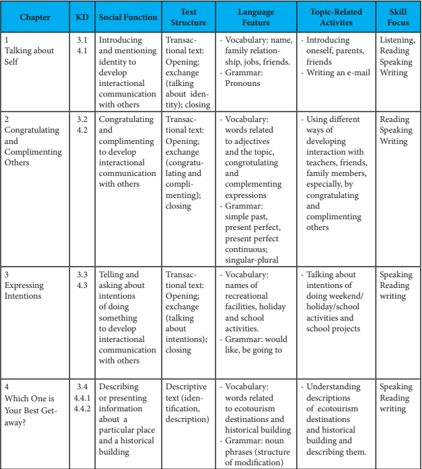

Tabel ini menunjukkan struktur pembelajaran bahasa Inggris untuk kelas 3 SD, yang terdiri dari empat bab dengan berbagai topik dan fungsi sosial. Setiap bab mencakup beberapa subbab dengan detail tentang karakteristik teks, fitur bahasa, aktivitas topik, dan fokus kemampuan. Topik utama meliputi berbicara tentang diri sendiri, mengucapkan selamat dan memuji orang lain, memberikan informasi, dan menjawab pertanyaan. Kolom-kolom utama termasuk Chapter (Bab), KD (Kode Subbab), Social Function (Fungsi Sosial), Text Structure (Struktur Teks), Language Feature (Fitur Bahasa), Topic-Related Activities (Aktivitas Topik), dan Skill Focus (Fokus Kemampuan). Data penting menunjukkan bahwa setiap bab memiliki subbab yang berfokus pada berbagai aspek komunikasi, seperti introduksi, pengenalan, dan penjelasan intension, serta pengetahuan tentang budaya dan sejarah lokal.

 

---
## 📄 Halaman 7

---
**📊 Tabel**

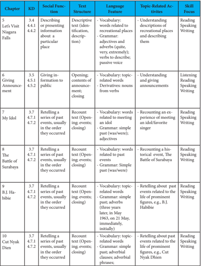

Tabel ini berisi informasi tentang berbagai jenis teks dan aktivitas yang berkaitan dengan mereka. Topik utamanya adalah pembelajaran bahasa Inggris melalui teks dan aktivitas yang melibatkan pengetahuan tentang lingkungan, informasi, dan cerita. Kolom-kolomnya mencakup: Chapter (buku), KD (Kode Subtopik), Social Function (fungsi sosial), Text Structure (struktur teks), Language Feature (feature bahasa), Topic-Related Activities (aktivitas yang berkaitan dengan topik), dan Skill Focus (fokus keterampilan). Data penting yang terlihat adalah bahwa banyak aktivitas melibatkan pengetahuan tentang lingkungan, seperti lokasi rekreasi, informasi, dan cerita tentang karakter populer. Selain itu, banyak aktivitas juga melibatkan pengetahuan tentang bahasa, seperti penggunaan kata kerja dan struktur kalimat.

 

---
## 📄 Halaman 8

---
**📊 Tabel**

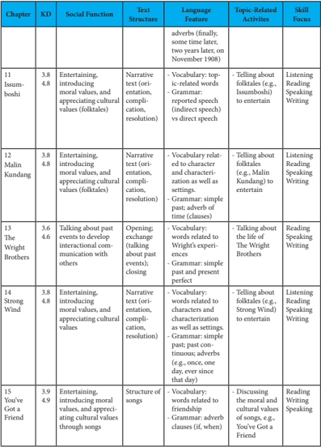

Tabel ini menunjukkan struktur dan karakteristik cerita yang digunakan dalam beberapa bab dari buku pelajaran. Topik utama adalah bagaimana penggunaan bahasa dan struktur teks untuk menciptakan cerita yang menarik dan mendidik tentang nilai-nilai moral dan budaya. Kolom-kolom yang ada meliputi Chapter (bab), KD (Karakteristik Dalam), Social Function (Fungsi Sosial), Text Structure (Struktur Teks), Language Feature (Fitur Bahasa), Topic-Related Activities (Aktivitas Terkait Topik), dan Skill Focus (Fokus Keterampilan). Data penting yang terlihat adalah bahwa banyak bab menggunakan cerita naratif dengan struktur yang berbeda-beda, seperti orientasi, komplikasi, dan resolusi. Fitur bahasa yang sering digunakan termasuk kata kerja, kata kunci, dan adverb. Aktivitas terkait topik yang dilakukan meliputi berbicara tentang folktale, membaca, menulis, dan bermain musik. Fokus keterampilan yang ditekankan antara lain mendengarkan, membaca, berbicara, menulis, dan bermain musik.

 

---
## 📄 Halaman 9

### PENDAHULUAN

Buku guru ini disusun untuk guru dan merupakan penyerta bagi buku siswa untuk  pelajaran  Bahasa  Inggris  SMA  kelas  X.  Buku  guru  ini  ditulis  agar  guru dapat  membimbing  proses  pembelajaran  yang  dilakukan  oleh  siswa  dengan  baik melalui  bantuan  buku  ajar  yang  telah  disusun  sesuai  dengan  prinsip-prinsip  yang dikembangkan  dalam  Kurikulum  2013.  Secara  umum,  buku  guru  ini  terdiri  atas petunjuk umum, pedoman pembelajaran untuk masing-masing bab, dan pedoman penilaian.

Petunjuk umum berisi tentang cakupan buku siswa baik berupa keterampilan berbahasa yang perlu dikuasai maupun garis besar kegiatan pembelajaran yang perlu dirumuskan oleh guru agar siswa terlibat aktif dalam kegiatan di kelas. Petunjuk umum juga memuat alasan pemilihan masing-masing bagian kegiatan/ keterampilan dalam buku siswa. Dengan kata lain, petunjuk umum ini diperlukan sebagai pedoman bagi guru untuk memahami secara keseluruhan proses pembelajaran pada mata pelajaran bahasa Inggris kelas X.

Pedoman pada masing-masing bab ini mencakup kompetensi dasar dan tujuan pembelajaran yang diharapkan dicapai oleh siswa setelah menyelesaikan suatu bab. Selain itu, kegiatan pembelajaran yang dianjurkan dalam bab tersebut juga mencakup langkah-langkah  yang  perlu  dilakukan  oleh  guru.  Agar  guru  dapat  memberikan instruksi  dengan  jelas,  contoh  instruksi  juga  diberikan  dalam  bagian  ini.  Hal  ini dikarenakan  kejelasan instruksi sangat berpengaruh  pada  efektivitas kegiatan pembelajaran. Selain instruksi, hal-hal yang penting untuk terkait dengan berbagai kegiatan juga dimasukkan sebagai catatan. Alokasi waktu disebutkan agar guru dapat mempersiapkan  dan  melaksanakan  kegiatan  dengan  baik  sesuai  dengan  alokasi waktu yang tersedia. Langkah-langkah kegiatan, instruksi/catatan, dan alokasi waktu disajikan dalam bentuk tabel untuk memudahkan guru memahami buku guru ini.

Selain itu, buku guru ini juga memberikan dua set contoh soal untuk ulangan sumatif. Penjelasan lebih rinci tentang hal ini disebutkan di bagian akhir petunjuk umum.

Akhirnya, penulis berharap buku guru ini dapat membantu para guru menemukan ide-ide untuk mengembangkan proses pembelajaran seperti yang diamanatkan oleh Kurikulum 2013.

 

---
## 📄 Halaman 10

### Latar Belakang

Kurikulum  merupakan  salah  satu  unsur  yang  memberikan  kontribusi  dalam mewujudkan  tujuan  pendidikan  nasional,  yaitu  membentuk  manusia  Indonesia yang  seutuhnya.  Kurikulum  2013  dikembangkan  berbasis  pada  kompetensi  dan menitikberatkan pada terselenggaranya proses pembelajaran yang berkualitas sehingga  dapat  memfasilitasi  tumbuh  kembangnya  potensi  siswa  dengan  optimal. Dengan kata lain, Kurikulum 2013 berfungsi sebagai instrumen untuk mengarahkan siswa menjadi: (1) manusis berkualitas yang mampu dan proaktif menjawab tantangan zaman  yang  selalu  berubah;  (2)  manusis  terdidik  yang  beriman  dan  bertakwa kepada  Tuhan  Yang  Maha  Esa,  berakhlak  mulia,  sehat,  berilmu,  cakap,  kreatif, mandiri; dan (3) warga negara yang demokratis dan bertanggungjawab. Secara lebih spesifik,  Kurikulum  2013  dirancang  dengan  karakteristik  tujuan  sebagai  berikut: mengembangkan  keseimbangan  antara  kompetensi  spiritual,  sikap,  pengetahuan, dan keterampilan agar siswa dapat menerapkannya dalam berbagai situasi baik di sekolah maupun di masyarakat; memberi waktu yang leluasa untuk mengembangkan kompetensi sikap, pengetahuan, dan keterampilan; mengembangkan kompetensi inti yang menjadi unsur pengorganisasi kompetensi dasar; mengembangkan kompetensi dasar  dengan  menggunakan  prinsip  akumulatif,  saling  memperkuat,  dan  saling memperkaya antar-mata pelajaran dan jenjang pendidikan.

Dengan memperhatikan hal tersebut di atas, secara umum kompetensi bahasa Inggris  untuk  jenjang  SMA  adalah  kemampuan  berkomunikasi  dalam  tiga  jenis wacana, yaitu interaksional (interpersonal dan transaksional), teks fungsional pendek, dan esei panjang, baik secara lisan maupun tulis. Kompetensi tersebut diwujudkan dalam tataran  literasi  tingkat  informatif,  yaitu  kemampuan  memanfaatkan  bahasa Inggris dalam rangka mencari informasi, dalam konteks kehidupan personal, sosial budaya, akademik, dan profesi, dengan struktur yang berterima secara koheren dan kohesif serta unsur-unsur kebahasaan secara tepat.

Secara  khusus,  ruang  lingkup  kompetensi  bahasa  Inggris  untuk  jenjang  SMA ditetapkan berdasarkan aspek-aspek komunikatif berikut.

- Kompetensi  komunikatif  untuk  melaksanakan  fungsi  sosial  yang  bermanfaat bagi  hidupnya  saat  ini  sebagai  siswa,  sebagai  anggota  keluarga,  dan  anggota masyarakat, dengan menggunakan teks yang dicapai.
- Konteks komunikasi mencakup hubungan fungsional dengan guru, teman, dan orang  lain  di  lingkungan  rumah,  sekolah,  dan  masyarakat,  tentang  berbagai topik yang terkait dengan kehidupan remaja dan semua mata pelajaran dalam kurikulum  sekolah  menengah,  secara  lisan  dan  tulis,  dengan  maupun  tanpa

 

---
## 📄 Halaman 11

- menggunakan media elektronik.
- Kompetensi  komunikatif  dalam  wacana  interpersonal  bertujuan  menjalin  dan menjaga hubungan interpersonal dengan guru, teman, dan orang lain di dalam dan di luar sekolah; kompetensi komunikatif urut dan runtut, serta unsur kebahasaan yang sesuai dengan konteks dan tujuan yang hendak dalam wacana transaksional bertujuan  untuk  mencapai  tujuan  tertentu;  Kompetensi  komunikatif  dalam wacana  fungsional  bertujuan  mengembangkan  potensi  sosial  dan  akademik siswa dengan menggunakan berbagai jenis teks seperti yang diamanhkan dalam Standar Isi.
- Nilai-nilai sosiokultural, sebagai wahana untuk penanaman nilai karakter bangsa.
- Tindakan dan strategi komunikatif, sebagai wahana untuk menguasai keterampilan  mendengarkan,  berbicara,  membaca,  menulis,  menonton,  secara strategis sesuai konteks dan tujuan yang hendak dicapai.
- Unsur kebahasaan, sebagai wahana untuk menggunakan bahasa Inggris secara akurat dan berterima, yang mencakup penanda wacana, kosa kata, tata bahasa, ucapan, tekanan kata, intonasi, ejaan, tanda baca, dan kerapian tulisan tangan.

### Kompetensi Yang Diharapkan

Dengan merujuk pada tujuan  umum dan tujuan  khusus  pelajaran  bahasa Inggris  seperti  diuraikan  pada  bagian  latar  belakang,  Buku  Siswa  untuk  pelajaran Bahasa  Inggris  kelas  X  disusun  dengan  tujuan  membangun  sikap,  pengetahuan, dan keterampilan berkomunikasi siswa melalui pengalaman belajar yang berbentuk beragam  kegiatan  berkomunikasi  aktif,  baik  melalui  kegiatan  berbahasa  Inggris yang bersifat reseptif maupun produktif. Hanya dengan terlibat aktif dalam kegiatan berkomunikasi,  siswa  dapat  membangun  sikap,  pengetahuan,  dan  keterampilan berkomunikasi.  Dengan kata lain, Buku Siswa diharapkan mampu merealisasikan implementasi  Kurikulum  2013  di  tingkat  kelas.  Isi  dan  pengalaman  belajar  yang dikembangkan di dalamnya telah diupayakan agar dapat membantu siswa mencapai empat kompetensi inti (KI) dalam Kurikulum 2013.

Isi dan pengalaman belajar yang disajikan pada setiap bab dalam Buku Siswa pada umumnya disusun dengan nama kegiatan sebagai berikut: Warmer, Vocabulary Builder, Pronunciation Practice, Reading, Text Structure, Vocabulary Exercises, Grammar Review, Speaking, Writing, Reflection, dan Further Activities .  Tiap  bagian tersebut memiliki tujuan tersendiri yang pada umumnya merupakan langkah awal (persiapan)  bagi  kegiatan  selanjutnya.  WARMER  dimaksudkan  sebagai  kegiatan pendahuluan untuk mengaktifkan pengetahuan awal siswa ( background knowledge ), dan  mempersiapkan  siswa  untuk  mengikuti  pelajaran  dalam  bab  yang  dimaksud. Sebagian besar kegiatan WARMER merupakan permainan ( game ) yang melibatkan interaksi antar siswa sehingga dengan melakukan kegiatan ini minat dan sikap positif siswa diharapkan dapat terbangun. Jika guru bisa memotivasi siswa untuk bersikap konsisten dalam menggunakan bahasa Inggris selama mereka berkegiatan ( language accompanying  action ),  seberapapun  sederhananya,  maka  kegiatan  WARMER  bisa

 

---
## 📄 Halaman 12

membangun kemampuan speaking mereka.

VOCABULARY BUILDER dimaksudkan untuk membangun atau memperkaya kosakata  siswa.  Kosakata  ini  diambilkan  dari  kata-kata  dalam  teks  bacaan  yang diasumsikan  baru  bagi  siswa.  Padanan  kata  dalam  bahasa  Indonesia  diberikan dengan tujuan untuk mempermudah siswa dalam menghafalkan.  Namun meskipun padanan kata telah diberikan, ada beragam aktivitas yang perlu dilakukan sebelum siswa  menemukan  pasangan  kata  dan  padanannya  yang  benar.  Aktivitas  ini dimaksudkan supaya siswa lebih menyadari proses internalisasi kata-kata dan makna kontekstualnya sehingga dalam diri siswa dapat terjadi retensi kata dan maknanya. Dengan demikian pada saat membaca teks bacaan, siswa bisa memahami informasi yang disajikan dengan lebih mudah. Untuk memperkuat retensi kosakata ini guru perlu memotivasi siswa untuk menghafalkan kosakata tersebut beserta maknanya.

Kegiatan  membangun  kosakata  dalam  VOCABULARY  BUILDER  diikuti dengan  PRONUNCIATION  PRACTICE  yang  dimaksudkan  untuk  melatih  siswa mengucapkan kata-kata dalam bahasa Inggris dengan lafal, tekanan, dan intonasi yang tepat.  Pentubian ( drill )  melafalkan kata-kata tersebut dilakukan beberapa kali agar siswa dapat melafalkan dengan benar. Kegiatan PRONUNCIATION PRACTICE ini bisa diperkuat dengan reading aloud , yaitu siswa membaca secara nyaring (membaca bersuara) teks bacaan dalam kegiatan berikutnya (READING).

Kegiatan READING  bertujuan  untuk  membangun  berbagai  kemampuan membaca, seperti kemampuan memahami gagasan utama dan pendukung, informasi yang eksplisit  maupun implisit,  serta  kata,  frasa  dan  kalimat.  Kegiatan  READING menjadi sarana untuk memberikan input bahasa yang menjadi dasar untuk kegiatan berikutnya. Guru perlu membimbing siswa untuk mengeksplorasi teks sebagai suatu contoh  komunikasi  dan  menarik  perhatian  siswa  untuk  mengamati  hal-hal  yang dianggap  penting,  seperti  makna  kata,  frasa,  atau  kalimat,  ciri  kebahasaan  yang dominan, susunan ide yang khas, dan lain-lain. Selain pertanyaan yang disediakan dalam  bagian  COMPREHENSION  QUESTIONS,  guru  juga  bisa  menggunakan pertanyaan-pertanyaannya sendiri untuk menerangkan  hal-hal yang dianggap penting seperti yang disebutkan di atas.

Ragam  teks  yang  digunakan  dipilih  sesuai  dengan  amanat  Kurikulum  2013, yaitu teks fungsional panjang berbentuk naratif, deskriptif, dan recount maupun teks berbentuk  percakapan  ( interactional  texts )  dengan  berbagai  tema.  Beberapa  tema berkaitan dengan sejarah Indonesia, misalnya The Battle of Surabaya , atau berkaitan dengan  tokoh-tokoh  penting  dalam  kehidupan  bangsa  Indonesia,  seperti Habibie dan Cut Nyak Dhien ,  yang  dimaksudkan untuk mengembangkan karakter penting seperti kecintaan pada bangsa Indonesia dan sikap menjaganya, dan apresiasi pada tokoh-tokoh penting bangsa yang diharapkan bisa menjadi inspirasi contoh perilaku positif para siswa. Namun, untuk menambah pengetahuan siswa, beberapa bacaan juga mengambil tema yang lebih global, seperti The Wright Brothers . Selain tema yang lebih serius, teks bacaan juga mengambil tema-tema yang dekat dengan kehidupan remaja seperti Meeting My Idol yang mendeskripsikan idola populer para remaja.

Setelah  memahami  teks  bacaan,  siswa  juga  berlatih  memahami  langkah-

 

---
## 📄 Halaman 13

langkah  retorika  dalam  beragam  teks  melalui  kegiatan  mengidentifikasi  struktur yang  digunakan  dalam  teks  bacaan  yang  sedang  dibahas  (TEXT  STRUCTURE). Pengetahuan akan langkah-langkah retorika ini bermanfaat untuk kegiatan speaking dan writing berikutnya.

Bagian  VOCABULARY  EXERCISES  bertujuan  untuk  memperkuat  kosakata yang telah dipelajari dalam kegiatan sebelumnya, serta melatih siswa menggunakan kosakata  tersebut  dalam  konteks  kalimat  baru.  Kegiatan  berikutnya  adalah  GRAMMAR REVIEW.  Topik grammar yang  dibahas  adalah grammar yang  dominan  dipakai pada  teks  bacaan  agar  siswa  selanjutnya  mampu  menggunakan grammar tersebut untuk berkomunikasi, misalnya untuk bercerita atau mendeskripsikan sesuatu, baik secara lisan maupun tulis. Pada kegiatan SPEAKING dan WRITING siswa berlatih melakukan  kegiatan  berkomunikasi  menyampaikan  pesan  dan  mempraktikkan atau  menggunakan  kosakata, grammar ,  dan  langkah-langkah  retorika  yang  telah dipelajarinya pada kegiatan belajar sebelumnya.

Selain hal-hal tersebut di atas, pada beberapa bab terdapat pertanyaan-pertanyaan misalnya dalam bentuk POINTS TO PONDER atau masuk dalam pertanyaan bacaan yang diberikan untuk menggugah kesadaran siswa akan eksistensi dirinya sebagai makhluk  yang  bertuhan  yang  memiliki  tugas  untuk  berbuat  baik  bagi  alam  dan sesamanya.  Dengan  demikian,  kompetensi  spiritual  dan  kompetensi  sosial  siswa diharapkan dapat tumbuh dan berkembang. Selain itu, di akhir bab diberikan bagian REFLEKSI  yang  berisi  beberapa  pertanyaan  yang  dapat  membantu  siswa  untuk melakukan self-assessment atas  kemampuan mereka pada bab dimaksud. Jika hasil refleksi menunjukkan bahwa siswa perlu mempelajari lagi bagian tertentu dalam bab tersebut, guru dapat menawarkan bantuan di luar jam pelajaran.

Urutan pelaksanaan kegiatan pada dasarnya ditentukan oleh guru berdasarkan konteks setempat. Pada kegiatan VOCABULARY BUILDER, misalnya, guru bisa saja memulai dengan bacaan terlebih dahulu, baru kemudian siswa diminta untuk mencari makna kata. PRONUNCIATION PRACTICE juga bisa diberikan setelah siswa selesai melakukan kegiatan mengeksplorasi makna kata. Buku ini juga dapat dimanfaatkan sebagai salah satu sumber bahan untuk melaksanakan kegiatan pembelajaran berbasis penemuan  dan  penyingkapan  dengan  merancang  langkah-langkah  pembelajaran yang meliputi siswa mengamati, menanya, mencoba, menalar, menyaji, dan mencipta teks (lisan dan tulis). Pembelajaran berbasis penemuan menuntut guru untuk sering menggunakan pertanyaan sebagai sarana membimbing siswa menemukan konsep. Dengan demikian, langkah kegiatan yang diamanatkan dalam pendekatan saintifik dalam Kurikulum 2013 dapat direalisasikan di kelas.

### Kerangka Pengembangan Kurikulum

Kurikulum  2013  dikembangkan  berdasarkan  faktor-faktor  yang  berhubungan dengan tantangan internal dan tantangan eksternal. Tantangan internal antara lain terkait  dengan  kondisi  pendidikan  dengan    merujuk  pada  tuntutan    pendidikan

 

---
## 📄 Halaman 14

yang mejamin terpenuhinya 8 (delapan) Standar Nasional Pendidikan yang meliputi standar  isi,  standar  proses,  standar  kompetensi  lulusan,  standar  pendidik  dan tenaga  kependidikan,  standar  sarana  dan  prasarana,  standar  pengelolaan,  standar pembiayaan, dan standar penilaian pendidikan. Tantangan internal lainnya terkait dengan perkembangan penduduk Indonesia dilihat dari pertumbuhan penduduk usia produktif. Saat ini jumlah penduduk Indonesia usia produktif (15-64 tahun) lebih banyak dari usia tidak produktif (anak-anak berusia 0-14 tahun dan orang tua berusia 65 tahun ke atas). Jumlah penduduk usia produktif ini akan mencapai puncaknya pada tahun 2020-2035 pada saat angkanya mencapai 70%. Oleh sebab itu, tantangan besar yang dihadapi adalah bagaimana mengupayakan agar sumberdaya manusia usia produktif yang melimpah ini dapat ditransformasikan menjadi sumberdaya manusia yang memiliki kompetensi dan keterampilan melalui pendidikan agar tidak menjadi beban negara.

Tantangan eksternal antara lain terkait dengan arus globalisasi dan berbagai isu tentang lingkungan hidup, kemajuan teknologi dan informasi, kebangkitan industri kreatif  dan  budaya,  dan  perkembangan  pendidikan  di  tingkat  internasional.  Arus globalisasi  akan  menggeser  pola  hidup  masyarakat  dari  agraris  dan  perniagaan tradisional  menjadi  masyarakat  industri  dan  perdagangan  modern  seperti  dapat dilihat  dalam World  Trade  Organization (WTO), Association  of  Southeast  Asian Nations  (ASEAN)  Community,  Asia-Pacific  Economic  Cooperation (APEC),  dan ASEAN Free Trade Area (AFTA). Tantangan eksternal juga terkait dengan pergeseran kekuatan ekonomi dunia, pengaruh dan imbas teknosains serta mutu, investasi, dan transformasi bidang pendidikan. Keikutsertaan Indonesia di dalam studi International Trends  in  International  Mathematics  and  Science  Study (TIMSS)  dan Program  for International Student Assessment (PISA) sejak tahun1999 juga menunjukkan bahwa capaian anak-anak Indonesia tidak menggembirakan dalam beberapa kali laporan yang dikeluarkan TIMSS dan PISA. Hal ini disebabkan antara lain banyaknya materi uji  yang  ditanyakan  di  TIMSS  dan  PISA  yang  tidak  terdapat  dalam  kurikulum Indonesia.

Dengan memperhatikan berbagai tantangan tersebut, Kurikulum 2013 dikembangkan dengan penyempurnaan pola pikir sebagai berikut:

- Penguatan pola pembelajaran yang berpusat pada siswa. Mereka harus memiliki pilihan-pilihan  terhadap  materi  yang  dipelajari  dan  gaya  belajarnya  (l earning style ) untuk mencapai kompetensi yang diharapkan ;
- Penguatan pola pembelajaran interaktif (interaktif guru - siswa - masyarakat lingkungan alam, sumber/media lainnya);
- Penguatan pola pembelajaran secara jejaring (siswa dapat menimba ilmu dari siapa  saja  dan  dari  mana  saja  yang  dapat  dihubungi  serta  diperoleh  melalui internet);
- Penguatan  pembelajaran  aktif-mencari (pembelajaran  siswa aktif  mencari semakin diperkuat dengan pendekatan pembelajaran saintifik);
- Penguatan pola belajar sendiri dan kelompok (berbasis tim);

 

---
## 📄 Halaman 15

- Penguatan pembelajaran berbasis multimedia;
- Penguatan pola pembelajaran berbasis klasikal-massal dengan tetap memperhatikan  pengembangan potensi khusus yang dimiliki setiap siswa;
- Penguatan pola pembelajaran ilmu pengetahuan jamak ( multidisciplines ); dan
- Penguatan pola pembelajaran kritis.
- Penguatan materi dilakukan dengan cara pengurangan materi yang kurang atau tidak relevan serta pendalaman dan perluasan materi yang relevan bagi peserta didik.
Di dalam kerangka pengembangan Kurikulum 2013, setelah melalui pendidikan pada tingkat  satuan  pendidikannya,  siswa  SMA/SMK/MA/MAK memiliki standar kompetensi  lulusan  yang  meliputi  ranah  sikap,  pengetahuan,  dan  keterampilan. Dalam  ranah  sikap,  lulusan  diharapkan  memiliki  perilaku  yang  mencerminkan sikap  orang  beriman,  berakhlak  mulia,  berilmu,  percaya  diri,  dan  bertanggung jawab  dalam  berinteraksi  secara  efektif  dengan  lingkungan  sosial  dan  alam  serta dalam menempatkan diri sebagai cerminan bangsa dalam pergaulan dunia. Dalam ranah pengetahuan, lulusan diharapkan memiliki pengetahuan faktual, konseptual, prosedural, dan metakognitif dalam ilmu pengetahuan, teknologi, seni, dan budaya dengan  wawasan  kemanusiaan,  kebangsaan,  kenegaraan,  dan  peradaban  terkait penyebab serta dampak fenomena dan kejadian. Dalam ranah keterampilan, lulusan diharapkan memiliki kemampuan pikir dan tindak yang efektif dan kreatif dalam ranah  abstrak  dan  konkret  sebagai  pengembangan  dari  yang  dipelajari  di  sekolah secara mandiri.

Berdasarkan  pengembangan  kompetensi  untuk  ketiga  ranah  tersebut,  dalam Kurikulum  2013  ditetapkan  kompetensi  yang  bersifat  generik  yang  selanjutnya digunakan sebagai acuan dalam mengembangkan kompetensi yang bersifat spesifik dan ruang lingkup materi untuk setiap muatan kurikulum. Secara umum, kompetensi Bahasa Inggris SMA/SMK adalah kemampuan berkomunikasi dalam tiga jenis wacana, yaitu  wacana  interaksional  (interpersonal  dan  transaksional),  wacana  fungsional pendek, dan wacana fungsional panjang, secara lisan dan tulis, pada tataran tingkat literasi  informatif  (menggunakan bahasa untuk mencari informasi) dalam konteks kehidupan  personal,  sosial  budaya,  akademik,  dan  profesi,  dengan  menggunakan berbagai bentuk teks untuk kebutuhan literasi dasar, dengan struktur yang berterima secara koheren dan kohesif serta unsur-unsur kebahasaan secara tepat.

### Proses Pembelajaran dan Penilaian

Proses  pembelajaran  yang  dirancang  oleh  guru  diharapkan  merujuk  pada Standar Proses, yaitu kriteria mengenai pelaksanaan pembelajaran pada satu satuan pendidikan  untuk  mencapai  Standar  Kompetensi  Lulusan.  Proses  Pembelajaran pada  satuan  pendidikan  diselenggarakan  secara  interaktif,  inspiratif,  menantang, memotivasi siswa untuk berpartisipasi aktif, serta memberikan ruang yang cukup bagi prakarsa, kreativitas, dan kemandirian sesuai dengan bakat, minat, dan perkembangan

 

---
## 📄 Halaman 16

fisik serta psikologis peserta didik. Untuk itu, setiap satuan pendidikan melakukan perencanaan pembelajaran, pelaksanaan proses pembelajaran, serta penilaian proses pembelajaran untuk meningkatkan efisiensi dan efektivitas ketercapaian kompetensi lulusan.

Secara  umum,  proses  pembelajaran  yang  diamantkan  oleh  Kurikulum  2013 berbasis  pada  teori  tentang  taksonomi  tujuan  pendidikan  yang  dalam  lima  dasa warsa  terakhir  telah  dikenal  secara  luas.  Berdasarkan  teori  taksonomi  tersebut capaian pembelajaran dapat dikelompokkan dalam tiga ranah yakni: ranah afektif (sikap), ranah kognitif (pengetahuan), dan  ranah  psikomotor  (keterampilan). Penerapan teori taksonomi dalam tujuan pendidikan di berbagai negara dilakukan secara adaptif sesuai dengan kebutuhannya masing-masing. Undang-Undang Nomor 20Tahun  2003  tentang  Sistem  Pendidikan  Nasional  telah  mengadopsi  taksonomi tersebut  dalam  bentuk  rumusan  sikap,  pengetahuan,  dan  keterampilan.  Proses pembelajaran  sepenuhnya  diarahkan  pada  pengembangan  ketiga  ranah  tersebut secara utuh/holistik, artinya pengembangan ranah yang satu tidak bisa dipisahkan dengan pengembangan ranah lainnya. Dengan demikian proses pembelajaran secara utuh diharapkan dapat melahirkan kualitas pribadi yang mencerminkan keutuhan penguasaan sikap, pengetahuan, dan keterampilan.

Sesuai dengan Standar Kompetensi Lulusan dan Standar Isi, maka prinsip pembelajaran yang digunakan adalah sebagai berikut

- dari siswa diberitahu menuju siswa mencari tahu;
- dari  guru  sebagai  satu-satunya  sumber  belajar  menjadi  belajar  berbasis  aneka sumber belajar;
- dari pendekatan tekstual menuju pendekatan proses sebagai penguatan penggunaan pendekatan ilmiah;
- dari pembelajaran berbasis konten menuju pembelajaran berbasis kompetensi;
- dari pembelajaran yang bersifat parsial menuju pembelajaran terpadu;
- dari pembelajaran   yang   menekankan   jawaban   tunggal   menuju pembelajaran dengan jawaban yang kebenarannya multi dimensi;
- dari pembelajaran verbalisme menuju keterampilan aplikatif;
- peningkatan  dan  keseimbangan  antara  keterampilan    fisikal    ( hardskills )  dan keterampilan mental ( softskills );
- pembelajaran  yang  mengutamakan  pembudayaan  dan  pemberdayaan  siswa sebagai  pembelajar sepanjang hayat;
- pembelajaran yang menerapkan nilai-nilai dengan memberi keteladanan ( ing  ngarso  sung  tulodo ),  membangun  kemauan  ( ing  madyo  mangun  karso ), dan  mengembangkan  kreativitas  siswa  dalam  proses  pembelajaran  ( tut  wuri handayani );
- pembelajaranyang  berlangsung  di  rumah,  di  sekolah,  dan  di masyarakat;
- pembelajaran yang menerapkan prinsip bahwa siapa saja adalah guru, siapa saja adalah siswa, dan di mana saja adalah kelas;
- pemanfaatan teknologi informasi dan komunikasi untuk meningkatkan efisiensi dan efektivitas pembelajaran; dan

 

---
## 📄 Halaman 17

n. pengakuan atas perbedaan individual dan latar belakang budaya peserta didik.

Dengan memperhatikan prinsip-prinsip di atas, Buku Siswa telah dikembangkan untuk mendorong penggunaan belajar berkelompok dalam berbagai bentuk, dengan tujuan  agar  siswa  banyak  berinteraksi,  sehingga  terbangun  kemampuan  siswa untuk berkomunikasi dan bekerja dalam tim. Guru diharapkan selalu mendorong siswa untuk menggunakan bahasa Inggris. Karena itu guru juga disarankan terbiasa menggunakan  bahasa  Inggris  sebagai  bahasa  pengantar  dan  mengajarkan  kepada siswa ungkapan-ungkapan yang biasa digunakan dalam interaksi di kelas ( classroom English ).

Selama siswa berkegiatan, guru dapat melakukan kegiatan asesmen yang bersifat formatif  untuk  memantau  kemajuan  belajar  siswa,  serta  menemukan  hambatan belajar atau mengevaluasi langkah-langkah pembelajaran. Asesmen bisa dilaksanakan dengan berbagai cara, misalnya melalui pengamatan oleh guru, refleksi diri terbimbing oleh siswa, atau kumpulan karya siswa dalam portofolio. Asesmen seperti ini hanya bisa dilakukan jika pembelajaran berpusat pada siswa, dan siswa aktif berkegiatan dan mencipta. Data asesmen diperlukan untuk perbaikan proses pembelajaran yang dilakukan  guru,  yaitu  merancang  program  remedial  atau  pengayaan  untuk  siswa. Setelah  beberapa  bab,  guru  bisa  memberikan  ulangan  sumatif  untuk  memberikan nilai  bagi  kemajuan  belajar  siswa.  Buku  Guru  ini  menyediakan  contoh  ulangan sumatif yang bisa digunakan pada akhir semester. Namun, sebaiknya guru membuat sendiri ulangan sumatif dengan jumlah bab yang diujikan disesuaikan dengan konteks masing-masing sekolah.

Selain  itu,  dalam  melaksanakan  asesmen,  guru  diharapkan  mengikuti  kaidah yang  dituangkan  dalam  Standar  Penilaian  Pendidikan,  yaitu  kriteria  mengenai mekanisme, prosedur, dan instrumen penilaian hasil belajar siswa. Penilaian dalam proses pendidikan merupakan komponen yang tidak dapat dipisahkan dari komponen lainnya  khususnya  pembelajaran.  Penilaian  merupakan  proses  pengumpulan  dan pengolahan  informasi  untuk  mengukur  pencapaian  hasil  belajar  peserta  didik. Penilaian hasil belajar oleh pendidik dilakukan untuk memantau proses, kemajuan belajar, dan perbaikan hasil belajar peserta didik secara berkesinambungan. Penegasan tersebut termaktub dalam Peraturan Pemerintah Nomor 32 Tahun 2013 tentang Perubahan Atas Peraturan Pemerintah Nomor 19 Tahun 2005 tentang Standar Nasional Pendidikan.Penilaian hasil belajar oleh pendidik memiliki peranantara lain untuk membantu peserta didik mengetahui capaian pembelajaran ( learning outcomes ). Berdasarkan penilaian hasil belajar oleh pendidik, pendidik dan peserta   didik   dapat memperoleh   informasi   tentang kelemahan   dan kekuatan pembelajaran dan belajar.

Dengan  mengetahui  kelemahandan  kekuatannya,  pendidik  dan  peserta  didik memiliki arah yang jelas mengenai apa yang harus diperbaiki dan dapat melakukan refleksi  mengenai  apa  yang  dilakukannya  dalam  pembelajaran  dan  belajar.  Selain itu  bagi  peserta  didik  memungkinkan  melakukan  proses  transfer  cara  belajar tadi  untuk  mengatasi  kelemahannya  ( transfer  oflearning ).  Sedangkan  bagi  guru, hasil  penilaian  hasil  belajar  oleh  pendidik  merupakan  alat  untuk  mewujudkan akuntabilitas  profesionalnya,  dan  dapat  juga  digunakan  sebagaidasar  dan  arah

 

---
## 📄 Halaman 18

pengembanganpembelajaran remedial atau program pengayaan bagi peserta  didik yang membutuhkan, serta memperbaiki rencana pelaksanaan pembelajaran (RPP) dan proses  pembelajaran  pada  pertemuan  berikutnya.  Pelaksanaan  penilaian  hasil belajar  oleh  pendidik  merupakan  wujud  pelaksanaan  tugas  profesional  pendidik sebagaimana  termaktub  dalam  Undang-Undang  Nomor  14  tahun  2005  tentang Guru  dan  Dosen.  Penilaian  hasil  belajar  oleh  pendidik  tidak  terlepas  dari  proses pembelajaran. Oleh karena itu, penilaian hasil belajar oleh pendidik menunjukkan kemampuan guru sebagai pendidik profesional.

Dalam  konteks  pendidikan  berdasarkan  standar  ( standard-based  education ), kurikulum berdasarkan kompetensi ( competency-based curriculum ), dan pendekatan belajar  tuntas  ( mastery  learning )  penilaian  proses  dan  hasil  belajar  merupakan parameter tingkatpencapaian kompetensi minimal. Untuk itu, berbagai pendekatan, strategi,  metode,  teknik,  dan  model  pembelajaran  perlu  dikembangkan  untuk memfasilitasi  peserta  didik  agar  mudah  dalam  belajar  dan  mencapai  keberhasilan belajar  secara  optimal.  Kurikulum  2013  mempersyaratkan  penggunaan  penilaian autentik ( authenticassesment ). Secara para digmatik penilaian autentik memerlukan perwujudan pembelajaran autentik ( authenticinstruction ) dan belajar autentik ( authentic  learning ).  Hal  ini  diyakini  bahwa  penilaian  autentik  lebih  mampu memberikan informasi kemampuan peserta didik secara holistik dan valid.

### Kontekstualisasi Pembelajaran

Kurikulum 2013 mmemberikan arah agar karakteristik pembelajaran pada setiap satuan  pendidikan  disesuaikan  dengan  Standar  Kompetensi  Lulusan  dan  Standar Isi. Standar Kompetensi Lulusan memberikan kerangka konseptual tentang sasaran pembelajaran  yang  harus  dicapai.  Standar  Isi  memberikan  kerangka  konseptual tentang kegiatan belajar dan pembelajaran yang diturunkan dari tingkat kompetensi dan  ruang  lingkup  materi.  Sesuai  dengan  Standar  Kompetensi  Lulusan,  sasaran pembelajaran mencakup pengembangan ranah sikap, pengetahuan, dan keterampilan yang dielaborasi untuk setiap satuan pendidikan.

Ketiga ranah kompetensi tersebut memiliki lintasan perolehan (proses psikologis) yang berbeda. Sikap diperoleh melalui aktivitas 'menerima, menjalankan, menghargai, menghayati, dan mengamalkan' . Pengetahuan diperoleh  melalui  aktivitas 'mengingat, memahami,    menerapkan,  menganalisis,    mengevaluasi,    mencipta' .  Keterampilan diperoleh melalui aktivitas 'mengamati, menanya, mencoba, menalar, menyaji, dan mencipta' . Karaktersitik  kompetensi  beserta  perbedaan  lintasan  perolehan turut serta  mempengaruhi karakteristik  standar  proses.  Untuk  memperkuat  pendekatan ilmiah,  tematik  terpadu  (tematik  antarmata  pelajaran),  dan  tematik  (dalam  suatu mata  pelajaran),  perlu  diterapkan  pembelajaran  berbasis  penyingkapan/penelitian ( discovery/inquiry  learning ).  Untuk  mendorong  kemampuan  peserta  didik  untuk menghasilkan  karya  kontekstual,  baik  individual  maupun  kelompok  maka  sangat disarankan  menggunakan  pendekatan  pembelajaran  yang  menghasilkan  karya

 

---
## 📄 Halaman 19

berbasis pemecahan masalah ( project-based learning ).

Menurut  Kurikulum  2013,  pembelajaran  adalah  proses  interaksi  antarsiwa, maupun antara siswa  dengan  tenaga  pendidik  dan  sumber  belajar  pada suatu lingkungan  belajar.  Pembelajaran  merupakan  suatu  proses  pengembangan  potensi dan pembangunan karakter setiap siswa sebagai hasil dari sinergi antara pendidikan yang berlangsung di sekolah, keluarga, dan masyarakat. Proses tersebut memberikan kesempatan  kepada  siswa  untuk  mengembangkan    potensi  mereka    menjadi kemampuan  yang  semakin  lama  semakin  meningkat  dalam  sikap  (spiritual  dan sosial),  pengetahuan,  dan  keterampilan  yang  diperlukan  dirinya  untuk  hidup  dan untuk bermasyarakat, berbangsa, serta berkontribusi pada kesejahteraan hidup umat manusia.

Siswa  adalah  subjek  yang  memiliki  kemampuan  untuk  secara  aktif  mencari, mengolah, mengkonstruksi, dan menggunakan pengetahuan. Untuk itu pembelajaran harus berkenaan dengan kesempatan  yang  diberikan  kepada  siswa untuk mengkonstruksi  pengetahuan  dalam  proses kognitifnya. Agar benar- benar memahami dan dapat menerapkan pengetahuan, siswa perlu didorong untuk  bekerja memecahkan  masalah,   menemukan segala  sesuatu  untuk  dirinya,  dan  berupaya keras mewujudkan ide- idenya.

Pembelajaran  pada  Kurikulum  2013  menggunakan  pendekatan  saintifik  atau pendekatan  berbasis  proses  keilmuan.  Pendekatan  saintifik  dapat  menggunakan beberapa strategi, seperti  pembelajaran  kontekstual. Model pembelajaran merupakan suatu bentuk pembelajaran yang memiliki nama, ciri, sintak, pengaturan, dan budaya misalnya discovery  learning,  project-based  learning,  problem-based  learning,  inquiry learning .

Kurikulum 2013 menggunakan modus pembelajaran langsung ( direct instruction ) dan tidak langsung ( indirect instruction ). Pembelajaran langsung adalah pembelajaran yang mengembangkan pengetahuan, kemampuan berpikir dan keterampilan menggunakan pengetahuan peserta didik melalui interaksi langsung dengan sumber belajar yang dirancang  dalam  silabus  dan  RPP .  Dalam  pembelajaran  langsung peserta  didik  melakukan  kegiatan  mengamati,  menanya, mengumpulkan informasi/ mencoba,  menalar/mengasosiasi,  dan  mengomunikasikan.  Pembelajaran  langsung menghasilkan pengetahuan dan keterampilan langsung, yang disebut dengan dampak pembelajaran ( instructional effect ). Pembelajaran tidak langsung adalah pembelajaran yang terjadi selama proses pembelajaran langsung yang dikondisikan untuk menghasilkan  dampak  pengiring  ( nurturant  effect ).  Pembelajaran  tidak  langsung berkenaan dengan pengembangan nilai dan sikap yang terkandung dalam KI-1 dan KI-2. Hal ini berbeda dengan pengetahuan tentang nilai dan sikap yang dilakukan dalam  proses  pembelajaran  langsung  oleh  mata  pelajaran  Pendidikan  Agama  dan Budi  Pekerti  serta  Pendidikan  Pancasila  dan  Kewarganegaraan.  Pengembangan nilai  dan  sikap  sebagai  proses  pengembangan  moral  dan  perilaku,  dilakukan  oleh seluruh mata pelajaran dan dalam setiap kegiatan yang terjadi di kelas, sekolah, dan masyarakat.  Oleh  karena  itu,  dalam  proses  pembelajaran  Kurikulum  2013,  semua kegiatan intrakurikuler, kokurikuler, dan ekstrakurikuler baik yang terjadi di kelas, sekolah, dan masyarakat (luar sekolah) dilaksanakan dalam rangka mengembangkan

 

---
## 📄 Halaman 20

moral dan perilaku yang terkait dengan nilai dan sikap.

Pendekatan pembelajaran merupakan cara pandang pendidik yang digunakan untuk menciptakan lingkungan pembelajaran yang memungkinkan terjadinya proses pembelajaran  dan  tercapainya  kompetensi  yang  ditentukan.  Strategi  pembelajaran merupakan  langkah-langkah  sistematik  dan  sistemik  yang  digunakan  pendidik untuk menciptakan lingkungan pembelajaran yang memungkinkan terjadinya proses pembelajaran  dan  tercapainya  kompetensi  yang  ditentukan.  Model  pembelajaran merupakan kerangka konseptual dan operasional pembelajaran yang memiliki nama, ciri, urutan logis, pengaturan, dan budaya. Metode pembelajaran  merupakan cara atau teknik yang digunakan oleh pendidik untuk menangani suatu kegiatan pembelajaran yang mencakup antara lain ceramah, tanya-jawab, diskusi.

Dalam mengimplementasikan pendekatan saintifik, materi pembelajaran berbasis pada fakta atau fenomena yang dapat dijelaskan dengan logika atau penalaran tertentu; bukan sebatas kira-kira, khayalan, legenda, atau dongeng semata. Penjelasan guru, respon siswa, dan interaksi edukatif guru-siswa terbebas dari prasangka yang serta-merta, pemikiran subjektif, atau penalaran yang menyimpang dari alur berpikir logis. Mendorong dan menginspirasi siswa berpikir secara kritis, analistis, dan tepat dalam  mengidentifikasi,  memahami,  memecahkan  masalah,  dan  mengaplikasikan materi  pembelajaran.  Berbasis  pada  konsep,  teori,  dan  fakta  empiris  yang  dapat dipertanggungjawabkan.  Hasil  belajar  melahirkan  peserta  didik  yang  produktif, kreatif, inovatif, dan afektif melalui penguatan sikap, keterampilan, dan pengetahuan yang terintegrasi.  Ranah sikap menggamit transformasi substansi atau materi ajar agar  peserta  didik  'tahu  mengapa. '    Ranah  keterampilan  menggamit  transformasi substansi atau materi ajar agar peserta didik 'tahu bagaimana' . Ranah pengetahuan menggamit  transformasi  substansi  atau  materi  ajar  agar  peserta  didik  'tahu  apa. ' Hasil  akhirnya  adalah  peningkatan  dan  keseimbangan  antara  kemampuan  untuk menjadi manusia yang baik  ( soft skills ) dan manusia yang memiliki kecakapan dan pengetahuan untuk hidup secara layak ( hard skills ) dari peserta didik yang meliputi aspek kompetensi sikap, pengetahuan, dan keterampilan.

### Petunjuk Khusus

Bagian Petunjuk Khusus dalam Buku Guru ini dimaksudkan untuk membantu guru dalam melaksanakan pembelajaran di kelas. Bagian ini memberikan gambaran singkat  tentang  cara  membelajarkan  setiap  bab  yang  ada  pada  Buku  Siswa.  Perlu disadari oleh guru bahwa kegiatan yang disajikan dalam buku ini merupakan kegiatan yang bersifat alternatif, dan bukan merupakan satu-satunya cara dalam membelajarkan isi Buku Siswa. Oleh karenanya, guru disarankan untuk mengembangkan gagasangagasan kreatif dalam melaksanakan pembelajaran yang tentunya akan lebih sesuai dengan kekhasan konteks mengajarnya. Pemilihan metode dan pendekatan yang lain sangat dimungkinkan sesuai dengan kondisi masing-masing.

Setiap  bab  dalam  Petunjuk  Khusus  ini  memberikan  contoh  kepada  guru kalimat-kalimat instruksi dalam bahasa Inggris yang dapat dijadikan contoh sebagai

 

---
## 📄 Halaman 21

bahasa pengantar dalam proses belajar mengajar di kelas. Kalimat-kalimat instruksi tersebut berfungsi sebagai scaffolding talk ,  terutama bagi guru yang belum terbiasa menggunakan  bahasa  Inggris  dalam  berinteraksi  di  kelas.  Dengan  merujuk  pada kalimat-kalimat  instruksi  berbahasa  Inggris  tersebut,  guru  berarti  melaksanakan proses belajar mengajar di kelas dengan menggunakan bahasa Inggris sebagai bahasa pengantar.  Dengan  demikian,  diharapkan  akan  terbangun  lingkungan  berbahasa Inggris yang aktif dan dinamis, yang sekaligus dapat berfungsi sebagai input bahasa yang sangat berharga bagi siswa.

Di bagian awal dalam setiap bab di Buku Siswa disajikan WARMER. Bagian ini dimaksudkan agar guru dapat memulai proses pembelajaran di kelas dengan kegiatan yang menarik. Kegiatan pendahuluan yang menarik dapat membangkitkan rasa ingin tahu  siswa  serta  dapat  memberikan  motivasi  kepada  siswa  untuk  mempelajari  isi bab yang dimaksud. Dengan bekal motivasi, siswa diharapkan dapat belajar bahasa Inggris dengan lebih baik.

Dalam menggunakan Petunjuk Khusus, guru perlu mencermati isi dalam Buku Siswa sesuai  dengan  bagian  yang  dirujuk.  Setiap  bab  dalam  Buku  Siswa  telah  diupayakan untuk memfasilitasi ketercapaian seluruh kompetensi inti (KI) yang dimanatkan oleh Kurikulum 2013. Namun demikian, ketercapaian KI 1 dan 2 akan lebih maksimal jika dilakukan melalui usaha-usaha yang bersifat pembiasaan, keteladanan, maupun penciptaan budaya, yang dapat diupayakan oleh guru baik selama berada di kelas maupun di  luar  kelas.  Manfaatkan  Petunjuk  Khusus  yang  diberikan  dalam  setiap bab, tetapi juga usahakan dapat mengembangkan ide-ide kreatif demi terlaksananya pembelajaran yang efektif.

Di  dalam  buku  dicantumkan  pula  beberapa  kata  mutiara  yang  bisa  menjadi sarana  pengembangan karakter positif  siswa.  Guru  bisa  membahas  inspirasi  sikap bijak tersebut dengan para siswa.

Perlu  juga  diketahui  bahwa  dalam  buku  ini  terdapat  beberapa  bab  yang menggunakan konteks topik  lama,  seperti  personal  dan biographical  recount yang dalam kurikulum terbaru ditiadakan.  Bab-bab tersebut dipertahankan karena secara substansial kompetensi yang dikembangkan tidak berbeda dengan kompetensi yang menjadi  amanat  kurikulum,  yaitu  mengembangkan  kemampuan  berkomunikasi menggunakan teks recount .  Bab-bab  itu  bisa  digunakan  untuk  bahan remedy atau pengayaan sesuai konteks kemampuan siswa.

Bab-bab yang dimaksud adalah bab yang berjudul Habibie , Cut Nyak Dhien , dan My Idol . Biografi tentang Habibie dan Cut Nyak Dhin dipertahankan dengan alasan di atas dan juga karena  topik bahasannya bisa memberikan inspirasi tentang tokohtokoh  penting  dalam  sejarah  Indonesia.  Sedangkan  untuk My  Idol alasan  lainnya adalah karena topik tersebut sangat cocok dengan dunia remaja. Untuk menghindari kebingungan maka kompetensi dasar dalam bab tersebut tidak menggunakan nomor seperti yang tercantum dalam kurikulum. Bab-bab tersebut bisa disikapi sebagai bab tambahan.

 

---
## 📄 Halaman 22

### Alokasi Waktu

Pembagian alokasi waktu pembelajaran Bahasa Inggris di dasarkan pada asumsi berikut:

- Waktu efektif untuk pembelajaran Bahasa Inggris di luar waktu yang digunakan untuk ujian formatif dan sumatif adalah 16 minggu/semester. Dengan demikian dalam 1 tahun terdapat 32 minggu.
- Jam pelajaran Bahasa Inggris perminggu adalah 2 JP/minggu yang direalisasikan dalam 1 kali tatap muka.
- Dalam buku ini terdapat 15 bab. Dengan demikian secara umum, tiap bab bisa diselesaikan dalam 2 kali tatap muka.
Namun, dengan mempertimbangkan konteks siswa di sekolah setempat, guru bisa menyesuaikan waktu yang dibutuhkan untuk pelaksanaan tiap bab.

Penambahan waktu untuk penyelesaian 1 bab akan berpengaruh pada selesai tidaknya  semua  bab  dalam  buku.  Namun,  bab  yang  tidak  dibahas  di  kelas  bisa digunakan  untuk  bahan  belajar  di  luar  kelas.    Hal  tersebut  dimungkinkan  karena beberapa  KD  yang  berkaitan  dengan  teks  monolog  dibahas  dalam  beberapa  bab (misalnya, KD  3.8 dan 4.8).

Karena itu guru perlu mencermati content mapping dan isi tiap bab sebelum memutuskan bab yang akan dipilih untuk dibahas di kelas, dan yang akan digunakan sebagai  materi  belajar  mandiri.  Pada  bab  yang  diputuskan  untuk  dipelajari  siswa di  luar  kelas,  guru  juga  bisa  memilih  pada  bagian  yang  mana  siswa  terutama memerlukan penguatan atau remedi. Misalnya, karena guru ingin memperkaya kosa kata siswa maka guru bisa menugaskan siswa untuk membaca materi dalam reading section dan mengerjakan vocabulary exercises di luar kelas. Yang penting, guru perlu mempertimbangkan bahwa setiap KD harus pernah dibahas di kelas sebelum siswa ditugaskan melakukan belajar mandiri KD tersebut dengan bahan dari buku ini.

 

---
## 📄 Halaman 23

### Chapter 1

### Kompetensi Dasar:

- 3.1  Menerapkan  fungsi  sosial,  struktur  teks,  dan  unsur  kebahasaan  teks  interaksi transaksional    lisan    dan  tulis  yang  melibatkan  tindakan  memberi  dan  meminta informasi terkait jati diri dan hubungan keluarga, sesuai dengan konteks penggunaannya. (Perhatikan unsur kebahasaan pronoun, subjective, objective, possessive ).
- 4.1  Menyusun teks interaksi  transaksional  lisan  dan  tulis  pendek  dan  sederhana  yang melibatkan  tindakan  memberi  dan  meminta  informasi  terkait  jati  diri  dengan memperhatikan fungsi sosial, struktur teks, dan unsur kebahasaan yang benar dan sesuai konteks.

### Tujuan Pembelajaran:

Setelah mempelajari Bab 1, siswa diharapkan mampu:

- Mengidentifikasi makna, tujuan komunikasi, struktur teks, dan unsur bahasa yang terdapat dalam teks interaksi transaksional lisan dan tulis yang terkait dengan jati diri, dan hubungan keluarga sesuai dengan konteks penggunaan.
- Meminta dan memberi informasi tentang jati diri dan hubungan keluarga dengan menggunakan struktur teks yang tepat sesuai konteks penggunaan.
- Meminta dan memberi informasi tentang jati diri dan hubungan keluarga dengan menggunakan unsur bahasa  (pronoun, subjective, objective, possessive) yang tepat sesuai konteks penggunaan.

### KEGIATAN PEMBELAJARAN

### WARMER

---
**📊 Tabel**

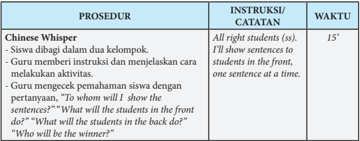

Tabel ini berisi prosedur untuk sebuah aktivitas yang dilakukan oleh siswa dalam dua kelompok. Proses ini melibatkan guru yang memberikan instruksi kepada siswa tentang bagaimana mereka akan menunjukkan pertanyaan kepada teman-temannya di belakang. Siswa harus menjawab pertanyaan tersebut dengan satu kalimat per kalimat. Proses ini berlangsung selama 15 menit. Ini merupakan topik utama dalam aktivitas tersebut, yang melibatkan komunikasi antar siswa dalam dua kelompok. Kolom "Instruksi/Catatatan" menyediakan petunjuk tentang bagaimana guru akan memberikan instruksi kepada siswa, sementara kolom "Waktu" menunjukkan waktu yang diberikan untuk melaksanakan prosedur tersebut. Data penting yang terlihat adalah bahwa prosedur ini memerlukan waktu 15 menit dan melibatkan semua siswa dalam dua kelompok.

### TALKING ABOUT SELF

 

---
## 📄 Halaman 24

---
**📊 Tabel**

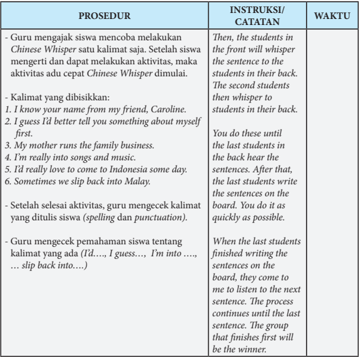

Tabel ini menunjukkan prosedur dan instruksi untuk sebuah aktivitas belajar bahasa Inggris yang menggunakan teknik Whispering. Topik utama tabel adalah proses belajar berbahasa Inggris melalui aktivitas Whispering. Tabel dibagi menjadi dua kolom: "PROSEDUR" dan "INSTRUKSI/CATATAN". Kolom "PROSEDUR" menjelaskan langkah-langkah yang harus dilakukan guru dan siswa dalam proses belajar, sementara kolom "INSTRUKSI/CATATAN" menyediakan instruksi atau catatan yang relevan dengan prosedur tersebut. Data penting yang terlihat dalam tabel termasuk langkah-langkah guru mencoba siswa dengan kata-kata tertentu, siswa meminta bantuan untuk mengetahui nama teman mereka, guru memberikan instruksi tentang cara whispering, siswa menulis kalimat yang diberikan di papan, dan langkah-langkah untuk mengecek pemahaman siswa tentang kalimat yang ada.

### VOCABULARY BUILDER

---
**📊 Tabel**

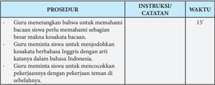

Tabel ini berisi instruksi dan catatan guru untuk prosedur pembelajaran bahasa Inggris kepada siswa. Topik utamanya adalah pengenalan kata kosakata baru dan penggunaannya dalam konteks yang relevan. Kolom "Instruksi/Catatan" menyediakan petunjuk praktis tentang bagaimana guru dapat memperkenalkan kata kosakata baru, seperti meminta siswa untuk memahami makna kata tersebut dan menunjukkan bagaimana kata tersebut digunakan dalam kalimat. Kolom "Waktu" memberikan waktu yang direkomendasikan untuk melaksanakan prosedur tersebut, yaitu 15 menit. Data penting lainnya termasuk keterlibatan siswa dalam diskusi kata kosakata, penggunaan bahasa Inggris dalam percakapan, dan pengenalan konsep bahasa Inggris sebagai bahasa internasional.

 

---
## 📄 Halaman 25

### PRONUNCIATION PRACTICE

---
**📊 Tabel**

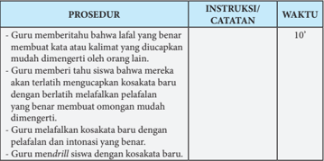

Tabel ini berisi prosedur dan instruksi yang harus dilakukan guru untuk mengajarkan siswa dengan disabilitas bahasa Indonesia. Topik utama tabel adalah prosedur belajar bahasa Indonesia untuk siswa dengan disabilitas. Kolom "PROSEDUR" menyediakan langkah-langkah yang harus diikuti, sedangkan kolom "INSTRUKSI/CATATAN" memberikan detail tentang setiap langkah tersebut. Kolom "WAKTU" menunjukkan waktu yang diperlukan untuk melaksanakan setiap prosedur. Data penting yang terlihat adalah bahwa prosedur ini memerlukan waktu 10 menit untuk selesai, dan setiap langkah memiliki instruksi spesifik yang harus diikuti oleh guru.

### READING

---
**📊 Tabel**

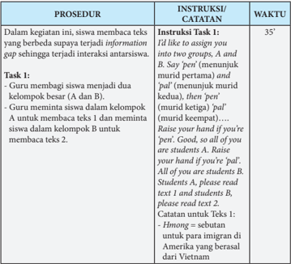

Tabel ini berisi prosedur dan instruksi untuk sebuah kegiatan belajar yang melibatkan siswa membaca teks yang berbeda tentang informasi gap antara dua kelompok. Topik utama tabel adalah proses pembagian siswa menjadi dua kelompok besar (A dan B) dan cara mereka membaca teks yang berbeda. Kolom "Prosedur" menjelaskan langkah-langkah yang harus diikuti oleh guru dan siswa, seperti pembagian siswa menjadi kelompok dan instruksi untuk membaca teks. Kolom "Instruksi/Catatatan" menyediakan petunjuk spesifik yang harus diterapkan, seperti menggunakan kata 'pen' untuk menunjukkan murid pertama dan 'pad' untuk menunjukkan murid kedua, serta petunjuk untuk memperbaiki keseimbangan antara kelompok A dan B. Kolom "Waktu" menunjukkan waktu yang dibutuhkan untuk melakukan setiap prosedur, mulai dari 35 detik hingga beberapa menit. Pola penting yang terlihat adalah adanya peran guru dalam mengatur proses pembelajaran, termasuk pembagian siswa menjadi kelompok dan instruksi yang harus diterapkan.

 

---
## 📄 Halaman 26

---
**📊 Tabel**

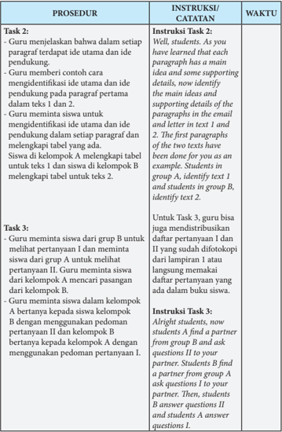

Tabel ini berisi instruksi dan waktu untuk dua tugas belajar yang dilakukan oleh siswa dalam kelas. Topik utama tabel adalah pembelajaran tentang identifikasi ide utama dan pendukung pada paragraf pertama dari teks email dan surat. Tabel dibagi menjadi kolom Prosedur, Instruksi/Catatan, dan Waktu. Prosedur mencakup langkah-langkah guru menjelaskan ide utama dan pendukung pada paragraf pertama, memberikan contoh, meminta siswa untuk menentukan ide utama dan pendukung, dan melengkapi tabel. Instruksi/Catatan menyediakan detail tentang prosedur, seperti menggunakan contoh email dan surat sebagai contoh, dan memberikan petunjuk untuk melengkapi tabel. Waktu menunjukkan bahwa guru akan membantu siswa dalam setiap langkah prosedur tersebut. Pola penting yang terlihat adalah bahwa guru bertindak sebagai fasilitator belajar, memberikan instruksi, dan memastikan bahwa semua siswa dapat memahami dan melaksanakan tugas tersebut dengan baik.

 

---
## 📄 Halaman 27

### VOCABULARY EXERCISES

---
**📊 Tabel**

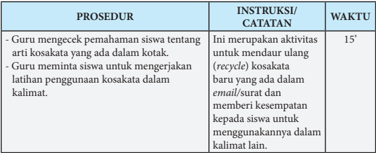

Tabel ini berisi prosedur dan instruksi untuk guru dalam mengajarkan siswa tentang penggunaan kertas kertas kertas kertas kertas kertas kertas kertas kertas kertas kertas kertas kertas kertas kertas kertas kertas kertas kertas kertas kertas kertas kertas kertas kertas kertas kertas kertas kertas kertas kertas kertas kertas kertas kertas kertas kertas kertas kertas kertas kertas kertas kertas kertas kertas kertas kertas kertas kertas kertas kertas kertas kertas kertas kertas kertas kertas kertas kertas kertas kertas kertas kertas kertas kertas kertas kertas kertas kertas kertas kertas kertas kertas kertas kertas kertas kertas kertas kertas kertas kertas kertas kertas kertas kertas kertas kertas kertas kertas kertas kertas kertas kertas kertas kertas kertas kertas kertas kertas kertas kertas kertas kertas kertas kertas kertas kertas kertas kertas kertas kertas kertas kertas kertas kertas kertas kertas kertas kertas kertas kertas kertas kertas kertas kertas kertas kertas kertas kertas kertas kertas kertas kertas kertas kertas kertas kertas kertas kertas kertas kertas kertas kertas kertas kertas kertas kertas kertas kertas kertas kertas kertas kertas kertas kertas kertas kertas kertas kertas kertas kertas kertas kertas kertas kertas kertas kertas kertas kertas kertas kertas kertas kertas kertas kertas kertas kertas kertas kertas kertas kertas kertas kertas kertas kertas kertas kertas kertas kertas kertas kertas kertas kertas kertas kertas kertas kertas kertas kertas kertas kertas kertas kertas kertas kertas kertas kertas kertas kertas kertas kertas kertas kertas kertas kertas kertas kertas kertas kertas kertas kertas kertas kertas kertas kertas kertas kertas kertas kertas kertas kertas kertas kertas kertas kertas kertas kertas kertas kertas kertas kertas kertas kertas kertas

### TEXT STRUCTURE

---
**📊 Tabel**

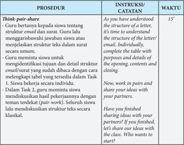

Tabel ini berisi prosedur pembelajaran yang melibatkan guru dan siswa dalam memahami struktur email dan membuat surat. Topik utama adalah pemahaman struktur email dan penulisan surat. Kolom "Instruksi/Catatatan" memberikan instruksi kepada siswa untuk memahami struktur email dan membuat surat, sementara kolom "Waktu" menunjukkan waktu yang diberikan untuk setiap langkah. Data penting yang terlihat adalah bahwa prosedur ini melibatkan dua tahap: pertama, siswa bekerja individu untuk memahami struktur email dan membuat surat, dan kedua, siswa bekerja dalam pasangan untuk berbagi ide-ide mereka dengan rekan sekelas.

 

---
## 📄 Halaman 28

### GRAMMAR REVIEW

---
**📊 Tabel**

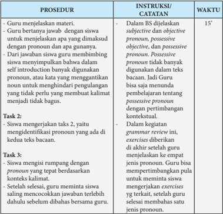

Tabel ini menunjukkan prosedur dan instruksi yang diberikan kepada guru untuk mengajarkan siswa tentang pronoun dalam bahasa Inggris. Topik utama tabel adalah pembelajaran tentang pronoun, termasuk subjektif, objektif, dan posessif. Kolom pertama berisi prosedur yang harus dilakukan oleh guru, seperti menjelaskan materi, memberikan contoh jawaban, dan meminta siswa untuk menyelesaikan tugas. Kolom kedua berisi instruksi atau catatan yang diberikan kepada guru, seperti menjelaskan bahwa posessif pronoun tidak banyak digunakan dalam teks bacaan dan harus dipertimbangkan konteks. Kolom ketiga berisi waktu yang diberikan untuk setiap prosedur, mulai dari 15 menit hingga beberapa jam. Pola penting yang terlihat adalah bahwa prosedur ini melibatkan interaksi antara guru dan siswa, dengan guru memberikan instruksi dan siswa diharapkan untuk menyelesaikan tugas sesuai dengan instruksi tersebut.

 

---
## 📄 Halaman 29

### SPEAKING

---
**📊 Tabel**

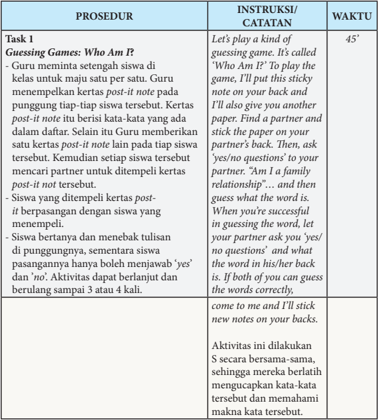

Tabel ini berisi prosedur, instruksi, dan catatan untuk sebuah permainan tebak-tebakan yang disebut "Who Am I?". Topik utama tabel adalah permainan tebak-tebakan yang melibatkan siswa memasukkan kata-kata ke dalam daftar. Proses dimulai dengan guru memberikan kertas post-it note kepada setiap siswa di kelas untuk mewakili satu pilihan. Setelah itu, guru menempelkan kertas post-it note pada pinggung tiap-tiap siswa tersebut. Siswa kemudian diberikan kertas post-it note lainnya untuk mencari partner. Setiap siswa harus bertanya kepada partner tentang kata-kata yang ada dalam daftar. Jika siswa berhasil menjawab semua pertanyaan dengan benar, mereka akan mendapatkan kertas post-it note yang berisi jawaban. Tabel ini juga menyertakan waktu yang diperlukan untuk melakukan prosedur tersebut, yaitu 45 menit.

 

---
## 📄 Halaman 30

### Task 2 Introduction Game: Party Time

- Guru meminta Siswa untuk melihat gambar orang di pesta dan memancing ( elicit )  ujaran Siswa.
- Guru meminta Siswa membayangkan identitas (baru)nya di pesta.
- Guru bertanya jawab dengan siswa tentang tujuan dari perkenalan diri, yaitu saling memberikan informasi jati diri supaya masingmasing lebih mengetahui identitas lawan bicaranya.
- Guru juga bertanya pada siswa tentang bagaimana susunan informasi (struktur teks pada perkenalan diri ini), yaitu opening , exchanging information , dan closing .
- Guru mengajak siswa mengidentifikasi struktur tersebut pada contoh percakapan antara Edo dengan Slamet.
- Guru meminta Siswa untuk melakukan aktivitas sebagai tamu di sebuah pesta.

### Catatan:

Aktivitas ini memberikan kesempatan kepada siswa untuk memperkenalkan diri sendiri kepada orang yang baru dikenalnya. Hal ini memberikan kesempatan kepada siswa untuk berlatih memaparkan jati diri secara lisan.

Oleh arena siswa berbicara bersamasama, siswa akan dapat mengungkapkan jati dirinya dengan lebih santai dan tidak tertekan karena tidak merasa diperhatikan dan diawasi teman lain.

Look at the picture. What do you see? What people are supposed to talk about?

Alright, now imagine that you're invited to a party. Think about a new identity that you have. Then, talk to the other guests and introduce yourself; tell about your family, your profession, and your hobbies.

You may ask another guest with questions, like: 'May I know your name?' 'May I guess what your profession is?' 'What are your hobbies?' 'Do you like painting?' and so on. You may also introduce your friends to other guests.

Well, you may start now. You have five minutes to do your activity. Meet at least two guests.

 

---
## 📄 Halaman 31

### WRITING

---
**📊 Tabel**

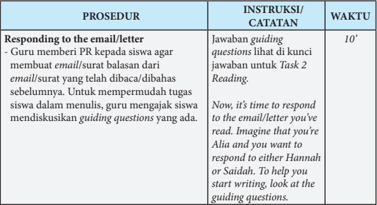

Tabel ini berisi prosedur untuk menyelesaikan tugas penulisan email/letter balasan kepada email/surat yang telah diberikan kepada siswa. Topik utama tabel adalah proses penulisan email/letter balasan dengan bantuan guru. Kolom-kolom yang ada meliputi Prosedur, Instruksi/Catatan, dan Waktu. Data penting yang terlihat adalah bahwa guru memberikan instruksi kepada siswa agar menulis email/letter balasan dalam 10 menit, dengan catatan bahwa jawaban guiding questions harus di kunci sebelum menulis. Ini menunjukkan bahwa proses penulisan email/letter balasan ini dilakukan dalam waktu yang terbatas dan memerlukan perhatian khusus terhadap pertanyaan-pertanyaan yang diberikan oleh guru.

### REFLECTION

---
**📊 Tabel**

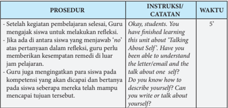

Tabel ini menunjukkan prosedur dan instruksi yang diberikan kepada guru setelah pelajaran selesai. Topik utama tabel adalah proses evaluasi dan pengembangan keterampilan berbicara tentang diri sendiri. Kolom-kolom yang ada mencakup prosedur, instruksi/catatan, dan waktu. Data penting yang terlihat adalah bahwa guru diberitahu untuk memberikan kesempatan kepada siswa untuk melaksanakan refleksi setelah pelajaran selesai. Selain itu, instruksi/catatan menyatakan bahwa guru harus meminta siswa untuk menulis atau bicara tentang diri mereka sendiri. Waktu yang ditentukan untuk prosedur ini adalah 5 menit.

### Pengayaan di luar kelas

- -Guru meminta siswa mencari kenalan lewat media sosial atau membuat teks tentang diri sendiri. Kegiatan ini dilakukan di luar aktivitas kelas.

 

---
## 📄 Halaman 32

### KUNCI JAWABAN

### VOCABULARY BUILDER

---
**📊 Tabel**

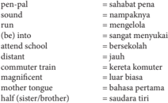

Tabel ini berisi daftar kata dalam bahasa Indonesia dengan arti dalam bahasa Inggris. Topik utamanya adalah perbandingan kata dalam dua bahasa tersebut. Kolom pertama menunjukkan kata dalam bahasa Indonesia, sedangkan kolom kedua menunjukkan artinya dalam bahasa Inggris. Data penting yang terlihat adalah bahwa banyak kata memiliki arti yang sangat mirip, seperti "pen-pal" yang berarti "sahabat pena" dan "run" yang berarti "mengelola". Selain itu, beberapa kata memiliki arti yang sangat berbeda, seperti "attend school" yang berarti "bersekolah" dan "commuter train" yang berarti "kereta komuter". Ini menunjukkan bahwa bahasa Indonesia memiliki banyak kata yang memiliki arti yang sama atau hampir sama dengan bahasa Inggris, namun juga memiliki kata-kata yang memiliki arti yang sangat berbeda.

### READING

---
**📊 Tabel**

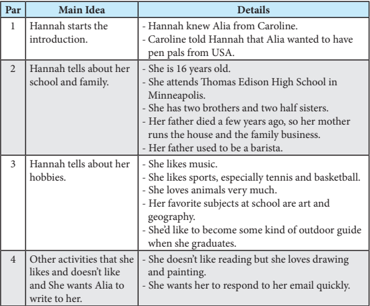

Tabel ini berisi informasi tentang Hannah, seorang siswi yang sedang menjelaskan dirinya kepada teman baru bernama Alia. Topik utama tabel adalah tentang pengenalan diri Hannah. Kolom pertama menunjukkan paragraf (Par) dan topik utamanya, sementara kolom kedua menyajikan detail tentang topik tersebut. Dari tabel ini, kita dapat melihat bahwa Hannah adalah seorang siswi yang berusia 16 tahun, tinggal di Minneapolis, Minnesota, dan memiliki empat saudara. Dia juga menyebutkan bahwa dia suka bermain musik, olahraga seperti tenis dan bola basket, dan hobi lainnya seperti merawat hewan dan belajar geografi. Selain itu, Hannah juga memberikan beberapa detail tentang kegiatan yang dia sukai dan tidak suka, serta mengungkapkan minatnya untuk menjadi guide alam setelah lulus sekolah.

Catatan: Par = paragraph

 

---
## 📄 Halaman 33

---
**📊 Tabel**

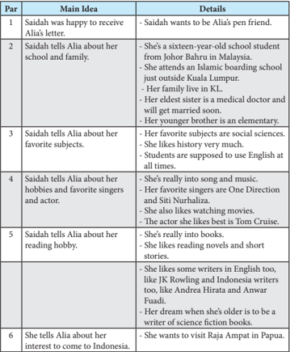

Tabel ini berisi informasi tentang percakapan antara Saidah dan Alia, di mana Saidah memberikan detail tentang dirinya sendiri dan keluarganya kepada Alia. Topik utama tabel adalah tentang perjalanan hidup Saidah dan minatnya. Kolom-kolom yang ada meliputi Par (Periode), Main Idea (Topik Utama), dan Details (Detail). Data penting yang terlihat termasuk bahwa Saidah adalah seorang siswa sekolah menengah 16 tahun dari Johor Bahru, Malaysia, tinggal di luar Kuala Lumpur, memiliki dua saudara kandung, salah satunya adalah dokter medis dan akan menikah, dan dia juga memiliki saudara kandung yang bersekolah dasar. Selain itu, Saidah menyebutkan minatnya dalam ilmu sosial, minatnya dalam musik dan film, dan minatnya dalam membaca buku.

### Task 3

### Comprehension Questions I

- By email. Yes, there is.
- Yes, she does.
- Thomas Edison High School, in Minneapolis, USA.
- She has two brothers and two half sisters. Her father died a few years ago and her mother was responsible for the house and the family business. Her father was a barista.

 

---
## 📄 Halaman 34

- She likes listening to classical and folk music, and playing tennis and basketball.
- Yes, she does. Three dogs.
- An outdoor guide.
- The answer depends on students' own context.

### Comprehension Questions II

- Yes, she does.
- She is from Johor Bahru Malaysia.
- In a boarding school outside Johor Bahru.
- Saidah has a sister who is a medical doctor and his brother is an elementary school student.
- She likes songs, music, and watching movies.
- Yes, she does. Her favorite singers are One Direction and Siti NurHaliza.
- Yes, she does. She likes English writers like JK Rowling, and Indonesian writers like Andrea Hirata and Ahmad Fuadi.
- A writer of science fiction books.
- Yes, she is. She knows Indonesia probably from a book or the Internet, etc. (The answer can vary)

### VOCABULARY EXERCISES

- is really into
- sounds
- run
- E-pal
- mother tongue
- is into, into
- attend
- half sister
- E-pals
- slip back

 

---
## 📄 Halaman 35

### TEXT STRUCTURE

---
**📊 Tabel**

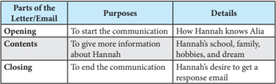

Tabel ini membahas bagian-bagian dari surat atau email, serta tujuan dan detail dari setiap bagian tersebut. Topik utama tabel adalah tentang struktur dan fungsi dari bagian-bagian dalam surat atau email. Kolom pertama berisi nama bagian dari surat atau email, seperti "Opening", "Contents", dan "Closing". Kolom kedua berisi tujuan dari setiap bagian, misalnya "To start the communication" untuk bagian Opening. Kolom ketiga berisi detail tentang bagian tersebut, seperti "How Hannah knows Alia" untuk bagian Opening. Dari tabel ini, dapat dilihat bahwa setiap bagian memiliki tujuan spesifik dan informasi yang relevan untuk membangun komunikasi yang efektif.

---
**📊 Tabel**

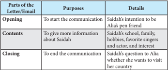

Tabel ini membahas bagaimana struktur sebuah surat atau email, dengan fokus pada bagian-bagian tertentu dan tujuannya. Topik utama adalah bagaimana penggunaan berbagai bagian dalam komunikasi. Dalam kolom "Parts of the Letter/Email", disebutkan tiga bagian utama: Opening, Contents, dan Closing. Bagian Opening digunakan untuk memulai komunikasi, sementara Contents digunakan untuk memberikan informasi lebih lanjut tentang Saidah, seperti asal-usulnya, keluarga, hobi, penyanyi favorit, aktor favorit, dan minat. Bagian Closing digunakan untuk menutup komunikasi, dengan Saidah bertanya kepada Alia apakah dia ingin berkunjung ke negaranya. Pola penting yang terlihat adalah bahwa setiap bagian memiliki tujuan spesifik dalam proses komunikasi, mulai dari pembukaan yang menciptakan rasa ingin tahu, isi yang menyediakan detail mendalam, hingga penutup yang menutupi komunikasi dengan pertanyaan yang menarik.

### GRAMMAR REVIEW

Excercises  I

Identifying pronouns in text 1 and text 2

### Text 1

Hello, Alia! Let me introduce myself. My name is Hannah.

I  know your name from my friend, Caroline. She told me that you sent her an email telling her that you would like to have more pen pals from the US. I' d really like to be your E-pal. You sound really cool!

I guess I' d better tell you something about myself first. I'm 16 years old and I attend Thomas Edison High School here in Minneapolis, Minnesota, USA. I have two brothers and two half sisters and I'm the middle child. My father died a few years ago so my mother runs the house and the family business. My father was a barista.

 

---
## 📄 Halaman 36

I have lots of hobbies. I like music - mostly classical music and folk music - but I don't play an instrument. I like sports, especially tennis and basketball. At school I'm in the basketball team and I spend most of my extra-curricular time playing basket ball. I'm into animals very much. My sister and I have three dogs. They need lots of attention as you can imagine.  My favorite subjects at school are art and geography. I think I' d like to become a park ranger when I graduate, perhaps work for the National Parks Service.

I don't like reading but I love drawing and painting. How about you? Please drop me a line, Alia! Can't wait to hear from you!

Hannah

### Text 2

It  was very interesting to read your letter about yourself and your hometown. I would really like to be your pen friend.

I'm  a  sixteen-year-old  school  student  from  Johor  Bahru  in  Malaysia.  Actually I attend an  Islamic  boarding  school  just  outside  the  city  but  my  family  live  in Kuala Lumpur. My eldest sister is a medical doctor. She will get married soon. My younger brother is an elementary school student.

My favorite subjects are social sciences. I like history very much; it helps me know more how different countries existed in the past. At school we are supposed to use English at all times, even when we are in the dormitory, so we have become quite fluent, although sometimes we slip back into Malay, which is our mother tongue .

As for hobbies, I'm really into songs and music. My favourite boy band is One Direction. My favorite Malay singer is of course Siti Nurhaliza. I also like watching movies, especially comedies. The actor I like best is Tom Cruise.

I'm really into books. I like reading novels and short stories. I like some writers in English, like JK Rowling and Indonesian writers too, like Andrea Hirata and Ahmad Fuadi. My dream, when I'm older, is to be a writer of science fiction books. I' d really love to come to Indonesia some day, especially to the magnificent Raja Ampat in Papua. What about you, do you want to visit my country?

Wassalam, Saidah

 

---
## 📄 Halaman 37

### Excercises II

- Subjective Pronouns:
- 1.I
- He
- They
- She
- We
- Objective Pronouns:
- her
- Me
- It
- them
- It
- Possessive adjectives
- my
- your
- his
- her
- their
- Possessive Pronouns:
- his
- My
- Her
- Our, their
- Mine

### E. Mixed (Pronouns and Possesive Adjectives)

- me
- its/it
- them
- you/yours
- She
- she/she/theirs/them/we/it/ours
- our
- us/we
- We
- him/them/her

### Lampiran (untuk difotokopi)

### Questions A:

- How does Hannah contact Alia? Is there anybody introducing Hannah to Alia?
- Does Hannah want to be Alia's friend?
- Where does Hannah study?
- Tell me about Hannah's family!
- What are Hannah's hobbies?
- Does she like animals? What animals does she have?
- What profession she' d like to have after graduated from her school?
- What are her hobbies?

### Questions A:

- How does Hannah contact Alia? Is there anybody introducing Hannah to Alia?
- Does Hannah want to be Alia's friend?
- Where does Hannah study?
- Tell me about Hannah's family!
- What are Hannah's hobbies?
- Does she like animals? What animals does she have?
- What profession she' d like to have after graduated from her school?
- What are her hobbies?

 

---
## 📄 Halaman 38

### Questions A:

- How does Hannah contact Alia? Is there anybody introducing Hannah to Alia?
- Does Hannah want to be Alia's friend?
- Where does Hannah study?
- Tell me about Hannah's family!
- What are Hannah's hobbies?
- Does she like animals? What animals does she have?
- What profession she' d like to have after graduated from her school?
- What are her hobbies?

### Lampiran (untuk difotokopi)

### Questions B:

- Does Saidah want to be Alia's friend?
- Where is she from?
- Where does Saidah study?
- Tell me about Saidah's family!
- What are Saidah's hobbies?
- Does she have favorite singers? (if yes, who are they?)
- Does she like reading books? Which authors does she like?
- What profession would she like to have later?
- Is she interested in visiting Indonesia? How does she know Indonesia?

### Questions B:

- Does Saidah want to be Alia's friend?
- Where is she from?
- Where does Saidah study?
- Tell me about Saidah's family!
- What are Saidah's hobbies?
- Does she have favorite singers? (if yes, who are they?)
- Does she like reading books? Which authors does she like?
- What profession would she like to have later?
- Is she interested in visiting Indonesia? How does she know Indonesia?

### Questions B:

- Does Saidah want to be Alia's friend?
- Where is she from?
- Where does Saidah study?
- Tell me about Saidah's family!
- What are Saidah's hobbies?
- Does she have favorite singers? (if yes, who are they?)
- Does she like reading books? Which authors does she like?
- What profession would she like to have later?
- Is she interested in visiting Indonesia? How does she know Indonesia?

 

---
## 📄 Halaman 39

### Chapter 2

### CONGRATULATING AND COMPLIMENTING OTHERS

### Kompetensi Dasar:

- 3.2  Menerapkan  fungsi  sosial,  struktur  teks,  dan  unsur  kebahasaan  teks  interaksi interpersonal lisan dan tulis yang melibatkan tindakan  memberikan ucapan selamat dan  memuji  bersayap  ( extended ),  serta  menanggapinya,  sesuai  dengan  konteks penggunaannya.
- 4.2  Menerapkan  fungsi  sosial,  struktur  teks,  dan  unsur  kebahasaan  teks  interaksi interpersonal lisan dan tulis yang melibatkan tindakan  memberikan ucapan selamat dan  memuji  bersayap  ( extended ),  serta  menanggapinya,  sesuai  dengan  konteks penggunaannya.

### Tujuan Pembelajaran:

Setelah mempelajari Bab 2, siswa diharapkan mampu:

- Mengidentifikasi fungsi sosial, struktur teks, dan unsur kebahasaan pada ungkapan ucapan selamat dan pujian bersayap serta responnya.
- Merespon ucapan selamat dan pujian bersayap dengan menggunakan struktur teks dan unsur bahasa yang tepat sesuai dengan tujuan dan konteks penggunaan.
- Memberikan ucapan selamat dan pujian bersayap dengan menggunakan struktur teks dan unsur bahasa yang tepat sesuai dengan tujuan dan konteks penggunaan.

 

---
## 📄 Halaman 40

### WARMER

---
**📊 Tabel**

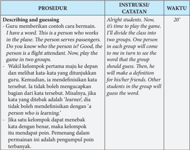

Tabel ini berisi prosedur, instruksi, dan waktu untuk sebuah permainan yang bertujuan untuk mengajarkan kata kerja dan definisi. Topik utama tabel adalah "Describing and guessing," yang melibatkan guru memandu siswa dalam memahami konsep tentang orang yang bekerja di pesawat. Proses dimulai dengan guru memberikan contoh cara bermain, kemudian membagi kelas menjadi dua grup. Setiap anggota grup akan mengambil kata kerja yang ditunjukkan oleh guru dan membuat definisi untuknya. Siswa lain di grup tersebut harus mencoba menebak kata kerja tersebut. Permainan ini berlangsung selama 20 menit, dan poin akan diberikan kepada pengumpul poin terbanyak.

### VOCABULARY BUILDER

---
**📊 Tabel**

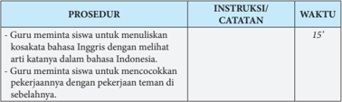

Tabel ini berisi prosedur dan instruksi yang diberikan kepada guru untuk melaksanakan kegiatan belajar mengajar di kelas. Topik utama tabel adalah prosedur dan instruksi guru dalam mengajarkan bahasa Inggris kepada siswa. Kolom "PROSEDUR" menyajikan tiga langkah yang harus dilakukan oleh guru, yaitu menulis suatu istilah dalam bahasa Inggris dengan memahami artinya dalam bahasa Indonesia, menulis suatu pekerjaan dengan menggunakan kata kerja teman, dan mencocokkan pekerjaan dengan pekerjaan teman di sebelahnya. Kolom "INSTRUKSI/CATATAN" memberikan waktu yang diperlukan untuk melaksanakan setiap prosedur, yaitu 15 menit. Data penting yang terlihat adalah bahwa prosedur ini melibatkan dua tahap penulisan dan satu tahap pencocokan, serta waktu yang diberikan untuk melaksanakannya.

### KEGIATAN PEMBELAJARAN

 

---
## 📄 Halaman 41

### PRONUNCIATION PRACTICE

---
**📊 Tabel**

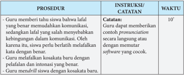

Tabel ini berisi prosedur dan instruksi untuk guru dalam mengajarkan siswa tentang penggunaan kata-kata dengan benar dalam komunikasi. Topik utama tabel adalah pembelajaran kata-kata yang benar dan salah dalam konteks komunikasi. Kolom pertama berisi prosedur yang harus dilakukan oleh guru, seperti memberikan contoh pronuncian, menerapkan kosakata baru, dan mendrill siswa dengan kosakata baru. Kolom kedua berisi instruksi atau catatan yang diberikan kepada guru, seperti guru dapat memberikan contoh pronuncian secara langsung atau dengan memutar software yang cocok. Kolom ketiga berisi waktu yang diperlukan untuk melaksanakan prosedur tersebut, yaitu 10 menit. Pola penting yang terlihat adalah bahwa prosedur ini bertujuan untuk membantu siswa belajar mengenali dan menggunakan kata-kata dengan benar dalam komunikasi, serta memperbaiki kebiasaan mereka dalam menggunakan bahasa.

### READING

---
**📊 Tabel**

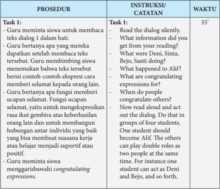

Tabel ini berisi prosedur pembelajaran yang dilakukan guru untuk membantu siswa belajar berkomunikasi dengan efektif menggunakan dialog. Topik utama tabel adalah "Task 1: Guru meminta siswa untuk membaca dialog". Dalam prosedur ini, guru memberikan instruksi kepada siswa untuk membaca dialog secara diam-diam, kemudian menanyakan apa informasi yang mereka dapatkan setelah membaca dialog tersebut. Selain itu, guru juga meminta siswa untuk menunjukkan contoh- contoh ekspresi yang digunakan dalam dialog tersebut, seperti ucapan selamat, ucapan terima kasih, dan ucapan penghargaan. Proses ini dilakukan dalam waktu 35 menit, di mana siswa harus bekerja dalam kelompok empat orang. Tujuan dari prosedur ini adalah untuk meningkatkan kemampuan siswa dalam berkomunikasi dengan efektif dan mengembangkan keterampilan berkomunikasi yang positif.

 

---
## 📄 Halaman 42

- Guru meminta siswa membaca dan memerankan teks percakapan secara berpasangan atau berkelompok. Ada satu siswa yang menjadi Alif, sedangkan yang lain bisa memainkan beberapa peran sesuai dengan jumlah orang yang terdapat dalam dialog. (Samuel, Sinta, Deni, Santi, Bejo, Ivan).

### Task 2:

- Guru meminta siswa menjawab pertanyaan secara individual dan kemudian saling mencocokkan jawaban.
- Guru bersama siswa mendiskusikan jawaban atas pertanyaan bacaan.
- Di sini guru membahas tentang makna congratulating expressions dan tujuan sosialnya.

### Task 3:

- Guru meminta siswa membaca teks dialog 2 secara berpasangan dan memperhatikan ekpresi yang digunakan untuk memberi ucapan selamat.
- Setelah itu, guru menugaskan siswa menjawab pertanyaan bacaan secara individual terlebih dahulu sebelum mencocokkan jawaban dengan teman sebangku.

### Task 2:

- -Answer the questions individually.
- -After you finish answering the questions, now compare your answers to your classmate's sitting next to you.
- -Are your answers the same or different. If they are different find out why.
- -Now let's discuss together with the class the answer to those questions.

### Task 3:

- -Now let's read another dialog to get more examples about how to congratulate other people and how to respond to the congratulating expressions. Read aloud the text with your partner. One of you should become Dita and the other Ditto.
35'

 

---
## 📄 Halaman 43

- Setelah siswa berdiskusi dengan teman sebangku, guru mengajak siswa untuk membahas jawaban pertanyaan secara bersama-sama. Di sini guru bisa mengingatkan lagi tentang fungsi sosial, penataan informasi dalam congratulating expressions , dan language featuresnya.

### Task 5:

- Guru meminta siswa mengisi tabel dengan cara mengidentifikasi congratulating expressions dan responsnya yang terdapat dalam teks dialog 1 dan teks dialog 2.

### VOCABULARY EXERCISES

---
**📊 Tabel**

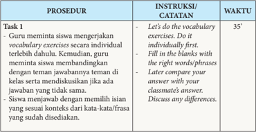

Tabel ini berisi prosedur dan instruksi untuk tugas 1 dalam sebuah kursus bahasa Inggris. Topik utamanya adalah latihan kata-kata (vocabulary exercises) dengan metode individu dan komparatif. Kolom "PROSEDUR" menyajikan langkah-langkah yang harus dilakukan oleh guru dan siswa, mulai dari meminta siswa mengerjakan latihan kata-kata secara individual, membandingkan jawaban dengan teman sekelas, hingga diskusikan perbedaan antara jawaban mereka. Kolom "INSTRUKSI/CATATAN" memberikan petunjuk detail tentang cara melakukan prosedur tersebut, seperti "Let's do the vocabulary exercises," "Do it individually first," "Fill in the blanks with the right words/phrases," dan "Later compare your answer with your classmates' answer." Kolom "WAKTU" menunjukkan waktu yang diperlukan untuk melaksanakan setiap langkah, yaitu 35 menit. Pola penting yang terlihat adalah bahwa proses ini melibatkan interaksi aktif antara guru dan siswa, termasuk diskusi dan pembandingan jawaban, yang bertujuan untuk meningkatkan pemahaman dan penggunaan kata-kata dalam konteks yang sesuai.

- -Answer the questions individually. After that compare your answers to that ,of your classmate sitting next to you. Find any differences and discuss why they are different.
- -Let's discuss together with the class your answers to the questions.

### Task 5:

- -Complete the table with the expressions of congratulations and the responses. Find them in the previous dialogs. Look at the first row as an example.

### 35'

 

---
## 📄 Halaman 44

- Guru kemudian memimpin diskusi kelas untuk mencocokkan jawaban.
- Dalam mencocokkan jawaban guru meminta siswa membaca dialog secara berpasangan.

### Task 2:

- Kegiatan ini mirip kegiatan pada Task 1, tetapi di sini siswa mengisi   teks rumpang dengan kata-katanya sendiri.
- Setelah guru dan siswa mencocokkan semua jawaban, guru meminta siswa memecahkan dialog sesuai tokoh yang diperankannya..
- Pada saat siswa memerankan dialog, guru mengamati performance siswa untuk melakukan penilaian terhadap kemajuan belajar siswa. Dari penilaian tersebut, guru bisa menentukan tindak lanjut, seperti remedi atau pengayaan.

### SPEAKING

---
**📊 Tabel**

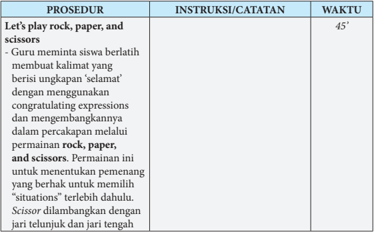

Tabel ini berisi prosedur untuk memainkan permainan rock, paper, scissors dengan instruksi dan catatan yang disertakan. Topik utama tabel adalah prosedur permainan tersebut. Kolom-kolom yang ada adalah Prosedur, Instruksi/Catatan, dan Waktu. Data penting yang terlihat adalah bahwa prosedur ini membutuhkan waktu 45 menit untuk dilakukan. Selain itu, instruksi mencakup langkah-langkah guru memberikan kalimat yang berisi ungkapan "selamat" menggunakan ekspresi selamat dan mengenalkannya melalui percakapan melalui permainan rock, paper, scissors. Waktu yang diberikan juga sangat penting karena memastikan bahwa prosedur dapat diselesaikan dengan baik dalam jangka waktu yang ditentukan.

- -Now, let's check the answer together. Who would like to read dialog 1. Dan seterusnya …
- Tujuan dari Task 2 adalah untuk mengecek apakah S mengerti dialog dalam Task 1.
- -After we finish answering the questions in vocabulary exercises, let's act out the dialogs.
- Make groups and choose which dialog you want to act out.

 

---
## 📄 Halaman 45

---
**📊 Tabel**

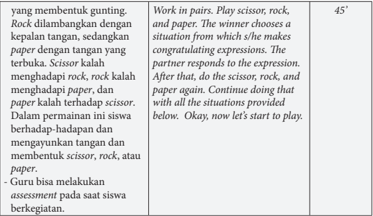

Tabel ini berisi instruksi untuk sebuah aktivitas belajar berpasangan yang melibatkan permainan gantungan, rock, paper, scissors. Topik utama adalah bagaimana siswa belajar mengenali dan menggunakan gantungan, rock, paper, scissors dalam situasi-situasi yang berbeda. Aktivitas ini dilakukan dalam dua pasangan, di mana satu pasangan memilih situasi yang akan dianggap sebagai ucapan selamat, sementara pasangan lainnya menjawab dengan gantungan, rock, paper, atau scissors. Setelah itu, mereka berulang kali melakukan hal yang sama. Tabel ini juga memberikan contoh situasi yang dapat digunakan dalam aktivitas tersebut, seperti guru bisa melakukan penilaian saat siswa bermain.

### WRITING

---
**📊 Tabel**

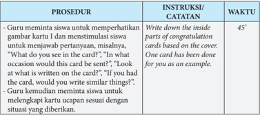

Tabel ini berisi prosedur dan instruksi untuk mengajarkan siswa menulis ucapan selamat dalam bentuk kartu ucapan. Topik utama tabel adalah pembelajaran menulis ucapan selamat. Kolom pertama berisi prosedur yang melibatkan guru meminta siswa untuk menulis kartu ucapan dan menerapkan keterampilan mereka dengan melihat contoh kartu ucapan. Kolom kedua berisi instruksi atau catatan yang diberikan kepada guru, seperti "Write down the inside parts of congratulation cards based on the cover." Kolom ketiga berisi waktu yang diberikan untuk melaksanakan prosedur tersebut, yaitu 45 menit. Data penting yang terlihat adalah bahwa prosedur ini bertujuan untuk meningkatkan keterampilan menulis dan pemahaman tentang ucapan selamat.

### DIALOG: COMPLIMENTING

---
**📊 Tabel**

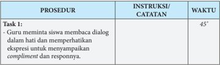

Tabel ini berisi prosedur untuk mengajarkan siswa membaca dialog dengan mempertimbangkan ekspresi untuk menyesuaikan kompliment dan responsnya. Topik utama tabel adalah prosedur pembelajaran ini. Kolom "PROSEDUR" menyediakan instruksi atau catatan yang harus diterapkan selama proses belajar. Kolom "INSTRUKSI/CATATAN" memberikan detail tentang bagaimana guru meminta siswa membaca dialog dalam hati dan memperhatikan ekspresi untuk menyesuaikan kompliment dan responsnya. Kolom "WAKTU" menunjukkan bahwa prosedur ini akan memakan waktu 45 menit. Data penting yang terlihat adalah bahwa prosedur ini bertujuan untuk meningkatkan kemampuan siswa dalam membaca dialog dengan memperhatikan ekspresi dan menyesuaikan kompliment dan responsnya.

 

---
## 📄 Halaman 46

---
**📊 Tabel**

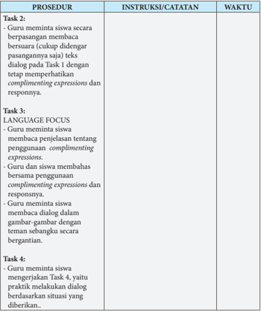

Tabel ini berisi prosedur pelaksanaan tugas bahasa Inggris untuk siswa, yang melibatkan berbagai langkah untuk memperkenalkan dan mempraktekkan penggunaan ekspresi complimenting expressions dalam konteks dialog. Topik utama tabel adalah pembelajaran dan praktik menggunakan ekspresi complimenting dalam situasi interaksi sosial. Kolom "PROSEDUR" menyajikan langkah-langkah yang harus dilakukan oleh guru dan siswa, termasuk membaca dialog, memberikan penjelasan tentang penggunaan ekspresi complimenting, dan praktik berdialog dengan teman sebangku. Kolom "INSTRUKSI/CATATAN" menyediakan instruksi khusus untuk setiap langkah, seperti meminta siswa membaca dialog secara berpasangan dan tetap memperhatikan ekspresi complimenting. Kolom "WAKTU" tidak disediakan dalam tabel ini, sehingga tidak dapat dilihat. Pola penting yang terlihat adalah adanya peran guru sebagai fasilitator pembelajaran, sambil memfasilitasi siswa untuk berinteraksi dan praktik berdialog dalam situasi yang relevan.

### SPEAKING

 

---
## 📄 Halaman 47

---
**📊 Tabel**

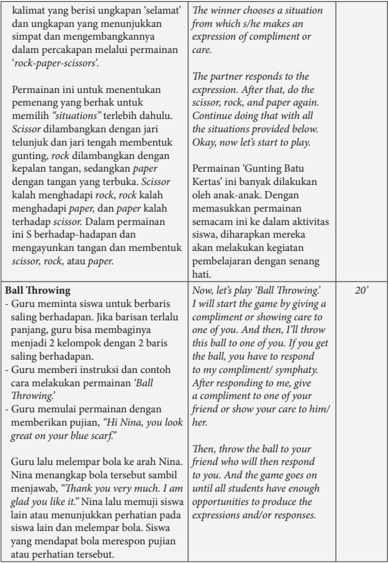

Tabel ini berisi instruksi untuk permainan 'Ball Throwing' yang dilakukan oleh guru di kelas. Topik utama tabel adalah permainan 'Ball Throwing', yang melibatkan siswa saling berhadapan dengan menggunakan bola. Tabel ini terdiri dari dua kolom: 'Permainan' dan 'Kata-kata'. Kolom 'Permainan' menyediakan instruksi tentang bagaimana permainan dimulai dan berlanjut, sementara kolom 'Kata-kata' menunjukkan kata-kata yang harus digunakan dalam permainan tersebut. Data penting yang terlihat dalam tabel ini adalah bahwa permainan dimulai dengan memberikan komplimen atau perhatian kepada salah satu siswa, kemudian guru akan memukul bola ke siswa lain dan siswa tersebut harus menjawab dengan komplimen atau perhatian. Permainan ini berlangsung hingga semua siswa telah mendapatkan kesempatan untuk membuat komplimen atau perhatian.

F.

 

---
## 📄 Halaman 48

### REFLECTION

- -Guru  menutup  pelajaran  dengan  mengajak  siswa  menyimpulkan  isi Chapter  2  dan  menanyakan  seberapa  jauh  siswa  bisa  mencapai  tujuan pembelajaran seperti tercantum dalam rumusan kompetensi dasar.

### KUNCI JAWABAN

### VOCABULARY BUILDER

Celebrate ( verb )

: merayakan

Achievement ( noun )

: prestasi / pencapaian

skirt ( noun )

: rok

blouse ( noun )

: blus, kemeja wanita

terrifict ( adjective )

: [informal] sangat bagus

content ( noun )

: isi

encouragement ( noun )

: penyemangat

appearance  ( noun )

: penampakan, penampilan

appreciation ( noun )

: penghargaan

gorgeous ( adjective )

: [informal] indah, atraktif

### READING

### Text 1

### Task 2:

- Those people congratulate Alif because Alif is appointed as the director of the company. They are all happy to hear the news.
- - Congratulations. You deserved it man
- o I am very happy for you.
- o That's wonderful Alif
- o Well done
- o That was great. You must be very proud of your achievement.
- o Please accept my warmest congratulations.
- o I must congratulate you for your success.
- He responds to their congratulating expressions happily and gratefully.
- The social purpose of congratulating other people is to express our happiness or positive feeling about their success. This can maintain good r elationship among friends, classmates, fellow workers, colleagues, etc.

 

---
## 📄 Halaman 49

- When we hear good news about other people's success, achievement, promotion, graduation, etc.
- (see the answer for number 2)

### Text 2 Task 4

- Ditto  knows  that  Cita  became  the  first  winner  in  the  story  telling competition.
- Ditto said, ' Congratulations for being the first winner of the story telling competition. Excellent. You really did it well.
- The expressions mean that Ditto is happy that Cita won the competition. He appreciates Cita's success.
- The purpose of congratulating Cita is to let Cita know that Ditto appreciates Cita's success. As a good friend, Ditto should say that to Cita so when they meet Ditto will not feel awkward. Congratulating a friend can maintain good relationship between them.
- Cita's responses: Thanks. Ditto./ Thanks. I'll do my best. Wish me luck.

---
**📊 Tabel**

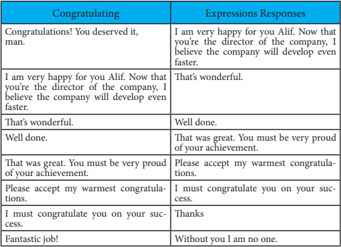

Tabel ini menunjukkan berbagai cara untuk memberikan ucapan selamat kepada seseorang yang telah mencapai kesuksesan. Kolom "Congratulating" berisi berbagai pernyataan yang digunakan untuk memberikan ucapan selamat, seperti "Congratulations! You deserved it, man." dan "That was great. You must be very proud of your achievement." Sementara kolom "Expressions Responses" berisi respons yang mungkin diberikan oleh penerima ucapan selamat, seperti "I am very happy for you Alif. Now that you're the director of the company, I believe the company will develop even faster." dan "Without you I am no one." Topik utama tabel ini adalah cara-cara berbeda untuk memberikan ucapan selamat dan respons yang mungkin diberikan oleh penerima ucapan tersebut.

 

---
## 📄 Halaman 50

### VOCABULARY EXERCISES

### Task 1:

- Wonderful, 2. What's new, 3. Good luck, 4. It's good, 5. Popular business,
6. Thanks a lot, 7. Congratulations! 8. I'm glad you think, 9. New hair cut, 10. Mentioning

### Task 2:

### Conversation 1:

1. It 's nice of you, 2. I like your new your hair cut, 3. Congratulations!! 4. I'm happy

### Conversation 2:

1. Thank you very much for, 2. I am glad you, 3. You deserved that, 4. nothing special.

### Dear Tomy,

- Congratulations on your Promotion.
- Sharing in your happiness today…
- and wishing you a wonderful future..
- filled with dreams coming true. Zettira

### Dhea,

Congratulations. Finally, the happy  day has  come  after  the  hard  work  to  finish  the program. I wish you great success with your plan to open your restaurant, too. Thea.

 

---
## 📄 Halaman 51

---
**🖼️ Gambar/Diagram**

> **Deskripsi Visual:** Gambar ini adalah ilustrasi yang menampilkan sebuah rumah berwarna putih dengan atap merah dan dua pohon hijau di sekitarnya. Rumah tersebut diletakkan di atas tanah berwarna hijau dengan beberapa tanaman kecil di sekelilingnya. Ilustrasi ini tampak sederhana namun menarik perhatian karena detailnya yang jelas.

Elemen utama dalam gambar ini adalah rumah, yang merupakan objek utama yang menunjukkan konsep rumah tangga. Di sekeliling rumah ada dua pohon hijau yang tampak rimbun, menunjukkan keindahan alam sekitar. Tanah berwarna hijau juga menjadi elemen penting yang menunjukkan kondisi lingkungan yang sehat dan hijau.

Teks, angka, atau label penting tidak terlihat dalam gambar ini, sehingga fokus utama pada visual dan konsep yang ditampilkan. Informasi kunci yang dapat diambil pembaca melalui gambar ini adalah tentang rumah dan lingkungan sekitarnya, yang mungkin digunakan untuk pembelajaran tentang arsitektur, ekologi, atau desain interior.

Dengan demikian, gambar ini menggambarkan konsep rumah dan lingkungan sekitarnya dengan detail yang jelas, menarik perhatian pembaca dan memberikan informasi yang penting tentang konsep tersebut.

A happy 'hello' to your sugar glider. Deni

### Welcome . . .

Wishing  you  lots  of  happiness,  fun,  and laughter in your new home. Fuad & family

### Santi,

The  sweetest  of  smiles  and  a  cute  little nose… All these add up to the same precious thing - a baby - the greatest of gifts life can bring! Congratulations Caroline

### Rina and Rudi,

So many paths to choose from -- yet a moment here, a different turn there, and you may never have met to experience a love so right! Isn't it amazing the way life works?

Wishing You Both a Beautiful Life Together Lia & Tomy

 

---
## 📄 Halaman 52

Source: Dokumen Kemdikbud Picture 2.8

### Catatan:

Ucapan yang di sini adalah sekedar contoh. Formulasi kalimat bisa berbeda, tapi yang terpenting adalah adanya ekspresi memberi ucapan selamat.

Evan Dimas, Congratulations and best wishes that the new path  you  are  pursuing  will  open  up  a  whole new world of health and happiness for you! Mom & Dad

 

---
## 📄 Halaman 53

### Chapter 3

### EXPRESSING INTENTION

### Kompetensi Dasar:

- 3.3  Menerapkan  fungsi  sosial,  struktur  teks,  dan  unsur  kebahasaan  teks  interaksi transaksional  lisan  dan  tulis  yang  melibatkan  tindakan  memberi  dan  meminta informasi terkait niat melakukan suatu tindakan/kegiatan, sesuai dengan konteks penggunaannya. (Perhatikan unsur kebahasaan be going to, would like to ).
- 4.3  Menyusunteks interaksi transaksional lisan dan tulis pendek dan sederhana yang melibatkan tindakan memberi dan meminta informasi terkait niat melakukan suatu tindakan/kegiatan, dengan memperhatikan fungsi sosial, struktur teks, dan unsur kebahasaan yang benar dan sesuai konteks.

### Tujuan Pembelajaran:

Setelah mempelajari Bab 3, siswa diharapkan mampu:

- Mengidentifikasi  fungsi  sosial,  struktur  teks,  dan  unsur  kebahasaan  dalam  teks lisan dan tulis untuk menyatakan dan menanyakan tentang niat melakukan sesuatu sesuai dengan konteks.
- Menyatakan secara lisan dan tulis niat melakukan sesuatu dengan memperhatikan fungsi sosial, struktur teks, dan unsur kebahasaan yang benar sesuai konteks.
- Menanyakan secara lisan dan tulis niat melakukan sesuatu dengan memperhatikan fungsi sosial, struktur teks, dan unsur kebahasaan yang benar sesuai konteks.

### KEGIATAN PEMBELAJARAN

WARMER

---
**📊 Tabel**

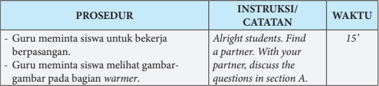

Tabel ini berisi prosedur dan instruksi yang diberikan guru kepada siswa untuk bekerja sama dalam sebuah aktivitas belajar. Topik utama tabel adalah proses pembelajaran berkelompok, dimana guru meminta siswa untuk mencari teman belajar dan diskusikan pertanyaan dalam bagian warner. Dalam prosedur tersebut, siswa harus mencari teman belajar dengan menggunakan kata "Find a partner" dan kemudian diskusikan pertanyaan dalam bagian warner. Waktu yang ditentukan untuk melakukan prosedur ini adalah 15 menit. Ini menunjukkan bahwa guru telah memberikan instruksi yang jelas dan waktu yang tepat untuk siswa untuk melaksanakan tugas belajar mereka.

 

---
## 📄 Halaman 54

---
**📊 Tabel**

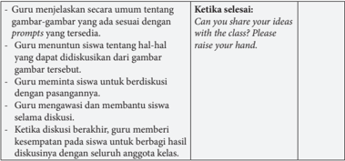

Tabel ini menjelaskan prosedur guru dalam mengajarkan materi melalui diskusi dengan siswa. Topik utamanya adalah bagaimana guru membantu siswa untuk berdiskusi secara efektif. Kolom pertama menyatakan langkah-langkah yang harus dilakukan oleh guru, seperti menunjukkan gambar, meminta saran, memberikan kesempatan untuk berbagi hasil diskusi, dan menyelesaikan proses diskusi. Kolom kedua menyediakan instruksi kepada siswa untuk ikut serta dalam proses tersebut. Data penting yang terlihat adalah bahwa proses ini melibatkan interaksi aktif antara guru dan siswa, dengan tujuan untuk meningkatkan pemahaman dan keterlibatan siswa dalam pembelajaran.

### VOCABULARY BUILDER

---
**📊 Tabel**

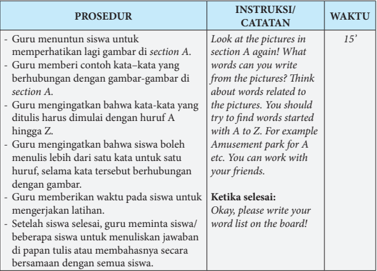

Tabel ini berisi instruksi dan waktu untuk prosedur pembelajaran bahasa Inggris. Topik utamanya adalah pengenalan kata-kata melalui gambar dan penggunaan huruf A-Z. Kolom "PROSEDUR" menyajikan langkah-langkah yang harus dilakukan guru, seperti memperhatikan gambar, memberikan contoh kata-kata, mengingatkan tentang huruf A, dan memberikan waktu untuk mengejaran latihan. Kolom "INSTRUKSI/CATATAN" memberikan detail tentang setiap langkah, seperti "Look at the pictures in section A again! What words can you write from the pictures?" dan "Think about words related to the pictures." Kolom "WAKTU" menunjukkan waktu yang diberikan untuk setiap langkah, mulai dari 15 detik hingga beberapa menit. Data penting yang terlihat adalah bahwa prosedur ini fokus pada pengenalan kata-kata melalui gambar dan penggunaan huruf A-Z, dengan waktu yang cukup untuk siswa untuk mengerjakan latihan.

 

---
## 📄 Halaman 55

### DIALOG: EXPRESSING INTENTION

---
**📊 Tabel**

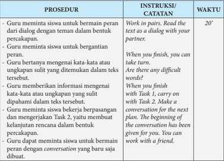

Tabel ini berisi prosedur dan instruksi untuk sebuah aktivitas pembelajaran yang melibatkan siswa bekerja dalam pasangan. Topik utama tabel adalah proses pembelajaran berbasis dialog dan peran. Kolom "PROSEDUR" menyajikan langkah-langkah yang harus dilakukan oleh guru dan siswa, sementara kolom "INSTRUKSI/CATATAN" memberikan petunjuk detail tentang bagaimana prosedur tersebut harus dijalankan. Kolom "WAKTU" menunjukkan waktu yang diperlukan untuk setiap tugas. Dari data yang terlihat, dapat disimpulkan bahwa aktivitas ini bertujuan untuk meningkatkan kemampuan berkomunikasi dan berperan dalam bahasa, dengan fokus pada pengenalan kata-kata atau ungkapan yang sulit dalam konteks teks.

### VOCABULARY EXERCISES

---
**📊 Tabel**

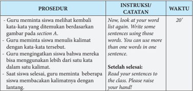

Tabel ini berisi prosedur dan instruksi yang diberikan oleh guru kepada siswa untuk menulis kalimat menggunakan kata-kata yang telah ditentukan. Topik utama tabel adalah proses pembelajaran menulis kalimat dengan menggunakan kata-kata tertentu. Kolom-kolom yang ada meliputi prosedur, instruksi/catatan, dan waktu. Data penting yang terlihat adalah bahwa prosedur dimulai dengan guru meminta siswa melihat kembali kata-kata yang telah ditentukan berdasarkan gambar pada bagian A. Kemudian, guru meminta siswa menulis kalimat dengan kata-kata tersebut. Selanjutnya, guru mengingatkan siswa bahwa mereka dapat menggunakan lebih dari satu kata dalam satu kalimat. Setelah selesai, guru memberi tahu siswa untuk membaca kalimatnya dengan lantang. Waktu yang diberikan untuk setiap prosedur adalah 20 menit.

 

---
## 📄 Halaman 56

### GRAMMAR REVIEW

---
**📊 Tabel**

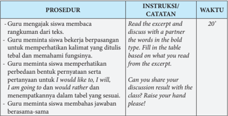

Tabel ini berisi prosedur dan instruksi yang harus dilakukan guru dan siswa dalam sebuah aktivitas pembelajaran. Topik utamanya adalah pengembangan kemampuan membaca dan berkomunikasi dengan bahasa Inggris. Kolom "PROSEDUR" menyajikan langkah-langkah yang harus diikuti, sementara kolom "INSTRUKSI/CATATAN" memberikan petunjuk detail tentang setiap langkah. Kolom "WAKTU" menunjukkan waktu yang diperlukan untuk melaksanakan setiap prosedur. Data penting yang terlihat adalah bahwa prosedur ini memerlukan waktu sekitar 20 menit, yang mencakup berbagai aktivitas seperti membaca excerpt, berdiskusi dengan partner, memahami kalimat berbentuk tebal, dan mengevaluasi bentuk pernyataan. Ini menunjukkan bahwa aktivitas ini dirancang untuk meningkatkan pemahaman dan kemampuan berkomunikasi siswa dalam bahasa Inggris.

### SPEAKING

---
**📊 Tabel**

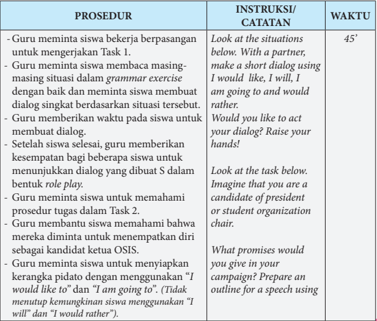

Tabel ini berisi instruksi dan waktu untuk dua tugas pembelajaran yang dilakukan oleh guru di kelas. Topik utama tabel adalah pengembangan kemampuan berbicara dalam bahasa Inggris. Kolom pertama berisi prosedur yang harus dilakukan oleh guru dan siswa, kolom kedua berisi instruksi atau catatan yang diberikan kepada guru, dan kolom ketiga berisi waktu yang diberikan untuk menyelesaikan tugas tersebut. Data penting yang terlihat adalah bahwa guru harus membantu siswa memahami prosedur dan memberikan waktu 45 menit untuk menyelesaikan tugas.

 

---
## 📄 Halaman 57

---
**📊 Tabel**

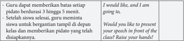

Tabel ini berisi instruksi guru tentang cara memberikan pidato kepada siswa setelah mereka menyelesaikan sesi belajar. Topik utama tabel adalah prosedur presentasi pidato oleh siswa. Kolom pertama berisi perintah atau pertanyaan yang diberikan oleh guru, sedangkan kolom kedua berisi respons atau jawaban siswa. Data penting yang terlihat adalah bahwa guru meminta siswa untuk memberikan pidato setelah selesai belajar, dengan batas waktu 3 hingga 5 menit. Selain itu, guru juga memberikan instruksi agar siswa yang ingin berpidato harus bertindak segera dan menunjukkan tangan jika sudah siap. Ini menunjukkan bahwa tabel ini bertujuan untuk mengatur proses presentasi pidato siswa secara efektif dan efisien.

### WRITING

---
**📊 Tabel**

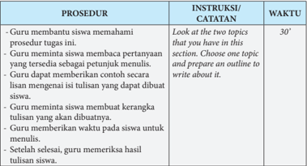

Tabel ini berisi prosedur dan instruksi yang diberikan kepada guru untuk membantu siswa menulis tugas dua topik. Topik utama tabel adalah prosedur dan instruksi yang harus diikuti oleh guru untuk membantu siswa dalam menulis tugas. Kolom "PROSEDUR" menyajikan langkah-langkah yang harus diikuti oleh guru, seperti membantu siswa memahami prosedur tugas, memberi petunjuk menuju tulisan, memberikan waktu untuk menulis, dan memeriksa hasil tulisan siswa. Kolom "INSTRUKSI/CATATAN" menyediakan detail tentang setiap prosedur, seperti "Look at the two topics that you have in this section," "Choose one topic and prepare an outline to write about it," dan lainnya. Kolom "WAKTU" menunjukkan waktu yang diperlukan untuk setiap prosedur, mulai dari 30 menit hingga beberapa jam. Pola penting yang terlihat adalah bahwa prosedur ini mencakup berbagai tahap dalam proses menulis tugas, dari memahami topik, membuat kerangka tulisan, sampai pengecekan hasil tulisan siswa.

### REFLECTION

---
**📊 Tabel**

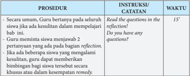

Tabel ini berisi prosedur dan instruksi yang diberikan kepada guru untuk membantu mereka dalam proses evaluasi siswa melalui metode reflection. Topik utama tabel adalah proses evaluasi siswa menggunakan metode reflection. Kolom pertama berisi prosedur yang harus dilakukan oleh guru, seperti membaca pertanyaan pada reflection, menanyakan apakah siswa memiliki pertanyaan, dan memberikan bimbingan jika diperlukan. Kolom kedua berisi instruksi yang harus diterapkan oleh guru, seperti membaca pertanyaan, menjawab dua pertanyaan tentang reflection, dan memberikan bimbingan jika diperlukan. Kolom ketiga berisi waktu yang diberikan untuk setiap prosedur, yaitu 15 menit. Pola penting yang terlihat adalah bahwa prosedur ini memerlukan waktu yang cukup untuk guru dapat melakukan evaluasi siswa dengan baik.

I

 

---
## 📄 Halaman 58

### FURTHER ACTIVITIES

---
**📊 Tabel**

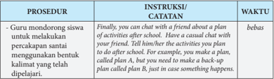

Tabel ini berisi instruksi kepada siswa untuk melakukan percakapan santai dengan teman sebaya setelah sekolah. Topik utamanya adalah bagaimana siswa dapat membuat dan menjalankan rencana aktivitas setelah sekolah. Dalam prosedur tersebut, guru memberikan contoh dengan membuat dua rencana aktivitas: Plan A dan Plan B. Plan A adalah rencana yang sudah dipersiapkan, sedangkan Plan B adalah alternatif jika sesuatu terjadi yang tidak diharapkan. Siswa diberi waktu bebas untuk mencoba melaksanakan prosedur ini.

### KUNCI JAWABAN

### VOCABULARY BUILDER

### Contoh kata- kata yang berhubungan dengan gambar:

---
**📊 Tabel**

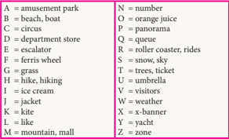

Tabel ini berisi informasi tentang jenis permainan dan aktivitas yang dapat ditemukan di berbagai tempat. Topik utamanya adalah jenis permainan dan aktivitas yang bisa ditemukan di tempat-tempat tertentu. Kolom A menunjukkan jenis permainan atau aktivitas, sedangkan kolom N menunjukkan jumlah atau ukuran dari setiap jenis tersebut. Misalnya, kolom A memiliki beberapa baris yang berisi nama-nama permainan seperti "beach boat", "cruise", "department store", dll., sementara kolom N memiliki baris yang berisi angka-angka yang mungkin menunjukkan jumlah permainan atau aktivitas tersebut. Data penting yang terlihat adalah bahwa banyak permainan dan aktivitas yang tersedia di tempat-tempat seperti taman hiburan, pusat perbelanjaan, dan lainnya.

### VOCABULARY EXERCISE

### Contoh kalimat dengan kata-kata dari vocabulary builder:

- There are many kinds of rides in the amusement park, for example ferris wheel and roller coaster.
- Last week, we went hiking in the mountain near my grandma's house.
- The visitors have to buy a ticket before entering the park.
- We could see several yachts out on the sea.
- Ramayana is one of the biggest department store in my town. Dan seterusnya.

 

---
## 📄 Halaman 59

### GRAMMAR REVIEW

### USING I WOULD LIKE TO, I WILL AND I AM GOING TO

---
**📊 Tabel**

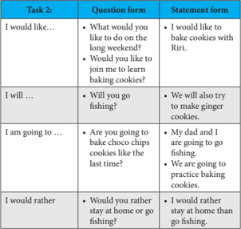

Tabel ini menunjukkan berbagai pertanyaan dalam dua bentuk: pertanyaan dalam bentuk pertanyaan (question form) dan pernyataan dalam bentuk pernyataan (statement form). Topik utama tabel adalah tentang keinginan dan rencana seseorang. Kolom pertama adalah pertanyaan dalam bentuk pertanyaan, yang mencakup permintaan, tindakan masa depan, rencana masa depan, dan pilihan. Kolom kedua adalah pernyataan dalam bentuk pernyataan, yang mencakup pernyataan tentang keinginan, tindakan masa depan, rencana masa depan, dan pilihan. Data penting yang terlihat adalah bahwa semua pertanyaan dalam bentuk pertanyaan memiliki jawaban dalam bentuk pernyataan, dan sebaliknya. Ini menunjukkan hubungan antara pertanyaan dan jawaban dalam dua bentuk yang berbeda.

### WRITING

I  would like to spend my holiday at home rather than travel somewhere far away.  I  believe  I  can  still  make  the  most  of  my  break  time  by  staying  at  home during holidays. For example, this holiday I'm planning to throw a sleepover party with  my  close  friends.  We  are  going  to  stay  up  all  night  watching  our  favorite movies together. We have agreed that we are going to do it at my house, which is a good thing because I would rather host the party than go to my friends' houses, most of which are quite far. However, I will have to clean my room before, as it has gotten quite messy after I neglected it due to all the papers and exams I had to do for the last week. Although I hate cleaning during holidays, I still think it's better than having to deal with chaotic traffics out there. I am sure it's going to be a fun and memorable holiday.

 

---
## 📄 Halaman 60

### Chapter 4

### WHICH ONE IS YOUR BEST GETAWAY?

### Kompetensi Dasar:

- deskriptif lisan dan tulis dengan memberi dan meminta informasi terkait tempat wisata dan bangunan bersejarah terkenal, pendek dan sederhana, sesuai dengan konteks penggunaannya.
- 4.4.1 Menangkap makna secara kontekstual terkait fungsi sosial, struktur teks, dan unsur kebahasaan teks deskriptif, lisandantulis, pendek dan sederhana terkait tempat wisata dan bangunan bersejarah terkenal.
- 4.4.2 Menyusunteks deskriptif lisan dan tulis, pendekdansederhana, terkait tempat wisata dan  bangunan  bersejarah  terkenal,  dengan  memperhatikan  fungsisosial,  struktur teks, danunsurkebahasaan, secara benar dan sesuai konteks.

### Tujuan Pembelajaran:

Setelah mempelajari Bab 4, siswa diharapkan mampu:

- Mengidentifikasi makna, fungsi sosial, struktur teks, dan unsur kebahasaan pada teks deskriptif sederhana lisan dan tulis tentang tempat wisata dan bangunan bersejarah sesuai dengan penggunaan.
- Menjelaskan  isi  deskripsi  lisan  dan  tulis  tentang  tempat  wisata  dan  bangunan bersejarah  dengan  memperhatikan  tujuan  komunikasi,  struktur  teks,  dan  unsur kebahasaan teks deskriptif sesuai konteks penggunaan.
- Mendeskripsikan  secara  lisan  dan  tulis  tempat  wisata  atau  bangunan  bersejarah dengan  memperhatikan  fungsi  sosial,  struktur  teks,  dan  unsur  kebahasaan  teks deskripsi secara benar sesuai konteks penggunaan.

### KEGIATAN PEMBELAJARAN

### WARMER

---
**📊 Tabel**

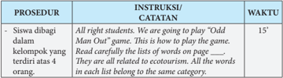

Tabel ini berisi prosedur untuk memainkan permainan "Odd Man Out" dengan siswa di kelas. Topik utama tabel adalah cara memainkan permainan tersebut. Kolom pertama berisi instruksi tentang bagaimana memainkan permainan, kolom kedua berisi catatan tentang permainan, dan kolom ketiga berisi waktu yang diperlukan untuk memainkan permainan. Data penting yang terlihat adalah bahwa permainan ini dirancang untuk siswa yang berada dalam kelompok yang terdiri dari empat orang, dan semua kata dalam daftar kata yang diberikan berkaitan dengan ekotourisme.

 

---
## 📄 Halaman 61

---
**📊 Tabel**

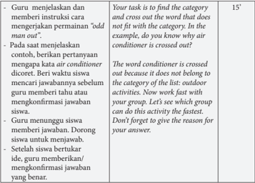

Tabel ini berisi instruksi guru untuk mengajarkan siswa tentang permainan "odd one out". Topik utamanya adalah membedakan kata yang tidak sesuai dengan kategori lainnya dalam daftar aktivitas luar ruangan. Tabel memiliki dua kolom: kolom pertama berisi instruksi guru, sedangkan kolom kedua berisi contoh jawaban yang diberikan oleh guru. Data penting yang terlihat adalah bahwa guru harus menjelaskan instruksi dan memberi contoh, kemudian meminta siswa mencari kata yang tidak sesuai dengan kategori lainnya.

### VOCABULARY BUILDER

---
**📊 Tabel**

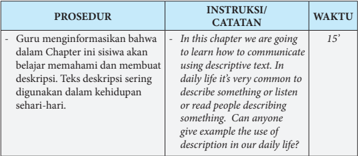

Tabel ini menunjukkan prosedur pembelajaran yang dilakukan guru dalam menginformasikan siswa tentang materi yang akan dipelajari dalam Chapter 1. Kolom "PROSEDUR" berisi instruksi guru kepada siswa, sedangkan kolom "INSTRUKSI/CATATAN" menyediakan contoh instruksi dalam bahasa Inggris. Kolom "WAKTU" menunjukkan waktu yang diberikan untuk memahami instruksi tersebut. Topik utama tabel ini adalah proses pembelajaran yang efektif dalam mengajarkan siswa tentang teknik penulisan deskripsi menggunakan teks deskriptif dalam kehidupan sehari-hari.

 

---
## 📄 Halaman 62

---
**📊 Tabel**

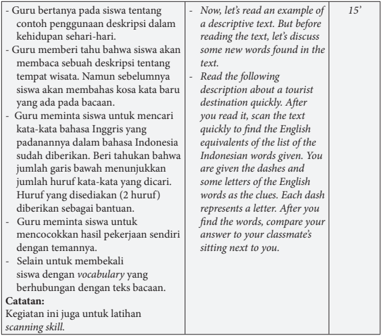

Tabel ini berisi contoh penggunaan deskripsi dalam bahasa Indonesia untuk kehidupan sehari-hari, ditujukan untuk latihan scanning skill. Topik utama adalah bagaimana menemukan kata-kata bahasa Inggris dalam teks Indonesia. Tabel ini terdiri dari dua kolom: kolom pertama berisi deskripsi singkat dalam bahasa Indonesia, sedangkan kolom kedua berisi penjelasan tentang cara membaca dan mencari kata-kata bahasa Inggris dalam teks tersebut. Data penting yang terlihat adalah bahwa siswa harus memahami konteks deskripsi sebelum membaca, mencari kata-kata bahasa Inggris yang sama dengan yang diberikan, dan kemudian membandingkannya dengan jawaban temannya.

### PRONUNCIATION PRACTICE

---
**📊 Tabel**

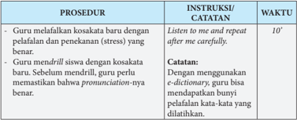

Tabel ini berisi instruksi dan waktu untuk prosedur guru dalam mengajarkan bahasa asing kepada siswa. Topik utamanya adalah metode pengajaran melalui kodokasatara, di mana guru menggunakan kodokasatara untuk membantu siswa memahami dan mengucapkan kata-kata dengan benar. Kolom "Instruksi/Catatatan" menyediakan petunjuk khusus seperti "Listen to me and repeat after me carefully" dan "Dengan menggunakan e-dictionary, guru bisa mendapatkan bunyi pelafalan kata-kata yang dilatihkan". Waktu yang ditentukan untuk setiap prosedur adalah 10 menit. Pola penting yang terlihat adalah bahwa prosedur ini fokus pada pengajaran melalui kodokasatara, dengan instruksi yang spesifik untuk mendukung pemahaman dan pengucapan kata-kata dengan benar.

 

---
## 📄 Halaman 63

### READING

---
**📊 Tabel**

Tabel ini berisi prosedur pembelajaran yang dilakukan guru untuk membantu siswa memahami teks bacaan dan menjawab pertanyaan. Topik utama tabel adalah proses pembelajaran yang melibatkan pemahaman konten, pemahaman arti kata, dan kemampuan berpikir kritis. Kolom "PROSEDUR" menyajikan langkah-langkah yang harus diikuti oleh guru dan siswa, sementara kolom "INSTRUKSI/CATATAN" memberikan petunjuk spesifik tentang apa yang harus dilakukan. Kolom "WAKTU" menunjukkan waktu yang diperlukan untuk setiap tugas. Data penting yang terlihat adalah bahwa prosedur ini melibatkan pemahaman konten secara mendalam, pemahaman arti kata baru, dan kemampuan berpikir kritis.

 

---
## 📄 Halaman 64

---
**📊 Tabel**

Tabel ini berisi instruksi untuk kegiatan belajar yang melibatkan pembelajaran intensif dengan model "numbered heads together". Topik utama adalah pengenalan konsep penulisan teks struktur, termasuk pemahaman tentang bagaimana menemukan ide utama dan detail dalam paragraf. Tabel dibagi menjadi dua bagian: Task 3 dan Task 4. Task 3 mengajarkan siswa untuk membahas singkat tentang bagaimana turis harus memperlakukan sampah di tempat wisata, sementara Task 4 mengajarkan mereka cara mengidentifikasi struktur teks, termasuk bagaimana menemukan ide utama dan detail dalam paragraf. Kolom-kolom utama dalam tabel ini adalah Catatan, Activity, dan Kegiatan. Data penting yang terlihat antara lain bahwa kegiatan ini menggunakan model "numbered heads together", guru harus meminta tahu jawaban pertanyaan nomor tertentu, dan siswa harus menganalisis teks struktur untuk menemukan ide utama dan detail dalam paragraf.

 

---
## 📄 Halaman 65

- -Look at the example. What is the function of the sentence: Visitors from foreign countries come to this park because of its amazing nature.  Compare that sentence with the other sentences in the paragraph.
- -Does it tell general idea or details?  (general idea -> has amazing nature)
- -What do the rest of the sentences after that tell?  The details of the amazing nature of TNP .
- -What is the name of the sentence? (Topic Sentence/ TS)
- -So, how do we find the TS? (Find the most general sentence which is elaborated by the other sentences in the paragraph. TS is the general sentence that tells what a paragraph is about).
- -Where is usually the position of the sentence? (at the beginning of a paragraph. Sometimes it's in the middle of at the end of the paragraph).
- -Where can we find the details? (in the sentences that follow TS that elaborate the sentence.
- -Now, find out how the ideas in the descriptive text are arranged?

### VOCABULARY EXERCISES

---
**📊 Tabel**

Tabel ini berisi prosedur dan instruksi untuk latihan kata-kata dalam konteks kalimat baru dengan tema yang kurang lebih sama. Topik utama tabel adalah proses pembelajaran kata-kata vocabulary dalam bahasa. Kolom "PROSEDUR" menyajikan langkah-langkah yang harus dilakukan, seperti siswa berlatih menggunakan kata-kata dalam kegiatan vocabulary, guru meminta siswa untuk bekerja dalam kelompok, setelah selesai, setiap kelompok saling mencocokkan jawaban dengan pasangan siswanya, dan kemudian membahas bersama jawaban yang benar. Kolom "INSTRUKSI/CATATAN" memberikan instruksi atau catatan kepada guru dan siswa, seperti "Now, let's do the vocabulary exercises", "Read again the list of words in part B", "Fill in the blanks with the right word from the list", dan "Compare your work with your classmates". Kolom "WAKTU" menunjukkan waktu yang diperlukan untuk melakukan setiap langkah, mulai dari 25 menit hingga beberapa menit. Pola penting yang terlihat adalah bahwa proses ini melibatkan interaksi antara guru dan siswa, penggunaan kata-kata dalam konteks baru, dan evaluasi hasil belajar melalui pertukaran jawaban antar siswa.

 

---
## 📄 Halaman 66

### TEXT 1

### VOCABULARY BUILDER

---
**📊 Tabel**

Tabel ini berisi prosedur dan instruksi untuk sebuah aktivitas belajar yang melibatkan siswa membaca deskripsi tempat wisata, mencatat kata-kata yang disusun secara acak, dan kemudian membandingkan jawaban mereka dengan teman sekelas. Topik utama tabel adalah proses belajar dan pengembangan keterampilan pengetahuan bahasa Inggris. Kolom-kolom yang ada adalah Prosedur, Instruksi/Catatatan, dan Waktu. Data penting yang terlihat adalah bahwa prosedur ini memerlukan waktu 25 menit, dan siswa harus dapat membaca deskripsi tempat wisata dengan cepat, mencatat kata-kata yang disusun secara acak, dan membandingkan jawaban mereka dengan teman sekelas.

### PRONUNCIATION PRACTICE

---
**📊 Tabel**

Tabel ini berisi prosedur dan instruksi untuk melatih pengucapan kata dalam bahasa Inggris. Topik utamanya adalah metode latihan pengucapan kata dengan menggunakan e-dictionary. Kolom pertama berisi prosedur yang harus dilakukan, kolom kedua berisi instruksi atau petunjuk yang diberikan, dan kolom ketiga berisi waktu yang diperlukan untuk melaksanakan prosedur tersebut. Data penting yang terlihat adalah bahwa prosedur melibatkan guru memberikan kata-kata untuk diterjemahkan dan ditekankan, kemudian guru memberikan latihan inten untuk memperbaiki pengucapan kata tersebut. Waktu yang diperlukan untuk melaksanakan prosedur ini adalah 25 menit.

 

---
## 📄 Halaman 67

### READING

---
**📊 Tabel**

Tabel ini berisi prosedur pembelajaran yang melibatkan guru dan siswa dalam membandingkan dua teks deskriptif. Topik utama adalah analisis dan perbandingan antara dua teks. Kolom "Prosedur" menyajikan tugas-tugas yang harus dilakukan oleh guru dan siswa, seperti membaca teks, mencari persamaan dan perbedaan, dan mengevaluasi struktur teks. Kolom "Instruksi/Catatatan" memberikan petunjuk detail tentang apa yang harus dilakukan, seperti membaca deskripsi lengkap tentang Taj Mahal, mencari perbedaan dengan teks sebelumnya, dan menggunakan kata kunci dalam builder vocabular. Kolom "Waktu" menunjukkan waktu yang diperlukan untuk mengerjakan setiap tugas, mulai dari 25 menit hingga beberapa menit. Pola penting yang terlihat adalah bahwa prosedur ini melibatkan aktivitas yang intensif dan detail, termasuk pengecekan kata kunci dan pembandingan teks secara mendalam.

 

---
## 📄 Halaman 68

### VOCABULARY EXERCISES

---
**📊 Tabel**

Tabel ini berisi prosedur dan instruksi untuk kegiatan vocabulary builder dalam konteks kalimat baru dengan tema yang kurang lebih sama. Topik utama tabel adalah pembelajaran kata-kata baru melalui aktivitas berkelompok. Kolom "Prosedur" menyajikan langkah-langkah yang harus dilakukan, seperti siswa berlatih menggunakan kata-kata dalam kegiatan vocabulary builder, guru meminta siswa untuk berkerja dalam kelompok, dan setelah selesai sesi S, guru membahas bersama jawaban yang benar. Kolom "Instruksi/Catatan" memberikan petunjuk detail tentang bagaimana prosedur tersebut harus dilakukan, misalnya "Now, let's do the vocabulary exercises. Read again the list of words in part B. Fill in the blanks with the right word from the list." Kolom "Waktu" menunjukkan waktu yang diperlukan untuk setiap langkah, seperti 25 menit untuk melakukan kegiatan vocabulary builder. Tabel ini membantu guru dan siswa dalam proses belajar bahasa dengan cara yang efektif dan interaktif.

 

---
## 📄 Halaman 69

### GRAMMAR REVIEW

---
**📊 Tabel**

Tabel ini berisi prosedur pembelajaran untuk mengajarkan siswa tentang noun phrases dalam bahasa Inggris. Topik utama adalah pengenalan dan pemahaman tentang noun phrases, termasuk cara menentukan head (noun) dan modifier (adjective). Tabel ini terdiri dari empat task yang bertujuan untuk meningkatkan pemahaman siswa tentang konsep tersebut. Task 1 meminta guru untuk membimbing siswa dalam review kembali pelajaran tentang noun phrases dengan menggunakan contoh. Task 2 melibatkan siswa membuat noun phrase dengan menggabungkan adjective dengan noun. Task 3 melibatkan guru menanyakan apakah modifier selalu satu kata saja dan membimbing siswa dalam identifikasi noun phrases dengan modifier lebih dari satu. Task 4 meminta siswa mencari dan membuat noun phrases dalam teks tentang National Park dan Taj Mahal. Tabel ini menunjukkan bahwa proses pembelajaran ini melibatkan langkah-langkah yang bertahap, mulai dari review awal hingga penggunaan yang lebih kompleks dalam konteks teks.

 

---
## 📄 Halaman 70

### WRITING

---
**📊 Tabel**

Tabel ini berisi prosedur dan instruksi yang diberikan oleh guru kepada siswa untuk berlatih mengetik dan memperbaiki kesalahan dalam teks. Topik utama tabel adalah proses pembelajaran mengetik dan memperbaiki kesalahan dalam teks. Kolom "PROSEDUR" menyajikan langkah-langkah yang harus dilakukan siswa, seperti menentukan bagian teks yang perlu diperbaiki, menggunakan pertanyaan pengarah untuk menemukan kesalahan, dan meminta bantuan guru untuk memeriksa kesalahan. Kolom "INSTRUKSI/CATATAN" memberikan petunjuk spesifik tentang apa yang harus dilakukan, seperti menggunakan tanda baca, mengidentifikasi kesalahan gramatikal, dan memeriksa struktur kalimat. Kolom "WAKTU" menunjukkan waktu yang diperlukan untuk melaksanakan setiap prosedur, mulai dari 30 detik hingga beberapa menit. Pola penting yang terlihat adalah bahwa prosedur ini melibatkan interaksi antara siswa dan guru, dengan siswa diharapkan untuk menemukan dan memperbaiki kesalahan mereka sendiri, sementara guru memberikan bantuan dan petunjuk.

 

---
## 📄 Halaman 71

### Task 2:

- Guru meminta siswa menuliskan word web tentang Cuban Rondo. Setelah itu atas berdasarkan word web tersebut siswa menulis deskripsi tentang Cuban Rondo.
- -Ingatkan siswa untuk tidak melihat teks sumber lagi pada saat mereka mendeskripsikan ulang isi bacaan. Mereka hanya boleh mengandalkan word web yang sudah dibuat.
- Guru juga bisa meminta siswa membuat word web teks 1 atau teks 2 serta menulis ulang teks deskripsi tersebut berdasarkan word web yang mereka buat.
- Siswa yang menyukai tantangan bisa membuat word web untuk teks deskripsi dengan ide murni dari siswa sendiri.

### Task 3:

- Siswa mengarang dengan mendeskripsikan tempat favorit mereka.
- Guru menyarankan siswa untuk membuat word web terlebih dahulu untuk menentukan tempat dan unsur apa yang akan dideskripsikan dari tempat tersebut.
- Guru mengingatkan tahapan dalam proses menulis ( drafting, revising, editing, publishing ) tujuan tiap tahap.
- whether the places of the modifiers in the noun phrases are correct.
- Does she begin all sentences with capital letters? Correct them if she doesn't.
- Does she end all sentences with full stops? Correct them if she does not.
- Menuliskan kembali adalah salah satu tahapan dalam belajar menulis. Dengan menuliskan kembali teks yang sudah ada siswa mendapatkan bantuan dari segi ide, susunan ide, dan kosa kata.

 

---
## 📄 Halaman 72

---
**📊 Tabel**

Tabel ini membahas peran guru dalam proses belajar siswa, khususnya dalam konteks penulisan. Topik utama adalah bagaimana guru memantau dan mendukung siswa dalam menyelesaikan tahapan-tahapannya dalam proses menulis. Guru bertanggung jawab untuk mengawasi kegiatan siswa, memberikan bimbingan, dan membantu mereka mencapai tujuan penulisan. Selain itu, guru juga berperan dalam mengajarkan konsep-konsep dasar penulisan, seperti penggunaan kata kerja, struktur kalimat, dan teknik penulisan yang efektif. Dalam proses ini, guru harus mampu memberikan feedback yang tepat dan memberi saran untuk meningkatkan kualitas penulisan siswa. Selain itu, guru juga harus mampu merencanakan dan mengatur waktu belajar sesuai dengan kebutuhan individu setiap siswa. Dengan demikian, guru memiliki peran penting dalam membantu siswa menjadi penulis yang berkualitas dan berpengetahuan.

### SPEAKING

---
**📊 Tabel**

Tabel ini berisi prosedur dan instruksi untuk mengajarkan siswa mendeskripsikan tempat wisata yang pernah dikunjungi. Topik utamanya adalah pendidikan bahasa Inggris melalui diskusi kelompok dan penulisan. Kolom "PROSEDUR" menyediakan langkah-langkah praktis, seperti guru memberi contoh dengan lokasi alam seperti air terjun atau valle, siswa mendeskripsikan tempat manapun mereka kunjungi, dan guru menggunakan kata kerja untuk mendukung penulisan. Kolom "INSTRUKSI/CATATAN" memberikan petunjuk detail tentang bagaimana prosedur tersebut dilakukan, misalnya menggunakan kata kerja "interesting" dan "recommend". Kolom "WAKTU" menunjukkan waktu yang diperlukan untuk setiap langkah, mulai dari 25 menit hingga beberapa langkah yang tidak disebutkan waktu. Pola penting yang terlihat adalah interaksi aktif antara guru dan siswa, penggunaan kata kerja untuk meningkatkan pemahaman bahasa, dan kemampuan siswa untuk mendeskripsikan tempat wisata secara kreatif.

 

---
## 📄 Halaman 73

### REFLECTION

---
**📊 Tabel**

Tabel ini menunjukkan prosedur guru dalam mengawasi pemahaman siswa tentang materi pelajaran tentang "Visiting natural areas" setelah pelajaran berlangsung. Kolom "PROSEDUR" menyajikan langkah-langkah yang harus dilakukan oleh guru, termasuk meminta siswa untuk menjawab pertanyaan tentang kemampuan mereka dalam menulis tentang tempat menarik. Kolom "INSTRUKSI/CATATAN" memberikan instruksi kepada siswa, seperti "You have finished learning this chapter about 'Visiting natural areas'. Do you know how to describe an interesting place?". Kolom "WAKTU" menunjukkan waktu yang diberikan untuk menjawab pertanyaan tersebut, yaitu 5 menit. Topik utama tabel ini adalah proses evaluasi kemampuan siswa dalam menulis tentang tempat menarik setelah pelajaran.

### FURTHER ACTIVITIES

---
**📊 Tabel**

Tabel ini menunjukkan prosedur pembelajaran tentang noun phrases dalam bahasa Inggris. Topik utamanya adalah bagaimana guru dapat memberikan contoh-contoh noun phrases kepada siswa di lingkungan sekolah atau di perpustakaan. Guru menggunakan buku biologi sebagai sumber materi untuk memberikan contoh-contoh noun phrases dalam bahasa Inggris. Siswa diberi kesempatan untuk membaca buku tersebut dan mencatat contoh-contoh noun phrases yang mereka temukan. Proses ini dilakukan secara bebas tanpa batasan waktu, sehingga siswa dapat mempelajari noun phrases dengan cara yang lebih efektif dan menyenangkan.

 

---
## 📄 Halaman 74

### WARMER

---
**📊 Tabel**

Tabel ini berisi 10 pasangan kata yang memiliki hubungan kiasan atau kontras. Topik utamanya adalah perbandingan antara kata yang dianggap "kebetulan" (odd man out) dengan kata-kata lainnya dalam setiap baris. Kolom pertama menunjukkan kata yang dianggap kebetulan, sedangkan kolom kedua menunjukkan konteks atau kategori kata tersebut. Data penting yang terlihat adalah bahwa beberapa kata memiliki kaitan langsung dengan aktivitas atau situasi tertentu, seperti "trees at the beach" yang berkaitan dengan aktivitas di pantai, sementara "hot" dan "safari" berkaitan dengan suhu dan aktivitas di hutan.

### VOCABULARY BUILDER

- ecotourism
- destination
3. peninsula

- unlike
5. snout

6. enormous

7.   establish

8.   heart

9.   impressive

10. ex-captive

11. preservation

12. amazing

### PRONUNCIATION PRACTICE

(For the sound of the pronunciations of the words, see e-dictionary like Longman - Dictionary of Contemporary English).

### KUNCI JAWABAN

 

---
## 📄 Halaman 75

### READING

### Task 2

### Comprehension Question

The  answer  to  the  question  before  the  text  depends  on  the  students' answers, such as interesting, boring, important place, and so forth. All answers are correct as long as the students can give the reason.

- Ecotourism is a kind of tourism in which tourist visit pristine, undisturbed natural areas. Some of the purposes of ecotourim is to educate the visitors about nature preservation and to provide funds for ecological conservations. For more information about this go to http://en.wikipedia.org/wiki/ Ecotourism. Some examples of ecotourism: visiting Raja Ampat in Papua or going snorkeling or scuba diving in Bunaken.
- Tanjung Puting National Parks offers an impressive experience of living in a small boat and going into the jungle, meeting with orang utans, and seeing proboscis monkeys.
- Parks in cities are man-made. Tanjung Puting National Park is a jungle.
- Camp Leaky is located in the Tanjung Puting National Park.
- Ex-captive orang utans means that the orang utans once were caught by human beings and lived with them for some time.
- Visitors can reach Camp Leaky by taking a small boat or perahu klotok.
- The major means of transportation to Camp Leaky is a small boat. This boat also serves as 'hotel' in which tourists sleep, cook, and eat, and enjoy  the sight and sound of the jungle.
- In daylight tourists can enjoy proboscis monkeys activies and at night they can enjoy the clear night sky and the bright stars.
- (The  answer  depends  on  the  students'  opinion.  All  answers  are  correct depending on their reasons).
- The result of research about orangutans can be used to help preserve orangutans to protect them from being extinct.
- The author describes the place to inform other people about the beauty of the place to make them interested and finally visit the place.
- Paragraph  one  identifies  the  object  (TPNP)  and  the  characteristics  of  the object (amazing) and the other paragraphs describe the amazing nature of the object by describing the details.
- Simple present tense. Another dominant language feature is noun phrases.

### Task 3

Tourists may not leave inorganic garbage as it may pollute the park. They should bring and leave the garbage at the designated garbage dump.

 

---
## 📄 Halaman 76

---
**📊 Tabel**

Tabel ini berisi informasi tentang bagian-bagian teks dan tujuannya dalam sebuah artikel yang mungkin membahas tentang keindahan alam dan keunikan destinasi wisata di Tanjung Puting National Park. Kolom "Parts of the text" menunjukkan bagian-bagian teks seperti pembukaan, penjelasan, dan penutup. Kolom "Purpose" menjelaskan tujuan setiap bagian tersebut, sementara kolom "Main idea" menyajikan ide utama yang ingin disampaikan oleh setiap bagian. Topik utama tabel ini adalah tentang keindahan alam dan keunikan destinasi wisata di Tanjung Puting National Park. Data penting yang terlihat adalah bahwa orangutan adalah salah satu alasan utama orang untuk berkunjung ke parkir tersebut, dan perahu klotok adalah cara yang menarik untuk berkeliling di sekitar area tersebut.

### VOCABULARY EXERCISES

- amazing
- unlike
- destination
- establish
- impressive
- heart
- peninsula
- ex-captive
- enormous
- snout
- preservation site

 

---
## 📄 Halaman 77

### PRONUNCIATION PRACTICE

(For the sound of the pronunciations of the words, see e-dictionary like Longman

- Dictionary of Contemporary English).

### GRAMMAR

### Task 1

- amazing
- unlike
- destination
- clear sky, the bright stars
- center
- establish
- center
- peninsula
- ex-captive
- enormous
- snout
- rehabilitation

### TEXT 2

### Vocabulary Builder

Epitome

Mausoleum

Inlaid

Intricate

Slender

Octagonal

Be adorned

House

False

Tomb

Tinge

Majestically

Breathtaking

 

---
## 📄 Halaman 78

### Reading

### Task 2

- It' s mausoleum
- Beautiful, great
- He loved his wife very much.
- Taj Mahal is the best palace compared to other palaces.
- Taj Mahal is very beautiful.
- The materials, like the precious stones, are of high quality and expensive and the design is sophisticated.
- The king loved his queen so much that he chose the best material and architect for the mausoleum.
- It' s not in the octagonal chambel, but it is below that.
- (Answers can vary depending on the students' own opinion). Perhaps in full moon when the Taj is soaked in the golden light of the moon. It will look like a golden palace.
- Considering the beauty of the building and the story behind the construction, Taj mahal deserves to be one of the Seven Wonders of the World.
- To describe the beauty of the building to attract people to come and visit Taj Mahal.
- In  paragraph one, the object  to be described is identified (Taj Mahal) and certain aspect (crown of palaces) about the object is stated. The second and third paragraphs elaborated the details that support the aspect mentioned in the first paragraph.
- Readers get information (mental picture) about the magnificence of the Taj, get interested, and visit Taj Mahal.
- Both texts describe tourism objects.

---
**📊 Tabel**

Tabel ini membahas tiga paragraf yang masing-masing memiliki tujuan dan fokus spesifik dalam penulisan tentang Taj Mahal. Paragraf pertama secara umum menyampaikan bahwa Taj Mahal adalah "kronologi" dari istana, menunjukkan objek yang akan di deskripsikan dan aspek yang akan dianalisis. Paragraf kedua mendukung aspek tertentu dari Taj Mahal dengan memberikan detail mendalam tentang keindahan arsitektur dan seni rupa yang membedakannya. Paragraf ketiga juga mendukung aspek tertentu dengan memberikan detail tentang keindahan Taj Mahal yang berubah-ubah selama hari. Topik utama tabel ini adalah penjelasan Taj Mahal sebagai objek yang indah dan penting dalam sejarah dan seni. Kolom-kolomnya mencakup tujuan paragraf, aspek-aspek yang akan dianalisis, dan ide utama paragraf tersebut. Pola penting yang terlihat adalah bahwa setiap paragraf memiliki tujuan yang jelas untuk mendukung penjelasan umum tentang Taj Mahal.

 

---
## 📄 Halaman 79

---
**📊 Tabel**

Tabel ini membandingkan dua teks yang berbeda tentang objek yang sama, yaitu sebuah bangunan sejarah. Topik utama tabel adalah perbandingan antara dua cara menulis tentang objek sejarah. Kolom pertama, "Differences," menunjukkan perbedaan antara dua teks tersebut. Kolom kedua, "Similarities," menunjukkan kesamaan antara kedua teks. Kolom ketiga, "Text 2," menunjukkan bagian dari teks kedua yang relevan dengan perbedaan dan kesamaan yang dinyatakan di kolom pertama dan kedua.

Data penting yang terlihat dalam tabel ini meliputi:

1. Kedua teks tersebut secara umum membahas objek sejarah.
2. Kedua teks menggunakan struktur pengorganisasian ide yang hampir sama (struktur teks).
3. Kedua teks menggunakan banyak kata kerja benda (noun phrases).
4. Kedua teks menggunakan bahasa masa lalu (past tense) saat menjelaskan sejarah bangunan.
5. Kedua teks menggunakan bahasa masa kini (present tense) saat menjelaskan aspek-aspek dari bangunan.
6. Kedua teks tidak memiliki paragraf pembuka dan penutup.
7. Kedua teks menggunakan bahasa yang sama untuk menggambarkan objek sejarah.

Tabel ini membantu memahami bagaimana perbedaan dan kesamaan dalam cara menulis tentang objek sejarah, serta bagaimana penggunaan bahasa masa lalu dan masa kini dalam konteks tersebut.

### Vocabulary exercises

- epitome
- inlaid
- slender
- tinge
- breathtaking
- octagonal  - house
- remain - false
- mausoleum
- majestically

### GRAMMAR REVIEW

### Task 1

- spectacular view
- an impressive experience
- another unforgettable experience
- the clear sky / bright stars
- local people / proboscis monkeys
- orangutans' favorit food
- illegal act

 

---
## 📄 Halaman 80

- rehabilitation sita / ex-captive orangutans
- real jungle / many incredible animals
- these special animals / the original habitat
- the gigantic trees / the forest
- the slender minarets
- the octagonal chamber
- her actual remains
Students may have their own combination of adjectives and nouns.

### Task 2 The following are just examples:

- spectacular view
- memorable journey.
- fresh air
- deep lake
- clear water
- quiet situation
- relaxing atmosphere
- friendly people
- beautiful waterfall
- attractive souvenirs
- large cave
- various flora and fauna
- intricate design
- precious stone
- large dome
- breathtaking view

---
**📊 Tabel**

Tabel ini berisi informasi tentang berbagai objek atau benda dengan berbagai karakteristik seperti ukuran, usia, warna, asal-usul, dan material. Topik utama tabel adalah deskripsi fisik dan karakteristik objek. Kolom-kolomnya meliputi: No (nomor), opinion (opini), size (ukuran), age (usia), color (warna), nationality (asal-usul), material (material), dan Noun (noun). Data penting yang terlihat antara lain bahwa beberapa objek memiliki ukuran besar, sedangkan beberapa lainnya kecil. Warna objek juga bervariasi, mulai dari hitam, kuning, merah, hingga biru. Usia objek berbeda-beda, ada yang tua, muda, hingga sangat muda. Material objek juga beragam, termasuk batu, kayu, dan logam.

 

---
## 📄 Halaman 81

### WRITING

### Task 1 Editing

If  you  go  to  Batu  city  in  East  Java,  do  not  forget  to  visit  Cuban  Rondo. Cuban Rondo is a must-see waterfall because of its spectacular scenery. The first amazing natural charm to enjoy is the huge greenish rock. The gigantic rock and its vegetation that surrounds the waterfall soar high into the sky. The top of the rock bends inward so that when we stand close to the waterfall, we will feel as if we were inside of a gigantic cave or a giant bowl. The greatness of the nature will make you feel very small and praise God.

The  second  scenery  to  enjoy  is  the  waterfall  itself.  From  the  top  of  the soaring rock, a huge amount of water continuously falls down, splashes on the large black stones at the bottom of the waterfall, and forms a shallow small lake and stream. The water in the lake and stream is crystal clear and icy cold. The wind that blows the falling water and the splash produce millions of tiny droplets of water. The wind can blow your boat (an irrelevant sentence). The droplets cover the small lake and visitors in mist. Yes, you will get wet. But you can go to the mall (another irrelevant sentence). When the sunlight shines through the cold tiny droplets, you will see rainbows on the earth, not in the sky, that seems close enough to you. The scenery  is breathtaking.

End the trip with something that can warm you up. In the rest area, you can buy roasted sweet corns. If that is not enough, you can also buy hot delicious drinks and hot meatball soup. When you go home, leave nothing in the area but your footsteps and bring home only your unforgettable memory about the beautiful Cuban Rondo Waterfall.

---
**🖼️ Gambar/Diagram**

> **Deskripsi Visual:** Gambar ini adalah diagram yang menunjukkan informasi tentang cabana Rondos, sebuah tempat yang menawarkan pemandangan indah dan memiliki dua ciri khas yang membuatnya unik. Diagram ini dibagi menjadi dua bagian utama: bagian depan yang menjelaskan pemandangan cabana Rondos dan bagian belakang yang memberikan penutupan atau akhir perjalanan dengan sesuatu yang bisa menyenangkan. Cabana Rondos memiliki pemandangan yang menakjubkan, dimulai dengan "The first charm: the huge greenish rock" yang menunjukkan batu besar berwarna hijau yang menarik perhatian. Selanjutnya, "The second charm: the waterfall itself" menunjukkan keindahan air terjun yang menjadi daya tarik utama cabana tersebut. Diagram ini juga mencakup bagian penutupan atau akhir perjalanan dengan "Closing/ending the trip with something that can warm you up," yang menunjukkan bahwa cabana Rondos tidak hanya menawarkan pemandangan yang menakjubkan, tetapi juga memberikan pengalaman yang hangat dan menyenangkan bagi pengunjungnya.

 

---
## 📄 Halaman 82

### Chapter 5

### LET'S VISIT NIAGARA FALLS

### Kompetensi Dasar:

- 3.4 Membedakan  fungsi  sosial,  struktur  teks,  dan  unsur  kebahasaan  beberapa  teks deskriptif  lisan  dan  tulis  dengan  memberi  dan  meminta  informasi  terkait  tempat wisata  dan  bangunan  bersejarah  terkenal,  pendek  dan  sederhana,  sesuai  dengan konteks penggunaannya.
- 4.1.1 Menangkap makna secara kontekstual terkait fungsi sosial, struktur teks, dan unsur kebahasaan  teks  deskriptif,  lisan  dan  tulis,  pendek  dan  sederhana  terkait  tempat wisata dan bangunan bersejarah terkenal.
- 4.1.2 Menyusun teks deskriptif lisan dan tulis, pendek dan sederhana, terkait tempat wisata dan bangunan bersejarah terkenal, dengan memperhatikan fungsi sosial, struktur teks, dan unsur kebahasaan, secara benar dan sesuai konteks.

### Tujuan Pembelajaran:

Setelah mempelajari Bab 5, siswa diharapkan mampu:

- Mengidentifikasi makna, fungsi sosial, struktur teks, dan unsur kebahasaan pada teks deskriptif sederhana lisan dan tulis tentang tempat wisata dan bangunan bersejarah sesuai dengan penggunaan.
- Menjelaskan  isi  deskripsi  lisan  dan  tulis  tentang  tempat  wisata  dan  bangunan bersejarah  dengan  memperhatikan  tujuan  komunikasi,  struktur  teks,  dan  unsur kebahasaan teks deskriptif sesuai konteks penggunaan.
- Mendeskripsikan  secara  lisan  dan  tulis  tempat  wisata  atau  bangunan  bersejarah denganmemperhatikan  fungsi  sosial,  struktur  teks,  dan  unsur  kebahasaan  teks deskripsi secara benar sesuai konteks penggunaan.

### KEGIATAN PEMBELAJARAN

### WARMER: DRAW AND GUESS

 

---
## 📄 Halaman 83

---
**📊 Tabel**

Tabel ini menunjukkan prosedur permainan yang dilakukan oleh guru untuk mengajarkan siswa tentang pengetahuan umum dan keterampilan berpikir kritis. Topik utama tabel adalah "Permainan Pengetahuan Umum". Tabel ini terdiri dari dua kolom: "Guru" dan "Siswa". Kolom "Guru" berisi instruksi dan petunjuk yang diberikan oleh guru kepada siswa, sementara kolom "Siswa" berisi respons dan tindakan siswa dalam permainan tersebut.

Data penting yang terlihat dalam tabel ini meliputi:
1. Guru memberikan pertanyaan-pertanyaan seperti "To whom I'll show the word?", "What will your representative in the front do?", "What will you do?", dan "Who will the winner be?".
2. Guru meminta siswa untuk menggambar dan menebak kata tertentu yang akan ditampilkan di depan.
3. Setelah siswa mengerti dan dapat melakukan aktivitas tersebut, guru akan menunjukkan kata-kata satu per satu dan siswa harus menebaknya.
4. Permainan ini berlangsung hingga semua kata telah diketahui dengan benar, dan grup yang mendapatkan poin terbanyak akan menjadi pemenang.

Dari tabel ini, dapat disimpulkan bahwa tujuan utama dari permainan ini adalah untuk meningkatkan pengetahuan umum siswa, keterampilan berpikir kritis, dan kemampuan mereka untuk menebak dan menghubungkan ide-ide yang diberikan oleh guru.

### VOCABULARY BUILDER

---
**📊 Tabel**

Tabel ini menunjukkan prosedur dan instruksi yang diberikan kepada siswa untuk mencari kata bahasa Inggris yang berhubungan dengan teks bacaan dalam bahasa Indonesia. Topik utama tabel adalah proses pembelajaran bahasa Inggris melalui penggunaan teks bacaan. Kolom "PROSEDUR" menyajikan langkah-langkah yang harus dilakukan oleh guru dan siswa, termasuk memberikan siswa istilah untuk mencari kata bahasa Inggris, membaca deskripsi destinasi wisata, mencocokkan hasil pekerjaan sendiri dengan temannya, dan membeli siswa istilah yang berhubungan dengan teks bacaan. Kolom "INSTRUKSI/CATATAN" memberikan petunjuk tentang bagaimana prosedur tersebut harus dilakukan, seperti membaca deskripsi dengan cepat, mencocokkan kata bahasa Inggris dengan huruf-huruf yang disediakan, dan menggunakan huruf yang disediakan sebagai petunjuk. Kolom "WAKTU" menunjukkan waktu yang diperlukan untuk melaksanakan setiap langkah dalam prosedur, yaitu 15 menit untuk membaca deskripsi dan mencocokkan kata bahasa Inggris. Pola penting yang terlihat adalah bahwa prosedur ini melibatkan interaksi antara guru dan siswa, penggunaan teknik pembelajaran yang efektif, dan pengembangan kemampuan pemahaman bahasa Inggris melalui penggunaan teks bacaan.

 

---
## 📄 Halaman 84

---
**📊 Tabel**

Tabel ini berisi instruksi untuk melakukan latihan scanning skill, di mana peserta harus mencari kata-kata tertentu setelah menemukan jawaban dari teman sekelasnya. Topik utama tabel adalah latihan scanning skill, yang melibatkan pencarian kata-kata tertentu dalam teks. Kolom pertama memberikan petunjuk tentang cara melakukan latihan ini, sedangkan kolom kedua menyajikan contoh latihan dengan menggunakan kata "Catatan" sebagai contoh. Data penting yang terlihat adalah bahwa latihan ini bertujuan untuk meningkatkan kemampuan scanning skill peserta.

### PRONUNCIATION PRACTICE

### READING

---
**📊 Tabel**

Tabel ini menunjukkan prosedur dan instruksi untuk mengajarkan siswa tentang Niagara Falls melalui metode elicitation. Topik utama tabel adalah proses pembelajaran tentang objek geografis yang populer. Kolom pertama berisi prosedur yang melibatkan guru, seperti menunjukkan gambar dan mengajak siswa untuk mencatat apa yang mereka lihat. Kolom kedua berisi instruksi atau catatan yang diberikan kepada siswa, seperti pertanyaan dengan elicitasi untuk mempromosikan respons siswa. Kolom ketiga berisi waktu yang diperlukan untuk setiap prosedur, yang bervariasi antara 35 detik hingga beberapa menit. Pola penting yang terlihat adalah bahwa prosedur ini menggunakan interaksi aktif antara guru dan siswa, dengan fokus pada pemahaman dan pengetahuan tentang objek geografis tersebut.

 

---
## 📄 Halaman 85

---
**📊 Tabel**

Tabel ini berisi instruksi untuk tiga tugas belajar yang dilakukan oleh siswa di kelas. Topik utama tabel adalah metode pembelajaran yang melibatkan interaksi antara guru dan siswa. Kolom pertama menyediakan deskripsi singkat dari tugas-tugas tersebut, sementara kolom kedua dan ketiga memberikan instruksi lebih detail tentang cara menjawab pertanyaan dan melakukan running dictation. Data penting yang terlihat adalah bahwa tugas-tugas ini memerlukan kerjasama antara siswa dan guru, dengan siswa diharapkan untuk membaca pertanyaan, menulis jawaban, dan kemudian berbagi peran dengan teman mereka untuk menjawab pertanyaan lainnya.

### VOCABULARY EXERCISES

---
**📊 Tabel**

Tabel ini berisi prosedur dan instruksi untuk mengajarkan siswa tentang penggunaan kosakata dalam kalimat. Topik utama adalah bagaimana guru dapat memperkenalkan aktivitas recycling kosakata di dalam buku pelajaran. Kolom "Prosedur" menyediakan langkah-langkah yang harus dilakukan guru, seperti mengecek pemahaman siswa tentang kosakata, memberikan tugas untuk menggunakan kosakata dalam kalimat, dan memberikan kesempatan kepada siswa untuk menggunakan kosakata dalam kalimat lain. Kolom "Instruksi/Catatan" memberikan detail tentang apa yang harus dilakukan, seperti menggunakan aktivitas recycling kosakata, memberikan bahan baru untuk bacaan, dan memberikan kesempatan kepada siswa untuk menggunakan kosakata dalam kalimat lain. Kolom "Waktu" menunjukkan bahwa proses ini akan memakan waktu 20 menit. Dari tabel ini, dapat dilihat bahwa prosedur ini bertujuan untuk meningkatkan pemahaman siswa tentang penggunaan kosakata dalam kalimat dan memberikan kesempatan bagi mereka untuk menerapkan pengetahuan tersebut.

 

---
## 📄 Halaman 86

### GRAMMAR REVIEW

---
**📊 Tabel**

Tabel ini berisi prosedur dan instruksi untuk mengajarkan siswa mengidentifikasi kalimat pasif dan aktif. Topik utama adalah proses pembelajaran ini melibatkan guru memberikan contoh kalimat pasif, meminta siswa untuk mengidentifikasikan kesamaan pola, mengejar bawaan, menjelaskan pola kalimat pasif, dan mengubah kalimat pasif menjadi aktif. Proses ini dilakukan dalam dua tahap: Task 1 dan Task 2. Dalam Task 1, guru memberikan contoh kalimat pasif dan meminta siswa untuk mengidentifikasi struktur kalimat pasif dan meminta mereka untuk mengubahnya menjadi kalimat aktif. Selanjutnya, guru meminta siswa mengerjakan latihan dalam Task 2. Waktu yang diberikan untuk Task 1 adalah 20 menit.

### SPEAKING

---
**📊 Tabel**

Tabel ini berisi prosedur dan instruksi yang digunakan dalam aktivitas pembelajaran tentang tempat-tempat menarik di Bali. Topik utama tabel adalah pengenalan dan diskusi tentang tempat-tempat menarik di Bali. Kolom "PROSEDUR" menyajikan langkah-langkah yang harus dilakukan guru dan siswa dalam proses pembelajaran, sementara kolom "INSTRUKSI/CATATAN" memberikan petunjuk spesifik untuk setiap prosedur. Kolom "WAKTU" menunjukkan waktu yang diperlukan untuk melaksanakan setiap prosedur. Data penting yang terlihat adalah bahwa prosedur ini memerlukan waktu sekitar 30 menit, dan tujuannya adalah untuk membantu siswa belajar tentang tempat-tempat menarik di Bali dan bagaimana mereka dapat mencatat dan berbagi pengalaman mereka dengan teman-teman.

 

---
## 📄 Halaman 87

### WRITING

---
**📊 Tabel**

Tabel ini berisi prosedur dan instruksi untuk tiga tugas belajar yang dilakukan dalam kelas. Topik utama adalah pembelajaran berkelompok dan menulis. Kolom "Task" menyajikan deskripsi tugas, sedangkan kolom "Instruksi/Catatan" memberikan petunjuk detail tentang bagaimana tugas tersebut harus dilakukan. Kolom "Waktu" menunjukkan waktu yang diperlukan untuk menyelesaikan masing-masing tugas. Pola penting yang terlihat adalah bahwa setiap tugas memerlukan interaksi antara siswa, baik dalam kelompok maupun individu, dan melibatkan penulisan yang aktif dan berkelanjutan.

 

---
## 📄 Halaman 88

### KUNCI JAWABAN

### WARMER: DRAW AND GUESS

Kata-kata yg ditebak: cave,  waterfalls,  veil,  hurricane,  thunder,  rainbow, theater, museum, boat, wax, downtown, helicopter.

### VOCABULARY BUILDER

cross (verb)

: melewati/melintasi

gorge (noun)

: jurang

attractions (noun)

: pertunjukan/tempat menarik

pounding (adjective)

: yang menghantam

soaked (adjective)

: terendam

waterproof (adjective)

: tahan air

illuminated (adjective)

: berkilauan

charm (noun)

: pesona

mist (noun)

: kabut

scenic (adjective)

: indah

exhilarating (adjective)

: mendebarkan, mengasyikkan

plunge (verb)

: tercebur

sanctuary (noun)

: penangkaran

preservation (noun)

: pelestarian

dusk (adverb)

: petang

### Task 1: MATCHING PICTURES WITH PARAGRAPH

Paragraph 2__f___     Paragraph 3__b___      Paragraph 4_c___

Paragraph 5__a___    Paragraph 6___e__       Paragraph 7_d___

### Task 2: COMPREHENSION QUESTIONS

- It is located between the Canadian province of Ontario and the U.S. state of New York.
- The  Horseshoe  Falls,  the  American  Falls  and  the  Bridal  Veil  Falls  form Niagara Falls.
- In Cave of the Wind people can enjoy the pounding waters of the  Falls, get soaked on the Hurricane Deck where they are just feet from the thundering waters, and the Falls that are illuminated in a rainbow of color in the night.
- No, the boat operates mid-May until late October.
- People can enjoy it in Niagara Adventure Theater.
- In Niagara Science Museum
- Old science instruments and philisophical apparatus

 

---
## 📄 Halaman 89

- Life-size wax figures portraying dramatic history of Niagara Falls
- Niagara's Wax Museum of History
- No, it opens from 9 am-dusk when weather permits.
- Jawaban terserah S
- Jawaban terserah S

### Task 3

### Similarities:

- The three texts are all descriptive texts. The writers of the three texts describe the attractiveness or beauty of the places so that people can get the (mental) picture about it.
- The three texts use the same text structure: Introductory (opening) paragraph, supporting paragraphs, and concluding (closing) paragraph. Only the second text which is about Mahal does not use a separate closing paragraph.
- In the three texts, simple present tense is used dominantly. Noun phrases are also used frequently. Several sentences are written using passive voice.
- …………….. (Students may find another similarity)

### Differences

- The three texts describe different objects: Tanjung Putting National Park, Taj Mahal, and Niagara Falls.

### VOCABULARY EXERCISES

---
**📊 Tabel**

Tabel ini berisi 15 baris dengan dua kolom: "1." dan "2.". Kolom pertama menunjukkan kata-kata yang mungkin digunakan dalam percakapan atau teks, sementara kolom kedua menunjukkan definisi atau penggunaan kata tersebut. Topik utama tabel adalah istilah-istilah yang sering digunakan dalam bahasa Inggris, baik untuk deskripsi atau penjelasan. Beberapa contoh kata dan definisi yang terlihat antara lain "pounding" (berdetak), "mist" (hujan lembut), "gorge" (gulungan), "soaked" (terendam), "waterproof" (tahan air), "attractions" (keindahan), "preservation" (pemeliharaan), "dusk" (waktu senja), "illuminated" (terang), "scenic" (indah), "exhilarating" (menghibur), "crosses" (melintasi), "plunged" (mendalami), "charm" (keajaiban), dan "sanctuary" (tempat perlindungan). Pola penting yang terlihat adalah bahwa banyak istilah ini berkaitan dengan keindahan alam, pemeliharaan, dan suasana hati yang positif.

### GRAMMAR REVIEW AND EXERCISE

### Task 1:

 

---
## 📄 Halaman 90

---
**📊 Tabel**

Tabel ini membandingkan dua versi kalimat yang berbeda: versi pasif dan aktif. Topik utamanya adalah pengalaman malam di Niagara Falls, termasuk pencahayaan indahnya air terjun, privasi penonton untuk mengeksplorasi, tersedianya headset berbahasa asing, dan pameran patung hidup ukuran nyata yang menampilkan sejarah dramatis Niagara Falls. Data penting yang terlihat adalah bahwa versi aktif memberikan informasi lebih langsung dan spesifik tentang apa yang dilakukan oleh staf, sementara versi pasif lebih fokus pada konsekuensi atau dampak dari tindakan tersebut.

---
**📊 Tabel**

Tabel ini membandingkan dua cara penulisan tentang Niagara Gorge dan Niagara Falls, yaitu versi aktif dan pasif. Topik utama tabel adalah tentang pengalaman wisata di Niagara Falls. Kolom-kolomnya mencakup informasi tentang lokasi, keunikan, dan pengalaman wisata yang ditawarkan. Data penting yang terlihat meliputi bahwa Niagara Gorge merupakan bagian selatan dari Niagara Falls, yang dibentuk oleh provinsi Ontario Kanada dan negara bagian New York Amerika Serikat. Selain itu, tabel juga menunjukkan bahwa pengunjung dapat menikmati pemandangan langsung dari air terjun Niagara Falls, yang memberikan pengalaman yang mendalam dan realistis.

 

---
## 📄 Halaman 91

### WRITING

---
**📊 Tabel**

Tabel ini berisi informasi tentang beberapa atraksi wisata di Niagara Falls, yang disajikan dalam empat paragraf pendukung. Topik utama tabel adalah penjelasan tentang berbagai atraksi wisata yang tersedia di Niagara Falls. Kolom "Purpose" menjelaskan tujuan setiap paragraf, sedangkan kolom "Details" menyediakan deskripsi singkat tentang atraksi tersebut. Paragraf pertama membahas nama dan lokasi tiga air terjun utama di Niagara Falls. Paragraf kedua menjelaskan tentang Grotto of the Winds, yang menawarkan pengalaman mendekatkan diri ke air terjun dengan fasilitas yang aman untuk dikunjungi. Paragraf ketiga membahas tentang Maid of the Mist Boat Tour, yang merupakan perjalanan perahu wisata yang populer sepanjang setengah jam. Paragraf keempat menjelaskan tentang Niagara Adventure Theater, sebuah teater yang memberikan pengalaman film yang menarik bagi pengunjung. Selain itu, tabel juga mencakup informasi tentang Niagara Science Museum, yang menjadi tempat yang ideal untuk mempelajari alat-alat seni dan teknologi yang lama.

 

---
## 📄 Halaman 92

---
**📊 Tabel**

Tabel ini berisi informasi tentang bagian-bagian dari sebuah artikel yang membahas tentang Niagara Falls. Topik utamanya adalah penjelasan tentang beberapa atraksi dan keunikan yang dapat ditemukan di sekitar Niagara Falls. Kolom pertama menunjukkan bagian-bagian dari artikel tersebut, sementara kolom kedua menjelaskan tujuan dari setiap bagian. Kolom ketiga menyediakan detail mendalam tentang apa yang akan dibahas dalam setiap bagian. Misalnya, bagian yang membahas tentang Museum Wayang Niagara akan membahas tentang ukuran patung wachs, pengunjung dapat melihat taman Niagara, kota Indian Village, toko tua, toko hitam, dan adegan salon rambut serta bagaimana listrik dibuat. Bagian yang membahas tentang perjalanan helikopter Rainbow Air juga akan menjelaskan tentang waktu operasional, lokasi, dan detail lainnya. Bagian penutup akan memberikan kesimpulan tentang keindahan dan nilai hidroelektrik Niagara Falls, serta tantangan dalam manajemen penggunaan yang berbeda untuk tempat tersebut.

 

---
## 📄 Halaman 93

### Chapter 6

### GIVING ANNOUNCEMENT

### Kompetensi Dasar:

- 3.5 Membedakan fungsi sosial, struktur teks, dan unsur kebahasaan beberapa teks khusus dalam  bentuk  pemberitahuan  ( announcement ),  dengan  memberi  dan  meminta informasi terkait kegiatan sekolah, sesuai dengan konteks penggunaannya.
- 4.5.1 Menangkap makna secara kontekstual terkait fungsi sosial, struktur teks, dan unsur kebahasaan teks khusus dalam bentuk pemberitahuan ( announcement ).
- 4.5.2 Menyusun  teks  khusus  dalam  bentuk  pemberitahuan  ( announcement ),  lisan  dan tulis,pendek dan sederhana, dengan memperhatikan fungsi sosial, strukturt eks, dan unsur kebahasaan, secara benar dan sesuai konteks

### Tujuan Pembelajaran:

Setelah mempelajari Bab 6, siswa diharapkan mampu:

- Menjelaskan fungsi sosial, struktur teks, dan unsur kebahasaan dalam teks pemberitahuan ( announcements ) tentang kegiatan sekolah secara benar sesuai konteks penggunaannya.
- Menerangkan  informasi  tentang  kegiatan  sekolah  dengan  memperhatikan  fungsi sosial, struktur teks, and unsur kebahasaan dalam teks pemberitahuan ( announcement ) lisan dan tulis secara benar sesuai konteks penggunaannya.
- Membuat  pengumuman  tentang  kegiatan  sekolah  dengan  menggunakan  fungsi sosial,  struktur  teks,  dan  unsur  kebahasaan  teks  tersebut  sesuai  dengan  konteks penggunaannya.

### KEGIATAN PEMBELAJARAN

### WARMER

---
**📊 Tabel**

Tabel ini berisi prosedur untuk guru memulai kegiatan pembelajaran dengan bertanya jawab tentang pengetahuan siswa terhadap pengumuman. Kolom "Instruksi/Catatatan" memberikan contoh pertanyaan yang bisa diajukan, seperti "Students, do you know what an announcement is? Any one can guess?" dan "Well, I am going to read you an announcement. Listen carefully." Kolom "Waktu" menunjukkan bahwa prosedur ini memerlukan waktu 15 menit. Topik utama tabel ini adalah cara guru memulai kegiatan pembelajaran dengan bertanya jawab tentang pengetahuan siswa terhadap pengumuman.

 

---
## 📄 Halaman 94

Ladies and gentlemen, we will shortly be landing at Juanda international airport in Surabaya. The local time now is 7.10 PM. Surabaya time is one hour behind Makassar time. Please fasten your seatbelt; put your seatback in the upright position; lock the front table securely; and make sure the window shield is up.

Guru bisa membaca pengumuman ini beberapa kali sebelum mengajukan pertanyaan-pertanyaan untuk pemahaman.

### VOCABULARY BUILDER

---
**📊 Tabel**

Tabel ini berisi instruksi guru untuk siswa dalam prosedur belajar bahasa Inggris dan Indonesia. Topik utama adalah pembelajaran keterampilan komunikasi menggunakan announcement dalam dua bahasa. Kolom pertama berisi prosedur yang harus dilakukan oleh siswa, kolom kedua berisi instruksi atau catatan yang diberikan oleh guru, dan kolom ketiga berisi waktu yang diberikan untuk menyelesaikan prosedur tersebut. Data penting yang terlihat adalah bahwa siswa harus mempelajari kata-kata dalam bahasa Inggris dan Indonesia, kemudian membandingkannya, dan setelah itu, mereka harus mengerjakan tugas dengan teman sekelas mereka. Waktu yang diberikan untuk menyelesaikan prosedur ini adalah 15 menit.

### PRONUNCIATION PRACTICE

---
**📊 Tabel**

Tabel ini berisi prosedur, instruksi, dan waktu untuk mengajarkan siswa kata-kata dalam bahasa Inggris. Topik utamanya adalah metode pembelajaran yang menggunakan model guru untuk membantu siswa belajar kata-kata baru. Kolom "PROSEDUR" menjelaskan langkah-langkah yang harus dilakukan, seperti memberi model cara membaca kata-kata dan melatih siswa dengan pengulangan. Kolom "INSTRUKSI/CATATAN" menyediakan instruksi spesifik, seperti "Now, listen and repeat after me." dan "All of you, please." Kolom "WAKTU" menunjukkan waktu yang diperlukan untuk setiap prosedur, mulai dari 10 menit hingga beberapa menit. Pola penting yang terlihat adalah bahwa prosedur ini memerlukan interaksi langsung antara guru dan siswa, serta penggunaan teknik pengulangan untuk memperbaiki pemahaman siswa.

- Who is the announcement for?
- What is the announcement about?
- Where do you think you will hear that kind of announcement?

 

---
## 📄 Halaman 95

### READING

---
**📊 Tabel**

Tabel ini berisi instruksi dan waktu untuk tiga tugas pembelajaran yang dilakukan oleh guru di kelas. Topik utama tabel adalah prosedur pembelajaran yang melibatkan dua kelompok siswa (A dan B). Kolom-kolomnya mencakup prosedur (Task 1, Task 2, Task 3), instruksi atau catatan (Instruksi Task 1, Instruksi Task 2, Instruksi Task 3), dan waktu (Waktu). Data penting yang terlihat antara lain bahwa setiap tugas memerlukan waktu yang berbeda, misalnya Task 1 membutuhkan 40 menit, sedangkan Task 3 hanya membutuhkan waktu 5 menit. Ini menunjukkan bahwa prosedur pembelajaran ini dirancang dengan perhatian pada efisiensi waktu.

 

---
## 📄 Halaman 96

---
**📊 Tabel**

Tabel ini berisi instruksi untuk tugas kelas yang melibatkan dua kelompok studi, A dan B. Topik utamanya adalah proses pertukaran pertanyaan antara kelompok A dan B. Dalam proses ini, guru meminta kelompok A untuk memberikan pertanyaan kepada siswa dalam kelompok B menggunakan pedoman pertanyaan II. Kemudian, kelompok B memberikan pertanyaan kepada kelompok A menggunakan pedoman pertanyaan I. Untuk tugas Task 3, guru juga bisa menyebarluaskan daftar pertanyaan I dan II yang sudah ditetapkan di lampiran 1 atau langsung dari buku siswa. Ini menunjukkan bahwa tugas ini bertujuan untuk meningkatkan kemampuan komunikasi dan pemahaman antar siswa dalam dua kelompok yang berbeda.

### VOCABULARY EXERCISES

---
**📊 Tabel**

Tabel ini berisi prosedur dan instruksi yang dilakukan oleh guru untuk memastikan bahwa siswa telah memahami kosakata dalam bahasa Melayu. Topik utama tabel adalah proses pengajaran dan pembelajaran kosakata. Kolom pertama berisi prosedur yang melibatkan guru, seperti memastikan bahwa siswa telah memahami kosakata dan memberi latihan kepada siswa. Kolom kedua berisi instruksi atau catatan yang diberikan kepada guru, seperti latihan yang harus dilakukan siswa dan informasi tentang penggunaan kosakata dalam konteks lain. Kolom ketiga berisi waktu yang diperlukan untuk melakukan prosedur tersebut, yaitu 20 menit. Dari tabel ini, dapat disimpulkan bahwa proses pembelajaran kosakata dalam bahasa Melayu melibatkan langkah-langkah yang sistematis dan memerlukan waktu yang cukup untuk memastikan pemahaman siswa.

### TEXT STRUCTURE

---
**📊 Tabel**

Tabel ini berisi prosedur untuk membahas struktur teks dan penataan informasi dalam sebuah pengumuman. Kolom "PROSEDUR" menyajikan langkah-langkah yang harus dilakukan oleh guru, sedangkan kolom "INSTRUKSI/CATATAN" memberikan petunjuk spesifik tentang apa yang harus dilakukan. Kolom "WAKTU" menunjukkan waktu yang diperlukan untuk melaksanakan prosedur tersebut. Topik utama tabel ini adalah pembelajaran tentang bagaimana mengenali struktur teks dan penataan informasi dalam pengumuman. Data penting yang terlihat adalah bahwa prosedur ini memerlukan waktu 40 menit untuk selesai.

 

---
## 📄 Halaman 97

- Guru membimbing siswa menemukan jawaban bahwa dengan memahami struktur teks announcement yang benar siswa bisa memahami pesan yang disampaikan dan membuat announcement dengan benar.
- Guru memandu siswa memahami struktur teks pengumuman: opening, content, dan closing.
- Guru memandu dengan pertanyaan penuntun.

### GRAMMAR REVIEW

---
**📊 Tabel**

Tabel ini berisi prosedur pembelajaran tentang pembentukan kata benda (noun) dari kata kerja (verb) dalam bahasa Indonesia. Topik utamanya adalah metode pengajaran untuk membantu siswa memahami bagaimana suku kata (-ion; -al) digunakan untuk menciptakan kata benda dari kata kerja. Proses belajar dimulai dengan guru menjelaskan konsep ini kepada siswa, kemudian siswa diberikan instruksi untuk mempelajari pasangan kalimat yang menunjukkan bagaimana kata benda dibentuk dari kata kerja. Siswa juga diperintahkan untuk mempelajari suku kata (-ion; -al). Waktu yang ditentukan untuk proses ini adalah 35 menit. Dari tabel ini, dapat disimpulkan bahwa proses pembelajaran ini bertujuan untuk meningkatkan pemahaman siswa tentang struktur dan bentuk kata benda dalam bahasa Indonesia.

### SPEAKING

---
**📊 Tabel**

Tabel ini berisi prosedur, instruksi, dan waktu untuk sebuah kegiatan belajar yang melibatkan guru dan siswa. Topik utamanya adalah penggunaan informasi yang diberikan oleh guru untuk membuat pengumuman dan melakukan assessment dengan menggunakan teknik observasi. Dalam prosedur tersebut, guru meminta siswa untuk membuat pengumuman berdasarkan informasi yang diberikan. Selanjutnya, siswa melakukan kegiatan dengan menggunakan instrumen observasi seperti ceklis atau rubrik. Waktu yang ditentukan untuk prosedur ini adalah 25 menit. Ini menunjukkan bahwa proses ini dilakukan secara individu dan bertujuan untuk mengasah keterampilan siswa dalam menginterpretasikan dan menerapkan informasi yang diberikan.

I

- What is the announcement about?
- Where do you think you will find that kind of announcement?

 

---
## 📄 Halaman 98

### WRITING - EDITING

---
**📊 Tabel**

Tabel ini berisi prosedur untuk guru meminta siswa menyunting pengumuman. Topik utamanya adalah proses penulisan dan penyuntingan pengumuman. Kolom "INSTRUKSI/CATATAN" memberikan instruksi kepada siswa, yaitu membaca pengumuman dengan cermat, menemukan kesalahan dalam paragrafnya, mengcorongkannya, dan menulis ulang pengumuman menggunakan bahasa sendiri. Kolom "WAKTU" menunjukkan waktu yang diperlukan untuk melaksanakan prosedur ini, yaitu 20 menit. Data penting lainnya adalah bahwa prosedur ini melibatkan dua langkah: pertama, siswa menyunting pengumuman, dan kedua, siswa menulis ulang pengumuman menggunakan bahasa sendiri.

### REFLECTION

---
**📊 Tabel**

Tabel ini berisi instruksi guru untuk mengawasi pemahaman siswa setelah pelajaran tentang topik tertentu. Topik utama tabel adalah prosedur pengamatan dan evaluasi pemahaman siswa. Kolom-kolomnya meliputi "Prosedur", "Instruksi/Catatatan", dan "Waktu". Dalam prosedur, guru bisa diminta untuk melakukan observasi terhadap keterampilan siswa dalam memahami materi yang telah diajarkan. Instruksi/gatatatan mencakup pesan kepada siswa bahwa mereka sekarang telah menyelesaikan pelajaran tentang topik tersebut dan diberitahu tentang sebuah pengumuman. Siswa diharapkan untuk memeriksa apakah mereka memahami materi tersebut dengan merujuk pada pertanyaan yang ada. Waktu yang ditentukan untuk prosedur ini adalah 5 menit. Pola penting yang terlihat adalah bahwa prosedur ini bertujuan untuk memastikan bahwa siswa benar-benar memahami materi yang telah diajarkan sebelum melanjutkan ke tahap selanjutnya.

### KUNCI JAWABAN

### VOCABULARY BUILDER

cancel (verb)

membatalkan

stadium (noun)

stadion

approval (noun)

persetujuan

proceed (verb)

menindaklanjuti

in accordance with (noun)

sesuai dengan

unforeseen (adjective)

tidak terduga

a first-come basis (noun)

berdasar (pendaftar) yang dulu

tremendous (adjective)

banyak; luar biasa

registration fee (noun)

biaya pendaftaran

reserved (adjective)

dipesan

 

---
## 📄 Halaman 99

### READING

### Task 3

### Comprehension Questions I:

- The Management of Faith & D Entertainment
- March 28, 2011 at 5:19 AM
- Fans and media
- Cancellation of the concert
- 23 April 2011; at Singapore Indoor Stadium
- Plans for stage, seating, and ticketing
- Not yet; from the statement 'to proceed with the official announcement on ticket sale'
- They sincerely apologize.

### Comprehension  Questions II:

- McMaster Mini-Med School
- Students of 2009
- Registration
- Seven weeks
- They will be placed on a waiting list.
- A reserved spot in 2009 class, a tote bag, clipboard and pen, blanket, travel book light, and certificate

### VOCABULARY EXERCISE

- a first-come basis
- reserved
- approval
- stadium
- registration fee
- cancel
- unforeseen
- in accordance with
- proceed
- tremendous

### GRAMMAR REVIEW

- reservation
- decision
- trial

 

---
## 📄 Halaman 100

- connection
- orientation
- burial
- organization
- approval
- division
- communication

### SPEAKING

Dear friends,

OSIS will arrange a trip to Borobudur Temple. Departure time is October 27, for three days and four nights. Contribution for each participant is 150,000 rupiahs  including  transportation,  meals,  and  hotel.  If  you  are  interested  to join, please register by 20 October to the organizing committee either by email to OSIS@SMA-IC.com or sms to 0850502134.

### WRITING

### Task 1.

### ANNOUNCEMENT

To All Members of Riza's Club,

Please be informed that Riza Regional Games 2013 will be on May 5 - 12, 2013 at Malang City.

Please pay your 2nd semester contributions on or before April 30, 2013.

All checks will be paid to the order of Riza's Club with account # 02051527.

Thank you for your attention.

Management of Riza's Club

### Task 2

The  announcement  from  The  Management  of  Riza's  Club  informs  all members of the club about Riza Regional Games 2013. This will be held from

 

---
## 📄 Halaman 101

May  5  to  May  12,  2013  at  Malang  City.  The  members  have  to  pay  the  2nd semester  contributions  on  or  before  April  30,  2013  through  checks  to  the account # 02051527.

CAin'tit good to know you've got a friend Ain'tit good to know you've got a friend You've got a friend.

### COMPREHENSION QUESTIONS

- When you are sad, think of me and you will be happy.
- To make you happy (answers may vary, but the point is this)
- To express that she will come anytime she is needed.
- If you begin to feel sad, just keep calm, and I will come to you soon. (answers may vary, but the point is this)
- You just call out my name
- And you know wherever I am I'll come running to see you again Winter, spring, summer or fall All you have to do is call And I'll be there, yes I will.
- This verse is repeated because it is the core meaning of the song.
- 'ain't' basically has negative meanings. Its synonyms are doesn't, don't, aren't, or didn't.
- About a friend who promises to always help her friend, anytime she is needed.
- Answer may vary.

### VOCABULARY EXERCISE

- turns dark
- out loud
- come running
- winter, spring, summer, fall
- brighten up
- a helping hand
- keep your head together
- call out
- cold
- down and troubled

 

---
## 📄 Halaman 102

I.

READING

### Answer the comprehension questions!

### MY BEST FRIEND

I have a lot of friends in my school, but Dinda has been my best friend since junior high school. We don't study in the same class, but we meet at school everyday during recess and after school. I first met her at junior high school orientation and we've been friends ever since.

Dinda is good-looking. She's not too tall, with fair skin and wavy black hair that she often puts in a ponytail. At school, she wears the uniform. Other than that, she likes to wear jeans, casual t-shirts and sneakers. Her favourite  t-shirts  are  those  in  bright  colours  like  pink,  light  green  and orange. She is always cheerful. She is also very friendly and likes to make friends with anyone. Like many other girls, she is also talkative. She likes to share her thoughts and feelings to her friends. I think that's why many friends enjoy her company. However, she can be a bit childish sometimes. For example, when she doesn't get what she wants, she acts like a child and stamps her feet.

Dinda loves drawing, especially the manga characters. She always has a sketchbook with her everywhere she goes. She would spend some time to  draw  the  manga  characters  from  her  imagination.  Her  sketches  are amazingly great. I'm really glad to have a best friend like Dinda.

- Who is being described in the text?
- How long have the writer and Dinda been friends?
- What does Dinda look like?
- What are her favourite clothes?
- What kind of t-shirts does she like?
- Describe Dinda's personality briefly!
- Why do many friends enjoy Dinda's company?
- What is Dinda's bad habit?
- What is Dinda's hobby?
- What does the writer feel about Dinda?
- Why do people use descriptive text?
- Is there any information in the text that you think is not relevant to your context?

### SUMMATIVE TEST 1

Time allocation: 90 minutes

 

---
## 📄 Halaman 103

### II. VOCABULARY TEST

### Choose the best answer to fill in the blanks.

- I am a senior high school student. Now, my childhood in kindergarten feels like a _____ memory. I remember only few classmates.
- new
- distant
- fake
- recent
- Nina and Ami are good friends at college. They used to _____ the same schools, from elementary to secondary.
- attend
- go
- paint
- finance
- There are many kinds of rides in the________________, for example ferris wheel and roller coaster.
- park
- amusement park
- garden
- town
- 'You look gorgeous in this wedding dress. ___________________!'
- Congratulations
- Happy
- Thanks a lot
- I'm glad you say that
- Her  favourite  t-shirts  are  those  in  bright  colours  like  __________, light green and orange.
- black
- red
- grey
- pink
- ____________ her sister who likes outdoor activities, Ni Luh likes to stay at home reading  her favorite books.
- unlike
- like         c. similar
- dissimilar
- This is a region of ____________ beauty. All areas are covered with trees, clean water flows uninterrupted, and fresh air fill the sky.
- awful
- similar
- scenic            d. sketchy
- Malang is __________ as an education city in East Java because there are many universities and colleges there.
- evidence
- official
- cite
- best-known
- The seminar participants will get a special rate for the __________ if they can pay it one month before the due date.
- registration fee
- budget
- paper
- flight

 

---
## 📄 Halaman 104

- According  to  the  announcement,  passengers  of  Garuda  Indonesia Flight Number GA 522 are to __________ to the waiting room.
- proceed
- sit
- wait
- check

### III. GRAMMAR TEST

### Choose the best answer to fill in the blanks.

- Alia has a new pen pal from America. Alia ______  lucky because now she can practice writing in English.
- has
- was
- is
- have
- I would rather ____________ at home than go fishing.
- stay
- staying
- to stay
- stayed
- Dinda  is  also  very  ___________  and  likes  to  make  friends  with anyone.
- friendship
- friends
- friend
- friendly
- Tanjung Puting National Park offers an ____________ experience.
- impressive
- impress
- impression
- impressively
- A trip  at  night  when  the  Falls  are  _____________  in  a  rainbow  of color is really amazing.
- illuminate
- illumined
- illuminated
- illumination
6.   Audience  members  are  _________  the  priviledge  to  discover  the

thundering Falls

- given
- give
- c giving
- gave
- Danau Toba is an an amazing ___________ for people to visit.
- place
- placement
- scene          d. scenary
- The _____________ student is talking to the teacher to get solutions to his problem.
- a.confused
- confusion
- confusing
- confucious

 

---
## 📄 Halaman 105

- He is trying to deny the evidence that the police have presented. His ___________ appears very ridiculous.
- dencity
- deny
- denial
- dense
- They are going to reserve a room in a local hotel. The __________ can be done through email.
- reserve
- reservate
- resort
- reservation

### IV. WRITING

- Write down the inside parts of the congratulation cards based on the situations provided. Write at least two sentences
Tomy has just been promoted to be the branch manager of Jepara Ukir Company in London.

- Write a paragraph about your holiday plan. Use I would like to …, I will …. I am going to…..and would rather ….in your paragraph. You can use the questions to guide you:
- -Where would you like to go on holiday? Would you like to go somewhere interesting or stay at home?
- -What are you going to do during holiday? Do you have any special interest?

 

---
## 📄 Halaman 106

### I. READING

- Dinda
- Since junior high school.
- Dinda is good-looking. She's not too tall, with fair skin and wavy black hair that she often puts in a ponytail.
- She likes to wear jeans, casual t-shirts and sneakers.
- Her favourite t-shirts are those in bright colours like pink, light green and orange.
- She is always cheerful. She is also very friendly and likes to make friends with anyone. Like many other girls, she is also talkative. She likes to share about her thoughts and feelings to her friends.
- Because she's cheerful and friendly.
- When she doesn't get what she wants, she acts like a child and stamps her feet.
- Dinda loves drawing, especially manga characters.
- The writer is really glad to have a best friend like Dinda.
- To Describe things, people, or places.
- Responses vary.

### II. VOCABULARY TEST

- b     2. a     3. c     4. a     5. d
6. a     7. c     8. d     9. a     10. a

### III. GRAMMAR TEST

1. c     2.a     3.d     4. a     5. b

6. a     7. a    8.a     9. c     10. D

### IV. WRITING

1.

### KUNCI JAWABAN

Dear Tomy, Congratulations on your Promotion. Sharing in your happiness today... and wishing you a wonderful future... filled with dreams coming true.

Zettira

 

---
## 📄 Halaman 107

### Chapter 7

### THE WRIGHT BROTHERS

### Kompetensi Dasar:

- 3.6  Menerapkan  fungsi  sosial,  struktur  teks,  dan  unsur  kebahasaan  teks  interaksi transaksional  lisan  dan  tulis  yang  melibatkan  tindakan  memberi  dan  meminta informasi terkait keadaan/tindakan/kegiatan/kejadian yang dilakukan/terjadi di waktu  lampau  yang  merujuk  waktu  terjadinya  dan  kesudahannya,  sesuai  dengan konteks penggunaannya. (Perhatikan unsur kebahasaan simple past tense vs present perfect tense ).
- 4.6  Menyusun teks interaksi transaksional, lisan dan tulis, pendek dan sederhana, yang melibatkan  tindakan  memberi  dan  meminta  informasi  terkait  keadaan/tindakan/ kegiatan/  kejadian  yang  dilakukan/terjadi  di  waktu  lampau  yang  merujuk  waktu terjadinya dan kesudahannya, dengan memperhatikan fungsi sosial, struktur teks, dan unsur kebahasaan yang benar dan sesuai konteks.

### Tujuan Pembelajaran:

Setelah mempelajari Bab 7, siswa diharapkan mampu:

- Menjelaskan makna, fungsi sosial, struktur teks, dan unsur kebahasaan ( simple past tense vs present perfect tense ) pada pernyataan dan pertanyaan  tentang  kejadian yang terjadi  di  waktu  lampau  yang  merujuk  waktu  terjadinya  dan  kesudahannya,  sesuai dengan konteks penggunaannya.
- Meminta informasi tentang kejadian yang terjadi di waktu lampau yang merujuk pada waktu terjadinya dan kesudahannya, sesuai dengan konteks penggunaannya.
- Memberi informasi tentang kejadian yang terjadi di waktu lampau yang merujuk waktu terjadinya dan kesudahannya sesuai dengan konteks penggunaan.

### WARMER

### KEGIATAN PEMBELAJARAN

 

---
## 📄 Halaman 108

- Guru meminta siswa melihat gambar-gambar pada bagian warmer.
- -Guru menjelaskan secara umum tentang gambar-gambar yang ada sesuai dengan prompts yang ada.
- Guru menuntun siswa tentang hal-hal yang dapat didiskusikan dari gambar gambar tersebut, terutama perbandingan antara kedua gambar pesawat.
- Guru meminta siswa untuk berdiskusi dengan pasangannya.
- Guru mengawasi dan membantu siswa selama diskusi.
- Ketika diskusi berakhir, guru memberi kesempatan pada siswa untuk berbagi hasil diskusinya dengan seluruh anggota kelas.

### VOCABULARY BUILDER

Bagian ini menyajikan daftar kosakata yang dipakai dalam teks yang akan dipelajari di bab ini. Dengan mempelajari kosakata yang terkait dengan teks, siswa dapat mengenali ciri-ciri kebahasaan teks.

---
**📊 Tabel**

Tabel ini berisi prosedur dan instruksi untuk guru dalam proses pembelajaran kata-kata monologis kepada siswa. Topik utama tabel adalah proses mempelajari dan menulis makna kata-kata monologis. Kolom "PROSEDUR" menyediakan langkah-langkah yang harus dilakukan oleh guru, seperti memperhatikan kata-kata yang ada di daftar, menyediakan kamus monologis, memberikan makna kata-kata monologis, dan menulis makna kata-kata yang ditemukan pada worksheet. Kolom "INSTRUKSI/CATATAN" memberikan petunjuk tentang bagaimana guru harus melakukan prosedur tersebut, misalnya "Look at the words in the list. Find their meanings in the dictionary and write them next to the words." Kolom "WAKTU" menunjukkan waktu yang dibutuhkan untuk melaksanakan setiap prosedur, seperti 15 menit untuk melihat kata-kata di daftar. Pola penting yang terlihat adalah bahwa proses ini melibatkan interaksi antara guru dan siswa dalam mempelajari dan menulis makna kata-kata monologis.

What are the similarities or differences between the two air planes in the picture?

### Ketika selesai:

Can you share your discussion result? Please raise your hand if you want to start.

 

---
## 📄 Halaman 109

### PRONUNCIATION PRACTICE

Pelatihan pelafalan difokuskan pada kosakata yang sudah dipelajari pada bagian vocabulary builder. Dengan demikian, prinsip pengulangan menjadi penting dalam belajar bahasa.

---
**📊 Tabel**

Tabel ini menunjukkan prosedur dan instruksi yang digunakan dalam upaya pengajaran pengucapan kata (pronunciation practice) di kelas. Topik utama tabel adalah proses pembelajaran pengucapan kata, yang melibatkan guru dan siswa. Kolom "PROSEDUR" berisi tiga langkah yang harus dilakukan: guru menjelaskan pengucapan kata, guru meminta siswa mengulangi setelah guru, dan guru meminta siswa mencoba mengucapkan kata secara individual. Kolom "INSTRUKSI/CATATAN" menyediakan detail tentang setiap langkah, seperti "I am going to say the words," "After that, repeat after me," dan "Guru meminta siswa mencoba pengucapannya secara individual." Kolom "WAKTU" memberikan waktu yang diperlukan untuk setiap langkah, yaitu 10 menit untuk setiap langkah. Pola penting yang terlihat adalah bahwa proses ini melibatkan interaksi antara guru dan siswa, dengan fokus pada pengulangan dan kemampuan individu siswa dalam menguasai pengucapan kata.

### READING

---
**📊 Tabel**

Tabel ini berisi prosedur dan instruksi untuk membantu siswa belajar berinteraksi dengan teks interaktif. Topik utama adalah bagaimana guru mengajarkan siswa untuk berinteraksi dengan teks interaktif. Kolom "PROSEDUR" menyediakan langkah-langkah yang harus dilakukan oleh guru dan siswa, seperti membaca teks bersama, meminta siswa untuk berganti peran, meminta mereka untuk melihat kembali bagian tertentu, dan mengevaluasi percakapan mereka. Kolom "INSTRUKSI/CATATAN" memberikan petunjuk tambahan kepada guru dan siswa tentang apa yang harus dilakukan setelah masing-masing langkah. Kolom "WAKTU" menunjukkan waktu yang diperlukan untuk setiap langkah. Pola penting yang terlihat adalah bahwa prosedur ini melibatkan banyak interaksi antara guru dan siswa, dengan fokus pada pembelajaran berinteraksi dengan teks interaktif.

 

---
## 📄 Halaman 110

---
**📊 Tabel**

Tabel ini berisi instruksi guru untuk melakukan latihan kata kerja (vocabulary exercise) dengan siswa. Topik utama tabel adalah prosedur latihan kata kerja. Kolom-kolomnya meliputi prosedur, instruksi/gatatan, dan waktu. Proses latihan dimulai dengan guru meminta siswa mengerjakan soal-soal vocabulary exercise. Setelah selesai, guru meminta siswa berdiskusi dengan teman untuk memperkaya pengetahuan mereka tentang kata kerja tersebut. Setelah selesai, guru memeriksa jawaban siswa secara bersama-sama. Waktu yang diberikan untuk proses ini adalah 20 menit.

### GRAMMAR REVIEW

Bagian ini menyajikan tatabahasa yang digunakan dalam teks. Dengan mempelajari tatabahasa yang terkait dengan teks, siswa dapat mengenali ciri-ciri kebahasaan teks recount.

---
**📊 Tabel**

Tabel ini menunjukkan prosedur dan instruksi yang diberikan kepada guru untuk mengajar bahasa Inggris tentang grammar review. Topik utama adalah pengajaran tentang present perfect tense dan simple past tense. Kolom "Prosedur" berisi tugas-tugas yang harus dilakukan oleh guru, seperti meminta siswa untuk membaca dan diskusikan teks, memberikan penjelasan tentang perbedaan antara present perfect dan simple past tense, dan memberikan contoh atau latihan. Kolom "Instruksi/Catatan" menyediakan petunjuk detail tentang bagaimana guru harus melaksanakan prosedur tersebut, misalnya dengan memberikan konfirmasi tentang penjelasan yang benar, menggunakan teknik step-by-step, dan memberikan waktu untuk siswa untuk mengerjakan latihan. Kolom "Waktu" mencantumkan waktu yang disediakan untuk setiap tugas, seperti 15 menit untuk membaca dan diskusi, 10 menit untuk memberikan penjelasan, dan 20 menit untuk melakukan latihan. Pola penting yang terlihat adalah bahwa prosedur ini dirancang untuk memperkenalkan dan memperbaiki pemahaman siswa tentang dua jenis tense dalam bahasa Inggris, sambil memberikan waktu yang cukup untuk siswa untuk memahami dan menerapkan konsep tersebut.

 

---
## 📄 Halaman 111

---
**📊 Tabel**

Tabel ini membahas tentang penggunaan Simple Past Tense dan Present Perfect Tense dalam bahasa Inggris. Topik utamanya adalah bagaimana menulis kalimat dengan menggunakan kedua tense tersebut. Tabel ini membagi informasi menjadi dua kolom: kiri untuk Simple Past Tense dan kanan untuk Present Perfect Tense. Data penting yang terlihat adalah bahwa dalam Simple Past Tense, kita harus menulis apa yang dilakukan di masa lalu, sementara dalam Present Perfect Tense, kita harus menulis apa yang telah dilakukan sejak waktu tertentu. Tabel ini juga memberikan contoh kalimat untuk menunjukkan perbedaan antara kedua tense tersebut.

### SPEAKING

---
**📊 Tabel**

Tabel ini berisi instruksi dan waktu untuk prosedur pembelajaran bahasa Inggris yang melibatkan dua siswa bekerja sama. Topik utama adalah penggunaan past perfect dan present perfect dalam kalimat. Kolom "PROSEDUR" menyediakan instruksi kepada guru tentang bagaimana mengajarkan prosedur tersebut. Kolom "INSTRUKSI/CATATAN" memberikan detail tentang apa yang harus dilakukan oleh siswa, seperti memilih teman untuk interaksi, membuat pertanyaan tentang kegiatan orang lain, dan menulis kalimat dengan pasangan. Kolom "WAKTU" menunjukkan waktu yang diperlukan untuk setiap tugas, mulai dari 10 menit hingga 20 menit. Pola penting yang terlihat adalah bahwa prosedur ini dirancang untuk membantu siswa memahami dan menggunakan dua bentuk waktu pasif dalam kalimat.

 

---
## 📄 Halaman 112

---
**📊 Tabel**

Tabel ini berisi instruksi tentang bagaimana guru mempersiapkan siswa untuk tugas kelas. Topik utamanya adalah proses pembelajaran interaktif antara guru dan siswa. Kolom pertama menjelaskan langkah-langkah guru dalam mempersiapkan sesi interaksi, sementara kolom kedua memberikan contoh tugas Task 2. Data penting yang terlihat adalah bahwa guru harus meminta siswa membahas peran mereka sebagai interwievewer atau interviewee, termasuk memilih peran sebagai penemu popular, aktor, atlit, atau artis. Selain itu, guru juga harus meminta siswa berperan sebagai interwievewer untuk menyampaikan jawaban berdasarkan tenses yang telah dipelajari, yaitu Simple Past Tense dan Present Perfect Tense. Ini menunjukkan bahwa tugas tersebut melibatkan pemahaman dan penggunaan tenses dalam konteks interaksi sosial.

### WRITING

---
**📊 Tabel**

Tabel ini berisi instruksi atau catatan yang diberikan kepada guru untuk meminta siswa menulis hasil wawancara mereka dalam bentuk paragraf. Topik utama tabel adalah prosedur yang harus dilakukan oleh guru saat meminta siswa untuk melengkapi wawancara mereka. Kolom-kolom yang ada adalah Prosedur, Instruksi/Catatan, dan Waktu. Data penting yang terlihat adalah bahwa guru harus meminta siswa untuk menulis hasil wawancara mereka dalam bentuk paragraf sebelum mulai kegiatan, dan bahwa prosedur ini harus dilakukan dalam waktu 25 menit.

 

---
## 📄 Halaman 113

### REFLECTION

---
**📊 Tabel**

Tabel ini berisi prosedur yang dilakukan guru untuk membantu siswa dalam proses penilaian refleksi. Topik utamanya adalah bagaimana guru memberikan bantuan kepada siswa yang mengalami kesulitan dalam menyelesaikan tugas refleksi. Kolom-kolomnya meliputi prosedur, instruksi, catatan, dan waktu. Proses pertama adalah guru bertanya secara umum kepada seluruh siswa tentang apa yang telah mereka pelajari. Kemudian, guru meminta siswa menjawab dua pertanyaan yang berkaitan dengan refleksi. Jika beberapa siswa mengalami kesulitan, guru dapat memberikan bimbingan khusus atau dalam kesempatan remedi. Waktu yang diberikan untuk menjawab pertanyaan adalah 5 menit.

### FURTHER ACTIVITY

---
**📊 Tabel**

Tabel ini berisi prosedur, instruksi/katatan, dan waktu untuk mengajarkan biografi kepada siswa. Topik utama adalah pembelajaran biografi dengan menggunakan tense (penggunaan Simple Past Tenese dan Present Perfect Tenese). Dalam prosedur, guru meminta siswa untuk membaca artikel tentang suatu biografi dan memperhatikan penggunaan tense. Instruksi/katatan mencakup beberapa contoh kata kunci seperti "You've learned about Cut Nyak Dien and you've learned many good lessons from her biography." Waktu untuk prosedur ini ditentukan sebagai bebas, menunjukkan fleksibilitas dalam waktu pelaksanaan prosedur tersebut.

### KUNCI JAWABAN

### VOCABULARY BUILDER

No Words

Meanings

- inventors : a person who invented a particular process or device or who invents things as an occupation.
- invention : the action of inventing something, typically a process or device.
- airplane
- : a powered flying vehicle with fixed wings and a weight greater than that of the air it displaces

 

---
## 📄 Halaman 114

- tool : a device or implement, esp. one held in the hand, used to carry
out a particular function.

- inspiration
: the process of being mentally stimulated to do or feel something, esp. to do something creative.

- helicopter
: a type of aircraft that derives both lift and propulsion from one or two sets of horizontally revolving overhead rotors. It is capable of moving  vertically and horizontally, the direction of motion being controlled by the pitch of the rotor blades.

- rubber band : a loop of stretchy rubber for holding things together.
- interested
: showing curiosity or concern about something  or someone; having a feeling of interest.

- kites
: a toy consisting of a light frame with thin material stretched over it, flown in the wind at the end of a long string.

- experiment  : a scientific procedure undertaken to make a discovery, test a hypothesis, or demonstrate a known fact.
- breeze
: a gentle wind.

- soften
: make or become less hard.

- crash
: (of an aircraft) fall from the sky and violently hit the land or sea.

- flight
: the action or process of flying through the air.

- glider
: a light aircraft that is designed to fly for long periods without using an engine.

- design
: a plan or drawing produced to show the look and function or workings of a building, garment, or other object before it is built or made

### VOCABULARY EXERCISE

- inventors, invention
- tool
- helicopter
- kites
- experiment
- rubber band
- inspirations
- airplane
- interested
- crash

 

---
## 📄 Halaman 115

### GRAMMAR REVIEW

Task 2: Look at the diagram below. Place some dots and lines at the diagram that can show past tense and present perfect tense.

### PAST TENSE

Past tense digunakan untuk mengungkapkan suatu kejadian yang bermula dan berakhir pada waktu lampau.

### PRESENT PERFECT TENSE

Present perfect digunakan untuk mengungkapkan kejadian yang bermula di waktu lampau dan berlanjut hingga sekarang.

 

---
## 📄 Halaman 116

### Chapter 8

### Kompetensi Dasar:

- Membedakan  fungsi  sosial,  struktur  teks,  dan  unsur  kebahasaan  beberapa  teks recountlisan dan tulis dengan memberi dan meminta informasi terkait pengalaman pribadi sesuai dengan konteks penggunaannya.
- Menangkap makna secara kontekstual terkait fungsi sosial, struktur teks, dan unsur kebahasaan teks recount lisandantulisterkait pengalaman pribadi.
- Menyusun teks recount lisan dan tulis, pendek dan sederhana, terkait pengalaman pribadi, dengan memperhatikan fungsi sosial, struktur teks, dan unsur kebahasaan, secara benar dansesuaikonteks.

### Tujuan Pembelajaran:

Setelah mempelajari Bab 8, siswa diharapkan mampu:

- Mengidentifikasi isi, fungsi sosial, struktur teks, dan unsur kebahasaan dari teks recount sederhana tentang pengalaman pribadi.
- Menjelaskan isi teks yang menceritakan pengalaman pribadi  dengan benar dengan memperhatikan tujuan komunikasi, struktur teks, dan unsur kebahasaan teks recount sesuai konteks penggunaan.
- Menceritakan pengalaman pribadi secara lisan dan tulis dengan memperhatikan fungsi sosial, struktur teks, dan unsur kebahasaan teks recount sesuai konteks.

### KEGIATAN PEMBELAJARAN

### WARMER

Bagian ini dimaksudkan untuk menyiapkan siswa dalam mempelajari teks recount. Oleh karena itu, diskusi tentang figur yang ada dalam gambar diarahkan pada halhal yang sudah dilakukan oleh figur tersebut dalam meraih kesuksesan.

---
**📊 Tabel**

Tabel ini menunjukkan prosedur dan instruksi yang diberikan guru kepada siswa dalam sebuah aktivitas belajar. Topik utama tabel adalah proses pembelajaran berpasangan, dimana guru meminta siswa untuk mencari teman sejenis mereka. Dalam proses ini, guru memberikan instruksi singkat yang disebutkan sebagai "Alright students. Find a partner." dan waktu yang diberikan adalah 15 menit. Ini menunjukkan bahwa prosedur ini dilakukan secara efektif dengan waktu yang cukup untuk siswa dapat mencari teman sejenis mereka.

### MY IDOL

 

---
## 📄 Halaman 117

---
**📊 Tabel**

Tabel ini berisi instruksi guru untuk membantu siswa dalam proses diskusi tentang gambar-gambar medis. Topik utama adalah bagaimana guru menjelaskan umum tentang gambar-gambar medis dan menuntun siswa untuk berdiskusi dengan pasangannya. Kolom pertama memberikan petunjuk kepada guru, sedangkan kolom kedua memberikan petunjuk kepada siswa. Guru dapat memberikan contoh gambar medis dan yang lainnya, meminta siswa untuk berdiskusi dengan pasangannya, mengawasi dan membantu siswa selama diskusi, dan memberikan kesempatan bagi siswa untuk berbagi hasil diskusinya dengan seluruh anggota kelas. Pola penting yang terlihat adalah bahwa guru harus aktif dalam membantu proses diskusi siswa, termasuk memberikan contoh, meminta diskusi, dan memberikan kesempatan bagi semua siswa untuk berpartisipasi.

### VOCABULARY BUILDER

Bagian ini menyajikan daftar kosakata yang dipakai dalam teks recount yang akan dipelajari  siswa.  Dengan  mempelajari  kosakata  yang  terkait  dengan  teks,  siswa dapat mengenali ciri-ciri kebahasaan teks recount.

---
**📊 Tabel**

Tabel ini berisi instruksi dan waktu untuk prosedur guru dalam pembelajaran bahasa Inggris. Topik utama adalah "Match the English words with the synonym." Dalam prosedur tersebut, guru meminta siswa memperhatikan soal menjodohkan kata yang ada dalam kotak. Guru juga meminta siswa mencari pasangan kata-kata berbahasa Inggris di kolom sebelah kiri dengan sinonimnya di kolom sebelah kanan. Siswa diberi waktu 15 menit untuk menyelesaikan tugas ini. Setelah selesai, guru memeriksa hasil kerja siswa.

 

---
## 📄 Halaman 118

### PRONUNCIATION PRACTICE

Pelatihan pelafalan difokuskan pada kosakata yang sudah dipelajari pada bagian vocabulary  builder .  Dengan  demikian,  prinsip  pengulangan  menjadi  penting dalam belajar bahasa.

---
**📊 Tabel**

Tabel ini berisi prosedur dan instruksi untuk latihan pengucapan kata dalam pendidikan bahasa Inggris. Topik utamanya adalah metode pengajaran untuk membantu siswa memahami dan menguasai pengucapan kata dalam bahasa Inggris. Kolom "PROSEDUR" menyajikan langkah-langkah yang harus dilakukan guru dan siswa dalam proses latihan. Kolom "INSTRUKSI/CATATAN" memberikan detail tentang apa yang harus dilakukan oleh guru dan siswa, seperti cara menunjukkan cara pengucapan kata, meminta siswa mengulang kata yang ducapkan guru, dan mencoba melakukan pengucapan kata secara individual. Kolom "WAKTU" menunjukkan waktu yang diperlukan untuk melaksanakan setiap prosedur, yaitu 15 menit. Pola penting yang terlihat adalah bahwa prosedur ini melibatkan interaksi aktif antara guru dan siswa, dengan fokus pada pengucapan kata dan kemampuan berbahasa Inggris siswa.

### READING

---
**📊 Tabel**

Tabel ini menunjukkan prosedur dan instruksi yang harus dilakukan guru dalam proses pembelajaran membaca teks individu siswa. Topik utama tabel ini adalah proses pembelajaran membaca teks secara individual. Kolom "PROSEDUR" berisi langkah-langkah yang harus diikuti oleh guru, seperti meminta siswa membaca teks, menjawab pertanyaan, menanyakan kata-kata yang sulit, meminta siswa merangkai soal, dan membahas jawaban yang benar. Kolom "INSTRUKSI/CATATAN" memberikan petunjuk tentang apa yang harus dilakukan setiap langkah, misalnya "Read the text and answer the following questions." Kolom "WAKTU" menunjukkan waktu yang diperlukan untuk melakukan setiap langkah, yang bervariasi antara 10 hingga 20 menit. Pola penting yang terlihat adalah bahwa proses ini melibatkan interaksi aktif antara guru dan siswa, dengan fokus pada pemahaman dan pemecahan masalah teks.

### VOCABULARY EXERCISES

 

---
## 📄 Halaman 119

---
**📊 Tabel**

Tabel ini menunjukkan proses evaluasi karya siswa oleh guru setelah selesai. Topik utamanya adalah metode pengujian karya siswa melalui pertukaran dan perbandingan dengan teman. Dalam tabel ini, ada dua kolom utama: "Setelah selesai, guru minta siswa berdiskusi dengan teman untuk memeriksa jawaban." dan "Kemudian, guru memeriksa jawaban siswa secara bersama-sama (kunci jawaban tersedia)." Data penting yang terlihat adalah bahwa proses ini dilakukan dalam waktu 15 menit, menunjukkan bahwa evaluasi ini dilakukan dengan efisien dan efektif dalam waktu yang terbatas.

### TEXT STRUCTURE

---
**📊 Tabel**

Tabel ini berisi prosedur dan instruksi yang diberikan kepada guru untuk membantu siswa dalam proses pembelajaran. Topik utama tabel adalah pembelajaran tentang penulisan catatan atau recount. Kolom-kolom yang ada meliputi prosedur, instruksi atau catatan, dan waktu. Data penting yang terlihat adalah bahwa guru seringkali memerhatikan siswa saat mereka sedang menulis catatan atau recount, dan mereka juga memberikan waktu 25 menit untuk melakukan hal tersebut. Selain itu, guru juga memberikan instruksi untuk membantu siswa memahami struktur teks dan bagaimana mencari informasi dalam teks yang telah dibaca sebelumnya.

### GRAMMAR REVIEW

Bagian ini menyajikan tata bahasa yang digunakan dalam teks recount .  Dengan mempelajari tatabahasa yang terkait dengan teks, siswa dapat mengenali ciri-ciri kebahasaan teks recount .

 

---
## 📄 Halaman 120

---
**📊 Tabel**

Tabel ini berisi prosedur dan instruksi yang harus dilakukan guru dalam mengajar bahasa Inggris tentang penggunaan past verbs. Topik utama tabel adalah pembelajaran tentang penggunaan past verbs dalam kalimat. Kolom-kolom yang ada meliputi prosedur, instruksi/catatan, dan waktu. Data penting yang terlihat adalah bahwa prosedur dimulai dengan guru meminta siswa untuk memperhatikan potongan dari reading text dan berkonsentrasi pada bagian yang ber cetak tebal. Kemudian, guru mengarahkan penahanan siswa tentang penggunaan past verbs. Waktu yang diberikan untuk prosedur ini adalah 25 menit. Selain itu, tabel juga mencakup instruksi seperti "Read the excerpt and discuss with a partner the words in the bold type" dan "Can you share your discussion result with the class? Raise your hand please".

### WRITING

---
**📊 Tabel**

Tabel ini berisi prosedur dan instruksi untuk membuat teks recount, yang merupakan jenis tulisan yang menggambarkan peristiwa atau kejadian tertentu. Topik utama tabel adalah proses pembuatan teks recount. Kolom-kolomnya meliputi Prosedur, Instruksi/Catatan, dan Waktu. Proses pembuatan teks recount dimulai dengan guru meminta siswa untuk mempertimbangkan hasil kerjaannya sebelumnya. Kemudian, guru memberikan instruksi untuk memilih topik yang akan dikembangkan dalam teks recount. Siswa diharapkan untuk membuat outline atau kerangka tulisan tentang topik tersebut. Terakhir, guru memberikan waktu kepada siswa untuk menulis teks recount. Waktu yang diberikan untuk menulis teks recount adalah 30 menit. Pola penting yang terlihat adalah langkah-langkah yang harus dilalui oleh siswa untuk membuat teks recount, mulai dari mempertimbangkan hasil kerjaan sebelumnya hingga menyelesaikan teks secara lengkap dalam waktu yang ditentukan.

 

---
## 📄 Halaman 121

- Guru meminta siswa untuk saling membaca hasil tulisannya, setelah selesai.
- Guru memeriksa hasil kerja siswa.

### SPEAKING

---
**📊 Tabel**

Tabel ini berisi instruksi dan catatan tentang prosedur untuk aktivitas speaking dalam kurikulum. Topik utamanya adalah proses pembelajaran speaking. Kolom "PROSEDUR" menyajikan langkah-langkah yang harus dilakukan guru dan penilaian. Kolom "INSTRUKSI/CATATAN" memberikan detail tentang setiap langkah, seperti meminta siswa bekerja berkelompok, menjelaskan prosedur, memberikan contoh, dan mengawasi aktivitas. Kolom "WAKTU" menunjukkan waktu yang diperlukan untuk setiap langkah, yaitu 25 menit. Pola penting yang terlihat adalah bahwa proses ini melibatkan banyak interaksi antara guru dan siswa, dengan fokus pada pembelajaran dan pengembangan kemampuan berbicara.

### REFLECTION

---
**📊 Tabel**

Tabel ini berisi prosedur dan instruksi untuk guru dalam mempelajari sebuah subyek atau topik baru. Topik utamanya adalah "reflection" atau penilaian diri. Dalam prosedur ini, guru bertanya kepada siswa tentang apa yang telah mereka pelajari dan bagaimana mereka merasa tentang subjek tersebut. Siswa kemudian diberikan waktu 5 menit untuk menulis jawaban mereka. Selain itu, guru juga memberikan beberapa pertanyaan tambahan untuk membantu siswa mempertimbangkan aspek-aspek lain dari subjek tersebut. Ini mencakup pertanyaan tentang kekurangan yang mungkin ada dalam pengetahuan siswa, serta pertanyaan tentang bagaimana guru dapat memberikan bimbingan lebih lanjut jika diperlukan.

When you finish, swap your work with your friend's and read it.

 

---
## 📄 Halaman 122

### FURTHER ACTIVITIES

---
**📊 Tabel**

Tabel ini berisi prosedur dan instruksi untuk guru dalam mengajarkan siswa tentang pengalaman mereka. Topik utamanya adalah bagaimana guru meminta siswa untuk mengingatkan kejadian menarik yang pernah dialami mereka sendiri. Guru juga diberi instruksi untuk motivasi siswa untuk menceritakan kembali pengalaman tersebut. Waktu yang disediakan untuk prosedur ini adalah bebas, yang berarti guru dapat mengatur waktu sesuai dengan kebutuhan dan kemampuan siswa.

### KUNCI JAWABAN

### VOCABULARY BUILDER

- hit by lightning
= surprised

- a meet-and-greet event
= fan meeting

- excited
= very happy

- lobby
= waiting room

- memorabilia
= merchandise

- showed up
= come or arrive

- waved
= move

- crowd
= a lot of people

- sang along
= sing together

- autograph
= signature

- speechless
= can't say a word

- unreal
= unbelievable

- cool/awesome
= keren

- friendly
= get along

- nervous
= anxious

- amazing
= wonderful

### READING

- She felt that she was suddenly hit by lightning or very surprised.
- Y es, she did.
- On Saturday morning at a local radio station.
- Afgan's fans.
- They sat on the chairs prepared inside the radio station's lobby. Some stood in rows in the front yard of the radio station.

 

---
## 📄 Halaman 123

- They went crazy and shouted.
- They sang along with him throughout the song.
- She was speechless.
- Y es, she did.
- She thinks that it was the best day ever!
- (Responses vary)
- (Responses vary)
- (Responses vary)

### VOCABULARY EXERCISE

### Task 1

- excided
5. amazing

- friendly
6. nervous

- crowd
- speechless
- autograph

### Comprehension check.

- Dika and Mida
b. Mida's experience about meeting Afgan.

- 4    I also got her autograph.
- 1     I went to Plaza Indonesia yesterday for a meet and greet event with Agnes Monica.
- 5     At the end of the day, I met other fans in a meeting.
- 2      Hundreds of her fans had been waiting for her.
- 3      When she appeared, I took some pictures with her.
- 6      I am so happy to have had such a memorable experience.

### Task 2

- friendly
6. excited

- showed up
7. autograph

- crowd.
8. speechless

- nervous
- hit by lightning
- sang along
10. amazing

 

---
## 📄 Halaman 124

### TEXT STRUCTURE

### Task 1

- The writer, Afgan, Fans.
- In the past when there was a concert; in a local auditorium in the town.
- Based on the order the events happened.
- (check table below)
- (yes, check the table)

---
**📊 Tabel**

Tabel ini berisi informasi tentang bagian-bagian dari sebuah catatan resmi, yang mencakup bagian awal (introduktif), urutan peristiwa, dan penutup. Topik utama tabel adalah bagian-bagian dari catatan resmi dan tujuan mereka. Kolom pertama menunjukkan bagian-bagian tersebut, sementara kolom kedua menjelaskan tujuan masing-masing bagian. Kolom ketiga menyajikan contoh singkat dari teks yang relevan dengan setiap bagian. Dari tabel ini, dapat dilihat bahwa bagian awal bertujuan untuk memberikan informasi dasar tentang siapa yang terlibat, apa yang terjadi, di mana dan kapan itu terjadi. Urutan peristiwa mencakup serangkaian paragraf yang menggambarkan peristiwa-peristiwa dalam urutan waktu, mulai dari saat radio stasiun penuh dengan Afgan hingga saat dia tiba di lokasi acara. Penutup tampaknya bertujuan untuk memberikan penutupan yang menarik dan menarik minat pembaca.

 

---
## 📄 Halaman 125

---
**📊 Tabel**

Tabel ini berisi cerita tentang pengalaman penulis menghadiri acara autografi untuk lagu. Topik utama adalah pengalaman penulis tersebut saat menghadiri acara tersebut. Kolom pertama berisi deskripsi singkat dari setiap bagian cerita, sedangkan kolom kedua berisi komentar pribadi penulis tentang bagian-bagian tersebut. Data penting yang terlihat adalah bahwa penulis merasa sangat terkesan dengan penulis lagu tersebut karena penulis tersebut tampak seperti orang biasa dan sangat ramah. Penulis juga menambahkan bahwa acara tersebut menjadi hari terbaiknya.

### GRAMMAR REVIEW

Note: WAS and WERE are used to express events that happened in the past i.e. those with nouns/adjectives/adverbs. Sample list of adjectives and adverbs:

- Sunny
- Crowded
- In the concert

### Sample sentences:

- People were very excited at the concert.
- The concert was outdoors. dst.
- Big Screen
- Big stage

 

---
## 📄 Halaman 126

### Chapter 9

### THE BATTLE OF SURABAYA

### Kompetensi Dasar:

- 3.7 Membedakan  fungsi  sosial,  struktur  teks,  dan  unsur  kebahasaan  beberapa  teks recount  lisan  dan  tulis  dengan  memberi  dan  meminta  informasi  terkait  peristiwa bersejarah sesuai dengan konteks penggunaannya.
- 4.7.1 Menangkap makna secara kontekstual terkait fungsi sosial, struktur teks, dan unsur kebahasaan teks recount lisan dan tulis terkait peristiwa bersejarah.
- 4.7.2Menyusun  teks recount lisan  dan  tulis,  pendek  dan  sederhana,  terkait  peristiwa bersejarah, dengan memperhatikan fungsi sosial, struktur teks, dan unsur kebahasaan, secara benar dan sesuai konteks.

### Tujuan Pembelajaran:

Setelah mempelajari Bab 9, siswa diharapkan mampu:

- Mengidentifikasi  tujuan  komunikasi,  struktur  teks,  dan  unsur  kebahasaan dari teks recount tentang peristiwa bersejarah lisan dan tulis sesuai konteks penggunaan.
- Menjelaskan isi teks lisan dan tulis yang menceritakan peristiwa bersejarah dengan benar dengan memperhatikan tujuan komunikasi, struktur teks, dan unsur kebahasaan teks recount sesuai konteks penggunaan.
- Memberi informasi  tentang peristiwa bersejarah secara lisan dan tulis dengan memperhatikan  fungsi  sosial,  struktur  teks,  dan  unsur  kebahasaan  teks recount sesuai konteks.

### KEGIATAN PEMBELAJARAN

WARMER

Bagian ini dimaksudkan untuk menyiapkan siswa dalam mempelajari teks recount.

---
**📊 Tabel**

Tabel ini berisi prosedur, instruksi, dan waktu untuk sebuah kegiatan belajar yang melibatkan guru dan siswa dalam mempelajari verba dalam bahasa Inggris. Topik utama tabel adalah pembelajaran verba dalam bahasa Inggris menggunakan crossword puzzle. Kolom pertama, "PROSEDUR", menjelaskan langkah-langkah yang harus dilakukan oleh guru dan siswa. Guru akan memberikan instruksi tentang permainan crossword puzzle dan menunjukkan bagaimana siswa harus bekerja sama untuk menyelesaikan puzzle. Kolom kedua, "INSTRUKSI/CATATAN", menyediakan detail tentang apa yang harus diperhatikan dalam proses tersebut, seperti jumlah verba yang harus ditemukan dan jenisnya (regular dan irregular). Kolom ketiga, "WAKTU", menunjukkan bahwa proses ini akan berlangsung selama beberapa waktu, mungkin dalam sesi belajar yang lebih panjang. Dalam tabel ini, topik utama adalah pembelajaran verba dalam bahasa Inggris menggunakan crossword puzzle, dengan fokus pada cara guru dan siswa bekerja sama untuk menyelesaikan puzzle dan mempelajari verba dalam proses tersebut.

 

---
## 📄 Halaman 127

---
**📊 Tabel**

Tabel ini berisi instruksi untuk sebuah kegiatan belajar yang melibatkan siswa menyelesaikan crossword puzzle. Topik utama tabel adalah pembelajaran kata kerja dalam bahasa Inggris, termasuk regular dan irregular verbs. Tabel ini mencakup dua bagian utama: satu bagian untuk siswa yang sudah selesai menyelesaikan crossword puzzle dan satu bagian untuk siswa yang belum selesai. Siswa yang sudah selesai dapat berkompetisi untuk menunjukkan jawaban mereka dengan benar dan paling cepat. Pemenang akan mendapat hadiah, seperti meminta teman-teman sekelas untuk menyanyi lagu Inggris favorit mereka dan mendorong mereka untuk tarian.

### VOCABULARY BUILDER

Bagian ini menyajikan daftar kosakata yang dipakai dalam teks recount yang akan dipelajari  siswa.  Dengan  mempelajari  kosakata  yang  terkait  dengan  teks,  siswa dapat mengenali ciri-ciri kebahasaan teks recount .

---
**📊 Tabel**

Tabel ini berisi prosedur dan instruksi untuk mengajarkan siswa bahasa Inggris melalui aktivitas kata-kata. Topik utama adalah pengenalan kata-kata Inggris melalui penjelasan dan pemecahan teka-teki. Dalam prosedur tersebut, guru meminta siswa untuk menjodohkan kata-kata Inggris di sebelah kiri dengan penerjemahnya di sebelah kanan. Selanjutnya, guru meminta siswa untuk mencocokkan pekerjaannya dengan pekerjaan temannya di sebelah lainnya. Data penting dalam tabel ini adalah waktu yang diberikan untuk setiap prosedur, yaitu 10 menit untuk menjodohkan kata-kata dan 20 menit untuk mencocokkan pekerjaan. Ini menunjukkan bahwa prosedur ini dilakukan secara bertahap dan memerlukan waktu yang cukup untuk siswa dapat memahami dan menerapkan konsep ini.

### PRONUNCIATION PRACTICE

Pelatihan pelafalan difokuskan pada kosakata yang sudah dipelajari pada bagian vocabulary  builder .  Dengan  demikian,  prinsip  pengulangan  menjadi  penting dalam belajar bahasa.

 

---
## 📄 Halaman 128

---
**📊 Tabel**

Tabel ini berisi instruksi dan waktu untuk dua prosedur pembelajaran: "Guru melafalkan kosakata dengan bunyi, intonasi, dan tekanan yang benar dan meminta siswa meniru" dan "Pronunciation Drill dilakukan beberapa kali hingga guru merasa yakin siswa bisa menggunakan kata-kata dalam vocabulary activity dengan benar". Proses pertama membutuhkan waktu 10 menit, sedangkan proses kedua memerlukan beberapa kali latihan hingga guru merasa yakin siswa dapat menggunakan kata-kata tersebut dengan benar dalam aktivitas vocabulary. Dalam proses pertama, guru harus memastikan bahwa penerapan bunyi, intonasi, dan tekanan yang benar, sementara dalam proses kedua, guru menggunakan e-dictionary untuk mendapatkan bunyi yang benar dari kata-kata yang dilatihkan.

### READING

---
**📊 Tabel**

Tabel ini menunjukkan prosedur pembelajaran yang dilakukan guru untuk membantu siswa memahami konsep tentang Hari Pahlawan di Malaysia. Topik utama tabel adalah "Task 1: Sebelum membaca teks bacaan, guru meminta siswa untuk membaca pertanyaan atas teks." Tabel ini terdiri dari tiga kolom: Prosedur, Instruksi/Catatan, dan Waktu. Kolom Prosedur berisi instruksi guru kepada siswa sebelum membaca teks bacaan, yaitu "Sebelum membaca teks bacaan, guru meminta siswa untuk membaca pertanyaan atas teks." Kolom Instruksi/Catatan berisi instruksi guru kepada siswa sebelum membaca teks, seperti "Before we read the text, let's discuss the answer to this following question: Why do you think the Heroes Day took that special date to commemorate our heroes' sacrifice?" dan "As you read, remember the meaning of the new words you already learn in the vocabulary section." Kolom Waktu berisi waktu yang diberikan untuk menjawab pertanyaan tersebut, yaitu 50 menit. Dari tabel ini, dapat disimpulkan bahwa prosedur ini bertujuan untuk meningkatkan pemahaman siswa tentang Hari Pahlawan di Malaysia melalui pembelajaran aktif dan interaktif.

 

---
## 📄 Halaman 129

---
**📊 Tabel**

Tabel ini berisi instruksi untuk kegiatan pembelajaran yang melibatkan siswa dalam proses membaca dengan tujuan, termasuk skimming, memahami konten, dan menjawab pertanyaan. Topik utama tabel adalah pembelajaran membaca dengan tujuan, yang melibatkan dua tugas utama: Task 1 dan Task 2. Task 1 melibatkan siswa dalam proses membaca dengan tujuan, termasuk skimming, memahami konten, dan menjawab pertanyaan. Task 2 melibatkan siswa dalam proses membaca dengan tujuan, termasuk skimming, memahami konten, dan menjawab pertanyaan. Data penting yang terlihat dalam tabel ini adalah bahwa siswa harus membaca dengan intensif dan menjawab pertanyaan, serta bekerja dalam kelompok untuk menyelesaikan tugas tersebut.

 

---
## 📄 Halaman 130

---
**📊 Tabel**

Tabel ini berisi pertanyaan tentang identifikasi struktur teks kisah (recount text) dalam sebuah buku pelajaran. Topik utama adalah bagaimana guru dan siswa bekerja sama untuk memahami dan menulis teks kisah. Kolom-kolomnya mencakup berbagai aspek seperti bagaimana guru memberikan konfirmasi kepada siswa, bagaimana struktur teks kisah, bagaimana cara menulis teks kisah, dan bagaimana menyelesaikan teks kisah. Data penting yang terlihat adalah bahwa guru bertanggung jawab untuk memberikan konfirmasi kepada siswa sebelum mereka memberikan kunci jawaban atau pendapatnya sendiri, dan bahwa siswa harus mampu menentukan struktur teks kisah dan menyelesaikan teks tersebut dengan baik.

 

---
## 📄 Halaman 131

### VOCABULARY EXERCISES

---
**📊 Tabel**

Tabel ini berisi prosedur dan instruksi untuk latihan kata dalam konteks kalimat baru. Topik utamanya adalah penggunaan kata dalam konteks kalimat baru. Kolom "PROSEDUR" menyajikan langkah-langkah yang harus dilakukan, seperti siswa berlatih menggunakan kata-kata dalam vocabulary builder, guru memberi instruksi untuk bekerja dalam kelompok, dan guru membahas jawaban yang benar. Kolom "INSTRUKSI/CATATAN" menyediakan detail tentang prosedur, seperti "Now, let's do the vocabulary exercises," "Read again the list of words in section B," dan "Compare your work to your classmates." Kolom "WAKTU" menunjukkan waktu yang diperlukan untuk melaksanakan prosedur tersebut, yaitu 20 menit. Pola penting yang terlihat adalah bahwa prosedur ini melibatkan interaksi antara siswa dan guru, dengan siswa melakukan latihan sendiri dan kemudian dibandingkan dengan teman-temannya.

### GRAMMAR REVIEW

Bagian  ini  menyajikan  tatabahasa  yang  digunakan  dalam  teks recount .  Dengan mempelajari tatabahasa yang terkait dengan teks, siswa dapat mengenali ciri-ciri kebahasaan teks recount.

---
**📊 Tabel**

Tabel ini berisi instruksi dan waktu untuk dua tugas (Task 1 & Task 2) yang melibatkan penggunaan simple past tense dalam bahasa Inggris. Topik utama tabel adalah pembelajaran dan pengujian kemampuan seseorang dalam menggunakan simple past tense dengan benar. Kolom "PROSEDUR" menyediakan instruksi yang harus dilakukan oleh siswa, seperti menulis kalimat dalam present tense dan past tense, serta menggunakan kata kerja subjek (he, she, it) dan kata kerja aksi (misalnya: eat, sleep, walk). Kolom "INSTRUKSI/CATATAN" memberikan detail tentang apa yang harus diperhatikan dalam proses tersebut, seperti perbedaan antara kalimat dalam present tense dan past tense. Kolom "WAKTU" menunjukkan waktu yang diberikan untuk menyelesaikan tugas tersebut, yaitu 20 menit. Pola penting yang terlihat adalah bahwa tugas ini bertujuan untuk meningkatkan pemahaman dan kemampuan siswa dalam menggunakan simple past tense dalam berbagai situasi.

 

---
## 📄 Halaman 132

- Guru memberikan pertanyaan tentang perbedaan makna dua kalimat tersebut.
- Guru membimbing diskusi singkat tersebut.
- Kemudian, guru meminta siswa mengerjakan grammar exercise pada Task 1 dan Task 2.
- Siswa mengerjakan secara individual terlebih dahulu, kemudian diminta untuk membandingkan dengan pekerjaan teman sebangku. Setelah itu guru membahas bersama di kelas.

### LISTENING

---
**📊 Tabel**

Tabel ini menunjukkan prosedur guru dalam mengajarkan siswa tentang pengetahuan bahasa Inggris melalui diskusi berbasis pertanyaan. Topik utama tabel adalah proses pembelajaran diskusi berbasis pertanyaan. Kolom "PROSEDUR" menyediakan langkah-langkah yang harus dilakukan oleh guru, seperti memberikan beberapa kata yang disusun, meminta siswa untuk mendengarkan dan meminta mereka untuk menjawab pertanyaan. Kolom "INSTRUKSI/CATATAN" memberikan instruksi kepada guru dan catatan yang perlu diingat, seperti "Listen to these sentences and guess what the meanings of the words that I wrote on the board." Kolom "WAKTU" menunjukkan waktu yang diperlukan untuk setiap langkah, seperti 30 menit untuk mendengarkan dan menjawab pertanyaan. Pola penting yang terlihat adalah bahwa proses ini melibatkan interaksi aktif antara guru dan siswa, dengan guru memberikan pertanyaan dan siswa menjawabnya.

- Contoh kalimat yang ditulis:
- I am happy today.
- I eat a lot of vegetable and fruit every day.
- I was sad yesterday
- I ate vegetable  yesterday.

 

---
## 📄 Halaman 133

### SPEAKING

---
**📊 Tabel**

Tabel ini berisi prosedur dan instruksi untuk dua kegiatan pembelajaran Speaking, yang dilakukan dalam waktu 30 menit. Pertama, siswa dibagi menjadi kelompok empat, kemudian guru meminta mereka menceritakan pengalaman mereka kepada teman-teman lain dalam bagian Listening. Setelah itu, mereka mencoba menceritakan kembali pengalaman tersebut secara urut kronologis. Kegiatan kedua melibatkan siswa membaca dan memahami bagian Vocabulary Builder, Grammar Review, dan past tense yang digunakan dalam cerita mereka. Selain itu, mereka juga diberi kesempatan untuk merapikan cerita mereka. Topik utama tabel ini adalah proses pembelajaran Speaking, dengan kolom-kolom yang mencakup prosedur, instruksi, dan waktu pelaksanaannya. Data penting yang terlihat adalah bahwa setiap kegiatan berlangsung selama 30 menit, dan prosesnya melibatkan pembagian siswa menjadi kelompok, menceritakan pengalaman, dan kemudian merapikan cerita mereka.

 

---
## 📄 Halaman 134

- Tiap kelompok dibagi menjadi 2 pasangan.
- Tiap pasangan berlomba membuat kalimat secara lisan dengan menggunakan kata-kata yang telah dipelajari sebelumnya.
- Pasangan yang bisa membuat kalimat paling banyak dan bisa dimengerti dengan waktu yang sedikit mendapatkan skor tertinggi karena tiap kalimat yang komunikatif mendapatkan skor.

### WRITING

---
**📊 Tabel**

Tabel ini berisi prosedur dan instruksi untuk mengajarkan siswa tentang kembali kronologi peristiwa. Topik utamanya adalah mengajarkan siswa untuk menuliskan kembali kronologi peristiwa dari sebuah pertempuran yang disebutkan dalam buku pelajaran. Dalam prosedur tersebut, guru menyatakan kepada siswa bahwa mereka akan memilih tiga pilihan kegiatan yang akan mereka lakukan, yaitu menuliskan kembali kronologi peristiwa, "The Battle of Surabaya", dan menganggap pengalaman mereka sendiri. Siswa kemudian harus memilih pilihan terakhir yang menantang daripada dua pilihan lainnya. Proses ini dilakukan dalam waktu 20 menit.

### REFLECTION

---
**📊 Tabel**

Tabel ini menunjukkan prosedur yang dilakukan oleh guru untuk membantu siswa belajar tentang karya sastra berupa recount text. Topik utama tabel adalah prosedur pembelajaran, yang terdiri dari instruksi/gantungan dan catatan yang diberikan kepada guru. Kolom "Instruksi/Gantungan" mencakup pertanyaan-pertanyaan yang harus dijawab oleh siswa, seperti "Apakah Anda tahu bagaimana menulis atau menerbitkan cerita sejarah?" dan "Apakah Anda memberikan informasi tentang siapa, di mana, dan kapan mereka mulai?" Kolom "Catatan" menyediakan petunjuk lebih lanjut tentang apa yang harus diperhatikan saat menjawab pertanyaan tersebut. Waktu yang ditentukan untuk menjawab setiap pertanyaan adalah 5 menit. Dari tabel ini, dapat disimpulkan bahwa prosedur ini bertujuan untuk meningkatkan pemahaman siswa tentang karya sastra recount text dan bagaimana cara menulisnya dengan baik.

 

---
## 📄 Halaman 135

### FURTHER ACTIVITIES

### KUNCI JAWABAN

### WARMER

### Regular verbs

### irregular verbs

died

read

refused

won

defended

lost

surrendered

thought

dropped

got

caused

took

started

made

betrayed

told

hampered

began

advanced

felt

### VOCABULARY BUILDER

remembrance (noun)

: peringatan

surender (verb)

:  menyerahkan

weaponry (noun)

: persenjataaan

defiant (adjective

: menantang

drop (verb)

: menjatuhkan

leaflet (noun)

: selebaran

anger (verb)

: membuat marah

be betrayed (verb

: ter/dikhianati

siege (verb)

: mengepung

reinforcement (noun)

: kekuatan militer

casualties (noun)

: korban

hamper (verb)

: memperlambat

 

---
## 📄 Halaman 136

militia (noun)

: kelompok pejuang

advance (verb)

: bergerak maju

rally (verb)

: berkumpul untuk mendukung

### PRONUNCIATION PRACTICE

### READING

### Task 2: Comprehension questions

- What is the passage about?
The passage is about the battle of Surabaya.

- When did the battle take place?
- 10 November 1945.
- Where did it happen?
- It happened in Surabaya.
- What caused the battle? Draw a diagram that shows chronologically the events that led to the breaking of the battle
- What do you think about the Indonesian military power compared to that of the British army at that time?
- The British Army was more powerful and modern, and had more complete weaponry.  Surabaya was attacked from the sea, land, and air.
- What made the Indonesians dare to fight against the British army which was more modern and powerful? The  spirit  to  defend  the  country's  independence  encouraged  Indonesian
- freedom fighters to fight the aggressors.
- Did the Indonesian lose or win the battle? Why do you think so? Indonesia  lost  the  battle  because  the  number  of  victims  or  casualties  in Indonesian side is bigger, and Surabaya was finally occupied by the British Army
- How did the battle influence the national revolution at that time? The  battle  provoked  Indonesian  and  international  community  to  rally  to support the independence movement of Indonesia.

---
**🖼️ Gambar/Diagram**

> **Deskripsi Visual:** Gambar ini adalah diagram yang menunjukkan peristiwa-peristiwa penting dalam konflik Surabaya antara Indonesia dan British Army (BA) pada tahun 1945. Diagram ini terdiri dari tiga bagian utama:

1. Pada bagian pertama, ada teks yang menjelaskan bahwa BA di Surabaya sepakat untuk membiarkan Indonesia mempertahankan senjata mereka.

2. Bagian kedua menggambarkan peristiwa yang terjadi ketika sebuah pesawat BA dari Jakarta menurunkan leaflet yang menyatakan kepada Indonesia untuk menyerahkan senjata mereka.

3. Bagian ketiga menggambarkan berbagai peristiwa yang terjadi setelah itu, termasuk penangkapan Mallaby, pertempuran Surabaya, dan Surabaya yang dikuasai oleh BA.

Elemen-elemen utama dalam diagram ini adalah peristiwa-peristiwa yang terjadi selama konflik tersebut, dengan relasi antara mereka yang disajikan melalui teks dan gambar. Teks penting dalam diagram ini mencakup perjanjian BA untuk membiarkan Indonesia mempertahankan senjata, penurunan leaflet oleh pesawat BA, penangkapan Mallaby, pertempuran Surabaya, dan Surabaya yang dikuasai oleh BA.

Informasi kunci yang dapat diambil pembaca dari diagram ini adalah bahwa konflik Surabaya antara Indonesia dan BA pada tahun 1945 melibatkan berbagai peristiwa penting, termasuk perjanjian BA untuk membiarkan Indonesia mempertahankan senjata, penurunan leaflet oleh pesawat BA, penangkapan Mallaby, pertempuran Surabaya, dan Surabaya yang dikuasai oleh BA.

 

---
## 📄 Halaman 137

- Who was the prominent figure in the battle? What did he do? Bung Tomo invigorated the freedom fighters to bravely fight the British Army
- Why do you think the date of the Battle of Surabaya is called as the Heroes Day?
The  Battle  of  Surabaya  was  fierce  and  bloody.  The  freedom  fighters  and people fought hand in hand till death heroically and many died in the battle. To  commemorate  their  sacrifice,  the  day  when  the  battle  took  place  was commemorated as the Heroes Day

- Describe in one word the Indonesians who defended the city at that time. Heroic, or courageous, or fearless, patriotic, brave, etc
- (Responses vary)
- (Responses vary)

### TEXT STRUCTURE

### VOCABULARY EXERCISES

### Task 1

- surrender
- defiant
- siege
- reinforcement
- anger
- rallied
- hampered  .
- advanced
- remembrance
- surrender
- rally
- refused; helps

### GRAMMAR REVIEW

### Task 1:

- were; was
- is; was
- am
- were
- am, was
- are

 

---
## 📄 Halaman 138

- is
- was
- are, were
- are, are, were

### Task 2:

- His  unruly  behavior  frequently  angers  many  teachers  and  classmates. However, Mrs. Sabariah never gets tired of giving him advice every time he makes problem.
- The city was in fire. After analyzing the situation, the general finally ordered his soldiers to move. They advanced secretly to go out of the besieged city.
- She cannot buy gadget, clothes, shoes, and textbooks. However, the poverty never hampers the progress of her study. For textbooks, she usually borrows them from the school library.
- Don't cheat in exam. Cheating means that you betray your own life principle.
- The robber refused to surrender, but the police persuaded them to give in.
- Never betray best friends for our own advantage because best friends are like precious treasure.
- On every Sunday morning, the student organizations and their members regularly rally to the town square to entertain and educate people to reduce the use of plastic in daily life.
- He could finally graduate from high school despite the financial problems that he faced. He conquered his life problems successfully. Learn from him.
- The ceremony in remembrance of our founding fathers and mothers ______ _______ in the training field. The ceremony was a tribute to them.
- When I was in Columbus, America, I heard Tanah Pusaka song.  I felt very emotionally  touched,  and  I  even  cried.  I  missed  Indonesia,  my  beloved country.

### LISTENING MATERIAL

The city was besieged by the British Army, but I had to go out to the next town to my grandparents to take the cure for my sick brother. My grandma was very good at making medicinal herbs.  People said that the British Army would not let us go out of Surabaya. However, my best friend Lunyu said we could sneak out by avoiding main roads.

We left our home in the afternoon. To avoid the British army, we took an alternative route. We went through some villages. Finally, in the evening, we arrived in a village located near a wood. The villagers offered us their home for us to sleep during the night and suggested continuing our trip in the next morning. But I refused the offer kindly. I had to get the cure as soon as possible. So, we thanked them and continued our trip.

 

---
## 📄 Halaman 139

The alternative road went into the wood. I was scared because it looked already dark. Suddenly we saw two moving red lights. My heart beat faster. I stopped and did not dare to move.  The lights were moving toward us. 'Tiger. Tiger's eyes, ' I thought. I wanted to run but I couldn't move my legs. I closed my eyes. My body was trembling. I prayed and I prayed. Suddenly, I heard Lunyu's voice. 'Kitty …Kitty … come here Kitty. ' I opened my eyes. There I saw Lunyu holding a black cat.

I felt relieved; but I did not have more courage to walk through the dark wood anymore. We had been successful in avoiding the British Army, but I did not want to meet a real tiger in the forest. So, we decided to stay overnight in the previous village and continued our trip tomorrow morning.

### Questions:

- What was the boy's experience about? Penetrating  the  British  Army  siege/sneaking  out  of  Surabaya  that  was under siege by the British Army.
- Why did they boy have to sneak out of Surabaya? He had to get the cure for his sick brother.
- Where did he have to go? To the next town where his grandparents lived.
- Who accompanied him? Lunyu, his best friend.
- How did they go to the next town and keep themselves safe from enemies? They went there on foot and by taking alternative route.
- Why didn't they take the main road?
- They had to avoid meeting the British Army.
- What would have happened if they had met the British Army. (Answers may vary)
- They would have not been allowed to go out of Surabaya by the British Army.
- They  would  have  been  interrogated/given  many  questions  to  know whether they were freedom fighters.
- They would have been arrested if the BA had been suspicious.
- Did they take longer or shorter route? (The answers can vary.)
- What do you think about the villagers liven near the forest? They were kind and helpful.
- Why do think they were determined to continue their trip? The boy's brother needed the cure soon.
- Imagine how did the two boys react when they saw the moving red lights in the dark?
- Why did the villagers offer them to continue the trip the next morning? (they knew the forest was not easy to go through at night because it was dark.

 

---
## 📄 Halaman 140

- What can you tell about the boy's and his friend's personality?  The author loved his brother, and got scared easily while his friend, Lunyu, was helpful/ kind and brave.
- What did they finally decide/

### Contoh gubahan cerita pengalaman untuk speaking.

- We slept in a villager's house.
- His name was pak Bejo.
- He lived with his wive, bu Bejo.
- The black cat belonged to them.
- We woke up early.
- Pak Bejo and bu Bejo gave us nice breakfast.
- We ate pecel.
- We thanked them and left their house.
- We went through the wood.
- The wood was not dark because it was in the morning.
- Finally we arrived safely at my grandparents' house.
- We did not meet any British soldier.
- Grandma gave me the medicinal herbs.
- We went home through the wood again.
- We met the cat in the wood.
- We also met pak Bejo and bu Bejo again.
- Finally we arrived home safely.

### SPEAKING

three-step interview

 

---
## 📄 Halaman 141

### Chapter 10

### Kompetensi Dasar:

- Membedakan fungsi sosial, struktur teks, dan unsur kebahasaan beberapa teks recount lisan  dan  tulis  dengan  memberi  dan  meminta  informasi  terkait  biografi  seseorang sesuai dengan konteks penggunaannya.
- Menangkap makna secara kontekstual terkait fungsi sosial, struktur teks, dan unsur kebahasaan teks recount lisandantulisterkait biografi seseorang.
- Menyusun  teks recount lisan  dan  tulis,  pendek  dan  sederhana,  terkait  biografi seseorang, dengan memperhatikan fungsi sosial, struktur teks, dan unsur kebahasaan, secara benar dan sesuai konteks.

### Tujuan Pembelajaran:

Setelah mempelajari Bab 10, siswa diharapkan mampu:

- Menjelaskan  fungsi  sosial,  struktur  teks,  dan  unsur  kebahasaan  dari  teks recount sederhana lisan dan tulis tentang biografi seseorang sesuai konteks penggunaannya.
- Menjelaskan  isi  teks  yang  menceritakan  biografi  seseorang  secara  lisan  dan  tulis dengan  memperhatikan  fungsi  sosial,  struktur  teks,  dan  unsur  kebahasaan  teks recount sesuai konteks penggunaannya.
- Menceritakan  biografi  seseorang  secara  lisan  dan  tertulis  dengan  memperhatikan fungsi  sosial,  struktur  teks,  dan  unsur  kebahasaan  teks recount sesuai  konteks penggunaannya.

### KEGIATAN PEMBELAJARAN

### WARMER

Bagian ini dimaksudkan untuk menyiapkan siswa dalam mempelajari teks recount. Oleh karena itu, aktivitas pembelajaran pada bagian ini perlu mulai diarahkan pada ciri-ciri teks recount.

---
**📊 Tabel**

Tabel ini berisi prosedur, instruksi, dan waktu untuk sebuah aktivitas edukasi yang disebut "Hangman". Topik utamanya adalah permainan Hangman yang melibatkan siswa-siswa dalam sebuah kelas. Dalam prosedur, siswa dibagi menjadi dua kelompok, dan guru memberikan instruksi dan menjelaskan cara melakukannya. Instruksi ini dilakukan dengan menggunakan gambar yang disebut "hangman picture" dan ditandai dengan kata "All right students. Do you see this picture? (pointing at hangman picture). We'll play hangman." Waktu yang diberikan untuk prosedur ini adalah 15 menit. Pola penting yang terlihat adalah bahwa prosedur ini memerlukan koordinasi antara guru dan siswa, serta penggunaan gambar sebagai alat visual untuk membantu proses belajar.

### B.J. HABIBIE

 

---
## 📄 Halaman 142

- Guru mengecek pemahaman siswa dengan pertanyaan, 'What will you guess?' 'What will you mention when you guess? ' 'Who will the winner be?'
- Guru mengajak siswa mencoba melakukan permainan sekali saja. Setelah siswa mengerti dan dapat melakukan aktivitas, maka aktivitas dimulai.
- Kata yang ditebak: Habibie, Parepare, Ainun, Germany, Dirgantara, minister, Vice President, President.

### VOCABULARY BUILDER

Bagian ini menyajikan daftar kosakata yang dipakai dalam teks recount yang akan dipelajari siswa. Dengan mempelajari kosakata yang terkait dengan teks, siswa dapat mengenali ciri-ciri kebahasaan teks recount.

---
**📊 Tabel**

Tabel ini berisi instruksi untuk guru dalam prosedur pembelajaran bahasa Indonesia. Topik utamanya adalah "Match the English words with the Indonesian equivalents." Guru diberitahu untuk meminta siswa menjodohkan kata-kata berbahasa Inggris dengan arti katanya dalam bahasa Indonesia. Selain itu, guru juga diminta untuk mencocokkan pekerjaannya dengan pekerjaan teman sebelahnya. Dalam prosedur ini, guru dapat meminta siswa untuk mengubah kata-kata dalam kelompok kata yang berbeda. Waktu yang ditentukan untuk melaksanakan prosedur ini adalah 10 menit.

Anyone knows how to play the game? I'll write dashes to represent a word and give you a clue.

Guess what is the word represented by the dashes. Guess and mention one letter at a time. If you guess the letter incorrectly, I will draw a line in hangman. If you can guess the word correctly, you'll get the score: 100. The group that gets more score will win the game

 

---
## 📄 Halaman 143

### PRONOUNCIATION PRACTICE

Pelatihan pelafalan difokuskan pada kosakata yang sudah dipelajari pada bagian vocabulary builder . Dengan demikian, prinsip pengulangan menjadi penting dalam belajar bahasa.

---
**📊 Tabel**

Tabel ini berisi prosedur dan instruksi untuk guru dalam mengajar kosakata baru kepada siswa. Topik utamanya adalah metode pengajaran kosakata dengan menggunakan pronuncian yang benar. Kolom pertama berisi prosedur, yang meliputi guru melafalkan kosakata baru dengan penerapan intonasi yang benar, serta guru men-drill siswa dengan kosakata baru. Kolom kedua berisi instruksi atau catatan, di mana guru dapat memberikan contoh pronuncian secara langsung atau dengan memutar software yang cocok. Kolom ketiga berisi waktu, yang ditentukan sebagai 10 menit. Pola penting yang terlihat adalah bahwa prosedur ini bertujuan untuk memperbaiki pronuncian siswa dan meningkatkan pemahaman mereka tentang kosakata baru.

### READING

---
**📊 Tabel**

Tabel ini berisi prosedur dan instruksi untuk dua tugas pembelajaran: Form Completion dan Comprehension Questions. Topik utama tabel adalah proses belajar yang melibatkan membaca, menyelesaikan form, dan menjawab pertanyaan. Kolom "Prosedur" menyajikan instruksi kepada guru dan siswa tentang apa yang harus dilakukan dalam setiap tugas. Kolom "Instruksi/Catatatan" memberikan detail tentang apa yang harus dikerjakan, seperti membaca tentang Habibie dan menyelesaikan form, serta menjawab pertanyaan berdasarkan teks. Kolom "Waktu" menunjukkan waktu yang diperlukan untuk menyelesaikan masing-masing tugas, yaitu 35 menit untuk Form Completion dan belum ditentukan untuk Comprehension Questions. Pola penting yang terlihat adalah bahwa kedua tugas ini memerlukan aktivitas membaca dan menyelesaikan form, dengan waktu yang sama untuk Form Completion.

### VOCABULARY EXERCISES

---
**📊 Tabel**

Tabel ini berisi prosedur dan instruksi untuk guru dalam mengajarkan siswa tentang penggunaan kosakata dalam kalimat. Topik utama tabel adalah proses pembelajaran bahasa Indonesia melalui penggunaan kosakata. Kolom "PROSEDUR" menyajikan langkah-langkah yang harus dilakukan oleh guru, seperti mengecek pemahaman siswa tentang arti kosakata dan meminta siswa untuk mengerjakan tugas. Kolom "INSTRUKSI/CATATAN" memberikan detail tentang apa yang harus dilakukan, seperti melakukan aktivitas untuk recycle kosakata baru dan memberikan kesempatan kepada siswa untuk menggunakan kosakata dalam kalimat lain. Kolom "WAKTU" menunjukkan waktu yang diperlukan untuk setiap prosedur, yaitu 15 menit. Pola penting yang terlihat adalah bahwa proses belajar ini melibatkan interaksi aktif antara guru dan siswa, dengan fokus pada pengembangan kemampuan penggunaan kosakata dalam konteks kalimat.

 

---
## 📄 Halaman 144

### TEXT STRUCTURE (THINK-PAIR-SHARE)

---
**📊 Tabel**

Tabel ini berisi prosedur dan instruksi untuk membantu siswa memahami struktur teks secara kritis. Topik utama adalah pembelajaran tentang struktur teks, terutama struktur teks bacaan. Kolom "PROSEDUR" menyediakan langkah-langkah yang harus dilakukan guru dan siswa, sementara kolom "INSTRUKSI/CATATAN" memberikan petunjuk detail tentang apa yang harus dilakukan. Kolom "WAKTU" menunjukkan waktu yang diperlukan untuk setiap tugas. Data penting yang terlihat adalah bahwa prosedur ini melibatkan penjelasan struktur teks, identifikasi tujuan dan detil struktur, dan diskusi struktur teks secara klasikal.

### GRAMMAR REVIEW

Bagian ini menyajikan tatabahasa yang digunakan dalam teks recount. Dengan mempelajari tatabahasa yang terkait dengan teks, siswa dapat mengenali ciri-ciri kebahasaan teks recount.

---
**📊 Tabel**

Tabel ini berisi prosedur guru meminta siswa melihat kalimat di dalam kotak dan memperhatikan bentuk kata kerja mereka. Proses ini dilakukan selama 25 menit. Guru memberikan instruksi untuk "Pay attention to sentences on the left column and right columns. Focus on the" yang berarti siswa harus memperhatikan kalimat yang ada di kolom kiri dan kanan. Ini menunjukkan bahwa tabel ini bertujuan untuk membantu siswa belajar mengenai struktur kalimat dan bentuk kata kerja dalam bahasa.

 

---
## 📄 Halaman 145

- Guru membimbing siswa untuk mengenali kalimat dalam Simple Past tense yang menggunakan regular dan irregular verbs .
- Guru meminta siswa membuat kalimat dengan kata kerja yang disebutkan. Sebagai variasi, guru bisa membuat potonganpotongan kartu yang bertuliskan kata kerja tersebut. Satu kartu satu kata kerja sebanyak 4 set. Siswa dibagi dalam 4 kelompok. Masing-masing kelompok mendapatkan 1 set kartu. Kartu diletakkan menghadap ke bawah. Setiap siswa secara bergiliran mengambil satu kartu dan membuat kalimat Simple Past dengan kata kerja yang ada dalam kartu.
- Guru memberi contoh mengambil satu kartu lalu membuat satu kalimat.

### SPEAKING

---
**📊 Tabel**

Tabel ini berisi prosedur dan instruksi untuk dua tugas pembelajaran yang dilakukan oleh guru di kelas. Topik utama tabel adalah identifikasi idola siswa dan pemahaman tentang tokoh tersebut. Kolom "PROSEDUR" menyajikan dua tugas: Identifying an idol dan Pair work. Kolom "INSTRUKSI/CATATAN" memberikan petunjuk kepada guru tentang bagaimana mengajarkan tugas-tugas tersebut. Kolom "WAKTU" menunjukkan waktu yang diperlukan untuk melaksanakan setiap prosedur. Data penting yang terlihat adalah bahwa kedua tugas memerlukan waktu sekitar 25 menit, dan prosedur ini dilakukan secara langsung dengan siswa.

verb forms. What're the differences?

Alright, now work in groups. Each group will get a set of cards. Put the cards upside down and please take the cards one by one. When one student gets one card, make a past simple sentence using the verb on the card. Here's the example. I take one card. In the card there's a verb 'gave', then I make a sentence, 'I gave you an envelope yesterday. '

 

---
## 📄 Halaman 146

### WRITING

---
**📊 Tabel**

Tabel ini berisi prosedur dan instruksi untuk tiga tahap penulisan biografi yang dilakukan oleh siswa. Topik utama tabel adalah proses penulisan biografi, yang melibatkan tahapan independen menulis, menerima kritik dari teman, dan memperbaiki penulisan. Kolom "PROSEDUR" menyajikan tiga tahap penulisan: Independent Writing, Peer Feedback, dan Rewrite the Biographical Recount. Kolom "INSTRUKSI/CATATAN" memberikan detail tentang setiap tahap, seperti instruksi untuk menulis tokoh idola, memberikan feedback tertulis dan lisan, serta perintah untuk memperbaiki penulisan. Kolom "WAKTU" menunjukkan waktu yang diperlukan untuk setiap tahap, mulai dari 30 menit untuk Independent Writing hingga beberapa jam untuk Rewrite the Biografi Recount. Pola penting yang terlihat adalah bahwa setiap tahap memiliki tujuan spesifik dan waktu yang ditentukan, serta instruksi yang harus diikuti oleh siswa.

 

---
## 📄 Halaman 147

### HANGMAN

Habibie,  Parepare,  Ainun,  Germany,  Dirgantara,  Minister,  Vice  President, President.

### VOCABULARY BUILDER

descent (noun)

: keturunan

sick leave (noun)

: cuti sakit

reacquainted (verb)

: berteman kembali

settled in (verb)

: menetap, tinggal

respectively (adverb)

: secara berurutan

retirement (noun)

: pensiun

resignation (noun)

: pengunduran diri

sworn in (verb)

: disumpah

relinquishing (verb)

: meninggalkan/menyerahkan

release (verb)

: menerbitkan

### READING COMPREHENSION

### Task 1: Form Completion

### Short Bio

Name

: B.J. Habibie

Place of birth

: Parepare

Date of birth

: 25 June 1936

Parents + Origins

: His father was Alwi Abdul Jalil Habibie, an agriculturist from  Gorontalo  of  Bugis  descent.  His  mother  was  R.  A. Tuti  Marini  Puspowardojo,  a  Javanese  noblewoman  from Yogyakarta

Education

: His senior high schools was in Jakarta and his undergraduate education  was  in  engineering  in  Germany.  His  doctoral program was in Germany, too.

Marriage date

: 12 May 1962

Name of wife

: Hasri Ainun

Name of sons

: Ilham Akbar Habibie and Thareq Kemal Habibie.

Work Experience

: - Avisor in Talbot

### KUNCI JAWABAN

 

---
## 📄 Halaman 148

- Messerschmitt-Bölkow-Blohm in Hamburg, promoted as vice president of the company in 1974
- Special Assistant to CEO of Pertamina (1974-1976)
- CEO IPTN (1976-1978)
- Minister of Research and Technology  (1978)
- Vice President of RI (March 1998)
- President of RI (May 1998)
- Presidential advise (Sby's era)

### Task 2: Comprehension question:

- When he was 14 years old, Habibie's father died.
- Habibie moved to Germany to continue his study.
- Habibie received a degree in Engineering in Germany in 1960.
- He remained in Germany to be a research assistant under Hans Ebner at the Lehrstuhl und Institut für Leichtbau, RWTH Aachen to conduct research for his doctoral degree.
- In 1962, Habibie returned to Indonesia for three months on sick leave.
- Yes, the word 'reacquinted' means they have met before.
- Habibie and his wife settled in Aachen for a short period before moving to Oberforstbach.
- He was an advisor in Talbot.
- Habibie developed theories on thermodynamics, construction, and aerodynamics known as the Habibie Factor, Habibie Theorem, and Habibie Method.
- Habibie initially served as a special assistant to Ibnu Sutowo, the CEO of state oil company Pertamina.
- In 1976.
- Before Habibie was sworn in as president, Suharto had publicly announced his resignation.

### VOCABULARY EXERCISES

- He traces his descent from Yogya palace.
- She is coming here on a sick leave. She will come back to the company whe she is recovered.
- They were classmates when they were in senior high school. Now, after ten years separation, they are now reacquinted in Bandung.
- After getting married, the young couple settled in Minneapolis.
- English and Arabic courses are held in Room 10 and 11 respectively.
- After his resignation, the company faces a complicated problem.

 

---
## 📄 Halaman 149

- He was only seventeen when he was sworn in as King of Marcalaca.
- Relinquishing her position as the CEO of the oil company, she mostly spend her time in New Zealand.
- They will release a new album by the end of this year to mark their 25th anniversary.

### TEXT STRUCTURE

---
**📊 Tabel**

Tabel ini berisi informasi tentang bagian-bagian biografi yang disajikan dalam sebuah cerita biografi tentang Habibie. Topik utama tabel adalah bagian-bagian biografi Habibie dan tujuan masing-masing bagian tersebut. Kolom-kolomnya meliputi "Bagian biografi", "Tujuan", dan "Detil". Dari tabel ini, kita dapat melihat bahwa setiap bagian biografi memiliki tujuan spesifik untuk memberikan informasi tentang kehidupan Habibie. Misalnya, bagian pertama membuka cerita dengan menyebutkan kapan dan di mana Habibie lahir, serta informasi tentang orangtua dan hubungan keluarganya. Bagian kedua dan ketiga berfokus pada pendidikan Habibie, sementara bagian keempat dan kelima menekankan kariernya sebagai manajer dan pemimpin perusahaan. Bagian terakhir menutup cerita dengan informasi tentang keputusannya untuk meninggalkan jabatan presiden dan pindah ke Indonesia. Pola penting yang terlihat adalah bahwa setiap bagian biografi memiliki tujuan yang jelas dan informasi yang spesifik untuk memberikan gambaran lengkap tentang kehidupan Habibie.

 

---
## 📄 Halaman 150

### Chapter 11

### Kompetensi Dasar:

- Membedakan  fungsi  sosial,  struktur  teks,  dan  unsur  kebahasaan  beberapa  teks recountlisan  dan  tulis  dengan  memberi  dan  meminta  informasi  terkait  biografi seseorang sesuai dengan konteks penggunaannya.
- Menangkap makna secara kontekstual terkait fungsi sosial, struktur teks, dan unsur kebahasaan teks recount lisan dan tulis terkait biografi seseorang
- Menyusun teks  recount lisan  dan  tulis,  pendek  dan  sederhana,  tentang  biografi seseorang, dengan memperhatikan fungsi sosial, struktur teks, dan unsur kebahasaan, secara benar dan sesuai konteks.

### Tujuan Pembelajaran:

Setelah mempelajari Bab 11, siswa diharapkan mampu:

- Menjelaskan  isi,  fungsi  sosial,  struktur  teks,  dan  unsur  kebahasaan  dari teks  recount sederhana lisan dan tulis tentang biografi seseorang sesuai konteks penggunaannya.
- Menjelaskan isi teks yang menceritakan biografi seseorang secara lisan dan tulis dengan memperhatikan fungsi sosial, struktur teks, dan unsur kebahasaan teks recount sesuai konteks penggunaannya .
- menceritakan biografi seseorang secara lisan dan tertulis dengan memperhatikan fungsi sosial, struktur teks, dan unsur kebahasaan teks recount sesuai konteks penggunaannya.

### KEGIATAN PEMBELAJARAN

### WARMER

Bagian ini dimaksudkan untuk menyiapkan siswa dalam mempelajari teks recount. Oleh karena itu aktivitas pembelajaran pada bagian ini perlu mulai diarahkan pada ciri-ciri teks recount.

### CUT NYAK DIEN

 

---
## 📄 Halaman 151

the plane. The person serves passangers. Do you know who the person is? Good, the person is flight attendant. Now,play the game in two groups.

- Wakil kelompok pertama maju ke depan dan melihat kata-kata yang ditunjukkan guru. Kemudian ia mendefinisikan kata tersebut. Ia tidak boleh mengucapkan bagian dari kata tersebut, misalnya, jika kata yang ditebak adalah 'learner' dia tidak boleh mendefinisikan dengan ' a person who is learning. '
- Jika satu kelompok dapat menebak kata dengan benar, maka kelompok itu mendapat poin. Pemenang dalam permainan ini adalah pengumpul poin terbanyak.
- Kata yang ditebak: war, colonizer, hero, guerrilla forces, aristocratic, renowned, evacuate , reclaim , declare, surrender, betray, assault, treason , tears , martyr, resist.

### VOCABULARY BUILDER

Bagian ini menyajikan daftar kosakata yang dipakai dalam teks recount yang akan dipelajari  siswa.  Dengan  mempelajari  kosakata  yang  terkait  dengan  teks,  siswa dapat mengenali ciri-ciri kebahasaan teks recount.

---
**📊 Tabel**

Tabel ini berisi instruksi dan waktu untuk dua prosedur pembelajaran yang dilakukan oleh guru di kelas. Topik utama tabel adalah pengenalan kata bahasa Inggris ke dalam bahasa Indonesia. Dalam prosedur pertama, guru meminta siswa untuk menjodohkan kosakata berbahasa Inggris dengan arti kata yang sama dalam bahasa Indonesia. Waktu yang diberikan untuk prosedur ini adalah 10 menit. Proses kedua melibatkan guru meminta siswa untuk mencocokkan pekerjaan teman di sebelahnya. Guru juga memberikan instruksi bahwa siswa harus mengubah kata-kata tersebut dalam kelompok kata yang berbeda. Ini menunjukkan bahwa prosedur ini memerlukan lebih banyak waktu, yaitu 10 menit untuk setiap prosedur.

two groups. One person in each group will come to me in turn to see the word that the group should guess.

Then, he will define for his/her friends. Other students in the group will guess the word.

 

---
## 📄 Halaman 152

### PRONUNCIATION PRACTICE

Pelatihan pelafalan difokuskan pada kosakata yang sudah dipelajari pada bagian vocabulary builder. Dengan demikian, prinsip pengulangan menjadi penting dalam belajar bahasa.

---
**📊 Tabel**

Tabel ini berisi prosedur dan instruksi untuk guru dalam melatih siswa menggunakan kosakata baru. Topik utamanya adalah metode pengajaran kosakata baru dengan penerapan prenunciation. Kolom pertama berisi prosedur, kolom kedua berisi instruksi atau catatan, dan kolom ketiga berisi waktu yang diperlukan. Data penting yang terlihat adalah bahwa guru harus memberikan contoh prenunciation secara langsung atau menggunakan software yang cocok, dan proses ini harus dilakukan dalam 10 menit.

### READING

---
**📊 Tabel**

Tabel ini berisi prosedur dan instruksi untuk dua tugas pembelajaran, yaitu Form Completion dan Comprehension Questions. Topik utama tabel adalah proses belajar membaca dan memahami konten teks. Kolom "PROSEDUR" menyajikan langkah-langkah yang harus dilakukan guru dan siswa dalam mengerjakan tugas tersebut. Kolom "INSTRUKSI/CATATAN" memberikan petunjuk spesifik tentang apa yang harus diperhatikan atau diingat oleh siswa selama proses belajar. Kolom "WAKTU" menunjukkan waktu yang diberikan untuk setiap tugas. Data penting yang terlihat adalah bahwa kedua tugas ini memerlukan waktu sekitar 35 menit untuk diselesaikan, dengan instruksi yang detail untuk membantu siswa memahami dan menyelesaikan tugas tersebut dengan baik.

 

---
## 📄 Halaman 153

### VOCABULARY EXERCISES

---
**📊 Tabel**

Tabel ini berisi instruksi dan waktu untuk dua prosedur yang dilakukan oleh guru dalam pembelajaran bahasa Indonesia. Topik utama tabel adalah penggunaan kosakata dalam kalimat. Kolom pertama berisi prosedur yang harus dilakukan, sedangkan kolom kedua berisi instruksi atau catatan yang diberikan kepada guru. Kolom ketiga berisi waktu yang diperlukan untuk melaksanakan prosedur tersebut. Data penting yang terlihat adalah bahwa prosedur pertama memerlukan waktu 15 menit, sedangkan prosedur kedua tidak ditentukan waktu secara spesifik.

### TEXT STRUCTURE

---
**📊 Tabel**

Tabel ini berisi prosedur, instruksi/catatan, dan waktu untuk menyelesaikan tugas biografi tentang karya sastra Cut Nyak Dheni. Topik utama adalah analisis struktur teks biografi. Kolom "PROSEDUR" menyediakan langkah-langkah yang harus dilakukan siswa, mulai dari membaca teks, membuat catatan, hingga menyelesaikan struktur teks secara umum. Kolom "INSTRUKSI/CATATAN" memberikan petunjuk detail tentang bagaimana menyelesaikan tugas, termasuk cara mengidentifikasi orientasi, sejumlah event, dan reorientasi dalam teks biografi. Kolom "WAKTU" menunjukkan waktu yang diberikan untuk menyelesaikan setiap langkah, mulai dari 15 menit untuk membaca teks hingga waktu yang lebih lama untuk menyelesaikan struktur teks secara umum. Pola penting yang terlihat adalah bahwa proses ini melibatkan pemahaman mendalam tentang struktur teks biografi dan kemampuan siswa untuk menganalisis dan merumuskan informasi tersebut dengan tepat.

 

---
## 📄 Halaman 154

### GRAMMAR REVIEW

Bagian ini menyajikan tatabahasa yang digunakan dalam teks recount. Dengan mempelajari tatabahasa yang terkait dengan teks, siswa dapat mengenali ciri-ciri kebahasaan teks recount.

---
**📊 Tabel**

Tabel ini berisi prosedur dan instruksi untuk mengajarkan siswa mengubah kalimat-adverbiale menjadi kalimat-phrase. Topik utama adalah metode pembelajaran yang menggunakan interaksi antara guru dan siswa. Kolom pertama berisi prosedur yang melibatkan guru meminta siswa untuk memperhatikan kalimat-kalimat dalam kolom kiri dan kanan, kemudian membimbing siswa dengan pertanyaan yang disebutkan dalam buku. Kolom kedua berisi instruksi atau catatan yang diberikan kepada guru, seperti "Discuss the answer to the following questions with your friend." Kolom ketiga berisi waktu yang ditentukan untuk setiap prosedur, mulai dari 20 menit hingga 45 menit. Data penting yang terlihat adalah bahwa prosedur ini bertujuan untuk mengajarkan siswa bagaimana mengubah kalimat-adverbiale menjadi kalimat-phrase, serta bagaimana cara mengurangi adverbial clauses menjadi phrases.

 

---
## 📄 Halaman 155

### SPEAKING

---
**📊 Tabel**

Tabel ini berisi instruksi dan waktu untuk dua prosedur pembelajaran: Discussion in Pairs dan Role Play (Home work). Topik utama adalah perjalanan hidup Cut Nyak Diah, dengan fokus pada peristiwa pentingnya dan hal-hal yang paling disukai oleh siswa dari cerita tersebut. Proses pertama, Discussion in Pairs, meminta guru membimbing siswa untuk berdiskusi dalam pasangan tentang dua hal tertentu yang terkait dengan kehidupan Cut Nyak Diah. Waktu yang diberikan adalah 25 menit. Proses kedua, Role Play (Home work), melibatkan siswa memainkan peran dalam kelompok 4, dengan memilih fragment dari kisah Cut Nyak Diah, membuat skenario, dan melakukan role play maksimal 10 menit. Guru memberi waktu 10 menit untuk mengerjakan tugas ini di rumah sebelum pertemuan selanjutnya.

### WRITING:

### COLLABORATIVE BIOGRAPHICAL RECOUNT

---
**📊 Tabel**

Tabel ini berisi prosedur dan instruksi untuk langkah 1 dalam sebuah proses pembelajaran, mungkin dalam konteks pendidikan. Topik utama tabel adalah prosedur-langkah 1, yang melibatkan guru meminta siswa untuk menyiapkan selembar kertas, menjelaskan prosedur aktivitas, dan meminta siswa untuk menulis satu halaman. Kolom-kolom yang ada adalah Prosedur, Instruksi/Catatatan, dan Waktu. Data penting yang terlihat adalah bahwa prosedur-langkah 1 melibatkan tiga langkah: menyiapkan kertas, menjelaskan prosedur aktivitas, dan menulis satu halaman. Waktu tidak disebutkan secara spesifik dalam tabel ini.

 

---
## 📄 Halaman 156

---
**📊 Tabel**

Tabel ini berisi prosedur dan instruksi untuk sebuah aktivitas penulisan yang bertujuan untuk mengajarkan siswa bagaimana menulis kalimat yang mengandung ide utama. Topik utama tabel adalah proses penulisan kalimat yang efektif. Kolom-kolomnya meliputi Prosedur, Instruksi/Catatan, dan Waktu. Data penting yang terlihat adalah bahwa prosedur dimulai dengan guru meminta siswa untuk membuat kalimat yang mengandung ide utama, kemudian menulis kalimat tersebut, dan seterusnya. Waktu yang ditentukan untuk setiap langkah adalah 25 menit. Ini menunjukkan bahwa proses penulisan ini dilakukan secara bertahap dan sistematis, dengan waktu yang ditentukan untuk setiap langkah agar siswa dapat belajar secara efektif.

 

---
## 📄 Halaman 157

### KUNCI JAWABAN

### WARMER: DESCRIBE AND GUESS

Kata-kata yang ditebak: war, colonizer, hero, guerrilla forces, aristocratic, renowned,  evacuate  ,  reclaim  ,  declare,  surrender,    betray,  assault,  treason, tears, martyr,  resist, exile.

### VOCABULARY BUILDER

guerrilla forces

tentara perang gerilya

aristocratic

bangsawan

was renowned

terkenal

evacuate

evakuasi

reclaim

merebut kembali

declare

mengumumkan

Holy War

perang suci (jihad)

surrender

menyerah

betray

melawan

assault

menyerang

treason

perlawanan/kudeta

shed tears

menumpahkan air mata

martyred

mati syahid

resist

melawan

was exiled

diasingkan

### Short Bio

Name

: Cut Nyak Dhien

Place of birth

: Lampadang

Date of birth

: 1848

Place of death

: Sumedang

Date of death

: 6 November 6 1908

Parents + Origins

: Teuku Nanta Setia, Aceh Besar class in VI mukim

Names of husband

: Teuku Cek Ibrahim Lamnga, Teuku Umar

Name of daughter

: Cut Gambang

Important Dates on War  : -  26 March 1873:  Dutch declared war on Aceh

- 30 September 1893: Teuku Umar surrendered to Dutch

- 1895: Teuku Umar betrayed  the Ducth
- 1901: Distruction of Tjut Nyak Dhien's army.

 

---
## 📄 Halaman 158

### Task 2: Comprehension Questions

- Cut Nyak Dhien was awarded the title of Indonesian National Hero on May 2, 1964.
- Cut  Nyak  Dhien's  father,  Teuku  Nanta  Setia,  was  a  member  of  the  ruling Ulèë Balang aristocratic class in VI mukim , and her mother was also from an aristocrat family.
- When she was young, she was educated in religion and household matters.
- Teuku Cek Ibrahim Lamnga was Cut Nyak Dhien's first husband.
- Aceh war started on 26 March 1873.
- In 1874 the Sultan's Palace was captured by the Dutch
- Cut Nyak Dhien swore to destroy Dutch because her husband was killed when fighting to reclaim VI mukim .
- Cut Nyak Dhien's marriage to Teuku Umar  boosted the morale of Aceh armies.
- Teuku Umar surrenderred to Dutch in 1893 to save his armies, to get weapons and ammunition, and to betray the Dutch later.
- Teuku Umar was killed in a surprised attack on him in Meulaboh after the Dutch sent a spy to Aceh.
- An Acehnese woman should respond to the death of her family member in a war by not crying and feeling sorry. She should let him go.
- Cut NyakDhien suffered from  nearsightedness and arthritis as she got older.
- After Cut Nyak Dhien was captured, Cut Gambang escaped and continued the resistance of Achenese people to Dutch colonization.
- Y es, her myopia slowly healed when he was in Banda Aceh.
- The Dutch exiled her to Sumedang because they were afraid she would mobilize the resistance of Aceh people.
- Jawaban terserah S. Had I lived close to Cut Nyak Dhien, I would have …… (V3) ……………………

### VOCABULARY EXERCISES

- A man who was arrested in Belarus on May 31 is being charged with treason, but government officials have not explained the charges.
- Bali is renowned for its beauty. It is called Goddes Island.
- The guerrilla army would avoid any confrontation with large units of enemy troops, but seek and eliminate small groups of soldiers to minimize losses.
- In the past, the aristocratic class ruled  the society.  Their words were listened, followed and applied by people.
- During the earthquake, the troops are busy helping people to move. They evacuate women, old people and children to the prepared shelter.

 

---
## 📄 Halaman 159

- When people go to holy war, their intention is not to get wealth or worldly materials.  They do it for the sake of God.
- The hijeckers finally surrender to the police but they have three demands to fulfill.
- One may not betray his/her own country. If s/he does that , s/he should get a harsh punishment.
- After a long investigation,  he was declared that she was innocent.
- The man got four  years' imprisonment for assaulting a police officer. The punishment was given to make him feel a deep regret for having done such a cruel behavior.
- Upon returning back from a long journey to Europe, she reclaimed her ownership of the pretty house next to the lake.
- He died as a martyr in the war againts Dutch colonization.
- 'No more tears!' she said to herself after realizing that the man she loves and she expects to come back was a bandit.
- he can't resist the temptation to pickpocket every time he is in the mall.
- As an exile, she cannot return back to her own town.

### TEXT STRUCTURE

---
**📊 Tabel**

Tabel ini berisi informasi tentang bagian-bagian biografi yang akan diceritakan dalam sebuah cerita biografi tentang Cut Nyak Dhien. Topik utama tabel adalah bagian-bagian biografi tersebut dan tujuan masing-masing bagian. Dalam kolom "Details", terdapat deskripsi singkat tentang informasi yang akan disampaikan dalam setiap bagian. Misalnya, bagian "Introductory paragraph" akan menyebutkan tanggal lahir dan kematian Cut Nyak Dhien, sementara bagian "Supporting paragraph 1" akan menjelaskan keluarganya dan pertama kali menikahnya. Tabel ini membantu pembaca memahami struktur dan isi yang akan diceritakan dalam cerita biografi tersebut.

 

---
## 📄 Halaman 160

---
**📊 Tabel**

Tabel ini berisi informasi tentang bagian-bagian biografi tentang Cut Nyak Dhien, seorang tokoh penting dalam perjuangan Aceh melawan penjajahan Belanda. Tabel ini dibagi menjadi enam bagian, masing-masing menekankan tujuan dan detail spesifik tentang bagian tersebut. Topik utama tabel adalah biografi dan perjuangan Cut Nyak Dhien. Kolom-kolomnya mencakup tujuan setiap bagian dan detail spesifik yang diberikan. Data penting yang terlihat adalah bahwa Cut Nyak Dhien berperan penting dalam perjuangan Aceh melawan penjajahan Belanda, dengan beberapa aksi seperti menolak serangan Belanda, menyertai perang melawan Belanda, dan berjuang setelah kematian suaminya.

 

---
## 📄 Halaman 161

### GRAMMAR REVIEW

### Task 2

- Having known that her friends did not trust her anymore, Andrea decided to move to another town.
- Hearing that she won the Mathematic Olympiad, Etty called her parents.
- Having always been interested in sports, Tirta became a loyal supporter of the football team.
- Although being hurt, Hasan managed to smile.
- Before answering the phone, Tomi grabbed a pencil and notepad.
- Having finished doing her homework, Siti went to the gym.
- While being away in college, I stayed with my roommate's family during one spring break.
- When going out of town, Wahyu calls his son and daughter to check if they are fine.
- Although being impressed by the bravery of his son, Jono had harsh words for him.
- After singing two songs, the personnel of SMASH danced energetically.

 

---
## 📄 Halaman 162

### Chapter 12

### Kompetensi Dasar:

- 3.8 Membedakan  fungsi  sosial,  struktur  teks,  dan  unsur  kebahasaan  beberapa  teks naratif  lisan  dan  tulis  dengan  memberi  dan  meminta  informasi  terkait  legenda rakyat, sederhana, sesuai dengan konteks penggunaannya.
- 4.8 Menangkap makna secara kontekstual terkait fungsi sosial, struktur teks, dan unsur kebahasaan teks naratif, lisan dan tulis sederhana terkait legenda rakyat.

### Tujuan Pembelajaran:

Setelah mempelajari Bab 12, siswa diharapkan mampu:

- Menjelaskan tujuan komunikasi, struktur teks, dan unsur kebahasaan dari teks naratif lisan dan tulis sederhana tentang legenda rakyat sesuai konteks penggunaannya.
- Menjelaskan isi  cerita    legenda  rakyat  lisan  dan  tulis  dengan  memperhatikan  tujuan komunikasi, struktur teks, dan unsur kebahasaan teks naratif sesuai konteks penggunaannya.
- Menceritakan legenda rakyat secara lisan dan tertulis  dengan  memperhatikan tujuan  komunikasi,  struktur  teks,  dan  unsur  kebahasaan  teks  naratif  sesuai  konteks penggunaannya.

### KEGIATAN PEMBELAJARAN

### WARMER

Bagian ini dimaksudkan untuk mempersiapkan siswa dalam mempelajari teks naratif. Kegiatan ini dapat diarahkan pada kegiatan menyimak. Guru bertanya jawab dengan siswa tentang bagian-bagian teks naratif.

---
**📊 Tabel**

Tabel ini berisi prosedur pembelajaran yang melibatkan guru memberikan cerita rakyat kepada siswa sebagai metode pembelajaran. Topik utama tabel adalah "Story-telling" atau cerita rakyat. Kolom-kolom yang ada adalah "PROSEDUR", "INSTRUKSI/CATATAN", dan "WAKTU". Data penting yang terlihat adalah bahwa prosedur ini melibatkan guru memulai kegiatan pembelajaran dengan membacakan cerita rakyat yang dikenali oleh siswa. Instruksi/g catatan menunjukkan bahwa guru akan membaca cerita rakyat tersebut dan meminta siswa untuk mendengarkan dengan teliti. Waktu yang ditentukan untuk prosedur ini adalah 10 menit.

### ISSUMBOSHI

 

---
## 📄 Halaman 163

---
**📊 Tabel**

Tabel ini bertujuan untuk membantu pembaca memahami cerita dengan cara yang sistematis. Topik utamanya adalah bagaimana menulis cerita pendek, termasuk waktu terjadinya cerita, karakter-karakter yang terlibat, lokasi cerita, masalah atau tantangan yang dihadapi oleh karakter, dan akhir cerita. Dalam setiap kolom, ada pertanyaan yang harus dijawab untuk mencapai tujuan tersebut. Misalnya, kolom pertama bertanya tentang waktu terjadinya cerita, sedangkan kolom kedua bertanya tentang siapa karakter-karakter yang terlibat. Ini membantu pembaca untuk memahami struktur cerita secara lebih baik dan memudahkan mereka dalam menulis cerita mereka sendiri.

### VOCABULARY BUILDER

Bagian ini menyajikan daftar kosakata yang dipakai dalam teks naratif yang akan dipelajari  siswa.  Dengan  mempelajari  kosakata  yang  terkait  dengan  teks,  siswa dapat mengenali ciri-ciri kebahasaan teks naratif.

---
**📊 Tabel**

Tabel ini berisi prosedur dan instruksi untuk guru dalam mengajarkan siswa bahasa Inggris kepada mereka menggunakan kata-kata dalam bahasa Indonesia. Topik utama tabel adalah proses pembelajaran bahasa Inggris melalui penggunaan kata-kata dalam bahasa Indonesia. Kolom "PROSEDUR" menyediakan langkah-langkah yang harus dilakukan oleh guru, sedangkan kolom "INSTRUKSI/CATATAN" memberikan petunjuk spesifik tentang apa yang harus dilakukan setelah prosedur tersebut. Kolom "WAKTU" menunjukkan waktu yang diperlukan untuk melakukan setiap prosedur. Data penting yang terlihat adalah bahwa prosedur ini memerlukan waktu 10 menit untuk selesai, dan guru harus memastikan bahwa siswa memahami keterkaitan kata-kata dalam bahasa Indonesia dengan kata-kata Inggris sebelum melanjutkan ke tahap selanjutnya.

### PRONUNCIATION PRACTICE

Pelatihan pelafalan difokuskan pada kosakata yang sudah dipelajari pada bagian vocabulary  builder.  Dengan  demikian,  prinsip  pengulangan  menjadi  penting dalam belajar bahasa.

 

---
## 📄 Halaman 164

---
**📊 Tabel**

Tabel ini berisi prosedur dan instruksi untuk melatih kemampuan berbicara dengan benar dalam bahasa Inggris. Topik utamanya adalah "Drilling" atau latihan berulang-ulang kata-kata yang telah diberikan oleh guru. Kolom "Instruksi" memberikan petunjuk kepada siswa tentang bagaimana melakukan drill, seperti "Listen and repeat after me." Sementara kolom "Catatan" menyediakan detail tambahan, seperti "All of you, please." dan "Rini, please." Kolom "Waktu" menunjukkan bahwa prosedur ini dilakukan selama 10 menit. Data penting lainnya termasuk penunjukan beberapa siswa untuk mengulangi, seperti "Rudi." dan "Etc." Ini menunjukkan bahwa prosedur ini dirancang untuk memperbaiki keterampilan berbicara siswa dalam bahasa Inggris.

### READING

---
**📊 Tabel**

Tabel ini berisi prosedur dan instruksi untuk tiga tugas pembelajaran yang dilakukan oleh guru dan siswa. Topik utama tabel adalah pembelajaran tentang kosa kata dan penggunaan kata kerja dalam konteks cerita. Kolom "Prosedur" menyajikan tiga tugas yang harus diselesaikan, yaitu Task 1, Task 2, dan Task 3. Kolom "Instruksi/Catatan" memberikan petunjuk detail tentang bagaimana melakukan masing-masing tugas, seperti membaca teks tanpa bantuan, menentukan karakter dan setting, dan mencari kata kerja. Kolom "Waktu" menunjukkan waktu yang diperlukan untuk menyelesaikan masing-masing tugas, mulai dari 40 menit hingga 60 menit. Pola penting yang terlihat adalah bahwa setiap tugas memiliki tujuan spesifik dan instruksi yang jelas, serta waktu yang ditentukan untuk menyelesaikannya.

 

---
## 📄 Halaman 165

---
**📊 Tabel**

Tabel ini berisi instruksi untuk tugas 3 dan 4, yang bertujuan untuk membantu siswa belajar tentang kata kerja (verbs) dalam bahasa Inggris. Topik utama tabel adalah pengenalan kata kerja dan bagaimana mereka digunakan dalam kalimat. Kolom pertama menjelaskan tugas-tugas yang harus diselesaikan, sedangkan kolom kedua memberikan penjelasan tentang jenis kata kerja yang diperlukan untuk tugas tersebut. Data penting yang terlihat adalah bahwa tugas 3 melibatkan kata kerja yang menunjukkan tindakan (doing verbs), sementara tugas 4 mengajarkan cara membuat kalimat tanya menggunakan kata kerja seperti "what", "where", "how", dan "why".

### VOCABULARY EXERCISES

---
**📊 Tabel**

Tabel ini berisi prosedur dan instruksi untuk mengatasi masalah kosakata pada siswa. Topik utamanya adalah proses pengembalian dan pemantauan kemajuan siswa dalam mengatasi kosakata. Kolom "PROSEDUR" menyajikan langkah-langkah yang harus dilakukan oleh guru, termasuk memastikan bahwa siswa benar-benar memahami kosakata yang telah diajarkan dan memberi kesempatan kepada siswa untuk mengerjakan latihan kosakata. Kolom "INSTRUKSI/CATATAN" memberikan detail tentang prosedur, seperti waktu yang diperlukan (20 menit) dan catatan penting seperti siswa diminta untuk memastikan bahwa mereka benar-benar memahami kosakata sebelum melanjutkan ke tahap selanjutnya. Kolom "WAKTU" menunjukkan waktu yang dibutuhkan untuk setiap langkah dalam prosedur tersebut.

 

---
## 📄 Halaman 166

### TEXT STRUCTURE

---
**📊 Tabel**

Tabel ini berisi prosedur dan instruksi untuk guru memandu siswa dalam memahami teks deskriptif yang disusun dengan struktur naratif, yaitu orientasi, kompilasi, dan resolusi. Topik utama tabel adalah tentang cara guru membantu siswa menyelesaikan tugas tersebut. Kolom pertama berisi prosedur, kolom kedua berisi instruksi atau catatan, dan kolom ketiga berisi waktu yang diperlukan untuk melaksanakan prosedur tersebut. Data penting yang terlihat adalah bahwa prosedur ini memerlukan waktu 20 menit untuk selesai.

### GRAMMAR REVIEW

Bagian  ini  menyajikan  tatabahasa  yang  digunakan  dalam  teks  naratif.  Dengan mempelajari tatabahasa yang terkait dengan teks, siswa dapat mengenali ciri-ciri kebahasaan teks naratif.

---
**📊 Tabel**

Tabel ini berisi prosedur pembelajaran tentang perubahan kata ganti (pronouns) dalam kalimat lisan ke kalimat tertulis, dengan instruksi dan waktu yang diberikan. Topik utama adalah pembelajaran cara menulis kalimat lisan menjadi kalimat tertulis dengan menggunakan perubahan kata ganti. Kolom "PROSEDUR" menyajikan langkah-langkah yang harus dilakukan guru, seperti meminta siswa menceritakan kalimat lisan dan tidak langsung menuliskannya. Kolom "INSTRUKSI/CATATAN" memberikan petunjuk kepada guru tentang bagaimana mengekspresikan perubahan kata ganti dan perubahan kata kerja dari present ke past. Kolom "WAKTU" menunjukkan waktu yang diperlukan untuk melaksanakan prosedur tersebut, yaitu 20 menit. Data penting yang terlihat adalah bahwa prosedur ini bertujuan untuk membantu siswa memahami dan mampu menulis kalimat lisan menjadi kalimat tertulis dengan menggunakan perubahan kata ganti dan perubahan kata kerja.

 

---
## 📄 Halaman 167

### SPEAKING

---
**📊 Tabel**

Tabel ini berisi prosedur untuk mengembangkan kreativitas siswa melalui penggunaan alat bantu seperti gergaji. Topik utama tabel adalah proses pembelajaran yang fokus pada kreativitas dan keterampilan kreatif siswa. Kolom "PROSEDUR" menyajikan langkah-langkah yang harus dilakukan, sedangkan kolom "INSTRUKSI/CATATAN" memberikan petunjuk tambahan tentang bagaimana prosedur tersebut harus dilakukan. Kolom "WAKTU" menunjukkan waktu yang diperlukan untuk menjalankan setiap prosedur. Data penting yang terlihat adalah bahwa prosedur ini memerlukan waktu 25 menit, yang menunjukkan bahwa proses ini cukup lama dan membutuhkan perhatian yang lebih besar dari guru.

### WRITING

---
**📊 Tabel**

Tabel ini berisi prosedur editing yang dilakukan oleh guru di kelas untuk membantu siswa memperbaiki kesalahan penulisan dalam paragraf. Topik utama tabel adalah proses editing parafrase dengan instruksi siswa untuk membaca paragraf dengan cermat dan menemukan 15 kata yang salah. Waktu yang diberikan untuk melaksanakan prosedur ini adalah 20 menit. Data penting lainnya adalah bahwa guru memberikan instruksi secara spesifik tentang bagaimana siswa harus melakukan editing, yaitu dengan membaca paragraf dengan cermat dan menemukan 15 kata yang salah. Ini menunjukkan bahwa prosedur editing ini dirancang untuk membantu siswa meningkatkan keterampilan penulisan mereka dengan cara yang sistematis dan efektif.

### REFLECTION

---
**📊 Tabel**

Tabel ini menunjukkan prosedur pengajaran guru dalam menguji pemahaman siswa tentang topik tertentu. Topik utama adalah evaluasi pemahaman siswa melalui materi pelajaran yang telah dipelajari. Kolom "Prosedur" menyatakan tindakan guru, sedangkan kolom "Instruksi/Catatatan" memberikan instruksi kepada siswa untuk memeriksa pemahaman mereka. Kolom "Waktu" menunjukkan waktu yang diperlukan untuk menjalankan prosedur tersebut. Data penting yang terlihat adalah bahwa prosedur ini membutuhkan waktu kurang dari 5 menit untuk dilakukan, yang menunjukkan bahwa prosesnya cukup singkat dan efisien.

### KUNCI JAWABAN

### VOCABULARY BUILDER

couple (noun)

pasangan

gift (noun)

hadiah

raise (verb)

membesarkan

 

---
## 📄 Halaman 168

bully (verb)

mengolok-olok

respectable (adjective)

terhormat

anchor (verb)

berlabuh

retainer (noun)

pelayan

stab (verb)

menikam

worship (verb)

bersembahyang; beribadah

demon (noun)

jin

### VOCABULARY EXERCISE

- couple
- raised
- bullying
- demon
- gift
- anchor
- worship
- holy
- stabbed
- respectable

### GRAMMAR REVIEW

- Issumboshi said to the princess that he would stay in her pocket and guard her from all harm.
- The lord said that he would employ him.
- Issumboshi told the princess that he would defend her upon his life.
- The demon said that that magic hammer would grant him a wish.
- The demon said to Issumboshi that he would give that magic hammer to him.
- John said that he was feeling ill.
- Bob told me that Dan worked very hard.
- Riana said that she didn't have any brothers or sisters.
- Fadhil told me that Sarah had a very well-paid job.
- Tika said that she didn't like fish.
- The manager said to Santi that he (she) would employ her.
- The teacher told the students that they had to collect the assignment on November 10.
- Rudi said that his mother was leaving for Jakarta soon.
- Sasha told Iman that he needed to plan the program carefully. '
- Narti said that the school was organizing a trip for the students of Year 10 only.

 

---
## 📄 Halaman 169

### WRITING

### Task 1.

At once Grandfather and Grandmother began to prepare for Issumboshi's trip. Issumboshi was ready.

Issumboshi  went  on  the  trip  with  a  big  wish  in  a small body.  At  last Issumboshi reached the capital city and anchored under the bridge .  Then he climbed up to the railing and viewed the town.

There was a fine palace over there. At long last Issumboshi arrived at the palace . He wanted to meet the feudal lord . He wanted to become a retainer . The king wondered whether Issumboshi's small body could do anything.

### Task 2.

Kanchil, the small and clever mousedeer , had many enemies in the forest. Fortunately, he was quick-witted, so that every time his life was threatened, he managed to escape.

One  of  his  greatest  enemies  was  Crocodile,  who  lived  in  the  river  that bordered  the  forest. Many times  Crocodile  had tried to  capture  Kanchil. Crocodile was big, but he was not very clever. Kanchil was able to trick him every time.

One day it was very hot. There was no wind at all to refresh the thirsty plants and trees of the forest. It was in the middle of the dry season. For many weeks no rain had fallen, so the little creeks where the small animals used to drink had dried up. Kanchil was walking alone in the forest. He was very thirsty. He had walked a long way, looking for a brook where he could quench his thirst.

… … …

 

---
## 📄 Halaman 170

### Chapter 13

### Kompetensi Dasar:

- 3.8 Membedakan  fungsi  sosial,  struktur  teks,  dan  unsur  kebahasaan  beberapa  teks naratif  lisan  dan  tulis  dengan  memberi  dan  meminta  informasi  terkait  legenda rakyat, sederhana, sesuai dengan konteks penggunaannya.
- 4.8 Menangkap makna secara kontekstual terkait fungsi sosial, struktur teks, dan unsur kebahasaan teks naratif, lisan dan tulis sederhana terkait legenda rakyat.

### Tujuan Pembelajaran:

Setelah mempelajari Bab 13, siswa diharapkan mampu:

- Menjelaskan tujuan komunikasi, struktur teks, dan unsur kebahasaan dari teks naratif lisan dan tulis sederhana tentang legenda rakyat sesuai konteks penggunaannya.
- Menjelaskan isi cerita legenda rakyat lisan dan tulis dengan memperhatikan tujuan komunikasi,  struktur  teks, dan  unsur  kebahasaan  teks  naratif sesuai  konteks penggunaannya.
- Menceritakan  legenda  rakyat  secara  lisan  dan  tertulis  dengan  memperhatikan tujuan komunikasi, struktur teks, dan unsur kebahasaan teks naratif sesuai konteks penggunaannya

### KEGIATAN PEMBELAJARAN

### WARMER

Bagian ini dimaksudkan untuk menyiapkan siswa dalam mempelajari teks naratif. Oleh karena itu aktivitas pembelajaran pada bagian ini perlu mulai diarahkan pada ciri-ciri teks narrative .

---
**📊 Tabel**

Tabel ini berisi prosedur yang dilakukan guru dalam proses pembelajaran tentang gambar-gambar pada bagian warmer. Kolom "Prosedur" menyajikan langkah-langkah yang harus dijalani oleh guru, sedangkan kolom "Instruksi/Catatan" memberikan petunjuk atau peringatan yang relevan dengan setiap prosedur. Kolom "Waktu" menunjukkan waktu yang diperlukan untuk melaksanakan setiap prosedur. Topik utama tabel ini adalah proses pembelajaran tentang gambar-gambar dalam pembelajaran bahasa Inggris. Data penting yang terlihat adalah bahwa guru meminta siswa untuk berdiskusi dengan pasangannya setelah menyelesaikan pembelajaran tentang gambar-gambar.

### MALIN KUNDANG

 

---
## 📄 Halaman 171

- Guru mengawasi dan membantu siswa selama diskusi.
- Ketika diskusi berakhir, guru memberi kesempatan pada siswa untuk berbagi hasil diskusinya dengan seluruh anggota kelas.

### VOCABULARY BUILDER

Bagian ini menyajikan daftar kosakata yang dipakai dalam teks naratif yang akan dipelajari  siswa.  Dengan  mempelajari  kosakata  yang  terkait  dengan  teks,  siswa dapat mengenali ciri-ciri kebahasaan teks naratif.

---
**📊 Tabel**

Tabel ini berisi prosedur dan instruksi untuk mengajarkan siswa memahami hubungan kata dalam bahasa Inggris dan Indonesia. Topik utamanya adalah pemahaman dan pengenalan antara kata dalam bahasa Inggris dan Indonesia. Kolom "PROSEDUR" menyediakan langkah-langkah yang harus dilakukan oleh guru dan siswa, termasuk menunjukkan kata dalam kolumn, mencari pasangan kata dalam bahasa Inggris, mencari makna kata dalam bahasa Indonesia, dan diskusi dengan teman tentang makna kata yang dicari. Kolom "INSTRUKSI/CATATAN" memberikan petunjuk spesifik seperti "Look at the words in the table," "Match the English words and the Indonesian meanings," dan "Setelah selesai, guru memeriksa hasil kerja siswa." Kolom "WAKTU" menunjukkan waktu yang diperlukan untuk setiap langkah, mulai dari 10 menit hingga beberapa menit lebih. Pola penting yang terlihat adalah bahwa prosedur ini melibatkan interaksi aktif antara guru dan siswa, termasuk diskusi dan pengecekan hasil kerja.

### PRONUNCIATION PRACTICE

Pelatihan pelafalan difokuskan pada kosakata yang sudah dipelajari pada bagian vocabulary  builder.  Dengan  demikian,  prinsip  pengulangan  menjadi  penting dalam belajar bahasa.

### Ketika selesai:

Can you share your discussion result? Please raise your hand.

 

---
## 📄 Halaman 172

---
**📊 Tabel**

Tabel ini berisi instruksi untuk prosedur pengucapan kata dalam pendidikan bahasa Inggris. Topik utamanya adalah metode pengajaran untuk membantu siswa memahami dan menguasai pengucapan kata dalam bahasa Inggris. Kolom "PROSEDUR" menyajikan langkah-langkah yang harus dilakukan guru, seperti memberikan contoh pengucapan kata, meminta siswa mengulang setelah mendengar, dan mencoba pengucapan secara individual. Kolom "INSTRUKSI/CATATAN" memberikan detail tentang setiap langkah, misalnya "I am going to say the words." dan "After that, repeat after me." Kolom "WAKTU" menunjukkan waktu yang diperlukan untuk setiap langkah, yaitu 10 menit. Pola penting yang terlihat adalah bahwa prosedur ini melibatkan interaksi aktif antara guru dan siswa, dengan fokus pada pengulangan dan pemahaman pengucapan kata.

### READING

---
**📊 Tabel**

Tabel ini berisi instruksi dan waktu yang diberikan kepada guru untuk membantu siswa dalam prosedur pembelajaran. Topik utama tabel adalah proses pembelajaran individu melalui teks. Kolom pertama berisi prosedur yang harus dilakukan oleh guru, sedangkan kolom kedua berisi instruksi atau catatan yang diberikan. Kolom ketiga berisi waktu yang diperlukan untuk melakukan setiap prosedur tersebut. Data penting yang terlihat adalah bahwa guru meminta siswa untuk membaca teks secara individual selama 20 menit, kemudian meminta kembali jika ada kata-kata atau ungkapan sulit yang belum dimengerti, dan memeriksa apakah siswa mampu menjawab semua pertanyaan dalam section tersebut.

### VOCABULARY EXERCISE

---
**📊 Tabel**

Tabel ini berisi prosedur dan instruksi untuk guru dalam mengerjakan soal-soal vocabulary exercise dengan siswa. Topik utama tabel adalah proses pembelajaran bahasa Inggris melalui aktivitas diskusi. Kolom "PROSEDUR" menyajikan langkah-langkah yang harus dilakukan oleh guru, sementara kolom "INSTRUKSI/CATATAN" memberikan detail tentang setiap langkah tersebut. Kolom "WAKTU" menunjukkan waktu yang diperlukan untuk setiap prosedur. Data penting yang terlihat adalah bahwa prosedur ini memerlukan waktu sekitar 20 menit untuk selesai, termasuk waktu diskusi dengan teman dan pemeringkatan jawaban.

 

---
## 📄 Halaman 173

### TEXT STRUCTURE

---
**📊 Tabel**

Tabel ini berisi prosedur dan instruksi yang dilakukan guru dalam pembelajaran tentang struktur teks naratif. Topik utama adalah pembelajaran tentang struktur teks naratif, yang melibatkan pembagian teks menjadi bagian-bagian seperti orientasi, komplicasi, dan resolusi. Kolom "Prosedur" menyajikan langkah-langkah guru dalam proses pembelajaran, termasuk memperhatikan teks naratif, menjawab pertanyaan tentang teks, membahas teks, mempelajari bagian-bagian teks, dan menunjukkan hasil diskusi kepada siswa. Kolom "Instruksi/Catat" memberikan petunjuk kepada guru tentang apa yang harus dilakukan selama proses tersebut, seperti melihat kembali teks naratif, menggunakan tabel untuk membantu, dan menggunakan informasi dalam tabel. Kolom "Waktu" menunjukkan waktu yang diperlukan untuk setiap prosedur, mulai dari 30 menit hingga beberapa menit. Pola penting yang terlihat adalah bahwa proses pembelajaran ini melibatkan interaksi aktif antara guru dan siswa, dengan penggunaan teknik-teknik belajar seperti diskusi, penelitian, dan penggunaan alat bantu seperti tabel.

### GRAMMAR REVIEW

Bagian  ini  menyajikan  tatabahasa  yang  digunakan  dalam  teks  naratif.  Dengan mempelajari tatabahasa yang terkait dengan teks, siswa dapat mengenali ciri-ciri kebahasaan teks naratif.

---
**📊 Tabel**

Tabel ini berisi prosedur untuk mempelajari gramatika dalam pembelajaran bahasa Inggris. Topik utamanya adalah "Grammar Review" dengan instruksi untuk guru meminta siswa membaca potongan teks dari reading text dan diskusi dengan partner tentang kata-kata dalam jenis teks yang berbeda. Waktu yang diberikan untuk prosedur ini adalah 20 menit. Dalam tabel ini, kolom "Instruksi/Catatatan" memberikan detail tentang apa yang harus dilakukan oleh guru dan siswa, sementara kolom "Waktu" memberikan waktu yang disediakan untuk melaksanakan prosedur tersebut. Pola penting yang terlihat adalah bahwa prosedur ini melibatkan interaksi antara guru dan siswa, dengan fokus pada pemahaman kata-kata dalam jenis teks yang berbeda.

 

---
## 📄 Halaman 174

---
**📊 Tabel**

Tabel ini berisi prosedur dan instruksi untuk mengajarkan siswa tentang penggunaan adverb of time dalam bahasa Inggris. Topik utama adalah pembelajaran tentang adverb of time. Kolom "PROSEDUR" menyediakan langkah-langkah yang harus dilakukan guru, sementara kolom "INSTRUKSI/CATATAN" memberikan contoh instruksi atau catatan yang relevan dengan setiap prosedur. Kolom "WAKTU" menunjukkan waktu yang diperlukan untuk melaksanakan setiap prosedur. Data penting yang terlihat adalah bahwa prosedur ini mencakup berbagai aktivitas seperti membahas hasil diskusi, membuat daftar kalimat berdasarkan gambar, dan melakukan latihan gramatikal.

### SPEAKING

---
**📊 Tabel**

Tabel ini berisi prosedur dan instruksi untuk sebuah kegiatan belajar mengajar di kelas, dimana guru meminta siswa membuat kelompok dan tiap kelompok terdiri atas 8 siswa. Setiap siswa mendapatkan peran menjadi karakter dalam cerita. Siswa bermain drama sambil menentukan kalimat yang akan merekaucapkan saat menyajikan drama singkat tentang Malin Kundang. Setelah itu, tiap kelompok menampilkan drama masing-masing dan guru memberikan masukan konstruktif kepada siswa yang sedang tidak tampil mengamati. Waktu yang diberikan untuk prosedur ini adalah 25 menit. Topik utama tabel ini adalah proses pembelajaran melalui drama dan interaksi sosial antar siswa. Kolom-kolom yang ada dalam tabel ini adalah prosedur, instruksi/catatan, dan waktu. Data atau pola penting yang terlihat dalam tabel ini adalah bahwa prosedur ini melibatkan pembentukan kelompok, peran siswa sebagai karakter, dan penilaian interaksi sosial antar siswa.

 

---
## 📄 Halaman 175

### WRITING

---
**📊 Tabel**

Tabel ini berisi prosedur dan instruksi yang diberikan oleh guru untuk membantu siswa dalam menulis teks naratif. Topik utama tabel adalah proses pembuatan teks naratif, yang melibatkan langkah-langkah seperti memperhatikan struktur teks, memilih topik, membuat outline, menulis naratif, dan mengevaluasi hasil kerja. Kolom "Instruksi/Catat" menyediakan petunjuk detail tentang setiap langkah, sementara kolom "Waktu" memberikan estimasi waktu yang dibutuhkan untuk mengerjakan setiap tugas. Data penting yang terlihat adalah bahwa proses ini memerlukan waktu sekitar 25 menit, yang mencakup semua langkah dari memilih topik hingga mengevaluasi hasil kerja.

### REFLECTION

---
**📊 Tabel**

Tabel ini berisi instruksi dan waktu untuk prosedur pengamatan kesehatan siswa dalam pelajaran reflektif. Topik utama tabel adalah proses pengamatan kesehatan siswa melalui pertanyaan dan bantuan guru. Kolom "PROSEDUR" menyajikan langkah-langkah yang harus dilakukan, termasuk membaca pertanyaan di dalam refleksi, menanyakan pertanyaan kepada siswa, dan memberikan bimbingan jika diperlukan. Kolom "INSTRUKSI/CATATAN" memberikan petunjuk spesifik tentang cara melakukan prosedur tersebut, seperti membaca pertanyaan, menanyakan pertanyaan, dan memberikan bantuan. Kolom "WAKTU" menunjukkan waktu yang diperlukan untuk setiap langkah, mulai dari 5 menit hingga beberapa menit. Pola penting yang terlihat adalah bahwa prosedur ini memerlukan perhatian dan intervensi aktif dari guru, dengan tujuan untuk mendukung pemahaman dan pertumbuhan siswa dalam konteks reflektif.

 

---
## 📄 Halaman 176

### FURTHER ACTIVITY

---
**📊 Tabel**

Tabel ini berisi prosedur, instruksi, dan waktu untuk guru meminta siswa membaca lebih banyak cerita legenda dari berbagai sumber, seperti buku-buku atau artikel di internet. Topik utama tabel adalah proses pembelajaran, dimana guru memberikan instruksi kepada siswa untuk mencari dan menerapkan metode motivasi siswa untuk mendengarkan cerita rakyat secara lisan dari YouTube. Waktu yang diberikan untuk prosedur ini adalah bebas, menunjukkan bahwa guru dapat mengatur waktu sesuai kebutuhan dan kemampuan siswa.

### KUNCI JAWABAN

### VOCABULARY BUILDER

- live hard
- =  hidup susah
- passed away
=  meninggal

- raided
=  menyerang

- pirates
=  bajak laut

- bravery
=  keberanian

- defeat
=  mengalahkan

- wealthy
=  kaya raya

- recognized
=  mengenali

- merchant
=  pedagang atau saudagar

- denied
=  mengingkari

- pleaded
=  membujuk

- cursed
=  mengutuk

- wreck
=  menghancurkan

### READING

- Because his father had passed away when he was a baby.
- He usually went to sea to catch fish. After getting fish he would bring it to his mother, or sell the caught fish in the town.
- Malin  Kundang  helped  the  merchant  defeat  the  pirates  who  attacked  the merchant's ship and To thank him, he allowed Malin Kundang to sail with him.
- He became wealthy.
- The local people recognized that it was Malin Kundang, a boy from the area. The news  that Malin has become rich ran fast in the town.

 

---
## 📄 Halaman 177

- She ran to the beach to meet the new rich merchant
- Because Malin denied that she was her mother and he yelled at her.
- She cursed Malin Kundang that he would turn into a stone if he didn't apologize to her.
- A thunderstorm came in the quiet sea, wrecking his huge ship. He was thrown out to a small island and turned into a stone.
- The moral of the story is that we have to respect our parents, especially our mother.

### VOCABULARY EXERCISE

- defeated
- merchant
- bravery
- live hard
- recognize
- raided
- denied
- wrecked
- pirate
- wealthy

### TEXT STRUCTURE

---
**📊 Tabel**

Tabel ini berisi informasi tentang bagian-bagian teks dan tujuan mereka dalam sebuah cerita. Topik utama tabel adalah pengembangan cerita dan bagaimana bagian-bagian tersebut membantu pembaca memahami cerita tersebut. Kolom pertama menunjukkan bagian-bagian teks, kolom kedua menunjukkan tujuan dari bagian tersebut, dan kolom ketiga menyajikan summen dari teks tersebut. Data penting yang terlihat adalah bahwa bagian "Orientation" memberikan informasi kepada pembaca tentang siapa yang terlibat, apa yang terjadi, di mana dan kapan itu terjadi. Bagian "Plot" kemudian menjelaskan bagaimana cerita berlanjut dan bagaimana karakter dan situasi berkembang. Bagian "Character Development" fokus pada perubahan karakter dan bagaimana mereka berinteraksi dengan lingkungan dan satu sama lain. Bagian "Conflict and Resolution" menunjukkan konflik dan penyelesaian dalam cerita.

 

---
## 📄 Halaman 178

---
**📊 Tabel**

Tabel ini memperlihatkan bagian-bagian dari sebuah cerita dan tujuannya dalam konteks cerita tersebut. Topik utama tabel adalah pengembangan cerita dan bagaimana elemen-elemen cerita seperti komplikasi, urutan事件, dan penyelesaian masalah diintegrasikan untuk menciptakan cerita yang menarik. Kolom-kolomnya meliputi bagian-bagian dari teks, tujuan mereka, dan ringkasan dari teks aslinya. Data penting yang terlihat termasuk bahwa komplikasi muncul ketika seorang nenek tua yang merupakan ibu Malin Kundang berusaha untuk meredakan rasa sakitnya karena merasa sendirian setelah lama. Urutan event menunjukkan bagaimana cerita berkembang setelah komplikasi tersebut, dimana Malin Kundang harus meninggalkan wanita yang sedang penuh dengan kegembiraan dan kegaduhan. Penyelesaian masalah ditandai oleh hujan petir yang tiba-tiba, yang mengakibatkan kapal besar Malin Kundang hanyut dan ia ditarik ke batu.

 

---
## 📄 Halaman 179

---
**📊 Tabel**

Tabel ini berisi informasi tentang bagian akhir (coda) dari sebuah cerita atau buku, serta tujuan dan sumerai dari bagian tersebut. Topik utama tabel adalah bagian akhir dari sebuah karya sastra atau buku, yang biasanya digunakan untuk memberikan penutupan yang mendalam dan menarik bagi pembaca. Kolom pertama berisi nama bagian akhir, sedangkan kolom kedua menjelaskan tujuan dari bagian tersebut. Kolom ketiga menyajikan sumerai singkat dari bagian tersebut. Dari tabel ini, dapat dilihat bahwa bagian akhir seringkali memiliki tujuan untuk memberikan penutupan yang mendalam dan menarik bagi pembaca, serta memberikan pengetahuan tambahan tentang karakter atau pesan moral dari cerita tersebut.

### GRAMMAR EXERCISE

Example:

Mia/go/last week.

Mia went to Surabaya with her mother last week.

### Sample answers:

- The students did a Biology experiment in the lab last week.
- My brotherplayed PS with some of his friends yesterday.
- My mother cooked Soto Ayam for dinner last night.
- Ratna studied Mathematics last night.
- My father read newspaper this morning before he went to work.
- Aunt Mimi bought some groceries at the market this morning.
- Sinta came from Manado last Saturday.
- Rudi watched soccer on TV last night.
- Erika sent an email to her penpal yesterday afternoon.
- Budi and Tio saw some children playing kites in the park yesterday.

 

---
## 📄 Halaman 180

### Chapter 14

### Kompetensi Dasar:

- 3.8 Membedakan  fungsi  sosial,  struktur  teks,  dan  unsur  kebahasaan  beberapa  teks naratif  lisan  dan  tulis  dengan  memberi  dan  meminta  informasi  terkait  legenda rakyat, sederhana, sesuai dengan konteks penggunaannya.
- 4.8 Menangkap makna secara kontekstual terkait fungsi sosial, struktur teks, dan unsur kebahasaan teks naratif, lisan dan tulis sederhana terkait legenda rakyat.

### Tujuan Pembelajaran:

Setelah mempelajari Bab 14, siswa diharapkan mampu:

- Menjelaskan tujuan komunikasi, struktur teks, dan unsur kebahasaan dari teks naratif lisan dan tulis sederhana tentang legenda rakyat sesuai konteks penggunaannya.
- Menjelaskan isi cerita legenda rakyat lisan dan tulis dengan memperhatikan tujuan komunikasi,  struktur  teks, dan  unsur  kebahasaan  teks  naratif sesuai  konteks penggunaannya .
- Menceritakan  legenda  rakyat  secara  lisan  dan  tertulis  dengan  memperhatikan tujuan komunikasi, struktur teks, dan unsur kebahasaan teks naratif sesuai konteks penggunaannya.

### KEGIATAN PEMBELAJARAN

### WARMER

Bagian ini dimaksudkan untuk menyiapkan siswa dalam mempelajari teks naratif. Oleh  karena  itu  aktivitas  pembelajaran  pada  bagian  ini  perlu  mulai  diarahkan pada ciri-ciri teks narrative .

---
**📊 Tabel**

Tabel ini menunjukkan prosedur dan instruksi yang diberikan kepada catatanan dalam sebuah aktivitas pendidikan. Topik utama tabel adalah "Pantomime", yang melibatkan guru memberikan contoh cara bermain pantomime. Dalam prosedur tersebut, guru akan memberikan kata yang harus dianggap oleh catatanan, kemudian mereka akan memainkan pantomime untuk menunjukkan kata tersebut. Setelah itu, grup pertama akan mewakili catatanan dan mencoba memahami kata yang ditunjukkan oleh guru. Proses ini akan berlangsung selama 15 menit.

### STRONG WIND

 

---
## 📄 Halaman 181

---
**📊 Tabel**

Tabel ini berisi instruksi tentang permainan pantomim untuk siswa. Topik utamanya adalah bagaimana siswa memainkan pantomim untuk teman-temannya. Dalam tabel tersebut, ada dua kolom utama: satu untuk deskripsi tindakan dan satu untuk penjelasan. Kolom pertama menjelaskan bahwa siswa tidak boleh menggunakan kata-kata untuk memperjelas pantomim mereka, melainkan harus menggunakan gerakan tubuh dan ekspresi wajah. Sementara itu, kolom kedua menjelaskan bahwa setiap kelompok akan mendapatkan poin jika berhasil membuat teman-teman mereka menebak pantomim yang dilakukan. Pemenang permainan ini adalah kelompok dengan jumlah poin tertinggi.

### VOCABULARY BUILDER

Bagian ini menyajikan daftar kosakata yang dipakai dalam teks naratif yang akan dipelajari  siswa.  Dengan  mempelajari  kosakata  yang  terkait  dengan  teks,  siswa dapat mengenali ciri-ciri kebahasaan teks naratif.

---
**📊 Tabel**

Tabel ini berisi instruksi dan waktu untuk prosedur guru dalam membantu siswa memahami kata-kata dalam bahasa Indonesia. Topik utama tabel adalah proses pembelajaran kata-kata dalam bahasa Indonesia. Kolom pertama berisi prosedur yang harus dilakukan oleh guru, yaitu meminta siswa untuk menjodohkan kosakata berbeda Inggris dengan arti kata-kata dalam bahasa Indonesia. Kolom kedua berisi instruksi atau catatan yang diberikan kepada guru, seperti "Match the English words with the Indonesian equivalent. Pay attention on the parts of speech." Kolom ketiga berisi waktu yang diberikan untuk melaksanakan prosedur tersebut, yaitu 10 menit. Selain itu, guru juga diberikan instruksi untuk mencocokkan pekerjaannya dengan pekerjaan teman di sebelahnya, dan guru juga dapat meminta siswa untuk mengubah kata-kata tersebut dalam kelompok kata yang berbeda. Dari tabel ini, kita bisa melihat bahwa prosedur ini bertujuan untuk meningkatkan pemahaman siswa tentang penggunaan kata-kata dalam bahasa Indonesia, serta memperkenalkan konsep partikel kata dalam bahasa Indonesia.

### PRONOUNCIATION PRACTICE

Pelatihan pelafalan difokuskan pada kosakata yang sudah dipelajari pada bagian vocabulary  builder.  Dengan  demikian,  prinsip  pengulangan  menjadi  penting dalam belajar bahasa.

 

---
## 📄 Halaman 182

---
**📊 Tabel**

Tabel ini berisi instruksi dan waktu untuk prosedur pelatihan bahasa Inggris. Topik utamanya adalah pengajaran kata dasar dalam bahasa Inggris. Kolom "PROSEDUR" menyajikan tiga langkah utama: melafalkan kosakata baru dengan penerapan falafelan dan intonasi yang benar, mendrill siswa dengan kosakata baru, dan memberikan contoh pronunciation secara langsung atau dengan memutar software yang cocok. Kolom "INSTRUKSI/CATATAN" menyediakan detail tentang setiap langkah, seperti guru harus memberikan contoh pronunciation secara langsung atau menggunakan software. Kolom "WAKTU" menunjukkan waktu yang diperlukan untuk setiap langkah, yaitu 10 menit untuk setiap langkah. Pola penting yang terlihat adalah bahwa semua langkah dilakukan dalam waktu yang sama, yaitu 10 menit, menunjukkan bahwa proses pelatihan ini direncanakan secara efisien dan teratur.

### READING

---
**📊 Tabel**

Tabel ini berisi prosedur dan instruksi untuk dua tugas pembelajaran, yaitu Task 1: Form Completion dan Task 2: Comprehension Questions. Topik utama tabel adalah pembelajaran berbasis teks dengan fokus pada pemahaman dan pengembangan keterampilan membaca. Kolom "PROSEDUR" menyajikan langkah-langkah yang harus dilakukan guru dan siswa, sementara kolom "INSTRUKSI/CATATAN" memberikan petunjuk tambahan atau peringatan. Kolom "WAKTU" menunjukkan waktu yang diperlukan untuk melaksanakan setiap prosedur. Data penting yang terlihat adalah bahwa Task 1 memerlukan waktu 40 menit, sedangkan Task 2 tidak disebutkan waktu yang spesifik.

 

---
## 📄 Halaman 183

### VOCABULARY EXERCISES

---
**📊 Tabel**

Tabel ini berisi prosedur dan instruksi untuk mengajarkan siswa tentang penggunaan kosakata dalam kalimat. Topik utama adalah proses belajar dan praktik menggunakan kosakata. Kolom "PROSEDUR" menyediakan langkah-langkah yang harus dilakukan guru, seperti mengecek pemahaman siswa tentang kosakata dan memberikan kesempatan kepada siswa untuk menggunakan kosakata dalam kalimat. Kolom "INSTRUKSI/CATATAN" memberikan detail tentang aktivitas yang harus dilakukan, seperti meminta siswa untuk mengerjakan latihan penggunaan kosakata dalam kalimat. Kolom "WAKTU" menunjukkan waktu yang diperlukan untuk melaksanakan setiap prosedur, yaitu 20 menit. Pola penting yang terlihat adalah bahwa prosedur ini mencakup dua tahap utama: pemahaman dan praktik, dengan waktu yang cukup untuk setiap tahap.

### TEXT STRUCTURE

---
**📊 Tabel**

Tabel ini berisi prosedur dan instruksi untuk siswa menyelesaikan tugas analisis struktur teks naratif. Topik utama adalah analisis struktur teks naratif "Strong Wind". Proses melibatkan guru memberikan penjelasan tentang struktur teks naratif, kemudian meminta siswa untuk mengidentifikasi tujuan dan detail struktur teks tersebut. Siswa diharapkan untuk menyelesaikan tabel dengan tujuan, detail, dan struktur teks naratif. Setelah selesai, siswa diberi waktu untuk diskusikan hasil mereka secara klasikal.

 

---
## 📄 Halaman 184

### GRAMMAR REVIEW

Bagian ini menyajikan tatabahasa yang digunakan dalam teks recount. Dengan mempelajari tatabahasa yang terkait dengan teks, siswa dapat mengenali ciri-ciri kebahasaan teks narrative.

---
**📊 Tabel**

Tabel ini berisi prosedur dan instruksi yang diberikan kepada guru untuk mengajarkan siswa tentang perbandingan kalimat kandungan. Topik utama tabel adalah pembelajaran perbandingan kalimat kandungan menggunakan kata kerja "differ". Kolom pertama berisi prosedur yang harus dilakukan oleh guru, kolom kedua berisi instruksi atau catatan yang diberikan kepada guru, dan kolom ketiga berisi waktu yang diperlukan untuk melaksanakan prosedur tersebut. Data penting yang terlihat adalah bahwa prosedur ini memerlukan waktu 25 menit untuk dilaksanakan, dan guru harus memastikan bahwa siswa memahami perbedaan antara kalimat kandungan yang sama tetapi memiliki arti yang berbeda.

### SPEAKING

---
**📊 Tabel**

Tabel ini memuat instruksi dan waktu untuk dua tugas pembelajaran yang dilakukan oleh guru dan siswa. Topik utama tabel adalah prosedur pembelajaran, yang melibatkan diskusi berpasangan tentang cerita Strong Wind, pemilihan bagian cerita, menulis skrip, dan peran berulang. Kolom "Prosedur" menyajikan instruksi yang harus diterapkan, seperti diskusi berpasangan, pemilihan bagian cerita, menulis skrip, dan peran berulang. Kolom "Instruksi/Catatan" memberikan detail tentang setiap prosedur, seperti diskusi berpasangan tentang dua poin penting dalam cerita Strong Wind, pemilihan bagian cerita yang relevan, menulis skrip, dan peran berulang selama 10 menit. Kolom "Waktu" menunjukkan waktu yang diberikan untuk mengerjakan setiap prosedur, mulai dari 40 menit untuk diskusi berpasangan hingga 10 menit untuk peran berulang. Pola penting yang terlihat adalah bahwa setiap prosedur memiliki waktu yang ditentukan, yang membantu guru dan siswa merencanakan waktu dengan baik sebelum mulai belajar.

 

---
## 📄 Halaman 185

### KUNCI JAWABAN

### VOCABULARY BUILDER

sled (noun)

kereta es/sluncur

gentle (adjective)

lembut

jealous (adjective)

iri

rags (noun)

baju lusuh

coals (noun)

arang

remain (verb)

tetap

bow (noun)

panah

burn (verb)

membakar

bowstring (noun)

tali panah

turn into (verb)

mengubah

tremble (adjective)

bergetar

fear (noun)

ketakutan

meanness (noun)

kejahatan

### READING COMPREHENSION

### Task 1:

- invisible
- rags
- tremble

### Task 2:

- He was a great warrior who lived in a tent by the sea.
- Strong Wind  was able to make himself invisible.
- By  identifying  their  guesses.  If  their  guesses  were  wrong,  she  could conclude that the girls were lying.
- Her elder sisters burned her face.
- The chief's youngest daughter. She could do this because Strong Wind had let her see him.
- Strong Wind's sister washed her face and the face clean again.
- The chief's elder daughters was turned into aspen trees.
- Yes, he knew that.
- Because she was an honest girl.
- The answer is up to the students' preferences.
- Strong  Wind  decided  to  have  the  chief  youngest  daughter  as  his  wife because he had promised to marry anyone who could see him and the girl could see him because she was honest.
2. rope

3.jealous

4. gentle

6. bow

7. long

8. fine

10. lying

 

---
## 📄 Halaman 186

- Jawaban  terserah  S,  semua  jawaban  S  dihargai.  If  I  were  in  the  story,  I would like to be …..

### VOCABULARY EXERCISES

- The poor peasants wear rags every day.
- Y ou may not feel jealous of some body else's wealth.
- Coming  home,  her  tremble  body  made  us  anxious  to  know  what  had happened.
- Remain seated although your name is called for hundred times.
- She is always mean to me. I don't know why.
- The bowstring is elastic. It can stretch as long as 60 centimeters.
- She fears to speak in her father's presence.
- The great, fearless warrior fought for his beloved country.
- They used rope to pull the carts.
- The wind blew the young man's hat.
- The invisible hand helps her solve the chronic problem.
- The sled was pulled by two dogs.
- The girl is gentle and beautiful.

### TEXT STRUCTURE

---
**📊 Tabel**

Tabel ini membahas beberapa bagian dari cerita yang berfokus pada karakter utama bernama Strong Wind. Topik utamanya adalah pengenalan karakter, konflik, dan plot. Dalam bagian Setting and Character, tabel menjelaskan bahwa Strong Wind hidup bersama saudara perempuannya di tenda di laut. Ia memiliki keinginan untuk menikah dengan wanita pertama yang bisa melihatnya. Bagian Conflict mencakup banyak wanita yang datang ke tenda untuk melihatnya, dan saudara perempuan Strong Wind akan mengetahui jika mereka bohong. Bagian Plot (Action) menggambarkan bahwa seorang pemimpin memiliki tiga putri, di mana putri terakhir adalah cantik dan tenang, sedangkan dua putri lainnya adalah orang tua yang benar-benar kepada putri terakhirnya. Ini menunjukkan bagaimana cerita tersebut berkembang dan bagaimana karakter utama dan karakter lainnya berinteraksi dalam konteks konflik tersebut.

 

---
## 📄 Halaman 187

---
**📊 Tabel**

Tabel ini menunjukkan perjalanan cerita yang melibatkan tiga karakter utama: dua adik perempuan dan seorang pria bernama Strong Wind. Topik utama tabel adalah perjalanan hidup dan hubungan antara karakter tersebut. Kolom pertama berisi plot yang muncul dalam cerita, sedangkan kolom kedua menjelaskan tujuan setiap plot tersebut. Data penting yang terlihat adalah bagaimana peran Strong Wind dalam mempengaruhi keputusan dan perasaan adik perempuan, serta bagaimana perjalanan mereka menuju akhir cerita.

### GRAMMAR REVIEW

### Grammar exercise:

- My plane landed at 8 pm yesterday. I had asked the hotel personnel to pick me up at the airport.
- John had repaired many cars before he received his mechanic's license.
- She had never seen Jackfruit before she came to Indonesia.
- Marie felt bad about selling her car because she had owned it for ten years.
- We understood the movie because we had read the book about it.
- Kamal had studied about Germany before he went there for his university education.
- I did not have any money to buy food because I had lost my wallet.
- Ahmad had never been to Mecca before last week trip to Masjidil Haram.
- We could not get a hotel room last night because we had not booked in advance.
- We were not welcome by the family because we had not made a telephone call telling them that we would come last night.

 

---
## 📄 Halaman 188

### Chapter 15

### YOU'VE GOT A FRIEND

### Kompetensi Dasar:

- 3.9 Menafsirkan fungsi sosial dan unsur kebahasaan lirik lagu terkait kehidupan remaja SMA/MA/SMK/MAK.
- 4.9 Menangkap makna terkait fungsi sosial dan unsur kebahasaan secara kontekstual lirik lagu terkait kehidupan remaja SMA/MA/SMK/MAK.

### Tujuan Pembelajaran:

Setelah mempelajari Bab 15, siswa diharapkan mampu:

- Menerangkan  tujuan komunikasi dan unsur kebahasaan lirik lagu terkait kehidupan remaja SMA/MA/SMK/MAK.
- Menjelaskan isi lirik lagu yang berkaitan dengan kehidupan remaja SMA/MA/SMK/ MAK dengan memperhatikan tujuan komunikasi,  unsur  kebahasaan,  dan  konteks lagu.

### KEGIATAN PEMBELAJARAN

---
**📊 Tabel**

Tabel ini berisi prosedur untuk guru dan siswa dalam kegiatan pembelajaran, dengan instruksi dan waktu yang ditentukan. Topik utama tabel adalah proses pembelajaran berpasangan. Kolom "PROSEDUR" menyajikan tindakan yang harus dilakukan oleh guru dan siswa, sedangkan kolom "INSTRUKSI/CATATAN" memberikan petunjuk detail tentang apa yang harus dilakukan. Kolom "WAKTU" menunjukkan waktu yang diberikan untuk setiap tindakan. Data penting yang terlihat adalah bahwa guru meminta siswa untuk bekerja berpasangan dan melihat gambaran untuk bagian WARMER, dengan waktu 15 menit. Ini menunjukkan bahwa prosedur ini bertujuan untuk meningkatkan interaksi antar siswa dan memperkenalkan materi pembelajaran secara visual.

 

---
## 📄 Halaman 189

- Guru menjelaskan secara umum tentang gambar-gambar yang ada.
- Guru menuntun siswa tentang kata-kata yang dapat diambil dari gambar- gambar tersebut.
- Guru meminta siswa untuk berdiskusi dengan pasangannya.
- Guru mengawasi dan membantu siswa selama diskusi.
- Ketika diskusi berakhir, guru memberi kesempatan pada siswa untuk berbagi hasil diskusinya dengan seluruh anggota kelas.

### VOCABULARY BUILDER

Bagian ini menyajikan daftar kosakata yang dipakai dalam teks yang akan dipelajari di bab ini. Dengan mempelajari kosakata yang terkait dengan teks, siswa dapat mengenali ciri-ciri kebahasaan teks recount.

---
**📊 Tabel**

Tabel ini berisi prosedur guru untuk membantu siswa mempelajari hubungan kata dalam bahasa Inggris dan Indonesia. Topik utama adalah proses pemetaan kata-kata dalam tabel. Kolom pertama berisi instruksi atau catatan yang diberikan kepada guru, kolom kedua berisi contoh instruksi, dan kolom ketiga berisi waktu yang diperlukan untuk melaksanakan prosedur tersebut. Data penting yang terlihat adalah bahwa prosedur ini memerlukan waktu 10 menit untuk selesai, dan guru harus memeriksa hasil kerja siswa setelah selesai.

### PRONUNCIATION PRACTICE

Pelatihan pelafalan difokuskan pada kosakata yang sudah dipelajari pada bagian vocabulary  builder.  Dengan  demikian,  prinsip  pengulangan  menjadi  penting dalam belajar bahasa.

### Ketika selesai:

Can you share your discussion result? Please raise your hand if you're ready to share.

 

---
## 📄 Halaman 190

---
**📊 Tabel**

Tabel ini berisi instruksi dan waktu untuk prosedur pengucapan kata dalam pendidikan bahasa Inggris. Topik utamanya adalah metode pengajaran untuk membantu siswa memahami dan menguasai pengucapan kata dalam bahasa Inggris. Kolom "PROSEDUR" menyajikan langkah-langkah praktis yang harus dilakukan guru, seperti menunjukkan cara pengucapan kata, meminta siswa mengulang setelah mendengar, dan mencoba pengucapan secara individual. Kolom "INSTRUKSI/CATATAN" memberikan contoh instruksi yang diberikan kepada siswa, seperti "I am going to say the word." dan "After that, repeat after me." Kolom "WAKTU" menunjukkan waktu yang diperlukan untuk melakukan setiap prosedur, yang bervariasi antara 10 detik hingga beberapa menit. Pola penting yang terlihat adalah bahwa prosedur ini bertujuan untuk meningkatkan kemampuan pengucapan kata siswa dengan cara yang sistematis dan efektif.

### LISTENING TO A SONG

---
**📊 Tabel**

Tabel ini berisi prosedur dan instruksi yang dilakukan guru saat memutarkan lagu kepada siswa untuk mendapatkan kesulitan dalam mengetahui makna dari lirik lagu tersebut. Topik utama tabel adalah proses pemecahan kesulitan dalam memahami lirik lagu. Kolom-kolom yang ada meliputi prosedur, instruksi/catatan, dan waktu. Data penting yang terlihat adalah bahwa guru memberi waktu 30 menit bagi siswa untuk mendengarkan lagu dan mengisi kosongnya dengan kata-kata yang sesuai dengan lirik lagu. Selain itu, guru juga memberikan instruksi untuk siswa mendengarkan lagu sambil melengkapkan lirik yang kosong, mencari kata-kata yang tidak jelas, dan menyelesaikan kesulitan dalam memahami lirik lagu.

 

---
## 📄 Halaman 191

### VOCABULARY EXERCISES

---
**📊 Tabel**

Tabel ini berisi prosedur untuk mengajarkan siswa menggunakan kata-kata baru dalam bahasa Inggris. Topik utamanya adalah "vocabulary exercises" atau latihan kata-kata. Tabel dibagi menjadi tiga kolom: Prosedur, Instruksi/Catatatan, dan Waktu. Dalam prosedur pertama, guru meminta siswa untuk mengerjakan soal-soal vocabulary exercises dengan instruksi "Now, do the exercise." dan waktu 20 menit. Setelah selesai, guru meminta siswa berdiskusi dengan teman untuk memeriksa jawaban mereka. Proses ini dilakukan secara berulang hingga semua siswa telah memperoleh kesempatan untuk berdiskusi.

### PARAPHRASING

---
**📊 Tabel**

Tabel ini berisi prosedur dan instruksi yang diberikan guru kepada siswa untuk mengerjakan tugas paragrafis. Topik utama tabel adalah pembelajaran paragrafis menggunakan kata-kata "have got" dan "has got". Kolom pertama berisi prosedur yang harus dilakukan oleh guru dan siswa, kolom kedua berisi instruksi atau catatan yang diberikan, dan kolom ketiga berisi waktu yang diberikan untuk menyelesaikan tugas tersebut. Data penting yang terlihat adalah bahwa guru meminta siswa untuk memperhatikan pasangan kalimat yang sama di kolom kiri sebelah kiri, menjelaskan kalimat dengan menggunakan kata-kata arti sama, dan membuat paragraf baru dengan menggunakan kata-kata "have got" dan "has got". Waktu yang diberikan untuk menyelesaikan tugas tersebut adalah 20 menit.

### MAKING POEMS

 

---
## 📄 Halaman 192

### WRITING

---
**📊 Tabel**

Tabel ini berisi prosedur dan instruksi untuk guru dalam mengajarkan siswa tentang arti lagu. Topik utama adalah proses diskusi dan penulisan makna lagu. Kolom "PROSEDUR" menyediakan langkah-langkah yang harus dilakukan guru, termasuk mendiskusikan makna lagu dengan teman, menulis makna lagu sebagai paragraf, dan memilih lagu favorit siswa untuk menulis maknanya. Kolom "INSTRUKSI/CATATAN" memberikan detail tentang setiap prosedur, seperti waktu yang diperlukan (25 menit) untuk diskusi lagu dan waktu yang diperlukan untuk menulis makna dalam bentuk paragraf. Kolom "WAKTU" menunjukkan waktu yang diperlukan untuk setiap tugas, membantu guru merencanakan waktu pengajaran yang efektif.

### SPEAKING

---
**📊 Tabel**

Tabel ini berisi instruksi dan waktu untuk prosedur guru dalam aktivitas speaking di kelas. Topik utama adalah bagaimana guru mengelola proses pembelajaran speaking dengan siswa. Kolom "PROSEDUR" menyajikan langkah-langkah yang harus dilakukan oleh guru, seperti meminta siswa bekerja berkelompok, menjelaskan prosedur, memberikan contoh, dan meminta siswa bergantian peran. Kolom "INSTRUKSI/CATATAN" memberikan detail tentang setiap langkah, misalnya "Look at the speaking section in the book." untuk menunjukkan bahwa guru harus melihat bagian speaking dalam buku pelajaran. Kolom "WAKTU" menunjukkan waktu yang diperlukan untuk setiap langkah, seperti 25 menit untuk melihat bagian speaking. Pola penting yang terlihat adalah bahwa prosedur ini dirancang untuk memfasilitasi interaksi sosial dan belajar berkomunikasi antara siswa dan guru.

 

---
## 📄 Halaman 193

### REFLECTION

---
**📊 Tabel**

Tabel ini berisi prosedur dan instruksi untuk guru dalam mempelajari siswa melalui refleksi. Topik utama adalah proses pengenalan dan penyelesaian pertanyaan siswa. Kolom "PROSEDUR" menyediakan langkah-langkah yang harus dilakukan oleh guru, termasuk membaca pertanyaan dalam refleksi, menanyakan pertanyaan kepada siswa, dan memberikan bantuan jika diperlukan. Kolom "INSTRUKSI/CATATAN" memberikan detail tentang setiap langkah, seperti waktu yang diberikan (5 menit) dan tindakan yang harus diambil jika ada siswa yang mengalami kesulitan. Kolom "WAKTU" menunjukkan bahwa prosedur ini harus dilakukan dalam waktu 5 menit. Pola penting yang terlihat adalah bahwa prosedur ini dirancang untuk memastikan semua siswa dapat memahami pertanyaan dan mendapatkan bantuan jika diperlukan, dengan waktu yang cukup untuk menjawab pertanyaan dan memberikan bantuan.

### FURTHER  ACTIVITIES

---
**📊 Tabel**

Tabel ini menunjukkan prosedur dan instruksi yang diberikan kepada guru dan siswa dalam proses belajar bahasa Inggris melalui lagu. Topik utama tabel adalah proses pembelajaran melalui lagu. Kolom "PROSEDUR" berisi instruksi yang diberikan kepada guru dan siswa, sedangkan kolom "INSTRUKSI/CATATAN" menyajikan detail tentang prosedur tersebut. Kolom "WAKTU" menunjukkan waktu yang disediakan untuk melakukan prosedur tersebut. Data penting yang terlihat adalah bahwa guru diperintahkan untuk mendengarkan lebih banyak lagu baru dan mencoba menangkap kata-kata yang ada dalamnya, sementara siswa diperintahkan untuk mencoba memainkan lagu yang didengarkan oleh guru. Waktu yang disediakan untuk melakukan prosedur ini adalah bebas.

### KUNCI JAWABAN

### WARMER

### Word list:

---
**📊 Tabel**

Tabel ini menunjukkan hubungan antara emosi dan tindakan yang berkaitan dengan emosi tersebut. Topik utama tabel adalah hubungan antara emosi dan tindakan. Kolom pertama berisi emosi seperti 'friend', 'happy', 'cry', 'sad'. Kolom kedua berisi tindakan yang berkaitan dengan emosi tersebut seperti 'hugs', 'share', 'walk', 'talk', 'laugh', 'listen'. Kolom ketiga berisi kata-kata yang membantu menjelaskan tindakan tersebut seperti 'feeling', 'need', 'shoulders', 'best friend', 'give', 'take'. Pola penting yang terlihat adalah bahwa setiap emosi memiliki tindakan yang berbeda-beda untuk meresponsnya, dan beberapa tindakan dapat digunakan untuk lebih dari satu emosi. Misalnya, 'hugs' bisa digunakan untuk merespons emosi 'friend' dan 'happy', sedangkan 'laugh' bisa digunakan untuk merespons emosi 'happy' dan 'sad'.

 

---
## 📄 Halaman 194

### VOCABULARY BUILDER

- troubled
- = down, sad
- a helping hand
- = aid
- be going right
= well

- brighten up
= cheer up

- call out
= say someone's name

- coem running
= come quickly

- winter
= time when it is cold

- spring
= time when  flowers begin to bloom

- summer
= time when it is hot

- fall
= time when leaves fall to the ground

- keep your head together
- = stay calm
- out loud
- = clear
- ain't
- = isn't/aren't

### LISTENING

### 'You've Got A Friend'

When you're down and troubled

And you need a helping hand

And nothing, nothing is going right

Close your eyes and think of me

And soon I will be there

To brighten up even your darkest night

You just call out my name

And you know wherever I am

I'll come running to see you again

Winter, spring, summer or fall

All you have to do is call

And I'll be there, yeah, yeah, yeah.

You've got a friend

And that old north wind should begin to blow

If the skyabove you Should turn dark and full of clouds Keep your head together And call my name out loud yeah

Soon I'll be knocking upon your door

 

---
## 📄 Halaman 195

You just call out my name And you know wherever I am I'll come running oh yes I will To see you again Winter, spring, summer or fall All you have to do is call And I'll be there, yeah, yeah, yeah.

Ain'tit good to know that you've got a friend When people can be so cold They'll hurt you, and desert you And take your soul if you let them Oh yeah, but don't you let them

You just call out my name And you know wherever I am I'll come running to see you again Winter, spring, summer or fall All you have to do is call And I'll be there, yes I will.

You've got a friend You just call out my name And you know wherever I am I'll come running to see you again (oh baby don't you know) Winter, spring, summer or fall All you have to do is call Lord, I'll be there yes I will. You've got a friend Oh, you've got a friend Ain'tit good to know you've got a friend Ain'tit good to know you've got a friend You've got a friend.

### COMPREHENSION QUESTIONS

- When you are sad, think of me and you will be happy.
- To make you happy (answers may vary, but the point is this)
- To express that she will come anytime she is needed.
- If you begin to feel sad, just keep calm, and I will come to you soon. (answers may vary, but the point is this)

 

---
## 📄 Halaman 196

- Y ou just call out my name And you know wherever I am I'll come running to see you again Winter, spring, summer or fall All you have to do is call And I'll be there, yes I will.
- This verse is repeated because it is the core meaning of the song.
- 'ain't' basically has negative meanings. Its synonyms are doesn't, don't, aren't, or didn't.
- About a friend who promises to always help her friend, anytime she is needed.
- Answer may vary.

### VOCABULARY EXERCISE

- turns dark
- out loud
- come running
- winter, spring, summer, fall
- brighten up
- a helping hand
- keep your head together
- call out
- cold
- down and troubled

 

---
## 📄 Halaman 197

### READING

Read  the  text  carefully,  and  then  answer  the  comprehension questions.

Psychologists  have  found  a  battery  of  scientifically  based  strategies that could help improve ss' scores if they are practiced in examinations. Some of them are presented below.

Test yourself: Researchers at Washington University in St. Louis report that  testing  yourself  on  what  you've  just  learnt  helps  embed  it  in  your brain. In the journal Psychological Science, the scientists describe how they took two groups of ss and asked one to read a prose passage once, then test their knowledge of it up to three times. The other group was asked to re-read the passage up to three times. In an exam a week later, the self-testers recalled 61 per cent of the passage, compared with 40 per cent by the re-readers.

Use your imaginations: While revising, try to remember the classroom scene when you were taught a topic. This engages other parts of the brain - your imagination and visual sense - which can come to your exam when you're  trying  to  recall  facts.  It  also  adds  a  bit  of  fun.  Y ou  can  even  try emulating your teacher's movements. It sounds mad, but ss who mimic the gestures of teachers while learning maths learn new strategies more quickly than those who don't.

Listen  to  music:  University  of  California  psychologists  have  found that listening to music can improve academic performance. In one study, university ss scored higher marks after listening to a Mozart piano sonata than they did when they were tested after sitting in silence. Investigators believe  that  the  complex  structure  and  rhythms  of  classical  music  can also  help  by  coordinating  the  parts  of  the  brain  that  control  rational and creative thought. But rock music may have a similar effect, say the researchers.

Night  Nerves:  The  night  before  an  exam  can  be  hard.  Don't  start revising completely new areas - it will just make you panic. Instead, stick to key points and summaries. Actually, it's far more important to go to bed

### SUMMATIVE TEST 2

Time allocation: 90 minutes

 

---
## 📄 Halaman 198

at a decent hour and get some sleep; you will perform better. Keep nerves and insomnia at bay by reminding yourself that you know the material. Say 'stop' to yourself at the onset of any negative thoughts.

- What is the text mainly about?
- How many tips are offered by psychologists? What are they?
- What is the evidence about the need practicing before examinations?
- How can remembering classroom scene help ss perform better?
- Why can listening to music help prepare for examinations?
- What kinds of music might help?
- What should be done the night before examinations?
- What is the social function of the text?
- Where can you probably find this kind of text?
- Do you think that the author might discuss other tips? Why do you think so?

### II. VOCABULARY TEST

### Choose the best answer to fill in the blanks.

- The ss were very ___________________ when the teacher announced that they were going to have an excursion to the local public library.
- nervous
- excited
- friendly
- upset
- I  ___________ the money I got from my parents wisely. I only bought things that I needed not things that I wanted.
- used
- asked for
- spent
- gave
- I think all babies in the world have an _______________ look. That's what  makes  people  fall  in  love  with  them  every  time  they  look  at babies.
- amazing
- honest
- amusing         d. innocent
- She is coming here on a _________. She will come back to the company when she is recovered.
- sick leave b. resignation c. retirement d. break
- Bali is __________ for its beauty. It is called the Goddess Island.
- reminded
- renown
- considered
- understood

 

---
## 📄 Halaman 199

- The newly-married __________ have just moved into the new house.
- persons
- people
- couple
- spouse
- This is the most precious __________ that Nina has ever received from her parents.
- prize
- thing
c. reward

- gift
- In the past, only children from ___________ families could get proper education, while the poor were uneducated.
- wealthy
- happy
- healthy
- weary
- When the ____________________ begins to take off, its tires fold up into their compartment.
- train
- bus
- car
- airplane
- If you put one more lamp in the corner, it will ___________ the room. a. brighten up c. highlight
- decorate
- check

### III. GRAMMAR TEST

### Choose the best answer to fill in the blanks.

- 'Where ______  the ladies?'   'I don't know. They _______ in the living room five minutes ago. '
- are - are
- are - were
- were - are
- were - were
- Having finished doing her homework yesterday, Siti ________ to the gym.
- goes
- is going
- went              d. had gone
- After  Andrea  knows  that  her  friends  do  not  trust  her  anymore,  she __________ to move to another town.
- decides
- is deciding
- had decided
- decided
- Issumboshi said that he ________ to meet the feudal lord.
- wants
- wanted
- was wanting
- had wanted

 

---
## 📄 Halaman 200

- When Malin Kundang __________ on his trading journey, his ship landed on a coast near a small village
- sailed
- had been sailing
- was sailing
- sailing
- Susan __________ for her friend Rina since an hour ago.
- was waiting
- is waiting
- waits
- has been waiting
- John ________ many cars before he received his mechanic's license.
- repairs
- had repaired
- was repairing
- had been repairing
- I did not have any money to buy food because
- I ________ my wallet.
- a.was lost
- was losing
- is lost
- had lost

### IV. WRITING

Tell  your  friends  about  your  favorite  teacher.  Use  the  following questions to help you.

- What is your teacher's name?
- What subject does he/she teach?
- Why do you like his/her teaching best?

### KUNCI JAWABAN

### I. READING

- How to prepare for an examination
- Four tips: test yourself; use your imaginations; listen to music; night nerves.
- In an exam a week, the subjects who were asked to practice recalled 61 per cent of the passage, compared with 40 per cent by the re-readers.
- Remembering engages other parts of the brain - our imagination and visual sense - which can come to our exam when we're trying to recall facts
- Because  the  complex  structure  and  rhythms  of  music  can  also  help  by coordinating the parts of the brain that control rational and creative thought
- All kinds of music

 

---
## 📄 Halaman 201

- Stick to key points and summaries; go to bed at a decent hour; and get some sleep
- To give (explain) some tips for how to prepare for an exam.
- In a magazine
- Y es. Because in the first paragraph it is stated that the four are just some of the tips.

### II. VOCABULARY TEST

- b
- c
- d
- a
- c
- c
- d
- a
- d
- a

### III. GRAMMAR TEST

- b
- c
- a
- b
- b
- d
- c
- d
Various possible pieces of writing.

 

---
## 📄 Halaman 202

### GLOSARY

a first-come basis (noun)

: berdasar (pendaftar) yang dulu

a helping hand

: aid

a meet-and-greet event

: fan meeting

Achievement (noun)

: prestasi / pencapaian

(be) adorned

: akan menghiasi

advance (verb)

: bergerak maju

ain't

: isn't/aren't

amazing

: wonderful

amazing

: mengagumkan

anchor (verb)

: berlabuh

anger (verb)

: membuat marah

appearance (noun)

: penampakan, penampilan

appreciation (noun)

: penghargaan

approval (noun)

: persetujuan

aristocratic

: bangsawan

assault

: menyerang

attend school

: bersekolah

attractions (noun)

: pertunjukan/tempat menarik

autograph

: signature

betray

: melawan

(be) betrayed (verb

: ter/dikhianati

blouse (noun)

: blus, kemeja wanita

bow (noun)

: panah

bowstring (noun)

: tali panah

bravery

: keberanian

Breathtaking

: yg mendebarkan hati

breeze

: angin sepoi-sepoi

brighten up

: cheer up

 

---
## 📄 Halaman 203

bully (verb)

: mengolok-olok

burn (verb)

: membakar

call out

: say someone's name

cancel (verb)

: membatalkan

casualties (noun)

: korban

celebrate (verb)

: merayakan

charm (noun)

: pesona

coals (noun)

: arang

coem running

: come quickly

commuter train

: kereta komuter

content (noun)

: isi

cool/awesome

: keren

couple (noun)

: pasangan

crash

: jatuh

cross (verb)

: melewati/melintasi

crowd

: a lot of people

cursed

: mengutuk

declare

: mengumumkan

defeat

: mengalahkan

defiant (adjective

: menantang

demon (noun)

: jin

denied

: mengingkari

descent (noun)

: keturunan

design

: rancangan

destination

: tujuan

distant

: jauh

drop (verb)

: menjatuhkan

dusk (adverb)

: petang

ecotourism

: ekoturisme

encouragement (noun)

: penyemangat

enormous

: sangat besar

en-pal

: sahabat pena

 

---
## 📄 Halaman 204

Epitome

: lambang

establish

: mendirikan

evacuate

: evakuasi

ex-captive

: bekas tangkapan

excited

: very happy

exhilarating (adjective)

: mendebarkan, mengasyikkan

experiment

: percobaan

fall

: time when leaves fall to the ground

false

: palsu

fear (noun)

: ketakutan

flight

: penerbangan

friendly

: get along

gentle (adjective)

: lembut

gift (noun)

: hadiah

glider

: pesawat peluncur

(be) going right

: well

gorge (noun)

: jurang

gorgeous (adjective)

: [informal] indah, atraktif

guerrilla forces

: tentara perang gerilya

half (sister/brother)

: saudara tiri

hamper (verb)

: memperlambat

heart

: pusat/inti

helicopter

: helikopter

hit by lightning

: surprised

holy War

: perang suci (jihad)

house (verb)

: merumahkan

illuminated (adjective)

: berkilauan

impressive

: mengesankan

in accordance with (noun)

: sesuai dengan

(be) into

: sangat menyukai

Inlaid

: yang bertatahkan/berhiaskan

 

---
## 📄 Halaman 205

inspiration

: inspirasi

interested

: tertarik

Intricate

: rumit

invention

: penemuan

inventors

: penemu

jealous (adjective)

: iri

keep your head together

: stay calm

kites

: layang-layang

leaflet (noun)

: selebaran

live hard

: hidup susah

lobby

: waiting room

magnificent

: luar biasa

Majestically

: dengan anggun

martyred

: mati syahid

Mausoleum

: kuburan orang istimewa

meanness (noun)

: kejahatan

memorabilia

: merchandise

merchant

: pedagang atau saudagar

militia (noun)

: kelompok pejuang

mist (noun)

: kabut

mother tongue

: bahasa pertama

nervous

: anxious

octagonal

: bersegi delapan

out loud

: clear

passed away

: meninggal

peninsula

: tanjung

pirates

: bajak laut

pleaded

: membujuk

plunge (verb)

: tercebur

pounding (adjective)

: yang menghantam

preservation (noun)

: pelestarian

 

---
## 📄 Halaman 206

preservation

: pelestarian

proceed (verb)

: menindaklanjuti

rags (noun)

: baju lusuh

raided

: menyerang

raise (verb)

: membesarkan

rally (verb)

: berkumpul untuk mendukung

reacquainted (verb)

: berteman kembali

reclaim

: merebut kembali

recognized

: mengenali

registration fee (noun)

: biaya pendaftaran

reinforcement (noun)

: kekuatan militer

release (verb)

: menerbitkan

relinquishing (verb)

: meninggalkan/menyerahkan

remain (verb)

: tetap

remembrance (noun)

: peringatan

reserved (adjective)

: dipesan

resignation (noun)

: pengunduran diri

resist

: melawan

respectable (adjective)

: terhormat

respectively (adverb)

: secara berurutan

retainer (noun)

: pelayan

retirement (noun)

: pensiun

rubber band

: karet gelang

run

: mengelola

sanctuary (noun)

: penangkaran

sang along

: sing together

scenic (adjective)

: indah

settled in (verb)

: menetap, tinggal

shed tears

: menumpahkan air mata

showed up

: come or arrive

sick leave (noun)

: cuti sakit

 

---
## 📄 Halaman 207

siege (verb)

: mengepung

skirt (noun)

: rok

sled (noun)

: kereta es/sluncur

Slender

: ramping

snout

: hidung (binatang)

soaked (adjective)

: terendam

soften

: melunakkan

sound

: nampaknya

speechless

: can't say a word

spring

: time when  flowers begin to bloom

stab (verb)

: menikam

stadium (noun)

: stadion

summer

: time when it is hot

surender (verb)

: menyerahkan

surrender

: menyerah

sworn in (verb)

: disumpah

terrifict (adjective)

: [informal] sangat bagus

Tinge

: mewarnai sedikit

Tomb

: makam

tool

: alat

treason

: perlawanan/kudeta

tremble (adjective)

: bergetar

tremendous (adjective)

: banyak; luar biasa

troubled

: down, sad

turn into (verb)

: mengubah

unforeseen (adjective)

: tidak terduga

unlike

: tidak seperti

unreal

: unbelievable

was exiled

: diasingkan

was renowned

: terkenal

waterproof (adjective)

: tahan air

 

---
## 📄 Halaman 208

waved

: move

wealthy

: kaya raya

weaponry (noun)

: persenjataaan

winter

: time when it is cold

worship (verb)

: bersembahyang; beribadah

wreck

: menghancurkan

 

---
## 📄 Halaman 209

### A

### INDEKS

D

adjectives 98, 103, 185, 187 describe 80, 84, 115, 128, adverbial clauses  132, 185

adverbial phrases 132, 185

announcement 82, 185,

187

135, 142, 175, 185, 187

B

bangunan bersejarah 185

battle 104, 110, 112, 114115, 185

be  80, 83, 89, 91, 102, 108-

109, 113, 120, 126-127,

164, 170, 172-176, 180-

182, 185

biografi (biographical recount) 185

C

cerita 110-111, 118, 140,

152, 154, 160, 162, 185

characters 80, 84, 141-144,

157, 185

chinese whisper 185

complication 141-142,

144, 151, 156, 185

complimenting 185

congratulating 185

context (konteks)  185

E

email 83, 157, 185

essay 185

F

folktales 185, 187

H

historical recount 112, 185

I

identity 185

intention 136, 185

interactional text  87, 185

interaksi 85, 185

J

jigsaw 185

L

legenda 140, 148, 154,

158, 185

M

main idea 185

modifiers 185

 

---
## 📄 Halaman 211

169, 172, 174, 176, 179, 186

### W

word web 186

 

---
## 📄 Halaman 212

### REFERENCES

- Anderson, M. and Kathy Anderson. 1998. Text Types in English 3.  MacMillan, South Yarra.
- Douglas, N. 2010. Reading Explorer 3. Boston: Heinle, Cengage Learning
- http://www.mokslai.lt/referatai/konspektas/7698.html
- http://www.wikihow.com/Describe-a-Character's-Looks-Well
- http://www.eslgold.com/speaking/describing_people.html
- http://www.esolcourses.com/content/exercises/grammar/adjectives/personality/ more-words-for-describing-personality.html
- http://en.wikipedia.org/wiki/Niagara_Falls and
- http://www.niagara-usa.com/things-do/attractions/falls-region
- http://www.niagara-usa.com/things-do/attractions/falls-region
- http://www.dbsknights.net/2011/03/info-faith-d-entertainment-announces.html
- http://www.docstoc.com/docs/4661848/ANNOUNCEMENT-McMaster-MiniMed-School-McMaster-Mini-Med-School
- http://thesecret.tv/stories/stories-read.html?id=7449
- http://voices.yahoo.com/meeting-idol-arnold-schwarzenegger-616147.html
- http://mickaylaashlee.buzznet.com/user/journal/17333437/meeting-idol-briandales-summer/
- http://en.wikipedia.org/wiki/B._J._Habibie
- http://en.wikipedia.org/wiki/Cut_Nyak_Dhien
- http://understandgtext.blogspot.com/2009/05/narrative-analysis-on-malinkundang.html
- http://englishnadine.blogspot.com/2013/01/malin-kundang-folklore.html
- http://folklore-lover.blogspot.com/2009/01/story-of-malin-kundang.html
- http://www.ducksters.com/biography/wright_brothers.php
- http://www.azlyrics.com/lyrics/jamestaylor/youvegotafriend145759.htmlhttp:// www.youtube.com/watch?v=trEwDejTKRY
- http://www.chesterhil-h.schools.nsw.edu.au/home
- Kawachinagano Rotary Club. 1987. Japanese Fairy Tales. Seikyo Gakuan Interact Club
- Taylor, E.K. 2000. Using Folktales. Cambridge: CUP
- www.lonelyplanet.com,
- www.Indonesian.travel.com,
- www. Exploguide.com

 

---
## 📄 Halaman 213

### Profil Penulis

Nama Lengkap  :  Prof. Dr. Zuliati Rohmah, M.Pd.

Telp. Kantor/HP :   031-8493836/-

E-mail

:   zettira73@yahoo.com; zettira@gmail.com

Akun Facebook :  Zuliati Rohmah

Alamat Kantor

:   Fakultas Adab dan Humaniora UIN Sunan

Ampel Surabaya, Jl. A Yani 117 Surabaya

Bidang Keahlian:  Pendidikan/Pengajaran Bahasa Inggris

### Riwayat pekerjaan/profesi dalam 10 tahun terakhir:

- 2000 - sekarang :  Dosen  pada  Jurusan  Sastra  Inggris,  Fakultas  Adab  dan Humaniora, UIN Sunan Ampel Surabaya, Indonesia.
- 2.
- 2014 - sekarang :     Teacher Trainer  &  Consultant,  Innovative  Learning
- Center.
- 2010 - sekarang
- :   Teacher Trainer, the British Council.
- 2008 - 2010 :   Master Trainer, LAPIS-ELTIS.

### Riwayat Pendidikan Tinggi dan Tahun Belajar:

- Non Gelar: Human Resource Management (H.H.Humphrey Fellowship Program), University of Minnesota, AS (2011-2012)
- Non Gelar: In-service Certificate in English Language Teaching (ICELT), ESOL Examinations, University of Cambridge (Jul - Dec 2007)
- S3: Pendidikan Bahasa Inggris, Universitas Negeri Malang (2001-2006)
- S2: Pendidikan Bahasa Inggris, IKIP MALANG (1996-1999)
- S1: Pendidikan Bahasa Inggris, IKIP MALANG (1991-1996)

### Judul Buku dan Tahun Terbit (10 Tahun Terakhir):

- Fun Activities: Cara Asik belajar bahasa Asing (2013).
- Language Games: Belajar Bahasa Asing dengan Gembira (2012)
- Teaching English Joyfully (2012).
- Setting up your classroom lay out. Dalam A. K. Hakim & M. Syaifuddin (Eds.), Serba-serbi pengajaran bahasa: Buku 2. (pp.23-36). (2010).
- Kiat sukses meningkatkan skor dalam tes proficiency (2008).
- Bermain bersama batita: Cara efektif mengembangkan kemampuan bahasa & komunikasi (2008).
- Menanamkan kemampuan bahasa & komunikasi (usia 13-24 bulan) (2007).
- English for Islamic Studies (2006).
- Guide for the English teachers at Islamic institutes (2006).

### Judul Penelitian dan Tahun Terbit (10 Tahun Terakhir):

- African American English (AAE) and slang used by Jim and Huck Finn in The Adventures of Huckleberry Finn (2014).
- Mitigated disagreements among  Indonesian doctorate students in an academic setting. (2012).

 

---
## 📄 Halaman 214

- Promoting harmony during disagreements: A portrait of adult discussions in the Indonesian context (2012).
- Incorporating  Islamic  messages  in  the  English  teaching  in  the  Indonesian context. (2012).
- Responses to disagreements in academic discussions (2012).
- A speech act analysis of Jane Eyre (2011).
- English language training for Islamic schools (ELTIS): Trainees' outlook (2010).
- Equality issues in ELTIS training materials. (2009).
- English language training for Islamic schools (ELTIS) (2007).
- Verbal  disagreeing  strategies  and  responses  in  the  doctorate  classroom discussion context at the State University of Malang (2006).

 

---
## 📄 Halaman 215

Nama Lengkap

:   Dr. Furaidah, M.A.

Telp. Kantor/HP

:   0341 5515312 /-

E-mail

:   furaidah02@yahoo.com

Akun Facebook

:   Furaidah Hadiaruf

Alamat Kantor

:   Jl Semarang 5 Malang 65145

Bidang Keahlian:  Pembelajaran Bahasa Inggris (TEFL)

### Riwayat pekerjaan/profesi dalam 10 tahun terakhir:

- 1990 - sekarang: dosen Universitas Negeri Malang

### Riwayat Pendidikan Tinggi dan Tahun Belajar:

- S3: Pendidikan Bahasa Inggris  - Universitas Negeri Malang
- S2: Educational Theories and Practices, Ohio State University
- S1: Pendidikan Bahasa Inggris

### Judul Buku dan Tahun Terbit (10 Tahun Terakhir):

- Buku Teks Teks Pelajaran Bahasa Inggris untuk SMA kelas 10 dan 12.

### Judul Penelitian dan Tahun Terbit (10 Tahun Terakhir):

- The Teaching of English Preparing Students for English National Examination: A Washback Study.

### Informasi Lain dari Penulis:

Membantu USAID mengembangkan modul pelatihan guru dan melatih guru (20132016). Sebagai instruktur nasional Kurikulum 2013.

 

---
## 📄 Halaman 216

Nama Lengkap

:   Prof. UTAMI WIDIATI, M.A, Ph.D

Telp. Kantor/HP

:   0341 567 475 / 081334780667

E-mail

:   uwidiati@yahoo.com

Akun Facebook :   -

Alamat Kantor

:   Jl Semarang 5 Malang 65145

Bidang Keahlian:  Pembelajaran Bahasa Inggris (TEFL)

### Riwayat pekerjaan/profesi dalam 10 tahun terakhir:

- 1990 - sekarang: Dosen di Fakultas Sastra Universitas Negeri Malang
- 2004 - sekarang: Dosen di Pascasarjana Universitas Negeri Malang

### Riwayat Pendidikan Tinggi dan Tahun Belajar:

- S3: Faculty of Education, TESOL, Monash University, Australia (2001 - 2004)
- S2: Institute of Education, Language in Primary Education, University of London, Inggris (1995 - 1996)
- S1: Fakultas Pendidikan Bahasa dan Seni, Jurusan Pendidikan bahasa Inggris, IKIP MALANG (1984 - 1989)

### Judul Buku dan Tahun Terbit (10 Tahun Terakhir):

- Bahasa  Inggris  Kelas  X  dan  Kelas  XII  untuk  Kurikulum  2013.  2014  -  2015. Kemendikbud; Jakarta.
- Integrating  Environmental  Education  into  a  Genre-Based  EFL  Writing  Class. English Teaching Forum, 52(4): 20 - 27. ISSN 1559 - 6621 (online)
- Pembelajaran  Menulis  Bahasa  Inggris:  Prinsip-prinsip  Dasar  dan  Contoh Pelaksanaannya. 2013. Bayumedia Publishing; Malang. ISBN 978-602-284-002-2
- C-Smile,  COCA,  and  BNC:  A  Focus  on  Amplifiers  and  Adjective  Collocations. 2014. The Southeast Asian Journal of English Language Studies, 21(2): 73 - 87.
- Teacher Professional Education in Indonesia and ASEAN 2015: Lessons Learned from English Language Teacher Education Programs. Dalam Richmond Stroupe & Kelly Kimura. (Eds.). Integration and the Role of English Language Teaching (Special Edition) (halaman 121-148). Phnom Penh: IDP Education (Cambodia) Ltd.

### Judul Penelitian dan Tahun Terbit (10 Tahun Terakhir):

- Implementasi Pembelajaran Membaca Menulis Terpadu melalui Buddy Journals untuk Meningkatkan Kemampuan Menulis Mahasiswa Jurusan Sastra Inggris (Ketua); Fakultas Sastra Universitas Negeri Malang; 2008
- Pengembangan Paket Bahan Otodidak untuk Publikasi Internasional (Ketua); Penelitian Strategis Nasional, DP2M DIKTI; 2009 - 2010
- Pengembangan Media Video Pembelajaran pada Matakuliah Methods of TEFL Program Magister Pendidikan Bahasa Inggris Pascasarjana Universitas Negeri Malang (Ketua); Penelitian Strategis Nasional, DP2M DIKTI; 2012 - 2013
- Pembangunan dan Analisis Korpus Digital Wacana Akademik: Menuju Civitas Akademika yang Handal (Anggota); Penelitian Unggulan PT, DP2M DIKTI; 2013 - 2014
- Pengembangan  Peta  Kurikulum  Program  Studi  Pendidikan  Bahasa  Inggris Berstandar  AUN-QA  (ASEAN  University  Network  Quality  Assurance)  dan Berbasis KKNI (Ketua); Penelitian Unggulan PT, DP2M Kemenristek DIKTI; 2015 - 2016

 

---
## 📄 Halaman 217

### Profil Penelaah

Nama Lengkap  :  Helena Indyah Ratna Agustien, M.A., Ph.D

Telp. Kantor/HP :   024-8508010 / 0821 3657 8888

E-mail

:   hagustien@yahoo.com /Helena.agustien@gmail.com

Akun Facebook :  helena.agustien

Alamat Kantor

:   FBS-Gedung B 8, Kampus Sekaran, Gunung Pati Semarang 50229

Bidang Keahlian:  Applied

linguistics: Curriculum, Second Language Acquisition, Grammar in Discoourse

### Riwayat pekerjaan/profesi dalam 10 tahun terakhir:

- Dosen jurusan bahasa Inggris, FBS, Unnes: 1980 - sekarang
- Language specialist, SEAMEO-RELC, Singapore (2008-2011)
- Ketua Prodi Bhs. Inggris Program Pasca Sarjana, Unnes: 2004-2008

### Riwayat Pendidikan Tinggi dan Tahun Belajar:

- S3: Macquarie University Applied Linguistics 1994-1997
- S2: Macquarie University Applied Linguistics 1991-1993
- S1: IKIP Malang Pendidikan Bhs. Inggris 1977-1979
- Sarjana Muda IKIP Malang Pendidikan Bhs. Inggris 1974-1976

### Judul Buku yang pernah di edit (10 Tahun Terakhir):

- 2014 Penelaahan Buku Ajar Bahasa Inggris SMA Kurikulum 2013
- 2015-2016 Penelaahan Buku Ajar Bahasa Inggris SMA Kurikulum 2013
- 2008 - sekarang Reviewer Jurnal Internasional RELC, Singapura
- 2010-2011 Chief Editor Jurnal Internasional RELC, Singapura
- 2007-2014 Reviewer Jurnal Internasional AsiaTEFL, Seoul, Korea
- 2015-sekarang Anggota Board of Editors Jurnal Internasional AsiaTEFL, Seoul, Korea
- 2008- sekarang Reviewer Jurnal Nasional TEFLIN, UM, Malang
- 2007- sekarang Editor Jurnal Language Circle, Unnes, Semarang
- 2007-sekarang Editor Kehormatan Jurnal CELT, Universitas Katolik Soegijapranata, Semarang
- 2016 Reviewer Jurnal PAROLE, Universitas Diponegoro, Semarang
- 2013 Menelaah /Menguji Naskah Desertasi Doktor National Australia University

### Judul Penelitian dan Tahun Terbit (10 Tahun Terakhir):

- Teaching English Grammar in Asian Contexts (Bab Buku) Buku English Language Teaching Today: Linking Theory and Practice In Press 2016, Springer, New York (publikasi internasional)
- Issues in 2013 English Curriculum (Bab Buku) Recent Issues in English Language Education: Challenges and Directions Tahun 2014 TEFLIN-UNS
- Belajar  Bahasa  untuk  Belajar:  Mengembangkan  Kemampuan  Berwacana Sekunder (Bab Buku) PELBA 21 21, 2014 Universitas Atma Jaya, Jakarta

 

---
## 📄 Halaman 218

Nama Lengkap  :  Prof. Emi Emilia, M.Ed., Ph.D.

Telp. Kantor/HP :   021-4706287/081321913193

E-mail

:   emi.emilia.upi@gmail.com/ emi.emilia@kemdikbud.go.id

Akun Facebook :  -

Alamat Kantor

:   Jalan Anyar, Komplek IPSC, Sentul, Bogor.

Bidang Keahlian:  Pendidikan  bahasa  dan  literasi  (Language  and  Literacy Education)

### Riwayat pekerjaan/profesi dalam 10 tahun terakhir:

- 1989 - sekarang: Dosen Pendidikan Bahasa Inggris UPI, Bandung.
- 2015 - sekarang: Kepala Pusat Strategi dan Diplomasi Kebahasaan Badan Pengembangan dan Pembinaan Bahasa, Kemdikbud

### Riwayat Pendidikan Tinggi dan Tahun Belajar:

- S3: Faculty of Education/Language, Literacy, and Arts Education Department/ Language and Literacy Education/Melbourne University  (2002- 2005)
- S2: School of Education/Language and Literacy Education/Deakin University, Australia  (1995-1996)
- S1: Fakultas Pendidikan Bahasa Dan Seni/Pendidikan Bahasa Inggris Universitas Pendidikan Indonesia  (1985 - 1989)

### Judul Buku yang pernah di edit (10 Tahun Terakhir):

- 2010-2011:  Writing 1 (Modul UT)
- 2014: Translation (Modul UT)
- 2013: Buku Teks Untuk Pelajaran Bahasa Inggris (When English Rings The Bell, Kelas 7, 8 dan kelas 11). Kemdikbud.

### Judul Penelitian dan Tahun Terbit (10 Tahun Terakhir):

- 2015:  Systemic  fuctional  liguistic  genre  pedagogy  dan  pemberdayaan  guru dan  siswa.  Penelitian  unggulan  universitas,  Direktorat  Jenderal  Pendidikan Tinggi. Kemenristek Dikti
- 2015: Pelatihan menulis artikel jurnal internasional bagi dosen.  Pengabdian kepada masyarakat berbasis hasil penelitian.  Program pengembangan dosen Universitas Pendidikan Indonesia.
- 2013-2014.  Implementasi  dan  pengembangan  pengajaran  berbasis  teks dan  peningkatan  kemampuan  berpikir  kritis  dan  berbahasa    mahasiswa pendidikan bahasa Inggris. Hibah penelitian dari Dirjen Dikti Melalui Program Desentralisasi UPI.
- 2012: Program visiting scholar di Universiy of Technology Sydney. Dana dari Asosisasi Internasional Linguistik Sistemik Fungsioal.
- 2011:  Pelatihan  pengajaran  berbasis  teks  bagi  pengawas  bahasa  Inggris. Pengabdian kepada masyarakat berdasarkan hasil penelitian. Program pengembangan dosen UPI.
- 2011:  Kemampuan  mahasiswa  dalam  note-taking    dan  interpreting.    Hibah Bersaing,  Dirjen Dikti Kementrian Pendidikan Nasional (Anggota).
- 2010:  Lesson  study  dan  pemahaman  guru  mengenai  pendekatan  berbasis genre  dalam  pengajaran  bahasa  Inggris.  Program  Lesson  Study,  Universitas Pendidikan Indonesia.

 

---
## 📄 Halaman 219

- 2010:  Implementasi  pendekatan  berbasis  teks  dalam  pengajaran  bahasa Inggris di Indonesia. Peneitian Kerja sama dengan  Sydney University. Program Pengembangan Dosen Universitas Pendidikan Indonesia,
- 2009-2010: Analisis kemampuan mahasiswa dalam menulis skripsi berbahasa Inggris  berbasis  teori  linguistik  sistemik  fungsional.  Hibah  Bersaing,  Dirjjen DIKTI, Kemenetrian Pendidikan Nasional.
- 2009 (Nov)-2010 (Feb): Teaching writing: Developing critical learners. Program Academic Recharging B. Dirjen DIKTI. Mendiknas.
- 2007:  Language  and  literacy  education  in  primary  an  secondary  schools in  Australia.  Penelitian  postdoctoral.  Program  Endeavour.  Department  of Education, Science and Technology, Australia.

 

---
## 📄 Halaman 220

Nama Lengkap  :  Dr. Rd. Safrina, M. A.

Telp. Kantor/HP :   022-2002443

E-mail

:   safrina@upi.edu

Akun Facebook :  Safrina Soemadipradja Noorman

Alamat Kantor

:   Jl. Setiabudhi 229, Bandung

Bidang Keahlian:  Ilmu Susastra

### Riwayat pekerjaan/profesi dalam 10 tahun terakhir:

- Sekarang-1987: Dosen di Departemen Pendidikan Indonesia

### Riwayat Pendidikan Tinggi dan Tahun Belajar:

- S3: Departemen Susastra/Fakultas Ilmu Budaya/Universitas Indonesia (20012006)
- S2: Applied Linguistics/School of English and Linguistics/University of Macquarie (1992-1994)
- S1: Jurusan Pendididikan Bahasa Inggris/Fakultas Pendidikan Bahasa dan Seni/IKIP Bandung

### Judul Buku yang pernah di edit (10 Tahun Terakhir):

- Buku Non-teks sejak 2010
- Buku Teks SMP/SMA (sejak 2010)

### Judul Penelitian dan Tahun Terbit (10 Tahun Terakhir):

- Nasionalisme dalam Empat Film untuk Anak - 2015
- Dunia Anak menurut Penuis Anak seri 'Kecil-kecil Punya Karya' -2014
- Alimentary Poetics: An analysis of Rohani Din's poems 2014
- Keberaganaan dalam sepilihan cerita anak Indonesia 2013
- Ujang dan Abjeksi: Kajian Lacanian atas Novel Godi Suwarna 'Deng' 2012

 

---
## 📄 Halaman 221

### Profil Editor

Nama Lengkap  :  Ramon Mohandas, Ph.D.

Telp. Kantor/HP :   -

E-mail

:   ramonmohandas@gmail.com

Akun Facebook :  ramonmohandas@yahoo.com

Alamat Kantor :   -

Bidang Keahlian:  Applied Linguistic dan Ed. Measurement

### Riwayat pekerjaan/profesi dalam 10 tahun terakhir:

- 2012 - 2015:  Kepala Pusat Kurikulum dan Perbukuan, Balitbang, Kemdikbud;
- 2008 - 2013:  Atdikbud di KBRI Den Haag;
- 2007 - 2008:  Kepala Bagian Kebijakan pada Biro Perencanaan dan Kerjasama Luar Negeri, Setjen Depdiknas;
- 2000 - 2007:  Kepala Bagian Perencanaan pada Sekretariat Balitbang Depdiknas

### Riwayat Pendidikan Tinggi dan Tahun Belajar:

- 1997-1999: Ph.D., Educational Measurement, Flinders University of South Australia
- 1994-1996: M.Ed., Educational Measurement, Flinders University of South Australia
- 1985-1987: San Diego State University, San Diego, California Basic Certificate in Applied Linguistics
- 1976-1980: S1 Bahasa Inggris, IKIP Jakarta

### Judul Buku yang pernah di edit (10 Tahun Terakhir):

- Bahasa Inggris Kelas VII: Buku Siswa, Pusat Kurikulum dan Perbukuan, 2013
- Bahasa Inggris Kelas VII: Buku Guru, Pusat Kurikulum dan Perbukuan, 2013
- Bahasa Inggris Kelas VIII: Buku Siswa, Pusat Kurikulum dan Perbukuan, 2014
- Bahasa Inggris Kelas VIII: Buku Guru, Pusat Kurikulum dan Perbukuan, 2014
- Bahasa Inggris Kelas IX: Buku Siswa, Pusat Kurikulum dan Perbukuan, 2015
- Bahasa Inggris Kelas IX: Buku Guru, Pusat Kurikulum dan Perbukuan, 2015
- Bahasa Inggris Kelas X: Buku Siswa, Pusat Kurikulum dan Perbukuan, 2013
- Bahasa Inggris Kelas X: Buku Guru, Pusat Kurikulum dan Perbukuan, 2013
- Bahasa Inggris Kelas XI: Buku Siswa, Pusat Kurikulum dan Perbukuan, 2014
- Bahasa Inggris Kelas XI: Buku Guru, Pusat Kurikulum dan Perbukuan, 2014
- Bahasa Inggris Kelas XII: Buku Siswa, Pusat Kurikulum dan Perbukuan, 2015
- Bahasa Inggris Kelas XII: Buku Guru, Pusat Kurikulum dan Perbukuan, 2015

### Judul Penelitian dan Tahun Terbit (10 Tahun Terakhir):

Tidak ada

 

---
## 📄 Halaman 222

### Notes

________________________________________________________________

________________________________________________________________

________________________________________________________________

________________________________________________________________

________________________________________________________________

________________________________________________________________

________________________________________________________________

________________________________________________________________

________________________________________________________________

________________________________________________________________

________________________________________________________________

________________________________________________________________

________________________________________________________________

________________________________________________________________

________________________________________________________________

________________________________________________________________

________________________________________________________________

________________________________________________________________

________________________________________________________________

________________________________________________________________

________________________________________________________________

________________________________________________________________

 

---
## 📄 Halaman 223

### Notes

________________________________________________________________

________________________________________________________________

________________________________________________________________

________________________________________________________________

________________________________________________________________

________________________________________________________________

________________________________________________________________

________________________________________________________________

________________________________________________________________

________________________________________________________________

________________________________________________________________

________________________________________________________________

________________________________________________________________

________________________________________________________________

________________________________________________________________

________________________________________________________________

________________________________________________________________

________________________________________________________________

________________________________________________________________

________________________________________________________________

________________________________________________________________

________________________________________________________________

 

---
## 📄 Halaman 224

### Notes

________________________________________________________________

________________________________________________________________

________________________________________________________________

________________________________________________________________

________________________________________________________________

________________________________________________________________

________________________________________________________________

________________________________________________________________

________________________________________________________________

________________________________________________________________

________________________________________________________________

________________________________________________________________

________________________________________________________________

________________________________________________________________

________________________________________________________________

________________________________________________________________

________________________________________________________________

________________________________________________________________

________________________________________________________________

________________________________________________________________

________________________________________________________________

________________________________________________________________

---

*📊 Statistik: 204 visual berhasil, 4 dilewati, 0 gagal | Durasi: 28m 7s*