# Kelas X Bahasa Inggris BS press

*Diekstrak: 18 May 2026, 17:38*

---

---
## 📄 Halaman 1

### Bahasa Inggris

 

---
## 📄 Halaman 2

### Hak Cipta © 201 7 pada Kementerian Pendidikan dan Kebudayaan Dilindungi Undang-Undang

Disklaimer: Buku ini merupakan buku siswa yang dipersiapkan Pemerintah dalam rangka implementasi Kurikulum 2013. Buku siswa ini disusun dan ditelaah oleh berbagai pihak di bawah koordinasi Kementerian Pendidikan dan Kebudayaan, dan dipergunakan dalam tahap awal penerapan Kurikulum 2013. Buku ini merupakan 'dokumen hidup' yang senantiasa diperbaiki,  diperbaharui,  dan  dimutakhirkan  sesuai  dengan  dinamika  kebutuhan  dan perubahan zaman. Masukan dari berbagai kalangan yang dialamatkan kepada penulis dan laman http://buku.kemdikbud.go.id atau melalui email buku@kemdikbud.go.id diharapkan dapat meningkatkan kualitas buku ini.

### Katalog Dalam Terbitan (KDT)

Indonesia. Kementerian Pendidikan dan Kebudayaan.

Bahasa Inggris / Kementerian Pendidikan dan Kebudayaan.-- . Edisi Revisi Jakarta: Kementerian Pendidikan dan Kebudayaan, 201 7 .

viii, 224 hlm. : ilus. ; 25 cm.

Untuk SMA/MA/SMK/MAK Kelas X ISBN  978-602-427-106-0 (jilid lengkap) ISBN  978-602-427-107-7 (jilid 1)

- Bahasa Inggris -- Studi dan Pengajaran
I. Judul

- Kementerian Pendidikan dan Kebudayaan
600

Penulis

:  Utami Widiati, Zuliati Rohmah, dan Furaidah

Penelaah

:  Helena I. R. Agustien, Emi Emilia, dan Raden Safrina

Penyelia Penerbitan : Pusat Kurikulum dan Perbukuan, Balitbang, Kem en dikbud.

Cetakan Ke-1, 2014 ISBN 978-602-282-480-0 (Jilid 1a) ISBN 978-602-282-481-7 (Jilid 1b)

Cetakan Ke-2, 2016 (Edisi Revisi) Cetakan Ke-3, 2017 (Edisi Revisi)

Disusun dengan huruf Myriad Pro, 12 pt.

 

---
## 📄 Halaman 3

### PREFACE

Pesatnya perkembangan teknologi informasi dan komunikasi pada Abad 21 telah memosisikan bahasa Inggris sebagai salah satu bahasa utama dalam komunikasi antar bangsa dan pergaulan dunia.  Kurikulum  2013  yang  dirancang  untuk  menyongsong  model  pembelajaran  Abad 21  menyadari  pentingnya  lulusan  sekolah  menengah  atas  menguasai  bahasa  Inggris  untuk menyampaikan gagasan melebihi batas negara Indonesia serta untuk menyerap gagasan dari luar yang dapat dimanfaatkan untuk kemaslahatan bangsa dan negara.

Sejalan dengan peran tersebut, buku Bahasa Inggris untuk SMA/MA/SMK/MAK Kelas X ini bertujuan untuk membangun sikap, pengetahuan, dan keterampilan berkomunikasi siswa melalui pengalaman pembelajaran yang berbentuk beragam kegiatan berkomunikasi aktif, baik melalui kegiatan berbahasa Inggris yang bersifat reseptif maupun produktif. Hanya dengan terlibat aktif dalam kegiatan berkomunikasi, siswa dapat membangun sikap, pengetahuan, dan keterampilan berkomunikasi.  Buku  ini  diharapkan  mampu  merealisasikan  implementasi  Kurikulum  2013  di dalam kelas bahasa Inggris karena isi dan pengalaman belajar yang dikembangkan dalam buku ini  telah  diupayakan  agar  dapat  membantu  siswa  mencapai  empat  kompetensi  inti  (KI)  dalam Kurikulum 2013.

Penyajian isi dan pengalaman belajar dalam buku ini merujuk pada pendekatan pembelajaran bahasa berbasis teks, baik lisan maupun tulis, dengan menggunakan bahasa Inggris sebagai sarana berkomunikasi.  Dengan  memahami  fungsi  sosial,  struktur  teks,  dan  fitur  kebahasaan  berbagai teks seperti yang diamanahkan oleh Standar Isi dalam Kurikulum 2013, siswa diharapkan mampu mengungkapkan gagasan, baik secara lisan maupun tulis, dengan mengikuti kaidah dan langkah retorika  yang  sesuai.  Di  samping  itu,  isi  dan  pengalaman  belajar  pada  setiap  bab  dalam  buku ini pada umumnya disusun dengan mengikuti tahapan yang sesuai dengan prinsip dasar belajar bahasa asing, yaitu tahap penyajian atau pemodelan (presentation), tahap perlatihan (practice), dan tahap penggunaan (production).

Ragam teks dalam buku ini disesuaikan dengan amanat kompetensi dasar dalam Kurikulum 2013 untuk Kelas X, yang meliputi teks fungsional pendek; esei berbentuk recount, narrative, dan descriptive; serta teks berbentuk percakapan (interactional texts) yang mencerminkan berbagai tindak tutur. Beragam teks tersebut disajikan melalui tema-tema yang berkaitan dengan fenomena alam dan sosial di Indonesia, yang dimaksudkan untuk mengembangkan karakter penting seperti kecintaan pada alam Indonesia dan sikap menjaganya, serta mengembangkan karakter mengasihi sesama sebagai dasar terbentuknya perilaku sosial yang positif. Namun, untuk menambah wawasan pengetahuan siswa, beberapa teks juga mengambil tema yang lebih global.

Buku ini mendorong penggunaan belajar berkelompok dalam berbagai bentuk, dengan tujuan agar  siswa  banyak  berinteraksi,  sehingga  terbangun  kemampuan  berkomunikasi  dan  bekerja dalam tim. Dengan demikian, siswa berlatih untuk berpartisipasi dalam menyampaikan gagasan dan pemikirannya berkaitan dengan jenis teks yang sedang dipelajari, yang pada akhirnya dapat mengembangkan keberanian siswa dalam mengemukakan ide atau gagasan.  Buku ini menjabarkan usaha minimal yang harus dilakukan siswa untuk mencapai kompetensi yang diharapkan. Dengan kata lain, siswa diajak untuk menjadi berani mencari sumber belajar lain yang tersedia dan yang terbentang  luas  di  sekitarnya.  Peran  guru  dalam  meningkatkan  dan  menyesuaikan  daya  serap siswa  dengan  ketersediaan  kegiatan  pada  buku  ini  sangatlah  penting.  Guru  diharapkan  dapat memperkaya isi buku ini dengan kreasi dan kreativitasnya dalam bentuk kegiatan-kegiatan lain yang sesuai dan relevan yang bersumber dari lingkungan sosial dan alam terdekat dengan konteks mengajar.

Buku ini perlu terus diperbaiki dan disempurnakan. Oleh karena itu, kami mengharapkan saran, masukan, dan kritik dari para pembaca untuk perbaikan dan penyempurnaan buku ini pada edisi berikutnya. Atas kontribusi tersebut, kami menyampaikan terima kasih. Akhirnya, kami berharap buku  ini  dapat  memberikan  manfaat  dalam  usaha  bangsa  dan  negara  Indonesia  membangun peradaban baru dan mempersiapkan generasi emas pada masa seratus tahun Indonesia. Merdeka.

Tim Penulis

 

---
## 📄 Halaman 4

### CONTENTS

 

---
## 📄 Halaman 5

### CHAPTER 12:

 

---
## 📄 Halaman 6

### CONTENT MAPPING

---
**📊 Tabel**

Tabel ini menunjukkan struktur pembelajaran bahasa Inggris untuk kelas 3 SD, yang terdiri dari empat bab dengan berbagai topik dan fungsi sosial. Setiap bab mencakup beberapa subbab dengan detail tentang karakteristik teks, fitur bahasa, aktivitas topik, dan fokus kemampuan. Topik utama meliputi berbicara tentang diri sendiri, mengucapkan selamat dan memuji orang lain, memberikan informasi, dan menjawab pertanyaan. Kolom-kolom utama termasuk Chapter (Bab), KD (Kode Subbab), Social Function (Fungsi Sosial), Text Structure (Struktur Teks), Language Feature (Fitur Bahasa), Topic-Related Activities (Aktivitas Topik), dan Skill Focus (Fokus Kemampuan). Data penting menunjukkan bahwa setiap bab memiliki subbab yang berfokus pada berbagai aspek komunikasi, seperti introduksi, pengenalan, dan penjelasan intension, serta pengetahuan tentang budaya dan sejarah lokal.

 

---
## 📄 Halaman 7

---
**📊 Tabel**

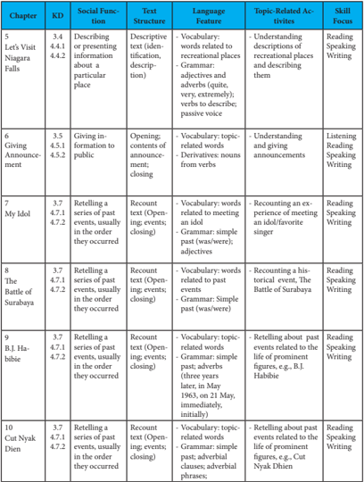

Tabel ini menunjukkan detail tentang berbagai bab atau chapter dalam sebuah buku pelajaran, yang mencakup keterampilan sosial-fungsional (KD), sub-keterampilan, struktur teks, fitur bahasa, aktivitas topik, dan fokus keterampilan. Topik utama adalah berbagai situasi sosial seperti menjelaskan informasi tentang tempat, memberikan informasi kepada publik, memaparkan pengalaman dengan idola, menggambarkan peristiwa sejarah, dan mengekspresikan perasaan. Kolom-kolom yang ada meliputi KD, Sub-KD, Struktur Teks, Fitur Bahasa, Aktivitas Topik, dan Fokus Keterampilan. Data penting yang terlihat adalah bahwa setiap chapter memiliki berbagai sub-keterampilan yang berkaitan dengan berbagai situasi sosial, yang mencakup berbagai jenis tugas seperti membaca, mendengarkan, menulis, dan berbicara.

 

---
## 📄 Halaman 8

---
**📊 Tabel**

Tabel ini menunjukkan struktur dan karakteristik cerita yang digunakan dalam beberapa bab dari buku pelajaran. Topik utama adalah bagaimana penggunaan bahasa dan struktur teks untuk menciptakan cerita yang menarik dan mendidik tentang nilai-nilai moral dan budaya. Kolom-kolom yang ada meliputi Chapter (bab), KD (Karakteristik Dalam), Social Function (Fungsi Sosial), Text Structure (Struktur Teks), Language Feature (Fitur Bahasa), Topic-Related Activities (Aktivitas Terkait Topik), dan Skill Focus (Fokus Keterampilan). Data penting yang terlihat adalah bahwa banyak bab menggunakan cerita naratif dengan struktur yang berbeda-beda, seperti orientasi, komplikasi, dan resolusi. Fitur bahasa yang sering digunakan termasuk kata kerja, kata kunci, dan adverb. Aktivitas terkait topik yang dilakukan meliputi berbicara tentang folktale, membaca, menulis, dan bermain musik. Fokus keterampilan yang ditekankan antara lain mendengarkan, membaca, berbicara, menulis, dan bermain musik.

 

---
## 📄 Halaman 9

### Chapter 1

### Talking about Self

---
**🖼️ Gambar/Diagram**

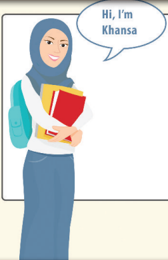

> **Deskripsi Visual:** Gambar ini adalah ilustrasi yang menampilkan seorang siswa bernama Khansa. Siswa tersebut sedang tersenyum dan memegang beberapa buku pelajaran. Di atas kepala siswa ada sebuah kotak berwarna biru dengan tulisan "Hi, I'm Khansa". Ilustrasi ini mungkin digunakan untuk menggambarkan karakter atau profil seorang siswa dalam konteks pembelajaran.

Source: Dokumen Kemdikbud

Picture 1.1

### Tujuan Pembelajaran:

Setelah mempelajari Bab 1, siswa diharapkan mampu:

- Mengidentifikasi  makna,  tujuan  komunikasi,  struktur  teks,  dan unsur bahasa yang terdapat dalam teks interaksi transaksional lisan dan tulis yang terkait dengan jati diri, dan hubungan keluarga sesuai dengan konteks penggunaan.
- Meminta  dan  memberi  informasi  tentang  jati  diri  dan  hubungan keluarga  dengan  menggunakan  struktur  teks  yang  tepat  sesuai konteks penggunaan.
- Meminta  dan  memberi  informasi  tentang  jati  diri  dan  hubungan keluarga dengan menggunakan unsur bahasa  (pronoun, subjective, objective, possessive) yang tepat sesuai konteks penggunaan .
Talking about self

 

---
## 📄 Halaman 10

### WARMER: CHINESE WHISPER

Your  teacher  will  ask  you  to  make  groups  of  4 students  and  show  you  how  to  play  Chinese  Whisper. Listen to your teacher's explanation and do the activity as quickly as possible. Try to be the winner.

---
**🖼️ Gambar/Diagram**

> **Deskripsi Visual:** Gambar ini adalah ilustrasi yang menunjukkan empat orang yang sedang berbicara. Setiap orang memiliki posisi yang berbeda, dengan satu orang berdiri di sebelah kiri, dua orang berdiri di tengah, dan satu orang berdiri di sebelah kanan. Semua orang tampak sedang berbicara, dengan tangan mereka bergerak untuk menekankan apa yang mereka katakan. Gambar ini mungkin digunakan untuk menggambarkan konsep komunikasi atau interaksi sosial. Teks, angka, atau label penting tidak ada pada gambar ini. Informasi kunci yang dapat diambil pembaca adalah bahwa ada empat orang yang sedang berbicara dan posisinya berbeda-beda.

Picture 1.2

Discuss with your classmates what characters your group needs in order to do the activity successfully and to become the winner.

### VOCABULARY BUILDER

Match  the  words  with  their  Indonesian  equivalents. Compare your work with your classmate's. The first one has been done for you.

(verb)

(noun)

pen pal (noun) sound (verb) run (transitive verb) (be) into (preposition) attend (school, college) distant (adjective) commuter train (noun) magnificent (adjective) mother tongue (noun) half sister/brother kereta komuter sangat menyukai jauh nampaknya sahabat pena bahasa pertama bersekolah/kuliah luar biasa mengelola

saudara tiri

 

---
## 📄 Halaman 11

### PRONUNCIATION PRACTICE

### Listen to your teacher reading aloud these words. Repeat after him/her.

pen pal :

/ pen pæl /

sound :

/ saʊnd /

run :

/ rʌn /

(be) into :

/ ɪntu /

attend :

/ ətend /

distant :

/ dɪstənt /

commuter train :

/ kəmjutə treɪn /

magnificent :

/ mæɡnɪfɪs ə nt /

mother tongue :

/ mʌðər tʌŋ /

half sister/brother :

/ hɑf sistər / braðər /

### READING

### Task 1: Jigsaw

Read the text carefully. Your teacher will identify you as A or B.	Students	identified	as	A,	read	Text	1;	students	identified as	B,	read	Text	2.

---
**🖼️ Gambar/Diagram**

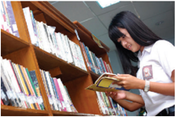

> **Deskripsi Visual:** Gambar ini adalah foto yang menunjukkan seorang siswi sedang membaca buku di perpustakaan. Dalam foto tersebut, siswi tersebut sedang berdiri di depan rak buku yang penuh dengan berbagai judul buku. Rak buku tersebut tampak rapi dan terbuat dari kayu, dengan laci-laci yang terpisah-pisah untuk memudahkan akses. Siswa tersebut sedang memegang sebuah buku dengan tangan kanannya, sementara tangan kirinya tampak kosong. Di sekitar siswi, terlihat beberapa buku lain yang terletak di atas rak, menunjukkan bahwa perpustakaan tersebut sangat lengkap dan memiliki koleksi yang besar. Warna-warni buku-buku tampak cerah dan menarik perhatian, menunjukkan bahwa mereka mungkin merupakan buku yang baru atau masih dalam kondisi baik. Siswa tersebut tampak serius dan fokus pada buku yang dibacanya, menunjukkan bahwa ia sedang belajar atau belajar.

 

---
## 📄 Halaman 12

---
**🖼️ Gambar/Diagram**

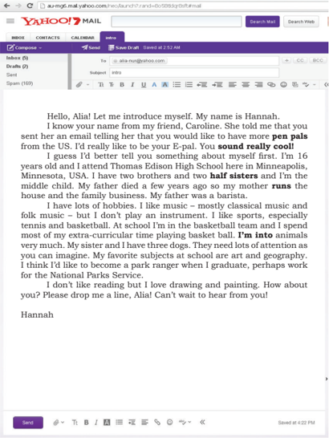

> **Deskripsi Visual:** Gambar ini menunjukkan email yang dikirim oleh Hannah kepada Alia melalui layanan email Yahoo! Mail. Email ini berisi informasi tentang diri Hannah, termasuk umur (16 tahun), tempat tinggal (Thomas Edison High School, Minneapolis, Minnesota), keluarga, hobi, dan minat. Hannah juga mengajak Alia untuk menjadi pen pals (E-pal) dan memberikan beberapa detail tentang dirinya sendiri. Teks email ini mencakup sejumlah informasi penting tentang Hannah, termasuk umur, tempat asal, hobi, dan minat, serta permintaan untuk menjadi pen pals.

 

---
## 📄 Halaman 13

### Text 2:

### A letter from Saidah

Assalamu'alaikum Alia,

It was very interesting to read your letter about yourself and your hometown. I would really like to be your pen friend.

I'm  a  sixteen-year-old  school  student  from  Johor  Bahru  in Malaysia. Actually I attend an Islamic boarding school just outside the city but my family live in Kuala Lumpur. My eldest sister is a  medical  doctor.  My  younger  brother  is  an  elementary  school student.

My  favorite  subjects  are  social  sciences.  I  like  history  very much;	it	helps	me	know	more	how	different	countries	existed	in the past. At school we are supposed to use English at all times, so we	have	become	quite	fluent	although	sometimes	we	slip	back	into Malay, which is our mother tongue.

As for hobbies, I'm really into songs and music. My favorite boy band is One Direction. My favorite Malay singer is, of course, Siti  Nurhaliza.  I  also  like  watching  movies,  especially  comedies. The	actor	I	like	best	is	Tom	Cruise.

I'm really into books. I like reading novels and short stories. I  like  some  writers  in  English,  like  JK  Rowling,  and  Indonesian writers too, like Andrea Hirata and Ahmad Fuadi. My dream, when I'm	older,	is	to	be	a	writer	of	science	fiction	books.

I'd really love to come to Indonesia some day, especially to the magnificent	Raja	Ampat	in	Papua.	What	about	you,	do	you	want	to visit my country?

Wassalam.

Cheers, Saidah

 

---
## 📄 Halaman 14

### Task 2:

After reading the text, in the chart below, identify the main idea of each paragraphs, and then write the most important details in	your	own	words.	Students	identified	as	A,	refer	to	Text	1; students	identified	as	B,	refer	to	Text	2.

---
**📊 Tabel**

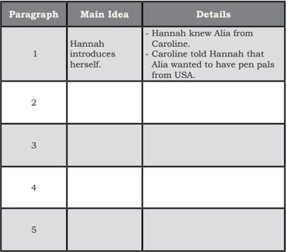

Tabel ini menunjukkan informasi tentang pengenalan seseorang bernama Hannah kepada penulisnya. Kolom "Paragraph" mengandung paragraf yang berbeda-beda, sedangkan kolom "Main Idea" dan "Details" masing-masing menyajikan ide utama dan detail dari setiap paragraf tersebut. Topik utama tabel ini adalah pengenalan seseorang bernama Hannah kepada penulisnya. Data penting yang terlihat adalah bahwa Hannah mengetahui Alia dari Caroline, dan Caroline telah memberitahu Hannah bahwa Alia ingin memiliki teman penulisan dari Amerika Serikat.

 

---
## 📄 Halaman 15

---
**📊 Tabel**

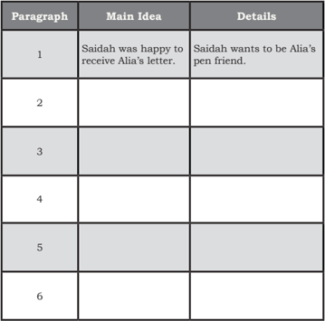

Tabel ini menunjukkan informasi tentang perjalanan percintaan antara Saidah dan Alia. Topik utama tabel adalah hubungan antara dua karakter tersebut. Kolom "Paragraph" menunjukkan urutan paragraf dalam cerita, "Main Idea" menyajikan ide utama dari setiap paragraf, sementara "Details" memberikan detail mendalam tentang ide tersebut. Data penting yang terlihat adalah bahwa Saidah sangat senang menerima surat dari Alia, yang menunjukkan minatnya untuk menjadi teman penulisan.

---
**🖼️ Gambar/Diagram**

> **Deskripsi Visual:** Gambar ini adalah ilustrasi yang menunjukkan seorang pria sedang membaca buku. Pria tersebut memakai kacamata, t-shirt biru, celana pendek, dan sepatu kulit. Belakangnya memiliki tas ransel hitam. Di depannya ada beberapa buku dan kartu kredit. Ilustrasi ini menunjukkan aktivitas belajar atau pengetahuan seseorang.

Source: Dokumen Kemdikbud

Picture 1.4

 

---
## 📄 Halaman 16

### Task 3:

Work	in	pairs.	If	you	have	read	Text	1,	refer	to	Questions	II;	if you	have	read	Text	2,	refer	to	Questions	I.	Read	the	questions for your partner to answer.

### COMPREHENSION QUESTIONS I

### Answer the following questions briefly.

- How does Hannah contact Alia? Is there anybody introducing Hannah to Alia?
- Does Hannah want to be Alia's friend?
- Where	does	Hannah	study?
- Tell	me	about	Hannah's	family!
- What	are	Hannah's	hobbies?
- Does	she	like	animals?	What	animals	does	she	have?
- What	profession	would	she	like	to	have	after	graduating	from her school?
- Have	you	ever	written	an	email	to	a	penpal?	When?

### COMPREHENSION QUESTIONS II

### Answer the following questions briefly.

- Does Saidah want to be Alia's friend?
- Where	is	she	from?
- Where	does	Saidah	study?
- Tell	me	about	Saidah's	family!
- What	are	Saidah's	hobbies?
- Does she have favorite singers? (If yes, who are they?)
- Does	she	like	reading	books?	Which	authors	does	she	like?
- What	profession	would	she	like	to	have	later?
- Is she interested in visiting Indonesia? How does she know indonesia?
- Have	you	ever	written	a	letter	to	get	a	pen	pal?	When?

 

---
## 📄 Halaman 17

### VOCABULARY EXERCISES

Complete the following sentences using the words in the box. Remember to use the correct forms of verbs.

E-pal

sound

half sister

(be) into

mother tongue

attend

slip	back

magnificent

run

- Saidah  has  many  favorite  writers  and  books.  She  frequently saves  her  pocket  money  to  buy  best  seller  books.  She  _____ really _______ reading.
- In the next letter to Caroline,  Alia wrote: 'I like  scuba diving. So if some day you visit Indonesia, I will take you to go scuba diving	in	Bunaken	National	Marine	Park.	The	place	is	amazingly beautiful. Doesn't that  _________ cool?'
- Hannah and her brothers learn how to manage their store every day. Later they want to __________ their own business.
- In her letter, Alia often introduces the beauty of Indonesia to her _______.	In	her	emails,	she	describes	many	magnificent	cultural events and amazing nature that can only be found in Indonesia.
- Alia  in  her  letter  wrote  that  her  ___________  is  Batakese,  but she can also speak other languages, like Madurese, Indonesian, and English.
- Unlike Saidah who ______ _____ books, Hannah are more ______ animals. She has 3 dogs that need a lot of attention.
- Alia,	 Hanna,	 and	 Saidah	 become	 good	 friends.	 	 They	 hope that someday they can ________ a traditional or modern music concert together.
- Hannah  told  Alia  that  she  was  very  happy  when  she  got  a _________, a baby girl from her mother's second marriage.
- Alia has many ________, those with whom she makes friends by writing	them	emails.	They	live	in	other	countries,	so	she	never meets them.
- Alia likes to try to speak in English with her classmates, but just like Saidah, she also sometimes _________ into Indonesian.

 

---
## 📄 Halaman 18

### TEXT STRUCTURE

### THINK-PAIR-SHARE

### Task 1:

Individually,	 complete	 the	 following	 chart	 to	 find	 out	 the structure of the email or the letter on page 4 and 5, depending on which text you have read.

---
**📊 Tabel**

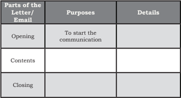

Tabel ini membahas bagian-bagian dari surat atau email, dengan fokus pada tujuan dan detail masing-masing bagian. Topik utama adalah bagian-bagian dari surat atau email, yaitu bagian awal, isi, dan penutup. Bagian awal memiliki tujuan untuk memulai komunikasi, sementara isi berisi informasi utama yang ingin disampaikan. Penutup memiliki tujuan untuk menutup komunikasi dengan efektif dan memberikan kesimpulan atau tindak lanjut jika diperlukan. Data penting yang terlihat adalah bahwa setiap bagian memiliki tujuan spesifik dan harus disusun dengan baik untuk mencapai tujuan akhir komunikasi.

### Task 2:

Work	in	pairs	(Students	A	and	B)	to	discuss	the	text	structure, and then share this with the class. Use the following prompts to help:

Identify the structure of the organisation of the letter.

- What	details	can	you	find	in	the	opening?
- What's	the	purpose	of	telling	the	contents?
- What	details	can	you	find	in	the	contents?
- What's	the	purpose	of	writing	the	closing?
- What	details	can	you	find	in	the	closing?

 

---
## 📄 Halaman 19

### GRAMMAR REVIEW

### Pronouns

In  self  introduction  and  also  in  other  communication  activities, pronouns are frequently used to prevent unimportant repetition. Pronoun is a word that takes the place of a noun, such as: I, you, me, it, they, we, she, him, us.

### Read the following sentences:

Alia wants to have many pen pals because Alia likes making friends. Alia's pen pals come from many parts of the world. Caroline introduces Alia to Hannah. Now, Hannah becomes Alia's pen pals. Hannah likes Alia a lot.

Task 2:

The	word	Alia	is	repeated	too	often	and	that	makes	the	sentences not	interesting.	To	make	the	sentences	better	we	can	replace	Alia with pronouns:pl e te the sentences with be (am, is, are, was, were)

.

Remember to use the correct forms.

Alia wants to have many pen pals because she likes making friends. Her pen  pals  come  from  many  parts  of  the  world. Caroline  introduces her to  Hannah.  Now  Hannah  becomes Alia's pen pals. Hannah likes her a lot.

There	are	several	types	of	pronouns: subjective, objective, possessive adjectives, and possessive pronouns . Read the following table and the following explanation.

---
**📊 Tabel**

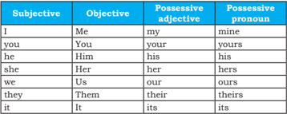

Tabel ini menunjukkan hubungan antara subjektif (I, you, he, she, we, they, it) dengan objektif (me, you, him, her, us, them, it), serta bagaimana mereka berkaitan dengan adjektif posessif (my, your, his, her, our, their, its) dan pronomen posessif (mine, yours, his, hers, ours, theirs, its). Topik utama tabel ini adalah penggunaan adjektif dan pronomen posessif dalam bahasa Inggris. Kolom-kolomnya mencakup subjek, objek, adjektif posessif, dan pronomen posessif. Data penting yang terlihat adalah bahwa subjek dan objek memiliki adjektif posessif yang sama, sementara subjek dan objek juga memiliki pronomen posessif yang sama. Ini menunjukkan bahwa adjektif dan pronomen posessif digunakan untuk menunjukkan kepemilikan atau posisi subjek dalam kalimat.

 

---
## 📄 Halaman 20

### 1. Subjective pronouns are the subjects of a sentence:

Read the following sentences. Pay attention to the underlined words as examples of subjective pronouns.

- I have three dogs.
- You like to have many pen pals.
- He studies in an elementary school.
- She will get married.
- We love Indonesia
- They need attention
- It barks when it is happy.
- Objective pronouns are the objects of a sentence:
Read the following sentences. Pay attention to the underlined words as examples of objective pronouns.

- I know Caroline. She introduced me to you via e-mail.
- My  brother  is  an  elementary  school  student.  Sometimes  I accompany him to go to school.
- My sister is a good student. Her campus gave her scholarship.
- We	love	animals.	Last	week	our	neighbour	gave	us a funny kitten.
- They	run	the	family	business	seriously.	Customers	like	them very much.
- The	fur	of	the	cat	is	soft.	We	like	to	stroke	it.

 

---
## 📄 Halaman 21

- Possessive  adjectives are  words  that  indicate  possession. Possessive adjectives are used with nouns.

---
**🖼️ Gambar/Diagram**

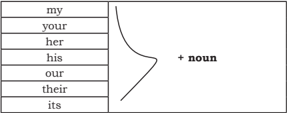

> **Deskripsi Visual:** Gambar ini adalah diagram yang menunjukkan penggunaan beberapa kata kerja subjek dalam bahasa Inggris. Diagram ini terdiri dari baris horizontal yang berisi kata-kata subjek seperti "my", "your", "her", "his", "our", "their", dan "its". Setiap kata subjek tersebut diletakkan di sebelah kiri dan diikuti oleh tanda plus (+) dan kata benda yang akan disesuaikan dengan kata subjek tersebut. Ini menunjukkan bahwa setiap kata subjek memiliki variasi untuk menggambarkan subjek yang berbeda.

---
**📊 Tabel**

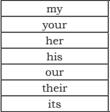

Tabel ini menunjukkan berbagai kata penghubung yang digunakan dalam bahasa Inggris. Topik utamanya adalah penggunaan kata penghubung untuk menunjukkan kepemilikan atau posisi seseorang dalam sebuah kalimat. Kolom pertama adalah "my" (saya), kolom kedua adalah "your" (kamu), kolom ketiga adalah "her" (dia), kolom keempat adalah "his" (dia), kolom kelima adalah "our" (kita), dan kolom keenam adalah "their" (mereka). Data atau pola penting yang terlihat adalah bahwa setiap kolom memiliki kata penghubung yang berbeda yang digunakan untuk menunjukkan kepemilikan atau posisi seseorang dalam kalimat.

Read the following sentences. Pay attention to the underlined words as	 examples	 of	 possessive	 adjectives.	 The	 possessive	 adjectives modify	the	nouns	to	show	possession.	The	words	in	italics	are	the noun.

- I have a pen pal. My pen pal is very kind.
- You have three dogs. Your dogs need a lot of attention.
- He studies in an elementary school. His school is not far.
- She loves reading books. Her books are in that cupboard.
- We	run	the	business	together.	Our business is good.
- They	frequently	come	here.	This	park	is	their favorite place.
- The	kitten	is	funny.	Its tail moves fast when it's happy.
- Possessive  pronouns also  show  possession  but  possessive pronouns are not followed by nouns.
Read the following sentences. Pay attention to the underlined words

mine    yours      his

her ours       their

as examples of possessive pronouns.

- This	is	my	book.	This	book	is	mine.
- These	are	your	dog.	These	dogs	are	yours.
- His school is far from here. His is far.
- Her book is interesting. Hers is interesting.
- Their family business is good. Theirs is good.
- Our plan has many alternatives. Ours has many alternatives.

 

---
## 📄 Halaman 22

### EXERCISES

- Read the emails in the reading section again. Underline all pronouns that you can find.
- Fill in the blanks with the right words.

### A. Subjective Pronouns:

- ____ (Me/I) come to Yogyakarta every month.
- ____ (His/He) spends the weekend playing guitar.
- ____	(They/Them)	told	me	that	they	sent	e-mail	to	each	other every day.
- ____	(we/ours)	plan	to	visit	Thailand	next	year.
- ____	(We/It)	can	climb	Bromo	Mountain	together	on	July.

### B. Objective Pronouns:

- I am going to introduce ____ (she/her) to one of my pen pals in Malaysia.
- Lolita told ____ (we/me) that she wanted to send a birthday gift to her pen pal in Papua.
- My  friends  and  I  have  regular  meetings  with  pen  pal  seeker group. You can join ____ (it/its) anytime.
- He told me that he had many e-pals but he is no longer keep in touch with ____ (theirs/them)
- It is obvious that Marina desperately wants to visit Malang very soon. She talked about ____ (them/it) frequently these days.

### C. Possessive Adjectives:

- I am going to wash _______ hand. (my/me)
- Do you like _____ pen pals? (you/your)
- ______ hobby is reading the biography of famous people.  (He / His).
- She is sixteen and ______ school is in Minneapolis (her/she)
- They	run	their	family	business	themselves	because	_____	father died last year. (they/their)

 

---
## 📄 Halaman 23

### D. Possessive Pronouns:

- He is very diligent and loves reading. He  always brings book in ____(he/his) bag.
- ____ (Mine/My) little brother studies in a state vocational school in my region.
- Alice told her pen pal that she admired JK. Rowling and collected ____(her/his) novels.
- My pen pals have the same interest with me, which is about writing.	We	sometimes	send	____	(their/our)	piece	of	writings and I often give comments on____ (it/theirs).
- He told me about his family and I told ____(my/mine) too.

### E. Mixed (Pronouns and Possesive Adjectives):

- Sofia	told	___(I/me)	that	you	would	like	to	have	more	pen	pals from Netherlands.
- I have several pen pals from UK. I write to ____ (they/them) via email every week.
- Alia  often  tells  Hannah  about  her  rehearsal.    ____  (She/Her) joins a choir club in her school.
- As for hobbies, we are really into sport and music. So, we can share  ____  (my/our)  experience  about  football  players  and songs.
- My friends and I often spend long holiday in our hometowns. ____(They/We)	keep	in	touch	via	e-mail	and	WhatsApp.
- The	 cat	 licks	 ______	 (its/it)	 fur	 many	 times,	 and	 it	 seems	 to enjoy doing _____  (its, it).
- Hannah	said,	'This	is	my	favorite	book	and	I	want	to	give	it	to _____ (yours/you). Now it's _____(yours/you).'
- Alia  was  sobbing  when  ______  (she/her)  read  this  line  in  the novel	_____	(she/her)	got	from	Saidah:	They	know	the	land	is	not _____	 (they/theirs)	 anymore.	 The	 landlord	 told	 _______	 (they/ them)	to	leave	the	land.	The	two	brothers	said	to	themselves,' We	will	work	very	hard	to	collect	money.	Someday	______	(we/ us) will return to buy his land, and it (its/it) will become _______ (our/ours) forever.'
- The	teacher	tells	________	(we/us)	to	make	friends	with	students

 

---
## 📄 Halaman 24

- from  English  speaking  countries  so  that  ______  (we/us)  can improve our English.
- Alia's  brother  wanted  to  have  pen  pals  too.  Alia  introduced ______ (he/him/his) to Hannah's and Saidah's brothers. Now, they have become good friends. Sometimes Alia writes about _______ (theirs/them) in _______ (hers/her) letter to Hannah and Saidah.

### SPEAKING

### Task 1: Guessing Games - Who Am I?

You'll    play  a  kind  of  guessing  game 'Who Am I?'. Your teacher will put a post-it paper with one of the words below on your back. You need to work in pairs and guess what the word on your back is by asking questions. Your partner may only answer your  questions  with  either  'yes'  or  'no'.  Observe  the  following examples of the questions.

### Questions	to	ask:

- -Does it relate to a family relationship?
- -Am I female?
- Does it relate to a profession?
- Do I work in a hospital?
- -Am I a mother?
- Am I a medical doctor?

### Words	to	be	written	on	post-it:

brother,  sister,  father,  mother,  teacher,  medical  doctor, barista, engineer, footballer, author, computer programmer, police	 officer,	 musician,	 painting,	 reading,	 singing,	 hiking, going shopping, outdoor guide

- -Does it relate to a hobby?
- -Am I an outdoor activity?
- -Am I related to music? etc.

 

---
## 📄 Halaman 25

### Task 2: Introduction Game - Party Time

### A. Look at the picture.

- What	do	you	think	they	are	doing?
- Where	does	it	take	place?
- Why	do	you	think	so?
Check your answer with your friends.

Picture 1.5

The	 following	 is	 an	 example	 of	 a	 conversation	 between	 Edo and	Slamet	who	meet	for	the	first	time	in	a	party	like	in	picture 1.5.	 They	 introduce	 themselves	 to	 each	 other	 to	 know	 their acquaintance	better.	Read	the	dialog	silently	first.	 Pay	 attention to how to introduce self. Discuss the expressions used with your classmate	sitting	next	to	you.	Then	act	out	pretending	to	be		Edo and Slamet who introduce themselves to each other.

---
**🖼️ Gambar/Diagram**

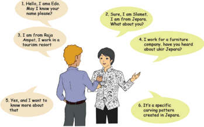

> **Deskripsi Visual:** Gambar ini adalah ilustrasi yang menunjukkan dialog antara dua orang, Edo dan Slamet, tentang kerajinan Jepara. Gambar ini terdiri dari beberapa kartun yang menggambarkan perbincangan mereka. Edo, yang tampak seperti seorang peneliti atau produsen, bertanya kepada Slamet tentang kerajinan Jepara. Slamet menjawab bahwa dia bekerja di sebuah perusahaan furnitur dan memiliki pengalaman dengan ukir Jepara. Edo kemudian menanyakan apakah Slamet tahu tentang ukiran Jepara, dan Slamet menjawab bahwa itu adalah pola khusus yang dibuat di Jepara. Dalam konteks ini, gambar ini menunjukkan hubungan antara kerajinan Jepara dan industri furnitur, serta bagaimana kerajinan tersebut dapat menjadi produk yang berharga.

Source: Dokumen Kemdikbud

Picture 1.5

- Imagine that you and your classmates are all invited to a party and become the guests there.  Think about and use new identities. For  instance,  you  can  pretend  to  become

 

---
## 📄 Halaman 26

your favorite football player, singer, or scientist, etc. The new identities make you unfamiliar with each other because that  is  the  first  time  you  meet.    Talk  to  each  other  and introduce yourself: tell about your family, your profession, and your hobbies.  You can use the following questions:

May I know your name please? Can you tell me what your profession is? Or, What	do	you	do? What're	your	hobbies? Do you like painting? Do you like music?

- Think  of  other  questions.  You  may  also  introduce  your friends    who  also  use  new  identities  to  other  guests. Introduce yourself or your friends to at least two people.

### WRITING

### Responding to an email/a letter

Imagine	that	you're	Alia.	Write	an	email	or	a	letter responding to the email or letter you've read and discussed. Use the following questions to guide you.

- What	do	you	write	to	start	your	response	to	an	email/a letter?
- What	details	do	you	write	in	your	email/letter?	(How	old are	you?	Where	do	you	attend	senior	high	school?	What are your hobbies? How many siblings do you have? Etc.)
- What	do	you	write	to	end	your	letter/email?
- Before  you  send  your  email/letter,  read  through  your email/letter	 to	 find	 any	 content,	 grammar,	 vocabulary, grammar, spelling, or punctuation errors and correct them if any.

 

---
## 📄 Halaman 27

### REFLECTION

At  the  end  of  this  chapter,  ask  yourself  the  following questions to identify how effective your learning process is.

- Can you write a letter?
- Do you know how to describe yourself? or an email?
- Can you write or talk about yourself?
If your answer is 'no' to one of the questions, see your teacher and discuss with him/her to help you understand and to write or talk about yourself better.

________________________________________________________________

________________________________________________________________

________________________________________________________________

________________________________________________________________

________________________________________________________________

________________________________________________________________

________________________________________________________________

________________________________________________________________

________________________________________________________________

________________________________________________________________

________________________________________________________________

________________________________________________________________

________________________________________________________________

________________________________________________________________

________________________________________________________________

________________________________________________________________

________________________________________________________________

________________________________________________________________

________________________________________________________________

________________________________________________________________

Accept responsibility for your life. Know that it is you who will get you where you want to go, no one else. '

Les Brown

 

---
## 📄 Halaman 28

### Chapter 2

### Congratulating and Complimenting Others

---
**🖼️ Gambar/Diagram**

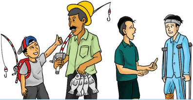

> **Deskripsi Visual:** Gambar ini adalah ilustrasi yang menunjukkan tiga orang berbicara di sekitar seorang penangkap ikan. Penangkap ikan sedang memegang seutas pancing dengan ikatannya yang terlihat jelas. Di sebelah kiri, ada dua orang yang sedang berbicara, salah satunya mengenakan topi dan tas berwarna merah. Orang di tengah berbicara kepada penangkap ikan, sementara orang di kanan tampak sedang mendengarkan. Semua orang tampak tertarik pada percakapan tersebut. Gambar ini menunjukkan hubungan sosial dan komunikasi antara individu dalam situasi yang sering terjadi saat berburu ikan.

### Tujuan Pembelajaran:

Setelah mempelajari Bab 2, siswa diharapkan mampu:

- Mengidentifikasi  fungsi  sosial,  struktur  teks,  dan  unsur  kebahasaan pada  ungkapan  memberi  ucapan  selamat  dan  pujian  bersayap  serta responnya.
- Merespon ucapan selamat dan pujian bersayap dengan menggunakan struktur  teks  dan  unsur  bahasa  yang  tepat  sesuai  dengan  tujuan  dan konteks penggunaan.
- Memberikan ucapan selamat dan pujian bersayap dengan menggunakan struktur  teks  dan  unsur  bahasa  yang  tepat  sesuai  dengan  tujuan  dan konteks penggunaan.

 

---
## 📄 Halaman 29

### Describing and Guessing

Do this game in groups. Your teacher will tell you how to play this guessing game. You have to guess what words that your teacher has described.

### For example:

'A person who serves passengers in a flight.' He/She is a 'flight attendant.'

After you know how to play the game, your teacher will ask you to make groups of three to play the game. The group who can guess more words will be the winner.

### VOCABULARY BUILDER

Write down the English words for the following Indonesian words. Compare your work to your classmate's.

ce _ _ _ _ _ _ _  (

verb

)

= merayakan

_ _ _ _ _ve_ _ _ _ (

noun

)

= prestasi / pencapaian

_ _ _ _t (

noun

)

= rok

_ _ _ u_ _  (

noun

)

= blus, kemeja wanita

_er _ _ _ _ _ (

adjective

)

= [informal] sangat bagus

_ _ nt_ _ _ (

noun

)

= isi

en _ _ _ _ _ _ _ _ _ nt (

noun

)

= penyemangat

_ pp _ _ _ _ _ _ _ (

noun

)

= penampakan, penampilan

app _ _ _ _ _ _ _ _ _ (

noun

)

= penghargaan

_ _ _ _ _ _us (

adjective

)

= [informal] indah, atraktif

 

---
## 📄 Halaman 30

### PRONUNCIATION PRACTICE

Listen to your teacher reading these words. Repeat after him/her.

skirt

:  /sk ɜː rt /

celebrate

: /

ˈseləbreɪt /

achievement

: / əˈtʃiːvmənt /

blouse

: / blaʊs /

terrific

: / təˈrɪfɪk /

content

: / ˈkɑːntent /

encouragement

: / ɪnˈkʌrɪdʒmənt /

appearance

: / əˈpɪərəns /

appreciation

: / əpriʃieɪʃ ə n /

gorgeous

: / ˈɡɔːdʒəs /

The biggest risk is not taking any risk. In a world that's changing really quickly the only strategy that is guaranteed to fail is not taking risks. ' '

Mark Zuckerberg

 

---
## 📄 Halaman 31

### Task 1:

Read text 1 carefully. Pay attention to the expressions used to congratulate people (in this case, Alif). Pay attention also to the responses.

### Text 1

After a long struggle and hard work, Alif is finally appointed as the director of a national company where he works. Many of his friends who work at the same company congratulate him.

Samuel

: Alif, congratulations. You deserved it, Man.

Alif : Thank you very much. This is because you always help me.

Sinta : I am very happy for you, Alif. Now, that you are the director of the company, I believe the company will develop even faster.

Alif : ( replies with a happy tone ) Thank you. I cannot forget your collaboration with me, and I will still need your help.

Other friends shake his hands and congratulate him too.

Deni

: That's wonderful, Alif.

Alif

: Oh, thanks.

Santi  : Good for you. Good luck.

Alif

: Thank you very much.

Bejo

: Well done.

Alif

: Thank you for saying so.

Ivan

:  That  was  great.  You  must  be  very  proud  of  your  achievement.

Alif

: Thanks. I'm glad you think so. But I still have to learn a lot.

His staff also congratulate him.

Eny

: Please accept my warmest congratulations, Sir.

Alif

: It's very kind of you to say so. Thank you.

### READING

 

---
## 📄 Halaman 32

Bintari

: I must congratulate you on your success.

Alif

: Thank you very much for saying so.

They all celebrate Alif's success by having lunch together in a simple food stall next to their office. Every body is happy.

### Task 2:

Answer the following questions.

- Why do all of those people congratulate Alif?
- What expressions do they use to congratulate Alif?
- How does Alif respond to their congratulating expressions?
- What is the social purpose of congratulating people?
- When do we congratulate people?
- What  are  the  expressions  commonly  used  to  congratulate people?

### Task 3:

Read the dialog silently. Pay attention to the expression used to congratulate  people.  Discuss  the  meaning  with  your  classmate. After that read aloud the dialog in pairs. One of you become Cita, the other becomes Ditto. Then, discuss the answer to the questions.

### Text 2

Cita has won the first winner of the story telling competition in her school. Her best friend congratulated her.

Ditto :  Cita, congratulations for being the first winner of the school story telling competition! Excellent. You really did it well.

Cita

:  Thanks, Ditto.

Ditto :  I heard that you will be the representative of our school in the story telling competition of our regency. Is it true?

Cita

:  Yes, you're right.

Ditto

:  I hope you will win as well in the next competition.

Cita

:  I hope so. But I'm nervous.

Ditto

:  Don't worry, you're a very good story teller. Good luck.

Cita

:  Thanks. I'll do my best. Wish me luck.

 

---
## 📄 Halaman 33

### Task 4

### Answer the following questions:

- What good news about Dita does Ditto know?
- What does Ditto say to Dita related to the news?
- What do the expressions mean?
- What is Ditto's purpose of saying that to Dita?
- How does Dita respond to what Ditto says?
- When do you think you will say 'congratulations' to other people?

### Task 5:

Complete the following table with the expressions of congratulations and the responses you find in the preceding dialogs. The first row is done for you.

---
**📊 Tabel**

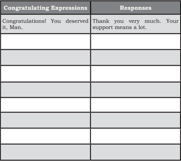

Tabel ini berisi dua kolom: "Congratulations Expressions" (Pesan Ucapan Selamat) dan "Responses" (Jawaban). Topik utama tabel ini adalah cara-cara untuk memberikan ucapan selamat kepada seseorang. Kolom "Congratulations Expressions" mencakup beberapa contoh ucapan selamat seperti "Congratulations! You deserved it, Man." Sedangkan kolom "Responses" menunjukkan beberapa respons yang mungkin diberikan oleh penerima ucapan selamat tersebut, seperti "Thank you very much. Your support means a lot." Pola penting yang terlihat adalah bahwa setiap ucapan selamat diikuti oleh respons yang sesuai, menunjukkan hubungan antara kedua kolom tersebut.

 

---
## 📄 Halaman 34

In  congratulating,  people  may  make  more  than  one  move, for  example, 'Congratulations! You deserved it, Man.' Similarly, in  responding  to  congratulating  expressions,  people  do  not  only make one move, like 'Thank you very much.' Usually they also say something else such as 'This is because you're always with me'.

### Task 1:

Complete the blanks in the following dialogs using the words in the box. As an example see number 1. The answer for number 1 is wonderful .

good luck it's good wonderful congratulations new hair cut

---
**🖼️ Gambar/Diagram**

> **Deskripsi Visual:** Gambar ini adalah ilustrasi yang menunjukkan sebuah acara wisuda di mana banyak mahasiswa berdiri di depan gedung sekolah. Mahasiswa tersebut sedang mengambil tes atau ujian akhir tahun. Di atas mereka, beberapa buah topi wisuda sedang jatuh ke tanah. Gambar ini menunjukkan proses akhir dari pendidikan formal, di mana mahasiswa harus menghadapi tes akhir sebelum lulus. Ini juga menunjukkan bahwa setelah lulus, mereka akan mendapatkan topi wisuda sebagai simbol keberhasilan dan pencapaian.

what's new thanks a lot popular business I'm glad you think so mentioning

1. Dina : Hi, Yuni. What's your daughter doing these days?

Yuni : Oh, she's in college. In fact, she plans to graduate this June.

Dina : That's________________! (1) You must be very proud of her.

### VOCABULARY EXERCISES

 

---
## 📄 Halaman 35

---
**🖼️ Gambar/Diagram**

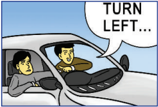

> **Deskripsi Visual:** Gambar ini adalah ilustrasi yang menunjukkan seorang pengemudi mobil sedang mengemudi. Pengemudi tersebut sedang berada di dalam mobil dengan kursi yang ditekuk ke depan. Mobil tersebut tampaknya sedang bergerak karena posisi kursi yang ditekuk. Di bagian atas mobil, terdapat teks "TURN LEFT..." yang menunjukkan arah yang harus diambil oleh pengemudi.

Elemen utama dalam gambar ini adalah pengemudi mobil dan mobilnya. Relasi antara kedua elemen ini adalah bahwa pengemudi mobil sedang mengemudi dan harus memutar ke kiri berdasarkan teks yang ada di atas mobil.

Teks "TURN LEFT..." adalah elemen penting dalam gambar ini karena ia memberikan informasi tentang arah yang harus diambil oleh pengemudi. Angka atau label lainnya tidak terlihat dalam gambar ini.

Informasi kunci yang dapat diambil pembaca dari gambar ini adalah bahwa pengemudi harus memutar ke kiri saat mengemudi mobil. Ini merupakan informasi penting untuk menghindari kemacetan atau kecelakaan.

---
**🖼️ Gambar/Diagram**

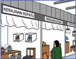

> **Deskripsi Visual:** Gambar ini adalah ilustrasi yang menunjukkan sebuah toko sepatu. Berikut adalah deskripsi lengkapnya:

1. Apa yang ditampilkan secara keseluruhan:
   Gambar ini menampilkan toko sepatu yang terletak di bawah bangunan dengan atap berwarna hijau. Toko ini memiliki tiga gerai yang terpisah-pisah.

2. Elemen-elemen utama dan relasinya:
   - Atap toko berwarna hijau
   - Gerai sepatu di sebelah kiri
   - Gerai pakaian di tengah
   - Gerai tas di sebelah kanan
   - Orang tua dan anak sedang berjalan menuju gerai sepatu

3. Teks, angka, atau label penting yang terlihat:
   - Nama toko "KERAIJAN SEPATU" tertera di atas atap
   - Nama toko "KERAIJAN" juga tertera di atas atap

4. Informasi kunci yang dapat diambil pembaca:
   Gambar ini menunjukkan aktivitas sehari-hari di kota, dengan orang-orang sedang berjalan-jalan dan mencari barang di toko-toko. Ini menunjukkan kehidupan sehari-hari di kota dan keberadaan toko-sepatu sebagai tempat umum bagi masyarakat untuk membeli sepatu mereka.

Picture 2.4

---
**🖼️ Gambar/Diagram**

> **Deskripsi Visual:** Gambar ini adalah ilustrasi yang menunjukkan pernikahan. Gambar ini menggambarkan dua orang yang sedang berjalan tangan dalam tangan, tampaknya sedang berjalan menuju tempat pernikahan. Pria dan wanita tersebut sedang memegang bunga merah muda, yang biasanya digunakan dalam pernikahan sebagai simbol kebahagiaan dan kebersamaan. Pria tersebut memiliki rambut pendek dan pakaian formal, sementara wanita tersebut memiliki rambut panjang dan pakaian pengantin tradisional. Ilustrasi ini menunjukkan hubungan antara pasangan yang baru saja menikah, serta menunjukkan elemen-elemen penting seperti pernikahan, kebahagiaan, dan kebersamaan.

---
**🖼️ Gambar/Diagram**

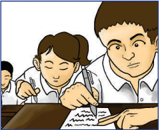

> **Deskripsi Visual:** Gambar ini adalah ilustrasi yang menunjukkan tiga orang siswa sedang belajar di kelas. Siswa di tengah berada di kursi depan, sedangkan dua siswi lainnya berada di kursi belakang. Semua siswa sedang menulis di buku tulisannya. Di sebelah kanan, ada seorang guru yang sedang memberikan bimbingan kepada salah satu siswi di kursi depan. Guru tersebut tampaknya sedang memandu siswi tersebut untuk menulis dengan benar. Gambar ini menunjukkan hubungan antara siswa dan guru dalam proses belajar mengajar.

2. Fuad

:Hi Abdel.

_________________? (2)

Abdel : Oh, I'm going to take the driving test tomorrow.

Fuad

: That's great, Abdel

_________________! (3)

3. Tuti : How is your business, Ria?

Ria :  ________ (4) I've sold 100 items these two days.

Tuti

: Congratulations! That's  a

___________________ (5) right now.

Ria

:___________________(6).

4. Rudi : You look gorgeous in this wedding dress! __________________ (7).

Ian : Thank you very much, ______________

(8) so.

5. Ihsan : You look so cute in the________________ (9)

Ali : Oh, thanks for ________________ (10)

that. By the way, congratulations for the 1st prize.

Great job, Man!

Ihsan

: Thanks.

 

---
## 📄 Halaman 36

### Task 2:

### Complete the following conversations with your own words.

### Conversation 1

Rani

: Hi, Anisa.

Anisa        : Hi, you look great in that pink head scarf. What a nice

scarf!

Rani

: _________________ (1) to say that.

Anisa

: I've never seen you in that hat. Where did you buy it?

Rani

: My mom bought it for me when she went to the market.

Anisa

: I see.

Rani

: Look. The teacher is coming!

Anisa      : Pak Sultoni.

Mr. Sultoni  : Hi, how are you?

Rani

: We're good. Thanks.

Anisa

: Excellent.

Rani

: _________________ (2) hair cut, Pak Sultoni.

Anisa

: Yes, you're looking good with your hair style.

Mr. Sultoni  : Thanks a lot. Rani, I heard you won the Math

Olympiad. Is it true?

Rani

:  Yes, I won the second prize last week.

Anisa

:  ________________ (3)

Mr. Sultoni  :  ____________ (4) to hear that.

Rani

:  Thank you very much for saying so.

### Conversation 2

Rudi

: Hi Ben. How are you?

Ben

: Hi, you look great in that black jacket.

Rudi

: _______________________ (1) saying so.

Ben

: I've never seen you in that outfit. Is it new?

Rudi

: My sister bought it for me when she went to Singapore.

Ben

: Oh, I see.

Rudi

: Look. What a nice new hair style! Where did you have a haircut? I like it a lot.

Ben

: _____________________ (2) think so. My brother did it.

I can ask him to do yours if you want to.

Rudi

: Yes, please. Look! Andi is coming.

Ben

: Hi Andi, I heard you won the Speech Contest last month. Congratulations! _________________ (3)

Rudi

: Fantastic! It's a great job, bro!

Andi

: Oh, thanks. It's ____________________ (4) actually.

 

---
## 📄 Halaman 37

Please note that at the end of the word 'congratulation' there must be an 's' attached to it. So, never say 'congratulation' without an 's'. You must say, 'Congratulations.'

### SPEAKING

### Let's play rock, paper, and scissors.

Work  in  pairs.  Play  scissors,  rock,  and  paper.  The winner chooses for himself/herself a situation. The partner makes an expression of congratulations. For example, the winner chooses situation 5. He/She says, 'I just bought a new bag.' The partner says, 'Congratulations. Your new bag is  gorgeous.'  Then  develop,  a  conversation  based  on  that. After that, start all over again by doing the scissors, rock, and paper again, and so forth. Continue doing that with all the situations provided in the table below.

---
**📊 Tabel**

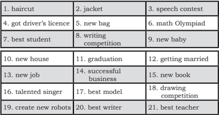

Tabel ini berisi daftar aktivitas atau peristiwa yang mungkin terjadi dalam kehidupan sehari-hari seseorang. Topik utamanya adalah perubahan atau peningkatan dalam kehidupan seseorang, seperti perubahan gaya rambut, penambahannya, atau peningkatan kualitas hidup. Kolom pertama menunjukkan aktivitas atau peristiwa tersebut, sedangkan kolom kedua menunjukkan kata kunci atau deskripsi singkat dari aktivitas tersebut. Data penting yang terlihat adalah bahwa banyak aktivitas di tabel ini berkaitan dengan peningkatan atau perubahan positif dalam kehidupan seseorang, seperti memiliki bagian baru, mendapatkan sertifikat atau penghargaan, atau menjadi lebih sukses dalam pekerjaan atau hobi.

### WRITING

Write down the inside parts of the congratulation cards based on the cover. Two cards have been done for you as examples. Write at least two sentences.

 

---
## 📄 Halaman 38

1

Tomy  has  just  been  promoted  to  be  the  branch  manager  of  Jepara  Ukir  Company  in London.

---
**🖼️ Gambar/Diagram**

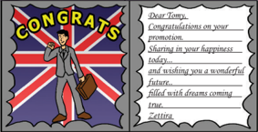

> **Deskripsi Visual:** Gambar ini adalah ilustrasi yang menampilkan sebuah surat penghargaan kepada seseorang dengan judul "Congrats". Surat tersebut berisi ucapan selamat atas promosi dan berisi teks yang menyampaikan rasa senang dan harapan untuk masa depan yang cerah. Gambar utama pada ilustrasi adalah seorang pria yang sedang berjalan dengan membawa tas, tampaknya merayakan keberhasilannya. Latar belakang ilustrasi terdiri dari warna-warna cerah dan elemen-elemen seperti bendera Inggris dan gambar pria yang menggambarkan keberhasilan. Teks pada gambar mencakup ucapan selamat, penghargaan, dan harapan untuk masa depan yang cerah.

Source: Dokumen Kemdikbud Picture 2.7

- Your sister has graduated from a culinary arts program in Padang, West Sumatra. She wants to be the best chef and plans to open her own restaurant. 2
- Santi has got a sugar glider from her parents. Her parents are happy because she has been brave enough to donate her blood to PMI (the Indonesia Red Cross). 3

---
**🖼️ Gambar/Diagram**

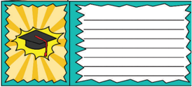

> **Deskripsi Visual:** Gambar ini adalah ilustrasi yang menunjukkan topi wisuda berwarna kuning dengan bintang putih di atasnya. Topi wisuda tersebut tampak seperti sebuah bunga yang membentuk lingkaran di sekitar bintang. Ilustrasi ini tampak seperti sebuah kartu ucapan atau label untuk menghormati pencapaian akademis. Di bagian bawah ilustrasi, terdapat ruang kosong untuk menuliskan pesan atau kata-kata penghargaan. Ini mungkin digunakan sebagai alat edukatif atau motivasi dalam konteks pembelajaran atau acara wisuda.

Source: Dokumen Kemdikbud Picture 2.8

---
**🖼️ Gambar/Diagram**

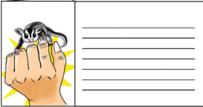

> **Deskripsi Visual:** Gambar ini adalah ilustrasi yang menunjukkan seorang anak sedang memegang sebuah tikus kecil dengan tangan. Ilustrasi ini menggambarkan situasi interaksi manusia dengan hewan liar, yang seringkali dianggap sebagai peristiwa yang menakutkan atau aneh oleh banyak orang. Anak tersebut tampak tenang dan berhati-hati dalam memegang tikus, menunjukkan bahwa ia mungkin sudah familiar dengan hewan ini atau telah diajarkan cara bertindak dengan baik terhadap hewan liar. Ilustrasi ini mungkin digunakan untuk membantu pembaca memahami hubungan antara manusia dan hewan liar, serta bagaimana pentingnya menjaga keseimbangan lingkungan dan menghormati kehidupan alam.

Picture 2.9

 

---
## 📄 Halaman 39

- Your uncle and aunt have moved to their new house. The house has a large garden so that they can enjoy gardening on the weekends. 4
- Your next door neighbor, who has been married for 10 years, has got a cute baby girl. 5
- Your aunt has got married to a man she loves. They met when they were involved in a medical mission in the Middle East. 6

---
**🖼️ Gambar/Diagram**

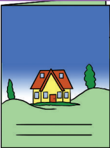

> **Deskripsi Visual:** Gambar ini adalah ilustrasi yang menampilkan sebuah rumah berwarna kuning dengan atap merah dan dua pohon hijau di depannya. Rumah tersebut dikelilingi oleh tanah berbukit dan berada di tepi sebuah sungai yang tampak jernih. Langit cerah dengan sedikit awan menyiratkan suasana yang tenang dan damai.

Elemen utama dalam gambar ini adalah rumah, tanah berbukit, sungai, dan langit. Rumah merupakan pusat perhatian dan menjadi simbol kehidupan manusia. Tanah berbukit menunjukkan bahwa rumah tersebut berada di daerah pegunungan atau dataran tinggi. Sungai yang tampak jernih menggambarkan lingkungan alam yang sehat dan bersih. Langit cerah menambah nuansa positif dan harmonis pada gambar ini.

Teks, angka, atau label penting tidak ada dalam gambar ini. Namun, informasi kunci yang dapat diambil pembaca melalui gambar ini adalah tentang keindahan alam, keharmonisan antara manusia dan alam, serta konsep kehidupan yang damai dan sehat. Gambar ini mungkin digunakan untuk membantu pembelajaran tentang lingkungan, kehidupan sehari-hari, atau konsep keseimbangan antara manusia dan alam.

Source: Dokumen Kemdikbud

Picture 2.10

---
**🖼️ Gambar/Diagram**

> **Deskripsi Visual:** Gambar ini adalah ilustrasi yang menampilkan bayi yang tertutup dengan kain biru, duduk di atas latar belakang pink dengan bintang-bintang kuning. Bayi tampak tenang dan nyaman, menunjukkan suasana hangat dan menyenangkan. Ilustrasi ini mungkin digunakan untuk membantu anak-anak memahami konsep tentang bayi atau kehamilan. Teks, angka, atau label penting tidak ada pada gambar ini. Informasi kunci yang dapat diambil pembaca adalah bahwa gambar ini mungkin digunakan sebagai alat edukasi untuk membantu anak-anak memahami konsep tentang bayi atau kehamilan.

Picture 2.11

---
**🖼️ Gambar/Diagram**

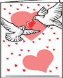

> **Deskripsi Visual:** Gambar ini adalah ilustrasi yang menampilkan dua burung merpati berlari menuju hati besar yang berwarna merah. Di sekeliling hati tersebut ada beberapa bintik-bintik merah kecil yang tampak seperti cinta atau perasaan. Ilustrasi ini mungkin digunakan untuk menggambarkan konsep cinta, persahabatan, atau hubungan emosional lainnya. Elemen utama dalam gambar ini adalah dua burung merpati yang bergerak menuju hati besar, yang merupakan simbol cinta atau perasaan. Label atau teks yang penting tidak terlihat pada gambar ini. Informasi kunci yang dapat diambil pembaca adalah bahwa gambar ini mungkin digunakan untuk menggambarkan konsep cinta atau hubungan emosional lainnya.

Rina and Rudi,

So  many  paths  to  choose  from  --  yet  a moment here, a different turn there, and you may never have met to experience a love so right! Isn't it amazing the way life works?

____________________

Wishing You Both a Beautiful Life Together Lia & Tomy

Source: Dokumen Kemdikbud

Picture 2.12

__________________________

__________________________

__________________________

__________________________

__________________________

__________________________

__________________________

__________________________

__________________________

__________________________

__________________________

__________________________

__________________________

__________________________

 

---
## 📄 Halaman 40

Your friend has got an opportunity to be an interpreter in an international conference on inter religion dialogue to create and preserve peace and harmony. 7

---
**🖼️ Gambar/Diagram**

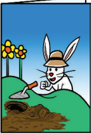

> **Deskripsi Visual:** Gambar ini adalah ilustrasi yang menunjukkan seorang anak sedang bermain dengan tanaman bunga matahari. Gambar ini menggambarkan tindakan sederhana dan ceria, yang menunjukkan bagaimana anak-anak sering kali menikmati waktu mereka di luar rumah. Anak tersebut sedang memegang tanaman bunga matahari yang telah tumbuh di tanah, menunjukkan kepedulian dan rasa hormat mereka terhadap alam. Ilustrasi ini juga menunjukkan lingkungan sekitar yang indah dengan pohon-pohon dan udara yang segar, yang menambah nuansa positif dan menyenangkan pada gambar tersebut.

Elemen-elemen utama dalam gambar ini meliputi anak, tanaman bunga matahari, tanah, dan pohon-pohon di latar belakang. Anak tersebut adalah elemen yang paling dominan dan menunjukkan peran aktif dalam tindakan. Tanaman bunga matahari dan tanah menunjukkan hubungan antara manusia dan alam, sementara pohon-pohon di latar belakang menambah nuansa alami dan hijau pada gambar tersebut.

Teks, angka, atau label penting tidak ada dalam gambar ini, karena gambar hanya menggambarkan tindakan dan lingkungan sekitar tanpa informasi tambahan. Namun, gambar ini dapat memberikan informasi penting tentang bagaimana anak-anak sering kali menikmati waktu mereka di luar rumah dan bagaimana mereka dapat berinteraksi dengan alam sekitar mereka.

__________

____________________________

____________________________

____________________________

____________________________

____________________

### DIALOG: COMPLIMENTING

### Task 1:

Read  the  dialog  silently  and  carefully.  Pay  attention  to  the complimenting expressions and the responses.

Rahmi : Hello. How are things going on, Sinta?

Sinta     : Hi. Good, and you?

Rahmi   : I'm feeling great today. How was your weekend with

your family in Batu?

Sinta     : Excellent! We had a lovely time there. You should

have gone there with us.

Rahmi   : Really? Hey, what a beautiful skirt you are wearing.

It matches your blouse.

Sinta     : Thanks a lot. My sister bought it for me last month.

Rahmi   : Wow! That's wonderful.

Sinta     : Oh, Rahmi, can I ask you something?

Rahmi   : Oh, sure. Please.

Sinta     : Have you finished writing the book we discussed two months ago?

Rahmi : Yes. Come to my room. Look at this. What do you think?

Sinta   : Terrific. I like the cover. Let me see the contents.

This book is excellent. You really did a great job.

Rahmi   : Thanks a lot. You've inspired me to do this.

 

---
## 📄 Halaman 41

Sinta   : Your publisher should send it to all bookstores here.

Rahmi : Yes, you're right. The publisher will do it for me.

Sinta   : Well, that's great. I am proud of you, Rahmi. By the way,

I've got to go now. Have a nice day!

Rahmi : You, too.

### Task 2:

Read  aloud  the  dialog  with  a  classmate.  Pay  attention  to  the complimenting expressions and the responses too.

---
**🖼️ Gambar/Diagram**

> **Deskripsi Visual:** Gambar ini adalah ilustrasi yang menunjukkan dua siswa sedang berbicara di ruangan belajar. Siswa pertama, seorang perempuan berambut pendek dengan hijab, memegang beberapa buku dan tas sekolah. Siswa kedua, seorang perempuan berambut panjang, memegang sebuah buku dan tas sekolah. Kedua siswa tersebut tampak senang dan berbicara dengan penuh semangat. Ilustrasi ini menunjukkan hubungan antara dua siswa yang mungkin berbicara tentang topik belajar atau diskusi bersama.

Source: Dokumen Kemdikbud

Picture 2.14

Task 3: Read the following notes about complementing expressions. After that perform the dialogs in the following that with your classmates.

### Notes:

### COMPLIMENTING

Compliment is an expression to appreciate or praise other people. Compliment is useful to give encouragement so that people will keep on doing their best and even improve their performance.

When to express compliment:

- On daily basis,

- When someone has done his/her best,

- When you visit someone's house for the first time,

- If you notice something new about someone's appearance.

Can  you  think  of  other  situations  when  you  need  to compliment?

 

---
## 📄 Halaman 42

---
**🖼️ Gambar/Diagram**

> **Deskripsi Visual:** Gambar ini adalah ilustrasi yang menunjukkan dua orang yang berbicara. Pria tua dengan topi hitam dan kacamata berdiri di depan mikrofon, sedang berbicara kepada seorang pria muda yang berdiri di belakangnya. Pria muda tersebut mengenakan seragam sekolah putih dan biru dengan sandal, serta memegang ukulele. Pria tua tampak sangat senang dan berterima kasih, seperti yang ditunjukkan oleh teks "Thank you" yang ditulis di bawahnya. Pria muda tampak sedang berbicara tentang sesuatu yang membuat pria tua merasa bahagia. Gambar ini menunjukkan hubungan antara kedua karakter dan suasana hati yang positif yang dimiliki oleh pria tua.

---
**🖼️ Gambar/Diagram**

> **Deskripsi Visual:** Gambar ini adalah ilustrasi yang menunjukkan dua orang wanita berbicara. Wanita di sebelah kiri mengenakan baju kuning dengan lengan panjang dan memandang ke arah kanan. Wanita di sebelah kanan mengenakan baju merah dan sedang tersenyum sambil menjawab "Thank you very much." (Terima kasih banyak). Di atas mereka, terdapat teks yang membaca "What a nice dress!" (Baju ini sangat cantik!). Ilustrasi ini menunjukkan hubungan antara dua orang yang sedang berbicara tentang baju yang dimiliki oleh salah satu dari mereka.

Picture 2.17

---
**🖼️ Gambar/Diagram**

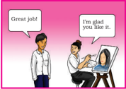

> **Deskripsi Visual:** Gambar ini adalah ilustrasi yang menunjukkan dua orang yang berbicara. Pria pertama mengatakan "Great job!" kepada wanita yang sedang bekerja di komputer. Wanita tersebut menjawab dengan "I'm glad you like it." Dalam konteks ini, gambar ini mungkin digunakan untuk menunjukkan konsep positif dalam kerja sama atau keterlibatan tim. Pria dan wanita tampak saling menghargai dan berkomunikasi positif. Ini menunjukkan bahwa komunikasi yang baik dan saling menghargai dapat membantu mencapai tujuan bersama.

### Task 4:

Work in pairs and practice complimenting and responding to the compliments. One of you become A and the other becomes B.

---
**🖼️ Gambar/Diagram**

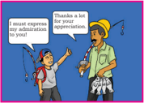

> **Deskripsi Visual:** Gambar ini adalah ilustrasi yang menunjukkan dua orang yang sedang berbicara. Orang pertama, yang tampak seperti seorang pria tua dengan topi hitam dan jas, sedang berdiri di samping sepeda motor. Dia menghadap ke arah yang sama dengan orang kedua, yang tampak seperti seorang remaja pria dengan rambut pendek dan seragam sekolah hijau. Orang kedua tampak sangat senang dan mengangkat tangan untuk menyampaikan ucapan terima kasih.

Elemen utama dalam gambar ini adalah dua orang yang berbicara dan posisi mereka di depan sepeda motor. Orang tua tampak lebih tua dan lebih tua dibandingkan dengan remaja. Kedua orang tampak sangat senang dan berterima kasih.

Teks yang penting dalam gambar ini adalah "I must express my appreciation to you!" yang dinyatakan oleh orang tua kepada remaja. Ini menunjukkan bahwa remaja telah melakukan sesuatu yang membuat orang tua sangat senang dan berterima kasih.

Informasi kunci yang dapat diambil pembaca adalah bahwa ada hubungan emosional antara dua orang, dimana remaja telah melakukan sesuatu yang membuat orang tua sangat senang dan berterima kasih.

Picture 2.16

---
**🖼️ Gambar/Diagram**

> **Deskripsi Visual:** Gambar ini adalah ilustrasi yang menunjukkan dua orang wanita berbicara. Pada gambar tersebut, seorang wanita tua sedang berbicara kepada seorang wanita muda. Wanita tua mengatakan "You look gorgeous!" (Anda terlihat cantik!) sementara wanita muda menjawab dengan "It's very kind of you to say that." (Itu sangat baik dari Anda untuk menyebut itu.) Dalam konteks ini, gambar ini mungkin digunakan untuk membahas konsep interaksi sosial, penghargaan, atau bahasa komunikasi nonverbal.

 

---
## 📄 Halaman 43

---
**🖼️ Gambar/Diagram**

> **Deskripsi Visual:** Gambar ini adalah ilustrasi yang menunjukkan dua orang siswa sedang berbicara dengan guru di depan papan tulis. Siswa laki-laki yang berdiri di sebelah kanan memegang papan tulis dengan tangan kanannya dan sedang memberikan penjelasan kepada siswi perempuan yang berdiri di sebelah kiri. Siswa perempuan tersebut sedang menghadap ke arah guru dan tampaknya sedang mendengarkan penjelasan. Pada papan tulis, terdapat sebuah bintang merah besar yang tampaknya menjadi topik utama dari pembicaraan mereka. 

Elemen-elemen utama dalam gambar ini meliputi dua siswa, guru, papan tulis, dan bintang merah. Siswa laki-laki dan perempuan merupakan elemen utama yang terlibat dalam interaksi, sementara guru sebagai penghubung antara kedua siswa. Papan tulis dan bintang merah merupakan elemen visual yang menunjukkan topik pembicaraan.

Teks, angka, atau label penting yang terlihat dalam gambar ini adalah bintang merah besar yang tampaknya menjadi topik utama dari pembicaraan. Informasi kunci yang dapat diambil pembaca adalah bahwa ada diskusi antara guru dan siswa tentang topik yang berkaitan dengan bintang merah.

### SPEAKING

### Task 1:

Let's play rock-paper-scissors.

Work in pairs. Play scissors, rock,  and  paper.  The  winner chooses a situation from which he/she creates an expression of compliment. The partner responds to the expression. After that, do the scissors, rock, and paper again. Continue doing that with all the situations provided below.

### Compliments

### Situation 1

You see your friend with her new haircut.

### Situation 2

Your sister drives very well.

### Situation 3

Your best friend handled a problem successfully.

- A1. Riza is working really hard. Ami compliments Riza. Riza responds to the compliment happily.
- A2. Firda is showing a very nice drawing. Fadhil compliments Firda. Firda responds to the compliment.
- B1. Wayan is wearing a new pair of shoes. Angelina compliments Wayan. Wayan responds to the compliment.
- B2. Zainab looks beautiful in her new skirt. Raymond compliments Siti. Siti responds to the compliment.

 

---
## 📄 Halaman 44

### Task 2:

Let's play ball throwing.

- Your teacher will tell you how to do ball throwing activity in groups.
- In turns, give a compliment to your classmates and respond to that nicely.

---
**🖼️ Gambar/Diagram**

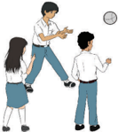

> **Deskripsi Visual:** Gambar ini adalah ilustrasi yang menunjukkan tiga siswa sedang bermain bola basket. Gambar ini menggambarkan situasi yang seru dan aktif, dengan siswa-siswa yang terlibat dalam permainan. Siswa di sebelah kiri sedang berusaha memukul bola ke arah siswa di tengah, sementara siswa di sebelah kanan tampak siap untuk bertindak. Ilustrasi ini menunjukkan interaksi sosial dan fisik antara siswa-siswa, serta menekankan aktivitas olahraga yang positif. Teks, angka, atau label penting tidak terlihat dalam gambar ini, namun informasi kunci yang dapat diambil pembaca adalah tentang aktivitas olahraga dan interaksi sosial yang positif antara siswa-siswa.

Source: Dokumen Kemdikbud

Picture 2.21

### Situation 4

You visit your friend's house for the first time.

### Situation 5

Your classmate submitted her project on time.

### Situation 6

Your sister's team won a game.

### Situation 7

Your brother has just bought a new, smart robot.

### Situation 8

Your friend has a new T-shirt.

 

---
## 📄 Halaman 45

### POINTS TO PONDER

Have you ever given any compliments to someone? Who is he/she? Why did you compliment him/her? How did your friend feel when you complimented him/her? How did your compliment make him/ her feel?

1

公

### REFLECTION

### At the end of this chapter, ask yourself the following questions to see how well you have learned.

- Do you know how to congratulate people and when do you need to do that?
- Do you also know how to compliment people, and when do you need to do that?
If your answer is 'no' to one of these questions, read this chapter and do the activities again. Don't hesitate to see your teacher or classmates and discuss with them how to make you understand and be able to use the expression better.

---
**🖼️ Gambar/Diagram**

> **Deskripsi Visual:** Gambar ini adalah ilustrasi yang menampilkan sebuah kutipan dari Joel Brown. Kutipan tersebut berbunyi, "The only thing that stands between you and your dream is the will to try and the belief that it is actually possible." Gambar ini menggunakan warna kuning cerah sebagai latar belakang, dengan dua titik hijau yang tampak seperti kacang hijau yang ditempatkan di atas kutipan tersebut. Kutipan tersebut ditulis dalam huruf besar dan berwarna hitam, sementara nama Joel Brown ditulis di bawahnya dalam huruf kecil dan berwarna merah. Ilustrasi ini digunakan untuk menggambarkan konsep bahwa hanya memiliki keinginan untuk mencoba dan percaya bahwa tujuan atau impian Anda mungkin tercapai yang memisahkan Anda dari mencapainya.

 

---
## 📄 Halaman 46

### Chapter 3

### What are You Going to Do Today?

Source: Dokumen Kemdikbud

Picture 3.1

---
**🖼️ Gambar/Diagram**

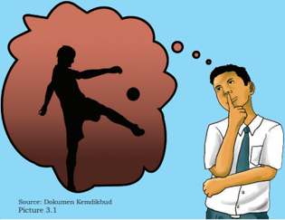

> **Deskripsi Visual:** Gambar ini adalah ilustrasi yang menunjukkan seorang pria sedang berpikir tentang sepak bola. Gambar tersebut terdiri dari dua bagian utama: seorang pria yang sedang berpikir dan sebuah siluet sepak bola yang tampak seperti dia mencoba mencetak gol. Pria tersebut sedang menggenggam pipinya dengan tangan kanan dan menatap ke arah sepak bola, menunjukkan bahwa ia sedang berpikir tentang kemampuan atau strategi sepak bola. Di bawah gambar tersebut, terdapat teks yang menyatakan "Source: Dokumen Kendalikbud Picture 3.1". Ini menunjukkan bahwa gambar tersebut berasal dari dokumen pendidikan yang disebutkan sebagai "Kendalikbud" dan merupakan gambar ke-3 dari serangkaian gambar yang mungkin digunakan dalam kursus atau materi belajar.

### Tujuan Pembelajaran:

Setelah mempelajari Bab 3, siswa diharapkan mampu:

- Mengidentifikasi  fungsi  sosial,  struktur  teks,  dan  unsur  kebahasaan dalam teks lisan dan tulis untuk menyatakan dan menanyakan tentang niat melakukan sesuatu sesuai dengan konteks.
- Menyatakan  secara  lisan  dan  tulis  niat  melakukan  sesuatu  dengan memperhatikan fungsi sosial, struktur teks, dan unsur kebahasaan yang benar sesuai konteks.
- Menanyakan  secara  lisan  dan  tulis  niat  melakukan  sesuatu  dengan memperhatikan fungsi sosial, struktur teks, dan unsur kebahasaan yang benar sesuai konteks.

 

---
## 📄 Halaman 47

### WARMER

Look at the pictures below. Do you know these places? Why do you think people visit these places? What can they do there? Which one do you prefer to visit? Why? Share it with your friends.

---
**🖼️ Gambar/Diagram**

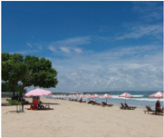

> **Deskripsi Visual:** Gambar ini adalah foto yang menunjukkan pemandangan pantai dengan berbagai elemen yang penting. Pemandangan ini mencakup banyak payung berwarna-warni yang terbuka di tepi pantai, menyerupai payung yang biasanya digunakan untuk melindungi dari sinar matahari. Payung-payung tersebut tampaknya berada di berbagai posisi, menunjukkan bahwa mereka telah ditempatkan oleh pengunjung yang berbeda. Selain itu, beberapa orang tampak sedang berjalan atau duduk di sepanjang tepi pantai, menunjukkan bahwa tempat ini digunakan sebagai tempat rekreasi atau pertemuan. Langit cerah dan segar menunjukkan bahwa cuaca baik, yang membuat pantai menjadi tempat yang ideal untuk bermain dan bersantai. Gambar ini menunjukkan bahwa pantai ini adalah tempat yang populer untuk liburan dan rekreasi.

Picture 3.2

Picture 3.3

### Beach                                      Amusement park

Picture 3.4

Picture 3.5

Mall                                             Mountain

 

---
## 📄 Halaman 48

### VOCABULARY BUILDER

Look at the pictures in the warmer section again. Make a list of any words (nouns or verbs) that are related to the pictures. The words that you find should start with letters A to Z.

A:

____________________________

B:

____________________________

C:

____________________________

D:

____________________________

E:

____________________________

- F: Ferris wheel (big wheel)
G:

____________________________

H:

____________________________

I:

____________________________

J:

____________________________

K:

____________________________

L:

____________________________

M:

____________________________

N:

____________________________

O:

____________________________

P:

____________________________

Q:

____________________________

R:

____________________________

S:

____________________________

T:

____________________________

U:

____________________________

V:

____________________________

W:

____________________________

X:

____________________________

Y:

____________________________

Z:

____________________________

### DIALOG: EXPRESSING INTENTION

### Task 1:

Read  aloud  the  following  conversation.  Take  turns  with  your classmates doing the roles. Then, answer the questions following that.

- A long weekend is coming. Riri, Santi, and Bayu are talking about their holiday plans. Pay attention to the pronunciation and intonation of the dialog below.
Riri :  It will be a long weekend soon. Do you have any plans?

 

---
## 📄 Halaman 49

Santi  : Uhm, I'm not sure. I don't have any idea yet. I think I might stay at home.

Bayu  : Stay at home? Well, you could do something more interesting!

Santi  : So, what about you Bayu? Do you have any plans?

Bayu  : Definitely! My dad and I are going to go fishing.

Santi  : Fishing?  Are you going to go fishing in the river near your house?

Bayu  : No. We plan to go fishing in a lake near my uncle's house. Would you like to come with us?

Santi  : Fishing? That sounds great. But I would rather stay at home than go fishing.

Bayu  : What about you, Riri? What would you like to do on the long weekend?

Riri : I have made a plan with my mother about what to do on this long weekend. We are going to practice baking cookies.

Santi  : That sounds like a very good plan!

Bayu  : Are you going to bake choco chips cookies like the last time?

Riri : Well, yes. That is my favorite. But we will also try to make ginger cookies.

Santi  : Lucky you. Your mom is a real baker, isn't she?

Bayu  : Ha ha, ha. Do you still want to stay home alone?

Riri : Or, would you like to join me to learn baking cookies? You can come to my house.

Bayu  : It's a good idea! Or will you go fishing with me and my dad?

Santi  : I think I would like to bake cookies with Riri. Thanks for inviting me, Riri.

Riri : No problem. I will tell you the time on Friday.

Santi  : Thanks a lot. I can't wait to join you.

Bayu  : Have a nice long weekend, everyone.

Riri, Santi : You too.

 

---
## 📄 Halaman 50

### B.  Answer the comprehension questions below based on the dialog.

- What are Bayu, Riri, and Santi discussing?
- Who already have the plan for the weekend?
- What are their plans?
- Who doesn't have the plan? What does  s/he finally decide to do on weekend?
- What do the sentences typed in bold express?
- When do people use those expressions?

### Task 2:

Later, Riri, Bayu, and Santi talk again about the plan. This time  they  want  to  do  something  together.  Continue  the conversation based on the given hint.

Riri

: Let's do something together this long weekend.

Santi  : It's a great idea! What about ____________________________?

Bayu  : Or we could ____________________________________________?

Riri

: _________________________________________________________

Santi  : _________________________________________________________

Bayu  : _________________________________________________________

Riri

: We will _________________________________________________

_

Santi  : _________________________________________________________

Bayu  : I would rather ___________________________________________

Riri

: _________________________________________________________

Santi  : _________________________________________________________

Bayu  : _________________________________________________________

Riri

: _________________________________________________________

Santi  : So, we are going to ______________________________________

Bayu  : _________________________________________________________

### Task 3:

What  do  you  need  to  consider  before  visiting  a  place? Destination?  Budget?  Safety?  Usefulness?  Time?  Discuss with your friends.

 

---
## 📄 Halaman 51

### VOCABULARY EXERCISES

Use the words you have listed in Vocabulary Builder to make sentences. You may use more than one word. See number 1 and 2 as the examples.

- I would like to save money to buy new shoes in a department store.
- I am going to ride the Ferris wheel in the amusement park.
3. ______________________________________________________________

4. ______________________________________________________________

5. ______________________________________________________________

6. ______________________________________________________________

7. ______________________________________________________________

8. ______________________________________________________________

9. ______________________________________________________________

10. _____________________________________________________________

### GRAMMAR REVIEW

### Using I WOULD LIKE TO and I AM GOING TO

### Task 1:

Look at the excerpt from the dialog below. Pay attention to the bold-typed expressions.

Santi  : So, what about you, Bayu? Do you have any plans?

Bayu  : Definitely! My dad and I are going to go fishing. We plan to go fishing in a lake near my uncle's house. Would you like to come with us?

Santi  : I don't really like fishing. I would rather stay at home than go fishing. What about you, Riri? What would you like to do on the long weekend?

 

---
## 📄 Halaman 52

Riri : I have made a plan with my mother about what to do on this long weekend. We are going to practice baking

cookies.

Bayu  : Are you going to bake choco chips cookies like the other day?

Riri : Well, yes. That is my favorite. But we are going to make ginger cookies too.

try to

Riri : Oh, would you like to join me to learn baking cookies? You can come to my house.

Bayu  : It's a good idea! Or will you go fishing with me and my dad?

Santi  : Uhm, not fishing I guess. But I think I would like to bake cookies with Riri. Thanks for asking me to join you Riri.

### Task 2:

Read  the  previous  dialogs  again.  Identify  the  bold-typed expressions and fill in the table below with the question and statement forms of the expressions.

---
**📊 Tabel**

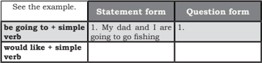

Tabel ini membahas dua bentuk pernyataan: statement form dan question form. Topik utamanya adalah bagaimana menggunakan "going to" dalam kalimat untuk menunjukkan keinginan atau rencana masa depan. Dalam kolom "Statement form", contoh kalimat "My dad and I are going to go fishing" diberikan sebagai contoh statement form. Sedangkan dalam kolom "Question form", tidak ada contoh yang disediakan karena tidak ada pernyataan yang memerlukan pertanyaan dalam bentuk question form. Pola penting yang terlihat adalah bahwa "going to" digunakan untuk menunjukkan keinginan atau rencana masa depan dalam kalimat statement form, sementara dalam question form, "going to" biasanya digunakan untuk menanyakan tentang keinginan atau rencana masa depan.

### Note :

In daily life, it is common for us to tell other people about our intention or plan to do something in the future. We also frequently ask them, or they ask us about about that. For telling our intention or plan, we can use be going to + simple form of the verb and would like to +simple form of the verb, and we use the statement form. For asking, we use the question form. Read again the dialog among Riri, Bayu, and Santi in this chapter to see how the expressions are used in conversations.

### Task 1:

Make up short dialogs for the following situations. Read the answer of number 1 as an example.

### SPEAKING

 

---
## 📄 Halaman 53

- You plan to do the Biology project at the library after school. You ask your classmate, Rina, to do it together with you.
- A : I am going to do my biology project at the library after school. Rina, are you going to do that today, too?
- B :	Yes.	I	am	going	to	do	it	today.	The	sooner	we	finish	it	the better. We can go to the library together.
- You plan to go to the movie this weekend. You ask several friends to go with you. Two of your friends definitely agree with you, but the other two cannot make up their minds. Use the expressions in the previous section in the conversation.
____________________________________________________________

____________________________________________________________

____________________________________________________________

____________________________________________________________

____________________________________________________________

____________________________________________________________

____________________________________________________________

____________________________________________________________

- School holiday is coming soon. You plan to go to your  grandma's house  in  the  country.  You  want  to  find  out  what  your  friend is planning. Use the expressions in the previous section in the conversation.
____________________________________________________________

____________________________________________________________

____________________________________________________________

____________________________________________________________

____________________________________________________________

____________________________________________________________

____________________________________________________________

 

---
## 📄 Halaman 54

- It  will  be  the  school's  anniversary  next  month.  You  and  your classmates are discussing the plan for the class performance. One of them seems to disagree with the idea because he thinks that  it  will  need  a  lot  of  money.  Use  the  expressions  in  the previous section in the conversation.
____________________________________________________________

____________________________________________________________

____________________________________________________________

____________________________________________________________

____________________________________________________________

____________________________________________________________

____________________________________________________________

____________________________________________________________

- A  friend  is  absent  because  she/he  is  sick.  You  and  your classmates plan to visit her/him this afternoon. However, one of them makes an excuse for not going. Use the expressions in the previous section in the conversation.
____________________________________________________________

____________________________________________________________

____________________________________________________________

____________________________________________________________

____________________________________________________________

____________________________________________________________

____________________________________________________________

____________________________________________________________

 

---
## 📄 Halaman 55

### Task 2:

Act out one of the dialogs for the class.

### Task 3:

Make formal speech and perform if in front of the class. Follow the steps given.

- First,  imagine  that  you  are  running  for  the  president  of  the student organization.
- You are preparing a campaign for the president of the student organization.
- List the promises you will make during the speech.  For example:
If I am elected as the president of the student organization, I will support sport competition in our school. We are going to have more regular practices of sports like soccer and badminton so that we can win in competitions. I would also like to .... etc.

- Present your speech in front of the class.

### WRITING

Write a paragraph about your holiday plan. Use I would like to … and I am going to….. in your paragraph. Use the given questions to guide you.

### Holiday plan

- Where would you like to go on holiday? Would you like to go somewhere interesting or stay at home?
- If you are spending your holiday away from home, where would you like to go?
- If you stay at home, what do you plan to do?

 

---
## 📄 Halaman 56

_______________________________________________________________

_______________________________________________________________

_______________________________________________________________

_______________________________________________________________

_______________________________________________________________

_______________________________________________________________

_______________________________________________________________

_______________________________________________________________

_______________________________________________________________

_______________________________________________________________

_______________________________________________________________

_______________________________________________________________

_______________________________________________________________

_______________________________________________________________

### REFLECTION

At  the  end  of  this  chapter,  ask  yourself  the  following questions to know how effective your learning process has been.

- Are you able to identify the forms and uses of 'would like to' and 'be going to'?
- Can you make statements or questions using 'would like to' and 'be going to'?
- Do you know when to use the expressions?
If you answer ' no ' to one of those questions, see your teacher and discuss with him/her how to make you able to express your intention in spoken and written forms.

 

---
## 📄 Halaman 57

### FURTHER ACTIVITIES

Have a casual chat with your friend. Tell him/her the activities you plan to do after school. For example, you make a plan, called plan A, but you need to make a back- up plan called plan B, just in case something happens.

________________________________________________________________

________________________________________________________________

________________________________________________________________

________________________________________________________________

________________________________________________________________

________________________________________________________________

________________________________________________________________

________________________________________________________________

________________________________________________________________

________________________________________________________________

________________________________________________________________

________________________________________________________________

________________________________________________________________

The only way to do great work is to love what you do. If you haven't found it yet, keep looking. Don't settle. '

Steve Job

 

---
## 📄 Halaman 58

### Chapter 4

### Which One is Your Best Getaway?

---
**🖼️ Gambar/Diagram**

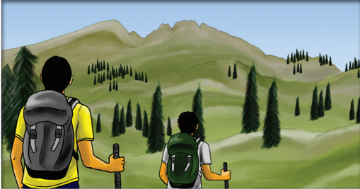

> **Deskripsi Visual:** Gambar ini adalah ilustrasi yang menunjukkan dua orang berjalan di hutan dengan pemandangan pegunungan di latar belakang. Keduanya membawa tas ransel dan memegang palu, menunjukkan bahwa mereka sedang melakukan aktivitas hiking. Pohon-pohon besar dan hijau tersebar di sekitar area tersebut, menunjukkan keberadaan hutan yang sehat dan alami. Pegunungan yang tinggi dan indah tampak jelas di latar belakang, menunjukkan bahwa lokasi ini berada di daerah pegunungan. Ilustrasi ini mungkin digunakan untuk menggambarkan tema ekologi, kehidupan alam, atau aktivitas outdoor seperti hiking.

### Tujuan Pembelajaran:

Setelah mempelajari Bab 4, siswa diharapkan mampu:

- Mengidentifikasi makna, fungsi sosial, struktur teks, dan unsur kebahasaan  pada  teks  deskriptif  sederhana  lisan  dan  tulis  tentang tempat wisata dan bangunan bersejarah sesuai dengan penggunaan.
- Menjelaskan  isi  deskripsi  lisan  dan  tulis  tentang  tempat  wisata  dan bangunan bersejarah dengan memperhatikan tujuan komunikasi, struktur  teks,  dan  unsur  kebahasaan  teks  deskriptif  sesuai  konteks penggunaan.
- Mendeskripsikan secara lisan  dan  tulis  tempat  wisata  atau  bangunan bersejarah dengan memperhatikan fungsi sosial, struktur teks, dan unsur kebahasaan teks deskripsi secara benar sesuai konteks penggunaan.

 

---
## 📄 Halaman 59

### WARMER

### Task 1: Let's play odd man out game.

Below are lists of words related to tourist destinations. Let's play  odd  man out game. Play this game in groups of four. Find the word that does not belong to the same category as the other words in the same group. That word is the odd word (the odd man). Cross out or circle the word and explain your reason. Look at the example. Compete with other groups to finish this game.

outdoor

camping ground

sleeping bag

1

wave

trees

sandy

breeze

2

savannah botanical garden wood jungle

3

canopy

leafy green

blue

4

cool hot cold fresh

5

coral

clear

sofa

fish

6

dirty

nice

clean

comfortable

7

ship

boat raft

canoe

8

fall down rock splash waterfall

9

valley amusement park hot spring

crater

10 sunny wet warm

hot

11

terrible

amazing

awesome

marvelous

12

impressive

interesting boring unforgettable

VOCABULARY BUILDER

 

---
## 📄 Halaman 60

### VOCABULARY BUILDER

Read the text about Tanjung Puting National Park. After you read it,  scan  the  text  quickly  to  find  the  English  equivalents  for  the Indonesian words below. You are given the dashes and some letters of the English words as the clues. Each dash represents a letter. After you find the words, compare your answer to your friends.

_ _ _t_ _ _ _ _ _ (noun) _ _ _tin_ _ _ _ _ (noun) _ _ _ _ _ _ _la (noun) un_ _ _ _ (adjective) s _ _ _ _ (noun) _ _ _ _mo_ _ (adjective) es_ _ _ _ _ _ _ (verb) h_ _ _ _ (noun) _ _ _ _ _ss_ _ _ (adjective) ex-_ _ _ _ _ _ _ (adjective) _ _ _ _ _ _ _ _tion (noun) _ _ _z_ _ _ (adjective)

ekoturisme tujuan

tanjung tidak seperti

hidung (binatang)

sangat besar mendirikan

pusat/inti mengesankan

bekas tangkapan pelestarian

mengagumkan

### PRONUNCIATION PRACTICE

Listen to your teacher pronouncing the following words. Repeat after him/her.

destination

: / ˌdestɪˈneɪʃ ə n

/

peninsula

: /

pɪˈnɪnsjələ

/

unlike

: /

ʌnˈlaɪk /

snout

: /

snaʊt

/

enormous

: / ɪˈnɔːməs /

establish

: / ɪˈstæblɪʃ /

heart

: / hɑːrt /

impressive

: /

ɪmˈpresɪv /

ex-captive

: / eks ˈkæptɪv /

preservation

: /

ˌprezəˈveɪʃ ə n /

amazing

: /

əˈmeɪzɪŋ /

 

---
## 📄 Halaman 61

### READING

### Task 1:

Now, read text 1 carefully. What do you think about the place described below?

### Text 1 TANJUNG PUTING NATIONAL PARK

Tanjung  Puting  National  Park  is  an  internationally  famous ecotourism destination, which is located in the southwest of Central Kalimantan peninsula. Visitors from foreign countries come to this park because of its amazing nature. This is called a park, but unlike any park that you have seen in your city, this is a jungle! It is a real jungle, which is home to the most interesting animal in the world: orangutans.

Though the park is home to many animals, seeing orangutans is usually the visitors' main reason to visit the park. Orangutans, which literally  mean the man of the forest, are the largest arboreal animal on the planet. Most of their lives are spent in trees where orangutans travel from branch to branch by climbing or swinging with their long arms.

To  see  orangutans,  we  should  go  to  Camp  Leakey,  which  is located in the heart of Tanjung Puting National Park.  Camp Leakey is a rehabilitation place for ex-captive orang utans and also a preservation site. It is also a famous center for research about orangutans which has been conducted by the famous primatologist Dr. Birute Galdikas since 1971. Here visitors can see daily feedings to orangutans at jungle platforms as part of the rehabilitation process to their natural habitat. This event gives them opportunity to see orangutans up close.

Source: http://orangutanexplore.com Picture 4.2

To reach the place, we should take a  boat  down  Sekonyer  river.  The  boat  is popularly  called  perahu  klotok    which  is a  boathouse  that  can  accommodate  four people. The trip by the boat to Camp Leakey takes three days and two nights. You sleep, cook, and eat in that klotok, night and day during your journey into the jungle.

The  traveling  in  the  boat  offers  an unforgettable experience. In daylight, on  your  way  to  Camp  Leakey,  you  can see  trees  filled  with  proboscis  monkeys, monkeys that have enormous snout which can  only  be  found  in  Kalimantan.  The

 

---
## 📄 Halaman 62

monkeys anxiously await klotok arrivals. A troop of 30 light-brown monkeys may plunge from branches 10 meters or higher into the river and cross directly in front of the boat. These monkeys know that the boat's  engine  noise  and  the  threat  of  its  propeller  scare  crocodiles, which find these chubby monkeys delicious. At night, you can enjoy the clear sky and the amazingly bright stars as the only lights for the night.

With such exotic nature, no wonder many tourists from foreign countries who love ecotourism frequently visit Tanjung Puting National Park. What about you?

Text sources: ( 1) https://www.lonelyplanet.com/indonesia/tanjung-putingnational-park/sights/natural-parks-forests/tanjung-puting-national-park (2) www. Indonesian.travel.com; (3) www. Exploguide.com

### Task 2:

Answer the following questions briefly.

- Based on the text, can you guess what ecotourism is? Give some examples of other ecotourism destinations.
- As one of ecotourism destinations, what does Tanjung Puting National Park offer to tourists?
- How is the park different from the parks in cities?
- How is Camp Leakey related to Tanjung Puting National Park?
- What does the word ex-captive tell  you  about the orangutans in Camp Leakey, which is a rehabilitation site for orangutans?
- How can people reach Camp Leakey?
- What  is  special  about  the  means  of  transportation  to  Camp Leakey.
- What can tourists enjoy during their trip to Camp Leakey?
- What  do  you  think  is  the  most  interesting  scene  in  Tanjung Puting National Park?
- How important is the research by Dr. Birute Galdikas?
- What is the author's purpose in writing this text?
- How is each paragraph related to each other?
- What is the most dominant tense used in this text?

### Task 3 :

Tourists probably bring food and snacks in paper or plastic packages when they visit Tanjung Puting National Park. What should they do with the wastes? If you were also a tourist, what would you do?

### Task 4:

Rearrange the place of the main ideas in the right column to match it with the purpose of each paragraph.

 

---
## 📄 Halaman 63

---
**📊 Tabel**

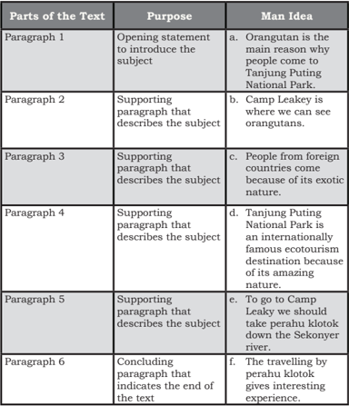

Tabel ini berisi informasi tentang bagian-bagian teks, tujuan masing-masing bagian, dan gagasan manusia yang relevan dengan setiap bagian. Topik utama tabel adalah "Bagian-teks dan Gagasan Manusia". Kolom-kolomnya meliputi "Bagian-teks", "Tujuan", dan "Gagasan Manusia". Data penting yang terlihat adalah bahwa setiap bagian teks memiliki tujuan tertentu untuk menjelaskan atau mendukung subjek utama, yaitu orangutan dan Camp Leakey di Tanjung Puting National Park. Gagasan manusia yang disampaikan mencakup alasan orangutan menjadi daya tarik bagi wisatawan, lokasi Camp Leakey sebagai tempat penelitian orangutan, keunikan ekotourisme Tanjung Puting National Park, dan pengalaman menarik yang dapat diperoleh saat melakukan perahu klotok di Sungai Sekonyer.

A descriptive text describes a particular object like a place, thing, or person. What is the author's purpose in writing a description? The author  wants  to  describe  the  particular  object  by  describing  its  or his/her specific features to help readers visualize what a person, an animal, a park, or a thing is like.

How is a descriptive text constructed? It starts with an opening paragraph. In  the  paragraph  there  is  a  topic  sentence  that  introduces  the object going to be described. A series of paragraphs follow the opening to describe the parts or the features or the specific characteristics of the subject.

 

---
## 📄 Halaman 64

### VOCABULARY EXERCISES

### Complete the following sentences using the words in the box.

amazing

unlike

destination

impressive

center

establish

rehabilitation

snout

enormous

ex-captive

peninsula

- The tourist had never seen such a big monkey. When he saw an orangutan swinging on trees for the first time, he shouted, 'Wow, that's  __________.'
- ________________________  other  types  of  monkeys, proboscis monkeys are unique because of their big noses.
- Bali  has  been  the  most  popular  tourist  __________  for  years, but  Indonesia  has  many  other  beautiful  places  to  offer  to international visitors.
- Visitors of the jungle will not forget the ________ nights in the boats where they can enjoy the dark night sky decorated with millions of bright stars that they cannot enjoy in big cities.
- If only the national park were located in the ___________ of the city, I would be able to inhale fresh air and observe the primates' interesting behavior every day.
- The  local  government  needs  to  ____________  an  information center to attract more tourists to visit Indonesia.
- Located  at  the      ____________  of  the  jungle  you  can  see  a rehabilitation center for ex-captive animals. The location makes it easy to reach from all directions.
- When people hear the words Tanjung Kodok, they may associate the name with a _______________  like Tanjung Puting National Park.
- ____________________ orangutans may not be afraid of meeting with humans because they  used to live with them as illegal pets.
- I  always  appreciate  the  strength  ants  have  because although they are very small they can carry ________  load of food.
- Their unusually large _______ differentiates proboscis monkeys from other monkeys.
- We may not keep endangered animals that are protected by the law as our pet. If we have one, we should send it to _____________ site where it can live in a more natural habitat.

 

---
## 📄 Halaman 65

### VOCABULARY BUILDER

Rearrange the letters on the left to get the right words for the definitions on the right. Use the first letter as the clue. After you get the words, read text 2 and check whether the meaning of the words suits the context of the sentences.

e tipmoe

: a perfect example

m oleumaus : a special building made to hold the dead body of an important person or the dead bodies of a family

i alndi

: decorated with designs of wood, metal, etc.

that are set into the surface (berhiaskan)

i ctnirtae : having a lot of different parts and small details that fit together

s rdelen

: thin or narrow

o aalogtnc

: having eight angles and eight sides

be ardndeo : to make something/somebody look more attractive by decorating it or them with something

h osue (verb) : provide space for something

f asel

: not real

t mob : a large grave, especially one built of stone above or below the ground

t inge

: a small amount of color

m icalastlyje : in impressive way because of size or beauty

b tkreanhtiga: impressive

r maesin

: the body of a dead person or animal

### PRONUNCIATION PRACTICE

Listen  to  your  teacher  reading  aloud  the  following  words. Repeat after him/her.

epitome :

/ ɪˈpɪtəmi /

mausoleum :

/ ˌmɔːsəˈliːəm/

inlaid :

/ ˌɪnˈleɪd◂ /

intricate :

/ˈɪntrɪkɪt /

slender :

/ ˈslendər /

octagonal :

/ ɒkˈtæɡən ə l /

be adorned :

/ əˈdɔːrn /)

house (verb) :

/ haʊs /

 

---
## 📄 Halaman 66

false :

/ fɒːls /)

tomb :

/ tuːm /

majestically :

/ məˈdʒestɪk kli /

tinge :

/ tɪndʒ /

breathtaking :

/ ˈbreθˌteɪkɪŋ /

remains :

/ rɪˈmeɪnz /

### READING

### Task 1:

Read the following text carefully. While reading, think about the similarity or difference between the following text with the previous one about Tanjung Puting National Park.

### Text 2

### Taj Mahal

Taj Mahal, an epitome of love, is actually a mausoleum. Standing majestically on the banks of River Yamuna, the Taj Mahal is synonymous to love and romance. Taj Mahal was constructed by Mughal Emperor Shah Jahan in the memory of his beloved wife and queen. The name 'Taj Mahal' was derived from the name of Shah Jahan's wife, Mumtaz Mahal, which means crown of palaces.

Taj Mahal represents the finest architectural and artistic achievement.  The mausoleum was constructed of pure white marble. The white marble is inlaid with semi-precious stones (including jade, crystal, lapis lazuli, amethyst and turquoise) that form the intricate designs. Its central dome reaches a

 

---
## 📄 Halaman 67

height of 240 feet (73 meters). The dome is surrounded by four smaller domes. Four slender towers, or minarets, stand at the corners.  Inside the mausoleum, an octagonal marble chamber adorned with carvings and semi-precious stones house the false tomb of Mumtaz Mahal. Her actual remains lie below, at garden level.

Taj  Mahal  shows  shades  of  magnificent  beauty  at different time during the day. At dawn when the first rays of the sun hits the dome of this epic monument, it radiates like a heavenly pinkish palace. At daytime, when the sky is bright and clear, the Taj looks milky white. At a moonlit night when the full moon rays fall on the glistening white marble, the cool moon rays reflect back from the white marble and give the Taj Mahal a tinge of blue color. It's simply breathtaking! With such beauty, no wonder that Taj Mahal becomes one of the the Seven Wonders of the World.

Sources: http://www.history.com/topics/taj-mahal http://www.tushky.com/blog/taj-mahal-in-agra/

### Task 2

Answer the following questions briefly.

- What is Taj Mahal actually?
- What impression do you get when you read the word majestically ?
- Why did the king construct Taj Mahal?
- What does the phrase 'the crown of the palace' imply?
- Read the third line of paragraph two. What impression did you get after reading the description?
- How are the materials and architectural design of Taj Mahal?
- What do all the materials and the architecture indicate?
- Where was the queen actually buried?
- When do you think is the best time to see Taj Mahal? Why do think so?
- What do you think about the inclusion of Taj Mahal as one of the Seven Wonders of the World?
- What is the writer's purpose in writing the essay?
- How does the writer organize his idea?
- What reaction from readers does the writer expect?
- Read  text  1  again.  Find  out  the  similarities  between  text  1 (Tanjung Puting National Park} and text 2 (Taj Mahal).

 

---
## 📄 Halaman 68

### TASK 3

After  reading  text  2  (Taj  Mahal),  identify  the  main  idea  of  the paragraphs. Pay attention to how the ideas in the text are organized.

---
**📊 Tabel**

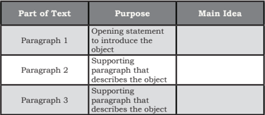

Tabel ini menunjukkan struktur dari sebuah paragraf yang berfokus pada penjelasan tentang suatu objek. Paragraf pertama berfungsi sebagai pengantar yang membuka topik dengan memberikan informasi dasar tentang objek tersebut. Paragraf kedua dan ketiga merupakan bagian-bagian utama yang mendukung penjelasan tentang objek tersebut. Masing-masing paragraf ini memberikan detail lebih lanjut tentang aspek-aspek tertentu dari objek tersebut. Topik utama tabel ini adalah penjelasan objek melalui beberapa paragraf. Kolom-kolom yang ada dalam tabel ini adalah "Part of Text", "Purpose", dan "Main Idea". Data atau pola penting yang terlihat adalah bahwa setiap paragraf memiliki tujuan spesifik dalam menjelaskan objek, dan setiap paragraf juga memiliki ide utama yang mencerminkan fokusnya.

### TASK 4

Using the following Venn diagram, try to find the similarities and differences between text 1 and text 2. In what way are they similar or  different?  Write  the  similarity  in  the  shared  area  [B]  and  the differences in the separate areas [A] or [C].

---
**🖼️ Gambar/Diagram**

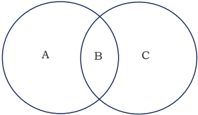

> **Deskripsi Visual:** Gambar ini adalah diagram venn yang menunjukkan hubungan antara tiga set objek: A, B, dan C. Setiap lingkaran mewakili set objek tertentu, dengan lingkaran A dan B memiliki bagian yang berpotongan, menunjukkan bahwa ada objek yang sama dalam kedua set tersebut. Lingkaran C tidak berpotongan dengan A atau B, menunjukkan bahwa set C memiliki objek yang unik. Elemen-elemen utama dalam gambar ini adalah tiga lingkaran yang berpotongan, dengan label A, B, dan C untuk set setiap lingkaran. Informasi kunci yang dapat diambil pembaca adalah bahwa set A dan B memiliki objek yang sama, sedangkan set C memiliki objek yang unik.

### VOCABULARY EXERCISES

Fill in the blanks with the right word from the list below.

 

---
## 📄 Halaman 69

- The very intricate designs of the white marble palace shows an _________ of the professional work and expertise of a dedicated architect to his/her work.
- The walls of the building are _______ with beautiful carving and precious stones.
- That the towers are ________ and not big makes them the right decoration that _________ the domes, and the combination of which makes the complex look amazingly beautiful.
- The white marble palace, bathed in the moon rays, reflects back the rays that give the ________ of bluish color.
- The  different  appearance  of  the  Taj  in  the  morning,  during daytime  and  evening  is  just  _____________.  Words  cannot describe the beauty sufficiently.
- The room which has 8 sides is called __________   chamber. This is the room that _____________the remains of the queen.
- However, the ________ in the chamber is a _______ one because the remains of the queen was buried below at the garden level.
- What is your opinion if a millionaire in this country builds a luxurious  ______________    to  house  the  remains  of  his  dead family?
- The  four  minarets  at  the  four  corner  surround  the  palace ___________, making the palace look symmetrically beautiful.

### GRAMMAR REVIEW

### Nouns and Adjectives

When  describing,  writers  use  many  noun  phrases  in trying to make readers get the mental picture of what is being described. As you know, noun is a thing, a place, or a person, an animal, while adjective is a word that describes a noun. An adjective that describes a noun is called a modifier . A noun that goes with a modifier is called a noun phrase .  Observe where the position of the modifier is.

### For example:

---
**📊 Tabel**

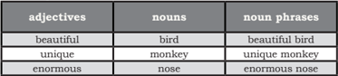

Tabel ini menunjukkan hubungan antara kata benda (adjectives), kata benda (nouns), dan frase kata benda (noun phrases). Topik utama tabel ini adalah penggunaan kata benda dalam bahasa Inggris. Kolom pertama berisi kata benda, kolom kedua berisi kata benda, dan kolom ketiga berisi frase kata benda. Data penting yang terlihat adalah bahwa frase kata benda dibentuk dengan menggabungkan kata benda (adjective) dan kata benda (noun). Misalnya, "beautiful bird" adalah frase kata benda yang dibentuk dari "beautiful" (kata benda) dan "bird" (kata benda).

 

---
## 📄 Halaman 70

### Task 1:

Study the following sentences. Identify the noun phrase by circling the adjectives and underlining the noun. Draw an arrow to show how the adjectives modify the nouns. Number 1 is done for you as an example.

- Taj Mahal offers spectacular view.
- Tanjung Puting National Park offers an impressive experience.
- The traveling in the boat offers another unforgettable experience.
- At night, you can enjoy the clear sky and the bright stars.
- Local people call proboscis monkeys Bekantan.
- Fruits are orangutans' favorite food.
- Keeping orangutans as our pet is an illegal act.
- In the rehabilitation site, ex-captive orangutans learn to live a natural life.
- In a real jungle, we can see many incredible animals.
- Imagine  yourself  to  be  in  the  jungle  and  meet  these  special animals in their original habitat.
- The gigantic trees in the forest indicate that the forest is well preserved.
- The slender minarets make the palace beautiful.
- The remains were kept in the octagonal chamber.
- Her actual remains lie below, at garden level.

### Task 2:

Make noun phrases. The words on the left columns are adjectives and the words on the right column are nouns. Combine them to make noun phrases.  See number 1 as an example.

attractive

lake

memorable

waterfall

fresh

atmosphere

deep

trees

clear

people

gigantic

air

quiet

situation

relaxing

water

 

---
## 📄 Halaman 71

### Task 3:

From the previous task, you have reviewed noun phrases made by combining adjectives and nouns, such as pristine jungle, beautiful garden,  precious  stones,  expensive  marble ,  etc.  Those  kinds  of adjectives  are  called  opinion  adjectives  because  the  adjectives tell  about our opinion about something. If we want to give more information,  we  can  add  more  modifiers  to  the  thing  (noun)  we describe.  For  instance,  in  addition  to  the  opinion  adjectives,  we can also inform people about the size, and the color, the age, and nationality of the thing (noun). Look at the following examples. Pay attention to the order of the modifiers. Where is the position of the opinion adjectives?

### Example:

- a beautiful old tree
- → opinion age noun
- a beautiful reddish leaf
- →
- opinion color noun
- a beautiful Indonesian island → opinion nationality noun
friendly

journey

intricate

dome

beautiful

cave

breathtaking

flora and fauna

large

stones

various

souvenirs

spectacular

view

misty

- spectacular view
2.

__________

__________

3.

__________

__________

4.

__________

__________

5.

__________

__________

6.

__________

__________

7.

__________

__________

8.

__________

__________

9.

__________

__________

10.

__________

__________

11.

__________

__________

12.

__________

__________

13.

__________

__________

 

---
## 📄 Halaman 72

The following is the common word order of adjectives before a noun.

However, it is  very  rare  to  find  noun  phrases  with  more  than  3 modifiers like the examples in the table above.

Now,  read  the  phrases  below.  Identify  the  modifiers.  See number 1 as an example.

---
**🖼️ Gambar/Diagram**

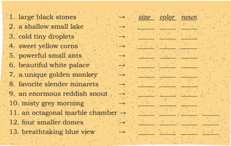

> **Deskripsi Visual:** Gambar ini adalah diagram yang menunjukkan struktur kata dalam bahasa Inggris. Diagram ini terdiri dari beberapa baris yang masing-masing menggambarkan kata dengan jenis kata (noun, adjective, adverb, atau verb) dan juga menunjukkan bagian-bagian kata tersebut. Setiap baris memiliki tiga kolom:

1. Kolom pertama menunjukkan kata yang ingin dianalisis.
2. Kolom kedua menunjukkan jenis kata tersebut.
3. Kolom ketiga menunjukkan bagian kata tersebut.

Beberapa contoh kata yang ditampilkan dalam diagram ini antara lain "large black stones" (batu besar hitam), "a shallow small lake" (danau yang dangkal kecil), "cold tiny droplets" (air hujan yang dingin kecil), "sweet yellow corns" (kornet kuning manis), "powerful small ants" (sekelompok lebah yang kuat kecil), "beautiful white palace" (palembang putih cantik), "a unique golden monkey" (sejenis monyet emas unik), "favorite slender minarets" (minaret yang ramping favorit), "an enormous reddish snout" (telinga merah yang besar), "misty grey morning" (pagi yang kabut abu-abu), "an octagonal marble chamber" (kamar marmer berbentuk segi delapan), "four smaller domes" (empat kubah kecil), dan "breath-taking blue view" (pemandangan biru yang menakjubkan).

Diagram ini membantu pembaca untuk memahami struktur dan bentuk kata dalam bahasa Inggris, serta memahami bagaimana kata-kata tersebut dibentuk dan digunakan dalam kalimat.

### Task 4 Identifying noun phrases

Try to find as least 10 (ten) noun phrases from the reading text about Tanjung Puting National Park and Taj Mahal and discuss the meaning of the phrases.

### Example:

internationally famous ecotourism destinations

 

---
## 📄 Halaman 73

### WRITING

### Task 1: Editing - Pair Work

Read the following description about a tourist destination carefully. The writer forgot to edit her draft. Can you find the errors in the text and help her edit the text?

For  example,  read  carefully  the  fifth  sentence  in  the following text. Can you find the errors in the sentence? Yes, waterfal and a bowl giant .  The first error should be written waterfall because it was misspelled, and a bowl giant should be written giant bowl (remember how to make noun phrase). Now try to find the other errors and try to correct them.

If  you  go  to  Batu  city  in  East  Java,  do  not  forget  to  visit Cuban Rondo. Cuban Rondo is a must-see waterfall because of it spectacular scenery. The first amazing natural charm to enjoy is the huge greenish rock. The gigantic rock and its vegetation that surrounds the waterfal soar high into the sky. The top of the rock bends inward so that when we stand close to the waterfal, we will feel  as  if  we  were  inside  of  a  gigantic  cave  or  a  Bowl  Giant.  The greatness of the nature will make you feel very small and price God The second scenery to enjoy is the charm of the waterfall itself. From the top of the soaring rock, huge amount of water continuously falls down, splash on the large black  stones at the bottom of the waterfall, and forms a shallow small lake and stream. The water in the lake and stream crystal clear and icy cold. The wind that blow the falling water and the splash produce millions of tiny droplets of water. The wind can blow your boat. The droplets covers the small

lake and visitors in mist. Yes, you will get wet. But you can go to the mall. When the sunlight shine through the cold tiny droplets,  you  will  see  rainbows  on  the earth, not in the sky, that seems close enough to you the senery is breathtaking. End  the  trip  with  something  that  can warm you up. In the rest area, you can buy roasted sweet corns. If that is not enough,  you  can  also  buy  drinks  hot delicious and meatball soup hot. When you go home, leave nothing in the area but your footsteps and bring home only your  memory  unforgettabel  about  the beautiful Cuban Rondo Waterfall.

 

---
## 📄 Halaman 74

### Guiding questions for editing:

- Does the writer use indentation?  What should she do?
- Does the writer use correct paragraphing?
- Is there any sentence that begins the description by introducing the object to be described?
- If you want to divide the text into some paragraphs, how will you do it?
- Does each paragraph start with a sentence that introduces the object to be described?
- Are there any irrelevant sentences? Can you help the writer find out if any?
- Are there any misspelled words? Can you help her find out if any and correct them?
- Does the writer use correct grammar in all of her sentences? Help her check the following things:
- whether the verbs in the sentences agree with the subjects, b.  whether the  modifiers  in  the  noun  phrases  are  well  sequenced.
- Does  she  begin  all  sentences  with  capital  letters?  Check  the sentences and correct any mistakes you find.
- Does she end all sentences with full stops? Correct them if she does not.

### Task 2 - Rewriting description Pairwork

A word web help writers organize their ideas. Now, make a word web of the text about Cuban Rondo and include the details. Now, based on the word web that you've made, write a description about Cuban Rondo. You may also use your imagination to develop the text. To enrich your vocabulary, you can try to use the words found in reading text 1 and 2.  You can also use the organization of ideas of text 1 and 2. Do this in pairs.

---
**🖼️ Gambar/Diagram**

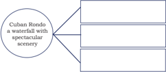

> **Deskripsi Visual:** Gambar ini adalah diagram yang menunjukkan hubungan antara "Cuban Rondo" dengan "waterfall with spectacular scenery". Diagram ini terdiri dari tiga cabang utama yang masing-masing menggambarkan bagaimana "Cuban Rondo" berhubungan dengan "waterfall with spectacular scenery".

Pertama, cabang pertama menunjukkan bahwa "Cuban Rondo" memiliki hubungan langsung dengan "waterfall with spectacular scenery". Ini menunjukkan bahwa "Cuban Rondo" mungkin merupakan lagu atau musik yang disajikan di tempat-tempat dengan keindahan alam seperti air terjun.

Kedua, cabang kedua menunjukkan bahwa "Cuban Rondo" mungkin memiliki hubungan dengan "waterfall with spectacular scenery" melalui tema atau konsep yang sama. Misalnya, "Cuban Rondo" mungkin menggambarkan keindahan alam, seperti air terjun, yang seringkali dianggap sebagai objek yang menakjubkan.

Terakhir, cabang ketiga menunjukkan bahwa "Cuban Rondo" mungkin memiliki hubungan dengan "waterfall with spectacular scenery" melalui konteks budaya atau sejarah. Misalnya, "Cuban Rondo" mungkin merupakan lagu yang berasal dari negara-negara Latin Amerika, termasuk Kuba, yang dikenal karena keindahan alamnya.

Teks, angka, atau label penting yang terlihat pada gambar ini adalah "Cuban Rondo", "waterfall with spectacular scenery", dan tiga cabang yang menggambarkan hubungan antara kedua hal tersebut. Informasi kunci yang dapat diambil pembaca adalah bahwa "Cuban Rondo" mungkin memiliki hubungan dengan "waterfall with spectacular scenery" melalui tema, konsep, atau konteks budaya.

 

---
## 📄 Halaman 75

### Task 3 - Writing a descriptive essay

Think of a place you like to visit or a favorite place that you have  visited  several  times.  This  can  be  tourism  object  or  your favorite part of your house, or school, a park, or a traditional market in your hometown. Describe what is special about the place. Make a word web to help you get and organize ideas.

Using your  word web, write an essay about that place. Include an introductory paragraph, two body paragraphs that contain the supporting details, and a concluding paragraph (read again task 4 for text 1).

After you finish writing, ask yourself the questions used in the editing section (writing-task 1).

### SPEAKING

### Describing - role play

Have  you  ever  visited  a  waterfall,  natural  park,  or other  natural  tourism  objects,  or  interesting  buildings, monuments, museum, temples, etc.? Describe what make the place interesting.

Pretend  as  if  you  were  a  guide  describing  the  special peculiarities of the tourism object. You can also pretend to be a tourist guide for Tanjung Puting National Park or Taj Mahal. In that case, make a word web about Tanjung Puting National  Park,  or  Taj  Mahal,  or  your  own  favorite  place. Based  on  the  word  web,  take  turns  with  your  classmate describing the place.

### REFLECTION

At  the  end  of  this  chapter,  ask  yourself  the following questions to know how effective your learning process is.

- Can you do all the exercises in this chapter?

 

---
## 📄 Halaman 76

- Which part is still difficult to do? What is your plan to make you better at doing that?
- Do you remember the meaning of the new words found in this chapter?
- What is your plan to make you retain the words and the meaning more firmly in your mind?
- Do you know what the communicative purpose of a descriptive essay is?
- When do people use this type of text?
- What are the characteristics of a descriptive text?

### FURTHER ACTIVITIES

Noun phrase (NP) is an important element in giving people a lot of information. That is why it is important that you learn to create noun phrases. To do that you will need to read a lot of texts, such as science texts, that often use noun phrases. Find a biology text and identify the noun phrases used. Share what you have with your classmates.

---
**🖼️ Gambar/Diagram**

> **Deskripsi Visual:** Gambar ini adalah ilustrasi yang menampilkan sebuah tulisan dalam bahasa Inggris yang ditulis oleh Lao Tzu. Tulisan tersebut berbunyi, "A journey of a thousand miles begins with a single step." Ilustrasi ini menggunakan warna kuning dengan garis putih untuk membentuk tulisan tersebut. Di sebelah kanan tulisan tersebut ada dua bola hijau yang tampak seperti matahari atau bintang. Gambar ini digunakan sebagai gambaran atau ilustrasi untuk menggambarkan konsep bahwa setiap langkah kecil akan membawa kita menuju tujuan besar.

 

---
## 📄 Halaman 77

### Chapter 5

### Let's Visit Niagara Falls

---
**🖼️ Gambar/Diagram**

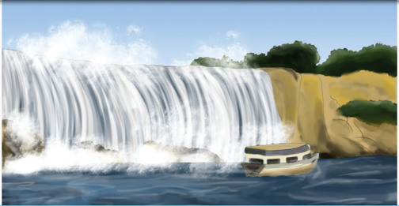

> **Deskripsi Visual:** Gambar ini adalah ilustrasi yang menunjukkan sebuah air terjun yang indah dengan tebing batu yang tinggi. Di bawah air terjun, ada sebuah kapal wisata yang sedang berlayar. Air terjun mengalir dengan kuat ke dasar dan menciptakan gelombang yang besar. Latar belakangnya adalah hamparan hijau yang menunjukkan adanya pohon-pohon besar dan tanaman liar. Udara tampak cerah dengan awan putih yang menyebar di atas air terjun. Ini menunjukkan bahwa air terjun tersebut sangat indah dan merupakan destinasi wisata yang populer.

Source: Dokumen Kemdikbud Picture 5.1

### Tujuan Pembelajaran:

Setelah mempelajari Bab 5, siswa diharapkan mampu:

- Mengidentifikasi makna, fungsi sosial, struktur teks, dan unsur kebahasaan  pada  teks  deskriptif  sederhana  lisan  dan  tulis  tentang tempat wisata dan bangunan bersejarah sesuai dengan penggunaan,
- Menjelaskan  isi  deskripsi  lisan  dan  tulis  tentang  tempat  wisata  dan bangunan bersejarah dengan memperhatikan tujuan komunikasi, struktur  teks,  dan  unsur  kebahasaan  teks  deskriptif  sesuai  konteks penggunaan.
- Mendeskripsikan secara lisan  dan  tulis  tempat  wisata  atau  bangunan bersejarah dengan memperhatikan fungsi sosial, struktur teks, dan unsur kebahasaan teks deskripsi secara benar sesuai konteks penggunaan.

 

---
## 📄 Halaman 78

### WARMER

### Draw and Guess

Your teacher will divide the class into two big groups and show you how to play Draw and Guess. Listen to your teacher's  explanation  and  do  the  activity  as  quickly  as possible. Try to be the winner.

---
**🖼️ Gambar/Diagram**

> **Deskripsi Visual:** Gambar ini adalah ilustrasi yang menunjukkan dua orang guru sedang berbicara di depan sebuah papan tulis kosong. Guru wanita yang berjilbab memegang buku dan mengenakan jaket biru, sementara guru pria yang berpakaian formal dengan jas biru dan kemeja merah sedang berbicara kepada guru wanita tersebut. Papan tulis kosong di belakang mereka menunjukkan bahwa mereka mungkin sedang berbicara tentang materi pendidikan atau mengajarkan sesuatu baru. Teks, angka, atau label penting tidak terlihat pada gambar ini. Informasi kunci yang dapat diambil pembaca adalah bahwa ada dua guru yang sedang berbicara atau mengajar di depan papan tulis kosong.

Source: Dokumen Kemdikbud

Picture 5.2

### VOCABULARY BUILDER

Read the text about Visiting Niagara Falls. After you read it, scan the text quickly to find the English equivalents for the Indonesian words  below.  You  are  given  the  dashes  and  some  letters  of  the English words as the clues. Each dash represents a letter. After you find the words, compare your answer to your friends'.

c r _ _ _ (verb)

melewati/melintasi

g o _ _ _ (noun

)

jurang

a t t r _ _ _ _ _ _ (noun)

pertunjukan

p o _ _ _ _ _ _ (adjective)

menghantam

s o  _ _ _ _ (adjective)

terendam

w a t _ _ _ _ _ _ _ (adjective)

anti air

i l l _ _ _ _ _ _ _ _ (adjective)

berkilauan

 

---
## 📄 Halaman 79

``

petang

``

### PRONUNCIATION PRACTICE

Listen to your teacher reading these words. Repeat after him/her.

niagara

: / naɪˌæɡərə /

gorge

: / ɡɔːrdʒ /

veil

: / veɪl /

bridal

: / ˈbraɪdl /

cave

: / keɪv /

hurricane

: / ˈhʌrɪkən /

illuminated

: / ɪˈluːməneɪtəd /

scenic

: / ˈsiːnɪk /

boat

: / boʊt /

exhilarating

: / ɪɡˈzɪləreɪtɪŋ /

plunge over

: / plʌndʒ 'oʊvər /

sanctuary

: / ˈsæŋktʃuəri /

apparatus entrance

: / ˌæpəˈreɪtəs /

: / ˈentrəns /

---
**🖼️ Gambar/Diagram**

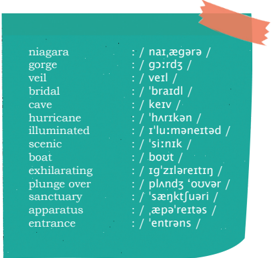

> **Deskripsi Visual:** Gambar ini adalah diagram yang menunjukkan daftar kata dengan penjelasan fonetiknya. Daftar tersebut mencakup berbagai kata seperti "niagara", "gorge", "veil", "bridal", "cave", "hurricane", "illuminated", "scenic", "boat", "exhilarating", "plunge over", "sanctuary", "apparatus", dan "entrance". Setiap kata disertai dengan penjelasan fonetiknya dalam bentuk teks berwarna biru dan huruf besar. Di sebelah kanan setiap kata, terdapat ikon warna hijau yang menunjukkan suara tertentu dalam kata tersebut. Ini membantu pembaca untuk memahami bagaimana mengucapkan kata-kata tersebut dengan benar.

 

---
## 📄 Halaman 80

### READING

### VISITING NIAGARA FALLS

Niagara Falls is the collective name for three waterfalls that cross the international border between the Canadian province of Ontario and the USA's state of New York. They form the southern end  of  the  Niagara  Gorge.  From  largest  to  smallest,  the  three waterfalls  are  the  Horseshoe  Falls,  the  American  Falls  and  the Bridal Veil Falls. The Horseshoe Falls lie on the Canadian side and the American Falls on the American side. They are separated by Goat Island. The smaller Bridal Veil Falls are also located on the American side, separated from the other waterfalls by Luna Island. There are various attractions that people can enjoy in Niagara Falls, six of them are described here.

The first to enjoy in Niagara Falls is Cave of the Winds . This attraction helps people get closer to the falls and go face-to-face with the pounding waters of the  Falls. People can get soaked on the Hurricane Deck where they are just feet from the thundering waters.  Waterproof  clothing  and  sandals  are  provided.  A  trip  at night when the Falls are illuminated in a rainbow of color is really amazing.

 

---
## 📄 Halaman 81

The second charm is Maid of the Mist Boat Tour. It  is  a world-famous  scenic  boat  tour  of  the  American  and  Canadian Falls for about a half-hour ride. People may access the tour via the Observation Tower elevator at Prospect Point in the state park. The boat operates mid-May until late October.

The  next  to  visit  in  Niagara  Falls  is Niagara  Adventure Theater . Here tourists may enjoy the most powerful and involving film  experience  that  brings  reality  to  life  on  a  45  foot  screen.  Audience members are given the priviledge to discover the thundering Falls from a completely new and exhilarating perspective, and plunge over  them.  The  theater  shows  hourly  and  free  multi-language headsets are made available.

Niagara  Science  Museum is  another  place  to  visit.  It  is a sanctuary for the preservation and appreciation of old science instruments and philosophical apparatus.

The  fifth  point  of  interest  is Niagara's  Wax  Museum  of History . Here, life-size wax figures portraying dramatic history of Niagara Falls are presented to guests. They can see Fort Niagara Scene, Indian Village, old store, blacksmith and barber shop scenes and how electricity is made. Wax figures of Julia Roberts, Princess Diana and many more are displayed here, too.

Finally,  people  can  also  enjoy Rainbow  Air  Helicopter Tours above and around the American and Canadian Falls. The tours start from downtown, next to the entrance to the Rainbow Bridge, and open from 9am to dusk when weather permits. The tours operate every day from second weekend in May until October 31st.

The Niagara Falls are renowned both for their beauty and as a valuable source of hydroelectric power. Managing the balance between recreational, commercial, and industrial uses has been a challenge for the stewards of the falls since the 19th century.

(Adapted from: http://en.wikipedia.org/wiki/Niagara_Falls and http://www.niagara-usa.com/things-do/attractions/falls-region )

 

---
## 📄 Halaman 82

### Task 1:

Match paragraphs 2-7 above with pictures a-f as follows. Paragraph 4 is done for you as an example.

source: www.niagara-usa.com

Picture 5.6

Paragraph 2_____

Paragraph 3_____

Paragraph 5_____

### Task 2:

### COMPREHENSION QUESTIONS

### Answer the following questions by referring to the text 'Visiting Niagara Falls.'

- Where is Niagara Falls located?
- Mention the three waterfalls that form the Niagara Falls.
- What can people enjoy in the Cave of the Winds?
- Can people ride on the Maid of the Mist Boat Tour in January?
- Where  can  people  watch  a  film  of  the  thundering  falls  with completely different background?
- Can the tourists enjoy the film in their own language?
- What is kept in Niagara Science Museum?
- What is shown in Niagara's Wax Museum of History?
- Where can people see the story of how electricity was made?
- Is it possible for people to have Rainbow Air Helicopter Tours at night?
Paragraph 4_c___

Paragraph 6_____           Paragraph 7_____

 

---
## 📄 Halaman 83

- 11  If you had an opportunity to visit Niagara Falls, which attraction would you visit first? Why?
- Can you find a place of similar beauty to Niagara Falls in your area? Tell your classmates about the place.
-

### POINTS TO PONDER

Discuss with your classmates what benefits people can get from the magnificent waterfalls that God has created.

### Task 3:

Read again text 1 (Tanjung Puting National Park) and text 2 (Taj Mahal)  in  chapter  4.  Compare  those  texts  with  the  text  about Niagara Falls. Find the similarities among those three texts.

### VOCABULARY EXERCISES

Complete the following sentences using the words in the box. Remember to use the correct forms.

cross

gorge

attractions

pounding

soaked

waterproof

illuminated

charm

mist

scenic

exhilarating

plunge

sanctuary

preservation

dusk

- Waves  are  ______________  against  the  pier.  You  can hear the sound very clearly.
- In the morning, the small town is covered in __________.
- Explore Cheddar _______________ through photos in the internet. They inspire you to come and visit.
- Her shoes got ___________ as she walked through the wet grass.
- Don't forget to bring your _____________ jacket. It's dark outside, it's likely going to rain.
- Somerset ______________ help her forget her complicated problems.
- Christiano Ronaldo came to Bali to campaign for the ______________ of the environment.

 

---
## 📄 Halaman 84

- The street lights go on at ___________. Without the lights, car drivers cannot see the traffic in front of them.
- Look at that side. An ________________ sign flashed on and off.
- This is a region of ______________ beauty. All areas are covered  with  trees;  clean  water  flows  uninterrupted, and fresh air fills the sky.
- I remember having an ___________ walk to Mount Bromo two years ago.
- The Rainbow bridge ___________ Niagara river.
- On her last vacation, her car swerved and __________ off the cliff.
- The ______ of the nature reminds him of God's greatness.
- Tropical forest in Borneo is the largest wildlife __________ in Indonesia.

### GRAMMAR REVIEW

### PASSIVE VOICE

---
**📊 Tabel**

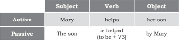

Tabel ini menunjukkan perbandingan struktur kalimat aktif dan pasif dalam bahasa Inggris. Topik utamanya adalah perbedaan struktur kalimat antara dua bentuk tersebut. Kolom "Subject" (Subjek) menunjukkan siapa yang melakukan tindakan, sedangkan "Verb" (Verb) menunjukkan tindakan yang dilakukan. Kolom "Object" (Objek) menunjukkan siapa yang menjadi objek dari tindakan. Dalam struktur aktif, subjek adalah "Mary" dan objek adalah "her son". Sementara dalam struktur pasif, subjek adalah "The son" dan objek adalah "to be + V3" (dalam contoh ini, "helped"). Ini menunjukkan bahwa dalam struktur pasif, subjek tidak lagi menjadi subjek, tetapi menjadi objek yang menerima tindakan.

Active

Passive

Active

Passive

People see peace in family as essential for spiritual growth.

Peace in family is seen as essential for spiritual growth.

Muslims perform prayers at least five times a day.

Prayers are performed by Muslims at least five times a day.

 

---
## 📄 Halaman 85

### Task 1:

Refer back to the text and find at least five sentences written in passive voices. Change the sentences into active voices.

---
**📊 Tabel**

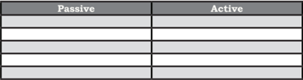

Tabel ini membandingkan dua metode penggunaan kata kerja: pasif dan aktif. Topik utamanya adalah perbedaan struktur kalimat antara kedua metode tersebut. Kolom "Passive" berisi contoh kalimat yang menggunakan kata kerja dalam bentuk pasif, sementara kolom "Active" berisi contoh kalimat yang menggunakan kata kerja dalam bentuk aktif. Data penting yang terlihat adalah bahwa dalam kalimat pasif, subjek biasanya tidak jelas atau tidak dinyatakan secara langsung, sedangkan dalam kalimat aktif, subjek jelas dan langsung disebutkan. Ini menunjukkan bahwa penggunaan kata kerja dalam bentuk aktif dapat memberikan informasi lebih jelas dan langsung kepada pembaca atau penulis.

### Task 2:

Refer back to the text again and find five sentences written in active voices. Change the sentences into passive voices.

---
**📊 Tabel**

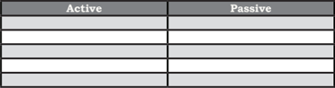

Tabel ini menunjukkan perbandingan antara struktur aktif dan pasif dalam bahasa Indonesia. Topik utamanya adalah penggunaan kata kerja dalam dua bentuk tersebut. Kolom "Active" berisi contoh kalimat yang menggunakan bentuk aktif, sementara kolom "Passive" berisi contoh kalimat yang menggunakan bentuk pasif. Data penting yang terlihat adalah bahwa bentuk aktif lebih umum digunakan untuk menggambarkan tindakan yang dilakukan oleh subjek, sedangkan bentuk pasif digunakan ketika subjek tidak berada dalam posisi yang aktif atau tidak dapat melakukan tindakan tersebut.

### SPEAKING

Work in pairs: Try to remember one interesting place  you've  visited.  Tell your friends about the place.

---
**🖼️ Gambar/Diagram**

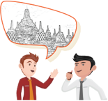

> **Deskripsi Visual:** Gambar ini adalah ilustrasi yang menunjukkan dua orang yang sedang berbicara. Pada gambar tersebut, salah satu orang sedang memberikan penjelasan kepada orang lain. Dalam balutan bunga, ada gambar sebuah kota tua yang tampak seperti sebuah kota klasik dengan bangunan bersejarah. Ini menunjukkan bahwa pembicaraan mereka mungkin berkaitan dengan sejarah atau budaya kota tersebut.

Elemen utama dalam gambar ini adalah dua orang yang sedang berbicara, kota tua yang tampak seperti sebuah kota klasik, dan balutan bunga. Hubungan antara elemen-elemen ini adalah bahwa kota tua tersebut mungkin menjadi topik pembicaraan antara kedua orang tersebut. Balutan bunga yang ada di atas kota tua menambahkan nuansa estetika dan mungkin merujuk pada keindahan atau keunikan kota tersebut.

Teks, angka, atau label penting yang terlihat dalam gambar ini tidak ada. Namun, informasi kunci yang dapat diambil pembaca adalah bahwa pembicaraan antara kedua orang tersebut mungkin berkaitan dengan sejarah atau budaya kota tua yang tampak di balutan bunga tersebut.

 

---
## 📄 Halaman 86

### WRITING

### Task 1:

Work  in  pairs.  Complete  the  following  chart  to  understand  the structure of the descriptive text in the Reading Comprehension.

---
**📊 Tabel**

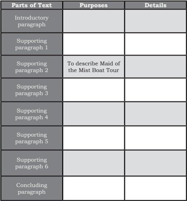

Tabel ini berisi informasi tentang bagian-bagian teks dan tujuannya dalam sebuah artikel atau tulisan. Topik utamanya adalah bagian-bagian teks dan tujuan mereka. Kolom "Parts of Text" mencakup intro, 6 paragraf bantu, dan paragraf penutup. Kolom "Purposes" menunjukkan tujuan masing-masing bagian tersebut. Kolom "Details" menyediakan detail spesifik untuk setiap bagian. Misalnya, bagian intro biasanya digunakan untuk memberikan latar belakang atau konteks awal. Bagian-bagian bantu dapat membahas lebih lanjut tentang topik utama dengan menggunakan contoh atau fakta. Paragraf penutup biasanya digunakan untuk menyimpulkan atau memberikan kesimpulan. Pola penting yang terlihat adalah bahwa setiap bagian memiliki tujuan khusus dan detail yang spesifik untuk mendukung maksud keseluruhan tulisan.

 

---
## 📄 Halaman 87

### Task 2:

### Collaborative Description

### Your teacher will assign you to sit in groups of 12-15 students.  Sit in a circle and do the following steps.

- Write a sentence about an interesting place. Start with a topic sentence. When your teacher gives a signal to stop, stop writing and give your paper to your friend on your right, and you'll receive your friend's paper. Continue writing a sentence on your friend's paper, one sentence at a time. Continue doing this, until your paper is back to you.
When writing, pay attention to the following guiding questions:

- What is the name of the place and why is it interesting?
- What attractions are available in this place? Describe one by one.
- What is your overall impression about the place?
- Read your and your friends' description. What do you think? Is it a funny description? Does your paragraph make sense? If not, then go to the next activity.

---
**🖼️ Gambar/Diagram**

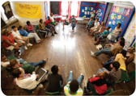

> **Deskripsi Visual:** Gambar ini menunjukkan sebuah ruangan sekolah dengan anak-anak yang sedang bermain atau belajar bersama-sama. Ruangan tersebut dilengkapi dengan papan tulis besar di dinding depan, meja, dan kursi. Anak-anak tampak senang dan aktif, beberapa sedang berbicara, sementara yang lain menatap papan tulis. Di sekeliling mereka, terdapat poster dan gambar yang menambah keindahan ruangan. Gambar ini menunjukkan suasana belajar yang positif dan kolaboratif di mana anak-anak berpartisipasi aktif dalam aktivitas belajar mereka.

Picture 5.11

---
**🖼️ Gambar/Diagram**

> **Deskripsi Visual:** Gambar ini adalah ilustrasi yang menunjukkan seorang pria sedang membaca buku. Pria tersebut duduk dengan posisi nyaman, memegang buku dengan kedua tangan dan menatap halaman yang dibaca. Belakangnya tampak seperti lantai kayu, menunjukkan bahwa ia mungkin berada di ruangan yang sederhana atau sekolah. Wajahnya tampak fokus dan serius, menunjukkan keingintahuan dan minat dalam membaca.

Elemen utama dalam gambar ini adalah pria yang sedang membaca buku. Relasi antara elemen-elemen ini adalah bahwa pria adalah subjek utama dan buku adalah objek utama yang dia baca. Teks, angka, atau label penting tidak ada dalam gambar ini karena tidak ada teks atau angka yang terlihat.

Informasi kunci yang dapat diambil pembaca dari gambar ini adalah bahwa pria tersebut tertarik dan serius dalam membaca, menunjukkan minat dan keingintahuan terhadap pengetahuan. Gambar ini juga bisa digunakan untuk menggambarkan tema belajar atau pembelajaran.

 

---
## 📄 Halaman 88

### Task 3:

Now, rewrite  your  description  by  adding  words,  phrases  or  sentences. Change it into a short descriptive text telling your reader about an interesting place to visit. Make sure that your text makes sense.

Use the following questions to guide you:

- Does the essay have an introductory paragraph?
- Does your essay have supporting paragraphs?
- Does your essay include a concluding paragraph?
- Does your paragraph use clear references?

### REFLECTION

At  the  end  of  this  chapter,  ask  yourself  the  following questions to know how effective your learning process is.

- What have you learned from this chapter?
- Can you do all the exercises here?
- What is your plan to improve your ability in describing places?
________________________________________________________________

________________________________________________________________

________________________________________________________________

________________________________________________________________

________________________________________________________________

________________________________________________________________

________________________________________________________________

________________________________________________________________

________________________________________________________________

________________________________________________________________

________________________________________________________________

________________________________________________________________

________________________________________________________________

________________________________________________________________

 

---
## 📄 Halaman 89

### Chapter 6

### Giving Announcement

Source: Dokumen Kemdikbud Picture 6.1

---
**🖼️ Gambar/Diagram**

> **Deskripsi Visual:** Gambar ini adalah ilustrasi yang menunjukkan seorang pria sedang berteriak menggunakan mikrofon. Pria tersebut mengenakan seragam formal dengan kemeja putih dan dasi hitam. Latar belakangnya adalah warna biru cerah, yang membuat gambar terlihat lebih cerah dan menyegarkan.

Elemen utama dalam gambar ini adalah pria yang sedang berteriak menggunakan mikrofon. Mikrofon tersebut tampak besar dan berwarna orange, menonjol di bagian atas gambar. Pria tersebut tampak sangat antusias dan memegang mikrofon dengan tangan yang kuat, menunjukkan bahwa dia sedang berbicara dengan suara yang kuat dan jelas.

Teks, angka, atau label penting tidak ada dalam gambar ini karena gambar hanya menggambarkan seorang pria yang sedang berteriak menggunakan mikrofon tanpa adanya teks atau angka tambahan.

Informasi kunci yang dapat diambil pembaca dari gambar ini adalah bahwa pria tersebut sedang berteriak menggunakan mikrofon, yang menunjukkan bahwa dia mungkin sedang berbicara kepada orang banyak atau memberikan pernyataan publik. Warna dan gaya pakaian pria tersebut juga menunjukkan bahwa dia mungkin memiliki posisi atau jabatan yang formal atau resmi.

### Tujuan Pembelajaran:

Setelah mempelajari Bab 6, siswa diharapkan mampu:

- Menjelaskan fungsi sosial, struktur teks, dan unsur kebahasaan dalam teks  pemberitahuan  ( announcements )  tentang  kegiatan  sekolah  secara benar sesuai konteks penggunaannya.
- Menerangkan informasi tentang kegiatan sekolah dengan memperhatikan  fungsi  sosial,  struktur  teks,  and  unsur  kebahasaan dalam teks pemberitahuan ( announcement ) lisan dan tulis secara benar sesuai konteks penggunaannya.
- Membuat pengumuman tentang kegiatan sekolah dengan menggunakan fungsi sosial, struktur teks, dan unsur kebahasaan teks tersebut sesuai dengan konteks penggunaannya.

 

---
## 📄 Halaman 90

### WARMER

Close  your  book.  Listen  to  your  teacher  reading  an announcement. Refer to these questions while listening.

- Who is the announcement for?
- What is the announcement about?
- Where do you think you will hear that kind of announcement?
- Why do we need to write/use an announcement?

### VOCABULARY BUILDER

Match  the  words  with  their  Indonesian  equivalents. Compare your work to your classmates'.

cancel (verb)

a stadium

an approval

proceed (verb)

in accordance with (noun)

unforeseen (adjective)

a first-come basis (noun)

tremendous (adjective)

a registration fee (noun)

reserved

### PRONUNCIATION PRACTICE

Listen to your teacher reading these words. Repeat after him/her.

cancel : / ˈkæns ə l / stadium : / ˈsteɪdiəm / approval : / əˈpruːv ə l / proceed : / prəˈsiːd /

 

---
## 📄 Halaman 91

in accordance with  : /

ɪn  əˈkɔːd ə ns  wɪθ /

unforeseen

: /

ˌʌnfɔːˈsiːn

/

a first-come basis

: /

ə fɜːrst kʌm ˈbeɪsɪs /

tremendous

: /

trɪˈmendəs /

registration fee

: /

ˌredʒəˈstreɪʃ ə n  fiː /

reserved

: /

rɪˈzɜːvd /

### READING

### Jigsaw

### Task 1:

Read the text carefully. Your teacher will identify you as A or B. Students identified as A, read text 1; students as B, read text 2.

### Text 1: An Announcement about Concert Cancellation

### Cancellation of JY] Concert in Singapore

by Faith &. D Entertainment on Monday, Mardh 28, 2011 at 5:19am

Dear Fans and Media

This is an official announcement to inform everyone that we have just been notified by CJes Entertainment, the artiste agency of JY] that they have dedided to cancel JY] World Tour Concert in Singapore which is scheduled on 23 April 2011 at Singapore Indoor Stadium.

Itis with utmost regret that we have to accept this cancellation notice from the artiste agency at this point in time. We have submitted the final plans for stage, seating and ticketing for the agency's aoueploooe ul aie sueld asayl 'ales jaspg uo quawaounouue jepyo a4n 4hm paaooud ot se os qenoudde with the regulations required by the authorities in Singapore and the budget allocated for the concert. It is most unfortunate that the plans are not approved by CJes and their decision is to cancel the concert. We respect the agency's dedision and, with great regret, we are unable to change their mind but to accept this unforeseen circumstance that is beyond our control.

We understand the disappointment as well as the inconvenience caused due to the cancellation and We sincerely apologize - espedially to the fans of JYl.

The Management Faith &D Entertainment

(Taken from http://www.dbsknights.net/2011/03/info-faith-d-entertainment- announces.html )

+ Write a Note

 

---
## 📄 Halaman 92

### ANNOUNCEMENT

### McMaster Mini-Med School

We hope that you enjoyed becoming a McMaster Mini-med student in 2014 and we welcome you to become a student in 2015. The new seven week term will begin on Tuesday, March 3, 2015 with classes held on March 24, March 24, March 31, April 7, and April 14, 2015.

Registration will occur on a first-come basis. As the response for the previous years was tremendous, it is advised to reoster as soon as possible. After all the student spots are full, all others will be placed on a waiting list and will be contacted when spots become available.

With registration fees participants receive:

- A reserved spot in the McMaster Mini-Med School Class 2015
- An 'official' Mini-Med School tote bag
- An 'official' Mini-Med School Clipboard and Pen
- An 'official' Mini-Med School Stadium blanket
- An 'official' Mini-Med School travel book light
- A McMaster Mini-Med School Certificate of Attendance that will be presented on the last day of classes
For  a  list  of  speakers  and  further  information  including  registration  and  fees, please go to the following website:

http://www.medportal.ca/minimed/index.html

### Or register online by visiting

www.fhs.mcmaster.ca/conted

(Taken from http://www.docstoc.com/docs/4661848/ANNOUNCEMENT McMaster-Mini-Med-School-McMaster-Mini-Med-School )

 

---
## 📄 Halaman 93

### Task 2:

After reading the text, in the chart below, identify the main ideas of the paragraphs, and then write the most important details in your own words.

---
**📊 Tabel**

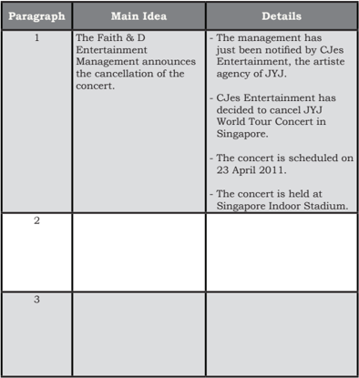

Tabel ini berisi informasi tentang pengumuman penundaan konser oleh The Faith & D Entertainment Management. Topik utama tabel adalah tentang penundaan konser JYJ World Tour Concert di Singapura. Kolom "Main Idea" menyajikan poin-poin utama yang disampaikan dalam setiap paragraf, sedangkan kolom "Details" menyediakan detail mendalam tentang informasi tersebut. Data penting yang terlihat antara lain bahwa konser tersebut telah ditunda karena keputusan CJes Entertainment, agensi artis JYJ, dan akan diadakan pada 23 April 2011 di Indoor Stadium Singapura.

 

---
## 📄 Halaman 94

---
**📊 Tabel**

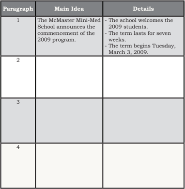

Tabel ini berisi informasi tentang program akademik tahun 2009 di Sekolah Mini-Med McMaster. Topik utama tabel adalah pengumuman tentang program tersebut. Kolom "Main Idea" menyajikan poin-poin utama dari setiap paragraf, sementara kolom "Details" menyediakan detail mendalam tentang poin-poin tersebut. Data penting yang terlihat meliputi bahwa program ini diadakan pada tahun 2009, berlangsung selama tujuh minggu, dan dimulai pada hari Selasa, 3 Maret 2009.

### Task 3:

Work in pairs. If you have read Text 1, refer to Questions II; if you have read Text 2, refer to Questions I. Read the questions for your partner to answer.

 

---
## 📄 Halaman 95

### COMPREHENSION QUESTIONS I

### Answer the following questions briefly.

- Who wrote the announcement?
- When was the announcement released?
- Who is the announcement for?
- What is the announcement about?
- When and where will actually the concert be held?
- What has the Faith & D Entertainment Management submitted to CJes Entertainment?
- Has there been an announcement regarding ticket sale? Why do you think so?
- What did Faith & D Entertainment write in the last paragraph?

### COMPREHENSION QUESTIONS II

### Answer the following questions briefly.

5

- Who wrote the announcement?
- Who is the announcement for?
- What is the announcement about?
- How long does the term last?
- How does the registration occur? What does that mean?
- What  will  the  school  do  to  the  other  applicants  when  all  the student spots are full?
- What do the participants receive?
Discuss with your classmate about the similarity and difference betwen text 1 and text 2.

.

 

---
## 📄 Halaman 96

### VOCABULARY EXERCISE

Complete the following sentences using the words in the box.

proceed

unforeseen

a first-come basis

tremendous

registration fee

reserved

cancel

stadium

approval

in accordance with

- This  annual  international  conference  is  usually  attended by  many  participants  from  various  countries;  therefore,  the committee applies the registration on __________.
- This restaurant is full. We cannot get any seat as all the tables have been __________.
- Before arranging the examination date for their final project, the students have to get their supervisors' __________.
- This  afternoon  the  football  match  between  INDONESIA  and VIETNAM is held at Gelora Bung Karno __________.
- The seminar participants will get a special rate for the __________ if they can pay it one month before the due date.
- The headmaster has to __________ some school programs due to  the  changes  of  funding  policies  by  the  newly-appointed mayor.
- Even  though  her  mid-semester  project  is  due  next  month, Fahmida  is  planning  to  finish  it  today.  She  does  this  to minimize __________ circumstances.
- The  election committee  works  __________ the rules  and regulations established by the government.
- According to the announcement,  passengers of  Garuda Indonesia  Flight  Number  GA  522  are  to  __________  to  the waiting room.
- The announcement about the trip to Borobudur Temple has received __________ response.

 

---
## 📄 Halaman 97

### TEXT STRUCTURE

### THINK-PAIR-SHARE

### Task 1:

Individually,  complete  the  following  chart  to  find  out  the structure of the announcement on page 83 and 84, depending on which announcement you have read.

---
**📊 Tabel**

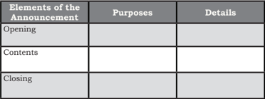

Tabel ini membahas elemen-elemen penting dalam sebuah pengumuman, yaitu: pembukaan, isi, dan penutup. Pembukaan bertujuan untuk menyampaikan informasi dasar tentang pengumuman tersebut, seperti tanggal, waktu, dan lokasi. Isi pengumuman berisi detail spesifik yang ingin disampaikan kepada audiens, seperti informasi tentang acara, agenda, atau kegiatan yang akan dilaksanakan. Penutup bertujuan untuk menutup pengumuman dengan memberikan kesimpulan atau peringatan penting, serta memberikan informasi tentang cara mendapatkan informasi lebih lanjut jika diperlukan. Topik utama tabel ini adalah pengumuman, dan kolom-kolomnya mencakup tujuan dan detail dari setiap elemen pengumuman. Data penting yang terlihat adalah bahwa semua elemen pengumuman memiliki tujuan dan detail yang berbeda, namun semua bertujuan untuk memastikan pengumuman dapat disampaikan dengan jelas dan efektif kepada audiens.

### Task 2:

Work in pairs (Students A and B) discussing and comparing the text structure you have identified, and then share this with the class.

### GRAMMAR REVIEW

### Forming Nouns from Verbs

### Task 1:

Study  the  following  pairs  of  sentences  to  identify  how  the words printed in italics are related.

### Examples:

- a. We need to register soon.
- The registration is on a first-come basis.

 

---
## 📄 Halaman 98

- a. CJes Entertainment has decided to cancel the concert.
- The cancellation of the concert is announced by Faith & D Entertainment Management.
- a.  He  is  trying  to deny the evidence that the police have presented.
- His denial appears very ridiculous.
- a. CJes did not approve the concert plans by Faith & D Entertainment Management.
- It was unfortunate that the approval from the artiste agency was not granted.

### Task 2:

Complete the sentences with the correct forms of the verbs in italics.

- They are going to reserve a room in a local hotel. The __________ can be done through email.
- The artiste agency has to decide on the concert cancellation. The agency's __________ has to be respected.
- Dany was permitted by his father to try a  new  car.  The  __________ period lasted for a week.
- The  internet connects people  around  the  world  easily.  This school has a very excellent internet __________.
- The beginning part of a story orients readers with the setting. The  quality  of  this  __________  usually  determines  whether readers would continue reading or not.
- Joe  wanted  to bury the  dead  body  of  his  pet  Bonnie  at  the backyard.  He  hoped  that  this  __________  would  bring  good memories.
- The students are planning to organize a trip to the beach. The __________  is  supervised  by  the  vice  headmaster  for  student affairs.
- Riza hopes that his supervisor would approve his proposal. The __________, however, is subject to the revision he is doing at the moment.

 

---
## 📄 Halaman 99

- The  teacher  will divide the  class  into  two.  The  __________  is based on the attendance list.
- The students are being trained to communicate effectively  in public. Public __________ is one of essential skills in this global era.

### LISTENING

Open  these  two  links.  Discuss  with  your  classmates  to respond to these questions.

- What is the announcement for?
- What is the announcement about?
- Do you see any similarity in terms of the content?
- When did the figures pass away?
- How important were the figures for their countries?
- How do you think the people react towards the announcements? Discuss with your friends.
- What are the elements of the announcement?
LINK 1: https://www.youtube.com/watch?v=ujPidSx7Vus

LINK 2: https://www.youtube.com/watch?v=BI7RSN9MTyQ

---
**🖼️ Gambar/Diagram**

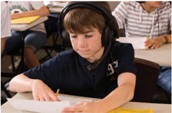

> **Deskripsi Visual:** Gambar ini adalah foto yang menunjukkan seorang siswa sedang belajar di kelas. Siswa tersebut sedang menulis di lembaran kertas dengan pensil, tampaknya sedang fokus pada tugas belajar. Beliau mengenakan headphone, mungkin untuk mendengarkan audio bantuannya. Di sekitarnya, ada beberapa buku pelajaran lainnya yang menunjukkan bahwa ini adalah situasi belajar formal. Siswa tersebut tampaknya berada di tengah-tengah proses belajar, menunjukkan interaksi antara aktivitas belajar dan teknologi pendukung seperti headphone.

 

---
## 📄 Halaman 100

### SPEAKING

Imagine that you are the captain of your class. You just had a meeting with OSIS. During the meeting, you took the following notes. Use your notes to make an announcement to your classmates.

- Trip to Borobudur Temple
- 3 days 4 nights (departing on 27 October)
- Contribution: IDR 150,000 including transportation, meals, and hotel
- Confirmation by 20 October to the organizing committee either by email to osis@sma-ic.com or sms to 0850502134

### WRITING

### Task 1:

The  following  announcement  about  regional  games  is  not written  properly.  Edit  the  announcement  so  that  it  makes sense.

### ANNOUNCEMENT

To All Members of Riza's Club

Please be informed that Riza Regional Games 2013 will be on May 5 - 12, 2013 at Malang City.

Please pay your 2nd smester contributions on or before April 30, 2013.

All checks will be payed to the order of Rizas Club with account # 02051527.

Thank you for your attention. Managemen of Riza's Club

 

---
## 📄 Halaman 101

### Task 2:

### Use the following  questions  to  help  you  re-write  the  above announcement.

- Where is the announcement from?
- Who is the announcement for?
- What is the announcement about?
- When will the games be?
- Where will the games be?
- When do the members have to pay the contributions?
- What is the number of the account to pay checks?
The  announcement  from  The  Management  of  Riza's  Club informs  _____________________________________________________

_____________________________________________________________

_____________________________________________________________

_____________________________________________________________

_____________________________________________________________

_____________________________________________________________

_____________________________________________________________.

### REFLECTION

At  the  end  of  this  unit,  ask  yourself  the  following questions to know how effective your learning process is.

- Do you know how to announce a piece of information orally?
- Do you know how to write an announcement?
- Does an announcement have to contain information?
- Do you know how to organize the information in an announcement?
- Why do people make an announcement?
- Do you know the linguistic features of an announcement?
- Where do you usually find an announcement?
If your answer is 'no' to any one of these questions, see your teacher and discuss with him/her on how to make an announcement.

 

---
## 📄 Halaman 102

### Chapter 7

### The Wright Brothers

---
**🖼️ Gambar/Diagram**

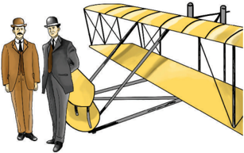

> **Deskripsi Visual:** Gambar ini adalah ilustrasi yang menunjukkan dua orang pria berdiri dekat dengan sebuah pesawat biplane. Pesawat tersebut memiliki sayap berwarna kuning dengan struktur tengah yang terbuat dari kayu dan baja. Pada bagian depan pesawat terdapat sebuah mesin yang tampak kecil dibandingkan dengan pesawatnya. Kedua pria tersebut mengenakan pakaian formal, termasuk jas dan topi, serta memegang tas. Gambar ini mungkin digunakan untuk membantu pembaca memahami konsep tentang sejarah pesawat atau teknologi penerbangan.

Source: Dokumen Kemdikbud Picture 7.1

### Tujuan Pembelajaran:

Setelah mempelajari Bab 7, siswa diharapkan mampu:

- Menjelaskan makna, fungsi sosial, struktur teks, dan unsur kebahasaan ( simple past tense vs present perfect tense ) pada pernyataan dan pertanyaan tentang    kejadian  yang  terjadi  di  waktu  lampau  yang  merujuk  waktu terjadinya dan kesudahannya, sesuai dengan konteks penggunaannya.
- Meminta informasi tentang kejadian yang terjadi di waktu lampau yang merujuk pada waktu terjadinya dan kesudahannya, sesuai dengan konteks penggunaannya.
- Memberi informasi tentang kejadian yang terjadi di waktu lampau yang merujuk  waktu  terjadinya  dan  kesudahannya  sesuai  dengan  konteks penggunaan.

 

---
## 📄 Halaman 103

Look  at  the  pictures  below!  Do  you  know  the  people  in  the picture? Compare the two airplanes? What are the similarities? What are the differences? Discuss with your classmates!

### Wright Brothers

### W right Brother's Airplane

(some picture are adopted from: http://en.wikipedia.org/wiki/Wright_brothers)

### VOCABULARY BUILDER

Look at the list of the words below. Find their meanings in a monolingual dictionary.

 

---
## 📄 Halaman 104

- a tool
: __________________________________________

- on inspiration
: __________________________________________

- a helicopter
: __________________________________________

- a rubber band
: __________________________________________

- interested
: __________________________________________

- kites
: __________________________________________

- an experiment
: __________________________________________

- breeze
: __________________________________________

- soften
: __________________________________________

- a crash
: __________________________________________

- a flight
: __________________________________________

- a glider
: __________________________________________

- a design
: __________________________________________

### PRONUNCIATION  PRACTICE

Listen  to  your  teacher  reading  the  following  words.  Repeat after him/her.

inventor

: / ɪnˈventər /

invention

: / ɪnˈvenʃ ə n /

airplane

: / ˈeəpleɪn /

tool

: / tuːl /

inspiration

: / ˌɪnspəˈreɪʃ ə n /

helicopter

: / ˈheləkɑːptər /

rubber band

: / ˈrʌbər bænd /

interested

: / ˈɪntrəstəd /

kite

: / kaɪt /

experiment

: / ɪkˈsperɪmənt /

breeze

: / briːz /

soften

: / ˈsɒf ə n /

crash

: / kræʃ /

flight

: / flaɪt /

glider

: / ˈɡlaɪdər /

design

: / dɪˈzaɪn /

 

---
## 📄 Halaman 105

### DIALOG

Task 1:

Read the following conversation.

### Interview With The Wright Brothers

In 1905, there was a TV talkshow that interview great inventors at that time. Below is a script of interview with The Wright brothers.

Host

: Hello and welcome to our talkshow tonight, Great Inventors! Today we have very special guests, Orville and Wilbur Wright. We are going to ask them about their revolutionary inventions.What do you call your invention?

Orville

: We invented airplane.

Host

: Airplane? What is the tool for?

Wilbur

: It' s a tool that will help human being to fly!

Host

: Oohhh, is it like a flying car? How did you get the inspiration?

Orville

: Our dad gave us a toy helicopter that flew with the help of rubber bands. We've been interested in the idea since then.

Wilbur : Orville has always liked to build kites, so, we have experimented with making our own helicopters for a while now.

Host

: But that was only a toy, what about the actual plane?

Wilbur

: Orville made the first flight with our first plane at Kitty Hawk on December 14, 1903.

Host

: Why did you choose Kitty Hawk?

Orville : Kitty Hawk had a hill, good breezes, and was sandy. The condition would help soften the landings in case of a crash. The first flight lasted 12 seconds and they flew for 120 feet.

Wilbur : We have worked and experimented with gliders to perfect the wing design and controls since then.

Host

: I see. So you've had the newest version of your airplane?

Wilbur

: Y es. Recently, I took a newly designed airplane that we called the Flyer II for the first flight lasting over 5 minutes.

Host : How amazing! I think this invention will be a big thing soon.

 

---
## 📄 Halaman 106

Wilbur : Our father has asked us not to fly together. He said it's for the safety reason.

Orville

: Y es, we will continue making more experiment so that

airplane will be available for everyone soon.

Host

: Okay, we wish you good luck with the next experiments.

...

### Task 2: above.

Made with materials from:

http://www.ducksters.com/biography/wright_brothers.php

Supply the dialog with the correct expressions based on the conversation

---
**🖼️ Gambar/Diagram**

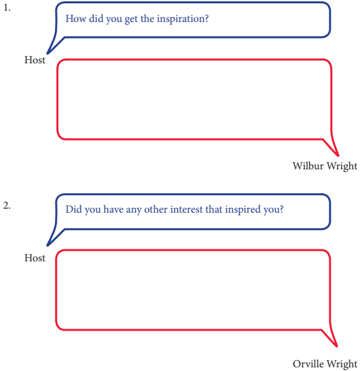

> **Deskripsi Visual:** Gambar ini adalah sebuah diagram yang menunjukkan pertanyaan dan jawaban antara Host dan dua orang yang disebutkan sebagai Wilbur Wright dan Orville Wright. Diagram ini terdiri dari dua panel, masing-masing dengan pertanyaan dan jawaban yang berbeda. Pertanyaan pertama bertanya tentang inspirasi yang diperoleh oleh seseorang, sedangkan pertanyaan kedua bertanya apakah ada hal lain yang juga mempengaruhi seseorang. Jawaban dari kedua orang tersebut tidak ditampilkan dalam gambar ini.

 

---
## 📄 Halaman 107

---
**🖼️ Gambar/Diagram**

> **Deskripsi Visual:** Gambar ini adalah sebuah diagram yang menunjukkan pertanyaan dan jawaban antara Host dengan Orville Wright tentang sejarah pesawat. Diagram ini terdiri dari tiga baris, masing-masing menampilkan pertanyaan Host kepada Orville Wright dan jawabannya. Pertanyaan pertama bertanya apakah Orville Wright membuat pesawat yang nyata, jawabannya adalah "Yes". Pertanyaan kedua bertanya mengapa Orville Wright memilih Kitty Hawk sebagai tempat pertama untuk melakukan penerbangan, dan jawabannya adalah "Because Kitty Hawk had strong winds and good visibility". Pertanyaan ketiga bertanya berapa lama penerbangan pertama berlangsung, dan jawabannya adalah "The first flight lasted about 12 seconds". Semua pertanyaan dan jawaban ini membahas sejarah awal pesawat dan lokasi pertama penerbangan.

 

---
## 📄 Halaman 108

---
**🖼️ Gambar/Diagram**

> **Deskripsi Visual:** Gambar ini adalah sekelompok dialog yang terdiri dari tiga pertanyaan yang ditanyakan oleh Host kepada Wilbur Wright. Setiap pertanyaan ditampilkan dalam kotak berwarna biru dengan teks yang berbeda, sementara jawaban Wilbur Wright ditampilkan dalam kotak berwarna merah dengan teks yang sama. Pertanyaan pertama bertanya tentang proyek yang telah dilakukan Wilbur Wright sejak saat itu, pertanyaan kedua bertanya tentang versi terbaru pesawatnya, dan pertanyaan ketiga bertanya apakah ayah Wilbur Wright membantu dalam proses tersebut. Informasi penting yang dapat diambil dari gambar ini adalah bahwa Wilbur Wright sedang menjawab pertanyaan tentang proyek pesawatnya dan pengaruh ayahnya dalam proses tersebut.

 

---
## 📄 Halaman 109

### VOCABULARY EXERCISES

Complete the sentence using the words from the list below. You may need to use more than one word for one sentence.

inventors

invention

airplane

tool

inspiration

helicopter

rubber band

interested

kites

experiment

breeze

soften

broke

flight

glider

design

- Wright brothers were great _______________________. Airplane was their great ______________________.
- One of the essential ________________________ in the kitchen is a knife which is used in almost all cooking activities.
- 'Do  you see that big H on the ground?' 'That's a spot for ______________ _______landing.'
- It' s bright, sunny and windy today. The kids must be very happy because they can go out and play ______________________.
- The  students  are  in  the  biology  lab  today.  They  are  going  to  conduct  an _______________________  with frogs!
- I can tie my hair into a pony tail using a _______________________.
- Some artists have different sources of _______________________ for their work. It can be natural scenery, traditional dances, people's activities, etc.
- When the ____________________ begins to take off, its tires fold up into their compartment.
- I am not ________________________ in baking cakes. I like knitting better.
- When the car hit the tree, the windshield _________________ into pieces.

 

---
## 📄 Halaman 110

### GRAMMAR REVIEW

### SIMPLE PAST TENSE vs PRESENT PERFECT TENSE

### Task 1:

Look at the excerpt from the text below.  Study the sentences by paying attention to the words in the bold-typed and bold-italic typed expressions.

Orville

- : Our dad gave us a toy helicopter that flew with the help of rubber bands. We 've been interested in the idea since then.
Wilbur

: Orville has always liked to build kites, so, we have experimented with making our own helicopters for a while now.

Host

: But that was only a toy, what about the actual plane?

Wilbur

: Orville made the first flight with our first plane at Kitty Hawk on December 14, 1903.

Host

: Why did you choose Kitty Hawk?

Orville

: Kitty Hawk had a hill, good breezes, and was sandy. The condition would help soften the landings in case of a crash. The first flight lasted 12 seconds and they flew for 120 feet.

Wilbur

- : We have worked and experimented with gliders to perfect the wing design and controls since then.
Can you tell what pattern is written in bold type? What about the pattern in the bold italic type?

### Task 2:

Complete the diagram below. Place this symbol (X) and lines at the diagram that can show Simple Past Tense and Present Perfect Tense.

---
**🖼️ Gambar/Diagram**

> **Deskripsi Visual:** Gambar ini adalah diagram yang menunjukkan perbandingan antara Simple Past Tense dan Present Perfect Tense dalam bahasa Inggris. Diagram ini dibagi menjadi dua bagian, masing-masing menunjukkan struktur waktu untuk kedua tense tersebut.

Pertama, pada bagian kiri, terdapat garis horizontal yang diberi label "Past", "Present", dan "Future". Garis ini menunjukkan bahwa Simple Past Tense hanya memiliki tiga posisi waktu, yaitu masa lalu (Past), saat ini (Present), dan masa depan (Future).

Sementara itu, pada bagian kanan, terdapat garis horizontal yang juga diberi label "Past", "Present", dan "Future". Namun, garis ini menunjukkan bahwa Present Perfect Tense memiliki empat posisi waktu, yaitu masa lalu (Past), saat ini (Present), masa depan (Future), dan masa kini (Present).

Dalam diagram ini, elemen-elemen utama adalah garis horizontal yang menunjukkan waktu, dan label "Past", "Present", dan "Future" yang menunjukkan posisi waktu. Informasi kunci yang dapat diambil pembaca adalah bahwa Simple Past Tense memiliki tiga posisi waktu, sedangkan Present Perfect Tense memiliki empat posisi waktu.

 

---
## 📄 Halaman 111

### USING THE SIMPLE PAST TENSE

### Task 1:

Think of yesterday. What did you do? What didn't you do? List the verbs of your activities yesterday.

Things you did yesterday

________________________

________________________

________________________

________________________

________________________

________________________

________________________

Things you didn't do yesterday

________________________

________________________

________________________

________________________

________________________

________________________

________________________

### Task 2:

Use the words in Task 1 to make sentences in the simple past tense.

1.

________________________________________________________________

2.

________________________________________________________________

3.

________________________________________________________________

4.

________________________________________________________________

5.

________________________________________________________________

6.

________________________________________________________________

7.

________________________________________________________________

8.

________________________________________________________________

9.

________________________________________________________________

10.

________________________________________________________________

 

---
## 📄 Halaman 112

### USING PRESENT PERFECT TENSE

### Task 3:

Look  at  the  sentences  you  made  for  Task  2  of  this  section.  Now,  make extended  statements  using  Present  Perfect  Tense.    Look  at  the  example below.

### Example:

Your sentence: I helped my mom cook in the kitchen.

Extended statement: I have helped my mom in the kitchen since I was 12 years old.

1.

________________________________________________________________

2.

________________________________________________________________

3.

________________________________________________________________

4.

________________________________________________________________

5.

________________________________________________________________

6.

________________________________________________________________

7.

________________________________________________________________

8.

________________________________________________________________

9.

________________________________________________________________

10.

________________________________________________________________

 

---
## 📄 Halaman 113

### SPEAKING

### Task 1:

Look at the sentences that your partners make for the simple past tense. Ask further questions about the activities he/she did yesterday using what, where, why, who, when or how. Look at the example below.

### Example:

### Your classmate's sentence :

I ate dinner with my family last night.

### Possible extended questions :

- What did you eat?
- Where did you eat?
- When did you finish eating? etc.

### Task 2:

Look at the sentences that your partners make for the present perfect tense. Ask further questions about him/her using what, where, why, who, when or how. Look at the example below.

### Example:

### Your partners sentence:

I have helped my mom in the kitchen since I was 12 years old.

### Possible extended question:

How have you helped your mom in the kitchen?

### Task 3:

### Interview with an inventor

- Work  in  pairs.  One  of  you  will  be  the  interviewer.  Another  will  be  the interviewee.
- Discuss a popular person (it can be an inventor, popular people in the past like actresses, actors, athletes, etc.) who is going to be interviewed. The interviewee will pretend to be this person.

 

---
## 📄 Halaman 114

- As an interviewer, you are going to prepare some questions that cover questions about his/her past activities (for example past experiments, albums, films, etc) and the recent and continuing activities.
- As an interviewee, prepare to answer the questions with some accurate details. While the interviewer is preparing the questions, you can find information about the person you are pretending to be. Of course you can add any fun details to the answers.
Write the interview report in the form of a paragraph in the form below.  Look at the example below:

### Interview form:

Host

Orville

Wilbur

### Paragraph form:

The Wright brothers got an inspiration when their dad gave them a toy helicopter that flew with the help of rubber bands. They had been interested in the  idea  since  then.  Also,  Orville  had  always  liked  to  build  kites,  so,  they  had experimented with making their own helicopters for a while now.

________________________________________________________________

________________________________________________________________

________________________________________________________________

________________________________________________________________

________________________________________________________________

________________________________________________________________

________________________________________________________________

________________________________________________________________

________________________________________________________________

________________________________________________________________

________________________________________________________________

: How did you get the inspiration?

: Our dad gave us a toy helicopter that flew with the help of rubber bands. We've been interested in the idea since then.

:  Orville has always liked to build kites, so, we have  experimented with making our own helicopters for an while now.

 

---
## 📄 Halaman 115

### REFLECTION

At the end of this chapter, ask yourself the following questions to know how effective your learning process is.

- Can you identify the forms and uses of the simple past tense and the present perfect tense?
- Can you make statements or questions using the simple past tense and the present perfect tense?
- Can you write/do a interview?
If your answer is 'no' to one of these questions, see your teacher and discuss with him/her on how to make you able to carry out conversation about the completed past events and those that started in the past but you can still feel the impact.

### FURTHER ACTIVITIES

Independently,  read  newspaper  or  Internet  articles  about  a biography and pay attention to the uses of the simple past tense and the present perfect tense. Also, you can ask your classmates about their past activities and activities that started in the past but continues until now.

---
**🖼️ Gambar/Diagram**

> **Deskripsi Visual:** Gambar ini adalah ilustrasi yang menampilkan sebuah tulisan kata-kata dalam format quote. Kata-kata tersebut adalah "The best revenge is massive success." yang dikutip dari Frank Sinatra. Gambar ini menggunakan warna kuning yang cerah sebagai latar belakang, dengan tulisan yang berwarna putih dan bertulisan "Frank Sinatra" di bawahnya. Di atas tulisan, ada dua titik tanda kutip besar yang mengindikasikan bahwa itu adalah sebuah quote. Di bagian atas gambar, ada dua botol minuman berwarna hijau yang tampak seperti telah dipasang pada lembar kertas tersebut.

 

---
## 📄 Halaman 116

### Chapter 8

### My Idol

Source: http://bola.metrotvnews.com Picture 8.1

### Tujuan Pembelajaran:

Setelah mempelajari Bab 8, siswa diharapkan mampu:

- Mengidentifikasi isi, fungsi sosial, struktur teks, dan unsur kebahasaan dari teks recount sederhana tentang pengalaman pribadi.
- Menjelaskan isi teks yang menceritakan pengalaman pribadi dengan benar dengan memperhatikan tujuan komunikasi, struktur teks, dan unsur kebahasaan teks recount sesuai konteks penggunaan.
- Menceritakan pengalaman pribadi secara lisan dan tulis dengan memperhatikan fungsi sosial, struktur teks, dan unsur kebahasaan teks recount sesuai konteks.

 

---
## 📄 Halaman 117

### WARMER

### Look at the pictures below. Do you know these people? What are they famous for? Discuss with your classmates!

### POINTS TO PONDER

What makes those people successful? What characters do those people have in common?

### VOCABULARY BUILDER

Match the words in the left column with the synonyms on the right column. Then, compare your work to your classmates.

- hit by lightning (adjective)
- a meet-and-greet event (noun)
- excited (adjective)
- lobby (noun)
- memorabilia (noun)
- showed up (verb)
- waved (verb)
- crowd (noun)
- sang along (verb)
- autograph (noun)
- speechless (adjective)
- unreal (adjective)
- cool/awesome (adjective)
- friendly (adjective)
- nervous (adjective)
- amazing (adjective)
- waiting room
- come or arrive
- sing together
- get along
- fan meeting
- merchandise
- wonderful
- move
- signature
- great
- surprised
- anxious
- very happy
- unbelievable
- can't say a word
- a lot of people

 

---
## 📄 Halaman 118

### PRONUNCIATION  PRACTICE

Listen  to  your  teacher  reading  the  following  words. Repeat after him/her.

hit by lightning

: / hɪt baɪ ˈlaɪtnɪŋ /

a meet-and-greet event

: /

ə miːt ænd ɡriːt ɪˈvent /

excited

: /

ɪkˈsaɪtəd /

lobby

: /

ˈlɒbi

/

memorabilia

: /

ˌmem ə rəˈbɪliə /

showed up

: /

ʃoʊd ʌp /

waved

: /

weɪvd

/

crowd

: /

kraʊd

/

sang along

: /

sæŋ əˈlɒŋ

/

autograph

: /

ˈɔːtəɡrɑːf

/

speechless

: /

ˈspiːtʃləs

/

unreal

: /

ˌʌnˈrɪəl◂

/

cool/awesome

: /

kuːl / / ˈɔːs ə m /

friendly

: / ˈfrendli /

nervous

: / ˈnɜːvəs /

amazing

: / əˈmeɪzɪŋ

/

9

..

o.

### READING

Read the following text, and then answer the comprehension questions.

### Meeting My Idol

Afgan  has  always  been  my  favorite singer.  I  had  always  been  thinking  of how I would feel when I met him. Then I  was  suddenly  hit  by  lightning  when  I found out Afgan was coming to town for a  concert  in  a  local  auditorium.  A  day before the concert, there would be a meetand-greet event at a local radio station. Feeling excited, I packed all my Afgan's CDs to get his signature at the event.

 

---
## 📄 Halaman 119

On that bright and sunny Saturday morning, the radio station was full of Afganism (that's how Afgan's fans are called). They sat on the chairs prepared inside the radio station's lobby. Some stood in rows in the front yard of the radio station. A spot inside a lobby was prepared with a mini stage for Afgan's singing performance and a table for Afgan to sign Afganism's memorabilia. Finally, after about 40 or 50 minutes wait, Afgan showed up from inside the radio station. He smiled and waved to all Afganism who had been waiting excitedly saying, 'Good morning. How are you all?' The crowd went crazy. The shouts sounded like a mix of 'Fine, thank you' and  screams of Afgan's name.

Then,  he  started  the  event  by  singing  his  hit  single  'Dia dia  dia'.  Afganism  went  even  crazier;  they  sang  along  with  him throughout the song. Of course, I did too. I couldn't take my eyes off this amazing singer who had released three albums. When he was finished with the song, the host announced that it was time for autographing the memorabilia. I prepared my CDs and began to stand in the line. When I arrived at the table, I was speechless. It  was unreal just seeing him that close. I thought it was really cool seeing him like that because he really just felt like a normal person, which was awesome. He asked my name so that he could write it on the CD to say 'To Mia, Love Afgan'. He was also very friendly, so I didn't feel too nervous when I had a chance to take pictures with him. He was just an amazing person. That was one of the best days in my personal life history.

### Questions:

- How did the writer feel when she knew that Afgan was coming to town?
- Did the writer want to see the concert?
- When and where was the meet-and-greet event?
- What is Afganism?
- How did the fans wait for Afgan?
- What did Afgan do when he showed up in the lobby?
- How did the fans react when Afgan sang his hit single?
- How  did  the  writer  feel  when  she  finally  got  the  turn  to  get Afgan's signature?
- Did she feel nervous?
- What is the writer's opinion about the meet-and-greet event?
- Why do you think people like Afgan?

 

---
## 📄 Halaman 120

- Is there something in the text that is not relevant to your life? Why?
- Have you heard or read a text about a similar event?

### Task 1:

Use the appropriate words in the box to complete the dialog. The first letters of the words are provided to help you. Then, practice reading the dialog with a partner.

Dika

: Hi, Mida, You look so happy.

Mida  : Hi, Dika. You're right. I'm really happy.

Dika

: Really? Why?

Mida  : I met my favorite idol, Agnes Mo yesterday.

Dika

: Wow…, it sounds interesting.

Mida  : I was so e__________. She was really awesome and

f__________.

Dika

: Did you meet her in a concert?

Mida  : No, I didn't. It's a meet-and-greet event with Agnes Mo in

Plaza Indonesia. Big c__________, hundreds of her fans!

Dika

: Did you meet her directly?

Mida  : Yes, I did. I took some pictures with her. I also got her

a__________ on  her last CD Album.

Dika

: It's a_________. How did you feel at that time?

Mida  : I felt n__________ and s__________.

Dika

: Anyway, how did you meet other fans?

Mida  : I met them in a fan meeting.

Dika

: It must be a memorable experience for you.

Mida  : Yeah, indeed. I will never forget it.

### Comprehension check

- Who took part in the dialog?
- What is the dialog about?
- Number  these  sentences  about  Mida's  experience  in  their correct order:

### VOCABULARY EXERCISES

hit by lightning

showed up

crowd

sing along

friendly

nervous

amazing

speechless

excited

autograph

 

---
## 📄 Halaman 121

### Task 2:

Use the words in the box again to complete the sentences reflecting other contexts.

- One of the reasons why I like to study in this class is because all my classmates are _____________________ . They are always nice to me.
- I was surprised when a big birthday cake suddenly _____________________ from under the table. It has been hidden there for my surprise birthday party.
- The  police  formed  a  line  in  front  of  the  stage  to  avoid  the _____________________ from climbing up the stage.
- Today, we have to present our paper in front of the class. I'm very ___________________.
- On the weekends, my family and I like to spend our time doing karaoke at home. We ___________________ with the singer on the DVD screen. It's fun.
- The students were very ___________________ when the teacher announced that they were going to have an excursion to the local public library.
- I  really  want  to  have  an  ___________________  of  my  favorite football player, Lionel Messi, on my jersey.
- When  we  arrived  at  the  top  of  the  mountain,  we  were ___________________, The scenery was magnificent.
- I was ______________________________________ when I knew that my dad gave me a new laptop for my birthday.
- Afgan is an ___________________ singer. His songs are always a hit.

### TEXT STRUCTURE

Very often you need to tell other people about something that has happened in your life. You may have to tell about what you did yesterday. Speaking or writing about past event is called a recount. Recounts are told orientation, a series of events, and reorientation

 

---
## 📄 Halaman 122

### Task 1:

Answer the questions below about the text on page 96.

- Who were involved in the event?
______________________________________________________________

- When and where did the event happen?
______________________________________________________________

- How were the events in the text arranged?
______________________________________________________________

- Write the sequence of the events in the text! ______________________________________________________________ ______________________________________________________________ ______________________________________________________________ ______________________________________________________________ ______________________________________________________________
- Was there any conclusion/evaluation of the story?
______________________________________________________________

### Task 2:

Individually, complete the following chart to find out the structure of the recount text on page 96.

---
**📊 Tabel**

Tabel ini membahas bagian-bagian dari sebuah cerita ringan dan tujuannya. Kolom "Parts of a recount text" mencakup dua bagian utama: "Introductory paragraph" dan "A sequence of events". Pada kolom "Purposes", disebutkan tujuan utama masing-masing bagian tersebut. Untuk bagian "Introductory paragraph", tujuannya adalah untuk memberikan latar belakang dan konteks awal cerita. Sedangkan untuk "A sequence of events", tujuannya adalah untuk menyajikan urutan peristiwa yang terjadi dalam cerita. Dalam kolom "Summary from text", disajikan contoh singkat dari bagian tersebut berdasarkan teks yang diberikan. Topik utama tabel ini adalah pembagian dan tujuan dari bagian-bagian cerita ringan.

 

---
## 📄 Halaman 123

### Task 3:

Discuss your answer with a partner, and then share it to the class.

### GRAMMAR REVIEW

Using Past Verbs

### Task 1:

Read the excerpt from the reading text and study the uses of past verbs.

On  that  bright  and  sunny  Saturday  morning,  the  radio station was full of fans. They were excited to wait for Afgan. They were ready to see his performance on the meet-and-greet. When he was finished with the song, the host announced that it was time for autographing the memorabilia. I prepared my CDs and began to  stand  in  the  line.  When  I arrived at  the  table,  I was speechless. It was unreal just seeing Afgan that close. I thought it was really cool seeing him like that because he really just felt like a normal person, which was awesome. He was also very friendly, so I didn't feel too nervous when I had a chance to take pictures with him. He was just an amazing person.

### Task 2:

Read  the  text  'meeting  idol'  again.  Underline  all  the  past verbs. Check with your classmates.

 

---
## 📄 Halaman 124

### SPEAKING

### Task 1

Retell the experience of meeting Afgan using your own words. Use the following questions to help you retell.

- Who were involved in the event?
- When and where did the event happen?
- What were the activities (events) that happened?

### Task 2 If I met Afgan/If I were Afgan

- If you were the author, what would you do if you met Afgan?
- How would you feel?
- What would you say to him?
- Would you give him something?
- What would you give him?
- Why would you give that?
- What would you expect him to do?
- Would you expect him to give you something?
- What would you expect him to give you?
- What if you were Afgan?
- What would you do if you met your fans?
- How would you feel?
- What would you say to them?
- Would you give them something?
- What would you give them?
- Why would you give that to them?
- Where do you think you can find a similar text?
Now, find a classmate to be your speaking partner. Take turns using the questions above to talk about and listen to things you would do if you met Afgan, or if you yourself were Afgan.

### Task 3

Imagine that you once visited a place. Write the events when you were visiting the place. Use the following chart to help you. Then, take turns telling about your experiences.

 

---
## 📄 Halaman 125

---
**🖼️ Gambar/Diagram**

> **Deskripsi Visual:** Gambar ini adalah diagram yang menunjukkan struktur sebuah proses atau tugas yang melibatkan orientasi (siapa, apa, kapan, di mana) dan reorientasi (mengungkapkan komentar pribadi tentang peristiwa). Diagram ini terdiri dari dua bagian utama: orientasi dan reorientasi.

Pertama, orientasi mencakup orientasi waktu (waktu), orientasi tempat (tempat), orientasi siapa (siapa), dan orientasi apa (apa). Setiap orientasi memiliki kolom untuk menuliskan informasi tertentu.

Kedua, reorientasi mencakup penulisan komentar pribadi tentang peristiwa-peristiwa yang disebutkan sebelumnya. Ini termasuk kolom untuk menuliskan peristiwa-peristiwa yang telah dilalui, seperti "Event 1", "Event 2", dan seterusnya.

Dalam diagram ini, ada juga elemen visual yang menunjukkan seseorang sedang bekerja di laptop, yang mungkin merujuk pada proses pengumpulan data atau analisis data.

Informasi kunci yang dapat diambil pembaca adalah bahwa diagram ini menggambarkan proses yang melibatkan orientasi dan reorientasi, serta bagaimana informasi tersebut dapat disajikan dalam bentuk yang sistematis.

 

---
## 📄 Halaman 126

### WRITING

Have you ever had a holiday? What happened? How was the holiday? Write a recount about your holiday. Make the outline of your story below:

---
**🖼️ Gambar/Diagram**

> **Deskripsi Visual:** Gambar ini adalah diagram yang menunjukkan struktur dari sebuah proses atau tugas yang melibatkan orientasi (who, what, when, where) dan reorientasi (stating personal comments about the events). Diagram ini dibagi menjadi dua bagian utama: Series of events dan Reorientation.

Series of events berisi kolom-kolom yang masing-masing menunjukkan satu event yang telah dilalui. Kolom ini berurutan dari Event 1 hingga Event 8, dengan kemungkinan ada lebih banyak event yang belum dituliskan. Setiap kolom ini memiliki ruang kosong untuk menulis detail tentang setiap event tersebut.

Reorientation bagian ini berisi ruang kosong untuk menuliskan perasaan atau komentar pribadi tentang setiap event yang telah dilalui. Ini memberikan ruang bagi individu untuk mengungkapkan emosi atau pendapat mereka tentang setiap event yang disebutkan sebelumnya.

Dalam diagram ini, orientasi awal mencakup pertanyaan-pertanyaan tentang siapa, apa, kapan, dan di mana, sementara reorientasi mencakup penulisan perasaan atau komentar pribadi tentang setiap event yang telah dilalui. Diagram ini membantu dalam proses pemrosesan dan pengenalan tentang pengalaman atau perjalanan yang telah dilalui oleh individu.

 

---
## 📄 Halaman 127

### REFLECTION

### At the end of this chapter, ask yourself the following questions to know how well you have learned.

- Do you know how to tell or write a recount (past events)?
- Do you give information about who, where, and when at the beginning?
- Do  you  tell  or  write  the  events  in  the  order  they  happened?
- Do you have personal comments to end the recount?
- Do you know the type of sentence patterns that you can use to tell about the past events?
If  your answer is 'no' to one of these questions, see your teacher and discuss with him/her on how to make you understand and be able to tell or write about past events.

### FURTHER ACTIVITIES

Think  about  an  interesting  activity  that  you  did  last week. Can you retell that activity to your friends?

 

---
## 📄 Halaman 128

### Chapter 9

### The Battle of Surabaya

---
**🖼️ Gambar/Diagram**

> **Deskripsi Visual:** Gambar ini adalah ilustrasi yang menampilkan tokoh berdiri dengan tangan mengangkat sebuah bendera merah putih. Tokoh tersebut mengenakan pakaian tradisional dan topi hitam, menunjukkan identitas budaya tertentu. Bendera merah putih tampak besar di belakang tokoh, menunjukkan hubungan dengan negara Indonesia. Gambar ini mungkin digunakan untuk membahas tentang patriotisme, identitas nasional, atau sejarah nasional Indonesia.

1. **Apa yang ditampilkan secara keseluruhan**: Gambar ini menampilkan tokoh yang mengangkat bendera merah putih, yang biasanya menjadi simbol nasional Indonesia.

2. **Elemen-elemen utama dan relasinya**: Tokoh utama adalah tokoh yang mengangkat bendera, yang merupakan elemen visual yang dominan. Bendera merah putih yang besar di belakang tokoh menunjukkan hubungan dengan identitas nasional Indonesia.

3. **Teks, angka, atau label penting yang terlihat**: Teks "Source: Dokumen Kemendikbud" dan "Picture 9.1" tampak di bagian bawah gambar, menunjukkan sumber dan nomor gambar.

4. **Informasi kunci yang dapat diambil pembaca**: Gambar ini mungkin digunakan untuk membahas tentang patriotisme, identitas nasional, atau sejarah nasional Indonesia. Tokoh yang mengangkat bendera menunjukkan kebanggaan dan pengertian akan identitas nasional.

### Tujuan Pembelajaran:

Setelah mempelajari Bab 9, siswa diharapkan mampu:

- Mengidentifikasi tujuan komunikasi, struktur teks, dan unsur kebahasaan dari  teks recount tentang  peristiwa  bersejarah  lisan  dan tulis sesuai konteks penggunaan.
- Menjelaskan  isi  teks  lisan  dan  tulis  yang  menceritakan  peristiwa bersejarah  dengan benar dengan memperhatikan tujuan komunikasi, struktur  teks,  dan  unsur  kebahasaan  teks recount sesuai  konteks penggunaan.
- Memberi  informasi  tentang  peristiwa  bersejarah  secara  lisan  dan tulis  dengan  memperhatikan  fungsi  sosial,  struktur  teks,  dan  unsur kebahasaan teks recount sesuai konteks.

 

---
## 📄 Halaman 129

Observe the crossword puzzle below. In the puzzle, there are 10 regular and 10 irregular verbs in past tense. Work in pairs to find them as fast as possible. Write your answer on a piece of paper. Post your answer on the white/black board or  on  a  wall  of  your  classroom  as  soon  as  you  finish  doing  it.  Those  who  can finish the earliest are the winners.  As the winners, you can tell the class to sing an English song that you like and tell them to dance, too.

---
**📊 Tabel**

Tabel ini menunjukkan daftar kata-kata dalam bahasa Inggris yang diberikan dalam urutan alfabet. Kolom pertama berisi huruf-huruf dari A sampai Z, sedangkan baris pertama berisi kata-kata yang masing-masing diurutkan sesuai dengan urutan alfabet. Topik utama tabel ini adalah pengenalan kata-kata dalam bahasa Inggris. Data penting yang terlihat adalah bahwa setiap huruf pada kolom pertama memiliki satu atau lebih kata dalam baris yang berikutnya, menunjukkan bahwa setiap huruf dalam alfabet memiliki beberapa kata yang dapat dibaca.

---
**📊 Tabel**

Tabel ini berisi dua kolom: "Regular verb" dan "Irregular verb". Kolom pertama, "Regular verb", menunjukkan kata kerja yang memiliki pola umum dalam penggunaan kata kerja, seperti "go", "eat", dan "sleep". Sementara itu, kolom kedua, "Irregular verb", menunjukkan kata kerja yang tidak memiliki pola umum tersebut, seperti "run", "swim", dan "read". Data penting yang terlihat dalam tabel ini adalah bahwa kata kerja yang biasanya digunakan dalam kalimat biasa (seperti "go", "eat", dan "sleep") memiliki pola penggunaan yang konsisten dan dapat diharapkan, sementara kata kerja yang tidak biasa (seperti "run", "swim", dan "read") memiliki pola penggunaan yang lebih kompleks dan mungkin tidak dapat diharapkan dengan cara yang sama.

 

---
## 📄 Halaman 130

### VOCABULARY BUILDER

Check whether these words have been matched to the correct meaning  in  Bahasa  Indonesia.  Compare  your  work  to  your classmates'.

remembrance (noun)

: kekuatan militer

surrender (verb)

:  menyerahkan

weaponry (noun)

: persenjataaan

defiant (adjective)

: menantang

drop (verb)

: memperlambat

leaflet (noun)

: selebaran

anger (verb)

: membuat marah

be betrayed (verb)

: ter/dikhianati

siege (verb)

: mengepung

reinforcement (noun)

: peringatan

casualties (noun)

: korban

hamper (verb)

: menjatuhkan

militia (noun)

: kelompok pejuang

advance (verb)

: bergerak maju

rally (verb)

: berkumpul untuk

mendukung

### PRONUNCIATION  PRACTICE

Listen  to  your  teacher  reading  the  following  words. Repeat after him/her.

remembrance

: / r ə mem.br ə ns /

bloody

: / bl ʌ d.i /

surrender

: / s ə ren.d ə r /

weaponry

: / wep. ə n.ri /

defiant

: / d ɪ fa ɪ . ə nt /

drop

: / dr ɒ p /

leaflet

: / li.fl ə t /

anger

: / æŋ.g ə r /

militia

: / m ɪ l ɪʃ . ə /

 

---
## 📄 Halaman 131

### READING

### Task 1: Reading Comprehension

As  you  know  on  every  10  November  we  all  celebrate  Heroes Days. Why do you think the Heroes Day took that special date to commemorate our heroes' sacrifice? Discuss with your partners and come to a conclusion why the date has become special. After that, read through the passage and check whether your conclusion is the same as the reason stated in the text.

On  10  November,  Indonesia  celebrates  Hari  Pahlawan  or Heroes  Day  in remembrance of  the  Battle  of  Surabaya  which started on that very date in the year 1945. The bloody battle took place because Indonesians refused to surrender their weaponry to British army. British Army at that time was part of the Allied Forces. The defiant Bung Tomo is the well-known revolutionary leader who played a very important role in this battle.

It all started because of a misunderstanding between British troops  in  Jakarta  and  those  in  Surabaya,  under  the  command of Brigadier A.W.WS. Mallaby. Brigadier Mallaby already had an agreement with Governor of East Java Mr. Surya. The agreement stated that British would not ask Indonesian troops and militia to surrender their weapons.

However,  a  British  plane  from  Jakarta  dropped  leaflets  all over  Surabaya.  The  leaflet  told  Indonesians  to  do  otherwise  on 27 October 1945. This action angered the Indonesian troops and militia leaders because they felt betrayed.

On 30 October 1945, Brigadier Mallaby was killed as he was approaching  the  British  troops'  post  near  Jembatan  Merah  or Red Bridge, Surabaya. There were many reports about the death, but  it  was  widely  believed  that  the  Brigadier  was  murdered  by Indonesian militia. Looking at this situation, Lieutenant General Sir Philip Christison brought in reinforcements to siege the city.

feel betrayed

: / fil / / b ɪ tre ɪ d /

reinforcement

: / ri. ɪ nf ɔ .sm ə nt /

casualty

: / kæ ɜ .ju. ə l.ti /

hamper

: / hæm.p ə r /

advance

: / advans /

 

---
## 📄 Halaman 132

In  the  early  morning  of  10  November  1945,  British  troops began to advance into Surabaya with cover from both naval and air  bombardment.  Although  the  Indonesians  defended  the  city heroically, the city was conquered within 3 days and the whole battle  lasted  for  3  weeks.  In  total,  between  6,000  and  16,000 Indonesians died while casualties on the British side were about 600 to 2000.

Battle of Surabaya caused Indonesia to lose weaponry which hampered the  country's  independence  struggle.  However,  the battle  provoked  Indonesian  and  international  mass  to  rally  for the  country's  independence  which  made  this  battle  especially important for Indonesian national revolution.

Adapted from: http://www.globalindonesianvoices.com/17298/hari-pahlawan-battle-of-surabayathe-story-behind-indonesias-heroes-day/

### Task 2 : Answer the following questions briefly based on the text above.

- What is the passage about?
- When did the battle take place?
- Where did it happen?
- What caused the battle? Draw a diagram that shows chronologically the events that led to the battle.
- What do think about the Indonesian military power compared to that of the British army at that time?
- What made the Indonesians dare to face the British army military aggression?
- Did the Indonesian lose or win the battle? Why do you think so?
- How did the battle influence the national revolution at that time?
- Who was the prominent figure in the battle? What did he do?
- Indonesia  had  gone  through  many  battles.  Why  do  you  think the  date  of  the  Battle  of  Surabaya  is  used  as  a  momentum  to commemorate our hero's contribution?
- Describe in one word the Indonesians who defended their city at that time.
- Do you think that the information in the text is clear?
- Have you read other texts that tell about similar events? What are they?

### TEXT STRUCTURE

Recounts record a series of events in the order in which they occurred. There are several types of recounts, for example, diaries, letters/postcards, journals, autobiographies and biographies, or anything related to histories (historical recounts). In this chapter, you

 

---
## 📄 Halaman 133

are studying historical recounts . Do you know how a historical recount  is  told  or  written?  Similar  to  other  types  of  recounts, historical recounts usually start with orientation , followed with a series of events , and ends with a reorientation . The orientation part include information about who, what, when, and where . The series of events are presented in the order they really happened. The  recount  ends  with  a reorientation which  states  personal comments about the events.

Now,  together  with  your  partner,  complete  the  following sentences that show how The Battle of Surabaya happened.

---
**🖼️ Gambar/Diagram**

> **Deskripsi Visual:** Gambar ini adalah diagram yang menunjukkan urutan peristiwa dan orientasi tentang pertempuran Surabaya pada tahun 1945. Diagram ini terdiri dari dua bagian utama: Orientasi (who, what, when, where) dan Series of events. Orientasi mencakup informasi tentang siapa yang terlibat, apa yang terjadi, kapan terjadi, dan di mana terjadi. Series of events menggambarkan urutan peristiwa yang terjadi, mulai dari penandatanganan kesepakatan oleh gubernur Jawa dan Brigadier Mallaby hingga banyak penduduk Indonesia tewas dalam pertempuran tersebut.

Elemen utama dalam diagram ini meliputi:
1. The governor of Java and Brigadier Mallaby made an agreement.
2. Indonesians.
3. There was misunderstanding.
4. Leaflets.
5. The Indonesians.
6. Brigadier.
7. British army.
8. The battle.
9. Many Indonesians died in the battle.
10. The Battle of Surabaya awakened Indonesian and International people to support the Indonesian national revolution.

Informasi kunci yang dapat diambil pembaca meliputi:
- Waktu dan lokasi pertempuran Surabaya pada tahun 1945.
- Peran gubernur Jawa dan Brigadier Mallaby dalam penandatanganan kesepakatan.
- Masalah yang dialami oleh penduduk Indonesia.
- Penyampaian leaflet sebagai salah satu elemen dalam peristiwa tersebut.
- Kematian banyak penduduk Indonesia dalam pertempuran tersebut.
- Peran Britania Raya dalam pertempuran tersebut.
- Peran pertempuran Surabaya dalam menyadarkan orang-orang Indonesia dan internasional untuk mendukung revolusi nasional Indonesia.

 

---
## 📄 Halaman 134

### VOCABULARY

Fill in the blanks with the right word. Don't forget to change the verbs into past tense when necessary.

surrender

rally (verb)

siege (noun)

hamper

advance

reinforcement

rally (noun)

help

remembrance

anger

defiant

refuse

- The  freedom  fighters  were  forced  to  ____________,  but  their faith in God and people's dream strengthened them to keep on fighting against the aggressors.
- The ________ militia refused to obey the British army's instruction to surrender their weaponry to them.
- The city was under _______ so that nobody could get in or get out of the city. Luckily, the people depended on no one for their food.
- To ensure that they would win the battle, the foreign army sent ______________  to  the  battle  ground,  some  of  which  include weaponry and logistical support.
- Do  not  betray  me.  Be  loyal  to  our  agreement.  Your  betrayal will _________me. I can be really angry, and that can mean that there will be no more collaboration between us.
- Last  week,  teenagers  _________  in  the  center  of  the  city  to support the beginning of bike-to-school program. They all came riding their bicycles.
- The  defeat  in  the  Battle  of  Surabaya  __________the  militia movement only for a while. The heroic spirit had spread out and  inflamed  others  to  continue  fighting  for  the  country's independence.
- The militia ___________ secretly to take back the conquered city from the aggressor.

 

---
## 📄 Halaman 135

- On every  November  10,  my  school  holds  a  ceremony  in  __________ of our national heroes. We pray together and I usually go to the library to read again the biography of General Sudirman and then pray for him. He is my favorite hero.
- Do not ___________to life problems. Keep on looking for the best solutions. Our responsibility is to do our best, and leave the rest to God.
- Students  from  many  schools  held  a  mass  ________to  protest the rampant corruption and demanded the corruptors in that institution to be arrested.
- Priski's mother told her to drop out from school because Priski's father died last month. Priski _______ that because she knows that  education is  important for  her  future.  She  ________  her mother earns money by making some snack that she sells in the school canteen every day.

### GRAMMAR REVIEW

Task 1: Read the following incomplete sentences. Complete them with am/is/are (present) or was/were (past).

- I n 1945, they _____ 17, so they ______ 85 now.
- Today the weather _____ cold, but last Monday it _______ terribly hot.
- I _____ very thirsty. Can somebody give me a glass of water, please?
- The defiant freedom fighters _______ very brave. They fought till death to defend the city.
- I _____ happy with Surabaya now. Years ago, it _____ very dirty and messy.
- Don't buy those weapons. They _____ dangerous and illegal.
- Hey, I like your new hat. It fits you well, and when you wear it, it reminds me of the 1945 freedom fighters. ____ it expensive?
- This  time  seventy  years  ago  my  grandfather      ________  in Surabaya joining the militia to fight against the British army.
- 'Where ______  the veterans?'   'I don't know. They _______ in the lobby of the hotel five minutes ago.'
- The  generals  and  the  veterans  ______    happy  and  optimistic about us now. They know we _______always busy with good activities and never think of using drugs. When we met them last year, they ________  pessimistic.

 

---
## 📄 Halaman 136

### Task 2: Complete the sentences. Choose the right words and change them into the simple past or present tense according to the context of the sentences.

take place

anger

siege

hamper

rally

betray

break

advance

conquer

feel

betray

surrender

- His unruly behavior frequently __________  many teachers and classmates. However, Mrs. Sabariah never gets tired of giving him advice every time he makes problem.
- The city was in fire. After analyzing the situation, the general finally ordered his soldiers to move. They _________ secretly to go out of the besieged city.
- She cannot buy gadget, clothes, shoes, and textbooks. However, the  poverty  never  __________  the  progress  of  her  study.  For textbooks, she usually borrows them from the school library.
- Don't cheat in exam. Cheating means that you __________ your own life principle.
- The  robber_________  to  surrender,  but  the  police  persuaded them to give up.
- Never  _________  best  friends  for  our  own  advantage  because best friends are like precious treasure.
- On every Sunday morning, the student organizations and their members regularly __________ to the town square to entertain and educate people to reduce the use of plastic in daily life.
- He could finally graduate from high school despite the financial problems  that  he  faced.  He  __________  his  life  problems successfully. Learn from him.
- The  ceremony  in  remembrance  of  our  founding  fathers  and mothers ___________ in the training field. The ceremony was a tribute to them.
- When  I  was  in  Columbus,  America,  I  heard  Tanah  Pusaka song.  I __________ very emotionally touched, and I even cried. I missed Indonesia, my beloved country.

 

---
## 📄 Halaman 137

### LISTENING

Your teacher is going to read you an experience of a boy who had to go out of Surabaya when the city was surrounded by the  British  Army.  Listen  carefully.  You  may  take  notes  if necessary. Then, answer the teacher's questions.

### SPEAKING

### Task 1: Read the following dialog. Take turns reading it.

Ami

: Riza, look! That heroic monument stands high and strong.

Riza

: Hmm…. It is a remembrance for us to our heroes' struggle on this country.

Ami

: Yeah, many of them became casualties of the war.

Riza

: I had an unforgettable experience there.

Ami

: Really? What was it?

Riza

: When I was in Junior High School, my school held a program called 'Keep our city clean and green!'

Ami

: What did you do?

Riza

: My schoolmates, my teachers, and I rallied in the monument area at 6 a.m and began to clean the area around the monument until it's clean and tidy.

Ami

: That's a very good program.

Riza

: Yes, it was. We also planted some trees around it.

Task 2: Sharing an experience

Do you still remember the boy's experience you just listened to?  You  can  make  a  new  recount  text  based  on  the  boy's experience, treating it as if it were your own experience.

Imagine that you were the boy who had to continue the trip after  staying  overnight  in  the  village.  Tell  your  imaginary experience  based  on  the  last  part  of  the  story.  Do  that  in groups of four students. Follow the instructions below:

- Remember the story you just listened to.
- Retell the story. Each member of the group takes turns saying one sentence.

 

---
## 📄 Halaman 138

- The first student says one sentence to begin retelling the story. (The first sentence should serve as the orientation).
- The  second  student  continues  saying  the  next  sentence containing the next event.
- The third student goes on saying the following event and so does the fourth student.
- Continue doing that until the story is finished.
- After that, based on the last part of the story, the group begins to make up the group's own story.
- Do that by taking turns saying one sentence.
- When the teacher says that the time is up the group stop doing the activity.
- Present 'your experience' during the battle of Surabaya in front of the class.

### Task 3: Speaking Game

Play this game in groups of four students. Divide each group into halves.  Each  half  opposes  the  other  half.  Now  do  the  following things:

- Read the Battle of Surabaya again carefully.
- Choose the words that you like. You must know the meaning of the chosen words.
- Then,  take  turns  telling  your  opposing  partners  to  make sentences based on the words that you chose. Those who can make communicative sentences get score. Each communicative sentence will get 100. Don't forget to count the minutes used to make it. You can decide the length of time for making one sentence.
- The winners are those who can make more sentences in less time.

### WRITING

Write  a  recount  text.  You  can  rewrite  the  chronology  of  the battle of Surabaya. If you choose that, read the passage again and the task on text structure on page 124, then close the book. Now try to rewrite the chronology of the events in the Battle of Surabaya using your own words.

You can also rewrite the experience of the boy you listened to (LISTENING on page 129), or the one your group created (SPEAKING task 3 on page 130), or write your own experience. The experience can be a real or an imaginary one.

 

---
## 📄 Halaman 139

Study again the following arrangement of ideas in a recount text to help you write the recount text:

---
**📊 Tabel**

Tabel ini membahas proses menulis draft dengan menggunakan metode "What happened, Who was involved, Where it happened, When it happened" (orientasi), "A series of events told in chronological order" (bodi), dan "Your comment about the event" (reorientasi). Orientasi melibatkan penulisan tentang apa yang terjadi, siapa yang terlibat, di mana itu terjadi, dan kapan itu terjadi. Bodi mencakup urutan berurutan dari berbagai peristiwa yang disampaikan dalam urutan waktu. Reorientasi adalah bagian terakhir dari draft yang memberikan komentar atau pendapat tentang peristiwa tersebut. Topik utama tabel ini adalah teknik-tips untuk menulis draft yang baik dan jelas.

### REFLECTION

At the end of this chapter, ask yourself the following questions to know how effective your learning process is.

- Do you know how to tell or write a historical recount?
- Do you give information about who, where, and when at the beginning?
- Do you tell or write the events in the order they happened?
- Do you have personal comments to end the historical recount?
- Can you explain the function of a recount text?
- Where do you think you can find a recount text?

 

---
## 📄 Halaman 140

### Chapter 10

### B.J. Habibie

Source: www.pre04.deviantart.net9e25thprei2015022fbbj_habibie_by_ rhusman-d8ey6jo.jpg

Picture 9.1

### Tujuan Pembelajaran:

Setelah mempelajari Bab 9, siswa diharapkan mampu:

- Menjelaskan  fungsi  sosial,  struktur  teks,  dan  unsur  kebahasaan  dari  teks recount sederhana  lisan  dan  tulis  tentang  biografi  seseorang  sesuai  konteks penggunaannya.
- Menjelaskan isi  teks  yang  menceritakan  biografi  seseorang  secara  lisan  dan tulis dengan memperhatikan fungsi sosial, struktur teks, dan unsur kebahasaan teks recount sesuai konteks penggunaannya .
- Menceritakan biografi seseorang secara lisan dan tertulis dengan memperhatikan fungsi sosial, struktur teks, dan unsur kebahasaan teks recount sesuai konteks penggunaannya.

 

---
## 📄 Halaman 141

### Hangman

Your teacher will tell you how to play Hangman. You have to guess what words that your teacher has in mind.

Match  the  words  with  their  Indonesian  equivalents.  Compare  your work to your classmate's.

---
**🖼️ Gambar/Diagram**

> **Deskripsi Visual:** Gambar ini adalah diagram yang menunjukkan hubungan antara kata-kata dalam bahasa Inggris dengan kata-kata yang memiliki arti yang sama dalam bahasa Indonesia. Diagram ini terdiri dari dua bagian utama: bagian atas yang berisi kata-kata dalam bahasa Inggris dan bagian bawah yang berisi kata-kata dalam bahasa Indonesia. Setiap kata dalam bahasa Inggris dihubungkan dengan kata yang memiliki arti yang sama dalam bahasa Indonesia menggunakan garis lurus. Ini membantu pembaca untuk memahami hubungan antara kata-kata dalam bahasa Inggris dan bahasa Indonesia.

 

---
## 📄 Halaman 142

### PRONUNCIATION  PRACTICE

### Listen to your teacher reading the following words. Repeat after

### him/her.

agriculturist descent

reacquainted wage

aerodynamics announced

resignation chaos

relinquishing

:	/	ˌæɡrɪˈkʌltʃ	ə	rɪst	/

:	/	dɪˈsent	/

:	/	rɪəˈkweɪntəd	/

:	/	weɪdʒ	/

:	/	ˌeərəʊdaɪˈnæmɪk	/

:	/	əˈnaʊnsd	/

:	/	ˌrezɪɡˈneɪʃ	ə	n	/

:	/	ˈkeɪ-ɒs	/

:	/	rɪˈlɪŋkwɪʃɪŋ	/

### READING COMPREHENSION

### B.J. HABIBIE

Bacharuddin Jusuf Habibie known as BJ. Habibie was born on 25 June 1936. He was the Third President of the Republic of Indonesia (1998-1999).  Habibie  was  born  in  Parepare, South  Sulawesi  Province  to  Alwi  Abdul  Jalil Habibie and R.A. Tuti Marini Puspowardojo. His father was an agriculturist from Gorontalo of Bugis descent and his mother was a Javanese noblewoman  from  Yogyakarta.  His  parents met while studying in Bogor. When he was 14 years old, Habibie's father died.

Following his father's death, Habibie continued his  studies  in  Jakarta  and  then  in 1955  moved  to  Germany.  In  1960,  Habibie received a degree in engineering in Germany, giving him the title Diplom-Ingenieur .

 

---
## 📄 Halaman 143

He remained in Germany as a research assistant under Hans Ebner at the Lehrstuhl und Institut für Leichtbau, RWTH Aachen to conduct research for his doctoral degree.

In  1962,  Habibie  returned  to  Indonesia  for  three  months  on  sick  leave. During  this  time,  he  was  reacquainted  with  Hasri  Ainun,  the  daughter  of  R. Mohamad Besari. The two married on 12 May 1962, returning to Germany shortly afterwards. Habibie and his wife settled in Aachen for a short period before moving to Oberforstbach. In May 1963 they had their first son, Ilham Akbar Habibie, and later another son, Thareq Kemal Habibie.

When Habibie's minimum wage salary forced him into part-time work, he found  employment with the  Automotive  Marque  Talbot,  where  he  became  an advisor. Habibie worked on two projects which received funding from Deutsche Bundesbahn. Due to his work with Makosh, the head of train constructions offered his position to Habibie upon his retirement three years later, but Habibie refused.

Habibie did accept a position with Messerschmitt-Bölkow-Blohm in Hamburg. There, he developed theories on thermodynamics, construction, and aerodynamics  known  as  the  Habibie  Factor,  Habibie  Theorem,  and  Habibie Method, respectively. He worked for Messerschmit on the development of the Airbus A-300B aircraft. In 1974, he was promoted to vice president of the company.

In 1974, Suharto requested Habibie to return to Indonesia as part of Suharto's drive to develop the country.  Habibie initially served as a special assistant to Ibnu Sutowo, the CEO of the state oil company Pertamina. Two years later, in 1976, Habibie  was  made  Chief  Executive  Officer  of  the  new  state-owned  enterprise Industri Pesawat Terbang Nusantara (IPTN). In 1978, he was appointed as Minister of Research and Technology. Habibie was elected vice president in March 1998. On 21 May 1998, Suharto publicly announced his resignation and Habibie was immediately sworn in as president. Habibie's government stabilized the economy in the face of the Asian financial crisis and the chaos of the last few months of Suharto's presidency.

Since relinquishing the presidency, Habibie has spent more time in Germany than  in  Indonesia.  However,  he  has  also  been  active  as  a  presidential  adviser during Susilo Bambang Yudoyono's presidency. In September 2006, he released a  book  called Detik-Detik  Yang  Menentukan:  Jalan  Panjang  Indonesia  Menuju Demokrasi (Decisive Moments: Indonesia's Long Road Towards Democracy). The book recalled the events of May 1998.

(Adapted from: http://en.wikipedia.org/wiki/B._J._Habibie)

 

---
## 📄 Halaman 144

### Task 1: Form Completion

Fill in the blanks with information about B.J. Habibie mentioned in the reading text.

### Short Bio

Name

: B.J. Habibie

Place of birth

: ____________________________________________

Date of birth

: ____________________________________________

Parents and Origins

: ____________________________________________

Education

: ____________________________________________

Marriage date

: ____________________________________________

Name of wife

: ____________________________________________

Name of sons

: ____________________________________________

Work Experience

: ____________________________ (______ - ______)

____________________________ (______ - ______)

____________________________ (______ - ______)

____________________________ (______ - ______)

____________________________ (______ - ______)

____________________________ (______ - ______)

____________________________ (______ - ______)

____________________________ (______ - ______)

____________________________ (______ - ______)

____________________________ (______ - ______)

### Task 2: Comprehension Questions

Answer the following questions by referring to the reading text about B.J. Habibie.

- When did Habibie's father die?
- Why did Habibie move to Germany?
- When did Habibie receive a degree in engineering in Germany?
- Why did Habibie remain in Germany after getting a degree?

 

---
## 📄 Halaman 145

- What happened to Habibie in 1962?
- Had Habibie met Ainun before meeting her in 1962?
- Where did the new couple settle in after getting married in May 1962?
- What was Habibie's role in Talbot?
- What theory was developed by Habibie?
- What was Habibie's first position when he returned to Indonesia?
- When was Habibie appointed CEO of IPTN?
- What had happened before Habibie was sworn in as a president?

### POINTS TO PONDER

- Mention the good points that you can learn from Habibie.
- Which good points do you want to imitate?
- What steps will you take to develop the good points?

### E VOCABULARY EXERCISE

Complete the following sentences using the words in the box.

resignation

relinquishing

sick leave

descent

respectively

release

settled in

retirement

sworn in

reacquainted

- He traces his _____________ from Yogya palace.
- She is coming here on a ____________ She will come back to the company when she is recovered.
- They were classmates when they were in senior high school. Now, after ten years of separation, they are now ______________in Bandung.
- After getting married, the young couple ___________ Minneapolis.
- English and Arabic courses are held in Room 10 and 11 _________________
- After his ___________, the company faces a complicated problem.
- He was only seventeen when he was _____________ as King of Marcalaca.
- ______________ her position as the CEO of the oil company, she mostly spend her time in New Zealand.

 

---
## 📄 Halaman 146

- They will ____________ a new album by the end of this year to mark their 25th anniversary.

### TEXT STRUCTURE

Recounts are used to tell  about  past  events.  Remember  that  a  recount consist of orientation (opening),  a series of events, and reorientation (closing).

Individually, complete the following chart to find out the structure of the biographical recount of B.J. Habibie.

---
**📊 Tabel**

Tabel ini berisi informasi tentang sebuah cerita yang dibagi menjadi beberapa bagian utama: Orientasi (opening), Event 1 hingga Event 5, dan Reorientation (closing). Orientasi membahas tentang kapan dan di mana Habibie dilahirkan, siapa orangtua Habibie, dan bagaimana mereka bertemu. Selanjutnya, tabel ini membagi cerita menjadi lima event yang masing-masing memiliki detail spesifik. Setelah itu, tabel menutup dengan reorientation, yang merupakan bagian penutup dari cerita tersebut. Topik utama tabel ini adalah cerita tentang Habibie dan perjalanan hidupnya. Kolom "Details" menyediakan informasi mendalam tentang setiap bagian dari cerita tersebut. Pola penting yang terlihat adalah bahwa cerita ini secara sistematis membagi informasi menjadi empat bagian utama, yang mencakup orientasi awal, peristiwa utama, dan penutupan.

 

---
## 📄 Halaman 147

### GRAMMAR REVIEW

### THE SIMPLE PAST TENSE

Observe the italicized verbs in the following sentences in the left and the right columns. What's the difference?

---
**📊 Tabel**

Tabel ini berisi informasi tentang perjalanan hidup Habibie, seorang tokoh penting di Indonesia. Topik utamanya adalah perjalanan dan pencapaian Habibie selama belajar dan bekerja di Jakarta dan Jerman. Kolom-kolom utamanya meliputi lokasi studi, pencapaian akademik, keluarga, pekerjaan, dan pengaruhnya. Data penting termasuk bahwa Habibie belajar di Jakarta, mendapatkan gelar di Jerman, memiliki anak pertama, bekerja dengan Marqueo Talbot, menjadi dosen di universitas, dan bekerja untuk Messerschmitt. Pola penting adalah bagaimana Habibie membangun karir dan memperluas pengetahuannya melalui pendidikan dan pengalaman kerja di negara-negara Eropa.

Past Tense: Irregular Verb

Make a sentence from each of the following irregular verbs.

Example:

---
**📊 Tabel**

Tabel ini menunjukkan perbandingan kata kerja present tense (atau present) dengan past tense (atau past) dalam bahasa Inggris. Topik utama tabel ini adalah perubahan kata kerja dari present tense ke past tense. Kolom-kolomnya mencakup berbagai kata kerja seperti "arise", "begin", "break", "build", "catch", "choose", "drive", "fall", "eat", "give", "have", "hear", "know", "leave", dll. Data penting yang terlihat adalah bahwa banyak kata kerja memiliki perubahan yang mirip, seperti "see" menjadi "saw", "sleep" menjadi "slept", "teach" menjadi "taught", dll. Ini menunjukkan bahwa perubahan kata kerja biasanya melibatkan penambahan vokal pada akhir kata.

 

---
## 📄 Halaman 148

### SPEAKING

### Task 1: Read the following dialog. Take turns reading it.

Nadia

:  Who is your idol, Rima?

Rima

:  My parents. What about you?

Nadia

:  BJ Habibie. I like him very much.

Rima

:  He is one of geniuses from Indonesia. He studied in Germany.

Nadia

:  Y ou're right.

Rima

:  He worked and stayed in Germany, right?

Nadia

:  He did. But he never forgets his country. He once made us proud for his achievement in making planes avowed by the world.

Rima

:  He relinquished his good job in Germany to develop his own country.

Nadia

:  He promised that he would share his knowledge to everyone needing it.

Rina

:  Now, he seems to enjoy his retirement with family.

Nadia

:  That's why I love him.

### Task 2:

Talking about Someone Who has Made a Difference

With a partner,  find  from  the Internet someone who has made a difference (e.g., Mother Theresa, Thomas Alva Edison, Albert Einstein, Habibie, etc.). When  you  have  chosen  the figure, use the plan to develop your notes.

### Task 3: Sharing

Tell your partner about the figure you have chosen. Use your notes in the previous task to help you.

- Who was someone who made a difference?
- Where did he/she live?
- What did he/she do to contribute to the society?
- What is your comment about him/her?

---
**🖼️ Gambar/Diagram**

> **Deskripsi Visual:** Gambar ini adalah diagram yang menunjukkan struktur pertanyaan tentang seseorang yang telah membuat perbedaan. Diagram ini terdiri dari beberapa bagian utama yang terhubung oleh garis, masing-masing bertanya tentang aspek tertentu dari seseorang yang telah berkontribusi positif. Bagian-bagian utama termasuk:

1. "Who" - bertanya tentang siapa.
2. "What" - bertanya tentang apa yang dilakukan.
3. "Where" - bertanya tentang di mana.
4. "When" - bertanya tentang kapan.
5. "What did he/she do?" - bertanya tentang apa yang dilakukan.
6. "What else did he/she do?" - bertanya tentang apa yang lainnya dilakukan.

Setiap pertanyaan ini memiliki hubungan dengan pertanyaan utama "Someone who has made a difference", yang mencakup semua aspek yang disebutkan di atas. Ini menunjukkan bahwa setiap aspek penting dari kontribusi positif harus diperhatikan dalam analisis tersebut.

 

---
## 📄 Halaman 149

### WRITING

### Task 1:

Independent Writing

Using Habibie's biography  as  a  reference, write a biographical recount  about  your  idol. Use your notes on the speaking activities  to  help you write.

### Task 2: Peer Feedback

Exchange your work with your classmate. Ask your classmate to write feedback on your writing. Then, discuss the feedback you obtain from your classmate and the one you give to your classmate.

### Use the following guide to give feedback for your classmate.

- Look at the spelling: Is the spelling correct?
- Look at the use of the words: Does your classmate use suitable choice of words?
- Look at the grammar: Are your classmate's sentences grammaticaly correct?
- Look at the references: Are the references clear and correct?
- Look at the organization: Is there any topic sentence? Are there adequate supporting sentences? Are there concluding sentences?

### Task 3:

Rewrite the Biographical Recount

After getting feedback  from  classmates, rewrite your biographical recount. To improve the content of your writing, you might need to browse the internet or read books to find more information about your idol.

---
**🖼️ Gambar/Diagram**

> **Deskripsi Visual:** Gambar ini adalah diagram yang menunjukkan hubungan antara Habibie dengan berbagai elemen dalam kehidupannya. Diagram ini terdiri dari beberapa cabang utama yang menghubungkan Habibie dengan berbagai aspek hidupnya, termasuk pendidikan, pekerjaan awal, keluarga, dan sejarah hidupnya. Setiap cabang ini memiliki label yang menjelaskan aspek apa yang dihubungkan dengan Habibie. Misalnya, cabang "education" menunjukkan hubungan dengan pendidikan, sedangkan "early work" menunjukkan hubungan dengan pekerjaan awal. Cabang lain seperti "son, wife", "parents, born", dan "several other" juga memiliki label yang menjelaskan aspek-aspek lain yang terkait dengan Habibie. Diagram ini memberikan gambaran umum tentang bagaimana Habibie mempengaruhi dan dipengaruhi oleh berbagai aspek hidupnya.

 

---
## 📄 Halaman 150

At the end of this chapter, ask yourself the following questions to know how much you have learned.

- Do you know how to tell or write a biographical recount?
- Do you give information about who, where, and when at the beginning?
- Do you tell or write the events in the order they happened?
- Do you have personal comments to end the biographical recount?
- Can you explain the function of a recount text?
- Where do you think you can find a recount text?

### FURTHER ACTIVITIES

Read more biographies of famous people. Reading this kind of texts may inspire you to be a better person.

 

---
## 📄 Halaman 151

### Chapter 11

### Cut Nyak Dhien

---
**🖼️ Gambar/Diagram**

> **Deskripsi Visual:** Gambar ini adalah ilustrasi yang menampilkan wajah seorang wanita dengan rambut yang disisir ke belakang. Wanita tersebut mengenakan pakaian tradisional yang terlihat seperti baju panjang dengan lengan pendek dan rok panjang. Ilustrasi ini tampak sederhana dan tidak memiliki detail ekstra, hanya fokus pada wajah dan pakaian wanita tersebut. Tanpa teks atau angka tambahan, gambar ini hanya menunjukkan wajah wanita tersebut dalam konteks pakaian tradisional.

### Tujuan Pembelajaran:

Setelah mempelajari Bab 11, siswa diharapkan mampu:

- Menjelaskan  isi,  fungsi  sosial,  struktur  teks,  dan  unsur  kebahasaan  dari  teks recount sederhana  lisan  dan  tulis  tentang  biografi  seseorang  sesuai  konteks penggunaannya.
- Menjelaskan isi teks yang menceritakan biografi seseorang secara lisan dan tulis dengan memperhatikan fungsi sosial, struktur teks, dan unsur kebahasaan teks recount sesuai konteks penggunaannya.
- Menceritakan biografi seseorang secara lisan dan tertulis dengan memperhatikan fungsi sosial, struktur teks, dan unsur kebahasaan teks recount sesuai  konteks penggunaannya.

 

---
## 📄 Halaman 152

### WARMER: DESCRIBE AND GUESS

Your teacher will tell you how to play this game. You have to guess what words that your teacher has described.

For example: ' A person who is forced to leave his/her place. ' He/she is an 'exile' .

After you know how to play the game, your teacher will divide the class into two groups to play the game. The group who can guess more words will be the winner.

### VOCABULARY BUILDER

Match the words with their Indonesian equivalents. Compare your work to your classmates' .

---
**🖼️ Gambar/Diagram**

> **Deskripsi Visual:** Gambar ini adalah diagram yang menunjukkan hubungan antara istilah-istilah dalam bahasa Inggris dan Bahasa Melayu. Diagram ini terdiri dari dua baris vertikal, masing-masing berisi kata-kata dalam bahasa Inggris dan Bahasa Melayu. Baris pertama berisi kata-kata dalam Bahasa Inggris seperti "guerrilla forces", "aristocratic", "was renowned", "evacuate", "reclaim", "declare", "Holy War", "surrender", "betray", "assault", "treason", "shed tears", "martyred", dan "resist". Baris kedua berisi kata-kata dalam Bahasa Melayu yang memiliki arti atau definisi yang sama dengan kata-kata Inggris tersebut. Relasi antara kedua baris adalah bahwa setiap kata dalam Bahasa Inggris memiliki arti atau definisi yang sama dengan kata dalam Bahasa Melayu. Teks, angka, atau label penting yang terlihat pada gambar ini adalah nama-nama istilah dalam Bahasa Inggris dan Bahasa Melayu serta hubungan antara mereka. Informasi kunci yang dapat diambil pembaca adalah bahwa diagram ini digunakan untuk membantu memahami hubungan antara istilah dalam Bahasa Inggris dan Bahasa Melayu.

### PRONUNCIATION  PRACTICE

Listen to your teacher reading the following words. Repeat after him/her.

guerrilla forces aristocratic

: / ɡəˈrɪlə fɔːrses / : / ˌærəstəˈkrætɪk /

Kelas X SMA/MA/SMK/MAK

 

---
## 📄 Halaman 153

was renowned

: / wəz rɪˈnaʊnd /

evacuate

: /

ɪˈvækjueɪt /

reclaim

: / rɪˈkleɪm /

declare

: / dɪˈkler /

surrender

: / səˈrendər /

betray

: / bɪˈtreɪ /

assault

: / əˈsɔːlt /

treason

: / ˈtriːz ə n /

shed tears

: / ʃed tɪəz

/

martyred

: / ˈmɑːrtərd /

resist

: / rɪˈzɪst /

exile

: / ˈeɡzaɪl /

### READING COMPREHENSION

### CUT NYAK DHIEN

Cut Nyak Dhien was a leader of the Acehnese guerrilla forces during the Aceh War. She was born in Lampadang in 1848. Following the death of her husband Teuku Umar, she led guerrilla actions against the Dutch for 25 years. She was awarded the title of Indonesian National Hero on 2 May 1964 by the Indonesian government.

Cut Nyak Dhien was born into an Islamic aristocratic family in Aceh Besar. Her father, Teuku Nanta Setia, was a member of the ruling Ulèë Balang aristocratic

Picture 11.2

class in VI mukim , and her mother was also  from  an  aristocratic  family.  She was educated in religion and household matters.  She  was  renowned  for  her beauty,  and  many  men  proposed  to marry her. Finally, she married Teuku Cik  Ibrahim  Lamnga,  the  son  of  an aristocratic family, when she was twelve.

On  26  March  1873,  the  Dutch declared  war  on  Aceh.  In  November 1873, during the Second Aceh Expedition, the Dutch successfully captured VI mukim in  1873,  followed by the Sultan's Palace in 1874.

 

---
## 📄 Halaman 154

In 1875, Cut Nyak Dhien and her baby, along with other mothers, were evacuated to  a  safer  location  while  her  husband  Ibrahim  Lamnga  fought  to  reclaim  VI mukim. Lamnga died in action on June 29, 1878. Hearing this, Cut Nyak Dhien was enraged and swore to destroy the Dutch.

Some time later, Teuku Umar proposed to marry her.  Learning  that Teuku Umar  would allow her to fight, she accepted his proposal. They were married in 1880. This greatly boosted the morale of Aceh armies in their fight against  Dutch. Teuku Umar and Cut Nyak Dhien had a daughter, Cut Gambang.

The war continued, and the Acehnese declared Holy War against the Dutch, and were engaged in guerrilla warfare. Undersupplied, Teuku Umar surrendered to the Dutch forces on September 30, 1893 along with 250 of his men. The Dutch army welcomed him and appointed him as a commander, giving him the title of  Teuku  Umar  Johan  Pahlawan.  However,  Teuku  Umar  secretly  planned  to betray the Dutch. Two years later Teuku Umar set out to assault Aceh, but he instead  deserted with his troops taking with them heavy equipment, weapons, and ammunition, using these supplies to help the Acehnese. This is recorded in Dutch history as 'Het verraad van Teukoe Oemar' (the treason of Teuku Umar).

The Dutch general Johannes Benedictus van Heutsz sent a spy to Aceh. Teuku Umar was killed during a battle when the Dutch launched a surprise attack on him in Meulaboh. When Cut Gambang cried over his death, Cut Nyak Dhien slapped her and then she hugged her and said: ' As Acehnese women, we may not shed tears for those who have been martyred. '

After her husband died, Cut Nyak Dhien continued to resist the Dutch with her small army until its destruction in 1901, as the Dutch adapted their tactics to the situation in Aceh. Furthermore, Cut Nyak Dhien suffered from nearsightedness and arthritis as she got older. The number of her troops was also decreasing and they suffered from lack of supplies.

One of her troops, Pang Laot, told the Dutch the location of her headquarters in  Beutong  Le  Sageu.  The  Dutch  attacked,  catching  Dhien  and  her  troops  by surprise. Despite desperately fighting back, Dhien was captured. Her daughter, Cut Gambang, escaped and continued the resistance. Dhien was brought to Banda Aceh and her myopia and arthritis slowly healed, but in the end she was exiled to Sumedang, West Java because the Dutch were afraid she would mobilize the resistance of Aceh people. She died on 6 November 1908.

(Adapted from: http://en.wikipedia.org/wiki/Cut_Nyak_Dhien) Note: Mukim is an area consisting of 5 villages.

 

---
## 📄 Halaman 155

### Task 1: Form Completion

Fill in the blanks with information about Cut Nyak Dhien mentioned in the reading text.

### Short Bio

Name

: Cut Nyak Dhien

Place of birth

: _____________________________________

Date of birth

: _____________________________________

Place of death

: _____________________________________

Date of death

: _____________________________________

Parents and Origins

: _____________________________________

Names of husband

: _____________________________________

Name of daughter

: _____________________________________

Important Dates on War

: _____________________________________

:  _____________________________________

:  _____________________________________

:  _____________________________________

### Task 2: Comprehension Questions

### Answer the following questions by referring to the reading text about Cut Nyak Dhien!

- When was Cut Nyak Dhien awarded the title of Indonesian National Hero?
- Tell your classmates about Cut Nyak Dhien's parents!
- What education did she receive when she was young?
- Who was Teuku Cik Ibrahim Lamnga?
- When did the Aceh war start?
- What happened in Aceh in 1874?
- Why did Cut Nyak Dhien swear to destroy the Dutch?
- What was the effect of Cut Nyak Dhien's marriage to Teuku Umar on the Aceh armies?
- Why did Teuku Umar surrender to the Dutch in 1893?
- How was Teuku Umar killed?

 

---
## 📄 Halaman 156

- 1 1.  According to the text, how should an Acehnese woman respond to the death of her family member in a war?
- What did Cut Nyak Dhien suffer from when she was old?
- What was done by Cut Gambang after Cut Nyak Dhien was captured?
- When Cut Nyak Dhien was brought to Banda Aceh, was her nearsightedness getting better?
- Why did the Dutch put her into exile in Sumedang?
- Had you lived close to Cut Nyak Dhien, what would you have done to support her efforts in fighting against the Dutch colonialization?

### POINTS TO PONDER

- Imagine that you had lived in Cut Nyak Dhien's era. What would you have done? Why?
- Can you imagine what would have happened without the presence of people like Cut Nyak Dhien?
•  Do you feel thankful to her and her people?

How will you express your thanksfulness?

### VOCABULARY EXERCISE

Complete the following sentences using the words in the box.  If needed, you may change the parts of speech.

guerrilla army

aristocratic

renown

evacuate

reclaim

declare

holy war

surrender

betray

assault

treason

tears

resist

exile

martyr

- A man who was arrested in Belarus on May 31 is being charged with ____________________,  but  the  government  officials  have  not explained the charges.
- Bali is _________________ for its beauty. It is called the Goddess Island.

 

---
## 📄 Halaman 157

- The __________________ would avoid any confrontation with large units of enemy troops, but seek and eliminate small groups of soldiers to minimize losses.
- In the past, the ______________________ class ruled  the society. Their words were listened, followed and applied by people.
- During the earthquake, the troops are busy helping people to move. They  _______________  women,  old  people  and  children  to  the prepared shelter.
- When people go to ___________________, their intention is not to get wealth or worldly materials.  They do it for the sake of God.
- The  hijackers  finally  _________________  to  the  police  but  they make three demands for the government to fulfill.
- One may not _____________  his/her own country. If s/he does that, s/he should get a harsh punishment.
- After  a  long  investigation,    he  ________________  that  she  was innocent.
- The man got four year's imprisonment for _____________ a police officer. The punishment was given to make him feel a deep regret for having done such a cruel behavior.
- Upon returning back from a long journey to Europe, she ________________  her ownership of the pretty house next to the lake.
- He  died  as  a  _________________    in  the  war  against  Dutch colonization.
- 'No more _______________.' she said to herself after realizing that the man she loved and she expected to come back was a bandit.
- He can't _______________ the temptation to pickpocket every time she is in the mall.
- As an _____________,  she cannot return back to her  own town.

 

---
## 📄 Halaman 158

### TEXT STRUCTURE

The text about Cut Nyak Dhien is a recount. Recounts are used to tell or write about past events. Remember that a recount consists of an orientation , a series of events , and a reorientation .

Individually, complete the following chart to find out the text structure of the biographical recount of Cut Nyak Dhien. Then, please discuss with your classmates which part of the text is orientation, a series of events, and a reorientation.

---
**📊 Tabel**

Tabel ini berisi informasi tentang tujuan dan detail dari berbagai paragraf dalam sebuah artikel atau tulisan. Topik utama tabel adalah tentang kehidupan dan perjalanan hidup Cut Nyak Dhien, seorang tokoh penting dalam sejarah Aceh. Kolom-kolomnya mencakup paragraf yang berbeda, tujuan paragraf tersebut, dan detail spesifik yang disebutkan. Data penting yang terlihat adalah bahwa paragraf 3 bertujuan untuk menjelaskan tentang pernikahan kedua Cut Nyak Dhien dengan Teuku Umar, yang dianggap sebagai pemberdayaan moral bagi pasukan Aceh. Paragraf 4 dan 5 mungkin berbicara tentang dampak positif pernikahan tersebut pada Aceh, sementara paragraf 6 dan 7 mungkin membahas konsekuensi negatif atau masalah yang dihadapi oleh Aceh setelah pernikahan tersebut.

 

---
## 📄 Halaman 159

### GRAMMAR REVIEW

### REDUCING ADVERBIAL CLAUSES TO ADVERBIAL PHRASES

Task 1:

Observe the following sentences. Compare the sentences in column A to those in column B.

### Discuss the answer to the following questions with your classmate.

- What makes the sentences in column A different from the sentences in column B?
- What do you think about the length of the sentences in column A and column B?
- How do we reduce clauses to become phrases?
- Sentences  in  column  A  contain  adverbial  clauses.  Sentences  in  column  B contain adverbial phrases. How do we reduce clauses to become phrases? Pay attention to the bold-typed parts of the sentences.

 

---
## 📄 Halaman 160

### Task 2:

### Change the following adverbial clauses to adverbial phrases.

- After Andrea knew that her classmates did not trust her anymore, she decided to move to another town.
_____________________________________________________________

- When Etty  heard  that  she  won  the  Mathematic  Olympiad,  she  called  her parents.
_____________________________________________________________

- Because  she  had  always  been  interested  in  sports,  Tirta  became  a  loyal supporter of the football team.
_____________________________________________________________

- Although he was hurt, Hasan managed to smile.
_____________________________________________________________

- Before he answered the phone, Tomi grabbed a pencil and notepad.
_____________________________________________________________

- After she had finished doing her homework, Siti went to the gym.
_____________________________________________________________

- While I was away in college, I stayed with my roommate's family during one spring break.
_____________________________________________________________

- When Wahyu goes out of town, Wahyu calls his son and daughter to check if they are fine.
_____________________________________________________________

- Although Jono was impressed by the bravery of his son, Jono had harsh words for him.
_____________________________________________________________

- After they sang two songs, the personnel of SMASH danced energetically.
_____________________________________________________________

H

 

---
## 📄 Halaman 161

### Task 1:

Work with a partner to discuss the important events in Cut Nyak Dhien's life. Use these questions to help you make notes. Then, take turns retelling the biography of Cut Nyak Dhien by using your notes.

- Who was Cut Nyak Dhien?
- Where did she live?
- Who were her parents?
- What important events do you remember?

### Task 2:

### Role Play

Work in groups of 4: 1) Choose a fragment from Cut Nyak Dhien's life, 2) Write a scenario and decide who plays what, 3) Role play your scenario for a maximum of 10 minutes.

### WRITING

### Collaborative Biographical Recount Writing

Your teacher will assign you to sit in a big circle and ask you to write a biographical recount collaboratively with your classmates. Follow her/ his instructions:

---
**📊 Tabel**

Tabel ini berisi instruksi langkah demi langkah untuk sebuah aktivitas kreatif yang melibatkan penulisan dan perpindahan dokumen antara dua orang. Topik utama tabel adalah proses penulisan dan perpindahan dokumen. Kolom-kolomnya mencakup langkah-langkah yang harus dilakukan, seperti memilih seorang tokoh terkenal, menulis kalimat awal dengan topik dan ide kontrol, memberikan dokumen kepada teman sebelah kanan, mendapatkan dokumen dari teman sebelah kiri, membaca kalimat teman sebelah kanan, dan melanjutkan penulisan dengan kalimat baru. Data penting yang terlihat adalah bahwa proses ini melibatkan interaksi langsung antara dua orang, dimana mereka saling berbagi dokumen dan menulis satu sama lain.

### SPEAKING

 

---
## 📄 Halaman 162

### REFLECTION

At the end of this chapter, ask yourself the following questions to know how effective your learning process is.

- Do you know how to tell or write a biographical recount?
- Do you give information about who, where, and when at the beginning?
- Do you tell or write the events in the order they happened?
- Do you have personal comments to end the biographical recount?
- Can you explain the function of a recount text?
- Where do you think you can find a recount text?

### FURTHER ACTIVITIES

Read more biographies of female famous people. Then identify what plan you will do to imitate their success.

All our dreams can come true if we have the courage to pursue them. ' '

Les Brown

 

---
## 📄 Halaman 163

### Chapter 12

### Issumboshi

Source: Dokumen Kemdikbud

Picture 12.1

---
**🖼️ Gambar/Diagram**

> **Deskripsi Visual:** Gambar ini adalah ilustrasi yang menampilkan lima buku berwarna-warni yang terbuka, dengan judul "ISSUMEBOSHI" yang terletak pada buku terakhir. Judul tersebut tampaknya merupakan judul buku yang menarik perhatian pembaca. Setiap buku memiliki warna yang unik: merah, hijau, hitam, ungu, dan hijau. Buku terakhir yang berjudul "ISSUMEBOSHI" tampak lebih besar dan lebih dekat dibandingkan dengan buku-buku lainnya. Ini menunjukkan bahwa buku ini mungkin lebih penting atau menarik perhatian dibandingkan dengan buku-buku lainnya.

### Tujuan Pembelajaran:

Setelah mempelajari Bab 11, siswa diharapkan mampu:

- Menjelaskan  tujuan  komunikasi,  struktur  teks,  dan  unsur  kebahasaan  dari teks  naratif  lisan  dan  tulis  sederhana  tentang  legenda  rakyat  sesuai  konteks penggunaannya.
- Menjelaskan isi cerita  legenda rakyat lisan dan tulis dengan memperhatikan tujuan  komunikasi,  struktur  teks,  dan  unsur  kebahasaan  teks  naratif  sesuai konteks penggunaannya.
- Menceritakan legenda rakyat secara lisan dan tertulis dengan memperhatikan tujuan  komunikasi,  struktur  teks,  dan  unsur  kebahasaan  teks  naratif  sesuai konteks penggunaannya.

 

---
## 📄 Halaman 164

### WARMER

### STORY TELLING

Your teacher will read you a familiar story. Use the following headings to discuss the story.

- When did the story happen?
- Who are the characters?
- Where did the story take place?
- What is the problem (complication)?
- What is the ending (resolution)?

### VOCABULARY BUILDER

Match  the  words  with  their  Indonesian  equivalents.  Compare your work to your classmates' .

couple (noun) terhormat gift (noun) raise (verb) jin bully (verb) menikam respectable (adjective) membesarkan anchor (verb) hadiah retainer (noun) berlabuh stab (verb) pelayan worship (verb) pasangan demon (noun) mengolok-olok bersembahyang; beribadah

### PRONUNCIATION  PRACTICE

Listen  to  your  teacher  reading  the  following  words.  Repeat after him/her.

couple : / ˈkʌp ə l / gift : / ɡɪft / raise : / reɪz / bully : / ˈbʊli /

 

---
## 📄 Halaman 165

respectable   : /

rɪˈspektəb ə l /

anchor : /

ˈæŋkər /

retainer

: /

rɪˈteɪnər /

stab

: /

stæb /

worship

: /

ˈwɜːʃɪp /

demon

: /

ˈdiːmən /

### READING COMPREHENSION

### Task 1:

### Read the text carefully.

Once upon a time there was an old couple who didn't have a child. They lived in a small house near the village forest. 'Please give us a child, ' they asked God everyday.

One day, from the household Shinto altar, they heard a cute cry, 'Waa! Waa!'

---
**🖼️ Gambar/Diagram**

> **Deskripsi Visual:** Gambar ini adalah ilustrasi yang menampilkan seorang lansia sedang memotong kacang tanah dengan alat pemotong tradisional. Ilustrasi ini menunjukkan detail kehidupan sehari-hari dan budaya tradisional Jepang. Latar belakangnya penuh dengan berbagai bahan makanan dan peralatan dapur, menunjukkan bahwa lansia tersebut sedang merawat atau mempersiapkan makanan untuk dirinya sendiri. Elemen-elemen utama dalam gambar meliputi lansia, kacang tanah, alat pemotong, dan berbagai bahan makanan di latar belakang. Teks atau angka tidak terlihat dalam gambar ini, namun informasi kunci yang dapat diambil pembaca adalah tentang kehidupan sehari-hari dan budaya tradisional Jepang, serta peran lansia dalam menjaga kehidupan sehari-hari mereka.

Source: http://2.bp.blogspot.com/-t7R0kv6itAs/ VVy47i9CqyI/AAAAAAAAADk/0BI7mv0bwTk/ s1600/IMG_20150520_232408.jpg

Picture 12.2

They looked and saw a crying baby who looked just like a little finger. 'This child must be a gift from God. Thanks to God!'

'We will call this child 'Issumboshi' , ' they said.

They raised Issumboshi with much care, but Issumboshi never grew bigger.

'Hey, Issumboshi, do you want to be eaten by a frog?' Issumboshi was always being bullied by the children of the village and often went home feeling unhappy.

Grandmother would make some big rice balls and encourage him. 'Eat a lot, and grow up quickly, ' Grandmother said.

 

---
## 📄 Halaman 166

One day, Issumboshi said, 'I will go to the capital to study and become a respectable person. Then I will come back. ' Grandfather and Grandmother were worried about him, but Issumboshi's mind would not be changed. At once they began to prepare for his trip.

Issumboshi sheathed a needle sword in a straw case, put on a cup for a sedge hat, and started out with a chopstick staff, in high spirits.

'I'm going now, ' Issumboshi said.

'Is he safe? With such a small body?' Grandfather and Grandmother asked as they saw him off.

Issumboshi went on the trip with a big wish in a small body.

… … …

At last Issumboshi reached the capital city and anchored under the bridge.

Then he climbed up to the railing and viewed the town.

'There is a fine palace over there. I shall ask them at once. '

At long last Issumboshi arrived at the palace.

'Excuse me, but I want to meet the feudal lord. '

The lord came to the door, 'What? Who's there?'

'Here I am, at your feet. '

'Oh. How small! Why do you want to meet me?'

'Please let me be your retainer. '

'I wonder if your very small body can do anything. '

'I'll stay in your pocket and guard you from all harm. ' When Issumboshi said so, a bee came buzzing by. 'Yhaa!' Issumboshi yelled, stabbing the bee.

'Bravo! I employ you. It would be good if you became the Princess's man. '

---
**🖼️ Gambar/Diagram**

> **Deskripsi Visual:** Gambar ini adalah ilustrasi yang menampilkan seorang karakter anime dengan rambut panjang hitam dan mata besar berwarna cokelat. Karakter tersebut sedang memegang sebuah tikus kecil dengan tangan kanan. Karakter tersebut mengenakan pakaian tradisional Jepang, yang terlihat seperti kimono dengan lengan pendek dan bahu terbuka. Latar belakangnya terlihat gelap, mungkin untuk menonjolkan karakter dan objek utama.

Elemen-elemen utama dalam gambar ini adalah karakter anime, tikus kecil, dan latar belakang gelap. Karakter anime adalah subjek utama dan menjadi fokus utama gambar. Tikus kecil yang dimegang oleh karakter menjadi elemen yang menarik perhatian karena ukurannya yang kecil dan warnanya yang kontras dengan karakter. Latar belakang gelap digunakan untuk menonjolkan karakter dan objek lainnya, membuat mereka terlihat lebih jelas dan menonjol.

Teks, angka, atau label penting tidak terlihat dalam gambar ini. Namun, informasi kunci yang dapat diambil pembaca melalui gambar ini adalah hubungan antara karakter anime dan tikus kecil, serta penampilan karakter anime yang tradisional. Gambar ini mungkin digunakan untuk tujuan edukasi atau hiburan, menggambarkan hubungan antara karakter anime dan hewan peliharaan, atau mungkin bagian dari cerita atau skenario tertentu.

'Oh! What a cute fellow he is!' said the Princess, putting Issumboshi on her palm.

'I will defend you upon my life, ' said Issumboshi.

 

---
## 📄 Halaman 167

The  Princess  liked  Issumboshi,  and  she  taught  him  reading,  writing,  and various studies. Further, Issumboshi practiced fencing very hard in order to be strong.

One day the Princess went out to worship at the Kiyomizu Temple. Suddenly there was a strong wind, and some demons appeared. The leader of the demons tried to grab the Princess. 'Help me!' she screamed.  Issumboshi tried to help her, but the demon caught him and threw him into his mouth. Issumboshi, who was swallowed, jabbed and jabbed the demon's stomach. The demon rolled over and spat out Issumboshi.

Issumboshi  jumped  at  the  demon  and  stabbed  his  eyes.  The  remaining demons were frightened. They ran away in great haste, but one demon, who was left behind, trembled while holding the magic hammer.

'Do you want me to stab your eyes, too?' Issumboshi asked.

'Please, don't. This is the magic hammer that will grant you a wish. I give it to you, so please spare me. ' And saying this, he ran off in a hurry.

'Thank you, Issumboshi. You have saved my life, ' the Princess said.

'Princess,  please  wave  this  magic  hammer  and  make  a  wish  that  I  may become big,' said Issumboshi. The Princess waved it and asked, 'May Issumboshi become big!'

And then, strangely, before her eyes, Issumboshi began to grow. He grew into a nice young man. They went back to the palace, and the Princess asked the King to let her marry Issumboshi.

The Princess and Issumboshi then got married, and they invited Grandfather and Grandmother to live with them in the palace. They lived happily ever after.

(Adapted from Japanese Fairy Tales, 1987)

### Task 2:

Create as many questions as you can based on the story. Use question words such as who, when, where, why, how . Then, exchange your questions with a classmate sitting next to you. Discuss them together.

### Example:

- Once upon a time there was an old couple who didn't have a child. They lived in a small house near the village forest.
Where did the old couple live?

 

---
## 📄 Halaman 168

- One day, from the household Shinto altar, they heard a cute cry, 'Waa! Waa!'

### What did they hear from the household Shinto altar?

- Issumboshi was always being bullied by the children of the village and often went home feeling unhappy.
How did Issumboshi feel when he was bullied?

### Task 3:

In the story 'Issumboshi' there are words that describe the characters and the setting. Find them in the story and list them below.

---
**🖼️ Gambar/Diagram**

> **Deskripsi Visual:** Gambar ini adalah diagram yang menunjukkan struktur dan informasi tentang karakter dan setting dalam sebuah cerita. Diagram ini dibagi menjadi dua bagian utama: "Characters" dan "Setting". Di bagian "Characters", ada dua baris yang masing-masing berisi karakter utama dan karakter lainnya. Untuk karakter utama, ada dua baris yang masing-masing berisi "Issumboshi" dan "Grandparents". Untuk karakter lainnya, tidak ada informasi yang disebutkan. Di bagian "Setting", ada tiga baris yang masing-masing berisi "House", "Capital city", dan "etc". Untuk "House", tidak ada informasi yang disebutkan. Untuk "Capital city", tidak ada informasi yang disebutkan. Untuk "etc", tidak ada informasi yang disebutkan.

Dalam diagram ini, relasi antara karakter dan setting sangat jelas. Issumboshi dan Grandparents merupakan karakter utama dalam cerita, sedangkan House dan Capital city merupakan setting atau tempat di mana cerita berlangsung. Informasi penting yang dapat diambil pembaca melalui diagram ini adalah bahwa Issumboshi dan Grandparents adalah karakter utama dalam cerita tersebut, dan House dan Capital city adalah setting atau tempat di mana cerita berlangsung.

---
**📊 Tabel**

Tabel ini berisi informasi tentang karakter dan setting dalam sebuah cerita. Topik utamanya adalah tentang karakter dan tempat di mana cerita berlangsung. Kolom "Characters" mencakup dua baris: "Issumboshi" dan "Grandparents". Issumboshi diberi deskripsi singkat seperti "small" dan "_____, etc", sementara "Grandparents" juga diberi deskripsi singkat dengan "_____, etc". Kolom "Setting" mencakup dua baris: "House" dan "Capital city". Untuk "House", tidak ada deskripsi yang disebutkan, sedangkan untuk "Capital city", tidak ada informasi yang disebutkan. Pola penting yang terlihat adalah bahwa informasi tentang karakter dan setting masih belum lengkap dan perlu ditambahkan lebih lanjut.

 

---
## 📄 Halaman 169

### Task 4:

In the story there are also words that tell us what happen. These words are doing words (verbs). They tell us what the characters do. Thinking verbs are verbs that describe how the characters feel or what the characters think. Find the doing and thinking verbs in the story. List them in the following table.

---
**📊 Tabel**

Tabel ini menunjukkan hubungan antara kata kerja tindakan (doing verbs) dan kata kerja pikiran (thinking verbs). Topik utama tabel ini adalah hubungan antara kata kerja tindakan dan kata kerja pikiran dalam bahasa Inggris. Kolom pertama berisi kata kerja tindakan seperti "lived" dan "must be". Kolom kedua berisi kata kerja pikiran yang biasanya digunakan dengan kata kerja tindakan tersebut. Data penting yang terlihat adalah bahwa kata kerja tindakan "lived" sering digunakan dengan kata kerja pikiran "must be", yang berarti bahwa seseorang mungkin harus melakukan sesuatu. Ini menunjukkan bahwa kata kerja tindakan dan kata kerja pikiran memiliki hubungan yang kuat dalam bahasa Inggris.

### POINTS TO PONDER

If you have a friend with disadvantaged physical or psychological conditions, would you not befriend with him/ her? Would you laugh at him/her? What should you do? Why?

 

---
## 📄 Halaman 170

### VOCABULARY EXERCISE

### Complete the following sentences using the words in the box.

couple

gift

raised

bullying

respectable

anchor

retainer

stabbed

worship

demon

- The newly-married __________ have just moved into the new house.
- I feel thankful for the way my parents have __________ me.
- The school has a very excellent program to stop __________.
- The children were very frightened when there was a __________ in the story they were watching on television.
- This is the most precious __________ that Nina has ever received from her parents.
- Many  big  ferries of domestic  as well as  overseas  companies __________ at Tanjung Perak every day.
- Ancient people sometimes used very big trees to __________.
- Issumboshi then became the princess's __________.
- The police found the dead man in the apartment. They suspected that thieves had ________ him.
- Mr. Muslih is a very __________ village head. He seems to be in control of the village matters.

 

---
## 📄 Halaman 171

### TEXT STRUCTURE

The text about Issumboshi is narrative. Narratives are told or written  using  this  text  structure:  orientation,  complication,  and resolution.

### THINK-PAIR-SHARE

### Task 1:

Individually, complete the following chart to find out the structure of the story about Issumboshi.

---
**📊 Tabel**

Tabel ini membahas tiga bagian utama dari cerita: Orientasi (Awal Cerita), Komplikasi (Proses Cerita), dan Penyelesaian (Akhir Cerita). Orientasi mencakup informasi tentang siapa yang bermain, kapan cerita dimulai, dan di mana cerita berlangsung. Komplikasi menunjukkan masalah atau teka-teki yang muncul dalam cerita, sementara Penyelesaian menandai bagian akhir di mana masalah atau teka-teki tersebut diselesaikan. Pola ini membantu dalam memahami struktur cerita secara keseluruhan dan memahami bagaimana cerita berkembang dari awal hingga akhir.

### Task 2:

Work in pairs to discuss the result of your work in Task 1, and then share it with the class.

 

---
## 📄 Halaman 172

### Task 1:

Study the following pairs of sentences carefully.

- a.'We will call this child 'Issumboshi' , ' the old couple said. ( direct speech)
- The old couple said that they would call that child 'Issumboshi' . (reported speech)
- a. Issumboshi told the grandparents, 'I will go to the capital to study. ' (direct speech) b. Issumboshi told the grandparents that he would go to the capital to study. (reported speech)
- a. 'I'm going now, ' Issumboshi said. (direct speech) b. Issumboshi said that he was going then. (reported speech)
- a. 'There is a fine palace over there, ' Issumboshi said. (direct speech) b. Issumboshi said that there was a fine palace over there. (reported speech)
- a. Issumboshi said, 'I want to meet the feudal lord. ' (direct speech) b. Issumboshi said that he wanted to meet the feudal lord. (reported speech)

### Compare:

---
**🖼️ Gambar/Diagram**

> **Deskripsi Visual:** Gambar ini adalah diagram yang menunjukkan perbandingan antara Direct Speech (Pengucapan Langsung) dan Reported Speech (Pengucapan yang Ditangkap). Diagram ini terdiri dari dua bagian utama: bagian "Direct Speech" yang berisi teks pengucapan langsung oleh pasangan lama, dan bagian "Reported Speech" yang berisi teks pengucapan yang ditangkap oleh mereka. Elemen utama dalam diagram ini adalah teks yang ditampilkan dalam format yang sama pada kedua bagian, tetapi dengan perbedaan dalam penulisan. Teks "We will call this child 'Issumboshi'" dinyatakan dalam Direct Speech, sedangkan "The old couple said that they would call that child 'Issumboshi'" dinyatakan dalam Reported Speech. Label penting dalam diagram ini adalah "Direct Speech" dan "Reported Speech", yang menunjukkan perbedaan dalam cara pengucapan. Informasi kunci yang dapat diambil pembaca adalah bahwa ada perbedaan dalam cara pengucapan yang ditangkap dan pengucapan langsung, serta bagaimana perbedaan ini ditulis dalam teks.

---
**📊 Tabel**

Tabel ini menunjukkan perbandingan antara kalimat dalam bahasa Inggris (Direct Speech) dan kalimat yang diturunkan (Reported Speech). Topik utama tabel adalah perbedaan struktur dan penggunaan kata dalam dua jenis kalimat tersebut. Kolom pertama berisi kalimat dalam Direct Speech, sedangkan kolom kedua berisi kalimat yang diturunkan dalam Reported Speech. Data penting yang terlihat adalah bahwa dalam Direct Speech, kata "we" digunakan untuk menggambarkan tindakan bersama-sama, sementara dalam Reported Speech, kata "they" digunakan untuk menggambarkan tindakan yang sama. Selain itu, "this child" diubah menjadi "that child" dalam Reported Speech, dan "Issumboshi" tidak diterjemahkan dalam Reported Speech.

### GRAMMAR REVIEW

### Reported Speech (Indirect Speech)

 

---
## 📄 Halaman 173

### Compare:

### Direct Speech

Reported Speech

### Task 2:

Put the following direct sentences into reported speech.

- a. Issumboshi said to the princess, 'I'll stay in your pocket and guard you from all harm. '
b. __________________________________________________________

- 2.
- The lord said, 'I'll employ you. ' b. __________________________________________________________
- a. Issumboshi told the princess, 'I'll defend you upon my life. ' b. __________________________________________________________
- a. The demon said, 'This magic hammer will grant you a wish. ' b. __________________________________________________________
- a. The demon said to Issumboshi, 'I give this magic hammer to you. ' b. __________________________________________________________
- a. John said, 'I am feeling ill. '
- __________________________________________________________
- a. Bob told me, 'Dan works very hard. ' b. __________________________________________________________
- a. Riana said, 'I don't have any brothers or sisters. '
- __________________________________________________________
- 9.
- Fadhil told me, 'Sarah has a very well-paid job. '
- __________________________________________________________
- a. Tika said, 'I don't like fish. ' b. __________________________________________________________
Issumboshi

Issumboshi told the grandparents

told the grandparents that

'I

he will go to the capital

would go to the capital to study. '

to study.

 

---
## 📄 Halaman 174

- a. The manager said to Santi, 'I employ you. '
b. __________________________________________________________

- a. The teacher told the students, 'You have to collect the assignment on November 10. '
b. __________________________________________________________

- a. Rudi said, 'My mother is leaving for Jakarta soon. '
b. __________________________________________________________

- a. Sasha told Iman, 'You need to plan the program carefully. '
b. __________________________________________________________

- a. Narti said, 'The school is organizing a trip for the students of Year 10 only. '
- __________________________________________________________

### SPEAKING

Read the story about Issumboshi again. Talk with a partner about what you would do with the magic hammer if you were the princess. Why would you do so?

### WRITING

### Task 1:

Fill in the blanks with appropriate words.

At once Grandfather and Grandmother began to __________ for Issumboshi's trip. Issumboshi was __________.

Issumboshi went on the trip with a big wish in a __________ body. At last Issumboshi reached the __________ city and anchored under the __________. Then he climbed up to the railing and viewed the town.

There  was  a  fine  __________  over  there.  At  long  last  Issumboshi  arrived at the __________. He wanted to meet the feudal  __________. He wanted to become  __________. The king wondered whether Issumboshi's small body could do __________.

 

---
## 📄 Halaman 175

### Task 2

### Have you ever written a story?

Imagine that you were Issumboshi. Write two diary entries, one is before and the other is after you leave home. Remember that you need to include information not only about your actions, but also about your thoughts and feelings.

### Task 3:

This is the beginning part of a story about Kanchil. The text is not written properly. Edit the 15 words in the text so that the story makes sense.

Kanchil,  the  small  and  clever  mousedear,  had  many  enemies  in  the  forest. fortunately,  he  was  quick-witted,  so  that  evry  time  his  life  was  threatened,  he managed to escape.

One of his greatest enemies was Crocodile, who lived in the rivr that bordered the forest. many times Crocodile had tryed to capture Kanchil. Crocodile was big, but he was not very clever. Kanchil was abel to trick him every time.

One day it was vry hot. There was no wind at all to refresh the thirsty plants and tres of the forest. it was in the middel of the dry season. For many weeks no rain had fallen, so the littel creeks where the small animals usd to drink had dried up. Kanchil was walking alone in the forest. he was very thirsty. He had walked a long way, looking for a brook where he could quench his thirt.

………

### Task 4: Finishing the Story

- Discuss  with  your  classmates  the  many  possible  problems  (complication) following the beginning part above.
- Discuss with your classmates the many possible ways of ending the story.
- Write down the results of your discussion below to make a story about Kanchil of your own.
________________________________________________________________

________________________________________________________________

________________________________________________________________

________________________________________________________________

________________________________________________________________

________________________________________________________________

________________________________________________________________

________________________________________________________________

 

---
## 📄 Halaman 176

### REFLECTION

At  the  end  of  this  unit,  ask  yourself  the  following  questions  to know how effective your learning process is.

- Do you know the function of each part of a story?
- Do you know the impact of a dialog/direct speech in a story?
- Can you write a story?
________________________________________________________________

________________________________________________________________

________________________________________________________________

________________________________________________________________

________________________________________________________________

________________________________________________________________

________________________________________________________________

---
**🖼️ Gambar/Diagram**

> **Deskripsi Visual:** Gambar ini adalah ilustrasi yang menampilkan sebuah tulisan dalam bahasa Inggris yang ditulis di atas lembar kertas kuning. Tulisan tersebut adalah kutipan dari Talmud yang berbunyi, "We don't see things the way they are. We see them the way we are." Lembar kertas tersebut tampak seperti lembaran kertas yang ditempelkan dengan pegangan berbentuk daun pisang di sudut kanan atas. Lembaran kertas tersebut tampak bersih dan tidak ada penanda lain selain tulisan tersebut.

 

---
## 📄 Halaman 177

### Chapter 13

### Malin Kundang

Source: Dokumen Kemdikbud

Picture 13.1

---
**🖼️ Gambar/Diagram**

> **Deskripsi Visual:** Gambar ini adalah ilustrasi yang menunjukkan bangunan tradisional dengan atap tinggi yang unik. Bangunan ini memiliki empat atap berbentuk seperti puncak gunung, yang merupakan ciri khas arsitektur Minangkabau di Indonesia. Atap-atap tersebut tampaknya melengkung dan tajam, menciptakan efek visual yang menarik dan menunjukkan keindahan desain tradisional. Bangunan ini juga memiliki lantai dua yang terbuat dari kayu dan dinding yang dilapisi dengan batu-batu besar, menunjukkan konsep arsitektur yang sederhana namun elegan. Di sepanjang bangunan ini, terdapat jalan-jalan kecil yang membentuk kolam air, yang mungkin digunakan untuk memandikan atau bersantai. Gambar ini menunjukkan bagaimana arsitektur tradisional dapat menjadi bagian penting dari budaya dan kehidupan sehari-hari suatu daerah.

### Tujuan Pembelajaran:

Setelah mempelajari Bab 13, siswa diharapkan mampu:

- Menjelaskan  tujuan  komunikasi,  struktur  teks,  dan  unsur  kebahasaan  dari teks  naratif  lisan  dan  tulis  sederhana  tentang  legenda  rakyat  sesuai  konteks penggunaannya.
- Menjelaskan  isi  cerita  legenda  rakyat  lisan  dan  tulis  dengan  memperhatikan tujuan  komunikasi,  struktur  teks,  dan  unsur  kebahasaan  teks  naratif  sesuai konteks penggunaannya.
- Menceritakan legenda rakyat secara lisan dan tertulis  dengan  memperhatikan tujuan  komunikasi,  struktur  teks,  dan  unsur  kebahasaan  teks  naratif  sesuai konteks penggunaannya.

 

---
## 📄 Halaman 178

### WARMER

Look at the pictures below! Do you know who or where they are? Discuss with your classmates!

kundang.html

Picture 13.2

Picture 13.3

---
**🖼️ Gambar/Diagram**

> **Deskripsi Visual:** Gambar ini adalah ilustrasi yang menunjukkan tiga orang yang sedang berbicara di tepi laut. Di sebelah kiri, ada seorang pria tua dengan topi berwarna cokelat yang sedang berdiri dan menghadap dua orang lainnya. Pria tua tersebut memegang sebuah kertas kecil di tangan kanannya. Di tengah, ada dua orang pria yang sedang berbicara dengan pria tua. Pria di sebelah kiri mengenakan baju berwarna kuning dengan lengan panjang dan topi berwarna merah, sementara pria di sebelah kanan mengenakan baju berwarna hitam dengan topi berwarna biru. Di sebelah kanan, terlihat sebuah kapal layar yang tengah berlayar di atas laut. Latar belakangnya adalah laut dengan ombak kecil dan langit cerah.

Picture 13.4

 

---
## 📄 Halaman 179

### VOCABULARY BUILDER

Match the words with the Indonesian equivalents. Compare your work to your classmate's.

live hard (verb)

passed away (verb)

raided (verb)

pirates (noun)

bravery (noun)

defeat (verb)

wealthy (adjective)

recognized (verb)

merchant (noun)

denied (verb)

pleaded (verb)

cursed (verb)

wreck (verb)

mengenali

kaya raya

hidup susah

mengingkari

menyerang

menghancurkan

membujuk

keberanian

mengutuk

pedagang atau saudagar

meninggal

bajak laut

mengalahkan

### PRONUNCIATION  PRACTICE

Listen to your teacher reading the following words. Repeat after him/her.

live hard

: / lɪv hɑːrd /

passed away

: / pæsd əˈweɪ /

raided

: / ˈreɪdəd /

pirates

: / ˈpaɪərəts /

bravery

: / ˈbreɪvəri /

defeat

: / dɪˈfiːt /

wealthy

: / ˈwelθi /

recognized

: / ˈrekəɡnaɪzd /

merchant

: / ˈmɜːtʃ ə nt /

denied

: / dɪˈnaɪd /

pleaded

: / pliːdəd /

cursed

: / kɜːrsd /

wreck

: / rek /

 

---
## 📄 Halaman 180

### Read the following text, and then answer the following questions.

### THE LEGEND OF MALIN KUNDANG

A long time ago, in a small village near the beach in West Sumatra lived a woman and her son, Malin Kundang. Malin Kundang and his mother had to live hard because his father had passed away when he was a baby. Malin Kundang was a healthy, dilligent, and strong boy. He usually went to sea to catch fish. After getting fish he would bring it to his mother, or sell the caught fish in the town.

One day, when Malin Kundang was sailing, he saw a merchant's ship being raided by a band of pirates. With his bravery, Malin Kundang helped the merchant defeat the pirates. To thank him, the merchant allowed Malin Kundang to sail with him. Malin Kundang agreed in the hope to get a better life. He left his mother alone.

Many years later, Malin Kundang became wealthy. He had a huge ship and a lot of crews who worked loading trading goods. He was also married to a beautiful woman. When he was sailing on his trading journey, his ship landed on a coast near a small village. The local people recognized that it was Malin Kundang, a boy from the area. The news ran fast in the town; 'Malin Kundang has become rich and now he is here' .

An old woman, who was Malin Kundang's mother, ran to the beach to meet the new rich merchant. She wanted to hug him to release her sadness of being lonely after a long time. When his mother came near him, Malin Kundang who was with his beautiful wife and his ship crews denied that she was his mother. She had pleaded Malin Kundang to look at her and admit that she was her mother. But he kept refusing to do it and yelling at her. At last Malin Kundang said to her 'Enough, old woman! I have never had a mother like you, a dirty and ugly woman!' After that he ordered his crews to set sail to leave the old woman who was then full of sadness and anger. Finally, feeling enraged, she cursed Malin Kundang that he would turn into a stone if he didn't apologize to her. Malin Kundang just laughed and set sail. Suddenly a thunderstorm came in the quiet sea, wrecking his huge ship. He was thrown out to a small island. It was really too late for him to avoid his curse; he had turned into a stone.

Taken with adaptation from: http://understandgtext.blogspot.com/2009/05/ narrative-analysis-on-malin-kundang.html

 

---
## 📄 Halaman 181

### COMPREHENSION QUESTIONS

- Why did Malin Kundang and his mother have to live hard?
- Give an example that Malin Kundang was a healthy, dilligent, and strong boy!
- How did the merchant allow Malin Kundang to join him in the sail?
- What happened many years after Malin Kundang join the sail?
- How did the local people react when they saw Malin Kundang landing on the coast?
- What did Malin Kundang's mother do when she heard that Malin Kundang landed on the coast?
- What made Malin Kundang's mother sad and angry?
- What did she do when Malin Kundang denied that she was his mother?
- How did the curse happen?
- What is the moral of the story?

### POINTS TO PONDER

· How should children behave to parents? · Is there any religious teaching regarding this?

### VOCABULARY EXERCISE

Complete the sentence using the words from the box. You may need to use more than one word for one sentence.

live hard

raided

pirate

bravery

defeat

wealthy

recognize

merchant

denied

pleaded

cursed

wrecked

- Indonesian football team succeeded in AFC U-19 Championship. Our team _______________________ South Korean team.
- In our national flag, white means purity and red means ________________.
- 'Is  that  Anna?'  'I  can't  __________________________  her.  She  looks different when she's wearing kebaya and sanggul. '
二

 

---
## 📄 Halaman 182

- The thief  ______________________ stealing the motorcycle when he was interviewed in the police station.
- Captain Hook is the character of a famous ____________________ in the story of Peter Pan.
- In the past, __________________________ took their trading goods around the country using sailing boat.
- Some  people  in  big  cities  have  to  __________________________  by collecting plastic bottles to sell in the recycling factories.
- When the hive was hit by a stone, the bees ___________________the boys with their stings.
- The  car  was  badly  ______________________________  in  the  highway accident. Unfortunately, there were many injured victims in the accident.
- In the past, only children from _________________________ families could get proper education, while the poor were uneducated.

### TEXT STRUCTURE

The text about Malin Kundang is narrative. Narratives are told or written using this text structure: orientation, complication, and resolution.

### Task 1: Discuss with a partner the answer to the following questions!

- When and where did the story happen?
________________________________________________________________

________________________________________________________________

________________________________________________________________

- Who were involved in the story?
________________________________________________________________

________________________________________________________________

________________________________________________________________

- What event started the plot of the story?
________________________________________________________________

________________________________________________________________

________________________________________________________________

- What happened next?
________________________________________________________________

________________________________________________________________

________________________________________________________________

 

---
## 📄 Halaman 183

- What makes the problem in the story get more complicated?
________________________________________________________________

________________________________________________________________

________________________________________________________________

- What is the climax of the story?
________________________________________________________________

________________________________________________________________

________________________________________________________________

- Was there any resolution of the story?
________________________________________________________________

________________________________________________________________

________________________________________________________________

- Was there any conclusion or message of the story?
________________________________________________________________

________________________________________________________________

________________________________________________________________

### Task 2: Write the result of your discussion in the table below. Use the information that you can find in the text 'Malin Kundang' .

---
**📊 Tabel**

Tabel ini berisi informasi tentang bagian-bagian dari sebuah teks dan tujuannya dalam konteks cerita. Topik utamanya adalah bagian-bagian dari cerita dan tujuan mereka dalam menarik pembaca. Kolom-kolomnya meliputi "Orientation", "Complication", "Sequence of events", "Resolution", dan "Coda". "Orientation" membantu pembaca memahami latar belakang cerita, "Complication" menambahkan kesulitan atau masalah baru, "Sequence of events" menjelaskan urutan peristiwa, "Resolution" menyelesaikan konflik, dan "Coda" memberikan penutup atau penutupan cerita. Pola penting yang terlihat adalah bahwa setiap bagian memiliki tujuan spesifik untuk membangun cerita secara komprehensif dan menarik pembaca hingga akhir.

 

---
## 📄 Halaman 184

### Task 3:

Compare your work with other pairs. Share the result with the class.

### GRAMMAR REVIEW

### SIMPLE PAST TENSE

Look at the excerpt from the text below. Pay attention to the words in  the bold type and italic.

A long time ago, in a small village near the beach in West Sumatra lived a woman and her son, Malin Kundang. Malin Kundang and his mother had to live hard because his father had passed away when he was a baby.

One day, when Malin Kundang was sailing, he saw a merchant's ship being raided by a band of pirates. With his bravery, Malin Kundang helped the merchant defeat the pirates. To thank him, the merchant allowed Malin Kundang to sail with him. Malin Kundang agreed and left his mother alone.

Many years later, Malin Kundang became wealthy. When he was sailing on his trading journey, his  ship  landed  on  a  coast  near  a  small  village.  The  local people recognized that it was Malin Kundang.

Malin Kundang's mother ran to the beach to meet the new rich merchant. She wanted to hug him to release her sadness of being lonely after a long time. When his mother came near him, Malin Kundang who was with his beautiful wife and his ship crews denied that she was his mother. After that he ordered his crews to set sail to leave the old woman who was then full of sadness and anger. Finally, she cursed Malin Kundang and he was thrown out to a small island and turned into a stone.

Task 1:

 

---
## 📄 Halaman 185

The words in the bold type are called the adverb of time i.e. adverbs to show the time signals of the events that happened in the past. Write the adverb of time that you see in the excerpt on the list below. Note that some adverbs of time are in the phrase form.

### Example: a long time ago

1.  __________________________________________________________

2.  __________________________________________________________

3.  __________________________________________________________

4.  __________________________________________________________

5.  __________________________________________________________

6.  __________________________________________________________

7.  __________________________________________________________

8.  __________________________________________________________

### Task 2:

Now, try to find other adverbs of time for the simple past tense that you know.

### Example: when I went to the village

1.  __________________________________________________________

2.  __________________________________________________________

3.  __________________________________________________________

4.  __________________________________________________________

5.  __________________________________________________________

6.  __________________________________________________________

7.  __________________________________________________________

8.  __________________________________________________________

 

---
## 📄 Halaman 186

### Task 3:

Write sentences with the adverbs of time you have from the previous section.

Example: Mia went to Surabaya with her mother last week.

1.  __________________________________________________________

2.  __________________________________________________________

3.  __________________________________________________________

4.  __________________________________________________________

5.  __________________________________________________________

6.  __________________________________________________________

7.  __________________________________________________________

8.  __________________________________________________________

9.  __________________________________________________________

10. __________________________________________________________

### SPEAKING

- Make groups of 8 members.
- Read the text again. Prepare a simple performance.
- Each student in the group is cast to be one character in the story.
- student A
- → as Malin Kundang
- student B →
as Malin Kundang's wife

- student C
- → as Malin Kundang's mother
- student D
- → as the merchant
- student E →
as one of the ship crew

- student F
- student G
- student H
- → as one of the ship crew
- → as one of the local people
- → as one of the local people
- Discuss together the sentences that you will say when performing the Malin Kundang Story.

 

---
## 📄 Halaman 187

### WRITING

### Task 1:

Have you ever heard any legend in your local area? What is it about? Try to write an outline of the story by answering the questions below!

---
**🖼️ Gambar/Diagram**

> **Deskripsi Visual:** Gambar ini adalah ilustrasi yang menunjukkan sebuah pertemuan antara beberapa orang di sebuah ruangan. Ilustrasi ini menggambarkan tiga orang yang sedang berbicara dengan seorang guru di depan mereka. Guru tersebut sedang memegang sebuah papan tulis dan menunjuk pada halaman yang ada di atasnya. Pada halaman tersebut, terdapat beberapa teks dan angka yang tampaknya merupakan materi pembelajaran. Di samping guru, terdapat dua orang siswa yang tampaknya sedang mendengarkan dan memperhatikan apa yang disampaikan oleh guru. Ilustrasi ini menunjukkan hubungan antara guru dan siswa dalam proses belajar mengajar. Informasi kunci yang dapat diambil dari gambar ini adalah bahwa ada diskusi atau penjelasan tentang materi pembelajaran yang sedang dipelajari oleh siswa.

- The story happened in _____________________ in ___________________.
- The characters in the story were
_____________________________________________________________.

- The story started (how/why)
_____________________________________________________________.

- After that (what happened)
_____________________________________________________________.

- The problem became more complicated (how/why)
_____________________________________________________________.

- The climax of the story was
_____________________________________________________________.

- The resolution of the story was
_____________________________________________________________.

- The conclusion or message of the story was
_____________________________________________________________.

### Task 2: Write the outline into a paragraph in the space below.

_______________________________________________________________

_______________________________________________________________

_______________________________________________________________

_______________________________________________________________

_______________________________________________________________

_______________________________________________________________

_______________________________________________________________

_______________________________________________________________

_______________________________________________________________

Source: Dokumen Kemdikbud

Picture 13.5

 

---
## 📄 Halaman 188

### REFLECTION

At the end of this chapter, ask yourself the following questions to know how effective your learning process is.

- Do you comprehend the narrative text?
- Do you know the type of language structure that you can use to tell a story/legend?
- Can you tell or write a story/legend based on the structure of narrative text?
If your answer is 'no' to one of these questions, see your teacher and discuss with him/her on how to make you understand and be able to tell or write about a story/legend.

### FURTHER ACTIVITIES

Independently, you can try to find stories of legends from many sources. For example, you can read from the books in the library or read  legends  from  other  countries  from  the  Internet.  Also,  you  can find some stories that are told in Youtube. Try to read and listen and enjoy them.

 

---
## 📄 Halaman 189

### Chapter 14

### Strong Wind

---
**🖼️ Gambar/Diagram**

> **Deskripsi Visual:** Gambar ini adalah ilustrasi yang menunjukkan dua pohon kelapa dengan daun yang bergerak di arah angin yang kuat. Pohon-pohon ini memiliki daun hijau cerah dan beberapa buah kelapa yang tampak jelas. Latar belakangnya adalah langit biru dengan awan putih, menunjukkan bahwa cuaca sedang berubah menjadi hujan atau angin kencang. Ilustrasi ini mungkin digunakan untuk menjelaskan konsep tentang efek angin pada tumbuhan atau untuk menggambarkan kondisi cuaca yang berubah-ubah.

### Tujuan Pembelajaran:

Setelah mempelajari Bab 14, siswa diharapkan mampu:

- Menjelaskan  tujuan  komunikasi,  struktur  teks,  dan  unsur  kebahasaan  dari teks  naratif  lisan  dan  tulis  sederhana  tentang  legenda  rakyat  sesuai  konteks penggunaannya.
- Menjelaskan  isi  cerita  legenda  rakyat  lisan  dan  tulis  dengan  memperhatikan tujuan  komunikasi,  struktur  teks,  dan  unsur  kebahasaan  teks  naratif  sesuai konteks penggunaannya .
- Menceritakan legenda rakyat secara lisan dan tertulis dengan memperhatikan tujuan  komunikasi,  struktur  teks,  dan  unsur  kebahasaan  teks  naratif  sesuai konteks penggunaannya.

 

---
## 📄 Halaman 190

### PANTOMIME

Your  teacher  will  tell  you  how  to  play  this  game.  You  have to  guess  what  words  that  your  teacher  has  shown  you  through  a pantomime.

---
**🖼️ Gambar/Diagram**

> **Deskripsi Visual:** Gambar ini adalah ilustrasi yang menunjukkan seorang pria sedang berjalan dengan posisi tubuh yang tegar dan tegas. Pria tersebut mengenakan seragam polos putih dengan lengan panjang dan celana berwarna abu-abu. Di sebelah kiri gambar, terdapat sebuah kursi yang tampak kosong. Ilustrasi ini mungkin digunakan untuk menggambarkan situasi atau peristiwa tertentu dalam konteks pembelajaran, seperti perilaku sosial, gerakan tubuh, atau bahkan situasi keamanan.

After you know how to play the game, your teacher will divide you into two groups to play the game. The group who can guess more words will be the winner.

### VOCABULARY BUILDER

Match  the  words  with  their  Indonesian  equivalents.  Compare your work to your classmate's.

---
**🖼️ Gambar/Diagram**

> **Deskripsi Visual:** Gambar ini adalah diagram yang menunjukkan hubungan antara kata-kata dalam bahasa Indonesia dan bahasa Melayu. Diagram ini terdiri dari dua baris, masing-masing berisi kata dalam bahasa Indonesia dan bahasa Melayu. Setiap kata dalam bahasa Indonesia memiliki satu atau lebih kata Melayu yang memiliki arti yang sama atau berkaitan dengan kata tersebut.

Elemen utama dalam diagram ini adalah dua baris kata, satu untuk bahasa Indonesia dan satu untuk bahasa Melayu. Relasi antara kedua baris adalah bahwa setiap kata dalam bahasa Indonesia memiliki satu atau lebih kata Melayu yang memiliki arti yang sama atau berkaitan dengan kata tersebut. Misalnya, kata "sled" dalam bahasa Indonesia memiliki arti "arang" dalam bahasa Melayu, sedangkan kata "gentle" memiliki arti "bergetar" dalam bahasa Melayu.

Teks, angka, atau label penting yang terlihat dalam diagram ini adalah nama-nama kata dalam bahasa Indonesia dan bahasa Melayu. Informasi kunci yang dapat diambil pembaca dari diagram ini adalah hubungan antara kata-kata dalam bahasa Indonesia dan bahasa Melayu serta arti mereka.

 

---
## 📄 Halaman 191

### PRONUNCIATION  PRACTICE

Listen to your teacher reading the following words. Repeat after him/her.

wind

:	/	wɪnd	/

a	warrior

:	/	ə	ˈwɔːriər	/

a	sled

:	/	ə	sled	/

invisible

:	/	ɪnˈvɪzəb	ə	l	/

a	rope

:	/	ə	roʊp	/

gentle

:	/	ˈdʒentl	/

jealous

:	/	ˈdʒeləs	/

rag

:	/	ræɡ	/

coal

:	/	koʊl	/

remain

:	/	rɪˈmeɪn	/

bow

:	/	baʊ	/

burn

:	/	bɜːrn	/

bowstring

:	/	baʊstrɪŋ	/

turn	into

:	/	tɜːrn	ˈɪntuː	/

tremble

:	/	ˈtremb	ə	l	/

fear

:	/	fɪə	/

meanness

:	/	miːnnəs	/

---
**🖼️ Gambar/Diagram**

> **Deskripsi Visual:** Gambar ini adalah diagram yang menunjukkan daftar kata-kata dalam bahasa Inggris dengan penjelasan dalam bahasa Indonesia. Diagram ini terdiri dari dua kolom, kolom pertama berisi kata dalam bahasa Inggris dan kolom kedua berisi penjelasan dalam bahasa Indonesia. Setiap kata dalam kolom pertama memiliki tanda baca di sebelahnya untuk menunjukkan bagian yang harus ditekan untuk mendapatkan penjelasan. Teks, angka, atau label penting yang terlihat meliputi nama-nama kata dalam bahasa Inggris dan penjelasannya dalam bahasa Indonesia. Informasi kunci yang dapat diambil pembaca adalah bahwa diagram ini digunakan sebagai alat pendukung belajar untuk membantu memahami arti dari kata-kata dalam bahasa Inggris.

### READING COMPREHENSION

### Task 1:

Read the story and fill  in  the  blanks  with  the  following  words: tremble, lying, jealous, bow, long, fine, invisible, rope, gentle, rags.

### STRONG WIND

Once there was a great warrior named Strong Wind. He lived with his  sister  in  a  tent  by  the  sea.  Strong  Wind    was  able  to  make  himself _______________(1). His sister could see him, but no one else could. He had said he would marry the first woman who could see him as he came at the end of the day.

 

---
## 📄 Halaman 192

Many women came up to his tent to watch for him. When his sister saw him coming, she would ask, 'Do you see him?'

Each girl would answer, 'Oh, yes! I see him!'

Then Strong Wind's sister would ask, 'What is he pulling his sled with?' And then the girls would answer, 'with a _____________ (2)' or 'with a wooden pole.'

Then Strong Wind's sister would know that they were lying, because their guesses were wrong.

A chief lived in a village. His wife had died, and he had three daughters. One  was  much  younger  than  the  other  two.  She  was  gentle,  kind  and beautiful,  but  her  sisters  were  ___________  (3)  of  her  and  treated  her badly. They cut off  her long black hair and they made her wear rags. They also burned  her face with coals so that she would be ugly. They lied to their father that she did these things to herself. But she remained calm and

_______________  (4).

Strong Wind himself heard them and knew that they had lied. They went into the tent, but still they could not see him. They went home very sad.

One day the youngest daughter went to try and see Strong Wind. She was wearing ____________ (5), and burn covered her face. People laughed at her, but she kept going. When she got to Strong Wind's tent she waited.

When Strong Wind was coming, his sister asked the girl, 'Do you see him?'

---
**🖼️ Gambar/Diagram**

> **Deskripsi Visual:** Gambar ini adalah ilustrasi yang menunjukkan proses penyerbukan tanaman. Gambar ini menggambarkan sebuah pohon dengan bunga yang sedang berbunga, di sekitarnya ada beberapa pohon lainnya dan tanah yang berwarna hijau. Bunga-bunga tersebut tampak berwarna putih dan memiliki strobilus yang panjang dan runcing. Di atas pohon, terdapat seekor lebah yang sedang bergerak menuju ke bunga-bunga tersebut. Lebah tersebut tampak berwarna hitam dan memiliki bulu-bulu yang halus. Selain itu, terdapat juga angin yang sedang menghembuskan dari kiri ke kanan, yang tampak seperti garis putih yang melintasi gambar.

Elemen-elemen utama dalam gambar ini adalah pohon, bunga, lebah, dan angin. Pohon dan bunga merupakan elemen yang paling dominan dalam gambar ini, sementara lebah dan angin merupakan elemen yang mendukung dan memberi konteks tentang proses penyerbukan. 

Teks, angka, atau label penting yang terlihat dalam gambar ini tidak ada, karena gambar ini hanya menggambarkan proses penyerbukan tanaman tanpa menggunakan teks atau angka untuk menjelaskan informasi lebih lanjut.

Informasi kunci yang dapat diambil pembaca dari gambar ini adalah bahwa proses penyerbukan tanaman melibatkan bunga, lebah, dan angin. Bunga-bunga tersebut berfungsi sebagai tempat penyerbukan, lebah berperan sebagai alat transportasi, dan angin berfungsi untuk membawa lebah menuju bunga-bunga tersebut.

'No,'  the  girl  answered.  'I  don't  see him.'

Strong  Wind's  sister  was  surprised because the girl had told the truth. 'Now do  you  see  him?'  asked  Strong  Wind's sister.

'Yes, '  answered  the  girl.  'Now,  I  do see him. He is very wonderful. '

 

---
## 📄 Halaman 193

'What is his  _______________ (6) made of?' asked Strong Wind's sister.

'The rainbow,' answered the girl.

' And what is the bowstring made of?' asked Strong Wind's sister. 'Of Stars, ' answered the girl.

Then Strong Wind's sister knew that the girl could really see him. He had let her see him because she had told the truth.

'You really have seen him, ' said Strong Wind's sister. Then the sister washed the girl, and all the burns went away. Her hair grew ____________ (7) and black again. The sister dressed the girl in _______________ (8) clothes. Strong Wind came and the girl became his wife.

The girl's two older sisters were very angry, but Strong Wind turned them  into  aspen  trees.  Ever  since  that  day,  the  leaves  of  the  aspen  tree always ______________ (9) with fear wherever he comes near, because they know he remembers their ______________ (10) and meanness.

(taken from 'Using Folktales' by Eric K. Taylor).

### Task 2:

### Answer the following questions:

- Who is Strong Wind?
- What was Strong Wind's special capability?
- How would Strong Wind's sister know that the girls were lying?
- Who burned the chief's youngest daughter?
- Who could see Strong Wind and how could she do that?
- How did the chief's youngest daughter regain her old face?
- What did Strong Wind change into an aspen tree?
- Did Strong Wind know that the chief's elder daughters were rude to their youngest sister? Justify your answer.
- Why did Strong Wind decide to have the chief's youngest daughter as his wife?
- If you were in the story, which role would you play? Why?

 

---
## 📄 Halaman 194

### VOCABULARY EXERCISE

Complete the following sentences using the words in the box.  If needed, you may change the parts of speech.

wind

warrior

sled

invisible

rope

gentle

jealous

rags

coals

remain

mean

bowstring

seated

tremble

fear

- The poor peasants wear ______________ every day.
- You may not  feel______________  of somebody else's wealth.
- Coming home, her ______________ body made us anxious to know what had happened.
- Remain ______________ although your name is called for hundred times.
- She is always ______________ to me. I don't know why.
- The  ______________  is  elastic.  It  can  stretch  as  long  as  60  centi metres.
- She ______________ to speak in her father's presence.
- The great, fearless ______________ fight for his beloved country.
- They used ______________ to pull the carts.
- The ______________ blew the young man's hat.
- The ______________ hand help her solve the chronic problem.
- The ______________ was pulled by two dogs.
- The girl is ______________ and beautiful.

 

---
## 📄 Halaman 195

### TEXT STRUCTURE

### Individually, complete the following chart to find out the structure of the story 'Strong Wind' .

---
**📊 Tabel**

Tabel ini berisi informasi tentang bagian-bagian cerita dan tujuannya dalam sebuah cerita fiksi. Topik utamanya adalah bagian-bagian cerita dan tujuan mereka dalam konteks cerita. Kolom "Parts of Narrative" mencakup setiap bagian cerita yang mungkin ditemukan dalam sebuah cerita, seperti setting dan karakter, konflik, plot (aksi), plot (perkembangan), plot (puncak), dan plot (akhir). Kolom "Details" menyajikan contoh detail yang relevan untuk setiap bagian tersebut. Misalnya, bagian "Setting and character" memiliki detail tentang seorang pahlawan bernama Strong Wind yang hidup bersama saudarinya di tenda di tepi laut, dengan keterbatasan bahwa hanya saudarinya sendiri dapat melihatnya. Ini menunjukkan bagaimana setting dan karakter dapat digunakan untuk membangun latar belakang dan karakteristik cerita.

 

---
## 📄 Halaman 196

### THE PAST PERFECT TENSE

Look  at  these  sentences  taken  from  the  reading  text.  Focus  your attention on the verbs in italics.

- He had said he would marry the first woman who could see him.
- A chief lived in a village. His wife had died.
- Strong Wind himself heard them and knew that they had lied.
- Strong Wind's sister was surprised because the girl had told the truth.
- Then Strong Wind's sister knew that the girl could really see him. He had let her see him because she had told the truth.

### The use of Past Perfect:

### 1. Completed Action Before Something in the Past

The  Past  Perfect  expresses  the  idea  that  something  occurred  before another action in the past. It can also show that something happened before a specific time in the past.

### Example:

I had met the beautiful girl before I came to this city.

### 2. Duration before something in the Past (non-continuous verb)

The Past Perfect Tense can be used to show that something started in the past and continued up until another action in the past.

 

---
## 📄 Halaman 197

### Example:

By the time we finished our study, we had been in Malang for five years.

### Task 1: Grammar Exercise

Read the following sentences and change the bracketed verbs into correct forms.

- My plane landed at 8 pm yesterday. I ________________ (ask) the hotel staff to pick me up at the airport.
- John  ________________  (repair)  many  cars  before  he  received  his mechanic's license.
- She ________________ (never see) jackfruit before she came to Indonesia.
- Marie  _____________  (feel)  bad  about  selling  her  car  because  she _________________ ( own) it for ten years.
- We ____________________ (understand) the movie because we ________________ (read) the book about it.
- Kamal ___________________ (study) about Germany before he _______________ (go) there for his university education.
- I  did  not  have  any  money  to  buy  food  because  I  __________(loose)  my wallet.
- Ahmad  ______________  (never  be)  to  Mecca  before  last  week  trip  to Masjidil Haram.
- We could not get a hotel room last night because we ____________(not book) in advance.
- We were not welcome by the family because we _____________(not make) a telephone call telling them that we would come last night.

 

---
## 📄 Halaman 198

### SPEAKING

### Task 1:

Pair Work

Discuss with your classmates: 1) important stages in Strong Wind story. 2) discuss whether they have similar story to Strong Wind folktale.

### Task 2: Writing a Script

Work in groups of 4: 1) choose a fragment from Strong Wind or other folktales you love to perform, 2) write a scenario and decide who plays what.

---
**🖼️ Gambar/Diagram**

> **Deskripsi Visual:** Gambar ini adalah foto yang menunjukkan kelompok anak-anak sedang bermain di sebuah panggung. Di sebelah kiri, ada dua anak laki-laki yang sedang berjalan dan tersenyum, sementara di tengah ada dua anak perempuan yang sedang bermain dengan boneka. Di sebelah kanan, ada dua anak laki-laki lagi yang sedang bermain dengan mainan. Semua anak tampak bahagia dan terlibat dalam aktivitas mereka. Di belakang mereka, terlihat beberapa kursi dan meja yang tampak seperti tempat untuk acara atau pertunjukan. Gambar ini menunjukkan suasana yang ceria dan aktif, menunjukkan bahwa anak-anak sedang bermain dan berinteraksi dengan satu sama lain.

### Task 3: Role play

In  your  groups,  do  the  following:  1)  rehearse  for  your  performance,  2) perform in the class for maximum of 10 minutes.

 

---
## 📄 Halaman 199

### WRITING

---
**🖼️ Gambar/Diagram**

> **Deskripsi Visual:** Gambar ini adalah ilustrasi yang menunjukkan sebuah pertemuan kerja antara empat orang. Mereka berada di sekeliling meja yang dilengkapi dengan beberapa dokumen dan papan tulis. Dua orang sedang berbicara sementara dua orang lainnya mendengarkan. Papan tulis di tengah meja menunjukkan beberapa ide atau topik yang dibahas. Dokumen di meja tampaknya berisi informasi atau laporan yang relevan dengan topik diskusi tersebut. Gambar ini menunjukkan hubungan tim dalam proses kerja dan komunikasi yang efektif dalam suatu organisasi.

### Collaborative Story Writing

Your teacher will assign you to sit in a big circle and ask you to  write  a  story  collaboratively  with  your  classmates.  Follow  her/his instructions:

### Step 1:

- -Prepare a piece of paper. Choose a story to write.
- -Write a sentence to start your story. Think of a sentence that can be easily continued by your classmate.
- -Give your paper to your classmate on your right and get another piece of paper from your classmate on your left.
- -Read your classmate's sentence. Continue writing another sentence. Try  to  connect  your  sentence  and  your  classmate's.  Then,  give  the paper to your classmate on your right.
- -Continue the activities until your paper arrives back to you.

### Step 2:

- -Read the story that you've written with your classmates. What do you think? What's good and not good about it?

### Step 3:

- -Rewrite  your  story.  Don't  forget  to  include  connecting  words  and phrases. Use clear references, too.

 

---
## 📄 Halaman 200

At  the  end  of  this  chapter,  ask  yourself  the  following  questions  to know how effective your learning process is.

- Have you been able to understand the structure of a story?
- Can you write a short story?
If your answer is 'no' to one of these questions, see your teacher and discuss  with him/her on how to make you understand and able to talk about a song.

### FURTHER ACTIVITIES

Read other stories available in your school library. You can also read them from the internet.

---
**🖼️ Gambar/Diagram**

> **Deskripsi Visual:** Gambar ini adalah ilustrasi yang menampilkan sebuah tulisan teks berwarna kuning dengan garis putih di sekelilingnya. Tulisan tersebut mengandung sebuah pernyataan filosofis dari Oprah Winfrey, yang menyampaikan bahwa seseorang tidak hanya bertanggung jawab atas kehidupannya, tetapi juga melakukan yang terbaik saat ini untuk mempersiapkan diri untuk masa depan. Ilustrasi ini menggunakan elemen-elemen seperti tulisan, warna, dan garis untuk menekankan pesan filosofis tersebut.

 

---
## 📄 Halaman 201

### Chapter 15

### You've Got a Friend

---
**🖼️ Gambar/Diagram**

> **Deskripsi Visual:** Gambar ini adalah ilustrasi yang menunjukkan seorang individu sedang menyanyi menggunakan mikrofon. Gambar ini menggambarkan tindakan suara dan musik, yang merupakan elemen penting dalam konteks musik dan seni. Elemen utama dalam gambar ini meliputi kepala individu dengan rambut panjang, wajah yang menunjukkan ekspresi nyanyian, bibir yang sedang membuka untuk menyanyi, dan tangan yang memegang mikrofon. Mikrofon tersebut tampak besar dan berwarna hitam, menunjukkan bahwa ia adalah alat penting dalam proses menyanyi. Gambar ini mungkin digunakan untuk menjelaskan konsep tentang teknik menyanyi, penggunaan mikrofon, atau bahkan untuk menggambarkan bagaimana suara manusia dapat diubah dan diperdalam melalui teknologi.

Source: Dokumen Kemdikbud Picture 15.1

### Tujuan Pembelajaran:

Setelah mempelajari Bab 15, siswa diharapkan mampu:

- Menerangkan tujuan komunikasi dan unsur kebahasaan lirik lagu terkait kehidupan remaja SMA/MA/SMK/MAK.
- Menjelaskan  isi  lirik  lagu  yang  berkaitan  dengan  kehidupan  remaja SMA/MA/SMK/MAK  dengan  memperhatikan  tujuan  komunikasi, unsur kebahasaan, dan konteks lagu.

 

---
## 📄 Halaman 202

### WARMER

Look  at  the  pictures  below.  List  any  words  that  are  related  to  the picture. Then, make a short description of the picture.

---
**🖼️ Gambar/Diagram**

> **Deskripsi Visual:** Gambar ini adalah ilustrasi yang menunjukkan dua orang yang sedang berbicara. Ilustrasi ini mungkin digunakan untuk menjelaskan konsep atau prinsip tertentu dalam buku pelajaran. 

1. Apa yang ditampilkan secara keseluruhan: Gambar ini menampilkan dua orang yang sedang berbicara. Mereka tampaknya berada dalam situasi yang serius atau mendalam karena posisi mereka dan ekspresi wajah mereka.

2. Elemen-elemen utama dan relasinya: Dua orang yang berbicara adalah elemen utama dari gambar ini. Relasi antara mereka adalah bahwa mereka berada dalam hubungan komunikasi, mungkin berbicara tentang sesuatu yang penting atau menarik.

3. Teks, angka, atau label penting yang terlihat: Dalam gambar ini, tidak ada teks, angka, atau label yang jelas. Namun, jika ada, mereka mungkin berhubungan dengan konteks atau informasi yang diberikan dalam buku pelajaran tersebut.

4. Informasi kunci yang dapat diambil pembaca: Informasi kunci yang dapat diambil dari gambar ini adalah bahwa ada komunikasi yang terjadi antara dua orang, mungkin dalam situasi yang serius atau penting. Ini bisa menjadi bagian dari penjelasan atau contoh dalam buku pelajaran tersebut.

---
**🖼️ Gambar/Diagram**

> **Deskripsi Visual:** Gambar ini adalah ilustrasi yang menunjukkan tiga orang siswa sedang belajar bersama di sebuah meja belajar. Ilustrasi ini menunjukkan hubungan antara siswa-siswa dan guru, serta interaksi mereka dalam proses belajar. Siswa-siswa tampak tertarik dan aktif dalam diskusi, sementara guru berada di tengah-tengah mereka, memberikan bimbingan dan mendukung proses belajar. Ilustrasi ini menggambarkan suasana belajar yang positif dan kolaboratif, dengan elemen-elemen seperti mata, wajah, dan posisi tubuh yang menunjukkan emosi dan perilaku siswa dan guru. Informasi kunci yang dapat diambil dari gambar ini adalah pentingnya kerjasama antara siswa dan guru dalam proses belajar, serta keberadaan guru sebagai penanda bahwa proses belajar ini dilakukan dalam lingkungan sekolah.

---
**🖼️ Gambar/Diagram**

> **Deskripsi Visual:** Gambar ini adalah ilustrasi yang menunjukkan dua orang yang sedang bermain sepak bola di sebuah kolam renang. Ilustrasi ini menunjukkan beberapa elemen penting:

1. **Apa yang Ditampilkan Secara Keseluruhan**: Gambar ini menampilkan dua orang yang sedang bermain sepak bola di kolam renang. Mereka tampak sangat aktif dan terlibat dalam permainan.

2. **Elemen-Elemen Utama dan Relasinya**: 
   - **Kolam Renang**: Kolam renang menjadi tempat utama di mana permainan berlangsung.
   - **Orang Pertama**: Orang pertama duduk di tepi kolam, sedangkan orang kedua berdiri di dalam kolam.
   - **Sepak Bola**: Sepak bola tampak jelas di tangan orang kedua, menunjukkan bahwa mereka sedang bermain sepak bola.
   - **Latar Belakang**: Latar belakang menunjukkan pohon-pohon hijau dan tanah yang berwarna coklat, menambah keindahan alam sekitar.

3. **Teks, Angka, atau Label Penting yang Terlihat**: Dalam gambar ini, tidak ada teks, angka, atau label yang terlihat secara langsung. Namun, elemen-elemen seperti nama pemain, nomor jersey, atau detail teknis permainan bisa diinterpretasikan melalui konteks visual.

4. **Informasi Kunci yang Bisa Diambil Pembaca**: Gambar ini menggambarkan aktivitas fisik dan rekreasi yang positif, menunjukkan bagaimana seseorang bisa berolahraga dan bersenang-senang di luar ruangan. Ini juga menekankan pentingnya kebersihan dan keselamatan saat bermain di area air.

Dengan demikian, gambar ini menggambarkan suasana hidup dan aktifitas fisik yang positif, menekankan pentingnya olahraga dan rekreasi di luar ruangan.

……………………

……………………

……………………

……………………

……………………

……………………

### Word list:

……………………

……………………

……………………

……………………

……………………

……………………

### VOCABULARY BUILDER

### Task 1:

Complete the gaps with the appropriate letters to make up good English words. You can use the description on the right column as a hint.

……………………

……………………

……………………

……………………

……………………

……………………

 

---
## 📄 Halaman 203

---
**🖼️ Gambar/Diagram**

> **Deskripsi Visual:** Gambar ini adalah diagram yang menunjukkan hubungan antara kata-kata dan definisi mereka. Diagram ini terdiri dari dua baris, masing-masing dengan tiga kolom. Di baris pertama, ada tiga baris teks yang berurutan, masing-masing dengan tiga kata yang berbeda. Di baris kedua, ada tiga baris teks yang berurutan, masing-masing dengan definisi kata yang sama seperti pada baris pertama. Setiap definisi terdiri dari tiga kata yang berbeda. Jumlah total kata dalam diagram ini adalah 18. Teks, angka, atau label penting yang terlihat adalah nama-nama kata dan definisinya. Informasi kunci yang dapat diambil pembaca adalah hubungan antara kata-kata dan definisinya.

Task 2:

Look at the words again. Do you know  the meaning? You can check your dictionary to look up the Indonesian meaning for the words.

### PRONUNCIATION  PRACTICE

Listen to your teacher reading the following words. Repeat after him/ her.

 

---
## 📄 Halaman 204

### LISTENING TO A SONG

Listen to the following song. You can connect to the following link in the internet:

http://mp3skull.com/mp3/you_ve_got_a_friend_james_taylor.html

While listening, fill in the gaps with the words that you hear in the song.

### 'You've Got A Friend'

When you're _______________ and _______________ And you need a _______________    _______________ And nothing, nothing is going right Close your eyes and think of me And soon I will be there

To _______________    _______________ even your darkest night

You just _______________    _______________  my name And you know wherever I am I'll _______________    _______________ to see you again _______________, _______________, _______________  or _______________

All you have to do is call

And I'll be there, yeah, yeah, yeah. You've got a _______________

If the _______________  above you Should _______________    _______________ and full of _______________

And that old north wind should begin to blow

Keep your head _______________ And call my name _______________    _______________  yeah Soon I'll be knocking upon your door

You just _______________    _______________  my name And you know wherever I am I'll _______________    _______________, oh yes I will To see you again _____________, _______________, _______________  or

 

---
## 📄 Halaman 205

_______________

All you have to do is call And I'll be there, yeah, yeah, yeah.

_______________ it good to know that you've got a friend When people can be so _______________ They'll hurt you, and _______________ you And take your soul if you let them Oh yeah, but don't you let them

You just _______________  _______________  my name And you know wherever I am I'll _______________   _______________ to see you again _______________, _______________, _______________ or _______________ All you have to do is call And I'll be there, yes I will.

You've got a _______________ You just _______________  _______________ my name And you know wherever I am I'll _______________  _______________ to see you again (oh baby don't you know) _______________, _______________, _______________ or _______________

All you have to do is call

Lord, I'll be there yes I will.

You've got a _______________

Oh, you've got a _______________. _______________ it good to know you've got a _______________. _______________ it good to know you've got a _______________. You've got a _______________.

Now, check the complete lyrics by connecting to the following link : http://www.youtube.com/watch?v=trEwDejTKRY.

After that, you can sing the song together with your classmates.

 

---
## 📄 Halaman 206

### COMPREHENSION QUESTIONS

- What does the first verse of the song talk about? Say it in one sentence.
- In your opinion, what does 'To brighten up even your darkest night' mean?
- Why does the writer mention four seasons i.e. winter, spring, summer or fall in the song?
- What does this verse mean? Say it in one sentence.
And that old north wind should begin to blow

If the sky above you Should turn dark and full of clouds Keep your head together And call my name out loud, yeah

Soon I'll be knocking upon your door

- Which verse is repeated in the song? Why?
- What is 'ain't ' ? Can you find the synonym of ain't ?
- In general, what is the song about?
- What is your opinion about the song?

### VOCABULARY EXERCISE

Complete the sentence using the words from the box. You may need to use more than one word for one sentence.

down

troubled

a helping hand

brighten up

call out

come running

winter

spring

summer

fall

turn dark

out loud

ain't

cold

keep your head  together

- It was bright and sunny this morning, but now the sky _____________________. I think it's going to rain.

 

---
## 📄 Halaman 207

- I can't hear you. Can you say it _____________________?
- I was walking home near the park when I saw a boy fell off his bike, so I _____________________ to help him.
- There are four seasons in subtropical countries, they are ___________________, _____________________, _____________________ and _____________________.
- If you put one more lamp in the corner, it will _____________________ the room.
- Lyla is my best friend, she is always there for me when I need _______________________________.
- When you have a problem, you should _____________________ . Everything will be okay.
- If you don't know how to use the computer,
_____________________ the operator. He will help you.

- She is unfriendly and _____________________. Probably that's why she doesn't have too many friends.
- There are times when we are _____________________ and _____________________. In these situations, friends can be very helpful.

### PARAPHRASING

Paraphrasing is telling or writing the meaning of an expression in different words but still keeping the same meaning. Look at the verses from the song again. Do you know their meanings? Write them in the form of sentences!

---
**📊 Tabel**

Tabel ini menunjukkan paragraf yang diambil dari sebuah puisi atau lagu, dengan dua kolom utama: "Verses" (Versi) dan "Paraphrasing" (Paragraf Alternatif). Versi pertama berisi lirik yang menyampaikan perasaan seseorang yang sedang merasa bersedih dan membutuhkan bantuan, serta mengatakan bahwa tidak ada yang benar-benar baik dan bahwa ia akan tetap ada untuk membantu. Paragraf alternatif ini mencoba memberikan makna yang sama tanpa menggunakan kata-kata yang sama, namun dengan cara yang lebih kreatif dan mungkin lebih mudah dipahami oleh pembaca. Topik utama tabel ini adalah tentang cara mengubah lirik atau paragraf yang asli menjadi versi yang lebih mudah dipahami atau mungkin lebih menarik bagi pembaca.

 

---
## 📄 Halaman 208

### To brighten up even your darkest night

- You just call out my
- name
And you know

wherever I am

I'll come running to see you again

Winter, spring, summer or fall

All you have to do is call

And I'll be there, yeah, yeah, yeah You've got a friend

______________________________

______________________________

______________________________

______________________________

______________________________

______________________________

______________________________

______________________________

______________________________

______________________________

______________________________

- 3.
- If the sky above you full of clouds
Should turn dark and And that old north wind should begin to blow Keep your head together And call my name out loud yeah Soon I'll be knocking

upon your door

______________________________

______________________________

______________________________

______________________________

______________________________

______________________________

______________________________

______________________________

______________________________

______________________________

- Ain't  it  good  to  know that you've got a friend When people can be so
- cold you,  and
They'll hurt desert you

And  take  your  soul  if you let them

______________________________

______________________________

______________________________

______________________________

______________________________

______________________________

______________________________

______________________________

 

---
## 📄 Halaman 209

### MAKING POEMS

### Task 1:

Look at the lyrics of the song again. Do you think they are beautiful? Song may look like poems. Now, you are going to create your own poems. First of all, write poems about the given topics. Then, you can make up poems from the topic of your choice. Write on the given lines.

- Topic: friend/best friend
______________________________________________

______________________________________________

______________________________________________

______________________________________________

______________________________________________

______________________________________________

______________________________________________

- Topic: mother/teacher
______________________________________________

______________________________________________

______________________________________________

______________________________________________

______________________________________________

______________________________________________

______________________________________________

- Topic: beautiful morning and how you feel.
______________________________________________

______________________________________________

______________________________________________

______________________________________________

______________________________________________

______________________________________________

______________________________________________

 

---
## 📄 Halaman 210

- Topic: (your choice)
______________________________________________

______________________________________________

______________________________________________

______________________________________________

______________________________________________

______________________________________________

______________________________________________

### Task 2:

Read one of your poems in front of the class.

### Task 1:

Look at the lyric of 'You've got a friend' at the beginning section of this unit. Write the meanings of the song based on the lyric in the form of a paragraph.

________________________________________________________________

________________________________________________________________

________________________________________________________________

________________________________________________________________

### Task 2:

Now, think about your favorite song! What is the song about? Write a short description of your favorite song below!

________________________________________________________________

________________________________________________________________

________________________________________________________________

________________________________________________________________

### WRITING

 

---
## 📄 Halaman 211

### SPEAKING

### GUESSING GAMES: What song?

### REFLECTION

- Work in pairs.
- With your partner, prepare three hints for other pairs to guess what is the title of the song that you have. The hints can be in the form of: a. A short description of the meaning of a song.
- The name of the singer.
- The tune of the verse.
- Take turn with other pairs to do the game.
At the end of this chapter, ask yourself the following questions to know how effective your learning process is.

- Have you been able to understand the meaning of the song?
- Can you describe the meaning of your own favorite song?
- Can you make a short description of songs?
If your answer is 'no' to one of these questions, see your teacher and discuss with him/her on how to make you understand and able to talk about a song.

________________________________________________________________

________________________________________________________________

________________________________________________________________

________________________________________________________________

________________________________________________________________

 

---
## 📄 Halaman 212

### FURTHER ACTIVITIES

Listen to any songs in English that you like. Try to catch the words in the song while you are listening to them. You can take a note on the words that you hear. Also, try to understand the meaning of the songs.

________________________________________________________________

________________________________________________________________

________________________________________________________________

________________________________________________________________

________________________________________________________________

Accept responbility for your life. Know that it is you who will get you where you want to go, no one else. ' '

Les Brown

 

---
## 📄 Halaman 213

### GLOSARY

a first-come basis (noun)

: berdasar (pendaftar) yang dulu

a helping hand

: aid

a meet-and-greet event

: fan meeting

Achievement (noun)

: prestasi / pencapaian

(be) adorned

: akan menghiasi

advance (verb)

: bergerak maju

ain't

: isn't/aren't

amazing

: wonderful

amazing

: mengagumkan

anchor (verb)

: berlabuh

anger (verb)

: membuat marah

appearance (noun)

: penampakan, penampilan

appreciation (noun)

: penghargaan

approval (noun)

: persetujuan

aristocratic

: bangsawan

assault

: menyerang

attend school

: bersekolah

attractions (noun)

: pertunjukan/tempat menarik

autograph

: signature

betray

: melawan

(be) betrayed (verb

: ter/dikhianati

blouse (noun)

: blus, kemeja wanita

bow (noun)

: panah

bowstring (noun)

: tali panah

bravery

: keberanian

Breathtaking

: yg mendebarkan hati

breeze

: angin sepoi-sepoi

brighten up

: cheer up

bully (verb)

: mengolok-olok

burn (verb)

: membakar

call out

: say someone's name

cancel (verb)

: membatalkan

casualties (noun)

: korban

celebrate (verb)

: merayakan

charm (noun)

: pesona

coals (noun)

: arang

coem running

: come quickly

commuter train

: kereta komuter

content (noun)

: isi

cool/awesome

: keren

couple (noun)

: pasangan

crash

: jatuh

cross (verb)

: melewati/melintasi

crowd

: a lot of people

cursed

: mengutuk

declare

: mengumumkan

defeat

: mengalahkan

 

---
## 📄 Halaman 214

defiant (adjective

: menantang

demon (noun)

: jin

denied

: mengingkari

descent (noun)

: keturunan

design

: rancangan

destination

: tujuan

distant

: jauh

drop (verb)

: menjatuhkan

dusk (adverb)

: petang

ecotourism

: ekoturisme

encouragement (noun)

: penyemangat

enormous

: sangat besar

en-pal

: sahabat pena

Epitome

: lambang

establish

: mendirikan

evacuate

: evakuasi

ex-captive

: bekas tangkapan

excited

: very happy

exhilarating (adjective)

: mendebarkan, mengasyikkan

experiment

: percobaan

fall

: time when leaves fall to the ground

false

: palsu

fear (noun)

: ketakutan

flight

: penerbangan

friendly

: get along

gentle (adjective)

: lembut

gift (noun)

: hadiah

glider

: pesawat peluncur

(be) going right

: well

gorge (noun)

: jurang

gorgeous (adjective)

: [informal] indah, atraktif

guerrilla forces

: tentara perang gerilya

half (sister/brother)

: saudara tiri

hamper (verb)

: memperlambat

heart

: pusat/inti

helicopter

: helikopter

hit by lightning

: surprised

holy War

: perang suci (jihad)

house (verb)

: merumahkan

illuminated (adjective)

: berkilauan

impressive

: mengesankan

in accordance with (noun)

: sesuai dengan

(be) into

: sangat menyukai

Inlaid

: yang bertatahkan/berhiaskan

inspiration

: inspirasi

interested

: tertarik

Intricate

: rumit

invention inventors

: penemuan

: penemu

jealous (adjective)

: iri

keep your head together

: stay calm

 

---
## 📄 Halaman 215

kites

: layang-layang

leaflet (noun)

: selebaran

live hard

: hidup susah

lobby magnificent

: waiting room

: luar biasa

Majestically

: dengan anggun

martyred

: mati syahid

Mausoleum

: kuburan orang istimewa

meanness (noun)

: kejahatan

memorabilia

: merchandise

merchant

: pedagang atau saudagar

militia (noun)

: kelompok pejuang

mist (noun)

: kabut

mother tongue

: bahasa pertama

nervous

: anxious

octagonal

: bersegi delapan

out loud

: clear

passed away

: meninggal

peninsula

: tanjung

pirates

: bajak laut

pleaded

: membujuk

plunge (verb)

: tercebur

pounding (adjective)

: yang menghantam

preservation (noun)

: pelestarian

preservation

: pelestarian

proceed (verb)

: menindaklanjuti

rags (noun)

: baju lusuh

raided

: menyerang

raise (verb)

: membesarkan

rally (verb)

: berkumpul untuk mendukung

reacquainted (verb)

: berteman kembali

reclaim

: merebut kembali

recognized

: mengenali

registration fee (noun)

: biaya pendaftaran

reinforcement (noun)

: kekuatan militer

release (verb)

: menerbitkan

relinquishing (verb)

: meninggalkan/menyerahkan

remain (verb)

: tetap

remembrance (noun)

: peringatan

reserved (adjective)

: dipesan

resignation (noun)

: pengunduran diri

resist

: melawan

respectable (adjective)

: terhormat

respectively (adverb)

: secara berurutan

retainer (noun)

: pelayan

retirement (noun)

: pensiun

rubber band

: karet gelang

run

: mengelola

sanctuary (noun)

: penangkaran

sang along

: sing together

scenic (adjective)

: indah

 

---
## 📄 Halaman 216

settled in (verb)

: menetap, tinggal

shed tears

: menumpahkan air mata

showed up

: come or arrive

sick leave (noun)

: cuti sakit

siege (verb)

: mengepung

skirt (noun)

: rok

sled (noun)

: kereta es/sluncur

Slender

: ramping

snout

: hidung (binatang)

soaked (adjective)

: terendam

soften

: melunakkan

sound

: nampaknya

speechless

: can't say a word

spring

: time when  flowers begin to bloom

stab (verb)

: menikam

stadium (noun)

: stadion

summer

: time when it is hot

surender (verb)

: menyerahkan

surrender

: menyerah

sworn in (verb)

: disumpah

terrifict (adjective)

: [informal] sangat bagus

Tinge

: mewarnai sedikit

Tomb

: makam

tool

: alat

treason

: perlawanan/kudeta

tremble (adjective)

: bergetar

tremendous (adjective)

: banyak; luar biasa

troubled

: down, sad

turn into (verb)

: mengubah

unforeseen (adjective)

: tidak terduga

unlike

: tidak seperti

unreal

: unbelievable

was exiled

: diasingkan

was renowned

: terkenal

waterproof (adjective)

: tahan air

waved

: move

wealthy

: kaya raya

weaponry (noun)

: persenjataaan

winter

: time when it is cold

worship (verb)

: bersembahyang; beribadah

wreck

: menghancurkan

 

---
## 📄 Halaman 217

### INDEX

 

---
## 📄 Halaman 218

### W

word web

66-67, 212

 

---
## 📄 Halaman 219

### REFERENCES

- Anderson,  M.  and  Kathy  Anderson.  1998.  Text  Types  in  English  3. MacMillan, South Yarra.
- Douglas, N. 2010. Reading Explorer 3. Boston: Heinle, Cengage Learning
- http://www.mokslai.lt/referatai/konspektas/7698.html
- http://www.wikihow.com/Describe-a-Character's-Looks-Well
- http://www.eslgold.com/speaking/describing_people.html
- http://www.esolcourses.com/content/exercises/grammar/adjectives/ personality/more-words-for-describing-personality.html
- http://en.wikipedia.org/wiki/Niagara_Falls and
- http://www.niagara-usa.com/things-do/attractions/falls-region
- http://www.niagara-usa.com/things-do/attractions/falls-region
- http://www.dbsknights.net/2011/03/info-faith-d-entertainmentannounces.html
- http://www.docstoc.com/docs/4661848/ANNOUNCEMENT-McMasterMini-Med-School-McMaster-Mini-Med-School
- http://thesecret.tv/stories/stories-read.html?id=7449
- http://voices.yahoo.com/meeting-idol-arnold-schwarzenegger-616147. html
- http://mickaylaashlee.buzznet.com/user/journal/17333437/meetingidol-brian-dales-summer/
- http://en.wikipedia.org/wiki/B._J._Habibie
- http://en.wikipedia.org/wiki/Cut_Nyak_Dhien
- http://understandgtext.blogspot.com/2009/05/narrative-analysis-onmalin-kundang.html
- http://englishnadine.blogspot.com/2013/01/malin-kundang-folklore. html
- http://folklore-lover.blogspot.com/2009/01/story-of-malin-kundang. html
- http://www.ducksters.com/biography/wright_brothers.php
- http://www.azlyrics.com/lyrics/jamestaylor/youvegotafriend145759. htmlhttp://www.youtube.com/watch?v=trEwDejTKRY
- http://www.chesterhil-h.schools.nsw.edu.au/home
- http://www.keepinspiring.me/famous-quotes-about-success/
- Kawachinagano Rotary Club. 1987. Japanese Fairy Tales. Seikyo Gakuan Interact Club
- Taylor, E.K. 2000. Using Folktales. Cambridge: CUP

 

---
## 📄 Halaman 220

### Profil Penulis

Nama Lengkap  :  Prof. Dr. Zuliati Rohmah, M.Pd.

Telp. Kantor/HP :   031-8493836/-

E-mail

:   zettira73@yahoo.com; zettira@gmail.com

Akun Facebook :  Zuliati Rohmah

Alamat Kantor

:   Fakultas Adab dan Humaniora UIN Sunan

Ampel Surabaya, Jl. A Yani 117 Surabaya

Bidang Keahlian:  Pendidikan/Pengajaran Bahasa Inggris

### Riwayat pekerjaan/profesi dalam 10 tahun terakhir:

- 2000 - sekarang :  Dosen  pada  Jurusan  Sastra  Inggris,  Fakultas  Adab  dan Humaniora, UIN Sunan Ampel Surabaya, Indonesia.
- 2014 - sekarang :   Teacher Trainer & Consultant, Innovative Learning Center.
- 2010 - sekarang
- :   Teacher Trainer, the British Council.
- 2008 - 2010 :   Master Trainer, LAPIS-ELTIS.

### Riwayat Pendidikan Tinggi dan Tahun Belajar:

- Non Gelar: Human Resource Management (H.H.Humphrey Fellowship Program), University of Minnesota, AS (2011-2012)
- Non Gelar: In-service Certificate in English Language Teaching (ICELT), ESOL Examinations, University of Cambridge (Jul - Dec 2007)
- S3: Pendidikan Bahasa Inggris, Universitas Negeri Malang (2001-2006)
- S2: Pendidikan Bahasa Inggris, IKIP MALANG (1996-1999)
- S1: Pendidikan Bahasa Inggris, IKIP MALANG (1991-1996)

### Judul Buku dan Tahun Terbit (10 Tahun Terakhir):

- Fun Activities: Cara Asik belajar bahasa Asing (2013).
- Language Games: Belajar Bahasa Asing dengan Gembira (2012)
- Teaching English Joyfully (2012).
- Setting up your classroom lay out. Dalam A. K. Hakim & M. Syaifuddin (Eds.), Serba-serbi pengajaran bahasa: Buku 2. (pp.23-36). (2010).
- Kiat sukses meningkatkan skor dalam tes proficiency (2008).
- Bermain bersama batita: Cara efektif mengembangkan kemampuan bahasa & komunikasi (2008).
- Menanamkan kemampuan bahasa & komunikasi (usia 13-24 bulan) (2007).
- English for Islamic Studies (2006).
- Guide for the English teachers at Islamic institutes (2006).

### Judul Penelitian dan Tahun Terbit (10 Tahun Terakhir):

- African American English (AAE) and slang used by Jim and Huck Finn in The Adventures of Huckleberry Finn (2014).
- Mitigated disagreements among  Indonesian doctorate students in an academic setting. (2012).
- Promoting harmony during disagreements: A portrait of adult discussions in the Indonesian context (2012).

 

---
## 📄 Halaman 221

- Incorporating  Islamic  messages  in  the  English  teaching  in  the  Indonesian context. (2012).
- Responses to disagreements in academic discussions (2012).
- A speech act analysis of Jane Eyre (2011).
- English language training for Islamic schools (ELTIS): Trainees' outlook (2010).
- Equality issues in ELTIS training materials. (2009).
- English language training for Islamic schools (ELTIS) (2007).
- Verbal  disagreeing  strategies  and  responses  in  the  doctorate  classroom discussion context at the State University of Malang (2006).

 

---
## 📄 Halaman 222

Nama Lengkap

:   Dr. Furaidah, M.A.

Telp. Kantor/HP

:   0341 5515312 /-

E-mail

:   furaidah02@yahoo.com

Akun Facebook

:   Furaidah Hadiaruf

Alamat Kantor

:   Jl Semarang 5 Malang 65145

Bidang Keahlian:  Pembelajaran Bahasa Inggris (TEFL)

### Riwayat pekerjaan/profesi dalam 10 tahun terakhir:

- 1990 - sekarang: dosen Universitas Negeri Malang

### Riwayat Pendidikan Tinggi dan Tahun Belajar:

- S3: Pendidikan Bahasa Inggris  - Universitas Negeri Malang
- S2: Educational Theories and Practices, Ohio State University
- S1: Pendidikan Bahasa Inggris

### Judul Buku dan Tahun Terbit (10 Tahun Terakhir):

- Buku Teks Teks Pelajaran Bahasa Inggris untuk SMA kelas 10 dan 12.

### Judul Penelitian dan Tahun Terbit (10 Tahun Terakhir):

- The Teaching of English Preparing Students for English National Examination: A Washback Study.

### Informasi Lain dari Penulis:

Membantu USAID mengembangkan modul pelatihan guru dan melatih guru (2013-2016). Sebagai instruktur nasional Kurikulum 2013.

 

---
## 📄 Halaman 223

Nama Lengkap

:   Prof. UTAMI WIDIATI, M.A, Ph.D

Telp. Kantor/HP

:   0341 567 475 / 081334780667

E-mail

:   uwidiati@yahoo.com

Akun Facebook :   -

Alamat Kantor

:   Jl Semarang 5 Malang 65145

Bidang Keahlian:  Pembelajaran Bahasa Inggris (TEFL)

### Riwayat pekerjaan/profesi dalam 10 tahun terakhir:

- 1990 - sekarang: Dosen di Fakultas Sastra Universitas Negeri Malang
- 2004 - sekarang: Dosen di Pascasarjana Universitas Negeri Malang

### Riwayat Pendidikan Tinggi dan Tahun Belajar:

- S3: Faculty of Education, TESOL, Monash University, Australia (2001 - 2004)
- S2: Institute of Education, Language in Primary Education, University of London, Inggris (1995 - 1996)
- S1: Fakultas Pendidikan Bahasa dan Seni, Jurusan Pendidikan bahasa Inggris, IKIP MALANG (1984 - 1989)

### Judul Buku dan Tahun Terbit (10 Tahun Terakhir):

- Bahasa Inggris Kelas X dan Kelas XII untuk Kurikulum 2013. 2014 - 2015. Kemendikbud; Jakarta.
- Integrating Environmental Education into a Genre-Based EFL Writing Class. English Teaching Forum, 52(4): 20 - 27. ISSN 1559 - 6621 (online)
- Pembelajaran Menulis Bahasa Inggris: Prinsip-prinsip Dasar dan Contoh Pelaksanaannya. 2013. Bayumedia Publishing; Malang. ISBN 978-602-284-002-2
- C-Smile, COCA, and BNC: A Focus on Amplifiers and Adjective Collocations. 2014. The Southeast Asian Journal of English Language Studies, 21(2): 73 - 87.
- Teacher Professional Education in Indonesia and ASEAN 2015: Lessons Learned from English Language Teacher Education Programs. Dalam Richmond Stroupe & Kelly Kimura. (Eds.). Integration and the Role of English Language Teaching (Special Edition) (halaman 121-148). Phnom Penh: IDP Education (Cambodia) Ltd.

### Judul Penelitian dan Tahun Terbit (10 Tahun Terakhir):

- Implementasi Pembelajaran Membaca Menulis Terpadu melalui Buddy Journals untuk Meningkatkan Kemampuan Menulis Mahasiswa Jurusan Sastra Inggris (Ketua); Fakultas Sastra Universitas Negeri Malang; 2008
- Pengembangan Paket Bahan Otodidak untuk Publikasi Internasional (Ketua); Penelitian Strategis Nasional, DP2M DIKTI; 2009 - 2010
- Pengembangan Media Video Pembelajaran pada Matakuliah Methods of TEFL Program Magister Pendidikan Bahasa Inggris Pascasarjana Universitas Negeri Malang (Ketua); Penelitian Strategis Nasional, DP2M DIKTI; 2012 - 2013
- Pembangunan dan Analisis Korpus Digital Wacana Akademik: Menuju Civitas Akademika yang Handal (Anggota); Penelitian Unggulan PT, DP2M DIKTI; 2013 - 2014
- Pengembangan Peta Kurikulum Program Studi Pendidikan Bahasa Inggris Berstandar AUN-QA (ASEAN University Network Quality Assurance) dan Berbasis KKNI (Ketua); Penelitian Unggulan PT, DP2M Kemenristek DIKTI; 2015 - 2016

 

---
## 📄 Halaman 224

### Profil Penelaah

Nama Lengkap  :  Helena Indyah Ratna Agustien, M.A., Ph.D

Telp. Kantor/HP :   024-8508010 / 0821 3657 8888

E-mail

:   hagustien@yahoo.com /Helena.agustien@gmail.com

Akun Facebook :  helena.agustien

Alamat Kantor

:   FBS-Gedung B 8, Kampus Sekaran, Gunung Pati Semarang 50229

Bidang Keahlian:  Applied

linguistics: Curriculum, Second Language Acquisition, Grammar in Discoourse

### Riwayat pekerjaan/profesi dalam 10 tahun terakhir:

- Dosen jurusan bahasa Inggris, FBS, Unnes: 1980 - sekarang
- Language specialist, SEAMEO-RELC, Singapore (2008-2011)
- Ketua Prodi Bhs. Inggris Program Pasca Sarjana, Unnes: 2004-2008

### Riwayat Pendidikan Tinggi dan Tahun Belajar:

- S3: Macquarie University Applied Linguistics 1994-1997
- S2: Macquarie University Applied Linguistics 1991-1993
- S1: IKIP Malang Pendidikan Bhs. Inggris 1977-1979
- Sarjana Muda IKIP Malang Pendidikan Bhs. Inggris 1974-1976

### Judul Buku yang pernah di edit (10 Tahun Terakhir):

- 2014 Penelaahan Buku Ajar Bahasa Inggris SMA Kurikulum 2013
- 2015-2016 Penelaahan Buku Ajar Bahasa Inggris SMA Kurikulum 2013
- 2008 - sekarang Reviewer Jurnal Internasional RELC, Singapura
- 2010-2011 Chief Editor Jurnal Internasional RELC, Singapura
- 2007-2014 Reviewer Jurnal Internasional AsiaTEFL, Seoul, Korea
- 2015-sekarang Anggota Board of Editors Jurnal Internasional AsiaTEFL, Seoul, Korea
- 2008- sekarang Reviewer Jurnal Nasional TEFLIN, UM, Malang
- 2007- sekarang Editor Jurnal Language Circle, Unnes, Semarang
- 2007-sekarang Editor Kehormatan Jurnal CELT, Universitas Katolik Soegijapranata, Semarang
- 2016 Reviewer Jurnal PAROLE, Universitas Diponegoro, Semarang
- 2013 Menelaah /Menguji Naskah Desertasi Doktor National Australia University

### Judul Penelitian dan Tahun Terbit (10 Tahun Terakhir):

- Teaching English Grammar in Asian Contexts (Bab Buku) Buku English Language Teaching Today: Linking Theory and Practice In Press 2016, Springer, New York (publikasi internasional)
- Issues in 2013 English Curriculum (Bab Buku) Recent Issues in English Language Education: Challenges and Directions Tahun 2014 TEFLIN-UNS
- Belajar  Bahasa  untuk  Belajar:  Mengembangkan  Kemampuan  Berwacana Sekunder (Bab Buku) PELBA 21 21, 2014 Universitas Atma Jaya, Jakarta

 

---
## 📄 Halaman 225

Nama Lengkap  :  Prof. Emi Emilia, M.Ed., Ph.D.

Telp. Kantor/HP :   021-4706287/081321913193

E-mail

:   emi.emilia.upi@gmail.com/ emi.emilia@kemdikbud.go.id

Akun Facebook :  -

Alamat Kantor

:   Jalan Anyar, Komplek IPSC, Sentul, Bogor.

Bidang Keahlian:  Pendidikan  bahasa  dan  literasi  (Language  and  Literacy Education)

### Riwayat pekerjaan/profesi dalam 10 tahun terakhir:

- 1989 - sekarang: Dosen Pendidikan Bahasa Inggris UPI, Bandung.
- 2015 - sekarang: Kepala Pusat Strategi dan Diplomasi Kebahasaan Badan Pengembangan dan Pembinaan Bahasa, Kemdikbud

### Riwayat Pendidikan Tinggi dan Tahun Belajar:

- S3: Faculty of Education/Language, Literacy, and Arts Education Department/ Language and Literacy Education/Melbourne University  (2002- 2005)
- S2: School of Education/Language and Literacy Education/Deakin University, Australia  (1995-1996)
- S1: Fakultas Pendidikan Bahasa Dan Seni/Pendidikan Bahasa Inggris Universitas Pendidikan Indonesia  (1985 - 1989)

### Judul Buku yang pernah di edit (10 Tahun Terakhir):

- 2010-2011:  Writing 1 (Modul UT)
- 2014: Translation (Modul UT)
- 2013: Buku Teks Untuk Pelajaran Bahasa Inggris (When English Rings The Bell, Kelas 7, 8 dan kelas 11). Kemdikbud.

### Judul Penelitian dan Tahun Terbit (10 Tahun Terakhir):

- 2015:  Systemic  fuctional  liguistic  genre  pedagogy  dan  pemberdayaan  guru dan  siswa.  Penelitian  unggulan  universitas,  Direktorat  Jenderal  Pendidikan Tinggi. Kemenristek Dikti
- 2015: Pelatihan menulis artikel jurnal internasional bagi dosen.  Pengabdian kepada masyarakat berbasis hasil penelitian.  Program pengembangan dosen Universitas Pendidikan Indonesia.
- 2013-2014.  Implementasi  dan  pengembangan  pengajaran  berbasis  teks dan  peningkatan  kemampuan  berpikir  kritis  dan  berbahasa    mahasiswa pendidikan bahasa Inggris. Hibah penelitian dari Dirjen Dikti Melalui Program Desentralisasi UPI.
- 2012: Program visiting scholar di Universiy of Technology Sydney. Dana dari Asosisasi Internasional Linguistik Sistemik Fungsioal.
- 2011:  Pelatihan  pengajaran  berbasis  teks  bagi  pengawas  bahasa  Inggris. Pengabdian kepada masyarakat berdasarkan hasil penelitian. Program pengembangan dosen UPI.
- 2011:  Kemampuan  mahasiswa  dalam  note-taking    dan  interpreting.    Hibah Bersaing,  Dirjen Dikti Kementrian Pendidikan Nasional (Anggota).
- 2010:  Lesson  study  dan  pemahaman  guru  mengenai  pendekatan  berbasis genre  dalam  pengajaran  bahasa  Inggris.  Program  Lesson  Study,  Universitas Pendidikan Indonesia.

 

---
## 📄 Halaman 226

- 2010:  Implementasi  pendekatan  berbasis  teks  dalam  pengajaran  bahasa Inggris di Indonesia. Peneitian Kerja sama dengan  Sydney University. Program Pengembangan Dosen Universitas Pendidikan Indonesia,
- 2009-2010: Analisis kemampuan mahasiswa dalam menulis skripsi berbahasa Inggris  berbasis  teori  linguistik  sistemik  fungsional.  Hibah  Bersaing,  Dirjjen DIKTI, Kemenetrian Pendidikan Nasional.
- 2009 (Nov)-2010 (Feb): Teaching writing: Developing critical learners. Program Academic Recharging B. Dirjen DIKTI. Mendiknas.
- 2007:  Language  and  literacy  education  in  primary  an  secondary  schools in  Australia.  Penelitian  postdoctoral.  Program  Endeavour.  Department  of Education, Science and Technology, Australia.

 

---
## 📄 Halaman 227

Nama Lengkap  :  Dr. Rd. Safrina, M. A.

Telp. Kantor/HP :   022-2002443

E-mail

:   safrina@upi.edu

Akun Facebook :  Safrina Soemadipradja Noorman

Alamat Kantor

:   Jl. Setiabudhi 229, Bandung

Bidang Keahlian:  Ilmu Susastra

### Riwayat pekerjaan/profesi dalam 10 tahun terakhir:

- Sekarang-1987: Dosen di Departemen Pendidikan Indonesia

### Riwayat Pendidikan Tinggi dan Tahun Belajar:

- S3: Departemen Susastra/Fakultas Ilmu Budaya/Universitas Indonesia (20012006)
- S2: Applied Linguistics/School of English and Linguistics/University of Macquarie (1992-1994)
- S1: Jurusan Pendididikan Bahasa Inggris/Fakultas Pendidikan Bahasa dan Seni/IKIP Bandung

### Judul Buku yang pernah di edit (10 Tahun Terakhir):

- Buku Non-teks sejak 2010
- Buku Teks SMP/SMA (sejak 2010)

### Judul Penelitian dan Tahun Terbit (10 Tahun Terakhir):

- Nasionalisme dalam Empat Film untuk Anak - 2015
- Dunia Anak menurut Penuis Anak seri 'Kecil-kecil Punya Karya' -2014
- Alimentary Poetics: An analysis of Rohani Din's poems 2014
- Keberaganaan dalam sepilihan cerita anak Indonesia 2013
- Ujang dan Abjeksi: Kajian Lacanian atas Novel Godi Suwarna 'Deng' 2012

 

---
## 📄 Halaman 228

### Profil Editor

Nama Lengkap  :  Ramon Mohandas, Ph.D.

Telp. Kantor/HP :   -

E-mail

:   ramonmohandas@gmail.com

Akun Facebook :  ramonmohandas@yahoo.com

Alamat Kantor :   -

Bidang Keahlian:  Applied Linguistic dan Ed. Measurement

### Riwayat pekerjaan/profesi dalam 10 tahun terakhir:

- 2012 - 2015:  Kepala Pusat Kurikulum dan Perbukuan, Balitbang, Kemdikbud;
- 2008 - 2013:  Atdikbud di KBRI Den Haag;
- 2007 - 2008:  Kepala Bagian Kebijakan pada Biro Perencanaan dan Kerjasama Luar Negeri, Setjen Depdiknas;
- 2000 - 2007:  Kepala Bagian Perencanaan pada Sekretariat Balitbang Depdiknas

### Riwayat Pendidikan Tinggi dan Tahun Belajar:

- 1997-1999: Ph.D., Educational Measurement, Flinders University of South Australia
- 1994-1996: M.Ed., Educational Measurement, Flinders University of South Australia
- 1985-1987: San Diego State University, San Diego, California Basic Certificate in Applied Linguistics
- 1976-1980: S1 Bahasa Inggris, IKIP Jakarta

### Judul Buku yang pernah di edit (10 Tahun Terakhir):

- Bahasa Inggris Kelas VII: Buku Siswa, Pusat Kurikulum dan Perbukuan, 2013
- Bahasa Inggris Kelas VII: Buku Guru, Pusat Kurikulum dan Perbukuan, 2013
- Bahasa Inggris Kelas VIII: Buku Siswa, Pusat Kurikulum dan Perbukuan, 2014
- Bahasa Inggris Kelas VIII: Buku Guru, Pusat Kurikulum dan Perbukuan, 2014
- Bahasa Inggris Kelas IX: Buku Siswa, Pusat Kurikulum dan Perbukuan, 2015
- Bahasa Inggris Kelas IX: Buku Guru, Pusat Kurikulum dan Perbukuan, 2015
- Bahasa Inggris Kelas X: Buku Siswa, Pusat Kurikulum dan Perbukuan, 2013
- Bahasa Inggris Kelas X: Buku Guru, Pusat Kurikulum dan Perbukuan, 2013
- Bahasa Inggris Kelas XI: Buku Siswa, Pusat Kurikulum dan Perbukuan, 2014
- Bahasa Inggris Kelas XI: Buku Guru, Pusat Kurikulum dan Perbukuan, 2014
- Bahasa Inggris Kelas XII: Buku Siswa, Pusat Kurikulum dan Perbukuan, 2015
- Bahasa Inggris Kelas XII: Buku Guru, Pusat Kurikulum dan Perbukuan, 2015

### Judul Penelitian dan Tahun Terbit (10 Tahun Terakhir):

Tidak ada

 

---
## 📄 Halaman 229

### Notes

________________________________________________________________

________________________________________________________________

________________________________________________________________

________________________________________________________________

________________________________________________________________

________________________________________________________________

________________________________________________________________

________________________________________________________________

________________________________________________________________

________________________________________________________________

________________________________________________________________

________________________________________________________________

________________________________________________________________

________________________________________________________________

________________________________________________________________

________________________________________________________________

________________________________________________________________

________________________________________________________________

________________________________________________________________

________________________________________________________________

________________________________________________________________

________________________________________________________________

 

---
## 📄 Halaman 230

### Notes

________________________________________________________________

________________________________________________________________

________________________________________________________________

________________________________________________________________

________________________________________________________________

________________________________________________________________

________________________________________________________________

________________________________________________________________

________________________________________________________________

________________________________________________________________

________________________________________________________________

________________________________________________________________

________________________________________________________________

________________________________________________________________

________________________________________________________________

________________________________________________________________

________________________________________________________________

________________________________________________________________

________________________________________________________________

________________________________________________________________

________________________________________________________________

________________________________________________________________

 

---
## 📄 Halaman 231

### Notes

________________________________________________________________

________________________________________________________________

________________________________________________________________

________________________________________________________________

________________________________________________________________

________________________________________________________________

________________________________________________________________

________________________________________________________________

________________________________________________________________

________________________________________________________________

________________________________________________________________

________________________________________________________________

________________________________________________________________

________________________________________________________________

________________________________________________________________

________________________________________________________________

________________________________________________________________

________________________________________________________________

________________________________________________________________

________________________________________________________________

________________________________________________________________

________________________________________________________________

 

---
## 📄 Halaman 232

### Notes

________________________________________________________________

________________________________________________________________

________________________________________________________________

________________________________________________________________

________________________________________________________________

________________________________________________________________

________________________________________________________________

________________________________________________________________

________________________________________________________________

________________________________________________________________

________________________________________________________________

________________________________________________________________

________________________________________________________________

________________________________________________________________

________________________________________________________________

________________________________________________________________

________________________________________________________________

________________________________________________________________

________________________________________________________________

________________________________________________________________

________________________________________________________________

________________________________________________________________

HIDUP MENJADI LEBIH INDAH TANPA NARKOBA.

---

*📊 Statistik: 118 visual berhasil, 32 dilewati, 0 gagal | Durasi: 15m 30s*