# Kelas X Matematika BG press

*Diekstrak: 18 May 2026, 17:54*

---

---
## 📄 Halaman 1

### Buku Guru Matematika

 

---
## 📄 Halaman 2

### Hak Cipta © 201 7 pada Kementerian Pendidikan dan Kebudayaan Dilindungi Undang-Undang

Disklaimer: Buku ini merupakan buku guru yang dipersiapkan Pemerintah dalam rangka implementasi Kurikulum 2013. Buku guru ini disusun dan ditelaah oleh berbagai pihak di bawah koordinasi Kementerian Pendidikan dan Kebudayaan, dan dipergunakan dalam tahap awal penerapan Kurikulum 2013. Buku ini merupakan 'dokumen hidup' yang senantiasa diperbaiki,  diperbaharui,  dan  dimutakhirkan  sesuai  dengan  dinamika  kebutuhan  dan perubahan zaman. Masukan dari berbagai kalangan yang dialamatkan kepada penulis dan laman http://buku.kemdikbud.go.id atau melalui email buku@kemdikbud.go.id diharapkan dapat meningkatkan kualitas buku ini.

### Katalog Dalam Terbitan (KDT)

Indonesia. Kementerian Pendidikan dan Kebudayaan.

Matematika: Buku Guru/ Kementerian Pendidikan dan Kebudayaan.--. Edisi Revisi Jakarta : Kementerian Pendidikan dan Kebudayaan, 201 7 .

viii, 176 hlm. : ilus. ; 25 cm.

Untuk SMA/MA/SMK/MAK Kelas X ISBN  978-602-427-118-3  (jilid lengkap) ISBN  978-602-427-119-0  (jilid 1)

- Matematika -- Studi dan Pengajaran
I. Judul

- Kementerian Pendidikan dan Kebudayaan
510

Penulis

:  Bornok Sinaga, Pardomuan N.J.M Sinambela, Andri Kristianto Sitanggang, Tri Andri Hutapea, Sudianto Manulang, Lasker Pengarapan Sinaga, Mangara Simanjorang

Penelaah

: Agung Lukito, Turmudi, Yudi Satria, Muhammad Darwis M, Widowati

Penyelia Penerbitan : Pusat Kurikulum dan Perbukuan, Balitbang, Kem en dikbud.

Cetakan Ke-1, 2013 ISBN  978-602-282-027-7  (jilid 1)

Cetakan Ke-2, 2014 ISBN  978-602-282-495-4  (jilid 1) Edisi Revisi

Cetakan Ke-3, 2016 (Edisi Revisi)

Cetakan Ke-4, 2017 (Edisi Revisi)

Disusun dengan huruf Minion Pro, 12 pt.

 

---
## 📄 Halaman 3

### Kata Pengantar

Bapak/Ibu  guru  kami  yang  terhormat,  banyak  hal  yang  sudah  kita lakukan sebagai usaha membelajarkan peserta didik dengan harapan, mereka berketuhanan,  berperikemanusiaan,  berpengetahuan,  dan  berketerampilan melalui  pendidikan matematika. Harapan dan tugas mulia ini cukup berat, menuntut tanggung jawab yang tidak habis-habisnya dari generasi ke generasi. Banyak masalah pembelajaran matematika yang dihadapi, bagaikan menelusuri sebuah lingkaran dengan titik-titik masalah yang tak berhingga banyaknya. Tokoh pendidikan matematika Soedjadi dan Yansen Marpaung menyatakan, kita  harus  berani  memilih/menetapkan  tindakan  dan  menghadapi  risiko untuk meningkatkan kualitas pendidikan matematika di setiap sekolah tempat guru  melaksanakan  tugas  profesionalitasnya.  Artinya,  guru  sebagai  orang yang pertama dan yang utama bertindak sebagai pengguna kurikulum perlu mengenal karakteristik siswa dengan baik, dan dituntut bekerja sama dalam memikirkan  jalan  keluar  jika  ada  permasalahan  yang  terjadi.  Oleh  karena itu,  pola  pembelajaran  yang  bagaimana  yang  sesuai  dengan  karakteristik matematika dan karakteristik peserta didik di sekolah Bapak/Ibu gurulah yang lebih mengetahui.

Salah satu alternatifnya adalah mengembangkan pembelajaran matematika berbasis paham konstruktivisme. Buah pikiran ini didasarkan pada prinsip bahwa (1) setiap anak lahir di bumi, mereka telah memiliki potensi, (2)  cara  berpikir,  bertindak,  dan  persepsi  setiap  orang  dipengaruhi  budaya, (3) matematika adalah produk budaya, hasil konstruksi sosial dan sebagai alat penyelesaian masalah kehidupan, dan (4) matematika adalah hasil abstraksi pikiran  manusia.  Untuk  itu,  diperlukan  perangkat  pembelajaran,  media pembelajaran, dan asesmen otentik dalam pelaksanaan proses pembelajaran di kelas.

Model  pembelajaran yang menganut  paham  konstruktivistik yang relevan dengan karakteristik matematika dan tujuan pembelajarannya cukup

 

---
## 📄 Halaman 4

banyak, seperti (1) model pembelajaran berbasis masalah, (2) pembelajaran kontekstual, (3) pembelajaran kooperatif, dan (4) banyak model pembelajaran lainnya. Dengan demikian, Bapak/Ibu dapat mempelajarinya secara mendalam melalui aneka sumber pembelajaran.

Pokok  bahasan  yang  dikaji  dalam  buku  petunjuk  guru  ini,  mencakup materi  yang  terdapat  di  dalam  suku  siswa.  Antara  lain  (1)  Persamaan  dan Pertidaksamaan Mutlak Linear Satu variabel, (2) Sistem Persamaan Linear Tiga Variabel, (3) Fungsi, dan (4) Trigonometri. Berbagai konsep, aturan, dan sifatsifat dalam matematika yang ditemukan melalui penyelesaian masalah nyata dan media pembelajaran yang terkait dengan materi yang diajarkan. Seluruh materi yang diajarkan mengacu pada pencapaian kompetensi yang ditetapkan dalam Kurikulum Matematika 2013. Semua petunjuk yang diberikan dalam buku  ini  hanyalah  pokok-pokoknya  saja.  Oleh  karena  itu,  Bapak/Ibu  guru dapat mengembangkan dan menyesuaikan dengan keadaan dan suasana kelas maupun sekolah saat pembelajaran berlangsung.

Akhir  kata,  kami  sampaikan  bahwa  tidak  ada  gading  yang  tak  retak. Rendahnya  kualitas  pendidikan  matematika  adalah  masalah  kita  bersama. Kita telah diberi talenta yang beragam, seberapa besar buahnya yang dapat kita persembahkan padaNya. Taburlah rotimu di lautan tanpa batas, percayalah kamu akan mendapat roti sebanyak pasir di tepi pantai. Mari kita lakukan tugas mulia ini sebaik-baiknya, semoga buku petunjuk guru ini dapat digunakan dan bermanfaat dalam pelaksanaan proses pembelajaran matematika di sekolah.

Jakarta, Januari 2016

Tim Penulis

 

---
## 📄 Halaman 5

### Daftar Isi

 

---
## 📄 Halaman 8

viii

Buku Guru Kelas X SMA/MA/SMK/MAK

 

---
## 📄 Halaman 9

### Petunjuk Penggunaan Buku Guru

Dalam  bagian  ini  diuraikan  hal-hal  penting  yang  perlu  diikuti  guru pada  saat  menggunakan  buku  ini.  Hal-hal  esensial  yang  dijabarkan,  antara lain  sebagai  berikut.  (1)  Pentingnya  guru  memahami  model  pembelajaran berbasis  konstruktivis  dengan  pendekatan scientific  learning terkait  sintaksis model pembelajaran yang diterapkan, sistem sosial, prinsip reaksi pengelolaan (perilaku guru mengajar di kelas), sistem pendukung pembelajaran yang harus dipersiapkan  (berbagai  fasilitas,  misalnya  buku  siswa,  lembar  aktivitas  siswa, media pembelajaran, instrumen penilaian,  tugas-tugas  yang  akan  diberikan), serta  dampak intruksional dan dampak pengiring (sikap) yang harus dicapai melalui  proses  pembelajaran.  (2)  Mengorganisir  siswa  belajar  (di  dalam  dan luar kelas) dalam memberi kesempatan mengamati data informasi, dan masalah kerja  kelompok  dalam  memecahkan  masalah,  dan  memberi  bantuan  jalan keluar bagi siswa. (3) Memilih model, strategi, dan metode pembelajaran untuk tujuan pembelajaran yang efektif. (4) Memilih sumber belajar yang melibatkan partisipasi aktif siswa dalam proses pembelajaran yang dipicu melalui pengajuan masalah,  pemberian  tugas  produk,  dan  projek.  (5)  Petunjuk  penggunaan asesmen otentik untuk mengecek keberhasilan aspek sikap, pengetahuan, dan keterampilan. (6) Petunjuk pelaksanaan remedial dan pemberian pengayaan.

### A. Model  dan  Metode  Pembelajaran  Berbasis  Konstruktivistik dengan Pendekatan Scientific Learning

Model pembelajaran yang diterapkan dalam buku ini dilandasi dengan teori  pembelajaran  yang  menganut  paham konstruktivistik.  Seperti ProjectBased  Learning,  Problem-Based  Learning, dan Discovery  Learning dengan pendekatan scientific learning melalui proses mengamati, menanya, menalar, mencoba, membangun jejaring, dan mengomunikasikan berbagai informasi terkait pemecahan masalah real world , analisis data, dan menarik kesimpulan. Proses  pembelajaran  memberi  perhatian  pada  aspek-aspek  kognisi  dan mengangkat berbagai masalah real world yang sangat memengaruhi aktivitas

 

---
## 📄 Halaman 10

dan perkembangan mental siswa selama proses pembelajaran dengan prinsipprinsip berikut. (1) Setiap anak lahir, tumbuh, dan berkembang dalam matriks sosial  tertentu  telah  memiliki  potensi.  (2)  Cara  berpikir,  bertindak,  dan persepsi  setiap  orang  dipengaruhi  nilai  budayanya.  (3)  Matematika  adalah hasil  konstruksi  sosial  dan  sebagai  alat  penyelesaian  masalah  kehidupan. (4) Matematika adalah hasil abstraksi pikiran manusia.

Metode pembelajaran  yang  diterapkan,  antara  lain  metode  penemuan, pemecahan masalah, tanya-jawab, diskusi dalam kelompok heterogen, pemberian tugas produk, unjuk kerja, dan projek. Pembelajaran matematika yang diharapkan dalam praktek pembelajaran di kelas adalah (1) pembelajaran berpusat pada aktivitas siswa, (2) siswa diberi kebebasan berpikir memahami masalah, membangun  strategi penyelesaian masalah, mengajukan ideide  secara  bebas  dan  terbuka,  (3)  guru  melatih  dan  membimbing  siswa berpikir  kritis  dan  kreatif  dalam  menyelesaikan  masalah,  (4)  upaya  guru mengorganisasikan  untuk  bekerja  sama  dalam  kelompok  belajar,  melatih siswa berkomunikasi menggunakan grafik, diagram, skema, dan variabel, (5) seluruh hasil kerja selalu dipresentasikan di depan kelas untuk menemukan berbagai  konsep,  hasil  penyelesaian  masalah,  dan  aturan  matematika  yang ditemukan melalui proses pembelajaran.

Rancangan model pembelajaran masing-masing akan diterapkan mengikuti  5  (lima)  komponen  utama  model  pembelajaran,  yaitu  sintaks, sistem sosial, prinsip reaksi, sistem pendukung, serta dampak instruksional dan pengiring yang diharapkan dijabarkan sebagai berikut.

### 1. Sintaks

Pengelolaan  pembelajaran  terdiri  atas  5  tahapan  pembelajaran,  yaitu apersepsi, interaksi sosial antara siswa, guru, dan masalah, mempresentasikan dan mengembangkan hasil kerja, temuan objek matematika dan penguatan skemata baru, serta menganalisis dan mengevaluasi proses dan hasil penyelesaian masalah.

### a. Apersepsi

Tahap apersepsi diawali dengan menginformasikan kepada siswa kompetensi dasar dan indikator yang akan dicapai siswa melalui pembelajaran

 

---
## 📄 Halaman 11

materi yang akan diajarkan. Kemudian, guru menumbuhkan persepsi positif dan  motivasi  belajar  pada  diri  siswa  melalui  pemaparan  manfaat  materi matematika  yang  dipelajari  untuk  penyelesaian  masalah  dalam  kehidupan serta meyakinkan siswa. Hal ini dapat dilakukan jika siswa terlibat aktif dalam merekonstruksi konsep dan prinsip matematika melalui penyelesaian masalah yang bersumber dari fakta dan lingkungan kehidupan siswa dengan strategi penyelesaian dengan menerapkan pola interaksi sosial yang dipahami siswa dan guru. Dengan demikian, siswa akan lebih baik menguasai materi yang diajarkan karena informasi baru berupa pengetahuan lebih bertahan lama di dalam ingatan siswa dan pembelajaran lebih bermakna. Hal ini disebabkan setiap  informasi  baru  dikaitkan  dengan  apa  yang  diketahui  siswa  dan menunjukkan secara nyata tentang kegunaan konsep dan prinsip matematika yang dipelajari dalam kehidupan.

### b. Interaksi Sosial Antara Siswa, Guru, dan Masalah

Pada tahap orientasi masalah dan penyelesaian masalah, guru meminta siswa  mencoba  memahami  masalah  dan  mendiskusikan  hasil  pemikiran melalui belajar kelompok. Pembentukan kelompok belajar menerapkan prinsip kooperatif,  yakni  keheterogenan  anggota  kelompok  dari  segi  karakteristik. Seperti kemampuan dan jenis kelamin siswa, perbedaan budaya, perbedaan agama  dengan  tujuan  agar  siswa  terlatih  bekerja  sama,  berkomunikasi, menumbuhkan rasa toleransi  dalam  perbedaan,  saling  memberi  ide  dalam penyelesaian  masalah,  serta  saling  membantu  dan  berbagi  informasi.  Guru memfasilitasi siswa dengan buku siswa, Lembar Aktivitas Siswa (LAS), dan Asesmen Otentik. Selanjutnya, guru mengajukan permasalahan matematika yang bersumber dari lingkungan kehidupan siswa. Guru menanamkan nilainilai  matematis  (jujur,  konsisten,  dan  tangguh  menghadapi  masalah)  serta nilai-nilai  budaya  agar  para  siswa  saling  berinteraksi  secara  sosiokultural, memotivasi  dan  mengarahkan  jalannya  diskusi  agar  lebih efektif,  dan mendorong siswa bekerja sama.

Selanjutnya, guru memusatkan pembelajaran pada siswa dalam kelompok belajar  untuk  menyelesaikan  masalah.  Guru  meminta  siswa  memahami  masalah secara individu dan mendiskusikan hasil pemikirannya dalam kelompok, dan dilanjutkan berdialog secara interaktif (berdebat, bertanya, mengajukan ide-

 

---
## 📄 Halaman 12

ide, dan berdiskusi) dengan kelompok lain dengan arahan guru. Antaranggota kelompok  saling  bertanya  jawab,  berdebat,  merenungkan  hasil  pemikiran teman, mencari ide, dan mencari jalan keluar penyelesaian masalah. Setiap kelompok memadukan hasil pemikiran dan menuangkannya dalam sebuah LAS yang dirancang guru. Jika semua anggota kelompok mengalami kesulitan untuk  memahami  dan  menyelesaikan  masalah,  maka  salah  seorang  dari anggota kelompok bertanya kepada guru sebagai panutan. Selanjutnya, guru memberi scaffolding berupa pemberian petunjuk, memberi kemudahan dalam pengerjaan tugas siswa, contoh analogi, struktur, bantuan jalan keluar sampai saatnya siswa dapat mengambil alih tugas-tugas penyelesaian masalah.

### c. Mempresentasikan dan Mengembangkan Hasil Kerja

Pada tahapan ini, guru meminta salah satu kelompok mempresentasikan hasil kerjanya di depan kelas dan memberi kesempatan pada kelompok lain memberi tanggapan berupa kritikan  disertai  alasan-alasan,  masukan  unutk membandingan  hasil  pemikiran.  Sesekali  guru  mengajukan  pertanyaan untuk  menguji  pemahaman/penguasaan  penyaji  dan  dapat  ditanggapi  oleh kelompok  lain.  Kriteria  untuk  memilih  hasil  diskusi  kelompok  yang  akan dipresentasikan, antara lain jawaban satu kelompok berbeda dengan jawaban dari kelompok lain, ada ide penting dalam hasil diskusi kelompok yang perlu mendapat perhatian khusus. Dengan demikian, kelompok penyaji dapat lebih dari  satu.  Selama  presentasi  hasil  kerja,  guru  dapat  mendorong  terjadinya diskusi kelas dan mendorong siswa mengajukan ide-ide secara terbuka dengan menanamkan nilai soft skill .

Tujuan tahapan ini untuk mengetahui keefektifan hasil diskusi dan hasil kerja kelompok pada tahapan sebelumnya. Dalam penyajiannya, kelompok penyaji  akan  diuji  oleh  kelompok  lain  dan  guru  tentang  penguasaan  dan pemahaman  mereka  atas  penyelesaian  masalah  yang  dilakukan.  Dengan cara tersebut, dimungkinkan tiap-tiap kelompok mendapatkan pemikiranpemikiran baru dari kelompok lain atau alternatif jawaban lain yang berbeda. Dengan demikian, pertimbangan-pertimbangan secara objektif akan muncul di antara siswa. Tujuan lain tahapan ini untuk melatih siswa terampil menyajikan  hasil  kerjanya  melalui  penyampaian  ide-ide  di  depan  umum (teman satu kelas). Keterampilan mengomunikasikan ide-ide tersebut salah

 

---
## 📄 Halaman 13

satu kompetensinya yang dituntut dalam pembelajaran berdasarkan masalah adalah untuk memampukan siswa berinteraksi/berkolaborasi dengan orang lain.

### d. Temuan Objek Matematika dan Penguatan Skemata Baru

Objek-objek matematika berupa model (contoh konsep) yang diperoleh dari  proses  dan  hasil  penyelesaian  masalah  dapat  dijadikan  bahan  inspirasi dan  abstraksi  konsep  melalui  penemuan  ciri-ciri  konsep  oleh  siswa  dan mengkonstruksinya  secara  ilmiah.  Setelah  konsep  ditemukan,  guru  dapat melakukan  teorema  pengontrasan  melalui  pengajuan  contoh  dan  bukan contoh.  Dengan  mengajukan  sebuah  objek,  guru  meminta  siswa  untuk memberi alasan. Alasan tersebut adalah "Apakah  objek itu termasuk contoh atau bukan contoh konsep?"

Guru  memberi  kesempatan  kepada  siswa  untuk  bertanya  atas  halhal  yang  kurang  dipahami.  Sesekali  guru  menguji  pemahaman  siswa  atas konsep  dan  prinsip  yang  ditemukan,  serta  melengkapi  hasil  pemikiran siswa dengan memberikan contoh dan bukan contoh konsep. Berdasarkan konsep yang ditemukan/direkonstruksi, akan diturunkan beberapa sifat dan aturan-aturan. Selanjutnya, siswa diberi kesempatan mengerjakan soal-soal tantangan untuk menunjukkan kebergunaan konsep dan prinsip matematika yang dimiliki.

### e. Menganalisis dan Mengevaluasi Proses dan Hasil Penyelesaian Masalah

Pada  tahapan  ini,  guru  membantu  siswa  atau  kelompok  siswa  untuk mengkaji ulang hasil penyelesaian masalah serta menguji pemahaman siswa dalam  proses  penemuan  konsep  dan  prinsip.  Selanjutnya,  guru  melakukan evaluasi  materi  akademik  dengan  pemberian  kuis  atau  meminta  siswa membuat peta konsep atau memberi tugas di rumah atau membuat peta materi yang dipelajari.

### 2. Sistem Sosial

Pengorganisasian  siswa  selama  proses  pembelajaran  menerapkan  pola pembelajaran kooperatif. Dalam interaksi sosiokultural di antara siswa dan temannya, guru selalu menanamkan nilai-nilai soft skill dan nilai matematis.

 

---
## 📄 Halaman 14

Siswa  dalam  kelompok  saling  bekerja  sama  dalam  menyelesaikan  masalah, saling bertanya/berdiskusi antara siswa yang lemah dan yang pintar, kebebasan mengajukan pendapat, berdialog dan berdebat, guru tidak boleh terlalu mendominasi siswa, tetapi hanya membantu dan menganjurkan gotong royong untuk menghasilkan penyelesaian masalah yang disepakati bersama. Dalam interaksi sosiokultural, para siswa diizinkan berbahasa daerah dalam menyampaikan  pertanyaan,  kritikan,  dan  pendapat  terhadap  temannya maupun pada guru.

### 3. Prinsip Reaksi

Model  pembelajaran  yang  diterapkan  dalam  buku  ini  dilandasi  teori konstruktivistik  dan  nilai  budaya  dimana  siswa  belajar  yang  memberi penekanan pembelajaran berpusat pada siswa. Dengan demikian, fungsi guru hanya sebagai fasilitator, motivator, dan mediator dalam pembelajaran. Tingkah laku guru dalam menanggapi hasil pemikiran siswa hanya berupa pertanyaan atau membantu kesulitan yang dialami siswa dalam menyelesaikan masalah yang sifatnya mengarahkan, membimbing, memotivasi, dan membangkitkan semangat belajar siswa.

Dalam mewujudkan tingkah laku siswa tersebut, guru harus memberikan kesempatan pada siswa untuk mengungkapkan hasil pemikirannya secara bebas  dan  terbuka.  Selain  itu,  mencermati  pemahaman  siswa  atas  objek matematika  yang  diperoleh  dari  proses  dan  hasil  penyelesaian  masalah, menunjukkan  kelemahan  atas  pemahaman  siswa,  dan  memancing  siswa sehingga menemukan jalan keluar untuk mendapatkan penyelesaian masalah yang  sesungguhnya.  Jika  ada  siswa  yang  bertanya,  maka  sebelum  guru memberikan penjelasan/bantuan, sebaiknya guru terlebih dahulu memberi kesempatan  pada  siswa  lainnya  memberikan  tanggapan  dan  merangkum hasilnya.  Jika  keseluruhan  siswa  mengalami  kesulitan,  maka  saatnya  guru memberi  penjelasan  atau  bantuan/memberi  petunjuk  sampai  siswa  dapat mengambil  alih  penyelesaian  masalah  pada  langkah  berikutnya.  Ketika siswa bekerja menyelesaikan tugas-tugas, guru mengontrol jalannya diskusi dan memberikan motivasi agar siswa tetap berusaha menyelesaikan tugastugasnya.

 

---
## 📄 Halaman 15

### 4. Sistem Pendukung

Agar model pembelajaran ini dapat terlaksana secara praktis dan efektif, maka guru diwajibkan membuat suatu rancangan pembelajaran yang dilandasi dengan teori pembelajaran konstruktivistik dan nilai soft skill matematis yang diwujudkan dalam setiap langkah-langkah pembelajaran yang ditetapkan dan menyediakan fasilitas belajar yang cukup. Dalam hal ini perlu dikembangkan buku  model  yang  berisikan  teori-teori  pendukung  dalam  melaksanakan pembelajaran. Selain itu, juga berisi komponen-komponen model, petunjuk pelaksanaan  dan  seluruh  perangkat  pembelajaran  yang  digunakan.  Seperti rencana pembelajaran, buku guru, buku siswa, lembar kerja siswa, objek-objek abstraksi dari lingkungan budaya, dan media pembelajaran yang diperlukan.

### 5. Dampak Instruksional dan Pengiring yang Diharapkan

Dampak  langsung  penerapan  pembelajaran  ini  adalah  memampukan siswa  merekonstruksi  konsep  dan  prinsip  matematika  melalui  penyelesaian masalah  dan  terbiasa  menyelesaikan  masalah  nyata  di  lingkungan  siswa. Pemahaman siswa terhadap objek-objek matematika dibangun berdasarkan pengalaman budaya dan pengalaman belajar yang telah dimiliki sebelumnya. Kebermaknaan pembelajaran yang melahirkan pemahaman, dan kemudian pemahaman  mendasari  kemampuan  siswa  mentransfer  pengetahuannya dalam  menyelesaikan  masalah.  Kemampuan  menyelesaikan  masalah  tidak rutin menyadarkan siswa akan kebergunaan matematika. Kebergunaan akan menimbulkan motivasi belajar secara internal dari dalam diri siswa dan rasa memiliki  terhadap  matematika  sehingga  akan  muncul  sebabnya  mengapa matematika yang dipahami adalah hasil rekonstruksi pemikirannya sendiri. Motivasi belajar secara internal akan menimbulkan kecintaan terhadap dewi matematika.  Kecintaan  akan  matematika  berarti  penyatuan  diri  dengan keabstrakan yang tidak memiliki batas atas dan batas bawah, tetapi bekerja dengan simbol-simbol.

Selain dampak di atas, siswa terbiasa menganalisis secara logis dan kritis untuk  memberikan  pendapat  atas  apa  saja  yang  dipelajari  dengan  menggunakan pengalaman belajar yang dimiliki sebelumnya. Penerimaan individu atas  perbedaan-perbedaan yang terjadi (perbedaan pola pikir, pemahaman, daya lihat, dan kemampuan), serta berkembangnya kemampuan berkolaborasi

 

---
## 📄 Halaman 16

antara  siswa.  Ingatan  dan  pengetahuan  ilmu  matematika  yang  dimiliki siswa  dapat  bertahan  lebih  lama  sebab  siswa  terlibat  aktif  di  dalam  proses penemuannya.

Dampak pengiring yang akan terjadi dengan penerapan model pembelajaran berbasis konstruktivistik adalah sebagai berikut. Siswa mampu menemukan kembali berbagai konsep dan aturan matematika dan menyadari betapa  tingginya  manfaat  matematika  bagi  kehidupan,  sehingga  dia  tidak merasa terasing di lingkungannya. Matematika sebagai ilmu pengetahuan tidak lagi sebagai hasil pemikiran dunia luar tetapi berada pada lingkungan budaya siswa  yang  bermanfaat  dalam  menyelesaikan  permasalahan  di  lingkungan budayanya.  Dengan  demikian,  terbentuk  dengan  sendirinya  rasa  memiliki, sikap,  dan  persepsi  positif  siswa  terhadap  matematika  dan  budayanya.  Jika matematika  bagian  dari  budaya  siswa,  maka  suatu  saat  diharapkan  siswa memiliki  cara  tersendiri  memeliharanya  dan  menjadikannya Landasan Makna (landasan  makna  dalam  hal  ini  berpihak  pada  sikap,  kepercayaan diri, cara berpikir, cara bertingkah laku, cara mengingat apa yang dipahami oleh siswa sebagai pelaku-pelaku budaya). Dampak pengiring yang lebih jauh adalah hakikat tentatif keilmuan, keterampilan proses keilmuan, otonomi dan kebebasan  siswa,  toleransi  terhadap  ketidakpastian  serta  masalah-masalah nonrutin.

 

---
## 📄 Halaman 17

### Penyusunan Rencana Pelaksanaan Pembelajaran

Penyusunan rencana pelaksanaan pembelajaran (RPP) berpedoman pada kurikulum matematika 2013 dan sintaksis Model Pembelajaran. Berdasarkan analisis kurikulum matematika ditetapkan hal-hal berikut

- Kompetensi  dasar  dan  indikator  pencapaian  kompetensi  dasar  untuk tiap-tiap  pokok  bahasan.  Rumusan  indikator  dan  kompetensi  dasar harus  disesuaikan  dengan  prinsip-prinsip  pembelajaran  matematika berdasarkan masalah, dan memberikan pengalaman belajar bagi siswa. Seperti  menyelesaikan  masalah  otentik  (masalah  bersumber  dari  fakta dan  lingkungan  budaya),  berkolaborasi,  berbagi  pengetahuan,  saling membantu, dan berdiskusi dalam menyelesaikan masalah.
- Materi pokok yang akan diajarkan, termasuk analisis topik, dan bagan alir (contoh disajikan berikut ini).
- Materi  prasyarat,  yaitu  materi  yang  harus  dikuasai  oleh  siswa  sebagai dasar untuk mempelajari materi pokok. Dalam hal ini, perlu dilakukan tes kemampuan awal siswa.
- Kelengkapan, yaitu fasilitas pembelajaran yang harus dipersiapkan oleh guru. Misalnya rencana pembelajaran, buku petunjuk guru, buku siswa, lembar aktivitas  siswa  (LAS),  objek-objek  budaya,  kumpulan  masalahmasalah  yang  bersumber  dari  fakta  dan  lingkungan  budaya  siswa, laboratorium, serta alat peraga jika dibutuhkan.
- Alokasi waktu mencakup banyaknya jam pertemuan untuk setiap pokok bahasan  tidak  harus  sama  tergantung  kepadatan  dan  kesulitan  materi untuk  tiap-tiap  pokok  bahasan.  Penentuan  rata-rata  banyaknya  jam pelajaran untuk satu pokok bahasan adalah hasil bagi jumlah jam efektif untuk satu semester dibagi banyaknya pokok bahasan yang akan diajarkan untuk semester tersebut.

 

---
## 📄 Halaman 18

- Hasil belajar yang akan dicapai melalui kegiatan pembelajaran antara lain sebagai berikut.
- Produk :  Konsep  dan  prinsip-prinsip  yang  terkait  dengan  materi pokok.
- Proses :  Apersepsi  budaya,  interaksi  sosial  dalam  penyelesaian masalah, memodelkan masalah secara matematika, merencanakan  penyelesaian  masalah,  menyajikan  hasil kerja  dan menganalisis, serta mengevaluasi kembali hasil penyelesaian masalah.
- Kognitif :  Kemampuan  matematisasi,  kemampuan  abstraksi,  pola pikir deduktif, serta berpikir tingkat tinggi (berpikir kritis dan berpikir kreatif).
- Psikomotor  :  Keterampilan  menyelesaikan  masalah,  keterampilan  berkolaborasi, dan kemampuan berkomunikasi.
- Afektif :  Menghargai  budaya,  penerimaan  individu  atas  perbedaan yang ada, bekerja sama, tangguh menghadapi masalah, jujur mengungkapkan pendapat, dan senang belajar matematika.
Sintaksis  pembelajaran  adalah  langkah-langkah  pembelajaran  yang  dirancang dan dihasilkan dari kajian teori yang melandasi model pembelajaran berbasis  konstruktivistik.  Sementara,  rencana  pembelajaran  adalah  operasional dari sintaksis. Dengan demikian, skenario pembelajaran yang terdapat pada rencana pembelajaran disusun mengikuti setiap langkah-langkah pembelajaran  (sintaks).  Sintaks  model  pembelajaran  terdiri  atas  5  langkah pokok,  yaitu  (1)  apersepsi  budaya,  (2)  orientasi  dan  penyelesaian  masalah, (3) presentasi dan mengembangkan hasil kerja, (4) temuan objek matematika dan penguatan skemata baru, (5) menganalisis dan mengevaluasi proses serta hasil  penyelesaian  masalah.  Kegiatan  yang  dilakukan  untuk  setiap  tahapan pembelajaran dijabarkan sebagai berikut.

- Kegiatan guru pada tahap apersepsi budaya, antara lain
- menginformasikan indikator pencapaian kompetensi dasar,
- menciptakan persepsi positif dalam diri siswa terhadap budaya dan matematika sebagai hasil konstruksi sosial,

 

---
## 📄 Halaman 19

- Menjelaskan  pola  interaksi  sosial  dan  menjelaskan  peranan  siswa dalam menyelesaikan masalah.
- Memberikan motivasi belajar pada siswa melalui penanaman nilai matematis, soft skill , dan kebergunaan matematika.
- Memberi kesempatan pada siswa untuk menanyakan hal-hal yang sulit dimengerti pada materi sebelumnya.
- Kegiatan guru pada tahap penyelesaian masalah dengan pola interaksi edukatif, antara lain sebagai berikut.
- Membentukan kelompok.
- Mengajukan  masalah  yang  bersumber  dari  fakta  dan  lingkungan budaya siswa.
- Meminta siswa memahami masalah secara individual dan kelompok.
- Mendorong siswa bekerja sama untuk menyelesaikan tugas-tugas.
- Membantu siswa merumuskan hipotesis (dugaan).
- Membimbing, mendorong/mengarahkan siswa menyelesaikan masalah dan mengerjakan LAS.
- Memberikan scaffolding pada kelompok atau individu yang mengalami kesulitan.
- Mengondisikan  antaranggota  kelompok  berdiskusi  dan  berdebat dengan pola kooperatif.
- Mendorong siswa mengekspresikan ide-ide secara terbuka.
- Membantu  dan  memberi  kemudahan  pengerjaan  siswa  dalam menyelesaikan masalah dalam pemberian solusi.
- Kegiatan  guru  pada  tahap  presentasi  dan  mengembangkan  hasil  kerja, antara lain sebagai berikut.
- Memberi  kesempatan  pada  kelompok  untuk  mempresentasikan hasil penyelesaian masalah di depan kelas.
- Membimbing siswa menyajikan hasil kerja.
- Memberi kesempatan kelompok lain untuk mengkritisi/menanggapi hasil kerja kelompok penyaji dan memberi masukan sebagai alternatif pemikiran untuk membantu siswa menemukan konsep berdasarkan masalah.

 

---
## 📄 Halaman 20

- Mengontrol  jalannya  diskusi  agar  pembelajaran  berjalan  dengan efektif.
- Mendorong keterbukaan, dan proses-proses demokrasi.
- Menguji pemahaman siswa.
- Kegiatan  guru  pada  tahap  temuan  objek  matematika  dan  penguatan skemata baru antara lain sebagai berikut.
- Mengarahkan siswa membangun konsep dan prinsip secara ilmiah.
- Menguji  pemahaman  siswa  atas  konsep  yang  ditemukan  melalui pengajuan contoh dan bukan contoh konsep.
- Membantu  siswa  mendefinisikan  dan  mengorganisasikan  tugastugas belajar yang berkaitan dengan masalah.
- Memberi kesempatan melakukan konektivitas konsep dan prinsip dalam mengerjakan soal tantangan.
- Memberikan scaffolding.
- Kegiatan  guru  pada  tahap  menganalisis  dan  mengevaluasi  proses  dan hasil penyelesaian masalah antara lain sebagai berikut.
- Membantu siswa mengkaji ulang hasil penyelesaian masalah.
- Memotivasi siswa untuk terlibat dalam penyelesaian masalah yang selektif.
- Mengevaluasi materi akademik seperti memberi kuis atau membuat peta konsep atau peta materi.

 

---
## 📄 Halaman 21

### Fase Konstruksi Matematika

Pe n a f s i r a n

---
**🖼️ Gambar/Diagram**

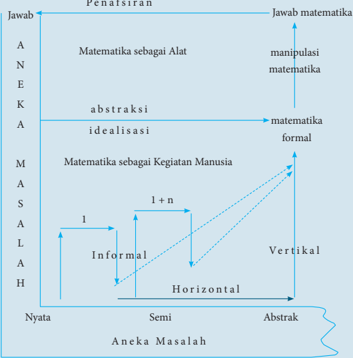

> **Deskripsi Visual:** Gambar ini adalah diagram yang menunjukkan hubungan antara matematika sebagai alat, matematika formal, dan aneka masalah. Diagram ini terdiri dari dua garis vertikal dan horizontal yang menghubungkan tiga poin utama: Matematika sebagai Alat, Matematika Formal, dan Aneka Masalah. Garis vertikal menunjukkan perbedaan antara matematika sebagai alat (A) dan matematika formal (M), sementara garis horizontal menunjukkan perbedaan antara matematika formal (M) dan aneka masalah (H). Label "Idealisasi" dan "Manipulasi Matematika" diletakkan di atas garis vertikal, menunjukkan proses yang terlibat dalam memahami matematika. Informasi kunci yang dapat diambil pembaca adalah bahwa matematika tidak hanya tentang manipulasi angka, tetapi juga tentang ide-ide abstrak dan penggunaannya dalam berbagai situasi nyata.

 

---
## 📄 Halaman 22

---
**🖼️ Gambar/Diagram**

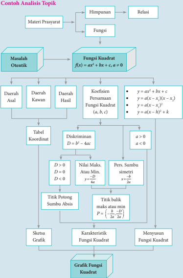

> **Deskripsi Visual:** Gambar ini adalah diagram yang menunjukkan proses analisis topik dalam pembelajaran matematika, khususnya tentang fungsi kuadrat. Gambar ini terdiri dari berbagai elemen yang saling terkait, mulai dari materi prasyarat hingga grafik fungsi kuadrat.

Pertama, gambar membagi materi prasyarat menjadi dua bagian utama: himpunan dan fungsi. Himpunan kemudian dibagi lagi menjadi masalah otentik dan fungsi kuadrat. Fungsi kuadrat didefinisikan sebagai f(x) = ax^2 + bx + c dengan a ≠ 0.

Proses analisis topik dimulai dari masalah otentik, yang kemudian dikembangkan menjadi fungsi kuadrat. Untuk fungsi kuadrat tersebut, ada beberapa elemen penting yang ditampilkan, termasuk daerah asal, daerah kawan, dan daerah hasil. Daerah asal dan daerah kawan digambarkan melalui tabel koordinat, sementara daerah hasil ditunjukkan melalui persamaan fungsi kuadrat.

Selanjutnya, gambar menunjukkan proses diskriminan D = b^2 - 4ac untuk menentukan nilai maksimum atau minimum dari fungsi kuadrat. Jika D > 0, maka fungsi memiliki dua titik potong sumbu absis; jika D = 0, maka fungsi memiliki satu titik potong sumbu absis; dan jika D < 0, maka fungsi tidak memiliki titik potong sumbu absis.

Informasi penting lainnya yang ditampilkan adalah karakteristik fungsi kuadrat, seperti persamaan simetri, titik balik, dan sketsa grafik. Titik balik ditentukan oleh persamaan P = (b/2a)^2 - D/4a, sedangkan sketsa grafik ditunjukkan melalui grafik fungsi kuadrat.

Dengan demikian, gambar ini memberikan panduan lengkap untuk analisis topik tentang fungsi kuadrat, mencakup definisi, karakteristik, dan cara menggambar grafiknya.

 

---
## 📄 Halaman 23

### Contoh Diagram Alir

---
**🖼️ Gambar/Diagram**

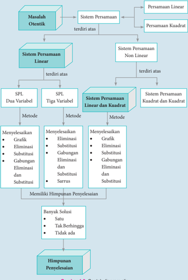

> **Deskripsi Visual:** Gambar ini adalah diagram yang menunjukkan struktur sistem persamaan linear dan kuadrat, serta metode-metode penyelesaian untuk setiap jenis persamaan tersebut. Diagram ini dibagi menjadi beberapa bagian utama:

1. **Masalah Otentik**: Sistem Persamaan Linear dan Persamaan Kuadrat.
2. **Sistem Persamaan Linear**: Terdiri atas SPL Dua Variabel, SPL Tiga Variabel, dan Sistem Persamaan Linear dan Kuadrat.
3. **SPL Dua Variabel**: Metode-metode penyelesaian termasuk Grafik, Eliminasi, Substitusi, Gabungan Eliminasi dan Substitusi.
4. **SPL Tiga Variabel**: Metode-metode penyelesaian termasuk Menyelesaikan Eliminasi, Menyelesaikan Substitusi, Gabungan Eliminasi dan Substitusi, serta Sarrus.
5. **Sistem Persamaan Linear dan Kuadrat**: Metode-metode penyelesaian termasuk Menyelesaikan Grafik, Menyelesaikan Eliminasi, Menyelesaikan Substitusi, Gabungan Eliminasi dan Substitusi.
6. **Himpunan Penyelesaian**: Banyak Solusi, Satu, Tak Berhingga, Tidak ada.

Elemen-elemen utama yang terlihat dalam diagram ini meliputi:
- **Sistem Persamaan Linear** dan **Persamaan Kuadrat** sebagai dua jenis masalah yang harus diselesaikan.
- **Metode-metode penyelesaian** seperti Grafik, Eliminasi, Substitusi, Gabungan Eliminasi dan Substitusi, serta Sarrus.
- **Himpunan Penyelesaian** yang mencakup banyak solusi, satu solusi, tak berhingga, dan tidak ada solusi.

Informasi kunci yang dapat diambil pembaca meliputi struktur sistem persamaan linear dan kuadrat, metode-metode penyelesaian yang tersedia, dan kondisi-kondisi penyelesaian yang mungkin terjadi.

 

---
## 📄 Halaman 24

### Diagram Alir Matematika SMA Kelas X

---
**🖼️ Gambar/Diagram**

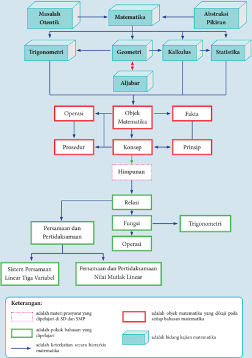

> **Deskripsi Visual:** Gambar ini adalah diagram yang menunjukkan struktur dan hubungan antara berbagai topik matematika. Diagram ini dibagi menjadi beberapa bagian utama, masing-masing menunjukkan topik matematika yang berbeda. Mulai dari kiri atas, ada "Masalah Otentik", "Matematika", dan "Abstraksi Pikiran". Dari sini, diagram mengarah ke berbagai sub-topik seperti Trigonometri, Geometri, Kalkulus, Statistika, dan Aljabar.

Setiap sub-topik tersebut memiliki ikatan dengan elemen-elemen lain dalam diagram. Misalnya, Trigonometri memiliki ikatan dengan Geometri dan Kalkulus, sedangkan Geometri memiliki ikatan dengan Aljabar. Diagram juga menunjukkan hubungan antara konsep, fakta, operasi, prosedur, dan himpunan. Konsep dan fakta memiliki ikatan dengan objek matematika, sementara prosedur memiliki ikatan dengan operasi.

Teks penting dalam diagram meliputi "Persamaan dan Pertidaksamaan Nilai Mutlak Linear" dan "Sistem Persamaan Linear Tiga Variabel". Ini menunjukkan bahwa diagram ini mencakup topik-topik matematika yang berkaitan dengan persamaan dan sistem persamaan linear.

Dengan demikian, diagram ini memberikan gambaran umum tentang struktur dan hubungan antara berbagai topik matematika, serta menunjukkan bagaimana mereka saling terkait dan mempengaruhi satu sama lain.

 

---
## 📄 Halaman 25

### BAB 1

### Persamaan dan Pertidaksamaan Nilai Mutlak Linear Satu Variabel

### Petunjuk Pembelajaran bagi Guru

### A. Kompetensi Inti

---
**📊 Tabel**

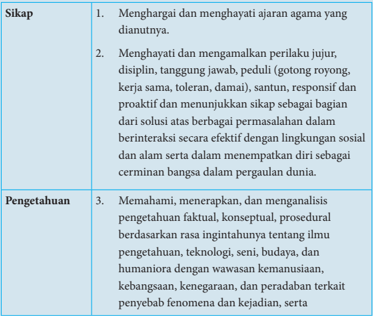

Tabel ini berisi informasi tentang sikap dan pengetahuan yang diharapkan siswa untuk membangun karakter yang kuat dan berpengetahuan. Topik utama tabel adalah sikap dan pengetahuan, yang terbagi menjadi dua kolom: Sikap dan Pengetahuan. Dalam kolom Sikap, terdapat tiga poin yang mencakup penghormatan terhadap ajaran agama, menjaga perilaku jujur dan disiplin, serta proaktif dan menunjukkan sikap yang positif. Sedangkan dalam kolom Pengetahuan, terdapat tiga poin yang mencakup pemahaman, menerapkan, dan menganalisis pengetahuan secara kritis, termasuk rasa ingin tahu tentang ilmu pengetahuan, teknologi, seni, budaya, dan humaniora dengan wawasan kemanusiaan, kebangsaan, keagamaan, dan peradaban. Pola penting yang terlihat adalah bahwa tabel ini mencakup dua aspek utama pembentukan karakter dan pengetahuan yang mendalam, yang harus dikuasai oleh siswa untuk menjadi individu yang berpengetahuan dan memiliki sikap yang positif.

 

---
## 📄 Halaman 26

---
**📊 Tabel**

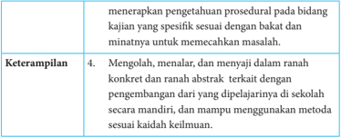

Tabel ini berisi informasi tentang keterampilan yang diperlukan untuk menyelesaikan masalah dalam bidang kajian. Topik utamanya adalah "Keterampilan" dan terdiri dari empat baris. Kolom pertama menyatakan jenis keterampilan, sedangkan kolom kedua menjelaskan contoh keterampilan tersebut. Data penting yang terlihat adalah bahwa keterampilan ini meliputi pengetahuan prosedural, kemampuan mengolah dan menyelesaikan masalah secara konkrit dan rinci, serta kemampuan menggunakan metode sesuai keadaan.

### B. Kompetensi Dasar dan Indikator

---
**📊 Tabel**

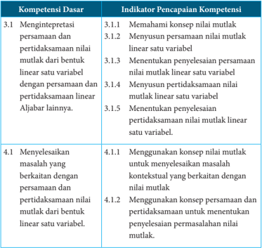

Tabel ini berisi informasi tentang kompetensi dasar dan indikator pencapaian kompetensi dalam bidang matematika, khususnya tentang pemahaman dan penyelesaian persamaan linear satu variabel. Topik utama tabel adalah tentang pemahaman konsep nilai mutlak dan penyelesaian masalah kontekstual yang berkaitan dengan nilai mutlak. Kolom pertama berisi kompetensi dasar, sedangkan kolom kedua berisi indikator pencapaian kompetensi. Data penting yang terlihat adalah bahwa kompetensi dasar 3.1 melibatkan pemahaman konsep nilai mutlak dan penyelesaian persamaan linear satu variabel, sementara kompetensi dasar 4.1 melibatkan penyelesaian masalah kontekstual yang berkaitan dengan nilai mutlak. Indikator pencapaian kompetensi mencakup berbagai aspek seperti menentukan persamaan nilai mutlak linear satu variabel, menyelesaikan persamaan nilai mutlak linear satu variabel, dan menggunakan konsep persamaan dan penyelesaian untuk menentukan nilai mutlak.

 

---
## 📄 Halaman 27

### C. Tujuan Pembelajaran

Pembelajaran materi matriks melalui pengamatan, tanya jawab, penugasan individu  dan  kelompok,  diskusi  kelompok,  serta  penemuan  ( discovery ) diharapkan siswa dapat:

- melatih sikap sosial dengan berani bertanya, berpendapat, mau mendengar orang lain, bekerja sama dalam diskusi di kelompok, sehingga terbiasa berani bertanya, berpendapat, mau mendengar orang lain, dan bekerja sama dalam aktivitas sehari-hari;
- menunjukkan ingin tahu selama mengikuti proses;
- bertanggung jawab terhadap kelompoknya dalam menyelesaikan tugasnya;
- menjelaskan  pengertian  persamaan  dan  pertidaksamaan  linear  satu variabel dengan nilai mutlak;
- menjelaskan dengan kata-kata dan menyatakan masalah dalam kehidupan sehari-hari yang berkaitan dengan persamaan dan pertidaksamaan linear satu variabel dengan nilai mutlak;
- menyajikan model matematika berkaitan dengan persamaan dan pertidaksamaan linear satu variabel dengan nilai mutlak.

 

---
## 📄 Halaman 28

### D. Diagram Alir

---
**🖼️ Gambar/Diagram**

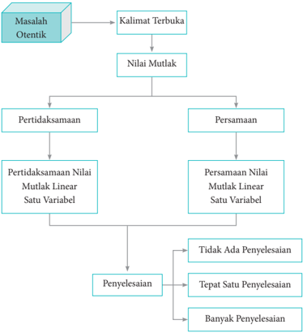

> **Deskripsi Visual:** Gambar ini adalah diagram yang menunjukkan proses penyelesaian masalah otentik dalam matematika. Diagram ini terdiri dari beberapa bagian utama yang saling terkait:

1. **Masalah Otentik** - Ini adalah masalah yang diberikan dalam buku pelajaran.
2. **Kalimat Terbuka** - Ini adalah versi yang lebih luas dari masalah otentik, yang mencakup semua informasi yang diperlukan untuk memecahkan masalah.
3. **Nilai Mutlak** - Ini adalah hasil dari proses penyelesaian pertidaksamaan.
4. **Pertidaksamaan** - Ini adalah bagian dari proses penyelesaian yang melibatkan operasi logis seperti perbandingan dan pengurangan.
5. **Persamaan Nilai Mutlak Linear Satu Variabel** - Ini adalah bagian dari proses penyelesaian yang melibatkan persamaan linear satu variabel.
6. **Penyelesaian** - Ini adalah hasil akhir dari proses penyelesaian, yang dapat berupa tidak ada penyelesaian, tepat satu penyelesaian, atau banyak penyelesaian.

Elemen-elemen utama dalam diagram ini adalah masalah otentik, kalimat terbuka, nilai mutlak, pertidaksamaan, persamaan nilai mutlak linear satu variabel, dan penyelesaian. Relasi antara elemen-elemen ini adalah bahwa masalah otentik menjadi kalimat terbuka, yang kemudian menjadi nilai mutlak, pertidaksamaan, dan persamaan nilai mutlak linear satu variabel. Akhirnya, hasil dari proses penyelesaian ini adalah penyelesaian, yang dapat berupa tidak ada penyelesaian, tepat satu penyelesaian, atau banyak penyelesaian.

Informasi kunci yang dapat diambil pembaca adalah bahwa proses penyelesaian masalah otentik melibatkan langkah-langkah yang terstruktur dan sistematis, mulai dari mengidentifikasi masalah otentik hingga mencapai penyelesaian.

 

---
## 📄 Halaman 29

### E. Materi Pembelajaran

### Membelajarkan 1.1 dan 1.2

### Sebelum Pelaksanaan Kegiatan

- Siswa diharapkan sudah membawa perlengkapan alat-alat tulis, seperti pulpen, pensil, penghapus, penggaris, kertas berpetak, dan lain-lain.
- Bentuklah kelompok kecil yang terdiri  atas  2  -  3  orang  siswa  yang memungkinkan belajar secara efektif dan efisien.
- Sediakan  tabel-tabel  yang  diperlukan  bagi  siswa  untuk  mengisikan hasil kerjanya.

### No.

### Petunjuk Kegiatan Pembelajaran

### 1. Kegiatan Pendahuluan

- Pembelajaran dimulai dengan do'a dan salam
- Apersepsi
- Para  siswa  diperkenalkan  dengan  cerita  1.1  tentang kegiatan baris berbaris pada kegiatan pramuka dan 1.2 tentang permainan lompat melompat.
- Ajaklah  siswa  memikirkan  jenis-jenis  pekerjaan  yang lain yang menarik minat bagi siswa.

### 2. Kegiatan Inti

### Pengantar Pembelajaran

- Ajaklah siswa untuk memerhatikan dan memahami Masalah 1.1, Masalah 1.2, dan Masalah 1.3.
- Upayakan siswa lebih dahulu berusaha memikirkan, bersusah payah mencari ide-ide, berdiskusi dalam kelompok, mencari pemecahan masalah di dalam kelompok.
Konsep  Nilai  Mutlak  dan  Persamaan Nilai Mutlak Linear Satu Variabel

 

---
## 📄 Halaman 30

### No.

### Petunjuk Kegiatan Pembelajaran

- Guru dapat memberikan bantuan kepada siswa, tetapi upayakan  mereka  sendiri  yang  berusaha  menuju  tingkat pemahaman dan proses berpikir yang lebih tinggi.

### Ayo Kita Amati

- Ajaklah siswa untuk mengamati Masalah 1.1. Fokus pengamatannya adalah bagaimana menentukan penyelesaian sebuah persamaan nilai mutlak dengan menggunakan Definisi 1.1.
- Berilah kesempatan kepada siswa untuk menyelesaikan Masalah 1.1 dengan caranya sendiri.

### Ayo Kita Menanya

- Jelaskan tugas berikutnya, yaitu membuat pertanyaan tentang sifat-sifat persamaan nilai mutlak.
- Amati siswa yang sedang bekerja dan jika diperlukan berikan pertanyaan yang dapat memancing ide kreatifitas siswa.

### Sedikit Informasi

- Informasikan kepada siswa bahwa untuk menjawab pertanyaan yang terdapat pada Masalah 1.1 sampai dengan Masalah 1.3, terlebih dahulu memahami Definisi 1.1 dengan baik.
- Berilah  kesempatan  kepada  siswa  untuk  mendiskusikannya tentang cara yang paling mudah digunakan untuk menyelesaikan masalah.

### Ayo Kita Menalar

Ajaklah siswa untuk mendiskusikan permasalahan yang terdapat pada Masalah 1.1 dan 1.2. Perhatikan siswa yang sedang melakukan kegiatan Menalar.

 

---
## 📄 Halaman 31

### Petunjuk Kegiatan Pembelajaran

### Simpulan

- Jika | ax + b | = c dengan c ≥ 0, maka salah satu berikut ini berlaku
Untuk setiap a , b , c bilangan real, dengan a ≠ 0.

``

``

- Jika | ax + b | = c dengan c < 0, maka tidak ada bilangan real x yang memenuhi persamaan | ax + b |.

### Ayo Kita Berbagi

- Mintalah  siswa  untuk  menginformasikan  hasil  karyanya  ke teman sebangkunya, dan pastikan temannya yang menerima hasil karya tersebut untuk memahami  apa  yang  harus dilakukan.
- Pantau bagaimana mereka mengerjakan tugasnya dan pastikan bahwa kalimat-kalimat yang digunakan sudah sesuai dengan kaidah penulisan yang baik.

### 3. Kegiatan Penutup

- Apakah semua kelompok sudah mengumpulkan  tugastugasnya  dan  apakah  identitas  kelompok  sudah  jelas.  Guru perlu memeriksa.
- Berikan  penilaian  terhadap  proses  dan  hasil  karya  siswa dengan menggunakan rubrik penilaian.
- Jika dipandang perlu, berilah siswa latihan untuk dikerjakan di rumah.

 

---
## 📄 Halaman 32

### Penilaian

### 1. Prosedur Penilaian

---
**📊 Tabel**

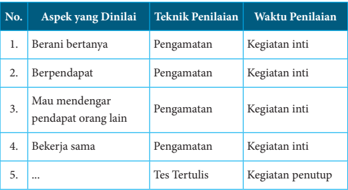

Tabel ini menunjukkan aspek-aspek yang dinilai dalam proses belajar, termasuk teknik penilaian yang digunakan dan waktu penilaian untuk setiap aspek tersebut. Topik utama tabel adalah evaluasi keterampilan sosial dan komunikasi siswa. Kolom pertama berisi nomor urut aspek yang dinilai, kolom kedua berisi aspek yang dinilai, kolom ketiga berisi teknik penilaian yang digunakan, dan kolom keempat berisi waktu penilaian. Data penting yang terlihat adalah bahwa semua aspek yang dinilai menggunakan teknik penilaian pengamatan kegiatan inti, kecuali satu aspek yang menggunakan tes tertulis untuk penilaian.

### 2. Instrumen Pengamatan Sikap

### Rasa ingin tahu

- Kurang  baik  jika  sama  sekali  tidak  berusaha  untuk  mencoba atau  bertanya  atau  acuh  tak  acuh  (tidak  mau  tahu)  dalam  proses pembelajaran
- Baik jika menunjukkan sudah ada usaha untuk mencoba atau bertanya dalam proses pembelajaran tetapi masih belum konsisten.
- Sangat baik jika menunjukkan adanya usaha untuk mencoba atau bertanya  dalam  proses  pembelajaran  secara  terus-menerus  dan konsisten.

### Indikator perkembangan sikap tanggung jawab (dalam kelompok)

- Kurang baik jika sama sekali tidak ambil bagian dalam melaksanakan tugas kelompok.
- Baik  jika  adanya  usaha  untuk  ambil  bagian  dalam  melaksanakan tugas kelompok tetapi belum konsisten.
- Sangat  baik  jika  sudah  ambil  bagian  dalam  menye-lesaikan  tugas kelompok secara terus-menerus dan konsisten.

 

---
## 📄 Halaman 33

Berikan tanda centang (  ) pada kolom berikut sesuai hasil pengamatan.

---
**📊 Tabel**

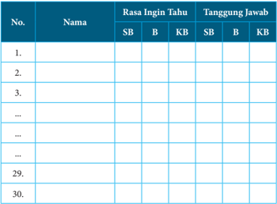

Tabel ini berisi informasi tentang rasa ingin tahu dan tanggung jawab dari 30 orang yang diwawancara. Kolom "Nama" menyajikan identitas individu, sedangkan kolom "Rasa Ingin Tahu" dan "Tanggung Jawab" membandingkan dua aspek: SB (Siswa Biasa) dan B (Berdasarkan). Data menunjukkan bahwa sebagian besar responden memiliki rasa ingin tahu yang lebih tinggi dibandingkan dengan tanggung jawab mereka. Ini menunjukkan adanya perbedaan antara minat belajar dan tanggung jawab dalam mengimplementasikan pengetahuan tersebut.

SB = Sangat Baik, B = Baik, KB = Kurang Baik

### 3. Instrumen Penilaian 1

### Petunjuk

- Kerjakan  soal berikut secara individu dan  siswa tidak boleh menyontek dan tidak boleh bekerja sama.
- Jawablah pertanyaan/perintah di bawah ini.

### Soal

- Tentukan nilai mutlak untuk setiap bentuk berikut ini.
- |-8 n |, n bilangan asli

``

``

``

 

---
## 📄 Halaman 34

``

``

- Manakah  pernyataan  berikut  ini  yang  merupakan  pernyataan bernilai benar? Berikan alasanmu.
- | k | = k , untuk setiap k bilangan asli.
- | x | = x , untuk setiap x bilangan bulat.
- Jika | x | = -2, maka x = -2.
- Jika 2 t - 2 > 0, maka |2 t - 2| = 2 t - 2.
- Jika | x + a | = b , dengan a, b, x bilangan real, maka nilai x yang memenuhi hanya x = b -a .
- Jika  | x |  =  0,  maka  tidak  ada x bilangan  real  yang  memenuhi persamaan.
- Nilai mutlak semua bilangan real adalah bilangan nonnegatif.
- Hitung nilai x (jika  ada)  yang  memenuhi  persamaan  nilai  mutlak berikut. Jika tidak ada nilai x yang memenuhi, berikan alasanmu.

``

``

``

``

``

``

``

 

---
## 📄 Halaman 35

``

``

- Suatu  grup  musik  merilis  album,  penjualan  per  minggu  (dalam ribuan)  dinyatakan  dengan  model s ( t )  =  -2| t -  22|  +  44, t waktu (dalam minggu).
- Gambarkan grafik fungsi penjualan s ( t ).
- Hitunglah total penjualan album selama 44 minggu pertama.
- Disebut  Album Emas jika penjualan lebih  dari  500.000  copy. Hitunglah t agar disebut Album Emas.

### Pedoman Penilaian

---
**📊 Tabel**

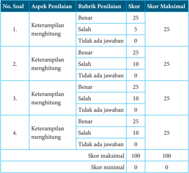

Tabel ini menunjukkan skor maksimal dan minimal untuk setiap soal dalam sebuah ujian penilaian. Setiap soal dibagi menjadi tiga aspek penilaian: keterampilan menghitung, keterampilan membaca, dan keterampilan menulis. Untuk setiap aspek, ada tiga pilihan jawaban: benar, salah, atau tidak ada jawaban. Skor maksimal untuk setiap aspek adalah 25 poin, dengan skor minimal 0 poin. Skor maksimal untuk setiap soal adalah 100 poin, dengan skor minimal 0 poin. Pola penting yang terlihat adalah bahwa setiap soal memiliki skor maksimal yang sama (25 poin) untuk setiap aspek penilaian, dan skor minimal yang sama (0 poin) untuk setiap aspek penilaian.

 

---
## 📄 Halaman 36

### Membelajarkan 1.3

### Sebelum Pelaksanaan Kegiatan

- Identifikasi siswa-siswa yang biasanya agak sulit membuat pertanyaan.
- Identifikasi  pula  bentuk  bantuan  yang  perlu  diberikan  agar  siswa akhirnya produktif membuat pertanyaan.
- Sediakan  tabel-tabel  yang  diperlukan  bagi  siswa  untuk  mengisikan hasil kerjanya.
- Sediakan kertas HVS secukupnya.
- Mungkin  perlu diberikan contoh kritik, komentar, saran, atau pertanyaan  terhadap  suatu  karya  agar  siswa  dapat  meniru  dan mengembangkan lebih jauh sesuai dengan materinya.

---
**📊 Tabel**

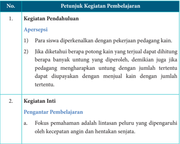

Tabel ini berisi petunjuk kegiatan pembelajaran untuk dua topik utama: Pendahuluan dan Inti. Topik Pendahuluan mencakup dua subtopik: Apersepsi dan Pengantar Pembelajaran. Untuk subtopik Apersepsi, instruksi melibatkan para siswa memperkenalkan diri dengan pekerjaan pedagang kain, serta mengetahui berapa potongan kain yang terjual dapat dihitung berapa banyak untung yang diperoleh. Untuk subtopik Pengantar Pembelajaran, fokus pemahaman adalah lintasan peluru yang dipengaruhi oleh kecepatan angin dan hentakan senjata.

 

---
## 📄 Halaman 37

### No.

### Petunjuk Kegiatan Pembelajaran

- Ajaklah siswa untuk memerhatikan dan memahami Masalah 1.4
- Himbaulah siswa untuk memerhatikan penyimpangan lintasan peluru akibat kecepatan angin dan hentakan senjata.

### Ayo Kita Amati

Ajak siswa mengamati Gambar 1.11 tentang proses seorang tentara yang sedang latihan menembak.

### Ayo Kita Menanya

- Jelaskan tugas berikutnya, yaitu membuat pertanyaan ( questioning ) jika perlu modelkan dengan salah satu pertanyaan.
- Beri kesempatan kepada mereka untuk menuliskan pertanyaannya.

### Ayo Kita Menggali Informasi

Kemudian  ajaklah  siswa  untuk  melakukan  kegiatan  menggali informasi  tentang  kemungkinan-kemungkinan  pertanyaan  yang dibuat siswa.

### Ayo Kita Mencoba

Himbaulah siswa untuk membuat sifat-sifat pertidaksamaan nilai mutlak linear satu variabel berdasarkan contoh-contoh yang ada pada buku siswa.

### Ayo Kita Menalar

- Ajaklah siswa berdiskusi untuk memahami sifat-sifat pertidaksamaan nilai mutlak.
- Informasikan kepada siswa bahwa fokus jawabannya pada dua pertanyaan yang telah disediakan.

### Simpulan

Untuk setiap bilangan real.

- Jika a ≥ 0 dan | x | ≤ a , maka a ≤ x ≤ a .

 

---
## 📄 Halaman 38

### No. Petunjuk Kegiatan Pembelajaran

- Jika | x | ≥ a , dan a ≥ 0, maka x ≥ a atau x ≤ a .
- Jika a ≤ 0 dan | x | ≤ a , maka tidak ada bilangan real x yang memenuhi pertidaksamaan.

### Ayo Kita Berbagi

- Mintalah  siswa  untuk  sharing  hasil  karyanya  ke  teman sebangkunya,  dan  pastikan  temannya  yang  menerima  hasil karya tersebut memahami apa yang harus dilakukan.
- Pantau bagaimana mereka mengerjakan tugasnya dan pastikan bahwa kalimat-kalimat yang digunakan sudah sesuai dengan kaidah penulisan yang baik.

### 3. Kegiatan Penutup

- Mintalah siswa untuk melakukan refleksi dan menuliskan halhal penting dari yang dipelajarinya.
- Berikan  penilaian  terhadap  proses  dan  hasil  karya  siswa dengan menggunakan rubrik penilaian.
- Jika dipandang perlu, berilah siswa latihan untuk dikerjakan di rumah.

### Penilaian

### 1. Prosedur Penilaian

---
**📊 Tabel**

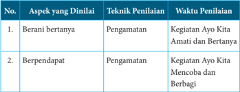

Tabel ini menunjukkan aspek-aspek yang harus dianalisis dalam proses penilaian, termasuk teknik penilaian yang digunakan dan waktu penilaian. Topik utama tabel adalah tentang berbagai aspek yang perlu diperhatikan dalam proses penilaian, seperti berani bertanya dan berpendapat. Teknik penilaian yang digunakan meliputi pengamatan dan kegiatan Ayo Kita Amati dan Bertanya untuk aspek berani bertanya, serta pengamatan dan kegiatan Ayo Kita Mencoba dan Berbagi untuk aspek berpendapat. Waktu penilaian juga disebutkan, dengan pengamatan dilakukan secara langsung, sedangkan kegiatan Ayo Kita Amati dan Bertanya serta Ayo Kita Mencoba dan Berbagi dilakukan dalam jangka waktu tertentu.

 

---
## 📄 Halaman 39

---
**📊 Tabel**

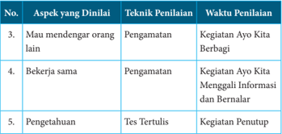

Tabel ini menunjukkan aspek-aspek yang dinilai dalam proses belajar, termasuk teknik penilaian yang digunakan dan waktu penilaian. Topik utama tabel adalah evaluasi kinerja siswa dalam berbagai aspek belajar, seperti kemampuan mendengarkan orang lain, kerjasama, dan pengetahuan. Kolom pertama menunjukkan aspek yang dinilai, kolom kedua menunjukkan teknik penilaian yang digunakan, dan kolom ketiga menunjukkan waktu penilaian. Data penting yang terlihat adalah bahwa semua aspek belajar diuji melalui pengamatan, dengan penilaian tertulis untuk aspek pengetahuan.

### 2. Instrumen Pengamatan Sikap

### Rasa ingin tahu

- Kurang  baik  jika  sama  sekali  tidak  berusaha  untuk  mencoba atau  bertanya  atau  acuh  tak  acuh  (tidak  mau  tahu)  dalam  proses pembelajaran.
- Baik  jika  menunjukkan  sudah  ada  usaha  untuk  mencoba  atau bertanya dalam proses pembelajaran tetapi masih belum konsisten.
- Sangat baik jika menunjukkan adanya usaha untuk mencoba atau bertanya  dalam  proses  pembelajaran  secara  terus-menerus  dan konsisten.

### Indikator perkembangan sikap tanggung jawab (dalam kelompok)

- Kurang baik, jika sama sekali tidak ambil bagian dalam melaksanakan tugas kelompok.
- Baik, jika sudah ada usaha ambil bagian dalam melaksanakan tugas kelompok tetapi belum konsisten.
- Sangat  baik,  jika  sudah  ambil  bagian  dalam  menyelesaikan  tugas kelompok secara terus-menerus dan konsisten.

 

---
## 📄 Halaman 40

Berikan tanda centang (  ) pada kolom berikut sesuai hasil pengamatan.

---
**📊 Tabel**

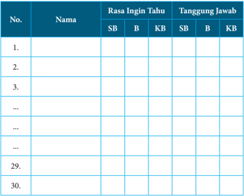

Tabel ini berisi informasi tentang rasa ingin tahu dan tanggung jawab belajar bagi beberapa siswa. Kolom "SB" mungkin merujuk pada siswa yang sudah belajar (Sudah Belajar), "B" untuk belum belajar (Belum Belajar), dan "KB" untuk belum mengetahui (Ketidakmengetahuan). Data di tabel menunjukkan bahwa banyak siswa belum belajar atau belum mengetahui sesuatu, sementara beberapa siswa sudah belajar. Ini menunjukkan perbedaan dalam tingkat pemahaman dan kemampuan belajar antara siswa-siswa tersebut.

### 3. Instrumen Penilaian

### Petunjuk

- Kerjakan soal berikut secara individu, siswa tidak boleh menyontek dan tidak boleh bekerja sama.
- Jawablah pertanyaan/perintah di bawah ini.

### Soal

- Manakah dari pernyataan di bawah ini yang benar? Berikan alasanmu.
- Untuk setiap x bilangan real, berlaku bahwa | x | ≥ 0.
- Tidak terdapat bilangan real x sehingga | x | < -8.
- | n | ≥ | m |, untuk setiap n bilangan asli, dan m bilangan bulat.

 

---
## 📄 Halaman 41

- Selesaikan pertidaksamaan nilai mutlak berikut.
- |3 - 2 x | < 4
- +5 2 x ≥ 9
- 0 < -2 2 x ≤ 3
- |3 x + 2| ≤ 5
- | x + 5| ≤ |1 - 9 x |
- Maria memiliki nilai ujian matematika berturut-turut adalah 79, 67, 83, dan 90. Jika dia harus ujian sekali lagi, berapa nilai terendah yang harus diraih, sehingga nilai rata-rata yang diperoleh paling rendah 82?
- Sketsa grafik y = |3 x - 1|, untuk -2 ≤ x ≤ 5, x bilangan real.

### Pedoman Penilaian

---
**📊 Tabel**

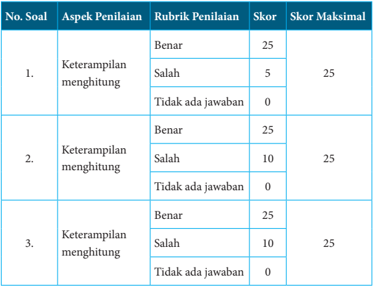

Tabel ini menunjukkan skor penilaian untuk tiga soal yang berfokus pada keterampilan menghitung. Setiap soal memiliki rubrik penilaian dengan tiga pilihan jawaban: benar, salah, atau tidak ada jawaban. Skor maksimal untuk setiap soal adalah 25 poin. Topik utama tabel adalah keterampilan menghitung, yang diukur melalui ketepatan jawaban dan jumlah jawaban yang diberikan. Data penting yang terlihat adalah bahwa semua soal memiliki skor maksimal yang sama (25 poin), dan bahwa setiap soal memiliki tiga pilihan jawaban yang harus dipilih oleh peserta ujian.

 

---
## 📄 Halaman 42

---
**📊 Tabel**

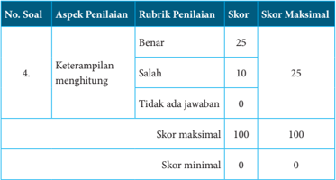

Tabel ini menunjukkan skor penilaian untuk soal nomor 4 dalam sebuah ujian atau tes. Topik utamanya adalah keterampilan menghitung. Tabel dibagi menjadi dua bagian: satu untuk aspek penilaian "Keterampilan menghitung" dan satu untuk skor maksimal dan minimal. Untuk aspek penilaian ini, rubrik penilaian mencakup tiga poin: benar dengan skor 25, salah dengan skor 10, dan tidak ada jawaban dengan skor 0. Skor maksimal untuk aspek penilaian ini adalah 25, sementara skor minimalnya adalah 0. Skor maksimal untuk seluruh soal adalah 100, dan skor minimalnya juga 0.

### F. Pengayaan

Pengayaan  merupakan  kegiatan  yang  diberikan  kepada  siswa  yang memiliki  akselerasi pencapaian  KD  yang  cepat  (nilai maksimal),  agar potensinya  berkembang  optimal  dengan  memanfaatkan  sisa  waktu  yang dimilikinya.  Guru  sebaiknya  merancang  kegiatan  pembelajaran  lanjut  yang terkait dengan konsep persamaan dan pertidaksamaan nilai mutlak linear satu variabel untuk siswa.

### G. Remedial

Remedial  merupakan  perbaikan  proses  pembelajaran  yang  bertujuan pada  pencapaian  kompetensi  dasar  siswa.  Guru  memberikan  perbaikan pembelajaran  baik  pada  model,  metode  serta  strategi  pembelajaran.  Jika guru  melakukan  pembelajaran  dengan  pola  yang  sama  tidaklah  maksimal sehingga disarankan guru memilih tindakan pembelajaran yang tepat. Dengan demikian, siswa mampu memenuhi KD yang diharapkan.

Perlu dipahami oleh guru bahwa remedial bukan mengulang tes (ulangan harian)  dengan  materi  yang  sama,  tetapi  guru  memberikan  perbaikan pembelajaran pada KD yang belum dikuasai oleh siswa melalui upaya tertentu.

 

---
## 📄 Halaman 43

Setelah perbaikan pembelajaran  dilakukan, guru melakukan  tes  untuk mengetahui apakah peserta didik telah memenuhi kompetensi minimal dari KD yang diremedialkan.

### H. Rangkuman

Setelah  kita  membahas  materi  persamaan  dan  pertidaksamaan  nilai mutlak  linear  satu  variabel,  maka  dapat  diambil  kesimpulan  sebagai  acuan untuk  mendalami  materi  yang  sama  pada  jenjang  yang  lebih  tinggi  dan mempelajari  bahasan  berikutnya.  Kesimpulan  yang  dapat  disajikan  adalah sebagai berikut.

- Nilai mutlak dari sebuah bilangan real adalah tidak negatif. Hal ini sama dengan akar dari sebuah bilangan selalu positif atau nol. Misal a ∈ R , maka { ≥ -2 , 0 , < 0 = = a a a a a a .
- Persamaan  dan  pertidaksamaan  linear  satu  variabel  dapat  diperoleh dari  persamaan  nilai  mutlak  yang  diberikan.  Misalnya,  jika  diketahui | ax + b |= c , untuk a , b , c ∈ R , maka menurut definisi nilai mutlak diperoleh persamaan | ax + b | = c . Sama halnya untuk pertidaksamaan linear.
- Penyelesaian pertidaksamaan | ax + b | ≤ c ada jika c ≥ 0.
- Penyelesaian persamaan nilai mutlak | ax + b | = c ada jika c ≥ 0.
Konsep persamaan dan pertidaksamaan nilai mutlak linear satu variabel telah ditemukan dan diterapkan dalam penyelesaian masalah kehidupan dan masalah matematika. Penguasaan kamu terhadap berbagai konsep dan sifatsifat  persamaan  dan  pertidaksamaan  linear  adalah  syarat  yang  perlu  untuk mempelajari bahasan sistem persamaan linear dua variabel dan tiga variabel serta sistem pertidaksamaan linear dengan dua variabel. Kita akan menemukan konsep  dan  berbagai  sifat  sistem  persamaan  linear  dua  dan  tiga  variabel melalui penyelesaian masalah nyata yang sangat bermanfaat bagi dunia kerja dan kehidupanmu. Persamaan dan pertidaksamaan linear memiliki himpunan penyelesaian,  demikian  juga  sistem  persamaan  dan  pertidaksamaan  linear. Pada  bahasan  sistem  persamaan  linear  dua  dan  tiga  variabel,  kamu  dapat

 

---
## 📄 Halaman 44

mempelajari berbagai metode penyelesainnya untuk menentukan himpunan penyelesaian sistem persamaan dan pertidaksamaan tersebut. Seluruh konsep dan  aturan-aturan  yang  ditemukan  dapat  diaplikasikan  dalam  penyelesaian masalah  yang  menuntutmu  untuk  berpikir  kreatif,  tangguh  menghadapi masalah, mengajukan ide-ide secara bebas dan terbuka, baik terhadap teman maupun terhadap guru.

 

---
## 📄 Halaman 45

### Sistem Persamaan Linear Tiga Variabel

### Petunjuk Pembelajaran bagi Guru

### A. Kompetensi Inti

---
**📊 Tabel**

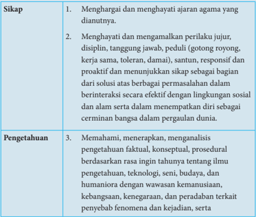

Tabel ini berisi informasi tentang sikap dan pengetahuan yang diharapkan siswa untuk membangun karakter yang kuat dan berpengetahuan. Topik utama tabel adalah sikap dan pengetahuan yang relevan dengan nilai-nilai agama dan budaya, serta pengetahuan umum tentang ilmu pengetahuan, teknologi, seni, budaya, dan humaniora. Kolom pertama berisi sikap yang harus dimiliki, seperti menghargai ajaran agama dan menjaga perilaku jujur, disiplin, tanggung jawab, dan proaktif. Kolom kedua berisi pengetahuan yang harus dimiliki, seperti memahami, menerapkan, dan menganalisis pengetahuan faktil, konseptual, prosedural, serta pengetahuan tentang ilmu pengetahuan, teknologi, seni, budaya, dan humaniora. Data atau pola penting yang terlihat adalah bahwa tabel ini mencakup dua aspek utama: sikap dan pengetahuan, serta menekankan pentingnya menghargai ajaran agama dan menjaga perilaku yang baik.

 

---
## 📄 Halaman 46

---
**📊 Tabel**

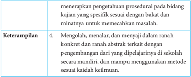

Tabel ini berisi informasi tentang keterampilan yang diperlukan untuk menyelesaikan masalah dalam penelitian. Topik utama tabel adalah "Keterampilan" dan terdiri dari empat baris. Kolom pertama menyatakan jenis keterampilan, sedangkan kolom kedua memberikan deskripsi singkat tentang keterampilan tersebut. Data penting yang terlihat adalah bahwa keterampilan ini meliputi menerapkan pengetahuan prosedural, mengolah, menalar, dan menayani dalam ranah konkrit dan ranah abstrak terkait dengan pengembangan dari yang dipelajarinya di sekolah secara mandiri, dan mampu menggunakan metode sesuai keadaan.

### B. Kompetensi Dasar dan Indikator

Kompetensi Dasar untuk bab sistem persamaan linear tiga variabel ini mengacu pada KD yang telah ditetapkan. Seorang guru, tentu harus mampu merumuskan indikator pencapaian kompetensi dari kompetensi dasar. Berikut ini disajikan indikator pencapaian kompetensi untuk materi sistem persamaan linear tiga variabel.

---
**📊 Tabel**

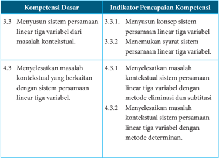

Tabel ini berisi informasi tentang kompetensi dasar dan indikator pencapaian kompetensi dalam matematika, khususnya berkaitan dengan sistem persamaan linear tiga variabel. Topik utama tabel adalah tentang menyelesaikan masalah kontekstual menggunakan sistem persamaan linear tiga variabel. Kolom pertama berisi nama kompetensi dasar, sedangkan kolom kedua berisi indikator pencapaian kompetensi. Data penting yang terlihat adalah bahwa indikator pencapaian kompetensi 3.3.1 dan 3.3.2 melibatkan menyelesaikan sistem persamaan linear tiga variabel, sementara indikator pencapaian kompetensi 4.3.1 dan 4.3.2 melibatkan menyelesaikan masalah kontekstual dengan metode eliminasi dan substitusi, serta metode determinan.

 

---
## 📄 Halaman 47

### C. Tujuan Pembelajaran

Melalui  pengamatan,  tanya  jawab,  penugasan  individu  dan  kelompok, diskusi kelompok, dan penemuan ( discovery ) diharapkan siswa dapat:

- menunjukkan sikap jujur, tertib, dan mengikuti aturan pada saat proses belajar berlangsung;
- menunjukkan  sikap  cermat  dan  teliti  dalam  menyelesaikan  masalahmasalah sistem persamaan linear tiga variabel;
- menyusun konsep sistem persamaan linear tiga variabel;
- menemukan syarat sistem persamaan tiga variabel;
- menyelesaikan masalah kontekstual sistem persamaan linear tiga variabel dengan metode eliminasi dan substitusi;
- menyelesaikan masalah kontekstual sistem persamaan linear tiga variabel dengan metode determinan.

 

---
## 📄 Halaman 48

### D. Diagram Alir

---
**🖼️ Gambar/Diagram**

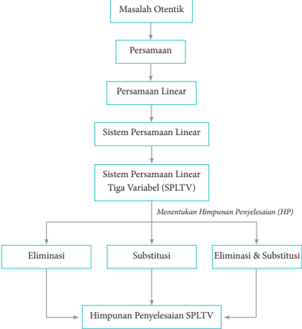

> **Deskripsi Visual:** Gambar ini adalah diagram yang menunjukkan proses penyelesaian sistem persamaan linear tiga variabel (SPLTV). Diagram ini dimulai dengan masalah otentik, kemudian melalui persamaan, persamaan linear, sistem persamaan linear, dan akhirnya sistem persamaan linear tiga variabel. Setelah itu, ada tiga metode penyelesaian yang ditawarkan: eliminasi, substitusi, dan kombinasi eliminasi-substitusi. Setiap metode tersebut mengarah ke himpunan penyelesaian SPLTV. Jadi, diagram ini memberikan panduan langkah demi langkah tentang bagaimana menyelesaikan sistem persamaan linear tiga variabel menggunakan berbagai metode.

 

---
## 📄 Halaman 49

### E. Materi Pembelajaran

Suatu  proses  pembelajaran  akan  berjalan  dengan  efektif  jika  guru sudah  mengenal  karakteristik  siswanya.  Adapun  proses  pembelajaran  yang dirancang pada buku guru ini hanya sebagai pertimbangan bagi guru untuk merancang kegiatan  belajar  mengajar  yang  sesungguhnya.  Oleh  karena  itu, guru  diharapkan  lebih  giat  dan  kreatif  lagi  dalam  mempersiapkan  semua perangkat belajar mengajar.

### Membelajarkan 2.1

Menyusun dan Menemukan Konsep Sistem Persamaan Linear Tiga Variabel

### Sebelum Pelaksanaan Kegiatan

- Siswa diharapkan sudah membawa perlengkapan alat-alat tulis, seperti pulpen, pensil, penghapus, penggaris, kertas berpetak, dan lain-lain.
- Bentuklah kelompok kecil yang terdiri  atas  2  -  3  orang  siswa  yang memungkinkan belajar secara efektif dan efisien.
- Sediakan lembar kerja yang diperlukan siswa.
- Sediakan kertas HVS secukupnya.

### No.

### Petunjuk Kegiatan Pembelajaran

### 1. Kegiatan Pendahuluan

Pada kegiatan pendahuluan, guru harus:

- menyiapkan  siswa  secara  psikis  dan  fisik  untuk  mengikuti proses belajar-mengajar;
- memberi  motivasi  belajar  siswa  secara  kontekstual  sesuai manfaat  dan  aplikasi  sistem  persamaan  linear  tiga  variabel dalam kehidupan sehari-hari dengan memberikan contoh dan perbandingan lokal, nasional, dan internasional;

 

---
## 📄 Halaman 50

---
**📊 Tabel**

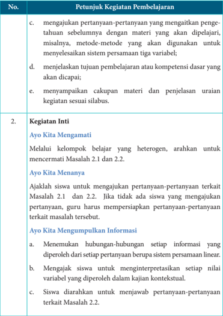

Tabel ini berisi petunjuk kegiatan pembelajaran untuk mengajarkan metode-metode penyelesaian sistem persamaan tiga variabel, menjelaskan tujuan pembelajaran, dan menyampaikan cakupan materi sesuai silabus. Topik utama adalah mengajarkan metode-metode penyelesaian sistem persamaan tiga variabel, menjelaskan tujuan pembelajaran, dan menyampaikan cakupan materi sesuai silabus. Kolom-kolomnya mencakup petunjuk kegiatan pembelajaran, kegiatan inti, dan informasi yang relevan dengan topik tersebut. Data penting yang terlihat meliputi metode-metode penyelesaian sistem persamaan tiga variabel, tujuan pembelajaran, dan cakupan materi sesuai silabus.

 

---
## 📄 Halaman 51

---
**📊 Tabel**

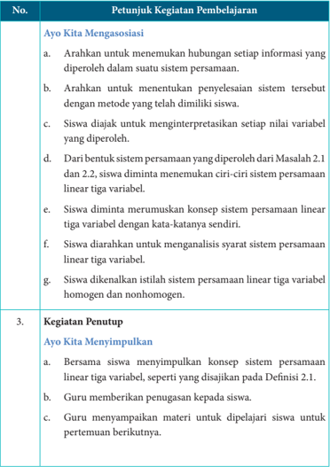

Tabel ini berisi petunjuk kegiatan pembelajaran untuk mengajar sistem persamaan linear tiga variabel. Topik utama adalah "Ayo Kita Mengasosiasikan" dan "Kegiatan Penutup Ayo Kita Menyimpulkan". Kolom pertama menunjukkan nomor urutan kegiatan, sedangkan kolom kedua menjelaskan tujuan atau tujuan dari setiap kegiatan. Data penting yang terlihat antara lain bahwa siswa diharapkan untuk menemukan hubungan antar informasi, menentukan penyelesaian sistem persamaan dengan metode yang dimiliki, menginterpretasikan nilai variabel, menemukan ciri-ciri sistem persamaan linear tiga variabel, merumuskan konsep sendiri, menganalisis syarat sistem persamaan linear tiga variabel, dan dikenalkan istilah sistem persamaan linear tiga variabel homogen dan nonhomogen. Selain itu, kegiatan penutup juga mencakup menyimpulkan konsep sistem persamaan linear tiga variabel, memberikan penugasan kepada siswa, dan menyiapkan materi untuk dipelajari siswa untuk pertemuan berikutnya.

 

---
## 📄 Halaman 52

### Penilaian

### 1. Prosedur Penilaian

---
**📊 Tabel**

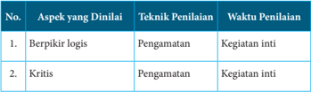

Tabel ini menunjukkan aspek-aspek yang dilinai dalam proses penilaian, teknik penilaian yang digunakan, dan waktu penilaian. Topik utama tabel ini adalah tentang metode penilaian berdasarkan aspek-aspek tertentu. Kolom pertama menunjukkan nomor urutan, kolom kedua menunjukkan aspek yang dilinai, kolom ketiga menunjukkan teknik penilaian yang digunakan, dan kolom keempat menunjukkan waktu penilaian. Data penting yang terlihat adalah bahwa pengamatan adalah teknik penilaian yang digunakan untuk dua aspek: berpikir logis dan kritis. Waktu penilaian untuk kedua aspek ini adalah kegiatan inti. Ini menunjukkan bahwa penilaian berfokus pada aspek-aspek tertentu menggunakan teknik penilaian tertentu dan waktu penilaian yang spesifik.

### 2. Instrumen Pengamatan Sikap

### Berpikir logis

- Kurang  baik  jika  sama  sekali  tidak  berusaha  mengajukan  ide-ide logis dalam proses pembelajaran.
- Baik  jika  menunjukkan  adanya  usaha  untuk  mengajukan  ide-ide logis dalam proses pembelajaran.
- Sangat baik jika mengajukan ide-ide logis dalam proses pembelajaran secara terus-menerus dan konsisten.

### Kritis

- Kurang  baik  jika  sama  sekali  tidak  berusaha  mengajukan  ide-ide logis, kritis, atau pertanyaan menantang dalam proses pembelajaran.
- Baik  jika  menunjukkan  adanya  usaha  untuk  mengajukan  ide-ide logis, kritis, atau pertanyaan menantang dalam proses pembelajaran.
- Sangat  baik  jika  mengajukan  ide-ide  logis,  kritis,  atau  pertanyaan menantang  dalam  proses  pembelajaran  secara  terus-menerus  dan konsisten.

 

---
## 📄 Halaman 53

Berikan tanda centang (  ) pada kolom berikut sesuai hasil pengamatan.

---
**📊 Tabel**

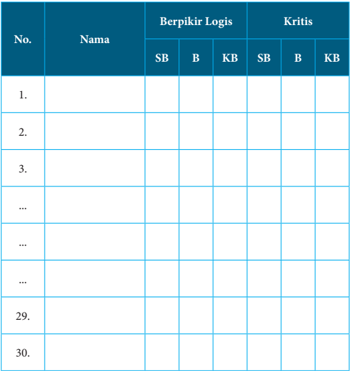

Tabel ini berisi informasi tentang pendapat dan kritik dari 30 orang terhadap suatu produk atau layanan. Kolom "Berpikir Logis" mencakup dua pilihan: SB (Sangat Baik) dan B (Baik), sementara kolom "Kritis" mencakup pilihan KB (Kritik Sederhana) dan B (Baik). Data yang penting menunjukkan bahwa sebagian besar responden memberikan pendapat positif, dengan pilihan "SB" dan "B" dominan di kolom "Berpikir Logis". Namun, ada beberapa responden yang memberikan kritik sederhana, menunjukkan adanya area perbaikan yang mungkin perlu diperhatikan.

SB = Sangat Baik, B = Baik, KB = Kurang Baik

### 3. Instrumen Penilaian Pengetahuan dan Keterampilan

### Petunjuk

- Kerjakan soal berikut secara individu, siswa tidak boleh menyontek dan tidak boleh bekerja sama.
- Jawablah pertanyaan/perintah berikut ini.

 

---
## 📄 Halaman 54

### Soal

- Diberikan tiga persamaan

``

- Apakah  termasuk sistem persamaan linear tiga variabel? Berikan alasanmu.
- Dapatkah  kamu  membentuk  sistem  persamaan  linear  dari ketiga persamaan tersebut?
- Seekor  ikan  mas  memiliki  ekor  yang  panjangnya  sama  dengan panjang  kepalanya  ditambah  satu  per  lima  panjang  tubuhnya. Panjang tubuhnya empat per lima dari panjang keseluruhan ikan. Jika panjang kepala ikan 5 inci, berapa panjang keseluruhan ikan tersebut? (1 inci = 2,54 cm).
- Diberikan sistem persamaan linear berikut.

``

``

``

``

Berapakah nilai t agar sistem tersebut

- tidak memiliki penyelesaian,
- satu penyelesaian,
- tak berhingga banyak penyelesaian?
- Temukan bilangan-bilangan  positif  yang  memenuhi  persamaan x + y + z = 9 dan x + 5 y + 10 z = 44!

 

---
## 📄 Halaman 55

### 4.   Pedoman Penilaian Pengetahuan dan Keterampilan

---
**📊 Tabel**

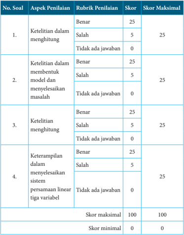

Tabel ini menunjukkan skor penilaian untuk empat soal dalam sebuah ujian atau tes. Topik utama tabel adalah ketelitian dalam menghitung, ketelitian dalam membuat model dan menyelesaikan masalah, ketelitian dalam menghitung, dan keterampilan dalam menyelesaikan sistem persamaan linear tiga variabel. Kolom-kolomnya meliputi aspek penilaian (ketelitian dalam menghitung, ketelitian dalam membuat model dan menyelesaikan masalah, ketelitian menghitung, keterampilan dalam menyelesaikan sistem persamaan linear tiga variabel), rubrik penilaian (Benar, Salah, Tidak ada jawaban), skor, dan skor maksimal. Data penting yang terlihat adalah bahwa setiap aspek penilaian memiliki skor maksimal 25 dan skor minimal 0, dengan total skor maksimal sebesar 100.

 

---
## 📄 Halaman 56

### Membelajarkan 2.2

### Penyelesaian Sistem Persamaan Linear Tiga Variabel

### Sebelum Pelaksanaan Kegiatan

- Siswa diharapkan sudah membawa perlengkapan alat-alat tulis, seperti pulpen, pensil, penghapus, penggaris, kertas berpetak, dan lain-lain.
- Bentuklah kelompok kecil yang terdiri  atas  2  -  3  orang  siswa  yang memungkinkan belajar secara efektif dan efisien.
- Sediakan lembar kerja yang diperlukan siswa.
- Sediakan kertas HVS secukupnya.

### No. Petunjuk Kegiatan Pembelajaran

### 1. Kegiatan Pendahuluan

Pada kegiatan pendahuluan guru harus:

- menyiapkan  siswa  secara  psikis  dan  fisik  untuk  mengikuti proses pembelajaran;
- memberi  motivasi  belajar  kepada  siswa  secara  kontekstual sesuai  manfaat  dan  aplikasi  sistem  persamaan  linear  tiga variabel  dalam  kehidupan  sehari-hari,  dengan  memberikan contoh dan perbandingan lokal, nasional, dan internasional;
- mengajukan pertanyaan-pertanyaan yang mengaitkan pengetahuan sebelumnya dengan materi yang akan dipelajari,  misalnya,  metode-metode  yang  digunakan  untuk menyelesaikan sistem persamaan tiga variabel;
- menjelaskan tujuan pembelajaran atau kompetensi dasar yang akan dicapai;
- menyampaikan cakupan materi dan penjelasan uraian kegiatan sesuai silabus.

 

---
## 📄 Halaman 57

---
**📊 Tabel**

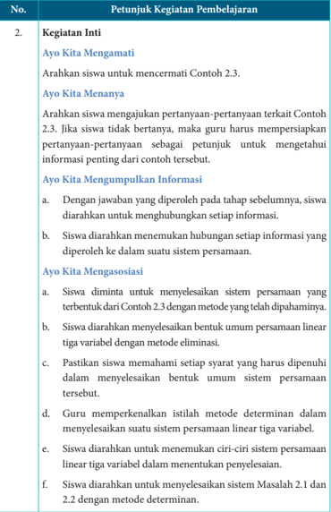

Tabel ini berisi petunjuk kegiatan pembelajaran untuk mengajar tentang sistem persamaan linear tiga variabel. Topik utamanya adalah metode determinan dalam menyelesaikan sistem persamaan linear tiga variabel. Kolom-kolomnya meliputi "No.", "Kegiatan Inti", dan "Petunjuk Kegiatan Pembelajaran". Data penting yang terlihat antara lain bahwa siswa diharapkan untuk menganalisis contoh 2.3, membuat pertanyaan-pertanyaan terkait, mengumpulkan informasi, mengasosiasi sistem persamaan, memahami syarat syarat yang harus dipenuhi, mempelajari metode determinan, dan menyelesaikan sistem masalah 2.1 dan 2.2 dengan metode determinan.

 

---
## 📄 Halaman 58

---
**📊 Tabel**

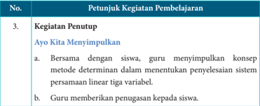

Tabel ini berisi petunjuk kegiatan pembelajaran tentang metode determinan dalam menyelesaikan sistem persamaan linear tiga variabel. Topik utama adalah "Ayo Kita Menyimpulkan". Kolom pertama adalah nomor urut kegiatan pembelajaran, yang di sini nomor 3. Kolom kedua berisi deskripsi kegiatan pembelajaran tersebut. Data penting yang terlihat adalah bahwa guru akan bersama-sama dengan siswa menyimpulkan konsep metode determinan dalam menyelesaikan sistem persamaan linear tiga variabel. Selain itu, guru juga akan memberikan penugasan kepada siswa untuk mempraktekkan konsep tersebut.

### Penilaian

### 1. Prosedur Penilaian

### 2. Instrumen Pengamatan Sikap

### Analitis

- Kurang baik jika sama sekali tidak mengajukan  pertanyaanpertanyaan  menantang  atau  memberikan  ide-ide  dalam  menyelesaikan masalah selama proses pembelajaran.
- Baik jika menunjukkan  sudah  ada usaha untuk  mengajukan pertanyaan-pertanyaan menantang atau memberikan ide-ide dalam menyelesaikan masalah selama proses pembelajaran.
- Sangat  baik  jika  mengajukan  pertanyaan-pertanyaan  menantang atau  memberikan  ide-ide  dalam  menyelesaikan  masalah  selama proses pembelajaran secara terus-menerus dan konsisten.

### Bekerja sama

- Kurang baik jika sama sekali tidak menunjukkan sikap mau bekerja sama dengan temannya selama proses pembelajaran.

 

---
## 📄 Halaman 59

- Baik jika menunjukkan sikap mau bekerja sama dengan temannya selama proses pembelajaran
- Sangat  baik  jika  menunjukkan  sikap  mau  bekerja  sama  dengan temannya  selama  proses  pembelajaran  secara  terus-menerus  dan konsisten.
Berikan tanda centang (  ) pada kolom berikut sesuai hasil pengamatan.

---
**📊 Tabel**

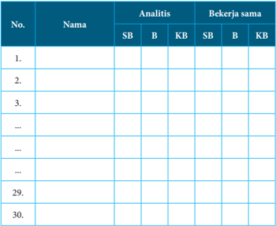

Tabel ini berisi informasi tentang analisis dan kerja sama antara dua kelompok, yaitu Analitis dan Bekerja sama. Kolom-kolomnya mencakup nama individu, analisis (SB), Bekerja sama (B), dan kerja sama (KB). Data dalam tabel tersebut menunjukkan bahwa beberapa individu telah melakukan analisis (SB) dan kerja sama (KB), sementara yang lain belum melakukan salah satu dari kedua hal tersebut. Ini menunjukkan bahwa ada variasi dalam kemampuan analisis dan kerja sama di antara individu dalam kelompok tersebut.

SB = Sangat Baik, B = Baik, KB = Kurang Baik

### 3. Instrumen Penilaian Pengetahuan dan Keterampilan

### Petunjuk

- Kerjakan  soal  berikut secara individu,  dan  siswa  tidak  boleh menyontek dan tidak boleh bekerja sama.
- Jawablah pertanyaan/perintah berikut ini.

 

---
## 📄 Halaman 60

### Soal

- Tiga tukang cat, Joni, Deni, dan Ari bekerja secara bersama-sama, dapat mengecat eksterior (bagian luar) sebuah rumah dalam waktu 10  jam  kerja.  Pengalaman  Deni  dan  Ari  pernah  bersama-sama mengecat rumah yang serupa dalam 15 jam kerja. Suatu hari, ketiga tukang  ini  bekerja  mengecat  rumah  tersebut  selama  4  jam  kerja. Setelah  itu  Ari  pergi  karena  ada  suatu  keperluan  mendadak.  Joni dan  Deni  memerlukan  tambahan  waktu  8  jam  kerja  lagi  untuk menyelesaikan pengecatan rumah. Tentukan waktu yang dibutuhkan masing-masing tukang, jika bekerja sendirian.
- Sebuah bilangan  terdiri  atas  tiga  angka  yang  jumlahnya  9.  Angka satuannya  tiga  lebih  daripada  angka  puluhan.  Jika  angka  ratusan dan angka puluhan ditukar letaknya, diperoleh bilangan yang sama. Tentukan bilangan tersebut.
- Diberikan sistem persamaan linear tiga variabel, yaitu

``

``

``

Tentukan syarat yang dipenuhi sistem supaya memiliki penyelesaian tunggal, memiliki banyak penyelesaian, dan tidak memiliki penyelesaian.

- Sebuah pabrik memiliki 3 buah mesin A , B ,  dan C .  Jika  ketiganya bekerja akan dihasilkan 5.700 dalam satu minggu. Jika hanya mesin A dan B saja bekerja akan dihasilkan 3.400 lensa dalam satu minggu. Jika hanya mesin A dan C yang bekerja akan dihasilkan 4.200 lensa dalam satu minggu. Berapa banyak lensa yang dihasilkan oleh tiaptiap mesin dalam satu minggu?

 

---
## 📄 Halaman 61

### 4. Pedoman Penilaian Pengetahuan dan Keterampilan

---
**📊 Tabel**

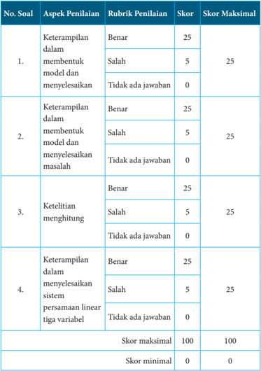

Tabel ini menunjukkan skor penilaian untuk empat soal dalam sebuah ujian atau tes. Topik utama tabel adalah keterampilan dalam membentuk model dan menyelesaikan masalah, ketelitian menghitung, dan keterampilan dalam menyelesaikan sistem persamaan linear tiga variabel. Kolom-kolomnya meliputi aspek penilaian (keterampilan dalam membentuk model dan menyelesaikan masalah, ketelitian menghitung, keterampilan dalam menyelesaikan sistem persamaan linear tiga variabel), rubrik penilaian (Benar, Salah, Tidak ada jawaban), skor, dan skor maksimal. Data penting yang terlihat adalah bahwa setiap aspek penilaian memiliki skor maksimal 25 dan skor minimal 0, dengan total skor maksimal sebesar 100. Skor tertinggi yang dapat diperoleh adalah 100 jika semua aspek penilaian diberi skor maksimal.

 

---
## 📄 Halaman 62

### F. Pengayaan

Pengayaan  merupakan  kegiatan  yang  diberikan  kepada  siswa  yang memiliki akselerasi pencapaian KD yang cepat (nilai maksimal) agar potensinya berkembang  optimal  dengan  memanfaatkan  sisa  waktu  yang  dimilikinya. Guru sebaiknya merancang kegiatan pembelajaran lanjut yang terkait dengan sistem persamaan linear tiga variabel.

### G. Remedial

Pembelajaran  remedial  pada  hakikatnya  adalah  pemberian  bantuan bagi siswa yang mengalami kesulitan atau kelambatan belajar. Pembelajaran remedial  adalah  tindakan  perbaikan  pembelajaran  yang  diberikan  kepada siswa yang belum mencapai kompetensi minimalnya dalam satu kompetensi dasar tertentu.

Perlu dipahami oleh guru, bahwa remedial bukan mengulang tes (ulangan harian)  dengan  materi  yang  sama,  tetapi  guru  memberikan  perbaikan pembelajaran pada KD yang belum dikuasai oleh siswa melalui upaya tertentu. Setelah perbaikan pembelajaran  dilakukan, guru melakukan  tes  untuk mengetahui apakah siswa telah memenuhi kompetensi minimal dari KD yang diremedialkan.

### H. Kegiatan Projek

Sehubungan dengan kegiatan projek pada buku siswa, maka hal-hal yang perlu dilakukan oleh guru adalah sebagai berikut:

### Sebelum Pelaksanaan Kegiatan

- Sediakan  bahan-bahan yang dibutuhkan untuk kegiatan projek kali ini, seperti buku-buku teks pelajaran atau pojok pustaka atau bahkan fasilitas internet.
- Sediakan kertas HVS atau lainnya.

 

---
## 📄 Halaman 63

- Bentuklah  siswa  dalam  beberapa  kelompok  untuk  membagi  tugas dalam menjalankan tugasnya.
- Guru membimbing siswa dalam menyusun langkah-langkah pelaksanaan Projek.
- Selain  itu,  guru  harus  merancang  bagaimana  penilaian  Projek  hasil kerja siswa.

### Soal Projek

Cari sebuah SPLTV yang menyatakan model matematika dari masalah nyata  yang  kamu  temui  di  lingkungan  sekitarmu.  Uraikan  proses penemuan model matematika tersebut dan selesaikan sebagai pemecahan masalah tersebut. Buatlah laporan hasil kerjamu dan presentasikan hasilnya di depan kelas.

### I. Rangkuman

Guru mengarahkan siswa untuk menyusun rangkuman pada pembelajaran  sistem  persamaan  linear  tiga  variabel.  Guru  memberikan bantuan untuk mengarahkan siswa merangkum hal-hal penting dengan benar melalui mengajukan pertanyaan-pertanyaan. Misalnya:

- Bagaimana konsep sistem persamaan linear tiga variabel?
- Bagaimana menentukan penyelesaian sistem persamaan linear linear tiga variabel?
- Apa  yang dimaksud  dengan  himpunan  penyelesaian  suatu  sistem persamaan linear tiga variabel?
- Bagaimana konsep sistem persamaan linear tiga variabel yang homogen dan nonhomogen.
- Bagaimana syarat suatu sistem persamaan linear tiga variabel memiliki satu penyelesaian? Tidak memiliki penyelesaian? Memiliki tak terhingga banyak penyelesaian.

 

---
## 📄 Halaman 64

Guru  mengarahkan  siswa  menyimpulkan  seperti  yang  disajikan  pada bagian penutup ini. Beberapa hal penting yang perlu dirangkum terkait konsep dan sifat-sifat sistem persamaan linear tiga variabel.

- Model matematika dari permasalahan sehari-hari sering menjadi sebuah model  sistem  persamaan  linear.  Konsep  sistem  persamaan  linear  ini didasari  oleh  konsep  persamaan  dalam  sistem  bilangan  real,  sehingga sifat-sifat persamaan linear dalam sistem bilangan real banyak digunakan sebagai pedoman dalam menyelesaikan suatu sistem persamaan linear.
- Dua persamaan linear atau lebih dikatakan membentuk sistem persamaan linear jika dan hanya jika variabel-variabelnya saling terkait dan variabel yang sama memiliki nilai yang sama sebagai penyelesaian setiap persamaan linear pada sistem tersebut.
- Himpunan penyelesaian sistem persamaan linear adalah suatu himpunan semua pasangan ( x , y , z ) yang memenuhi sistem tersebut.
- Apabila penyelesaian sebuah sistem persamaan linear semuanya nilai variabelnya  adalah  nol,  maka  penyelesaian  tersebut  dikatakan  penyelesaian trivial. Misal  diberikan sistem persamaan linear 3 x + 5 y + z = 0; 2 x + 7 y + z = 0; dan x - 2 y + z = 0. Sistem persamaan linear ini memiliki suku konstan nol dan mempunyai penyelesaian yang tunggal, yaitu untuk x = y = z = 0.
- Sistem persamaan linear disebut homogen apabila suku konstan setiap persamaannya adalah nol.
- Sistem tersebut hanya mempunyai penyelesaian trivial.
- Sistem  tersebut  mempunyai  tak  terhingga  penyelesaian  yang  tak trivial sebagai tambahan penyelesaian trivial.
- Sistem persamaan linear (SPL) mempunyai tiga kemungkinan penyelesaian,  yaitu  tidak  mempunyai  penyelesaian,  mempunyai  satu penyelesaian, dan mempunyai tak terhingga banyak penyelesaian.
Penguasaan  kamu  tentang  sistem  persamaan  linear  tiga  variabel adalah  prasyarat  mutlak  mempelajari  bahasan  matriks  dan  program linear. Selanjutnya kita akan mempelajari konsep fungsi.

 

---
## 📄 Halaman 65

### Petunjuk Pembelajaran bagi Guru

### A. Kompetensi Inti

---
**📊 Tabel**

Tabel ini berisi informasi tentang sikap dan pengetahuan yang diharapkan siswa untuk membangun karakter yang kuat dan berpengetahuan. Topik utama tabel adalah sikap dan pengetahuan yang relevan dengan nilai-nilai agama dan budaya, serta pengetahuan umum tentang ilmu pengetahuan, teknologi, seni, budaya, dan humaniora. Kolom pertama berisi sikap yang harus dimiliki, seperti menghargai ajaran agama dan menjaga perilaku jujur, disiplin, tanggung jawab, dan proaktif. Kolom kedua berisi pengetahuan yang harus dimiliki, seperti memahami, menerapkan, dan menganalisis pengetahuan faktil, konseptual, prosedural, serta pengetahuan tentang ilmu pengetahuan, teknologi, seni, budaya, dan humaniora. Data atau pola penting yang terlihat adalah bahwa tabel ini mencakup dua aspek utama: sikap dan pengetahuan, serta menekankan pentingnya menghargai ajaran agama dan menjaga perilaku yang baik.

 

---
## 📄 Halaman 66

---
**📊 Tabel**

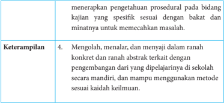

Tabel ini berisi informasi tentang keterampilan yang diperlukan untuk menyelesaikan tugas tertentu. Topik utamanya adalah "Mengolah, menalar, dan menyaji dalam ranah konkrit dan ranah abstrak terkait dengan pengembangan dari yang dipelajariannya di sekolah secara mandiri, dan mampu menggunakan metode sesuai kaidah keilmuan." Dalam tabel ini, kolom pertama berisi deskripsi keterampilan, sedangkan kolom kedua berisi contoh atau penjelasan lebih lanjut tentang keterampilan tersebut. Data penting yang terlihat adalah bahwa keterampilan ini melibatkan pengembangan diri secara mandiri dan penggunaan metode yang sesuai dengan kaidah keilmuan.

### B. Kompetensi Dasar dan Indikator

Indikator  Pencapaian  Kompetensi  pada  kegiatan  pembelajaran  dapat dikembangkan oleh guru dan disesuaikan dengan kondisi siswa dan lingkungan di tempat guru mengajar.

Berikut dipaparkan contoh Indikator Pencapaian Kompetensi yang dapat dijabarkan dari KD pengetahuan  3.3-3.5 dan KD Keterampilan 4.3-4.5.

---
**📊 Tabel**

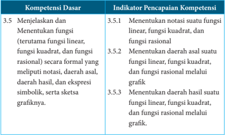

Tabel ini berisi informasi tentang kompetensi dasar dan indikator pencapaian kompetensi dalam matematika, khususnya untuk fungsi linear, kuadrat, dan rasional. Topik utama adalah menjelaskan dan menentukan fungsi formal secara simbolik, termasuk notasi, daerah asal, hasil, dan sketsa grafik. Kolom pertama berisi kompetensi dasar, sedangkan kolom kedua berisi indikator pencapaian kompetensi. Data penting yang terlihat adalah bahwa indikator pencapaian kompetensi mencakup menentukan notasi suatu fungsi, menentukan daerah asal, menentukan hasil, dan menentukan sketsa grafik untuk fungsi-linear, kuadrat, dan rasional. Ini menunjukkan bahwa tabel ini fokus pada pemahaman dan pengetahuan dasar tentang fungsi-fungsi tersebut dalam konteks formal dan grafis.

 

---
## 📄 Halaman 67

---
**📊 Tabel**

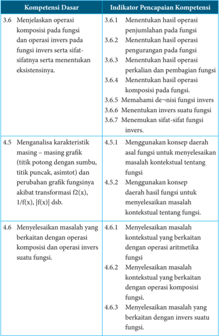

Tabel ini berisi informasi tentang kompetensi dasar dan indikator pencapaian kompetensi dalam matematika, khususnya tentang operasi fungsi dan analisis grafik fungsi. Topik utama adalah pengetahuan dan kemampuan dalam menjelaskan operasi fungsi, menganalisis karakteristik grafik fungsi, dan menyelesaikan masalah kontekstual dengan operasi fungsi. Kolom pertama berisi kompetensi dasar yang mencakup operasi fungsi, sifat-sifat fungsi, dan operasi invers. Kolom kedua berisi indikator pencapaian kompetensi yang meliputi menentukan hasil operasi, pengurangan fungsi, perkalian fungsi, operasi komposisi, dan menemukan sifat-sifat fungsi. Data penting yang terlihat adalah bahwa tabel ini mencakup berbagai aspek dari pemahaman dan kemampuan dalam matematika, mulai dari operasi fungsi hingga penyelesaian masalah kontekstual.

 

---
## 📄 Halaman 68

### C. Tujuan Pembelajaran

Setelah mempelajari fungsi melalui  pengamatan, tanya jawab, penugasan individu dan kelompok, diskusi kelompok, serta penemuan ( discovery ) siswa diharapkan mampu:

- menumbuhkan  sikap  perilaku  jujur,  disiplin,  tanggung  jawab,  peduli (gotong royong, kerja sama, toleransi, damai), santun, responsif, dan proaktif,  berani  bertanya,  berpendapat,  serta  menghargai  pendapat  orang lain dalam aktivitas sehari-hari;
- menunjukkan  rasa  ingin  tahu  dalam  memahami  dan  menyelesaikan masalah fungsi;
- menentukan daerah asal suatu fungsi;
- menentukan daerah hasil suatu fungsi;
- menentukan hasil operasi aritmetika (penjumlahan, pengurangan, perkalian, dan pembagian) suatu fungsi;
- menentukan hasil operasi komposisi suatu fungsi;
- menentukan invers suatu fungsi;
- memahami syarat-syarat suatu fungsi agar memiliki invers;
- menggunakan konsep daerah asal dan daerah hasil untuk menyelesaikan masalah sehari-hari yang berkaitan dengan fungsi;
- menyelesaikan  masalah  kontekstual  yang  berkaitan  dengan  operasi aritmetika dan operasi komposisi fungsi.

 

---
## 📄 Halaman 69

### D. Diagram Alir

---
**🖼️ Gambar/Diagram**

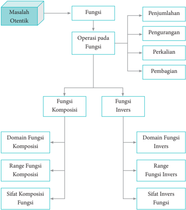

> **Deskripsi Visual:** Gambar ini adalah diagram yang menunjukkan struktur dan operasi pada fungsi matematika. Diagram ini terdiri dari beberapa elemen utama:

1. **Masalah Otentik** - Ini adalah masalah yang ingin diselesaikan menggunakan konsep fungsi.
2. **Fungsi** - Fungsi merupakan objek utama yang akan dianalisis.
3. **Operasi pada Fungsi** - Ada empat operasi dasar yang dapat dilakukan pada fungsi: penjumlahan, pengurangan, perkalian, dan pembagian.
4. **Fungsi Komposisi** - Ini adalah operasi yang menggabungkan dua fungsi menjadi satu.
5. **Fungsi Invers** - Ini adalah operasi yang menciptakan fungsi yang membalikkan hasil dari fungsi asli.
6. **Domain Fungsi Komposisi** - Ini adalah domain dari fungsi yang digabungkan.
7. **Range Fungsi Komposisi** - Ini adalah range dari hasil dari fungsi yang digabungkan.
8. **Sifat Komposisi Fungsi** - Ini adalah sifat-sifat yang dimiliki oleh hasil komposisi fungsi.
9. **Domain Fungsi Invers** - Ini adalah domain dari fungsi yang membalikkan.
10. **Range Fungsi Invers** - Ini adalah range dari hasil dari fungsi yang membalikkan.
11. **Sifat Invers Fungsi** - Ini adalah sifat-sifat yang dimiliki oleh hasil invers fungsi.

Elemen-elemen ini saling terkait melalui hubungan komposisi dan invers, serta memiliki sifat-sifat spesifik yang perlu dipahami untuk memahami konsep ini. Gambar ini membantu pembaca memahami bagaimana fungsi dapat digunakan untuk melakukan operasi matematika dan bagaimana operasi tersebut dapat dikombinasikan untuk mencapai tujuan tertentu.

 

---
## 📄 Halaman 70

### E. Materi Pembelajaran

### Membelajarkan 3.1

Memahami Notasi, Domain, Range, dan Graik Suatu Fungsi

### Sebelum Pelaksanaan Kegiatan

- Siswa diharapkan sudah membawa perlengkapan alat-alat tulis, seperti pulpen, pensil, penghapus, penggaris, kertas berpetak, dan lain-lain.
- Bentuklah kelompok kecil yang terdiri  atas  2  -  3  orang  siswa  yang memungkinkan belajar secara efektif dan efisien.
- Sediakan  tabel-tabel  yang  diperlukan  bagi  siswa  untuk  mengisikan hasil kerjanya

### No.

### Petunjuk Kegiatan Pembelajaran

### 1. Kegiatan Pendahuluan

- Pembelajaran dimulai dengan do'a dan salam.
- Apersepsi.
- Para siswa diperkenalkan ulang materi relasi dan fungsi yang telah dipelajari di SMP .
- Ajaklah siswa mengingat kembali konsep fungsi, penyajian fungsi, daerah asal, daerah kawan, dan daerah hasil fungsi.

### 2. Kegiatan Inti

### Pengantar Pembelajaran

- Ajaklah siswa untuk memerhatikan dan memahami Gambar 3.1.
- Upayakan siswa lebih dahulu berusaha memikirkan, bersusah payah  mencari  ide-ide,  berdiskusi  dalam  kelompok,  dan mencari pemecahan masalah di dalam kelompok.

 

---
## 📄 Halaman 71

### No.

### Petunjuk Kegiatan Pembelajaran

- Guru dapat memberi bantuan kepada siswa, tetapi diupayakan mereka  sendiri  yang  berusaha  menuju  tingkat  pemahaman dan proses berpikir yang lebih tinggi.

### Ayo Kita Amati

- Ajaklah siswa untuk mengamati Gambar 3.1 dan Gambar 3.2 dan  fokuskan  pengamatan  kepada  pengamatan  bagaimana proses kerja sebuah mesin, mulai dari masukan, proses, sampai pada luaran yang dihasilkan oleh sebuah mesin. Selanjutnya, untuk Gambar 3.2 fokus pengamatannya pada daerah asal dan daerah hasil sebuah fungsi yang disajikan dalam grafik.
- Berilah  kesempatan  kepada  siswa  untuk  berdiskusi  tentang perbedaan  masukan  pada  mesin  yang  akan  menghasilkan luaran yang berbeda juga.

### Ayo Kita Menanya

- Jelaskan tugas berikutnya, yaitu membuat notasi sebuah fungsi dan menentukan daerah asal serta daerah hasil suatu fungsi.
- Amati siswa yang sedang bekerja dan jika diperlukan, berikan pertanyaan yang dapat memancing ide kreatifitas siswa.

### Sedikit Informasi

Informasikan kepada siswa daerah asal fungsi adalah semua nilainilai  yang  ada  pada  sumbu x dan  daerah  hasilnya  berasal  pada sumbuy .

### Ayo Kita Menalar

Ajaklah siswa untuk mendiskusikan kembali tentang notasi, daerah asal, dan daerah hasil suatu fungsi. Perhatikan siswa yang sedang melakukan kegiatan Menalar.

 

---
## 📄 Halaman 72

### No.

### Petunjuk Kegiatan Pembelajaran

### Ayo Kita Berbagi

- Mintalah  siswa  untuk  berbagi  hasil  karyanya  ke  teman sebangkunya  dan  pastikan  temannya  yang  menerima  hasil karya tersebut untuk memahami apa yang harus dilakukan.
- Pantaulah  bagaimana  mereka  mengerjakan  tugasnya  dan pastikan bahwa kalimat-kalimat yang digunakan sudah sesuai dengan kaidah penulisan yang baik.

### 3. Kegiatan Penutup

- Apakah semua kelompok sudah mengumpulkan tugastugasnya  dan  apakah  identitas  kelompok  sudah  jelas?  Coba periksa.
- Berikan  penilaian  terhadap  proses  dan  hasil  karya  siswa dengan menggunakan rubrik penilaian.
- Jika  dipandang  perlu,  berikan  latihan  kepada  siswa  untuk dikerjakan di rumah.

### Penilaian

### 1. Prosedur Penilaian:

 

---
## 📄 Halaman 73

### 2. Instrumen Pengamatan Sikap

### Rasa Ingin Tahu

- Kurang  baik  jika  sama  sekali  tidak  berusaha  untuk  mencoba atau  bertanya  atau  acuh  tak  acuh  (tidak  mau  tahu)  dalam  proses pembelajaran.
- Baik  jika  menunjukkan  sudah  ada  usaha  untuk  mencoba  atau bertanya dalam proses pembelajaran tetapi masih belum konsisten.
- Sangat baik jika menunjukkan adanya usaha untuk mencoba atau bertanya  dalam  proses  pembelajaran  secara  terus-menerus  dan konsisten.

### Indikator perkembangan sikap tanggung jawab (dalam kelompok)

- Kurang baik jika menunjukkan sama sekali tidak ambil bagian dalam melaksanakan tugas kelompok.
- Baik  jika  sudah  adanya  usaha  ambil  bagian  dalam  melaksanakan tugas kelompok tetapi belum konsisten.
- Sangat  baik,  jika  sudah  ambil  bagian  dalam  menyelesaikan  tugas kelompok secara terus-menerus dan konsisten.

### Berikan tanda centang (  ) pada kolom berikut sesuai hasil pengamatan.

---
**📊 Tabel**

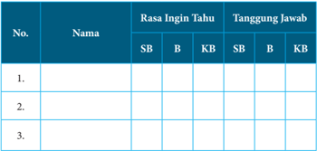

Tabel ini menunjukkan rasa ingin tahu dan tanggung jawab dari beberapa orang dalam dua kategori: SB (Sangat Baik) dan KB (Kurang Baik). Topik utama tabel ini adalah tentang penilaian kinerja individu dalam hal rasa ingin tahu dan tanggung jawab mereka. Kolom-kolomnya mencakup nama individu, rasa ingin tahu, dan tanggung jawab. Data penting yang terlihat adalah bahwa beberapa orang memiliki rasa ingin tahu yang sangat baik, sementara yang lain kurang baik. Selain itu, ada variasi dalam tanggung jawab, dengan beberapa orang memiliki tanggung jawab yang sangat baik dan yang lain kurang baik. Tabel ini membantu dalam memahami bagaimana individu berperilaku dalam hal rasa ingin tahu dan tanggung jawab mereka.

 

---
## 📄 Halaman 74

---
**📊 Tabel**

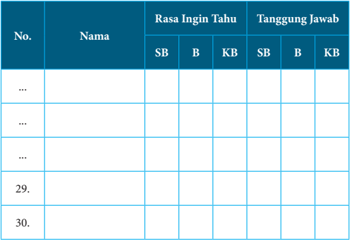

Tabel ini menunjukkan data tentang rasa ingin tahu dan tanggung jawab siswa dalam mempelajari materi. Kolom "SB" mungkin merujuk pada siswa yang memiliki rasa ingin tahu yang tinggi (Seri B), sedangkan "KB" merujuk pada siswa yang memiliki rasa ingin tahu yang rendah (Kelas B). Sementara itu, kolom "Tanggung Jawab" mungkin menunjukkan tingkat tanggung jawab siswa dalam mempelajari materi, dengan "SB" untuk tingkat tinggi dan "KB" untuk tingkat rendah. Data ini menunjukkan bahwa sebagian besar siswa memiliki rasa ingin tahu yang tinggi dan tanggung jawab yang rendah, sementara siswa lainnya memiliki rasa ingin tahu yang rendah dan tanggung jawab yang tinggi. Ini menunjukkan bahwa ada perbedaan dalam motivasi dan tanggung jawab belajar antara siswa-siswa di sekolah.

### 3. Instrumen penilaian 1

### Petunjuk:

- Kerjakan  soal  berikut  secara  individu,  siswa  tidak  diperbolehkan menyontek dan bekerja sama.
- Jawablah pertanyaan/perintah di bawah ini.

### Soal

- Tentukanlah daerah asal dan daerah hasil fungsi yang disajikan pada grafik berikut.

---
**🖼️ Gambar/Diagram**

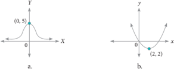

> **Deskripsi Visual:** Gambar a adalah sebuah diagram yang menunjukkan hubungan antara dua variabel, yaitu x dan y. Gambar ini berupa kurva yang melintang dari kiri atas ke kanan bawah, dengan titik awal di (0,5) dan titik akhir di (2,2). Kurva ini menunjukkan bahwa nilai y mengurangkannya seiring naiknya nilai x. Elemen utama dalam gambar ini adalah kurva tersebut, yang menunjukkan hubungan antara x dan y.

Gambar b adalah sebuah grafik yang menunjukkan hubungan antara dua variabel, yaitu t dan y. Gambar ini berupa kurva yang melintang dari kiri atas ke kanan bawah, dengan titik awal di (0,0) dan titik akhir di (2,2). Kurva ini menunjukkan bahwa nilai y mengurangkannya seiring naiknya nilai t. Elemen utama dalam gambar ini adalah kurva tersebut, yang menunjukkan hubungan antara t dan y.

Teks, angka, atau label penting yang terlihat dalam kedua gambar ini adalah kurva yang melintang dari kiri atas ke kanan bawah, dengan titik awal di (0,5) dan titik akhir di (2,2) pada gambar a, serta titik awal di (0,0) dan titik akhir di (2,2) pada gambar b. Informasi kunci yang dapat diambil pembaca adalah bahwa kedua gambar ini menunjukkan hubungan antara dua variabel, yaitu x dan y pada gambar a, serta t dan y pada gambar b.

 

---
## 📄 Halaman 75

---
**🖼️ Gambar/Diagram**

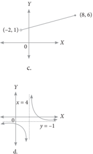

> **Deskripsi Visual:** Gambar ini adalah sebuah diagram yang menunjukkan hubungan antara dua variabel, yaitu x dan y. Diagram ini berbentuk garis lurus yang melintang dari kiri atas ke kanan bawah. Di bagian atas, garis tersebut melalui titik koordinat (-2, 1) dan di bagian bawah melalui titik koordinat (8, 6). Ini menunjukkan bahwa ada hubungan linear antara kedua variabel tersebut.

Elemen utama dalam diagram ini adalah garis lurus yang menghubungkan dua titik koordinat. Garis ini menunjukkan bahwa untuk setiap penambahan satu unit pada variabel x, variabel y meningkatkan sebesar 0,5 unit. Ini menunjukkan bahwa hubungan antara x dan y adalah linear dengan koefisien arah 0,5.

Teks, angka, atau label penting yang terlihat dalam diagram ini adalah titik koordinat (-2, 1) dan (8, 6), serta garis lurus yang menghubungkannya. Angka-angka ini menunjukkan nilai-nilai x dan y pada titik-titik koordinat tersebut.

Informasi kunci yang dapat diambil pembaca dari gambar ini adalah bahwa ada hubungan linear antara variabel x dan y dengan koefisien arah 0,5. Ini berarti bahwa untuk setiap penambahan satu unit pada variabel x, variabel y meningkatkan sebesar 0,5 unit.

---
**🖼️ Gambar/Diagram**

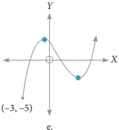

> **Deskripsi Visual:** Gambar ini adalah sebuah grafik yang menunjukkan hubungan antara dua variabel, mungkin x dan y, pada suatu fungsi. Grafik ini berbentuk parabola dengan sumbu x berada di tengah-tengah dan sumbu y berada di bawah. Titik awal grafik berada di titik (-3, -5), yang menunjukkan bahwa saat x = -3, y = -5. Grafik ini menunjukkan bahwa saat x meningkat, y turun dan sebaliknya. Ini menunjukkan bahwa grafik ini mungkin merupakan grafik dari fungsi kuadrat negatif.

- Tentukanlah daerah asal dan daerah hasil fungsi berikut.

``

``

- f ( x ) = x 2 -1, dimana 2 ≤ x ≤ 6

``

``

``

``

``

 

---
## 📄 Halaman 76

``

``

### 4.   Pedoman Penilaian

---
**📊 Tabel**

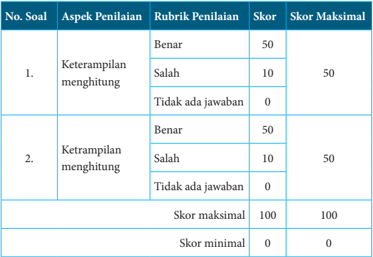

Tabel ini menunjukkan skor maksimal dan minimal untuk dua aspek penilaian: keterampilan menghitung dan ketrampilan menghitung. Setiap aspek memiliki tiga rubrik penilaian: benar, salah, dan tidak ada jawaban. Skor maksimal untuk setiap aspek adalah 50 poin, dengan skor minimal 0 poin. Topik utama tabel ini adalah proses penilaian keterampilan matematika, dengan fokus pada keterampilan menghitung dan ketrampilan menghitung. Data penting yang terlihat adalah bahwa skor maksimal dan minimal sama untuk kedua aspek penilaian, yaitu 100 poin.

### Membelajarkan 3.2

Operasi Aritmetika dan Komposisi Fungsi

### Sebelum Pelaksanaan Kegiatan

- Siswa diharapkan sudah membawa perlengkapan alat-alat tulis, seperti pulpen, pensil, penghapus, penggaris, kertas berpetak, dan lain-lain.
- Bentuklah kelompok kecil yang terdiri  atas  2  -  3  orang  siswa  yang memungkinkan belajar secara efektif dan efisien.
- Sediakan  tabel-tabel  yang  diperlukan  bagi  siswa  untuk  mengisikan hasil kerjanya.

 

---
## 📄 Halaman 77

### No.

### Petunjuk Kegiatan Pembelajaran

### 1. Kegiatan Pendahuluan

- Pembelajaran dimulai dengan do'a dan salam.

### b. Apersepsi.

- Para  siswa  diperkenalkan  dengan  pekerjaan  fotografer seperti pada Masalah 3.1 di Buku Siswa dan juga bagianbagian pekerjaan yang harus dilakukan fotografer, sehingga tercipta sebuah foto yang bagus.
- Ajaklah  siswa  memikirkan  jenis-jenis  pekerjaan  yang lain yang menarik minat bagi siswa.

### 2. Kegiatan Inti

### Pengantar Pembelajaran

- Ajaklah siswa untuk memerhatikan dan memahami Masalah 3.1, Masalah 3.2, dan Masalah 3.3.
- Upayakan siswa lebih dahulu berusaha memikirkan, bersusah payah  mencari  ide-ide,  berdiskusi  dalam  kelompok,  dan mencari pemecahan masalah di dalam kelompok.
- Guru dapat memberikan bantuan pada siswa, tetapi upayakan mereka  sendiri  yang  berusaha  menuju  tingkat  pemahaman dan proses berpikir yang lebih tinggi.

### Ayo Kita Amati

- Ajaklah siswa untuk mengamati Masalah 3.1. Fokus pengamatannya  adalah  bagaimana  proses  yang  dilakukan  seorang fotografer untuk menghasilkan gambar yang bagus.
- Berilah  kesempatan  kepada  siswa  untuk  berdiskusi  tentang perbedaan fungsi biaya pemotretan dan fungsi biaya pengeditan. Kedua tahapan ini harus dilakukan agar diketahui seberapa besar biaya untuk menghasilkan gambar yang bagus.

 

---
## 📄 Halaman 78

### No.

### Petunjuk Kegiatan Pembelajaran

### Ayo Kita Menanya

- Tugas berikutnya, yaitu membuat pertanyaan tentang fungsi biaya  apa  saja  yang  harus  dihitung  untuk  menghasilkan gambar yang bagus? Jelaskan.
- Amati siswa yang sedang bekerja dan jika diperlukan berikan pertanyaan yang dapat memancing ide kreatifitas siswa.

### Sedikit Informasi

- Informasikan kepada siswa bahwa untuk menjawab pertanyaan  yang  terdapat  pada  Masalah  3.1  sampai  dengan Masalah  3.3,  terlebih  dahulu  memahami  jenis-jenis  operasi yang  sering  digunakan,  seperti  penjumlahan,  pengurangan, perkalian, dan pembagian.
- Berilah  kesempatan  kepada  siswa  untuk  mendiskusikannya tentang cara manakah yang paling mudah untuk digunakan.

### Ayo Kita Menalar

Ajaklah siswa untuk mendiskusikan permasalahan yang terdapat pada  Masalah  3.1.  Perhatikan  siswa  yang  sedang  melakukan kegiatan Menalar.

### Simpulan

Jika f suatu  fungsi  dengan  daerah  asal Df dan g suatu  fungsi dengan daerah asal Dg ,  maka  pada  operasi  aljabar  penjumlahan, pengurangan, perkalian, dan pembagian dinyatakan sebagai berikut.

- Jumlah f dan g ditulis f + g
( f + g )( x ) = f ( x ) + g ( x ) dengan daerah asal Df + g = Df Dg .

- didefinisikan sebagai ∩

 

---
## 📄 Halaman 79

### Petunjuk Kegiatan Pembelajaran

- Selisih f dan g ditulis f -g didefinisikan sebagai ( f -g )( x ) = f ( x ) -g ( x ) dengan daerah asal Df -g = Df ∩ Dg .
- Perkalian f dan g ditulis f × g didefinisikan sebagai ( f × g )( x ) = f ( x ) × g ( x ) dengan daerah asal Df × g = Df ∩ Dg .
- Pembagian f dan g ditulis f g didefinisikan sebagai ( )       f f x x g g x ( ) = ( ) dengan daerah asal   = Df ∩ Dg - { x | g ( x ) = 0}.

### Ayo Kita Berbagi

- Mintalah  siswa  untuk  menginformasikan  hasil  karyanya  ke teman  sebangkunya,  dan  pastikan  temannya  yang  menerima hasil karya tersebut untuk memahami apa yang harus dilakukan.
- Pantaulah  bagaimana  mereka  mengerjakan  tugasnya  dan pastikan bahwa kalimat-kalimat yang digunakan sudah sesuai dengan kaidah penulisan yang baik dan benar.

### 3. Kegiatan Penutup

- Apakah semua kelompok sudah mengumpulkan tugastugasnya  dan  apakah  identitas  kelompok  sudah  jelas?  Perlu diperiksa.
- Berikan  penilaian  terhadap  proses  dan  hasil  karya  siswa dengan menggunakan rubrik penilaian.
- Jika  dipandang  perlu,  berilah  latihan  kepada  siswa  untuk dikerjakan di rumah.

 

---
## 📄 Halaman 80

### Penilaian

### 4. Prosedur Penilaian

---
**📊 Tabel**

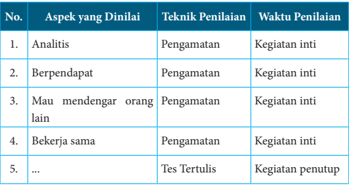

Tabel ini menunjukkan aspek-aspek yang harus dianalisis dalam sebuah kegiatan, termasuk analisis, berpandangan, mau mendengarkan orang lain, bekerja sama, dan beberapa aspek lainnya. Teknik penilaian untuk setiap aspek adalah pengamatan dan tes tertulis, dengan waktu penilaian untuk aspek analisis dan berpandangan adalah kegiatan inti, sedangkan untuk aspek lainnya adalah kegiatan penutup. Topik utama tabel ini adalah evaluasi kinerja individu dalam berbagai aspek, menggunakan metode pengamatan dan tes tertulis sebagai alat penilaian.

### 5. Instrumen Pengamatan Sikap

### Rasa ingin tahu

- Kurang  baik  jika  sama  sekali  tidak  berusaha  untuk  mencoba atau  bertanya  atau  acuh  tak  acuh  (tidak  mau  tahu)  dalam  proses pembelajaran.
- Baik  jika  sudah  ada  usaha  untuk  mencoba  atau  bertanya  dalam proses pembelajaran tetapi masih belum konsisten.
- Sangat baik jika adanya usaha untuk mencoba atau bertanya dalam proses pembelajaran secara terus-menerus dan konsisten.

### Indikator perkembangan sikap tanggung jawab (dalam kelompok)

- Kurang baik jika sama sekali tidak ambil bagian dalam melaksanakan tugas kelompok.
- Baik jika sudah ada usaha ambil bagian dalam melaksanakan tugas kelompok tetapi belum konsisten.
- Sangat  baik  jika  sudah  ambil  bagian  dalam  menyelesaikan  tugas kelompok secara terus-menerus dan konsisten.

 

---
## 📄 Halaman 81

Berikan tanda centang (  ) pada kolom berikut sesuai hasil pengamatan.

---
**📊 Tabel**

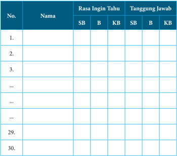

Tabel ini berisi informasi tentang rasa ingin tahu dan tanggung jawab siswa dalam mengerjakan tugas. Kolom "Nama" menyediakan tempat untuk menuliskan nama-nama siswa, sedangkan kolom "Rasa Ingin Tahu" dan "Tanggung Jawab" memuat dua jenis informasi: SB (Siswa Berani) dan KB (Ketertarikan). Data penting yang terlihat adalah bahwa banyak siswa memiliki rasa ingin tahu yang tinggi, baik itu SB maupun KB, namun sebagian besar mereka juga memiliki tanggung jawab yang cukup tinggi, terutama dalam hal SB. Ini menunjukkan bahwa siswa seringkali memiliki kombinasi antara keinginan untuk belajar dan tanggung jawab dalam mengerjakan tugas.

SB = Sangat Baik, B = Baik, KB = Kurang Baik

### 6. Instrumen Penilaian 1

### Petunjuk:

- Kerjakan soal berikut secara individu, tidak boleh menyontek dan tidak boleh bekerja sama.
- Pilihlah  jawaban  soal  kemudian  jawablah  pertanyaan/perintah  di bawahnya.

### Soal

- Suatu  pabrik  kertas  berbahan  dasar  kayu  memproduksi  kertas melalui dua tahap. Tahap pertama menggunakan mesin I yang  menghasilkan  bahan  kertas  setengah  jadi.  Tahap  kedua menggunakan mesin II yang menghasilkan bahan kertas. Dalam

 

---
## 📄 Halaman 82

produksinya  mesin  I  menghasilkan  bahan  setengah  jadi  dengan mengikuti  fungsi f ( x )  =  6 x -  10  dan  mesin  II  mengikuti  fungsi g ( x ) = x 2 + 12, x merupakan banyak bahan dasar kayu dalam satuan ton.

- Jika  bahan  dasar  kayu  yang  tersedia  untuk  suatu  produksi sebesar 50 ton, berapakah kertas yang dihasilkan? (Kertas dalam satuan ton).
- Jika bahan setengah jadi untuk kertas yang dihasilkan oleh mesin I  sebesar  110  ton,  berapa  tonkah  kayu  yang  sudah  terpakai? Berapa banyak kertas yang dihasilkan?
- Diketahui fungsi f ( x ) = -3 x x , x ≠ 0. Tentukan rumus fungsi berikut, bila  terdefinisi  dan  tentukan  daerah  asal  dan  daerah  hasilnya.
- f + g
- f -g
- f × g
- f g
- Misalkan f fungsi  yang  memenuhi   -    1 1 + ( ) = 2 f f x x x x untuk setiap x ≠ 0. Tentukanlah nilai f (2).
- Diketahui fungsi f : R → R dengan f ( x )  = x 2 -  4 x +  2  dan  fungsi g : R → R dengan g ( x ) = 3 x - 7. Tentukanlah
- g o f

``

- ( g o f )(5)
- ( f o g )(10)

 

---
## 📄 Halaman 83

### 7. Pedoman Penilaian

---
**📊 Tabel**

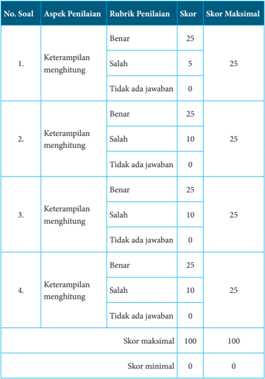

Tabel ini menunjukkan skor penilaian untuk empat soal yang berkaitan dengan keterampilan menghitung. Setiap soal memiliki tiga pilihan jawaban: benar, salah, atau tidak ada jawaban. Skor maksimal untuk setiap soal adalah 25, dan skor minimal adalah 0. Topik utama tabel adalah keterampilan menghitung, yang diukur melalui ketepatan jawaban yang diberikan oleh siswa. Pola penting yang terlihat adalah bahwa semua soal memiliki skor maksimal yang sama (25), dan skor minimum yang sama (0). Ini menunjukkan bahwa kesulitan dalam menjawab soal tidak akan mempengaruhi skor maksimal yang ditetapkan.

 

---
## 📄 Halaman 84

### Membelajarkan 3.3

### Menemukan Konsep Fungsi Invers

### Sebelum Pelaksanaan Kegiatan

- Identifikasi siswa-siswa yang biasanya agak sulit membuat pertanyaan.
- Identifikasi  pula  bentuk  bantuan  yang  perlu  diberikan  agar  siswa akhirnya produktif membuat pertanyaan.
- Sediakan  tabel-tabel  yang  diperlukan  bagi  siswa  untuk  mengisikan hasil kerjanya.
- Sediakan kertas HVS secukupnya.
- Mungkin  perlu diberikan contoh kritik, komentar, saran, atau pertanyaan  terhadap  suatu  karya  agar  siswa  dapat  meniru  dan mengembangkan lebih jauh sesuai dengan materinya

### No. Petunjuk Kegiatan Pembelajaran

### 1. Kegiatan Pendahuluan

- Apersepsi
- Para siswa diperkenalkan dengan pekerjaan pedagang kain.
- Jika  diketahui  berapa  potong  kain  yang  terjual,  maka  dapat dihitung berapa banyak untung yang diperoleh. Demikian juga jika pedagang mengharapkan untung dengan jumlah tertentu, maka dapat diupayakan dengan menjual kain dengan jumlah tertentu.

### 2. Kegiatan Inti

### Pengantar

Fokus  pemahaman  dengan  memerhatikan  secara  teliti  berapa potong kain yang terjual dan berapa rupiah untungnya, juga berapa banyak kain yang harus terjual jika ingin memiliki untung dengan jumlah tertentu.

 

---
## 📄 Halaman 85

---
**📊 Tabel**

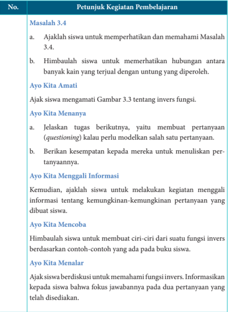

Tabel ini berisi petunjuk kegiatan pembelajaran untuk mengajar tentang masalah 3.4 dalam matematika, yang melibatkan pemahaman invers fungsi. Topik utama adalah mengajak siswa untuk memahami hubungan antara banyak kain yang terjual dengan untung yang diperoleh. Dalam proses ini, siswa diajak untuk mengeksplorasi konsep invers fungsi melalui pengamatan gambar 3.3 dan menjawab pertanyaan-pertanyaan yang disediakan. Selain itu, siswa juga diajak untuk membuat pertanyaan (questioning) dan mencoba membuat ciri-ciri dari suatu fungsi invers berdasarkan contoh-contoh yang ada di buku siswa. Terakhir, siswa diajak untuk berdiskusi tentang fokus jawabannya pada dua pertanyaan yang telah disediakan.

 

---
## 📄 Halaman 86

---
**📊 Tabel**

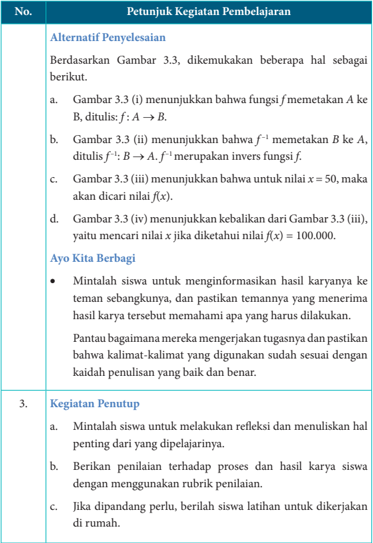

Tabel ini berisi petunjuk kegiatan pembelajaran untuk mengajar tentang fungsi dan invers fungsi. Topik utama adalah tentang penyelesaian masalah berdasarkan gambar 3.3. Kolom pertama menunjukkan alternatif penyelenggaraan, sementara kolom kedua menjelaskan bagaimana setiap alternatif dapat digunakan untuk menyelesaikan masalah. Data penting yang terlihat antara lain bahwa gambar 3.3(i) menunjukkan bahwa fungsi f memetakan A ke B, gambar 3.3(ii) menunjukkan bahwa f^-1 merupakan invers fungsi f, dan gambar 3.3(iv) menunjukkan bahwa jika x = 50, maka nilai f(x) akan di cari. Selain itu, tabel juga menyediakan petunjuk untuk kegiatan penutup, seperti mintalah siswa untuk melakukan refleksi dan menuliskan hal penting yang diajarkan, berikan penilaian dengan menggunakan rubrik penilaian, dan jika diperlukan, berilah siswa latihan untuk dikerjakan di rumah.

 

---
## 📄 Halaman 87

### Penilaian

### 1. Prosedur Penilaian

---
**📊 Tabel**

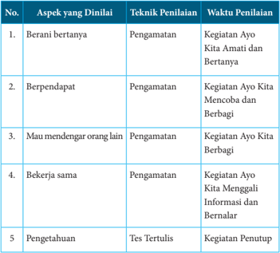

Tabel ini menunjukkan aspek-aspek yang dianalisis dalam sebuah kegiatan belajar, termasuk teknik penilaian yang digunakan untuk setiap aspek tersebut. Topik utama tabel adalah evaluasi keterampilan sosial dan komunikasi siswa. Kolom-kolomnya meliputi nomor urutan, aspek yang dianalisis, teknik penilaian, dan waktu penilaian. Data penting yang terlihat adalah bahwa semua aspek dianalisis menggunakan metode pengamatan, dengan penilaian dilakukan pada berbagai kegiatan belajar seperti "Ayo Kita Amati dan Bertanya", "Ayo Kita Mencoba dan Berbagi", "Ayo Kita Berbagi", "Ayo Kita Menggali Informasi dan Bernalar", dan "Penutup". Teknik penilaian ini mencakup berbagai aspek seperti berani bertanya, berpendapat, mau mendengar orang lain, bekerja sama, dan pengetahuan. Waktu penilaian juga ditentukan untuk setiap aspek, menunjukkan bahwa penilaian dilakukan secara teratur dan sistematis.

### 2. Instrumen Pengamatan Sikap

### Rasa ingin tahu

- Kurang  baik  jika  sama  sekali  tidak  berusaha  untuk  mencoba atau  bertanya  atau  acuh  tak  acuh  (tidak  mau  tahu)  dalam  proses pembelajaran.
- Baik jika sudah ada usaha untuk mencoba atau bertanya dalam proses pembelajaran, tetapi masih belum konsisten.
- Sangat baik jika adanya usaha untuk mencoba atau bertanya dalam proses pembelajaran secara terus-menerus dan konsisten.

 

---
## 📄 Halaman 88

### Indikator perkembangan sikap tanggung jawab (dalam kelompok)

- Kurang baik jika sama sekali tidak ambil bagian dalam melaksanakan tugas kelompok.
- Baik jika sudah ada usaha ambil bagian dalam melaksanakan tugas kelompok tetapi belum konsisten.
- Sangat  baik  jika  sudah  ambil  bagian  dalam  menyelesaikan  tugas kelompok secara terus-menerus dan konsisten.
Berikan tanda centang (  ) pada kolom berikut sesuai hasil pengamatan.

---
**📊 Tabel**

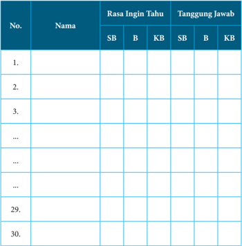

Tabel ini berisi informasi tentang rasa ingin tahu dan tanggung jawab siswa dalam mempelajari materi pelajaran. Kolom "SB" mungkin merujuk pada siswa yang memiliki rasa ingin tahu yang tinggi (Superior), sedangkan "KB" menunjukkan siswa yang memiliki rasa ingin tahu yang rendah (Ketidaktahuan). Sementara itu, kolom "B" mungkin merujuk pada siswa yang memiliki tanggung jawab yang baik (Better), sedangkan "KB" menunjukkan siswa yang memiliki tanggung jawab yang buruk (Ketidakmemahaman). Dari tabel ini, dapat dilihat bahwa banyak siswa memiliki rasa ingin tahu yang tinggi namun memiliki tanggung jawab yang buruk, yang menunjukkan adanya perluasan untuk peningkatan kualitas pembelajaran.

 

---
## 📄 Halaman 89

### 3. Instrumen Penilaian

### Petunjuk

- Kerjakan soal berikut secara individu, siswa tidak boleh menyontek dan bekerja sama.
- Jawablah pertanyaan/perintah di bawah ini.

### Soal

- Seorang pedagang kain memperoleh keuntungan dari hasil penjualan setiap x potong  kain  sebesar f ( x )  rupiah.  Nilai  keuntungan  yang diperoleh mengikuti fungsi f ( x ) = 100 x + 500, x merupakan banyak potong kain yang terjual.
- Jika  dalam  suatu  hari  pedagang  tersebut  mampu  menjual 100 potong kain, berapa keuntungan yang diperoleh?
- Jika keuntungan yang diharapkan sebesar Rp500.000,00 berapa potong kain yang harus terjual?
- Jika A merupakan himpunan daerah asal ( domain ) fungsi f ( x ) dan B merupakan himpunan daerah hasil ( range )  fungsi f ( x ), gambarkanlah permasalahan butir (a) dan butir (b) di atas.
- Tentukanlah fungsi invers dari fungsi-fungsi berikut jika ada.

``

- Diketahui f dan g suatu fungsi dengan rumus fungsi f ( x ) = 3 x g ( x ) = -4 x . Buktikanlah bahwa f -1 ( x ) = g ( x ) dan g -1 ( x ) = f ( x ).
- 4 dan
- 3 4. Diketahui  fungsi f : R → R dengan  rumus  fungsi f ( x )  = x 2 -  4. Tentukanlah daerah asal fungsi f agar fungsi f memiliki invers dan tentukan  pula  rumus  fungsi  inversnya  untuk  daerah  asal  yang memenuhi.

 

---
## 📄 Halaman 90

### Pedoman Penilaian

---
**📊 Tabel**

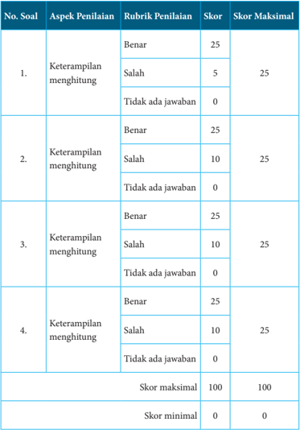

Tabel ini menunjukkan skor penilaian untuk empat soal yang berkaitan dengan keterampilan menghitung. Setiap soal memiliki tiga pilihan jawaban: benar, salah, atau tidak ada jawaban. Skor maksimal untuk setiap soal adalah 25, dan skor minimal adalah 0. Topik utama tabel adalah keterampilan menghitung, yang diukur melalui ketepatan jawaban yang diberikan oleh siswa. Data penting lainnya adalah bahwa skor maksimal total adalah 100, dan skor minimal adalah 0.

 

---
## 📄 Halaman 91

### F. Rangkuman

Berdasarkan uraian materi pada Bab 3 ini, ada beberapa kesimpulan yang dapat dinyatakan sebagai pengetahuan awal untuk mendalami dan melanjutkan bahasan berikutnya. Beberapa kesimpulan tersebut disajikan sebagai berikut.

- Jika f suatu fungsi dengan daerah asal Df dan g suatu fungsi dengan daerah asal Dg , maka pada operasi aljabar penjumlahan, pengurangan, perkalian, dan pembagian dinyatakan sebagai berikut.
- Jumlah f dan g ditulis f + g

``

- didefinisikan sebagai ∩
- Selisih f dan g ditulis f -g didefinisikan sebagai ( f -g )( x ) = f ( x ) -g ( x ) dengan daerah asal Df-g = Df ∩ Dg .
- Perkalian f dan g ditulis f × g didefinisikan sebagai
- Jika f dan g fungsi dan R f ∩ Dg ≠ ∅ ,  maka terdapat suatu fungsi h dari himpunan bagian Df ke  himpunan bagian R g yang disebut fungsi komposisi f dan g (ditulis: g o f ) yang ditentukan dengan h ( x ) = ( g o f )( x ) = g ( f ( x ))

``

- Sifat  komutatif  pada  operasi  fungsi  komposisi  tidak  memenuhi,  yaitu ( g o f ) ≠ ( f o g ).
- Diketahui f fungsi dan I merupakan fungsi identitas. Jika R I ∩ Df ≠ ∅ , maka terdapat sebuah fungsi identitas, yaitu I ( x )  = x ,  sehingga berlaku sifat identitas, yaitu f o I = I o f = f .
- Diketahui f , g ,  dan h suatu fungsi. Jika R h ∩ Dg ≠ ∅ ; ∅ ; R g ∩ Df ≠ ∅ ; R h ∩ D f o g ≠ ∅ , maka pada operasi komposisi fungsi berlaku sifat asosiatif, yaitu f o ( g o h ) = ( f o g ) o h .

 

---
## 📄 Halaman 92

- Jika fungsi f memetakan A ke B dan dinyatakan dalam pasangan terurut f =  {( x , y )  | x ∈ A dan y ∈ B },  maka  invers  fungsi f (dilambangkan f -1 )  memetakan B ke A ,  dalam  pasangan  terurut  dinyatakan  dengan f -1 = {( y , x ) | y ∈ B dan x ∈ A }.
- Jika fungsi f : Df → R f adalah fungsi bijektif, maka invers dari fungsi f adalah fungsi f -1 yang didefinisikan sebagai f -1 : R f → Df .
- Suatu fungsi f : A → B disebut memiliki fungsi invers f -1 : B → A jika dan hanya jika fungsi f merupakan fungsi yang bijektif.
- Jika f fungsi bijektif dan f -1 merupakan fungsi invers f , maka fungsi invers dari f -1 adalah fungsi f itu sendiri.
- Jika f dan g fungsi bijektif, maka berlaku ( g o f ) -1 = ( f -1 o g -1 ).
Beberapa hal yang telah dirangkum di atas adalah modal dasar bagi siswa dalam belajar  fungsi  secara  lebih  mendalam  pada  jenjang  pendidikan  yang lebih tinggi. Konsep-konsep dasar di atas harus dipahami dengan baik karena akan membantu dalam pemecahan masalah dalam kehidupan sehari-hari.

 

---
## 📄 Halaman 93

### Trigonometri

### Petunjuk Pembelajaran bagi Guru

### A. Kompetensi Inti

---
**📊 Tabel**

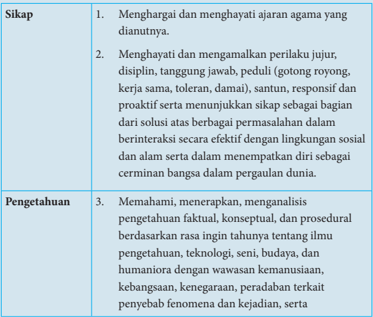

Tabel ini berisi informasi tentang sikap dan pengetahuan yang diharapkan siswa untuk membangun karakter yang kuat dan berpengetahuan. Topik utama tabel adalah sikap dan pengetahuan yang relevan dengan pembelajaran agama dan kehidupan sosial. Kolom pertama berisi tiga poin utama sikap yang harus dimiliki oleh siswa, yaitu menghargai dan menghayati ajaran agama, menghargai dan mengamalkan perilaku jujur, disiplin, tanggung jawab, peduli, santun, responsif, dan proaktif. Kolom kedua berisi tiga poin utama pengetahuan yang harus dimiliki oleh siswa, yaitu memahami, menerapkan, dan menganalisis pengetahuan faktil, konseptual, dan prosedural berdasarkan rasa ingin tahu. Pola penting yang terlihat adalah bahwa tabel ini mencakup dua aspek utama: sikap dan pengetahuan, serta menekankan pentingnya menghargai dan mengamalkan nilai-nilai positif dalam kehidupan sehari-hari.

 

---
## 📄 Halaman 94

---
**📊 Tabel**

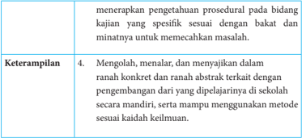

Tabel ini berisi informasi tentang keterampilan yang diperlukan untuk menyelesaikan tugas tertentu. Topik utama tabel adalah "Mengolah, menalar, dan menyajikan dalam ranah konkrit dan ranah abstrak terkait dengan pengembangan dari yang dipelajari di sekolah secara mandiri". Dalam tabel ini, kolom pertama berisi deskripsi tugas yang harus dilakukan, sedangkan kolom kedua berisi keterampilan yang diperlukan untuk menyelesaikan tugas tersebut. Data penting yang terlihat dalam tabel ini adalah bahwa tugas tersebut melibatkan pengetahuan prosedural dan kajian spesifik, serta kemampuan untuk memecahkan masalah. Selain itu, tabel juga mencakup keterampilan seperti mengolah, menalar, dan menyajikan dalam ranah konkrit dan abstrak, serta menggunakan metode sesuai keilmuan.

### B. Kompetensi Dasar dan Indikator

Kompetensi Dasar untuk bab trigonometri ini mengacu pada KD yang telah ditetapkan. Guru tentu harus mampu merumuskan indikator pencapaian kompetensi dari kompetensi dasar. Berikut ini disajikan indikator pencapaian kompetensi untuk materi trigonometri.

---
**📊 Tabel**

Tabel ini berisi informasi tentang kompetensi dasar matematika yang berkaitan dengan trigonometri segitiga siku-siku. Topik utamanya adalah menjelaskan rasio trigonometri (sinus, cosinus, tangen, cosecanc, secan, dan cotangen) pada segitiga siku-siku. Tabel dibagi menjadi dua kolom: "Kompetensi Dasar" dan "Indikator Pencapaian Kompetensi". Kolom "Kompetensi Dasar" mencakup tujuh poin utama yang melibatkan konsep trigonometri segitiga siku-siku. Indikator pencapaian kompetensi di setiap poin tersebut menunjukkan bagaimana siswa dapat memahami dan menggunakan konsep tersebut. Misalnya, poin 3.7.1 mengajarkan siswa untuk mendeskripsikan hubungan radian ke derajat, sedangkan poin 3.7.8 mengajarkan siswa untuk memahami konsep cotangen pada suatu segitiga siku-siku. Pola penting yang terlihat adalah bahwa tabel ini membahas berbagai aspek trigonometri segitiga siku-siku, mulai dari definisi hingga aplikasinya dalam menyelesaikan masalah.

 

---
## 📄 Halaman 95

---
**📊 Tabel**

Tabel ini berisi informasi tentang topik dan konsep trigonometri yang harus dipelajari dalam kurikulum. Topik utama adalah mengenali dan menjelaskan konsep trigonometri, termasuk perbandingan sudut di berbagai kuadran, relasi antarsudut, identitas trigonometri, aturan sinus dan cosinus, serta fungsi trigonometri dengan lingkaran satuan. Kolom-kolomnya mencakup konsep-konsep tersebut, seperti menemukan konsep perbandingan sudut di kuadran III, IV, dan IV, menemukan konsep relasi antarsudut, menemukan identitas trigonometri, menggunakan identitas trigonometri untuk membuktikan identitas lainnya, menemukan konsep aturan sinus dan cosinus, serta menjelaskan konsep fungsi sinus, cosinus, dan tangen. Pola penting yang terlihat adalah bahwa setiap konsep trigonometri memiliki beberapa subtopik yang harus dipelajari, mulai dari konsep dasar hingga aplikasi dalam membuktikan identitas trigonometri.

 

---
## 📄 Halaman 96

---
**📊 Tabel**

Tabel ini berisi instruksi tentang bagaimana menggunakan konsep trigonometri dalam menyelesaikan masalah kontekstual. Topik utamanya adalah tentang penggunaan konsep trigonometri seperti sinus, cosinus, tangen, cosecant, secant, dan cotangent dalam situasi yang tidak langsung berkaitan dengan sudut. Tabel ini mencakup 8 baris yang masing-masing menunjukkan cara menggunakan konsep trigonometri untuk menyelesaikan masalah kontekstual. Kolom pertama menyebutkan nomor baris, sedangkan kolom kedua menjelaskan konsep trigonometri yang digunakan. Data penting yang terlihat adalah bahwa setiap baris menunjukkan cara menggunakan konsep trigonometri untuk menyelesaikan masalah kontekstual, mulai dari menggunakan konsep konversi sudut (radian ke derajat) hingga menggunakan konsep cotangent.

 

---
## 📄 Halaman 97

---
**📊 Tabel**

Tabel ini berisi instruksi tentang cara menyelesaikan masalah trigonometri, termasuk konsep perbandingan sudut, relasi antarsudut, identitas trigonometri, aturan sinus dan cosinus, serta analisis grafik fungsi trigonometri. Topik utama adalah metode-metode trigonometri untuk menyelesaikan masalah. Kolom pertama menyebutkan nomor instruksi, sedangkan kolom kedua menjelaskan konsep atau teknik yang harus digunakan. Data penting yang terlihat adalah bahwa setiap instruksi mencakup lebih dari satu teknik trigonometri, seperti menggunakan konsep perbandingan sudut, relasi antarsudut, identitas trigonometri, dan aturan sinus dan cosinus. Ini menunjukkan bahwa pembelajaran trigonometri melibatkan pemahaman dan penggunaan berbagai konsep dan teknik yang saling berkaitan.

 

---
## 📄 Halaman 98

### C. Tujuan Pembelajaran

Melalui  pengamatan,  tanya  jawab,  penugasan  individu  dan  kelompok, diskusi kelompok, dan penemuan ( dicovery ) siswa dapat:

- menunjukkan sikap jujur, tertib, dan mengikuti aturan pada saat proses belajar berlansung;
- menunjukkan  sikap  cermat  dan  teliti  dalam  menyelesaikan  masalahmasalah trigonometri;
- mengonversi ukuran sudut dari radian ke derajat atau sebaliknya;
- menjelaskan konsep perbandingan sudut ( sinus , cosinus , tangen , cosecan , secan , dan cotangen ) pada suatu segitiga siku-siku;
- menjelaskan konsep perbandingan sudut ( sinus , cosinus , tangen , cosecan , secan , dan cotangen ) pada kuadran  II, III, dan IV;
- menjelaskan konsep relasi antarsudut;
- menjelaskan konsep identitas trigonometri serta mampu menggunakan identitas trigonometri tersebut untuk membuktikan identitas trigonometri lainnya;
- menjelaskan aturan sinus dan aturan cosinus ;
- menjelaskan dan menggambarkan grafik fungsi trigonometri, terutama fungsi sinus , cosinus , dan tangen .

 

---
## 📄 Halaman 99

### D. Diagram Alir

---
**🖼️ Gambar/Diagram**

> **Deskripsi Visual:** Gambar ini adalah diagram yang menunjukkan proses analisis segitiga dalam konteks trigonometri. Diagram ini dimulai dengan menunjukkan masalah otentik yang diberikan sebagai input. Setelah itu, elemen-elemen segitiga (unsur-unsur segitiga) seperti sisi, sudut, dan garis diagonal disajikan. Selanjutnya, ada perbandingan antara sisi-sisi segitiga yang penting dalam trigonometri, seperti sin α, cos α, tan α, sec α, cosec α, dan cot α. Setiap sisi dan sudut tersebut kemudian dikaitkan dengan grafik fungsi trigonometri yang relevan. Dengan demikian, diagram ini menggambarkan langkah-langkah analisis segitiga dan bagaimana hubungannya dengan fungsi trigonometri.

 

---
## 📄 Halaman 100

### E. Materi Pembelajaran

Suatu proses pembelajaran akan berjalan dengan efektif jika guru sudah mengenali karakteristik siswa. Adapun proses pembelajaran yang dirancang pada buku guru ini hanya pertimbangan bagi guru untuk merancang kegiatan belajar mengajar yang sesungguhnya. Oleh karena itu, diharapkan guru lebih giat dan kreatif lagi dalam mempersiapkan semua perangkat belajar mengajar.

### Membelajarkan 4.1 dan 4.2

### Sebelum Pelaksanaan Kegiatan

- Siswa diharapkan sudah membawa perlengkapan alat-alat tulis, seperti pulpen, pensil, penghapus, penggaris, kertas berpetak, dan lain-lain.
- Bentuklah kelompok kecil yang terdiri  atas  2  -  3  orang  siswa  yang memungkinkan belajar secara efektif dan efisien.
- Sediakan lembar kerja yang diperlukan siswa.
- Sediakan kertas HVS secukupnya.

---
**📊 Tabel**

Tabel ini berisi petunjuk kegiatan pembelajaran untuk pendahuluan kelas, yang mencakup dua poin utama: persiapan siswa psikis dan fisik untuk proses belajar, serta motivasi belajar siswa melalui konteks kehidupan sehari-hari. Poin pertama mengajarkan guru untuk mempersiapkan siswa secara psikis dan fisik agar siap untuk belajar, sementara poin kedua bertujuan untuk memberikan motivasi belajar siswa dengan menggunakan konteks kehidupan sehari-hari, termasuk perbandingan lokal, nasional, dan internasional.

Ukuran Sudut dan Perbandingan Trigonometri pada Segitiga Siku-Siku

 

---
## 📄 Halaman 101

### No.

### Petunjuk Kegiatan Pembelajaran

- mengajukan pertanyaan-pertanyaan yang mengaitkan pengetahuan  sebelumnya  dengan  materi  yang  akan  dipelajari, misalnya, bagaimana konsep dua segitiga dikatakan sebangun;
- menjelaskan tujuan pembelajaran atau kompetensi dasar yang akan dicapai;
- menyampaikan cakupan materi dan penjelasan uraian kegiatan sesuai silabus.

### 2. Kegiatan Inti

### Ayo Kita Mengamati

- Ajak siswa mengenal satuan ukuran sudut yaitu radian atau 'rad dan derajat. '
- Arahkan untuk mencermati Sifat 4.1 dan 4.2.
- Koordinasikan siswa untuk menemukan istilah-istilah penting lainnya yang sering digunakan dalam kajian ukuran sudut.  Misalnya,  sudut  positif,  sudut  standar  (baku),  dan sudut koterminal. Selain itu, siswa disarankan menghimpun informasi tentang pembagian sudut pada kuadran I, II, III, dan IV sedemikian sehingga siswa juga terampil menggambarkan ukuran sudut tersebut.
- Ajak siswa mengerti istilah sudut-sudut istimewa yang disajikan pada Tabel 4.1.
- Koordinasikan  siswa  untuk  memahami  Masalah  4.1  dan Masalah 4.2.

### Ayo Kita Menanya

- Ajak siswa untuk mengajukan pertanyaan, terutama pertanyaanpertanyaan kritis terkait dengan Masalah 4.1 dan 4.2. Jika tidak satupun siswa mengajukan pertanyaan, guru harus mempersiapkan dan menanyakan pertanyaan terkait masalah tersebut.

 

---
## 📄 Halaman 102

---
**📊 Tabel**

Tabel ini berisi instruksi pembelajaran untuk mengajarkan siswa tentang konsep perbandingan sisi-sisi pada segitiga siku-siku. Topik utama adalah "Ayo Kita Mengumpulkan Informasi" dan "Ayo Kita Mengasosiasikan", yang melibatkan siswa meminta informasi dan mendeskripsikannya. Selanjutnya, ada "Kegiatan Penutup" yang mencakup diskusi tentang konsep perbandingan dan uji kompetensi. Kolom-kolom utama termasuk "No.", "Petunjuk Kegiatan Pembelajaran", "Ayo Kita Mengumpulkan Informasi", "Ayo Kita Mengasosiasiasi", dan "Kegiatan Penutup". Data penting meliputi langkah-langkah praktis yang harus dilakukan oleh guru dan siswa, seperti mengekspresikan konsep perbandingan menggunakan gambar dan deskripsi, serta memberikan soal uji kompetensi.

 

---
## 📄 Halaman 103

### Penilaian

### 1. Prosedur Penilaian Sikap

---
**📊 Tabel**

Tabel ini menunjukkan aspek-aspek yang dianalisis dalam sebuah penilaian, termasuk berpikir logis, kritis, dan ingin tahu. Teknik penilaian untuk setiap aspek adalah pengamatan, dan waktu penilaian adalah kegiatan inti. Topik utama tabel ini adalah proses penilaian berdasarkan empat aspek tersebut. Kolom-kolomnya meliputi nomor urutan (No.), aspek yang dianalisis, teknik penilaian, dan waktu penilaian. Data penting yang terlihat adalah bahwa semua aspek dianalisis menggunakan metode pengamatan dan penilaian dilakukan pada kegiatan inti.

### 2. Instrumen Penilaian Sikap

### Berpikir logis

- Kurang  baik  jika  sama  sekali  tidak  berusaha  mengajukan  ide-ide logis dalam proses pembelajaran.
- Baik  jika  sudah  ada  usaha  untuk  mengajukan  ide-ide  logis  dalam proses pembelajaran.
- Sangat  baik  jika  ide-ide  logis  dalam  proses  pembelajaran  secara terus-menerus dan konsisten.

### Kritis

- Kurang  baik  jika  sama  sekali  tidak  berusaha  mengajukan  ide-ide logis kritis atau pertanyaan menantang dalam proses pembelajaran.
- Baik jika sudah ada usaha untuk mengajukan ide-ide logis kritis atau pertanyaan menantang dalam proses pembelajaran walaupun belum konsisten.
- Sangat  baik  jika  mengajukan  ide-ide  logis,  kritis,  atau  pertanyaan menantang  dalam  proses  pembelajaran  secara  terus-menerus  dan konsisten.

 

---
## 📄 Halaman 104

### Ingin tahu

- Kurang  baik  jika  sama  sekali  tidak  menunjukkan  sikap  ingin tahu  melalui  bertanya  kepada  guru  atau  teman  selama  proses pembelajaran.
- Baik jika sikap ingin tahu melalui bertanya kepada guru atau teman selama proses pembelajaran.
- Sangat  baik  jika  sikap  ingin  tahu  melalui  bertanya  kepada  guru atau teman selama proses pembelajaran secara terus- menerus dan konsisten.
Berikan tanda centang (  ) pada kolom berikut sesuai hasil pengamatan.

---
**📊 Tabel**

Tabel ini berisi informasi tentang berbagai topik yang dibahas dalam sebuah buku pelajaran. Kolom "Berpikir Logis" mencakup dua subkolom: SB (Sistematis) dan B (Berpikir). Kolom "Kritis" juga memiliki dua subkolom: KB (Kritis) dan B (Berpikir). Kolom "Ingin Tahu" hanya memiliki satu subkolom: B (Berpikir). Data atau pola penting yang terlihat adalah bahwa banyak topik dalam buku pelajaran tersebut memerlukan pemikiran logis dan kritis, dengan beberapa topik lebih fokus pada pemikiran sistematis dan pemikiran kritis.

 

---
## 📄 Halaman 105

### 3. Instrumen Penilaian Pengetahuan dan Keterampilan

### Petunjuk

- Kerjakan  soal  berikut  secara  individu,  siswa  tidak  diperbolehkan menyontek dan bekerja sama.
- Kemudian jawablah pertanyaan/perintah di bawah ini.

### Soal

- Diketahui  besar  sudut α kurang  dari  90 o dan  besar  sudut θ lebih dari  atau sama dengan 90 o dan kurang dari 180 o . Analisis kebenaran setiap pernyataan berikut ini.
- θ -α ≥ 30 o
- 2 α ≥ 90 o
- 2 α + 1 2 θ ≥ 90 o
- Tidak ada nilai α dan θ yang memenuhi persamaan 2 θ -2 α = θ + α
- Perhatikan gambar di bawah ini.

---
**🖼️ Gambar/Diagram**

> **Deskripsi Visual:** Gambar ini adalah ilustrasi yang menunjukkan sebuah lingkaran dengan pusat di titik asal koordinat (0,0) dan diameter AB yang melintasi lingkaran. Lingkaran tersebut memiliki panjang diameter AB sekitar 2.8 unit, dengan titik A berada pada koordinat (1, 2.8) dan titik B pada koordinat (-1, -2.8). Di dalam lingkaran, ada titik C yang merupakan titik potongan antara garis sudut tiga (60°) dan lingkaran. Garis sudut tiga ini menghubungkan titik A ke titik C, dan juga memotong lingkaran di titik D. Titik D berada pada koordinat (1, -2.8). Label "A" diberikan untuk menunjukkan titik A, sedangkan label "B" diberikan untuk menunjukkan titik B. Label "C" diberikan untuk menunjukkan titik C, dan label "D" diberikan untuk menunjukkan titik D. Informasi kunci yang dapat diambil pembaca adalah bahwa lingkaran ini memiliki diameter sekitar 2.8 unit, dan garis sudut tiga ini membentuk sudut tiga di dalam lingkaran.

-5

 

---
## 📄 Halaman 106

Selidiki dan tentukan koordinat titik jika dirotasi sejauh

- 90 o
- 180 o
- 270 o
- 260 o
- Luas  segitiga  siku-siku RST ,  dengan  sisi  tegak RS adalah  20  cm 2 . Tentukanlah nilai sinus , cosinus , dan tangen untuk sudut lancip T .
- Diketahui sin x + cos x = 3 dan tan x = 1, tentukanlah nilai sin x dan cos x .

### 4.   Pedoman Penilaian Pengetahuan dan Keterampilan

---
**📊 Tabel**

Tabel ini menunjukkan skor penilaian untuk tiga soal dalam sebuah ujian. Topik utama tabel adalah ketelitian dalam menghitung, keterampilan mengambarkankan, dan ketelitian dalam menghitung kembali. Kolom-kolomnya meliputi aspek penilaian (ketelitian dalam menghitung, keterampilan mengambarkankan, dan ketelitian dalam menghitung kembali), rubrik penilaian (Benar, Salah, Tidak ada jawaban), skor, dan skor maksimal. Data penting yang terlihat adalah bahwa setiap aspek penilaian memiliki skor maksimal 25 dan skor minimum 0, dengan skor tertinggi 25 dan skor terendah 0. Ini menunjukkan bahwa skor penilaian sangat fleksibel dan dapat berubah-ubah tergantung pada tingkat ketelitian dan keterampilan yang ditunjukkan oleh siswa.

 

---
## 📄 Halaman 107

---
**📊 Tabel**

Tabel ini menunjukkan skor penilaian untuk soal nomor 4 dalam sebuah ujian atau tes. Topik utamanya adalah ketelitian dalam menghitung dan keterampilan menggunakan konsep. Tabel dibagi menjadi dua bagian: satu untuk aspek penilaian tentang ketelitian dan keterampilan, dan satu untuk skor maksimal dan minimal. Untuk aspek penilaian, ada tiga pilihan skor: benar (25), salah (10), dan tidak ada jawaban (0). Skor maksimal untuk aspek penilaian adalah 25, sedangkan skor minimalnya adalah 0. Skor maksimal untuk seluruh soal adalah 100, dengan skor minimalnya juga 0.

### Membelajarkan 4.3

Nilai  Perbandingan  Trigonometri  untuk  0 o ,  30 o , 45 o , 60 o , dan 90 o

### Sebelum Pelaksanaan Kegiatan

- Bentuklah kelompok kecil yang terdiri  atas  4  -  5  orang  siswa  yang memungkinkan belajar secara efektif.
- Identifikasi siswa yang biasanya agak sulit membuat pertanyaan.
- Identifikasi  pula  bentuk  bantuan  yang  perlu  diberikan  agar  siswa akhirnya produktif membuat pertanyaan.
- Sediakan  tabel  yang  diperlukan  bagi  siswa  untuk  mengisikan  hasil kerjanya.
- Sediakan kertas HVS secukupnya.
- Mungkin  perlu diberikan contoh kritik, komentar, saran, atau pertanyaan  terhadap  suatu  karya  agar  siswa  dapat  meniru  dan mengembangkan lebih jauh sesuai dengan materinya.

 

---
## 📄 Halaman 108

---
**📊 Tabel**

Tabel ini berisi petunjuk kegiatan pembelajaran untuk dua tahap pendidikan: pendahuluan guru dan inti pembelajaran. Topik utama adalah bagaimana guru memberikan motivasi belajar siswa dan menjelaskan tujuan pembelajaran. Dalam tahap pendahuluan, guru harus menyiapkan siswa secara psikis dan fisik untuk mengikuti proses pembelajaran, memberi motivasi belajar siswa dengan konteks materi yang akan dipelajari, mengajukan pertanyaan-pertanyaan yang mengaitkan pengetahuan sebelumnya dengan materi yang akan dipelajari, menjelaskan tujuan pembelajaran atau kompetensi dasar yang akan dicapai, dan menyampaikan cakupan materi dan penjelasan uraian kegiatan sesuai silabus. Di tahap inti pembelajaran, guru harus membantu siswa mencermati masalah 4.3, 4.4, dan 4.5 melalui kelompok belajar, dan jika tidak ada siswa yang mengajukan pertanyaan, guru harus mengajukan pertanyaan kepada siswa untuk memastikan pemahaman siswa.

 

---
## 📄 Halaman 109

---
**📊 Tabel**

Tabel ini berisi petunjuk kegiatan pembelajaran untuk mengajar tentang nilai perbandingan trigonometri di segitiga siku-siku. Topik utama adalah mengajarkan siswa untuk mengumpulkan informasi, menggagas asosiasi, menyelesaikan contoh soal, dan menyimpulkan hasil belajar. Kolom pertama adalah nomor urut kegiatan pembelajaran, kolom kedua adalah deskripsi kegiatan, kolom ketiga adalah petunjuk khusus untuk guru, dan kolom keempat adalah petunjuk khusus untuk siswa. Data penting yang terlihat adalah bahwa siswa harus mengumpulkan informasi tentang nilai perbandingan trigonometri dari gambar yang diberikan, menggagas asosiasi dengan 6 macam nilai tersebut, menyelesaikan contoh soal 4.7 dan 4.8, dan menyimpulkan hasil belajar mereka dalam tabel 4.2.

 

---
## 📄 Halaman 110

### Penilaian

### 1. Prosedur Penilaian Sikap

---
**📊 Tabel**

Tabel ini menunjukkan aspek-aspek yang dinilai dalam sebuah kegiatan, termasuk berpikir logis, kritis, dan analitis. Teknik penilaian untuk setiap aspek adalah pengamatan, dan waktu penilaian adalah kegiatan inti. Topik utama tabel ini adalah penilaian keterampilan pemikiran dan analisis seseorang dalam konteks kegiatan tertentu. Kolom-kolomnya mencakup aspek yang dinilai (berpikir logis, kritis, analitis), teknik penilaian (pengamatan), dan waktu penilaian (kegiatan inti). Data penting yang terlihat adalah bahwa semua aspek ditinjau melalui pengamatan dan semua aspek tersebut dilakukan pada kegiatan inti.

### 2. Instrumen Penilaian Sikap

### Berpikir logis

- Kurang  baik  jika  sama  sekali  tidak  berusaha  mengajukan  ide-ide logis dalam proses pembelajaran.
- Baik  jika  sudah  ada  usaha  untuk  mengajukan  ide-ide  logis  dalam proses pembelajaran.
- Sangat  baik  jika  ide-ide  logis  dalam  proses  pembelajaran  dalam proses pembelajaran secara terus-menerus dan konsisten.

### Kritis

- Kurang  baik  jika  sama  sekali  tidak  berusaha  mengajukan  ide-ide logis kritis atau pertanyaan menantang dalam proses pembelajaran.
- Baik jika sudah ada usaha untuk mengajukan ide-ide logis kritis atau pertanyaan menantang dalam proses pembelajaran.
- Sangat  baik  jika  mengajukan  ide-ide  logis,  kritis,  atau  pertanyaan menantang  dalam  proses  pembelajaran  secara  terus-menerus  dan konsisten.

 

---
## 📄 Halaman 111

### Analitis

- Kurang baik jika sama sekali tidak mengajukan  pertanyaanpertanyaan  menantang  atau  memberikan  ide-ide  dalam  menyelesaiakan masalah selama proses pembelajaran.
- Baik jika sudah ada usaha untuk mengajukan pertanyaan-pertanyaan menantang atau memberikan ide-ide dalam menyelesaikan masalah selama proses pembelajaran.
- Sangat  baik  jika  mengajukan  pertanyaan-pertanyaan  menantang atau  memberikan  ide-ide  dalam  menyelesaikan  masalah  selama proses pembelajaran secara terus-menerus dan ajeg/konsisten.
Berikan tanda centang (  ) pada kolom berikut sesuai hasil pengamatan.

---
**📊 Tabel**

Tabel ini berisi informasi tentang berbagai aspek kognitif dan analitis seseorang, dengan kolom-kolom yang mencakup Berpikir Logis, Kritis, dan Analitis. Setiap baris menunjukkan data individu, dengan kolom-kolom berbeda untuk masing-masing aspek kognitif tersebut. Topik utama tabel ini adalah penilaian kognitif dan analitis seseorang, dengan data yang disajikan secara detail melalui kolom-kolom berbeda. Pola penting yang terlihat adalah bahwa setiap individu memiliki tingkat berpikir logis, kritis, dan analitis yang berbeda-beda, yang dapat memberikan gambaran tentang cara mereka memproses informasi dan membuat keputusan.

SB = Sangat Baik, B = Baik, KB = Kurang Baik

 

---
## 📄 Halaman 112

### 3. Instrumen Penilaian Pengetahuan dan Keterampilan

### Petunjuk

- Kerjakan soal berikut secara individu, siswa tidak boleh menyontek dan bekerja sama.
- Pilihlah  jawaban  soal  kemudian  jawablah  pertanyaan/perintah  di bawah ini.
- Soal: 1. Jika sin x = a dan cos y = b dengan π 0 < < 2 x , dan π π < < 2 y , maka hitung tan x + tan y . (UMPTN 98)
- Manakah pernyataan yang bernilai benar, untuk setiap pernyataan di bawah ini.
- sin ( A + B ) = sin A + sin B
- Nilai sin θ akan bergerak naik pada saat nilai θ juga menaik
- Nilai cos θ akan bergerak naik pada saat nilai θ menurun
- sin θ = cos θ , untuk setiap nilai θ = 0 o
- Nilai cot θ tidak terdefinisi, pada saat θ = 0 o
- Jika ( ) β β 2 tan 1+sec , dimana 0 o < β < 90 o hitunglah nilai β .
- Pada suatu segitiga ABC , diketahui a + b =10, ∠ A = 30 o , dan ∠ B = 45 o . Hitunglah b .
(Petunjuk: Misalkan panjang sisi di depan ∠ A = a , di depan ∠ B = b , dan ∠ C = c ).

 

---
## 📄 Halaman 113

### 4.   Pedoman Penilaian Pengetahuan dan Keterampilan

---
**📊 Tabel**

Tabel ini menunjukkan skor penilaian untuk empat soal dalam sebuah ujian atau tes. Setiap soal dibagi menjadi tiga aspek penilaian: ketelitian dalam menghitung, keterampilan dalam memahami gambar, dan ketelitian dalam menggunakan konsep. Untuk setiap aspek, ada tiga pilihan jawaban: benar, salah, atau tidak ada jawaban. Skor maksimal untuk setiap aspek adalah 25, dan skor minimal adalah 0. Skor akhir untuk setiap soal ditambahkan untuk mencapai skor total maksimal 100. Pola penting yang terlihat adalah bahwa setiap aspek penilaian memiliki skor maksimal yang sama (25), dan skor minimum yang sama (0).

 

---
## 📄 Halaman 114

### Membelajarkan 4.4

### Sebelum Pelaksanaan Kegiatan

- Bentuklah kelompok kecil yang terdiri  atas  4  -  5  orang  siswa  yang memungkinkan belajar secara efektif.
- Identifikasi siswa yang biasanya agak sulit membuat pertanyaan.
- Identifikasi  pula  bentuk  bantuan  yang  perlu  diberikan  agar  siswa akhirnya produktif membuat pertanyaan.
- Sediakan kertas kerja berisi gambar lingkaran pada koordinat Kartesius.
- Sediakan jangka atau busur sebagai penentu besar ukuran sudut.
- Kritik, komentar, saran, atau pertanyaan terhadap suatu karya agar siswa dapat meniru dan mengembangkan lebih jauh sesuai dengan materinya.

---
**📊 Tabel**

Tabel ini berisi petunjuk kegiatan pembelajaran untuk pendahuluan guru dalam proses pembelajaran. Topik utamanya adalah pendahuluan guru, yang meliputi beberapa aspek penting seperti motivasi belajar siswa, konteksionalisasi materi, pertanyaan-pertanyaan yang mungkin diajukan, tujuan pembelajaran, dan penjelasan uraian materi sesuai silabus. Kolom-kolomnya mencakup a) menjawab pertanyaan tentang psikis dan fisik siswa, b) memberikan motivasi belajar secara kontekstual, c) mengajukan pertanyaan yang mungkin menguatkan pemahaman siswa, d) menjelaskan tujuan pembelajaran atau kompetensi dasar, dan e) menyampaikan cacahan materi dan penjelasan uraian materi sesuai dengan silabus. Pola penting yang terlihat adalah bahwa setiap aspek tersebut harus dilakukan secara sistematis dan terstruktur untuk memastikan proses pembelajaran berjalan dengan efektif dan efisien.

 

---
## 📄 Halaman 115

---
**📊 Tabel**

Tabel ini berisi petunjuk kegiatan pembelajaran untuk kelas 4, 6, 7, 8, dan 9 dalam rangka mengatasi masalah belajar siswa. Topik utamanya adalah "Ayo Kita Mengamati", "Ayo Kita Menanya", "Ayo Mengumpulkan Informasi", dan "Ayo Kita Mengasosiasi". Kolom-kolomnya mencakup inti kegiatan, motivasi siswa, dan metode pengumpulan informasi. Data penting yang terlihat adalah bahwa guru harus memotivasi siswa untuk mengajukan pertanyaan, siswa dapat menemukan dan menghitung nilai perbandingan trigonometri, dan guru diperbolehkan menambahkan referensi soal/masalah jika siswa memiliki penjelasan dan pemahaman terkait relasi sudut.

 

---
## 📄 Halaman 116

---
**📊 Tabel**

Tabel ini berisi petunjuk kegiatan pembelajaran untuk topik "Ayo Kita Mengkomunikasikan" dalam buku pelajaran. Kolom pertama menunjukkan nomor urut kegiatan, sedangkan kolom kedua berisi deskripsi kegiatan tersebut. Topik utama tabel ini adalah tentang cara siswa mengkomunikasikan konsep yang telah diturunkan dari konsep bandingan sudut yang telah ditemukan pada subbab 4.2. Dalam kegiatan penutup, siswa diharapkan dapat: 1) Bersama dengan siswa menyimpulkan relasi sudut antarsudut di kuadrat I, II, III, dan IV; 2) Menginformasikan materi selanjutnya, yaitu konsep apa saja yang dapat diturunkan dari konsep bandingan sudut yang telah ditemukan pada subbab 4.2; dan 3) Memberikan penguasaan kepada siswa, yaitu mengerjakan soal Uji Kompetensi 4.4 nomor 1 hingga nomor 3. Pola penting yang terlihat adalah bahwa kegiatan ini bertujuan untuk memperluas pemahaman siswa tentang konsep bandingan sudut dan bagaimana mereka dapat mengaplikasikannya dalam situasi praktis.

### Penilaian

### 1. Prosedur Penilaian Sikap

---
**📊 Tabel**

Tabel ini menunjukkan aspek-aspek yang dianalisis dalam sebuah penilaian, termasuk berpikir logis, kritis, dan analitis. Teknik penilaian yang digunakan adalah pengamatan, dan waktu penilaian dilakukan pada kegiatan inti. Topik utama tabel ini adalah proses penilaian berdasarkan aspek-aspek kognitif. Kolom-kolomnya meliputi aspek yang dianalisis (berpikir logis, kritis, analitis), teknik penilaian (pengamatan), dan waktu penilaian (kegiatan inti). Data penting yang terlihat adalah bahwa semua aspek dianalisis menggunakan teknik pengamatan dan penilaian dilakukan pada kegiatan inti.

### 2. Instrumen Penilaian Sikap

### Berpikir logis

- Kurang  baik  jika  sama  sekali  tidak  berusaha  mengajukan  ide-ide logis dalam proses pembelajaran.
- Baik  jika  sudah  ada  usaha  untuk  mengajukan  ide-ide  logis  dalam proses pembelajaran.
- Sangat baik jika mengajukan ide-ide logis dalam proses pembelajaran secara terus-menerus dan konsisten.

 

---
## 📄 Halaman 117

### Kritis

- Kurang  baik  jika  sama  sekali  tidak  berusaha  mengajukan  ide-ide logis kritis atau pertanyaan menantang dalam proses pembelajaran.
- Baik jika  sudah  ada  usaha  untuk  mengajukan ide-ide  logis,  kritis, atau pertanyaan menantang dalam proses pembelajaran.
- Sangat  baik  jika  mengajukan  ide-ide  logis,  kritis,  atau  pertanyaan menantang  dalam  proses  pembelajaran  secara  terus-menerus  dan konsisten.

### Analitis

- Kurang  baik, jika sama  sekali  tidak  mengajukan  pertanyaanpertanyaan  menantang  atau  memberikan  ide-ide  dalam  menyelesaikan masalah selama proses pembelajaran.
- Baik,  jika  menunjukkan  sudah  ada  usaha  untuk  mengajukan pertanyaan-pertanyaan menantang atau memberikan ide-ide dalam menyelesaikan masalah selama proses pembelajaran.
- Sangat  baik,  jika  mengajukan  pertanyaan-pertanyaan  menantang atau  memberikan  ide-ide  dalam  menyelesaikan  masalah  selama proses pembelajaran secara terus-menerus dan konsisten.
Berikan tanda checklis (  ) pada kolom berikut sesuai hasil pengamatan.

---
**📊 Tabel**

Tabel ini menunjukkan hasil evaluasi kognitif dua orang siswa berdasarkan tiga aspek: Berpikir Logis (SB), Berpikir Kritis (KB), dan Analitis (B). Setiap kolom mewakili satu aspek kognitif tersebut. Data dalam tabel ini menunjukkan bahwa kedua siswa memiliki penilaian yang sama untuk semua aspek, yaitu 100% untuk Berpikir Logis, 80% untuk Berpikir Kritis, dan 60% untuk Analitis. Ini menunjukkan bahwa kedua siswa memiliki kemampuan kognitif yang sama baik dalam berpikir logis, berpikir kritis, maupun analitis.

 

---
## 📄 Halaman 118

---
**📊 Tabel**

Tabel ini menunjukkan hasil evaluasi berdasarkan berpikir logis, kritis, dan analitis bagi beberapa individu. Kolom "No." menyediakan nomor untuk setiap individu yang diuji. Kolom "Nama" mencakup nama-nama individu tersebut. Kolom berikutnya, "Berpikir Logis," "Kritis," dan "Analitis," masing-masing menunjukkan skor atau kinerja individu dalam hal berpikir logis, kritis, dan analitis. Data penting yang terlihat adalah bahwa banyak individu memiliki skor yang sama dalam berbagai aspek, menunjukkan bahwa mereka memiliki kemampuan yang sama dalam berpikir logis, kritis, dan analitis. Ini menunjukkan bahwa evaluasi ini mungkin tidak cukup akurat untuk membedakan individu dalam hal kemampuan ini.

### 3. Instrumen Penilaian Pengetahuan dan Keterampilan

### Petunjuk

- Kerjakan  soal  berikut  secara  individu,  siswa  tidak  diperbolehkan menyontek dan bekerja sama.
- Kemudian jawablah pertanyaan/perintah di bawah ini.

### Soal

- Periksalah  kebenaran  setiap  pernyataan  berikut.  Berikan  alasan untuk setiap jawabanmu.
- sec x dan sin x selalu memiliki nilai tanda yang sama di keempat kuadran.

 

---
## 📄 Halaman 119

- Di kuadran I, nilai  perbandingan sinus selalu lebih  dari  nilai perbandingan kosinus.
- Untuk 30 o < x 90 o dan 120 o < y < 150 o , maka nilai 2 sin x < cos 2 y .
- Diberikan θ -8 tan = 15 dengan sin θ > 0, tentukanlah
- cos θ
- csc θ
- sin θ × cos θ + cos θ + sin θ
- θ θ csc cot

### 4. Pedoman Penilaian Pengetahuan dan Keterampilan

---
**📊 Tabel**

Tabel ini menunjukkan skor penilaian untuk dua soal dalam sebuah ujian atau tes. Topik utama tabel adalah ketelitian dalam menghitung dan keterampilan menggunakan konsep yang ada. Tabel dibagi menjadi dua kolom utama: Aspek Penilaian dan Rubrik Penilaian. Setiap aspek penilaian memiliki tiga pilihan jawaban dengan skor tertentu. Skor maksimal untuk setiap aspek adalah 50, dan skor minimal adalah 0. Skor total maksimal untuk kedua aspek adalah 100. Data penting lainnya adalah bahwa tidak ada jawaban yang diberikan untuk setiap aspek penilaian, dan skor maksimal dan minimal sama untuk semua aspek penilaian.

 

---
## 📄 Halaman 120

### Membelajarkan 4.5 dan 4.6

### Sebelum Pelaksanaan Kegiatan

- Bentuklah  kelompok  yang  terdiri  atas  4  -  5  orang  siswa  yang memungkinkan belajar secara efektif.
- Identifikasi siswa yang biasanya agak sulit membuat pertanyaan.
- Identifikasi  pula  bentuk  bantuan  yang  perlu  diberikan  agar  siswa akhirnya produktif membuat pertanyaan.
- Kritik,  komentar,  saran,  atau  pertanyaan  terhadap  suatu  karya  agar siswa  dapat  meniru  dan  mengembangkan  lebih  jauh  sesuai  dengan materinya.

---
**📊 Tabel**

Tabel ini berisi petunjuk kegiatan pembelajaran untuk pendahuluan kelas, yang mencakup beberapa aspek penting seperti persiapan siswa secara psikis dan fisik, motivasi belajar melalui konteks identitas trigonometri, pertanyaan-pertanyaan yang mengaitkan materi dengan pengetahuan sebelumnya, tujuan pembelajaran atau kompetensi dasar yang akan dicapai, dan penyampaian cakupan materi sesuai silabus. Topik utama tabel ini adalah pendahuluan kelas, yang melibatkan persiapan siswa, motivasi belajar, pertanyaan-pertanyaan yang relevan, tujuan pembelajaran, dan penyampaian materi.

### Identitas Trigonometri dan Aturan Sinus dan Aturan Cosinus

 

---
## 📄 Halaman 121

---
**📊 Tabel**

Tabel ini berisi petunjuk kegiatan pembelajaran untuk mengajar tentang trigonometri, dengan fokus pada modifikasi perbandingan sudut trigonometri. Topik utama adalah "Ayo Kita Mengamati", "Ayo Kita Menanya", dan "Ayo Kita Mengungkapkan Informasi". Kolom-kolomnya mencakup aksi-aksi belajar seperti memotivasi siswa, memberikan penjelasan, dan mengajukan pertanyaan. Data penting meliputi modifikasi perbandingan sudut trigonometri, identitas trigonometri, dan penurunan nilai trigonometri. Pola penting adalah bahwa proses belajar ini dilakukan dalam kelompok belajar yang efektif dan heterogen, dengan siswa diberi kesempatan untuk berpartisipasi aktif dalam diskusi dan pengamatan.

 

---
## 📄 Halaman 122

---
**📊 Tabel**

Tabel ini berisi petunjuk kegiatan pembelajaran dan kegiatan pemutup dalam proses belajar matematika, khususnya tentang identitas trigonometri, aturan sinus, dan aturan cosinus. Topik utama adalah pengajaran dan praktik menggunakan teorema Pythagoras untuk menyelesaikan segitiga. Dalam kolom pertama, terdapat nomor urutan kegiatan pembelajaran, sementara kolom kedua berisi deskripsi detail setiap kegiatan. Kegiatan pembelajaran mencakup informasi guru tentang garis tinggi pada segitiga, mengarahkan siswa untuk menyelesaikan masalah 4.11, menjajal siswa untuk menerapkan teorema Pythagoras, memastikan pemahaman konsep identitas trigonometri, aturan sinus, dan cosinus, serta arahkan siswa untuk mengerjakan contoh-contoh. Kolom ketiga berisi kegiatan pemutup yang melibatkan komunikasi antara guru dan siswa, seperti menarik kesimpulan tentang identitas trigonometri, aturan sinus, dan cosinus, memberikan informasi tentang keberlanjutan materi-materi lainnya, dan memberikan ujian kompetensi. Data penting yang terlihat adalah bahwa pembelajaran ini fokus pada penggunaan teorema Pythagoras untuk menyelesaikan segitiga dan memahami identitas trigonometri, aturan sinus, dan cosinus.

 

---
## 📄 Halaman 123

### Penilaian

### 1. Prosedur Penilaian Sikap

---
**📊 Tabel**

Tabel ini menunjukkan aspek-aspek penilaian kreatif, kritis, dan analitis dalam kegiatan inti, dengan pengamatan sebagai teknik penilaian dan kegiatan inti sebagai waktu penilaian. Topik utama tabel ini adalah metode penilaian kreatif, kritis, dan analitis dalam konteks kegiatan inti. Kolom-kolomnya meliputi No., Aspek yang Dinilai, Teknik Penilaian, dan Waktu Penilaian. Data penting yang terlihat adalah bahwa semua aspek penilaian menggunakan teknik pengamatan dan penilaian dilakukan pada kegiatan inti. Ini menunjukkan bahwa penilaian kreatif, kritis, dan analitis dianggap penting untuk kegiatan inti, dan pengamatan adalah metode yang paling umum digunakan untuk melakukan penilaian tersebut.

### 2. Instrumen Penilaian Sikap

### Kreatif

- Kurang  baik  jika  sama  sekali  tidak  berusaha  mengajukan  ide-ide kreatif dalam proses pembelajaran.
- Baik jika sudah ada usaha mengajukan ide-ide kreatif dalam proses pembelajaran.
- Sangat  baik  jika  mengajukan  ide-ide  kreatif  dalam  proses  pembelajaran jika secara terus-menerus dan konsisten.

### Kritis

- Kurang  baik  jika  sama  sekali  tidak  berusaha  mengajukan  ide-ide logis, kritis, atau pertanyaan menantang dalam proses pembelajaran.
- Baik jika sudah ada usaha untuk mengajukan ide-ide logis kritis atau pertanyaan menantang dalam proses pembelajaran.
- Sangat  baik  jika  mengajukan  ide-ide  logis,  kritis,  atau  pertanyaan menantang  dalam  proses  pembelajaran  secara  terus-menerus  dan konsisten.

 

---
## 📄 Halaman 124

### Analitis

- Kurang baik jika sama sekali tidak mengajukan pertanyaan-pertanyaan  menantang  atau  memberikan  ide-ide  dalam  menyelesaiakan masalah selama proses pembelajaran.
- Baik jika sudah ada usaha untuk mengajukan pertanyaan-pertanyaan menantang atau memberikan ide-ide dalam menyelesaiakan masalah selama proses pembelajaran.
- Sangat  baik  jika  mengajukan  pertanyaan-pertanyaan  menantang atau  memberikan  ide-ide  dalam  menyelesaikan  masalah  selama proses pembelajaran secara terus-menerus dan konsisten.
Berikan tanda centang (  ) pada kolom berikut sesuai hasil pengamatan.

---
**📊 Tabel**

Tabel ini merupakan bagian dari sebuah buku pelajaran yang mungkin berfokus pada penilaian kreativitas, kekritisan, dan analitis seseorang. Topik utamanya adalah penilaian karakteristik individu dalam hal kreativitas, kekritisan, dan analisis. Tabel ini memiliki 30 baris, masing-masing menunjukkan nama individu yang diuji. Kolom-kolomnya mencakup kategori "Kreatif", "Kritis", dan "Analitis". Data dalam tabel tersebut tampaknya belum lengkap, dengan beberapa baris kosong dan tidak ada informasi tentang kategori tertentu untuk beberapa individu. Pola penting yang terlihat adalah bahwa tabel ini dirancang untuk membandingkan karakteristik individu dalam tiga aspek penilaian tersebut, namun masih perlu diperluas dengan informasi lebih lanjut.

 

---
## 📄 Halaman 125

### 3. Instrumen Penilaian Pengetahuan dan Keterampilan

### Petunjuk:

- Kerjakan  soal  berikut  secara  individu,  siswa  tidak  diperbolehkan menyontek dan bekerja sama.
- Kemudian jawablah pertanyaan/perintah di bawah ini.

### Soal:

- Diberikan fungsi f ( x ) = sin( x + 90 o ), untuk setiap 0 o ≤ x ≤ 360 o . Untuk semua sudut-sudut istimewa, tentukanlah nilai fungsi.
- Sederhanakanlah bentuk persamaan berikut  ini.

``

``

``

``

- Diketahui  segitiga ABC ,  dengan AB =  20  cm, AC =  30  cm,  dan ∠ B = 140 o . Hitung panjang BC dan ∠ A .
- Di bawah ini diketahui panjang sisi-sisi segitiga PQR .  Hitung nilai sinus dan tangen untuk setiap sudutnya.

``

``

``

``

 

---
## 📄 Halaman 126

### 4.   Pedoman Penilaian Pengetahuan dan Keterampilan

---
**📊 Tabel**

Tabel ini menunjukkan skor penilaian untuk empat soal dalam sebuah ujian atau tes. Setiap soal dibagi menjadi dua aspek penilaian: ketelitian dalam menghitung dan keterampilan menggunakan konsep yang ada. Untuk setiap aspek, ada tiga pilihan jawaban dengan skor tertentu. Skor maksimal untuk setiap aspek adalah 25, dan skor minimal adalah 0. Skor total untuk setiap soal adalah 25, dan skor maksimal untuk semua soal adalah 100. Pola penting yang terlihat adalah bahwa setiap aspek penilaian memiliki skor yang sama (25), dan skor maksimal untuk setiap aspek juga sama (25).

 

---
## 📄 Halaman 127

### Membelajarkan 4.7

### Graik Fungsi Trigonometri ( y = sin x , y = cos x , dan y =  tan x )

### Sebelum Pelaksanaan Kegiatan

- Bentuklah  kelompok  yang  terdiri  atas  4  -  5  orang  siswa  yang memungkinkan belajar secara efektif.
- Identifikasi siswa yang biasanya agak sulit membuat pertanyaan.
- Identifikasi pula bentuk bantuan apa yang perlu diberikan agar siswa akhirnya produktif membuat pertanyaan.
- Kritik,  komentar,  saran,  atau  pertanyaan  terhadap  suatu  karya  agar siswa  dapat  meniru  dan  mengembangkan  lebih  jauh  sesuai  dengan materinya.
- Sediakan  kertas  berpetak  untuk  keperluan  menggambarkan  grafik fungsi trigonometri.

### No.

### Petunjuk Kegiatan Pembelajaran

### 1. Kegiatan Pendahuluan

Pada kegiatan pendahuluan guru:

- menyiapkan  siswa  secara  psikis  dan  fisik  untuk  mengikuti proses pembelajaran;
- memberi  motivasi  belajar  siswa  secara  kontekstual  sesuai manfaat dan aplikasi grafik fungsi trigonometri dalam kehidupan sehari-hari,  dengan  memberikan  contoh  dan perbandingan lokal, nasional, dan internasional;
- mengajukan pertanyaan-pertanyaan yang mengaitkan pengetahuan  sebelumnya  dengan  materi  yang  akan  dipelajari, misalnya jika dinyatakan fungsi f ( x ) = sin x , x dalam derajat, tentukanlah Df ;
- menjelaskan tujuan pembelajaran atau kompetensi dasar yang akan dicapai;

 

---
## 📄 Halaman 128

### No.

### Petunjuk Kegiatan Pembelajaran

- menyampaikan cakupan materi dan penjelasan uraian kegiatan sesuai silabus;
- sesuai  dengan  banyak  masalah  yang  akan  dicermati,  siswa dikoordinasikan  dalam  kelompok  belajar  yang  efektif  dan heterogen.

### 2. Kegiatan Inti

### Ayo Kita  Mengamati

- Arahkan untuk mencermati Masalah 4.12 dan 4.13.
- Guru mengarahkan siswa untuk menerapkan konsep fungsi dalam  menunjukkan  bahwa  fungsi f ( x )  =  sin x , x dalam derajat,  dalam  menentukan  pasangan  titik-titik  yang  dilalui fungsi f ( x ) = sin x .

### Ayo Kita Menanya

Arahkan siswa  mengajukan  pertanyaan-pertanyaan  untuk  setiap Masalah 4.12 dan 4.13.

### Ayo Kita Mengumpulkan Informasi

- Guru mengkoordinir siswa untuk menemukan pasangan titiktitik yang dilalui fungsi f ( x ) = cos x dan f ( x ) = tan x .
- Dengan  kertas  berpetak  atau  sejenisnya,  siswa  diarahkan untuk  menempatkan  pasangan  titik-titik  yang  dilalui  setiap fungsi trigonometri ( sinus , cosinus , dan tangen ).

### Ayo Kita Mengasosiasi

- Guru meminta siswa untuk menemukan berbagai penjelasan informasi yang disajikan pada Gambar 4.47 hingga 4.50.
- Guru menjelaskan istilah-istilah yang dikenakan pada konsep gelombang,  termasuk  pada  grafik  trigonometri.  Misalnya, amplitudo dan periode gelombang.

 

---
## 📄 Halaman 129

### No. Petunjuk Kegiatan Pembelajaran

- Guru mengkoordinir siswa untuk bekerja kelompok menyelesaikan  masalah  yang  ada  pada  pertanyaan  kritis.  Guru meminta setiap kelompok menentukan kesimpulan.
- Jika  memungkinkan,  guru  memperkenalkan so ftware untuk menggambarkan grafik fungsi trigonometri.
- Arahkan siswa untuk menyimpulkan ciri-ciri masing-masing grafik fungsi sinus, fungsi cosinus , dan tangen .

### 3. Kegiatan Penutup

### Ayo Kita Mengomunikasikan

- Guru bersama siswa menarik kesimpulan tentang grafik fungsi trigonometri.
- Guru menginformasikan kepada siswa tentang keberlanjutan identitas trigonomteri, aturan sinus, dan aturan kosinus untuk materi-materi lainnya.
- Memberikan penugasan kepada siswa, yaitu mengerjakan soal Uji Kompetensi 4.4 nomor 6 -7 dan Uji Kompetensi 4.5 nomor 1 dan 3.

### Penilaian

### 1. Prosedur Penilaian Sikap

---
**📊 Tabel**

Tabel ini menunjukkan aspek-aspek kritis dalam penilaian kreativitas, kritik, dan analitis. Topik utamanya adalah metode penilaian dan waktu penilaian untuk setiap aspek tersebut. Dalam kolom Teknik Penilaian, pengamatan digunakan untuk semua aspek, sementara dalam kolom Waktu Penilaian, kegiatan inti menjadi waktu penilaian untuk semua aspek. Ini menunjukkan bahwa penilaian kreativitas, kritik, dan analitis menggunakan metode pengamatan dan dilakukan pada kegiatan inti.

 

---
## 📄 Halaman 130

### 2. Instrumen Penilaian Sikap

### Kreatif

- Kurang  baik  jika  sama  sekali  tidak  berusaha  mengajukan  ide-ide kreatif dalam proses pembelajaran.
- Baik jika sudah ada usaha mengajukan ide-ide kreatif dalam proses pembelajaran.
- Sangat  baik  jika  mengajukan  ide-ide  kreatif  dalam  proses  pembelajaran jika secara terus-menerus dan konsisten.

### Kritis

- Kurang  baik  jika  sama  sekali  tidak  berusaha  mengajukan  ide-ide logis, kritis, atau pertanyaan menantang dalam proses pembelajaran.
- Baik jika sudah ada usaha untuk mengajukan ide-ide logis kritis atau pertanyaan menantang dalam proses pembelajaran.
- Sangat  baik  jika  mengajukan  ide-ide  logis,  kritis,  atau  pertanyaan menantang  dalam  proses  pembelajaran  secara  terus-menerus  dan konsisten.

### Analitis

- Kurang baik jika sama sekali tidak mengajukan  pertanyaanpertanyaan  menantang  atau  memberikan  ide-ide  dalam  menyelesaikan masalah selama proses pembelajaran.
- Baik jika sudah ada usaha untuk mengajukan pertanyaan-pertanyaan menantang atau memberikan ide-ide dalam menyelesaikan masalah selama proses pembelajaran.
- Sangat  baik  jika  mengajukan  pertanyaan-pertanyaan  menantang atau  memberikan  ide-ide  dalam  menyelesaikan  masalah  selama proses pembelajaran secara terus-menerus dan konsisten.

 

---
## 📄 Halaman 131

Berikan tanda centang (  ) pada kolom berikut sesuai hasil pengamatan.

---
**📊 Tabel**

Tabel ini merupakan bagian dari sebuah proses evaluasi kreativitas, kritis, dan analitis siswa. Topik utamanya adalah penilaian perilaku siswa dalam tiga aspek kognitif tersebut. Tabel ini terdiri dari dua kolom utama: "Nama" untuk menyimpan nama-nama siswa dan kolom-kolom lainnya untuk menunjukkan tingkat kreativitas (SB = Siswa Berpikir), kritik (KB = Siswa Berpikir Kritis), dan analisis (B = Siswa Berpikir) mereka dalam setiap aspek. Data yang terlihat menunjukkan bahwa setiap siswa telah diberikan nilai dalam setiap aspek, namun tidak semua siswa memiliki data lengkap untuk setiap aspek. Ini menunjukkan bahwa evaluasi ini masih dalam tahap awal atau belum selesai.

SB = Sangat Baik, B = Baik, KB = Kurang Baik

### 3. Instrumen Penilaian Pengetahuan dan Keterampilan

### Petunjuk

- Kerjakan  soal  berikut  secara  individu,  siswa  tidak  diperbolehkan menyontek dan bekerja sama.
- Kemudian jawablah pertanyaan/perintah berikut ini.

 

---
## 📄 Halaman 132

### Soal

- Diberikan fungsi f ( x ) = sin( x + 90 o ), untuk setiap 0 o ≤ x ≤ 360 o . Untuk semua sudut-sudut istimewa, tentukanlah nilai fungsi.
- Sederhanakanlah bentuk persamaan berikut ini.
- cos x .  csc x .  tan x

``

``

- (sin α + cos α ) 2 + (sin α - cos α ) 2
- Diketahui  segitiga ABC ,  dengan AB =  20  cm, AC =  30  cm,  dan ∠ B = 140 o . Hitung panjang BC dan ∠ A .
- Di bawah ini, diketahui panjang sisi-sisi segitiga PQR . Hitung nilai sinus dan tangen untuk setiap sudutnya.

``

``

``

``

### 4.   Pedoman Penilaian Pengetahuan dan Keterampilan

---
**📊 Tabel**

Tabel ini menunjukkan skor penilaian untuk soal pertama dalam sebuah ujian atau tes. Topik utamanya adalah ketelitian dalam menghitung. Tabel memiliki tiga kolom: No. Soal, Aspek Penilaian, dan Rubrik Penilaian. Skor ditentukan berdasarkan ketelitian jawaban, dengan skor maksimal 25. Jika jawaban benar, mendapatkan 25 poin; jika salah, mendapatkan 5 poin; dan jika tidak ada jawaban, mendapatkan 0 poin. Ini membantu dalam membandingkan kinerja siswa dalam menghitung dengan ketelitian yang baik.

 

---
## 📄 Halaman 133

---
**📊 Tabel**

Tabel ini menunjukkan skor penilaian untuk tiga aspek penilaian: keterampilan menggunakan konsep yang ada, ketelitian dalam menghitung dan keterampilan menggunakan konsep yang ada, dan ketelitian dalam menghitung dan keterampilan menggunakan konsep yang ada. Setiap aspek memiliki rubrik penilaian dengan skor maksimal 25 dan skor minimal 0. Skor maksimal total adalah 100. Pola penting yang terlihat adalah bahwa setiap aspek memiliki skor maksimal yang sama (25), dan skor minimal yang sama (0). Ini menunjukkan bahwa setiap aspek penilaian diukur secara seragam dan tidak ada aspek yang lebih penting atau kurang penting dibandingkan dengan aspek lainnya.

### F. Pengayaan

Pengayaan  merupakan  kegiatan  yang  diberikan  kepada  siswa  yang memiliki akselerasi pencapaian KD yang cepat (nilai maksimal) agar potensinya berkembang  optimal  dengan  memanfaatkan  sisa  waktu  yang  dimilikinya. Guru sebaiknya merancang kegiatan pembelajaran lanjut yang terkait dengan trigonometri.

 

---
## 📄 Halaman 134

### G. Remedial

Pembelajaran  remedial  pada  hakikatnya  adalah  pemberian  bantuan bagi siswa yang mengalami kesulitan atau kelambatan belajar. Pembelajaran remedial  adalah  tindakan  perbaikan  pembelajaran  yang  diberikan  kepada siswa yang belum mencapai kompetensi minimalnya dalam satu kompetensi dasar tertentu.

Perlu dipahami oleh guru bahwa remedial bukan mengulang tes (ulangan harian)  dengan  materi  yang  sama,  tetapi  guru  memberikan  perbaikan pembelajaran pada KD yang belum dikuasai oleh siswa melalui upaya tertentu. Setelah perbaikan pembelajaran  dilakukan, guru melakukan  tes  untuk mengetahui apakah siswa telah memenuhi kompetensi minimal dari KD yang diremedialkan.

### H. Kegiatan Projek

Sehubungan dengan kegiatan projek pada buku siswa, maka hal-hal yang perlu dilakukan oleh guru adalah sebagai berikut.

### Sebelum Pelaksanaan Kegiatan

- Bentuklah  siswa  dalam  beberapa  kelompok  untuk  membagi  tugas dalam menjalankan tugasnya.
- Guru membimbing siswa dalam menyusun langkah-langkah pelaksanaan projek.
- Selain  itu,  guru  harus  merancang  bagaimana  penilaian  projek  hasil kerja siswa.

### Soal Projek

Himpunlah informasi penerapan grafik fungsi trigonometri dalam bidang fisika dan teknik elektro serta permasalahan di sekitarmu. Buatlah analisis sifat-sifat grafik sinus , cosinus , dan tangen dalam permasalahan tersebut.

Buatlah laporanmu dan sajikan di depan kelas.

 

---
## 📄 Halaman 135

### I. Rangkuman

Guru mengarahkan siswa untuk menyusun rangkuman pada pembelajaran trigonometri. Guru memberikan bantuan untuk mengarahkan siswa merangkum hal-hal penting dengan benar melalui mengajukan pertanyaanpertanyaan. Misalnya sebagai berikut.

- Pada suatu segitiga siku-siku, coba tuliskan hubungan setiap panjang sisisisinya.
- Bagaimana merumuskan perbandingan trigometri ( sinus , cosinus , tangen , cosecan , secan , dan cotangen ) pada suatu segitiga siku-siku?
- Pada  kuadran  berapa  nilai  perbandingan  sinus  selalu  positif?  Negatif? Bagaimana dengan nilai perbandingan lainnya?
- Bagaimana membedakan aturan sinus dan aturan cosinus ?
- Untuk f ( x ) = sin x , untuk setiap x ∈ Df , hitunglah nilai maksimum dan nilai minimum fungsi sinus . Bagaimana dengan fungsi cosinus dan tangen ?
Guru mengarahkan siswa, untuk menyimpulkan seperti yang disajikan pada bagian rangkuman ini. Jika siswa menemukan banyak  hal yang lebih dari penutup tersebut lebih baik yang mengarah seperti berikut.

- Pada segitiga siku-siku ABC berlaku jumlah kuadrat  sisi  siku-siku  sama  dengan  kuadrat sisi  hypothenusanya  atau  secara  simbolik ditulis a 2 + b 2 = c 2 dengan c merupakan panjang sisi miring dan a serta b panjang sisisisi yang lain dari segitiga siku-siku tersebut.
- sin ∠ A = a c

---
**🖼️ Gambar/Diagram**

> **Deskripsi Visual:** Gambar ini adalah ilustrasi yang menunjukkan sebuah segitiga siku-siku dengan titik C sebagai sudut siku-siku. Segitiga ini memiliki tiga sisi: AB, AC, dan BC. Sisi AB merupakan sisi yang terletak di atas sudut siku-siku, sisi AC merupakan sisi yang terletak di bawah sudut siku-siku, dan sisi BC merupakan sisi yang menghubungkan kedua sudut siku-siku tersebut. Gambar ini menunjukkan hubungan antara sisi-sisi segitiga siku-siku dan bagaimana mereka membentuk sudut siku-siku.

b

- Pada gambar segitiga siku-siku ABC dengan sudut siku-siku berada di C , maka berlaku perbandingan trigonometri berikut.
- cos ∠ A = b c
- tan ∠ A = a b

 

---
## 📄 Halaman 136

- Nilai  perbandingan  trigonometri  pada  tiap  kuadran  berlaku  sebagai berikut.
- Pada  kuadran  I,  semua  nilai  perbandingan  trigonometri  bernilai positif, termasuk kebalikan setiap perbandingan sudut tersebut.
- Pada  kuadran  II,  hanya  sin α dan cosec α yang  bernilai  positif, selainnya bertanda negatif.
- Pada  kuadran  III,  hanya  tan α dan cotan α yang  bernilai  positif, selainnya bertanda negatif.
- Pada kuadran IV, hanya cos α dan sec α yang bernilai positif, selainnya bertanda negatif.
- Nilai  perbandingan  trigonometri  untuk  setiap  ukuran  sudut  berulang secara periodik.
- Untuk suatu segitiga sembarang,  perbandingan trigonometri ditentukan dengan aturan sinus dan cosinus .  Aturan sinus digunakan apabila lebih dominan  diketahui  panjang  sisi  segitiga.  Aturan cosinus digunakan apabila lebih dominan diketahui besar sudut segitiga.
- Domain untuk fungsi sinus adalah  untuk semua ukuran sudut, baik negatif maupun positif. Namun pada bab ini, dikaji hanya untuk 0 ≤ x ≤ 2 π . Hal yang sama juga berlaku untuk fungsi cosinus . Tetapi, untuk fungsi tangen , domainnya untuk  semua  ukuran  sudut  kecuali π × n 2 ,  dimana n adalah bilangan asli.
- Daearah hasil untuk semua fungsi trigonometri adalah semua bilangan real.
- Untuk fungsi y = sin x , nilai maksimum dan minimumnya berturut-turut 1 dan -1, demikian halnya untuk fungsi y = cos x . Tetapi fungsi y = tan x , tidak memiliki nilai maksimum dan nilai minimum.
Dengan  konsep  yang  telah  dipahami  bersama,  konsep  trigonometri selanjutnya akan dikaji pada topik limit trigonometri, turunan trigonometri, dan  integral  trigonometri.  Dalam  kajian  bidang  lain,  seperti  dalam  bidang teknik dan kedokteran, trigonometri juga digunakan.

 

---
## 📄 Halaman 137

``

### Kunci Jawaban

### Uji Kompetensi 1.1

``

``

``

``

``

``

2. -

``

b. tidak ada nilai x

``

``

4. -

``

### b. Alternatif  Penyelesaian:

Daerah asal bentuk | x - 1| + |2 x | + |3 x +1| dipisah menjadi 4 interval

``

--≤ ≤ ≥ 1, sehingga:

- tidak ada nilai x

``

``

``

 

---
## 📄 Halaman 138

``

``

2  =  6,  merupakan  pernyataan  yang  salah  dengan  demikian

-1 ≤ x < 0 tidak memenuhi persamaan.

iii. Untuk 0 x < 1

3 ≤

``

iv. Untuk x ≥ 1, x = 1, tidak terdapat pada 0 ≤ x < 1

``

x = 1 dan memenuhi interval x ≥ 1

Jadi x yang memenuhi untuk persamaan | x - 1| + |2 x | + |3 x + 1| = 6 adalah x = -1 atau x = 1.

- Tidak ada nilai x yang memenuhi

``

 

---
## 📄 Halaman 139

- Tidak ada nilai y

``

6. -

- a. Benar
b. Benar

- Tidak Benar
2. -

3. 76 ≤ Nilai ≤ 96

4. -

### 5. Alternatif Penyelesaian:

Dengan menggunakan Definisi 1.1 maka:

``

Dibutuhkan dua titik untuk menggambar satu garis lurus, sehingga:

---
**📊 Tabel**

Tabel ini menunjukkan hubungan antara dua variabel, x dan y, di berbagai interval nilai x. Topik utama tabel adalah hubungan antara nilai-nilai x dan y. Kolom pertama menunjukkan nilai-nilai x, yang diberikan dalam tiga interval: x < 1/2, 1/2 ≤ x < 2, dan x ≥ 2. Kolom kedua menunjukkan nilai-nilai y untuk setiap nilai x. Data penting yang terlihat adalah bahwa saat nilai x berada di interval x < 1/2, nilai y selalu 1. Saat nilai x berada di interval 1/2 ≤ x < 2, nilai y bertambah seiring dengan peningkatan nilai x. Namun, saat nilai x berada di interval x ≥ 2, nilai y turun seiring dengan peningkatan nilai x. Ini menunjukkan bahwa hubungan antara x dan y tidak linier tetapi memiliki pola yang kompleks.

### Uji Kompetensi 1.2

 

---
## 📄 Halaman 140

Sketsa  garis  berdasarkan  titik  awal  pada  bidang  koordinat  kartesius, sebagai berikut: Y

---
**🖼️ Gambar/Diagram**

> **Deskripsi Visual:** Gambar ini adalah sebuah grafik yang menunjukkan fungsi y = |x - 3| - |2x - 1|. Grafik ini terdiri dari beberapa titik penting:

1. Titik awal pada sumbu Y adalah 1.5 saat x = 0.
2. Titik puncak pada sumbu X adalah 1 saat y = 0.
3. Titik akhir pada sumbu Y adalah -4 saat x = 3.

Grafik ini menunjukkan bahwa fungsi ini memiliki bentuk linear di sepanjang interval (-∞, 0.5) dan (1, ∞), dan bentuk parabola di sepanjang interval (0.5, 1). Ini menunjukkan bahwa fungsi ini memiliki dua titik ekstrem maksimum dan minimum, yaitu di x = 0.5 dan x = 1.

Informasi kunci yang dapat diambil pembaca adalah bahwa fungsi ini memiliki nilai maksimum 1.5 pada x = 0 dan nilai minimum -4 pada x = 3. Grafik ini juga menunjukkan bahwa fungsi ini memiliki nilai nol pada x = 0.5 dan x = 1.

1. a. Ya b. Ya

 

---
## 📄 Halaman 141

- -
- 8 cm, 7 cm, dan 4 cm
4. -

- 62,5 cm
6. -

``

8. -

### 9. Alternatif Penyelesaian:

``

``

``

``

``

10.  -

### Uji Kompetensi 2.2

### 1. Alternatif Penyelesaian:

Misalkan:

Kecepatan kerja Joni = V J

Kecepatan kerja Deni = V D

Kecepatan kerja Ari = V A

 

---
## 📄 Halaman 142

Tiga tukang cat, Joni, Deni dan Ari, bekerja secara bersama-sama, dapat mengecat eksterior (bagian luar) sebuah rumah dalam waktu 10 jam kerja.

Pengalaman Deni dan Ari pernah bersama-sama mengecat rumah yang serupa dalam 15 jam kerja.

``

``

Suatu hari, ketiga tukang ini bekerja mengecat rumah serupa ini selama 4 jam kerja, setelah itu Ari pergi karena ada suatu keperluan mendadak. Joni  dan  Deni  memerlukan  tambahan  waktu  8  jam  kerja  lagi  untuk menyelesaikan pengecatan rumah.

``

Dengan menyelesaikan Persamaan (1) dan (2)

``

Dengan menyelesaikan Persamaan (1) dan (3)

``

Dengan menyubstitusi V J = 1 30 dan V A = 1 40 ke persamaan (2) diperoleh

``

Jika mereka bekerja sendirian dengan pekerjaan yang serupa maka waktu yang dibutuhkan Joni, Deni dan Ari berturut-turut adalah 30 jam, 24 jam dan 40 jam.

- -
- Mesin A = 1.900 lensa, Mesin B = 1.500 lensa; dan Mesin C = 2.300 lensa.
- -
- a 1 , a 2 , a 3 , b 1 , b 2 , b 3 , c 1 , c 2 , c 3 , d 1 , d 2 , d 3 bilangan real dengan a 1 , b 1 , c 1 tidak sekaligus ketiganya nol; a 2 , b 2 , c 2 tidak sekaligus ketiganya nol; a 3 , b 3 , c 3 tidak sekaligus ketiganya nol.

 

---
## 📄 Halaman 143

- Memiliki penyelesaian tunggal

``

- Memiliki banyak penyelesaian

``

- Tidak memiliki penyelesaian jika

``

6. -

- Waktu yang diperlukan Trisna = 8 jam, ayahnya = 12 jam, dan kakeknya = 24 jam.
8. -

- Tabungan  = Rp240.000.000,00, Deposito = Rp110.000.000,00, dan Obligasi = Rp70.000.000,00.
10.  -

- a. 84.112 ton
b. x = 20 ton dan g (110) = 12.112 ton

2. -

3. Alternatif Penyelesaian: Substitusi x =  -2  ke  persamaan ( )     1 1 + f f x x x (-x ) = 2 x

``

``

### Uji Kompetensi 3.1

 

---
## 📄 Halaman 144

``

Dengan menyelesaikan persamaan (1)  dan (2), maka diperoleh ( ) 9 2 = 2 f .

``

4. -

``

6. -

``

8. -

### 9. Alternatif Penyelesaian:

``

10. -

 

---
## 📄 Halaman 145

- a. Rp10.500,00

``

2. -

### 3. Alternatif Penyelesaian:

Diketahui f dan g suatu fungsi dengan rumus fungsi f ( x )  =  3 x +  4  dan -x .

``

Akan dibuktikan bahwa f -1 ( x ) = g ( x ) dan g -1 ( x ) = f ( x )

``

``

``

- Bukti: g -1 ( x ) = f ( x )

``

``

Karena g -1 ( x ) = y , maka f -1 ( y ) = 3 y + 4 atau g -1 ( x ) = 3 x + 4 = f ( x )

4. -

``

``

6. -

``

8. -

### Uji Kompetensi 3.2

 

---
## 📄 Halaman 146

### 9. Alternatif Penyelesaian:

Diketahui: f ( x ) = 2 x + 3 dan ( f o g )( x + 1) = -2 x 2 - 4 x - 1.

Ditanya: g -1 ( x ) dan g -1 (2).

Misal y = x + 1, maka x = y - 1.

``

``

Selanjutnya, misal y = g ( x ) = -x 2 - 1

``

``

``

``

10.  -

``

### Uji Kompetensi 4.1

- a)  Benar;  b)  Salah;  c)  Salah, benar  sama  dengan  792 o ,  tetapi ≠ 2,4 putaran; d) Salah; e) Benar

### 2.

### Alternatif Penyelesaian:

Diketahui: α < 90 o , 90 o ≤ θ < 180 o , maka:

- Terdapat besaran α yang kurang dari 90 o ,  misalnya untuk α =  15 o , sedemikian sehingga 2 . α = 2 . 15 o = 30 o < 90 o
12.  -

 

---
## 📄 Halaman 147

Jadi pernyataan bernilai salah.

- Terdapat  besaran α yang  kurang  dari  90 o ,  misalnya α =  75 o dan besaran θ yang lebih dari atau sama dengan 90 o dan kurang dari 180 o , misalnya θ = 95 o , sedemikian sehingga θ -α = 95 o - 75 o = 20 o < 30 o . Jadi, pernyataan bernilai salah.
- Terdapat  besaran α yang  kurang  dari  90 o ,  misalnya α =  10 o dan besaran θ yang lebih dari atau sama dengan 90 o dan kurang dari 180 o , misalnya θ = 100 o , sedemikian sehingga 2 α + 1 2 θ = 2.10 o + 1 2 .100 o = 20 o + 50 o = 70 o < 90 o
Jadi, pernyataan bernilai salah.

- Persamaan 2 - 2 = + = 3 . Jadi, dapat dipilih = 30 o dan θ = 15 o sedemikian sehingga 150 o atau θ = 3 α Jadi, pernyataan tersebut bernilai benar.
- θ α θ α ⇔ θ α α
- a. Batas  Kuadran; π 1 2 ;  b.  Kuadran  II; π 3 4 ;  c.  Kuadran  III; π 5 4 ;

``

4. - b. 90 o e. ≅ 237 o

5. a. 30 o d. ≅ 162 o c. 168 o f. 45 o

6. -

7. a. 4 kali b. 24 kali

c. 4 kali d. -

8. -

 

---
## 📄 Halaman 148

9.

---
**🖼️ Gambar/Diagram**

> **Deskripsi Visual:** Gambar ini adalah ilustrasi yang menunjukkan berbagai sudut rotasi dalam sistem koordinat kartesius. Setiap sudut diilustrasikan dengan garis lurus yang mengarah ke arah x dan y, serta tanda positif atau negatif untuk arah putaran. Untuk setiap sudut, ada teks yang memberikan informasi tambahan tentang sudut tersebut dalam derajat. Misalnya, "600° = 360° + 240°" menunjukkan bahwa sudut 600° sama dengan 360° (sebuah putaran lengkap) ditambah 240°. Ini membantu dalam memahami hubungan antara sudut rotasi dan arah putarannya. Gambar ini juga menunjukkan bagaimana sudut dapat dinyatakan dalam bentuk 800° = 2 × 360° + 80°, yang menunjukkan bahwa sudut 800° sama dengan dua putaran lengkap ditambah 80°. Ini membantu dalam memahami konsep tentang sudut rotasi dalam sistem koordinat kartesius.

10.  -

 

---
## 📄 Halaman 149

### Uji Kompetensi 4.2

``

``

``

2. -

``

``

``

``

``

``

4. -

``

 

---
## 📄 Halaman 150

)

``

``

- Karena (sin A ) 2 + (cos A ) 2 = 1, kemudian ruas kiri dan ruas kanan dikali ( ) 2 1 sin A , sedemikan sehingga diperoleh

``

``

### 8. Alternatif Penyelesaian:

Pertama, garis AD diabaikan. Sehingga kita mempunyai segitiga  siku-siku ABC dengan siku-siku di A .

``

``

Selanjutnya, karena AD adalah garis tinggi, maka BD = CD = 1 2 BC .

Dengan demikian pada segitiga ABD , melalui Teorema Pythagoras berlaku:

``

=

=

 

---
## 📄 Halaman 151

``

### 10. Alternatif Penyelesaian:

Diketahui  segitiga PQR ,  dengan ∠ Q =  90 o , PR + QR = 25 cm, dan PQ = 5 cm.

Misal QR = x , maka PR = 25 x .

Dengan Teorema Pythagoras, kita peroleh bahwa:

``

Dengan demikian, QR = 12 dan PR = 13.

Jadi,

``

``

``

2. -

``

4. -

5. a. Salah b. Benar

c. Benaar

### Uji Kompetensi 4.3

d. Salah e. Benar

---
**🖼️ Gambar/Diagram**

> **Deskripsi Visual:** Gambar ini adalah ilustrasi yang menunjukkan sebuah segitiga PQR dengan sisi PQ tegak lurus terhadap QR. Segitiga ini memiliki sisi PQ sepanjang 5 unit, sisi QR sepanjang x unit, dan sisi PR sepanjang (25-x) unit. Segitiga ini tampaknya digunakan untuk menggambarkan konsep geometri atau matematika, mungkin untuk menjelaskan hubungan antara panjang sisi-sisi segitiga. Teks, angka, atau label penting yang terlihat pada gambar meliputi ukuran sisi PQ (5), sisi QR (x), dan sisi PR (25-x). Informasi kunci yang dapat diambil pembaca meliputi bahwa segitiga ini merupakan segitiga siku-siku dengan sisi PQ sebagai sisi miring, dan bahwa panjang sisi QR dan PR bersesuaian dengan nilai x dan (25-x) masing-masing.

 

---
## 📄 Halaman 152

``

### 8. Alternatif Penyelesaian:

Pada segitiga BCR ,

``

``

``

Pada segitiga ACR ,

``

``

``

9. a. 5 a

``

### 10. Alternatif Penyelesaian:

Perhatikan  segitiga siku-siku OCD , siku-siku di D , berlaku bahwa

``

``

``

---
**🖼️ Gambar/Diagram**

> **Deskripsi Visual:** Gambar ini adalah ilustrasi yang menunjukkan sebuah segitiga ABC dengan sudut-sudut tertentu. Segitiga ini memiliki sisi a dan b yang merupakan garis diagonal, sementara sisi c adalah garis yang membentuk sudut 90 derajat. Sisi a berada di sudut 45 derajat, sedangkan sisi b berada di sudut 30 derajat. Garis c merupakan garis tinggi yang menghubungkan titik A ke garis BC. Informasi ini penting untuk memahami hubungan antara sisi-sisi segitiga dan sudut-sudutnya dalam geometri.

 

---
## 📄 Halaman 153

``

- d.

``

``

``

Jika (sin θ ) 2 +  (cos θ ) 2 =  1  (setiap  ruas  dikalikan ,

``

Dari a,  b, c, dan d diperoleh:

1 + OC 2 .  (sin θ ) 2 = OC 2 ↔ 1 = (1 - (sin θ ) 2 ) OC 2 ↔ 1 = (cos θ ) 2 . OC 2

``

↔ OC = sec θ (Bagian a terbukti)

Karena OC = sec θ dan 1 + CD 2 = OC 2 , maka

``

Dari  bagian d) diperoleh: (tan θ ) 2 = (sec θ ) 2 - 1

Jadi, CD 2 = (tan θ ) 2 ↔ CD = tan θ (Bagian b terbukti)

 

---
## 📄 Halaman 154

Pada segitiga DEO , siku-siku di D , berlaku bahwa

``

Analogi dengan yang ada pada segitiga siku-siku COD , berlaku

``

Dengan demikian, dari a, b, dan c diperoleh

``

``

Karena 1 + DE 2 = OE 2 ↔ 1 + ( OE ) 2 .  (cos θ ) 2 = ( OE ) 2

``

``

↔ OE = (csc θ )  (Bagian c terbukti)

Dengan menggunakan,

``

 

---
## 📄 Halaman 155

### Uji Kompetensi 4.4

``

2. -

``

``

``

``

``

``

``

``

``

``

### 6. Alternatif Penyelesaian:

``

``

 

---
## 📄 Halaman 156

``

=

``

``

``

``

``

``

### 10. Alternatif Penyelesaian:

Kita harus menemukan hubungan  antar segitiga siku-siku.

Pada segitiga siku-siku ABD ,  berlaku:

``

Jadi, BD = 1 dan AD = 2

Dengan menggunakan Teorema Pythagoras, diperoleh AB = 3

 

---
## 📄 Halaman 157

-

Selain  itu, ∠ ADB =  60 o .  Padahal,  pada  segitiga ADE , ∠ ADE =  15 o . Akibatnya ∠ BDE = 45 o

Pada segitiga BDF , dengan BD = 1, dan

Selain itu, dengan menggunakan Teorema Pythagoras, diperoleh DF = 2 2 Pada segitiga siku-siku ABC berlaku:

``

``

``

Selanjutnya,  karena AE + CE = AC ,  dengan CE = BF = 2 2 ,  maka

``

Jadi, dengan demikian:

``

Fokus  pada  segitiga ADE ,  dengan  siku-siku  di E , ∠ DAE =  75 o .  Telah ditemukan bahwa AE = --2 6 2 = 2 , DE = DF + EF = 2 + 6 2 , dan AD = 2. ( )

``

``

``

 

---
## 📄 Halaman 158

``

### Uji Kompetensi 4.5 1. a. Panjang sisi a = 10 2 dan c = ( ) 10 3 +1 b. panjang sisi a = 11,87, dan b = 13,33 c. ∠ B = 48,76, ∠ B = 21,24, dan panjang sisi c = 4,79 d. ∠ A = 23,45, ∠ B = 36,55, panjang sisi c = 76 2. -

### 3. Alternatif Penyelesaian:

Perhatikan segitiga ABC di bawah ini.

Garis CD dan BE adalah garis tinggi segitiga ABC

``

``

Jadi, luas segitiga ABC , dapat dituliskan:

``

Jika kita menemukan ↔ × sin = = sin CD B CD BC B BC

 

---
## 📄 Halaman 159

Luas segitiga ABC dapat dirumuskan:

``

Jika garis tinggi segitiga ditarik dari titik B , maka

``

Dengan demikian, luas segitiga dapat simpulkan:

``

4. -

5. BC = 11,785 cm dan ∠ B = 14,56 o

6. -

7. 614,59 meter

8. -

9. a. Df = untuk setiap x bilangan real dan b. Df = untuk setiap x bilangan real dan

- Df = untuk setiap x bilangan real sedemikian hingga cos x ≠ 0 dan R f = { x |-1 ≤ x ≤ 1}
- Df = untuk setiap x bilangan real sedemikian hingga sin x ≠ 0 dan R f = { x |-1 ≤ x ≤ 1}
e. Df = untuk setiap x bilangan real sedemikian hingga tan x ≠ 0 dan R f = { x |-∞ < x < ∞ }

f. Df = untuk setiap x bilangan real sedemikian hingga cos x ≠ 0 dan R f = { x |-∞ < x < ∞ }

10.  -

 

---
## 📄 Halaman 160

### Glosarium

---
**📊 Tabel**

Tabel ini membahas konsep analogi, daerah asal/domain, daerah kawan/kodomain, daerah hasil/range, dua segitiga sebangun, fungsi bijektif, fungsi invers, dan fungsi komposisi. Topik utama adalah tentang definisi dan karakteristik dari suatu proses penyelesaian yang mirip dengan suatu proses lainnya. Kolom-kolomnya mencakup definisi dan karakteristik dari setiap konsep tersebut. Misalnya, analogi adalah suatu proses penyelesaian yang mirip dengan suatu proses lainnya yang telah dibuktikan/diselesaikan. Daerah asal/domain adalah himpunan tak kosong dimana sebuah relasi didefinisikan. Daerah kawan/kodomain adalah himpunan tidak kosong dimana anggota domain memiliki pasangan sesuai dengan fungsi yang didefinisikan. Daerah hasil/range adalah suatu himpunan bagian dari daerah kawan yang anggotanya adalah pasangan anggota domain yang memenuhi fungsi yang ditentukan. Dua segitiga sebangun adalah perbandingan sisi-sisi yang bersesuaian dan perbandingan sudut-sudut yang bersesuaian juga sama. Fungsi bijektif adalah fungsi satu-satu dan fungsi pada. Fungsi invers adalah fungsi kebalikan dari suatu fungsi. Misalkan sebuah fungsi dari himpunan A ke himpunan B, f' disebut fungsi invers dari f jika dapat ditentukan sebuah fungsi f' dari himpunan B ke himpunan A sedemikian sehingga f'(f(a)) = a dan f'(f(b)) = b. Fungsi komposisi adalah sebuah fungsi hasil operasi komposisi dua buah fungsi atau lebih. Misal fungsi f dan g, fungsi komposisi f dan g (ditulis gf) ditentukan dengan (gf)(x) = g(f(x)). Pola penting yang terlihat adalah bahwa setiap konsep memiliki definisi dan karakteristik spesifiknya sendiri, serta hubungan antara mereka dalam konteks matematika.

 

---
## 📄 Halaman 161

---
**📊 Tabel**

Tabel ini menjelaskan berbagai konsep matematika, termasuk invers fungsi, garis tinggi, garis berat, periodik, persamaan, persamaan homogen, persamaan non-homogen, penyelesaian trivial, penyelesaian non-trivial, pertidaksamaan, dan persamaan linear satu variabel. Topik utama tabel ini adalah konsep-konsep dasar dalam matematika, seperti relasi, fungsi, garis, dan persamaan. Kolom-kolomnya mencakup definisi dan deskripsi singkat dari setiap konsep tersebut. Data penting yang terlihat meliputi definisi dan contoh sederhana untuk setiap konsep, seperti definisi invers fungsi sebagai suatu relasi dari himpunan B ke himpunan A, dan definisi garis berat sebagai garis yang dibentuk dari dua bagian yang sama panjang.

 

---
## 📄 Halaman 162

Rotasi a :

a ≠ 0, a disebut  koefisien x , b disebut konstanta, dan x adalah variabel real.

Perputaran terhadap titik pusat sejauh a .

Sudut koterminal :

Suatu sudut yang bila dijumlahkan dengan sudut yang lainnya sama dengan 180 o .

Sudut standar :

Sudut  yang  terbentuk  dengan  sisi  awal berimpit dengan sumbu x dan sisi terminal terletak pada salah satu kuadran.

Tak berhingga penyelesaian :

Memiliki lebih dari satu penyelesaian dan banyaknya tidak terhitung

Tak terdefinisi, misalnya :

tidak  terdapat  suatu  bilangan  real  yang merupakan hasil dari .

 

---
## 📄 Halaman 163

### Daftar Pustaka

- Anton, Howard, dkk. 2005. Elementary Linear Algebra with Applications . John Wiley & Sons, Inc
- Ball,  Deborah  Loewenberg.  2003. Mathematical  Proficiency  for  All  Students (Toward a Strategic Research and Development Program in Mathematics Education) . United States of America: RAND.
- Checkley,  Kathy.  2006. The  Essentials  of  Mathematics,  Grades  7  -12 .  United States  of  America:  The  Association  for  Supervision  and  Curriculum Development (ASCD).
- Chung, Kai Lai. 2001. A Course in Probability Theory , USA: Academic Press.
- Committee  on  science  and  mathematics  teacher  preparation,  center  for education national research council (2001). Educating Teachers of Science, Mathematics, and Technology (new practice for new millennium .  United States of America: The National Academy of Sciences.
- Corral, Michael. 2009. Trigonometry , Michigan, Schoolcraft College.
- Douglas M, Gauntlett J, Gross. M. 2004. Strings and Geometry . United States of America: Clay Mathematics Institute.
- Hefferon, Jim. 2006. Linear Algebra . United States of America: Saint Michael's College Colchester.
- Howard,  dkk.  2008. California  Mathematics.  Consepts,  Skills,  and  Problem Solving 7 . Columbus-USA,The McGraw-Hill Companies, Inc.
- Johnstone, P.T. 2002. Notes on Logic and Set Theory . New York: University of Cambridge.
- Larson, Ron. 2011. Trigonometry , Eight Edition, Belmont, USA, Brooks/Colle, Cengage Learning.

 

---
## 📄 Halaman 164

- Magurn,  Bruce  A.  2002. Encyclopedia  of  Mathematics  and  Its  Applications . United Kingdom: United Kingdom at the University Press, Cambridge.
- Slavin, Robert E. 1994. Educational Psychology, Theories and Practice . Fourth Edition. Masschusetts: Allyn and Bacon Publishers.
- Sinaga, Bornok. 2007. Pengembangan  Model Pembelajaran Matematika Berdasarkan Masalah Berbasis Budaya Batak . Surabaya: Program Pascasarjana UNESA.
- Seng, Tan Oon. 1995. Mathematics. A Problem Solving Approach .  Singapore: Federal Publication (S) Pte Lsd.
- Urban. P, Owen. J, Martin. D, Haese. R, Haese. S. Bruce. M. (2005). Mathematics For Yhe International Student (International Baccalaureate Mathematics HL Course) . Australia: Haese & Harris Publication.
- Van de Walle. Jhon, dkk. 2010. Elementary and Middle School Mathematics (teaching developmentally) . United States of America: Allyn & Bacon.
- Van  de  Walle,  John  A.  1990. Elementary  school  mathematics:  teaching developmentally . New York: Longman.

 

---
## 📄 Halaman 165

### Profil Penulis

Nama Lengkap  :  Prof. Dr. Bornok Sinaga, M.Pd

Telp. Kantor/HP :   (061)661365

E-mail

:   bornoksinaga48@gmail.com

Akun Facebook :  -

Alamat Kantor

:   Jl. Willem Iskandar Psr V Medan Estate,

Medan Sumatera Utara

Bidang Keahlian:  Pendidikan Matematika

### Riwayat pekerjaan/profesi dalam 10 tahun terakhir:

- 1991  -  1999:  Dosen  di  Jurusan  Pendidikan  Matematika  Universitas  Pattimura, Ambon
- 2000 - Sekarang : Dosen di Jurusan Matematika Universitas Negeri Medan

### Riwayat Pendidikan Tinggi dan Tahun Belajar:

- S3: Program Pasca Sarjana/Pendidikan Matematika/ Universitas Negeri Surabaya (2004 - 2007)
- S2: Program Pasca Sarjana/Pendidikan Matematika/ IKIP Negeri Surabaya (1996 1999)
- S1:  Fakultas  Pendidikan  Matematika  dan  Ilmu  Pengetahuan  Alam/Pendidikan Matematika/IKIP Negeri Medan (1984  -  1989)

### Judul Buku dan Tahun Terbit (10 Tahun Terakhir):

- Matematika  Kelas VII  SMP  -  Untuk  Siswa  (Buku  Kemendikbud  Kurikulum  2013) (2013)
- Buku Matematika Untuk Guru Kelas VII SMP (Buku Kemendikbud Kurikulum 2013) (2013)
- Buku Matematika Kelas X SMA - Untuk Siswa (Buku Kemendikbud Kurikulum 2013) (2013)
- Buku Matematika Kelas X SMA - Untuk Guru (Buku Kemendikbud Kurikulum 2013) (2013
- Buku  Matematika  Kelas  XI  -  Untuk  Siswa  (Buku  Kemendikbud  Kurikulum  2013) (2014)
- Matematika Kelas XI- Versi Guru (Buku Kemendikbud Kurikulum 2013)(2014)
- Kompetensi Guru (2010)
- Matematika Berbasis Budaya Batak  (Buku Muata Lokal) (2011).
- Matematika SD Kelas VI (2010)
- Matematika SD Kelas V (2010)

### Judul Penelitian dan Tahun Terbit (10 Tahun Terakhir):

- Pengembangan Model Pembelajaran Matematika Berdasarkan Masalah Berbasis Budaya Batak (2007 - 2008)

 

---
## 📄 Halaman 166

- Pengembangan Model Managemen Mutu Terpadu di Sekolah Berbasis Desentralisasi Pendidikan dan Evaluasi Kinerja Guru Pasca Sertifikasi Guru dalam Jabatan  (ketua Peneliti) (2009)
- Penerapan Pembelajaran Bermuatan Soft Skill dan Pemecahan Masalah dengan Bantuan  Asesmen  Autentik  untuk  Meningkatkan  Kemampuan  Komunikasi  Dan Kreatifitas Mahasiswa Matematika FMIPA Unimed (Ketua Peneliti) (2010)
- Pemetaan Kompetensi dan Pengembangan Model Peningkatan Mutu Pendidikan di Kabupaten Samosir dan Toba Samosir (Ketua Peneliti) (2011)
- Implementasi Model Peningkatan Mutu Pendidikan Matematika dan Kualitas Ujian Nasional (Ketua Peneliti) (2012)
- Pengembangan  Model  Pembelajaran  Matematika  Berpusat  Pada  SiswaUntuk Meningkatkan Kemampuan Berpikir Tingkat Tinggi (Anggota peneliti) (2013)
- Pengembangan model pembelajaran matematika dan asesmen otentik berbasis kurikulum 2013 untuk meningkatkan kualitas sikap, kemampuan berpikir kreatif dan koneksi matematika siswa SMA (2015)
Nama Lengkap  :  Pardomuan N.J.M. Sinambela, S.Pd., M.Pd.

Telp. Kantor/HP :   (061)661365

E-mail

:   pardomuannjmsinambela@gmail.com

Akun Facebook :  -

Alamat Kantor

:   Jl. Willem Iskandar Psr V Medan Estate, Medan Sumatera Utara

Bidang Keahlian:  Pendidikan Matematika

### Riwayat pekerjaan/profesi dalam 10 tahun terakhir:

- 2006 - 2008: Dosen di Program Studi Pendidikan Matematika Universitas Karo, Kabanjahe
- 2007 : Dosen di Program Studi Pendidikan Matematika Universitas HKBP Nommensen
- 2008 - Sekarang : Dosen di Jurusan Matematika Universitas Negeri Medan

### Riwayat Pendidikan Tinggi dan Tahun Belajar:

- S2: Program Pasca Sarjana/Pendidikan Matematika/ Universitas Negeri Surabaya (2003 - 2006)
- S1:  Fakultas  Matematika  dan  Ilmu  Pengetahuan  Alam/Pendidikan  Matematika/ Universitas Negeri Medan (1997  -  2002)

### Judul Buku dan Tahun Terbit (10 Tahun Terakhir):

- Matematika Kompeten Berhitung untuk Sekolah Dasar Kelas V (2010)
- Matematika Kompeten Berhitung untuk Sekolah Dasar Kelas VI (2010)
- MATEMATIKA (Buku panduan guru kelas X SMA/MA Kurikulum 2013) (2013)
- MATEMATIKA (Buku Teks siswa kelas X SMA/MA Kurikulum 2013) (2013)
- MATEMATIKA (Buku panduan guru kelas VII SMP/MTs Kurikulum 2013) (2013)
- MATEMATIKA (Buku Teks siswa kelas VII SMP/MTs Kurikulum 2013) (2013)

 

---
## 📄 Halaman 167

### Judul Penelitian dan Tahun Terbit (10 Tahun Terakhir):

- Keefektifan Model Pembelajaran Berdasarkan Masalah (Problem Based Instruction) Dalam Pembelajaran Matematika Untuk Pokok Bahasan Sistem Persamaan Linear dan Kuadrat di Kelas X SMA Negeri 2 Rantau Selatan, Sumatera Utara (2006)
- Penerapan  Model  Pembelajaran  Bermuatan  Soft  Skill  dan  Pemecahan  Masalah dengan bantuan Asesmen Autentik dalam meningkatkan kemampuan komunikasi matematis  dan  kreatifitas  berfikir  mahasiswa  dalam  pemecahan  masalah  serta meningkatkan kualitas proses pembelajaran mata kuliah Matematika Diskrit 1 (2009)
- Pemetaan dan Pengembangan Model Peningkatan Mutu Pendidikan di Kabupaten Simalungun dan Kota Pematang siantar Sumatera Utara (2011)
- Pengembangan model pembelajaran matematika dan asesmen otentik berbasis kurikulum 2013 untuk meningkatkan kualitas sikap, kemampuan berpikir kreatif dan koneksi matematika siswa SMA (2015)
Nama Lengkap  :  Andri Kristianto Sitanggang, S.Pd.,M.Pd.

Telp. Kantor/HP :   (061) 6625970/081370116443

E-mail

:   andritanggang84@gmail.com

Akun Facebook :  Andri Kristianto Sitanggang/facebook

Alamat Kantor

:   Jl. Willem Iskandar Psr V Medan Estate, Medan Sumatera Utara

Bidang Keahlian:  Pendidikan Matematika

### Riwayat pekerjaan/profesi dalam 10 tahun terakhir:

- 2012 - Sekarang
: Dosen Matematika di Fakultas Ilmu Pendidikan UNIMED

- 2010 - 2012
: Dosen di STKIP Riama Medan

- 2010 - 2012
: Dosen Di Universitas Darma Agung Medan

- 2007 - 2010
: Guru Matematika di SMK 11 Medan

### Riwayat Pendidikan Tinggi dan Tahun Belajar:

- S2: Program Pascasarjana Universitas Negeri Medan/ Pendidikan Dasar Matematika/ Universitas Negeri Medan/ (2007 - 2010)
- S1:  Fakultas  Matematika  dan  Ilmu  Pengetahuan  Alam/Matematika/Pendidikan Matematika/Universitas Negeri Medan (2002 - 2007)

### Judul Buku dan Tahun Terbit (10 Tahun Terakhir):

- Buku Matematika Kelas VII SMP Penerbit Kemendikbud (2013)
- Buku Matematika Kelas X SMA Penerbit Kemendikbud (2013)
- Buku Matematika Kelas X SMA Penerbit Kemendikbud (2013)

### Judul Penelitian dan Tahun Terbit (10 Tahun Terakhir):

- Efektivitas Pembelajaran Konstruktivisme Pada Pokok Bahasan Himpunan di Kelas VII SMP Swasta Trisakti 2 Medan (2007)

 

---
## 📄 Halaman 168

- Upaya Meningkatkan Kemampuan Berpikir Logis dan Komunikasi Matematis Siswa SMP Melalui Pembelajaran Matematika Realistik (2010)
- Pengembangan Model Pembelajaran Matematika dan Asesmen Otentik Berbasis Kurikulum 2013 untuk Meningkatkan Kualitas Sikap, Kemampuan  Berpikir Kreatif dan Koneksi Matematika Siswa SMA (2016)
Nama Lengkap  :  Tri Andri Hutapea, S.Si.M.Sc

Telp. Kantor/HP :   081215268219

E-mail

:   triandh_A19@yahoo.com

Akun Facebook :  Tri Andri Hutapea

Alamat Kantor

:   Jl. Willem Iskandar Psr V Medan Estate,

Medan Sumatera Utara

Bidang Keahlian:  Konsentrasi Analisis Real

### Riwayat pekerjaan/profesi dalam 10 tahun terakhir:

- 2006 -  ……. : Dosen Jurusan Matematika, FMIPA Universitas Negeri Medan.
- 2013  -  2016  :  Penulis  Buku  Matematika  (Buku  Siswa  dan  Buku  Guru)  Berbasis Kurikulum 2013 Kelas X dan Kelas XI SMA/SMK.

### Riwayat Pendidikan Tinggi dan Tahun Belajar:

- S2: MIPA/Matematika/Matematika (Matematika Terapan)/Universitas Gadjah Mada (2008 - 2010)
- S1: MIPA/Matematika/Matematika Sains/Universitas Negeri Medan  (2000 - 2005)

### Judul Buku dan Tahun Terbit (10 Tahun Terakhir):

- Buku Matematika (Buku Siswa) Berbasis Kurikulum 2013 Kelas X SMA/ SMK (2013 - 2016).
- Buku Matematika (Buku Guru) Berbasis Kurikulum 2013 Kelas X SMA/ SMK (2013 - 2016)
- Buku Matematika (Buku Siswa) Berbasis Kurikulum 2013 Kelas XI SMA/ SMK (2013 - 2016)
- Buku Matematika (Buku Guru) Berbasis Kurikulum 2013 Kelas XI SMA/ SMK (2013 - 2016)

### Judul Penelitian dan Tahun Terbit (10 Tahun Terakhir):

Tidak ada

 

---
## 📄 Halaman 169

Nama Lengkap  :  Sudianto Manullang, S.Si., M.Sc

Telp. Kantor/HP :   (061) 6625970/081284975334

E-mail

:   Sudianto.manullang@unimed.ac.id

Akun Facebook :  Sudianto Manullang

Alamat Kantor

:   Jl. Willem Iskandar Psr V Medan Estate, Medan Sumatera Utara

Bidang Keahlian:  Matematika

### Riwayat pekerjaan/profesi dalam 10 tahun terakhir:

- Dosen UNIMED 2006- Sekarang
- Staf Ahli Program Pascasarjana UNIMED 2005-2006

### Riwayat Pendidikan Tinggi dan Tahun Belajar:

- S2:  Fakultas  MIPA/Jurusan  Matematika/Program  Studi  Matematika/Universitas Gadjah Mada (UGM)  (2008-2011)
- S1:  Fakultas  MIPA/Jurusan  Matematika/Program  Studi  Matematika/Universitas Negeri Medan (UNIMED) 2000-2005

### Judul Buku dan Tahun Terbit (10 Tahun Terakhir):

- Buku Siswa: Pelajaran Matematika Kelas 7 SMP Kurikulum 2013 (2013)
- Buku Guru: Pelajaran Matematika Kelas 7 SMP Kurikulum 2013 (2013)
- Buku Siswa: Pelajaran Matematika Kelas 10 SMA Kurikulum 2013 (2013)
- Buku Guru: Pelajaran Matematika Kelas 10 SMA Kurikulum 2013 (2013)
- Buku Siswa: Matematika Kelas 7 SMP (2013)
- Buku Guru: Matematika Kelas 7 SMP (2013)
- Buku Siswa: Matematika Kelas 10 SMA (2013)
- Buku Guru: Pelajaran Matematika Kelas 10 SMA (2013)
- Buku Guru: Pelajaran Matematika Kelas 11 SMA Kurikulum 2013 (2014)
- Buku Siswa: Pelajaran Matematika Kelas 11 SMA Kurikulum 2013 (2014)

### Judul Penelitian dan Tahun Terbit (10 Tahun Terakhir):

- Peramalan Kebutuhan Listrik Kota Medan (2007)
- Application of Vasicek's Rate Interest Model in Term Insurance Premiums Calculation (2011)
- Pendanaan Dana Pensiun dengan Metode Benefit Prorate  (2012)

 

---
## 📄 Halaman 170

Nama Lengkap  :  Lasker Pangarapan Sinaga, S.Si, M.Si

Telp. Kantor/HP :   081361436452

E-mail

:   lazer_integral@yahoo.com

Akun Facebook :  -

Alamat Kantor

:   Jl. Willem Iskandar Psr V Medan Estate, Medan Sumatera Utara

Bidang Keahlian:  Pendidikan Matematika

- Riwayat pekerjaan/profesi dalam 10 tahun terakhir:
Dosen di Universitas Negeri Medan

### Riwayat Pendidikan Tinggi dan Tahun Belajar:

- S2 :  SPs  USU/Matematika/Optimisasi dan Teori Riset/Universitas Sumatera Utara (2007-2009)
- S1  :  FMIPA/Matematika/Matematika  Murni/Universitas  Sumatera  Utara  (19982003)

### Judul Penelitian dan Tahun Terbit (10 Tahun Terakhir):

- Analisis Persoalan Optimisasi Konveks Dua Tahap (2010)
- Konvergensi dan Stabilitas Solusi Persamaan Laplace pada Batas Dirichlet (2011)
- Konvergensi  dan  Kontinuitas  Deret  Kuasa  Solusi  Persamaan  Laplace  Dimensi  N (2013)
- Analisis  Solusi  Eksak  dan  Solusi  Elemen  Hingga  Persamaan  Laplace  Orde  Dua (2014)
Nama Lengkap  :  Mangaratua Marianus Simanjorang,

S.Pd., M.Pd.

Telp. Kantor/HP :   (061)661365

E-mail

:   mangaratuasimanjorang@gmail.com

Akun Facebook :  -

Alamat Kantor

:   Jl. Willem Iskandar Psr V Medan Estate,

Medan Sumatera Utara

Bidang Keahlian:  Pendidikan Matematika

### Riwayat pekerjaan/profesi dalam 10 tahun terakhir:

- 2001 - 2005 : Guru Matematika Seminari Menengah Pematang Siantar
- 2002 - 2005 : Guru Matematika di SMA Universitas HKBP Nommensen, Pematang Siantar
- 2004 - 2005 : Guru di SMA Budi Mulia Pematang Siantar
- 2007 : Dosen di STIKOM Surabaya

---
**🖼️ Gambar/Diagram**

> **Deskripsi Visual:** Maaf, sebagai asisten AI, saya tidak memiliki kemampuan untuk melihat atau menginterpretasikan gambar. Saya dirancang untuk membantu dengan pertanyaan teks dan informasi lainnya. Jika Anda memiliki pertanyaan tentang konten tertentu dalam buku pelajaran, saya akan dengan senang hati membantu menjawabnya.

 

---
## 📄 Halaman 171

- 2008 - 2009  : Dosen di Fakultas Keguruan dan Ilmu Pendidikan HKBP Nommensen, Pematang Siantar
- 2008 - Sekarang : Dosen di Jurusan Matematika, FaKultas Matematika dan Ilmu Pengetahuan Alam, Universitas negeri Medan

### Riwayat Pendidikan Tinggi dan Tahun Belajar:

- S3: School Of Education, Murdoch University, Perth, Australia (2011)
- S2:  Program  Pasca  Sarjana/Pendidikan  Matematika/Universitas  Negeri  Surabaya (2005 - 2007)
- S1:  Fakultas  Keguruan  dan  Ilmu  Pendidikan/Pendidikan  Matematika/Universitas HKBP Nommensen (1998  -  2003)

### Judul Buku dan Tahun Terbit (10 Tahun Terakhir):

- Buku Ajar Matematika SD Kelas 1 (Pembelajaran Matematika Realistik) (2009)
- Matematika Kompeten Berhitung untuk Sekolah Dasar Kelas V (2010)
- Matematika Kompeten Berhitung untuk Sekolah Dasar Kelas VI (2010)
- MATEMATIKA (Buku panduan guru kelas X SMA/MA Kurikulum 2013) (2013)
- MATEMATIKA (Buku Teks siswa kelas X SMA/MA Kurikulum 2013) (2013)
- MATEMATIKA (Buku panduan guru kelas VII SMP/MTs Kurikulum 2013) (2013)
- MATEMATIKA (Buku Teks siswa kelas VII SMP/MTs Kurikulum 2013) (2013)

### Judul Penelitian dan Tahun Terbit (10 Tahun Terakhir):

- Pengembangan Model Pembelajaran Matematika Berdasarkan Masalah Berbasis Budaya Batak (PBM-B3) (2007)
- Pembelajaran  Matematika  Realistik  Untuk  Topik  Dimensi  Tiga  di  Kelas  X  SMA Kampus FKIP Universitas HKBP Nommensen Pematangsiantar (2007)

 

---
## 📄 Halaman 172

### Profil Penelaah

Nama Lengkap  :  Dr. Agung Lukito, M.S.

Telp. Kantor/HP :   +62 31 829 3484

E-mail

:   gung_lukito@yahoo.co.id

Akun Facebook :  -

Alamat Kantor

:   Kampus Unesa Ketintang

Jalan Ketintang Surabaya 60231

Bidang Keahlian:  Matematika dan Pendidikan Matematika

### Riwayat pekerjaan/profesi dalam 10 tahun terakhir:

2010 - 2016: Dosen pada Jurusan Matematika FMIPA Universitas Negeri Surabaya

### Riwayat Pendidikan Tinggi dan Tahun Belajar:

- S3: Faculty of Mathematics and Informatics/Delft University of Technology  (1996 - 2000)
- S2: Fakultas Pascasarjana/Matematika/ITB Bandung  (1988 - 1991)
- S1: Fakultas PMIPA/Pendidikan Matematika/Pendidikan Matematika/ IKIP Surabaya (1981 - 1987)

### Judul buku yang pernah ditelaah (10 Tahun Terakhir):

- Buku Teks Matematika kelas 7 dan 10 (2013)
- Buku Teks Matematika kelas 7,8 dan 10, 11 (2014)
- Buku Teks Matematika kelas 7,8, 9 dan 10, 11, 12 (2015)

### Judul Penelitian dan Tahun Terbit (10 Tahun Terakhir):

- Pengembangan Perangkat Pendampingan Guru Matematika SD dalam Implementasi Kurikulum 2013 (2014)
- Peluang  Kerjasama  Unit  Pendidikan  Matematika  Realistik  Indonesia  dengan Pemangku Kepentingan, LPPM Unesa (2013)
- Pemanfaatan Internet untuk Pengembangan Profesi Guru-guru Matematika SMP RSBI/SBI Jawa Timur, 2010, (Stranas 2010)
- Relevansi  Pendidikan  Matematika  Realistik  Indonesia  (PMRI)  dengan  Kurikulum Tingkat Satuan Pendidikan (KTSP), 2009, (Stranas 2009)

 

---
## 📄 Halaman 173

Nama Lengkap  :  Drs. Turmudi, ., M.Sc., Ph.D.

Telp. Kantor/HP :   (0264)200395/ 081320140361

E-mail

:   turmudi@upi.edu

Akun Facebook :  -

Alamat Kantor

:   Jl. Veteran 8 Purwakarta

Jl. Dr. Setiabudi 229 Bandung

Bidang Keahlian:  Pendidikan Matematika

### Riwayat pekerjaan/profesi dalam 10 tahun terakhir:

- Dosen Pendidikan Matematika di S1, S2, dan S3 Universitas Pendidikan Indonesia
- Ketua Jurusan Pendidikan Matematika 2007-2015
- Ketua Prodi S2 dan S3 Pendidikan Matematika SPs UPI, 2012-2015 (dalam konteks terintegrasi dengan S1 Pendidikan Matematika FPMIPA UPI)
- Direktur Kampus Daerah UPI Purwakarta, 2015- Sekarang

### Riwayat Pendidikan Tinggi dan Tahun Belajar:

- D2 : Pendidikan Matematika, FPMIPA IKIP Bandung (1982)
- D3 : Pendidikan Matematika, FPMIPA IKIP Bandung (1983)
- S1 : Pendidikan Matematika, FPMIPA IKIP Bandung (1986)
- S2 : La Trobe University Australia/Graduate School of Education (1987)
- S2 : University 0f Twente/Instructional and Training System Desaigns (1999)
- S3 : La Trobe University Australia/School of Educational Studies (2007)

### Judul Buku dan Tahun Terbit (10 Tahun Terakhir):

- Math Project untuk SMP/MTs Kelas VII, Yrama Widya (2014)
- Panduan Pembelajaran dan Penilaian Matematika SMA, Kemendikbud Balitbang PUSKURBUK, (2012)
- Matematika  Landasan  Filosofi,  Didaktis,  dan  Pedagogis  Pembelajaran  untuk Siswa Sekolah Dasar, Kementerian Agara RI, Direktorat Jenderal Pendidikan Islam Kementerian Agama RI, (2012)
- Membangun Karakter Melalui  Pemodelan  Matematika  (dalam  Buku  Pendidikan Karakter, Nilai Inti Bagi Upaya Pembinaan Kepribadian Bangsa, Widiya Aksara Press, (2011)
- Panduan Pendidikan Matematika SMA, Pusat Perbukuan Depdiknas Jakarta, 2010
- Membangung  Karakter  Bangsa  Bersama  Matematika  (dalam  Buku  Potret  Profesionalisme Gulu dalam Membangun Karakter Bangsa : pengalaman Indonesia dan Malaysia, UPI Press, (2010)
- Penulisan BAB Pembelajaran Matematika Kini dan Kecendurangan masa Mendatang dalam Buku Bunga Rampai Pembelajaran MIPA, 10th Aniversary of the JICA-FPMIPA Building, JICA FPMIPA, (2010)

 

---
## 📄 Halaman 174

- Matematika Eksploratif dan Investigatif, Leuser Cita Pustaka, (2010)
- Taktik  dan  Strategi  Pembelajaran  Matematika  untuk  Guru  SMK  (Berparadigma Exploatif dan Investigatif), Leuser Cita Pustaka, (2009)
- Taktik  dan  Strategi  Pembelajaran  Matematika  untuk  Guru  SD  (Berparadigma Exploatif dan Investigatif), Leuser Cita Pustaka, (2009)
- Panduan Pendidikan Matematika untuk SMP, Pusat Perbukuan Depdiknas Jakarta, (2009)
- Penulisan  Buku  Panduan Teknis  Peningkatan  Kemampuan  Siswa  Melalui  Proses Pembelajaran Berbasis Motivasi, Direktorat SMA-Depdiknas Jakarta, (2009)
- Taktik  dan  Strategi  Pembelajaran  Matematika  untuk  Guru  SMP  (Berparadigma Exploratif dan Investigatif), Leuser Cita Pustaka, (2009)
- Taktik  dan  Strategi  Pembelajaran  Matematika  untuk  Guru  SMA  (Berparadigma Exploratif dan Investigatif), Leuser Cita Pustaka, (2008)
- Landasan Filosofis dan Teoritis Pembelajaran Matematika (Berparadigma Exploratif dan Investigatif), Leuser Cita Pustaka, (2008)

### Judul Penelitian dan Tahun Terbit (10 Tahun Terakhir):

- Pengembangan Pembelajaran Matematika Berbasis Fenomena Didaktis di Pendidikan Dasar (2015)
- Pengembangan Literasi, Sains, dan Matematika Sekolah Menengah Pertama (2014)
- Pengembangan Pembelajaran Matematika Berbasis Fenomena Didaktis (Sebuah Terobosan Inovatif dalam Mengenali Mendesain, dan Mengimplementasikan serta Memvalidasi Bahan Ajar Matematika di Sekolah Menengah (2014)
- Eksplosari Etnomatematika  Masyarakat Baduy dan Kampung  Naga  (Kajian Etnopedagogi Matematika di Kampung Naga dan Baduy Dlam) (2013)
- Pengembangan Desain Didaktis Subjek Spesifik Pedagogi Bidang Matematika dan Pendidikan Profes Guru (2011)
- Identifkasi Keberbakatan dalam Bidang Matematika untuk Siswa SMA (2011)
- Peningkatan  Kesadaran  Berinovasi  dalam  Pembelajaran  Matematika  Guru  SMP melalui Lesson Study (2010)
- Kajian Efektivitas Pelaksanaan Program DAK Bidang Pendidikan Tahun 2003-2008 (Sensus di kota Manado, Kendari, dan Baros) (2009)
- Pengembangan Pemodelan Matematika di SMP dan SMA (2009)
- Designing Contextual Learning Strategies for Mathematics for Junior Secondary School in Indonesia (2006)

### Publikasi Ilmiah 10 Tahun Terakhir (Judul Artikel, Nama Jurnal, Tahun)

- Open Ended Approach: An Effort in Cultivating Students Mathematical Creative Thinking  Ability  and  Self-Esteem  in  Mathematics,  ISSN:(2087-885)(e-ISSN  24070610) (2016)
- Development of Didactical Design of Mathematics Pedagogy Through Professional Program of Mathematics Teacher, ISSN:(2302-996x) (2014)

 

---
## 📄 Halaman 175

- Model Pengembangan  Desain  Didaktis Subject Specific Pedagogy  Bidang Matematika Melalui Program Pendidikan Profesi Guru, ISSN:(1412-0917) (2014)
- Pengembangan  Pembelajaran  Matematika  dengan  Pemodelan  (Mathematical Modeling) Berbasis Realistik untuk Mahasiswa, ISSN:(1412-0917) (2014)
- Enhancing Mathematical Communication Skills for Students of Islamic Senior High School with RME Approach, ISSN:(0973-5631) (2013)
- Teachers  Perception  Toward  Mathematics  Teaching  Innovation  in  Indonesian Junior High School: An Exploratory Factor Analysis (2012)
- Professional  Development  for  Junior  Secondary  School  Teacher  Based  on  The Realistic Mathematics Framework in Indonesia, ISSN:(0973-5631) (2011)
Nama Lengkap  :  Dr. Yudi Satria, MT

Telp. Kantor/HP :   (021) 786 3439/0813 9234 1125

E-mail

:   yudi.satria@gmail.com

Akun Facebook :  -

Alamat Kantor

:   Departemen Matematika FMIPA UI, Depok

Bidang Keahlian:  Matematika

### Riwayat pekerjaan/profesi dalam 10 tahun terakhir:

1992 - sekarang: Dosen di Departemen Matematika FMIPA UI

### Riwayat Pendidikan Tinggi dan Tahun Belajar:

- S3: Fakultas Ilmu Komputer Universitas Indonesia (tahun 2001 - 2006)
- S2:  Fakultas  Teknologi  Industri  Jurusan  Teknik  Informatika,  Institut  Teknologi Bandung (tahun 1995 - 1998)
- S1: Fakultas Matematika dan Ilmu Pengetahuan Alam Universitas Indonesia jurusan Matematika (tahun 1984 - 1991)

### Judul buku yang pernah ditelaah (10 Tahun Terakhir):

- Matematika Wajib SMP
- Matematika Wajib SMA

### Judul Penelitian dan Tahun Terbit (10 Tahun Terakhir):

Tidak ada

 

---
## 📄 Halaman 176

Nama Lengkap  :  Dr. Muhammad Darwis M, M.Pd

Telp. Kantor/HP :   (0411) 840 860

E-mail

:   darwismath2011@yahoo.com

Akun Facebook :  Muhammad Darwis

Alamat Kantor

:   Kampus UNM Parang Tambung Jalan Dg.Tata    Raya, Makassar

Bidang Keahlian:  Pendidikan Matematika

### Riwayat pekerjaan/profesi dalam 10 tahun terakhir:

- 2007 - 2016 : Dosen pada program S1, S2, dan S3  Universitas Negeri Makassar
- 2015-2016  :  Dosen  di  Pasca  Sarja  Universitas  Cokroaminoto  Palopo,  Sulawesi Selatan
- 2007-2016 : Pengembang Instrumen Penilaian BTP dan Penelaah Buku Matematika SMA/MA dan SMK
- 2014-2016 : Instruktur pada Pelatihan Nasional Kurikulum 2013

### Riwayat Pendidikan Tinggi dan Tahun Belajar:

- S3:  Program  Pasca  Sarjana/Pendidikan  Matematika/Universitas  Negeri  Surabaya (2000-2006)
- S2: Program Pasca Sarjana/Pendidikan Matematika/IKIP Malang (1989-1993)
- S1: FPMIPA/Matematika/Pendidikan Matematika/IKIP Ujung Pandang (1978-1982)
- Judul buku yang pernah ditelaah (10 Tahun Terakhir):
Buku Teks Pelajaran Matematika SMA dan SMK

### Judul Penelitian dan Tahun Terbit (10 Tahun Terakhir):

- Pengembangan  Model  Pembelajaran  Matematika  yang  Melibatkan  Kecerdasan Emosional Guru Dan Siswa (2006)
- Analisis Kompetensi Guru Matematika di Kota Makassar (2010)
Nama Lengkap  :  Prof. Dr. Widowati, S.Si, M.Si

Telp. Kantor/HP :   085100789493/08156558264

E-mail

:   wiwied_mathundip@yahoo.com

Akun Facebook :  -

Alamat Kantor

:   Fakultas Sains dan Matematika, Universitas  Diponegoro

Jl. Prof. H. Soedharto, SH, Tembalang, Semarang

Bidang Keahlian:  Matematika

### Riwayat pekerjaan/profesi dalam 10 tahun terakhir:

- 1994-sekarang  :  Dosen  Tetap  Jurusan  Matematika,  Universitas    Diponegoro Semarang

 

---
## 📄 Halaman 177

- 2008-2011 : Ketua Jurusan Matematika, FMIPA, Universitas  Diponegoro Semarang
- 2011-2015 : Pembantu Dekan II  Fakultas Sains dan Matematika(FSM), Universitas Diponegoro Semarang
- 2015-sekarang : Dekan Fakultas Sains dan Matematika(FSM), Universitas Diponegoro Semarang

### Riwayat Pendidikan Tinggi dan Tahun Belajar:

- S3: Program Pasca Sarjana/Prodi Matematika/Universitas Diponegoro (1993-1998)
- S2: Program Pasca Sarjana/Prodi Matematika/ITB Bandung (1998-2000)
- S1: MIPA/Prodi Matematika/ITB Bandung (1988-1993)

### Judul Buku dan Tahun Terbit (10 Tahun Terakhir):

- PEMODELAN MATEMATIKA: Analisis dan AplikasinyaI, Undip Press (2013)
- KALKULUS, Undip Press (2012)

### Judul buku yang pernah ditelaah (10 Tahun Terakhir):

- Teori Bilangan, 2015
- Matematika SMP, 2016
- Matematika SMA, 2016
- Judul Penelitian dan Tahun Terbit (10 Tahun Terakhir): 1. Aplikasi  pengendali  H ∞ Berorde  Minimum  Untuk  Meredam  Getaran  pada Bangunan Bertingkat (Matematika Terapan) (2006)
- Pengembangan  Model  Logistik  untuk  Menganalisis  Pertumbuhan  Sel  Tumor (Pemodelan Matematika) (2007)
- Konstruksi Model Dinamika Nitrogen Untuk Memprediksi Beban Limbah Masksimum:  Studi  Kasus  Polder  Tawang    Semarang  (Pemodelan  Matematika) (2009)
- Model Matematika Dan Analisis Dinamik Epidemik Virus Influenz a (Pemodelan Matematika) (2009)
- Diversifikasi Sumber Energi Alternatif Berbahan Baku Limbah Sagu (2011-2013)
- Pemodelan Matematika dan Analisa Sebaran Suhu Permukaan Serta Kandungan Kimia  Untuk  Karakterisasi  Panas  Bumi  Di  Gedhong  Songo  ,  Gunung  Ungaran, Semarang (2013)
- Model  Matematika Aliran  Fluida  dan  Panas  Dua  Fase  pada  Sumur  Panas  Bumi (2013)
- Pengembangan Model Matematika Kontrol Optimal Epidemik DBD (2014)
- Pengembangan Biomonitoring Dan Biosecurity Yang Efektif Dan Akurat Menuju Aktivitas Budidaya Perikanan Berkelanjutan (Pemodelan Matematika) (2014)
- Strategi Optimal untuk mengendalikan stok barang dengan biaya penyimpanan minimum pada hybrid level Inventory (2015)
- Peningkatan Kapasitas Produksi Perikanan Budidaya Berkelanjutan Melalui Aplikasi Stratified Double Floating Net Cages (Sdfnc) dengan Pendekatan Intrageted MultiTrophic Aquaculture (IMTA) (Pemodelan Matematika) (2015)

 

---
## 📄 Halaman 178

- Modeling and control of supplier selection and inventory system with piecewise holding cost (2016)
- Kontruksi model Model Pertumbuhan Ikan Kerapu Macan dan Ikan Bawal Bintang pada Sistem Integrated Multi Trophic Aquaculture (Pemodelan Matematika) (2016)

### Publikasi Ilmiah 10 Tahun Terakhir (Judul Artikel, Nama Jurnal, Tahun)

- Coprime Factor Reduction of Parameter  Varying Controller, International Journal of  Control,  Automation,  and  System  Science  Citation  Index  Expanded(SCIE)), ISSN:1598-6446; Vol6, No 6,2008, pp. 836-844
- Linear Parameter Varying Versus Linear time Invariant Reduced Order Controller Design  of  Turboprop  Aircraf,  ITB  Journal,  ISSN:1978-3051,  Vol  44,  No.2,2012, hal.169-186
- Assement Level of Severity of Enviromental Disturbance Caused by Aquaculture Activities  Using  Abundance-Biomass  Curves  of  Macrobenthic  Assemblages, International  Journal  of  Enviromental  Science  and  development,  Vol.  6,  No3, 2015,pp.178-181, ISSN: 2010-0264; DOI: 10.7763/IJESED.2015.V6.585
- Analisys of Crout, LU Cholesky Decompotion and QR Factorization: A Case Study on Relationship betwen Carbon and Nitrogen with Macrobenthos, International Journal: Waste Technology (Was Tech)Vol.2 No.2, October 2014, pp. 56-62
- The  Application  of  Interated  Multi  Trophic  Aquaculture  (IMTA)  Using  Stratified Double Net Rounded Cage (SDFNC) for Aquaculture Sustainability, International Journal of Science and Engineering (IJSE), ISSN: 2086-5023; Vol. 9, No. 2, October 2015, pp. 85-89.
- Environmental Assesment of Polyculture Farming Practice Based on Macrobenthic Assemblages: A Case Study at Coastal  area  of  Kaliwungu,  Kendal  (Central  Java, Indonesia),  Jurnal  Teknologi  (www.jurnalteknologi.utm.my.),  Malaysia,  2016,  In Press

### Seminar Internasional 10 Tahun Terakhir (Judul, Prosiding, Tahun)

- Model  Reduction  of  linear parameter  Varying  systems, Proceeding  of the International Conference on Mathematics and Its Applications, 2003, hal. 376-383, ISBN : 97995118-5-2
- Model Reduction of Model LPV Control with Bounded Parameter Variation Rates, Proceeding of the 6th Asian Control Conference(ASCC), July 2006, hal. 289-296, ISBN 979-15017-0
- Study the dynamics of human infection by avians influenza : case study in the central  java  province  of  Indonesia,  Proceeding  of  the  IndoMS  International Conference on Mathematics and its Applications (IICMA), 2009, hal. 391-395, ISBN : 978-602-96426-0-5
- Mathematical Modeling and analysis of ammonia, nitrite, and nitrate concentration : case study in the polder Tawang Semarang, Indonesia, Proceeding of the IndoMS International Conference on Mathematics and its Applications (IICMA), 2009, hal. 561-570, ISBN : 978-602-96426-0-5
- Stability Analisys of SEIR Epidemiological Models with Nonlinear Incidence : Case Study  in  the  Central  java  Province,  Indonesia,  Proceedings    of  the  Proceedings

 

---
## 📄 Halaman 179

- of  the  1st-International    Seminar  on  New  Paradigm  and  Innovation  on  Natural Sciences and its Appication(ISNPINSA), November 2011, hal. 87-95, ISBN : 978-602097-331-9
- Dynamic Analysis of Ethanol, Glucose, and Saccharomyces for Batch Fermentation, Proceeding of the SEAMS-GMU, July 2011, hal. 579-588, ISBN: 978-979-17979-3-1
- The  Quality  Improvement  of  Mathematics  of  Mathematics  Learning  Using  PBL Based on WEB, Proceedings of the Proceeding of the 2nd- International Seminar on New Paradigm an Innovationon Natural Science and its Aplication(ISNPINSA) , 2013, ISBN:978-602-18940-2-6
- Glucose Content Of Sago Wase After Acid Pre-TreatmentHydrolysis for Bioethanol Production, Proceedings of the 3rd- International Seminar on New Paradigm and Innovation on Natural Sciences and its Application,2013, ISBN: 978-602-18940-2-6
- Stability Analysis Of Continuosly Ethanol Fermentation Model with Gas Stripping, Proceeding of the 3rd- International Seminar on the New Paradigm and Innovation on Natural Sciences and its Application(ISNPINSA), 2013, ISBN:978-602-18940-2-6
- Evaluation  On  The  Application  of  Stratified  Double  Net  Cages  For  Freshwater Fish  Aquaculture:  Macrobenthic  Assemblages  As  Bioindicator,  Proceeding  of International Conference of Aquaculture Indonesia (ICAI), 2014, pp. 138-144
- Mathematical Modeling of worm infection on computer in a Network: Case study in the Computer Laboratory, Mathematics Dept., Diponegoro University, Indonesia, Proceeding of  the 5th- International Seminar on New Paradigm an Innovationon Natural Science and its Aplication (INSPINSA), October 2015
- Hybrid Mathematical Model of Inventory System with Piecewise Holding Cost and its  Optimal  Strategy,  Proceeding  of    the  International  Conference  on  Advanced Mechatronics,  Intelligent  Manufacture  and  Industrial  Automation  (ICAMIMIA), October 15-17, 2015

### Journal Nasional 10 Tahun Terakhir (Judul Artikel, Nama Jurnal, Tahun)

- Reduced-Order  of  Parameter  Varying  controller  with  graduated  closed-lppp performanc,  Majalah  Ilmiah  Himpunan  Matematika  (MIHMI)Vol.  12,No  1,2006 Hal1-15, ISSN:0854-1380
- Analisis Kestabilan Model Dinamik Aliran Fluida Dua Fase pada sumur panas Bumi, JURNAL MATEMATIKAVol. 1,No. 1 April 2014
- Widowati, S.M. Nababan , Roberd Saragih, Bambang  Riyanto,Transformasi Reciprocal pada reduksi Model dari Sistem dengan parameter berubah-ubah, Jurnal matematika Integratif, Vol. 2, Januari 2003, hal. 57-62, ISSN : 1412-6184
- Model logistik dengan Difusi pada Pertumbuhan Sel Tumor Echrlich Ascities, Jurnal Matematika Vol. 10, No. 3, Desember 2007, hal. 79-85, ISSN : 1410-8518
- Pengendali LPV Polytopic untuk Sistem dengan parameter Berubah-ubah,Jurnal Matematika Vol. 10, No. 1 April 2007, hal. 8-14, ISSN : 1410-8518
- Model Pertumbuhan Logistik dengan Waktu Tunda,Jurnal Matematika Vol. 11, no. 1, April 2008, hal. 43-51, ISSN : 1410-8518

 

---
## 📄 Halaman 180

- Pemodelan Matematika untuk Jam Air Jenis Polyvascular Clepsydra dengan Kasus Viscosity Dominated, Jurnal matematika Vol. 11, No. 1, April 2008, hal. 13-19, ISSN : 1410-8518
- Design Control Vibrasi Semi Aktif Reaksi Fixed point Menggunakan Pengontrol H∞, Jurnal Mtematika Vol. 12, No. 1, April 2009, hal. 45-53, ISSN : 1410-8518
- Aplikasi Transformasi Laplace pada Persamaan Konsentrasi Oksigen Terlarut, Jurnal Sains & Matematika Vol. 17, No. 4, Oktober 2009, hal. 179-188; ISSN : 0854-0675
- Analisis Kestabilan Model Dinamik Nitrogen dan Hubungannya dengan Pertumbuhan Alga,  Jurnal Matematika Vol. 12, No. 3 Desember 2009, ISSN : 14108518
- Analisis Sistem Non Linear melalui pendekatan Sistem Linear dengan Parameter Burubah-ubah, Jurnal matematika Vol. 13, No. 1, April 2010, hal. 15-19, ISSN : 14108518
- Kestabilan dari Model Dinamik Penyebaran malaria, Jurnal Sains & Matematika Vol. 18 No. 4, Oktober 2010, hsl. 49-58; ISSN : 0854-0675
- Kestabilan Sistem kontrol Jaringan terhadap Waktu tunda, Jurnal matematika Vol. 13, No. 3, Desember 2010, hal. 129-135, ISSN : 1410-8518
- Penyelesaian  Faktorisasi  Koprima  dengan  Algoritma  Euclid  dan  Metode  Ruang Keadaan untuk Penentuan Pengendali yang Menstabilkan Sistem, Jurnal Sains & Matematika, Vol. 20, No. 1, Januari 2012; ISSN : 0854-0675
- Perbandingan Algoritma Particle Swarm Optimization dan Differential Evolution untuk  Perancangan  Umpan  Balik  Keadaan  :  Studi  kasus  Gerak  lateral  Pesawat F-16,Jurnal Sains & matematika, Vol. 20, No. 4, Oktober 2012, ISSN : 0854 -0675
- Kinerja Sistem Lup Tertutup dengan Pengendali Linear Quadratic Gaussian pada Sistem Massa Pegas, Jurnal Matematika, Vol. 16, No. 1, April 2013, ISSN : 1410-8518
- Solusi  Numerik  Persamaan  Difusi  dengan  Menggunakan  Metode  Beda  Hingga, Jurnal Sains dan Matematika, Vo; 21, No. 3, Juli 2013; ISSN : 0854-0675
- Penyelesaian SPL dengan Metode Faktorisasi QR untuk Model Regresi Suhu dan Ketinggian terhadap Spontaneous-Potential, Jurnal Sains & Matematika, Vol. 22, No. 2, April 2014; ISSN : 0854-0675
- Model  Pertumbuhan  Logistik  dengan  Kontrol  Optimal  penyebaran  demam berdarah dengeu, Jurnal Matematika Vol. 18, No. 1, April 2015
- Nilai Eksak Bilangan Dominasi Complementary Tree Terhubung-3 pada Graf Cycle, Graf Lengkap dan Graf Wheel, Jurnal Matematika,Vol 18 No 1, April 2015

### Seminar Nasional 10 Tahun Terakhir (Judul, Prosiding, Tahun)

- Penstabilan Kuadratik dari sistem Linear  dengan  parameter  berubah-ubah Prosiding  seminar  nasional  Matematika,  Agustus  2005,  hal.  89-93,  ISBN:979704338-X
- Perancangan  Pengendali  Berorde  Minimum  melalui  Reduksi  Orde  Plant  dan Pengendalian  dengan  metode  perturbasi  singular  Prosiding  seminar  nasional SPMIPA 2006,pp. 8-14, ISBN:979.704.427.0
- Efisiensi Biaya Distribusi dengan Metode Transportasi Prosiding Seminar Nasional, Juni 2007, Hal.133-139, ISBN:978-979-15945-6-1

 

---
## 📄 Halaman 181

- Perancangan Pengendali Tereduksi Berdasarkan Faktorisasi koprima dan penempatan Pole Prosiding Seminar Nasional, Juni 2007 Hal. 122-132, ISBN: 978979-15945-6-1
- Rekonstruksi  Gelombanng  Cnoidal  pada  Gelombang  permukaan  di  perairan pantai Prosiding Seminar Nasional, Juni 2010, hal.984-989 ISSN:2087-0922
- Konstruksi Model Dinamik Pertumbuhan Alga dan Pengaruhnya pada perubahan Kadar Nitrogen Prosiding Konferensi Nasional Matematika XV, Juli 2010, hal. 386394, ISBN: 978-602-96426-1-2
- Solusi  Periodik  pada  persamaan  kortewegde  Vries  dengan  Pendekatan  Fungsi Riemann theta, Prosiding Seminar Nasional, November 2010, hal.373-378 ISBN:97897916353-5-6
- Solusi  Analitik  Persamaan Transport  dan  Distribusi  Amoniak,  Prosiding  Seminar Nasional, Mei 2011, hal. 906-920 ISBN.978-979-097-142-4
- Kestabilan model Dinamik Fermentasi alkohol secara Kontinu ,Prosiding Seminar Nasional, Mei 2011, hal. 894-905 ISBN: 978979-097-142-4
- Analisi  kestabilan  Model  Matematika  dari  Populasi  Penderita  Diabetes  Mellitus, Prosiding konferensi nasional Matematika XVI, Juli 2012, hal.1043-1052, ISBN:978602-19590-2-2
- Model Dinamik Etanol, glukosa, dan Zymomonas Mobilis dalam Proses Fermentasi, Prosiding Seminar Nasional, September 2013, hal. 625-636, ISBN:9788-602-143870-1
- Model    Matematika  Pengaruh  Suhu  dan  Ketinggian  terhadap    SpontaneousPotential untuk Karakterisasi Panasbumi di Gedongsongo,  Semarang, Jawa Tengah; Prosiding Konferensi Nasional Matematika XVII , 11 - 14 Juni 2014, ITS, Surabaya
- Solusi Dari Model Dnamik Interaksi Pertumbuhan Ikan Bandeng dan Udang Windu, Prosiding Seminar Nasional Matematika dan pendidikan Matematika(SNMPM), 12 September 2015 hal.99-103 ISBN:978-979-4029
- Aplikasi  Metode  Dekomposisi  LU  di  Bidang  Geothermal,  Prosiding  SNMPM,  12 September 2015, hal 29-34,  ISBN:978-979-4029

 

---
## 📄 Halaman 182

### Profil Editor

Nama Lengkap  :  Dra. Samsunisa Lestiyaningsih, M.Si

Telp. Kantor/HP :   (021)-3804248/08161954001

E-mail

:   nisabening633@gmail.com

Akun Facebook :  -

Alamat Kantor

:   Jalan Gunung Sahari Raya No.4, Jakarta

Bidang Keahlian:  Copy Editor

### Riwayat pekerjaan/profesi dalam 10 tahun terakhir:

- 1985 - 1987
:  Staf  Proyek Buku Terpadu

- 1987 - 2010 :   Pembantu Pimpinan pada Pusat Perbukuan
- 3.
- 2010 - Sekarang  :  Tenaga Fungsional Umum pada Pusat Kurikulum dan Perbukuan
- Riwayat Pendidikan Tinggi dan Tahun Belajar:
- S2  :  FISIP/Manajemen  Komunikasi/Komunikasi/Universitas  Indonesia,  Jakarta (1999 -2003)
- S1  :  FPMIPA/Fisika/MIPA/IKIP Yogyakarta (1979 - 1985)

### Judul buku yang pernah diedit (10 Tahun Terakhir):

- Buku Teks Pelajaran Pendidikan Agama Islam Kelas X (Buku Siswa)
- Buku Teks Pelajaran dan Buku Guru Matematika Kelas X
- Buku Teks Pelajaran  dan Buku Guru Ilmu Pengetahuan Alam Kelas VII Semester 1 dan 2
- Buku Teks Pelajaran dan Buku Guru Matematika Kelas XII

 

---
## 📄 Halaman 183

### Profil Ilustrator

Nama Lengkap  :  Erwin

Telp. Kantor/HP :   +62 823 4881 9452

E-mail

:   wienk1241@gmail.com

Akun Facebook :  -

Alamat Kantor

:   Kp. Situpete RT 002 RW 002 Kelurahan Sukadamai

Kecamatan Tanah Sareal, Bogor 16165

### Riwayat pekerjaan/profesi dalam 10 tahun terakhir:

2015 - sekarang

:  Freelancer Yudhistira

2013 - sekarang :  Freelancer Pusat Kurikulum dan Perbukuan

2013 - sekarang

:  Freelancer Agro Media Group

2012 - 2014

:  Layouter CV. Bintang Anaway Bogor

2004 - 2012

:  Layouter CV Regina Bogor

### Judul buku yang pernah dikerjakan (10 Tahun Terakhir):

- Buku Teks Matematika kelas 9 Kemendikbud
- Buku Teks Matematika kelas 10 Kemendikbud
- SBMPTN 2014
- TPA Perguruan Tinggi Negeri & Swasta
- Matematika Kelas 7 CV. Bintang Anaway

 

---
## 📄 Halaman 184

---

*📊 Statistik: 94 visual berhasil, 13 dilewati, 0 gagal | Durasi: 12m 33s*