# Kelas X PJOK BG press

*Diekstrak: 18 May 2026, 18:21*

---

---
## 📄 Halaman 1

### Buku Guru Pendidikan Jasmani, Olahraga, dan Kesehatan

---
**🖼️ Gambar/Diagram**

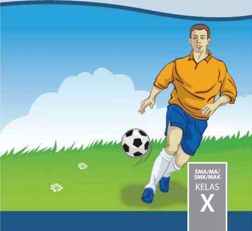

> **Deskripsi Visual:** Gambar ini adalah ilustrasi yang menampilkan seorang pemain sepak bola sedang bermain di lapangan hijau dengan latar belakang langit biru dan awan putih. Pemain tersebut mengenakan jersey kuning dan celana pendek biru, serta sandal berwarna biru. Dia sedang berdiri di dekat bola sepak yang berwarna hitam dan putih. Di sudut kanan atas gambar, terdapat teks "SMA/MA/SMK/MAX KELAS X" yang menunjukkan bahwa gambar ini mungkin merupakan bagian dari buku pelajaran untuk kelas X di sekolah-sekolah tertentu.

Elemen-elemen utama dalam gambar ini meliputi pemain sepak bola, bola sepak, dan lapangan hijau. Pemain sepak bola adalah subjek utama yang sedang bermain, sementara bola sepak adalah objek yang diajukan. Lapangan hijau menunjukkan tempat di mana permainan berlangsung. Teks pada sudut kanan atas memberikan informasi tentang kelas dan jenis sekolah yang mungkin terkait dengan gambar ini.

Informasi kunci yang dapat diambil pembaca adalah bahwa gambar ini mungkin digunakan sebagai ilustrasi dalam buku pelajaran untuk kelas X di sekolah-sekolah tertentu, menunjukkan aktivitas olahraga sepak bola.

 

---
## 📄 Halaman 2

Disklaimer: Buku ini merupakan buku guru yang dipersiapkan Pemerintah dalam rangka implementasi Kurikulum 2013. Buku guru ini disusun dan ditelaah oleh berbagai pihak di bawah koordinasi Kementerian Pendidikan dan Kebudayaan, dan dipergunakan dalam tahap awal penerapan Kurikulum 2013. Buku ini merupakan 'dokumen hidup' yang senantiasa diperbaiki,  diperbaharui,  dan  dimutakhirkan  sesuai  dengan  dinamika  kebutuhan  dan perubahan zaman. Masukan dari berbagai kalangan yang dialamatkan kepada penulis dan laman http://buku.kemdikbud.go.id atau melalui email buku@kemdikbud.go.id diharapkan dapat meningkatkan kualitas buku ini.

### Katalog Dalam Terbitan (KDT)

Indonesia. Kementerian Pendidikan dan Kebudayaan.

Pendidikan Jasmani, Olahraga, dan Kesehatan : buku guru / Kementerian Pendidikan dan Kebudayaan.--  . Edisi Revisi Jakarta : Kementerian Pendidikan dan Kebudayaan, 201 7 .

xii, 268 hlm. : ilus. ; 25 cm.

Untuk SMA/MA/SMK/MAK Kelas X ISBN  978-602-427-134-3 (jilid lengkap)

ISBN  978-602-427-135-0 (jilid 1)

- Pendidikan Jasmani, Olahraga, dan Kesehatan -- Studi dan Pengajaran
I. Judul

- Kementerian Pendidikan dan Kebudayaan
Penulis

:  Sudrajat Wiradihardja dan Syarifudin.

Penelaah

:  Agus Mahendra, Taufiq Hidayah, Toto Subroto, dan Suroto.

Penyelia Penerbitan : Pusat Kurikulum dan Perbukuan, Balitbang, Kem

en

dikbud.

Cetakan Ke-1, 2014 ISBN 978-602-282-469-5 ( Jilid 1 )

Cetakan Ke-2, 2016 (Edisi Revisi)

Cetakan Ke-3, 2017 (Edisi Revisi)

Disusun dengan huruf Minion Pro, 12 pt.

613.7

 

---
## 📄 Halaman 3

### Kata Pengantar

Pembelajaran Pendidikan Jasmani, Olahraga dan Kesehatan adalah suatu proses pembelajaran melalui aktivitas gerak yang didesain untuk meningkatkan kebugaran jasmani, mengembangkan keterampilan gerak, pengetahuan dan perilaku  hidup  sehat  dan  aktif,  sikap  sportif,  dan  kecerdasan  emosi.  aspek pola hidup sehat dan pengenalan lingkungan bersih melalui aktivitas jasmani, olahraga  dan  kesehatan  yang  direncanakan  secara  sistematis  dalam  rangka mencapai tujuan pendidikan nasional.

Pendidikan  sebagai  suatu  proses  pembinaan  manusia  yang  berlangsung seumur hidup, pendidikan jasmani, olahraga dan kesehatan yang diajarkan di sekolah memiliki peranan sangat penting, yaitu memberikan kesempatan kepada  peserta    didik  untuk  terlibat  langsung  dalam  berbagai  pengalaman belajar melalui aktivitas jasmani, olahraga dan kesehatan yang dilakukan secara sistematis.  Pembekalan  pengalaman  belajar  itu  diarahkan  untuk  membina pertumbuhan  fisik  dan  pengembangan  psikis  yang  lebih  baik,  sekaligus membentuk pola hidup sehat dan bugar. Melalui proses pembelajaran yang dilakukan, diharapkan siswa terampil dalam berolahraga.

Terampil berolahraga bukan berarti peserta didik dituntut untuk menguasai cabang olahraga tertentu,  melainkan mengutamakan proses perkembangan gerak dari waktu kewaktu. Dalam aktivitasnya, peserta didik dibawa dalam suasana gembira, sehingga dapat bereksplorasi dan menemukan sesuatu secara langsung  maupun  tidak  langsung.  Untuk  mengaktualisasikan  pendidikan jasmani, olahraga dan kesehatan seperti ini,  peserta didik tidak selalu menjadi obyek.

Harapan  penulis  semoga  buku  ini  dapat  memberikan  sumbangan  yang berarti bagi pengembangan pendidikan, khususnya Mata Pelajaran Pendidikan Jasmani, Olahraga dan Kesehatan di Sekolah SMA/MA/SMK/MAK/SMALB/ Paket C.

Jakarta,  Januari  2016

Penulis

 

---
## 📄 Halaman 4

### Daftar Isi

 

---
## 📄 Halaman 9

### Daftar Gambar

 

---
## 📄 Halaman 13

### A.  Latar Belakang

Pendidikan Jasmani, Olahraga, dan Kesehatan (selanjutnya disingkat PJOK) pada hakikatnya adalah proses pendidikan yang memanfaatkan aktivitas fisik untuk menghasilkan perubahan holistik dalam kualitas individu, baik dalam hal fisik, mental, serta emosional. Sebagai mata pelajaran Pendidikan Jasmani,  Olahraga,  dan  Kesehatan  merupakan  media  untuk  mendorong pertumbuhan fisik, perkembangan psikis, keterampilan motorik, pengetahuan dan penalaran, penghayatan nilai-nilai (sikap-mentalemosional-sportivitas-spiritual-sosial), serta pembiasaan pola hidup sehat yang  berfungsi  untuk  merangsang  pertumbuhan  dan  perkembangan kualitas fisik dan psikis  yang seimbang.

Dalam  struktur  kurikulum  2013,  mata  pelajaran  Pendidikan  Jasmani, Olahraga, dan Kesehatan dikelompokkan ke dalam mata pelajaran kelompok B,  yaitu  kelompok  mata  pelajaran  yang  kontennya  dikembangkan  oleh pusat  dan  dilengkapi  dengan  konten  kearifan  lokal  yang  dikembangkan oleh pemerintah daerah. Pola penerapannya dapat diintegrasikan dengan kompetensi  dasar  yang  sudah  termuat  di  dalam  kurikulum  SMP/MTs/ SMA/MA,  atau  dapat  dirumuskan  dengan  menambahkan  kompetensi dasar tersendiri.

Dalam  kurikulum,  alokasi  waktu  untuk  mata  pelajaran  PJOK  adalah  3 jam  pelajaran  setiap  minggu.  Alokasi  waktu  jam  pembelajaran  tersebut, merupakan jumlah minimal yang dapat ditambah sesuai dengan kebutuhan peserta didik. Kurikulum 2013 menekankan bahwa mata pelajaran PJOK memiliki  konten  yang  unik  untuk  memberi  warna  pada  pendidikan karakter bangsa, di samping diarahkan untuk mengembangkan kompetensi

Kurikulum 2013

### PENDAHULUAN

 

---
## 📄 Halaman 14

gerak dan gaya hidup sehat. Adapun muatan kearifan lokal dari kurikulum 2013  diharapkan  mampu  mengembangkan  apresiasi  terhadap  kekhasan multikultural  dengan  mengenalkan  permainan  dan  olahraga  tradisional yang berakar dari budaya bangsa Indonesia.

Sesuai  dengan  penjelasan  tersebut  William  H  Freeman  (2007:27-28) menyatakan  bahwa  pendidikan  jasmani  menggunakan  aktivitas  jasmani untuk menghasilkan peningkatan secara menyeluruh terhadap kualitas fisik, mental, dan emosional peserta didik. Pendidikan jasmani memperlakukan setiap peserta didik sebagai satu kesatuan yang utuh, tidak lagi menganggap individu sebagai pemilik jiwa dan raga yang terpisah, sehingga di antaranya dianggap  dapat  saling  memengaruhi.  Pendidikan  jasmani  merupakan bidang  kajian  yang  luas  yang  sangat  menarik  dengan  titik  berat  pada peningkatan pergerakan manusia ( human movement ). Pendidikan jasmani menggunakan aktivitas  jasmani  sebagai  wahana  untuk  mengembangkan setiap individu secara menyeluruh, mengembangkan pikiran, tubuh, dan jiwa  menjadi  satu  kesatuan,  hingga  secara  konotatif  dapat  disampaikan bahwa  penjas  diistilahkan  sebagai  proses  membentuk  'tubuh  yang  baik bagi tempat pikiran atau jiwa' .

Sementara itu, Marilyn M. Buck dan kawan-kawan (2007:15) menerjemahkan pendidikan jasmani sebagai kajian, praktik, dan apresiasi atas seni dan ilmu gerak manusia ( human movement ). Pendidikan jasmani merupakan bagian dari proses pendidikan umum. Gerak merupakan sifat alamiah  dan  merupakan  ciri  dasar  eksistensi  manusia  sebagai  makhluk hidup. Pendidikan jasmani bukan merupakan bidang kajian yang tertutup. Perubahan yang terjadi di masyarakat, perubahan teknologi, pemeliharaan kesehatan, dan pendidikan secara umum membawa dampak bagi kualitas program pendidikan jasmani.

Hakikat tujuan Pendidikan Jasmani, Olahraga, dan Kesehatan diberikan di sekolah adalah untuk membentuk 'insan yang terdidik secara jasmaniah ( physically-educated  person )' . National  Association  for  Sport  and  Physical Education (NASPE)  sebagaimana  yang  dikutip  oleh  Michel  W .  Metzler (2005:14)  menggambarkan  bahwa  sosok  'insan  yang  terdidik  secara jasmaniah' ini memiliki ciri sebagai berikut:

- Mendemonstrasikan kemampuan keterampilan motorik dan pola gerak yang diperlukan untuk menampilkan berbagai aktivitas fisik;
- Mendemonstrasikan  pemahaman akan konsep gerak, prinsip-prinsip, strategi, dan taktik sebagaimana yang mereka terapkan dalam pembelajaran dan kinerja berbagai aktivitas fisik;
- Berpartisipasi secara regular dalam aktivitas fisik;
- Mencapai dan memelihara peningkatan kesehatan dan derajat kebugaran,
- Menunjukkan  tanggung  jawab  personal  dan  sosial  berupa  respek terhadap diri sendiri dan orang lain dalam suasana aktivitas fisik, dan

 

---
## 📄 Halaman 15

- Menghargai  aktivitas  fisik  untuk  kesehatan,  kesenangan,  tantangan, ekspresi diri, dan atau interaksi sosial.
Berangkat  dari  pandangan  tersebut,  maka  dapat  disimpulkan  bahwa Pendidikan Jasmani, Olahraga, dan Kesehatan (PJOK) merupakan bagian  integral  dari  pendidikan  secara  keseluruhan,  bertujuan  untuk mengembangkan aspek kebugaran jasmani, keterampilan gerak, keterampilan  berfikir kritis, keterampilan  sosial, penalaran, stabilitas emosional,  tindakan  moral,  aspek  pola  hidup  sehat  dan  pengenalan lingkungan bersih melalui aktivitas jasmani, olahraga dan kesehatan yang direncanakan secara sistematis dalam rangka mencapai tujuan pendidikan nasional.

Untuk  mengusung  tujuan  yang  demikian  komprehensif  di  atas,  mata pelajaran PJOK tentu perlu disesuaikan dengan dasar paradigma perubahan Kurikulum  2013  yang  menekankan  pada  penyempurnaan  pola  pikir, sebagai berikut:

- Pola  pembelajaran  yang  berpusat  pada  guru  menjadi  pembelajaran berpusat  pada  peserta  didik.  Peserta  didik  harus  memiliki  pilihanpilihan  terhadap  materi  yang  dipelajari  untuk  memiliki  kompetensi yang sama.
- Pola  pembelajaran  satu  arah  (interaksi  guru-peserta  didik)  menjadi pembelajaran interaktif (interaktif antara guru, peserta didik, masyarakat, lingkungan alam, dan sumber/media lainnya).
- Pola pembelajaran yang terisolasi menjadi pembelajaran secara jejaring (peserta didik dapat menimba ilmu dari siapa saja dan dari mana saja yang dapat dihubungi serta diperoleh melalui internet);
- Pola pembelajaran pasif menjadi pembelajaran aktif mencari (pembelajaran peserta didik aktif mencari semakin diperkuat dengan model pembelajaran pendekatan sains);
- Pola belajar sendiri menjadi belajar kelompok (berbasis tim);
- Pola  pembelajaran  alat  tunggal  menjadi  pembelajaran  berbasis  alat multimedia;
- Pola  pembelajaran  berbasis  massal  menjadi  kebutuhan  pelanggan ( users )  dengan  memperkuat  pengembangan  potensi  khusus  yang dimiliki setiap peserta didik;
- Pola pembelajaran ilmu pengetahuan tunggal ( monodiscipline ) menjadi pembelajaran ilmu pengetahuan jamak ( multidisciplines ); dan
- Pola pembelajaran pasif menjadi pembelajaran kritis.

 

---
## 📄 Halaman 16

### Standar Kompetensi Lulusan Pendidikan Dasar dan Menengah

Undang-Undang  Dasar  Negara  Republik  Indonesia  Tahun  1945  Pasal 31  ayat  (3)  mengamanatkan  bahwa  pemerintah  mengusahakan  dan menyelenggarakan  satu  sistem  pendidikan  nasional,  yang  meningkatkan keimanan dan ketakwaan serta akhlak mulia dalam rangka mencerdaskan kehidupan bangsa, yang diatur dengan undang-undang. Atas dasar amanat tersebut  telah  diterbitkan  Undang-Undang  Nomor  20  Pasal  2  Tahun 2003  tentang  Sistem  Pendidikan  Nasional  bahwa  pendidikan  nasional berdasarkan Pancasila  dan  Undang-Undang  Dasar  Negara  Republik Indonesia Tahun 1945. Sedangkan Pasal 3 menegaskan bahwa pendidikan nasional berfungsi mengembangkan kemampuan dan membentuk watak serta  peradaban  bangsa  yang  bermartabat  dalam  rangka  mencerdaskan kehidupan bangsa, bertujuan untuk mengembangkan potensi peserta didik agar  menjadi  manusia  yang  beriman  dan  bertakwa  kepada  Tuhan  Yang Maha Esa,  berakhlak  mulia,  sehat,  berilmu,  cakap,  kreatif,  mandiri,  dan menjadi warga negara yang demokratis serta bertanggung jawab.

Untuk  mewujudkan  tujuan  pendidikan  nasional  tersebut  diperlukan profil  kualifikasi  kemampuan  lulusan  yang  dituangkan  dalam  standar kompetensi lulusan. Dalam penjelasan Pasal 35 Undang-Undang Nomor 20 Tahun 2003 disebutkan bahwa standar kompetensi lulusan merupakan kualifikasi  kemampuan lulusan yang mencakup sikap, pengetahuan, dan keterampilan  peserta  didik  yang  harus  dipenuhi  atau  dicapainya  dari suatu  satuan  pendidikan  pada  jenjang  pendidikan  dasar  dan  menengah. Kompetensi  Lulusan  SMA/MA/SMK/MAK/SMALB/Paket  C  memiliki sikap, pengetahuan, dan keterampilan berdasarkan Permendikbud No. 54 tahun 2013 sebagai berikut:

---
**📊 Tabel**

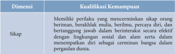

Tabel ini membahas kualifikasi kemampuan dalam hal sikap, yang merupakan dimensi utama dari tabel tersebut. Kolom pertama berisi deskripsi tentang sikap yang diinginkan, sementara kolom kedua berisi kualifikasi kemampuan yang relevan dengan sikap tersebut. Data penting yang terlihat adalah bahwa sikap yang diinginkan adalah memiliki perilaku yang mencerminkan sikap orang beriman, berakhlak mulia, berilmu, percaya diri, dan bertanggung jawab dari berinteraksi secara efektif dengan lingkungan sosial dan alam serta dalam menempuh diri sebagai cerminan bangsa dalam pergaulan diri. Ini menunjukkan bahwa tabel ini fokus pada sikap yang positif dan berharga dalam konteks kehidupan sosial dan pribadi.

 

---
## 📄 Halaman 17

---
**📊 Tabel**

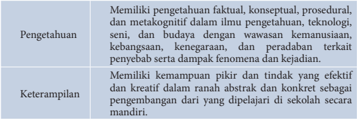

Tabel ini membahas dua aspek utama: Pengetahuan dan Keterampilan. Topik utama adalah pengetahuan dan keterampilan yang diperlukan untuk memahami dan menerapkan konsep-konsep ilmu pengetahuan, teknologi, seni, dan budaya dengan wawasan kemanusiaan, kebangsaan, kesejahteraan, dan terkait fenomena penyebab dan kejadian. Dalam kolom Pengetahuan, disebutkan bahwa individu perlu memiliki pengetahuan faktil, konseptual, prosedural, dan metafognitif dalam berbagai bidang ilmu pengetahuan, teknologi, seni, dan budaya. Sementara itu, dalam kolom Keterampilan, disebutkan bahwa individu perlu memiliki kemampuan pikiran dan tindakan yang efektif dan kreatif dalam ranah abstrak dan konkrit sebagai bagian dari pendidikan yang dipelajari di sekolah formal. Pola penting yang terlihat adalah hubungan antara pengetahuan dan keterampilan dalam pembelajaran dan pengembangan individu.

### B.  Penjabaran Kompetensi Inti kelas X

Kompetensi  inti  dirancang  seiring  dengan  meningkatnya  usia  peserta didik  pada  kelas  tertentu.  Melalui  kompetensi  inti,  integrasi  vertikal berbagai kompetensi dasar pada kelas yang berbeda dapat dijaga. Rumusan kompetensi inti menggunakan notasi sebagai berikut:

- Kompetensi Inti-1 (KI-1) untuk kompetensi inti sikap spiritual,
- Kompetensi Inti-2 (KI-2) untuk kompetensi inti sikap sosial,
- Kompetensi Inti-3 (KI-3) untuk kompetensi inti pengetahuan, dan
- Kompetensi Inti-4 (KI-4) untuk kompetensi inti keterampilan.
Untuk memperkuat keterlaksanaan Kurikulum 2013 agar tidak mengalami penyimpangan dalam implementasinya, pemerintah mengeluarkan Peraturan  Menteri Pendidikan dan Kebudayaan Nomor 69 tahun 2013 Tentang  Kerangka dasar dan struktur kurikulum SMA/MA/SMK/MAK/ SMALB/Paket C untuk kelas X  adalah sebagai berikut :

### KOMPETENSI INTI

- Menghayati dan mengamalkan ajaran agama yang dianutnya.
- Menghayati dan mengamalkan  perilaku jujur, disiplin, tanggungjawab, peduli (gotong royong, kerjasama, toleran, damai), santun, responsif dan pro-aktif dan menunjukkan sikap sebagai bagian dari solusi atas berbagai permasalahan dalam berinteraksi secara efektif dengan lingkungan sosial dan alam serta dalam menempatkan diri sebagai cerminan bangsa dalam pergaulan dunia.

 

---
## 📄 Halaman 18

### KOMPETENSI INTI

- Memahami, menerapkan, menganalisis pengetahuan faktual, konseptual, prosedural berdasarkan rasa ingin tahunya tentang ilmu pengetahuan, teknologi, seni, budaya, dan humaniora dengan wawasan kemanusiaan, kebangsaan, kenegaraan, dan peradaban terkait penyebab fenomena dan kejadian, serta menerapkan pengetahuan prosedural pada bidang kajian yang spesifik sesuai dengan bakat dan minatnya untuk memecahkan masalah.
- Mengolah, menalar, dan menyaji dalam ranah konkret dan ranah abstrak terkait  dengan  pengembangan  dari  yang  dipelajarinya  di  sekolah  secara mandiri, dan mampu menggunakan metoda sesuai kaidah keilmuan.
- *) Untuk  kompetensi  dasar  permainan  bola  besar  dan  permainan  bola kecil  dapat  dipilih  sesuai  dengan  sarana  prasarana  yang  tersedia.  (Dan dipastikan Guru tidak mengajarkan pada salah satu pembelajaran yang diminati oleh gurunya melainkan diminati oleh siswanya agar siswa tidak terpaksa dan PJOK menjadi momok bagi siswanya)
- **)  Pembelajaran  aktifitas  beladiri  selain  pencaksilat  dapat  juga  aktifitas beladiri lainnya (karate, yudo, taekondo, dll) disesuaikan dengan situasi dan kondisi sekolah. Olahraga beladiri pencaksilat mulai diajarkan pada kelas IV dikarenakan karakterisrtik psikis anak kelas I. II dan III belum cukup untuk menerima aktifitas pembelajaran beladiri.
- ***) Pembelajaran  aktifitas  air  boleh  dilaksanakan  sesuai  dengan  kondisi, jikalau tidak bisa dilaksanakan digantikan dengan aktifitas fisik lainnya yang terdapat di lingkup materi.
Empat Kompetensi Inti (KI) yang kemudian dijabarkan menjadi  Kompetensi Dasar (KD) merupakan bahan kajian yang akan ditransformasikan dalam kegiatan pembelajaran selama satu tahun (dua semester).

### C.  Konsep Dasar Pembelajaran

### 1. Karakterisktik Pembelajaran PJOK

Pembelajaran merupakan proses yang interaktif antara guru dengan peserta  didik.  Pembelajaran  melibatkan  multi  pendekatan  degnan menggunakan teknologi yang akan membantu memecahkan permasalahan faktual/riil di dalam kelas. Ada tiga komponen dalam definisi  pembelajaran,  yaitu:  pertama, pembelajaran  adalah  suatu proses,  bukan  sebuah  produk ,  sehingga  nilai  tes  dan  tugas  adalah

 

---
## 📄 Halaman 19

ukuran  pembelajaran,  tetapi  bukan  proses  pembelajaran.  Kedua, pembelajaran  adalah  perubahan  dalam  pengetahuan,  keyakinan, perilaku/sikap .  Perubahan  ini  memerlukan  waktu,  terutama  ketika pembentukan  keyakinan,  perilaku  dan  sikap.  Guru  tidak  boleh menafsirkan  kekurangan  peserta  didik  dalam  pemahaman  sebagai kekurangan dalam pembelajaran, karena mereka memerlukan waktu untuk  mengalami  perubahan.  Ketiga, Pembelajaran  bukan  sesuatu yang dilakukan kepada peserta didik, tetapi sesuatu yang mereka kerjakan  sendiri .  Kualitas  pembelajaran  PJOK  dipengaruhi  oleh empat  komponen  yaitu:  peluang  untuk  belajar,  konten  yang  sesuai, intruksi yang tepat, serta penilaian peserta didik dan pembelajaran.

Pendidikan  Jasmani  mengandung  makna  pendidikan  menggunakan aktivitas jasmani untuk menghasilkan peningkatan secara menyeluruh terhadap  kualitas  fisik,  mental,  dan  emosional  peserta  didik.  Kata aktivitas  jasmani  mengandung makna pembelajaran adalah berbasis aktivitas  fisik.  Kata  olahraga  mengandung  makna  aktivitas  jasmani yang  dilakukan  dengan  tujuan  untuk  memelihara  kesehatan  dan memperkuat  otot-otot  tubuh.  Kegiatan  ini  dapat  dilakukan  sebagai kegiatan yang menghibur, menyenangkan atau juga dilakukan dengan tujuan untuk meningkatkan prestasi. Sementara kualitas fisik, mental dan emosional disini bermakna, pembelajaran PJOK membuat peserta didik  memiliki  kesehatan  yang  baik,  kemampuan  fisik,  memiliki pemahaman yang benar, memiliki sikap yang baik tentang aktivitas fisik, sehingga sepanjang hidupnya mereka akan memiliki gaya hidup sehat dan aktif.

Berdasarkan  uraian  tersebut,  secara  substansi  PJOK  mengandung aktivitas  jasmani,  olahraga,  dan  kesehatan.  Dimana  tujuan  utama PJOK adalah meningkatkan life-long physical activity dan mendorong perkembangan fisik, psikologis dan sosial peserta didik. Jika ditelaah lebih  lanjut,  tujuan  ini  mendorong  perkembangan  motivasi  diri untuk  melakukan  aktivitas  fisik,  memperkuat  konsep  diri,  belajar bertanggung jawab, dan keterampilan kerjasama. Peserta didik akan belajar  mandiri,  mengambil  keputusan  dalam  proses  pembelajaran, belajar  bertanggung  jawab  dengan  diri  dan  orang  lain.  Dan  proses menuju  memiliki  rasa  tanggung  jawab  ini,  setahap  demi  setahap beralih dari guru kepada peserta didik.

Mata pelajaran PJOK selalu terkait dengan konsep aktivitas jasmani ( physical  activities ),  bermain  ( play ),  olahraga  ( sport ),  rekreasi,  dan dansa.

 

---
## 📄 Halaman 20

Aktivitas jasmani adalah seluruh gerak tubuh yang dihasilkan oleh  konstraksi  otot-otot  rangka  yang  secara  nyata    meningkatkan pengeluaran energi ( energy expenditure ) di atas level kebutuhan dasar (Wuest and Bucher; 2009; hal. 11). Secara sederhana aktivitas jasmani dapat  pula  diartikan  sebagai  seluruh  gerak  tubuh  yang  melibatkan kelompok otot besar dan memerlukan suplai energi. Artinya, ketika anak  diinstruksikan  begerak,  gerak  yang  mereka  lakukan  harusnya melibatkan kelompok otot besar dan menyebabkan mereka mengolah energi melalui metabolisme otot yang terlibat.

Bermain pada intinya adalah aktivitas yang digunakan sebagai hiburan. Kita mengartikan bermain sebagai hiburan yang bersifat fisikal yang tidak kompetitif, meskipun bermain tidak harus selalu bersifat fisik. Bermain bukanlah berarti olahraga dan pendidikan jasmani, meskipun elemen dari bermain dapat ditemukan di dalam keduanya.

Dari  kata  bermain  lalu  lahir  kata  benda  permainan,  yang  dengan tetap mengelompokkannya ke dalam garis lurus yang bersifat fisikal, permainan diartikan sebagai 'aktivitas fisik yang di dalamnya sudah mengandung  unsur-unsur  yang  menyenangkan.'  Unsur  ini  dapat berupa kompetisi, imaginasi atau fantasi, termasuk adanya modifikasi aturan.

Olahraga di pihak lain adalah suatu bentuk bermain yang terorganisir dan  bersifat  kompetitif  (Freeman,  2001).  Olahraga  adalah  aktivitas jasmani yang sudah benar-benar terorganisir dan tingkat kompetisinya tinggi  serta  didukung  oleh  peraturan  yang  mengaturnya.  Peraturan menetapkan standar-standar kompetisi dan situasi, sehingga individu atlet dapat bertanding secara fair dan mencapai sasaran yang spesifik. Olahraga  juga  menyediakan  kesempatan  untuk  mendemostrasikan kompetensi seseorang dan menantang batas-batas kemampuan maksimal.

Bermain,  olahraga,  dan  pendidikan  jasmani  melibatkan  bentukbentuk  gerakan,  dan  ketiganya  dapat  melumat  secara  pas  dalam konteks pendidikan jika digunakan untuk tujuan-tujuan kependidikan. Olahraga  dan  bermain  dapat  eksis  meskipun  secara  murni  untuk kepentingan kesenangan, untuk kepentingan pendidikan, atau untuk kombinasi keduanya. Kesenangan dan pendidikan tidak harus dipisahkan secara eksklusif; keduanya dapat  beriringan bersama.

Di pihak lain, rekreasi adalah aktivitas untuk mengisi waktu senggang. Rekreasi  dapat  pula  memenuhi  salah  satu  definisi  'penggunaan berharga dari waktu luang.' Dalam pandangan itu, aktivitas diseleksi

 

---
## 📄 Halaman 21

oleh individu sebagai fungsi memperbaharui ulang kondisi fisik dan jiwa, sehingga tidak berarti hanya membuang-buang waktu. Rekreasi adalah aktivitas yang menyehatkan pada aspek fisik, mental, dan sosial. Dalam  pendidikan  jasmani,  rekreasi  tidak  bisa  lepas  dari  pelajaran rekreasi  secara  aktif  dengan  memanfaatkan  cabang-cabang  olahraga yang sudah dipelajari.

Penekanan  dari  rekreasi  adalah  nuansa  'mencipta  kembali'  ( recreation ).  Apa  yang  dicipta  kembali  itu,  meliputi  upaya  revitalisasi tubuh  dan  jiwa  yang  terwujud  karena  'menjauh'  dari  aktivitas  rutin dan  kondisi  yang  menekan  dalam  kehidupan  sehari-hari.  Landasan kependidikan  dari  rekreasi  kini  diangkat  kembali,  sehingga  sering diistilahkan dengan  pendidikan  rekreasi, yang  tujuan  utamanya adalah mendidik orang dalam memanfaatkan waktu senggang mereka. Rekreasi memungkinkan individu anak terlibat dalam aktivitas yang dipilih  secara  bebas,  termasuk  aktivitas  fisik  yang  menghasilkan manfaat  kesehatan.  Oleh  karenanya  penting  bahwa  guru  PJOK mampu memberi kesadaran tentang gaya hidup aktif, membekali dan meningkatkan keterampilan-keterampilan waktu luang ( leisure skills ) dan  mengintegrasikan  individu  ke  dalam  kegiatan  rekreasional  di komunitas lingkungan anak tinggal.

### 2. Petunjuk Khusus dan Sistematika Pembelajaran

Peraturan  Pemerintah  Republik  Indonesia  Nomor  71  tahun  2013 Tentang Buku teks pelajaran dan buku guru untuk pendidikan dasar dan menengah menyatakan bahwa buku teks dan buku guru adalah sarana  untuk  menunjang  keterlaksanaan  Kurikulum  2013.  Buku  ini merupakan  buku  pegangan  guru  untuk  mengelola  pembelajaran, terutama dalam memfasilitasi peserta didik untuk memahami materi dan mengamalkannya. Materi ajar yang ada pada buku teks pelajaran Pendidikan Jasmani, Olahraga dan Kesehatan akan diajarkan selama satu tahun ajaran. Agar pembelajaran itu lebih efektif dan terarah, maka setiap  minggu  rencana  pelaksanaan  pembelajaran  dirancang  yang minimal  meliputi  (1)  Indikator  Pencapaian  Kompetensi,  (2)  Materi dan Proses Pembelajaran, (3) Penilaian, (4) Pengayaan, dan Remedial.

Pelaksanaan pembelajaran didasarkan pada KI dan KD. Guru Pendidikan  Jasmani,  Olahraga  dan  Kesehatan  yang  mengajarkan materi tersebut hendaknya:

- Dalam  melaksanakan  pembelajaran  memberikan  motivasi  dan mendorong  peserta  didik  secara  aktif  ( active  learning )  untuk mencari  sumber  dan  contoh-contoh  konkret  dari  lingkungan

 

---
## 📄 Halaman 22

- sekitar. Guru mengkondisikan situasi belajar yang memungkinkan peserta  didik  melakukan observasi dan r efleksi.  Observasi  dapat dilakukan dengan berbagai cara, misalnya: membaca buku dengan kritis, menganalisis dan mengevaluasi sumber-sumber.
- Peserta  didik  harus  dirangsang  untuk  berpikir  kritis  dengan memberikan pertanyaan-pertanyaan dan mengajukan pertanyaan disetiap pembelajaran.
- Dalam melaksanakan pembelajaran hendaknya dilakukan secara perorangan,  berpasangan,  dan  berkelompok,  dengan  formasi bersyaf, berbanjar, atau lingkaran.
- Dalam melaksanakan pembelajaran hendaknya dilakukan dengan frekuensi  pengulangan  gerak  yang  cukup  untuk  setiap  peserta didik. Guru Pendidikan Jasmani Olahraga Kesehatan (PJOK) perlu memerhatikan sistematika pembelajaran.
Guru Pendidikan Jasmani Olahraga Kesehatan (PJOK) perlu memperhatikan sistematika pembelajaran sebagai berikut:

### a.  Kegiatan Pendahuluan

Kegiatan pendahuluan yang dapat dilakukan oleh guru antara lain:

- Guru mengumpulkan peserta didik pada suatu tempat tertentu, kemudian membariskannya dalam saf, setengah lingkaran atau bentuk variasi lain sesuai dengan keadaan.
- Guru mengucapkan salam kepada peserta didik.
- Guru  atau  salah  satu  peserta  didik  memimpin  dan  mengajak peserta didik untuk berdoa terlebih dahulu.
- Guru menanyakan  kondisi  kesehatan peserta didik secara umum  dan  memastikan  bahwa  semua  peserta  didik  dalam keadaan sehat, dan bagi peserta didik yang mengalami gangguan kesehatan serius harus diperlakukan secara khusus.
- Guru melakukan apersepsi berupa penyampaian tujuan pembelajaran kepada peserta didik dengan cara yang menyenangkan  sehingga  peserta  didik  terdorong  untuk  ikut pembelajaran dengan semangat.
- Guru  atau  salah  seorang  peserta  didik  yang  dianggap  mampu memimpin  dan  melakukan  pemanasan.  Pemanasan  berfungsi untuk meningkatkan suhu tubuh sehingga tubuh terutama otot dan sendi dapat bekerja secara maksimal dan mengurangi resiko cedera. Selain itu pemanasan juga dapat membangun kepercayaan diri  dan  rasa  nyaman  ketika  bergerak.  Pemanasan  dilakukan

 

---
## 📄 Halaman 23

dengan  aktivitas  yang  menyenangkan,  seperti  permainan  atau gerak diiringi  musik,  yang  bersifat  umum  atau  yang  berkaitan dengan kegiatan inti yang akan dilakukan.

### b.  Kegiatan Inti

Pada kegiatan inti, secara umum, guru Pendidikan Jasmani Olahraga Kesehatan (PJOK) melakukan hal-hal sebagai berikut:

- Selama kegiatan inti pembelajaran, perilaku siswa harus dalam pengamatan, serta diberikan perbaikan terhadap penyimpangan perilaku  peserta  didik  dengan  cara  yang  santun.   Gaya  yang digunakan guru hendaknya bervariasi dari gaya komando, gaya latihan,  gaya  tugas,  gaya  berbalasan, guided  discovery , problem solving , hingga gaya partisipatif .
- Guru  melakukan  diskusi  dengan  para  peserta  didik  untuk mengeksplorasi  pengetahuan  awal  tentang  materi  yang  akan disampaikan.  Bahkan  guru  hendaknya  memberi  tantangan kepada siswa untuk mengenali prinsip-prinsip mekanika gerak dibalik teknik atau tugas gerak yang dipelajari.
- Dalam pembelajaran keterampilan gerak yang umum, guru tidak harus mencontohkan terlebih dahulu, biarkan anak bereksplorasi sendiri  dan  menemukan  cara  yang  tepat  untuk  mereka  secara individual, namun untuk keterampilan gerak yang spesifik guru dapat mendemonstrasikannya terlebih dahulu.
- Kegiatan pembelajaran dilakukan dari yang mudah ke yang sulit, dari yang sederhana ke yang kompleks, serta dari yang ringan ke  yang  berat.  Untuk  itu  guru  dituntut  memiliki  keterampilan mengajar ( teaching skills ) dalam hal pengembangan isi, memotivasi siswa, hingga mengendalikan perilaku positif siswa selama pembelajaran.
- Pada  saat  peserta  didik  melakukan  gerakan,  guru  mengawasi dan memperbaiki kesalahan-kesalahan gerakan yang dilakukan oleh peserta didik, dan juga mengamati perkembangan perilaku siswa.

### c.  Kegiatan akhir

Pada  kegiatan  akhir,  yang  harus  dilakukan  oleh  guru  antara  lain sebagai berikut:

- Melakukan tanya-jawab dan membuat simpulan dengan peserta didik  yang  berkenaan  dengan  materi  pembelajaran  yang  telah

 

---
## 📄 Halaman 24

- diberikan. Termasuk di dalamnya adalah memanfaatkan momen berharga  tersebut  untuk  melakukan  refleksi  yang  mendorong sisiwa mengukuhkan perilaku sosial dan spiritualnya.
- Melakukan pendinginan yang dipimpin oleh guru atau oleh salah seorang  peserta  didik  yang  dianggap  mampu,  selain  itu  guru harus  menjelaskan  kepada  peserta  didik  tujuan  dan  manfaat melakukan pendinginan setelah melakukan aktivitas fisik, atau olahraga yaitu agar dapat melemaskan otot-otot dan tubuh tetap bugar (segar).
- Menginformasikan tentang materi (ujian, materi terkait, materi lain) pada pertemuan berikutnya.
- Setelah melakukan aktivitas pembelajaran, seluruh peserta didik dan guru berdoa dan bersalaman.

### 3. Penggunaan Pendekatan Ilmiah (Scientific)

- Proses  pembelajaran  pada  Kurikulum  2013  untuk  semua  jenjang pendidikan  dilaksanakan  dengan  menggunakan  pendekatan  ilmiah ( scientific  approach ).  Proses  pembelajaran  harus  menyentuh  tiga ranah,  yaitu  sikap  ( attitude ),  keterampilan  ( skill ),  dan  pengetahuan ( knowledge ). Dalam proses pembelajaran berbasis pendekatan ilmiah, ranah sikap menggamit transformasi substansi atau materi ajar agar peserta didik tahu tentang "mengapa". Ranah keterampilan menggamit transformasi substansi atau materi ajar agar peserta didik tahu tentang "bagaimana". Ranah pengetahuan menggamit transformasi substansi atau  materiajar  agar  peserta  didik  tahu  tentang  'apa' .  Hasil  akhirnya adalah  peningkatan  dan  keseimbangan  antara  kemampuan  untuk menjadi  manusia  yang  baik  ( soft  skills )  dan  manusia  yang  memiliki kecakapan dan pengetahuan untuk hidup secara layak ( hard skills ) dari peserta didik yang meliputi aspek kompetensi sikap, keterampilan dan pengetahuan. Kurikulum 2013 menekankan pada dimensi pedagogik modern dalam pembelajaran yaitu menggunakan pendekatan ilmiah.
- Pendekatan ilmiah ( scientific approach ) dalam pembelajaran sebagaimana  dimaksud  meliputi:  mengamati,  menanya,  menalar, mencoba,  dan  mengomunikasikan  untuk  semua  mata  pelajaran. Pendekatan pembelajaran dapat dikatakan sebagai pendekatan ilmiah apabila memenuhi 7 (tujuh) kriteria pembelajaran berikut; pertama , materi  pembelajaran  berbasis  pada  fakta  atau  fenomena  yang  dapat dijelaskan dengan logika atau penalaran tertentu, bukan sebatas kira-

 

---
## 📄 Halaman 25

kira, khayalan, legenda, atau dongeng semata. Kedua , penjelasan guru, respon siswa, dan interaksi edukatif guru siswa terbebas dari prasangka yang serta merta, pemikiran subjektif, atau penalaran yang menyimpang dari alur berpikir logis. Ketiga ,  mendorong dan menginspirasi siswa berpikir  secara  kritis,  analitis  dan  tepat  dalam  mengidentifikasi, memahami,  memecahkan  masalah,  dan  mengaplikasikan  materi pembelajaran. Keempat , mendorong dan menginspirasi siswa mampu berpikir hipotetik dalam melihat perbedaan, kesamaan, dan tautan satu sama lain dari materi pembelajaran. Kelima ,  mendorong dan menginspirasi siswa agar mampu memahami, menerapkan, dan mengembangkan  pola  berpikir  yang  rasional  dan  objektif  dalam merespon materi pembelajaran. Keenam , berbasis pada konsep, teori, dan fakta empiris yang dapat dipertanggung jawabkan. Ketujuh , tujuan pembelajaran dirumuskan secara sederhana dan jelas, namun menarik dalam sistem penyajiannya.

- Pendekatan ilmiah dalam pembelajaran meliputi hal-hal berikut ini.
- 1.) Mengamati. Dalam  pembelajaran  dilakukan  dengan  menempuh langkah-langkah seperti menentukan objek apa yang akan diobservasi, membuat pedoman observasi sesuai dengan lingkup objek yang akan diobservasi, menentukan secara jelas data apa yang perlu diobservasi baik primer maupun sekunder, menentukan/letak objek yang akan diobservasi, menentukan secara jelas bagaimana observasi akan dilakukan untuk mengumpulkan data agar berjalan mudah dan lancar, menentukan cara dan melakukan pencatatan atas  hasil  observasi  seperti  menggunakan  buku  catatan-kameratape recorder -video perekam dan alat tulis lainnya.
- 2.) Menanya. Guru yang efektif mampu  menginspirasi peserta didik  untuk  meningkatkan  dan  mengembangkan  ranah  sikap, keterampilan, dan pengetahuannya. Pada saat guru bertanya, pada saat  itu  pula  dia  membimbing  atau  memandu  peserta  didiknya belajar  dengan  baik.  Ketika  guru  menjawab  pertanyaan  peserta didik, ketika itu pula dia mendorong asuhannya itu agar menjadi penyimak dan pembelajar yang baik. Kriteria pertanyaan yang baik adalah singkat dan jelas, menginspirasi jawaban, memiliki fokus, bersifat probing atau divergen ,  bersifat validatif atau  penguatan, memberikan  kesempatan  peserta  didik  untuk  berpikir  ulang, merangsang peningkatan tuntutan kemampuan  kognitif dan merangsang proses interaksi.

 

---
## 📄 Halaman 26

- 3.) Mencoba. Dimaksudkan untuk mengembangkan berbagai ranah tujuan belajar, yaitu sikap, keterampilan, dan pengetahuan. Aktivitas  pembelajaran  yang  nyata  antara  lain:  1)  menentukan tema atau topik sesuai dengan kompetensi dasar menurut tuntutan kurikulum, 2) mempelajari cara-cara penggunaan alat dan bahan yang tersedia dan harus disediakan, 3) mempelajari dasar teoritis yang  relevan  dan  hasil  eksperimen  sebelumnya,  4)  melakukan dan  mengamati  percobaan,  5)  mencatat  fenomena  yang  terjadi, menganalisis, dan menyajikan data, menarik simpulan atas hasil percobaan dan membuat laporan.
- 4.) Menalar. Istilah  menalar  dalam  kerangka  proses  pembelajaran dengan  pendekatan  ilmiah  yang  dianut  dalam  Kurikulum  2013 adalah  untuk  menggambarkan  bahwa  guru  dan  peserta  didik merupakan  pelaku  aktif.  Titik  tekannya  tentu  dalam  banyak hal  dan  situasi,  peserta  didik  harus  lebih  aktif  daripada  guru. Penalaran  adalah  proses  berpikir  yang  logis  dan  sistematis  atas fakta empiris yang dapat diobservasi untuk memperoleh simpulan berupa pengetahuan. Terdapat dua cara menalar, yaitu penalaran induktif  dan  penalaran  deduktif.  Penalaran  induktif  merupakan cara  menalar  dengan  menarik  simpulan  dari  fenomena  atau atribut  khusus  untuk  hal-hal  yang  bersifat  umum.  Jadi,  menalar secara  induktif  adalah  proses  penarikan  simpulan  dari  kasuskasus yang berisifat nyata secara individual atau spesifik menjadi simpulan yang bersifat umum. Kegiatan menalar secara induktif lebih  banyak  berpijak  pada  observasi  indrawi  atau  pengamatan empirik.  Penalaran  deduktif  merupakan  cara  menalar  dengan menarik  simpulan  dari  pernyataan  atau  fenomena  yang  bersifat umum  menuju  pada  hal  yang  bersifat  khusus.  Pola  penalaran deduktif dikenal dengan pola silogisme (kategorial, hipotesis, dan alternatif).
- 5.) Komunikasi yaitu: mengkomunikasikan hasil percobaan.
Khusus dalam pelajaran PJOK, tahapan di atas tentu tidak dapat dan tidak selalu harus dilaksanakan secara hirarkis (berurutan). Hal itu tergantung pada materi ajar dan episode pembelajaran apa yang sedang dilakukan. Bahkan, dalam pandangan para ahli Penjas, jika pendekatan ilmiah ini dilaksanakan secara kaku dengan mengikuti urutan kegiatan sebagai tahapannya, dikhawatirkan bahwa pelajaran  Penjas  akan  kehilangan  ciri  uniknya,  yaitu  kekayaan

 

---
## 📄 Halaman 27

aktivitas  gerak  yang  bermanfaat  langsung  pada  pengembangan keterampilan motorik dan kebugaran jasmani.

Lebih  jauh  dapat  dijelaskan  bahwa scientific  approach bukanlah sebuah model pembelajaran yang karenanya tidak dapat diartikan sebagai model yang harus diikuti sesuai tahapannya. Arti 'pendekatan'  hanyalah  menunjuk  pada  misi  dan  tujuan  akhir dari  sebuah  kegiatan  yang  bermakna  kepada  produk  apa  yang harus  dicapai.  Misalnya,  istilah  'pendekatan  ilmiah'  bagi  kita bukan  merupakan  sebuah  urutan  kegiatan  belajar,  tetapi  lebih bermakna semacam 'sifat' bahwa pelajaran Penjas (atau pelajaran apapun) harus mampu mengembangkan kemampuan mengamati, mempertanyakan, mengumpulkan informasi, menalar/mengasosiasi,  dan  mengomunikasikan.  Dengan  pendekatan  ilmiah tersebut,  para  guru  dapat  memilih  model  pembelajaran  yang dipandang  mampu  mengusung  pencapaiannya  seperti  model problem-based  learning , model  project-based  learning , contextual learning , dan guided discovery learning .

Khusus  dalam  pembelajaran  Penjas,  model  pembelajaran  yang sudah dikembangkan oleh para ahli justru lebih banyak dan bahkan lebih  kontekstual.  Beberapa  di  antaranya  ada  model movement education , model pengembangan  tanggung jawab (Hellison's model),  model  petualangan  ( adventure  education  model ),  model kebugaran ( fitness education model ), model perkembangan ( developmental model ), bahkan termasuk model Teaching Games for Understanding (TGfU model) serta model kooperatif ( Cooperative model ).  Sedangkan  dalam  wilayah  pendekatan  pembelajaran, penjas  pun  mengenal  berbagai  pendekatan,  seperti  pendekatan pola gerak dominan, pendekatan taktis, dan pendekatan konsep.

### 4. Penyiapan Sarana dan Prasana

Pembelajaran PJOK memerlukan sarana dan prasana untuk mencapai tujuan  pembelajaran  secara  aman,  efektif  dan  efisien.  Penyediaan sumber  daya  fisik  yang  memadai  termasuk  fasilitas,  peralatan,  dan pemeliharaan dapat membantu  dalam  memengaruhi  sikap dan menunjang keberhasilan program. Dalam pembelajaran PJOK, fasilitas yang harus tersedia bagi peserta didik untuk melatih otot besar seperti memanjat, melompat, melompat-lompat, menendang, melempar, melompat dan menangkap, dan mereka juga terlibat dalam kegiatan keterampilan motorik dan permainan lainnya.

 

---
## 📄 Halaman 28

Guru sebagai salah satu sumber pembelajaran juga dapat menggunakan berbagai sumber pembelajaran lain, untuk menambah wawasan siswa dalam pembelajaran seperti Buku, terutama buku panduan guru dan siswa PJOK SMA kelas X. Selain itu, guru juga dapat menggunakan sumber pembelajaran dari video, media cetak, media elektronik, atau internet.

Idealnya, aktivitas pembelajaran menggunakan sarana dan prasarana yang sesuai. Akan tetapi, jika sekolah tidak memiliki dan menyediakan sarana dan  prasarana,  kreativitas  guru  sangat  diperlukan  untuk memodifikasi  sarana  dan  prasarana  pembelajaran  PJOK.  Demikian juga,  guru  dapat  menyesuaikan aktivitas yang dipilih, sesuai dengan ketersediaan sarana dan prasarana, dan tetap melakukan pembelajaran untuk mencapai kompetensi yang diharapkan. Apabila sekolah telah  memiliki  sarana  yang  lengkap,  diharapkan  juga  guru  dapat memodifikasi  sarana  tersebut  untuk  menyesuaikan  dengan  peserta didik yang memiliki kemampuan kurang atau dibawah rata-rata.

### 5. Keamanan dan Keselamatan dalam Pembelajaran

Hal terpenting dalam pembelajaran PJOK adalah terpenuhinya aspek keamanan  dan  keselamatan.  Peserta  didik  melakukan  unjuk  kerja dengan  aman  dan  selamat  sesuai  kompetensi  yang  diharapkan,  dan terjadi  peningkatan  keterampilan  sesuai  dengan  tantangan  dalam melakukan unjuk kerja.

Peserta didik belajar juga untuk menilai kerja yang mereka lakukan dan juga menilai rekannya. Selain itu peserta didik juga harus mampu beradaptasi memodifikasi dan meningkatkan kemampuannya. Karena itu  perlu  diketahui  prosedur  keamanan  dan  keselamatan  dalam pembelajaran  PJOK.  Tujuan  prosedur  keamanan  dan  keselamatan pembelajaran PJOK adalah untuk memastikan peserta didik melakukan aktivitas  Pendidikan  Jasmani  dan  Olahraga  dan  kesehatan  dengan aman dan selamat. Keamanan dan keselamatan dalam pembelajaran meliputi keamanan dan keselamatan penggunaan sarana dan prasarana dan keamanan melakukan suatu gerakan/keterampilan tertentu.

Dalam pembelajaran PJOK, kepala sekolah dan guru harus menjamin hal-hal berikut ini.

- Sekolah memiliki standar pencegahan dan penjagaan keselamatan untuk meminimalkan resiko dalam pembelajaran PJOK.

 

---
## 📄 Halaman 29

- Seluruh alat yang dipergunakan dalam pembelajaran PJOK adalah aman, secara rutin diperiksa, diperbaiki dan dirawat.
- Memiliki catatan perawatan dan perbaikan alat.
- Guru  harus  memiliki  kualifikasi  dan  pengalaman  sebagai  guru PJOK.
- Segala hal yang berpotensi untuk mengganggu dan menimbulkan resiko diidentifikasi dalam manajemen resiko.
- Guru  memiliki  pengetahuan  dan  keterampilan  P3K/  kegawatdaruratan.

### 6. Pengayaan dan Remedial

Kegiatan remedial adalah kegiatan yang ditujukan untuk membantu siswa  yang  mengalami  kesulitan  dalam  menguasai  materi  pelajaran yang diberikan. Dalam kaitannya dengan proses pembelajaran, fungsi kegiatan  remedial  adalah:  (1)  memperbaiki  cara  belajar  siswa,  (2) meningkatkan  kepekaan  siswa  terhadap  kelebihan  dan  kekurangan dirinya,  (3)  menyesuaikan  pembelajaran  dengan  karakteristik  siswa, (4)  mempercepat  penguasaan  siswa  terhadap  materi  pelajaran,  (5) membantu  mengatasi  kesulitan  dalam  Aspek  Sosial  dan  pribadi siswa. Kegiatan remedial dapat dilaksanakan sebelum kegiatan pembelajaran biasanya dilakukan untuk membantu siswa yang diduga akan mengalami kesulitan (preventif), setelah kegiatan pembelajaran biasanya dilakukan untuk membantu siswa yang mengalami kesulitan belajar (kuratif), atau selama berlangsungnya kegiatan pembelajaran biasa. Langkah-langkah yang harus ditempuh dalam kegiatan remedial adalah: (1) analisis hasil diagnosis kesulitan belajar, (2) menemukan penyebab  kesulitan,  (3)  menyusun  rencana  kegiatan  remedial,  (4) melaksanakan kegiatan remedial, dan (5) menilai kegiatan remedial.

Kegiatan pengayaan adalah suatu kegiatan yang diberikan kepada siswa agar mereka dapat mengembangkan potensinya secara optimal dengan memanfaatkan  sisa  waktu  yang  dimilikinya.  Kegiatan  pengayaan dilaksanakan  dengan  tujuan  memberikan  kesempatan  kepada  siswa untuk  memperdalam  penguasaan  materi  pelajaran  yang  berkaitan dengan  tugas  belajar  yang  sedang  dilaksanakan  sehingga  tercapai tingkat perkembangan yang optimal. Tugas yang dapat diberikan guru pada siswa yang mengikuti kegiatan pengayaan di antaranya adalah memberikan  kesempatan  menjadi  tutor  sebaya,  mengembangkan latihan praktis dari materi yang sedang dibahas, membuat hasil karya,

 

---
## 📄 Halaman 30

melakukan  suatu  proyek,  membahas  masalah,  atau  mengerjakan permainan yang harus diselesaikan siswa. Apapun kegiatan yang dipilih guru,  hendaknya  kegiatan  pengayaan  tersebut  menyenangkan  dan mengembangkan  kemampuan  kognitif  tinggi  sehingga  mendorong siswa untuk mengerjakan tugas yang diberikan. Dalam memilih dan melaksanakan  kegiatan  pengayaan,  guru  harus  memperhatikan  (1) faktor siswa, baik faktor minat maupun faktor psikologis lainnya, (2) faktor manfaat edukatif, dan (3) faktor waktu.

### 7. Penilaian

Penilaian  oleh  pendidik  merupakan  suatu  proses  yang  dilakukan melalui  langkah-langkah  perencanaan,  penyusunan  alat  penilaian, pengumpulan informasi  melalui  sejumlah  bukti  yang  menunjukkan pencapaian kompetensi peserta didik, pengolahan, dan pemanfaatan informasi  tentang  pencapaian  kompetensi  peserta  didik.  Penilaian tersebut  dilakukan  melalui  berbagai  teknik/cara,  seperti  penilaian unjuk  kerja  ( performance ),  penilaian  sikap,  penilaian  tertulis  ( paper and pencil test ), penilaian projek, penilaian produk, penilaian melalui kumpulan hasil kerja/karya peserta didik (portofolio), dan penilaian diri.

Penilaian  pencapaian  kompetensi  baik  formal  maupun  informal diadakan dalam suasana yang menyenangkan, sehingga memungkinkan peserta didik menunjukkan apa yang dipahami dan mampu dikerjakannya. Pencapaian kompetensi seorang peserta didik dalam periode waktu tertentu harus dibandingkan dengan hasil yang dimiliki  peserta  didik  tersebut  sebelumnya.  Tidak  dianjurkan  untuk dibandingkan dengan peserta didik lainnya. Dengan demikian peserta didik  tidak  merasa  dihakimi  oleh  pendidik  tetapi  dibantu  untuk mencapai kompetensi atau indikator yang diharapkan.

Penilaian  hasil  belajar  peserta  didik  mencakup  kompetensi  sikap, pengetahuan,  dan  keterampilan  yang  dilakukan  secara  berimbang sehingga  dapat  digunakan  untuk  menentukan  posisi  relatif  setiap peserta didik terhadap  standar yang  telah  ditetapkan.  Cakupan penilaian  merujuk  pada  ruang  lingkup  materi,  kompetensi  mata pelajaran/kompetensi muatan/kompetensi program, dan proses. Teknik  dan  instrumen  yang  digunakan  untuk  penilaian  kompetensi sikap, pengetahuan, dan keterampilan adalah sebagai berikut:

 

---
## 📄 Halaman 31

### a. Penilaian kompetensi sikap

Penilaian sikap dilakukan dengan menggunakan teknik observasi oleh guru mata pelajaran (selama proses pembelajaran pada jam pelajaran),  yang  ditulis  dalam  buku  jurnal  (yang  selanjutnya disebut jurnal). Selain itu, penilaian diri dan penilaian antar teman.

- Observasi merupakan teknik penilaian yang dilakukan secara berkesinambungan dengan menggunakan pedoman observasi yang berisi sejumlah indikator perilaku yang diamati.
- Penilaian diri merupakan teknik penilaian dengan cara meminta peserta didik untuk mengemukakan kelebihan dan kekurangan  dirinya  dalam  konteks  pencapaian  kompetensi. Instrumen yang digunakan berupa lembar penilaian diri.
- Penilaian  antar  peserta  didik  merupakan  teknik  penilaian dengan cara meminta peserta didik untuk saling menilai terkait dengan  pencapaian  kompetensi.  Instrumen  yang  digunakan berupa lembar penilaian antarpeserta didik.
- Jurnal merupakan catatan pendidik di dalam dan di luar kelas yang berisi informasi hasil pengamatan tentang kekuatan dan kelemahan  peserta  didik  yang  berkaitan  dengan  sikap  dan perilaku.

### b. Penilaian Kompetensi Pengetahuan

Teknik  penilaian  pengetahuan  dapat  digunakan  sesuai  dengan karakteristik  masing-masing KD. Teknik yang digunakan adalah lain tes tertulis, tes lisan, penugasan, dan portofolio.

- Instrumen  tes  tulis  berupa  soal  pilihan  ganda,  isian,  jawaban singkat,  benar-salah,  menjodohkan,  dan  uraian.  Instrumen uraian dilengkapi pedoman penskoran.
- Instrumen tes lisan berupa daftar pertanyaan.
- Instrumen penugasan berupa pekerjaan rumah dan/atau projek yang dikerjakan secara individu atau kelompok sesuai dengan karakteristik tugas.

 

---
## 📄 Halaman 32

### c. Penilaian Kompetensi Keterampilan

Pendidik  menilai kompetensi  keterampilan  melalui pe  nilaian kinerja, yaitu penilaian yang menuntut  peserta didik  mendemonstrasikan suatu kompetensi tertentu dengan menggunakan penilaian kinerja, dan penilaian proyek. Instrumen yang digunakan berupa daftar cek atau skala penilaian ( rating scale ) yang dilengkapi rubrik.

- Tes  praktik  adalah  penilaian  yang  menuntut  respon  berupa keterampilan  melakukan  suatu  aktivitas  atau  perilaku  sesuai dengan tuntutan kompetensi.
- Projek adalah tugas-tugas belajar ( learning task ) yang meliputi kegiatan  perancangan,  pelaksanaan,  dan  pelaporan  secara tertulis maupun lisan dalam waktu tertentu.

 

---
## 📄 Halaman 33

### PERMAINAN BOLA BESAR

### A.  Standar Kompetensi Lulusan

### KOMPETENSI LULUSAN SMA/MA/SMK/MAK/SMALB/Paket C

---
**📊 Tabel**

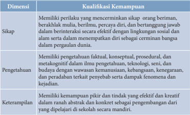

Tabel ini menunjukkan kualifikasi kemampuan yang diperlukan dalam konteks pendidikan, mencakup dimensi sikap, pengetahuan, dan keterampilan. Topik utama tabel ini adalah tentang kualifikasi yang dibutuhkan untuk menjadi seorang pelajar yang berpengetahuan, berpikir kritis, dan dapat berinteraksi dengan efektif. Kolom-kolomnya meliputi sikap, pengetahuan, dan keterampilan. Data penting yang terlihat adalah bahwa pelajar harus memiliki sikap yang positif dan berpengetahuan yang luas, termasuk fakta, konsep, prosedur, dan metakonsep. Selain itu, mereka juga harus memiliki keterampilan yang efektif dan kreatif dalam berbagai situasi, baik dalam konteks abstrak maupun konkret.

 

---
## 📄 Halaman 34

---
**📊 Tabel**

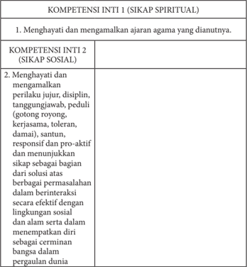

Tabel ini berisi informasi tentang kompetensi inti dan sikap spiritual dalam konteks pendidikan. Topik utamanya adalah tentang bagaimana siswa menghargai dan mengamalkan ajaran agama yang dianutnya, serta menghargai dan mengamalkan perilaku sosial yang positif seperti jujur, disiplin, tanggung jawab, peduli, gotong royong, kerjasama, toleransi, damai, santun, responsif, pro-aktif, dan ikut serta dalam menyelesaikan masalah bersama. Kolom pertama menyajikan kompetensi inti 1 dan 2, sedangkan kolom kedua menjelaskan sikap spiritual yang harus dimiliki oleh siswa. Data penting yang terlihat adalah bahwa siswa diharapkan untuk menghargai dan mengamalkan ajaran agama dan perilaku sosial yang positif, serta berperilaku dengan tanggung jawab dan pro-aktif dalam menyelesaikan masalah bersama.

### Keterangan:

- Pembelajaran  Sikap  Spiritual  dan  Sikap  Sosial  dilaksanakan  secara tidak  langsung    ( indirect  teaching )  melalui  keteladanan,  ekosistem pendidikan, dan proses pembelajaran Pengetahuan dan Keterampilan.
- Evaluasi terhadap Sikap Spiritual dan Sikap Sosial dilakukan sepanjang  proses  pembelajaran  berlangsung,  dan  berfungsi  sebagai pertimbangan  guru  dalam  mengembangkan  karakter  peserta  didik lebih lanjut.
- Guru  mengembangkan  Sikap  Spiritual  dan  Sikap  Sosial  dengan memperhatikan karakteristik, kebutuhan, dan kondisi peserta didik.

 

---
## 📄 Halaman 35

---
**📊 Tabel**

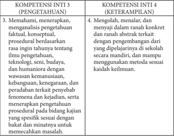

Tabel ini memperlihatkan dua kompetensi inti: Kompetensi Inti 3 (Pengenatan) dan Kompetensi Inti 4 (Keterampilan). Kompetensi Inti 3 fokus pada pemahaman, menerapkan, dan analisis pengetahuan berdasarkan rincian tahunnya tentang ilmu pengetahuan, teknologi, seni, budaya, dan humaniora dengan wawasan kemanusiaan, kebangsaan, kemerdekaan, dan peradaban terkait penyebab fenomena dan kejadian. Sementara itu, Kompetensi Inti 4 menekankan pada mengolah, menalar, dan menyajikan pengetahuan secara konkrit dan abstrak, dengan pengembangan di sekolah secara mandiri dan menggunakan metode sesuai kaidah keluarnya. Data penting yang terlihat adalah bahwa kedua kompetensi ini mencakup aspek pemahaman, menerapan, dan analisis pengetahuan, serta keterampilan dalam mengolah dan menyajikan pengetahuan.

### C.  Kompetensi Dasar dan Indikator Pencapaian Kompetensi

---
**📊 Tabel**

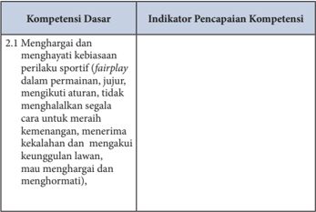

Tabel ini berisi informasi tentang kompetensi dasar dalam olahraga, dengan fokus pada nilai-nilai sportif seperti fairplay. Kolom pertama menunjukkan kompetensi dasar, sementara kolom kedua menunjukkan indikator pencapaian kompetensi tersebut. Topik utama tabel ini adalah tentang bagaimana menghargai dan menghormati perilaku sportif dalam permainan, termasuk tidak menghina aturan, menerima kemenangan dan kekalahan, serta mengakui keunggulan lawan. Data penting yang terlihat adalah bahwa kompetensi ini melibatkan pengembangan sikap dan perilaku yang positif dalam konteks olahraga, yang merupakan aspek penting untuk menciptakan lingkungan yang aman dan bermoral bagi para pemain.

 

---
## 📄 Halaman 36

---
**📊 Tabel**

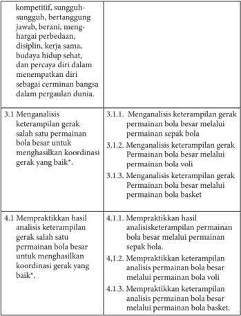

Tabel ini berisi informasi tentang keterampilan gerak dalam bermain bola besar, termasuk analisis dan praktikannya. Topik utama adalah keterampilan gerak dalam bermain bola besar, yang diuraikan melalui 3 subtopik: analisis keterampilan gerak dalam bermain bola besar, analisis keterampilan gerak dalam bermain bola voli, dan analisis keterampilan gerak dalam bermain bola basket. Setiap subtopik tersebut dibagi menjadi beberapa poin, seperti analisis keterampilan gerak dalam bermain bola besar melalui permainan bola sepak bola, analisis keterampilan gerak dalam bermain bola voli, dan analisis keterampilan gerak dalam bermain bola basket. Data penting yang terlihat adalah bahwa tabel ini mencakup analisis dan praktik keterampilan gerak dalam bermain bola besar, baik melalui permainan bola sepak bola, bola voli, maupun bola basket.

 

---
## 📄 Halaman 37

### D. Permainan Bola Besar Menggunakan Sepak bola, Bola voli, dan Bola basket

### Tujuan pembelajaran

Setelah  mengikuti  kegiatan  pembelajaran  ini  peserta  didik  diharapkan mampu:

- Memelihara kesehatan tubuh.
- Menjaga kesehatan tubuh dengan menerapkan gaya hidup aktif.
- Saat bermain menunjukkan permainan tidak curang.
- Dalam  melakukan  aktivitas  fisik  yang  dilakukan  secara  berkelompok, beregu, dan berpasangan memperhatikan kondisi teman, baik fisik atau psikis.
- Mengikuti, peraturan, petunjuk atau arahan yang telah diberikan guru.

### Permainan bola besar melalui permainan sepak bola

- Menganalisis dan mempraktikkan variasi keterampilan gerak permainan bola besar melalui permainan sepak bola.
- Menganalisis  dan  mempraktikkan kombinasi keterampilan gerak permainan bola besar melalui permainan sepak bola.

### Permainan bola besar melalui permainan bola voli

- Menganalisis dan mempraktikkan variasi keterampilan gerak permainan bola besar melalui permainan bola voli dengan baik.
- Menganalisis dan mempraktikkan kombinasi keterampilan gerak permainan bola besar melalui permainan bola voli.

### Permainan bola besar melalui permainan bola basket

- Menganalisis dan mempraktikkan variasi keterampilan gerak permainan bola besar melalui permainan bola basket dengan baik.
- Menganalisis dan mempraktikkan kombinasi keterampilan gerak permainan bola besar melalui permainan bola basket dengan baik.

### E.  Kegiatan Pembelajaran

### 1.  Kegiatan Pendahuluan

Berbaris, berdoa, presensi, apersepsi dan pemanasan.

 

---
## 📄 Halaman 38

Memberikan motivasi dan menjelaskan tujuan pembelajaran Pendidikan Jasmani Olahraga dan Kesehatan melalui permainan bola besar.

### 2.  Kegiatan Inti

Kegiatan inti merupakan penerapan secara operasional model/ pendekatan/metode/gaya yang dipilih sesuai dengan kompetensi dasar dan karakteristik siswa.

### 3.  Penutup

Pendinginan, berbaris,  tugas-tugas,  refleksi,  evaluasi  proses  pembelajaran, dan berdoa.

### F.  Metode Pembelajaran

- Inclusive (cakupan).
- Demonstrasi.
- Part and whole (bagian dan keseluruhan).
- Resiprocal (timbal-balik).
- Pendekatan Pembelajaran Kontekstual.
- Pendekatan Scientific.

### G.  Media Pembelajaran

### 1.  Media

- Gambar : gerakan permainan bola besar.
- Model : peragaan oleh guru atau peserta didik yang sudah memiliki kemampuam permainan sepak bola atau bola voli atau bola basket.

### 2.  Alat dan bahan

Alat  yang  dapat  digunakan  pada  sepak  bola  atau  bola  voli  atau  bola basket adalah sebagai berikut:

- Ruang terbuka yang datar dan aman/lapangan sepak bola/lapangan bola basket/lapangan bola voli.
- Bola sepak bola atau bola voli atau bola basket.
- Cones/corong ± 10 buah.
- Stopwatch.

 

---
## 📄 Halaman 39

### H.  Materi Pembelajaran

- Permaianan sepak bola: keterampilan menggiring, mengontrol, mengenal posisi,  menembak bola ke gawang (2) Bola voli: keterampilan passing bawah, passing atas,  servis, smash .  (3)  Bola  basket:  keterampilan melempar, menangkap, menggiring, menembak bola ke ring basket.
Jenis olahraga bola besar yang ada di dalam bab ini adalah sepak bola, bola voli, dan bola basket, dalam penerapannya, sekolah dapat memilih sesuai dengan sarana dan prasarana yang ada di sekolah dan bakat peserta didik.

### I. Contoh Penerapan Pendekatan Saintifik Dalam Pengembangan Pengetahuan dan Keterampilan Mengumpan/Menendang Bola Menggunakan Kaki Bagian Dalam

- Meminta  salah  satu  pesera  didik  yang  dikategorikan  mampu  untuk memperagakan  gerak  menendang  bola  menggunakan  kaki  bagian dalam atau contoh dari guru; melihat tayangan dan peserta didik yang lain mengamatinya.
- Memotivasi peserta didik untuk bertanya, dengan cara guru mengajukan beberapa pertanyaan; Bagaimana jalannya bola bila titik perkenaan kaki dengan  bola  diubah  (bawah  bola,  titik  tengah  bola,  titik  atas  bola)?, Apakah jarak kaki tumpu dengan bola mempengaruhi jalannya bola?, Apakah  jarak  ayunan  kaki  mempengaruhi  jalannya  bola?  Bagaimana jalannya bola bila merubah posisi togok saat menendang?
- Menemukan jawaban atas pertanyaan-pertanyaan di atas melalui kegiatan eksplorasi  gerak  secara  individual,  berpasangan  atau  berkelompok dengan menunjukkan sikap kerjasama dan disiplin sehingga ditemukan gerak yang efektif dan efesien sesuai kebutuhan masing-masing peserta didik.
- Menemukan hubungan keterampilan gerak dengan jalannya bola, jarak tempuh, dan akurasi.
- Menerapkan  berbagai  keterampilan  gerak  menendang  menggunakan kaki bagian  dalam  permainan  sepak  bola  secara  beregu  dengan menunjukkan sikap kerjasama, disiplin, dan sportivitas.
Setiap  keterampilan  gerak  permainan  sepak  bola  seperti  keterampilan mengontrol, menggiring, dan menembak ke gawang dikembangkan dengan cara seperti di atas.

 

---
## 📄 Halaman 40

### Aktivitas Pembelajaran Permainan Sepak bola

Aktivitas pembelajaran sepak bola dilakukan dengan bermain; latihan dan bermain, kegiatan latihan dilakukan dengan cara sebagai berikut :

### 1.  Menendang/mengumpan bola dengan menggunakan kaki bagian dalam

Pelaksanaannya:

- Pilih pasangan yang seimbang, kemudian berdiri saling berhadapan dengan jarak ± 5 m.
- Lakukan keterampilan gerak menendang untuk menemukan jawaban pertanyaan.
- Latihan ini dilakukan di tempat, dilanjutkan dengan bergerak majumundur, dan bergerak ke kanan dan kiri.
- Selama  melakukan  latihan  kembangkan  nilai-nilai  kerjasama  dan disiplin.
- Setelah  peserta  didik  merasakan  kemajuan  keterampilan,  minta mereka  untuk  menerapkan  keterampilan  tesebut  dalam  bentuk pertandingan secara beregu.

---
**🖼️ Gambar/Diagram**

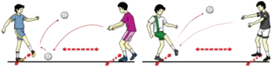

> **Deskripsi Visual:** Gambar ini adalah ilustrasi yang menunjukkan proses permainan sepak bola. Ilustrasi ini menggambarkan dua pemain sepak bola yang sedang bermain. Pemain pertama sedang berusaha memukul bola dengan tangannya ke arah pemain kedua. Pemain kedua sedang berusaha menerima bola tersebut. Ilustrasi ini menunjukkan posisi dan gerakan pemain saat bermain sepak bola. Label penting yang terlihat pada ilustrasi ini adalah nama-nama pemain dan posisi mereka saat bermain. Informasi kunci yang dapat diambil pembaca adalah bagaimana pemain harus bergerak dan berinteraksi untuk mencapai bola.

### 2.  Menendang/mengumpan bola menggunakan kaki bagian dalam melewati tengah gawang atau atas gawang

Pelaksanaannya:

- Berdiri saling berhadapan diantara gawang dengan jarak ± 7 m.
- Dilakukan secara berpasangan atau kelompok.
- Dilakukan di tempat dan dilanjutkan bergerak ke kanan dan ke kiri.
- Lakukan berulang-ulang dan bergantian.

 

---
## 📄 Halaman 41

Latihan ini dilakukan untuk menanamkan  nilai-nilai kerjasama, keberanian, dan sportivitas.

---
**🖼️ Gambar/Diagram**

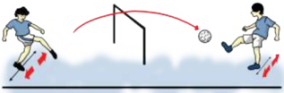

> **Deskripsi Visual:** Gambar ini adalah ilustrasi yang menunjukkan proses permainan sepak bola. Gambar ini menggambarkan dua pemain sepak bola sedang bermain di lapangan. Pemain pertama sedang berjalan dengan bola di tangan, sedangkan pemain kedua sedang berlari menuju bola. Ilustrasi ini menunjukkan posisi dan gerakan pemain sebelum bola ditarik ke arah gawang oleh pemain pertama. Ilustrasi ini juga menunjukkan posisi dan gerakan pemain kedua untuk mencoba mengejar bola. Ini adalah ilustrasi yang baik untuk membantu memahami bagaimana permainan sepak bola berlangsung dan bagaimana pemain harus bereaksi terhadap bola.

### 3.  Pembelajaran variasi dan kombinasi keterampilan keterampilan dasar menghentikan bola

- Menghentikan bola dengan menggunakan kaki bagian dalam, luar, punggung dan telapak kaki dengan arah bola datar dan melambung dapat dilakukan sebagi berikut:
- Berdiri saling berhadapan dengan jarak ± 5 m.
- Bola dipantul, digulir, dan dilambung dari depan.
- Latihan ini dilakukan secara berpasangan/berkelompok.
- Latihan  ini  dilakukan  di  tempat,  dilanjutkan  maju-mundur  dan menyamping.
- Lakukan berulang-ulang dan bergantian.
Latihan dilakukan untuk menanamkan nilai-nilai kerjasama, keberanian, dan sportivitas.

---
**🖼️ Gambar/Diagram**

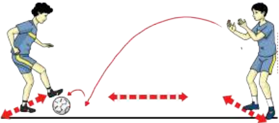

> **Deskripsi Visual:** Gambar ini adalah ilustrasi yang menunjukkan pertarungan sepak bola antara dua pemain. Pada gambar tersebut, pemain yang berada di sebelah kiri menggunakan kaki kanannya untuk melempar bola ke arah pemain di sebelah kanan. Pemain di sebelah kanan sedang berusaha untuk menghentikan bola dengan kaki kiri. Gambar ini menunjukkan posisi kedua pemain dan bola pada saat pertarungan sedang berlangsung. Label "Kaki Kanan" dan "Kaki Kiri" digunakan untuk menunjukkan posisi kedua kaki pemain. Informasi kunci yang dapat diambil dari gambar ini adalah bahwa pertarungan sepak bola sedang berlangsung dan posisi kedua pemain serta bola pada saat itu.

 

---
## 📄 Halaman 42

- Menghentikan bola dengan menggunakan kaki bagian dalam, luar, punggung dan telapak kaki dengan arah bola datar dan melambung, dengan  bola  ditendang  atau  dioper  oleh  teman  dapat  dilakukan sebagai berikut.
- Berdiri saling berhadapan dengan jarak ± 5 m.
- Bola ditendang/dioper secara bergantian.
- Dilakukan secara berpasangan/ berkelompok.
- Latihan ini dilakukan di tempat, dilanjutkan dengan bergerak maju, mundur, dan menyamping.
- Lakukan berulang-ulang dan bergantian.

---
**🖼️ Gambar/Diagram**

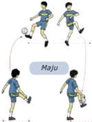

> **Deskripsi Visual:** Gambar ini adalah ilustrasi yang menunjukkan pertandingan sepak bola antara dua tim. Ilustrasi ini menggambarkan dua pemain sepak bola yang sedang berlari dan mencoba memukul bola dengan kaki mereka. Pemain yang berada di depan tampaknya sedang mencoba memukul bola ke arah pemain yang berada di belakangnya. Ilustrasi ini juga menunjukkan beberapa elemen lain seperti latar belakang lapangan sepak bola, penonton, dan logo tim.

Elemen utama dalam ilustrasi ini adalah dua pemain sepak bola yang sedang berlari dan mencoba memukul bola. Relasi antara pemain ini adalah bahwa mereka berada dalam posisi yang sama dan saling berhubungan dalam konteks pertandingan sepak bola. Ilustrasi ini juga menunjukkan beberapa elemen lain seperti latar belakang lapangan sepak bola, penonton, dan logo tim.

Teks, angka, atau label penting yang terlihat dalam ilustrasi ini adalah nama tim yang ditampilkan pada logo tim. Informasi kunci yang dapat diambil pembaca dari ilustrasi ini adalah bahwa ini adalah pertandingan sepak bola antara dua tim, dan pemain-pemain tersebut sedang berusaha untuk mencetak gol.

Dalam satu paragraf yang informatif, gambar ini menunjukkan pertandingan sepak bola antara dua tim. Ilustrasi ini menggambarkan dua pemain sepak bola yang sedang berlari dan mencoba memukul bola dengan kaki mereka. Pemain yang berada di depan tampaknya sedang mencoba memukul bola ke arah pemain yang berada di belakangnya. Ilustrasi ini juga menunjukkan beberapa elemen lain seperti latar belakang lapangan sepak bola, penonton, dan logo tim. Ilustrasi ini menunjukkan bahwa ini adalah pertandingan sepak bola antara dua tim, dan pemain-pemain tersebut sedang berusaha untuk mencetak gol.

Latihan dilakukan untuk menanamkan nilai-nilai kerjasama, keberanian, dan sportivitas.

### 4.  Pembelajaran variasi dan kombinasi keterampilan dasar menggiring bola

- Menggiring bola dengan menggunakan kaki bagian dalam, luar, dan punggung kaki dilakukan sebagi berikut:
- Berdiri membentuk satu barisan ke belakang dengan jarak antara satu dengan yang lain  ±2 m.
- Dilakukan dengan mengikuti gerak teman yang berada di depannya.
- Lakukan berulang-ulang dan bergantian.
Latihan dilakukan untuk menanamkan nilai-nilai kerjasama, keberanian, dan sportivitas.

 

---
## 📄 Halaman 43

---
**🖼️ Gambar/Diagram**

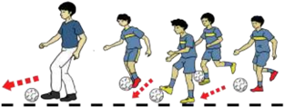

> **Deskripsi Visual:** Gambar ini adalah ilustrasi yang menunjukkan proses permainan sepak bola. Ilustrasi ini menggambarkan seorang pemain sepak bola yang sedang bergerak menuju bola. Pemain tersebut memiliki posisi yang berbeda-beda dalam setiap gambar, menunjukkan gerakan dan tindakan yang berbeda saat bermain sepak bola. Ilustrasi ini mencerminkan konsep dasar permainan sepak bola, seperti gerakan, posisi, dan tindakan pemain untuk mencapai bola.

Elemen-elemen utama dalam ilustrasi ini meliputi pemain sepak bola, bola, dan lapangan sepak bola. Pemain sepak bola diperlihatkan dengan detail, termasuk posisi tubuh dan gerakan mereka. Bola juga diperlihatkan dengan jelas, menunjukkan posisinya di lapangan. Lapangan sepak bola tampak dengan detail, termasuk garis-garis dan area yang digunakan dalam permainan.

Teks, angka, atau label penting tidak ada dalam ilustrasi ini karena ia hanya berupa gambar. Namun, informasi kunci yang dapat diambil pembaca meliputi konsep dasar permainan sepak bola, seperti gerakan pemain, posisi mereka, dan bagaimana mereka berusaha mencapai bola.

- Menggiring bola dengan menggunakan kaki bagian dalam, luar, dan punggung kaki dapat dilakukan sebagai berikut.
- Berdiri membentuk satu banjar dengan jarak antara satu dengan yang lain ±2 m.
- Menggiring bola dengan menggunakan kaki bagian dalam, kaki bagian  luar,  dan  punggung  kaki  dilakukan  dengan  mengikuti gerak teman yang berada di depannya.
- Latihan ini dilakukan secara berpasangan.
- Lakukan berulang-ulang dan bergantian.
Latihan dilakukan untuk menanamkan nilai-nilai kerjasama, keberanian, dan sportivitas.

---
**🖼️ Gambar/Diagram**

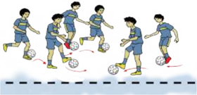

> **Deskripsi Visual:** Gambar ini adalah ilustrasi yang menunjukkan sekelompok pemain sepak bola sedang bermain. Gambar ini menggambarkan tindakan pertandingan sepak bola dengan detail yang cukup. Pemain-pemain tersebut sedang bergerak dan berinteraksi dengan bola, menunjukkan kecepatan dan keahlian mereka dalam memainkan permainan. Ilustrasi ini mencerminkan konsep dasar pertandingan sepak bola, termasuk gerakan, koordinasi, dan komunikasi tim.

Elemen-elemen utama dalam gambar ini meliputi pemain sepak bola, bola, dan lapangan sepak bola. Pemain-pemain tersebut diperlihatkan dalam posisi yang berbeda, menunjukkan aktivitas mereka dalam pertandingan. Bola tampaknya sedang bergerak, menunjukkan bahwa pertandingan sedang berlangsung. Lapangan sepak bola juga terlihat, menunjukkan skema pertandingan dan lingkungan di mana pertandingan berlangsung.

Teks, angka, atau label penting tidak terlihat dalam gambar ini karena ia hanya berupa ilustrasi. Namun, informasi kunci yang dapat diambil pembaca meliputi kecepatan dan keahlian pemain dalam pertandingan, serta konsep dasar pertandingan sepak bola seperti gerakan, koordinasi, dan komunikasi tim.

Dengan demikian, gambar ini memberikan gambaran umum tentang pertandingan sepak bola dan bagaimana pemain-pemain berinteraksi dengan bola dan satu sama lain. Ini juga menunjukkan bagaimana pertandingan sepak bola berlangsung dan bagaimana pemain-pemain harus bergerak dan berkoordinasi untuk sukses dalam pertandingan tersebut.

 

---
## 📄 Halaman 44

- Menggiring bola dengan menggunakan kaki bagian dalam, luar, dan punggung kaki dapat dilakukan sebagi berikut.
- Berdiri membentuk satu banjar dengan jarak antara satu dengan yang lain ±2 m.
- Buat  satu  lingkaran  yang  di  dalamnya  terdapat  bendera  yang ditancapkan sebagai rintangannya.
- Antar sesama teman tidak boleh bersentuhan.
- Latihan ini dilakukan secara perorangan dalam bentuk kelompok.
- Lakukan berulang-ulang.
Latihan dilakukan untuk menanamkan nilai-nilai kerjasama, keberanian, dan sportivitas.

---
**🖼️ Gambar/Diagram**

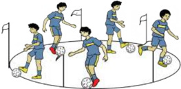

> **Deskripsi Visual:** Gambar ini adalah ilustrasi yang menunjukkan pertandingan sepak bola antara dua tim. Gambar ini menggambarkan beberapa pemain sepak bola sedang bermain di lapangan. Pemain-pemain tersebut sedang bergerak dan berusaha untuk mencetak gol. Di sebelah kiri, ada pemain yang sedang mencoba menendang bola ke gawang lawan. Di sebelah kanan, ada pemain lain yang sedang berusaha memblokir serangan tersebut. Selain itu, juga ada beberapa penonton yang sedang menyaksikan pertandingan. Gambar ini menunjukkan aktivitas dan kompetisi dalam pertandingan sepak bola.

### 5.  Pembelajaran posisi pemain dalam permainan sepak bola

Pemain-pemain  yang  mengambil  bagian  aktif  dalam  formasi  W .M adalah;

- Belakang kanan
- Belakang kiri
- Poros halang
- Gelandang kiri
- Gelandang kanan
- Kanan luar
Pemain-pemain yang mengambil bagian aktif dalam formasi 4 - 2 - 4 adalah:

- Kanan dalam
- Penyerang tengah
- Kiri dalam
- Kiri luar
- Penjaga gawang

 

---
## 📄 Halaman 45

- Belakang kanan
- Poros halangan
- Poros halang
- Belakang kiri
- Gelandang kiri
- Gelandang kanan
- Kanan luar
- Kanan dalam
- Kiri dalam
- Kiri luar
- Penjaga gawang

### 6.  Pembelajaran bermain sepak bola dengan peraturan yang dimodifikasi

- Permainan mengumpan pada empat bidang dapat dilakukan sebagai berikut.
- Peserta didik dibagi menjadi dua kelompok,
- Masing-masing kelompok dapat terdiri dari 6 orang (sesuai dengan besar lapangan),
- Setiap kelompok berusaha menjatuhkan kuns/corong  lawan,
- Bola ditendang/diumpan,
- Permainan  dilakukan  pada  lapangan  yang  telah  ditetapkan  dan tidak keluar dari lapangan,
- Tim mendapat satu poin dapat menjatuhkan kuns lawan,
- Tim dianggap menang bila memperoleh poin terbanyak,
- Waktu bermain 10 menit,
- Dilakukan  dengan  menanamkan  nilai-nilai  sportivitas.

---
**🖼️ Gambar/Diagram**

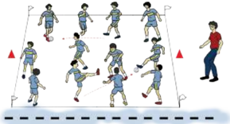

> **Deskripsi Visual:** Gambar ini adalah ilustrasi yang menunjukkan berbagai posisi dan gerakan pemain sepak bola dalam sebuah pertandingan. Ilustrasi ini mencakup beberapa elemen penting:

1. **Apa yang Ditampilkan Secara Keseluruhan**: Gambar ini menunjukkan berbagai posisi dan gerakan pemain sepak bola dalam sebuah pertandingan sepak bola. Ini termasuk pemain yang berada di tengah lapangan, pemain yang sedang bergerak, dan pemain yang sedang bermain.

2. **Elemen-Elemen Utama dan Relasinya**: 
   - **Pemain Sepak Bola**: Ilustrasi ini menampilkan banyak pemain sepak bola yang sedang bermain. Mereka berada di berbagai posisi di lapangan.
   - **Lapangan Sepak Bola**: Lapangan sepak bola tampak jelas dengan garis-garis yang menunjukkan area permainan.
   - **Permainan Sepak Bola**: Pemain-pemain sedang bergerak dan berinteraksi dengan bola, menunjukkan aktivitas dan strategi dalam pertandingan.

3. **Teks, Angka, atau Label Penting yang Terlihat**: 
   - **Label**: Ada beberapa label yang mungkin menunjukkan nama-nama pemain atau tim, namun tidak ada teks yang jelas dalam gambar ini.
   - **Angka**: Tidak ada angka yang jelas dalam gambar ini, kecuali mungkin ada angka yang menunjukkan skor atau posisi pemain.

4. **Informasi Kunci yang Dapat Diambil Pembaca**: 
   - **Strategi Permainan**: Ilustrasi ini menunjukkan berbagai strategi dan taktik yang digunakan dalam sepak bola, seperti gerakan pemain, posisi mereka, dan interaksi dengan bola.
   - **Keseragaman**: Ilustrasi ini menunjukkan bahwa pemain sepak bola bekerja sama dan saling menghormati dalam pertandingan.

Dengan demikian, gambar ini memberikan gambaran umum tentang bagaimana sepak bola dimainkan dan strategi yang digunakan oleh pemain dalam pertandingan tersebut.

 

---
## 📄 Halaman 46

### K.  Contoh Penerapan Pendekatan Saintifik dalam Pembelajaran Variasi Keterampilan Permainan Bola Besar Melalui Permainan Bola voli

### Aktivitas:

- Meminta  salah  satu  pesera  didik  yang  dikategorikan  mampu  untuk memperagakan  gerak  atau  contoh  dari  guru;  melihat  tayangan  dan peserta didik yang lain mengamatinya.
- Memotivasi peserta didik untuk bertanya, dengan cara guru mengajukan beberapa pertanyaan yang berkaitan dengan keterampilan gerak contoh: Bagaimana jalannya jika melakukan passing bawah bola voli kaki tidak mengeper?  Apakah  kemiringan  tubuh  mempengaruhi  jalannya  bola saat  melakukan  servis  bawah?  kenapa  bola  selalu  diusahakan  berada ditengah badan saat melakukan passing bawah?
- Menemukan jawaban atas pertanyaan di atas melalui kegiatan eksplorasi gerak secara individual, berpasangan atau berkelompok dengan menunjukkan sikap kerjasama dan  disiplin sehingga ditemukan gerak yang efektif dan efesien sesuai kebutuhan masing-masing peserta didik.
- Menemukan hubungan keterampilan gerak.
- Menerapkan berbagai keterampilan gerak permainan bola besar melalui permainan bola voli dalam bermain secara beregu dengan menunjukkan sikap kerjasama, disiplin, dan sportivitas.
Setiap keterampilan gerak permainan bola voli seperti keterampilan passing atas, passing bawah, smash , dan block dikembangkan dengan cara seperti di atas.

### L.  Aktivitas Pembelajaran Permainan Bola Besar Variasi dan Kombinasi Menggunakan Bola voli

Aktivitas pembelajaran bola voli dilakukan dengan bermain; latihan dan bermain, kegiatan latihan dapat dilakukan sebagai berikut :

 

---
## 📄 Halaman 47

### 1. Passing atas dan bawah bergerak maju-mundur dan ke kiri-kanan

---
**🖼️ Gambar/Diagram**

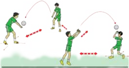

> **Deskripsi Visual:** Gambar ini adalah ilustrasi yang menunjukkan pertandingan sepak bola antara dua tim. Gambar ini menggambarkan dua pemain sepak bola bermain di lapangan. Pemain pertama sedang mencoba memukul bola ke arah pemain kedua dengan menggunakan tangannya. Pemain kedua tampaknya sedang berusaha untuk menghentikan bola tersebut dengan menggunakan tangannya juga. Di sekitar mereka, ada beberapa penonton yang sedang menyaksikan pertandingan. Gambar ini menunjukkan hubungan antara pemain, bola, dan penonton dalam konteks pertandingan sepak bola. Teks, angka, atau label penting tidak terlihat dalam gambar ini. Informasi kunci yang dapat diambil pembaca adalah bahwa ini adalah pertandingan sepak bola dan ada dua tim yang bermain.

- Dilakukan berpasangan/berkelompok.
- Pilih pasangan yang seimbang, kemudian berdiri saling berhadapan dengan jarak ± 4 m.
- Bola dilambung oleh teman dari depan.
- Lakukan berulang-ulang dan bergantian.
- Lakukan keterampilan gerak untuk menemukan jawaban pertanyaan.
- Selama  melakukan  latihan  kembangkan  nilai-nilai  kerjasama  dan disiplin.
- Setelah  peserta  didik  merasakan  kemajuan  keterampilan,  minta mereka  untuk  menerapkan  keterampilan  tesebut  dalam  bentuk pertandingan secara beregu.
Kegiatan pembelajaran yang lainnya disesuaikan.

### 2. Passing atas dan bawah melampaui net

Pelaksanaannya sebagai berikut:

- Berdiri saling berhadapan dengan jarak ± 3 m dipisahkan ner/jaring
- Berdiri  membentuk  barisan satu ke belakang

---
**🖼️ Gambar/Diagram**

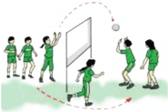

> **Deskripsi Visual:** Gambar ini adalah ilustrasi yang menunjukkan sebuah pertandingan bola voli antara dua tim. Gambar ini menggambarkan beberapa elemen penting seperti pemain-pemain yang sedang bermain, bola voli, dan peralatan seperti tendu dan penanda lapangan. Pemain-pemain tersebut terlihat aktif dan bergerak dengan cepat, menunjukkan kecepatan dan kekuatan dalam pertandingan. Bola voli tampak jelas di tengah-tengah permainan, menunjukkan fokus pada permainan tersebut. Tendu dan penanda lapangan juga terlihat jelas, menunjukkan posisi dan area permainan. Informasi kunci yang dapat diambil dari gambar ini adalah bahwa pertandingan ini adalah pertandingan bola voli yang sengit dan kompetitif, dengan pemain-pemain yang berusaha keras untuk mencapai kemenangan.

 

---
## 📄 Halaman 48

- Lakukan passing atas kearah teman diseberang net/jaring
- Selesai melakukan berpindah tempat kebelakang barisan diseberang net/jaring
- Lakukan berulang-ulang dan bergantian
Latihan dilakukan  untuk menanamkan nilai-nilai kerjasama, keberanian, dan sportivitas

### 3.  Pembelajaran variasi keterampilan dasar servis atas bola voli dengan konsisten dan tepat dalam berbagai situasi

### a.  Memukul bola ke lantai dengan menggunakan satu tangan

Pelaksanaannya sebagai berikut:

- Berdiri saling berhadapan dengan jarak ± 3 m.
- Bola dipegang dengan tangan kiri di depan badan dan lambungkan ke atas.
- Pukul bola ke lantai (depan) menggunakan tangan kanan diawali dengan melentingkan pinggang ke belakang, yang telah melakukan pukulan bergerak pindah tempat.
- Lakukan berulangulang dan bergantian.
- Latihan ini dilakukan berpasangan atau kelompok, formasi berbanjar.

---
**🖼️ Gambar/Diagram**

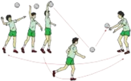

> **Deskripsi Visual:** Gambar ini adalah ilustrasi yang menunjukkan pertandingan bulu tangkis antara dua tim. Ilustrasi ini menggambarkan dua tim bermain di lapangan bulu tangkis dengan pemain yang sedang bergerak dan bereaksi terhadap bola yang dilempar oleh lawan mereka. Pemain-pemain tersebut menggunakan alat peraga seperti raket dan bola bulu tangkis. Ilustrasi ini menunjukkan posisi dan gerakan pemain dalam pertandingan, serta interaksi antara pemain dan bola. Teks, angka, atau label penting tidak terlihat dalam gambar ini karena ia hanya menggambarkan pertandingan secara visual tanpa teks atau angka tambahan. Informasi kunci yang dapat diambil pembaca adalah tentang bagaimana pertandingan bulu tangkis berlangsung dan bagaimana pemain memainkan permainan tersebut.

Latihan dilakukan untuk menanamkan nilai-nilai kerjasama, keberanian, sportivitas, dan kompetitif.

### b.  Servis ke arah teman, dan diterima  menggunakan passing bawah

Pelaksanaannya dapat dilakukan sebagai berikut:

- Sama dengan model I, namun bola dipukul ke teman.
- Latihan ini dilakukan berpasangan atau kelompok.

 

---
## 📄 Halaman 49

---
**🖼️ Gambar/Diagram**

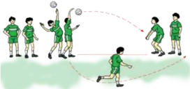

> **Deskripsi Visual:** Gambar ini adalah ilustrasi yang menunjukkan proses permainan sepak bola. Ilustrasi ini menggambarkan sekelompok pemain sepak bola bermain di lapangan. Pemain-pemain tersebut sedang bergerak dan berinteraksi dengan bola yang mereka telanjangi. Ilustrasi ini menunjukkan posisi dan gerakan pemain saat mereka berusaha mencetak gol atau mempertahankan pertahanan. Ilustrasi ini juga menunjukkan posisi lapangan yang digunakan dalam permainan sepak bola, seperti area penyerangan dan area pertahanan. Ilustrasi ini membantu pembaca untuk memahami bagaimana permainan sepak bola berlangsung dan bagaimana posisi pemain dalam permainan.

### c.  Servis atas ke arah sasaran pada lapangan melewati atas net

Pelaksanaannya dapat dilakukan sebagai berikut :

- Berdiri saling berhadapan dengan jarak ± 3 m.
- Lakukan latihan memukul  bola  seperti  pada  latihan-latihan sebelumnya,  yang  telah  melakukan  pukulan  bergerak  pindah tempat.
- Lakukan latihan dengan jarak yang bertambah jauh, dari jarak 6 m dan secara bertahap jarak memukul ditambah menjadi 7 m, 8 m, dan 9 m disesuaikan dengan tingkat kemampuan peserta didik.
- Lakukan berulang-ulang dan bergantian.
Latihan dilakukan untuk menanamkan  nilai-nilai kerjasama, keberanian, dan sportivitas.

---
**🖼️ Gambar/Diagram**

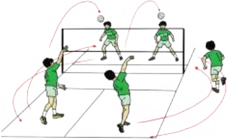

> **Deskripsi Visual:** Gambar ini adalah ilustrasi yang menunjukkan pertandingan bulu tangkis. Gambar ini menggambarkan dua tim bermain di lapangan bulu tangkis dengan pemain yang sedang bergerak untuk memukul bola. Pemain di sisi kanan menggunakan teknik serangan, sementara pemain di sisi kiri menggunakan teknik penyerangan. Lingkaran merah menunjukkan posisi bola saat dimainkan oleh pemain di sisi kanan, sedangkan lingkaran hijau menunjukkan posisi bola saat dimainkan oleh pemain di sisi kiri. Gambar ini menunjukkan perbedaan teknik dan strategi dalam bermain bulu tangkis.

 

---
## 📄 Halaman 50

### d.  Bermain bola voli menggunakan passing bawah

Pelaksanaannya dapat dilakukan sebagai berikut :

- Berdiri saling berhadapan dengan jarak ± 3 m.
- Permainan dimulai dengan pukulan servis atas melalui atas net.
- Bola  harus  diterima  dan  segera  dikembalikan  menggunakan passing bawah ke seberang lapangan.
- Pemenang adalah regu yang terlebih dahulu mencapai 15 angka.
- Kesalahan yang mengakibatkan perolehan angka bagi lawan.
- Bola menyentuh tanah/lantai dalam lapangan permainan.
- Bola ke luar lapangan dan pemain menyentuh tali/net.
- Pemain menginjak lapangan lawan.
- Jumlah pemain 4-5 orang/regu.
- Luas lapangan dapat disesuaikan, misalnya 4 x 6 m atau 8 x 9 m.
- Tinggi net dua meter atau disesuaikan.

---
**🖼️ Gambar/Diagram**

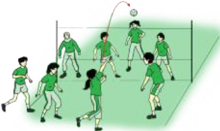

> **Deskripsi Visual:** Gambar ini adalah ilustrasi yang menunjukkan pertandingan bola voli antara dua tim. Gambar ini menggambarkan berbagai elemen penting seperti pemain-pemain yang sedang bermain, bola voli, dan peralatan seperti tongkat voli. Pemain-pemain tersebut terbagi menjadi dua tim dengan warna seragam yang berbeda, yang menunjukkan bahwa mereka berada dalam posisi bertahan atau serang. Bola voli tampak jelas di tengah-tengah gambar, menunjukkan bahwa ia adalah objek utama pertandingan. Ilustrasi ini juga menunjukkan posisi dan gerakan pemain, yang sangat penting untuk memahami strategi dan taktik dalam permainan voli. Informasi kunci yang dapat diambil dari gambar ini adalah bahwa pertandingan ini sedang berlangsung dengan intensitas tinggi, dan setiap pemain memiliki peran yang spesifik dalam timnya.

### e.  Bermain bola voli menggunakan passing atas

Pelaksanaannya dapat dilakukan sebagai berikut :

- Bentuk peserta didik menjadi dua kelompok
- Permainan dimulai dengan lemparan melalui atas net.
- Bola yang dilempar lawan harus diterima menggunakan passing atas.

 

---
## 📄 Halaman 51

- Lakukan passing atas/tidak lebih dari 3x sentuhan pukulan untuk menyebrangkan bola ke lapangan lawan.
- Setiap pemain tidak dibolehkan melakukan dua pukulan/ passing secara berturut-turut.
Latihan dilakukan untuk menanamkan nilai-nilai kerjasama, keberanian, sportivitas, dan kompetitif.

---
**🖼️ Gambar/Diagram**

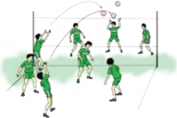

> **Deskripsi Visual:** Gambar ini adalah ilustrasi yang menunjukkan pertandingan voli. Gambar ini menggambarkan beberapa pemain voli bermain di lapangan dengan posisi mereka yang berbeda. Pemain di sebelah kiri tampak sedang menyerang bola, sementara pemain di sebelah kanan tampak sedang berdiri dan menunggu. Pemain di tengah tampak sedang bergerak untuk menyelamatkan bola. Ilustrasi ini menunjukkan posisi dan gerakan pemain dalam sebuah pertandingan voli.

### f. Bermain bola voli dengan melalui keterampilan passing atas dan bawah, smash, dan membendung

Pelaksanaannya dapat dilakukan sebagai berikut:

- Bentuk peserta didik menjadi dua kelompok.
- Permainan  dimulai  dengan  servis  atas  dari  belakang  lapangan/ tengah  lapangan melewati atas net.
- Permainan mendekati peraturan yang sebenarnya.
- Ukuran net agak direndahkan.
Latihan dilakukan untuk menanamkan nilai-nilai kerjasama, keberanian, dan sportivitas.

 

---
## 📄 Halaman 52

---
**🖼️ Gambar/Diagram**

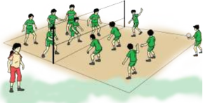

> **Deskripsi Visual:** Gambar ini adalah ilustrasi yang menunjukkan pertandingan bola voli antara dua tim. Gambar ini menggambarkan beberapa elemen penting seperti pemain-pemain yang sedang bermain, bola voli, dan net yang memisahkan dua tim. Pemain-pemain tersebut dikenali dengan pakaian warna yang berbeda untuk membedakannya. Net yang berada di tengah-tengah lapangan menunjukkan batas permainan. Informasi kunci yang dapat diambil dari gambar ini adalah bahwa pertandingan ini sedang berlangsung dan memerlukan kerjasama tim untuk mencapai tujuan.

### M. Contoh Penerapan Pendekatan Saintifik Dalam Pembelajaran Menganalisis Variasi Keterampilan Permainan Bola Besar Melalui Permainan Bola basket

- Meminta  salah  satu  pesera  didik  yang  dikategorikan  mampu  untuk memperagakan  gerak  atau  contoh  dari  guru;  melihat  tayangan  dan peserta didik yang lain mengamatinya.
- Memotivasi peserta didik untuk bertanya, dengan cara guru mengajukan beberapa pertanyaan yang berkaitan dengan keterampilan gerak. Mengapa setelah menangkap bola setinggi dada tangan harus ditekuk (bola  dibawa  mendekat  ke  badan)?  Apa  yang  akan  terjadi  jika  bola dipompa terlalu keras?
- Menemukan jawaban atas pertanyaan di atas melalui kegiatan eksplorasi gerak secara individual, berpasangan atau berkelompok dengan menunjukkan sikap kerjasama dan  disiplin sehingga ditemukan gerak yang efektif dan efesien sesuai kebutuhan masing-masing peserta didik.
- Menemukan hubungan keterampilan gerak.
- Menerapkan berbagai keterampilan gerak permainan bola besar melalui  permainan  bola  basket  dalam  bermain  secara  beregu  dengan menunjukkan sikap kerjasama, disiplin, dan sportivitas.

### N.  Pembelajaran Variasi dan Kombinasi Keterampilan Keterampilan Passing dengan Menangkap (Passing)

Aktivitas pembelajaran bola basket dilakukan dengan bermain; latihan dan bermain, kegiatan latihan dapat dilakukan sebagai berikut :

 

---
## 📄 Halaman 53

### 1. Passing

- Berdiri berhadapan dengan jarak ± 5 m
- Lempar dan tangkap bola basket sambil bergerak maju, mundur dan menyamping .
- Lakukan secara berulang-ulang.
- Lakukan keterampilan gerak untuk menemukan jawaban pertanyaan.

---
**🖼️ Gambar/Diagram**

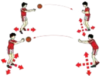

> **Deskripsi Visual:** Gambar ini adalah ilustrasi yang menunjukkan proses permainan bola basket. Ilustrasi ini menggambarkan empat pemain basket yang sedang bermain. Pemain pertama sedang memukul bola ke arah pemain kedua, yang kemudian mencoba untuk mengeksekusi lay-up. Pemain ketiga dan keempat berada di latar belakang, tampaknya menunggu aksi selanjutnya. Ilustrasi ini menunjukkan hubungan antara pemain-pemain dalam sebuah pertandingan basket, termasuk gerakan, posisi, dan komunikasi tim. Teks, angka, atau label penting tidak terlihat dalam gambar ini, tetapi informasi kunci yang dapat diambil pembaca meliputi strategi permainan, posisi pemain, dan tindakan tim dalam pertandingan basket.

- Setelah peserta didik merasakan kemajuan keterampilan, minta mereka untuk menerapkan keterampilan tesebut dalam bentuk pertandingan secara beregu.
Kegaitan pembelajaran yang lainnya disesuaikan.

### 2. Passing dan menangkap bola basket pada formasi berbanjar

- Berdiri berhadapan dengan jarak ± 5 m.
- Melakukan lemparan bergerak berpindah tempat, dilakukan berpasangan  atau berkelompok,  untuk menanamkan  nilai-nilai kerjasama, keberanian, dan sportivitas.
- Lakukan secara berulang-ulang.

---
**🖼️ Gambar/Diagram**

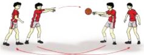

> **Deskripsi Visual:** Gambar ini adalah ilustrasi yang menunjukkan proses permainan bola voli. Gambar ini menggambarkan empat pemain voli yang sedang bermain. Pemain pertama (pemain 1) berada di posisi yang lebih dekat dengan bola, sedangkan pemain kedua (pemain 2) berada di posisi yang lebih jauh. Pemain ketiga (pemain 3) dan pemain keempat (pemain 4) berada di posisi yang lebih jauh lagi. Pemain 1 sedang memegang bola dan menyerang pemain 2, sementara pemain 3 dan pemain 4 berada di posisi yang lebih jauh untuk mengeksekusi serangan. Ilustrasi ini menunjukkan posisi dan gerakan pemain saat bermain bola voli.

### 3. Passing dan menangkap bola basket pada formasi lingkaran

- Berdiri berhadapan dengan jarak ± 5 m.

 

---
## 📄 Halaman 54

- Setelah melakukan lemparan bergerak berpindah tempat (dari tengah lingkaran pindah ke garis lingkaran dan dari garis lingkaran pindah ke tengah lingkaran).
- Lakukan secara berulang-ulang.
Lakukan  latihan  secara  berpasangan  atau  berkelompok,  untuk  menanamkan nilai-nilai kerjasama, keberanian, dan sportivitas.

### O.  Pembelajaran variasi dan kombinasi keterampilan dasar menggiring

- Menggiring bola basket mengikuti teman yang di depannya
- Peserta didik berdiri bebas sambil memegang bola.
- Latihan  dilakukan  berpasangan  atau  bentuk  kelompok,  selama melakukan gerakan tidak boleh bersinggungan sesama teman, untuk menanamkan nilai-nilai kerjasama, keberanian, dan sportivitas.

---
**🖼️ Gambar/Diagram**

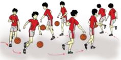

> **Deskripsi Visual:** Gambar ini adalah ilustrasi yang menunjukkan sekelompok siswa sedang bermain bola basket. Gambar ini menggambarkan tindakan tim basket dalam sebuah pertandingan. Siswa-siswa tersebut diperlihatkan bergerak dengan bola basket, menunjukkan gerakan serangan dan defensif mereka. Ilustrasi ini mencerminkan konsep dasar permainan basket, termasuk gerakan pemain, posisi bola, dan strategi tim.

Elemen-elemen utama dalam gambar ini meliputi siswa-siswa yang sedang bermain bola basket, bola basket, dan lapangan basket. Siswa-siswa tersebut diperlihatkan bergerak dengan bola basket, menunjukkan gerakan serangan dan defensif mereka. Bola basket dan lapangan basket juga menjadi elemen penting dalam gambar ini, karena mereka membantu menunjukkan konsep dasar permainan basket.

Teks, angka, atau label penting yang terlihat dalam gambar ini tidak ada, karena gambar ini hanya menggambarkan tindakan tim basket dalam sebuah pertandingan tanpa menggunakan teks atau angka untuk memberikan informasi tambahan.

Informasi kunci yang dapat diambil pembaca dari gambar ini adalah bahwa permainan basket melibatkan gerakan pemain, posisi bola, dan strategi tim. Gambar ini juga menunjukkan bahwa permainan basket memerlukan koordinasi dan kerjasama antara pemain dalam tim.

 

---
## 📄 Halaman 55

### 2.  Adu cepat menggiring bola basket melalui rintangan (zig-zag) dalam bentuk lari berantai

---
**🖼️ Gambar/Diagram**

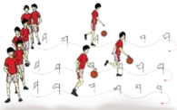

> **Deskripsi Visual:** Gambar ini adalah ilustrasi yang menunjukkan sekelompok siswa sedang bermain bola basket. Gambar ini menggambarkan tindakan tim basket dalam sebuah pertandingan. Siswa-siswa tersebut diperlihatkan dalam posisi yang berbeda, mulai dari berdiri, berjalan, hingga melakukan gerakan untuk memukul bola. Ilustrasi ini mencerminkan kegiatan fisik dan koordinasi tim dalam olahraga basket.

Elemen-elemen utama dalam gambar ini meliputi siswa-siswa yang bermain bola basket, bola basket, dan lingkungan lapangan basket. Siswa-siswa tersebut diperlihatkan dalam posisi yang berbeda, menunjukkan aktivitas mereka dalam permainan. Bola basket juga terlihat jelas, menunjukkan objek utama dalam permainan tersebut. Lingkungan lapangan basket tampak dengan baik, menunjukkan lantai lapangan dan pagar lapangan.

Teks, angka, atau label penting yang terlihat dalam gambar ini tidak ada, karena gambar ini hanya menggambarkan tindakan siswa-siswa dalam permainan basket tanpa menggunakan teks atau angka. Informasi kunci yang dapat diambil pembaca adalah bahwa gambar ini menunjukkan aktivitas tim basket dalam sebuah pertandingan, dengan siswa-siswa bermain bola basket dan bergerak aktif di lapangan basket.

- Lomba  cepat  mengambil  bola  basket  dan  menggiring  melalui rintangan (zig-zag), dalam bentuk lari berantai
- Berdiri berhadapan dengan jarak ± 10 m.
- Latihan ini dilakukan secara berkelompok, untuk menanamkan nilai-nilai kerjasama, keberanian, dan sportivitas
- P Pembelajaran  variasi  dan  kombinasi  keterampilan  dasar shooting  (menggunakan  satu  tangan)  dengan  konsisten dan tepat dalam berbagai situasi
- Menembak bola basket bergerak maju, mundur, dan menyamping
- Berdiri berhadapan dengan jarak ± 5 m.
- Berbaris dengan formasi berbanjar.
- latihan ini dilakukan secara berkelompok (secara estafet/lari berantai), untuk menanamkan nilai-nilai kerjasama, keberanian, dan sportivitas.

---
**🖼️ Gambar/Diagram**

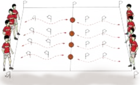

> **Deskripsi Visual:** Gambar ini adalah ilustrasi yang menunjukkan struktur atom. Ilustrasi ini memperlihatkan beberapa elemen utama yang terkait dengan struktur atom:

1. **Apa yang Ditampilkan Secara Keseluruhan**: Gambar ini menunjukkan struktur atom yang terdiri dari beberapa lapisan atau orbitel elektron. Ada beberapa orbitel yang berbeda, masing-masing dengan jumlah elektron yang berbeda.

2. **Elemen-Elemen Utama dan Relasinya**: 
   - **Orbitel**: Terdapat beberapa orbitel yang berbeda, seperti orbitel p, d, f, dll.
   - **Elektron**: Setiap orbitel memiliki jumlah elektron tertentu.
   - **Lapisan**: Orbitel- orbitel tersebut terletak pada lapisan yang berbeda.

3. **Teks, Angka, atau Label Penting yang Terlihat**: 
   - **Angka**: Angka-angka di sekitar orbitel menunjukkan jumlah elektron dalam orbitel tersebut.
   - **Label**: Label "p", "d", "f" digunakan untuk menunjukkan jenis orbitel.

4. **Informasi Kunci yang Dapat Diambil Pembaca**: 
   - Struktur atom terdiri dari beberapa orbitel elektron yang berbeda.
   - Jumlah elektron dalam setiap orbitel berbeda-beda.
   - Orbitel- orbitel tersebut terletak pada lapisan yang berbeda.

Dengan melihat gambar ini, pembaca dapat memahami bagaimana struktur atom terdiri dari orbitel elektron yang berbeda dan jumlah elektron yang berbeda dalam setiap orbitel.

 

---
## 📄 Halaman 56

- Menembak bola basket bergerak maju, mundur, dan menyamping, dilakukan berpasangan atau berkelompok, untuk menanamkan nilai-nilai kerjasama, keberanian, dan sportivitas.

---
**🖼️ Gambar/Diagram**

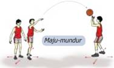

> **Deskripsi Visual:** Gambar ini adalah ilustrasi yang menunjukkan dua orang pemain sepak bola sedang bermain. Pemain di sebelah kiri sedang berusaha mencuri bola dari pemain di sebelah kanan. Pemain di sebelah kanan sedang memegang bola dan menunjukkan tangan untuk menghentikan pemain di sebelah kiri. Di bagian atas gambar ada teks "Maju-mundur" yang menunjukkan arah pergerakan bola. Gambar ini menunjukkan konsep maju mundur dalam sepak bola, dimana pemain harus bergerak maju untuk mencoba mencuri bola dari lawannya.

### 2.  Shooting bola basket pada formasi berbanjar

- Berdiri dengan membentuk pormasi berbanjar.
- Setelah  melakukan shooting bergerak  lari  pindah  tempat  ke barisan belakang pada barisan di hadapannya.
- Latihan  ini  dilakukan  berpasangan  atau  berkelompok,  untuk menanamkan nilai-nilai kerjasama, keberanian, dan sportivitas.

### 3. Shooting bola basket pada formasi berbanjar dari arah depan ring basket

- Berbaris satu banjar menghadap ring basket dengan jarak ± 3 m.
- Kelompok di depan ring basket yang melakukan shooting dan yang ada di belakang yang mengambil bola dan mengopernya ke kelompok di depan ring.
- Setelah melakukan shooting dan mengoper bola, bergerak lari pindah tempat (yang melakukan shooting pindah ke belakang ring dan yang mengoper ke depan ring).

 

---
## 📄 Halaman 57

Latihan ini dilakukan berkelompok, untuk menanamkan nilainilai kerjasama, keberanian, sportivitas.

---
**🖼️ Gambar/Diagram**

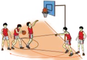

> **Deskripsi Visual:** Gambar ini adalah ilustrasi yang menunjukkan sebuah pertandingan bola basket antara dua tim. Gambar ini menggambarkan dua tim bermain di lapangan basket dengan pemain yang sedang bergerak dan bereaksi terhadap bola yang dimainkan. Pemain-pemain tersebut dikenali oleh pakaian mereka yang berbeda-beda, yang menunjukkan bahwa mereka berasal dari tim berbeda. Di sekitar lapangan, terdapat penonton yang sedang menyaksikan pertandingan. Ilustrasi ini menunjukkan aktivitas fisik dan kompetisi yang terjadi dalam olahraga basket.

- Bermain  bola  basket  menggunakan  satu  lapangan  dan  dibagi dua bidang, yakni bidang A lapangan untuk tim A dan bidang B lapangan untuk tim B
Pelaksanaannya:

- Bentuk dua kelompok.
- Tim  A  menempatkan  pemainnya  di  lapangan  B  sebanyak  2 orang  pemain,  begitu  juga  tim  B  menempatkan  2  pemain  di lapangan A.
- Para pemain boleh menggiring, melempar, dan menembak.
- Saat menggiring bola, pemain yang berada pada lapangan A dan B tidak boleh melewati garis tengah.
- Jadi  yang  berhak  melakukan  serangan  pada  lapangan  lawan hanya 2 orang pemain.
- Tim  pemenang  adalah  tim  yang  dapat  memasukkan  bola  ke ring basket lebih banyak.
- Lama permainan 5-10 menit.
Latihan untuk menanamkan nilai-nilai kerjasama, keberanian, dan sportivitas.

 

---
## 📄 Halaman 58

---
**🖼️ Gambar/Diagram**

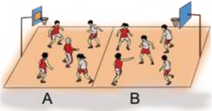

> **Deskripsi Visual:** Gambar ini adalah ilustrasi yang menunjukkan pertandingan bola basket antara dua tim. Gambar ini menggambarkan dua tim bermain di lapangan basket dengan pemain yang sedang bergerak dan bereaksi terhadap bola. Pemain-pemain tersebut dikenali oleh warna jersey mereka, yang mencerminkan tim mana mereka bermain. Lapangan basket tampak jelas dengan garis-garis yang menunjukkan area permainan. Ilustrasi ini menunjukkan aktivitas fisik dan kompetisi yang terjadi dalam pertandingan bola basket.

- Pembelajaran  variasi  dan  kombinasi  keterampilan  dasar lay-up shoot, dengan konsisten dan tepat dalam berbagai situasi.
Model pembelajarannya sebagai berikut :

- Lay-up shoot
- Berdiri menghadap rekan di depan  dengan jarak ± 5 m.
- Melangkah dua langkah sambil melempar dan mengumpan
ke arah ring bola basket. Siswa yang

telah melakukan lay-up shoot

bergerak berpindah tempat ke barisan

menangkap bola. Latihan

ini dilakukan berpasangan

---
**🖼️ Gambar/Diagram**

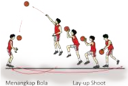

> **Deskripsi Visual:** Gambar ini adalah ilustrasi yang menunjukkan teknik lay-up shoot dalam bola basket. Gambar ini menggambarkan dua pemain basket yang sedang bermain. Pemain pertama sedang mencoba memukul bola ke arah pemain kedua menggunakan tangan kanannya. Pemain kedua sedang berdiri dengan posisi yang menantang, menunggu bola untuk bisa melakukan lay-up shoot. Ilustrasi ini menunjukkan langkah-langkah dasar dalam melakukan lay-up shoot, yaitu mencoba memukul bola ke arah pemain lawan menggunakan tangan kanan dan menunggu bola untuk bisa melakukan lay-up shoot. Ini adalah teknik yang sering digunakan oleh pemain basket untuk mencetak poin.

atau kelompok. Untuk menanamkan nilai-nilai kerjasama, keberanian, dan sportivitas.

- Lay-up shoot diawali menggiring bola
- Berdiri berhadapan dengan jarak ± 5 m.

 

---
## 📄 Halaman 59

- lakukan Keterampilan lay-up shoot siswa yang telah melakukan lay-
up shoot bergerak berpindah tempat ke barisan menangkap bola. Latihan ini dilakukan berpasangan atau kelompok. Untuk menanamkan nilainilai kerjasama, keberanian, dan sportivitas.

---
**🖼️ Gambar/Diagram**

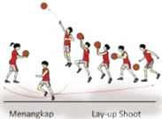

> **Deskripsi Visual:** Gambar ini adalah ilustrasi yang menunjukkan teknik lay-up dalam bola basket. Gambar ini menggambarkan sekelompok pemain basket bermain di lapangan. Pemain di tengah melakukan lay-up, sementara pemain lainnya berdiri di sekitarnya, menunggu peluang untuk bertindak. Ilustrasi ini mencerminkan posisi dan gerakan pemain saat melakukan lay-up, serta posisi mereka di lapangan. Teks pada gambar tidak ada, namun elemen-elemen seperti pemain, bola, dan posisi mereka di lapangan sangat jelas. Informasi kunci yang dapat diambil dari gambar ini adalah bagaimana teknik lay-up dalam bola basket dan posisi pemain saat melakukan lay-up.

### f.  Pembelajaran bermain bola basket dengan peraturan yang dimodifikasi

- Bentuk  peserta  didik  menjadi  dua  regu  bermain  bola  basket menggunakan setengah lapangan. Jumlah pemain adalah 3 lawan 2 dilanjutkan dengan 4 lawan 3 atau 5 lawan 4.
- 3 pemain penyerang dan 2 pemain bertahan.
- 4 pemain penyerang dan 3 pemain bertahan.
- 5  pemain penyerang dan 4 pemain bertahan.
- Setiap pemain berusaha memasukan bola ke ring basket, dengan
keterampilan dasar yang telah dipelajarinya.

- Regu yang menang adalah regu yang paling banyak memasukan bola ke ring basket dengan keterampilan yang benar.

---
**🖼️ Gambar/Diagram**

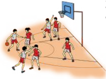

> **Deskripsi Visual:** Gambar ini adalah ilustrasi yang menunjukkan sebuah pertandingan bola basket antara dua tim. Gambar ini menggambarkan beberapa pemain yang sedang bermain di lapangan basket. Pemain-pemain tersebut terlihat bergerak aktif, dengan beberapa pemain sedang berusaha mencuri bola dan memposisikan diri untuk menyerang atau menyerang. Di sebelah kanan, terdapat papan basket yang tampak siap digunakan untuk melakukan pengecekan skor. Gambar ini menunjukkan hubungan antara pemain-pemain, bola, dan papan basket dalam konteks pertandingan bola basket. Teks, angka, atau label penting tidak terlihat dalam gambar ini. Informasi kunci yang dapat diambil pembaca adalah bahwa ini adalah pertandingan bola basket antara dua tim, dengan pemain-pemain yang aktif dan papan basket yang siap digunakan.

Latihan dilakukan berpasangan atau berkelompok untuk menanamkan nilai-nilai kerjasama, keberanian, dan sportivitas.

 

---
## 📄 Halaman 60

FIFA adalah organisasi sepak bola yang diakui secara Internasional. Permainan sepak bola dimainkan dalam dua babak (2 x 45 menit) dengan waktu istirahat 10 menit di antara dua babak tersebut.

Variasi dan kombinasi keterampilan teknik permainan sepak bola (mengumpan,  mengontrol,  menggiring,  posisi,  dan  menembak bola ke gawang).

FIVB adalah organisasi bola voli Internasional. Pada tahun 1895, William  C  Morgan  menciptakan  sebuah  permainan  bernama mintonette. Sebuah tim terdiri dari 6 orang pemain dilapangan selama pertandingan. Suatu regu tidak boleh beranggotakan lebih dari 12 orang pemain. Variasi dan kombinasi keterampilan gerak dasar permainan bola voli ( passing bawah, passing atas, servis, dan smash ).

FIBA  adalah  organisasi  bola  basket  Internasional,  Pada  tahun 1891 James Naismith dapat memenuhi kehendak dari L.H. Gulick untuk membuat suatu permainan dengan nama 'basket-ball' dan dalam bahasa Indonesia diterjemahkan permainan bola basket.

Variasi dan kombinasi keterampilan gerak permainan bola basket diantaranya adalah melempar, menangkap  menggiring, dan menembak ke ring basket.

Bola basket masuk di Indonesia setelah perang dunia ke-II dibawa oleh  perantau-perantau  Cina  dan  berkembang  dengan  cepat sehingga  pada  PON  ke  I  tahun  1948  di  Surakarta,  bola  basket telah  dicantumkan  dalam  acara  resmi.  Persatuan  Basket-Ball seluruh  Indonesia  (PERBASI)  berdiri  pada  tanggal  23  Oktober 1951,  kemudian  diubah  menjadi  persatuan  bola  basket  seluruh Indonesia dengan singkatan tetap PERBASI.

### P.  Penilaian Pembelajaran Permainan Bola Besar

### 1.  Contoh penilaian spiritual dan sosial (KI-1 dan 2)

Petunjuk Penilaian

Penilaian Aspek Sosial dan Aspek Spiritual dilakukan dengan pengamatan selama mengikuti kegiatan belajar mengajar.

 

---
## 📄 Halaman 61

Berikan tanda centang (  )  pada kolom yang sudah disediakan, setiap peserta didik menunjukkan atau menampilkan perilaku yang diharapkan. Tiap perilaku yang dicentang (  ) menggunakan rentang skor antara 1 sampai dengan 4.

---
**📊 Tabel**

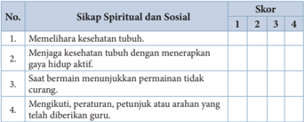

Tabel ini menunjukkan skor spiritual dan sosial berdasarkan sikap-sikap tertentu. Topik utamanya adalah tentang sikap yang positif dan bermanfaat bagi kesehatan mental dan fisik seseorang. Kolom "Sikap Spiritual dan Sosial" mencakup empat poin utama: memelihara kesehatan tubuh, menjaga kesehatan tubuh dengan gaya hidup aktif, saat bermain menunjukkan perilaku tidak curang, dan mengikuti, peraturan, petunjuk atau arahan yang telah diberikan guru. Skor ditentukan melalui penilaian dari 1 hingga 4, di mana 1 adalah skor rendah dan 4 adalah skor tinggi. Data penting yang terlihat adalah bahwa semua poin memiliki skor 3 atau 4, menunjukkan bahwa sikap-sikap tersebut dianggap sangat positif dan bermanfaat oleh individu yang mengisi tabel ini.

### 2.  Contoh Penilaian kognitif (KI- 3)

Setelah mempelajari materipermainan bola besar, berikan tugas kepada peserta didik untuk mengerjakan tugas kelompok di bawah ini dengan penuh  rasa  tanggung  jawab.  Tugas  kelompok  ini  dapat  dikerjakan  di rumah dan dikumpulkan dalam bentuk portofolio!

Butir Soal Pengetahuan

### Pemahaman konsep gerak dalam permainan sepak bola

Setelah  mempelajari  materi  permainan  sepak  bola,  tugaskan  kepada peserta didik untuk mengerjakan tugas kelompok di bawah ini dengan penuh  rasa  tanggung  jawab.  Tugas  kelompok  ini  dapat  dikerjakan  di rumah dan dikumpulkan dalam bentuk portofolio!

- Deskripsikanlah 2 variasi keterampilan menendang!
- Deskripsikanlah 2 variasi keterampilan menghentikan bola!
- Deskripsikanlah 2 varisai keterampilan menggiring bola!
- Deskripsikanlah 2 varisai keterimpilan  menembak ke gawang!
- Deskripsikanlah 2 kombinasi gerak dalam permainan sepak bola!

### Rubrik Penilaian:

Setiap butir soal yang benar mendapatkan nilai 20.

 

---
## 📄 Halaman 62

### Pemahaman konsep gerak dalam permainan bola voli

Setelah  mempelajari  materi  permainan  bola  voli,  tugaskan  kepada peserta didik untuk mengerjakan tugas kelompok di bawah ini dengan penuh  rasa  tanggung  jawab.  Tugas  kelompok  ini  dapat  dikerjakan  di rumah dan dikumpulkan dalam bentuk portofolio!

- Deskripsikanlah 2 variasi passing permainan bola voli!
- Deskripsikanlah 2 variasi smash dalam permainan bola voli!

### Rubrik Penilaian:

Setiap butir soal yang benar mendapatkan nilai 50

### Pemahaman konsep gerak dalam permainan bola basket

Setelah  mempelajari  materi  permainan  bola  basket,  tugaskan  kepada peserta didik untuk mengerjakan tugas kelompok di bawah ini dengan penuh  rasa  tanggung  jawab.  Tugas  kelompok  ini  dapat  dikerjakan  di rumah dan dikumpulkan dalam bentuk portofolio!

- Deskripsikanlah 2 variasi keterampilan melemparkan bola basket!
- Deskripsikanlah 2 variasi keterampilan menangkap bola basket!
- Deskripsikanlah 2 varisai keterampilan menggiring bola basket!
- Deskripsikanlah 2 varisai keterampilan  menembak ke ring basket!
- Deskripsikanlah 2 kombinasi gerak dalam permainan bola basket!

### 3.  Contoh Penilaian Keterampilan  (KI- 4)

### TES  KINERJA  KETERAMPILAN  DASAR  PERMAINAN  SEPAKBOLA

Setelah  mempelajari  materi  permainan  sepak  bola,  tugaskan  kepada peserta  didik  untuk  melakukan  keterampilan  variasi  keterampilan mengumpan,  menghentikan, menggiring, shooting , dan bermain!

 

---
## 📄 Halaman 63

---
**📊 Tabel**

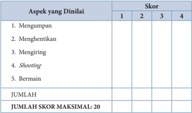

Tabel ini menunjukkan skor untuk berbagai aspek dalam sebuah ujian atau penilaian. Topik utamanya adalah "Aspek yang Dinaliai" dengan 5 poin yang harus dinyatakan dalam skor: Mengumpan, Menghentikan, Mengiring, Shooting, dan Bermain. Setiap aspek memiliki 4 pilihan skor (1, 2, 3, dan 4), dan jumlah skor maksimal adalah 20. Pola penting yang terlihat adalah bahwa setiap aspek memiliki 4 pilihan skor yang sama, dan jumlah total skor yang dapat diperoleh adalah 20.

### Keterangan:

- Skor 4 : bila posisi berdiri benar, perkenaan bola dengan kaki tepat, kaki tumpu tepat, dan jalannya bola baik
- Skor 3 : bila menguasai 3 komponen gerak
- Skor 2 : bila menguasai 2 komponen gerak
- Skor 1 : bila menguasai 1 komponen gerak

### Tes contoh kinerja keterampilan dasar permainan bola voli

Setelah  mempelajari  materi  permainan  bola  voli,  tugaskan  kepada peserta  didik  untuk  melakukan  keterampilan  variasi  dan  kombinasi keterampilan dasar passing atas, bawah dan smash .

 

---
## 📄 Halaman 64

---
**📊 Tabel**

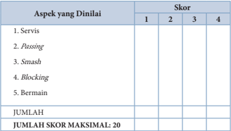

Tabel ini menunjukkan skor yang diberikan untuk berbagai aspek dalam suatu kegiatan olahraga, mungkin sepak bola. Topik utamanya adalah aspek-aspek yang dinilai dalam sebuah pertandingan. Kolom-kolomnya mencakup servis, passing, smash, blocking, dan bermain. Setiap aspek memiliki skor yang dapat diberikan dengan nilai 1 hingga 4. Untuk setiap aspek, terdapat kotak kosong di mana penilaian dapat dicatat. Selain itu, tabel juga memberikan informasi tentang jumlah skor maksimal yang dapat diperoleh, yaitu 20 poin. Pola penting yang terlihat adalah bahwa setiap aspek memiliki skor yang berbeda-beda, dan total skor semua aspek harus mencapai 20 poin.

### Keterangan:

Skor 4 :  bila posisi berdiri benar, perkenaan bola dengan tangan, kaki tumpu tepat, dan jalannya bola baik.

Skor 3 :  bila menguasai 3 komponen gerak.

Skor 2 :  bila menguasai 2 komponen gerak.

Skor 1 :  bila menguasai 1 komponen gerak.

 

---
## 📄 Halaman 65

### Q.  Remedial dan Pengayaan

### 1.  Contoh Instrumen Remedial

Remedial dilakukan apabila setelah diadakan penilaian pada kompetensi yang telah diajarkan pada peserta didik, nilai yang dicapai tidak  memenuhi  KB  (Kelulusan  Belajar)  yang  telah  ditentukan, berikut contoh formatnya: remedial terhadap tiga peserta didik.

---
**📊 Tabel**

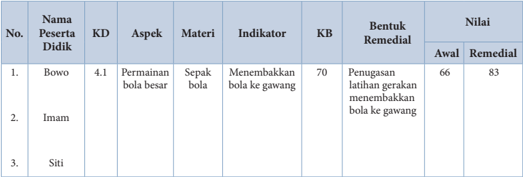

Tabel ini menunjukkan data tentang perkembangan kemampuan bermain sepak bola di dua peserta didik, Bowo dan Imam, serta satu peserta didik lainnya, Siti. Topik utama tabel adalah perkembangan kemampuan bermain sepak bola melalui latihan gerakan menembakkan bola ke gawang. Kolom-kolom yang ada dalam tabel meliputi nomor urut (No.), nama peserta didik, aspek pembelajaran (KD), materi pembelajaran, indikator pembelajaran, keterampilan bermain (KB), bentuk remedial, dan nilai awal serta nilai remedial. Data penting yang terlihat adalah bahwa Bowo memiliki peningkatan nilai dari 66 menjadi 83 setelah melalui latihan gerakan menembakkan bola ke gawang. Sementara itu, Imam tidak memiliki data nilai awal dan nilai remedial karena tidak ada data tersebut dalam tabel.

 

---
## 📄 Halaman 66

### 2.  Contoh Format Pengayaan

Pengayaan    dilakukan  apabila  setelah  diadakan  penilaian  pada kompetensi  yang  telah  diajarkan  pada  peserta  didik,  nilai    yang dicapai  melampaui  KB  (Kelulusan  Belajar)  yang  telah  ditentukan, berikut contoh formatnya : pengayaan terhadap enam peserta didik.

 

---
## 📄 Halaman 67

### R.  Contoh Format Penilaian Kemajuan Belajar Siswa (Nilai Harian)

---
**📊 Tabel**

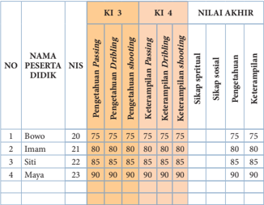

Tabel ini menunjukkan hasil evaluasi keterampilan berbagai siswa dalam dua mata pelajaran: KI 3 dan KI 4. Topik utama tabel adalah penilaian keterampilan siswa dalam dua mata pelajaran tersebut. Kolom-kolom yang ada meliputi nomor peserta didik, NIS (Nomor Induk Siswa), dan nilai akhir. Data penting yang terlihat adalah bahwa semua siswa memiliki nilai yang sama untuk KI 3 dan KI 4, yaitu 75 dan 80 masing-masing. Ini menunjukkan bahwa tidak ada perbedaan signifikan antara keterampilan mereka dalam kedua mata pelajaran tersebut. Namun, ada perbedaan dalam skor akhir, dengan nilai akhir yang lebih tinggi untuk KI 4 dibandingkan dengan KI 3.

 

---
## 📄 Halaman 68

### BAB II

### PERMAINAN BOLA KECIL

### A.  Standar Kompetensi Lulusan

### KOMPETENSI LULUSAN SMA/MA/SMK/MAK/SMALB/Paket C

---
**📊 Tabel**

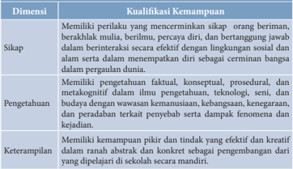

Tabel ini menunjukkan kualifikasi kemandirian siswa dalam berbagai dimensi, yaitu sikap, pengetahuan, dan keterampilan. Dimensi pertama, sikap, meliputi memiliki perilaku yang mencerminkan sikap orang beriman, berkahalau mulia, berlimbah, percaya diri, dan bertanggung jawab dalam berinteraksi secara efektif dengan lingkungan sosial dan alam sekitar. Dimensi kedua, pengetahuan, meliputi memiliki pengetahuan faktil, konseptual, prosedural, dan metakognitif dalam ilmu pengetahuan, teknologi, seni, dan budaya dengan wawasan kemanusiaan, kebangsaan, keagamaan, dan peradaban terkait penyebab atau dampak fenomena kejadian. Dimensi ketiga, keterampilan, meliputi memiliki kemampuan pikiran dan tindakan yang efektif dan kreatif dalam ranah abstrak dan konkrit sebagai pengembangan dari diajeli di sekolah secara mandiri. Topik utama tabel ini adalah kualifikasi kemandirian siswa dalam berbagai aspek kehidupan. Kolom-kolom yang ada adalah sikap, pengetahuan, dan keterampilan. Data atau pola penting yang terlihat adalah bahwa kualifikasi kemandirian siswa meliputi berbagai aspek seperti sikap, pengetahuan, dan keterampilan.

 

---
## 📄 Halaman 69

---
**📊 Tabel**

Tabel ini berisi informasi tentang kompetensi inti dan sikap spiritual dalam konteks pendidikan. Topik utamanya adalah tentang bagaimana siswa menghargai dan mengamalkan ajaran agama yang dianutnya, serta menghargai dan mengamalkan perilaku jujur, disiplin, tanggung jawab, peduli, responsif, dan pro-aktif dalam berinteraksi dengan lingkungan sosial dan alam. Kolom pertama menyajikan kompetensi inti 1, yang berkaitan dengan sikap spiritual, sementara kolom kedua menyajikan kompetensi inti 2, yang juga berkaitan dengan sikap spiritual. Data penting yang terlihat adalah bahwa siswa diharapkan untuk menghargai dan mengamalkan ajaran agama, serta menghargai dan mengamalkan perilaku jujur, disiplin, tanggung jawab, peduli, responsif, dan pro-aktif dalam berinteraksi dengan lingkungan sosial dan alam.

### Keterangan:

- Pembelajaran  Sikap  Spiritual  dan  Sikap  Sosial  dilaksanakan  secara tidak  langsung    ( indirect  teaching )  melalui  keteladanan,  ekosistem pendidikan, dan proses pembelajaran Pengetahuan dan Keterampilan.
- Evaluasi terhadap Sikap Spiritual dan Sikap Sosial dilakukan sepanjang  proses  pembelajaran  berlangsung,  dan  berfungsi  untuk mengembangkan karakter peserta didik lebih lanjut.
- Guru  mengembangkan  Sikap  Spiritual  dan  Sikap  Sosial  dengan memperhatikan karakteristik, kebutuhan, dan kondisi peserta didik.

 

---
## 📄 Halaman 70

C.

---
**📊 Tabel**

Tabel ini memperlihatkan dua kompetensi inti: Kompetensi Inti 3 (Pengenatan) dan Kompetensi Inti 4 (Keterampilan). Kompetensi Inti 3 fokus pada pemahaman dan analisis pengetahuan faktil, konseptual, dan prosedural berdasarkan rincian tahunan tentang ilmu pengetahuan, teknologi, seni, budaya, dan humaniora dengan wawasan kemanusiaan, kebangsaan, keneragaman, dan peradaban terkait penyebab fenomena dan kejadian. Sementara itu, Kompetensi Inti 4 menekankan pada pengolahan, menalar, dan menyajikan pengetahuan dalam ranah konkret dan ranah abstrak terkait dengan pengembangan di sekolah secara mandiri dan mampu menggunakan metode sesuai kaidah keilmuan. Data penting yang terlihat adalah bahwa kedua kompetensi ini mencakup aspek pemahaman, analisis, dan penalaran pengetahuan, serta keterampilan dalam mengolah dan menyajikan pengetahuan.

### Kompetensi Dasar dan Indikator Pencapaian Kompetensi

---
**📊 Tabel**

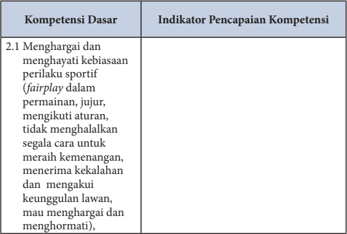

Tabel ini berisi informasi tentang kompetensi dasar yang harus dipenuhi oleh individu dalam konteks olahraga. Topik utamanya adalah "Menghargai dan menghakimi kebiasaan perilaku sportif (fairplay)". Dalam tabel ini, ada dua kolom utama: "Kompetensi Dasar" dan "Indikator Pencapaian Kompetensi". Kolom "Kompetensi Dasar" menyajikan deskripsi umum tentang apa yang dimaksud dengan "fairplay" dalam konteks olahraga, yaitu tidak menghalangi orang lain untuk meraih kemenangan, menerima kekalahan, mengakui keunggulan lawan, dan menghargai dan menghormati mereka. Sementara itu, kolom "Indikator Pencapaian Kompetensi" memberikan contoh atau tindakan konkret yang dapat dilakukan untuk memenuhi standar tersebut, seperti menghargai keberhasilan orang lain, menerima kekalahan dengan sopan, mengakui keunggulan lawan, dan menghormati dan menghargai mereka. Pola penting yang terlihat adalah bahwa tabel ini mencakup berbagai aspek dari fairplay dalam olahraga, mulai dari menghargai keberhasilan orang lain hingga menghormati dan menghakimi kebiasaan perilaku yang positif dalam konteks olahraga.

 

---
## 📄 Halaman 71

---
**📊 Tabel**

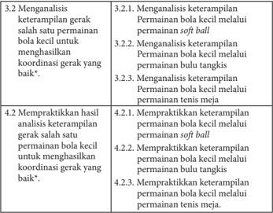

Tabel ini berisi instruksi untuk mengembangkan keterampilan gerak dalam berbagai permainan bola kecil, seperti soft ball, bulu tangkis, dan tenis meja. Topik utama adalah analisis dan praktikasi keterampilan gerak dalam permainan tersebut. Kolom pertama menunjukkan langkah-langkah analisis keterampilan, sementara kolom kedua menunjukkan langkah-langkah praktikasi keterampilan tersebut. Data penting yang terlihat adalah bahwa setiap permainan memiliki langkah-langkah analisis dan praktik yang berbeda, yang mencakup analisis keterampilan melalui permainan, kemudian praktik keterampilan melalui permainan yang sama, dan akhirnya praktik keterampilan melalui permainan yang berbeda. Ini menunjukkan bahwa pembelajaran harus dilakukan secara bertahap dan melibatkan berbagai jenis permainan untuk memperluas pemahaman dan keterampilan.

### D.  Permainan  Bola  Kecil  Menggunakan  Permainan Softball, Bulu Tangkis, dan Tenis Meja

### Tujuan Pembelajaran

Setelah pembelajaran berakhir peserta didik dapat:

- Memelihara kesehatan tubuh.
- Menjaga kesehatan tubuh dengan menerapkan gaya hidup aktif.
- Menunjukkan permainan tidak curang.
- Merapihkan kembali peralatan yang telah digunakan pada tempatnya.
- Tidak melakukan gerakan yang dapat membahayakan diri sendiri dan orang lain.
- Melakukan aktivitas fisik yang dilakukan secara berkelompok, beregu, dan berpasangan dengan  memperhatikan kondisi teman, baik fisik atau psikis.
- Mampu saling membantu teman bila ada kesulitan dalam melakukan gerakan dalam permainan bola kecil.

 

---
## 📄 Halaman 72

- Melakukan  permainan  bola  kecil  dengan  tidak  menguasi  alat  atau lapangan sendiri.
- Mengikuti,  peraturan,  petunjuk  atau  arahan  yang  telah  diberikan guru.
- Menunjukkan perilaku bahwa lawan merupakan teman bermain.

### Permainan bola kecil melalui permainan softball

- Menganalisis dan mempraktikkan variasi keterampilan gerak dasar melempar dengan baik.
- Menganalisis dan mempraktikkan variasi keterampilan gerak dasar menangkap dengan baik.
- Menganalisis dan mempraktikkan variasi keterampilan gerak dasar berlari ke base dengan baik.
- Menganalisis dan mempraktikkan variasi keterampilan gerak dasar memukul bola menggunakan tongkat pemukul dengan baik.
- Menganalisis  dan  mempraktikkan  kombinasi  keterampilan  gerak dasar menangkap dan melempar dengan baik.
- Menganalisis  dan  mempraktikkan  kombinasi  keterampilan  gerak dasar memukul dan berlari ke base dengan baik.

### Permainan bola kecil melalui permainan bulu tangkis

- Menganalisis dan mempraktikkan variasi gerak dasar pegangan raket dengan baik.
- Menganalisis  dan  mempraktikkan  variasi  gerak  dasar footwork dengan baik.
- Menganalisis dan mempraktikkan variasi gerak dasar posisi berdiri dengan baik.
- Menganalisis dan mempraktikkan variasi gerak dasar service dengan baik.
- Menganalisis dan mempraktikkan variasi gerak dasar pukulan atas, dan pukulan bawah dengan baik.

 

---
## 📄 Halaman 73

### Permainan bola kecil melalui permainan Tenismeja

- Menganalisis  dan  mempraktikkan  variasi  keterampilan  gerak  dasar memegang bet dengan baik.
- Menganalisis  dan  mempraktikkan  variasi  keterampilan  gerak  dasar pukulan forehand dengan baik.
- Menganalisis  dan  mempraktikkan  variasi  keterampilan  gerak  dasar backhand dengan baik.
- Menganalisis  dan  mempraktikkan  variasi  keterampilan  gerak  dasar servis dengan baik.
- Menganalisis  dan  mempraktikkan  variasi  keterampilan  gerak  dasar smash dengan baik.

### E.  Kegiatan Pembelajaran

### 1.  Kegiatan pendahuluan

Berbaris, berdoa, presensi, apersepsi dan pemanasan.

Memberikan motivasi dan menjelaskan tujuan pembelajaran Pendidikan Jasmani Olahraga dan Kesehatan dengan melalui permainan bola kecil.

### 2.  Kegiatan inti

Kegiatan inti merupakan penerapan secara operasional model/ pendekatan/metode/gaya yang dipilih sesuai dengan kompetensi dasar dan karakteristik siswa.

### 3.  Penutup

Pendinginan, berbaris,  tugas-tugas,  refleksi,  evaluasi  proses  pembelajaran, dan berdoa.

### F.  Metode Pembelajaran

- Inclusive (cakupan)
- Demonstrasi
- Part and whole (bagian dan keseluruhan)
- Resiprocal (timbal-balik)
- Pendekatan pembelajaran kontekstual
- Pendekatan Scientific

 

---
## 📄 Halaman 74

### G.  Media Pembelajaran

### 1.  Media

- Gambar :  gerakan permainan bola kecil
- Model : peragaan oleh guru atau peserta didik yang sudah
memiliki kemampuam permainan so ftball atau bulu tangkis atau tenis meja.

### 2.  Alat dan bahan

Alat yang dapat digunakan pada permainan bola kecil:

### Softball

- Ruang terbuka yang datar dan aman
- Tongkat pemukul
- Bola softball

### Bulu tangkis

- Lapangan bulu tangkis
- Raket
- Shutlekock

### Tenis meja

- Meja tenis
- Bet
- Bola tenis meja
- Cons/corong  ± 10 buah
- Stopwatch

### H.  Materi Pembelajaran

Pembelajaran permainan bola kecil merupakan alat pembelajaran Pendidikan  Jasmani  Olahraga  dan  Kesehatan,  juga  merupakan  upaya mempelajari manusia.

Permainan bola kecil melalui permainan softball: gerak dasar melempar, menangkap, berlari ke base , memukul  bola menggunakan tongkat pemukul.  Permainan  bola  kecil  melalui  permainan  bulu  tangkis:  gerak

 

---
## 📄 Halaman 75

dasar pegangan raket, footwork,  posisi berdiri, service, pukulan atas, dan pukulan bawah. Permainan bola kecil melalui permainan Tenis meja: gerak dasar memegang bet, pukulan forehand , backhand , servis, dan smash .

Kegiatan  pembelajaran  Pendidikan  Jasmani,  Olahraga  dan  Kesehatan memiliki  ke  khususan,  oleh  karenanya  beberapa  hal  perlu  diperhatikan, yakni:

### 1.  Kegiatan awal

- Peserta didik harus memakai pakaian olahraga
- Di dahului dengan berdoa
- Melakukan pemanasan sesuai dengan materi so ftball,  bulu  tangkis, tenis meja yang akan dipelajari

### 2.  Kegiatan Inti

- Pembelajaran permaianan bola kecil softball atau  bulu  tangkis  atau tenis meja disesuaikan dengan situasi dan kondisi.
- Lakukan  kegiatan  pembelajaran  permaianan  bola  kecil  dari  yang mudah ke yang sulit, dari yang sederhana ke yang rumit serta dari yang ringan ke yang berat.
- Keterampilan gerak  (psikomotor),  sikap  (afektif)  dan  pengetahuan (kognitif)  adalah  kemampuan  yang  dimiliki  peserta  didik  selain kebugaran jasmani dan budaya hidup sehat.
- Lakukan setiap pembelajaran secara berkelompok, berpasangan atau individual.

### 3.  Kegiatan akhir:

- Pendinginan
- Evaluasi
- Berdoa

### I. Contoh Penerapan Pendekatan Saintifik dalam Pengembangan Pengetahuan dan Keterampilan Permainan Bola Kecil Melalui Permainan Softball

- Meminta  salah  satu  pesera  didik  yang  dikategorikan  mampu  untuk memperagakan  gerak  atau  contoh  dari  guru;  melihat  tayangan  dan peserta didik yang lain mengamatinya.

 

---
## 📄 Halaman 76

- Memotivasi peserta didik untuk bertanya, dengan cara guru mengajukan beberapa pertanyaan yang berkaitan dengan keterampilan gerak. Bagaimana  hasil  pukulan  jika  saat  memukul  bola  kedua  kaki  rapat? Apakah kelebaran jarak kedua kaki mempengaruhi hasil pukulan bola? Apakah jarak ayunan tangan mempengaruhi jalannya bola? Bagaimana jalannya bola bila merubah posisi togok saat melempar bola?
- Menemukan jawaban atas pertanyaan di atas melalui kegiatan eksplorasi gerak secara individual, berpasangan atau berkelompok dengan menunjukkan sikap kerjasama dan disiplin sehingga ditemukan gerak yang efektif dan efesien sesuai kebutuhan masing-masing peserta didik.
- Menemukan hubungan keterampilan gerak.
- Menerapkan berbagai keterampilan gerak permainan bola kecil melalui permainan so ftball dalam bermain secara beregu dengan menunjukkan sikap kerjasama, disiplin, dan sportivitas.
Setiap keterampilan gerak permainan softball, seperti melempar, menangkap, memukul bola dan berlari ke base dikembangkan dengan cara seperti di atas.

### J. Aktivitas Pembelajaran Permainan Bola Kecil Melalui Permainan Softball

Aktivitas  pembelajaran softball dilakukan  dengan  bermain;  latihan  dan bermain, kegiatan latihan sebagai berikut :

### 1.  Melempar dan menangkap bola

Melempar bola dengan mengayunkan tangan kanan, bersamaan dengan melangkahkan  kaki  ke  depan  beserta  badan  ikut  menghantarkan bola. Teknik menangkap bola berdiri dengan posisi kaki selebar bahu pandangan lurus ke arah datangnya bola, bola ditangkap tangan yang memakai glove  lalu  di  pindahkan  ke  tangan  kanan  untuk  melempar, kegiatan pembelajaran dapat dilakukan sebagai berikut:

- Peserta didik membentuk barisan bersyaf.
- Berdiri saling berhadapan dengan jarak ±10 m.
- Bola  dilemparkan kearah teman dihadapan, selesai melempar bola menuju barisan belakang.

 

---
## 📄 Halaman 77

- Bola ditangkap, kemudian lemparkan kearah teman dihadapan, lalu menuju barisan belakang.
- Latihan ini dilakukan secara berpasangan/berkelompok.
- Latihan ini dilakukan di tempat, dilanjutkan dengan bergerak majumundur, dan bergerak ke kanan dan kiri.
- Lakukan keterampilan gerak untuk menemukan jawaban pertanyaan.
- Selama  melakukan  latihan  kembangkan  nilai-nilai  kerjasama  dan disiplin.
- Setelah  peserta  didik  merasakan  kemajuan  keterampilan,  minta mereka  untuk  menerapkan  keterampilan  tersebut  dalam  bentuk pertandingan secara beregu.
Latihan dilakukan berulang-ulang dan bergantian untuk menanamkan nilai-nilai kerjasama, keberanian, sportivitas, dan kompetitif.

Kegiatan pembelajaran yang lainnya disesuaikan.

---
**🖼️ Gambar/Diagram**

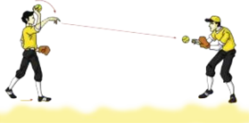

> **Deskripsi Visual:** Gambar ini adalah ilustrasi yang menunjukkan dua orang yang sedang bermain sepak bola. Ilustrasi ini menggambarkan dua pemain sepak bola yang sedang bergerak untuk mencoba memukul bola ke arah lawan mereka. Pemain yang berada di sebelah kiri tampak sedang berusaha memukul bola dengan tangannya, sementara pemain di sebelah kanan tampak sedang berdiri dengan posisi yang siap untuk menerima bola jika bola tersebut berhasil dilempar ke arahnya. Ilustrasi ini menunjukkan interaksi antara dua pemain dalam sebuah pertandingan sepak bola, yang melibatkan gerakan, posisi, dan komunikasi tim.

### 2.  Melempar dan menangkap bola lemparan bawah

Lemparan  bawah  biasanya  digunakan  dalam  keadaan  darurat  dan dilakukan dalam waktu yang cepat, posisi tubuh membungkuk dengan kedua  kaki  ditekuk,  kegiatan  pembelajaran  dapat  dilakukan  sebagai berikut:

- Peserta didik membentuk barisan bersyaf.
- Berdiri saling berhadapan dengan jarak ±10 m.
- Bola  dilemparkan kearah teman dihadapan, selesai melempar bola menuju barisan belakang.

 

---
## 📄 Halaman 78

- Bola ditangkap, kemudian lemparkan kearah teman dihadapan, lalu menuju barisan belakang.
- Latihan ini dilakukan secara berpasangan/berkelompok.
- Latihan ini dilakukan di tempat, dilanjutkan dengan bergerak majumundur, dan bergerak ke kanan dan kiri.
Lakukan  latihan  berulang-ulang  dan  bergantian  untuk  menanamkan nilai-nilai kerjasama, keberanian, sportivitas, dan kompetitif.

---
**🖼️ Gambar/Diagram**

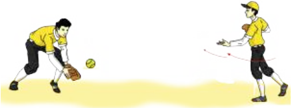

> **Deskripsi Visual:** Gambar ini adalah ilustrasi yang menunjukkan dua orang pemain sepak bola sedang bermain. Pemain di sebelah kiri sedang berusaha menghentikan bola dengan menggunakan tongkat sepak bola, sementara pemain di sebelah kanan sedang berusaha memukul bola ke arah pemain di sebelah kiri. Ilustrasi ini menunjukkan interaksi antara dua pemain dalam pertandingan sepak bola. Elemen-elemen utama dalam gambar ini adalah dua pemain sepak bola, bola, tongkat sepak bola, dan lapangan sepak bola. Relasi antara elemen-elemen ini adalah bahwa pemain di sebelah kiri menggunakan tongkat sepak bola untuk menghentikan bola, sementara pemain di sebelah kanan menggunakan tongkat sepak bola untuk memukul bola ke arah pemain di sebelah kiri. Teks, angka, atau label penting yang terlihat dalam gambar ini tidak ada. Informasi kunci yang dapat diambil pembaca adalah bahwa pertandingan sepak bola melibatkan dua pemain yang saling berinteraksi untuk mencapai tujuan masing-masing.

### 3. Menangkap bola lemparan bawah

Lemparan  bawah  bisanya  di  gunakan  dalam  keadaan  darurat  dan dilakukan dalam waktu yang cepat, posisi tubuh membungkuk dengan kedua  kaki  ditekuk  kegiatan  pembelajaran  dapat  dilakukan  sebagai berikut:

- Latihan ini dilakukan secara berpasangan/berkelompok.
- Berdiri saling berhadapan dengan jarak ± 10 m.
- Bola  dilemparkan kearah teman dihadapan, selesai melempar bola menuju barisan belakang.
- Bola ditangkap, kemudian lemparkan kearah teman dihadapan, lalu menuju barisan belakang.
- Latihan ini dilakukan di tempat, dilanjutkan dengan bergerak majumundur, dan bergerak ke kanan dan kiri.
Lakukan  latihan  berulang-ulang  dan  bergantian  untuk  menanamkan nilai-nilai kerjasama, keberanian, sportivitas, dan kompetitif.

 

---
## 📄 Halaman 79

---
**🖼️ Gambar/Diagram**

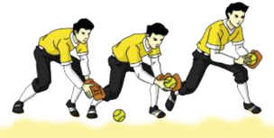

> **Deskripsi Visual:** Gambar ini adalah ilustrasi yang menunjukkan proses pemukulan bola sepak dalam olahraga sepak bola. Gambar ini menggambarkan tiga langkah pemukulan bola:

1. Langkah pertama: Pemain sepak bola berdiri dengan posisi yang tepat untuk memukul bola. Ia menggunakan kaki yang tepat untuk memukul bola.

2. Langkah kedua: Pemain memukul bola dengan kaki yang tepat, menciptakan gaya pemukulan yang tepat untuk mencapai target.

3. Langkah ketiga: Pemain memastikan bahwa bola mencapai target yang tepat setelah pemukulan.

Elemen-elemen utama dalam gambar ini meliputi pemain sepak bola, bola sepak, dan langkah-langkah pemukulan bola. Relasi antara elemen-elemen ini adalah bahwa pemain sepak bola menggunakan kaki untuk memukul bola, dan langkah-langkah pemukulan bola harus tepat agar bola mencapai target yang tepat.

Teks, angka, atau label penting yang terlihat dalam gambar ini adalah tidak ada, karena gambar hanya menggambarkan proses pemukulan bola tanpa teks atau angka tambahan.

Informasi kunci yang dapat diambil pembaca dari gambar ini adalah bahwa pemukulan bola sepak harus dilakukan dengan teknik yang tepat untuk mencapai target yang tepat.

### 4.  Lemparan sajian (Pitching)

- Bola harus dipegang dengan satu tangan.
- Posisi tubuh menghadap kearah better (pemukul).
- Posisi tangan harus berada dibawah pinggang.
- Ayunan  tangan  dilengkapi  dengan  langkah  kaki  ke  depan  kearah better.
- Gerakan lemparan tidak boleh terputus-putus.
- Pitcher hanya punya waktu 20 detik untuk lemparan berikutnya.

---
**🖼️ Gambar/Diagram**

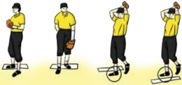

> **Deskripsi Visual:** Gambar ini adalah ilustrasi yang menunjukkan tiga orang yang sedang bermain sepak bola. Setiap orang memiliki atribut yang unik: satu orang sedang berdiri dengan sepak bola di tangan, sementara dua orang lainnya sedang berjalan dan berpose untuk foto. Ilustrasi ini menunjukkan aktivitas olahraga yang seru dan memperlihatkan peran masing-masing pemain dalam pertandingan sepak bola. Teks, angka, atau label penting tidak ada pada gambar ini, sehingga fokus utama adalah pada tindakan dan posisi pemain. Informasi kunci yang dapat diambil pembaca adalah bahwa ini adalah gambar ilustrasi tentang aktivitas sepak bola dan bagaimana pemain berpartisipasi dalam pertandingan tersebut.

 

---
## 📄 Halaman 80

---
**🖼️ Gambar/Diagram**

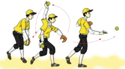

> **Deskripsi Visual:** Gambar ini adalah ilustrasi yang menunjukkan langkah-langkah mengambil bola dengan menggunakan tangan. Gambar ini terdiri dari tiga langkah yang disajikan secara berurutan dari kiri ke kanan. Setiap langkah menunjukkan posisi tangan yang berbeda untuk mengambil bola. 

Elemen utama dalam gambar ini adalah tangan yang sedang mengambil bola. Teks, angka, atau label penting tidak ada dalam gambar ini karena ia hanya berupa ilustrasi. Informasi kunci yang dapat diambil pembaca adalah proses langkah demi langkah dalam mengambil bola dengan tangan.

### 5.  Memukul menggunakan stick (tongkat pemukul)

---
**🖼️ Gambar/Diagram**

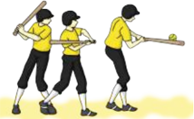

> **Deskripsi Visual:** Gambar ini adalah ilustrasi yang menunjukkan dua orang siswa sedang bermain sepak bola. Ilustrasi ini menggambarkan posisi tubuh mereka saat mereka bergerak untuk mencoba memukul bola. Siswa di sebelah kiri sedang berdiri dengan posisi lutut yang rata, sementara siswa di sebelah kanan sedang berjalan dengan posisi lutut yang lebih tinggi. Kedua siswa tersebut sedang menggunakan tongkat sepak bola untuk mencoba memukul bola. Ilustrasi ini menunjukkan posisi tubuh dan gerakan mereka saat bermain sepak bola.

### 6.  Berlari menuju base

- Berdiri menyamping ke arah pitcher.
- Memukul bola yang dilemparkan.
- Fokuskan keterampilan gerakan memegang stick (tongkat), ayunan lengan, dan pandangan fokus terhadap bola.
Pemukul yang telah berhasil melakukan pukulan harus segera berlari menuju base 1 dan selanjutnya jika masih memungkinkan menuju ke base 2 dan seterusnya.

 

---
## 📄 Halaman 81

### 7. Sliding

---
**🖼️ Gambar/Diagram**

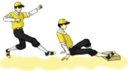

> **Deskripsi Visual:** Gambar ini adalah ilustrasi yang menunjukkan dua orang yang sedang berlari. Pada gambar tersebut, elemen utama adalah dua orang yang sedang berlari dengan posisi tubuh mereka yang sama, tetapi satu orang lebih maju dibandingkan dengan yang lain. Kedua orang tersebut mengenakan pakaian olahraga dan topi, yang menunjukkan bahwa mereka sedang berolahraga. Gambar ini juga menunjukkan lantai berpasir, yang menunjukkan bahwa tempat mereka berlari mungkin adalah lapangan olahraga atau area bermain. Teks, angka, atau label penting tidak ada pada gambar ini. Informasi kunci yang dapat diambil pembaca adalah bahwa dua orang sedang berlari dan mungkin sedang berolahraga.

Adalah gerakan meluncur dengan menjatuhkan badan guna menghindarai ketukan bola oleh penjaga base . Setelah dapat mendekati base yang dituju memindahkan berat badan kebelakang dengan menjatuhkan badan bersamaan dengan salah satu kaki dijulurkan kearah base .

### 8.  Pembelajaran bermain softball dengan peraturan yang dimodifikasi

Peraturan yang dimodifikasi antara lain seperti:

- Jumlah pemain yang disesuaikan jumlah peserta didik.
- Base yang dimodifikasi.
- Bola disesuaikan.
- Besar lapangan disesuaikan dengan kondisi.

### K.  Contoh Penerapan Pendekatan Saintifik dalam Pembelajaran Bulu Tangkis

- Meminta  salah  satu  pesera  didik  yang  dikategorikan  mampu  untuk memperagakan  gerak  atau  contoh  dari  guru;  melihat  tayangan  dan peserta didik yang lain mengamatinya.
- Memotivasi peserta didik untuk bertanya, dengan cara guru mengajukan beberapa pertanyaan yang berkaitan dengan keterampilan gerak Bagaimana hasil pukulan jika saat melakukan servis kedua kaki rapat? Apakah kelebaran jarak kedua kaki mempengaruhi hasil servis panjang? Apakah  jarak  ayunan  tangan  mempengaruhi  jalannya shutlekock? Bagaimana jalannya shutlekock jika merubah pegangan raket?
- Menemukan jawaban atas pertanyaan di atas melalui kegiatan eksplorasi gerak secara individual, berpasangan atau berkelompok dengan menunjukkan sikap kerjasama dan  disiplin sehingga ditemukan gerak yang efektif dan efesien sesuai kebutuhan masing-masing peserta didik.
- Menemukan hubungan keterampilan gerak.
- Menerapkan berbagai keterampilan gerak permainan bola kecil melalui permainan bulu tangkis dalam bermain secara beregu dengan menunjukkan sikap kerjasama, disiplin, dan sportivitas.

 

---
## 📄 Halaman 82

Setiap keterampilan gerak permainan bulu tangkis seperti memegang raket, servis, pukulan backhand dan forehand , dan smash , dikembangkan dengan cara seperti di atas.

### L. Aktivitas Pembelajaran Permainan Pembelajaran Bulu Tangkis

### 1.  Pembelajaran  variasi  dan  kombinasi  gerak  dasar  memegang  raket dan servis forehand dan backhand

Aktivitas  pembelajaran  bulu  tangkis  dilakukan  dengan  bermain;  latihan dan  bermain, kegiatan latihan dilakukan sebagai berikut :

Pelaksanaannya sebagai berikut:

- Melakukan servis tinggi/panjang ( forehand ) secara menyilang ke arah bidang servis.
- Dilakukan berpasangan/kelompok.
- Yang telah melakukan servis bergerak berpindah tempat.
- Lakukan keterampilan gerak menemukan jawaban pertanyaan.
- Selama  melakukan  latihan  kembangkan  nilai-nilai  kerjasama  dan disiplin.
- Setelah  peserta  didik  merasakan  kemajuan  keterampilan,  minta mereka  untuk  menerapkan  keterampilan  tersebut  dalam  bentuk pertandingan secara beregu.

---
**🖼️ Gambar/Diagram**

> **Deskripsi Visual:** Gambar ini adalah ilustrasi yang menunjukkan sebuah pertandingan bulu tangkis. Gambar ini menggambarkan empat pemain yang sedang bermain di lapangan bulu tangkis dengan posisi mereka yang berbeda-beda. Pemain di sisi kiri memiliki posisi yang lebih dekat dengan net, sedangkan pemain di sisi kanan memiliki posisi yang lebih jauh dari net. Setiap pemain memiliki posisi yang berbeda-beda untuk memperkuat pertahanan mereka. Di tengah-tengah gambar, terdapat net yang memisahkan dua sisi lapangan. Di sebelah kiri dan kanan, terdapat penanda yang menunjukkan posisi pemain yang berbeda. Gambar ini menunjukkan bahwa pertandingan bulu tangkis memerlukan strategi dan koordinasi tim yang baik.

 

---
## 📄 Halaman 83

### 2.  Melakukan servis pendek (forehand) secara menyilang ke arah pada bidang servis

- Dilakukan berpasangan atau kelompok.
- Yang telah melakukan servis bergerak berpindah tempat.
- Dilakukan  berpasangan  atau  berkelompok.  untuk  menanamkan nilai-nilai kerjasama, keberanian, sportivitas, dan kompetitif.

---
**🖼️ Gambar/Diagram**

> **Deskripsi Visual:** Gambar ini adalah ilustrasi yang menunjukkan sebuah pertandingan bulu tangkis. Gambar ini menggambarkan empat pemain yang sedang bermain di lapangan bulu tangkis dengan menggunakan alat permainan seperti raket dan bola. Pemain-pemain tersebut terdiri dari dua pasangan, masing-masing berada di sisi kiri dan kanan lapangan. Setiap pemain memiliki posisi yang berbeda-beda, dengan beberapa pemain berdiri di depan dan beberapa lainnya berdiri di belakang. Selain itu, ada juga penanda lapangan yang menunjukkan garis-garis yang membatasi area permainan. Gambar ini menunjukkan bahwa pertandingan ini sedang berlangsung dengan baik dan semua pemain terlibat aktif dalam pertandingan tersebut.

### 3.  Servis pendek (backhand) secara menyilang ke arah kanan dan kiri pada bidang servis

- Dilakukan berpasangan atau kelompok.
- Yang telah melakukan pukulan servis bergerak berpindah tempat.
- Dilakukan  berpasangan  atau  berkelompok.  untuk  menanamkan nilai-nilai kerjasama, keberanian, sportivitas, dan kompetitif.

 

---
## 📄 Halaman 84

### 4.  Pembelajaran  variasi  gerak  dasar  memegang  raket  dan  memukul forehand dan backhand

Pelaksanaannya sebagai berikut:

### a.  Tahap 1. Melakukan pegangan raket dan pukulan forehand arah bola lurus

- Bola dipukul/diumpan teman.
- Dilakukan berpasangan atau kelompok.
- Yang telah melakukan pukulan forehand , bergerak berpindah tempat.
- Latihan untuk menanamkan nilai-nilai kerjasama, keberanian, sportivitas, dan kompetitif. Gambar 2.12 Pukulan forehand lurus

---
**🖼️ Gambar/Diagram**

> **Deskripsi Visual:** Gambar ini adalah ilustrasi yang menunjukkan sebuah pertandingan bulu tangkis. Gambar ini menggambarkan dua tim bermain di lapangan bulu tangkis dengan posisi pemain yang berbeda-beda. Pemain di sisi kanan tampak sedang bergerak untuk memukul bola ke sisi kiri, sementara pemain di sisi kiri sedang berada di posisi menyerang. Ilustrasi ini menunjukkan gerakan dan posisi pemain dalam pertandingan bulu tangkis.

Elemen-elemen utama dalam gambar ini meliputi dua tim pemain bulu tangkis, lapangan bulu tangkis, dan posisi pemain yang berbeda-beda. Relasi antara elemen-elemen ini adalah bahwa pemain di sisi kanan sedang bergerak untuk memukul bola ke sisi kiri, sementara pemain di sisi kiri sedang berada di posisi menyerang. Ini menunjukkan aktivitas dan strategi dalam pertandingan bulu tangkis.

Teks, angka, atau label penting yang terlihat dalam gambar ini adalah "Gerak lari berpindah tempat" yang terletak di bagian atas gambar. Informasi kunci yang dapat diambil pembaca adalah bahwa pertandingan bulu tangkis melibatkan dua tim dan pemain harus bergerak dan berpindah posisi untuk menangkap bola.

Dalam satu paragraf yang informatif, gambar ini menunjukkan pertandingan bulu tangkis dengan dua tim pemain yang bergerak dan berpindah posisi untuk menangkap bola. Ilustrasi ini menunjukkan strategi dan aktivitas dalam pertandingan tersebut.

### b.  Tahap 2. Melakukan pegangan raket dan pukulan forehand arah bola menyilang lapangan

- Bola dipukul/diumpan teman.
- Dilakukan berpasangan atau kelompok.
- Yang telah melakukan pukulan forehand bergerak berpindah tempat.
- Latihan untuk menanamkan nilai-nilai kerjasama, keberanian, sportivitas, dan kompetitif.

---
**🖼️ Gambar/Diagram**

> **Deskripsi Visual:** Gambar ini adalah ilustrasi yang menunjukkan pertandingan bulu tangkis. Gambar ini menggambarkan empat pemain yang sedang bermain di lapangan bulu tangkis dengan menggunakan alat permainan seperti raket dan bola. Setiap pemain memiliki posisi yang berbeda-beda di lapangan, dengan dua pemain berada di sisi kanan dan dua lainnya di sisi kiri. Pemain di sisi kanan tampak sedang bergerak untuk memukul bola ke pemain di sisi kiri. Di sekitar lapangan, ada penonton yang sedang menyaksikan pertandingan. Ilustrasi ini menunjukkan aktivitas dan posisi pemain serta penonton dalam sebuah pertandingan bulu tangkis.

 

---
## 📄 Halaman 85

### c.  Tahap 3. Melakukan pegangan raket dan pukulan backhand arah bola lurus

- Bola dipukul/diumpan oleh teman.
- Dilakukan berpasangan atau kelompok.
- Yang telah melakukan pukulan backhand bergerak berpindah tempat.
- Untuk menanamkan nilai-nilai kerjasama, keberanian, sportivitas, dan kompetitif.

---
**🖼️ Gambar/Diagram**

> **Deskripsi Visual:** Gambar ini adalah ilustrasi yang menunjukkan pertandingan bulu tangkis. Gambar ini menggambarkan dua pasangan pemain yang sedang bermain di lapangan bulu tangkis. Setiap pemain memiliki alat peraga (raket) dan memegang bola bulu tangkis. Pemain di sisi kanan tampak sedang menyerang bola ke pemain di sisi kiri. Di sebelah kiri, pemain tersebut sedang berusaha untuk menyelamatkan bola dengan menggunakan raketnya. Di sebelah kanan, pemain tersebut sedang berusaha untuk menyerang bola ke pemain di sisi kiri. Di sebelah kiri, pemain tersebut sedang berusaha untuk menyelamatkan bola dengan menggunakan raketnya. Di sebelah kanan, pemain tersebut sedang berusaha untuk menyerang bola ke pemain di sisi kiri. Di sebelah kiri, pemain tersebut sedang berusaha untuk menyelamatkan bola dengan menggunakan raketnya. Di sebelah kanan, pemain tersebut sedang berusaha untuk menyerang bola ke pemain di sisi kiri. Di sebelah kiri, pemain tersebut sedang berusaha untuk menyelamatkan bola dengan menggunakan raketnya. Di sebelah kanan, pemain tersebut sedang berusaha untuk menyerang bola ke pemain di sisi kiri. Di sebelah kiri, pemain tersebut sedang berusaha untuk menyelamatkan bola dengan menggunakan raketnya. Di sebelah kanan, pemain tersebut sedang berusaha untuk menyerang bola ke pemain di sisi kiri. Di sebelah kiri, pemain tersebut sedang berusaha untuk menyelamatkan bola dengan menggunakan raketnya. Di sebelah kanan, pemain tersebut sedang berusaha untuk menyerang bola ke pemain di sisi kiri. Di sebelah kiri, pemain tersebut sedang berusaha untuk menyelamatkan bola dengan menggunakan raketnya. Di sebelah kanan, pemain tersebut sedang berusaha untuk menyerang bola ke pemain di sisi kiri. Di sebelah kiri, pemain tersebut sedang berusaha untuk menyelamatkan bola dengan menggunakan raketnya. Di sebelah kanan, pemain tersebut sedang berusaha

### d.  Tahap 4.  Melakukan pegangan raket dan pukulan backhand arah bola  menyilang lapangan

- Bola dipukul/diumpan teman.
- Dilakukan secara berpasangan atau kelompok.
- Yang telah melakukan pukulan backhand bergerak berpindah tempat.
- Untuk menanamkan nilai-nilai kerjasama, keberanian, sportivitas, dan kompetitif.

 

---
## 📄 Halaman 86

---
**🖼️ Gambar/Diagram**

> **Deskripsi Visual:** Gambar ini adalah ilustrasi yang menunjukkan teknik pukulan backhand dalam permainan bulu tangkis. Gambar ini menggambarkan empat pemain bulu tangkis yang sedang bermain, dengan fokus pada dua pemain yang sedang bergerak untuk melakukan teknik pukulan backhand. Pemain yang sedang bergerak memiliki posisi yang berbeda-beda, dengan salah satu pemain berada di depan dan yang lainnya di belakang. Pemain yang bergerak menggunakan tangan kanan mereka untuk melakukan teknik pukulan backhand, sementara pemain yang tidak bergerak menggunakan tangan kiri mereka untuk menangkap bola. Gambar ini juga menunjukkan gerakan lari dan berpindah tempat yang dilakukan oleh pemain yang bergerak. Label "Teknik pukulan backhand" dan "Gerak lari berpindah tempat" telah ditambahkan ke gambar untuk memberikan informasi tambahan tentang teknik dan gerakan yang digunakan dalam permainan tersebut.

### 5.  Pembelajaran bermain bulu tangkis dengan peraturan yang dimodifikasi

Ada beberapa tujuan dari kegiatan bermain bulu tangkis yang dimodifikasi, di antaranya:

- Untuk menerapkan teknik-gerak dasar yang telah dipelajari.
- Agar peserta didik dapat menentukan posisi dalam tim sesuai dengan keterampilannya masing-masing.
- Agar  peserta  didik  dapat  menggunakan  taktik  dan  strategi  dalam bermain bulu tangkis.
- Agar  peserta  didik  dapat  mengidentifikasi  saat  yang  tepat  untuk melakukan penyerangan dan pertahanan.
- Agar  peserta  didik  dalam  bermain  lebih  bersifat  rekreatif  dan menggembirakan.
Latihan dilakukan untuk menanamkan nilai-nilai kerjasama, keberanian, sportivitas , dan kompetitif.

### 6.  Bermain 3 lawan 3 dengan menggunakan teknik pukulan forehand dan backhand overhead

- Pihak  yang  bolanya  banyak  mati  dianggap  kalah  (dilakukan  8-10 menit).
- Permainan  diawali  dengan  pukulan  servis forehand (pendek/jauh) dan backhand .
- Dalam  pergerakan  pemain  tidak  boleh  bersentuhan  baik  badan maupun raket.

 

---
## 📄 Halaman 87

### d) Sebelum memukul bola harus menyebutkan nama teman yang akan diarahkan bola.

---
**🖼️ Gambar/Diagram**

> **Deskripsi Visual:** Gambar ini adalah ilustrasi yang menunjukkan pertandingan bulu tangkis. Gambar ini menggambarkan dua pasangan pemain yang sedang bermain di lapangan bulu tangkis. Setiap pemain memiliki raket dan seragam yang sama, dengan warna merah dan putih. Pemain di sisi kanan menggunakan raket yang lebih besar dan lebih tinggi, sementara pemain di sisi kiri menggunakan raket yang lebih kecil dan lebih rendah. Lapangan bulu tangkis terlihat dengan jelas, dengan garis-garis yang menunjukkan batas permainan. Di sekeliling lapangan, terdapat penonton yang sedang menonton pertandingan. Gambar ini menunjukkan aktivitas fisik dan kompetisi dalam olahraga bulu tangkis.

### 7.  Bermain 3 lawan 2 dengan menggunakan teknik pukulan forehand dan backhand overhead

- Pihak  yang  bolanya  banyak  mati  dianggap  kalah  (dilakukan  8-10 menit).
- Permainan  diawali  dengan  pukulan  servis forehand (pendek/jauh) dan backhand .
- Dalam  pergerakan  pemain  tidak  boleh  bersentuhan  baik  badan maupun raket.
- Sebelum memukul bola harus menyebutkan nama teman yang akan diarahkan bola.

---
**🖼️ Gambar/Diagram**

> **Deskripsi Visual:** Gambar ini adalah ilustrasi yang menunjukkan pertandingan bulu tangkis. Gambar ini menggambarkan empat pemain yang sedang bermain di lapangan bulu tangkis dengan menggunakan alat permainan seperti raket dan bola. Pemain di sisi kanan dan kiri masing-masing memegang raket dan bola mereka, sedangkan dua pemain di tengah memegang raket dan bola mereka. Dua pemain di tengah tampaknya sedang berusaha untuk menendang bola ke pemain di sisi lain. Gambar ini menunjukkan posisi dan gerakan pemain dalam pertandingan bulu tangkis.

 

---
## 📄 Halaman 88

### M.  Contoh Penerapan Pendekatan Saintifik dalam Pembelajaran Permainan Bola Kecil Melalui Permainan Tenis Meja

- Meminta  salah  satu  pesera  didik  yang  dikategorikan  mampu  untuk memperagakan  gerak  atau  contoh  dari  guru;  melihat  tayangan  dan peserta didik yang lain mengamatinya.
- Memotivasi peserta didik untuk bertanya, dengan cara guru mengajukan beberapa pertanyaan yang berkaitan dengan keterampilan gerak.
- Menemukan jawaban atas pertanyaan di atas melalui kegiatan eksplorasi gerak secara individual, berpasangan atau berkelompok dengan menunjukkan sikap kerjasama dan  disiplin sehingga ditemukan gerak yang efektif dan efesien sesuai kebutuhan masing-masing peserta didik.
- Menemukan hubungan keterampilan gerak.
- Menerapkan berbagai keterampilan gerak permainan bola kecil melalui  permainan  tenis  meja  dalam  bermain  secara  beregu  dengan menunjukkan sikap kerjasama, disiplin, dan sportivitas.
Setiap  keterampilan  gerak  permainan  tenis  meja  dikembangkan  seperti cara memegang bet, pukulan forehand dan backhand ,  dan smash dengan cara seperti di atas.

Aktivitas pembelajaran tenis meja dilakukan dengan bermain; latihan dan bermain, kegiatan latihan sebagai berikut :

### 1.  Pembelajaran variasi dan kombinasi gerak dasar memegang bet dan servis   forehand  dan backhand  dengan  konsisten  dan  tepat  dalam berbagai situasi.

- Melakukan servis forehand dan backhand lurus bidang servis
- Dilakukan berpasangan/kelompok.
- Yang telah melakukan pukulan servis bergerak berpindah tempat.
- Lakukan keterampilan gerak untuk menemukan jawaban pertanyaan.
- Selama melakukan latihan kembangkan nilai-nilai kerjasama dan disiplin.
- Setelah  peserta  didik  merasakan  kemajuan  keterampilan,  minta mereka  untuk  menerapkan  keterampilan  tesebut  dalam  bentuk pertandingan secara beregu.

 

---
## 📄 Halaman 89

- Melakukan servis forehand dan backhand secara menyilang ke arah kanan dan kiri bidang servis
- Dilakukan berpasangan/kelompok.
- Yang telah melakukan pukulan servis bergerak berpindah tempat.
- Untuk menanamkan nilai-nilai kerjasama, keberanian, sportivitas dan kompetitif.
Servis forehand dan backhand

---
**🖼️ Gambar/Diagram**

> **Deskripsi Visual:** Gambar ini adalah ilustrasi yang menunjukkan dua orang pemain tenis meja sedang bermain. Pemain di sebelah kiri menggunakan teknik forehand untuk menendang bola ke arah pemain di sebelah kanan. Pemain di sebelah kanan menggunakan teknik backhand untuk menendang bola ke arah pemain di sebelah kiri. Gambar ini juga menunjukkan teks "Penerima Servis forehand dan backhand" yang memberikan informasi tentang teknik yang digunakan oleh pemain.

1. Gambar ini menunjukkan dua orang pemain tenis meja sedang bermain.
2. Elemen-elemen utama adalah dua pemain tenis meja, bola, dan tabel tenis meja. Relasi antara mereka adalah bahwa pemain di sebelah kiri menggunakan teknik forehand untuk menendang bola ke arah pemain di sebelah kanan, sementara pemain di sebelah kanan menggunakan teknik backhand untuk menendang bola ke arah pemain di sebelah kiri.
3. Teks penting yang terlihat adalah "Penerima Servis forehand dan backhand". Ini memberikan informasi tentang teknik yang digunakan oleh pemain.
4. Informasi kunci yang dapat diambil pembaca adalah teknik-teknik yang digunakan oleh pemain dalam permainan tenis meja, yaitu forehand dan backhand.

- Melakukan servis forehand dan backhand ke sasaran (target)
- Dilakukan berpasangan/kelompok.
- Yang  telah  melakukan  pukulan  servis  dan  menerima  servis bergerak berpindah tempat.
- Untuk menanamkan nilai-nilai kerjasama, keberanian, sportivitas dan kompetitif.

---
**🖼️ Gambar/Diagram**

> **Deskripsi Visual:** Gambar ini adalah ilustrasi yang menunjukkan teknik forehand dan backhand dalam olahraga tenis meja. Gambar ini terdiri dari dua pihak yang bermain, dengan pemain di sebelah kiri menggunakan teknik forehand dan pemain di sebelah kanan menggunakan teknik backhand. Pemain di sebelah kiri bergerak ke arah tim lawan untuk menyerang, sementara pemain di sebelah kanan berusaha untuk menangkap bola tersebut. Gambar juga menunjukkan posisi pemain sebagai target untuk serangan mereka. Teks pada gambar memberikan penjelasan tentang teknik forehand dan backhand dalam permainan tenis meja.

 

---
## 📄 Halaman 90

### 2.  Pembelajaran  variasi  dan  kombinasi  gerak  dasar  memegang  bet, pukulan forehand dan backhand dengan konsisten dan tepat

Pelaksanaannya sebagai berikut :

- Tahap 1. Melakukan pegangan bet, pukulan forehand dan backhand , arah bola lurus.
- Bola dilambungkan oleh teman.
- Dilakukan berpasangan atau kelompok.
- Yang telah melakukan pukulan forehand / backhand dan pelambung bergerak berpindah tempat.
- Untuk menanamkan nilai-nilai kerjasama, keberanian, sportivitas dan kompetitif.
- Tahap 2. Melakukan pegangan bet, pukulan forehand dan backhand , arah bola menyilang meja.
- Bola dilambungkan oleh teman dengan cara dipantulkan ke meja dan dengan pukulan servis
- Dilakukan berpasangan atau kelompok.
- Yang telah melakukan pukulan forehand / backhand dan pelambung bergerak berpindah tempat.
- Untuk menanamkan nilai-nilai kerjasama, keberanian, sportivitas dan kompetitif.

---
**🖼️ Gambar/Diagram**

> **Deskripsi Visual:** Gambar ini adalah ilustrasi yang menunjukkan dua orang pemain pingpong bermain di lapangan pingpong. Pemain pertama duduk di sisi kanan dan memegang bola dengan tangan kanannya, sedangkan pemain kedua berdiri di sisi kiri dan memegang bola dengan tangan kiri. Pemain pertama sedang mengambil bola dari pemain kedua menggunakan tangan kanannya, sementara pemain kedua sedang berusaha melambungkan bola ke pemain pertama menggunakan tangan kanannya. Gambar ini menunjukkan proses permainan pingpong, dimana pemain harus mengambil atau melambungkan bola ke pemain lain untuk mencapai skor.

 

---
## 📄 Halaman 91

---
**🖼️ Gambar/Diagram**

> **Deskripsi Visual:** Gambar ini adalah ilustrasi yang menunjukkan pertandingan tenis meja antara dua tim. Ilustrasi ini mencakup beberapa elemen penting:

1. **Pertandingan Tenis Meja**: Gambar menunjukkan dua tim bermain tenis meja di atas meja yang berwarna hijau. Setiap tim memiliki empat pemain.

2. **Pemain dan Posisi**: Dua tim terdiri dari empat pemain masing-masing. Pemain di sebelah kiri (dengan warna kuning) sedang berada di posisi yang lebih dekat dengan meja, sementara pemain di sebelah kanan (dengan warna merah) berada di posisi yang lebih jauh dari meja.

3. **Teks dan Label**: Terdapat teks "Pemukul bola" dan "Pelambung bola" yang diletakkan di sekitar pemain untuk menunjukkan posisi mereka dalam pertandingan. Ini membantu pembaca memahami posisi dan peran masing-masing pemain.

4. **Relasi**: Ilustrasi ini menunjukkan hubungan antara pemain dan posisi mereka dalam pertandingan. Pemain yang berada di posisi yang lebih dekat dengan meja biasanya berperan sebagai pemukul bola, sementara pemain yang berada di posisi yang lebih jauh dari meja biasanya berperan sebagai pelambung bola.

5. **Informasi Kunci**: Gambar ini memberikan gambaran umum tentang struktur pertandingan tenis meja dan posisi pemain dalam pertandingan. Ini membantu pembaca memahami bagaimana permainan dimainkan dan bagaimana posisi pemain berpengaruh pada hasil pertandingan.

Dengan demikian, gambar ini menggambarkan struktur dan posisi pemain dalam pertandingan tenis meja, serta memberikan informasi penting tentang peran dan posisi mereka dalam pertandingan.

### 3.  Pembelajaran bermain tenis meja dengan peraturan yang dimodifikasi

Ada beberapa tujuan dan kegiatan bermain tenis meja yang dimodifikasi, di antaranya:

- Untuk menerapkan teknik-gerak dasar yang telah dipelajari.
- Agar  peserta  didik  dapat  menggunakan  taktik  dan  strategi  dalam bermain tenis meja.
- Agar  peserta  didik  dapat  mengidentifikasi  saat  yang  tepat  untuk melakukan penyerangan dan pertahanan.
- Agar  peserta  didik  dalam  bermain  lebih  bersifat  rekreatif  dan menggembirakan.
- Untuk  menanamkan  nilai-nilai  kerjasama,  keberanian,  sportivitas dan kompetitif.
- Bermain  tenis  meja  tanpa  menggunakan  bet,  dengan  cara  tunggal atau ganda.
- Peserta  dianggap  kalah,  apabila  banyak  bola  yang  tidak  bisa dikembalikan atau bola menyangkut net.
- Permainan dilakukan 5-10 menit.

 

---
## 📄 Halaman 92

---
**🖼️ Gambar/Diagram**

> **Deskripsi Visual:** Gambar ini adalah ilustrasi yang menunjukkan dua orang pemain tenis meja sedang bermain. Gambar ini menggambarkan pertandingan tenis meja dengan detail yang jelas. Pemain di sebelah kiri menggunakan tangan kanan untuk memukul bola ke arah pemain di sebelah kanan. Pemain di sebelah kanan juga menggunakan tangan kanannya untuk memukul bola balik. Latar belakangnya adalah meja tenis meja hijau dengan garis putih yang membentuk kotak-kotak. Di sisi kiri, ada papan nama yang menunjukkan nama pemain tersebut. Di sisi kanan, ada papan nama yang menunjukkan nama lawan mereka. Gambar ini menunjukkan posisi dan gerakan pemain saat bermain tenis meja.

### b.  Bermain tenis meja, 1 lawan 2 pemain

- Pemain  yang  berada  pada  posisi  2  orang  hanya  diperbolehkan memukul dengan teknik pukulan forehand ,  sedangkan yang berada pada posisi 1 orang diperbolehkan menggunakan pukulan forehand dan backhand .
- Peserta dianggap kalah, apabila banyak bola yang tidak bisa dikembalikan atau bola menyangkut net.
- Permainan dilakukan 5-10 menit.

---
**🖼️ Gambar/Diagram**

> **Deskripsi Visual:** Gambar ini adalah ilustrasi yang menunjukkan pertandingan tenis meja antara dua pasangan pemain. Gambar ini menggambarkan dua pasangan pemain sedang bermain tenis meja di lapangan yang berwarna hijau. Pemain di sebelah kiri menggunakan seragam merah dan putih, sementara pemain di sebelah kanan menggunakan seragam hitam dan merah. Papan tenis meja berwarna hijau dengan garis putih yang memisahkan dua sisi lapangan. Pemain di sebelah kiri sedang berada di sisi yang berlawanan dengan pemain di sebelah kanan, menunjukkan bahwa mereka sedang bermain lawan. Gambar ini menunjukkan posisi dan gerakan pemain saat bermain tenis meja, serta permainan yang sedang berlangsung.

### N.  Penilaian Pembelajaran Permainan Bola Kecil

### 1.  Contoh penilaian Spiritual dan Sosial (KI- 1 dan 2)

Petunjuk Penilaian

Penilaian  Aspek  Sosial  dan  Spiritual  dilakukan  dengan  pengamatan selama mengikuti kegiatan belajar mengajar.

Berikan tanda centang (  )  pada kolom yang sudah disediakan, setiap peserta didik menunjukkan atau menampilkan perilaku yang diharapkan. Tiap perilaku yang dicentang (  ) menggunakan rentang skor antara 1 sampai dengan 4.

 

---
## 📄 Halaman 93

---
**📊 Tabel**

Tabel ini berisi 9 kriteria spiritualitas dan sosial yang diukur dengan skor antara 1 hingga 4. Topik utamanya adalah sikap dalam menjaga kesehatan tubuh, sportif dalam bermain, bertanggung jawab terhadap keselamatan dan keamanan diri sendiri, serta menunjukkan toleransi dan disiplin dalam melakukan berbagai aktivitas fisik. Kolom-kolomnya mencakup kriteria tersebut, dengan skor yang menunjukkan tingkat keberhasilan atau keterlibatan individu dalam setiap kriteria. Pola penting yang terlihat adalah bahwa semua kriteria memiliki skor yang sama, yaitu 3, menunjukkan bahwa individu harus mencapai tingkat tertentu dalam setiap kriteria untuk mendapatkan nilai tertinggi.

Keterangan: Sangat baik = 4, Baik = 3, Cukup= 2  Kurang= 1

### 2.  Contoh penilaian pengetahuan (KI-3)

Petunjuk Penilaian

Setelah  mempelajari  materi  permainan  bola  kecil  (so ftball),  tugaskan kepada peserta didik untuk mengerjakan tugas kelompok di bawah ini dengan penuh rasa tanggung jawab. Tugas kelompok ini dapat dikerjakan di rumah dan dikumpulkan dalam bentuk portofolio!

 

---
## 📄 Halaman 94

### Butir Soal Pengetahuan so ftball

---
**📊 Tabel**

Tabel ini berisi instruksi untuk menjawab beberapa pertanyaan tentang teknik permainan softball. Topik utama tabel adalah teknik permainan softball, yang meliputi memegang stick permanen, keterampilan dasar pelambang (pitcher), keterampilan dasar pukulan swing, dan keterampilan dasar memukul bunt. Setiap pertanyaan memiliki skor maksimal 4, sehingga total skor maksimal adalah 16. Dalam menjawab pertanyaan-pertanyaan ini, pemain harus memahami bagaimana melakukan setiap teknik tersebut dengan benar dan efektif dalam permainan softball.

### Butir Soal Pengetahuan Bulu tangkis

---
**📊 Tabel**

Tabel ini berisi pertanyaan tentang teknik pukulan dalam sepak bola, dengan fokus pada servis panjang dan pendek. Topik utama tabel adalah teknik pukulan dalam sepak bola, termasuk pukulan servis panjang (forehand) dan pukulan servis pendek. Tabel memiliki dua kolom: "No." untuk nomor pertanyaan dan "Butir Soal" untuk pertanyaan masing-masing nomor. Setiap pertanyaan mencakup satu atau lebih teknik pukulan, seperti keterampilan dasar pukulan servis panjang forehand, keterampilan dasar pengembalian servis panjang forehand, dan keterampilan dasar pengembalian servis pendek forehand. Skor maksimum untuk setiap pertanyaan adalah 16, dan total skor maksimum untuk tabel adalah 100%. Ini menunjukkan bahwa tabel ini bertujuan untuk menguji pemahaman tentang teknik pukulan dalam sepak bola, dengan skor yang diberikan berdasarkan keterampilan dan pemahaman yang dimiliki oleh peserta ujian.

### Butir Soal Pengetahuan Tenis meja

---
**📊 Tabel**

Tabel ini berisi pertanyaan tentang teknik dalam permainan tenis, dengan topik utama "Butir Soal". Kolom pertama menunjukkan nomor urutan pertanyaan, sedangkan kolom kedua menjelaskan teknik-teknik tersebut. Dari data yang diberikan, dapat disimpulkan bahwa tabel ini bertujuan untuk menguji pemahaman siswa tentang berbagai teknik dalam permainan tenis, seperti memegang bola, keterampilan pukulan servis, keterampilan pukulan backhand, dan keterampilan smash. Skor maksimal untuk setiap pertanyaan adalah 16 poin, yang menunjukkan bahwa tabel ini mungkin digunakan sebagai alat evaluasi untuk mengukur kemampuan siswa dalam berbagai aspek teknis permainan tenis.

 

---
## 📄 Halaman 95

### 3.  Contoh penilaian keterampilan  (KI-4)

Setelah mempelajari materi permainan bola kecil (so ftball), tugaskan kepada peserta didik untuk melakukan keterampilan gerak dengan penuh rasa tanggung jawab.

---
**📊 Tabel**

Tabel ini merupakan penilaian keterampilan gerak prosedural yang melibatkan posisi awal, gerakan, akhir gerakan, jumlah skor, dan nilai. Topik utamanya adalah penilaian keterampilan gerak prosedural. Kolom-kolomnya mencakup posisi awal, gerakan, akhir gerakan, jumlah skor, dan nilai. Data penting yang terlihat adalah bahwa setiap baris menunjukkan satu pasang posisi awal, gerakan, dan akhir gerakan, dengan jumlah skor dan nilai yang ditentukan berdasarkan hasil penilaian tersebut.

 

---
## 📄 Halaman 96

### O.  Remedial dan Pengayaan

### 1.  Contoh Format Remedial

Remedial dilakukan apabila setelah diadakan penilaian pada kompetensi yang telah diajarkan pada peserta didik, nilai yang dicapai tidak  memenuhi  KB  (Kelulusan  Belajar)  yang  telah  ditentukan, berikut contoh formatnya : remedial terhadap tiga peserta didik.

---
**📊 Tabel**

Tabel ini menunjukkan data tentang penilaian kinerja siswa dalam aspek permainan bola cekil, dengan fokus pada materi bulu tangkis. Kolom-kolomnya meliputi nomor peserta didik, kode aspek (KD), aspek, materi, indikator, kebutuhan belajar (KB), bentuk remedial, dan nilai awal dan remedial. Topik utama tabel adalah penilaian kinerja siswa dalam permainan bola cekil, terutama berkaitan dengan teknik pukulan dalam permainan tersebut. Data penting yang terlihat adalah bahwa peserta didik Bowo memiliki nilai awal 66 dan nilai remedial 83, sementara peserta didik Imam memiliki nilai awal 70 dan nilai remedial tidak disebutkan, sedangkan peserta didik Siti tidak memiliki data nilai awal atau remedial.

 

---
## 📄 Halaman 97

### 1.  Contoh Format Pengayaan.

Pengayaan    dilakukan  apabila  setelah  diadakan  penilaian  pada kompetensi  yang  telah  diajarkan  pada  peserta  didik,  nilai    yang dicapai  melampaui  KB  (Kelulusan  Belajar)  yang  telah  ditentukan, berikut contoh formatnya : pengayaan terhadap enam peserta didik.

---
**📊 Tabel**

Tabel ini menunjukkan perkembangan keterampilan bermain bola kecil bagi tiga peserta didik: Bowo, Imam, dan Siti. Topik utama tabel adalah permainan bola kecil, dengan fokus pada aspek aspek 4.6. Kolom-kolom yang ada meliputi Nama Peserta Didik, KD (Kelas dan Dosen), Aspek, Materi, Indikator, KB (Keterampilan Bermain), Bentuk Pengayaan, Nilai Awal, dan Nilai Pengayaan. Data penting yang terlihat adalah bahwa semua peserta didik telah meningkatkan keterampilan mereka dalam bermain bola kecil, dengan peningkatan rata-rata sebesar 10 poin. Bowo, Imam, dan Siti masing-masing meningkatkan keterampilan mereka secara signifikan, dengan peningkatan nilai awal masing-masing sebesar 80, 75, dan 70. Ini menunjukkan bahwa pembelajaran bermain bola kecil telah berhasil mempengaruhi keterampilan bermain bola kecil peserta didik.

 

---
## 📄 Halaman 98

### P.  CONTOH FORMAT PENILAIAN KEMAJUAN BELAJAR SISWA (NILAI HARIAN) BULUTANGKIS

---
**📊 Tabel**

Tabel ini menunjukkan data tentang penilaian kinerja siswa dalam dua mata pelajaran, yaitu KI 3 dan KI 4. Topik utama tabel adalah penilaian kinerja siswa dalam dua mata pelajaran tersebut. Kolom-kolom yang ada meliputi NIS (Nomor Induk Siswa), nama peserta didik, dan nilai akhir. Data penting yang terlihat adalah bahwa semua siswa mendapatkan nilai 75 untuk KI 3 dan KI 4, kecuali satu siswa yang mendapatkan nilai 80 untuk KI 4. Selain itu, beberapa siswa memiliki nilai yang lebih tinggi di KI 4 dibandingkan dengan KI 3.

v

 

---
## 📄 Halaman 99

### BAB III

### ATLETIK

### A.  Standar Kompetensi Lulusan

### KOMPETENSI LULUSAN SMA/MA/SMK/MAK/SMALB/Paket C

---
**📊 Tabel**

Tabel ini menunjukkan dimensi kualifikasi kemampuan yang diperlukan untuk berkomunikasi efektif dalam lingkungan sosial. Topik utamanya adalah sikap, pengetahuan, dan keterampilan. Kolom-kolomnya mencakup: Sikap, Pengetahuan, dan Keterampilan. Data penting yang terlihat adalah bahwa semua dimensi tersebut harus dimiliki oleh individu untuk berkomunikasi dengan efektif. Sikap melibatkan memiliki perilaku yang membedakan orang lain, berkahuluran, berlimbah, percaya diri, dan bertanggung jawab. Pengetahuan meliputi pengetahuan faktil, konseptual, prosedural, dan metakognitif dalam ilmu pengetahuan, teknologi, seni, dan budaya. Keterampilan melibatkan kemampuan pikiran dan tindakan yang efektif dan kreatif dalam rangkaian dan abstrak sebagai pengembangan dari diajarkan di sekolah secara mandiri.

 

---
## 📄 Halaman 100

---
**📊 Tabel**

Tabel ini berisi informasi tentang kompetensi inti dan sikap spiritual dalam konteks pendidikan. Topik utamanya adalah tentang bagaimana siswa menghayati dan mengamalkan ajaran agama yang dianutnya, serta menghargai dan mengamalkan perilaku jujur, disiplin, tanggung jawab, peduli, gotong royong, kerjasama, toleransi, damai, santun, responsif, dan proaktif dalam berinteraksi dengan lingkungan sosial dan alam. Kolom-kolomnya mencakup dua kompetensi inti: 1) Menghayati dan mengamalkan ajaran agama yang dianutnya, dan 2) Menghayati dan mengamalkan perilaku jujur, disiplin, tanggung jawab, peduli, gotong royong, kerjasama, toleransi, damai, santun, responsif, dan proaktif dalam berinteraksi dengan lingkungan sosial dan alam. Data penting yang terlihat adalah bahwa tabel ini mencakup dua kompetensi inti yang berhubungan dengan sikap spiritual, yaitu menghayati dan mengamalkan ajaran agama dan menghargai dan mengamalkan perilaku positif dalam berinteraksi dengan lingkungan sosial dan alam.

### Keterangan:

- Pembelajaran  Sikap  Spiritual  dan  Sikap  Sosial  dilaksanakan  secara tidak  langsung    ( indirect  teaching )  melalui  keteladanan,  ekosistem pendidikan, dan proses pembelajaran Pengetahuan dan Keterampilan.
- Evaluasi terhadap Sikap Spiritual dan Sikap Sosial dilakukan sepanjang  proses  pembelajaran  berlangsung,  dan  berfungsi  sebagai pertimbangan  guru  dalam  mengembangkan  karakter  peserta  didik lebih lanjut.
- Guru  mengembangkan  Sikap  Spiritual  dan  Sikap  Sosial  dengan memperhatikan karakteristik, kebutuhan, dan kondisi peserta didik.

 

---
## 📄 Halaman 101

---
**📊 Tabel**

Tabel ini berisi dua kompetensi inti: Inti 3 (Pengenalan) dan Inti 4 (Keterampilan). Topik utama tabel adalah tentang pengetahuan dan keterampilan dalam bidang ilmu pengetahuan, teknologi, seni, budaya, dan humaniora. Kolom pertama, Inti 3, membahas tentang memahami, menerapkan, dan menganalisis pengetahuan faktil, konseptual, dan prosedural berdasarkan ranah ilmu pengetahuan, teknologi, seni, budaya, dan humaniora dengan wawasan kemanusiaan, kebangsaan, kemerdekaan, dan peradaban terkait fenomena dan kejadian. Sementara kolom kedua, Inti 4, mencakup mengolah, menalar, dan menjalani dalam ranah konkret dan ranah abstrak terkait dengan pengembangan yang dipelajari di sekolah secara mandiri, dan mampu menggunakan metoda sesuai kaidah keilmuan. Data penting yang terlihat adalah bahwa tabel ini mencakup berbagai aspek pengetahuan dan keterampilan dalam berbagai bidang studi, termasuk ilmu pengetahuan, teknologi, seni, budaya, dan humaniora.

### C.  Kompetensi Dasar dan Indikator Pencapaian Kompetensi

---
**📊 Tabel**

Tabel ini berisi informasi tentang kompetensi dasar dalam olahraga, dengan fokus pada perilaku sportif (fairplay). Kolom pertama menunjukkan nomor urutan kompetensi dasar, sementara kolom kedua berisi indikator pencapaian kompetensi tersebut. Topik utama tabel ini adalah tentang nilai-nilai dan perilaku yang harus dimiliki oleh atlet dalam konteks olahraga, seperti kejujuran, tidak menghakimi aturan, dan menghargai lawan. Data penting yang terlihat adalah bahwa semua indikator mencakup aspek-aspek positif seperti kejujuran, disiplin, dan penghormatan terhadap lawan, yang merupakan prinsip-prinsip penting dalam olahraga.

 

---
## 📄 Halaman 102

---
**📊 Tabel**

Tabel ini berisi instruksi untuk mempelajari dan menerapkan berbagai keterampilan gerak yang efektif dalam berbagai situasi. Topik utamanya adalah tentang analisis dan praktik keterampilan gerak seperti jalan cepat, lari, lompat, dan lolos. Kolom-kolomnya mencakup analisis keterampilan dan praktikannya. Data penting yang terlihat adalah bahwa setiap keterampilan memiliki analisis dan praktikannya sendiri, menunjukkan bahwa pembelajaran harus dilakukan secara komprehensif dan menyeluruh.

 

---
## 📄 Halaman 103

### D.  Atletik (jalan cepat, lari, lompat dan lempar)

### Tujuan Pembelajaran

Setelah  mengikuti  kegiatan  pembelajaran  ini  peserta  didik  diharapkan mampu:

- Memelihara kesehatan tubuh.
- Menjaga kesehatan tubuh dengan menerapkan gaya hidup aktif.
- Merapihkan kembali peralatan yang telah digunakan pada tempatnya.
- Menunjukkan perilaku disiplin selama pembelajaran atletik (jalan cepat, lari, lompat dan lempar).
- Menganalisis variasi keterampilan atletik (jalan cepat, lari, lompat dan lempar).
- Menganalisis kombinasi keterampilan atletik (jalan cepat, lari, lompat dan lempar).
- Menganalisis variasi keterampilan atletik (jalan cepat, lari, lompat dan lempar).
- Menganalisis kombinasi keterampilan  atletik (jalan cepat, lari, lompat dan lempar).
- Mempraktikkan  variasi  keterampilan  atletik  (jalan  cepat,  lari,  lompat dan lempar).
- 10.Mempraktikkan  keterampilan  atletik  (jalan  cepat,  lari,  lompat  dan lempar).

### E.  Kegiatan Pembelajaran

### 1.  Kegiatan Pendahuluan

Berbaris, berdoa, presensi, apersepsi dan pemanasan.

Memberikan motivasi dan menjelaskan tujuan pembelajaran.

### 2.  Kegiatan Inti

Kegiatan inti merupakan penerapan secara operasional model/ pendekatan/metode/gaya yang dipilih sesuai dengan kompetensi dasar dan karakteristik siswa.

### 3.  Penutup

Pendinginan, berbaris,  tugas-tugas,  refleksi,  evaluasi  proses  pembelajaran, dan berdoa.

 

---
## 📄 Halaman 104

### F.  Metode Pembelajaran

- Inclusive (cakupan).
- Demonstrasi.
- Part and whole (bagian dan keseluruhan).
- Resiprocal (timbal-balik).
- Pendekatan Pembelajaran Contekstual.
- Pendekatan Scientific.

### G.  Media Pembelajaran

### 1.  Media

- Gambar  :  Gerakkan atletik
- Model     :   Peragaan oleh guru atau peserta didik yang sudah memiliki kemampuan  atletik  jalan  cepat  dan  lompat  tinggi  gaya
straddle atletik (jalan cepat, lari, lompat, dan lempar).

### 2.  Alat dan bahan

Alat yang dapat digunakan pada atletik (jalan cepat, lari, lompat, dan lempar), sebagai berikut:

- Ruang terbuka yang datar dan aman/lapangan basket/voli
- Matras
- Cons/corong  ± 10 buah
- Stopwatch
- Peluit

### H.  Materi Pembelajaran

Pembelajaran  atletik  merupakan  alat  pembelajaran  Pendidikan  Jasmani Olahraga dan Kesehatan, juga merupakan upaya mempelajari pola gerak dasar  manusia  meliputi:  (a)  Pola  gerak  dasar  lokomotor  atau  gerakan berpindah tempat, misalnya; berjalan, berlari, melompat, berguling, merangkak,  (b)  Pola  gerak  non-lokomotor  atau  bergerak  di  tempat, misalnya; membungkuk, meregang, berputar, mengayun, mengelak, berhenti, (c) Pola gerak manipulatif atau mengendalikan/mengontrol objek,

 

---
## 📄 Halaman 105

misalnya; melempar bola, menangkap bola, memukul bola menggunakan tongkat, dan menendang bola.

Untuk mempelajari pola gerak dasar, perlu dilakukan secara bertahap dan prosedural, bertahap dalam arti pembelajaran pola gerak dasar dilakukan dari  yang  ringan  ke  yang  berat,  dari  yang  sederhana  ke  yang  rumit, sedangkan  prosedural    berkaitan  dengan  urutan  teknik  gerakan  yang harus dilakukan, bertujuan agar peserta didik dapat dengan mudah untuk mempelajari  keterampilan  dasar,  hingga  dalam  penguasaan  kompetensi tidak  mendapat  kesulitan,  terutama  yang  berhubungan  dengan  gerak variasi  dan  kombinasi.  Variasi  merupakan  satu  keterampilan  dasar  yang dilakukan  dengan  berbagai  cara,  seperti:  keterampilan  jalan  cepat  dan lompat tinggi  gaya straddle ,  sedangkan  kombinasi  merupakan  gabungan beberapa keterampilan dasar, dilakukan dalam satu rangkaian gerak.

### I. Contoh Pembelajaran Jalan Cepat Menggunakan Pendekatan Saintifik

Pembelajaran jalan cepat dapat dilakukan sebagai berikut:

- Meminta  salah  satu  pesera  didik  yang  dikategorikan  mampu  untuk memperagakan  gerak  atau  contoh  dari  guru;  melihat  tayangan  dan peserta didik yang lain mengamatinya.
- Memotivasi peserta didik untuk bertanya, dengan cara guru mengajukan beberapa pertanyaan yang berkaitan dengan keterampilan gerak seperti: apakah terdapat perbedaan jalan cepat dengan lari? Mengapa saat jalan cepat harus mengayunkan tangan?
- Menemukan jawaban atas pertanyaan di atas melalui kegiatan eksplorasi gerak secara individual, berpasangan atau berkelompok dengan menunjukkan sikap kerjasama dan  disiplin sehingga ditemukan gerak yang efektif dan efesien sesuai kebutuhan masing-masing peserta didik.
- Menemukan hubungan keterampilan gerak.
- Menerapkan  berbagai  keterampilan  gerak  atletik  melalui  jalan cepat dalam  latihan  secara  beregu  dengan  menunjukkan  sikap  kerjasama, disiplin, dan sportivitas.
Setiap  keterampilan  gerak  atletik  melalui  jalan  cepat  seperti start ,  posisi kaki, posisi tangan, dan memasuki garis finish dikembangkan dengan cara seperti di atas.

 

---
## 📄 Halaman 106

### Aktivitas Pembelajaran Jalan Cepat

Pembelajaran  keterampilan  gerak start ,  posisi  kaki,  posisi  tangan,  dan memasuki garis finish , sebagai berikut:

### 1. Keterampilan gerak start

Latihan keterampilan gerak start adalah sebagai berikut.

- Bentuk barisan peserta didik menjadi tiga bersyaf.
- Barisan terdepan berdiri dengan (sikap melangkah) dibelakang garis start .
- Badan condong kedepan.
- Langkahkan  kaki    belakang  ke  depan dilanjutkan berjalan cepat.
- Pandangan mata lurus kedepan.
- Barisan  yang  telah  melakukan  gerakan kembali kebarisan paling belakang.
- Dilakukan secara perorangan atau kelompok, untuk menanamkan  nilainilai  kerjasama,  keberanian,  sportivitas, dan kompetitif.
- Lakukan keterampilan gerak untuk menemukan jawaban pertanyaan.

---
**🖼️ Gambar/Diagram**

> **Deskripsi Visual:** Gambar ini adalah ilustrasi yang menunjukkan struktur dari GURU (Generalized Unidirectional Recurrent Neural Network). Gambar ini terdiri dari beberapa elemen utama:

1. **Struktur GURU**: Gambar ini menunjukkan struktur GURU dengan beberapa layer yang terhubung antara satu sama lain. Setiap layer dinyatakan dengan simbol 'X', yang menunjukkan bahwa setiap layer memiliki input dan output.

2. **Elemen Utama dan Relasinya**: 
   - **Layer Input**: Di bagian atas, terdapat beberapa 'X' yang mungkin menunjukkan input ke GURU.
   - **Layer GURU**: Dalam bagian tengah, terdapat banyak 'X' yang mungkin menunjukkan beberapa layer GURU yang terhubung satu sama lain.
   - **Layer Output**: Di bagian bawah, juga ada beberapa 'X' yang mungkin menunjukkan output dari GURU.

3. **Teks, Angka, atau Label Penting**: 
   - Ada teks "GURU" yang menunjukkan nama model yang digambarkan.
   - Ada label "Formasi Barisan" yang mungkin menjelaskan struktur atau bentuk dari GURU.

4. **Informasi Kunci**: 
   - Gambar ini memberikan gambaran umum tentang struktur GURU, yang merupakan jaringan saraf jangka panjang yang dapat memproses data sepanjang waktu.
   - Ini membantu pembaca memahami bagaimana GURU bekerja dan bagaimana struktur fisiknya.

Dengan demikian, gambar ini menggambarkan struktur umum GURU dan memberikan gambaran umum tentang bagaimana model ini bekerja.

### 2.  Keterampilan kaki jalan cepat

Latihan keterampilan gerak jalan cepat adalah sebagai berikut.

- Bentuk barisan peserta didik menjadi tiga bersyaf.

---
**🖼️ Gambar/Diagram**

> **Deskripsi Visual:** Gambar ini adalah ilustrasi yang menunjukkan seorang pria sedang berlari. Ilustrasi ini menggambarkan aktivitas fisik dan gaya hidup sehat. Pria tersebut memakai pakaian olahraga yang sesuai dengan kondisi lari, termasuk kaos berwarna hijau dan celana pendek. Lari tampaknya merupakan bagian dari rutinitas sehari-hari atau latihan fisik untuk menjaga kesehatan.

Elemen utama dalam gambar ini adalah pria berlari. Relasi antara elemen-elemen ini adalah bahwa pria tersebut adalah subjek utama dan ia sedang melaksanakan aktivitas lari. Ilustrasi ini mungkin digunakan untuk membantu pembaca memahami konsep tentang kebugaran fisik dan pentingnya olahraga dalam menjaga kesehatan.

Teks, angka, atau label penting tidak ada dalam gambar ini karena ia hanya menggambarkan seorang pria berlari tanpa informasi tambahan seperti nama, lokasi, atau detail lainnya.

Informasi kunci yang dapat diambil pembaca adalah bahwa lari adalah aktivitas fisik yang penting untuk menjaga kesehatan dan kebugaran. Gambar ini juga dapat digunakan sebagai motivasi bagi pembaca untuk menjalani gaya hidup sehat dan aktif.

 

---
## 📄 Halaman 107

- Barisan terdepan berdiri sikap melangkah dibelakang garis start .
- Badan condong kedepan.
- Dorong dari kaki belakang kedepan dari tumit telapak kaki dan jarijari kaki.
- Meletakkan kaki dengan ringan.
- Gerak  kaki  mendatar,  bukan  melompat  pandangan  mata  lurus kedepan.
- Lakukan dengan menempuh jarak ± 10 M.
- Barisan  yang  telah  melakukan  gerakan  kembali  kebarisan  paling belakang.
- Dilakukan  secara  perorangan  atau  kelompok,  untuk  menanamkan nilai- nilai kerjasama, keberanian, sportivitas, dan kompetitif.

### 3.  Keterampilan gerak lengan jalan cepat

Latihan keterampilan lengan jalan capat adalah sebagai berikut.

- Bentuk barisan peserta didik menjadi tiga bersyaf.
- Melakukan gerak ditempat.
- Bahu rileks /tidak tegang.
- Ayunan lengan yang wajar mengayun lebih masuk dan sikut ditekuk kurang lebih 90º kondisi ini dipertahankan dengan tidak mengganggu keseimbangan .

### 4.  Keterampilan gerak posisi togok jalan cepat

Latihan keterampilan gerak posisi togok jalan cepat adalah sebagai berikut.

- Bentuk barisan peserta didik menjadi tiga bersyaf.
- Barisan terdepan berdiri (sikap melangkah) di belakang garis start ,
- Badan tetap tegak saat berjalan.
- Pundak tidak terangkat pada waktu lengan mengayun.
- Pandangan mata lurus kedepan.
- Lakukan dengan menempuh jarak ± 10 M.
- Barisan  yang  telah  melakukan  gerakan  kembali  kebarisan  paling belakang.

 

---
## 📄 Halaman 108

- Dilakukan berkelompok, untuk menanamkan nilai- nilai kerjasama, keberanian, sportivitas, dan kompetitif.

### 5.  Keterampilan gerak pinggul jalan cepat

Latihan keterampilan gerak pinggul jalan cepat adalah sebagai berikut.

- Bentuk barisan peserta didik menjadi tiga bersyaf.
- Barisan terdepan berdiri (sikap melangkah) di belakang garis star.
- Gerakan pinggul yang baik fleksibel pada bagian sendi.
- Berjalan dengan gerak memutar pada sendi panggul.
- Pandangan mata lurus kedepan.
- Lakukan dengan menempuh jarak ± 10 M.
- Barisan  yang  telah  melakukan  gerakan  kembali  kebarisan  paling belakang.
- Dilakukan secara perorangan atau kelompok, untuk menanamkan nilai- nilai kerjasama, keberanian, sportivitas, dan kompetitif.

---
**🖼️ Gambar/Diagram**

> **Deskripsi Visual:** Gambar ini adalah ilustrasi yang menunjukkan dua orang lari berjalan dengan posisi yang sama namun arah yang berbeda. Ilustrasi ini mungkin digunakan untuk membantu memahami konsep tentang gerakan dan posisi tubuh saat berlari. 

1. Apa yang ditampilkan secara keseluruhan: Gambar ini menampilkan dua orang lari yang sedang berlari dengan posisi yang sama tetapi arah mereka berbeda.

2. Elemen-elemen utama dan relasinya: Dua orang lari adalah elemen utama yang terlihat. Mereka berada pada posisi yang sama tetapi arah mereka berbeda. Arah mereka berbeda karena mereka sedang berlari dengan posisi yang sama.

3. Teks, angka, atau label penting yang terlihat: Tidak ada teks, angka, atau label yang terlihat pada gambar ini.

4. Informasi kunci yang dapat diambil pembaca: Pembaca dapat mengambil informasi bahwa dua orang lari sedang berlari dengan posisi yang sama tetapi arah mereka berbeda. Ini dapat membantu memahami konsep tentang gerakan dan posisi tubuh saat berlari.

### 6.  Memasuki garis finish

Latihan memasuki garis finish adalah sebagai berikut.

- Bentuk barisan peserta didik menjadi tiga bersyaf.
- Barisan terdepan berdiri (sikap melangkah).
- Memasuki garish finish tidak mengurangi kecepatan jalan.
- Membungkukkan bahu ke depan / menjatuhkan salah satu bahu ke depan.

 

---
## 📄 Halaman 109

- Pandangan mata lurus kedepan.
- Lakukan dari  jarak ± 10 M.
- Barisan  yang  telah  melakukan  gerakan  kembali  kebarisan  paling belakang.
- Dilakukan secara perorangan atau kelompok, untuk menanamkan nilai- nilai kerjasama, keberanian, sportivitas, dan kompetitif.

### 7.  Variasi dan kombinasi keterampilan gerak jalan cepat

Latihan  variasi  dan  kombinasi  keterampilan  gerak  jalan  cepat  adalah sebagai berikut.

- Bentuk barisan peserta didik menjadi tiga bersyaf.
- Melakukan gerak ditempat.
- Gerakan ayunan lengan dan tungkai ditempat, berdiri dengan kedua kaki  dibuka  selebar  bahu,  kedua  lengan  tertekuk  di  atas  samping badan, pandangan ke depan.
- Ayunan lengan dan tungkai ditempat, ayunan lengan yang wajar dari muka kebelakang dan sikut ditekuk tidak kurang dari 90º kondisi ini  dipertahankan dengan tidak mengganggu keseimbangan, bahu rileks /tidak tegang.
- Dilakukan berulang-ulang.

---
**🖼️ Gambar/Diagram**

> **Deskripsi Visual:** Gambar ini adalah ilustrasi yang menunjukkan seorang siswa sedang berlari di lapangan. Ilustrasi ini menggambarkan tindakan fisik siswa dengan detail yang jelas. Siswa tersebut sedang berjalan dengan posisi kaki yang benar, menunjukkan bahwa ia sedang melakukan latihan olahraga. Ilustrasi ini juga menunjukkan latar belakang lapangan yang luas dan lapang, yang menunjukkan bahwa aktivitas ini dilakukan di lapangan olahraga.

Elemen-elemen utama dalam ilustrasi ini adalah siswa, latar belakang lapangan, dan posisi kaki siswa. Siswa adalah elemen utama yang menunjukkan tindakan utama, yaitu berlari. Latar belakang lapangan memberikan konteks bahwa aktivitas ini dilakukan di lapangan olahraga. Posisi kaki siswa menunjukkan bahwa ia sedang berjalan dengan benar dan memperlihatkan gerakan yang tepat dalam olahraga.

Teks, angka, atau label penting yang terlihat dalam ilustrasi ini tidak ada karena gambar hanya menggambarkan tindakan fisik siswa tanpa teks atau angka tambahan. Namun, informasi kunci yang dapat diambil pembaca adalah bahwa siswa sedang melakukan latihan olahraga di lapangan olahraga.

Dalam satu paragraf yang informatif, gambar ini menunjukkan seorang siswa sedang berlari di lapangan olahraga dengan posisi kaki yang benar, menunjukkan bahwa ia sedang melakukan latihan olahraga. Ilustrasi ini menggambarkan tindakan fisik siswa dengan detail yang jelas, menunjukkan bahwa ia sedang berjalan dengan posisi kaki yang benar, menunjukkan bahwa ia sedang melakukan latihan olahraga.

### 8.  Gerak berjalan pada garis lurus

Latihan gerak berjalan pada garis lurus adalah sebagai berikut.

- Bentuk barisan peserta didik menjadi satu berbanjar.

 

---
## 📄 Halaman 110

- Gerak berjalan pada garis lurus,  berdiri pada garis lurus mengelilingi lapangan basket, kedua lengan tertekuk di atas samping badan.
- Gerak berjalan pada garis lurus, latihan dilakukan secara individu.

---
**🖼️ Gambar/Diagram**

> **Deskripsi Visual:** Gambar ini adalah ilustrasi yang menunjukkan tiga orang berlari di sepanjang garis lurus. Ilustrasi ini menggunakan warna-warna cerah untuk menggambarkan tubuh manusia dan latar belakang yang lebih gelap untuk menonjolkan subjek utama. Setiap orang memiliki posisi berbeda dalam gerakan berlari, dengan satu orang berlari di depan, satu di tengah, dan satu di belakang. Ilustrasi ini mungkin digunakan untuk membantu memahami konsep tentang gerakan, kecepatan, atau latihan olahraga.

### K.  Contoh Pembelajaran Lari jarak Pendek Menggunakan Pendekatan Saintifik

Pembelajaran jalan cepat dapat dilakukan sebagai berikut.

- Meminta  salah  satu  pesera  didik  yang  dikategorikan  mampu  untuk memperagakan  gerak  atau  contoh  dari  guru;  melihat  tayangan  dan peserta didik yang lain mengamatinya.
- Memotivasi peserta didik untuk bertanya, dengan cara guru mengajukan beberapa pertanyaan yang berkaitan dengan keterampilan gerak seperti: Apakah  manfaat  pelajaran  lari  jarak  pendek?  Apa  manfaat  gerakan lengan pada saat lari jarak pendek?
- Menemukan jawaban atas pertanyaan di atas melalui kegiatan eksplorasi gerak secara individual, berpasangan atau berkelompok dengan menunjukkan sikap kerjasama dan  disiplin sehingga ditemukan gerak yang efektif dan efesien sesuai kebutuhan masing-masing peserta didik.
- Menemukan hubungan keterampilan gerak.
- Menerapkan  berbagai  keterampilan  gerak  atletik  melalui  lari jarak pendek  dalam  latihan  secara  beregu  dengan  menunjukkan  sikap kerjasama, disiplin, dan sportivitas.
Setiap  keterampilan  gerak  atletik  melalui  lari  jarak  pendek  seperti start , posisi  badan,  posisi  tangan,  dan  memasuki  garis finish dikembangkan dengan cara seperti di atas.

 

---
## 📄 Halaman 111

### Aktivitas Pembelajaran Lari Jarak Pendek

Aktivitas  pembelajaran  lari  jarak  pendek  dilakukan  dengan  bermain; latihan dan  bermain, kegiatan latihan sebagai berikut.

### 1.  Keterampilan start jongkok

- Bentuk barisan peserta didik menjadi tiga bersyaf.
- Barisan saf pertama melakukan :
- Aba-aba  'bersedia'  peserta  didik  jongkok  dengan  lutut  kaki belakang menempel pada tanah/ lintasan ( Track ),  kedua lengan dengan telunjuk dan ibu jari siap menyangga berat badan dengan posisi kedua lengan selebar bahu.
- Aba-aba 'siap' lutut yang menempel pada tanah/lintasan ( Track ) diangkat bersamaan lutut kaki depan, posisi pinggul lebih tinggi dari bahu dan kepala agak menunduk rileks.
- Aba-aba  'Ya'  :  dorongkan  kaki  depan  pada start block ,  kaki belakang digerakkan ke depan dalam keadaan lutut tertekuk (lutut diangkat ke depan atas). Pandangan mata lurus kedepan
- Barisan  yang  telah  melakukan  gerakan  kembali  kebarisan  paling belakang
- Dilakukan  secara  berkelompok,  untuk  menanamkan  nilai-nilai kerjasama, keberanian, sportivitas, dan kompetitif.
- Lakukan  keterampilan gerak untuk menemukan jawaban pertanyaan.

---
**🖼️ Gambar/Diagram**

> **Deskripsi Visual:** Gambar ini adalah ilustrasi yang menunjukkan proses latihan atlet lari. Gambar ini menggambarkan tiga tahap dari latihan ini:

1. Pertama, seorang atlet berjalan dengan posisi tubuh yang rileks dan kaki yang terpisah.
2. Kedua, atlet mulai bergerak lebih cepat dengan kaki yang lebih terlibat dan tubuh yang lebih tegang.
3. Ketiga, atlet mencapai kecepatan maksimal dengan posisi tubuh yang tegang dan kaki yang terkendali.

Elemen-elemen utama dalam gambar ini adalah atlet, posisi tubuh, dan gerakan kaki. Relasi antara elemen-elemen ini adalah bahwa posisi tubuh dan gerakan kaki saling terkait dan mempengaruhi kecepatan dan keseimbangan atlet.

Teks, angka, atau label penting yang terlihat dalam gambar ini adalah tidak ada, karena gambar hanya menggambarkan proses latihan tanpa teks atau angka tambahan.

Informasi kunci yang dapat diambil pembaca adalah bahwa latihan atlet lari melibatkan perubahan dari posisi yang rileks menjadi tegang dan terkendali, serta perubahan kecepatan dari lambat menjadi cepat.

### 2.  Teknik gerak kaki lari jarak pendek

- Bentuk barisan peserta didik menjadi tiga bersyaf.
- Barisan saf pertama melakukan :

 

---
## 📄 Halaman 112

- kaki melangkah selebar dan secepat mungkin,
- kaki belakang saat menolak dari tanah harus tertendang lurus,
- dengan cepat lutut ditekuk secara wajar agar paha mudah terayun ke depan,
- pendaratan  kaki  pada  tanah  menggunakan  ujung  telapak  kaki dengan lutut agak menekuk.
- Barisan  yang  telah  melakukan  gerakan  kembali  kebarisan  paling belakang.
- Dilakukan  secara  berkelompok,  untuk  menanamkan  nilai-nilai kerjasama, keberanian, sportivitas, dan kompetitif.
- Lakukan  keterampilan gerak untuk menemukan jawaban pertanyaan.

### 3.  Teknik gerakan ayunan lengan

- Bentuk barisan peserta didik menjadi tiga bersyaf.
- Barisan saf pertama melakukan :
- lengan diayun ke depan atas (sebatas hidung).
- sikut ditekuk kurang lebih membentuk sudut 90°.
- Dilakukan  secara  perorangan  atau  kelompok,  untuk  menanamkan nilai-nilai kerjasama, keberanian, sportivitas, dan kompetitif.
- Lakukan keterampilan gerak untuk menemukan jawaban pertanyaan.

### 4.  Teknik posisi badan

- Bentuk barisan peserta didik menjadi tiga bersyaf.
- Barisan saf pertama melakukan :
- saat lari rileks dengan kepala se-garis punggung,
- pandangan ke depan,
- badan condong ke depan.
- Barisan  yang  telah  melakukan gerakan kembali kebarisan paling belakang.

---
**🖼️ Gambar/Diagram**

> **Deskripsi Visual:** Gambar ini adalah ilustrasi yang menunjukkan langkah-langkah berlari. Gambar ini menggambarkan tiga posisi berbeda dari seorang atlet lari yang sedang berlari. Setiap posisi menunjukkan tahap berbeda dari gerakan berlari, mulai dari posisi awal dengan kaki depan yang ditekuk, kemudian posisi tengah dengan kaki belakang yang ditekuk, dan akhirnya posisi akhir dengan kaki depan yang ditekan ke tanah.

Elemen-elemen utama dalam gambar ini adalah posisi tubuh atlet lari dan posisi kaki. Relasi antara elemen-elemen ini sangat penting untuk memahami bagaimana atlet lari bergerak. Kaki depan yang ditekuk pada posisi awal menunjukkan bahwa atlet lari sedang bergerak maju, sementara kaki belakang yang ditekuk menunjukkan bahwa atlet lari sedang berhenti atau berhenti.

Teks, angka, atau label penting yang terlihat dalam gambar ini adalah posisi tubuh atlet lari dan posisi kaki. Informasi kunci yang dapat diambil pembaca adalah bagaimana atlet lari bergerak dan berhenti dalam setiap tahap berlari.

 

---
## 📄 Halaman 113

### 5.  Teknik finish lari jarak pendek

---
**🖼️ Gambar/Diagram**

> **Deskripsi Visual:** Gambar ini adalah ilustrasi yang menunjukkan dua orang atlet berlari menggunakan tendu. Gambar ini menggambarkan situasi di mana atlet menggunakan tendu untuk meningkatkan kecepatan dan kemampuan berlari mereka. Ilustrasi ini mencakup dua elemen utama: atlet dan tendu. Atlet dilihat bergerak dengan cepat, menunjukkan gerakan tendu yang kuat. Tendu digunakan oleh atlet untuk memperkuat gerakan mereka dan meningkatkan kecepatan. Ilustrasi ini juga menunjukkan posisi tubuh atlet saat berlari, yang mencerminkan postur yang efisien dan kuat. Informasi kunci yang dapat diambil dari gambar ini adalah pentingnya teknik tendu dalam olahraga berlari dan bagaimana tendu dapat meningkatkan kecepatan dan kemampuan atlet.

- Bentuk barisan peserta didik menjadi tiga bersyaf.
- Barisan saf pertama melakukan :
- berlari  secepatnya  melalui  garis finish tanpa mengubah kecepatan lari,
- membusungkan dada ke depan, kedua lengan ditarik ke belakang, atau
- menjatuhkan salah satu bahu ke depan.
- Barisan  yang  telah  melakukan  gerakan kembali kebarisan paling belakang.
- Dilakukan secara  berkelompok,  untuk menanamkan  nilai-nilai  kerjasama,  keberani  an, sportivitas, dan kompetitif.
- Lakukan keterampilan gerak untuk menemukan jawaban pertanyaan.

### 6.  Variasi dan Kombinasi

- Bentuk  barisan  peserta  didik  menjadi  tiga bersyaf.
- Barisan saf pertama melakukan gerakan :
- gerak  lari  dengan  mengangkat  paha  tinggi dan  pendaratan  kaki  menggunakan  ujung kaki dengan menempuh jarak 10-15 meter.
- Barisan yang telah melakukan gerakan kembali kebarisan paling belakang.
- Dilakukan secara berkelompok, untuk menanamkan nilai-nilai kerjasama, keberanian, sportivitas, dan kompetitif.
- Lakukan keterampilan gerak untuk  menemukan jawaban pertanyaan.

---
**🖼️ Gambar/Diagram**

> **Deskripsi Visual:** Gambar ini adalah ilustrasi yang menunjukkan seorang atlet lari berlari dengan posisi tubuh yang menunjukkan gerakan kaki dan lutut. Ilustrasi ini mungkin digunakan untuk membantu pembaca memahami teknik atau posisi yang tepat saat berlari. Elemen utama dalam gambar ini meliputi atlet lari, posisi kaki, dan lutut yang menunjukkan gerakan berlari. Teks, angka, atau label penting tidak ada dalam gambar ini karena ia hanya menggambarkan posisi tubuh atlet lari. Informasi kunci yang dapat diambil pembaca adalah bahwa gambar ini mungkin digunakan untuk membantu pembaca memahami teknik atau posisi yang tepat saat berlari.

 

---
## 📄 Halaman 114

### 7.  Gerakan lari cepat dengan langkah kaki lebar

- Bentuk barisan peserta didik menjadi tiga bersaf.
- Barisan saf pertama melakukan gerakan :
- lakukan  lari  cepat  dengan  langkah  lebar,  fokus  perhatian  pada gerak langkah kaki, pengangkatan paha, ayunan lengan, pendaratan
telapak kaki, dan  badan condong ke depan.

---
**🖼️ Gambar/Diagram**

> **Deskripsi Visual:** Gambar ini adalah ilustrasi yang menunjukkan tiga orang lari berlari di medan lapangan. Ilustrasi ini menunjukkan langkah-langkah lari yang benar dengan detail tentang posisi tubuh dan kaki. Elemen utama dalam gambar ini adalah tiga orang lari, medan lapangan, dan langkah-langkah lari yang diperlihatkan. Relasi antara elemen-elemen ini adalah bahwa tiga orang lari berlari di medan lapangan, dan mereka menunjukkan langkah-langkah lari yang benar. Teks, angka, atau label penting yang terlihat dalam gambar ini adalah nama-nama orang lari dan posisi mereka dalam medan lapangan. Informasi kunci yang dapat diambil pembaca adalah bagaimana melakukan langkah-langkah lari yang benar untuk berlari dengan efektif.

- Barisan yang telah melakukan gerakan kembali kebarisan paling belakang.
- Dilakukan secara berkelompok, untuk menanamkan nilai-nilai kerjasama, keberanian, sportivitas, dan kompetitif.
- Lakukan keterampilan gerak untuk menemukan jawaban pertanyaan.

### 8.  Gerakan reaksi cepat start dari posisi duduk

- Bentuk barisan peserta didik menjadi tiga bersaf.
- Barisan saf pertama melakukan gerakan :
- peserta  didik  duduk  kedua  kaki  lurus  ke  depan,  kedua  tangan  di samping pinggul, pandangan ke depan, jarak tempuh untuk lari 1015 meter, dilakukan berkelompok. Setelah ada aba-aba 'ya' bangun
dari duduk dan segera berlari dengan cepat.

- Barisan  yang  telah  melakukan gerakan kembali kebarisan paling belakang.
- Dilakukan secara berkelompok, untuk menanamkan nilainilai kerjasama, keberanian, sportivitas, dan kompetitif.
- Lakukan keterampilan gerak untuk menemukan jawaban pertanyaan.

---
**🖼️ Gambar/Diagram**

> **Deskripsi Visual:** Gambar ini adalah ilustrasi yang menunjukkan dua orang pemain sepak bola sedang bermain. Pemain di sebelah kiri sedang berjalan dengan bola di tangan, sedangkan pemain di sebelah kanan sedang berjalan dengan bola di kaki. Ilustrasi ini menunjukkan posisi dan gerakan pemain saat bermain sepak bola. Elemen-elemen utama dalam gambar adalah dua pemain sepak bola, bola, dan latar belakang lapangan sepak bola. Relasi antara pemain dan bola sangat penting untuk menggambarkan permainan sepak bola. Teks, angka, atau label penting tidak ada dalam gambar ini. Informasi kunci yang dapat diambil pembaca adalah posisi dan gerakan pemain saat bermain sepak bola.

 

---
## 📄 Halaman 115

### 9.  Gerakan reaksi cepat start dari posisi telungkup

- Bentuk barisan peserta didik menjadi tiga bersaf.
- Barisan saf pertama melakukan gerakan :
posisi  telungkup  kedua  kaki  lurus  ke  belakang,  kedua  tangan bertumpu di depan dada, pandangan ke depan,  jarak tempuh untuk lari  10-15  meter,  setelah  ada  aba-aba  'ya'  bangun  dari  telungkup dengan cepat dan segera berlari.

---
**🖼️ Gambar/Diagram**

> **Deskripsi Visual:** Gambar ini adalah ilustrasi yang menunjukkan dua orang melakukan gerakan push-up. Ilustrasi ini menggambarkan posisi tubuh seseorang saat melakukan push-up, dengan kedua tangan berada di bawah dada dan kedua kaki berada di atas lutut. Ilustrasi ini membantu pembaca memahami posisi tubuh yang tepat saat melakukan push-up, serta bagaimana posisi tubuh berubah saat melakukan gerakan tersebut. Ilustrasi ini juga membantu memahami posisi tubuh yang tepat saat melakukan push-up, serta bagaimana posisi tubuh berubah saat melakukan gerakan tersebut.

- Barisan yang telah melakukan gerakan kembali kebarisan paling belakang.
- Dilakukan secara berkelompok, untuk menanamkan nilai- nilai kerjasama, keberanian, sportivitas, dan kompetitif.
- Lakukan keterampilan gerak untuk menemukan jawaban pertanyaan.

### 10.  Gerakan start dari jongkok dengan hitungan

- Bentuk barisan peserta didik menjadi tiga bersaf.
- Barisan saf pertama melakukan gerakan :
- hitungan 1 : berdiri tegak menghadap start block atau menghadap arah gerakan, kedua lengan lurus di samping badan, pandangan ke  depan,    jarak  tempuh  untuk  lari  10-15  meter,  dilakukan berkelompok.
- hitungan 2 : lakukan posisi jongkok, kaki kiri di depan kaki kanan di  belakang  (bertumpu pada start block ),  kedua  tangan  dengan ibu jari dan telunjuk bertumpu pada garis, pandangan ke depan.
- hitungan  3  :  pinggul  diangkat  ke  atas  bersamaan  kedua  lutut terangkat, posisi pinggul lebih tinggi dari pundak, pandangan ke arah bawah.

 

---
## 📄 Halaman 116

- hitungan 4 : kedua kaki menolak pada start block kaki belakang diayun  ke  depan  dengan  lutut  tertekuk  bersamaan  lengan  kiri diayun ke depan.
- Barisan  yang  telah  melakukan  gerakan  kembali  kebarisan  paling belakang.
- Dilakukan  secara  berkelompok,  untuk  menanamkan  nilai-  nilai kerjasama, keberanian, sportivitas, dan kompetitif.
- Lakukan keterampilan gerak untuk menemukan jawaban pertanyaan.

---
**🖼️ Gambar/Diagram**

> **Deskripsi Visual:** Gambar ini adalah ilustrasi yang menunjukkan proses pembuatan kayu. Gambar ini menggambarkan langkah-langkah yang dilakukan untuk memotong dan memanaskan kayu. Pada bagian atas, seorang pria sedang berdiri dengan posisi tubuh yang tegak, menunjukkan posisi awal dalam proses pembuatan kayu. Di bawahnya, ada dua orang yang sedang berdiri dengan posisi tubuh yang lebih terbuka, menunjukkan langkah-langkah selanjutnya dalam proses pembuatan kayu. Di bawah mereka, ada dua orang lagi yang sedang berdiri dengan posisi tubuh yang lebih terbuka, menunjukkan langkah-langkah selanjutnya dalam proses pembuatan kayu. Di bawah mereka, ada dua orang lagi yang sedang berdiri dengan posisi tubuh yang lebih terbuka, menunjukkan langkah-langkah selanjutnya dalam proses pembuatan kayu. Di bawah mereka, ada dua orang lagi yang sedang berdiri dengan posisi tubuh yang lebih terbuka, menunjukkan langkah-langkah selanjutnya dalam proses pembuatan kayu. Di bawah mereka, ada dua orang lagi yang sedang berdiri dengan posisi tubuh yang lebih terbuka, menunjukkan langkah-langkah selanjutnya dalam proses pembuatan kayu. Di bawah mereka, ada dua orang lagi yang sedang berdiri dengan posisi tubuh yang lebih terbuka, menunjukkan langkah-langkah selanjutnya dalam proses pembuatan kayu. Di bawah mereka, ada dua orang lagi yang sedang berdiri dengan posisi tubuh yang lebih terbuka, menunjukkan langkah-langkah selanjutnya dalam proses pembuatan kayu. Di bawah mereka, ada dua orang lagi yang sedang berdiri dengan posisi tubuh yang lebih terbuka, menunjukkan langkah-langkah selanjutnya dalam proses pembuatan kayu. Di bawah mereka, ada dua orang lagi yang sedang berdiri dengan posisi tubuh yang lebih terbuka, menunjukkan langkah-langkah selanjutnya dalam proses pembuatan kayu. Di bawah mereka, ada dua orang lagi yang sedang berdiri

### 11.  Gerakan reaksi finish diawali dengan lari

- Bentuk barisan peserta didik menjadi tiga bersaf.
- Barisan saf pertama melakukan gerakan :
- berdiri dibelakang garis start , pandangan ke depan,  jarak tempuh untuk lari 10-15 meter,
- pada aba-aba 'ya' lari menuju garis finish ,
- setelah tiba pada garis finish jatuhkan bahu kiri ke depan, fokus perhatian gerakan menjatuhkan bahu ke depan.
- Barisan  yang  telah  melakukan  gerakan  kembali  kebarisan  paling belakang.
- Dilakukan  secara  berkelompok,  untuk  menanamkan  nilai-nilai kerjasama, keberanian, sportivitas, dan kompetitif.
- Lakukan keterampilan gerak untuk menemukan jawaban pertanyaan.

 

---
## 📄 Halaman 117

---
**🖼️ Gambar/Diagram**

> **Deskripsi Visual:** Gambar ini adalah ilustrasi yang menunjukkan proses perjalanan seorang atlet lari dalam suatu pertandingan. Ilustrasi ini menggambarkan empat posisi atlet lari yang berbeda, dari posisi awal hingga akhir. Setiap posisi menunjukkan gerakan dan posisi tubuh atlet saat berlari. Elemen-elemen utama dalam ilustrasi ini meliputi atlet lari, lantai, dan garis finish. Garis finish menunjukkan titik akhir pertandingan. Informasi kunci yang dapat diambil dari gambar ini adalah bahwa atlet lari harus bergerak dengan cepat dan tepat waktu untuk mencapai garis finish.

### M.  Contoh Pembelajaran Tolak Peluru Menggunakan Pendekatan Saintifik

Pembelajaran jalan cepat dapat dilakukan sebagai berikut :

- Meminta  salah  satu  pesera  didik  yang  dikategorikan  mampu  untuk memperagakan gerak atau contoh dari guru atau melihat tayangan dan peserta didik yang lain mengamatinya.
- Memotivasi peserta didik untuk bertanya, dengan cara guru mengajukan beberapa pertanyaan yang berkaitan dengan keterampilan gerak  seperti:  Mengapa  peluru  harus  di  tolak  bukan  dilempar?  Apa tujuan gerak lanjutan?
- Menemukan jawaban atas pertanyaan di atas melalui kegiatan eksplorasi gerak secara individual, berpasangan atau  berkelompok  dengan menunjukkan sikap kerjasama dan  disiplin sehingga ditemukan gerak yang efektif dan efesien sesuai kebutuhan masing-masing peserta didik.
- Menemukan hubungan keterampilan gerak.
- Menerapkan  berbagai  keterampilan  gerak  atletik  melalui  tolak peluru dalam  latihan  secara  beregu  dengan  menunjukkan  sikap  kerjasama, disiplin, dan sportivitas.
Setiap keterampilan gerak atletik melalui tolak peluru seperti cara pegang peluru,  awalan,  tolakan,  dan  gerak  lanjutan  dikembangkan  dengan  cara seperti di atas.

### N.  Aktivitas Pembelajaran Tolak Peluru

Aktivitas  pembelajaran  tolak  peluru  dilakukan  dengan  bermain;  latihan dan  bermain, kegiatan latihan adalah sebagai berikut :

 

---
## 📄 Halaman 118

### 1.  Keterampilan Dasar tolak Peluru

- Bentuk barisan peserta didik menjadi tiga bersaf.
- Seluruh peserta didik mencoba cara pegang peluru.
- Peluru diletakkan pada telapak tangan bagian atas, jari-jari direnggangkan, letak ibu jari dan jari kelingking di samping peluru, teknik  ini  sangat  dianjurkan  untuk  digunakan  bagi  peserta  didik yang tangannya kecil.
- Dilakukan secara perorangan, untuk menanamkan nilai-nilai kerjasama, keberanian, sportivitas, dan kompetitif.

### 2.  Teknik dasar menolak peluru gaya belakang

- Bentuk barisan peserta didik menjadi tiga bersaf.
- Barisan saf pertama melakukan gerakan :
- berdiri  tegak  pada  kaki  kanan  membelakangi  arah  gerakan (tolakan),
- kaki kiri secara rileks  ke  belakang  dengan  ujung  jarinya menyentuh tanah,
- tangan kiri diluruskan ke atas di samping telinga, pandangan ke depan bawah,
- rendahkan lutut kaki kanan, lanjutkan gerak berjingkat rendah ke belakang bersamaan kaki kiri diluncurkan lurus jauh ke arah tolakan,
- pada saat kaki kanan mendarat dari gerak berjingkat dan disusul mendaratnya kaki kiri jauh di belakang,

 

---
## 📄 Halaman 119

- putar  badan  ke  arah  kiri  dengan  cepat,  hingga  dada  terbuka menghadap arah depan,
- tolakan  peluru  ke  depan  atas  lebih  kurang  membentuk  sudut 45°,
- lepaskan  peluru  dan  pegangan  tangan  setelah  peluru  berada pada titik terjauh dari badan (lengan lurus),
- kaki kanan digerakan ke depan menggantikan kaki kiri, hingga tumpuan berpindah pada kaki kanan,
- badan condong ke depan,
- kaki kiri di belakang badan rileks dengan lutut tertekuk,
- Pandangan ke arah tolakan.
- Gerakan dilakukan tanpa alat dilanjutkan dengan menggunakan alat modifikasi (bola tenis atau bola basket).
- Barisan yang telah melakukan gerakan berpindah kebarisan paling belakang.
Latihan dilakukan secara berkelompok, untuk menanamkan nilai- nilai kerjasama, keberanian, sportivitas, dan kompetitif.

Lakukan keterampilan gerak untuk menemukan jawaban pertanyaan.

---
**🖼️ Gambar/Diagram**

> **Deskripsi Visual:** Gambar ini adalah ilustrasi yang menunjukkan proses permainan sepak bola. Ilustrasi ini menggambarkan sekelompok pemain sepak bola sedang berlari dan berusaha mencetak gol. Pemain-pemain tersebut dikenali dengan seragam berwarna biru dan putih, yang menunjukkan tim mereka. Ilustrasi ini menunjukkan posisi dan gerakan pemain saat mereka berusaha mencetak gol. Ilustrasi ini juga menunjukkan bola sepak yang sedang dipukul oleh salah satu pemain. Ilustrasi ini membantu pembaca memahami bagaimana sepak bola dimainkan dan bagaimana pemain harus bergerak untuk mencetak gol.

sikap awal teknik awalan

Gambar 3.15 Rangkaian gerak menolak peluru tolakan

gerak lanjutan

 

---
## 📄 Halaman 120

### 3.  Menolak bola peluru setinggi dan sejauh-jauhnya melewati atas net/ tali

- Bentuk barisan peserta didik menjadi dua saf saling berhadapan.
- Peserta didik bergantian melakukan :
- berdiri posisi melangkah depan belakang,
- menghadap arah tolakan peluru/net,
- bola dipegang di atas pundak dengan dua tangan,
- bila kaki yang berada di depan kaki kiri,
- maka menolak peluru dengan tangan kanan dan sebaliknya,
- dorong  bola  dengan  tangan  ke  depan  atas  ke  arah  teman bersamaan pinggang berputar ke depan atas,
- bola melewati atas net.
- Gerakan dilakukan secara bergantian .
- Dilakukan  secara  berkelompok,  untuk  menanamkan  nilai-nilai kerjasama, keberanian, sportivitas, dan kompetitif.
- e . Lakukan keterampilan gerak untuk menemukan jawaban pertanyaan.

---
**🖼️ Gambar/Diagram**

> **Deskripsi Visual:** Gambar ini adalah ilustrasi yang menunjukkan pertandingan bulu tangkis. Gambar ini menggambarkan dua tim bermain di lapangan bulu tangkis dengan pemain yang sedang bergerak untuk memukul bola. Pemain di sisi kanan tampak sedang berusaha memukul bola ke arah pemain di sisi kiri. Di sebelah kiri, ada dua pemain yang sedang berdiri dan menunggu bola. Di sebelah kanan, ada dua pemain yang sedang berjalan menuju bola. Di tengah-tengah, ada bola bulu tangkis yang sedang dipukul oleh salah satu pemain. Gambar ini menunjukkan posisi dan gerakan pemain dalam pertandingan bulu tangkis.

### 4.  Menolak bola peluru dari sikap berdiri menghadap arah tolakan

- Bentuk barisan peserta didik menjadi dua saf.
- Barisan saf pertama melakukan gerakan :
- berdiri posisi kaki selebar bahu,
- menghadap arah menolak,

 

---
## 📄 Halaman 121

- bola dipegang di atas pundak dengan satu tangan,
- lakukan gerak melangkah satu kali ke depan menggunakan kaki kiri hingga bahu kiri mengarah tolakan,
- dorong bola dengan tangan kanan ke depan atas ke arah teman bersamaan putar badan ke arah kiri ± 90° .
- Alat yang digunakan bola basket atau bola tenis atau bola so ftball.
- Dilakukan secara bergantian.
- Dilakukan  secara  berkelompok,  untuk  menanamkan  nilai-  nilai kerjasama, keberanian, sportivitas, dan kompetitif.
- Lakukan keterampilan gerak untuk menemukan jawaban pertanyaan.

---
**🖼️ Gambar/Diagram**

> **Deskripsi Visual:** Gambar ini adalah ilustrasi yang menunjukkan tindakan olahraga sepak bola. Gambar ini menggambarkan tiga pemain sepak bola yang sedang bergerak untuk melempar bola ke arah yang ditandai dengan panah hitam. Pemain pertama berdiri dengan posisi kaki yang seimbang, menunjukkan siap untuk melakukan gerakan. Pemain kedua dan ketiga berada di belakangnya, tampaknya telah mempersiapkan diri untuk mengambil bola. Bola tampaknya sedang bergerak dari kanan ke kiri, menunjukkan arah yang akan digunakan oleh pemain untuk melempar bola tersebut. Ilustrasi ini menunjukkan konsep dasar dalam sepak bola, yaitu gerakan dan koordinasi tim dalam mencapai tujuan.

### 5.  Menolak bola peluru dari sikap membelakangi arah tolakan

- bentuk barisan peserta didik menjadi dua saf.
- barisan saf pertama melakukan gerakan :
- berdiri membelakangi arah tolakan,
- bola dipegang di atas pundak dengan tangan kanan,
- kaki kiri ke belakang lurus,
- putar pinggang ke arah kiri ± 180°,
- saat  badan  menghadap  arah  tolakkan  dorong  bola  dengan tangan kanan ke depan atas.

 

---
## 📄 Halaman 122

- Dilakukan secara bergantian.
- Dilakukan  secara  berkelompok,  untuk  menanamkan  nilai-  nilai kerjasama, keberanian, sportivitas, dan kompetitif.
- Lakukan keterampilan gerak untuk menemukan jawaban pertanyaan.

---
**🖼️ Gambar/Diagram**

> **Deskripsi Visual:** Gambar ini adalah ilustrasi yang menunjukkan dua orang pemain sepak bola sedang berlari dan saling bertukar bola. Pemain pertama sedang berjalan dengan bola di tangan kanannya, sedangkan pemain kedua sedang berjalan dengan bola di tangan kiri. Kedua pemain tersebut sedang bergerak ke arah yang berbeda, menunjukkan bahwa mereka sedang berusaha untuk mempertahankan atau mencuri bola. Ilustrasi ini menunjukkan konsep dasar sepak bola, yaitu permainan tim di mana pemain harus bergerak cepat dan berinteraksi dengan tim lain untuk mencapai tujuan.

### 6.  Menolak bola peluru dari gerak kaki meluncur ke belakang

- Bentuk barisan peserta didik menjadi tiga bersaf.
- Barisan saf pertama melakukan gerakan :
- berdiri membelakangi arah tolakan,
- bola dipegang di atas pundak dengan tangan kanan,
- tangan kiri menjaga keseimbangan di samping badan rileks.
- rendahkan lutut kaki kanan dan badan membungkuk ke depan, sedangkan kaki kiri di belakang badan,
- luncurkan  kaki  kiri  ke  belakang  lurus  bersamaan  kaki  kanan bergerak mundur,
- pada saat kaki kiri mendarat pada tanah, putar badan ke arah kiri  ±  180°  dan  tolakkan  bola  basket  ke  depan  atas  saat  dada telah menghadap arah tolakan.
- Barisan  yang  telah  melakukan  gerakan  berpindah  kebarisan  paling belakang.

 

---
## 📄 Halaman 123

- Dilakukan  secara  berkelompok,  untuk  menanamkan nilai-  nilai kerjasama, keberanian, sportivitas, dan kompetitif.
- Lakukan keterampilan gerak untuk menemukan jawaban pertanyaan.

---
**🖼️ Gambar/Diagram**

> **Deskripsi Visual:** Gambar ini adalah ilustrasi yang menunjukkan proses panen padi. Gambar ini menggambarkan sekelompok petani yang sedang memanen padi menggunakan alat panen tradisional. Petani tersebut berdiri di atas lahan pertanian yang tampak luas dengan tanaman padi hijau yang tumbuh subur. Petani tersebut menggunakan alat panen yang terbuat dari bambu dan logam untuk memotong padi dan mengumpulkan hasil panen.

Elemen-elemen utama dalam gambar ini meliputi:
1. Petani: Mereka berdiri di atas lahan pertanian, mengenakan pakaian tradisional.
2. Alat panen: Terbuat dari bambu dan logam, digunakan untuk memotong padi.
3. Padi: Tanaman padi hijau yang tumbuh subur di lahan pertanian.
4. Lahan pertanian: Luas dan hijau, menunjukkan kondisi pertanian yang baik.

Teks, angka, atau label penting yang terlihat dalam gambar ini tidak ada, karena gambar hanya menggambarkan proses panen padi tanpa informasi numerik atau teks tambahan.

Informasi kunci yang dapat diambil pembaca dari gambar ini adalah bahwa proses panen padi melibatkan penggunaan alat tradisional seperti alat panen bambu dan logam, serta menunjukkan kondisi pertanian yang baik dengan tanaman padi yang tumbuh subur.

### O.  Contoh Pembelajaran Lompat Jauh Menggunakan Pendekatan Saintifik

Pembelajaran lompat jauh gaya jalan di udara dapat dilakukan sebagai berikut:

- Meminta  salah  satu  pesera  didik  yang  dikategorikan  mampu untuk memperagakan gerak, contoh dari guru atau melihat tayangan dan peserta didik yang lain mengamatinya.
- Memotivasi  peserta  didik untuk  bertanya,  dengan  cara  guru mengajukan beberapa pertanyaan yang berkaitan dengan keterampilan  gerak, seperti:  Apakah  terdapat  perbedaan  jauh lompatan tanpa awalan atau dengan awalan? Mengapa saat mendarat kedua kaki mengeper?
- Menemukan  jawaban  atas  pertanyaan  di  atas  melalui  kegiatan eksplorasi gerak secara individual, berpasangan atau berkelompok dengan  menunjukkan  sikap  kerjasama  dan    disiplin  sehingga ditemukan gerak yang efektif dan efesien sesuai kebutuhan masingmasing peserta didik.

 

---
## 📄 Halaman 124

- Menemukan hubungan keterampilan gerak.
- Menerapkan  berbagai  keterampilan  gerak  atletik  melalui  lompat  jauh gaya jalan di udara dalam latihan secara beregu dengan menunjukkan menunjukkan sikap kerjasama, disiplin, dan sportivitas.
Setiap  keterampilan  gerak  atletik  melalui  lompat  jauh  gaya  jalan  di udara seperti awalan, tolakan, posisi tubuh saat di udara, dan mendarat dikembangkan dengan cara seperti di atas.

### P.  Aktivitas Pembelajaran Lompat Jauh

Aktivitas  pembelajaran  lompat  dilakukan  dengan  bermain;  latihan  dan bermain atau lomba sederhana, kegiatan latihan sebagai berikut :

### 1.  Gerak dasar awalan dan menolak melalui atas box

- Bentuk barisan peserta didik menjadi satu ber banjar.
- Menolak melalui atas boks dan mendarat menggunakan satu kaki, dilanjutkan dengan dua kaki.
- Setelah melakukan gerakan berpindah tempat (posisi).
- Dilakukan  secara  perorangan  atau  kelompok,  untuk  menanamkan nilai- nilai kerjasama, keberanian, sportivitas, dan kompetitif.
- Lakukan keterampilan gerak untuk menemukan jawaban pertanyaan.

### 2.  Gerak dasar gerak langkah dan melompati tali

- Gerak  langkah  lari  awalan  kemudian  melakukan  tolakan  dan melompat melewati atas tali yang dipasang melintang lalu mendarat.
- Setelah melakukan gerakan berpindah tempat (posisi).
- Dilakukan secara perorangan atau kelompok, untuk menanamkan nilai- nilai kerjasama, keberanian, sportivitas, dan kompetitif.

 

---
## 📄 Halaman 125

---
**🖼️ Gambar/Diagram**

> **Deskripsi Visual:** Gambar ini adalah ilustrasi yang menunjukkan proses lari atlet dalam suatu pertandingan. Ilustrasi ini menggambarkan berbagai tahap lari, mulai dari posisi awal hingga akhir lari. Elemen utama dalam gambar meliputi atlet yang sedang berlari, jalur lari, dan papan pengukur waktu. Atlet tampak bergerak dengan cepat dan kuat, menunjukkan kecepatan dan kekuatan mereka. Jalur lari terlihat jelas dengan garis putih yang menunjukkan arah lari. Papan pengukur waktu tampak di sebelah kanan, menunjukkan bahwa lari ini dilakukan dalam konteks kompetisi. Informasi kunci yang dapat diambil dari gambar ini adalah bahwa atlet sedang berlari dengan tujuan untuk mencapai hasil tertentu dalam pertandingan tersebut.

### 3.  Gerak dasar gerak langkah, menolak dan posisi badan di udara

- Melakukan langkah awalan, kemudian menolak  dan melenting saat di  udara  dengan  perut/dada menyentuh benda yang tergantung di depan atas.
- Mendarat menggunakan kedua kaki.
- Dilakukan  secara  perorangan  atau  kelompok,  untuk  menanamkan nilai-nilai kerjasama, keberanian, sportivitas, dan kompetitif.

---
**🖼️ Gambar/Diagram**

> **Deskripsi Visual:** Gambar ini adalah ilustrasi yang menunjukkan proses latihan atlet lari. Gambar ini menggambarkan seorang atlet lari yang sedang berlari dengan cepat, memperlihatkan gerakan tubuh seperti lutut yang ditekuk, kaki yang bergerak, dan punggung yang tegak. Di sisi kanan, ada sebuah bola yang sedang dipukul oleh atlet menggunakan tongkat. Atlet tersebut sedang berusaha untuk mencapai bola tersebut. Gambar ini menunjukkan hubungan antara gerakan tubuh atlet dan kecepatan serta kemampuan untuk mencapai target (bola). Teks, angka, atau label penting tidak terlihat dalam gambar ini. Informasi kunci yang dapat diambil pembaca adalah bahwa atlet lari harus memiliki kecepatan dan kemampuan untuk mencapai target dalam latihan mereka.

### 4.  Rangkaian gerak (koordinasi) lompat jauh gaya menggantung

Awalan, tolakan, posisi badan di udara, dan mendarat, dilakukan secara perorangan atau kelompok, untuk menanamkan nilai-nilai kerjasama, keberanian, sportivitas, dan kompetitif.

 

---
## 📄 Halaman 126

---
**🖼️ Gambar/Diagram**

> **Deskripsi Visual:** Gambar ini adalah ilustrasi yang menunjukkan proses gerakan seseorang dari awal hingga mendarat. Ilustrasi ini terdiri dari beberapa langkah yang disertai dengan penjelasan teks di sebelahnya. Langkah-langkah tersebut melibatkan berjalan, berlari, berhenti, dan mendarat. Setiap langkah memiliki posisi yang jelas dan detail tentang bagaimana tubuh bergerak. Ilustrasi ini menggunakan warna-warna cerah untuk menonjolkan perubahan posisi tubuh dan gerakan. Teks di sekeliling ilustrasi memberikan penjelasan singkat tentang setiap langkah, seperti "Awal", "Tolakan", "Posisi di udara", dan "Mendarat". Ini membantu pembaca memahami proses gerakan secara lebih baik.

### 5.  Pembelajaran Lomba lompat jauh dengan peraturan yang dimodifikasi

Ada beberapa tujuan dari kegiatan ini, di antaranya:

- Untuk meningkatkan kesehatan dan kebugaran tubuh.
- Untuk menerapkan teknik-gerak dasar yang telah dipelajari.
- Agar  peserta  didik  dapat  mengukur  kemampuannya,  baik  secara teknik maupun jauhnya hasil lompatan.
- Untuk menumbuhkan kerja sama yang baik di antara peserta didik.

### 6.  Lomba lompat jauh beregu 4-6 orang

- Peserta harus mampu melompat melewati atas boks (rintangan).
- Peserta  harus  dapat  menyentuh  dengan  dada/perut  benda  yang tergantung di depan atas.
- Penentuan kemenangan.
- Bila peserta dapat melompat melewati boks (rintangan) dan dada/ perut meyentuh benda di depannya skor 2 (dua).
- Bila peserta hanya mampu melakukan satu kali, maka memperoleh skor 1 (satu).
- Kemenangan regu ditentukan dengan jumlah skor yang diperoleh setiap anggota regu.

 

---
## 📄 Halaman 127

---
**🖼️ Gambar/Diagram**

> **Deskripsi Visual:** Gambar ini adalah ilustrasi yang menunjukkan pertandingan bola voli di lapangan olahraga. Gambar ini menggambarkan dua tim bermain bola voli, dengan pemain-pemain bergerak aktif dalam permainan. Di atas gambar tersebut ada teks "Awalan" yang menunjukkan bahwa gambar ini mungkin merupakan bagian dari sebuah cerita atau urutan permainan.

Elemen utama dalam gambar ini meliputi dua tim pemain bola voli, lapangan voli, dan beberapa pemain yang sedang bermain. Relasi antara elemen-elemen ini adalah bahwa pemain-pemain berada di lapangan voli dan sedang bermain bola voli. Pemain-pemain tersebut tampak aktif dan bergerak untuk mencapai bola.

Teks "Awalan" yang ada di atas gambar ini sangat penting karena memberikan konteks bahwa gambar ini mungkin merupakan bagian dari sebuah cerita atau urutan permainan. Ini juga membantu pembaca untuk memahami bahwa gambar ini mungkin menunjukkan awal dari pertandingan bola voli.

Informasi kunci yang dapat diambil dari gambar ini adalah bahwa ini adalah pertandingan bola voli yang sedang berlangsung, dengan pemain-pemain berusaha keras untuk mencapai bola dan menangkapnya. Ini juga menunjukkan bahwa pemain-pemain tersebut aktif dan bergerak dalam permainan.

### Q.  Aktivitas Pembelajaran dan Lompat Tinggi Gaya Straddle

---
**🖼️ Gambar/Diagram**

> **Deskripsi Visual:** Gambar ini adalah ilustrasi yang menunjukkan proses pertandingan atlet lari melalui jalur panjat. Gambar ini menggambarkan berbagai posisi atlet saat mereka berlari dan melakukan gerakan melalui jalur panjat. Atlet-atalet tersebut diperlihatkan dalam berbagai posisi, mulai dari berlari dengan kaki di atas jalur panjat hingga berusaha untuk melewati jalur tersebut. Ilustrasi ini menunjukkan perbedaan gerakan dan posisi atlet saat mereka berlari melalui jalur panjat. Ini adalah ilustrasi yang sangat detail dan membantu pembaca memahami proses pertandingan atlet lari melalui jalur panjat.

### 1.  Pembelajaran gerak dasar gerak melangkah, menolak dan mendarat (awalan, menolak dan mendarat serta sikap badan di udara)

Pembelajaran dapat dilakukan dengan cara sebagai berikut.

- Peserta didik membentuk barisan berbanjar.
- Berdiri tegak menghadap bangku senam.
- Melompati bangku senam menggunakan tumpuan tangan, menyerupai teknik stradlle lalu mendarat dengan kaki kanan terlebih dahulu.
- Lakukan secara bergantian.
- Lakukan berulang-ulang.
- Lakukan keterampilan gerak untuk menemukan jawaban pertanyaan.
- Selama  melakukan  latihan  kembangkan  nilai-nilai  kerjasama  dan disiplin.
- Setelah  peserta  didik  merasakan  kemajuan  keterampilan,  minta mereka  untuk  menerapkan  keterampilan  tesebut  dalam  bentuk latihan secara beregu.

 

---
## 📄 Halaman 128

---
**🖼️ Gambar/Diagram**

> **Deskripsi Visual:** Gambar ini adalah ilustrasi yang menunjukkan proses pembuatan sebuah produk. Gambar ini terdiri dari beberapa langkah yang disajikan secara visual. Langkah pertama menunjukkan seseorang memasukkan bahan-bahan ke dalam mesin. Langkah kedua menunjukkan proses penggilingan atau pemisahan bahan-bahan tersebut. Langkah ketiga menunjukkan proses penyaringan atau pemisahan bahan-bahan yang telah dipisahkan sebelumnya. Langkah keempat menunjukkan proses pengolahan atau pengemasan hasil produksi. Setiap langkah ini memiliki relasi dengan langkah-langkah sebelumnya dan setelahnya dalam proses pembuatan produk tersebut. Teks, angka, atau label penting yang terlihat pada gambar ini tidak ada, namun informasi kunci yang dapat diambil pembaca adalah bahwa proses pembuatan produk melibatkan berbagai langkah yang harus dilalui untuk mencapai hasil akhir.

### 2.  Pembelajaran  gerak  awalan,  tolakan  melalui  atas  boks/tali  yang dipasang melintang, lalu mendarat

- Peserta didik membentuk barisan berbanjar.
- Berdiri tegak menghadap bangku senam.
- Dengan  tumpuan  satu  atau  dua  kaki  melompati  boks/tali  dan mendarat dengan dua kaki.
- Lakukan secara bergantian.
- Lakukan berulang-ulang.

---
**🖼️ Gambar/Diagram**

> **Deskripsi Visual:** Gambar ini adalah ilustrasi yang menunjukkan proses gerakan manusia saat berlari. Ilustrasi ini mencakup empat langkah berbeda dalam gerakan berlari. Setiap langkah ditampilkan dengan detail, mulai dari posisi awal hingga akhir. Elemen utama dalam ilustrasi ini meliputi tubuh manusia, kaki, dan jari-jari. Relasi antara elemen-elemen ini sangat jelas, dengan tubuh yang bergerak mengikuti gerakan kaki dan jari-jari yang bergerak secara teratur. Teks, angka, atau label penting tidak ada dalam gambar ini, sehingga fokus pada visualisasi gerakan manusia. Informasi kunci yang dapat diambil pembaca adalah bagaimana tubuh manusia bergerak secara efisien saat berlari, termasuk posisi tubuh, gerakan kaki, dan gerakan jari-jari.

### 3.  Pembelajaran gerak awalan, tolakan dan ayunan kaki ayun ke arah sasaran benda yang tergantung di atas, lalu mendarat

- Peserta didik membentuk barisan berbanjar.
- Berdiri tegak menghadap benda yang di gantung.
- Tolakan  dan  ayunkan  kaki  belakang  (kaki  ayun)  ke  arah  sasaran benda yang bergantung, lalu mendarat.
- Lakukan secara bergantian.
- Lakukan berulang-ulang.

 

---
## 📄 Halaman 129

---
**🖼️ Gambar/Diagram**

> **Deskripsi Visual:** Gambar ini adalah ilustrasi yang menunjukkan proses pembuatan bola sepak. Gambar ini terdiri dari beberapa elemen utama:

1. **Pertama**: Gambar ini menunjukkan langkah-langkah pembuatan bola sepak.
2. **Elemen Utama dan Relasinya**: 
   - **Langkah Pertama**: Seorang pemain memegang bola sepak di tangan.
   - **Langkah Kedua**: Pemain tersebut memukul bola dengan kaki.
   - **Langkah Ketiga**: Pemain tersebut memukul bola lagi dengan kaki.
   - **Langkah Keempat**: Pemain tersebut memukul bola lagi dengan kaki.
   - **Langkah Kelima**: Pemain tersebut memukul bola lagi dengan kaki.
   - **Langkah Keenam**: Pemain tersebut memukul bola lagi dengan kaki.
   - **Langkah Ketujuh**: Pemain tersebut memukul bola lagi dengan kaki.
   - **Langkah Kesembilan**: Pemain tersebut memukul bola lagi dengan kaki.
   - **Langkah Kesepuluh**: Pemain tersebut memukul bola lagi dengan kaki.

3. **Teks, Angka, atau Label Penting**: 
   - Ada label "Langkah Pertama" sampai "Langkah Kesepuluh" yang menjelaskan setiap langkah dalam proses pembuatan bola sepak.

4. **Informasi Kunci**: 
   - Gambar ini menggambarkan langkah-langkah dasar dalam proses pembuatan bola sepak, mulai dari memegang bola hingga memukul bola dengan kaki.

Dengan demikian, gambar ini memberikan gambaran ringkas tentang proses pembuatan bola sepak melalui berbagai langkah yang dilakukan oleh pemain.

- Pembelajaran  gerak  awalan,  posisi  badan  di  udara  dan  mendarat, yang diawali dengan tangan bertumpu pada boks senam
- Peserta didik membentuk barisan berbanjar.
- Berdiri tegak menghadap bangku senam.
- Posisi badan menghadap arah tolakan.
- Tolakan kaki dan kedua tangan bertumpu diatas boks, lalu mendarat dengan menggunakan sisi badan.
- Lakukan secara bergantian.
- Lakukan berulang-ulang.

---
**🖼️ Gambar/Diagram**

> **Deskripsi Visual:** Gambar ini adalah ilustrasi yang menunjukkan berbagai jenis olahraga yang dilakukan oleh atlet. Gambar ini mencakup beberapa elemen utama seperti atlet yang sedang berlari, berlari, bersepeda, bersepatu, bersepatu, bersepatu, bersepatu, bersepatu, bersepatu, bersepatu, bersepatu, bersepatu, bersepatu, bersepatu, bersepatu, bersepatu, bersepatu, bersepatu, bersepatu, bersepatu, bersepatu, bersepatu, bersepatu, bersepatu, bersepatu, bersepatu, bersepatu, bersepatu, bersepatu, bersepatu, bersepatu, bersepatu, bersepatu, bersepatu, bersepatu, bersepatu, bersepatu, bersepatu, bersepatu, bersepatu, bersepatu, bersepatu, bersepatu, bersepatu, bersepatu, bersepatu, bersepatu, bersepatu, bersepatu, bersepatu, bersepatu, bersepatu, bersepatu, bersepatu, bersepatu, bersepatu, bersepatu, bersepatu, bersepatu, bersepatu, bersepatu, bersepatu, bersepatu, bersepatu, bersepatu, bersepatu, bersepatu, bersepatu, bersepatu, bersepatu, bersepatu, bersepatu, bersepatu, bersepatu, bersepatu, bersepatu, bersepatu, bersepatu, bersepatu, bersepatu, bersepatu, bersepatu, bersepatu, bersepatu, bersepatu, bersepatu, bersepatu, bersepatu, bersepatu, bersepatu, bersepatu, bersepatu, bersepatu, bersepatu, berse

 

---
## 📄 Halaman 130

### 5.  Pembelajaran gerak awalan, menolak, posisi badan di atas mistar dan mendarat

Cara melakukan:

- Menggunakan mistar yang dipasang rendah.
- Mistar yang digunakan dipasang miring.
- Menggunakan  mistar  yang  dipasang  rendah  kemudian  ketinggian mistar dinaikkan sedikit demi sedikit.

---
**🖼️ Gambar/Diagram**

> **Deskripsi Visual:** Gambar ini adalah ilustrasi yang menunjukkan pertandingan bulu tangkis. Gambar ini menggambarkan dua tim bermain di lapangan bulu tangkis, dengan pemain memegang raket dan berusaha untuk melempar bola ke gawang lawan. Ilustrasi ini menunjukkan posisi dan gerakan pemain saat mereka bermain, serta detail seperti raket, bola, dan peralatan olahraga lainnya. Informasi penting yang dapat diambil dari gambar ini adalah bahwa pertandingan ini adalah pertandingan bulu tangkis, dan pemain harus menggunakan teknik dan strategi tertentu untuk menang.

### 6.  Pembelajaran rangkaian gerak awalan, menolak, posisi badan di atas mistar dan mendarat

Beberapa tujuan dari kegiatan ini, di antaranya:

- Untuk menerapkan teknik-gerak dasar yang telah dipelajari.
- Agar  peserta  didik  dapat  mengukur  kemampuannya,  baik  secara teknik tingginya hasil lompatan.
- Untuk menumbuhkan kerja sama yang baik di antara peserta didik.

### 7.  Model  lomba  lompat  tinggi  gaya straddle  jumlah  regu  4-6  orang, dengan ketentuan sebagai berikut

- Peserta didik membentuk barisan berbanjar.
- Berdiri tegak menghadap sirkuit pembelajaran.
- Lakukan  mengelilingi  lapangan  dengan  gerakan  melompat  pada setiap rintangan.
- Peserta  harus  mampu  melompati  4  mistar  lompat  yang  dipasang rendah, sedang, tinggi, paling tinggi.

 

---
## 📄 Halaman 131

- Penentuan kemenangan.
- Bila  peserta  dapat  melakukan  lompatan  mistar  I,  skor  1  (satu), mistar II, skor 2 (dua), mistar III, skor 3 (tiga), dan mistar IV , skor 4 (empat).
- Kemenangan  regu ditentukan dengan jumlah skor yang diperoleh setiap anggota regu.
- Lakukan dengan tetap mentaati aturan main yang telah ditetapkan.

---
**🖼️ Gambar/Diagram**

> **Deskripsi Visual:** Gambar ini adalah ilustrasi yang menunjukkan pertandingan sepak bola antara dua tim. Gambar ini menggambarkan posisi pemain pada lapangan sepak bola, dengan pemain berada di berbagai area seperti pertahanan, serang, dan tengah lapangan. Setiap pemain memiliki posisi yang jelas dan relasi mereka dengan tim lainnya. Ilustrasi ini juga menunjukkan bola yang sedang dimainkan oleh salah satu tim. Informasi penting yang dapat diambil dari gambar ini adalah posisi dan gerakan pemain dalam pertandingan sepak bola, serta bagaimana bola digunakan untuk mencapai tujuan tim.

### R.  Rangkuman

' Atletik'  (athletiek).  Belanda; Leicht-athletik. Jerman, track and field  Inggris  dan  Amerika)  adalah  termasuk  salah  satu  cabang olahraga yang terdiri dari nomor: lari/jalan, lompat, dan lempar.

Atletik  yang  meliputi  lari,  lempar  dan  lompat  boleh  dikatakan sebagai  cabang  olahraga  yang  paling  tua,  karena  umur  atletik sama tuanya dengan mulainya ada manusia-manusia pertama di dunia ini.

Lompat jauh bertujuan untuk mencapai lompatan yang sejauhjauhnya.

Lompat tinggi  gaya straddle dikenal  dengan  gaya  guling  perut. Cara  melakukannya:  awalan  dari  samping,  menumpu  dengan kaki yang terdekat dengan mistar, kaki ayun diayunkan kuat ke depan atas.

 

---
## 📄 Halaman 132

### S.  Penilaian Pembelajaran Atletik

### 1.  Contoh Penilaian spiritual dan Sosial (KI- 1 dan 2)

Petunjuk Penilaian

Penilaian  aspek  sosial  dan  spiritual  dilakukan  dengan  pengamatan  selama mengikuti kegiatan belajar mengajar.

Berikan tanda centang (  ) pada kolom yang sudah disediakan, setiap peserta didik menunjukkan atau menampilkan perilaku yang diharapkan. Tiap perilaku yang dicentang (  ) dengan rentang skor antara 1 sampai dengan 4.

---
**📊 Tabel**

Tabel ini menunjukkan skor sikap spiritual dan sosial berdasarkan empat poin yang diukur. Topik utamanya adalah sikap spiritual dan sosial seseorang. Kolom pertama berisi nomor urut dari 1 hingga 4, yang masing-masing menunjukkan skor dari 1 hingga 4. Kolom kedua berisi deskripsi poin-poin yang diukur, seperti "Menelahirah kesehatan tubuh," "Menjaga kesehatan tubuh dengan menerapkan gaya hidup aktif," "Meraihkan kemampuan pada tempatnya," dan "Menunjukkan perilaku disiplin selama pembelajaran atletik." Data atau pola penting yang terlihat adalah bahwa semua poin memiliki skor 2, menunjukkan bahwa tidak ada poin yang mendapatkan skor tertinggi (4) atau skor terendah (1). Ini menunjukkan bahwa sikap spiritual dan sosial seseorang dalam hal ini memiliki tingkat kesadaran yang rendah.

Keterangan: Sangat Baik = 4, Baik = 3, Cukup.= 2  Kurang = 1

### 2.  Contoh Penilaian Pengetahuan (KI-3)

Petunjuk Penilaian

Setelah mempelajari materi atletik, tugaskan kepada peserta didik untuk mengerjakan tugas kelompok di bawah ini dengan penuh rasa tanggung jawab. Tugas kelompok ini dapat dikerjakan di rumah dan dikumpulkan dalam bentuk portofolio!

### Rubrik penilaian pemahaman

### LOMPAT JAUH

Pertanyaan yang diajukan

- Deskripsikanlah awalan lompat jauh dengan  benar.
- Deskripsikanlah gerakan tolakan lompat jauh dengan benar.
- Deskripsikanlah gerakan sikap badan di udara dengan benar.
- Deskripsikanlah gerakan pendaratan dengan benar.

 

---
## 📄 Halaman 133

### Rubrik Penilaian:

Setiap butir soal yang benar mendapatkan nilai 25.

### Rubrik penilaian pemahaman lompat tinggi

Pertanyaan yang diajukan

- Deskripsikanlah awalan lompat tinggi gaya straddle .
- Deskripsikanlah gerak tolakan lompat tinggi gaya straddle .
- Deskripsikanlah gerak melewati mistar lompat tinggi gaya straddle .
- Deskripsikanlah gerakan pendaratan lompat tinggi gaya straddle .

### Rubrik Penilaian:

Setiap butir soal yang benar mendapatkan nilai 25.

### 3.  Contoh Penilaian Keterampilan  (KI-4)

Petunjuk Penilaian

Setelah mempelajari materi atletik, tugaskan kepada peserta didik untuk melakkukan rangkaian gerak lompat jauh gaya jalan di udara atau lompat tinggi gaya straddle dengan penuh rasa tanggung jawab.

---
**📊 Tabel**

Tabel ini menunjukkan penilaian keterampilan gerak siswa Gito dan Rober berdasarkan empat aspek: gerakan kaki, pendekatan tepat kaki, gerakan pinggul, dan gerakan lengan. Setiap aspek diukur dengan skala 1 hingga 4, di mana 1 adalah nilai rendah dan 4 adalah nilai tinggi. Untuk Gito, nilai tertinggi diberikan pada aspek gerakan kaki dan gerakan lengan, sedangkan untuk Rober, nilai tertinggi diberikan pada aspek gerakan kaki dan gerakan pinggul. Ini menunjukkan bahwa Gito lebih baik dalam gerakan kaki dan lengan, sementara Rober lebih baik dalam gerakan kaki dan pinggul.

 

---
## 📄 Halaman 134

### T.  Remedial dan Pengayaan

### 1.  Contoh Instrumen Remedial

Remedial  dilakukan  apabila  setelah  diadakan  penilaian  pada kompetensi yang telah diajarkan pada peserta didik, nilai yang dicapai  tidak  memenuhi  KB  (Kelulusan  Belajar)  yang  telah ditentukan,  berikut  contoh  formatnya  :  remedial  terhadap  tiga peserta didik.

---
**📊 Tabel**

Tabel ini menunjukkan informasi tentang perkembangan keterampilan atletik peserta didik dalam dua aspek: lompat tinggi dan lompat jauh. Topik utama tabel adalah perkembangan keterampilan atletik peserta didik dalam dua aspek tersebut. Kolom-kolom yang ada meliputi nomor peserta didik, nama peserta didik, kompetensi dasar, aspek, materi, indikator, KB (Kebutuhan Belajar), bentuk remedial, nilai awal, dan nilai remedial. Data penting yang terlihat adalah bahwa peserta didik Bowo dan Imam telah berhasil memperbaiki keterampilan mereka dalam lompat tinggi dan lompat jauh, dengan peningkatan nilai dari 68 menjadi 85. Sementara itu, peserta didik Siti masih perlu melakukan peningkatan lebih lanjut dalam keterampilan atletiknya.

 

---
## 📄 Halaman 135

### 2.  Contoh Format Pengayaan

Pengayaan    dilakukan  apabila  setelah  diadakan  penilaian  pada kompetensi  yang  telah  diajarkan  pada  peserta  didik,  nilai    yang dicapai  melampaui  KB  (Kelulusan  Belajar)  yang  telah  ditentukan, berikut contoh formatnya: pengayaan terhadap enam peserta didik.

---
**📊 Tabel**

Tabel ini menunjukkan data evaluasi kinerja siswa dalam konteks pembelajaran keterampilan atletik dan kesehatan makanan dan minuman. Topik utama tabel adalah penilaian kinerja siswa berdasarkan target kompetensi inti (KD) mereka. Kolom-kolom yang ada meliputi nomor peserta didik, nama peserta didik, target KD, aspek, materi, indikator, KB, bentuk pengayaan, nilai awal, dan nilai pengayaan. Data penting yang terlihat adalah bahwa Bowo memiliki nilai awal 85 dan pengayaan 95, sementara Imam Siti memiliki nilai awal 80 dan pengayaan 90. Ini menunjukkan perbedaan dalam peningkatan kinerja antara dua peserta didik tersebut.

 

---
## 📄 Halaman 136

---
**📊 Tabel**

Tabel ini menunjukkan data tentang pengetahuan dan keterampilan siswa dalam berbagai aspek moral dan etika di tingkat SD. Topik utama tabel adalah pengetahuan dan keterampilan siswa tentang sikap, moral, dan etika. Kolom-kolomnya meliputi NAMA DIDIK, NO PESERTA DIDIK, dan berbagai aspek pengetahuan dan keterampilan seperti sikap spiritual, sikap sosial, pengetahuan lompat jauh, sikap badan di atas mistar, dan lain-lain. Data penting yang terlihat adalah bahwa banyak siswa memiliki pengetahuan dan keterampilan yang baik dalam berbagai aspek ini, dengan nilai rata-rata berkisar antara 75 hingga 80. Namun, ada juga beberapa siswa yang memiliki pengetahuan dan keterampilan yang lebih rendah, terutama dalam aspek sikap spiritual dan sikap sosial. Ini menunjukkan bahwa masih ada ruang untuk peningkatan dalam hal ini.

 

---
## 📄 Halaman 137

### BAB IV

### BELADIRI

### A.  Standar Kompetensi Lulusan

### KOMPETENSI LULUSAN SMA/MA/SMK/MAK/SMALB/Paket C

---
**📊 Tabel**

Tabel ini membahas kualifikasi kemampuan dalam konteks pendidikan, mencakup tiga dimensi utama: sikap, pengetahuan, dan keterampilan. Dimensi pertama, sikap, meliputi memiliki perilaku yang beriman, berkahwin, berhala, percaya diri, dan bertanggung jawab dalam berinteraksi secara efektif dengan lingkungan sosial dan alam sekitar. Dimensi kedua, pengetahuan, mencakup pemahaman konsep-faktual, konseptual, prosedural, dan metakognitif dalam ilmu pengetahuan, teknologi, seni, dan budaya. Dimensi ketiga, keterampilan, mencakup kemampuan pikiran dan tindakan yang efektif dan kreatif dalam berbagai situasi. Pola penting yang terlihat adalah bahwa semua dimensi ini berkaitan erat dengan pengembangan karakter dan keterampilan yang dibutuhkan dalam konteks pendidikan.

 

---
## 📄 Halaman 138

---
**📊 Tabel**

Tabel ini berisi dua kompetensi inti yang berkaitan dengan sikap spiritual dan sosial. Topik utama tabel adalah tentang bagaimana seseorang menghayati dan mengamalkan ajaran agama yang dianutnya (Kompetensi INTI 1) serta bagaimana mereka menghayati dan mengamalkan perilaku jujur, disiplin, tanggung jawab, peduli, gotong royong, kerjasama, toleransi, damai, santun, responsif, pro-aktif, dan merenungkan sikap sebagai bagian dari solusi atas berbagai permasalahan dalam berinteraksi secara efektif dengan lingkungan sosial dan alam serta dalam menempatkan diri sebagai cerminan bangsa dalam pergaulan dunia (Kompetensi INTI 2). Kolom-kolom yang ada mencakup dua kompetensi inti tersebut. Data atau pola penting yang terlihat adalah bahwa kedua kompetensi inti ini memerlukan pemahaman dan pengamalan dari sikap spiritual dan sosial yang positif, seperti jujur, disiplin, tanggung jawab, peduli, gotong royong, kerjasama, toleransi, damai, santun, responsif, pro-aktif, dan merenungkan sikap sebagai bagian dari solusi atas berbagai permasalahan dalam berinteraksi secara efektif dengan lingkungan sosial dan alam serta dalam menempatkan diri sebagai cerminan bangsa dalam pergaulan dunia.

### Keterangan:

- Pembelajaran  Sikap  Spiritual  dan  Sikap  Sosial  dilaksanakan  secara tidak  langsung    ( indirect  teaching )  melalui  keteladanan,  ekosistem pendidikan, dan proses pembelajaran Pengetahuan dan Keterampilan.
- Evaluasi terhadap Sikap Spiritual dan Sikap Sosial dilakukan sepanjang  proses  pembelajaran  berlangsung,  dan  berfungsi  sebagai pertimbangan  guru  dalam  mengembangkan  karakter  peserta  didik lebih lanjut.
- Guru  mengembangkan  Sikap  Spiritual  dan  Sikap  Sosial  dengan memperhatikan karakteristik, kebutuhan, dan kondisi peserta didik.

 

---
## 📄 Halaman 139

---
**📊 Tabel**

Tabel ini membandingkan dua kompetensi inti: Kompetensi Inti 3 (Pengenatan) dan Kompetensi Inti 4 (Keterampilan). Topik utama tabel adalah tentang pengetahuan dan keterampilan yang dibutuhkan untuk berpikir secara kritis dan berinteraksi dengan dunia sekitar. Kolom pertama, "Kompetensi Inti 3 (Pengenatan)," mencakup memahami, menerapkan, dan menganalisis pengetahuan faktil, konseptual, dan prosedural berdasarkan ilmu pengetahuan, teknologi, seni, budaya, dan humaniora. Kolom kedua, "Kompetensi Inti 4 (Keterampilan)," mencakup mengolah, menalar, dan menyesuaikan diri dalam ranah konkret dan abstrak terkait dengan pengembangan diri di sekolah secara mandiri dan mampu menggunakan metoda sesuai keilmuan. Data penting yang terlihat adalah bahwa kedua kompetensi ini melibatkan pemahaman dan penggunaan pengetahuan dan keterampilan dalam berbagai aspek kehidupan.

### C.  Kompetensi Dasar dan Indikator Pencapaian Kompetensi

---
**📊 Tabel**

Tabel ini berisi informasi tentang kompetensi dasar dalam olahraga, dengan fokus pada perilaku sportif (fairplay). Topik utama tabel adalah tentang bagaimana seseorang harus berperilaku dalam permainan olahraga untuk mencapai kompetensi tersebut. Kolom pertama berisi nomor urut dari 2.1 sampai 2.3, yang menunjukkan bahwa tabel ini mungkin merupakan bagian dari rangkuman atau daftar kompetensi yang lebih besar. Kolom kedua berisi indikator pencapaian kompetensi, yang menunjukkan tindakan atau perilaku yang diharapkan untuk mencapai kompetensi tersebut. Data atau pola penting yang terlihat adalah bahwa semua kompetensi dasar ini berkaitan dengan perilaku baik dan adil dalam permainan olahraga, seperti menghargai lawan, menghormati aturan, dan menghindari kecurangan.

 

---
## 📄 Halaman 140

---
**📊 Tabel**

Tabel ini berisi instruksi untuk mengamati dan mempraktekkan keterampilan gerak seni dan olahraga beladiri dengan efektif. Topik utama adalah analisis dan praktikasi keterampilan gerak. Kolom pertama menunjukkan langkah-langkah analisis dan praktik, sementara kolom kedua menjelaskan langkah-langkah praktik yang sesuai. Data penting mencakup analisis keterampilan gerak seperti memukul, menendang, mengelak, variasi, kombinasi, dan kombinasi menangkis dan memukul. Ini membantu siswa memahami dan menerapkan keterampilan gerak secara efektif dalam konteks seni dan olahraga.

 

---
## 📄 Halaman 141

### Tujuan Pembelajaran

Setelah  mengikuti  kegiatan  pembelajaran  pencak  silat  ini  peserta  didik diharapkan mampu.

- Memelihara kesehatan tubuh
- Menjaga kesehatan tubuh dengan menerapkan gaya hidup aktif.
- Saat bermain menunjukkan permainan tidak curang.
- Menjaga  keselamatan  diri  sendiri  dan  orang  lain  selama  melakukan aktivitas gerak bela diri silat.
- Menghargai  perbedaan  individual  selama  melakukan  aktivitas  gerak bela diri silat.
- Mau bekerjasama dengan guru dan teman selama melakukan aktivitas gerak bela diri silat.
- Menunjukkan perilaku disiplin selama melakukan aktivitas gerak bela diri silat.
- Menerima kekalahan dengan lapang dada dan menunjukkan kemenangan dengan sewajarnya.
- Menganalisis dan mempraktikkan variasi keterampilan gerakan memukul.
- Menganalisis dan mempraktikkan variasi keterampilan menendang.
- Menganalisis dan mempraktikkan variasi keterampilan menangkis.
- Menganalisis dan mempraktikkan variasi keterampilan mengelak.
- Menganalisis dan mempraktikkan varisai dan kombinasi gerak mengelak dengan memukul.
- Manganalisis  dan  mempraktikkan  kombinasi  gerak  menangkis  dan memukul.

 

---
## 📄 Halaman 142

### E.  Kegiatan Pembelajaran

### 1.  Kegiatan Pendahuluan

Berbaris, berdoa, presensi, apersepsi dan pemanasan.

Memberikan motivasi dan menjelaskan tujuan pembelajaran.

### 2.  Kegiatan Inti

Pembelajaran materi variasi dan kombinasi keterampilan pencak silat dilakukan dalam bentuk permainan.

### 3.  Penutup

Pendinginan,  berbaris,  tugas-tugas,  refleksi,  evaluasi  proses  pembelajaran, dan berdoa.

### F.  Metode Pembelajaran

- Inclusive (cakupan).
- Demonstrasi.
- Part and whole (bagian dan keseluruhan).
- Resiprocal (timbal-balik).
- Pendekatan Pembelajaran Contekstual.
- Pendekatan Scientific.

### G.  Media Pembelajaran

### 1.  Media

- Gambar atau film : gerakan pencak silat.
- Model : peragaan oleh guru atau peserta didik yang sudah memiliki  kemampuan pencak silat.

### 2.  Alat dan bahan

Alat yang dapat digunakan pada pencak silat, sebagai berikut :

- Ruang terbuka yang datar dan aman/lapangan basket/voli
- LCD

 

---
## 📄 Halaman 143

- Laptop
- Matras puzle
- Stopwatch

### H.  Materi Pembelajaran

Pencak silat atau silat adalah suatu seni bela diri tradisional yang berasal dari Indonesia. Seni bela diri ini secara luas dikenal di Indonesia, Malaysia, Brunei, dan Singapura, Filipina selatan, da n Thailand selatan sesuai dengan penyebaran berbagai suku bangsa Nusantara. Induk organisasi pencak silat di Indonesia adalah Ikatan Pencak Silat Indonesia (IPSI).

Biasanya setiap daerah di Indonesia mempunyai aliran pencak silat yang khas.  Misalnya,  daerah  Jawa  Barat  terkenal  dengan  aliran  Cimande  dan Cikalong,  di  Jawa  Tengah  ada  aliran  Merpati  Putih  dan  di  Jawa  Timur ada aliran Perisai Diri. Setiap empat tahun di Indonesia ada pertandingan pencak silat tingkat nasional dalam Pekan Olahraga Nasional. Pencaksilat juga dipertandingkan dalam SEA Games sejak tahun 1987. Di luar Indonesia juga  ada  banyak  penggemar  pencak  silat  seperti  di  Australia,  Belanda, Jerman, dan Amerika.

Di tingkat nasional olahraga melalui permainan dan olahraga pencak silat menjadi salah satu alat pemersatu nusantara, bahkan untuk mengharumkan nama bangsa, dan menjadi identitas bangsa. Olahraga pencak silat sudah dipertandingkan di skala internasional. Di Indonesia banyak sekali aliranaliran  dalam  pencak  silat,  dengan  banyaknya  aliran  ini  menunjukkan kekayaan budaya masyarakat yang ada di Indonesia dengan nilai-nilai yang ada didalamnya.

### I. Contoh Penerapan Pendekatan Saintifik dalam Pembelajaran Pencak Silat

- Meminta  salah  satu  pesera  didik  yang  dikategorikan  mampu  untuk memperagakan  gerak  atau  contoh  dari  guru;  melihat  tayangan  dan peserta didik yang lain mengamati. Selain itu dapat juga atau peserta didik  ditugaskan  untuk  menonton  pertandingan  pencak  silat  melalui CD dan membuat catatan tentang keterampilan gerak pencak silat.
- Memotivasi peserta didik untuk bertanya, dengan cara guru mengajukan beberapa pertanyaan yang berkaitan dengan keterampilan gerak. Mengapa dalam melakukan kuda-kuda lutut harus ditekuk?

 

---
## 📄 Halaman 144

- Menemukan jawaban atas pertanyaan di atas melalui kegiatan eksplorasi gerak secara individual, berpasangan atau berkelompok dengan menunjukkan sikap kerjasama dan  disiplin sehingga ditemukan gerak yang efektif dan efesien sesuai kebutuhan masing-masing peserta didik.
- Menemukan hubungan keterampilan gerak kuda-kuda dengan tingkat keseimbangan.
- Menerapkan  berbagai  keterampilan  gerak  bela  diri  menggunakan pencak silat dalam bermain secara beregu dengan menunjukkan sikap kerjasama, disiplin, dan sportivitas.
Setiap keterampilan gerak bela diri menggunakan  pencak  silat dikembangkan dengan cara seperti di atas.

### J. Aktivitas Pembelajaran Pencaksilat

### 1.  Pembelajaran pencak silat dengan Penugasan

- Informasikan  kepada  seluruh  peserta  didik  agar  pada  pertemuan berikut  setiap  peserta  didik  mempersiapkan  satu  gerakan  pencak silat, gerakan dapat di cari melalui internet atau sumber lain.
- Bariskan peserta didik menjadi 3 bersaf.
- Tiap peserta didik memperagakan gerakan yang sudah di pelajari.
- Peserta didik yang lain mengikuti gerakan tersebut.
- Demikian sampai seluruh peserta didik memperagakan gerakan yang sudah di lakukannya.
- Rangkaikan gerakan seluruh perserta didik menjadi sebuah rangkaian gerak.
- Lakukan berulang-ulang dan secara bersama sampai seluruh peserta didik menguasai rangkaian gerak tersebut.
- Setiap peserta didik memperagakan rangkaian gerak pencak silat di depan kelas.

### 2.  Pembelajaran variasi dan kombinasi gerak dasar kuda-kuda, pukulan depan dan sikutan

### a.  Persiapan

Berdiri  posisi  awal,  kedua  lengan  mengepal  di  depan  dada,  kedua tumit dirapatkan, dan ujung kaki dibuka membentuk sudut 45 0 .

 

---
## 📄 Halaman 145

### b.  Pelaksananan

- Rendahkan  kedua  lutut  ke  samping  bersamaan  kedua  lengan dipukulkan ke depan.
- Langkahkan  kaki  kanan  ke  samping  bersamaan  lengan  kanan menyikut ke samping kanan, lakukan dengan gerakan yang sama ke samping kiri.

### c.  Kegiatan akhir

- Kembali pada posisi awal.
- Lakukan keterampilan gerak untuk menemukan jawaban pertanyaan.
- Selama melakukan latihan kembangkan nilai-nilai kerjasama dan disiplin.
- Setelah  peserta  didik  merasakan  kemajuan  keterampilan,  minta mereka  untuk  menerapkan  keterampilan  tesebut  dalam  bentuk latihan secara beregu.
Kegiatan pembelajaran yang lainnya disesuaikan.

---
**🖼️ Gambar/Diagram**

> **Deskripsi Visual:** Gambar ini adalah ilustrasi yang menunjukkan tiga posisi berbeda dari gerakan bela diri. Setiap posisi menunjukkan langkah berbeda dalam serang atau gerakan melindungi diri. Ilustrasi ini menggunakan warna-warna yang kontras untuk membedakan antara posisi dan pergerakan. Setiap posisi memiliki posisi tubuh yang berbeda, mulai dari bentuk lutut hingga posisi tangan dan lengan. Ilustrasi ini juga menunjukkan posisi kaki yang berbeda, yang membantu dalam menghasilkan kekuatan dan kontrol saat melakukan gerakan bela diri. Ini adalah ilustrasi yang sangat informatif untuk membantu pembaca memahami dasar-dasar gerakan bela diri.

### 3.  Pembelajaran kombinasi gerak dasar pukulan depan dan tendangan.

### a.  Persiapan

Berdiri  posisi  awal,  kedua  lengan  mengepal  di  depan  dada,  kedua tumit dirapatkan, dan ujung kaki dibuka membentuk sudut 45 0 .

### b.  Pelaksananan

- Langkahkan kaki kanan kedepan bersamaan memukulkan tangan ke depan.

 

---
## 📄 Halaman 146

- Langkahkan  kaki  belakang  ke  depan  bersamaan  lengan  kiri menyodok  ke  arah  depan,  telapak  tangan  menghadap  arah samping dalam  tumpuan berat badan pada kaki depan.
- Salah satu kaki ditendangkan ke samping dengan gerak membusur hingga lurus, dengan posisi badan menyamping sasaran, telapak kaki  menghadap  arah  sasaran,  kedua  tangan  sikap  waspada  di depan badan.
- Kegiatan akhir
- Kembali pada posisi awal.

### 4.  Pembelajaran variasi dan kombinasi gerak dasar secara berpasangan

- Bentuk barisan peserta didik menjadi dua bersaf saling berhadapan.
- Berikan  aba-aba  atau  hitungan  yang  jelas  dan  tegas  untuk  setiap gerakan.
- Koreksi gerakan peserta didik.
- Lakukan pengulangan pada setiap gerakan.
- Ulangi gerakan dalam sebuah rangkaian gerak.
- Kembali ke posisi awal.

---
**🖼️ Gambar/Diagram**

> **Deskripsi Visual:** Gambar ini adalah ilustrasi yang menunjukkan berbagai posisi gerakan dalam seni bela diri. Ilustrasi ini menggambarkan seorang pria yang sedang melakukan serangkaian gerakan bela diri, mulai dari posisi awal hingga berbagai posisi serangan dan gerakan balasan. Setiap posisi diilustrasikan dengan detail, termasuk posisi tubuh, gerakan tangan, dan kaki. Ilustrasi ini membantu pembaca memahami struktur dan teknik dasar dalam seni bela diri tersebut. Label dan teks pada ilustrasi mungkin memberikan penjelasan tentang posisi dan gerakan yang digambarkan, namun tidak ada informasi spesifik yang dapat dilihat dalam gambar tersebut.

 

---
## 📄 Halaman 147

### 5.  Pembelajaran gerak dasar tangkisan satu tangan, langkah dan kudakuda dengan koordinasi yang baik.

- Tangkisan luar.
- Tangkisan dalam.
- Tangkisan atas.
- Tangkisan bawah.
- Tangkisan siku dalam.
- Pembelajaran gerak dasar tangkisan satu tangan dengan siku, langkah dan kuda-kuda dengan koordinasi yang baik .

---
**🖼️ Gambar/Diagram**

> **Deskripsi Visual:** Gambar ini adalah ilustrasi yang menunjukkan berbagai posisi dan teknik dalam olahraga tenis meja (Tangkis). Ilustrasi ini terdiri dari empat sketsa karakter yang masing-masing menunjukkan posisi dan gerakan yang berbeda dalam permainan tangkis. Setiap karakter memiliki posisi yang berbeda, mulai dari posisi tangkis luar, dalam, atas, dan bawah. Setiap karakter juga menunjukkan posisi tubuh yang berbeda untuk menunjukkan teknik dan posisi yang berbeda dalam permainan tangkis. Teks pada gambar tersebut memberikan penjelasan tentang posisi dan teknik yang digunakan dalam permainan tangkis.

---
**🖼️ Gambar/Diagram**

> **Deskripsi Visual:** Gambar ini adalah ilustrasi yang menunjukkan berbagai posisi tangan dalam teknik pencak silat. Ilustrasi ini menggambarkan empat posisi tangan yang berbeda: tangkis siku huru (tengi), tangkis siku dalam (tinggi), tangkis siku dalam (rendah), dan tangkis siku luar (rendah). Setiap posisi tangan tersebut diperlihatkan dengan detail, termasuk posisi tangan, bentuk jari, dan posisi tubuh yang digunakan dalam teknik pencak silat. Ilustrasi ini membantu pembaca memahami bagaimana posisi tangan berbeda dapat digunakan dalam berbagai teknik pencak silat.

 

---
## 📄 Halaman 148

Olahraga  bela  diri  pencak  silat  adalah  olahraga  asli  Indonesia yang kini sudah dipertandingkan di tingkat Asean, Tingkat Asia dan kejuaraan Dunia.

Pertandingan pencak silat mulai  dimasukkan dalam acara  PON pada PON ke VIII di Jakarta pada tahun 1973.

Unsur-unsur yang terdapat dalam pencak silat adalah :

- Olahraga
- Kesenian
- Bela diri
Pembelajaran variasi dan kombinasi gerakan memukul, menendang, menangkis, dan mengelak dalam olahraga bela diri pencak silat dapat dilakukan dengan dilakukan dengan penugasan.

### Penilaian Pembelajaran Pencak Silat

### 1.  Contoh Penilaian spiritual dan Sosial (KI-1 dan 2)

Petunjuk Penilaian

Penilaian  Aspek  Sosial  dan  Spiritual  dilakukan  dengan  pengamatan selama mengikuti kegiatan belajar mengajar.

Berikan tanda centang (  )  pada kolom yang sudah disediakan, setiap peserta didik menunjukkan atau menampilkan perilaku yang diharapkan. Tiap perilaku yang dicentang (  ) menggunakan rentang skor antara 1 sampai dengan 4.

---
**📊 Tabel**

Tabel ini menunjukkan sikap spiritual dan sosial siswa sebelum dan sesudah melakukan kegiatan pembelajaran. Kolom "Sikap spiritual dan Sosial" berisi dua topik utama: 1) Berdoa sebelum dan sesudah melakukan kegiatan pembelajaran, dan 2) Sportif dalam bermain. Skor ditentukan dengan skala 1 hingga 4, di mana 1 adalah skor rendah dan 4 adalah skor tinggi. Data dalam tabel menunjukkan bahwa banyak siswa memiliki skor yang lebih tinggi setelah melakukan kegiatan pembelajaran, terutama dalam hal berdoa dan sportif. Ini menunjukkan bahwa kegiatan pembelajaran dapat mempengaruhi sikap spiritual dan sosial siswa.

 

---
## 📄 Halaman 149

---
**📊 Tabel**

Tabel ini berisi 9 baris dengan judul kolom "Topik" dan "Data". Topik utama tabel adalah tentang cara-cara untuk menjaga kesehatan fisik dan mental. Kolom pertama, "Topik", mencakup berbagai aspek seperti bertanggung jawab, menghargai perbedaan, menunjukkan keamanan, toleransi, disiplin, belajar, dan menunjukkan sikap berusaha. Kolom kedua, "Data", menyajikan informasi tentang bagaimana menerapkan prinsip-prinsip tersebut dalam kehidupan sehari-hari. Misalnya, dalam topik "Menghargai perbedaan karakteristik individu dalam melakukan berbagai aktivitas fisik", data menyatakan bahwa kita harus menghargai perbedaan individu dalam melakukan aktivitas fisik. Ini menunjukkan bahwa tabel ini membahas berbagai aspek penting dalam menjaga kesehatan fisik dan mental, serta bagaimana menerapkannya dalam kehidupan sehari-hari.

Keterangan: Sangat Baik = 4, Baik = 3, Cukup.= 2  Kurang = 1

### 2.  Contoh Penilaian Pengetahuan (KI-3)

Petunjuk Penilaian

Setelah mempelajari materi pencak silat, tugaskan kepada peserta didik untuk mengerjakan tugas kelompok di bawah ini dengan penuh rasa tanggung  jawab.  Tugas  kelompok  ini  dapat  dikerjakan  di  rumah  dan dikumpulkan dalam bentuk portofolio!

Butir Soal Pengetahuan

Pilihan Ganda

- Bentuk  gerakan  lengan  yang  benar  saat  melakukan  tangkisan  luar dengan satu lengan, adalah …
- mengayun ke samping luar
- mengayun ke atas
- mengayun ke samping dalam d. menekan ke bawah
- Posisi  kedua  telapak  kaki  yang  benar  saat  melakukan  posisi  awal untuk melakukan tangkisan, membentuk sudut …
- 35 0
- 45 0
- 90 0
- 180 0

 

---
## 📄 Halaman 150

- Posisi kedua tangan yang benar saat melakukan posisi awal gerakan pukulan, langkah dan tangkisan  pencak silat, adalah …
- mengepal di depan dada
- menyilang di depan dada
- lurus di depan dada
- melipat di depan dada
- Arah gerakan lengan saat melakukan tangkisan atas, adalah ke .…
- depan badan
- samping luar badan
- ke atas
- bawah badan
- Posisi lutut kaki depan saat melakukan tangkisan siku dalam, adalah .…
- ditekuk
- direndahkan
- diluruskan
- dilipat di depan badan
- Posisi lutut kaki depan saat melakukan tangkisan siku luar, adalah .…
- ditekuk
- direndahkan
- diluruskan
- dilipat di depan badan
- Gerak tangan kanan saat kaki kanan melakukan langkah ke depan, adalah …
- maju ke depan
- memukul ke depan
- menangkis ke samping
- menangkis ke atas
- Posisi  badan  yang  benar  saat  melakukan  langkah  dan  kuda-kuda, adalah …
- tegak
- bungkuk

### Rubrik Penilaian Pilihan Ganda

Setiap butir soal yang benar mendapatkan nilai 12,5

### Esai

- Jelaskanlah prosedural gerakan memukul.!
- Jelaskanlah prosedural keterampilan menendang!
- Jelaskanlah prosedural keterampilan menangkis!
- Jelaskanlah prosedural gerakan keterampilan mengelak!
- miring
- celentang

 

---
## 📄 Halaman 151

### Rubrik Penilaian Esai

Setiap butir soal yang benar mendapatkan nilai 25

### 3.  Contoh Penilaian Keterampilan (KI-4)

Petunjuk Penilaian

Penilaian  keterampilan  diberikan  dalam  bentuk  kinerja,  yaitu  suatu proses yang bersifat prosedural dalam melakukan suatu gerakan, mulai dari posisi awal, gerakan, dan akhir gerakan,

Berikan  tanda  centang  (  )  pada  kolom  perolehan  skor  yang  sudah disediakan,  dengan  rentang  skor  antara  1  sampai  dengan  4.  (Sangat baik=4, Baik=3, Cukup=2  Kurang=1). Dan tanda centang (  )  tersebut menunjukkan kompetensi yang diharapkan.

Butir soal Keterampilan: Lakukan variasi dan kombinasi keterampilan gerak rangkai pencak silat!

---
**📊 Tabel**

Tabel ini menunjukkan penilaian keterampilan gerak prosedural, yang melibatkan tiga tingkat penilaian: Menendang, Menangkis, dan Mengelak. Setiap tingkat penilaian memiliki nilai yang ditentukan, dengan Menendang mendapatkan nilai tertinggi, sementara Mengelak mendapatkan nilai terendah. Tabel ini membantu dalam memeriksa sejauh mana siswa dapat melakukan gerakan-gerakan tersebut secara efektif dan tepat.

 

---
## 📄 Halaman 152

### M.  Remedial dan Pengayaan

### 1.  Contoh Format Remedial

Remedial dilakukan apabila setelah diadakan penilaian pada kompetensi yang telah diajarkan pada peserta didik, nilai yang dicapai tidak  memenuhi  KB  (Kelulusan  Belajar)  yang  telah  ditentukan, contoh;

---
**📊 Tabel**

Tabel ini menunjukkan data evaluasi kinerja peserta didik dalam aspek keterampilan, terutama pencak silat, di kurikulum 4.6. Kolom-kolom utama yang ada adalah Nama Peserta Didik, KD (Kelas dan Dosen), Aspek, Materi, Indikator, KB (Kebutuhan Bahan), Bentuk Remedial, Nilai Awal, dan Nilai Remedial. Topik utama tabel adalah evaluasi keterampilan pencak silat peserta didik. Data penting yang terlihat adalah bahwa peserta didik Bowo telah berhasil mempraktekkan variasi keterampilan gerakan memukul dengan nilai 83, yang merupakan peningkatan signifikan dari nilai awalnya 66. Sementara itu, peserta didik Imam dan Siti belum memiliki data evaluasi yang tersedia dalam tabel ini.

 

---
## 📄 Halaman 153

### 2.  Contoh Format Pengayaan

Pengayaan    dilakukan  apabila  setelah  diadakan  penilaian  pada kompetensi  yang  telah  diajarkan  pada  peserta  didik,  nilai    yang dicapai  melampaui  KB  (Kelulusan  Belajar)  yang  telah  ditentukan, contoh;

---
**📊 Tabel**

Tabel ini menunjukkan informasi tentang kompetensi dasar dan penggunaan materi pendidikan untuk beberapa peserta didik. Topik utama adalah kompetensi dasar 4.6, yang berkaitan dengan keterampilan pencak silat. Kolom-kolom yang ada meliputi nomor peserta, nama peserta, kompetensi dasar, aspek, materi, indikator, kebutuhan belajar (KB), bentuk pengayaan, nilai awal, dan nilai pengayaan. Data penting yang terlihat adalah bahwa Bowo memiliki nilai awal 85 dan nilai pengayaan 95, sementara Imam dan Siti memiliki nilai awal yang sama yaitu 70 dan nilai pengayaan yang sama juga 70. Ini menunjukkan bahwa mereka semua telah mempraktikkan variasi keterampilan gerakan memukul dalam konteks pencak silat.

 

---
## 📄 Halaman 154

### N.  CONTOH FORMAT PENILAIAN KEMAJUAN BELAJAR PENCAKSILAT (NILAI HARIAN)

---
**📊 Tabel**

Tabel ini menunjukkan data tentang penilaian akhir untuk beberapa peserta didik dalam dua mata pelajaran: KI 3 dan KI 4. Topik utama tabel adalah penilaian akhir peserta didik berdasarkan kinerja mereka dalam dua mata pelajaran tersebut. Kolom-kolom yang ada meliputi nomor, nama peserta didik, NIS (Nomor Induk Siswa), dan nilai akhir. Data penting yang terlihat adalah bahwa semua peserta didik memiliki nilai yang sama pada dua mata pelajaran, yaitu 75 untuk KI 3 dan 80 untuk KI 4. Ini menunjukkan bahwa kesulitan atau keberhasilan mereka dalam dua mata pelajaran tersebut sebanding.

 

---
## 📄 Halaman 155

### KEBUGARAN JASMANI

### A.  Standar Kompetensi Lulusan

### KOMPETENSI LULUSAN SMA/MA/SMK/MAK/SMALB/Paket C

---
**📊 Tabel**

Tabel ini menunjukkan kualifikasi kemampuan yang diperlukan untuk menjadi seorang profesional di bidang pendidikan. Topik utamanya adalah kualifikasi kemampuan, yang terdiri dari empat dimensi: sikap, pengetahuan, keterampilan, dan kompetensi. Sikap meliputi memiliki perilaku yang mencerminkan sikap orang beriman, berakhlak mulia, berhormat, berpuasa, diri, dan bertanggung jawab dalam interaksi secara efektif dengan lingkungan sosial dan alam serta menempatkan diri sebagai cemerlang bangsa dalam pergaulan dunia. Pengetahuan meliputi pemahaman faktil, konseptual, prosedural, dan metakognitif dalam ilmu pengetahuan, teknologi, seni, dan budaya dengan wawasan kemanusiaan, kebangsaan, keagamaan, dan peradaban terkait penyebab serta dampak fenomena kejadian. Keterampilan meliputi kemampuan pikiran dan tindakan yang efektif dan kreatif dalam rangah an dan abstrak sebagai pengembangan dari yang dipelajari di sekolah secara mandiri. Data atau pola penting yang terlihat adalah bahwa tabel ini mencakup semua aspek kualifikasi kemampuan yang diperlukan untuk menjadi seorang profesional di bidang pendidikan.

 

---
## 📄 Halaman 156

---
**📊 Tabel**

Tabel ini berisi informasi tentang kompetensi inti dan sikap spiritual dalam konteks pendidikan. Topik utamanya adalah tentang bagaimana siswa menghayati dan mengamalkan ajaran agama yang dianutnya, serta menghayati dan mengamalkan perilaku jujur, disiplin, tanggung jawab, peduli, responsif, pro-aktif, dan menunjukkan sikap sebagai solusi atas berbagai masalah dalam berinteraksi secara efektif dengan lingkungan sosial dan alam serta dalam menempatkan diri sebagai cerminan bangsa dalam pergaulan dunia. Kolom pertama menyajikan nomor urutan kompetensi inti, sedangkan kolom kedua menjelaskan sikap-sikap yang harus dimiliki oleh individu. Data penting yang terlihat adalah bahwa tabel ini mencakup dua kompetensi inti: menghayati dan mengamalkan ajaran agama yang dianutnya, serta menghayati dan mengamalkan sikap sosial seperti jujur, disiplin, tanggung jawab, peduli, responsif, pro-aktif, dan menunjukkan sikap sebagai solusi atas berbagai masalah dalam berinteraksi secara efektif dengan lingkungan sosial dan alam serta dalam menempatkan diri sebagai cerminan bangsa dalam pergaulan dunia.

### Keterangan:

- Pembelajaran  Sikap  Spiritual  dan  Sikap  Sosial  dilaksanakan  secara tidak  langsung  ( indirect  teaching )  melalui  keteladanan,  ekosistem pendidikan, dan proses pembelajaran Pengetahuan dan Keterampilan.
- Evaluasi terhadap Sikap Spiritual dan Sikap Sosial dilakukan sepanjang  proses  pembelajaran  berlangsung,  dan  berfungsi  sebagai pertimbangan  guru  dalam  mengembangkan  karakter  peserta  didik lebih lanjut.
- Guru  mengembangkan  Sikap  Spiritual  dan  Sikap  Sosial  dengan memperhatikan karakteristik, kebutuhan, dan kondisi peserta didik.

 

---
## 📄 Halaman 157

---
**📊 Tabel**

Tabel ini memperlihatkan dua kompetensi utama: Kompetensi Inti 3 (Pengenatan) dan Kompetensi Inti 4 (Keterampilan). Kompetensi Inti 3 fokus pada memahami, menerapkan, dan menganalisis pengetahuan fakultatif, konseptual, dan prosedural berdasarkan ranah ilmu pengetahuan, teknologi, seni, budaya, dan humaniora dengan wawasan kemanusiaan, kebangsaan, kenegaraan, dan peradaban terkait penyebab fenomena dan kejadian. Sementara itu, Kompetensi Inti 4 mencakup mengolah, menalar, dan menyajikan dari ranah konkrit dan ranah abstrak terkait dengan pengembangan dari pendidikan di sekolah secara mandiri, dan mampu menggunakan metoda sesuai kaidah keilmuan. Dua kolom ini membahas dua aspek penting dari pembelajaran dan pengembangan keterampilan, yaitu pemahaman dan aplikasi pengetahuan serta kemampuan untuk mengolah dan menyajikan informasi secara efektif.

### C.  Kompetensi Dasar dan Indikator Pencapaian Kompetensi

---
**📊 Tabel**

Tabel ini berisi informasi tentang kompetensi dasar dalam olahraga, dengan fokus pada perilaku sportif (fair play) dalam permainan. Kolom pertama menunjukkan nomor urutan kompetensi dasar, sementara kolom kedua berisi indikator pencapaian kompetensi tersebut. Topik utama tabel ini adalah tentang nilai-nilai positif dalam olahraga, seperti kejujuran, tidak menghakimi aturan, meraih kemenangan dengan adil, menerima kekalahan dengan sopan, menghargai dan menghormati lawan, serta kompetitif namun sungguh-sungguh. Data penting yang terlihat adalah bahwa semua indikator mencakup aspek-aspek positif dalam perilaku olahraga, yang merupakan bagian integral dari nilai-nilai sportif yang harus dihormati dalam setiap permainan.

 

---
## 📄 Halaman 158

---
**📊 Tabel**

Tabel ini berisi informasi tentang keterampilan dan kompetensi yang harus dimiliki oleh siswa dalam menguasai kebugaran jasmani. Topik utama tabel adalah "Menganalisis konsep latihan dan pengukuran komponen kebugaran jasmani terkait kesehatan". Tabel dibagi menjadi dua bagian: 3.5 dan 4.5. Bagian 3.5 membahas tiga subtopik, yaitu menganalisis konsep latihan pengembangan kebugaran jasmani, menganalisis hasil pengukuran kebugaran jasmani, dan menganalisis hasil penghitungan hasil pengukuran kebugaran jasmani. Bagian 4.5 juga dibagi menjadi tiga subtopik, yaitu mempraktekkan berbagai latihan pengembangan kebugaran jasmani, mempraktekkan pengukuran kebugaran jasmani, dan mempraktekkan konsep penghitungan hasil pengukuran kebugaran jasmani. Data atau pola penting yang terlihat adalah bahwa tabel ini mencakup analisis dan praktik dalam menguasai kebugaran jasmani, baik secara teoritis maupun praktis.

 

---
## 📄 Halaman 159

### D.  Pengembangan Kebugararan Jasmani

### Tujuan Pembelajaran

- Memelihara kesehatan tubuh.
- Menjaga kesehatan tubuh dengan menerapkan gaya hidup aktif.
- Menjaga keselamatan diri sendiri dan teman.
- Bertanggung jawab dalam penggunaan sarana pembelajaran senam.
- Menunjukkan perilaku kerjasama selama melakukan aktivitas pembelajaran.
- Menunjukkan  perilaku  disiplin  selama  melakukan  aktivitas  pembelajaran.
- Menganalisa dan mempraktikkan konsep latihan pengembangan kebugaran jasmani dengan baik.
- Menganalisa dan mempraktikkan konsep pengukuran kebugaran jasmani dengan baik.
- Menganalisa dan mempraktikkan konsep penghitungan hasil pengukuran kebugaran jasmani dengan baik.

### E.  Kegiatan Pembelajaran

### 1.  Kegiatan Pendahuluan

Berbaris, berdoa, presensi, apersepsi dan pemanasan.

Memberikan motivasi dan menjelaskan tujuan pembelajaran.

### 2.  Kegiatan Inti

Pembelajaran materi variasi dan kombinasi  gerakan kelenturan, gerakan keseimbangan,  gerakan kecepatan,  gerakan kelincahan, gerakan daya tahan, dan gerakan kekuatan dilakukan dalam bentuk permainan.

### 3.  Penutup

Pendinginan, berbaris,  tugas-tugas,  refleksi,  evaluasi  proses  pembelajaran, dan berdoa.

### F.  Metode Pembelajaran

- Inclusive (cakupan)
- Demonstrasi

 

---
## 📄 Halaman 160

- Part and whole (bagian dan keseluruhan)
- Resiprocal (timbal-balik)
- Pendekatan Pembelajaran Contekstual
- Pendekatan Scientific

### G.  Media Pembelajaran

### 1.  Media

- Gambar atau film: gerakan kebugaran jasmani.
- Model :  peragaan oleh guru atau peserta didik yang sudah
memiliki kemampuam aktivitas kebugaran jasmani.

### 2.  Alat dan bahan

Alat yang dapat digunakan pada kebugaran jasmani, sebagai berikut:

- Ruang terbuka yang datar dan aman
- Matras
- LCD/Laptop
- Stopwatch

### H.  Materi Pembelajaran

- Variasi dan kombinasi  gerakan kelenturan; (2) Variasi dan kombinasi gerakan keseimbangan; (3) Variasi dan kombinasi gerakan kecepatan; (4) Variasi  dan  kombinasi    gerakan  kelincahan;  (5)  Variasi  dan  kombinasi gerakan daya tahan; (6) Variasi dan kombinasi  gerakan kekuatan.

### I. Contoh Penerapan Pendekatan Saintifik Dalam Pengembangan Pengetahuan dan Keterampilan Latihan Pengembangan Kebugaran Jasmani

- Meminta  salah  satu  pesera  didik  yang  dikategorikan  mampu  untuk memperagakan  gerak  atau  contoh  dari  guru;  melihat  tayangan  dan peserta didik yang lain mengamatinya.
- Memotivasi peserta didik untuk bertanya, dengan cara guru mengajukan beberapa pertanyaan yang berkaitan dengan keterampilan gerak,  contoh: Adakah bedanya pelaksanaan sit-up dengan kedua tangan di silangkan di depan dada dengan kedua tangan bebas ?

 

---
## 📄 Halaman 161

- Menemukan jawaban atas pertanyaan di atas melalui kegiatan eksplorasi gerak secara individual, berpasangan atau berkelompok dengan menunjukkan sikap kerjasama dan  disiplin sehingga ditemukan gerak yang efektif dan efesien sesuai kebutuhan masing-masing peserta didik.
- Menemukan hubungan keterampilan gerak.
- Menerapkan  berbagai  keterampilan  gerak  kebugaran  jasmani    dalam latihan  secara  beregu  dengan  menunjukkan sikap kerjasama, disiplin, dan sportivitas.
Setiap keterampilan gerak kebugaran jasmani  dengan cara seperti di atas.

### J. Aktivitas Pembelajaran Pengembangan Kebugaran Jasmani

### 1.  Pembelajaran Latihan Kebugaran

Ada 3 dasar gerak dalam latihan kebugaran yang dapat dilakukan, yakni:

- Bergerak  (move),  yaitu  rangkaian  gerak  dinamis  yang  dilakukan secara berulang-ulang dalam jangka waktu tertentu, seperti: jogging, senam aerobik, bersepeda, berenang dan lain-lain.
- Mengangkat ( lift), rangkaian gerak melawan beban, seperti: mengangkat,  mendorong,  menarik  beban  baik  berat  tubuh  sendiri maupun  beban  dari  suatu  benda,  seperti: dambel, barbell,  bola medicine  dan  lain-lain,  yang  model  latihannya  seperti: weight training (push-up, backup, sit-up dan lain-lain).
- Meregang (stretch), rangkaian gerak mengukur otot dan meregang persendian,  jenis  latihan  ini  sangat  berguna  untuk  meningkatkan kelenturan persendian dan kelenturan otot.
Lakukan keterampilan gerak untuk menemukan jawaban pertanyaan. Selama  melakukan  latihan  kembangkan  nilai-nilai kerjasama  dan disiplin.

Setelah  peserta  didik  merasakan  kemajuan  keterampilan,  minta mereka  untuk  menerapkan  keterampilan  tesebut  dalam  bentuk latihan  secara beregu.

### 2.  Pembelajaran Latihan Kelenturan

- Kegiatan pembelajaran kelenturan otot kaki Pelaksanaannya sebagai berikut.

 

---
## 📄 Halaman 162

### Kegiatan 1

- Persiapan: duduk berhadapan dengan telapak kaki saling bertemu
- Pelaksanaan  meluruskan  kedua  kaki  sambil  duduk  dan  saling menarik  handuk  dengan  teman,  dilakukan  berulang-ulang  (8x hitungan).

---
**🖼️ Gambar/Diagram**

> **Deskripsi Visual:** Gambar ini adalah ilustrasi yang menunjukkan dua orang bermain bola sepak di lapangan. Ilustrasi ini menggambarkan pertandingan sepak bola yang seru dan dinamis. Dua pemain tampak aktif, dengan posisi mereka yang menunjukkan gerakan dan kecepatan saat bermain. Lapangan sepak bola tampak jelas dengan garis-garis yang menunjukkan area permainan. Ilustrasi ini menggunakan warna-warna yang cerah untuk menonjolkan pemain dan lapangan, serta detail seperti bola sepak yang sedang dimainkan. Teks atau angka tidak ada pada gambar ini, namun informasi kunci yang dapat diambil adalah bahwa ini adalah pertandingan sepak bola antara dua tim, dengan pemain yang aktif dan lapangan yang terlihat jelas.

### Kegiatan 2

- Persiapan: duduk berhadapan kedua kaki di buka lebar ke samping dengan telapak kaki saling bertemu.
- Pelaksanaan: dilakukan dengan gerak sambil menarik, secara bergantian berulang-ulang (8x hitungan).

---
**🖼️ Gambar/Diagram**

> **Deskripsi Visual:** Gambar ini adalah ilustrasi yang menunjukkan dua orang bermain bola sepak di lapangan. Ilustrasi ini menggambarkan pertandingan sepak bola sederhana antara dua tim. Dua orang pemain tampak sedang berusaha memukul bola ke arah lawan mereka menggunakan tangannya. Pemain di sebelah kiri tampak sedang berusaha memukul bola ke arah pemain di sebelah kanan. Kedua pemain tersebut tampak berada di lapangan yang berwarna hijau dengan garis-garis merah yang menunjukkan perbatasan lapangan. Ilustrasi ini menunjukkan aktivitas fisik dan kompetisi dalam olahraga sepak bola.

### 3.  Pembelajaran Kelenturan otot punggung

Pelaksanaannya sebagai berikut:

### Kegiatan 1

- Persiapan: tidur terlentang kedua tangan di pinggang.
- Pelaksanaan: menopang pinggul dan kembali keposisi tidur telentang menggunakan kedua tangan hingga pinggang melenting, lakukan berulangulang turun naik (8x hitungan).

 

---
## 📄 Halaman 163

---
**🖼️ Gambar/Diagram**

> **Deskripsi Visual:** Gambar ini adalah ilustrasi yang menunjukkan seorang siswa sedang berlatih olahraga sepak bola. Gambar ini menggambarkan tindakan aktif dan energik, dengan siswa yang sedang berjalan dan menunjukkan gerakan sepak bola. Ilustrasi ini mungkin digunakan untuk membantu pembaca memahami konsep dasar tentang olahraga sepak bola, seperti gerakan dan posisi tubuh saat bermain.

Elemen-elemen utama dalam gambar ini meliputi siswa, sepak bola, dan latar belakang lapangan sepak bola. Siswa diperlihatkan sedang bergerak, menunjukkan posisi dan gerakan yang relevan dengan olahraga sepak bola. Sepak bola tampak jelas di tangan siswa, menunjukkan fokus pada permainan tersebut. Latar belakang yang sederhana menunjukkan lapangan sepak bola, yang merupakan tempat utama untuk olahraga ini.

Teks, angka, atau label penting tidak ada dalam gambar ini karena ia hanya berupa ilustrasi. Namun, informasi kunci yang dapat diambil dari gambar ini adalah bahwa siswa sedang berlatih sepak bola, yang merupakan olahraga populer dan memiliki banyak variasi teknik dan strategi.

### Kegiatan 2

- Persiapan: tidur terlentang kedua tangan disamping kepala.
- Pelaksanaan: lentingkan pinggang ke atas dengan bertumpu pada kedua kaki, tangan dan kepala, lakukan berulang-ulang (8x hitungan).

### 4.  Pembelajaran kelenturan otot pinggang

- Meliukkan badan ke kiri dan kanan
- Persiapan:  berdiri  dengan  kedua  lengan diatas.
- Pelaksanaan: meliukkan badan ke kiri dan kanan dari posisi berdiri dan menahannya hingga 8 x hitungan.

### b.  Kegiatan pembelajaran meliukkan badan dari posisi duduk

- Persiapan: duduk sila kedua tangan di belakang kepala.
- Pelaksanaan meliukkan ke samping ke arah kiri lutut, setiap gerakan menahannya hingga
dan kanan hingga sikut menyentuh 8x hitungan.

---
**🖼️ Gambar/Diagram**

> **Deskripsi Visual:** Gambar ini adalah ilustrasi yang menunjukkan dua orang melakukan gerakan yoga. Ilustrasi ini menggambarkan posisi tubuh yang berbeda dalam gerakan yoga, yang menunjukkan kemampuan dan kekuatan fisik yang diperlukan untuk melakukan yoga. Dua orang tersebut tampak sedang berada di lantai dengan posisi yang berbeda-beda, salah satu berdiri dengan tangan di depan dan kaki di belakang, sementara yang lain berbaring dengan tangan di atas kepala dan kaki di depan. Ilustrasi ini menunjukkan bahwa yoga bukan hanya tentang gerakan, tetapi juga tentang postur dan keseimbangan tubuh. Ini juga menunjukkan bahwa yoga dapat dilakukan oleh semua orang, tidak hanya oleh orang yang memiliki kekuatan fisik yang tinggi.

 

---
## 📄 Halaman 164

### c.  Meliukkan badan dari posisi duduk

- Persiapan: duduk kaki kangkang kedua tangan di samping badan
- Pelaksanaan: liukkan badan ke kiri dan kanan bersamaan pinggul terangkat dari lantai, setiap gerakan ditahan 8 x hitungan.
- Pembelajaran  melakukan  latihan  keseimbangan  (sikap  melayang, berjalan pada garis lurus sambil berjalan menggunakan ujung kaki
- Sikap melayang
- Berdiri dengan kedua kaki dan dibuka selebar bahu.
- Kedua lengan lurus di samping badan.
- Luruskan salah satu kaki ke belakang bersamaan berat badan dibawa ke depan dan kedua lengan direntangkan ke samping hingga posisi kaki, punggung dan tangan sejajar, setiap gerakan dilakukan  8 kali hitungan (3-5 detik), dilakukan dengan kaki kanan dan kiri.
- Lakukan berulang-ulang (1-4 kali), dilakukan secara perorangan, berpasangan atau kelompok. Untuk menanamkan nilai tanggung jawab, kerjasama dan sportivitas.

---
**🖼️ Gambar/Diagram**

> **Deskripsi Visual:** Gambar ini adalah ilustrasi yang menunjukkan seorang anak berlari dengan cepat di atas sebuah bola yang berputar. Ilustrasi ini menggambarkan aktivitas fisik yang melibatkan gerakan otot-otot tubuh manusia untuk memutar bola. 

1. Gambar ini menunjukkan seorang anak berlari dengan cepat di atas sebuah bola yang berputar.
2. Elemen utama dalam gambar ini adalah anak, bola, dan lantai. Anak bergerak dari posisi awal ke posisi akhir, sementara bola berputar di atas lantai. Relasi antara elemen-elemen ini adalah anak yang bergerak di atas bola yang berputar.
3. Teks, angka, atau label penting tidak ada dalam gambar ini karena ia hanya menggambarkan situasi tanpa teks atau angka tambahan.
4. Informasi kunci yang dapat diambil pembaca adalah bahwa aktivitas ini melibatkan gerakan otot-otot tubuh manusia untuk memutar bola, yang merupakan bentuk olahraga atau latihan fisik.

Dengan demikian, gambar ini menggambarkan aktivitas fisik yang melibatkan gerakan otot-otot tubuh manusia untuk memutar bola, yang merupakan bentuk olahraga atau latihan fisik.

 

---
## 📄 Halaman 165

### b.  Berjalan pada garis lurus

- Langkah biasa dan kedua lengan di samping badan, sepanjang garis sejauh 7-10 meter.
- Dilakukan secara perorangan, berpasangan atau kelompok.
- Untuk menanamkan nilai tanggung jawab, kerjasama dan sportivitas.

### c.  Berjalan pada garis lurus kedua kaki jinjit

- Dilakukan secara perorangan, berpasangan atau kelompok.
- Untuk menanamkan nilai tanggung jawab, kerjasama dan sportivitas

### 6.  Pembelajaran melakukan latihan kelincahan

(melompat-lompat melewati bola/bangku senam/ box ,  berlari melewati lingkaran/ban dan berlari zig-zag).

### a.  Lompat melewati box berulang ulang

- Tinggi box sekitar 9-10 cm.
- Langkah pertama melompat ke atas box , lalu melompat turun ke lantai.
- Langkah kedua melompat melewati box , dan mendarat di lantai.
- Dilakukan secara perorangan, atau kelompok. Untuk menanamkan nilai tanggung jawab, kerjasama dan sportivitas.

 

---
## 📄 Halaman 166

---
**🖼️ Gambar/Diagram**

> **Deskripsi Visual:** Gambar ini adalah ilustrasi yang menunjukkan seorang pria berlari dengan menggunakan roda kaki. Gambar ini menggambarkan proses berlari dengan menggunakan teknologi modern, yaitu roda kaki. Pada gambar tersebut, kita bisa melihat bahwa roda kaki memiliki panjang 40 cm dan berfungsi sebagai alat bantu untuk membantu pria tersebut berlari lebih cepat dan efisien. Ilustrasi ini menunjukkan bagaimana teknologi dapat digunakan untuk mempercepat proses manusia, dalam hal ini berlari.

### b.  Lompat melewati bangku senam berulang ulang

- Tinggi bangku sekitar 9-10 cm.
- Pertama  ketika  melompat  ke atas bangku, lalu melompat ke lantai sebelah kanan.
- Kedua melompat langsung melewati atas bangku.
- Dilakukan secara perorangan, atau kelompok.
- Untuk menanamkan nilai tanggung jawab, kerjasama dan sportivitas.

---
**🖼️ Gambar/Diagram**

> **Deskripsi Visual:** Gambar ini adalah ilustrasi yang menunjukkan dua orang atlet berlari di atas sebuah lantai bergerigi. Atlet di depan sedang berjalan dengan kaki yang terangkat, sementara atlet di belakang sedang berjalan dengan kaki yang terendam di dalam lantai bergerigi. Latar belakangnya adalah tanah berpasir. Ilustrasi ini menunjukkan konsep tentang kecepatan dan gaya berlari, serta bagaimana lantai bergerigi dapat mempengaruhi gerakan atlet.

### c.  Lari melewati patok secara zig-zag

- Langkah pertama ketika lari dengan pelan (jogging).
- Langkah kedua ketika lari agak cepat.
- Dilakukan secara perorangan, atau kelompok.
- Untuk menanamkan nilai tanggung jawab, kerjasama dan sportivitas.

---
**🖼️ Gambar/Diagram**

> **Deskripsi Visual:** Gambar ini adalah ilustrasi yang menunjukkan tiga orang berjalan di sepanjang jalan dengan garis putih sebagai garis batas. Setiap orang memiliki jarak yang sama antara mereka, yaitu 50 cm. Jalan tersebut tampak seperti jalan raya dengan papan sinyal merah di setiap sudut. Ilustrasi ini mungkin digunakan untuk mengajar tentang keseimbangan, kecepatan, atau pola gerakan manusia. Teks, angka, atau label penting yang terlihat adalah ukuran 50 cm yang digunakan untuk menunjukkan jarak antara orang-orang, serta papan sinyal merah yang menunjukkan garis batas jalan. Informasi kunci yang dapat diambil pembaca adalah bahwa semua orang berjalan dengan jarak yang sama dan menggunakan jalan yang sama.

 

---
## 📄 Halaman 167

### 7.  Pembelajaran lomba lari cepat memindahkan benda

- Masing-masing peserta didik berbaris pada garis start untuk berlari dan mengambil sepatu masing-masing, menunggu aba-aba.
- Anggota regu hanya diperkenankan mengambil sepatunya sendiri.
- Peserta didik dapat dinyatakan sebagai pemenang,  bila dapat mengambil  dan memakai sepatu dengan cepat serta kembali ke garis start .
- Untuk menanamkan nilai kerja sama, sportivitas dan tanggung jawab.

---
**🖼️ Gambar/Diagram**

> **Deskripsi Visual:** Gambar ini adalah ilustrasi yang menunjukkan sebuah pertandingan lari cepat antara dua peserta. Gambar ini menggambarkan dua orang peserta yang sedang berlari di sepanjang garis dengan jarak 20-30 cm. Peserta tersebut diperlihatkan sedang berlari dengan posisi badan tegak dan kaki yang terlihat bergerak maju. Di sebelah kanan, ada beberapa sepatu yang terlihat berada di atas garis, menunjukkan bahwa peserta telah melewati garis tersebut. Gambar ini juga menunjukkan teks "Lari Cepat" yang berada di atas peserta, serta "Garis" yang berada di bawah peserta. Informasi kunci yang dapat diambil dari gambar ini adalah bahwa pertandingan lari cepat ini dilakukan oleh dua peserta dan mereka harus mencapai garis tertentu dalam waktu singkat.

### 8.  Pembelajaran latihan kekuatan dan daya tahan anggota badan bagian bawah

### a.  Melangkah naik turun bangku (boks)

- Diawali  berdiri  menghadap box kedua lengan di samping badan, ketinggian box ± 8-10.
- Lakukan naik dan turun bangku yang dilakukan berulang-ulang.

 

---
## 📄 Halaman 168

### b.  Melangkah naik turun bangku ( box ) sambil memegang bola

- Diawali berdiri menghadap box kedua lengan memegang bola di atas kepala, ketinggian box ± 8-10 cm.
- Naikkan kaki satu persatu ke atas box dengan mempertahankan kedua lengan memegang bola lurus di atas kepala.
- Saat naik turun box badan tegap.

---
**🖼️ Gambar/Diagram**

> **Deskripsi Visual:** Gambar ini adalah ilustrasi yang menunjukkan dua orang pemain basket bermain di lapangan basket. Pada gambar tersebut, elemen utama adalah dua pemain basket yang sedang bergerak untuk melempar bola ke arah teman mereka. Pemain di depan tampak sedang memegang bola dan menunggu saat bola dilempar, sementara pemain di belakang tampak sedang berjalan menuju bola. 

Elemen-elemen lainnya meliputi lapangan basket yang terlihat jelas dengan garis dan lingkaran yang menunjukkan area permainan. Pada bagian atas gambar, ada papan basket yang tampak kosong, menunjukkan bahwa bola telah dilempar ke luar area permainan.

Teks, angka, atau label penting tidak terlihat pada gambar ini karena ia hanya menggambarkan situasi tanpa teks atau angka tambahan. Namun, informasi kunci yang dapat diambil pembaca adalah bahwa dua pemain basket sedang bermain dan sedang berusaha untuk mencetak skor.

Dalam satu paragraf, gambar ini menunjukkan dua pemain basket yang sedang bermain di lapangan basket, dengan pemain di depan menunggu saat bola dilempar dan pemain di belakang berjalan menuju bola. Lapangan basket dan papan basket juga tampak jelas, menunjukkan situasi permainan yang sedang berlangsung.

### c.  Melompat dengan kedua kaki ke atas bangku (boks)

- Diawali  berdiri  menghadap  kedua  lengan  di  belakang  kepala, ketinggian box ± 8-10 cm.
- Lakukan gerak melompat ke atas box dengan kedua kaki secara bersamaan, dan mendarat di atas box dengan kedua kaki serta lutut direndahkan.
- Lakukan kembali turun dari box dengan melompat dan mendarat dengan kedua kaki serta lutut direndahkan.

### 9. Push-up

Untuk melatih ekuatan otot lengan, dada dan bahu

Pelaksanaannya sebagai berikut:

### Kegiatan 1

- Persiapan: tumpuan kedua lutut dan tangan.
- Pelaksanaan: meluruskan dan membengkokkan siku.

---
**🖼️ Gambar/Diagram**

> **Deskripsi Visual:** Gambar ini adalah ilustrasi yang menunjukkan dua orang melakukan gerakan peregangan di atas kotak. Ilustrasi ini menggambarkan langkah-langkah peregangan yang umum digunakan untuk meningkatkan kesehatan dan kesejahteraan fisik. Pada gambar, dua orang sedang berdiri dengan kaki siku di bawah tubuh mereka, tangan di depan mereka, dan kepala mereka di atas pangkal kaki mereka. Ini menunjukkan posisi awal dari gerakan peregangan. Setelah itu, kedua orang melanjutkan gerakan dengan mengangkat kaki mereka ke atas dan menekuk lutut mereka. Ini menunjukkan posisi akhir dari gerakan peregangan. Ilustrasi ini menggunakan warna-warna yang cerah dan detail yang jelas untuk menunjukkan posisi dan gerakan yang benar. Ini juga menggunakan simbol-simbol yang mudah dipahami untuk menunjukkan posisi dan gerakan yang benar. Ini adalah ilustrasi yang sangat informatif dan dapat membantu pembaca memahami langkah-langkah peregangan yang benar.

 

---
## 📄 Halaman 169

### Kegiatan 2

- Persiapan: lengan dan kaki dibuka lebar; tumpuan yang digunakan kedua ujung telapak kaki dan kedua tangan.
- Pelaksanaan: luruskan dan membengkokkan siku.

### 10.  Kekuatan otot perut

Pelaksanaannya sebagai berikut:

Kegiatan 1

- Persiapan: terlentang dengan kedua kaki ditekuk.
- Pelaksanaan:  mengangkat punggung dan bahu dari lantai, dengan sikap kedua lutut ditekuk.

### Kegiatan 2

- Persiapan:  terlentang dengan kedua kaki diangkat
- Pelaksanaan: mengangkat kedua lutut mendekati dada, sehingga pinggul terangkat dari lantai.

 

---
## 📄 Halaman 170

### 11.  Kekuatan otot punggung

Pelaksanaannya sebagai berikut :

### Kegiatan 1:

- Persiapan: telungkup kedua lengan lurus di samping badan, dan
- Pelaksanaan: mengangkat dada  dari lantai.

### Kegiatan 2:

- Persiapan: badan telungkup
- Pelaksanaan: kedua lengan menarik tambang atau meraih bola di depannya, hingga dada terangkat dari lantai.

### Kegiatan 3:

- Persiapan: badan telungkup
- Pelaksanaan: kedua lengan menangkap bola yang dilambungkan dari depan, hingga dada terangkat dari lantai saat menangkap bola,

---
**🖼️ Gambar/Diagram**

> **Deskripsi Visual:** Gambar ini adalah ilustrasi yang menunjukkan dua orang bermain sepak bola. Pemain pertama sedang mencoba memukul bola dengan tangannya ke arah pemain kedua yang berada di lantai. Pemain kedua tampak tertarik pada bola dan正准备接球。Gambar ini menunjukkan aksi sepak bola yang seru dan dinamis. Pemain-pemain tersebut memiliki pakaian olahraga yang sesuai untuk bermain sepak bola, seperti topi, celana pendek, dan sepatu. Ini menunjukkan bahwa sepak bola adalah olahraga yang memerlukan keterampilan fisik dan mental. Gambar ini juga menunjukkan bahwa sepak bola adalah olahraga yang membutuhkan kerjasama tim dan komunikasi antara pemain.

---
**🖼️ Gambar/Diagram**

> **Deskripsi Visual:** Gambar ini adalah ilustrasi yang menunjukkan dua orang bermain bola voli. Gambar ini menggambarkan pertandingan voli dengan detail yang cukup jelas. Pemain pertama sedang berusaha mencoba menangkap bola dengan menggunakan tangan kanannya, sementara pemain kedua sedang berusaha memukul bola ke arah pemain pertama. Kedua pemain tersebut terlihat sangat fokus pada pertandingan mereka. Di sekitar mereka, terdapat beberapa elemen lain seperti bola voli, peralatan voli, dan lapangan voli. Informasi kunci yang dapat diambil dari gambar ini adalah bahwa pertandingan voli sedang berlangsung dengan intensitas tinggi dan kedua pemain sedang berusaha untuk mencapai kemenangan.

kaki lurus dan kedua lengan lurus ke atas memegang bola.

- Pembelajaran aktivitas kebugaran diatas merupakan contoh
- Guru dapat mengembangkan dalam bentuk lomba atau permainan
- Utamakan keselamatan peserta didik

 

---
## 📄 Halaman 171

Kebugaran jasmani dapat diartikan sebagai kemampuan seseorang  untuk  melakukan  suatu  pekerjaan  tertentu  dengan baik tanpa mengalami  kelelahan yang berarti.  Komponen kebugaran jasmani diantaranya:

- Kelentukan  adalah  kemampuan  sendi  untuk    melakukan gerakan secara maksimal.
- Keseimbangan  merupakan  kemampuan  sikap  dan  posisi tubuh pada saat tertentu.
- Kecepatan  adalah  kemampuan  berpindah  dari  satu  tempat ketempat lain dalam waktu yang singkat.
- Kelincahan  merupakan  kemampuan  merubah  arah  dengan cepat.
- Kekuatan  kemampuan  otot  dalam  melawan  tahanan  atau beban.

### Penilaian Pembelajaran Kebugaran Jasmani

### 1.  Contoh penilaian spiritual dan sosial (KI-1 dan 2)

Petunjuk Penilaian

Penilaian Aspek Sosial dan Aspek Spiritual dilakukan dengan pengamatan selama mengikuti kegiatan belajar mengajar.

Berikan tanda centang (  )  pada kolom yang sudah disediakan, setiap peserta didik menunjukkan atau menampilkan perilaku yang diharapkan. Tiap perilaku yang dicentang (  ) menggunakan rentang skor antara 1 sampai dengan 4.

 

---
## 📄 Halaman 172

---
**📊 Tabel**

Tabel ini berisi 7 baris yang masing-masing menunjukkan tugas atau kualifikasi yang harus dilakukan oleh individu dalam konteks pembelajaran dan pengembangan diri. Topik utama tabel adalah tentang kesehatan, keselamatan, dan perilaku yang baik dalam aktivitas belajar. Kolom-kolomnya mencakup berbagai aspek seperti menjaga kesehatan tubuh, menjaga keselamatan diri sendiri dan teman, bertanggung jawab dalam penggunaan sarana pembelajaran, menunjukkan perilaku kerjasama, menunjukkan perilaku disiplin, dan menunjukkan perilaku yang sesuai dengan standar profesional. Data atau pola penting yang terlihat adalah bahwa setiap baris memiliki satu kualifikasi yang harus dipenuhi, menunjukkan bahwa tabel ini digunakan untuk memeriksa atau memverifikasi ketercapaian kualifikasi tersebut.

Keterangan:

Sangat Baik = 4, Baik = 3, Cukup.= 2  Kurang = 1

### 2.  Contoh Penilaian Pengetahuan (KI-3)

Butir Soal Pengetahuan

---
**📊 Tabel**

Tabel ini menunjukkan skor yang diperoleh oleh siswa dalam menjawab beberapa soal tentang kebugaran jasmani. Topik utama tabel adalah tentang mendeskripsikan berbagai bentuk latihan fisik. Kolom-kolomnya mencakup nomor soal (No.), deskripsi soal, dan perolehan skor (1, 2, 3, atau 4). Data penting yang terlihat adalah bahwa setiap soal memiliki skor maksimal 4, dan total skor maksimal untuk semua soal adalah 32. Nilai akhir siswa ditentukan dengan jumlah skor maksimum yang diperoleh dibagi dengan skor maksimal total, kemudian dikalikan dengan 100%.

 

---
## 📄 Halaman 173

### 3.  Contoh Penilaian Keterampilan (KI-4)

Petunjuk Penilaian

Penilaian keterampilan diberikan dalam bentuk kinerja, yaitu suatu proses  yang  bersifat  prosedural  dalam  melakukan  suatu  gerakan, mulai dari posisi awal, gerakan, dan akhir gerakan.

Berikan tanda centang (  )  pada kolom perolehan skor yang sudah disediakan, dengan rentang skor antara 1 sampai dengan 4. (Sangat baik=4,  Baik=3,  Cukup=2    Kurang=1).  Dan  tanda  centang  (√) tersebut menunjukkan kompetensi yang diharapkan.

Butir  soal  Keterampilan:  Lakukan  gerak  dasar  melakukan push-up tumpuan kedua lengan dan ujung kaki, sebagai berikut:

---
**📊 Tabel**

Tabel ini menunjukkan prosedur penilaian keterampilan gerak, khususnya gerakan push-up. Topik utamanya adalah evaluasi posisi awal dan kemampuan melakukan push-up. Tabel memiliki empat kolom: Posisi awal push-up, Gerakkan push-up, Jumlah Skor, dan Nilai. Data penting yang terlihat meliputi jumlah skor yang diberikan untuk setiap posisi awal dan kemampuan melakukan push-up, serta nilai akhir yang ditentukan berdasarkan jumlah skor tersebut.

 

---
## 📄 Halaman 174

### M.  Remedial dan Pengayaan

### 1.  Contoh Format Remedial

Remedial dilakukan apabila setelah diadakan penilaian pada kompetensi yang telah diajarkan pada peserta didik, nilai yang dicapai tidak  memenuhi  KB  (Kelulusan  Belajar)  yang  telah  ditentukan, berikut contoh formatnya : remedial terhadap tiga peserta didik.

---
**📊 Tabel**

Tabel ini menunjukkan perkembangan kompetensi dasar peserta didik dalam aspek kebugaran, terutama komponen kebugaran jasmani. Topik utama tabel adalah perubahan nilai kompetensi dasar peserta didik dalam aspek kebugaran. Kolom-kolom yang ada meliputi nomor peserta didik, nama peserta didik, kompetensi dasar, aspek, materi, indikator, KB (Kebutuhan Belajar), bentuk remedial, dan nilai awal dan remedial. Data penting yang terlihat adalah bahwa peserta didik Bowo telah meningkatkan nilai kompetensinya dari 66 menjadi 83 setelah mendapatkan bantuan remedial dalam melakukan latihan pengembangan kekuatan otot tungkai. Sementara itu, peserta didik Imam dan Siti belum memiliki data nilai awal dan remedial karena mereka masih dalam tahap awal pembelajaran.

 

---
## 📄 Halaman 175

### 2.  Contoh Format Pengayaan.

Pengayaan    dilakukan  apabila  setelah  diadakan  penilaian  pada kompetensi  yang  telah  diajarkan  pada  peserta  didik,  nilai    yang dicapai  melampaui  KB  (Kelulusan  Belajar)  yang  telah  ditentukan, berikut contoh formatnya: pengayaan terhadap enam peserta didik.

 

---
## 📄 Halaman 176

---
**📊 Tabel**

Tabel ini menunjukkan data tentang penilaian kinerja siswa dalam beberapa aspek kebugaran jasmani. Topik utama tabel adalah penilaian kinerja siswa dalam berbagai aspek kebugaran jasmani, seperti kebugaran jasmani, pengukuran kebugaran jasmani, penghitungan kebugaran jasmani, latihan kebugaran jasmani, pengukuran kebugaran jasmani, dan penghitungan kebugaran jasmani. Kolom-kolom yang ada meliputi nama siswa, nomor peserta didik, dan nilai penilaian. Data penting yang terlihat adalah bahwa banyak siswa memiliki nilai yang baik dalam berbagai aspek kebugaran jasmani, dengan nilai rata-rata sekitar 75-80. Selain itu, banyak siswa juga memiliki nilai yang baik dalam aspek sikap spiritual, sosial, pengetahuan, dan keterampilan.

 

---
## 📄 Halaman 177

### BAB VI

### SENAM LANTAI

### A.  Standar Kompetensi Lulusan

### KOMPETENSI LULUSAN SMA/MA/SMK/MAK/SMALB/Paket C

---
**📊 Tabel**

Tabel ini menunjukkan kualifikasi kemandirian yang diperlukan untuk membangun karakter yang kuat dan berpengetahuan. Topik utamanya adalah kemandirian, yang meliputi sikap, pengetahuan, dan keterampilan. Sikap melibatkan memiliki perilaku yang mencerminkan sikap orang beriman, berkahulur, muda, berilmu, percaya diri, dan bertanggung jawab dalam berinteraksi secara efektif dengan lingkungan sosial dan alam serta dalam membangun diri sebagai cenderung bangsa dalam pergaulan dunia. Pengetahuan melibatkan memiliki pengetahuan faktil, konseptual, prosedural, dan metakognitif dalam ilmu pengetahuan, teknologi, seni, dan budaya dengan wawasan kemanusiaan, kebangsaan, keagamaan, dan peradaban terkait penyebab atau dampak fenomena kejadian. Keterampilan melibatkan memiliki kemampuan pikiran dan tindakan yang efektif dan kreatif dalam ranah abstrak dan konkret sebagai pengembangan diri yang dijalani secara mandiri. Pola penting yang terlihat adalah bahwa semua dimensi ini harus disesuaikan dengan lingkungan sosial dan alam, serta dengan wawasan kemanusiaan, kebangsaan, keagamaan, dan peradaban terkait penyebab atau dampak fenomena kejadian.

 

---
## 📄 Halaman 178

---
**📊 Tabel**

Tabel ini berisi informasi tentang kompetensi inti dan sikap spiritual dalam konteks pendidikan. Topik utamanya adalah tentang bagaimana siswa menghayati dan mengamalkan ajaran agama yang dianutnya, serta menghayati dan mengamalkan perilaku jujur, disiplin, tanggung jawab, peduli, responsif, pro-aktif, dan menunjukkan sikap sebagai solusi atas berbagai masalah dalam berinteraksi secara efektif dengan lingkungan sosial dan alam serta dalam menempatkan diri sebagai cerminan bangsa dalam pergaulan dunia. Kolom pertama menyajikan nomor urutan kompetensi inti, sedangkan kolom kedua menjelaskan sikap-sikap yang harus dimiliki oleh individu. Data penting yang terlihat adalah bahwa tabel ini mencakup dua kompetensi inti: menghayati dan mengamalkan ajaran agama yang dianutnya, serta menghayati dan mengamalkan sikap sosial seperti jujur, disiplin, tanggung jawab, peduli, responsif, pro-aktif, dan menunjukkan sikap sebagai solusi atas berbagai masalah dalam berinteraksi secara efektif dengan lingkungan sosial dan alam serta dalam menempatkan diri sebagai cerminan bangsa dalam pergaulan dunia.

### Keterangan:

- Pembelajaran  Sikap  Spiritual  dan  Sikap  Sosial  dilaksanakan  secara tidak  langsung    ( indirect  teaching )  melalui  keteladanan,  ekosistem pendidikan, dan proses pembelajaran Pengetahuan dan Keterampilan.
- Evaluasi terhadap Sikap Spiritual dan Sikap Sosial dilakukan sepanjang  proses  pembelajaran  berlangsung,  dan  berfungsi  sebagai pertimbangan  guru  dalam  mengembangkan  karakter  peserta  didik lebih lanjut.
- Guru  mengembangkan  Sikap  Spiritual  dan  Sikap  Sosial  dengan memperhatikan karakteristik, kebutuhan, dan kondisi peserta didik.

 

---
## 📄 Halaman 179

---
**📊 Tabel**

Tabel ini memperlihatkan dua kompetensi inti: Kompetensi Inti 3 (Pengenatan) dan Kompetensi Inti 4 (Keterampilan). Kompetensi Inti 3 fokus pada memahami dan menerapkan pengetahuan ilmiah, teknologi, seni, budaya, dan humaniora dengan wawasan kemanusiaan, kebangsaan, keneragaman, dan peradaban terkait fenomena dan kejadian. Ini melibatkan memahami konsep-faktual, konseptual, dan prosedural berdasarkan pengetahuan tersebut. Sementara itu, Kompetensi Inti 4 menekankan pada keterampilan yang lebih lanjut, seperti mengolah, menalar, dan menyejajarkan pengetahuan tersebut dalam ranah konkret dan abstrak terkait dengan pengembangan yang dipelajarinya di sekolah secara mandiri dan mampu menggunakan metode sesuai kaidah keilmuan. Topik utama tabel ini adalah tentang bagaimana siswa dapat memahami dan menerapkan pengetahuan ilmiah, teknologi, seni, budaya, dan humaniora dengan cara yang efektif dan kreatif.

### C.  Kompetensi Dasar dan Indikator Pencapaian Kompetensi

---
**📊 Tabel**

Tabel ini berisi informasi tentang kompetensi dasar dalam olahraga, dengan fokus pada perilaku sportif (fairplay) dalam permainan. Kolom pertama menunjukkan nomor urutan kompetensi dasar, sementara kolom kedua menyajikan indikator pencapaian kompetensi tersebut. Topik utama tabel ini adalah tentang nilai-nilai positif dalam olahraga, seperti kejujuran, tidak menghalalkan segala cara untuk meraih kemenangan, menerima kekalahan, mengakui keunggulan lawan, dan menghargai dan menghormati kompetitor. Data penting yang terlihat adalah bahwa semua indikator mencakup aspek-aspek positif dalam perilaku olahraga, seperti kejujuran, tidak menghalalkan segala cara untuk meraih kemenangan, menerima kekalahan, mengakui keunggulan lawan, dan menghargai dan menghormati kompetitor.

 

---
## 📄 Halaman 180

---
**📊 Tabel**

Tabel ini berisi instruksi untuk mengevaluasi keterampilan gerak sederhana dalam aktivitas senam lantai. Topik utama adalah analisis dan praktik keterampilan gerak sederhana. Kolom pertama menjelaskan disiplin kerja, budaya hidup sehat, dan perasaan diri dalam menempatkan diri sebagai cerminan bangsa dalam pergaulan dunia. Kolom kedua dan ketiga berisi analisis keterampilan gerak sederhana, seperti lompat kangkang dan lompat jongkok. Kolom keempat berisi praktik keterampilan tersebut. Pola penting yang terlihat adalah bahwa tabel ini mencakup analisis dan praktik keterampilan gerak sederhana dalam aktivitas senam lantai, dengan fokus pada lompat kangkang dan lompat jongkok.

### D.  Senam Lantai

### Tujuan Pembelajaran

Setelah  mengikuti  kegiatan  pembelajaran  ini  peserta  didik  diharapkan mampu.

- Melakukan doa sebelum dan sesudah melakukan kegiatan pembelajaran senam lantai.
- Menunjukkan  sikap  berusaha  secara  maksimal  dalam  melakukan pembelajaran  senam  lantai  dengan  tetap  meningkatkan  kemampuan dan menunjukkan sikap tawakal terhadap hasil akhir.
- Menunjukkan perilaku baik dengan melakukan gerakan senam lantai sesuai fungsi tubuh.
- Menunjukkan permainan tidak curang.
- Merapihkan kembali peralatan yang telah digunakan pada tempatnya.
- Tidak melakukan gerakan yang dapat membahayakan diri sendiri dan orang lain.
- Melakukan aktivitas fisik yang dilakukan secara berkelompok, beregu, dan berpasangan dengan  memperhatikan kondisi teman, baik fisik atau psikis.

 

---
## 📄 Halaman 181

- Mampu saling membantu teman bila ada kesulitan dalam melakukan gerakan.
- Melakukan  permainan  dengan  tidak  menguasai  alat  atau  lapangan sendiri.
- Mengikuti peraturan, petunjuk atau arahan yang telah diberikan guru.
- Menunjukkan perilaku bahwa lawan merupakan teman bermain.
- Menganalisis  dan  mempraktikkan  rangkaian  keterampilan  lompat kangkang dengan baik.
- Menganalisis  dan  mempraktikkan  rangkaian  keterampilan  lompat jongkok dengan baik.

### E.  Kegiatan Pembelajaran

### 1.  Kegiatan Pendahuluan

Berbaris, berdoa, presensi, apersepsi dan pemanasan.

Memberikan motivasi dan menjelaskan tujuan pembelajaran Pendidikan Jasmani Olahraga dan Kesehatan dengan melalui senam lantai.

### 2.  Kegiatan Inti

Pembelajaran disesuaikan dengan materi.

Materi disesuaikan dengan waktu yang tersedia.

### 3.  Penutup

Pendinginan, berbaris,  tugas-tugas,  refleksi,  evaluasi  proses  pembelajaran, dan berdoa.

### F.  Metode Pembelajaran

- Inclusive (cakupan)
- Demonstrasi
- Part and whole (bagian dan keseluruhan)
- Resiprocal (timbal-balik)
- Pendekatan Pembelajaran Contekstual
- Pendekatan Scientific.

 

---
## 📄 Halaman 182

### 1.  Media

- Gambar : gerakan senam lantai
- Model    : peragaan oleh guru atau peserta didik yang sudah memiliki kemampuam senam lantai.

### 2.  Alat dan bahan

Alat yang dapat digunakan pada senam lantai, sebagai berikut :

- Ruang terbuka yang datar dan aman
- Matras
- Cons/corong  ± 10 buah
- Stopwatch

### H.  Materi Pembelajaran

- Lompat Kangkang, (2) Lompat jongkok (3) Variasi lompat kangkang,
- Variasi lompat jongkok, (4) Melakukan rangkaian gerak.

### Senam Lantai

Lompat  kangkang  adalah  gerakan  melompati  suatu  alat  dengan  cara bertumpu pada alat tersebut, dalam suatu kejuaraan senam alat tersebut dinamakan kuda-kuda lompat.

Lompat  jongkok  adalah  gerakan  melompat  dilanjutkan  dengan  jongkok diatas peti lompat dan diakhiri dengan jongkok dilantai.

### I. Contoh Penerapan Pendekatan Saintifik dalam Pengembangan Pengetahuan dan Keterampilan Senam Lantai

- Meminta  salah  satu  pesera  didik  yang  dikategorikan  mampu  untuk memperagakan  gerak  atau  contoh  dari  guru;  melihat  tayangan  dan peserta didik yang lain mengamatinya.
- Memotivasi peserta didik untuk bertanya, dengan cara guru mengajukan beberapa pertanyaan yang berkaitan dengan keterampilan gerak. contoh: Mengapa kedua kaki harus lurus saat posisi tubuh diatas box ? Mengapa kedua kaki harus ditekuk saat mendarat?

 

---
## 📄 Halaman 183

- Menemukan jawaban atas pertanyaan di atas melalui kegiatan eksplorasi gerak secara individual, berpasangan atau berkelompok dengan menunjukkan sikap kerjasama dan  disiplin sehingga ditemukan gerak yang efektif dan efesien sesuai kebutuhan masing-masing peserta didik.
- Menemukan hubungan keterampilan gerak.
- Menerapkan berbagai keterampilan gerak senam lantai dengan lomba lompat  kangkang  secara  beregu  dengan  menunjukkan  menunjukkan sikap kerjasama, disiplin, dan sportivitas.

### J. Aktivitas Pembelajaran Senam Lantai

### 1.  Lompat kangkang secara berpasangan

- Peserta didik membentuk barisan.
- Berdiri tegak menghadap teman yang bungkuk.
- Lakukan lompatan ke arah teman yang bungkuk dengan menggunakan kaki  sebagai  tolakan  sampai  kedua  tangan  menyentuh  bagian  atas punggung teman yang bungkuk.
- Pada saat tangan menyentuh punggung teman yang bungkuk buka ke dua kaki selebar mungkin kesamping.
- Turun kembali keposisi awal melompat.
- Lakukan berulang-ulang.
- Lakukan keterampilan gerak agar menemukan jawaban pertanyaan.
- Selama  melakukan  latihan  kembangkan  nilai-nilai  kerjasama  dan disiplin.
- Setelah  peserta  didik  merasakan  kemajuan  keterampilan,  minta mereka  untuk  menerapkan  keterampilan  tesebut  dalam  bentuk latihan  secara beregu.

 

---
## 📄 Halaman 184

Arah Lomba

Tiap peserta melakukan dua kali lompatan

---
**🖼️ Gambar/Diagram**

> **Deskripsi Visual:** Gambar ini adalah ilustrasi yang menunjukkan berbagai posisi dan gerakan olahraga badminton. Ilustrasi ini mencakup berbagai tahap dari permainan badminton, mulai dari persiapan, penyerangan, hingga penyerahan bola. Setiap posisi memiliki elemen-elemen yang penting seperti posisi tubuh, gerakan tangan, dan posisi bola. Ilustrasi ini juga menunjukkan perbedaan teknik dan strategi dalam bermain badminton, seperti teknik serangan, teknik penyerahan, dan teknik penyerahan. Informasi kunci yang dapat diambil dari gambar ini adalah bahwa badminton melibatkan berbagai teknik dan strategi yang harus dipahami oleh pemain untuk berhasil dalam permainan.

### 2.  Pembelajaran guling ke depan

- Bariskan peserta didik menjadi satu berbanjar menghadap matras.
- Lakukan guling kedepan diatas matras.
- Diakhir gerakan guling ke depan tangan lurus ke depan lalu berdiri.
- Selesai melakukan gerakan langsung menuju barisan paling belakang.
- Lakukan berulang-ulang.

### 3.  Pembelajaran kombinasi lompat jongkok dan guling ke depan

- Bariskan  peserta  didik  menjadi  satu  berbanjar  menghadap  peti lompat.
- Lakukan lompatan ke arah peti lompat dengan menggunakan kaki sebagai tolakan dan mendarat dengan kedua kaki bersamaan kedua tangan lurus.
- Lanjutkan guling kedepan diatas matras.
- Diakhir gerakan guling ke depan tangan lurus ke depan lalu berdiri.
- Selesai melakukan gerakan langsung menuju barisan paling belakang.
- Lakukan berulang-ulang.

 

---
## 📄 Halaman 185

### 4.  Pembelajaran kombinasi gerakan senam lantai lompat kangkang dan lompat jongkok

- Bariskan  peserta  didik  menjadi  satu  berbanjar  menghadap  ke  peti lompat atau teman yang membungkuk.
- Lakukan  lompatan  ke  arah  peti  lompat  atau  teman  yang  bungkuk dengan  menggunakan  kaki  sebagai  tolakan  sampai  kedua  tangan menyentuh bagian atas peti lompat.
- Pada saat tangan menyentuh bagian atas peti lompat atau punggung. teman yang bungkuk buka ke dua kaki selebar mungkin kesamping
- Mendarat dengan kedua kaki mengeper.
- Lakukan lompatan ke arah peti lompat dengan menggunakan kaki sebagai tolakan dan mendarat dengan kedua kaki bersamaan kedua tangan lurus.
- Selesai melakukan gerakan langsung menuju barisan paling belakang.
- Lakukan berulang-ulang.

---
**🖼️ Gambar/Diagram**

> **Deskripsi Visual:** Gambar ini adalah ilustrasi yang menunjukkan proses pembuatan sebuah peralatan olahraga, mungkin seperti senjata atau alat beladiri. Gambar ini terdiri dari empat langkah yang disajikan secara berurutan. Setiap langkah menunjukkan bagian-bagian peralatan yang sedang dibuat, mulai dari bentuk dasar hingga tahap akhir yang menunjukkan peralatan lengkap.

Elemen utama dalam gambar ini adalah peralatan olahraga yang sedang dibuat. Peralatan tersebut terdiri dari beberapa bagian yang saling terhubung dan memiliki fungsi spesifik dalam olahraga tersebut. Relasi antara elemen-elemen ini sangat penting untuk memahami bagaimana peralatan tersebut bekerja dan digunakan.

Teks, angka, atau label penting tidak ada dalam gambar ini karena ia hanya menggambarkan proses pembuatan peralatan tanpa menjelaskan detail teknis atau instruksi penggunaan. Namun, informasi kunci yang dapat diambil pembaca melalui gambar ini adalah bahwa peralatan tersebut dibuat dengan menggunakan bahan yang tepat dan proses yang tepat untuk menciptakan peralatan yang efektif dan aman untuk digunakan dalam olahraga.

Dengan demikian, gambar ini memberikan gambaran umum tentang proses pembuatan peralatan olahraga dan bagaimana peralatan tersebut dirancang untuk memenuhi kebutuhan olahraga.

 

---
## 📄 Halaman 186

### 5.  Pembelajaran kombinasi gerakan senam lantai lompat kangkang lompat jongkok dan guling ke depan

- Bariskan  peserta  didik  menjadi  satu  berbanjar  menghadap  peti lompat/kuda-kuda pelana.
- Lakukan  lompatan  ke  arah  peti  lompat/kuda-kuda  pelana  dengan menggunakan kaki sebagai tolakan sampai kedua tangan menyentuh bagian atas peti lompat/kuda-kuda pelana.
- Pada saat tangan menyentuh bagian peti lompat/kuda-kuda pelana buka ke dua kaki selebar mungkin kesamping.
- Mendarat dengan dua kaki mengeper.
- Lakukan  lompatan  ke  arah  peti  lompat/kuda-kuda  pelana  dengan menggunakan kaki sebagai tolakan dan mendarat dengan kedua kaki bersamaan kedua tangan lurus.
- Selesai melakukan gerakan langsung berguling kedepan.

### K.  Penilaian Pembelajaran Senam Lantai

### 1.  Contoh penilaian spiritual dan sosial (KI-1 dan 2)

Petunjuk Penilaian

Penilaian Aspek Sosial dan Aspek Spiritual dilakukan dengan pengamatan selama mengikuti kegiatan belajar mengajar.

Berikan tanda centang (  )  pada kolom yang sudah disediakan, setiap peserta didik menunjukkan atau menampilkan perilaku yang diharapkan. Tiap perilaku dicentang (  ) menggunakan rentang skor antara 1 sampai dengan 4.

 

---
## 📄 Halaman 187

---
**📊 Tabel**

Tabel ini menunjukkan skor sikap spiritual dan sosial berdasarkan 9 poin yang diukur. Topik utamanya adalah sikap spiritual dan sosial, yang meliputi berdoa sebelum dan sesudah melakukan kegiatan pembelajaran, sportif dalam bermain, bertanggung jawab terhadap keselamatan dan kemajuan diri sendiri, orang lain, dan lingkungan sekitar, serta dalam penggunaan sarana dan prasarana pembelajaran, menghargai perbedaan karakteristik individu dalam melakukan berbagai aktivitas fisik, menunjukkan kemanusiaan bekerja sama dalam melakukan berbagai aktivitas fisik, toleransi dan mau berbagi dengan teman dalam penggunaan alat-alat dan kesempatan, disiplin selama melakukan berbagai aktivitas fisik, belajar menerima kekalahan dan kemenangan dari suatu permainan, dan menunjukkan sikap berusaha secara maksimal dalam melakukan pembelajaran. Kolom "Skor" menunjukkan skor yang diberikan untuk setiap poin, dengan skor 1 sampai 4. Data penting yang terlihat adalah bahwa semua poin memiliki skor 3 atau 4, menunjukkan bahwa siswa memiliki sikap spiritual dan sosial yang baik.

Keterangan: Sangat baik = 4, Baik = 3, Cukup= 2  Kurang = 1

### 2. Contoh Penilaian Pengetahuan (KI-3)

Petunjuk Penilaian

Setelah mempelajari materi senam lantai, tugaskan kepada peserta didik untuk mengerjakan tugas kelompok di bawah ini dengan penuh rasa tanggung  jawab.  Tugas  kelompok  ini  dapat  dikerjakan  di  rumah  dan dikumpulkan dalam bentuk portofolio!

### Butir Soal Pengetahuan

- Jelaskanlah prosedural gerakan lompat kangkang!
- Jelaskanlah  prosedural gerakan lompat jongkok!

### Rubrik Penilaian:

Setiap butir soal yang benar mendapatkan nilai 50.

 

---
## 📄 Halaman 188

### 3. Contoh Penilaian Keterampilan (KI-4)

Petunjuk Penilaian

Penilaian  keterampilan  diberikan  dalam  bentuk  kinerja,  yaitu  suatu proses yang bersifat prosedural dalam melakukan suatu gerakan, mulai dari posisi awal, gerakan, dan akhir gerakan,

Berikan  tanda  centang  (  )  pada  kolom  perolehan  skor  yang  sudah disediakan,  dengan  rentang  skor  antara  1  sampai  dengan  4.  (Sangat baik= 4, Baik= 3, Cukup= 2 Kurang= 1). Dan tanda centang (  ) tersebut menunjukkan kompetensi yang diharapkan.

---
**📊 Tabel**

Tabel ini menunjukkan prosedur keterampilan gerak lompat kangkang, yang terdiri dari posisi awal, gerakan, akhir gerakan, jumlah skor, dan nilai. Topik utama tabel adalah prosedur keterampilan gerak lompat kangkang. Kolom-kolomnya meliputi posisi awal, gerakan, akhir gerakan, jumlah skor, dan nilai. Data penting yang terlihat adalah bahwa setiap baris pada tabel menunjukkan satu langkah dalam prosedur lompat kangkang, dengan posisi awal, gerakan, akhir gerakan, jumlah skor, dan nilai yang berbeda-beda untuk setiap langkah tersebut.

 

---
## 📄 Halaman 189

### L.   Remedial dan Pengayaan

### 1.  Contoh Format Remedial

Remedial dilakukan apabila setelah diadakan penilaian pada kompetensi yang telah diajarkan pada peserta didik, nilai yang dicapai tidak  memenuhi  KB  (Kelulusan  Belajar)  yang  telah  ditentukan, berikut contoh formatnya: remedial terhadap tiga peserta didik.

---
**📊 Tabel**

Tabel ini menunjukkan data tentang perkembangan keterampilan gerak lompat kangkang bagi beberapa peserta didik di kelas 4.6. Topik utama adalah keterampilan gerak lompat kangkang. Kolom-kolom yang ada meliputi nomor peserta didik, nama peserta didik, aspek keterampilan, materi yang diajarkan, indikator keterampilan, kebutuhan belajar (KB), bentuk remedial, nilai awal, nilai remedial, dan ketentuan. Data penting yang terlihat adalah bahwa peserta didik Bowo telah berhasil mempraktekkan keterampilan lompat kangkang dengan nilai 83 setelah mendapatkan bimbingan khusus. Sementara itu, peserta didik lainnya belum mencapai keterampilan yang sama.

 

---
## 📄 Halaman 190

### 2.  Contoh Format Pengayaan

Pengayaan    dilakukan  apabila  setelah  diadakan  penilaian  pada kompetensi  yang  telah  diajarkan  pada  peserta  didik,  nilai    yang dicapai  melampaui  KB  (Kelulusan  Belajar)  yang  telah  ditentukan, berikut contoh formatnya: pengayaan terhadap enam peserta didik.

---
**📊 Tabel**

Tabel ini menunjukkan data tentang penilaian kompetensi dasar (KD) peserta didik dalam aspek Senam Lantai. Kolom-kolomnya meliputi nomor, nama peserta didik, kompetensi dasar, aspek, materi, indikator, KB, bentuk pengayaan, nilai awal, dan nilai pengayaan. Topik utama tabel adalah penilaian kompetensi dasar peserta didik dalam aspek Senam Lantai. Data penting yang terlihat adalah bahwa peserta didik Bowo mendapatkan nilai 85 pada awal dan 95 setelah pengayaan, sementara peserta didik Imam tidak memiliki data pengayaan. Sementara itu, peserta didik Siti tidak memiliki data apa pun.

 

---
## 📄 Halaman 191

### M.  CONTOH FORMAT PENILAIAN KEMAJUAN BELAJAR SISWA (NILAI HARIAN)

---
**📊 Tabel**

Tabel ini menunjukkan data tentang penilaian akhir siswa dalam dua mata pelajaran: KI 3 dan KI 4. Topik utama tabel adalah penilaian akhir siswa berdasarkan keterampilan dan sikap mereka dalam dua mata pelajaran tersebut. Kolom-kolom yang ada meliputi nomor, nama peserta didik, NIS, dan nilai akhir. Data penting yang terlihat adalah bahwa semua siswa mendapatkan nilai 75 atau lebih baik dalam keterampilan dan sikap mereka dalam kedua mata pelajaran. Sementara itu, beberapa siswa memiliki nilai yang lebih tinggi dalam satu mata pelajaran dibandingkan dengan lainnya.

 

---
## 📄 Halaman 192

### BAB VII

### GERAK RITMIK

### A.  Standar Kompetensi Lulusan

### KOMPETENSI LULUSAN SMA/MA/SMK/MAK/SMALB/Paket C

---
**📊 Tabel**

Tabel ini membahas tentang kualifikasi kemampuan yang diperlukan untuk berbagai dimensi, yaitu sikap, pengetahuan, dan keterampilan. Dimensi pertama, sikap, meliputi memiliki perilaku yang mencerminkan sikap orang beriman, berkahulur maula, berlimbah, percaya diri, dan bertanggung jawab dalam berinteraksi secara efektif dengan lingkungan sosial dan alam serta dalam pengambilan dinis sebagai cerminan bungsu dalam pergaulan dunia. Dimensi kedua, pengetahuan, meliputi memilikikan pengetahuan faktil, konseptual, prosedural, dan metakognitif dalam ilmu pengetahuan, teknologi, seni, dan budaya dengan wawasan kemanusiaan, kebangsaan, keagamaan, dan peradaban terkait penyebab atau dampak fenomena kejadian. Dimensi ketiga, keterampilan, meliputi memiliki kemandian pikiran dan tindakan yang efektif dan kreatif dalam ranah abstrak dan konkret sebagai pengembangan dari yang dipelajari di sekolah secara mandiri. Topik utama tabel ini adalah tentang kualifikasi kemampuan yang diperlukan untuk berbagai dimensi, yaitu sikap, pengetahuan, dan keterampilan. Kolom-kolom yang ada dalam tabel ini adalah dimensi, kualifikasi kemampuan, dan data atau pola penting yang terlihat dalam tabel tersebut.

 

---
## 📄 Halaman 193

---
**📊 Tabel**

Tabel ini berisi informasi tentang kompetensi inti dan sikap spiritual dalam konteks pendidikan. Topik utamanya adalah tentang bagaimana siswa menghayati dan mengamalkan ajaran agama yang dianutnya, serta menghayati dan mengamalkan perilaku jujur, disiplin, tanggung jawab, peduli, responsif, dan pro-aktif dalam berinteraksi dengan lingkungan sosial dan alam. Kolom pertama menyatakan kompetensi inti 1 (Sikap Spiritual), sedangkan kolom kedua menyebutkan kompetensi inti 2 (Sikap Sosial). Data penting yang terlihat adalah bahwa siswa diharapkan untuk menghayati dan mengamalkan ajaran agama yang dianutnya, serta menghayati dan mengamalkan perilaku jujur, disiplin, tanggung jawab, peduli, responsif, dan pro-aktif dalam berinteraksi dengan lingkungan sosial dan alam.

### Keterangan:

- Pembelajaran  Sikap  Spiritual  dan  Sikap  Sosial  dilaksanakan  secara tidak  langsung    ( indirect  teaching )  melalui  keteladanan,  ekosistem pendidikan, dan proses pembelajaran Pengetahuan dan Keterampilan.
- Evaluasi terhadap Sikap Spiritual dan Sikap Sosial dilakukan sepanjang  proses  pembelajaran  berlangsung,  dan  berfungsi  sebagai pertimbangan  guru  dalam  mengembangkan  karakter  peserta  didik lebih lanjut.
- Guru  mengembangkan  Sikap  Spiritual  dan  Sikap  Sosial  dengan memperhatikan karakteristik, kebutuhan, dan kondisi peserta didik.

 

---
## 📄 Halaman 194

---
**📊 Tabel**

Tabel ini berisi informasi tentang kompetensi inti 3 (pengetahuan) dan kompetensi inti 4 (keterampilan) dalam pendidikan. Topik utama tabel adalah pengetahuan dan keterampilan yang diperlukan untuk mempelajari dan mengaplikasikan ilmu pengetahuan dan teknologi. Kolom pertama berisi nomor urut dari 1 hingga 4, sedangkan kolom kedua berisi deskripsi tentang kompetensi tersebut. Data penting yang terlihat adalah bahwa kompetensi inti 3 fokus pada pengetahuan, sementara kompetensi inti 4 lebih berfokus pada keterampilan. Ini menunjukkan bahwa pembelajaran di sekolah harus mencakup kedua aspek ini untuk memastikan siswa memiliki pemahaman yang baik tentang konsep dan kemampuan praktis yang diperlukan untuk menerapkannya.

### C.  Kompetensi Dasar dan Indikator Pencapaian Kompetensi

---
**📊 Tabel**

Tabel ini berisi informasi tentang kompetensi dasar dalam olahraga, dengan fokus pada kebiasaan permainan yang baik (fairplay) seperti menghargai aturan, tidak menyalahkan lawan, dan menghormati kompetitifitas. Kolom pertama berisi nomor urut dan deskripsi kompetensi dasar, sedangkan kolom kedua berisi indikator pencapaian kompetensi yang mencakup berbagai aspek seperti menghargai kekalahan, menghormati lawan, bertanggung jawab, dan disiplin kerja sama. Topik utama tabel ini adalah tentang nilai-nilai positif dalam olahraga, termasuk fairplay, disiplin, dan penghormatan terhadap lawan. Data penting yang terlihat adalah bahwa tabel ini mencakup berbagai aspek dari kompetensi dasar dalam olahraga, mulai dari menghargai aturan hingga menghormati lawan dan disiplin kerja sama.

 

---
## 📄 Halaman 195

---
**📊 Tabel**

Tabel ini berisi instruksi untuk mempelajari gerakan berdasarkan analisis ritmisik dan kombinasi gerakan. Topik utamanya adalah tentang budaya hidup sehat dan percaya diri dalam menempatkan diri secara cerminan dalam pergaulan dunia. Tabel dibagi menjadi dua bagian: 3.7 dan 4.7. Bagian pertama (3.7) mengandung tiga subtopik yang berkaitan dengan analisis gerak raga, yaitu variasi gerak ritmisik langkah kaki, variasi gerak ritmisik ayunan lengan, dan kombinasi gerak ritmisik ayunan lengan dan langkah kaki. Bagian kedua (4.7) mengandung tiga subtopik yang berkaitan dengan praktikasi hasil analisis gerak raga, yaitu variasi gerak ritmisik langkah kaki, variasi gerak ritmisik ayunan lengan, dan kombinasi gerak raga ritmisik ayunan lengan dan langkah kaki. Pola penting yang terlihat adalah bahwa tabel ini mencakup analisis dan praktik gerakan secara keseluruhan, termasuk variasi ritmisik dan kombinasi gerakan.

### D.  Gerak Ritmik Berirama

### Tujuan Pembelajaran

Setelah  mengikuti  kegiatan  pembelajaran  ini  peserta  didik  diharapkan mampu:

- Memelihara kesehatan tubuh.
- Menjaga kesehatan tubuh dengan menerapkan gaya hidup aktif.
- Menunjukkan permainan tidak curang.
- Merapikan kembali peralatan yang telah digunakan pada tempatnya.
- Tidak melakukan gerakan yang dapat membahayakan diri sendiri dan orang lain.
- Melakukan aktivitas fisik yang dilakukan secara berkelompok, beregu, dan berpasangan dengan  memperhatikan kondisi teman, baik fisik atau psikis.
- Mampu saling membantu teman bila ada kesulitan dalam melakukan gerakan.

 

---
## 📄 Halaman 196

- Melakukan  permainan  dengan  tidak  menguasi  alat  atau  lapangan sendiri.
- Mengikuti, peraturan, petunjuk atau arahan yang telah diberikan guru.
- Menunjukkan perilaku bahwa lawan merupakan teman bermain.
- Menganalisis dan mempraktikkan variasi gerak ritmik melangkahkan kaki dengan baik.
- Menganalisis dan mempraktikkan variasi gerak ritmik menggunakan lengan dengan baik.
- Menganalisis dan mempraktikkan kombinasi gerak ritmik melangkahkan kaki dengan mengayunkan lengan.

### E.  Kegiatan Pembelajaran

### 1.  Kegiatan Pendahuluan

Berbaris, berdoa, presensi, apersepsi dan pemanasan.

Memberikan motivasi dan menjelaskan tujuan pembelajaran Pendidikan Jasmani Olahraga dan Kesehatan dengan melalui aktivitas gerak ritmik.

### 2.  Kegiatan Inti

Pembelajaran disesuaikan dengan materi.

Materi disesuaikan dengan waktu yang tersedia.

### 3.  Penutup

Pendinginan, berbaris,  tugas-tugas,  refleksi,  evaluasi  proses  pembelajaran, dan berdoa.

### F.  Metode Pembelajaran

- Inclusive (cakupan)
- Demonstrasi
- Part and whole (bagian dan keseluruhan)
- Resiprocal (timbal-balik)
- Pendekatan Pembelajaran Contekstual
- Pendekatan Scientific.

 

---
## 📄 Halaman 197

### G.  Media Pembelajaran

### 1.  Media

- Gambar : gerakan aktivitas gerak ritmik.
- Model : peragaan oleh guru atau peserta didik yang sudah memiliki
kemampuam aktivitas gerak ritmik.

### 2.  Alat dan bahan

Alat yang dapat digunakan pada aktivitas gerak ritmik, sebagai berikut:

- Ruang terbuka yang datar dan aman
- Matras
- Tape
- Stopwatch
- Bola (ball)
- Pita (Ribbon)
- Tali (rope)
- Simpai (hoop)
- Gada (clubs)

### H.  Materi Pembelajaran

Pembelajaran aktivitas gerak ritmik merupakan alat pembelajaran Pendidikan  Jasmani  Olahraga  dan  Kesehatan,  juga  merupakan  upaya mempelajari gerak manusia.

Dalam bab ini peserta didik akan mempelajari tentang: (1) variasi gerak ritmik    melangkahkan  kaki    (2)  variasi  gerak  ayunan  lengan,  dan  (3) kombinasi gerak melangkah dan mengayunkan lengan.

Senam irama adalah gerakan senam yang dilakukan dengan iringan irama. Irama yang dimaksud dapat berupa musik, hitungan atau ketukan.

Senam ritmik sportif adalah senam yang dikembangkan dari senam irama sehingga dapat dipertandingkan.

 

---
## 📄 Halaman 198

### I. Contoh Penerapan Pendekatan Saintifik dalam Pembelajaran Kombinasi Gerak Melangkah dengan Mengayunkan Lengan

- Meminta  salah  satu  peserta  didik  yang  dikategorikan  mampu  untuk memperagakan  gerak  atau  contoh  dari  guru;  melihat  tayangan  dan peserta didik yang lain mengamatinya.
- Memotivasi peserta didik untuk bertanya, dengan cara guru mengajukan beberapa pertanyaan yang berkaitan dengan keterampilan gerak, seperti: Mengapa setiap gerakan gerak berirama harus bertenaga?
- Menemukan jawaban atas pertanyaan di atas melalui kegiatan eksplorasi gerak secara individual, berpasangan atau berkelompok dengan menunjukkan sikap kerjasama dan  disiplin sehingga ditemukan gerak yang efektif dan efesien sesuai kebutuhan masing-masing peserta didik.
- Menemukan hubungan keterampilan gerak.
- Menerapkan berbagai keterampilan gerak ritmik secara beregu dengan menunjukkan sikap kerjasama, disiplin, dan sportivitas.

### J. Aktivitas Pembelajaran Gerak Ritmik

### 1.  Kombinasi gerak langkah biasa dengan ayunan lengan

Pelaksanaannya sebagai berikut:

- Persiapan
- Kedua lengan lurus ke depan.
- Pandangan ke depan.

### b.  Pelaksanaan

- Langkahkan kaki kiri ke depan.
- Ayunkan lengan kiri ke belakang dan lengan kanan ke depan.
- Lakukan gerakan ini berlanjut dengan melangkahkan kaki kanan ke depan dan mengayunkan lengan kanan ke belakang serta lengan kiri ke depan.
- Setiap  gerakan  mengayun  dan  melangkah  diikuti  gerak  lutut mengeper.

 

---
## 📄 Halaman 199

### c.  Akhir Gerakan

- Jatuh pada hitungan keempat kaki kiri merapat pada kaki kanan.
- Berdiri tegak, kedua lengan lurus ke depan.
- Pandangan ke depan.
- Lakukan keterampilan gerak untuk menemukan jawaban pertanyaan.
- Selama melakukan latihan kembangkan nilai-nilai kerjasama dan disiplin.
- Setelah  peserta  didik  merasakan  kemajuan  keterampilan,  minta mereka  untuk  menerapkan  keterampilan  tesebut  dalam  bentuk latihan secara beregu.

---
**🖼️ Gambar/Diagram**

> **Deskripsi Visual:** Gambar ini adalah ilustrasi yang menunjukkan tiga orang berjalan di sepanjang garis lurus. Setiap orang memiliki posisi yang berbeda, dengan orang pertama berada di posisi paling depan, orang kedua berada di tengah, dan orang ketiga berada di posisi paling belakang. Garis lurus tersebut tampak jelas dan membentuk dasar untuk melambangkan arah atau perjalanan mereka. Teks, angka, atau label penting tidak terlihat pada gambar ini, sehingga fokus utama adalah pada posisi dan arah orang-orang tersebut. Informasi kunci yang dapat diambil pembaca adalah bahwa mereka sedang berjalan di arah yang sama, masing-masing dengan kecepatan yang berbeda.

### 2.  Kombinasi  gerak  langkah  biasa  dengan  ayunan  satu  lengan  depan belakang, lalu dilanjutkan dengan putaran

Pelaksanaannya sebagai berikut:

- Persiapan
- Berdiri tegak.
- Kedua lengan lurus ke depan.
- Pandangan ke depan.

### b.  Pelaksanaan

- Langkahkan  kaki  kanan  ke  depan  dan  tangan  kiri  diayun  ke belakang, lalu putar tangan kiri ke depan dan luruskan ke depan.
- Langkahkan  kaki  kiri  ke  depan  dan  tangan  kanan  diayun  ke belakang, lalu putar tangan kanan ke depan dan luruskan ke depan.

 

---
## 📄 Halaman 200

- Akhir Gerakan
- Kedua kaki rapat.
- Pandangan ke depan.
- Kedua lengan lurus ke depan.

---
**🖼️ Gambar/Diagram**

> **Deskripsi Visual:** Gambar ini adalah ilustrasi yang menunjukkan proses pembentukan sebuah diagram. Ilustrasi ini menggambarkan langkah-langkah yang harus dilakukan untuk membuat diagram. Pada gambar, ada empat orang yang sedang berdiri di sepanjang garis horizontal. Setiap orang memiliki posisi yang berbeda-beda, yang menunjukkan tahap-tahap dalam proses pembuatan diagram. 

Elemen utama dalam gambar ini adalah empat orang yang sedang berdiri di sepanjang garis horizontal. Setiap orang memiliki posisi yang berbeda-beda, yang menunjukkan tahap-tahap dalam proses pembuatan diagram. 

Teks, angka, atau label penting yang terlihat pada gambar ini adalah posisi setiap orang di sepanjang garis horizontal. Informasi kunci yang dapat diambil pembaca adalah bahwa proses pembuatan diagram melibatkan beberapa langkah yang harus dilakukan oleh individu.

Dalam gambar ini, informasi kunci yang dapat diambil pembaca adalah bahwa proses pembuatan diagram melibatkan beberapa langkah yang harus dilakukan oleh individu.

### 3.  Kombinasi gerak langkah mundur maju dengan ayunan dan putaran dua lengan

Pelaksanaannya sebagai berikut:

- Persiapan
- Berdiri tegak.
- Kedua lengan lurus ke depan.
- Pandangan ke depan.
- Pelaksanaan
- Ayun dan putar kedua lengan ke belakang bersamaan kaki kiri bergerak mundur 2 langkah.
- Ayun dan putar kembali kedua lengan ke depan bersamaan kaki kanan bergerak maju 2 langkah.
- Setiap gerakan diikuti gerak lutut mengeper.

 

---
## 📄 Halaman 201

### c.  Akhir Gerakan

- Berdiri tegak menyamping arah gerakan.
- Kedua lengan lurus ke samping kanan.
- Pandangan ke depan.

---
**🖼️ Gambar/Diagram**

> **Deskripsi Visual:** Gambar ini adalah ilustrasi yang menunjukkan dua orang berjalan di sepanjang jalan. Pada gambar tersebut, elemen utama adalah dua orang yang sedang berjalan, jalan yang melintang, dan lingkungan sekitar mereka. Jalan yang melintang memisahkan dua orang tersebut, sementara lingkungan sekitar mereka mencakup pohon-pohon dan rumput. Informasi kunci yang dapat diambil pembaca adalah bahwa dua orang tersebut sedang berjalan di sepanjang jalan, dan lingkungan sekitar mereka tampak tenang dan damai.

### 4.  Kombinasi gerak langkah ke samping kiri, kanan dengan ayunan dan putaran dua lengan

Pelaksanaannya sebagai berikut :

- Persiapan
- Berdiri tegak menyamping arah gerakan.
- Kedua lengan lurus ke samping kanan.
- Pandangan ke depan.

### b.  Pelaksanaan

- Ayun dan putar kedua lengan ke samping kanan bersamaan kaki kiri bergerak menyamping 2 langkah.
- Ayunkan dan putar kembali kedua lengan samping kiri bersamaan kaki kanan bergerak menyamping 2 langkah.

### c. Akhir Gerakan

- Berdiri tegak menyamping arah gerakan.
- Kedua lengan lurus kesamping kanan.
- Pandangan ke depan.

---
**🖼️ Gambar/Diagram**

> **Deskripsi Visual:** Gambar ini adalah ilustrasi yang menunjukkan dua posisi tubuh manusia dalam gerakan olahraga. Ilustrasi ini menggambarkan dua posisi yang berbeda dari gerakan lari, dengan perbedaan dalam posisi lutut dan kaki. Pada posisi pertama (gambar 1), lutut dan kaki tampak lebih tegak, sementara pada posisi kedua (gambar 2), lutut dan kaki tampak lebih melengkung. Ilustrasi ini menggunakan warna-warna yang cerah untuk menonjolkan perbedaan antara kedua posisi tersebut. Teks, angka, atau label penting tidak terlihat dalam gambar ini. Informasi kunci yang dapat diambil pembaca adalah bahwa gerakan lari membutuhkan perubahan dalam posisi lutut dan kaki untuk meningkatkan kecepatan dan efisiensi gerakan.

 

---
## 📄 Halaman 202

- Pembelajaran variasi dan kombinasi gerak  ritmik langkah kaki dan  variasi  dan  kombinasi  rangkaian  gerak    ritmik  ayunan lengan merupakan salah satu contoh.
- Guru dapat dapat  menambahkan aktivitas gerak ritmik yang lain seperti langkah V (V step) dan langkah kebelakang serta gerakan  tangan  yang  lain  agar  dapat  rangkaian  gerak  yang baik.
- Guru  dapat  mengembangkannya  dalam  bentuk  lomba  atau permainan lain.

### K.  Penilaian Pembelajaran Aktivitas Gerak Ritmik

### 1. Contoh Penilaian Spiritual dan Sosial

Petunjuk Penilaian

Penilaian Aspek Sosial dan Aspek Spiritual dilakukan dengan pengamatan selama mengikuti kegiatan belajar mengajar aktivitas gerak ritmik.

Berikan tanda centang (  )  pada kolom yang sudah disediakan, setiap peserta didik menunjukkan atau menampilkan perilaku yang diharapkan. Tiap perilaku dicentang (  ) menggunakan rentang skor antara 1 sampai dengan 4.

---
**📊 Tabel**

Tabel ini berisi skor untuk sifat spiritual dan sosial, dengan topik utama "Menjaga kesehatan tubuh dengan menerapkan gaya hidup aktif" dan "Sportif dalam bermain". Kolom-kolomnya mencakup skor 1, 2, 3, dan 4. Data penting yang terlihat menunjukkan bahwa skor 4 diberikan pada semua item, menunjukkan bahwa semua siswa memenuhi standar tersebut dalam hal menjaga kesehatan tubuh dan sportif dalam bermain. Skor 3 diberikan pada item tentang bertanggung jawab terhadap keselamatan orang lain, sedangkan skor 2 diberikan pada item tentang menghargai perbedaan karakteristik individu dan melakukan berbagai aktivitas gerak ritmis. Skor 1 diberikan pada item tentang melakukan berbagai aktivitas gerak ritmis. Ini menunjukkan bahwa siswa memiliki kemampuan untuk menjaga kesehatan tubuh dan berpartisipasi dalam aktivitas fisik, tetapi masih memerlukan peningkatan dalam aspek lain seperti keberagaman dan kerjasama.

 

---
## 📄 Halaman 203

---
**📊 Tabel**

Tabel ini berisi 9 baris dengan 4 kolom, masing-masing menunjukkan karakteristik atau kegiatan yang harus dilakukan oleh individu dalam berbagai situasi. Topik utama tabel adalah tentang keterampilan dan perilaku yang diperlukan untuk menghadapi tantangan dalam kehidupan sehari-hari. Kolom pertama menunjukkan nomor baris, kolom kedua menunjukkan deskripsi kegiatan atau karakteristik yang harus dilakukan, kolom ketiga menunjukkan kondisi atau situasi di mana kegiatan tersebut harus dilakukan, dan kolom keempat menunjukkan tingkat kesulitan atau tingkat keterampilan yang dibutuhkan untuk melakukannya. Data atau pola penting yang terlihat adalah bahwa setiap baris memiliki kegiatan atau karakteristik yang berbeda, namun semua kegiatan tersebut harus dilakukan dengan disiplin dan keterampilan tertentu.

Keterangan: Sangat Baik = 4, Baik = 3, Cukup= 2  Kurang = 1.

### 2.  Contoh Penilaian Pengetahuan (KI-3)

Petunjuk Penilaian

Setelah  mempelajari  materi  aktivitas  gerak  ritmik,  tugaskan  kepada peserta didik untuk mengerjakan tugas kelompok di bawah ini dengan penuh  rasa  tanggung  jawab.  Tugas  kelompok  ini  dapat  dikerjakan  di rumah dan dikumpulkan dalam bentuk portofolio!

### Butir Soal Pengetahuan

- Jelaskanlah prosedural gerakan langkah kaki!
- Jelaskanlah prosedural gerakan ayunan tangan!

### Rubrik Penilaian:

Setiap butir soal yang benar mendapatkan nilai 50.

### 3.  Contoh Penilaian Keterampilan (KI-4)

Petunjuk Penilaian

Penilaian  keterampilan  diberikan  dalam  bentuk  kinerja,  yaitu  suatu proses yang bersifat prosedural dalam melakukan suatu gerakan, mulai dari posisi awal, gerakan, dan akhir gerakan.

Berikan  tanda  centang  (  )  pada  kolom  perolehan  skor  yang  sudah disediakan,  dengan  rentang  skor  antara  1  sampai  dengan  4.  (Sangat baik= 4, Baik= 3, Cukup= 2  Kurang= 1). Dan tanda centang (  ) tersebut menunjukkan kompetensi yang diharapkan.

 

---
## 📄 Halaman 204

---
**📊 Tabel**

Tabel ini menunjukkan proses penilaian keterampilan gerak prosedural dan gerakan akhir. Topik utamanya adalah evaluasi keterampilan gerak seseorang dalam berbagai posisi awal dan melakukan berbagai gerakan. Kolom-kolomnya meliputi posisi awal, gerakan, akhir gerakan, jumlah skor, dan nilai. Data penting yang terlihat adalah bahwa setiap posisi awal memiliki beberapa gerakan yang dapat dilakukan, dan setiap gerakan memiliki akhir yang ditentukan. Nilai yang diberikan menunjukkan tingkat keahlian atau kemampuan seseorang dalam melakukan gerakan tersebut.

 

---
## 📄 Halaman 205

### L.   Remedial dan Pengayaan

### 1.  Contoh Format Remedial

Remedial dilakukan apabila setelah diadakan penilaian pada kompetensi yang telah diajarkan pada peserta didik, nilai yang dicapai tidak memenuhi KB (Kelulusan Belajar) yang telah ditentukan, berikut contoh formatnya: remedial terhadap tiga peserta didik.

---
**📊 Tabel**

Tabel ini menunjukkan data evaluasi peserta didik dalam aspek Aktivitas gerak ritimik pada kelas 4.6. Topik utama adalah penilaian gerakan ritmis, seperti kombinasi gerakan ayunan lengan dan gerak langkah. Kolom-kolomnya meliputi nomor peserta didik, nama peserta didik, aspek yang diukur, materi yang diajarkan, indikator yang digunakan, kebutuhan belajar (KB), bentuk remedial yang diberikan, dan nilai awal dan nilai remedial. Data penting yang terlihat adalah bahwa peserta didik Bowo mendapatkan peningkatan nilai dari 66 menjadi 83 setelah mendapatkan remedial untuk penugasan kombinasi gerak ayunan lengan dan gerak langkah.

 

---
## 📄 Halaman 206

### 2.  Contoh Format Pengayaan

Pengayaan dilakukan apabila setelah diadakan penilaian pada kompetensi  yang  telah  diajarkan  pada  peserta  didik,  nilai    yang dicapai  melampaui  KB  (Kelulusan  Belajar)  yang  telah  ditentukan, berikut contoh formatnya.

---
**📊 Tabel**

Tabel ini menunjukkan data tentang kompetensi dasar dan penilaian peserta didik dalam aktivitas gerak ritmis. Topik utama adalah pengembangan keterampilan gerak melalui kombinasi gerakan ritmis dan ayunan lengan dengan langkah. Kolom-kolom yang ada mencakup nama peserta didik, kompetensi dasar, aspek, materi, indikator, kebutuhan belajar (KB), bentuk pengayaan, dan nilai awal dan pengayaan. Data penting yang terlihat adalah bahwa Bowo berhasil mempraktikkan kombinasi gerakan ritmis dan ayunan lengan dengan langkah, mencapai nilai 90 di tahap pengayaan. Sementara itu, Imam belum memiliki data yang lengkap untuk penilaian.

 

---
## 📄 Halaman 207

### M.  Contoh Format Penilaian Kemajuan Belajar Siswa (Nilai Harian)

---
**📊 Tabel**

Tabel ini menunjukkan data akhir dari 4 peserta didik tentang keterampilan dan sikap mereka dalam berbagai aspek kehidupan. Topik utama tabel adalah keterampilan dan sikap peserta didik dalam berbagai aspek kehidupan, seperti keterampilan dalam berkomunikasi, keterampilan dalam mengelola diri, dan keterampilan dalam menjaga hubungan sosial. Kolom-kolom yang ada meliputi nama peserta didik, NIS, keterampilan, sikap, dan nilai akhir. Data penting yang terlihat adalah bahwa semua peserta didik memiliki nilai akhir yang baik dalam keterampilan dan sikap mereka, dengan beberapa peserta didik memiliki nilai akhir yang lebih tinggi dibandingkan dengan lainnya.

 

---
## 📄 Halaman 208

### BAB VIII

### RENANG

### A.  Standar Kompetensi Lulusan

### KOMPETENSI LULUSAN SMA/MA/SMK/MAK/SMALB/Paket C

---
**📊 Tabel**

Tabel ini membahas kualifikasi kemampuan yang diperlukan untuk menjadi seorang profesional yang berintegritas dan efektif dalam berbagai situasi. Topik utamanya adalah kualifikasi kemampuan, yang mencakup tiga dimensi: sikap, pengetahuan, dan keterampilan. Dalam dimensi sikap, tabel menekankan pentingnya memiliki perilaku yang berintegritas, berakhlak mulia, percaya diri, dan bertanggung jawab dalam berinteraksi secara efektif dengan lingkungan sosial dan alam sekitar. Dimensi pengetahuan meliputi pemahaman konsep-faktual, metakognitif, dan budaya, serta wawasan kemanusiaan, kebangsaan, keagamaan, dan peradaban. Dimensi keterampilan mencakup kemampuan pikiran dan tindakan yang efektif dan kreatif dalam berbagai situasi. Pola penting yang terlihat adalah bahwa semua dimensi ini harus dijaga secara mandiri dan tidak hanya dijalani dalam konteks sekolah saja.

 

---
## 📄 Halaman 209

---
**📊 Tabel**

Tabel ini berisi informasi tentang kompetensi inti dan kompetensi inti 2 dalam konteks sikap spiritual dan sosial. Topik utama tabel adalah tentang bagaimana seseorang menghargai dan mengamalkan ajaran agama yang dianutnya, serta menghargai dan mengamalkan perilaku jujur, disiplin, tanggung jawab, peduli, responsif, dan pro-aktif dalam menyelesaikan situasi yang tidak masuk akal. Kolom-kolom yang ada mencakup dua bagian utama: Sikap Spiritual dan Sikap Sosial. Data penting yang terlihat adalah bahwa tabel ini mencakup dua kompetensi inti yang berbeda, yaitu menghargai dan mengamalkan ajaran agama yang dianutnya (Sikap Spiritual) dan menghargai dan mengamalkan perilaku jujur, disiplin, tanggung jawab, peduli, responsif, dan pro-aktif dalam menyelesaikan situasi yang tidak masuk akal (Sikap Sosial).

### Keterangan:

- Pembelajaran  Sikap  Spiritual  dan  Sikap  Sosial  dilaksanakan  secara tidak  langsung    ( indirect  teaching )  melalui  keteladanan,  ekosistem pendidikan, dan proses pembelajaran Pengetahuan dan Keterampilan.
- Evaluasi terhadap Sikap Spiritual dan Sikap Sosial dilakukan sepanjang  proses  pembelajaran  berlangsung,  dan  berfungsi  sebagai pertimbangan  guru  dalam  mengembangkan  karakter  peserta  didik lebih lanjut.
- Guru  mengembangkan  Sikap  Spiritual  dan  Sikap  Sosial  dengan memperhatikan karakteristik, kebutuhan, dan kondisi peserta didik.

 

---
## 📄 Halaman 210

---
**📊 Tabel**

Tabel ini memperlihatkan dua kompetensi inti: Kompetensi Inti 3 (Pengenatan) dan Kompetensi Inti 4 (Keterampilan). Kompetensi Inti 3 fokus pada memahami, menerapkan, dan menganalisis pengetahuan faktil, konseptual, dan prosedural berdasarkan rincian tahunnya tentang ilmu pengetahuan, teknologi, seni, budaya, dan humaniora dengan wawasan kemanusiaan, kebangsaan, kemerdekaan, dan peradaban terkait penyebab fenomena dan kejadian. Sementara itu, Kompetensi Inti 4 menekankan pada mengolah, menalar, dan menyajikan dalam ranah konkrit dan ranah abstrak terkait dengan pengembangan yang dipelajarinya di sekolah secara mandiri, dan mampu menggunakan metoda sesuai kaidah keilmuan. Dua kolom ini membahas dua aspek penting dari pembelajaran, yaitu pemahaman dan aplikasi pengetahuan, serta kemampuan untuk mengolah dan menyajikan informasi secara efektif.

### C.  Kompetensi Dasar dan Indikator Pencapaian Kompetensi

---
**📊 Tabel**

Tabel ini berisi informasi tentang kompetensi dasar dalam olahraga, dengan fokus pada kebijaksanaan perilaku sportif (fairplay). Kolom pertama berisi deskripsi kompetensi dasar, sedangkan kolom kedua berisi indikator pencapaian kompetensi tersebut. Topik utama tabel ini adalah tentang bagaimana seseorang harus berperilaku dalam konteks olahraga untuk mencapai kompetensi dasar tersebut. Indikator pencapaian kompetensi meliputi menghargai kekalahan, mengakui keunggulan lawan, dan berperilaku kompetitif dan sungguh-sungguh. Data atau pola penting yang terlihat adalah bahwa kompetensi dasar ini melibatkan aspek-aspek seperti kejujuran, keberanian, dan penghormatan terhadap lawan.

 

---
## 📄 Halaman 211

---
**📊 Tabel**

Tabel ini berisi analisis keterampilan renang dalam gaya bebas dan gaya punggung. Topik utamanya adalah keterampilan gerakan renang, baik itu koordinasi gerakan, pengambilan nafas, dan gerakan kaki. Kolom-kolomnya mencakup 12 subtopik yang meliputi analisis keterampilan renang gaya bebas dan punggung, seperti gerakan kaki, ayunan lengan, dan pengambilan nafas. Data penting yang terlihat adalah bahwa setiap subtopik memiliki analisis spesifik tentang keterampilan renang tersebut, menunjukkan bahwa pembelajaran renang memerlukan pemahaman mendalam tentang berbagai aspek gerakan dan koordinasi.

 

---
## 📄 Halaman 212

---
**📊 Tabel**

Tabel ini berisi analisis keterampilan renang gaya bebas, punggung, dan gaya dada. Kolom pertama menunjukkan nomor urut tugas, sedangkan kolom kedua menyajikan deskripsi tugas tersebut. Topik utama tabel ini adalah keterampilan renang, dengan fokus pada gaya renang bebas, punggung, dan gaya dada. Data penting yang terlihat adalah bahwa setiap gaya renang memiliki 12 tugas keterampilan yang harus dipraktekkan, mencakup keterampilan gerakan, ayunan, dan koordinasi renang. Ini menunjukkan bahwa pembelajaran renang tidak hanya melibatkan gerakan individu, tetapi juga koordinasi antara tubuh seluruhnya untuk melakukan gerakan yang efektif dan efisien.

 

---
## 📄 Halaman 213

### D.  Pembelajaran Renang

### Tujuan Pembelajaran

Setelah  mengikuti  kegiatan  pembelajaran  ini  peserta  didik  diharapkan mampu.

- Melakukan doa sebelum dan sesudah melakukan kegiatan pembelajaran renang.
- Menunjukkan  sikap  berusaha  secara  maksimal  dalam  melakukan pembelajaran  renang  dengan  tetap  meningkatkan  kemampuan  dan menunjukkan sikap tawakal terhadap hasil akhir.
- Menunjukkan perilaku baik dengan melakukan gerakan sesuai fungsi tubuh.
- Menunjukkan permainan tidak curang.
- Merapihkan kembali peralatan yang telah digunakan pada tempatnya.
- Tidak melakukan gerakan yang dapat membahayakan diri sendiri dan orang lain.
- Mampu saling membantu teman bila ada kesulitan dalam melakukan gerakan renang.
- Melakukan  permainan  dengan  tidak  menguasi  alat  atau  lapangan sendiri.
- Mengikuti, peraturan, petunjuk atau arahan yang telah diberikan guru.
- Menunjukkan perilaku bahwa lawan merupakan teman bermain.

### Renang Gaya Bebas

- Menganalisis  dan  mempraktikkan  keterampilan  gerakan  kaki  renang gaya bebas dengan baik.
- Menganalisis dan mempraktikkan keterampilan ayunan lengan renang gaya bebas dengan baik.
- Menganalisis  dan  mempraktikkan  keterampilan  pengambilan  nafas renang gaya bebas dengan baik.
- Menganalisis  dan  mempraktikkan  keterampilan  koordinasi  gerakan renang gaya bebas dengan baik.

 

---
## 📄 Halaman 214

### Renang Gaya Punggung

- Menganalisis  dan  mempraktikkan  keterampilan  gerakan  kaki  renang gaya punggung dengan baik.
- Menganalisis dan mempraktikkan keterampilan ayunan lengan renang gaya punggung dengan baik.
- Menganalisis  dan  mempraktikkan  keterampilan  pengambilan  nafas renang gaya punggung dengan baik.
- Menganalisis  dan  mempraktikkan  keterampilan  koordinasi  gerakan renang gaya punggung dengan baik.

### Renang Gaya Dada

- Menganalisis  dan  mempraktikkan  keterampilan  gerakan  kaki  renang gaya dada dengan baik.
- Menganalisis dan mempraktikkan keterampilan ayunan lengan renang gaya dada dengan baik.
- Menganalisis  dan  mempraktikkan  keterampilan  pengambilan  nafas renang gaya dada dengan baik.
- Menganalisis  dan  mempraktikkan  keterampilan  koordinasi  gerakan renang gaya dada dengan baik.

### E.  Kegiatan Pembelajaran

### 1.  Kegiatan Pendahuluan

Berbaris, berdoa, presensi, apersepsi dan pemanasan.

Memberikan motivasi dan menjelaskan tujuan pembelajaran Pendidikan Jasmani Olahraga dan Kesehatan dengan melalui renang.

### 2.  Kegiatan Inti

Pembelajaran disesuaikan dengan materi.

Materi disesuaikan dengan waktu yang tersedia.

### 3.  Penutup

Pendinginan, berbaris,  tugas-tugas,  refleksi,  evaluasi  proses  pembelajaran, dan berdoa.

 

---
## 📄 Halaman 215

### F.  Metode Pembelajaran

- Inclusive (cakupan)
- Demonstrasi
- Part and whole (bagian dan keseluruhan)
- Resiprocal (timbal-balik)
- Pendekatan Pembelajaran Contekstual.
- Pendekatan Scientific.

### G.  Media Pembelajaran

### 1.  Media

- Gambar : gerakan renang
- Model    : peragaan oleh guru atau peserta didik yang sudah memiliki kemampuam renang.

### 2.  Alat dan bahan

Alat yang dapat digunakan pada renang, sebagai berikut:

- Kolam renang
- Pelampung ±10 buah
- Peluit
- Stopwatch

### H.  Materi Pembelajaran

Pembelajaran  renang  merupakan  alat  pembelajaran  Pendidikan  Jasmani Olahraga  dan  Kesehatan  juga,  merupakan  upaya  mempelajari  gerak manusia.

Pada bab ini peserta didik akan belajar tentang renang, gaya bebas, gaya punggung, dan gaya dada. Sekolah dapat memilih gaya renang yang sesuai dengan keinginan peserta didik.

Olahraga renang sudah ada sejak zaman Romawi kuno. Tentara Romawi dilatih berenang dengan menggunakan pakaian perang yang lengkap, hal ini  bertujuan untuk menambah keterampilan yang dimiliki para tentara.

 

---
## 📄 Halaman 216

Sekitar tahun 1837 olahraga renang mulai dikenal di Inggris.

Sebelum  Indonesia  merdeka  keberadaan  kolam  renang  sudah  banyak, tetapi hanya untuk kalangan penjajah dan pengusaha, kalaupun ada untuk masyarakat umum harga tanda masuknya sangat tidak terjangkau.

Kolam-kolam renang yang ada di Indonesia pada masa penjajahan antara lain Kolam renang Cihampelas Bandung dibangun pada tahun 1904, dan kolam renang Cikini Jakarta dan kolam renang di Jawa Timur.

Gaya yang terdapat dalam renang :

- Renang gaya bebas (free style )
- Renang gaya punggung (back stroke)
- Renang gaya kupu-kupu (butterfly)
- Enang gaya dada (beast stroke)

### I. Aktivitas Pembelajaran Gaya Bebas

### 1.  Pembelajaran gerak dasar kaki renang gaya bebas

Pelaksanaannya dapat dilakukan sebagai berikut:

- Melakukan  gerakan  renang  gaya  bebas  sambil  berpegangan  pada pinggir kolam. Lengan, badan, dan kedua kaki lurus. Sumber gerakan kaki dari pangkal paha, lutut kaki tidak ditekuk.
Variasi pembelajaran dapat dilakukan sebagai berikut:

- Dilakukan berpasangan/berkelompok.
- Lakukan berulang-ulang dan bergantian.
- Lakukan keterampilan gerak agar menemukan jawaban pertanyaan.
- Selama melakukan latihan kembangkan nilai-nilai kerjasama dan disiplin.
- Setelah peserta didik merasakan kemajuan keterampilan, minta mereka untuk menerapkan keterampilan tesebut dalam bentuk latihan secara berkelompok.

---
**🖼️ Gambar/Diagram**

> **Deskripsi Visual:** Gambar ini adalah ilustrasi yang menunjukkan seorang pria sedang berenang menggunakan teknik freestyle (freestyle). Gambar ini menggambarkan langkah-langkah dasar dalam berenang freestyle, dimana pria tersebut menggunakan tangan untuk memompa air ke arah belakang dan menggunakan kaki untuk meluncurkan diri ke arah depan. Ilustrasi ini juga menunjukkan posisi tubuh yang ideal saat berenang freestyle, dengan kepala tegak, leher lurus, dan tubuh bergerak dengan alami. Ini adalah ilustrasi yang baik untuk membantu pembaca memahami teknik berenang freestyle.

 

---
## 📄 Halaman 217

- Melakukan gerakan kaki renang gaya bebas, kedua lengan di pegang  teman.  Lengan,  badan, dan  kaki  lurus,  saat  menggerakkan kaki  maju  ke  depan  sedangkan yang memegang lengan bergerak mundur.
c. Melakukan gerakan kaki renang gaya  bebas,  kedua  lengan  berpegangan  pada  papan  pelampung  di depan. Lengan, badan, dan kedua kaki lurus, kemudian gerakan kaki agar badan maju ke depan.

---
**🖼️ Gambar/Diagram**

> **Deskripsi Visual:** Gambar ini adalah ilustrasi yang menunjukkan seorang pria berenang dengan menggunakan peralatan renang. Gambar ini menggambarkan proses berenang yang melibatkan gerakan tubuh dan alat bantu seperti perahu renang. Pria tersebut sedang berada di atas air dengan posisi tubuh yang terbuka, menunjukkan bahwa ia sedang berenang. Perahu renang yang digunakan tampak jelas di tangan kanan pria tersebut, menunjukkan bahwa ia menggunakan perahu renang sebagai alat bantu untuk berenang. 

Elemen-elemen utama dalam gambar ini adalah pria berenang, perahu renang, dan air. Pria tersebut adalah subjek utama yang sedang berenang, sementara perahu renang dan air merupakan elemen-elemen yang mendukung aksi berenang tersebut. Relasi antara elemen-elemen ini adalah bahwa pria tersebut menggunakan perahu renang untuk berenang di atas air.

Teks, angka, atau label penting yang terlihat dalam gambar ini tidak ada, karena gambar ini hanya menggambarkan aksi berenang tanpa informasi tambahan.

Informasi kunci yang dapat diambil pembaca dari gambar ini adalah bahwa pria tersebut sedang berenang menggunakan perahu renang, yang menunjukkan bahwa ia mungkin sedang belajar atau berlatih berenang.

- Melakukan gerakan kaki renang gaya bebas, kedua lengan lurus di samping telinga dan ujung-ujung jarinya dirapatkan pada bagian ibu jari, hingga badan dapat meluncur ke depan.

### 2.  Pembelajaran gerak dasar lengan gaya bebas

Tahapan gerakan lengan renang gaya bebas adalah sebagai berikut.

- Gerakan tangan masuk ke dalam air

 

---
## 📄 Halaman 218

- Menggunakan ujung-ujung jari, posisi telapak tangan telungkup, atau menggunakan  ibu  jari, hingga telapak tangan  dengan permukaan air membentuk sudut ± 30 0 - 40 0 .
- Setelah  tangan  masuk  ke  dalam  air,  luruskan  ke  depan  hingga masuk seluruhnya di bawah permukaan air atau sejajar permukaan air.
- Gerakan menangkap, yaitu ibu jari dan telapak tangan membentuk sudut ± 30 0 - 40 0 .
- Gerakan menarik, dapat dilakukan dengan cara:
- Menarik di bawah tubuh pada garis tengah.
- Menarik di bawah tubuh agak jauh dari garis tengah.
- Menarik di bawah tubuh mendekati garis tengah.
- Menarik di bawah tubuh/menyilang garis tengah.
- Gerakan mendorong, dilakukan setelah melakukan gerakan menangkap hingga berakhir kira-kira di bawah pusar.
- Gerakan  istirahat,  yakni  gerakan  mengangkat  sikut  dari  dalam  air, gerakan ini dapat dilakukan dengan cara:
- Sikut diangkat tinggi.
- Sikut diangkat sedang.
- Sikut diangkat rendah/mengarah lurus.

---
**🖼️ Gambar/Diagram**

> **Deskripsi Visual:** Gambar ini adalah ilustrasi yang menunjukkan berbagai posisi tubuh seseorang saat berenang. Ilustrasi ini mencakup berbagai posisi tubuh yang digunakan dalam berbagai gaya renang, seperti gaya punggung, gaya punggung dengan tangan, gaya punggung dengan tangan dan kaki, gaya punggung dengan tangan dan kaki di atas kepala, gaya punggung dengan tangan dan kaki di bawah kepala, gaya punggung dengan tangan dan kaki di bawah kepala dan di bawah kepala, dan gaya punggung dengan tangan dan kaki di bawah kepala dan di bawah kepala. Ilustrasi ini menunjukkan posisi tubuh yang berbeda-beda dalam berbagai gaya renang, serta posisi tangan dan kaki yang digunakan dalam setiap gaya renang. Ilustrasi ini juga menunjukkan posisi kepala dan leher yang digunakan dalam setiap gaya renang. Ilustrasi ini sangat informatif dan membantu pembaca memahami berbagai gaya renang dan posisi tubuh yang digunakan dalam setiap gaya renang.

 

---
## 📄 Halaman 219

Pembelajaran gerak dasar renang gaya bebas dapat dilakukan dengan cara sebagai berikut.

- Melakukan  gerakan  tangan  renang  gaya  bebas  dengan  kedua  kaki dipegang oleh teman dari belakang, posisi kedua kaki dan badan lurus serta badan terapung di atas permukaan air, pembelajaran dilakukan berpasangan atau kelompok, untuk menanamkan nilai-nilai disiplin dan kebersihan.
- Melakukan gerakan tangan renang gaya bebas, dengan kedua paha mengepit papan pelampung. Posisi kedua kaki, badan, dan tangan lurus serta badan terapung di atas permukaan air, pembelajaran ini dilakukan  berpasangan  atau  kelompok,  untuk  menanamkan  nilainilai disiplin dan kebersihan.
- Melakukan gerakan tangan renang gaya bebas 1x dan gerakan kaki 3x dengan cara sebagai berikut.
- Lakukan sikap telungkup di atas permukaan air.
- Badan, kedua lengan, dan kaki lurus, hingga badan terapung di atas permukaan air.
- Lakukan gerakan tangan sebanyak 1 kali (tangan kiri) dan setelah itu gerakan kaki sebanyak 3 kali cambukan.

---
**🖼️ Gambar/Diagram**

> **Deskripsi Visual:** Gambar ini adalah ilustrasi yang menunjukkan dua orang berenang menggunakan teknik pemanasan (warm-up) sebelum memulai renang. Ilustrasi ini mencakup dua orang yang berada di atas air dengan posisi tubuh yang sama, menggambarkan langkah-langkah pemanasan yang serupa. Pada bagian atas, salah satu orang sedang melonggarkan tangan ke arah kanan, sementara yang lain melonggarkan tangan ke arah kiri. Di bagian bawah, kedua orang sedang melonggarkan tangan ke arah tengah, menunjukkan gerakan yang sama tetapi dalam posisi yang berbeda. Ilustrasi ini membantu pembaca memahami langkah-langkah pemanasan yang harus dilakukan sebelum memulai renang.

 

---
## 📄 Halaman 220

### 4)  Lakukan bergantian tangan kiri dan kanan.

---
**🖼️ Gambar/Diagram**

> **Deskripsi Visual:** Gambar ini adalah ilustrasi yang menunjukkan seorang pria berenang dengan gaya punggung. Gambar ini menggambarkan langkah-langkah dasar berenang dengan gaya punggung, yang melibatkan gerakan kaki, tangan, dan tubuh secara bersamaan untuk memompa air dan menggerakkan tubuh ke arah depan.

Elemen utama dalam gambar ini adalah tubuh pria berenang, kaki, tangan, dan air. Tubuh pria berenang terlihat aktif dan bergerak dengan cepat, sementara kaki dan tangan tampak bergerak secara bersamaan untuk memompa air dan menggerakkan tubuh ke arah depan. Air tampak bergerak dan mengalir di sekitar tubuh pria berenang, menunjukkan bahwa ia sedang berenang.

Teks, angka, atau label penting tidak ada dalam gambar ini. Namun, informasi kunci yang dapat diambil pembaca adalah bahwa gaya punggung adalah salah satu gaya berenang yang populer dan dapat dilakukan oleh siapa saja yang memiliki keseimbangan dan kekuatan tubuh yang cukup.

Dengan demikian, gambar ini memberikan gambaran tentang bagaimana berenang dengan gaya punggung dan menunjukkan langkah-langkah dasar yang harus diikuti untuk berenang dengan gaya ini.

### 3.  Pembelajaran gerakan pernafasan renang gaya bebas

- Melakukan  teknik  pernafasan  renang  gaya  bebas  kedua  lengan berpegangan pada papan pelampung, hingga badan, kedua kaki dan lengan lurus serta badan terapung di atas permukaan air.
- Lakukan gerakan pukulan kaki sebanyak 2 kali atau 4 kali pukulan dan putar leher ke kanan/kiri, hirup udara di atas permukaan air melalui mulut.
- Putar kembali leher ke dalam air dan buang udara di dalam air melalui mulut, lakukan berulang ulang-ulang.
- Dilakukan berpasangan atau kelompok, untuk menanamkan nilainilai disiplin dan kebersihan.
- Melakukan teknik pernafasan renang gaya bebas dengan posisi badan terapung di atas permukaan air.
- Badan, kedua kaki, dan lengan lurus.
- Lakukan gerakan kaki sebanyak 2 kali pukulan dan tarik lengan kanan  ke  belakang.  Saat  lengan  mendorong  ke  belakang  putar leher ke atas dan hirup udara.

---
**🖼️ Gambar/Diagram**

> **Deskripsi Visual:** Gambar ini adalah ilustrasi yang menunjukkan dua orang berenang dengan teknik berenang punggung. Ilustrasi ini menggambarkan proses berenang dengan baik, dimulai dari hirup udara melalui mulut dan kemudian mengeluarkannya melalui mulut juga. Dalam ilustrasi ini, elemen-elemen utama adalah dua orang berenang, teknik berenang punggung, dan proses hirup dan buang udara. Teks penting dalam ilustrasi ini adalah "Hirup udara dari mulut" dan "Buang udara dari mulut", yang menjelaskan langkah-langkah berenang yang benar. Informasi kunci yang dapat diambil pembaca adalah bahwa teknik berenang punggung memerlukan hirup dan buang udara secara bersamaan untuk menghindari kelebihan tekanan air yang bisa merugikan tubuh.

 

---
## 📄 Halaman 221

- Saat lengan diputar dan masuk air di depan kepala (muka), putar kembali leher ke dalam air.
- Lakukan terus berulang-ulang bila sudah mahir, lakukan putaran leher ke kanan dan kiri, untuk pengambilan napas.

---
**🖼️ Gambar/Diagram**

> **Deskripsi Visual:** Gambar ini adalah ilustrasi yang menunjukkan dua orang berenang di laut dengan perbandingan antara jumlah kaki yang dipakai dan jarak yang ditempuh dalam waktu tertentu. Ilustrasi ini menggunakan warna-warna dasar untuk menunjukkan kedua karakter, dengan latar belakang biru yang menunjukkan laut. 

Elemen utama dalam gambar meliputi dua karakter berenang, lingkaran merah yang menunjukkan posisi tubuh mereka, garis putih yang mengindikasikan arah pergerakan, dan teks yang memberikan informasi tentang perbandingan antara jumlah kaki yang dipakai dan jarak yang ditempuh.

Teks penting dalam gambar adalah "2 x pukulan kaki" yang menunjukkan bahwa karakter pertama menggunakan dua kali pukulan kaki, dan "1 s tariatan lengan" yang menunjukkan bahwa karakter kedua hanya menggunakan satu tariatan lengannya. Angka-angka yang penting adalah angka 2 dan 1, yang menunjukkan perbandingan antara jumlah kaki dan tariatan lengan yang digunakan oleh kedua karakter.

Informasi kunci yang dapat diambil pembaca adalah bahwa karakter pertama menggunakan lebih banyak kaki daripada karakter kedua, namun karakter kedua mampu mencapai jarak yang lebih jauh dalam waktu yang sama. Ini menunjukkan bahwa kecepatan berenang tidak hanya bergantung pada jumlah kaki yang dipakai, tetapi juga pada teknik dan kecepatan tariatan lengannya.

### 4.  Lomba renang gaya bebas menempuh jarak ± 10-15 m

- Lomba  gerakan  tungkai  gaya  bebas  menempuh  jarak  ±  10-15  m, berpasangan.
- Lomba gerakan lengan dan pernafasan gaya bebas menempuh jarak ± 10-15 m, berpasangan.

---
**🖼️ Gambar/Diagram**

> **Deskripsi Visual:** Gambar ini adalah ilustrasi yang menunjukkan dua orang berenang di air. Ilustrasi ini menggambarkan situasi di mana dua orang sedang berenang dengan cara yang sama, tetapi arah mereka berlawanan. Pada gambar tersebut, elemen utama adalah dua orang berenang di air, dengan posisi mereka yang berlawanan arah. Ilustrasi ini juga menunjukkan bahwa kedua orang menggunakan renang yang sama, yaitu renang dengan tangan dan kaki. Informasi kunci yang dapat diambil dari gambar ini adalah bahwa renang adalah aktivitas fisik yang melibatkan gerakan tubuh untuk bergerak di air.

---
**🖼️ Gambar/Diagram**

> **Deskripsi Visual:** Gambar ini adalah ilustrasi yang menunjukkan seorang atlet berenang dengan teknik freestyle (freestyle) di atas air. Gambar ini menggambarkan proses berenang yang melibatkan gerakan tangan dan kaki yang efisien untuk memanfaatkan gaya air. Atlet tersebut sedang bergerak ke kanan, menunjukkan gerakan kaki yang bergerak tegak lurus dengan arah gerakan tubuh, serta tangan yang menggerakkan air dengan cepat dan kuat. Ilustrasi ini membantu pembaca memahami bagaimana teknik berenang ini bekerja dan bagaimana atlet dapat memanfaatkan gaya air untuk berenang dengan efisiensi.

 

---
## 📄 Halaman 222

### Aktivitas Pembelajaran Renang Gaya Punggung

Pembelajaran melakukan gerak dasar gerakan kaki renang gaya punggung, dapat dilakukan dengan cara sebagai berikut:

### 1.  Gerakan Tungkai Renang Gaya Punggung

- Gerakan  kaki  dari  posisi  duduk  dipinggir  kolam,  dengan  gerakan kaki menendang dan menekan permukaan air.
- Gerakan kaki dari posisi duduk pada kolam dangkal, dengan gerakan kaki menendang dan menekan permukaan air.
- Gerakan kaki dari posisi badan telentang dan kepala dipegang teman/ guru. Gerakan kaki adalah menendang dan menekan permukaan air menempuh jarak 7-10 meter.

---
**🖼️ Gambar/Diagram**

> **Deskripsi Visual:** Gambar ini adalah ilustrasi yang menunjukkan seorang pria sedang berjalan di tepi pantai. Gambar ini menggambarkan situasi di mana pria tersebut sedang berada di tepi laut, dengan air laut yang jernih dan biru tirus di latar belakang. Pria tersebut tampak sedang berjalan dengan posisi kaki yang tegak, menunjukkan bahwa dia sedang bergerak ke arah pantai. Di sebelah kanan, ada sepotong roti yang jatuh ke laut, menunjukkan bahwa pria tersebut mungkin telah melepaskan atau membuang roti tersebut. 

Elemen-elemen utama dalam gambar ini adalah pria, tepi pantai, dan air laut. Pria tersebut merupakan subjek utama, sedangkan tepi pantai dan air laut merupakan elemen-elemen lingkungan yang membantu mengekspresikan situasi. Roti yang jatuh ke laut juga menjadi elemen yang penting karena ia memberikan konteks tentang apa yang sedang terjadi.

Teks, angka, atau label penting tidak terlihat dalam gambar ini. Namun, informasi kunci yang dapat diambil pembaca melalui gambar ini adalah bahwa pria tersebut sedang berjalan di tepi pantai dan telah melepaskan atau membuang roti tersebut ke laut.

 

---
## 📄 Halaman 223

- Gerakan  kaki  dari  posisi  badan  telentang  kedua  lengan  lurus  ke belakang. Gerakan kaki adalah menendang dan menekan permukaan air,  menempuh  jarak  7  -  10  meter.  Lakukan  latihan  ini  secara berkelompok.

### 2. Gerakan Lengan dan Pernafasan

- Gerakan lengan dari posisi berdiri pada kolam dangkal.
- Dengan  gerakan  memutar  lengan  ke  belakang  lurus,  pada  saat lengan  tepat  sejajar  telinga  putar  telapak  tangan  menghadap  ke luar hingga yang pertama kali masuk ke air bagian jari kelingking.
- Dilakukan lengan kanan dan kiri secara bergantian.

---
**🖼️ Gambar/Diagram**

> **Deskripsi Visual:** Gambar ini adalah ilustrasi yang menunjukkan seorang siswa sedang berlatih olahraga renang. Gambar ini menggambarkan langkah-langkah dasar dalam teknik berenang, dimulai dengan posisi tubuh yang tegak lurus, tangan di atas kepala, lengan di atas dada, dan kaki di bawah badan. Setiap langkah berikutnya menunjukkan perubahan posisi tubuh untuk memperbaiki gerakan dan meningkatkan kecepatan. Ilustrasi ini membantu pembaca memahami proses dasar dalam olahraga renang dan bagaimana mengubah gerakan untuk meningkatkan performa.

 

---
## 📄 Halaman 224

- Gerakan  lengan  dari  posisi  tidur  telentang,  kedua  kaki  dipegang teman (guru).
- Gerakan  lengan  dari  posisi  tidur  telentang,  kedua  paha  menjepit pelampung.
- Gerakan memutar lengan ke belakang lurus.
- Dilakukan lengan kanan dan kiri secara bergantian.

---
**🖼️ Gambar/Diagram**

> **Deskripsi Visual:** Gambar ini adalah ilustrasi yang menunjukkan seorang pelari lari melalui medan berlumpur. Ilustrasi ini menggambarkan proses pelari lari melalui medan berlumpur dengan detail yang mendalam. Pelari tersebut tampak sedang berlari dengan posisi tubuh yang tegak dan kaki yang bergerak cepat. Medan berlumpur tampak dengan tekstur yang halus dan berwarna coklat keabu-abuan, menunjukkan kondisi medan yang tidak rata dan berlumpur.

Elemen-elemen utama dalam gambar ini adalah pelari, medan berlumpur, dan posisi tubuh pelari. Pelari tampak sebagai subjek utama yang bergerak melalui medan berlumpur. Medan berlumpur merupakan elemen penting yang menunjukkan kondisi medan yang harus dihadapi oleh pelari. Posisi tubuh pelari yang tegak dan kaki yang bergerak cepat menunjukkan gerakan dan kecepatan pelari.

Teks, angka, atau label penting yang terlihat dalam gambar ini adalah tidak ada. Gambar ini hanya menggambarkan proses pelari lari melalui medan berlumpur tanpa adanya teks atau angka yang menjelaskan lebih lanjut.

Informasi kunci yang dapat diambil pembaca dari gambar ini adalah bahwa pelari sedang berlari melalui medan berlumpur dengan posisi tubuh yang tegak dan kaki yang bergerak cepat. Ini menunjukkan bahwa pelari harus beradaptasi dengan kondisi medan yang tidak rata dan berlumpur saat berlari.

---
**🖼️ Gambar/Diagram**

> **Deskripsi Visual:** Gambar ini adalah ilustrasi yang menunjukkan dua orang berenang di laut. Ilustrasi ini menggambarkan dua karakter yang sedang berenang dengan posisi tubuh yang sama, tetapi posisi kaki mereka berbeda. Keduanya menggunakan peralatan renang yang sama, yaitu topi renang dan celana renang. Ilustrasi ini juga menunjukkan beberapa ikan yang berlayar di sekitar mereka, menambah nuansa alam liar ke dalam gambar.

Elemen utama dalam gambar ini adalah dua orang berenang, ikan-ikan di sekitar mereka, dan peralatan renang yang digunakan oleh mereka. Relasi antara elemen-elemen ini adalah bahwa kedua orang berenang di atas air, sementara ikan-ikan tersebut berlayar di sekitar mereka. Peralatan renang seperti topi renang dan celana renang digunakan oleh kedua orang untuk mempermudah proses berenang.

Teks, angka, atau label penting yang terlihat dalam gambar ini tidak ada, karena gambar ini hanya menggambarkan situasi tanpa teks atau angka tambahan. Informasi kunci yang dapat diambil pembaca melalui gambar ini adalah tentang aktivitas berenang dan lingkungan alam liar di sekitar mereka.

### 3.  Koordinasi gerak dasar gerakan renang gaya punggung

Untuk dapat melakukan gerakan koodinasi, renang gaya punggung dilakukan secara bertahap. Lakukan latihan ini dengan menempuh jarak tempuh secara bertahap. Misalnya renang berjarak 10 m, 25 m, dan 50 m.

---
**🖼️ Gambar/Diagram**

> **Deskripsi Visual:** Gambar ini adalah ilustrasi yang menunjukkan berbagai jenis renang. Ilustrasi ini mencakup lima orang yang sedang berenang dengan posisi dan gaya berbeda. Setiap orang memiliki posisi tubuh yang berbeda, mulai dari berenang dengan tangan di depan dan kaki di belakang hingga berenang dengan tangan di belakang dan kaki di depan. Ilustrasi ini menunjukkan variasi gaya renang yang ada, mulai dari freestyle (renang lurus) hingga backstroke (renang belakang). Setiap orang tampak fokus pada gerakan mereka, menunjukkan keahlian dan teknik renang yang berbeda. Ilustrasi ini sangat informatif untuk membantu pembaca memahami berbagai gaya renang dan bagaimana mereka dilakukan.

- Gerakan memutar lengan ke belakang lurus.
- Dilakukan lengan kanan dan kiri secara bergantian.

 

---
## 📄 Halaman 225

### K.  Pembelajaran Renang Gaya Dada

### 1.  Gerakan tungkai renang gaya dada

---
**🖼️ Gambar/Diagram**

> **Deskripsi Visual:** Gambar ini adalah ilustrasi yang menunjukkan dua orang yang sedang berenang di kolam renang. Ilustrasi ini menggambarkan situasi sehari-hari di kolam renang dengan detail yang cukup. Dua orang tersebut tampak sedang berenang dengan posisi tubuh yang rileks dan tenang. Kedua orang tersebut menggunakan pakaian renang yang berbeda, salah satu menggunakan baju renang warna merah muda dan hijau, sementara yang lain menggunakan baju renang warna biru dan kuning. Kolam renang tampak jernih dengan air yang berwarna biru tua. Ilustrasi ini menunjukkan aktivitas fisik yang positif dan menyenangkan, serta menekankan pentingnya kebersihan dan kesehatan saat berenang.

Berpegangan  pada  parit  kolam  atau duduk di pinggir kolam.

Duduk  ditepi  kolam  dengan  kedua kaki berada didalam air, angkat tumit dan tarik bersama-sama ke arah pinggul  (pantat),  putar  pergelangan kaki hingga telapak kaki menghadap bawah, tendangan kedua kaki ke bawah secara bersamaan.

Berdiri  pada  kolam  dangkal/pinggir  kolam, kedua lengan lurus ke depan dan memegang dinding kolam luruskan kedua kaki ke belakang, hingga badan  terapung di atas permukaan  air,  angkat  tumit  dan  menarik bersama-sama ke arah pinggul (pantat),  putar pergelangan kaki ke atas hingga telapak kaki menghadap belakang,  tendangan kedua kaki ke  belakang  (dorong  ke  belakang)  di  bawah permukaan air hingga lurus dan rapat, badan, kedua  lengan  dan  kaki  lurus,  pandangan  ke depan.

---
**🖼️ Gambar/Diagram**

> **Deskripsi Visual:** Gambar ini adalah ilustrasi yang menunjukkan berbagai jenis renang. Ilustrasi ini mencakup lima orang yang sedang berenang dengan gaya renang yang berbeda. Setiap orang menggunakan renang yang berbeda, mulai dari renang punggung, renang dada, renang punggung, renang punggung, dan renang punggung. Setiap gaya renang memiliki posisi tubuh yang berbeda dan cara berenang yang berbeda. Ilustrasi ini membantu pembaca memahami berbagai gaya renang dan bagaimana mereka berbeda satu sama lain.

### 2.  Gerakan lengan dan pernafasan renang gaya dada

Nafas  dan  gerakan  tangan  berdiri  pada kolam  dangkal,  kedua  lengan  lurus ke depan kepala berada dipermukaan air pandangan ke depan, hirup udara melalui mulut saat kedua tangan melakukan  putaran  penuh    depan dada,  masukan  kembali  kepala  saat kedua lengan akan meluncur ke depan, dan tiup udara dari mulut di dalam air.

 

---
## 📄 Halaman 226

L.

Berdiri pada kolam dangkal/ pinggir  kolam,    kedua  lengan lurus ke depan dan rapat, luruskan kedua kaki ke belakang dipegang  teman,  hingga  badan terapung di atas permukaan air, gerak  tangan  menggapai  kedua lengan  ke  depan  di  bawah  air, telapak tangan menekan ke luar arah bawah dan belakang, kedua sikut ditekuk ke arah dalam, hingga  tangan  secara  bersama-

---
**🖼️ Gambar/Diagram**

> **Deskripsi Visual:** Gambar ini adalah ilustrasi yang menunjukkan seorang pria berenang menggunakan teknik backstroke. Gambar ini menggambarkan langkah-langkah dasar dari teknik tersebut, dimana pria tersebut memegang tangan di depan tubuh dan meluncurkan tubuh ke arah belakang dengan menggunakan kaki yang bergerak secara bergantian. Ilustrasi ini membantu pembaca memahami bagaimana teknik backstroke bekerja dan bagaimana posisi tubuh saat berenang dengan teknik ini.

sama memutar dan menekan di depan dagu dan luncurkan kembali kedu alengan ke depan secara bersama-sama, kedua lengan lurus ke depan, pandangan terpusat pada tangan, hingga batas air berada pada alis mata.

### 3.  Gerakan Kaki dan Tangan Renang Gaya Dada

- Gerakan dilakukan pada kolam dangkal.
- Dilakukan secara berpasangan.
- Lakukan gerakan tangan dengan kedua kaki dipegang teman, menempuh jarak 25 m.

---
**🖼️ Gambar/Diagram**

> **Deskripsi Visual:** Gambar ini adalah ilustrasi yang menunjukkan proses renang dalam gaya punggung. Ilustrasi ini menggambarkan langkah-langkah dasar renang punggung dengan detail yang jelas. Pada bagian atas, ada seorang pemain renang yang sedang bergerak ke kanan, menunjukkan gerakan kaki dan tangan yang bergerak secara bergantian. Di bawahnya, ilustrasi tersebut menunjukkan posisi tubuh saat berenang, dengan kepala dan leher yang ditekuk ke depan, lengan yang ditarik ke arah tubuh, dan kaki yang ditekuk dan ditarik ke arah tubuh juga. Ilustrasi ini membantu pembaca memahami cara renang punggung dengan lebih baik.

### Penilaian Pembelajaran Renang

### 1.  Contoh Penilaian Spiritual dan Sosial (KI- 1 dan 2)

Petunjuk Penilaian

Penilaian Aspek Sosial dan Aspek Spiritual dilakukan dengan pengamatan selama mengikuti kegiatan belajar mengajar renang.

 

---
## 📄 Halaman 227

Berikan tanda centang (  )  pada kolom yang sudah disediakan, setiap peserta didik menunjukkan atau menampilkan perilaku yang diharapkan. Tiap perilaku dicentang (  ) menggunakan rentang skor antara 1 sampai dengan 4.

---
**📊 Tabel**

Tabel ini menunjukkan skor sikap spiritual dan sosial berdasarkan 9 kriteria yang disebutkan. Topik utama tabel adalah sikap spiritual dan sosial, yang diukur melalui berbagai perilaku dan komitmen individu dalam melakukan aktivitas fisik dan belajar. Kolom pertama berisi nomor urutan kriteria, sedangkan kolom kedua berisi skor yang diberikan untuk setiap kriteria. Data penting yang terlihat adalah bahwa semua kriteria memiliki skor tertinggi yaitu 4, menunjukkan bahwa semua kriteria dianggap sangat penting dalam sikap spiritual dan sosial. Skor 3 juga banyak ditemukan, menunjukkan bahwa beberapa kriteria dianggap cukup penting. Skor 2 dan 1 lebih sedikit, menunjukkan bahwa beberapa kriteria dianggap kurang penting.

Keterangan: Sangat baik= 4, Baik= 3, Cukup= 2  Kurang = 1

### 2.  Contoh Penilaian Pengetahuan (KI-3)

Petunjuk Penilaian

Setelah mempelajari materi renang, tugaskan kepada peserta didik untuk mengerjakan tugas kelompok di bawah ini dengan penuh rasa tanggung jawab. Tugas kelompok ini dapat dikerjakan di rumah dan dikumpulkan dalam bentuk portofolio!

 

---
## 📄 Halaman 228

### Butir Soal Pengetahuan

- Menyebutkan model pembelajaran kaki renang gaya bebas!
- Menyebutkan model pembelajaran tangan renang gaya bebas!
- Menyebutkan model pembelajaran tangan renang gaya punggung!
- Menyebutkan model pembelajaran tangan renang gaya punggung!
- Menyebutkan model pembelajaran tangan renang gaya dada!
- Menyebutkan model pembelajaran tangan renang gaya dada!

### Rubrik Penilaian:

Setiap butir soal yang benar mendapatkan nilai 16.6

### 3. Contoh Penilaian Keterampilan (KI-4)

Petunjuk Penilaian

Penilaian keterampilan diberikan dalam bentuk kinerja, yaitu suatu proses  yang  bersifat  prosedural  dalam  melakukan  suatu  gerakan, mulai dari posisi awal, gerakan, dan akhir gerakan.

---
**📊 Tabel**

Tabel ini bertujuan untuk menilai keterampilan gerak prosedural seseorang. Topik utamanya adalah penilaian keterampilan gerak prosedural. Tabel ini memiliki tiga kolom utama: "Posisi awal", "Gerakkan", dan "Akhir Gerakkan". Kolom "Jumlah Skor" digunakan untuk menghitung skor berdasarkan posisi awal, gerakan, dan akhir gerakan. Kolom "Nilai" mungkin digunakan untuk memberikan nilai akhir berdasarkan skor yang diperoleh. Data penting yang terlihat adalah bahwa tabel ini dirancang untuk membandingkan posisi awal, gerakan, dan akhir gerakan serta mencatat jumlah skor dan nilai akhir.

 

---
## 📄 Halaman 229

### M.  CONTOH  FORMAT PENILAIAN KEMAJUAN BELAJAR SISWA (NILAI HARIAN)

 

---
## 📄 Halaman 230

### BAB IX

### PERGAULAN SEHAT

### A.  Standar Kompetensi Lulusan

### KOMPETENSI LULUSAN SMA/MA/SMK/MAK/SMALB/Paket C

---
**📊 Tabel**

Tabel ini menunjukkan kualifikasi kemandirian yang diperlukan untuk individu yang berperan sebagai mentor atau pendidik. Topik utamanya adalah kemandirian, yang meliputi sikap, pengetahuan, dan keterampilan. Sikap mencakup memiliki perilaku yang membangun, berkomunikasi efektif, dan bertanggung jawab dalam berinteraksi sosial. Pengetahuan meliputi pemahaman konsep, metakognisi, dan budaya yang mendalam. Keterampilan mencakup kemampuan berpikir dan tindakan yang efektif dan kreatif dalam berbagai situasi. Pola penting yang terlihat adalah bahwa semua dimensi ini harus dijaga secara mandiri oleh individu tersebut.

 

---
## 📄 Halaman 231

---
**📊 Tabel**

Tabel ini berisi dua kompetensi inti yang berkaitan dengan sikap spiritual dan sosial. Topik utama tabel adalah tentang sikap yang dianut dalam kehidupan sehari-hari. Kompetensi inti pertama, "Menghayati dan mengamalkan ajaran agama yang dianutnya," mencakup pengertian dan praktik dari nilai-nilai agama yang dihayati. Kompetensi inti kedua, "Menghayati dan mengamalkan perilaku jujur, disiplin, tanggungjawab, peduli (gotong royong, kerjasama, toleransi, damai), santun, responsif dan pro-aktif dalam menuntaskan situasi yang bagian dari solusi status berbagai permasalahan dalam berinteraksi secara efektif dengan lingkungan sosial dan alam serta dalam menempatkan diri sebagai cerminan bangsa dalam pergaulan dunia," mencakup sikap yang positif dan bertanggung jawab dalam berbagai situasi kehidupan. Kolom-kolom ini membahas tentang bagaimana seseorang dapat mengamalkan nilai-nilai moral dan sosial dalam kehidupan sehari-hari.

### Keterangan:

- Pembelajaran  Sikap  Spiritual  dan  Sikap  Sosial  dilaksanakan  secara tidak  langsung    ( indirect  teaching )  melalui  keteladanan,  ekosistem pendidikan, dan proses pembelajaran Pengetahuan dan Keterampilan.
- Evaluasi terhadap Sikap Spiritual dan Sikap Sosial dilakukan sepanjang  proses  pembelajaran  berlangsung,  dan  berfungsi  sebagai pertimbangan  guru  dalam  mengembangkan  karakter  peserta  didik lebih lanjut.
- Guru  mengembangkan  Sikap  Spiritual  dan  Sikap  Sosial  dengan memperhatikan karakteristik, kebutuhan, dan kondisi peserta didik.

 

---
## 📄 Halaman 232

---
**📊 Tabel**

Tabel ini membandingkan dua kompetensi inti: Kompetensi Inti 3 (Pengenatan) dan Kompetensi Inti 4 (Keterampilan). Topik utama tabel adalah tentang pengetahuan dan keterampilan dalam berbagai bidang ilmu pengetahuan dan teknologi. Kolom pertama, "Kompetensi Inti 3 (Pengenatan)," mencakup empat poin utama: memahami, menerapkan analisis pengetahuan faktil, konseptual, dan prosedural berdasarkan ragin tahunya tentang ilmu pengetahuan, seni, budaya, dan humaniora dengan wawasan kemanusiaan, kebangsaan, keneragaman, dan peradaban terkait penyebab fenomena dan kejadian. Sedangkan kolom kedua, "Kompetensi Inti 4 (Keterampilan)," mencakup empat poin utama: mengolah, menalar, dan menyajikan dalam ranah konkrit dan ranah abstrak terkait dengan pengembangan yang dipelajarinya di sekolah secara mandiri, dan mampu menggunakan metoda sesuai kaidah keilmuan. Data atau pola penting yang terlihat adalah bahwa tabel ini mencakup dua aspek utama dari pembelajaran, yaitu pengetahuan dan keterampilan, serta menunjukkan bagaimana pengetahuan dan keterampilan tersebut dapat diterapkan dalam berbagai bidang ilmu pengetahuan dan teknologi.

### C.  Kompetensi Dasar dan Indikator Pencapaian Kompetensi

---
**📊 Tabel**

Tabel ini berisi informasi tentang kompetensi dasar dalam olahraga, dengan fokus pada perilaku sportif yang baik atau fairplay. Topik utama adalah menghayati kebiasaan fairplay dalam permainan olahraga, seperti menjaga aturan, tidak melakukan segala cara untuk merusak kemenangan, menerima kekalahan dengan sopan, menghargai lawan, dan bertanggung jawab. Tabel ini mencakup indikator pencapaian kompetensi, yang meliputi berbagai aspek perilaku yang diharapkan dalam konteks olahraga, seperti tidak menghina lawan, menghargai lawan, dan bertanggung jawab. Data penting yang terlihat adalah bahwa tabel ini mencakup berbagai aspek perilaku yang diharapkan dalam konteks olahraga, seperti tidak menghina lawan, menghargai lawan, dan bertanggung jawab.

 

---
## 📄 Halaman 233

---
**📊 Tabel**

Tabel ini berisi informasi tentang keterampilan dan pengetahuan yang diperlukan untuk memahami dan menerapkan prinsip perusahaan yang sehat antara remaja dan mencegah kehamilan pada usia sekolah. Topik utama tabel adalah pemahaman konsep dan prinsip perusahaan yang sehat, termasuk identifikasi konsep perusahaan yang sehat, tidak sehat, dan penyebabnya. Selain itu, tabel juga mencakup presentasi hasil identifikasi dan analisis pencegahan perusahaan tidak sehat pada remaja. Kolom-kolom yang ada meliputi 3.9 Memahami konsep dan prinsip perusahaan yang sehat antar remaja dan mencegah kehamilan pada usia sekolah, 4.9 Mempresentasikan hasil identifikasi konsep perusahaan yang sehat antar remaja dan mencegah kehamilan pada usia sekolah. Data atau pola penting yang terlihat adalah bahwa tabel ini mencakup dua bagian utama: pemahaman konsep dan prinsip perusahaan yang sehat, serta presentasi hasil identifikasi dan analisis pencegahan perusahaan tidak sehat pada remaja.

 

---
## 📄 Halaman 234

### Tujuan Pembelajaran

Setelah  mengikuti  kegiatan  pembelajaran  ini  peserta  didik  diharapkan mampu:

### KI-1

- Melakukan doa sebelum dan sesudah melakukan kegiatan pembelajaran.
- Menunjukkan  sikap  berusaha  secara  maksimal  dalam  melakukan pembelajaran dengan tetap meningkatkan kemampuan  dan  menunjukkan sikap tawakal terhadap hasil akhir.
- Menunjukkan perilaku baik dengan melakukan aktivitas sesuai fungsi tubuh.

### KI-2

- Memiliki perilaku hidup sehat.
- Merapihkan kembali peralatan yang telah digunakan pada tempatnya.
- Mampu  saling  membantu  teman  bila  ada  kesulitan  dalam    kegiatan pembelajaran.
- Melakukan  pembelajaran  dengan  tidak  menguasai  alat  sendiri  atau kelompoknya.
- Mengikuti,peraturan,petunjuk atau arahan yang telah diberikan guru.

### KI-3

- Mengidentifikasi konsep pergaulan sehat pada remaja.
- Mengidentifikasi konsep pergaulan tidak sehat pada remaja.
- Menganalisis penyebab pergaulan tidak sehat pada remaja.
- Menganalisis pencegahan pergaulan tidak sehat pada remaja.

### KI-4

- Mempresentasikan hasil kerja kelompok di depan kelas secara berkelompok tentang identifikasi konsep pergaulan sehat pada remaja dengan  menunjukkan  perilaku disiplin, kerjasama, toleransi, dan tanggungjawab selama melakukan aktivitas.
- Mempresentasikan hasil identifikasi konsep pergaulan tidak sehat pada remaja.

 

---
## 📄 Halaman 235

- Mempresentasikan hasil analisis penyebab pergaulan tidak sehat pada remaja.
- Mempresentasikan hasil analisis pencegahan pergaulan tidak sehat pada remaja.

### E.  Kegiatan Pembelajaran

### 1.  Kegiatan Pendahuluan

Berdoa, presensi, apersepsi.

Memberikan motivasi dan menjelaskan tujuan pembelajaran.

### 2.  Kegiatan Inti

Pembelajaran materi makanan dan minuman sehat.

### 3.  Penutup

Kesimpulan tugas-tugas, refleksi, evaluasi proses pembelajaran, dan berdoa.

### F.  Metode Pembelajaran

- Penugasan
- Diskusi
- Inclusive (cakupan)
- Resiprocal (timbal-balik)
- Pendekatan scientific

### G.  Media Pembelajaran

### 1.  Media

Gambar atau Film : Pergaulan Sehat Pada remaja

### 2.  Alat dan bahan

Alat yang dapat digunakan:

- Ruang kelas
- LCD Proyektor
- Komputer/Lap top
- Spidol

 

---
## 📄 Halaman 236

### H.  Strategi Umum Pembelajaran

Penguasaan Kompetensi Dasar dicapai melalui pengembangan pengalaman belajar yang merujuk pada tujuan pembelajaran yang dijabarkan dari setiap Kompetensi  Dasar.  Sebagai  pengingat  bagi  Guru  berikut  ini  disajikan kunci pengalaman belajar untuk tiap-tiap ranah Kompetensi Inti.

### Pengembangan Ranah Sikap

Ranah sikap atau afektif dikembangkan dalam bentuk pemberian tugastugas  belajar  :  menerima,  menjalankan,  menghargai,  menghayati,  dan mengamalkan. Agar memiliki perilaku yang mencerminkan sikap  orang beriman, berakhlak mulia, berilmu, percaya diri, dan bertanggung jawab dalam berinteraksi secara efektif dengan lingkungan sosial dan alam serta dalam  menempatkan  diri  sebagai  cerminan  bangsa  dalam  pergaulan dunia.

### Pengembangan Ranah Pengetahuan

Ranah  pengetahuan  atau  proses  kognitif  dikembangkan  dalam  bentuk pemberian  tugas-tugas  belajar:  mengetahui,  memahami,  menerapkan, menganalisis,  dan  mengevaluasi.  Agar  memiliki  pengetahuan  faktual, konseptual,  prosedural,  dan  metakognitif  dalam  ilmu  pengetahuan, teknologi, seni, dan budaya dengan wawasan kemanusiaan, kebangsaan, kenegaraan, dan peradaban terkait penyebab serta dampak fenomena dan kejadian.

### Pengembangan Ranah Keterampilan

Ranah keterampilan atau skill dikembangkan dalam bentuk tugas belajar: mengamati, menanya, mencoba, mengolah, menyaji, menalar, dan mencipta. Agar memiliki kemampuan pikir dan tindak yang efektif dan kreatif dalam ranah abstrak dan konkret sebagai pengembangan dari yang dipelajari di sekolah secara mandiri.

### I. Strategi Pembelajaran Pergaulan Sehat

- Guru  mempersiapkan  peserta  didik    dalam  pembelajaran  (berdoa, absensi,  kebersihan kelas dan mengajukan pertanyaan tentang materi pelajaran minggu sebelumnya)
- Guru memberikan motivasi.

 

---
## 📄 Halaman 237

- Guru  dapat  memberikan  pertanyaan  lisan  tentang  materi  yang  akan diajarkan untuk mendapatkan gambaran kesiapan peserta didik dalam mengikuti pembelajaran pergaulan sehat.
- Guru memberikan informasi tentang kompetensi yang akan dicapai.
- Guru  mengajukan  pertanyaan  singkat  tentang  hasil  pencarian  dan membaca berbagai informasi tentang pergaulan sehat dari media cetak dan atau elektronik.
- Apa yang dimaksud dengan pergaulan ?
Pergaulan  adalah  asal  kata  dari  gaul,  dalam  kamus  besar  bahasa Indonesia diartikan sebagai hidup berteman (bersahabat). Pergaulan merupakan  proses  interaksi  yang  dilakukan  oleh  individu  dengan individu,  dapat  juga  oleh  individu  dengan  kelompok,  yang  artinya manusia sebagai makhluk sosial tidak lepas dari kebersamaan dengan manusia  lain.  Pergaulan  mempunyai  pengaruh  yang  besar  dalam pembentukan kepribadian seorang individu.

### b.  Apa yang dimaksud dengan sehat ?

Sehat  dalam  kamus  besar  bahasa  Indonesia  diartikan  sebagai  baik seluruh badan atau bagian-bagiannya (bebas dari sakit) . Sehat adalah suatu  kondisi  di  mana  segala  sesuatu  berjalan  normal  dan  bekerja sesuai fungsinya dan sebagaimana mestinya. Secara sederhana, sehat sinonim dengan kondisi tidak sakit. Seiring perkembangan zaman, kata sehat tidak hanya berhubungan dengan tubuh , tetapi juga segala sesuatu  yang  dapat  bekerja,  jika  berlangsung  secara  normal  dan semestinya maka akan di sebut dengan sehat. Tetapi jika mengalami gangguan maka di sebut dengan istilah tidak sehat.

Pengertian  sehat  menurut  WHO  atau  organisasi  kesehatan  dunia adalah  suatu  keadaan  yang  sempurna  baik  fisik,  mental  dan  sosial tidak  hanya  bebas  dari  penyakit  atau  kelemahan.  Definisi  sehat menurut WHO ini adalah sehat secara keseluruhan, baik jasmani, rohani, lingkungan berikut faktor-faktor serta komponen-komponen yang berperan di dalamnya. Sehat menurut WHO terdiri dari suatu kesatuan penting dari 4 komponen dasar yang membentuk 'positif health' , yaitu:

- Sehat Jasmani
- Sehat Mental
- Sehat Spiritual
- Kesejahteraan sosial

 

---
## 📄 Halaman 238

- Apa yang dimaksud dengan pergaulan sehat ?
Pergaulan sehat dapat diartikan sebagai proses interaksi yang dilakukan  oleh  individu  dengan  individu,  atau  individu  dengan kelompok  dengan  normal  baik  tubuh  tubuh,  jiwa  dan  kehidupan sosialnya.

### d.  Apa yang dimaksud dengan pergaulan tidak sehat ?

Pergaulan tidak sehat biasa disebut dengan pergaulan bebas adalah salah  satu  bentuk  perilaku  menyimpang,    'bebas'  yang  dimaksud adalah  melewati  batas-batas  norma  ketimuran  yang  ada.  Masalah pergaulan bebas ini sering kita dengar baik di lingkungan maupun dari media massa.

Dari segi bahasa pergaulan artinya proses bergaul, sedangkan bebas artinya terlepas dari ikatan. Jadi pergaulan bebas artinya proses bergaul dengan orang lain terlepas dari ikatan yang mengatur pergaulan.

- Guru  memberi  kesempatan  peserta  didik  untuk  bertanya  tentang pergaulan sehat, pergaulan tidak sehat
- Guru  mempersilahkan  peserta  didik  mendiskusikan  bahan-bahan/ informasi tentang:

### a.  Penyebab pergaulan bebas

- Kurangnya Pemahaman terhadap Agama dan iman.
Agama  dan  keimanan  merupakan  landasan  hidup  seorang individu.  Tanpa  agama  hidup  mereka  akan  kacau,  karena mereka tidak mempunyai  landasan hidup. Agama  dan keimanan  dapat membentuk kepribadian individu. Dengan agama  individu  dapat  membedakan  mana  yang  baik  dan mana yang tidak.

Pada  remaja  yang  ikut  kedalam  pergaulan  tidak  sehat  ini biasanya tidak mengetahui mana yang baik dan mana yang tidak baik.

### 2)  Perubahan Zaman

Seiring dengan perkembangan zaman, kebudayaan pun ikut berkembang atau yang lebih sering dikenal dengan globalisasi. Remaja  biasanya  lebih  tertarik  untuk  meniru  kebudayaan barat yang berbeda dengan kebudayaan kita, sehingga memicu mereka untuk bergaul seperti orang barat yang lebih bebas.

 

---
## 📄 Halaman 239

### 3)  Kesenjangan

Kesenjangan  ekonomi,  pertunjukan  kemewahan  di  media masa  memungkinkan  seorang  remaja  terpicu  untuk  ikut bermewah-mewahan tanpa melihat kemampuan ekonominya, akibatnya tidak jarang yang menempuh jalan tidak baik guna memenuhi kehidupan mewahnya.

Kesenjangan pendapat antara orang tua dan remaja, sebagian remaja  Indonesia  masih  banyak  yang  memiliki  pandangan bahwa  orang  tua  mereka  ketinggalan  jaman  dalam  urusan orang  muda.    Remaja  cenderung  meninggalkan  orang  tua dalam menentukan bagaimana mereka akan bergaul.

### 4)  Kurang kontrol

Berkurangnya  kontrol  terhadap  remaja  dapat  menjadi  lepas kontrol sehingga tidak jarang sesuatu sudah terlambat, remaja menganggap  bahwa  masalah  pergaulan  adalah  urusan  anakanak muda, nanti orang tua akan campur tangan ketika telah terjadi sesuatu. Padahal ketika sesuatu itu telah terjadi, segala sesuatu sudah terlambat.

### b.  Tanda-tanda

---
**📊 Tabel**

Tabel ini membahas tanda-tanda pergaulan sehat dan tidak sehat. Topik utamanya adalah perbedaan antara perilaku yang positif dan negatif dalam hubungan sosial. Kolom pertama berisi tanda-tanda pergaulan sehat, seperti berakhlak mulia, senantiasa memiliki prasangka baik, pemaaf, jauh dari rasa iri dan dendeki, memiliki sifat malu, berusaha menepati janji, sopan dalam bertutur kata, selalu senyum dan mengucap salam data bertemu, serta selalu mengingat pada kebaikan. Sementara kolom kedua berisi tanda-tanda pergaulan tidak sehat, seperti suka menghamburkan harta untuk hal yang tidak baik, sering menghalalkan segala cara termasuk dari jalan yang haram dan keji, munafik (kalau berkata dusta; kalau berjanji ingkar; kalau diberi amanat khianat; kalau bersumpah palsu), rasa ingin mencoba dan merasakan, perubahan emosi, perubahan pikiran, dan lain-lain. Dari tabel ini, dapat disimpulkan bahwa tanda-tanda pergaulan sehat lebih mengarah pada sikap dan perilaku yang positif dan bermanfaat bagi diri sendiri dan orang lain, sementara tanda-tanda pergaulan tidak sehat cenderung mengarah pada perilaku yang negatif dan merugikan diri sendiri dan orang lain.

 

---
## 📄 Halaman 240

---
**📊 Tabel**

Tabel ini membahas tanda-tanda pergaulan yang sehat dan tidak sehat. Topik utamanya adalah perbedaan antara pergaulan yang sehat dan tidak sehat. Kolom pertama berisi tanda-tanda pergaulan yang sehat, seperti mengunjungi teman yang sedang terkena musibah, membantu teman yang kesulitan, memberi nasihat baik, dan tidak membiarkan teman atau saudaranya. Sementara kolom kedua berisi tanda-tanda pergaulan yang tidak sehat, seperti perubahan lingkungan pergaulan, perubahan tanggung jawab, mudah mengalami kegelisahan, tidak sabar, emosional, selalu ingin melawan, rasa malas, perubahan dalam keinginan, ingin menunjukkan eksistensi dan kebanggaan diri, serta selalu ingin mencoba dalam banyak hal. Dari tabel ini, dapat dilihat bahwa pergaulan yang sehat adalah hal yang positif dan bermanfaat bagi orang lain, sementara pergaulan yang tidak sehat bisa menyebabkan masalah dan stres bagi individu tersebut.

### c.  Dampak Pergaulan Tidak sehat

Terjadinya  pergaulan tidak sehat  memberikan pengaruh besar terhadap diri sendiri, orang tua dan lingkungan , pengaruh tersebut antara lain :

### 1)  Pergaulan bebas

Adalah  perilaku  menyimpang,    yang  melewati  batas-batas  norma ketimuran yang ada.

- Ketergantungan obat
- Konsumsi obat-obat terlarang sampai akhirnya ketergantungan obat.
- Menurunnya derajat kesehatan
- Meningkatkan kriminalitas
- Meregangkan hubungan keluarga
- Menyebarkan penyakit
- Menurunnya prestasi

### d.  Pencegahan

Untuk menumbuhkan kesadaran akan bahaya pergaulan bebas remaja perlu  diberikan  pendidikan  mengenai  dampak  pergaulan  tidak  sehat dan memberikan pendidikan kerokhanian agar mereka sadar tentang apa akibat yang akan ditimbulkan dari pergaulan tidak sehat baik bagi diri sendiri , keluarga, dan lingkungan.

 

---
## 📄 Halaman 241

Pembentukan  jati  diri  yang  utama  adalah  lingkungan.  Lingkungan yang sehat  akan  melahirkan  remaja  yang  sehat  pula  tetapi  sebaliknya lingkungan  yang  kurang  baik  akan  membentuk    pribadi  remaja  yang kurang sehat.  Lingkungan yang kurang baik juga bisa menjerumuskan remaja kepada pergaulan bebas.

Remaja yang sudah masuk ke dalam lingkungan yang salah akan sulit sekali untuk kembali ke dalam lingkungan yang baik . Karena anak usia remaja memilki jiwa dan pikiran yang masih labil . Untuk itu peran orang tua  dan  lingkungan  terdekat  sangat  di  perlukan  dalam  menciptakan remaja yang baik.

Hal-hal yang perlu dilakukan agar remaja mempunyai pergaulan yang sehat dan baik:

- Membekali  diri  dengan  bimbingan  agama  sedini  mungkin  agar mempunyai kontrol perilaku yang kuat dalam pergaulan.
- Disaat akan keluar rumah biasakan untuk meminta ijin dan jelaskan tujuan kepergian dan dengan siapa perginy serta pulang jam berapa agar orang tua tahu.
- Salurkan bakat dan minat dalam hal-hal positif.
- Y akinlah  bahwa  aturan  yang  diberikan  orang  tua  /  guru  bukan bermaksud mengekang tetapi untuk kebaikan masa depan.
- Biasakan  bicara  dengan  orang  tua,  ceritakan  tentang  kejadian yang  sudah  dialami,  jadikan  orang  tua  atau  guru  sebagai  tempat mencurahkan isi hati.
- Guru  mengarahkan  peserta  didik  menemukan  hubungan  antara dampak pergaulan sehat,  pergaulan  tidak  sehat  dan  menjaga  diri dari kehamilan pada usia sekolah, serta hubungannya dengan masa depan.
- Guru  mempersilahkan  peserta  didik  memaparkan  hasil  kerja kelompok di depan kelas secara berkelompok dengan menunjukkan perilaku disiplin, kerjasama,  toleransi, dan tanggungjawab selama melakukan aktivitas.
- Definisi pergaulan
- Definisi sehat
- Definisi pergaulan sehat ?
- Definisi pergaulan tidak sehat ?

 

---
## 📄 Halaman 242

- Penyebab pergaulan tidak sehat
- Tanda-tanda pergaulan tidak sehat
- Dampak pergaulan tidak sehat
- Pencegahan pergaulan tidak sehat
- Pengaruh ehat terhadap masa depan
- Guru  menutup  pembelajaran  dengan  mengulas  kembali  materi pelajaran maupun kegiatan individu dan kegiatan kelompok.
- Guru  dapat  menanyakan  apakah  siswa  sudah  memahami  materi tersebut.
- Guru meminta peserta didik mengamati serta membaca di rumah, materi yang akan dipelajari selanjutnya, dari buku siswa .
- Guru melakukan penilaian selama dan setelah pembelajaran berlangsung.
- Dalam bab ini. Penilaian dapat melalui observasi. Observasi atau pengamatan adalah teknik penilaian yang dilakukan secara langsung. Teknik  ini  baik  untuk  menilai  dimensi  sikap  dan  keterampilan. Observasi  dilaksanakan  untuk  menilai  diskusi  kelompok  (tugas kelompok). Agar observasi efektif dan terarah hendaknya dilakukan dengan  tujuan  yang  jelas  dan  diawali  dengan  perencanaan  yang mencakup  tujuan  atau  aspek  apa  yang  akan  diamati  dari  suatu proses,  menggunakan pedoman observasi berupa da ftar centang, skala, atau model lainnya, pencatatan dilakukan sesegera mungkin tanpa  harus  diketahui  oleh  peserta  didik,  dan  kesimpulan  dibuat setelah program observasi selesai dilaksanakan.

 

---
## 📄 Halaman 243

### Rangkuman

- Guru  mempersiapkan  peserta  didik    dalam  pembelajaran (berdoa, absensi,  kebersihan kelas dan mengajukan pertanyaan tentang materi pelajaran minggu sebelumnya
- Guru memberikan motivasi.
- Guru  dapat  memberikan  pertanyaan  lisan  tentang  materi yang akan diajarkan untuk mendapatkan gambaran kesiapan peserta didik dalam mengikuti pembelajaran pergaulan sehat.
- Guru memberikan informasi tentang kompetensi yang akan dicapai.
- Guru mengajukan pertanyaan singkat tentang hasil membaca.
- Guru  memberi  kesempatan  peserta  didik  untuk  bertanya tentang pergaulan sehat, pergaulan tidak sehat.
- Guru mempersilahkan peserta didik  mendiskusikan bahanbahan/ informasi
- Guru  mengarahkan  peserta  didik  menemukan  hubungan antara  dampak  pergaulan  tidak  sehat  terhadap  masa  depan peserta didik.
- Guru mempersilahkan peserta didik  memaparkan hasil kerja kelompok di depan kelas.
- 10.Guru menutup pembelajaran dengan mengulas kembali materi pelajaran maupun kegiatan individu dan kegiatan kelompok.
- 11.Guru dapat menanyakan  apakah peserta didik sudah memahami materi tersebut.

### J. Penilaian Pembelajaran Pergaulan Sehat

### 1. Contoh Penilaian Spiritual dan Sosial (KI- 1 dan 2)

Penilaian Aspek Sosial dan Aspek Spiritual dilakukan dengan pengamatan selama mengikuti kegiatan belajar mengajar. Pengamatan dalam proses pembelajaran dilakukan saat peserta didik melakukan pembelajaran.

 

---
## 📄 Halaman 244

Berikan tanda centang (  )  pada kolom yang sudah disediakan, setiap peserta didik menunjukkan atau menampilkan perilaku yang diharapkan. Tiap perilaku dicentang (  ) menggunakan rentang skor antara 1 sampai dengan 4. ( Sangat Baik = 4, Baik = 3, Cukup.= 2  Kurang = 1).

---
**📊 Tabel**

Tabel ini menunjukkan skor berdasarkan sikap spiritual dan sosial siswa. Topik utamanya adalah sikap spiritual dan sosial, dengan kolom "Sikap Spiritual dan Sosial" untuk menyatakan sikap yang dimiliki oleh siswa dan kolom "Skor" untuk memberikan skor berdasarkan tingkat keberhasilan atau keterbukaan siswa dalam berbagai aspek tersebut. Data penting yang terlihat adalah bahwa banyak siswa memiliki sikap yang baik dalam berbagai aspek seperti berdoa sebelum dan sesudah melakukan kegiatan pembelajaran, menunjukkan sikap berusaha secara maksimal dalam melakukan pembelajaran, menunjukkan sikap waktak terhadap aktifitas, memilik perilaku hidup sehat, merapihkan kembali peralatan yang telah digunakan pada tempatnya, mampu saling membantu teman bila kesulitan dalam kegiatan pembelajaran, tidak menguasi alat sendiri atau kelompoknya, mengikutserta, peraturan, petunjuk atau arahan yang telah diberikan guru. Skor yang diberikan untuk setiap aspek tersebut mencakup skor 1 hingga 4, dengan skor 4 menunjukkan sikap yang paling baik dan skor 1 menunjukkan sikap yang paling buruk.

Keterangan: Sangat baik= 4, Baik= 3, Cukup= 2  Kurang = 1

 

---
## 📄 Halaman 245

### 2.  Contoh Penilaian Pengetahuan (KI-3)

### Petunjuk Penilaian

Setelah  mempelajari  materi  makanan  dan  minuman  sehat,  tugaskan kepada peserta didik untuk mengerjakan tugas kelompok di bawah ini dengan penuh rasa tanggung jawab. Tugas kelompok ini dapat dikerjakan di rumah dan dikumpulkan dalam bentuk portofolio!

### Butir Soal Pengetahuan

---
**📊 Tabel**

Tabel ini berisi tiga butir soal yang berkaitan dengan penelitian tentang pergaulan tidak sehat pada remaja. Topik utama tabel adalah analisis penyebab, dampak, dan pencegahan pergaulan tidak sehat pada remaja. Kolom pertama menunjukkan nomor urutan masing-masing butir soal, sedangkan kolom kedua berisi deskripsi singkat dari masing-masing butir soal tersebut. Data atau pola penting yang terlihat adalah bahwa setiap butir soal memiliki skor maksimal 4, sehingga total skor maksimal untuk semua butir soal adalah 12. Ini menunjukkan bahwa setiap butir soal memiliki kontribusi yang sama besar terhadap skor akhir, yang dapat membantu dalam evaluasi kinerja peserta didik dalam penelitian tersebut.

### Deskripsi penilaian

### Soal No, 1

- Skor 4:   jika peserta didik mampu menyebutkan empat penyebab pergaulan tidak sehat pada remaja.
- Skor  3:   jika peserta didik mampu menyebutkan tiga penyebab pergaulan tidak sehat pada remaja.
- Skor  2:   jika peserta didik mampu menyebutkan dua penyebab pergaulan tidak sehat pada remaja.
- Skor  1:   jika peserta didik mampu menyebutkan satu penyebab pergaulan tidak sehat pada remaja.

### Soal No, 2

- Skor 4:   jika peserta didik mampu menyebutkan empat dampak pergaulan tidak sehat pada remaja.
- Skor 3:    jika peserta didik mampu menyebutkan tiga dampak pergaulan tidak sehat pada remaja.

 

---
## 📄 Halaman 246

- Skor 2:    jika peserta didik mampu menyebutkan dua dampak pergaulan tidak sehat pada remaja.
- Skor 1:    jika peserta didik mampu menjelaskan satu dampak pergaulan tidak sehat pada remaja.

### Soal No, 3

- Skor 4:     jika peserta didik mampu menyebutkan empat pencegahan pergaulan tidak sehat pada remaja .
- Skor 3:    jika peserta didik mampu menyebutkan tiga pencegahan pergaulan tidak sehat pada remaja.
- Skor 2:     jika peserta didik mampu menjelaskan dua pencegahan pergaulan tidak sehat pada remaja.
- Skor 1:     jika peserta didik mampu menyebutkan satu pencegahan pergaulan tidak sehat pada remaja.

### Penilaian Projek

### 3.  Contoh Instrumen Penilaian Projek

Mata Pelajaran

:    Pendidikan Jasmani, Olahraga dan Kesehatan

Kompetensi Dasar  :    3.9.   Memahami konsep dan prinsip pergaulan yang sehat antar remaja

Nama Proyek

:   Menemukan hubungan antara pergaulan sehat terhadap masa depan

Alokasi Waktu

:    3 Jam Pelajaran

Nama Peserta Didik

: ______________________

Kelas

: X / 1

 

---
## 📄 Halaman 247

---
**📊 Tabel**

Tabel ini menunjukkan skor perolehan untuk berbagai aspek dalam sebuah proyek penelitian. Topik utama tabel adalah "Perencanaan", "Pelaksanaan", dan "Laporan Proyek". Kolom "Aspek" mencakup persiapan, rumusan judul, sistematisasi pemulihan, keakuratan sumber data/informasi, analisis data, penarikan kesimpulan, performans, presentasi/penguasaan/peragaan. Skor diberikan dalam rentang 1-4, dengan total skor maksimal 100. Nilai akhir ditentukan dari perolehan skor setiap aspek.

### Penilaian Portofolio

### Contoh Instrumen Penilaian Portofolio

Kompetensi Dasar  :    3.9.    Memahami konsep dan prinsip pergaulan yang sehat antar remaja .

Alokasi Waktu

:    3 Jam Pelajaran

Nama Peserta Didik

: ______________________

Kelas

: X / 1

 

---
## 📄 Halaman 248

---
**📊 Tabel**

Tabel ini menunjukkan skor ketercapaian karya peserta didik dalam membuat karya tulis pergaufan. Kolom-kolomnya meliputi nomor karya, skor (1-4), ketercapaian (T/BT), jumlah halaman, dan keterangan. Topik utama tabel adalah ketercapaian karya tulis pergaufan. Data penting yang terlihat adalah bahwa semua karya memiliki skor 3, ketercapaian T, dan jumlah halaman 0. Ini menunjukkan bahwa semua karya tidak mencapai standar yang diharapkan.

### Keterangan

T = tuntas

BT = Belum tuntas

 

---
## 📄 Halaman 249

### K.   Remedial dan Pengayaan

### 1.  Contoh Format Remedial

Remedial dilakukan apabila setelah diadakan penilaian pada kompetensi yang telah diajarkan pada peserta didik, nilai yang dicapai tidak  memenuhi  KB  (Kelulusan  Belajar)  yang  telah  ditentukan, berikut contoh formatnya : remedial terhadap tiga peserta didik.

---
**📊 Tabel**

Tabel ini menunjukkan data tentang penilaian peserta didik berdasarkan target kompetensi inti (KD) mereka. Topik utama tabel adalah penilaian perilaku dan komunikasi antara siswa dengan orang dewasa. Kolom-kolom yang ada meliputi nomor peserta didik, nama peserta didik, target KD, aspek yang dianalisis, materi yang digunakan, indikator yang ditentukan, kebutuhan belajar (KB), bentuk remedial yang diberikan, dan nilai awal dan remedial. Data penting yang terlihat adalah bahwa peserta didik Bowo mendapatkan peningkatan nilai dari 66 menjadi 83 setelah mendapatkan remedial, sementara peserta didik lainnya tidak memiliki data nilai awal atau remedial.

 

---
## 📄 Halaman 250

### 2.  Contoh Format Pengayaan

Pengayaan    dilakukan  apabila  setelah  diadakan  penilaian pada  kompetensi  yang  telah  diajarkan  pada  peserta  didik, nilai  yang dicapai melampaui KB (Kelulusan Belajar) yang telah  ditentukan,  berikut  contoh  formatnya:  pengayaan terhadap enam peserta didik.

---
**📊 Tabel**

Tabel ini menunjukkan data tentang penilaian peserta didik berdasarkan target kompetensi inti (KD) mereka. Topik utama tabel adalah penilaian kompetensi di bidang penguasaan materi hubungan pergaulan sehat. Tabel ini memiliki kolom seperti Nama Peserta Didik, Target KD, Aspek, Materi, Indikator, KB, Bentuk Remedial, Nilai Awal, dan Nilai Remedial. Data penting yang terlihat adalah bahwa semua peserta didik mendapatkan nilai awal yang sama yaitu 80, namun setelah mendapatkan bimbingan atau remedial, mereka mendapatkan nilai yang lebih tinggi, rata-rata 85. Ini menunjukkan bahwa bimbingan atau remedial sangat efektif dalam meningkatkan pengetahuan dan pemahaman peserta didik tentang hubungan pergaulan sehat.

 

---
## 📄 Halaman 251

### Contoh Format Penilaian Kemajuan Belajar Siswa (Nilai

### L. Harian)

---
**📊 Tabel**

Tabel ini menunjukkan hasil evaluasi kinerja belajar (EKB) untuk empat peserta didik dengan nama Bowo, Imam, Siti, dan Maya. Tabel dibagi menjadi kolom berdasarkan NIS (Nomor Induk Siswa), KI 3, KI 4, dan Nilai Akhir. Topik utama tabel adalah evaluasi kinerja belajar peserta didik dalam dua indikator kinerja (KI) yang berbeda. Data penting yang terlihat adalah bahwa semua peserta didik memiliki nilai akhir yang sama, yaitu 75, 80, 85, dan 90 untuk Bowo, Imam, Siti, dan Maya masing-masing. Ini menunjukkan bahwa mereka semua telah mencapai standar evaluasi yang ditetapkan.

 

---
## 📄 Halaman 252

### BAB X

### NARKOBA

### A.  Standar Kompetensi Lulusan

### KOMPETENSI LULUSAN SMA/MA/SMK/MAK/SMALB/Paket C

---
**📊 Tabel**

Tabel ini membahas tiga dimensi kualifikasi kemampuan: sikap, pengetahuan, dan keterampilan. Dimensi pertama, sikap, mencakup kemampuan untuk berinteraksi efektif dengan orang lain, termasuk mencerahkan, berkomunikasi dengan baik, dan bertanggung jawab dalam lingkungan sosial. Dimensi kedua, pengetahuan, melibatkan pemahaman konsep-faktual, konseptual, prosedural, dan metakognitif tentang ilmu pengetahuan, teknologi, seni, dan budaya, serta dampak fenomena kejadian. Dimensi ketiga, keterampilan, mencakup kemampuan pikiran dan tindakan yang efektif dan kreatif dalam pengembangan diri di sekolah. Pola penting yang terlihat adalah bahwa semua dimensi ini berkaitan erat dengan pembentukan karakter dan keterampilan yang diperlukan dalam konteks pendidikan dan interaksi sosial.

 

---
## 📄 Halaman 253

---
**📊 Tabel**

Tabel ini berisi dua kompetensi inti yang berkaitan dengan sikap spiritual dan sosial. Kompetensi Inti 1 fokus pada menghargai dan mempraktikkan ajaran agama yang dianut, sementara Kompetensi Inti 2 menekankan pada pengembangan sikap sosial yang positif, seperti jiwa, disiplin, tanggung jawab, peduli, gotong royong, kerjasama, toleransi, damai, santun, responsif, dan pro-aktif. Selain itu, tabel ini juga mencakup bagaimana individu dapat menerapkan sikap tersebut sebagai solusi untuk berbagai masalah dalam berinteraksi secara efektif dengan lingkungan sosial dan alam, serta dalam menempatkan diri sebagai cerminan bangsa dalam pergaulan dunia. Topik utama tabel ini adalah pengembangan sikap spiritual dan sosial yang positif, yang melibatkan pemahaman dan praktik dari nilai-nilai moral dan etis dalam kehidupan sehari-hari.

### Keterangan:

- Pembelajaran  Sikap  Spiritual  dan  Sikap  Sosial  dilaksanakan  secara tidak  langsung    ( indirect  teaching )  melalui  keteladanan,  ekosistem pendidikan, dan proses pembelajaran Pengetahuan dan Keterampilan.
- Evaluasi terhadap Sikap Spiritual dan Sikap Sosial dilakukan sepanjang  proses  pembelajaran  berlangsung,  dan  berfungsi  sebagai pertimbangan  guru  dalam  mengembangkan  karakter  peserta  didik lebih lanjut.
- Guru  mengembangkan  Sikap  Spiritual  dan  Sikap  Sosial  dengan memperhatikan karakteristik, kebutuhan, dan kondisi peserta didik.

 

---
## 📄 Halaman 254

---
**📊 Tabel**

Tabel ini membandingkan dua kompetensi inti: Kompetensi Inti 3 (Pengenalan) dan Kompetensi Inti 4 (Keterampilan). Topik utama tabel adalah tentang pengetahuan dan keterampilan dalam bidang ilmu pengetahuan, teknologi, seni, budaya, dan humaniora. Kolom pertama berisi informasi tentang pengenalan, seperti pemahaman, menerapkan, dan analisis pengetahuan faktil, konseptual, dan prosedural. Kolom kedua berisi tentang keterampilan, seperti mengolah, menalar, dan menjalani dalam ranah konkret dan ranah abstrak terkait dengan pengembangan yang dipelajarinya di sekolah secara mandiri. Data penting yang terlihat adalah bahwa kedua kolom tersebut mencakup berbagai aspek pengetahuan dan keterampilan, termasuk pemahaman, menerapkan, analisis, dan pengembangan.

### C.  Kompetensi Dasar dan Indikator Pencapaian Kompetensi

---
**📊 Tabel**

Tabel ini berisi informasi tentang kompetensi dasar dalam olahraga, dengan fokus pada perilaku sportif (fairplay). Topik utama adalah menghargai permainan, menjunjung tinggi aturan, dan tidak melakukan segala cara untuk meraih kemenangan. Indikator pencapaian kompetensi mencakup berbagai aspek seperti menghormati lawan, kompetitif, sungguh-sungguh, bertanggung jawab, berani, menghargai perbedaan, disiplin, kerja sama, dan budaya hidup sehat. Data penting yang terlihat adalah bahwa kompetensi ini melibatkan berbagai aspek perilaku dan sikap yang penting dalam olahraga, termasuk kejujuran, integritas, dan kerjasama tim.

 

---
## 📄 Halaman 255

---
**📊 Tabel**

Tabel ini berisi instruksi untuk mengevaluasi pengetahuan tentang hukum narkotika, psikotropika, zat-zat aditif (NAPZAP), dan obat berbahaya lainnya. Topik utamanya adalah menganalisis peraturan undang-undang dan keseimbangan antara kepentingan pemerintah dan pengguna obat. Kolom-kolomnya mencakup analisis jenis obat, bahaya obat, dan presentasi peraturan hukum. Data penting yang terlihat adalah bahwa tabel memerlukan pemahaman mendalam tentang jenis-jenis obat tersebut, bahayanya, dan bagaimana mereka disebutkan dalam peraturan hukum. Ini menunjukkan bahwa pembelajaran harus mencakup pemahaman mendalam tentang hukum dan etika dalam penggunaan obat-obatan tersebut.

### D.  Tujuan Pembelajaran

Setelah  mengikuti  kegiatan  pembelajaran  ini  peserta  didik  diharapkan mampu.

- Menunjukkan perilaku memelihara kesehatan tubuh.
- Menunjukkan perilaku hidup aktif.
- Menunjukkan perilaku hidup sehat dengan tidak  mengkonsumsi narkoba dan psikotropika
- Mengidentifikasi jenis narkoba dan psikotropika dengan baik.
- Menganalisis  bahaya  narkoba  terhadap  diri  sendiri,  keluarga,  dan masyarakat dengan baik.

 

---
## 📄 Halaman 256

- Mempresentasikan jenis narkoba dan psikotropika dengan baik.
- Mempresentasikan bahaya narkoba terhadap diri sendiri, keluarga, dan masyarakat dengan baik.

### E.  Kegiatan Pembelajaran

### 1.  Kegiatan pendahuluan

Berdoa, presensi, apersepsi.

Memberikan motivasi dan menjelaskan tujuan pembelajaran.

### 2.  Kegiatan inti

Pembelajaran materi narkoba dan psikotropika.

### 3.  Penutup

Kesimpulan  tugas-tugas,  refleksi,  evaluasi  proses  pembelajaran,  dan berdoa.

### F.  Metode Pembelajaran

- Penugasan
- Diskusi
- Inclusive (cakupan)
- Resiprocal (timbal-balik)
- Pendekatan Pembelajaran Contekstual
- Pendekatan Scientific.

### G.  Media Pembelajaran

### 1.  Media

Gambar atau film: berkaitan dengan narkoba dan psikotropika.

### 2.  Alat dan bahan

Alat yang dapat digunakan:

- Ruang kelas
- LCD proyektor

 

---
## 📄 Halaman 257

- Komputer/Lap top
- Spidol.

### H.  Strategi Pembelajaran Narkoba

- Guru  mempersiapkan  peserta  didik  dalam  pembelajaran  (kebersihan kelas,  berdoa,  absensi,  dan  mengajukan  pertanyaan  tentang  materi pelajaran minggu sebelumnya.
- Guru memberikan motivasi.
- Guru  dapat  memberikan  pertanyaan  lisan  tentang  materi  yang  akan diajarkan untuk mendapatkan gambaran kesiapan peserta didik dalam mengikuti pembelajaran narkoba.
- Guru memberikan informasi tentang kompetensi yang akan dicapai.
- Guru  mengajukan  pertanyaan  singkat  tentang  hasil  pencarian  dan membaca berbagai informasi tentang narkoba dari media cetak dan atau elektronik.
- Apa yang dimaksud dengan narkotika?
Narkotika adalah zat atau obat yang berasal dari tanaman atau bukan tanaman, baik sintetis maupun semisintetis, yang dapat menyebabkan penurunan atau perubahan kesadaran, hilangnya rasa, mengurangi sampai menghilangkan rasa nyeri, dan menimbulkan ketergantungan.

- Apa yang dimaksud dengan psikotropika?
Psikotropika adalah zat atau obat baik alamiah maupun sintetis bukan narkotika, yang berkhasiat psikoaktif melalui pengaruh selektif pada susunan  syaraf  pusat  yang  menyebabkan  perubahan  khas  pada aktivitas mental dan perilaku.

- Apa yang dimaksud dengan zat berbahaya?
Zat adiktif lainnya/obat berbahaya adalah bahan lain dan obat bukan narkotika atau psikotropika yang penggunaannya dapat menimbulkan ketergantungan, yakni keinginan menggunakan kembali secara terus menerus. Apabila dihentikan akan timbul efek putus zat diantaranya rasa sakit atau lelah yang luar biasa.

- Bagaimana cara obat masuk kedalam tubuh
- Ditelan: dimasukkan kedalam mulut, obat akan meluncur ke pusat usus besar dan diserap ke dalam aliran darah di dalam pencernaan.

 

---
## 📄 Halaman 258

- Disedot gasnya seperti penggunaan lem-gas yang mengandung zat memabukkan itu menembus aliran darah yang,ada dalam rongga hidung.
- Dihisap  seperti  merokok,  zat  atau  asap  akan  masuk  ke  dalam kantung-kantung udara di paru-paru dan diserap oleh pembuluhpembuluh rambut (kapiler) ke dalam aliran darah.
- Dioleskan di atas kulit-merasuk melalui pori-pori kulit ke dalam pembuluh darah rambut dan akhirnya ke aliran darah.
- Disuntikkan,  yaitu  dimasukkan  ke  dalam  tubuh  dengan  cara melukai bagian tubuh dengan jarum untuk mencapai aliran darah.
- Guru memberi kesempatan peserta didik untuk bertanya tentang bahaya penggunaan narkoba terhadap kesehatan.
- Guru  mempersilahkan  peserta  didik  mendiskusikan  bahan-bahan/ informasi tentang:

### a. Penggolongan narkotika

- Narkotika Golongan I, (utuk Iptek, reagensia diagnostik/ laboratorium), mempunyai potensi sangat tinggi timbulkan ketergantungan.

### Contoh:

- Opiat: morfin, heroin/putaw, petidin, candu.
- Ganja/kanabis, marijuana, hashis.
- Kokain: serbuk kokain, pasta kokain, daun koka.
- Narkotika Golongan II, (merupakan   bahan baku untuk produksi obat), karena timbulkan potensi ketergantungan tinggi, sehingga hanya dijadikan pilihan terakhir dalam pengobatan.
Contoh: petidin, morphin, fentanil atau metadon.

- Narkotika  Golongan  III,  (hanya  digunakan  rehab),  mempunyai potensi ringan akibatkan ketergantungan, contoh: kodein, difenoksilat.
Diskusikan  pula  narkoba  yang  sudah  diolah  menjadi  makanan, minuman, permen, atau jenis lainnya.

### b. Bahaya penyalahgunaan narkoba terhadap fisik

- Akan menimbulkan ketagihan/ketergantungan.
- Menganggu mental.

 

---
## 📄 Halaman 259

- Menganggu kesehatan.
- Kerusakan fungsi sistem syaraf pusat (otak).
- Cenderung menjadi pelaku kejahatan.
- Mengakibatkan kematian.
- Memupus Imtaq.

### c. Bahaya terhadap kejiwaan

- Bersikap labil.
- Cepat memberontak.
- Introvert dan penuh rahasia.
- Sering berbohong dan suka mencuri.
- Menjadi sensitive, kasar dan tidak sopan.
- Memiliki kecurigaan yang berlebihan terhadap semua orang.
- Menjadi malas dan prestasi belajar menurun.
- Akal sehat tidak berperan, berfikir irasional.

### d. Bahaya terhadap lingkungan

- Terhadap keluarga:
- Akan menganggu keharmonisan keluarga.
- Merongrong keluarga.
- Membuat aib keluarga.
- Hilangnya harapan keluarga.
- Bagi lingkungan/masyarakat:
- Mengganggu keamanan dan ketertiban.
- Mendorong tindak kejahatan.
- Mengakibatkan hilangnya kepercayaan.

### e.  Alasan memakai narkoba, antara lain:

- Memuaskan rasa ingin tahu/coba-coba.
- Ikut-ikutan teman.
- Solidaritas teman.
- Biar dianggap terlihat gaya (mengikuti trend).

 

---
## 📄 Halaman 260

- Menunjukkan kehebatan.
- Merasa sudah dewasa.

### f.  Gejala penyalah gunaan narkoba

Gejala awal penyalahgunaan narkoba yang nampak antara lain:

- Menjadi malas.
- Kurang memperhatikan badan sendiri.
- Hidup tidak teratur.
- Tidak dapat memegang kepentingan orang lain.
- Mudah tersinggung.
- Egosentrik.

### g.  Tanda-tanda dini pengguna narkoba

- Hilangnya minat bergaul dan olahraga.
- Mengabaikan perawatan & kerapihan diri.
- Disiplin pribadi mengendur.
- Suka menyendiri dan menghindar dari perhatian orang lain.
- Cepat tersinggung dan cepat marah.
- Berlaku curang, tidak jujur dan menghindar dari tanggung jawab.
- Sering berlama-lama ditempat yang tak biasa, kamar mandi, WC, gudang, kamar dll.
- Suka mencuri barang dirumah.
- Prestasi sekolah/kerja menurun.

### h.  Ciri-ciri fisik pengguna narkoba

- Berat badan turun drastis.
- Mata cekung dan merah, muka pucat dan bibir kehitaman.
- Sembelit atau sakit perut tanpa alasan yang jelas.
- Tanda berbintik merah seperti bekas gigitan nyamuk dan ada bekas luka sayatan.
- Terdapat perubahan warna kulit di tempat bekas suntikan.
- Mengeluarkan air mata yang berlebihan.
- Mengeluarkan keringat yang berlebihan.

 

---
## 📄 Halaman 261

- Kepala sering nyeri, persendian ngilu.
- Banyaknya lendir dari hidung, diare, bulu kuduk berdiri.
- Sukar tidur, menguap.

### i.  Sanksi-sanksi penyalahgunaan narkoba:

- Sanksi  hukum  (Undang  undang  Narkoba  NOMOR  35  TAHUN 2009)
- Sanksi sosial
- Sanksi moral

### j.  Kiat-kiat menghindari penyalah gunaan narkoba

- Pererat diri dengan keimanan dan ketaqwaan serta berbudi pekerti luhur.
- Membiasakan diri berpola hidup sehat.
- Menolak bujukan.
- Belajar dengan sungguh-sungguh.
- Mengisi waktu luang dengan kegiatan yang lebih bermanfaat.
- Hindari tindakan yang tidak bermanfaat.

### k.  Indahnya hidup tanpa Narkoba

### Diskusikan  pula  keberhasilan  orang  yang  tidak  menggunakan narkoba.

- Guru mengarahkan peserta didik menemukan hubungan antara dampak penggunaan narkoba dan psikotropika terhadap kesehatan.
- Guru mempersilahkan peserta didik memaparkan hasil kerja kelompok di  depan  kelas  secara  berkelompok  dengan  menunjukkan  perilaku disiplin, kerjasama, kedisiplinan, toleransi, dan tanggungjawab selama melakukan aktivitas.
- Penggolongan narkotika
- Bahaya penyalahgunaan narkoba terhadap fisik
- Bahaya terhadap kejiwaan
- Bahaya terhadap lingkungan
- Alasan memakai narkoba, antara lain
- Gejala penyalah gunaan narkoba

 

---
## 📄 Halaman 262

- Tanda-tanda dini pengguna narkoba
- Ciri-ciri fisik pengguna narkoba.
- Sanksi-sanksi penyalahgunaan narkoba:
- Kiat-kiat menghindari penyalah gunaan narkoba
- 10.Guru menutup pembelajaran dengan mengulas kembali materi pelajaran maupun kegiatan individu dan kegiatan kelompok.
- 11.Guru dapat menanyakan apakah siswa sudah memahami materi tersebut.
- 12.Guru  meminta  peserta  didik  mengamati  serta  membaca  di  rumah, materi yang akan dipelajari selanjutnya, dari Buku siswa.
- 13.Guru melakukan penilaian selama dan setelah pembelajaran berlangsung.

### I. Penilaian

Format penilaian dapat menggunakan contoh-contoh sebagai berikut:

### 1. Contoh penilaian spiritual dan sosial (KI- 1 dan 2)

Penilaian  aspek  sosial  dan  spiritual  dilakukan  dengan  pengamatan selama mengikuti kegiatan belajar mengajar. Pengamatan dalam proses pembelajaran dilakukan saat peserta didik melakukan pembelajaran.

Berikan tanda centang (  )  pada kolom yang sudah disediakan, setiap peserta didik menunjukkan atau menampilkan perilaku yang diharapkan. Tiap perilaku dicentang (  ) menggunakan rentang skor antara 1 sampai dengan 4.

---
**📊 Tabel**

Tabel ini berisi skor spiritual dan sosial yang diberikan kepada siswa berdasarkan sikap mereka dalam berbagai aspek pembelajaran. Topik utama tabel adalah sikap spiritual dan sosial, yang meliputi berdoa sebelum belajar, menunjukkan kerja keras dalam belajar, memiliki perilaku baik, dan memiliki perilaku hidup sehat. Kolom-kolomnya mencakup skor 1, 2, 3, dan 4, yang menunjukkan tingkat keberhasilan atau keterlibatan siswa dalam setiap aspek. Data penting yang terlihat adalah bahwa banyak siswa mendapatkan skor 3 atau 4, menunjukkan bahwa mereka memiliki sikap spiritual dan sosial yang baik dalam berbagai aspek pembelajaran.

 

---
## 📄 Halaman 263

---
**📊 Tabel**

Tabel ini berisi 8 baris dengan 4 kolom, masing-masing menunjukkan kriteria atau standar yang harus dipenuhi oleh seseorang untuk mendapatkan nilai tertentu dalam sebuah kegiatan atau ujian. Topik utama tabel ini adalah tentang kualifikasi atau persyaratan yang diperlukan untuk mendapatkan nilai tertinggi. Kolom pertama menunjukkan nomor baris, kolom kedua menunjukkan deskripsi kriteria, kolom ketiga menunjukkan kondisi yang harus dipenuhi, dan kolom keempat menunjukkan apakah kriteria tersebut telah dipenuhi atau belum. Data atau pola penting yang terlihat adalah bahwa setiap kriteria memiliki kondisi yang harus dipenuhi, dan beberapa kriteria memiliki kondisi yang belum dipenuhi. Ini menunjukkan bahwa masih ada ruang untuk peningkatan dalam hal kualifikasi atau persyaratan yang diperlukan untuk mendapatkan nilai tertinggi.

Keterangan: Sangat Baik= 4, Baik= 3, Cukup= 2  Kurang= 1

### 2. Contoh Penilaian Pengetahuan (KI-3)

Petunjuk Penilaian

Setelah  mempelajari  materi  makanan  dan  minuman  sehat,  tugaskan kepada peserta didik untuk mengerjakan tugas kelompok di bawah ini dengan penuh rasa tanggung jawab. Tugas kelompok ini dapat dikerjakan di rumah dan dikumpulkan dalam bentuk portofolio!

---
**📊 Tabel**

Tabel ini menunjukkan skor perolehan untuk berbagai butir soal tentang narkoba dalam sebuah ujian atau tes. Topik utama tabel adalah "Menyebutkan bahaya narkoba", "Menyebutkan jenis-jenis narkoba", "Menyebutkan penggolongan narkotika", "Menyebutkan ciri-ciri orang ketergantungan narkoba", dan "Menyebutkan tahapan-tahapan ketergantungan terhadap narkoba". Kolom-kolomnya mencakup skor perolehan (1, 2, 3, 4) dan nilai akhir. Data penting yang terlihat adalah bahwa jumlah skor maksimum adalah 20, dan nilai akhir diperhitungkan dengan mengalikan jumlah skor perolehan dengan 100% dari skor maksimum.

 

---
## 📄 Halaman 264

### Deskripsi penilaian

### Soal No, 1

- Skor 3:   jika peserta didik mampu menyebutkan tiga bahaya penyalah gunaan narkoba.
- Skor 4: jika  peserta  didik  mampu  menyebutkan  empat  bahaya penyalah gunaan narkoba
- Skor 2: jika peserta didik mampu menyebutkan dua bahaya penyalah gunaan narkoba.
- Skor 1:   jika peserta didik mampu menyebutkan satu bahaya penyalah gunaan narkoba.

### Soal No, 2

- Skor 3:   jika peserta didik mampu menyebutkan tiga jenis-jenis narkoba.
- Skor 4:   jika peserta didik mampu menyebutkan empat   jenis-jenis narkoba
- Skor 2: jika peserta didik mampu menyebutkan dua jenis-jenis narkoba.
- Skor 1:   jika peserta didik mampu menjelaskan satu jenis narkoba.

### Soal No, 3

- Skor 3:   jika peserta didik mampu menyebutkan tiga penggolongan narkotika.
- Skor 4: jika peserta didik mampu menyebutkan empat penggolongan narkotika.
- Skor  2:   jika  peserta  didik  mampu  menjelaskan  dua  penggolongan narkotika.
- Skor 1:   jika peserta didik mampu menyebutkan satu penggolongan narkotika.

### Soal No, 4

- Skor 3:   jika peserta didik mampu menyebutkan tiga ciri-ciri orang ketergantungan narkoba.
- Skor 4: jika  peserta  didik  mampu  menyebutkan  empat  ciri-ciri orang ketergantungan narkoba.
- Skor 2: jika peserta didik mampu menyebutkan dua ciri-ciri orang ketergantungan narkoba.
- Skor 1: jika peserta didik mampu menyebutkan satu ciri-ciri orang ketergantungan narkoba.

### Soal No, 5

- Skor  4:  jika  peserta  didik  mampu  menyebutkan  empat  tahapan-

 

---
## 📄 Halaman 265

- tahapan ketergantungan terhadap narkoba.
- Skor 2: jika  peserta  didik  mampu  menyebutkan  dua  tahapantahapan ketergantungan terhadap narkoba.
- Skor 3:   jika  peserta  didik  mampu  menyebutkan  tiga  tahapantahapan ketergantungan terhadap narkoba.
- Skor 1: jika  peserta  didik  mampu  menyebutkan  satu  tahapantahapan ketergantungan terhadap narkoba.

### 3.  Penilaian portofolio

### Contoh instrumen penilaian portofolio

Kompetensi Dasar

:

3.10 Menganalisis berbagai peraturan perundangan serta konsekuensi hukum bagi para pengguna dan pengedar narkotika, psikotropika, zat-zat aditif (NAPZA) dan obat berbahaya  lainnya.

Alokasi Waktu

:    3 jam pelajaran

Nama Peserta Didik

:   _________________

Kelas :

X/1

---
**📊 Tabel**

Tabel ini menunjukkan skor karya peserta didik dalam beberapa kategori kreatif tentang narkotika di Indonesia. Topik utama adalah membuat karya tulis tentang narkotika dan penyebarannya, pengaruh narkoba terhadap perkembangan, dan penggunaan dan peredaran narkoba di Indonesia. Kolom-kolomnya mencakup skor 1 hingga 4 untuk setiap karya, dengan skor maksimum 100. Data penting yang terlihat adalah bahwa semua karya mendapatkan skor 1, menunjukkan bahwa tidak ada karya yang dinyatakan sebagai sangat baik atau sempurna. Ini mungkin berarti bahwa peserta didik memerlukan lebih banyak latihan atau bimbingan dalam membuat karya tersebut.

### Keterangan

- 1 = kurang
- 2 = cukup
- 3 = baik
- 4 = sangat baik

 

---
## 📄 Halaman 266

### Remedial dan Pengayaan

### 1.  Contoh Format Remedial

Remedial  dilakukan  apabila  setelah  diadakan  penilaian  kompetensi yang  telah  diajarkan  pada  peserta  didik,  nilai  yang  dicapai  tidak memenuhi  KB  (Kelulusan  Belajar)  yang  telah  ditentukan,  berikut contoh formatnya: remedial terhadap tiga peserta didik.

---
**📊 Tabel**

Tabel ini menunjukkan data tentang pembelajaran dan evaluasi peserta didik dengan fokus pada kompetensi inti kesehatan, terutama mengenai narkoba. Topik utama adalah pengetahuan dan pemahaman peserta didik tentang jenis-jenis narkoba. Kolom-kolom yang ada meliputi nomor peserta didik, nama peserta didik, target kompetensi inti, aspek materi, materi, indikator, kebutuhan belajar (KB), bentuk remedial, dan nilai awal dan remedial. Data penting yang terlihat adalah bahwa Bowo memiliki nilai awal 66 dan nilai remedial 83, sementara Imam dan Siti belum memiliki data nilai awal atau remedial karena mereka masih dalam tahap pembelajaran.

 

---
## 📄 Halaman 267

### 2.  Contoh Format Pengayaan.

Pengayaan dilakukan apabila setelah diadakan penilaian pada kompetensi  yang  telah  diajarkan  pada  peserta  didik,  nilai    yang dicapai  melampaui  KB  (Kelulusan  Belajar)  yang  telah  ditentukan, berikut contoh formatnya: pengayaan terhadap enam peserta didik.

---
**📊 Tabel**

Tabel ini menunjukkan data tentang target kompetensi awal (KD) dan indikator yang harus dicapai oleh peserta didik dalam dua subjek: Bowo dan Imam. Topik utama tabel adalah proses pembentukan kompetensi di bidang kesehatan, dengan fokus pada narkoba. Kolom-kolom yang ada meliputi nomor peserta didik, nama peserta didik, target kompetensi awal, aspek yang berkaitan, materi yang akan diajarkan, indikator yang harus dicapai, besaran kesulitan (KB), bentuk pengayaan, dan nilai awal dan pengayaan. Data penting yang terlihat adalah bahwa kedua peserta didik harus mampu mempresentasikan jenis narkoba, dan mereka telah mencapai nilai 80 untuk indikator tersebut sebelum dan setelah pembelajaran.

 

---
## 📄 Halaman 268

### K.  Contoh Format Penilaian Kemajuan Belajar Siswa (Nilai Harian)

---
**📊 Tabel**

Tabel ini menunjukkan data tentang penilaian akhir untuk beberapa peserta didik dalam dua mata pelajaran: KI 3 dan KI 4. Topik utama tabel adalah penilaian akhir peserta didik berdasarkan kriteria penilaian yang ditetapkan. Kolom-kolom yang ada meliputi nomor (NO), nama peserta didik, NIS, dan nilai akhir. Data penting yang terlihat adalah bahwa semua peserta didik mendapatkan nilai 75 di KI 3 dan 80 di KI 4, kecuali Siti yang mendapatkan 85 di KI 3 dan 90 di KI 4. Ini menunjukkan bahwa penilaian akhir umumnya stabil dengan sedikit variasi antara peserta didik.

 

---
## 📄 Halaman 269

### GLOSARIUM

Backhand :

Pukulan dalam permainan bola kecil (bulu tangkis, tenis meja, tenis) dengan posisi lengan membelakangi arah gerakan.

Ball toss :

Gerak melempar atau melambungan bola dengan melepaskan bola kearah atas dengan tangan.

Base :

Tempat hinggap pemain so ftball setelah memukul bola atau bola setelah dipukul teman satu tim.

Block :

Menghalangi gerak lawan atau arah serangan lawan atau arah bola dari serangan lawan.

Bunt :

Memukul bola dengan cara menahan laju arah bola pada permainan softball.

Catcher :

Penangkap bola dalam permainan softball.

Daya tahan :

Kemampuan kinerja fisik dalam jangka waktu yang lama tanpa menimbulkan kelelahan yang berarti.

Dropshot :

Pukulan pendek dan tidak keras dan dapat mengecoh lawan dan mematikan langkah lawan.

Dribbling :

Menggiring bola (sepak bola), memantul- mantulkan bola (basket).

Elakan :

Usaha pembelaan yang dilakukan dengan sikap tungkai tidak berpindah tempat atau kembali ke tempat semula.

Finish :

Titik atau garis akhir dari gergerakan.

Forehand :

Pukulan dalam permainan bola kecil (bulu tangkis, tenis meja, tenis) dengan posisi lengan menghadap arah gerakan.

Handstand :

Bentuk latihan keseimbangan pada senam dasar dengan posisi badan lurus, kedua tungkai rapat dan lurus ke atas dengan menggunakan kedua lengan sebagai penumpu.

Jump shoot :

Menembak bola basket kearah ring basket diawali dengan gerak melompat ke atas (vertikal).

Lay-up shoot :

Memasukan bola kearah ring basket dengan menghantarkan bola kearah ring dalam posisi badan melayang.

 

---
## 📄 Halaman 270

Kekuatan :

Kemampuan otot-otot mengangkat beban maksimal.

Kelentukan :

Kemampuan rentangan otot dan persendian.

Keterampilan Gerak   :   Kemampuan penguasaan gerak cabang olahraga dengan baik.

Kombinasi :

Melakukan beberapa keterampilan gerakan dalam satu rangkaian gerak.

Komposisi tubuh        :    Presentasi lemak badan dari berat badan tanpa lemak.

Koordinasi :

Melakukan beberapa keterampilan gerakan dengan berbagai cara dalam satu rangkaian gerak.

Kopstand :

Bentuk latihan keseimbangan pada senam dasar dengan posisi badan lurus dan kedua tungkai rapat dan lurus ke atas dengan bertumpu pada dahi dan kedua telapak tangan (seperti segi tiga; dua tangan dan dahi).

Kuda-kuda :

Posisi tungkai sebagai dasar tumpuan untuk melakukan sikap dan gerakan bela serang.

Langkah :

Perubahan injakan kaki dari satu tempat ke tempat lain, yang dapat dilakukan dengan posisi segaris, tegak lurus, dan serang.

Lob :

Pukulan melambung tinggi.

Menolak :

Gerakan yang dilakukan dengan tangan tidak jauh dari pusat berat badan, seperti tolak peluru.

Melempar :

Gerakan yang dilakukan dengan tanagan jauh dari pusat berat badan, seperti lempar cakram, lempar lembing, dan lontar martil.

Passing :

Operan terhadap teman main.

Pendidikan Jasmani  :     Pendidikan secara keseluruhan  yang bertujuan meningkatkan  individu secara organik, neuromuscular, intelektual dan emosional melalui aktivitas fisik.

Pitcher :

Pelempar bola pada permainan so ftball.

Pukulan swing           :

Memukul bola dengan gerakan mengayun pada permainan softball.

 

---
## 📄 Halaman 271

---
**📊 Tabel**

Tabel ini berisi definisi dan penjelasan tentang berbagai teknik dalam olahraga basket, dengan topik utama "Senam Irama" dan "Servis". Kolom pertama menyajikan nama teknik, sementara kolom kedua menjelaskan definisi dan cara kerja teknik tersebut. Misalnya, "Senam Irama" melibatkan gerakan senam yang menekankan pada not dan irama, sementara "Servis" melibatkan pukulan awal untuk melakukan permainan dan dapat juga dijadikan serangan awal terhadap lawan. Tabel ini membantu pemain memahami bagaimana berbagai teknik dalam basket bekerja secara bersamaan untuk mencapai tujuan permainan.

 

---
## 📄 Halaman 272

### Daftar Pustaka

- Abdulkadir Ateng, Diktat Asas-asas dan Filsafat Pendidikan Jasmani, olahraga dan Rekreasi .  FPOK IKP Jakarta 1989.
- Anderson, Ronald. Pemilihan dan Pengebangan Media untuk Pembelajaran . Jakarta: Raja Gafindo Persada. 1994.
- Anitah, Sri. Media Pembelajaran . Surakarta: Yuma Pustaka. 2010.
- Arsyad, Azhar. Media Pembelajaran . Jakarta: Raja Grafindo Persada.2007.
- Ateng. Makalah Pengembangan Sistem Pendidikan Jasmani dan Upaya Pembinaan Olahraga Indonesia .  Disampaikan Pada Seminar Nasional Pameran Indutri Olahraga, Jakarta 2005.
- Carl Gabbard, Elizabeth LeBlanc, dan Susan Lowy, Physical Educatic Building the Foundation (USA Prentice Hall New jersey, 1987).
- Darajat, Zakiah. Prof. Dr.  Kesehatan Mental . Jakarta: PT Gunung Agung cetakan ke 12 tahun 1986
- David Kember. Action Learning and Action Research, Improving The Quality of Teaching and Learning . (London.Biddles Ltd,2000).
- Depdikbud. Garis Besar Program Pengajaran Pendidikan Jasmani dan Kesehatan Sekolah Dasar . Bumi Aksara Jakarta 1992.
- Dinas Olahraga dan Pemuda. Petunjuk Olahraga Senam . Jakarta : DISORDA DKI Jakarta.2006.
- Glee Johnson, Ca/ifornia State Board of Educataion. Physical Education Model Content Standards for . California Public Schools. (USA. Califonia Department of Education 2006).
- Hopkins, David. Panduan Guru Penelitian Tindakan Kelas . Jakarta: Pustaka Pelajar. 2011
- Husdarta. Belajar Dan Pembelajaran . Jakarta: Depdikbud. 2000.
- Husein Argasasmita. Proses Pembinaan Olahraga Prestasi di Indonesia Tinjauan dan Kacamata Sosiologi Olahraga . (Semarang. Universitas Negeri Semarang. 2005).
- Jurgen Weineck, Optimales Training, (Deutshland Sputa Verlag GmbH & Co. KG, Balingen, 2008).
- Kementerian Negara Pemuda dan Olahraga Republik Indonesia, Penyajian Data dan Informasi Kementerian Negara Pemuda dan Olahraga Tahun 2008 , (Jakarta: Kemenegpora, 2008).
- Malina et all. Growth Maturation, and Physical Activity . (USA. Human Kinethics.2004).

 

---
## 📄 Halaman 273

- Miranda Steel. New Oxford Intermediate Learner's Dictionary . (New York: Oxford, 2002).
- Muhadjir. Bugar Jasmaniku . Jakarta: CV .Azahra 2007.
- Nadisah. Pengembangan Kurikulum Pendidikan Jasmani Dan Kesehatan , Bandung : Depdikbud.1992.
- Ria Lumintuarso, Pembinaan Multilateral Dalam Pendidikan Jasmani . (Disertasi, Jakarta. 2011).
- Rusli Lutan, Hartoto, J., Pendidikan Kebugaran Jasmani  Orientasi Pembinaan Sepanjang Hayat , Dirjen Olahraga Depdiknas, 2011.
- Sabdra Nielson and Bitrhe Jochkumsel, Sport in Denmark .,NOC and Sport Confederation of Denmark.,2000
- Samsudin. Kurikulum Tingkat Satuan Pendidikan Mata Pelajaran Pendidikan Jasmani Olahraga dan Kesehatan . Jakarta : Fakultas Ilmu Keolahragaan Universitas Negeri Jakarta.2008.
- Sheila Kogan. Step by step A Complete Movement Education Curriculum . (USA. Human Kinetics. 2004).
- Smith, Mark K.Dkk. Teori Pembelajaran Dan Pengajaran . Y ogyakarta : Mirza Media Pustaka. 2009.
- Suryosubroto. B. Proses Belajar Mengajar Di Sekolah . Jakarta: Rineka Cipta.2009.
- Syarifuddin, Aip. Belajar Aktif Senam Ketangkasan . Jakarta: Gramedia Widia Sarana Indonesia.1990.
- TiteJuliantine. Studi Tentang Perbandinngan Pendidikan Jasmani antara Indonesia dengan Jepang .  Jurnal Pendidikan Jasmani Indonesia.  Volume 3 Nomor 3. 2006.
- Tudor O. Bompa. G. Gregory Haff. Periodization Theory and Methodology of Training .5th ed. (USA: Human Kinetic,2009).
- Wijaya Kusumah Dan Dedi Dwitagama. Mengenal Penelitian Tindakan Kelas . Jakarta: Indeks. 2010.
www.penjas.edu.org www.physicaleducation.int.//or.gml//……

www.basical sport.int.athleticamateur.com www.dif.dk

http://warnaa-warnii.blogspot.com pergaulanremaja12.blogspot.com

www.artikelsiana.com/.../pengertian-pergaulan-bebas

 

---
## 📄 Halaman 274

### Profil Penulis

Nama Lengkap  :  Dr. Sudradjat Wiradihardja, M.Pd.

Telp. Kantor/HP :   021-4893534/0817166319.

E-mail

:   djatoid@yahoo.com

Akun Facebook :  Sudradjat Wiradihardja

Alamat Kantor

:   Fakultas Ilmu Keolahragaan

Universitas Negeri Jakarta,

Jl. Pemuda no. 10-Rawamangun,

Jakarta Timur 13220

Bidang Keahlian:  Swimming Instruction, Kepelatihan Renang, Scuba

Diving, Motor Development (Perkembangan Motorik)

### Riwayat pekerjaan/profesi dalam 10 tahun terakhir:

- 1987 - 2016: Dosen Tetap FIK UNJ.
- 2010 - 2015: Narasumber pada Sport Administration Course (Prog. IOC/ KOI).
- 2009 - 2013: Bidang Kepelatihan Perwasitan PB PRSI.
- 2012 - 2016: Bidang Perwasitan PB POSSI.
- 2008 - 2016: Assesor Guru Nasional.
- 2010 - 2016: Fasilitator Olympism.
- Technical Delegate Cab Olahraga Selam PON XIX/2016.

### Riwayat Pendidikan Tinggi dan Tahun Belajar:

- S3: Pendidikan Olahraga /Pasca Sarjana (2010-2016)
- S2: Pendidikan Olahraga /PPS-IKIP Jakarta (1989-1994)
- S1: Fakultas Pendidikan Olahraga dan Kesehatan/Sosiologi Olahraga/IKIP Jakarta (1980-1985)

### Judul Buku dan Tahun Terbit (10 Tahun Terakhir):

- Perkembangan Motorik (2016).

### Judul Penelitian dan Tahun Terbit (10 Tahun Terakhir):

- Olahraga Rekreasi dalam Pandangan Masyarakat.
- Perbandingan Pendidikan Jasmani di Indonesia di Denmark.
- Rancangan Model Latihan Multilateral cabang Olahraga Renang.

 

---
## 📄 Halaman 275

Nama Lengkap  :  Syarifudin

Telp. Kantor/HP :   021-8408656/081383717129.

E-mail

:   syarif8143@gmail.com

Akun Facebook :  -

Alamat Kantor : SMP N 81 Jakata, Jl. Monumen Pancasila Sakti, Lubang Buaya-Cipayung, Jakarta Timur

Bidang Keahlian:  -

### Riwayat pekerjaan/profesi dalam 10 tahun terakhir:

- 1990 - 2016: Guru PJOK SMPN 81 Jakarta.
- Riwayat Pendidikan Tinggi dan Tahun Belajar:
- Judul Buku dan Tahun Terbit (10 Tahun Terakhir):
- Pendidikan Jasmani, Olahraga dan Kesehatan Kelas X (2014).
- Pendidikan Jasmani, Olahraga dan Kesehatan Kelas X (2016).
- Judul Penelitian dan Tahun Terbit (10 Tahun Terakhir):
- S1: FPOK  IKIP Jakarta (1993-1997)
Tidak ada.

---
**🖼️ Gambar/Diagram**

> **Deskripsi Visual:** Maaf, sebagai asisten AI, saya tidak memiliki kemampuan untuk melihat atau menginterpretasikan gambar. Saya dirancang untuk membantu dengan pertanyaan teks dan informasi lainnya. Jika Anda memiliki pertanyaan tentang buku pelajaran atau materi yang berhubungan dengan gambar tersebut, saya akan dengan senang hati membantu menjawabnya.

 

---
## 📄 Halaman 276

### Profil Penelaah

Nama Lengkap  :  Drs. Agus Mahendra, MA.

Telp. Kantor/HP :   -/08122013078.

E-mail

:   agusmhndr@yahoo.com

Akun Facebook :  Agus Mahendra

Alamat Kantor

:   Departemen POR Fakultas Pendidikan Olahraga dan Kesehatan (FPOK) Universitas Pendidikan Indonesia (UPI), Jl. Dr. Setiabudhi No. 229, Bandung

Bidang Keahlian:  Pendidikan Jasmani dan Olahraga

### Riwayat pekerjaan/profesi dalam 10 tahun terakhir:

- 2004 - 2010: Pembantu Dekan Bidang Akademik dan Kemahasiswaan FPOK UPI.
- 2011 - 2014: Asisten Deputi (Asdep) Penerapan IPTEK Keolahragaan Kemenpora RI.
- 2015 - 2019: Anggota BSANK (Badan Standardisasi dan Akreditasi Nasional Keolahragaan).
- 2008 - 2010: Ketua Bidang Litbang KONI Jabar Periode.
- 2000 - 2004: Komisi Teknik Artistik Putra PB Persani.

### Riwayat Pendidikan Tinggi dan Tahun Belajar:

- S2: Elementary Physical Education, College of Education, The University of IOWA, USA (1993-1997)
- S1: Jurusan Pendidikan Olahraga FKIK IKIP Bandung (1981-1988)

### Judul Buku yang Pernah Ditelaah (10 Tahun Terakhir):

- Buku Pendidikan Jasmani Olahraga dan Kesehatan SMA, Kelas 1 s/d Kelas 3, Gr affindo (2006);
- Buku Pendidikan Kecakapan Hidup (Life Skills Education) Melalui PJOK, BBE Project Direktorat PMK Depdikbud (2007);
- Buku Teks Teori Belajar Motorik, FPOK UPI (2007);
- Buku: Musik dan Gerak: Dasar Pembelajaran Aktivitas Ritmik di Sekolah Dasar, Bintang WarliArtika, Bandung (2015);
- Buku: Filsafat Pendidikan Jasmani: Dasar-Dasar Pembelajaran Penjas Di Sekolah Dasar, Bintang WarliArtika, Bandung (2015);
- Buku: Permainan Anak dan Tradisional, Bintang WarliArtika, Bandung (2015).

### Judul Penelitian dan Tahun Terbit (10 Tahun Terakhir):

- Pengembangan Model Penjas Berbasis Pemecahan Masalah Gerak (Movement Problem-Based Learning): Suatu Community-Based Action Researchdi SMK Kota Bandung. Proyek Hibah Kompetitif UPI. Bandung. 2007 (Ketua Peneliti).
- Penelitian Tindakan Olahraga dalam Pendampingan Gizi Atlet PRIMA Cabor Renang Menuju Asian Games 2013 Incheon. Program Hibah Kemenpora RI. 2013.
- Review on the Relationship of Physical Education  and Health Education in Indonesia. Penelitian Mandiri. 2015.

 

---
## 📄 Halaman 277

Nama Lengkap  :  Dr. Taufiq Hidayah, M.Kes.

Telp. Kantor/HP :   024-8508007/08156502087.

E-mail

:   fikhidayah@gmail.com

Akun Facebook :  -

Alamat Kantor

:   Gedung F Kampus Fakultas Ilmu Keolahragaan Unnes, Semarang

Bidang Keahlian:  Pendidikan Jasmani dan Kesehatan Olahraga

### Riwayat pekerjaan/profesi dalam 10 tahun terakhir:

- 2010 - 2016: Dosen Ilmu Keolahragaan FIK UNNES Semarang.
- 2013 - 2016: Pengurus Komite Olahraga Nasional Indonesia Jawa Tengah.

### Riwayat Pendidikan Tinggi dan Tahun Belajar:

- S3: Program Pasca Sarjana/ Pendidikan Olahraga / Unnes Semarang (2008-2013)
- S2: Program Pascasarjana/Ilmu Kesehatan Olahraga/ Unair Surabaya (1995-1998)
- S1: Fakultas Pendidikan Olahraga dan Kesehatan / Pendidikan Olahraga / IKIP Semarang (1987-1992)

### Judul Buku yang Pernah Ditelaah (10 Tahun Terakhir):

- Buku Teks Biomekanika;
- Buku Ajar PJOK;
- Buku Pembinaan Karakter Mahasiswa.

### Judul Penelitian dan Tahun Terbit (10 Tahun Terakhir):

- Pengembangan Alat Ukur Tes Postur (2009).
- Pengembangan Teknologi Sensor Gerak untuk Pengukuran Ketepatan, Kecepatan Lemparan Bola (2010).
- Pengembangan Smart Ball Sebagai Alat Ukur Dinamika Bola (2012).
Nama Lengkap  :  Drs. H. Toto Subroto, M.Pd.

Telp. Kantor/HP :   -/08122347440.

E-mail

:   toto.subroto62@gmail.com

Akun Facebook :  -

Alamat Kantor

:   FPOK UPI, Jl. Setyabudi 229 Bandung

Bidang Keahlian:  Pendidikan Jasmani dan Olahraga

### Riwayat pekerjaan/profesi dalam 10 tahun terakhir:

- 1987 - 2016: Dosen pada program studi Pendidikan Jasmani Kesehatan dan Rekreasi (PJKR), jurusan Pendidikan Olahraga, FPOK UPI.
- 2003 - 2005: Sekretaris Jurusan Pendidikan Olahraga, FPOK UPI.
- 2005 - 2009: Wakil Dekan II, FPOK UPI.
- 2007 - 2009: Sekretaris Komisi A Senat UPI.
- 2006 - 2010: Ketua Bidang Pembinaan Prestasi, KONI Jabar.
- 2011 - 2016: Mitra Bestari pada Jurnal IPTEK Olahraga, Kementerian Pemuda dan Olahraga Republik Indonesia.

 

---
## 📄 Halaman 278

### Riwayat Pendidikan Tinggi dan Tahun Belajar:

- S2: Program Studi Pendidikan Olahraga, IKIP Jakarta (1994-1998)
- S1: Fakultas Pendidikan Olahraga dan Kesehatan /Jurusan Pendidikan Olahraga/IKIP Bandung (1981-1986)

### Judul Buku yang Pernah Ditelaah (10 Tahun Terakhir):

- Buku Guru PJOK Kelas VII, Kementerian Pendidikan dan Kebudayaan, Pusat Kurikulum dan Perbukuan;
- Buku Teks Pelajaran PJOK Kelas VII, Kementerian Pendidikan dan Kebudayaan, Pusat Kurikulum dan Perbukuan;
- Buku Guru PJOK Kelas X, Kementerian Pendidikan dan Kebudayaan, Pusat Kurikulum dan Perbukuan;
- Buku Teks Pelajaran PJOK Kelas X, Kementerian Pendidikan dan Kebudayaan, Pusat Kurikulum dan Perbukuan.

### Judul Penelitian dan Tahun Terbit (10 Tahun Terakhir):

- Peningkatan Kompetensi Pelatih Teknik Nasional Pada Olahraga Angkat Besi Melalui Implementasi Biomekanikan Olahraga (2013).
- Evaluasi Pembinaan Program Prestasi Cabang Olahraga Angkat Besi Nasional (2014).
Nama Lengkap  :  Drs. Suroto, M.A., Ph.D.

Telp. Kantor/HP :   031-8296260/081331573321.

E-mail

:   suroto2004@yahoo.com/suroto@unesa.ac.id

Akun Facebook :  -

Alamat Kantor

:   LPPM Unesa, Gedung G1, Kampus Ketintang,

Jalan Ketintang Surabaya, 60231 Jawa Timur

Bidang Keahlian:  Pendidikan Jasmani

### Riwayat pekerjaan/profesi dalam 10 tahun terakhir:

- 1990 - 2016: Dosen FIK dan PPs Unesa.
- 2012 - 2013: Kaprodi S2 Pendidikan Olahraga dan S3 Ilmu Keolahragaan PPs Unesa.
- 2012 - 2016: Sekretaris LPPM Unesa.

### Riwayat Pendidikan Tinggi dan Tahun Belajar:

- S3: Doctoral Program of Institute of Health and Sport Sciences, University of Tsukuba, Japan (2001-2005)
- S2: Master Degree Program of Health Physical Education and Recreation, Graduate School, The Ohio State University, USA (1994-1995)
- S1: Jurusan Pendidikan Olahraga FPOK IKIP Surabaya (1984-1989)

### Judul Buku yang Pernah Ditelaah (10 Tahun Terakhir):

- Buku Teks dan Non-teks PJOK yang dikelola oleh Puskurbuk Kemdikbud;
- Buku Teks Kurikulum 2013 kelas IX dan XII.

### Judul Penelitian dan Tahun Terbit (10 Tahun Terakhir):

- Tingkat Kemajuan Pendidikan Jasmani Indonesia (2006-2009).
- Model Pembelajaran IU-07-1 (2007).
- Perbandingan Kompetensi Guru PJOK Senior dan Junior (2009).

 

---
## 📄 Halaman 279

- Peningkatan Keterampilan Mengajar Guru PJOK SD Melalui Lesson Study (2013-2015).
- Pengembangan Alat Ukur dan Alat Pengembangan Keterampilan Guru PJOK (2016).

### Profil Editor

Nama Lengkap  :  Drs. Suherman

Telp. Kantor/HP :   021-3804248/081387336018.

E-mail

:   hermanpuskur@gmail.com

Akun Facebook :  hermanpuskur@gmail.com

Alamat Kantor

:   Jl. Gunung Sahari Raya No. 4, Jakarta Pusat Timur

Bidang Keahlian:  -

### Riwayat pekerjaan/profesi dalam 10 tahun terakhir:

- 1995 - 2016: Staf bidang staf teknis bidang dikdas, staf teknis bidang kurikulum dan perbukuan dikdas, staf teknis bidang pembelajaran di Pusat Kurikulum dan Perbukuan, Balitbang, Kemdikbud.

### Riwayat Pendidikan Tinggi dan Tahun Belajar:

- S1: Fakultas Keguruan dan Ilmu Pendidikan/program studi olahraga/ Universitas Syiah Kuala Banda Aceh (1987-1992)

### Judul Buku yang Pernah Diedit (10 Tahun Terakhir):

- Buku PJOK Kurikulum 2013 mata pelajaran PJOK kelas VII;
- Buku PJOK Kurikulum 2013 mata pelajaran kelas VIII;
- Buku PJOK Kurikulum 2013 mata pelajaran PJOK kelas kelas X;
- Buku PJOK Kurikulum 2013 mata pelajaran PJOK kelas XII;
- Buku Tematik Terpadu kelas II, III, V, dan VI.

### Judul Penelitian dan Tahun Terbit (10 Tahun Terakhir):

Tidak ada.

 

---
## 📄 Halaman 280

### Profil Ilustrator

Nama Lengkap  :  Kevin Richard Budiman

Telp. Kantor/HP :   -/089643906442.

E-mail

:   kevinramone@rocketmail.com

Akun Facebook :  Kevin Ramone

Alamat Kantor :   -

Bidang Keahlian:  -

- Riwayat pekerjaan/profesi dalam 10 tahun terakhir:
- 2014 - 2016: Setter dan ilustrator perancangan buku teks pelajaran kurikulum 2013.
- Riwayat Pendidikan Tinggi dan Tahun Belajar:
- S1: Desain Komunikasi Visual Sekolah Tinggi Media Komunikasi TriSakti (2011-2015)
- Karya/Pameran/Eksibisi dan Tahun Pelaksanaan (10 Tahun Terakhir): Tidak ada.
- Buku yang Pernah dibuat Ilustrasi dan Tahun Pelaksanaan (10 Tahun Terakhir):
Tidak ada.

---

*📊 Statistik: 233 visual berhasil, 19 dilewati, 0 gagal | Durasi: 31m 1s*